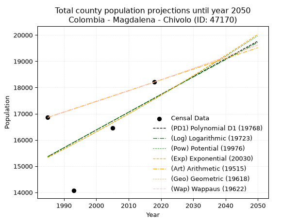
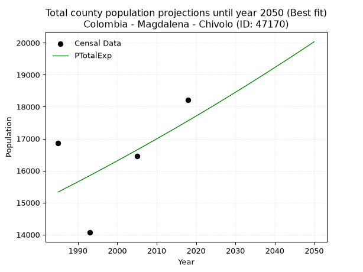
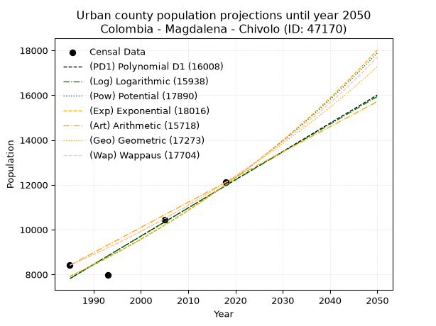
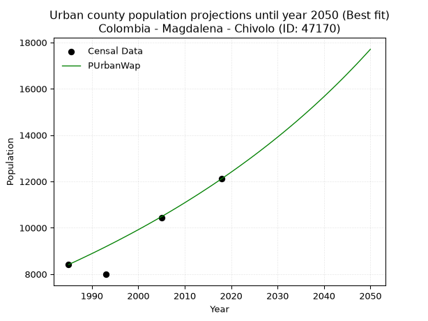
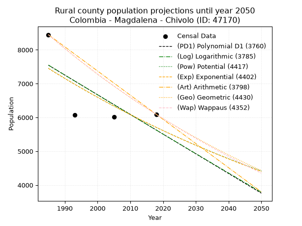
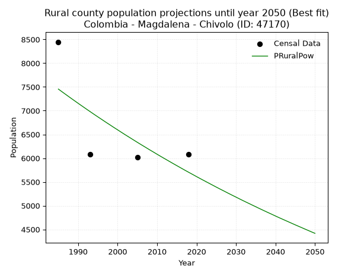

<div align="center">


</div>

# _“Population and Public Services Demand Projections (PPSD) until Year 2050 for Colombia - Magdalena - Chivolo (ID: 47170)”_
Keywords: `population` `public-service` `projection` `lineal` `polynomial` `logarithmic` `potential` `exponential` `arithmetic` `geometric` `wappaus` `dane` `colombia` `south-america`

PPSD are analytical estimates used by governments and planners to anticipate future changes in population size, age distribution, and the resulting community needs for utilities, healthcare, education, and infrastructure as sizing future water treatment facilities, electrical grids, and road networks based on spatial growth.

> **General running parameters**: • app_version: _v20260806_. • Python version: _3.14.7_. • Pandas version: _3.0.5_. • NumPy version: _2.5.1_. • Creates, save and include plots into reports (create_plot): _True_. • Projection until year: _2050_. • Process polynomial degree 2 and up: _False_. • Process Wappaus: _True_. • Process Wappaus: _True_. • Set negative values to zero: _True_. • Set infinite values to zero: _True_. • Drop dataset notes: _True_. 
<div align="center">

Dynamic map: [:earth_americas:Google](http://maps.google.com/maps?q=10.02663139,-74.6222424) [:earth_americas:OSM](https://www.openstreetmap.org/#map=18/10.02663139/-74.6222424&layers=P) [:earth_americas:Bing](https://www.bing.com/maps?cp=10.02663139~-74.6222424&lvl=18) [:earth_americas:Apple](https://maps.apple.com/frame?center=10.02663139%2C-74.6222424&span=0.003%2C0.006)

</div>


<div align="center">

```geojson
{
  "type": "Feature",
  "geometry": {
    "type": "Point", 
    "coordinates": [-74.6222424, 10.02663139]
  }, 
  "properties": {
    "Name": "Colombia - Magdalena - Chivolo (ID: 47170)"
  }
}
```

</div>


## 0. Census Data (4 records)

Census data are official statistics collected by a government about the people and housing in a country. They usually include counts of total population, age, sex, race, income, education, and jobs.

📅Global census file: [Population.xlsx](../data/Population.xlsx)

| Source   |   Year |   CountryID | CountryName   |   StateID | StateName   |   CountyID | CountyName   |   PTotal |   PUrban |   PRural |
|:---------|-------:|------------:|:--------------|----------:|:------------|-----------:|:-------------|---------:|---------:|---------:|
| DANE     |   1985 |          57 | Colombia      |        47 | Magdalena   |      47170 | Chivolo      |    16860 |     8412 |     8448 |
| DANE     |   1993 |          57 | Colombia      |        47 | Magdalena   |      47170 | Chivolo      |    14067 |     7989 |     6078 |
| DANE     |   2005 |          57 | Colombia      |        47 | Magdalena   |      47170 | Chibolo      |    16447 |    10430 |     6017 |
| DANE     |   2018 |          57 | Colombia      |        47 | Magdalena   |      47170 | Chivolo      |    18208 |    12121 |     6087 |

> 🔥Some records has specific notes about the registered values or the corresponding urban or rural distribution.

## 1. Total

### 1.1. Coefficients and Parameters

* (PD1) Polynomial Deg 1: 67.78723404255204, -119195.91489361474 (lineal)
* (Log) Logarithmic: 135332.05487588933, -1012264.5335946612
* (Pow) Potential: 8.208298080655394, -22.883362459571597
* (Exp) Exponential: 0.004111664182237706, 4.375819999587712
* (Art) Arithmetic: Year diff. 2018 - 1985 = 33, Population diff. 18208 - 16860 = 1348, Annual growth = 40.84848484848485
* (Geo) Geometric: Year diff. 2018 - 1985 = 33, Population diff. 18208 - 16860 = 1348, Annual growth % = 0.0023335398506791893
* (Wap) Wappaus: i = 0.23296729125404841, Condition values only valid for < 200)

<sub>
Wappaus condition values: ['0.00', '0.23', '0.47', '0.70', '0.93', '1.16', '1.40', '1.63', '1.86', '2.10', '2.33', '2.56', '2.80', '3.03', '3.26', '3.49', '3.73', '3.96', '4.19', '4.43', '4.66', '4.89', '5.13', '5.36', '5.59', '5.82', '6.06', '6.29', '6.52', '6.76', '6.99', '7.22', '7.45', '7.69', '7.92', '8.15', '8.39', '8.62', '8.85', '9.09', '9.32', '9.55', '9.78', '10.02', '10.25', '10.48', '10.72', '10.95', '11.18', '11.42', '11.65', '11.88', '12.11', '12.35', '12.58', '12.81', '13.05', '13.28', '13.51', '13.75', '13.98', '14.21', '14.44', '14.68', '14.91', '15.14']
</sub>


### 1.2. Projected Dataset

|   Year |   CountyID |   PTotalPD1 |   PTotalLog |   PTotalPow |   PTotalExp |   PTotalArt |   PTotalGeo |   PTotalWap |
|-------:|-----------:|------------:|------------:|------------:|------------:|------------:|------------:|------------:|
|   1985 |      47170 |       15362 |       15362 |       15333 |       15333 |       16860 |       16860 |       16860 |
|   1986 |      47170 |       15430 |       15431 |       15397 |       15396 |       16901 |       16899 |       16899 |
|   1987 |      47170 |       15497 |       15499 |       15461 |       15459 |       16942 |       16939 |       16939 |
|   1988 |      47170 |       15565 |       15567 |       15525 |       15523 |       16983 |       16978 |       16978 |
|   1989 |      47170 |       15633 |       15635 |       15589 |       15587 |       17023 |       17018 |       17018 |
|   1990 |      47170 |       15701 |       15703 |       15653 |       15651 |       17064 |       17058 |       17058 |
|   1991 |      47170 |       15768 |       15771 |       15718 |       15716 |       17105 |       17097 |       17097 |
|   1992 |      47170 |       15836 |       15839 |       15783 |       15780 |       17146 |       17137 |       17137 |
|   1993 |      47170 |       15904 |       15907 |       15848 |       15845 |       17187 |       17177 |       17177 |
|   1994 |      47170 |       15972 |       15975 |       15913 |       15911 |       17228 |       17217 |       17217 |
|   1995 |      47170 |       16040 |       16042 |       15979 |       15976 |       17268 |       17258 |       17257 |
|   1996 |      47170 |       16107 |       16110 |       16045 |       16042 |       17309 |       17298 |       17298 |
|   1997 |      47170 |       16175 |       16178 |       16111 |       16108 |       17350 |       17338 |       17338 |
|   1998 |      47170 |       16243 |       16246 |       16177 |       16175 |       17391 |       17379 |       17378 |
|   1999 |      47170 |       16311 |       16314 |       16244 |       16241 |       17432 |       17419 |       17419 |
|   2000 |      47170 |       16379 |       16381 |       16311 |       16308 |       17473 |       17460 |       17460 |
|   2001 |      47170 |       16446 |       16449 |       16378 |       16375 |       17514 |       17501 |       17500 |
|   2002 |      47170 |       16514 |       16516 |       16445 |       16443 |       17554 |       17541 |       17541 |
|   2003 |      47170 |       16582 |       16584 |       16513 |       16511 |       17595 |       17582 |       17582 |
|   2004 |      47170 |       16650 |       16652 |       16581 |       16579 |       17636 |       17623 |       17623 |
|   2005 |      47170 |       16717 |       16719 |       16649 |       16647 |       17677 |       17665 |       17664 |
|   2006 |      47170 |       16785 |       16787 |       16717 |       16716 |       17718 |       17706 |       17706 |
|   2007 |      47170 |       16853 |       16854 |       16785 |       16784 |       17759 |       17747 |       17747 |
|   2008 |      47170 |       16921 |       16921 |       16854 |       16854 |       17800 |       17789 |       17788 |
|   2009 |      47170 |       16989 |       16989 |       16923 |       16923 |       17840 |       17830 |       17830 |
|   2010 |      47170 |       17056 |       17056 |       16992 |       16993 |       17881 |       17872 |       17871 |
|   2011 |      47170 |       17124 |       17124 |       17062 |       17063 |       17922 |       17913 |       17913 |
|   2012 |      47170 |       17192 |       17191 |       17132 |       17133 |       17963 |       17955 |       17955 |
|   2013 |      47170 |       17260 |       17258 |       17202 |       17204 |       18004 |       17997 |       17997 |
|   2014 |      47170 |       17328 |       17325 |       17272 |       17274 |       18045 |       18039 |       18039 |
|   2015 |      47170 |       17395 |       17392 |       17343 |       17346 |       18085 |       18081 |       18081 |
|   2016 |      47170 |       17463 |       17460 |       17413 |       17417 |       18126 |       18123 |       18123 |
|   2017 |      47170 |       17531 |       17527 |       17484 |       17489 |       18167 |       18166 |       18166 |
|   2018 |      47170 |       17599 |       17594 |       17556 |       17561 |       18208 |       18208 |       18208 |
|   2019 |      47170 |       17667 |       17661 |       17627 |       17633 |       18249 |       18250 |       18251 |
|   2020 |      47170 |       17734 |       17728 |       17699 |       17706 |       18290 |       18293 |       18293 |
|   2021 |      47170 |       17802 |       17795 |       17771 |       17779 |       18331 |       18336 |       18336 |
|   2022 |      47170 |       17870 |       17862 |       17843 |       17852 |       18371 |       18379 |       18379 |
|   2023 |      47170 |       17938 |       17929 |       17916 |       17926 |       18412 |       18421 |       18422 |
|   2024 |      47170 |       18005 |       17996 |       17989 |       18000 |       18453 |       18464 |       18465 |
|   2025 |      47170 |       18073 |       18062 |       18062 |       18074 |       18494 |       18508 |       18508 |
|   2026 |      47170 |       18141 |       18129 |       18135 |       18148 |       18535 |       18551 |       18551 |
|   2027 |      47170 |       18209 |       18196 |       18209 |       18223 |       18576 |       18594 |       18595 |
|   2028 |      47170 |       18277 |       18263 |       18283 |       18298 |       18616 |       18637 |       18638 |
|   2029 |      47170 |       18344 |       18329 |       18357 |       18373 |       18657 |       18681 |       18682 |
|   2030 |      47170 |       18412 |       18396 |       18431 |       18449 |       18698 |       18724 |       18725 |
|   2031 |      47170 |       18480 |       18463 |       18506 |       18525 |       18739 |       18768 |       18769 |
|   2032 |      47170 |       18548 |       18529 |       18581 |       18601 |       18780 |       18812 |       18813 |
|   2033 |      47170 |       18616 |       18596 |       18656 |       18678 |       18821 |       18856 |       18857 |
|   2034 |      47170 |       18683 |       18663 |       18731 |       18755 |       18862 |       18900 |       18901 |
|   2035 |      47170 |       18751 |       18729 |       18807 |       18832 |       18902 |       18944 |       18945 |
|   2036 |      47170 |       18819 |       18796 |       18883 |       18910 |       18943 |       18988 |       18990 |
|   2037 |      47170 |       18887 |       18862 |       18959 |       18988 |       18984 |       19032 |       19034 |
|   2038 |      47170 |       18954 |       18928 |       19036 |       19066 |       19025 |       19077 |       19079 |
|   2039 |      47170 |       19022 |       18995 |       19113 |       19145 |       19066 |       19121 |       19123 |
|   2040 |      47170 |       19090 |       19061 |       19190 |       19224 |       19107 |       19166 |       19168 |
|   2041 |      47170 |       19158 |       19127 |       19267 |       19303 |       19148 |       19211 |       19213 |
|   2042 |      47170 |       19226 |       19194 |       19345 |       19382 |       19188 |       19256 |       19258 |
|   2043 |      47170 |       19293 |       19260 |       19423 |       19462 |       19229 |       19301 |       19303 |
|   2044 |      47170 |       19361 |       19326 |       19501 |       19542 |       19270 |       19346 |       19348 |
|   2045 |      47170 |       19429 |       19392 |       19579 |       19623 |       19311 |       19391 |       19394 |
|   2046 |      47170 |       19497 |       19459 |       19658 |       19704 |       19352 |       19436 |       19439 |
|   2047 |      47170 |       19565 |       19525 |       19737 |       19785 |       19393 |       19481 |       19485 |
|   2048 |      47170 |       19632 |       19591 |       19816 |       19866 |       19433 |       19527 |       19531 |
|   2049 |      47170 |       19700 |       19657 |       19896 |       19948 |       19474 |       19572 |       19576 |
|   2050 |      47170 |       19768 |       19723 |       19976 |       20030 |       19515 |       19618 |       19622 |
<div align="center">

</img>

</div>


### 1.3. Best fit with absolute error and relative error (%)

Relative error puts that difference into context by dividing the absolute error by the true value, creating a unitless ratio or percentage that shows the scale of the mistake.

Absolute and relative error

|   Year | Source   |   CountryID | CountryName   |   StateID | StateName   |   CountyID_x | CountyName   |   PTotal |   PUrban |   PRural |   CountyID_y |   PTotalPD1 |   PTotalLog |   PTotalPow |   PTotalExp |   PTotalArt |   PTotalGeo |   PTotalWap |   PTotalPD1AbsError |   PTotalLogAbsError |   PTotalPowAbsError |   PTotalExpAbsError |   PTotalArtAbsError |   PTotalGeoAbsError |   PTotalWapAbsError |   PTotalPD1RelError |   PTotalLogRelError |   PTotalPowRelError |   PTotalExpRelError |   PTotalArtRelError |   PTotalGeoRelError |   PTotalWapRelError |
|-------:|:---------|------------:|:--------------|----------:|:------------|-------------:|:-------------|---------:|---------:|---------:|-------------:|------------:|------------:|------------:|------------:|------------:|------------:|------------:|--------------------:|--------------------:|--------------------:|--------------------:|--------------------:|--------------------:|--------------------:|--------------------:|--------------------:|--------------------:|--------------------:|--------------------:|--------------------:|--------------------:|
|   1985 | DANE     |          57 | Colombia      |        47 | Magdalena   |        47170 | Chivolo      |    16860 |     8412 |     8448 |        47170 |       15362 |       15362 |       15333 |       15333 |       16860 |       16860 |       16860 |                1498 |                1498 |                1527 |                1527 |                   0 |                   0 |                   0 |             8.88493 |             8.88493 |             9.05694 |             9.05694 |             0       |             0       |             0       |
|   1993 | DANE     |          57 | Colombia      |        47 | Magdalena   |        47170 | Chivolo      |    14067 |     7989 |     6078 |        47170 |       15904 |       15907 |       15848 |       15845 |       17187 |       17177 |       17177 |                1837 |                1840 |                1781 |                1778 |                3120 |                3110 |                3110 |            13.0589  |            13.0803  |            12.6608  |            12.6395  |            22.1796  |            22.1085  |            22.1085  |
|   2005 | DANE     |          57 | Colombia      |        47 | Magdalena   |        47170 | Chibolo      |    16447 |    10430 |     6017 |        47170 |       16717 |       16719 |       16649 |       16647 |       17677 |       17665 |       17664 |                 270 |                 272 |                 202 |                 200 |                1230 |                1218 |                1217 |             1.64164 |             1.6538  |             1.22819 |             1.21603 |             7.47857 |             7.40561 |             7.39953 |
|   2018 | DANE     |          57 | Colombia      |        47 | Magdalena   |        47170 | Chivolo      |    18208 |    12121 |     6087 |        47170 |       17599 |       17594 |       17556 |       17561 |       18208 |       18208 |       18208 |                 609 |                 614 |                 652 |                 647 |                   0 |                   0 |                   0 |             3.34468 |             3.37214 |             3.58084 |             3.55338 |             0       |             0       |             0       |

Relative error mean

| Method    |   RelError | Best   |
|:----------|-----------:|:-------|
| PTotalPD1 |    6.73255 |        |
| PTotalLog |    6.74778 |        |
| PTotalPow |    6.6317  |        |
| PTotalExp |    6.61647 | True   |
| PTotalArt |    7.41453 |        |
| PTotalGeo |    7.37852 |        |
| PTotalWap |    7.377   |        |

💙Best method: _**PTotalExp**_
<div align="center">

</img>

</div>


### 1.4. Fresh water supply demand in liters per capita per day (lpcd)

The fresh water supply demand typically ranges from 100 to 300 liters per capita per day (lpcd) for standard domestic and municipal planning, though absolute survival minimums set by the World Health Organization are as low as 7.5 to 20 liters per day, and total consumption in high-income nations can exceed 400 liters.

> `CZ`: Level in meters above the sea level (masl).<br> `WS`: Fresh water supply demand in liters per capita per day (lpcd or l/h/d).<br> `WSAll`: Zonal fresh water supply demand in liters per second (l/s).<br> `A`: Zonal area in square meters.

Reference values (RAS Colombia)

|    CZ |   WS |
|------:|-----:|
|  1000 |  120 |
|  2000 |  130 |
| 99999 |  140 |

County shapefile geometry properties and water supply values

|   CountyID |    ATotal |   CZTotal |   WSTotal |
|-----------:|----------:|----------:|----------:|
|      47170 | 5.361e+08 |   97.5416 |       120 |

Projected values for best method: PTotalExp

|   CountyID |   Year |   PTotalExp |   WSTotal |   WSTotalAll |
|-----------:|-------:|------------:|----------:|-------------:|
|      47170 |   1985 |       15333 |       120 |      21.2958 |
|      47170 |   1986 |       15396 |       120 |      21.3833 |
|      47170 |   1987 |       15459 |       120 |      21.4708 |
|      47170 |   1988 |       15523 |       120 |      21.5597 |
|      47170 |   1989 |       15587 |       120 |      21.6486 |
|      47170 |   1990 |       15651 |       120 |      21.7375 |
|      47170 |   1991 |       15716 |       120 |      21.8278 |
|      47170 |   1992 |       15780 |       120 |      21.9167 |
|      47170 |   1993 |       15845 |       120 |      22.0069 |
|      47170 |   1994 |       15911 |       120 |      22.0986 |
|      47170 |   1995 |       15976 |       120 |      22.1889 |
|      47170 |   1996 |       16042 |       120 |      22.2806 |
|      47170 |   1997 |       16108 |       120 |      22.3722 |
|      47170 |   1998 |       16175 |       120 |      22.4653 |
|      47170 |   1999 |       16241 |       120 |      22.5569 |
|      47170 |   2000 |       16308 |       120 |      22.65   |
|      47170 |   2001 |       16375 |       120 |      22.7431 |
|      47170 |   2002 |       16443 |       120 |      22.8375 |
|      47170 |   2003 |       16511 |       120 |      22.9319 |
|      47170 |   2004 |       16579 |       120 |      23.0264 |
|      47170 |   2005 |       16647 |       120 |      23.1208 |
|      47170 |   2006 |       16716 |       120 |      23.2167 |
|      47170 |   2007 |       16784 |       120 |      23.3111 |
|      47170 |   2008 |       16854 |       120 |      23.4083 |
|      47170 |   2009 |       16923 |       120 |      23.5042 |
|      47170 |   2010 |       16993 |       120 |      23.6014 |
|      47170 |   2011 |       17063 |       120 |      23.6986 |
|      47170 |   2012 |       17133 |       120 |      23.7958 |
|      47170 |   2013 |       17204 |       120 |      23.8944 |
|      47170 |   2014 |       17274 |       120 |      23.9917 |
|      47170 |   2015 |       17346 |       120 |      24.0917 |
|      47170 |   2016 |       17417 |       120 |      24.1903 |
|      47170 |   2017 |       17489 |       120 |      24.2903 |
|      47170 |   2018 |       17561 |       120 |      24.3903 |
|      47170 |   2019 |       17633 |       120 |      24.4903 |
|      47170 |   2020 |       17706 |       120 |      24.5917 |
|      47170 |   2021 |       17779 |       120 |      24.6931 |
|      47170 |   2022 |       17852 |       120 |      24.7944 |
|      47170 |   2023 |       17926 |       120 |      24.8972 |
|      47170 |   2024 |       18000 |       120 |      25      |
|      47170 |   2025 |       18074 |       120 |      25.1028 |
|      47170 |   2026 |       18148 |       120 |      25.2056 |
|      47170 |   2027 |       18223 |       120 |      25.3097 |
|      47170 |   2028 |       18298 |       120 |      25.4139 |
|      47170 |   2029 |       18373 |       120 |      25.5181 |
|      47170 |   2030 |       18449 |       120 |      25.6236 |
|      47170 |   2031 |       18525 |       120 |      25.7292 |
|      47170 |   2032 |       18601 |       120 |      25.8347 |
|      47170 |   2033 |       18678 |       120 |      25.9417 |
|      47170 |   2034 |       18755 |       120 |      26.0486 |
|      47170 |   2035 |       18832 |       120 |      26.1556 |
|      47170 |   2036 |       18910 |       120 |      26.2639 |
|      47170 |   2037 |       18988 |       120 |      26.3722 |
|      47170 |   2038 |       19066 |       120 |      26.4806 |
|      47170 |   2039 |       19145 |       120 |      26.5903 |
|      47170 |   2040 |       19224 |       120 |      26.7    |
|      47170 |   2041 |       19303 |       120 |      26.8097 |
|      47170 |   2042 |       19382 |       120 |      26.9194 |
|      47170 |   2043 |       19462 |       120 |      27.0306 |
|      47170 |   2044 |       19542 |       120 |      27.1417 |
|      47170 |   2045 |       19623 |       120 |      27.2542 |
|      47170 |   2046 |       19704 |       120 |      27.3667 |
|      47170 |   2047 |       19785 |       120 |      27.4792 |
|      47170 |   2048 |       19866 |       120 |      27.5917 |
|      47170 |   2049 |       19948 |       120 |      27.7056 |
|      47170 |   2050 |       20030 |       120 |      27.8194 |

## 2. Urban

### 2.1. Coefficients and Parameters

* (PD1) Polynomial Deg 1: 126.03291850662266, -242359.34524287202 (lineal)
* (Log) Logarithmic: 252155.0493146092, -1906894.550484096
* (Pow) Potential: 25.31482282708378, -79.58384634537107
* (Exp) Exponential: 0.012652198146587922, 9.803253615740486e-08
* (Art) Arithmetic: Year diff. 2018 - 1985 = 33, Population diff. 12121 - 8412 = 3709, Annual growth = 112.39393939393939
* (Geo) Geometric: Year diff. 2018 - 1985 = 33, Population diff. 12121 - 8412 = 3709, Annual growth % = 0.011130586937616593
* (Wap) Wappaus: i = 1.0947639350697842, Condition values only valid for < 200)

<sub>
Wappaus condition values: ['0.00', '1.09', '2.19', '3.28', '4.38', '5.47', '6.57', '7.66', '8.76', '9.85', '10.95', '12.04', '13.14', '14.23', '15.33', '16.42', '17.52', '18.61', '19.71', '20.80', '21.90', '22.99', '24.08', '25.18', '26.27', '27.37', '28.46', '29.56', '30.65', '31.75', '32.84', '33.94', '35.03', '36.13', '37.22', '38.32', '39.41', '40.51', '41.60', '42.70', '43.79', '44.89', '45.98', '47.07', '48.17', '49.26', '50.36', '51.45', '52.55', '53.64', '54.74', '55.83', '56.93', '58.02', '59.12', '60.21', '61.31', '62.40', '63.50', '64.59', '65.69', '66.78', '67.88', '68.97', '70.06', '71.16']
</sub>


### 2.2. Projected Dataset

|   Year |   CountyID |   PUrbanPD1 |   PUrbanLog |   PUrbanPow |   PUrbanExp |   PUrbanArt |   PUrbanGeo |   PUrbanWap |
|-------:|-----------:|------------:|------------:|------------:|------------:|------------:|------------:|------------:|
|   1985 |      47170 |        7816 |        7813 |        7914 |        7916 |        8412 |        8412 |        8412 |
|   1986 |      47170 |        7942 |        7940 |        8015 |        8017 |        8524 |        8506 |        8505 |
|   1987 |      47170 |        8068 |        8067 |        8118 |        8119 |        8637 |        8600 |        8598 |
|   1988 |      47170 |        8194 |        8194 |        8222 |        8222 |        8749 |        8696 |        8693 |
|   1989 |      47170 |        8320 |        8321 |        8327 |        8327 |        8862 |        8793 |        8789 |
|   1990 |      47170 |        8446 |        8447 |        8434 |        8433 |        8974 |        8891 |        8885 |
|   1991 |      47170 |        8572 |        8574 |        8542 |        8540 |        9086 |        8990 |        8983 |
|   1992 |      47170 |        8698 |        8701 |        8651 |        8649 |        9199 |        9090 |        9082 |
|   1993 |      47170 |        8824 |        8827 |        8762 |        8759 |        9311 |        9191 |        9182 |
|   1994 |      47170 |        8950 |        8954 |        8874 |        8871 |        9424 |        9293 |        9284 |
|   1995 |      47170 |        9076 |        9080 |        8987 |        8984 |        9536 |        9397 |        9386 |
|   1996 |      47170 |        9202 |        9207 |        9102 |        9098 |        9648 |        9501 |        9490 |
|   1997 |      47170 |        9328 |        9333 |        9218 |        9214 |        9761 |        9607 |        9595 |
|   1998 |      47170 |        9454 |        9459 |        9336 |        9331 |        9873 |        9714 |        9701 |
|   1999 |      47170 |        9580 |        9585 |        9455 |        9450 |        9986 |        9822 |        9808 |
|   2000 |      47170 |        9706 |        9711 |        9575 |        9570 |       10098 |        9931 |        9917 |
|   2001 |      47170 |        9833 |        9837 |        9697 |        9692 |       10210 |       10042 |       10027 |
|   2002 |      47170 |        9959 |        9963 |        9820 |        9816 |       10323 |       10154 |       10138 |
|   2003 |      47170 |       10085 |       10089 |        9945 |        9941 |       10435 |       10267 |       10251 |
|   2004 |      47170 |       10211 |       10215 |       10072 |       10067 |       10547 |       10381 |       10365 |
|   2005 |      47170 |       10337 |       10341 |       10200 |       10195 |       10660 |       10496 |       10480 |
|   2006 |      47170 |       10463 |       10467 |       10329 |       10325 |       10772 |       10613 |       10597 |
|   2007 |      47170 |       10589 |       10592 |       10461 |       10457 |       10885 |       10731 |       10715 |
|   2008 |      47170 |       10715 |       10718 |       10593 |       10590 |       10997 |       10851 |       10835 |
|   2009 |      47170 |       10841 |       10844 |       10728 |       10725 |       11109 |       10972 |       10956 |
|   2010 |      47170 |       10967 |       10969 |       10864 |       10861 |       11222 |       11094 |       11079 |
|   2011 |      47170 |       11093 |       11094 |       11001 |       10999 |       11334 |       11217 |       11204 |
|   2012 |      47170 |       11219 |       11220 |       11141 |       11140 |       11447 |       11342 |       11330 |
|   2013 |      47170 |       11345 |       11345 |       11282 |       11281 |       11559 |       11468 |       11457 |
|   2014 |      47170 |       11471 |       11470 |       11424 |       11425 |       11671 |       11596 |       11587 |
|   2015 |      47170 |       11597 |       11595 |       11569 |       11570 |       11784 |       11725 |       11718 |
|   2016 |      47170 |       11723 |       11721 |       11715 |       11718 |       11896 |       11856 |       11850 |
|   2017 |      47170 |       11849 |       11846 |       11863 |       11867 |       12009 |       11988 |       11985 |
|   2018 |      47170 |       11975 |       11971 |       12013 |       12018 |       12121 |       12121 |       12121 |
|   2019 |      47170 |       12101 |       12096 |       12164 |       12171 |       12233 |       12256 |       12259 |
|   2020 |      47170 |       12227 |       12220 |       12318 |       12326 |       12346 |       12392 |       12399 |
|   2021 |      47170 |       12353 |       12345 |       12473 |       12483 |       12458 |       12530 |       12541 |
|   2022 |      47170 |       12479 |       12470 |       12630 |       12642 |       12571 |       12670 |       12685 |
|   2023 |      47170 |       12605 |       12595 |       12790 |       12803 |       12683 |       12811 |       12831 |
|   2024 |      47170 |       12731 |       12719 |       12951 |       12966 |       12795 |       12953 |       12978 |
|   2025 |      47170 |       12857 |       12844 |       13113 |       13131 |       12908 |       13098 |       13128 |
|   2026 |      47170 |       12983 |       12968 |       13278 |       13298 |       13020 |       13243 |       13280 |
|   2027 |      47170 |       13109 |       13093 |       13445 |       13468 |       13133 |       13391 |       13435 |
|   2028 |      47170 |       13235 |       13217 |       13614 |       13639 |       13245 |       13540 |       13591 |
|   2029 |      47170 |       13361 |       13341 |       13785 |       13813 |       13357 |       13690 |       13750 |
|   2030 |      47170 |       13487 |       13466 |       13958 |       13989 |       13470 |       13843 |       13911 |
|   2031 |      47170 |       13614 |       13590 |       14133 |       14167 |       13582 |       13997 |       14074 |
|   2032 |      47170 |       13740 |       13714 |       14311 |       14347 |       13695 |       14153 |       14240 |
|   2033 |      47170 |       13866 |       13838 |       14490 |       14530 |       13807 |       14310 |       14408 |
|   2034 |      47170 |       13992 |       13962 |       14671 |       14715 |       13919 |       14470 |       14578 |
|   2035 |      47170 |       14118 |       14086 |       14855 |       14902 |       14032 |       14631 |       14752 |
|   2036 |      47170 |       14244 |       14210 |       15041 |       15092 |       14144 |       14793 |       14928 |
|   2037 |      47170 |       14370 |       14334 |       15229 |       15284 |       14256 |       14958 |       15106 |
|   2038 |      47170 |       14496 |       14457 |       15420 |       15479 |       14369 |       15125 |       15288 |
|   2039 |      47170 |       14622 |       14581 |       15612 |       15676 |       14481 |       15293 |       15472 |
|   2040 |      47170 |       14748 |       14705 |       15807 |       15875 |       14594 |       15463 |       15659 |
|   2041 |      47170 |       14874 |       14828 |       16005 |       16077 |       14706 |       15635 |       15849 |
|   2042 |      47170 |       15000 |       14952 |       16204 |       16282 |       14818 |       15809 |       16042 |
|   2043 |      47170 |       15126 |       15075 |       16406 |       16489 |       14931 |       15985 |       16238 |
|   2044 |      47170 |       15252 |       15199 |       16611 |       16699 |       15043 |       16163 |       16437 |
|   2045 |      47170 |       15378 |       15322 |       16818 |       16912 |       15156 |       16343 |       16640 |
|   2046 |      47170 |       15504 |       15445 |       17027 |       17127 |       15268 |       16525 |       16846 |
|   2047 |      47170 |       15630 |       15568 |       17239 |       17345 |       15380 |       16709 |       17055 |
|   2048 |      47170 |       15756 |       15692 |       17454 |       17566 |       15493 |       16895 |       17268 |
|   2049 |      47170 |       15882 |       15815 |       17671 |       17790 |       15605 |       17083 |       17484 |
|   2050 |      47170 |       16008 |       15938 |       17890 |       18016 |       15718 |       17273 |       17704 |
<div align="center">

</img>

</div>


### 2.3. Best fit with absolute error and relative error (%)

Relative error puts that difference into context by dividing the absolute error by the true value, creating a unitless ratio or percentage that shows the scale of the mistake.

Absolute and relative error

|   Year | Source   |   CountryID | CountryName   |   StateID | StateName   |   CountyID_x | CountyName   |   PTotal |   PUrban |   PRural |   CountyID_y |   PUrbanPD1 |   PUrbanLog |   PUrbanPow |   PUrbanExp |   PUrbanArt |   PUrbanGeo |   PUrbanWap |   PUrbanPD1AbsError |   PUrbanLogAbsError |   PUrbanPowAbsError |   PUrbanExpAbsError |   PUrbanArtAbsError |   PUrbanGeoAbsError |   PUrbanWapAbsError |   PUrbanPD1RelError |   PUrbanLogRelError |   PUrbanPowRelError |   PUrbanExpRelError |   PUrbanArtRelError |   PUrbanGeoRelError |   PUrbanWapRelError |
|-------:|:---------|------------:|:--------------|----------:|:------------|-------------:|:-------------|---------:|---------:|---------:|-------------:|------------:|------------:|------------:|------------:|------------:|------------:|------------:|--------------------:|--------------------:|--------------------:|--------------------:|--------------------:|--------------------:|--------------------:|--------------------:|--------------------:|--------------------:|--------------------:|--------------------:|--------------------:|--------------------:|
|   1985 | DANE     |          57 | Colombia      |        47 | Magdalena   |        47170 | Chivolo      |    16860 |     8412 |     8448 |        47170 |        7816 |        7813 |        7914 |        7916 |        8412 |        8412 |        8412 |                 596 |                 599 |                 498 |                 496 |                   0 |                   0 |                   0 |            7.08512  |            7.12078  |            5.92011  |            5.89634  |             0       |             0       |            0        |
|   1993 | DANE     |          57 | Colombia      |        47 | Magdalena   |        47170 | Chivolo      |    14067 |     7989 |     6078 |        47170 |        8824 |        8827 |        8762 |        8759 |        9311 |        9191 |        9182 |                 835 |                 838 |                 773 |                 770 |                1322 |                1202 |                1193 |           10.4519   |           10.4894   |            9.6758   |            9.63825  |            16.5478  |            15.0457  |           14.933    |
|   2005 | DANE     |          57 | Colombia      |        47 | Magdalena   |        47170 | Chibolo      |    16447 |    10430 |     6017 |        47170 |       10337 |       10341 |       10200 |       10195 |       10660 |       10496 |       10480 |                  93 |                  89 |                 230 |                 235 |                 230 |                  66 |                  50 |            0.891659 |            0.853308 |            2.20518  |            2.25312  |             2.20518 |             0.63279 |            0.479386 |
|   2018 | DANE     |          57 | Colombia      |        47 | Magdalena   |        47170 | Chivolo      |    18208 |    12121 |     6087 |        47170 |       11975 |       11971 |       12013 |       12018 |       12121 |       12121 |       12121 |                 146 |                 150 |                 108 |                 103 |                   0 |                   0 |                   0 |            1.20452  |            1.23752  |            0.891016 |            0.849765 |             0       |             0       |            0        |

Relative error mean

| Method    |   RelError | Best   |
|:----------|-----------:|:-------|
| PUrbanPD1 |    4.90829 |        |
| PUrbanLog |    4.92526 |        |
| PUrbanPow |    4.67303 |        |
| PUrbanExp |    4.65937 |        |
| PUrbanArt |    4.68823 |        |
| PUrbanGeo |    3.91962 |        |
| PUrbanWap |    3.8531  | True   |

💙Best method: _**PUrbanWap**_
<div align="center">

</img>

</div>


### 2.4. Fresh water supply demand in liters per capita per day (lpcd)

The fresh water supply demand typically ranges from 100 to 300 liters per capita per day (lpcd) for standard domestic and municipal planning, though absolute survival minimums set by the World Health Organization are as low as 7.5 to 20 liters per day, and total consumption in high-income nations can exceed 400 liters.

> `CZ`: Level in meters above the sea level (masl).<br> `WS`: Fresh water supply demand in liters per capita per day (lpcd or l/h/d).<br> `WSAll`: Zonal fresh water supply demand in liters per second (l/s).<br> `A`: Zonal area in square meters.

Reference values (RAS Colombia)

|    CZ |   WS |
|------:|-----:|
|  1000 |  120 |
|  2000 |  130 |
| 99999 |  140 |

County shapefile geometry properties and water supply values

|   CountyID |     AUrban |   CZUrban |   WSUrban |
|-----------:|-----------:|----------:|----------:|
|      47170 | 1.7044e+06 |    125.74 |       120 |

Projected values for best method: PUrbanWap

|   CountyID |   Year |   PUrbanWap |   WSUrban |   WSUrbanAll |
|-----------:|-------:|------------:|----------:|-------------:|
|      47170 |   1985 |        8412 |       120 |      11.6833 |
|      47170 |   1986 |        8505 |       120 |      11.8125 |
|      47170 |   1987 |        8598 |       120 |      11.9417 |
|      47170 |   1988 |        8693 |       120 |      12.0736 |
|      47170 |   1989 |        8789 |       120 |      12.2069 |
|      47170 |   1990 |        8885 |       120 |      12.3403 |
|      47170 |   1991 |        8983 |       120 |      12.4764 |
|      47170 |   1992 |        9082 |       120 |      12.6139 |
|      47170 |   1993 |        9182 |       120 |      12.7528 |
|      47170 |   1994 |        9284 |       120 |      12.8944 |
|      47170 |   1995 |        9386 |       120 |      13.0361 |
|      47170 |   1996 |        9490 |       120 |      13.1806 |
|      47170 |   1997 |        9595 |       120 |      13.3264 |
|      47170 |   1998 |        9701 |       120 |      13.4736 |
|      47170 |   1999 |        9808 |       120 |      13.6222 |
|      47170 |   2000 |        9917 |       120 |      13.7736 |
|      47170 |   2001 |       10027 |       120 |      13.9264 |
|      47170 |   2002 |       10138 |       120 |      14.0806 |
|      47170 |   2003 |       10251 |       120 |      14.2375 |
|      47170 |   2004 |       10365 |       120 |      14.3958 |
|      47170 |   2005 |       10480 |       120 |      14.5556 |
|      47170 |   2006 |       10597 |       120 |      14.7181 |
|      47170 |   2007 |       10715 |       120 |      14.8819 |
|      47170 |   2008 |       10835 |       120 |      15.0486 |
|      47170 |   2009 |       10956 |       120 |      15.2167 |
|      47170 |   2010 |       11079 |       120 |      15.3875 |
|      47170 |   2011 |       11204 |       120 |      15.5611 |
|      47170 |   2012 |       11330 |       120 |      15.7361 |
|      47170 |   2013 |       11457 |       120 |      15.9125 |
|      47170 |   2014 |       11587 |       120 |      16.0931 |
|      47170 |   2015 |       11718 |       120 |      16.275  |
|      47170 |   2016 |       11850 |       120 |      16.4583 |
|      47170 |   2017 |       11985 |       120 |      16.6458 |
|      47170 |   2018 |       12121 |       120 |      16.8347 |
|      47170 |   2019 |       12259 |       120 |      17.0264 |
|      47170 |   2020 |       12399 |       120 |      17.2208 |
|      47170 |   2021 |       12541 |       120 |      17.4181 |
|      47170 |   2022 |       12685 |       120 |      17.6181 |
|      47170 |   2023 |       12831 |       120 |      17.8208 |
|      47170 |   2024 |       12978 |       120 |      18.025  |
|      47170 |   2025 |       13128 |       120 |      18.2333 |
|      47170 |   2026 |       13280 |       120 |      18.4444 |
|      47170 |   2027 |       13435 |       120 |      18.6597 |
|      47170 |   2028 |       13591 |       120 |      18.8764 |
|      47170 |   2029 |       13750 |       120 |      19.0972 |
|      47170 |   2030 |       13911 |       120 |      19.3208 |
|      47170 |   2031 |       14074 |       120 |      19.5472 |
|      47170 |   2032 |       14240 |       120 |      19.7778 |
|      47170 |   2033 |       14408 |       120 |      20.0111 |
|      47170 |   2034 |       14578 |       120 |      20.2472 |
|      47170 |   2035 |       14752 |       120 |      20.4889 |
|      47170 |   2036 |       14928 |       120 |      20.7333 |
|      47170 |   2037 |       15106 |       120 |      20.9806 |
|      47170 |   2038 |       15288 |       120 |      21.2333 |
|      47170 |   2039 |       15472 |       120 |      21.4889 |
|      47170 |   2040 |       15659 |       120 |      21.7486 |
|      47170 |   2041 |       15849 |       120 |      22.0125 |
|      47170 |   2042 |       16042 |       120 |      22.2806 |
|      47170 |   2043 |       16238 |       120 |      22.5528 |
|      47170 |   2044 |       16437 |       120 |      22.8292 |
|      47170 |   2045 |       16640 |       120 |      23.1111 |
|      47170 |   2046 |       16846 |       120 |      23.3972 |
|      47170 |   2047 |       17055 |       120 |      23.6875 |
|      47170 |   2048 |       17268 |       120 |      23.9833 |
|      47170 |   2049 |       17484 |       120 |      24.2833 |
|      47170 |   2050 |       17704 |       120 |      24.5889 |

## 3. Rural

### 3.1. Coefficients and Parameters

* (PD1) Polynomial Deg 1: -58.245684464070614, 123163.43034925725 (lineal)
* (Log) Logarithmic: -116822.99443872027, 894630.0168894377
* (Pow) Potential: -16.241466009035445, 57.432885481094814
* (Exp) Exponential: -0.00809758793307057, 71273678727.95198
* (Art) Arithmetic: Year diff. 2018 - 1985 = 33, Population diff. 6087 - 8448 = -2361, Annual growth = -71.54545454545455
* (Geo) Geometric: Year diff. 2018 - 1985 = 33, Population diff. 6087 - 8448 = -2361, Annual growth % = -0.009883391961745147
* (Wap) Wappaus: i = -0.9844575788848234, Condition values only valid for < 200)

<sub>
Wappaus condition values: ['-0.00', '-0.98', '-1.97', '-2.95', '-3.94', '-4.92', '-5.91', '-6.89', '-7.88', '-8.86', '-9.84', '-10.83', '-11.81', '-12.80', '-13.78', '-14.77', '-15.75', '-16.74', '-17.72', '-18.70', '-19.69', '-20.67', '-21.66', '-22.64', '-23.63', '-24.61', '-25.60', '-26.58', '-27.56', '-28.55', '-29.53', '-30.52', '-31.50', '-32.49', '-33.47', '-34.46', '-35.44', '-36.42', '-37.41', '-38.39', '-39.38', '-40.36', '-41.35', '-42.33', '-43.32', '-44.30', '-45.29', '-46.27', '-47.25', '-48.24', '-49.22', '-50.21', '-51.19', '-52.18', '-53.16', '-54.15', '-55.13', '-56.11', '-57.10', '-58.08', '-59.07', '-60.05', '-61.04', '-62.02', '-63.01', '-63.99']
</sub>


### 3.2. Projected Dataset

|   Year |   CountyID |   PRuralPD1 |   PRuralLog |   PRuralPow |   PRuralExp |   PRuralArt |   PRuralGeo |   PRuralWap |
|-------:|-----------:|------------:|------------:|------------:|------------:|------------:|------------:|------------:|
|   1985 |      47170 |        7546 |        7549 |        7455 |        7451 |        8448 |        8448 |        8448 |
|   1986 |      47170 |        7488 |        7490 |        7394 |        7391 |        8376 |        8365 |        8365 |
|   1987 |      47170 |        7429 |        7432 |        7334 |        7331 |        8305 |        8282 |        8283 |
|   1988 |      47170 |        7371 |        7373 |        7274 |        7272 |        8233 |        8200 |        8202 |
|   1989 |      47170 |        7313 |        7314 |        7215 |        7213 |        8162 |        8119 |        8122 |
|   1990 |      47170 |        7255 |        7255 |        7156 |        7155 |        8090 |        8039 |        8042 |
|   1991 |      47170 |        7196 |        7197 |        7098 |        7097 |        8019 |        7959 |        7963 |
|   1992 |      47170 |        7138 |        7138 |        7040 |        7040 |        7947 |        7881 |        7885 |
|   1993 |      47170 |        7080 |        7079 |        6983 |        6983 |        7876 |        7803 |        7808 |
|   1994 |      47170 |        7022 |        7021 |        6926 |        6927 |        7804 |        7726 |        7731 |
|   1995 |      47170 |        6963 |        6962 |        6870 |        6871 |        7733 |        7649 |        7655 |
|   1996 |      47170 |        6905 |        6904 |        6815 |        6816 |        7661 |        7574 |        7580 |
|   1997 |      47170 |        6847 |        6845 |        6759 |        6761 |        7589 |        7499 |        7506 |
|   1998 |      47170 |        6789 |        6787 |        6705 |        6706 |        7518 |        7425 |        7432 |
|   1999 |      47170 |        6730 |        6728 |        6650 |        6652 |        7446 |        7351 |        7359 |
|   2000 |      47170 |        6672 |        6670 |        6597 |        6599 |        7375 |        7279 |        7286 |
|   2001 |      47170 |        6614 |        6611 |        6543 |        6545 |        7303 |        7207 |        7214 |
|   2002 |      47170 |        6556 |        6553 |        6490 |        6493 |        7232 |        7135 |        7143 |
|   2003 |      47170 |        6497 |        6495 |        6438 |        6440 |        7160 |        7065 |        7073 |
|   2004 |      47170 |        6439 |        6436 |        6386 |        6388 |        7089 |        6995 |        7003 |
|   2005 |      47170 |        6381 |        6378 |        6334 |        6337 |        7017 |        6926 |        6934 |
|   2006 |      47170 |        6323 |        6320 |        6283 |        6286 |        6946 |        6858 |        6865 |
|   2007 |      47170 |        6264 |        6262 |        6233 |        6235 |        6874 |        6790 |        6797 |
|   2008 |      47170 |        6206 |        6203 |        6182 |        6185 |        6802 |        6723 |        6730 |
|   2009 |      47170 |        6148 |        6145 |        6133 |        6135 |        6731 |        6656 |        6663 |
|   2010 |      47170 |        6090 |        6087 |        6083 |        6085 |        6659 |        6590 |        6597 |
|   2011 |      47170 |        6031 |        6029 |        6034 |        6036 |        6588 |        6525 |        6531 |
|   2012 |      47170 |        5973 |        5971 |        5986 |        5988 |        6516 |        6461 |        6466 |
|   2013 |      47170 |        5915 |        5913 |        5938 |        5939 |        6445 |        6397 |        6401 |
|   2014 |      47170 |        5857 |        5855 |        5890 |        5891 |        6373 |        6334 |        6337 |
|   2015 |      47170 |        5798 |        5797 |        5843 |        5844 |        6302 |        6271 |        6274 |
|   2016 |      47170 |        5740 |        5739 |        5796 |        5797 |        6230 |        6209 |        6211 |
|   2017 |      47170 |        5682 |        5681 |        5749 |        5750 |        6159 |        6148 |        6149 |
|   2018 |      47170 |        5624 |        5623 |        5703 |        5704 |        6087 |        6087 |        6087 |
|   2019 |      47170 |        5565 |        5565 |        5658 |        5658 |        6015 |        6027 |        6026 |
|   2020 |      47170 |        5507 |        5507 |        5612 |        5612 |        5944 |        5967 |        5965 |
|   2021 |      47170 |        5449 |        5450 |        5567 |        5567 |        5872 |        5908 |        5905 |
|   2022 |      47170 |        5391 |        5392 |        5523 |        5522 |        5801 |        5850 |        5845 |
|   2023 |      47170 |        5332 |        5334 |        5479 |        5477 |        5729 |        5792 |        5786 |
|   2024 |      47170 |        5274 |        5276 |        5435 |        5433 |        5658 |        5735 |        5727 |
|   2025 |      47170 |        5216 |        5219 |        5391 |        5389 |        5586 |        5678 |        5669 |
|   2026 |      47170 |        5158 |        5161 |        5348 |        5346 |        5515 |        5622 |        5611 |
|   2027 |      47170 |        5099 |        5103 |        5306 |        5303 |        5443 |        5566 |        5553 |
|   2028 |      47170 |        5041 |        5046 |        5263 |        5260 |        5372 |        5511 |        5497 |
|   2029 |      47170 |        4983 |        4988 |        5221 |        5218 |        5300 |        5457 |        5440 |
|   2030 |      47170 |        4925 |        4930 |        5180 |        5175 |        5228 |        5403 |        5384 |
|   2031 |      47170 |        4866 |        4873 |        5138 |        5134 |        5157 |        5350 |        5329 |
|   2032 |      47170 |        4808 |        4815 |        5097 |        5092 |        5085 |        5297 |        5274 |
|   2033 |      47170 |        4750 |        4758 |        5057 |        5051 |        5014 |        5244 |        5219 |
|   2034 |      47170 |        4692 |        4701 |        5017 |        5011 |        4942 |        5193 |        5165 |
|   2035 |      47170 |        4633 |        4643 |        4977 |        4970 |        4871 |        5141 |        5111 |
|   2036 |      47170 |        4575 |        4586 |        4937 |        4930 |        4799 |        5090 |        5058 |
|   2037 |      47170 |        4517 |        4528 |        4898 |        4890 |        4728 |        5040 |        5005 |
|   2038 |      47170 |        4459 |        4471 |        4859 |        4851 |        4656 |        4990 |        4952 |
|   2039 |      47170 |        4400 |        4414 |        4821 |        4812 |        4585 |        4941 |        4900 |
|   2040 |      47170 |        4342 |        4356 |        4782 |        4773 |        4513 |        4892 |        4848 |
|   2041 |      47170 |        4284 |        4299 |        4744 |        4734 |        4441 |        4844 |        4797 |
|   2042 |      47170 |        4226 |        4242 |        4707 |        4696 |        4370 |        4796 |        4746 |
|   2043 |      47170 |        4167 |        4185 |        4670 |        4658 |        4298 |        4749 |        4696 |
|   2044 |      47170 |        4109 |        4128 |        4633 |        4621 |        4227 |        4702 |        4645 |
|   2045 |      47170 |        4051 |        4070 |        4596 |        4584 |        4155 |        4655 |        4596 |
|   2046 |      47170 |        3993 |        4013 |        4560 |        4547 |        4084 |        4609 |        4546 |
|   2047 |      47170 |        3935 |        3956 |        4524 |        4510 |        4012 |        4564 |        4497 |
|   2048 |      47170 |        3876 |        3899 |        4488 |        4474 |        3941 |        4518 |        4449 |
|   2049 |      47170 |        3818 |        3842 |        4452 |        4437 |        3869 |        4474 |        4400 |
|   2050 |      47170 |        3760 |        3785 |        4417 |        4402 |        3798 |        4430 |        4352 |
<div align="center">

</img>

</div>


### 3.3. Best fit with absolute error and relative error (%)

Relative error puts that difference into context by dividing the absolute error by the true value, creating a unitless ratio or percentage that shows the scale of the mistake.

Absolute and relative error

|   Year | Source   |   CountryID | CountryName   |   StateID | StateName   |   CountyID_x | CountyName   |   PTotal |   PUrban |   PRural |   CountyID_y |   PRuralPD1 |   PRuralLog |   PRuralPow |   PRuralExp |   PRuralArt |   PRuralGeo |   PRuralWap |   PRuralPD1AbsError |   PRuralLogAbsError |   PRuralPowAbsError |   PRuralExpAbsError |   PRuralArtAbsError |   PRuralGeoAbsError |   PRuralWapAbsError |   PRuralPD1RelError |   PRuralLogRelError |   PRuralPowRelError |   PRuralExpRelError |   PRuralArtRelError |   PRuralGeoRelError |   PRuralWapRelError |
|-------:|:---------|------------:|:--------------|----------:|:------------|-------------:|:-------------|---------:|---------:|---------:|-------------:|------------:|------------:|------------:|------------:|------------:|------------:|------------:|--------------------:|--------------------:|--------------------:|--------------------:|--------------------:|--------------------:|--------------------:|--------------------:|--------------------:|--------------------:|--------------------:|--------------------:|--------------------:|--------------------:|
|   1985 | DANE     |          57 | Colombia      |        47 | Magdalena   |        47170 | Chivolo      |    16860 |     8412 |     8448 |        47170 |        7546 |        7549 |        7455 |        7451 |        8448 |        8448 |        8448 |                 902 |                 899 |                 993 |                 997 |                   0 |                   0 |                   0 |            10.6771  |            10.6416  |            11.7543  |            11.8016  |              0      |              0      |              0      |
|   1993 | DANE     |          57 | Colombia      |        47 | Magdalena   |        47170 | Chivolo      |    14067 |     7989 |     6078 |        47170 |        7080 |        7079 |        6983 |        6983 |        7876 |        7803 |        7808 |                1002 |                1001 |                 905 |                 905 |                1798 |                1725 |                1730 |            16.4857  |            16.4692  |            14.8898  |            14.8898  |             29.5821 |             28.381  |             28.4633 |
|   2005 | DANE     |          57 | Colombia      |        47 | Magdalena   |        47170 | Chibolo      |    16447 |    10430 |     6017 |        47170 |        6381 |        6378 |        6334 |        6337 |        7017 |        6926 |        6934 |                 364 |                 361 |                 317 |                 320 |                1000 |                 909 |                 917 |             6.04953 |             5.99967 |             5.26841 |             5.31826 |             16.6196 |             15.1072 |             15.2402 |
|   2018 | DANE     |          57 | Colombia      |        47 | Magdalena   |        47170 | Chivolo      |    18208 |    12121 |     6087 |        47170 |        5624 |        5623 |        5703 |        5704 |        6087 |        6087 |        6087 |                 463 |                 464 |                 384 |                 383 |                   0 |                   0 |                   0 |             7.60637 |             7.6228  |             6.30853 |             6.2921  |              0      |              0      |              0      |

Relative error mean

| Method    |   RelError | Best   |
|:----------|-----------:|:-------|
| PRuralPD1 |   10.2047  |        |
| PRuralLog |   10.1833  |        |
| PRuralPow |    9.55524 | True   |
| PRuralExp |    9.57543 |        |
| PRuralArt |   11.5504  |        |
| PRuralGeo |   10.8721  |        |
| PRuralWap |   10.9259  |        |

💙Best method: _**PRuralPow**_
<div align="center">

</img>

</div>


### 3.4. Fresh water supply demand in liters per capita per day (lpcd)

The fresh water supply demand typically ranges from 100 to 300 liters per capita per day (lpcd) for standard domestic and municipal planning, though absolute survival minimums set by the World Health Organization are as low as 7.5 to 20 liters per day, and total consumption in high-income nations can exceed 400 liters.

> `CZ`: Level in meters above the sea level (masl).<br> `WS`: Fresh water supply demand in liters per capita per day (lpcd or l/h/d).<br> `WSAll`: Zonal fresh water supply demand in liters per second (l/s).<br> `A`: Zonal area in square meters.

Reference values (RAS Colombia)

|    CZ |   WS |
|------:|-----:|
|  1000 |  120 |
|  2000 |  130 |
| 99999 |  140 |

County shapefile geometry properties and water supply values

|   CountyID |      ARural |   CZRural |   WSRural |
|-----------:|------------:|----------:|----------:|
|      47170 | 5.34395e+08 |   97.4488 |       120 |

Projected values for best method: PRuralPow

|   CountyID |   Year |   PRuralPow |   WSRural |   WSRuralAll |
|-----------:|-------:|------------:|----------:|-------------:|
|      47170 |   1985 |        7455 |       120 |     10.3542  |
|      47170 |   1986 |        7394 |       120 |     10.2694  |
|      47170 |   1987 |        7334 |       120 |     10.1861  |
|      47170 |   1988 |        7274 |       120 |     10.1028  |
|      47170 |   1989 |        7215 |       120 |     10.0208  |
|      47170 |   1990 |        7156 |       120 |      9.93889 |
|      47170 |   1991 |        7098 |       120 |      9.85833 |
|      47170 |   1992 |        7040 |       120 |      9.77778 |
|      47170 |   1993 |        6983 |       120 |      9.69861 |
|      47170 |   1994 |        6926 |       120 |      9.61944 |
|      47170 |   1995 |        6870 |       120 |      9.54167 |
|      47170 |   1996 |        6815 |       120 |      9.46528 |
|      47170 |   1997 |        6759 |       120 |      9.3875  |
|      47170 |   1998 |        6705 |       120 |      9.3125  |
|      47170 |   1999 |        6650 |       120 |      9.23611 |
|      47170 |   2000 |        6597 |       120 |      9.1625  |
|      47170 |   2001 |        6543 |       120 |      9.0875  |
|      47170 |   2002 |        6490 |       120 |      9.01389 |
|      47170 |   2003 |        6438 |       120 |      8.94167 |
|      47170 |   2004 |        6386 |       120 |      8.86944 |
|      47170 |   2005 |        6334 |       120 |      8.79722 |
|      47170 |   2006 |        6283 |       120 |      8.72639 |
|      47170 |   2007 |        6233 |       120 |      8.65694 |
|      47170 |   2008 |        6182 |       120 |      8.58611 |
|      47170 |   2009 |        6133 |       120 |      8.51806 |
|      47170 |   2010 |        6083 |       120 |      8.44861 |
|      47170 |   2011 |        6034 |       120 |      8.38056 |
|      47170 |   2012 |        5986 |       120 |      8.31389 |
|      47170 |   2013 |        5938 |       120 |      8.24722 |
|      47170 |   2014 |        5890 |       120 |      8.18056 |
|      47170 |   2015 |        5843 |       120 |      8.11528 |
|      47170 |   2016 |        5796 |       120 |      8.05    |
|      47170 |   2017 |        5749 |       120 |      7.98472 |
|      47170 |   2018 |        5703 |       120 |      7.92083 |
|      47170 |   2019 |        5658 |       120 |      7.85833 |
|      47170 |   2020 |        5612 |       120 |      7.79444 |
|      47170 |   2021 |        5567 |       120 |      7.73194 |
|      47170 |   2022 |        5523 |       120 |      7.67083 |
|      47170 |   2023 |        5479 |       120 |      7.60972 |
|      47170 |   2024 |        5435 |       120 |      7.54861 |
|      47170 |   2025 |        5391 |       120 |      7.4875  |
|      47170 |   2026 |        5348 |       120 |      7.42778 |
|      47170 |   2027 |        5306 |       120 |      7.36944 |
|      47170 |   2028 |        5263 |       120 |      7.30972 |
|      47170 |   2029 |        5221 |       120 |      7.25139 |
|      47170 |   2030 |        5180 |       120 |      7.19444 |
|      47170 |   2031 |        5138 |       120 |      7.13611 |
|      47170 |   2032 |        5097 |       120 |      7.07917 |
|      47170 |   2033 |        5057 |       120 |      7.02361 |
|      47170 |   2034 |        5017 |       120 |      6.96806 |
|      47170 |   2035 |        4977 |       120 |      6.9125  |
|      47170 |   2036 |        4937 |       120 |      6.85694 |
|      47170 |   2037 |        4898 |       120 |      6.80278 |
|      47170 |   2038 |        4859 |       120 |      6.74861 |
|      47170 |   2039 |        4821 |       120 |      6.69583 |
|      47170 |   2040 |        4782 |       120 |      6.64167 |
|      47170 |   2041 |        4744 |       120 |      6.58889 |
|      47170 |   2042 |        4707 |       120 |      6.5375  |
|      47170 |   2043 |        4670 |       120 |      6.48611 |
|      47170 |   2044 |        4633 |       120 |      6.43472 |
|      47170 |   2045 |        4596 |       120 |      6.38333 |
|      47170 |   2046 |        4560 |       120 |      6.33333 |
|      47170 |   2047 |        4524 |       120 |      6.28333 |
|      47170 |   2048 |        4488 |       120 |      6.23333 |
|      47170 |   2049 |        4452 |       120 |      6.18333 |
|      47170 |   2050 |        4417 |       120 |      6.13472 |

<div align="center"><br><sub>Share this research</sub></div><br>

<sub>**APPS & TOOLS & CONTENT DISCLAIMER**: • NO WARRANTY - This content and software is provided by <a href="https://github.com/rcfdtools" target="_blank">github.com/rcfdtools</a> "as is", without any express or implied warranty, including warranties of merchantability, fitness for a particular purpose, or non-infringement. There is no guarantee that the software will be error-free or operate without interruption. • LIMITATION OF LIABILITY - Neither the authors nor copyright holders will be liable for claims or damages arising from the software or its use. You are responsible for determining if the software is appropriate for your use and assume all associated risks, including errors, legal compliance, and data loss. • NO PROFESSIONAL ADVICE - The software provides general information and does not offer professional advice. It should not replace consultation with professional advisors. [Clauses and global license for rcfdtools use.](https://github.com/rcfdtools/rcfdtools/blob/main/LICENSE.md)</sub>