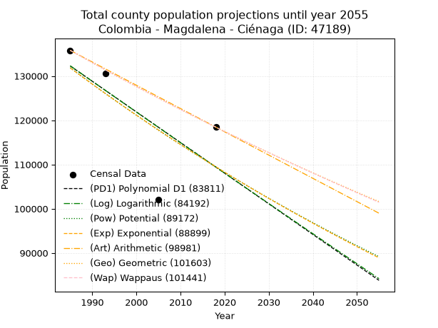
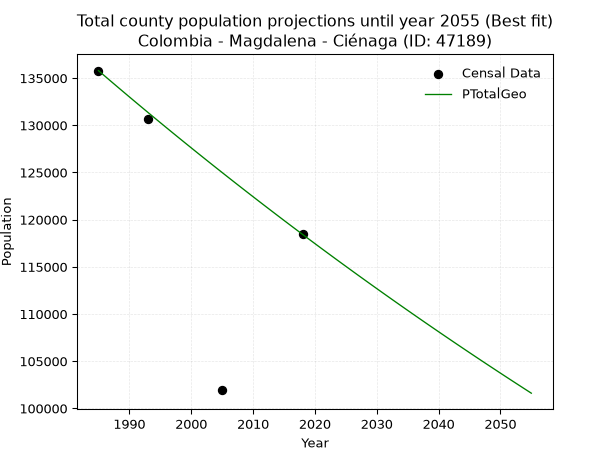
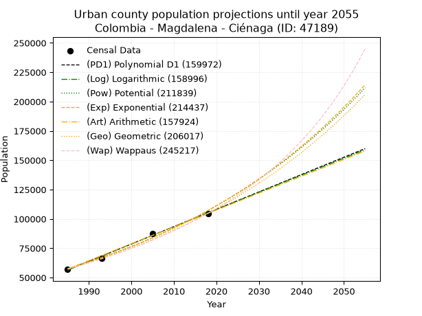
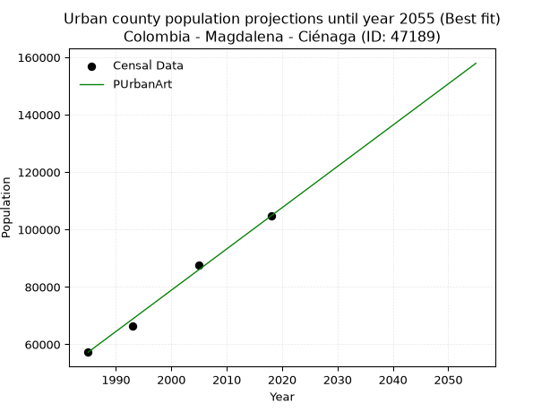
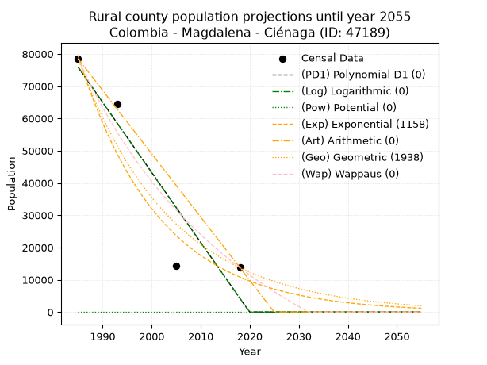
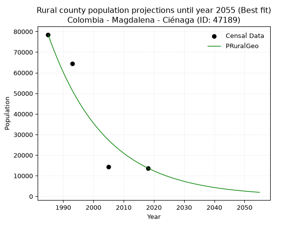

<div align="center">


</div>

# _“Population and Public Services Demand Projections (PPSD) until Year 2050 for Colombia - Magdalena - Ciénaga (ID: 47189)”_
Keywords: `population` `public-service` `projection` `lineal` `polynomial` `logarithmic` `potential` `exponential` `arithmetic` `geometric` `wappaus` `dane` `colombia` `south-america`

PPSD are analytical estimates used by governments and planners to anticipate future changes in population size, age distribution, and the resulting community needs for utilities, healthcare, education, and infrastructure as sizing future water treatment facilities, electrical grids, and road networks based on spatial growth.

> **General running parameters**: • app_version: _v20260806_. • Python version: _3.14.7_. • Pandas version: _3.0.5_. • NumPy version: _2.5.1_. • Creates, save and include plots into reports (create_plot): _False_. • Projection until year: _2050_. • Process polynomial degree 2 and up: _False_. • Process Wappaus: _True_. • Process Wappaus: _True_. • Set negative values to zero: _True_. • Set infinite values to zero: _True_. • Drop dataset notes: _True_. 
<div align="center">

Dynamic map: [:earth_americas:Google](http://maps.google.com/maps?q=11.00665376,-74.2412861) [:earth_americas:OSM](https://www.openstreetmap.org/#map=18/11.00665376/-74.2412861&layers=P) [:earth_americas:Bing](https://www.bing.com/maps?cp=11.00665376~-74.2412861&lvl=18) [:earth_americas:Apple](https://maps.apple.com/frame?center=11.00665376%2C-74.2412861&span=0.003%2C0.006)

</div>


<div align="center">

```geojson
{
  "type": "Feature",
  "geometry": {
    "type": "Point", 
    "coordinates": [-74.2412861, 11.00665376]
  }, 
  "properties": {
    "Name": "Colombia - Magdalena - Ciénaga (ID: 47189)"
  }
}
```

</div>


## 0. Census Data (4 records)

Census data are official statistics collected by a government about the people and housing in a country. They usually include counts of total population, age, sex, race, income, education, and jobs.

📅Global census file: [Population.xlsx](../data/Population.xlsx)

| Source   |   Year |   CountryID | CountryName   |   StateID | StateName   |   CountyID | CountyName   |   PTotal |   PUrban |   PRural |
|:---------|-------:|------------:|:--------------|----------:|:------------|-----------:|:-------------|---------:|---------:|---------:|
| DANE     |   1985 |          57 | Colombia      |        47 | Magdalena   |      47189 | Ciénaga      |   135786 |    57272 |    78514 |
| DANE     |   1993 |          57 | Colombia      |        47 | Magdalena   |      47189 | Ciénaga      |   130610 |    66236 |    64374 |
| DANE     |   2005 |          57 | Colombia      |        47 | Magdalena   |      47189 | Ciénaga      |   101985 |    87624 |    14361 |
| DANE     |   2018 |          57 | Colombia      |        47 | Magdalena   |      47189 | Ciénaga      |   118435 |   104722 |    13713 |

> 🔥Some records has specific notes about the registered values or the corresponding urban or rural distribution.

## 1. Total

### 1.1. Coefficients and Parameters

* (PD1) Polynomial Deg 1: -692.1059815335286, 1506088.9895624407 (lineal)
* (Log) Logarithmic: -1388134.1407232878, 10672922.727446593
* (Pow) Potential: -11.288792353935849, 42.34787161761127
* (Exp) Exponential: -0.0056276962526467696, 9364354008.479492
* (Art) Arithmetic: Year diff. 2018 - 1985 = 33, Population diff. 118435 - 135786 = -17351, Annual growth = -525.7878787878788
* (Geo) Geometric: Year diff. 2018 - 1985 = 33, Population diff. 118435 - 135786 = -17351, Annual growth % = -0.004134333956422154
* (Wap) Wappaus: i = -0.41364629891934873, Condition values only valid for < 200)

<sub>
Wappaus condition values: ['-0.00', '-0.41', '-0.83', '-1.24', '-1.65', '-2.07', '-2.48', '-2.90', '-3.31', '-3.72', '-4.14', '-4.55', '-4.96', '-5.38', '-5.79', '-6.20', '-6.62', '-7.03', '-7.45', '-7.86', '-8.27', '-8.69', '-9.10', '-9.51', '-9.93', '-10.34', '-10.75', '-11.17', '-11.58', '-12.00', '-12.41', '-12.82', '-13.24', '-13.65', '-14.06', '-14.48', '-14.89', '-15.30', '-15.72', '-16.13', '-16.55', '-16.96', '-17.37', '-17.79', '-18.20', '-18.61', '-19.03', '-19.44', '-19.86', '-20.27', '-20.68', '-21.10', '-21.51', '-21.92', '-22.34', '-22.75', '-23.16', '-23.58', '-23.99', '-24.41', '-24.82', '-25.23', '-25.65', '-26.06', '-26.47', '-26.89']
</sub>


### 1.2. Projected Dataset

|   Year |   CountyID |   PTotalPD1 |   PTotalLog |   PTotalPow |   PTotalExp |   PTotalArt |   PTotalGeo |   PTotalWap |
|-------:|-----------:|------------:|------------:|------------:|------------:|------------:|------------:|------------:|
|   1985 |      47189 |      132259 |      132301 |      131868 |      131821 |      135786 |      135786 |      135786 |
|   1986 |      47189 |      131567 |      131602 |      131120 |      131081 |      135260 |      135225 |      135225 |
|   1987 |      47189 |      130874 |      130903 |      130377 |      130345 |      134734 |      134666 |      134667 |
|   1988 |      47189 |      130182 |      130204 |      129639 |      129614 |      134209 |      134109 |      134111 |
|   1989 |      47189 |      129490 |      129506 |      128905 |      128887 |      133683 |      133554 |      133558 |
|   1990 |      47189 |      128798 |      128809 |      128175 |      128163 |      133157 |      133002 |      133006 |
|   1991 |      47189 |      128106 |      128111 |      127450 |      127444 |      132631 |      132452 |      132457 |
|   1992 |      47189 |      127414 |      127414 |      126730 |      126729 |      132105 |      131905 |      131910 |
|   1993 |      47189 |      126722 |      126718 |      126014 |      126018 |      131580 |      131359 |      131366 |
|   1994 |      47189 |      126030 |      126021 |      125302 |      125310 |      131054 |      130816 |      130823 |
|   1995 |      47189 |      125338 |      125325 |      124595 |      124607 |      130528 |      130275 |      130283 |
|   1996 |      47189 |      124645 |      124630 |      123892 |      123908 |      130002 |      129737 |      129745 |
|   1997 |      47189 |      123953 |      123934 |      123194 |      123213 |      129477 |      129200 |      129209 |
|   1998 |      47189 |      123261 |      123239 |      122500 |      122521 |      128951 |      128666 |      128675 |
|   1999 |      47189 |      122569 |      122545 |      121810 |      121834 |      128425 |      128134 |      128144 |
|   2000 |      47189 |      121877 |      121851 |      121124 |      121150 |      127899 |      127605 |      127614 |
|   2001 |      47189 |      121185 |      121157 |      120442 |      120470 |      127373 |      127077 |      127087 |
|   2002 |      47189 |      120493 |      120463 |      119765 |      119794 |      126848 |      126552 |      126562 |
|   2003 |      47189 |      119801 |      119770 |      119092 |      119122 |      126322 |      126028 |      126039 |
|   2004 |      47189 |      119109 |      119077 |      118422 |      118453 |      125796 |      125507 |      125518 |
|   2005 |      47189 |      118416 |      118385 |      117757 |      117788 |      125270 |      124989 |      124999 |
|   2006 |      47189 |      117724 |      117692 |      117096 |      117127 |      124744 |      124472 |      124482 |
|   2007 |      47189 |      117032 |      117001 |      116439 |      116470 |      124219 |      123957 |      123967 |
|   2008 |      47189 |      116340 |      116309 |      115786 |      115816 |      123693 |      123445 |      123454 |
|   2009 |      47189 |      115648 |      115618 |      115138 |      115167 |      123167 |      122934 |      122943 |
|   2010 |      47189 |      114956 |      114927 |      114493 |      114520 |      122641 |      122426 |      122435 |
|   2011 |      47189 |      114264 |      114237 |      113851 |      113878 |      122116 |      121920 |      121928 |
|   2012 |      47189 |      113572 |      113547 |      113214 |      113238 |      121590 |      121416 |      121423 |
|   2013 |      47189 |      112880 |      112857 |      112581 |      112603 |      121064 |      120914 |      120920 |
|   2014 |      47189 |      112188 |      112167 |      111952 |      111971 |      120538 |      120414 |      120419 |
|   2015 |      47189 |      111495 |      111478 |      111326 |      111343 |      120012 |      119916 |      119920 |
|   2016 |      47189 |      110803 |      110790 |      110704 |      110718 |      119487 |      119420 |      119423 |
|   2017 |      47189 |      110111 |      110101 |      110086 |      110097 |      118961 |      118927 |      118928 |
|   2018 |      47189 |      109419 |      109413 |      109472 |      109479 |      118435 |      118435 |      118435 |
|   2019 |      47189 |      108727 |      108725 |      108861 |      108864 |      117909 |      117945 |      117944 |
|   2020 |      47189 |      108035 |      108038 |      108255 |      108253 |      117383 |      117458 |      117454 |
|   2021 |      47189 |      107343 |      107351 |      107651 |      107646 |      116858 |      116972 |      116967 |
|   2022 |      47189 |      106651 |      106664 |      107052 |      107042 |      116332 |      116489 |      116481 |
|   2023 |      47189 |      105959 |      105978 |      106456 |      106441 |      115806 |      116007 |      115998 |
|   2024 |      47189 |      105266 |      105292 |      105864 |      105844 |      115280 |      115527 |      115516 |
|   2025 |      47189 |      104574 |      104606 |      105275 |      105250 |      114754 |      115050 |      115036 |
|   2026 |      47189 |      103882 |      103921 |      104690 |      104659 |      114229 |      114574 |      114557 |
|   2027 |      47189 |      103190 |      103236 |      104109 |      104072 |      113703 |      114100 |      114081 |
|   2028 |      47189 |      102498 |      102551 |      103530 |      103488 |      113177 |      113629 |      113607 |
|   2029 |      47189 |      101806 |      101867 |      102956 |      102907 |      112651 |      113159 |      113134 |
|   2030 |      47189 |      101114 |      101183 |      102385 |      102329 |      112126 |      112691 |      112663 |
|   2031 |      47189 |      100422 |      100499 |      101817 |      101755 |      111600 |      112225 |      112194 |
|   2032 |      47189 |       99730 |       99816 |      101253 |      101184 |      111074 |      111761 |      111726 |
|   2033 |      47189 |       99038 |       99133 |      100692 |      100616 |      110548 |      111299 |      111260 |
|   2034 |      47189 |       98345 |       98451 |      100135 |      100052 |      110022 |      110839 |      110797 |
|   2035 |      47189 |       97653 |       97768 |       99581 |       99490 |      109497 |      110381 |      110334 |
|   2036 |      47189 |       96961 |       97086 |       99030 |       98932 |      108971 |      109924 |      109874 |
|   2037 |      47189 |       96269 |       96405 |       98482 |       98377 |      108445 |      109470 |      109415 |
|   2038 |      47189 |       95577 |       95723 |       97938 |       97825 |      107919 |      109017 |      108958 |
|   2039 |      47189 |       94885 |       95042 |       97397 |       97276 |      107393 |      108567 |      108503 |
|   2040 |      47189 |       94193 |       94362 |       96860 |       96730 |      106868 |      108118 |      108049 |
|   2041 |      47189 |       93501 |       93682 |       96325 |       96187 |      106342 |      107671 |      107597 |
|   2042 |      47189 |       92809 |       93002 |       95794 |       95647 |      105816 |      107226 |      107147 |
|   2043 |      47189 |       92116 |       92322 |       95266 |       95110 |      105290 |      106782 |      106698 |
|   2044 |      47189 |       91424 |       91643 |       94741 |       94577 |      104765 |      106341 |      106251 |
|   2045 |      47189 |       90732 |       90964 |       94220 |       94046 |      104239 |      105901 |      105806 |
|   2046 |      47189 |       90040 |       90285 |       93701 |       93518 |      103713 |      105463 |      105362 |
|   2047 |      47189 |       89348 |       89607 |       93186 |       92993 |      103187 |      105027 |      104920 |
|   2048 |      47189 |       88656 |       88929 |       92673 |       92471 |      102661 |      104593 |      104480 |
|   2049 |      47189 |       87964 |       88251 |       92164 |       91952 |      102136 |      104161 |      104041 |
|   2050 |      47189 |       87272 |       87574 |       91658 |       91436 |      101610 |      103730 |      103604 |
<div align="center">

</img>

</div>


### 1.3. Best fit with absolute error and relative error (%)

Relative error puts that difference into context by dividing the absolute error by the true value, creating a unitless ratio or percentage that shows the scale of the mistake.

Absolute and relative error

|   Year | Source   |   CountryID | CountryName   |   StateID | StateName   |   CountyID_x | CountyName   |   PTotal |   PUrban |   PRural |   CountyID_y |   PTotalPD1 |   PTotalLog |   PTotalPow |   PTotalExp |   PTotalArt |   PTotalGeo |   PTotalWap |   PTotalPD1AbsError |   PTotalLogAbsError |   PTotalPowAbsError |   PTotalExpAbsError |   PTotalArtAbsError |   PTotalGeoAbsError |   PTotalWapAbsError |   PTotalPD1RelError |   PTotalLogRelError |   PTotalPowRelError |   PTotalExpRelError |   PTotalArtRelError |   PTotalGeoRelError |   PTotalWapRelError |
|-------:|:---------|------------:|:--------------|----------:|:------------|-------------:|:-------------|---------:|---------:|---------:|-------------:|------------:|------------:|------------:|------------:|------------:|------------:|------------:|--------------------:|--------------------:|--------------------:|--------------------:|--------------------:|--------------------:|--------------------:|--------------------:|--------------------:|--------------------:|--------------------:|--------------------:|--------------------:|--------------------:|
|   1985 | DANE     |          57 | Colombia      |        47 | Magdalena   |        47189 | Ciénaga      |   135786 |    57272 |    78514 |        47189 |      132259 |      132301 |      131868 |      131821 |      135786 |      135786 |      135786 |                3527 |                3485 |                3918 |                3965 |                   0 |                   0 |                   0 |             2.59747 |             2.56654 |             2.88542 |             2.92004 |            0        |            0        |            0        |
|   1993 | DANE     |          57 | Colombia      |        47 | Magdalena   |        47189 | Ciénaga      |   130610 |    66236 |    64374 |        47189 |      126722 |      126718 |      126014 |      126018 |      131580 |      131359 |      131366 |                3888 |                3892 |                4596 |                4592 |                 970 |                 749 |                 756 |             2.9768  |             2.97986 |             3.51887 |             3.51581 |            0.742669 |            0.573463 |            0.578822 |
|   2005 | DANE     |          57 | Colombia      |        47 | Magdalena   |        47189 | Ciénaga      |   101985 |    87624 |    14361 |        47189 |      118416 |      118385 |      117757 |      117788 |      125270 |      124989 |      124999 |               16431 |               16400 |               15772 |               15803 |               23285 |               23004 |               23014 |            16.1112  |            16.0808  |            15.465   |            15.4954  |           22.8318   |           22.5563   |           22.5661   |
|   2018 | DANE     |          57 | Colombia      |        47 | Magdalena   |        47189 | Ciénaga      |   118435 |   104722 |    13713 |        47189 |      109419 |      109413 |      109472 |      109479 |      118435 |      118435 |      118435 |                9016 |                9022 |                8963 |                8956 |                   0 |                   0 |                   0 |             7.61261 |             7.61768 |             7.56786 |             7.56195 |            0        |            0        |            0        |

Relative error mean

| Method    |   RelError | Best   |
|:----------|-----------:|:-------|
| PTotalPD1 |    7.32452 |        |
| PTotalLog |    7.31122 |        |
| PTotalPow |    7.35929 |        |
| PTotalExp |    7.3733  |        |
| PTotalArt |    5.89361 |        |
| PTotalGeo |    5.78243 | True   |
| PTotalWap |    5.78622 |        |

💙Best method: _**PTotalGeo**_
<div align="center">

</img>

</div>


### 1.4. Fresh water supply demand in liters per capita per day (lpcd)

The fresh water supply demand typically ranges from 100 to 300 liters per capita per day (lpcd) for standard domestic and municipal planning, though absolute survival minimums set by the World Health Organization are as low as 7.5 to 20 liters per day, and total consumption in high-income nations can exceed 400 liters.

> `CZ`: Level in meters above the sea level (masl).<br> `WS`: Fresh water supply demand in liters per capita per day (lpcd or l/h/d).<br> `WSAll`: Zonal fresh water supply demand in liters per second (l/s).<br> `A`: Zonal area in square meters.

Reference values (RAS Colombia)

|    CZ |   WS |
|------:|-----:|
|  1000 |  120 |
|  2000 |  130 |
| 99999 |  140 |

County shapefile geometry properties and water supply values

|   CountyID |      ATotal |   CZTotal |   WSTotal |
|-----------:|------------:|----------:|----------:|
|      47189 | 1.34681e+09 |   1254.36 |       130 |

Projected values for best method: PTotalGeo

|   CountyID |   Year |   PTotalGeo |   WSTotal |   WSTotalAll |
|-----------:|-------:|------------:|----------:|-------------:|
|      47189 |   1985 |      135786 |       130 |      204.308 |
|      47189 |   1986 |      135225 |       130 |      203.464 |
|      47189 |   1987 |      134666 |       130 |      202.622 |
|      47189 |   1988 |      134109 |       130 |      201.784 |
|      47189 |   1989 |      133554 |       130 |      200.949 |
|      47189 |   1990 |      133002 |       130 |      200.119 |
|      47189 |   1991 |      132452 |       130 |      199.291 |
|      47189 |   1992 |      131905 |       130 |      198.468 |
|      47189 |   1993 |      131359 |       130 |      197.647 |
|      47189 |   1994 |      130816 |       130 |      196.83  |
|      47189 |   1995 |      130275 |       130 |      196.016 |
|      47189 |   1996 |      129737 |       130 |      195.206 |
|      47189 |   1997 |      129200 |       130 |      194.398 |
|      47189 |   1998 |      128666 |       130 |      193.595 |
|      47189 |   1999 |      128134 |       130 |      192.794 |
|      47189 |   2000 |      127605 |       130 |      191.998 |
|      47189 |   2001 |      127077 |       130 |      191.204 |
|      47189 |   2002 |      126552 |       130 |      190.414 |
|      47189 |   2003 |      126028 |       130 |      189.625 |
|      47189 |   2004 |      125507 |       130 |      188.842 |
|      47189 |   2005 |      124989 |       130 |      188.062 |
|      47189 |   2006 |      124472 |       130 |      187.284 |
|      47189 |   2007 |      123957 |       130 |      186.509 |
|      47189 |   2008 |      123445 |       130 |      185.739 |
|      47189 |   2009 |      122934 |       130 |      184.97  |
|      47189 |   2010 |      122426 |       130 |      184.206 |
|      47189 |   2011 |      121920 |       130 |      183.444 |
|      47189 |   2012 |      121416 |       130 |      182.686 |
|      47189 |   2013 |      120914 |       130 |      181.931 |
|      47189 |   2014 |      120414 |       130 |      181.178 |
|      47189 |   2015 |      119916 |       130 |      180.429 |
|      47189 |   2016 |      119420 |       130 |      179.683 |
|      47189 |   2017 |      118927 |       130 |      178.941 |
|      47189 |   2018 |      118435 |       130 |      178.201 |
|      47189 |   2019 |      117945 |       130 |      177.464 |
|      47189 |   2020 |      117458 |       130 |      176.731 |
|      47189 |   2021 |      116972 |       130 |      176     |
|      47189 |   2022 |      116489 |       130 |      175.273 |
|      47189 |   2023 |      116007 |       130 |      174.548 |
|      47189 |   2024 |      115527 |       130 |      173.825 |
|      47189 |   2025 |      115050 |       130 |      173.108 |
|      47189 |   2026 |      114574 |       130 |      172.391 |
|      47189 |   2027 |      114100 |       130 |      171.678 |
|      47189 |   2028 |      113629 |       130 |      170.97  |
|      47189 |   2029 |      113159 |       130 |      170.262 |
|      47189 |   2030 |      112691 |       130 |      169.558 |
|      47189 |   2031 |      112225 |       130 |      168.857 |
|      47189 |   2032 |      111761 |       130 |      168.159 |
|      47189 |   2033 |      111299 |       130 |      167.464 |
|      47189 |   2034 |      110839 |       130 |      166.772 |
|      47189 |   2035 |      110381 |       130 |      166.083 |
|      47189 |   2036 |      109924 |       130 |      165.395 |
|      47189 |   2037 |      109470 |       130 |      164.712 |
|      47189 |   2038 |      109017 |       130 |      164.03  |
|      47189 |   2039 |      108567 |       130 |      163.353 |
|      47189 |   2040 |      108118 |       130 |      162.678 |
|      47189 |   2041 |      107671 |       130 |      162.005 |
|      47189 |   2042 |      107226 |       130 |      161.335 |
|      47189 |   2043 |      106782 |       130 |      160.667 |
|      47189 |   2044 |      106341 |       130 |      160.004 |
|      47189 |   2045 |      105901 |       130 |      159.342 |
|      47189 |   2046 |      105463 |       130 |      158.683 |
|      47189 |   2047 |      105027 |       130 |      158.027 |
|      47189 |   2048 |      104593 |       130 |      157.374 |
|      47189 |   2049 |      104161 |       130 |      156.724 |
|      47189 |   2050 |      103730 |       130 |      156.075 |

## 2. Urban

### 2.1. Coefficients and Parameters

* (PD1) Polynomial Deg 1: 1479.5993576876642, -2880605.1152147506 (lineal)
* (Log) Logarithmic: 2961615.080478755, -22432296.459612813
* (Pow) Potential: 37.541117484752554, -119.04065146670793
* (Exp) Exponential: 0.018751897262049705, 3.941825446117174e-12
* (Art) Arithmetic: Year diff. 2018 - 1985 = 33, Population diff. 104722 - 57272 = 47450, Annual growth = 1437.878787878788
* (Geo) Geometric: Year diff. 2018 - 1985 = 33, Population diff. 104722 - 57272 = 47450, Annual growth % = 0.018456044997037013
* (Wap) Wappaus: i = 1.7752247464459028, Condition values only valid for < 200)

<sub>
Wappaus condition values: ['0.00', '1.78', '3.55', '5.33', '7.10', '8.88', '10.65', '12.43', '14.20', '15.98', '17.75', '19.53', '21.30', '23.08', '24.85', '26.63', '28.40', '30.18', '31.95', '33.73', '35.50', '37.28', '39.05', '40.83', '42.61', '44.38', '46.16', '47.93', '49.71', '51.48', '53.26', '55.03', '56.81', '58.58', '60.36', '62.13', '63.91', '65.68', '67.46', '69.23', '71.01', '72.78', '74.56', '76.33', '78.11', '79.89', '81.66', '83.44', '85.21', '86.99', '88.76', '90.54', '92.31', '94.09', '95.86', '97.64', '99.41', '101.19', '102.96', '104.74', '106.51', '108.29', '110.06', '111.84', '113.61', '115.39']
</sub>


### 2.2. Projected Dataset

|   Year |   CountyID |   PUrbanPD1 |   PUrbanLog |   PUrbanPow |   PUrbanExp |   PUrbanArt |   PUrbanGeo |   PUrbanWap |
|-------:|-----------:|------------:|------------:|------------:|------------:|------------:|------------:|------------:|
|   1985 |      47189 |       56400 |       56355 |       57672 |       57707 |       57272 |       57272 |       57272 |
|   1986 |      47189 |       57879 |       57847 |       58773 |       58800 |       58710 |       58329 |       58298 |
|   1987 |      47189 |       59359 |       59338 |       59894 |       59913 |       60148 |       59406 |       59342 |
|   1988 |      47189 |       60838 |       60828 |       61036 |       61047 |       61586 |       60502 |       60406 |
|   1989 |      47189 |       62318 |       62317 |       62199 |       62202 |       63024 |       61619 |       61489 |
|   1990 |      47189 |       63798 |       63806 |       63384 |       63380 |       64461 |       62756 |       62592 |
|   1991 |      47189 |       65277 |       65294 |       64591 |       64579 |       65899 |       63914 |       63715 |
|   1992 |      47189 |       66757 |       66781 |       65820 |       65802 |       67337 |       65094 |       64860 |
|   1993 |      47189 |       68236 |       68267 |       67072 |       67047 |       68775 |       66295 |       66027 |
|   1994 |      47189 |       69716 |       69753 |       68347 |       68316 |       70213 |       67519 |       67217 |
|   1995 |      47189 |       71196 |       71238 |       69645 |       69610 |       71651 |       68765 |       68429 |
|   1996 |      47189 |       72675 |       72722 |       70968 |       70927 |       73089 |       70034 |       69666 |
|   1997 |      47189 |       74155 |       74205 |       72315 |       72270 |       74527 |       71326 |       70927 |
|   1998 |      47189 |       75634 |       75688 |       73687 |       73638 |       75964 |       72643 |       72213 |
|   1999 |      47189 |       77114 |       77170 |       75084 |       75032 |       77402 |       73983 |       73526 |
|   2000 |      47189 |       78594 |       78651 |       76507 |       76452 |       78840 |       75349 |       74865 |
|   2001 |      47189 |       80073 |       80131 |       77957 |       77899 |       80278 |       76740 |       76232 |
|   2002 |      47189 |       81553 |       81611 |       79433 |       79374 |       81716 |       78156 |       77628 |
|   2003 |      47189 |       83032 |       83090 |       80936 |       80876 |       83154 |       79598 |       79053 |
|   2004 |      47189 |       84512 |       84568 |       82467 |       82407 |       84592 |       81067 |       80508 |
|   2005 |      47189 |       85992 |       86046 |       84026 |       83967 |       86030 |       82564 |       81995 |
|   2006 |      47189 |       87471 |       87522 |       85613 |       85556 |       87467 |       84087 |       83514 |
|   2007 |      47189 |       88951 |       88998 |       87230 |       87176 |       88905 |       85639 |       85067 |
|   2008 |      47189 |       90430 |       90474 |       88877 |       88826 |       90343 |       87220 |       86655 |
|   2009 |      47189 |       91910 |       91948 |       90554 |       90507 |       91781 |       88830 |       88278 |
|   2010 |      47189 |       93390 |       93422 |       92261 |       92220 |       93219 |       90469 |       89938 |
|   2011 |      47189 |       94869 |       94895 |       94000 |       93966 |       94657 |       92139 |       91637 |
|   2012 |      47189 |       96349 |       96367 |       95771 |       95745 |       96095 |       93839 |       93375 |
|   2013 |      47189 |       97828 |       97839 |       97574 |       97557 |       97533 |       95571 |       95155 |
|   2014 |      47189 |       99308 |       99310 |       99411 |       99404 |       98970 |       97335 |       96977 |
|   2015 |      47189 |      100788 |      100780 |      101281 |      101285 |      100408 |       99131 |       98843 |
|   2016 |      47189 |      102267 |      102250 |      103185 |      103202 |      101846 |      100961 |      100755 |
|   2017 |      47189 |      103747 |      103718 |      105124 |      105156 |      103284 |      102824 |      102714 |
|   2018 |      47189 |      105226 |      105186 |      107098 |      107146 |      104722 |      104722 |      104722 |
|   2019 |      47189 |      106706 |      106653 |      109109 |      109175 |      106160 |      106655 |      106781 |
|   2020 |      47189 |      108186 |      108120 |      111156 |      111241 |      107598 |      108623 |      108894 |
|   2021 |      47189 |      109665 |      109586 |      113241 |      113347 |      109036 |      110628 |      111061 |
|   2022 |      47189 |      111145 |      111051 |      115363 |      115492 |      110474 |      112670 |      113286 |
|   2023 |      47189 |      112624 |      112515 |      117524 |      117678 |      111911 |      114749 |      115571 |
|   2024 |      47189 |      114104 |      113979 |      119725 |      119906 |      113349 |      116867 |      117917 |
|   2025 |      47189 |      115584 |      115442 |      121966 |      122176 |      114787 |      119024 |      120328 |
|   2026 |      47189 |      117063 |      116904 |      124248 |      124488 |      116225 |      121221 |      122806 |
|   2027 |      47189 |      118543 |      118365 |      126571 |      126845 |      117663 |      123458 |      125355 |
|   2028 |      47189 |      120022 |      119826 |      128936 |      129246 |      119101 |      125736 |      127976 |
|   2029 |      47189 |      121502 |      121286 |      131345 |      131692 |      120539 |      128057 |      130674 |
|   2030 |      47189 |      122982 |      122745 |      133797 |      134185 |      121977 |      130420 |      133452 |
|   2031 |      47189 |      124461 |      124204 |      136294 |      136725 |      123414 |      132827 |      136313 |
|   2032 |      47189 |      125941 |      125662 |      138836 |      139313 |      124852 |      135279 |      139261 |
|   2033 |      47189 |      127420 |      127119 |      141424 |      141950 |      126290 |      137776 |      142301 |
|   2034 |      47189 |      128900 |      128575 |      144059 |      144637 |      127728 |      140318 |      145436 |
|   2035 |      47189 |      130380 |      130031 |      146742 |      147375 |      129166 |      142908 |      148671 |
|   2036 |      47189 |      131859 |      131486 |      149473 |      150164 |      130604 |      145546 |      152010 |
|   2037 |      47189 |      133339 |      132940 |      152254 |      153007 |      132042 |      148232 |      155460 |
|   2038 |      47189 |      134818 |      134394 |      155086 |      155903 |      133480 |      150968 |      159026 |
|   2039 |      47189 |      136298 |      135847 |      157968 |      158854 |      134917 |      153754 |      162713 |
|   2040 |      47189 |      137778 |      137299 |      160903 |      161861 |      136355 |      156592 |      166528 |
|   2041 |      47189 |      139257 |      138750 |      163890 |      164925 |      137793 |      159482 |      170478 |
|   2042 |      47189 |      140737 |      140201 |      166932 |      168047 |      139231 |      162425 |      174570 |
|   2043 |      47189 |      142216 |      141651 |      170029 |      171228 |      140669 |      165423 |      178811 |
|   2044 |      47189 |      143696 |      143100 |      173181 |      174469 |      142107 |      168476 |      183211 |
|   2045 |      47189 |      145176 |      144549 |      176390 |      177771 |      143545 |      171585 |      187777 |
|   2046 |      47189 |      146655 |      145996 |      179658 |      181136 |      144983 |      174752 |      192521 |
|   2047 |      47189 |      148135 |      147444 |      182984 |      184565 |      146420 |      177977 |      197451 |
|   2048 |      47189 |      149614 |      148890 |      186370 |      188059 |      147858 |      181262 |      202580 |
|   2049 |      47189 |      151094 |      150336 |      189817 |      191618 |      149296 |      184607 |      207920 |
|   2050 |      47189 |      152574 |      151781 |      193326 |      195245 |      150734 |      188014 |      213484 |
<div align="center">

</img>

</div>


### 2.3. Best fit with absolute error and relative error (%)

Relative error puts that difference into context by dividing the absolute error by the true value, creating a unitless ratio or percentage that shows the scale of the mistake.

Absolute and relative error

|   Year | Source   |   CountryID | CountryName   |   StateID | StateName   |   CountyID_x | CountyName   |   PTotal |   PUrban |   PRural |   CountyID_y |   PUrbanPD1 |   PUrbanLog |   PUrbanPow |   PUrbanExp |   PUrbanArt |   PUrbanGeo |   PUrbanWap |   PUrbanPD1AbsError |   PUrbanLogAbsError |   PUrbanPowAbsError |   PUrbanExpAbsError |   PUrbanArtAbsError |   PUrbanGeoAbsError |   PUrbanWapAbsError |   PUrbanPD1RelError |   PUrbanLogRelError |   PUrbanPowRelError |   PUrbanExpRelError |   PUrbanArtRelError |   PUrbanGeoRelError |   PUrbanWapRelError |
|-------:|:---------|------------:|:--------------|----------:|:------------|-------------:|:-------------|---------:|---------:|---------:|-------------:|------------:|------------:|------------:|------------:|------------:|------------:|------------:|--------------------:|--------------------:|--------------------:|--------------------:|--------------------:|--------------------:|--------------------:|--------------------:|--------------------:|--------------------:|--------------------:|--------------------:|--------------------:|--------------------:|
|   1985 | DANE     |          57 | Colombia      |        47 | Magdalena   |        47189 | Ciénaga      |   135786 |    57272 |    78514 |        47189 |       56400 |       56355 |       57672 |       57707 |       57272 |       57272 |       57272 |                 872 |                 917 |                 400 |                 435 |                   0 |                   0 |                   0 |            1.52256  |            1.60113  |            0.698422 |            0.759533 |             0       |           0         |            0        |
|   1993 | DANE     |          57 | Colombia      |        47 | Magdalena   |        47189 | Ciénaga      |   130610 |    66236 |    64374 |        47189 |       68236 |       68267 |       67072 |       67047 |       68775 |       66295 |       66027 |                2000 |                2031 |                 836 |                 811 |                2539 |                  59 |                 209 |            3.01951  |            3.06631  |            1.26215  |            1.22441  |             3.83326 |           0.0890754 |            0.315538 |
|   2005 | DANE     |          57 | Colombia      |        47 | Magdalena   |        47189 | Ciénaga      |   101985 |    87624 |    14361 |        47189 |       85992 |       86046 |       84026 |       83967 |       86030 |       82564 |       81995 |                1632 |                1578 |                3598 |                3657 |                1594 |                5060 |                5629 |            1.8625   |            1.80088  |            4.10618  |            4.17351  |             1.81914 |           5.77467   |            6.42404  |
|   2018 | DANE     |          57 | Colombia      |        47 | Magdalena   |        47189 | Ciénaga      |   118435 |   104722 |    13713 |        47189 |      105226 |      105186 |      107098 |      107146 |      104722 |      104722 |      104722 |                 504 |                 464 |                2376 |                2424 |                   0 |                   0 |                   0 |            0.481274 |            0.443078 |            2.26886  |            2.3147   |             0       |           0         |            0        |

Relative error mean

| Method    |   RelError | Best   |
|:----------|-----------:|:-------|
| PUrbanPD1 |    1.72146 |        |
| PUrbanLog |    1.72785 |        |
| PUrbanPow |    2.08391 |        |
| PUrbanExp |    2.11804 |        |
| PUrbanArt |    1.4131  | True   |
| PUrbanGeo |    1.46594 |        |
| PUrbanWap |    1.68489 |        |

💙Best method: _**PUrbanArt**_
<div align="center">

</img>

</div>


### 2.4. Fresh water supply demand in liters per capita per day (lpcd)

The fresh water supply demand typically ranges from 100 to 300 liters per capita per day (lpcd) for standard domestic and municipal planning, though absolute survival minimums set by the World Health Organization are as low as 7.5 to 20 liters per day, and total consumption in high-income nations can exceed 400 liters.

> `CZ`: Level in meters above the sea level (masl).<br> `WS`: Fresh water supply demand in liters per capita per day (lpcd or l/h/d).<br> `WSAll`: Zonal fresh water supply demand in liters per second (l/s).<br> `A`: Zonal area in square meters.

Reference values (RAS Colombia)

|    CZ |   WS |
|------:|-----:|
|  1000 |  120 |
|  2000 |  130 |
| 99999 |  140 |

County shapefile geometry properties and water supply values

|   CountyID |      AUrban |   CZUrban |   WSUrban |
|-----------:|------------:|----------:|----------:|
|      47189 | 9.85837e+06 |   4.63374 |       120 |

Projected values for best method: PUrbanArt

|   CountyID |   Year |   PUrbanArt |   WSUrban |   WSUrbanAll |
|-----------:|-------:|------------:|----------:|-------------:|
|      47189 |   1985 |       57272 |       120 |      79.5444 |
|      47189 |   1986 |       58710 |       120 |      81.5417 |
|      47189 |   1987 |       60148 |       120 |      83.5389 |
|      47189 |   1988 |       61586 |       120 |      85.5361 |
|      47189 |   1989 |       63024 |       120 |      87.5333 |
|      47189 |   1990 |       64461 |       120 |      89.5292 |
|      47189 |   1991 |       65899 |       120 |      91.5264 |
|      47189 |   1992 |       67337 |       120 |      93.5236 |
|      47189 |   1993 |       68775 |       120 |      95.5208 |
|      47189 |   1994 |       70213 |       120 |      97.5181 |
|      47189 |   1995 |       71651 |       120 |      99.5153 |
|      47189 |   1996 |       73089 |       120 |     101.513  |
|      47189 |   1997 |       74527 |       120 |     103.51   |
|      47189 |   1998 |       75964 |       120 |     105.506  |
|      47189 |   1999 |       77402 |       120 |     107.503  |
|      47189 |   2000 |       78840 |       120 |     109.5    |
|      47189 |   2001 |       80278 |       120 |     111.497  |
|      47189 |   2002 |       81716 |       120 |     113.494  |
|      47189 |   2003 |       83154 |       120 |     115.492  |
|      47189 |   2004 |       84592 |       120 |     117.489  |
|      47189 |   2005 |       86030 |       120 |     119.486  |
|      47189 |   2006 |       87467 |       120 |     121.482  |
|      47189 |   2007 |       88905 |       120 |     123.479  |
|      47189 |   2008 |       90343 |       120 |     125.476  |
|      47189 |   2009 |       91781 |       120 |     127.474  |
|      47189 |   2010 |       93219 |       120 |     129.471  |
|      47189 |   2011 |       94657 |       120 |     131.468  |
|      47189 |   2012 |       96095 |       120 |     133.465  |
|      47189 |   2013 |       97533 |       120 |     135.463  |
|      47189 |   2014 |       98970 |       120 |     137.458  |
|      47189 |   2015 |      100408 |       120 |     139.456  |
|      47189 |   2016 |      101846 |       120 |     141.453  |
|      47189 |   2017 |      103284 |       120 |     143.45   |
|      47189 |   2018 |      104722 |       120 |     145.447  |
|      47189 |   2019 |      106160 |       120 |     147.444  |
|      47189 |   2020 |      107598 |       120 |     149.442  |
|      47189 |   2021 |      109036 |       120 |     151.439  |
|      47189 |   2022 |      110474 |       120 |     153.436  |
|      47189 |   2023 |      111911 |       120 |     155.432  |
|      47189 |   2024 |      113349 |       120 |     157.429  |
|      47189 |   2025 |      114787 |       120 |     159.426  |
|      47189 |   2026 |      116225 |       120 |     161.424  |
|      47189 |   2027 |      117663 |       120 |     163.421  |
|      47189 |   2028 |      119101 |       120 |     165.418  |
|      47189 |   2029 |      120539 |       120 |     167.415  |
|      47189 |   2030 |      121977 |       120 |     169.412  |
|      47189 |   2031 |      123414 |       120 |     171.408  |
|      47189 |   2032 |      124852 |       120 |     173.406  |
|      47189 |   2033 |      126290 |       120 |     175.403  |
|      47189 |   2034 |      127728 |       120 |     177.4    |
|      47189 |   2035 |      129166 |       120 |     179.397  |
|      47189 |   2036 |      130604 |       120 |     181.394  |
|      47189 |   2037 |      132042 |       120 |     183.392  |
|      47189 |   2038 |      133480 |       120 |     185.389  |
|      47189 |   2039 |      134917 |       120 |     187.385  |
|      47189 |   2040 |      136355 |       120 |     189.382  |
|      47189 |   2041 |      137793 |       120 |     191.379  |
|      47189 |   2042 |      139231 |       120 |     193.376  |
|      47189 |   2043 |      140669 |       120 |     195.374  |
|      47189 |   2044 |      142107 |       120 |     197.371  |
|      47189 |   2045 |      143545 |       120 |     199.368  |
|      47189 |   2046 |      144983 |       120 |     201.365  |
|      47189 |   2047 |      146420 |       120 |     203.361  |
|      47189 |   2048 |      147858 |       120 |     205.358  |
|      47189 |   2049 |      149296 |       120 |     207.356  |
|      47189 |   2050 |      150734 |       120 |     209.353  |

## 3. Rural

### 3.1. Coefficients and Parameters

* (PD1) Polynomial Deg 1: -2171.7053392211924, 4386694.104777191 (lineal)
* (Log) Logarithmic: -4349749.221202042, 33105219.187059402
* (Pow) Potential: -120.91957830640855, 403.66419187674643
* (Exp) Exponential: -0.06038066110511631, 8.954169260936936e+56
* (Art) Arithmetic: Year diff. 2018 - 1985 = 33, Population diff. 13713 - 78514 = -64801, Annual growth = -1963.6666666666667
* (Geo) Geometric: Year diff. 2018 - 1985 = 33, Population diff. 13713 - 78514 = -64801, Annual growth % = -0.05150309002933384
* (Wap) Wappaus: i = -4.258333604403627, Condition values only valid for < 200)

<sub>
Wappaus condition values: ['-0.00', '-4.26', '-8.52', '-12.78', '-17.03', '-21.29', '-25.55', '-29.81', '-34.07', '-38.33', '-42.58', '-46.84', '-51.10', '-55.36', '-59.62', '-63.88', '-68.13', '-72.39', '-76.65', '-80.91', '-85.17', '-89.43', '-93.68', '-97.94', '-102.20', '-106.46', '-110.72', '-114.98', '-119.23', '-123.49', '-127.75', '-132.01', '-136.27', '-140.53', '-144.78', '-149.04', '-153.30', '-157.56', '-161.82', '-166.08', '-170.33', '-174.59', '-178.85', '-183.11', '-187.37', '-191.63', '-195.88', '-200.14', '-204.40', '-208.66', '-212.92', '-217.18', '-221.43', '-225.69', '-229.95', '-234.21', '-238.47', '-242.73', '-246.98', '-251.24', '-255.50', '-259.76', '-264.02', '-268.28', '-272.53', '-276.79']
</sub>


### 3.2. Projected Dataset

|   Year |   CountyID |   PRuralPD1 |   PRuralLog |   PRuralPow |   PRuralExp |   PRuralArt |   PRuralGeo |   PRuralWap |
|-------:|-----------:|------------:|------------:|------------:|------------:|------------:|------------:|------------:|
|   1985 |      47189 |       75859 |       75946 |           0 |       79322 |       78514 |       78514 |       78514 |
|   1986 |      47189 |       73687 |       73755 |           0 |       74674 |       76550 |       74470 |       75240 |
|   1987 |      47189 |       71516 |       71565 |           0 |       70299 |       74587 |       70635 |       72100 |
|   1988 |      47189 |       69344 |       69377 |           0 |       66180 |       72623 |       66997 |       69086 |
|   1989 |      47189 |       67172 |       67189 |           0 |       62302 |       70659 |       63546 |       66190 |
|   1990 |      47189 |       65000 |       65003 |           0 |       58652 |       68696 |       60274 |       63405 |
|   1991 |      47189 |       62829 |       62818 |           0 |       55215 |       66732 |       57169 |       60726 |
|   1992 |      47189 |       60657 |       60634 |           0 |       51980 |       64768 |       54225 |       58146 |
|   1993 |      47189 |       58485 |       58450 |           0 |       48934 |       62805 |       51432 |       55660 |
|   1994 |      47189 |       56314 |       56268 |           0 |       46067 |       60841 |       48783 |       53262 |
|   1995 |      47189 |       54142 |       54088 |           0 |       43367 |       58877 |       46271 |       50949 |
|   1996 |      47189 |       51970 |       51908 |           0 |       40826 |       56914 |       43888 |       48716 |
|   1997 |      47189 |       49799 |       49729 |           0 |       38434 |       54950 |       41627 |       46558 |
|   1998 |      47189 |       47627 |       47552 |           0 |       36182 |       52986 |       39483 |       44472 |
|   1999 |      47189 |       45455 |       45375 |           0 |       34062 |       51023 |       37450 |       42455 |
|   2000 |      47189 |       43283 |       43200 |           0 |       32066 |       49059 |       35521 |       40503 |
|   2001 |      47189 |       41112 |       41025 |           0 |       30187 |       47095 |       33692 |       38613 |
|   2002 |      47189 |       38940 |       38852 |           0 |       28419 |       45132 |       31956 |       36782 |
|   2003 |      47189 |       36768 |       36680 |           0 |       26753 |       43168 |       30311 |       35007 |
|   2004 |      47189 |       34597 |       34509 |           0 |       25186 |       41204 |       28749 |       33286 |
|   2005 |      47189 |       32425 |       32339 |           0 |       23710 |       39241 |       27269 |       31617 |
|   2006 |      47189 |       30253 |       30170 |           0 |       22321 |       37277 |       25864 |       29996 |
|   2007 |      47189 |       28081 |       28002 |           0 |       21013 |       35313 |       24532 |       28423 |
|   2008 |      47189 |       25910 |       25835 |           0 |       19782 |       33350 |       23269 |       26895 |
|   2009 |      47189 |       23738 |       23670 |           0 |       18623 |       31386 |       22070 |       25409 |
|   2010 |      47189 |       21566 |       21505 |           0 |       17532 |       29422 |       20934 |       23965 |
|   2011 |      47189 |       19395 |       19342 |           0 |       16504 |       27459 |       19856 |       22561 |
|   2012 |      47189 |       17223 |       17179 |           0 |       15537 |       25495 |       18833 |       21194 |
|   2013 |      47189 |       15051 |       15018 |           0 |       14627 |       23531 |       17863 |       19864 |
|   2014 |      47189 |       12880 |       12857 |           0 |       13770 |       21568 |       16943 |       18569 |
|   2015 |      47189 |       10708 |       10698 |           0 |       12963 |       19604 |       16070 |       17308 |
|   2016 |      47189 |        8536 |        8540 |           0 |       12203 |       17640 |       15243 |       16079 |
|   2017 |      47189 |        6364 |        6383 |           0 |       11488 |       15677 |       14458 |       14881 |
|   2018 |      47189 |        4193 |        4227 |           0 |       10815 |       13713 |       13713 |       13713 |
|   2019 |      47189 |        2021 |        2072 |           0 |       10182 |       11749 |       13007 |       12574 |
|   2020 |      47189 |           0 |           0 |           0 |        9585 |        9786 |       12337 |       11463 |
|   2021 |      47189 |           0 |           0 |           0 |        9023 |        7822 |       11701 |       10378 |
|   2022 |      47189 |           0 |           0 |           0 |        8495 |        5858 |       11099 |        9319 |
|   2023 |      47189 |           0 |           0 |           0 |        7997 |        3895 |       10527 |        8286 |
|   2024 |      47189 |           0 |           0 |           0 |        7528 |        1931 |        9985 |        7276 |
|   2025 |      47189 |           0 |           0 |           0 |        7087 |         -33 |        9471 |        6290 |
|   2026 |      47189 |           0 |           0 |           0 |        6672 |       -1996 |        8983 |        5326 |
|   2027 |      47189 |           0 |           0 |           0 |        6281 |       -3960 |        8520 |        4383 |
|   2028 |      47189 |           0 |           0 |           0 |        5913 |       -5924 |        8081 |        3462 |
|   2029 |      47189 |           0 |           0 |           0 |        5567 |       -7887 |        7665 |        2561 |
|   2030 |      47189 |           0 |           0 |           0 |        5240 |       -9851 |        7270 |        1679 |
|   2031 |      47189 |           0 |           0 |           0 |        4933 |      -11815 |        6896 |         816 |
|   2032 |      47189 |           0 |           0 |           0 |        4644 |      -13778 |        6541 |         -28 |
|   2033 |      47189 |           0 |           0 |           0 |        4372 |      -15742 |        6204 |        -854 |
|   2034 |      47189 |           0 |           0 |           0 |        4116 |      -17706 |        5884 |       -1663 |
|   2035 |      47189 |           0 |           0 |           0 |        3875 |      -19669 |        5581 |       -2456 |
|   2036 |      47189 |           0 |           0 |           0 |        3648 |      -21633 |        5294 |       -3232 |
|   2037 |      47189 |           0 |           0 |           0 |        3434 |      -23597 |        5021 |       -3993 |
|   2038 |      47189 |           0 |           0 |           0 |        3233 |      -25560 |        4763 |       -4739 |
|   2039 |      47189 |           0 |           0 |           0 |        3043 |      -27524 |        4517 |       -5469 |
|   2040 |      47189 |           0 |           0 |           0 |        2865 |      -29488 |        4285 |       -6186 |
|   2041 |      47189 |           0 |           0 |           0 |        2697 |      -31451 |        4064 |       -6888 |
|   2042 |      47189 |           0 |           0 |           0 |        2539 |      -33415 |        3855 |       -7577 |
|   2043 |      47189 |           0 |           0 |           0 |        2390 |      -35379 |        3656 |       -8253 |
|   2044 |      47189 |           0 |           0 |           0 |        2250 |      -37342 |        3468 |       -8916 |
|   2045 |      47189 |           0 |           0 |           0 |        2118 |      -39306 |        3289 |       -9566 |
|   2046 |      47189 |           0 |           0 |           0 |        1994 |      -41270 |        3120 |      -10205 |
|   2047 |      47189 |           0 |           0 |           0 |        1877 |      -43233 |        2959 |      -10832 |
|   2048 |      47189 |           0 |           0 |           0 |        1767 |      -45197 |        2807 |      -11447 |
|   2049 |      47189 |           0 |           0 |           0 |        1664 |      -47161 |        2662 |      -12052 |
|   2050 |      47189 |           0 |           0 |           0 |        1566 |      -49124 |        2525 |      -12645 |
<div align="center">

</img>

</div>


### 3.3. Best fit with absolute error and relative error (%)

Relative error puts that difference into context by dividing the absolute error by the true value, creating a unitless ratio or percentage that shows the scale of the mistake.

Absolute and relative error

|   Year | Source   |   CountryID | CountryName   |   StateID | StateName   |   CountyID_x | CountyName   |   PTotal |   PUrban |   PRural |   CountyID_y |   PRuralPD1 |   PRuralLog |   PRuralPow |   PRuralExp |   PRuralArt |   PRuralGeo |   PRuralWap |   PRuralPD1AbsError |   PRuralLogAbsError |   PRuralPowAbsError |   PRuralExpAbsError |   PRuralArtAbsError |   PRuralGeoAbsError |   PRuralWapAbsError |   PRuralPD1RelError |   PRuralLogRelError |   PRuralPowRelError |   PRuralExpRelError |   PRuralArtRelError |   PRuralGeoRelError |   PRuralWapRelError |
|-------:|:---------|------------:|:--------------|----------:|:------------|-------------:|:-------------|---------:|---------:|---------:|-------------:|------------:|------------:|------------:|------------:|------------:|------------:|------------:|--------------------:|--------------------:|--------------------:|--------------------:|--------------------:|--------------------:|--------------------:|--------------------:|--------------------:|--------------------:|--------------------:|--------------------:|--------------------:|--------------------:|
|   1985 | DANE     |          57 | Colombia      |        47 | Magdalena   |        47189 | Ciénaga      |   135786 |    57272 |    78514 |        47189 |       75859 |       75946 |           0 |       79322 |       78514 |       78514 |       78514 |                2655 |                2568 |               78514 |                 808 |                   0 |                   0 |                   0 |             3.38156 |             3.27075 |                 100 |             1.02912 |             0       |              0      |              0      |
|   1993 | DANE     |          57 | Colombia      |        47 | Magdalena   |        47189 | Ciénaga      |   130610 |    66236 |    64374 |        47189 |       58485 |       58450 |           0 |       48934 |       62805 |       51432 |       55660 |                5889 |                5924 |               64374 |               15440 |                1569 |               12942 |                8714 |             9.1481  |             9.20247 |                 100 |            23.9848  |             2.43732 |             20.1044 |             13.5365 |
|   2005 | DANE     |          57 | Colombia      |        47 | Magdalena   |        47189 | Ciénaga      |   101985 |    87624 |    14361 |        47189 |       32425 |       32339 |           0 |       23710 |       39241 |       27269 |       31617 |               18064 |               17978 |               14361 |                9349 |               24880 |               12908 |               17256 |           125.785   |           125.186   |                 100 |            65.0999  |           173.247   |             89.8823 |            120.159  |
|   2018 | DANE     |          57 | Colombia      |        47 | Magdalena   |        47189 | Ciénaga      |   118435 |   104722 |    13713 |        47189 |        4193 |        4227 |           0 |       10815 |       13713 |       13713 |       13713 |                9520 |                9486 |               13713 |                2898 |                   0 |                   0 |                   0 |            69.4232  |            69.1752  |                 100 |            21.1332  |             0       |              0      |              0      |

Relative error mean

| Method    |   RelError | Best   |
|:----------|-----------:|:-------|
| PRuralPD1 |    51.9345 |        |
| PRuralLog |    51.7087 |        |
| PRuralPow |   100      |        |
| PRuralExp |    27.8118 |        |
| PRuralArt |    43.9211 |        |
| PRuralGeo |    27.4967 | True   |
| PRuralWap |    33.4238 |        |

💙Best method: _**PRuralGeo**_
<div align="center">

</img>

</div>


### 3.4. Fresh water supply demand in liters per capita per day (lpcd)

The fresh water supply demand typically ranges from 100 to 300 liters per capita per day (lpcd) for standard domestic and municipal planning, though absolute survival minimums set by the World Health Organization are as low as 7.5 to 20 liters per day, and total consumption in high-income nations can exceed 400 liters.

> `CZ`: Level in meters above the sea level (masl).<br> `WS`: Fresh water supply demand in liters per capita per day (lpcd or l/h/d).<br> `WSAll`: Zonal fresh water supply demand in liters per second (l/s).<br> `A`: Zonal area in square meters.

Reference values (RAS Colombia)

|    CZ |   WS |
|------:|-----:|
|  1000 |  120 |
|  2000 |  130 |
| 99999 |  140 |

County shapefile geometry properties and water supply values

|   CountyID |      ARural |   CZRural |   WSRural |
|-----------:|------------:|----------:|----------:|
|      47189 | 1.33695e+09 |   1263.57 |       130 |

Projected values for best method: PRuralGeo

|   CountyID |   Year |   PRuralGeo |   WSRural |   WSRuralAll |
|-----------:|-------:|------------:|----------:|-------------:|
|      47189 |   1985 |       78514 |       130 |    118.134   |
|      47189 |   1986 |       74470 |       130 |    112.05    |
|      47189 |   1987 |       70635 |       130 |    106.28    |
|      47189 |   1988 |       66997 |       130 |    100.806   |
|      47189 |   1989 |       63546 |       130 |     95.6132  |
|      47189 |   1990 |       60274 |       130 |     90.69    |
|      47189 |   1991 |       57169 |       130 |     86.0182  |
|      47189 |   1992 |       54225 |       130 |     81.5885  |
|      47189 |   1993 |       51432 |       130 |     77.3861  |
|      47189 |   1994 |       48783 |       130 |     73.4003  |
|      47189 |   1995 |       46271 |       130 |     69.6207  |
|      47189 |   1996 |       43888 |       130 |     66.0352  |
|      47189 |   1997 |       41627 |       130 |     62.6332  |
|      47189 |   1998 |       39483 |       130 |     59.4073  |
|      47189 |   1999 |       37450 |       130 |     56.3484  |
|      47189 |   2000 |       35521 |       130 |     53.4459  |
|      47189 |   2001 |       33692 |       130 |     50.694   |
|      47189 |   2002 |       31956 |       130 |     48.0819  |
|      47189 |   2003 |       30311 |       130 |     45.6068  |
|      47189 |   2004 |       28749 |       130 |     43.2566  |
|      47189 |   2005 |       27269 |       130 |     41.0297  |
|      47189 |   2006 |       25864 |       130 |     38.9157  |
|      47189 |   2007 |       24532 |       130 |     36.9116  |
|      47189 |   2008 |       23269 |       130 |     35.0112  |
|      47189 |   2009 |       22070 |       130 |     33.2072  |
|      47189 |   2010 |       20934 |       130 |     31.4979  |
|      47189 |   2011 |       19856 |       130 |     29.8759  |
|      47189 |   2012 |       18833 |       130 |     28.3367  |
|      47189 |   2013 |       17863 |       130 |     26.8772  |
|      47189 |   2014 |       16943 |       130 |     25.4929  |
|      47189 |   2015 |       16070 |       130 |     24.1794  |
|      47189 |   2016 |       15243 |       130 |     22.9351  |
|      47189 |   2017 |       14458 |       130 |     21.7539  |
|      47189 |   2018 |       13713 |       130 |     20.633   |
|      47189 |   2019 |       13007 |       130 |     19.5707  |
|      47189 |   2020 |       12337 |       130 |     18.5626  |
|      47189 |   2021 |       11701 |       130 |     17.6057  |
|      47189 |   2022 |       11099 |       130 |     16.6999  |
|      47189 |   2023 |       10527 |       130 |     15.8392  |
|      47189 |   2024 |        9985 |       130 |     15.0237  |
|      47189 |   2025 |        9471 |       130 |     14.2503  |
|      47189 |   2026 |        8983 |       130 |     13.5161  |
|      47189 |   2027 |        8520 |       130 |     12.8194  |
|      47189 |   2028 |        8081 |       130 |     12.1589  |
|      47189 |   2029 |        7665 |       130 |     11.533   |
|      47189 |   2030 |        7270 |       130 |     10.9387  |
|      47189 |   2031 |        6896 |       130 |     10.3759  |
|      47189 |   2032 |        6541 |       130 |      9.84178 |
|      47189 |   2033 |        6204 |       130 |      9.33472 |
|      47189 |   2034 |        5884 |       130 |      8.85324 |
|      47189 |   2035 |        5581 |       130 |      8.39734 |
|      47189 |   2036 |        5294 |       130 |      7.96551 |
|      47189 |   2037 |        5021 |       130 |      7.55475 |
|      47189 |   2038 |        4763 |       130 |      7.16655 |
|      47189 |   2039 |        4517 |       130 |      6.79641 |
|      47189 |   2040 |        4285 |       130 |      6.44734 |
|      47189 |   2041 |        4064 |       130 |      6.11481 |
|      47189 |   2042 |        3855 |       130 |      5.80035 |
|      47189 |   2043 |        3656 |       130 |      5.50093 |
|      47189 |   2044 |        3468 |       130 |      5.21806 |
|      47189 |   2045 |        3289 |       130 |      4.94873 |
|      47189 |   2046 |        3120 |       130 |      4.69444 |
|      47189 |   2047 |        2959 |       130 |      4.4522  |
|      47189 |   2048 |        2807 |       130 |      4.2235  |
|      47189 |   2049 |        2662 |       130 |      4.00532 |
|      47189 |   2050 |        2525 |       130 |      3.79919 |

<div align="center"><br><sub>Share this research</sub></div><br>

<sub>**APPS & TOOLS & CONTENT DISCLAIMER**: • NO WARRANTY - This content and software is provided by <a href="https://github.com/rcfdtools" target="_blank">github.com/rcfdtools</a> "as is", without any express or implied warranty, including warranties of merchantability, fitness for a particular purpose, or non-infringement. There is no guarantee that the software will be error-free or operate without interruption. • LIMITATION OF LIABILITY - Neither the authors nor copyright holders will be liable for claims or damages arising from the software or its use. You are responsible for determining if the software is appropriate for your use and assume all associated risks, including errors, legal compliance, and data loss. • NO PROFESSIONAL ADVICE - The software provides general information and does not offer professional advice. It should not replace consultation with professional advisors. [Clauses and global license for rcfdtools use.](https://github.com/rcfdtools/rcfdtools/blob/main/LICENSE.md)</sub>