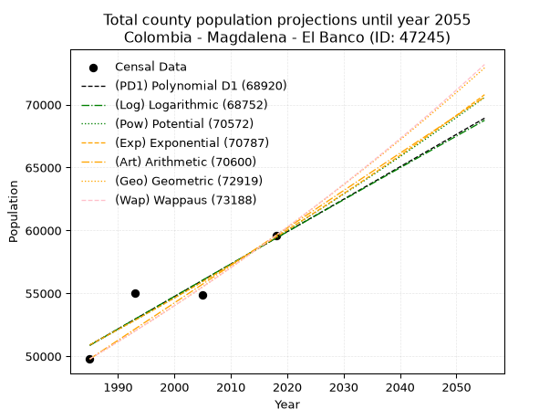
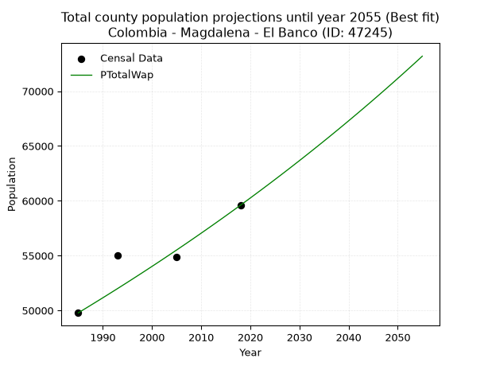
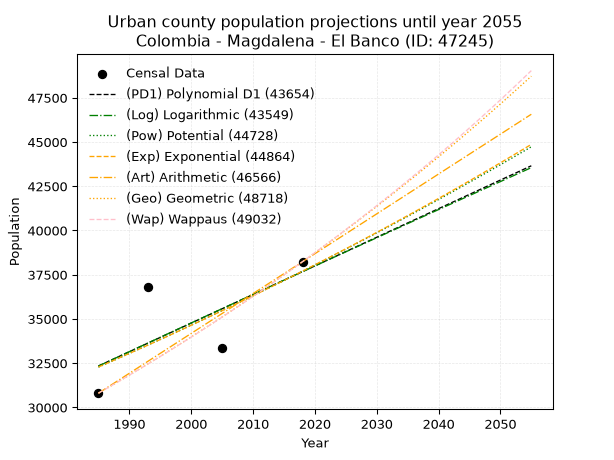
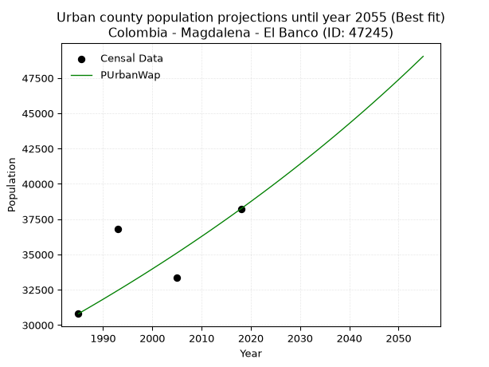
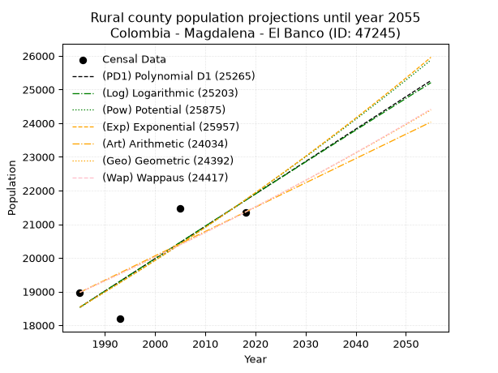
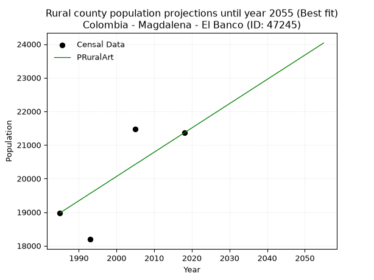

<div align="center">


</div>

# _“Population and Public Services Demand Projections (PPSD) until Year 2050 for Colombia - Magdalena - El Banco (ID: 47245)”_
Keywords: `population` `public-service` `projection` `lineal` `polynomial` `logarithmic` `potential` `exponential` `arithmetic` `geometric` `wappaus` `dane` `colombia` `south-america`

PPSD are analytical estimates used by governments and planners to anticipate future changes in population size, age distribution, and the resulting community needs for utilities, healthcare, education, and infrastructure as sizing future water treatment facilities, electrical grids, and road networks based on spatial growth.

> **General running parameters**: • app_version: _v20260806_. • Python version: _3.14.7_. • Pandas version: _3.0.5_. • NumPy version: _2.5.1_. • Creates, save and include plots into reports (create_plot): _False_. • Projection until year: _2050_. • Process polynomial degree 2 and up: _False_. • Process Wappaus: _True_. • Process Wappaus: _True_. • Set negative values to zero: _True_. • Set infinite values to zero: _True_. • Drop dataset notes: _True_. 
<div align="center">

Dynamic map: [:earth_americas:Google](http://maps.google.com/maps?q=9.008502912,-73.97437) [:earth_americas:OSM](https://www.openstreetmap.org/#map=18/9.008502912/-73.97437&layers=P) [:earth_americas:Bing](https://www.bing.com/maps?cp=9.008502912~-73.97437&lvl=18) [:earth_americas:Apple](https://maps.apple.com/frame?center=9.008502912%2C-73.97437&span=0.003%2C0.006)

</div>


<div align="center">

```geojson
{
  "type": "Feature",
  "geometry": {
    "type": "Point", 
    "coordinates": [-73.97437, 9.008502912]
  }, 
  "properties": {
    "Name": "Colombia - Magdalena - El Banco (ID: 47245)"
  }
}
```

</div>


## 0. Census Data (4 records)

Census data are official statistics collected by a government about the people and housing in a country. They usually include counts of total population, age, sex, race, income, education, and jobs.

📅Global census file: [Population.xlsx](../data/Population.xlsx)

| Source   |   Year |   CountryID | CountryName   |   StateID | StateName   |   CountyID | CountyName   |   PTotal |   PUrban |   PRural |
|:---------|-------:|------------:|:--------------|----------:|:------------|-----------:|:-------------|---------:|---------:|---------:|
| DANE     |   1985 |          57 | Colombia      |        47 | Magdalena   |      47245 | El Banco     |    49778 |    30801 |    18977 |
| DANE     |   1993 |          57 | Colombia      |        47 | Magdalena   |      47245 | El Banco     |    54992 |    36801 |    18191 |
| DANE     |   2005 |          57 | Colombia      |        47 | Magdalena   |      47245 | El Banco     |    54855 |    33380 |    21475 |
| DANE     |   2018 |          57 | Colombia      |        47 | Magdalena   |      47245 | El Banco     |    59594 |    38233 |    21361 |

> 🔥Some records could had specific notes about the registered values or the corresponding urban or rural distribution.

📅   [RUPS](https://www.datos.gov.co/Hacienda-y-Cr-dito-P-blico/Registro-nico-de-Prestadores-de-Servicios-P-blicos/4qkq-csdn/about_data) - Local public utility companies: [RUPS.csv](../data/RUPS.xlsx)

 | SERVICIO       | ESTADO    | NOMBRE                                                     | NIT         | DEPARTAMENTO_DOMICILIO   | MUNICIPIO_DOMICILIO   | DIRECCION         |   TELEFONO | EMAIL                  | TIPO_PRESTADOR                            | CLASIFICACION            |
|:---------------|:----------|:-----------------------------------------------------------|:------------|:-------------------------|:----------------------|:------------------|-----------:|:-----------------------|:------------------------------------------|:-------------------------|
| ACUEDUCTO      | OPERATIVA | EMPRESA DE SERVICIOS PUBLICOS DE EL BANCO MAGDALENA E.S.P. | 800106050-7 | MAGDALENA                | EL BANCO              | Calle 2 No 6  -50 |    4294852 | junior0287@hotmail.com | EMPRESA INDUSTRIAL Y COMERCIAL DEL ESTADO | MAS DE 2500 SUSCRIPTORES |
| ALCANTARILLADO | OPERATIVA | EMPRESA DE SERVICIOS PUBLICOS DE EL BANCO MAGDALENA E.S.P. | 800106050-7 | MAGDALENA                | EL BANCO              | Calle 2 No 6  -50 |    4294852 | junior0287@hotmail.com | EMPRESA INDUSTRIAL Y COMERCIAL DEL ESTADO | MAS DE 2500 SUSCRIPTORES |

## 1. Total

### 1.1. Coefficients and Parameters

* (PD1) Polynomial Deg 1: 257.8052990766727, -460870.2994781147 (lineal)
* (Log) Logarithmic: 516114.74527808896, -3868187.564742759
* (Pow) Potential: 9.432011778280362, -26.397847248585645
* (Exp) Exponential: 0.004711026515306337, 4.420605869039834
* (Art) Arithmetic: Year diff. 2018 - 1985 = 33, Population diff. 59594 - 49778 = 9816, Annual growth = 297.45454545454544
* (Geo) Geometric: Year diff. 2018 - 1985 = 33, Population diff. 59594 - 49778 = 9816, Annual growth % = 0.0054688933855475685
* (Wap) Wappaus: i = 0.5439318023891773, Condition values only valid for < 200)

<sub>
Wappaus condition values: ['0.00', '0.54', '1.09', '1.63', '2.18', '2.72', '3.26', '3.81', '4.35', '4.90', '5.44', '5.98', '6.53', '7.07', '7.62', '8.16', '8.70', '9.25', '9.79', '10.33', '10.88', '11.42', '11.97', '12.51', '13.05', '13.60', '14.14', '14.69', '15.23', '15.77', '16.32', '16.86', '17.41', '17.95', '18.49', '19.04', '19.58', '20.13', '20.67', '21.21', '21.76', '22.30', '22.85', '23.39', '23.93', '24.48', '25.02', '25.56', '26.11', '26.65', '27.20', '27.74', '28.28', '28.83', '29.37', '29.92', '30.46', '31.00', '31.55', '32.09', '32.64', '33.18', '33.72', '34.27', '34.81', '35.36']
</sub>


### 1.2. Projected Dataset

|   Year |   CountyID |   PTotalPD1 |   PTotalLog |   PTotalPow |   PTotalExp |   PTotalArt |   PTotalGeo |   PTotalWap |
|-------:|-----------:|------------:|------------:|------------:|------------:|------------:|------------:|------------:|
|   1985 |      47245 |       50873 |       50865 |       50894 |       50902 |       49778 |       49778 |       49778 |
|   1986 |      47245 |       51131 |       51125 |       51137 |       51143 |       50075 |       50050 |       50049 |
|   1987 |      47245 |       51389 |       51385 |       51380 |       51384 |       50373 |       50324 |       50322 |
|   1988 |      47245 |       51647 |       51644 |       51624 |       51627 |       50670 |       50599 |       50597 |
|   1989 |      47245 |       51904 |       51904 |       51870 |       51871 |       50968 |       50876 |       50873 |
|   1990 |      47245 |       52162 |       52163 |       52116 |       52116 |       51265 |       51154 |       51150 |
|   1991 |      47245 |       52420 |       52423 |       52364 |       52362 |       51563 |       51434 |       51429 |
|   1992 |      47245 |       52678 |       52682 |       52612 |       52609 |       51860 |       51715 |       51710 |
|   1993 |      47245 |       52936 |       52941 |       52862 |       52857 |       52158 |       51998 |       51992 |
|   1994 |      47245 |       53193 |       53200 |       53113 |       53107 |       52455 |       52282 |       52276 |
|   1995 |      47245 |       53451 |       53458 |       53365 |       53358 |       52753 |       52568 |       52561 |
|   1996 |      47245 |       53709 |       53717 |       53617 |       53610 |       53050 |       52856 |       52848 |
|   1997 |      47245 |       53967 |       53976 |       53871 |       53863 |       53347 |       53145 |       53137 |
|   1998 |      47245 |       54225 |       54234 |       54126 |       54117 |       53645 |       53435 |       53427 |
|   1999 |      47245 |       54482 |       54492 |       54382 |       54373 |       53942 |       53728 |       53719 |
|   2000 |      47245 |       54740 |       54750 |       54639 |       54630 |       54240 |       54022 |       54012 |
|   2001 |      47245 |       54998 |       55008 |       54898 |       54887 |       54537 |       54317 |       54307 |
|   2002 |      47245 |       55256 |       55266 |       55157 |       55147 |       54835 |       54614 |       54604 |
|   2003 |      47245 |       55514 |       55524 |       55417 |       55407 |       55132 |       54913 |       54903 |
|   2004 |      47245 |       55772 |       55781 |       55679 |       55669 |       55430 |       55213 |       55203 |
|   2005 |      47245 |       56029 |       56039 |       55942 |       55932 |       55727 |       55515 |       55505 |
|   2006 |      47245 |       56287 |       56296 |       56205 |       56196 |       56025 |       55819 |       55808 |
|   2007 |      47245 |       56545 |       56554 |       56470 |       56461 |       56322 |       56124 |       56114 |
|   2008 |      47245 |       56803 |       56811 |       56736 |       56728 |       56619 |       56431 |       56421 |
|   2009 |      47245 |       57061 |       57068 |       57003 |       56996 |       56917 |       56739 |       56730 |
|   2010 |      47245 |       57318 |       57324 |       57271 |       57265 |       57214 |       57050 |       57041 |
|   2011 |      47245 |       57576 |       57581 |       57541 |       57535 |       57512 |       57362 |       57353 |
|   2012 |      47245 |       57834 |       57838 |       57811 |       57807 |       57809 |       57675 |       57668 |
|   2013 |      47245 |       58092 |       58094 |       58083 |       58080 |       58107 |       57991 |       57984 |
|   2014 |      47245 |       58350 |       58350 |       58355 |       58354 |       58404 |       58308 |       58302 |
|   2015 |      47245 |       58607 |       58607 |       58629 |       58630 |       58702 |       58627 |       58622 |
|   2016 |      47245 |       58865 |       58863 |       58904 |       58906 |       58999 |       58947 |       58944 |
|   2017 |      47245 |       59123 |       59119 |       59180 |       59185 |       59297 |       59270 |       59268 |
|   2018 |      47245 |       59381 |       59375 |       59458 |       59464 |       59594 |       59594 |       59594 |
|   2019 |      47245 |       59639 |       59630 |       59736 |       59745 |       59891 |       59920 |       59922 |
|   2020 |      47245 |       59896 |       59886 |       60016 |       60027 |       60189 |       60248 |       60251 |
|   2021 |      47245 |       60154 |       60141 |       60297 |       60310 |       60486 |       60577 |       60583 |
|   2022 |      47245 |       60412 |       60397 |       60579 |       60595 |       60784 |       60908 |       60917 |
|   2023 |      47245 |       60670 |       60652 |       60862 |       60881 |       61081 |       61241 |       61253 |
|   2024 |      47245 |       60928 |       60907 |       61146 |       61169 |       61379 |       61576 |       61590 |
|   2025 |      47245 |       61185 |       61162 |       61432 |       61458 |       61676 |       61913 |       61930 |
|   2026 |      47245 |       61443 |       61417 |       61718 |       61748 |       61974 |       62252 |       62272 |
|   2027 |      47245 |       61701 |       61671 |       62006 |       62040 |       62271 |       62592 |       62616 |
|   2028 |      47245 |       61959 |       61926 |       62295 |       62333 |       62569 |       62935 |       62962 |
|   2029 |      47245 |       62217 |       62180 |       62586 |       62627 |       62866 |       63279 |       63311 |
|   2030 |      47245 |       62474 |       62435 |       62877 |       62923 |       63163 |       63625 |       63661 |
|   2031 |      47245 |       62732 |       62689 |       63170 |       63220 |       63461 |       63973 |       64014 |
|   2032 |      47245 |       62990 |       62943 |       63464 |       63518 |       63758 |       64323 |       64369 |
|   2033 |      47245 |       63248 |       63197 |       63759 |       63818 |       64056 |       64674 |       64726 |
|   2034 |      47245 |       63506 |       63450 |       64056 |       64120 |       64353 |       65028 |       65085 |
|   2035 |      47245 |       63763 |       63704 |       64353 |       64422 |       64651 |       65384 |       65447 |
|   2036 |      47245 |       64021 |       63958 |       64652 |       64727 |       64948 |       65741 |       65810 |
|   2037 |      47245 |       64279 |       64211 |       64952 |       65032 |       65246 |       66101 |       66177 |
|   2038 |      47245 |       64537 |       64464 |       65254 |       65339 |       65543 |       66462 |       66545 |
|   2039 |      47245 |       64795 |       64718 |       65556 |       65648 |       65841 |       66826 |       66916 |
|   2040 |      47245 |       65053 |       64971 |       65860 |       65958 |       66138 |       67191 |       67289 |
|   2041 |      47245 |       65310 |       65224 |       66165 |       66269 |       66435 |       67559 |       67665 |
|   2042 |      47245 |       65568 |       65476 |       66472 |       66582 |       66733 |       67928 |       68043 |
|   2043 |      47245 |       65826 |       65729 |       66779 |       66897 |       67030 |       68300 |       68423 |
|   2044 |      47245 |       66084 |       65982 |       67088 |       67213 |       67328 |       68673 |       68806 |
|   2045 |      47245 |       66342 |       66234 |       67399 |       67530 |       67625 |       69049 |       69191 |
|   2046 |      47245 |       66599 |       66486 |       67710 |       67849 |       67923 |       69426 |       69579 |
|   2047 |      47245 |       66857 |       66739 |       68023 |       68169 |       68220 |       69806 |       69970 |
|   2048 |      47245 |       67115 |       66991 |       68337 |       68491 |       68518 |       70188 |       70363 |
|   2049 |      47245 |       67373 |       67243 |       68652 |       68815 |       68815 |       70572 |       70758 |
|   2050 |      47245 |       67631 |       67494 |       68969 |       69139 |       69113 |       70958 |       71157 |
<div align="center">

</img>

</div>


### 1.3. Best fit with absolute and relative error (%)

Relative error puts that difference into context by dividing the absolute error by the true value, creating a unitless ratio or percentage that shows the scale of the mistake.

Absolute and relative error

|   Year | Source   |   CountryID | CountryName   |   StateID | StateName   |   CountyID_x | CountyName   |   PTotal |   PUrban |   PRural |   CountyID_y |   PTotalPD1 |   PTotalLog |   PTotalPow |   PTotalExp |   PTotalArt |   PTotalGeo |   PTotalWap |   PTotalPD1AbsError |   PTotalLogAbsError |   PTotalPowAbsError |   PTotalExpAbsError |   PTotalArtAbsError |   PTotalGeoAbsError |   PTotalWapAbsError |   PTotalPD1RelError |   PTotalLogRelError |   PTotalPowRelError |   PTotalExpRelError |   PTotalArtRelError |   PTotalGeoRelError |   PTotalWapRelError |
|-------:|:---------|------------:|:--------------|----------:|:------------|-------------:|:-------------|---------:|---------:|---------:|-------------:|------------:|------------:|------------:|------------:|------------:|------------:|------------:|--------------------:|--------------------:|--------------------:|--------------------:|--------------------:|--------------------:|--------------------:|--------------------:|--------------------:|--------------------:|--------------------:|--------------------:|--------------------:|--------------------:|
|   1985 | DANE     |          57 | Colombia      |        47 | Magdalena   |        47245 | El Banco     |    49778 |    30801 |    18977 |        47245 |       50873 |       50865 |       50894 |       50902 |       49778 |       49778 |       49778 |                1095 |                1087 |                1116 |                1124 |                   0 |                   0 |                   0 |            2.19977  |            2.1837   |            2.24195  |            2.25803  |             0       |             0       |             0       |
|   1993 | DANE     |          57 | Colombia      |        47 | Magdalena   |        47245 | El Banco     |    54992 |    36801 |    18191 |        47245 |       52936 |       52941 |       52862 |       52857 |       52158 |       51998 |       51992 |                2056 |                2051 |                2130 |                2135 |                2834 |                2994 |                3000 |            3.73873  |            3.72963  |            3.87329  |            3.88238  |             5.15348 |             5.44443 |             5.45534 |
|   2005 | DANE     |          57 | Colombia      |        47 | Magdalena   |        47245 | El Banco     |    54855 |    33380 |    21475 |        47245 |       56029 |       56039 |       55942 |       55932 |       55727 |       55515 |       55505 |                1174 |                1184 |                1087 |                1077 |                 872 |                 660 |                 650 |            2.14019  |            2.15842  |            1.98159  |            1.96336  |             1.58965 |             1.20317 |             1.18494 |
|   2018 | DANE     |          57 | Colombia      |        47 | Magdalena   |        47245 | El Banco     |    59594 |    38233 |    21361 |        47245 |       59381 |       59375 |       59458 |       59464 |       59594 |       59594 |       59594 |                 213 |                 219 |                 136 |                 130 |                   0 |                   0 |                   0 |            0.357419 |            0.367487 |            0.228211 |            0.218143 |             0       |             0       |             0       |

Relative error mean

| Method    |   RelError | Best   |
|:----------|-----------:|:-------|
| PTotalPD1 |    2.10902 |        |
| PTotalLog |    2.10981 |        |
| PTotalPow |    2.08126 |        |
| PTotalExp |    2.08048 |        |
| PTotalArt |    1.68578 |        |
| PTotalGeo |    1.6619  |        |
| PTotalWap |    1.66007 | True   |

💙Best method: _**PTotalWap**_
<div align="center">

</img>

</div>


### 1.4. Fresh water supply demand in liters per capita per day (lpcd)

The fresh water supply demand typically ranges from 100 to 300 liters per capita per day (lpcd) for standard domestic and municipal planning, though absolute survival minimums set by the World Health Organization are as low as 7.5 to 20 liters per day, and total consumption in high-income nations can exceed 400 liters.

> `CZ`: Level in meters above the sea level (masl)<br> `WS`: Fresh water supply demand in liters per capita per day (lpcd or l/h/d)<br> `WSAll`: Zonal fresh water supply demand in liters per second (l/s)<br> `A`: Zonal area in square meters<br> `DP`: Population density (people/hectare or p/ha)

Reference values (RAS Colombia)

|    CZ |   WS |
|------:|-----:|
|  1000 |  120 |
|  2000 |  130 |
| 99999 |  140 |

County shapefile geometry properties and water supply values

|   CountyID |      ATotal |   CZTotal |   WSTotal |
|-----------:|------------:|----------:|----------:|
|      47245 | 8.14045e+08 |   30.2606 |       120 |

Projected values for best method: PTotalWap

|   CountyID |   Year |   PTotalWap |   DPTotal |   WSTotal |   WSTotalAll |
|-----------:|-------:|------------:|----------:|----------:|-------------:|
|      47245 |   1985 |       49778 |      0.61 |       120 |      69.1361 |
|      47245 |   1986 |       50049 |      0.61 |       120 |      69.5125 |
|      47245 |   1987 |       50322 |      0.62 |       120 |      69.8917 |
|      47245 |   1988 |       50597 |      0.62 |       120 |      70.2736 |
|      47245 |   1989 |       50873 |      0.62 |       120 |      70.6569 |
|      47245 |   1990 |       51150 |      0.63 |       120 |      71.0417 |
|      47245 |   1991 |       51429 |      0.63 |       120 |      71.4292 |
|      47245 |   1992 |       51710 |      0.64 |       120 |      71.8194 |
|      47245 |   1993 |       51992 |      0.64 |       120 |      72.2111 |
|      47245 |   1994 |       52276 |      0.64 |       120 |      72.6056 |
|      47245 |   1995 |       52561 |      0.65 |       120 |      73.0014 |
|      47245 |   1996 |       52848 |      0.65 |       120 |      73.4    |
|      47245 |   1997 |       53137 |      0.65 |       120 |      73.8014 |
|      47245 |   1998 |       53427 |      0.66 |       120 |      74.2042 |
|      47245 |   1999 |       53719 |      0.66 |       120 |      74.6097 |
|      47245 |   2000 |       54012 |      0.66 |       120 |      75.0167 |
|      47245 |   2001 |       54307 |      0.67 |       120 |      75.4264 |
|      47245 |   2002 |       54604 |      0.67 |       120 |      75.8389 |
|      47245 |   2003 |       54903 |      0.67 |       120 |      76.2542 |
|      47245 |   2004 |       55203 |      0.68 |       120 |      76.6708 |
|      47245 |   2005 |       55505 |      0.68 |       120 |      77.0903 |
|      47245 |   2006 |       55808 |      0.69 |       120 |      77.5111 |
|      47245 |   2007 |       56114 |      0.69 |       120 |      77.9361 |
|      47245 |   2008 |       56421 |      0.69 |       120 |      78.3625 |
|      47245 |   2009 |       56730 |      0.7  |       120 |      78.7917 |
|      47245 |   2010 |       57041 |      0.7  |       120 |      79.2236 |
|      47245 |   2011 |       57353 |      0.7  |       120 |      79.6569 |
|      47245 |   2012 |       57668 |      0.71 |       120 |      80.0944 |
|      47245 |   2013 |       57984 |      0.71 |       120 |      80.5333 |
|      47245 |   2014 |       58302 |      0.72 |       120 |      80.975  |
|      47245 |   2015 |       58622 |      0.72 |       120 |      81.4194 |
|      47245 |   2016 |       58944 |      0.72 |       120 |      81.8667 |
|      47245 |   2017 |       59268 |      0.73 |       120 |      82.3167 |
|      47245 |   2018 |       59594 |      0.73 |       120 |      82.7694 |
|      47245 |   2019 |       59922 |      0.74 |       120 |      83.225  |
|      47245 |   2020 |       60251 |      0.74 |       120 |      83.6819 |
|      47245 |   2021 |       60583 |      0.74 |       120 |      84.1431 |
|      47245 |   2022 |       60917 |      0.75 |       120 |      84.6069 |
|      47245 |   2023 |       61253 |      0.75 |       120 |      85.0736 |
|      47245 |   2024 |       61590 |      0.76 |       120 |      85.5417 |
|      47245 |   2025 |       61930 |      0.76 |       120 |      86.0139 |
|      47245 |   2026 |       62272 |      0.76 |       120 |      86.4889 |
|      47245 |   2027 |       62616 |      0.77 |       120 |      86.9667 |
|      47245 |   2028 |       62962 |      0.77 |       120 |      87.4472 |
|      47245 |   2029 |       63311 |      0.78 |       120 |      87.9319 |
|      47245 |   2030 |       63661 |      0.78 |       120 |      88.4181 |
|      47245 |   2031 |       64014 |      0.79 |       120 |      88.9083 |
|      47245 |   2032 |       64369 |      0.79 |       120 |      89.4014 |
|      47245 |   2033 |       64726 |      0.8  |       120 |      89.8972 |
|      47245 |   2034 |       65085 |      0.8  |       120 |      90.3958 |
|      47245 |   2035 |       65447 |      0.8  |       120 |      90.8986 |
|      47245 |   2036 |       65810 |      0.81 |       120 |      91.4028 |
|      47245 |   2037 |       66177 |      0.81 |       120 |      91.9125 |
|      47245 |   2038 |       66545 |      0.82 |       120 |      92.4236 |
|      47245 |   2039 |       66916 |      0.82 |       120 |      92.9389 |
|      47245 |   2040 |       67289 |      0.83 |       120 |      93.4569 |
|      47245 |   2041 |       67665 |      0.83 |       120 |      93.9792 |
|      47245 |   2042 |       68043 |      0.84 |       120 |      94.5042 |
|      47245 |   2043 |       68423 |      0.84 |       120 |      95.0319 |
|      47245 |   2044 |       68806 |      0.85 |       120 |      95.5639 |
|      47245 |   2045 |       69191 |      0.85 |       120 |      96.0986 |
|      47245 |   2046 |       69579 |      0.85 |       120 |      96.6375 |
|      47245 |   2047 |       69970 |      0.86 |       120 |      97.1806 |
|      47245 |   2048 |       70363 |      0.86 |       120 |      97.7264 |
|      47245 |   2049 |       70758 |      0.87 |       120 |      98.275  |
|      47245 |   2050 |       71157 |      0.87 |       120 |      98.8292 |

## 2. Urban

### 2.1. Coefficients and Parameters

* (PD1) Polynomial Deg 1: 161.65114411882476, -288538.9510236793 (lineal)
* (Log) Logarithmic: 323617.68716176535, -2425016.88342597
* (Pow) Potential: 9.414463928446382, -26.537772107574973
* (Exp) Exponential: 0.004702211777152445, 2.8529062155694205
* (Art) Arithmetic: Year diff. 2018 - 1985 = 33, Population diff. 38233 - 30801 = 7432, Annual growth = 225.21212121212122
* (Geo) Geometric: Year diff. 2018 - 1985 = 33, Population diff. 38233 - 30801 = 7432, Annual growth % = 0.006571554897532028
* (Wap) Wappaus: i = 0.6524672515343779, Condition values only valid for < 200)

<sub>
Wappaus condition values: ['0.00', '0.65', '1.30', '1.96', '2.61', '3.26', '3.91', '4.57', '5.22', '5.87', '6.52', '7.18', '7.83', '8.48', '9.13', '9.79', '10.44', '11.09', '11.74', '12.40', '13.05', '13.70', '14.35', '15.01', '15.66', '16.31', '16.96', '17.62', '18.27', '18.92', '19.57', '20.23', '20.88', '21.53', '22.18', '22.84', '23.49', '24.14', '24.79', '25.45', '26.10', '26.75', '27.40', '28.06', '28.71', '29.36', '30.01', '30.67', '31.32', '31.97', '32.62', '33.28', '33.93', '34.58', '35.23', '35.89', '36.54', '37.19', '37.84', '38.50', '39.15', '39.80', '40.45', '41.11', '41.76', '42.41']
</sub>


### 2.2. Projected Dataset

|   Year |   CountyID |   PUrbanPD1 |   PUrbanLog |   PUrbanPow |   PUrbanExp |   PUrbanArt |   PUrbanGeo |   PUrbanWap |
|-------:|-----------:|------------:|------------:|------------:|------------:|------------:|------------:|------------:|
|   1985 |      47245 |       32339 |       32333 |       32276 |       32281 |       30801 |       30801 |       30801 |
|   1986 |      47245 |       32500 |       32496 |       32429 |       32433 |       31026 |       31003 |       31003 |
|   1987 |      47245 |       32662 |       32659 |       32583 |       32586 |       31251 |       31207 |       31206 |
|   1988 |      47245 |       32824 |       32822 |       32738 |       32739 |       31477 |       31412 |       31410 |
|   1989 |      47245 |       32985 |       32985 |       32893 |       32894 |       31702 |       31619 |       31615 |
|   1990 |      47245 |       33147 |       33147 |       33049 |       33049 |       31927 |       31826 |       31822 |
|   1991 |      47245 |       33308 |       33310 |       33206 |       33205 |       32152 |       32036 |       32031 |
|   1992 |      47245 |       33470 |       33473 |       33363 |       33361 |       32377 |       32246 |       32241 |
|   1993 |      47245 |       33632 |       33635 |       33521 |       33518 |       32603 |       32458 |       32452 |
|   1994 |      47245 |       33793 |       33797 |       33680 |       33676 |       32828 |       32671 |       32664 |
|   1995 |      47245 |       33955 |       33960 |       33839 |       33835 |       33053 |       32886 |       32878 |
|   1996 |      47245 |       34117 |       34122 |       33999 |       33994 |       33278 |       33102 |       33094 |
|   1997 |      47245 |       34278 |       34284 |       34160 |       34155 |       33504 |       33320 |       33311 |
|   1998 |      47245 |       34440 |       34446 |       34321 |       34316 |       33729 |       33539 |       33529 |
|   1999 |      47245 |       34602 |       34608 |       34483 |       34477 |       33954 |       33759 |       33749 |
|   2000 |      47245 |       34763 |       34770 |       34646 |       34640 |       34179 |       33981 |       33971 |
|   2001 |      47245 |       34925 |       34931 |       34810 |       34803 |       34404 |       34204 |       34194 |
|   2002 |      47245 |       35087 |       35093 |       34974 |       34967 |       34630 |       34429 |       34418 |
|   2003 |      47245 |       35248 |       35255 |       35139 |       35132 |       34855 |       34655 |       34644 |
|   2004 |      47245 |       35410 |       35416 |       35304 |       35298 |       35080 |       34883 |       34872 |
|   2005 |      47245 |       35572 |       35578 |       35470 |       35464 |       35305 |       35112 |       35101 |
|   2006 |      47245 |       35733 |       35739 |       35637 |       35631 |       35530 |       35343 |       35332 |
|   2007 |      47245 |       35895 |       35900 |       35805 |       35799 |       35756 |       35575 |       35564 |
|   2008 |      47245 |       36057 |       36061 |       35973 |       35968 |       35981 |       35809 |       35798 |
|   2009 |      47245 |       36218 |       36223 |       36142 |       36137 |       36206 |       36044 |       36034 |
|   2010 |      47245 |       36380 |       36384 |       36312 |       36308 |       36431 |       36281 |       36271 |
|   2011 |      47245 |       36541 |       36545 |       36482 |       36479 |       36657 |       36520 |       36510 |
|   2012 |      47245 |       36703 |       36705 |       36653 |       36651 |       36882 |       36760 |       36751 |
|   2013 |      47245 |       36865 |       36866 |       36825 |       36823 |       37107 |       37001 |       36994 |
|   2014 |      47245 |       37026 |       37027 |       36998 |       36997 |       37332 |       37244 |       37238 |
|   2015 |      47245 |       37188 |       37188 |       37171 |       37171 |       37557 |       37489 |       37484 |
|   2016 |      47245 |       37350 |       37348 |       37345 |       37347 |       37783 |       37735 |       37732 |
|   2017 |      47245 |       37511 |       37509 |       37520 |       37523 |       38008 |       37983 |       37982 |
|   2018 |      47245 |       37673 |       37669 |       37695 |       37699 |       38233 |       38233 |       38233 |
|   2019 |      47245 |       37835 |       37829 |       37872 |       37877 |       38458 |       38484 |       38486 |
|   2020 |      47245 |       37996 |       37990 |       38049 |       38056 |       38683 |       38737 |       38741 |
|   2021 |      47245 |       38158 |       38150 |       38226 |       38235 |       38909 |       38992 |       38999 |
|   2022 |      47245 |       38320 |       38310 |       38405 |       38415 |       39134 |       39248 |       39258 |
|   2023 |      47245 |       38481 |       38470 |       38584 |       38596 |       39359 |       39506 |       39518 |
|   2024 |      47245 |       38643 |       38630 |       38764 |       38778 |       39584 |       39765 |       39781 |
|   2025 |      47245 |       38805 |       38790 |       38945 |       38961 |       39809 |       40027 |       40046 |
|   2026 |      47245 |       38966 |       38950 |       39126 |       39145 |       40035 |       40290 |       40313 |
|   2027 |      47245 |       39128 |       39109 |       39308 |       39329 |       40260 |       40555 |       40582 |
|   2028 |      47245 |       39290 |       39269 |       39491 |       39515 |       40485 |       40821 |       40853 |
|   2029 |      47245 |       39451 |       39428 |       39675 |       39701 |       40710 |       41089 |       41126 |
|   2030 |      47245 |       39613 |       39588 |       39859 |       39888 |       40936 |       41359 |       41401 |
|   2031 |      47245 |       39775 |       39747 |       40045 |       40076 |       41161 |       41631 |       41678 |
|   2032 |      47245 |       39936 |       39906 |       40231 |       40265 |       41386 |       41905 |       41957 |
|   2033 |      47245 |       40098 |       40066 |       40417 |       40455 |       41611 |       42180 |       42238 |
|   2034 |      47245 |       40259 |       40225 |       40605 |       40645 |       41836 |       42457 |       42522 |
|   2035 |      47245 |       40421 |       40384 |       40793 |       40837 |       42062 |       42736 |       42808 |
|   2036 |      47245 |       40583 |       40543 |       40982 |       41029 |       42287 |       43017 |       43096 |
|   2037 |      47245 |       40744 |       40702 |       41172 |       41223 |       42512 |       43300 |       43386 |
|   2038 |      47245 |       40906 |       40861 |       41363 |       41417 |       42737 |       43584 |       43679 |
|   2039 |      47245 |       41068 |       41019 |       41554 |       41612 |       42962 |       43871 |       43974 |
|   2040 |      47245 |       41229 |       41178 |       41747 |       41808 |       43188 |       44159 |       44271 |
|   2041 |      47245 |       41391 |       41337 |       41940 |       42005 |       43413 |       44449 |       44571 |
|   2042 |      47245 |       41553 |       41495 |       42134 |       42203 |       43638 |       44741 |       44873 |
|   2043 |      47245 |       41714 |       41654 |       42328 |       42402 |       43863 |       45035 |       45177 |
|   2044 |      47245 |       41876 |       41812 |       42524 |       42602 |       44089 |       45331 |       45484 |
|   2045 |      47245 |       42038 |       41970 |       42720 |       42803 |       44314 |       45629 |       45794 |
|   2046 |      47245 |       42199 |       42128 |       42917 |       43005 |       44539 |       45929 |       46106 |
|   2047 |      47245 |       42361 |       42287 |       43115 |       43207 |       44764 |       46231 |       46420 |
|   2048 |      47245 |       42523 |       42445 |       43314 |       43411 |       44989 |       46535 |       46737 |
|   2049 |      47245 |       42684 |       42603 |       43513 |       43616 |       45215 |       46841 |       47057 |
|   2050 |      47245 |       42846 |       42761 |       43713 |       43821 |       45440 |       47148 |       47379 |
<div align="center">

</img>

</div>


### 2.3. Best fit with absolute and relative error (%)

Relative error puts that difference into context by dividing the absolute error by the true value, creating a unitless ratio or percentage that shows the scale of the mistake.

Absolute and relative error

|   Year | Source   |   CountryID | CountryName   |   StateID | StateName   |   CountyID_x | CountyName   |   PTotal |   PUrban |   PRural |   CountyID_y |   PUrbanPD1 |   PUrbanLog |   PUrbanPow |   PUrbanExp |   PUrbanArt |   PUrbanGeo |   PUrbanWap |   PUrbanPD1AbsError |   PUrbanLogAbsError |   PUrbanPowAbsError |   PUrbanExpAbsError |   PUrbanArtAbsError |   PUrbanGeoAbsError |   PUrbanWapAbsError |   PUrbanPD1RelError |   PUrbanLogRelError |   PUrbanPowRelError |   PUrbanExpRelError |   PUrbanArtRelError |   PUrbanGeoRelError |   PUrbanWapRelError |
|-------:|:---------|------------:|:--------------|----------:|:------------|-------------:|:-------------|---------:|---------:|---------:|-------------:|------------:|------------:|------------:|------------:|------------:|------------:|------------:|--------------------:|--------------------:|--------------------:|--------------------:|--------------------:|--------------------:|--------------------:|--------------------:|--------------------:|--------------------:|--------------------:|--------------------:|--------------------:|--------------------:|
|   1985 | DANE     |          57 | Colombia      |        47 | Magdalena   |        47245 | El Banco     |    49778 |    30801 |    18977 |        47245 |       32339 |       32333 |       32276 |       32281 |       30801 |       30801 |       30801 |                1538 |                1532 |                1475 |                1480 |                   0 |                   0 |                   0 |             4.99334 |             4.97386 |             4.78881 |             4.80504 |             0       |             0       |             0       |
|   1993 | DANE     |          57 | Colombia      |        47 | Magdalena   |        47245 | El Banco     |    54992 |    36801 |    18191 |        47245 |       33632 |       33635 |       33521 |       33518 |       32603 |       32458 |       32452 |                3169 |                3166 |                3280 |                3283 |                4198 |                4343 |                4349 |             8.61118 |             8.60303 |             8.9128  |             8.92095 |            11.4073  |            11.8013  |            11.8176  |
|   2005 | DANE     |          57 | Colombia      |        47 | Magdalena   |        47245 | El Banco     |    54855 |    33380 |    21475 |        47245 |       35572 |       35578 |       35470 |       35464 |       35305 |       35112 |       35101 |                2192 |                2198 |                2090 |                2084 |                1925 |                1732 |                1721 |             6.56681 |             6.58478 |             6.26123 |             6.24326 |             5.76693 |             5.18874 |             5.15578 |
|   2018 | DANE     |          57 | Colombia      |        47 | Magdalena   |        47245 | El Banco     |    59594 |    38233 |    21361 |        47245 |       37673 |       37669 |       37695 |       37699 |       38233 |       38233 |       38233 |                 560 |                 564 |                 538 |                 534 |                   0 |                   0 |                   0 |             1.4647  |             1.47517 |             1.40716 |             1.3967  |             0       |             0       |             0       |

Relative error mean

| Method    |   RelError | Best   |
|:----------|-----------:|:-------|
| PUrbanPD1 |    5.40901 |        |
| PUrbanLog |    5.40921 |        |
| PUrbanPow |    5.3425  |        |
| PUrbanExp |    5.34149 |        |
| PUrbanArt |    4.29356 |        |
| PUrbanGeo |    4.24751 |        |
| PUrbanWap |    4.24335 | True   |

💙Best method: _**PUrbanWap**_
<div align="center">

</img>

</div>


### 2.4. Fresh water supply demand in liters per capita per day (lpcd)

The fresh water supply demand typically ranges from 100 to 300 liters per capita per day (lpcd) for standard domestic and municipal planning, though absolute survival minimums set by the World Health Organization are as low as 7.5 to 20 liters per day, and total consumption in high-income nations can exceed 400 liters.

> `CZ`: Level in meters above the sea level (masl)<br> `WS`: Fresh water supply demand in liters per capita per day (lpcd or l/h/d)<br> `WSAll`: Zonal fresh water supply demand in liters per second (l/s)<br> `A`: Zonal area in square meters<br> `DP`: Population density (people/hectare or p/ha)

Reference values (RAS Colombia)

|    CZ |   WS |
|------:|-----:|
|  1000 |  120 |
|  2000 |  130 |
| 99999 |  140 |

County shapefile geometry properties and water supply values

|   CountyID |      AUrban |   CZUrban |   WSUrban |
|-----------:|------------:|----------:|----------:|
|      47245 | 5.75389e+06 |   30.0886 |       120 |

Projected values for best method: PUrbanWap

|   CountyID |   Year |   PUrbanWap |   DPUrban |   WSUrban |   WSUrbanAll |
|-----------:|-------:|------------:|----------:|----------:|-------------:|
|      47245 |   1985 |       30801 |     53.53 |       120 |      42.7792 |
|      47245 |   1986 |       31003 |     53.88 |       120 |      43.0597 |
|      47245 |   1987 |       31206 |     54.23 |       120 |      43.3417 |
|      47245 |   1988 |       31410 |     54.59 |       120 |      43.625  |
|      47245 |   1989 |       31615 |     54.95 |       120 |      43.9097 |
|      47245 |   1990 |       31822 |     55.31 |       120 |      44.1972 |
|      47245 |   1991 |       32031 |     55.67 |       120 |      44.4875 |
|      47245 |   1992 |       32241 |     56.03 |       120 |      44.7792 |
|      47245 |   1993 |       32452 |     56.4  |       120 |      45.0722 |
|      47245 |   1994 |       32664 |     56.77 |       120 |      45.3667 |
|      47245 |   1995 |       32878 |     57.14 |       120 |      45.6639 |
|      47245 |   1996 |       33094 |     57.52 |       120 |      45.9639 |
|      47245 |   1997 |       33311 |     57.89 |       120 |      46.2653 |
|      47245 |   1998 |       33529 |     58.27 |       120 |      46.5681 |
|      47245 |   1999 |       33749 |     58.65 |       120 |      46.8736 |
|      47245 |   2000 |       33971 |     59.04 |       120 |      47.1819 |
|      47245 |   2001 |       34194 |     59.43 |       120 |      47.4917 |
|      47245 |   2002 |       34418 |     59.82 |       120 |      47.8028 |
|      47245 |   2003 |       34644 |     60.21 |       120 |      48.1167 |
|      47245 |   2004 |       34872 |     60.61 |       120 |      48.4333 |
|      47245 |   2005 |       35101 |     61    |       120 |      48.7514 |
|      47245 |   2006 |       35332 |     61.41 |       120 |      49.0722 |
|      47245 |   2007 |       35564 |     61.81 |       120 |      49.3944 |
|      47245 |   2008 |       35798 |     62.22 |       120 |      49.7194 |
|      47245 |   2009 |       36034 |     62.63 |       120 |      50.0472 |
|      47245 |   2010 |       36271 |     63.04 |       120 |      50.3764 |
|      47245 |   2011 |       36510 |     63.45 |       120 |      50.7083 |
|      47245 |   2012 |       36751 |     63.87 |       120 |      51.0431 |
|      47245 |   2013 |       36994 |     64.29 |       120 |      51.3806 |
|      47245 |   2014 |       37238 |     64.72 |       120 |      51.7194 |
|      47245 |   2015 |       37484 |     65.15 |       120 |      52.0611 |
|      47245 |   2016 |       37732 |     65.58 |       120 |      52.4056 |
|      47245 |   2017 |       37982 |     66.01 |       120 |      52.7528 |
|      47245 |   2018 |       38233 |     66.45 |       120 |      53.1014 |
|      47245 |   2019 |       38486 |     66.89 |       120 |      53.4528 |
|      47245 |   2020 |       38741 |     67.33 |       120 |      53.8069 |
|      47245 |   2021 |       38999 |     67.78 |       120 |      54.1653 |
|      47245 |   2022 |       39258 |     68.23 |       120 |      54.525  |
|      47245 |   2023 |       39518 |     68.68 |       120 |      54.8861 |
|      47245 |   2024 |       39781 |     69.14 |       120 |      55.2514 |
|      47245 |   2025 |       40046 |     69.6  |       120 |      55.6194 |
|      47245 |   2026 |       40313 |     70.06 |       120 |      55.9903 |
|      47245 |   2027 |       40582 |     70.53 |       120 |      56.3639 |
|      47245 |   2028 |       40853 |     71    |       120 |      56.7403 |
|      47245 |   2029 |       41126 |     71.48 |       120 |      57.1194 |
|      47245 |   2030 |       41401 |     71.95 |       120 |      57.5014 |
|      47245 |   2031 |       41678 |     72.43 |       120 |      57.8861 |
|      47245 |   2032 |       41957 |     72.92 |       120 |      58.2736 |
|      47245 |   2033 |       42238 |     73.41 |       120 |      58.6639 |
|      47245 |   2034 |       42522 |     73.9  |       120 |      59.0583 |
|      47245 |   2035 |       42808 |     74.4  |       120 |      59.4556 |
|      47245 |   2036 |       43096 |     74.9  |       120 |      59.8556 |
|      47245 |   2037 |       43386 |     75.4  |       120 |      60.2583 |
|      47245 |   2038 |       43679 |     75.91 |       120 |      60.6653 |
|      47245 |   2039 |       43974 |     76.42 |       120 |      61.075  |
|      47245 |   2040 |       44271 |     76.94 |       120 |      61.4875 |
|      47245 |   2041 |       44571 |     77.46 |       120 |      61.9042 |
|      47245 |   2042 |       44873 |     77.99 |       120 |      62.3236 |
|      47245 |   2043 |       45177 |     78.52 |       120 |      62.7458 |
|      47245 |   2044 |       45484 |     79.05 |       120 |      63.1722 |
|      47245 |   2045 |       45794 |     79.59 |       120 |      63.6028 |
|      47245 |   2046 |       46106 |     80.13 |       120 |      64.0361 |
|      47245 |   2047 |       46420 |     80.68 |       120 |      64.4722 |
|      47245 |   2048 |       46737 |     81.23 |       120 |      64.9125 |
|      47245 |   2049 |       47057 |     81.78 |       120 |      65.3569 |
|      47245 |   2050 |       47379 |     82.34 |       120 |      65.8042 |

## 3. Rural

### 3.1. Coefficients and Parameters

* (PD1) Polynomial Deg 1: 96.15415495784815, -172331.34845443576 (lineal)
* (Log) Logarithmic: 192497.05811632393, -1443170.6813167913
* (Pow) Potential: 9.626488670533584, -27.47785942603887
* (Exp) Exponential: 0.004808659922237958, 1.3262905896788189
* (Art) Arithmetic: Year diff. 2018 - 1985 = 33, Population diff. 21361 - 18977 = 2384, Annual growth = 72.24242424242425
* (Geo) Geometric: Year diff. 2018 - 1985 = 33, Population diff. 21361 - 18977 = 2384, Annual growth % = 0.003592471144799436
* (Wap) Wappaus: i = 0.35818545412476693, Condition values only valid for < 200)

<sub>
Wappaus condition values: ['0.00', '0.36', '0.72', '1.07', '1.43', '1.79', '2.15', '2.51', '2.87', '3.22', '3.58', '3.94', '4.30', '4.66', '5.01', '5.37', '5.73', '6.09', '6.45', '6.81', '7.16', '7.52', '7.88', '8.24', '8.60', '8.95', '9.31', '9.67', '10.03', '10.39', '10.75', '11.10', '11.46', '11.82', '12.18', '12.54', '12.89', '13.25', '13.61', '13.97', '14.33', '14.69', '15.04', '15.40', '15.76', '16.12', '16.48', '16.83', '17.19', '17.55', '17.91', '18.27', '18.63', '18.98', '19.34', '19.70', '20.06', '20.42', '20.77', '21.13', '21.49', '21.85', '22.21', '22.57', '22.92', '23.28']
</sub>


### 3.2. Projected Dataset

|   Year |   CountyID |   PRuralPD1 |   PRuralLog |   PRuralPow |   PRuralExp |   PRuralArt |   PRuralGeo |   PRuralWap |
|-------:|-----------:|------------:|------------:|------------:|------------:|------------:|------------:|------------:|
|   1985 |      47245 |       18535 |       18532 |       18535 |       18538 |       18977 |       18977 |       18977 |
|   1986 |      47245 |       18631 |       18628 |       18625 |       18627 |       19049 |       19045 |       19045 |
|   1987 |      47245 |       18727 |       18725 |       18716 |       18717 |       19121 |       19114 |       19113 |
|   1988 |      47245 |       18823 |       18822 |       18807 |       18807 |       19194 |       19182 |       19182 |
|   1989 |      47245 |       18919 |       18919 |       18898 |       18898 |       19266 |       19251 |       19251 |
|   1990 |      47245 |       19015 |       19016 |       18989 |       18989 |       19338 |       19320 |       19320 |
|   1991 |      47245 |       19112 |       19112 |       19082 |       19081 |       19410 |       19390 |       19389 |
|   1992 |      47245 |       19208 |       19209 |       19174 |       19173 |       19483 |       19459 |       19459 |
|   1993 |      47245 |       19304 |       19306 |       19267 |       19265 |       19555 |       19529 |       19529 |
|   1994 |      47245 |       19400 |       19402 |       19360 |       19358 |       19627 |       19599 |       19599 |
|   1995 |      47245 |       19496 |       19499 |       19454 |       19451 |       19699 |       19670 |       19669 |
|   1996 |      47245 |       19592 |       19595 |       19548 |       19545 |       19772 |       19741 |       19740 |
|   1997 |      47245 |       19688 |       19692 |       19642 |       19639 |       19844 |       19811 |       19811 |
|   1998 |      47245 |       19785 |       19788 |       19737 |       19734 |       19916 |       19883 |       19882 |
|   1999 |      47245 |       19881 |       19884 |       19833 |       19829 |       19988 |       19954 |       19953 |
|   2000 |      47245 |       19977 |       19981 |       19928 |       19925 |       20061 |       20026 |       20025 |
|   2001 |      47245 |       20073 |       20077 |       20024 |       20021 |       20133 |       20098 |       20097 |
|   2002 |      47245 |       20169 |       20173 |       20121 |       20117 |       20205 |       20170 |       20169 |
|   2003 |      47245 |       20265 |       20269 |       20218 |       20214 |       20277 |       20242 |       20241 |
|   2004 |      47245 |       20362 |       20365 |       20315 |       20311 |       20350 |       20315 |       20314 |
|   2005 |      47245 |       20458 |       20461 |       20413 |       20409 |       20422 |       20388 |       20387 |
|   2006 |      47245 |       20554 |       20557 |       20511 |       20508 |       20494 |       20461 |       20460 |
|   2007 |      47245 |       20650 |       20653 |       20610 |       20607 |       20566 |       20535 |       20534 |
|   2008 |      47245 |       20746 |       20749 |       20709 |       20706 |       20639 |       20609 |       20608 |
|   2009 |      47245 |       20842 |       20845 |       20808 |       20806 |       20711 |       20683 |       20682 |
|   2010 |      47245 |       20939 |       20941 |       20908 |       20906 |       20783 |       20757 |       20756 |
|   2011 |      47245 |       21035 |       21037 |       21009 |       21007 |       20855 |       20831 |       20831 |
|   2012 |      47245 |       21131 |       21132 |       21109 |       21108 |       20928 |       20906 |       20906 |
|   2013 |      47245 |       21227 |       21228 |       21211 |       21210 |       21000 |       20981 |       20981 |
|   2014 |      47245 |       21323 |       21323 |       21312 |       21312 |       21072 |       21057 |       21056 |
|   2015 |      47245 |       21419 |       21419 |       21414 |       21415 |       21144 |       21132 |       21132 |
|   2016 |      47245 |       21515 |       21515 |       21517 |       21518 |       21217 |       21208 |       21208 |
|   2017 |      47245 |       21612 |       21610 |       21620 |       21622 |       21289 |       21285 |       21284 |
|   2018 |      47245 |       21708 |       21705 |       21723 |       21726 |       21361 |       21361 |       21361 |
|   2019 |      47245 |       21804 |       21801 |       21827 |       21831 |       21433 |       21438 |       21438 |
|   2020 |      47245 |       21900 |       21896 |       21931 |       21936 |       21505 |       21515 |       21515 |
|   2021 |      47245 |       21996 |       21991 |       22036 |       22042 |       21578 |       21592 |       21593 |
|   2022 |      47245 |       22092 |       22087 |       22141 |       22148 |       21650 |       21670 |       21670 |
|   2023 |      47245 |       22189 |       22182 |       22247 |       22255 |       21722 |       21747 |       21749 |
|   2024 |      47245 |       22285 |       22277 |       22353 |       22362 |       21794 |       21826 |       21827 |
|   2025 |      47245 |       22381 |       22372 |       22460 |       22470 |       21867 |       21904 |       21906 |
|   2026 |      47245 |       22477 |       22467 |       22567 |       22578 |       21939 |       21983 |       21985 |
|   2027 |      47245 |       22573 |       22562 |       22674 |       22687 |       22011 |       22062 |       22064 |
|   2028 |      47245 |       22669 |       22657 |       22782 |       22796 |       22083 |       22141 |       22144 |
|   2029 |      47245 |       22765 |       22752 |       22890 |       22906 |       22156 |       22220 |       22224 |
|   2030 |      47245 |       22862 |       22847 |       22999 |       23016 |       22228 |       22300 |       22304 |
|   2031 |      47245 |       22958 |       22941 |       23109 |       23127 |       22300 |       22380 |       22384 |
|   2032 |      47245 |       23054 |       23036 |       23218 |       23239 |       22372 |       22461 |       22465 |
|   2033 |      47245 |       23150 |       23131 |       23329 |       23351 |       22445 |       22541 |       22547 |
|   2034 |      47245 |       23246 |       23226 |       23439 |       23463 |       22517 |       22622 |       22628 |
|   2035 |      47245 |       23342 |       23320 |       23550 |       23577 |       22589 |       22704 |       22710 |
|   2036 |      47245 |       23439 |       23415 |       23662 |       23690 |       22661 |       22785 |       22792 |
|   2037 |      47245 |       23535 |       23509 |       23774 |       23804 |       22734 |       22867 |       22875 |
|   2038 |      47245 |       23631 |       23604 |       23887 |       23919 |       22806 |       22949 |       22957 |
|   2039 |      47245 |       23727 |       23698 |       24000 |       24034 |       22878 |       23032 |       23041 |
|   2040 |      47245 |       23823 |       23793 |       24113 |       24150 |       22950 |       23114 |       23124 |
|   2041 |      47245 |       23919 |       23887 |       24227 |       24267 |       23023 |       23198 |       23208 |
|   2042 |      47245 |       24015 |       23981 |       24342 |       24384 |       23095 |       23281 |       23292 |
|   2043 |      47245 |       24112 |       24076 |       24457 |       24501 |       23167 |       23364 |       23376 |
|   2044 |      47245 |       24208 |       24170 |       24572 |       24619 |       23239 |       23448 |       23461 |
|   2045 |      47245 |       24304 |       24264 |       24688 |       24738 |       23312 |       23533 |       23546 |
|   2046 |      47245 |       24400 |       24358 |       24805 |       24857 |       23384 |       23617 |       23632 |
|   2047 |      47245 |       24496 |       24452 |       24922 |       24977 |       23456 |       23702 |       23718 |
|   2048 |      47245 |       24592 |       24546 |       25039 |       25097 |       23528 |       23787 |       23804 |
|   2049 |      47245 |       24689 |       24640 |       25157 |       25218 |       23601 |       23873 |       23890 |
|   2050 |      47245 |       24785 |       24734 |       25276 |       25340 |       23673 |       23958 |       23977 |
<div align="center">

</img>

</div>


### 3.3. Best fit with absolute and relative error (%)

Relative error puts that difference into context by dividing the absolute error by the true value, creating a unitless ratio or percentage that shows the scale of the mistake.

Absolute and relative error

|   Year | Source   |   CountryID | CountryName   |   StateID | StateName   |   CountyID_x | CountyName   |   PTotal |   PUrban |   PRural |   CountyID_y |   PRuralPD1 |   PRuralLog |   PRuralPow |   PRuralExp |   PRuralArt |   PRuralGeo |   PRuralWap |   PRuralPD1AbsError |   PRuralLogAbsError |   PRuralPowAbsError |   PRuralExpAbsError |   PRuralArtAbsError |   PRuralGeoAbsError |   PRuralWapAbsError |   PRuralPD1RelError |   PRuralLogRelError |   PRuralPowRelError |   PRuralExpRelError |   PRuralArtRelError |   PRuralGeoRelError |   PRuralWapRelError |
|-------:|:---------|------------:|:--------------|----------:|:------------|-------------:|:-------------|---------:|---------:|---------:|-------------:|------------:|------------:|------------:|------------:|------------:|------------:|------------:|--------------------:|--------------------:|--------------------:|--------------------:|--------------------:|--------------------:|--------------------:|--------------------:|--------------------:|--------------------:|--------------------:|--------------------:|--------------------:|--------------------:|
|   1985 | DANE     |          57 | Colombia      |        47 | Magdalena   |        47245 | El Banco     |    49778 |    30801 |    18977 |        47245 |       18535 |       18532 |       18535 |       18538 |       18977 |       18977 |       18977 |                 442 |                 445 |                 442 |                 439 |                   0 |                   0 |                   0 |             2.32914 |             2.34494 |             2.32914 |             2.31333 |             0       |             0       |             0       |
|   1993 | DANE     |          57 | Colombia      |        47 | Magdalena   |        47245 | El Banco     |    54992 |    36801 |    18191 |        47245 |       19304 |       19306 |       19267 |       19265 |       19555 |       19529 |       19529 |                1113 |                1115 |                1076 |                1074 |                1364 |                1338 |                1338 |             6.11841 |             6.1294  |             5.91501 |             5.90402 |             7.49821 |             7.35529 |             7.35529 |
|   2005 | DANE     |          57 | Colombia      |        47 | Magdalena   |        47245 | El Banco     |    54855 |    33380 |    21475 |        47245 |       20458 |       20461 |       20413 |       20409 |       20422 |       20388 |       20387 |                1017 |                1014 |                1062 |                1066 |                1053 |                1087 |                1088 |             4.73574 |             4.72177 |             4.94529 |             4.96391 |             4.90338 |             5.0617  |             5.06636 |
|   2018 | DANE     |          57 | Colombia      |        47 | Magdalena   |        47245 | El Banco     |    59594 |    38233 |    21361 |        47245 |       21708 |       21705 |       21723 |       21726 |       21361 |       21361 |       21361 |                 347 |                 344 |                 362 |                 365 |                   0 |                   0 |                   0 |             1.62446 |             1.61041 |             1.69468 |             1.70872 |             0       |             0       |             0       |

Relative error mean

| Method    |   RelError | Best   |
|:----------|-----------:|:-------|
| PRuralPD1 |    3.70194 |        |
| PRuralLog |    3.70163 |        |
| PRuralPow |    3.72103 |        |
| PRuralExp |    3.72249 |        |
| PRuralArt |    3.1004  | True   |
| PRuralGeo |    3.10425 |        |
| PRuralWap |    3.10541 |        |

💙Best method: _**PRuralArt**_
<div align="center">

</img>

</div>


### 3.4. Fresh water supply demand in liters per capita per day (lpcd)

The fresh water supply demand typically ranges from 100 to 300 liters per capita per day (lpcd) for standard domestic and municipal planning, though absolute survival minimums set by the World Health Organization are as low as 7.5 to 20 liters per day, and total consumption in high-income nations can exceed 400 liters.

> `CZ`: Level in meters above the sea level (masl)<br> `WS`: Fresh water supply demand in liters per capita per day (lpcd or l/h/d)<br> `WSAll`: Zonal fresh water supply demand in liters per second (l/s)<br> `A`: Zonal area in square meters<br> `DP`: Population density (people/hectare or p/ha)

Reference values (RAS Colombia)

|    CZ |   WS |
|------:|-----:|
|  1000 |  120 |
|  2000 |  130 |
| 99999 |  140 |

County shapefile geometry properties and water supply values

|   CountyID |      ARural |   CZRural |   WSRural |
|-----------:|------------:|----------:|----------:|
|      47245 | 8.08291e+08 |   30.2618 |       120 |

Projected values for best method: PRuralArt

|   CountyID |   Year |   PRuralArt |   DPRural |   WSRural |   WSRuralAll |
|-----------:|-------:|------------:|----------:|----------:|-------------:|
|      47245 |   1985 |       18977 |      0.23 |       120 |      26.3569 |
|      47245 |   1986 |       19049 |      0.24 |       120 |      26.4569 |
|      47245 |   1987 |       19121 |      0.24 |       120 |      26.5569 |
|      47245 |   1988 |       19194 |      0.24 |       120 |      26.6583 |
|      47245 |   1989 |       19266 |      0.24 |       120 |      26.7583 |
|      47245 |   1990 |       19338 |      0.24 |       120 |      26.8583 |
|      47245 |   1991 |       19410 |      0.24 |       120 |      26.9583 |
|      47245 |   1992 |       19483 |      0.24 |       120 |      27.0597 |
|      47245 |   1993 |       19555 |      0.24 |       120 |      27.1597 |
|      47245 |   1994 |       19627 |      0.24 |       120 |      27.2597 |
|      47245 |   1995 |       19699 |      0.24 |       120 |      27.3597 |
|      47245 |   1996 |       19772 |      0.24 |       120 |      27.4611 |
|      47245 |   1997 |       19844 |      0.25 |       120 |      27.5611 |
|      47245 |   1998 |       19916 |      0.25 |       120 |      27.6611 |
|      47245 |   1999 |       19988 |      0.25 |       120 |      27.7611 |
|      47245 |   2000 |       20061 |      0.25 |       120 |      27.8625 |
|      47245 |   2001 |       20133 |      0.25 |       120 |      27.9625 |
|      47245 |   2002 |       20205 |      0.25 |       120 |      28.0625 |
|      47245 |   2003 |       20277 |      0.25 |       120 |      28.1625 |
|      47245 |   2004 |       20350 |      0.25 |       120 |      28.2639 |
|      47245 |   2005 |       20422 |      0.25 |       120 |      28.3639 |
|      47245 |   2006 |       20494 |      0.25 |       120 |      28.4639 |
|      47245 |   2007 |       20566 |      0.25 |       120 |      28.5639 |
|      47245 |   2008 |       20639 |      0.26 |       120 |      28.6653 |
|      47245 |   2009 |       20711 |      0.26 |       120 |      28.7653 |
|      47245 |   2010 |       20783 |      0.26 |       120 |      28.8653 |
|      47245 |   2011 |       20855 |      0.26 |       120 |      28.9653 |
|      47245 |   2012 |       20928 |      0.26 |       120 |      29.0667 |
|      47245 |   2013 |       21000 |      0.26 |       120 |      29.1667 |
|      47245 |   2014 |       21072 |      0.26 |       120 |      29.2667 |
|      47245 |   2015 |       21144 |      0.26 |       120 |      29.3667 |
|      47245 |   2016 |       21217 |      0.26 |       120 |      29.4681 |
|      47245 |   2017 |       21289 |      0.26 |       120 |      29.5681 |
|      47245 |   2018 |       21361 |      0.26 |       120 |      29.6681 |
|      47245 |   2019 |       21433 |      0.27 |       120 |      29.7681 |
|      47245 |   2020 |       21505 |      0.27 |       120 |      29.8681 |
|      47245 |   2021 |       21578 |      0.27 |       120 |      29.9694 |
|      47245 |   2022 |       21650 |      0.27 |       120 |      30.0694 |
|      47245 |   2023 |       21722 |      0.27 |       120 |      30.1694 |
|      47245 |   2024 |       21794 |      0.27 |       120 |      30.2694 |
|      47245 |   2025 |       21867 |      0.27 |       120 |      30.3708 |
|      47245 |   2026 |       21939 |      0.27 |       120 |      30.4708 |
|      47245 |   2027 |       22011 |      0.27 |       120 |      30.5708 |
|      47245 |   2028 |       22083 |      0.27 |       120 |      30.6708 |
|      47245 |   2029 |       22156 |      0.27 |       120 |      30.7722 |
|      47245 |   2030 |       22228 |      0.27 |       120 |      30.8722 |
|      47245 |   2031 |       22300 |      0.28 |       120 |      30.9722 |
|      47245 |   2032 |       22372 |      0.28 |       120 |      31.0722 |
|      47245 |   2033 |       22445 |      0.28 |       120 |      31.1736 |
|      47245 |   2034 |       22517 |      0.28 |       120 |      31.2736 |
|      47245 |   2035 |       22589 |      0.28 |       120 |      31.3736 |
|      47245 |   2036 |       22661 |      0.28 |       120 |      31.4736 |
|      47245 |   2037 |       22734 |      0.28 |       120 |      31.575  |
|      47245 |   2038 |       22806 |      0.28 |       120 |      31.675  |
|      47245 |   2039 |       22878 |      0.28 |       120 |      31.775  |
|      47245 |   2040 |       22950 |      0.28 |       120 |      31.875  |
|      47245 |   2041 |       23023 |      0.28 |       120 |      31.9764 |
|      47245 |   2042 |       23095 |      0.29 |       120 |      32.0764 |
|      47245 |   2043 |       23167 |      0.29 |       120 |      32.1764 |
|      47245 |   2044 |       23239 |      0.29 |       120 |      32.2764 |
|      47245 |   2045 |       23312 |      0.29 |       120 |      32.3778 |
|      47245 |   2046 |       23384 |      0.29 |       120 |      32.4778 |
|      47245 |   2047 |       23456 |      0.29 |       120 |      32.5778 |
|      47245 |   2048 |       23528 |      0.29 |       120 |      32.6778 |
|      47245 |   2049 |       23601 |      0.29 |       120 |      32.7792 |
|      47245 |   2050 |       23673 |      0.29 |       120 |      32.8792 |

<div align="center"><br><sub>Share this research</sub></div><br>

<sub>**APPS & TOOLS & CONTENT DISCLAIMER**: • NO WARRANTY - This content and software is provided by <a href="https://github.com/rcfdtools" target="_blank">github.com/rcfdtools</a> "as is", without any express or implied warranty, including warranties of merchantability, fitness for a particular purpose, or non-infringement. There is no guarantee that the software will be error-free or operate without interruption. • LIMITATION OF LIABILITY - Neither the authors nor copyright holders will be liable for claims or damages arising from the software or its use. You are responsible for determining if the software is appropriate for your use and assume all associated risks, including errors, legal compliance, and data loss. • NO PROFESSIONAL ADVICE - The software provides general information and does not offer professional advice. It should not replace consultation with professional advisors. [Clauses and global license for rcfdtools use.](https://github.com/rcfdtools/rcfdtools/blob/main/LICENSE.md)</sub>

| [:house: Home](Readme.md)  | [:beginner: Help / Collab](https://github.com/rcfdtools/R.HydroTools/discussions/31) |
|----------------------------|-------------------------------------------------------------------------------------------|