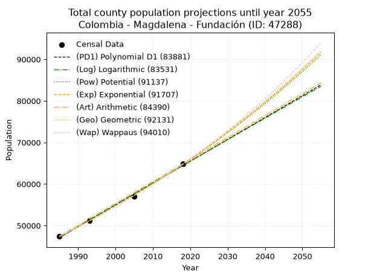
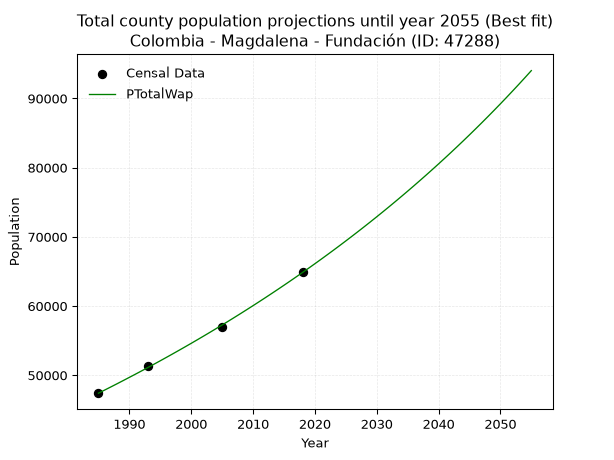
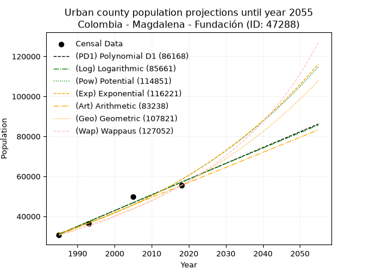
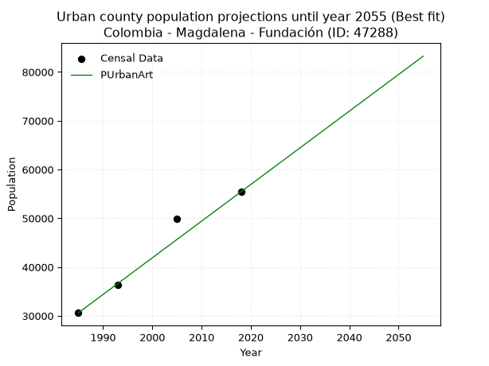
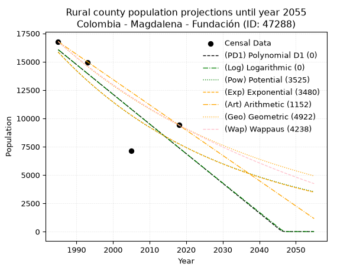
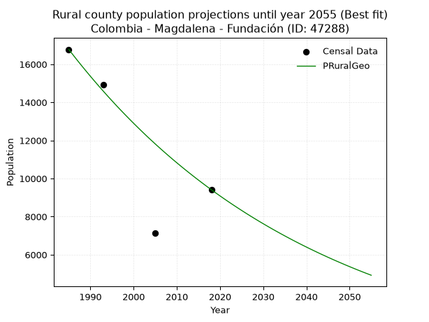

<div align="center">


</div>

# _“Population and Public Services Demand Projections (PPSD) until Year 2050 for Colombia - Magdalena - Fundación (ID: 47288)”_
Keywords: `population` `public-service` `projection` `lineal` `polynomial` `logarithmic` `potential` `exponential` `arithmetic` `geometric` `wappaus` `dane` `colombia` `south-america`

PPSD are analytical estimates used by governments and planners to anticipate future changes in population size, age distribution, and the resulting community needs for utilities, healthcare, education, and infrastructure as sizing future water treatment facilities, electrical grids, and road networks based on spatial growth.

> **General running parameters**: • app_version: _v20260806_. • Python version: _3.14.7_. • Pandas version: _3.0.5_. • NumPy version: _2.5.1_. • Creates, save and include plots into reports (create_plot): _False_. • Projection until year: _2050_. • Process polynomial degree 2 and up: _False_. • Process Wappaus: _True_. • Process Wappaus: _True_. • Set negative values to zero: _True_. • Set infinite values to zero: _True_. • Drop dataset notes: _True_. 
<div align="center">

Dynamic map: [:earth_americas:Google](http://maps.google.com/maps?q=10.51414569,-74.1914528) [:earth_americas:OSM](https://www.openstreetmap.org/#map=18/10.51414569/-74.1914528&layers=P) [:earth_americas:Bing](https://www.bing.com/maps?cp=10.51414569~-74.1914528&lvl=18) [:earth_americas:Apple](https://maps.apple.com/frame?center=10.51414569%2C-74.1914528&span=0.003%2C0.006)

</div>


<div align="center">

```geojson
{
  "type": "Feature",
  "geometry": {
    "type": "Point", 
    "coordinates": [-74.1914528, 10.51414569]
  }, 
  "properties": {
    "Name": "Colombia - Magdalena - Fundación (ID: 47288)"
  }
}
```

</div>


## 0. Census Data (4 records)

Census data are official statistics collected by a government about the people and housing in a country. They usually include counts of total population, age, sex, race, income, education, and jobs.

📅Global census file: [Population.xlsx](../data/Population.xlsx)

| Source   |   Year |   CountryID | CountryName   |   StateID | StateName   |   CountyID | CountyName   |   PTotal |   PUrban |   PRural |
|:---------|-------:|------------:|:--------------|----------:|:------------|-----------:|:-------------|---------:|---------:|---------:|
| DANE     |   1985 |          57 | Colombia      |        47 | Magdalena   |      47288 | Fundación    |    47390 |    30613 |    16777 |
| DANE     |   1993 |          57 | Colombia      |        47 | Magdalena   |      47288 | Fundación    |    51251 |    36315 |    14936 |
| DANE     |   2005 |          57 | Colombia      |        47 | Magdalena   |      47288 | Fundación    |    56986 |    49856 |     7130 |
| DANE     |   2018 |          57 | Colombia      |        47 | Magdalena   |      47288 | Fundación    |    64833 |    55422 |     9411 |

> 🔥Some records could had specific notes about the registered values or the corresponding urban or rural distribution.

## 1. Total

### 1.1. Coefficients and Parameters

* (PD1) Polynomial Deg 1: 525.4146928944148, -995845.7394620533 (lineal)
* (Log) Logarithmic: 1051541.8775873727, -7937663.238069386
* (Pow) Potential: 18.869661051169974, -57.551943815446826
* (Exp) Exponential: 0.009427438268081512, 0.00035370885168695793
* (Art) Arithmetic: Year diff. 2018 - 1985 = 33, Population diff. 64833 - 47390 = 17443, Annual growth = 528.5757575757576
* (Geo) Geometric: Year diff. 2018 - 1985 = 33, Population diff. 64833 - 47390 = 17443, Annual growth % = 0.009542315993584793
* (Wap) Wappaus: i = 0.9420096728402513, Condition values only valid for < 200)

<sub>
Wappaus condition values: ['0.00', '0.94', '1.88', '2.83', '3.77', '4.71', '5.65', '6.59', '7.54', '8.48', '9.42', '10.36', '11.30', '12.25', '13.19', '14.13', '15.07', '16.01', '16.96', '17.90', '18.84', '19.78', '20.72', '21.67', '22.61', '23.55', '24.49', '25.43', '26.38', '27.32', '28.26', '29.20', '30.14', '31.09', '32.03', '32.97', '33.91', '34.85', '35.80', '36.74', '37.68', '38.62', '39.56', '40.51', '41.45', '42.39', '43.33', '44.27', '45.22', '46.16', '47.10', '48.04', '48.98', '49.93', '50.87', '51.81', '52.75', '53.69', '54.64', '55.58', '56.52', '57.46', '58.40', '59.35', '60.29', '61.23']
</sub>


### 1.2. Projected Dataset

|   Year |   CountyID |   PTotalPD1 |   PTotalLog |   PTotalPow |   PTotalExp |   PTotalArt |   PTotalGeo |   PTotalWap |
|-------:|-----------:|------------:|------------:|------------:|------------:|------------:|------------:|------------:|
|   1985 |      47288 |       47102 |       47088 |       47389 |       47402 |       47390 |       47390 |       47390 |
|   1986 |      47288 |       47628 |       47617 |       47842 |       47851 |       47919 |       47842 |       47839 |
|   1987 |      47288 |       48153 |       48147 |       48298 |       48305 |       48447 |       48299 |       48291 |
|   1988 |      47288 |       48679 |       48676 |       48759 |       48762 |       48976 |       48760 |       48748 |
|   1989 |      47288 |       49204 |       49205 |       49224 |       49224 |       49504 |       49225 |       49210 |
|   1990 |      47288 |       49729 |       49733 |       49693 |       49690 |       50033 |       49695 |       49676 |
|   1991 |      47288 |       50255 |       50261 |       50166 |       50161 |       50561 |       50169 |       50146 |
|   1992 |      47288 |       50780 |       50789 |       50644 |       50636 |       51090 |       50648 |       50621 |
|   1993 |      47288 |       51306 |       51317 |       51126 |       51116 |       51619 |       51131 |       51101 |
|   1994 |      47288 |       51831 |       51845 |       51612 |       51600 |       52147 |       51619 |       51586 |
|   1995 |      47288 |       52357 |       52372 |       52103 |       52089 |       52676 |       52111 |       52075 |
|   1996 |      47288 |       52882 |       52899 |       52598 |       52582 |       53204 |       52609 |       52569 |
|   1997 |      47288 |       53407 |       53426 |       53097 |       53080 |       53733 |       53111 |       53068 |
|   1998 |      47288 |       53933 |       53952 |       53601 |       53583 |       54261 |       53617 |       53572 |
|   1999 |      47288 |       54458 |       54478 |       54110 |       54090 |       54790 |       54129 |       54081 |
|   2000 |      47288 |       54984 |       55004 |       54623 |       54603 |       55319 |       54646 |       54595 |
|   2001 |      47288 |       55509 |       55530 |       55140 |       55120 |       55847 |       55167 |       55115 |
|   2002 |      47288 |       56034 |       56055 |       55663 |       55642 |       56376 |       55693 |       55640 |
|   2003 |      47288 |       56560 |       56580 |       56190 |       56169 |       56904 |       56225 |       56170 |
|   2004 |      47288 |       57085 |       57105 |       56721 |       56701 |       57433 |       56761 |       56706 |
|   2005 |      47288 |       57611 |       57630 |       57258 |       57238 |       57962 |       57303 |       57247 |
|   2006 |      47288 |       58136 |       58154 |       57799 |       57780 |       58490 |       57850 |       57794 |
|   2007 |      47288 |       58662 |       58678 |       58345 |       58328 |       59019 |       58402 |       58347 |
|   2008 |      47288 |       59187 |       59202 |       58896 |       58880 |       59547 |       58959 |       58905 |
|   2009 |      47288 |       59712 |       59725 |       59452 |       59438 |       60076 |       59522 |       59470 |
|   2010 |      47288 |       60238 |       60249 |       60013 |       60001 |       60604 |       60090 |       60040 |
|   2011 |      47288 |       60763 |       60772 |       60579 |       60569 |       61133 |       60663 |       60617 |
|   2012 |      47288 |       61289 |       61294 |       61150 |       61143 |       61662 |       61242 |       61199 |
|   2013 |      47288 |       61814 |       61817 |       61726 |       61722 |       62190 |       61826 |       61789 |
|   2014 |      47288 |       62339 |       62339 |       62307 |       62307 |       62719 |       62416 |       62384 |
|   2015 |      47288 |       62865 |       62861 |       62894 |       62897 |       63247 |       63012 |       62986 |
|   2016 |      47288 |       63390 |       63383 |       63485 |       63493 |       63776 |       63613 |       63595 |
|   2017 |      47288 |       63916 |       63904 |       64082 |       64094 |       64304 |       64220 |       64211 |
|   2018 |      47288 |       64441 |       64426 |       64684 |       64701 |       64833 |       64833 |       64833 |
|   2019 |      47288 |       64967 |       64947 |       65292 |       65314 |       65362 |       65452 |       65462 |
|   2020 |      47288 |       65492 |       65467 |       65905 |       65933 |       65890 |       66076 |       66099 |
|   2021 |      47288 |       66017 |       65988 |       66523 |       66557 |       66419 |       66707 |       66743 |
|   2022 |      47288 |       66543 |       66508 |       67147 |       67188 |       66947 |       67343 |       67394 |
|   2023 |      47288 |       67068 |       67028 |       67776 |       67824 |       67476 |       67986 |       68052 |
|   2024 |      47288 |       67594 |       67547 |       68411 |       68466 |       68004 |       68635 |       68718 |
|   2025 |      47288 |       68119 |       68067 |       69052 |       69115 |       68533 |       69290 |       69392 |
|   2026 |      47288 |       68644 |       68586 |       69698 |       69770 |       69062 |       69951 |       70074 |
|   2027 |      47288 |       69170 |       69105 |       70350 |       70430 |       69590 |       70618 |       70763 |
|   2028 |      47288 |       69695 |       69623 |       71008 |       71098 |       70119 |       71292 |       71461 |
|   2029 |      47288 |       70221 |       70142 |       71672 |       71771 |       70647 |       71972 |       72167 |
|   2030 |      47288 |       70746 |       70660 |       72341 |       72451 |       71176 |       72659 |       72882 |
|   2031 |      47288 |       71272 |       71178 |       73017 |       73137 |       71704 |       73353 |       73605 |
|   2032 |      47288 |       71797 |       71695 |       73698 |       73830 |       72233 |       74052 |       74337 |
|   2033 |      47288 |       72322 |       72213 |       74385 |       74529 |       72762 |       74759 |       75078 |
|   2034 |      47288 |       72848 |       72730 |       75079 |       75235 |       73290 |       75472 |       75828 |
|   2035 |      47288 |       73373 |       73247 |       75778 |       75948 |       73819 |       76193 |       76587 |
|   2036 |      47288 |       73899 |       73763 |       76484 |       76667 |       74347 |       76920 |       77355 |
|   2037 |      47288 |       74424 |       74280 |       77196 |       77393 |       74876 |       77654 |       78134 |
|   2038 |      47288 |       74949 |       74796 |       77914 |       78126 |       75405 |       78395 |       78921 |
|   2039 |      47288 |       75475 |       75312 |       78639 |       78866 |       75933 |       79143 |       79719 |
|   2040 |      47288 |       76000 |       75827 |       79370 |       79613 |       76462 |       79898 |       80527 |
|   2041 |      47288 |       76526 |       76343 |       80107 |       80367 |       76990 |       80660 |       81346 |
|   2042 |      47288 |       77051 |       76858 |       80851 |       81129 |       77519 |       81430 |       82175 |
|   2043 |      47288 |       77576 |       77373 |       81602 |       81897 |       78047 |       82207 |       83014 |
|   2044 |      47288 |       78102 |       77887 |       82359 |       82673 |       78576 |       82992 |       83865 |
|   2045 |      47288 |       78627 |       78401 |       83122 |       83456 |       79105 |       83783 |       84727 |
|   2046 |      47288 |       79153 |       78916 |       83893 |       84246 |       79633 |       84583 |       85600 |
|   2047 |      47288 |       79678 |       79429 |       84670 |       85044 |       80162 |       85390 |       86484 |
|   2048 |      47288 |       80204 |       79943 |       85454 |       85850 |       80690 |       86205 |       87381 |
|   2049 |      47288 |       80729 |       80456 |       86244 |       86663 |       81219 |       87027 |       88290 |
|   2050 |      47288 |       81254 |       80969 |       87042 |       87484 |       81747 |       87858 |       89211 |
<div align="center">

</img>

</div>


### 1.3. Best fit with absolute and relative error (%)

Relative error puts that difference into context by dividing the absolute error by the true value, creating a unitless ratio or percentage that shows the scale of the mistake.

Absolute and relative error

|   Year | Source   |   CountryID | CountryName   |   StateID | StateName   |   CountyID_x | CountyName   |   PTotal |   PUrban |   PRural |   CountyID_y |   PTotalPD1 |   PTotalLog |   PTotalPow |   PTotalExp |   PTotalArt |   PTotalGeo |   PTotalWap |   PTotalPD1AbsError |   PTotalLogAbsError |   PTotalPowAbsError |   PTotalExpAbsError |   PTotalArtAbsError |   PTotalGeoAbsError |   PTotalWapAbsError |   PTotalPD1RelError |   PTotalLogRelError |   PTotalPowRelError |   PTotalExpRelError |   PTotalArtRelError |   PTotalGeoRelError |   PTotalWapRelError |
|-------:|:---------|------------:|:--------------|----------:|:------------|-------------:|:-------------|---------:|---------:|---------:|-------------:|------------:|------------:|------------:|------------:|------------:|------------:|------------:|--------------------:|--------------------:|--------------------:|--------------------:|--------------------:|--------------------:|--------------------:|--------------------:|--------------------:|--------------------:|--------------------:|--------------------:|--------------------:|--------------------:|
|   1985 | DANE     |          57 | Colombia      |        47 | Magdalena   |        47288 | Fundación    |    47390 |    30613 |    16777 |        47288 |       47102 |       47088 |       47389 |       47402 |       47390 |       47390 |       47390 |                 288 |                 302 |                   1 |                  12 |                   0 |                   0 |                   0 |            0.607723 |            0.637265 |          0.00211015 |           0.0253218 |            0        |            0        |            0        |
|   1993 | DANE     |          57 | Colombia      |        47 | Magdalena   |        47288 | Fundación    |    51251 |    36315 |    14936 |        47288 |       51306 |       51317 |       51126 |       51116 |       51619 |       51131 |       51101 |                  55 |                  66 |                 125 |                 135 |                 368 |                 120 |                 150 |            0.107315 |            0.128778 |          0.243898   |           0.263409  |            0.718035 |            0.234142 |            0.292677 |
|   2005 | DANE     |          57 | Colombia      |        47 | Magdalena   |        47288 | Fundación    |    56986 |    49856 |     7130 |        47288 |       57611 |       57630 |       57258 |       57238 |       57962 |       57303 |       57247 |                 625 |                 644 |                 272 |                 252 |                 976 |                 317 |                 261 |            1.09676  |            1.1301   |          0.47731    |           0.442214  |            1.7127   |            0.556277 |            0.458007 |
|   2018 | DANE     |          57 | Colombia      |        47 | Magdalena   |        47288 | Fundación    |    64833 |    55422 |     9411 |        47288 |       64441 |       64426 |       64684 |       64701 |       64833 |       64833 |       64833 |                 392 |                 407 |                 149 |                 132 |                   0 |                   0 |                   0 |            0.60463  |            0.627767 |          0.229821   |           0.2036    |            0        |            0        |            0        |

Relative error mean

| Method    |   RelError | Best   |
|:----------|-----------:|:-------|
| PTotalPD1 |   0.604107 |        |
| PTotalLog |   0.630978 |        |
| PTotalPow |   0.238285 |        |
| PTotalExp |   0.233636 |        |
| PTotalArt |   0.607684 |        |
| PTotalGeo |   0.197605 |        |
| PTotalWap |   0.187671 | True   |

💙Best method: _**PTotalWap**_
<div align="center">

</img>

</div>


### 1.4. Fresh water supply demand in liters per capita per day (lpcd)

The fresh water supply demand typically ranges from 100 to 300 liters per capita per day (lpcd) for standard domestic and municipal planning, though absolute survival minimums set by the World Health Organization are as low as 7.5 to 20 liters per day, and total consumption in high-income nations can exceed 400 liters.

> `CZ`: Level in meters above the sea level (masl)<br> `WS`: Fresh water supply demand in liters per capita per day (lpcd or l/h/d)<br> `WSAll`: Zonal fresh water supply demand in liters per second (l/s)<br> `A`: Zonal area in square meters<br> `DP`: Population density (people/hectare)

Reference values (RAS Colombia)

|    CZ |   WS |
|------:|-----:|
|  1000 |  120 |
|  2000 |  130 |
| 99999 |  140 |

County shapefile geometry properties and water supply values

|   CountyID |      ATotal |   CZTotal |   WSTotal |
|-----------:|------------:|----------:|----------:|
|      47288 | 9.70568e+08 |   978.055 |       120 |

Projected values for best method: PTotalWap

|   CountyID |   Year |   PTotalWap |   DPTotal |   WSTotal |   WSTotalAll |
|-----------:|-------:|------------:|----------:|----------:|-------------:|
|      47288 |   1985 |       47390 |      0.49 |       120 |      65.8194 |
|      47288 |   1986 |       47839 |      0.49 |       120 |      66.4431 |
|      47288 |   1987 |       48291 |      0.5  |       120 |      67.0708 |
|      47288 |   1988 |       48748 |      0.5  |       120 |      67.7056 |
|      47288 |   1989 |       49210 |      0.51 |       120 |      68.3472 |
|      47288 |   1990 |       49676 |      0.51 |       120 |      68.9944 |
|      47288 |   1991 |       50146 |      0.52 |       120 |      69.6472 |
|      47288 |   1992 |       50621 |      0.52 |       120 |      70.3069 |
|      47288 |   1993 |       51101 |      0.53 |       120 |      70.9736 |
|      47288 |   1994 |       51586 |      0.53 |       120 |      71.6472 |
|      47288 |   1995 |       52075 |      0.54 |       120 |      72.3264 |
|      47288 |   1996 |       52569 |      0.54 |       120 |      73.0125 |
|      47288 |   1997 |       53068 |      0.55 |       120 |      73.7056 |
|      47288 |   1998 |       53572 |      0.55 |       120 |      74.4056 |
|      47288 |   1999 |       54081 |      0.56 |       120 |      75.1125 |
|      47288 |   2000 |       54595 |      0.56 |       120 |      75.8264 |
|      47288 |   2001 |       55115 |      0.57 |       120 |      76.5486 |
|      47288 |   2002 |       55640 |      0.57 |       120 |      77.2778 |
|      47288 |   2003 |       56170 |      0.58 |       120 |      78.0139 |
|      47288 |   2004 |       56706 |      0.58 |       120 |      78.7583 |
|      47288 |   2005 |       57247 |      0.59 |       120 |      79.5097 |
|      47288 |   2006 |       57794 |      0.6  |       120 |      80.2694 |
|      47288 |   2007 |       58347 |      0.6  |       120 |      81.0375 |
|      47288 |   2008 |       58905 |      0.61 |       120 |      81.8125 |
|      47288 |   2009 |       59470 |      0.61 |       120 |      82.5972 |
|      47288 |   2010 |       60040 |      0.62 |       120 |      83.3889 |
|      47288 |   2011 |       60617 |      0.62 |       120 |      84.1903 |
|      47288 |   2012 |       61199 |      0.63 |       120 |      84.9986 |
|      47288 |   2013 |       61789 |      0.64 |       120 |      85.8181 |
|      47288 |   2014 |       62384 |      0.64 |       120 |      86.6444 |
|      47288 |   2015 |       62986 |      0.65 |       120 |      87.4806 |
|      47288 |   2016 |       63595 |      0.66 |       120 |      88.3264 |
|      47288 |   2017 |       64211 |      0.66 |       120 |      89.1819 |
|      47288 |   2018 |       64833 |      0.67 |       120 |      90.0458 |
|      47288 |   2019 |       65462 |      0.67 |       120 |      90.9194 |
|      47288 |   2020 |       66099 |      0.68 |       120 |      91.8042 |
|      47288 |   2021 |       66743 |      0.69 |       120 |      92.6986 |
|      47288 |   2022 |       67394 |      0.69 |       120 |      93.6028 |
|      47288 |   2023 |       68052 |      0.7  |       120 |      94.5167 |
|      47288 |   2024 |       68718 |      0.71 |       120 |      95.4417 |
|      47288 |   2025 |       69392 |      0.71 |       120 |      96.3778 |
|      47288 |   2026 |       70074 |      0.72 |       120 |      97.325  |
|      47288 |   2027 |       70763 |      0.73 |       120 |      98.2819 |
|      47288 |   2028 |       71461 |      0.74 |       120 |      99.2514 |
|      47288 |   2029 |       72167 |      0.74 |       120 |     100.232  |
|      47288 |   2030 |       72882 |      0.75 |       120 |     101.225  |
|      47288 |   2031 |       73605 |      0.76 |       120 |     102.229  |
|      47288 |   2032 |       74337 |      0.77 |       120 |     103.246  |
|      47288 |   2033 |       75078 |      0.77 |       120 |     104.275  |
|      47288 |   2034 |       75828 |      0.78 |       120 |     105.317  |
|      47288 |   2035 |       76587 |      0.79 |       120 |     106.371  |
|      47288 |   2036 |       77355 |      0.8  |       120 |     107.438  |
|      47288 |   2037 |       78134 |      0.81 |       120 |     108.519  |
|      47288 |   2038 |       78921 |      0.81 |       120 |     109.612  |
|      47288 |   2039 |       79719 |      0.82 |       120 |     110.721  |
|      47288 |   2040 |       80527 |      0.83 |       120 |     111.843  |
|      47288 |   2041 |       81346 |      0.84 |       120 |     112.981  |
|      47288 |   2042 |       82175 |      0.85 |       120 |     114.132  |
|      47288 |   2043 |       83014 |      0.86 |       120 |     115.297  |
|      47288 |   2044 |       83865 |      0.86 |       120 |     116.479  |
|      47288 |   2045 |       84727 |      0.87 |       120 |     117.676  |
|      47288 |   2046 |       85600 |      0.88 |       120 |     118.889  |
|      47288 |   2047 |       86484 |      0.89 |       120 |     120.117  |
|      47288 |   2048 |       87381 |      0.9  |       120 |     121.362  |
|      47288 |   2049 |       88290 |      0.91 |       120 |     122.625  |
|      47288 |   2050 |       89211 |      0.92 |       120 |     123.904  |

## 2. Urban

### 2.1. Coefficients and Parameters

* (PD1) Polynomial Deg 1: 787.5142513046927, -1532173.8811722114 (lineal)
* (Log) Logarithmic: 1576778.4210190189, -11942053.913674837
* (Pow) Potential: 37.345629782666464, -118.658908207826
* (Exp) Exponential: 0.01864928666868611, 2.637900969882494e-12
* (Art) Arithmetic: Year diff. 2018 - 1985 = 33, Population diff. 55422 - 30613 = 24809, Annual growth = 751.7878787878788
* (Geo) Geometric: Year diff. 2018 - 1985 = 33, Population diff. 55422 - 30613 = 24809, Annual growth % = 0.018149150185155616
* (Wap) Wappaus: i = 1.747632658308546, Condition values only valid for < 200)

<sub>
Wappaus condition values: ['0.00', '1.75', '3.50', '5.24', '6.99', '8.74', '10.49', '12.23', '13.98', '15.73', '17.48', '19.22', '20.97', '22.72', '24.47', '26.21', '27.96', '29.71', '31.46', '33.21', '34.95', '36.70', '38.45', '40.20', '41.94', '43.69', '45.44', '47.19', '48.93', '50.68', '52.43', '54.18', '55.92', '57.67', '59.42', '61.17', '62.91', '64.66', '66.41', '68.16', '69.91', '71.65', '73.40', '75.15', '76.90', '78.64', '80.39', '82.14', '83.89', '85.63', '87.38', '89.13', '90.88', '92.62', '94.37', '96.12', '97.87', '99.62', '101.36', '103.11', '104.86', '106.61', '108.35', '110.10', '111.85', '113.60']
</sub>


### 2.2. Projected Dataset

|   Year |   CountyID |   PUrbanPD1 |   PUrbanLog |   PUrbanPow |   PUrbanExp |   PUrbanArt |   PUrbanGeo |   PUrbanWap |
|-------:|-----------:|------------:|------------:|------------:|------------:|------------:|------------:|------------:|
|   1985 |      47288 |       31042 |       31015 |       31480 |       31502 |       30613 |       30613 |       30613 |
|   1986 |      47288 |       31829 |       31809 |       32078 |       32095 |       31365 |       31169 |       31153 |
|   1987 |      47288 |       32617 |       32603 |       32686 |       32699 |       32117 |       31734 |       31702 |
|   1988 |      47288 |       33404 |       33396 |       33306 |       33314 |       32868 |       32310 |       32261 |
|   1989 |      47288 |       34192 |       34189 |       33938 |       33941 |       33620 |       32897 |       32831 |
|   1990 |      47288 |       34979 |       34981 |       34581 |       34580 |       34372 |       33494 |       33410 |
|   1991 |      47288 |       35767 |       35774 |       35236 |       35231 |       35124 |       34102 |       34001 |
|   1992 |      47288 |       36555 |       36565 |       35903 |       35895 |       35876 |       34720 |       34602 |
|   1993 |      47288 |       37342 |       37357 |       36582 |       36570 |       36627 |       35351 |       35215 |
|   1994 |      47288 |       38130 |       38148 |       37274 |       37259 |       37379 |       35992 |       35839 |
|   1995 |      47288 |       38917 |       38938 |       37978 |       37960 |       38131 |       36645 |       36475 |
|   1996 |      47288 |       39705 |       39728 |       38696 |       38675 |       38883 |       37311 |       37124 |
|   1997 |      47288 |       40492 |       40518 |       39427 |       39403 |       39634 |       37988 |       37785 |
|   1998 |      47288 |       41280 |       41307 |       40171 |       40144 |       40386 |       38677 |       38459 |
|   1999 |      47288 |       42067 |       42096 |       40928 |       40900 |       41138 |       39379 |       39147 |
|   2000 |      47288 |       42855 |       42885 |       41700 |       41670 |       41890 |       40094 |       39849 |
|   2001 |      47288 |       43642 |       43673 |       42486 |       42454 |       42642 |       40821 |       40564 |
|   2002 |      47288 |       44430 |       44461 |       43286 |       43254 |       43393 |       41562 |       41295 |
|   2003 |      47288 |       45217 |       45248 |       44101 |       44068 |       44145 |       42317 |       42040 |
|   2004 |      47288 |       46005 |       46035 |       44931 |       44897 |       44897 |       43085 |       42802 |
|   2005 |      47288 |       46792 |       46822 |       45775 |       45742 |       45649 |       43867 |       43579 |
|   2006 |      47288 |       47580 |       47608 |       46636 |       46604 |       46401 |       44663 |       44373 |
|   2007 |      47288 |       48367 |       48394 |       47512 |       47481 |       47152 |       45473 |       45184 |
|   2008 |      47288 |       49155 |       49180 |       48404 |       48375 |       47904 |       46299 |       46013 |
|   2009 |      47288 |       49942 |       49965 |       49313 |       49285 |       48656 |       47139 |       46860 |
|   2010 |      47288 |       50730 |       50749 |       50238 |       50213 |       49408 |       47994 |       47727 |
|   2011 |      47288 |       51517 |       51534 |       51179 |       51158 |       50159 |       48866 |       48612 |
|   2012 |      47288 |       52305 |       52317 |       52139 |       52121 |       50911 |       49752 |       49518 |
|   2013 |      47288 |       53092 |       53101 |       53115 |       53102 |       51663 |       50655 |       50445 |
|   2014 |      47288 |       53880 |       53884 |       54109 |       54102 |       52415 |       51575 |       51394 |
|   2015 |      47288 |       54667 |       54667 |       55122 |       55120 |       53167 |       52511 |       52365 |
|   2016 |      47288 |       55455 |       55449 |       56153 |       56158 |       53918 |       53464 |       53360 |
|   2017 |      47288 |       56242 |       56231 |       57202 |       57215 |       54670 |       54434 |       54378 |
|   2018 |      47288 |       57030 |       57013 |       58271 |       58292 |       55422 |       55422 |       55422 |
|   2019 |      47288 |       57817 |       57794 |       59359 |       59389 |       56174 |       56428 |       56492 |
|   2020 |      47288 |       58605 |       58575 |       60467 |       60507 |       56926 |       57452 |       57588 |
|   2021 |      47288 |       59392 |       59355 |       61595 |       61646 |       57677 |       58495 |       58712 |
|   2022 |      47288 |       60180 |       60135 |       62744 |       62807 |       58429 |       59556 |       59866 |
|   2023 |      47288 |       60967 |       60915 |       63913 |       63989 |       59181 |       60637 |       61050 |
|   2024 |      47288 |       61755 |       61694 |       65104 |       65194 |       59933 |       61738 |       62265 |
|   2025 |      47288 |       62542 |       62473 |       66316 |       66421 |       60685 |       62858 |       63512 |
|   2026 |      47288 |       63330 |       63251 |       67550 |       67671 |       61436 |       63999 |       64794 |
|   2027 |      47288 |       64118 |       64029 |       68806 |       68945 |       62188 |       65161 |       66111 |
|   2028 |      47288 |       64905 |       64807 |       70085 |       70243 |       62940 |       66343 |       67465 |
|   2029 |      47288 |       65693 |       65584 |       71388 |       71565 |       63692 |       67547 |       68857 |
|   2030 |      47288 |       66480 |       66361 |       72713 |       72912 |       64443 |       68773 |       70290 |
|   2031 |      47288 |       67268 |       67138 |       74063 |       74285 |       65195 |       70021 |       71764 |
|   2032 |      47288 |       68055 |       67914 |       75437 |       75683 |       65947 |       71292 |       73282 |
|   2033 |      47288 |       68843 |       68690 |       76836 |       77108 |       66699 |       72586 |       74846 |
|   2034 |      47288 |       69630 |       69465 |       78260 |       78559 |       67451 |       73903 |       76457 |
|   2035 |      47288 |       70418 |       70240 |       79710 |       80038 |       68202 |       75245 |       78119 |
|   2036 |      47288 |       71205 |       71015 |       81186 |       81545 |       68954 |       76610 |       79833 |
|   2037 |      47288 |       71993 |       71789 |       82689 |       83080 |       69706 |       78001 |       81602 |
|   2038 |      47288 |       72780 |       72563 |       84218 |       84644 |       70458 |       79416 |       83428 |
|   2039 |      47288 |       73568 |       73336 |       85775 |       86237 |       71210 |       80858 |       85315 |
|   2040 |      47288 |       74355 |       74109 |       87360 |       87861 |       71961 |       82325 |       87265 |
|   2041 |      47288 |       75143 |       74882 |       88974 |       89515 |       72713 |       83819 |       89282 |
|   2042 |      47288 |       75930 |       75655 |       90617 |       91200 |       73465 |       85341 |       91369 |
|   2043 |      47288 |       76718 |       76427 |       92289 |       92916 |       74217 |       86889 |       93531 |
|   2044 |      47288 |       77505 |       77198 |       93991 |       94665 |       74968 |       88466 |       95770 |
|   2045 |      47288 |       78293 |       77969 |       95723 |       96447 |       75720 |       90072 |       98091 |
|   2046 |      47288 |       79080 |       78740 |       97487 |       98263 |       76472 |       91707 |      100500 |
|   2047 |      47288 |       79868 |       79511 |       99283 |      100113 |       77224 |       93371 |      103000 |
|   2048 |      47288 |       80655 |       80281 |      101110 |      101997 |       77976 |       95066 |      105597 |
|   2049 |      47288 |       81443 |       81050 |      102970 |      103917 |       78727 |       96791 |      108298 |
|   2050 |      47288 |       82230 |       81820 |      104864 |      105873 |       79479 |       98548 |      111107 |
<div align="center">

</img>

</div>


### 2.3. Best fit with absolute and relative error (%)

Relative error puts that difference into context by dividing the absolute error by the true value, creating a unitless ratio or percentage that shows the scale of the mistake.

Absolute and relative error

|   Year | Source   |   CountryID | CountryName   |   StateID | StateName   |   CountyID_x | CountyName   |   PTotal |   PUrban |   PRural |   CountyID_y |   PUrbanPD1 |   PUrbanLog |   PUrbanPow |   PUrbanExp |   PUrbanArt |   PUrbanGeo |   PUrbanWap |   PUrbanPD1AbsError |   PUrbanLogAbsError |   PUrbanPowAbsError |   PUrbanExpAbsError |   PUrbanArtAbsError |   PUrbanGeoAbsError |   PUrbanWapAbsError |   PUrbanPD1RelError |   PUrbanLogRelError |   PUrbanPowRelError |   PUrbanExpRelError |   PUrbanArtRelError |   PUrbanGeoRelError |   PUrbanWapRelError |
|-------:|:---------|------------:|:--------------|----------:|:------------|-------------:|:-------------|---------:|---------:|---------:|-------------:|------------:|------------:|------------:|------------:|------------:|------------:|------------:|--------------------:|--------------------:|--------------------:|--------------------:|--------------------:|--------------------:|--------------------:|--------------------:|--------------------:|--------------------:|--------------------:|--------------------:|--------------------:|--------------------:|
|   1985 | DANE     |          57 | Colombia      |        47 | Magdalena   |        47288 | Fundación    |    47390 |    30613 |    16777 |        47288 |       31042 |       31015 |       31480 |       31502 |       30613 |       30613 |       30613 |                 429 |                 402 |                 867 |                 889 |                   0 |                   0 |                   0 |             1.40137 |             1.31317 |            2.83213  |            2.904    |            0        |             0       |             0       |
|   1993 | DANE     |          57 | Colombia      |        47 | Magdalena   |        47288 | Fundación    |    51251 |    36315 |    14936 |        47288 |       37342 |       37357 |       36582 |       36570 |       36627 |       35351 |       35215 |                1027 |                1042 |                 267 |                 255 |                 312 |                 964 |                1100 |             2.82803 |             2.86934 |            0.735233 |            0.702189 |            0.859149 |             2.65455 |             3.02905 |
|   2005 | DANE     |          57 | Colombia      |        47 | Magdalena   |        47288 | Fundación    |    56986 |    49856 |     7130 |        47288 |       46792 |       46822 |       45775 |       45742 |       45649 |       43867 |       43579 |                3064 |                3034 |                4081 |                4114 |                4207 |                5989 |                6277 |             6.1457  |             6.08553 |            8.18557  |            8.25177  |            8.4383   |            12.0126  |            12.5903  |
|   2018 | DANE     |          57 | Colombia      |        47 | Magdalena   |        47288 | Fundación    |    64833 |    55422 |     9411 |        47288 |       57030 |       57013 |       58271 |       58292 |       55422 |       55422 |       55422 |                1608 |                1591 |                2849 |                2870 |                   0 |                   0 |                   0 |             2.90137 |             2.8707  |            5.14056  |            5.17845  |            0        |             0       |             0       |

Relative error mean

| Method    |   RelError | Best   |
|:----------|-----------:|:-------|
| PUrbanPD1 |    3.31912 |        |
| PUrbanLog |    3.28468 |        |
| PUrbanPow |    4.22337 |        |
| PUrbanExp |    4.2591  |        |
| PUrbanArt |    2.32436 | True   |
| PUrbanGeo |    3.66679 |        |
| PUrbanWap |    3.90483 |        |

💙Best method: _**PUrbanArt**_
<div align="center">

</img>

</div>


### 2.4. Fresh water supply demand in liters per capita per day (lpcd)

The fresh water supply demand typically ranges from 100 to 300 liters per capita per day (lpcd) for standard domestic and municipal planning, though absolute survival minimums set by the World Health Organization are as low as 7.5 to 20 liters per day, and total consumption in high-income nations can exceed 400 liters.

> `CZ`: Level in meters above the sea level (masl)<br> `WS`: Fresh water supply demand in liters per capita per day (lpcd or l/h/d)<br> `WSAll`: Zonal fresh water supply demand in liters per second (l/s)<br> `A`: Zonal area in square meters<br> `DP`: Population density (people/hectare)

Reference values (RAS Colombia)

|    CZ |   WS |
|------:|-----:|
|  1000 |  120 |
|  2000 |  130 |
| 99999 |  140 |

County shapefile geometry properties and water supply values

|   CountyID |      AUrban |   CZUrban |   WSUrban |
|-----------:|------------:|----------:|----------:|
|      47288 | 7.39291e+06 |   50.1894 |       120 |

Projected values for best method: PUrbanArt

|   CountyID |   Year |   PUrbanArt |   DPUrban |   WSUrban |   WSUrbanAll |
|-----------:|-------:|------------:|----------:|----------:|-------------:|
|      47288 |   1985 |       30613 |     41.41 |       120 |      42.5181 |
|      47288 |   1986 |       31365 |     42.43 |       120 |      43.5625 |
|      47288 |   1987 |       32117 |     43.44 |       120 |      44.6069 |
|      47288 |   1988 |       32868 |     44.46 |       120 |      45.65   |
|      47288 |   1989 |       33620 |     45.48 |       120 |      46.6944 |
|      47288 |   1990 |       34372 |     46.49 |       120 |      47.7389 |
|      47288 |   1991 |       35124 |     47.51 |       120 |      48.7833 |
|      47288 |   1992 |       35876 |     48.53 |       120 |      49.8278 |
|      47288 |   1993 |       36627 |     49.54 |       120 |      50.8708 |
|      47288 |   1994 |       37379 |     50.56 |       120 |      51.9153 |
|      47288 |   1995 |       38131 |     51.58 |       120 |      52.9597 |
|      47288 |   1996 |       38883 |     52.59 |       120 |      54.0042 |
|      47288 |   1997 |       39634 |     53.61 |       120 |      55.0472 |
|      47288 |   1998 |       40386 |     54.63 |       120 |      56.0917 |
|      47288 |   1999 |       41138 |     55.65 |       120 |      57.1361 |
|      47288 |   2000 |       41890 |     56.66 |       120 |      58.1806 |
|      47288 |   2001 |       42642 |     57.68 |       120 |      59.225  |
|      47288 |   2002 |       43393 |     58.7  |       120 |      60.2681 |
|      47288 |   2003 |       44145 |     59.71 |       120 |      61.3125 |
|      47288 |   2004 |       44897 |     60.73 |       120 |      62.3569 |
|      47288 |   2005 |       45649 |     61.75 |       120 |      63.4014 |
|      47288 |   2006 |       46401 |     62.76 |       120 |      64.4458 |
|      47288 |   2007 |       47152 |     63.78 |       120 |      65.4889 |
|      47288 |   2008 |       47904 |     64.8  |       120 |      66.5333 |
|      47288 |   2009 |       48656 |     65.81 |       120 |      67.5778 |
|      47288 |   2010 |       49408 |     66.83 |       120 |      68.6222 |
|      47288 |   2011 |       50159 |     67.85 |       120 |      69.6653 |
|      47288 |   2012 |       50911 |     68.86 |       120 |      70.7097 |
|      47288 |   2013 |       51663 |     69.88 |       120 |      71.7542 |
|      47288 |   2014 |       52415 |     70.9  |       120 |      72.7986 |
|      47288 |   2015 |       53167 |     71.92 |       120 |      73.8431 |
|      47288 |   2016 |       53918 |     72.93 |       120 |      74.8861 |
|      47288 |   2017 |       54670 |     73.95 |       120 |      75.9306 |
|      47288 |   2018 |       55422 |     74.97 |       120 |      76.975  |
|      47288 |   2019 |       56174 |     75.98 |       120 |      78.0194 |
|      47288 |   2020 |       56926 |     77    |       120 |      79.0639 |
|      47288 |   2021 |       57677 |     78.02 |       120 |      80.1069 |
|      47288 |   2022 |       58429 |     79.03 |       120 |      81.1514 |
|      47288 |   2023 |       59181 |     80.05 |       120 |      82.1958 |
|      47288 |   2024 |       59933 |     81.07 |       120 |      83.2403 |
|      47288 |   2025 |       60685 |     82.09 |       120 |      84.2847 |
|      47288 |   2026 |       61436 |     83.1  |       120 |      85.3278 |
|      47288 |   2027 |       62188 |     84.12 |       120 |      86.3722 |
|      47288 |   2028 |       62940 |     85.14 |       120 |      87.4167 |
|      47288 |   2029 |       63692 |     86.15 |       120 |      88.4611 |
|      47288 |   2030 |       64443 |     87.17 |       120 |      89.5042 |
|      47288 |   2031 |       65195 |     88.19 |       120 |      90.5486 |
|      47288 |   2032 |       65947 |     89.2  |       120 |      91.5931 |
|      47288 |   2033 |       66699 |     90.22 |       120 |      92.6375 |
|      47288 |   2034 |       67451 |     91.24 |       120 |      93.6819 |
|      47288 |   2035 |       68202 |     92.25 |       120 |      94.725  |
|      47288 |   2036 |       68954 |     93.27 |       120 |      95.7694 |
|      47288 |   2037 |       69706 |     94.29 |       120 |      96.8139 |
|      47288 |   2038 |       70458 |     95.3  |       120 |      97.8583 |
|      47288 |   2039 |       71210 |     96.32 |       120 |      98.9028 |
|      47288 |   2040 |       71961 |     97.34 |       120 |      99.9458 |
|      47288 |   2041 |       72713 |     98.36 |       120 |     100.99   |
|      47288 |   2042 |       73465 |     99.37 |       120 |     102.035  |
|      47288 |   2043 |       74217 |    100.39 |       120 |     103.079  |
|      47288 |   2044 |       74968 |    101.41 |       120 |     104.122  |
|      47288 |   2045 |       75720 |    102.42 |       120 |     105.167  |
|      47288 |   2046 |       76472 |    103.44 |       120 |     106.211  |
|      47288 |   2047 |       77224 |    104.46 |       120 |     107.256  |
|      47288 |   2048 |       77976 |    105.47 |       120 |     108.3    |
|      47288 |   2049 |       78727 |    106.49 |       120 |     109.343  |
|      47288 |   2050 |       79479 |    107.51 |       120 |     110.388  |

## 3. Rural

### 3.1. Coefficients and Parameters

* (PD1) Polynomial Deg 1: -262.09955841027795, 536328.1417101584 (lineal)
* (Log) Logarithmic: -525236.5434316449, 4004390.67560544
* (Pow) Potential: -43.39649427282568, 147.3115371398437
* (Exp) Exponential: -0.021651811644194073, 7.333206831159268e+22
* (Art) Arithmetic: Year diff. 2018 - 1985 = 33, Population diff. 9411 - 16777 = -7366, Annual growth = -223.21212121212122
* (Geo) Geometric: Year diff. 2018 - 1985 = 33, Population diff. 9411 - 16777 = -7366, Annual growth % = -0.017366514438488245
* (Wap) Wappaus: i = -1.7046900963198504, Condition values only valid for < 200)

<sub>
Wappaus condition values: ['-0.00', '-1.70', '-3.41', '-5.11', '-6.82', '-8.52', '-10.23', '-11.93', '-13.64', '-15.34', '-17.05', '-18.75', '-20.46', '-22.16', '-23.87', '-25.57', '-27.28', '-28.98', '-30.68', '-32.39', '-34.09', '-35.80', '-37.50', '-39.21', '-40.91', '-42.62', '-44.32', '-46.03', '-47.73', '-49.44', '-51.14', '-52.85', '-54.55', '-56.25', '-57.96', '-59.66', '-61.37', '-63.07', '-64.78', '-66.48', '-68.19', '-69.89', '-71.60', '-73.30', '-75.01', '-76.71', '-78.42', '-80.12', '-81.83', '-83.53', '-85.23', '-86.94', '-88.64', '-90.35', '-92.05', '-93.76', '-95.46', '-97.17', '-98.87', '-100.58', '-102.28', '-103.99', '-105.69', '-107.40', '-109.10', '-110.80']
</sub>


### 3.2. Projected Dataset

|   Year |   CountyID |   PRuralPD1 |   PRuralLog |   PRuralPow |   PRuralExp |   PRuralArt |   PRuralGeo |   PRuralWap |
|-------:|-----------:|------------:|------------:|------------:|------------:|------------:|------------:|------------:|
|   1985 |      47288 |       16061 |       16073 |       15860 |       15842 |       16777 |       16777 |       16777 |
|   1986 |      47288 |       15798 |       15809 |       15517 |       15503 |       16554 |       16486 |       16493 |
|   1987 |      47288 |       15536 |       15544 |       15181 |       15171 |       16331 |       16199 |       16215 |
|   1988 |      47288 |       15274 |       15280 |       14854 |       14846 |       16107 |       15918 |       15940 |
|   1989 |      47288 |       15012 |       15016 |       14533 |       14528 |       15884 |       15642 |       15671 |
|   1990 |      47288 |       14750 |       14752 |       14219 |       14217 |       15661 |       15370 |       15405 |
|   1991 |      47288 |       14488 |       14488 |       13913 |       13912 |       15438 |       15103 |       15145 |
|   1992 |      47288 |       14226 |       14224 |       13613 |       13614 |       15215 |       14841 |       14888 |
|   1993 |      47288 |       13964 |       13960 |       13319 |       13323 |       14991 |       14583 |       14635 |
|   1994 |      47288 |       13702 |       13697 |       13033 |       13037 |       14768 |       14330 |       14386 |
|   1995 |      47288 |       13440 |       13434 |       12752 |       12758 |       14545 |       14081 |       14142 |
|   1996 |      47288 |       13177 |       13170 |       12478 |       12485 |       14322 |       13836 |       13901 |
|   1997 |      47288 |       12915 |       12907 |       12210 |       12217 |       14098 |       13596 |       13664 |
|   1998 |      47288 |       12653 |       12644 |       11947 |       11956 |       13875 |       13360 |       13430 |
|   1999 |      47288 |       12391 |       12382 |       11691 |       11700 |       13652 |       13128 |       13200 |
|   2000 |      47288 |       12129 |       12119 |       11440 |       11449 |       13429 |       12900 |       12973 |
|   2001 |      47288 |       11867 |       11856 |       11194 |       11204 |       13206 |       12676 |       12750 |
|   2002 |      47288 |       11605 |       11594 |       10954 |       10964 |       12982 |       12456 |       12530 |
|   2003 |      47288 |       11343 |       11332 |       10719 |       10729 |       12759 |       12239 |       12314 |
|   2004 |      47288 |       11081 |       11070 |       10489 |       10499 |       12536 |       12027 |       12100 |
|   2005 |      47288 |       10819 |       10807 |       10265 |       10274 |       12313 |       11818 |       11890 |
|   2006 |      47288 |       10556 |       10546 |       10045 |       10054 |       12090 |       11613 |       11683 |
|   2007 |      47288 |       10294 |       10284 |        9830 |        9839 |       11866 |       11411 |       11479 |
|   2008 |      47288 |       10032 |       10022 |        9620 |        9628 |       11643 |       11213 |       11277 |
|   2009 |      47288 |        9770 |        9761 |        9414 |        9422 |       11420 |       11018 |       11079 |
|   2010 |      47288 |        9508 |        9499 |        9213 |        9220 |       11197 |       10827 |       10883 |
|   2011 |      47288 |        9246 |        9238 |        9016 |        9023 |       10973 |       10639 |       10690 |
|   2012 |      47288 |        8984 |        8977 |        8824 |        8829 |       10750 |       10454 |       10500 |
|   2013 |      47288 |        8722 |        8716 |        8636 |        8640 |       10527 |       10273 |       10312 |
|   2014 |      47288 |        8460 |        8455 |        8452 |        8455 |       10304 |       10094 |       10127 |
|   2015 |      47288 |        8198 |        8194 |        8271 |        8274 |       10081 |        9919 |        9944 |
|   2016 |      47288 |        7935 |        7934 |        8095 |        8097 |        9857 |        9747 |        9764 |
|   2017 |      47288 |        7673 |        7673 |        7923 |        7923 |        9634 |        9577 |        9586 |
|   2018 |      47288 |        7411 |        7413 |        7754 |        7754 |        9411 |        9411 |        9411 |
|   2019 |      47288 |        7149 |        7153 |        7589 |        7588 |        9188 |        9248 |        9238 |
|   2020 |      47288 |        6887 |        6893 |        7428 |        7425 |        8965 |        9087 |        9067 |
|   2021 |      47288 |        6625 |        6633 |        7270 |        7266 |        8741 |        8929 |        8899 |
|   2022 |      47288 |        6363 |        6373 |        7116 |        7110 |        8518 |        8774 |        8732 |
|   2023 |      47288 |        6101 |        6113 |        6965 |        6958 |        8295 |        8622 |        8568 |
|   2024 |      47288 |        5839 |        5854 |        6817 |        6809 |        8072 |        8472 |        8406 |
|   2025 |      47288 |        5577 |        5594 |        6672 |        6663 |        7849 |        8325 |        8246 |
|   2026 |      47288 |        5314 |        5335 |        6531 |        6521 |        7625 |        8180 |        8088 |
|   2027 |      47288 |        5052 |        5076 |        6393 |        6381 |        7402 |        8038 |        7932 |
|   2028 |      47288 |        4790 |        4817 |        6257 |        6244 |        7179 |        7899 |        7778 |
|   2029 |      47288 |        4528 |        4558 |        6125 |        6110 |        6956 |        7761 |        7625 |
|   2030 |      47288 |        4266 |        4299 |        5995 |        5980 |        6732 |        7627 |        7475 |
|   2031 |      47288 |        4004 |        4040 |        5868 |        5852 |        6509 |        7494 |        7327 |
|   2032 |      47288 |        3742 |        3782 |        5744 |        5726 |        6286 |        7364 |        7180 |
|   2033 |      47288 |        3480 |        3523 |        5623 |        5604 |        6063 |        7236 |        7035 |
|   2034 |      47288 |        3218 |        3265 |        5504 |        5484 |        5840 |        7111 |        6892 |
|   2035 |      47288 |        2956 |        3007 |        5388 |        5366 |        5616 |        6987 |        6750 |
|   2036 |      47288 |        2693 |        2749 |        5275 |        5251 |        5393 |        6866 |        6611 |
|   2037 |      47288 |        2431 |        2491 |        5163 |        5139 |        5170 |        6746 |        6472 |
|   2038 |      47288 |        2169 |        2233 |        5054 |        5029 |        4947 |        6629 |        6336 |
|   2039 |      47288 |        1907 |        1975 |        4948 |        4921 |        4724 |        6514 |        6201 |
|   2040 |      47288 |        1645 |        1718 |        4844 |        4815 |        4500 |        6401 |        6068 |
|   2041 |      47288 |        1383 |        1460 |        4742 |        4712 |        4277 |        6290 |        5936 |
|   2042 |      47288 |        1121 |        1203 |        4642 |        4611 |        4054 |        6181 |        5806 |
|   2043 |      47288 |         859 |         946 |        4545 |        4513 |        3831 |        6073 |        5677 |
|   2044 |      47288 |         597 |         689 |        4449 |        4416 |        3607 |        5968 |        5549 |
|   2045 |      47288 |         335 |         432 |        4356 |        4321 |        3384 |        5864 |        5424 |
|   2046 |      47288 |          72 |         175 |        4264 |        4229 |        3161 |        5762 |        5299 |
|   2047 |      47288 |           0 |           0 |        4175 |        4138 |        2938 |        5662 |        5176 |
|   2048 |      47288 |           0 |           0 |        4087 |        4050 |        2715 |        5564 |        5054 |
|   2049 |      47288 |           0 |           0 |        4002 |        3963 |        2491 |        5467 |        4934 |
|   2050 |      47288 |           0 |           0 |        3918 |        3878 |        2268 |        5372 |        4815 |
<div align="center">

</img>

</div>


### 3.3. Best fit with absolute and relative error (%)

Relative error puts that difference into context by dividing the absolute error by the true value, creating a unitless ratio or percentage that shows the scale of the mistake.

Absolute and relative error

|   Year | Source   |   CountryID | CountryName   |   StateID | StateName   |   CountyID_x | CountyName   |   PTotal |   PUrban |   PRural |   CountyID_y |   PRuralPD1 |   PRuralLog |   PRuralPow |   PRuralExp |   PRuralArt |   PRuralGeo |   PRuralWap |   PRuralPD1AbsError |   PRuralLogAbsError |   PRuralPowAbsError |   PRuralExpAbsError |   PRuralArtAbsError |   PRuralGeoAbsError |   PRuralWapAbsError |   PRuralPD1RelError |   PRuralLogRelError |   PRuralPowRelError |   PRuralExpRelError |   PRuralArtRelError |   PRuralGeoRelError |   PRuralWapRelError |
|-------:|:---------|------------:|:--------------|----------:|:------------|-------------:|:-------------|---------:|---------:|---------:|-------------:|------------:|------------:|------------:|------------:|------------:|------------:|------------:|--------------------:|--------------------:|--------------------:|--------------------:|--------------------:|--------------------:|--------------------:|--------------------:|--------------------:|--------------------:|--------------------:|--------------------:|--------------------:|--------------------:|
|   1985 | DANE     |          57 | Colombia      |        47 | Magdalena   |        47288 | Fundación    |    47390 |    30613 |    16777 |        47288 |       16061 |       16073 |       15860 |       15842 |       16777 |       16777 |       16777 |                 716 |                 704 |                 917 |                 935 |                   0 |                   0 |                   0 |             4.26775 |             4.19622 |             5.46582 |             5.57311 |            0        |             0       |             0       |
|   1993 | DANE     |          57 | Colombia      |        47 | Magdalena   |        47288 | Fundación    |    51251 |    36315 |    14936 |        47288 |       13964 |       13960 |       13319 |       13323 |       14991 |       14583 |       14635 |                 972 |                 976 |                1617 |                1613 |                  55 |                 353 |                 301 |             6.50777 |             6.53455 |            10.8262  |            10.7994  |            0.368238 |             2.36342 |             2.01527 |
|   2005 | DANE     |          57 | Colombia      |        47 | Magdalena   |        47288 | Fundación    |    56986 |    49856 |     7130 |        47288 |       10819 |       10807 |       10265 |       10274 |       12313 |       11818 |       11890 |                3689 |                3677 |                3135 |                3144 |                5183 |                4688 |                4760 |            51.7391  |            51.5708  |            43.9691  |            44.0954  |           72.6928   |            65.7504  |            66.7602  |
|   2018 | DANE     |          57 | Colombia      |        47 | Magdalena   |        47288 | Fundación    |    64833 |    55422 |     9411 |        47288 |        7411 |        7413 |        7754 |        7754 |        9411 |        9411 |        9411 |                2000 |                1998 |                1657 |                1657 |                   0 |                   0 |                   0 |            21.2517  |            21.2305  |            17.6071  |            17.6071  |            0        |             0       |             0       |

Relative error mean

| Method    |   RelError | Best   |
|:----------|-----------:|:-------|
| PRuralPD1 |    20.9416 |        |
| PRuralLog |    20.883  |        |
| PRuralPow |    19.4671 |        |
| PRuralExp |    19.5187 |        |
| PRuralArt |    18.2653 |        |
| PRuralGeo |    17.0284 | True   |
| PRuralWap |    17.1939 |        |

💙Best method: _**PRuralGeo**_
<div align="center">

</img>

</div>


### 3.4. Fresh water supply demand in liters per capita per day (lpcd)

The fresh water supply demand typically ranges from 100 to 300 liters per capita per day (lpcd) for standard domestic and municipal planning, though absolute survival minimums set by the World Health Organization are as low as 7.5 to 20 liters per day, and total consumption in high-income nations can exceed 400 liters.

> `CZ`: Level in meters above the sea level (masl)<br> `WS`: Fresh water supply demand in liters per capita per day (lpcd or l/h/d)<br> `WSAll`: Zonal fresh water supply demand in liters per second (l/s)<br> `A`: Zonal area in square meters<br> `DP`: Population density (people/hectare)

Reference values (RAS Colombia)

|    CZ |   WS |
|------:|-----:|
|  1000 |  120 |
|  2000 |  130 |
| 99999 |  140 |

County shapefile geometry properties and water supply values

|   CountyID |      ARural |   CZRural |   WSRural |
|-----------:|------------:|----------:|----------:|
|      47288 | 9.63175e+08 |   985.143 |       120 |

Projected values for best method: PRuralGeo

|   CountyID |   Year |   PRuralGeo |   DPRural |   WSRural |   WSRuralAll |
|-----------:|-------:|------------:|----------:|----------:|-------------:|
|      47288 |   1985 |       16777 |      0.17 |       120 |     23.3014  |
|      47288 |   1986 |       16486 |      0.17 |       120 |     22.8972  |
|      47288 |   1987 |       16199 |      0.17 |       120 |     22.4986  |
|      47288 |   1988 |       15918 |      0.17 |       120 |     22.1083  |
|      47288 |   1989 |       15642 |      0.16 |       120 |     21.725   |
|      47288 |   1990 |       15370 |      0.16 |       120 |     21.3472  |
|      47288 |   1991 |       15103 |      0.16 |       120 |     20.9764  |
|      47288 |   1992 |       14841 |      0.15 |       120 |     20.6125  |
|      47288 |   1993 |       14583 |      0.15 |       120 |     20.2542  |
|      47288 |   1994 |       14330 |      0.15 |       120 |     19.9028  |
|      47288 |   1995 |       14081 |      0.15 |       120 |     19.5569  |
|      47288 |   1996 |       13836 |      0.14 |       120 |     19.2167  |
|      47288 |   1997 |       13596 |      0.14 |       120 |     18.8833  |
|      47288 |   1998 |       13360 |      0.14 |       120 |     18.5556  |
|      47288 |   1999 |       13128 |      0.14 |       120 |     18.2333  |
|      47288 |   2000 |       12900 |      0.13 |       120 |     17.9167  |
|      47288 |   2001 |       12676 |      0.13 |       120 |     17.6056  |
|      47288 |   2002 |       12456 |      0.13 |       120 |     17.3     |
|      47288 |   2003 |       12239 |      0.13 |       120 |     16.9986  |
|      47288 |   2004 |       12027 |      0.12 |       120 |     16.7042  |
|      47288 |   2005 |       11818 |      0.12 |       120 |     16.4139  |
|      47288 |   2006 |       11613 |      0.12 |       120 |     16.1292  |
|      47288 |   2007 |       11411 |      0.12 |       120 |     15.8486  |
|      47288 |   2008 |       11213 |      0.12 |       120 |     15.5736  |
|      47288 |   2009 |       11018 |      0.11 |       120 |     15.3028  |
|      47288 |   2010 |       10827 |      0.11 |       120 |     15.0375  |
|      47288 |   2011 |       10639 |      0.11 |       120 |     14.7764  |
|      47288 |   2012 |       10454 |      0.11 |       120 |     14.5194  |
|      47288 |   2013 |       10273 |      0.11 |       120 |     14.2681  |
|      47288 |   2014 |       10094 |      0.1  |       120 |     14.0194  |
|      47288 |   2015 |        9919 |      0.1  |       120 |     13.7764  |
|      47288 |   2016 |        9747 |      0.1  |       120 |     13.5375  |
|      47288 |   2017 |        9577 |      0.1  |       120 |     13.3014  |
|      47288 |   2018 |        9411 |      0.1  |       120 |     13.0708  |
|      47288 |   2019 |        9248 |      0.1  |       120 |     12.8444  |
|      47288 |   2020 |        9087 |      0.09 |       120 |     12.6208  |
|      47288 |   2021 |        8929 |      0.09 |       120 |     12.4014  |
|      47288 |   2022 |        8774 |      0.09 |       120 |     12.1861  |
|      47288 |   2023 |        8622 |      0.09 |       120 |     11.975   |
|      47288 |   2024 |        8472 |      0.09 |       120 |     11.7667  |
|      47288 |   2025 |        8325 |      0.09 |       120 |     11.5625  |
|      47288 |   2026 |        8180 |      0.08 |       120 |     11.3611  |
|      47288 |   2027 |        8038 |      0.08 |       120 |     11.1639  |
|      47288 |   2028 |        7899 |      0.08 |       120 |     10.9708  |
|      47288 |   2029 |        7761 |      0.08 |       120 |     10.7792  |
|      47288 |   2030 |        7627 |      0.08 |       120 |     10.5931  |
|      47288 |   2031 |        7494 |      0.08 |       120 |     10.4083  |
|      47288 |   2032 |        7364 |      0.08 |       120 |     10.2278  |
|      47288 |   2033 |        7236 |      0.08 |       120 |     10.05    |
|      47288 |   2034 |        7111 |      0.07 |       120 |      9.87639 |
|      47288 |   2035 |        6987 |      0.07 |       120 |      9.70417 |
|      47288 |   2036 |        6866 |      0.07 |       120 |      9.53611 |
|      47288 |   2037 |        6746 |      0.07 |       120 |      9.36944 |
|      47288 |   2038 |        6629 |      0.07 |       120 |      9.20694 |
|      47288 |   2039 |        6514 |      0.07 |       120 |      9.04722 |
|      47288 |   2040 |        6401 |      0.07 |       120 |      8.89028 |
|      47288 |   2041 |        6290 |      0.07 |       120 |      8.73611 |
|      47288 |   2042 |        6181 |      0.06 |       120 |      8.58472 |
|      47288 |   2043 |        6073 |      0.06 |       120 |      8.43472 |
|      47288 |   2044 |        5968 |      0.06 |       120 |      8.28889 |
|      47288 |   2045 |        5864 |      0.06 |       120 |      8.14444 |
|      47288 |   2046 |        5762 |      0.06 |       120 |      8.00278 |
|      47288 |   2047 |        5662 |      0.06 |       120 |      7.86389 |
|      47288 |   2048 |        5564 |      0.06 |       120 |      7.72778 |
|      47288 |   2049 |        5467 |      0.06 |       120 |      7.59306 |
|      47288 |   2050 |        5372 |      0.06 |       120 |      7.46111 |

<div align="center"><br><sub>Share this research</sub></div><br>

<sub>**APPS & TOOLS & CONTENT DISCLAIMER**: • NO WARRANTY - This content and software is provided by <a href="https://github.com/rcfdtools" target="_blank">github.com/rcfdtools</a> "as is", without any express or implied warranty, including warranties of merchantability, fitness for a particular purpose, or non-infringement. There is no guarantee that the software will be error-free or operate without interruption. • LIMITATION OF LIABILITY - Neither the authors nor copyright holders will be liable for claims or damages arising from the software or its use. You are responsible for determining if the software is appropriate for your use and assume all associated risks, including errors, legal compliance, and data loss. • NO PROFESSIONAL ADVICE - The software provides general information and does not offer professional advice. It should not replace consultation with professional advisors. [Clauses and global license for rcfdtools use.](https://github.com/rcfdtools/rcfdtools/blob/main/LICENSE.md)</sub>

| [:house: Home](Readme.md)  | [:beginner: Help / Collaborate](https://github.com/rcfdtools/R.HydroTools/discussions/31) |
|----------------------------|-------------------------------------------------------------------------------------------|