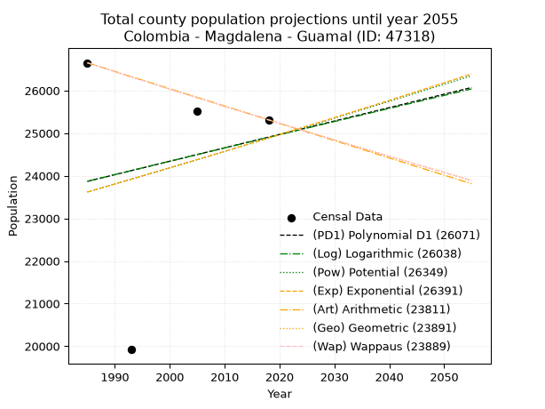
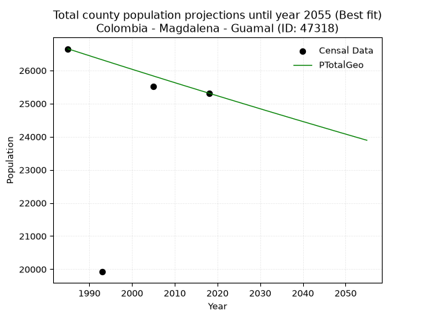
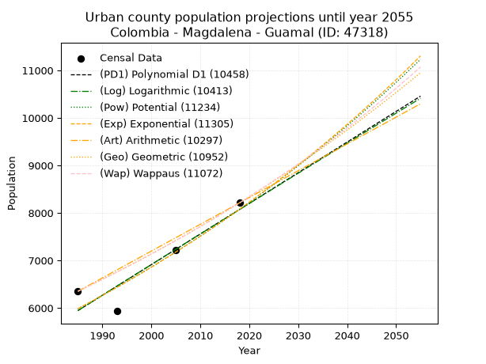
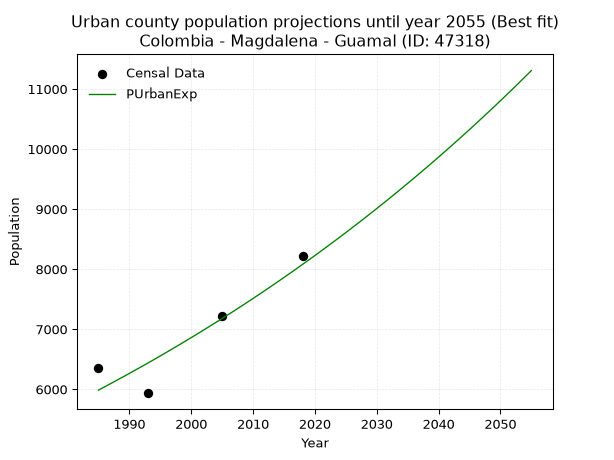
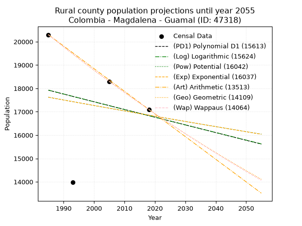
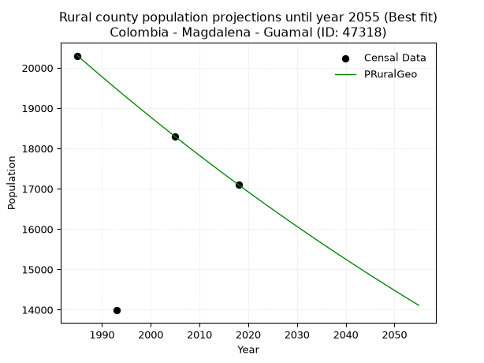

<div align="center">


</div>

# 📜 _“Population and Public Services Demand Projections (PPSD) until Year 2050 for Colombia - Magdalena - Guamal (ID: 47318)”_
Keywords: `population` `public-service` `projection` `lineal` `polynomial` `logarithmic` `potential` `exponential` `arithmetic` `geometric` `wappaus` `dane` `colombia` `south-america`

PPSD are analytical estimates used by governments and planners to anticipate future changes in population size, age distribution, and the resulting community needs for utilities, healthcare, education, and infrastructure as sizing future water treatment facilities, electrical grids, and road networks based on spatial growth.

<div align="center">

</img>

</div>


> **General running parameters**: • app_version: _v20260806_. • Python version: _3.14.7_. • Pandas version: _3.0.5_. • NumPy version: _2.5.1_. • Creates, save and include plots into reports (create_plot): _False_. • Projection until year: _2050_. • Process polynomial degree 2 and up: _False_. • Process Wappaus: _True_. • Process Wappaus: _True_. • Set negative values to zero: _True_. • Set infinite values to zero: _True_. • Drop dataset notes: _True_. 
<div align="center">

Maps & GIS Layers: [:earth_americas:Google](http://maps.google.com/maps?q=9.144354345,-74.223689) [:earth_americas:OSM](https://www.openstreetmap.org/#map=18/9.144354345/-74.223689&layers=P) [:earth_americas:Bing](https://www.bing.com/maps?cp=9.144354345~-74.223689&lvl=18) [:earth_americas:Apple](https://maps.apple.com/frame?center=9.144354345%2C-74.223689&span=0.003%2C0.006) [:earth_americas:GISMobile](https://github.com/rcfdtools/R.GISMobile/blob/main/file/gis/CountyLayer_CO/Readme.md)

</div>


<div align="center">

```geojson
{
  "type": "Feature",
  "geometry": {
    "type": "Point", 
    "coordinates": [-74.223689, 9.144354345]
  }, 
  "properties": {
    "Name": "Colombia - Magdalena - Guamal (ID: 47318)"
  }
}
```

</div>


## 0. Census Data (4 records)

Census data are official statistics collected by a government about the people and housing in a country. They usually include counts of total population, age, sex, race, income, education, and jobs.

📅Global census file: [Population.xlsx](../data/Population.xlsx)

| Source   |   Year |   CountryID | CountryName   |   StateID | StateName   |   CountyID | CountyName   |   PTotal |   PUrban |   PRural |
|:---------|-------:|------------:|:--------------|----------:|:------------|-----------:|:-------------|---------:|---------:|---------:|
| DANE     |   1985 |          57 | Colombia      |        47 | Magdalena   |      47318 | Guamal       |    26651 |     6352 |    20299 |
| DANE     |   1993 |          57 | Colombia      |        47 | Magdalena   |      47318 | Guamal       |    19920 |     5934 |    13986 |
| DANE     |   2005 |          57 | Colombia      |        47 | Magdalena   |      47318 | Guamal       |    25508 |     7216 |    18292 |
| DANE     |   2018 |          57 | Colombia      |        47 | Magdalena   |      47318 | Guamal       |    25312 |     8212 |    17100 |

> 🔥Some records could had specific notes about the registered values or the corresponding urban or rural distribution.

📅[SUI-RUPS](https://www.datos.gov.co/Hacienda-y-Cr-dito-P-blico/Registro-nico-de-Prestadores-de-Servicios-P-blicos/4qkq-csdn/about_data) - Local public utility companies: [RUPS.csv](../data/RUPS.csv)

 | SERVICIO       | ESTADO    | NOMBRE                                                                                             | NIT         | DEPARTAMENTO_DOMICILIO   | MUNICIPIO_DOMICILIO   | DIRECCION                  |   TELEFONO | EMAIL                 | TIPO_PRESTADOR                 | CLASIFICACION                 |
|:---------------|:----------|:---------------------------------------------------------------------------------------------------|:------------|:-------------------------|:----------------------|:---------------------------|-----------:|:----------------------|:-------------------------------|:------------------------------|
| ACUEDUCTO      | OPERATIVA | EMPRESA DE SERVICIOS DE ACUEDUCTO, ALCANTARILLADO Y ASEO -ESAGUA E.S.P.                            | 819004186-0 | MAGDALENA                | GUAMAL                | CALLE 9 N° .9-10           |    4182308 | esaguaesp@hotmail.com | nan                            | HASTA 2500 SUSCRIPTORES       |
| ALCANTARILLADO | OPERATIVA | EMPRESA DE SERVICIOS DE ACUEDUCTO, ALCANTARILLADO Y ASEO -ESAGUA E.S.P.                            | 819004186-0 | MAGDALENA                | GUAMAL                | CALLE 9 N° .9-10           |    4182308 | esaguaesp@hotmail.com | nan                            | HASTA 2500 SUSCRIPTORES       |
| ACUEDUCTO      | OPERATIVA | UNIDAD DE SERVICIOS PÚBLICOS DOMICILIARIOS DE ACUEDUCTO, ALCANTARILLADO Y ASEO DE GUAMAL MAGDALENA | 891780047-4 | MAGDALENA                | GUAMAL                | CALLE 9 No. 9 - 47         |    4182189 | gabyesni18@gmail.com  | MUNICIPIO (PRESTACIÓN DIRECTA) | MENOR O IGUAL A 2500 USUARIOS |
| ALCANTARILLADO | OPERATIVA | UNIDAD DE SERVICIOS PÚBLICOS DOMICILIARIOS DE ACUEDUCTO, ALCANTARILLADO Y ASEO DE GUAMAL MAGDALENA | 891780047-4 | MAGDALENA                | GUAMAL                | CALLE 9 No. 9 - 47         |    4182189 | gabyesni18@gmail.com  | MUNICIPIO (PRESTACIÓN DIRECTA) | MENOR O IGUAL A 2500 USUARIOS |
| ACUEDUCTO      | OPERATIVA | ADMINISTRADORA PUBLICA COOPERATIVA DE SERVICIOS PUBLICOS DOMICILIARIOS DE GUAMAL                   | 900127795-8 | MAGDALENA                | GUAMAL                | CARRERA 10 CALLE 9 ESQUINA |    4182301 | serviguam@yahoo.es    | ORGANIZACION AUTORIZADA        | HASTA 2500 SUSCRIPTORES       |
| ALCANTARILLADO | OPERATIVA | ADMINISTRADORA PUBLICA COOPERATIVA DE SERVICIOS PUBLICOS DOMICILIARIOS DE GUAMAL                   | 900127795-8 | MAGDALENA                | GUAMAL                | CARRERA 10 CALLE 9 ESQUINA |    4182301 | serviguam@yahoo.es    | ORGANIZACION AUTORIZADA        | HASTA 2500 SUSCRIPTORES       |

## 1. Total

### 1.1. Coefficients and Parameters

* (PD1) Polynomial Deg 1: 31.478522681653832, -38617.164993978084 (lineal)
* (Log) Logarithmic: 62542.46820676542, -451038.0520235102
* (Pow) Potential: 3.1533103220883953, -6.025565082950008
* (Exp) Exponential: 0.0015853874169655703, 1015.147813143071
* (Art) Arithmetic: Year diff. 2018 - 1985 = 33, Population diff. 25312 - 26651 = -1339, Annual growth = -40.57575757575758
* (Geo) Geometric: Year diff. 2018 - 1985 = 33, Population diff. 25312 - 26651 = -1339, Annual growth % = -0.0015608436985465879
* (Wap) Wappaus: i = -0.15617172825186218, Condition values only valid for < 200)

<sub>
Wappaus condition values: ['-0.00', '-0.16', '-0.31', '-0.47', '-0.62', '-0.78', '-0.94', '-1.09', '-1.25', '-1.41', '-1.56', '-1.72', '-1.87', '-2.03', '-2.19', '-2.34', '-2.50', '-2.65', '-2.81', '-2.97', '-3.12', '-3.28', '-3.44', '-3.59', '-3.75', '-3.90', '-4.06', '-4.22', '-4.37', '-4.53', '-4.69', '-4.84', '-5.00', '-5.15', '-5.31', '-5.47', '-5.62', '-5.78', '-5.93', '-6.09', '-6.25', '-6.40', '-6.56', '-6.72', '-6.87', '-7.03', '-7.18', '-7.34', '-7.50', '-7.65', '-7.81', '-7.96', '-8.12', '-8.28', '-8.43', '-8.59', '-8.75', '-8.90', '-9.06', '-9.21', '-9.37', '-9.53', '-9.68', '-9.84', '-9.99', '-10.15']
</sub>


### 1.2. Projected Dataset

|   Year |   CountyID |   PTotalPD1 |   PTotalLog |   PTotalPow |   PTotalExp |   PTotalArt |   PTotalGeo |   PTotalWap |
|-------:|-----------:|------------:|------------:|------------:|------------:|------------:|------------:|------------:|
|   1985 |      47318 |       23868 |       23870 |       23621 |       23618 |       26651 |       26651 |       26651 |
|   1986 |      47318 |       23899 |       23902 |       23658 |       23656 |       26610 |       26609 |       26609 |
|   1987 |      47318 |       23931 |       23933 |       23696 |       23693 |       26570 |       26568 |       26568 |
|   1988 |      47318 |       23962 |       23965 |       23734 |       23731 |       26529 |       26526 |       26526 |
|   1989 |      47318 |       23994 |       23996 |       23771 |       23769 |       26489 |       26485 |       26485 |
|   1990 |      47318 |       24025 |       24028 |       23809 |       23806 |       26448 |       26444 |       26444 |
|   1991 |      47318 |       24057 |       24059 |       23847 |       23844 |       26408 |       26402 |       26402 |
|   1992 |      47318 |       24088 |       24090 |       23885 |       23882 |       26367 |       26361 |       26361 |
|   1993 |      47318 |       24120 |       24122 |       23922 |       23920 |       26326 |       26320 |       26320 |
|   1994 |      47318 |       24151 |       24153 |       23960 |       23958 |       26286 |       26279 |       26279 |
|   1995 |      47318 |       24182 |       24185 |       23998 |       23996 |       26245 |       26238 |       26238 |
|   1996 |      47318 |       24214 |       24216 |       24036 |       24034 |       26205 |       26197 |       26197 |
|   1997 |      47318 |       24245 |       24247 |       24074 |       24072 |       26164 |       26156 |       26156 |
|   1998 |      47318 |       24277 |       24279 |       24112 |       24110 |       26124 |       26115 |       26115 |
|   1999 |      47318 |       24308 |       24310 |       24150 |       24149 |       26083 |       26074 |       26075 |
|   2000 |      47318 |       24340 |       24341 |       24188 |       24187 |       26042 |       26034 |       26034 |
|   2001 |      47318 |       24371 |       24372 |       24227 |       24225 |       26002 |       25993 |       25993 |
|   2002 |      47318 |       24403 |       24404 |       24265 |       24264 |       25961 |       25953 |       25953 |
|   2003 |      47318 |       24434 |       24435 |       24303 |       24302 |       25921 |       25912 |       25912 |
|   2004 |      47318 |       24466 |       24466 |       24341 |       24341 |       25880 |       25872 |       25872 |
|   2005 |      47318 |       24497 |       24497 |       24380 |       24379 |       25839 |       25831 |       25831 |
|   2006 |      47318 |       24529 |       24528 |       24418 |       24418 |       25799 |       25791 |       25791 |
|   2007 |      47318 |       24560 |       24560 |       24456 |       24457 |       25758 |       25751 |       25751 |
|   2008 |      47318 |       24592 |       24591 |       24495 |       24496 |       25718 |       25710 |       25711 |
|   2009 |      47318 |       24623 |       24622 |       24533 |       24534 |       25677 |       25670 |       25670 |
|   2010 |      47318 |       24655 |       24653 |       24572 |       24573 |       25637 |       25630 |       25630 |
|   2011 |      47318 |       24686 |       24684 |       24610 |       24612 |       25596 |       25590 |       25590 |
|   2012 |      47318 |       24718 |       24715 |       24649 |       24651 |       25555 |       25550 |       25550 |
|   2013 |      47318 |       24749 |       24746 |       24688 |       24691 |       25515 |       25510 |       25511 |
|   2014 |      47318 |       24781 |       24777 |       24726 |       24730 |       25474 |       25471 |       25471 |
|   2015 |      47318 |       24812 |       24808 |       24765 |       24769 |       25434 |       25431 |       25431 |
|   2016 |      47318 |       24844 |       24839 |       24804 |       24808 |       25393 |       25391 |       25391 |
|   2017 |      47318 |       24875 |       24871 |       24843 |       24848 |       25353 |       25352 |       25352 |
|   2018 |      47318 |       24906 |       24902 |       24882 |       24887 |       25312 |       25312 |       25312 |
|   2019 |      47318 |       24938 |       24932 |       24920 |       24926 |       25271 |       25272 |       25272 |
|   2020 |      47318 |       24969 |       24963 |       24959 |       24966 |       25231 |       25233 |       25233 |
|   2021 |      47318 |       25001 |       24994 |       24998 |       25006 |       25190 |       25194 |       25194 |
|   2022 |      47318 |       25032 |       25025 |       25037 |       25045 |       25150 |       25154 |       25154 |
|   2023 |      47318 |       25064 |       25056 |       25076 |       25085 |       25109 |       25115 |       25115 |
|   2024 |      47318 |       25095 |       25087 |       25116 |       25125 |       25069 |       25076 |       25076 |
|   2025 |      47318 |       25127 |       25118 |       25155 |       25165 |       25028 |       25037 |       25037 |
|   2026 |      47318 |       25158 |       25149 |       25194 |       25205 |       24987 |       24998 |       24997 |
|   2027 |      47318 |       25190 |       25180 |       25233 |       25245 |       24947 |       24959 |       24958 |
|   2028 |      47318 |       25221 |       25211 |       25272 |       25285 |       24906 |       24920 |       24919 |
|   2029 |      47318 |       25253 |       25242 |       25312 |       25325 |       24866 |       24881 |       24880 |
|   2030 |      47318 |       25284 |       25272 |       25351 |       25365 |       24825 |       24842 |       24842 |
|   2031 |      47318 |       25316 |       25303 |       25390 |       25405 |       24785 |       24803 |       24803 |
|   2032 |      47318 |       25347 |       25334 |       25430 |       25446 |       24744 |       24764 |       24764 |
|   2033 |      47318 |       25379 |       25365 |       25469 |       25486 |       24703 |       24726 |       24725 |
|   2034 |      47318 |       25410 |       25395 |       25509 |       25526 |       24663 |       24687 |       24687 |
|   2035 |      47318 |       25442 |       25426 |       25548 |       25567 |       24622 |       24649 |       24648 |
|   2036 |      47318 |       25473 |       25457 |       25588 |       25607 |       24582 |       24610 |       24610 |
|   2037 |      47318 |       25505 |       25488 |       25628 |       25648 |       24541 |       24572 |       24571 |
|   2038 |      47318 |       25536 |       25518 |       25667 |       25689 |       24500 |       24533 |       24533 |
|   2039 |      47318 |       25568 |       25549 |       25707 |       25730 |       24460 |       24495 |       24494 |
|   2040 |      47318 |       25599 |       25580 |       25747 |       25770 |       24419 |       24457 |       24456 |
|   2041 |      47318 |       25630 |       25610 |       25787 |       25811 |       24379 |       24419 |       24418 |
|   2042 |      47318 |       25662 |       25641 |       25827 |       25852 |       24338 |       24381 |       24380 |
|   2043 |      47318 |       25693 |       25672 |       25867 |       25893 |       24298 |       24343 |       24342 |
|   2044 |      47318 |       25725 |       25702 |       25906 |       25934 |       24257 |       24305 |       24303 |
|   2045 |      47318 |       25756 |       25733 |       25946 |       25975 |       24216 |       24267 |       24265 |
|   2046 |      47318 |       25788 |       25763 |       25987 |       26017 |       24176 |       24229 |       24228 |
|   2047 |      47318 |       25819 |       25794 |       26027 |       26058 |       24135 |       24191 |       24190 |
|   2048 |      47318 |       25851 |       25824 |       26067 |       26099 |       24095 |       24153 |       24152 |
|   2049 |      47318 |       25882 |       25855 |       26107 |       26141 |       24054 |       24115 |       24114 |
|   2050 |      47318 |       25914 |       25885 |       26147 |       26182 |       24014 |       24078 |       24076 |
<div align="center">

</img>

</div>


### 1.3. Best fit with absolute and relative error (%)

Relative error puts that difference into context by dividing the absolute error by the true value, creating a unitless ratio or percentage that shows the scale of the mistake.

Absolute and relative error

|   Year | Source   |   CountryID | CountryName   |   StateID | StateName   |   CountyID_x | CountyName   |   PTotal |   PUrban |   PRural |   CountyID_y |   PTotalPD1 |   PTotalLog |   PTotalPow |   PTotalExp |   PTotalArt |   PTotalGeo |   PTotalWap |   PTotalPD1AbsError |   PTotalLogAbsError |   PTotalPowAbsError |   PTotalExpAbsError |   PTotalArtAbsError |   PTotalGeoAbsError |   PTotalWapAbsError |   PTotalPD1RelError |   PTotalLogRelError |   PTotalPowRelError |   PTotalExpRelError |   PTotalArtRelError |   PTotalGeoRelError |   PTotalWapRelError |
|-------:|:---------|------------:|:--------------|----------:|:------------|-------------:|:-------------|---------:|---------:|---------:|-------------:|------------:|------------:|------------:|------------:|------------:|------------:|------------:|--------------------:|--------------------:|--------------------:|--------------------:|--------------------:|--------------------:|--------------------:|--------------------:|--------------------:|--------------------:|--------------------:|--------------------:|--------------------:|--------------------:|
|   1985 | DANE     |          57 | Colombia      |        47 | Magdalena   |        47318 | Guamal       |    26651 |     6352 |    20299 |        47318 |       23868 |       23870 |       23621 |       23618 |       26651 |       26651 |       26651 |                2783 |                2781 |                3030 |                3033 |                   0 |                   0 |                   0 |            10.4424  |            10.4349  |            11.3692  |            11.3804  |             0       |             0       |             0       |
|   1993 | DANE     |          57 | Colombia      |        47 | Magdalena   |        47318 | Guamal       |    19920 |     5934 |    13986 |        47318 |       24120 |       24122 |       23922 |       23920 |       26326 |       26320 |       26320 |                4200 |                4202 |                4002 |                4000 |                6406 |                6400 |                6400 |            21.0843  |            21.0944  |            20.0904  |            20.0803  |            32.1586  |            32.1285  |            32.1285  |
|   2005 | DANE     |          57 | Colombia      |        47 | Magdalena   |        47318 | Guamal       |    25508 |     7216 |    18292 |        47318 |       24497 |       24497 |       24380 |       24379 |       25839 |       25831 |       25831 |                1011 |                1011 |                1128 |                1129 |                 331 |                 323 |                 323 |             3.96346 |             3.96346 |             4.42214 |             4.42606 |             1.29763 |             1.26627 |             1.26627 |
|   2018 | DANE     |          57 | Colombia      |        47 | Magdalena   |        47318 | Guamal       |    25312 |     8212 |    17100 |        47318 |       24906 |       24902 |       24882 |       24887 |       25312 |       25312 |       25312 |                 406 |                 410 |                 430 |                 425 |                   0 |                   0 |                   0 |             1.60398 |             1.61979 |             1.6988  |             1.67905 |             0       |             0       |             0       |

Relative error mean

| Method    |   RelError | Best   |
|:----------|-----------:|:-------|
| PTotalPD1 |    9.27354 |        |
| PTotalLog |    9.27813 |        |
| PTotalPow |    9.39512 |        |
| PTotalExp |    9.39147 |        |
| PTotalArt |    8.36407 |        |
| PTotalGeo |    8.3487  | True   |
| PTotalWap |    8.3487  | True   |

💙Best method: _**PTotalGeo**_
<div align="center">

</img>

</div>


### 1.4. Fresh water supply demand in liters per capita per day (lpcd)

The fresh water supply demand typically ranges from 100 to 300 liters per capita per day (lpcd) for standard domestic and municipal planning, though absolute survival minimums set by the World Health Organization are as low as 7.5 to 20 liters per day, and total consumption in high-income nations can exceed 400 liters.

> `CZ`: Level in meters above the sea level (masl)<br> `WS`: Fresh water supply demand in liters per capita per day (lpcd or l/h/d)<br> `WSAll`: Zonal fresh water supply demand in liters per second (l/s)<br> `A`: Zonal area in square meters<br> `DP`: Population density (people/hectare or p/ha)

Reference values (RAS Colombia)

|    CZ |   WS |
|------:|-----:|
|  1000 |  120 |
|  2000 |  130 |
| 99999 |  140 |

County shapefile geometry properties and water supply values

|   CountyID |      ATotal |   CZTotal |   WSTotal |
|-----------:|------------:|----------:|----------:|
|      47318 | 5.63814e+08 |   39.9696 |       120 |

Projected values for best method: PTotalGeo

|   CountyID |   Year |   PTotalGeo |   DPTotal |   WSTotal |   WSTotalAll |
|-----------:|-------:|------------:|----------:|----------:|-------------:|
|      47318 |   1985 |       26651 |      0.47 |       120 |      37.0153 |
|      47318 |   1986 |       26609 |      0.47 |       120 |      36.9569 |
|      47318 |   1987 |       26568 |      0.47 |       120 |      36.9    |
|      47318 |   1988 |       26526 |      0.47 |       120 |      36.8417 |
|      47318 |   1989 |       26485 |      0.47 |       120 |      36.7847 |
|      47318 |   1990 |       26444 |      0.47 |       120 |      36.7278 |
|      47318 |   1991 |       26402 |      0.47 |       120 |      36.6694 |
|      47318 |   1992 |       26361 |      0.47 |       120 |      36.6125 |
|      47318 |   1993 |       26320 |      0.47 |       120 |      36.5556 |
|      47318 |   1994 |       26279 |      0.47 |       120 |      36.4986 |
|      47318 |   1995 |       26238 |      0.47 |       120 |      36.4417 |
|      47318 |   1996 |       26197 |      0.46 |       120 |      36.3847 |
|      47318 |   1997 |       26156 |      0.46 |       120 |      36.3278 |
|      47318 |   1998 |       26115 |      0.46 |       120 |      36.2708 |
|      47318 |   1999 |       26074 |      0.46 |       120 |      36.2139 |
|      47318 |   2000 |       26034 |      0.46 |       120 |      36.1583 |
|      47318 |   2001 |       25993 |      0.46 |       120 |      36.1014 |
|      47318 |   2002 |       25953 |      0.46 |       120 |      36.0458 |
|      47318 |   2003 |       25912 |      0.46 |       120 |      35.9889 |
|      47318 |   2004 |       25872 |      0.46 |       120 |      35.9333 |
|      47318 |   2005 |       25831 |      0.46 |       120 |      35.8764 |
|      47318 |   2006 |       25791 |      0.46 |       120 |      35.8208 |
|      47318 |   2007 |       25751 |      0.46 |       120 |      35.7653 |
|      47318 |   2008 |       25710 |      0.46 |       120 |      35.7083 |
|      47318 |   2009 |       25670 |      0.46 |       120 |      35.6528 |
|      47318 |   2010 |       25630 |      0.45 |       120 |      35.5972 |
|      47318 |   2011 |       25590 |      0.45 |       120 |      35.5417 |
|      47318 |   2012 |       25550 |      0.45 |       120 |      35.4861 |
|      47318 |   2013 |       25510 |      0.45 |       120 |      35.4306 |
|      47318 |   2014 |       25471 |      0.45 |       120 |      35.3764 |
|      47318 |   2015 |       25431 |      0.45 |       120 |      35.3208 |
|      47318 |   2016 |       25391 |      0.45 |       120 |      35.2653 |
|      47318 |   2017 |       25352 |      0.45 |       120 |      35.2111 |
|      47318 |   2018 |       25312 |      0.45 |       120 |      35.1556 |
|      47318 |   2019 |       25272 |      0.45 |       120 |      35.1    |
|      47318 |   2020 |       25233 |      0.45 |       120 |      35.0458 |
|      47318 |   2021 |       25194 |      0.45 |       120 |      34.9917 |
|      47318 |   2022 |       25154 |      0.45 |       120 |      34.9361 |
|      47318 |   2023 |       25115 |      0.45 |       120 |      34.8819 |
|      47318 |   2024 |       25076 |      0.44 |       120 |      34.8278 |
|      47318 |   2025 |       25037 |      0.44 |       120 |      34.7736 |
|      47318 |   2026 |       24998 |      0.44 |       120 |      34.7194 |
|      47318 |   2027 |       24959 |      0.44 |       120 |      34.6653 |
|      47318 |   2028 |       24920 |      0.44 |       120 |      34.6111 |
|      47318 |   2029 |       24881 |      0.44 |       120 |      34.5569 |
|      47318 |   2030 |       24842 |      0.44 |       120 |      34.5028 |
|      47318 |   2031 |       24803 |      0.44 |       120 |      34.4486 |
|      47318 |   2032 |       24764 |      0.44 |       120 |      34.3944 |
|      47318 |   2033 |       24726 |      0.44 |       120 |      34.3417 |
|      47318 |   2034 |       24687 |      0.44 |       120 |      34.2875 |
|      47318 |   2035 |       24649 |      0.44 |       120 |      34.2347 |
|      47318 |   2036 |       24610 |      0.44 |       120 |      34.1806 |
|      47318 |   2037 |       24572 |      0.44 |       120 |      34.1278 |
|      47318 |   2038 |       24533 |      0.44 |       120 |      34.0736 |
|      47318 |   2039 |       24495 |      0.43 |       120 |      34.0208 |
|      47318 |   2040 |       24457 |      0.43 |       120 |      33.9681 |
|      47318 |   2041 |       24419 |      0.43 |       120 |      33.9153 |
|      47318 |   2042 |       24381 |      0.43 |       120 |      33.8625 |
|      47318 |   2043 |       24343 |      0.43 |       120 |      33.8097 |
|      47318 |   2044 |       24305 |      0.43 |       120 |      33.7569 |
|      47318 |   2045 |       24267 |      0.43 |       120 |      33.7042 |
|      47318 |   2046 |       24229 |      0.43 |       120 |      33.6514 |
|      47318 |   2047 |       24191 |      0.43 |       120 |      33.5986 |
|      47318 |   2048 |       24153 |      0.43 |       120 |      33.5458 |
|      47318 |   2049 |       24115 |      0.43 |       120 |      33.4931 |
|      47318 |   2050 |       24078 |      0.43 |       120 |      33.4417 |

## 2. Urban

### 2.1. Coefficients and Parameters

* (PD1) Polynomial Deg 1: 64.4712966680041, -122030.2111601752 (lineal)
* (Log) Logarithmic: 128958.28825211737, -973284.4824112107
* (Pow) Potential: 18.17364182012105, -56.155319011519936
* (Exp) Exponential: 0.009085450027196074, 8.805272668990282e-05
* (Art) Arithmetic: Year diff. 2018 - 1985 = 33, Population diff. 8212 - 6352 = 1860, Annual growth = 56.36363636363637
* (Geo) Geometric: Year diff. 2018 - 1985 = 33, Population diff. 8212 - 6352 = 1860, Annual growth % = 0.007812992931110374
* (Wap) Wappaus: i = 0.7740131332550998, Condition values only valid for < 200)

<sub>
Wappaus condition values: ['0.00', '0.77', '1.55', '2.32', '3.10', '3.87', '4.64', '5.42', '6.19', '6.97', '7.74', '8.51', '9.29', '10.06', '10.84', '11.61', '12.38', '13.16', '13.93', '14.71', '15.48', '16.25', '17.03', '17.80', '18.58', '19.35', '20.12', '20.90', '21.67', '22.45', '23.22', '23.99', '24.77', '25.54', '26.32', '27.09', '27.86', '28.64', '29.41', '30.19', '30.96', '31.73', '32.51', '33.28', '34.06', '34.83', '35.60', '36.38', '37.15', '37.93', '38.70', '39.47', '40.25', '41.02', '41.80', '42.57', '43.34', '44.12', '44.89', '45.67', '46.44', '47.21', '47.99', '48.76', '49.54', '50.31']
</sub>


### 2.2. Projected Dataset

|   Year |   CountyID |   PUrbanPD1 |   PUrbanLog |   PUrbanPow |   PUrbanExp |   PUrbanArt |   PUrbanGeo |   PUrbanWap |
|-------:|-----------:|------------:|------------:|------------:|------------:|------------:|------------:|------------:|
|   1985 |      47318 |        5945 |        5944 |        5984 |        5985 |        6352 |        6352 |        6352 |
|   1986 |      47318 |        6010 |        6009 |        6039 |        6040 |        6408 |        6402 |        6401 |
|   1987 |      47318 |        6074 |        6074 |        6095 |        6095 |        6465 |        6452 |        6451 |
|   1988 |      47318 |        6139 |        6139 |        6151 |        6151 |        6521 |        6502 |        6501 |
|   1989 |      47318 |        6203 |        6204 |        6207 |        6207 |        6577 |        6553 |        6552 |
|   1990 |      47318 |        6268 |        6268 |        6264 |        6263 |        6634 |        6604 |        6603 |
|   1991 |      47318 |        6332 |        6333 |        6322 |        6321 |        6690 |        6656 |        6654 |
|   1992 |      47318 |        6397 |        6398 |        6379 |        6378 |        6747 |        6708 |        6706 |
|   1993 |      47318 |        6461 |        6463 |        6438 |        6436 |        6803 |        6760 |        6758 |
|   1994 |      47318 |        6526 |        6527 |        6497 |        6495 |        6859 |        6813 |        6810 |
|   1995 |      47318 |        6590 |        6592 |        6556 |        6554 |        6916 |        6866 |        6863 |
|   1996 |      47318 |        6654 |        6657 |        6616 |        6614 |        6972 |        6920 |        6917 |
|   1997 |      47318 |        6719 |        6721 |        6677 |        6675 |        7028 |        6974 |        6971 |
|   1998 |      47318 |        6783 |        6786 |        6738 |        6736 |        7085 |        7028 |        7025 |
|   1999 |      47318 |        6848 |        6850 |        6799 |        6797 |        7141 |        7083 |        7080 |
|   2000 |      47318 |        6912 |        6915 |        6861 |        6859 |        7197 |        7139 |        7135 |
|   2001 |      47318 |        6977 |        6979 |        6924 |        6922 |        7254 |        7194 |        7191 |
|   2002 |      47318 |        7041 |        7044 |        6987 |        6985 |        7310 |        7251 |        7247 |
|   2003 |      47318 |        7106 |        7108 |        7051 |        7049 |        7367 |        7307 |        7303 |
|   2004 |      47318 |        7170 |        7173 |        7115 |        7113 |        7423 |        7364 |        7360 |
|   2005 |      47318 |        7235 |        7237 |        7180 |        7178 |        7479 |        7422 |        7418 |
|   2006 |      47318 |        7299 |        7301 |        7245 |        7243 |        7536 |        7480 |        7476 |
|   2007 |      47318 |        7364 |        7365 |        7311 |        7309 |        7592 |        7538 |        7534 |
|   2008 |      47318 |        7428 |        7430 |        7378 |        7376 |        7648 |        7597 |        7593 |
|   2009 |      47318 |        7493 |        7494 |        7445 |        7443 |        7705 |        7656 |        7653 |
|   2010 |      47318 |        7557 |        7558 |        7512 |        7511 |        7761 |        7716 |        7713 |
|   2011 |      47318 |        7622 |        7622 |        7581 |        7580 |        7817 |        7777 |        7773 |
|   2012 |      47318 |        7686 |        7686 |        7649 |        7649 |        7874 |        7837 |        7834 |
|   2013 |      47318 |        7751 |        7750 |        7719 |        7719 |        7930 |        7899 |        7896 |
|   2014 |      47318 |        7815 |        7814 |        7789 |        7789 |        7987 |        7960 |        7958 |
|   2015 |      47318 |        7879 |        7878 |        7859 |        7861 |        8043 |        8022 |        8021 |
|   2016 |      47318 |        7944 |        7942 |        7931 |        7932 |        8099 |        8085 |        8084 |
|   2017 |      47318 |        8008 |        8006 |        8002 |        8005 |        8156 |        8148 |        8148 |
|   2018 |      47318 |        8073 |        8070 |        8075 |        8078 |        8212 |        8212 |        8212 |
|   2019 |      47318 |        8137 |        8134 |        8148 |        8151 |        8268 |        8276 |        8277 |
|   2020 |      47318 |        8202 |        8198 |        8222 |        8226 |        8325 |        8341 |        8342 |
|   2021 |      47318 |        8266 |        8262 |        8296 |        8301 |        8381 |        8406 |        8408 |
|   2022 |      47318 |        8331 |        8326 |        8371 |        8377 |        8437 |        8472 |        8475 |
|   2023 |      47318 |        8395 |        8389 |        8446 |        8453 |        8494 |        8538 |        8542 |
|   2024 |      47318 |        8460 |        8453 |        8522 |        8530 |        8550 |        8605 |        8610 |
|   2025 |      47318 |        8524 |        8517 |        8599 |        8608 |        8607 |        8672 |        8679 |
|   2026 |      47318 |        8589 |        8581 |        8677 |        8687 |        8663 |        8740 |        8748 |
|   2027 |      47318 |        8653 |        8644 |        8755 |        8766 |        8719 |        8808 |        8818 |
|   2028 |      47318 |        8718 |        8708 |        8834 |        8846 |        8776 |        8877 |        8888 |
|   2029 |      47318 |        8782 |        8771 |        8913 |        8927 |        8832 |        8946 |        8959 |
|   2030 |      47318 |        8847 |        8835 |        8994 |        9008 |        8888 |        9016 |        9031 |
|   2031 |      47318 |        8911 |        8898 |        9074 |        9090 |        8945 |        9086 |        9103 |
|   2032 |      47318 |        8975 |        8962 |        9156 |        9173 |        9001 |        9157 |        9177 |
|   2033 |      47318 |        9040 |        9025 |        9238 |        9257 |        9057 |        9229 |        9250 |
|   2034 |      47318 |        9104 |        9089 |        9321 |        9342 |        9114 |        9301 |        9325 |
|   2035 |      47318 |        9169 |        9152 |        9405 |        9427 |        9170 |        9374 |        9400 |
|   2036 |      47318 |        9233 |        9215 |        9489 |        9513 |        9227 |        9447 |        9476 |
|   2037 |      47318 |        9298 |        9279 |        9574 |        9600 |        9283 |        9521 |        9553 |
|   2038 |      47318 |        9362 |        9342 |        9660 |        9687 |        9339 |        9595 |        9630 |
|   2039 |      47318 |        9427 |        9405 |        9746 |        9776 |        9396 |        9670 |        9708 |
|   2040 |      47318 |        9491 |        9469 |        9834 |        9865 |        9452 |        9746 |        9787 |
|   2041 |      47318 |        9556 |        9532 |        9922 |        9955 |        9508 |        9822 |        9867 |
|   2042 |      47318 |        9620 |        9595 |       10010 |       10046 |        9565 |        9898 |        9948 |
|   2043 |      47318 |        9685 |        9658 |       10100 |       10138 |        9621 |        9976 |       10029 |
|   2044 |      47318 |        9749 |        9721 |       10190 |       10230 |        9677 |       10054 |       10111 |
|   2045 |      47318 |        9814 |        9784 |       10281 |       10323 |        9734 |       10132 |       10194 |
|   2046 |      47318 |        9878 |        9847 |       10373 |       10418 |        9790 |       10211 |       10278 |
|   2047 |      47318 |        9943 |        9910 |       10465 |       10513 |        9847 |       10291 |       10363 |
|   2048 |      47318 |       10007 |        9973 |       10559 |       10609 |        9903 |       10372 |       10448 |
|   2049 |      47318 |       10071 |       10036 |       10653 |       10705 |        9959 |       10453 |       10535 |
|   2050 |      47318 |       10136 |       10099 |       10748 |       10803 |       10016 |       10534 |       10622 |
<div align="center">

</img>

</div>


### 2.3. Best fit with absolute and relative error (%)

Relative error puts that difference into context by dividing the absolute error by the true value, creating a unitless ratio or percentage that shows the scale of the mistake.

Absolute and relative error

|   Year | Source   |   CountryID | CountryName   |   StateID | StateName   |   CountyID_x | CountyName   |   PTotal |   PUrban |   PRural |   CountyID_y |   PUrbanPD1 |   PUrbanLog |   PUrbanPow |   PUrbanExp |   PUrbanArt |   PUrbanGeo |   PUrbanWap |   PUrbanPD1AbsError |   PUrbanLogAbsError |   PUrbanPowAbsError |   PUrbanExpAbsError |   PUrbanArtAbsError |   PUrbanGeoAbsError |   PUrbanWapAbsError |   PUrbanPD1RelError |   PUrbanLogRelError |   PUrbanPowRelError |   PUrbanExpRelError |   PUrbanArtRelError |   PUrbanGeoRelError |   PUrbanWapRelError |
|-------:|:---------|------------:|:--------------|----------:|:------------|-------------:|:-------------|---------:|---------:|---------:|-------------:|------------:|------------:|------------:|------------:|------------:|------------:|------------:|--------------------:|--------------------:|--------------------:|--------------------:|--------------------:|--------------------:|--------------------:|--------------------:|--------------------:|--------------------:|--------------------:|--------------------:|--------------------:|--------------------:|
|   1985 | DANE     |          57 | Colombia      |        47 | Magdalena   |        47318 | Guamal       |    26651 |     6352 |    20299 |        47318 |        5945 |        5944 |        5984 |        5985 |        6352 |        6352 |        6352 |                 407 |                 408 |                 368 |                 367 |                   0 |                   0 |                   0 |            6.40743  |             6.42317 |            5.79345  |            5.77771  |             0       |             0       |             0       |
|   1993 | DANE     |          57 | Colombia      |        47 | Magdalena   |        47318 | Guamal       |    19920 |     5934 |    13986 |        47318 |        6461 |        6463 |        6438 |        6436 |        6803 |        6760 |        6758 |                 527 |                 529 |                 504 |                 502 |                 869 |                 826 |                 824 |            8.88102  |             8.91473 |            8.49343  |            8.45972  |            14.6444  |            13.9198  |            13.8861  |
|   2005 | DANE     |          57 | Colombia      |        47 | Magdalena   |        47318 | Guamal       |    25508 |     7216 |    18292 |        47318 |        7235 |        7237 |        7180 |        7178 |        7479 |        7422 |        7418 |                  19 |                  21 |                  36 |                  38 |                 263 |                 206 |                 202 |            0.263304 |             0.29102 |            0.498891 |            0.526608 |             3.64468 |             2.85477 |             2.79933 |
|   2018 | DANE     |          57 | Colombia      |        47 | Magdalena   |        47318 | Guamal       |    25312 |     8212 |    17100 |        47318 |        8073 |        8070 |        8075 |        8078 |        8212 |        8212 |        8212 |                 139 |                 142 |                 137 |                 134 |                   0 |                   0 |                   0 |            1.69264  |             1.72918 |            1.66829  |            1.63176  |             0       |             0       |             0       |

Relative error mean

| Method    |   RelError | Best   |
|:----------|-----------:|:-------|
| PUrbanPD1 |    4.3111  |        |
| PUrbanLog |    4.33952 |        |
| PUrbanPow |    4.11352 |        |
| PUrbanExp |    4.09895 | True   |
| PUrbanArt |    4.57228 |        |
| PUrbanGeo |    4.19364 |        |
| PUrbanWap |    4.17135 |        |

💙Best method: _**PUrbanExp**_
<div align="center">

</img>

</div>


### 2.4. Fresh water supply demand in liters per capita per day (lpcd)

The fresh water supply demand typically ranges from 100 to 300 liters per capita per day (lpcd) for standard domestic and municipal planning, though absolute survival minimums set by the World Health Organization are as low as 7.5 to 20 liters per day, and total consumption in high-income nations can exceed 400 liters.

> `CZ`: Level in meters above the sea level (masl)<br> `WS`: Fresh water supply demand in liters per capita per day (lpcd or l/h/d)<br> `WSAll`: Zonal fresh water supply demand in liters per second (l/s)<br> `A`: Zonal area in square meters<br> `DP`: Population density (people/hectare or p/ha)

Reference values (RAS Colombia)

|    CZ |   WS |
|------:|-----:|
|  1000 |  120 |
|  2000 |  130 |
| 99999 |  140 |

County shapefile geometry properties and water supply values

|   CountyID |      AUrban |   CZUrban |   WSUrban |
|-----------:|------------:|----------:|----------:|
|      47318 | 1.73375e+06 |   26.6868 |       120 |

Projected values for best method: PUrbanExp

|   CountyID |   Year |   PUrbanExp |   DPUrban |   WSUrban |   WSUrbanAll |
|-----------:|-------:|------------:|----------:|----------:|-------------:|
|      47318 |   1985 |        5985 |     34.52 |       120 |      8.3125  |
|      47318 |   1986 |        6040 |     34.84 |       120 |      8.38889 |
|      47318 |   1987 |        6095 |     35.15 |       120 |      8.46528 |
|      47318 |   1988 |        6151 |     35.48 |       120 |      8.54306 |
|      47318 |   1989 |        6207 |     35.8  |       120 |      8.62083 |
|      47318 |   1990 |        6263 |     36.12 |       120 |      8.69861 |
|      47318 |   1991 |        6321 |     36.46 |       120 |      8.77917 |
|      47318 |   1992 |        6378 |     36.79 |       120 |      8.85833 |
|      47318 |   1993 |        6436 |     37.12 |       120 |      8.93889 |
|      47318 |   1994 |        6495 |     37.46 |       120 |      9.02083 |
|      47318 |   1995 |        6554 |     37.8  |       120 |      9.10278 |
|      47318 |   1996 |        6614 |     38.15 |       120 |      9.18611 |
|      47318 |   1997 |        6675 |     38.5  |       120 |      9.27083 |
|      47318 |   1998 |        6736 |     38.85 |       120 |      9.35556 |
|      47318 |   1999 |        6797 |     39.2  |       120 |      9.44028 |
|      47318 |   2000 |        6859 |     39.56 |       120 |      9.52639 |
|      47318 |   2001 |        6922 |     39.92 |       120 |      9.61389 |
|      47318 |   2002 |        6985 |     40.29 |       120 |      9.70139 |
|      47318 |   2003 |        7049 |     40.66 |       120 |      9.79028 |
|      47318 |   2004 |        7113 |     41.03 |       120 |      9.87917 |
|      47318 |   2005 |        7178 |     41.4  |       120 |      9.96944 |
|      47318 |   2006 |        7243 |     41.78 |       120 |     10.0597  |
|      47318 |   2007 |        7309 |     42.16 |       120 |     10.1514  |
|      47318 |   2008 |        7376 |     42.54 |       120 |     10.2444  |
|      47318 |   2009 |        7443 |     42.93 |       120 |     10.3375  |
|      47318 |   2010 |        7511 |     43.32 |       120 |     10.4319  |
|      47318 |   2011 |        7580 |     43.72 |       120 |     10.5278  |
|      47318 |   2012 |        7649 |     44.12 |       120 |     10.6236  |
|      47318 |   2013 |        7719 |     44.52 |       120 |     10.7208  |
|      47318 |   2014 |        7789 |     44.93 |       120 |     10.8181  |
|      47318 |   2015 |        7861 |     45.34 |       120 |     10.9181  |
|      47318 |   2016 |        7932 |     45.75 |       120 |     11.0167  |
|      47318 |   2017 |        8005 |     46.17 |       120 |     11.1181  |
|      47318 |   2018 |        8078 |     46.59 |       120 |     11.2194  |
|      47318 |   2019 |        8151 |     47.01 |       120 |     11.3208  |
|      47318 |   2020 |        8226 |     47.45 |       120 |     11.425   |
|      47318 |   2021 |        8301 |     47.88 |       120 |     11.5292  |
|      47318 |   2022 |        8377 |     48.32 |       120 |     11.6347  |
|      47318 |   2023 |        8453 |     48.76 |       120 |     11.7403  |
|      47318 |   2024 |        8530 |     49.2  |       120 |     11.8472  |
|      47318 |   2025 |        8608 |     49.65 |       120 |     11.9556  |
|      47318 |   2026 |        8687 |     50.11 |       120 |     12.0653  |
|      47318 |   2027 |        8766 |     50.56 |       120 |     12.175   |
|      47318 |   2028 |        8846 |     51.02 |       120 |     12.2861  |
|      47318 |   2029 |        8927 |     51.49 |       120 |     12.3986  |
|      47318 |   2030 |        9008 |     51.96 |       120 |     12.5111  |
|      47318 |   2031 |        9090 |     52.43 |       120 |     12.625   |
|      47318 |   2032 |        9173 |     52.91 |       120 |     12.7403  |
|      47318 |   2033 |        9257 |     53.39 |       120 |     12.8569  |
|      47318 |   2034 |        9342 |     53.88 |       120 |     12.975   |
|      47318 |   2035 |        9427 |     54.37 |       120 |     13.0931  |
|      47318 |   2036 |        9513 |     54.87 |       120 |     13.2125  |
|      47318 |   2037 |        9600 |     55.37 |       120 |     13.3333  |
|      47318 |   2038 |        9687 |     55.87 |       120 |     13.4542  |
|      47318 |   2039 |        9776 |     56.39 |       120 |     13.5778  |
|      47318 |   2040 |        9865 |     56.9  |       120 |     13.7014  |
|      47318 |   2041 |        9955 |     57.42 |       120 |     13.8264  |
|      47318 |   2042 |       10046 |     57.94 |       120 |     13.9528  |
|      47318 |   2043 |       10138 |     58.47 |       120 |     14.0806  |
|      47318 |   2044 |       10230 |     59.01 |       120 |     14.2083  |
|      47318 |   2045 |       10323 |     59.54 |       120 |     14.3375  |
|      47318 |   2046 |       10418 |     60.09 |       120 |     14.4694  |
|      47318 |   2047 |       10513 |     60.64 |       120 |     14.6014  |
|      47318 |   2048 |       10609 |     61.19 |       120 |     14.7347  |
|      47318 |   2049 |       10705 |     61.74 |       120 |     14.8681  |
|      47318 |   2050 |       10803 |     62.31 |       120 |     15.0042  |

## 3. Rural

### 3.1. Coefficients and Parameters

* (PD1) Polynomial Deg 1: -32.992773986350244, 83413.04616619706 (lineal)
* (Log) Logarithmic: -66415.82004535207, 522246.430387701
* (Pow) Potential: -2.714833817817259, 13.198978685556337
* (Exp) Exponential: -0.0013452966193195288, 254543.62691899756
* (Art) Arithmetic: Year diff. 2018 - 1985 = 33, Population diff. 17100 - 20299 = -3199, Annual growth = -96.93939393939394
* (Geo) Geometric: Year diff. 2018 - 1985 = 33, Population diff. 17100 - 20299 = -3199, Annual growth % = -0.005183282622255425
* (Wap) Wappaus: i = -0.5184063420914674, Condition values only valid for < 200)

<sub>
Wappaus condition values: ['-0.00', '-0.52', '-1.04', '-1.56', '-2.07', '-2.59', '-3.11', '-3.63', '-4.15', '-4.67', '-5.18', '-5.70', '-6.22', '-6.74', '-7.26', '-7.78', '-8.29', '-8.81', '-9.33', '-9.85', '-10.37', '-10.89', '-11.40', '-11.92', '-12.44', '-12.96', '-13.48', '-14.00', '-14.52', '-15.03', '-15.55', '-16.07', '-16.59', '-17.11', '-17.63', '-18.14', '-18.66', '-19.18', '-19.70', '-20.22', '-20.74', '-21.25', '-21.77', '-22.29', '-22.81', '-23.33', '-23.85', '-24.37', '-24.88', '-25.40', '-25.92', '-26.44', '-26.96', '-27.48', '-27.99', '-28.51', '-29.03', '-29.55', '-30.07', '-30.59', '-31.10', '-31.62', '-32.14', '-32.66', '-33.18', '-33.70']
</sub>


### 3.2. Projected Dataset

|   Year |   CountyID |   PRuralPD1 |   PRuralLog |   PRuralPow |   PRuralExp |   PRuralArt |   PRuralGeo |   PRuralWap |
|-------:|-----------:|------------:|------------:|------------:|------------:|------------:|------------:|------------:|
|   1985 |      47318 |       17922 |       17926 |       17624 |       17620 |       20299 |       20299 |       20299 |
|   1986 |      47318 |       17889 |       17893 |       17600 |       17597 |       20202 |       20194 |       20194 |
|   1987 |      47318 |       17856 |       17859 |       17576 |       17573 |       20105 |       20089 |       20090 |
|   1988 |      47318 |       17823 |       17826 |       17552 |       17549 |       20008 |       19985 |       19986 |
|   1989 |      47318 |       17790 |       17793 |       17528 |       17526 |       19911 |       19881 |       19882 |
|   1990 |      47318 |       17757 |       17759 |       17504 |       17502 |       19814 |       19778 |       19780 |
|   1991 |      47318 |       17724 |       17726 |       17480 |       17479 |       19717 |       19676 |       19677 |
|   1992 |      47318 |       17691 |       17692 |       17456 |       17455 |       19620 |       19574 |       19576 |
|   1993 |      47318 |       17658 |       17659 |       17433 |       17432 |       19523 |       19472 |       19474 |
|   1994 |      47318 |       17625 |       17626 |       17409 |       17408 |       19427 |       19371 |       19374 |
|   1995 |      47318 |       17592 |       17593 |       17385 |       17385 |       19330 |       19271 |       19273 |
|   1996 |      47318 |       17559 |       17559 |       17362 |       17362 |       19233 |       19171 |       19174 |
|   1997 |      47318 |       17526 |       17526 |       17338 |       17338 |       19136 |       19072 |       19074 |
|   1998 |      47318 |       17493 |       17493 |       17315 |       17315 |       19039 |       18973 |       18976 |
|   1999 |      47318 |       17460 |       17459 |       17291 |       17292 |       18942 |       18875 |       18877 |
|   2000 |      47318 |       17427 |       17426 |       17268 |       17268 |       18845 |       18777 |       18780 |
|   2001 |      47318 |       17395 |       17393 |       17244 |       17245 |       18748 |       18679 |       18682 |
|   2002 |      47318 |       17362 |       17360 |       17221 |       17222 |       18651 |       18583 |       18586 |
|   2003 |      47318 |       17329 |       17327 |       17197 |       17199 |       18554 |       18486 |       18489 |
|   2004 |      47318 |       17296 |       17294 |       17174 |       17176 |       18457 |       18390 |       18393 |
|   2005 |      47318 |       17263 |       17260 |       17151 |       17153 |       18360 |       18295 |       18298 |
|   2006 |      47318 |       17230 |       17227 |       17128 |       17130 |       18263 |       18200 |       18203 |
|   2007 |      47318 |       17197 |       17194 |       17105 |       17107 |       18166 |       18106 |       18109 |
|   2008 |      47318 |       17164 |       17161 |       17081 |       17084 |       18069 |       18012 |       18015 |
|   2009 |      47318 |       17131 |       17128 |       17058 |       17061 |       17972 |       17919 |       17921 |
|   2010 |      47318 |       17098 |       17095 |       17035 |       17038 |       17876 |       17826 |       17828 |
|   2011 |      47318 |       17065 |       17062 |       17012 |       17015 |       17779 |       17734 |       17736 |
|   2012 |      47318 |       17032 |       17029 |       16989 |       16992 |       17682 |       17642 |       17644 |
|   2013 |      47318 |       16999 |       16996 |       16966 |       16969 |       17585 |       17550 |       17552 |
|   2014 |      47318 |       16966 |       16963 |       16944 |       16946 |       17488 |       17459 |       17461 |
|   2015 |      47318 |       16933 |       16930 |       16921 |       16923 |       17391 |       17369 |       17370 |
|   2016 |      47318 |       16900 |       16897 |       16898 |       16901 |       17294 |       17279 |       17279 |
|   2017 |      47318 |       16867 |       16864 |       16875 |       16878 |       17197 |       17189 |       17190 |
|   2018 |      47318 |       16834 |       16831 |       16853 |       16855 |       17100 |       17100 |       17100 |
|   2019 |      47318 |       16801 |       16798 |       16830 |       16833 |       17003 |       17011 |       17011 |
|   2020 |      47318 |       16768 |       16765 |       16807 |       16810 |       16906 |       16923 |       16922 |
|   2021 |      47318 |       16735 |       16733 |       16785 |       16787 |       16809 |       16835 |       16834 |
|   2022 |      47318 |       16702 |       16700 |       16762 |       16765 |       16712 |       16748 |       16746 |
|   2023 |      47318 |       16669 |       16667 |       16740 |       16742 |       16615 |       16661 |       16659 |
|   2024 |      47318 |       16636 |       16634 |       16717 |       16720 |       16518 |       16575 |       16572 |
|   2025 |      47318 |       16603 |       16601 |       16695 |       16697 |       16421 |       16489 |       16485 |
|   2026 |      47318 |       16570 |       16568 |       16673 |       16675 |       16324 |       16404 |       16399 |
|   2027 |      47318 |       16537 |       16536 |       16650 |       16652 |       16228 |       16319 |       16313 |
|   2028 |      47318 |       16504 |       16503 |       16628 |       16630 |       16131 |       16234 |       16228 |
|   2029 |      47318 |       16471 |       16470 |       16606 |       16608 |       16034 |       16150 |       16143 |
|   2030 |      47318 |       16438 |       16437 |       16584 |       16585 |       15937 |       16066 |       16058 |
|   2031 |      47318 |       16405 |       16405 |       16561 |       16563 |       15840 |       15983 |       15974 |
|   2032 |      47318 |       16372 |       16372 |       16539 |       16541 |       15743 |       15900 |       15890 |
|   2033 |      47318 |       16339 |       16339 |       16517 |       16519 |       15646 |       15818 |       15807 |
|   2034 |      47318 |       16306 |       16307 |       16495 |       16496 |       15549 |       15736 |       15724 |
|   2035 |      47318 |       16273 |       16274 |       16473 |       16474 |       15452 |       15654 |       15641 |
|   2036 |      47318 |       16240 |       16241 |       16451 |       16452 |       15355 |       15573 |       15559 |
|   2037 |      47318 |       16207 |       16209 |       16429 |       16430 |       15258 |       15492 |       15477 |
|   2038 |      47318 |       16174 |       16176 |       16407 |       16408 |       15161 |       15412 |       15395 |
|   2039 |      47318 |       16141 |       16144 |       16386 |       16386 |       15064 |       15332 |       15314 |
|   2040 |      47318 |       16108 |       16111 |       16364 |       16364 |       14967 |       15253 |       15233 |
|   2041 |      47318 |       16075 |       16079 |       16342 |       16342 |       14870 |       15174 |       15153 |
|   2042 |      47318 |       16042 |       16046 |       16320 |       16320 |       14773 |       15095 |       15073 |
|   2043 |      47318 |       16009 |       16013 |       16299 |       16298 |       14677 |       15017 |       14993 |
|   2044 |      47318 |       15976 |       15981 |       16277 |       16276 |       14580 |       14939 |       14914 |
|   2045 |      47318 |       15943 |       15948 |       16255 |       16254 |       14483 |       14861 |       14835 |
|   2046 |      47318 |       15910 |       15916 |       16234 |       16232 |       14386 |       14784 |       14756 |
|   2047 |      47318 |       15877 |       15884 |       16212 |       16210 |       14289 |       14708 |       14678 |
|   2048 |      47318 |       15844 |       15851 |       16191 |       16189 |       14192 |       14631 |       14600 |
|   2049 |      47318 |       15811 |       15819 |       16169 |       16167 |       14095 |       14556 |       14522 |
|   2050 |      47318 |       15778 |       15786 |       16148 |       16145 |       13998 |       14480 |       14445 |
<div align="center">

</img>

</div>


### 3.3. Best fit with absolute and relative error (%)

Relative error puts that difference into context by dividing the absolute error by the true value, creating a unitless ratio or percentage that shows the scale of the mistake.

Absolute and relative error

|   Year | Source   |   CountryID | CountryName   |   StateID | StateName   |   CountyID_x | CountyName   |   PTotal |   PUrban |   PRural |   CountyID_y |   PRuralPD1 |   PRuralLog |   PRuralPow |   PRuralExp |   PRuralArt |   PRuralGeo |   PRuralWap |   PRuralPD1AbsError |   PRuralLogAbsError |   PRuralPowAbsError |   PRuralExpAbsError |   PRuralArtAbsError |   PRuralGeoAbsError |   PRuralWapAbsError |   PRuralPD1RelError |   PRuralLogRelError |   PRuralPowRelError |   PRuralExpRelError |   PRuralArtRelError |   PRuralGeoRelError |   PRuralWapRelError |
|-------:|:---------|------------:|:--------------|----------:|:------------|-------------:|:-------------|---------:|---------:|---------:|-------------:|------------:|------------:|------------:|------------:|------------:|------------:|------------:|--------------------:|--------------------:|--------------------:|--------------------:|--------------------:|--------------------:|--------------------:|--------------------:|--------------------:|--------------------:|--------------------:|--------------------:|--------------------:|--------------------:|
|   1985 | DANE     |          57 | Colombia      |        47 | Magdalena   |        47318 | Guamal       |    26651 |     6352 |    20299 |        47318 |       17922 |       17926 |       17624 |       17620 |       20299 |       20299 |       20299 |                2377 |                2373 |                2675 |                2679 |                   0 |                   0 |                   0 |            11.7099  |            11.6902  |            13.178   |            13.1977  |            0        |           0         |           0         |
|   1993 | DANE     |          57 | Colombia      |        47 | Magdalena   |        47318 | Guamal       |    19920 |     5934 |    13986 |        47318 |       17658 |       17659 |       17433 |       17432 |       19523 |       19472 |       19474 |                3672 |                3673 |                3447 |                3446 |                5537 |                5486 |                5488 |            26.2548  |            26.262   |            24.6461  |            24.6389  |           39.5896   |          39.2249    |          39.2392    |
|   2005 | DANE     |          57 | Colombia      |        47 | Magdalena   |        47318 | Guamal       |    25508 |     7216 |    18292 |        47318 |       17263 |       17260 |       17151 |       17153 |       18360 |       18295 |       18298 |                1029 |                1032 |                1141 |                1139 |                  68 |                   3 |                   6 |             5.62541 |             5.64181 |             6.2377  |             6.22677 |            0.371747 |           0.0164006 |           0.0328012 |
|   2018 | DANE     |          57 | Colombia      |        47 | Magdalena   |        47318 | Guamal       |    25312 |     8212 |    17100 |        47318 |       16834 |       16831 |       16853 |       16855 |       17100 |       17100 |       17100 |                 266 |                 269 |                 247 |                 245 |                   0 |                   0 |                   0 |             1.55556 |             1.5731  |             1.44444 |             1.43275 |            0        |           0         |           0         |

Relative error mean

| Method    |   RelError | Best   |
|:----------|-----------:|:-------|
| PRuralPD1 |   11.2864  |        |
| PRuralLog |   11.2918  |        |
| PRuralPow |   11.3766  |        |
| PRuralExp |   11.374   |        |
| PRuralArt |    9.99033 |        |
| PRuralGeo |    9.81033 | True   |
| PRuralWap |    9.81801 |        |

💙Best method: _**PRuralGeo**_
<div align="center">

</img>

</div>


### 3.4. Fresh water supply demand in liters per capita per day (lpcd)

The fresh water supply demand typically ranges from 100 to 300 liters per capita per day (lpcd) for standard domestic and municipal planning, though absolute survival minimums set by the World Health Organization are as low as 7.5 to 20 liters per day, and total consumption in high-income nations can exceed 400 liters.

> `CZ`: Level in meters above the sea level (masl)<br> `WS`: Fresh water supply demand in liters per capita per day (lpcd or l/h/d)<br> `WSAll`: Zonal fresh water supply demand in liters per second (l/s)<br> `A`: Zonal area in square meters<br> `DP`: Population density (people/hectare or p/ha)

Reference values (RAS Colombia)

|    CZ |   WS |
|------:|-----:|
|  1000 |  120 |
|  2000 |  130 |
| 99999 |  140 |

County shapefile geometry properties and water supply values

|   CountyID |     ARural |   CZRural |   WSRural |
|-----------:|-----------:|----------:|----------:|
|      47318 | 5.6208e+08 |   40.0103 |       120 |

Projected values for best method: PRuralGeo

|   CountyID |   Year |   PRuralGeo |   DPRural |   WSRural |   WSRuralAll |
|-----------:|-------:|------------:|----------:|----------:|-------------:|
|      47318 |   1985 |       20299 |      0.36 |       120 |      28.1931 |
|      47318 |   1986 |       20194 |      0.36 |       120 |      28.0472 |
|      47318 |   1987 |       20089 |      0.36 |       120 |      27.9014 |
|      47318 |   1988 |       19985 |      0.36 |       120 |      27.7569 |
|      47318 |   1989 |       19881 |      0.35 |       120 |      27.6125 |
|      47318 |   1990 |       19778 |      0.35 |       120 |      27.4694 |
|      47318 |   1991 |       19676 |      0.35 |       120 |      27.3278 |
|      47318 |   1992 |       19574 |      0.35 |       120 |      27.1861 |
|      47318 |   1993 |       19472 |      0.35 |       120 |      27.0444 |
|      47318 |   1994 |       19371 |      0.34 |       120 |      26.9042 |
|      47318 |   1995 |       19271 |      0.34 |       120 |      26.7653 |
|      47318 |   1996 |       19171 |      0.34 |       120 |      26.6264 |
|      47318 |   1997 |       19072 |      0.34 |       120 |      26.4889 |
|      47318 |   1998 |       18973 |      0.34 |       120 |      26.3514 |
|      47318 |   1999 |       18875 |      0.34 |       120 |      26.2153 |
|      47318 |   2000 |       18777 |      0.33 |       120 |      26.0792 |
|      47318 |   2001 |       18679 |      0.33 |       120 |      25.9431 |
|      47318 |   2002 |       18583 |      0.33 |       120 |      25.8097 |
|      47318 |   2003 |       18486 |      0.33 |       120 |      25.675  |
|      47318 |   2004 |       18390 |      0.33 |       120 |      25.5417 |
|      47318 |   2005 |       18295 |      0.33 |       120 |      25.4097 |
|      47318 |   2006 |       18200 |      0.32 |       120 |      25.2778 |
|      47318 |   2007 |       18106 |      0.32 |       120 |      25.1472 |
|      47318 |   2008 |       18012 |      0.32 |       120 |      25.0167 |
|      47318 |   2009 |       17919 |      0.32 |       120 |      24.8875 |
|      47318 |   2010 |       17826 |      0.32 |       120 |      24.7583 |
|      47318 |   2011 |       17734 |      0.32 |       120 |      24.6306 |
|      47318 |   2012 |       17642 |      0.31 |       120 |      24.5028 |
|      47318 |   2013 |       17550 |      0.31 |       120 |      24.375  |
|      47318 |   2014 |       17459 |      0.31 |       120 |      24.2486 |
|      47318 |   2015 |       17369 |      0.31 |       120 |      24.1236 |
|      47318 |   2016 |       17279 |      0.31 |       120 |      23.9986 |
|      47318 |   2017 |       17189 |      0.31 |       120 |      23.8736 |
|      47318 |   2018 |       17100 |      0.3  |       120 |      23.75   |
|      47318 |   2019 |       17011 |      0.3  |       120 |      23.6264 |
|      47318 |   2020 |       16923 |      0.3  |       120 |      23.5042 |
|      47318 |   2021 |       16835 |      0.3  |       120 |      23.3819 |
|      47318 |   2022 |       16748 |      0.3  |       120 |      23.2611 |
|      47318 |   2023 |       16661 |      0.3  |       120 |      23.1403 |
|      47318 |   2024 |       16575 |      0.29 |       120 |      23.0208 |
|      47318 |   2025 |       16489 |      0.29 |       120 |      22.9014 |
|      47318 |   2026 |       16404 |      0.29 |       120 |      22.7833 |
|      47318 |   2027 |       16319 |      0.29 |       120 |      22.6653 |
|      47318 |   2028 |       16234 |      0.29 |       120 |      22.5472 |
|      47318 |   2029 |       16150 |      0.29 |       120 |      22.4306 |
|      47318 |   2030 |       16066 |      0.29 |       120 |      22.3139 |
|      47318 |   2031 |       15983 |      0.28 |       120 |      22.1986 |
|      47318 |   2032 |       15900 |      0.28 |       120 |      22.0833 |
|      47318 |   2033 |       15818 |      0.28 |       120 |      21.9694 |
|      47318 |   2034 |       15736 |      0.28 |       120 |      21.8556 |
|      47318 |   2035 |       15654 |      0.28 |       120 |      21.7417 |
|      47318 |   2036 |       15573 |      0.28 |       120 |      21.6292 |
|      47318 |   2037 |       15492 |      0.28 |       120 |      21.5167 |
|      47318 |   2038 |       15412 |      0.27 |       120 |      21.4056 |
|      47318 |   2039 |       15332 |      0.27 |       120 |      21.2944 |
|      47318 |   2040 |       15253 |      0.27 |       120 |      21.1847 |
|      47318 |   2041 |       15174 |      0.27 |       120 |      21.075  |
|      47318 |   2042 |       15095 |      0.27 |       120 |      20.9653 |
|      47318 |   2043 |       15017 |      0.27 |       120 |      20.8569 |
|      47318 |   2044 |       14939 |      0.27 |       120 |      20.7486 |
|      47318 |   2045 |       14861 |      0.26 |       120 |      20.6403 |
|      47318 |   2046 |       14784 |      0.26 |       120 |      20.5333 |
|      47318 |   2047 |       14708 |      0.26 |       120 |      20.4278 |
|      47318 |   2048 |       14631 |      0.26 |       120 |      20.3208 |
|      47318 |   2049 |       14556 |      0.26 |       120 |      20.2167 |
|      47318 |   2050 |       14480 |      0.26 |       120 |      20.1111 |

#

<div align="center"><br><sub>Share this research</sub></div><br>

<sub>**APPS & TOOLS & CONTENT DISCLAIMER**: • NO WARRANTY - This content and software is provided by <a href="https://github.com/rcfdtools" target="_blank">github.com/rcfdtools</a> "as is", without any express or implied warranty, including warranties of merchantability, fitness for a particular purpose, or non-infringement. There is no guarantee that the software will be error-free or operate without interruption. • LIMITATION OF LIABILITY - Neither the authors nor copyright holders will be liable for claims or damages arising from the software or its use. You are responsible for determining if the software is appropriate for your use and assume all associated risks, including errors, legal compliance, and data loss. • NO PROFESSIONAL ADVICE - The software provides general information and does not offer professional advice. It should not replace consultation with professional advisors. [Clauses and global license for rcfdtools use.](https://github.com/rcfdtools/rcfdtools/blob/main/LICENSE.md)</sub>

| [:house: Home](Readme.md)  | [:beginner: Help / Collab](https://github.com/rcfdtools/R.HydroTools/discussions/31) |
|----------------------------|-------------------------------------------------------------------------------------------|