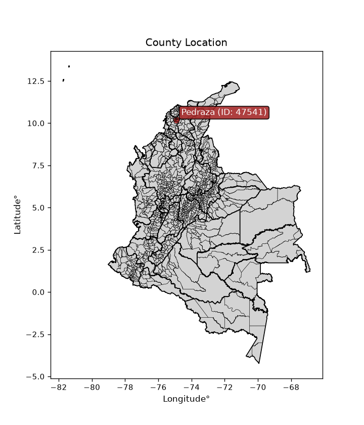
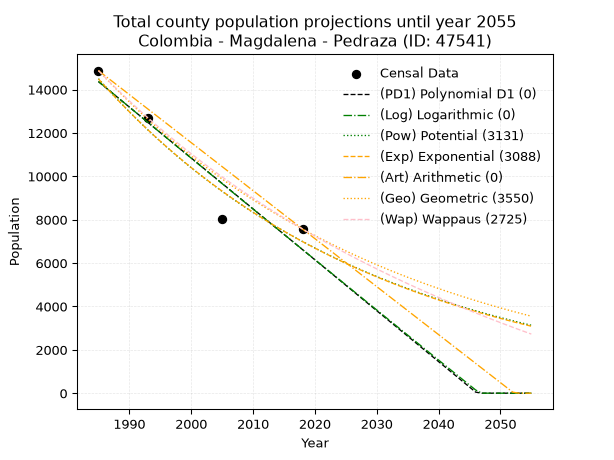
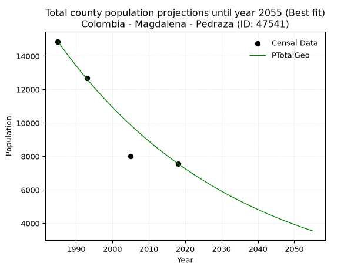
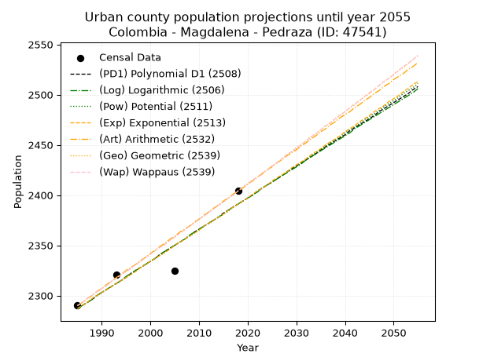
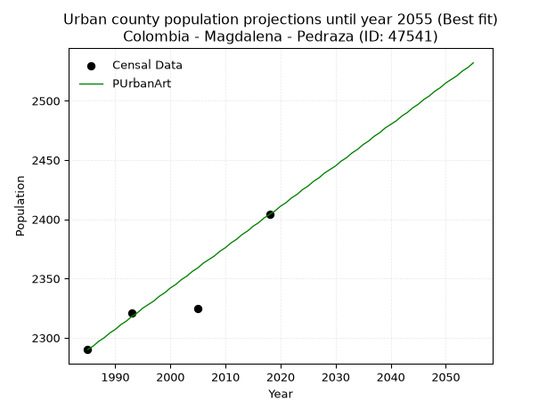
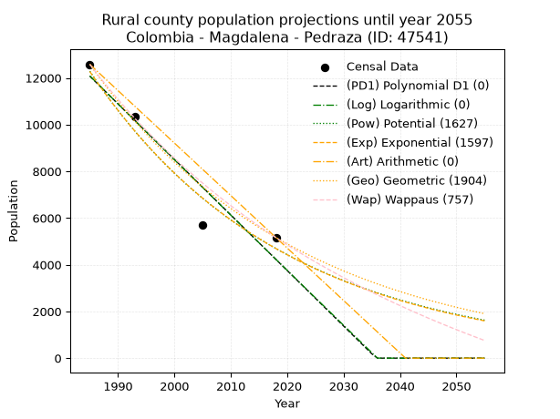
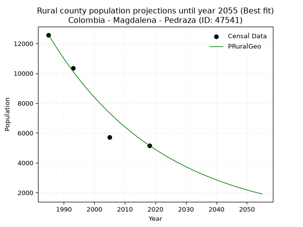

<div align="center">


</div>

# _“Population and Public Services Demand Projections (PPSD) until Year 2050 for Colombia - Magdalena - Pedraza (ID: 47541)”_
Keywords: `population` `public-service` `projection` `lineal` `polynomial` `logarithmic` `potential` `exponential` `arithmetic` `geometric` `wappaus` `dane` `colombia` `south-america`

PPSD are analytical estimates used by governments and planners to anticipate future changes in population size, age distribution, and the resulting community needs for utilities, healthcare, education, and infrastructure as sizing future water treatment facilities, electrical grids, and road networks based on spatial growth.

<div align="center">

</img>

</div>


> **General running parameters**: • app_version: _v20260806_. • Python version: _3.14.7_. • Pandas version: _3.0.5_. • NumPy version: _2.5.1_. • Creates, save and include plots into reports (create_plot): _False_. • Projection until year: _2050_. • Process polynomial degree 2 and up: _False_. • Process Wappaus: _True_. • Process Wappaus: _True_. • Set negative values to zero: _True_. • Set infinite values to zero: _True_. • Drop dataset notes: _True_. 
<div align="center">

Dynamic map: [:earth_americas:Google](http://maps.google.com/maps?q=10.18824978,-74.9154003) [:earth_americas:OSM](https://www.openstreetmap.org/#map=18/10.18824978/-74.9154003&layers=P) [:earth_americas:Bing](https://www.bing.com/maps?cp=10.18824978~-74.9154003&lvl=18) [:earth_americas:Apple](https://maps.apple.com/frame?center=10.18824978%2C-74.9154003&span=0.003%2C0.006)

</div>


<div align="center">

```geojson
{
  "type": "Feature",
  "geometry": {
    "type": "Point", 
    "coordinates": [-74.9154003, 10.18824978]
  }, 
  "properties": {
    "Name": "Colombia - Magdalena - Pedraza (ID: 47541)"
  }
}
```

</div>


## 0. Census Data (4 records)

Census data are official statistics collected by a government about the people and housing in a country. They usually include counts of total population, age, sex, race, income, education, and jobs.

📅Global census file: [Population.xlsx](../data/Population.xlsx)

| Source   |   Year |   CountryID | CountryName   |   StateID | StateName   |   CountyID | CountyName   |   PTotal |   PUrban |   PRural |
|:---------|-------:|------------:|:--------------|----------:|:------------|-----------:|:-------------|---------:|---------:|---------:|
| DANE     |   1985 |          57 | Colombia      |        47 | Magdalena   |      47541 | Pedraza      |    14871 |     2290 |    12581 |
| DANE     |   1993 |          57 | Colombia      |        47 | Magdalena   |      47541 | Pedraza      |    12669 |     2321 |    10348 |
| DANE     |   2005 |          57 | Colombia      |        47 | Magdalena   |      47541 | Pedraza      |     8031 |     2325 |     5706 |
| DANE     |   2018 |          57 | Colombia      |        47 | Magdalena   |      47541 | Pedraza      |     7569 |     2404 |     5165 |

> 🔥Some records could had specific notes about the registered values or the corresponding urban or rural distribution.

📅[SUI-RUPS](https://www.datos.gov.co/Hacienda-y-Cr-dito-P-blico/Registro-nico-de-Prestadores-de-Servicios-P-blicos/4qkq-csdn/about_data) - Local public utility companies: [RUPS.csv](../data/RUPS.xlsx)

 | SERVICIO       | ESTADO    | NOMBRE                                                       | NIT         | DEPARTAMENTO_DOMICILIO   | MUNICIPIO_DOMICILIO   | DIRECCION       |   TELEFONO | EMAIL                                | TIPO_PRESTADOR                 | CLASIFICACION                 |
|:---------------|:----------|:-------------------------------------------------------------|:------------|:-------------------------|:----------------------|:----------------|-----------:|:-------------------------------------|:-------------------------------|:------------------------------|
| ACUEDUCTO      | OPERATIVA | UNIDAD MUNICIPAL DE SERVICIOS PUBLICOS DE  PEDRAZA MAGDALENA | 891780048-1 | MAGDALENA                | PEDRAZA               | Calle 5 # 4 -27 |    0000000 | contactenos@pedraza-magdalena.gov.co | MUNICIPIO (PRESTACIÓN DIRECTA) | MENOR O IGUAL A 2500 USUARIOS |
| ALCANTARILLADO | OPERATIVA | UNIDAD MUNICIPAL DE SERVICIOS PUBLICOS DE  PEDRAZA MAGDALENA | 891780048-1 | MAGDALENA                | PEDRAZA               | Calle 5 # 4 -27 |    0000000 | contactenos@pedraza-magdalena.gov.co | MUNICIPIO (PRESTACIÓN DIRECTA) | MENOR O IGUAL A 2500 USUARIOS |

## 1. Total

### 1.1. Coefficients and Parameters

* (PD1) Polynomial Deg 1: -234.66238458450366, 480168.4347651534 (lineal)
* (Log) Logarithmic: -470017.5571404369, 3583392.218308783
* (Pow) Potential: -44.225717300333066, 150.00716942161156
* (Exp) Exponential: -0.02208292946284116, 1.578007648124366e+23
* (Art) Arithmetic: Year diff. 2018 - 1985 = 33, Population diff. 7569 - 14871 = -7302, Annual growth = -221.27272727272728
* (Geo) Geometric: Year diff. 2018 - 1985 = 33, Population diff. 7569 - 14871 = -7302, Annual growth % = -0.020257222411312004
* (Wap) Wappaus: i = -1.9721276940528278, Condition values only valid for < 200)

<sub>
Wappaus condition values: ['-0.00', '-1.97', '-3.94', '-5.92', '-7.89', '-9.86', '-11.83', '-13.80', '-15.78', '-17.75', '-19.72', '-21.69', '-23.67', '-25.64', '-27.61', '-29.58', '-31.55', '-33.53', '-35.50', '-37.47', '-39.44', '-41.41', '-43.39', '-45.36', '-47.33', '-49.30', '-51.28', '-53.25', '-55.22', '-57.19', '-59.16', '-61.14', '-63.11', '-65.08', '-67.05', '-69.02', '-71.00', '-72.97', '-74.94', '-76.91', '-78.89', '-80.86', '-82.83', '-84.80', '-86.77', '-88.75', '-90.72', '-92.69', '-94.66', '-96.63', '-98.61', '-100.58', '-102.55', '-104.52', '-106.49', '-108.47', '-110.44', '-112.41', '-114.38', '-116.36', '-118.33', '-120.30', '-122.27', '-124.24', '-126.22', '-128.19']
</sub>


### 1.2. Projected Dataset

|   Year |   CountyID |   PTotalPD1 |   PTotalLog |   PTotalPow |   PTotalExp |   PTotalArt |   PTotalGeo |   PTotalWap |
|-------:|-----------:|------------:|------------:|------------:|------------:|------------:|------------:|------------:|
|   1985 |      47541 |       14364 |       14373 |       14499 |       14487 |       14871 |       14871 |       14871 |
|   1986 |      47541 |       14129 |       14136 |       14180 |       14171 |       14650 |       14570 |       14581 |
|   1987 |      47541 |       13894 |       13900 |       13868 |       13861 |       14428 |       14275 |       14296 |
|   1988 |      47541 |       13660 |       13663 |       13562 |       13558 |       14207 |       13985 |       14016 |
|   1989 |      47541 |       13425 |       13427 |       13264 |       13262 |       13986 |       13702 |       13742 |
|   1990 |      47541 |       13190 |       13191 |       12973 |       12973 |       13765 |       13425 |       13474 |
|   1991 |      47541 |       12956 |       12954 |       12688 |       12689 |       13543 |       13153 |       13210 |
|   1992 |      47541 |       12721 |       12718 |       12409 |       12412 |       13322 |       12886 |       12951 |
|   1993 |      47541 |       12486 |       12483 |       12136 |       12141 |       13101 |       12625 |       12696 |
|   1994 |      47541 |       12252 |       12247 |       11870 |       11876 |       12880 |       12369 |       12447 |
|   1995 |      47541 |       12017 |       12011 |       11610 |       11616 |       12658 |       12119 |       12201 |
|   1996 |      47541 |       11782 |       11776 |       11355 |       11363 |       12437 |       11873 |       11961 |
|   1997 |      47541 |       11548 |       11540 |       11107 |       11115 |       12216 |       11633 |       11724 |
|   1998 |      47541 |       11313 |       11305 |       10863 |       10872 |       11994 |       11397 |       11492 |
|   1999 |      47541 |       11078 |       11070 |       10626 |       10634 |       11773 |       11166 |       11263 |
|   2000 |      47541 |       10844 |       10835 |       10393 |       10402 |       11552 |       10940 |       11039 |
|   2001 |      47541 |       10609 |       10600 |       10166 |       10175 |       11331 |       10718 |       10818 |
|   2002 |      47541 |       10374 |       10365 |        9944 |        9953 |       11109 |       10501 |       10601 |
|   2003 |      47541 |       10140 |       10130 |        9727 |        9735 |       10888 |       10289 |       10388 |
|   2004 |      47541 |        9905 |        9896 |        9514 |        9523 |       10667 |       10080 |       10178 |
|   2005 |      47541 |        9670 |        9661 |        9307 |        9315 |       10446 |        9876 |        9972 |
|   2006 |      47541 |        9436 |        9427 |        9104 |        9111 |       10224 |        9676 |        9769 |
|   2007 |      47541 |        9201 |        9192 |        8905 |        8912 |       10003 |        9480 |        9569 |
|   2008 |      47541 |        8966 |        8958 |        8711 |        8718 |        9782 |        9288 |        9373 |
|   2009 |      47541 |        8732 |        8724 |        8521 |        8527 |        9560 |        9100 |        9179 |
|   2010 |      47541 |        8497 |        8490 |        8336 |        8341 |        9339 |        8915 |        8989 |
|   2011 |      47541 |        8262 |        8257 |        8155 |        8159 |        9118 |        8735 |        8802 |
|   2012 |      47541 |        8028 |        8023 |        7977 |        7981 |        8897 |        8558 |        8617 |
|   2013 |      47541 |        7793 |        7789 |        7804 |        7806 |        8675 |        8385 |        8436 |
|   2014 |      47541 |        7558 |        7556 |        7634 |        7636 |        8454 |        8215 |        8257 |
|   2015 |      47541 |        7324 |        7323 |        7469 |        7469 |        8233 |        8048 |        8081 |
|   2016 |      47541 |        7089 |        7089 |        7306 |        7306 |        8012 |        7885 |        7908 |
|   2017 |      47541 |        6854 |        6856 |        7148 |        7146 |        7790 |        7725 |        7737 |
|   2018 |      47541 |        6620 |        6623 |        6993 |        6990 |        7569 |        7569 |        7569 |
|   2019 |      47541 |        6385 |        6391 |        6841 |        6838 |        7348 |        7416 |        7403 |
|   2020 |      47541 |        6150 |        6158 |        6693 |        6688 |        7126 |        7265 |        7240 |
|   2021 |      47541 |        5916 |        5925 |        6548 |        6542 |        6905 |        7118 |        7079 |
|   2022 |      47541 |        5681 |        5693 |        6407 |        6399 |        6684 |        6974 |        6921 |
|   2023 |      47541 |        5446 |        5460 |        6268 |        6259 |        6463 |        6833 |        6764 |
|   2024 |      47541 |        5212 |        5228 |        6133 |        6123 |        6241 |        6694 |        6610 |
|   2025 |      47541 |        4977 |        4996 |        6000 |        5989 |        6020 |        6559 |        6458 |
|   2026 |      47541 |        4742 |        4764 |        5870 |        5858 |        5799 |        6426 |        6308 |
|   2027 |      47541 |        4508 |        4532 |        5744 |        5730 |        5578 |        6296 |        6161 |
|   2028 |      47541 |        4273 |        4300 |        5620 |        5605 |        5356 |        6168 |        6015 |
|   2029 |      47541 |        4038 |        4068 |        5499 |        5483 |        5135 |        6043 |        5871 |
|   2030 |      47541 |        3804 |        3837 |        5380 |        5363 |        4914 |        5921 |        5730 |
|   2031 |      47541 |        3569 |        3605 |        5264 |        5246 |        4692 |        5801 |        5590 |
|   2032 |      47541 |        3334 |        3374 |        5151 |        5131 |        4471 |        5683 |        5452 |
|   2033 |      47541 |        3100 |        3143 |        5040 |        5019 |        4250 |        5568 |        5316 |
|   2034 |      47541 |        2865 |        2911 |        4931 |        4910 |        4029 |        5455 |        5182 |
|   2035 |      47541 |        2630 |        2680 |        4825 |        4802 |        3807 |        5345 |        5050 |
|   2036 |      47541 |        2396 |        2450 |        4722 |        4697 |        3586 |        5237 |        4919 |
|   2037 |      47541 |        2161 |        2219 |        4620 |        4595 |        3365 |        5131 |        4790 |
|   2038 |      47541 |        1926 |        1988 |        4521 |        4495 |        3144 |        5027 |        4663 |
|   2039 |      47541 |        1692 |        1757 |        4424 |        4396 |        2922 |        4925 |        4537 |
|   2040 |      47541 |        1457 |        1527 |        4329 |        4300 |        2701 |        4825 |        4413 |
|   2041 |      47541 |        1223 |        1297 |        4236 |        4206 |        2480 |        4727 |        4290 |
|   2042 |      47541 |         988 |        1066 |        4146 |        4115 |        2258 |        4632 |        4169 |
|   2043 |      47541 |         753 |         836 |        4057 |        4025 |        2037 |        4538 |        4050 |
|   2044 |      47541 |         519 |         606 |        3970 |        3937 |        1816 |        4446 |        3932 |
|   2045 |      47541 |         284 |         376 |        3885 |        3851 |        1595 |        4356 |        3815 |
|   2046 |      47541 |          49 |         147 |        3802 |        3767 |        1373 |        4268 |        3700 |
|   2047 |      47541 |           0 |           0 |        3721 |        3684 |        1152 |        4181 |        3587 |
|   2048 |      47541 |           0 |           0 |        3641 |        3604 |         931 |        4096 |        3474 |
|   2049 |      47541 |           0 |           0 |        3563 |        3525 |         710 |        4013 |        3364 |
|   2050 |      47541 |           0 |           0 |        3487 |        3448 |         488 |        3932 |        3254 |
<div align="center">

</img>

</div>


### 1.3. Best fit with absolute and relative error (%)

Relative error puts that difference into context by dividing the absolute error by the true value, creating a unitless ratio or percentage that shows the scale of the mistake.

Absolute and relative error

|   Year | Source   |   CountryID | CountryName   |   StateID | StateName   |   CountyID_x | CountyName   |   PTotal |   PUrban |   PRural |   CountyID_y |   PTotalPD1 |   PTotalLog |   PTotalPow |   PTotalExp |   PTotalArt |   PTotalGeo |   PTotalWap |   PTotalPD1AbsError |   PTotalLogAbsError |   PTotalPowAbsError |   PTotalExpAbsError |   PTotalArtAbsError |   PTotalGeoAbsError |   PTotalWapAbsError |   PTotalPD1RelError |   PTotalLogRelError |   PTotalPowRelError |   PTotalExpRelError |   PTotalArtRelError |   PTotalGeoRelError |   PTotalWapRelError |
|-------:|:---------|------------:|:--------------|----------:|:------------|-------------:|:-------------|---------:|---------:|---------:|-------------:|------------:|------------:|------------:|------------:|------------:|------------:|------------:|--------------------:|--------------------:|--------------------:|--------------------:|--------------------:|--------------------:|--------------------:|--------------------:|--------------------:|--------------------:|--------------------:|--------------------:|--------------------:|--------------------:|
|   1985 | DANE     |          57 | Colombia      |        47 | Magdalena   |        47541 | Pedraza      |    14871 |     2290 |    12581 |        47541 |       14364 |       14373 |       14499 |       14487 |       14871 |       14871 |       14871 |                 507 |                 498 |                 372 |                 384 |                   0 |                   0 |                   0 |             3.40932 |             3.3488  |             2.50151 |             2.58221 |              0      |            0        |            0        |
|   1993 | DANE     |          57 | Colombia      |        47 | Magdalena   |        47541 | Pedraza      |    12669 |     2321 |    10348 |        47541 |       12486 |       12483 |       12136 |       12141 |       13101 |       12625 |       12696 |                 183 |                 186 |                 533 |                 528 |                 432 |                  44 |                  27 |             1.44447 |             1.46815 |             4.20712 |             4.16765 |              3.4099 |            0.347304 |            0.213119 |
|   2005 | DANE     |          57 | Colombia      |        47 | Magdalena   |        47541 | Pedraza      |     8031 |     2325 |     5706 |        47541 |        9670 |        9661 |        9307 |        9315 |       10446 |        9876 |        9972 |                1639 |                1630 |                1276 |                1284 |                2415 |                1845 |                1941 |            20.4084  |            20.2964  |            15.8884  |            15.988   |             30.071  |           22.9735   |           24.1688   |
|   2018 | DANE     |          57 | Colombia      |        47 | Magdalena   |        47541 | Pedraza      |     7569 |     2404 |     5165 |        47541 |        6620 |        6623 |        6993 |        6990 |        7569 |        7569 |        7569 |                 949 |                 946 |                 576 |                 579 |                   0 |                   0 |                   0 |            12.538   |            12.4983  |             7.60999 |             7.64962 |              0      |            0        |            0        |

Relative error mean

| Method    |   RelError | Best   |
|:----------|-----------:|:-------|
| PTotalPD1 |    9.45005 |        |
| PTotalLog |    9.40291 |        |
| PTotalPow |    7.55176 |        |
| PTotalExp |    7.59688 |        |
| PTotalArt |    8.37022 |        |
| PTotalGeo |    5.8302  | True   |
| PTotalWap |    6.09549 |        |

💙Best method: _**PTotalGeo**_
<div align="center">

</img>

</div>


### 1.4. Fresh water supply demand in liters per capita per day (lpcd)

The fresh water supply demand typically ranges from 100 to 300 liters per capita per day (lpcd) for standard domestic and municipal planning, though absolute survival minimums set by the World Health Organization are as low as 7.5 to 20 liters per day, and total consumption in high-income nations can exceed 400 liters.

> `CZ`: Level in meters above the sea level (masl)<br> `WS`: Fresh water supply demand in liters per capita per day (lpcd or l/h/d)<br> `WSAll`: Zonal fresh water supply demand in liters per second (l/s)<br> `A`: Zonal area in square meters<br> `DP`: Population density (people/hectare or p/ha)

Reference values (RAS Colombia)

|    CZ |   WS |
|------:|-----:|
|  1000 |  120 |
|  2000 |  130 |
| 99999 |  140 |

County shapefile geometry properties and water supply values

|   CountyID |      ATotal |   CZTotal |   WSTotal |
|-----------:|------------:|----------:|----------:|
|      47541 | 3.05464e+08 |   30.1181 |       120 |

Projected values for best method: PTotalGeo

|   CountyID |   Year |   PTotalGeo |   DPTotal |   WSTotal |   WSTotalAll |
|-----------:|-------:|------------:|----------:|----------:|-------------:|
|      47541 |   1985 |       14871 |      0.49 |       120 |     20.6542  |
|      47541 |   1986 |       14570 |      0.48 |       120 |     20.2361  |
|      47541 |   1987 |       14275 |      0.47 |       120 |     19.8264  |
|      47541 |   1988 |       13985 |      0.46 |       120 |     19.4236  |
|      47541 |   1989 |       13702 |      0.45 |       120 |     19.0306  |
|      47541 |   1990 |       13425 |      0.44 |       120 |     18.6458  |
|      47541 |   1991 |       13153 |      0.43 |       120 |     18.2681  |
|      47541 |   1992 |       12886 |      0.42 |       120 |     17.8972  |
|      47541 |   1993 |       12625 |      0.41 |       120 |     17.5347  |
|      47541 |   1994 |       12369 |      0.4  |       120 |     17.1792  |
|      47541 |   1995 |       12119 |      0.4  |       120 |     16.8319  |
|      47541 |   1996 |       11873 |      0.39 |       120 |     16.4903  |
|      47541 |   1997 |       11633 |      0.38 |       120 |     16.1569  |
|      47541 |   1998 |       11397 |      0.37 |       120 |     15.8292  |
|      47541 |   1999 |       11166 |      0.37 |       120 |     15.5083  |
|      47541 |   2000 |       10940 |      0.36 |       120 |     15.1944  |
|      47541 |   2001 |       10718 |      0.35 |       120 |     14.8861  |
|      47541 |   2002 |       10501 |      0.34 |       120 |     14.5847  |
|      47541 |   2003 |       10289 |      0.34 |       120 |     14.2903  |
|      47541 |   2004 |       10080 |      0.33 |       120 |     14       |
|      47541 |   2005 |        9876 |      0.32 |       120 |     13.7167  |
|      47541 |   2006 |        9676 |      0.32 |       120 |     13.4389  |
|      47541 |   2007 |        9480 |      0.31 |       120 |     13.1667  |
|      47541 |   2008 |        9288 |      0.3  |       120 |     12.9     |
|      47541 |   2009 |        9100 |      0.3  |       120 |     12.6389  |
|      47541 |   2010 |        8915 |      0.29 |       120 |     12.3819  |
|      47541 |   2011 |        8735 |      0.29 |       120 |     12.1319  |
|      47541 |   2012 |        8558 |      0.28 |       120 |     11.8861  |
|      47541 |   2013 |        8385 |      0.27 |       120 |     11.6458  |
|      47541 |   2014 |        8215 |      0.27 |       120 |     11.4097  |
|      47541 |   2015 |        8048 |      0.26 |       120 |     11.1778  |
|      47541 |   2016 |        7885 |      0.26 |       120 |     10.9514  |
|      47541 |   2017 |        7725 |      0.25 |       120 |     10.7292  |
|      47541 |   2018 |        7569 |      0.25 |       120 |     10.5125  |
|      47541 |   2019 |        7416 |      0.24 |       120 |     10.3     |
|      47541 |   2020 |        7265 |      0.24 |       120 |     10.0903  |
|      47541 |   2021 |        7118 |      0.23 |       120 |      9.88611 |
|      47541 |   2022 |        6974 |      0.23 |       120 |      9.68611 |
|      47541 |   2023 |        6833 |      0.22 |       120 |      9.49028 |
|      47541 |   2024 |        6694 |      0.22 |       120 |      9.29722 |
|      47541 |   2025 |        6559 |      0.21 |       120 |      9.10972 |
|      47541 |   2026 |        6426 |      0.21 |       120 |      8.925   |
|      47541 |   2027 |        6296 |      0.21 |       120 |      8.74444 |
|      47541 |   2028 |        6168 |      0.2  |       120 |      8.56667 |
|      47541 |   2029 |        6043 |      0.2  |       120 |      8.39306 |
|      47541 |   2030 |        5921 |      0.19 |       120 |      8.22361 |
|      47541 |   2031 |        5801 |      0.19 |       120 |      8.05694 |
|      47541 |   2032 |        5683 |      0.19 |       120 |      7.89306 |
|      47541 |   2033 |        5568 |      0.18 |       120 |      7.73333 |
|      47541 |   2034 |        5455 |      0.18 |       120 |      7.57639 |
|      47541 |   2035 |        5345 |      0.17 |       120 |      7.42361 |
|      47541 |   2036 |        5237 |      0.17 |       120 |      7.27361 |
|      47541 |   2037 |        5131 |      0.17 |       120 |      7.12639 |
|      47541 |   2038 |        5027 |      0.16 |       120 |      6.98194 |
|      47541 |   2039 |        4925 |      0.16 |       120 |      6.84028 |
|      47541 |   2040 |        4825 |      0.16 |       120 |      6.70139 |
|      47541 |   2041 |        4727 |      0.15 |       120 |      6.56528 |
|      47541 |   2042 |        4632 |      0.15 |       120 |      6.43333 |
|      47541 |   2043 |        4538 |      0.15 |       120 |      6.30278 |
|      47541 |   2044 |        4446 |      0.15 |       120 |      6.175   |
|      47541 |   2045 |        4356 |      0.14 |       120 |      6.05    |
|      47541 |   2046 |        4268 |      0.14 |       120 |      5.92778 |
|      47541 |   2047 |        4181 |      0.14 |       120 |      5.80694 |
|      47541 |   2048 |        4096 |      0.13 |       120 |      5.68889 |
|      47541 |   2049 |        4013 |      0.13 |       120 |      5.57361 |
|      47541 |   2050 |        3932 |      0.13 |       120 |      5.46111 |

## 2. Urban

### 2.1. Coefficients and Parameters

* (PD1) Polynomial Deg 1: 3.1553592934563963, -3976.5074267361574 (lineal)
* (Log) Logarithmic: 6312.051364924018, -45642.95300639264
* (Pow) Potential: 2.6883593959451058, -5.506261232729557
* (Exp) Exponential: 0.001343873690291256, 158.78052934526147
* (Art) Arithmetic: Year diff. 2018 - 1985 = 33, Population diff. 2404 - 2290 = 114, Annual growth = 3.4545454545454546
* (Geo) Geometric: Year diff. 2018 - 1985 = 33, Population diff. 2404 - 2290 = 114, Annual growth % = 0.0014732720522405707
* (Wap) Wappaus: i = 0.14718983615447187, Condition values only valid for < 200)

<sub>
Wappaus condition values: ['0.00', '0.15', '0.29', '0.44', '0.59', '0.74', '0.88', '1.03', '1.18', '1.32', '1.47', '1.62', '1.77', '1.91', '2.06', '2.21', '2.36', '2.50', '2.65', '2.80', '2.94', '3.09', '3.24', '3.39', '3.53', '3.68', '3.83', '3.97', '4.12', '4.27', '4.42', '4.56', '4.71', '4.86', '5.00', '5.15', '5.30', '5.45', '5.59', '5.74', '5.89', '6.03', '6.18', '6.33', '6.48', '6.62', '6.77', '6.92', '7.07', '7.21', '7.36', '7.51', '7.65', '7.80', '7.95', '8.10', '8.24', '8.39', '8.54', '8.68', '8.83', '8.98', '9.13', '9.27', '9.42', '9.57']
</sub>


### 2.2. Projected Dataset

|   Year |   CountyID |   PUrbanPD1 |   PUrbanLog |   PUrbanPow |   PUrbanExp |   PUrbanArt |   PUrbanGeo |   PUrbanWap |
|-------:|-----------:|------------:|------------:|------------:|------------:|------------:|------------:|------------:|
|   1985 |      47541 |        2287 |        2287 |        2287 |        2287 |        2290 |        2290 |        2290 |
|   1986 |      47541 |        2290 |        2290 |        2290 |        2290 |        2293 |        2293 |        2293 |
|   1987 |      47541 |        2293 |        2293 |        2293 |        2293 |        2297 |        2297 |        2297 |
|   1988 |      47541 |        2296 |        2296 |        2297 |        2297 |        2300 |        2300 |        2300 |
|   1989 |      47541 |        2300 |        2300 |        2300 |        2300 |        2304 |        2304 |        2304 |
|   1990 |      47541 |        2303 |        2303 |        2303 |        2303 |        2307 |        2307 |        2307 |
|   1991 |      47541 |        2306 |        2306 |        2306 |        2306 |        2311 |        2310 |        2310 |
|   1992 |      47541 |        2309 |        2309 |        2309 |        2309 |        2314 |        2314 |        2314 |
|   1993 |      47541 |        2312 |        2312 |        2312 |        2312 |        2318 |        2317 |        2317 |
|   1994 |      47541 |        2315 |        2315 |        2315 |        2315 |        2321 |        2321 |        2321 |
|   1995 |      47541 |        2318 |        2319 |        2318 |        2318 |        2325 |        2324 |        2324 |
|   1996 |      47541 |        2322 |        2322 |        2321 |        2321 |        2328 |        2327 |        2327 |
|   1997 |      47541 |        2325 |        2325 |        2325 |        2324 |        2331 |        2331 |        2331 |
|   1998 |      47541 |        2328 |        2328 |        2328 |        2328 |        2335 |        2334 |        2334 |
|   1999 |      47541 |        2331 |        2331 |        2331 |        2331 |        2338 |        2338 |        2338 |
|   2000 |      47541 |        2334 |        2334 |        2334 |        2334 |        2342 |        2341 |        2341 |
|   2001 |      47541 |        2337 |        2337 |        2337 |        2337 |        2345 |        2345 |        2345 |
|   2002 |      47541 |        2341 |        2341 |        2340 |        2340 |        2349 |        2348 |        2348 |
|   2003 |      47541 |        2344 |        2344 |        2343 |        2343 |        2352 |        2351 |        2351 |
|   2004 |      47541 |        2347 |        2347 |        2347 |        2346 |        2356 |        2355 |        2355 |
|   2005 |      47541 |        2350 |        2350 |        2350 |        2350 |        2359 |        2358 |        2358 |
|   2006 |      47541 |        2353 |        2353 |        2353 |        2353 |        2363 |        2362 |        2362 |
|   2007 |      47541 |        2356 |        2356 |        2356 |        2356 |        2366 |        2365 |        2365 |
|   2008 |      47541 |        2359 |        2360 |        2359 |        2359 |        2369 |        2369 |        2369 |
|   2009 |      47541 |        2363 |        2363 |        2362 |        2362 |        2373 |        2372 |        2372 |
|   2010 |      47541 |        2366 |        2366 |        2365 |        2365 |        2376 |        2376 |        2376 |
|   2011 |      47541 |        2369 |        2369 |        2369 |        2369 |        2380 |        2379 |        2379 |
|   2012 |      47541 |        2372 |        2372 |        2372 |        2372 |        2383 |        2383 |        2383 |
|   2013 |      47541 |        2375 |        2375 |        2375 |        2375 |        2387 |        2386 |        2386 |
|   2014 |      47541 |        2378 |        2378 |        2378 |        2378 |        2390 |        2390 |        2390 |
|   2015 |      47541 |        2382 |        2381 |        2381 |        2381 |        2394 |        2393 |        2393 |
|   2016 |      47541 |        2385 |        2385 |        2384 |        2385 |        2397 |        2397 |        2397 |
|   2017 |      47541 |        2388 |        2388 |        2388 |        2388 |        2401 |        2400 |        2400 |
|   2018 |      47541 |        2391 |        2391 |        2391 |        2391 |        2404 |        2404 |        2404 |
|   2019 |      47541 |        2394 |        2394 |        2394 |        2394 |        2407 |        2408 |        2408 |
|   2020 |      47541 |        2397 |        2397 |        2397 |        2397 |        2411 |        2411 |        2411 |
|   2021 |      47541 |        2400 |        2400 |        2400 |        2401 |        2414 |        2415 |        2415 |
|   2022 |      47541 |        2404 |        2403 |        2404 |        2404 |        2418 |        2418 |        2418 |
|   2023 |      47541 |        2407 |        2407 |        2407 |        2407 |        2421 |        2422 |        2422 |
|   2024 |      47541 |        2410 |        2410 |        2410 |        2410 |        2425 |        2425 |        2425 |
|   2025 |      47541 |        2413 |        2413 |        2413 |        2414 |        2428 |        2429 |        2429 |
|   2026 |      47541 |        2416 |        2416 |        2416 |        2417 |        2432 |        2432 |        2432 |
|   2027 |      47541 |        2419 |        2419 |        2420 |        2420 |        2435 |        2436 |        2436 |
|   2028 |      47541 |        2423 |        2422 |        2423 |        2423 |        2439 |        2440 |        2440 |
|   2029 |      47541 |        2426 |        2425 |        2426 |        2427 |        2442 |        2443 |        2443 |
|   2030 |      47541 |        2429 |        2428 |        2429 |        2430 |        2445 |        2447 |        2447 |
|   2031 |      47541 |        2432 |        2431 |        2432 |        2433 |        2449 |        2450 |        2450 |
|   2032 |      47541 |        2435 |        2435 |        2436 |        2436 |        2452 |        2454 |        2454 |
|   2033 |      47541 |        2438 |        2438 |        2439 |        2440 |        2456 |        2458 |        2458 |
|   2034 |      47541 |        2441 |        2441 |        2442 |        2443 |        2459 |        2461 |        2461 |
|   2035 |      47541 |        2445 |        2444 |        2445 |        2446 |        2463 |        2465 |        2465 |
|   2036 |      47541 |        2448 |        2447 |        2449 |        2450 |        2466 |        2469 |        2469 |
|   2037 |      47541 |        2451 |        2450 |        2452 |        2453 |        2470 |        2472 |        2472 |
|   2038 |      47541 |        2454 |        2453 |        2455 |        2456 |        2473 |        2476 |        2476 |
|   2039 |      47541 |        2457 |        2456 |        2458 |        2459 |        2477 |        2479 |        2480 |
|   2040 |      47541 |        2460 |        2459 |        2462 |        2463 |        2480 |        2483 |        2483 |
|   2041 |      47541 |        2464 |        2462 |        2465 |        2466 |        2483 |        2487 |        2487 |
|   2042 |      47541 |        2467 |        2466 |        2468 |        2469 |        2487 |        2490 |        2491 |
|   2043 |      47541 |        2470 |        2469 |        2471 |        2473 |        2490 |        2494 |        2494 |
|   2044 |      47541 |        2473 |        2472 |        2475 |        2476 |        2494 |        2498 |        2498 |
|   2045 |      47541 |        2476 |        2475 |        2478 |        2479 |        2497 |        2501 |        2502 |
|   2046 |      47541 |        2479 |        2478 |        2481 |        2483 |        2501 |        2505 |        2505 |
|   2047 |      47541 |        2483 |        2481 |        2484 |        2486 |        2504 |        2509 |        2509 |
|   2048 |      47541 |        2486 |        2484 |        2488 |        2489 |        2508 |        2513 |        2513 |
|   2049 |      47541 |        2489 |        2487 |        2491 |        2493 |        2511 |        2516 |        2516 |
|   2050 |      47541 |        2492 |        2490 |        2494 |        2496 |        2515 |        2520 |        2520 |
<div align="center">

</img>

</div>


### 2.3. Best fit with absolute and relative error (%)

Relative error puts that difference into context by dividing the absolute error by the true value, creating a unitless ratio or percentage that shows the scale of the mistake.

Absolute and relative error

|   Year | Source   |   CountryID | CountryName   |   StateID | StateName   |   CountyID_x | CountyName   |   PTotal |   PUrban |   PRural |   CountyID_y |   PUrbanPD1 |   PUrbanLog |   PUrbanPow |   PUrbanExp |   PUrbanArt |   PUrbanGeo |   PUrbanWap |   PUrbanPD1AbsError |   PUrbanLogAbsError |   PUrbanPowAbsError |   PUrbanExpAbsError |   PUrbanArtAbsError |   PUrbanGeoAbsError |   PUrbanWapAbsError |   PUrbanPD1RelError |   PUrbanLogRelError |   PUrbanPowRelError |   PUrbanExpRelError |   PUrbanArtRelError |   PUrbanGeoRelError |   PUrbanWapRelError |
|-------:|:---------|------------:|:--------------|----------:|:------------|-------------:|:-------------|---------:|---------:|---------:|-------------:|------------:|------------:|------------:|------------:|------------:|------------:|------------:|--------------------:|--------------------:|--------------------:|--------------------:|--------------------:|--------------------:|--------------------:|--------------------:|--------------------:|--------------------:|--------------------:|--------------------:|--------------------:|--------------------:|
|   1985 | DANE     |          57 | Colombia      |        47 | Magdalena   |        47541 | Pedraza      |    14871 |     2290 |    12581 |        47541 |        2287 |        2287 |        2287 |        2287 |        2290 |        2290 |        2290 |                   3 |                   3 |                   3 |                   3 |                   0 |                   0 |                   0 |            0.131004 |            0.131004 |            0.131004 |            0.131004 |            0        |             0       |             0       |
|   1993 | DANE     |          57 | Colombia      |        47 | Magdalena   |        47541 | Pedraza      |    12669 |     2321 |    10348 |        47541 |        2312 |        2312 |        2312 |        2312 |        2318 |        2317 |        2317 |                   9 |                   9 |                   9 |                   9 |                   3 |                   4 |                   4 |            0.387764 |            0.387764 |            0.387764 |            0.387764 |            0.129255 |             0.17234 |             0.17234 |
|   2005 | DANE     |          57 | Colombia      |        47 | Magdalena   |        47541 | Pedraza      |     8031 |     2325 |     5706 |        47541 |        2350 |        2350 |        2350 |        2350 |        2359 |        2358 |        2358 |                  25 |                  25 |                  25 |                  25 |                  34 |                  33 |                  33 |            1.07527  |            1.07527  |            1.07527  |            1.07527  |            1.46237  |             1.41935 |             1.41935 |
|   2018 | DANE     |          57 | Colombia      |        47 | Magdalena   |        47541 | Pedraza      |     7569 |     2404 |     5165 |        47541 |        2391 |        2391 |        2391 |        2391 |        2404 |        2404 |        2404 |                  13 |                  13 |                  13 |                  13 |                   0 |                   0 |                   0 |            0.540765 |            0.540765 |            0.540765 |            0.540765 |            0        |             0       |             0       |

Relative error mean

| Method    |   RelError | Best   |
|:----------|-----------:|:-------|
| PUrbanPD1 |   0.533701 |        |
| PUrbanLog |   0.533701 |        |
| PUrbanPow |   0.533701 |        |
| PUrbanExp |   0.533701 |        |
| PUrbanArt |   0.397905 | True   |
| PUrbanGeo |   0.397924 |        |
| PUrbanWap |   0.397924 |        |

💙Best method: _**PUrbanArt**_
<div align="center">

</img>

</div>


### 2.4. Fresh water supply demand in liters per capita per day (lpcd)

The fresh water supply demand typically ranges from 100 to 300 liters per capita per day (lpcd) for standard domestic and municipal planning, though absolute survival minimums set by the World Health Organization are as low as 7.5 to 20 liters per day, and total consumption in high-income nations can exceed 400 liters.

> `CZ`: Level in meters above the sea level (masl)<br> `WS`: Fresh water supply demand in liters per capita per day (lpcd or l/h/d)<br> `WSAll`: Zonal fresh water supply demand in liters per second (l/s)<br> `A`: Zonal area in square meters<br> `DP`: Population density (people/hectare or p/ha)

Reference values (RAS Colombia)

|    CZ |   WS |
|------:|-----:|
|  1000 |  120 |
|  2000 |  130 |
| 99999 |  140 |

County shapefile geometry properties and water supply values

|   CountyID |   AUrban |   CZUrban |   WSUrban |
|-----------:|---------:|----------:|----------:|
|      47541 |   369279 |   10.8725 |       120 |

Projected values for best method: PUrbanArt

|   CountyID |   Year |   PUrbanArt |   DPUrban |   WSUrban |   WSUrbanAll |
|-----------:|-------:|------------:|----------:|----------:|-------------:|
|      47541 |   1985 |        2290 |     62.01 |       120 |      3.18056 |
|      47541 |   1986 |        2293 |     62.09 |       120 |      3.18472 |
|      47541 |   1987 |        2297 |     62.2  |       120 |      3.19028 |
|      47541 |   1988 |        2300 |     62.28 |       120 |      3.19444 |
|      47541 |   1989 |        2304 |     62.39 |       120 |      3.2     |
|      47541 |   1990 |        2307 |     62.47 |       120 |      3.20417 |
|      47541 |   1991 |        2311 |     62.58 |       120 |      3.20972 |
|      47541 |   1992 |        2314 |     62.66 |       120 |      3.21389 |
|      47541 |   1993 |        2318 |     62.77 |       120 |      3.21944 |
|      47541 |   1994 |        2321 |     62.85 |       120 |      3.22361 |
|      47541 |   1995 |        2325 |     62.96 |       120 |      3.22917 |
|      47541 |   1996 |        2328 |     63.04 |       120 |      3.23333 |
|      47541 |   1997 |        2331 |     63.12 |       120 |      3.2375  |
|      47541 |   1998 |        2335 |     63.23 |       120 |      3.24306 |
|      47541 |   1999 |        2338 |     63.31 |       120 |      3.24722 |
|      47541 |   2000 |        2342 |     63.42 |       120 |      3.25278 |
|      47541 |   2001 |        2345 |     63.5  |       120 |      3.25694 |
|      47541 |   2002 |        2349 |     63.61 |       120 |      3.2625  |
|      47541 |   2003 |        2352 |     63.69 |       120 |      3.26667 |
|      47541 |   2004 |        2356 |     63.8  |       120 |      3.27222 |
|      47541 |   2005 |        2359 |     63.88 |       120 |      3.27639 |
|      47541 |   2006 |        2363 |     63.99 |       120 |      3.28194 |
|      47541 |   2007 |        2366 |     64.07 |       120 |      3.28611 |
|      47541 |   2008 |        2369 |     64.15 |       120 |      3.29028 |
|      47541 |   2009 |        2373 |     64.26 |       120 |      3.29583 |
|      47541 |   2010 |        2376 |     64.34 |       120 |      3.3     |
|      47541 |   2011 |        2380 |     64.45 |       120 |      3.30556 |
|      47541 |   2012 |        2383 |     64.53 |       120 |      3.30972 |
|      47541 |   2013 |        2387 |     64.64 |       120 |      3.31528 |
|      47541 |   2014 |        2390 |     64.72 |       120 |      3.31944 |
|      47541 |   2015 |        2394 |     64.83 |       120 |      3.325   |
|      47541 |   2016 |        2397 |     64.91 |       120 |      3.32917 |
|      47541 |   2017 |        2401 |     65.02 |       120 |      3.33472 |
|      47541 |   2018 |        2404 |     65.1  |       120 |      3.33889 |
|      47541 |   2019 |        2407 |     65.18 |       120 |      3.34306 |
|      47541 |   2020 |        2411 |     65.29 |       120 |      3.34861 |
|      47541 |   2021 |        2414 |     65.37 |       120 |      3.35278 |
|      47541 |   2022 |        2418 |     65.48 |       120 |      3.35833 |
|      47541 |   2023 |        2421 |     65.56 |       120 |      3.3625  |
|      47541 |   2024 |        2425 |     65.67 |       120 |      3.36806 |
|      47541 |   2025 |        2428 |     65.75 |       120 |      3.37222 |
|      47541 |   2026 |        2432 |     65.86 |       120 |      3.37778 |
|      47541 |   2027 |        2435 |     65.94 |       120 |      3.38194 |
|      47541 |   2028 |        2439 |     66.05 |       120 |      3.3875  |
|      47541 |   2029 |        2442 |     66.13 |       120 |      3.39167 |
|      47541 |   2030 |        2445 |     66.21 |       120 |      3.39583 |
|      47541 |   2031 |        2449 |     66.32 |       120 |      3.40139 |
|      47541 |   2032 |        2452 |     66.4  |       120 |      3.40556 |
|      47541 |   2033 |        2456 |     66.51 |       120 |      3.41111 |
|      47541 |   2034 |        2459 |     66.59 |       120 |      3.41528 |
|      47541 |   2035 |        2463 |     66.7  |       120 |      3.42083 |
|      47541 |   2036 |        2466 |     66.78 |       120 |      3.425   |
|      47541 |   2037 |        2470 |     66.89 |       120 |      3.43056 |
|      47541 |   2038 |        2473 |     66.97 |       120 |      3.43472 |
|      47541 |   2039 |        2477 |     67.08 |       120 |      3.44028 |
|      47541 |   2040 |        2480 |     67.16 |       120 |      3.44444 |
|      47541 |   2041 |        2483 |     67.24 |       120 |      3.44861 |
|      47541 |   2042 |        2487 |     67.35 |       120 |      3.45417 |
|      47541 |   2043 |        2490 |     67.43 |       120 |      3.45833 |
|      47541 |   2044 |        2494 |     67.54 |       120 |      3.46389 |
|      47541 |   2045 |        2497 |     67.62 |       120 |      3.46806 |
|      47541 |   2046 |        2501 |     67.73 |       120 |      3.47361 |
|      47541 |   2047 |        2504 |     67.81 |       120 |      3.47778 |
|      47541 |   2048 |        2508 |     67.92 |       120 |      3.48333 |
|      47541 |   2049 |        2511 |     68    |       120 |      3.4875  |
|      47541 |   2050 |        2515 |     68.11 |       120 |      3.49306 |

## 3. Rural

### 3.1. Coefficients and Parameters

* (PD1) Polynomial Deg 1: -237.81774387795997, 484144.94219188945 (lineal)
* (Log) Logarithmic: -476329.60850536067, 3629035.171315173
* (Pow) Potential: -58.338182453828175, 196.47475790130048
* (Exp) Exponential: -0.029131412156274374, 1.5936003659835894e+29
* (Art) Arithmetic: Year diff. 2018 - 1985 = 33, Population diff. 5165 - 12581 = -7416, Annual growth = -224.72727272727272
* (Geo) Geometric: Year diff. 2018 - 1985 = 33, Population diff. 5165 - 12581 = -7416, Annual growth % = -0.02661759904757277
* (Wap) Wappaus: i = -2.5327090355829225, Condition values only valid for < 200)

<sub>
Wappaus condition values: ['-0.00', '-2.53', '-5.07', '-7.60', '-10.13', '-12.66', '-15.20', '-17.73', '-20.26', '-22.79', '-25.33', '-27.86', '-30.39', '-32.93', '-35.46', '-37.99', '-40.52', '-43.06', '-45.59', '-48.12', '-50.65', '-53.19', '-55.72', '-58.25', '-60.79', '-63.32', '-65.85', '-68.38', '-70.92', '-73.45', '-75.98', '-78.51', '-81.05', '-83.58', '-86.11', '-88.64', '-91.18', '-93.71', '-96.24', '-98.78', '-101.31', '-103.84', '-106.37', '-108.91', '-111.44', '-113.97', '-116.50', '-119.04', '-121.57', '-124.10', '-126.64', '-129.17', '-131.70', '-134.23', '-136.77', '-139.30', '-141.83', '-144.36', '-146.90', '-149.43', '-151.96', '-154.50', '-157.03', '-159.56', '-162.09', '-164.63']
</sub>


### 3.2. Projected Dataset

|   Year |   CountyID |   PRuralPD1 |   PRuralLog |   PRuralPow |   PRuralExp |   PRuralArt |   PRuralGeo |   PRuralWap |
|-------:|-----------:|------------:|------------:|------------:|------------:|------------:|------------:|------------:|
|   1985 |      47541 |       12077 |       12086 |       12286 |       12272 |       12581 |       12581 |       12581 |
|   1986 |      47541 |       11839 |       11846 |       11930 |       11920 |       12356 |       12246 |       12266 |
|   1987 |      47541 |       11601 |       11607 |       11585 |       11578 |       12132 |       11920 |       11959 |
|   1988 |      47541 |       11363 |       11367 |       11250 |       11245 |       11907 |       11603 |       11660 |
|   1989 |      47541 |       11125 |       11127 |       10924 |       10923 |       11682 |       11294 |       11368 |
|   1990 |      47541 |       10888 |       10888 |       10609 |       10609 |       11457 |       10993 |       11083 |
|   1991 |      47541 |       10650 |       10649 |       10302 |       10304 |       11233 |       10701 |       10804 |
|   1992 |      47541 |       10412 |       10409 |       10005 |       10009 |       11008 |       10416 |       10532 |
|   1993 |      47541 |       10174 |       10170 |        9716 |        9721 |       10783 |       10139 |       10266 |
|   1994 |      47541 |        9936 |        9931 |        9436 |        9442 |       10558 |        9869 |       10007 |
|   1995 |      47541 |        9699 |        9693 |        9164 |        9171 |       10334 |        9606 |        9753 |
|   1996 |      47541 |        9461 |        9454 |        8900 |        8908 |       10109 |        9350 |        9505 |
|   1997 |      47541 |        9223 |        9215 |        8644 |        8652 |        9884 |        9102 |        9262 |
|   1998 |      47541 |        8985 |        8977 |        8395 |        8403 |        9660 |        8859 |        9024 |
|   1999 |      47541 |        8747 |        8739 |        8153 |        8162 |        9435 |        8624 |        8792 |
|   2000 |      47541 |        8509 |        8500 |        7919 |        7928 |        9210 |        8394 |        8564 |
|   2001 |      47541 |        8272 |        8262 |        7691 |        7700 |        8985 |        8171 |        8342 |
|   2002 |      47541 |        8034 |        8024 |        7470 |        7479 |        8761 |        7953 |        8124 |
|   2003 |      47541 |        7796 |        7786 |        7256 |        7264 |        8536 |        7741 |        7910 |
|   2004 |      47541 |        7558 |        7549 |        7048 |        7056 |        8311 |        7535 |        7701 |
|   2005 |      47541 |        7320 |        7311 |        6846 |        6853 |        8086 |        7335 |        7496 |
|   2006 |      47541 |        7083 |        7073 |        6649 |        6657 |        7862 |        7140 |        7295 |
|   2007 |      47541 |        6845 |        6836 |        6459 |        6465 |        7637 |        6949 |        7098 |
|   2008 |      47541 |        6607 |        6599 |        6274 |        6280 |        7412 |        6764 |        6905 |
|   2009 |      47541 |        6369 |        6362 |        6094 |        6099 |        7188 |        6584 |        6716 |
|   2010 |      47541 |        6131 |        6125 |        5920 |        5924 |        6963 |        6409 |        6531 |
|   2011 |      47541 |        5893 |        5888 |        5750 |        5754 |        6738 |        6239 |        6348 |
|   2012 |      47541 |        5656 |        5651 |        5586 |        5589 |        6513 |        6073 |        6170 |
|   2013 |      47541 |        5418 |        5414 |        5426 |        5429 |        6289 |        5911 |        5995 |
|   2014 |      47541 |        5180 |        5178 |        5271 |        5273 |        6064 |        5754 |        5822 |
|   2015 |      47541 |        4942 |        4941 |        5121 |        5121 |        5839 |        5600 |        5654 |
|   2016 |      47541 |        4704 |        4705 |        4975 |        4974 |        5614 |        5451 |        5488 |
|   2017 |      47541 |        4467 |        4469 |        4833 |        4831 |        5390 |        5306 |        5325 |
|   2018 |      47541 |        4229 |        4232 |        4695 |        4693 |        5165 |        5165 |        5165 |
|   2019 |      47541 |        3991 |        3997 |        4562 |        4558 |        4940 |        5028 |        5008 |
|   2020 |      47541 |        3753 |        3761 |        4432 |        4427 |        4716 |        4894 |        4854 |
|   2021 |      47541 |        3515 |        3525 |        4306 |        4300 |        4491 |        4763 |        4702 |
|   2022 |      47541 |        3277 |        3289 |        4183 |        4177 |        4266 |        4637 |        4553 |
|   2023 |      47541 |        3040 |        3054 |        4064 |        4057 |        4041 |        4513 |        4406 |
|   2024 |      47541 |        2802 |        2818 |        3949 |        3940 |        3817 |        4393 |        4262 |
|   2025 |      47541 |        2564 |        2583 |        3836 |        3827 |        3592 |        4276 |        4121 |
|   2026 |      47541 |        2326 |        2348 |        3728 |        3717 |        3367 |        4162 |        3982 |
|   2027 |      47541 |        2088 |        2113 |        3622 |        3610 |        3142 |        4052 |        3845 |
|   2028 |      47541 |        1851 |        1878 |        3519 |        3507 |        2918 |        3944 |        3710 |
|   2029 |      47541 |        1613 |        1643 |        3419 |        3406 |        2693 |        3839 |        3578 |
|   2030 |      47541 |        1375 |        1408 |        3322 |        3308 |        2468 |        3737 |        3447 |
|   2031 |      47541 |        1137 |        1174 |        3228 |        3213 |        2244 |        3637 |        3319 |
|   2032 |      47541 |         899 |         939 |        3137 |        3121 |        2019 |        3540 |        3193 |
|   2033 |      47541 |         661 |         705 |        3048 |        3031 |        1794 |        3446 |        3068 |
|   2034 |      47541 |         424 |         471 |        2962 |        2944 |        1569 |        3354 |        2946 |
|   2035 |      47541 |         186 |         237 |        2878 |        2860 |        1345 |        3265 |        2826 |
|   2036 |      47541 |           0 |           3 |        2797 |        2778 |        1120 |        3178 |        2707 |
|   2037 |      47541 |           0 |           0 |        2718 |        2698 |         895 |        3094 |        2591 |
|   2038 |      47541 |           0 |           0 |        2641 |        2621 |         670 |        3011 |        2476 |
|   2039 |      47541 |           0 |           0 |        2567 |        2545 |         446 |        2931 |        2362 |
|   2040 |      47541 |           0 |           0 |        2494 |        2472 |         221 |        2853 |        2251 |
|   2041 |      47541 |           0 |           0 |        2424 |        2401 |           0 |        2777 |        2141 |
|   2042 |      47541 |           0 |           0 |        2356 |        2332 |           0 |        2703 |        2033 |
|   2043 |      47541 |           0 |           0 |        2289 |        2265 |           0 |        2631 |        1926 |
|   2044 |      47541 |           0 |           0 |        2225 |        2200 |           0 |        2561 |        1821 |
|   2045 |      47541 |           0 |           0 |        2162 |        2137 |           0 |        2493 |        1717 |
|   2046 |      47541 |           0 |           0 |        2102 |        2076 |           0 |        2427 |        1615 |
|   2047 |      47541 |           0 |           0 |        2042 |        2016 |           0 |        2362 |        1514 |
|   2048 |      47541 |           0 |           0 |        1985 |        1958 |           0 |        2299 |        1415 |
|   2049 |      47541 |           0 |           0 |        1929 |        1902 |           0 |        2238 |        1317 |
|   2050 |      47541 |           0 |           0 |        1875 |        1847 |           0 |        2178 |        1221 |
<div align="center">

</img>

</div>


### 3.3. Best fit with absolute and relative error (%)

Relative error puts that difference into context by dividing the absolute error by the true value, creating a unitless ratio or percentage that shows the scale of the mistake.

Absolute and relative error

|   Year | Source   |   CountryID | CountryName   |   StateID | StateName   |   CountyID_x | CountyName   |   PTotal |   PUrban |   PRural |   CountyID_y |   PRuralPD1 |   PRuralLog |   PRuralPow |   PRuralExp |   PRuralArt |   PRuralGeo |   PRuralWap |   PRuralPD1AbsError |   PRuralLogAbsError |   PRuralPowAbsError |   PRuralExpAbsError |   PRuralArtAbsError |   PRuralGeoAbsError |   PRuralWapAbsError |   PRuralPD1RelError |   PRuralLogRelError |   PRuralPowRelError |   PRuralExpRelError |   PRuralArtRelError |   PRuralGeoRelError |   PRuralWapRelError |
|-------:|:---------|------------:|:--------------|----------:|:------------|-------------:|:-------------|---------:|---------:|---------:|-------------:|------------:|------------:|------------:|------------:|------------:|------------:|------------:|--------------------:|--------------------:|--------------------:|--------------------:|--------------------:|--------------------:|--------------------:|--------------------:|--------------------:|--------------------:|--------------------:|--------------------:|--------------------:|--------------------:|
|   1985 | DANE     |          57 | Colombia      |        47 | Magdalena   |        47541 | Pedraza      |    14871 |     2290 |    12581 |        47541 |       12077 |       12086 |       12286 |       12272 |       12581 |       12581 |       12581 |                 504 |                 495 |                 295 |                 309 |                   0 |                   0 |                   0 |             4.00604 |             3.9345  |             2.34481 |             2.45608 |             0       |             0       |            0        |
|   1993 | DANE     |          57 | Colombia      |        47 | Magdalena   |        47541 | Pedraza      |    12669 |     2321 |    10348 |        47541 |       10174 |       10170 |        9716 |        9721 |       10783 |       10139 |       10266 |                 174 |                 178 |                 632 |                 627 |                 435 |                 209 |                  82 |             1.68148 |             1.72014 |             6.10746 |             6.05914 |             4.20371 |             2.01971 |            0.792424 |
|   2005 | DANE     |          57 | Colombia      |        47 | Magdalena   |        47541 | Pedraza      |     8031 |     2325 |     5706 |        47541 |        7320 |        7311 |        6846 |        6853 |        8086 |        7335 |        7496 |                1614 |                1605 |                1140 |                1147 |                2380 |                1629 |                1790 |            28.286   |            28.1283  |            19.979   |            20.1016  |            41.7105  |            28.5489  |           31.3705   |
|   2018 | DANE     |          57 | Colombia      |        47 | Magdalena   |        47541 | Pedraza      |     7569 |     2404 |     5165 |        47541 |        4229 |        4232 |        4695 |        4693 |        5165 |        5165 |        5165 |                 936 |                 933 |                 470 |                 472 |                   0 |                   0 |                   0 |            18.122   |            18.0639  |             9.09971 |             9.13843 |             0       |             0       |            0        |

Relative error mean

| Method    |   RelError | Best   |
|:----------|-----------:|:-------|
| PRuralPD1 |   13.0239  |        |
| PRuralLog |   12.9617  |        |
| PRuralPow |    9.38274 |        |
| PRuralExp |    9.43883 |        |
| PRuralArt |   11.4785  |        |
| PRuralGeo |    7.64215 | True   |
| PRuralWap |    8.04073 |        |

💙Best method: _**PRuralGeo**_
<div align="center">

</img>

</div>


### 3.4. Fresh water supply demand in liters per capita per day (lpcd)

The fresh water supply demand typically ranges from 100 to 300 liters per capita per day (lpcd) for standard domestic and municipal planning, though absolute survival minimums set by the World Health Organization are as low as 7.5 to 20 liters per day, and total consumption in high-income nations can exceed 400 liters.

> `CZ`: Level in meters above the sea level (masl)<br> `WS`: Fresh water supply demand in liters per capita per day (lpcd or l/h/d)<br> `WSAll`: Zonal fresh water supply demand in liters per second (l/s)<br> `A`: Zonal area in square meters<br> `DP`: Population density (people/hectare or p/ha)

Reference values (RAS Colombia)

|    CZ |   WS |
|------:|-----:|
|  1000 |  120 |
|  2000 |  130 |
| 99999 |  140 |

County shapefile geometry properties and water supply values

|   CountyID |      ARural |   CZRural |   WSRural |
|-----------:|------------:|----------:|----------:|
|      47541 | 3.05094e+08 |   30.1399 |       120 |

Projected values for best method: PRuralGeo

|   CountyID |   Year |   PRuralGeo |   DPRural |   WSRural |   WSRuralAll |
|-----------:|-------:|------------:|----------:|----------:|-------------:|
|      47541 |   1985 |       12581 |      0.41 |       120 |     17.4736  |
|      47541 |   1986 |       12246 |      0.4  |       120 |     17.0083  |
|      47541 |   1987 |       11920 |      0.39 |       120 |     16.5556  |
|      47541 |   1988 |       11603 |      0.38 |       120 |     16.1153  |
|      47541 |   1989 |       11294 |      0.37 |       120 |     15.6861  |
|      47541 |   1990 |       10993 |      0.36 |       120 |     15.2681  |
|      47541 |   1991 |       10701 |      0.35 |       120 |     14.8625  |
|      47541 |   1992 |       10416 |      0.34 |       120 |     14.4667  |
|      47541 |   1993 |       10139 |      0.33 |       120 |     14.0819  |
|      47541 |   1994 |        9869 |      0.32 |       120 |     13.7069  |
|      47541 |   1995 |        9606 |      0.31 |       120 |     13.3417  |
|      47541 |   1996 |        9350 |      0.31 |       120 |     12.9861  |
|      47541 |   1997 |        9102 |      0.3  |       120 |     12.6417  |
|      47541 |   1998 |        8859 |      0.29 |       120 |     12.3042  |
|      47541 |   1999 |        8624 |      0.28 |       120 |     11.9778  |
|      47541 |   2000 |        8394 |      0.28 |       120 |     11.6583  |
|      47541 |   2001 |        8171 |      0.27 |       120 |     11.3486  |
|      47541 |   2002 |        7953 |      0.26 |       120 |     11.0458  |
|      47541 |   2003 |        7741 |      0.25 |       120 |     10.7514  |
|      47541 |   2004 |        7535 |      0.25 |       120 |     10.4653  |
|      47541 |   2005 |        7335 |      0.24 |       120 |     10.1875  |
|      47541 |   2006 |        7140 |      0.23 |       120 |      9.91667 |
|      47541 |   2007 |        6949 |      0.23 |       120 |      9.65139 |
|      47541 |   2008 |        6764 |      0.22 |       120 |      9.39444 |
|      47541 |   2009 |        6584 |      0.22 |       120 |      9.14444 |
|      47541 |   2010 |        6409 |      0.21 |       120 |      8.90139 |
|      47541 |   2011 |        6239 |      0.2  |       120 |      8.66528 |
|      47541 |   2012 |        6073 |      0.2  |       120 |      8.43472 |
|      47541 |   2013 |        5911 |      0.19 |       120 |      8.20972 |
|      47541 |   2014 |        5754 |      0.19 |       120 |      7.99167 |
|      47541 |   2015 |        5600 |      0.18 |       120 |      7.77778 |
|      47541 |   2016 |        5451 |      0.18 |       120 |      7.57083 |
|      47541 |   2017 |        5306 |      0.17 |       120 |      7.36944 |
|      47541 |   2018 |        5165 |      0.17 |       120 |      7.17361 |
|      47541 |   2019 |        5028 |      0.16 |       120 |      6.98333 |
|      47541 |   2020 |        4894 |      0.16 |       120 |      6.79722 |
|      47541 |   2021 |        4763 |      0.16 |       120 |      6.61528 |
|      47541 |   2022 |        4637 |      0.15 |       120 |      6.44028 |
|      47541 |   2023 |        4513 |      0.15 |       120 |      6.26806 |
|      47541 |   2024 |        4393 |      0.14 |       120 |      6.10139 |
|      47541 |   2025 |        4276 |      0.14 |       120 |      5.93889 |
|      47541 |   2026 |        4162 |      0.14 |       120 |      5.78056 |
|      47541 |   2027 |        4052 |      0.13 |       120 |      5.62778 |
|      47541 |   2028 |        3944 |      0.13 |       120 |      5.47778 |
|      47541 |   2029 |        3839 |      0.13 |       120 |      5.33194 |
|      47541 |   2030 |        3737 |      0.12 |       120 |      5.19028 |
|      47541 |   2031 |        3637 |      0.12 |       120 |      5.05139 |
|      47541 |   2032 |        3540 |      0.12 |       120 |      4.91667 |
|      47541 |   2033 |        3446 |      0.11 |       120 |      4.78611 |
|      47541 |   2034 |        3354 |      0.11 |       120 |      4.65833 |
|      47541 |   2035 |        3265 |      0.11 |       120 |      4.53472 |
|      47541 |   2036 |        3178 |      0.1  |       120 |      4.41389 |
|      47541 |   2037 |        3094 |      0.1  |       120 |      4.29722 |
|      47541 |   2038 |        3011 |      0.1  |       120 |      4.18194 |
|      47541 |   2039 |        2931 |      0.1  |       120 |      4.07083 |
|      47541 |   2040 |        2853 |      0.09 |       120 |      3.9625  |
|      47541 |   2041 |        2777 |      0.09 |       120 |      3.85694 |
|      47541 |   2042 |        2703 |      0.09 |       120 |      3.75417 |
|      47541 |   2043 |        2631 |      0.09 |       120 |      3.65417 |
|      47541 |   2044 |        2561 |      0.08 |       120 |      3.55694 |
|      47541 |   2045 |        2493 |      0.08 |       120 |      3.4625  |
|      47541 |   2046 |        2427 |      0.08 |       120 |      3.37083 |
|      47541 |   2047 |        2362 |      0.08 |       120 |      3.28056 |
|      47541 |   2048 |        2299 |      0.08 |       120 |      3.19306 |
|      47541 |   2049 |        2238 |      0.07 |       120 |      3.10833 |
|      47541 |   2050 |        2178 |      0.07 |       120 |      3.025   |

#

<div align="center"><br><sub>Share this research</sub></div><br>

<sub>**APPS & TOOLS & CONTENT DISCLAIMER**: • NO WARRANTY - This content and software is provided by <a href="https://github.com/rcfdtools" target="_blank">github.com/rcfdtools</a> "as is", without any express or implied warranty, including warranties of merchantability, fitness for a particular purpose, or non-infringement. There is no guarantee that the software will be error-free or operate without interruption. • LIMITATION OF LIABILITY - Neither the authors nor copyright holders will be liable for claims or damages arising from the software or its use. You are responsible for determining if the software is appropriate for your use and assume all associated risks, including errors, legal compliance, and data loss. • NO PROFESSIONAL ADVICE - The software provides general information and does not offer professional advice. It should not replace consultation with professional advisors. [Clauses and global license for rcfdtools use.](https://github.com/rcfdtools/rcfdtools/blob/main/LICENSE.md)</sub>

| [:house: Home](Readme.md)  | [:beginner: Help / Collab](https://github.com/rcfdtools/R.HydroTools/discussions/31) |
|----------------------------|-------------------------------------------------------------------------------------------|