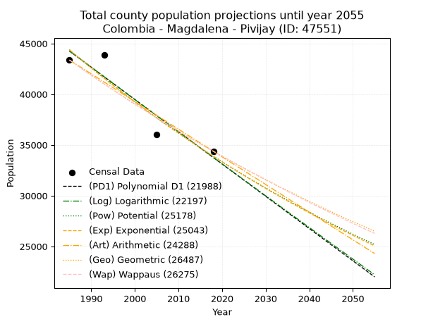
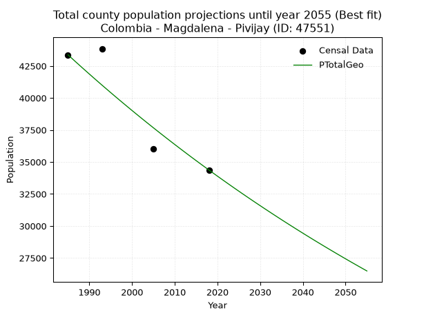
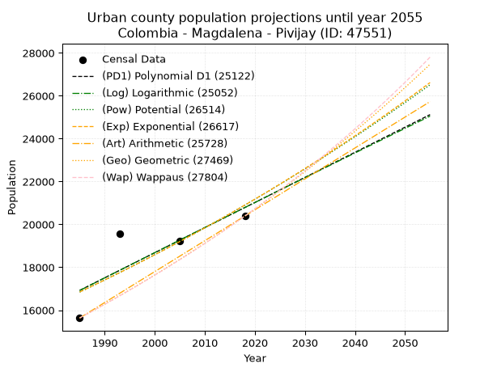
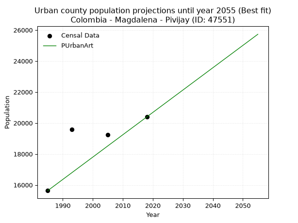
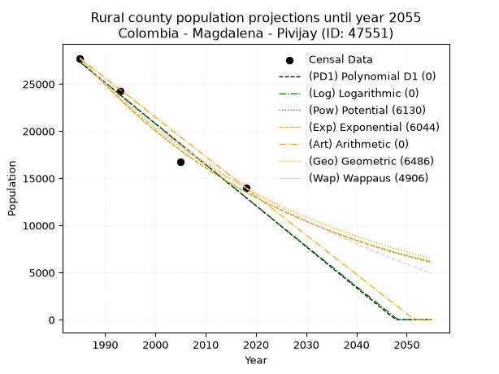
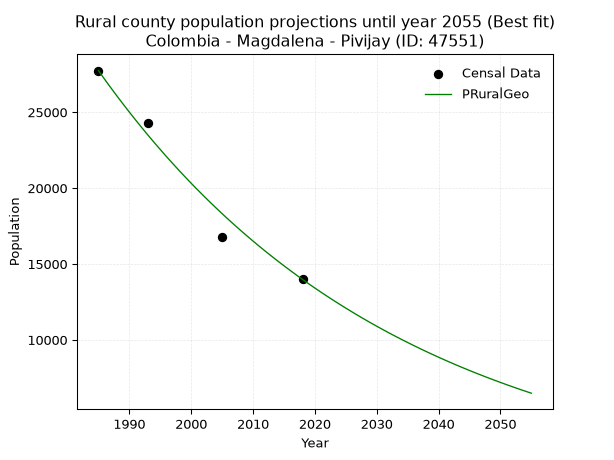

<div align="center">


</div>

# _“Population and Public Services Demand Projections (PPSD) until Year 2050 for Colombia - Magdalena - Pivijay (ID: 47551)”_
Keywords: `population` `public-service` `projection` `lineal` `polynomial` `logarithmic` `potential` `exponential` `arithmetic` `geometric` `wappaus` `dane` `colombia` `south-america`

PPSD are analytical estimates used by governments and planners to anticipate future changes in population size, age distribution, and the resulting community needs for utilities, healthcare, education, and infrastructure as sizing future water treatment facilities, electrical grids, and road networks based on spatial growth.

> **General running parameters**: • app_version: _v20260806_. • Python version: _3.14.7_. • Pandas version: _3.0.5_. • NumPy version: _2.5.1_. • Creates, save and include plots into reports (create_plot): _False_. • Projection until year: _2050_. • Process polynomial degree 2 and up: _False_. • Process Wappaus: _True_. • Process Wappaus: _True_. • Set negative values to zero: _True_. • Set infinite values to zero: _True_. • Drop dataset notes: _True_. 
<div align="center">

Dynamic map: [:earth_americas:Google](http://maps.google.com/maps?q=10.46070664,-74.613312) [:earth_americas:OSM](https://www.openstreetmap.org/#map=18/10.46070664/-74.613312&layers=P) [:earth_americas:Bing](https://www.bing.com/maps?cp=10.46070664~-74.613312&lvl=18) [:earth_americas:Apple](https://maps.apple.com/frame?center=10.46070664%2C-74.613312&span=0.003%2C0.006)

</div>


<div align="center">

```geojson
{
  "type": "Feature",
  "geometry": {
    "type": "Point", 
    "coordinates": [-74.613312, 10.46070664]
  }, 
  "properties": {
    "Name": "Colombia - Magdalena - Pivijay (ID: 47551)"
  }
}
```

</div>


## 0. Census Data (4 records)

Census data are official statistics collected by a government about the people and housing in a country. They usually include counts of total population, age, sex, race, income, education, and jobs.

📅Global census file: [Population.xlsx](../data/Population.xlsx)

| Source   |   Year |   CountryID | CountryName   |   StateID | StateName   |   CountyID | CountyName   |   PTotal |   PUrban |   PRural |
|:---------|-------:|------------:|:--------------|----------:|:------------|-----------:|:-------------|---------:|---------:|---------:|
| DANE     |   1985 |          57 | Colombia      |        47 | Magdalena   |      47551 | Pivijay      |    43370 |    15635 |    27735 |
| DANE     |   1993 |          57 | Colombia      |        47 | Magdalena   |      47551 | Pivijay      |    43850 |    19577 |    24273 |
| DANE     |   2005 |          57 | Colombia      |        47 | Magdalena   |      47551 | Pivijay      |    36018 |    19229 |    16789 |
| DANE     |   2018 |          57 | Colombia      |        47 | Magdalena   |      47551 | Pivijay      |    34374 |    20393 |    13981 |

> 🔥Some records could had specific notes about the registered values or the corresponding urban or rural distribution.

📅   [RUPS](https://www.datos.gov.co/Hacienda-y-Cr-dito-P-blico/Registro-nico-de-Prestadores-de-Servicios-P-blicos/4qkq-csdn/about_data) - Local public utility companies: [RUPS.csv](../data/RUPS.xlsx)

 | SERVICIO       | ESTADO    | NOMBRE                                             | NIT         | DEPARTAMENTO_DOMICILIO   | MUNICIPIO_DOMICILIO   | DIRECCION                                             |   TELEFONO | EMAIL               | TIPO_INSCRIPCION    | REPRESENTANTE_LEGAL             | TIPO_PRESTADOR                             | CLASIFICACION                 |
|:---------------|:----------|:---------------------------------------------------|:------------|:-------------------------|:----------------------|:------------------------------------------------------|-----------:|:--------------------|:--------------------|:--------------------------------|:-------------------------------------------|:------------------------------|
| ACUEDUCTO      | OPERATIVA | EMPRESA REGIONAL DE SERVICIOS PUBLICOS S.A. E.S.P. | 900222479-1 | ATLANTICO                | PUERTO COLOMBIA       | CRA 24 # 1A-24 OFICINA 907A - EDIFICIO BC EMPRESARIAL |    3852994 | jalean@semsaesp.com | Registro por la ESP | NELSON EDUARDO GUZMAN  VILLEGAS | SOCIEDADES (EMPRESA DE SERVICIOS PUBLICOS) | MAYOR O IGUAL A 5001 USUARIOS |
| ALCANTARILLADO | OPERATIVA | EMPRESA REGIONAL DE SERVICIOS PUBLICOS S.A. E.S.P. | 900222479-1 | ATLANTICO                | PUERTO COLOMBIA       | CRA 24 # 1A-24 OFICINA 907A - EDIFICIO BC EMPRESARIAL |    3852994 | jalean@semsaesp.com | Registro por la ESP | NELSON EDUARDO GUZMAN  VILLEGAS | SOCIEDADES (EMPRESA DE SERVICIOS PUBLICOS) | MAYOR O IGUAL A 5001 USUARIOS |

## 1. Total

### 1.1. Coefficients and Parameters

* (PD1) Polynomial Deg 1: -318.0746688077062, 675631.8562826143 (lineal)
* (Log) Logarithmic: -636710.8861786344, 4879047.548124627
* (Pow) Potential: -16.3557554635747, 58.58456633092833
* (Exp) Exponential: -0.008170863840820747, 490892581220.75714
* (Art) Arithmetic: Year diff. 2018 - 1985 = 33, Population diff. 34374 - 43370 = -8996, Annual growth = -272.6060606060606
* (Geo) Geometric: Year diff. 2018 - 1985 = 33, Population diff. 34374 - 43370 = -8996, Annual growth % = -0.00701971537612911
* (Wap) Wappaus: i = -0.7012915738991063, Condition values only valid for < 200)

<sub>
Wappaus condition values: ['-0.00', '-0.70', '-1.40', '-2.10', '-2.81', '-3.51', '-4.21', '-4.91', '-5.61', '-6.31', '-7.01', '-7.71', '-8.42', '-9.12', '-9.82', '-10.52', '-11.22', '-11.92', '-12.62', '-13.32', '-14.03', '-14.73', '-15.43', '-16.13', '-16.83', '-17.53', '-18.23', '-18.93', '-19.64', '-20.34', '-21.04', '-21.74', '-22.44', '-23.14', '-23.84', '-24.55', '-25.25', '-25.95', '-26.65', '-27.35', '-28.05', '-28.75', '-29.45', '-30.16', '-30.86', '-31.56', '-32.26', '-32.96', '-33.66', '-34.36', '-35.06', '-35.77', '-36.47', '-37.17', '-37.87', '-38.57', '-39.27', '-39.97', '-40.67', '-41.38', '-42.08', '-42.78', '-43.48', '-44.18', '-44.88', '-45.58']
</sub>


### 1.2. Projected Dataset

|   Year |   CountyID |   PTotalPD1 |   PTotalLog |   PTotalPow |   PTotalExp |   PTotalArt |   PTotalGeo |   PTotalWap |
|-------:|-----------:|------------:|------------:|------------:|------------:|------------:|------------:|------------:|
|   1985 |      47551 |       44254 |       44264 |       44381 |       44370 |       43370 |       43370 |       43370 |
|   1986 |      47551 |       43936 |       43943 |       44017 |       44009 |       43097 |       43066 |       43067 |
|   1987 |      47551 |       43617 |       43622 |       43656 |       43651 |       42825 |       42763 |       42766 |
|   1988 |      47551 |       43299 |       43302 |       43299 |       43296 |       42552 |       42463 |       42467 |
|   1989 |      47551 |       42981 |       42982 |       42944 |       42944 |       42280 |       42165 |       42170 |
|   1990 |      47551 |       42663 |       42662 |       42592 |       42594 |       42007 |       41869 |       41875 |
|   1991 |      47551 |       42345 |       42342 |       42244 |       42248 |       41734 |       41575 |       41583 |
|   1992 |      47551 |       42027 |       42022 |       41898 |       41904 |       41462 |       41283 |       41292 |
|   1993 |      47551 |       41709 |       41703 |       41556 |       41563 |       41189 |       40993 |       41003 |
|   1994 |      47551 |       41391 |       41383 |       41216 |       41225 |       40917 |       40706 |       40716 |
|   1995 |      47551 |       41073 |       41064 |       40880 |       40889 |       40644 |       40420 |       40432 |
|   1996 |      47551 |       40755 |       40745 |       40546 |       40556 |       40371 |       40136 |       40149 |
|   1997 |      47551 |       40437 |       40426 |       40215 |       40226 |       40099 |       39854 |       39868 |
|   1998 |      47551 |       40119 |       40107 |       39887 |       39899 |       39826 |       39575 |       39588 |
|   1999 |      47551 |       39801 |       39789 |       39562 |       39574 |       39554 |       39297 |       39311 |
|   2000 |      47551 |       39483 |       39470 |       39240 |       39252 |       39281 |       39021 |       39036 |
|   2001 |      47551 |       39164 |       39152 |       38920 |       38933 |       39008 |       38747 |       38762 |
|   2002 |      47551 |       38846 |       38834 |       38604 |       38616 |       38736 |       38475 |       38490 |
|   2003 |      47551 |       38528 |       38516 |       38290 |       38302 |       38463 |       38205 |       38220 |
|   2004 |      47551 |       38210 |       38198 |       37978 |       37990 |       38190 |       37937 |       37952 |
|   2005 |      47551 |       37892 |       37880 |       37670 |       37681 |       37918 |       37671 |       37686 |
|   2006 |      47551 |       37574 |       37563 |       37364 |       37374 |       37645 |       37406 |       37421 |
|   2007 |      47551 |       37256 |       37246 |       37060 |       37070 |       37373 |       37144 |       37158 |
|   2008 |      47551 |       36938 |       36928 |       36760 |       36768 |       37100 |       36883 |       36897 |
|   2009 |      47551 |       36620 |       36611 |       36461 |       36469 |       36827 |       36624 |       36637 |
|   2010 |      47551 |       36302 |       36295 |       36166 |       36173 |       36555 |       36367 |       36379 |
|   2011 |      47551 |       35984 |       35978 |       35873 |       35878 |       36282 |       36112 |       36123 |
|   2012 |      47551 |       35666 |       35661 |       35582 |       35586 |       36010 |       35858 |       35868 |
|   2013 |      47551 |       35348 |       35345 |       35294 |       35297 |       35737 |       35606 |       35615 |
|   2014 |      47551 |       35029 |       35029 |       35009 |       35009 |       35464 |       35356 |       35364 |
|   2015 |      47551 |       34711 |       34713 |       34726 |       34724 |       35192 |       35108 |       35114 |
|   2016 |      47551 |       34393 |       34397 |       34445 |       34442 |       34919 |       34862 |       34866 |
|   2017 |      47551 |       34075 |       34081 |       34167 |       34162 |       34647 |       34617 |       34619 |
|   2018 |      47551 |       33757 |       33765 |       33891 |       33884 |       34374 |       34374 |       34374 |
|   2019 |      47551 |       33439 |       33450 |       33617 |       33608 |       34101 |       34133 |       34130 |
|   2020 |      47551 |       33121 |       33135 |       33346 |       33334 |       33829 |       33893 |       33888 |
|   2021 |      47551 |       32803 |       32820 |       33077 |       33063 |       33556 |       33655 |       33648 |
|   2022 |      47551 |       32485 |       32505 |       32811 |       32794 |       33284 |       33419 |       33409 |
|   2023 |      47551 |       32167 |       32190 |       32547 |       32527 |       33011 |       33184 |       33171 |
|   2024 |      47551 |       31849 |       31875 |       32285 |       32263 |       32738 |       32951 |       32935 |
|   2025 |      47551 |       31531 |       31561 |       32025 |       32000 |       32466 |       32720 |       32700 |
|   2026 |      47551 |       31213 |       31246 |       31767 |       31740 |       32193 |       32490 |       32467 |
|   2027 |      47551 |       30895 |       30932 |       31512 |       31481 |       31921 |       32262 |       32235 |
|   2028 |      47551 |       30576 |       30618 |       31259 |       31225 |       31648 |       32036 |       32005 |
|   2029 |      47551 |       30258 |       30304 |       31008 |       30971 |       31375 |       31811 |       31776 |
|   2030 |      47551 |       29940 |       29990 |       30759 |       30719 |       31103 |       31588 |       31549 |
|   2031 |      47551 |       29622 |       29677 |       30512 |       30469 |       30830 |       31366 |       31322 |
|   2032 |      47551 |       29304 |       29363 |       30267 |       30221 |       30558 |       31146 |       31097 |
|   2033 |      47551 |       28986 |       29050 |       30025 |       29975 |       30285 |       30927 |       30874 |
|   2034 |      47551 |       28668 |       28737 |       29784 |       29731 |       30012 |       30710 |       30652 |
|   2035 |      47551 |       28350 |       28424 |       29546 |       29489 |       29740 |       30494 |       30431 |
|   2036 |      47551 |       28032 |       28111 |       29309 |       29249 |       29467 |       30280 |       30211 |
|   2037 |      47551 |       27714 |       27799 |       29075 |       29011 |       29194 |       30068 |       29993 |
|   2038 |      47551 |       27396 |       27486 |       28842 |       28775 |       28922 |       29857 |       29776 |
|   2039 |      47551 |       27078 |       27174 |       28612 |       28541 |       28649 |       29647 |       29561 |
|   2040 |      47551 |       26760 |       26862 |       28383 |       28309 |       28377 |       29439 |       29346 |
|   2041 |      47551 |       26441 |       26550 |       28157 |       28078 |       28104 |       29232 |       29133 |
|   2042 |      47551 |       26123 |       26238 |       27932 |       27850 |       27831 |       29027 |       28921 |
|   2043 |      47551 |       25805 |       25926 |       27709 |       27623 |       27559 |       28823 |       28711 |
|   2044 |      47551 |       25487 |       25614 |       27488 |       27399 |       27286 |       28621 |       28501 |
|   2045 |      47551 |       25169 |       25303 |       27269 |       27176 |       27014 |       28420 |       28293 |
|   2046 |      47551 |       24851 |       24992 |       27052 |       26954 |       26741 |       28221 |       28086 |
|   2047 |      47551 |       24533 |       24681 |       26837 |       26735 |       26468 |       28023 |       27880 |
|   2048 |      47551 |       24215 |       24370 |       26623 |       26518 |       26196 |       27826 |       27676 |
|   2049 |      47551 |       23897 |       24059 |       26412 |       26302 |       25923 |       27631 |       27472 |
|   2050 |      47551 |       23579 |       23748 |       26202 |       26088 |       25651 |       27437 |       27270 |
<div align="center">

</img>

</div>


### 1.3. Best fit with absolute and relative error (%)

Relative error puts that difference into context by dividing the absolute error by the true value, creating a unitless ratio or percentage that shows the scale of the mistake.

Absolute and relative error

|   Year | Source   |   CountryID | CountryName   |   StateID | StateName   |   CountyID_x | CountyName   |   PTotal |   PUrban |   PRural |   CountyID_y |   PTotalPD1 |   PTotalLog |   PTotalPow |   PTotalExp |   PTotalArt |   PTotalGeo |   PTotalWap |   PTotalPD1AbsError |   PTotalLogAbsError |   PTotalPowAbsError |   PTotalExpAbsError |   PTotalArtAbsError |   PTotalGeoAbsError |   PTotalWapAbsError |   PTotalPD1RelError |   PTotalLogRelError |   PTotalPowRelError |   PTotalExpRelError |   PTotalArtRelError |   PTotalGeoRelError |   PTotalWapRelError |
|-------:|:---------|------------:|:--------------|----------:|:------------|-------------:|:-------------|---------:|---------:|---------:|-------------:|------------:|------------:|------------:|------------:|------------:|------------:|------------:|--------------------:|--------------------:|--------------------:|--------------------:|--------------------:|--------------------:|--------------------:|--------------------:|--------------------:|--------------------:|--------------------:|--------------------:|--------------------:|--------------------:|
|   1985 | DANE     |          57 | Colombia      |        47 | Magdalena   |        47551 | Pivijay      |    43370 |    15635 |    27735 |        47551 |       44254 |       44264 |       44381 |       44370 |       43370 |       43370 |       43370 |                 884 |                 894 |                1011 |                1000 |                   0 |                   0 |                   0 |             2.03828 |             2.06133 |             2.3311  |             2.30574 |             0       |             0       |             0       |
|   1993 | DANE     |          57 | Colombia      |        47 | Magdalena   |        47551 | Pivijay      |    43850 |    19577 |    24273 |        47551 |       41709 |       41703 |       41556 |       41563 |       41189 |       40993 |       41003 |                2141 |                2147 |                2294 |                2287 |                2661 |                2857 |                2847 |             4.88255 |             4.89624 |             5.23147 |             5.21551 |             6.06842 |             6.51539 |             6.49259 |
|   2005 | DANE     |          57 | Colombia      |        47 | Magdalena   |        47551 | Pivijay      |    36018 |    19229 |    16789 |        47551 |       37892 |       37880 |       37670 |       37681 |       37918 |       37671 |       37686 |                1874 |                1862 |                1652 |                1663 |                1900 |                1653 |                1668 |             5.20295 |             5.16964 |             4.5866  |             4.61714 |             5.27514 |             4.58937 |             4.63102 |
|   2018 | DANE     |          57 | Colombia      |        47 | Magdalena   |        47551 | Pivijay      |    34374 |    20393 |    13981 |        47551 |       33757 |       33765 |       33891 |       33884 |       34374 |       34374 |       34374 |                 617 |                 609 |                 483 |                 490 |                   0 |                   0 |                   0 |             1.79496 |             1.77169 |             1.40513 |             1.4255  |             0       |             0       |             0       |

Relative error mean

| Method    |   RelError | Best   |
|:----------|-----------:|:-------|
| PTotalPD1 |    3.47969 |        |
| PTotalLog |    3.47472 |        |
| PTotalPow |    3.38858 |        |
| PTotalExp |    3.39097 |        |
| PTotalArt |    2.83589 |        |
| PTotalGeo |    2.77619 | True   |
| PTotalWap |    2.7809  |        |

💙Best method: _**PTotalGeo**_
<div align="center">

</img>

</div>


### 1.4. Fresh water supply demand in liters per capita per day (lpcd)

The fresh water supply demand typically ranges from 100 to 300 liters per capita per day (lpcd) for standard domestic and municipal planning, though absolute survival minimums set by the World Health Organization are as low as 7.5 to 20 liters per day, and total consumption in high-income nations can exceed 400 liters.

> `CZ`: Level in meters above the sea level (masl)<br> `WS`: Fresh water supply demand in liters per capita per day (lpcd or l/h/d)<br> `WSAll`: Zonal fresh water supply demand in liters per second (l/s)<br> `A`: Zonal area in square meters<br> `DP`: Population density (people/hectare or p/ha)

Reference values (RAS Colombia)

|    CZ |   WS |
|------:|-----:|
|  1000 |  120 |
|  2000 |  130 |
| 99999 |  140 |

County shapefile geometry properties and water supply values

|   CountyID |      ATotal |   CZTotal |   WSTotal |
|-----------:|------------:|----------:|----------:|
|      47551 | 1.63866e+09 |   45.9976 |       120 |

Projected values for best method: PTotalGeo

|   CountyID |   Year |   PTotalGeo |   DPTotal |   WSTotal |   WSTotalAll |
|-----------:|-------:|------------:|----------:|----------:|-------------:|
|      47551 |   1985 |       43370 |      0.26 |       120 |      60.2361 |
|      47551 |   1986 |       43066 |      0.26 |       120 |      59.8139 |
|      47551 |   1987 |       42763 |      0.26 |       120 |      59.3931 |
|      47551 |   1988 |       42463 |      0.26 |       120 |      58.9764 |
|      47551 |   1989 |       42165 |      0.26 |       120 |      58.5625 |
|      47551 |   1990 |       41869 |      0.26 |       120 |      58.1514 |
|      47551 |   1991 |       41575 |      0.25 |       120 |      57.7431 |
|      47551 |   1992 |       41283 |      0.25 |       120 |      57.3375 |
|      47551 |   1993 |       40993 |      0.25 |       120 |      56.9347 |
|      47551 |   1994 |       40706 |      0.25 |       120 |      56.5361 |
|      47551 |   1995 |       40420 |      0.25 |       120 |      56.1389 |
|      47551 |   1996 |       40136 |      0.24 |       120 |      55.7444 |
|      47551 |   1997 |       39854 |      0.24 |       120 |      55.3528 |
|      47551 |   1998 |       39575 |      0.24 |       120 |      54.9653 |
|      47551 |   1999 |       39297 |      0.24 |       120 |      54.5792 |
|      47551 |   2000 |       39021 |      0.24 |       120 |      54.1958 |
|      47551 |   2001 |       38747 |      0.24 |       120 |      53.8153 |
|      47551 |   2002 |       38475 |      0.23 |       120 |      53.4375 |
|      47551 |   2003 |       38205 |      0.23 |       120 |      53.0625 |
|      47551 |   2004 |       37937 |      0.23 |       120 |      52.6903 |
|      47551 |   2005 |       37671 |      0.23 |       120 |      52.3208 |
|      47551 |   2006 |       37406 |      0.23 |       120 |      51.9528 |
|      47551 |   2007 |       37144 |      0.23 |       120 |      51.5889 |
|      47551 |   2008 |       36883 |      0.23 |       120 |      51.2264 |
|      47551 |   2009 |       36624 |      0.22 |       120 |      50.8667 |
|      47551 |   2010 |       36367 |      0.22 |       120 |      50.5097 |
|      47551 |   2011 |       36112 |      0.22 |       120 |      50.1556 |
|      47551 |   2012 |       35858 |      0.22 |       120 |      49.8028 |
|      47551 |   2013 |       35606 |      0.22 |       120 |      49.4528 |
|      47551 |   2014 |       35356 |      0.22 |       120 |      49.1056 |
|      47551 |   2015 |       35108 |      0.21 |       120 |      48.7611 |
|      47551 |   2016 |       34862 |      0.21 |       120 |      48.4194 |
|      47551 |   2017 |       34617 |      0.21 |       120 |      48.0792 |
|      47551 |   2018 |       34374 |      0.21 |       120 |      47.7417 |
|      47551 |   2019 |       34133 |      0.21 |       120 |      47.4069 |
|      47551 |   2020 |       33893 |      0.21 |       120 |      47.0736 |
|      47551 |   2021 |       33655 |      0.21 |       120 |      46.7431 |
|      47551 |   2022 |       33419 |      0.2  |       120 |      46.4153 |
|      47551 |   2023 |       33184 |      0.2  |       120 |      46.0889 |
|      47551 |   2024 |       32951 |      0.2  |       120 |      45.7653 |
|      47551 |   2025 |       32720 |      0.2  |       120 |      45.4444 |
|      47551 |   2026 |       32490 |      0.2  |       120 |      45.125  |
|      47551 |   2027 |       32262 |      0.2  |       120 |      44.8083 |
|      47551 |   2028 |       32036 |      0.2  |       120 |      44.4944 |
|      47551 |   2029 |       31811 |      0.19 |       120 |      44.1819 |
|      47551 |   2030 |       31588 |      0.19 |       120 |      43.8722 |
|      47551 |   2031 |       31366 |      0.19 |       120 |      43.5639 |
|      47551 |   2032 |       31146 |      0.19 |       120 |      43.2583 |
|      47551 |   2033 |       30927 |      0.19 |       120 |      42.9542 |
|      47551 |   2034 |       30710 |      0.19 |       120 |      42.6528 |
|      47551 |   2035 |       30494 |      0.19 |       120 |      42.3528 |
|      47551 |   2036 |       30280 |      0.18 |       120 |      42.0556 |
|      47551 |   2037 |       30068 |      0.18 |       120 |      41.7611 |
|      47551 |   2038 |       29857 |      0.18 |       120 |      41.4681 |
|      47551 |   2039 |       29647 |      0.18 |       120 |      41.1764 |
|      47551 |   2040 |       29439 |      0.18 |       120 |      40.8875 |
|      47551 |   2041 |       29232 |      0.18 |       120 |      40.6    |
|      47551 |   2042 |       29027 |      0.18 |       120 |      40.3153 |
|      47551 |   2043 |       28823 |      0.18 |       120 |      40.0319 |
|      47551 |   2044 |       28621 |      0.17 |       120 |      39.7514 |
|      47551 |   2045 |       28420 |      0.17 |       120 |      39.4722 |
|      47551 |   2046 |       28221 |      0.17 |       120 |      39.1958 |
|      47551 |   2047 |       28023 |      0.17 |       120 |      38.9208 |
|      47551 |   2048 |       27826 |      0.17 |       120 |      38.6472 |
|      47551 |   2049 |       27631 |      0.17 |       120 |      38.3764 |
|      47551 |   2050 |       27437 |      0.17 |       120 |      38.1069 |

## 2. Urban

### 2.1. Coefficients and Parameters

* (PD1) Polynomial Deg 1: 117.13608992372473, -215592.96386993042 (lineal)
* (Log) Logarithmic: 234731.20601398117, -1765485.2779301049
* (Pow) Potential: 13.092939256492654, -38.9509649557977
* (Exp) Exponential: 0.006533137025327015, 0.03930976211687821
* (Art) Arithmetic: Year diff. 2018 - 1985 = 33, Population diff. 20393 - 15635 = 4758, Annual growth = 144.1818181818182
* (Geo) Geometric: Year diff. 2018 - 1985 = 33, Population diff. 20393 - 15635 = 4758, Annual growth % = 0.008083396064832105
* (Wap) Wappaus: i = 0.8003875773388375, Condition values only valid for < 200)

<sub>
Wappaus condition values: ['0.00', '0.80', '1.60', '2.40', '3.20', '4.00', '4.80', '5.60', '6.40', '7.20', '8.00', '8.80', '9.60', '10.41', '11.21', '12.01', '12.81', '13.61', '14.41', '15.21', '16.01', '16.81', '17.61', '18.41', '19.21', '20.01', '20.81', '21.61', '22.41', '23.21', '24.01', '24.81', '25.61', '26.41', '27.21', '28.01', '28.81', '29.61', '30.41', '31.22', '32.02', '32.82', '33.62', '34.42', '35.22', '36.02', '36.82', '37.62', '38.42', '39.22', '40.02', '40.82', '41.62', '42.42', '43.22', '44.02', '44.82', '45.62', '46.42', '47.22', '48.02', '48.82', '49.62', '50.42', '51.22', '52.03']
</sub>


### 2.2. Projected Dataset

|   Year |   CountyID |   PUrbanPD1 |   PUrbanLog |   PUrbanPow |   PUrbanExp |   PUrbanArt |   PUrbanGeo |   PUrbanWap |
|-------:|-----------:|------------:|------------:|------------:|------------:|------------:|------------:|------------:|
|   1985 |      47551 |       16922 |       16917 |       16843 |       16848 |       15635 |       15635 |       15635 |
|   1986 |      47551 |       17039 |       17035 |       16954 |       16959 |       15779 |       15761 |       15761 |
|   1987 |      47551 |       17156 |       17153 |       17066 |       17070 |       15923 |       15889 |       15887 |
|   1988 |      47551 |       17274 |       17271 |       17179 |       17182 |       16068 |       16017 |       16015 |
|   1989 |      47551 |       17391 |       17389 |       17293 |       17294 |       16212 |       16147 |       16144 |
|   1990 |      47551 |       17508 |       17507 |       17407 |       17408 |       16356 |       16277 |       16273 |
|   1991 |      47551 |       17625 |       17625 |       17522 |       17522 |       16500 |       16409 |       16404 |
|   1992 |      47551 |       17742 |       17743 |       17637 |       17637 |       16644 |       16541 |       16536 |
|   1993 |      47551 |       17859 |       17861 |       17753 |       17752 |       16788 |       16675 |       16669 |
|   1994 |      47551 |       17976 |       17978 |       17870 |       17868 |       16933 |       16810 |       16803 |
|   1995 |      47551 |       18094 |       18096 |       17988 |       17986 |       17077 |       16946 |       16939 |
|   1996 |      47551 |       18211 |       18214 |       18107 |       18103 |       17221 |       17083 |       17075 |
|   1997 |      47551 |       18328 |       18331 |       18226 |       18222 |       17365 |       17221 |       17212 |
|   1998 |      47551 |       18445 |       18449 |       18346 |       18342 |       17509 |       17360 |       17351 |
|   1999 |      47551 |       18562 |       18566 |       18466 |       18462 |       17654 |       17500 |       17491 |
|   2000 |      47551 |       18679 |       18684 |       18587 |       18583 |       17798 |       17642 |       17632 |
|   2001 |      47551 |       18796 |       18801 |       18710 |       18705 |       17942 |       17784 |       17774 |
|   2002 |      47551 |       18913 |       18918 |       18832 |       18827 |       18086 |       17928 |       17918 |
|   2003 |      47551 |       19031 |       19036 |       18956 |       18951 |       18230 |       18073 |       18062 |
|   2004 |      47551 |       19148 |       19153 |       19080 |       19075 |       18374 |       18219 |       18208 |
|   2005 |      47551 |       19265 |       19270 |       19205 |       19200 |       18519 |       18367 |       18356 |
|   2006 |      47551 |       19382 |       19387 |       19331 |       19326 |       18663 |       18515 |       18504 |
|   2007 |      47551 |       19499 |       19504 |       19458 |       19452 |       18807 |       18665 |       18654 |
|   2008 |      47551 |       19616 |       19621 |       19585 |       19580 |       18951 |       18816 |       18805 |
|   2009 |      47551 |       19733 |       19738 |       19713 |       19708 |       19095 |       18968 |       18957 |
|   2010 |      47551 |       19851 |       19854 |       19842 |       19837 |       19240 |       19121 |       19111 |
|   2011 |      47551 |       19968 |       19971 |       19971 |       19967 |       19384 |       19276 |       19267 |
|   2012 |      47551 |       20085 |       20088 |       20102 |       20098 |       19528 |       19431 |       19423 |
|   2013 |      47551 |       20202 |       20205 |       20233 |       20230 |       19672 |       19588 |       19581 |
|   2014 |      47551 |       20319 |       20321 |       20365 |       20363 |       19816 |       19747 |       19741 |
|   2015 |      47551 |       20436 |       20438 |       20498 |       20496 |       19960 |       19906 |       19901 |
|   2016 |      47551 |       20553 |       20554 |       20631 |       20630 |       20105 |       20067 |       20064 |
|   2017 |      47551 |       20671 |       20671 |       20766 |       20766 |       20249 |       20229 |       20228 |
|   2018 |      47551 |       20788 |       20787 |       20901 |       20902 |       20393 |       20393 |       20393 |
|   2019 |      47551 |       20905 |       20903 |       21037 |       21039 |       20537 |       20558 |       20560 |
|   2020 |      47551 |       21022 |       21019 |       21174 |       21177 |       20681 |       20724 |       20728 |
|   2021 |      47551 |       21139 |       21136 |       21311 |       21315 |       20826 |       20892 |       20898 |
|   2022 |      47551 |       21256 |       21252 |       21450 |       21455 |       20970 |       21060 |       21070 |
|   2023 |      47551 |       21373 |       21368 |       21589 |       21596 |       21114 |       21231 |       21243 |
|   2024 |      47551 |       21490 |       21484 |       21729 |       21737 |       21258 |       21402 |       21418 |
|   2025 |      47551 |       21608 |       21600 |       21870 |       21880 |       21402 |       21575 |       21595 |
|   2026 |      47551 |       21725 |       21716 |       22012 |       22023 |       21546 |       21750 |       21773 |
|   2027 |      47551 |       21842 |       21831 |       22155 |       22168 |       21691 |       21925 |       21953 |
|   2028 |      47551 |       21959 |       21947 |       22298 |       22313 |       21835 |       22103 |       22135 |
|   2029 |      47551 |       22076 |       22063 |       22443 |       22459 |       21979 |       22281 |       22318 |
|   2030 |      47551 |       22193 |       22179 |       22588 |       22606 |       22123 |       22461 |       22503 |
|   2031 |      47551 |       22310 |       22294 |       22734 |       22755 |       22267 |       22643 |       22690 |
|   2032 |      47551 |       22428 |       22410 |       22881 |       22904 |       22412 |       22826 |       22879 |
|   2033 |      47551 |       22545 |       22525 |       23029 |       23054 |       22556 |       23011 |       23070 |
|   2034 |      47551 |       22662 |       22641 |       23178 |       23205 |       22700 |       23197 |       23263 |
|   2035 |      47551 |       22779 |       22756 |       23327 |       23357 |       22844 |       23384 |       23457 |
|   2036 |      47551 |       22896 |       22871 |       23478 |       23510 |       22988 |       23573 |       23654 |
|   2037 |      47551 |       23013 |       22987 |       23629 |       23664 |       23132 |       23764 |       23852 |
|   2038 |      47551 |       23130 |       23102 |       23782 |       23819 |       23277 |       23956 |       24053 |
|   2039 |      47551 |       23248 |       23217 |       23935 |       23975 |       23421 |       24149 |       24256 |
|   2040 |      47551 |       23365 |       23332 |       24089 |       24133 |       23565 |       24345 |       24460 |
|   2041 |      47551 |       23482 |       23447 |       24244 |       24291 |       23709 |       24541 |       24667 |
|   2042 |      47551 |       23599 |       23562 |       24400 |       24450 |       23853 |       24740 |       24876 |
|   2043 |      47551 |       23716 |       23677 |       24557 |       24610 |       23998 |       24940 |       25087 |
|   2044 |      47551 |       23833 |       23792 |       24715 |       24772 |       24142 |       25141 |       25300 |
|   2045 |      47551 |       23950 |       23907 |       24874 |       24934 |       24286 |       25345 |       25516 |
|   2046 |      47551 |       24067 |       24021 |       25033 |       25097 |       24430 |       25549 |       25734 |
|   2047 |      47551 |       24185 |       24136 |       25194 |       25262 |       24574 |       25756 |       25954 |
|   2048 |      47551 |       24302 |       24251 |       25356 |       25427 |       24718 |       25964 |       26177 |
|   2049 |      47551 |       24419 |       24365 |       25518 |       25594 |       24863 |       26174 |       26402 |
|   2050 |      47551 |       24536 |       24480 |       25682 |       25762 |       25007 |       26386 |       26629 |
<div align="center">

</img>

</div>


### 2.3. Best fit with absolute and relative error (%)

Relative error puts that difference into context by dividing the absolute error by the true value, creating a unitless ratio or percentage that shows the scale of the mistake.

Absolute and relative error

|   Year | Source   |   CountryID | CountryName   |   StateID | StateName   |   CountyID_x | CountyName   |   PTotal |   PUrban |   PRural |   CountyID_y |   PUrbanPD1 |   PUrbanLog |   PUrbanPow |   PUrbanExp |   PUrbanArt |   PUrbanGeo |   PUrbanWap |   PUrbanPD1AbsError |   PUrbanLogAbsError |   PUrbanPowAbsError |   PUrbanExpAbsError |   PUrbanArtAbsError |   PUrbanGeoAbsError |   PUrbanWapAbsError |   PUrbanPD1RelError |   PUrbanLogRelError |   PUrbanPowRelError |   PUrbanExpRelError |   PUrbanArtRelError |   PUrbanGeoRelError |   PUrbanWapRelError |
|-------:|:---------|------------:|:--------------|----------:|:------------|-------------:|:-------------|---------:|---------:|---------:|-------------:|------------:|------------:|------------:|------------:|------------:|------------:|------------:|--------------------:|--------------------:|--------------------:|--------------------:|--------------------:|--------------------:|--------------------:|--------------------:|--------------------:|--------------------:|--------------------:|--------------------:|--------------------:|--------------------:|
|   1985 | DANE     |          57 | Colombia      |        47 | Magdalena   |        47551 | Pivijay      |    43370 |    15635 |    27735 |        47551 |       16922 |       16917 |       16843 |       16848 |       15635 |       15635 |       15635 |                1287 |                1282 |                1208 |                1213 |                   0 |                   0 |                   0 |            8.23153  |             8.19955 |            7.72626  |            7.75823  |             0       |             0       |             0       |
|   1993 | DANE     |          57 | Colombia      |        47 | Magdalena   |        47551 | Pivijay      |    43850 |    19577 |    24273 |        47551 |       17859 |       17861 |       17753 |       17752 |       16788 |       16675 |       16669 |                1718 |                1716 |                1824 |                1825 |                2789 |                2902 |                2908 |            8.7756   |             8.76539 |            9.31706  |            9.32216  |            14.2463  |            14.8235  |            14.8542  |
|   2005 | DANE     |          57 | Colombia      |        47 | Magdalena   |        47551 | Pivijay      |    36018 |    19229 |    16789 |        47551 |       19265 |       19270 |       19205 |       19200 |       18519 |       18367 |       18356 |                  36 |                  41 |                  24 |                  29 |                 710 |                 862 |                 873 |            0.187217 |             0.21322 |            0.124811 |            0.150814 |             3.69234 |             4.48281 |             4.54002 |
|   2018 | DANE     |          57 | Colombia      |        47 | Magdalena   |        47551 | Pivijay      |    34374 |    20393 |    13981 |        47551 |       20788 |       20787 |       20901 |       20902 |       20393 |       20393 |       20393 |                 395 |                 394 |                 508 |                 509 |                   0 |                   0 |                   0 |            1.93694  |             1.93204 |            2.49105  |            2.49595  |             0       |             0       |             0       |

Relative error mean

| Method    |   RelError | Best   |
|:----------|-----------:|:-------|
| PUrbanPD1 |    4.78282 |        |
| PUrbanLog |    4.77755 |        |
| PUrbanPow |    4.91479 |        |
| PUrbanExp |    4.93179 |        |
| PUrbanArt |    4.48466 | True   |
| PUrbanGeo |    4.82658 |        |
| PUrbanWap |    4.84855 |        |

💙Best method: _**PUrbanArt**_
<div align="center">

</img>

</div>


### 2.4. Fresh water supply demand in liters per capita per day (lpcd)

The fresh water supply demand typically ranges from 100 to 300 liters per capita per day (lpcd) for standard domestic and municipal planning, though absolute survival minimums set by the World Health Organization are as low as 7.5 to 20 liters per day, and total consumption in high-income nations can exceed 400 liters.

> `CZ`: Level in meters above the sea level (masl)<br> `WS`: Fresh water supply demand in liters per capita per day (lpcd or l/h/d)<br> `WSAll`: Zonal fresh water supply demand in liters per second (l/s)<br> `A`: Zonal area in square meters<br> `DP`: Population density (people/hectare or p/ha)

Reference values (RAS Colombia)

|    CZ |   WS |
|------:|-----:|
|  1000 |  120 |
|  2000 |  130 |
| 99999 |  140 |

County shapefile geometry properties and water supply values

|   CountyID |      AUrban |   CZUrban |   WSUrban |
|-----------:|------------:|----------:|----------:|
|      47551 | 3.85882e+06 |   9.47127 |       120 |

Projected values for best method: PUrbanArt

|   CountyID |   Year |   PUrbanArt |   DPUrban |   WSUrban |   WSUrbanAll |
|-----------:|-------:|------------:|----------:|----------:|-------------:|
|      47551 |   1985 |       15635 |     40.52 |       120 |      21.7153 |
|      47551 |   1986 |       15779 |     40.89 |       120 |      21.9153 |
|      47551 |   1987 |       15923 |     41.26 |       120 |      22.1153 |
|      47551 |   1988 |       16068 |     41.64 |       120 |      22.3167 |
|      47551 |   1989 |       16212 |     42.01 |       120 |      22.5167 |
|      47551 |   1990 |       16356 |     42.39 |       120 |      22.7167 |
|      47551 |   1991 |       16500 |     42.76 |       120 |      22.9167 |
|      47551 |   1992 |       16644 |     43.13 |       120 |      23.1167 |
|      47551 |   1993 |       16788 |     43.51 |       120 |      23.3167 |
|      47551 |   1994 |       16933 |     43.88 |       120 |      23.5181 |
|      47551 |   1995 |       17077 |     44.25 |       120 |      23.7181 |
|      47551 |   1996 |       17221 |     44.63 |       120 |      23.9181 |
|      47551 |   1997 |       17365 |     45    |       120 |      24.1181 |
|      47551 |   1998 |       17509 |     45.37 |       120 |      24.3181 |
|      47551 |   1999 |       17654 |     45.75 |       120 |      24.5194 |
|      47551 |   2000 |       17798 |     46.12 |       120 |      24.7194 |
|      47551 |   2001 |       17942 |     46.5  |       120 |      24.9194 |
|      47551 |   2002 |       18086 |     46.87 |       120 |      25.1194 |
|      47551 |   2003 |       18230 |     47.24 |       120 |      25.3194 |
|      47551 |   2004 |       18374 |     47.62 |       120 |      25.5194 |
|      47551 |   2005 |       18519 |     47.99 |       120 |      25.7208 |
|      47551 |   2006 |       18663 |     48.36 |       120 |      25.9208 |
|      47551 |   2007 |       18807 |     48.74 |       120 |      26.1208 |
|      47551 |   2008 |       18951 |     49.11 |       120 |      26.3208 |
|      47551 |   2009 |       19095 |     49.48 |       120 |      26.5208 |
|      47551 |   2010 |       19240 |     49.86 |       120 |      26.7222 |
|      47551 |   2011 |       19384 |     50.23 |       120 |      26.9222 |
|      47551 |   2012 |       19528 |     50.61 |       120 |      27.1222 |
|      47551 |   2013 |       19672 |     50.98 |       120 |      27.3222 |
|      47551 |   2014 |       19816 |     51.35 |       120 |      27.5222 |
|      47551 |   2015 |       19960 |     51.73 |       120 |      27.7222 |
|      47551 |   2016 |       20105 |     52.1  |       120 |      27.9236 |
|      47551 |   2017 |       20249 |     52.47 |       120 |      28.1236 |
|      47551 |   2018 |       20393 |     52.85 |       120 |      28.3236 |
|      47551 |   2019 |       20537 |     53.22 |       120 |      28.5236 |
|      47551 |   2020 |       20681 |     53.59 |       120 |      28.7236 |
|      47551 |   2021 |       20826 |     53.97 |       120 |      28.925  |
|      47551 |   2022 |       20970 |     54.34 |       120 |      29.125  |
|      47551 |   2023 |       21114 |     54.72 |       120 |      29.325  |
|      47551 |   2024 |       21258 |     55.09 |       120 |      29.525  |
|      47551 |   2025 |       21402 |     55.46 |       120 |      29.725  |
|      47551 |   2026 |       21546 |     55.84 |       120 |      29.925  |
|      47551 |   2027 |       21691 |     56.21 |       120 |      30.1264 |
|      47551 |   2028 |       21835 |     56.58 |       120 |      30.3264 |
|      47551 |   2029 |       21979 |     56.96 |       120 |      30.5264 |
|      47551 |   2030 |       22123 |     57.33 |       120 |      30.7264 |
|      47551 |   2031 |       22267 |     57.7  |       120 |      30.9264 |
|      47551 |   2032 |       22412 |     58.08 |       120 |      31.1278 |
|      47551 |   2033 |       22556 |     58.45 |       120 |      31.3278 |
|      47551 |   2034 |       22700 |     58.83 |       120 |      31.5278 |
|      47551 |   2035 |       22844 |     59.2  |       120 |      31.7278 |
|      47551 |   2036 |       22988 |     59.57 |       120 |      31.9278 |
|      47551 |   2037 |       23132 |     59.95 |       120 |      32.1278 |
|      47551 |   2038 |       23277 |     60.32 |       120 |      32.3292 |
|      47551 |   2039 |       23421 |     60.69 |       120 |      32.5292 |
|      47551 |   2040 |       23565 |     61.07 |       120 |      32.7292 |
|      47551 |   2041 |       23709 |     61.44 |       120 |      32.9292 |
|      47551 |   2042 |       23853 |     61.81 |       120 |      33.1292 |
|      47551 |   2043 |       23998 |     62.19 |       120 |      33.3306 |
|      47551 |   2044 |       24142 |     62.56 |       120 |      33.5306 |
|      47551 |   2045 |       24286 |     62.94 |       120 |      33.7306 |
|      47551 |   2046 |       24430 |     63.31 |       120 |      33.9306 |
|      47551 |   2047 |       24574 |     63.68 |       120 |      34.1306 |
|      47551 |   2048 |       24718 |     64.06 |       120 |      34.3306 |
|      47551 |   2049 |       24863 |     64.43 |       120 |      34.5319 |
|      47551 |   2050 |       25007 |     64.8  |       120 |      34.7319 |

## 3. Rural

### 3.1. Coefficients and Parameters

* (PD1) Polynomial Deg 1: -435.2107587314307, 891224.8201525444 (lineal)
* (Log) Logarithmic: -871442.0921926161, 6644532.826054735
* (Pow) Potential: -43.6447818901153, 148.37441358849244
* (Exp) Exponential: -0.0218007130794157, 1.7294357767988322e+23
* (Art) Arithmetic: Year diff. 2018 - 1985 = 33, Population diff. 13981 - 27735 = -13754, Annual growth = -416.7878787878788
* (Geo) Geometric: Year diff. 2018 - 1985 = 33, Population diff. 13981 - 27735 = -13754, Annual growth % = -0.02054349820712731
* (Wap) Wappaus: i = -1.9982159305200824, Condition values only valid for < 200)

<sub>
Wappaus condition values: ['-0.00', '-2.00', '-4.00', '-5.99', '-7.99', '-9.99', '-11.99', '-13.99', '-15.99', '-17.98', '-19.98', '-21.98', '-23.98', '-25.98', '-27.98', '-29.97', '-31.97', '-33.97', '-35.97', '-37.97', '-39.96', '-41.96', '-43.96', '-45.96', '-47.96', '-49.96', '-51.95', '-53.95', '-55.95', '-57.95', '-59.95', '-61.94', '-63.94', '-65.94', '-67.94', '-69.94', '-71.94', '-73.93', '-75.93', '-77.93', '-79.93', '-81.93', '-83.93', '-85.92', '-87.92', '-89.92', '-91.92', '-93.92', '-95.91', '-97.91', '-99.91', '-101.91', '-103.91', '-105.91', '-107.90', '-109.90', '-111.90', '-113.90', '-115.90', '-117.89', '-119.89', '-121.89', '-123.89', '-125.89', '-127.89', '-129.88']
</sub>


### 3.2. Projected Dataset

|   Year |   CountyID |   PRuralPD1 |   PRuralLog |   PRuralPow |   PRuralExp |   PRuralArt |   PRuralGeo |   PRuralWap |
|-------:|-----------:|------------:|------------:|------------:|------------:|------------:|------------:|------------:|
|   1985 |      47551 |       27331 |       27347 |       27821 |       27801 |       27735 |       27735 |       27735 |
|   1986 |      47551 |       26896 |       26908 |       27216 |       27202 |       27318 |       27165 |       27186 |
|   1987 |      47551 |       26461 |       26469 |       26625 |       26615 |       26901 |       26607 |       26648 |
|   1988 |      47551 |       26026 |       26031 |       26047 |       26041 |       26485 |       26061 |       26121 |
|   1989 |      47551 |       25591 |       25593 |       25481 |       25480 |       26068 |       25525 |       25603 |
|   1990 |      47551 |       25155 |       25155 |       24928 |       24930 |       25651 |       25001 |       25096 |
|   1991 |      47551 |       24720 |       24717 |       24388 |       24393 |       25234 |       24487 |       24598 |
|   1992 |      47551 |       24285 |       24279 |       23859 |       23867 |       24817 |       23984 |       24109 |
|   1993 |      47551 |       23850 |       23842 |       23342 |       23352 |       24401 |       23491 |       23630 |
|   1994 |      47551 |       23415 |       23405 |       22836 |       22848 |       23984 |       23009 |       23159 |
|   1995 |      47551 |       22979 |       22968 |       22342 |       22356 |       23567 |       22536 |       22696 |
|   1996 |      47551 |       22544 |       22531 |       21859 |       21873 |       23150 |       22073 |       22242 |
|   1997 |      47551 |       22109 |       22095 |       21386 |       21402 |       22734 |       21620 |       21797 |
|   1998 |      47551 |       21674 |       21658 |       20924 |       20940 |       22317 |       21176 |       21359 |
|   1999 |      47551 |       21239 |       21222 |       20472 |       20489 |       21900 |       20741 |       20928 |
|   2000 |      47551 |       20803 |       20786 |       20030 |       20047 |       21483 |       20314 |       20505 |
|   2001 |      47551 |       20368 |       20351 |       19598 |       19615 |       21066 |       19897 |       20090 |
|   2002 |      47551 |       19933 |       19915 |       19175 |       19192 |       20650 |       19488 |       19681 |
|   2003 |      47551 |       19498 |       19480 |       18762 |       18778 |       20233 |       19088 |       19280 |
|   2004 |      47551 |       19062 |       19045 |       18357 |       18373 |       19816 |       18696 |       18885 |
|   2005 |      47551 |       18627 |       18611 |       17962 |       17977 |       19399 |       18312 |       18497 |
|   2006 |      47551 |       18192 |       18176 |       17575 |       17589 |       18982 |       17936 |       18115 |
|   2007 |      47551 |       17757 |       17742 |       17197 |       17210 |       18566 |       17567 |       17740 |
|   2008 |      47551 |       17322 |       17308 |       16827 |       16838 |       18149 |       17206 |       17370 |
|   2009 |      47551 |       16886 |       16874 |       16465 |       16475 |       17732 |       16853 |       17007 |
|   2010 |      47551 |       16451 |       16440 |       16112 |       16120 |       17315 |       16507 |       16649 |
|   2011 |      47551 |       16016 |       16007 |       15766 |       15772 |       16899 |       16167 |       16297 |
|   2012 |      47551 |       15581 |       15573 |       15427 |       15432 |       16482 |       15835 |       15950 |
|   2013 |      47551 |       15146 |       15140 |       15096 |       15100 |       16065 |       15510 |       15609 |
|   2014 |      47551 |       14710 |       14708 |       14773 |       14774 |       15648 |       15191 |       15274 |
|   2015 |      47551 |       14275 |       14275 |       14456 |       14455 |       15231 |       14879 |       14943 |
|   2016 |      47551 |       13840 |       13843 |       14146 |       14144 |       14815 |       14574 |       14617 |
|   2017 |      47551 |       13405 |       13411 |       13843 |       13839 |       14398 |       14274 |       14297 |
|   2018 |      47551 |       12970 |       12979 |       13547 |       13540 |       13981 |       13981 |       13981 |
|   2019 |      47551 |       12534 |       12547 |       13257 |       13248 |       13564 |       13694 |       13670 |
|   2020 |      47551 |       12099 |       12115 |       12974 |       12962 |       13147 |       13412 |       13363 |
|   2021 |      47551 |       11664 |       11684 |       12697 |       12683 |       12731 |       13137 |       13061 |
|   2022 |      47551 |       11229 |       11253 |       12426 |       12409 |       12314 |       12867 |       12764 |
|   2023 |      47551 |       10793 |       10822 |       12160 |       12142 |       11897 |       12603 |       12471 |
|   2024 |      47551 |       10358 |       10391 |       11901 |       11880 |       11480 |       12344 |       12181 |
|   2025 |      47551 |        9923 |        9961 |       11647 |       11624 |       11063 |       12090 |       11897 |
|   2026 |      47551 |        9488 |        9531 |       11399 |       11373 |       10647 |       11842 |       11616 |
|   2027 |      47551 |        9053 |        9101 |       11156 |       11128 |       10230 |       11599 |       11339 |
|   2028 |      47551 |        8617 |        8671 |       10918 |       10888 |        9813 |       11360 |       11066 |
|   2029 |      47551 |        8182 |        8241 |       10686 |       10653 |        9396 |       11127 |       10796 |
|   2030 |      47551 |        7747 |        7812 |       10459 |       10423 |        8980 |       10898 |       10531 |
|   2031 |      47551 |        7312 |        7383 |       10236 |       10199 |        8563 |       10674 |       10269 |
|   2032 |      47551 |        6877 |        6954 |       10019 |        9979 |        8146 |       10455 |       10010 |
|   2033 |      47551 |        6441 |        6525 |        9806 |        9763 |        7729 |       10240 |        9756 |
|   2034 |      47551 |        6006 |        6096 |        9597 |        9553 |        7312 |       10030 |        9504 |
|   2035 |      47551 |        5571 |        5668 |        9394 |        9347 |        6896 |        9824 |        9256 |
|   2036 |      47551 |        5136 |        5240 |        9195 |        9145 |        6479 |        9622 |        9011 |
|   2037 |      47551 |        4701 |        4812 |        9000 |        8948 |        6062 |        9424 |        8770 |
|   2038 |      47551 |        4265 |        4384 |        8809 |        8755 |        5645 |        9231 |        8531 |
|   2039 |      47551 |        3830 |        3957 |        8622 |        8566 |        5228 |        9041 |        8296 |
|   2040 |      47551 |        3395 |        3530 |        8440 |        8382 |        4812 |        8855 |        8063 |
|   2041 |      47551 |        2960 |        3103 |        8261 |        8201 |        4395 |        8674 |        7834 |
|   2042 |      47551 |        2524 |        2676 |        8086 |        8024 |        3978 |        8495 |        7608 |
|   2043 |      47551 |        2089 |        2249 |        7915 |        7851 |        3561 |        8321 |        7384 |
|   2044 |      47551 |        1654 |        1823 |        7748 |        7682 |        3145 |        8150 |        7163 |
|   2045 |      47551 |        1219 |        1396 |        7584 |        7516 |        2728 |        7982 |        6945 |
|   2046 |      47551 |         784 |         970 |        7424 |        7354 |        2311 |        7818 |        6730 |
|   2047 |      47551 |         348 |         545 |        7268 |        7195 |        1894 |        7658 |        6517 |
|   2048 |      47551 |           0 |         119 |        7114 |        7040 |        1477 |        7501 |        6307 |
|   2049 |      47551 |           0 |           0 |        6964 |        6888 |        1061 |        7346 |        6100 |
|   2050 |      47551 |           0 |           0 |        6818 |        6740 |         644 |        7196 |        5895 |
<div align="center">

</img>

</div>


### 3.3. Best fit with absolute and relative error (%)

Relative error puts that difference into context by dividing the absolute error by the true value, creating a unitless ratio or percentage that shows the scale of the mistake.

Absolute and relative error

|   Year | Source   |   CountryID | CountryName   |   StateID | StateName   |   CountyID_x | CountyName   |   PTotal |   PUrban |   PRural |   CountyID_y |   PRuralPD1 |   PRuralLog |   PRuralPow |   PRuralExp |   PRuralArt |   PRuralGeo |   PRuralWap |   PRuralPD1AbsError |   PRuralLogAbsError |   PRuralPowAbsError |   PRuralExpAbsError |   PRuralArtAbsError |   PRuralGeoAbsError |   PRuralWapAbsError |   PRuralPD1RelError |   PRuralLogRelError |   PRuralPowRelError |   PRuralExpRelError |   PRuralArtRelError |   PRuralGeoRelError |   PRuralWapRelError |
|-------:|:---------|------------:|:--------------|----------:|:------------|-------------:|:-------------|---------:|---------:|---------:|-------------:|------------:|------------:|------------:|------------:|------------:|------------:|------------:|--------------------:|--------------------:|--------------------:|--------------------:|--------------------:|--------------------:|--------------------:|--------------------:|--------------------:|--------------------:|--------------------:|--------------------:|--------------------:|--------------------:|
|   1985 | DANE     |          57 | Colombia      |        47 | Magdalena   |        47551 | Pivijay      |    43370 |    15635 |    27735 |        47551 |       27331 |       27347 |       27821 |       27801 |       27735 |       27735 |       27735 |                 404 |                 388 |                  86 |                  66 |                   0 |                   0 |                   0 |             1.45664 |             1.39895 |            0.310078 |            0.237966 |            0        |             0       |             0       |
|   1993 | DANE     |          57 | Colombia      |        47 | Magdalena   |        47551 | Pivijay      |    43850 |    19577 |    24273 |        47551 |       23850 |       23842 |       23342 |       23352 |       24401 |       23491 |       23630 |                 423 |                 431 |                 931 |                 921 |                 128 |                 782 |                 643 |             1.74268 |             1.77564 |            3.83554  |            3.79434  |            0.527335 |             3.22169 |             2.64903 |
|   2005 | DANE     |          57 | Colombia      |        47 | Magdalena   |        47551 | Pivijay      |    36018 |    19229 |    16789 |        47551 |       18627 |       18611 |       17962 |       17977 |       19399 |       18312 |       18497 |                1838 |                1822 |                1173 |                1188 |                2610 |                1523 |                1708 |            10.9476  |            10.8523  |            6.98672  |            7.07606  |           15.5459   |             9.07142 |            10.1733  |
|   2018 | DANE     |          57 | Colombia      |        47 | Magdalena   |        47551 | Pivijay      |    34374 |    20393 |    13981 |        47551 |       12970 |       12979 |       13547 |       13540 |       13981 |       13981 |       13981 |                1011 |                1002 |                 434 |                 441 |                   0 |                   0 |                   0 |             7.23124 |             7.16687 |            3.10421  |            3.15428  |            0        |             0       |             0       |

Relative error mean

| Method    |   RelError | Best   |
|:----------|-----------:|:-------|
| PRuralPD1 |    5.34455 |        |
| PRuralLog |    5.29845 |        |
| PRuralPow |    3.55914 |        |
| PRuralExp |    3.56566 |        |
| PRuralArt |    4.01831 |        |
| PRuralGeo |    3.07328 | True   |
| PRuralWap |    3.20559 |        |

💙Best method: _**PRuralGeo**_
<div align="center">

</img>

</div>


### 3.4. Fresh water supply demand in liters per capita per day (lpcd)

The fresh water supply demand typically ranges from 100 to 300 liters per capita per day (lpcd) for standard domestic and municipal planning, though absolute survival minimums set by the World Health Organization are as low as 7.5 to 20 liters per day, and total consumption in high-income nations can exceed 400 liters.

> `CZ`: Level in meters above the sea level (masl)<br> `WS`: Fresh water supply demand in liters per capita per day (lpcd or l/h/d)<br> `WSAll`: Zonal fresh water supply demand in liters per second (l/s)<br> `A`: Zonal area in square meters<br> `DP`: Population density (people/hectare or p/ha)

Reference values (RAS Colombia)

|    CZ |   WS |
|------:|-----:|
|  1000 |  120 |
|  2000 |  130 |
| 99999 |  140 |

County shapefile geometry properties and water supply values

|   CountyID |     ARural |   CZRural |   WSRural |
|-----------:|-----------:|----------:|----------:|
|      47551 | 1.6348e+09 |   46.0836 |       120 |

Projected values for best method: PRuralGeo

|   CountyID |   Year |   PRuralGeo |   DPRural |   WSRural |   WSRuralAll |
|-----------:|-------:|------------:|----------:|----------:|-------------:|
|      47551 |   1985 |       27735 |      0.17 |       120 |     38.5208  |
|      47551 |   1986 |       27165 |      0.17 |       120 |     37.7292  |
|      47551 |   1987 |       26607 |      0.16 |       120 |     36.9542  |
|      47551 |   1988 |       26061 |      0.16 |       120 |     36.1958  |
|      47551 |   1989 |       25525 |      0.16 |       120 |     35.4514  |
|      47551 |   1990 |       25001 |      0.15 |       120 |     34.7236  |
|      47551 |   1991 |       24487 |      0.15 |       120 |     34.0097  |
|      47551 |   1992 |       23984 |      0.15 |       120 |     33.3111  |
|      47551 |   1993 |       23491 |      0.14 |       120 |     32.6264  |
|      47551 |   1994 |       23009 |      0.14 |       120 |     31.9569  |
|      47551 |   1995 |       22536 |      0.14 |       120 |     31.3     |
|      47551 |   1996 |       22073 |      0.14 |       120 |     30.6569  |
|      47551 |   1997 |       21620 |      0.13 |       120 |     30.0278  |
|      47551 |   1998 |       21176 |      0.13 |       120 |     29.4111  |
|      47551 |   1999 |       20741 |      0.13 |       120 |     28.8069  |
|      47551 |   2000 |       20314 |      0.12 |       120 |     28.2139  |
|      47551 |   2001 |       19897 |      0.12 |       120 |     27.6347  |
|      47551 |   2002 |       19488 |      0.12 |       120 |     27.0667  |
|      47551 |   2003 |       19088 |      0.12 |       120 |     26.5111  |
|      47551 |   2004 |       18696 |      0.11 |       120 |     25.9667  |
|      47551 |   2005 |       18312 |      0.11 |       120 |     25.4333  |
|      47551 |   2006 |       17936 |      0.11 |       120 |     24.9111  |
|      47551 |   2007 |       17567 |      0.11 |       120 |     24.3986  |
|      47551 |   2008 |       17206 |      0.11 |       120 |     23.8972  |
|      47551 |   2009 |       16853 |      0.1  |       120 |     23.4069  |
|      47551 |   2010 |       16507 |      0.1  |       120 |     22.9264  |
|      47551 |   2011 |       16167 |      0.1  |       120 |     22.4542  |
|      47551 |   2012 |       15835 |      0.1  |       120 |     21.9931  |
|      47551 |   2013 |       15510 |      0.09 |       120 |     21.5417  |
|      47551 |   2014 |       15191 |      0.09 |       120 |     21.0986  |
|      47551 |   2015 |       14879 |      0.09 |       120 |     20.6653  |
|      47551 |   2016 |       14574 |      0.09 |       120 |     20.2417  |
|      47551 |   2017 |       14274 |      0.09 |       120 |     19.825   |
|      47551 |   2018 |       13981 |      0.09 |       120 |     19.4181  |
|      47551 |   2019 |       13694 |      0.08 |       120 |     19.0194  |
|      47551 |   2020 |       13412 |      0.08 |       120 |     18.6278  |
|      47551 |   2021 |       13137 |      0.08 |       120 |     18.2458  |
|      47551 |   2022 |       12867 |      0.08 |       120 |     17.8708  |
|      47551 |   2023 |       12603 |      0.08 |       120 |     17.5042  |
|      47551 |   2024 |       12344 |      0.08 |       120 |     17.1444  |
|      47551 |   2025 |       12090 |      0.07 |       120 |     16.7917  |
|      47551 |   2026 |       11842 |      0.07 |       120 |     16.4472  |
|      47551 |   2027 |       11599 |      0.07 |       120 |     16.1097  |
|      47551 |   2028 |       11360 |      0.07 |       120 |     15.7778  |
|      47551 |   2029 |       11127 |      0.07 |       120 |     15.4542  |
|      47551 |   2030 |       10898 |      0.07 |       120 |     15.1361  |
|      47551 |   2031 |       10674 |      0.07 |       120 |     14.825   |
|      47551 |   2032 |       10455 |      0.06 |       120 |     14.5208  |
|      47551 |   2033 |       10240 |      0.06 |       120 |     14.2222  |
|      47551 |   2034 |       10030 |      0.06 |       120 |     13.9306  |
|      47551 |   2035 |        9824 |      0.06 |       120 |     13.6444  |
|      47551 |   2036 |        9622 |      0.06 |       120 |     13.3639  |
|      47551 |   2037 |        9424 |      0.06 |       120 |     13.0889  |
|      47551 |   2038 |        9231 |      0.06 |       120 |     12.8208  |
|      47551 |   2039 |        9041 |      0.06 |       120 |     12.5569  |
|      47551 |   2040 |        8855 |      0.05 |       120 |     12.2986  |
|      47551 |   2041 |        8674 |      0.05 |       120 |     12.0472  |
|      47551 |   2042 |        8495 |      0.05 |       120 |     11.7986  |
|      47551 |   2043 |        8321 |      0.05 |       120 |     11.5569  |
|      47551 |   2044 |        8150 |      0.05 |       120 |     11.3194  |
|      47551 |   2045 |        7982 |      0.05 |       120 |     11.0861  |
|      47551 |   2046 |        7818 |      0.05 |       120 |     10.8583  |
|      47551 |   2047 |        7658 |      0.05 |       120 |     10.6361  |
|      47551 |   2048 |        7501 |      0.05 |       120 |     10.4181  |
|      47551 |   2049 |        7346 |      0.04 |       120 |     10.2028  |
|      47551 |   2050 |        7196 |      0.04 |       120 |      9.99444 |

<div align="center"><br><sub>Share this research</sub></div><br>

<sub>**APPS & TOOLS & CONTENT DISCLAIMER**: • NO WARRANTY - This content and software is provided by <a href="https://github.com/rcfdtools" target="_blank">github.com/rcfdtools</a> "as is", without any express or implied warranty, including warranties of merchantability, fitness for a particular purpose, or non-infringement. There is no guarantee that the software will be error-free or operate without interruption. • LIMITATION OF LIABILITY - Neither the authors nor copyright holders will be liable for claims or damages arising from the software or its use. You are responsible for determining if the software is appropriate for your use and assume all associated risks, including errors, legal compliance, and data loss. • NO PROFESSIONAL ADVICE - The software provides general information and does not offer professional advice. It should not replace consultation with professional advisors. [Clauses and global license for rcfdtools use.](https://github.com/rcfdtools/rcfdtools/blob/main/LICENSE.md)</sub>

| [:house: Home](Readme.md)  | [:beginner: Help / Collaborate](https://github.com/rcfdtools/R.HydroTools/discussions/31) |
|----------------------------|-------------------------------------------------------------------------------------------|