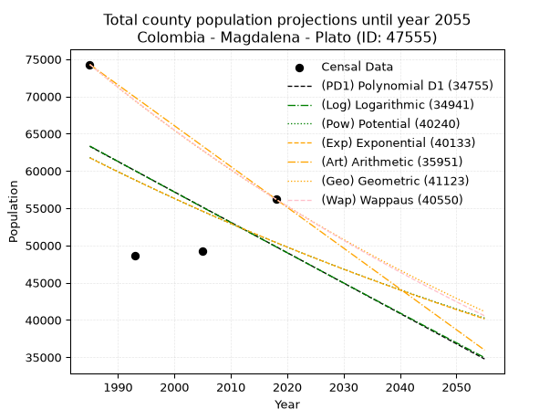
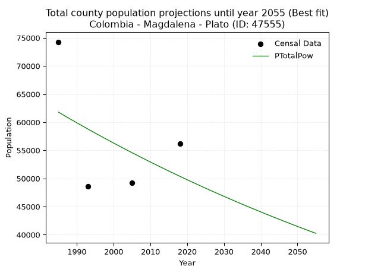
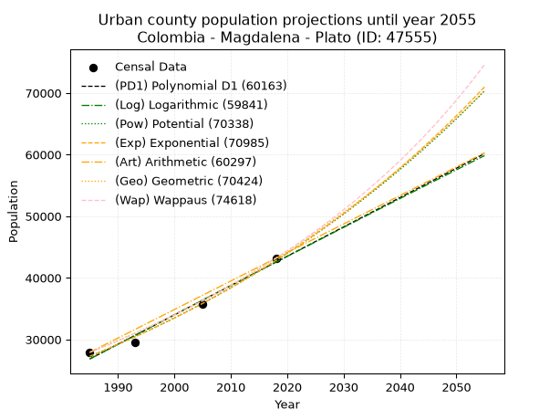
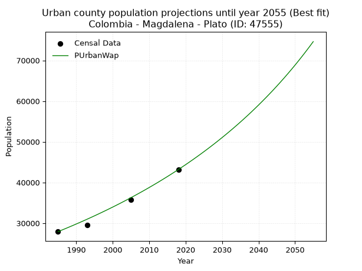
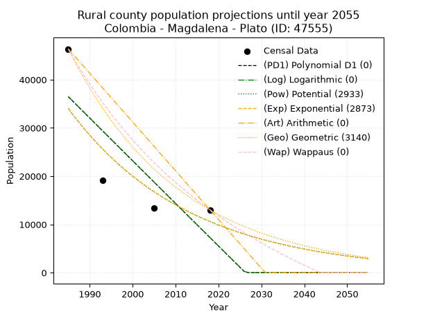
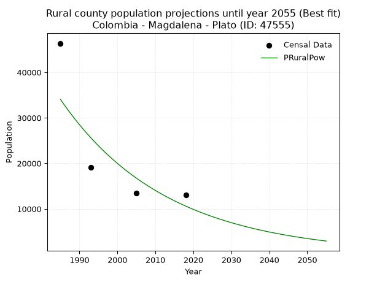

<div align="center">


</div>

# 📜 _“Population and Public Services Demand Projections (PPSD) until Year 2050 for Colombia - Magdalena - Plato (ID: 47555)”_
Keywords: `population` `public-service` `projection` `lineal` `polynomial` `logarithmic` `potential` `exponential` `arithmetic` `geometric` `wappaus` `dane` `colombia` `south-america`

PPSD are analytical estimates used by governments and planners to anticipate future changes in population size, age distribution, and the resulting community needs for utilities, healthcare, education, and infrastructure as sizing future water treatment facilities, electrical grids, and road networks based on spatial growth.

<div align="center">

</img>

</div>


> **General running parameters**: • app_version: _v20260806_. • Python version: _3.14.7_. • Pandas version: _3.0.5_. • NumPy version: _2.5.1_. • Creates, save and include plots into reports (create_plot): _False_. • Projection until year: _2050_. • Process polynomial degree 2 and up: _False_. • Process Wappaus: _True_. • Process Wappaus: _True_. • Set negative values to zero: _True_. • Set infinite values to zero: _True_. • Drop dataset notes: _True_. 
<div align="center">

Maps & GIS Layers: [:earth_americas:Google](http://maps.google.com/maps?q=9.796712855,-74.7845492) [:earth_americas:OSM](https://www.openstreetmap.org/#map=18/9.796712855/-74.7845492&layers=P) [:earth_americas:Bing](https://www.bing.com/maps?cp=9.796712855~-74.7845492&lvl=18) [:earth_americas:Apple](https://maps.apple.com/frame?center=9.796712855%2C-74.7845492&span=0.003%2C0.006) [:earth_americas:GISMobile](https://github.com/rcfdtools/R.GISMobile/blob/main/file/gis/CountyLayer_CO/Readme.md)

</div>


<div align="center">

```geojson
{
  "type": "Feature",
  "geometry": {
    "type": "Point", 
    "coordinates": [-74.7845492, 9.796712855]
  }, 
  "properties": {
    "Name": "Colombia - Magdalena - Plato (ID: 47555)"
  }
}
```

</div>


## 0. Census Data (4 records)

Census data are official statistics collected by a government about the people and housing in a country. They usually include counts of total population, age, sex, race, income, education, and jobs.

📅Global census file: [Population.xlsx](../data/Population.xlsx)

| Source   |   Year |   CountryID | CountryName   |   StateID | StateName   |   CountyID | CountyName   |   PTotal |   PUrban |   PRural |
|:---------|-------:|------------:|:--------------|----------:|:------------|-----------:|:-------------|---------:|---------:|---------:|
| DANE     |   1985 |          57 | Colombia      |        47 | Magdalena   |      47555 | Plato        |    74279 |    27912 |    46367 |
| DANE     |   1993 |          57 | Colombia      |        47 | Magdalena   |      47555 | Plato        |    48629 |    29537 |    19092 |
| DANE     |   2005 |          57 | Colombia      |        47 | Magdalena   |      47555 | Plato        |    49195 |    35760 |    13435 |
| DANE     |   2018 |          57 | Colombia      |        47 | Magdalena   |      47555 | Plato        |    56210 |    43179 |    13031 |

> 🔥Some records could had specific notes about the registered values or the corresponding urban or rural distribution.

📅[SUI-RUPS](https://www.datos.gov.co/Hacienda-y-Cr-dito-P-blico/Registro-nico-de-Prestadores-de-Servicios-P-blicos/4qkq-csdn/about_data) - Local public utility companies: [RUPS.csv](../data/RUPS.csv)

 | SERVICIO       | ESTADO      | NOMBRE                                              | NIT         | DEPARTAMENTO_DOMICILIO   | MUNICIPIO_DOMICILIO   | DIRECCION                                             |   TELEFONO | EMAIL                          | TIPO_PRESTADOR                             | CLASIFICACION                 |
|:---------------|:------------|:----------------------------------------------------|:------------|:-------------------------|:----------------------|:------------------------------------------------------|-----------:|:-------------------------------|:-------------------------------------------|:------------------------------|
| ACUEDUCTO      | CANCELACION | UNIDAD DE SERVICIOS PUBLICOS DEL MUNICIPIO DE PLATO | 891780051-4 | MAGDALENA                | PLATO                 | CALLE 4 CARRERA 12 ESQUINA                            |    4850024 | edgarcartagena1971@hotmail.com | nan                                        | nan                           |
| ALCANTARILLADO | CANCELACION | UNIDAD DE SERVICIOS PUBLICOS DEL MUNICIPIO DE PLATO | 891780051-4 | MAGDALENA                | PLATO                 | CALLE 4 CARRERA 12 ESQUINA                            |    4850024 | edgarcartagena1971@hotmail.com | nan                                        | nan                           |
| ACUEDUCTO      | OPERATIVA   | EMPRESA REGIONAL DE SERVICIOS PUBLICOS S.A. E.S.P.  | 900222479-1 | ATLANTICO                | PUERTO COLOMBIA       | CRA 24 # 1A-24 OFICINA 907A - EDIFICIO BC EMPRESARIAL |    3852994 | jalean@semsaesp.com            | SOCIEDADES (EMPRESA DE SERVICIOS PUBLICOS) | MAYOR O IGUAL A 5001 USUARIOS |
| ALCANTARILLADO | OPERATIVA   | EMPRESA REGIONAL DE SERVICIOS PUBLICOS S.A. E.S.P.  | 900222479-1 | ATLANTICO                | PUERTO COLOMBIA       | CRA 24 # 1A-24 OFICINA 907A - EDIFICIO BC EMPRESARIAL |    3852994 | jalean@semsaesp.com            | SOCIEDADES (EMPRESA DE SERVICIOS PUBLICOS) | MAYOR O IGUAL A 5001 USUARIOS |

## 1. Total

### 1.1. Coefficients and Parameters

* (PD1) Polynomial Deg 1: -407.72581292654013, 872631.8073063119 (lineal)
* (Log) Logarithmic: -819189.5015765411, 6283744.216055968
* (Pow) Potential: -12.373882769192699, 45.59699940563288
* (Exp) Exponential: -0.006155815553270376, 12514566094.45629
* (Art) Arithmetic: Year diff. 2018 - 1985 = 33, Population diff. 56210 - 74279 = -18069, Annual growth = -547.5454545454545
* (Geo) Geometric: Year diff. 2018 - 1985 = 33, Population diff. 56210 - 74279 = -18069, Annual growth % = -0.008410901401456061
* (Wap) Wappaus: i = -0.8392208608318779, Condition values only valid for < 200)

<sub>
Wappaus condition values: ['-0.00', '-0.84', '-1.68', '-2.52', '-3.36', '-4.20', '-5.04', '-5.87', '-6.71', '-7.55', '-8.39', '-9.23', '-10.07', '-10.91', '-11.75', '-12.59', '-13.43', '-14.27', '-15.11', '-15.95', '-16.78', '-17.62', '-18.46', '-19.30', '-20.14', '-20.98', '-21.82', '-22.66', '-23.50', '-24.34', '-25.18', '-26.02', '-26.86', '-27.69', '-28.53', '-29.37', '-30.21', '-31.05', '-31.89', '-32.73', '-33.57', '-34.41', '-35.25', '-36.09', '-36.93', '-37.76', '-38.60', '-39.44', '-40.28', '-41.12', '-41.96', '-42.80', '-43.64', '-44.48', '-45.32', '-46.16', '-47.00', '-47.84', '-48.67', '-49.51', '-50.35', '-51.19', '-52.03', '-52.87', '-53.71', '-54.55']
</sub>


### 1.2. Projected Dataset

|   Year |   CountyID |   PTotalPD1 |   PTotalLog |   PTotalPow |   PTotalExp |   PTotalArt |   PTotalGeo |   PTotalWap |
|-------:|-----------:|------------:|------------:|------------:|------------:|------------:|------------:|------------:|
|   1985 |      47555 |       63296 |       63332 |       61787 |       61751 |       74279 |       74279 |       74279 |
|   1986 |      47555 |       62888 |       62919 |       61403 |       61372 |       73731 |       73654 |       73658 |
|   1987 |      47555 |       62481 |       62507 |       61022 |       60995 |       73184 |       73035 |       73043 |
|   1988 |      47555 |       62073 |       62095 |       60643 |       60621 |       72636 |       72420 |       72432 |
|   1989 |      47555 |       61665 |       61683 |       60267 |       60249 |       72089 |       71811 |       71827 |
|   1990 |      47555 |       61257 |       61271 |       59893 |       59879 |       71541 |       71207 |       71226 |
|   1991 |      47555 |       60850 |       60859 |       59522 |       59512 |       70994 |       70608 |       70631 |
|   1992 |      47555 |       60442 |       60448 |       59153 |       59147 |       70446 |       70015 |       70040 |
|   1993 |      47555 |       60034 |       60037 |       58787 |       58784 |       69899 |       69426 |       69454 |
|   1994 |      47555 |       59627 |       59626 |       58423 |       58423 |       69351 |       68842 |       68873 |
|   1995 |      47555 |       59219 |       59215 |       58062 |       58064 |       68804 |       68263 |       68296 |
|   1996 |      47555 |       58811 |       58805 |       57703 |       57708 |       68256 |       67689 |       67725 |
|   1997 |      47555 |       58403 |       58394 |       57347 |       57354 |       67708 |       67119 |       67157 |
|   1998 |      47555 |       57996 |       57984 |       56993 |       57002 |       67161 |       66555 |       66594 |
|   1999 |      47555 |       57588 |       57574 |       56641 |       56652 |       66613 |       65995 |       66036 |
|   2000 |      47555 |       57180 |       57165 |       56291 |       56304 |       66066 |       65440 |       65482 |
|   2001 |      47555 |       56772 |       56755 |       55944 |       55959 |       65518 |       64889 |       64933 |
|   2002 |      47555 |       56365 |       56346 |       55599 |       55615 |       64971 |       64344 |       64387 |
|   2003 |      47555 |       55957 |       55937 |       55257 |       55274 |       64423 |       63802 |       63846 |
|   2004 |      47555 |       55549 |       55528 |       54917 |       54935 |       63876 |       63266 |       63310 |
|   2005 |      47555 |       55142 |       55119 |       54579 |       54598 |       63328 |       62734 |       62777 |
|   2006 |      47555 |       54734 |       54711 |       54243 |       54263 |       62781 |       62206 |       62248 |
|   2007 |      47555 |       54326 |       54303 |       53910 |       53930 |       62233 |       61683 |       61724 |
|   2008 |      47555 |       53918 |       53894 |       53578 |       53599 |       61685 |       61164 |       61204 |
|   2009 |      47555 |       53511 |       53487 |       53249 |       53270 |       61138 |       60650 |       60687 |
|   2010 |      47555 |       53103 |       53079 |       52922 |       52943 |       60590 |       60139 |       60174 |
|   2011 |      47555 |       52695 |       52672 |       52598 |       52618 |       60043 |       59634 |       59666 |
|   2012 |      47555 |       52287 |       52264 |       52275 |       52295 |       59495 |       59132 |       59161 |
|   2013 |      47555 |       51880 |       51857 |       51955 |       51974 |       58948 |       58635 |       58660 |
|   2014 |      47555 |       51472 |       51450 |       51636 |       51655 |       58400 |       58142 |       58163 |
|   2015 |      47555 |       51064 |       51044 |       51320 |       51338 |       57853 |       57653 |       57669 |
|   2016 |      47555 |       50657 |       50637 |       51006 |       51023 |       57305 |       57168 |       57179 |
|   2017 |      47555 |       50249 |       50231 |       50694 |       50710 |       56758 |       56687 |       56693 |
|   2018 |      47555 |       49841 |       49825 |       50384 |       50399 |       56210 |       56210 |       56210 |
|   2019 |      47555 |       49433 |       49419 |       50076 |       50090 |       55662 |       55737 |       55731 |
|   2020 |      47555 |       49026 |       49014 |       49770 |       49782 |       55115 |       55268 |       55255 |
|   2021 |      47555 |       48618 |       48608 |       49466 |       49477 |       54567 |       54804 |       54783 |
|   2022 |      47555 |       48210 |       48203 |       49164 |       49173 |       54020 |       54343 |       54314 |
|   2023 |      47555 |       47802 |       47798 |       48865 |       48871 |       53472 |       53886 |       53849 |
|   2024 |      47555 |       47395 |       47393 |       48567 |       48571 |       52925 |       53432 |       53387 |
|   2025 |      47555 |       46987 |       46988 |       48271 |       48273 |       52377 |       52983 |       52928 |
|   2026 |      47555 |       46579 |       46584 |       47977 |       47977 |       51830 |       52537 |       52473 |
|   2027 |      47555 |       46172 |       46180 |       47685 |       47683 |       51282 |       52095 |       52020 |
|   2028 |      47555 |       45764 |       45776 |       47395 |       47390 |       50735 |       51657 |       51571 |
|   2029 |      47555 |       45356 |       45372 |       47106 |       47099 |       50187 |       51223 |       51126 |
|   2030 |      47555 |       44948 |       44968 |       46820 |       46810 |       49639 |       50792 |       50683 |
|   2031 |      47555 |       44541 |       44565 |       46536 |       46523 |       49092 |       50365 |       50244 |
|   2032 |      47555 |       44133 |       44161 |       46253 |       46237 |       48544 |       49941 |       49807 |
|   2033 |      47555 |       43725 |       43758 |       45972 |       45954 |       47997 |       49521 |       49374 |
|   2034 |      47555 |       43318 |       43356 |       45693 |       45672 |       47449 |       49105 |       48943 |
|   2035 |      47555 |       42910 |       42953 |       45416 |       45391 |       46902 |       48692 |       48516 |
|   2036 |      47555 |       42502 |       42550 |       45141 |       45113 |       46354 |       48282 |       48092 |
|   2037 |      47555 |       42094 |       42148 |       44868 |       44836 |       45807 |       47876 |       47670 |
|   2038 |      47555 |       41687 |       41746 |       44596 |       44561 |       45259 |       47473 |       47251 |
|   2039 |      47555 |       41279 |       41344 |       44326 |       44287 |       44712 |       47074 |       46836 |
|   2040 |      47555 |       40871 |       40943 |       44058 |       44015 |       44164 |       46678 |       46423 |
|   2041 |      47555 |       40463 |       40541 |       43792 |       43745 |       43616 |       46285 |       46013 |
|   2042 |      47555 |       40056 |       40140 |       43527 |       43477 |       43069 |       45896 |       45605 |
|   2043 |      47555 |       39648 |       39739 |       43264 |       43210 |       42521 |       45510 |       45201 |
|   2044 |      47555 |       39240 |       39338 |       43003 |       42945 |       41974 |       45127 |       44799 |
|   2045 |      47555 |       38833 |       38937 |       42743 |       42681 |       41426 |       44748 |       44400 |
|   2046 |      47555 |       38425 |       38537 |       42486 |       42419 |       40879 |       44371 |       44003 |
|   2047 |      47555 |       38017 |       38136 |       42229 |       42159 |       40331 |       43998 |       43609 |
|   2048 |      47555 |       37609 |       37736 |       41975 |       41900 |       39784 |       43628 |       43218 |
|   2049 |      47555 |       37202 |       37336 |       41722 |       41643 |       39236 |       43261 |       42829 |
|   2050 |      47555 |       36794 |       36937 |       41471 |       41388 |       38689 |       42897 |       42443 |
<div align="center">

</img>

</div>


### 1.3. Best fit with absolute and relative error (%)

Relative error puts that difference into context by dividing the absolute error by the true value, creating a unitless ratio or percentage that shows the scale of the mistake.

Absolute and relative error

|   Year | Source   |   CountryID | CountryName   |   StateID | StateName   |   CountyID_x | CountyName   |   PTotal |   PUrban |   PRural |   CountyID_y |   PTotalPD1 |   PTotalLog |   PTotalPow |   PTotalExp |   PTotalArt |   PTotalGeo |   PTotalWap |   PTotalPD1AbsError |   PTotalLogAbsError |   PTotalPowAbsError |   PTotalExpAbsError |   PTotalArtAbsError |   PTotalGeoAbsError |   PTotalWapAbsError |   PTotalPD1RelError |   PTotalLogRelError |   PTotalPowRelError |   PTotalExpRelError |   PTotalArtRelError |   PTotalGeoRelError |   PTotalWapRelError |
|-------:|:---------|------------:|:--------------|----------:|:------------|-------------:|:-------------|---------:|---------:|---------:|-------------:|------------:|------------:|------------:|------------:|------------:|------------:|------------:|--------------------:|--------------------:|--------------------:|--------------------:|--------------------:|--------------------:|--------------------:|--------------------:|--------------------:|--------------------:|--------------------:|--------------------:|--------------------:|--------------------:|
|   1985 | DANE     |          57 | Colombia      |        47 | Magdalena   |        47555 | Plato        |    74279 |    27912 |    46367 |        47555 |       63296 |       63332 |       61787 |       61751 |       74279 |       74279 |       74279 |               10983 |               10947 |               12492 |               12528 |                   0 |                   0 |                   0 |             14.7861 |             14.7377 |             16.8177 |             16.8661 |              0      |              0      |              0      |
|   1993 | DANE     |          57 | Colombia      |        47 | Magdalena   |        47555 | Plato        |    48629 |    29537 |    19092 |        47555 |       60034 |       60037 |       58787 |       58784 |       69899 |       69426 |       69454 |               11405 |               11408 |               10158 |               10155 |               21270 |               20797 |               20825 |             23.4531 |             23.4593 |             20.8888 |             20.8826 |             43.7393 |             42.7667 |             42.8242 |
|   2005 | DANE     |          57 | Colombia      |        47 | Magdalena   |        47555 | Plato        |    49195 |    35760 |    13435 |        47555 |       55142 |       55119 |       54579 |       54598 |       63328 |       62734 |       62777 |                5947 |                5924 |                5384 |                5403 |               14133 |               13539 |               13582 |             12.0886 |             12.0419 |             10.9442 |             10.9828 |             28.7285 |             27.5211 |             27.6085 |
|   2018 | DANE     |          57 | Colombia      |        47 | Magdalena   |        47555 | Plato        |    56210 |    43179 |    13031 |        47555 |       49841 |       49825 |       50384 |       50399 |       56210 |       56210 |       56210 |                6369 |                6385 |                5826 |                5811 |                   0 |                   0 |                   0 |             11.3307 |             11.3592 |             10.3647 |             10.338  |              0      |              0      |              0      |

Relative error mean

| Method    |   RelError | Best   |
|:----------|-----------:|:-------|
| PTotalPD1 |    15.4146 |        |
| PTotalLog |    15.3995 |        |
| PTotalPow |    14.7538 | True   |
| PTotalExp |    14.7674 |        |
| PTotalArt |    18.117  |        |
| PTotalGeo |    17.5719 |        |
| PTotalWap |    17.6082 |        |

💙Best method: _**PTotalPow**_
<div align="center">

</img>

</div>


### 1.4. Fresh water supply demand in liters per capita per day (lpcd)

The fresh water supply demand typically ranges from 100 to 300 liters per capita per day (lpcd) for standard domestic and municipal planning, though absolute survival minimums set by the World Health Organization are as low as 7.5 to 20 liters per day, and total consumption in high-income nations can exceed 400 liters.

> `CZ`: Level in meters above the sea level (masl)<br> `WS`: Fresh water supply demand in liters per capita per day (lpcd or l/h/d)<br> `WSAll`: Zonal fresh water supply demand in liters per second (l/s)<br> `A`: Zonal area in square meters<br> `DP`: Population density (people/hectare or p/ha)

Reference values (RAS Colombia)

|    CZ |   WS |
|------:|-----:|
|  1000 |  120 |
|  2000 |  130 |
| 99999 |  140 |

County shapefile geometry properties and water supply values

|   CountyID |     ATotal |   CZTotal |   WSTotal |
|-----------:|-----------:|----------:|----------:|
|      47555 | 1.4556e+09 |   74.6918 |       120 |

Projected values for best method: PTotalPow

|   CountyID |   Year |   PTotalPow |   DPTotal |   WSTotal |   WSTotalAll |
|-----------:|-------:|------------:|----------:|----------:|-------------:|
|      47555 |   1985 |       61787 |      0.42 |       120 |      85.8153 |
|      47555 |   1986 |       61403 |      0.42 |       120 |      85.2819 |
|      47555 |   1987 |       61022 |      0.42 |       120 |      84.7528 |
|      47555 |   1988 |       60643 |      0.42 |       120 |      84.2264 |
|      47555 |   1989 |       60267 |      0.41 |       120 |      83.7042 |
|      47555 |   1990 |       59893 |      0.41 |       120 |      83.1847 |
|      47555 |   1991 |       59522 |      0.41 |       120 |      82.6694 |
|      47555 |   1992 |       59153 |      0.41 |       120 |      82.1569 |
|      47555 |   1993 |       58787 |      0.4  |       120 |      81.6486 |
|      47555 |   1994 |       58423 |      0.4  |       120 |      81.1431 |
|      47555 |   1995 |       58062 |      0.4  |       120 |      80.6417 |
|      47555 |   1996 |       57703 |      0.4  |       120 |      80.1431 |
|      47555 |   1997 |       57347 |      0.39 |       120 |      79.6486 |
|      47555 |   1998 |       56993 |      0.39 |       120 |      79.1569 |
|      47555 |   1999 |       56641 |      0.39 |       120 |      78.6681 |
|      47555 |   2000 |       56291 |      0.39 |       120 |      78.1819 |
|      47555 |   2001 |       55944 |      0.38 |       120 |      77.7    |
|      47555 |   2002 |       55599 |      0.38 |       120 |      77.2208 |
|      47555 |   2003 |       55257 |      0.38 |       120 |      76.7458 |
|      47555 |   2004 |       54917 |      0.38 |       120 |      76.2736 |
|      47555 |   2005 |       54579 |      0.37 |       120 |      75.8042 |
|      47555 |   2006 |       54243 |      0.37 |       120 |      75.3375 |
|      47555 |   2007 |       53910 |      0.37 |       120 |      74.875  |
|      47555 |   2008 |       53578 |      0.37 |       120 |      74.4139 |
|      47555 |   2009 |       53249 |      0.37 |       120 |      73.9569 |
|      47555 |   2010 |       52922 |      0.36 |       120 |      73.5028 |
|      47555 |   2011 |       52598 |      0.36 |       120 |      73.0528 |
|      47555 |   2012 |       52275 |      0.36 |       120 |      72.6042 |
|      47555 |   2013 |       51955 |      0.36 |       120 |      72.1597 |
|      47555 |   2014 |       51636 |      0.35 |       120 |      71.7167 |
|      47555 |   2015 |       51320 |      0.35 |       120 |      71.2778 |
|      47555 |   2016 |       51006 |      0.35 |       120 |      70.8417 |
|      47555 |   2017 |       50694 |      0.35 |       120 |      70.4083 |
|      47555 |   2018 |       50384 |      0.35 |       120 |      69.9778 |
|      47555 |   2019 |       50076 |      0.34 |       120 |      69.55   |
|      47555 |   2020 |       49770 |      0.34 |       120 |      69.125  |
|      47555 |   2021 |       49466 |      0.34 |       120 |      68.7028 |
|      47555 |   2022 |       49164 |      0.34 |       120 |      68.2833 |
|      47555 |   2023 |       48865 |      0.34 |       120 |      67.8681 |
|      47555 |   2024 |       48567 |      0.33 |       120 |      67.4542 |
|      47555 |   2025 |       48271 |      0.33 |       120 |      67.0431 |
|      47555 |   2026 |       47977 |      0.33 |       120 |      66.6347 |
|      47555 |   2027 |       47685 |      0.33 |       120 |      66.2292 |
|      47555 |   2028 |       47395 |      0.33 |       120 |      65.8264 |
|      47555 |   2029 |       47106 |      0.32 |       120 |      65.425  |
|      47555 |   2030 |       46820 |      0.32 |       120 |      65.0278 |
|      47555 |   2031 |       46536 |      0.32 |       120 |      64.6333 |
|      47555 |   2032 |       46253 |      0.32 |       120 |      64.2403 |
|      47555 |   2033 |       45972 |      0.32 |       120 |      63.85   |
|      47555 |   2034 |       45693 |      0.31 |       120 |      63.4625 |
|      47555 |   2035 |       45416 |      0.31 |       120 |      63.0778 |
|      47555 |   2036 |       45141 |      0.31 |       120 |      62.6958 |
|      47555 |   2037 |       44868 |      0.31 |       120 |      62.3167 |
|      47555 |   2038 |       44596 |      0.31 |       120 |      61.9389 |
|      47555 |   2039 |       44326 |      0.3  |       120 |      61.5639 |
|      47555 |   2040 |       44058 |      0.3  |       120 |      61.1917 |
|      47555 |   2041 |       43792 |      0.3  |       120 |      60.8222 |
|      47555 |   2042 |       43527 |      0.3  |       120 |      60.4542 |
|      47555 |   2043 |       43264 |      0.3  |       120 |      60.0889 |
|      47555 |   2044 |       43003 |      0.3  |       120 |      59.7264 |
|      47555 |   2045 |       42743 |      0.29 |       120 |      59.3653 |
|      47555 |   2046 |       42486 |      0.29 |       120 |      59.0083 |
|      47555 |   2047 |       42229 |      0.29 |       120 |      58.6514 |
|      47555 |   2048 |       41975 |      0.29 |       120 |      58.2986 |
|      47555 |   2049 |       41722 |      0.29 |       120 |      57.9472 |
|      47555 |   2050 |       41471 |      0.28 |       120 |      57.5986 |

## 2. Urban

### 2.1. Coefficients and Parameters

* (PD1) Polynomial Deg 1: 476.0915295062173, -918205.0818948111 (lineal)
* (Log) Logarithmic: 952651.3980134045, -7207013.910369083
* (Pow) Potential: 27.350355926790048, -85.75939223034764
* (Exp) Exponential: 0.013666718295413533, 4.507776025919987e-08
* (Art) Arithmetic: Year diff. 2018 - 1985 = 33, Population diff. 43179 - 27912 = 15267, Annual growth = 462.6363636363636
* (Geo) Geometric: Year diff. 2018 - 1985 = 33, Population diff. 43179 - 27912 = 15267, Annual growth % = 0.013308923941600215
* (Wap) Wappaus: i = 1.3015328624899456, Condition values only valid for < 200)

<sub>
Wappaus condition values: ['0.00', '1.30', '2.60', '3.90', '5.21', '6.51', '7.81', '9.11', '10.41', '11.71', '13.02', '14.32', '15.62', '16.92', '18.22', '19.52', '20.82', '22.13', '23.43', '24.73', '26.03', '27.33', '28.63', '29.94', '31.24', '32.54', '33.84', '35.14', '36.44', '37.74', '39.05', '40.35', '41.65', '42.95', '44.25', '45.55', '46.86', '48.16', '49.46', '50.76', '52.06', '53.36', '54.66', '55.97', '57.27', '58.57', '59.87', '61.17', '62.47', '63.78', '65.08', '66.38', '67.68', '68.98', '70.28', '71.58', '72.89', '74.19', '75.49', '76.79', '78.09', '79.39', '80.70', '82.00', '83.30', '84.60']
</sub>


### 2.2. Projected Dataset

|   Year |   CountyID |   PUrbanPD1 |   PUrbanLog |   PUrbanPow |   PUrbanExp |   PUrbanArt |   PUrbanGeo |   PUrbanWap |
|-------:|-----------:|------------:|------------:|------------:|------------:|------------:|------------:|------------:|
|   1985 |      47555 |       26837 |       26825 |       27260 |       27270 |       27912 |       27912 |       27912 |
|   1986 |      47555 |       27313 |       27304 |       27638 |       27646 |       28375 |       28283 |       28278 |
|   1987 |      47555 |       27789 |       27784 |       28022 |       28026 |       28837 |       28660 |       28648 |
|   1988 |      47555 |       28265 |       28263 |       28410 |       28412 |       29300 |       29041 |       29024 |
|   1989 |      47555 |       28741 |       28742 |       28803 |       28803 |       29763 |       29428 |       29404 |
|   1990 |      47555 |       29217 |       29221 |       29202 |       29199 |       30225 |       29819 |       29790 |
|   1991 |      47555 |       29693 |       29700 |       29606 |       29601 |       30688 |       30216 |       30180 |
|   1992 |      47555 |       30169 |       30178 |       30015 |       30008 |       31150 |       30619 |       30576 |
|   1993 |      47555 |       30645 |       30656 |       30430 |       30421 |       31613 |       31026 |       30978 |
|   1994 |      47555 |       31121 |       31134 |       30851 |       30840 |       32076 |       31439 |       31385 |
|   1995 |      47555 |       31598 |       31612 |       31277 |       31264 |       32538 |       31857 |       31798 |
|   1996 |      47555 |       32074 |       32089 |       31708 |       31694 |       33001 |       32281 |       32216 |
|   1997 |      47555 |       32550 |       32566 |       32146 |       32130 |       33464 |       32711 |       32641 |
|   1998 |      47555 |       33026 |       33043 |       32589 |       32573 |       33926 |       33146 |       33071 |
|   1999 |      47555 |       33502 |       33520 |       33038 |       33021 |       34389 |       33587 |       33508 |
|   2000 |      47555 |       33978 |       33996 |       33493 |       33475 |       34852 |       34034 |       33951 |
|   2001 |      47555 |       34454 |       34473 |       33954 |       33936 |       35314 |       34487 |       34400 |
|   2002 |      47555 |       34930 |       34949 |       34421 |       34403 |       35777 |       34946 |       34856 |
|   2003 |      47555 |       35406 |       35424 |       34894 |       34876 |       36239 |       35412 |       35319 |
|   2004 |      47555 |       35882 |       35900 |       35374 |       35356 |       36702 |       35883 |       35788 |
|   2005 |      47555 |       36358 |       36375 |       35860 |       35843 |       37165 |       36360 |       36265 |
|   2006 |      47555 |       36835 |       36850 |       36352 |       36336 |       37627 |       36844 |       36749 |
|   2007 |      47555 |       37311 |       37325 |       36851 |       36836 |       38090 |       37335 |       37240 |
|   2008 |      47555 |       37787 |       37799 |       37357 |       37343 |       38553 |       37832 |       37738 |
|   2009 |      47555 |       38263 |       38274 |       37869 |       37857 |       39015 |       38335 |       38245 |
|   2010 |      47555 |       38739 |       38748 |       38388 |       38378 |       39478 |       38845 |       38759 |
|   2011 |      47555 |       39215 |       39222 |       38914 |       38906 |       39941 |       39362 |       39281 |
|   2012 |      47555 |       39691 |       39695 |       39447 |       39441 |       40403 |       39886 |       39811 |
|   2013 |      47555 |       40167 |       40169 |       39986 |       39984 |       40866 |       40417 |       40350 |
|   2014 |      47555 |       40643 |       40642 |       40533 |       40534 |       41328 |       40955 |       40898 |
|   2015 |      47555 |       41119 |       41115 |       41087 |       41092 |       41791 |       41500 |       41454 |
|   2016 |      47555 |       41595 |       41587 |       41649 |       41657 |       42254 |       42052 |       42020 |
|   2017 |      47555 |       42072 |       42060 |       42217 |       42230 |       42716 |       42612 |       42595 |
|   2018 |      47555 |       42548 |       42532 |       42794 |       42811 |       43179 |       43179 |       43179 |
|   2019 |      47555 |       43024 |       43004 |       43377 |       43401 |       43642 |       43754 |       43773 |
|   2020 |      47555 |       43500 |       43476 |       43969 |       43998 |       44104 |       44336 |       44377 |
|   2021 |      47555 |       43976 |       43947 |       44568 |       44603 |       44567 |       44926 |       44992 |
|   2022 |      47555 |       44452 |       44418 |       45175 |       45217 |       45030 |       45524 |       45616 |
|   2023 |      47555 |       44928 |       44889 |       45790 |       45839 |       45492 |       46130 |       46252 |
|   2024 |      47555 |       45404 |       45360 |       46413 |       46470 |       45955 |       46744 |       46899 |
|   2025 |      47555 |       45880 |       45831 |       47045 |       47109 |       46417 |       47366 |       47557 |
|   2026 |      47555 |       46356 |       46301 |       47684 |       47758 |       46880 |       47996 |       48227 |
|   2027 |      47555 |       46832 |       46771 |       48332 |       48415 |       47343 |       48635 |       48909 |
|   2028 |      47555 |       47309 |       47241 |       48988 |       49081 |       47805 |       49282 |       49603 |
|   2029 |      47555 |       47785 |       47711 |       49653 |       49756 |       48268 |       49938 |       50310 |
|   2030 |      47555 |       48261 |       48180 |       50327 |       50441 |       48731 |       50603 |       51030 |
|   2031 |      47555 |       48737 |       48649 |       51010 |       51135 |       49193 |       51276 |       51763 |
|   2032 |      47555 |       49213 |       49118 |       51701 |       51839 |       49656 |       51959 |       52510 |
|   2033 |      47555 |       49689 |       49587 |       52401 |       52552 |       50119 |       52650 |       53271 |
|   2034 |      47555 |       50165 |       50055 |       53111 |       53275 |       50581 |       53351 |       54047 |
|   2035 |      47555 |       50641 |       50524 |       53830 |       54008 |       51044 |       54061 |       54837 |
|   2036 |      47555 |       51117 |       50992 |       54558 |       54752 |       51506 |       54781 |       55643 |
|   2037 |      47555 |       51593 |       51459 |       55296 |       55505 |       51969 |       55510 |       56465 |
|   2038 |      47555 |       52069 |       51927 |       56043 |       56269 |       52432 |       56248 |       57303 |
|   2039 |      47555 |       52546 |       52394 |       56800 |       57043 |       52894 |       56997 |       58158 |
|   2040 |      47555 |       53022 |       52861 |       57567 |       57828 |       53357 |       57756 |       59031 |
|   2041 |      47555 |       53498 |       53328 |       58343 |       58624 |       53820 |       58524 |       59921 |
|   2042 |      47555 |       53974 |       53795 |       59130 |       59430 |       54282 |       59303 |       60829 |
|   2043 |      47555 |       54450 |       54261 |       59927 |       60248 |       54745 |       60092 |       61757 |
|   2044 |      47555 |       54926 |       54728 |       60735 |       61077 |       55208 |       60892 |       62704 |
|   2045 |      47555 |       55402 |       55194 |       61553 |       61918 |       55670 |       61703 |       63672 |
|   2046 |      47555 |       55878 |       55659 |       62381 |       62770 |       56133 |       62524 |       64660 |
|   2047 |      47555 |       56354 |       56125 |       63221 |       63634 |       56595 |       63356 |       65670 |
|   2048 |      47555 |       56830 |       56590 |       64071 |       64509 |       57058 |       64199 |       66702 |
|   2049 |      47555 |       57306 |       57055 |       64932 |       65397 |       57521 |       65053 |       67757 |
|   2050 |      47555 |       57783 |       57520 |       65804 |       66297 |       57983 |       65919 |       68836 |
<div align="center">

</img>

</div>


### 2.3. Best fit with absolute and relative error (%)

Relative error puts that difference into context by dividing the absolute error by the true value, creating a unitless ratio or percentage that shows the scale of the mistake.

Absolute and relative error

|   Year | Source   |   CountryID | CountryName   |   StateID | StateName   |   CountyID_x | CountyName   |   PTotal |   PUrban |   PRural |   CountyID_y |   PUrbanPD1 |   PUrbanLog |   PUrbanPow |   PUrbanExp |   PUrbanArt |   PUrbanGeo |   PUrbanWap |   PUrbanPD1AbsError |   PUrbanLogAbsError |   PUrbanPowAbsError |   PUrbanExpAbsError |   PUrbanArtAbsError |   PUrbanGeoAbsError |   PUrbanWapAbsError |   PUrbanPD1RelError |   PUrbanLogRelError |   PUrbanPowRelError |   PUrbanExpRelError |   PUrbanArtRelError |   PUrbanGeoRelError |   PUrbanWapRelError |
|-------:|:---------|------------:|:--------------|----------:|:------------|-------------:|:-------------|---------:|---------:|---------:|-------------:|------------:|------------:|------------:|------------:|------------:|------------:|------------:|--------------------:|--------------------:|--------------------:|--------------------:|--------------------:|--------------------:|--------------------:|--------------------:|--------------------:|--------------------:|--------------------:|--------------------:|--------------------:|--------------------:|
|   1985 | DANE     |          57 | Colombia      |        47 | Magdalena   |        47555 | Plato        |    74279 |    27912 |    46367 |        47555 |       26837 |       26825 |       27260 |       27270 |       27912 |       27912 |       27912 |                1075 |                1087 |                 652 |                 642 |                   0 |                   0 |                   0 |             3.85139 |             3.89438 |            2.33591  |            2.30009  |             0       |             0       |             0       |
|   1993 | DANE     |          57 | Colombia      |        47 | Magdalena   |        47555 | Plato        |    48629 |    29537 |    19092 |        47555 |       30645 |       30656 |       30430 |       30421 |       31613 |       31026 |       30978 |                1108 |                1119 |                 893 |                 884 |                2076 |                1489 |                1441 |             3.75123 |             3.78847 |            3.02333  |            2.99286  |             7.02847 |             5.04113 |             4.87863 |
|   2005 | DANE     |          57 | Colombia      |        47 | Magdalena   |        47555 | Plato        |    49195 |    35760 |    13435 |        47555 |       36358 |       36375 |       35860 |       35843 |       37165 |       36360 |       36265 |                 598 |                 615 |                 100 |                  83 |                1405 |                 600 |                 505 |             1.67226 |             1.7198  |            0.279642 |            0.232103 |             3.92897 |             1.67785 |             1.41219 |
|   2018 | DANE     |          57 | Colombia      |        47 | Magdalena   |        47555 | Plato        |    56210 |    43179 |    13031 |        47555 |       42548 |       42532 |       42794 |       42811 |       43179 |       43179 |       43179 |                 631 |                 647 |                 385 |                 368 |                   0 |                   0 |                   0 |             1.46136 |             1.49841 |            0.891637 |            0.852266 |             0       |             0       |             0       |

Relative error mean

| Method    |   RelError | Best   |
|:----------|-----------:|:-------|
| PUrbanPD1 |    2.68406 |        |
| PUrbanLog |    2.72527 |        |
| PUrbanPow |    1.63263 |        |
| PUrbanExp |    1.59433 |        |
| PUrbanArt |    2.73936 |        |
| PUrbanGeo |    1.67975 |        |
| PUrbanWap |    1.5727  | True   |

💙Best method: _**PUrbanWap**_
<div align="center">

</img>

</div>


### 2.4. Fresh water supply demand in liters per capita per day (lpcd)

The fresh water supply demand typically ranges from 100 to 300 liters per capita per day (lpcd) for standard domestic and municipal planning, though absolute survival minimums set by the World Health Organization are as low as 7.5 to 20 liters per day, and total consumption in high-income nations can exceed 400 liters.

> `CZ`: Level in meters above the sea level (masl)<br> `WS`: Fresh water supply demand in liters per capita per day (lpcd or l/h/d)<br> `WSAll`: Zonal fresh water supply demand in liters per second (l/s)<br> `A`: Zonal area in square meters<br> `DP`: Population density (people/hectare or p/ha)

Reference values (RAS Colombia)

|    CZ |   WS |
|------:|-----:|
|  1000 |  120 |
|  2000 |  130 |
| 99999 |  140 |

County shapefile geometry properties and water supply values

|   CountyID |      AUrban |   CZUrban |   WSUrban |
|-----------:|------------:|----------:|----------:|
|      47555 | 7.88105e+06 |   31.3226 |       120 |

Projected values for best method: PUrbanWap

|   CountyID |   Year |   PUrbanWap |   DPUrban |   WSUrban |   WSUrbanAll |
|-----------:|-------:|------------:|----------:|----------:|-------------:|
|      47555 |   1985 |       27912 |     35.42 |       120 |      38.7667 |
|      47555 |   1986 |       28278 |     35.88 |       120 |      39.275  |
|      47555 |   1987 |       28648 |     36.35 |       120 |      39.7889 |
|      47555 |   1988 |       29024 |     36.83 |       120 |      40.3111 |
|      47555 |   1989 |       29404 |     37.31 |       120 |      40.8389 |
|      47555 |   1990 |       29790 |     37.8  |       120 |      41.375  |
|      47555 |   1991 |       30180 |     38.29 |       120 |      41.9167 |
|      47555 |   1992 |       30576 |     38.8  |       120 |      42.4667 |
|      47555 |   1993 |       30978 |     39.31 |       120 |      43.025  |
|      47555 |   1994 |       31385 |     39.82 |       120 |      43.5903 |
|      47555 |   1995 |       31798 |     40.35 |       120 |      44.1639 |
|      47555 |   1996 |       32216 |     40.88 |       120 |      44.7444 |
|      47555 |   1997 |       32641 |     41.42 |       120 |      45.3347 |
|      47555 |   1998 |       33071 |     41.96 |       120 |      45.9319 |
|      47555 |   1999 |       33508 |     42.52 |       120 |      46.5389 |
|      47555 |   2000 |       33951 |     43.08 |       120 |      47.1542 |
|      47555 |   2001 |       34400 |     43.65 |       120 |      47.7778 |
|      47555 |   2002 |       34856 |     44.23 |       120 |      48.4111 |
|      47555 |   2003 |       35319 |     44.82 |       120 |      49.0542 |
|      47555 |   2004 |       35788 |     45.41 |       120 |      49.7056 |
|      47555 |   2005 |       36265 |     46.02 |       120 |      50.3681 |
|      47555 |   2006 |       36749 |     46.63 |       120 |      51.0403 |
|      47555 |   2007 |       37240 |     47.25 |       120 |      51.7222 |
|      47555 |   2008 |       37738 |     47.88 |       120 |      52.4139 |
|      47555 |   2009 |       38245 |     48.53 |       120 |      53.1181 |
|      47555 |   2010 |       38759 |     49.18 |       120 |      53.8319 |
|      47555 |   2011 |       39281 |     49.84 |       120 |      54.5569 |
|      47555 |   2012 |       39811 |     50.51 |       120 |      55.2931 |
|      47555 |   2013 |       40350 |     51.2  |       120 |      56.0417 |
|      47555 |   2014 |       40898 |     51.89 |       120 |      56.8028 |
|      47555 |   2015 |       41454 |     52.6  |       120 |      57.575  |
|      47555 |   2016 |       42020 |     53.32 |       120 |      58.3611 |
|      47555 |   2017 |       42595 |     54.05 |       120 |      59.1597 |
|      47555 |   2018 |       43179 |     54.79 |       120 |      59.9708 |
|      47555 |   2019 |       43773 |     55.54 |       120 |      60.7958 |
|      47555 |   2020 |       44377 |     56.31 |       120 |      61.6347 |
|      47555 |   2021 |       44992 |     57.09 |       120 |      62.4889 |
|      47555 |   2022 |       45616 |     57.88 |       120 |      63.3556 |
|      47555 |   2023 |       46252 |     58.69 |       120 |      64.2389 |
|      47555 |   2024 |       46899 |     59.51 |       120 |      65.1375 |
|      47555 |   2025 |       47557 |     60.34 |       120 |      66.0514 |
|      47555 |   2026 |       48227 |     61.19 |       120 |      66.9819 |
|      47555 |   2027 |       48909 |     62.06 |       120 |      67.9292 |
|      47555 |   2028 |       49603 |     62.94 |       120 |      68.8931 |
|      47555 |   2029 |       50310 |     63.84 |       120 |      69.875  |
|      47555 |   2030 |       51030 |     64.75 |       120 |      70.875  |
|      47555 |   2031 |       51763 |     65.68 |       120 |      71.8931 |
|      47555 |   2032 |       52510 |     66.63 |       120 |      72.9306 |
|      47555 |   2033 |       53271 |     67.59 |       120 |      73.9875 |
|      47555 |   2034 |       54047 |     68.58 |       120 |      75.0653 |
|      47555 |   2035 |       54837 |     69.58 |       120 |      76.1625 |
|      47555 |   2036 |       55643 |     70.6  |       120 |      77.2819 |
|      47555 |   2037 |       56465 |     71.65 |       120 |      78.4236 |
|      47555 |   2038 |       57303 |     72.71 |       120 |      79.5875 |
|      47555 |   2039 |       58158 |     73.79 |       120 |      80.775  |
|      47555 |   2040 |       59031 |     74.9  |       120 |      81.9875 |
|      47555 |   2041 |       59921 |     76.03 |       120 |      83.2236 |
|      47555 |   2042 |       60829 |     77.18 |       120 |      84.4847 |
|      47555 |   2043 |       61757 |     78.36 |       120 |      85.7736 |
|      47555 |   2044 |       62704 |     79.56 |       120 |      87.0889 |
|      47555 |   2045 |       63672 |     80.79 |       120 |      88.4333 |
|      47555 |   2046 |       64660 |     82.04 |       120 |      89.8056 |
|      47555 |   2047 |       65670 |     83.33 |       120 |      91.2083 |
|      47555 |   2048 |       66702 |     84.64 |       120 |      92.6417 |
|      47555 |   2049 |       67757 |     85.97 |       120 |      94.1069 |
|      47555 |   2050 |       68836 |     87.34 |       120 |      95.6056 |

## 3. Rural

### 3.1. Coefficients and Parameters

* (PD1) Polynomial Deg 1: -883.8173424327572, 1790836.8892011226 (lineal)
* (Log) Logarithmic: -1771840.8995899463, 13490758.126425056
* (Pow) Potential: -70.74170929366568, 237.82131618868345
* (Exp) Exponential: -0.035295370697759516, 9.09013990398641e+34
* (Art) Arithmetic: Year diff. 2018 - 1985 = 33, Population diff. 13031 - 46367 = -33336, Annual growth = -1010.1818181818181
* (Geo) Geometric: Year diff. 2018 - 1985 = 33, Population diff. 13031 - 46367 = -33336, Annual growth % = -0.03773204658438467
* (Wap) Wappaus: i = -3.4014001083599386, Condition values only valid for < 200)

<sub>
Wappaus condition values: ['-0.00', '-3.40', '-6.80', '-10.20', '-13.61', '-17.01', '-20.41', '-23.81', '-27.21', '-30.61', '-34.01', '-37.42', '-40.82', '-44.22', '-47.62', '-51.02', '-54.42', '-57.82', '-61.23', '-64.63', '-68.03', '-71.43', '-74.83', '-78.23', '-81.63', '-85.04', '-88.44', '-91.84', '-95.24', '-98.64', '-102.04', '-105.44', '-108.84', '-112.25', '-115.65', '-119.05', '-122.45', '-125.85', '-129.25', '-132.65', '-136.06', '-139.46', '-142.86', '-146.26', '-149.66', '-153.06', '-156.46', '-159.87', '-163.27', '-166.67', '-170.07', '-173.47', '-176.87', '-180.27', '-183.68', '-187.08', '-190.48', '-193.88', '-197.28', '-200.68', '-204.08', '-207.49', '-210.89', '-214.29', '-217.69', '-221.09']
</sub>


### 3.2. Projected Dataset

|   Year |   CountyID |   PRuralPD1 |   PRuralLog |   PRuralPow |   PRuralExp |   PRuralArt |   PRuralGeo |   PRuralWap |
|-------:|-----------:|------------:|------------:|------------:|------------:|------------:|------------:|------------:|
|   1985 |      47555 |       36459 |       36507 |       34049 |       33988 |       46367 |       46367 |       46367 |
|   1986 |      47555 |       35576 |       35615 |       32857 |       32810 |       45357 |       44617 |       44816 |
|   1987 |      47555 |       34692 |       34723 |       31707 |       31672 |       44347 |       42934 |       43317 |
|   1988 |      47555 |       33808 |       33831 |       30599 |       30573 |       43336 |       41314 |       41865 |
|   1989 |      47555 |       32924 |       32940 |       29529 |       29513 |       42326 |       39755 |       40460 |
|   1990 |      47555 |       32040 |       32050 |       28498 |       28490 |       41316 |       38255 |       39099 |
|   1991 |      47555 |       31157 |       31160 |       27503 |       27502 |       40306 |       36812 |       37780 |
|   1992 |      47555 |       30273 |       30270 |       26543 |       26548 |       39296 |       35423 |       36502 |
|   1993 |      47555 |       29389 |       29381 |       25617 |       25627 |       38286 |       34086 |       35261 |
|   1994 |      47555 |       28505 |       28492 |       24724 |       24738 |       37275 |       32800 |       34057 |
|   1995 |      47555 |       27621 |       27603 |       23862 |       23881 |       36265 |       31562 |       32888 |
|   1996 |      47555 |       26737 |       26716 |       23031 |       23052 |       35255 |       30371 |       31753 |
|   1997 |      47555 |       25854 |       25828 |       22230 |       22253 |       34245 |       29225 |       30649 |
|   1998 |      47555 |       24970 |       24941 |       21456 |       21481 |       33235 |       28123 |       29577 |
|   1999 |      47555 |       24086 |       24054 |       20710 |       20736 |       32224 |       27062 |       28533 |
|   2000 |      47555 |       23202 |       23168 |       19990 |       20017 |       31214 |       26041 |       27518 |
|   2001 |      47555 |       22318 |       22283 |       19295 |       19323 |       30204 |       25058 |       26531 |
|   2002 |      47555 |       21435 |       21397 |       18625 |       18653 |       29194 |       24112 |       25569 |
|   2003 |      47555 |       20551 |       20513 |       17979 |       18006 |       28184 |       23203 |       24632 |
|   2004 |      47555 |       19667 |       19628 |       17355 |       17381 |       27174 |       22327 |       23720 |
|   2005 |      47555 |       18783 |       18744 |       16753 |       16779 |       26163 |       21485 |       22830 |
|   2006 |      47555 |       17899 |       17861 |       16173 |       16197 |       25153 |       20674 |       21963 |
|   2007 |      47555 |       17015 |       16978 |       15612 |       15635 |       24143 |       19894 |       21117 |
|   2008 |      47555 |       16132 |       16095 |       15072 |       15093 |       23133 |       19143 |       20292 |
|   2009 |      47555 |       15248 |       15213 |       14550 |       14569 |       22123 |       18421 |       19487 |
|   2010 |      47555 |       14364 |       14331 |       14047 |       14064 |       21112 |       17726 |       18701 |
|   2011 |      47555 |       13480 |       13450 |       13561 |       13576 |       20102 |       17057 |       17934 |
|   2012 |      47555 |       12596 |       12569 |       13093 |       13106 |       19092 |       16414 |       17185 |
|   2013 |      47555 |       11713 |       11689 |       12640 |       12651 |       18082 |       15794 |       16453 |
|   2014 |      47555 |       10829 |       10809 |       12204 |       12212 |       17072 |       15198 |       15737 |
|   2015 |      47555 |        9945 |        9929 |       11783 |       11789 |       16062 |       14625 |       15038 |
|   2016 |      47555 |        9061 |        9050 |       11376 |       11380 |       15051 |       14073 |       14354 |
|   2017 |      47555 |        8177 |        8171 |       10984 |       10985 |       14041 |       13542 |       13685 |
|   2018 |      47555 |        7293 |        7293 |       10606 |       10604 |       13031 |       13031 |       13031 |
|   2019 |      47555 |        6410 |        6415 |       10241 |       10237 |       12021 |       12539 |       12391 |
|   2020 |      47555 |        5526 |        5538 |        9888 |        9882 |       11011 |       12066 |       11765 |
|   2021 |      47555 |        4642 |        4661 |        9548 |        9539 |       10000 |       11611 |       11151 |
|   2022 |      47555 |        3758 |        3784 |        9219 |        9208 |        8990 |       11173 |       10551 |
|   2023 |      47555 |        2874 |        2908 |        8903 |        8889 |        7980 |       10751 |        9963 |
|   2024 |      47555 |        1991 |        2033 |        8597 |        8581 |        6970 |       10346 |        9387 |
|   2025 |      47555 |        1107 |        1158 |        8302 |        8283 |        5960 |        9955 |        8823 |
|   2026 |      47555 |         223 |         283 |        8017 |        7996 |        4950 |        9580 |        8270 |
|   2027 |      47555 |           0 |           0 |        7742 |        7718 |        3939 |        9218 |        7728 |
|   2028 |      47555 |           0 |           0 |        7476 |        7451 |        2929 |        8870 |        7196 |
|   2029 |      47555 |           0 |           0 |        7220 |        7192 |        1919 |        8536 |        6675 |
|   2030 |      47555 |           0 |           0 |        6973 |        6943 |         909 |        8214 |        6164 |
|   2031 |      47555 |           0 |           0 |        6734 |        6702 |           0 |        7904 |        5663 |
|   2032 |      47555 |           0 |           0 |        6503 |        6470 |           0 |        7605 |        5171 |
|   2033 |      47555 |           0 |           0 |        6281 |        6245 |           0 |        7318 |        4689 |
|   2034 |      47555 |           0 |           0 |        6066 |        6029 |           0 |        7042 |        4215 |
|   2035 |      47555 |           0 |           0 |        5859 |        5820 |           0 |        6777 |        3750 |
|   2036 |      47555 |           0 |           0 |        5659 |        5618 |           0 |        6521 |        3294 |
|   2037 |      47555 |           0 |           0 |        5466 |        5423 |           0 |        6275 |        2845 |
|   2038 |      47555 |           0 |           0 |        5279 |        5235 |           0 |        6038 |        2405 |
|   2039 |      47555 |           0 |           0 |        5099 |        5053 |           0 |        5810 |        1973 |
|   2040 |      47555 |           0 |           0 |        4925 |        4878 |           0 |        5591 |        1548 |
|   2041 |      47555 |           0 |           0 |        4757 |        4709 |           0 |        5380 |        1131 |
|   2042 |      47555 |           0 |           0 |        4595 |        4546 |           0 |        5177 |         720 |
|   2043 |      47555 |           0 |           0 |        4439 |        4388 |           0 |        4982 |         317 |
|   2044 |      47555 |           0 |           0 |        4288 |        4236 |           0 |        4794 |           0 |
|   2045 |      47555 |           0 |           0 |        4142 |        4089 |           0 |        4613 |           0 |
|   2046 |      47555 |           0 |           0 |        4001 |        3947 |           0 |        4439 |           0 |
|   2047 |      47555 |           0 |           0 |        3865 |        3810 |           0 |        4271 |           0 |
|   2048 |      47555 |           0 |           0 |        3734 |        3678 |           0 |        4110 |           0 |
|   2049 |      47555 |           0 |           0 |        3607 |        3551 |           0 |        3955 |           0 |
|   2050 |      47555 |           0 |           0 |        3485 |        3427 |           0 |        3806 |           0 |
<div align="center">

</img>

</div>


### 3.3. Best fit with absolute and relative error (%)

Relative error puts that difference into context by dividing the absolute error by the true value, creating a unitless ratio or percentage that shows the scale of the mistake.

Absolute and relative error

|   Year | Source   |   CountryID | CountryName   |   StateID | StateName   |   CountyID_x | CountyName   |   PTotal |   PUrban |   PRural |   CountyID_y |   PRuralPD1 |   PRuralLog |   PRuralPow |   PRuralExp |   PRuralArt |   PRuralGeo |   PRuralWap |   PRuralPD1AbsError |   PRuralLogAbsError |   PRuralPowAbsError |   PRuralExpAbsError |   PRuralArtAbsError |   PRuralGeoAbsError |   PRuralWapAbsError |   PRuralPD1RelError |   PRuralLogRelError |   PRuralPowRelError |   PRuralExpRelError |   PRuralArtRelError |   PRuralGeoRelError |   PRuralWapRelError |
|-------:|:---------|------------:|:--------------|----------:|:------------|-------------:|:-------------|---------:|---------:|---------:|-------------:|------------:|------------:|------------:|------------:|------------:|------------:|------------:|--------------------:|--------------------:|--------------------:|--------------------:|--------------------:|--------------------:|--------------------:|--------------------:|--------------------:|--------------------:|--------------------:|--------------------:|--------------------:|--------------------:|
|   1985 | DANE     |          57 | Colombia      |        47 | Magdalena   |        47555 | Plato        |    74279 |    27912 |    46367 |        47555 |       36459 |       36507 |       34049 |       33988 |       46367 |       46367 |       46367 |                9908 |                9860 |               12318 |               12379 |                   0 |                   0 |                   0 |             21.3686 |             21.2651 |             26.5663 |             26.6979 |              0      |              0      |              0      |
|   1993 | DANE     |          57 | Colombia      |        47 | Magdalena   |        47555 | Plato        |    48629 |    29537 |    19092 |        47555 |       29389 |       29381 |       25617 |       25627 |       38286 |       34086 |       35261 |               10297 |               10289 |                6525 |                6535 |               19194 |               14994 |               16169 |             53.9336 |             53.8917 |             34.1766 |             34.229  |            100.534  |             78.5355 |             84.6899 |
|   2005 | DANE     |          57 | Colombia      |        47 | Magdalena   |        47555 | Plato        |    49195 |    35760 |    13435 |        47555 |       18783 |       18744 |       16753 |       16779 |       26163 |       21485 |       22830 |                5348 |                5309 |                3318 |                3344 |               12728 |                8050 |                9395 |             39.8065 |             39.5162 |             24.6967 |             24.8902 |             94.7376 |             59.9181 |             69.9293 |
|   2018 | DANE     |          57 | Colombia      |        47 | Magdalena   |        47555 | Plato        |    56210 |    43179 |    13031 |        47555 |        7293 |        7293 |       10606 |       10604 |       13031 |       13031 |       13031 |                5738 |                5738 |                2425 |                2427 |                   0 |                   0 |                   0 |             44.0335 |             44.0335 |             18.6095 |             18.6248 |              0      |              0      |              0      |

Relative error mean

| Method    |   RelError | Best   |
|:----------|-----------:|:-------|
| PRuralPD1 |    39.7855 |        |
| PRuralLog |    39.6766 |        |
| PRuralPow |    26.0123 | True   |
| PRuralExp |    26.1105 |        |
| PRuralArt |    48.818  |        |
| PRuralGeo |    34.6134 |        |
| PRuralWap |    38.6548 |        |

💙Best method: _**PRuralPow**_
<div align="center">

</img>

</div>


### 3.4. Fresh water supply demand in liters per capita per day (lpcd)

The fresh water supply demand typically ranges from 100 to 300 liters per capita per day (lpcd) for standard domestic and municipal planning, though absolute survival minimums set by the World Health Organization are as low as 7.5 to 20 liters per day, and total consumption in high-income nations can exceed 400 liters.

> `CZ`: Level in meters above the sea level (masl)<br> `WS`: Fresh water supply demand in liters per capita per day (lpcd or l/h/d)<br> `WSAll`: Zonal fresh water supply demand in liters per second (l/s)<br> `A`: Zonal area in square meters<br> `DP`: Population density (people/hectare or p/ha)

Reference values (RAS Colombia)

|    CZ |   WS |
|------:|-----:|
|  1000 |  120 |
|  2000 |  130 |
| 99999 |  140 |

County shapefile geometry properties and water supply values

|   CountyID |      ARural |   CZRural |   WSRural |
|-----------:|------------:|----------:|----------:|
|      47555 | 1.44772e+09 |    74.928 |       120 |

Projected values for best method: PRuralPow

|   CountyID |   Year |   PRuralPow |   DPRural |   WSRural |   WSRuralAll |
|-----------:|-------:|------------:|----------:|----------:|-------------:|
|      47555 |   1985 |       34049 |      0.24 |       120 |     47.2903  |
|      47555 |   1986 |       32857 |      0.23 |       120 |     45.6347  |
|      47555 |   1987 |       31707 |      0.22 |       120 |     44.0375  |
|      47555 |   1988 |       30599 |      0.21 |       120 |     42.4986  |
|      47555 |   1989 |       29529 |      0.2  |       120 |     41.0125  |
|      47555 |   1990 |       28498 |      0.2  |       120 |     39.5806  |
|      47555 |   1991 |       27503 |      0.19 |       120 |     38.1986  |
|      47555 |   1992 |       26543 |      0.18 |       120 |     36.8653  |
|      47555 |   1993 |       25617 |      0.18 |       120 |     35.5792  |
|      47555 |   1994 |       24724 |      0.17 |       120 |     34.3389  |
|      47555 |   1995 |       23862 |      0.16 |       120 |     33.1417  |
|      47555 |   1996 |       23031 |      0.16 |       120 |     31.9875  |
|      47555 |   1997 |       22230 |      0.15 |       120 |     30.875   |
|      47555 |   1998 |       21456 |      0.15 |       120 |     29.8     |
|      47555 |   1999 |       20710 |      0.14 |       120 |     28.7639  |
|      47555 |   2000 |       19990 |      0.14 |       120 |     27.7639  |
|      47555 |   2001 |       19295 |      0.13 |       120 |     26.7986  |
|      47555 |   2002 |       18625 |      0.13 |       120 |     25.8681  |
|      47555 |   2003 |       17979 |      0.12 |       120 |     24.9708  |
|      47555 |   2004 |       17355 |      0.12 |       120 |     24.1042  |
|      47555 |   2005 |       16753 |      0.12 |       120 |     23.2681  |
|      47555 |   2006 |       16173 |      0.11 |       120 |     22.4625  |
|      47555 |   2007 |       15612 |      0.11 |       120 |     21.6833  |
|      47555 |   2008 |       15072 |      0.1  |       120 |     20.9333  |
|      47555 |   2009 |       14550 |      0.1  |       120 |     20.2083  |
|      47555 |   2010 |       14047 |      0.1  |       120 |     19.5097  |
|      47555 |   2011 |       13561 |      0.09 |       120 |     18.8347  |
|      47555 |   2012 |       13093 |      0.09 |       120 |     18.1847  |
|      47555 |   2013 |       12640 |      0.09 |       120 |     17.5556  |
|      47555 |   2014 |       12204 |      0.08 |       120 |     16.95    |
|      47555 |   2015 |       11783 |      0.08 |       120 |     16.3653  |
|      47555 |   2016 |       11376 |      0.08 |       120 |     15.8     |
|      47555 |   2017 |       10984 |      0.08 |       120 |     15.2556  |
|      47555 |   2018 |       10606 |      0.07 |       120 |     14.7306  |
|      47555 |   2019 |       10241 |      0.07 |       120 |     14.2236  |
|      47555 |   2020 |        9888 |      0.07 |       120 |     13.7333  |
|      47555 |   2021 |        9548 |      0.07 |       120 |     13.2611  |
|      47555 |   2022 |        9219 |      0.06 |       120 |     12.8042  |
|      47555 |   2023 |        8903 |      0.06 |       120 |     12.3653  |
|      47555 |   2024 |        8597 |      0.06 |       120 |     11.9403  |
|      47555 |   2025 |        8302 |      0.06 |       120 |     11.5306  |
|      47555 |   2026 |        8017 |      0.06 |       120 |     11.1347  |
|      47555 |   2027 |        7742 |      0.05 |       120 |     10.7528  |
|      47555 |   2028 |        7476 |      0.05 |       120 |     10.3833  |
|      47555 |   2029 |        7220 |      0.05 |       120 |     10.0278  |
|      47555 |   2030 |        6973 |      0.05 |       120 |      9.68472 |
|      47555 |   2031 |        6734 |      0.05 |       120 |      9.35278 |
|      47555 |   2032 |        6503 |      0.04 |       120 |      9.03194 |
|      47555 |   2033 |        6281 |      0.04 |       120 |      8.72361 |
|      47555 |   2034 |        6066 |      0.04 |       120 |      8.425   |
|      47555 |   2035 |        5859 |      0.04 |       120 |      8.1375  |
|      47555 |   2036 |        5659 |      0.04 |       120 |      7.85972 |
|      47555 |   2037 |        5466 |      0.04 |       120 |      7.59167 |
|      47555 |   2038 |        5279 |      0.04 |       120 |      7.33194 |
|      47555 |   2039 |        5099 |      0.04 |       120 |      7.08194 |
|      47555 |   2040 |        4925 |      0.03 |       120 |      6.84028 |
|      47555 |   2041 |        4757 |      0.03 |       120 |      6.60694 |
|      47555 |   2042 |        4595 |      0.03 |       120 |      6.38194 |
|      47555 |   2043 |        4439 |      0.03 |       120 |      6.16528 |
|      47555 |   2044 |        4288 |      0.03 |       120 |      5.95556 |
|      47555 |   2045 |        4142 |      0.03 |       120 |      5.75278 |
|      47555 |   2046 |        4001 |      0.03 |       120 |      5.55694 |
|      47555 |   2047 |        3865 |      0.03 |       120 |      5.36806 |
|      47555 |   2048 |        3734 |      0.03 |       120 |      5.18611 |
|      47555 |   2049 |        3607 |      0.02 |       120 |      5.00972 |
|      47555 |   2050 |        3485 |      0.02 |       120 |      4.84028 |

#

<div align="center"><br><sub>Share this research</sub></div><br>

<sub>**APPS & TOOLS & CONTENT DISCLAIMER**: • NO WARRANTY - This content and software is provided by <a href="https://github.com/rcfdtools" target="_blank">github.com/rcfdtools</a> "as is", without any express or implied warranty, including warranties of merchantability, fitness for a particular purpose, or non-infringement. There is no guarantee that the software will be error-free or operate without interruption. • LIMITATION OF LIABILITY - Neither the authors nor copyright holders will be liable for claims or damages arising from the software or its use. You are responsible for determining if the software is appropriate for your use and assume all associated risks, including errors, legal compliance, and data loss. • NO PROFESSIONAL ADVICE - The software provides general information and does not offer professional advice. It should not replace consultation with professional advisors. [Clauses and global license for rcfdtools use.](https://github.com/rcfdtools/rcfdtools/blob/main/LICENSE.md)</sub>

| [:house: Home](Readme.md)  | [:beginner: Help / Collab](https://github.com/rcfdtools/R.HydroTools/discussions/31) |
|----------------------------|-------------------------------------------------------------------------------------------|