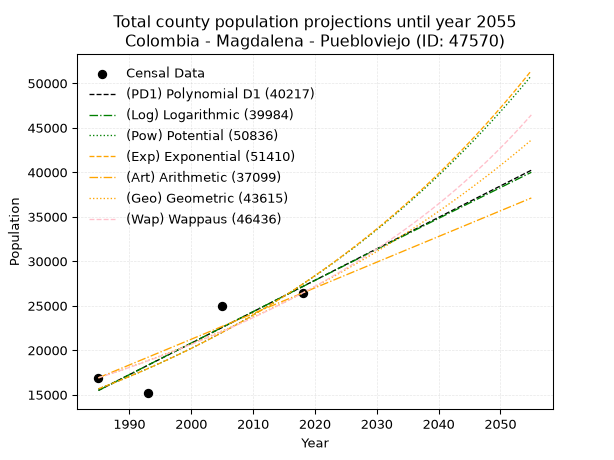
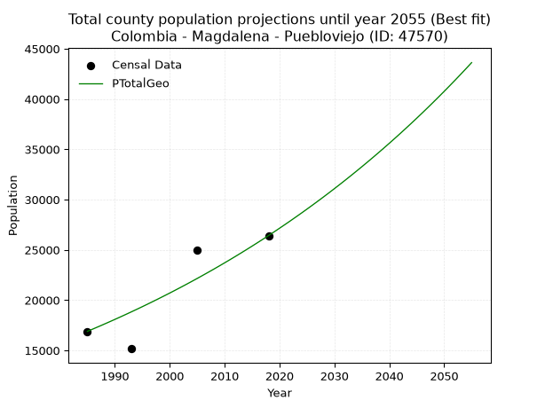
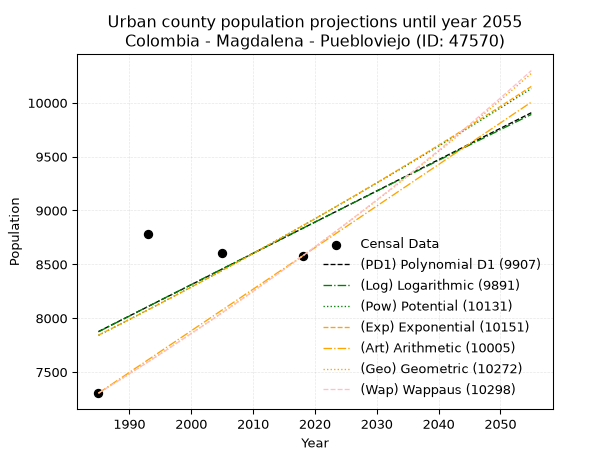
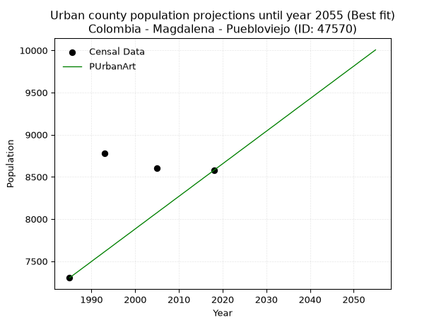
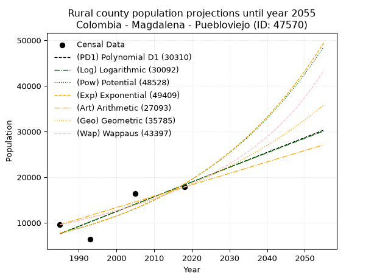
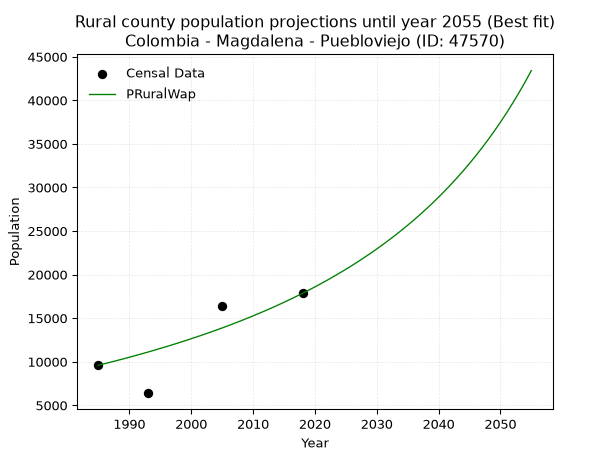

<div align="center">


</div>

# _“Population and Public Services Demand Projections (PPSD) until Year 2050 for Colombia - Magdalena - Puebloviejo (ID: 47570)”_
Keywords: `population` `public-service` `projection` `lineal` `polynomial` `logarithmic` `potential` `exponential` `arithmetic` `geometric` `wappaus` `dane` `colombia` `south-america`

PPSD are analytical estimates used by governments and planners to anticipate future changes in population size, age distribution, and the resulting community needs for utilities, healthcare, education, and infrastructure as sizing future water treatment facilities, electrical grids, and road networks based on spatial growth.

> **General running parameters**: • app_version: _v20260806_. • Python version: _3.14.7_. • Pandas version: _3.0.5_. • NumPy version: _2.5.1_. • Creates, save and include plots into reports (create_plot): _False_. • Projection until year: _2050_. • Process polynomial degree 2 and up: _False_. • Process Wappaus: _True_. • Process Wappaus: _True_. • Set negative values to zero: _True_. • Set infinite values to zero: _True_. • Drop dataset notes: _True_. 
<div align="center">

Dynamic map: [:earth_americas:Google](http://maps.google.com/maps?q=10.99476615,-74.2825295) [:earth_americas:OSM](https://www.openstreetmap.org/#map=18/10.99476615/-74.2825295&layers=P) [:earth_americas:Bing](https://www.bing.com/maps?cp=10.99476615~-74.2825295&lvl=18) [:earth_americas:Apple](https://maps.apple.com/frame?center=10.99476615%2C-74.2825295&span=0.003%2C0.006)

</div>


<div align="center">

```geojson
{
  "type": "Feature",
  "geometry": {
    "type": "Point", 
    "coordinates": [-74.2825295, 10.99476615]
  }, 
  "properties": {
    "Name": "Colombia - Magdalena - Puebloviejo (ID: 47570)"
  }
}
```

</div>


## 0. Census Data (4 records)

Census data are official statistics collected by a government about the people and housing in a country. They usually include counts of total population, age, sex, race, income, education, and jobs.

📅Global census file: [Population.xlsx](../data/Population.xlsx)

| Source   |   Year |   CountryID | CountryName   |   StateID | StateName   |   CountyID | CountyName   |   PTotal |   PUrban |   PRural |
|:---------|-------:|------------:|:--------------|----------:|:------------|-----------:|:-------------|---------:|---------:|---------:|
| DANE     |   1985 |          57 | Colombia      |        47 | Magdalena   |      47570 | Puebloviejo  |    16894 |     7303 |     9591 |
| DANE     |   1993 |          57 | Colombia      |        47 | Magdalena   |      47570 | Puebloviejo  |    15164 |     8783 |     6381 |
| DANE     |   2005 |          57 | Colombia      |        47 | Magdalena   |      47570 | Puebloviejo  |    24994 |     8607 |    16387 |
| DANE     |   2018 |          57 | Colombia      |        47 | Magdalena   |      47570 | Puebloviejo  |    26419 |     8577 |    17842 |

> 🔥Some records could had specific notes about the registered values or the corresponding urban or rural distribution.

## 1. Total

### 1.1. Coefficients and Parameters

* (PD1) Polynomial Deg 1: 353.4102769971883, -686041.1565636259 (lineal)
* (Log) Logarithmic: 707397.8021693232, -5356068.613019248
* (Pow) Potential: 34.006213666715745, -107.95001564714768
* (Exp) Exponential: 0.016989455211714577, 3.534896454854493e-11
* (Art) Arithmetic: Year diff. 2018 - 1985 = 33, Population diff. 26419 - 16894 = 9525, Annual growth = 288.6363636363636
* (Geo) Geometric: Year diff. 2018 - 1985 = 33, Population diff. 26419 - 16894 = 9525, Annual growth % = 0.013641446894270715
* (Wap) Wappaus: i = 1.3327932197555636, Condition values only valid for < 200)

<sub>
Wappaus condition values: ['0.00', '1.33', '2.67', '4.00', '5.33', '6.66', '8.00', '9.33', '10.66', '12.00', '13.33', '14.66', '15.99', '17.33', '18.66', '19.99', '21.32', '22.66', '23.99', '25.32', '26.66', '27.99', '29.32', '30.65', '31.99', '33.32', '34.65', '35.99', '37.32', '38.65', '39.98', '41.32', '42.65', '43.98', '45.31', '46.65', '47.98', '49.31', '50.65', '51.98', '53.31', '54.64', '55.98', '57.31', '58.64', '59.98', '61.31', '62.64', '63.97', '65.31', '66.64', '67.97', '69.31', '70.64', '71.97', '73.30', '74.64', '75.97', '77.30', '78.63', '79.97', '81.30', '82.63', '83.97', '85.30', '86.63']
</sub>


### 1.2. Projected Dataset

|   Year |   CountyID |   PTotalPD1 |   PTotalLog |   PTotalPow |   PTotalExp |   PTotalArt |   PTotalGeo |   PTotalWap |
|-------:|-----------:|------------:|------------:|------------:|------------:|------------:|------------:|------------:|
|   1985 |      47570 |       15478 |       15468 |       15643 |       15651 |       16894 |       16894 |       16894 |
|   1986 |      47570 |       15832 |       15824 |       15914 |       15920 |       17183 |       17124 |       17121 |
|   1987 |      47570 |       16185 |       16180 |       16188 |       16192 |       17471 |       17358 |       17350 |
|   1988 |      47570 |       16538 |       16536 |       16468 |       16470 |       17760 |       17595 |       17583 |
|   1989 |      47570 |       16892 |       16892 |       16752 |       16752 |       18049 |       17835 |       17819 |
|   1990 |      47570 |       17245 |       17247 |       17041 |       17039 |       18337 |       18078 |       18059 |
|   1991 |      47570 |       17599 |       17603 |       17334 |       17331 |       18626 |       18325 |       18301 |
|   1992 |      47570 |       17952 |       17958 |       17633 |       17628 |       18914 |       18575 |       18547 |
|   1993 |      47570 |       18306 |       18313 |       17936 |       17930 |       19203 |       18828 |       18797 |
|   1994 |      47570 |       18659 |       18668 |       18245 |       18237 |       19492 |       19085 |       19050 |
|   1995 |      47570 |       19012 |       19022 |       18559 |       18550 |       19780 |       19345 |       19306 |
|   1996 |      47570 |       19366 |       19377 |       18878 |       18868 |       20069 |       19609 |       19567 |
|   1997 |      47570 |       19719 |       19731 |       19202 |       19191 |       20358 |       19877 |       19831 |
|   1998 |      47570 |       20073 |       20085 |       19532 |       19520 |       20646 |       20148 |       20099 |
|   1999 |      47570 |       20426 |       20439 |       19867 |       19854 |       20935 |       20423 |       20371 |
|   2000 |      47570 |       20779 |       20793 |       20208 |       20194 |       21224 |       20701 |       20647 |
|   2001 |      47570 |       21133 |       21147 |       20554 |       20540 |       21512 |       20984 |       20927 |
|   2002 |      47570 |       21486 |       21500 |       20906 |       20892 |       21801 |       21270 |       21211 |
|   2003 |      47570 |       21840 |       21853 |       21264 |       21250 |       22089 |       21560 |       21499 |
|   2004 |      47570 |       22193 |       22206 |       21628 |       21614 |       22378 |       21854 |       21792 |
|   2005 |      47570 |       22546 |       22559 |       21998 |       21985 |       22667 |       22152 |       22090 |
|   2006 |      47570 |       22900 |       22912 |       22375 |       22361 |       22955 |       22455 |       22392 |
|   2007 |      47570 |       23253 |       23265 |       22757 |       22745 |       23244 |       22761 |       22699 |
|   2008 |      47570 |       23607 |       23617 |       23146 |       23134 |       23533 |       23071 |       23010 |
|   2009 |      47570 |       23960 |       23969 |       23541 |       23531 |       23821 |       23386 |       23327 |
|   2010 |      47570 |       24314 |       24321 |       23943 |       23934 |       24110 |       23705 |       23648 |
|   2011 |      47570 |       24667 |       24673 |       24351 |       24344 |       24399 |       24028 |       23975 |
|   2012 |      47570 |       25020 |       25025 |       24766 |       24761 |       24687 |       24356 |       24307 |
|   2013 |      47570 |       25374 |       25376 |       25188 |       25185 |       24976 |       24688 |       24645 |
|   2014 |      47570 |       25727 |       25728 |       25617 |       25617 |       25264 |       25025 |       24988 |
|   2015 |      47570 |       26081 |       26079 |       26054 |       26056 |       25553 |       25367 |       25337 |
|   2016 |      47570 |       26434 |       26430 |       26497 |       26502 |       25842 |       25713 |       25691 |
|   2017 |      47570 |       26787 |       26781 |       26948 |       26956 |       26130 |       26063 |       26052 |
|   2018 |      47570 |       27141 |       27131 |       27406 |       27418 |       26419 |       26419 |       26419 |
|   2019 |      47570 |       27494 |       27482 |       27871 |       27888 |       26708 |       26779 |       26792 |
|   2020 |      47570 |       27848 |       27832 |       28345 |       28366 |       26996 |       27145 |       27172 |
|   2021 |      47570 |       28201 |       28182 |       28826 |       28852 |       27285 |       27515 |       27558 |
|   2022 |      47570 |       28554 |       28532 |       29315 |       29346 |       27574 |       27890 |       27951 |
|   2023 |      47570 |       28908 |       28882 |       29812 |       29849 |       27862 |       28271 |       28352 |
|   2024 |      47570 |       29261 |       29231 |       30317 |       30361 |       28151 |       28656 |       28759 |
|   2025 |      47570 |       29615 |       29581 |       30830 |       30881 |       28439 |       29047 |       29174 |
|   2026 |      47570 |       29968 |       29930 |       31352 |       31410 |       28728 |       29444 |       29596 |
|   2027 |      47570 |       30321 |       30279 |       31883 |       31948 |       29017 |       29845 |       30026 |
|   2028 |      47570 |       30675 |       30628 |       32422 |       32496 |       29305 |       30252 |       30465 |
|   2029 |      47570 |       31028 |       30977 |       32970 |       33053 |       29594 |       30665 |       30911 |
|   2030 |      47570 |       31382 |       31325 |       33528 |       33619 |       29883 |       31083 |       31366 |
|   2031 |      47570 |       31735 |       31674 |       34094 |       34195 |       30171 |       31507 |       31830 |
|   2032 |      47570 |       32089 |       32022 |       34669 |       34781 |       30460 |       31937 |       32303 |
|   2033 |      47570 |       32442 |       32370 |       35254 |       35377 |       30749 |       32373 |       32785 |
|   2034 |      47570 |       32795 |       32718 |       35849 |       35983 |       31037 |       32815 |       33276 |
|   2035 |      47570 |       33149 |       33065 |       36453 |       36599 |       31326 |       33262 |       33778 |
|   2036 |      47570 |       33502 |       33413 |       37067 |       37227 |       31614 |       33716 |       34289 |
|   2037 |      47570 |       33856 |       33760 |       37691 |       37864 |       31903 |       34176 |       34811 |
|   2038 |      47570 |       34209 |       34108 |       38326 |       38513 |       32192 |       34642 |       35344 |
|   2039 |      47570 |       34562 |       34455 |       38970 |       39173 |       32480 |       35115 |       35888 |
|   2040 |      47570 |       34916 |       34801 |       39626 |       39844 |       32769 |       35594 |       36443 |
|   2041 |      47570 |       35269 |       35148 |       40291 |       40527 |       33058 |       36079 |       37010 |
|   2042 |      47570 |       35623 |       35495 |       40968 |       41222 |       33346 |       36571 |       37589 |
|   2043 |      47570 |       35976 |       35841 |       41656 |       41928 |       33635 |       37070 |       38181 |
|   2044 |      47570 |       36329 |       36187 |       42355 |       42646 |       33924 |       37576 |       38786 |
|   2045 |      47570 |       36683 |       36533 |       43065 |       43377 |       34212 |       38089 |       39404 |
|   2046 |      47570 |       37036 |       36879 |       43787 |       44120 |       34501 |       38608 |       40036 |
|   2047 |      47570 |       37390 |       37225 |       44521 |       44876 |       34789 |       39135 |       40683 |
|   2048 |      47570 |       37743 |       37570 |       45267 |       45645 |       35078 |       39669 |       41344 |
|   2049 |      47570 |       38097 |       37915 |       46024 |       46427 |       35367 |       40210 |       42021 |
|   2050 |      47570 |       38450 |       38261 |       46794 |       47223 |       35655 |       40758 |       42713 |
<div align="center">

</img>

</div>


### 1.3. Best fit with absolute and relative error (%)

Relative error puts that difference into context by dividing the absolute error by the true value, creating a unitless ratio or percentage that shows the scale of the mistake.

Absolute and relative error

|   Year | Source   |   CountryID | CountryName   |   StateID | StateName   |   CountyID_x | CountyName   |   PTotal |   PUrban |   PRural |   CountyID_y |   PTotalPD1 |   PTotalLog |   PTotalPow |   PTotalExp |   PTotalArt |   PTotalGeo |   PTotalWap |   PTotalPD1AbsError |   PTotalLogAbsError |   PTotalPowAbsError |   PTotalExpAbsError |   PTotalArtAbsError |   PTotalGeoAbsError |   PTotalWapAbsError |   PTotalPD1RelError |   PTotalLogRelError |   PTotalPowRelError |   PTotalExpRelError |   PTotalArtRelError |   PTotalGeoRelError |   PTotalWapRelError |
|-------:|:---------|------------:|:--------------|----------:|:------------|-------------:|:-------------|---------:|---------:|---------:|-------------:|------------:|------------:|------------:|------------:|------------:|------------:|------------:|--------------------:|--------------------:|--------------------:|--------------------:|--------------------:|--------------------:|--------------------:|--------------------:|--------------------:|--------------------:|--------------------:|--------------------:|--------------------:|--------------------:|
|   1985 | DANE     |          57 | Colombia      |        47 | Magdalena   |        47570 | Puebloviejo  |    16894 |     7303 |     9591 |        47570 |       15478 |       15468 |       15643 |       15651 |       16894 |       16894 |       16894 |                1416 |                1426 |                1251 |                1243 |                   0 |                   0 |                   0 |             8.38167 |             8.44087 |             7.405   |             7.35764 |             0       |              0      |              0      |
|   1993 | DANE     |          57 | Colombia      |        47 | Magdalena   |        47570 | Puebloviejo  |    15164 |     8783 |     6381 |        47570 |       18306 |       18313 |       17936 |       17930 |       19203 |       18828 |       18797 |                3142 |                3149 |                2772 |                2766 |                4039 |                3664 |                3633 |            20.7201  |            20.7663  |            18.2801  |            18.2406  |            26.6355  |             24.1625 |             23.9581 |
|   2005 | DANE     |          57 | Colombia      |        47 | Magdalena   |        47570 | Puebloviejo  |    24994 |     8607 |    16387 |        47570 |       22546 |       22559 |       21998 |       21985 |       22667 |       22152 |       22090 |                2448 |                2435 |                2996 |                3009 |                2327 |                2842 |                2904 |             9.79435 |             9.74234 |            11.9869  |            12.0389  |             9.31023 |             11.3707 |             11.6188 |
|   2018 | DANE     |          57 | Colombia      |        47 | Magdalena   |        47570 | Puebloviejo  |    26419 |     8577 |    17842 |        47570 |       27141 |       27131 |       27406 |       27418 |       26419 |       26419 |       26419 |                 722 |                 712 |                 987 |                 999 |                   0 |                   0 |                   0 |             2.73288 |             2.69503 |             3.73595 |             3.78137 |             0       |              0      |              0      |

Relative error mean

| Method    |   RelError | Best   |
|:----------|-----------:|:-------|
| PTotalPD1 |   10.4073  |        |
| PTotalLog |   10.4111  |        |
| PTotalPow |   10.352   |        |
| PTotalExp |   10.3546  |        |
| PTotalArt |    8.98642 |        |
| PTotalGeo |    8.8833  | True   |
| PTotalWap |    8.89421 |        |

💙Best method: _**PTotalGeo**_
<div align="center">

</img>

</div>


### 1.4. Fresh water supply demand in liters per capita per day (lpcd)

The fresh water supply demand typically ranges from 100 to 300 liters per capita per day (lpcd) for standard domestic and municipal planning, though absolute survival minimums set by the World Health Organization are as low as 7.5 to 20 liters per day, and total consumption in high-income nations can exceed 400 liters.

> `CZ`: Level in meters above the sea level (masl).<br> `WS`: Fresh water supply demand in liters per capita per day (lpcd or l/h/d).<br> `WSAll`: Zonal fresh water supply demand in liters per second (l/s).<br> `A`: Zonal area in square meters.

Reference values (RAS Colombia)

|    CZ |   WS |
|------:|-----:|
|  1000 |  120 |
|  2000 |  130 |
| 99999 |  140 |

County shapefile geometry properties and water supply values

|   CountyID |      ATotal |   CZTotal |   WSTotal |
|-----------:|------------:|----------:|----------:|
|      47570 | 6.79111e+08 |   2.65132 |       120 |

Projected values for best method: PTotalGeo

|   CountyID |   Year |   PTotalGeo |   WSTotal |   WSTotalAll |
|-----------:|-------:|------------:|----------:|-------------:|
|      47570 |   1985 |       16894 |       120 |      23.4639 |
|      47570 |   1986 |       17124 |       120 |      23.7833 |
|      47570 |   1987 |       17358 |       120 |      24.1083 |
|      47570 |   1988 |       17595 |       120 |      24.4375 |
|      47570 |   1989 |       17835 |       120 |      24.7708 |
|      47570 |   1990 |       18078 |       120 |      25.1083 |
|      47570 |   1991 |       18325 |       120 |      25.4514 |
|      47570 |   1992 |       18575 |       120 |      25.7986 |
|      47570 |   1993 |       18828 |       120 |      26.15   |
|      47570 |   1994 |       19085 |       120 |      26.5069 |
|      47570 |   1995 |       19345 |       120 |      26.8681 |
|      47570 |   1996 |       19609 |       120 |      27.2347 |
|      47570 |   1997 |       19877 |       120 |      27.6069 |
|      47570 |   1998 |       20148 |       120 |      27.9833 |
|      47570 |   1999 |       20423 |       120 |      28.3653 |
|      47570 |   2000 |       20701 |       120 |      28.7514 |
|      47570 |   2001 |       20984 |       120 |      29.1444 |
|      47570 |   2002 |       21270 |       120 |      29.5417 |
|      47570 |   2003 |       21560 |       120 |      29.9444 |
|      47570 |   2004 |       21854 |       120 |      30.3528 |
|      47570 |   2005 |       22152 |       120 |      30.7667 |
|      47570 |   2006 |       22455 |       120 |      31.1875 |
|      47570 |   2007 |       22761 |       120 |      31.6125 |
|      47570 |   2008 |       23071 |       120 |      32.0431 |
|      47570 |   2009 |       23386 |       120 |      32.4806 |
|      47570 |   2010 |       23705 |       120 |      32.9236 |
|      47570 |   2011 |       24028 |       120 |      33.3722 |
|      47570 |   2012 |       24356 |       120 |      33.8278 |
|      47570 |   2013 |       24688 |       120 |      34.2889 |
|      47570 |   2014 |       25025 |       120 |      34.7569 |
|      47570 |   2015 |       25367 |       120 |      35.2319 |
|      47570 |   2016 |       25713 |       120 |      35.7125 |
|      47570 |   2017 |       26063 |       120 |      36.1986 |
|      47570 |   2018 |       26419 |       120 |      36.6931 |
|      47570 |   2019 |       26779 |       120 |      37.1931 |
|      47570 |   2020 |       27145 |       120 |      37.7014 |
|      47570 |   2021 |       27515 |       120 |      38.2153 |
|      47570 |   2022 |       27890 |       120 |      38.7361 |
|      47570 |   2023 |       28271 |       120 |      39.2653 |
|      47570 |   2024 |       28656 |       120 |      39.8    |
|      47570 |   2025 |       29047 |       120 |      40.3431 |
|      47570 |   2026 |       29444 |       120 |      40.8944 |
|      47570 |   2027 |       29845 |       120 |      41.4514 |
|      47570 |   2028 |       30252 |       120 |      42.0167 |
|      47570 |   2029 |       30665 |       120 |      42.5903 |
|      47570 |   2030 |       31083 |       120 |      43.1708 |
|      47570 |   2031 |       31507 |       120 |      43.7597 |
|      47570 |   2032 |       31937 |       120 |      44.3569 |
|      47570 |   2033 |       32373 |       120 |      44.9625 |
|      47570 |   2034 |       32815 |       120 |      45.5764 |
|      47570 |   2035 |       33262 |       120 |      46.1972 |
|      47570 |   2036 |       33716 |       120 |      46.8278 |
|      47570 |   2037 |       34176 |       120 |      47.4667 |
|      47570 |   2038 |       34642 |       120 |      48.1139 |
|      47570 |   2039 |       35115 |       120 |      48.7708 |
|      47570 |   2040 |       35594 |       120 |      49.4361 |
|      47570 |   2041 |       36079 |       120 |      50.1097 |
|      47570 |   2042 |       36571 |       120 |      50.7931 |
|      47570 |   2043 |       37070 |       120 |      51.4861 |
|      47570 |   2044 |       37576 |       120 |      52.1889 |
|      47570 |   2045 |       38089 |       120 |      52.9014 |
|      47570 |   2046 |       38608 |       120 |      53.6222 |
|      47570 |   2047 |       39135 |       120 |      54.3542 |
|      47570 |   2048 |       39669 |       120 |      55.0958 |
|      47570 |   2049 |       40210 |       120 |      55.8472 |
|      47570 |   2050 |       40758 |       120 |      56.6083 |

## 2. Urban

### 2.1. Coefficients and Parameters

* (PD1) Polynomial Deg 1: 29.028502609393804, -49746.76234443996 (lineal)
* (Log) Logarithmic: 58244.54198626895, -434399.7303800974
* (Pow) Potential: 7.399515158327859, -20.50752784677695
* (Exp) Exponential: 0.003687995759227912, 5.188956321844027
* (Art) Arithmetic: Year diff. 2018 - 1985 = 33, Population diff. 8577 - 7303 = 1274, Annual growth = 38.60606060606061
* (Geo) Geometric: Year diff. 2018 - 1985 = 33, Population diff. 8577 - 7303 = 1274, Annual growth % = 0.004884587235109317
* (Wap) Wappaus: i = 0.48622242576902525, Condition values only valid for < 200)

<sub>
Wappaus condition values: ['0.00', '0.49', '0.97', '1.46', '1.94', '2.43', '2.92', '3.40', '3.89', '4.38', '4.86', '5.35', '5.83', '6.32', '6.81', '7.29', '7.78', '8.27', '8.75', '9.24', '9.72', '10.21', '10.70', '11.18', '11.67', '12.16', '12.64', '13.13', '13.61', '14.10', '14.59', '15.07', '15.56', '16.05', '16.53', '17.02', '17.50', '17.99', '18.48', '18.96', '19.45', '19.94', '20.42', '20.91', '21.39', '21.88', '22.37', '22.85', '23.34', '23.82', '24.31', '24.80', '25.28', '25.77', '26.26', '26.74', '27.23', '27.71', '28.20', '28.69', '29.17', '29.66', '30.15', '30.63', '31.12', '31.60']
</sub>


### 2.2. Projected Dataset

|   Year |   CountyID |   PUrbanPD1 |   PUrbanLog |   PUrbanPow |   PUrbanExp |   PUrbanArt |   PUrbanGeo |   PUrbanWap |
|-------:|-----------:|------------:|------------:|------------:|------------:|------------:|------------:|------------:|
|   1985 |      47570 |        7875 |        7873 |        7840 |        7842 |        7303 |        7303 |        7303 |
|   1986 |      47570 |        7904 |        7902 |        7869 |        7871 |        7342 |        7339 |        7339 |
|   1987 |      47570 |        7933 |        7932 |        7898 |        7900 |        7380 |        7375 |        7374 |
|   1988 |      47570 |        7962 |        7961 |        7928 |        7929 |        7419 |        7411 |        7410 |
|   1989 |      47570 |        7991 |        7990 |        7957 |        7958 |        7457 |        7447 |        7446 |
|   1990 |      47570 |        8020 |        8019 |        7987 |        7988 |        7496 |        7483 |        7483 |
|   1991 |      47570 |        8049 |        8049 |        8017 |        8017 |        7535 |        7520 |        7519 |
|   1992 |      47570 |        8078 |        8078 |        8047 |        8047 |        7573 |        7556 |        7556 |
|   1993 |      47570 |        8107 |        8107 |        8077 |        8076 |        7612 |        7593 |        7593 |
|   1994 |      47570 |        8136 |        8136 |        8107 |        8106 |        7650 |        7630 |        7630 |
|   1995 |      47570 |        8165 |        8166 |        8137 |        8136 |        7689 |        7668 |        7667 |
|   1996 |      47570 |        8194 |        8195 |        8167 |        8166 |        7728 |        7705 |        7704 |
|   1997 |      47570 |        8223 |        8224 |        8197 |        8196 |        7766 |        7743 |        7742 |
|   1998 |      47570 |        8252 |        8253 |        8228 |        8227 |        7805 |        7781 |        7780 |
|   1999 |      47570 |        8281 |        8282 |        8258 |        8257 |        7843 |        7819 |        7818 |
|   2000 |      47570 |        8310 |        8311 |        8289 |        8288 |        7882 |        7857 |        7856 |
|   2001 |      47570 |        8339 |        8340 |        8320 |        8318 |        7921 |        7895 |        7894 |
|   2002 |      47570 |        8368 |        8370 |        8350 |        8349 |        7959 |        7934 |        7933 |
|   2003 |      47570 |        8397 |        8399 |        8381 |        8380 |        7998 |        7972 |        7971 |
|   2004 |      47570 |        8426 |        8428 |        8412 |        8411 |        8037 |        8011 |        8010 |
|   2005 |      47570 |        8455 |        8457 |        8443 |        8442 |        8075 |        8051 |        8049 |
|   2006 |      47570 |        8484 |        8486 |        8475 |        8473 |        8114 |        8090 |        8089 |
|   2007 |      47570 |        8513 |        8515 |        8506 |        8504 |        8152 |        8129 |        8128 |
|   2008 |      47570 |        8542 |        8544 |        8537 |        8536 |        8191 |        8169 |        8168 |
|   2009 |      47570 |        8571 |        8573 |        8569 |        8567 |        8230 |        8209 |        8208 |
|   2010 |      47570 |        8601 |        8602 |        8600 |        8599 |        8268 |        8249 |        8248 |
|   2011 |      47570 |        8630 |        8631 |        8632 |        8631 |        8307 |        8289 |        8289 |
|   2012 |      47570 |        8659 |        8660 |        8664 |        8663 |        8345 |        8330 |        8329 |
|   2013 |      47570 |        8688 |        8689 |        8696 |        8695 |        8384 |        8371 |        8370 |
|   2014 |      47570 |        8717 |        8718 |        8728 |        8727 |        8423 |        8411 |        8411 |
|   2015 |      47570 |        8746 |        8747 |        8760 |        8759 |        8461 |        8453 |        8452 |
|   2016 |      47570 |        8775 |        8775 |        8792 |        8791 |        8500 |        8494 |        8493 |
|   2017 |      47570 |        8804 |        8804 |        8825 |        8824 |        8538 |        8535 |        8535 |
|   2018 |      47570 |        8833 |        8833 |        8857 |        8857 |        8577 |        8577 |        8577 |
|   2019 |      47570 |        8862 |        8862 |        8890 |        8889 |        8616 |        8619 |        8619 |
|   2020 |      47570 |        8891 |        8891 |        8922 |        8922 |        8654 |        8661 |        8661 |
|   2021 |      47570 |        8920 |        8920 |        8955 |        8955 |        8693 |        8703 |        8704 |
|   2022 |      47570 |        8949 |        8949 |        8988 |        8988 |        8731 |        8746 |        8747 |
|   2023 |      47570 |        8978 |        8977 |        9021 |        9021 |        8770 |        8789 |        8790 |
|   2024 |      47570 |        9007 |        9006 |        9054 |        9055 |        8809 |        8831 |        8833 |
|   2025 |      47570 |        9036 |        9035 |        9087 |        9088 |        8847 |        8875 |        8876 |
|   2026 |      47570 |        9065 |        9064 |        9120 |        9122 |        8886 |        8918 |        8920 |
|   2027 |      47570 |        9094 |        9092 |        9153 |        9155 |        8924 |        8962 |        8964 |
|   2028 |      47570 |        9123 |        9121 |        9187 |        9189 |        8963 |        9005 |        9008 |
|   2029 |      47570 |        9152 |        9150 |        9221 |        9223 |        9002 |        9049 |        9053 |
|   2030 |      47570 |        9181 |        9179 |        9254 |        9257 |        9040 |        9093 |        9097 |
|   2031 |      47570 |        9210 |        9207 |        9288 |        9291 |        9079 |        9138 |        9142 |
|   2032 |      47570 |        9239 |        9236 |        9322 |        9326 |        9117 |        9183 |        9187 |
|   2033 |      47570 |        9268 |        9265 |        9356 |        9360 |        9156 |        9227 |        9233 |
|   2034 |      47570 |        9297 |        9293 |        9390 |        9395 |        9195 |        9272 |        9278 |
|   2035 |      47570 |        9326 |        9322 |        9424 |        9430 |        9233 |        9318 |        9324 |
|   2036 |      47570 |        9355 |        9350 |        9459 |        9464 |        9272 |        9363 |        9370 |
|   2037 |      47570 |        9384 |        9379 |        9493 |        9499 |        9311 |        9409 |        9417 |
|   2038 |      47570 |        9413 |        9408 |        9527 |        9534 |        9349 |        9455 |        9463 |
|   2039 |      47570 |        9442 |        9436 |        9562 |        9570 |        9388 |        9501 |        9510 |
|   2040 |      47570 |        9471 |        9465 |        9597 |        9605 |        9426 |        9548 |        9557 |
|   2041 |      47570 |        9500 |        9493 |        9632 |        9641 |        9465 |        9594 |        9605 |
|   2042 |      47570 |        9529 |        9522 |        9667 |        9676 |        9504 |        9641 |        9653 |
|   2043 |      47570 |        9558 |        9550 |        9702 |        9712 |        9542 |        9688 |        9701 |
|   2044 |      47570 |        9587 |        9579 |        9737 |        9748 |        9581 |        9735 |        9749 |
|   2045 |      47570 |        9617 |        9607 |        9772 |        9784 |        9619 |        9783 |        9797 |
|   2046 |      47570 |        9646 |        9636 |        9808 |        9820 |        9658 |        9831 |        9846 |
|   2047 |      47570 |        9675 |        9664 |        9843 |        9856 |        9697 |        9879 |        9895 |
|   2048 |      47570 |        9704 |        9693 |        9879 |        9893 |        9735 |        9927 |        9945 |
|   2049 |      47570 |        9733 |        9721 |        9915 |        9929 |        9774 |        9976 |        9994 |
|   2050 |      47570 |        9762 |        9750 |        9951 |        9966 |        9812 |       10024 |       10044 |
<div align="center">

</img>

</div>


### 2.3. Best fit with absolute and relative error (%)

Relative error puts that difference into context by dividing the absolute error by the true value, creating a unitless ratio or percentage that shows the scale of the mistake.

Absolute and relative error

|   Year | Source   |   CountryID | CountryName   |   StateID | StateName   |   CountyID_x | CountyName   |   PTotal |   PUrban |   PRural |   CountyID_y |   PUrbanPD1 |   PUrbanLog |   PUrbanPow |   PUrbanExp |   PUrbanArt |   PUrbanGeo |   PUrbanWap |   PUrbanPD1AbsError |   PUrbanLogAbsError |   PUrbanPowAbsError |   PUrbanExpAbsError |   PUrbanArtAbsError |   PUrbanGeoAbsError |   PUrbanWapAbsError |   PUrbanPD1RelError |   PUrbanLogRelError |   PUrbanPowRelError |   PUrbanExpRelError |   PUrbanArtRelError |   PUrbanGeoRelError |   PUrbanWapRelError |
|-------:|:---------|------------:|:--------------|----------:|:------------|-------------:|:-------------|---------:|---------:|---------:|-------------:|------------:|------------:|------------:|------------:|------------:|------------:|------------:|--------------------:|--------------------:|--------------------:|--------------------:|--------------------:|--------------------:|--------------------:|--------------------:|--------------------:|--------------------:|--------------------:|--------------------:|--------------------:|--------------------:|
|   1985 | DANE     |          57 | Colombia      |        47 | Magdalena   |        47570 | Puebloviejo  |    16894 |     7303 |     9591 |        47570 |        7875 |        7873 |        7840 |        7842 |        7303 |        7303 |        7303 |                 572 |                 570 |                 537 |                 539 |                   0 |                   0 |                   0 |             7.8324  |             7.80501 |             7.35314 |             7.38053 |             0       |             0       |              0      |
|   1993 | DANE     |          57 | Colombia      |        47 | Magdalena   |        47570 | Puebloviejo  |    15164 |     8783 |     6381 |        47570 |        8107 |        8107 |        8077 |        8076 |        7612 |        7593 |        7593 |                 676 |                 676 |                 706 |                 707 |                1171 |                1190 |                1190 |             7.69669 |             7.69669 |             8.03826 |             8.04964 |            13.3326  |            13.5489  |             13.5489 |
|   2005 | DANE     |          57 | Colombia      |        47 | Magdalena   |        47570 | Puebloviejo  |    24994 |     8607 |    16387 |        47570 |        8455 |        8457 |        8443 |        8442 |        8075 |        8051 |        8049 |                 152 |                 150 |                 164 |                 165 |                 532 |                 556 |                 558 |             1.766   |             1.74277 |             1.90543 |             1.91704 |             6.18102 |             6.45986 |              6.4831 |
|   2018 | DANE     |          57 | Colombia      |        47 | Magdalena   |        47570 | Puebloviejo  |    26419 |     8577 |    17842 |        47570 |        8833 |        8833 |        8857 |        8857 |        8577 |        8577 |        8577 |                 256 |                 256 |                 280 |                 280 |                   0 |                   0 |                   0 |             2.98473 |             2.98473 |             3.26454 |             3.26454 |             0       |             0       |              0      |

Relative error mean

| Method    |   RelError | Best   |
|:----------|-----------:|:-------|
| PUrbanPD1 |    5.06995 |        |
| PUrbanLog |    5.0573  |        |
| PUrbanPow |    5.14034 |        |
| PUrbanExp |    5.15294 |        |
| PUrbanArt |    4.8784  | True   |
| PUrbanGeo |    5.00219 |        |
| PUrbanWap |    5.008   |        |

💙Best method: _**PUrbanArt**_
<div align="center">

</img>

</div>


### 2.4. Fresh water supply demand in liters per capita per day (lpcd)

The fresh water supply demand typically ranges from 100 to 300 liters per capita per day (lpcd) for standard domestic and municipal planning, though absolute survival minimums set by the World Health Organization are as low as 7.5 to 20 liters per day, and total consumption in high-income nations can exceed 400 liters.

> `CZ`: Level in meters above the sea level (masl).<br> `WS`: Fresh water supply demand in liters per capita per day (lpcd or l/h/d).<br> `WSAll`: Zonal fresh water supply demand in liters per second (l/s).<br> `A`: Zonal area in square meters.

Reference values (RAS Colombia)

|    CZ |   WS |
|------:|-----:|
|  1000 |  120 |
|  2000 |  130 |
| 99999 |  140 |

County shapefile geometry properties and water supply values

|   CountyID |   AUrban |   CZUrban |   WSUrban |
|-----------:|---------:|----------:|----------:|
|      47570 |   690005 |   2.18915 |       120 |

Projected values for best method: PUrbanArt

|   CountyID |   Year |   PUrbanArt |   WSUrban |   WSUrbanAll |
|-----------:|-------:|------------:|----------:|-------------:|
|      47570 |   1985 |        7303 |       120 |      10.1431 |
|      47570 |   1986 |        7342 |       120 |      10.1972 |
|      47570 |   1987 |        7380 |       120 |      10.25   |
|      47570 |   1988 |        7419 |       120 |      10.3042 |
|      47570 |   1989 |        7457 |       120 |      10.3569 |
|      47570 |   1990 |        7496 |       120 |      10.4111 |
|      47570 |   1991 |        7535 |       120 |      10.4653 |
|      47570 |   1992 |        7573 |       120 |      10.5181 |
|      47570 |   1993 |        7612 |       120 |      10.5722 |
|      47570 |   1994 |        7650 |       120 |      10.625  |
|      47570 |   1995 |        7689 |       120 |      10.6792 |
|      47570 |   1996 |        7728 |       120 |      10.7333 |
|      47570 |   1997 |        7766 |       120 |      10.7861 |
|      47570 |   1998 |        7805 |       120 |      10.8403 |
|      47570 |   1999 |        7843 |       120 |      10.8931 |
|      47570 |   2000 |        7882 |       120 |      10.9472 |
|      47570 |   2001 |        7921 |       120 |      11.0014 |
|      47570 |   2002 |        7959 |       120 |      11.0542 |
|      47570 |   2003 |        7998 |       120 |      11.1083 |
|      47570 |   2004 |        8037 |       120 |      11.1625 |
|      47570 |   2005 |        8075 |       120 |      11.2153 |
|      47570 |   2006 |        8114 |       120 |      11.2694 |
|      47570 |   2007 |        8152 |       120 |      11.3222 |
|      47570 |   2008 |        8191 |       120 |      11.3764 |
|      47570 |   2009 |        8230 |       120 |      11.4306 |
|      47570 |   2010 |        8268 |       120 |      11.4833 |
|      47570 |   2011 |        8307 |       120 |      11.5375 |
|      47570 |   2012 |        8345 |       120 |      11.5903 |
|      47570 |   2013 |        8384 |       120 |      11.6444 |
|      47570 |   2014 |        8423 |       120 |      11.6986 |
|      47570 |   2015 |        8461 |       120 |      11.7514 |
|      47570 |   2016 |        8500 |       120 |      11.8056 |
|      47570 |   2017 |        8538 |       120 |      11.8583 |
|      47570 |   2018 |        8577 |       120 |      11.9125 |
|      47570 |   2019 |        8616 |       120 |      11.9667 |
|      47570 |   2020 |        8654 |       120 |      12.0194 |
|      47570 |   2021 |        8693 |       120 |      12.0736 |
|      47570 |   2022 |        8731 |       120 |      12.1264 |
|      47570 |   2023 |        8770 |       120 |      12.1806 |
|      47570 |   2024 |        8809 |       120 |      12.2347 |
|      47570 |   2025 |        8847 |       120 |      12.2875 |
|      47570 |   2026 |        8886 |       120 |      12.3417 |
|      47570 |   2027 |        8924 |       120 |      12.3944 |
|      47570 |   2028 |        8963 |       120 |      12.4486 |
|      47570 |   2029 |        9002 |       120 |      12.5028 |
|      47570 |   2030 |        9040 |       120 |      12.5556 |
|      47570 |   2031 |        9079 |       120 |      12.6097 |
|      47570 |   2032 |        9117 |       120 |      12.6625 |
|      47570 |   2033 |        9156 |       120 |      12.7167 |
|      47570 |   2034 |        9195 |       120 |      12.7708 |
|      47570 |   2035 |        9233 |       120 |      12.8236 |
|      47570 |   2036 |        9272 |       120 |      12.8778 |
|      47570 |   2037 |        9311 |       120 |      12.9319 |
|      47570 |   2038 |        9349 |       120 |      12.9847 |
|      47570 |   2039 |        9388 |       120 |      13.0389 |
|      47570 |   2040 |        9426 |       120 |      13.0917 |
|      47570 |   2041 |        9465 |       120 |      13.1458 |
|      47570 |   2042 |        9504 |       120 |      13.2    |
|      47570 |   2043 |        9542 |       120 |      13.2528 |
|      47570 |   2044 |        9581 |       120 |      13.3069 |
|      47570 |   2045 |        9619 |       120 |      13.3597 |
|      47570 |   2046 |        9658 |       120 |      13.4139 |
|      47570 |   2047 |        9697 |       120 |      13.4681 |
|      47570 |   2048 |        9735 |       120 |      13.5208 |
|      47570 |   2049 |        9774 |       120 |      13.575  |
|      47570 |   2050 |        9812 |       120 |      13.6278 |

## 3. Rural

### 3.1. Coefficients and Parameters

* (PD1) Polynomial Deg 1: 324.38177438779456, -636294.3942191862 (lineal)
* (Log) Logarithmic: 649153.2601830541, -4921668.88263915
* (Pow) Potential: 53.06907894388114, -171.12188029611482
* (Exp) Exponential: 0.026522258141881156, 1.0552456516536549e-19
* (Art) Arithmetic: Year diff. 2018 - 1985 = 33, Population diff. 17842 - 9591 = 8251, Annual growth = 250.03030303030303
* (Geo) Geometric: Year diff. 2018 - 1985 = 33, Population diff. 17842 - 9591 = 8251, Annual growth % = 0.01898802465287419
* (Wap) Wappaus: i = 1.8228433130193784, Condition values only valid for < 200)

<sub>
Wappaus condition values: ['0.00', '1.82', '3.65', '5.47', '7.29', '9.11', '10.94', '12.76', '14.58', '16.41', '18.23', '20.05', '21.87', '23.70', '25.52', '27.34', '29.17', '30.99', '32.81', '34.63', '36.46', '38.28', '40.10', '41.93', '43.75', '45.57', '47.39', '49.22', '51.04', '52.86', '54.69', '56.51', '58.33', '60.15', '61.98', '63.80', '65.62', '67.45', '69.27', '71.09', '72.91', '74.74', '76.56', '78.38', '80.21', '82.03', '83.85', '85.67', '87.50', '89.32', '91.14', '92.97', '94.79', '96.61', '98.43', '100.26', '102.08', '103.90', '105.72', '107.55', '109.37', '111.19', '113.02', '114.84', '116.66', '118.48']
</sub>


### 3.2. Projected Dataset

|   Year |   CountyID |   PRuralPD1 |   PRuralLog |   PRuralPow |   PRuralExp |   PRuralArt |   PRuralGeo |   PRuralWap |
|-------:|-----------:|------------:|------------:|------------:|------------:|------------:|------------:|------------:|
|   1985 |      47570 |        7603 |        7595 |        7713 |        7718 |        9591 |        9591 |        9591 |
|   1986 |      47570 |        7928 |        7922 |        7922 |        7926 |        9841 |        9773 |        9767 |
|   1987 |      47570 |        8252 |        8248 |        8137 |        8139 |       10091 |        9959 |        9947 |
|   1988 |      47570 |        8577 |        8575 |        8357 |        8357 |       10341 |       10148 |       10130 |
|   1989 |      47570 |        8901 |        8902 |        8583 |        8582 |       10591 |       10340 |       10317 |
|   1990 |      47570 |        9225 |        9228 |        8815 |        8813 |       10841 |       10537 |       10507 |
|   1991 |      47570 |        9550 |        9554 |        9053 |        9050 |       11091 |       10737 |       10701 |
|   1992 |      47570 |        9874 |        9880 |        9297 |        9293 |       11341 |       10941 |       10898 |
|   1993 |      47570 |       10198 |       10206 |        9548 |        9543 |       11591 |       11149 |       11100 |
|   1994 |      47570 |       10523 |       10531 |        9806 |        9799 |       11841 |       11360 |       11305 |
|   1995 |      47570 |       10847 |       10857 |       10070 |       10062 |       12091 |       11576 |       11515 |
|   1996 |      47570 |       11172 |       11182 |       10342 |       10333 |       12341 |       11796 |       11728 |
|   1997 |      47570 |       11496 |       11507 |       10620 |       10611 |       12591 |       12020 |       11947 |
|   1998 |      47570 |       11820 |       11832 |       10906 |       10896 |       12841 |       12248 |       12169 |
|   1999 |      47570 |       12145 |       12157 |       11200 |       11189 |       13091 |       12480 |       12397 |
|   2000 |      47570 |       12469 |       12482 |       11501 |       11489 |       13341 |       12717 |       12629 |
|   2001 |      47570 |       12794 |       12806 |       11810 |       11798 |       13591 |       12959 |       12866 |
|   2002 |      47570 |       13118 |       13131 |       12128 |       12115 |       13842 |       13205 |       13108 |
|   2003 |      47570 |       13442 |       13455 |       12453 |       12441 |       14092 |       13456 |       13356 |
|   2004 |      47570 |       13767 |       13779 |       12788 |       12775 |       14342 |       13711 |       13608 |
|   2005 |      47570 |       14091 |       14103 |       13131 |       13119 |       14592 |       13972 |       13867 |
|   2006 |      47570 |       14415 |       14426 |       13483 |       13471 |       14842 |       14237 |       14131 |
|   2007 |      47570 |       14740 |       14750 |       13844 |       13833 |       15092 |       14507 |       14402 |
|   2008 |      47570 |       15064 |       15073 |       14215 |       14205 |       15342 |       14783 |       14679 |
|   2009 |      47570 |       15389 |       15396 |       14596 |       14587 |       15592 |       15063 |       14962 |
|   2010 |      47570 |       15713 |       15719 |       14986 |       14979 |       15842 |       15349 |       15251 |
|   2011 |      47570 |       16037 |       16042 |       15387 |       15381 |       16092 |       15641 |       15548 |
|   2012 |      47570 |       16362 |       16365 |       15798 |       15795 |       16342 |       15938 |       15852 |
|   2013 |      47570 |       16686 |       16688 |       16221 |       16219 |       16592 |       16240 |       16163 |
|   2014 |      47570 |       17010 |       17010 |       16654 |       16655 |       16842 |       16549 |       16483 |
|   2015 |      47570 |       17335 |       17332 |       17098 |       17103 |       17092 |       16863 |       16810 |
|   2016 |      47570 |       17659 |       17654 |       17554 |       17563 |       17342 |       17183 |       17145 |
|   2017 |      47570 |       17984 |       17976 |       18023 |       18035 |       17592 |       17510 |       17489 |
|   2018 |      47570 |       18308 |       18298 |       18503 |       18519 |       17842 |       17842 |       17842 |
|   2019 |      47570 |       18632 |       18620 |       18996 |       19017 |       18092 |       18181 |       18204 |
|   2020 |      47570 |       18957 |       18941 |       19502 |       19528 |       18342 |       18526 |       18576 |
|   2021 |      47570 |       19281 |       19262 |       20021 |       20053 |       18592 |       18878 |       18958 |
|   2022 |      47570 |       19606 |       19583 |       20553 |       20592 |       18842 |       19236 |       19351 |
|   2023 |      47570 |       19930 |       19904 |       21100 |       21146 |       19092 |       19601 |       19755 |
|   2024 |      47570 |       20254 |       20225 |       21660 |       21714 |       19342 |       19974 |       20170 |
|   2025 |      47570 |       20579 |       20546 |       22236 |       22297 |       19592 |       20353 |       20596 |
|   2026 |      47570 |       20903 |       20866 |       22826 |       22897 |       19842 |       20739 |       21036 |
|   2027 |      47570 |       21227 |       21187 |       23432 |       23512 |       20092 |       21133 |       21488 |
|   2028 |      47570 |       21552 |       21507 |       24053 |       24144 |       20342 |       21534 |       21954 |
|   2029 |      47570 |       21876 |       21827 |       24691 |       24793 |       20592 |       21943 |       22434 |
|   2030 |      47570 |       22201 |       22147 |       25345 |       25459 |       20842 |       22360 |       22929 |
|   2031 |      47570 |       22525 |       22466 |       26016 |       26144 |       21092 |       22785 |       23439 |
|   2032 |      47570 |       22849 |       22786 |       26704 |       26846 |       21342 |       23217 |       23966 |
|   2033 |      47570 |       23174 |       23105 |       27411 |       27568 |       21592 |       23658 |       24509 |
|   2034 |      47570 |       23498 |       23425 |       28136 |       28309 |       21842 |       24107 |       25071 |
|   2035 |      47570 |       23823 |       23744 |       28879 |       29070 |       22093 |       24565 |       25651 |
|   2036 |      47570 |       24147 |       24063 |       29642 |       29851 |       22343 |       25032 |       26251 |
|   2037 |      47570 |       24471 |       24381 |       30425 |       30653 |       22593 |       25507 |       26872 |
|   2038 |      47570 |       24796 |       24700 |       31228 |       31477 |       22843 |       25991 |       27515 |
|   2039 |      47570 |       25120 |       25018 |       32051 |       32323 |       23093 |       26485 |       28181 |
|   2040 |      47570 |       25444 |       25337 |       32896 |       33192 |       23343 |       26988 |       28872 |
|   2041 |      47570 |       25769 |       25655 |       33763 |       34084 |       23593 |       27500 |       29588 |
|   2042 |      47570 |       26093 |       25973 |       34652 |       35000 |       23843 |       28022 |       30331 |
|   2043 |      47570 |       26418 |       26291 |       35564 |       35941 |       24093 |       28554 |       31103 |
|   2044 |      47570 |       26742 |       26608 |       36500 |       36907 |       24343 |       29096 |       31905 |
|   2045 |      47570 |       27066 |       26926 |       37460 |       37899 |       24593 |       29649 |       32740 |
|   2046 |      47570 |       27391 |       27243 |       38444 |       38917 |       24843 |       30212 |       33609 |
|   2047 |      47570 |       27715 |       27560 |       39454 |       39963 |       25093 |       30786 |       34514 |
|   2048 |      47570 |       28039 |       27877 |       40490 |       41037 |       25343 |       31370 |       35458 |
|   2049 |      47570 |       28364 |       28194 |       41553 |       42140 |       25593 |       31966 |       36443 |
|   2050 |      47570 |       28688 |       28511 |       42643 |       43273 |       25843 |       32573 |       37473 |
<div align="center">

</img>

</div>


### 3.3. Best fit with absolute and relative error (%)

Relative error puts that difference into context by dividing the absolute error by the true value, creating a unitless ratio or percentage that shows the scale of the mistake.

Absolute and relative error

|   Year | Source   |   CountryID | CountryName   |   StateID | StateName   |   CountyID_x | CountyName   |   PTotal |   PUrban |   PRural |   CountyID_y |   PRuralPD1 |   PRuralLog |   PRuralPow |   PRuralExp |   PRuralArt |   PRuralGeo |   PRuralWap |   PRuralPD1AbsError |   PRuralLogAbsError |   PRuralPowAbsError |   PRuralExpAbsError |   PRuralArtAbsError |   PRuralGeoAbsError |   PRuralWapAbsError |   PRuralPD1RelError |   PRuralLogRelError |   PRuralPowRelError |   PRuralExpRelError |   PRuralArtRelError |   PRuralGeoRelError |   PRuralWapRelError |
|-------:|:---------|------------:|:--------------|----------:|:------------|-------------:|:-------------|---------:|---------:|---------:|-------------:|------------:|------------:|------------:|------------:|------------:|------------:|------------:|--------------------:|--------------------:|--------------------:|--------------------:|--------------------:|--------------------:|--------------------:|--------------------:|--------------------:|--------------------:|--------------------:|--------------------:|--------------------:|--------------------:|
|   1985 | DANE     |          57 | Colombia      |        47 | Magdalena   |        47570 | Puebloviejo  |    16894 |     7303 |     9591 |        47570 |        7603 |        7595 |        7713 |        7718 |        9591 |        9591 |        9591 |                1988 |                1996 |                1878 |                1873 |                   0 |                   0 |                   0 |            20.7278  |            20.8112  |            19.5809  |            19.5287  |              0      |              0      |              0      |
|   1993 | DANE     |          57 | Colombia      |        47 | Magdalena   |        47570 | Puebloviejo  |    15164 |     8783 |     6381 |        47570 |       10198 |       10206 |        9548 |        9543 |       11591 |       11149 |       11100 |                3817 |                3825 |                3167 |                3162 |                5210 |                4768 |                4719 |            59.8182  |            59.9436  |            49.6317  |            49.5534  |             81.6486 |             74.7218 |             73.9539 |
|   2005 | DANE     |          57 | Colombia      |        47 | Magdalena   |        47570 | Puebloviejo  |    24994 |     8607 |    16387 |        47570 |       14091 |       14103 |       13131 |       13119 |       14592 |       13972 |       13867 |                2296 |                2284 |                3256 |                3268 |                1795 |                2415 |                2520 |            14.0111  |            13.9379  |            19.8694  |            19.9426  |             10.9538 |             14.7373 |             15.378  |
|   2018 | DANE     |          57 | Colombia      |        47 | Magdalena   |        47570 | Puebloviejo  |    26419 |     8577 |    17842 |        47570 |       18308 |       18298 |       18503 |       18519 |       17842 |       17842 |       17842 |                 466 |                 456 |                 661 |                 677 |                   0 |                   0 |                   0 |             2.61181 |             2.55577 |             3.70474 |             3.79442 |              0      |              0      |              0      |

Relative error mean

| Method    |   RelError | Best   |
|:----------|-----------:|:-------|
| PRuralPD1 |    24.2922 |        |
| PRuralLog |    24.3121 |        |
| PRuralPow |    23.1967 |        |
| PRuralExp |    23.2048 |        |
| PRuralArt |    23.1506 |        |
| PRuralGeo |    22.3648 |        |
| PRuralWap |    22.333  | True   |

💙Best method: _**PRuralWap**_
<div align="center">

</img>

</div>


### 3.4. Fresh water supply demand in liters per capita per day (lpcd)

The fresh water supply demand typically ranges from 100 to 300 liters per capita per day (lpcd) for standard domestic and municipal planning, though absolute survival minimums set by the World Health Organization are as low as 7.5 to 20 liters per day, and total consumption in high-income nations can exceed 400 liters.

> `CZ`: Level in meters above the sea level (masl).<br> `WS`: Fresh water supply demand in liters per capita per day (lpcd or l/h/d).<br> `WSAll`: Zonal fresh water supply demand in liters per second (l/s).<br> `A`: Zonal area in square meters.

Reference values (RAS Colombia)

|    CZ |   WS |
|------:|-----:|
|  1000 |  120 |
|  2000 |  130 |
| 99999 |  140 |

County shapefile geometry properties and water supply values

|   CountyID |      ARural |   CZRural |   WSRural |
|-----------:|------------:|----------:|----------:|
|      47570 | 6.78421e+08 |   2.65184 |       120 |

Projected values for best method: PRuralWap

|   CountyID |   Year |   PRuralWap |   WSRural |   WSRuralAll |
|-----------:|-------:|------------:|----------:|-------------:|
|      47570 |   1985 |        9591 |       120 |      13.3208 |
|      47570 |   1986 |        9767 |       120 |      13.5653 |
|      47570 |   1987 |        9947 |       120 |      13.8153 |
|      47570 |   1988 |       10130 |       120 |      14.0694 |
|      47570 |   1989 |       10317 |       120 |      14.3292 |
|      47570 |   1990 |       10507 |       120 |      14.5931 |
|      47570 |   1991 |       10701 |       120 |      14.8625 |
|      47570 |   1992 |       10898 |       120 |      15.1361 |
|      47570 |   1993 |       11100 |       120 |      15.4167 |
|      47570 |   1994 |       11305 |       120 |      15.7014 |
|      47570 |   1995 |       11515 |       120 |      15.9931 |
|      47570 |   1996 |       11728 |       120 |      16.2889 |
|      47570 |   1997 |       11947 |       120 |      16.5931 |
|      47570 |   1998 |       12169 |       120 |      16.9014 |
|      47570 |   1999 |       12397 |       120 |      17.2181 |
|      47570 |   2000 |       12629 |       120 |      17.5403 |
|      47570 |   2001 |       12866 |       120 |      17.8694 |
|      47570 |   2002 |       13108 |       120 |      18.2056 |
|      47570 |   2003 |       13356 |       120 |      18.55   |
|      47570 |   2004 |       13608 |       120 |      18.9    |
|      47570 |   2005 |       13867 |       120 |      19.2597 |
|      47570 |   2006 |       14131 |       120 |      19.6264 |
|      47570 |   2007 |       14402 |       120 |      20.0028 |
|      47570 |   2008 |       14679 |       120 |      20.3875 |
|      47570 |   2009 |       14962 |       120 |      20.7806 |
|      47570 |   2010 |       15251 |       120 |      21.1819 |
|      47570 |   2011 |       15548 |       120 |      21.5944 |
|      47570 |   2012 |       15852 |       120 |      22.0167 |
|      47570 |   2013 |       16163 |       120 |      22.4486 |
|      47570 |   2014 |       16483 |       120 |      22.8931 |
|      47570 |   2015 |       16810 |       120 |      23.3472 |
|      47570 |   2016 |       17145 |       120 |      23.8125 |
|      47570 |   2017 |       17489 |       120 |      24.2903 |
|      47570 |   2018 |       17842 |       120 |      24.7806 |
|      47570 |   2019 |       18204 |       120 |      25.2833 |
|      47570 |   2020 |       18576 |       120 |      25.8    |
|      47570 |   2021 |       18958 |       120 |      26.3306 |
|      47570 |   2022 |       19351 |       120 |      26.8764 |
|      47570 |   2023 |       19755 |       120 |      27.4375 |
|      47570 |   2024 |       20170 |       120 |      28.0139 |
|      47570 |   2025 |       20596 |       120 |      28.6056 |
|      47570 |   2026 |       21036 |       120 |      29.2167 |
|      47570 |   2027 |       21488 |       120 |      29.8444 |
|      47570 |   2028 |       21954 |       120 |      30.4917 |
|      47570 |   2029 |       22434 |       120 |      31.1583 |
|      47570 |   2030 |       22929 |       120 |      31.8458 |
|      47570 |   2031 |       23439 |       120 |      32.5542 |
|      47570 |   2032 |       23966 |       120 |      33.2861 |
|      47570 |   2033 |       24509 |       120 |      34.0403 |
|      47570 |   2034 |       25071 |       120 |      34.8208 |
|      47570 |   2035 |       25651 |       120 |      35.6264 |
|      47570 |   2036 |       26251 |       120 |      36.4597 |
|      47570 |   2037 |       26872 |       120 |      37.3222 |
|      47570 |   2038 |       27515 |       120 |      38.2153 |
|      47570 |   2039 |       28181 |       120 |      39.1403 |
|      47570 |   2040 |       28872 |       120 |      40.1    |
|      47570 |   2041 |       29588 |       120 |      41.0944 |
|      47570 |   2042 |       30331 |       120 |      42.1264 |
|      47570 |   2043 |       31103 |       120 |      43.1986 |
|      47570 |   2044 |       31905 |       120 |      44.3125 |
|      47570 |   2045 |       32740 |       120 |      45.4722 |
|      47570 |   2046 |       33609 |       120 |      46.6792 |
|      47570 |   2047 |       34514 |       120 |      47.9361 |
|      47570 |   2048 |       35458 |       120 |      49.2472 |
|      47570 |   2049 |       36443 |       120 |      50.6153 |
|      47570 |   2050 |       37473 |       120 |      52.0458 |

<div align="center"><br><sub>Share this research</sub></div><br>

<sub>**APPS & TOOLS & CONTENT DISCLAIMER**: • NO WARRANTY - This content and software is provided by <a href="https://github.com/rcfdtools" target="_blank">github.com/rcfdtools</a> "as is", without any express or implied warranty, including warranties of merchantability, fitness for a particular purpose, or non-infringement. There is no guarantee that the software will be error-free or operate without interruption. • LIMITATION OF LIABILITY - Neither the authors nor copyright holders will be liable for claims or damages arising from the software or its use. You are responsible for determining if the software is appropriate for your use and assume all associated risks, including errors, legal compliance, and data loss. • NO PROFESSIONAL ADVICE - The software provides general information and does not offer professional advice. It should not replace consultation with professional advisors. [Clauses and global license for rcfdtools use.](https://github.com/rcfdtools/rcfdtools/blob/main/LICENSE.md)</sub>