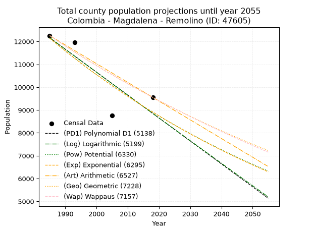
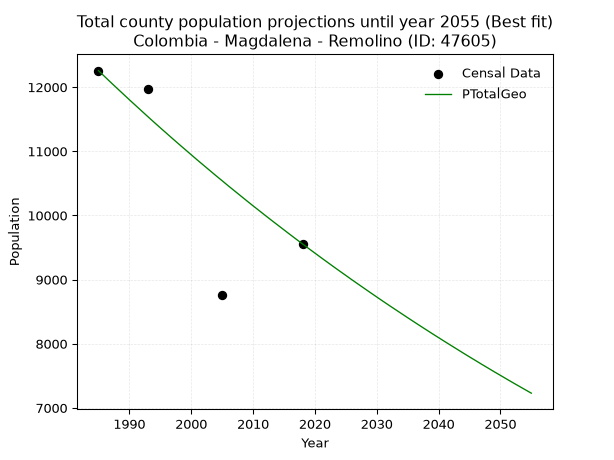
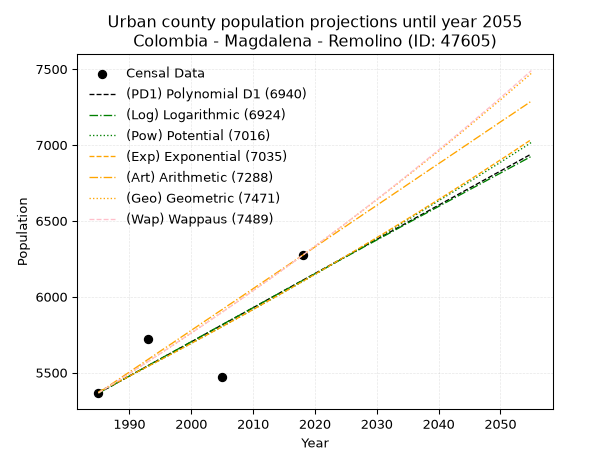
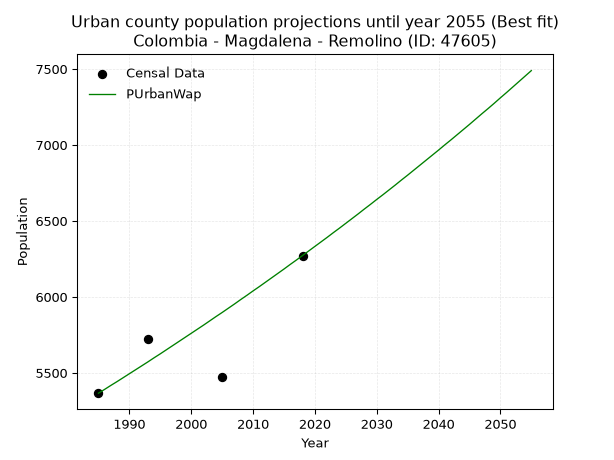
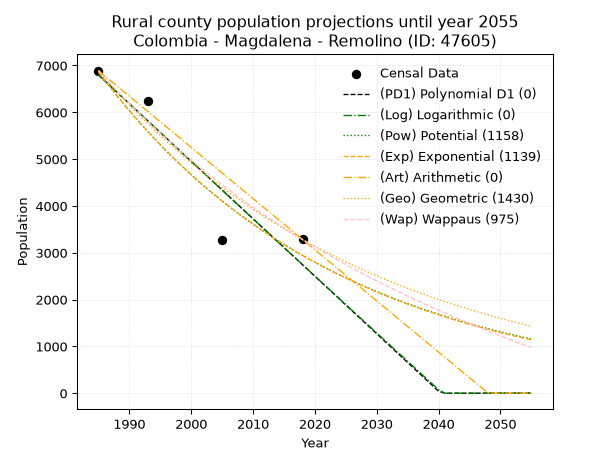
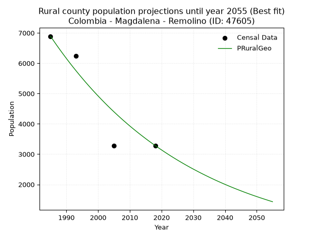

<div align="center">


</div>

# 📜 _“Population and Public Services Demand Projections (PPSD) until Year 2050 for Colombia - Magdalena - Remolino (ID: 47605)”_
Keywords: `population` `public-service` `projection` `lineal` `polynomial` `logarithmic` `potential` `exponential` `arithmetic` `geometric` `wappaus` `dane` `colombia` `south-america`

PPSD are analytical estimates used by governments and planners to anticipate future changes in population size, age distribution, and the resulting community needs for utilities, healthcare, education, and infrastructure as sizing future water treatment facilities, electrical grids, and road networks based on spatial growth.

<div align="center">

</img>

</div>


> **General running parameters**: • app_version: _v20260806_. • Python version: _3.14.7_. • Pandas version: _3.0.5_. • NumPy version: _2.5.1_. • Creates, save and include plots into reports (create_plot): _False_. • Projection until year: _2050_. • Process polynomial degree 2 and up: _False_. • Process Wappaus: _True_. • Process Wappaus: _True_. • Set negative values to zero: _True_. • Set infinite values to zero: _True_. • Drop dataset notes: _True_. 
<div align="center">

Maps & GIS Layers: [:earth_americas:Google](http://maps.google.com/maps?q=10.70195216,-74.7161716) [:earth_americas:OSM](https://www.openstreetmap.org/#map=18/10.70195216/-74.7161716&layers=P) [:earth_americas:Bing](https://www.bing.com/maps?cp=10.70195216~-74.7161716&lvl=18) [:earth_americas:Apple](https://maps.apple.com/frame?center=10.70195216%2C-74.7161716&span=0.003%2C0.006) [:earth_americas:GISMobile](https://github.com/rcfdtools/R.GISMobile/blob/main/file/gis/CountyLayer_CO/Readme.md)

</div>


<div align="center">

```geojson
{
  "type": "Feature",
  "geometry": {
    "type": "Point", 
    "coordinates": [-74.7161716, 10.70195216]
  }, 
  "properties": {
    "Name": "Colombia - Magdalena - Remolino (ID: 47605)"
  }
}
```

</div>


## 0. Census Data (4 records)

Census data are official statistics collected by a government about the people and housing in a country. They usually include counts of total population, age, sex, race, income, education, and jobs.

📅Global census file: [Population.xlsx](../data/Population.xlsx)

| Source   |   Year |   CountryID | CountryName   |   StateID | StateName   |   CountyID | CountyName   |   PTotal |   PUrban |   PRural |
|:---------|-------:|------------:|:--------------|----------:|:------------|-----------:|:-------------|---------:|---------:|---------:|
| DANE     |   1985 |          57 | Colombia      |        47 | Magdalena   |      47605 | Remolino     |    12256 |     5366 |     6890 |
| DANE     |   1993 |          57 | Colombia      |        47 | Magdalena   |      47605 | Remolino     |    11966 |     5720 |     6246 |
| DANE     |   2005 |          57 | Colombia      |        47 | Magdalena   |      47605 | Remolino     |     8751 |     5472 |     3279 |
| DANE     |   2018 |          57 | Colombia      |        47 | Magdalena   |      47605 | Remolino     |     9555 |     6272 |     3283 |

> 🔥Some records could had specific notes about the registered values or the corresponding urban or rural distribution.

📅[SUI-RUPS](https://www.datos.gov.co/Hacienda-y-Cr-dito-P-blico/Registro-nico-de-Prestadores-de-Servicios-P-blicos/4qkq-csdn/about_data) - Local public utility companies: [RUPS.csv](../data/RUPS.csv)

 | SERVICIO   | ESTADO    | NOMBRE                                    | NIT         | DEPARTAMENTO_DOMICILIO   | MUNICIPIO_DOMICILIO   | DIRECCION                                    |   TELEFONO | EMAIL                     | TIPO_PRESTADOR                 | CLASIFICACION                 |
|:-----------|:----------|:------------------------------------------|:------------|:-------------------------|:----------------------|:---------------------------------------------|-----------:|:--------------------------|:-------------------------------|:------------------------------|
| ACUEDUCTO  | OPERATIVA | MUNICIPIO DE REMOLINO                     | 891780052-1 | MAGDALENA                | REMOLINO              | Calle 10 carrera 2 Esquina Palacio Municipal |    3023612 | navarroguillo@hotmail.com | MUNICIPIO (PRESTACIÓN DIRECTA) | MENOR O IGUAL A 2500 USUARIOS |
| ACUEDUCTO  | OPERATIVA | COOPERATIVA AGUAS DE REMOLINO LTDA E.S.P. | 900407415-6 | MAGDALENA                | REMOLINO              | carrera 1 No. 10-22                          |    3246141 | onchyss@hotmail.com       | ORGANIZACION AUTORIZADA        | HASTA 2500 SUSCRIPTORES       |

## 1. Total

### 1.1. Coefficients and Parameters

* (PD1) Polynomial Deg 1: -100.34363709353705, 211344.36009634752 (lineal)
* (Log) Logarithmic: -201045.09575568972, 1538777.3839132853
* (Pow) Potential: -18.807167883186207, 66.1060339961829
* (Exp) Exponential: -0.009386264680566333, 1499586579809.4072
* (Art) Arithmetic: Year diff. 2018 - 1985 = 33, Population diff. 9555 - 12256 = -2701, Annual growth = -81.84848484848484
* (Geo) Geometric: Year diff. 2018 - 1985 = 33, Population diff. 9555 - 12256 = -2701, Annual growth % = -0.007515586441073752
* (Wap) Wappaus: i = -0.750524825532849, Condition values only valid for < 200)

<sub>
Wappaus condition values: ['-0.00', '-0.75', '-1.50', '-2.25', '-3.00', '-3.75', '-4.50', '-5.25', '-6.00', '-6.75', '-7.51', '-8.26', '-9.01', '-9.76', '-10.51', '-11.26', '-12.01', '-12.76', '-13.51', '-14.26', '-15.01', '-15.76', '-16.51', '-17.26', '-18.01', '-18.76', '-19.51', '-20.26', '-21.01', '-21.77', '-22.52', '-23.27', '-24.02', '-24.77', '-25.52', '-26.27', '-27.02', '-27.77', '-28.52', '-29.27', '-30.02', '-30.77', '-31.52', '-32.27', '-33.02', '-33.77', '-34.52', '-35.27', '-36.03', '-36.78', '-37.53', '-38.28', '-39.03', '-39.78', '-40.53', '-41.28', '-42.03', '-42.78', '-43.53', '-44.28', '-45.03', '-45.78', '-46.53', '-47.28', '-48.03', '-48.78']
</sub>


### 1.2. Projected Dataset

|   Year |   CountyID |   PTotalPD1 |   PTotalLog |   PTotalPow |   PTotalExp |   PTotalArt |   PTotalGeo |   PTotalWap |
|-------:|-----------:|------------:|------------:|------------:|------------:|------------:|------------:|------------:|
|   1985 |      47605 |       12162 |       12167 |       12148 |       12143 |       12256 |       12256 |       12256 |
|   1986 |      47605 |       12062 |       12065 |       12033 |       12029 |       12174 |       12164 |       12164 |
|   1987 |      47605 |       11962 |       11964 |       11920 |       11917 |       12092 |       12072 |       12073 |
|   1988 |      47605 |       11861 |       11863 |       11808 |       11805 |       12010 |       11982 |       11983 |
|   1989 |      47605 |       11761 |       11762 |       11696 |       11695 |       11929 |       11892 |       11894 |
|   1990 |      47605 |       11661 |       11661 |       11586 |       11586 |       11847 |       11802 |       11805 |
|   1991 |      47605 |       11560 |       11560 |       11477 |       11478 |       11765 |       11714 |       11716 |
|   1992 |      47605 |       11460 |       11459 |       11370 |       11370 |       11683 |       11626 |       11629 |
|   1993 |      47605 |       11359 |       11358 |       11263 |       11264 |       11601 |       11538 |       11542 |
|   1994 |      47605 |       11259 |       11257 |       11157 |       11159 |       11519 |       11451 |       11455 |
|   1995 |      47605 |       11159 |       11156 |       11052 |       11055 |       11438 |       11365 |       11369 |
|   1996 |      47605 |       11058 |       11056 |       10949 |       10951 |       11356 |       11280 |       11284 |
|   1997 |      47605 |       10958 |       10955 |       10846 |       10849 |       11274 |       11195 |       11200 |
|   1998 |      47605 |       10858 |       10854 |       10744 |       10748 |       11192 |       11111 |       11116 |
|   1999 |      47605 |       10757 |       10754 |       10644 |       10647 |       11110 |       11028 |       11032 |
|   2000 |      47605 |       10657 |       10653 |       10544 |       10548 |       11028 |       10945 |       10950 |
|   2001 |      47605 |       10557 |       10553 |       10445 |       10449 |       10946 |       10862 |       10868 |
|   2002 |      47605 |       10456 |       10452 |       10348 |       10352 |       10865 |       10781 |       10786 |
|   2003 |      47605 |       10356 |       10352 |       10251 |       10255 |       10783 |       10700 |       10705 |
|   2004 |      47605 |       10256 |       10252 |       10155 |       10159 |       10701 |       10619 |       10625 |
|   2005 |      47605 |       10155 |       10151 |       10060 |       10064 |       10619 |       10540 |       10545 |
|   2006 |      47605 |       10055 |       10051 |        9966 |        9970 |       10537 |       10460 |       10465 |
|   2007 |      47605 |        9955 |        9951 |        9873 |        9877 |       10455 |       10382 |       10387 |
|   2008 |      47605 |        9854 |        9851 |        9781 |        9785 |       10373 |       10304 |       10308 |
|   2009 |      47605 |        9754 |        9751 |        9690 |        9693 |       10292 |       10226 |       10231 |
|   2010 |      47605 |        9654 |        9651 |        9600 |        9603 |       10210 |       10149 |       10154 |
|   2011 |      47605 |        9553 |        9551 |        9511 |        9513 |       10128 |       10073 |       10077 |
|   2012 |      47605 |        9453 |        9451 |        9422 |        9424 |       10046 |        9997 |       10001 |
|   2013 |      47605 |        9353 |        9351 |        9334 |        9336 |        9964 |        9922 |        9925 |
|   2014 |      47605 |        9252 |        9251 |        9248 |        9249 |        9882 |        9848 |        9850 |
|   2015 |      47605 |        9152 |        9151 |        9162 |        9163 |        9801 |        9774 |        9776 |
|   2016 |      47605 |        9052 |        9051 |        9077 |        9077 |        9719 |        9700 |        9702 |
|   2017 |      47605 |        8951 |        8952 |        8992 |        8992 |        9637 |        9627 |        9628 |
|   2018 |      47605 |        8851 |        8852 |        8909 |        8908 |        9555 |        9555 |        9555 |
|   2019 |      47605 |        8751 |        8752 |        8826 |        8825 |        9473 |        9483 |        9482 |
|   2020 |      47605 |        8650 |        8653 |        8745 |        8743 |        9391 |        9412 |        9410 |
|   2021 |      47605 |        8550 |        8553 |        8664 |        8661 |        9309 |        9341 |        9339 |
|   2022 |      47605 |        8450 |        8454 |        8583 |        8580 |        9228 |        9271 |        9268 |
|   2023 |      47605 |        8349 |        8354 |        8504 |        8500 |        9146 |        9201 |        9197 |
|   2024 |      47605 |        8249 |        8255 |        8425 |        8420 |        9064 |        9132 |        9127 |
|   2025 |      47605 |        8148 |        8156 |        8347 |        8342 |        8982 |        9064 |        9057 |
|   2026 |      47605 |        8048 |        8056 |        8270 |        8264 |        8900 |        8995 |        8988 |
|   2027 |      47605 |        7948 |        7957 |        8194 |        8187 |        8818 |        8928 |        8919 |
|   2028 |      47605 |        7847 |        7858 |        8118 |        8110 |        8737 |        8861 |        8850 |
|   2029 |      47605 |        7747 |        7759 |        8043 |        8034 |        8655 |        8794 |        8782 |
|   2030 |      47605 |        7647 |        7660 |        7969 |        7959 |        8573 |        8728 |        8715 |
|   2031 |      47605 |        7546 |        7561 |        7895 |        7885 |        8491 |        8662 |        8648 |
|   2032 |      47605 |        7446 |        7462 |        7823 |        7811 |        8409 |        8597 |        8581 |
|   2033 |      47605 |        7346 |        7363 |        7751 |        7738 |        8327 |        8533 |        8515 |
|   2034 |      47605 |        7245 |        7264 |        7679 |        7666 |        8245 |        8469 |        8449 |
|   2035 |      47605 |        7145 |        7165 |        7609 |        7594 |        8164 |        8405 |        8383 |
|   2036 |      47605 |        7045 |        7067 |        7539 |        7523 |        8082 |        8342 |        8318 |
|   2037 |      47605 |        6944 |        6968 |        7469 |        7453 |        8000 |        8279 |        8254 |
|   2038 |      47605 |        6844 |        6869 |        7401 |        7384 |        7918 |        8217 |        8190 |
|   2039 |      47605 |        6744 |        6771 |        7333 |        7315 |        7836 |        8155 |        8126 |
|   2040 |      47605 |        6643 |        6672 |        7265 |        7246 |        7754 |        8094 |        8062 |
|   2041 |      47605 |        6543 |        6573 |        7199 |        7178 |        7672 |        8033 |        7999 |
|   2042 |      47605 |        6443 |        6475 |        7133 |        7111 |        7591 |        7973 |        7937 |
|   2043 |      47605 |        6342 |        6377 |        7067 |        7045 |        7509 |        7913 |        7875 |
|   2044 |      47605 |        6242 |        6278 |        7003 |        6979 |        7427 |        7853 |        7813 |
|   2045 |      47605 |        6142 |        6180 |        6939 |        6914 |        7345 |        7794 |        7751 |
|   2046 |      47605 |        6041 |        6082 |        6875 |        6849 |        7263 |        7736 |        7690 |
|   2047 |      47605 |        5941 |        5983 |        6812 |        6785 |        7181 |        7677 |        7629 |
|   2048 |      47605 |        5841 |        5885 |        6750 |        6722 |        7100 |        7620 |        7569 |
|   2049 |      47605 |        5740 |        5787 |        6688 |        6659 |        7018 |        7562 |        7509 |
|   2050 |      47605 |        5640 |        5689 |        6627 |        6597 |        6936 |        7506 |        7449 |
<div align="center">

</img>

</div>


### 1.3. Best fit with absolute and relative error (%)

Relative error puts that difference into context by dividing the absolute error by the true value, creating a unitless ratio or percentage that shows the scale of the mistake.

Absolute and relative error

|   Year | Source   |   CountryID | CountryName   |   StateID | StateName   |   CountyID_x | CountyName   |   PTotal |   PUrban |   PRural |   CountyID_y |   PTotalPD1 |   PTotalLog |   PTotalPow |   PTotalExp |   PTotalArt |   PTotalGeo |   PTotalWap |   PTotalPD1AbsError |   PTotalLogAbsError |   PTotalPowAbsError |   PTotalExpAbsError |   PTotalArtAbsError |   PTotalGeoAbsError |   PTotalWapAbsError |   PTotalPD1RelError |   PTotalLogRelError |   PTotalPowRelError |   PTotalExpRelError |   PTotalArtRelError |   PTotalGeoRelError |   PTotalWapRelError |
|-------:|:---------|------------:|:--------------|----------:|:------------|-------------:|:-------------|---------:|---------:|---------:|-------------:|------------:|------------:|------------:|------------:|------------:|------------:|------------:|--------------------:|--------------------:|--------------------:|--------------------:|--------------------:|--------------------:|--------------------:|--------------------:|--------------------:|--------------------:|--------------------:|--------------------:|--------------------:|--------------------:|
|   1985 | DANE     |          57 | Colombia      |        47 | Magdalena   |        47605 | Remolino     |    12256 |     5366 |     6890 |        47605 |       12162 |       12167 |       12148 |       12143 |       12256 |       12256 |       12256 |                  94 |                  89 |                 108 |                 113 |                   0 |                   0 |                   0 |            0.766971 |            0.726175 |            0.881201 |            0.921997 |             0       |              0      |             0       |
|   1993 | DANE     |          57 | Colombia      |        47 | Magdalena   |        47605 | Remolino     |    11966 |     5720 |     6246 |        47605 |       11359 |       11358 |       11263 |       11264 |       11601 |       11538 |       11542 |                 607 |                 608 |                 703 |                 702 |                 365 |                 428 |                 424 |            5.07271  |            5.08106  |            5.87498  |            5.86662  |             3.05031 |              3.5768 |             3.54337 |
|   2005 | DANE     |          57 | Colombia      |        47 | Magdalena   |        47605 | Remolino     |     8751 |     5472 |     3279 |        47605 |       10155 |       10151 |       10060 |       10064 |       10619 |       10540 |       10545 |                1404 |                1400 |                1309 |                1313 |                1868 |                1789 |                1794 |           16.0439   |           15.9982   |           14.9583   |           15.004    |            21.3461  |             20.4434 |            20.5005  |
|   2018 | DANE     |          57 | Colombia      |        47 | Magdalena   |        47605 | Remolino     |     9555 |     6272 |     3283 |        47605 |        8851 |        8852 |        8909 |        8908 |        9555 |        9555 |        9555 |                 704 |                 703 |                 646 |                 647 |                   0 |                   0 |                   0 |            7.36787  |            7.3574   |            6.76086  |            6.77132  |             0       |              0      |             0       |

Relative error mean

| Method    |   RelError | Best   |
|:----------|-----------:|:-------|
| PTotalPD1 |    7.31286 |        |
| PTotalLog |    7.2907  |        |
| PTotalPow |    7.11883 |        |
| PTotalExp |    7.14099 |        |
| PTotalArt |    6.09911 |        |
| PTotalGeo |    6.00504 | True   |
| PTotalWap |    6.01097 |        |

💙Best method: _**PTotalGeo**_
<div align="center">

</img>

</div>


### 1.4. Fresh water supply demand in liters per capita per day (lpcd)

The fresh water supply demand typically ranges from 100 to 300 liters per capita per day (lpcd) for standard domestic and municipal planning, though absolute survival minimums set by the World Health Organization are as low as 7.5 to 20 liters per day, and total consumption in high-income nations can exceed 400 liters.

> `CZ`: Level in meters above the sea level (masl)<br> `WS`: Fresh water supply demand in liters per capita per day (lpcd or l/h/d)<br> `WSAll`: Zonal fresh water supply demand in liters per second (l/s)<br> `A`: Zonal area in square meters<br> `DP`: Population density (people/hectare or p/ha)

Reference values (RAS Colombia)

|    CZ |   WS |
|------:|-----:|
|  1000 |  120 |
|  2000 |  130 |
| 99999 |  140 |

County shapefile geometry properties and water supply values

|   CountyID |      ATotal |   CZTotal |   WSTotal |
|-----------:|------------:|----------:|----------:|
|      47605 | 5.94375e+08 |    3.2655 |       120 |

Projected values for best method: PTotalGeo

|   CountyID |   Year |   PTotalGeo |   DPTotal |   WSTotal |   WSTotalAll |
|-----------:|-------:|------------:|----------:|----------:|-------------:|
|      47605 |   1985 |       12256 |      0.21 |       120 |      17.0222 |
|      47605 |   1986 |       12164 |      0.2  |       120 |      16.8944 |
|      47605 |   1987 |       12072 |      0.2  |       120 |      16.7667 |
|      47605 |   1988 |       11982 |      0.2  |       120 |      16.6417 |
|      47605 |   1989 |       11892 |      0.2  |       120 |      16.5167 |
|      47605 |   1990 |       11802 |      0.2  |       120 |      16.3917 |
|      47605 |   1991 |       11714 |      0.2  |       120 |      16.2694 |
|      47605 |   1992 |       11626 |      0.2  |       120 |      16.1472 |
|      47605 |   1993 |       11538 |      0.19 |       120 |      16.025  |
|      47605 |   1994 |       11451 |      0.19 |       120 |      15.9042 |
|      47605 |   1995 |       11365 |      0.19 |       120 |      15.7847 |
|      47605 |   1996 |       11280 |      0.19 |       120 |      15.6667 |
|      47605 |   1997 |       11195 |      0.19 |       120 |      15.5486 |
|      47605 |   1998 |       11111 |      0.19 |       120 |      15.4319 |
|      47605 |   1999 |       11028 |      0.19 |       120 |      15.3167 |
|      47605 |   2000 |       10945 |      0.18 |       120 |      15.2014 |
|      47605 |   2001 |       10862 |      0.18 |       120 |      15.0861 |
|      47605 |   2002 |       10781 |      0.18 |       120 |      14.9736 |
|      47605 |   2003 |       10700 |      0.18 |       120 |      14.8611 |
|      47605 |   2004 |       10619 |      0.18 |       120 |      14.7486 |
|      47605 |   2005 |       10540 |      0.18 |       120 |      14.6389 |
|      47605 |   2006 |       10460 |      0.18 |       120 |      14.5278 |
|      47605 |   2007 |       10382 |      0.17 |       120 |      14.4194 |
|      47605 |   2008 |       10304 |      0.17 |       120 |      14.3111 |
|      47605 |   2009 |       10226 |      0.17 |       120 |      14.2028 |
|      47605 |   2010 |       10149 |      0.17 |       120 |      14.0958 |
|      47605 |   2011 |       10073 |      0.17 |       120 |      13.9903 |
|      47605 |   2012 |        9997 |      0.17 |       120 |      13.8847 |
|      47605 |   2013 |        9922 |      0.17 |       120 |      13.7806 |
|      47605 |   2014 |        9848 |      0.17 |       120 |      13.6778 |
|      47605 |   2015 |        9774 |      0.16 |       120 |      13.575  |
|      47605 |   2016 |        9700 |      0.16 |       120 |      13.4722 |
|      47605 |   2017 |        9627 |      0.16 |       120 |      13.3708 |
|      47605 |   2018 |        9555 |      0.16 |       120 |      13.2708 |
|      47605 |   2019 |        9483 |      0.16 |       120 |      13.1708 |
|      47605 |   2020 |        9412 |      0.16 |       120 |      13.0722 |
|      47605 |   2021 |        9341 |      0.16 |       120 |      12.9736 |
|      47605 |   2022 |        9271 |      0.16 |       120 |      12.8764 |
|      47605 |   2023 |        9201 |      0.15 |       120 |      12.7792 |
|      47605 |   2024 |        9132 |      0.15 |       120 |      12.6833 |
|      47605 |   2025 |        9064 |      0.15 |       120 |      12.5889 |
|      47605 |   2026 |        8995 |      0.15 |       120 |      12.4931 |
|      47605 |   2027 |        8928 |      0.15 |       120 |      12.4    |
|      47605 |   2028 |        8861 |      0.15 |       120 |      12.3069 |
|      47605 |   2029 |        8794 |      0.15 |       120 |      12.2139 |
|      47605 |   2030 |        8728 |      0.15 |       120 |      12.1222 |
|      47605 |   2031 |        8662 |      0.15 |       120 |      12.0306 |
|      47605 |   2032 |        8597 |      0.14 |       120 |      11.9403 |
|      47605 |   2033 |        8533 |      0.14 |       120 |      11.8514 |
|      47605 |   2034 |        8469 |      0.14 |       120 |      11.7625 |
|      47605 |   2035 |        8405 |      0.14 |       120 |      11.6736 |
|      47605 |   2036 |        8342 |      0.14 |       120 |      11.5861 |
|      47605 |   2037 |        8279 |      0.14 |       120 |      11.4986 |
|      47605 |   2038 |        8217 |      0.14 |       120 |      11.4125 |
|      47605 |   2039 |        8155 |      0.14 |       120 |      11.3264 |
|      47605 |   2040 |        8094 |      0.14 |       120 |      11.2417 |
|      47605 |   2041 |        8033 |      0.14 |       120 |      11.1569 |
|      47605 |   2042 |        7973 |      0.13 |       120 |      11.0736 |
|      47605 |   2043 |        7913 |      0.13 |       120 |      10.9903 |
|      47605 |   2044 |        7853 |      0.13 |       120 |      10.9069 |
|      47605 |   2045 |        7794 |      0.13 |       120 |      10.825  |
|      47605 |   2046 |        7736 |      0.13 |       120 |      10.7444 |
|      47605 |   2047 |        7677 |      0.13 |       120 |      10.6625 |
|      47605 |   2048 |        7620 |      0.13 |       120 |      10.5833 |
|      47605 |   2049 |        7562 |      0.13 |       120 |      10.5028 |
|      47605 |   2050 |        7506 |      0.13 |       120 |      10.425  |

## 2. Urban

### 2.1. Coefficients and Parameters

* (PD1) Polynomial Deg 1: 22.51063829787188, -39319.40425531822 (lineal)
* (Log) Logarithmic: 45014.650225242935, -336449.2170868396
* (Pow) Potential: 7.703593524626648, -21.67449673460011
* (Exp) Exponential: 0.0038522124825094697, 2.5659146815078766
* (Art) Arithmetic: Year diff. 2018 - 1985 = 33, Population diff. 6272 - 5366 = 906, Annual growth = 27.454545454545453
* (Geo) Geometric: Year diff. 2018 - 1985 = 33, Population diff. 6272 - 5366 = 906, Annual growth % = 0.00473884543666081
* (Wap) Wappaus: i = 0.4718086519083254, Condition values only valid for < 200)

<sub>
Wappaus condition values: ['0.00', '0.47', '0.94', '1.42', '1.89', '2.36', '2.83', '3.30', '3.77', '4.25', '4.72', '5.19', '5.66', '6.13', '6.61', '7.08', '7.55', '8.02', '8.49', '8.96', '9.44', '9.91', '10.38', '10.85', '11.32', '11.80', '12.27', '12.74', '13.21', '13.68', '14.15', '14.63', '15.10', '15.57', '16.04', '16.51', '16.99', '17.46', '17.93', '18.40', '18.87', '19.34', '19.82', '20.29', '20.76', '21.23', '21.70', '22.18', '22.65', '23.12', '23.59', '24.06', '24.53', '25.01', '25.48', '25.95', '26.42', '26.89', '27.36', '27.84', '28.31', '28.78', '29.25', '29.72', '30.20', '30.67']
</sub>


### 2.2. Projected Dataset

|   Year |   CountyID |   PUrbanPD1 |   PUrbanLog |   PUrbanPow |   PUrbanExp |   PUrbanArt |   PUrbanGeo |   PUrbanWap |
|-------:|-----------:|------------:|------------:|------------:|------------:|------------:|------------:|------------:|
|   1985 |      47605 |        5364 |        5364 |        5372 |        5372 |        5366 |        5366 |        5366 |
|   1986 |      47605 |        5387 |        5387 |        5393 |        5393 |        5393 |        5391 |        5391 |
|   1987 |      47605 |        5409 |        5409 |        5414 |        5414 |        5421 |        5417 |        5417 |
|   1988 |      47605 |        5432 |        5432 |        5435 |        5434 |        5448 |        5443 |        5442 |
|   1989 |      47605 |        5454 |        5454 |        5456 |        5455 |        5476 |        5468 |        5468 |
|   1990 |      47605 |        5477 |        5477 |        5477 |        5476 |        5503 |        5494 |        5494 |
|   1991 |      47605 |        5499 |        5500 |        5498 |        5498 |        5531 |        5520 |        5520 |
|   1992 |      47605 |        5522 |        5522 |        5519 |        5519 |        5558 |        5547 |        5546 |
|   1993 |      47605 |        5544 |        5545 |        5541 |        5540 |        5586 |        5573 |        5572 |
|   1994 |      47605 |        5567 |        5568 |        5562 |        5562 |        5613 |        5599 |        5599 |
|   1995 |      47605 |        5589 |        5590 |        5584 |        5583 |        5641 |        5626 |        5625 |
|   1996 |      47605 |        5612 |        5613 |        5605 |        5605 |        5668 |        5652 |        5652 |
|   1997 |      47605 |        5634 |        5635 |        5627 |        5626 |        5695 |        5679 |        5679 |
|   1998 |      47605 |        5657 |        5658 |        5649 |        5648 |        5723 |        5706 |        5706 |
|   1999 |      47605 |        5679 |        5680 |        5671 |        5670 |        5750 |        5733 |        5733 |
|   2000 |      47605 |        5702 |        5703 |        5692 |        5692 |        5778 |        5760 |        5760 |
|   2001 |      47605 |        5724 |        5725 |        5714 |        5714 |        5805 |        5788 |        5787 |
|   2002 |      47605 |        5747 |        5748 |        5736 |        5736 |        5833 |        5815 |        5814 |
|   2003 |      47605 |        5769 |        5770 |        5759 |        5758 |        5860 |        5843 |        5842 |
|   2004 |      47605 |        5792 |        5793 |        5781 |        5780 |        5888 |        5870 |        5870 |
|   2005 |      47605 |        5814 |        5815 |        5803 |        5802 |        5915 |        5898 |        5897 |
|   2006 |      47605 |        5837 |        5838 |        5825 |        5825 |        5943 |        5926 |        5925 |
|   2007 |      47605 |        5859 |        5860 |        5848 |        5847 |        5970 |        5954 |        5953 |
|   2008 |      47605 |        5882 |        5882 |        5870 |        5870 |        5997 |        5982 |        5982 |
|   2009 |      47605 |        5904 |        5905 |        5893 |        5892 |        6025 |        6011 |        6010 |
|   2010 |      47605 |        5927 |        5927 |        5915 |        5915 |        6052 |        6039 |        6039 |
|   2011 |      47605 |        5949 |        5950 |        5938 |        5938 |        6080 |        6068 |        6067 |
|   2012 |      47605 |        5972 |        5972 |        5961 |        5961 |        6107 |        6097 |        6096 |
|   2013 |      47605 |        5995 |        5994 |        5984 |        5984 |        6135 |        6125 |        6125 |
|   2014 |      47605 |        6017 |        6017 |        6007 |        6007 |        6162 |        6155 |        6154 |
|   2015 |      47605 |        6040 |        6039 |        6030 |        6030 |        6190 |        6184 |        6183 |
|   2016 |      47605 |        6062 |        6061 |        6053 |        6053 |        6217 |        6213 |        6213 |
|   2017 |      47605 |        6085 |        6084 |        6076 |        6077 |        6245 |        6242 |        6242 |
|   2018 |      47605 |        6107 |        6106 |        6099 |        6100 |        6272 |        6272 |        6272 |
|   2019 |      47605 |        6130 |        6128 |        6123 |        6124 |        6299 |        6302 |        6302 |
|   2020 |      47605 |        6152 |        6151 |        6146 |        6147 |        6327 |        6332 |        6332 |
|   2021 |      47605 |        6175 |        6173 |        6169 |        6171 |        6354 |        6362 |        6362 |
|   2022 |      47605 |        6197 |        6195 |        6193 |        6195 |        6382 |        6392 |        6392 |
|   2023 |      47605 |        6220 |        6217 |        6217 |        6219 |        6409 |        6422 |        6423 |
|   2024 |      47605 |        6242 |        6240 |        6240 |        6243 |        6437 |        6452 |        6453 |
|   2025 |      47605 |        6265 |        6262 |        6264 |        6267 |        6464 |        6483 |        6484 |
|   2026 |      47605 |        6287 |        6284 |        6288 |        6291 |        6492 |        6514 |        6515 |
|   2027 |      47605 |        6310 |        6306 |        6312 |        6315 |        6519 |        6545 |        6546 |
|   2028 |      47605 |        6332 |        6329 |        6336 |        6340 |        6547 |        6576 |        6578 |
|   2029 |      47605 |        6355 |        6351 |        6360 |        6364 |        6574 |        6607 |        6609 |
|   2030 |      47605 |        6377 |        6373 |        6384 |        6389 |        6601 |        6638 |        6641 |
|   2031 |      47605 |        6400 |        6395 |        6408 |        6413 |        6629 |        6670 |        6672 |
|   2032 |      47605 |        6422 |        6417 |        6433 |        6438 |        6656 |        6701 |        6704 |
|   2033 |      47605 |        6445 |        6439 |        6457 |        6463 |        6684 |        6733 |        6736 |
|   2034 |      47605 |        6467 |        6462 |        6482 |        6488 |        6711 |        6765 |        6769 |
|   2035 |      47605 |        6490 |        6484 |        6506 |        6513 |        6739 |        6797 |        6801 |
|   2036 |      47605 |        6512 |        6506 |        6531 |        6538 |        6766 |        6829 |        6834 |
|   2037 |      47605 |        6535 |        6528 |        6556 |        6563 |        6794 |        6861 |        6867 |
|   2038 |      47605 |        6557 |        6550 |        6581 |        6589 |        6821 |        6894 |        6900 |
|   2039 |      47605 |        6580 |        6572 |        6606 |        6614 |        6849 |        6927 |        6933 |
|   2040 |      47605 |        6602 |        6594 |        6631 |        6640 |        6876 |        6959 |        6966 |
|   2041 |      47605 |        6625 |        6616 |        6656 |        6665 |        6903 |        6992 |        7000 |
|   2042 |      47605 |        6647 |        6638 |        6681 |        6691 |        6931 |        7026 |        7033 |
|   2043 |      47605 |        6670 |        6660 |        6706 |        6717 |        6958 |        7059 |        7067 |
|   2044 |      47605 |        6692 |        6682 |        6731 |        6743 |        6986 |        7092 |        7101 |
|   2045 |      47605 |        6715 |        6704 |        6757 |        6769 |        7013 |        7126 |        7135 |
|   2046 |      47605 |        6737 |        6726 |        6782 |        6795 |        7041 |        7160 |        7170 |
|   2047 |      47605 |        6760 |        6748 |        6808 |        6821 |        7068 |        7194 |        7205 |
|   2048 |      47605 |        6782 |        6770 |        6834 |        6848 |        7096 |        7228 |        7239 |
|   2049 |      47605 |        6805 |        6792 |        6859 |        6874 |        7123 |        7262 |        7274 |
|   2050 |      47605 |        6827 |        6814 |        6885 |        6901 |        7151 |        7296 |        7310 |
<div align="center">

</img>

</div>


### 2.3. Best fit with absolute and relative error (%)

Relative error puts that difference into context by dividing the absolute error by the true value, creating a unitless ratio or percentage that shows the scale of the mistake.

Absolute and relative error

|   Year | Source   |   CountryID | CountryName   |   StateID | StateName   |   CountyID_x | CountyName   |   PTotal |   PUrban |   PRural |   CountyID_y |   PUrbanPD1 |   PUrbanLog |   PUrbanPow |   PUrbanExp |   PUrbanArt |   PUrbanGeo |   PUrbanWap |   PUrbanPD1AbsError |   PUrbanLogAbsError |   PUrbanPowAbsError |   PUrbanExpAbsError |   PUrbanArtAbsError |   PUrbanGeoAbsError |   PUrbanWapAbsError |   PUrbanPD1RelError |   PUrbanLogRelError |   PUrbanPowRelError |   PUrbanExpRelError |   PUrbanArtRelError |   PUrbanGeoRelError |   PUrbanWapRelError |
|-------:|:---------|------------:|:--------------|----------:|:------------|-------------:|:-------------|---------:|---------:|---------:|-------------:|------------:|------------:|------------:|------------:|------------:|------------:|------------:|--------------------:|--------------------:|--------------------:|--------------------:|--------------------:|--------------------:|--------------------:|--------------------:|--------------------:|--------------------:|--------------------:|--------------------:|--------------------:|--------------------:|
|   1985 | DANE     |          57 | Colombia      |        47 | Magdalena   |        47605 | Remolino     |    12256 |     5366 |     6890 |        47605 |        5364 |        5364 |        5372 |        5372 |        5366 |        5366 |        5366 |                   2 |                   2 |                   6 |                   6 |                   0 |                   0 |                   0 |           0.0372717 |           0.0372717 |            0.111815 |            0.111815 |             0       |             0       |             0       |
|   1993 | DANE     |          57 | Colombia      |        47 | Magdalena   |        47605 | Remolino     |    11966 |     5720 |     6246 |        47605 |        5544 |        5545 |        5541 |        5540 |        5586 |        5573 |        5572 |                 176 |                 175 |                 179 |                 180 |                 134 |                 147 |                 148 |           3.07692   |           3.05944   |            3.12937  |            3.14685  |             2.34266 |             2.56993 |             2.58741 |
|   2005 | DANE     |          57 | Colombia      |        47 | Magdalena   |        47605 | Remolino     |     8751 |     5472 |     3279 |        47605 |        5814 |        5815 |        5803 |        5802 |        5915 |        5898 |        5897 |                 342 |                 343 |                 331 |                 330 |                 443 |                 426 |                 425 |           6.25      |           6.26827   |            6.04898  |            6.0307   |             8.09576 |             7.78509 |             7.76681 |
|   2018 | DANE     |          57 | Colombia      |        47 | Magdalena   |        47605 | Remolino     |     9555 |     6272 |     3283 |        47605 |        6107 |        6106 |        6099 |        6100 |        6272 |        6272 |        6272 |                 165 |                 166 |                 173 |                 172 |                   0 |                   0 |                   0 |           2.63074   |           2.64668   |            2.75829  |            2.74235  |             0       |             0       |             0       |

Relative error mean

| Method    |   RelError | Best   |
|:----------|-----------:|:-------|
| PUrbanPD1 |    2.99873 |        |
| PUrbanLog |    3.00292 |        |
| PUrbanPow |    3.01211 |        |
| PUrbanExp |    3.00793 |        |
| PUrbanArt |    2.6096  |        |
| PUrbanGeo |    2.58875 |        |
| PUrbanWap |    2.58856 | True   |

💙Best method: _**PUrbanWap**_
<div align="center">

</img>

</div>


### 2.4. Fresh water supply demand in liters per capita per day (lpcd)

The fresh water supply demand typically ranges from 100 to 300 liters per capita per day (lpcd) for standard domestic and municipal planning, though absolute survival minimums set by the World Health Organization are as low as 7.5 to 20 liters per day, and total consumption in high-income nations can exceed 400 liters.

> `CZ`: Level in meters above the sea level (masl)<br> `WS`: Fresh water supply demand in liters per capita per day (lpcd or l/h/d)<br> `WSAll`: Zonal fresh water supply demand in liters per second (l/s)<br> `A`: Zonal area in square meters<br> `DP`: Population density (people/hectare or p/ha)

Reference values (RAS Colombia)

|    CZ |   WS |
|------:|-----:|
|  1000 |  120 |
|  2000 |  130 |
| 99999 |  140 |

County shapefile geometry properties and water supply values

|   CountyID |   AUrban |   CZUrban |   WSUrban |
|-----------:|---------:|----------:|----------:|
|      47605 |   730722 |    4.2838 |       120 |

Projected values for best method: PUrbanWap

|   CountyID |   Year |   PUrbanWap |   DPUrban |   WSUrban |   WSUrbanAll |
|-----------:|-------:|------------:|----------:|----------:|-------------:|
|      47605 |   1985 |        5366 |     73.43 |       120 |      7.45278 |
|      47605 |   1986 |        5391 |     73.78 |       120 |      7.4875  |
|      47605 |   1987 |        5417 |     74.13 |       120 |      7.52361 |
|      47605 |   1988 |        5442 |     74.47 |       120 |      7.55833 |
|      47605 |   1989 |        5468 |     74.83 |       120 |      7.59444 |
|      47605 |   1990 |        5494 |     75.19 |       120 |      7.63056 |
|      47605 |   1991 |        5520 |     75.54 |       120 |      7.66667 |
|      47605 |   1992 |        5546 |     75.9  |       120 |      7.70278 |
|      47605 |   1993 |        5572 |     76.25 |       120 |      7.73889 |
|      47605 |   1994 |        5599 |     76.62 |       120 |      7.77639 |
|      47605 |   1995 |        5625 |     76.98 |       120 |      7.8125  |
|      47605 |   1996 |        5652 |     77.35 |       120 |      7.85    |
|      47605 |   1997 |        5679 |     77.72 |       120 |      7.8875  |
|      47605 |   1998 |        5706 |     78.09 |       120 |      7.925   |
|      47605 |   1999 |        5733 |     78.46 |       120 |      7.9625  |
|      47605 |   2000 |        5760 |     78.83 |       120 |      8       |
|      47605 |   2001 |        5787 |     79.2  |       120 |      8.0375  |
|      47605 |   2002 |        5814 |     79.57 |       120 |      8.075   |
|      47605 |   2003 |        5842 |     79.95 |       120 |      8.11389 |
|      47605 |   2004 |        5870 |     80.33 |       120 |      8.15278 |
|      47605 |   2005 |        5897 |     80.7  |       120 |      8.19028 |
|      47605 |   2006 |        5925 |     81.08 |       120 |      8.22917 |
|      47605 |   2007 |        5953 |     81.47 |       120 |      8.26806 |
|      47605 |   2008 |        5982 |     81.86 |       120 |      8.30833 |
|      47605 |   2009 |        6010 |     82.25 |       120 |      8.34722 |
|      47605 |   2010 |        6039 |     82.64 |       120 |      8.3875  |
|      47605 |   2011 |        6067 |     83.03 |       120 |      8.42639 |
|      47605 |   2012 |        6096 |     83.42 |       120 |      8.46667 |
|      47605 |   2013 |        6125 |     83.82 |       120 |      8.50694 |
|      47605 |   2014 |        6154 |     84.22 |       120 |      8.54722 |
|      47605 |   2015 |        6183 |     84.61 |       120 |      8.5875  |
|      47605 |   2016 |        6213 |     85.03 |       120 |      8.62917 |
|      47605 |   2017 |        6242 |     85.42 |       120 |      8.66944 |
|      47605 |   2018 |        6272 |     85.83 |       120 |      8.71111 |
|      47605 |   2019 |        6302 |     86.24 |       120 |      8.75278 |
|      47605 |   2020 |        6332 |     86.65 |       120 |      8.79444 |
|      47605 |   2021 |        6362 |     87.06 |       120 |      8.83611 |
|      47605 |   2022 |        6392 |     87.48 |       120 |      8.87778 |
|      47605 |   2023 |        6423 |     87.9  |       120 |      8.92083 |
|      47605 |   2024 |        6453 |     88.31 |       120 |      8.9625  |
|      47605 |   2025 |        6484 |     88.73 |       120 |      9.00556 |
|      47605 |   2026 |        6515 |     89.16 |       120 |      9.04861 |
|      47605 |   2027 |        6546 |     89.58 |       120 |      9.09167 |
|      47605 |   2028 |        6578 |     90.02 |       120 |      9.13611 |
|      47605 |   2029 |        6609 |     90.44 |       120 |      9.17917 |
|      47605 |   2030 |        6641 |     90.88 |       120 |      9.22361 |
|      47605 |   2031 |        6672 |     91.31 |       120 |      9.26667 |
|      47605 |   2032 |        6704 |     91.74 |       120 |      9.31111 |
|      47605 |   2033 |        6736 |     92.18 |       120 |      9.35556 |
|      47605 |   2034 |        6769 |     92.63 |       120 |      9.40139 |
|      47605 |   2035 |        6801 |     93.07 |       120 |      9.44583 |
|      47605 |   2036 |        6834 |     93.52 |       120 |      9.49167 |
|      47605 |   2037 |        6867 |     93.98 |       120 |      9.5375  |
|      47605 |   2038 |        6900 |     94.43 |       120 |      9.58333 |
|      47605 |   2039 |        6933 |     94.88 |       120 |      9.62917 |
|      47605 |   2040 |        6966 |     95.33 |       120 |      9.675   |
|      47605 |   2041 |        7000 |     95.8  |       120 |      9.72222 |
|      47605 |   2042 |        7033 |     96.25 |       120 |      9.76806 |
|      47605 |   2043 |        7067 |     96.71 |       120 |      9.81528 |
|      47605 |   2044 |        7101 |     97.18 |       120 |      9.8625  |
|      47605 |   2045 |        7135 |     97.64 |       120 |      9.90972 |
|      47605 |   2046 |        7170 |     98.12 |       120 |      9.95833 |
|      47605 |   2047 |        7205 |     98.6  |       120 |     10.0069  |
|      47605 |   2048 |        7239 |     99.07 |       120 |     10.0542  |
|      47605 |   2049 |        7274 |     99.55 |       120 |     10.1028  |
|      47605 |   2050 |        7310 |    100.04 |       120 |     10.1528  |

## 3. Rural

### 3.1. Coefficients and Parameters

* (PD1) Polynomial Deg 1: -122.85427539140883, 250663.76435166554 (lineal)
* (Log) Logarithmic: -246059.74598093267, 1875226.6010001248
* (Pow) Potential: -51.3717672735223, 173.2485580343461
* (Exp) Exponential: -0.025650585668107545, 8.893218827520472e+25
* (Art) Arithmetic: Year diff. 2018 - 1985 = 33, Population diff. 3283 - 6890 = -3607, Annual growth = -109.3030303030303
* (Geo) Geometric: Year diff. 2018 - 1985 = 33, Population diff. 3283 - 6890 = -3607, Annual growth % = -0.022213605988353202
* (Wap) Wappaus: i = -2.1488848973366816, Condition values only valid for < 200)

<sub>
Wappaus condition values: ['-0.00', '-2.15', '-4.30', '-6.45', '-8.60', '-10.74', '-12.89', '-15.04', '-17.19', '-19.34', '-21.49', '-23.64', '-25.79', '-27.94', '-30.08', '-32.23', '-34.38', '-36.53', '-38.68', '-40.83', '-42.98', '-45.13', '-47.28', '-49.42', '-51.57', '-53.72', '-55.87', '-58.02', '-60.17', '-62.32', '-64.47', '-66.62', '-68.76', '-70.91', '-73.06', '-75.21', '-77.36', '-79.51', '-81.66', '-83.81', '-85.96', '-88.10', '-90.25', '-92.40', '-94.55', '-96.70', '-98.85', '-101.00', '-103.15', '-105.30', '-107.44', '-109.59', '-111.74', '-113.89', '-116.04', '-118.19', '-120.34', '-122.49', '-124.64', '-126.78', '-128.93', '-131.08', '-133.23', '-135.38', '-137.53', '-139.68']
</sub>


### 3.2. Projected Dataset

|   Year |   CountyID |   PRuralPD1 |   PRuralLog |   PRuralPow |   PRuralExp |   PRuralArt |   PRuralGeo |   PRuralWap |
|-------:|-----------:|------------:|------------:|------------:|------------:|------------:|------------:|------------:|
|   1985 |      47605 |        6798 |        6803 |        6867 |        6860 |        6890 |        6890 |        6890 |
|   1986 |      47605 |        6675 |        6679 |        6692 |        6687 |        6781 |        6737 |        6744 |
|   1987 |      47605 |        6552 |        6555 |        6521 |        6517 |        6671 |        6587 |        6600 |
|   1988 |      47605 |        6429 |        6431 |        6354 |        6352 |        6562 |        6441 |        6460 |
|   1989 |      47605 |        6307 |        6308 |        6192 |        6191 |        6453 |        6298 |        6322 |
|   1990 |      47605 |        6184 |        6184 |        6035 |        6035 |        6343 |        6158 |        6187 |
|   1991 |      47605 |        6061 |        6060 |        5881 |        5882 |        6234 |        6021 |        6055 |
|   1992 |      47605 |        5938 |        5937 |        5731 |        5733 |        6125 |        5887 |        5926 |
|   1993 |      47605 |        5815 |        5813 |        5585 |        5588 |        6016 |        5757 |        5799 |
|   1994 |      47605 |        5692 |        5690 |        5443 |        5446 |        5906 |        5629 |        5675 |
|   1995 |      47605 |        5569 |        5566 |        5305 |        5308 |        5797 |        5504 |        5553 |
|   1996 |      47605 |        5447 |        5443 |        5170 |        5174 |        5688 |        5381 |        5434 |
|   1997 |      47605 |        5324 |        5320 |        5039 |        5043 |        5578 |        5262 |        5316 |
|   1998 |      47605 |        5201 |        5197 |        4911 |        4915 |        5469 |        5145 |        5201 |
|   1999 |      47605 |        5078 |        5074 |        4786 |        4791 |        5360 |        5031 |        5088 |
|   2000 |      47605 |        4955 |        4950 |        4665 |        4669 |        5250 |        4919 |        4977 |
|   2001 |      47605 |        4832 |        4827 |        4546 |        4551 |        5141 |        4810 |        4869 |
|   2002 |      47605 |        4710 |        4705 |        4431 |        4436 |        5032 |        4703 |        4762 |
|   2003 |      47605 |        4587 |        4582 |        4319 |        4323 |        4923 |        4598 |        4657 |
|   2004 |      47605 |        4464 |        4459 |        4210 |        4214 |        4813 |        4496 |        4554 |
|   2005 |      47605 |        4341 |        4336 |        4103 |        4107 |        4704 |        4396 |        4453 |
|   2006 |      47605 |        4218 |        4213 |        3999 |        4003 |        4595 |        4299 |        4353 |
|   2007 |      47605 |        4095 |        4091 |        3898 |        3902 |        4485 |        4203 |        4255 |
|   2008 |      47605 |        3972 |        3968 |        3800 |        3803 |        4376 |        4110 |        4159 |
|   2009 |      47605 |        3850 |        3846 |        3704 |        3707 |        4267 |        4019 |        4065 |
|   2010 |      47605 |        3727 |        3723 |        3610 |        3613 |        4157 |        3929 |        3972 |
|   2011 |      47605 |        3604 |        3601 |        3519 |        3521 |        4048 |        3842 |        3881 |
|   2012 |      47605 |        3481 |        3479 |        3430 |        3432 |        3939 |        3757 |        3791 |
|   2013 |      47605 |        3358 |        3356 |        3344 |        3345 |        3830 |        3673 |        3703 |
|   2014 |      47605 |        3235 |        3234 |        3260 |        3261 |        3720 |        3592 |        3616 |
|   2015 |      47605 |        3112 |        3112 |        3178 |        3178 |        3611 |        3512 |        3531 |
|   2016 |      47605 |        2990 |        2990 |        3098 |        3097 |        3502 |        3434 |        3447 |
|   2017 |      47605 |        2867 |        2868 |        3020 |        3019 |        3392 |        3358 |        3364 |
|   2018 |      47605 |        2744 |        2746 |        2944 |        2943 |        3283 |        3283 |        3283 |
|   2019 |      47605 |        2621 |        2624 |        2870 |        2868 |        3174 |        3210 |        3203 |
|   2020 |      47605 |        2498 |        2502 |        2798 |        2795 |        3064 |        3139 |        3124 |
|   2021 |      47605 |        2375 |        2380 |        2728 |        2725 |        2955 |        3069 |        3047 |
|   2022 |      47605 |        2252 |        2259 |        2659 |        2656 |        2846 |        3001 |        2970 |
|   2023 |      47605 |        2130 |        2137 |        2592 |        2588 |        2736 |        2934 |        2895 |
|   2024 |      47605 |        2007 |        2015 |        2527 |        2523 |        2627 |        2869 |        2821 |
|   2025 |      47605 |        1884 |        1894 |        2464 |        2459 |        2518 |        2805 |        2748 |
|   2026 |      47605 |        1761 |        1772 |        2402 |        2397 |        2409 |        2743 |        2676 |
|   2027 |      47605 |        1638 |        1651 |        2342 |        2336 |        2299 |        2682 |        2605 |
|   2028 |      47605 |        1515 |        1530 |        2284 |        2277 |        2190 |        2622 |        2535 |
|   2029 |      47605 |        1392 |        1408 |        2227 |        2219 |        2081 |        2564 |        2467 |
|   2030 |      47605 |        1270 |        1287 |        2171 |        2163 |        1971 |        2507 |        2399 |
|   2031 |      47605 |        1147 |        1166 |        2117 |        2108 |        1862 |        2452 |        2332 |
|   2032 |      47605 |        1024 |        1045 |        2064 |        2055 |        1753 |        2397 |        2266 |
|   2033 |      47605 |         901 |         924 |        2012 |        2003 |        1643 |        2344 |        2201 |
|   2034 |      47605 |         778 |         803 |        1962 |        1952 |        1534 |        2292 |        2137 |
|   2035 |      47605 |         655 |         682 |        1913 |        1903 |        1425 |        2241 |        2074 |
|   2036 |      47605 |         532 |         561 |        1866 |        1854 |        1316 |        2191 |        2012 |
|   2037 |      47605 |         410 |         440 |        1819 |        1807 |        1206 |        2142 |        1951 |
|   2038 |      47605 |         287 |         319 |        1774 |        1762 |        1097 |        2095 |        1890 |
|   2039 |      47605 |         164 |         198 |        1730 |        1717 |         988 |        2048 |        1830 |
|   2040 |      47605 |          41 |          78 |        1687 |        1674 |         878 |        2003 |        1772 |
|   2041 |      47605 |           0 |           0 |        1645 |        1631 |         769 |        1958 |        1713 |
|   2042 |      47605 |           0 |           0 |        1604 |        1590 |         660 |        1915 |        1656 |
|   2043 |      47605 |           0 |           0 |        1564 |        1550 |         550 |        1872 |        1600 |
|   2044 |      47605 |           0 |           0 |        1525 |        1510 |         441 |        1831 |        1544 |
|   2045 |      47605 |           0 |           0 |        1487 |        1472 |         332 |        1790 |        1489 |
|   2046 |      47605 |           0 |           0 |        1450 |        1435 |         223 |        1750 |        1434 |
|   2047 |      47605 |           0 |           0 |        1414 |        1399 |         113 |        1711 |        1381 |
|   2048 |      47605 |           0 |           0 |        1379 |        1363 |           4 |        1673 |        1328 |
|   2049 |      47605 |           0 |           0 |        1345 |        1329 |           0 |        1636 |        1275 |
|   2050 |      47605 |           0 |           0 |        1312 |        1295 |           0 |        1600 |        1224 |
<div align="center">

</img>

</div>


### 3.3. Best fit with absolute and relative error (%)

Relative error puts that difference into context by dividing the absolute error by the true value, creating a unitless ratio or percentage that shows the scale of the mistake.

Absolute and relative error

|   Year | Source   |   CountryID | CountryName   |   StateID | StateName   |   CountyID_x | CountyName   |   PTotal |   PUrban |   PRural |   CountyID_y |   PRuralPD1 |   PRuralLog |   PRuralPow |   PRuralExp |   PRuralArt |   PRuralGeo |   PRuralWap |   PRuralPD1AbsError |   PRuralLogAbsError |   PRuralPowAbsError |   PRuralExpAbsError |   PRuralArtAbsError |   PRuralGeoAbsError |   PRuralWapAbsError |   PRuralPD1RelError |   PRuralLogRelError |   PRuralPowRelError |   PRuralExpRelError |   PRuralArtRelError |   PRuralGeoRelError |   PRuralWapRelError |
|-------:|:---------|------------:|:--------------|----------:|:------------|-------------:|:-------------|---------:|---------:|---------:|-------------:|------------:|------------:|------------:|------------:|------------:|------------:|------------:|--------------------:|--------------------:|--------------------:|--------------------:|--------------------:|--------------------:|--------------------:|--------------------:|--------------------:|--------------------:|--------------------:|--------------------:|--------------------:|--------------------:|
|   1985 | DANE     |          57 | Colombia      |        47 | Magdalena   |        47605 | Remolino     |    12256 |     5366 |     6890 |        47605 |        6798 |        6803 |        6867 |        6860 |        6890 |        6890 |        6890 |                  92 |                  87 |                  23 |                  30 |                   0 |                   0 |                   0 |             1.33527 |             1.2627  |            0.333817 |            0.435414 |             0       |             0       |             0       |
|   1993 | DANE     |          57 | Colombia      |        47 | Magdalena   |        47605 | Remolino     |    11966 |     5720 |     6246 |        47605 |        5815 |        5813 |        5585 |        5588 |        6016 |        5757 |        5799 |                 431 |                 433 |                 661 |                 658 |                 230 |                 489 |                 447 |             6.90042 |             6.93244 |           10.5828   |           10.5347   |             3.68236 |             7.82901 |             7.15658 |
|   2005 | DANE     |          57 | Colombia      |        47 | Magdalena   |        47605 | Remolino     |     8751 |     5472 |     3279 |        47605 |        4341 |        4336 |        4103 |        4107 |        4704 |        4396 |        4453 |                1062 |                1057 |                 824 |                 828 |                1425 |                1117 |                1174 |            32.3879  |            32.2354  |           25.1296   |           25.2516   |            43.4584  |            34.0653  |            35.8036  |
|   2018 | DANE     |          57 | Colombia      |        47 | Magdalena   |        47605 | Remolino     |     9555 |     6272 |     3283 |        47605 |        2744 |        2746 |        2944 |        2943 |        3283 |        3283 |        3283 |                 539 |                 537 |                 339 |                 340 |                   0 |                   0 |                   0 |            16.4179  |            16.357   |           10.3259   |           10.3564   |             0       |             0       |             0       |

Relative error mean

| Method    |   RelError | Best   |
|:----------|-----------:|:-------|
| PRuralPD1 |    14.2604 |        |
| PRuralLog |    14.1969 |        |
| PRuralPow |    11.593  |        |
| PRuralExp |    11.6445 |        |
| PRuralArt |    11.7852 |        |
| PRuralGeo |    10.4736 | True   |
| PRuralWap |    10.74   |        |

💙Best method: _**PRuralGeo**_
<div align="center">

</img>

</div>


### 3.4. Fresh water supply demand in liters per capita per day (lpcd)

The fresh water supply demand typically ranges from 100 to 300 liters per capita per day (lpcd) for standard domestic and municipal planning, though absolute survival minimums set by the World Health Organization are as low as 7.5 to 20 liters per day, and total consumption in high-income nations can exceed 400 liters.

> `CZ`: Level in meters above the sea level (masl)<br> `WS`: Fresh water supply demand in liters per capita per day (lpcd or l/h/d)<br> `WSAll`: Zonal fresh water supply demand in liters per second (l/s)<br> `A`: Zonal area in square meters<br> `DP`: Population density (people/hectare or p/ha)

Reference values (RAS Colombia)

|    CZ |   WS |
|------:|-----:|
|  1000 |  120 |
|  2000 |  130 |
| 99999 |  140 |

County shapefile geometry properties and water supply values

|   CountyID |      ARural |   CZRural |   WSRural |
|-----------:|------------:|----------:|----------:|
|      47605 | 5.93644e+08 |   3.26425 |       120 |

Projected values for best method: PRuralGeo

|   CountyID |   Year |   PRuralGeo |   DPRural |   WSRural |   WSRuralAll |
|-----------:|-------:|------------:|----------:|----------:|-------------:|
|      47605 |   1985 |        6890 |      0.12 |       120 |      9.56944 |
|      47605 |   1986 |        6737 |      0.11 |       120 |      9.35694 |
|      47605 |   1987 |        6587 |      0.11 |       120 |      9.14861 |
|      47605 |   1988 |        6441 |      0.11 |       120 |      8.94583 |
|      47605 |   1989 |        6298 |      0.11 |       120 |      8.74722 |
|      47605 |   1990 |        6158 |      0.1  |       120 |      8.55278 |
|      47605 |   1991 |        6021 |      0.1  |       120 |      8.3625  |
|      47605 |   1992 |        5887 |      0.1  |       120 |      8.17639 |
|      47605 |   1993 |        5757 |      0.1  |       120 |      7.99583 |
|      47605 |   1994 |        5629 |      0.09 |       120 |      7.81806 |
|      47605 |   1995 |        5504 |      0.09 |       120 |      7.64444 |
|      47605 |   1996 |        5381 |      0.09 |       120 |      7.47361 |
|      47605 |   1997 |        5262 |      0.09 |       120 |      7.30833 |
|      47605 |   1998 |        5145 |      0.09 |       120 |      7.14583 |
|      47605 |   1999 |        5031 |      0.08 |       120 |      6.9875  |
|      47605 |   2000 |        4919 |      0.08 |       120 |      6.83194 |
|      47605 |   2001 |        4810 |      0.08 |       120 |      6.68056 |
|      47605 |   2002 |        4703 |      0.08 |       120 |      6.53194 |
|      47605 |   2003 |        4598 |      0.08 |       120 |      6.38611 |
|      47605 |   2004 |        4496 |      0.08 |       120 |      6.24444 |
|      47605 |   2005 |        4396 |      0.07 |       120 |      6.10556 |
|      47605 |   2006 |        4299 |      0.07 |       120 |      5.97083 |
|      47605 |   2007 |        4203 |      0.07 |       120 |      5.8375  |
|      47605 |   2008 |        4110 |      0.07 |       120 |      5.70833 |
|      47605 |   2009 |        4019 |      0.07 |       120 |      5.58194 |
|      47605 |   2010 |        3929 |      0.07 |       120 |      5.45694 |
|      47605 |   2011 |        3842 |      0.06 |       120 |      5.33611 |
|      47605 |   2012 |        3757 |      0.06 |       120 |      5.21806 |
|      47605 |   2013 |        3673 |      0.06 |       120 |      5.10139 |
|      47605 |   2014 |        3592 |      0.06 |       120 |      4.98889 |
|      47605 |   2015 |        3512 |      0.06 |       120 |      4.87778 |
|      47605 |   2016 |        3434 |      0.06 |       120 |      4.76944 |
|      47605 |   2017 |        3358 |      0.06 |       120 |      4.66389 |
|      47605 |   2018 |        3283 |      0.06 |       120 |      4.55972 |
|      47605 |   2019 |        3210 |      0.05 |       120 |      4.45833 |
|      47605 |   2020 |        3139 |      0.05 |       120 |      4.35972 |
|      47605 |   2021 |        3069 |      0.05 |       120 |      4.2625  |
|      47605 |   2022 |        3001 |      0.05 |       120 |      4.16806 |
|      47605 |   2023 |        2934 |      0.05 |       120 |      4.075   |
|      47605 |   2024 |        2869 |      0.05 |       120 |      3.98472 |
|      47605 |   2025 |        2805 |      0.05 |       120 |      3.89583 |
|      47605 |   2026 |        2743 |      0.05 |       120 |      3.80972 |
|      47605 |   2027 |        2682 |      0.05 |       120 |      3.725   |
|      47605 |   2028 |        2622 |      0.04 |       120 |      3.64167 |
|      47605 |   2029 |        2564 |      0.04 |       120 |      3.56111 |
|      47605 |   2030 |        2507 |      0.04 |       120 |      3.48194 |
|      47605 |   2031 |        2452 |      0.04 |       120 |      3.40556 |
|      47605 |   2032 |        2397 |      0.04 |       120 |      3.32917 |
|      47605 |   2033 |        2344 |      0.04 |       120 |      3.25556 |
|      47605 |   2034 |        2292 |      0.04 |       120 |      3.18333 |
|      47605 |   2035 |        2241 |      0.04 |       120 |      3.1125  |
|      47605 |   2036 |        2191 |      0.04 |       120 |      3.04306 |
|      47605 |   2037 |        2142 |      0.04 |       120 |      2.975   |
|      47605 |   2038 |        2095 |      0.04 |       120 |      2.90972 |
|      47605 |   2039 |        2048 |      0.03 |       120 |      2.84444 |
|      47605 |   2040 |        2003 |      0.03 |       120 |      2.78194 |
|      47605 |   2041 |        1958 |      0.03 |       120 |      2.71944 |
|      47605 |   2042 |        1915 |      0.03 |       120 |      2.65972 |
|      47605 |   2043 |        1872 |      0.03 |       120 |      2.6     |
|      47605 |   2044 |        1831 |      0.03 |       120 |      2.54306 |
|      47605 |   2045 |        1790 |      0.03 |       120 |      2.48611 |
|      47605 |   2046 |        1750 |      0.03 |       120 |      2.43056 |
|      47605 |   2047 |        1711 |      0.03 |       120 |      2.37639 |
|      47605 |   2048 |        1673 |      0.03 |       120 |      2.32361 |
|      47605 |   2049 |        1636 |      0.03 |       120 |      2.27222 |
|      47605 |   2050 |        1600 |      0.03 |       120 |      2.22222 |

#

<div align="center"><br><sub>Share this research</sub></div><br>

<sub>**APPS & TOOLS & CONTENT DISCLAIMER**: • NO WARRANTY - This content and software is provided by <a href="https://github.com/rcfdtools" target="_blank">github.com/rcfdtools</a> "as is", without any express or implied warranty, including warranties of merchantability, fitness for a particular purpose, or non-infringement. There is no guarantee that the software will be error-free or operate without interruption. • LIMITATION OF LIABILITY - Neither the authors nor copyright holders will be liable for claims or damages arising from the software or its use. You are responsible for determining if the software is appropriate for your use and assume all associated risks, including errors, legal compliance, and data loss. • NO PROFESSIONAL ADVICE - The software provides general information and does not offer professional advice. It should not replace consultation with professional advisors. [Clauses and global license for rcfdtools use.](https://github.com/rcfdtools/rcfdtools/blob/main/LICENSE.md)</sub>

| [:house: Home](Readme.md)  | [:beginner: Help / Collab](https://github.com/rcfdtools/R.HydroTools/discussions/31) |
|----------------------------|-------------------------------------------------------------------------------------------|