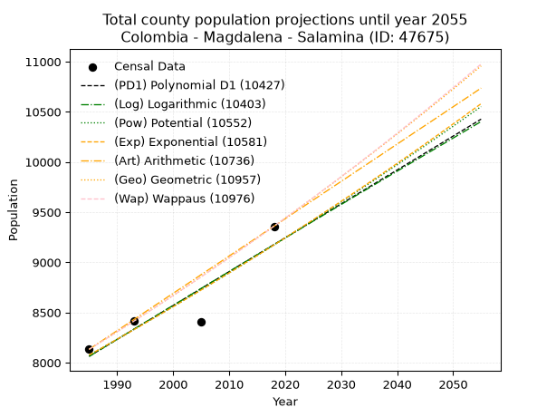
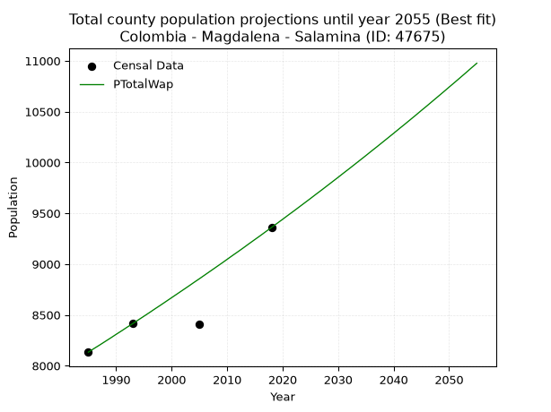
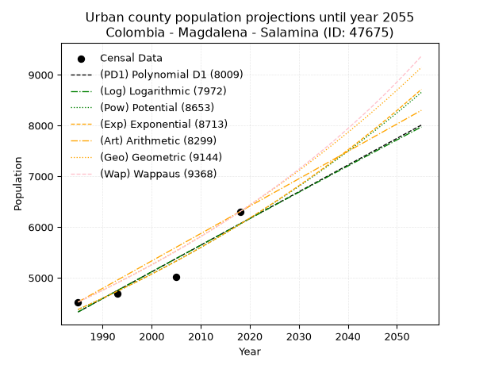
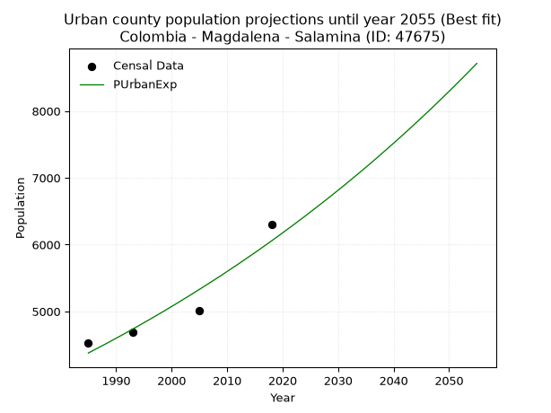
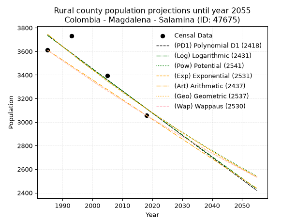
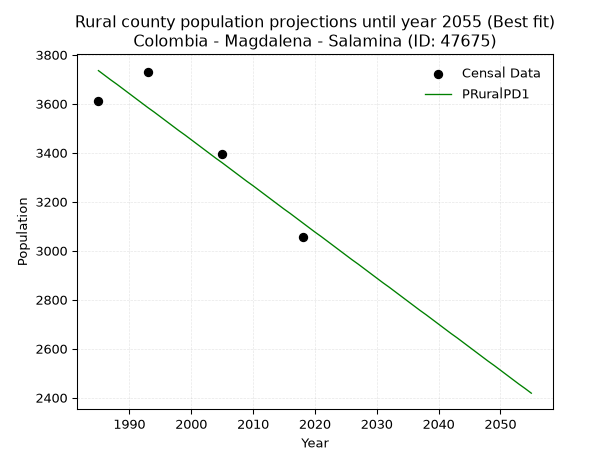

<div align="center">


</div>

# _“Population and Public Services Demand Projections (PPSD) until Year 2050 for Colombia - Magdalena - Salamina (ID: 47675)”_
Keywords: `population` `public-service` `projection` `lineal` `polynomial` `logarithmic` `potential` `exponential` `arithmetic` `geometric` `wappaus` `dane` `colombia` `south-america`

PPSD are analytical estimates used by governments and planners to anticipate future changes in population size, age distribution, and the resulting community needs for utilities, healthcare, education, and infrastructure as sizing future water treatment facilities, electrical grids, and road networks based on spatial growth.

> **General running parameters**: • app_version: _v20260806_. • Python version: _3.14.7_. • Pandas version: _3.0.5_. • NumPy version: _2.5.1_. • Creates, save and include plots into reports (create_plot): _False_. • Projection until year: _2050_. • Process polynomial degree 2 and up: _False_. • Process Wappaus: _True_. • Process Wappaus: _True_. • Set negative values to zero: _True_. • Set infinite values to zero: _True_. • Drop dataset notes: _True_. 
<div align="center">

Dynamic map: [:earth_americas:Google](http://maps.google.com/maps?q=10.49122903,-74.7941889) [:earth_americas:OSM](https://www.openstreetmap.org/#map=18/10.49122903/-74.7941889&layers=P) [:earth_americas:Bing](https://www.bing.com/maps?cp=10.49122903~-74.7941889&lvl=18) [:earth_americas:Apple](https://maps.apple.com/frame?center=10.49122903%2C-74.7941889&span=0.003%2C0.006)

</div>


<div align="center">

```geojson
{
  "type": "Feature",
  "geometry": {
    "type": "Point", 
    "coordinates": [-74.7941889, 10.49122903]
  }, 
  "properties": {
    "Name": "Colombia - Magdalena - Salamina (ID: 47675)"
  }
}
```

</div>


## 0. Census Data (4 records)

Census data are official statistics collected by a government about the people and housing in a country. They usually include counts of total population, age, sex, race, income, education, and jobs.

📅Global census file: [Population.xlsx](../data/Population.xlsx)

| Source   |   Year |   CountryID | CountryName   |   StateID | StateName   |   CountyID | CountyName   |   PTotal |   PUrban |   PRural |
|:---------|-------:|------------:|:--------------|----------:|:------------|-----------:|:-------------|---------:|---------:|---------:|
| DANE     |   1985 |          57 | Colombia      |        47 | Magdalena   |      47675 | Salamina     |     8133 |     4523 |     3610 |
| DANE     |   1993 |          57 | Colombia      |        47 | Magdalena   |      47675 | Salamina     |     8414 |     4683 |     3731 |
| DANE     |   2005 |          57 | Colombia      |        47 | Magdalena   |      47675 | Salamina     |     8404 |     5010 |     3394 |
| DANE     |   2018 |          57 | Colombia      |        47 | Magdalena   |      47675 | Salamina     |     9360 |     6303 |     3057 |

> 🔥Some records could had specific notes about the registered values or the corresponding urban or rural distribution.

**Local public utility companies (RUPS)**

 | SERVICIO       | ESTADO    | NOMBRE                                                                          | NIT         | DEPARTAMENTO_DOMICILIO   | MUNICIPIO_DOMICILIO   | DIRECCION               |   TELEFONO | EMAIL                       | TIPO_INSCRIPCION    | REPRESENTANTE_LEGAL          | TIPO_PRESTADOR          | CLASIFICACION                  |
|:---------------|:----------|:--------------------------------------------------------------------------------|:------------|:-------------------------|:----------------------|:------------------------|-----------:|:----------------------------|:--------------------|:-----------------------------|:------------------------|:-------------------------------|
| ACUEDUCTO      | OPERATIVA | ADMINISTRACION PUBLICA COOPERATIVA EMPRESA DE SERVICIOS PUBLICOS DEL RIO E.S.P. | 900115484-0 | MAGDALENA                | SALAMINA              | Calle 1 Sur No  2 - 120 |    3042566 | eaaasalaminamgd@hotmail.com | Registro por la ESP | CARMEN LUCILA MERCADO OROZCO | ORGANIZACION AUTORIZADA | DESDE 2501 HASTA 5000 USUARIOS |
| ASEO           | OPERATIVA | ADMINISTRACION PUBLICA COOPERATIVA EMPRESA DE SERVICIOS PUBLICOS DEL RIO E.S.P. | 900115484-0 | MAGDALENA                | SALAMINA              | Calle 1 Sur No  2 - 120 |    3042566 | eaaasalaminamgd@hotmail.com | Registro por la ESP | CARMEN LUCILA MERCADO OROZCO | ORGANIZACION AUTORIZADA | DESDE 2501 HASTA 5000 USUARIOS |
| ALCANTARILLADO | OPERATIVA | ADMINISTRACION PUBLICA COOPERATIVA EMPRESA DE SERVICIOS PUBLICOS DEL RIO E.S.P. | 900115484-0 | MAGDALENA                | SALAMINA              | Calle 1 Sur No  2 - 120 |    3042566 | eaaasalaminamgd@hotmail.com | Registro por la ESP | CARMEN LUCILA MERCADO OROZCO | ORGANIZACION AUTORIZADA | MENOR O IGUAL A 2500 USUARIOS  |

> [📅RUPS Database: Registro Único de Prestadores de Servicios Públicos de Colombia Suramérica - RUPS](https://www.datos.gov.co/Hacienda-y-Cr-dito-P-blico/Registro-nico-de-Prestadores-de-Servicios-P-blicos/4qkq-csdn/about_data)

## 1. Total

### 1.1. Coefficients and Parameters

* (PD1) Polynomial Deg 1: 33.76836611802431, -58967.42432757813 (lineal)
* (Log) Logarithmic: 67534.83683168623, -504755.08594786486
* (Pow) Potential: 7.719347519441339, -21.54939778198776
* (Exp) Exponential: 0.0038596264637824787, 3.8010693090177785
* (Art) Arithmetic: Year diff. 2018 - 1985 = 33, Population diff. 9360 - 8133 = 1227, Annual growth = 37.18181818181818
* (Geo) Geometric: Year diff. 2018 - 1985 = 33, Population diff. 9360 - 8133 = 1227, Annual growth % = 0.004267121720316069
* (Wap) Wappaus: i = 0.4251051069778561, Condition values only valid for < 200)

<sub>
Wappaus condition values: ['0.00', '0.43', '0.85', '1.28', '1.70', '2.13', '2.55', '2.98', '3.40', '3.83', '4.25', '4.68', '5.10', '5.53', '5.95', '6.38', '6.80', '7.23', '7.65', '8.08', '8.50', '8.93', '9.35', '9.78', '10.20', '10.63', '11.05', '11.48', '11.90', '12.33', '12.75', '13.18', '13.60', '14.03', '14.45', '14.88', '15.30', '15.73', '16.15', '16.58', '17.00', '17.43', '17.85', '18.28', '18.70', '19.13', '19.55', '19.98', '20.41', '20.83', '21.26', '21.68', '22.11', '22.53', '22.96', '23.38', '23.81', '24.23', '24.66', '25.08', '25.51', '25.93', '26.36', '26.78', '27.21', '27.63']
</sub>


### 1.2. Projected Dataset

|   Year |   CountyID |   PTotalPD1 |   PTotalLog |   PTotalPow |   PTotalExp |   PTotalArt |   PTotalGeo |   PTotalWap |
|-------:|-----------:|------------:|------------:|------------:|------------:|------------:|------------:|------------:|
|   1985 |      47675 |        8063 |        8062 |        8075 |        8076 |        8133 |        8133 |        8133 |
|   1986 |      47675 |        8097 |        8096 |        8107 |        8107 |        8170 |        8168 |        8168 |
|   1987 |      47675 |        8130 |        8130 |        8138 |        8138 |        8207 |        8203 |        8202 |
|   1988 |      47675 |        8164 |        8164 |        8170 |        8170 |        8245 |        8238 |        8237 |
|   1989 |      47675 |        8198 |        8198 |        8202 |        8202 |        8282 |        8273 |        8272 |
|   1990 |      47675 |        8232 |        8232 |        8234 |        8233 |        8319 |        8308 |        8308 |
|   1991 |      47675 |        8265 |        8266 |        8266 |        8265 |        8356 |        8343 |        8343 |
|   1992 |      47675 |        8299 |        8300 |        8298 |        8297 |        8393 |        8379 |        8379 |
|   1993 |      47675 |        8333 |        8334 |        8330 |        8329 |        8430 |        8415 |        8414 |
|   1994 |      47675 |        8367 |        8368 |        8362 |        8361 |        8468 |        8451 |        8450 |
|   1995 |      47675 |        8400 |        8402 |        8395 |        8394 |        8505 |        8487 |        8486 |
|   1996 |      47675 |        8434 |        8435 |        8427 |        8426 |        8542 |        8523 |        8522 |
|   1997 |      47675 |        8468 |        8469 |        8460 |        8459 |        8579 |        8559 |        8559 |
|   1998 |      47675 |        8502 |        8503 |        8493 |        8491 |        8616 |        8596 |        8595 |
|   1999 |      47675 |        8536 |        8537 |        8526 |        8524 |        8654 |        8633 |        8632 |
|   2000 |      47675 |        8569 |        8571 |        8559 |        8557 |        8691 |        8669 |        8669 |
|   2001 |      47675 |        8603 |        8604 |        8592 |        8590 |        8728 |        8706 |        8706 |
|   2002 |      47675 |        8637 |        8638 |        8625 |        8624 |        8765 |        8744 |        8743 |
|   2003 |      47675 |        8671 |        8672 |        8658 |        8657 |        8802 |        8781 |        8780 |
|   2004 |      47675 |        8704 |        8706 |        8692 |        8690 |        8839 |        8818 |        8818 |
|   2005 |      47675 |        8738 |        8739 |        8725 |        8724 |        8877 |        8856 |        8855 |
|   2006 |      47675 |        8772 |        8773 |        8759 |        8758 |        8914 |        8894 |        8893 |
|   2007 |      47675 |        8806 |        8807 |        8793 |        8792 |        8951 |        8932 |        8931 |
|   2008 |      47675 |        8839 |        8840 |        8826 |        8826 |        8988 |        8970 |        8969 |
|   2009 |      47675 |        8873 |        8874 |        8860 |        8860 |        9025 |        9008 |        9007 |
|   2010 |      47675 |        8907 |        8907 |        8894 |        8894 |        9063 |        9047 |        9046 |
|   2011 |      47675 |        8941 |        8941 |        8929 |        8928 |        9100 |        9085 |        9085 |
|   2012 |      47675 |        8975 |        8975 |        8963 |        8963 |        9137 |        9124 |        9123 |
|   2013 |      47675 |        9008 |        9008 |        8997 |        8998 |        9174 |        9163 |        9162 |
|   2014 |      47675 |        9042 |        9042 |        9032 |        9032 |        9211 |        9202 |        9202 |
|   2015 |      47675 |        9076 |        9075 |        9067 |        9067 |        9248 |        9241 |        9241 |
|   2016 |      47675 |        9110 |        9109 |        9102 |        9102 |        9286 |        9281 |        9280 |
|   2017 |      47675 |        9143 |        9142 |        9136 |        9138 |        9323 |        9320 |        9320 |
|   2018 |      47675 |        9177 |        9176 |        9171 |        9173 |        9360 |        9360 |        9360 |
|   2019 |      47675 |        9211 |        9209 |        9207 |        9208 |        9397 |        9400 |        9400 |
|   2020 |      47675 |        9245 |        9243 |        9242 |        9244 |        9434 |        9440 |        9440 |
|   2021 |      47675 |        9278 |        9276 |        9277 |        9280 |        9472 |        9480 |        9481 |
|   2022 |      47675 |        9312 |        9309 |        9313 |        9316 |        9509 |        9521 |        9521 |
|   2023 |      47675 |        9346 |        9343 |        9348 |        9352 |        9546 |        9561 |        9562 |
|   2024 |      47675 |        9380 |        9376 |        9384 |        9388 |        9583 |        9602 |        9603 |
|   2025 |      47675 |        9414 |        9410 |        9420 |        9424 |        9620 |        9643 |        9644 |
|   2026 |      47675 |        9447 |        9443 |        9456 |        9461 |        9657 |        9684 |        9686 |
|   2027 |      47675 |        9481 |        9476 |        9492 |        9497 |        9695 |        9726 |        9727 |
|   2028 |      47675 |        9515 |        9510 |        9528 |        9534 |        9732 |        9767 |        9769 |
|   2029 |      47675 |        9549 |        9543 |        9564 |        9571 |        9769 |        9809 |        9811 |
|   2030 |      47675 |        9582 |        9576 |        9601 |        9608 |        9806 |        9851 |        9853 |
|   2031 |      47675 |        9616 |        9609 |        9638 |        9645 |        9843 |        9893 |        9896 |
|   2032 |      47675 |        9650 |        9643 |        9674 |        9682 |        9881 |        9935 |        9938 |
|   2033 |      47675 |        9684 |        9676 |        9711 |        9720 |        9918 |        9977 |        9981 |
|   2034 |      47675 |        9717 |        9709 |        9748 |        9757 |        9955 |       10020 |       10024 |
|   2035 |      47675 |        9751 |        9742 |        9785 |        9795 |        9992 |       10063 |       10067 |
|   2036 |      47675 |        9785 |        9775 |        9822 |        9833 |       10029 |       10106 |       10111 |
|   2037 |      47675 |        9819 |        9809 |        9859 |        9871 |       10066 |       10149 |       10154 |
|   2038 |      47675 |        9853 |        9842 |        9897 |        9909 |       10104 |       10192 |       10198 |
|   2039 |      47675 |        9886 |        9875 |        9934 |        9947 |       10141 |       10236 |       10242 |
|   2040 |      47675 |        9920 |        9908 |        9972 |        9986 |       10178 |       10279 |       10286 |
|   2041 |      47675 |        9954 |        9941 |       10010 |       10024 |       10215 |       10323 |       10331 |
|   2042 |      47675 |        9988 |        9974 |       10048 |       10063 |       10252 |       10367 |       10375 |
|   2043 |      47675 |       10021 |       10007 |       10086 |       10102 |       10290 |       10411 |       10420 |
|   2044 |      47675 |       10055 |       10040 |       10124 |       10141 |       10327 |       10456 |       10465 |
|   2045 |      47675 |       10089 |       10073 |       10162 |       10180 |       10364 |       10500 |       10511 |
|   2046 |      47675 |       10123 |       10106 |       10201 |       10220 |       10401 |       10545 |       10556 |
|   2047 |      47675 |       10156 |       10139 |       10239 |       10259 |       10438 |       10590 |       10602 |
|   2048 |      47675 |       10190 |       10172 |       10278 |       10299 |       10475 |       10635 |       10648 |
|   2049 |      47675 |       10224 |       10205 |       10317 |       10339 |       10513 |       10681 |       10694 |
|   2050 |      47675 |       10258 |       10238 |       10356 |       10379 |       10550 |       10726 |       10741 |
<div align="center">

</img>

</div>


### 1.3. Best fit with absolute and relative error (%)

Relative error puts that difference into context by dividing the absolute error by the true value, creating a unitless ratio or percentage that shows the scale of the mistake.

Absolute and relative error

|   Year | Source   |   CountryID | CountryName   |   StateID | StateName   |   CountyID_x | CountyName   |   PTotal |   PUrban |   PRural |   CountyID_y |   PTotalPD1 |   PTotalLog |   PTotalPow |   PTotalExp |   PTotalArt |   PTotalGeo |   PTotalWap |   PTotalPD1AbsError |   PTotalLogAbsError |   PTotalPowAbsError |   PTotalExpAbsError |   PTotalArtAbsError |   PTotalGeoAbsError |   PTotalWapAbsError |   PTotalPD1RelError |   PTotalLogRelError |   PTotalPowRelError |   PTotalExpRelError |   PTotalArtRelError |   PTotalGeoRelError |   PTotalWapRelError |
|-------:|:---------|------------:|:--------------|----------:|:------------|-------------:|:-------------|---------:|---------:|---------:|-------------:|------------:|------------:|------------:|------------:|------------:|------------:|------------:|--------------------:|--------------------:|--------------------:|--------------------:|--------------------:|--------------------:|--------------------:|--------------------:|--------------------:|--------------------:|--------------------:|--------------------:|--------------------:|--------------------:|
|   1985 | DANE     |          57 | Colombia      |        47 | Magdalena   |        47675 | Salamina     |     8133 |     4523 |     3610 |        47675 |        8063 |        8062 |        8075 |        8076 |        8133 |        8133 |        8133 |                  70 |                  71 |                  58 |                  57 |                   0 |                   0 |                   0 |            0.860691 |            0.872987 |            0.713144 |            0.700848 |            0        |            0        |             0       |
|   1993 | DANE     |          57 | Colombia      |        47 | Magdalena   |        47675 | Salamina     |     8414 |     4683 |     3731 |        47675 |        8333 |        8334 |        8330 |        8329 |        8430 |        8415 |        8414 |                  81 |                  80 |                  84 |                  85 |                  16 |                   1 |                   0 |            0.962681 |            0.950796 |            0.998336 |            1.01022  |            0.190159 |            0.011885 |             0       |
|   2005 | DANE     |          57 | Colombia      |        47 | Magdalena   |        47675 | Salamina     |     8404 |     5010 |     3394 |        47675 |        8738 |        8739 |        8725 |        8724 |        8877 |        8856 |        8855 |                 334 |                 335 |                 321 |                 320 |                 473 |                 452 |                 451 |            3.9743   |            3.9862   |            3.81961  |            3.80771  |            5.62827  |            5.37839  |             5.36649 |
|   2018 | DANE     |          57 | Colombia      |        47 | Magdalena   |        47675 | Salamina     |     9360 |     6303 |     3057 |        47675 |        9177 |        9176 |        9171 |        9173 |        9360 |        9360 |        9360 |                 183 |                 184 |                 189 |                 187 |                   0 |                   0 |                   0 |            1.95513  |            1.96581  |            2.01923  |            1.99786  |            0        |            0        |             0       |

Relative error mean

| Method    |   RelError | Best   |
|:----------|-----------:|:-------|
| PTotalPD1 |    1.9382  |        |
| PTotalLog |    1.94395 |        |
| PTotalPow |    1.88758 |        |
| PTotalExp |    1.87916 |        |
| PTotalArt |    1.45461 |        |
| PTotalGeo |    1.34757 |        |
| PTotalWap |    1.34162 | True   |

💙Best method: _**PTotalWap**_
<div align="center">

</img>

</div>


### 1.4. Fresh water supply demand in liters per capita per day (lpcd)

The fresh water supply demand typically ranges from 100 to 300 liters per capita per day (lpcd) for standard domestic and municipal planning, though absolute survival minimums set by the World Health Organization are as low as 7.5 to 20 liters per day, and total consumption in high-income nations can exceed 400 liters.

> `CZ`: Level in meters above the sea level (masl)<br> `WS`: Fresh water supply demand in liters per capita per day (lpcd or l/h/d)<br> `WSAll`: Zonal fresh water supply demand in liters per second (l/s)<br> `A`: Zonal area in square meters<br> `DP`: Population density (people/hectare or p/ha)

Reference values (RAS Colombia)

|    CZ |   WS |
|------:|-----:|
|  1000 |  120 |
|  2000 |  130 |
| 99999 |  140 |

County shapefile geometry properties and water supply values

|   CountyID |      ATotal |   CZTotal |   WSTotal |
|-----------:|------------:|----------:|----------:|
|      47675 | 1.70164e+08 |   3.30995 |       120 |

Projected values for best method: PTotalWap

|   CountyID |   Year |   PTotalWap |   DPTotal |   WSTotal |   WSTotalAll |
|-----------:|-------:|------------:|----------:|----------:|-------------:|
|      47675 |   1985 |        8133 |      0.48 |       120 |      11.2958 |
|      47675 |   1986 |        8168 |      0.48 |       120 |      11.3444 |
|      47675 |   1987 |        8202 |      0.48 |       120 |      11.3917 |
|      47675 |   1988 |        8237 |      0.48 |       120 |      11.4403 |
|      47675 |   1989 |        8272 |      0.49 |       120 |      11.4889 |
|      47675 |   1990 |        8308 |      0.49 |       120 |      11.5389 |
|      47675 |   1991 |        8343 |      0.49 |       120 |      11.5875 |
|      47675 |   1992 |        8379 |      0.49 |       120 |      11.6375 |
|      47675 |   1993 |        8414 |      0.49 |       120 |      11.6861 |
|      47675 |   1994 |        8450 |      0.5  |       120 |      11.7361 |
|      47675 |   1995 |        8486 |      0.5  |       120 |      11.7861 |
|      47675 |   1996 |        8522 |      0.5  |       120 |      11.8361 |
|      47675 |   1997 |        8559 |      0.5  |       120 |      11.8875 |
|      47675 |   1998 |        8595 |      0.51 |       120 |      11.9375 |
|      47675 |   1999 |        8632 |      0.51 |       120 |      11.9889 |
|      47675 |   2000 |        8669 |      0.51 |       120 |      12.0403 |
|      47675 |   2001 |        8706 |      0.51 |       120 |      12.0917 |
|      47675 |   2002 |        8743 |      0.51 |       120 |      12.1431 |
|      47675 |   2003 |        8780 |      0.52 |       120 |      12.1944 |
|      47675 |   2004 |        8818 |      0.52 |       120 |      12.2472 |
|      47675 |   2005 |        8855 |      0.52 |       120 |      12.2986 |
|      47675 |   2006 |        8893 |      0.52 |       120 |      12.3514 |
|      47675 |   2007 |        8931 |      0.52 |       120 |      12.4042 |
|      47675 |   2008 |        8969 |      0.53 |       120 |      12.4569 |
|      47675 |   2009 |        9007 |      0.53 |       120 |      12.5097 |
|      47675 |   2010 |        9046 |      0.53 |       120 |      12.5639 |
|      47675 |   2011 |        9085 |      0.53 |       120 |      12.6181 |
|      47675 |   2012 |        9123 |      0.54 |       120 |      12.6708 |
|      47675 |   2013 |        9162 |      0.54 |       120 |      12.725  |
|      47675 |   2014 |        9202 |      0.54 |       120 |      12.7806 |
|      47675 |   2015 |        9241 |      0.54 |       120 |      12.8347 |
|      47675 |   2016 |        9280 |      0.55 |       120 |      12.8889 |
|      47675 |   2017 |        9320 |      0.55 |       120 |      12.9444 |
|      47675 |   2018 |        9360 |      0.55 |       120 |      13      |
|      47675 |   2019 |        9400 |      0.55 |       120 |      13.0556 |
|      47675 |   2020 |        9440 |      0.55 |       120 |      13.1111 |
|      47675 |   2021 |        9481 |      0.56 |       120 |      13.1681 |
|      47675 |   2022 |        9521 |      0.56 |       120 |      13.2236 |
|      47675 |   2023 |        9562 |      0.56 |       120 |      13.2806 |
|      47675 |   2024 |        9603 |      0.56 |       120 |      13.3375 |
|      47675 |   2025 |        9644 |      0.57 |       120 |      13.3944 |
|      47675 |   2026 |        9686 |      0.57 |       120 |      13.4528 |
|      47675 |   2027 |        9727 |      0.57 |       120 |      13.5097 |
|      47675 |   2028 |        9769 |      0.57 |       120 |      13.5681 |
|      47675 |   2029 |        9811 |      0.58 |       120 |      13.6264 |
|      47675 |   2030 |        9853 |      0.58 |       120 |      13.6847 |
|      47675 |   2031 |        9896 |      0.58 |       120 |      13.7444 |
|      47675 |   2032 |        9938 |      0.58 |       120 |      13.8028 |
|      47675 |   2033 |        9981 |      0.59 |       120 |      13.8625 |
|      47675 |   2034 |       10024 |      0.59 |       120 |      13.9222 |
|      47675 |   2035 |       10067 |      0.59 |       120 |      13.9819 |
|      47675 |   2036 |       10111 |      0.59 |       120 |      14.0431 |
|      47675 |   2037 |       10154 |      0.6  |       120 |      14.1028 |
|      47675 |   2038 |       10198 |      0.6  |       120 |      14.1639 |
|      47675 |   2039 |       10242 |      0.6  |       120 |      14.225  |
|      47675 |   2040 |       10286 |      0.6  |       120 |      14.2861 |
|      47675 |   2041 |       10331 |      0.61 |       120 |      14.3486 |
|      47675 |   2042 |       10375 |      0.61 |       120 |      14.4097 |
|      47675 |   2043 |       10420 |      0.61 |       120 |      14.4722 |
|      47675 |   2044 |       10465 |      0.61 |       120 |      14.5347 |
|      47675 |   2045 |       10511 |      0.62 |       120 |      14.5986 |
|      47675 |   2046 |       10556 |      0.62 |       120 |      14.6611 |
|      47675 |   2047 |       10602 |      0.62 |       120 |      14.725  |
|      47675 |   2048 |       10648 |      0.63 |       120 |      14.7889 |
|      47675 |   2049 |       10694 |      0.63 |       120 |      14.8528 |
|      47675 |   2050 |       10741 |      0.63 |       120 |      14.9181 |

## 2. Urban

### 2.1. Coefficients and Parameters

* (PD1) Polynomial Deg 1: 52.58651144118744, -100056.41951023517 (lineal)
* (Log) Logarithmic: 105170.6420059161, -794273.1426716008
* (Pow) Potential: 19.66902379039111, -61.22260523043726
* (Exp) Exponential: 0.009833871512829646, 1.457719549197459e-05
* (Art) Arithmetic: Year diff. 2018 - 1985 = 33, Population diff. 6303 - 4523 = 1780, Annual growth = 53.93939393939394
* (Geo) Geometric: Year diff. 2018 - 1985 = 33, Population diff. 6303 - 4523 = 1780, Annual growth % = 0.010106799431029545
* (Wap) Wappaus: i = 0.9964787352557536, Condition values only valid for < 200)

<sub>
Wappaus condition values: ['0.00', '1.00', '1.99', '2.99', '3.99', '4.98', '5.98', '6.98', '7.97', '8.97', '9.96', '10.96', '11.96', '12.95', '13.95', '14.95', '15.94', '16.94', '17.94', '18.93', '19.93', '20.93', '21.92', '22.92', '23.92', '24.91', '25.91', '26.90', '27.90', '28.90', '29.89', '30.89', '31.89', '32.88', '33.88', '34.88', '35.87', '36.87', '37.87', '38.86', '39.86', '40.86', '41.85', '42.85', '43.85', '44.84', '45.84', '46.83', '47.83', '48.83', '49.82', '50.82', '51.82', '52.81', '53.81', '54.81', '55.80', '56.80', '57.80', '58.79', '59.79', '60.79', '61.78', '62.78', '63.77', '64.77']
</sub>


### 2.2. Projected Dataset

|   Year |   CountyID |   PUrbanPD1 |   PUrbanLog |   PUrbanPow |   PUrbanExp |   PUrbanArt |   PUrbanGeo |   PUrbanWap |
|-------:|-----------:|------------:|------------:|------------:|------------:|------------:|------------:|------------:|
|   1985 |      47675 |        4328 |        4327 |        4376 |        4377 |        4523 |        4523 |        4523 |
|   1986 |      47675 |        4380 |        4380 |        4420 |        4421 |        4577 |        4569 |        4568 |
|   1987 |      47675 |        4433 |        4433 |        4464 |        4464 |        4631 |        4615 |        4614 |
|   1988 |      47675 |        4486 |        4486 |        4508 |        4508 |        4685 |        4662 |        4660 |
|   1989 |      47675 |        4538 |        4539 |        4553 |        4553 |        4739 |        4709 |        4707 |
|   1990 |      47675 |        4591 |        4591 |        4598 |        4598 |        4793 |        4756 |        4754 |
|   1991 |      47675 |        4643 |        4644 |        4644 |        4643 |        4847 |        4804 |        4802 |
|   1992 |      47675 |        4696 |        4697 |        4690 |        4689 |        4901 |        4853 |        4850 |
|   1993 |      47675 |        4748 |        4750 |        4737 |        4736 |        4955 |        4902 |        4899 |
|   1994 |      47675 |        4801 |        4803 |        4784 |        4782 |        5008 |        4951 |        4948 |
|   1995 |      47675 |        4854 |        4855 |        4831 |        4830 |        5062 |        5001 |        4997 |
|   1996 |      47675 |        4906 |        4908 |        4879 |        4877 |        5116 |        5052 |        5048 |
|   1997 |      47675 |        4959 |        4961 |        4927 |        4926 |        5170 |        5103 |        5098 |
|   1998 |      47675 |        5011 |        5013 |        4976 |        4974 |        5224 |        5155 |        5149 |
|   1999 |      47675 |        5064 |        5066 |        5025 |        5023 |        5278 |        5207 |        5201 |
|   2000 |      47675 |        5117 |        5119 |        5075 |        5073 |        5332 |        5259 |        5254 |
|   2001 |      47675 |        5169 |        5171 |        5125 |        5123 |        5386 |        5313 |        5307 |
|   2002 |      47675 |        5222 |        5224 |        5176 |        5174 |        5440 |        5366 |        5360 |
|   2003 |      47675 |        5274 |        5276 |        5227 |        5225 |        5494 |        5420 |        5414 |
|   2004 |      47675 |        5327 |        5329 |        5278 |        5277 |        5548 |        5475 |        5469 |
|   2005 |      47675 |        5380 |        5381 |        5330 |        5329 |        5602 |        5531 |        5524 |
|   2006 |      47675 |        5432 |        5434 |        5383 |        5381 |        5656 |        5586 |        5580 |
|   2007 |      47675 |        5485 |        5486 |        5436 |        5435 |        5710 |        5643 |        5637 |
|   2008 |      47675 |        5537 |        5538 |        5489 |        5488 |        5764 |        5700 |        5694 |
|   2009 |      47675 |        5590 |        5591 |        5544 |        5542 |        5818 |        5758 |        5752 |
|   2010 |      47675 |        5642 |        5643 |        5598 |        5597 |        5871 |        5816 |        5810 |
|   2011 |      47675 |        5695 |        5696 |        5653 |        5653 |        5925 |        5875 |        5869 |
|   2012 |      47675 |        5748 |        5748 |        5709 |        5708 |        5979 |        5934 |        5929 |
|   2013 |      47675 |        5800 |        5800 |        5765 |        5765 |        6033 |        5994 |        5990 |
|   2014 |      47675 |        5853 |        5852 |        5821 |        5822 |        6087 |        6054 |        6051 |
|   2015 |      47675 |        5905 |        5904 |        5878 |        5879 |        6141 |        6116 |        6113 |
|   2016 |      47675 |        5958 |        5957 |        5936 |        5937 |        6195 |        6177 |        6175 |
|   2017 |      47675 |        6011 |        6009 |        5994 |        5996 |        6249 |        6240 |        6239 |
|   2018 |      47675 |        6063 |        6061 |        6053 |        6055 |        6303 |        6303 |        6303 |
|   2019 |      47675 |        6116 |        6113 |        6112 |        6115 |        6357 |        6367 |        6368 |
|   2020 |      47675 |        6168 |        6165 |        6172 |        6176 |        6411 |        6431 |        6434 |
|   2021 |      47675 |        6221 |        6217 |        6232 |        6237 |        6465 |        6496 |        6500 |
|   2022 |      47675 |        6274 |        6269 |        6293 |        6298 |        6519 |        6562 |        6568 |
|   2023 |      47675 |        6326 |        6321 |        6355 |        6361 |        6573 |        6628 |        6636 |
|   2024 |      47675 |        6379 |        6373 |        6417 |        6423 |        6627 |        6695 |        6705 |
|   2025 |      47675 |        6431 |        6425 |        6480 |        6487 |        6681 |        6763 |        6775 |
|   2026 |      47675 |        6484 |        6477 |        6543 |        6551 |        6735 |        6831 |        6845 |
|   2027 |      47675 |        6536 |        6529 |        6607 |        6616 |        6788 |        6900 |        6917 |
|   2028 |      47675 |        6589 |        6581 |        6671 |        6681 |        6842 |        6970 |        6989 |
|   2029 |      47675 |        6642 |        6633 |        6736 |        6747 |        6896 |        7040 |        7063 |
|   2030 |      47675 |        6694 |        6684 |        6802 |        6814 |        6950 |        7111 |        7137 |
|   2031 |      47675 |        6747 |        6736 |        6868 |        6881 |        7004 |        7183 |        7213 |
|   2032 |      47675 |        6799 |        6788 |        6935 |        6949 |        7058 |        7256 |        7289 |
|   2033 |      47675 |        6852 |        6840 |        7002 |        7018 |        7112 |        7329 |        7366 |
|   2034 |      47675 |        6905 |        6892 |        7070 |        7087 |        7166 |        7403 |        7445 |
|   2035 |      47675 |        6957 |        6943 |        7139 |        7157 |        7220 |        7478 |        7524 |
|   2036 |      47675 |        7010 |        6995 |        7208 |        7228 |        7274 |        7554 |        7605 |
|   2037 |      47675 |        7062 |        7047 |        7278 |        7299 |        7328 |        7630 |        7686 |
|   2038 |      47675 |        7115 |        7098 |        7349 |        7372 |        7382 |        7707 |        7769 |
|   2039 |      47675 |        7167 |        7150 |        7420 |        7444 |        7436 |        7785 |        7853 |
|   2040 |      47675 |        7220 |        7201 |        7492 |        7518 |        7490 |        7864 |        7938 |
|   2041 |      47675 |        7273 |        7253 |        7564 |        7592 |        7544 |        7943 |        8024 |
|   2042 |      47675 |        7325 |        7304 |        7638 |        7667 |        7598 |        8023 |        8111 |
|   2043 |      47675 |        7378 |        7356 |        7712 |        7743 |        7651 |        8105 |        8200 |
|   2044 |      47675 |        7430 |        7407 |        7786 |        7820 |        7705 |        8186 |        8289 |
|   2045 |      47675 |        7483 |        7459 |        7861 |        7897 |        7759 |        8269 |        8380 |
|   2046 |      47675 |        7536 |        7510 |        7937 |        7975 |        7813 |        8353 |        8473 |
|   2047 |      47675 |        7588 |        7562 |        8014 |        8054 |        7867 |        8437 |        8566 |
|   2048 |      47675 |        7641 |        7613 |        8091 |        8133 |        7921 |        8522 |        8661 |
|   2049 |      47675 |        7693 |        7664 |        8169 |        8214 |        7975 |        8609 |        8758 |
|   2050 |      47675 |        7746 |        7716 |        8248 |        8295 |        8029 |        8696 |        8856 |
<div align="center">

</img>

</div>


### 2.3. Best fit with absolute and relative error (%)

Relative error puts that difference into context by dividing the absolute error by the true value, creating a unitless ratio or percentage that shows the scale of the mistake.

Absolute and relative error

|   Year | Source   |   CountryID | CountryName   |   StateID | StateName   |   CountyID_x | CountyName   |   PTotal |   PUrban |   PRural |   CountyID_y |   PUrbanPD1 |   PUrbanLog |   PUrbanPow |   PUrbanExp |   PUrbanArt |   PUrbanGeo |   PUrbanWap |   PUrbanPD1AbsError |   PUrbanLogAbsError |   PUrbanPowAbsError |   PUrbanExpAbsError |   PUrbanArtAbsError |   PUrbanGeoAbsError |   PUrbanWapAbsError |   PUrbanPD1RelError |   PUrbanLogRelError |   PUrbanPowRelError |   PUrbanExpRelError |   PUrbanArtRelError |   PUrbanGeoRelError |   PUrbanWapRelError |
|-------:|:---------|------------:|:--------------|----------:|:------------|-------------:|:-------------|---------:|---------:|---------:|-------------:|------------:|------------:|------------:|------------:|------------:|------------:|------------:|--------------------:|--------------------:|--------------------:|--------------------:|--------------------:|--------------------:|--------------------:|--------------------:|--------------------:|--------------------:|--------------------:|--------------------:|--------------------:|--------------------:|
|   1985 | DANE     |          57 | Colombia      |        47 | Magdalena   |        47675 | Salamina     |     8133 |     4523 |     3610 |        47675 |        4328 |        4327 |        4376 |        4377 |        4523 |        4523 |        4523 |                 195 |                 196 |                 147 |                 146 |                   0 |                   0 |                   0 |             4.3113  |             4.33341 |             3.25006 |             3.22795 |             0       |             0       |             0       |
|   1993 | DANE     |          57 | Colombia      |        47 | Magdalena   |        47675 | Salamina     |     8414 |     4683 |     3731 |        47675 |        4748 |        4750 |        4737 |        4736 |        4955 |        4902 |        4899 |                  65 |                  67 |                  54 |                  53 |                 272 |                 219 |                 216 |             1.388   |             1.43071 |             1.15311 |             1.13175 |             5.80824 |             4.67649 |             4.61243 |
|   2005 | DANE     |          57 | Colombia      |        47 | Magdalena   |        47675 | Salamina     |     8404 |     5010 |     3394 |        47675 |        5380 |        5381 |        5330 |        5329 |        5602 |        5531 |        5524 |                 370 |                 371 |                 320 |                 319 |                 592 |                 521 |                 514 |             7.38523 |             7.40519 |             6.38723 |             6.36727 |            11.8164  |            10.3992  |            10.2595  |
|   2018 | DANE     |          57 | Colombia      |        47 | Magdalena   |        47675 | Salamina     |     9360 |     6303 |     3057 |        47675 |        6063 |        6061 |        6053 |        6055 |        6303 |        6303 |        6303 |                 240 |                 242 |                 250 |                 248 |                   0 |                   0 |                   0 |             3.80771 |             3.83944 |             3.96637 |             3.93463 |             0       |             0       |             0       |

Relative error mean

| Method    |   RelError | Best   |
|:----------|-----------:|:-------|
| PUrbanPD1 |    4.22306 |        |
| PUrbanLog |    4.25219 |        |
| PUrbanPow |    3.68919 |        |
| PUrbanExp |    3.6654  | True   |
| PUrbanArt |    4.40615 |        |
| PUrbanGeo |    3.76892 |        |
| PUrbanWap |    3.71798 |        |

💙Best method: _**PUrbanExp**_
<div align="center">

</img>

</div>


### 2.4. Fresh water supply demand in liters per capita per day (lpcd)

The fresh water supply demand typically ranges from 100 to 300 liters per capita per day (lpcd) for standard domestic and municipal planning, though absolute survival minimums set by the World Health Organization are as low as 7.5 to 20 liters per day, and total consumption in high-income nations can exceed 400 liters.

> `CZ`: Level in meters above the sea level (masl)<br> `WS`: Fresh water supply demand in liters per capita per day (lpcd or l/h/d)<br> `WSAll`: Zonal fresh water supply demand in liters per second (l/s)<br> `A`: Zonal area in square meters<br> `DP`: Population density (people/hectare or p/ha)

Reference values (RAS Colombia)

|    CZ |   WS |
|------:|-----:|
|  1000 |  120 |
|  2000 |  130 |
| 99999 |  140 |

County shapefile geometry properties and water supply values

|   CountyID |      AUrban |   CZUrban |   WSUrban |
|-----------:|------------:|----------:|----------:|
|      47675 | 1.81777e+06 |   5.55935 |       120 |

Projected values for best method: PUrbanExp

|   CountyID |   Year |   PUrbanExp |   DPUrban |   WSUrban |   WSUrbanAll |
|-----------:|-------:|------------:|----------:|----------:|-------------:|
|      47675 |   1985 |        4377 |     24.08 |       120 |      6.07917 |
|      47675 |   1986 |        4421 |     24.32 |       120 |      6.14028 |
|      47675 |   1987 |        4464 |     24.56 |       120 |      6.2     |
|      47675 |   1988 |        4508 |     24.8  |       120 |      6.26111 |
|      47675 |   1989 |        4553 |     25.05 |       120 |      6.32361 |
|      47675 |   1990 |        4598 |     25.29 |       120 |      6.38611 |
|      47675 |   1991 |        4643 |     25.54 |       120 |      6.44861 |
|      47675 |   1992 |        4689 |     25.8  |       120 |      6.5125  |
|      47675 |   1993 |        4736 |     26.05 |       120 |      6.57778 |
|      47675 |   1994 |        4782 |     26.31 |       120 |      6.64167 |
|      47675 |   1995 |        4830 |     26.57 |       120 |      6.70833 |
|      47675 |   1996 |        4877 |     26.83 |       120 |      6.77361 |
|      47675 |   1997 |        4926 |     27.1  |       120 |      6.84167 |
|      47675 |   1998 |        4974 |     27.36 |       120 |      6.90833 |
|      47675 |   1999 |        5023 |     27.63 |       120 |      6.97639 |
|      47675 |   2000 |        5073 |     27.91 |       120 |      7.04583 |
|      47675 |   2001 |        5123 |     28.18 |       120 |      7.11528 |
|      47675 |   2002 |        5174 |     28.46 |       120 |      7.18611 |
|      47675 |   2003 |        5225 |     28.74 |       120 |      7.25694 |
|      47675 |   2004 |        5277 |     29.03 |       120 |      7.32917 |
|      47675 |   2005 |        5329 |     29.32 |       120 |      7.40139 |
|      47675 |   2006 |        5381 |     29.6  |       120 |      7.47361 |
|      47675 |   2007 |        5435 |     29.9  |       120 |      7.54861 |
|      47675 |   2008 |        5488 |     30.19 |       120 |      7.62222 |
|      47675 |   2009 |        5542 |     30.49 |       120 |      7.69722 |
|      47675 |   2010 |        5597 |     30.79 |       120 |      7.77361 |
|      47675 |   2011 |        5653 |     31.1  |       120 |      7.85139 |
|      47675 |   2012 |        5708 |     31.4  |       120 |      7.92778 |
|      47675 |   2013 |        5765 |     31.71 |       120 |      8.00694 |
|      47675 |   2014 |        5822 |     32.03 |       120 |      8.08611 |
|      47675 |   2015 |        5879 |     32.34 |       120 |      8.16528 |
|      47675 |   2016 |        5937 |     32.66 |       120 |      8.24583 |
|      47675 |   2017 |        5996 |     32.99 |       120 |      8.32778 |
|      47675 |   2018 |        6055 |     33.31 |       120 |      8.40972 |
|      47675 |   2019 |        6115 |     33.64 |       120 |      8.49306 |
|      47675 |   2020 |        6176 |     33.98 |       120 |      8.57778 |
|      47675 |   2021 |        6237 |     34.31 |       120 |      8.6625  |
|      47675 |   2022 |        6298 |     34.65 |       120 |      8.74722 |
|      47675 |   2023 |        6361 |     34.99 |       120 |      8.83472 |
|      47675 |   2024 |        6423 |     35.33 |       120 |      8.92083 |
|      47675 |   2025 |        6487 |     35.69 |       120 |      9.00972 |
|      47675 |   2026 |        6551 |     36.04 |       120 |      9.09861 |
|      47675 |   2027 |        6616 |     36.4  |       120 |      9.18889 |
|      47675 |   2028 |        6681 |     36.75 |       120 |      9.27917 |
|      47675 |   2029 |        6747 |     37.12 |       120 |      9.37083 |
|      47675 |   2030 |        6814 |     37.49 |       120 |      9.46389 |
|      47675 |   2031 |        6881 |     37.85 |       120 |      9.55694 |
|      47675 |   2032 |        6949 |     38.23 |       120 |      9.65139 |
|      47675 |   2033 |        7018 |     38.61 |       120 |      9.74722 |
|      47675 |   2034 |        7087 |     38.99 |       120 |      9.84306 |
|      47675 |   2035 |        7157 |     39.37 |       120 |      9.94028 |
|      47675 |   2036 |        7228 |     39.76 |       120 |     10.0389  |
|      47675 |   2037 |        7299 |     40.15 |       120 |     10.1375  |
|      47675 |   2038 |        7372 |     40.56 |       120 |     10.2389  |
|      47675 |   2039 |        7444 |     40.95 |       120 |     10.3389  |
|      47675 |   2040 |        7518 |     41.36 |       120 |     10.4417  |
|      47675 |   2041 |        7592 |     41.77 |       120 |     10.5444  |
|      47675 |   2042 |        7667 |     42.18 |       120 |     10.6486  |
|      47675 |   2043 |        7743 |     42.6  |       120 |     10.7542  |
|      47675 |   2044 |        7820 |     43.02 |       120 |     10.8611  |
|      47675 |   2045 |        7897 |     43.44 |       120 |     10.9681  |
|      47675 |   2046 |        7975 |     43.87 |       120 |     11.0764  |
|      47675 |   2047 |        8054 |     44.31 |       120 |     11.1861  |
|      47675 |   2048 |        8133 |     44.74 |       120 |     11.2958  |
|      47675 |   2049 |        8214 |     45.19 |       120 |     11.4083  |
|      47675 |   2050 |        8295 |     45.63 |       120 |     11.5208  |

## 3. Rural

### 3.1. Coefficients and Parameters

* (PD1) Polynomial Deg 1: -18.81814532316315, 41088.9951826571 (lineal)
* (Log) Logarithmic: -37635.80517422984, 289518.0567237359
* (Pow) Potential: -11.186905914953039, 40.465159740394064
* (Exp) Exponential: -0.005593655331199233, 248616268.2322827
* (Art) Arithmetic: Year diff. 2018 - 1985 = 33, Population diff. 3057 - 3610 = -553, Annual growth = -16.757575757575758
* (Geo) Geometric: Year diff. 2018 - 1985 = 33, Population diff. 3057 - 3610 = -553, Annual growth % = -0.005025925420206412
* (Wap) Wappaus: i = -0.5027021376203917, Condition values only valid for < 200)

<sub>
Wappaus condition values: ['-0.00', '-0.50', '-1.01', '-1.51', '-2.01', '-2.51', '-3.02', '-3.52', '-4.02', '-4.52', '-5.03', '-5.53', '-6.03', '-6.54', '-7.04', '-7.54', '-8.04', '-8.55', '-9.05', '-9.55', '-10.05', '-10.56', '-11.06', '-11.56', '-12.06', '-12.57', '-13.07', '-13.57', '-14.08', '-14.58', '-15.08', '-15.58', '-16.09', '-16.59', '-17.09', '-17.59', '-18.10', '-18.60', '-19.10', '-19.61', '-20.11', '-20.61', '-21.11', '-21.62', '-22.12', '-22.62', '-23.12', '-23.63', '-24.13', '-24.63', '-25.14', '-25.64', '-26.14', '-26.64', '-27.15', '-27.65', '-28.15', '-28.65', '-29.16', '-29.66', '-30.16', '-30.66', '-31.17', '-31.67', '-32.17', '-32.68']
</sub>


### 3.2. Projected Dataset

|   Year |   CountyID |   PRuralPD1 |   PRuralLog |   PRuralPow |   PRuralExp |   PRuralArt |   PRuralGeo |   PRuralWap |
|-------:|-----------:|------------:|------------:|------------:|------------:|------------:|------------:|------------:|
|   1985 |      47675 |        3735 |        3735 |        3745 |        3744 |        3610 |        3610 |        3610 |
|   1986 |      47675 |        3716 |        3716 |        3724 |        3724 |        3593 |        3592 |        3592 |
|   1987 |      47675 |        3697 |        3697 |        3703 |        3703 |        3576 |        3574 |        3574 |
|   1988 |      47675 |        3679 |        3678 |        3682 |        3682 |        3560 |        3556 |        3556 |
|   1989 |      47675 |        3660 |        3660 |        3661 |        3662 |        3543 |        3538 |        3538 |
|   1990 |      47675 |        3641 |        3641 |        3641 |        3641 |        3526 |        3520 |        3520 |
|   1991 |      47675 |        3622 |        3622 |        3620 |        3621 |        3509 |        3502 |        3503 |
|   1992 |      47675 |        3603 |        3603 |        3600 |        3601 |        3493 |        3485 |        3485 |
|   1993 |      47675 |        3584 |        3584 |        3580 |        3581 |        3476 |        3467 |        3468 |
|   1994 |      47675 |        3566 |        3565 |        3560 |        3561 |        3459 |        3450 |        3450 |
|   1995 |      47675 |        3547 |        3546 |        3540 |        3541 |        3442 |        3433 |        3433 |
|   1996 |      47675 |        3528 |        3527 |        3520 |        3521 |        3426 |        3415 |        3416 |
|   1997 |      47675 |        3509 |        3508 |        3501 |        3501 |        3409 |        3398 |        3399 |
|   1998 |      47675 |        3490 |        3490 |        3481 |        3482 |        3392 |        3381 |        3382 |
|   1999 |      47675 |        3472 |        3471 |        3462 |        3462 |        3375 |        3364 |        3365 |
|   2000 |      47675 |        3453 |        3452 |        3442 |        3443 |        3359 |        3347 |        3348 |
|   2001 |      47675 |        3434 |        3433 |        3423 |        3424 |        3342 |        3330 |        3331 |
|   2002 |      47675 |        3415 |        3414 |        3404 |        3405 |        3325 |        3314 |        3314 |
|   2003 |      47675 |        3396 |        3396 |        3385 |        3386 |        3308 |        3297 |        3297 |
|   2004 |      47675 |        3377 |        3377 |        3366 |        3367 |        3292 |        3280 |        3281 |
|   2005 |      47675 |        3359 |        3358 |        3347 |        3348 |        3275 |        3264 |        3264 |
|   2006 |      47675 |        3340 |        3339 |        3329 |        3329 |        3258 |        3248 |        3248 |
|   2007 |      47675 |        3321 |        3320 |        3310 |        3311 |        3241 |        3231 |        3232 |
|   2008 |      47675 |        3302 |        3302 |        3292 |        3292 |        3225 |        3215 |        3215 |
|   2009 |      47675 |        3283 |        3283 |        3274 |        3274 |        3208 |        3199 |        3199 |
|   2010 |      47675 |        3265 |        3264 |        3255 |        3256 |        3191 |        3183 |        3183 |
|   2011 |      47675 |        3246 |        3246 |        3237 |        3238 |        3174 |        3167 |        3167 |
|   2012 |      47675 |        3227 |        3227 |        3219 |        3220 |        3158 |        3151 |        3151 |
|   2013 |      47675 |        3208 |        3208 |        3202 |        3202 |        3141 |        3135 |        3135 |
|   2014 |      47675 |        3189 |        3189 |        3184 |        3184 |        3124 |        3119 |        3119 |
|   2015 |      47675 |        3170 |        3171 |        3166 |        3166 |        3107 |        3104 |        3104 |
|   2016 |      47675 |        3152 |        3152 |        3149 |        3148 |        3091 |        3088 |        3088 |
|   2017 |      47675 |        3133 |        3133 |        3131 |        3131 |        3074 |        3072 |        3073 |
|   2018 |      47675 |        3114 |        3115 |        3114 |        3113 |        3057 |        3057 |        3057 |
|   2019 |      47675 |        3095 |        3096 |        3097 |        3096 |        3040 |        3042 |        3042 |
|   2020 |      47675 |        3076 |        3077 |        3080 |        3079 |        3023 |        3026 |        3026 |
|   2021 |      47675 |        3058 |        3059 |        3063 |        3061 |        3007 |        3011 |        3011 |
|   2022 |      47675 |        3039 |        3040 |        3046 |        3044 |        2990 |        2996 |        2996 |
|   2023 |      47675 |        3020 |        3022 |        3029 |        3027 |        2973 |        2981 |        2981 |
|   2024 |      47675 |        3001 |        3003 |        3012 |        3011 |        2956 |        2966 |        2965 |
|   2025 |      47675 |        2982 |        2984 |        2996 |        2994 |        2940 |        2951 |        2950 |
|   2026 |      47675 |        2963 |        2966 |        2979 |        2977 |        2923 |        2936 |        2935 |
|   2027 |      47675 |        2945 |        2947 |        2963 |        2960 |        2906 |        2921 |        2921 |
|   2028 |      47675 |        2926 |        2929 |        2946 |        2944 |        2889 |        2907 |        2906 |
|   2029 |      47675 |        2907 |        2910 |        2930 |        2927 |        2873 |        2892 |        2891 |
|   2030 |      47675 |        2888 |        2892 |        2914 |        2911 |        2856 |        2878 |        2876 |
|   2031 |      47675 |        2869 |        2873 |        2898 |        2895 |        2839 |        2863 |        2862 |
|   2032 |      47675 |        2851 |        2855 |        2882 |        2879 |        2822 |        2849 |        2847 |
|   2033 |      47675 |        2832 |        2836 |        2866 |        2863 |        2806 |        2834 |        2833 |
|   2034 |      47675 |        2813 |        2818 |        2851 |        2847 |        2789 |        2820 |        2818 |
|   2035 |      47675 |        2794 |        2799 |        2835 |        2831 |        2772 |        2806 |        2804 |
|   2036 |      47675 |        2775 |        2781 |        2820 |        2815 |        2755 |        2792 |        2790 |
|   2037 |      47675 |        2756 |        2762 |        2804 |        2799 |        2739 |        2778 |        2775 |
|   2038 |      47675 |        2738 |        2744 |        2789 |        2784 |        2722 |        2764 |        2761 |
|   2039 |      47675 |        2719 |        2725 |        2773 |        2768 |        2705 |        2750 |        2747 |
|   2040 |      47675 |        2700 |        2707 |        2758 |        2753 |        2688 |        2736 |        2733 |
|   2041 |      47675 |        2681 |        2688 |        2743 |        2737 |        2672 |        2722 |        2719 |
|   2042 |      47675 |        2662 |        2670 |        2728 |        2722 |        2655 |        2709 |        2705 |
|   2043 |      47675 |        2644 |        2651 |        2713 |        2707 |        2638 |        2695 |        2691 |
|   2044 |      47675 |        2625 |        2633 |        2698 |        2692 |        2621 |        2682 |        2678 |
|   2045 |      47675 |        2606 |        2615 |        2684 |        2677 |        2605 |        2668 |        2664 |
|   2046 |      47675 |        2587 |        2596 |        2669 |        2662 |        2588 |        2655 |        2650 |
|   2047 |      47675 |        2568 |        2578 |        2655 |        2647 |        2571 |        2641 |        2637 |
|   2048 |      47675 |        2549 |        2559 |        2640 |        2632 |        2554 |        2628 |        2623 |
|   2049 |      47675 |        2531 |        2541 |        2626 |        2618 |        2538 |        2615 |        2610 |
|   2050 |      47675 |        2512 |        2523 |        2611 |        2603 |        2521 |        2602 |        2596 |
<div align="center">

</img>

</div>


### 3.3. Best fit with absolute and relative error (%)

Relative error puts that difference into context by dividing the absolute error by the true value, creating a unitless ratio or percentage that shows the scale of the mistake.

Absolute and relative error

|   Year | Source   |   CountryID | CountryName   |   StateID | StateName   |   CountyID_x | CountyName   |   PTotal |   PUrban |   PRural |   CountyID_y |   PRuralPD1 |   PRuralLog |   PRuralPow |   PRuralExp |   PRuralArt |   PRuralGeo |   PRuralWap |   PRuralPD1AbsError |   PRuralLogAbsError |   PRuralPowAbsError |   PRuralExpAbsError |   PRuralArtAbsError |   PRuralGeoAbsError |   PRuralWapAbsError |   PRuralPD1RelError |   PRuralLogRelError |   PRuralPowRelError |   PRuralExpRelError |   PRuralArtRelError |   PRuralGeoRelError |   PRuralWapRelError |
|-------:|:---------|------------:|:--------------|----------:|:------------|-------------:|:-------------|---------:|---------:|---------:|-------------:|------------:|------------:|------------:|------------:|------------:|------------:|------------:|--------------------:|--------------------:|--------------------:|--------------------:|--------------------:|--------------------:|--------------------:|--------------------:|--------------------:|--------------------:|--------------------:|--------------------:|--------------------:|--------------------:|
|   1985 | DANE     |          57 | Colombia      |        47 | Magdalena   |        47675 | Salamina     |     8133 |     4523 |     3610 |        47675 |        3735 |        3735 |        3745 |        3744 |        3610 |        3610 |        3610 |                 125 |                 125 |                 135 |                 134 |                   0 |                   0 |                   0 |             3.4626  |             3.4626  |             3.73961 |             3.71191 |             0       |             0       |             0       |
|   1993 | DANE     |          57 | Colombia      |        47 | Magdalena   |        47675 | Salamina     |     8414 |     4683 |     3731 |        47675 |        3584 |        3584 |        3580 |        3581 |        3476 |        3467 |        3468 |                 147 |                 147 |                 151 |                 150 |                 255 |                 264 |                 263 |             3.93996 |             3.93996 |             4.04717 |             4.02037 |             6.83463 |             7.07585 |             7.04905 |
|   2005 | DANE     |          57 | Colombia      |        47 | Magdalena   |        47675 | Salamina     |     8404 |     5010 |     3394 |        47675 |        3359 |        3358 |        3347 |        3348 |        3275 |        3264 |        3264 |                  35 |                  36 |                  47 |                  46 |                 119 |                 130 |                 130 |             1.03123 |             1.0607  |             1.3848  |             1.35533 |             3.50619 |             3.83029 |             3.83029 |
|   2018 | DANE     |          57 | Colombia      |        47 | Magdalena   |        47675 | Salamina     |     9360 |     6303 |     3057 |        47675 |        3114 |        3115 |        3114 |        3113 |        3057 |        3057 |        3057 |                  57 |                  58 |                  57 |                  56 |                   0 |                   0 |                   0 |             1.86457 |             1.89728 |             1.86457 |             1.83186 |             0       |             0       |             0       |

Relative error mean

| Method    |   RelError | Best   |
|:----------|-----------:|:-------|
| PRuralPD1 |    2.57459 | True   |
| PRuralLog |    2.59014 |        |
| PRuralPow |    2.75904 |        |
| PRuralExp |    2.72987 |        |
| PRuralArt |    2.5852  |        |
| PRuralGeo |    2.72653 |        |
| PRuralWap |    2.71983 |        |

💙Best method: _**PRuralPD1**_
<div align="center">

</img>

</div>


### 3.4. Fresh water supply demand in liters per capita per day (lpcd)

The fresh water supply demand typically ranges from 100 to 300 liters per capita per day (lpcd) for standard domestic and municipal planning, though absolute survival minimums set by the World Health Organization are as low as 7.5 to 20 liters per day, and total consumption in high-income nations can exceed 400 liters.

> `CZ`: Level in meters above the sea level (masl)<br> `WS`: Fresh water supply demand in liters per capita per day (lpcd or l/h/d)<br> `WSAll`: Zonal fresh water supply demand in liters per second (l/s)<br> `A`: Zonal area in square meters<br> `DP`: Population density (people/hectare or p/ha)

Reference values (RAS Colombia)

|    CZ |   WS |
|------:|-----:|
|  1000 |  120 |
|  2000 |  130 |
| 99999 |  140 |

County shapefile geometry properties and water supply values

|   CountyID |      ARural |   CZRural |   WSRural |
|-----------:|------------:|----------:|----------:|
|      47675 | 1.68346e+08 |   3.28599 |       120 |

Projected values for best method: PRuralPD1

|   CountyID |   Year |   PRuralPD1 |   DPRural |   WSRural |   WSRuralAll |
|-----------:|-------:|------------:|----------:|----------:|-------------:|
|      47675 |   1985 |        3735 |      0.22 |       120 |      5.1875  |
|      47675 |   1986 |        3716 |      0.22 |       120 |      5.16111 |
|      47675 |   1987 |        3697 |      0.22 |       120 |      5.13472 |
|      47675 |   1988 |        3679 |      0.22 |       120 |      5.10972 |
|      47675 |   1989 |        3660 |      0.22 |       120 |      5.08333 |
|      47675 |   1990 |        3641 |      0.22 |       120 |      5.05694 |
|      47675 |   1991 |        3622 |      0.22 |       120 |      5.03056 |
|      47675 |   1992 |        3603 |      0.21 |       120 |      5.00417 |
|      47675 |   1993 |        3584 |      0.21 |       120 |      4.97778 |
|      47675 |   1994 |        3566 |      0.21 |       120 |      4.95278 |
|      47675 |   1995 |        3547 |      0.21 |       120 |      4.92639 |
|      47675 |   1996 |        3528 |      0.21 |       120 |      4.9     |
|      47675 |   1997 |        3509 |      0.21 |       120 |      4.87361 |
|      47675 |   1998 |        3490 |      0.21 |       120 |      4.84722 |
|      47675 |   1999 |        3472 |      0.21 |       120 |      4.82222 |
|      47675 |   2000 |        3453 |      0.21 |       120 |      4.79583 |
|      47675 |   2001 |        3434 |      0.2  |       120 |      4.76944 |
|      47675 |   2002 |        3415 |      0.2  |       120 |      4.74306 |
|      47675 |   2003 |        3396 |      0.2  |       120 |      4.71667 |
|      47675 |   2004 |        3377 |      0.2  |       120 |      4.69028 |
|      47675 |   2005 |        3359 |      0.2  |       120 |      4.66528 |
|      47675 |   2006 |        3340 |      0.2  |       120 |      4.63889 |
|      47675 |   2007 |        3321 |      0.2  |       120 |      4.6125  |
|      47675 |   2008 |        3302 |      0.2  |       120 |      4.58611 |
|      47675 |   2009 |        3283 |      0.2  |       120 |      4.55972 |
|      47675 |   2010 |        3265 |      0.19 |       120 |      4.53472 |
|      47675 |   2011 |        3246 |      0.19 |       120 |      4.50833 |
|      47675 |   2012 |        3227 |      0.19 |       120 |      4.48194 |
|      47675 |   2013 |        3208 |      0.19 |       120 |      4.45556 |
|      47675 |   2014 |        3189 |      0.19 |       120 |      4.42917 |
|      47675 |   2015 |        3170 |      0.19 |       120 |      4.40278 |
|      47675 |   2016 |        3152 |      0.19 |       120 |      4.37778 |
|      47675 |   2017 |        3133 |      0.19 |       120 |      4.35139 |
|      47675 |   2018 |        3114 |      0.18 |       120 |      4.325   |
|      47675 |   2019 |        3095 |      0.18 |       120 |      4.29861 |
|      47675 |   2020 |        3076 |      0.18 |       120 |      4.27222 |
|      47675 |   2021 |        3058 |      0.18 |       120 |      4.24722 |
|      47675 |   2022 |        3039 |      0.18 |       120 |      4.22083 |
|      47675 |   2023 |        3020 |      0.18 |       120 |      4.19444 |
|      47675 |   2024 |        3001 |      0.18 |       120 |      4.16806 |
|      47675 |   2025 |        2982 |      0.18 |       120 |      4.14167 |
|      47675 |   2026 |        2963 |      0.18 |       120 |      4.11528 |
|      47675 |   2027 |        2945 |      0.17 |       120 |      4.09028 |
|      47675 |   2028 |        2926 |      0.17 |       120 |      4.06389 |
|      47675 |   2029 |        2907 |      0.17 |       120 |      4.0375  |
|      47675 |   2030 |        2888 |      0.17 |       120 |      4.01111 |
|      47675 |   2031 |        2869 |      0.17 |       120 |      3.98472 |
|      47675 |   2032 |        2851 |      0.17 |       120 |      3.95972 |
|      47675 |   2033 |        2832 |      0.17 |       120 |      3.93333 |
|      47675 |   2034 |        2813 |      0.17 |       120 |      3.90694 |
|      47675 |   2035 |        2794 |      0.17 |       120 |      3.88056 |
|      47675 |   2036 |        2775 |      0.16 |       120 |      3.85417 |
|      47675 |   2037 |        2756 |      0.16 |       120 |      3.82778 |
|      47675 |   2038 |        2738 |      0.16 |       120 |      3.80278 |
|      47675 |   2039 |        2719 |      0.16 |       120 |      3.77639 |
|      47675 |   2040 |        2700 |      0.16 |       120 |      3.75    |
|      47675 |   2041 |        2681 |      0.16 |       120 |      3.72361 |
|      47675 |   2042 |        2662 |      0.16 |       120 |      3.69722 |
|      47675 |   2043 |        2644 |      0.16 |       120 |      3.67222 |
|      47675 |   2044 |        2625 |      0.16 |       120 |      3.64583 |
|      47675 |   2045 |        2606 |      0.15 |       120 |      3.61944 |
|      47675 |   2046 |        2587 |      0.15 |       120 |      3.59306 |
|      47675 |   2047 |        2568 |      0.15 |       120 |      3.56667 |
|      47675 |   2048 |        2549 |      0.15 |       120 |      3.54028 |
|      47675 |   2049 |        2531 |      0.15 |       120 |      3.51528 |
|      47675 |   2050 |        2512 |      0.15 |       120 |      3.48889 |

<div align="center"><br><sub>Share this research</sub></div><br>

<sub>**APPS & TOOLS & CONTENT DISCLAIMER**: • NO WARRANTY - This content and software is provided by <a href="https://github.com/rcfdtools" target="_blank">github.com/rcfdtools</a> "as is", without any express or implied warranty, including warranties of merchantability, fitness for a particular purpose, or non-infringement. There is no guarantee that the software will be error-free or operate without interruption. • LIMITATION OF LIABILITY - Neither the authors nor copyright holders will be liable for claims or damages arising from the software or its use. You are responsible for determining if the software is appropriate for your use and assume all associated risks, including errors, legal compliance, and data loss. • NO PROFESSIONAL ADVICE - The software provides general information and does not offer professional advice. It should not replace consultation with professional advisors. [Clauses and global license for rcfdtools use.](https://github.com/rcfdtools/rcfdtools/blob/main/LICENSE.md)</sub>

| [:house: Home](Readme.md)  | [:beginner: Help / Collaborate](https://github.com/rcfdtools/R.HydroTools/discussions/31) |
|----------------------------|-------------------------------------------------------------------------------------------|