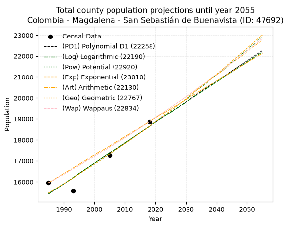
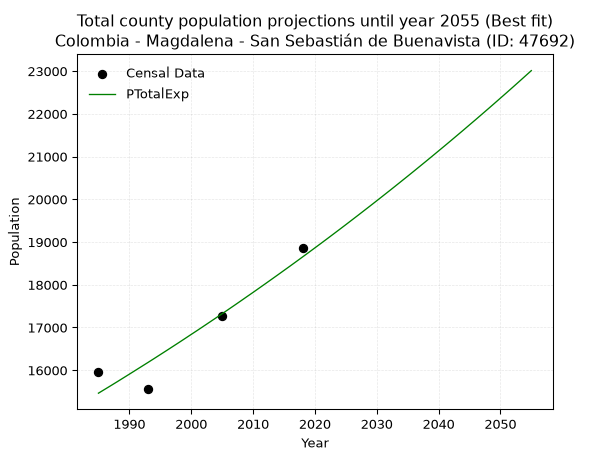
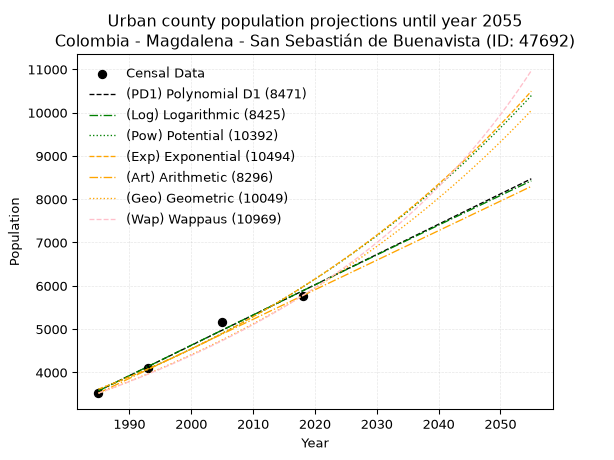
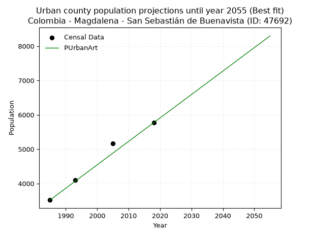
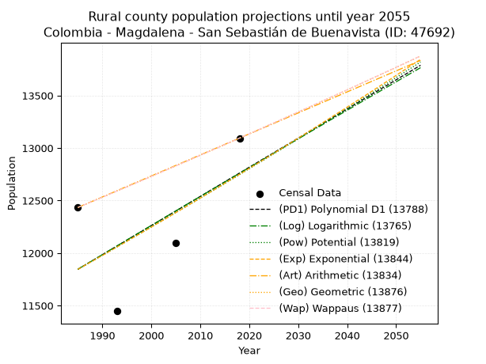
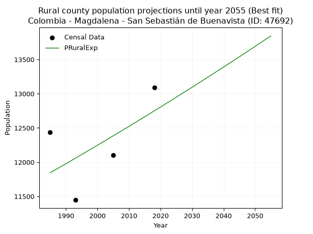

<div align="center">


</div>

# _“Population and Public Services Demand Projections (PPSD) until Year 2050 for Colombia - Magdalena - San Sebastián de Buenavista (ID: 47692)”_
Keywords: `population` `public-service` `projection` `lineal` `polynomial` `logarithmic` `potential` `exponential` `arithmetic` `geometric` `wappaus` `dane` `colombia` `south-america`

PPSD are analytical estimates used by governments and planners to anticipate future changes in population size, age distribution, and the resulting community needs for utilities, healthcare, education, and infrastructure as sizing future water treatment facilities, electrical grids, and road networks based on spatial growth.

> **General running parameters**: • app_version: _v20260806_. • Python version: _3.14.7_. • Pandas version: _3.0.5_. • NumPy version: _2.5.1_. • Creates, save and include plots into reports (create_plot): _False_. • Projection until year: _2050_. • Process polynomial degree 2 and up: _False_. • Process Wappaus: _True_. • Process Wappaus: _True_. • Set negative values to zero: _True_. • Set infinite values to zero: _True_. • Drop dataset notes: _True_. 
<div align="center">

Dynamic map: [:earth_americas:Google](http://maps.google.com/maps?q=9.241656054,-74.3514977) [:earth_americas:OSM](https://www.openstreetmap.org/#map=18/9.241656054/-74.3514977&layers=P) [:earth_americas:Bing](https://www.bing.com/maps?cp=9.241656054~-74.3514977&lvl=18) [:earth_americas:Apple](https://maps.apple.com/frame?center=9.241656054%2C-74.3514977&span=0.003%2C0.006)

</div>


<div align="center">

```geojson
{
  "type": "Feature",
  "geometry": {
    "type": "Point", 
    "coordinates": [-74.3514977, 9.241656054]
  }, 
  "properties": {
    "Name": "Colombia - Magdalena - San Sebastián de Buenavista (ID: 47692)"
  }
}
```

</div>


## 0. Census Data (4 records)

Census data are official statistics collected by a government about the people and housing in a country. They usually include counts of total population, age, sex, race, income, education, and jobs.

📅Global census file: [Population.xlsx](../data/Population.xlsx)

| Source   |   Year |   CountryID | CountryName   |   StateID | StateName   |   CountyID | CountyName                  |   PTotal |   PUrban |   PRural |
|:---------|-------:|------------:|:--------------|----------:|:------------|-----------:|:----------------------------|---------:|---------:|---------:|
| DANE     |   1985 |          57 | Colombia      |        47 | Magdalena   |      47692 | San Sebastián de Buenavista |    15953 |     3519 |    12434 |
| DANE     |   1993 |          57 | Colombia      |        47 | Magdalena   |      47692 | San Sebastián de Buenavista |    15551 |     4104 |    11447 |
| DANE     |   2005 |          57 | Colombia      |        47 | Magdalena   |      47692 | San Sebastián de Buenavista |    17267 |     5168 |    12099 |
| DANE     |   2018 |          57 | Colombia      |        47 | Magdalena   |      47692 | San Sebastián de Buenavista |    18865 |     5771 |    13094 |

> 🔥Some records could had specific notes about the registered values or the corresponding urban or rural distribution.

📅   [RUPS](https://www.datos.gov.co/Hacienda-y-Cr-dito-P-blico/Registro-nico-de-Prestadores-de-Servicios-P-blicos/4qkq-csdn/about_data) - Local public utility companies: [RUPS.csv](../data/RUPS.xlsx)

 | SERVICIO       | ESTADO      | NOMBRE                                                                                                | NIT         | DEPARTAMENTO_DOMICILIO   | MUNICIPIO_DOMICILIO         | DIRECCION                   |   TELEFONO | EMAIL                      | TIPO_INSCRIPCION    | REPRESENTANTE_LEGAL            | TIPO_PRESTADOR          | CLASIFICACION                 |
|:---------------|:------------|:------------------------------------------------------------------------------------------------------|:------------|:-------------------------|:----------------------------|:----------------------------|-----------:|:---------------------------|:--------------------|:-------------------------------|:------------------------|:------------------------------|
| ACUEDUCTO      | OPERATIVA   | COOPERATIVA DE SERVICIOS PÚBLICOS DE SAN SEBASTIAN LIMITADA.                                          | 819006148-1 | MAGDALENA                | SAN SEBASTIAN DE BUENAVISTA | Carrera 4 No. 6 - 95 centro |    5093791 | rugenuma@hotmail.com       | Registro por la ESP | NUMA JOAQUIN DE LA PENA OSPINO | ORGANIZACION AUTORIZADA | MENOR O IGUAL A 2500 USUARIOS |
| ALCANTARILLADO | CANCELACION | ALCALDIA DE SAN SEBASTIAN DE BUENAVISTA                                                               | 891780054-6 | MAGDALENA                | SAN SEBASTIAN DE BUENAVISTA | calle 5 Palacio Municipal   |    6898706 | arqjuancho2008@hotmail.com | Registro por la ESP | EDGAR ITURRIAGO FUENTES        | nan                     | nan                           |
| ALCANTARILLADO | OPERATIVA   | ADMINISTRACIÓN PUBLICA COOPERATIVA DE SERVICIOS PÚBLICOS DOMICILIARIOS DE SAN SEBASTIÁN DE BUENAVISTA | 901202464-1 | MAGDALENA                | SAN SEBASTIAN DE BUENAVISTA | CALLE 6 CARRERA 4 LOCAL 2   |    3147175 | apcservisanesp@gmail.com   | Registro por la ESP | RAFAEL ANTONIO PAVA GUTIERREZ  | ORGANIZACION AUTORIZADA | MENOR O IGUAL A 2500 USUARIOS |

## 1. Total

### 1.1. Coefficients and Parameters

* (PD1) Polynomial Deg 1: 97.70212765957336, -178519.6808510616 (lineal)
* (Log) Logarithmic: 195435.8530156772, -1468600.4848967995
* (Pow) Potential: 11.361417034587735, -33.27803065254554
* (Exp) Exponential: 0.0056796286492748265, 0.19633113404320787
* (Art) Arithmetic: Year diff. 2018 - 1985 = 33, Population diff. 18865 - 15953 = 2912, Annual growth = 88.24242424242425
* (Geo) Geometric: Year diff. 2018 - 1985 = 33, Population diff. 18865 - 15953 = 2912, Annual growth % = 0.005093578512605834
* (Wap) Wappaus: i = 0.506878190834765, Condition values only valid for < 200)

<sub>
Wappaus condition values: ['0.00', '0.51', '1.01', '1.52', '2.03', '2.53', '3.04', '3.55', '4.06', '4.56', '5.07', '5.58', '6.08', '6.59', '7.10', '7.60', '8.11', '8.62', '9.12', '9.63', '10.14', '10.64', '11.15', '11.66', '12.17', '12.67', '13.18', '13.69', '14.19', '14.70', '15.21', '15.71', '16.22', '16.73', '17.23', '17.74', '18.25', '18.75', '19.26', '19.77', '20.28', '20.78', '21.29', '21.80', '22.30', '22.81', '23.32', '23.82', '24.33', '24.84', '25.34', '25.85', '26.36', '26.86', '27.37', '27.88', '28.39', '28.89', '29.40', '29.91', '30.41', '30.92', '31.43', '31.93', '32.44', '32.95']
</sub>


### 1.2. Projected Dataset

|   Year |   CountyID |   PTotalPD1 |   PTotalLog |   PTotalPow |   PTotalExp |   PTotalArt |   PTotalGeo |   PTotalWap |
|-------:|-----------:|------------:|------------:|------------:|------------:|------------:|------------:|------------:|
|   1985 |      47692 |       15419 |       15417 |       15460 |       15462 |       15953 |       15953 |       15953 |
|   1986 |      47692 |       15517 |       15516 |       15548 |       15550 |       16041 |       16034 |       16034 |
|   1987 |      47692 |       15614 |       15614 |       15638 |       15638 |       16129 |       16116 |       16116 |
|   1988 |      47692 |       15712 |       15712 |       15727 |       15727 |       16218 |       16198 |       16197 |
|   1989 |      47692 |       15810 |       15811 |       15817 |       15817 |       16306 |       16281 |       16280 |
|   1990 |      47692 |       15908 |       15909 |       15908 |       15907 |       16394 |       16363 |       16363 |
|   1991 |      47692 |       16005 |       16007 |       15999 |       15998 |       16482 |       16447 |       16446 |
|   1992 |      47692 |       16103 |       16105 |       16091 |       16089 |       16571 |       16531 |       16529 |
|   1993 |      47692 |       16201 |       16203 |       16183 |       16180 |       16659 |       16615 |       16613 |
|   1994 |      47692 |       16298 |       16301 |       16275 |       16272 |       16747 |       16699 |       16698 |
|   1995 |      47692 |       16396 |       16399 |       16368 |       16365 |       16835 |       16784 |       16783 |
|   1996 |      47692 |       16494 |       16497 |       16462 |       16458 |       16924 |       16870 |       16868 |
|   1997 |      47692 |       16591 |       16595 |       16555 |       16552 |       17012 |       16956 |       16954 |
|   1998 |      47692 |       16689 |       16693 |       16650 |       16646 |       17100 |       17042 |       17040 |
|   1999 |      47692 |       16787 |       16791 |       16745 |       16741 |       17188 |       17129 |       17127 |
|   2000 |      47692 |       16885 |       16888 |       16840 |       16837 |       17277 |       17216 |       17214 |
|   2001 |      47692 |       16982 |       16986 |       16936 |       16932 |       17365 |       17304 |       17301 |
|   2002 |      47692 |       17080 |       17084 |       17033 |       17029 |       17453 |       17392 |       17390 |
|   2003 |      47692 |       17178 |       17181 |       17129 |       17126 |       17541 |       17481 |       17478 |
|   2004 |      47692 |       17275 |       17279 |       17227 |       17223 |       17630 |       17570 |       17567 |
|   2005 |      47692 |       17373 |       17376 |       17325 |       17321 |       17718 |       17659 |       17657 |
|   2006 |      47692 |       17471 |       17474 |       17423 |       17420 |       17806 |       17749 |       17747 |
|   2007 |      47692 |       17568 |       17571 |       17522 |       17519 |       17894 |       17840 |       17837 |
|   2008 |      47692 |       17666 |       17669 |       17622 |       17619 |       17983 |       17930 |       17928 |
|   2009 |      47692 |       17764 |       17766 |       17722 |       17720 |       18071 |       18022 |       18019 |
|   2010 |      47692 |       17862 |       17863 |       17822 |       17820 |       18159 |       18114 |       18111 |
|   2011 |      47692 |       17959 |       17960 |       17923 |       17922 |       18247 |       18206 |       18204 |
|   2012 |      47692 |       18057 |       18057 |       18025 |       18024 |       18336 |       18299 |       18297 |
|   2013 |      47692 |       18155 |       18155 |       18127 |       18127 |       18424 |       18392 |       18390 |
|   2014 |      47692 |       18252 |       18252 |       18229 |       18230 |       18512 |       18485 |       18484 |
|   2015 |      47692 |       18350 |       18349 |       18332 |       18334 |       18600 |       18580 |       18578 |
|   2016 |      47692 |       18448 |       18446 |       18436 |       18438 |       18689 |       18674 |       18673 |
|   2017 |      47692 |       18546 |       18543 |       18540 |       18543 |       18777 |       18769 |       18769 |
|   2018 |      47692 |       18643 |       18639 |       18645 |       18649 |       18865 |       18865 |       18865 |
|   2019 |      47692 |       18741 |       18736 |       18750 |       18755 |       18953 |       18961 |       18962 |
|   2020 |      47692 |       18839 |       18833 |       18856 |       18862 |       19041 |       19058 |       19059 |
|   2021 |      47692 |       18936 |       18930 |       18962 |       18969 |       19130 |       19155 |       19156 |
|   2022 |      47692 |       19034 |       19026 |       19069 |       19077 |       19218 |       19252 |       19254 |
|   2023 |      47692 |       19132 |       19123 |       19176 |       19186 |       19306 |       19350 |       19353 |
|   2024 |      47692 |       19229 |       19220 |       19284 |       19295 |       19394 |       19449 |       19453 |
|   2025 |      47692 |       19327 |       19316 |       19393 |       19405 |       19483 |       19548 |       19552 |
|   2026 |      47692 |       19425 |       19413 |       19502 |       19516 |       19571 |       19648 |       19653 |
|   2027 |      47692 |       19523 |       19509 |       19612 |       19627 |       19659 |       19748 |       19754 |
|   2028 |      47692 |       19620 |       19605 |       19722 |       19739 |       19747 |       19848 |       19855 |
|   2029 |      47692 |       19718 |       19702 |       19833 |       19851 |       19836 |       19949 |       19957 |
|   2030 |      47692 |       19816 |       19798 |       19944 |       19964 |       19924 |       20051 |       20060 |
|   2031 |      47692 |       19913 |       19894 |       20056 |       20078 |       20012 |       20153 |       20164 |
|   2032 |      47692 |       20011 |       19991 |       20168 |       20192 |       20100 |       20256 |       20267 |
|   2033 |      47692 |       20109 |       20087 |       20281 |       20307 |       20189 |       20359 |       20372 |
|   2034 |      47692 |       20206 |       20183 |       20395 |       20423 |       20277 |       20463 |       20477 |
|   2035 |      47692 |       20304 |       20279 |       20509 |       20539 |       20365 |       20567 |       20583 |
|   2036 |      47692 |       20402 |       20375 |       20624 |       20656 |       20453 |       20672 |       20689 |
|   2037 |      47692 |       20500 |       20471 |       20739 |       20774 |       20542 |       20777 |       20796 |
|   2038 |      47692 |       20597 |       20567 |       20855 |       20892 |       20630 |       20883 |       20904 |
|   2039 |      47692 |       20695 |       20663 |       20972 |       21011 |       20718 |       20989 |       21012 |
|   2040 |      47692 |       20793 |       20759 |       21089 |       21131 |       20806 |       21096 |       21121 |
|   2041 |      47692 |       20890 |       20854 |       21207 |       21251 |       20895 |       21203 |       21230 |
|   2042 |      47692 |       20988 |       20950 |       21325 |       21372 |       20983 |       21311 |       21340 |
|   2043 |      47692 |       21086 |       21046 |       21444 |       21494 |       21071 |       21420 |       21451 |
|   2044 |      47692 |       21183 |       21141 |       21564 |       21616 |       21159 |       21529 |       21563 |
|   2045 |      47692 |       21281 |       21237 |       21684 |       21740 |       21248 |       21639 |       21675 |
|   2046 |      47692 |       21379 |       21332 |       21805 |       21863 |       21336 |       21749 |       21788 |
|   2047 |      47692 |       21477 |       21428 |       21926 |       21988 |       21424 |       21860 |       21901 |
|   2048 |      47692 |       21574 |       21523 |       22048 |       22113 |       21512 |       21971 |       22015 |
|   2049 |      47692 |       21672 |       21619 |       22171 |       22239 |       21601 |       22083 |       22130 |
|   2050 |      47692 |       21770 |       21714 |       22294 |       22366 |       21689 |       22195 |       22246 |
<div align="center">

</img>

</div>


### 1.3. Best fit with absolute and relative error (%)

Relative error puts that difference into context by dividing the absolute error by the true value, creating a unitless ratio or percentage that shows the scale of the mistake.

Absolute and relative error

|   Year | Source   |   CountryID | CountryName   |   StateID | StateName   |   CountyID_x | CountyName                  |   PTotal |   PUrban |   PRural |   CountyID_y |   PTotalPD1 |   PTotalLog |   PTotalPow |   PTotalExp |   PTotalArt |   PTotalGeo |   PTotalWap |   PTotalPD1AbsError |   PTotalLogAbsError |   PTotalPowAbsError |   PTotalExpAbsError |   PTotalArtAbsError |   PTotalGeoAbsError |   PTotalWapAbsError |   PTotalPD1RelError |   PTotalLogRelError |   PTotalPowRelError |   PTotalExpRelError |   PTotalArtRelError |   PTotalGeoRelError |   PTotalWapRelError |
|-------:|:---------|------------:|:--------------|----------:|:------------|-------------:|:----------------------------|---------:|---------:|---------:|-------------:|------------:|------------:|------------:|------------:|------------:|------------:|------------:|--------------------:|--------------------:|--------------------:|--------------------:|--------------------:|--------------------:|--------------------:|--------------------:|--------------------:|--------------------:|--------------------:|--------------------:|--------------------:|--------------------:|
|   1985 | DANE     |          57 | Colombia      |        47 | Magdalena   |        47692 | San Sebastián de Buenavista |    15953 |     3519 |    12434 |        47692 |       15419 |       15417 |       15460 |       15462 |       15953 |       15953 |       15953 |                 534 |                 536 |                 493 |                 491 |                   0 |                   0 |                   0 |            3.34733  |            3.35987  |            3.09033  |            3.07779  |             0       |             0       |             0       |
|   1993 | DANE     |          57 | Colombia      |        47 | Magdalena   |        47692 | San Sebastián de Buenavista |    15551 |     4104 |    11447 |        47692 |       16201 |       16203 |       16183 |       16180 |       16659 |       16615 |       16613 |                 650 |                 652 |                 632 |                 629 |                1108 |                1064 |                1062 |            4.1798   |            4.19266  |            4.06405  |            4.04476  |             7.12494 |             6.842   |             6.82914 |
|   2005 | DANE     |          57 | Colombia      |        47 | Magdalena   |        47692 | San Sebastián de Buenavista |    17267 |     5168 |    12099 |        47692 |       17373 |       17376 |       17325 |       17321 |       17718 |       17659 |       17657 |                 106 |                 109 |                  58 |                  54 |                 451 |                 392 |                 390 |            0.613888 |            0.631262 |            0.335901 |            0.312735 |             2.61192 |             2.27023 |             2.25864 |
|   2018 | DANE     |          57 | Colombia      |        47 | Magdalena   |        47692 | San Sebastián de Buenavista |    18865 |     5771 |    13094 |        47692 |       18643 |       18639 |       18645 |       18649 |       18865 |       18865 |       18865 |                 222 |                 226 |                 220 |                 216 |                   0 |                   0 |                   0 |            1.17678  |            1.19799  |            1.16618  |            1.14498  |             0       |             0       |             0       |

Relative error mean

| Method    |   RelError | Best   |
|:----------|-----------:|:-------|
| PTotalPD1 |    2.32945 |        |
| PTotalLog |    2.34544 |        |
| PTotalPow |    2.16411 |        |
| PTotalExp |    2.14506 | True   |
| PTotalArt |    2.43422 |        |
| PTotalGeo |    2.27806 |        |
| PTotalWap |    2.27195 |        |

💙Best method: _**PTotalExp**_
<div align="center">

</img>

</div>


### 1.4. Fresh water supply demand in liters per capita per day (lpcd)

The fresh water supply demand typically ranges from 100 to 300 liters per capita per day (lpcd) for standard domestic and municipal planning, though absolute survival minimums set by the World Health Organization are as low as 7.5 to 20 liters per day, and total consumption in high-income nations can exceed 400 liters.

> `CZ`: Level in meters above the sea level (masl)<br> `WS`: Fresh water supply demand in liters per capita per day (lpcd or l/h/d)<br> `WSAll`: Zonal fresh water supply demand in liters per second (l/s)<br> `A`: Zonal area in square meters<br> `DP`: Population density (people/hectare or p/ha)

Reference values (RAS Colombia)

|    CZ |   WS |
|------:|-----:|
|  1000 |  120 |
|  2000 |  130 |
| 99999 |  140 |

County shapefile geometry properties and water supply values

|   CountyID |      ATotal |   CZTotal |   WSTotal |
|-----------:|------------:|----------:|----------:|
|      47692 | 4.37111e+08 |   50.6405 |       120 |

Projected values for best method: PTotalExp

|   CountyID |   Year |   PTotalExp |   DPTotal |   WSTotal |   WSTotalAll |
|-----------:|-------:|------------:|----------:|----------:|-------------:|
|      47692 |   1985 |       15462 |      0.35 |       120 |      21.475  |
|      47692 |   1986 |       15550 |      0.36 |       120 |      21.5972 |
|      47692 |   1987 |       15638 |      0.36 |       120 |      21.7194 |
|      47692 |   1988 |       15727 |      0.36 |       120 |      21.8431 |
|      47692 |   1989 |       15817 |      0.36 |       120 |      21.9681 |
|      47692 |   1990 |       15907 |      0.36 |       120 |      22.0931 |
|      47692 |   1991 |       15998 |      0.37 |       120 |      22.2194 |
|      47692 |   1992 |       16089 |      0.37 |       120 |      22.3458 |
|      47692 |   1993 |       16180 |      0.37 |       120 |      22.4722 |
|      47692 |   1994 |       16272 |      0.37 |       120 |      22.6    |
|      47692 |   1995 |       16365 |      0.37 |       120 |      22.7292 |
|      47692 |   1996 |       16458 |      0.38 |       120 |      22.8583 |
|      47692 |   1997 |       16552 |      0.38 |       120 |      22.9889 |
|      47692 |   1998 |       16646 |      0.38 |       120 |      23.1194 |
|      47692 |   1999 |       16741 |      0.38 |       120 |      23.2514 |
|      47692 |   2000 |       16837 |      0.39 |       120 |      23.3847 |
|      47692 |   2001 |       16932 |      0.39 |       120 |      23.5167 |
|      47692 |   2002 |       17029 |      0.39 |       120 |      23.6514 |
|      47692 |   2003 |       17126 |      0.39 |       120 |      23.7861 |
|      47692 |   2004 |       17223 |      0.39 |       120 |      23.9208 |
|      47692 |   2005 |       17321 |      0.4  |       120 |      24.0569 |
|      47692 |   2006 |       17420 |      0.4  |       120 |      24.1944 |
|      47692 |   2007 |       17519 |      0.4  |       120 |      24.3319 |
|      47692 |   2008 |       17619 |      0.4  |       120 |      24.4708 |
|      47692 |   2009 |       17720 |      0.41 |       120 |      24.6111 |
|      47692 |   2010 |       17820 |      0.41 |       120 |      24.75   |
|      47692 |   2011 |       17922 |      0.41 |       120 |      24.8917 |
|      47692 |   2012 |       18024 |      0.41 |       120 |      25.0333 |
|      47692 |   2013 |       18127 |      0.41 |       120 |      25.1764 |
|      47692 |   2014 |       18230 |      0.42 |       120 |      25.3194 |
|      47692 |   2015 |       18334 |      0.42 |       120 |      25.4639 |
|      47692 |   2016 |       18438 |      0.42 |       120 |      25.6083 |
|      47692 |   2017 |       18543 |      0.42 |       120 |      25.7542 |
|      47692 |   2018 |       18649 |      0.43 |       120 |      25.9014 |
|      47692 |   2019 |       18755 |      0.43 |       120 |      26.0486 |
|      47692 |   2020 |       18862 |      0.43 |       120 |      26.1972 |
|      47692 |   2021 |       18969 |      0.43 |       120 |      26.3458 |
|      47692 |   2022 |       19077 |      0.44 |       120 |      26.4958 |
|      47692 |   2023 |       19186 |      0.44 |       120 |      26.6472 |
|      47692 |   2024 |       19295 |      0.44 |       120 |      26.7986 |
|      47692 |   2025 |       19405 |      0.44 |       120 |      26.9514 |
|      47692 |   2026 |       19516 |      0.45 |       120 |      27.1056 |
|      47692 |   2027 |       19627 |      0.45 |       120 |      27.2597 |
|      47692 |   2028 |       19739 |      0.45 |       120 |      27.4153 |
|      47692 |   2029 |       19851 |      0.45 |       120 |      27.5708 |
|      47692 |   2030 |       19964 |      0.46 |       120 |      27.7278 |
|      47692 |   2031 |       20078 |      0.46 |       120 |      27.8861 |
|      47692 |   2032 |       20192 |      0.46 |       120 |      28.0444 |
|      47692 |   2033 |       20307 |      0.46 |       120 |      28.2042 |
|      47692 |   2034 |       20423 |      0.47 |       120 |      28.3653 |
|      47692 |   2035 |       20539 |      0.47 |       120 |      28.5264 |
|      47692 |   2036 |       20656 |      0.47 |       120 |      28.6889 |
|      47692 |   2037 |       20774 |      0.48 |       120 |      28.8528 |
|      47692 |   2038 |       20892 |      0.48 |       120 |      29.0167 |
|      47692 |   2039 |       21011 |      0.48 |       120 |      29.1819 |
|      47692 |   2040 |       21131 |      0.48 |       120 |      29.3486 |
|      47692 |   2041 |       21251 |      0.49 |       120 |      29.5153 |
|      47692 |   2042 |       21372 |      0.49 |       120 |      29.6833 |
|      47692 |   2043 |       21494 |      0.49 |       120 |      29.8528 |
|      47692 |   2044 |       21616 |      0.49 |       120 |      30.0222 |
|      47692 |   2045 |       21740 |      0.5  |       120 |      30.1944 |
|      47692 |   2046 |       21863 |      0.5  |       120 |      30.3653 |
|      47692 |   2047 |       21988 |      0.5  |       120 |      30.5389 |
|      47692 |   2048 |       22113 |      0.51 |       120 |      30.7125 |
|      47692 |   2049 |       22239 |      0.51 |       120 |      30.8875 |
|      47692 |   2050 |       22366 |      0.51 |       120 |      31.0639 |

## 2. Urban

### 2.1. Coefficients and Parameters

* (PD1) Polynomial Deg 1: 69.95503813729381, -135287.06503412197 (lineal)
* (Log) Logarithmic: 140059.44594430388, -1059952.4709886152
* (Pow) Potential: 30.517465479982633, -97.08191785790395
* (Exp) Exponential: 0.015240289744271553, 2.6263214398843276e-10
* (Art) Arithmetic: Year diff. 2018 - 1985 = 33, Population diff. 5771 - 3519 = 2252, Annual growth = 68.24242424242425
* (Geo) Geometric: Year diff. 2018 - 1985 = 33, Population diff. 5771 - 3519 = 2252, Annual growth % = 0.015102867929697172
* (Wap) Wappaus: i = 1.4691587565645692, Condition values only valid for < 200)

<sub>
Wappaus condition values: ['0.00', '1.47', '2.94', '4.41', '5.88', '7.35', '8.81', '10.28', '11.75', '13.22', '14.69', '16.16', '17.63', '19.10', '20.57', '22.04', '23.51', '24.98', '26.44', '27.91', '29.38', '30.85', '32.32', '33.79', '35.26', '36.73', '38.20', '39.67', '41.14', '42.61', '44.07', '45.54', '47.01', '48.48', '49.95', '51.42', '52.89', '54.36', '55.83', '57.30', '58.77', '60.24', '61.70', '63.17', '64.64', '66.11', '67.58', '69.05', '70.52', '71.99', '73.46', '74.93', '76.40', '77.87', '79.33', '80.80', '82.27', '83.74', '85.21', '86.68', '88.15', '89.62', '91.09', '92.56', '94.03', '95.50']
</sub>


### 2.2. Projected Dataset

|   Year |   CountyID |   PUrbanPD1 |   PUrbanLog |   PUrbanPow |   PUrbanExp |   PUrbanArt |   PUrbanGeo |   PUrbanWap |
|-------:|-----------:|------------:|------------:|------------:|------------:|------------:|------------:|------------:|
|   1985 |      47692 |        3574 |        3571 |        3609 |        3611 |        3519 |        3519 |        3519 |
|   1986 |      47692 |        3644 |        3642 |        3665 |        3666 |        3587 |        3572 |        3571 |
|   1987 |      47692 |        3714 |        3712 |        3722 |        3723 |        3655 |        3626 |        3624 |
|   1988 |      47692 |        3784 |        3783 |        3779 |        3780 |        3724 |        3681 |        3678 |
|   1989 |      47692 |        3854 |        3853 |        3838 |        3838 |        3792 |        3736 |        3732 |
|   1990 |      47692 |        3923 |        3924 |        3897 |        3897 |        3860 |        3793 |        3787 |
|   1991 |      47692 |        3993 |        3994 |        3957 |        3957 |        3928 |        3850 |        3844 |
|   1992 |      47692 |        4063 |        4064 |        4018 |        4017 |        3997 |        3908 |        3901 |
|   1993 |      47692 |        4133 |        4135 |        4080 |        4079 |        4065 |        3967 |        3958 |
|   1994 |      47692 |        4203 |        4205 |        4143 |        4142 |        4133 |        4027 |        4017 |
|   1995 |      47692 |        4273 |        4275 |        4207 |        4205 |        4201 |        4088 |        4077 |
|   1996 |      47692 |        4343 |        4345 |        4272 |        4270 |        4270 |        4150 |        4138 |
|   1997 |      47692 |        4413 |        4415 |        4338 |        4335 |        4338 |        4213 |        4199 |
|   1998 |      47692 |        4483 |        4486 |        4404 |        4402 |        4406 |        4276 |        4262 |
|   1999 |      47692 |        4553 |        4556 |        4472 |        4470 |        4474 |        4341 |        4326 |
|   2000 |      47692 |        4623 |        4626 |        4541 |        4538 |        4543 |        4406 |        4391 |
|   2001 |      47692 |        4693 |        4696 |        4611 |        4608 |        4611 |        4473 |        4456 |
|   2002 |      47692 |        4763 |        4766 |        4682 |        4679 |        4679 |        4540 |        4523 |
|   2003 |      47692 |        4833 |        4836 |        4754 |        4751 |        4747 |        4609 |        4591 |
|   2004 |      47692 |        4903 |        4906 |        4826 |        4824 |        4816 |        4679 |        4661 |
|   2005 |      47692 |        4973 |        4975 |        4901 |        4898 |        4884 |        4749 |        4731 |
|   2006 |      47692 |        5043 |        5045 |        4976 |        4973 |        4952 |        4821 |        4803 |
|   2007 |      47692 |        5113 |        5115 |        5052 |        5049 |        5020 |        4894 |        4876 |
|   2008 |      47692 |        5183 |        5185 |        5129 |        5127 |        5089 |        4968 |        4950 |
|   2009 |      47692 |        5253 |        5255 |        5208 |        5206 |        5157 |        5043 |        5025 |
|   2010 |      47692 |        5323 |        5324 |        5288 |        5285 |        5225 |        5119 |        5102 |
|   2011 |      47692 |        5393 |        5394 |        5368 |        5367 |        5293 |        5196 |        5181 |
|   2012 |      47692 |        5462 |        5464 |        5450 |        5449 |        5362 |        5275 |        5260 |
|   2013 |      47692 |        5532 |        5533 |        5534 |        5533 |        5430 |        5354 |        5341 |
|   2014 |      47692 |        5602 |        5603 |        5618 |        5618 |        5498 |        5435 |        5424 |
|   2015 |      47692 |        5672 |        5672 |        5704 |        5704 |        5566 |        5517 |        5508 |
|   2016 |      47692 |        5742 |        5742 |        5791 |        5792 |        5635 |        5601 |        5594 |
|   2017 |      47692 |        5812 |        5811 |        5879 |        5881 |        5703 |        5685 |        5682 |
|   2018 |      47692 |        5882 |        5881 |        5969 |        5971 |        5771 |        5771 |        5771 |
|   2019 |      47692 |        5952 |        5950 |        6060 |        6063 |        5839 |        5858 |        5862 |
|   2020 |      47692 |        6022 |        6019 |        6152 |        6156 |        5907 |        5947 |        5955 |
|   2021 |      47692 |        6092 |        6089 |        6246 |        6250 |        5976 |        6036 |        6049 |
|   2022 |      47692 |        6162 |        6158 |        6341 |        6346 |        6044 |        6128 |        6146 |
|   2023 |      47692 |        6232 |        6227 |        6437 |        6444 |        6112 |        6220 |        6244 |
|   2024 |      47692 |        6302 |        6296 |        6535 |        6543 |        6180 |        6314 |        6345 |
|   2025 |      47692 |        6372 |        6366 |        6634 |        6643 |        6249 |        6409 |        6447 |
|   2026 |      47692 |        6442 |        6435 |        6735 |        6745 |        6317 |        6506 |        6552 |
|   2027 |      47692 |        6512 |        6504 |        6837 |        6849 |        6385 |        6605 |        6659 |
|   2028 |      47692 |        6582 |        6573 |        6941 |        6954 |        6453 |        6704 |        6769 |
|   2029 |      47692 |        6652 |        6642 |        7046 |        7061 |        6522 |        6806 |        6880 |
|   2030 |      47692 |        6722 |        6711 |        7153 |        7169 |        6590 |        6908 |        6994 |
|   2031 |      47692 |        6792 |        6780 |        7261 |        7279 |        6658 |        7013 |        7111 |
|   2032 |      47692 |        6862 |        6849 |        7371 |        7391 |        6726 |        7119 |        7230 |
|   2033 |      47692 |        6932 |        6918 |        7483 |        7504 |        6795 |        7226 |        7352 |
|   2034 |      47692 |        7001 |        6987 |        7596 |        7620 |        6863 |        7335 |        7477 |
|   2035 |      47692 |        7071 |        7056 |        7710 |        7737 |        6931 |        7446 |        7605 |
|   2036 |      47692 |        7141 |        7124 |        7827 |        7855 |        6999 |        7558 |        7735 |
|   2037 |      47692 |        7211 |        7193 |        7945 |        7976 |        7068 |        7673 |        7869 |
|   2038 |      47692 |        7281 |        7262 |        8065 |        8099 |        7136 |        7788 |        8006 |
|   2039 |      47692 |        7351 |        7331 |        8187 |        8223 |        7204 |        7906 |        8146 |
|   2040 |      47692 |        7421 |        7399 |        8310 |        8349 |        7272 |        8026 |        8290 |
|   2041 |      47692 |        7491 |        7468 |        8435 |        8477 |        7341 |        8147 |        8437 |
|   2042 |      47692 |        7561 |        7537 |        8562 |        8608 |        7409 |        8270 |        8589 |
|   2043 |      47692 |        7631 |        7605 |        8691 |        8740 |        7477 |        8395 |        8744 |
|   2044 |      47692 |        7701 |        7674 |        8822 |        8874 |        7545 |        8521 |        8903 |
|   2045 |      47692 |        7771 |        7742 |        8955 |        9010 |        7614 |        8650 |        9066 |
|   2046 |      47692 |        7841 |        7811 |        9089 |        9149 |        7682 |        8781 |        9233 |
|   2047 |      47692 |        7911 |        7879 |        9226 |        9289 |        7750 |        8913 |        9405 |
|   2048 |      47692 |        7981 |        7947 |        9364 |        9432 |        7818 |        9048 |        9582 |
|   2049 |      47692 |        8051 |        8016 |        9505 |        9577 |        7887 |        9185 |        9764 |
|   2050 |      47692 |        8121 |        8084 |        9648 |        9724 |        7955 |        9323 |        9950 |
<div align="center">

</img>

</div>


### 2.3. Best fit with absolute and relative error (%)

Relative error puts that difference into context by dividing the absolute error by the true value, creating a unitless ratio or percentage that shows the scale of the mistake.

Absolute and relative error

|   Year | Source   |   CountryID | CountryName   |   StateID | StateName   |   CountyID_x | CountyName                  |   PTotal |   PUrban |   PRural |   CountyID_y |   PUrbanPD1 |   PUrbanLog |   PUrbanPow |   PUrbanExp |   PUrbanArt |   PUrbanGeo |   PUrbanWap |   PUrbanPD1AbsError |   PUrbanLogAbsError |   PUrbanPowAbsError |   PUrbanExpAbsError |   PUrbanArtAbsError |   PUrbanGeoAbsError |   PUrbanWapAbsError |   PUrbanPD1RelError |   PUrbanLogRelError |   PUrbanPowRelError |   PUrbanExpRelError |   PUrbanArtRelError |   PUrbanGeoRelError |   PUrbanWapRelError |
|-------:|:---------|------------:|:--------------|----------:|:------------|-------------:|:----------------------------|---------:|---------:|---------:|-------------:|------------:|------------:|------------:|------------:|------------:|------------:|------------:|--------------------:|--------------------:|--------------------:|--------------------:|--------------------:|--------------------:|--------------------:|--------------------:|--------------------:|--------------------:|--------------------:|--------------------:|--------------------:|--------------------:|
|   1985 | DANE     |          57 | Colombia      |        47 | Magdalena   |        47692 | San Sebastián de Buenavista |    15953 |     3519 |    12434 |        47692 |        3574 |        3571 |        3609 |        3611 |        3519 |        3519 |        3519 |                  55 |                  52 |                  90 |                  92 |                   0 |                   0 |                   0 |            1.56294  |            1.47769  |            2.55754  |            2.61438  |            0        |             0       |             0       |
|   1993 | DANE     |          57 | Colombia      |        47 | Magdalena   |        47692 | San Sebastián de Buenavista |    15551 |     4104 |    11447 |        47692 |        4133 |        4135 |        4080 |        4079 |        4065 |        3967 |        3958 |                  29 |                  31 |                  24 |                  25 |                  39 |                 137 |                 146 |            0.706628 |            0.755361 |            0.584795 |            0.609162 |            0.950292 |             3.33821 |             3.5575  |
|   2005 | DANE     |          57 | Colombia      |        47 | Magdalena   |        47692 | San Sebastián de Buenavista |    17267 |     5168 |    12099 |        47692 |        4973 |        4975 |        4901 |        4898 |        4884 |        4749 |        4731 |                 195 |                 193 |                 267 |                 270 |                 284 |                 419 |                 437 |            3.77322  |            3.73452  |            5.16641  |            5.22446  |            5.49536  |             8.10759 |             8.45588 |
|   2018 | DANE     |          57 | Colombia      |        47 | Magdalena   |        47692 | San Sebastián de Buenavista |    18865 |     5771 |    13094 |        47692 |        5882 |        5881 |        5969 |        5971 |        5771 |        5771 |        5771 |                 111 |                 110 |                 198 |                 200 |                   0 |                   0 |                   0 |            1.92341  |            1.90608  |            3.43095  |            3.4656   |            0        |             0       |             0       |

Relative error mean

| Method    |   RelError | Best   |
|:----------|-----------:|:-------|
| PUrbanPD1 |    1.99155 |        |
| PUrbanLog |    1.96841 |        |
| PUrbanPow |    2.93492 |        |
| PUrbanExp |    2.9784  |        |
| PUrbanArt |    1.61141 | True   |
| PUrbanGeo |    2.86145 |        |
| PUrbanWap |    3.00335 |        |

💙Best method: _**PUrbanArt**_
<div align="center">

</img>

</div>


### 2.4. Fresh water supply demand in liters per capita per day (lpcd)

The fresh water supply demand typically ranges from 100 to 300 liters per capita per day (lpcd) for standard domestic and municipal planning, though absolute survival minimums set by the World Health Organization are as low as 7.5 to 20 liters per day, and total consumption in high-income nations can exceed 400 liters.

> `CZ`: Level in meters above the sea level (masl)<br> `WS`: Fresh water supply demand in liters per capita per day (lpcd or l/h/d)<br> `WSAll`: Zonal fresh water supply demand in liters per second (l/s)<br> `A`: Zonal area in square meters<br> `DP`: Population density (people/hectare or p/ha)

Reference values (RAS Colombia)

|    CZ |   WS |
|------:|-----:|
|  1000 |  120 |
|  2000 |  130 |
| 99999 |  140 |

County shapefile geometry properties and water supply values

|   CountyID |   AUrban |   CZUrban |   WSUrban |
|-----------:|---------:|----------:|----------:|
|      47692 |   989051 |   24.8522 |       120 |

Projected values for best method: PUrbanArt

|   CountyID |   Year |   PUrbanArt |   DPUrban |   WSUrban |   WSUrbanAll |
|-----------:|-------:|------------:|----------:|----------:|-------------:|
|      47692 |   1985 |        3519 |     35.58 |       120 |      4.8875  |
|      47692 |   1986 |        3587 |     36.27 |       120 |      4.98194 |
|      47692 |   1987 |        3655 |     36.95 |       120 |      5.07639 |
|      47692 |   1988 |        3724 |     37.65 |       120 |      5.17222 |
|      47692 |   1989 |        3792 |     38.34 |       120 |      5.26667 |
|      47692 |   1990 |        3860 |     39.03 |       120 |      5.36111 |
|      47692 |   1991 |        3928 |     39.71 |       120 |      5.45556 |
|      47692 |   1992 |        3997 |     40.41 |       120 |      5.55139 |
|      47692 |   1993 |        4065 |     41.1  |       120 |      5.64583 |
|      47692 |   1994 |        4133 |     41.79 |       120 |      5.74028 |
|      47692 |   1995 |        4201 |     42.48 |       120 |      5.83472 |
|      47692 |   1996 |        4270 |     43.17 |       120 |      5.93056 |
|      47692 |   1997 |        4338 |     43.86 |       120 |      6.025   |
|      47692 |   1998 |        4406 |     44.55 |       120 |      6.11944 |
|      47692 |   1999 |        4474 |     45.24 |       120 |      6.21389 |
|      47692 |   2000 |        4543 |     45.93 |       120 |      6.30972 |
|      47692 |   2001 |        4611 |     46.62 |       120 |      6.40417 |
|      47692 |   2002 |        4679 |     47.31 |       120 |      6.49861 |
|      47692 |   2003 |        4747 |     48    |       120 |      6.59306 |
|      47692 |   2004 |        4816 |     48.69 |       120 |      6.68889 |
|      47692 |   2005 |        4884 |     49.38 |       120 |      6.78333 |
|      47692 |   2006 |        4952 |     50.07 |       120 |      6.87778 |
|      47692 |   2007 |        5020 |     50.76 |       120 |      6.97222 |
|      47692 |   2008 |        5089 |     51.45 |       120 |      7.06806 |
|      47692 |   2009 |        5157 |     52.14 |       120 |      7.1625  |
|      47692 |   2010 |        5225 |     52.83 |       120 |      7.25694 |
|      47692 |   2011 |        5293 |     53.52 |       120 |      7.35139 |
|      47692 |   2012 |        5362 |     54.21 |       120 |      7.44722 |
|      47692 |   2013 |        5430 |     54.9  |       120 |      7.54167 |
|      47692 |   2014 |        5498 |     55.59 |       120 |      7.63611 |
|      47692 |   2015 |        5566 |     56.28 |       120 |      7.73056 |
|      47692 |   2016 |        5635 |     56.97 |       120 |      7.82639 |
|      47692 |   2017 |        5703 |     57.66 |       120 |      7.92083 |
|      47692 |   2018 |        5771 |     58.35 |       120 |      8.01528 |
|      47692 |   2019 |        5839 |     59.04 |       120 |      8.10972 |
|      47692 |   2020 |        5907 |     59.72 |       120 |      8.20417 |
|      47692 |   2021 |        5976 |     60.42 |       120 |      8.3     |
|      47692 |   2022 |        6044 |     61.11 |       120 |      8.39444 |
|      47692 |   2023 |        6112 |     61.8  |       120 |      8.48889 |
|      47692 |   2024 |        6180 |     62.48 |       120 |      8.58333 |
|      47692 |   2025 |        6249 |     63.18 |       120 |      8.67917 |
|      47692 |   2026 |        6317 |     63.87 |       120 |      8.77361 |
|      47692 |   2027 |        6385 |     64.56 |       120 |      8.86806 |
|      47692 |   2028 |        6453 |     65.24 |       120 |      8.9625  |
|      47692 |   2029 |        6522 |     65.94 |       120 |      9.05833 |
|      47692 |   2030 |        6590 |     66.63 |       120 |      9.15278 |
|      47692 |   2031 |        6658 |     67.32 |       120 |      9.24722 |
|      47692 |   2032 |        6726 |     68    |       120 |      9.34167 |
|      47692 |   2033 |        6795 |     68.7  |       120 |      9.4375  |
|      47692 |   2034 |        6863 |     69.39 |       120 |      9.53194 |
|      47692 |   2035 |        6931 |     70.08 |       120 |      9.62639 |
|      47692 |   2036 |        6999 |     70.76 |       120 |      9.72083 |
|      47692 |   2037 |        7068 |     71.46 |       120 |      9.81667 |
|      47692 |   2038 |        7136 |     72.15 |       120 |      9.91111 |
|      47692 |   2039 |        7204 |     72.84 |       120 |     10.0056  |
|      47692 |   2040 |        7272 |     73.52 |       120 |     10.1     |
|      47692 |   2041 |        7341 |     74.22 |       120 |     10.1958  |
|      47692 |   2042 |        7409 |     74.91 |       120 |     10.2903  |
|      47692 |   2043 |        7477 |     75.6  |       120 |     10.3847  |
|      47692 |   2044 |        7545 |     76.29 |       120 |     10.4792  |
|      47692 |   2045 |        7614 |     76.98 |       120 |     10.575   |
|      47692 |   2046 |        7682 |     77.67 |       120 |     10.6694  |
|      47692 |   2047 |        7750 |     78.36 |       120 |     10.7639  |
|      47692 |   2048 |        7818 |     79.05 |       120 |     10.8583  |
|      47692 |   2049 |        7887 |     79.74 |       120 |     10.9542  |
|      47692 |   2050 |        7955 |     80.43 |       120 |     11.0486  |

## 3. Rural

### 3.1. Coefficients and Parameters

* (PD1) Polynomial Deg 1: 27.74708952227955, -43232.615816939666 (lineal)
* (Log) Logarithmic: 55376.407071373105, -408648.0139081834
* (Pow) Potential: 4.447750488300177, -10.594080576871738
* (Exp) Exponential: 0.002228686539598348, 141.97980689025604
* (Art) Arithmetic: Year diff. 2018 - 1985 = 33, Population diff. 13094 - 12434 = 660, Annual growth = 20.0
* (Geo) Geometric: Year diff. 2018 - 1985 = 33, Population diff. 13094 - 12434 = 660, Annual growth % = 0.0015684849748587304
* (Wap) Wappaus: i = 0.15669069257286117, Condition values only valid for < 200)

<sub>
Wappaus condition values: ['0.00', '0.16', '0.31', '0.47', '0.63', '0.78', '0.94', '1.10', '1.25', '1.41', '1.57', '1.72', '1.88', '2.04', '2.19', '2.35', '2.51', '2.66', '2.82', '2.98', '3.13', '3.29', '3.45', '3.60', '3.76', '3.92', '4.07', '4.23', '4.39', '4.54', '4.70', '4.86', '5.01', '5.17', '5.33', '5.48', '5.64', '5.80', '5.95', '6.11', '6.27', '6.42', '6.58', '6.74', '6.89', '7.05', '7.21', '7.36', '7.52', '7.68', '7.83', '7.99', '8.15', '8.30', '8.46', '8.62', '8.77', '8.93', '9.09', '9.24', '9.40', '9.56', '9.71', '9.87', '10.03', '10.18']
</sub>


### 3.2. Projected Dataset

|   Year |   CountyID |   PRuralPD1 |   PRuralLog |   PRuralPow |   PRuralExp |   PRuralArt |   PRuralGeo |   PRuralWap |
|-------:|-----------:|------------:|------------:|------------:|------------:|------------:|------------:|------------:|
|   1985 |      47692 |       11845 |       11846 |       11845 |       11845 |       12434 |       12434 |       12434 |
|   1986 |      47692 |       11873 |       11874 |       11872 |       11871 |       12454 |       12454 |       12453 |
|   1987 |      47692 |       11901 |       11902 |       11898 |       11898 |       12474 |       12473 |       12473 |
|   1988 |      47692 |       11929 |       11929 |       11925 |       11924 |       12494 |       12493 |       12493 |
|   1989 |      47692 |       11956 |       11957 |       11952 |       11951 |       12514 |       12512 |       12512 |
|   1990 |      47692 |       11984 |       11985 |       11978 |       11977 |       12534 |       12532 |       12532 |
|   1991 |      47692 |       12012 |       12013 |       12005 |       12004 |       12554 |       12551 |       12551 |
|   1992 |      47692 |       12040 |       12041 |       12032 |       12031 |       12574 |       12571 |       12571 |
|   1993 |      47692 |       12067 |       12068 |       12059 |       12058 |       12594 |       12591 |       12591 |
|   1994 |      47692 |       12095 |       12096 |       12086 |       12085 |       12614 |       12611 |       12611 |
|   1995 |      47692 |       12123 |       12124 |       12113 |       12112 |       12634 |       12630 |       12630 |
|   1996 |      47692 |       12151 |       12152 |       12140 |       12139 |       12654 |       12650 |       12650 |
|   1997 |      47692 |       12178 |       12180 |       12167 |       12166 |       12674 |       12670 |       12670 |
|   1998 |      47692 |       12206 |       12207 |       12194 |       12193 |       12694 |       12690 |       12690 |
|   1999 |      47692 |       12234 |       12235 |       12221 |       12220 |       12714 |       12710 |       12710 |
|   2000 |      47692 |       12262 |       12263 |       12248 |       12247 |       12734 |       12730 |       12730 |
|   2001 |      47692 |       12289 |       12290 |       12276 |       12275 |       12754 |       12750 |       12750 |
|   2002 |      47692 |       12317 |       12318 |       12303 |       12302 |       12774 |       12770 |       12770 |
|   2003 |      47692 |       12345 |       12346 |       12330 |       12329 |       12794 |       12790 |       12790 |
|   2004 |      47692 |       12373 |       12373 |       12358 |       12357 |       12814 |       12810 |       12810 |
|   2005 |      47692 |       12400 |       12401 |       12385 |       12385 |       12834 |       12830 |       12830 |
|   2006 |      47692 |       12428 |       12429 |       12413 |       12412 |       12854 |       12850 |       12850 |
|   2007 |      47692 |       12456 |       12456 |       12440 |       12440 |       12874 |       12870 |       12870 |
|   2008 |      47692 |       12484 |       12484 |       12468 |       12468 |       12894 |       12890 |       12890 |
|   2009 |      47692 |       12511 |       12511 |       12495 |       12495 |       12914 |       12911 |       12911 |
|   2010 |      47692 |       12539 |       12539 |       12523 |       12523 |       12934 |       12931 |       12931 |
|   2011 |      47692 |       12567 |       12566 |       12551 |       12551 |       12954 |       12951 |       12951 |
|   2012 |      47692 |       12595 |       12594 |       12579 |       12579 |       12974 |       12971 |       12971 |
|   2013 |      47692 |       12622 |       12621 |       12606 |       12607 |       12994 |       12992 |       12992 |
|   2014 |      47692 |       12650 |       12649 |       12634 |       12635 |       13014 |       13012 |       13012 |
|   2015 |      47692 |       12678 |       12676 |       12662 |       12664 |       13034 |       13033 |       13033 |
|   2016 |      47692 |       12706 |       12704 |       12690 |       12692 |       13054 |       13053 |       13053 |
|   2017 |      47692 |       12733 |       12731 |       12718 |       12720 |       13074 |       13073 |       13073 |
|   2018 |      47692 |       12761 |       12759 |       12746 |       12749 |       13094 |       13094 |       13094 |
|   2019 |      47692 |       12789 |       12786 |       12774 |       12777 |       13114 |       13115 |       13115 |
|   2020 |      47692 |       12817 |       12814 |       12803 |       12806 |       13134 |       13135 |       13135 |
|   2021 |      47692 |       12844 |       12841 |       12831 |       12834 |       13154 |       13156 |       13156 |
|   2022 |      47692 |       12872 |       12868 |       12859 |       12863 |       13174 |       13176 |       13176 |
|   2023 |      47692 |       12900 |       12896 |       12887 |       12891 |       13194 |       13197 |       13197 |
|   2024 |      47692 |       12927 |       12923 |       12916 |       12920 |       13214 |       13218 |       13218 |
|   2025 |      47692 |       12955 |       12951 |       12944 |       12949 |       13234 |       13238 |       13239 |
|   2026 |      47692 |       12983 |       12978 |       12973 |       12978 |       13254 |       13259 |       13259 |
|   2027 |      47692 |       13011 |       13005 |       13001 |       13007 |       13274 |       13280 |       13280 |
|   2028 |      47692 |       13038 |       13033 |       13030 |       13036 |       13294 |       13301 |       13301 |
|   2029 |      47692 |       13066 |       13060 |       13058 |       13065 |       13314 |       13322 |       13322 |
|   2030 |      47692 |       13094 |       13087 |       13087 |       13094 |       13334 |       13343 |       13343 |
|   2031 |      47692 |       13122 |       13114 |       13116 |       13123 |       13354 |       13364 |       13364 |
|   2032 |      47692 |       13149 |       13142 |       13144 |       13153 |       13374 |       13384 |       13385 |
|   2033 |      47692 |       13177 |       13169 |       13173 |       13182 |       13394 |       13405 |       13406 |
|   2034 |      47692 |       13205 |       13196 |       13202 |       13211 |       13414 |       13426 |       13427 |
|   2035 |      47692 |       13233 |       13223 |       13231 |       13241 |       13434 |       13448 |       13448 |
|   2036 |      47692 |       13260 |       13251 |       13260 |       13270 |       13454 |       13469 |       13469 |
|   2037 |      47692 |       13288 |       13278 |       13289 |       13300 |       13474 |       13490 |       13490 |
|   2038 |      47692 |       13316 |       13305 |       13318 |       13330 |       13494 |       13511 |       13511 |
|   2039 |      47692 |       13344 |       13332 |       13347 |       13359 |       13514 |       13532 |       13533 |
|   2040 |      47692 |       13371 |       13359 |       13376 |       13389 |       13534 |       13553 |       13554 |
|   2041 |      47692 |       13399 |       13386 |       13405 |       13419 |       13554 |       13575 |       13575 |
|   2042 |      47692 |       13427 |       13414 |       13434 |       13449 |       13574 |       13596 |       13596 |
|   2043 |      47692 |       13455 |       13441 |       13464 |       13479 |       13594 |       13617 |       13618 |
|   2044 |      47692 |       13482 |       13468 |       13493 |       13509 |       13614 |       13639 |       13639 |
|   2045 |      47692 |       13510 |       13495 |       13523 |       13539 |       13634 |       13660 |       13661 |
|   2046 |      47692 |       13538 |       13522 |       13552 |       13569 |       13654 |       13681 |       13682 |
|   2047 |      47692 |       13566 |       13549 |       13581 |       13600 |       13674 |       13703 |       13704 |
|   2048 |      47692 |       13593 |       13576 |       13611 |       13630 |       13694 |       13724 |       13725 |
|   2049 |      47692 |       13621 |       13603 |       13641 |       13660 |       13714 |       13746 |       13747 |
|   2050 |      47692 |       13649 |       13630 |       13670 |       13691 |       13734 |       13767 |       13768 |
<div align="center">

</img>

</div>


### 3.3. Best fit with absolute and relative error (%)

Relative error puts that difference into context by dividing the absolute error by the true value, creating a unitless ratio or percentage that shows the scale of the mistake.

Absolute and relative error

|   Year | Source   |   CountryID | CountryName   |   StateID | StateName   |   CountyID_x | CountyName                  |   PTotal |   PUrban |   PRural |   CountyID_y |   PRuralPD1 |   PRuralLog |   PRuralPow |   PRuralExp |   PRuralArt |   PRuralGeo |   PRuralWap |   PRuralPD1AbsError |   PRuralLogAbsError |   PRuralPowAbsError |   PRuralExpAbsError |   PRuralArtAbsError |   PRuralGeoAbsError |   PRuralWapAbsError |   PRuralPD1RelError |   PRuralLogRelError |   PRuralPowRelError |   PRuralExpRelError |   PRuralArtRelError |   PRuralGeoRelError |   PRuralWapRelError |
|-------:|:---------|------------:|:--------------|----------:|:------------|-------------:|:----------------------------|---------:|---------:|---------:|-------------:|------------:|------------:|------------:|------------:|------------:|------------:|------------:|--------------------:|--------------------:|--------------------:|--------------------:|--------------------:|--------------------:|--------------------:|--------------------:|--------------------:|--------------------:|--------------------:|--------------------:|--------------------:|--------------------:|
|   1985 | DANE     |          57 | Colombia      |        47 | Magdalena   |        47692 | San Sebastián de Buenavista |    15953 |     3519 |    12434 |        47692 |       11845 |       11846 |       11845 |       11845 |       12434 |       12434 |       12434 |                 589 |                 588 |                 589 |                 589 |                   0 |                   0 |                   0 |             4.73701 |             4.72897 |             4.73701 |             4.73701 |             0       |             0       |             0       |
|   1993 | DANE     |          57 | Colombia      |        47 | Magdalena   |        47692 | San Sebastián de Buenavista |    15551 |     4104 |    11447 |        47692 |       12067 |       12068 |       12059 |       12058 |       12594 |       12591 |       12591 |                 620 |                 621 |                 612 |                 611 |                1147 |                1144 |                1144 |             5.41627 |             5.425   |             5.34638 |             5.33764 |            10.0201  |             9.99388 |             9.99388 |
|   2005 | DANE     |          57 | Colombia      |        47 | Magdalena   |        47692 | San Sebastián de Buenavista |    17267 |     5168 |    12099 |        47692 |       12400 |       12401 |       12385 |       12385 |       12834 |       12830 |       12830 |                 301 |                 302 |                 286 |                 286 |                 735 |                 731 |                 731 |             2.48781 |             2.49607 |             2.36383 |             2.36383 |             6.07488 |             6.04182 |             6.04182 |
|   2018 | DANE     |          57 | Colombia      |        47 | Magdalena   |        47692 | San Sebastián de Buenavista |    18865 |     5771 |    13094 |        47692 |       12761 |       12759 |       12746 |       12749 |       13094 |       13094 |       13094 |                 333 |                 335 |                 348 |                 345 |                   0 |                   0 |                   0 |             2.54315 |             2.55842 |             2.65771 |             2.63479 |             0       |             0       |             0       |

Relative error mean

| Method    |   RelError | Best   |
|:----------|-----------:|:-------|
| PRuralPD1 |    3.79606 |        |
| PRuralLog |    3.80212 |        |
| PRuralPow |    3.77623 |        |
| PRuralExp |    3.76832 | True   |
| PRuralArt |    4.02374 |        |
| PRuralGeo |    4.00893 |        |
| PRuralWap |    4.00893 |        |

💙Best method: _**PRuralExp**_
<div align="center">

</img>

</div>


### 3.4. Fresh water supply demand in liters per capita per day (lpcd)

The fresh water supply demand typically ranges from 100 to 300 liters per capita per day (lpcd) for standard domestic and municipal planning, though absolute survival minimums set by the World Health Organization are as low as 7.5 to 20 liters per day, and total consumption in high-income nations can exceed 400 liters.

> `CZ`: Level in meters above the sea level (masl)<br> `WS`: Fresh water supply demand in liters per capita per day (lpcd or l/h/d)<br> `WSAll`: Zonal fresh water supply demand in liters per second (l/s)<br> `A`: Zonal area in square meters<br> `DP`: Population density (people/hectare or p/ha)

Reference values (RAS Colombia)

|    CZ |   WS |
|------:|-----:|
|  1000 |  120 |
|  2000 |  130 |
| 99999 |  140 |

County shapefile geometry properties and water supply values

|   CountyID |      ARural |   CZRural |   WSRural |
|-----------:|------------:|----------:|----------:|
|      47692 | 4.36122e+08 |   50.7036 |       120 |

Projected values for best method: PRuralExp

|   CountyID |   Year |   PRuralExp |   DPRural |   WSRural |   WSRuralAll |
|-----------:|-------:|------------:|----------:|----------:|-------------:|
|      47692 |   1985 |       11845 |      0.27 |       120 |      16.4514 |
|      47692 |   1986 |       11871 |      0.27 |       120 |      16.4875 |
|      47692 |   1987 |       11898 |      0.27 |       120 |      16.525  |
|      47692 |   1988 |       11924 |      0.27 |       120 |      16.5611 |
|      47692 |   1989 |       11951 |      0.27 |       120 |      16.5986 |
|      47692 |   1990 |       11977 |      0.27 |       120 |      16.6347 |
|      47692 |   1991 |       12004 |      0.28 |       120 |      16.6722 |
|      47692 |   1992 |       12031 |      0.28 |       120 |      16.7097 |
|      47692 |   1993 |       12058 |      0.28 |       120 |      16.7472 |
|      47692 |   1994 |       12085 |      0.28 |       120 |      16.7847 |
|      47692 |   1995 |       12112 |      0.28 |       120 |      16.8222 |
|      47692 |   1996 |       12139 |      0.28 |       120 |      16.8597 |
|      47692 |   1997 |       12166 |      0.28 |       120 |      16.8972 |
|      47692 |   1998 |       12193 |      0.28 |       120 |      16.9347 |
|      47692 |   1999 |       12220 |      0.28 |       120 |      16.9722 |
|      47692 |   2000 |       12247 |      0.28 |       120 |      17.0097 |
|      47692 |   2001 |       12275 |      0.28 |       120 |      17.0486 |
|      47692 |   2002 |       12302 |      0.28 |       120 |      17.0861 |
|      47692 |   2003 |       12329 |      0.28 |       120 |      17.1236 |
|      47692 |   2004 |       12357 |      0.28 |       120 |      17.1625 |
|      47692 |   2005 |       12385 |      0.28 |       120 |      17.2014 |
|      47692 |   2006 |       12412 |      0.28 |       120 |      17.2389 |
|      47692 |   2007 |       12440 |      0.29 |       120 |      17.2778 |
|      47692 |   2008 |       12468 |      0.29 |       120 |      17.3167 |
|      47692 |   2009 |       12495 |      0.29 |       120 |      17.3542 |
|      47692 |   2010 |       12523 |      0.29 |       120 |      17.3931 |
|      47692 |   2011 |       12551 |      0.29 |       120 |      17.4319 |
|      47692 |   2012 |       12579 |      0.29 |       120 |      17.4708 |
|      47692 |   2013 |       12607 |      0.29 |       120 |      17.5097 |
|      47692 |   2014 |       12635 |      0.29 |       120 |      17.5486 |
|      47692 |   2015 |       12664 |      0.29 |       120 |      17.5889 |
|      47692 |   2016 |       12692 |      0.29 |       120 |      17.6278 |
|      47692 |   2017 |       12720 |      0.29 |       120 |      17.6667 |
|      47692 |   2018 |       12749 |      0.29 |       120 |      17.7069 |
|      47692 |   2019 |       12777 |      0.29 |       120 |      17.7458 |
|      47692 |   2020 |       12806 |      0.29 |       120 |      17.7861 |
|      47692 |   2021 |       12834 |      0.29 |       120 |      17.825  |
|      47692 |   2022 |       12863 |      0.29 |       120 |      17.8653 |
|      47692 |   2023 |       12891 |      0.3  |       120 |      17.9042 |
|      47692 |   2024 |       12920 |      0.3  |       120 |      17.9444 |
|      47692 |   2025 |       12949 |      0.3  |       120 |      17.9847 |
|      47692 |   2026 |       12978 |      0.3  |       120 |      18.025  |
|      47692 |   2027 |       13007 |      0.3  |       120 |      18.0653 |
|      47692 |   2028 |       13036 |      0.3  |       120 |      18.1056 |
|      47692 |   2029 |       13065 |      0.3  |       120 |      18.1458 |
|      47692 |   2030 |       13094 |      0.3  |       120 |      18.1861 |
|      47692 |   2031 |       13123 |      0.3  |       120 |      18.2264 |
|      47692 |   2032 |       13153 |      0.3  |       120 |      18.2681 |
|      47692 |   2033 |       13182 |      0.3  |       120 |      18.3083 |
|      47692 |   2034 |       13211 |      0.3  |       120 |      18.3486 |
|      47692 |   2035 |       13241 |      0.3  |       120 |      18.3903 |
|      47692 |   2036 |       13270 |      0.3  |       120 |      18.4306 |
|      47692 |   2037 |       13300 |      0.3  |       120 |      18.4722 |
|      47692 |   2038 |       13330 |      0.31 |       120 |      18.5139 |
|      47692 |   2039 |       13359 |      0.31 |       120 |      18.5542 |
|      47692 |   2040 |       13389 |      0.31 |       120 |      18.5958 |
|      47692 |   2041 |       13419 |      0.31 |       120 |      18.6375 |
|      47692 |   2042 |       13449 |      0.31 |       120 |      18.6792 |
|      47692 |   2043 |       13479 |      0.31 |       120 |      18.7208 |
|      47692 |   2044 |       13509 |      0.31 |       120 |      18.7625 |
|      47692 |   2045 |       13539 |      0.31 |       120 |      18.8042 |
|      47692 |   2046 |       13569 |      0.31 |       120 |      18.8458 |
|      47692 |   2047 |       13600 |      0.31 |       120 |      18.8889 |
|      47692 |   2048 |       13630 |      0.31 |       120 |      18.9306 |
|      47692 |   2049 |       13660 |      0.31 |       120 |      18.9722 |
|      47692 |   2050 |       13691 |      0.31 |       120 |      19.0153 |

<div align="center"><br><sub>Share this research</sub></div><br>

<sub>**APPS & TOOLS & CONTENT DISCLAIMER**: • NO WARRANTY - This content and software is provided by <a href="https://github.com/rcfdtools" target="_blank">github.com/rcfdtools</a> "as is", without any express or implied warranty, including warranties of merchantability, fitness for a particular purpose, or non-infringement. There is no guarantee that the software will be error-free or operate without interruption. • LIMITATION OF LIABILITY - Neither the authors nor copyright holders will be liable for claims or damages arising from the software or its use. You are responsible for determining if the software is appropriate for your use and assume all associated risks, including errors, legal compliance, and data loss. • NO PROFESSIONAL ADVICE - The software provides general information and does not offer professional advice. It should not replace consultation with professional advisors. [Clauses and global license for rcfdtools use.](https://github.com/rcfdtools/rcfdtools/blob/main/LICENSE.md)</sub>

| [:house: Home](Readme.md)  | [:beginner: Help / Collaborate](https://github.com/rcfdtools/R.HydroTools/discussions/31) |
|----------------------------|-------------------------------------------------------------------------------------------|