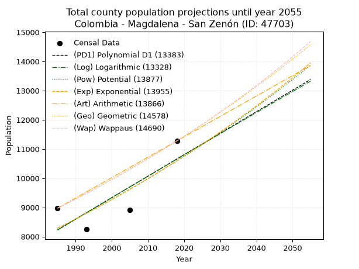
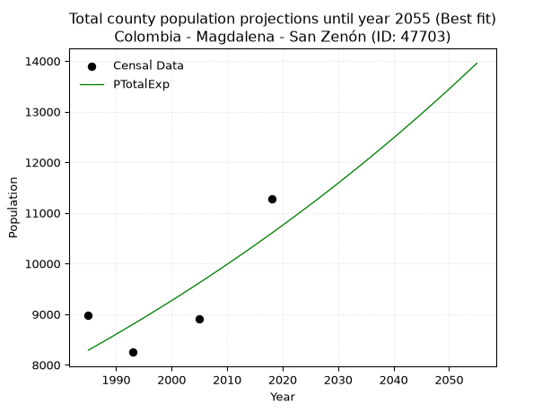
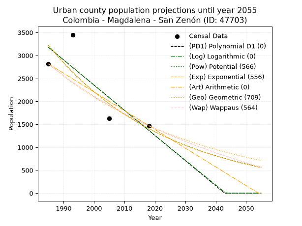
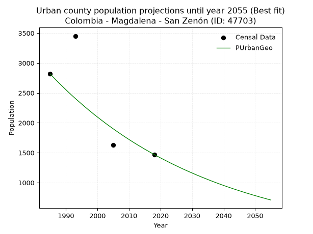
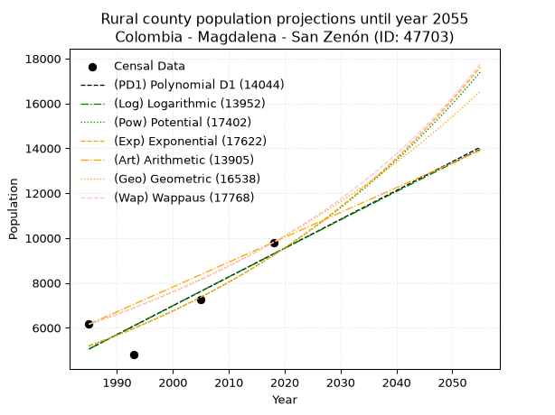
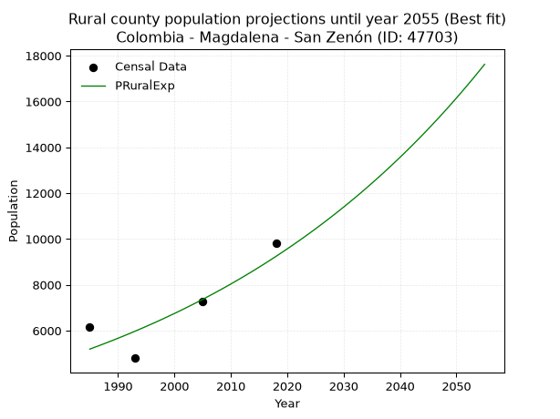

<div align="center">


</div>

# 📜 _“Population and Public Services Demand Projections (PPSD) until Year 2050 for Colombia - Magdalena - San Zenón (ID: 47703)”_
Keywords: `population` `public-service` `projection` `lineal` `polynomial` `logarithmic` `potential` `exponential` `arithmetic` `geometric` `wappaus` `dane` `colombia` `south-america`

PPSD are analytical estimates used by governments and planners to anticipate future changes in population size, age distribution, and the resulting community needs for utilities, healthcare, education, and infrastructure as sizing future water treatment facilities, electrical grids, and road networks based on spatial growth.

<div align="center">

</img>

</div>


> **General running parameters**: • app_version: _v20260806_. • Python version: _3.14.7_. • Pandas version: _3.0.5_. • NumPy version: _2.5.1_. • Creates, save and include plots into reports (create_plot): _False_. • Projection until year: _2050_. • Process polynomial degree 2 and up: _False_. • Process Wappaus: _True_. • Process Wappaus: _True_. • Set negative values to zero: _True_. • Set infinite values to zero: _True_. • Drop dataset notes: _True_. 
<div align="center">

Maps & GIS Layers: [:earth_americas:Google](http://maps.google.com/maps?q=9.245060602,-74.4989915) [:earth_americas:OSM](https://www.openstreetmap.org/#map=18/9.245060602/-74.4989915&layers=P) [:earth_americas:Bing](https://www.bing.com/maps?cp=9.245060602~-74.4989915&lvl=18) [:earth_americas:Apple](https://maps.apple.com/frame?center=9.245060602%2C-74.4989915&span=0.003%2C0.006) [:earth_americas:GISMobile](https://github.com/rcfdtools/R.GISMobile/blob/main/file/gis/CountyLayer_CO/Readme.md)

</div>


<div align="center">

```geojson
{
  "type": "Feature",
  "geometry": {
    "type": "Point", 
    "coordinates": [-74.4989915, 9.245060602]
  }, 
  "properties": {
    "Name": "Colombia - Magdalena - San Zenón (ID: 47703)"
  }
}
```

</div>


## 0. Census Data (4 records)

Census data are official statistics collected by a government about the people and housing in a country. They usually include counts of total population, age, sex, race, income, education, and jobs.

📅Global census file: [Population.xlsx](../data/Population.xlsx)

| Source   |   Year |   CountryID | CountryName   |   StateID | StateName   |   CountyID | CountyName   |   PTotal |   PUrban |   PRural |
|:---------|-------:|------------:|:--------------|----------:|:------------|-----------:|:-------------|---------:|---------:|---------:|
| DANE     |   1985 |          57 | Colombia      |        47 | Magdalena   |      47703 | San Zenón    |     8972 |     2816 |     6156 |
| DANE     |   1993 |          57 | Colombia      |        47 | Magdalena   |      47703 | San Zenón    |     8250 |     3452 |     4798 |
| DANE     |   2005 |          57 | Colombia      |        47 | Magdalena   |      47703 | San Zenón    |     8904 |     1627 |     7277 |
| DANE     |   2018 |          57 | Colombia      |        47 | Magdalena   |      47703 | San Zenón    |    11279 |     1470 |     9809 |

> 🔥Some records could had specific notes about the registered values or the corresponding urban or rural distribution.

📅[SUI-RUPS](https://www.datos.gov.co/Hacienda-y-Cr-dito-P-blico/Registro-nico-de-Prestadores-de-Servicios-P-blicos/4qkq-csdn/about_data) - Local public utility companies: [RUPS.csv](../data/RUPS.csv)

 | SERVICIO       | ESTADO    | NOMBRE                                                                         | NIT         | DEPARTAMENTO_DOMICILIO   | MUNICIPIO_DOMICILIO   | DIRECCION                                  |   TELEFONO | EMAIL                  | TIPO_PRESTADOR          | CLASIFICACION                 |
|:---------------|:----------|:-------------------------------------------------------------------------------|:------------|:-------------------------|:----------------------|:-------------------------------------------|-----------:|:-----------------------|:------------------------|:------------------------------|
| ACUEDUCTO      | OPERATIVA | ADMINISTRADORA PUBLICA COOPERATIVA DE SERVICIOS PUBLICOS DE SAN ZENON LIMITADA | 830506754-9 | MAGDALENA                | SAN ZENON             | CARRERA 2 No 8 -27                         |    6855120 | coosepsanz@hotmail.com | ORGANIZACION AUTORIZADA | HASTA 2500 SUSCRIPTORES       |
| ALCANTARILLADO | OPERATIVA | ADMINISTRADORA PUBLICA COOPERATIVA DE SERVICIOS PUBLICOS DE SAN ZENON LIMITADA | 830506754-9 | MAGDALENA                | SAN ZENON             | CARRERA 2 No 8 -27                         |    6855120 | coosepsanz@hotmail.com | ORGANIZACION AUTORIZADA | HASTA 2500 SUSCRIPTORES       |
| ACUEDUCTO      | OPERATIVA | COOPERATIVA DE SERVICIOS PUBLICOS MUNICIPAL DE SAN ZENON                       | 900821695-6 | MAGDALENA                | SAN ZENON             | KRA 2 KILOMETRO 1 VIA SAN FERNANDO Nº 5-51 |    0000000 | jeco1984@hotmail.com   | ORGANIZACION AUTORIZADA | MENOR O IGUAL A 2500 USUARIOS |
| ALCANTARILLADO | OPERATIVA | COOPERATIVA DE SERVICIOS PUBLICOS MUNICIPAL DE SAN ZENON                       | 900821695-6 | MAGDALENA                | SAN ZENON             | KRA 2 KILOMETRO 1 VIA SAN FERNANDO Nº 5-51 |    0000000 | jeco1984@hotmail.com   | ORGANIZACION AUTORIZADA | MENOR O IGUAL A 2500 USUARIOS |

## 1. Total

### 1.1. Coefficients and Parameters

* (PD1) Polynomial Deg 1: 73.64231232436617, -137951.78522681343 (lineal)
* (Log) Logarithmic: 147146.38889798234, -1109109.6311707217
* (Pow) Potential: 14.867667256696814, -45.11149739571782
* (Exp) Exponential: 0.007441038580893983, 0.003189979184977297
* (Art) Arithmetic: Year diff. 2018 - 1985 = 33, Population diff. 11279 - 8972 = 2307, Annual growth = 69.9090909090909
* (Geo) Geometric: Year diff. 2018 - 1985 = 33, Population diff. 11279 - 8972 = 2307, Annual growth % = 0.006958461182086317
* (Wap) Wappaus: i = 0.6904260620126503, Condition values only valid for < 200)

<sub>
Wappaus condition values: ['0.00', '0.69', '1.38', '2.07', '2.76', '3.45', '4.14', '4.83', '5.52', '6.21', '6.90', '7.59', '8.29', '8.98', '9.67', '10.36', '11.05', '11.74', '12.43', '13.12', '13.81', '14.50', '15.19', '15.88', '16.57', '17.26', '17.95', '18.64', '19.33', '20.02', '20.71', '21.40', '22.09', '22.78', '23.47', '24.16', '24.86', '25.55', '26.24', '26.93', '27.62', '28.31', '29.00', '29.69', '30.38', '31.07', '31.76', '32.45', '33.14', '33.83', '34.52', '35.21', '35.90', '36.59', '37.28', '37.97', '38.66', '39.35', '40.04', '40.74', '41.43', '42.12', '42.81', '43.50', '44.19', '44.88']
</sub>


### 1.2. Projected Dataset

|   Year |   CountyID |   PTotalPD1 |   PTotalLog |   PTotalPow |   PTotalExp |   PTotalArt |   PTotalGeo |   PTotalWap |
|-------:|-----------:|------------:|------------:|------------:|------------:|------------:|------------:|------------:|
|   1985 |      47703 |        8228 |        8228 |        8289 |        8289 |        8972 |        8972 |        8972 |
|   1986 |      47703 |        8302 |        8302 |        8351 |        8351 |        9042 |        9034 |        9034 |
|   1987 |      47703 |        8375 |        8376 |        8414 |        8414 |        9112 |        9097 |        9097 |
|   1988 |      47703 |        8449 |        8450 |        8477 |        8476 |        9182 |        9161 |        9160 |
|   1989 |      47703 |        8523 |        8524 |        8541 |        8540 |        9252 |        9224 |        9223 |
|   1990 |      47703 |        8596 |        8598 |        8605 |        8604 |        9322 |        9289 |        9287 |
|   1991 |      47703 |        8670 |        8672 |        8670 |        8668 |        9391 |        9353 |        9352 |
|   1992 |      47703 |        8744 |        8746 |        8735 |        8733 |        9461 |        9418 |        9416 |
|   1993 |      47703 |        8817 |        8820 |        8800 |        8798 |        9531 |        9484 |        9482 |
|   1994 |      47703 |        8891 |        8894 |        8866 |        8863 |        9601 |        9550 |        9547 |
|   1995 |      47703 |        8965 |        8967 |        8932 |        8930 |        9671 |        9616 |        9614 |
|   1996 |      47703 |        9038 |        9041 |        8999 |        8996 |        9741 |        9683 |        9680 |
|   1997 |      47703 |        9112 |        9115 |        9066 |        9064 |        9811 |        9751 |        9747 |
|   1998 |      47703 |        9186 |        9188 |        9134 |        9131 |        9881 |        9818 |        9815 |
|   1999 |      47703 |        9259 |        9262 |        9202 |        9199 |        9951 |        9887 |        9883 |
|   2000 |      47703 |        9333 |        9336 |        9271 |        9268 |       10021 |        9955 |        9952 |
|   2001 |      47703 |        9406 |        9409 |        9340 |        9337 |       10091 |       10025 |       10021 |
|   2002 |      47703 |        9480 |        9483 |        9410 |        9407 |       10160 |       10095 |       10091 |
|   2003 |      47703 |        9554 |        9556 |        9480 |        9477 |       10230 |       10165 |       10161 |
|   2004 |      47703 |        9627 |        9630 |        9550 |        9548 |       10300 |       10235 |       10232 |
|   2005 |      47703 |        9701 |        9703 |        9621 |        9619 |       10370 |       10307 |       10303 |
|   2006 |      47703 |        9775 |        9776 |        9693 |        9691 |       10440 |       10378 |       10375 |
|   2007 |      47703 |        9848 |        9850 |        9765 |        9764 |       10510 |       10451 |       10447 |
|   2008 |      47703 |        9922 |        9923 |        9838 |        9837 |       10580 |       10523 |       10520 |
|   2009 |      47703 |        9996 |        9996 |        9911 |        9910 |       10650 |       10597 |       10593 |
|   2010 |      47703 |       10069 |       10070 |        9984 |        9984 |       10720 |       10670 |       10667 |
|   2011 |      47703 |       10143 |       10143 |       10059 |       10059 |       10790 |       10745 |       10741 |
|   2012 |      47703 |       10217 |       10216 |       10133 |       10134 |       10860 |       10819 |       10816 |
|   2013 |      47703 |       10290 |       10289 |       10208 |       10209 |       10929 |       10895 |       10892 |
|   2014 |      47703 |       10364 |       10362 |       10284 |       10286 |       10999 |       10970 |       10968 |
|   2015 |      47703 |       10437 |       10435 |       10360 |       10363 |       11069 |       11047 |       11045 |
|   2016 |      47703 |       10511 |       10508 |       10437 |       10440 |       11139 |       11124 |       11122 |
|   2017 |      47703 |       10585 |       10581 |       10514 |       10518 |       11209 |       11201 |       11200 |
|   2018 |      47703 |       10658 |       10654 |       10592 |       10596 |       11279 |       11279 |       11279 |
|   2019 |      47703 |       10732 |       10727 |       10670 |       10676 |       11349 |       11357 |       11358 |
|   2020 |      47703 |       10806 |       10800 |       10749 |       10755 |       11419 |       11437 |       11438 |
|   2021 |      47703 |       10879 |       10873 |       10828 |       10836 |       11489 |       11516 |       11518 |
|   2022 |      47703 |       10953 |       10945 |       10908 |       10917 |       11559 |       11596 |       11600 |
|   2023 |      47703 |       11027 |       11018 |       10989 |       10998 |       11629 |       11677 |       11681 |
|   2024 |      47703 |       11100 |       11091 |       11070 |       11080 |       11698 |       11758 |       11764 |
|   2025 |      47703 |       11174 |       11164 |       11151 |       11163 |       11768 |       11840 |       11847 |
|   2026 |      47703 |       11248 |       11236 |       11234 |       11246 |       11838 |       11922 |       11930 |
|   2027 |      47703 |       11321 |       11309 |       11316 |       11330 |       11908 |       12005 |       12015 |
|   2028 |      47703 |       11395 |       11381 |       11400 |       11415 |       11978 |       12089 |       12100 |
|   2029 |      47703 |       11468 |       11454 |       11483 |       11500 |       12048 |       12173 |       12186 |
|   2030 |      47703 |       11542 |       11527 |       11568 |       11586 |       12118 |       12258 |       12272 |
|   2031 |      47703 |       11616 |       11599 |       11653 |       11673 |       12188 |       12343 |       12359 |
|   2032 |      47703 |       11689 |       11671 |       11738 |       11760 |       12258 |       12429 |       12447 |
|   2033 |      47703 |       11763 |       11744 |       11825 |       11848 |       12328 |       12515 |       12536 |
|   2034 |      47703 |       11837 |       11816 |       11911 |       11936 |       12398 |       12602 |       12625 |
|   2035 |      47703 |       11910 |       11889 |       11999 |       12025 |       12467 |       12690 |       12715 |
|   2036 |      47703 |       11984 |       11961 |       12087 |       12115 |       12537 |       12778 |       12806 |
|   2037 |      47703 |       12058 |       12033 |       12175 |       12206 |       12607 |       12867 |       12898 |
|   2038 |      47703 |       12131 |       12105 |       12264 |       12297 |       12677 |       12957 |       12990 |
|   2039 |      47703 |       12205 |       12177 |       12354 |       12389 |       12747 |       13047 |       13083 |
|   2040 |      47703 |       12279 |       12250 |       12445 |       12481 |       12817 |       13138 |       13177 |
|   2041 |      47703 |       12352 |       12322 |       12536 |       12574 |       12887 |       13229 |       13272 |
|   2042 |      47703 |       12426 |       12394 |       12627 |       12668 |       12957 |       13321 |       13368 |
|   2043 |      47703 |       12499 |       12466 |       12720 |       12763 |       13027 |       13414 |       13464 |
|   2044 |      47703 |       12573 |       12538 |       12812 |       12858 |       13097 |       13507 |       13562 |
|   2045 |      47703 |       12647 |       12610 |       12906 |       12954 |       13167 |       13601 |       13660 |
|   2046 |      47703 |       12720 |       12682 |       13000 |       13051 |       13236 |       13696 |       13759 |
|   2047 |      47703 |       12794 |       12754 |       13095 |       13149 |       13306 |       13791 |       13858 |
|   2048 |      47703 |       12868 |       12826 |       13190 |       13247 |       13376 |       13887 |       13959 |
|   2049 |      47703 |       12941 |       12897 |       13286 |       13346 |       13446 |       13984 |       14061 |
|   2050 |      47703 |       13015 |       12969 |       13383 |       13445 |       13516 |       14081 |       14163 |
<div align="center">

</img>

</div>


### 1.3. Best fit with absolute and relative error (%)

Relative error puts that difference into context by dividing the absolute error by the true value, creating a unitless ratio or percentage that shows the scale of the mistake.

Absolute and relative error

|   Year | Source   |   CountryID | CountryName   |   StateID | StateName   |   CountyID_x | CountyName   |   PTotal |   PUrban |   PRural |   CountyID_y |   PTotalPD1 |   PTotalLog |   PTotalPow |   PTotalExp |   PTotalArt |   PTotalGeo |   PTotalWap |   PTotalPD1AbsError |   PTotalLogAbsError |   PTotalPowAbsError |   PTotalExpAbsError |   PTotalArtAbsError |   PTotalGeoAbsError |   PTotalWapAbsError |   PTotalPD1RelError |   PTotalLogRelError |   PTotalPowRelError |   PTotalExpRelError |   PTotalArtRelError |   PTotalGeoRelError |   PTotalWapRelError |
|-------:|:---------|------------:|:--------------|----------:|:------------|-------------:|:-------------|---------:|---------:|---------:|-------------:|------------:|------------:|------------:|------------:|------------:|------------:|------------:|--------------------:|--------------------:|--------------------:|--------------------:|--------------------:|--------------------:|--------------------:|--------------------:|--------------------:|--------------------:|--------------------:|--------------------:|--------------------:|--------------------:|
|   1985 | DANE     |          57 | Colombia      |        47 | Magdalena   |        47703 | San Zenón    |     8972 |     2816 |     6156 |        47703 |        8228 |        8228 |        8289 |        8289 |        8972 |        8972 |        8972 |                 744 |                 744 |                 683 |                 683 |                   0 |                   0 |                   0 |             8.29247 |             8.29247 |             7.61257 |             7.61257 |              0      |              0      |              0      |
|   1993 | DANE     |          57 | Colombia      |        47 | Magdalena   |        47703 | San Zenón    |     8250 |     3452 |     4798 |        47703 |        8817 |        8820 |        8800 |        8798 |        9531 |        9484 |        9482 |                 567 |                 570 |                 550 |                 548 |                1281 |                1234 |                1232 |             6.87273 |             6.90909 |             6.66667 |             6.64242 |             15.5273 |             14.9576 |             14.9333 |
|   2005 | DANE     |          57 | Colombia      |        47 | Magdalena   |        47703 | San Zenón    |     8904 |     1627 |     7277 |        47703 |        9701 |        9703 |        9621 |        9619 |       10370 |       10307 |       10303 |                 797 |                 799 |                 717 |                 715 |                1466 |                1403 |                1399 |             8.95103 |             8.9735  |             8.05256 |             8.0301  |             16.4645 |             15.757  |             15.712  |
|   2018 | DANE     |          57 | Colombia      |        47 | Magdalena   |        47703 | San Zenón    |    11279 |     1470 |     9809 |        47703 |       10658 |       10654 |       10592 |       10596 |       11279 |       11279 |       11279 |                 621 |                 625 |                 687 |                 683 |                   0 |                   0 |                   0 |             5.50581 |             5.54127 |             6.09097 |             6.0555  |              0      |              0      |              0      |

Relative error mean

| Method    |   RelError | Best   |
|:----------|-----------:|:-------|
| PTotalPD1 |    7.40551 |        |
| PTotalLog |    7.42908 |        |
| PTotalPow |    7.10569 |        |
| PTotalExp |    7.08515 | True   |
| PTotalArt |    7.99795 |        |
| PTotalGeo |    7.67863 |        |
| PTotalWap |    7.66134 |        |

💙Best method: _**PTotalExp**_
<div align="center">

</img>

</div>


### 1.4. Fresh water supply demand in liters per capita per day (lpcd)

The fresh water supply demand typically ranges from 100 to 300 liters per capita per day (lpcd) for standard domestic and municipal planning, though absolute survival minimums set by the World Health Organization are as low as 7.5 to 20 liters per day, and total consumption in high-income nations can exceed 400 liters.

> `CZ`: Level in meters above the sea level (masl)<br> `WS`: Fresh water supply demand in liters per capita per day (lpcd or l/h/d)<br> `WSAll`: Zonal fresh water supply demand in liters per second (l/s)<br> `A`: Zonal area in square meters<br> `DP`: Population density (people/hectare or p/ha)

Reference values (RAS Colombia)

|    CZ |   WS |
|------:|-----:|
|  1000 |  120 |
|  2000 |  130 |
| 99999 |  140 |

County shapefile geometry properties and water supply values

|   CountyID |      ATotal |   CZTotal |   WSTotal |
|-----------:|------------:|----------:|----------:|
|      47703 | 2.68539e+08 |   31.5196 |       120 |

Projected values for best method: PTotalExp

|   CountyID |   Year |   PTotalExp |   DPTotal |   WSTotal |   WSTotalAll |
|-----------:|-------:|------------:|----------:|----------:|-------------:|
|      47703 |   1985 |        8289 |      0.31 |       120 |      11.5125 |
|      47703 |   1986 |        8351 |      0.31 |       120 |      11.5986 |
|      47703 |   1987 |        8414 |      0.31 |       120 |      11.6861 |
|      47703 |   1988 |        8476 |      0.32 |       120 |      11.7722 |
|      47703 |   1989 |        8540 |      0.32 |       120 |      11.8611 |
|      47703 |   1990 |        8604 |      0.32 |       120 |      11.95   |
|      47703 |   1991 |        8668 |      0.32 |       120 |      12.0389 |
|      47703 |   1992 |        8733 |      0.33 |       120 |      12.1292 |
|      47703 |   1993 |        8798 |      0.33 |       120 |      12.2194 |
|      47703 |   1994 |        8863 |      0.33 |       120 |      12.3097 |
|      47703 |   1995 |        8930 |      0.33 |       120 |      12.4028 |
|      47703 |   1996 |        8996 |      0.33 |       120 |      12.4944 |
|      47703 |   1997 |        9064 |      0.34 |       120 |      12.5889 |
|      47703 |   1998 |        9131 |      0.34 |       120 |      12.6819 |
|      47703 |   1999 |        9199 |      0.34 |       120 |      12.7764 |
|      47703 |   2000 |        9268 |      0.35 |       120 |      12.8722 |
|      47703 |   2001 |        9337 |      0.35 |       120 |      12.9681 |
|      47703 |   2002 |        9407 |      0.35 |       120 |      13.0653 |
|      47703 |   2003 |        9477 |      0.35 |       120 |      13.1625 |
|      47703 |   2004 |        9548 |      0.36 |       120 |      13.2611 |
|      47703 |   2005 |        9619 |      0.36 |       120 |      13.3597 |
|      47703 |   2006 |        9691 |      0.36 |       120 |      13.4597 |
|      47703 |   2007 |        9764 |      0.36 |       120 |      13.5611 |
|      47703 |   2008 |        9837 |      0.37 |       120 |      13.6625 |
|      47703 |   2009 |        9910 |      0.37 |       120 |      13.7639 |
|      47703 |   2010 |        9984 |      0.37 |       120 |      13.8667 |
|      47703 |   2011 |       10059 |      0.37 |       120 |      13.9708 |
|      47703 |   2012 |       10134 |      0.38 |       120 |      14.075  |
|      47703 |   2013 |       10209 |      0.38 |       120 |      14.1792 |
|      47703 |   2014 |       10286 |      0.38 |       120 |      14.2861 |
|      47703 |   2015 |       10363 |      0.39 |       120 |      14.3931 |
|      47703 |   2016 |       10440 |      0.39 |       120 |      14.5    |
|      47703 |   2017 |       10518 |      0.39 |       120 |      14.6083 |
|      47703 |   2018 |       10596 |      0.39 |       120 |      14.7167 |
|      47703 |   2019 |       10676 |      0.4  |       120 |      14.8278 |
|      47703 |   2020 |       10755 |      0.4  |       120 |      14.9375 |
|      47703 |   2021 |       10836 |      0.4  |       120 |      15.05   |
|      47703 |   2022 |       10917 |      0.41 |       120 |      15.1625 |
|      47703 |   2023 |       10998 |      0.41 |       120 |      15.275  |
|      47703 |   2024 |       11080 |      0.41 |       120 |      15.3889 |
|      47703 |   2025 |       11163 |      0.42 |       120 |      15.5042 |
|      47703 |   2026 |       11246 |      0.42 |       120 |      15.6194 |
|      47703 |   2027 |       11330 |      0.42 |       120 |      15.7361 |
|      47703 |   2028 |       11415 |      0.43 |       120 |      15.8542 |
|      47703 |   2029 |       11500 |      0.43 |       120 |      15.9722 |
|      47703 |   2030 |       11586 |      0.43 |       120 |      16.0917 |
|      47703 |   2031 |       11673 |      0.43 |       120 |      16.2125 |
|      47703 |   2032 |       11760 |      0.44 |       120 |      16.3333 |
|      47703 |   2033 |       11848 |      0.44 |       120 |      16.4556 |
|      47703 |   2034 |       11936 |      0.44 |       120 |      16.5778 |
|      47703 |   2035 |       12025 |      0.45 |       120 |      16.7014 |
|      47703 |   2036 |       12115 |      0.45 |       120 |      16.8264 |
|      47703 |   2037 |       12206 |      0.45 |       120 |      16.9528 |
|      47703 |   2038 |       12297 |      0.46 |       120 |      17.0792 |
|      47703 |   2039 |       12389 |      0.46 |       120 |      17.2069 |
|      47703 |   2040 |       12481 |      0.46 |       120 |      17.3347 |
|      47703 |   2041 |       12574 |      0.47 |       120 |      17.4639 |
|      47703 |   2042 |       12668 |      0.47 |       120 |      17.5944 |
|      47703 |   2043 |       12763 |      0.48 |       120 |      17.7264 |
|      47703 |   2044 |       12858 |      0.48 |       120 |      17.8583 |
|      47703 |   2045 |       12954 |      0.48 |       120 |      17.9917 |
|      47703 |   2046 |       13051 |      0.49 |       120 |      18.1264 |
|      47703 |   2047 |       13149 |      0.49 |       120 |      18.2625 |
|      47703 |   2048 |       13247 |      0.49 |       120 |      18.3986 |
|      47703 |   2049 |       13346 |      0.5  |       120 |      18.5361 |
|      47703 |   2050 |       13445 |      0.5  |       120 |      18.6736 |

## 2. Urban

### 2.1. Coefficients and Parameters

* (PD1) Polynomial Deg 1: -54.83781613809693, 112030.59173022839 (lineal)
* (Log) Logarithmic: -109744.27912779928, 836508.3950858627
* (Pow) Potential: -50.20126172077445, 169.05977414290314
* (Exp) Exponential: -0.025083249284151204, 1.3531905776554106e+25
* (Art) Arithmetic: Year diff. 2018 - 1985 = 33, Population diff. 1470 - 2816 = -1346, Annual growth = -40.78787878787879
* (Geo) Geometric: Year diff. 2018 - 1985 = 33, Population diff. 1470 - 2816 = -1346, Annual growth % = -0.019505887055735416
* (Wap) Wappaus: i = -1.903307456270592, Condition values only valid for < 200)

<sub>
Wappaus condition values: ['-0.00', '-1.90', '-3.81', '-5.71', '-7.61', '-9.52', '-11.42', '-13.32', '-15.23', '-17.13', '-19.03', '-20.94', '-22.84', '-24.74', '-26.65', '-28.55', '-30.45', '-32.36', '-34.26', '-36.16', '-38.07', '-39.97', '-41.87', '-43.78', '-45.68', '-47.58', '-49.49', '-51.39', '-53.29', '-55.20', '-57.10', '-59.00', '-60.91', '-62.81', '-64.71', '-66.62', '-68.52', '-70.42', '-72.33', '-74.23', '-76.13', '-78.04', '-79.94', '-81.84', '-83.75', '-85.65', '-87.55', '-89.46', '-91.36', '-93.26', '-95.17', '-97.07', '-98.97', '-100.88', '-102.78', '-104.68', '-106.59', '-108.49', '-110.39', '-112.30', '-114.20', '-116.10', '-118.01', '-119.91', '-121.81', '-123.71']
</sub>


### 2.2. Projected Dataset

|   Year |   CountyID |   PUrbanPD1 |   PUrbanLog |   PUrbanPow |   PUrbanExp |   PUrbanArt |   PUrbanGeo |   PUrbanWap |
|-------:|-----------:|------------:|------------:|------------:|------------:|------------:|------------:|------------:|
|   1985 |      47703 |        3178 |        3179 |        3221 |        3219 |        2816 |        2816 |        2816 |
|   1986 |      47703 |        3123 |        3124 |        3141 |        3139 |        2775 |        2761 |        2763 |
|   1987 |      47703 |        3068 |        3069 |        3063 |        3062 |        2734 |        2707 |        2711 |
|   1988 |      47703 |        3013 |        3013 |        2986 |        2986 |        2694 |        2654 |        2660 |
|   1989 |      47703 |        2958 |        2958 |        2912 |        2912 |        2653 |        2603 |        2609 |
|   1990 |      47703 |        2903 |        2903 |        2839 |        2840 |        2612 |        2552 |        2560 |
|   1991 |      47703 |        2848 |        2848 |        2768 |        2769 |        2571 |        2502 |        2512 |
|   1992 |      47703 |        2794 |        2793 |        2700 |        2701 |        2530 |        2453 |        2464 |
|   1993 |      47703 |        2739 |        2738 |        2632 |        2634 |        2490 |        2405 |        2418 |
|   1994 |      47703 |        2684 |        2683 |        2567 |        2569 |        2449 |        2359 |        2372 |
|   1995 |      47703 |        2629 |        2628 |        2503 |        2505 |        2408 |        2313 |        2327 |
|   1996 |      47703 |        2574 |        2573 |        2441 |        2443 |        2367 |        2267 |        2282 |
|   1997 |      47703 |        2519 |        2518 |        2380 |        2382 |        2327 |        2223 |        2239 |
|   1998 |      47703 |        2465 |        2463 |        2321 |        2323 |        2286 |        2180 |        2196 |
|   1999 |      47703 |        2410 |        2408 |        2264 |        2266 |        2245 |        2137 |        2154 |
|   2000 |      47703 |        2355 |        2353 |        2208 |        2210 |        2204 |        2096 |        2112 |
|   2001 |      47703 |        2300 |        2298 |        2153 |        2155 |        2163 |        2055 |        2072 |
|   2002 |      47703 |        2245 |        2243 |        2099 |        2102 |        2123 |        2015 |        2032 |
|   2003 |      47703 |        2190 |        2188 |        2048 |        2049 |        2082 |        1975 |        1992 |
|   2004 |      47703 |        2136 |        2134 |        1997 |        1999 |        2041 |        1937 |        1954 |
|   2005 |      47703 |        2081 |        2079 |        1947 |        1949 |        2000 |        1899 |        1915 |
|   2006 |      47703 |        2026 |        2024 |        1899 |        1901 |        1959 |        1862 |        1878 |
|   2007 |      47703 |        1971 |        1969 |        1852 |        1854 |        1919 |        1826 |        1841 |
|   2008 |      47703 |        1916 |        1915 |        1807 |        1808 |        1878 |        1790 |        1805 |
|   2009 |      47703 |        1861 |        1860 |        1762 |        1763 |        1837 |        1755 |        1769 |
|   2010 |      47703 |        1807 |        1805 |        1719 |        1719 |        1796 |        1721 |        1734 |
|   2011 |      47703 |        1752 |        1751 |        1676 |        1677 |        1756 |        1687 |        1699 |
|   2012 |      47703 |        1697 |        1696 |        1635 |        1635 |        1715 |        1654 |        1665 |
|   2013 |      47703 |        1642 |        1642 |        1595 |        1595 |        1674 |        1622 |        1631 |
|   2014 |      47703 |        1587 |        1587 |        1555 |        1555 |        1633 |        1591 |        1598 |
|   2015 |      47703 |        1532 |        1533 |        1517 |        1517 |        1592 |        1559 |        1565 |
|   2016 |      47703 |        1478 |        1478 |        1480 |        1479 |        1552 |        1529 |        1533 |
|   2017 |      47703 |        1423 |        1424 |        1443 |        1443 |        1511 |        1499 |        1501 |
|   2018 |      47703 |        1368 |        1370 |        1408 |        1407 |        1470 |        1470 |        1470 |
|   2019 |      47703 |        1313 |        1315 |        1373 |        1372 |        1429 |        1441 |        1439 |
|   2020 |      47703 |        1258 |        1261 |        1340 |        1338 |        1388 |        1413 |        1409 |
|   2021 |      47703 |        1203 |        1207 |        1307 |        1305 |        1348 |        1386 |        1379 |
|   2022 |      47703 |        1149 |        1152 |        1275 |        1273 |        1307 |        1359 |        1349 |
|   2023 |      47703 |        1094 |        1098 |        1243 |        1241 |        1266 |        1332 |        1320 |
|   2024 |      47703 |        1039 |        1044 |        1213 |        1210 |        1225 |        1306 |        1292 |
|   2025 |      47703 |         984 |         990 |        1183 |        1180 |        1184 |        1281 |        1263 |
|   2026 |      47703 |         929 |         935 |        1154 |        1151 |        1144 |        1256 |        1235 |
|   2027 |      47703 |         874 |         881 |        1126 |        1123 |        1103 |        1231 |        1208 |
|   2028 |      47703 |         820 |         827 |        1098 |        1095 |        1062 |        1207 |        1181 |
|   2029 |      47703 |         765 |         773 |        1072 |        1068 |        1021 |        1184 |        1154 |
|   2030 |      47703 |         710 |         719 |        1045 |        1041 |         981 |        1161 |        1127 |
|   2031 |      47703 |         655 |         665 |        1020 |        1015 |         940 |        1138 |        1101 |
|   2032 |      47703 |         600 |         611 |         995 |         990 |         899 |        1116 |        1075 |
|   2033 |      47703 |         545 |         557 |         971 |         966 |         858 |        1094 |        1050 |
|   2034 |      47703 |         490 |         503 |         947 |         942 |         817 |        1073 |        1025 |
|   2035 |      47703 |         436 |         449 |         924 |         918 |         777 |        1052 |        1000 |
|   2036 |      47703 |         381 |         395 |         901 |         896 |         736 |        1031 |         976 |
|   2037 |      47703 |         326 |         341 |         880 |         874 |         695 |        1011 |         952 |
|   2038 |      47703 |         271 |         287 |         858 |         852 |         654 |         991 |         928 |
|   2039 |      47703 |         216 |         233 |         837 |         831 |         613 |         972 |         904 |
|   2040 |      47703 |         161 |         180 |         817 |         810 |         573 |         953 |         881 |
|   2041 |      47703 |         107 |         126 |         797 |         790 |         532 |         934 |         858 |
|   2042 |      47703 |          52 |          72 |         778 |         771 |         491 |         916 |         835 |
|   2043 |      47703 |           0 |          18 |         759 |         751 |         450 |         898 |         813 |
|   2044 |      47703 |           0 |           0 |         740 |         733 |         410 |         881 |         791 |
|   2045 |      47703 |           0 |           0 |         722 |         715 |         369 |         864 |         769 |
|   2046 |      47703 |           0 |           0 |         705 |         697 |         328 |         847 |         747 |
|   2047 |      47703 |           0 |           0 |         688 |         680 |         287 |         830 |         726 |
|   2048 |      47703 |           0 |           0 |         671 |         663 |         246 |         814 |         705 |
|   2049 |      47703 |           0 |           0 |         655 |         646 |         206 |         798 |         684 |
|   2050 |      47703 |           0 |           0 |         639 |         630 |         165 |         783 |         664 |
<div align="center">

</img>

</div>


### 2.3. Best fit with absolute and relative error (%)

Relative error puts that difference into context by dividing the absolute error by the true value, creating a unitless ratio or percentage that shows the scale of the mistake.

Absolute and relative error

|   Year | Source   |   CountryID | CountryName   |   StateID | StateName   |   CountyID_x | CountyName   |   PTotal |   PUrban |   PRural |   CountyID_y |   PUrbanPD1 |   PUrbanLog |   PUrbanPow |   PUrbanExp |   PUrbanArt |   PUrbanGeo |   PUrbanWap |   PUrbanPD1AbsError |   PUrbanLogAbsError |   PUrbanPowAbsError |   PUrbanExpAbsError |   PUrbanArtAbsError |   PUrbanGeoAbsError |   PUrbanWapAbsError |   PUrbanPD1RelError |   PUrbanLogRelError |   PUrbanPowRelError |   PUrbanExpRelError |   PUrbanArtRelError |   PUrbanGeoRelError |   PUrbanWapRelError |
|-------:|:---------|------------:|:--------------|----------:|:------------|-------------:|:-------------|---------:|---------:|---------:|-------------:|------------:|------------:|------------:|------------:|------------:|------------:|------------:|--------------------:|--------------------:|--------------------:|--------------------:|--------------------:|--------------------:|--------------------:|--------------------:|--------------------:|--------------------:|--------------------:|--------------------:|--------------------:|--------------------:|
|   1985 | DANE     |          57 | Colombia      |        47 | Magdalena   |        47703 | San Zenón    |     8972 |     2816 |     6156 |        47703 |        3178 |        3179 |        3221 |        3219 |        2816 |        2816 |        2816 |                 362 |                 363 |                 405 |                 403 |                   0 |                   0 |                   0 |            12.8551  |            12.8906  |            14.3821  |            14.3111  |              0      |              0      |              0      |
|   1993 | DANE     |          57 | Colombia      |        47 | Magdalena   |        47703 | San Zenón    |     8250 |     3452 |     4798 |        47703 |        2739 |        2738 |        2632 |        2634 |        2490 |        2405 |        2418 |                 713 |                 714 |                 820 |                 818 |                 962 |                1047 |                1034 |            20.6547  |            20.6837  |            23.7543  |            23.6964  |             27.8679 |             30.3302 |             29.9537 |
|   2005 | DANE     |          57 | Colombia      |        47 | Magdalena   |        47703 | San Zenón    |     8904 |     1627 |     7277 |        47703 |        2081 |        2079 |        1947 |        1949 |        2000 |        1899 |        1915 |                 454 |                 452 |                 320 |                 322 |                 373 |                 272 |                 288 |            27.9041  |            27.7812  |            19.6681  |            19.791   |             22.9256 |             16.7179 |             17.7013 |
|   2018 | DANE     |          57 | Colombia      |        47 | Magdalena   |        47703 | San Zenón    |    11279 |     1470 |     9809 |        47703 |        1368 |        1370 |        1408 |        1407 |        1470 |        1470 |        1470 |                 102 |                 100 |                  62 |                  63 |                   0 |                   0 |                   0 |             6.93878 |             6.80272 |             4.21769 |             4.28571 |              0      |              0      |              0      |

Relative error mean

| Method    |   RelError | Best   |
|:----------|-----------:|:-------|
| PUrbanPD1 |    17.0882 |        |
| PUrbanLog |    17.0396 |        |
| PUrbanPow |    15.5056 |        |
| PUrbanExp |    15.5211 |        |
| PUrbanArt |    12.6984 |        |
| PUrbanGeo |    11.762  | True   |
| PUrbanWap |    11.9137 |        |

💙Best method: _**PUrbanGeo**_
<div align="center">

</img>

</div>


### 2.4. Fresh water supply demand in liters per capita per day (lpcd)

The fresh water supply demand typically ranges from 100 to 300 liters per capita per day (lpcd) for standard domestic and municipal planning, though absolute survival minimums set by the World Health Organization are as low as 7.5 to 20 liters per day, and total consumption in high-income nations can exceed 400 liters.

> `CZ`: Level in meters above the sea level (masl)<br> `WS`: Fresh water supply demand in liters per capita per day (lpcd or l/h/d)<br> `WSAll`: Zonal fresh water supply demand in liters per second (l/s)<br> `A`: Zonal area in square meters<br> `DP`: Population density (people/hectare or p/ha)

Reference values (RAS Colombia)

|    CZ |   WS |
|------:|-----:|
|  1000 |  120 |
|  2000 |  130 |
| 99999 |  140 |

County shapefile geometry properties and water supply values

|   CountyID |   AUrban |   CZUrban |   WSUrban |
|-----------:|---------:|----------:|----------:|
|      47703 |   435009 |   19.1819 |       120 |

Projected values for best method: PUrbanGeo

|   CountyID |   Year |   PUrbanGeo |   DPUrban |   WSUrban |   WSUrbanAll |
|-----------:|-------:|------------:|----------:|----------:|-------------:|
|      47703 |   1985 |        2816 |     64.73 |       120 |      3.91111 |
|      47703 |   1986 |        2761 |     63.47 |       120 |      3.83472 |
|      47703 |   1987 |        2707 |     62.23 |       120 |      3.75972 |
|      47703 |   1988 |        2654 |     61.01 |       120 |      3.68611 |
|      47703 |   1989 |        2603 |     59.84 |       120 |      3.61528 |
|      47703 |   1990 |        2552 |     58.67 |       120 |      3.54444 |
|      47703 |   1991 |        2502 |     57.52 |       120 |      3.475   |
|      47703 |   1992 |        2453 |     56.39 |       120 |      3.40694 |
|      47703 |   1993 |        2405 |     55.29 |       120 |      3.34028 |
|      47703 |   1994 |        2359 |     54.23 |       120 |      3.27639 |
|      47703 |   1995 |        2313 |     53.17 |       120 |      3.2125  |
|      47703 |   1996 |        2267 |     52.11 |       120 |      3.14861 |
|      47703 |   1997 |        2223 |     51.1  |       120 |      3.0875  |
|      47703 |   1998 |        2180 |     50.11 |       120 |      3.02778 |
|      47703 |   1999 |        2137 |     49.13 |       120 |      2.96806 |
|      47703 |   2000 |        2096 |     48.18 |       120 |      2.91111 |
|      47703 |   2001 |        2055 |     47.24 |       120 |      2.85417 |
|      47703 |   2002 |        2015 |     46.32 |       120 |      2.79861 |
|      47703 |   2003 |        1975 |     45.4  |       120 |      2.74306 |
|      47703 |   2004 |        1937 |     44.53 |       120 |      2.69028 |
|      47703 |   2005 |        1899 |     43.65 |       120 |      2.6375  |
|      47703 |   2006 |        1862 |     42.8  |       120 |      2.58611 |
|      47703 |   2007 |        1826 |     41.98 |       120 |      2.53611 |
|      47703 |   2008 |        1790 |     41.15 |       120 |      2.48611 |
|      47703 |   2009 |        1755 |     40.34 |       120 |      2.4375  |
|      47703 |   2010 |        1721 |     39.56 |       120 |      2.39028 |
|      47703 |   2011 |        1687 |     38.78 |       120 |      2.34306 |
|      47703 |   2012 |        1654 |     38.02 |       120 |      2.29722 |
|      47703 |   2013 |        1622 |     37.29 |       120 |      2.25278 |
|      47703 |   2014 |        1591 |     36.57 |       120 |      2.20972 |
|      47703 |   2015 |        1559 |     35.84 |       120 |      2.16528 |
|      47703 |   2016 |        1529 |     35.15 |       120 |      2.12361 |
|      47703 |   2017 |        1499 |     34.46 |       120 |      2.08194 |
|      47703 |   2018 |        1470 |     33.79 |       120 |      2.04167 |
|      47703 |   2019 |        1441 |     33.13 |       120 |      2.00139 |
|      47703 |   2020 |        1413 |     32.48 |       120 |      1.9625  |
|      47703 |   2021 |        1386 |     31.86 |       120 |      1.925   |
|      47703 |   2022 |        1359 |     31.24 |       120 |      1.8875  |
|      47703 |   2023 |        1332 |     30.62 |       120 |      1.85    |
|      47703 |   2024 |        1306 |     30.02 |       120 |      1.81389 |
|      47703 |   2025 |        1281 |     29.45 |       120 |      1.77917 |
|      47703 |   2026 |        1256 |     28.87 |       120 |      1.74444 |
|      47703 |   2027 |        1231 |     28.3  |       120 |      1.70972 |
|      47703 |   2028 |        1207 |     27.75 |       120 |      1.67639 |
|      47703 |   2029 |        1184 |     27.22 |       120 |      1.64444 |
|      47703 |   2030 |        1161 |     26.69 |       120 |      1.6125  |
|      47703 |   2031 |        1138 |     26.16 |       120 |      1.58056 |
|      47703 |   2032 |        1116 |     25.65 |       120 |      1.55    |
|      47703 |   2033 |        1094 |     25.15 |       120 |      1.51944 |
|      47703 |   2034 |        1073 |     24.67 |       120 |      1.49028 |
|      47703 |   2035 |        1052 |     24.18 |       120 |      1.46111 |
|      47703 |   2036 |        1031 |     23.7  |       120 |      1.43194 |
|      47703 |   2037 |        1011 |     23.24 |       120 |      1.40417 |
|      47703 |   2038 |         991 |     22.78 |       120 |      1.37639 |
|      47703 |   2039 |         972 |     22.34 |       120 |      1.35    |
|      47703 |   2040 |         953 |     21.91 |       120 |      1.32361 |
|      47703 |   2041 |         934 |     21.47 |       120 |      1.29722 |
|      47703 |   2042 |         916 |     21.06 |       120 |      1.27222 |
|      47703 |   2043 |         898 |     20.64 |       120 |      1.24722 |
|      47703 |   2044 |         881 |     20.25 |       120 |      1.22361 |
|      47703 |   2045 |         864 |     19.86 |       120 |      1.2     |
|      47703 |   2046 |         847 |     19.47 |       120 |      1.17639 |
|      47703 |   2047 |         830 |     19.08 |       120 |      1.15278 |
|      47703 |   2048 |         814 |     18.71 |       120 |      1.13056 |
|      47703 |   2049 |         798 |     18.34 |       120 |      1.10833 |
|      47703 |   2050 |         783 |     18    |       120 |      1.0875  |

## 3. Rural

### 3.1. Coefficients and Parameters

* (PD1) Polynomial Deg 1: 128.48012846246317, -249982.37695704197 (lineal)
* (Log) Logarithmic: 256890.6680257815, -1945618.0262565832
* (Pow) Potential: 34.90285318174062, -111.38598129527114
* (Exp) Exponential: 0.01745609903556246, 4.644230280894541e-12
* (Art) Arithmetic: Year diff. 2018 - 1985 = 33, Population diff. 9809 - 6156 = 3653, Annual growth = 110.6969696969697
* (Geo) Geometric: Year diff. 2018 - 1985 = 33, Population diff. 9809 - 6156 = 3653, Annual growth % = 0.014217487758751535
* (Wap) Wappaus: i = 1.3867456272717782, Condition values only valid for < 200)

<sub>
Wappaus condition values: ['0.00', '1.39', '2.77', '4.16', '5.55', '6.93', '8.32', '9.71', '11.09', '12.48', '13.87', '15.25', '16.64', '18.03', '19.41', '20.80', '22.19', '23.57', '24.96', '26.35', '27.73', '29.12', '30.51', '31.90', '33.28', '34.67', '36.06', '37.44', '38.83', '40.22', '41.60', '42.99', '44.38', '45.76', '47.15', '48.54', '49.92', '51.31', '52.70', '54.08', '55.47', '56.86', '58.24', '59.63', '61.02', '62.40', '63.79', '65.18', '66.56', '67.95', '69.34', '70.72', '72.11', '73.50', '74.88', '76.27', '77.66', '79.04', '80.43', '81.82', '83.20', '84.59', '85.98', '87.36', '88.75', '90.14']
</sub>


### 3.2. Projected Dataset

|   Year |   CountyID |   PRuralPD1 |   PRuralLog |   PRuralPow |   PRuralExp |   PRuralArt |   PRuralGeo |   PRuralWap |
|-------:|-----------:|------------:|------------:|------------:|------------:|------------:|------------:|------------:|
|   1985 |      47703 |        5051 |        5049 |        5191 |        5192 |        6156 |        6156 |        6156 |
|   1986 |      47703 |        5179 |        5178 |        5283 |        5284 |        6267 |        6244 |        6242 |
|   1987 |      47703 |        5308 |        5308 |        5377 |        5377 |        6377 |        6332 |        6329 |
|   1988 |      47703 |        5436 |        5437 |        5472 |        5472 |        6488 |        6422 |        6418 |
|   1989 |      47703 |        5565 |        5566 |        5569 |        5568 |        6599 |        6514 |        6507 |
|   1990 |      47703 |        5693 |        5695 |        5668 |        5666 |        6709 |        6606 |        6598 |
|   1991 |      47703 |        5822 |        5824 |        5768 |        5766 |        6820 |        6700 |        6690 |
|   1992 |      47703 |        5950 |        5953 |        5870 |        5867 |        6931 |        6795 |        6784 |
|   1993 |      47703 |        6079 |        6082 |        5974 |        5971 |        7042 |        6892 |        6879 |
|   1994 |      47703 |        6207 |        6211 |        6079 |        6076 |        7152 |        6990 |        6975 |
|   1995 |      47703 |        6335 |        6340 |        6186 |        6183 |        7263 |        7089 |        7073 |
|   1996 |      47703 |        6464 |        6469 |        6296 |        6292 |        7374 |        7190 |        7173 |
|   1997 |      47703 |        6592 |        6597 |        6407 |        6402 |        7484 |        7292 |        7273 |
|   1998 |      47703 |        6721 |        6726 |        6520 |        6515 |        7595 |        7396 |        7376 |
|   1999 |      47703 |        6849 |        6854 |        6634 |        6630 |        7706 |        7501 |        7480 |
|   2000 |      47703 |        6978 |        6983 |        6751 |        6747 |        7816 |        7608 |        7585 |
|   2001 |      47703 |        7106 |        7111 |        6870 |        6865 |        7927 |        7716 |        7692 |
|   2002 |      47703 |        7235 |        7240 |        6991 |        6986 |        8038 |        7826 |        7801 |
|   2003 |      47703 |        7363 |        7368 |        7114 |        7109 |        8149 |        7937 |        7912 |
|   2004 |      47703 |        7492 |        7496 |        7239 |        7235 |        8259 |        8050 |        8024 |
|   2005 |      47703 |        7620 |        7624 |        7366 |        7362 |        8370 |        8164 |        8138 |
|   2006 |      47703 |        7749 |        7752 |        7495 |        7492 |        8481 |        8280 |        8254 |
|   2007 |      47703 |        7877 |        7880 |        7627 |        7624 |        8591 |        8398 |        8372 |
|   2008 |      47703 |        8006 |        8008 |        7761 |        7758 |        8702 |        8518 |        8492 |
|   2009 |      47703 |        8134 |        8136 |        7897 |        7894 |        8813 |        8639 |        8614 |
|   2010 |      47703 |        8263 |        8264 |        8035 |        8033 |        8923 |        8761 |        8738 |
|   2011 |      47703 |        8391 |        8392 |        8176 |        8175 |        9034 |        8886 |        8864 |
|   2012 |      47703 |        8520 |        8520 |        8319 |        8319 |        9145 |        9012 |        8992 |
|   2013 |      47703 |        8648 |        8647 |        8464 |        8465 |        9256 |        9140 |        9122 |
|   2014 |      47703 |        8777 |        8775 |        8612 |        8614 |        9366 |        9270 |        9255 |
|   2015 |      47703 |        8905 |        8902 |        8763 |        8766 |        9477 |        9402 |        9390 |
|   2016 |      47703 |        9034 |        9030 |        8916 |        8920 |        9588 |        9536 |        9527 |
|   2017 |      47703 |        9162 |        9157 |        9072 |        9078 |        9698 |        9671 |        9667 |
|   2018 |      47703 |        9291 |        9285 |        9230 |        9237 |        9809 |        9809 |        9809 |
|   2019 |      47703 |        9419 |        9412 |        9391 |        9400 |        9920 |        9948 |        9954 |
|   2020 |      47703 |        9547 |        9539 |        9555 |        9566 |       10030 |       10090 |       10101 |
|   2021 |      47703 |        9676 |        9666 |        9721 |        9734 |       10141 |       10233 |       10252 |
|   2022 |      47703 |        9804 |        9793 |        9890 |        9905 |       10252 |       10379 |       10405 |
|   2023 |      47703 |        9933 |        9920 |       10063 |       10080 |       10362 |       10526 |       10560 |
|   2024 |      47703 |       10061 |       10047 |       10238 |       10257 |       10473 |       10676 |       10719 |
|   2025 |      47703 |       10190 |       10174 |       10416 |       10438 |       10584 |       10828 |       10881 |
|   2026 |      47703 |       10318 |       10301 |       10597 |       10622 |       10695 |       10982 |       11046 |
|   2027 |      47703 |       10447 |       10428 |       10781 |       10809 |       10805 |       11138 |       11215 |
|   2028 |      47703 |       10575 |       10554 |       10968 |       10999 |       10916 |       11296 |       11386 |
|   2029 |      47703 |       10704 |       10681 |       11158 |       11193 |       11027 |       11457 |       11561 |
|   2030 |      47703 |       10832 |       10808 |       11352 |       11390 |       11137 |       11620 |       11740 |
|   2031 |      47703 |       10961 |       10934 |       11549 |       11591 |       11248 |       11785 |       11922 |
|   2032 |      47703 |       11089 |       11061 |       11749 |       11795 |       11359 |       11953 |       12108 |
|   2033 |      47703 |       11218 |       11187 |       11952 |       12002 |       11469 |       12122 |       12298 |
|   2034 |      47703 |       11346 |       11313 |       12159 |       12214 |       11580 |       12295 |       12492 |
|   2035 |      47703 |       11475 |       11440 |       12370 |       12429 |       11691 |       12470 |       12689 |
|   2036 |      47703 |       11603 |       11566 |       12584 |       12648 |       11802 |       12647 |       12892 |
|   2037 |      47703 |       11732 |       11692 |       12801 |       12870 |       11912 |       12827 |       13098 |
|   2038 |      47703 |       11860 |       11818 |       13022 |       13097 |       12023 |       13009 |       13309 |
|   2039 |      47703 |       11989 |       11944 |       13247 |       13328 |       12134 |       13194 |       13525 |
|   2040 |      47703 |       12117 |       12070 |       13476 |       13562 |       12244 |       13382 |       13746 |
|   2041 |      47703 |       12246 |       12196 |       13708 |       13801 |       12355 |       13572 |       13971 |
|   2042 |      47703 |       12374 |       12322 |       13945 |       14044 |       12466 |       13765 |       14202 |
|   2043 |      47703 |       12503 |       12447 |       14185 |       14291 |       12576 |       13961 |       14438 |
|   2044 |      47703 |       12631 |       12573 |       14429 |       14543 |       12687 |       14159 |       14680 |
|   2045 |      47703 |       12759 |       12699 |       14678 |       14799 |       12798 |       14360 |       14927 |
|   2046 |      47703 |       12888 |       12824 |       14930 |       15060 |       12909 |       14564 |       15180 |
|   2047 |      47703 |       13016 |       12950 |       15187 |       15325 |       13019 |       14772 |       15440 |
|   2048 |      47703 |       13145 |       13075 |       15448 |       15595 |       13130 |       14982 |       15706 |
|   2049 |      47703 |       13273 |       13201 |       15714 |       15869 |       13241 |       15195 |       15978 |
|   2050 |      47703 |       13402 |       13326 |       15984 |       16149 |       13351 |       15411 |       16258 |
<div align="center">

</img>

</div>


### 3.3. Best fit with absolute and relative error (%)

Relative error puts that difference into context by dividing the absolute error by the true value, creating a unitless ratio or percentage that shows the scale of the mistake.

Absolute and relative error

|   Year | Source   |   CountryID | CountryName   |   StateID | StateName   |   CountyID_x | CountyName   |   PTotal |   PUrban |   PRural |   CountyID_y |   PRuralPD1 |   PRuralLog |   PRuralPow |   PRuralExp |   PRuralArt |   PRuralGeo |   PRuralWap |   PRuralPD1AbsError |   PRuralLogAbsError |   PRuralPowAbsError |   PRuralExpAbsError |   PRuralArtAbsError |   PRuralGeoAbsError |   PRuralWapAbsError |   PRuralPD1RelError |   PRuralLogRelError |   PRuralPowRelError |   PRuralExpRelError |   PRuralArtRelError |   PRuralGeoRelError |   PRuralWapRelError |
|-------:|:---------|------------:|:--------------|----------:|:------------|-------------:|:-------------|---------:|---------:|---------:|-------------:|------------:|------------:|------------:|------------:|------------:|------------:|------------:|--------------------:|--------------------:|--------------------:|--------------------:|--------------------:|--------------------:|--------------------:|--------------------:|--------------------:|--------------------:|--------------------:|--------------------:|--------------------:|--------------------:|
|   1985 | DANE     |          57 | Colombia      |        47 | Magdalena   |        47703 | San Zenón    |     8972 |     2816 |     6156 |        47703 |        5051 |        5049 |        5191 |        5192 |        6156 |        6156 |        6156 |                1105 |                1107 |                 965 |                 964 |                   0 |                   0 |                   0 |            17.95    |            17.9825  |            15.6758  |            15.6595  |              0      |              0      |              0      |
|   1993 | DANE     |          57 | Colombia      |        47 | Magdalena   |        47703 | San Zenón    |     8250 |     3452 |     4798 |        47703 |        6079 |        6082 |        5974 |        5971 |        7042 |        6892 |        6879 |                1281 |                1284 |                1176 |                1173 |                2244 |                2094 |                2081 |            26.6986  |            26.7612  |            24.5102  |            24.4477  |             46.7695 |             43.6432 |             43.3722 |
|   2005 | DANE     |          57 | Colombia      |        47 | Magdalena   |        47703 | San Zenón    |     8904 |     1627 |     7277 |        47703 |        7620 |        7624 |        7366 |        7362 |        8370 |        8164 |        8138 |                 343 |                 347 |                  89 |                  85 |                1093 |                 887 |                 861 |             4.71348 |             4.76845 |             1.22303 |             1.16806 |             15.0199 |             12.1891 |             11.8318 |
|   2018 | DANE     |          57 | Colombia      |        47 | Magdalena   |        47703 | San Zenón    |    11279 |     1470 |     9809 |        47703 |        9291 |        9285 |        9230 |        9237 |        9809 |        9809 |        9809 |                 518 |                 524 |                 579 |                 572 |                   0 |                   0 |                   0 |             5.28086 |             5.34203 |             5.90274 |             5.83138 |              0      |              0      |              0      |

Relative error mean

| Method    |   RelError | Best   |
|:----------|-----------:|:-------|
| PRuralPD1 |    13.6607 |        |
| PRuralLog |    13.7135 |        |
| PRuralPow |    11.8279 |        |
| PRuralExp |    11.7767 | True   |
| PRuralArt |    15.4474 |        |
| PRuralGeo |    13.9581 |        |
| PRuralWap |    13.801  |        |

💙Best method: _**PRuralExp**_
<div align="center">

</img>

</div>


### 3.4. Fresh water supply demand in liters per capita per day (lpcd)

The fresh water supply demand typically ranges from 100 to 300 liters per capita per day (lpcd) for standard domestic and municipal planning, though absolute survival minimums set by the World Health Organization are as low as 7.5 to 20 liters per day, and total consumption in high-income nations can exceed 400 liters.

> `CZ`: Level in meters above the sea level (masl)<br> `WS`: Fresh water supply demand in liters per capita per day (lpcd or l/h/d)<br> `WSAll`: Zonal fresh water supply demand in liters per second (l/s)<br> `A`: Zonal area in square meters<br> `DP`: Population density (people/hectare or p/ha)

Reference values (RAS Colombia)

|    CZ |   WS |
|------:|-----:|
|  1000 |  120 |
|  2000 |  130 |
| 99999 |  140 |

County shapefile geometry properties and water supply values

|   CountyID |      ARural |   CZRural |   WSRural |
|-----------:|------------:|----------:|----------:|
|      47703 | 2.68104e+08 |   31.5406 |       120 |

Projected values for best method: PRuralExp

|   CountyID |   Year |   PRuralExp |   DPRural |   WSRural |   WSRuralAll |
|-----------:|-------:|------------:|----------:|----------:|-------------:|
|      47703 |   1985 |        5192 |      0.19 |       120 |      7.21111 |
|      47703 |   1986 |        5284 |      0.2  |       120 |      7.33889 |
|      47703 |   1987 |        5377 |      0.2  |       120 |      7.46806 |
|      47703 |   1988 |        5472 |      0.2  |       120 |      7.6     |
|      47703 |   1989 |        5568 |      0.21 |       120 |      7.73333 |
|      47703 |   1990 |        5666 |      0.21 |       120 |      7.86944 |
|      47703 |   1991 |        5766 |      0.22 |       120 |      8.00833 |
|      47703 |   1992 |        5867 |      0.22 |       120 |      8.14861 |
|      47703 |   1993 |        5971 |      0.22 |       120 |      8.29306 |
|      47703 |   1994 |        6076 |      0.23 |       120 |      8.43889 |
|      47703 |   1995 |        6183 |      0.23 |       120 |      8.5875  |
|      47703 |   1996 |        6292 |      0.23 |       120 |      8.73889 |
|      47703 |   1997 |        6402 |      0.24 |       120 |      8.89167 |
|      47703 |   1998 |        6515 |      0.24 |       120 |      9.04861 |
|      47703 |   1999 |        6630 |      0.25 |       120 |      9.20833 |
|      47703 |   2000 |        6747 |      0.25 |       120 |      9.37083 |
|      47703 |   2001 |        6865 |      0.26 |       120 |      9.53472 |
|      47703 |   2002 |        6986 |      0.26 |       120 |      9.70278 |
|      47703 |   2003 |        7109 |      0.27 |       120 |      9.87361 |
|      47703 |   2004 |        7235 |      0.27 |       120 |     10.0486  |
|      47703 |   2005 |        7362 |      0.27 |       120 |     10.225   |
|      47703 |   2006 |        7492 |      0.28 |       120 |     10.4056  |
|      47703 |   2007 |        7624 |      0.28 |       120 |     10.5889  |
|      47703 |   2008 |        7758 |      0.29 |       120 |     10.775   |
|      47703 |   2009 |        7894 |      0.29 |       120 |     10.9639  |
|      47703 |   2010 |        8033 |      0.3  |       120 |     11.1569  |
|      47703 |   2011 |        8175 |      0.3  |       120 |     11.3542  |
|      47703 |   2012 |        8319 |      0.31 |       120 |     11.5542  |
|      47703 |   2013 |        8465 |      0.32 |       120 |     11.7569  |
|      47703 |   2014 |        8614 |      0.32 |       120 |     11.9639  |
|      47703 |   2015 |        8766 |      0.33 |       120 |     12.175   |
|      47703 |   2016 |        8920 |      0.33 |       120 |     12.3889  |
|      47703 |   2017 |        9078 |      0.34 |       120 |     12.6083  |
|      47703 |   2018 |        9237 |      0.34 |       120 |     12.8292  |
|      47703 |   2019 |        9400 |      0.35 |       120 |     13.0556  |
|      47703 |   2020 |        9566 |      0.36 |       120 |     13.2861  |
|      47703 |   2021 |        9734 |      0.36 |       120 |     13.5194  |
|      47703 |   2022 |        9905 |      0.37 |       120 |     13.7569  |
|      47703 |   2023 |       10080 |      0.38 |       120 |     14       |
|      47703 |   2024 |       10257 |      0.38 |       120 |     14.2458  |
|      47703 |   2025 |       10438 |      0.39 |       120 |     14.4972  |
|      47703 |   2026 |       10622 |      0.4  |       120 |     14.7528  |
|      47703 |   2027 |       10809 |      0.4  |       120 |     15.0125  |
|      47703 |   2028 |       10999 |      0.41 |       120 |     15.2764  |
|      47703 |   2029 |       11193 |      0.42 |       120 |     15.5458  |
|      47703 |   2030 |       11390 |      0.42 |       120 |     15.8194  |
|      47703 |   2031 |       11591 |      0.43 |       120 |     16.0986  |
|      47703 |   2032 |       11795 |      0.44 |       120 |     16.3819  |
|      47703 |   2033 |       12002 |      0.45 |       120 |     16.6694  |
|      47703 |   2034 |       12214 |      0.46 |       120 |     16.9639  |
|      47703 |   2035 |       12429 |      0.46 |       120 |     17.2625  |
|      47703 |   2036 |       12648 |      0.47 |       120 |     17.5667  |
|      47703 |   2037 |       12870 |      0.48 |       120 |     17.875   |
|      47703 |   2038 |       13097 |      0.49 |       120 |     18.1903  |
|      47703 |   2039 |       13328 |      0.5  |       120 |     18.5111  |
|      47703 |   2040 |       13562 |      0.51 |       120 |     18.8361  |
|      47703 |   2041 |       13801 |      0.51 |       120 |     19.1681  |
|      47703 |   2042 |       14044 |      0.52 |       120 |     19.5056  |
|      47703 |   2043 |       14291 |      0.53 |       120 |     19.8486  |
|      47703 |   2044 |       14543 |      0.54 |       120 |     20.1986  |
|      47703 |   2045 |       14799 |      0.55 |       120 |     20.5542  |
|      47703 |   2046 |       15060 |      0.56 |       120 |     20.9167  |
|      47703 |   2047 |       15325 |      0.57 |       120 |     21.2847  |
|      47703 |   2048 |       15595 |      0.58 |       120 |     21.6597  |
|      47703 |   2049 |       15869 |      0.59 |       120 |     22.0403  |
|      47703 |   2050 |       16149 |      0.6  |       120 |     22.4292  |

#

<div align="center"><br><sub>Share this research</sub></div><br>

<sub>**APPS & TOOLS & CONTENT DISCLAIMER**: • NO WARRANTY - This content and software is provided by <a href="https://github.com/rcfdtools" target="_blank">github.com/rcfdtools</a> "as is", without any express or implied warranty, including warranties of merchantability, fitness for a particular purpose, or non-infringement. There is no guarantee that the software will be error-free or operate without interruption. • LIMITATION OF LIABILITY - Neither the authors nor copyright holders will be liable for claims or damages arising from the software or its use. You are responsible for determining if the software is appropriate for your use and assume all associated risks, including errors, legal compliance, and data loss. • NO PROFESSIONAL ADVICE - The software provides general information and does not offer professional advice. It should not replace consultation with professional advisors. [Clauses and global license for rcfdtools use.](https://github.com/rcfdtools/rcfdtools/blob/main/LICENSE.md)</sub>

| [:house: Home](Readme.md)  | [:beginner: Help / Collab](https://github.com/rcfdtools/R.HydroTools/discussions/31) |
|----------------------------|-------------------------------------------------------------------------------------------|