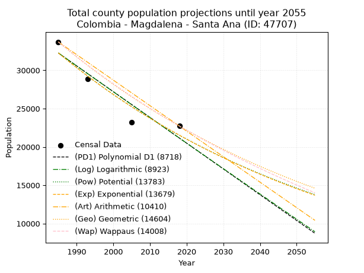
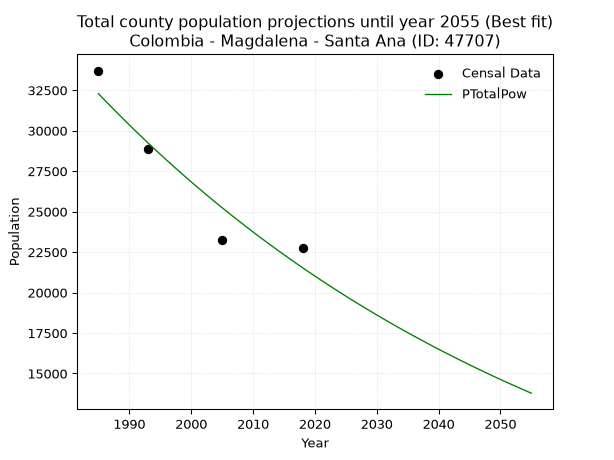
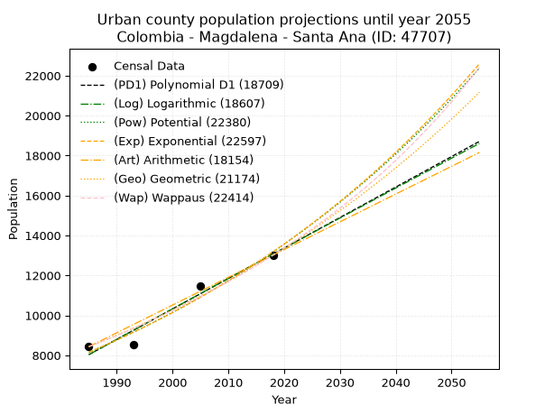
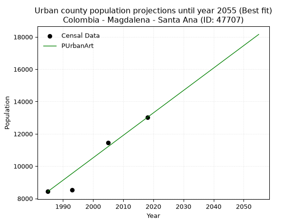
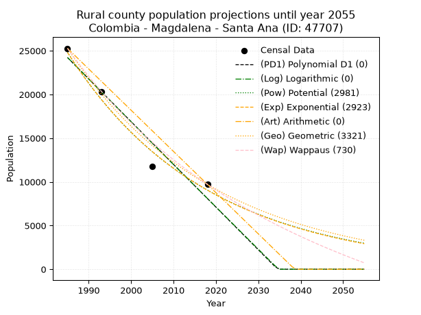
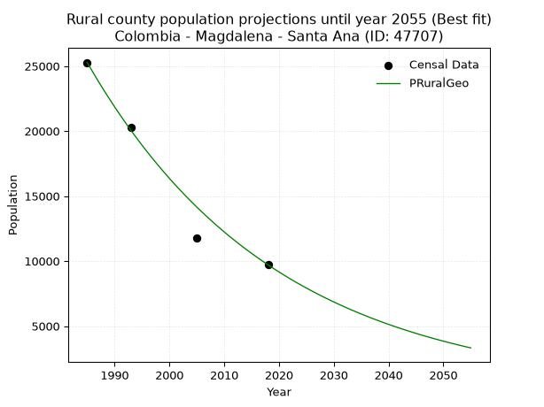

<div align="center">


</div>

# 📜 _“Population and Public Services Demand Projections (PPSD) until Year 2050 for Colombia - Magdalena - Santa Ana (ID: 47707)”_
Keywords: `population` `public-service` `projection` `lineal` `polynomial` `logarithmic` `potential` `exponential` `arithmetic` `geometric` `wappaus` `dane` `colombia` `south-america`

PPSD are analytical estimates used by governments and planners to anticipate future changes in population size, age distribution, and the resulting community needs for utilities, healthcare, education, and infrastructure as sizing future water treatment facilities, electrical grids, and road networks based on spatial growth.

<div align="center">

</img>

</div>


> **General running parameters**: • app_version: _v20260806_. • Python version: _3.14.7_. • Pandas version: _3.0.5_. • NumPy version: _2.5.1_. • Creates, save and include plots into reports (create_plot): _False_. • Projection until year: _2050_. • Process polynomial degree 2 and up: _False_. • Process Wappaus: _True_. • Process Wappaus: _True_. • Set negative values to zero: _True_. • Set infinite values to zero: _True_. • Drop dataset notes: _True_. 
<div align="center">

Maps & GIS Layers: [:earth_americas:Google](http://maps.google.com/maps?q=9.324293553,-74.5668453) [:earth_americas:OSM](https://www.openstreetmap.org/#map=18/9.324293553/-74.5668453&layers=P) [:earth_americas:Bing](https://www.bing.com/maps?cp=9.324293553~-74.5668453&lvl=18) [:earth_americas:Apple](https://maps.apple.com/frame?center=9.324293553%2C-74.5668453&span=0.003%2C0.006) [:earth_americas:GISMobile](https://github.com/rcfdtools/R.GISMobile/blob/main/file/gis/CountyLayer_CO/Readme.md)

</div>


<div align="center">

```geojson
{
  "type": "Feature",
  "geometry": {
    "type": "Point", 
    "coordinates": [-74.5668453, 9.324293553]
  }, 
  "properties": {
    "Name": "Colombia - Magdalena - Santa Ana (ID: 47707)"
  }
}
```

</div>


## 0. Census Data (4 records)

Census data are official statistics collected by a government about the people and housing in a country. They usually include counts of total population, age, sex, race, income, education, and jobs.

📅Global census file: [Population.xlsx](../data/Population.xlsx)

| Source   |   Year |   CountryID | CountryName   |   StateID | StateName   |   CountyID | CountyName   |   PTotal |   PUrban |   PRural |
|:---------|-------:|------------:|:--------------|----------:|:------------|-----------:|:-------------|---------:|---------:|---------:|
| DANE     |   1985 |          57 | Colombia      |        47 | Magdalena   |      47707 | Santa Ana    |    33705 |     8432 |    25273 |
| DANE     |   1993 |          57 | Colombia      |        47 | Magdalena   |      47707 | Santa Ana    |    28838 |     8535 |    20303 |
| DANE     |   2005 |          57 | Colombia      |        47 | Magdalena   |      47707 | Santa Ana    |    23235 |    11456 |    11779 |
| DANE     |   2018 |          57 | Colombia      |        47 | Magdalena   |      47707 | Santa Ana    |    22723 |    13015 |     9708 |

> 🔥Some records could had specific notes about the registered values or the corresponding urban or rural distribution.

📅[SUI-RUPS](https://www.datos.gov.co/Hacienda-y-Cr-dito-P-blico/Registro-nico-de-Prestadores-de-Servicios-P-blicos/4qkq-csdn/about_data) - Local public utility companies: [RUPS.csv](../data/RUPS.csv)

 | SERVICIO       | ESTADO    | NOMBRE                           | NIT         | DEPARTAMENTO_DOMICILIO   | MUNICIPIO_DOMICILIO   | DIRECCION         |   TELEFONO | EMAIL                              | TIPO_PRESTADOR                 | CLASIFICACION                 |
|:---------------|:----------|:---------------------------------|:------------|:-------------------------|:----------------------|:------------------|-----------:|:-----------------------------------|:-------------------------------|:------------------------------|
| ACUEDUCTO      | OPERATIVA | MUNICIPIO DE SANTA ANA MAGDALENA | 891780056-0 | MAGDALENA                | SANTA ANA             | CALLE 2 No.  5-66 |    5931633 | alcaldia@santaana-magdalena.gov.co | MUNICIPIO (PRESTACIÓN DIRECTA) | MENOR O IGUAL A 2500 USUARIOS |
| ALCANTARILLADO | OPERATIVA | MUNICIPIO DE SANTA ANA MAGDALENA | 891780056-0 | MAGDALENA                | SANTA ANA             | CALLE 2 No.  5-66 |    5931633 | alcaldia@santaana-magdalena.gov.co | MUNICIPIO (PRESTACIÓN DIRECTA) | MENOR O IGUAL A 2500 USUARIOS |

## 1. Total

### 1.1. Coefficients and Parameters

* (PD1) Polynomial Deg 1: -336.21397029305433, 699637.2440786819 (lineal)
* (Log) Logarithmic: -673567.8458590651, 5146919.8440087205
* (Pow) Potential: -24.558345631435646, 85.49652831822344
* (Exp) Exponential: -0.012259412169574801, 1194780471670635.8
* (Art) Arithmetic: Year diff. 2018 - 1985 = 33, Population diff. 22723 - 33705 = -10982, Annual growth = -332.7878787878788
* (Geo) Geometric: Year diff. 2018 - 1985 = 33, Population diff. 22723 - 33705 = -10982, Annual growth % = -0.011876443958239946
* (Wap) Wappaus: i = -1.1795132869776663, Condition values only valid for < 200)

<sub>
Wappaus condition values: ['-0.00', '-1.18', '-2.36', '-3.54', '-4.72', '-5.90', '-7.08', '-8.26', '-9.44', '-10.62', '-11.80', '-12.97', '-14.15', '-15.33', '-16.51', '-17.69', '-18.87', '-20.05', '-21.23', '-22.41', '-23.59', '-24.77', '-25.95', '-27.13', '-28.31', '-29.49', '-30.67', '-31.85', '-33.03', '-34.21', '-35.39', '-36.56', '-37.74', '-38.92', '-40.10', '-41.28', '-42.46', '-43.64', '-44.82', '-46.00', '-47.18', '-48.36', '-49.54', '-50.72', '-51.90', '-53.08', '-54.26', '-55.44', '-56.62', '-57.80', '-58.98', '-60.16', '-61.33', '-62.51', '-63.69', '-64.87', '-66.05', '-67.23', '-68.41', '-69.59', '-70.77', '-71.95', '-73.13', '-74.31', '-75.49', '-76.67']
</sub>


### 1.2. Projected Dataset

|   Year |   CountyID |   PTotalPD1 |   PTotalLog |   PTotalPow |   PTotalExp |   PTotalArt |   PTotalGeo |   PTotalWap |
|-------:|-----------:|------------:|------------:|------------:|------------:|------------:|------------:|------------:|
|   1985 |      47707 |       32253 |       32267 |       32284 |       32267 |       33705 |       33705 |       33705 |
|   1986 |      47707 |       31916 |       31928 |       31887 |       31874 |       33372 |       33305 |       33310 |
|   1987 |      47707 |       31580 |       31589 |       31495 |       31486 |       33039 |       32909 |       32919 |
|   1988 |      47707 |       31244 |       31250 |       31108 |       31102 |       32707 |       32518 |       32533 |
|   1989 |      47707 |       30908 |       30911 |       30727 |       30723 |       32374 |       32132 |       32151 |
|   1990 |      47707 |       30571 |       30573 |       30350 |       30349 |       32041 |       31751 |       31774 |
|   1991 |      47707 |       30235 |       30234 |       29978 |       29979 |       31708 |       31373 |       31401 |
|   1992 |      47707 |       29899 |       29896 |       29610 |       29614 |       31375 |       31001 |       31032 |
|   1993 |      47707 |       29563 |       29558 |       29247 |       29253 |       31043 |       30633 |       30668 |
|   1994 |      47707 |       29227 |       29220 |       28889 |       28896 |       30710 |       30269 |       30307 |
|   1995 |      47707 |       28890 |       28882 |       28536 |       28544 |       30377 |       29909 |       29951 |
|   1996 |      47707 |       28554 |       28545 |       28187 |       28196 |       30044 |       29554 |       29598 |
|   1997 |      47707 |       28218 |       28207 |       27842 |       27853 |       29712 |       29203 |       29250 |
|   1998 |      47707 |       27882 |       27870 |       27502 |       27514 |       29379 |       28856 |       28905 |
|   1999 |      47707 |       27546 |       27533 |       27166 |       27178 |       29046 |       28514 |       28564 |
|   2000 |      47707 |       27209 |       27196 |       26834 |       26847 |       28713 |       28175 |       28226 |
|   2001 |      47707 |       26873 |       26860 |       26507 |       26520 |       28380 |       27840 |       27893 |
|   2002 |      47707 |       26537 |       26523 |       26184 |       26197 |       28048 |       27510 |       27562 |
|   2003 |      47707 |       26201 |       26187 |       25865 |       25878 |       27715 |       27183 |       27236 |
|   2004 |      47707 |       25864 |       25851 |       25550 |       25562 |       27382 |       26860 |       26913 |
|   2005 |      47707 |       25528 |       25515 |       25238 |       25251 |       27049 |       26541 |       26593 |
|   2006 |      47707 |       25192 |       25179 |       24931 |       24943 |       26716 |       26226 |       26276 |
|   2007 |      47707 |       24856 |       24843 |       24628 |       24639 |       26384 |       25914 |       25963 |
|   2008 |      47707 |       24520 |       24507 |       24329 |       24339 |       26051 |       25607 |       25653 |
|   2009 |      47707 |       24183 |       24172 |       24033 |       24043 |       25718 |       25303 |       25347 |
|   2010 |      47707 |       23847 |       23837 |       23741 |       23750 |       25385 |       25002 |       25043 |
|   2011 |      47707 |       23511 |       23502 |       23453 |       23460 |       25053 |       24705 |       24743 |
|   2012 |      47707 |       23175 |       23167 |       23168 |       23174 |       24720 |       24412 |       24445 |
|   2013 |      47707 |       22839 |       22832 |       22887 |       22892 |       24387 |       24122 |       24151 |
|   2014 |      47707 |       22502 |       22498 |       22610 |       22613 |       24054 |       23835 |       23860 |
|   2015 |      47707 |       22166 |       22163 |       22336 |       22338 |       23721 |       23552 |       23571 |
|   2016 |      47707 |       21830 |       21829 |       22065 |       22065 |       23389 |       23273 |       23286 |
|   2017 |      47707 |       21494 |       21495 |       21798 |       21796 |       23056 |       22996 |       23003 |
|   2018 |      47707 |       21157 |       21161 |       21534 |       21531 |       22723 |       22723 |       22723 |
|   2019 |      47707 |       20821 |       20828 |       21274 |       21269 |       22390 |       22453 |       22446 |
|   2020 |      47707 |       20485 |       20494 |       21017 |       21009 |       22057 |       22186 |       22171 |
|   2021 |      47707 |       20149 |       20161 |       20763 |       20753 |       21725 |       21923 |       21899 |
|   2022 |      47707 |       19813 |       19828 |       20512 |       20501 |       21392 |       21663 |       21630 |
|   2023 |      47707 |       19476 |       19495 |       20265 |       20251 |       21059 |       21405 |       21364 |
|   2024 |      47707 |       19140 |       19162 |       20020 |       20004 |       20726 |       21151 |       21100 |
|   2025 |      47707 |       18804 |       18829 |       19779 |       19760 |       20393 |       20900 |       20838 |
|   2026 |      47707 |       18468 |       18496 |       19540 |       19520 |       20061 |       20652 |       20579 |
|   2027 |      47707 |       18132 |       18164 |       19305 |       19282 |       19728 |       20406 |       20323 |
|   2028 |      47707 |       17795 |       17832 |       19073 |       19047 |       19395 |       20164 |       20068 |
|   2029 |      47707 |       17459 |       17500 |       18843 |       18815 |       19062 |       19925 |       19817 |
|   2030 |      47707 |       17123 |       17168 |       18616 |       18585 |       18730 |       19688 |       19567 |
|   2031 |      47707 |       16787 |       16836 |       18393 |       18359 |       18397 |       19454 |       19320 |
|   2032 |      47707 |       16450 |       16505 |       18172 |       18135 |       18064 |       19223 |       19075 |
|   2033 |      47707 |       16114 |       16173 |       17953 |       17914 |       17731 |       18995 |       18833 |
|   2034 |      47707 |       15778 |       15842 |       17738 |       17696 |       17398 |       18769 |       18592 |
|   2035 |      47707 |       15442 |       15511 |       17525 |       17480 |       17066 |       18546 |       18354 |
|   2036 |      47707 |       15106 |       15180 |       17315 |       17267 |       16733 |       18326 |       18118 |
|   2037 |      47707 |       14769 |       14849 |       17107 |       17057 |       16400 |       18108 |       17884 |
|   2038 |      47707 |       14433 |       14519 |       16902 |       16849 |       16067 |       17893 |       17652 |
|   2039 |      47707 |       14097 |       14188 |       16700 |       16644 |       15734 |       17681 |       17422 |
|   2040 |      47707 |       13761 |       13858 |       16500 |       16441 |       15402 |       17471 |       17195 |
|   2041 |      47707 |       13425 |       13528 |       16303 |       16241 |       15069 |       17263 |       16969 |
|   2042 |      47707 |       13088 |       13198 |       16108 |       16043 |       14736 |       17058 |       16745 |
|   2043 |      47707 |       12752 |       12868 |       15915 |       15847 |       14403 |       16856 |       16524 |
|   2044 |      47707 |       12416 |       12539 |       15725 |       15654 |       14071 |       16656 |       16304 |
|   2045 |      47707 |       12080 |       12209 |       15537 |       15464 |       13738 |       16458 |       16086 |
|   2046 |      47707 |       11743 |       11880 |       15352 |       15275 |       13405 |       16262 |       15870 |
|   2047 |      47707 |       11407 |       11551 |       15169 |       15089 |       13072 |       16069 |       15656 |
|   2048 |      47707 |       11071 |       11222 |       14988 |       14905 |       12739 |       15878 |       15444 |
|   2049 |      47707 |       10735 |       10893 |       14809 |       14724 |       12407 |       15690 |       15233 |
|   2050 |      47707 |       10399 |       10564 |       14633 |       14544 |       12074 |       15503 |       15025 |
<div align="center">

</img>

</div>


### 1.3. Best fit with absolute and relative error (%)

Relative error puts that difference into context by dividing the absolute error by the true value, creating a unitless ratio or percentage that shows the scale of the mistake.

Absolute and relative error

|   Year | Source   |   CountryID | CountryName   |   StateID | StateName   |   CountyID_x | CountyName   |   PTotal |   PUrban |   PRural |   CountyID_y |   PTotalPD1 |   PTotalLog |   PTotalPow |   PTotalExp |   PTotalArt |   PTotalGeo |   PTotalWap |   PTotalPD1AbsError |   PTotalLogAbsError |   PTotalPowAbsError |   PTotalExpAbsError |   PTotalArtAbsError |   PTotalGeoAbsError |   PTotalWapAbsError |   PTotalPD1RelError |   PTotalLogRelError |   PTotalPowRelError |   PTotalExpRelError |   PTotalArtRelError |   PTotalGeoRelError |   PTotalWapRelError |
|-------:|:---------|------------:|:--------------|----------:|:------------|-------------:|:-------------|---------:|---------:|---------:|-------------:|------------:|------------:|------------:|------------:|------------:|------------:|------------:|--------------------:|--------------------:|--------------------:|--------------------:|--------------------:|--------------------:|--------------------:|--------------------:|--------------------:|--------------------:|--------------------:|--------------------:|--------------------:|--------------------:|
|   1985 | DANE     |          57 | Colombia      |        47 | Magdalena   |        47707 | Santa Ana    |    33705 |     8432 |    25273 |        47707 |       32253 |       32267 |       32284 |       32267 |       33705 |       33705 |       33705 |                1452 |                1438 |                1421 |                1438 |                   0 |                   0 |                   0 |             4.30797 |             4.26643 |             4.21599 |             4.26643 |             0       |             0       |             0       |
|   1993 | DANE     |          57 | Colombia      |        47 | Magdalena   |        47707 | Santa Ana    |    28838 |     8535 |    20303 |        47707 |       29563 |       29558 |       29247 |       29253 |       31043 |       30633 |       30668 |                 725 |                 720 |                 409 |                 415 |                2205 |                1795 |                1830 |             2.51404 |             2.49671 |             1.41827 |             1.43907 |             7.64616 |             6.22443 |             6.34579 |
|   2005 | DANE     |          57 | Colombia      |        47 | Magdalena   |        47707 | Santa Ana    |    23235 |    11456 |    11779 |        47707 |       25528 |       25515 |       25238 |       25251 |       27049 |       26541 |       26593 |                2293 |                2280 |                2003 |                2016 |                3814 |                3306 |                3358 |             9.86873 |             9.81278 |             8.62062 |             8.67657 |            16.4149  |            14.2285  |            14.4523  |
|   2018 | DANE     |          57 | Colombia      |        47 | Magdalena   |        47707 | Santa Ana    |    22723 |    13015 |     9708 |        47707 |       21157 |       21161 |       21534 |       21531 |       22723 |       22723 |       22723 |                1566 |                1562 |                1189 |                1192 |                   0 |                   0 |                   0 |             6.8917  |             6.87409 |             5.23258 |             5.24579 |             0       |             0       |             0       |

Relative error mean

| Method    |   RelError | Best   |
|:----------|-----------:|:-------|
| PTotalPD1 |    5.89561 |        |
| PTotalLog |    5.8625  |        |
| PTotalPow |    4.87186 | True   |
| PTotalExp |    4.90696 |        |
| PTotalArt |    6.01526 |        |
| PTotalGeo |    5.11324 |        |
| PTotalWap |    5.19953 |        |

💙Best method: _**PTotalPow**_
<div align="center">

</img>

</div>


### 1.4. Fresh water supply demand in liters per capita per day (lpcd)

The fresh water supply demand typically ranges from 100 to 300 liters per capita per day (lpcd) for standard domestic and municipal planning, though absolute survival minimums set by the World Health Organization are as low as 7.5 to 20 liters per day, and total consumption in high-income nations can exceed 400 liters.

> `CZ`: Level in meters above the sea level (masl)<br> `WS`: Fresh water supply demand in liters per capita per day (lpcd or l/h/d)<br> `WSAll`: Zonal fresh water supply demand in liters per second (l/s)<br> `A`: Zonal area in square meters<br> `DP`: Population density (people/hectare or p/ha)

Reference values (RAS Colombia)

|    CZ |   WS |
|------:|-----:|
|  1000 |  120 |
|  2000 |  130 |
| 99999 |  140 |

County shapefile geometry properties and water supply values

|   CountyID |      ATotal |   CZTotal |   WSTotal |
|-----------:|------------:|----------:|----------:|
|      47707 | 1.11922e+09 |   50.8002 |       120 |

Projected values for best method: PTotalPow

|   CountyID |   Year |   PTotalPow |   DPTotal |   WSTotal |   WSTotalAll |
|-----------:|-------:|------------:|----------:|----------:|-------------:|
|      47707 |   1985 |       32284 |      0.29 |       120 |      44.8389 |
|      47707 |   1986 |       31887 |      0.28 |       120 |      44.2875 |
|      47707 |   1987 |       31495 |      0.28 |       120 |      43.7431 |
|      47707 |   1988 |       31108 |      0.28 |       120 |      43.2056 |
|      47707 |   1989 |       30727 |      0.27 |       120 |      42.6764 |
|      47707 |   1990 |       30350 |      0.27 |       120 |      42.1528 |
|      47707 |   1991 |       29978 |      0.27 |       120 |      41.6361 |
|      47707 |   1992 |       29610 |      0.26 |       120 |      41.125  |
|      47707 |   1993 |       29247 |      0.26 |       120 |      40.6208 |
|      47707 |   1994 |       28889 |      0.26 |       120 |      40.1236 |
|      47707 |   1995 |       28536 |      0.25 |       120 |      39.6333 |
|      47707 |   1996 |       28187 |      0.25 |       120 |      39.1486 |
|      47707 |   1997 |       27842 |      0.25 |       120 |      38.6694 |
|      47707 |   1998 |       27502 |      0.25 |       120 |      38.1972 |
|      47707 |   1999 |       27166 |      0.24 |       120 |      37.7306 |
|      47707 |   2000 |       26834 |      0.24 |       120 |      37.2694 |
|      47707 |   2001 |       26507 |      0.24 |       120 |      36.8153 |
|      47707 |   2002 |       26184 |      0.23 |       120 |      36.3667 |
|      47707 |   2003 |       25865 |      0.23 |       120 |      35.9236 |
|      47707 |   2004 |       25550 |      0.23 |       120 |      35.4861 |
|      47707 |   2005 |       25238 |      0.23 |       120 |      35.0528 |
|      47707 |   2006 |       24931 |      0.22 |       120 |      34.6264 |
|      47707 |   2007 |       24628 |      0.22 |       120 |      34.2056 |
|      47707 |   2008 |       24329 |      0.22 |       120 |      33.7903 |
|      47707 |   2009 |       24033 |      0.21 |       120 |      33.3792 |
|      47707 |   2010 |       23741 |      0.21 |       120 |      32.9736 |
|      47707 |   2011 |       23453 |      0.21 |       120 |      32.5736 |
|      47707 |   2012 |       23168 |      0.21 |       120 |      32.1778 |
|      47707 |   2013 |       22887 |      0.2  |       120 |      31.7875 |
|      47707 |   2014 |       22610 |      0.2  |       120 |      31.4028 |
|      47707 |   2015 |       22336 |      0.2  |       120 |      31.0222 |
|      47707 |   2016 |       22065 |      0.2  |       120 |      30.6458 |
|      47707 |   2017 |       21798 |      0.19 |       120 |      30.275  |
|      47707 |   2018 |       21534 |      0.19 |       120 |      29.9083 |
|      47707 |   2019 |       21274 |      0.19 |       120 |      29.5472 |
|      47707 |   2020 |       21017 |      0.19 |       120 |      29.1903 |
|      47707 |   2021 |       20763 |      0.19 |       120 |      28.8375 |
|      47707 |   2022 |       20512 |      0.18 |       120 |      28.4889 |
|      47707 |   2023 |       20265 |      0.18 |       120 |      28.1458 |
|      47707 |   2024 |       20020 |      0.18 |       120 |      27.8056 |
|      47707 |   2025 |       19779 |      0.18 |       120 |      27.4708 |
|      47707 |   2026 |       19540 |      0.17 |       120 |      27.1389 |
|      47707 |   2027 |       19305 |      0.17 |       120 |      26.8125 |
|      47707 |   2028 |       19073 |      0.17 |       120 |      26.4903 |
|      47707 |   2029 |       18843 |      0.17 |       120 |      26.1708 |
|      47707 |   2030 |       18616 |      0.17 |       120 |      25.8556 |
|      47707 |   2031 |       18393 |      0.16 |       120 |      25.5458 |
|      47707 |   2032 |       18172 |      0.16 |       120 |      25.2389 |
|      47707 |   2033 |       17953 |      0.16 |       120 |      24.9347 |
|      47707 |   2034 |       17738 |      0.16 |       120 |      24.6361 |
|      47707 |   2035 |       17525 |      0.16 |       120 |      24.3403 |
|      47707 |   2036 |       17315 |      0.15 |       120 |      24.0486 |
|      47707 |   2037 |       17107 |      0.15 |       120 |      23.7597 |
|      47707 |   2038 |       16902 |      0.15 |       120 |      23.475  |
|      47707 |   2039 |       16700 |      0.15 |       120 |      23.1944 |
|      47707 |   2040 |       16500 |      0.15 |       120 |      22.9167 |
|      47707 |   2041 |       16303 |      0.15 |       120 |      22.6431 |
|      47707 |   2042 |       16108 |      0.14 |       120 |      22.3722 |
|      47707 |   2043 |       15915 |      0.14 |       120 |      22.1042 |
|      47707 |   2044 |       15725 |      0.14 |       120 |      21.8403 |
|      47707 |   2045 |       15537 |      0.14 |       120 |      21.5792 |
|      47707 |   2046 |       15352 |      0.14 |       120 |      21.3222 |
|      47707 |   2047 |       15169 |      0.14 |       120 |      21.0681 |
|      47707 |   2048 |       14988 |      0.13 |       120 |      20.8167 |
|      47707 |   2049 |       14809 |      0.13 |       120 |      20.5681 |
|      47707 |   2050 |       14633 |      0.13 |       120 |      20.3236 |

## 2. Urban

### 2.1. Coefficients and Parameters

* (PD1) Polynomial Deg 1: 152.4937775993566, -294666.178643113 (lineal)
* (Log) Logarithmic: 305196.5367638447, -2309441.8216335396
* (Pow) Potential: 29.15930951878017, -92.2494392556546
* (Exp) Exponential: 0.014568398230817322, 2.2496821260255103e-09
* (Art) Arithmetic: Year diff. 2018 - 1985 = 33, Population diff. 13015 - 8432 = 4583, Annual growth = 138.87878787878788
* (Geo) Geometric: Year diff. 2018 - 1985 = 33, Population diff. 13015 - 8432 = 4583, Annual growth % = 0.01324048136788325
* (Wap) Wappaus: i = 1.295088244311912, Condition values only valid for < 200)

<sub>
Wappaus condition values: ['0.00', '1.30', '2.59', '3.89', '5.18', '6.48', '7.77', '9.07', '10.36', '11.66', '12.95', '14.25', '15.54', '16.84', '18.13', '19.43', '20.72', '22.02', '23.31', '24.61', '25.90', '27.20', '28.49', '29.79', '31.08', '32.38', '33.67', '34.97', '36.26', '37.56', '38.85', '40.15', '41.44', '42.74', '44.03', '45.33', '46.62', '47.92', '49.21', '50.51', '51.80', '53.10', '54.39', '55.69', '56.98', '58.28', '59.57', '60.87', '62.16', '63.46', '64.75', '66.05', '67.34', '68.64', '69.93', '71.23', '72.52', '73.82', '75.12', '76.41', '77.71', '79.00', '80.30', '81.59', '82.89', '84.18']
</sub>


### 2.2. Projected Dataset

|   Year |   CountyID |   PUrbanPD1 |   PUrbanLog |   PUrbanPow |   PUrbanExp |   PUrbanArt |   PUrbanGeo |   PUrbanWap |
|-------:|-----------:|------------:|------------:|------------:|------------:|------------:|------------:|------------:|
|   1985 |      47707 |        8034 |        8030 |        8147 |        8150 |        8432 |        8432 |        8432 |
|   1986 |      47707 |        8186 |        8183 |        8267 |        8270 |        8571 |        8544 |        8542 |
|   1987 |      47707 |        8339 |        8337 |        8389 |        8391 |        8710 |        8657 |        8653 |
|   1988 |      47707 |        8491 |        8491 |        8513 |        8514 |        8849 |        8771 |        8766 |
|   1989 |      47707 |        8644 |        8644 |        8639 |        8639 |        8988 |        8888 |        8880 |
|   1990 |      47707 |        8796 |        8797 |        8767 |        8766 |        9126 |        9005 |        8996 |
|   1991 |      47707 |        8949 |        8951 |        8896 |        8895 |        9265 |        9124 |        9114 |
|   1992 |      47707 |        9101 |        9104 |        9027 |        9025 |        9404 |        9245 |        9233 |
|   1993 |      47707 |        9254 |        9257 |        9160 |        9158 |        9543 |        9368 |        9353 |
|   1994 |      47707 |        9406 |        9410 |        9295 |        9292 |        9682 |        9492 |        9476 |
|   1995 |      47707 |        9559 |        9563 |        9432 |        9428 |        9821 |        9617 |        9600 |
|   1996 |      47707 |        9711 |        9716 |        9571 |        9567 |        9960 |        9745 |        9725 |
|   1997 |      47707 |        9864 |        9869 |        9712 |        9707 |       10099 |        9874 |        9853 |
|   1998 |      47707 |       10016 |       10022 |        9855 |        9850 |       10237 |       10004 |        9982 |
|   1999 |      47707 |       10169 |       10175 |       10000 |        9994 |       10376 |       10137 |       10113 |
|   2000 |      47707 |       10321 |       10327 |       10146 |       10141 |       10515 |       10271 |       10246 |
|   2001 |      47707 |       10474 |       10480 |       10295 |       10290 |       10654 |       10407 |       10381 |
|   2002 |      47707 |       10626 |       10632 |       10447 |       10441 |       10793 |       10545 |       10518 |
|   2003 |      47707 |       10779 |       10785 |       10600 |       10594 |       10932 |       10685 |       10657 |
|   2004 |      47707 |       10931 |       10937 |       10755 |       10749 |       11071 |       10826 |       10798 |
|   2005 |      47707 |       11084 |       11089 |       10913 |       10907 |       11210 |       10969 |       10941 |
|   2006 |      47707 |       11236 |       11242 |       11073 |       11067 |       11348 |       11115 |       11086 |
|   2007 |      47707 |       11389 |       11394 |       11235 |       11229 |       11487 |       11262 |       11234 |
|   2008 |      47707 |       11541 |       11546 |       11399 |       11394 |       11626 |       11411 |       11383 |
|   2009 |      47707 |       11694 |       11698 |       11566 |       11561 |       11765 |       11562 |       11535 |
|   2010 |      47707 |       11846 |       11849 |       11735 |       11731 |       11904 |       11715 |       11689 |
|   2011 |      47707 |       11999 |       12001 |       11906 |       11903 |       12043 |       11870 |       11846 |
|   2012 |      47707 |       12151 |       12153 |       12080 |       12078 |       12182 |       12027 |       12005 |
|   2013 |      47707 |       12304 |       12305 |       12256 |       12255 |       12321 |       12187 |       12167 |
|   2014 |      47707 |       12456 |       12456 |       12435 |       12435 |       12459 |       12348 |       12331 |
|   2015 |      47707 |       12609 |       12608 |       12617 |       12618 |       12598 |       12511 |       12498 |
|   2016 |      47707 |       12761 |       12759 |       12800 |       12803 |       12737 |       12677 |       12667 |
|   2017 |      47707 |       12914 |       12910 |       12987 |       12991 |       12876 |       12845 |       12840 |
|   2018 |      47707 |       13066 |       13062 |       13176 |       13181 |       13015 |       13015 |       13015 |
|   2019 |      47707 |       13219 |       13213 |       13368 |       13375 |       13154 |       13187 |       13193 |
|   2020 |      47707 |       13371 |       13364 |       13562 |       13571 |       13293 |       13362 |       13374 |
|   2021 |      47707 |       13524 |       13515 |       13759 |       13770 |       13432 |       13539 |       13558 |
|   2022 |      47707 |       13676 |       13666 |       13959 |       13972 |       13571 |       13718 |       13746 |
|   2023 |      47707 |       13829 |       13817 |       14162 |       14177 |       13709 |       13900 |       13936 |
|   2024 |      47707 |       13981 |       13968 |       14367 |       14385 |       13848 |       14084 |       14130 |
|   2025 |      47707 |       14134 |       14119 |       14576 |       14596 |       13987 |       14270 |       14327 |
|   2026 |      47707 |       14286 |       14269 |       14787 |       14811 |       14126 |       14459 |       14528 |
|   2027 |      47707 |       14439 |       14420 |       15001 |       15028 |       14265 |       14651 |       14732 |
|   2028 |      47707 |       14591 |       14570 |       15219 |       15248 |       14404 |       14845 |       14940 |
|   2029 |      47707 |       14744 |       14721 |       15439 |       15472 |       14543 |       15041 |       15151 |
|   2030 |      47707 |       14896 |       14871 |       15663 |       15699 |       14682 |       15240 |       15367 |
|   2031 |      47707 |       15049 |       15022 |       15889 |       15930 |       14820 |       15442 |       15586 |
|   2032 |      47707 |       15201 |       15172 |       16119 |       16163 |       14959 |       15647 |       15810 |
|   2033 |      47707 |       15354 |       15322 |       16352 |       16401 |       15098 |       15854 |       16038 |
|   2034 |      47707 |       15506 |       15472 |       16588 |       16641 |       15237 |       16064 |       16270 |
|   2035 |      47707 |       15659 |       15622 |       16827 |       16886 |       15376 |       16276 |       16506 |
|   2036 |      47707 |       15811 |       15772 |       17070 |       17133 |       15515 |       16492 |       16747 |
|   2037 |      47707 |       15964 |       15922 |       17316 |       17385 |       15654 |       16710 |       16993 |
|   2038 |      47707 |       16116 |       16072 |       17566 |       17640 |       15793 |       16931 |       17244 |
|   2039 |      47707 |       16269 |       16221 |       17819 |       17899 |       15931 |       17156 |       17500 |
|   2040 |      47707 |       16421 |       16371 |       18076 |       18161 |       16070 |       17383 |       17760 |
|   2041 |      47707 |       16574 |       16521 |       18336 |       18428 |       16209 |       17613 |       18027 |
|   2042 |      47707 |       16726 |       16670 |       18599 |       18698 |       16348 |       17846 |       18298 |
|   2043 |      47707 |       16879 |       16819 |       18867 |       18973 |       16487 |       18082 |       18575 |
|   2044 |      47707 |       17031 |       16969 |       19138 |       19251 |       16626 |       18322 |       18858 |
|   2045 |      47707 |       17184 |       17118 |       19413 |       19534 |       16765 |       18564 |       19147 |
|   2046 |      47707 |       17336 |       17267 |       19692 |       19820 |       16904 |       18810 |       19442 |
|   2047 |      47707 |       17489 |       17416 |       19974 |       20111 |       17042 |       19059 |       19744 |
|   2048 |      47707 |       17641 |       17565 |       20261 |       20406 |       17181 |       19312 |       20052 |
|   2049 |      47707 |       17794 |       17714 |       20551 |       20706 |       17320 |       19567 |       20367 |
|   2050 |      47707 |       17946 |       17863 |       20846 |       21010 |       17459 |       19826 |       20689 |
<div align="center">

</img>

</div>


### 2.3. Best fit with absolute and relative error (%)

Relative error puts that difference into context by dividing the absolute error by the true value, creating a unitless ratio or percentage that shows the scale of the mistake.

Absolute and relative error

|   Year | Source   |   CountryID | CountryName   |   StateID | StateName   |   CountyID_x | CountyName   |   PTotal |   PUrban |   PRural |   CountyID_y |   PUrbanPD1 |   PUrbanLog |   PUrbanPow |   PUrbanExp |   PUrbanArt |   PUrbanGeo |   PUrbanWap |   PUrbanPD1AbsError |   PUrbanLogAbsError |   PUrbanPowAbsError |   PUrbanExpAbsError |   PUrbanArtAbsError |   PUrbanGeoAbsError |   PUrbanWapAbsError |   PUrbanPD1RelError |   PUrbanLogRelError |   PUrbanPowRelError |   PUrbanExpRelError |   PUrbanArtRelError |   PUrbanGeoRelError |   PUrbanWapRelError |
|-------:|:---------|------------:|:--------------|----------:|:------------|-------------:|:-------------|---------:|---------:|---------:|-------------:|------------:|------------:|------------:|------------:|------------:|------------:|------------:|--------------------:|--------------------:|--------------------:|--------------------:|--------------------:|--------------------:|--------------------:|--------------------:|--------------------:|--------------------:|--------------------:|--------------------:|--------------------:|--------------------:|
|   1985 | DANE     |          57 | Colombia      |        47 | Magdalena   |        47707 | Santa Ana    |    33705 |     8432 |    25273 |        47707 |        8034 |        8030 |        8147 |        8150 |        8432 |        8432 |        8432 |                 398 |                 402 |                 285 |                 282 |                   0 |                   0 |                   0 |            4.72011  |            4.76755  |             3.37998 |             3.3444  |             0       |             0       |             0       |
|   1993 | DANE     |          57 | Colombia      |        47 | Magdalena   |        47707 | Santa Ana    |    28838 |     8535 |    20303 |        47707 |        9254 |        9257 |        9160 |        9158 |        9543 |        9368 |        9353 |                 719 |                 722 |                 625 |                 623 |                1008 |                 833 |                 818 |            8.42414  |            8.45929  |             7.32279 |             7.29936 |            11.8102  |             9.75981 |             9.58407 |
|   2005 | DANE     |          57 | Colombia      |        47 | Magdalena   |        47707 | Santa Ana    |    23235 |    11456 |    11779 |        47707 |       11084 |       11089 |       10913 |       10907 |       11210 |       10969 |       10941 |                 372 |                 367 |                 543 |                 549 |                 246 |                 487 |                 515 |            3.24721  |            3.20356  |             4.73987 |             4.79225 |             2.14735 |             4.25105 |             4.49546 |
|   2018 | DANE     |          57 | Colombia      |        47 | Magdalena   |        47707 | Santa Ana    |    22723 |    13015 |     9708 |        47707 |       13066 |       13062 |       13176 |       13181 |       13015 |       13015 |       13015 |                  51 |                  47 |                 161 |                 166 |                   0 |                   0 |                   0 |            0.391856 |            0.361122 |             1.23703 |             1.27545 |             0       |             0       |             0       |

Relative error mean

| Method    |   RelError | Best   |
|:----------|-----------:|:-------|
| PUrbanPD1 |    4.19583 |        |
| PUrbanLog |    4.19788 |        |
| PUrbanPow |    4.16992 |        |
| PUrbanExp |    4.17786 |        |
| PUrbanArt |    3.48938 | True   |
| PUrbanGeo |    3.50272 |        |
| PUrbanWap |    3.51988 |        |

💙Best method: _**PUrbanArt**_
<div align="center">

</img>

</div>


### 2.4. Fresh water supply demand in liters per capita per day (lpcd)

The fresh water supply demand typically ranges from 100 to 300 liters per capita per day (lpcd) for standard domestic and municipal planning, though absolute survival minimums set by the World Health Organization are as low as 7.5 to 20 liters per day, and total consumption in high-income nations can exceed 400 liters.

> `CZ`: Level in meters above the sea level (masl)<br> `WS`: Fresh water supply demand in liters per capita per day (lpcd or l/h/d)<br> `WSAll`: Zonal fresh water supply demand in liters per second (l/s)<br> `A`: Zonal area in square meters<br> `DP`: Population density (people/hectare or p/ha)

Reference values (RAS Colombia)

|    CZ |   WS |
|------:|-----:|
|  1000 |  120 |
|  2000 |  130 |
| 99999 |  140 |

County shapefile geometry properties and water supply values

|   CountyID |      AUrban |   CZUrban |   WSUrban |
|-----------:|------------:|----------:|----------:|
|      47707 | 2.18905e+06 |   25.4294 |       120 |

Projected values for best method: PUrbanArt

|   CountyID |   Year |   PUrbanArt |   DPUrban |   WSUrban |   WSUrbanAll |
|-----------:|-------:|------------:|----------:|----------:|-------------:|
|      47707 |   1985 |        8432 |     38.52 |       120 |      11.7111 |
|      47707 |   1986 |        8571 |     39.15 |       120 |      11.9042 |
|      47707 |   1987 |        8710 |     39.79 |       120 |      12.0972 |
|      47707 |   1988 |        8849 |     40.42 |       120 |      12.2903 |
|      47707 |   1989 |        8988 |     41.06 |       120 |      12.4833 |
|      47707 |   1990 |        9126 |     41.69 |       120 |      12.675  |
|      47707 |   1991 |        9265 |     42.32 |       120 |      12.8681 |
|      47707 |   1992 |        9404 |     42.96 |       120 |      13.0611 |
|      47707 |   1993 |        9543 |     43.59 |       120 |      13.2542 |
|      47707 |   1994 |        9682 |     44.23 |       120 |      13.4472 |
|      47707 |   1995 |        9821 |     44.86 |       120 |      13.6403 |
|      47707 |   1996 |        9960 |     45.5  |       120 |      13.8333 |
|      47707 |   1997 |       10099 |     46.13 |       120 |      14.0264 |
|      47707 |   1998 |       10237 |     46.76 |       120 |      14.2181 |
|      47707 |   1999 |       10376 |     47.4  |       120 |      14.4111 |
|      47707 |   2000 |       10515 |     48.03 |       120 |      14.6042 |
|      47707 |   2001 |       10654 |     48.67 |       120 |      14.7972 |
|      47707 |   2002 |       10793 |     49.3  |       120 |      14.9903 |
|      47707 |   2003 |       10932 |     49.94 |       120 |      15.1833 |
|      47707 |   2004 |       11071 |     50.57 |       120 |      15.3764 |
|      47707 |   2005 |       11210 |     51.21 |       120 |      15.5694 |
|      47707 |   2006 |       11348 |     51.84 |       120 |      15.7611 |
|      47707 |   2007 |       11487 |     52.47 |       120 |      15.9542 |
|      47707 |   2008 |       11626 |     53.11 |       120 |      16.1472 |
|      47707 |   2009 |       11765 |     53.74 |       120 |      16.3403 |
|      47707 |   2010 |       11904 |     54.38 |       120 |      16.5333 |
|      47707 |   2011 |       12043 |     55.01 |       120 |      16.7264 |
|      47707 |   2012 |       12182 |     55.65 |       120 |      16.9194 |
|      47707 |   2013 |       12321 |     56.28 |       120 |      17.1125 |
|      47707 |   2014 |       12459 |     56.92 |       120 |      17.3042 |
|      47707 |   2015 |       12598 |     57.55 |       120 |      17.4972 |
|      47707 |   2016 |       12737 |     58.19 |       120 |      17.6903 |
|      47707 |   2017 |       12876 |     58.82 |       120 |      17.8833 |
|      47707 |   2018 |       13015 |     59.46 |       120 |      18.0764 |
|      47707 |   2019 |       13154 |     60.09 |       120 |      18.2694 |
|      47707 |   2020 |       13293 |     60.73 |       120 |      18.4625 |
|      47707 |   2021 |       13432 |     61.36 |       120 |      18.6556 |
|      47707 |   2022 |       13571 |     62    |       120 |      18.8486 |
|      47707 |   2023 |       13709 |     62.63 |       120 |      19.0403 |
|      47707 |   2024 |       13848 |     63.26 |       120 |      19.2333 |
|      47707 |   2025 |       13987 |     63.9  |       120 |      19.4264 |
|      47707 |   2026 |       14126 |     64.53 |       120 |      19.6194 |
|      47707 |   2027 |       14265 |     65.17 |       120 |      19.8125 |
|      47707 |   2028 |       14404 |     65.8  |       120 |      20.0056 |
|      47707 |   2029 |       14543 |     66.44 |       120 |      20.1986 |
|      47707 |   2030 |       14682 |     67.07 |       120 |      20.3917 |
|      47707 |   2031 |       14820 |     67.7  |       120 |      20.5833 |
|      47707 |   2032 |       14959 |     68.34 |       120 |      20.7764 |
|      47707 |   2033 |       15098 |     68.97 |       120 |      20.9694 |
|      47707 |   2034 |       15237 |     69.61 |       120 |      21.1625 |
|      47707 |   2035 |       15376 |     70.24 |       120 |      21.3556 |
|      47707 |   2036 |       15515 |     70.88 |       120 |      21.5486 |
|      47707 |   2037 |       15654 |     71.51 |       120 |      21.7417 |
|      47707 |   2038 |       15793 |     72.15 |       120 |      21.9347 |
|      47707 |   2039 |       15931 |     72.78 |       120 |      22.1264 |
|      47707 |   2040 |       16070 |     73.41 |       120 |      22.3194 |
|      47707 |   2041 |       16209 |     74.05 |       120 |      22.5125 |
|      47707 |   2042 |       16348 |     74.68 |       120 |      22.7056 |
|      47707 |   2043 |       16487 |     75.32 |       120 |      22.8986 |
|      47707 |   2044 |       16626 |     75.95 |       120 |      23.0917 |
|      47707 |   2045 |       16765 |     76.59 |       120 |      23.2847 |
|      47707 |   2046 |       16904 |     77.22 |       120 |      23.4778 |
|      47707 |   2047 |       17042 |     77.85 |       120 |      23.6694 |
|      47707 |   2048 |       17181 |     78.49 |       120 |      23.8625 |
|      47707 |   2049 |       17320 |     79.12 |       120 |      24.0556 |
|      47707 |   2050 |       17459 |     79.76 |       120 |      24.2486 |

## 3. Rural

### 3.1. Coefficients and Parameters

* (PD1) Polynomial Deg 1: -488.70774789241074, 994303.4227217947 (lineal)
* (Log) Logarithmic: -978764.3826229098, 7456361.665642259
* (Pow) Potential: -61.159495263004935, 206.08424582622004
* (Exp) Exponential: -0.030544643839564393, 5.32317428274009e+30
* (Art) Arithmetic: Year diff. 2018 - 1985 = 33, Population diff. 9708 - 25273 = -15565, Annual growth = -471.6666666666667
* (Geo) Geometric: Year diff. 2018 - 1985 = 33, Population diff. 9708 - 25273 = -15565, Annual growth % = -0.028577246160636394
* (Wap) Wappaus: i = -2.6967020191913704, Condition values only valid for < 200)

<sub>
Wappaus condition values: ['-0.00', '-2.70', '-5.39', '-8.09', '-10.79', '-13.48', '-16.18', '-18.88', '-21.57', '-24.27', '-26.97', '-29.66', '-32.36', '-35.06', '-37.75', '-40.45', '-43.15', '-45.84', '-48.54', '-51.24', '-53.93', '-56.63', '-59.33', '-62.02', '-64.72', '-67.42', '-70.11', '-72.81', '-75.51', '-78.20', '-80.90', '-83.60', '-86.29', '-88.99', '-91.69', '-94.38', '-97.08', '-99.78', '-102.47', '-105.17', '-107.87', '-110.56', '-113.26', '-115.96', '-118.65', '-121.35', '-124.05', '-126.74', '-129.44', '-132.14', '-134.84', '-137.53', '-140.23', '-142.93', '-145.62', '-148.32', '-151.02', '-153.71', '-156.41', '-159.11', '-161.80', '-164.50', '-167.20', '-169.89', '-172.59', '-175.29']
</sub>


### 3.2. Projected Dataset

|   Year |   CountyID |   PRuralPD1 |   PRuralLog |   PRuralPow |   PRuralExp |   PRuralArt |   PRuralGeo |   PRuralWap |
|-------:|-----------:|------------:|------------:|------------:|------------:|------------:|------------:|------------:|
|   1985 |      47707 |       24219 |       24237 |       24824 |       24798 |       25273 |       25273 |       25273 |
|   1986 |      47707 |       23730 |       23745 |       24071 |       24052 |       24801 |       24551 |       24601 |
|   1987 |      47707 |       23241 |       23252 |       23342 |       23328 |       24330 |       23849 |       23946 |
|   1988 |      47707 |       22752 |       22759 |       22634 |       22626 |       23858 |       23168 |       23308 |
|   1989 |      47707 |       22264 |       22267 |       21949 |       21946 |       23386 |       22506 |       22686 |
|   1990 |      47707 |       21775 |       21775 |       21284 |       21285 |       22915 |       21862 |       22081 |
|   1991 |      47707 |       21286 |       21283 |       20640 |       20645 |       22443 |       21238 |       21490 |
|   1992 |      47707 |       20798 |       20792 |       20016 |       20024 |       21971 |       20631 |       20914 |
|   1993 |      47707 |       20309 |       20301 |       19411 |       19422 |       21500 |       20041 |       20352 |
|   1994 |      47707 |       19820 |       19810 |       18824 |       18837 |       21028 |       19468 |       19803 |
|   1995 |      47707 |       19331 |       19319 |       18256 |       18271 |       20556 |       18912 |       19267 |
|   1996 |      47707 |       18843 |       18829 |       17705 |       17721 |       20085 |       18372 |       18744 |
|   1997 |      47707 |       18354 |       18338 |       17171 |       17188 |       19613 |       17847 |       18234 |
|   1998 |      47707 |       17865 |       17848 |       16653 |       16671 |       19141 |       17337 |       17734 |
|   1999 |      47707 |       17377 |       17359 |       16151 |       16169 |       18670 |       16841 |       17247 |
|   2000 |      47707 |       16888 |       16869 |       15665 |       15683 |       18198 |       16360 |       16770 |
|   2001 |      47707 |       16399 |       16380 |       15193 |       15211 |       17726 |       15892 |       16303 |
|   2002 |      47707 |       15911 |       15891 |       14736 |       14754 |       17255 |       15438 |       15847 |
|   2003 |      47707 |       15422 |       15402 |       14292 |       14310 |       16783 |       14997 |       15401 |
|   2004 |      47707 |       14933 |       14913 |       13863 |       13879 |       16311 |       14568 |       14965 |
|   2005 |      47707 |       14444 |       14425 |       13446 |       13462 |       15840 |       14152 |       14537 |
|   2006 |      47707 |       13956 |       13937 |       13042 |       13057 |       15368 |       13748 |       14119 |
|   2007 |      47707 |       13467 |       13449 |       12651 |       12664 |       14896 |       13355 |       13709 |
|   2008 |      47707 |       12978 |       12962 |       12271 |       12283 |       14425 |       12973 |       13308 |
|   2009 |      47707 |       12490 |       12475 |       11903 |       11914 |       13953 |       12602 |       12915 |
|   2010 |      47707 |       12001 |       11987 |       11546 |       11555 |       13481 |       12242 |       12530 |
|   2011 |      47707 |       11512 |       11501 |       11200 |       11208 |       13010 |       11892 |       12153 |
|   2012 |      47707 |       11023 |       11014 |       10865 |       10870 |       12538 |       11553 |       11783 |
|   2013 |      47707 |       10535 |       10528 |       10540 |       10543 |       12066 |       11222 |       11420 |
|   2014 |      47707 |       10046 |       10042 |       10224 |       10226 |       11595 |       10902 |       11064 |
|   2015 |      47707 |        9557 |        9556 |        9919 |        9919 |       11123 |       10590 |       10715 |
|   2016 |      47707 |        9069 |        9070 |        9622 |        9620 |       10651 |       10288 |       10373 |
|   2017 |      47707 |        8580 |        8585 |        9335 |        9331 |       10180 |        9994 |       10037 |
|   2018 |      47707 |        8091 |        8100 |        9056 |        9050 |        9708 |        9708 |        9708 |
|   2019 |      47707 |        7602 |        7615 |        8786 |        8778 |        9236 |        9431 |        9385 |
|   2020 |      47707 |        7114 |        7130 |        8524 |        8514 |        8765 |        9161 |        9067 |
|   2021 |      47707 |        6625 |        6646 |        8269 |        8258 |        8293 |        8899 |        8755 |
|   2022 |      47707 |        6136 |        6161 |        8023 |        8009 |        7821 |        8645 |        8449 |
|   2023 |      47707 |        5648 |        5678 |        7784 |        7768 |        7350 |        8398 |        8149 |
|   2024 |      47707 |        5159 |        5194 |        7552 |        7535 |        6878 |        8158 |        7853 |
|   2025 |      47707 |        4670 |        4710 |        7328 |        7308 |        6406 |        7925 |        7563 |
|   2026 |      47707 |        4182 |        4227 |        7110 |        7088 |        5935 |        7698 |        7278 |
|   2027 |      47707 |        3693 |        3744 |        6898 |        6875 |        5463 |        7478 |        6998 |
|   2028 |      47707 |        3204 |        3261 |        6693 |        6668 |        4991 |        7265 |        6722 |
|   2029 |      47707 |        2715 |        2779 |        6494 |        6467 |        4520 |        7057 |        6452 |
|   2030 |      47707 |        2227 |        2297 |        6302 |        6273 |        4048 |        6855 |        6185 |
|   2031 |      47707 |        1738 |        1815 |        6115 |        6084 |        3576 |        6659 |        5924 |
|   2032 |      47707 |        1249 |        1333 |        5933 |        5901 |        3105 |        6469 |        5666 |
|   2033 |      47707 |         761 |         851 |        5757 |        5724 |        2633 |        6284 |        5413 |
|   2034 |      47707 |         272 |         370 |        5587 |        5551 |        2161 |        6105 |        5164 |
|   2035 |      47707 |           0 |           0 |        5421 |        5384 |        1690 |        5930 |        4919 |
|   2036 |      47707 |           0 |           0 |        5261 |        5222 |        1218 |        5761 |        4677 |
|   2037 |      47707 |           0 |           0 |        5105 |        5065 |         746 |        5596 |        4440 |
|   2038 |      47707 |           0 |           0 |        4954 |        4913 |         275 |        5436 |        4206 |
|   2039 |      47707 |           0 |           0 |        4808 |        4765 |           0 |        5281 |        3976 |
|   2040 |      47707 |           0 |           0 |        4666 |        4622 |           0 |        5130 |        3750 |
|   2041 |      47707 |           0 |           0 |        4528 |        4483 |           0 |        4983 |        3527 |
|   2042 |      47707 |           0 |           0 |        4394 |        4348 |           0 |        4841 |        3307 |
|   2043 |      47707 |           0 |           0 |        4265 |        4217 |           0 |        4703 |        3091 |
|   2044 |      47707 |           0 |           0 |        4139 |        4090 |           0 |        4568 |        2878 |
|   2045 |      47707 |           0 |           0 |        4017 |        3967 |           0 |        4438 |        2668 |
|   2046 |      47707 |           0 |           0 |        3899 |        3848 |           0 |        4311 |        2462 |
|   2047 |      47707 |           0 |           0 |        3784 |        3732 |           0 |        4188 |        2258 |
|   2048 |      47707 |           0 |           0 |        3673 |        3620 |           0 |        4068 |        2057 |
|   2049 |      47707 |           0 |           0 |        3565 |        3511 |           0 |        3952 |        1859 |
|   2050 |      47707 |           0 |           0 |        3460 |        3405 |           0 |        3839 |        1664 |
<div align="center">

</img>

</div>


### 3.3. Best fit with absolute and relative error (%)

Relative error puts that difference into context by dividing the absolute error by the true value, creating a unitless ratio or percentage that shows the scale of the mistake.

Absolute and relative error

|   Year | Source   |   CountryID | CountryName   |   StateID | StateName   |   CountyID_x | CountyName   |   PTotal |   PUrban |   PRural |   CountyID_y |   PRuralPD1 |   PRuralLog |   PRuralPow |   PRuralExp |   PRuralArt |   PRuralGeo |   PRuralWap |   PRuralPD1AbsError |   PRuralLogAbsError |   PRuralPowAbsError |   PRuralExpAbsError |   PRuralArtAbsError |   PRuralGeoAbsError |   PRuralWapAbsError |   PRuralPD1RelError |   PRuralLogRelError |   PRuralPowRelError |   PRuralExpRelError |   PRuralArtRelError |   PRuralGeoRelError |   PRuralWapRelError |
|-------:|:---------|------------:|:--------------|----------:|:------------|-------------:|:-------------|---------:|---------:|---------:|-------------:|------------:|------------:|------------:|------------:|------------:|------------:|------------:|--------------------:|--------------------:|--------------------:|--------------------:|--------------------:|--------------------:|--------------------:|--------------------:|--------------------:|--------------------:|--------------------:|--------------------:|--------------------:|--------------------:|
|   1985 | DANE     |          57 | Colombia      |        47 | Magdalena   |        47707 | Santa Ana    |    33705 |     8432 |    25273 |        47707 |       24219 |       24237 |       24824 |       24798 |       25273 |       25273 |       25273 |                1054 |                1036 |                 449 |                 475 |                   0 |                   0 |                   0 |           4.17046   |          4.09924    |             1.7766  |             1.87948 |             0       |             0       |            0        |
|   1993 | DANE     |          57 | Colombia      |        47 | Magdalena   |        47707 | Santa Ana    |    28838 |     8535 |    20303 |        47707 |       20309 |       20301 |       19411 |       19422 |       21500 |       20041 |       20352 |                   6 |                   2 |                 892 |                 881 |                1197 |                 262 |                  49 |           0.0295523 |          0.00985076 |             4.39344 |             4.33926 |             5.89568 |             1.29045 |            0.241344 |
|   2005 | DANE     |          57 | Colombia      |        47 | Magdalena   |        47707 | Santa Ana    |    23235 |    11456 |    11779 |        47707 |       14444 |       14425 |       13446 |       13462 |       15840 |       14152 |       14537 |                2665 |                2646 |                1667 |                1683 |                4061 |                2373 |                2758 |          22.625     |         22.4637     |            14.1523  |            14.2881  |            34.4766  |            20.146   |           23.4146   |
|   2018 | DANE     |          57 | Colombia      |        47 | Magdalena   |        47707 | Santa Ana    |    22723 |    13015 |     9708 |        47707 |        8091 |        8100 |        9056 |        9050 |        9708 |        9708 |        9708 |                1617 |                1608 |                 652 |                 658 |                   0 |                   0 |                   0 |          16.6564    |         16.5637     |             6.71611 |             6.77792 |             0       |             0       |            0        |

Relative error mean

| Method    |   RelError | Best   |
|:----------|-----------:|:-------|
| PRuralPD1 |   10.8703  |        |
| PRuralLog |   10.7841  |        |
| PRuralPow |    6.75961 |        |
| PRuralExp |    6.8212  |        |
| PRuralArt |   10.0931  |        |
| PRuralGeo |    5.35912 | True   |
| PRuralWap |    5.91397 |        |

💙Best method: _**PRuralGeo**_
<div align="center">

</img>

</div>


### 3.4. Fresh water supply demand in liters per capita per day (lpcd)

The fresh water supply demand typically ranges from 100 to 300 liters per capita per day (lpcd) for standard domestic and municipal planning, though absolute survival minimums set by the World Health Organization are as low as 7.5 to 20 liters per day, and total consumption in high-income nations can exceed 400 liters.

> `CZ`: Level in meters above the sea level (masl)<br> `WS`: Fresh water supply demand in liters per capita per day (lpcd or l/h/d)<br> `WSAll`: Zonal fresh water supply demand in liters per second (l/s)<br> `A`: Zonal area in square meters<br> `DP`: Population density (people/hectare or p/ha)

Reference values (RAS Colombia)

|    CZ |   WS |
|------:|-----:|
|  1000 |  120 |
|  2000 |  130 |
| 99999 |  140 |

County shapefile geometry properties and water supply values

|   CountyID |      ARural |   CZRural |   WSRural |
|-----------:|------------:|----------:|----------:|
|      47707 | 1.11703e+09 |   50.8497 |       120 |

Projected values for best method: PRuralGeo

|   CountyID |   Year |   PRuralGeo |   DPRural |   WSRural |   WSRuralAll |
|-----------:|-------:|------------:|----------:|----------:|-------------:|
|      47707 |   1985 |       25273 |      0.23 |       120 |     35.1014  |
|      47707 |   1986 |       24551 |      0.22 |       120 |     34.0986  |
|      47707 |   1987 |       23849 |      0.21 |       120 |     33.1236  |
|      47707 |   1988 |       23168 |      0.21 |       120 |     32.1778  |
|      47707 |   1989 |       22506 |      0.2  |       120 |     31.2583  |
|      47707 |   1990 |       21862 |      0.2  |       120 |     30.3639  |
|      47707 |   1991 |       21238 |      0.19 |       120 |     29.4972  |
|      47707 |   1992 |       20631 |      0.18 |       120 |     28.6542  |
|      47707 |   1993 |       20041 |      0.18 |       120 |     27.8347  |
|      47707 |   1994 |       19468 |      0.17 |       120 |     27.0389  |
|      47707 |   1995 |       18912 |      0.17 |       120 |     26.2667  |
|      47707 |   1996 |       18372 |      0.16 |       120 |     25.5167  |
|      47707 |   1997 |       17847 |      0.16 |       120 |     24.7875  |
|      47707 |   1998 |       17337 |      0.16 |       120 |     24.0792  |
|      47707 |   1999 |       16841 |      0.15 |       120 |     23.3903  |
|      47707 |   2000 |       16360 |      0.15 |       120 |     22.7222  |
|      47707 |   2001 |       15892 |      0.14 |       120 |     22.0722  |
|      47707 |   2002 |       15438 |      0.14 |       120 |     21.4417  |
|      47707 |   2003 |       14997 |      0.13 |       120 |     20.8292  |
|      47707 |   2004 |       14568 |      0.13 |       120 |     20.2333  |
|      47707 |   2005 |       14152 |      0.13 |       120 |     19.6556  |
|      47707 |   2006 |       13748 |      0.12 |       120 |     19.0944  |
|      47707 |   2007 |       13355 |      0.12 |       120 |     18.5486  |
|      47707 |   2008 |       12973 |      0.12 |       120 |     18.0181  |
|      47707 |   2009 |       12602 |      0.11 |       120 |     17.5028  |
|      47707 |   2010 |       12242 |      0.11 |       120 |     17.0028  |
|      47707 |   2011 |       11892 |      0.11 |       120 |     16.5167  |
|      47707 |   2012 |       11553 |      0.1  |       120 |     16.0458  |
|      47707 |   2013 |       11222 |      0.1  |       120 |     15.5861  |
|      47707 |   2014 |       10902 |      0.1  |       120 |     15.1417  |
|      47707 |   2015 |       10590 |      0.09 |       120 |     14.7083  |
|      47707 |   2016 |       10288 |      0.09 |       120 |     14.2889  |
|      47707 |   2017 |        9994 |      0.09 |       120 |     13.8806  |
|      47707 |   2018 |        9708 |      0.09 |       120 |     13.4833  |
|      47707 |   2019 |        9431 |      0.08 |       120 |     13.0986  |
|      47707 |   2020 |        9161 |      0.08 |       120 |     12.7236  |
|      47707 |   2021 |        8899 |      0.08 |       120 |     12.3597  |
|      47707 |   2022 |        8645 |      0.08 |       120 |     12.0069  |
|      47707 |   2023 |        8398 |      0.08 |       120 |     11.6639  |
|      47707 |   2024 |        8158 |      0.07 |       120 |     11.3306  |
|      47707 |   2025 |        7925 |      0.07 |       120 |     11.0069  |
|      47707 |   2026 |        7698 |      0.07 |       120 |     10.6917  |
|      47707 |   2027 |        7478 |      0.07 |       120 |     10.3861  |
|      47707 |   2028 |        7265 |      0.07 |       120 |     10.0903  |
|      47707 |   2029 |        7057 |      0.06 |       120 |      9.80139 |
|      47707 |   2030 |        6855 |      0.06 |       120 |      9.52083 |
|      47707 |   2031 |        6659 |      0.06 |       120 |      9.24861 |
|      47707 |   2032 |        6469 |      0.06 |       120 |      8.98472 |
|      47707 |   2033 |        6284 |      0.06 |       120 |      8.72778 |
|      47707 |   2034 |        6105 |      0.05 |       120 |      8.47917 |
|      47707 |   2035 |        5930 |      0.05 |       120 |      8.23611 |
|      47707 |   2036 |        5761 |      0.05 |       120 |      8.00139 |
|      47707 |   2037 |        5596 |      0.05 |       120 |      7.77222 |
|      47707 |   2038 |        5436 |      0.05 |       120 |      7.55    |
|      47707 |   2039 |        5281 |      0.05 |       120 |      7.33472 |
|      47707 |   2040 |        5130 |      0.05 |       120 |      7.125   |
|      47707 |   2041 |        4983 |      0.04 |       120 |      6.92083 |
|      47707 |   2042 |        4841 |      0.04 |       120 |      6.72361 |
|      47707 |   2043 |        4703 |      0.04 |       120 |      6.53194 |
|      47707 |   2044 |        4568 |      0.04 |       120 |      6.34444 |
|      47707 |   2045 |        4438 |      0.04 |       120 |      6.16389 |
|      47707 |   2046 |        4311 |      0.04 |       120 |      5.9875  |
|      47707 |   2047 |        4188 |      0.04 |       120 |      5.81667 |
|      47707 |   2048 |        4068 |      0.04 |       120 |      5.65    |
|      47707 |   2049 |        3952 |      0.04 |       120 |      5.48889 |
|      47707 |   2050 |        3839 |      0.03 |       120 |      5.33194 |

#

<div align="center"><br><sub>Share this research</sub></div><br>

<sub>**APPS & TOOLS & CONTENT DISCLAIMER**: • NO WARRANTY - This content and software is provided by <a href="https://github.com/rcfdtools" target="_blank">github.com/rcfdtools</a> "as is", without any express or implied warranty, including warranties of merchantability, fitness for a particular purpose, or non-infringement. There is no guarantee that the software will be error-free or operate without interruption. • LIMITATION OF LIABILITY - Neither the authors nor copyright holders will be liable for claims or damages arising from the software or its use. You are responsible for determining if the software is appropriate for your use and assume all associated risks, including errors, legal compliance, and data loss. • NO PROFESSIONAL ADVICE - The software provides general information and does not offer professional advice. It should not replace consultation with professional advisors. [Clauses and global license for rcfdtools use.](https://github.com/rcfdtools/rcfdtools/blob/main/LICENSE.md)</sub>

| [:house: Home](Readme.md)  | [:beginner: Help / Collab](https://github.com/rcfdtools/R.HydroTools/discussions/31) |
|----------------------------|-------------------------------------------------------------------------------------------|