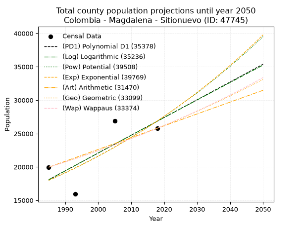
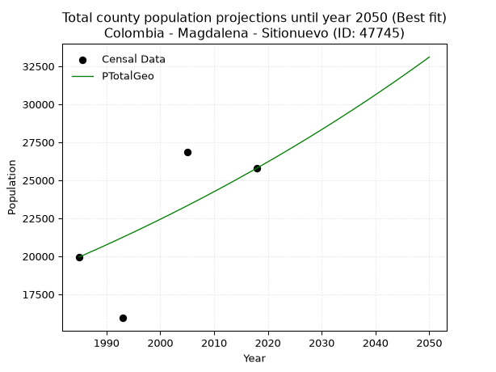
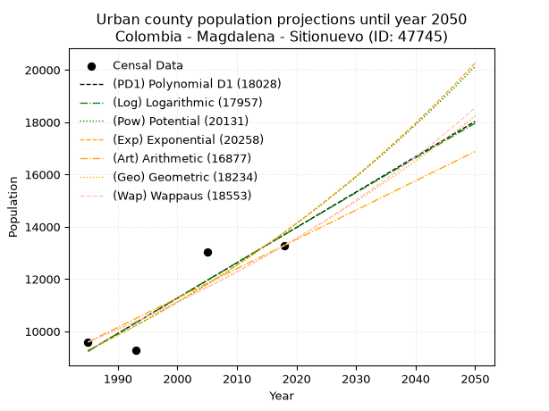
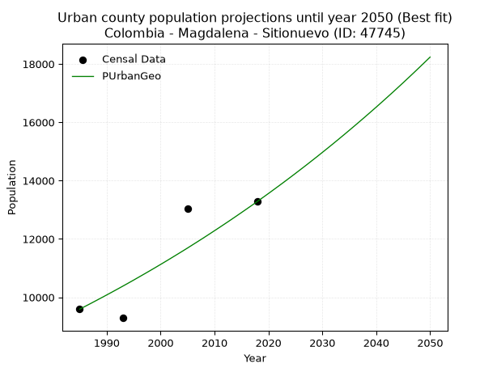
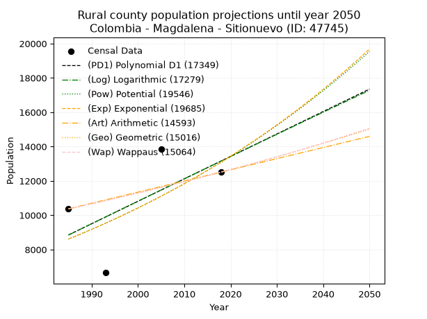
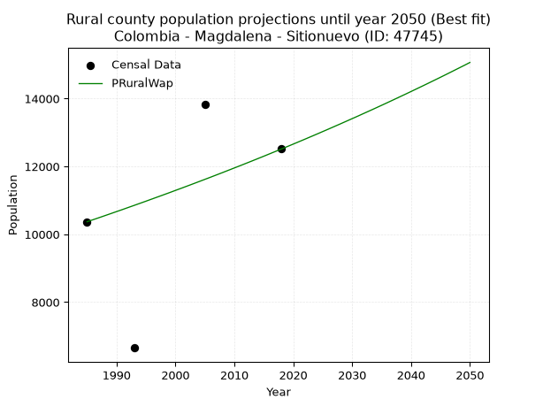

<div align="center">


</div>

# _“Population and Public Services Demand Projections (PPSD) until Year 2050 for Colombia - Magdalena - Sitionuevo (ID: 47745)”_
Keywords: `population` `public-service` `projection` `lineal` `polynomial` `logarithmic` `potential` `exponential` `arithmetic` `geometric` `wappaus` `dane` `colombia` `south-america`

PPSD are analytical estimates used by governments and planners to anticipate future changes in population size, age distribution, and the resulting community needs for utilities, healthcare, education, and infrastructure as sizing future water treatment facilities, electrical grids, and road networks based on spatial growth.

> **General running parameters**: • app_version: _v20260806_. • Python version: _3.14.7_. • Pandas version: _3.0.5_. • NumPy version: _2.5.1_. • Creates, save and include plots into reports (create_plot): _True_. • Projection until year: _2050_. • Process polynomial degree 2 and up: _False_. • Process Wappaus: _True_. • Process Wappaus: _True_. • Set negative values to zero: _True_. • Set infinite values to zero: _True_. • Drop dataset notes: _True_. 
<div align="center">

Dynamic map: [:earth_americas:Google](http://maps.google.com/maps?q=10.7752845,-74.7200212) [:earth_americas:OSM](https://www.openstreetmap.org/#map=18/10.7752845/-74.7200212&layers=P) [:earth_americas:Bing](https://www.bing.com/maps?cp=10.7752845~-74.7200212&lvl=18) [:earth_americas:Apple](https://maps.apple.com/frame?center=10.7752845%2C-74.7200212&span=0.003%2C0.006)

</div>


<div align="center">

```geojson
{
  "type": "Feature",
  "geometry": {
    "type": "Point", 
    "coordinates": [-74.7200212, 10.7752845]
  }, 
  "properties": {
    "Name": "Colombia - Magdalena - Sitionuevo (ID: 47745)"
  }
}
```

</div>


## 0. Census Data (4 records)

Census data are official statistics collected by a government about the people and housing in a country. They usually include counts of total population, age, sex, race, income, education, and jobs.

📅Global census file: [Population.xlsx](../data/Population.xlsx)

| Source   |   Year |   CountryID | CountryName   |   StateID | StateName   |   CountyID | CountyName   |   PTotal |   PUrban |   PRural |
|:---------|-------:|------------:|:--------------|----------:|:------------|-----------:|:-------------|---------:|---------:|---------:|
| DANE     |   1985 |          57 | Colombia      |        47 | Magdalena   |      47745 | Sitionuevo   |    19961 |     9591 |    10370 |
| DANE     |   1993 |          57 | Colombia      |        47 | Magdalena   |      47745 | Sitionuevo   |    15941 |     9289 |     6652 |
| DANE     |   2005 |          57 | Colombia      |        47 | Magdalena   |      47745 | Sitionuevo   |    26867 |    13035 |    13832 |
| DANE     |   2018 |          57 | Colombia      |        47 | Magdalena   |      47745 | Sitionuevo   |    25804 |    13290 |    12514 |

> 🔥Some records has specific notes about the registered values or the corresponding urban or rural distribution.

## 1. Total

### 1.1. Coefficients and Parameters

* (PD1) Polynomial Deg 1: 266.01645925331195, -509956.17262143723 (lineal)
* (Log) Logarithmic: 532497.3562757568, -4025373.4222180373
* (Pow) Potential: 24.42204496619458, -76.28312151579912
* (Exp) Exponential: 0.012202381396914822, 5.441546515903943e-07
* (Art) Arithmetic: Year diff. 2018 - 1985 = 33, Population diff. 25804 - 19961 = 5843, Annual growth = 177.06060606060606
* (Geo) Geometric: Year diff. 2018 - 1985 = 33, Population diff. 25804 - 19961 = 5843, Annual growth % = 0.007810622241023246
* (Wap) Wappaus: i = 0.7737817374002232, Condition values only valid for < 200)

<sub>
Wappaus condition values: ['0.00', '0.77', '1.55', '2.32', '3.10', '3.87', '4.64', '5.42', '6.19', '6.96', '7.74', '8.51', '9.29', '10.06', '10.83', '11.61', '12.38', '13.15', '13.93', '14.70', '15.48', '16.25', '17.02', '17.80', '18.57', '19.34', '20.12', '20.89', '21.67', '22.44', '23.21', '23.99', '24.76', '25.53', '26.31', '27.08', '27.86', '28.63', '29.40', '30.18', '30.95', '31.73', '32.50', '33.27', '34.05', '34.82', '35.59', '36.37', '37.14', '37.92', '38.69', '39.46', '40.24', '41.01', '41.78', '42.56', '43.33', '44.11', '44.88', '45.65', '46.43', '47.20', '47.97', '48.75', '49.52', '50.30']
</sub>


### 1.2. Projected Dataset

|   Year |   CountyID |   PTotalPD1 |   PTotalLog |   PTotalPow |   PTotalExp |   PTotalArt |   PTotalGeo |   PTotalWap |
|-------:|-----------:|------------:|------------:|------------:|------------:|------------:|------------:|------------:|
|   1985 |      47745 |       18086 |       18078 |       17986 |       17992 |       19961 |       19961 |       19961 |
|   1986 |      47745 |       18353 |       18346 |       18209 |       18213 |       20138 |       20117 |       20116 |
|   1987 |      47745 |       18619 |       18615 |       18434 |       18437 |       20315 |       20274 |       20272 |
|   1988 |      47745 |       18885 |       18882 |       18662 |       18663 |       20492 |       20432 |       20430 |
|   1989 |      47745 |       19151 |       19150 |       18892 |       18892 |       20669 |       20592 |       20589 |
|   1990 |      47745 |       19417 |       19418 |       19126 |       19124 |       20846 |       20753 |       20749 |
|   1991 |      47745 |       19683 |       19685 |       19362 |       19359 |       21023 |       20915 |       20910 |
|   1992 |      47745 |       19949 |       19953 |       19601 |       19597 |       21200 |       21078 |       21072 |
|   1993 |      47745 |       20215 |       20220 |       19842 |       19837 |       21377 |       21243 |       21236 |
|   1994 |      47745 |       20481 |       20487 |       20087 |       20081 |       21555 |       21409 |       21401 |
|   1995 |      47745 |       20747 |       20754 |       20334 |       20327 |       21732 |       21576 |       21568 |
|   1996 |      47745 |       21013 |       21021 |       20585 |       20577 |       21909 |       21745 |       21736 |
|   1997 |      47745 |       21279 |       21288 |       20838 |       20829 |       22086 |       21914 |       21905 |
|   1998 |      47745 |       21545 |       21554 |       21095 |       21085 |       22263 |       22086 |       22075 |
|   1999 |      47745 |       21811 |       21821 |       21354 |       21344 |       22440 |       22258 |       22247 |
|   2000 |      47745 |       22077 |       22087 |       21616 |       21606 |       22617 |       22432 |       22421 |
|   2001 |      47745 |       22343 |       22353 |       21882 |       21871 |       22794 |       22607 |       22595 |
|   2002 |      47745 |       22609 |       22619 |       22150 |       22140 |       22971 |       22784 |       22772 |
|   2003 |      47745 |       22875 |       22885 |       22422 |       22412 |       23148 |       22962 |       22949 |
|   2004 |      47745 |       23141 |       23151 |       22697 |       22687 |       23325 |       23141 |       23128 |
|   2005 |      47745 |       23407 |       23417 |       22975 |       22965 |       23502 |       23322 |       23309 |
|   2006 |      47745 |       23673 |       23682 |       23257 |       23247 |       23679 |       23504 |       23491 |
|   2007 |      47745 |       23939 |       23948 |       23542 |       23533 |       23856 |       23687 |       23675 |
|   2008 |      47745 |       24205 |       24213 |       23830 |       23822 |       24033 |       23872 |       23860 |
|   2009 |      47745 |       24471 |       24478 |       24121 |       24114 |       24210 |       24059 |       24047 |
|   2010 |      47745 |       24737 |       24743 |       24416 |       24410 |       24388 |       24247 |       24236 |
|   2011 |      47745 |       25003 |       25008 |       24715 |       24710 |       24565 |       24436 |       24426 |
|   2012 |      47745 |       25269 |       25272 |       25017 |       25013 |       24742 |       24627 |       24618 |
|   2013 |      47745 |       25535 |       25537 |       25322 |       25320 |       24919 |       24819 |       24811 |
|   2014 |      47745 |       25801 |       25802 |       25631 |       25631 |       25096 |       25013 |       25006 |
|   2015 |      47745 |       26067 |       26066 |       25944 |       25946 |       25273 |       25209 |       25203 |
|   2016 |      47745 |       26333 |       26330 |       26260 |       26264 |       25450 |       25406 |       25402 |
|   2017 |      47745 |       26599 |       26594 |       26580 |       26587 |       25627 |       25604 |       25602 |
|   2018 |      47745 |       26865 |       26858 |       26904 |       26913 |       25804 |       25804 |       25804 |
|   2019 |      47745 |       27131 |       27122 |       27231 |       27244 |       25981 |       26006 |       26008 |
|   2020 |      47745 |       27397 |       27386 |       27562 |       27578 |       26158 |       26209 |       26214 |
|   2021 |      47745 |       27663 |       27649 |       27898 |       27917 |       26335 |       26413 |       26421 |
|   2022 |      47745 |       27929 |       27913 |       28237 |       28259 |       26512 |       26620 |       26631 |
|   2023 |      47745 |       28195 |       28176 |       28580 |       28606 |       26689 |       26828 |       26842 |
|   2024 |      47745 |       28461 |       28439 |       28927 |       28958 |       26866 |       27037 |       27055 |
|   2025 |      47745 |       28727 |       28702 |       29278 |       29313 |       27043 |       27248 |       27270 |
|   2026 |      47745 |       28993 |       28965 |       29633 |       29673 |       27220 |       27461 |       27488 |
|   2027 |      47745 |       29259 |       29228 |       29992 |       30037 |       27398 |       27676 |       27707 |
|   2028 |      47745 |       29525 |       29490 |       30356 |       30406 |       27575 |       27892 |       27928 |
|   2029 |      47745 |       29791 |       29753 |       30723 |       30779 |       27752 |       28110 |       28151 |
|   2030 |      47745 |       30057 |       30015 |       31095 |       31157 |       27929 |       28329 |       28377 |
|   2031 |      47745 |       30323 |       30277 |       31472 |       31540 |       28106 |       28550 |       28604 |
|   2032 |      47745 |       30589 |       30540 |       31852 |       31927 |       28283 |       28773 |       28834 |
|   2033 |      47745 |       30855 |       30802 |       32237 |       32319 |       28460 |       28998 |       29066 |
|   2034 |      47745 |       31121 |       31063 |       32627 |       32716 |       28637 |       29225 |       29300 |
|   2035 |      47745 |       31387 |       31325 |       33021 |       33117 |       28814 |       29453 |       29536 |
|   2036 |      47745 |       31653 |       31587 |       33419 |       33524 |       28991 |       29683 |       29775 |
|   2037 |      47745 |       31919 |       31848 |       33823 |       33936 |       29168 |       29915 |       30015 |
|   2038 |      47745 |       32185 |       32110 |       34230 |       34352 |       29345 |       30148 |       30259 |
|   2039 |      47745 |       32451 |       32371 |       34643 |       34774 |       29522 |       30384 |       30504 |
|   2040 |      47745 |       32717 |       32632 |       35060 |       35201 |       29699 |       30621 |       30752 |
|   2041 |      47745 |       32983 |       32893 |       35482 |       35633 |       29876 |       30860 |       31003 |
|   2042 |      47745 |       33249 |       33154 |       35909 |       36070 |       30053 |       31102 |       31256 |
|   2043 |      47745 |       33515 |       33414 |       36341 |       36513 |       30231 |       31344 |       31511 |
|   2044 |      47745 |       33781 |       33675 |       36778 |       36962 |       30408 |       31589 |       31769 |
|   2045 |      47745 |       34047 |       33935 |       37220 |       37415 |       30585 |       31836 |       32030 |
|   2046 |      47745 |       34314 |       34196 |       37667 |       37875 |       30762 |       32085 |       32293 |
|   2047 |      47745 |       34580 |       34456 |       38120 |       38340 |       30939 |       32335 |       32559 |
|   2048 |      47745 |       34846 |       34716 |       38577 |       38810 |       31116 |       32588 |       32828 |
|   2049 |      47745 |       35112 |       34976 |       39040 |       39287 |       31293 |       32842 |       33099 |
|   2050 |      47745 |       35378 |       35236 |       39508 |       39769 |       31470 |       33099 |       33374 |
<div align="center">

</img>

</div>


### 1.3. Best fit with absolute error and relative error (%)

Relative error puts that difference into context by dividing the absolute error by the true value, creating a unitless ratio or percentage that shows the scale of the mistake.

Absolute and relative error

|   Year | Source   |   CountryID | CountryName   |   StateID | StateName   |   CountyID_x | CountyName   |   PTotal |   PUrban |   PRural |   CountyID_y |   PTotalPD1 |   PTotalLog |   PTotalPow |   PTotalExp |   PTotalArt |   PTotalGeo |   PTotalWap |   PTotalPD1AbsError |   PTotalLogAbsError |   PTotalPowAbsError |   PTotalExpAbsError |   PTotalArtAbsError |   PTotalGeoAbsError |   PTotalWapAbsError |   PTotalPD1RelError |   PTotalLogRelError |   PTotalPowRelError |   PTotalExpRelError |   PTotalArtRelError |   PTotalGeoRelError |   PTotalWapRelError |
|-------:|:---------|------------:|:--------------|----------:|:------------|-------------:|:-------------|---------:|---------:|---------:|-------------:|------------:|------------:|------------:|------------:|------------:|------------:|------------:|--------------------:|--------------------:|--------------------:|--------------------:|--------------------:|--------------------:|--------------------:|--------------------:|--------------------:|--------------------:|--------------------:|--------------------:|--------------------:|--------------------:|
|   1985 | DANE     |          57 | Colombia      |        47 | Magdalena   |        47745 | Sitionuevo   |    19961 |     9591 |    10370 |        47745 |       18086 |       18078 |       17986 |       17992 |       19961 |       19961 |       19961 |                1875 |                1883 |                1975 |                1969 |                   0 |                   0 |                   0 |             9.39332 |             9.4334  |             9.89429 |             9.86424 |              0      |              0      |              0      |
|   1993 | DANE     |          57 | Colombia      |        47 | Magdalena   |        47745 | Sitionuevo   |    15941 |     9289 |     6652 |        47745 |       20215 |       20220 |       19842 |       19837 |       21377 |       21243 |       21236 |                4274 |                4279 |                3901 |                3896 |                5436 |                5302 |                5295 |            26.8114  |            26.8427  |            24.4715  |            24.4401  |             34.1007 |             33.2601 |             33.2162 |
|   2005 | DANE     |          57 | Colombia      |        47 | Magdalena   |        47745 | Sitionuevo   |    26867 |    13035 |    13832 |        47745 |       23407 |       23417 |       22975 |       22965 |       23502 |       23322 |       23309 |                3460 |                3450 |                3892 |                3902 |                3365 |                3545 |                3558 |            12.8783  |            12.841   |            14.4862  |            14.5234  |             12.5247 |             13.1946 |             13.243  |
|   2018 | DANE     |          57 | Colombia      |        47 | Magdalena   |        47745 | Sitionuevo   |    25804 |    13290 |    12514 |        47745 |       26865 |       26858 |       26904 |       26913 |       25804 |       25804 |       25804 |                1061 |                1054 |                1100 |                1109 |                   0 |                   0 |                   0 |             4.11177 |             4.08464 |             4.2629  |             4.29778 |              0      |              0      |              0      |

Relative error mean

| Method    |   RelError | Best   |
|:----------|-----------:|:-------|
| PTotalPD1 |    13.2987 |        |
| PTotalLog |    13.3004 |        |
| PTotalPow |    13.2787 |        |
| PTotalExp |    13.2814 |        |
| PTotalArt |    11.6564 |        |
| PTotalGeo |    11.6137 | True   |
| PTotalWap |    11.6148 |        |

💙Best method: _**PTotalGeo**_
<div align="center">

</img>

</div>


### 1.4. Fresh water supply demand in liters per capita per day (lpcd)

The fresh water supply demand typically ranges from 100 to 300 liters per capita per day (lpcd) for standard domestic and municipal planning, though absolute survival minimums set by the World Health Organization are as low as 7.5 to 20 liters per day, and total consumption in high-income nations can exceed 400 liters.

> `CZ`: Level in meters above the sea level (masl).<br> `WS`: Fresh water supply demand in liters per capita per day (lpcd or l/h/d).<br> `WSAll`: Zonal fresh water supply demand in liters per second (l/s).<br> `A`: Zonal area in square meters.

Reference values (RAS Colombia)

|    CZ |   WS |
|------:|-----:|
|  1000 |  120 |
|  2000 |  130 |
| 99999 |  140 |

County shapefile geometry properties and water supply values

|   CountyID |      ATotal |   CZTotal |   WSTotal |
|-----------:|------------:|----------:|----------:|
|      47745 | 9.70217e+08 |   2.43231 |       120 |

Projected values for best method: PTotalGeo

|   CountyID |   Year |   PTotalGeo |   WSTotal |   WSTotalAll |
|-----------:|-------:|------------:|----------:|-------------:|
|      47745 |   1985 |       19961 |       120 |      27.7236 |
|      47745 |   1986 |       20117 |       120 |      27.9403 |
|      47745 |   1987 |       20274 |       120 |      28.1583 |
|      47745 |   1988 |       20432 |       120 |      28.3778 |
|      47745 |   1989 |       20592 |       120 |      28.6    |
|      47745 |   1990 |       20753 |       120 |      28.8236 |
|      47745 |   1991 |       20915 |       120 |      29.0486 |
|      47745 |   1992 |       21078 |       120 |      29.275  |
|      47745 |   1993 |       21243 |       120 |      29.5042 |
|      47745 |   1994 |       21409 |       120 |      29.7347 |
|      47745 |   1995 |       21576 |       120 |      29.9667 |
|      47745 |   1996 |       21745 |       120 |      30.2014 |
|      47745 |   1997 |       21914 |       120 |      30.4361 |
|      47745 |   1998 |       22086 |       120 |      30.675  |
|      47745 |   1999 |       22258 |       120 |      30.9139 |
|      47745 |   2000 |       22432 |       120 |      31.1556 |
|      47745 |   2001 |       22607 |       120 |      31.3986 |
|      47745 |   2002 |       22784 |       120 |      31.6444 |
|      47745 |   2003 |       22962 |       120 |      31.8917 |
|      47745 |   2004 |       23141 |       120 |      32.1403 |
|      47745 |   2005 |       23322 |       120 |      32.3917 |
|      47745 |   2006 |       23504 |       120 |      32.6444 |
|      47745 |   2007 |       23687 |       120 |      32.8986 |
|      47745 |   2008 |       23872 |       120 |      33.1556 |
|      47745 |   2009 |       24059 |       120 |      33.4153 |
|      47745 |   2010 |       24247 |       120 |      33.6764 |
|      47745 |   2011 |       24436 |       120 |      33.9389 |
|      47745 |   2012 |       24627 |       120 |      34.2042 |
|      47745 |   2013 |       24819 |       120 |      34.4708 |
|      47745 |   2014 |       25013 |       120 |      34.7403 |
|      47745 |   2015 |       25209 |       120 |      35.0125 |
|      47745 |   2016 |       25406 |       120 |      35.2861 |
|      47745 |   2017 |       25604 |       120 |      35.5611 |
|      47745 |   2018 |       25804 |       120 |      35.8389 |
|      47745 |   2019 |       26006 |       120 |      36.1194 |
|      47745 |   2020 |       26209 |       120 |      36.4014 |
|      47745 |   2021 |       26413 |       120 |      36.6847 |
|      47745 |   2022 |       26620 |       120 |      36.9722 |
|      47745 |   2023 |       26828 |       120 |      37.2611 |
|      47745 |   2024 |       27037 |       120 |      37.5514 |
|      47745 |   2025 |       27248 |       120 |      37.8444 |
|      47745 |   2026 |       27461 |       120 |      38.1403 |
|      47745 |   2027 |       27676 |       120 |      38.4389 |
|      47745 |   2028 |       27892 |       120 |      38.7389 |
|      47745 |   2029 |       28110 |       120 |      39.0417 |
|      47745 |   2030 |       28329 |       120 |      39.3458 |
|      47745 |   2031 |       28550 |       120 |      39.6528 |
|      47745 |   2032 |       28773 |       120 |      39.9625 |
|      47745 |   2033 |       28998 |       120 |      40.275  |
|      47745 |   2034 |       29225 |       120 |      40.5903 |
|      47745 |   2035 |       29453 |       120 |      40.9069 |
|      47745 |   2036 |       29683 |       120 |      41.2264 |
|      47745 |   2037 |       29915 |       120 |      41.5486 |
|      47745 |   2038 |       30148 |       120 |      41.8722 |
|      47745 |   2039 |       30384 |       120 |      42.2    |
|      47745 |   2040 |       30621 |       120 |      42.5292 |
|      47745 |   2041 |       30860 |       120 |      42.8611 |
|      47745 |   2042 |       31102 |       120 |      43.1972 |
|      47745 |   2043 |       31344 |       120 |      43.5333 |
|      47745 |   2044 |       31589 |       120 |      43.8736 |
|      47745 |   2045 |       31836 |       120 |      44.2167 |
|      47745 |   2046 |       32085 |       120 |      44.5625 |
|      47745 |   2047 |       32335 |       120 |      44.9097 |
|      47745 |   2048 |       32588 |       120 |      45.2611 |
|      47745 |   2049 |       32842 |       120 |      45.6139 |
|      47745 |   2050 |       33099 |       120 |      45.9708 |

## 2. Urban

### 2.1. Coefficients and Parameters

* (PD1) Polynomial Deg 1: 135.21597751906828, -259164.50903251636 (lineal)
* (Log) Logarithmic: 270712.5270529577, -2046386.8374835765
* (Pow) Potential: 24.04458861475315, -75.32589327313524
* (Exp) Exponential: 0.012009849439003982, 4.1133018894020706e-07
* (Art) Arithmetic: Year diff. 2018 - 1985 = 33, Population diff. 13290 - 9591 = 3699, Annual growth = 112.0909090909091
* (Geo) Geometric: Year diff. 2018 - 1985 = 33, Population diff. 13290 - 9591 = 3699, Annual growth % = 0.00993345836731474
* (Wap) Wappaus: i = 0.9797728166680573, Condition values only valid for < 200)

<sub>
Wappaus condition values: ['0.00', '0.98', '1.96', '2.94', '3.92', '4.90', '5.88', '6.86', '7.84', '8.82', '9.80', '10.78', '11.76', '12.74', '13.72', '14.70', '15.68', '16.66', '17.64', '18.62', '19.60', '20.58', '21.56', '22.53', '23.51', '24.49', '25.47', '26.45', '27.43', '28.41', '29.39', '30.37', '31.35', '32.33', '33.31', '34.29', '35.27', '36.25', '37.23', '38.21', '39.19', '40.17', '41.15', '42.13', '43.11', '44.09', '45.07', '46.05', '47.03', '48.01', '48.99', '49.97', '50.95', '51.93', '52.91', '53.89', '54.87', '55.85', '56.83', '57.81', '58.79', '59.77', '60.75', '61.73', '62.71', '63.69']
</sub>


### 2.2. Projected Dataset

|   Year |   CountyID |   PUrbanPD1 |   PUrbanLog |   PUrbanPow |   PUrbanExp |   PUrbanArt |   PUrbanGeo |   PUrbanWap |
|-------:|-----------:|------------:|------------:|------------:|------------:|------------:|------------:|------------:|
|   1985 |      47745 |        9239 |        9235 |        9277 |        9281 |        9591 |        9591 |        9591 |
|   1986 |      47745 |        9374 |        9371 |        9390 |        9393 |        9703 |        9686 |        9685 |
|   1987 |      47745 |        9510 |        9507 |        9504 |        9506 |        9815 |        9782 |        9781 |
|   1988 |      47745 |        9645 |        9644 |        9620 |        9621 |        9927 |        9880 |        9877 |
|   1989 |      47745 |        9780 |        9780 |        9737 |        9737 |       10039 |        9978 |        9974 |
|   1990 |      47745 |        9915 |        9916 |        9855 |        9855 |       10151 |       10077 |       10073 |
|   1991 |      47745 |       10051 |       10052 |        9975 |        9974 |       10264 |       10177 |       10172 |
|   1992 |      47745 |       10186 |       10188 |       10096 |       10095 |       10376 |       10278 |       10272 |
|   1993 |      47745 |       10321 |       10324 |       10219 |       10217 |       10488 |       10380 |       10373 |
|   1994 |      47745 |       10456 |       10459 |       10343 |       10340 |       10600 |       10483 |       10476 |
|   1995 |      47745 |       10591 |       10595 |       10468 |       10465 |       10712 |       10587 |       10579 |
|   1996 |      47745 |       10727 |       10731 |       10595 |       10591 |       10824 |       10693 |       10684 |
|   1997 |      47745 |       10862 |       10866 |       10724 |       10719 |       10936 |       10799 |       10789 |
|   1998 |      47745 |       10997 |       11002 |       10853 |       10849 |       11048 |       10906 |       10896 |
|   1999 |      47745 |       11132 |       11137 |       10985 |       10980 |       11160 |       11014 |       11003 |
|   2000 |      47745 |       11267 |       11273 |       11118 |       11113 |       11272 |       11124 |       11112 |
|   2001 |      47745 |       11403 |       11408 |       11252 |       11247 |       11384 |       11234 |       11222 |
|   2002 |      47745 |       11538 |       11543 |       11388 |       11383 |       11497 |       11346 |       11334 |
|   2003 |      47745 |       11673 |       11678 |       11526 |       11520 |       11609 |       11459 |       11446 |
|   2004 |      47745 |       11808 |       11814 |       11665 |       11659 |       11721 |       11572 |       11560 |
|   2005 |      47745 |       11944 |       11949 |       11806 |       11800 |       11833 |       11687 |       11675 |
|   2006 |      47745 |       12079 |       12084 |       11948 |       11943 |       11945 |       11804 |       11791 |
|   2007 |      47745 |       12214 |       12219 |       12092 |       12087 |       12057 |       11921 |       11908 |
|   2008 |      47745 |       12349 |       12353 |       12238 |       12233 |       12169 |       12039 |       12027 |
|   2009 |      47745 |       12484 |       12488 |       12385 |       12381 |       12281 |       12159 |       12147 |
|   2010 |      47745 |       12620 |       12623 |       12534 |       12531 |       12393 |       12280 |       12268 |
|   2011 |      47745 |       12755 |       12758 |       12685 |       12682 |       12505 |       12402 |       12391 |
|   2012 |      47745 |       12890 |       12892 |       12838 |       12835 |       12617 |       12525 |       12515 |
|   2013 |      47745 |       13025 |       13027 |       12992 |       12990 |       12730 |       12649 |       12640 |
|   2014 |      47745 |       13160 |       13161 |       13148 |       13147 |       12842 |       12775 |       12767 |
|   2015 |      47745 |       13296 |       13295 |       13306 |       13306 |       12954 |       12902 |       12896 |
|   2016 |      47745 |       13431 |       13430 |       13465 |       13467 |       13066 |       13030 |       13026 |
|   2017 |      47745 |       13566 |       13564 |       13627 |       13630 |       13178 |       13159 |       13157 |
|   2018 |      47745 |       13701 |       13698 |       13790 |       13794 |       13290 |       13290 |       13290 |
|   2019 |      47745 |       13837 |       13832 |       13956 |       13961 |       13402 |       13422 |       13424 |
|   2020 |      47745 |       13972 |       13966 |       14123 |       14130 |       13514 |       13555 |       13561 |
|   2021 |      47745 |       14107 |       14100 |       14292 |       14300 |       13626 |       13690 |       13698 |
|   2022 |      47745 |       14242 |       14234 |       14463 |       14473 |       13738 |       13826 |       13838 |
|   2023 |      47745 |       14377 |       14368 |       14636 |       14648 |       13850 |       13963 |       13979 |
|   2024 |      47745 |       14513 |       14502 |       14811 |       14825 |       13963 |       14102 |       14121 |
|   2025 |      47745 |       14648 |       14636 |       14988 |       15004 |       14075 |       14242 |       14266 |
|   2026 |      47745 |       14783 |       14769 |       15167 |       15185 |       14187 |       14384 |       14412 |
|   2027 |      47745 |       14918 |       14903 |       15348 |       15369 |       14299 |       14526 |       14560 |
|   2028 |      47745 |       15053 |       15036 |       15531 |       15554 |       14411 |       14671 |       14710 |
|   2029 |      47745 |       15189 |       15170 |       15716 |       15742 |       14523 |       14816 |       14862 |
|   2030 |      47745 |       15324 |       15303 |       15903 |       15933 |       14635 |       14964 |       15015 |
|   2031 |      47745 |       15459 |       15437 |       16093 |       16125 |       14747 |       15112 |       15171 |
|   2032 |      47745 |       15594 |       15570 |       16284 |       16320 |       14859 |       15262 |       15329 |
|   2033 |      47745 |       15730 |       15703 |       16478 |       16517 |       14971 |       15414 |       15488 |
|   2034 |      47745 |       15865 |       15836 |       16674 |       16717 |       15083 |       15567 |       15650 |
|   2035 |      47745 |       16000 |       15969 |       16872 |       16919 |       15196 |       15722 |       15814 |
|   2036 |      47745 |       16135 |       16102 |       17073 |       17123 |       15308 |       15878 |       15980 |
|   2037 |      47745 |       16270 |       16235 |       17276 |       17330 |       15420 |       16036 |       16148 |
|   2038 |      47745 |       16406 |       16368 |       17481 |       17539 |       15532 |       16195 |       16318 |
|   2039 |      47745 |       16541 |       16501 |       17688 |       17751 |       15644 |       16356 |       16491 |
|   2040 |      47745 |       16676 |       16633 |       17898 |       17966 |       15756 |       16518 |       16665 |
|   2041 |      47745 |       16811 |       16766 |       18110 |       18183 |       15868 |       16682 |       16843 |
|   2042 |      47745 |       16947 |       16899 |       18325 |       18403 |       15980 |       16848 |       17022 |
|   2043 |      47745 |       17082 |       17031 |       18542 |       18625 |       16092 |       17015 |       17205 |
|   2044 |      47745 |       17217 |       17164 |       18761 |       18850 |       16204 |       17184 |       17389 |
|   2045 |      47745 |       17352 |       17296 |       18983 |       19078 |       16316 |       17355 |       17576 |
|   2046 |      47745 |       17487 |       17429 |       19207 |       19308 |       16429 |       17528 |       17766 |
|   2047 |      47745 |       17623 |       17561 |       19434 |       19541 |       16541 |       17702 |       17959 |
|   2048 |      47745 |       17758 |       17693 |       19664 |       19778 |       16653 |       17878 |       18154 |
|   2049 |      47745 |       17893 |       17825 |       19896 |       20016 |       16765 |       18055 |       18352 |
|   2050 |      47745 |       18028 |       17957 |       20131 |       20258 |       16877 |       18234 |       18553 |
<div align="center">

</img>

</div>


### 2.3. Best fit with absolute error and relative error (%)

Relative error puts that difference into context by dividing the absolute error by the true value, creating a unitless ratio or percentage that shows the scale of the mistake.

Absolute and relative error

|   Year | Source   |   CountryID | CountryName   |   StateID | StateName   |   CountyID_x | CountyName   |   PTotal |   PUrban |   PRural |   CountyID_y |   PUrbanPD1 |   PUrbanLog |   PUrbanPow |   PUrbanExp |   PUrbanArt |   PUrbanGeo |   PUrbanWap |   PUrbanPD1AbsError |   PUrbanLogAbsError |   PUrbanPowAbsError |   PUrbanExpAbsError |   PUrbanArtAbsError |   PUrbanGeoAbsError |   PUrbanWapAbsError |   PUrbanPD1RelError |   PUrbanLogRelError |   PUrbanPowRelError |   PUrbanExpRelError |   PUrbanArtRelError |   PUrbanGeoRelError |   PUrbanWapRelError |
|-------:|:---------|------------:|:--------------|----------:|:------------|-------------:|:-------------|---------:|---------:|---------:|-------------:|------------:|------------:|------------:|------------:|------------:|------------:|------------:|--------------------:|--------------------:|--------------------:|--------------------:|--------------------:|--------------------:|--------------------:|--------------------:|--------------------:|--------------------:|--------------------:|--------------------:|--------------------:|--------------------:|
|   1985 | DANE     |          57 | Colombia      |        47 | Magdalena   |        47745 | Sitionuevo   |    19961 |     9591 |    10370 |        47745 |        9239 |        9235 |        9277 |        9281 |        9591 |        9591 |        9591 |                 352 |                 356 |                 314 |                 310 |                   0 |                   0 |                   0 |             3.67011 |             3.71181 |             3.2739  |             3.2322  |             0       |              0      |              0      |
|   1993 | DANE     |          57 | Colombia      |        47 | Magdalena   |        47745 | Sitionuevo   |    15941 |     9289 |     6652 |        47745 |       10321 |       10324 |       10219 |       10217 |       10488 |       10380 |       10373 |                1032 |                1035 |                 930 |                 928 |                1199 |                1091 |                1084 |            11.1099  |            11.1422  |            10.0118  |             9.99031 |            12.9077  |             11.7451 |             11.6697 |
|   2005 | DANE     |          57 | Colombia      |        47 | Magdalena   |        47745 | Sitionuevo   |    26867 |    13035 |    13832 |        47745 |       11944 |       11949 |       11806 |       11800 |       11833 |       11687 |       11675 |                1091 |                1086 |                1229 |                1235 |                1202 |                1348 |                1360 |             8.36977 |             8.33142 |             9.42846 |             9.47449 |             9.22133 |             10.3414 |             10.4334 |
|   2018 | DANE     |          57 | Colombia      |        47 | Magdalena   |        47745 | Sitionuevo   |    25804 |    13290 |    12514 |        47745 |       13701 |       13698 |       13790 |       13794 |       13290 |       13290 |       13290 |                 411 |                 408 |                 500 |                 504 |                   0 |                   0 |                   0 |             3.09255 |             3.06998 |             3.76223 |             3.79233 |             0       |              0      |              0      |

Relative error mean

| Method    |   RelError | Best   |
|:----------|-----------:|:-------|
| PUrbanPD1 |    6.56059 |        |
| PUrbanLog |    6.56385 |        |
| PUrbanPow |    6.61911 |        |
| PUrbanExp |    6.62233 |        |
| PUrbanArt |    5.53227 |        |
| PUrbanGeo |    5.52162 | True   |
| PUrbanWap |    5.52579 |        |

💙Best method: _**PUrbanGeo**_
<div align="center">

</img>

</div>


### 2.4. Fresh water supply demand in liters per capita per day (lpcd)

The fresh water supply demand typically ranges from 100 to 300 liters per capita per day (lpcd) for standard domestic and municipal planning, though absolute survival minimums set by the World Health Organization are as low as 7.5 to 20 liters per day, and total consumption in high-income nations can exceed 400 liters.

> `CZ`: Level in meters above the sea level (masl).<br> `WS`: Fresh water supply demand in liters per capita per day (lpcd or l/h/d).<br> `WSAll`: Zonal fresh water supply demand in liters per second (l/s).<br> `A`: Zonal area in square meters.

Reference values (RAS Colombia)

|    CZ |   WS |
|------:|-----:|
|  1000 |  120 |
|  2000 |  130 |
| 99999 |  140 |

County shapefile geometry properties and water supply values

|   CountyID |   AUrban |   CZUrban |   WSUrban |
|-----------:|---------:|----------:|----------:|
|      47745 |   911776 |   2.97661 |       120 |

Projected values for best method: PUrbanGeo

|   CountyID |   Year |   PUrbanGeo |   WSUrban |   WSUrbanAll |
|-----------:|-------:|------------:|----------:|-------------:|
|      47745 |   1985 |        9591 |       120 |      13.3208 |
|      47745 |   1986 |        9686 |       120 |      13.4528 |
|      47745 |   1987 |        9782 |       120 |      13.5861 |
|      47745 |   1988 |        9880 |       120 |      13.7222 |
|      47745 |   1989 |        9978 |       120 |      13.8583 |
|      47745 |   1990 |       10077 |       120 |      13.9958 |
|      47745 |   1991 |       10177 |       120 |      14.1347 |
|      47745 |   1992 |       10278 |       120 |      14.275  |
|      47745 |   1993 |       10380 |       120 |      14.4167 |
|      47745 |   1994 |       10483 |       120 |      14.5597 |
|      47745 |   1995 |       10587 |       120 |      14.7042 |
|      47745 |   1996 |       10693 |       120 |      14.8514 |
|      47745 |   1997 |       10799 |       120 |      14.9986 |
|      47745 |   1998 |       10906 |       120 |      15.1472 |
|      47745 |   1999 |       11014 |       120 |      15.2972 |
|      47745 |   2000 |       11124 |       120 |      15.45   |
|      47745 |   2001 |       11234 |       120 |      15.6028 |
|      47745 |   2002 |       11346 |       120 |      15.7583 |
|      47745 |   2003 |       11459 |       120 |      15.9153 |
|      47745 |   2004 |       11572 |       120 |      16.0722 |
|      47745 |   2005 |       11687 |       120 |      16.2319 |
|      47745 |   2006 |       11804 |       120 |      16.3944 |
|      47745 |   2007 |       11921 |       120 |      16.5569 |
|      47745 |   2008 |       12039 |       120 |      16.7208 |
|      47745 |   2009 |       12159 |       120 |      16.8875 |
|      47745 |   2010 |       12280 |       120 |      17.0556 |
|      47745 |   2011 |       12402 |       120 |      17.225  |
|      47745 |   2012 |       12525 |       120 |      17.3958 |
|      47745 |   2013 |       12649 |       120 |      17.5681 |
|      47745 |   2014 |       12775 |       120 |      17.7431 |
|      47745 |   2015 |       12902 |       120 |      17.9194 |
|      47745 |   2016 |       13030 |       120 |      18.0972 |
|      47745 |   2017 |       13159 |       120 |      18.2764 |
|      47745 |   2018 |       13290 |       120 |      18.4583 |
|      47745 |   2019 |       13422 |       120 |      18.6417 |
|      47745 |   2020 |       13555 |       120 |      18.8264 |
|      47745 |   2021 |       13690 |       120 |      19.0139 |
|      47745 |   2022 |       13826 |       120 |      19.2028 |
|      47745 |   2023 |       13963 |       120 |      19.3931 |
|      47745 |   2024 |       14102 |       120 |      19.5861 |
|      47745 |   2025 |       14242 |       120 |      19.7806 |
|      47745 |   2026 |       14384 |       120 |      19.9778 |
|      47745 |   2027 |       14526 |       120 |      20.175  |
|      47745 |   2028 |       14671 |       120 |      20.3764 |
|      47745 |   2029 |       14816 |       120 |      20.5778 |
|      47745 |   2030 |       14964 |       120 |      20.7833 |
|      47745 |   2031 |       15112 |       120 |      20.9889 |
|      47745 |   2032 |       15262 |       120 |      21.1972 |
|      47745 |   2033 |       15414 |       120 |      21.4083 |
|      47745 |   2034 |       15567 |       120 |      21.6208 |
|      47745 |   2035 |       15722 |       120 |      21.8361 |
|      47745 |   2036 |       15878 |       120 |      22.0528 |
|      47745 |   2037 |       16036 |       120 |      22.2722 |
|      47745 |   2038 |       16195 |       120 |      22.4931 |
|      47745 |   2039 |       16356 |       120 |      22.7167 |
|      47745 |   2040 |       16518 |       120 |      22.9417 |
|      47745 |   2041 |       16682 |       120 |      23.1694 |
|      47745 |   2042 |       16848 |       120 |      23.4    |
|      47745 |   2043 |       17015 |       120 |      23.6319 |
|      47745 |   2044 |       17184 |       120 |      23.8667 |
|      47745 |   2045 |       17355 |       120 |      24.1042 |
|      47745 |   2046 |       17528 |       120 |      24.3444 |
|      47745 |   2047 |       17702 |       120 |      24.5861 |
|      47745 |   2048 |       17878 |       120 |      24.8306 |
|      47745 |   2049 |       18055 |       120 |      25.0764 |
|      47745 |   2050 |       18234 |       120 |      25.325  |

## 3. Rural

### 3.1. Coefficients and Parameters

* (PD1) Polynomial Deg 1: 130.80048173424373, -250791.66358892104 (lineal)
* (Log) Logarithmic: 261784.8292227994, -1978986.5847344627
* (Pow) Potential: 25.453982463348755, -80.00627343740035
* (Exp) Exponential: 0.012722750635017998, 9.268957397256208e-08
* (Art) Arithmetic: Year diff. 2018 - 1985 = 33, Population diff. 12514 - 10370 = 2144, Annual growth = 64.96969696969697
* (Geo) Geometric: Year diff. 2018 - 1985 = 33, Population diff. 12514 - 10370 = 2144, Annual growth % = 0.00571112529416018
* (Wap) Wappaus: i = 0.5678176627311394, Condition values only valid for < 200)

<sub>
Wappaus condition values: ['0.00', '0.57', '1.14', '1.70', '2.27', '2.84', '3.41', '3.97', '4.54', '5.11', '5.68', '6.25', '6.81', '7.38', '7.95', '8.52', '9.09', '9.65', '10.22', '10.79', '11.36', '11.92', '12.49', '13.06', '13.63', '14.20', '14.76', '15.33', '15.90', '16.47', '17.03', '17.60', '18.17', '18.74', '19.31', '19.87', '20.44', '21.01', '21.58', '22.14', '22.71', '23.28', '23.85', '24.42', '24.98', '25.55', '26.12', '26.69', '27.26', '27.82', '28.39', '28.96', '29.53', '30.09', '30.66', '31.23', '31.80', '32.37', '32.93', '33.50', '34.07', '34.64', '35.20', '35.77', '36.34', '36.91']
</sub>


### 3.2. Projected Dataset

|   Year |   CountyID |   PRuralPD1 |   PRuralLog |   PRuralPow |   PRuralExp |   PRuralArt |   PRuralGeo |   PRuralWap |
|-------:|-----------:|------------:|------------:|------------:|------------:|------------:|------------:|------------:|
|   1985 |      47745 |        8847 |        8844 |        8607 |        8610 |       10370 |       10370 |       10370 |
|   1986 |      47745 |        8978 |        8975 |        8718 |        8720 |       10435 |       10429 |       10429 |
|   1987 |      47745 |        9109 |        9107 |        8831 |        8832 |       10500 |       10489 |       10488 |
|   1988 |      47745 |        9240 |        9239 |        8945 |        8945 |       10565 |       10549 |       10548 |
|   1989 |      47745 |        9370 |        9371 |        9060 |        9059 |       10630 |       10609 |       10608 |
|   1990 |      47745 |        9501 |        9502 |        9176 |        9175 |       10695 |       10670 |       10669 |
|   1991 |      47745 |        9632 |        9634 |        9295 |        9293 |       10760 |       10730 |       10729 |
|   1992 |      47745 |        9763 |        9765 |        9414 |        9412 |       10825 |       10792 |       10791 |
|   1993 |      47745 |        9894 |        9897 |        9535 |        9532 |       10890 |       10853 |       10852 |
|   1994 |      47745 |       10024 |       10028 |        9658 |        9654 |       10955 |       10915 |       10914 |
|   1995 |      47745 |       10155 |       10159 |        9782 |        9778 |       11020 |       10978 |       10976 |
|   1996 |      47745 |       10286 |       10290 |        9907 |        9903 |       11085 |       11040 |       11039 |
|   1997 |      47745 |       10417 |       10421 |       10034 |       10030 |       11150 |       11103 |       11102 |
|   1998 |      47745 |       10548 |       10552 |       10163 |       10158 |       11215 |       11167 |       11165 |
|   1999 |      47745 |       10678 |       10683 |       10293 |       10288 |       11280 |       11231 |       11228 |
|   2000 |      47745 |       10809 |       10814 |       10425 |       10420 |       11345 |       11295 |       11293 |
|   2001 |      47745 |       10940 |       10945 |       10559 |       10554 |       11410 |       11359 |       11357 |
|   2002 |      47745 |       11071 |       11076 |       10694 |       10689 |       11474 |       11424 |       11422 |
|   2003 |      47745 |       11202 |       11207 |       10831 |       10825 |       11539 |       11489 |       11487 |
|   2004 |      47745 |       11333 |       11337 |       10969 |       10964 |       11604 |       11555 |       11553 |
|   2005 |      47745 |       11463 |       11468 |       11109 |       11104 |       11669 |       11621 |       11619 |
|   2006 |      47745 |       11594 |       11599 |       11251 |       11247 |       11734 |       11687 |       11685 |
|   2007 |      47745 |       11725 |       11729 |       11395 |       11391 |       11799 |       11754 |       11752 |
|   2008 |      47745 |       11856 |       11859 |       11540 |       11537 |       11864 |       11821 |       11819 |
|   2009 |      47745 |       11987 |       11990 |       11687 |       11684 |       11929 |       11889 |       11887 |
|   2010 |      47745 |       12117 |       12120 |       11836 |       11834 |       11994 |       11957 |       11955 |
|   2011 |      47745 |       12248 |       12250 |       11987 |       11985 |       12059 |       12025 |       12023 |
|   2012 |      47745 |       12379 |       12380 |       12140 |       12139 |       12124 |       12094 |       12092 |
|   2013 |      47745 |       12510 |       12510 |       12294 |       12294 |       12189 |       12163 |       12161 |
|   2014 |      47745 |       12641 |       12640 |       12451 |       12452 |       12254 |       12232 |       12231 |
|   2015 |      47745 |       12771 |       12770 |       12609 |       12611 |       12319 |       12302 |       12301 |
|   2016 |      47745 |       12902 |       12900 |       12769 |       12773 |       12384 |       12372 |       12372 |
|   2017 |      47745 |       13033 |       13030 |       12932 |       12936 |       12449 |       12443 |       12443 |
|   2018 |      47745 |       13164 |       13160 |       13096 |       13102 |       12514 |       12514 |       12514 |
|   2019 |      47745 |       13295 |       13290 |       13262 |       13270 |       12579 |       12585 |       12586 |
|   2020 |      47745 |       13425 |       13419 |       13430 |       13439 |       12644 |       12657 |       12658 |
|   2021 |      47745 |       13556 |       13549 |       13600 |       13611 |       12709 |       12730 |       12731 |
|   2022 |      47745 |       13687 |       13678 |       13773 |       13786 |       12774 |       12802 |       12804 |
|   2023 |      47745 |       13818 |       13808 |       13947 |       13962 |       12839 |       12875 |       12878 |
|   2024 |      47745 |       13949 |       13937 |       14124 |       14141 |       12904 |       12949 |       12952 |
|   2025 |      47745 |       14079 |       14066 |       14302 |       14322 |       12969 |       13023 |       13027 |
|   2026 |      47745 |       14210 |       14196 |       14483 |       14505 |       13034 |       13097 |       13102 |
|   2027 |      47745 |       14341 |       14325 |       14666 |       14691 |       13099 |       13172 |       13178 |
|   2028 |      47745 |       14472 |       14454 |       14852 |       14879 |       13164 |       13247 |       13254 |
|   2029 |      47745 |       14603 |       14583 |       15039 |       15070 |       13229 |       13323 |       13331 |
|   2030 |      47745 |       14733 |       14712 |       15229 |       15263 |       13294 |       13399 |       13408 |
|   2031 |      47745 |       14864 |       14841 |       15421 |       15458 |       13359 |       13476 |       13485 |
|   2032 |      47745 |       14995 |       14970 |       15616 |       15656 |       13424 |       13553 |       13564 |
|   2033 |      47745 |       15126 |       15099 |       15812 |       15857 |       13489 |       13630 |       13642 |
|   2034 |      47745 |       15257 |       15227 |       16012 |       16060 |       13554 |       13708 |       13721 |
|   2035 |      47745 |       15387 |       15356 |       16213 |       16265 |       13618 |       13786 |       13801 |
|   2036 |      47745 |       15518 |       15485 |       16417 |       16474 |       13683 |       13865 |       13881 |
|   2037 |      47745 |       15649 |       15613 |       16624 |       16684 |       13748 |       13944 |       13962 |
|   2038 |      47745 |       15780 |       15742 |       16833 |       16898 |       13813 |       14024 |       14044 |
|   2039 |      47745 |       15911 |       15870 |       17044 |       17114 |       13878 |       14104 |       14125 |
|   2040 |      47745 |       16041 |       15998 |       17258 |       17334 |       13943 |       14184 |       14208 |
|   2041 |      47745 |       16172 |       16127 |       17475 |       17556 |       14008 |       14265 |       14291 |
|   2042 |      47745 |       16303 |       16255 |       17694 |       17780 |       14073 |       14347 |       14374 |
|   2043 |      47745 |       16434 |       16383 |       17916 |       18008 |       14138 |       14429 |       14458 |
|   2044 |      47745 |       16565 |       16511 |       18140 |       18239 |       14203 |       14511 |       14543 |
|   2045 |      47745 |       16695 |       16639 |       18368 |       18472 |       14268 |       14594 |       14628 |
|   2046 |      47745 |       16826 |       16767 |       18598 |       18709 |       14333 |       14677 |       14714 |
|   2047 |      47745 |       16957 |       16895 |       18831 |       18948 |       14398 |       14761 |       14801 |
|   2048 |      47745 |       17088 |       17023 |       19066 |       19191 |       14463 |       14845 |       14888 |
|   2049 |      47745 |       17219 |       17151 |       19304 |       19436 |       14528 |       14930 |       14975 |
|   2050 |      47745 |       17349 |       17279 |       19546 |       19685 |       14593 |       15016 |       15064 |
<div align="center">

</img>

</div>


### 3.3. Best fit with absolute error and relative error (%)

Relative error puts that difference into context by dividing the absolute error by the true value, creating a unitless ratio or percentage that shows the scale of the mistake.

Absolute and relative error

|   Year | Source   |   CountryID | CountryName   |   StateID | StateName   |   CountyID_x | CountyName   |   PTotal |   PUrban |   PRural |   CountyID_y |   PRuralPD1 |   PRuralLog |   PRuralPow |   PRuralExp |   PRuralArt |   PRuralGeo |   PRuralWap |   PRuralPD1AbsError |   PRuralLogAbsError |   PRuralPowAbsError |   PRuralExpAbsError |   PRuralArtAbsError |   PRuralGeoAbsError |   PRuralWapAbsError |   PRuralPD1RelError |   PRuralLogRelError |   PRuralPowRelError |   PRuralExpRelError |   PRuralArtRelError |   PRuralGeoRelError |   PRuralWapRelError |
|-------:|:---------|------------:|:--------------|----------:|:------------|-------------:|:-------------|---------:|---------:|---------:|-------------:|------------:|------------:|------------:|------------:|------------:|------------:|------------:|--------------------:|--------------------:|--------------------:|--------------------:|--------------------:|--------------------:|--------------------:|--------------------:|--------------------:|--------------------:|--------------------:|--------------------:|--------------------:|--------------------:|
|   1985 | DANE     |          57 | Colombia      |        47 | Magdalena   |        47745 | Sitionuevo   |    19961 |     9591 |    10370 |        47745 |        8847 |        8844 |        8607 |        8610 |       10370 |       10370 |       10370 |                1523 |                1526 |                1763 |                1760 |                   0 |                   0 |                   0 |            14.6866  |            14.7155  |            17.001   |            16.972   |              0      |              0      |              0      |
|   1993 | DANE     |          57 | Colombia      |        47 | Magdalena   |        47745 | Sitionuevo   |    15941 |     9289 |     6652 |        47745 |        9894 |        9897 |        9535 |        9532 |       10890 |       10853 |       10852 |                3242 |                3245 |                2883 |                2880 |                4238 |                4201 |                4200 |            48.7372  |            48.7823  |            43.3403  |            43.2952  |             63.7102 |             63.1539 |             63.1389 |
|   2005 | DANE     |          57 | Colombia      |        47 | Magdalena   |        47745 | Sitionuevo   |    26867 |    13035 |    13832 |        47745 |       11463 |       11468 |       11109 |       11104 |       11669 |       11621 |       11619 |                2369 |                2364 |                2723 |                2728 |                2163 |                2211 |                2213 |            17.127   |            17.0908  |            19.6862  |            19.7224  |             15.6377 |             15.9847 |             15.9991 |
|   2018 | DANE     |          57 | Colombia      |        47 | Magdalena   |        47745 | Sitionuevo   |    25804 |    13290 |    12514 |        47745 |       13164 |       13160 |       13096 |       13102 |       12514 |       12514 |       12514 |                 650 |                 646 |                 582 |                 588 |                   0 |                   0 |                   0 |             5.19418 |             5.16222 |             4.65079 |             4.69874 |              0      |              0      |              0      |

Relative error mean

| Method    |   RelError | Best   |
|:----------|-----------:|:-------|
| PRuralPD1 |    21.4362 |        |
| PRuralLog |    21.4377 |        |
| PRuralPow |    21.1696 |        |
| PRuralExp |    21.1721 |        |
| PRuralArt |    19.837  |        |
| PRuralGeo |    19.7847 |        |
| PRuralWap |    19.7845 | True   |

💙Best method: _**PRuralWap**_
<div align="center">

</img>

</div>


### 3.4. Fresh water supply demand in liters per capita per day (lpcd)

The fresh water supply demand typically ranges from 100 to 300 liters per capita per day (lpcd) for standard domestic and municipal planning, though absolute survival minimums set by the World Health Organization are as low as 7.5 to 20 liters per day, and total consumption in high-income nations can exceed 400 liters.

> `CZ`: Level in meters above the sea level (masl).<br> `WS`: Fresh water supply demand in liters per capita per day (lpcd or l/h/d).<br> `WSAll`: Zonal fresh water supply demand in liters per second (l/s).<br> `A`: Zonal area in square meters.

Reference values (RAS Colombia)

|    CZ |   WS |
|------:|-----:|
|  1000 |  120 |
|  2000 |  130 |
| 99999 |  140 |

County shapefile geometry properties and water supply values

|   CountyID |      ARural |   CZRural |   WSRural |
|-----------:|------------:|----------:|----------:|
|      47745 | 9.69305e+08 |    2.4318 |       120 |

Projected values for best method: PRuralWap

|   CountyID |   Year |   PRuralWap |   WSRural |   WSRuralAll |
|-----------:|-------:|------------:|----------:|-------------:|
|      47745 |   1985 |       10370 |       120 |      14.4028 |
|      47745 |   1986 |       10429 |       120 |      14.4847 |
|      47745 |   1987 |       10488 |       120 |      14.5667 |
|      47745 |   1988 |       10548 |       120 |      14.65   |
|      47745 |   1989 |       10608 |       120 |      14.7333 |
|      47745 |   1990 |       10669 |       120 |      14.8181 |
|      47745 |   1991 |       10729 |       120 |      14.9014 |
|      47745 |   1992 |       10791 |       120 |      14.9875 |
|      47745 |   1993 |       10852 |       120 |      15.0722 |
|      47745 |   1994 |       10914 |       120 |      15.1583 |
|      47745 |   1995 |       10976 |       120 |      15.2444 |
|      47745 |   1996 |       11039 |       120 |      15.3319 |
|      47745 |   1997 |       11102 |       120 |      15.4194 |
|      47745 |   1998 |       11165 |       120 |      15.5069 |
|      47745 |   1999 |       11228 |       120 |      15.5944 |
|      47745 |   2000 |       11293 |       120 |      15.6847 |
|      47745 |   2001 |       11357 |       120 |      15.7736 |
|      47745 |   2002 |       11422 |       120 |      15.8639 |
|      47745 |   2003 |       11487 |       120 |      15.9542 |
|      47745 |   2004 |       11553 |       120 |      16.0458 |
|      47745 |   2005 |       11619 |       120 |      16.1375 |
|      47745 |   2006 |       11685 |       120 |      16.2292 |
|      47745 |   2007 |       11752 |       120 |      16.3222 |
|      47745 |   2008 |       11819 |       120 |      16.4153 |
|      47745 |   2009 |       11887 |       120 |      16.5097 |
|      47745 |   2010 |       11955 |       120 |      16.6042 |
|      47745 |   2011 |       12023 |       120 |      16.6986 |
|      47745 |   2012 |       12092 |       120 |      16.7944 |
|      47745 |   2013 |       12161 |       120 |      16.8903 |
|      47745 |   2014 |       12231 |       120 |      16.9875 |
|      47745 |   2015 |       12301 |       120 |      17.0847 |
|      47745 |   2016 |       12372 |       120 |      17.1833 |
|      47745 |   2017 |       12443 |       120 |      17.2819 |
|      47745 |   2018 |       12514 |       120 |      17.3806 |
|      47745 |   2019 |       12586 |       120 |      17.4806 |
|      47745 |   2020 |       12658 |       120 |      17.5806 |
|      47745 |   2021 |       12731 |       120 |      17.6819 |
|      47745 |   2022 |       12804 |       120 |      17.7833 |
|      47745 |   2023 |       12878 |       120 |      17.8861 |
|      47745 |   2024 |       12952 |       120 |      17.9889 |
|      47745 |   2025 |       13027 |       120 |      18.0931 |
|      47745 |   2026 |       13102 |       120 |      18.1972 |
|      47745 |   2027 |       13178 |       120 |      18.3028 |
|      47745 |   2028 |       13254 |       120 |      18.4083 |
|      47745 |   2029 |       13331 |       120 |      18.5153 |
|      47745 |   2030 |       13408 |       120 |      18.6222 |
|      47745 |   2031 |       13485 |       120 |      18.7292 |
|      47745 |   2032 |       13564 |       120 |      18.8389 |
|      47745 |   2033 |       13642 |       120 |      18.9472 |
|      47745 |   2034 |       13721 |       120 |      19.0569 |
|      47745 |   2035 |       13801 |       120 |      19.1681 |
|      47745 |   2036 |       13881 |       120 |      19.2792 |
|      47745 |   2037 |       13962 |       120 |      19.3917 |
|      47745 |   2038 |       14044 |       120 |      19.5056 |
|      47745 |   2039 |       14125 |       120 |      19.6181 |
|      47745 |   2040 |       14208 |       120 |      19.7333 |
|      47745 |   2041 |       14291 |       120 |      19.8486 |
|      47745 |   2042 |       14374 |       120 |      19.9639 |
|      47745 |   2043 |       14458 |       120 |      20.0806 |
|      47745 |   2044 |       14543 |       120 |      20.1986 |
|      47745 |   2045 |       14628 |       120 |      20.3167 |
|      47745 |   2046 |       14714 |       120 |      20.4361 |
|      47745 |   2047 |       14801 |       120 |      20.5569 |
|      47745 |   2048 |       14888 |       120 |      20.6778 |
|      47745 |   2049 |       14975 |       120 |      20.7986 |
|      47745 |   2050 |       15064 |       120 |      20.9222 |

<div align="center"><br><sub>Share this research</sub></div><br>

<sub>**APPS & TOOLS & CONTENT DISCLAIMER**: • NO WARRANTY - This content and software is provided by <a href="https://github.com/rcfdtools" target="_blank">github.com/rcfdtools</a> "as is", without any express or implied warranty, including warranties of merchantability, fitness for a particular purpose, or non-infringement. There is no guarantee that the software will be error-free or operate without interruption. • LIMITATION OF LIABILITY - Neither the authors nor copyright holders will be liable for claims or damages arising from the software or its use. You are responsible for determining if the software is appropriate for your use and assume all associated risks, including errors, legal compliance, and data loss. • NO PROFESSIONAL ADVICE - The software provides general information and does not offer professional advice. It should not replace consultation with professional advisors. [Clauses and global license for rcfdtools use.](https://github.com/rcfdtools/rcfdtools/blob/main/LICENSE.md)</sub>