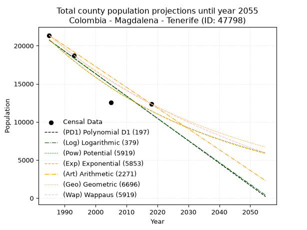
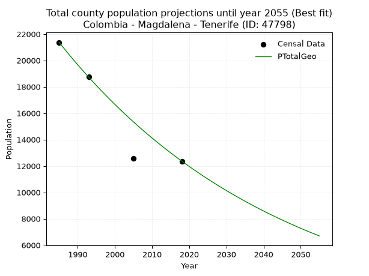
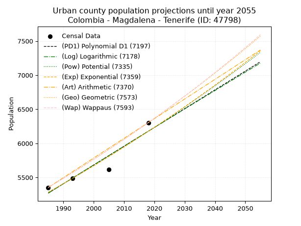
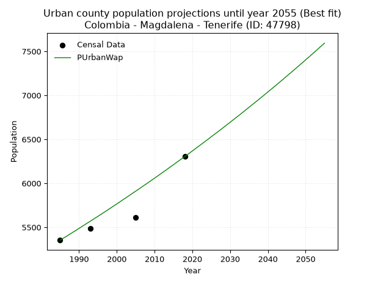
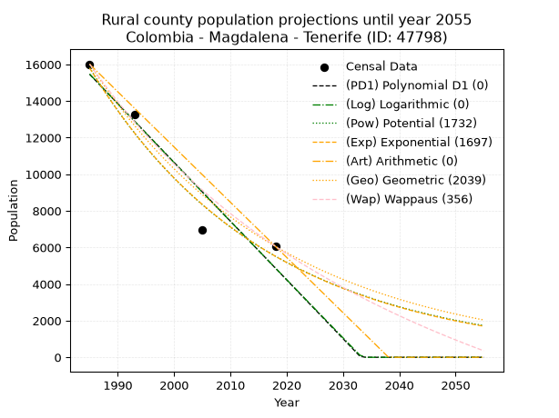
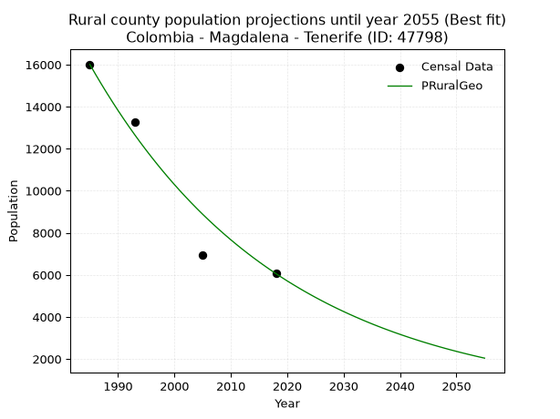

<div align="center">


</div>

# _“Population and Public Services Demand Projections (PPSD) until Year 2050 for Colombia - Magdalena - Tenerife (ID: 47798)”_
Keywords: `population` `public-service` `projection` `lineal` `polynomial` `logarithmic` `potential` `exponential` `arithmetic` `geometric` `wappaus` `dane` `colombia` `south-america`

PPSD are analytical estimates used by governments and planners to anticipate future changes in population size, age distribution, and the resulting community needs for utilities, healthcare, education, and infrastructure as sizing future water treatment facilities, electrical grids, and road networks based on spatial growth.

> **General running parameters**: • app_version: _v20260806_. • Python version: _3.14.7_. • Pandas version: _3.0.5_. • NumPy version: _2.5.1_. • Creates, save and include plots into reports (create_plot): _False_. • Projection until year: _2050_. • Process polynomial degree 2 and up: _False_. • Process Wappaus: _True_. • Process Wappaus: _True_. • Set negative values to zero: _True_. • Set infinite values to zero: _True_. • Drop dataset notes: _True_. 
<div align="center">

Dynamic map: [:earth_americas:Google](http://maps.google.com/maps?q=9.898273316,-74.859783) [:earth_americas:OSM](https://www.openstreetmap.org/#map=18/9.898273316/-74.859783&layers=P) [:earth_americas:Bing](https://www.bing.com/maps?cp=9.898273316~-74.859783&lvl=18) [:earth_americas:Apple](https://maps.apple.com/frame?center=9.898273316%2C-74.859783&span=0.003%2C0.006)

</div>


<div align="center">

```geojson
{
  "type": "Feature",
  "geometry": {
    "type": "Point", 
    "coordinates": [-74.859783, 9.898273316]
  }, 
  "properties": {
    "Name": "Colombia - Magdalena - Tenerife (ID: 47798)"
  }
}
```

</div>


## 0. Census Data (4 records)

Census data are official statistics collected by a government about the people and housing in a country. They usually include counts of total population, age, sex, race, income, education, and jobs.

📅Global census file: [Population.xlsx](../data/Population.xlsx)

| Source   |   Year |   CountryID | CountryName   |   StateID | StateName   |   CountyID | CountyName   |   PTotal |   PUrban |   PRural |
|:---------|-------:|------------:|:--------------|----------:|:------------|-----------:|:-------------|---------:|---------:|---------:|
| DANE     |   1985 |          57 | Colombia      |        47 | Magdalena   |      47798 | Tenerife     |    21366 |     5353 |    16013 |
| DANE     |   1993 |          57 | Colombia      |        47 | Magdalena   |      47798 | Tenerife     |    18746 |     5487 |    13259 |
| DANE     |   2005 |          57 | Colombia      |        47 | Magdalena   |      47798 | Tenerife     |    12550 |     5614 |     6936 |
| DANE     |   2018 |          57 | Colombia      |        47 | Magdalena   |      47798 | Tenerife     |    12364 |     6304 |     6060 |

> 🔥Some records could had specific notes about the registered values or the corresponding urban or rural distribution.

## 1. Total

### 1.1. Coefficients and Parameters

* (PD1) Polynomial Deg 1: -293.32236049779146, 602974.5515857073 (lineal)
* (Log) Logarithmic: -587544.0883411698, 4482183.823764066
* (Pow) Potential: -36.30619378033916, 124.0478576674171
* (Exp) Exponential: -0.01812668462834641, 8.809777461514633e+19
* (Art) Arithmetic: Year diff. 2018 - 1985 = 33, Population diff. 12364 - 21366 = -9002, Annual growth = -272.7878787878788
* (Geo) Geometric: Year diff. 2018 - 1985 = 33, Population diff. 12364 - 21366 = -9002, Annual growth % = -0.01643948878398771
* (Wap) Wappaus: i = -1.6174792694211608, Condition values only valid for < 200)

<sub>
Wappaus condition values: ['-0.00', '-1.62', '-3.23', '-4.85', '-6.47', '-8.09', '-9.70', '-11.32', '-12.94', '-14.56', '-16.17', '-17.79', '-19.41', '-21.03', '-22.64', '-24.26', '-25.88', '-27.50', '-29.11', '-30.73', '-32.35', '-33.97', '-35.58', '-37.20', '-38.82', '-40.44', '-42.05', '-43.67', '-45.29', '-46.91', '-48.52', '-50.14', '-51.76', '-53.38', '-54.99', '-56.61', '-58.23', '-59.85', '-61.46', '-63.08', '-64.70', '-66.32', '-67.93', '-69.55', '-71.17', '-72.79', '-74.40', '-76.02', '-77.64', '-79.26', '-80.87', '-82.49', '-84.11', '-85.73', '-87.34', '-88.96', '-90.58', '-92.20', '-93.81', '-95.43', '-97.05', '-98.67', '-100.28', '-101.90', '-103.52', '-105.14']
</sub>


### 1.2. Projected Dataset

|   Year |   CountyID |   PTotalPD1 |   PTotalLog |   PTotalPow |   PTotalExp |   PTotalArt |   PTotalGeo |   PTotalWap |
|-------:|-----------:|------------:|------------:|------------:|------------:|------------:|------------:|------------:|
|   1985 |      47798 |       20730 |       20742 |       20832 |       20817 |       21366 |       21366 |       21366 |
|   1986 |      47798 |       20436 |       20446 |       20454 |       20443 |       21093 |       21015 |       21023 |
|   1987 |      47798 |       20143 |       20150 |       20084 |       20076 |       20820 |       20669 |       20686 |
|   1988 |      47798 |       19850 |       19854 |       19720 |       19715 |       20548 |       20329 |       20354 |
|   1989 |      47798 |       19556 |       19559 |       19364 |       19361 |       20275 |       19995 |       20027 |
|   1990 |      47798 |       19263 |       19264 |       19013 |       19013 |       20002 |       19667 |       19705 |
|   1991 |      47798 |       18970 |       18968 |       18670 |       18671 |       19729 |       19343 |       19388 |
|   1992 |      47798 |       18676 |       18673 |       18332 |       18336 |       19456 |       19025 |       19076 |
|   1993 |      47798 |       18383 |       18379 |       18001 |       18007 |       19184 |       18713 |       18769 |
|   1994 |      47798 |       18090 |       18084 |       17677 |       17683 |       18911 |       18405 |       18467 |
|   1995 |      47798 |       17796 |       17789 |       17358 |       17366 |       18638 |       18102 |       18169 |
|   1996 |      47798 |       17503 |       17495 |       17045 |       17054 |       18365 |       17805 |       17875 |
|   1997 |      47798 |       17210 |       17200 |       16738 |       16747 |       18093 |       17512 |       17586 |
|   1998 |      47798 |       16916 |       16906 |       16436 |       16446 |       17820 |       17224 |       17301 |
|   1999 |      47798 |       16623 |       16612 |       16140 |       16151 |       17547 |       16941 |       17020 |
|   2000 |      47798 |       16330 |       16319 |       15850 |       15861 |       17274 |       16662 |       16743 |
|   2001 |      47798 |       16037 |       16025 |       15565 |       15576 |       17001 |       16389 |       16470 |
|   2002 |      47798 |       15743 |       15731 |       15285 |       15296 |       16729 |       16119 |       16201 |
|   2003 |      47798 |       15450 |       15438 |       15010 |       15021 |       16456 |       15854 |       15936 |
|   2004 |      47798 |       15157 |       15145 |       14741 |       14752 |       16183 |       15594 |       15674 |
|   2005 |      47798 |       14863 |       14851 |       14476 |       14487 |       15910 |       15337 |       15417 |
|   2006 |      47798 |       14570 |       14559 |       14216 |       14226 |       15637 |       15085 |       15162 |
|   2007 |      47798 |       14277 |       14266 |       13962 |       13971 |       15365 |       14837 |       14911 |
|   2008 |      47798 |       13983 |       13973 |       13711 |       13720 |       15092 |       14593 |       14664 |
|   2009 |      47798 |       13690 |       13681 |       13466 |       13473 |       14819 |       14353 |       14420 |
|   2010 |      47798 |       13397 |       13388 |       13225 |       13231 |       14546 |       14117 |       14179 |
|   2011 |      47798 |       13103 |       13096 |       12988 |       12994 |       14274 |       13885 |       13942 |
|   2012 |      47798 |       12810 |       12804 |       12756 |       12760 |       14001 |       13657 |       13707 |
|   2013 |      47798 |       12517 |       12512 |       12528 |       12531 |       13728 |       13432 |       13476 |
|   2014 |      47798 |       12223 |       12220 |       12304 |       12306 |       13455 |       13212 |       13248 |
|   2015 |      47798 |       11930 |       11928 |       12084 |       12085 |       13182 |       12994 |       13023 |
|   2016 |      47798 |       11637 |       11637 |       11868 |       11868 |       12910 |       12781 |       12800 |
|   2017 |      47798 |       11343 |       11345 |       11656 |       11655 |       12637 |       12571 |       12581 |
|   2018 |      47798 |       11050 |       11054 |       11449 |       11445 |       12364 |       12364 |       12364 |
|   2019 |      47798 |       10757 |       10763 |       11244 |       11240 |       12091 |       12161 |       12150 |
|   2020 |      47798 |       10463 |       10472 |       11044 |       11038 |       11818 |       11961 |       11939 |
|   2021 |      47798 |       10170 |       10181 |       10847 |       10839 |       11546 |       11764 |       11730 |
|   2022 |      47798 |        9877 |        9891 |       10654 |       10645 |       11273 |       11571 |       11524 |
|   2023 |      47798 |        9583 |        9600 |       10465 |       10454 |       11000 |       11381 |       11321 |
|   2024 |      47798 |        9290 |        9310 |       10279 |       10266 |       10727 |       11193 |       11120 |
|   2025 |      47798 |        8997 |        9020 |       10096 |       10081 |       10454 |       11009 |       10921 |
|   2026 |      47798 |        8703 |        8730 |        9917 |        9900 |       10182 |       10828 |       10725 |
|   2027 |      47798 |        8410 |        8440 |        9741 |        9722 |        9909 |       10650 |       10531 |
|   2028 |      47798 |        8117 |        8150 |        9568 |        9548 |        9636 |       10475 |       10340 |
|   2029 |      47798 |        7823 |        7860 |        9398 |        9376 |        9363 |       10303 |       10151 |
|   2030 |      47798 |        7530 |        7571 |        9231 |        9208 |        9091 |       10134 |        9964 |
|   2031 |      47798 |        7237 |        7281 |        9068 |        9042 |        8818 |        9967 |        9779 |
|   2032 |      47798 |        6944 |        6992 |        8907 |        8880 |        8545 |        9803 |        9597 |
|   2033 |      47798 |        6650 |        6703 |        8749 |        8720 |        8272 |        9642 |        9416 |
|   2034 |      47798 |        6357 |        6414 |        8595 |        8564 |        7999 |        9484 |        9238 |
|   2035 |      47798 |        6064 |        6125 |        8443 |        8410 |        7727 |        9328 |        9062 |
|   2036 |      47798 |        5770 |        5837 |        8293 |        8259 |        7454 |        9174 |        8888 |
|   2037 |      47798 |        5477 |        5548 |        8147 |        8111 |        7181 |        9024 |        8715 |
|   2038 |      47798 |        5184 |        5260 |        8003 |        7965 |        6908 |        8875 |        8545 |
|   2039 |      47798 |        4890 |        4972 |        7862 |        7822 |        6635 |        8729 |        8377 |
|   2040 |      47798 |        4597 |        4684 |        7723 |        7681 |        6363 |        8586 |        8210 |
|   2041 |      47798 |        4304 |        4396 |        7587 |        7543 |        6090 |        8445 |        8046 |
|   2042 |      47798 |        4010 |        4108 |        7453 |        7408 |        5817 |        8306 |        7883 |
|   2043 |      47798 |        3717 |        3820 |        7322 |        7275 |        5544 |        8169 |        7722 |
|   2044 |      47798 |        3424 |        3533 |        7193 |        7144 |        5272 |        8035 |        7563 |
|   2045 |      47798 |        3130 |        3245 |        7066 |        7016 |        4999 |        7903 |        7405 |
|   2046 |      47798 |        2837 |        2958 |        6942 |        6890 |        4726 |        7773 |        7249 |
|   2047 |      47798 |        2544 |        2671 |        6820 |        6766 |        4453 |        7645 |        7095 |
|   2048 |      47798 |        2250 |        2384 |        6700 |        6644 |        4180 |        7520 |        6943 |
|   2049 |      47798 |        1957 |        2097 |        6582 |        6525 |        3908 |        7396 |        6792 |
|   2050 |      47798 |        1664 |        1811 |        6467 |        6408 |        3635 |        7274 |        6642 |
<div align="center">

</img>

</div>


### 1.3. Best fit with absolute and relative error (%)

Relative error puts that difference into context by dividing the absolute error by the true value, creating a unitless ratio or percentage that shows the scale of the mistake.

Absolute and relative error

|   Year | Source   |   CountryID | CountryName   |   StateID | StateName   |   CountyID_x | CountyName   |   PTotal |   PUrban |   PRural |   CountyID_y |   PTotalPD1 |   PTotalLog |   PTotalPow |   PTotalExp |   PTotalArt |   PTotalGeo |   PTotalWap |   PTotalPD1AbsError |   PTotalLogAbsError |   PTotalPowAbsError |   PTotalExpAbsError |   PTotalArtAbsError |   PTotalGeoAbsError |   PTotalWapAbsError |   PTotalPD1RelError |   PTotalLogRelError |   PTotalPowRelError |   PTotalExpRelError |   PTotalArtRelError |   PTotalGeoRelError |   PTotalWapRelError |
|-------:|:---------|------------:|:--------------|----------:|:------------|-------------:|:-------------|---------:|---------:|---------:|-------------:|------------:|------------:|------------:|------------:|------------:|------------:|------------:|--------------------:|--------------------:|--------------------:|--------------------:|--------------------:|--------------------:|--------------------:|--------------------:|--------------------:|--------------------:|--------------------:|--------------------:|--------------------:|--------------------:|
|   1985 | DANE     |          57 | Colombia      |        47 | Magdalena   |        47798 | Tenerife     |    21366 |     5353 |    16013 |        47798 |       20730 |       20742 |       20832 |       20817 |       21366 |       21366 |       21366 |                 636 |                 624 |                 534 |                 549 |                   0 |                   0 |                   0 |             2.97669 |             2.92053 |             2.4993  |             2.5695  |              0      |            0        |            0        |
|   1993 | DANE     |          57 | Colombia      |        47 | Magdalena   |        47798 | Tenerife     |    18746 |     5487 |    13259 |        47798 |       18383 |       18379 |       18001 |       18007 |       19184 |       18713 |       18769 |                 363 |                 367 |                 745 |                 739 |                 438 |                  33 |                  23 |             1.93641 |             1.95775 |             3.97418 |             3.94217 |              2.3365 |            0.176038 |            0.122693 |
|   2005 | DANE     |          57 | Colombia      |        47 | Magdalena   |        47798 | Tenerife     |    12550 |     5614 |     6936 |        47798 |       14863 |       14851 |       14476 |       14487 |       15910 |       15337 |       15417 |                2313 |                2301 |                1926 |                1937 |                3360 |                2787 |                2867 |            18.4303  |            18.3347  |            15.3466  |            15.4343  |             26.7729 |           22.2072   |           22.8446   |
|   2018 | DANE     |          57 | Colombia      |        47 | Magdalena   |        47798 | Tenerife     |    12364 |     6304 |     6060 |        47798 |       11050 |       11054 |       11449 |       11445 |       12364 |       12364 |       12364 |                1314 |                1310 |                 915 |                 919 |                   0 |                   0 |                   0 |            10.6276  |            10.5953  |             7.40052 |             7.43287 |              0      |            0        |            0        |

Relative error mean

| Method    |   RelError | Best   |
|:----------|-----------:|:-------|
| PTotalPD1 |    8.49275 |        |
| PTotalLog |    8.45205 |        |
| PTotalPow |    7.30515 |        |
| PTotalExp |    7.3447  |        |
| PTotalArt |    7.27735 |        |
| PTotalGeo |    5.5958  | True   |
| PTotalWap |    5.74183 |        |

💙Best method: _**PTotalGeo**_
<div align="center">

</img>

</div>


### 1.4. Fresh water supply demand in liters per capita per day (lpcd)

The fresh water supply demand typically ranges from 100 to 300 liters per capita per day (lpcd) for standard domestic and municipal planning, though absolute survival minimums set by the World Health Organization are as low as 7.5 to 20 liters per day, and total consumption in high-income nations can exceed 400 liters.

> `CZ`: Level in meters above the sea level (masl).<br> `WS`: Fresh water supply demand in liters per capita per day (lpcd or l/h/d).<br> `WSAll`: Zonal fresh water supply demand in liters per second (l/s).<br> `A`: Zonal area in square meters.

Reference values (RAS Colombia)

|    CZ |   WS |
|------:|-----:|
|  1000 |  120 |
|  2000 |  130 |
| 99999 |  140 |

County shapefile geometry properties and water supply values

|   CountyID |     ATotal |   CZTotal |   WSTotal |
|-----------:|-----------:|----------:|----------:|
|      47798 | 4.9178e+08 |   68.2018 |       120 |

Projected values for best method: PTotalGeo

|   CountyID |   Year |   PTotalGeo |   WSTotal |   WSTotalAll |
|-----------:|-------:|------------:|----------:|-------------:|
|      47798 |   1985 |       21366 |       120 |      29.675  |
|      47798 |   1986 |       21015 |       120 |      29.1875 |
|      47798 |   1987 |       20669 |       120 |      28.7069 |
|      47798 |   1988 |       20329 |       120 |      28.2347 |
|      47798 |   1989 |       19995 |       120 |      27.7708 |
|      47798 |   1990 |       19667 |       120 |      27.3153 |
|      47798 |   1991 |       19343 |       120 |      26.8653 |
|      47798 |   1992 |       19025 |       120 |      26.4236 |
|      47798 |   1993 |       18713 |       120 |      25.9903 |
|      47798 |   1994 |       18405 |       120 |      25.5625 |
|      47798 |   1995 |       18102 |       120 |      25.1417 |
|      47798 |   1996 |       17805 |       120 |      24.7292 |
|      47798 |   1997 |       17512 |       120 |      24.3222 |
|      47798 |   1998 |       17224 |       120 |      23.9222 |
|      47798 |   1999 |       16941 |       120 |      23.5292 |
|      47798 |   2000 |       16662 |       120 |      23.1417 |
|      47798 |   2001 |       16389 |       120 |      22.7625 |
|      47798 |   2002 |       16119 |       120 |      22.3875 |
|      47798 |   2003 |       15854 |       120 |      22.0194 |
|      47798 |   2004 |       15594 |       120 |      21.6583 |
|      47798 |   2005 |       15337 |       120 |      21.3014 |
|      47798 |   2006 |       15085 |       120 |      20.9514 |
|      47798 |   2007 |       14837 |       120 |      20.6069 |
|      47798 |   2008 |       14593 |       120 |      20.2681 |
|      47798 |   2009 |       14353 |       120 |      19.9347 |
|      47798 |   2010 |       14117 |       120 |      19.6069 |
|      47798 |   2011 |       13885 |       120 |      19.2847 |
|      47798 |   2012 |       13657 |       120 |      18.9681 |
|      47798 |   2013 |       13432 |       120 |      18.6556 |
|      47798 |   2014 |       13212 |       120 |      18.35   |
|      47798 |   2015 |       12994 |       120 |      18.0472 |
|      47798 |   2016 |       12781 |       120 |      17.7514 |
|      47798 |   2017 |       12571 |       120 |      17.4597 |
|      47798 |   2018 |       12364 |       120 |      17.1722 |
|      47798 |   2019 |       12161 |       120 |      16.8903 |
|      47798 |   2020 |       11961 |       120 |      16.6125 |
|      47798 |   2021 |       11764 |       120 |      16.3389 |
|      47798 |   2022 |       11571 |       120 |      16.0708 |
|      47798 |   2023 |       11381 |       120 |      15.8069 |
|      47798 |   2024 |       11193 |       120 |      15.5458 |
|      47798 |   2025 |       11009 |       120 |      15.2903 |
|      47798 |   2026 |       10828 |       120 |      15.0389 |
|      47798 |   2027 |       10650 |       120 |      14.7917 |
|      47798 |   2028 |       10475 |       120 |      14.5486 |
|      47798 |   2029 |       10303 |       120 |      14.3097 |
|      47798 |   2030 |       10134 |       120 |      14.075  |
|      47798 |   2031 |        9967 |       120 |      13.8431 |
|      47798 |   2032 |        9803 |       120 |      13.6153 |
|      47798 |   2033 |        9642 |       120 |      13.3917 |
|      47798 |   2034 |        9484 |       120 |      13.1722 |
|      47798 |   2035 |        9328 |       120 |      12.9556 |
|      47798 |   2036 |        9174 |       120 |      12.7417 |
|      47798 |   2037 |        9024 |       120 |      12.5333 |
|      47798 |   2038 |        8875 |       120 |      12.3264 |
|      47798 |   2039 |        8729 |       120 |      12.1236 |
|      47798 |   2040 |        8586 |       120 |      11.925  |
|      47798 |   2041 |        8445 |       120 |      11.7292 |
|      47798 |   2042 |        8306 |       120 |      11.5361 |
|      47798 |   2043 |        8169 |       120 |      11.3458 |
|      47798 |   2044 |        8035 |       120 |      11.1597 |
|      47798 |   2045 |        7903 |       120 |      10.9764 |
|      47798 |   2046 |        7773 |       120 |      10.7958 |
|      47798 |   2047 |        7645 |       120 |      10.6181 |
|      47798 |   2048 |        7520 |       120 |      10.4444 |
|      47798 |   2049 |        7396 |       120 |      10.2722 |
|      47798 |   2050 |        7274 |       120 |      10.1028 |

## 2. Urban

### 2.1. Coefficients and Parameters

* (PD1) Polynomial Deg 1: 27.536732236049353, -49390.84865515772 (lineal)
* (Log) Logarithmic: 55074.6133465632, -412933.0773874801
* (Pow) Potential: 9.473085401730017, -27.517168118953816
* (Exp) Exponential: 0.004736226733033255, 0.43637182747152414
* (Art) Arithmetic: Year diff. 2018 - 1985 = 33, Population diff. 6304 - 5353 = 951, Annual growth = 28.818181818181817
* (Geo) Geometric: Year diff. 2018 - 1985 = 33, Population diff. 6304 - 5353 = 951, Annual growth % = 0.004967667881804028
* (Wap) Wappaus: i = 0.49443564927823314, Condition values only valid for < 200)

<sub>
Wappaus condition values: ['0.00', '0.49', '0.99', '1.48', '1.98', '2.47', '2.97', '3.46', '3.96', '4.45', '4.94', '5.44', '5.93', '6.43', '6.92', '7.42', '7.91', '8.41', '8.90', '9.39', '9.89', '10.38', '10.88', '11.37', '11.87', '12.36', '12.86', '13.35', '13.84', '14.34', '14.83', '15.33', '15.82', '16.32', '16.81', '17.31', '17.80', '18.29', '18.79', '19.28', '19.78', '20.27', '20.77', '21.26', '21.76', '22.25', '22.74', '23.24', '23.73', '24.23', '24.72', '25.22', '25.71', '26.21', '26.70', '27.19', '27.69', '28.18', '28.68', '29.17', '29.67', '30.16', '30.66', '31.15', '31.64', '32.14']
</sub>


### 2.2. Projected Dataset

|   Year |   CountyID |   PUrbanPD1 |   PUrbanLog |   PUrbanPow |   PUrbanExp |   PUrbanArt |   PUrbanGeo |   PUrbanWap |
|-------:|-----------:|------------:|------------:|------------:|------------:|------------:|------------:|------------:|
|   1985 |      47798 |        5270 |        5269 |        5282 |        5282 |        5353 |        5353 |        5353 |
|   1986 |      47798 |        5297 |        5297 |        5307 |        5308 |        5382 |        5380 |        5380 |
|   1987 |      47798 |        5325 |        5325 |        5333 |        5333 |        5411 |        5406 |        5406 |
|   1988 |      47798 |        5352 |        5352 |        5358 |        5358 |        5439 |        5433 |        5433 |
|   1989 |      47798 |        5380 |        5380 |        5384 |        5384 |        5468 |        5460 |        5460 |
|   1990 |      47798 |        5407 |        5408 |        5409 |        5409 |        5497 |        5487 |        5487 |
|   1991 |      47798 |        5435 |        5435 |        5435 |        5435 |        5526 |        5515 |        5514 |
|   1992 |      47798 |        5462 |        5463 |        5461 |        5461 |        5555 |        5542 |        5542 |
|   1993 |      47798 |        5490 |        5491 |        5487 |        5486 |        5584 |        5569 |        5569 |
|   1994 |      47798 |        5517 |        5518 |        5513 |        5513 |        5612 |        5597 |        5597 |
|   1995 |      47798 |        5545 |        5546 |        5540 |        5539 |        5641 |        5625 |        5624 |
|   1996 |      47798 |        5572 |        5573 |        5566 |        5565 |        5670 |        5653 |        5652 |
|   1997 |      47798 |        5600 |        5601 |        5592 |        5591 |        5699 |        5681 |        5680 |
|   1998 |      47798 |        5628 |        5629 |        5619 |        5618 |        5728 |        5709 |        5708 |
|   1999 |      47798 |        5655 |        5656 |        5646 |        5645 |        5756 |        5738 |        5737 |
|   2000 |      47798 |        5683 |        5684 |        5672 |        5671 |        5785 |        5766 |        5765 |
|   2001 |      47798 |        5710 |        5711 |        5699 |        5698 |        5814 |        5795 |        5794 |
|   2002 |      47798 |        5738 |        5739 |        5726 |        5725 |        5843 |        5823 |        5823 |
|   2003 |      47798 |        5765 |        5766 |        5754 |        5753 |        5872 |        5852 |        5852 |
|   2004 |      47798 |        5793 |        5794 |        5781 |        5780 |        5901 |        5881 |        5881 |
|   2005 |      47798 |        5820 |        5821 |        5808 |        5807 |        5929 |        5911 |        5910 |
|   2006 |      47798 |        5848 |        5849 |        5836 |        5835 |        5958 |        5940 |        5939 |
|   2007 |      47798 |        5875 |        5876 |        5863 |        5863 |        5987 |        5970 |        5969 |
|   2008 |      47798 |        5903 |        5904 |        5891 |        5890 |        6016 |        5999 |        5998 |
|   2009 |      47798 |        5930 |        5931 |        5919 |        5918 |        6045 |        6029 |        6028 |
|   2010 |      47798 |        5958 |        5958 |        5947 |        5946 |        6073 |        6059 |        6058 |
|   2011 |      47798 |        5986 |        5986 |        5975 |        5975 |        6102 |        6089 |        6088 |
|   2012 |      47798 |        6013 |        6013 |        6003 |        6003 |        6131 |        6119 |        6119 |
|   2013 |      47798 |        6041 |        6041 |        6032 |        6032 |        6160 |        6150 |        6149 |
|   2014 |      47798 |        6068 |        6068 |        6060 |        6060 |        6189 |        6180 |        6180 |
|   2015 |      47798 |        6096 |        6095 |        6089 |        6089 |        6218 |        6211 |        6211 |
|   2016 |      47798 |        6123 |        6123 |        6117 |        6118 |        6246 |        6242 |        6242 |
|   2017 |      47798 |        6151 |        6150 |        6146 |        6147 |        6275 |        6273 |        6273 |
|   2018 |      47798 |        6178 |        6177 |        6175 |        6176 |        6304 |        6304 |        6304 |
|   2019 |      47798 |        6206 |        6204 |        6204 |        6205 |        6333 |        6335 |        6335 |
|   2020 |      47798 |        6233 |        6232 |        6233 |        6235 |        6362 |        6367 |        6367 |
|   2021 |      47798 |        6261 |        6259 |        6262 |        6264 |        6390 |        6398 |        6399 |
|   2022 |      47798 |        6288 |        6286 |        6292 |        6294 |        6419 |        6430 |        6431 |
|   2023 |      47798 |        6316 |        6313 |        6321 |        6324 |        6448 |        6462 |        6463 |
|   2024 |      47798 |        6343 |        6341 |        6351 |        6354 |        6477 |        6494 |        6495 |
|   2025 |      47798 |        6371 |        6368 |        6381 |        6384 |        6506 |        6527 |        6528 |
|   2026 |      47798 |        6399 |        6395 |        6411 |        6415 |        6535 |        6559 |        6561 |
|   2027 |      47798 |        6426 |        6422 |        6441 |        6445 |        6563 |        6592 |        6593 |
|   2028 |      47798 |        6454 |        6449 |        6471 |        6476 |        6592 |        6624 |        6626 |
|   2029 |      47798 |        6481 |        6477 |        6501 |        6506 |        6621 |        6657 |        6660 |
|   2030 |      47798 |        6509 |        6504 |        6532 |        6537 |        6650 |        6690 |        6693 |
|   2031 |      47798 |        6536 |        6531 |        6562 |        6568 |        6679 |        6723 |        6727 |
|   2032 |      47798 |        6564 |        6558 |        6593 |        6600 |        6707 |        6757 |        6760 |
|   2033 |      47798 |        6591 |        6585 |        6624 |        6631 |        6736 |        6790 |        6794 |
|   2034 |      47798 |        6619 |        6612 |        6655 |        6662 |        6765 |        6824 |        6829 |
|   2035 |      47798 |        6646 |        6639 |        6686 |        6694 |        6794 |        6858 |        6863 |
|   2036 |      47798 |        6674 |        6666 |        6717 |        6726 |        6823 |        6892 |        6898 |
|   2037 |      47798 |        6701 |        6693 |        6748 |        6758 |        6852 |        6926 |        6932 |
|   2038 |      47798 |        6729 |        6720 |        6780 |        6790 |        6880 |        6961 |        6967 |
|   2039 |      47798 |        6757 |        6747 |        6811 |        6822 |        6909 |        6995 |        7002 |
|   2040 |      47798 |        6784 |        6774 |        6843 |        6854 |        6938 |        7030 |        7038 |
|   2041 |      47798 |        6812 |        6801 |        6875 |        6887 |        6967 |        7065 |        7073 |
|   2042 |      47798 |        6839 |        6828 |        6907 |        6920 |        6996 |        7100 |        7109 |
|   2043 |      47798 |        6867 |        6855 |        6939 |        6952 |        7024 |        7135 |        7145 |
|   2044 |      47798 |        6894 |        6882 |        6971 |        6985 |        7053 |        7171 |        7181 |
|   2045 |      47798 |        6922 |        6909 |        7003 |        7019 |        7082 |        7206 |        7218 |
|   2046 |      47798 |        6949 |        6936 |        7036 |        7052 |        7111 |        7242 |        7254 |
|   2047 |      47798 |        6977 |        6963 |        7069 |        7085 |        7140 |        7278 |        7291 |
|   2048 |      47798 |        7004 |        6990 |        7101 |        7119 |        7169 |        7314 |        7328 |
|   2049 |      47798 |        7032 |        7017 |        7134 |        7153 |        7197 |        7351 |        7365 |
|   2050 |      47798 |        7059 |        7044 |        7167 |        7187 |        7226 |        7387 |        7403 |
<div align="center">

</img>

</div>


### 2.3. Best fit with absolute and relative error (%)

Relative error puts that difference into context by dividing the absolute error by the true value, creating a unitless ratio or percentage that shows the scale of the mistake.

Absolute and relative error

|   Year | Source   |   CountryID | CountryName   |   StateID | StateName   |   CountyID_x | CountyName   |   PTotal |   PUrban |   PRural |   CountyID_y |   PUrbanPD1 |   PUrbanLog |   PUrbanPow |   PUrbanExp |   PUrbanArt |   PUrbanGeo |   PUrbanWap |   PUrbanPD1AbsError |   PUrbanLogAbsError |   PUrbanPowAbsError |   PUrbanExpAbsError |   PUrbanArtAbsError |   PUrbanGeoAbsError |   PUrbanWapAbsError |   PUrbanPD1RelError |   PUrbanLogRelError |   PUrbanPowRelError |   PUrbanExpRelError |   PUrbanArtRelError |   PUrbanGeoRelError |   PUrbanWapRelError |
|-------:|:---------|------------:|:--------------|----------:|:------------|-------------:|:-------------|---------:|---------:|---------:|-------------:|------------:|------------:|------------:|------------:|------------:|------------:|------------:|--------------------:|--------------------:|--------------------:|--------------------:|--------------------:|--------------------:|--------------------:|--------------------:|--------------------:|--------------------:|--------------------:|--------------------:|--------------------:|--------------------:|
|   1985 | DANE     |          57 | Colombia      |        47 | Magdalena   |        47798 | Tenerife     |    21366 |     5353 |    16013 |        47798 |        5270 |        5269 |        5282 |        5282 |        5353 |        5353 |        5353 |                  83 |                  84 |                  71 |                  71 |                   0 |                   0 |                   0 |           1.55053   |           1.56921   |             1.32636 |           1.32636   |             0       |             0       |             0       |
|   1993 | DANE     |          57 | Colombia      |        47 | Magdalena   |        47798 | Tenerife     |    18746 |     5487 |    13259 |        47798 |        5490 |        5491 |        5487 |        5486 |        5584 |        5569 |        5569 |                   3 |                   4 |                   0 |                   1 |                  97 |                  82 |                  82 |           0.0546747 |           0.0728996 |             0       |           0.0182249 |             1.76781 |             1.49444 |             1.49444 |
|   2005 | DANE     |          57 | Colombia      |        47 | Magdalena   |        47798 | Tenerife     |    12550 |     5614 |     6936 |        47798 |        5820 |        5821 |        5808 |        5807 |        5929 |        5911 |        5910 |                 206 |                 207 |                 194 |                 193 |                 315 |                 297 |                 296 |           3.6694    |           3.68721   |             3.45565 |           3.43783   |             5.61097 |             5.29035 |             5.27253 |
|   2018 | DANE     |          57 | Colombia      |        47 | Magdalena   |        47798 | Tenerife     |    12364 |     6304 |     6060 |        47798 |        6178 |        6177 |        6175 |        6176 |        6304 |        6304 |        6304 |                 126 |                 127 |                 129 |                 128 |                   0 |                   0 |                   0 |           1.99873   |           2.01459   |             2.04632 |           2.03046   |             0       |             0       |             0       |

Relative error mean

| Method    |   RelError | Best   |
|:----------|-----------:|:-------|
| PUrbanPD1 |    1.81833 |        |
| PUrbanLog |    1.83598 |        |
| PUrbanPow |    1.70708 |        |
| PUrbanExp |    1.70322 |        |
| PUrbanArt |    1.8447  |        |
| PUrbanGeo |    1.6962  |        |
| PUrbanWap |    1.69174 | True   |

💙Best method: _**PUrbanWap**_
<div align="center">

</img>

</div>


### 2.4. Fresh water supply demand in liters per capita per day (lpcd)

The fresh water supply demand typically ranges from 100 to 300 liters per capita per day (lpcd) for standard domestic and municipal planning, though absolute survival minimums set by the World Health Organization are as low as 7.5 to 20 liters per day, and total consumption in high-income nations can exceed 400 liters.

> `CZ`: Level in meters above the sea level (masl).<br> `WS`: Fresh water supply demand in liters per capita per day (lpcd or l/h/d).<br> `WSAll`: Zonal fresh water supply demand in liters per second (l/s).<br> `A`: Zonal area in square meters.

Reference values (RAS Colombia)

|    CZ |   WS |
|------:|-----:|
|  1000 |  120 |
|  2000 |  130 |
| 99999 |  140 |

County shapefile geometry properties and water supply values

|   CountyID |      AUrban |   CZUrban |   WSUrban |
|-----------:|------------:|----------:|----------:|
|      47798 | 1.71369e+06 |   16.7992 |       120 |

Projected values for best method: PUrbanWap

|   CountyID |   Year |   PUrbanWap |   WSUrban |   WSUrbanAll |
|-----------:|-------:|------------:|----------:|-------------:|
|      47798 |   1985 |        5353 |       120 |      7.43472 |
|      47798 |   1986 |        5380 |       120 |      7.47222 |
|      47798 |   1987 |        5406 |       120 |      7.50833 |
|      47798 |   1988 |        5433 |       120 |      7.54583 |
|      47798 |   1989 |        5460 |       120 |      7.58333 |
|      47798 |   1990 |        5487 |       120 |      7.62083 |
|      47798 |   1991 |        5514 |       120 |      7.65833 |
|      47798 |   1992 |        5542 |       120 |      7.69722 |
|      47798 |   1993 |        5569 |       120 |      7.73472 |
|      47798 |   1994 |        5597 |       120 |      7.77361 |
|      47798 |   1995 |        5624 |       120 |      7.81111 |
|      47798 |   1996 |        5652 |       120 |      7.85    |
|      47798 |   1997 |        5680 |       120 |      7.88889 |
|      47798 |   1998 |        5708 |       120 |      7.92778 |
|      47798 |   1999 |        5737 |       120 |      7.96806 |
|      47798 |   2000 |        5765 |       120 |      8.00694 |
|      47798 |   2001 |        5794 |       120 |      8.04722 |
|      47798 |   2002 |        5823 |       120 |      8.0875  |
|      47798 |   2003 |        5852 |       120 |      8.12778 |
|      47798 |   2004 |        5881 |       120 |      8.16806 |
|      47798 |   2005 |        5910 |       120 |      8.20833 |
|      47798 |   2006 |        5939 |       120 |      8.24861 |
|      47798 |   2007 |        5969 |       120 |      8.29028 |
|      47798 |   2008 |        5998 |       120 |      8.33056 |
|      47798 |   2009 |        6028 |       120 |      8.37222 |
|      47798 |   2010 |        6058 |       120 |      8.41389 |
|      47798 |   2011 |        6088 |       120 |      8.45556 |
|      47798 |   2012 |        6119 |       120 |      8.49861 |
|      47798 |   2013 |        6149 |       120 |      8.54028 |
|      47798 |   2014 |        6180 |       120 |      8.58333 |
|      47798 |   2015 |        6211 |       120 |      8.62639 |
|      47798 |   2016 |        6242 |       120 |      8.66944 |
|      47798 |   2017 |        6273 |       120 |      8.7125  |
|      47798 |   2018 |        6304 |       120 |      8.75556 |
|      47798 |   2019 |        6335 |       120 |      8.79861 |
|      47798 |   2020 |        6367 |       120 |      8.84306 |
|      47798 |   2021 |        6399 |       120 |      8.8875  |
|      47798 |   2022 |        6431 |       120 |      8.93194 |
|      47798 |   2023 |        6463 |       120 |      8.97639 |
|      47798 |   2024 |        6495 |       120 |      9.02083 |
|      47798 |   2025 |        6528 |       120 |      9.06667 |
|      47798 |   2026 |        6561 |       120 |      9.1125  |
|      47798 |   2027 |        6593 |       120 |      9.15694 |
|      47798 |   2028 |        6626 |       120 |      9.20278 |
|      47798 |   2029 |        6660 |       120 |      9.25    |
|      47798 |   2030 |        6693 |       120 |      9.29583 |
|      47798 |   2031 |        6727 |       120 |      9.34306 |
|      47798 |   2032 |        6760 |       120 |      9.38889 |
|      47798 |   2033 |        6794 |       120 |      9.43611 |
|      47798 |   2034 |        6829 |       120 |      9.48472 |
|      47798 |   2035 |        6863 |       120 |      9.53194 |
|      47798 |   2036 |        6898 |       120 |      9.58056 |
|      47798 |   2037 |        6932 |       120 |      9.62778 |
|      47798 |   2038 |        6967 |       120 |      9.67639 |
|      47798 |   2039 |        7002 |       120 |      9.725   |
|      47798 |   2040 |        7038 |       120 |      9.775   |
|      47798 |   2041 |        7073 |       120 |      9.82361 |
|      47798 |   2042 |        7109 |       120 |      9.87361 |
|      47798 |   2043 |        7145 |       120 |      9.92361 |
|      47798 |   2044 |        7181 |       120 |      9.97361 |
|      47798 |   2045 |        7218 |       120 |     10.025   |
|      47798 |   2046 |        7254 |       120 |     10.075   |
|      47798 |   2047 |        7291 |       120 |     10.1264  |
|      47798 |   2048 |        7328 |       120 |     10.1778  |
|      47798 |   2049 |        7365 |       120 |     10.2292  |
|      47798 |   2050 |        7403 |       120 |     10.2819  |

## 3. Rural

### 3.1. Coefficients and Parameters

* (PD1) Polynomial Deg 1: -320.8590927338407, 652365.400240865 (lineal)
* (Log) Logarithmic: -642618.7016877326, 4895116.901151545
* (Pow) Potential: -63.838321493422136, 214.72278186277788
* (Exp) Exponential: -0.031880328993878715, 4.808444249421678e+31
* (Art) Arithmetic: Year diff. 2018 - 1985 = 33, Population diff. 6060 - 16013 = -9953, Annual growth = -301.6060606060606
* (Geo) Geometric: Year diff. 2018 - 1985 = 33, Population diff. 6060 - 16013 = -9953, Annual growth % = -0.02901589894916612
* (Wap) Wappaus: i = -2.7328053332674362, Condition values only valid for < 200)

<sub>
Wappaus condition values: ['-0.00', '-2.73', '-5.47', '-8.20', '-10.93', '-13.66', '-16.40', '-19.13', '-21.86', '-24.60', '-27.33', '-30.06', '-32.79', '-35.53', '-38.26', '-40.99', '-43.72', '-46.46', '-49.19', '-51.92', '-54.66', '-57.39', '-60.12', '-62.85', '-65.59', '-68.32', '-71.05', '-73.79', '-76.52', '-79.25', '-81.98', '-84.72', '-87.45', '-90.18', '-92.92', '-95.65', '-98.38', '-101.11', '-103.85', '-106.58', '-109.31', '-112.05', '-114.78', '-117.51', '-120.24', '-122.98', '-125.71', '-128.44', '-131.17', '-133.91', '-136.64', '-139.37', '-142.11', '-144.84', '-147.57', '-150.30', '-153.04', '-155.77', '-158.50', '-161.24', '-163.97', '-166.70', '-169.43', '-172.17', '-174.90', '-177.63']
</sub>


### 3.2. Projected Dataset

|   Year |   CountyID |   PRuralPD1 |   PRuralLog |   PRuralPow |   PRuralExp |   PRuralArt |   PRuralGeo |   PRuralWap |
|-------:|-----------:|------------:|------------:|------------:|------------:|------------:|------------:|------------:|
|   1985 |      47798 |       15460 |       15473 |       15823 |       15805 |       16013 |       16013 |       16013 |
|   1986 |      47798 |       15139 |       15149 |       15322 |       15309 |       15711 |       15548 |       15581 |
|   1987 |      47798 |       14818 |       14825 |       14838 |       14828 |       15410 |       15097 |       15161 |
|   1988 |      47798 |       14498 |       14502 |       14369 |       14363 |       15108 |       14659 |       14752 |
|   1989 |      47798 |       14177 |       14179 |       13915 |       13912 |       14807 |       14234 |       14353 |
|   1990 |      47798 |       13856 |       13856 |       13475 |       13476 |       14505 |       13821 |       13965 |
|   1991 |      47798 |       13535 |       13533 |       13050 |       13053 |       14203 |       13420 |       13586 |
|   1992 |      47798 |       13214 |       13210 |       12638 |       12643 |       13902 |       13030 |       13217 |
|   1993 |      47798 |       12893 |       12888 |       12240 |       12247 |       13600 |       12652 |       12857 |
|   1994 |      47798 |       12572 |       12566 |       11854 |       11862 |       13299 |       12285 |       12506 |
|   1995 |      47798 |       12252 |       12243 |       11481 |       11490 |       12997 |       11929 |       12163 |
|   1996 |      47798 |       11931 |       11921 |       11119 |       11130 |       12695 |       11583 |       11828 |
|   1997 |      47798 |       11610 |       11599 |       10769 |       10781 |       12394 |       11247 |       11501 |
|   1998 |      47798 |       11289 |       11278 |       10431 |       10442 |       12092 |       10920 |       11182 |
|   1999 |      47798 |       10968 |       10956 |       10103 |       10115 |       11791 |       10603 |       10870 |
|   2000 |      47798 |       10647 |       10635 |        9785 |        9797 |       11489 |       10296 |       10565 |
|   2001 |      47798 |       10326 |       10314 |        9478 |        9490 |       11187 |        9997 |       10267 |
|   2002 |      47798 |       10005 |        9993 |        9180 |        9192 |       10886 |        9707 |        9976 |
|   2003 |      47798 |        9685 |        9672 |        8892 |        8904 |       10584 |        9425 |        9691 |
|   2004 |      47798 |        9364 |        9351 |        8613 |        8624 |       10282 |        9152 |        9412 |
|   2005 |      47798 |        9043 |        9030 |        8343 |        8354 |        9981 |        8886 |        9139 |
|   2006 |      47798 |        8722 |        8710 |        8082 |        8092 |        9679 |        8628 |        8872 |
|   2007 |      47798 |        8401 |        8390 |        7829 |        7838 |        9378 |        8378 |        8611 |
|   2008 |      47798 |        8080 |        8069 |        7584 |        7592 |        9076 |        8135 |        8355 |
|   2009 |      47798 |        7759 |        7750 |        7347 |        7353 |        8774 |        7899 |        8104 |
|   2010 |      47798 |        7439 |        7430 |        7117 |        7123 |        8473 |        7670 |        7858 |
|   2011 |      47798 |        7118 |        7110 |        6894 |        6899 |        8171 |        7447 |        7618 |
|   2012 |      47798 |        6797 |        6791 |        6679 |        6683 |        7870 |        7231 |        7382 |
|   2013 |      47798 |        6476 |        6471 |        6471 |        6473 |        7568 |        7021 |        7151 |
|   2014 |      47798 |        6155 |        6152 |        6269 |        6270 |        7266 |        6817 |        6924 |
|   2015 |      47798 |        5834 |        5833 |        6073 |        6073 |        6965 |        6620 |        6702 |
|   2016 |      47798 |        5513 |        5514 |        5884 |        5883 |        6663 |        6428 |        6484 |
|   2017 |      47798 |        5193 |        5196 |        5700 |        5698 |        6362 |        6241 |        6270 |
|   2018 |      47798 |        4872 |        4877 |        5523 |        5519 |        6060 |        6060 |        6060 |
|   2019 |      47798 |        4551 |        4559 |        5351 |        5346 |        5758 |        5884 |        5854 |
|   2020 |      47798 |        4230 |        4241 |        5184 |        5178 |        5457 |        5713 |        5652 |
|   2021 |      47798 |        3909 |        3923 |        5023 |        5016 |        5155 |        5548 |        5454 |
|   2022 |      47798 |        3588 |        3605 |        4867 |        4859 |        4854 |        5387 |        5259 |
|   2023 |      47798 |        3267 |        3287 |        4716 |        4706 |        4552 |        5230 |        5067 |
|   2024 |      47798 |        2947 |        2969 |        4569 |        4558 |        4250 |        5079 |        4879 |
|   2025 |      47798 |        2626 |        2652 |        4427 |        4415 |        3949 |        4931 |        4695 |
|   2026 |      47798 |        2305 |        2335 |        4290 |        4277 |        3647 |        4788 |        4514 |
|   2027 |      47798 |        1984 |        2018 |        4157 |        4143 |        3346 |        4649 |        4335 |
|   2028 |      47798 |        1663 |        1701 |        4028 |        4013 |        3044 |        4514 |        4160 |
|   2029 |      47798 |        1342 |        1384 |        3903 |        3887 |        2742 |        4383 |        3988 |
|   2030 |      47798 |        1021 |        1067 |        3783 |        3765 |        2441 |        4256 |        3819 |
|   2031 |      47798 |         701 |         751 |        3665 |        3647 |        2139 |        4133 |        3652 |
|   2032 |      47798 |         380 |         434 |        3552 |        3532 |        1838 |        4013 |        3489 |
|   2033 |      47798 |          59 |         118 |        3442 |        3421 |        1536 |        3896 |        3328 |
|   2034 |      47798 |           0 |           0 |        3336 |        3314 |        1234 |        3783 |        3170 |
|   2035 |      47798 |           0 |           0 |        3233 |        3210 |         933 |        3673 |        3014 |
|   2036 |      47798 |           0 |           0 |        3133 |        3109 |         631 |        3567 |        2861 |
|   2037 |      47798 |           0 |           0 |        3036 |        3012 |         329 |        3463 |        2710 |
|   2038 |      47798 |           0 |           0 |        2943 |        2917 |          28 |        3363 |        2561 |
|   2039 |      47798 |           0 |           0 |        2852 |        2826 |           0 |        3265 |        2415 |
|   2040 |      47798 |           0 |           0 |        2764 |        2737 |           0 |        3171 |        2272 |
|   2041 |      47798 |           0 |           0 |        2679 |        2651 |           0 |        3079 |        2130 |
|   2042 |      47798 |           0 |           0 |        2596 |        2568 |           0 |        2989 |        1991 |
|   2043 |      47798 |           0 |           0 |        2517 |        2487 |           0 |        2903 |        1854 |
|   2044 |      47798 |           0 |           0 |        2439 |        2409 |           0 |        2818 |        1718 |
|   2045 |      47798 |           0 |           0 |        2364 |        2334 |           0 |        2737 |        1585 |
|   2046 |      47798 |           0 |           0 |        2292 |        2261 |           0 |        2657 |        1454 |
|   2047 |      47798 |           0 |           0 |        2221 |        2190 |           0 |        2580 |        1325 |
|   2048 |      47798 |           0 |           0 |        2153 |        2121 |           0 |        2505 |        1198 |
|   2049 |      47798 |           0 |           0 |        2087 |        2054 |           0 |        2432 |        1072 |
|   2050 |      47798 |           0 |           0 |        2023 |        1990 |           0 |        2362 |         948 |
<div align="center">

</img>

</div>


### 3.3. Best fit with absolute and relative error (%)

Relative error puts that difference into context by dividing the absolute error by the true value, creating a unitless ratio or percentage that shows the scale of the mistake.

Absolute and relative error

|   Year | Source   |   CountryID | CountryName   |   StateID | StateName   |   CountyID_x | CountyName   |   PTotal |   PUrban |   PRural |   CountyID_y |   PRuralPD1 |   PRuralLog |   PRuralPow |   PRuralExp |   PRuralArt |   PRuralGeo |   PRuralWap |   PRuralPD1AbsError |   PRuralLogAbsError |   PRuralPowAbsError |   PRuralExpAbsError |   PRuralArtAbsError |   PRuralGeoAbsError |   PRuralWapAbsError |   PRuralPD1RelError |   PRuralLogRelError |   PRuralPowRelError |   PRuralExpRelError |   PRuralArtRelError |   PRuralGeoRelError |   PRuralWapRelError |
|-------:|:---------|------------:|:--------------|----------:|:------------|-------------:|:-------------|---------:|---------:|---------:|-------------:|------------:|------------:|------------:|------------:|------------:|------------:|------------:|--------------------:|--------------------:|--------------------:|--------------------:|--------------------:|--------------------:|--------------------:|--------------------:|--------------------:|--------------------:|--------------------:|--------------------:|--------------------:|--------------------:|
|   1985 | DANE     |          57 | Colombia      |        47 | Magdalena   |        47798 | Tenerife     |    21366 |     5353 |    16013 |        47798 |       15460 |       15473 |       15823 |       15805 |       16013 |       16013 |       16013 |                 553 |                 540 |                 190 |                 208 |                   0 |                   0 |                   0 |             3.45344 |             3.37226 |             1.18654 |             1.29894 |             0       |             0       |              0      |
|   1993 | DANE     |          57 | Colombia      |        47 | Magdalena   |        47798 | Tenerife     |    18746 |     5487 |    13259 |        47798 |       12893 |       12888 |       12240 |       12247 |       13600 |       12652 |       12857 |                 366 |                 371 |                1019 |                1012 |                 341 |                 607 |                 402 |             2.76039 |             2.7981  |             7.68535 |             7.63255 |             2.57184 |             4.57802 |              3.0319 |
|   2005 | DANE     |          57 | Colombia      |        47 | Magdalena   |        47798 | Tenerife     |    12550 |     5614 |     6936 |        47798 |        9043 |        9030 |        8343 |        8354 |        9981 |        8886 |        9139 |                2107 |                2094 |                1407 |                1418 |                3045 |                1950 |                2203 |            30.3777  |            30.1903  |            20.2855  |            20.4441  |            43.9014  |            28.1142  |             31.7618 |
|   2018 | DANE     |          57 | Colombia      |        47 | Magdalena   |        47798 | Tenerife     |    12364 |     6304 |     6060 |        47798 |        4872 |        4877 |        5523 |        5519 |        6060 |        6060 |        6060 |                1188 |                1183 |                 537 |                 541 |                   0 |                   0 |                   0 |            19.604   |            19.5215  |             8.86139 |             8.92739 |             0       |             0       |              0      |

Relative error mean

| Method    |   RelError | Best   |
|:----------|-----------:|:-------|
| PRuralPD1 |   14.0489  |        |
| PRuralLog |   13.9705  |        |
| PRuralPow |    9.50468 |        |
| PRuralExp |    9.57574 |        |
| PRuralArt |   11.6183  |        |
| PRuralGeo |    8.17305 | True   |
| PRuralWap |    8.69843 |        |

💙Best method: _**PRuralGeo**_
<div align="center">

</img>

</div>


### 3.4. Fresh water supply demand in liters per capita per day (lpcd)

The fresh water supply demand typically ranges from 100 to 300 liters per capita per day (lpcd) for standard domestic and municipal planning, though absolute survival minimums set by the World Health Organization are as low as 7.5 to 20 liters per day, and total consumption in high-income nations can exceed 400 liters.

> `CZ`: Level in meters above the sea level (masl).<br> `WS`: Fresh water supply demand in liters per capita per day (lpcd or l/h/d).<br> `WSAll`: Zonal fresh water supply demand in liters per second (l/s).<br> `A`: Zonal area in square meters.

Reference values (RAS Colombia)

|    CZ |   WS |
|------:|-----:|
|  1000 |  120 |
|  2000 |  130 |
| 99999 |  140 |

County shapefile geometry properties and water supply values

|   CountyID |      ARural |   CZRural |   WSRural |
|-----------:|------------:|----------:|----------:|
|      47798 | 4.90066e+08 |    68.381 |       120 |

Projected values for best method: PRuralGeo

|   CountyID |   Year |   PRuralGeo |   WSRural |   WSRuralAll |
|-----------:|-------:|------------:|----------:|-------------:|
|      47798 |   1985 |       16013 |       120 |     22.2403  |
|      47798 |   1986 |       15548 |       120 |     21.5944  |
|      47798 |   1987 |       15097 |       120 |     20.9681  |
|      47798 |   1988 |       14659 |       120 |     20.3597  |
|      47798 |   1989 |       14234 |       120 |     19.7694  |
|      47798 |   1990 |       13821 |       120 |     19.1958  |
|      47798 |   1991 |       13420 |       120 |     18.6389  |
|      47798 |   1992 |       13030 |       120 |     18.0972  |
|      47798 |   1993 |       12652 |       120 |     17.5722  |
|      47798 |   1994 |       12285 |       120 |     17.0625  |
|      47798 |   1995 |       11929 |       120 |     16.5681  |
|      47798 |   1996 |       11583 |       120 |     16.0875  |
|      47798 |   1997 |       11247 |       120 |     15.6208  |
|      47798 |   1998 |       10920 |       120 |     15.1667  |
|      47798 |   1999 |       10603 |       120 |     14.7264  |
|      47798 |   2000 |       10296 |       120 |     14.3     |
|      47798 |   2001 |        9997 |       120 |     13.8847  |
|      47798 |   2002 |        9707 |       120 |     13.4819  |
|      47798 |   2003 |        9425 |       120 |     13.0903  |
|      47798 |   2004 |        9152 |       120 |     12.7111  |
|      47798 |   2005 |        8886 |       120 |     12.3417  |
|      47798 |   2006 |        8628 |       120 |     11.9833  |
|      47798 |   2007 |        8378 |       120 |     11.6361  |
|      47798 |   2008 |        8135 |       120 |     11.2986  |
|      47798 |   2009 |        7899 |       120 |     10.9708  |
|      47798 |   2010 |        7670 |       120 |     10.6528  |
|      47798 |   2011 |        7447 |       120 |     10.3431  |
|      47798 |   2012 |        7231 |       120 |     10.0431  |
|      47798 |   2013 |        7021 |       120 |      9.75139 |
|      47798 |   2014 |        6817 |       120 |      9.46806 |
|      47798 |   2015 |        6620 |       120 |      9.19444 |
|      47798 |   2016 |        6428 |       120 |      8.92778 |
|      47798 |   2017 |        6241 |       120 |      8.66806 |
|      47798 |   2018 |        6060 |       120 |      8.41667 |
|      47798 |   2019 |        5884 |       120 |      8.17222 |
|      47798 |   2020 |        5713 |       120 |      7.93472 |
|      47798 |   2021 |        5548 |       120 |      7.70556 |
|      47798 |   2022 |        5387 |       120 |      7.48194 |
|      47798 |   2023 |        5230 |       120 |      7.26389 |
|      47798 |   2024 |        5079 |       120 |      7.05417 |
|      47798 |   2025 |        4931 |       120 |      6.84861 |
|      47798 |   2026 |        4788 |       120 |      6.65    |
|      47798 |   2027 |        4649 |       120 |      6.45694 |
|      47798 |   2028 |        4514 |       120 |      6.26944 |
|      47798 |   2029 |        4383 |       120 |      6.0875  |
|      47798 |   2030 |        4256 |       120 |      5.91111 |
|      47798 |   2031 |        4133 |       120 |      5.74028 |
|      47798 |   2032 |        4013 |       120 |      5.57361 |
|      47798 |   2033 |        3896 |       120 |      5.41111 |
|      47798 |   2034 |        3783 |       120 |      5.25417 |
|      47798 |   2035 |        3673 |       120 |      5.10139 |
|      47798 |   2036 |        3567 |       120 |      4.95417 |
|      47798 |   2037 |        3463 |       120 |      4.80972 |
|      47798 |   2038 |        3363 |       120 |      4.67083 |
|      47798 |   2039 |        3265 |       120 |      4.53472 |
|      47798 |   2040 |        3171 |       120 |      4.40417 |
|      47798 |   2041 |        3079 |       120 |      4.27639 |
|      47798 |   2042 |        2989 |       120 |      4.15139 |
|      47798 |   2043 |        2903 |       120 |      4.03194 |
|      47798 |   2044 |        2818 |       120 |      3.91389 |
|      47798 |   2045 |        2737 |       120 |      3.80139 |
|      47798 |   2046 |        2657 |       120 |      3.69028 |
|      47798 |   2047 |        2580 |       120 |      3.58333 |
|      47798 |   2048 |        2505 |       120 |      3.47917 |
|      47798 |   2049 |        2432 |       120 |      3.37778 |
|      47798 |   2050 |        2362 |       120 |      3.28056 |

<div align="center"><br><sub>Share this research</sub></div><br>

<sub>**APPS & TOOLS & CONTENT DISCLAIMER**: • NO WARRANTY - This content and software is provided by <a href="https://github.com/rcfdtools" target="_blank">github.com/rcfdtools</a> "as is", without any express or implied warranty, including warranties of merchantability, fitness for a particular purpose, or non-infringement. There is no guarantee that the software will be error-free or operate without interruption. • LIMITATION OF LIABILITY - Neither the authors nor copyright holders will be liable for claims or damages arising from the software or its use. You are responsible for determining if the software is appropriate for your use and assume all associated risks, including errors, legal compliance, and data loss. • NO PROFESSIONAL ADVICE - The software provides general information and does not offer professional advice. It should not replace consultation with professional advisors. [Clauses and global license for rcfdtools use.](https://github.com/rcfdtools/rcfdtools/blob/main/LICENSE.md)</sub>