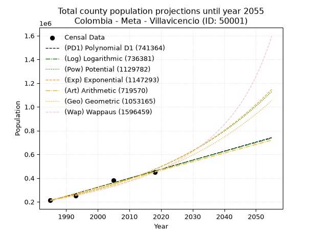
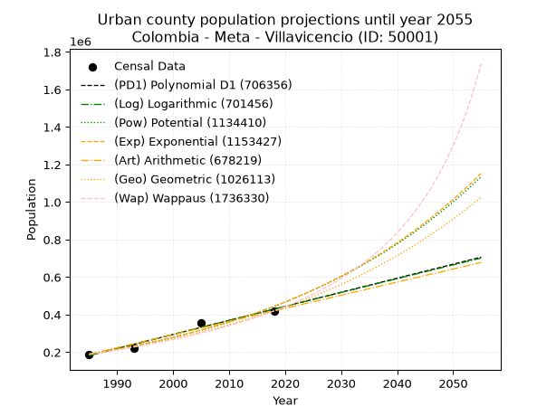
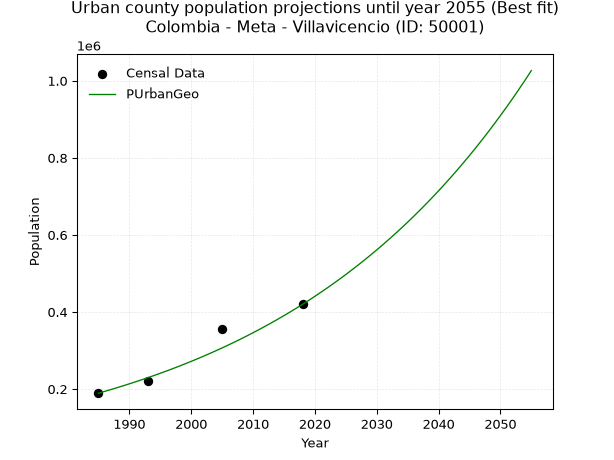
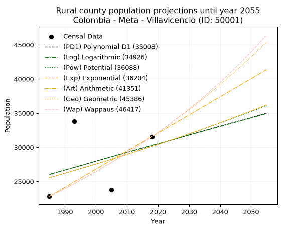
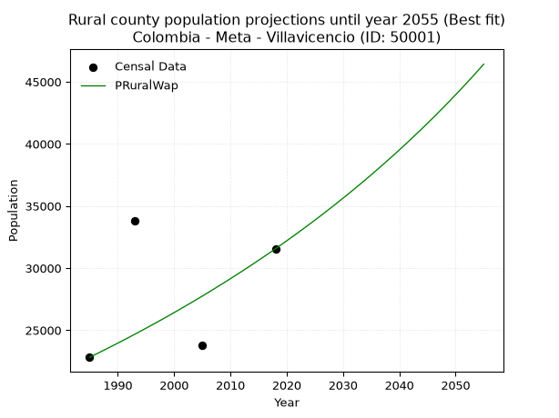

<div align="center">


</div>

# _“Population and Public Services Demand Projections (PPSD) until Year 2050 for Colombia - Meta - Villavicencio (ID: 50001)”_
Keywords: `population` `public-service` `projection` `lineal` `polynomial` `logarithmic` `potential` `exponential` `arithmetic` `geometric` `wappaus` `dane` `colombia` `south-america`

PPSD are analytical estimates used by governments and planners to anticipate future changes in population size, age distribution, and the resulting community needs for utilities, healthcare, education, and infrastructure as sizing future water treatment facilities, electrical grids, and road networks based on spatial growth.

> **General running parameters**: • app_version: _v20260806_. • Python version: _3.14.7_. • Pandas version: _3.0.5_. • NumPy version: _2.5.1_. • Creates, save and include plots into reports (create_plot): _False_. • Projection until year: _2050_. • Process polynomial degree 2 and up: _False_. • Process Wappaus: _True_. • Process Wappaus: _True_. • Set negative values to zero: _True_. • Set infinite values to zero: _True_. • Drop dataset notes: _True_. 
<div align="center">

Dynamic map: [:earth_americas:Google](http://maps.google.com/maps?q=4.126369059,-73.6226013) [:earth_americas:OSM](https://www.openstreetmap.org/#map=18/4.126369059/-73.6226013&layers=P) [:earth_americas:Bing](https://www.bing.com/maps?cp=4.126369059~-73.6226013&lvl=18) [:earth_americas:Apple](https://maps.apple.com/frame?center=4.126369059%2C-73.6226013&span=0.003%2C0.006)

</div>


<div align="center">

```geojson
{
  "type": "Feature",
  "geometry": {
    "type": "Point", 
    "coordinates": [-73.6226013, 4.126369059]
  }, 
  "properties": {
    "Name": "Colombia - Meta - Villavicencio (ID: 50001)"
  }
}
```

</div>


## 0. Census Data (4 records)

Census data are official statistics collected by a government about the people and housing in a country. They usually include counts of total population, age, sex, race, income, education, and jobs.

📅Global census file: [Population.xlsx](../data/Population.xlsx)

| Source   |   Year |   CountryID | CountryName   |   StateID | StateName   |   CountyID | CountyName    |   PTotal |   PUrban |   PRural |
|:---------|-------:|------------:|:--------------|----------:|:------------|-----------:|:--------------|---------:|---------:|---------:|
| DANE     |   1985 |          57 | Colombia      |        50 | Meta        |      50001 | Villavicencio |   211866 |   189048 |    22818 |
| DANE     |   1993 |          57 | Colombia      |        50 | Meta        |      50001 | Villavicencio |   253780 |   219976 |    33804 |
| DANE     |   2005 |          57 | Colombia      |        50 | Meta        |      50001 | Villavicencio |   380222 |   356464 |    23758 |
| DANE     |   2018 |          57 | Colombia      |        50 | Meta        |      50001 | Villavicencio |   451212 |   419657 |    31555 |

> 🔥Some records could had specific notes about the registered values or the corresponding urban or rural distribution.

**Local public utility companies (RUPS)**

 | SERVICIO       | ESTADO      | NOMBRE                                                                                                                             | NIT         | DEPARTAMENTO_DOMICILIO   | MUNICIPIO_DOMICILIO   | DIRECCION                                                             |   TELEFONO | EMAIL                                      | TIPO_INSCRIPCION    | REPRESENTANTE_LEGAL                | TIPO_PRESTADOR                             | CLASIFICACION                  |
|:---------------|:------------|:-----------------------------------------------------------------------------------------------------------------------------------|:------------|:-------------------------|:----------------------|:----------------------------------------------------------------------|-----------:|:-------------------------------------------|:--------------------|:-----------------------------------|:-------------------------------------------|:-------------------------------|
| ACUEDUCTO      | OPERATIVA   | EMPRESA DE ACUEDUCTO Y ALCANTARILLADO DE VILLAVICENCIO E.S.P.                                                                      | 892000265-1 | META                     | VILLAVICENCIO         | CALLE 39 CARRERA 20 BARRIO PARAISO                                    |    6818080 | vnino@eaav.gov.co                          | Registro por la ESP | EFRAIN MOJICA RUBIO                | EMPRESA INDUSTRIAL Y COMERCIAL DEL ESTADO  | MAYOR O IGUAL A 5001 USUARIOS  |
| ALCANTARILLADO | OPERATIVA   | EMPRESA DE ACUEDUCTO Y ALCANTARILLADO DE VILLAVICENCIO E.S.P.                                                                      | 892000265-1 | META                     | VILLAVICENCIO         | CALLE 39 CARRERA 20 BARRIO PARAISO                                    |    6818080 | vnino@eaav.gov.co                          | Registro por la ESP | EFRAIN MOJICA RUBIO                | EMPRESA INDUSTRIAL Y COMERCIAL DEL ESTADO  | MAYOR O IGUAL A 5001 USUARIOS  |
| ASEO           | OPERATIVA   | BIOAGRICOLA DEL LLANO S.A  EMPRESA DE SERVICIOS PUBLICOS                                                                           | 822000268-9 | META                     | VILLAVICENCIO         | CARRERA 38 No 26C 95 Maizaro Sur                                      |    6819100 | yabermudez@grupodellano.com                | Registro por la ESP | MARBEL ASTRID TORRES PARDO         | SOCIEDADES (EMPRESA DE SERVICIOS PUBLICOS) | MAYOR O IGUAL A 5001 USUARIOS  |
| ACUEDUCTO      | OPERATIVA   | FUNDACION ACUEDUCTO VANGUARDIA                                                                                                     | 800044281-4 | META                     | VILLAVICENCIO         | Km 2 Via Restrepo - Prosoft, Vereda Vanguardia                        |    6648653 | fundaguavanguardia@hotmail.com             | Registro por la ESP | SVEN AUGUSTO SVENSON  CERVERA      | ORGANIZACION AUTORIZADA                    | MENOR O IGUAL A 2500 USUARIOS  |
| ACUEDUCTO      | OPERATIVA   | JUNTA DE ACCION COMUNAL VEREDA MONTECARLO                                                                                          | 800188291-6 | META                     | VILLAVICENCIO         | CARRERA 48 N. 31-68 MONTECARLO (VILLAVICENCIO-META)                   |    6700780 | j.acc.comunal.veredamontecarlo@hotmail.com | Registro por la ESP | LUIS FERNANDO VARGAS VARGAS        | ORGANIZACION AUTORIZADA                    | MENOR O IGUAL A 2500 USUARIOS  |
| ACUEDUCTO      | OPERATIVA   | COMITÉ EMPRESARIAL DE ACUEDUCTO Y ALCANTARILLADO DEL BARRIO LAS AMÉRICAS                                                           | 800188613-4 | META                     | VILLAVICENCIO         | Carrera 61 No. 8-90 Sur Américas                                      |    6838888 | agudelo.cp@gmail.com                       | Registro por la ESP | RICARDO ANDRES TOSCANO CAVIRRIAM   | ORGANIZACION AUTORIZADA                    | MENOR O IGUAL A 2500 USUARIOS  |
| ALCANTARILLADO | OPERATIVA   | COMITÉ EMPRESARIAL DE ACUEDUCTO Y ALCANTARILLADO DEL BARRIO LAS AMÉRICAS                                                           | 800188613-4 | META                     | VILLAVICENCIO         | Carrera 61 No. 8-90 Sur Américas                                      |    6838888 | agudelo.cp@gmail.com                       | Registro por la ESP | RICARDO ANDRES TOSCANO CAVIRRIAM   | ORGANIZACION AUTORIZADA                    | MENOR O IGUAL A 2500 USUARIOS  |
| ACUEDUCTO      | OPERATIVA   | SERRAMONTE S.A. ESP                                                                                                                | 822002721-3 | META                     | VILLAVICENCIO         | CLL 15 # 40-01 OF.639 CC Y EMP PRIMAVERA URBANA                       |    6849860 | rosiaidee@hotmail.com                      | Registro por la ESP | RAUL HERNAN GARCIA TORRES          | SOCIEDADES (EMPRESA DE SERVICIOS PUBLICOS) | MENOR O IGUAL A 2500 USUARIOS  |
| ALCANTARILLADO | OPERATIVA   | SERRAMONTE S.A. ESP                                                                                                                | 822002721-3 | META                     | VILLAVICENCIO         | CLL 15 # 40-01 OF.639 CC Y EMP PRIMAVERA URBANA                       |    6849860 | rosiaidee@hotmail.com                      | Registro por la ESP | RAUL HERNAN GARCIA TORRES          | SOCIEDADES (EMPRESA DE SERVICIOS PUBLICOS) | MENOR O IGUAL A 2500 USUARIOS  |
| ACUEDUCTO      | OPERATIVA   | CORPORACION COMUNITARIA DE ACUEDUCTO Y ALCANTARILLADO JUNTAS DE ACCION COMUNAL CIUDAD PORFIA                                       | 822001979-1 | META                     | VILLAVICENCIO         | Cra.45 No. 57-19 Ciudad Porfia                                        |    6708241 | coaljacipor@hotmail.com                    | Registro por la ESP | RAFAEL ZAMORA BOLIVAR              | ORGANIZACION AUTORIZADA                    | MAS DE 2500 SUSCRIPTORES       |
| ALCANTARILLADO | OPERATIVA   | CORPORACION COMUNITARIA DE ACUEDUCTO Y ALCANTARILLADO JUNTAS DE ACCION COMUNAL CIUDAD PORFIA                                       | 822001979-1 | META                     | VILLAVICENCIO         | Cra.45 No. 57-19 Ciudad Porfia                                        |    6708241 | coaljacipor@hotmail.com                    | Registro por la ESP | RAFAEL ZAMORA BOLIVAR              | ORGANIZACION AUTORIZADA                    | MAS DE 2500 SUSCRIPTORES       |
| ASEO           | OPERATIVA   | CONSASA SAS ESP                                                                                                                    | 830107518-5 | BOGOTA, D.C.             | BOGOTA, D.C.          | CARRERA 7 N 73 47 OFICINA 202 EDIF ION 73                             |    2777983 | JARPIGA@YAHOO.COM                          | Registro por la ESP | JAIME ARIEL PINILLA  GALINDO       | SOCIEDADES (EMPRESA DE SERVICIOS PUBLICOS) | MENOR O IGUAL A 2500 USUARIOS  |
| ACUEDUCTO      | OPERATIVA   | COOPERATIVA DE TRABAJO ASOCIADO EFICIENTE                                                                                          | 822005599-4 | META                     | VILLAVICENCIO         | cra 48 No. 11-245                                                     |    6704692 | ctaeficiente@yahoo.es                      | Registro por la ESP | BLANCA  MERY GONZALEZ  CHILA       | ORGANIZACION AUTORIZADA                    | HASTA 2500 SUSCRIPTORES        |
| ALCANTARILLADO | OPERATIVA   | COOPERATIVA DE TRABAJO ASOCIADO EFICIENTE                                                                                          | 822005599-4 | META                     | VILLAVICENCIO         | cra 48 No. 11-245                                                     |    6704692 | ctaeficiente@yahoo.es                      | Registro por la ESP | BLANCA  MERY GONZALEZ  CHILA       | ORGANIZACION AUTORIZADA                    | HASTA 2500 SUSCRIPTORES        |
| ACUEDUCTO      | OPERATIVA   | ASOCIACION ADMINISTRADORA COMUNITARIA DE ACUEDUCTO Y ALCANTARILLADO DEL CONDOMINIO BOSQUES DE ABAJAM                               | 822006265-4 | META                     | VILLAVICENCIO         | carrera 13 este # 36-115 local 207 Centro Comercial Bosques de Abajam |    6731350 | luguvi98@hotmail.com                       | Registro por la ESP | LIBARDO LOZANO ZAMORA              | ORGANIZACION AUTORIZADA                    | HASTA 2500 SUSCRIPTORES        |
| ALCANTARILLADO | OPERATIVA   | ASOCIACION ADMINISTRADORA COMUNITARIA DE ACUEDUCTO Y ALCANTARILLADO DEL CONDOMINIO BOSQUES DE ABAJAM                               | 822006265-4 | META                     | VILLAVICENCIO         | carrera 13 este # 36-115 local 207 Centro Comercial Bosques de Abajam |    6731350 | luguvi98@hotmail.com                       | Registro por la ESP | LIBARDO LOZANO ZAMORA              | ORGANIZACION AUTORIZADA                    | HASTA 2500 SUSCRIPTORES        |
| ACUEDUCTO      | INACTIVA    | COMISION EMPRESARIAL DE ACUEDUCTO Y ALCANTARILLADO DE LA JUNTA DE ACCION COMUNAL DEL BARRIO VILLA DEL ORIENTE                      | 822000436-1 | META                     | VILLAVICENCIO         | CARRERA 42 SUR No. 25A-29                                             |    6619310 | jacvilladeloriente@gmail.com               | Registro por la ESP | JOSE RINCON                        | ORGANIZACION AUTORIZADA                    | HASTA 2500 SUSCRIPTORES        |
| ACUEDUCTO      | OPERATIVA   | COMISIÓN EMPRESARIAL DE ACUEDUCTO DE LA URBANIZACIÓN VILLA DEL RÍO I                                                               | 822007306-2 | META                     | VILLAVICENCIO         | Calle 24 A Sur N° 44 - 63                                             |    6671681 | comiacue@hotmail.com                       | Registro por la ESP | PIEDAD ALEJANDRA BRAVO  VANEGAS    | ORGANIZACION AUTORIZADA                    | MENOR O IGUAL A 2500 USUARIOS  |
| ACUEDUCTO      | OPERATIVA   | JUNTA DE ACCION COMUNAL DEL BARRIO JOSE ANTONIO GALAN VILLAVICENCIO META                                                           | 800253860-5 | META                     | VILLAVICENCIO         | CALLE 45 N° 55- 143                                                   |    6736725 | nohoranino47@gmail.com                     | Registro por la ESP | WILTER JAVIER CHIVATA PARDO        | ORGANIZACION AUTORIZADA                    | MENOR O IGUAL A 2500 USUARIOS  |
| ACUEDUCTO      | OPERATIVA   | JUNTA DE ACCION COMUNAL BARRIO MONTECARLO ALTO                                                                                     | 892099219-8 | META                     | VILLAVICENCIO         | Calle 26 No. 48- 19                                                   |    6619617 | acueductomontecarloalto@hotmail.com        | Registro por la ESP | ANA SORLEY PIÑEROS DEVIA           | ORGANIZACION AUTORIZADA                    | HASTA 2500 SUSCRIPTORES        |
| ALCANTARILLADO | OPERATIVA   | JUNTA DE ACCION COMUNAL BARRIO MONTECARLO ALTO                                                                                     | 892099219-8 | META                     | VILLAVICENCIO         | Calle 26 No. 48- 19                                                   |    6619617 | acueductomontecarloalto@hotmail.com        | Registro por la ESP | ANA SORLEY PIÑEROS DEVIA           | ORGANIZACION AUTORIZADA                    | HASTA 2500 SUSCRIPTORES        |
| ACUEDUCTO      | OPERATIVA   | JUNTA DE ACCION COMUNAL  DEL BARRIO DOCE DE OCTUBRE DE VILLAVICENCIO                                                               | 892002754-0 | META                     | VILLAVICENCIO         | Carrera 46 No 43-105 Barrio Doce de Octubre                           |    6646436 | jacdoce@latinmail.com                      | Registro por la ESP | JOSE BENJAMIN  TACHA  NINO         | ORGANIZACION AUTORIZADA                    | MENOR O IGUAL A 2500 USUARIOS  |
| ACUEDUCTO      | OPERATIVA   | ASOCIACION COMUNITARIA DE ACUEDUCTO NUEVO ORIENTE                                                                                  | 900180651-0 | META                     | VILLAVICENCIO         | CALLE 26 SUR No 43-12 Barrio Villa del Oriente                        |    6619402 | asocoano@hotmail.com                       | Registro por la ESP | ENGELBERTO LANDAETA RODRIGUEZ      | ORGANIZACION AUTORIZADA                    | HASTA 2500 SUSCRIPTORES        |
| ACUEDUCTO      | OPERATIVA   | JUNTA DE ACCION COMUNAL URBANIZACION LA CEIBA                                                                                      | 822002702-3 | META                     | VILLAVICENCIO         | Calle 31 Carrera 16 PARQUE LA CEIBA                                   |    6832829 | sandramvillalobos@gmail.com                | Registro por la ESP | CLAUDIA GISSELA GUTIERREZ GALINDO  | ORGANIZACION AUTORIZADA                    | MENOR O IGUAL A 2500 USUARIOS  |
| ACUEDUCTO      | OPERATIVA   | JUNTA DE ACCION COMUNAL URBANIZACION LLANO LINDO                                                                                   | 822002266-3 | META                     | VILLAVICENCIO         | calle 5 sur # 52 -70                                                  |    6719280 | noeliahernandez01@hotmail.com              | Registro por la ESP | ABELINO SANABRIA BARBOSA           | ORGANIZACION AUTORIZADA                    | HASTA 2500 SUSCRIPTORES        |
| ACUEDUCTO      | OPERATIVA   | ASOCIACION COMUNITARIA DE SERVICIOS PULICOS ALTO DE POMPEYA A.C.A.P.                                                               | 900279874-3 | META                     | VILLAVICENCIO         | KM 27 VIA PUERTO LOPEZ VEREDA ALTO POMPEYA                            |    6709683 | alvarovillarreal90@hotmail.com             | Registro por la ESP | ALVARO ANGEL VILLAREAL ARRIETA     | ORGANIZACION AUTORIZADA                    | HASTA 2500 SUSCRIPTORES        |
| ACUEDUCTO      | OPERATIVA   | JUNTA DE ACCIÓN COMUNAL - LA CONCEPCIÓN                                                                                            | 800021732-5 | META                     | VILLAVICENCIO         | Cra.12 No. 8-03                                                       |    6659746 | luzmi54@hotmail.com                        | Registro por la ESP | ALFONSO MUÑOZ ARGUELLO             | ORGANIZACION AUTORIZADA                    | HASTA 2500 SUSCRIPTORES        |
| ALCANTARILLADO | OPERATIVA   | JUNTA DE ACCIÓN COMUNAL - LA CONCEPCIÓN                                                                                            | 800021732-5 | META                     | VILLAVICENCIO         | Cra.12 No. 8-03                                                       |    6659746 | luzmi54@hotmail.com                        | Registro por la ESP | ALFONSO MUÑOZ ARGUELLO             | ORGANIZACION AUTORIZADA                    | HASTA 2500 SUSCRIPTORES        |
| ACUEDUCTO      | OPERATIVA   | AGUAS DEL TRAPICHE SAS ESP                                                                                                         | 900469801-1 | META                     | VILLAVICENCIO         | CALLE 15 N° 40 - 01 CENTRO COMERCIAL PRIMAVERA URBANA OFICINA 726     |    6741285 | sandramvillalobos@gmail.com                | Registro por la ESP | NATALIA ANDREA MARTINEZ ALVARADO   | SOCIEDADES (EMPRESA DE SERVICIOS PUBLICOS) | MENOR O IGUAL A 2500 USUARIOS  |
| ASEO           | CANCELACION | SOLUCIONES INTEGRALES ECOLOGICAS RECUPERAR SAS EMPRESA DE SERVICIOS PUBLICOS                                                       | 900510768-0 | META                     | VILLAVICENCIO         | carrera 22 # 37B-39                                                   |    6629602 | mcarrillo@somosrecuperar.com               | Registro por la ESP | DORELBA MORENO PARDO               | nan                                        | nan                            |
| ACUEDUCTO      | OPERATIVA   | AGUAS Y AMBIENTE LA FONTANA DEL LLANO SAS ESP                                                                                      | 900599376-1 | META                     | VILLAVICENCIO         | CRA 33 # 40 44 46 CENTRO                                              |    6716942 | llanofontanasasesp@gmail.com               | Registro por la ESP | AMPARO AYALA SERRANO               | SOCIEDADES (EMPRESA DE SERVICIOS PUBLICOS) | MENOR O IGUAL A 2500 USUARIOS  |
| ALCANTARILLADO | OPERATIVA   | AGUAS Y AMBIENTE LA FONTANA DEL LLANO SAS ESP                                                                                      | 900599376-1 | META                     | VILLAVICENCIO         | CRA 33 # 40 44 46 CENTRO                                              |    6716942 | llanofontanasasesp@gmail.com               | Registro por la ESP | AMPARO AYALA SERRANO               | SOCIEDADES (EMPRESA DE SERVICIOS PUBLICOS) | MENOR O IGUAL A 2500 USUARIOS  |
| ASEO           | OPERATIVA   | ASOCIACIÓN DE ASEO DE RECICLADORES Y CARRETEROS RECICLEMOSTODOS                                                                    | 900657212-1 | BOGOTA, D.C.             | BOGOTA, D.C.          | Carrera 95 a No. 38 sur 55                                            |    4072018 | proyectos@estrategia5.com                  | Registro por la ESP | HELBER ARTURO AREVALO              | ORGANIZACION AUTORIZADA                    | MAYOR O IGUAL A 5001 USUARIOS  |
| ACUEDUCTO      | OPERATIVA   | ASOCIACION DE GESTORES COMUNITARIOS DE SERVICIOS PÚBLICOS DE CIUDAD PORFÍA                                                         | 900626976-5 | META                     | VILLAVICENCIO         | CALLE 57 SUR 42-76 BARRIO CIUDAD PORFÍA                               |    6814890 | yohrsguzmanruiz@gmail.com                  | Registro por la ESP | DANIEL MORENO MESA                 | ORGANIZACION AUTORIZADA                    | DESDE 2501 HASTA 5000 USUARIOS |
| ALCANTARILLADO | OPERATIVA   | ASOCIACION DE GESTORES COMUNITARIOS DE SERVICIOS PÚBLICOS DE CIUDAD PORFÍA                                                         | 900626976-5 | META                     | VILLAVICENCIO         | CALLE 57 SUR 42-76 BARRIO CIUDAD PORFÍA                               |    6814890 | yohrsguzmanruiz@gmail.com                  | Registro por la ESP | DANIEL MORENO MESA                 | ORGANIZACION AUTORIZADA                    | DESDE 2501 HASTA 5000 USUARIOS |
| ACUEDUCTO      | OPERATIVA   | CORPORACIÓN LLANO LINDO ASOCIACIÓN DE USUARIOS PRESTADOR AUTORIZADA DE SERVICIOS PÚBLICOS DOMICILIARIOS ACUEDUCTO Y ALCANTARILLADO | 900630543-5 | META                     | VILLAVICENCIO         | CALLE 3 SUR No. 50-28 BARRIO LLANO LINDO                              |    6853630 | agudelo.cp@gmail.com                       | Registro por la ESP | HERMES JONATTAN  MELO FAJARDO      | ORGANIZACION AUTORIZADA                    | MENOR O IGUAL A 2500 USUARIOS  |
| ACUEDUCTO      | OPERATIVA   | EMPRESA DE ACUEDUCTO DEL LLANO SAS - ESP                                                                                           | 900666496-2 | META                     | VILLAVICENCIO         | carrera 42 No 25A29                                                   |    6619310 | fulanito008@gmail.com                      | Registro por la ESP | JOSE RINCON                        | SOCIEDADES (EMPRESA DE SERVICIOS PUBLICOS) | HASTA 2500 SUSCRIPTORES        |
| ASEO           | OPERATIVA   | Fundación  Social  Amigos  del  Medio  Ambiente                                                                                    | 900978934-6 | CUNDINAMARCA             | GIRARDOT              | calle 11 No. 16-28 casa  A Barrio  Santa  Helena                      |    8312931 | funsoama@gmail.com                         | Registro por la ESP | WILSON  ENRIQUE RODRIGUEZ ACOSTA   | ORGANIZACION AUTORIZADA                    | MAYOR O IGUAL A 5001 USUARIOS  |
| ACUEDUCTO      | OPERATIVA   | Empresa de Servicios Publicos Santa Cecilia SA ESP                                                                                 | 900975179-8 | META                     | VILLAVICENCIO         | Kilometro 4 via puerto lopez  vda cecilia                             |    6741201 | santaceciliasaesp@gmail.com                | Registro por la ESP | DAVID ENRIQUE RODRIGUEZ CASAS      | SOCIEDADES (EMPRESA DE SERVICIOS PUBLICOS) | MENOR O IGUAL A 2500 USUARIOS  |
| ALCANTARILLADO | OPERATIVA   | Empresa de Servicios Publicos Santa Cecilia SA ESP                                                                                 | 900975179-8 | META                     | VILLAVICENCIO         | Kilometro 4 via puerto lopez  vda cecilia                             |    6741201 | santaceciliasaesp@gmail.com                | Registro por la ESP | DAVID ENRIQUE RODRIGUEZ CASAS      | SOCIEDADES (EMPRESA DE SERVICIOS PUBLICOS) | MENOR O IGUAL A 2500 USUARIOS  |
| ASEO           | OPERATIVA   | ASOCIACIÓN DE RECUPERADORES AMBIENTALES SIN DIFERENCIA                                                                             | 900720401-4 | META                     | VILLAVICENCIO         | CLL 33 # 25-47                                                        |    2392473 | asociacionarasid_2014@hotmail.com          | Registro por la ESP | HEIDY GUEVARA HERNADEZ             | ORGANIZACION AUTORIZADA                    | MAYOR O IGUAL A 5001 USUARIOS  |
| ASEO           | OPERATIVA   | ASOCIACIÓN DE RECICLADORES DEL META                                                                                                | 900941816-5 | META                     | VILLAVICENCIO         | CRA 20 E N 35 C 10                                                    |    6814947 | asremeta@gmail.com                         | Registro por la ESP | JAIDITH BERTILDE ROJAS BERNAL      | ORGANIZACION AUTORIZADA                    | MAYOR O IGUAL A 5001 USUARIOS  |
| ASEO           | OPERATIVA   | ASOCIACIÓN DE RECICLADORES HÉROES DEL PLANETA                                                                                      | 901058979-3 | META                     | VILLAVICENCIO         | CLL 20 SUR # 12-14 ESTE                                               |    0000000 | rcpolania@yahoo.com                        | Registro por la ESP | ROCIO DEL PILAR SEGURA RODRIGUEZ   | ORGANIZACION AUTORIZADA                    | MAYOR O IGUAL A 5001 USUARIOS  |
| ASEO           | OPERATIVA   | ASOCIACIÓN INTERNACIONAL PARA EL DESARROLLO SOCIOAMBIENTAL                                                                         | 900954443-8 | META                     | VILLAVICENCIO         | carrera 22 No. 37b 12                                                 |    0000000 | recuperartellantas@hotmail.com             | Registro por la ESP | LUISA FERNANDA BUITRAGO PENA       | ORGANIZACION AUTORIZADA                    | MAYOR O IGUAL A 5001 USUARIOS  |
| ASEO           | OPERATIVA   | ASOCIACIÓN DE RECICLADORES CON CANITAS DE VILLAVICENCIO                                                                            | 901058446-1 | META                     | VILLAVICENCIO         | AV. Maracos Calle 15 # 15 C - 52                                      |    6783839 | rhernandez@asocanitas.com                  | Registro por la ESP | EMILIANA CHACON CUBILLOS           | ORGANIZACION AUTORIZADA                    | MAYOR O IGUAL A 5001 USUARIOS  |
| ASEO           | OPERATIVA   | ECA ECOVIDA SAS                                                                                                                    | 901100243-0 | META                     | VILLAVICENCIO         | CLL 37B #21-13                                                        |    6838150 | asociacionecovida1@gmail.com               | Registro por la ESP | IVAN DARIO LANCHEROS CORREA        | SOCIEDADES (EMPRESA DE SERVICIOS PUBLICOS) | MENOR O IGUAL A 2500 USUARIOS  |
| ASEO           | OPERATIVA   | ASOCIACIÓN GREMIAL DE RECICLADORES LA UNION E.S.P.                                                                                 | 900237036-8 | BOGOTA, D.C.             | BOGOTA, D.C.          | CALLE 55SUR#86B25                                                     |    8634233 | arlaunion2019@gmail.com                    | Registro por la ESP | NATALIA ANDREA PEREZ DELGADO       | ORGANIZACION AUTORIZADA                    | MAYOR O IGUAL A 5001 USUARIOS  |
| ASEO           | OPERATIVA   | ASOCIACION DE RECICLADORES RECINAM DEL LLANO                                                                                       | 901157174-6 | META                     | VILLAVICENCIO         | TRAN.24 N 39A-10                                                      |    6731577 | recinamdelllano@gmail.com                  | Registro por la ESP | ENYER FABIAN LOZANO  ALEJO         | ORGANIZACION AUTORIZADA                    | DESDE 2501 HASTA 5000 USUARIOS |
| ASEO           | OPERATIVA   | ASOCIACIÓN DE RECICLADORES BIOPLASS                                                                                                | 901083310-2 | META                     | VILLAVICENCIO         | SECTOR 1 CASA 09                                                      |    3106124 | asrbioplass@gmail.com                      | Registro por la ESP | MILVIDA GEMA SANCHEZ GARAVITO      | ORGANIZACION AUTORIZADA                    | MENOR O IGUAL A 2500 USUARIOS  |
| ASEO           | OPERATIVA   | asociaciòn de recicladores del llano                                                                                               | 901132422-1 | META                     | VILLAVICENCIO         | carrera 36 numero 19-45 san benito                                    |    3146687 | asoreciclando@gmail.com                    | Registro por la ESP | YAMILE ANDREA VARGAS BUSTOS        | ORGANIZACION AUTORIZADA                    | MENOR O IGUAL A 2500 USUARIOS  |
| ASEO           | OPERATIVA   | ASOCIACION DE RECICLADORES DEL LLANO LUZ VERDE                                                                                     | 901213255-4 | META                     | VILLAVICENCIO         | cra. 36 No. 15 a - 43                                                 |    6706920 | asoluzverde@gmail.com                      | Registro por la ESP | ZULMA JOHANA APOLINAR AMAYA        | ORGANIZACION AUTORIZADA                    | DESDE 2501 HASTA 5000 USUARIOS |
| ASEO           | OPERATIVA   | ASOCIACION DE RECICLADORES Y ARTESANOS DEL META                                                                                    | 901217824-3 | META                     | GRANADA               | Carrera 16 # 13-50 Barrio el Belen                                    |    0000000 | asoecambiente1@gmail.com                   | Registro por la ESP | DAVID ALEJANDRO BUSTOS ACEVEDO     | ORGANIZACION AUTORIZADA                    | MAYOR O IGUAL A 5001 USUARIOS  |
| ASEO           | OPERATIVA   | Asociación De Reciclaje De Personas Con Discapacidad                                                                               | 901121174-0 | META                     | VILLAVICENCIO         | MANZANA J 14 CASA 8 URB TRECE DE MAYO                                 |    0000000 | josuecl6995@gmail.com                      | Registro por la ESP | OSCAR PENA TROCHEZ                 | ORGANIZACION AUTORIZADA                    | DESDE 2501 HASTA 5000 USUARIOS |
| ASEO           | OPERATIVA   | ASOCIACION DE RECICLADORES COLOMBIA RECICLA                                                                                        | 901223344-4 | META                     | VILLAVICENCIO         | calle 39b N 15-58 barrio madrigal                                     |    6677152 | asocolombiarecicla@gmail.com               | Registro por la ESP | JUAN SEBASTIAN TORRES SANCHEZ      | ORGANIZACION AUTORIZADA                    | MAYOR O IGUAL A 5001 USUARIOS  |
| ASEO           | OPERATIVA   | CICLORECICLO SAS                                                                                                                   | 901254476-0 | META                     | ACACIAS               | Diagonal 15 # 23-02                                                   |    6563987 | cicloreciclo1@gmail.com                    | Registro por la ESP | LEIDY LORENA MORON CRUZ            | SOCIEDADES (EMPRESA DE SERVICIOS PUBLICOS) | DESDE 2501 HASTA 5000 USUARIOS |
| ASEO           | OPERATIVA   | asociacion de recicladores - proyectos ambientales recuperables del meta                                                           | 901283051-8 | META                     | VILLAVICENCIO         | cra 8 15 18                                                           |    6780703 | asorecproyectosambientales@gmail.com       | Registro por la ESP | JAIME  URREGO ALVAREZ              | ORGANIZACION AUTORIZADA                    | MENOR O IGUAL A 2500 USUARIOS  |
| ASEO           | OPERATIVA   | FUNDACION MI CASA PA TI                                                                                                            | 901080114-1 | META                     | VILLAVICENCIO         | CARRERA 33 N 49-32 OFICINA 201                                        |    6645653 | fundamicasapati2017@gmail.com              | Registro por la ESP | WINDALIS SOLEIL ROA DAZA           | ORGANIZACION AUTORIZADA                    | MENOR O IGUAL A 2500 USUARIOS  |
| ASEO           | OPERATIVA   | P&G RENACER INVERSIONES S.A.S.                                                                                                     | 901280597-3 | META                     | VILLAVICENCIO         | calle 28b este 11b 28 barrio los Maracos                              |    0000000 | gonzalezgerson10@gmail.com                 | Registro por la ESP | GERSON DAVID  GONZALEZ GAHONA      | SOCIEDADES (EMPRESA DE SERVICIOS PUBLICOS) | DESDE 2501 HASTA 5000 USUARIOS |
| ASEO           | OPERATIVA   | ASOCIACION DE RECICLADORES RECUPERANDO ANDO                                                                                        | 901288613-1 | BOGOTA, D.C.             | BOGOTA, D.C.          | CALLE 70 B # 78 A SUR - 68                                            |    0000000 | asorecup@gmail.com                         | Registro por la ESP | JULIO CESAR VILLALOBOS             | ORGANIZACION AUTORIZADA                    | MAYOR O IGUAL A 5001 USUARIOS  |
| ASEO           | OPERATIVA   | ASOCIACION DE RECICLADORES DEL META UNIDOS POR EL DESARROLLO SOCIAL Y AMBIENTAL                                                    | 901293746-0 | META                     | SAN MARTIN            | C 15 # 08 40 Barrio Las Ferias                                        |    0000000 | aprovechamientosanmartin@gmail.com         | Registro por la ESP | JIMMY RICARDO PARRADO RODRIGUEZ    | ORGANIZACION AUTORIZADA                    | DESDE 2501 HASTA 5000 USUARIOS |
| ASEO           | OPERATIVA   | ASOCIACIÓN DE RECICLADORES Y TRANSFORMADORES DEL MEDIO AMBIENTE DE LOS LLANOS ORIENTALES                                           | 901329783-0 | META                     | VILLAVICENCIO         | CALLE 21 ESTE FINCA SANTA ISABEL CONTIGUO MI FINQUITA                 |    0000000 | asoambiente2019@gmail.com                  | Registro por la ESP | VIVIANA DIAZ BECERRA               | ORGANIZACION AUTORIZADA                    | MAYOR O IGUAL A 5001 USUARIOS  |
| ASEO           | OPERATIVA   | ASOCIACIÓN DE RECICLAJE PRIVADA  ECOCLEAN S.A.S.  E.S.P.                                                                           | 901345165-6 | CUNDINAMARCA             | CHIA                  | CARRERA 10   4 84 PISO 1                                              |    8634233 | ecoclean1920@gmail.com                     | Registro por la ESP | JULIAN HERNANDEZ ANGEL             | SOCIEDADES (EMPRESA DE SERVICIOS PUBLICOS) | MAYOR O IGUAL A 5001 USUARIOS  |
| ASEO           | OPERATIVA   | Asociación de recicladores de oficio de villavicencio y llanos orientales                                                          | 901353579-5 | META                     | VILLAVICENCIO         | Mazana D Casa 60 Nueva Colombia II                                    |    2669717 | arvillanos2019@hotmail.com                 | Registro por la ESP | LUCERO DEL PILAR ROJAS  SUAREZ     | ORGANIZACION AUTORIZADA                    | MENOR O IGUAL A 2500 USUARIOS  |
| ASEO           | OPERATIVA   | ASOCIACION ECOLOGICA VITAL PARA EL AMBIENTE                                                                                        | 901355749-1 | BOGOTA, D.C.             | BOGOTA, D.C.          | DIAG 54 SUR # 87 H 04                                                 |    0000000 | asoevabogota@gmail.com                     | Registro por la ESP | JOHN EDWIN RIVERA QUIJANO          | ORGANIZACION AUTORIZADA                    | MENOR O IGUAL A 2500 USUARIOS  |
| ASEO           | OPERATIVA   | ASOCIACION DE RECUPERACION AMBIENTAL GO PLANET                                                                                     | 901359491-3 | BOGOTA, D.C.             | BOGOTA, D.C.          | CRA 32 19A 20                                                         |    2610080 | operaciones.goplanet@gmail.com             | Registro por la ESP | HUGO ANDRES VARGAS CAMARGO         | ORGANIZACION AUTORIZADA                    | MAYOR O IGUAL A 5001 USUARIOS  |
| ASEO           | OPERATIVA   | ASOCIACION DE RECICLADORES DE OFICIO GREENCOL                                                                                      | 901373954-1 | BOGOTA, D.C.             | BOGOTA, D.C.          | CR 68 BIS # 4-25                                                      |    2610080 | OPERACIONES.GREENCOL@GMAIL.COM             | Registro por la ESP | SALOMON RODRIGUEZ MONROY           | ORGANIZACION AUTORIZADA                    | MAYOR O IGUAL A 5001 USUARIOS  |
| ASEO           | OPERATIVA   | ASOCIACION DE RECICLADORES BRILLAMBIENTE DEL LLANO                                                                                 | 901398370-7 | META                     | VILLAVICENCIO         | MZ 1 CS 3 BRR. EL BRILLANTE                                           |    3214474 | aprovechamientobrilla@gmail.com            | Registro por la ESP | MIGUEL ANGUEL MOJICA ACOSTA        | ORGANIZACION AUTORIZADA                    | DESDE 2501 HASTA 5000 USUARIOS |
| ACUEDUCTO      | OPERATIVA   | AGUA BLANCA SOCIEDAD DE GESTORES DE SERVICIOS PUBLICOS DE CIUDAD PORFIA E.S.P SAS                                                  | 901287315-5 | META                     | VILLAVICENCIO         | CALLE 57 SUR No. 42-76                                                |    6814890 | yohrsguzmanruiz@gmail.com                  | Registro por la ESP | JOSE DANIEL MORENO MESA            | SOCIEDADES (EMPRESA DE SERVICIOS PUBLICOS) | DESDE 2501 HASTA 5000 USUARIOS |
| ALCANTARILLADO | OPERATIVA   | AGUA BLANCA SOCIEDAD DE GESTORES DE SERVICIOS PUBLICOS DE CIUDAD PORFIA E.S.P SAS                                                  | 901287315-5 | META                     | VILLAVICENCIO         | CALLE 57 SUR No. 42-76                                                |    6814890 | yohrsguzmanruiz@gmail.com                  | Registro por la ESP | JOSE DANIEL MORENO MESA            | SOCIEDADES (EMPRESA DE SERVICIOS PUBLICOS) | DESDE 2501 HASTA 5000 USUARIOS |
| ASEO           | OPERATIVA   | Asociacion Guardianes del Ambiente                                                                                                 | 901397368-7 | META                     | VILLAVICENCIO         | Mz D casa 23 BRR GUADUALES                                            |    6652738 | guardianesdelambiente7@gmail.com           | Registro por la ESP | ANA DANIELA ESCOBAR CHAVEZ         | ORGANIZACION AUTORIZADA                    | MAYOR O IGUAL A 5001 USUARIOS  |
| ASEO           | OPERATIVA   | ASOCIACION COLOMBIANA DE RECICLADORES HUELLA VERDE ESP                                                                             | 901413536-7 | BOGOTA, D.C.             | BOGOTA, D.C.          | DIAG 34 A SUR # 82 A 18                                               |    0000000 | huellaverdeesp@gmail.com                   | Registro por la ESP | DIANA MARCELA HERRERA GOMEZ        | ORGANIZACION AUTORIZADA                    | MENOR O IGUAL A 2500 USUARIOS  |
| ACUEDUCTO      | OPERATIVA   | EMPRESA DE SERVICIOS PUBLICOS AGUAS DE SANTA HELENA SAS                                                                            | 900787212-7 | META                     | VILLAVICENCIO         | carrera 32b #14-58                                                    |    6848348 | aguasdesantahelenaesp@gmail.com            | Registro por la ESP | NESTOR LEONARDO PEREZ BARRETO      | SOCIEDADES (EMPRESA DE SERVICIOS PUBLICOS) | MENOR O IGUAL A 2500 USUARIOS  |
| ALCANTARILLADO | OPERATIVA   | EMPRESA DE SERVICIOS PUBLICOS AGUAS DE SANTA HELENA SAS                                                                            | 900787212-7 | META                     | VILLAVICENCIO         | carrera 32b #14-58                                                    |    6848348 | aguasdesantahelenaesp@gmail.com            | Registro por la ESP | NESTOR LEONARDO PEREZ BARRETO      | SOCIEDADES (EMPRESA DE SERVICIOS PUBLICOS) | MENOR O IGUAL A 2500 USUARIOS  |
| ASEO           | OPERATIVA   | INGENIERIA Y DESARROLLO TOTAL SAS                                                                                                  | 901078194-4 | META                     | VILLAVICENCIO         | C 21b 8c                                                              |    3102110 | ingenieriaydesarrollototal@gmail.com       | Registro por la ESP | JOSE MARIA MEJIA MENDEZ            | SOCIEDADES (EMPRESA DE SERVICIOS PUBLICOS) | MAYOR O IGUAL A 5001 USUARIOS  |
| ASEO           | OPERATIVA   | ASOCIACION DE RECICLADORES GREEN ENERGY                                                                                            | 901439115-2 | META                     | VILLAVICENCIO         | Calle 18 Este 44-04 Barrio El Delirio                                 |    0000000 | Asociaciongreenenergy@gmail.com            | Registro por la ESP | JESSICA ALEJANDRA  GALEANO SANCHEZ | ORGANIZACION AUTORIZADA                    | DESDE 2501 HASTA 5000 USUARIOS |
| ASEO           | OPERATIVA   | ASOCIACION ECOLLANO                                                                                                                | 901451189-6 | META                     | VILLAVICENCIO         | CL 35 20 142 BRR SAN LUIS                                             |    6736209 | gerencia@ecollano.com                      | Registro por la ESP | MARITZA NOHEMI VASQUEZ MORENO      | ORGANIZACION AUTORIZADA                    | MAYOR O IGUAL A 5001 USUARIOS  |
| ASEO           | OPERATIVA   | ASOCIACION DE RECICLADORES UNIDOS POR UNA META                                                                                     | 901450443-8 | META                     | VILLAVICENCIO         | CLL 35 # 10-70                                                        |    0000000 | arumrecicladores@gmail.com                 | Registro por la ESP | ANGIE LORENA DUARTE  BARRERA       | ORGANIZACION AUTORIZADA                    | MAYOR O IGUAL A 5001 USUARIOS  |
| ASEO           | OPERATIVA   | Asociación Renovando el Entorno Urbano y Social                                                                                    | 901484307-0 | META                     | VILLAVICENCIO         | CALLE 37 C # 23 - 18 BARRIO VILLA JULIA                               |    6666666 | asociacionreuso@gmail.com                  | Registro por la ESP | TATIANA VALENTINA NIETO VILLADA    | ORGANIZACION AUTORIZADA                    | MAYOR O IGUAL A 5001 USUARIOS  |

> [📅RUPS Database: Registro Único de Prestadores de Servicios Públicos de Colombia Suramérica - RUPS](https://www.datos.gov.co/Hacienda-y-Cr-dito-P-blico/Registro-nico-de-Prestadores-de-Servicios-P-blicos/4qkq-csdn/about_data)

## 1. Total

### 1.1. Coefficients and Parameters

* (PD1) Polynomial Deg 1: 7618.1549578482, -14913944.454435863 (lineal)
* (Log) Logarithmic: 15250321.851531513, -115593548.60190065
* (Pow) Potential: 47.86648088579632, -152.5196493263226
* (Exp) Exponential: 0.02390651940448135, 5.292972050851792e-16
* (Art) Arithmetic: Year diff. 2018 - 1985 = 33, Population diff. 451212 - 211866 = 239346, Annual growth = 7252.909090909091
* (Geo) Geometric: Year diff. 2018 - 1985 = 33, Population diff. 451212 - 211866 = 239346, Annual growth % = 0.023173001639667845
* (Wap) Wappaus: i = 2.187648840983743, Condition values only valid for < 200)

<sub>
Wappaus condition values: ['0.00', '2.19', '4.38', '6.56', '8.75', '10.94', '13.13', '15.31', '17.50', '19.69', '21.88', '24.06', '26.25', '28.44', '30.63', '32.81', '35.00', '37.19', '39.38', '41.57', '43.75', '45.94', '48.13', '50.32', '52.50', '54.69', '56.88', '59.07', '61.25', '63.44', '65.63', '67.82', '70.00', '72.19', '74.38', '76.57', '78.76', '80.94', '83.13', '85.32', '87.51', '89.69', '91.88', '94.07', '96.26', '98.44', '100.63', '102.82', '105.01', '107.19', '109.38', '111.57', '113.76', '115.95', '118.13', '120.32', '122.51', '124.70', '126.88', '129.07', '131.26', '133.45', '135.63', '137.82', '140.01', '142.20']
</sub>


### 1.2. Projected Dataset

|   Year |   CountyID |   PTotalPD1 |   PTotalLog |        PTotalPow |        PTotalExp |   PTotalArt |   PTotalGeo |        PTotalWap |
|-------:|-----------:|------------:|------------:|-----------------:|-----------------:|------------:|------------:|-----------------:|
|   1985 |      50001 |      208093 |      207852 | 215051           | 215229           |      211866 |      211866 | 211866           |
|   1986 |      50001 |      215711 |      215533 | 220298           | 220437           |      219119 |      216776 | 216552           |
|   1987 |      50001 |      223329 |      223210 | 225671           | 225770           |      226372 |      221799 | 221343           |
|   1988 |      50001 |      230948 |      230883 | 231172           | 231233           |      233625 |      226939 | 226242           |
|   1989 |      50001 |      238566 |      238552 | 236804           | 236827           |      240878 |      232198 | 231254           |
|   1990 |      50001 |      246184 |      246217 | 242571           | 242557           |      248131 |      237578 | 236381           |
|   1991 |      50001 |      253802 |      253879 | 248475           | 248426           |      255383 |      243084 | 241629           |
|   1992 |      50001 |      261420 |      261537 | 254519           | 254436           |      262636 |      248717 | 247000           |
|   1993 |      50001 |      269038 |      269191 | 260708           | 260592           |      269889 |      254480 | 252501           |
|   1994 |      50001 |      276657 |      276841 | 267043           | 266897           |      277142 |      260377 | 258135           |
|   1995 |      50001 |      284275 |      284487 | 273530           | 273354           |      284395 |      266411 | 263907           |
|   1996 |      50001 |      291893 |      292129 | 280170           | 279968           |      291648 |      272584 | 269823           |
|   1997 |      50001 |      299511 |      299768 | 286969           | 286742           |      298901 |      278901 | 275888           |
|   1998 |      50001 |      307129 |      307402 | 293928           | 293679           |      306154 |      285364 | 282108           |
|   1999 |      50001 |      314747 |      315033 | 301053           | 300785           |      313407 |      291977 | 288488           |
|   2000 |      50001 |      322365 |      322660 | 308347           | 308062           |      320660 |      298743 | 295035           |
|   2001 |      50001 |      329984 |      330284 | 315814           | 315516           |      327913 |      305665 | 301756           |
|   2002 |      50001 |      337602 |      337903 | 323458           | 323149           |      335165 |      312749 | 308657           |
|   2003 |      50001 |      345220 |      345519 | 331283           | 330968           |      342418 |      319996 | 315747           |
|   2004 |      50001 |      352838 |      353130 | 339293           | 338976           |      349671 |      327411 | 323032           |
|   2005 |      50001 |      360456 |      360738 | 347492           | 347177           |      356924 |      334998 | 330521           |
|   2006 |      50001 |      368074 |      368343 | 355886           | 355577           |      364177 |      342761 | 338223           |
|   2007 |      50001 |      375693 |      375943 | 364478           | 364180           |      371430 |      350704 | 346147           |
|   2008 |      50001 |      383311 |      383540 | 373273           | 372991           |      378683 |      358831 | 354302           |
|   2009 |      50001 |      390929 |      391133 | 382276           | 382015           |      385936 |      367146 | 362700           |
|   2010 |      50001 |      398547 |      398722 | 391491           | 391258           |      393189 |      375654 | 371350           |
|   2011 |      50001 |      406165 |      406307 | 400923           | 400724           |      400442 |      384359 | 380265           |
|   2012 |      50001 |      413783 |      413889 | 410578           | 410420           |      407695 |      393266 | 389456           |
|   2013 |      50001 |      421401 |      421467 | 420461           | 420350           |      414947 |      402379 | 398937           |
|   2014 |      50001 |      429020 |      429041 | 430576           | 430520           |      422200 |      411703 | 408722           |
|   2015 |      50001 |      436638 |      436611 | 440930           | 440936           |      429453 |      421244 | 418826           |
|   2016 |      50001 |      444256 |      444177 | 451527           | 451604           |      436706 |      431005 | 429264           |
|   2017 |      50001 |      451874 |      451740 | 462373           | 462531           |      443959 |      440993 | 440053           |
|   2018 |      50001 |      459492 |      459299 | 473474           | 473721           |      451212 |      451212 | 451212           |
|   2019 |      50001 |      467110 |      466854 | 484836           | 485183           |      458465 |      461668 | 462759           |
|   2020 |      50001 |      474729 |      474406 | 496465           | 496922           |      465718 |      472366 | 474716           |
|   2021 |      50001 |      482347 |      481954 | 508367           | 508944           |      472971 |      483312 | 487104           |
|   2022 |      50001 |      489965 |      489498 | 520548           | 521258           |      480224 |      494512 | 499948           |
|   2023 |      50001 |      497583 |      497038 | 533015           | 533870           |      487477 |      505971 | 513272           |
|   2024 |      50001 |      505201 |      504575 | 545774           | 546787           |      494729 |      517696 | 527105           |
|   2025 |      50001 |      512819 |      512108 | 558832           | 560016           |      501982 |      529693 | 541475           |
|   2026 |      50001 |      520437 |      519637 | 572195           | 573565           |      509235 |      541967 | 556416           |
|   2027 |      50001 |      528056 |      527162 | 585872           | 587442           |      516488 |      554526 | 571961           |
|   2028 |      50001 |      535674 |      534684 | 599868           | 601655           |      523741 |      567377 | 588148           |
|   2029 |      50001 |      543292 |      542202 | 614191           | 616212           |      530994 |      580524 | 605018           |
|   2030 |      50001 |      550910 |      549716 | 628849           | 631121           |      538247 |      593977 | 622615           |
|   2031 |      50001 |      558528 |      557227 | 643850           | 646391           |      545500 |      607741 | 640987           |
|   2032 |      50001 |      566146 |      564734 | 659200           | 662030           |      552753 |      621824 | 660185           |
|   2033 |      50001 |      573765 |      572237 | 674909           | 678047           |      560006 |      636234 | 680268           |
|   2034 |      50001 |      581383 |      579737 | 690984           | 694452           |      567259 |      650977 | 701298           |
|   2035 |      50001 |      589001 |      587233 | 707434           | 711254           |      574511 |      666062 | 723343           |
|   2036 |      50001 |      596619 |      594725 | 724267           | 728463           |      581764 |      681497 | 746479           |
|   2037 |      50001 |      604237 |      602213 | 741492           | 746088           |      589017 |      697289 | 770789           |
|   2038 |      50001 |      611855 |      609698 | 759118           | 764139           |      596270 |      713448 | 796364           |
|   2039 |      50001 |      619474 |      617179 | 777154           | 782627           |      603523 |      729980 | 823306           |
|   2040 |      50001 |      627092 |      624657 | 795609           | 801562           |      610776 |      746896 | 851727           |
|   2041 |      50001 |      634710 |      632131 | 814493           | 820956           |      618029 |      764204 | 881754           |
|   2042 |      50001 |      642328 |      639601 | 833816           | 840818           |      625282 |      781913 | 913524           |
|   2043 |      50001 |      649946 |      647067 | 853588           | 861162           |      632535 |      800032 | 947196           |
|   2044 |      50001 |      657564 |      654530 | 873818           | 881997           |      639788 |      818571 | 982945           |
|   2045 |      50001 |      665182 |      661989 | 894517           | 903337           |      647041 |      837540 |      1.02097e+06 |
|   2046 |      50001 |      672801 |      669445 | 915697           | 925193           |      654293 |      856948 |      1.06149e+06 |
|   2047 |      50001 |      680419 |      676897 | 937367           | 947577           |      661546 |      876806 |      1.10477e+06 |
|   2048 |      50001 |      688037 |      684345 | 959539           | 970503           |      668799 |      897125 |      1.1511e+06  |
|   2049 |      50001 |      695655 |      691790 | 982224           | 993984           |      676052 |      917914 |      1.2008e+06  |
|   2050 |      50001 |      703273 |      699231 |      1.00543e+06 |      1.01803e+06 |      683305 |      939185 |      1.25426e+06 |
<div align="center">

</img>

</div>


### 1.3. Best fit with absolute and relative error (%)

Relative error puts that difference into context by dividing the absolute error by the true value, creating a unitless ratio or percentage that shows the scale of the mistake.

Absolute and relative error

|   Year | Source   |   CountryID | CountryName   |   StateID | StateName   |   CountyID_x | CountyName    |   PTotal |   PUrban |   PRural |   CountyID_y |   PTotalPD1 |   PTotalLog |   PTotalPow |   PTotalExp |   PTotalArt |   PTotalGeo |   PTotalWap |   PTotalPD1AbsError |   PTotalLogAbsError |   PTotalPowAbsError |   PTotalExpAbsError |   PTotalArtAbsError |   PTotalGeoAbsError |   PTotalWapAbsError |   PTotalPD1RelError |   PTotalLogRelError |   PTotalPowRelError |   PTotalExpRelError |   PTotalArtRelError |   PTotalGeoRelError |   PTotalWapRelError |
|-------:|:---------|------------:|:--------------|----------:|:------------|-------------:|:--------------|---------:|---------:|---------:|-------------:|------------:|------------:|------------:|------------:|------------:|------------:|------------:|--------------------:|--------------------:|--------------------:|--------------------:|--------------------:|--------------------:|--------------------:|--------------------:|--------------------:|--------------------:|--------------------:|--------------------:|--------------------:|--------------------:|
|   1985 | DANE     |          57 | Colombia      |        50 | Meta        |        50001 | Villavicencio |   211866 |   189048 |    22818 |        50001 |      208093 |      207852 |      215051 |      215229 |      211866 |      211866 |      211866 |                3773 |                4014 |                3185 |                3363 |                   0 |                   0 |                   0 |             1.78084 |             1.89459 |             1.50331 |             1.58732 |             0       |            0        |             0       |
|   1993 | DANE     |          57 | Colombia      |        50 | Meta        |        50001 | Villavicencio |   253780 |   219976 |    33804 |        50001 |      269038 |      269191 |      260708 |      260592 |      269889 |      254480 |      252501 |               15258 |               15411 |                6928 |                6812 |               16109 |                 700 |                1279 |             6.01229 |             6.07258 |             2.72992 |             2.68421 |             6.34762 |            0.275829 |             0.50398 |
|   2005 | DANE     |          57 | Colombia      |        50 | Meta        |        50001 | Villavicencio |   380222 |   356464 |    23758 |        50001 |      360456 |      360738 |      347492 |      347177 |      356924 |      334998 |      330521 |               19766 |               19484 |               32730 |               33045 |               23298 |               45224 |               49701 |             5.19854 |             5.12437 |             8.60813 |             8.69098 |             6.12747 |           11.8941   |            13.0716  |
|   2018 | DANE     |          57 | Colombia      |        50 | Meta        |        50001 | Villavicencio |   451212 |   419657 |    31555 |        50001 |      459492 |      459299 |      473474 |      473721 |      451212 |      451212 |      451212 |                8280 |                8087 |               22262 |               22509 |                   0 |                   0 |                   0 |             1.83506 |             1.79228 |             4.93382 |             4.98856 |             0       |            0        |             0       |

Relative error mean

| Method    |   RelError | Best   |
|:----------|-----------:|:-------|
| PTotalPD1 |    3.70668 |        |
| PTotalLog |    3.72096 |        |
| PTotalPow |    4.4438  |        |
| PTotalExp |    4.48777 |        |
| PTotalArt |    3.11877 |        |
| PTotalGeo |    3.04248 | True   |
| PTotalWap |    3.39389 |        |

💙Best method: _**PTotalGeo**_
<div align="center">

</img>

</div>


### 1.4. Fresh water supply demand in liters per capita per day (lpcd)

The fresh water supply demand typically ranges from 100 to 300 liters per capita per day (lpcd) for standard domestic and municipal planning, though absolute survival minimums set by the World Health Organization are as low as 7.5 to 20 liters per day, and total consumption in high-income nations can exceed 400 liters.

> `CZ`: Level in meters above the sea level (masl)<br> `WS`: Fresh water supply demand in liters per capita per day (lpcd or l/h/d)<br> `WSAll`: Zonal fresh water supply demand in liters per second (l/s)<br> `A`: Zonal area in square meters<br> `DP`: Population density (people/hectare or p/ha)

Reference values (RAS Colombia)

|    CZ |   WS |
|------:|-----:|
|  1000 |  120 |
|  2000 |  130 |
| 99999 |  140 |

County shapefile geometry properties and water supply values

|   CountyID |      ATotal |   CZTotal |   WSTotal |
|-----------:|------------:|----------:|----------:|
|      50001 | 1.28376e+09 |   489.423 |       120 |

Projected values for best method: PTotalGeo

|   CountyID |   Year |   PTotalGeo |   DPTotal |   WSTotal |   WSTotalAll |
|-----------:|-------:|------------:|----------:|----------:|-------------:|
|      50001 |   1985 |      211866 |      1.65 |       120 |      294.258 |
|      50001 |   1986 |      216776 |      1.69 |       120 |      301.078 |
|      50001 |   1987 |      221799 |      1.73 |       120 |      308.054 |
|      50001 |   1988 |      226939 |      1.77 |       120 |      315.193 |
|      50001 |   1989 |      232198 |      1.81 |       120 |      322.497 |
|      50001 |   1990 |      237578 |      1.85 |       120 |      329.969 |
|      50001 |   1991 |      243084 |      1.89 |       120 |      337.617 |
|      50001 |   1992 |      248717 |      1.94 |       120 |      345.44  |
|      50001 |   1993 |      254480 |      1.98 |       120 |      353.444 |
|      50001 |   1994 |      260377 |      2.03 |       120 |      361.635 |
|      50001 |   1995 |      266411 |      2.08 |       120 |      370.015 |
|      50001 |   1996 |      272584 |      2.12 |       120 |      378.589 |
|      50001 |   1997 |      278901 |      2.17 |       120 |      387.363 |
|      50001 |   1998 |      285364 |      2.22 |       120 |      396.339 |
|      50001 |   1999 |      291977 |      2.27 |       120 |      405.524 |
|      50001 |   2000 |      298743 |      2.33 |       120 |      414.921 |
|      50001 |   2001 |      305665 |      2.38 |       120 |      424.535 |
|      50001 |   2002 |      312749 |      2.44 |       120 |      434.374 |
|      50001 |   2003 |      319996 |      2.49 |       120 |      444.439 |
|      50001 |   2004 |      327411 |      2.55 |       120 |      454.738 |
|      50001 |   2005 |      334998 |      2.61 |       120 |      465.275 |
|      50001 |   2006 |      342761 |      2.67 |       120 |      476.057 |
|      50001 |   2007 |      350704 |      2.73 |       120 |      487.089 |
|      50001 |   2008 |      358831 |      2.8  |       120 |      498.376 |
|      50001 |   2009 |      367146 |      2.86 |       120 |      509.925 |
|      50001 |   2010 |      375654 |      2.93 |       120 |      521.742 |
|      50001 |   2011 |      384359 |      2.99 |       120 |      533.832 |
|      50001 |   2012 |      393266 |      3.06 |       120 |      546.203 |
|      50001 |   2013 |      402379 |      3.13 |       120 |      558.86  |
|      50001 |   2014 |      411703 |      3.21 |       120 |      571.81  |
|      50001 |   2015 |      421244 |      3.28 |       120 |      585.061 |
|      50001 |   2016 |      431005 |      3.36 |       120 |      598.618 |
|      50001 |   2017 |      440993 |      3.44 |       120 |      612.49  |
|      50001 |   2018 |      451212 |      3.51 |       120 |      626.683 |
|      50001 |   2019 |      461668 |      3.6  |       120 |      641.206 |
|      50001 |   2020 |      472366 |      3.68 |       120 |      656.064 |
|      50001 |   2021 |      483312 |      3.76 |       120 |      671.267 |
|      50001 |   2022 |      494512 |      3.85 |       120 |      686.822 |
|      50001 |   2023 |      505971 |      3.94 |       120 |      702.737 |
|      50001 |   2024 |      517696 |      4.03 |       120 |      719.022 |
|      50001 |   2025 |      529693 |      4.13 |       120 |      735.685 |
|      50001 |   2026 |      541967 |      4.22 |       120 |      752.732 |
|      50001 |   2027 |      554526 |      4.32 |       120 |      770.175 |
|      50001 |   2028 |      567377 |      4.42 |       120 |      788.024 |
|      50001 |   2029 |      580524 |      4.52 |       120 |      806.283 |
|      50001 |   2030 |      593977 |      4.63 |       120 |      824.968 |
|      50001 |   2031 |      607741 |      4.73 |       120 |      844.085 |
|      50001 |   2032 |      621824 |      4.84 |       120 |      863.644 |
|      50001 |   2033 |      636234 |      4.96 |       120 |      883.658 |
|      50001 |   2034 |      650977 |      5.07 |       120 |      904.135 |
|      50001 |   2035 |      666062 |      5.19 |       120 |      925.086 |
|      50001 |   2036 |      681497 |      5.31 |       120 |      946.524 |
|      50001 |   2037 |      697289 |      5.43 |       120 |      968.457 |
|      50001 |   2038 |      713448 |      5.56 |       120 |      990.9   |
|      50001 |   2039 |      729980 |      5.69 |       120 |     1013.86  |
|      50001 |   2040 |      746896 |      5.82 |       120 |     1037.36  |
|      50001 |   2041 |      764204 |      5.95 |       120 |     1061.39  |
|      50001 |   2042 |      781913 |      6.09 |       120 |     1085.99  |
|      50001 |   2043 |      800032 |      6.23 |       120 |     1111.16  |
|      50001 |   2044 |      818571 |      6.38 |       120 |     1136.9   |
|      50001 |   2045 |      837540 |      6.52 |       120 |     1163.25  |
|      50001 |   2046 |      856948 |      6.68 |       120 |     1190.21  |
|      50001 |   2047 |      876806 |      6.83 |       120 |     1217.79  |
|      50001 |   2048 |      897125 |      6.99 |       120 |     1246.01  |
|      50001 |   2049 |      917914 |      7.15 |       120 |     1274.88  |
|      50001 |   2050 |      939185 |      7.32 |       120 |     1304.42  |

## 2. Urban

### 2.1. Coefficients and Parameters

* (PD1) Polynomial Deg 1: 7489.855881172174, -14685297.97631464 (lineal)
* (Log) Logarithmic: 14993436.865160976, -113668947.51195112
* (Pow) Potential: 51.662083060739384, -165.09198970546186
* (Exp) Exponential: 0.02580265605548555, 1.0808380106304958e-17
* (Art) Arithmetic: Year diff. 2018 - 1985 = 33, Population diff. 419657 - 189048 = 230609, Annual growth = 6988.151515151515
* (Geo) Geometric: Year diff. 2018 - 1985 = 33, Population diff. 419657 - 189048 = 230609, Annual growth % = 0.024459083929146086
* (Wap) Wappaus: i = 2.296071665306352, Condition values only valid for < 200)

<sub>
Wappaus condition values: ['0.00', '2.30', '4.59', '6.89', '9.18', '11.48', '13.78', '16.07', '18.37', '20.66', '22.96', '25.26', '27.55', '29.85', '32.15', '34.44', '36.74', '39.03', '41.33', '43.63', '45.92', '48.22', '50.51', '52.81', '55.11', '57.40', '59.70', '61.99', '64.29', '66.59', '68.88', '71.18', '73.47', '75.77', '78.07', '80.36', '82.66', '84.95', '87.25', '89.55', '91.84', '94.14', '96.44', '98.73', '101.03', '103.32', '105.62', '107.92', '110.21', '112.51', '114.80', '117.10', '119.40', '121.69', '123.99', '126.28', '128.58', '130.88', '133.17', '135.47', '137.76', '140.06', '142.36', '144.65', '146.95', '149.24']
</sub>


### 2.2. Projected Dataset

|   Year |   CountyID |   PUrbanPD1 |   PUrbanLog |        PUrbanPow |        PUrbanExp |   PUrbanArt |   PUrbanGeo |        PUrbanWap |
|-------:|-----------:|------------:|------------:|-----------------:|-----------------:|------------:|------------:|-----------------:|
|   1985 |      50001 |      182066 |      181829 | 189316           | 189484           |      189048 |      189048 | 189048           |
|   1986 |      50001 |      189556 |      189381 | 194307           | 194437           |      196036 |      193672 | 193439           |
|   1987 |      50001 |      197046 |      196928 | 199426           | 199520           |      203024 |      198409 | 197933           |
|   1988 |      50001 |      204536 |      204472 | 204678           | 204735           |      210012 |      203262 | 202535           |
|   1989 |      50001 |      212025 |      212012 | 210065           | 210086           |      217001 |      208233 | 207246           |
|   1990 |      50001 |      219515 |      219548 | 215592           | 215577           |      223989 |      213327 | 212073           |
|   1991 |      50001 |      227005 |      227081 | 221260           | 221212           |      230977 |      218544 | 217019           |
|   1992 |      50001 |      234495 |      234610 | 227075           | 226994           |      237965 |      223890 | 222088           |
|   1993 |      50001 |      241985 |      242135 | 233040           | 232928           |      244953 |      229366 | 227285           |
|   1994 |      50001 |      249475 |      249656 | 239158           | 239016           |      251941 |      234976 | 232616           |
|   1995 |      50001 |      256965 |      257173 | 245434           | 245264           |      258930 |      240723 | 238084           |
|   1996 |      50001 |      264454 |      264687 | 251871           | 251674           |      265918 |      246611 | 243697           |
|   1997 |      50001 |      271944 |      272197 | 258473           | 258253           |      272906 |      252643 | 249459           |
|   1998 |      50001 |      279434 |      279703 | 265246           | 265003           |      279894 |      258823 | 255376           |
|   1999 |      50001 |      286924 |      287205 | 272192           | 271930           |      286882 |      265153 | 261455           |
|   2000 |      50001 |      294414 |      294704 | 279316           | 279038           |      293870 |      271639 | 267703           |
|   2001 |      50001 |      301904 |      302198 | 286623           | 286331           |      300858 |      278283 | 274127           |
|   2002 |      50001 |      309393 |      309690 | 294118           | 293816           |      307847 |      285089 | 280733           |
|   2003 |      50001 |      316883 |      317177 | 301805           | 301495           |      314835 |      292062 | 287531           |
|   2004 |      50001 |      324373 |      324661 | 309688           | 309376           |      321823 |      299206 | 294529           |
|   2005 |      50001 |      331863 |      332140 | 317773           | 317463           |      328811 |      306524 | 301735           |
|   2006 |      50001 |      339353 |      339617 | 326066           | 325761           |      335799 |      314021 | 309160           |
|   2007 |      50001 |      346843 |      347089 | 334570           | 334276           |      342787 |      321702 | 316812           |
|   2008 |      50001 |      354333 |      354558 | 343292           | 343013           |      349775 |      329570 | 324703           |
|   2009 |      50001 |      361822 |      362023 | 352236           | 351979           |      356764 |      337631 | 332844           |
|   2010 |      50001 |      369312 |      369484 | 361409           | 361179           |      363752 |      345890 | 341248           |
|   2011 |      50001 |      376802 |      376942 | 370817           | 370620           |      370740 |      354350 | 349926           |
|   2012 |      50001 |      384292 |      384395 | 380464           | 380307           |      377728 |      363017 | 358893           |
|   2013 |      50001 |      391782 |      391846 | 390357           | 390248           |      384716 |      371896 | 368164           |
|   2014 |      50001 |      399272 |      399292 | 400502           | 400448           |      391704 |      380992 | 377753           |
|   2015 |      50001 |      406762 |      406735 | 410906           | 410915           |      398693 |      390311 | 387679           |
|   2016 |      50001 |      414251 |      414174 | 421575           | 421656           |      405681 |      399857 | 397958           |
|   2017 |      50001 |      421741 |      421609 | 432515           | 432677           |      412669 |      409638 | 408611           |
|   2018 |      50001 |      429231 |      429041 | 443733           | 443987           |      419657 |      419657 | 419657           |
|   2019 |      50001 |      436721 |      436469 | 455237           | 455592           |      426645 |      429921 | 431119           |
|   2020 |      50001 |      444211 |      443893 | 467033           | 467500           |      433633 |      440437 | 443021           |
|   2021 |      50001 |      451701 |      451314 | 479128           | 479720           |      440621 |      451210 | 455389           |
|   2022 |      50001 |      459191 |      458731 | 491531           | 492259           |      447610 |      462246 | 468251           |
|   2023 |      50001 |      466680 |      466144 | 504248           | 505126           |      454598 |      473552 | 481637           |
|   2024 |      50001 |      474170 |      473554 | 517288           | 518329           |      461586 |      485135 | 495579           |
|   2025 |      50001 |      481660 |      480960 | 530658           | 531878           |      468574 |      497000 | 510113           |
|   2026 |      50001 |      489150 |      488362 | 544367           | 545780           |      475562 |      509157 | 525277           |
|   2027 |      50001 |      496640 |      495761 | 558423           | 560046           |      482550 |      521610 | 541114           |
|   2028 |      50001 |      504130 |      503156 | 572835           | 574685           |      489539 |      534368 | 557669           |
|   2029 |      50001 |      511620 |      510547 | 587611           | 589706           |      496527 |      547438 | 574992           |
|   2030 |      50001 |      519109 |      517935 | 602761           | 605120           |      503515 |      560828 | 593138           |
|   2031 |      50001 |      526599 |      525319 | 618294           | 620937           |      510503 |      574546 | 612167           |
|   2032 |      50001 |      534089 |      532700 | 634219           | 637167           |      517491 |      588598 | 632144           |
|   2033 |      50001 |      541579 |      540077 | 650546           | 653822           |      524479 |      602995 | 653144           |
|   2034 |      50001 |      549069 |      547450 | 667286           | 670911           |      531467 |      617744 | 675246           |
|   2035 |      50001 |      556559 |      554819 | 684447           | 688448           |      538456 |      632853 | 698539           |
|   2036 |      50001 |      564049 |      562185 | 702041           | 706443           |      545444 |      648332 | 723122           |
|   2037 |      50001 |      571538 |      569548 | 720078           | 724908           |      552432 |      664190 | 749106           |
|   2038 |      50001 |      579028 |      576906 | 738570           | 743856           |      559420 |      680435 | 776613           |
|   2039 |      50001 |      586518 |      584262 | 757527           | 763300           |      566408 |      697078 | 805783           |
|   2040 |      50001 |      594008 |      591613 | 776960           | 783251           |      573396 |      714128 | 836769           |
|   2041 |      50001 |      601498 |      598961 | 796883           | 803724           |      580384 |      731595 | 869748           |
|   2042 |      50001 |      608988 |      606305 | 817306           | 824732           |      587373 |      749489 | 904918           |
|   2043 |      50001 |      616478 |      613646 | 838242           | 846289           |      594361 |      767821 | 942504           |
|   2044 |      50001 |      623967 |      620983 | 859704           | 868410           |      601349 |      786601 | 982765           |
|   2045 |      50001 |      631457 |      628317 | 881705           | 891109           |      608337 |      805841 |      1.026e+06   |
|   2046 |      50001 |      638947 |      635647 | 904257           | 914401           |      615325 |      825551 |      1.07254e+06 |
|   2047 |      50001 |      646437 |      642973 | 927375           | 938302           |      622313 |      845743 |      1.12279e+06 |
|   2048 |      50001 |      653927 |      650296 | 951072           | 962828           |      629302 |      866429 |      1.17722e+06 |
|   2049 |      50001 |      661417 |      657615 | 975362           | 987994           |      636290 |      887621 |      1.23635e+06 |
|   2050 |      50001 |      668907 |      664931 |      1.00026e+06 |      1.01382e+06 |      643278 |      909332 |      1.30083e+06 |
<div align="center">

</img>

</div>


### 2.3. Best fit with absolute and relative error (%)

Relative error puts that difference into context by dividing the absolute error by the true value, creating a unitless ratio or percentage that shows the scale of the mistake.

Absolute and relative error

|   Year | Source   |   CountryID | CountryName   |   StateID | StateName   |   CountyID_x | CountyName    |   PTotal |   PUrban |   PRural |   CountyID_y |   PUrbanPD1 |   PUrbanLog |   PUrbanPow |   PUrbanExp |   PUrbanArt |   PUrbanGeo |   PUrbanWap |   PUrbanPD1AbsError |   PUrbanLogAbsError |   PUrbanPowAbsError |   PUrbanExpAbsError |   PUrbanArtAbsError |   PUrbanGeoAbsError |   PUrbanWapAbsError |   PUrbanPD1RelError |   PUrbanLogRelError |   PUrbanPowRelError |   PUrbanExpRelError |   PUrbanArtRelError |   PUrbanGeoRelError |   PUrbanWapRelError |
|-------:|:---------|------------:|:--------------|----------:|:------------|-------------:|:--------------|---------:|---------:|---------:|-------------:|------------:|------------:|------------:|------------:|------------:|------------:|------------:|--------------------:|--------------------:|--------------------:|--------------------:|--------------------:|--------------------:|--------------------:|--------------------:|--------------------:|--------------------:|--------------------:|--------------------:|--------------------:|--------------------:|
|   1985 | DANE     |          57 | Colombia      |        50 | Meta        |        50001 | Villavicencio |   211866 |   189048 |    22818 |        50001 |      182066 |      181829 |      189316 |      189484 |      189048 |      189048 |      189048 |                6982 |                7219 |                 268 |                 436 |                   0 |                   0 |                   0 |             3.69324 |             3.81861 |            0.141763 |            0.230629 |             0       |             0       |             0       |
|   1993 | DANE     |          57 | Colombia      |        50 | Meta        |        50001 | Villavicencio |   253780 |   219976 |    33804 |        50001 |      241985 |      242135 |      233040 |      232928 |      244953 |      229366 |      227285 |               22009 |               22159 |               13064 |               12952 |               24977 |                9390 |                7309 |            10.0052  |            10.0734  |            5.93883  |            5.88792  |            11.3544  |             4.26865 |             3.32264 |
|   2005 | DANE     |          57 | Colombia      |        50 | Meta        |        50001 | Villavicencio |   380222 |   356464 |    23758 |        50001 |      331863 |      332140 |      317773 |      317463 |      328811 |      306524 |      301735 |               24601 |               24324 |               38691 |               39001 |               27653 |               49940 |               54729 |             6.9014  |             6.82369 |           10.8541   |           10.9411   |             7.75759 |            14.0098  |            15.3533  |
|   2018 | DANE     |          57 | Colombia      |        50 | Meta        |        50001 | Villavicencio |   451212 |   419657 |    31555 |        50001 |      429231 |      429041 |      443733 |      443987 |      419657 |      419657 |      419657 |                9574 |                9384 |               24076 |               24330 |                   0 |                   0 |                   0 |             2.28139 |             2.23611 |            5.73707  |            5.79759  |             0       |             0       |             0       |

Relative error mean

| Method    |   RelError | Best   |
|:----------|-----------:|:-------|
| PUrbanPD1 |    5.7203  |        |
| PUrbanLog |    5.73795 |        |
| PUrbanPow |    5.66794 |        |
| PUrbanExp |    5.7143  |        |
| PUrbanArt |    4.778   |        |
| PUrbanGeo |    4.56962 | True   |
| PUrbanWap |    4.66898 |        |

💙Best method: _**PUrbanGeo**_
<div align="center">

</img>

</div>


### 2.4. Fresh water supply demand in liters per capita per day (lpcd)

The fresh water supply demand typically ranges from 100 to 300 liters per capita per day (lpcd) for standard domestic and municipal planning, though absolute survival minimums set by the World Health Organization are as low as 7.5 to 20 liters per day, and total consumption in high-income nations can exceed 400 liters.

> `CZ`: Level in meters above the sea level (masl)<br> `WS`: Fresh water supply demand in liters per capita per day (lpcd or l/h/d)<br> `WSAll`: Zonal fresh water supply demand in liters per second (l/s)<br> `A`: Zonal area in square meters<br> `DP`: Population density (people/hectare or p/ha)

Reference values (RAS Colombia)

|    CZ |   WS |
|------:|-----:|
|  1000 |  120 |
|  2000 |  130 |
| 99999 |  140 |

County shapefile geometry properties and water supply values

|   CountyID |      AUrban |   CZUrban |   WSUrban |
|-----------:|------------:|----------:|----------:|
|      50001 | 6.87339e+07 |    427.53 |       120 |

Projected values for best method: PUrbanGeo

|   CountyID |   Year |   PUrbanGeo |   DPUrban |   WSUrban |   WSUrbanAll |
|-----------:|-------:|------------:|----------:|----------:|-------------:|
|      50001 |   1985 |      189048 |     27.5  |       120 |      262.567 |
|      50001 |   1986 |      193672 |     28.18 |       120 |      268.989 |
|      50001 |   1987 |      198409 |     28.87 |       120 |      275.568 |
|      50001 |   1988 |      203262 |     29.57 |       120 |      282.308 |
|      50001 |   1989 |      208233 |     30.3  |       120 |      289.212 |
|      50001 |   1990 |      213327 |     31.04 |       120 |      296.288 |
|      50001 |   1991 |      218544 |     31.8  |       120 |      303.533 |
|      50001 |   1992 |      223890 |     32.57 |       120 |      310.958 |
|      50001 |   1993 |      229366 |     33.37 |       120 |      318.564 |
|      50001 |   1994 |      234976 |     34.19 |       120 |      326.356 |
|      50001 |   1995 |      240723 |     35.02 |       120 |      334.337 |
|      50001 |   1996 |      246611 |     35.88 |       120 |      342.515 |
|      50001 |   1997 |      252643 |     36.76 |       120 |      350.893 |
|      50001 |   1998 |      258823 |     37.66 |       120 |      359.476 |
|      50001 |   1999 |      265153 |     38.58 |       120 |      368.268 |
|      50001 |   2000 |      271639 |     39.52 |       120 |      377.276 |
|      50001 |   2001 |      278283 |     40.49 |       120 |      386.504 |
|      50001 |   2002 |      285089 |     41.48 |       120 |      395.957 |
|      50001 |   2003 |      292062 |     42.49 |       120 |      405.642 |
|      50001 |   2004 |      299206 |     43.53 |       120 |      415.564 |
|      50001 |   2005 |      306524 |     44.6  |       120 |      425.728 |
|      50001 |   2006 |      314021 |     45.69 |       120 |      436.14  |
|      50001 |   2007 |      321702 |     46.8  |       120 |      446.808 |
|      50001 |   2008 |      329570 |     47.95 |       120 |      457.736 |
|      50001 |   2009 |      337631 |     49.12 |       120 |      468.932 |
|      50001 |   2010 |      345890 |     50.32 |       120 |      480.403 |
|      50001 |   2011 |      354350 |     51.55 |       120 |      492.153 |
|      50001 |   2012 |      363017 |     52.81 |       120 |      504.19  |
|      50001 |   2013 |      371896 |     54.11 |       120 |      516.522 |
|      50001 |   2014 |      380992 |     55.43 |       120 |      529.156 |
|      50001 |   2015 |      390311 |     56.79 |       120 |      542.099 |
|      50001 |   2016 |      399857 |     58.17 |       120 |      555.357 |
|      50001 |   2017 |      409638 |     59.6  |       120 |      568.942 |
|      50001 |   2018 |      419657 |     61.06 |       120 |      582.857 |
|      50001 |   2019 |      429921 |     62.55 |       120 |      597.112 |
|      50001 |   2020 |      440437 |     64.08 |       120 |      611.718 |
|      50001 |   2021 |      451210 |     65.65 |       120 |      626.681 |
|      50001 |   2022 |      462246 |     67.25 |       120 |      642.008 |
|      50001 |   2023 |      473552 |     68.9  |       120 |      657.711 |
|      50001 |   2024 |      485135 |     70.58 |       120 |      673.799 |
|      50001 |   2025 |      497000 |     72.31 |       120 |      690.278 |
|      50001 |   2026 |      509157 |     74.08 |       120 |      707.163 |
|      50001 |   2027 |      521610 |     75.89 |       120 |      724.458 |
|      50001 |   2028 |      534368 |     77.74 |       120 |      742.178 |
|      50001 |   2029 |      547438 |     79.65 |       120 |      760.331 |
|      50001 |   2030 |      560828 |     81.59 |       120 |      778.928 |
|      50001 |   2031 |      574546 |     83.59 |       120 |      797.981 |
|      50001 |   2032 |      588598 |     85.63 |       120 |      817.497 |
|      50001 |   2033 |      602995 |     87.73 |       120 |      837.493 |
|      50001 |   2034 |      617744 |     89.87 |       120 |      857.978 |
|      50001 |   2035 |      632853 |     92.07 |       120 |      878.962 |
|      50001 |   2036 |      648332 |     94.32 |       120 |      900.461 |
|      50001 |   2037 |      664190 |     96.63 |       120 |      922.486 |
|      50001 |   2038 |      680435 |     99    |       120 |      945.049 |
|      50001 |   2039 |      697078 |    101.42 |       120 |      968.164 |
|      50001 |   2040 |      714128 |    103.9  |       120 |      991.844 |
|      50001 |   2041 |      731595 |    106.44 |       120 |     1016.1   |
|      50001 |   2042 |      749489 |    109.04 |       120 |     1040.96  |
|      50001 |   2043 |      767821 |    111.71 |       120 |     1066.42  |
|      50001 |   2044 |      786601 |    114.44 |       120 |     1092.5   |
|      50001 |   2045 |      805841 |    117.24 |       120 |     1119.22  |
|      50001 |   2046 |      825551 |    120.11 |       120 |     1146.6   |
|      50001 |   2047 |      845743 |    123.05 |       120 |     1174.64  |
|      50001 |   2048 |      866429 |    126.06 |       120 |     1203.37  |
|      50001 |   2049 |      887621 |    129.14 |       120 |     1232.81  |
|      50001 |   2050 |      909332 |    132.3  |       120 |     1262.96  |

## 3. Rural

### 3.1. Coefficients and Parameters

* (PD1) Polynomial Deg 1: 128.2990766760294, -228646.47812122776 (lineal)
* (Log) Logarithmic: 256884.98637053662, -1924601.089949537
* (Pow) Potential: 9.955352938198091, -28.422844101893297
* (Exp) Exponential: 0.004972346968542685, 1.3214945184722053
* (Art) Arithmetic: Year diff. 2018 - 1985 = 33, Population diff. 31555 - 22818 = 8737, Annual growth = 264.75757575757575
* (Geo) Geometric: Year diff. 2018 - 1985 = 33, Population diff. 31555 - 22818 = 8737, Annual growth % = 0.009872118796361073
* (Wap) Wappaus: i = 0.9738567883235273, Condition values only valid for < 200)

<sub>
Wappaus condition values: ['0.00', '0.97', '1.95', '2.92', '3.90', '4.87', '5.84', '6.82', '7.79', '8.76', '9.74', '10.71', '11.69', '12.66', '13.63', '14.61', '15.58', '16.56', '17.53', '18.50', '19.48', '20.45', '21.42', '22.40', '23.37', '24.35', '25.32', '26.29', '27.27', '28.24', '29.22', '30.19', '31.16', '32.14', '33.11', '34.08', '35.06', '36.03', '37.01', '37.98', '38.95', '39.93', '40.90', '41.88', '42.85', '43.82', '44.80', '45.77', '46.75', '47.72', '48.69', '49.67', '50.64', '51.61', '52.59', '53.56', '54.54', '55.51', '56.48', '57.46', '58.43', '59.41', '60.38', '61.35', '62.33', '63.30']
</sub>


### 3.2. Projected Dataset

|   Year |   CountyID |   PRuralPD1 |   PRuralLog |   PRuralPow |   PRuralExp |   PRuralArt |   PRuralGeo |   PRuralWap |
|-------:|-----------:|------------:|------------:|------------:|------------:|------------:|------------:|------------:|
|   1985 |      50001 |       26027 |       26023 |       25558 |       25562 |       22818 |       22818 |       22818 |
|   1986 |      50001 |       26155 |       26152 |       25686 |       25690 |       23083 |       23043 |       23041 |
|   1987 |      50001 |       26284 |       26281 |       25815 |       25818 |       23348 |       23271 |       23267 |
|   1988 |      50001 |       26412 |       26411 |       25945 |       25946 |       23612 |       23500 |       23495 |
|   1989 |      50001 |       26540 |       26540 |       26075 |       26076 |       23877 |       23732 |       23725 |
|   1990 |      50001 |       26669 |       26669 |       26206 |       26206 |       24142 |       23967 |       23957 |
|   1991 |      50001 |       26797 |       26798 |       26338 |       26336 |       24407 |       24203 |       24191 |
|   1992 |      50001 |       26925 |       26927 |       26469 |       26468 |       24671 |       24442 |       24428 |
|   1993 |      50001 |       27054 |       27056 |       26602 |       26600 |       24936 |       24684 |       24668 |
|   1994 |      50001 |       27182 |       27185 |       26735 |       26732 |       25201 |       24927 |       24910 |
|   1995 |      50001 |       27310 |       27314 |       26869 |       26865 |       25466 |       25173 |       25154 |
|   1996 |      50001 |       27438 |       27442 |       27003 |       26999 |       25730 |       25422 |       25401 |
|   1997 |      50001 |       27567 |       27571 |       27138 |       27134 |       25995 |       25673 |       25650 |
|   1998 |      50001 |       27695 |       27700 |       27274 |       27269 |       26260 |       25926 |       25902 |
|   1999 |      50001 |       27823 |       27828 |       27410 |       27405 |       26525 |       26182 |       26157 |
|   2000 |      50001 |       27952 |       27957 |       27547 |       27542 |       26789 |       26441 |       26414 |
|   2001 |      50001 |       28080 |       28085 |       27684 |       27679 |       27054 |       26702 |       26674 |
|   2002 |      50001 |       28208 |       28213 |       27822 |       27817 |       27319 |       26965 |       26937 |
|   2003 |      50001 |       28337 |       28342 |       27961 |       27956 |       27584 |       27232 |       27202 |
|   2004 |      50001 |       28465 |       28470 |       28100 |       28095 |       27848 |       27500 |       27471 |
|   2005 |      50001 |       28593 |       28598 |       28240 |       28235 |       28113 |       27772 |       27742 |
|   2006 |      50001 |       28721 |       28726 |       28381 |       28376 |       28378 |       28046 |       28016 |
|   2007 |      50001 |       28850 |       28854 |       28522 |       28517 |       28643 |       28323 |       28293 |
|   2008 |      50001 |       28978 |       28982 |       28664 |       28659 |       28907 |       28603 |       28574 |
|   2009 |      50001 |       29106 |       29110 |       28806 |       28802 |       29172 |       28885 |       28857 |
|   2010 |      50001 |       29235 |       29238 |       28949 |       28946 |       29437 |       29170 |       29143 |
|   2011 |      50001 |       29363 |       29366 |       29093 |       29090 |       29702 |       29458 |       29433 |
|   2012 |      50001 |       29491 |       29493 |       29237 |       29235 |       29966 |       29749 |       29726 |
|   2013 |      50001 |       29620 |       29621 |       29382 |       29381 |       30231 |       30043 |       30022 |
|   2014 |      50001 |       29748 |       29749 |       29528 |       29527 |       30496 |       30339 |       30322 |
|   2015 |      50001 |       29876 |       29876 |       29674 |       29674 |       30761 |       30639 |       30625 |
|   2016 |      50001 |       30004 |       30004 |       29821 |       29822 |       31025 |       30941 |       30931 |
|   2017 |      50001 |       30133 |       30131 |       29969 |       29971 |       31290 |       31247 |       31241 |
|   2018 |      50001 |       30261 |       30258 |       30117 |       30120 |       31555 |       31555 |       31555 |
|   2019 |      50001 |       30389 |       30386 |       30266 |       30271 |       31820 |       31867 |       31872 |
|   2020 |      50001 |       30518 |       30513 |       30416 |       30421 |       32085 |       32181 |       32193 |
|   2021 |      50001 |       30646 |       30640 |       30566 |       30573 |       32349 |       32499 |       32518 |
|   2022 |      50001 |       30774 |       30767 |       30717 |       30726 |       32614 |       32820 |       32847 |
|   2023 |      50001 |       30903 |       30894 |       30868 |       30879 |       32879 |       33144 |       33179 |
|   2024 |      50001 |       31031 |       31021 |       31020 |       31033 |       33144 |       33471 |       33516 |
|   2025 |      50001 |       31159 |       31148 |       31173 |       31187 |       33408 |       33801 |       33857 |
|   2026 |      50001 |       31287 |       31275 |       31327 |       31343 |       33673 |       34135 |       34201 |
|   2027 |      50001 |       31416 |       31401 |       31481 |       31499 |       33938 |       34472 |       34550 |
|   2028 |      50001 |       31544 |       31528 |       31636 |       31656 |       34203 |       34812 |       34904 |
|   2029 |      50001 |       31672 |       31655 |       31792 |       31814 |       34467 |       35156 |       35261 |
|   2030 |      50001 |       31801 |       31781 |       31948 |       31972 |       34732 |       35503 |       35624 |
|   2031 |      50001 |       31929 |       31908 |       32105 |       32132 |       34997 |       35853 |       35990 |
|   2032 |      50001 |       32057 |       32034 |       32263 |       32292 |       35262 |       36207 |       36362 |
|   2033 |      50001 |       32186 |       32161 |       32421 |       32453 |       35526 |       36565 |       36738 |
|   2034 |      50001 |       32314 |       32287 |       32580 |       32615 |       35791 |       36926 |       37119 |
|   2035 |      50001 |       32442 |       32413 |       32740 |       32777 |       36056 |       37290 |       37504 |
|   2036 |      50001 |       32570 |       32539 |       32901 |       32941 |       36321 |       37659 |       37895 |
|   2037 |      50001 |       32699 |       32666 |       33062 |       33105 |       36585 |       38030 |       38291 |
|   2038 |      50001 |       32827 |       32792 |       33224 |       33270 |       36850 |       38406 |       38692 |
|   2039 |      50001 |       32955 |       32918 |       33387 |       33436 |       37115 |       38785 |       39098 |
|   2040 |      50001 |       33084 |       33044 |       33550 |       33602 |       37380 |       39168 |       39510 |
|   2041 |      50001 |       33212 |       33170 |       33714 |       33770 |       37644 |       39554 |       39927 |
|   2042 |      50001 |       33340 |       33295 |       33879 |       33938 |       37909 |       39945 |       40350 |
|   2043 |      50001 |       33469 |       33421 |       34044 |       34107 |       38174 |       40339 |       40779 |
|   2044 |      50001 |       33597 |       33547 |       34211 |       34277 |       38439 |       40737 |       41213 |
|   2045 |      50001 |       33725 |       33672 |       34378 |       34448 |       38703 |       41140 |       41654 |
|   2046 |      50001 |       33853 |       33798 |       34545 |       34620 |       38968 |       41546 |       42101 |
|   2047 |      50001 |       33982 |       33924 |       34714 |       34793 |       39233 |       41956 |       42553 |
|   2048 |      50001 |       34110 |       34049 |       34883 |       34966 |       39498 |       42370 |       43012 |
|   2049 |      50001 |       34238 |       34174 |       35053 |       35140 |       39762 |       42788 |       43478 |
|   2050 |      50001 |       34367 |       34300 |       35224 |       35315 |       40027 |       43211 |       43950 |
<div align="center">

</img>

</div>


### 3.3. Best fit with absolute and relative error (%)

Relative error puts that difference into context by dividing the absolute error by the true value, creating a unitless ratio or percentage that shows the scale of the mistake.

Absolute and relative error

|   Year | Source   |   CountryID | CountryName   |   StateID | StateName   |   CountyID_x | CountyName    |   PTotal |   PUrban |   PRural |   CountyID_y |   PRuralPD1 |   PRuralLog |   PRuralPow |   PRuralExp |   PRuralArt |   PRuralGeo |   PRuralWap |   PRuralPD1AbsError |   PRuralLogAbsError |   PRuralPowAbsError |   PRuralExpAbsError |   PRuralArtAbsError |   PRuralGeoAbsError |   PRuralWapAbsError |   PRuralPD1RelError |   PRuralLogRelError |   PRuralPowRelError |   PRuralExpRelError |   PRuralArtRelError |   PRuralGeoRelError |   PRuralWapRelError |
|-------:|:---------|------------:|:--------------|----------:|:------------|-------------:|:--------------|---------:|---------:|---------:|-------------:|------------:|------------:|------------:|------------:|------------:|------------:|------------:|--------------------:|--------------------:|--------------------:|--------------------:|--------------------:|--------------------:|--------------------:|--------------------:|--------------------:|--------------------:|--------------------:|--------------------:|--------------------:|--------------------:|
|   1985 | DANE     |          57 | Colombia      |        50 | Meta        |        50001 | Villavicencio |   211866 |   189048 |    22818 |        50001 |       26027 |       26023 |       25558 |       25562 |       22818 |       22818 |       22818 |                3209 |                3205 |                2740 |                2744 |                   0 |                   0 |                   0 |            14.0635  |            14.0459  |            12.0081  |            12.0256  |              0      |              0      |              0      |
|   1993 | DANE     |          57 | Colombia      |        50 | Meta        |        50001 | Villavicencio |   253780 |   219976 |    33804 |        50001 |       27054 |       27056 |       26602 |       26600 |       24936 |       24684 |       24668 |                6750 |                6748 |                7202 |                7204 |                8868 |                9120 |                9136 |            19.9681  |            19.9621  |            21.3052  |            21.3111  |             26.2336 |             26.9791 |             27.0264 |
|   2005 | DANE     |          57 | Colombia      |        50 | Meta        |        50001 | Villavicencio |   380222 |   356464 |    23758 |        50001 |       28593 |       28598 |       28240 |       28235 |       28113 |       27772 |       27742 |                4835 |                4840 |                4482 |                4477 |                4355 |                4014 |                3984 |            20.351   |            20.3721  |            18.8652  |            18.8442  |             18.3307 |             16.8954 |             16.7691 |
|   2018 | DANE     |          57 | Colombia      |        50 | Meta        |        50001 | Villavicencio |   451212 |   419657 |    31555 |        50001 |       30261 |       30258 |       30117 |       30120 |       31555 |       31555 |       31555 |                1294 |                1297 |                1438 |                1435 |                   0 |                   0 |                   0 |             4.10078 |             4.11028 |             4.55712 |             4.54762 |              0      |              0      |              0      |

Relative error mean

| Method    |   RelError | Best   |
|:----------|-----------:|:-------|
| PRuralPD1 |    14.6208 |        |
| PRuralLog |    14.6226 |        |
| PRuralPow |    14.1839 |        |
| PRuralExp |    14.1821 |        |
| PRuralArt |    11.1411 |        |
| PRuralGeo |    10.9686 |        |
| PRuralWap |    10.9489 | True   |

💙Best method: _**PRuralWap**_
<div align="center">

</img>

</div>


### 3.4. Fresh water supply demand in liters per capita per day (lpcd)

The fresh water supply demand typically ranges from 100 to 300 liters per capita per day (lpcd) for standard domestic and municipal planning, though absolute survival minimums set by the World Health Organization are as low as 7.5 to 20 liters per day, and total consumption in high-income nations can exceed 400 liters.

> `CZ`: Level in meters above the sea level (masl)<br> `WS`: Fresh water supply demand in liters per capita per day (lpcd or l/h/d)<br> `WSAll`: Zonal fresh water supply demand in liters per second (l/s)<br> `A`: Zonal area in square meters<br> `DP`: Population density (people/hectare or p/ha)

Reference values (RAS Colombia)

|    CZ |   WS |
|------:|-----:|
|  1000 |  120 |
|  2000 |  130 |
| 99999 |  140 |

County shapefile geometry properties and water supply values

|   CountyID |      ARural |   CZRural |   WSRural |
|-----------:|------------:|----------:|----------:|
|      50001 | 1.21502e+09 |   492.928 |       120 |

Projected values for best method: PRuralWap

|   CountyID |   Year |   PRuralWap |   DPRural |   WSRural |   WSRuralAll |
|-----------:|-------:|------------:|----------:|----------:|-------------:|
|      50001 |   1985 |       22818 |      0.19 |       120 |      31.6917 |
|      50001 |   1986 |       23041 |      0.19 |       120 |      32.0014 |
|      50001 |   1987 |       23267 |      0.19 |       120 |      32.3153 |
|      50001 |   1988 |       23495 |      0.19 |       120 |      32.6319 |
|      50001 |   1989 |       23725 |      0.2  |       120 |      32.9514 |
|      50001 |   1990 |       23957 |      0.2  |       120 |      33.2736 |
|      50001 |   1991 |       24191 |      0.2  |       120 |      33.5986 |
|      50001 |   1992 |       24428 |      0.2  |       120 |      33.9278 |
|      50001 |   1993 |       24668 |      0.2  |       120 |      34.2611 |
|      50001 |   1994 |       24910 |      0.21 |       120 |      34.5972 |
|      50001 |   1995 |       25154 |      0.21 |       120 |      34.9361 |
|      50001 |   1996 |       25401 |      0.21 |       120 |      35.2792 |
|      50001 |   1997 |       25650 |      0.21 |       120 |      35.625  |
|      50001 |   1998 |       25902 |      0.21 |       120 |      35.975  |
|      50001 |   1999 |       26157 |      0.22 |       120 |      36.3292 |
|      50001 |   2000 |       26414 |      0.22 |       120 |      36.6861 |
|      50001 |   2001 |       26674 |      0.22 |       120 |      37.0472 |
|      50001 |   2002 |       26937 |      0.22 |       120 |      37.4125 |
|      50001 |   2003 |       27202 |      0.22 |       120 |      37.7806 |
|      50001 |   2004 |       27471 |      0.23 |       120 |      38.1542 |
|      50001 |   2005 |       27742 |      0.23 |       120 |      38.5306 |
|      50001 |   2006 |       28016 |      0.23 |       120 |      38.9111 |
|      50001 |   2007 |       28293 |      0.23 |       120 |      39.2958 |
|      50001 |   2008 |       28574 |      0.24 |       120 |      39.6861 |
|      50001 |   2009 |       28857 |      0.24 |       120 |      40.0792 |
|      50001 |   2010 |       29143 |      0.24 |       120 |      40.4764 |
|      50001 |   2011 |       29433 |      0.24 |       120 |      40.8792 |
|      50001 |   2012 |       29726 |      0.24 |       120 |      41.2861 |
|      50001 |   2013 |       30022 |      0.25 |       120 |      41.6972 |
|      50001 |   2014 |       30322 |      0.25 |       120 |      42.1139 |
|      50001 |   2015 |       30625 |      0.25 |       120 |      42.5347 |
|      50001 |   2016 |       30931 |      0.25 |       120 |      42.9597 |
|      50001 |   2017 |       31241 |      0.26 |       120 |      43.3903 |
|      50001 |   2018 |       31555 |      0.26 |       120 |      43.8264 |
|      50001 |   2019 |       31872 |      0.26 |       120 |      44.2667 |
|      50001 |   2020 |       32193 |      0.26 |       120 |      44.7125 |
|      50001 |   2021 |       32518 |      0.27 |       120 |      45.1639 |
|      50001 |   2022 |       32847 |      0.27 |       120 |      45.6208 |
|      50001 |   2023 |       33179 |      0.27 |       120 |      46.0819 |
|      50001 |   2024 |       33516 |      0.28 |       120 |      46.55   |
|      50001 |   2025 |       33857 |      0.28 |       120 |      47.0236 |
|      50001 |   2026 |       34201 |      0.28 |       120 |      47.5014 |
|      50001 |   2027 |       34550 |      0.28 |       120 |      47.9861 |
|      50001 |   2028 |       34904 |      0.29 |       120 |      48.4778 |
|      50001 |   2029 |       35261 |      0.29 |       120 |      48.9736 |
|      50001 |   2030 |       35624 |      0.29 |       120 |      49.4778 |
|      50001 |   2031 |       35990 |      0.3  |       120 |      49.9861 |
|      50001 |   2032 |       36362 |      0.3  |       120 |      50.5028 |
|      50001 |   2033 |       36738 |      0.3  |       120 |      51.025  |
|      50001 |   2034 |       37119 |      0.31 |       120 |      51.5542 |
|      50001 |   2035 |       37504 |      0.31 |       120 |      52.0889 |
|      50001 |   2036 |       37895 |      0.31 |       120 |      52.6319 |
|      50001 |   2037 |       38291 |      0.32 |       120 |      53.1819 |
|      50001 |   2038 |       38692 |      0.32 |       120 |      53.7389 |
|      50001 |   2039 |       39098 |      0.32 |       120 |      54.3028 |
|      50001 |   2040 |       39510 |      0.33 |       120 |      54.875  |
|      50001 |   2041 |       39927 |      0.33 |       120 |      55.4542 |
|      50001 |   2042 |       40350 |      0.33 |       120 |      56.0417 |
|      50001 |   2043 |       40779 |      0.34 |       120 |      56.6375 |
|      50001 |   2044 |       41213 |      0.34 |       120 |      57.2403 |
|      50001 |   2045 |       41654 |      0.34 |       120 |      57.8528 |
|      50001 |   2046 |       42101 |      0.35 |       120 |      58.4736 |
|      50001 |   2047 |       42553 |      0.35 |       120 |      59.1014 |
|      50001 |   2048 |       43012 |      0.35 |       120 |      59.7389 |
|      50001 |   2049 |       43478 |      0.36 |       120 |      60.3861 |
|      50001 |   2050 |       43950 |      0.36 |       120 |      61.0417 |

<div align="center"><br><sub>Share this research</sub></div><br>

<sub>**APPS & TOOLS & CONTENT DISCLAIMER**: • NO WARRANTY - This content and software is provided by <a href="https://github.com/rcfdtools" target="_blank">github.com/rcfdtools</a> "as is", without any express or implied warranty, including warranties of merchantability, fitness for a particular purpose, or non-infringement. There is no guarantee that the software will be error-free or operate without interruption. • LIMITATION OF LIABILITY - Neither the authors nor copyright holders will be liable for claims or damages arising from the software or its use. You are responsible for determining if the software is appropriate for your use and assume all associated risks, including errors, legal compliance, and data loss. • NO PROFESSIONAL ADVICE - The software provides general information and does not offer professional advice. It should not replace consultation with professional advisors. [Clauses and global license for rcfdtools use.](https://github.com/rcfdtools/rcfdtools/blob/main/LICENSE.md)</sub>

| [:house: Home](Readme.md)  | [:beginner: Help / Collaborate](https://github.com/rcfdtools/R.HydroTools/discussions/31) |
|----------------------------|-------------------------------------------------------------------------------------------|