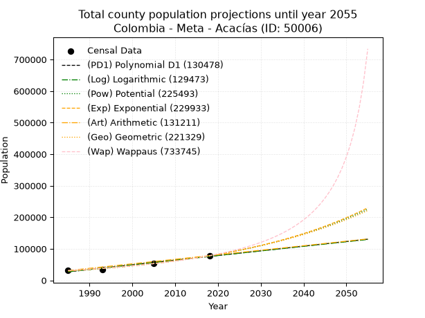
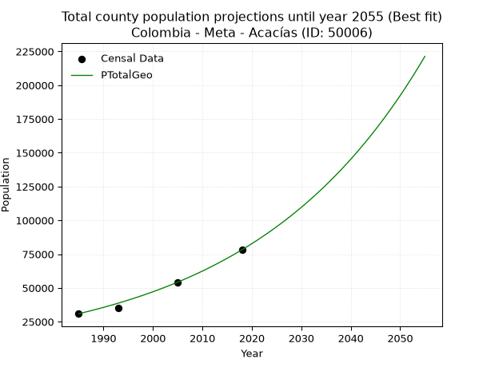
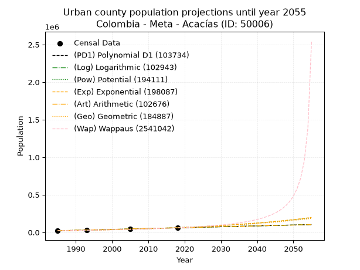
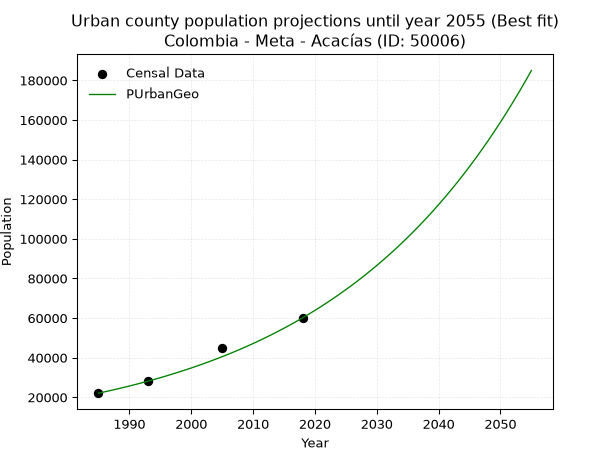
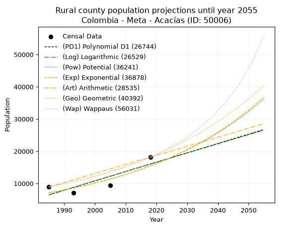
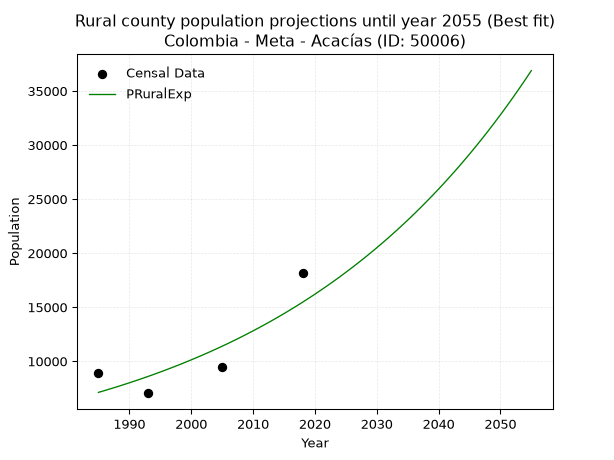

<div align="center">


</div>

# _“Population and Public Services Demand Projections (PPSD) until Year 2050 for Colombia - Meta - Acacías (ID: 50006)”_
Keywords: `population` `public-service` `projection` `lineal` `polynomial` `logarithmic` `potential` `exponential` `arithmetic` `geometric` `wappaus` `dane` `colombia` `south-america`

PPSD are analytical estimates used by governments and planners to anticipate future changes in population size, age distribution, and the resulting community needs for utilities, healthcare, education, and infrastructure as sizing future water treatment facilities, electrical grids, and road networks based on spatial growth.

> **General running parameters**: • app_version: _v20260806_. • Python version: _3.14.7_. • Pandas version: _3.0.5_. • NumPy version: _2.5.1_. • Creates, save and include plots into reports (create_plot): _False_. • Projection until year: _2050_. • Process polynomial degree 2 and up: _False_. • Process Wappaus: _True_. • Process Wappaus: _True_. • Set negative values to zero: _True_. • Set infinite values to zero: _True_. • Drop dataset notes: _True_. 
<div align="center">

Dynamic map: [:earth_americas:Google](http://maps.google.com/maps?q=3.990413273,-73.7660344) [:earth_americas:OSM](https://www.openstreetmap.org/#map=18/3.990413273/-73.7660344&layers=P) [:earth_americas:Bing](https://www.bing.com/maps?cp=3.990413273~-73.7660344&lvl=18) [:earth_americas:Apple](https://maps.apple.com/frame?center=3.990413273%2C-73.7660344&span=0.003%2C0.006)

</div>


<div align="center">

```geojson
{
  "type": "Feature",
  "geometry": {
    "type": "Point", 
    "coordinates": [-73.7660344, 3.990413273]
  }, 
  "properties": {
    "Name": "Colombia - Meta - Acacías (ID: 50006)"
  }
}
```

</div>


## 0. Census Data (4 records)

Census data are official statistics collected by a government about the people and housing in a country. They usually include counts of total population, age, sex, race, income, education, and jobs.

📅Global census file: [Population.xlsx](../data/Population.xlsx)

| Source   |   Year |   CountryID | CountryName   |   StateID | StateName   |   CountyID | CountyName   |   PTotal |   PUrban |   PRural |
|:---------|-------:|------------:|:--------------|----------:|:------------|-----------:|:-------------|---------:|---------:|---------:|
| DANE     |   1985 |          57 | Colombia      |        50 | Meta        |      50006 | Acacías      |    30918 |    22021 |     8897 |
| DANE     |   1993 |          57 | Colombia      |        50 | Meta        |      50006 | Acacías      |    35046 |    28007 |     7039 |
| DANE     |   2005 |          57 | Colombia      |        50 | Meta        |      50006 | Acacías      |    54219 |    44775 |     9444 |
| DANE     |   2018 |          57 | Colombia      |        50 | Meta        |      50006 | Acacías      |    78199 |    60044 |    18155 |

> 🔥Some records could had specific notes about the registered values or the corresponding urban or rural distribution.

## 1. Total

### 1.1. Coefficients and Parameters

* (PD1) Polynomial Deg 1: 1477.3014853472343, -2905376.796065806 (lineal)
* (Log) Logarithmic: 2955879.86971239, -22418071.07661858
* (Pow) Potential: 58.587499264842045, -188.7362275450023
* (Exp) Exponential: 0.029273384084517264, 1.7212104401442016e-21
* (Art) Arithmetic: Year diff. 2018 - 1985 = 33, Population diff. 78199 - 30918 = 47281, Annual growth = 1432.7575757575758
* (Geo) Geometric: Year diff. 2018 - 1985 = 33, Population diff. 78199 - 30918 = 47281, Annual growth % = 0.028517800294846074
* (Wap) Wappaus: i = 2.626094148038483, Condition values only valid for < 200)

<sub>
Wappaus condition values: ['0.00', '2.63', '5.25', '7.88', '10.50', '13.13', '15.76', '18.38', '21.01', '23.63', '26.26', '28.89', '31.51', '34.14', '36.77', '39.39', '42.02', '44.64', '47.27', '49.90', '52.52', '55.15', '57.77', '60.40', '63.03', '65.65', '68.28', '70.90', '73.53', '76.16', '78.78', '81.41', '84.04', '86.66', '89.29', '91.91', '94.54', '97.17', '99.79', '102.42', '105.04', '107.67', '110.30', '112.92', '115.55', '118.17', '120.80', '123.43', '126.05', '128.68', '131.30', '133.93', '136.56', '139.18', '141.81', '144.44', '147.06', '149.69', '152.31', '154.94', '157.57', '160.19', '162.82', '165.44', '168.07', '170.70']
</sub>


### 1.2. Projected Dataset

|   Year |   CountyID |   PTotalPD1 |   PTotalLog |   PTotalPow |   PTotalExp |   PTotalArt |   PTotalGeo |   PTotalWap |
|-------:|-----------:|------------:|------------:|------------:|------------:|------------:|------------:|------------:|
|   1985 |      50006 |       27067 |       27031 |       29602 |       29626 |       30918 |       30918 |       30918 |
|   1986 |      50006 |       28544 |       28520 |       30488 |       30506 |       32351 |       31800 |       31741 |
|   1987 |      50006 |       30021 |       30008 |       31401 |       31412 |       33784 |       32707 |       32586 |
|   1988 |      50006 |       31499 |       31495 |       32340 |       32345 |       35216 |       33639 |       33454 |
|   1989 |      50006 |       32976 |       32981 |       33307 |       33306 |       36649 |       34599 |       34346 |
|   1990 |      50006 |       34453 |       34467 |       34302 |       34296 |       38082 |       35585 |       35263 |
|   1991 |      50006 |       35930 |       35952 |       35327 |       35314 |       39515 |       36600 |       36206 |
|   1992 |      50006 |       37408 |       37436 |       36382 |       36364 |       40947 |       37644 |       37177 |
|   1993 |      50006 |       38885 |       38920 |       37467 |       37444 |       42380 |       38717 |       38176 |
|   1994 |      50006 |       40362 |       40403 |       38585 |       38556 |       43813 |       39822 |       39205 |
|   1995 |      50006 |       41840 |       41885 |       39735 |       39701 |       45246 |       40957 |       40265 |
|   1996 |      50006 |       43317 |       43366 |       40919 |       40881 |       46678 |       42125 |       41357 |
|   1997 |      50006 |       44794 |       44846 |       42138 |       42095 |       48111 |       43326 |       42484 |
|   1998 |      50006 |       46272 |       46326 |       43392 |       43346 |       49544 |       44562 |       43646 |
|   1999 |      50006 |       47749 |       47805 |       44683 |       44633 |       50977 |       45833 |       44845 |
|   2000 |      50006 |       49226 |       49283 |       46011 |       45959 |       52409 |       47140 |       46084 |
|   2001 |      50006 |       50703 |       50761 |       47379 |       47324 |       53842 |       48484 |       47364 |
|   2002 |      50006 |       52181 |       52238 |       48786 |       48730 |       55275 |       49867 |       48687 |
|   2003 |      50006 |       53658 |       53714 |       50235 |       50178 |       56708 |       51289 |       50056 |
|   2004 |      50006 |       55135 |       55189 |       51725 |       51668 |       58140 |       52752 |       51473 |
|   2005 |      50006 |       56613 |       56664 |       53259 |       53203 |       59573 |       54256 |       52940 |
|   2006 |      50006 |       58090 |       58138 |       54838 |       54784 |       61006 |       55803 |       54460 |
|   2007 |      50006 |       59567 |       59611 |       56463 |       56411 |       62439 |       57395 |       56037 |
|   2008 |      50006 |       61045 |       61083 |       58135 |       58087 |       63871 |       59031 |       57672 |
|   2009 |      50006 |       62522 |       62555 |       59856 |       59812 |       65304 |       60715 |       59371 |
|   2010 |      50006 |       63999 |       64026 |       61627 |       61589 |       66737 |       62446 |       61136 |
|   2011 |      50006 |       65476 |       65496 |       63449 |       63419 |       68170 |       64227 |       62971 |
|   2012 |      50006 |       66954 |       66966 |       65324 |       65303 |       69602 |       66059 |       64881 |
|   2013 |      50006 |       68431 |       68435 |       67254 |       67243 |       71035 |       67943 |       66870 |
|   2014 |      50006 |       69908 |       69903 |       69240 |       69240 |       72468 |       69880 |       68944 |
|   2015 |      50006 |       71386 |       71370 |       71283 |       71297 |       73901 |       71873 |       71107 |
|   2016 |      50006 |       72863 |       72836 |       73385 |       73415 |       75333 |       73923 |       73366 |
|   2017 |      50006 |       74340 |       74302 |       75549 |       75596 |       76766 |       76031 |       75728 |
|   2018 |      50006 |       75818 |       75767 |       77775 |       77841 |       78199 |       78199 |       78199 |
|   2019 |      50006 |       77295 |       77232 |       80065 |       80154 |       79632 |       80429 |       80787 |
|   2020 |      50006 |       78772 |       78695 |       82422 |       82535 |       81065 |       82723 |       83501 |
|   2021 |      50006 |       80250 |       80158 |       84847 |       84987 |       82497 |       85082 |       86350 |
|   2022 |      50006 |       81727 |       81621 |       87342 |       87511 |       83930 |       87508 |       89345 |
|   2023 |      50006 |       83204 |       83082 |       89909 |       90111 |       85363 |       90004 |       92497 |
|   2024 |      50006 |       84681 |       84543 |       92550 |       92788 |       86796 |       92570 |       95818 |
|   2025 |      50006 |       86159 |       86003 |       95268 |       95544 |       88228 |       95210 |       99323 |
|   2026 |      50006 |       87636 |       87462 |       98064 |       98382 |       89661 |       97925 |      103027 |
|   2027 |      50006 |       89113 |       88921 |      100940 |      101305 |       91094 |      100718 |      106949 |
|   2028 |      50006 |       90591 |       90379 |      103900 |      104314 |       92527 |      103590 |      111106 |
|   2029 |      50006 |       92068 |       91836 |      106944 |      107413 |       93959 |      106545 |      115523 |
|   2030 |      50006 |       93545 |       93292 |      110076 |      110604 |       95392 |      109583 |      120223 |
|   2031 |      50006 |       95023 |       94748 |      113299 |      113889 |       96825 |      112708 |      125234 |
|   2032 |      50006 |       96500 |       96203 |      116614 |      117273 |       98258 |      115922 |      130589 |
|   2033 |      50006 |       97977 |       97658 |      120024 |      120756 |       99690 |      119228 |      136325 |
|   2034 |      50006 |       99454 |       99111 |      123532 |      124344 |      101123 |      122628 |      142483 |
|   2035 |      50006 |      100932 |      100564 |      127142 |      128037 |      102556 |      126125 |      149112 |
|   2036 |      50006 |      102409 |      102016 |      130854 |      131841 |      103989 |      129722 |      156268 |
|   2037 |      50006 |      103886 |      103468 |      134673 |      135757 |      105421 |      133421 |      164016 |
|   2038 |      50006 |      105364 |      104918 |      138602 |      139790 |      106854 |      137226 |      172433 |
|   2039 |      50006 |      106841 |      106368 |      142643 |      143943 |      108287 |      141140 |      181610 |
|   2040 |      50006 |      108318 |      107818 |      146800 |      148219 |      109720 |      145165 |      191654 |
|   2041 |      50006 |      109796 |      109266 |      151077 |      152622 |      111152 |      149304 |      202695 |
|   2042 |      50006 |      111273 |      110714 |      155475 |      157156 |      112585 |      153562 |      214889 |
|   2043 |      50006 |      112750 |      112161 |      159999 |      161824 |      114018 |      157942 |      228426 |
|   2044 |      50006 |      114227 |      113608 |      164653 |      166631 |      115451 |      162446 |      243540 |
|   2045 |      50006 |      115705 |      115054 |      169439 |      171581 |      116883 |      167078 |      260525 |
|   2046 |      50006 |      117182 |      116499 |      174363 |      176678 |      118316 |      171843 |      279751 |
|   2047 |      50006 |      118659 |      117943 |      179427 |      181927 |      119749 |      176744 |      301693 |
|   2048 |      50006 |      120137 |      119387 |      184635 |      187331 |      121182 |      181784 |      326970 |
|   2049 |      50006 |      121614 |      120830 |      189992 |      192896 |      122614 |      186968 |      356405 |
|   2050 |      50006 |      123091 |      122272 |      195501 |      198626 |      124047 |      192300 |      391115 |
<div align="center">

</img>

</div>


### 1.3. Best fit with absolute and relative error (%)

Relative error puts that difference into context by dividing the absolute error by the true value, creating a unitless ratio or percentage that shows the scale of the mistake.

Absolute and relative error

|   Year | Source   |   CountryID | CountryName   |   StateID | StateName   |   CountyID_x | CountyName   |   PTotal |   PUrban |   PRural |   CountyID_y |   PTotalPD1 |   PTotalLog |   PTotalPow |   PTotalExp |   PTotalArt |   PTotalGeo |   PTotalWap |   PTotalPD1AbsError |   PTotalLogAbsError |   PTotalPowAbsError |   PTotalExpAbsError |   PTotalArtAbsError |   PTotalGeoAbsError |   PTotalWapAbsError |   PTotalPD1RelError |   PTotalLogRelError |   PTotalPowRelError |   PTotalExpRelError |   PTotalArtRelError |   PTotalGeoRelError |   PTotalWapRelError |
|-------:|:---------|------------:|:--------------|----------:|:------------|-------------:|:-------------|---------:|---------:|---------:|-------------:|------------:|------------:|------------:|------------:|------------:|------------:|------------:|--------------------:|--------------------:|--------------------:|--------------------:|--------------------:|--------------------:|--------------------:|--------------------:|--------------------:|--------------------:|--------------------:|--------------------:|--------------------:|--------------------:|
|   1985 | DANE     |          57 | Colombia      |        50 | Meta        |        50006 | Acacías      |    30918 |    22021 |     8897 |        50006 |       27067 |       27031 |       29602 |       29626 |       30918 |       30918 |       30918 |                3851 |                3887 |                1316 |                1292 |                   0 |                   0 |                   0 |            12.4555  |            12.572   |            4.25642  |            4.1788   |             0       |           0         |             0       |
|   1993 | DANE     |          57 | Colombia      |        50 | Meta        |        50006 | Acacías      |    35046 |    28007 |     7039 |        50006 |       38885 |       38920 |       37467 |       37444 |       42380 |       38717 |       38176 |                3839 |                3874 |                2421 |                2398 |                7334 |                3671 |                3130 |            10.9542  |            11.054   |            6.90806  |            6.84244  |            20.9268  |          10.4748    |             8.93112 |
|   2005 | DANE     |          57 | Colombia      |        50 | Meta        |        50006 | Acacías      |    54219 |    44775 |     9444 |        50006 |       56613 |       56664 |       53259 |       53203 |       59573 |       54256 |       52940 |                2394 |                2445 |                 960 |                1016 |                5354 |                  37 |                1279 |             4.41543 |             4.50949 |            1.7706   |            1.87388  |             9.87477 |           0.0682418 |             2.35895 |
|   2018 | DANE     |          57 | Colombia      |        50 | Meta        |        50006 | Acacías      |    78199 |    60044 |    18155 |        50006 |       75818 |       75767 |       77775 |       77841 |       78199 |       78199 |       78199 |                2381 |                2432 |                 424 |                 358 |                   0 |                   0 |                   0 |             3.0448  |             3.11001 |            0.542206 |            0.457806 |             0       |           0         |             0       |

Relative error mean

| Method    |   RelError | Best   |
|:----------|-----------:|:-------|
| PTotalPD1 |    7.71748 |        |
| PTotalLog |    7.81138 |        |
| PTotalPow |    3.36932 |        |
| PTotalExp |    3.33823 |        |
| PTotalArt |    7.70039 |        |
| PTotalGeo |    2.63576 | True   |
| PTotalWap |    2.82252 |        |

💙Best method: _**PTotalGeo**_
<div align="center">

</img>

</div>


### 1.4. Fresh water supply demand in liters per capita per day (lpcd)

The fresh water supply demand typically ranges from 100 to 300 liters per capita per day (lpcd) for standard domestic and municipal planning, though absolute survival minimums set by the World Health Organization are as low as 7.5 to 20 liters per day, and total consumption in high-income nations can exceed 400 liters.

> `CZ`: Level in meters above the sea level (masl).<br> `WS`: Fresh water supply demand in liters per capita per day (lpcd or l/h/d).<br> `WSAll`: Zonal fresh water supply demand in liters per second (l/s).<br> `A`: Zonal area in square meters.

Reference values (RAS Colombia)

|    CZ |   WS |
|------:|-----:|
|  1000 |  120 |
|  2000 |  130 |
| 99999 |  140 |

County shapefile geometry properties and water supply values

|   CountyID |      ATotal |   CZTotal |   WSTotal |
|-----------:|------------:|----------:|----------:|
|      50006 | 1.12192e+09 |   1034.56 |       130 |

Projected values for best method: PTotalGeo

|   CountyID |   Year |   PTotalGeo |   WSTotal |   WSTotalAll |
|-----------:|-------:|------------:|----------:|-------------:|
|      50006 |   1985 |       30918 |       130 |      46.5201 |
|      50006 |   1986 |       31800 |       130 |      47.8472 |
|      50006 |   1987 |       32707 |       130 |      49.2119 |
|      50006 |   1988 |       33639 |       130 |      50.6142 |
|      50006 |   1989 |       34599 |       130 |      52.0587 |
|      50006 |   1990 |       35585 |       130 |      53.5422 |
|      50006 |   1991 |       36600 |       130 |      55.0694 |
|      50006 |   1992 |       37644 |       130 |      56.6403 |
|      50006 |   1993 |       38717 |       130 |      58.2547 |
|      50006 |   1994 |       39822 |       130 |      59.9174 |
|      50006 |   1995 |       40957 |       130 |      61.6251 |
|      50006 |   1996 |       42125 |       130 |      63.3825 |
|      50006 |   1997 |       43326 |       130 |      65.1896 |
|      50006 |   1998 |       44562 |       130 |      67.0493 |
|      50006 |   1999 |       45833 |       130 |      68.9617 |
|      50006 |   2000 |       47140 |       130 |      70.9282 |
|      50006 |   2001 |       48484 |       130 |      72.9505 |
|      50006 |   2002 |       49867 |       130 |      75.0314 |
|      50006 |   2003 |       51289 |       130 |      77.1709 |
|      50006 |   2004 |       52752 |       130 |      79.3722 |
|      50006 |   2005 |       54256 |       130 |      81.6352 |
|      50006 |   2006 |       55803 |       130 |      83.9628 |
|      50006 |   2007 |       57395 |       130 |      86.3582 |
|      50006 |   2008 |       59031 |       130 |      88.8198 |
|      50006 |   2009 |       60715 |       130 |      91.3536 |
|      50006 |   2010 |       62446 |       130 |      93.9581 |
|      50006 |   2011 |       64227 |       130 |      96.6378 |
|      50006 |   2012 |       66059 |       130 |      99.3943 |
|      50006 |   2013 |       67943 |       130 |     102.229  |
|      50006 |   2014 |       69880 |       130 |     105.144  |
|      50006 |   2015 |       71873 |       130 |     108.142  |
|      50006 |   2016 |       73923 |       130 |     111.227  |
|      50006 |   2017 |       76031 |       130 |     114.398  |
|      50006 |   2018 |       78199 |       130 |     117.661  |
|      50006 |   2019 |       80429 |       130 |     121.016  |
|      50006 |   2020 |       82723 |       130 |     124.467  |
|      50006 |   2021 |       85082 |       130 |     128.017  |
|      50006 |   2022 |       87508 |       130 |     131.667  |
|      50006 |   2023 |       90004 |       130 |     135.423  |
|      50006 |   2024 |       92570 |       130 |     139.284  |
|      50006 |   2025 |       95210 |       130 |     143.256  |
|      50006 |   2026 |       97925 |       130 |     147.341  |
|      50006 |   2027 |      100718 |       130 |     151.543  |
|      50006 |   2028 |      103590 |       130 |     155.865  |
|      50006 |   2029 |      106545 |       130 |     160.311  |
|      50006 |   2030 |      109583 |       130 |     164.882  |
|      50006 |   2031 |      112708 |       130 |     169.584  |
|      50006 |   2032 |      115922 |       130 |     174.42   |
|      50006 |   2033 |      119228 |       130 |     179.394  |
|      50006 |   2034 |      122628 |       130 |     184.51   |
|      50006 |   2035 |      126125 |       130 |     189.771  |
|      50006 |   2036 |      129722 |       130 |     195.184  |
|      50006 |   2037 |      133421 |       130 |     200.749  |
|      50006 |   2038 |      137226 |       130 |     206.474  |
|      50006 |   2039 |      141140 |       130 |     212.363  |
|      50006 |   2040 |      145165 |       130 |     218.42   |
|      50006 |   2041 |      149304 |       130 |     224.647  |
|      50006 |   2042 |      153562 |       130 |     231.054  |
|      50006 |   2043 |      157942 |       130 |     237.644  |
|      50006 |   2044 |      162446 |       130 |     244.421  |
|      50006 |   2045 |      167078 |       130 |     251.391  |
|      50006 |   2046 |      171843 |       130 |     258.56   |
|      50006 |   2047 |      176744 |       130 |     265.934  |
|      50006 |   2048 |      181784 |       130 |     273.518  |
|      50006 |   2049 |      186968 |       130 |     281.318  |
|      50006 |   2050 |      192300 |       130 |     289.34   |

## 2. Urban

### 2.1. Coefficients and Parameters

* (PD1) Polynomial Deg 1: 1187.621437173815, -2336828.0297069233 (lineal)
* (Log) Logarithmic: 2376918.4396006456, -18028264.356833484
* (Pow) Potential: 62.4701275341843, -201.6637263378818
* (Exp) Exponential: 0.031203890594015245, 2.806462817112685e-23
* (Art) Arithmetic: Year diff. 2018 - 1985 = 33, Population diff. 60044 - 22021 = 38023, Annual growth = 1152.2121212121212
* (Geo) Geometric: Year diff. 2018 - 1985 = 33, Population diff. 60044 - 22021 = 38023, Annual growth % = 0.03086308345433708
* (Wap) Wappaus: i = 2.8080475750006, Condition values only valid for < 200)

<sub>
Wappaus condition values: ['0.00', '2.81', '5.62', '8.42', '11.23', '14.04', '16.85', '19.66', '22.46', '25.27', '28.08', '30.89', '33.70', '36.50', '39.31', '42.12', '44.93', '47.74', '50.54', '53.35', '56.16', '58.97', '61.78', '64.59', '67.39', '70.20', '73.01', '75.82', '78.63', '81.43', '84.24', '87.05', '89.86', '92.67', '95.47', '98.28', '101.09', '103.90', '106.71', '109.51', '112.32', '115.13', '117.94', '120.75', '123.55', '126.36', '129.17', '131.98', '134.79', '137.59', '140.40', '143.21', '146.02', '148.83', '151.63', '154.44', '157.25', '160.06', '162.87', '165.67', '168.48', '171.29', '174.10', '176.91', '179.72', '182.52']
</sub>


### 2.2. Projected Dataset

|   Year |   CountyID |   PUrbanPD1 |   PUrbanLog |   PUrbanPow |   PUrbanExp |   PUrbanArt |   PUrbanGeo |   PUrbanWap |
|-------:|-----------:|------------:|------------:|------------:|------------:|------------:|------------:|------------:|
|   1985 |      50006 |       20601 |       20567 |       22274 |       22297 |       22021 |       22021 |       22021 |
|   1986 |      50006 |       21788 |       21764 |       22986 |       23003 |       23173 |       22701 |       22648 |
|   1987 |      50006 |       22976 |       22960 |       23720 |       23732 |       24325 |       23401 |       23293 |
|   1988 |      50006 |       24163 |       24156 |       24477 |       24485 |       25478 |       24123 |       23958 |
|   1989 |      50006 |       25351 |       25352 |       25259 |       25261 |       26630 |       24868 |       24642 |
|   1990 |      50006 |       26539 |       26546 |       26064 |       26061 |       27782 |       25636 |       25346 |
|   1991 |      50006 |       27726 |       27741 |       26895 |       26887 |       28934 |       26427 |       26072 |
|   1992 |      50006 |       28914 |       28934 |       27752 |       27740 |       30086 |       27242 |       26821 |
|   1993 |      50006 |       30101 |       30127 |       28636 |       28619 |       31239 |       28083 |       27594 |
|   1994 |      50006 |       31289 |       31319 |       29548 |       29526 |       32391 |       28950 |       28391 |
|   1995 |      50006 |       32477 |       32511 |       30488 |       30462 |       33543 |       29843 |       29215 |
|   1996 |      50006 |       33664 |       33702 |       31457 |       31427 |       34695 |       30764 |       30065 |
|   1997 |      50006 |       34852 |       34893 |       32457 |       32423 |       35848 |       31714 |       30945 |
|   1998 |      50006 |       36040 |       36083 |       33488 |       33451 |       37000 |       32693 |       31855 |
|   1999 |      50006 |       37227 |       37272 |       34552 |       34511 |       38152 |       33702 |       32796 |
|   2000 |      50006 |       38415 |       38461 |       35648 |       35605 |       39304 |       34742 |       33771 |
|   2001 |      50006 |       39602 |       39649 |       36779 |       36734 |       40456 |       35814 |       34781 |
|   2002 |      50006 |       40790 |       40837 |       37945 |       37898 |       41609 |       36919 |       35829 |
|   2003 |      50006 |       41978 |       42024 |       39147 |       39099 |       42761 |       38059 |       36916 |
|   2004 |      50006 |       43165 |       43210 |       40387 |       40339 |       43913 |       39233 |       38044 |
|   2005 |      50006 |       44353 |       44396 |       41666 |       41617 |       45065 |       40444 |       39217 |
|   2006 |      50006 |       45541 |       45581 |       42984 |       42936 |       46217 |       41692 |       40436 |
|   2007 |      50006 |       46728 |       46766 |       44343 |       44297 |       47370 |       42979 |       41705 |
|   2008 |      50006 |       47916 |       47950 |       45745 |       45701 |       48522 |       44306 |       43026 |
|   2009 |      50006 |       49103 |       49133 |       47190 |       47150 |       49674 |       45673 |       44404 |
|   2010 |      50006 |       50291 |       50316 |       48680 |       48644 |       50826 |       47083 |       45841 |
|   2011 |      50006 |       51479 |       51498 |       50217 |       50186 |       51979 |       48536 |       47342 |
|   2012 |      50006 |       52666 |       52680 |       51801 |       51777 |       53131 |       50034 |       48910 |
|   2013 |      50006 |       53854 |       53861 |       53434 |       53418 |       54283 |       51578 |       50551 |
|   2014 |      50006 |       55042 |       55041 |       55118 |       55111 |       55435 |       53170 |       52270 |
|   2015 |      50006 |       56229 |       56221 |       56854 |       56858 |       56587 |       54811 |       54072 |
|   2016 |      50006 |       57417 |       57401 |       58643 |       58660 |       57740 |       56502 |       55964 |
|   2017 |      50006 |       58604 |       58579 |       60488 |       60519 |       58892 |       58246 |       57952 |
|   2018 |      50006 |       59792 |       59757 |       62391 |       62437 |       60044 |       60044 |       60044 |
|   2019 |      50006 |       60980 |       60935 |       64352 |       64416 |       61196 |       61897 |       62249 |
|   2020 |      50006 |       62167 |       62112 |       66374 |       66458 |       62348 |       63807 |       64575 |
|   2021 |      50006 |       63355 |       63288 |       68458 |       68565 |       63501 |       65777 |       67033 |
|   2022 |      50006 |       64543 |       64464 |       70606 |       70738 |       64653 |       67807 |       69636 |
|   2023 |      50006 |       65730 |       65639 |       72821 |       72980 |       65805 |       69900 |       72394 |
|   2024 |      50006 |       66918 |       66814 |       75104 |       75293 |       66957 |       72057 |       75324 |
|   2025 |      50006 |       68105 |       67988 |       77458 |       77679 |       68109 |       74281 |       78442 |
|   2026 |      50006 |       69293 |       69162 |       79884 |       80142 |       69262 |       76573 |       81766 |
|   2027 |      50006 |       70481 |       70335 |       82385 |       82682 |       70414 |       78937 |       85317 |
|   2028 |      50006 |       71668 |       71507 |       84963 |       85302 |       71566 |       81373 |       89120 |
|   2029 |      50006 |       72856 |       72679 |       87620 |       88006 |       72718 |       83884 |       93203 |
|   2030 |      50006 |       74043 |       73850 |       90359 |       90796 |       73871 |       86473 |       97597 |
|   2031 |      50006 |       75231 |       75020 |       93183 |       93673 |       75023 |       89142 |      102339 |
|   2032 |      50006 |       76419 |       76191 |       96092 |       96642 |       76175 |       91893 |      107473 |
|   2033 |      50006 |       77606 |       77360 |       99092 |       99706 |       77327 |       94729 |      113049 |
|   2034 |      50006 |       78794 |       78529 |      102183 |      102866 |       78479 |       97653 |      119126 |
|   2035 |      50006 |       79982 |       79697 |      105369 |      106126 |       79632 |      100667 |      125777 |
|   2036 |      50006 |       81169 |       80865 |      108653 |      109490 |       80784 |      103774 |      133085 |
|   2037 |      50006 |       82357 |       82032 |      112038 |      112960 |       81936 |      106976 |      141153 |
|   2038 |      50006 |       83544 |       83199 |      115526 |      116541 |       83088 |      110278 |      150107 |
|   2039 |      50006 |       84732 |       84365 |      119121 |      120235 |       84240 |      113682 |      160101 |
|   2040 |      50006 |       85920 |       85530 |      122827 |      124046 |       85393 |      117190 |      171326 |
|   2041 |      50006 |       87107 |       86695 |      126645 |      127977 |       86545 |      120807 |      184027 |
|   2042 |      50006 |       88295 |       87859 |      130580 |      132034 |       87697 |      124536 |      198513 |
|   2043 |      50006 |       89483 |       89023 |      134636 |      136219 |       88849 |      128379 |      215190 |
|   2044 |      50006 |       90670 |       90186 |      138815 |      140536 |       90002 |      132341 |      234595 |
|   2045 |      50006 |       91858 |       91349 |      143122 |      144991 |       91154 |      136426 |      257459 |
|   2046 |      50006 |       93045 |       92511 |      147561 |      149586 |       92306 |      140636 |      284795 |
|   2047 |      50006 |       94233 |       93672 |      152134 |      154327 |       93458 |      144977 |      318058 |
|   2048 |      50006 |       95421 |       94833 |      156848 |      159219 |       94610 |      149451 |      359411 |
|   2049 |      50006 |       96608 |       95993 |      161705 |      164266 |       95763 |      154064 |      412212 |
|   2050 |      50006 |       97796 |       97153 |      166709 |      169472 |       96915 |      158819 |      481981 |
<div align="center">

</img>

</div>


### 2.3. Best fit with absolute and relative error (%)

Relative error puts that difference into context by dividing the absolute error by the true value, creating a unitless ratio or percentage that shows the scale of the mistake.

Absolute and relative error

|   Year | Source   |   CountryID | CountryName   |   StateID | StateName   |   CountyID_x | CountyName   |   PTotal |   PUrban |   PRural |   CountyID_y |   PUrbanPD1 |   PUrbanLog |   PUrbanPow |   PUrbanExp |   PUrbanArt |   PUrbanGeo |   PUrbanWap |   PUrbanPD1AbsError |   PUrbanLogAbsError |   PUrbanPowAbsError |   PUrbanExpAbsError |   PUrbanArtAbsError |   PUrbanGeoAbsError |   PUrbanWapAbsError |   PUrbanPD1RelError |   PUrbanLogRelError |   PUrbanPowRelError |   PUrbanExpRelError |   PUrbanArtRelError |   PUrbanGeoRelError |   PUrbanWapRelError |
|-------:|:---------|------------:|:--------------|----------:|:------------|-------------:|:-------------|---------:|---------:|---------:|-------------:|------------:|------------:|------------:|------------:|------------:|------------:|------------:|--------------------:|--------------------:|--------------------:|--------------------:|--------------------:|--------------------:|--------------------:|--------------------:|--------------------:|--------------------:|--------------------:|--------------------:|--------------------:|--------------------:|
|   1985 | DANE     |          57 | Colombia      |        50 | Meta        |        50006 | Acacías      |    30918 |    22021 |     8897 |        50006 |       20601 |       20567 |       22274 |       22297 |       22021 |       22021 |       22021 |                1420 |                1454 |                 253 |                 276 |                   0 |                   0 |                   0 |            6.44839  |            6.60279  |             1.1489  |             1.25335 |            0        |            0        |             0       |
|   1993 | DANE     |          57 | Colombia      |        50 | Meta        |        50006 | Acacías      |    35046 |    28007 |     7039 |        50006 |       30101 |       30127 |       28636 |       28619 |       31239 |       28083 |       27594 |                2094 |                2120 |                 629 |                 612 |                3232 |                  76 |                 413 |            7.4767   |            7.56954  |             2.24587 |             2.18517 |           11.54     |            0.271361 |             1.47463 |
|   2005 | DANE     |          57 | Colombia      |        50 | Meta        |        50006 | Acacías      |    54219 |    44775 |     9444 |        50006 |       44353 |       44396 |       41666 |       41617 |       45065 |       40444 |       39217 |                 422 |                 379 |                3109 |                3158 |                 290 |                4331 |                5558 |            0.94249  |            0.846454 |             6.94361 |             7.05304 |            0.647683 |            9.67281  |            12.4132  |
|   2018 | DANE     |          57 | Colombia      |        50 | Meta        |        50006 | Acacías      |    78199 |    60044 |    18155 |        50006 |       59792 |       59757 |       62391 |       62437 |       60044 |       60044 |       60044 |                 252 |                 287 |                2347 |                2393 |                   0 |                   0 |                   0 |            0.419692 |            0.477983 |             3.9088  |             3.98541 |            0        |            0        |             0       |

Relative error mean

| Method    |   RelError | Best   |
|:----------|-----------:|:-------|
| PUrbanPD1 |    3.82182 |        |
| PUrbanLog |    3.87419 |        |
| PUrbanPow |    3.56179 |        |
| PUrbanExp |    3.61924 |        |
| PUrbanArt |    3.04691 |        |
| PUrbanGeo |    2.48604 | True   |
| PUrbanWap |    3.47195 |        |

💙Best method: _**PUrbanGeo**_
<div align="center">

</img>

</div>


### 2.4. Fresh water supply demand in liters per capita per day (lpcd)

The fresh water supply demand typically ranges from 100 to 300 liters per capita per day (lpcd) for standard domestic and municipal planning, though absolute survival minimums set by the World Health Organization are as low as 7.5 to 20 liters per day, and total consumption in high-income nations can exceed 400 liters.

> `CZ`: Level in meters above the sea level (masl).<br> `WS`: Fresh water supply demand in liters per capita per day (lpcd or l/h/d).<br> `WSAll`: Zonal fresh water supply demand in liters per second (l/s).<br> `A`: Zonal area in square meters.

Reference values (RAS Colombia)

|    CZ |   WS |
|------:|-----:|
|  1000 |  120 |
|  2000 |  130 |
| 99999 |  140 |

County shapefile geometry properties and water supply values

|   CountyID |      AUrban |   CZUrban |   WSUrban |
|-----------:|------------:|----------:|----------:|
|      50006 | 1.17449e+07 |   533.381 |       120 |

Projected values for best method: PUrbanGeo

|   CountyID |   Year |   PUrbanGeo |   WSUrban |   WSUrbanAll |
|-----------:|-------:|------------:|----------:|-------------:|
|      50006 |   1985 |       22021 |       120 |      30.5847 |
|      50006 |   1986 |       22701 |       120 |      31.5292 |
|      50006 |   1987 |       23401 |       120 |      32.5014 |
|      50006 |   1988 |       24123 |       120 |      33.5042 |
|      50006 |   1989 |       24868 |       120 |      34.5389 |
|      50006 |   1990 |       25636 |       120 |      35.6056 |
|      50006 |   1991 |       26427 |       120 |      36.7042 |
|      50006 |   1992 |       27242 |       120 |      37.8361 |
|      50006 |   1993 |       28083 |       120 |      39.0042 |
|      50006 |   1994 |       28950 |       120 |      40.2083 |
|      50006 |   1995 |       29843 |       120 |      41.4486 |
|      50006 |   1996 |       30764 |       120 |      42.7278 |
|      50006 |   1997 |       31714 |       120 |      44.0472 |
|      50006 |   1998 |       32693 |       120 |      45.4069 |
|      50006 |   1999 |       33702 |       120 |      46.8083 |
|      50006 |   2000 |       34742 |       120 |      48.2528 |
|      50006 |   2001 |       35814 |       120 |      49.7417 |
|      50006 |   2002 |       36919 |       120 |      51.2764 |
|      50006 |   2003 |       38059 |       120 |      52.8597 |
|      50006 |   2004 |       39233 |       120 |      54.4903 |
|      50006 |   2005 |       40444 |       120 |      56.1722 |
|      50006 |   2006 |       41692 |       120 |      57.9056 |
|      50006 |   2007 |       42979 |       120 |      59.6931 |
|      50006 |   2008 |       44306 |       120 |      61.5361 |
|      50006 |   2009 |       45673 |       120 |      63.4347 |
|      50006 |   2010 |       47083 |       120 |      65.3931 |
|      50006 |   2011 |       48536 |       120 |      67.4111 |
|      50006 |   2012 |       50034 |       120 |      69.4917 |
|      50006 |   2013 |       51578 |       120 |      71.6361 |
|      50006 |   2014 |       53170 |       120 |      73.8472 |
|      50006 |   2015 |       54811 |       120 |      76.1264 |
|      50006 |   2016 |       56502 |       120 |      78.475  |
|      50006 |   2017 |       58246 |       120 |      80.8972 |
|      50006 |   2018 |       60044 |       120 |      83.3944 |
|      50006 |   2019 |       61897 |       120 |      85.9681 |
|      50006 |   2020 |       63807 |       120 |      88.6208 |
|      50006 |   2021 |       65777 |       120 |      91.3569 |
|      50006 |   2022 |       67807 |       120 |      94.1764 |
|      50006 |   2023 |       69900 |       120 |      97.0833 |
|      50006 |   2024 |       72057 |       120 |     100.079  |
|      50006 |   2025 |       74281 |       120 |     103.168  |
|      50006 |   2026 |       76573 |       120 |     106.351  |
|      50006 |   2027 |       78937 |       120 |     109.635  |
|      50006 |   2028 |       81373 |       120 |     113.018  |
|      50006 |   2029 |       83884 |       120 |     116.506  |
|      50006 |   2030 |       86473 |       120 |     120.101  |
|      50006 |   2031 |       89142 |       120 |     123.808  |
|      50006 |   2032 |       91893 |       120 |     127.629  |
|      50006 |   2033 |       94729 |       120 |     131.568  |
|      50006 |   2034 |       97653 |       120 |     135.629  |
|      50006 |   2035 |      100667 |       120 |     139.815  |
|      50006 |   2036 |      103774 |       120 |     144.131  |
|      50006 |   2037 |      106976 |       120 |     148.578  |
|      50006 |   2038 |      110278 |       120 |     153.164  |
|      50006 |   2039 |      113682 |       120 |     157.892  |
|      50006 |   2040 |      117190 |       120 |     162.764  |
|      50006 |   2041 |      120807 |       120 |     167.787  |
|      50006 |   2042 |      124536 |       120 |     172.967  |
|      50006 |   2043 |      128379 |       120 |     178.304  |
|      50006 |   2044 |      132341 |       120 |     183.807  |
|      50006 |   2045 |      136426 |       120 |     189.481  |
|      50006 |   2046 |      140636 |       120 |     195.328  |
|      50006 |   2047 |      144977 |       120 |     201.357  |
|      50006 |   2048 |      149451 |       120 |     207.571  |
|      50006 |   2049 |      154064 |       120 |     213.978  |
|      50006 |   2050 |      158819 |       120 |     220.582  |

## 3. Rural

### 3.1. Coefficients and Parameters

* (PD1) Polynomial Deg 1: 289.68004817341875, -568548.7663588809 (lineal)
* (Log) Logarithmic: 578961.4301117435, -4389806.719785091
* (Pow) Potential: 46.98953384698793, -151.1082880850434
* (Exp) Exponential: 0.023511159843265336, 3.833893449868441e-17
* (Art) Arithmetic: Year diff. 2018 - 1985 = 33, Population diff. 18155 - 8897 = 9258, Annual growth = 280.54545454545456
* (Geo) Geometric: Year diff. 2018 - 1985 = 33, Population diff. 18155 - 8897 = 9258, Annual growth % = 0.02184834133796243
* (Wap) Wappaus: i = 2.0741198768701357, Condition values only valid for < 200)

<sub>
Wappaus condition values: ['0.00', '2.07', '4.15', '6.22', '8.30', '10.37', '12.44', '14.52', '16.59', '18.67', '20.74', '22.82', '24.89', '26.96', '29.04', '31.11', '33.19', '35.26', '37.33', '39.41', '41.48', '43.56', '45.63', '47.70', '49.78', '51.85', '53.93', '56.00', '58.08', '60.15', '62.22', '64.30', '66.37', '68.45', '70.52', '72.59', '74.67', '76.74', '78.82', '80.89', '82.96', '85.04', '87.11', '89.19', '91.26', '93.34', '95.41', '97.48', '99.56', '101.63', '103.71', '105.78', '107.85', '109.93', '112.00', '114.08', '116.15', '118.22', '120.30', '122.37', '124.45', '126.52', '128.60', '130.67', '132.74', '134.82']
</sub>


### 3.2. Projected Dataset

|   Year |   CountyID |   PRuralPD1 |   PRuralLog |   PRuralPow |   PRuralExp |   PRuralArt |   PRuralGeo |   PRuralWap |
|-------:|-----------:|------------:|------------:|------------:|------------:|------------:|------------:|------------:|
|   1985 |      50006 |        6466 |        6464 |        7111 |        7112 |        8897 |        8897 |        8897 |
|   1986 |      50006 |        6756 |        6756 |        7281 |        7282 |        9178 |        9091 |        9083 |
|   1987 |      50006 |        7045 |        7047 |        7456 |        7455 |        9458 |        9290 |        9274 |
|   1988 |      50006 |        7335 |        7338 |        7634 |        7632 |        9739 |        9493 |        9468 |
|   1989 |      50006 |        7625 |        7630 |        7817 |        7814 |       10019 |        9700 |        9667 |
|   1990 |      50006 |        7915 |        7921 |        8004 |        8000 |       10300 |        9912 |        9870 |
|   1991 |      50006 |        8204 |        8211 |        8195 |        8190 |       10580 |       10129 |       10078 |
|   1992 |      50006 |        8494 |        8502 |        8390 |        8385 |       10861 |       10350 |       10290 |
|   1993 |      50006 |        8784 |        8793 |        8591 |        8584 |       11141 |       10576 |       10507 |
|   1994 |      50006 |        9073 |        9083 |        8795 |        8788 |       11422 |       10807 |       10729 |
|   1995 |      50006 |        9363 |        9373 |        9005 |        8997 |       11702 |       11044 |       10956 |
|   1996 |      50006 |        9653 |        9664 |        9220 |        9212 |       11983 |       11285 |       11188 |
|   1997 |      50006 |        9942 |        9954 |        9439 |        9431 |       12264 |       11531 |       11426 |
|   1998 |      50006 |       10232 |       10243 |        9664 |        9655 |       12544 |       11783 |       11670 |
|   1999 |      50006 |       10522 |       10533 |        9894 |        9885 |       12825 |       12041 |       11919 |
|   2000 |      50006 |       10811 |       10823 |       10129 |       10120 |       13105 |       12304 |       12175 |
|   2001 |      50006 |       11101 |       11112 |       10370 |       10361 |       13386 |       12573 |       12437 |
|   2002 |      50006 |       11391 |       11401 |       10616 |       10607 |       13666 |       12847 |       12706 |
|   2003 |      50006 |       11680 |       11690 |       10868 |       10859 |       13947 |       13128 |       12981 |
|   2004 |      50006 |       11970 |       11979 |       11126 |       11118 |       14227 |       13415 |       13264 |
|   2005 |      50006 |       12260 |       12268 |       11390 |       11382 |       14508 |       13708 |       13554 |
|   2006 |      50006 |       12549 |       12557 |       11660 |       11653 |       14788 |       14007 |       13851 |
|   2007 |      50006 |       12839 |       12845 |       11936 |       11930 |       15069 |       14313 |       14157 |
|   2008 |      50006 |       13129 |       13134 |       12219 |       12214 |       15350 |       14626 |       14471 |
|   2009 |      50006 |       13418 |       13422 |       12508 |       12505 |       15630 |       14946 |       14793 |
|   2010 |      50006 |       13708 |       13710 |       12804 |       12802 |       15911 |       15272 |       15125 |
|   2011 |      50006 |       13998 |       13998 |       13107 |       13107 |       16191 |       15606 |       15466 |
|   2012 |      50006 |       14287 |       14286 |       13417 |       13418 |       16472 |       15947 |       15817 |
|   2013 |      50006 |       14577 |       14574 |       13734 |       13738 |       16752 |       16295 |       16178 |
|   2014 |      50006 |       14867 |       14861 |       14058 |       14065 |       17033 |       16651 |       16550 |
|   2015 |      50006 |       15157 |       15149 |       14390 |       14399 |       17313 |       17015 |       16933 |
|   2016 |      50006 |       15446 |       15436 |       14729 |       14742 |       17594 |       17387 |       17328 |
|   2017 |      50006 |       15736 |       15723 |       15077 |       15092 |       17874 |       17767 |       17735 |
|   2018 |      50006 |       16026 |       16010 |       15432 |       15451 |       18155 |       18155 |       18155 |
|   2019 |      50006 |       16315 |       16297 |       15795 |       15819 |       18436 |       18552 |       18588 |
|   2020 |      50006 |       16605 |       16583 |       16167 |       16195 |       18716 |       18957 |       19036 |
|   2021 |      50006 |       16895 |       16870 |       16547 |       16581 |       18997 |       19371 |       19498 |
|   2022 |      50006 |       17184 |       17156 |       16937 |       16975 |       19277 |       19794 |       19976 |
|   2023 |      50006 |       17474 |       17443 |       17335 |       17379 |       19558 |       20227 |       20470 |
|   2024 |      50006 |       17764 |       17729 |       17742 |       17792 |       19838 |       20669 |       20981 |
|   2025 |      50006 |       18053 |       18015 |       18159 |       18216 |       20119 |       21120 |       21511 |
|   2026 |      50006 |       18343 |       18301 |       18585 |       18649 |       20399 |       21582 |       22060 |
|   2027 |      50006 |       18633 |       18586 |       19021 |       19093 |       20680 |       22053 |       22628 |
|   2028 |      50006 |       18922 |       18872 |       19467 |       19547 |       20960 |       22535 |       23218 |
|   2029 |      50006 |       19212 |       19157 |       19923 |       20012 |       21241 |       23028 |       23831 |
|   2030 |      50006 |       19502 |       19443 |       20390 |       20488 |       21522 |       23531 |       24467 |
|   2031 |      50006 |       19791 |       19728 |       20867 |       20975 |       21802 |       24045 |       25129 |
|   2032 |      50006 |       20081 |       20013 |       21355 |       21474 |       22083 |       24570 |       25817 |
|   2033 |      50006 |       20371 |       20298 |       21855 |       21985 |       22363 |       25107 |       26534 |
|   2034 |      50006 |       20660 |       20582 |       22366 |       22508 |       22644 |       25655 |       27281 |
|   2035 |      50006 |       20950 |       20867 |       22888 |       23044 |       22924 |       26216 |       28061 |
|   2036 |      50006 |       21240 |       21151 |       23423 |       23592 |       23205 |       26789 |       28874 |
|   2037 |      50006 |       21529 |       21436 |       23969 |       24153 |       23485 |       27374 |       29724 |
|   2038 |      50006 |       21819 |       21720 |       24529 |       24728 |       23766 |       27972 |       30614 |
|   2039 |      50006 |       22109 |       22004 |       25101 |       25316 |       24046 |       28583 |       31545 |
|   2040 |      50006 |       22399 |       22288 |       25686 |       25918 |       24327 |       29208 |       32521 |
|   2041 |      50006 |       22688 |       22571 |       26284 |       26535 |       24608 |       29846 |       33546 |
|   2042 |      50006 |       22978 |       22855 |       26896 |       27166 |       24888 |       30498 |       34622 |
|   2043 |      50006 |       23268 |       23138 |       27522 |       27812 |       25169 |       31164 |       35755 |
|   2044 |      50006 |       23557 |       23422 |       28162 |       28474 |       25449 |       31845 |       36948 |
|   2045 |      50006 |       23847 |       23705 |       28817 |       29151 |       25730 |       32541 |       38206 |
|   2046 |      50006 |       24137 |       23988 |       29487 |       29845 |       26010 |       33252 |       39536 |
|   2047 |      50006 |       24426 |       24271 |       30171 |       30555 |       26291 |       33978 |       40943 |
|   2048 |      50006 |       24716 |       24554 |       30872 |       31282 |       26571 |       34721 |       42434 |
|   2049 |      50006 |       25006 |       24836 |       31588 |       32026 |       26852 |       35479 |       44017 |
|   2050 |      50006 |       25295 |       25119 |       32321 |       32788 |       27132 |       36255 |       45701 |
<div align="center">

</img>

</div>


### 3.3. Best fit with absolute and relative error (%)

Relative error puts that difference into context by dividing the absolute error by the true value, creating a unitless ratio or percentage that shows the scale of the mistake.

Absolute and relative error

|   Year | Source   |   CountryID | CountryName   |   StateID | StateName   |   CountyID_x | CountyName   |   PTotal |   PUrban |   PRural |   CountyID_y |   PRuralPD1 |   PRuralLog |   PRuralPow |   PRuralExp |   PRuralArt |   PRuralGeo |   PRuralWap |   PRuralPD1AbsError |   PRuralLogAbsError |   PRuralPowAbsError |   PRuralExpAbsError |   PRuralArtAbsError |   PRuralGeoAbsError |   PRuralWapAbsError |   PRuralPD1RelError |   PRuralLogRelError |   PRuralPowRelError |   PRuralExpRelError |   PRuralArtRelError |   PRuralGeoRelError |   PRuralWapRelError |
|-------:|:---------|------------:|:--------------|----------:|:------------|-------------:|:-------------|---------:|---------:|---------:|-------------:|------------:|------------:|------------:|------------:|------------:|------------:|------------:|--------------------:|--------------------:|--------------------:|--------------------:|--------------------:|--------------------:|--------------------:|--------------------:|--------------------:|--------------------:|--------------------:|--------------------:|--------------------:|--------------------:|
|   1985 | DANE     |          57 | Colombia      |        50 | Meta        |        50006 | Acacías      |    30918 |    22021 |     8897 |        50006 |        6466 |        6464 |        7111 |        7112 |        8897 |        8897 |        8897 |                2431 |                2433 |                1786 |                1785 |                   0 |                   0 |                   0 |             27.3238 |             27.3463 |             20.0742 |             20.0629 |              0      |              0      |              0      |
|   1993 | DANE     |          57 | Colombia      |        50 | Meta        |        50006 | Acacías      |    35046 |    28007 |     7039 |        50006 |        8784 |        8793 |        8591 |        8584 |       11141 |       10576 |       10507 |                1745 |                1754 |                1552 |                1545 |                4102 |                3537 |                3468 |             24.7905 |             24.9183 |             22.0486 |             21.9491 |             58.2753 |             50.2486 |             49.2684 |
|   2005 | DANE     |          57 | Colombia      |        50 | Meta        |        50006 | Acacías      |    54219 |    44775 |     9444 |        50006 |       12260 |       12268 |       11390 |       11382 |       14508 |       13708 |       13554 |                2816 |                2824 |                1946 |                1938 |                5064 |                4264 |                4110 |             29.8179 |             29.9026 |             20.6057 |             20.521  |             53.6213 |             45.1504 |             43.5197 |
|   2018 | DANE     |          57 | Colombia      |        50 | Meta        |        50006 | Acacías      |    78199 |    60044 |    18155 |        50006 |       16026 |       16010 |       15432 |       15451 |       18155 |       18155 |       18155 |                2129 |                2145 |                2723 |                2704 |                   0 |                   0 |                   0 |             11.7268 |             11.8149 |             14.9986 |             14.894  |              0      |              0      |              0      |

Relative error mean

| Method    |   RelError | Best   |
|:----------|-----------:|:-------|
| PRuralPD1 |    23.4147 |        |
| PRuralLog |    23.4955 |        |
| PRuralPow |    19.4318 |        |
| PRuralExp |    19.3568 | True   |
| PRuralArt |    27.9742 |        |
| PRuralGeo |    23.8497 |        |
| PRuralWap |    23.197  |        |

💙Best method: _**PRuralExp**_
<div align="center">

</img>

</div>


### 3.4. Fresh water supply demand in liters per capita per day (lpcd)

The fresh water supply demand typically ranges from 100 to 300 liters per capita per day (lpcd) for standard domestic and municipal planning, though absolute survival minimums set by the World Health Organization are as low as 7.5 to 20 liters per day, and total consumption in high-income nations can exceed 400 liters.

> `CZ`: Level in meters above the sea level (masl).<br> `WS`: Fresh water supply demand in liters per capita per day (lpcd or l/h/d).<br> `WSAll`: Zonal fresh water supply demand in liters per second (l/s).<br> `A`: Zonal area in square meters.

Reference values (RAS Colombia)

|    CZ |   WS |
|------:|-----:|
|  1000 |  120 |
|  2000 |  130 |
| 99999 |  140 |

County shapefile geometry properties and water supply values

|   CountyID |      ARural |   CZRural |   WSRural |
|-----------:|------------:|----------:|----------:|
|      50006 | 1.11018e+09 |   1039.87 |       130 |

Projected values for best method: PRuralExp

|   CountyID |   Year |   PRuralExp |   WSRural |   WSRuralAll |
|-----------:|-------:|------------:|----------:|-------------:|
|      50006 |   1985 |        7112 |       130 |      10.7009 |
|      50006 |   1986 |        7282 |       130 |      10.9567 |
|      50006 |   1987 |        7455 |       130 |      11.217  |
|      50006 |   1988 |        7632 |       130 |      11.4833 |
|      50006 |   1989 |        7814 |       130 |      11.7572 |
|      50006 |   1990 |        8000 |       130 |      12.037  |
|      50006 |   1991 |        8190 |       130 |      12.3229 |
|      50006 |   1992 |        8385 |       130 |      12.6163 |
|      50006 |   1993 |        8584 |       130 |      12.9157 |
|      50006 |   1994 |        8788 |       130 |      13.2227 |
|      50006 |   1995 |        8997 |       130 |      13.5372 |
|      50006 |   1996 |        9212 |       130 |      13.8606 |
|      50006 |   1997 |        9431 |       130 |      14.1902 |
|      50006 |   1998 |        9655 |       130 |      14.5272 |
|      50006 |   1999 |        9885 |       130 |      14.8733 |
|      50006 |   2000 |       10120 |       130 |      15.2269 |
|      50006 |   2001 |       10361 |       130 |      15.5895 |
|      50006 |   2002 |       10607 |       130 |      15.9596 |
|      50006 |   2003 |       10859 |       130 |      16.3388 |
|      50006 |   2004 |       11118 |       130 |      16.7285 |
|      50006 |   2005 |       11382 |       130 |      17.1257 |
|      50006 |   2006 |       11653 |       130 |      17.5334 |
|      50006 |   2007 |       11930 |       130 |      17.9502 |
|      50006 |   2008 |       12214 |       130 |      18.3775 |
|      50006 |   2009 |       12505 |       130 |      18.8154 |
|      50006 |   2010 |       12802 |       130 |      19.2623 |
|      50006 |   2011 |       13107 |       130 |      19.7212 |
|      50006 |   2012 |       13418 |       130 |      20.1891 |
|      50006 |   2013 |       13738 |       130 |      20.6706 |
|      50006 |   2014 |       14065 |       130 |      21.1626 |
|      50006 |   2015 |       14399 |       130 |      21.6652 |
|      50006 |   2016 |       14742 |       130 |      22.1812 |
|      50006 |   2017 |       15092 |       130 |      22.7079 |
|      50006 |   2018 |       15451 |       130 |      23.248  |
|      50006 |   2019 |       15819 |       130 |      23.8017 |
|      50006 |   2020 |       16195 |       130 |      24.3675 |
|      50006 |   2021 |       16581 |       130 |      24.9483 |
|      50006 |   2022 |       16975 |       130 |      25.5411 |
|      50006 |   2023 |       17379 |       130 |      26.149  |
|      50006 |   2024 |       17792 |       130 |      26.7704 |
|      50006 |   2025 |       18216 |       130 |      27.4083 |
|      50006 |   2026 |       18649 |       130 |      28.0598 |
|      50006 |   2027 |       19093 |       130 |      28.7279 |
|      50006 |   2028 |       19547 |       130 |      29.411  |
|      50006 |   2029 |       20012 |       130 |      30.1106 |
|      50006 |   2030 |       20488 |       130 |      30.8269 |
|      50006 |   2031 |       20975 |       130 |      31.5596 |
|      50006 |   2032 |       21474 |       130 |      32.3104 |
|      50006 |   2033 |       21985 |       130 |      33.0793 |
|      50006 |   2034 |       22508 |       130 |      33.8662 |
|      50006 |   2035 |       23044 |       130 |      34.6727 |
|      50006 |   2036 |       23592 |       130 |      35.4972 |
|      50006 |   2037 |       24153 |       130 |      36.3413 |
|      50006 |   2038 |       24728 |       130 |      37.2065 |
|      50006 |   2039 |       25316 |       130 |      38.0912 |
|      50006 |   2040 |       25918 |       130 |      38.997  |
|      50006 |   2041 |       26535 |       130 |      39.9253 |
|      50006 |   2042 |       27166 |       130 |      40.8748 |
|      50006 |   2043 |       27812 |       130 |      41.8468 |
|      50006 |   2044 |       28474 |       130 |      42.8428 |
|      50006 |   2045 |       29151 |       130 |      43.8615 |
|      50006 |   2046 |       29845 |       130 |      44.9057 |
|      50006 |   2047 |       30555 |       130 |      45.974  |
|      50006 |   2048 |       31282 |       130 |      47.0678 |
|      50006 |   2049 |       32026 |       130 |      48.1873 |
|      50006 |   2050 |       32788 |       130 |      49.3338 |

<div align="center"><br><sub>Share this research</sub></div><br>

<sub>**APPS & TOOLS & CONTENT DISCLAIMER**: • NO WARRANTY - This content and software is provided by <a href="https://github.com/rcfdtools" target="_blank">github.com/rcfdtools</a> "as is", without any express or implied warranty, including warranties of merchantability, fitness for a particular purpose, or non-infringement. There is no guarantee that the software will be error-free or operate without interruption. • LIMITATION OF LIABILITY - Neither the authors nor copyright holders will be liable for claims or damages arising from the software or its use. You are responsible for determining if the software is appropriate for your use and assume all associated risks, including errors, legal compliance, and data loss. • NO PROFESSIONAL ADVICE - The software provides general information and does not offer professional advice. It should not replace consultation with professional advisors. [Clauses and global license for rcfdtools use.](https://github.com/rcfdtools/rcfdtools/blob/main/LICENSE.md)</sub>

| [:house: Home](Readme.md)  | [:beginner: Help / Collaborate](https://github.com/rcfdtools/R.HydroTools/discussions/31) |
|----------------------------|-------------------------------------------------------------------------------------------|