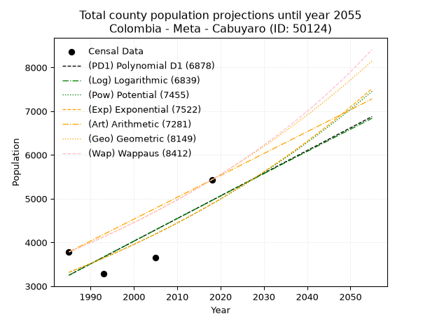
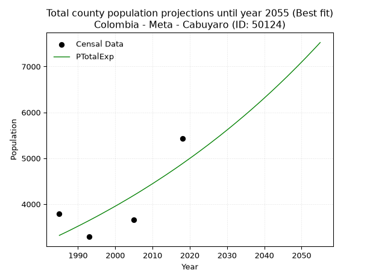
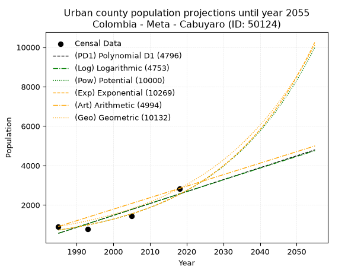
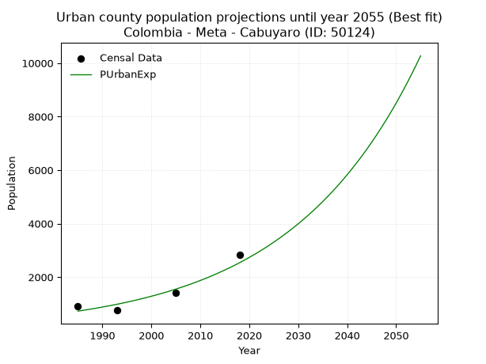
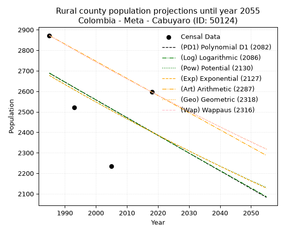
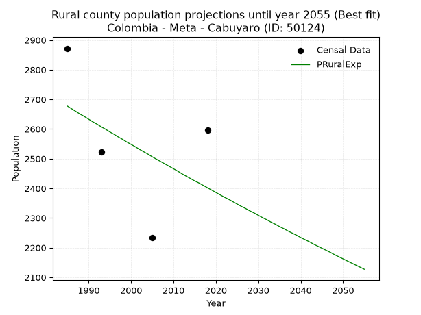

<div align="center">


</div>

# _“Population and Public Services Demand Projections (PPSD) until Year 2050 for Colombia - Meta - Cabuyaro (ID: 50124)”_
Keywords: `population` `public-service` `projection` `lineal` `polynomial` `logarithmic` `potential` `exponential` `arithmetic` `geometric` `wappaus` `dane` `colombia` `south-america`

PPSD are analytical estimates used by governments and planners to anticipate future changes in population size, age distribution, and the resulting community needs for utilities, healthcare, education, and infrastructure as sizing future water treatment facilities, electrical grids, and road networks based on spatial growth.

> **General running parameters**: • app_version: _v20260806_. • Python version: _3.14.7_. • Pandas version: _3.0.5_. • NumPy version: _2.5.1_. • Creates, save and include plots into reports (create_plot): _False_. • Projection until year: _2050_. • Process polynomial degree 2 and up: _False_. • Process Wappaus: _True_. • Process Wappaus: _True_. • Set negative values to zero: _True_. • Set infinite values to zero: _True_. • Drop dataset notes: _True_. 
<div align="center">

Dynamic map: [:earth_americas:Google](http://maps.google.com/maps?q=4.286704686,-72.7917676) [:earth_americas:OSM](https://www.openstreetmap.org/#map=18/4.286704686/-72.7917676&layers=P) [:earth_americas:Bing](https://www.bing.com/maps?cp=4.286704686~-72.7917676&lvl=18) [:earth_americas:Apple](https://maps.apple.com/frame?center=4.286704686%2C-72.7917676&span=0.003%2C0.006)

</div>


<div align="center">

```geojson
{
  "type": "Feature",
  "geometry": {
    "type": "Point", 
    "coordinates": [-72.7917676, 4.286704686]
  }, 
  "properties": {
    "Name": "Colombia - Meta - Cabuyaro (ID: 50124)"
  }
}
```

</div>


## 0. Census Data (4 records)

Census data are official statistics collected by a government about the people and housing in a country. They usually include counts of total population, age, sex, race, income, education, and jobs.

📅Global census file: [Population.xlsx](../data/Population.xlsx)

| Source   |   Year |   CountryID | CountryName   |   StateID | StateName   |   CountyID | CountyName   |   PTotal |   PUrban |   PRural |
|:---------|-------:|------------:|:--------------|----------:|:------------|-----------:|:-------------|---------:|---------:|---------:|
| DANE     |   1985 |          57 | Colombia      |        50 | Meta        |      50124 | Cabuyaro     |     3783 |      911 |     2872 |
| DANE     |   1993 |          57 | Colombia      |        50 | Meta        |      50124 | Cabuyaro     |     3288 |      766 |     2522 |
| DANE     |   2005 |          57 | Colombia      |        50 | Meta        |      50124 | Cabuyaro     |     3660 |     1426 |     2234 |
| DANE     |   2018 |          57 | Colombia      |        50 | Meta        |      50124 | Cabuyaro     |     5432 |     2836 |     2596 |

> 🔥Some records has specific notes about the registered values or the corresponding urban or rural distribution.

## 1. Total

### 1.1. Coefficients and Parameters

* (PD1) Polynomial Deg 1: 51.8253713368114, -99622.949016457 (lineal)
* (Log) Logarithmic: 103543.27956677268, -782992.5477308077
* (Pow) Potential: 23.35907988173325, -73.51179192677061
* (Exp) Exponential: 0.011692477553483393, 2.7610596679694067e-07
* (Art) Arithmetic: Year diff. 2018 - 1985 = 33, Population diff. 5432 - 3783 = 1649, Annual growth = 49.96969696969697
* (Geo) Geometric: Year diff. 2018 - 1985 = 33, Population diff. 5432 - 3783 = 1649, Annual growth % = 0.011023652264461559
* (Wap) Wappaus: i = 1.0845295055821371, Condition values only valid for < 200)

<sub>
Wappaus condition values: ['0.00', '1.08', '2.17', '3.25', '4.34', '5.42', '6.51', '7.59', '8.68', '9.76', '10.85', '11.93', '13.01', '14.10', '15.18', '16.27', '17.35', '18.44', '19.52', '20.61', '21.69', '22.78', '23.86', '24.94', '26.03', '27.11', '28.20', '29.28', '30.37', '31.45', '32.54', '33.62', '34.70', '35.79', '36.87', '37.96', '39.04', '40.13', '41.21', '42.30', '43.38', '44.47', '45.55', '46.63', '47.72', '48.80', '49.89', '50.97', '52.06', '53.14', '54.23', '55.31', '56.40', '57.48', '58.56', '59.65', '60.73', '61.82', '62.90', '63.99', '65.07', '66.16', '67.24', '68.33', '69.41', '70.49']
</sub>


### 1.2. Projected Dataset

|   Year |   CountyID |   PTotalPD1 |   PTotalLog |   PTotalPow |   PTotalExp |   PTotalArt |   PTotalGeo |   PTotalWap |
|-------:|-----------:|------------:|------------:|------------:|------------:|------------:|------------:|------------:|
|   1985 |      50124 |        3250 |        3250 |        3318 |        3318 |        3783 |        3783 |        3783 |
|   1986 |      50124 |        3302 |        3302 |        3357 |        3357 |        3833 |        3825 |        3824 |
|   1987 |      50124 |        3354 |        3355 |        3397 |        3396 |        3883 |        3867 |        3866 |
|   1988 |      50124 |        3406 |        3407 |        3437 |        3436 |        3933 |        3909 |        3908 |
|   1989 |      50124 |        3458 |        3459 |        3478 |        3477 |        3983 |        3953 |        3951 |
|   1990 |      50124 |        3510 |        3511 |        3519 |        3518 |        4033 |        3996 |        3994 |
|   1991 |      50124 |        3561 |        3563 |        3560 |        3559 |        4083 |        4040 |        4037 |
|   1992 |      50124 |        3613 |        3615 |        3602 |        3601 |        4133 |        4085 |        4082 |
|   1993 |      50124 |        3665 |        3667 |        3645 |        3643 |        4183 |        4130 |        4126 |
|   1994 |      50124 |        3717 |        3719 |        3688 |        3686 |        4233 |        4175 |        4171 |
|   1995 |      50124 |        3769 |        3771 |        3731 |        3729 |        4283 |        4221 |        4217 |
|   1996 |      50124 |        3820 |        3823 |        3775 |        3773 |        4333 |        4268 |        4263 |
|   1997 |      50124 |        3872 |        3874 |        3819 |        3818 |        4383 |        4315 |        4310 |
|   1998 |      50124 |        3924 |        3926 |        3864 |        3863 |        4433 |        4362 |        4357 |
|   1999 |      50124 |        3976 |        3978 |        3910 |        3908 |        4483 |        4411 |        4405 |
|   2000 |      50124 |        4028 |        4030 |        3956 |        3954 |        4533 |        4459 |        4453 |
|   2001 |      50124 |        4080 |        4082 |        4002 |        4000 |        4583 |        4508 |        4502 |
|   2002 |      50124 |        4131 |        4133 |        4049 |        4048 |        4632 |        4558 |        4551 |
|   2003 |      50124 |        4183 |        4185 |        4097 |        4095 |        4682 |        4608 |        4601 |
|   2004 |      50124 |        4235 |        4237 |        4145 |        4143 |        4732 |        4659 |        4652 |
|   2005 |      50124 |        4287 |        4288 |        4193 |        4192 |        4782 |        4710 |        4703 |
|   2006 |      50124 |        4339 |        4340 |        4242 |        4241 |        4832 |        4762 |        4755 |
|   2007 |      50124 |        4391 |        4392 |        4292 |        4291 |        4882 |        4815 |        4808 |
|   2008 |      50124 |        4442 |        4443 |        4342 |        4342 |        4932 |        4868 |        4861 |
|   2009 |      50124 |        4494 |        4495 |        4393 |        4393 |        4982 |        4922 |        4915 |
|   2010 |      50124 |        4546 |        4546 |        4445 |        4444 |        5032 |        4976 |        4970 |
|   2011 |      50124 |        4598 |        4598 |        4496 |        4497 |        5082 |        5031 |        5025 |
|   2012 |      50124 |        4650 |        4649 |        4549 |        4550 |        5132 |        5086 |        5081 |
|   2013 |      50124 |        4702 |        4701 |        4602 |        4603 |        5182 |        5142 |        5137 |
|   2014 |      50124 |        4753 |        4752 |        4656 |        4657 |        5232 |        5199 |        5195 |
|   2015 |      50124 |        4805 |        4803 |        4710 |        4712 |        5282 |        5256 |        5253 |
|   2016 |      50124 |        4857 |        4855 |        4765 |        4767 |        5332 |        5314 |        5312 |
|   2017 |      50124 |        4909 |        4906 |        4821 |        4823 |        5382 |        5373 |        5372 |
|   2018 |      50124 |        4961 |        4958 |        4877 |        4880 |        5432 |        5432 |        5432 |
|   2019 |      50124 |        5012 |        5009 |        4933 |        4938 |        5482 |        5492 |        5493 |
|   2020 |      50124 |        5064 |        5060 |        4991 |        4996 |        5532 |        5552 |        5555 |
|   2021 |      50124 |        5116 |        5111 |        5049 |        5054 |        5582 |        5614 |        5618 |
|   2022 |      50124 |        5168 |        5163 |        5108 |        5114 |        5632 |        5676 |        5682 |
|   2023 |      50124 |        5220 |        5214 |        5167 |        5174 |        5682 |        5738 |        5747 |
|   2024 |      50124 |        5272 |        5265 |        5227 |        5235 |        5732 |        5801 |        5812 |
|   2025 |      50124 |        5323 |        5316 |        5288 |        5296 |        5782 |        5865 |        5879 |
|   2026 |      50124 |        5375 |        5367 |        5349 |        5359 |        5832 |        5930 |        5946 |
|   2027 |      50124 |        5427 |        5418 |        5411 |        5422 |        5882 |        5995 |        6014 |
|   2028 |      50124 |        5479 |        5469 |        5474 |        5485 |        5932 |        6061 |        6084 |
|   2029 |      50124 |        5531 |        5520 |        5537 |        5550 |        5982 |        6128 |        6154 |
|   2030 |      50124 |        5583 |        5571 |        5601 |        5615 |        6032 |        6196 |        6225 |
|   2031 |      50124 |        5634 |        5622 |        5666 |        5681 |        6082 |        6264 |        6297 |
|   2032 |      50124 |        5686 |        5673 |        5731 |        5748 |        6132 |        6333 |        6371 |
|   2033 |      50124 |        5738 |        5724 |        5798 |        5816 |        6182 |        6403 |        6445 |
|   2034 |      50124 |        5790 |        5775 |        5865 |        5884 |        6232 |        6474 |        6521 |
|   2035 |      50124 |        5842 |        5826 |        5932 |        5953 |        6281 |        6545 |        6597 |
|   2036 |      50124 |        5894 |        5877 |        6001 |        6023 |        6331 |        6617 |        6675 |
|   2037 |      50124 |        5945 |        5928 |        6070 |        6094 |        6381 |        6690 |        6754 |
|   2038 |      50124 |        5997 |        5979 |        6140 |        6166 |        6431 |        6764 |        6834 |
|   2039 |      50124 |        6049 |        6029 |        6211 |        6238 |        6481 |        6838 |        6916 |
|   2040 |      50124 |        6101 |        6080 |        6282 |        6312 |        6531 |        6914 |        6999 |
|   2041 |      50124 |        6153 |        6131 |        6355 |        6386 |        6581 |        6990 |        7083 |
|   2042 |      50124 |        6204 |        6182 |        6428 |        6461 |        6631 |        7067 |        7168 |
|   2043 |      50124 |        6256 |        6232 |        6502 |        6537 |        6681 |        7145 |        7254 |
|   2044 |      50124 |        6308 |        6283 |        6577 |        6614 |        6731 |        7224 |        7342 |
|   2045 |      50124 |        6360 |        6334 |        6652 |        6692 |        6781 |        7303 |        7432 |
|   2046 |      50124 |        6412 |        6384 |        6728 |        6770 |        6831 |        7384 |        7523 |
|   2047 |      50124 |        6464 |        6435 |        6806 |        6850 |        6881 |        7465 |        7615 |
|   2048 |      50124 |        6515 |        6486 |        6884 |        6931 |        6931 |        7547 |        7709 |
|   2049 |      50124 |        6567 |        6536 |        6963 |        7012 |        6981 |        7631 |        7804 |
|   2050 |      50124 |        6619 |        6587 |        7043 |        7095 |        7031 |        7715 |        7901 |
<div align="center">

</img>

</div>


### 1.3. Best fit with absolute error and relative error (%)

Relative error puts that difference into context by dividing the absolute error by the true value, creating a unitless ratio or percentage that shows the scale of the mistake.

Absolute and relative error

|   Year | Source   |   CountryID | CountryName   |   StateID | StateName   |   CountyID_x | CountyName   |   PTotal |   PUrban |   PRural |   CountyID_y |   PTotalPD1 |   PTotalLog |   PTotalPow |   PTotalExp |   PTotalArt |   PTotalGeo |   PTotalWap |   PTotalPD1AbsError |   PTotalLogAbsError |   PTotalPowAbsError |   PTotalExpAbsError |   PTotalArtAbsError |   PTotalGeoAbsError |   PTotalWapAbsError |   PTotalPD1RelError |   PTotalLogRelError |   PTotalPowRelError |   PTotalExpRelError |   PTotalArtRelError |   PTotalGeoRelError |   PTotalWapRelError |
|-------:|:---------|------------:|:--------------|----------:|:------------|-------------:|:-------------|---------:|---------:|---------:|-------------:|------------:|------------:|------------:|------------:|------------:|------------:|------------:|--------------------:|--------------------:|--------------------:|--------------------:|--------------------:|--------------------:|--------------------:|--------------------:|--------------------:|--------------------:|--------------------:|--------------------:|--------------------:|--------------------:|
|   1985 | DANE     |          57 | Colombia      |        50 | Meta        |        50124 | Cabuyaro     |     3783 |      911 |     2872 |        50124 |        3250 |        3250 |        3318 |        3318 |        3783 |        3783 |        3783 |                 533 |                 533 |                 465 |                 465 |                   0 |                   0 |                   0 |            14.0893  |            14.0893  |             12.2918 |             12.2918 |              0      |              0      |              0      |
|   1993 | DANE     |          57 | Colombia      |        50 | Meta        |        50124 | Cabuyaro     |     3288 |      766 |     2522 |        50124 |        3665 |        3667 |        3645 |        3643 |        4183 |        4130 |        4126 |                 377 |                 379 |                 357 |                 355 |                 895 |                 842 |                 838 |            11.4659  |            11.5268  |             10.8577 |             10.7968 |             27.2202 |             25.6083 |             25.4866 |
|   2005 | DANE     |          57 | Colombia      |        50 | Meta        |        50124 | Cabuyaro     |     3660 |     1426 |     2234 |        50124 |        4287 |        4288 |        4193 |        4192 |        4782 |        4710 |        4703 |                 627 |                 628 |                 533 |                 532 |                1122 |                1050 |                1043 |            17.1311  |            17.1585  |             14.5628 |             14.5355 |             30.6557 |             28.6885 |             28.4973 |
|   2018 | DANE     |          57 | Colombia      |        50 | Meta        |        50124 | Cabuyaro     |     5432 |     2836 |     2596 |        50124 |        4961 |        4958 |        4877 |        4880 |        5432 |        5432 |        5432 |                 471 |                 474 |                 555 |                 552 |                   0 |                   0 |                   0 |             8.67084 |             8.72607 |             10.2172 |             10.162  |              0      |              0      |              0      |

Relative error mean

| Method    |   RelError | Best   |
|:----------|-----------:|:-------|
| PTotalPD1 |    12.8393 |        |
| PTotalLog |    12.8752 |        |
| PTotalPow |    11.9824 |        |
| PTotalExp |    11.9465 | True   |
| PTotalArt |    14.469  |        |
| PTotalGeo |    13.5742 |        |
| PTotalWap |    13.496  |        |

💙Best method: _**PTotalExp**_
<div align="center">

</img>

</div>


### 1.4. Fresh water supply demand in liters per capita per day (lpcd)

The fresh water supply demand typically ranges from 100 to 300 liters per capita per day (lpcd) for standard domestic and municipal planning, though absolute survival minimums set by the World Health Organization are as low as 7.5 to 20 liters per day, and total consumption in high-income nations can exceed 400 liters.

> `CZ`: Level in meters above the sea level (masl).<br> `WS`: Fresh water supply demand in liters per capita per day (lpcd or l/h/d).<br> `WSAll`: Zonal fresh water supply demand in liters per second (l/s).<br> `A`: Zonal area in square meters.

Reference values (RAS Colombia)

|    CZ |   WS |
|------:|-----:|
|  1000 |  120 |
|  2000 |  130 |
| 99999 |  140 |

County shapefile geometry properties and water supply values

|   CountyID |      ATotal |   CZTotal |   WSTotal |
|-----------:|------------:|----------:|----------:|
|      50124 | 9.11844e+08 |   182.069 |       120 |

Projected values for best method: PTotalExp

|   CountyID |   Year |   PTotalExp |   WSTotal |   WSTotalAll |
|-----------:|-------:|------------:|----------:|-------------:|
|      50124 |   1985 |        3318 |       120 |      4.60833 |
|      50124 |   1986 |        3357 |       120 |      4.6625  |
|      50124 |   1987 |        3396 |       120 |      4.71667 |
|      50124 |   1988 |        3436 |       120 |      4.77222 |
|      50124 |   1989 |        3477 |       120 |      4.82917 |
|      50124 |   1990 |        3518 |       120 |      4.88611 |
|      50124 |   1991 |        3559 |       120 |      4.94306 |
|      50124 |   1992 |        3601 |       120 |      5.00139 |
|      50124 |   1993 |        3643 |       120 |      5.05972 |
|      50124 |   1994 |        3686 |       120 |      5.11944 |
|      50124 |   1995 |        3729 |       120 |      5.17917 |
|      50124 |   1996 |        3773 |       120 |      5.24028 |
|      50124 |   1997 |        3818 |       120 |      5.30278 |
|      50124 |   1998 |        3863 |       120 |      5.36528 |
|      50124 |   1999 |        3908 |       120 |      5.42778 |
|      50124 |   2000 |        3954 |       120 |      5.49167 |
|      50124 |   2001 |        4000 |       120 |      5.55556 |
|      50124 |   2002 |        4048 |       120 |      5.62222 |
|      50124 |   2003 |        4095 |       120 |      5.6875  |
|      50124 |   2004 |        4143 |       120 |      5.75417 |
|      50124 |   2005 |        4192 |       120 |      5.82222 |
|      50124 |   2006 |        4241 |       120 |      5.89028 |
|      50124 |   2007 |        4291 |       120 |      5.95972 |
|      50124 |   2008 |        4342 |       120 |      6.03056 |
|      50124 |   2009 |        4393 |       120 |      6.10139 |
|      50124 |   2010 |        4444 |       120 |      6.17222 |
|      50124 |   2011 |        4497 |       120 |      6.24583 |
|      50124 |   2012 |        4550 |       120 |      6.31944 |
|      50124 |   2013 |        4603 |       120 |      6.39306 |
|      50124 |   2014 |        4657 |       120 |      6.46806 |
|      50124 |   2015 |        4712 |       120 |      6.54444 |
|      50124 |   2016 |        4767 |       120 |      6.62083 |
|      50124 |   2017 |        4823 |       120 |      6.69861 |
|      50124 |   2018 |        4880 |       120 |      6.77778 |
|      50124 |   2019 |        4938 |       120 |      6.85833 |
|      50124 |   2020 |        4996 |       120 |      6.93889 |
|      50124 |   2021 |        5054 |       120 |      7.01944 |
|      50124 |   2022 |        5114 |       120 |      7.10278 |
|      50124 |   2023 |        5174 |       120 |      7.18611 |
|      50124 |   2024 |        5235 |       120 |      7.27083 |
|      50124 |   2025 |        5296 |       120 |      7.35556 |
|      50124 |   2026 |        5359 |       120 |      7.44306 |
|      50124 |   2027 |        5422 |       120 |      7.53056 |
|      50124 |   2028 |        5485 |       120 |      7.61806 |
|      50124 |   2029 |        5550 |       120 |      7.70833 |
|      50124 |   2030 |        5615 |       120 |      7.79861 |
|      50124 |   2031 |        5681 |       120 |      7.89028 |
|      50124 |   2032 |        5748 |       120 |      7.98333 |
|      50124 |   2033 |        5816 |       120 |      8.07778 |
|      50124 |   2034 |        5884 |       120 |      8.17222 |
|      50124 |   2035 |        5953 |       120 |      8.26806 |
|      50124 |   2036 |        6023 |       120 |      8.36528 |
|      50124 |   2037 |        6094 |       120 |      8.46389 |
|      50124 |   2038 |        6166 |       120 |      8.56389 |
|      50124 |   2039 |        6238 |       120 |      8.66389 |
|      50124 |   2040 |        6312 |       120 |      8.76667 |
|      50124 |   2041 |        6386 |       120 |      8.86944 |
|      50124 |   2042 |        6461 |       120 |      8.97361 |
|      50124 |   2043 |        6537 |       120 |      9.07917 |
|      50124 |   2044 |        6614 |       120 |      9.18611 |
|      50124 |   2045 |        6692 |       120 |      9.29444 |
|      50124 |   2046 |        6770 |       120 |      9.40278 |
|      50124 |   2047 |        6850 |       120 |      9.51389 |
|      50124 |   2048 |        6931 |       120 |      9.62639 |
|      50124 |   2049 |        7012 |       120 |      9.73889 |
|      50124 |   2050 |        7095 |       120 |      9.85417 |

## 2. Urban

### 2.1. Coefficients and Parameters

* (PD1) Polynomial Deg 1: 60.48374146928853, -119497.85387394438 (lineal)
* (Log) Logarithmic: 120948.21327511665, -917843.5883223156
* (Pow) Potential: 75.61071117719361, -246.48404847317522
* (Exp) Exponential: 0.03780376787895146, 1.8732820114805935e-30
* (Art) Arithmetic: Year diff. 2018 - 1985 = 33, Population diff. 2836 - 911 = 1925, Annual growth = 58.333333333333336
* (Geo) Geometric: Year diff. 2018 - 1985 = 33, Population diff. 2836 - 911 = 1925, Annual growth % = 0.03501128810777687
* (Wap) Wappaus: i = 3.1136019927052754, Condition values only valid for < 200)

<sub>
Wappaus condition values: ['0.00', '3.11', '6.23', '9.34', '12.45', '15.57', '18.68', '21.80', '24.91', '28.02', '31.14', '34.25', '37.36', '40.48', '43.59', '46.70', '49.82', '52.93', '56.04', '59.16', '62.27', '65.39', '68.50', '71.61', '74.73', '77.84', '80.95', '84.07', '87.18', '90.29', '93.41', '96.52', '99.64', '102.75', '105.86', '108.98', '112.09', '115.20', '118.32', '121.43', '124.54', '127.66', '130.77', '133.88', '137.00', '140.11', '143.23', '146.34', '149.45', '152.57', '155.68', '158.79', '161.91', '165.02', '168.13', '171.25', '174.36', '177.48', '180.59', '183.70', '186.82', '189.93', '193.04', '196.16', '199.27', '202.38']
</sub>


### 2.2. Projected Dataset

|   Year |   CountyID |   PUrbanPD1 |   PUrbanLog |   PUrbanPow |   PUrbanExp |   PUrbanArt |   PUrbanGeo |
|-------:|-----------:|------------:|------------:|------------:|------------:|------------:|------------:|
|   1985 |      50124 |         562 |         561 |         728 |         728 |         911 |         911 |
|   1986 |      50124 |         623 |         622 |         756 |         756 |         969 |         943 |
|   1987 |      50124 |         683 |         683 |         785 |         785 |        1028 |         976 |
|   1988 |      50124 |         744 |         744 |         816 |         816 |        1086 |        1010 |
|   1989 |      50124 |         804 |         805 |         847 |         847 |        1144 |        1045 |
|   1990 |      50124 |         865 |         866 |         880 |         880 |        1203 |        1082 |
|   1991 |      50124 |         925 |         926 |         914 |         914 |        1261 |        1120 |
|   1992 |      50124 |         986 |         987 |         950 |         949 |        1319 |        1159 |
|   1993 |      50124 |        1046 |        1048 |         986 |         985 |        1378 |        1200 |
|   1994 |      50124 |        1107 |        1109 |        1025 |        1023 |        1436 |        1242 |
|   1995 |      50124 |        1167 |        1169 |        1064 |        1063 |        1494 |        1285 |
|   1996 |      50124 |        1228 |        1230 |        1105 |        1104 |        1553 |        1330 |
|   1997 |      50124 |        1288 |        1290 |        1148 |        1146 |        1611 |        1377 |
|   1998 |      50124 |        1349 |        1351 |        1192 |        1190 |        1669 |        1425 |
|   1999 |      50124 |        1409 |        1411 |        1238 |        1236 |        1728 |        1475 |
|   2000 |      50124 |        1470 |        1472 |        1286 |        1284 |        1786 |        1526 |
|   2001 |      50124 |        1530 |        1532 |        1335 |        1333 |        1844 |        1580 |
|   2002 |      50124 |        1591 |        1593 |        1387 |        1385 |        1903 |        1635 |
|   2003 |      50124 |        1651 |        1653 |        1440 |        1438 |        1961 |        1693 |
|   2004 |      50124 |        1712 |        1714 |        1495 |        1494 |        2019 |        1752 |
|   2005 |      50124 |        1772 |        1774 |        1553 |        1551 |        2078 |        1813 |
|   2006 |      50124 |        1833 |        1834 |        1613 |        1611 |        2136 |        1877 |
|   2007 |      50124 |        1893 |        1895 |        1675 |        1673 |        2194 |        1942 |
|   2008 |      50124 |        1953 |        1955 |        1739 |        1737 |        2253 |        2010 |
|   2009 |      50124 |        2014 |        2015 |        1806 |        1804 |        2311 |        2081 |
|   2010 |      50124 |        2074 |        2075 |        1875 |        1874 |        2369 |        2154 |
|   2011 |      50124 |        2135 |        2135 |        1947 |        1946 |        2428 |        2229 |
|   2012 |      50124 |        2195 |        2196 |        2021 |        2021 |        2486 |        2307 |
|   2013 |      50124 |        2256 |        2256 |        2099 |        2099 |        2544 |        2388 |
|   2014 |      50124 |        2316 |        2316 |        2179 |        2180 |        2603 |        2471 |
|   2015 |      50124 |        2377 |        2376 |        2262 |        2264 |        2661 |        2558 |
|   2016 |      50124 |        2437 |        2436 |        2349 |        2351 |        2719 |        2647 |
|   2017 |      50124 |        2498 |        2496 |        2438 |        2441 |        2778 |        2740 |
|   2018 |      50124 |        2558 |        2556 |        2532 |        2535 |        2836 |        2836 |
|   2019 |      50124 |        2619 |        2616 |        2628 |        2633 |        2894 |        2935 |
|   2020 |      50124 |        2679 |        2675 |        2728 |        2735 |        2953 |        3038 |
|   2021 |      50124 |        2740 |        2735 |        2833 |        2840 |        3011 |        3144 |
|   2022 |      50124 |        2800 |        2795 |        2940 |        2949 |        3069 |        3255 |
|   2023 |      50124 |        2861 |        2855 |        3052 |        3063 |        3128 |        3368 |
|   2024 |      50124 |        2921 |        2915 |        3169 |        3181 |        3186 |        3486 |
|   2025 |      50124 |        2982 |        2974 |        3289 |        3304 |        3244 |        3608 |
|   2026 |      50124 |        3042 |        3034 |        3414 |        3431 |        3303 |        3735 |
|   2027 |      50124 |        3103 |        3094 |        3544 |        3563 |        3361 |        3866 |
|   2028 |      50124 |        3163 |        3154 |        3679 |        3700 |        3419 |        4001 |
|   2029 |      50124 |        3224 |        3213 |        3819 |        3843 |        3478 |        4141 |
|   2030 |      50124 |        3284 |        3273 |        3964 |        3991 |        3536 |        4286 |
|   2031 |      50124 |        3345 |        3332 |        4114 |        4145 |        3594 |        4436 |
|   2032 |      50124 |        3405 |        3392 |        4270 |        4304 |        3653 |        4591 |
|   2033 |      50124 |        3466 |        3451 |        4432 |        4470 |        3711 |        4752 |
|   2034 |      50124 |        3526 |        3511 |        4600 |        4642 |        3769 |        4918 |
|   2035 |      50124 |        3587 |        3570 |        4774 |        4821 |        3828 |        5091 |
|   2036 |      50124 |        3647 |        3630 |        4954 |        5007 |        3886 |        5269 |
|   2037 |      50124 |        3708 |        3689 |        5142 |        5200 |        3944 |        5453 |
|   2038 |      50124 |        3768 |        3748 |        5336 |        5400 |        4003 |        5644 |
|   2039 |      50124 |        3828 |        3808 |        5538 |        5608 |        4061 |        5842 |
|   2040 |      50124 |        3889 |        3867 |        5747 |        5824 |        4119 |        6046 |
|   2041 |      50124 |        3949 |        3926 |        5964 |        6049 |        4178 |        6258 |
|   2042 |      50124 |        4010 |        3986 |        6189 |        6282 |        4236 |        6477 |
|   2043 |      50124 |        4070 |        4045 |        6422 |        6524 |        4294 |        6704 |
|   2044 |      50124 |        4131 |        4104 |        6664 |        6775 |        4353 |        6939 |
|   2045 |      50124 |        4191 |        4163 |        6916 |        7036 |        4411 |        7182 |
|   2046 |      50124 |        4252 |        4222 |        7176 |        7307 |        4469 |        7433 |
|   2047 |      50124 |        4312 |        4281 |        7446 |        7589 |        4528 |        7693 |
|   2048 |      50124 |        4373 |        4340 |        7726 |        7881 |        4586 |        7963 |
|   2049 |      50124 |        4433 |        4399 |        8017 |        8185 |        4644 |        8241 |
|   2050 |      50124 |        4494 |        4459 |        8318 |        8500 |        4703 |        8530 |
<div align="center">

</img>

</div>


### 2.3. Best fit with absolute error and relative error (%)

Relative error puts that difference into context by dividing the absolute error by the true value, creating a unitless ratio or percentage that shows the scale of the mistake.

Absolute and relative error

|   Year | Source   |   CountryID | CountryName   |   StateID | StateName   |   CountyID_x | CountyName   |   PTotal |   PUrban |   PRural |   CountyID_y |   PUrbanPD1 |   PUrbanLog |   PUrbanPow |   PUrbanExp |   PUrbanArt |   PUrbanGeo |   PUrbanPD1AbsError |   PUrbanLogAbsError |   PUrbanPowAbsError |   PUrbanExpAbsError |   PUrbanArtAbsError |   PUrbanGeoAbsError |   PUrbanPD1RelError |   PUrbanLogRelError |   PUrbanPowRelError |   PUrbanExpRelError |   PUrbanArtRelError |   PUrbanGeoRelError |
|-------:|:---------|------------:|:--------------|----------:|:------------|-------------:|:-------------|---------:|---------:|---------:|-------------:|------------:|------------:|------------:|------------:|------------:|------------:|--------------------:|--------------------:|--------------------:|--------------------:|--------------------:|--------------------:|--------------------:|--------------------:|--------------------:|--------------------:|--------------------:|--------------------:|
|   1985 | DANE     |          57 | Colombia      |        50 | Meta        |        50124 | Cabuyaro     |     3783 |      911 |     2872 |        50124 |         562 |         561 |         728 |         728 |         911 |         911 |                 349 |                 350 |                 183 |                 183 |                   0 |                   0 |            38.3095  |            38.4193  |            20.0878  |            20.0878  |              0      |              0      |
|   1993 | DANE     |          57 | Colombia      |        50 | Meta        |        50124 | Cabuyaro     |     3288 |      766 |     2522 |        50124 |        1046 |        1048 |         986 |         985 |        1378 |        1200 |                 280 |                 282 |                 220 |                 219 |                 612 |                 434 |            36.5535  |            36.8146  |            28.7206  |            28.5901  |             79.8956 |             56.658  |
|   2005 | DANE     |          57 | Colombia      |        50 | Meta        |        50124 | Cabuyaro     |     3660 |     1426 |     2234 |        50124 |        1772 |        1774 |        1553 |        1551 |        2078 |        1813 |                 346 |                 348 |                 127 |                 125 |                 652 |                 387 |            24.2637  |            24.4039  |             8.90603 |             8.76578 |             45.7223 |             27.1388 |
|   2018 | DANE     |          57 | Colombia      |        50 | Meta        |        50124 | Cabuyaro     |     5432 |     2836 |     2596 |        50124 |        2558 |        2556 |        2532 |        2535 |        2836 |        2836 |                 278 |                 280 |                 304 |                 301 |                   0 |                   0 |             9.80254 |             9.87306 |            10.7193  |            10.6135  |              0      |              0      |

Relative error mean

| Method    |   RelError | Best   |
|:----------|-----------:|:-------|
| PUrbanPD1 |    27.2323 |        |
| PUrbanLog |    27.3777 |        |
| PUrbanPow |    17.1084 |        |
| PUrbanExp |    17.0143 | True   |
| PUrbanArt |    31.4045 |        |
| PUrbanGeo |    20.9492 |        |

💙Best method: _**PUrbanExp**_
<div align="center">

</img>

</div>


### 2.4. Fresh water supply demand in liters per capita per day (lpcd)

The fresh water supply demand typically ranges from 100 to 300 liters per capita per day (lpcd) for standard domestic and municipal planning, though absolute survival minimums set by the World Health Organization are as low as 7.5 to 20 liters per day, and total consumption in high-income nations can exceed 400 liters.

> `CZ`: Level in meters above the sea level (masl).<br> `WS`: Fresh water supply demand in liters per capita per day (lpcd or l/h/d).<br> `WSAll`: Zonal fresh water supply demand in liters per second (l/s).<br> `A`: Zonal area in square meters.

Reference values (RAS Colombia)

|    CZ |   WS |
|------:|-----:|
|  1000 |  120 |
|  2000 |  130 |
| 99999 |  140 |

County shapefile geometry properties and water supply values

|   CountyID |      AUrban |   CZUrban |   WSUrban |
|-----------:|------------:|----------:|----------:|
|      50124 | 1.08653e+06 |   169.354 |       120 |

Projected values for best method: PUrbanExp

|   CountyID |   Year |   PUrbanExp |   WSUrban |   WSUrbanAll |
|-----------:|-------:|------------:|----------:|-------------:|
|      50124 |   1985 |         728 |       120 |      1.01111 |
|      50124 |   1986 |         756 |       120 |      1.05    |
|      50124 |   1987 |         785 |       120 |      1.09028 |
|      50124 |   1988 |         816 |       120 |      1.13333 |
|      50124 |   1989 |         847 |       120 |      1.17639 |
|      50124 |   1990 |         880 |       120 |      1.22222 |
|      50124 |   1991 |         914 |       120 |      1.26944 |
|      50124 |   1992 |         949 |       120 |      1.31806 |
|      50124 |   1993 |         985 |       120 |      1.36806 |
|      50124 |   1994 |        1023 |       120 |      1.42083 |
|      50124 |   1995 |        1063 |       120 |      1.47639 |
|      50124 |   1996 |        1104 |       120 |      1.53333 |
|      50124 |   1997 |        1146 |       120 |      1.59167 |
|      50124 |   1998 |        1190 |       120 |      1.65278 |
|      50124 |   1999 |        1236 |       120 |      1.71667 |
|      50124 |   2000 |        1284 |       120 |      1.78333 |
|      50124 |   2001 |        1333 |       120 |      1.85139 |
|      50124 |   2002 |        1385 |       120 |      1.92361 |
|      50124 |   2003 |        1438 |       120 |      1.99722 |
|      50124 |   2004 |        1494 |       120 |      2.075   |
|      50124 |   2005 |        1551 |       120 |      2.15417 |
|      50124 |   2006 |        1611 |       120 |      2.2375  |
|      50124 |   2007 |        1673 |       120 |      2.32361 |
|      50124 |   2008 |        1737 |       120 |      2.4125  |
|      50124 |   2009 |        1804 |       120 |      2.50556 |
|      50124 |   2010 |        1874 |       120 |      2.60278 |
|      50124 |   2011 |        1946 |       120 |      2.70278 |
|      50124 |   2012 |        2021 |       120 |      2.80694 |
|      50124 |   2013 |        2099 |       120 |      2.91528 |
|      50124 |   2014 |        2180 |       120 |      3.02778 |
|      50124 |   2015 |        2264 |       120 |      3.14444 |
|      50124 |   2016 |        2351 |       120 |      3.26528 |
|      50124 |   2017 |        2441 |       120 |      3.39028 |
|      50124 |   2018 |        2535 |       120 |      3.52083 |
|      50124 |   2019 |        2633 |       120 |      3.65694 |
|      50124 |   2020 |        2735 |       120 |      3.79861 |
|      50124 |   2021 |        2840 |       120 |      3.94444 |
|      50124 |   2022 |        2949 |       120 |      4.09583 |
|      50124 |   2023 |        3063 |       120 |      4.25417 |
|      50124 |   2024 |        3181 |       120 |      4.41806 |
|      50124 |   2025 |        3304 |       120 |      4.58889 |
|      50124 |   2026 |        3431 |       120 |      4.76528 |
|      50124 |   2027 |        3563 |       120 |      4.94861 |
|      50124 |   2028 |        3700 |       120 |      5.13889 |
|      50124 |   2029 |        3843 |       120 |      5.3375  |
|      50124 |   2030 |        3991 |       120 |      5.54306 |
|      50124 |   2031 |        4145 |       120 |      5.75694 |
|      50124 |   2032 |        4304 |       120 |      5.97778 |
|      50124 |   2033 |        4470 |       120 |      6.20833 |
|      50124 |   2034 |        4642 |       120 |      6.44722 |
|      50124 |   2035 |        4821 |       120 |      6.69583 |
|      50124 |   2036 |        5007 |       120 |      6.95417 |
|      50124 |   2037 |        5200 |       120 |      7.22222 |
|      50124 |   2038 |        5400 |       120 |      7.5     |
|      50124 |   2039 |        5608 |       120 |      7.78889 |
|      50124 |   2040 |        5824 |       120 |      8.08889 |
|      50124 |   2041 |        6049 |       120 |      8.40139 |
|      50124 |   2042 |        6282 |       120 |      8.725   |
|      50124 |   2043 |        6524 |       120 |      9.06111 |
|      50124 |   2044 |        6775 |       120 |      9.40972 |
|      50124 |   2045 |        7036 |       120 |      9.77222 |
|      50124 |   2046 |        7307 |       120 |     10.1486  |
|      50124 |   2047 |        7589 |       120 |     10.5403  |
|      50124 |   2048 |        7881 |       120 |     10.9458  |
|      50124 |   2049 |        8185 |       120 |     11.3681  |
|      50124 |   2050 |        8500 |       120 |     11.8056  |

## 3. Rural

### 3.1. Coefficients and Parameters

* (PD1) Polynomial Deg 1: -8.65837013247712, 19874.90485748736 (lineal)
* (Log) Logarithmic: -17404.933708343913, 134851.04059150754
* (Pow) Potential: -6.600675177540341, 25.19515868122661
* (Exp) Exponential: -0.003283004649144848, 1810370.2231243083
* (Art) Arithmetic: Year diff. 2018 - 1985 = 33, Population diff. 2596 - 2872 = -276, Annual growth = -8.363636363636363
* (Geo) Geometric: Year diff. 2018 - 1985 = 33, Population diff. 2596 - 2872 = -276, Annual growth % = -0.0030570405049074045
* (Wap) Wappaus: i = -0.3059120835272993, Condition values only valid for < 200)

<sub>
Wappaus condition values: ['-0.00', '-0.31', '-0.61', '-0.92', '-1.22', '-1.53', '-1.84', '-2.14', '-2.45', '-2.75', '-3.06', '-3.37', '-3.67', '-3.98', '-4.28', '-4.59', '-4.89', '-5.20', '-5.51', '-5.81', '-6.12', '-6.42', '-6.73', '-7.04', '-7.34', '-7.65', '-7.95', '-8.26', '-8.57', '-8.87', '-9.18', '-9.48', '-9.79', '-10.10', '-10.40', '-10.71', '-11.01', '-11.32', '-11.62', '-11.93', '-12.24', '-12.54', '-12.85', '-13.15', '-13.46', '-13.77', '-14.07', '-14.38', '-14.68', '-14.99', '-15.30', '-15.60', '-15.91', '-16.21', '-16.52', '-16.83', '-17.13', '-17.44', '-17.74', '-18.05', '-18.35', '-18.66', '-18.97', '-19.27', '-19.58', '-19.88']
</sub>


### 3.2. Projected Dataset

|   Year |   CountyID |   PRuralPD1 |   PRuralLog |   PRuralPow |   PRuralExp |   PRuralArt |   PRuralGeo |   PRuralWap |
|-------:|-----------:|------------:|------------:|------------:|------------:|------------:|------------:|------------:|
|   1985 |      50124 |        2688 |        2689 |        2677 |        2677 |        2872 |        2872 |        2872 |
|   1986 |      50124 |        2679 |        2680 |        2669 |        2668 |        2864 |        2863 |        2863 |
|   1987 |      50124 |        2671 |        2671 |        2660 |        2659 |        2855 |        2854 |        2854 |
|   1988 |      50124 |        2662 |        2663 |        2651 |        2650 |        2847 |        2846 |        2846 |
|   1989 |      50124 |        2653 |        2654 |        2642 |        2642 |        2839 |        2837 |        2837 |
|   1990 |      50124 |        2645 |        2645 |        2633 |        2633 |        2830 |        2828 |        2828 |
|   1991 |      50124 |        2636 |        2636 |        2625 |        2624 |        2822 |        2820 |        2820 |
|   1992 |      50124 |        2627 |        2628 |        2616 |        2616 |        2813 |        2811 |        2811 |
|   1993 |      50124 |        2619 |        2619 |        2607 |        2607 |        2805 |        2803 |        2803 |
|   1994 |      50124 |        2610 |        2610 |        2599 |        2599 |        2797 |        2794 |        2794 |
|   1995 |      50124 |        2601 |        2601 |        2590 |        2590 |        2788 |        2785 |        2785 |
|   1996 |      50124 |        2593 |        2593 |        2581 |        2582 |        2780 |        2777 |        2777 |
|   1997 |      50124 |        2584 |        2584 |        2573 |        2573 |        2772 |        2768 |        2768 |
|   1998 |      50124 |        2575 |        2575 |        2564 |        2565 |        2763 |        2760 |        2760 |
|   1999 |      50124 |        2567 |        2567 |        2556 |        2556 |        2755 |        2751 |        2752 |
|   2000 |      50124 |        2558 |        2558 |        2548 |        2548 |        2747 |        2743 |        2743 |
|   2001 |      50124 |        2550 |        2549 |        2539 |        2540 |        2738 |        2735 |        2735 |
|   2002 |      50124 |        2541 |        2540 |        2531 |        2531 |        2730 |        2726 |        2726 |
|   2003 |      50124 |        2532 |        2532 |        2523 |        2523 |        2721 |        2718 |        2718 |
|   2004 |      50124 |        2524 |        2523 |        2514 |        2515 |        2713 |        2710 |        2710 |
|   2005 |      50124 |        2515 |        2514 |        2506 |        2506 |        2705 |        2701 |        2701 |
|   2006 |      50124 |        2506 |        2506 |        2498 |        2498 |        2696 |        2693 |        2693 |
|   2007 |      50124 |        2498 |        2497 |        2490 |        2490 |        2688 |        2685 |        2685 |
|   2008 |      50124 |        2489 |        2488 |        2481 |        2482 |        2680 |        2677 |        2677 |
|   2009 |      50124 |        2480 |        2480 |        2473 |        2474 |        2671 |        2669 |        2669 |
|   2010 |      50124 |        2472 |        2471 |        2465 |        2466 |        2663 |        2660 |        2660 |
|   2011 |      50124 |        2463 |        2462 |        2457 |        2458 |        2655 |        2652 |        2652 |
|   2012 |      50124 |        2454 |        2454 |        2449 |        2449 |        2646 |        2644 |        2644 |
|   2013 |      50124 |        2446 |        2445 |        2441 |        2441 |        2638 |        2636 |        2636 |
|   2014 |      50124 |        2437 |        2436 |        2433 |        2433 |        2629 |        2628 |        2628 |
|   2015 |      50124 |        2428 |        2428 |        2425 |        2425 |        2621 |        2620 |        2620 |
|   2016 |      50124 |        2420 |        2419 |        2417 |        2418 |        2613 |        2612 |        2612 |
|   2017 |      50124 |        2411 |        2411 |        2409 |        2410 |        2604 |        2604 |        2604 |
|   2018 |      50124 |        2402 |        2402 |        2401 |        2402 |        2596 |        2596 |        2596 |
|   2019 |      50124 |        2394 |        2393 |        2393 |        2394 |        2588 |        2588 |        2588 |
|   2020 |      50124 |        2385 |        2385 |        2386 |        2386 |        2579 |        2580 |        2580 |
|   2021 |      50124 |        2376 |        2376 |        2378 |        2378 |        2571 |        2572 |        2572 |
|   2022 |      50124 |        2368 |        2367 |        2370 |        2370 |        2563 |        2564 |        2564 |
|   2023 |      50124 |        2359 |        2359 |        2362 |        2363 |        2554 |        2557 |        2556 |
|   2024 |      50124 |        2350 |        2350 |        2355 |        2355 |        2546 |        2549 |        2549 |
|   2025 |      50124 |        2342 |        2342 |        2347 |        2347 |        2537 |        2541 |        2541 |
|   2026 |      50124 |        2333 |        2333 |        2339 |        2339 |        2529 |        2533 |        2533 |
|   2027 |      50124 |        2324 |        2324 |        2332 |        2332 |        2521 |        2525 |        2525 |
|   2028 |      50124 |        2316 |        2316 |        2324 |        2324 |        2512 |        2518 |        2518 |
|   2029 |      50124 |        2307 |        2307 |        2317 |        2317 |        2504 |        2510 |        2510 |
|   2030 |      50124 |        2298 |        2299 |        2309 |        2309 |        2496 |        2502 |        2502 |
|   2031 |      50124 |        2290 |        2290 |        2302 |        2301 |        2487 |        2495 |        2494 |
|   2032 |      50124 |        2281 |        2282 |        2294 |        2294 |        2479 |        2487 |        2487 |
|   2033 |      50124 |        2272 |        2273 |        2287 |        2286 |        2471 |        2479 |        2479 |
|   2034 |      50124 |        2264 |        2264 |        2279 |        2279 |        2462 |        2472 |        2472 |
|   2035 |      50124 |        2255 |        2256 |        2272 |        2271 |        2454 |        2464 |        2464 |
|   2036 |      50124 |        2246 |        2247 |        2265 |        2264 |        2445 |        2457 |        2456 |
|   2037 |      50124 |        2238 |        2239 |        2257 |        2256 |        2437 |        2449 |        2449 |
|   2038 |      50124 |        2229 |        2230 |        2250 |        2249 |        2429 |        2442 |        2441 |
|   2039 |      50124 |        2220 |        2222 |        2243 |        2242 |        2420 |        2434 |        2434 |
|   2040 |      50124 |        2212 |        2213 |        2235 |        2234 |        2412 |        2427 |        2426 |
|   2041 |      50124 |        2203 |        2205 |        2228 |        2227 |        2404 |        2419 |        2419 |
|   2042 |      50124 |        2195 |        2196 |        2221 |        2220 |        2395 |        2412 |        2411 |
|   2043 |      50124 |        2186 |        2188 |        2214 |        2212 |        2387 |        2405 |        2404 |
|   2044 |      50124 |        2177 |        2179 |        2207 |        2205 |        2379 |        2397 |        2397 |
|   2045 |      50124 |        2169 |        2171 |        2200 |        2198 |        2370 |        2390 |        2389 |
|   2046 |      50124 |        2160 |        2162 |        2193 |        2191 |        2362 |        2383 |        2382 |
|   2047 |      50124 |        2151 |        2154 |        2185 |        2184 |        2353 |        2375 |        2374 |
|   2048 |      50124 |        2143 |        2145 |        2178 |        2176 |        2345 |        2368 |        2367 |
|   2049 |      50124 |        2134 |        2137 |        2171 |        2169 |        2337 |        2361 |        2360 |
|   2050 |      50124 |        2125 |        2128 |        2164 |        2162 |        2328 |        2354 |        2353 |
<div align="center">

</img>

</div>


### 3.3. Best fit with absolute error and relative error (%)

Relative error puts that difference into context by dividing the absolute error by the true value, creating a unitless ratio or percentage that shows the scale of the mistake.

Absolute and relative error

|   Year | Source   |   CountryID | CountryName   |   StateID | StateName   |   CountyID_x | CountyName   |   PTotal |   PUrban |   PRural |   CountyID_y |   PRuralPD1 |   PRuralLog |   PRuralPow |   PRuralExp |   PRuralArt |   PRuralGeo |   PRuralWap |   PRuralPD1AbsError |   PRuralLogAbsError |   PRuralPowAbsError |   PRuralExpAbsError |   PRuralArtAbsError |   PRuralGeoAbsError |   PRuralWapAbsError |   PRuralPD1RelError |   PRuralLogRelError |   PRuralPowRelError |   PRuralExpRelError |   PRuralArtRelError |   PRuralGeoRelError |   PRuralWapRelError |
|-------:|:---------|------------:|:--------------|----------:|:------------|-------------:|:-------------|---------:|---------:|---------:|-------------:|------------:|------------:|------------:|------------:|------------:|------------:|------------:|--------------------:|--------------------:|--------------------:|--------------------:|--------------------:|--------------------:|--------------------:|--------------------:|--------------------:|--------------------:|--------------------:|--------------------:|--------------------:|--------------------:|
|   1985 | DANE     |          57 | Colombia      |        50 | Meta        |        50124 | Cabuyaro     |     3783 |      911 |     2872 |        50124 |        2688 |        2689 |        2677 |        2677 |        2872 |        2872 |        2872 |                 184 |                 183 |                 195 |                 195 |                   0 |                   0 |                   0 |             6.40669 |             6.37187 |             6.78969 |             6.78969 |              0      |              0      |              0      |
|   1993 | DANE     |          57 | Colombia      |        50 | Meta        |        50124 | Cabuyaro     |     3288 |      766 |     2522 |        50124 |        2619 |        2619 |        2607 |        2607 |        2805 |        2803 |        2803 |                  97 |                  97 |                  85 |                  85 |                 283 |                 281 |                 281 |             3.84615 |             3.84615 |             3.37034 |             3.37034 |             11.2213 |             11.142  |             11.142  |
|   2005 | DANE     |          57 | Colombia      |        50 | Meta        |        50124 | Cabuyaro     |     3660 |     1426 |     2234 |        50124 |        2515 |        2514 |        2506 |        2506 |        2705 |        2701 |        2701 |                 281 |                 280 |                 272 |                 272 |                 471 |                 467 |                 467 |            12.5783  |            12.5336  |            12.1755  |            12.1755  |             21.0833 |             20.9042 |             20.9042 |
|   2018 | DANE     |          57 | Colombia      |        50 | Meta        |        50124 | Cabuyaro     |     5432 |     2836 |     2596 |        50124 |        2402 |        2402 |        2401 |        2402 |        2596 |        2596 |        2596 |                 194 |                 194 |                 195 |                 194 |                   0 |                   0 |                   0 |             7.47304 |             7.47304 |             7.51156 |             7.47304 |              0      |              0      |              0      |

Relative error mean

| Method    |   RelError | Best   |
|:----------|-----------:|:-------|
| PRuralPD1 |    7.57605 |        |
| PRuralLog |    7.55616 |        |
| PRuralPow |    7.46177 |        |
| PRuralExp |    7.45214 | True   |
| PRuralArt |    8.07613 |        |
| PRuralGeo |    8.01154 |        |
| PRuralWap |    8.01154 |        |

💙Best method: _**PRuralExp**_
<div align="center">

</img>

</div>


### 3.4. Fresh water supply demand in liters per capita per day (lpcd)

The fresh water supply demand typically ranges from 100 to 300 liters per capita per day (lpcd) for standard domestic and municipal planning, though absolute survival minimums set by the World Health Organization are as low as 7.5 to 20 liters per day, and total consumption in high-income nations can exceed 400 liters.

> `CZ`: Level in meters above the sea level (masl).<br> `WS`: Fresh water supply demand in liters per capita per day (lpcd or l/h/d).<br> `WSAll`: Zonal fresh water supply demand in liters per second (l/s).<br> `A`: Zonal area in square meters.

Reference values (RAS Colombia)

|    CZ |   WS |
|------:|-----:|
|  1000 |  120 |
|  2000 |  130 |
| 99999 |  140 |

County shapefile geometry properties and water supply values

|   CountyID |      ARural |   CZRural |   WSRural |
|-----------:|------------:|----------:|----------:|
|      50124 | 9.10757e+08 |   182.084 |       120 |

Projected values for best method: PRuralExp

|   CountyID |   Year |   PRuralExp |   WSRural |   WSRuralAll |
|-----------:|-------:|------------:|----------:|-------------:|
|      50124 |   1985 |        2677 |       120 |      3.71806 |
|      50124 |   1986 |        2668 |       120 |      3.70556 |
|      50124 |   1987 |        2659 |       120 |      3.69306 |
|      50124 |   1988 |        2650 |       120 |      3.68056 |
|      50124 |   1989 |        2642 |       120 |      3.66944 |
|      50124 |   1990 |        2633 |       120 |      3.65694 |
|      50124 |   1991 |        2624 |       120 |      3.64444 |
|      50124 |   1992 |        2616 |       120 |      3.63333 |
|      50124 |   1993 |        2607 |       120 |      3.62083 |
|      50124 |   1994 |        2599 |       120 |      3.60972 |
|      50124 |   1995 |        2590 |       120 |      3.59722 |
|      50124 |   1996 |        2582 |       120 |      3.58611 |
|      50124 |   1997 |        2573 |       120 |      3.57361 |
|      50124 |   1998 |        2565 |       120 |      3.5625  |
|      50124 |   1999 |        2556 |       120 |      3.55    |
|      50124 |   2000 |        2548 |       120 |      3.53889 |
|      50124 |   2001 |        2540 |       120 |      3.52778 |
|      50124 |   2002 |        2531 |       120 |      3.51528 |
|      50124 |   2003 |        2523 |       120 |      3.50417 |
|      50124 |   2004 |        2515 |       120 |      3.49306 |
|      50124 |   2005 |        2506 |       120 |      3.48056 |
|      50124 |   2006 |        2498 |       120 |      3.46944 |
|      50124 |   2007 |        2490 |       120 |      3.45833 |
|      50124 |   2008 |        2482 |       120 |      3.44722 |
|      50124 |   2009 |        2474 |       120 |      3.43611 |
|      50124 |   2010 |        2466 |       120 |      3.425   |
|      50124 |   2011 |        2458 |       120 |      3.41389 |
|      50124 |   2012 |        2449 |       120 |      3.40139 |
|      50124 |   2013 |        2441 |       120 |      3.39028 |
|      50124 |   2014 |        2433 |       120 |      3.37917 |
|      50124 |   2015 |        2425 |       120 |      3.36806 |
|      50124 |   2016 |        2418 |       120 |      3.35833 |
|      50124 |   2017 |        2410 |       120 |      3.34722 |
|      50124 |   2018 |        2402 |       120 |      3.33611 |
|      50124 |   2019 |        2394 |       120 |      3.325   |
|      50124 |   2020 |        2386 |       120 |      3.31389 |
|      50124 |   2021 |        2378 |       120 |      3.30278 |
|      50124 |   2022 |        2370 |       120 |      3.29167 |
|      50124 |   2023 |        2363 |       120 |      3.28194 |
|      50124 |   2024 |        2355 |       120 |      3.27083 |
|      50124 |   2025 |        2347 |       120 |      3.25972 |
|      50124 |   2026 |        2339 |       120 |      3.24861 |
|      50124 |   2027 |        2332 |       120 |      3.23889 |
|      50124 |   2028 |        2324 |       120 |      3.22778 |
|      50124 |   2029 |        2317 |       120 |      3.21806 |
|      50124 |   2030 |        2309 |       120 |      3.20694 |
|      50124 |   2031 |        2301 |       120 |      3.19583 |
|      50124 |   2032 |        2294 |       120 |      3.18611 |
|      50124 |   2033 |        2286 |       120 |      3.175   |
|      50124 |   2034 |        2279 |       120 |      3.16528 |
|      50124 |   2035 |        2271 |       120 |      3.15417 |
|      50124 |   2036 |        2264 |       120 |      3.14444 |
|      50124 |   2037 |        2256 |       120 |      3.13333 |
|      50124 |   2038 |        2249 |       120 |      3.12361 |
|      50124 |   2039 |        2242 |       120 |      3.11389 |
|      50124 |   2040 |        2234 |       120 |      3.10278 |
|      50124 |   2041 |        2227 |       120 |      3.09306 |
|      50124 |   2042 |        2220 |       120 |      3.08333 |
|      50124 |   2043 |        2212 |       120 |      3.07222 |
|      50124 |   2044 |        2205 |       120 |      3.0625  |
|      50124 |   2045 |        2198 |       120 |      3.05278 |
|      50124 |   2046 |        2191 |       120 |      3.04306 |
|      50124 |   2047 |        2184 |       120 |      3.03333 |
|      50124 |   2048 |        2176 |       120 |      3.02222 |
|      50124 |   2049 |        2169 |       120 |      3.0125  |
|      50124 |   2050 |        2162 |       120 |      3.00278 |

<div align="center"><br><sub>Share this research</sub></div><br>

<sub>**APPS & TOOLS & CONTENT DISCLAIMER**: • NO WARRANTY - This content and software is provided by <a href="https://github.com/rcfdtools" target="_blank">github.com/rcfdtools</a> "as is", without any express or implied warranty, including warranties of merchantability, fitness for a particular purpose, or non-infringement. There is no guarantee that the software will be error-free or operate without interruption. • LIMITATION OF LIABILITY - Neither the authors nor copyright holders will be liable for claims or damages arising from the software or its use. You are responsible for determining if the software is appropriate for your use and assume all associated risks, including errors, legal compliance, and data loss. • NO PROFESSIONAL ADVICE - The software provides general information and does not offer professional advice. It should not replace consultation with professional advisors. [Clauses and global license for rcfdtools use.](https://github.com/rcfdtools/rcfdtools/blob/main/LICENSE.md)</sub>