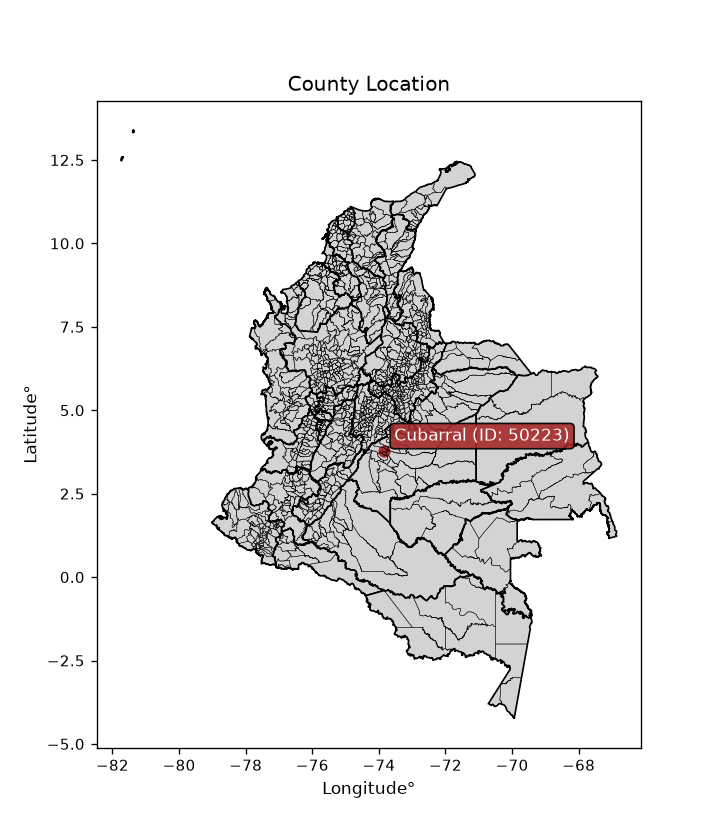
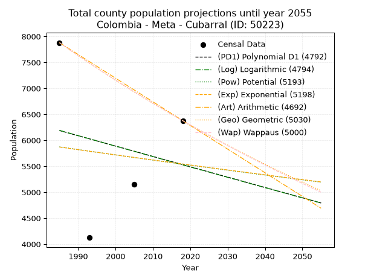
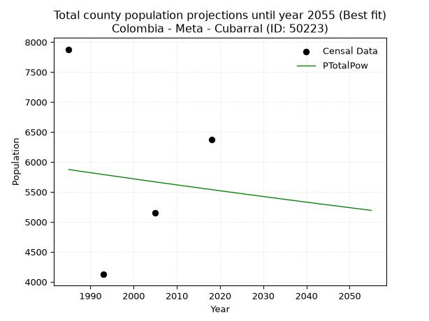
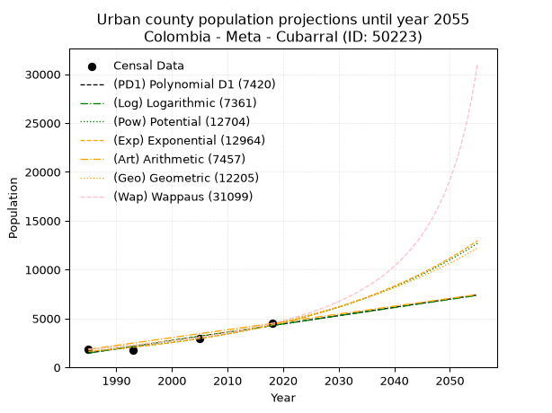
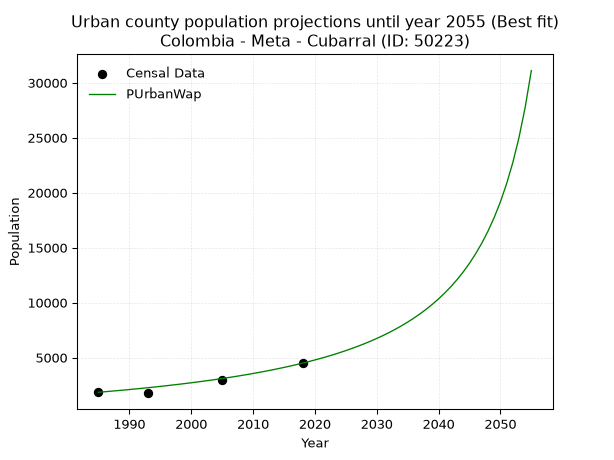
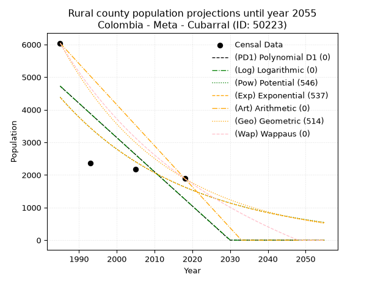
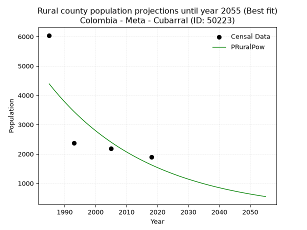

<div align="center">


</div>

# _“Population and Public Services Demand Projections (PPSD) until Year 2050 for Colombia - Meta - Cubarral (ID: 50223)”_
Keywords: `population` `public-service` `projection` `lineal` `polynomial` `logarithmic` `potential` `exponential` `arithmetic` `geometric` `wappaus` `dane` `colombia` `south-america`

PPSD are analytical estimates used by governments and planners to anticipate future changes in population size, age distribution, and the resulting community needs for utilities, healthcare, education, and infrastructure as sizing future water treatment facilities, electrical grids, and road networks based on spatial growth.

> **General running parameters**: • app_version: _v20260806_. • Python version: _3.14.7_. • Pandas version: _3.0.5_. • NumPy version: _2.5.1_. • Creates, save and include plots into reports (create_plot): _False_. • Projection until year: _2050_. • Process polynomial degree 2 and up: _False_. • Process Wappaus: _True_. • Process Wappaus: _True_. • Set negative values to zero: _True_. • Set infinite values to zero: _True_. • Drop dataset notes: _True_. 
<div align="center">

Dynamic map: [:earth_americas:Google](http://maps.google.com/maps?q=3.793653066,-73.8379991) [:earth_americas:OSM](https://www.openstreetmap.org/#map=18/3.793653066/-73.8379991&layers=P) [:earth_americas:Bing](https://www.bing.com/maps?cp=3.793653066~-73.8379991&lvl=18) [:earth_americas:Apple](https://maps.apple.com/frame?center=3.793653066%2C-73.8379991&span=0.003%2C0.006)

</div>


<div align="center">

```geojson
{
  "type": "Feature",
  "geometry": {
    "type": "Point", 
    "coordinates": [-73.8379991, 3.793653066]
  }, 
  "properties": {
    "Name": "Colombia - Meta - Cubarral (ID: 50223)"
  }
}
```

</div>


<div align="center">

</img>

</div>


## 0. Census Data (4 records)

Census data are official statistics collected by a government about the people and housing in a country. They usually include counts of total population, age, sex, race, income, education, and jobs.

📅Global census file: [Population.xlsx](../data/Population.xlsx)

| Source   |   Year |   CountryID | CountryName   |   StateID | StateName   |   CountyID | CountyName   |   PTotal |   PUrban |   PRural |
|:---------|-------:|------------:|:--------------|----------:|:------------|-----------:|:-------------|---------:|---------:|---------:|
| DANE     |   1985 |          57 | Colombia      |        50 | Meta        |      50223 | Cubarral     |     7880 |     1838 |     6042 |
| DANE     |   1993 |          57 | Colombia      |        50 | Meta        |      50223 | Cubarral     |     4125 |     1755 |     2370 |
| DANE     |   2005 |          57 | Colombia      |        50 | Meta        |      50223 | Cubarral     |     5152 |     2967 |     2185 |
| DANE     |   2018 |          57 | Colombia      |        50 | Meta        |      50223 | Cubarral     |     6377 |     4487 |     1890 |

> 🔥Some records could had specific notes about the registered values or the corresponding urban or rural distribution.

📅   [RUPS](https://www.datos.gov.co/Hacienda-y-Cr-dito-P-blico/Registro-nico-de-Prestadores-de-Servicios-P-blicos/4qkq-csdn/about_data) - Local public utility companies: [RUPS.csv](../data/RUPS.xlsx)

 | SERVICIO       | ESTADO    | NOMBRE                     | NIT         | DEPARTAMENTO_DOMICILIO   | MUNICIPIO_DOMICILIO   | DIRECCION         |   TELEFONO | EMAIL                       | TIPO_PRESTADOR                 | CLASIFICACION                 |
|:---------------|:----------|:---------------------------|:------------|:-------------------------|:----------------------|:------------------|-----------:|:----------------------------|:-------------------------------|:------------------------------|
| ACUEDUCTO      | OPERATIVA | MUNICIPIO DE CUBARRAL-META | 892000812-0 | META                     | CUBARRAL              | CARRERA 9 No 8-12 |    6763123 | sandramvillalobos@gmail.com | MUNICIPIO (PRESTACIÓN DIRECTA) | MENOR O IGUAL A 2500 USUARIOS |
| ALCANTARILLADO | OPERATIVA | MUNICIPIO DE CUBARRAL-META | 892000812-0 | META                     | CUBARRAL              | CARRERA 9 No 8-12 |    6763123 | sandramvillalobos@gmail.com | MUNICIPIO (PRESTACIÓN DIRECTA) | MENOR O IGUAL A 2500 USUARIOS |

## 1. Total

### 1.1. Coefficients and Parameters

* (PD1) Polynomial Deg 1: -19.93175431553674, 45751.99156965237 (lineal)
* (Log) Logarithmic: -40335.1163398559, 312471.0425245817
* (Pow) Potential: -3.5531250642840804, 15.486270906559225
* (Exp) Exponential: -0.0017378805467597681, 184853.70595089102
* (Art) Arithmetic: Year diff. 2018 - 1985 = 33, Population diff. 6377 - 7880 = -1503, Annual growth = -45.54545454545455
* (Geo) Geometric: Year diff. 2018 - 1985 = 33, Population diff. 6377 - 7880 = -1503, Annual growth % = -0.006392514822907147
* (Wap) Wappaus: i = -0.6389205940303647, Condition values only valid for < 200)

<sub>
Wappaus condition values: ['-0.00', '-0.64', '-1.28', '-1.92', '-2.56', '-3.19', '-3.83', '-4.47', '-5.11', '-5.75', '-6.39', '-7.03', '-7.67', '-8.31', '-8.94', '-9.58', '-10.22', '-10.86', '-11.50', '-12.14', '-12.78', '-13.42', '-14.06', '-14.70', '-15.33', '-15.97', '-16.61', '-17.25', '-17.89', '-18.53', '-19.17', '-19.81', '-20.45', '-21.08', '-21.72', '-22.36', '-23.00', '-23.64', '-24.28', '-24.92', '-25.56', '-26.20', '-26.83', '-27.47', '-28.11', '-28.75', '-29.39', '-30.03', '-30.67', '-31.31', '-31.95', '-32.58', '-33.22', '-33.86', '-34.50', '-35.14', '-35.78', '-36.42', '-37.06', '-37.70', '-38.34', '-38.97', '-39.61', '-40.25', '-40.89', '-41.53']
</sub>


### 1.2. Projected Dataset

|   Year |   CountyID |   PTotalPD1 |   PTotalLog |   PTotalPow |   PTotalExp |   PTotalArt |   PTotalGeo |   PTotalWap |
|-------:|-----------:|------------:|------------:|------------:|------------:|------------:|------------:|------------:|
|   1985 |      50223 |        6187 |        6191 |        5874 |        5870 |        7880 |        7880 |        7880 |
|   1986 |      50223 |        6168 |        6171 |        5863 |        5860 |        7834 |        7830 |        7830 |
|   1987 |      50223 |        6148 |        6151 |        5853 |        5850 |        7789 |        7780 |        7780 |
|   1988 |      50223 |        6128 |        6130 |        5842 |        5840 |        7743 |        7730 |        7730 |
|   1989 |      50223 |        6108 |        6110 |        5832 |        5829 |        7698 |        7680 |        7681 |
|   1990 |      50223 |        6088 |        6090 |        5821 |        5819 |        7652 |        7631 |        7632 |
|   1991 |      50223 |        6068 |        6070 |        5811 |        5809 |        7607 |        7583 |        7584 |
|   1992 |      50223 |        6048 |        6049 |        5801 |        5799 |        7561 |        7534 |        7535 |
|   1993 |      50223 |        6028 |        6029 |        5790 |        5789 |        7516 |        7486 |        7487 |
|   1994 |      50223 |        6008 |        6009 |        5780 |        5779 |        7470 |        7438 |        7440 |
|   1995 |      50223 |        5988 |        5989 |        5770 |        5769 |        7425 |        7391 |        7392 |
|   1996 |      50223 |        5968 |        5969 |        5760 |        5759 |        7379 |        7343 |        7345 |
|   1997 |      50223 |        5948 |        5948 |        5749 |        5749 |        7333 |        7296 |        7298 |
|   1998 |      50223 |        5928 |        5928 |        5739 |        5739 |        7288 |        7250 |        7252 |
|   1999 |      50223 |        5908 |        5908 |        5729 |        5729 |        7242 |        7203 |        7205 |
|   2000 |      50223 |        5888 |        5888 |        5719 |        5719 |        7197 |        7157 |        7159 |
|   2001 |      50223 |        5869 |        5868 |        5709 |        5709 |        7151 |        7112 |        7114 |
|   2002 |      50223 |        5849 |        5847 |        5698 |        5699 |        7106 |        7066 |        7068 |
|   2003 |      50223 |        5829 |        5827 |        5688 |        5689 |        7060 |        7021 |        7023 |
|   2004 |      50223 |        5809 |        5807 |        5678 |        5679 |        7015 |        6976 |        6978 |
|   2005 |      50223 |        5789 |        5787 |        5668 |        5670 |        6969 |        6931 |        6934 |
|   2006 |      50223 |        5769 |        5767 |        5658 |        5660 |        6924 |        6887 |        6889 |
|   2007 |      50223 |        5749 |        5747 |        5648 |        5650 |        6878 |        6843 |        6845 |
|   2008 |      50223 |        5729 |        5727 |        5638 |        5640 |        6832 |        6799 |        6801 |
|   2009 |      50223 |        5709 |        5707 |        5628 |        5630 |        6787 |        6756 |        6758 |
|   2010 |      50223 |        5689 |        5687 |        5618 |        5621 |        6741 |        6713 |        6714 |
|   2011 |      50223 |        5669 |        5667 |        5608 |        5611 |        6696 |        6670 |        6671 |
|   2012 |      50223 |        5649 |        5646 |        5598 |        5601 |        6650 |        6627 |        6629 |
|   2013 |      50223 |        5629 |        5626 |        5589 |        5591 |        6605 |        6585 |        6586 |
|   2014 |      50223 |        5609 |        5606 |        5579 |        5582 |        6559 |        6543 |        6544 |
|   2015 |      50223 |        5590 |        5586 |        5569 |        5572 |        6514 |        6501 |        6502 |
|   2016 |      50223 |        5570 |        5566 |        5559 |        5562 |        6468 |        6459 |        6460 |
|   2017 |      50223 |        5550 |        5546 |        5549 |        5553 |        6423 |        6418 |        6418 |
|   2018 |      50223 |        5530 |        5526 |        5540 |        5543 |        6377 |        6377 |        6377 |
|   2019 |      50223 |        5510 |        5506 |        5530 |        5533 |        6331 |        6336 |        6336 |
|   2020 |      50223 |        5490 |        5486 |        5520 |        5524 |        6286 |        6296 |        6295 |
|   2021 |      50223 |        5470 |        5466 |        5510 |        5514 |        6240 |        6255 |        6254 |
|   2022 |      50223 |        5450 |        5446 |        5501 |        5505 |        6195 |        6215 |        6214 |
|   2023 |      50223 |        5430 |        5427 |        5491 |        5495 |        6149 |        6176 |        6174 |
|   2024 |      50223 |        5410 |        5407 |        5481 |        5485 |        6104 |        6136 |        6134 |
|   2025 |      50223 |        5390 |        5387 |        5472 |        5476 |        6058 |        6097 |        6094 |
|   2026 |      50223 |        5370 |        5367 |        5462 |        5466 |        6013 |        6058 |        6055 |
|   2027 |      50223 |        5350 |        5347 |        5453 |        5457 |        5967 |        6019 |        6016 |
|   2028 |      50223 |        5330 |        5327 |        5443 |        5447 |        5922 |        5981 |        5977 |
|   2029 |      50223 |        5310 |        5307 |        5434 |        5438 |        5876 |        5943 |        5938 |
|   2030 |      50223 |        5291 |        5287 |        5424 |        5429 |        5830 |        5905 |        5899 |
|   2031 |      50223 |        5271 |        5267 |        5415 |        5419 |        5785 |        5867 |        5861 |
|   2032 |      50223 |        5251 |        5248 |        5405 |        5410 |        5739 |        5829 |        5823 |
|   2033 |      50223 |        5231 |        5228 |        5396 |        5400 |        5694 |        5792 |        5785 |
|   2034 |      50223 |        5211 |        5208 |        5386 |        5391 |        5648 |        5755 |        5747 |
|   2035 |      50223 |        5191 |        5188 |        5377 |        5382 |        5603 |        5718 |        5709 |
|   2036 |      50223 |        5171 |        5168 |        5367 |        5372 |        5557 |        5682 |        5672 |
|   2037 |      50223 |        5151 |        5148 |        5358 |        5363 |        5512 |        5645 |        5635 |
|   2038 |      50223 |        5131 |        5129 |        5349 |        5354 |        5466 |        5609 |        5598 |
|   2039 |      50223 |        5111 |        5109 |        5339 |        5344 |        5421 |        5574 |        5561 |
|   2040 |      50223 |        5091 |        5089 |        5330 |        5335 |        5375 |        5538 |        5525 |
|   2041 |      50223 |        5071 |        5069 |        5321 |        5326 |        5329 |        5502 |        5488 |
|   2042 |      50223 |        5051 |        5049 |        5312 |        5316 |        5284 |        5467 |        5452 |
|   2043 |      50223 |        5031 |        5030 |        5302 |        5307 |        5238 |        5432 |        5416 |
|   2044 |      50223 |        5011 |        5010 |        5293 |        5298 |        5193 |        5398 |        5381 |
|   2045 |      50223 |        4992 |        4990 |        5284 |        5289 |        5147 |        5363 |        5345 |
|   2046 |      50223 |        4972 |        4971 |        5275 |        5280 |        5102 |        5329 |        5310 |
|   2047 |      50223 |        4952 |        4951 |        5266 |        5270 |        5056 |        5295 |        5275 |
|   2048 |      50223 |        4932 |        4931 |        5257 |        5261 |        5011 |        5261 |        5240 |
|   2049 |      50223 |        4912 |        4911 |        5247 |        5252 |        4965 |        5227 |        5205 |
|   2050 |      50223 |        4892 |        4892 |        5238 |        5243 |        4920 |        5194 |        5170 |
<div align="center">

</img>

</div>


### 1.3. Best fit with absolute and relative error (%)

Relative error puts that difference into context by dividing the absolute error by the true value, creating a unitless ratio or percentage that shows the scale of the mistake.

Absolute and relative error

|   Year | Source   |   CountryID | CountryName   |   StateID | StateName   |   CountyID_x | CountyName   |   PTotal |   PUrban |   PRural |   CountyID_y |   PTotalPD1 |   PTotalLog |   PTotalPow |   PTotalExp |   PTotalArt |   PTotalGeo |   PTotalWap |   PTotalPD1AbsError |   PTotalLogAbsError |   PTotalPowAbsError |   PTotalExpAbsError |   PTotalArtAbsError |   PTotalGeoAbsError |   PTotalWapAbsError |   PTotalPD1RelError |   PTotalLogRelError |   PTotalPowRelError |   PTotalExpRelError |   PTotalArtRelError |   PTotalGeoRelError |   PTotalWapRelError |
|-------:|:---------|------------:|:--------------|----------:|:------------|-------------:|:-------------|---------:|---------:|---------:|-------------:|------------:|------------:|------------:|------------:|------------:|------------:|------------:|--------------------:|--------------------:|--------------------:|--------------------:|--------------------:|--------------------:|--------------------:|--------------------:|--------------------:|--------------------:|--------------------:|--------------------:|--------------------:|--------------------:|
|   1985 | DANE     |          57 | Colombia      |        50 | Meta        |        50223 | Cubarral     |     7880 |     1838 |     6042 |        50223 |        6187 |        6191 |        5874 |        5870 |        7880 |        7880 |        7880 |                1693 |                1689 |                2006 |                2010 |                   0 |                   0 |                   0 |             21.4848 |             21.434  |             25.4569 |             25.5076 |              0      |              0      |              0      |
|   1993 | DANE     |          57 | Colombia      |        50 | Meta        |        50223 | Cubarral     |     4125 |     1755 |     2370 |        50223 |        6028 |        6029 |        5790 |        5789 |        7516 |        7486 |        7487 |                1903 |                1904 |                1665 |                1664 |                3391 |                3361 |                3362 |             46.1333 |             46.1576 |             40.3636 |             40.3394 |             82.2061 |             81.4788 |             81.503  |
|   2005 | DANE     |          57 | Colombia      |        50 | Meta        |        50223 | Cubarral     |     5152 |     2967 |     2185 |        50223 |        5789 |        5787 |        5668 |        5670 |        6969 |        6931 |        6934 |                 637 |                 635 |                 516 |                 518 |                1817 |                1779 |                1782 |             12.3641 |             12.3253 |             10.0155 |             10.0543 |             35.2679 |             34.5303 |             34.5885 |
|   2018 | DANE     |          57 | Colombia      |        50 | Meta        |        50223 | Cubarral     |     6377 |     4487 |     1890 |        50223 |        5530 |        5526 |        5540 |        5543 |        6377 |        6377 |        6377 |                 847 |                 851 |                 837 |                 834 |                   0 |                   0 |                   0 |             13.2821 |             13.3448 |             13.1253 |             13.0782 |              0      |              0      |              0      |

Relative error mean

| Method    |   RelError | Best   |
|:----------|-----------:|:-------|
| PTotalPD1 |    23.3161 |        |
| PTotalLog |    23.3154 |        |
| PTotalPow |    22.2403 | True   |
| PTotalExp |    22.2449 |        |
| PTotalArt |    29.3685 |        |
| PTotalGeo |    29.0023 |        |
| PTotalWap |    29.0229 |        |

💙Best method: _**PTotalPow**_
<div align="center">

</img>

</div>


### 1.4. Fresh water supply demand in liters per capita per day (lpcd)

The fresh water supply demand typically ranges from 100 to 300 liters per capita per day (lpcd) for standard domestic and municipal planning, though absolute survival minimums set by the World Health Organization are as low as 7.5 to 20 liters per day, and total consumption in high-income nations can exceed 400 liters.

> `CZ`: Level in meters above the sea level (masl)<br> `WS`: Fresh water supply demand in liters per capita per day (lpcd or l/h/d)<br> `WSAll`: Zonal fresh water supply demand in liters per second (l/s)<br> `A`: Zonal area in square meters<br> `DP`: Population density (people/hectare or p/ha)

Reference values (RAS Colombia)

|    CZ |   WS |
|------:|-----:|
|  1000 |  120 |
|  2000 |  130 |
| 99999 |  140 |

County shapefile geometry properties and water supply values

|   CountyID |      ATotal |   CZTotal |   WSTotal |
|-----------:|------------:|----------:|----------:|
|      50223 | 1.15642e+09 |   2397.35 |       140 |

Projected values for best method: PTotalPow

|   CountyID |   Year |   PTotalPow |   DPTotal |   WSTotal |   WSTotalAll |
|-----------:|-------:|------------:|----------:|----------:|-------------:|
|      50223 |   1985 |        5874 |      0.05 |       140 |      9.51806 |
|      50223 |   1986 |        5863 |      0.05 |       140 |      9.50023 |
|      50223 |   1987 |        5853 |      0.05 |       140 |      9.48403 |
|      50223 |   1988 |        5842 |      0.05 |       140 |      9.4662  |
|      50223 |   1989 |        5832 |      0.05 |       140 |      9.45    |
|      50223 |   1990 |        5821 |      0.05 |       140 |      9.43218 |
|      50223 |   1991 |        5811 |      0.05 |       140 |      9.41597 |
|      50223 |   1992 |        5801 |      0.05 |       140 |      9.39977 |
|      50223 |   1993 |        5790 |      0.05 |       140 |      9.38194 |
|      50223 |   1994 |        5780 |      0.05 |       140 |      9.36574 |
|      50223 |   1995 |        5770 |      0.05 |       140 |      9.34954 |
|      50223 |   1996 |        5760 |      0.05 |       140 |      9.33333 |
|      50223 |   1997 |        5749 |      0.05 |       140 |      9.31551 |
|      50223 |   1998 |        5739 |      0.05 |       140 |      9.29931 |
|      50223 |   1999 |        5729 |      0.05 |       140 |      9.2831  |
|      50223 |   2000 |        5719 |      0.05 |       140 |      9.2669  |
|      50223 |   2001 |        5709 |      0.05 |       140 |      9.25069 |
|      50223 |   2002 |        5698 |      0.05 |       140 |      9.23287 |
|      50223 |   2003 |        5688 |      0.05 |       140 |      9.21667 |
|      50223 |   2004 |        5678 |      0.05 |       140 |      9.20046 |
|      50223 |   2005 |        5668 |      0.05 |       140 |      9.18426 |
|      50223 |   2006 |        5658 |      0.05 |       140 |      9.16806 |
|      50223 |   2007 |        5648 |      0.05 |       140 |      9.15185 |
|      50223 |   2008 |        5638 |      0.05 |       140 |      9.13565 |
|      50223 |   2009 |        5628 |      0.05 |       140 |      9.11944 |
|      50223 |   2010 |        5618 |      0.05 |       140 |      9.10324 |
|      50223 |   2011 |        5608 |      0.05 |       140 |      9.08704 |
|      50223 |   2012 |        5598 |      0.05 |       140 |      9.07083 |
|      50223 |   2013 |        5589 |      0.05 |       140 |      9.05625 |
|      50223 |   2014 |        5579 |      0.05 |       140 |      9.04005 |
|      50223 |   2015 |        5569 |      0.05 |       140 |      9.02384 |
|      50223 |   2016 |        5559 |      0.05 |       140 |      9.00764 |
|      50223 |   2017 |        5549 |      0.05 |       140 |      8.99144 |
|      50223 |   2018 |        5540 |      0.05 |       140 |      8.97685 |
|      50223 |   2019 |        5530 |      0.05 |       140 |      8.96065 |
|      50223 |   2020 |        5520 |      0.05 |       140 |      8.94444 |
|      50223 |   2021 |        5510 |      0.05 |       140 |      8.92824 |
|      50223 |   2022 |        5501 |      0.05 |       140 |      8.91366 |
|      50223 |   2023 |        5491 |      0.05 |       140 |      8.89745 |
|      50223 |   2024 |        5481 |      0.05 |       140 |      8.88125 |
|      50223 |   2025 |        5472 |      0.05 |       140 |      8.86667 |
|      50223 |   2026 |        5462 |      0.05 |       140 |      8.85046 |
|      50223 |   2027 |        5453 |      0.05 |       140 |      8.83588 |
|      50223 |   2028 |        5443 |      0.05 |       140 |      8.81968 |
|      50223 |   2029 |        5434 |      0.05 |       140 |      8.80509 |
|      50223 |   2030 |        5424 |      0.05 |       140 |      8.78889 |
|      50223 |   2031 |        5415 |      0.05 |       140 |      8.77431 |
|      50223 |   2032 |        5405 |      0.05 |       140 |      8.7581  |
|      50223 |   2033 |        5396 |      0.05 |       140 |      8.74352 |
|      50223 |   2034 |        5386 |      0.05 |       140 |      8.72731 |
|      50223 |   2035 |        5377 |      0.05 |       140 |      8.71273 |
|      50223 |   2036 |        5367 |      0.05 |       140 |      8.69653 |
|      50223 |   2037 |        5358 |      0.05 |       140 |      8.68194 |
|      50223 |   2038 |        5349 |      0.05 |       140 |      8.66736 |
|      50223 |   2039 |        5339 |      0.05 |       140 |      8.65116 |
|      50223 |   2040 |        5330 |      0.05 |       140 |      8.63657 |
|      50223 |   2041 |        5321 |      0.05 |       140 |      8.62199 |
|      50223 |   2042 |        5312 |      0.05 |       140 |      8.60741 |
|      50223 |   2043 |        5302 |      0.05 |       140 |      8.5912  |
|      50223 |   2044 |        5293 |      0.05 |       140 |      8.57662 |
|      50223 |   2045 |        5284 |      0.05 |       140 |      8.56204 |
|      50223 |   2046 |        5275 |      0.05 |       140 |      8.54745 |
|      50223 |   2047 |        5266 |      0.05 |       140 |      8.53287 |
|      50223 |   2048 |        5257 |      0.05 |       140 |      8.51829 |
|      50223 |   2049 |        5247 |      0.05 |       140 |      8.50208 |
|      50223 |   2050 |        5238 |      0.05 |       140 |      8.4875  |

## 2. Urban

### 2.1. Coefficients and Parameters

* (PD1) Polynomial Deg 1: 85.0810919309504, -167421.7041348835 (lineal)
* (Log) Logarithmic: 170195.80767821107, -1290897.9480256902
* (Pow) Potential: 59.281863142414316, -192.28570194057215
* (Exp) Exponential: 0.029629308065382217, 4.6700024548891644e-23
* (Art) Arithmetic: Year diff. 2018 - 1985 = 33, Population diff. 4487 - 1838 = 2649, Annual growth = 80.27272727272727
* (Geo) Geometric: Year diff. 2018 - 1985 = 33, Population diff. 4487 - 1838 = 2649, Annual growth % = 0.02741469859939283
* (Wap) Wappaus: i = 2.5382680560546174, Condition values only valid for < 200)

<sub>
Wappaus condition values: ['0.00', '2.54', '5.08', '7.61', '10.15', '12.69', '15.23', '17.77', '20.31', '22.84', '25.38', '27.92', '30.46', '33.00', '35.54', '38.07', '40.61', '43.15', '45.69', '48.23', '50.77', '53.30', '55.84', '58.38', '60.92', '63.46', '65.99', '68.53', '71.07', '73.61', '76.15', '78.69', '81.22', '83.76', '86.30', '88.84', '91.38', '93.92', '96.45', '98.99', '101.53', '104.07', '106.61', '109.15', '111.68', '114.22', '116.76', '119.30', '121.84', '124.38', '126.91', '129.45', '131.99', '134.53', '137.07', '139.60', '142.14', '144.68', '147.22', '149.76', '152.30', '154.83', '157.37', '159.91', '162.45', '164.99']
</sub>


### 2.2. Projected Dataset

|   Year |   CountyID |   PUrbanPD1 |   PUrbanLog |   PUrbanPow |   PUrbanExp |   PUrbanArt |   PUrbanGeo |   PUrbanWap |
|-------:|-----------:|------------:|------------:|------------:|------------:|------------:|------------:|------------:|
|   1985 |      50223 |        1464 |        1463 |        1628 |        1629 |        1838 |        1838 |        1838 |
|   1986 |      50223 |        1549 |        1548 |        1677 |        1678 |        1918 |        1888 |        1885 |
|   1987 |      50223 |        1634 |        1634 |        1728 |        1729 |        1999 |        1940 |        1934 |
|   1988 |      50223 |        1720 |        1720 |        1781 |        1781 |        2079 |        1993 |        1983 |
|   1989 |      50223 |        1805 |        1805 |        1834 |        1834 |        2159 |        2048 |        2035 |
|   1990 |      50223 |        1890 |        1891 |        1890 |        1889 |        2239 |        2104 |        2087 |
|   1991 |      50223 |        1975 |        1976 |        1947 |        1946 |        2320 |        2162 |        2141 |
|   1992 |      50223 |        2060 |        2062 |        2006 |        2005 |        2400 |        2221 |        2196 |
|   1993 |      50223 |        2145 |        2147 |        2067 |        2065 |        2480 |        2282 |        2253 |
|   1994 |      50223 |        2230 |        2232 |        2129 |        2127 |        2560 |        2345 |        2312 |
|   1995 |      50223 |        2315 |        2318 |        2193 |        2191 |        2641 |        2409 |        2372 |
|   1996 |      50223 |        2400 |        2403 |        2259 |        2257 |        2721 |        2475 |        2434 |
|   1997 |      50223 |        2485 |        2488 |        2327 |        2325 |        2801 |        2543 |        2498 |
|   1998 |      50223 |        2570 |        2574 |        2397 |        2395 |        2882 |        2612 |        2564 |
|   1999 |      50223 |        2655 |        2659 |        2470 |        2467 |        2962 |        2684 |        2632 |
|   2000 |      50223 |        2740 |        2744 |        2544 |        2541 |        3042 |        2758 |        2702 |
|   2001 |      50223 |        2826 |        2829 |        2620 |        2617 |        3122 |        2833 |        2775 |
|   2002 |      50223 |        2911 |        2914 |        2699 |        2696 |        3203 |        2911 |        2849 |
|   2003 |      50223 |        2996 |        2999 |        2780 |        2777 |        3283 |        2991 |        2926 |
|   2004 |      50223 |        3081 |        3084 |        2864 |        2861 |        3363 |        3073 |        3006 |
|   2005 |      50223 |        3166 |        3169 |        2950 |        2947 |        3443 |        3157 |        3088 |
|   2006 |      50223 |        3251 |        3254 |        3038 |        3035 |        3524 |        3243 |        3174 |
|   2007 |      50223 |        3336 |        3338 |        3129 |        3127 |        3604 |        3332 |        3262 |
|   2008 |      50223 |        3421 |        3423 |        3223 |        3221 |        3684 |        3424 |        3353 |
|   2009 |      50223 |        3506 |        3508 |        3320 |        3318 |        3765 |        3518 |        3448 |
|   2010 |      50223 |        3591 |        3593 |        3419 |        3417 |        3845 |        3614 |        3546 |
|   2011 |      50223 |        3676 |        3677 |        3521 |        3520 |        3925 |        3713 |        3648 |
|   2012 |      50223 |        3761 |        3762 |        3627 |        3626 |        4005 |        3815 |        3754 |
|   2013 |      50223 |        3847 |        3846 |        3735 |        3735 |        4086 |        3919 |        3864 |
|   2014 |      50223 |        3932 |        3931 |        3847 |        3847 |        4166 |        4027 |        3979 |
|   2015 |      50223 |        4017 |        4015 |        3962 |        3963 |        4246 |        4137 |        4098 |
|   2016 |      50223 |        4102 |        4100 |        4080 |        4082 |        4326 |        4251 |        4222 |
|   2017 |      50223 |        4187 |        4184 |        4202 |        4205 |        4407 |        4367 |        4352 |
|   2018 |      50223 |        4272 |        4269 |        4327 |        4331 |        4487 |        4487 |        4487 |
|   2019 |      50223 |        4357 |        4353 |        4456 |        4462 |        4567 |        4610 |        4628 |
|   2020 |      50223 |        4442 |        4437 |        4589 |        4596 |        4648 |        4736 |        4776 |
|   2021 |      50223 |        4527 |        4522 |        4725 |        4734 |        4728 |        4866 |        4930 |
|   2022 |      50223 |        4612 |        4606 |        4866 |        4876 |        4808 |        5000 |        5092 |
|   2023 |      50223 |        4697 |        4690 |        5011 |        5023 |        4888 |        5137 |        5262 |
|   2024 |      50223 |        4782 |        4774 |        5160 |        5174 |        4969 |        5278 |        5441 |
|   2025 |      50223 |        4868 |        4858 |        5313 |        5330 |        5049 |        5422 |        5628 |
|   2026 |      50223 |        4953 |        4942 |        5471 |        5490 |        5129 |        5571 |        5826 |
|   2027 |      50223 |        5038 |        5026 |        5633 |        5655 |        5209 |        5724 |        6034 |
|   2028 |      50223 |        5123 |        5110 |        5800 |        5825 |        5290 |        5880 |        6254 |
|   2029 |      50223 |        5208 |        5194 |        5972 |        6000 |        5370 |        6042 |        6487 |
|   2030 |      50223 |        5293 |        5278 |        6149 |        6181 |        5450 |        6207 |        6733 |
|   2031 |      50223 |        5378 |        5362 |        6331 |        6367 |        5531 |        6378 |        6994 |
|   2032 |      50223 |        5463 |        5445 |        6519 |        6558 |        5611 |        6552 |        7272 |
|   2033 |      50223 |        5548 |        5529 |        6712 |        6755 |        5691 |        6732 |        7568 |
|   2034 |      50223 |        5633 |        5613 |        6910 |        6958 |        5771 |        6917 |        7884 |
|   2035 |      50223 |        5718 |        5696 |        7115 |        7168 |        5852 |        7106 |        8221 |
|   2036 |      50223 |        5803 |        5780 |        7325 |        7383 |        5932 |        7301 |        8583 |
|   2037 |      50223 |        5888 |        5864 |        7541 |        7605 |        6012 |        7501 |        8972 |
|   2038 |      50223 |        5974 |        5947 |        7764 |        7834 |        6092 |        7707 |        9391 |
|   2039 |      50223 |        6059 |        6031 |        7993 |        8070 |        6173 |        7918 |        9844 |
|   2040 |      50223 |        6144 |        6114 |        8229 |        8312 |        6253 |        8135 |       10335 |
|   2041 |      50223 |        6229 |        6198 |        8471 |        8562 |        6333 |        8358 |       10869 |
|   2042 |      50223 |        6314 |        6281 |        8721 |        8820 |        6414 |        8587 |       11452 |
|   2043 |      50223 |        6399 |        6364 |        8978 |        9085 |        6494 |        8823 |       12091 |
|   2044 |      50223 |        6484 |        6447 |        9242 |        9358 |        6574 |        9065 |       12795 |
|   2045 |      50223 |        6569 |        6531 |        9514 |        9640 |        6654 |        9313 |       13574 |
|   2046 |      50223 |        6654 |        6614 |        9794 |        9930 |        6735 |        9568 |       14440 |
|   2047 |      50223 |        6739 |        6697 |       10082 |       10228 |        6815 |        9831 |       15409 |
|   2048 |      50223 |        6824 |        6780 |       10378 |       10536 |        6895 |       10100 |       16501 |
|   2049 |      50223 |        6909 |        6863 |       10683 |       10853 |        6975 |       10377 |       17741 |
|   2050 |      50223 |        6995 |        6946 |       10996 |       11179 |        7056 |       10662 |       19160 |
<div align="center">

</img>

</div>


### 2.3. Best fit with absolute and relative error (%)

Relative error puts that difference into context by dividing the absolute error by the true value, creating a unitless ratio or percentage that shows the scale of the mistake.

Absolute and relative error

|   Year | Source   |   CountryID | CountryName   |   StateID | StateName   |   CountyID_x | CountyName   |   PTotal |   PUrban |   PRural |   CountyID_y |   PUrbanPD1 |   PUrbanLog |   PUrbanPow |   PUrbanExp |   PUrbanArt |   PUrbanGeo |   PUrbanWap |   PUrbanPD1AbsError |   PUrbanLogAbsError |   PUrbanPowAbsError |   PUrbanExpAbsError |   PUrbanArtAbsError |   PUrbanGeoAbsError |   PUrbanWapAbsError |   PUrbanPD1RelError |   PUrbanLogRelError |   PUrbanPowRelError |   PUrbanExpRelError |   PUrbanArtRelError |   PUrbanGeoRelError |   PUrbanWapRelError |
|-------:|:---------|------------:|:--------------|----------:|:------------|-------------:|:-------------|---------:|---------:|---------:|-------------:|------------:|------------:|------------:|------------:|------------:|------------:|------------:|--------------------:|--------------------:|--------------------:|--------------------:|--------------------:|--------------------:|--------------------:|--------------------:|--------------------:|--------------------:|--------------------:|--------------------:|--------------------:|--------------------:|
|   1985 | DANE     |          57 | Colombia      |        50 | Meta        |        50223 | Cubarral     |     7880 |     1838 |     6042 |        50223 |        1464 |        1463 |        1628 |        1629 |        1838 |        1838 |        1838 |                 374 |                 375 |                 210 |                 209 |                   0 |                   0 |                   0 |            20.3482  |            20.4026  |           11.4255   |           11.3711   |              0      |             0       |             0       |
|   1993 | DANE     |          57 | Colombia      |        50 | Meta        |        50223 | Cubarral     |     4125 |     1755 |     2370 |        50223 |        2145 |        2147 |        2067 |        2065 |        2480 |        2282 |        2253 |                 390 |                 392 |                 312 |                 310 |                 725 |                 527 |                 498 |            22.2222  |            22.3362  |           17.7778   |           17.6638   |             41.3105 |            30.0285  |            28.3761  |
|   2005 | DANE     |          57 | Colombia      |        50 | Meta        |        50223 | Cubarral     |     5152 |     2967 |     2185 |        50223 |        3166 |        3169 |        2950 |        2947 |        3443 |        3157 |        3088 |                 199 |                 202 |                  17 |                  20 |                 476 |                 190 |                 121 |             6.70711 |             6.80822 |            0.572969 |            0.674082 |             16.0431 |             6.40377 |             4.07819 |
|   2018 | DANE     |          57 | Colombia      |        50 | Meta        |        50223 | Cubarral     |     6377 |     4487 |     1890 |        50223 |        4272 |        4269 |        4327 |        4331 |        4487 |        4487 |        4487 |                 215 |                 218 |                 160 |                 156 |                   0 |                   0 |                   0 |             4.79162 |             4.85848 |            3.56586  |            3.47671  |              0      |             0       |             0       |

Relative error mean

| Method    |   RelError | Best   |
|:----------|-----------:|:-------|
| PUrbanPD1 |   13.5173  |        |
| PUrbanLog |   13.6014  |        |
| PUrbanPow |    8.33552 |        |
| PUrbanExp |    8.29642 |        |
| PUrbanArt |   14.3384  |        |
| PUrbanGeo |    9.10807 |        |
| PUrbanWap |    8.11357 | True   |

💙Best method: _**PUrbanWap**_
<div align="center">

</img>

</div>


### 2.4. Fresh water supply demand in liters per capita per day (lpcd)

The fresh water supply demand typically ranges from 100 to 300 liters per capita per day (lpcd) for standard domestic and municipal planning, though absolute survival minimums set by the World Health Organization are as low as 7.5 to 20 liters per day, and total consumption in high-income nations can exceed 400 liters.

> `CZ`: Level in meters above the sea level (masl)<br> `WS`: Fresh water supply demand in liters per capita per day (lpcd or l/h/d)<br> `WSAll`: Zonal fresh water supply demand in liters per second (l/s)<br> `A`: Zonal area in square meters<br> `DP`: Population density (people/hectare or p/ha)

Reference values (RAS Colombia)

|    CZ |   WS |
|------:|-----:|
|  1000 |  120 |
|  2000 |  130 |
| 99999 |  140 |

County shapefile geometry properties and water supply values

|   CountyID |   AUrban |   CZUrban |   WSUrban |
|-----------:|---------:|----------:|----------:|
|      50223 |   847342 |    577.76 |       120 |

Projected values for best method: PUrbanWap

|   CountyID |   Year |   PUrbanWap |   DPUrban |   WSUrban |   WSUrbanAll |
|-----------:|-------:|------------:|----------:|----------:|-------------:|
|      50223 |   1985 |        1838 |     21.69 |       120 |      2.55278 |
|      50223 |   1986 |        1885 |     22.25 |       120 |      2.61806 |
|      50223 |   1987 |        1934 |     22.82 |       120 |      2.68611 |
|      50223 |   1988 |        1983 |     23.4  |       120 |      2.75417 |
|      50223 |   1989 |        2035 |     24.02 |       120 |      2.82639 |
|      50223 |   1990 |        2087 |     24.63 |       120 |      2.89861 |
|      50223 |   1991 |        2141 |     25.27 |       120 |      2.97361 |
|      50223 |   1992 |        2196 |     25.92 |       120 |      3.05    |
|      50223 |   1993 |        2253 |     26.59 |       120 |      3.12917 |
|      50223 |   1994 |        2312 |     27.29 |       120 |      3.21111 |
|      50223 |   1995 |        2372 |     27.99 |       120 |      3.29444 |
|      50223 |   1996 |        2434 |     28.73 |       120 |      3.38056 |
|      50223 |   1997 |        2498 |     29.48 |       120 |      3.46944 |
|      50223 |   1998 |        2564 |     30.26 |       120 |      3.56111 |
|      50223 |   1999 |        2632 |     31.06 |       120 |      3.65556 |
|      50223 |   2000 |        2702 |     31.89 |       120 |      3.75278 |
|      50223 |   2001 |        2775 |     32.75 |       120 |      3.85417 |
|      50223 |   2002 |        2849 |     33.62 |       120 |      3.95694 |
|      50223 |   2003 |        2926 |     34.53 |       120 |      4.06389 |
|      50223 |   2004 |        3006 |     35.48 |       120 |      4.175   |
|      50223 |   2005 |        3088 |     36.44 |       120 |      4.28889 |
|      50223 |   2006 |        3174 |     37.46 |       120 |      4.40833 |
|      50223 |   2007 |        3262 |     38.5  |       120 |      4.53056 |
|      50223 |   2008 |        3353 |     39.57 |       120 |      4.65694 |
|      50223 |   2009 |        3448 |     40.69 |       120 |      4.78889 |
|      50223 |   2010 |        3546 |     41.85 |       120 |      4.925   |
|      50223 |   2011 |        3648 |     43.05 |       120 |      5.06667 |
|      50223 |   2012 |        3754 |     44.3  |       120 |      5.21389 |
|      50223 |   2013 |        3864 |     45.6  |       120 |      5.36667 |
|      50223 |   2014 |        3979 |     46.96 |       120 |      5.52639 |
|      50223 |   2015 |        4098 |     48.36 |       120 |      5.69167 |
|      50223 |   2016 |        4222 |     49.83 |       120 |      5.86389 |
|      50223 |   2017 |        4352 |     51.36 |       120 |      6.04444 |
|      50223 |   2018 |        4487 |     52.95 |       120 |      6.23194 |
|      50223 |   2019 |        4628 |     54.62 |       120 |      6.42778 |
|      50223 |   2020 |        4776 |     56.36 |       120 |      6.63333 |
|      50223 |   2021 |        4930 |     58.18 |       120 |      6.84722 |
|      50223 |   2022 |        5092 |     60.09 |       120 |      7.07222 |
|      50223 |   2023 |        5262 |     62.1  |       120 |      7.30833 |
|      50223 |   2024 |        5441 |     64.21 |       120 |      7.55694 |
|      50223 |   2025 |        5628 |     66.42 |       120 |      7.81667 |
|      50223 |   2026 |        5826 |     68.76 |       120 |      8.09167 |
|      50223 |   2027 |        6034 |     71.21 |       120 |      8.38056 |
|      50223 |   2028 |        6254 |     73.81 |       120 |      8.68611 |
|      50223 |   2029 |        6487 |     76.56 |       120 |      9.00972 |
|      50223 |   2030 |        6733 |     79.46 |       120 |      9.35139 |
|      50223 |   2031 |        6994 |     82.54 |       120 |      9.71389 |
|      50223 |   2032 |        7272 |     85.82 |       120 |     10.1     |
|      50223 |   2033 |        7568 |     89.31 |       120 |     10.5111  |
|      50223 |   2034 |        7884 |     93.04 |       120 |     10.95    |
|      50223 |   2035 |        8221 |     97.02 |       120 |     11.4181  |
|      50223 |   2036 |        8583 |    101.29 |       120 |     11.9208  |
|      50223 |   2037 |        8972 |    105.88 |       120 |     12.4611  |
|      50223 |   2038 |        9391 |    110.83 |       120 |     13.0431  |
|      50223 |   2039 |        9844 |    116.18 |       120 |     13.6722  |
|      50223 |   2040 |       10335 |    121.97 |       120 |     14.3542  |
|      50223 |   2041 |       10869 |    128.27 |       120 |     15.0958  |
|      50223 |   2042 |       11452 |    135.15 |       120 |     15.9056  |
|      50223 |   2043 |       12091 |    142.69 |       120 |     16.7931  |
|      50223 |   2044 |       12795 |    151    |       120 |     17.7708  |
|      50223 |   2045 |       13574 |    160.2  |       120 |     18.8528  |
|      50223 |   2046 |       14440 |    170.42 |       120 |     20.0556  |
|      50223 |   2047 |       15409 |    181.85 |       120 |     21.4014  |
|      50223 |   2048 |       16501 |    194.74 |       120 |     22.9181  |
|      50223 |   2049 |       17741 |    209.37 |       120 |     24.6403  |
|      50223 |   2050 |       19160 |    226.12 |       120 |     26.6111  |

## 3. Rural

### 3.1. Coefficients and Parameters

* (PD1) Polynomial Deg 1: -105.01284624648716, 213173.69570453593 (lineal)
* (Log) Logarithmic: -210530.924018067, 1603368.9905502722
* (Pow) Potential: -60.104020039677465, 201.8508888475176
* (Exp) Exponential: -0.02998755245026634, 3.1122433318651e+29
* (Art) Arithmetic: Year diff. 2018 - 1985 = 33, Population diff. 1890 - 6042 = -4152, Annual growth = -125.81818181818181
* (Geo) Geometric: Year diff. 2018 - 1985 = 33, Population diff. 1890 - 6042 = -4152, Annual growth % = -0.03460401704893257
* (Wap) Wappaus: i = -3.172420116444322, Condition values only valid for < 200)

<sub>
Wappaus condition values: ['-0.00', '-3.17', '-6.34', '-9.52', '-12.69', '-15.86', '-19.03', '-22.21', '-25.38', '-28.55', '-31.72', '-34.90', '-38.07', '-41.24', '-44.41', '-47.59', '-50.76', '-53.93', '-57.10', '-60.28', '-63.45', '-66.62', '-69.79', '-72.97', '-76.14', '-79.31', '-82.48', '-85.66', '-88.83', '-92.00', '-95.17', '-98.35', '-101.52', '-104.69', '-107.86', '-111.03', '-114.21', '-117.38', '-120.55', '-123.72', '-126.90', '-130.07', '-133.24', '-136.41', '-139.59', '-142.76', '-145.93', '-149.10', '-152.28', '-155.45', '-158.62', '-161.79', '-164.97', '-168.14', '-171.31', '-174.48', '-177.66', '-180.83', '-184.00', '-187.17', '-190.35', '-193.52', '-196.69', '-199.86', '-203.03', '-206.21']
</sub>


### 3.2. Projected Dataset

|   Year |   CountyID |   PRuralPD1 |   PRuralLog |   PRuralPow |   PRuralExp |   PRuralArt |   PRuralGeo |   PRuralWap |
|-------:|-----------:|------------:|------------:|------------:|------------:|------------:|------------:|------------:|
|   1985 |      50223 |        4723 |        4729 |        4388 |        4381 |        6042 |        6042 |        6042 |
|   1986 |      50223 |        4618 |        4623 |        4257 |        4252 |        5916 |        5833 |        5853 |
|   1987 |      50223 |        4513 |        4517 |        4130 |        4126 |        5790 |        5631 |        5670 |
|   1988 |      50223 |        4408 |        4411 |        4007 |        4004 |        5665 |        5436 |        5493 |
|   1989 |      50223 |        4303 |        4305 |        3888 |        3886 |        5539 |        5248 |        5321 |
|   1990 |      50223 |        4198 |        4199 |        3772 |        3771 |        5413 |        5067 |        5154 |
|   1991 |      50223 |        4093 |        4093 |        3660 |        3660 |        5287 |        4891 |        4992 |
|   1992 |      50223 |        3988 |        3988 |        3551 |        3551 |        5161 |        4722 |        4834 |
|   1993 |      50223 |        3883 |        3882 |        3445 |        3447 |        5035 |        4559 |        4681 |
|   1994 |      50223 |        3778 |        3777 |        3343 |        3345 |        4910 |        4401 |        4532 |
|   1995 |      50223 |        3673 |        3671 |        3244 |        3246 |        4784 |        4248 |        4388 |
|   1996 |      50223 |        3568 |        3565 |        3148 |        3150 |        4658 |        4101 |        4247 |
|   1997 |      50223 |        3463 |        3460 |        3054 |        3057 |        4532 |        3960 |        4110 |
|   1998 |      50223 |        3358 |        3355 |        2964 |        2967 |        4406 |        3823 |        3976 |
|   1999 |      50223 |        3253 |        3249 |        2876 |        2879 |        4281 |        3690 |        3846 |
|   2000 |      50223 |        3148 |        3144 |        2791 |        2794 |        4155 |        3563 |        3719 |
|   2001 |      50223 |        3043 |        3039 |        2708 |        2711 |        4029 |        3439 |        3596 |
|   2002 |      50223 |        2938 |        2934 |        2628 |        2631 |        3903 |        3320 |        3476 |
|   2003 |      50223 |        2833 |        2828 |        2550 |        2554 |        3777 |        3205 |        3358 |
|   2004 |      50223 |        2728 |        2723 |        2475 |        2478 |        3651 |        3094 |        3244 |
|   2005 |      50223 |        2623 |        2618 |        2402 |        2405 |        3526 |        2987 |        3132 |
|   2006 |      50223 |        2518 |        2513 |        2331 |        2334 |        3400 |        2884 |        3023 |
|   2007 |      50223 |        2413 |        2408 |        2262 |        2265 |        3274 |        2784 |        2916 |
|   2008 |      50223 |        2308 |        2304 |        2195 |        2198 |        3148 |        2688 |        2812 |
|   2009 |      50223 |        2203 |        2199 |        2131 |        2133 |        3022 |        2595 |        2710 |
|   2010 |      50223 |        2098 |        2094 |        2068 |        2070 |        2897 |        2505 |        2611 |
|   2011 |      50223 |        1993 |        1989 |        2007 |        2009 |        2771 |        2418 |        2514 |
|   2012 |      50223 |        1888 |        1885 |        1948 |        1950 |        2645 |        2335 |        2419 |
|   2013 |      50223 |        1783 |        1780 |        1891 |        1892 |        2519 |        2254 |        2326 |
|   2014 |      50223 |        1678 |        1675 |        1835 |        1836 |        2393 |        2176 |        2235 |
|   2015 |      50223 |        1573 |        1571 |        1781 |        1782 |        2267 |        2101 |        2146 |
|   2016 |      50223 |        1468 |        1466 |        1729 |        1729 |        2142 |        2028 |        2059 |
|   2017 |      50223 |        1363 |        1362 |        1678 |        1678 |        2016 |        1958 |        1973 |
|   2018 |      50223 |        1258 |        1258 |        1629 |        1629 |        1890 |        1890 |        1890 |
|   2019 |      50223 |        1153 |        1153 |        1581 |        1580 |        1764 |        1825 |        1808 |
|   2020 |      50223 |        1048 |        1049 |        1535 |        1534 |        1638 |        1761 |        1728 |
|   2021 |      50223 |         943 |         945 |        1490 |        1488 |        1513 |        1701 |        1650 |
|   2022 |      50223 |         838 |         841 |        1446 |        1444 |        1387 |        1642 |        1573 |
|   2023 |      50223 |         733 |         737 |        1404 |        1402 |        1261 |        1585 |        1497 |
|   2024 |      50223 |         628 |         633 |        1363 |        1360 |        1135 |        1530 |        1424 |
|   2025 |      50223 |         523 |         529 |        1323 |        1320 |        1009 |        1477 |        1351 |
|   2026 |      50223 |         418 |         425 |        1284 |        1281 |         883 |        1426 |        1280 |
|   2027 |      50223 |         313 |         321 |        1246 |        1243 |         758 |        1377 |        1210 |
|   2028 |      50223 |         208 |         217 |        1210 |        1207 |         632 |        1329 |        1142 |
|   2029 |      50223 |         103 |         113 |        1175 |        1171 |         506 |        1283 |        1075 |
|   2030 |      50223 |           0 |           9 |        1140 |        1136 |         380 |        1239 |        1009 |
|   2031 |      50223 |           0 |           0 |        1107 |        1103 |         254 |        1196 |         944 |
|   2032 |      50223 |           0 |           0 |        1075 |        1070 |         129 |        1154 |         881 |
|   2033 |      50223 |           0 |           0 |        1044 |        1039 |           3 |        1114 |         819 |
|   2034 |      50223 |           0 |           0 |        1013 |        1008 |           0 |        1076 |         757 |
|   2035 |      50223 |           0 |           0 |         984 |         978 |           0 |        1039 |         697 |
|   2036 |      50223 |           0 |           0 |         955 |         949 |           0 |        1003 |         638 |
|   2037 |      50223 |           0 |           0 |         927 |         921 |           0 |         968 |         580 |
|   2038 |      50223 |           0 |           0 |         900 |         894 |           0 |         934 |         523 |
|   2039 |      50223 |           0 |           0 |         874 |         868 |           0 |         902 |         467 |
|   2040 |      50223 |           0 |           0 |         849 |         842 |           0 |         871 |         412 |
|   2041 |      50223 |           0 |           0 |         824 |         817 |           0 |         841 |         357 |
|   2042 |      50223 |           0 |           0 |         800 |         793 |           0 |         812 |         304 |
|   2043 |      50223 |           0 |           0 |         777 |         770 |           0 |         784 |         252 |
|   2044 |      50223 |           0 |           0 |         755 |         747 |           0 |         756 |         200 |
|   2045 |      50223 |           0 |           0 |         733 |         725 |           0 |         730 |         149 |
|   2046 |      50223 |           0 |           0 |         711 |         703 |           0 |         705 |         100 |
|   2047 |      50223 |           0 |           0 |         691 |         683 |           0 |         681 |          50 |
|   2048 |      50223 |           0 |           0 |         671 |         662 |           0 |         657 |           2 |
|   2049 |      50223 |           0 |           0 |         651 |         643 |           0 |         634 |           0 |
|   2050 |      50223 |           0 |           0 |         633 |         624 |           0 |         612 |           0 |
<div align="center">

</img>

</div>


### 3.3. Best fit with absolute and relative error (%)

Relative error puts that difference into context by dividing the absolute error by the true value, creating a unitless ratio or percentage that shows the scale of the mistake.

Absolute and relative error

|   Year | Source   |   CountryID | CountryName   |   StateID | StateName   |   CountyID_x | CountyName   |   PTotal |   PUrban |   PRural |   CountyID_y |   PRuralPD1 |   PRuralLog |   PRuralPow |   PRuralExp |   PRuralArt |   PRuralGeo |   PRuralWap |   PRuralPD1AbsError |   PRuralLogAbsError |   PRuralPowAbsError |   PRuralExpAbsError |   PRuralArtAbsError |   PRuralGeoAbsError |   PRuralWapAbsError |   PRuralPD1RelError |   PRuralLogRelError |   PRuralPowRelError |   PRuralExpRelError |   PRuralArtRelError |   PRuralGeoRelError |   PRuralWapRelError |
|-------:|:---------|------------:|:--------------|----------:|:------------|-------------:|:-------------|---------:|---------:|---------:|-------------:|------------:|------------:|------------:|------------:|------------:|------------:|------------:|--------------------:|--------------------:|--------------------:|--------------------:|--------------------:|--------------------:|--------------------:|--------------------:|--------------------:|--------------------:|--------------------:|--------------------:|--------------------:|--------------------:|
|   1985 | DANE     |          57 | Colombia      |        50 | Meta        |        50223 | Cubarral     |     7880 |     1838 |     6042 |        50223 |        4723 |        4729 |        4388 |        4381 |        6042 |        6042 |        6042 |                1319 |                1313 |                1654 |                1661 |                   0 |                   0 |                   0 |             21.8305 |             21.7312 |            27.375   |             27.4909 |               0     |              0      |              0      |
|   1993 | DANE     |          57 | Colombia      |        50 | Meta        |        50223 | Cubarral     |     4125 |     1755 |     2370 |        50223 |        3883 |        3882 |        3445 |        3447 |        5035 |        4559 |        4681 |                1513 |                1512 |                1075 |                1077 |                2665 |                2189 |                2311 |             63.8397 |             63.7975 |            45.3586  |             45.443  |             112.447 |             92.3629 |             97.5105 |
|   2005 | DANE     |          57 | Colombia      |        50 | Meta        |        50223 | Cubarral     |     5152 |     2967 |     2185 |        50223 |        2623 |        2618 |        2402 |        2405 |        3526 |        2987 |        3132 |                 438 |                 433 |                 217 |                 220 |                1341 |                 802 |                 947 |             20.0458 |             19.8169 |             9.93135 |             10.0686 |              61.373 |             36.7048 |             43.341  |
|   2018 | DANE     |          57 | Colombia      |        50 | Meta        |        50223 | Cubarral     |     6377 |     4487 |     1890 |        50223 |        1258 |        1258 |        1629 |        1629 |        1890 |        1890 |        1890 |                 632 |                 632 |                 261 |                 261 |                   0 |                   0 |                   0 |             33.4392 |             33.4392 |            13.8095  |             13.8095 |               0     |              0      |              0      |

Relative error mean

| Method    |   RelError | Best   |
|:----------|-----------:|:-------|
| PRuralPD1 |    34.7888 |        |
| PRuralLog |    34.6962 |        |
| PRuralPow |    24.1186 | True   |
| PRuralExp |    24.203  |        |
| PRuralArt |    43.4551 |        |
| PRuralGeo |    32.2669 |        |
| PRuralWap |    35.2129 |        |

💙Best method: _**PRuralPow**_
<div align="center">

</img>

</div>


### 3.4. Fresh water supply demand in liters per capita per day (lpcd)

The fresh water supply demand typically ranges from 100 to 300 liters per capita per day (lpcd) for standard domestic and municipal planning, though absolute survival minimums set by the World Health Organization are as low as 7.5 to 20 liters per day, and total consumption in high-income nations can exceed 400 liters.

> `CZ`: Level in meters above the sea level (masl)<br> `WS`: Fresh water supply demand in liters per capita per day (lpcd or l/h/d)<br> `WSAll`: Zonal fresh water supply demand in liters per second (l/s)<br> `A`: Zonal area in square meters<br> `DP`: Population density (people/hectare or p/ha)

Reference values (RAS Colombia)

|    CZ |   WS |
|------:|-----:|
|  1000 |  120 |
|  2000 |  130 |
| 99999 |  140 |

County shapefile geometry properties and water supply values

|   CountyID |      ARural |   CZRural |   WSRural |
|-----------:|------------:|----------:|----------:|
|      50223 | 1.15557e+09 |   2398.65 |       140 |

Projected values for best method: PRuralPow

|   CountyID |   Year |   PRuralPow |   DPRural |   WSRural |   WSRuralAll |
|-----------:|-------:|------------:|----------:|----------:|-------------:|
|      50223 |   1985 |        4388 |      0.04 |       140 |      7.11019 |
|      50223 |   1986 |        4257 |      0.04 |       140 |      6.89792 |
|      50223 |   1987 |        4130 |      0.04 |       140 |      6.69213 |
|      50223 |   1988 |        4007 |      0.03 |       140 |      6.49282 |
|      50223 |   1989 |        3888 |      0.03 |       140 |      6.3     |
|      50223 |   1990 |        3772 |      0.03 |       140 |      6.11204 |
|      50223 |   1991 |        3660 |      0.03 |       140 |      5.93056 |
|      50223 |   1992 |        3551 |      0.03 |       140 |      5.75394 |
|      50223 |   1993 |        3445 |      0.03 |       140 |      5.58218 |
|      50223 |   1994 |        3343 |      0.03 |       140 |      5.4169  |
|      50223 |   1995 |        3244 |      0.03 |       140 |      5.25648 |
|      50223 |   1996 |        3148 |      0.03 |       140 |      5.10093 |
|      50223 |   1997 |        3054 |      0.03 |       140 |      4.94861 |
|      50223 |   1998 |        2964 |      0.03 |       140 |      4.80278 |
|      50223 |   1999 |        2876 |      0.02 |       140 |      4.66019 |
|      50223 |   2000 |        2791 |      0.02 |       140 |      4.52245 |
|      50223 |   2001 |        2708 |      0.02 |       140 |      4.38796 |
|      50223 |   2002 |        2628 |      0.02 |       140 |      4.25833 |
|      50223 |   2003 |        2550 |      0.02 |       140 |      4.13194 |
|      50223 |   2004 |        2475 |      0.02 |       140 |      4.01042 |
|      50223 |   2005 |        2402 |      0.02 |       140 |      3.89213 |
|      50223 |   2006 |        2331 |      0.02 |       140 |      3.77708 |
|      50223 |   2007 |        2262 |      0.02 |       140 |      3.66528 |
|      50223 |   2008 |        2195 |      0.02 |       140 |      3.55671 |
|      50223 |   2009 |        2131 |      0.02 |       140 |      3.45301 |
|      50223 |   2010 |        2068 |      0.02 |       140 |      3.35093 |
|      50223 |   2011 |        2007 |      0.02 |       140 |      3.25208 |
|      50223 |   2012 |        1948 |      0.02 |       140 |      3.15648 |
|      50223 |   2013 |        1891 |      0.02 |       140 |      3.06412 |
|      50223 |   2014 |        1835 |      0.02 |       140 |      2.97338 |
|      50223 |   2015 |        1781 |      0.02 |       140 |      2.88588 |
|      50223 |   2016 |        1729 |      0.01 |       140 |      2.80162 |
|      50223 |   2017 |        1678 |      0.01 |       140 |      2.71898 |
|      50223 |   2018 |        1629 |      0.01 |       140 |      2.63958 |
|      50223 |   2019 |        1581 |      0.01 |       140 |      2.56181 |
|      50223 |   2020 |        1535 |      0.01 |       140 |      2.48727 |
|      50223 |   2021 |        1490 |      0.01 |       140 |      2.41435 |
|      50223 |   2022 |        1446 |      0.01 |       140 |      2.34306 |
|      50223 |   2023 |        1404 |      0.01 |       140 |      2.275   |
|      50223 |   2024 |        1363 |      0.01 |       140 |      2.20856 |
|      50223 |   2025 |        1323 |      0.01 |       140 |      2.14375 |
|      50223 |   2026 |        1284 |      0.01 |       140 |      2.08056 |
|      50223 |   2027 |        1246 |      0.01 |       140 |      2.01898 |
|      50223 |   2028 |        1210 |      0.01 |       140 |      1.96065 |
|      50223 |   2029 |        1175 |      0.01 |       140 |      1.90394 |
|      50223 |   2030 |        1140 |      0.01 |       140 |      1.84722 |
|      50223 |   2031 |        1107 |      0.01 |       140 |      1.79375 |
|      50223 |   2032 |        1075 |      0.01 |       140 |      1.7419  |
|      50223 |   2033 |        1044 |      0.01 |       140 |      1.69167 |
|      50223 |   2034 |        1013 |      0.01 |       140 |      1.64144 |
|      50223 |   2035 |         984 |      0.01 |       140 |      1.59444 |
|      50223 |   2036 |         955 |      0.01 |       140 |      1.54745 |
|      50223 |   2037 |         927 |      0.01 |       140 |      1.50208 |
|      50223 |   2038 |         900 |      0.01 |       140 |      1.45833 |
|      50223 |   2039 |         874 |      0.01 |       140 |      1.4162  |
|      50223 |   2040 |         849 |      0.01 |       140 |      1.37569 |
|      50223 |   2041 |         824 |      0.01 |       140 |      1.33519 |
|      50223 |   2042 |         800 |      0.01 |       140 |      1.2963  |
|      50223 |   2043 |         777 |      0.01 |       140 |      1.25903 |
|      50223 |   2044 |         755 |      0.01 |       140 |      1.22338 |
|      50223 |   2045 |         733 |      0.01 |       140 |      1.18773 |
|      50223 |   2046 |         711 |      0.01 |       140 |      1.15208 |
|      50223 |   2047 |         691 |      0.01 |       140 |      1.11968 |
|      50223 |   2048 |         671 |      0.01 |       140 |      1.08727 |
|      50223 |   2049 |         651 |      0.01 |       140 |      1.05486 |
|      50223 |   2050 |         633 |      0.01 |       140 |      1.02569 |

<div align="center"><br><sub>Share this research</sub></div><br>

<sub>**APPS & TOOLS & CONTENT DISCLAIMER**: • NO WARRANTY - This content and software is provided by <a href="https://github.com/rcfdtools" target="_blank">github.com/rcfdtools</a> "as is", without any express or implied warranty, including warranties of merchantability, fitness for a particular purpose, or non-infringement. There is no guarantee that the software will be error-free or operate without interruption. • LIMITATION OF LIABILITY - Neither the authors nor copyright holders will be liable for claims or damages arising from the software or its use. You are responsible for determining if the software is appropriate for your use and assume all associated risks, including errors, legal compliance, and data loss. • NO PROFESSIONAL ADVICE - The software provides general information and does not offer professional advice. It should not replace consultation with professional advisors. [Clauses and global license for rcfdtools use.](https://github.com/rcfdtools/rcfdtools/blob/main/LICENSE.md)</sub>

| [:house: Home](Readme.md)  | [:beginner: Help / Collab](https://github.com/rcfdtools/R.HydroTools/discussions/31) |
|----------------------------|-------------------------------------------------------------------------------------------|