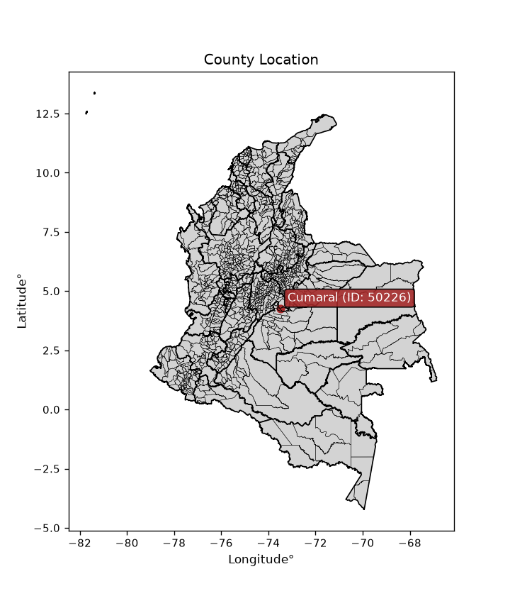
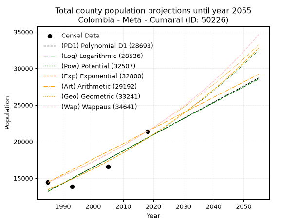
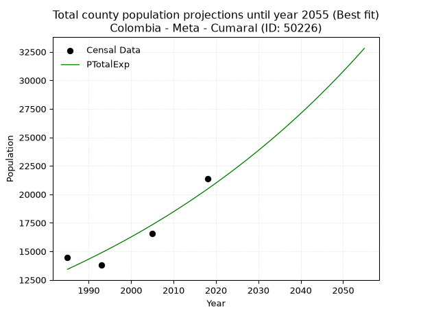
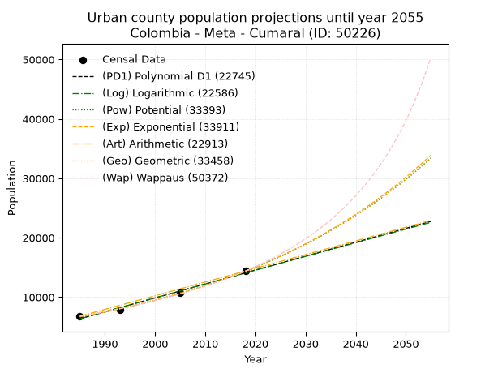
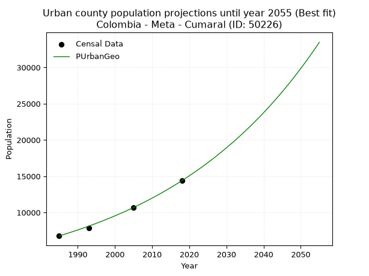
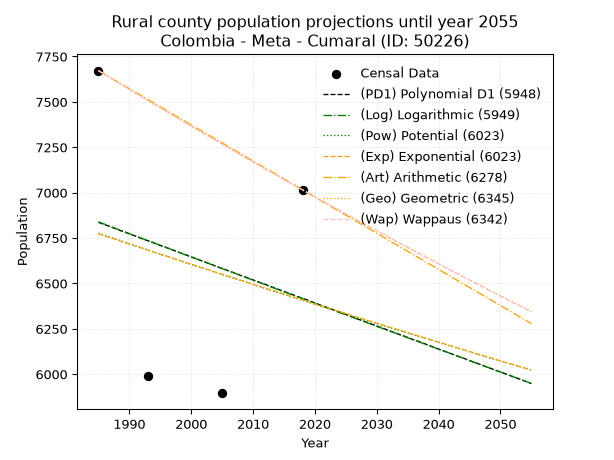
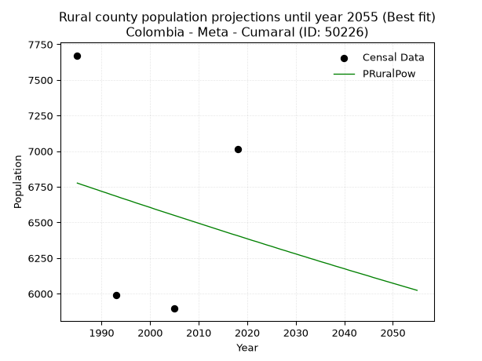

<div align="center">


</div>

# _“Population and Public Services Demand Projections (PPSD) until Year 2050 for Colombia - Meta - Cumaral (ID: 50226)”_
Keywords: `population` `public-service` `projection` `lineal` `polynomial` `logarithmic` `potential` `exponential` `arithmetic` `geometric` `wappaus` `dane` `colombia` `south-america`

PPSD are analytical estimates used by governments and planners to anticipate future changes in population size, age distribution, and the resulting community needs for utilities, healthcare, education, and infrastructure as sizing future water treatment facilities, electrical grids, and road networks based on spatial growth.

<div align="center">

</img>

</div>


> **General running parameters**: • app_version: _v20260806_. • Python version: _3.14.7_. • Pandas version: _3.0.5_. • NumPy version: _2.5.1_. • Creates, save and include plots into reports (create_plot): _False_. • Projection until year: _2050_. • Process polynomial degree 2 and up: _False_. • Process Wappaus: _True_. • Process Wappaus: _True_. • Set negative values to zero: _True_. • Set infinite values to zero: _True_. • Drop dataset notes: _True_. 
<div align="center">

Dynamic map: [:earth_americas:Google](http://maps.google.com/maps?q=4.270041536,-73.4870524) [:earth_americas:OSM](https://www.openstreetmap.org/#map=18/4.270041536/-73.4870524&layers=P) [:earth_americas:Bing](https://www.bing.com/maps?cp=4.270041536~-73.4870524&lvl=18) [:earth_americas:Apple](https://maps.apple.com/frame?center=4.270041536%2C-73.4870524&span=0.003%2C0.006)

</div>


<div align="center">

```geojson
{
  "type": "Feature",
  "geometry": {
    "type": "Point", 
    "coordinates": [-73.4870524, 4.270041536]
  }, 
  "properties": {
    "Name": "Colombia - Meta - Cumaral (ID: 50226)"
  }
}
```

</div>


## 0. Census Data (4 records)

Census data are official statistics collected by a government about the people and housing in a country. They usually include counts of total population, age, sex, race, income, education, and jobs.

📅Global census file: [Population.xlsx](../data/Population.xlsx)

| Source   |   Year |   CountryID | CountryName   |   StateID | StateName   |   CountyID | CountyName   |   PTotal |   PUrban |   PRural |
|:---------|-------:|------------:|:--------------|----------:|:------------|-----------:|:-------------|---------:|---------:|---------:|
| DANE     |   1985 |          57 | Colombia      |        50 | Meta        |      50226 | Cumaral      |    14445 |     6773 |     7672 |
| DANE     |   1993 |          57 | Colombia      |        50 | Meta        |      50226 | Cumaral      |    13828 |     7839 |     5989 |
| DANE     |   2005 |          57 | Colombia      |        50 | Meta        |      50226 | Cumaral      |    16575 |    10680 |     5895 |
| DANE     |   2018 |          57 | Colombia      |        50 | Meta        |      50226 | Cumaral      |    21397 |    14382 |     7015 |

> 🔥Some records could had specific notes about the registered values or the corresponding urban or rural distribution.

📅   [RUPS](https://www.datos.gov.co/Hacienda-y-Cr-dito-P-blico/Registro-nico-de-Prestadores-de-Servicios-P-blicos/4qkq-csdn/about_data) - Local public utility companies: [RUPS.csv](../data/RUPS.xlsx)

 | SERVICIO       | ESTADO    | NOMBRE                                             | NIT         | DEPARTAMENTO_DOMICILIO   | MUNICIPIO_DOMICILIO   | DIRECCION                                       |   TELEFONO | EMAIL                 | TIPO_PRESTADOR                             | CLASIFICACION                 |
|:---------------|:----------|:---------------------------------------------------|:------------|:-------------------------|:----------------------|:------------------------------------------------|-----------:|:----------------------|:-------------------------------------------|:------------------------------|
| ACUEDUCTO      | OPERATIVA | EMPRESA DE SERVICIOS PUBLICOS DEL META S.A. E.S.P. | 822006587-0 | META                     | VILLAVICENCIO         | Diagonal 19 Transversal 23 - 02 Barrio el Nogal |    6726764 | edesa@edesaesp.com.co | SOCIEDADES (EMPRESA DE SERVICIOS PUBLICOS) | MAYOR O IGUAL A 5001 USUARIOS |
| ALCANTARILLADO | OPERATIVA | EMPRESA DE SERVICIOS PUBLICOS DEL META S.A. E.S.P. | 822006587-0 | META                     | VILLAVICENCIO         | Diagonal 19 Transversal 23 - 02 Barrio el Nogal |    6726764 | edesa@edesaesp.com.co | SOCIEDADES (EMPRESA DE SERVICIOS PUBLICOS) | MAYOR O IGUAL A 5001 USUARIOS |

## 1. Total

### 1.1. Coefficients and Parameters

* (PD1) Polynomial Deg 1: 221.57968687273876, -426653.5186671957 (lineal)
* (Log) Logarithmic: 443120.4032717271, -3351600.4862124557
* (Pow) Potential: 25.51176992814087, -80.00371643787636
* (Exp) Exponential: 0.012756081160921718, 1.353301438612856e-07
* (Art) Arithmetic: Year diff. 2018 - 1985 = 33, Population diff. 21397 - 14445 = 6952, Annual growth = 210.66666666666666
* (Geo) Geometric: Year diff. 2018 - 1985 = 33, Population diff. 21397 - 14445 = 6952, Annual growth % = 0.011977293207665163
* (Wap) Wappaus: i = 1.1755296393430426, Condition values only valid for < 200)

<sub>
Wappaus condition values: ['0.00', '1.18', '2.35', '3.53', '4.70', '5.88', '7.05', '8.23', '9.40', '10.58', '11.76', '12.93', '14.11', '15.28', '16.46', '17.63', '18.81', '19.98', '21.16', '22.34', '23.51', '24.69', '25.86', '27.04', '28.21', '29.39', '30.56', '31.74', '32.91', '34.09', '35.27', '36.44', '37.62', '38.79', '39.97', '41.14', '42.32', '43.49', '44.67', '45.85', '47.02', '48.20', '49.37', '50.55', '51.72', '52.90', '54.07', '55.25', '56.43', '57.60', '58.78', '59.95', '61.13', '62.30', '63.48', '64.65', '65.83', '67.01', '68.18', '69.36', '70.53', '71.71', '72.88', '74.06', '75.23', '76.41']
</sub>


### 1.2. Projected Dataset

|   Year |   CountyID |   PTotalPD1 |   PTotalLog |   PTotalPow |   PTotalExp |   PTotalArt |   PTotalGeo |   PTotalWap |
|-------:|-----------:|------------:|------------:|------------:|------------:|------------:|------------:|------------:|
|   1985 |      50226 |       13182 |       13179 |       13427 |       13430 |       14445 |       14445 |       14445 |
|   1986 |      50226 |       13404 |       13402 |       13601 |       13603 |       14656 |       14618 |       14616 |
|   1987 |      50226 |       13625 |       13625 |       13777 |       13777 |       14866 |       14793 |       14789 |
|   1988 |      50226 |       13847 |       13848 |       13955 |       13954 |       15077 |       14970 |       14964 |
|   1989 |      50226 |       14068 |       14071 |       14135 |       14133 |       15288 |       15150 |       15141 |
|   1990 |      50226 |       14290 |       14293 |       14317 |       14315 |       15498 |       15331 |       15320 |
|   1991 |      50226 |       14512 |       14516 |       14502 |       14499 |       15709 |       15515 |       15501 |
|   1992 |      50226 |       14733 |       14738 |       14689 |       14685 |       15920 |       15700 |       15685 |
|   1993 |      50226 |       14955 |       14961 |       14878 |       14873 |       16130 |       15889 |       15870 |
|   1994 |      50226 |       15176 |       15183 |       15070 |       15064 |       16341 |       16079 |       16059 |
|   1995 |      50226 |       15398 |       15405 |       15264 |       15258 |       16552 |       16271 |       16249 |
|   1996 |      50226 |       15620 |       15627 |       15460 |       15453 |       16762 |       16466 |       16442 |
|   1997 |      50226 |       15841 |       15849 |       15659 |       15652 |       16973 |       16664 |       16637 |
|   1998 |      50226 |       16063 |       16071 |       15860 |       15853 |       17184 |       16863 |       16835 |
|   1999 |      50226 |       16284 |       16293 |       16064 |       16056 |       17394 |       17065 |       17035 |
|   2000 |      50226 |       16506 |       16514 |       16271 |       16262 |       17605 |       17269 |       17238 |
|   2001 |      50226 |       16727 |       16736 |       16479 |       16471 |       17816 |       17476 |       17444 |
|   2002 |      50226 |       16949 |       16957 |       16691 |       16683 |       18026 |       17686 |       17652 |
|   2003 |      50226 |       17171 |       17179 |       16905 |       16897 |       18237 |       17897 |       17863 |
|   2004 |      50226 |       17392 |       17400 |       17121 |       17114 |       18448 |       18112 |       18077 |
|   2005 |      50226 |       17614 |       17621 |       17341 |       17333 |       18658 |       18329 |       18294 |
|   2006 |      50226 |       17835 |       17842 |       17563 |       17556 |       18869 |       18548 |       18513 |
|   2007 |      50226 |       18057 |       18063 |       17787 |       17781 |       19080 |       18770 |       18736 |
|   2008 |      50226 |       18278 |       18283 |       18015 |       18010 |       19290 |       18995 |       18961 |
|   2009 |      50226 |       18500 |       18504 |       18245 |       18241 |       19501 |       19223 |       19190 |
|   2010 |      50226 |       18722 |       18725 |       18478 |       18475 |       19712 |       19453 |       19421 |
|   2011 |      50226 |       18943 |       18945 |       18714 |       18712 |       19922 |       19686 |       19656 |
|   2012 |      50226 |       19165 |       19165 |       18953 |       18952 |       20133 |       19922 |       19895 |
|   2013 |      50226 |       19386 |       19385 |       19195 |       19196 |       20344 |       20160 |       20136 |
|   2014 |      50226 |       19608 |       19606 |       19440 |       19442 |       20554 |       20402 |       20381 |
|   2015 |      50226 |       19830 |       19825 |       19687 |       19692 |       20765 |       20646 |       20630 |
|   2016 |      50226 |       20051 |       20045 |       19938 |       19945 |       20976 |       20894 |       20882 |
|   2017 |      50226 |       20273 |       20265 |       20192 |       20201 |       21186 |       21144 |       21138 |
|   2018 |      50226 |       20494 |       20485 |       20449 |       20460 |       21397 |       21397 |       21397 |
|   2019 |      50226 |       20716 |       20704 |       20709 |       20723 |       21608 |       21653 |       21660 |
|   2020 |      50226 |       20937 |       20924 |       20972 |       20989 |       21818 |       21913 |       21927 |
|   2021 |      50226 |       21159 |       21143 |       21239 |       21258 |       22029 |       22175 |       22199 |
|   2022 |      50226 |       21381 |       21362 |       21509 |       21531 |       22240 |       22441 |       22474 |
|   2023 |      50226 |       21602 |       21581 |       21782 |       21807 |       22450 |       22709 |       22753 |
|   2024 |      50226 |       21824 |       21800 |       22058 |       22087 |       22661 |       22981 |       23037 |
|   2025 |      50226 |       22045 |       22019 |       22338 |       22371 |       22872 |       23257 |       23325 |
|   2026 |      50226 |       22267 |       22238 |       22621 |       22658 |       23082 |       23535 |       23617 |
|   2027 |      50226 |       22489 |       22457 |       22907 |       22949 |       23293 |       23817 |       23914 |
|   2028 |      50226 |       22710 |       22675 |       23197 |       23244 |       23504 |       24102 |       24216 |
|   2029 |      50226 |       22932 |       22894 |       23491 |       23542 |       23714 |       24391 |       24523 |
|   2030 |      50226 |       23153 |       23112 |       23788 |       23844 |       23925 |       24683 |       24834 |
|   2031 |      50226 |       23375 |       23330 |       24089 |       24150 |       24136 |       24979 |       25151 |
|   2032 |      50226 |       23596 |       23548 |       24393 |       24460 |       24346 |       25278 |       25472 |
|   2033 |      50226 |       23818 |       23766 |       24701 |       24774 |       24557 |       25581 |       25799 |
|   2034 |      50226 |       24040 |       23984 |       25013 |       25092 |       24768 |       25887 |       26131 |
|   2035 |      50226 |       24261 |       24202 |       25329 |       25415 |       24978 |       26197 |       26469 |
|   2036 |      50226 |       24483 |       24420 |       25648 |       25741 |       25189 |       26511 |       26812 |
|   2037 |      50226 |       24704 |       24637 |       25972 |       26071 |       25400 |       26829 |       27162 |
|   2038 |      50226 |       24926 |       24855 |       26299 |       26406 |       25610 |       27150 |       27517 |
|   2039 |      50226 |       25147 |       25072 |       26630 |       26745 |       25821 |       27475 |       27878 |
|   2040 |      50226 |       25369 |       25289 |       26965 |       27088 |       26032 |       27804 |       28246 |
|   2041 |      50226 |       25591 |       25507 |       27305 |       27436 |       26242 |       28137 |       28620 |
|   2042 |      50226 |       25812 |       25724 |       27648 |       27788 |       26453 |       28474 |       29000 |
|   2043 |      50226 |       26034 |       25941 |       27996 |       28145 |       26664 |       28815 |       29388 |
|   2044 |      50226 |       26255 |       26157 |       28347 |       28506 |       26874 |       29160 |       29782 |
|   2045 |      50226 |       26477 |       26374 |       28703 |       28872 |       27085 |       29510 |       30184 |
|   2046 |      50226 |       26699 |       26591 |       29063 |       29243 |       27296 |       29863 |       30593 |
|   2047 |      50226 |       26920 |       26807 |       29428 |       29618 |       27506 |       30221 |       31009 |
|   2048 |      50226 |       27142 |       27024 |       29797 |       29999 |       27717 |       30583 |       31433 |
|   2049 |      50226 |       27363 |       27240 |       30170 |       30384 |       27928 |       30949 |       31866 |
|   2050 |      50226 |       27585 |       27456 |       30548 |       30774 |       28138 |       31320 |       32306 |
<div align="center">

</img>

</div>


### 1.3. Best fit with absolute and relative error (%)

Relative error puts that difference into context by dividing the absolute error by the true value, creating a unitless ratio or percentage that shows the scale of the mistake.

Absolute and relative error

|   Year | Source   |   CountryID | CountryName   |   StateID | StateName   |   CountyID_x | CountyName   |   PTotal |   PUrban |   PRural |   CountyID_y |   PTotalPD1 |   PTotalLog |   PTotalPow |   PTotalExp |   PTotalArt |   PTotalGeo |   PTotalWap |   PTotalPD1AbsError |   PTotalLogAbsError |   PTotalPowAbsError |   PTotalExpAbsError |   PTotalArtAbsError |   PTotalGeoAbsError |   PTotalWapAbsError |   PTotalPD1RelError |   PTotalLogRelError |   PTotalPowRelError |   PTotalExpRelError |   PTotalArtRelError |   PTotalGeoRelError |   PTotalWapRelError |
|-------:|:---------|------------:|:--------------|----------:|:------------|-------------:|:-------------|---------:|---------:|---------:|-------------:|------------:|------------:|------------:|------------:|------------:|------------:|------------:|--------------------:|--------------------:|--------------------:|--------------------:|--------------------:|--------------------:|--------------------:|--------------------:|--------------------:|--------------------:|--------------------:|--------------------:|--------------------:|--------------------:|
|   1985 | DANE     |          57 | Colombia      |        50 | Meta        |        50226 | Cumaral      |    14445 |     6773 |     7672 |        50226 |       13182 |       13179 |       13427 |       13430 |       14445 |       14445 |       14445 |                1263 |                1266 |                1018 |                1015 |                   0 |                   0 |                   0 |             8.74351 |             8.76428 |             7.04742 |             7.02665 |              0      |              0      |              0      |
|   1993 | DANE     |          57 | Colombia      |        50 | Meta        |        50226 | Cumaral      |    13828 |     7839 |     5989 |        50226 |       14955 |       14961 |       14878 |       14873 |       16130 |       15889 |       15870 |                1127 |                1133 |                1050 |                1045 |                2302 |                2061 |                2042 |             8.15013 |             8.19352 |             7.59329 |             7.55713 |             16.6474 |             14.9045 |             14.7671 |
|   2005 | DANE     |          57 | Colombia      |        50 | Meta        |        50226 | Cumaral      |    16575 |    10680 |     5895 |        50226 |       17614 |       17621 |       17341 |       17333 |       18658 |       18329 |       18294 |                1039 |                1046 |                 766 |                 758 |                2083 |                1754 |                1719 |             6.26848 |             6.31071 |             4.62142 |             4.57315 |             12.5671 |             10.5822 |             10.371  |
|   2018 | DANE     |          57 | Colombia      |        50 | Meta        |        50226 | Cumaral      |    21397 |    14382 |     7015 |        50226 |       20494 |       20485 |       20449 |       20460 |       21397 |       21397 |       21397 |                 903 |                 912 |                 948 |                 937 |                   0 |                   0 |                   0 |             4.22022 |             4.26228 |             4.43053 |             4.37912 |              0      |              0      |              0      |

Relative error mean

| Method    |   RelError | Best   |
|:----------|-----------:|:-------|
| PTotalPD1 |    6.84558 |        |
| PTotalLog |    6.8827  |        |
| PTotalPow |    5.92316 |        |
| PTotalExp |    5.88401 | True   |
| PTotalArt |    7.30363 |        |
| PTotalGeo |    6.37169 |        |
| PTotalWap |    6.28454 |        |

💙Best method: _**PTotalExp**_
<div align="center">

</img>

</div>


### 1.4. Fresh water supply demand in liters per capita per day (lpcd)

The fresh water supply demand typically ranges from 100 to 300 liters per capita per day (lpcd) for standard domestic and municipal planning, though absolute survival minimums set by the World Health Organization are as low as 7.5 to 20 liters per day, and total consumption in high-income nations can exceed 400 liters.

> `CZ`: Level in meters above the sea level (masl)<br> `WS`: Fresh water supply demand in liters per capita per day (lpcd or l/h/d)<br> `WSAll`: Zonal fresh water supply demand in liters per second (l/s)<br> `A`: Zonal area in square meters<br> `DP`: Population density (people/hectare or p/ha)

Reference values (RAS Colombia)

|    CZ |   WS |
|------:|-----:|
|  1000 |  120 |
|  2000 |  130 |
| 99999 |  140 |

County shapefile geometry properties and water supply values

|   CountyID |      ATotal |   CZTotal |   WSTotal |
|-----------:|------------:|----------:|----------:|
|      50226 | 6.23828e+08 |   296.943 |       120 |

Projected values for best method: PTotalExp

|   CountyID |   Year |   PTotalExp |   DPTotal |   WSTotal |   WSTotalAll |
|-----------:|-------:|------------:|----------:|----------:|-------------:|
|      50226 |   1985 |       13430 |      0.22 |       120 |      18.6528 |
|      50226 |   1986 |       13603 |      0.22 |       120 |      18.8931 |
|      50226 |   1987 |       13777 |      0.22 |       120 |      19.1347 |
|      50226 |   1988 |       13954 |      0.22 |       120 |      19.3806 |
|      50226 |   1989 |       14133 |      0.23 |       120 |      19.6292 |
|      50226 |   1990 |       14315 |      0.23 |       120 |      19.8819 |
|      50226 |   1991 |       14499 |      0.23 |       120 |      20.1375 |
|      50226 |   1992 |       14685 |      0.24 |       120 |      20.3958 |
|      50226 |   1993 |       14873 |      0.24 |       120 |      20.6569 |
|      50226 |   1994 |       15064 |      0.24 |       120 |      20.9222 |
|      50226 |   1995 |       15258 |      0.24 |       120 |      21.1917 |
|      50226 |   1996 |       15453 |      0.25 |       120 |      21.4625 |
|      50226 |   1997 |       15652 |      0.25 |       120 |      21.7389 |
|      50226 |   1998 |       15853 |      0.25 |       120 |      22.0181 |
|      50226 |   1999 |       16056 |      0.26 |       120 |      22.3    |
|      50226 |   2000 |       16262 |      0.26 |       120 |      22.5861 |
|      50226 |   2001 |       16471 |      0.26 |       120 |      22.8764 |
|      50226 |   2002 |       16683 |      0.27 |       120 |      23.1708 |
|      50226 |   2003 |       16897 |      0.27 |       120 |      23.4681 |
|      50226 |   2004 |       17114 |      0.27 |       120 |      23.7694 |
|      50226 |   2005 |       17333 |      0.28 |       120 |      24.0736 |
|      50226 |   2006 |       17556 |      0.28 |       120 |      24.3833 |
|      50226 |   2007 |       17781 |      0.29 |       120 |      24.6958 |
|      50226 |   2008 |       18010 |      0.29 |       120 |      25.0139 |
|      50226 |   2009 |       18241 |      0.29 |       120 |      25.3347 |
|      50226 |   2010 |       18475 |      0.3  |       120 |      25.6597 |
|      50226 |   2011 |       18712 |      0.3  |       120 |      25.9889 |
|      50226 |   2012 |       18952 |      0.3  |       120 |      26.3222 |
|      50226 |   2013 |       19196 |      0.31 |       120 |      26.6611 |
|      50226 |   2014 |       19442 |      0.31 |       120 |      27.0028 |
|      50226 |   2015 |       19692 |      0.32 |       120 |      27.35   |
|      50226 |   2016 |       19945 |      0.32 |       120 |      27.7014 |
|      50226 |   2017 |       20201 |      0.32 |       120 |      28.0569 |
|      50226 |   2018 |       20460 |      0.33 |       120 |      28.4167 |
|      50226 |   2019 |       20723 |      0.33 |       120 |      28.7819 |
|      50226 |   2020 |       20989 |      0.34 |       120 |      29.1514 |
|      50226 |   2021 |       21258 |      0.34 |       120 |      29.525  |
|      50226 |   2022 |       21531 |      0.35 |       120 |      29.9042 |
|      50226 |   2023 |       21807 |      0.35 |       120 |      30.2875 |
|      50226 |   2024 |       22087 |      0.35 |       120 |      30.6764 |
|      50226 |   2025 |       22371 |      0.36 |       120 |      31.0708 |
|      50226 |   2026 |       22658 |      0.36 |       120 |      31.4694 |
|      50226 |   2027 |       22949 |      0.37 |       120 |      31.8736 |
|      50226 |   2028 |       23244 |      0.37 |       120 |      32.2833 |
|      50226 |   2029 |       23542 |      0.38 |       120 |      32.6972 |
|      50226 |   2030 |       23844 |      0.38 |       120 |      33.1167 |
|      50226 |   2031 |       24150 |      0.39 |       120 |      33.5417 |
|      50226 |   2032 |       24460 |      0.39 |       120 |      33.9722 |
|      50226 |   2033 |       24774 |      0.4  |       120 |      34.4083 |
|      50226 |   2034 |       25092 |      0.4  |       120 |      34.85   |
|      50226 |   2035 |       25415 |      0.41 |       120 |      35.2986 |
|      50226 |   2036 |       25741 |      0.41 |       120 |      35.7514 |
|      50226 |   2037 |       26071 |      0.42 |       120 |      36.2097 |
|      50226 |   2038 |       26406 |      0.42 |       120 |      36.675  |
|      50226 |   2039 |       26745 |      0.43 |       120 |      37.1458 |
|      50226 |   2040 |       27088 |      0.43 |       120 |      37.6222 |
|      50226 |   2041 |       27436 |      0.44 |       120 |      38.1056 |
|      50226 |   2042 |       27788 |      0.45 |       120 |      38.5944 |
|      50226 |   2043 |       28145 |      0.45 |       120 |      39.0903 |
|      50226 |   2044 |       28506 |      0.46 |       120 |      39.5917 |
|      50226 |   2045 |       28872 |      0.46 |       120 |      40.1    |
|      50226 |   2046 |       29243 |      0.47 |       120 |      40.6153 |
|      50226 |   2047 |       29618 |      0.47 |       120 |      41.1361 |
|      50226 |   2048 |       29999 |      0.48 |       120 |      41.6653 |
|      50226 |   2049 |       30384 |      0.49 |       120 |      42.2    |
|      50226 |   2050 |       30774 |      0.49 |       120 |      42.7417 |

## 2. Urban

### 2.1. Coefficients and Parameters

* (PD1) Polynomial Deg 1: 234.26655961461012, -458673.1858691239 (lineal)
* (Log) Logarithmic: 468778.1886700873, -3553268.26863398
* (Pow) Potential: 46.50615035059714, -149.54247113258984
* (Exp) Exponential: 0.023235512916186286, 6.211910904443584e-17
* (Art) Arithmetic: Year diff. 2018 - 1985 = 33, Population diff. 14382 - 6773 = 7609, Annual growth = 230.57575757575756
* (Geo) Geometric: Year diff. 2018 - 1985 = 33, Population diff. 14382 - 6773 = 7609, Annual growth % = 0.023081540517598587
* (Wap) Wappaus: i = 2.1798700787119603, Condition values only valid for < 200)

<sub>
Wappaus condition values: ['0.00', '2.18', '4.36', '6.54', '8.72', '10.90', '13.08', '15.26', '17.44', '19.62', '21.80', '23.98', '26.16', '28.34', '30.52', '32.70', '34.88', '37.06', '39.24', '41.42', '43.60', '45.78', '47.96', '50.14', '52.32', '54.50', '56.68', '58.86', '61.04', '63.22', '65.40', '67.58', '69.76', '71.94', '74.12', '76.30', '78.48', '80.66', '82.84', '85.01', '87.19', '89.37', '91.55', '93.73', '95.91', '98.09', '100.27', '102.45', '104.63', '106.81', '108.99', '111.17', '113.35', '115.53', '117.71', '119.89', '122.07', '124.25', '126.43', '128.61', '130.79', '132.97', '135.15', '137.33', '139.51', '141.69']
</sub>


### 2.2. Projected Dataset

|   Year |   CountyID |   PUrbanPD1 |   PUrbanLog |   PUrbanPow |   PUrbanExp |   PUrbanArt |   PUrbanGeo |   PUrbanWap |
|-------:|-----------:|------------:|------------:|------------:|------------:|------------:|------------:|------------:|
|   1985 |      50226 |        6346 |        6340 |        6663 |        6668 |        6773 |        6773 |        6773 |
|   1986 |      50226 |        6580 |        6576 |        6821 |        6824 |        7004 |        6929 |        6922 |
|   1987 |      50226 |        6814 |        6812 |        6983 |        6985 |        7234 |        7089 |        7075 |
|   1988 |      50226 |        7049 |        7048 |        7148 |        7149 |        7465 |        7253 |        7231 |
|   1989 |      50226 |        7283 |        7284 |        7317 |        7317 |        7695 |        7420 |        7390 |
|   1990 |      50226 |        7517 |        7519 |        7490 |        7489 |        7926 |        7592 |        7554 |
|   1991 |      50226 |        7752 |        7755 |        7667 |        7665 |        8156 |        7767 |        7721 |
|   1992 |      50226 |        7986 |        7990 |        7848 |        7845 |        8387 |        7946 |        7892 |
|   1993 |      50226 |        8220 |        8225 |        8034 |        8030 |        8618 |        8129 |        8067 |
|   1994 |      50226 |        8454 |        8461 |        8223 |        8218 |        8848 |        8317 |        8246 |
|   1995 |      50226 |        8689 |        8696 |        8417 |        8412 |        9079 |        8509 |        8430 |
|   1996 |      50226 |        8923 |        8931 |        8616 |        8609 |        9309 |        8706 |        8618 |
|   1997 |      50226 |        9157 |        9165 |        8819 |        8812 |        9540 |        8906 |        8811 |
|   1998 |      50226 |        9391 |        9400 |        9026 |        9019 |        9770 |        9112 |        9009 |
|   1999 |      50226 |        9626 |        9635 |        9239 |        9231 |       10001 |        9322 |        9212 |
|   2000 |      50226 |        9860 |        9869 |        9456 |        9448 |       10232 |        9538 |        9420 |
|   2001 |      50226 |       10094 |       10103 |        9679 |        9670 |       10462 |        9758 |        9634 |
|   2002 |      50226 |       10328 |       10338 |        9906 |        9897 |       10693 |        9983 |        9854 |
|   2003 |      50226 |       10563 |       10572 |       10139 |       10130 |       10923 |       10213 |       10079 |
|   2004 |      50226 |       10797 |       10806 |       10377 |       10368 |       11154 |       10449 |       10311 |
|   2005 |      50226 |       11031 |       11040 |       10621 |       10612 |       11385 |       10690 |       10549 |
|   2006 |      50226 |       11266 |       11273 |       10870 |       10861 |       11615 |       10937 |       10794 |
|   2007 |      50226 |       11500 |       11507 |       11125 |       11117 |       11846 |       11189 |       11046 |
|   2008 |      50226 |       11734 |       11740 |       11386 |       11378 |       12076 |       11448 |       11305 |
|   2009 |      50226 |       11968 |       11974 |       11652 |       11645 |       12307 |       11712 |       11572 |
|   2010 |      50226 |       12203 |       12207 |       11925 |       11919 |       12537 |       11982 |       11847 |
|   2011 |      50226 |       12437 |       12440 |       12204 |       12199 |       12768 |       12259 |       12130 |
|   2012 |      50226 |       12671 |       12673 |       12490 |       12486 |       12999 |       12542 |       12422 |
|   2013 |      50226 |       12905 |       12906 |       12782 |       12780 |       13229 |       12831 |       12723 |
|   2014 |      50226 |       13140 |       13139 |       13080 |       13080 |       13460 |       13127 |       13033 |
|   2015 |      50226 |       13374 |       13372 |       13386 |       13388 |       13690 |       13430 |       13354 |
|   2016 |      50226 |       13608 |       13604 |       13698 |       13702 |       13921 |       13740 |       13686 |
|   2017 |      50226 |       13842 |       13837 |       14018 |       14024 |       14151 |       14058 |       14028 |
|   2018 |      50226 |       14077 |       14069 |       14345 |       14354 |       14382 |       14382 |       14382 |
|   2019 |      50226 |       14311 |       14301 |       14679 |       14691 |       14613 |       14714 |       14748 |
|   2020 |      50226 |       14545 |       14534 |       15021 |       15037 |       14843 |       15054 |       15128 |
|   2021 |      50226 |       14780 |       14766 |       15371 |       15390 |       15074 |       15401 |       15520 |
|   2022 |      50226 |       15014 |       14997 |       15728 |       15752 |       15304 |       15757 |       15928 |
|   2023 |      50226 |       15248 |       15229 |       16094 |       16122 |       15535 |       16120 |       16350 |
|   2024 |      50226 |       15482 |       15461 |       16468 |       16501 |       15765 |       16492 |       16788 |
|   2025 |      50226 |       15717 |       15692 |       16851 |       16889 |       15996 |       16873 |       17244 |
|   2026 |      50226 |       15951 |       15924 |       17242 |       17286 |       16227 |       17262 |       17717 |
|   2027 |      50226 |       16185 |       16155 |       17643 |       17693 |       16457 |       17661 |       18209 |
|   2028 |      50226 |       16419 |       16386 |       18052 |       18109 |       16688 |       18068 |       18722 |
|   2029 |      50226 |       16654 |       16617 |       18471 |       18534 |       16918 |       18486 |       19256 |
|   2030 |      50226 |       16888 |       16848 |       18899 |       18970 |       17149 |       18912 |       19812 |
|   2031 |      50226 |       17122 |       17079 |       19337 |       19416 |       17379 |       19349 |       20393 |
|   2032 |      50226 |       17356 |       17310 |       19785 |       19872 |       17610 |       19795 |       21001 |
|   2033 |      50226 |       17591 |       17541 |       20242 |       20339 |       17841 |       20252 |       21635 |
|   2034 |      50226 |       17825 |       17771 |       20711 |       20818 |       18071 |       20720 |       22300 |
|   2035 |      50226 |       18059 |       18002 |       21190 |       21307 |       18302 |       21198 |       22996 |
|   2036 |      50226 |       18294 |       18232 |       21679 |       21808 |       18532 |       21687 |       23727 |
|   2037 |      50226 |       18528 |       18462 |       22180 |       22321 |       18763 |       22188 |       24494 |
|   2038 |      50226 |       18762 |       18692 |       22692 |       22845 |       18994 |       22700 |       25301 |
|   2039 |      50226 |       18996 |       18922 |       23216 |       23382 |       19224 |       23224 |       26151 |
|   2040 |      50226 |       19231 |       19152 |       23751 |       23932 |       19455 |       23760 |       27047 |
|   2041 |      50226 |       19465 |       19382 |       24299 |       24494 |       19685 |       24308 |       27993 |
|   2042 |      50226 |       19699 |       19611 |       24859 |       25070 |       19916 |       24869 |       28993 |
|   2043 |      50226 |       19933 |       19841 |       25431 |       25660 |       20146 |       25443 |       30053 |
|   2044 |      50226 |       20168 |       20070 |       26017 |       26263 |       20377 |       26031 |       31178 |
|   2045 |      50226 |       20402 |       20300 |       26615 |       26880 |       20608 |       26632 |       32373 |
|   2046 |      50226 |       20636 |       20529 |       27227 |       27512 |       20838 |       27246 |       33646 |
|   2047 |      50226 |       20870 |       20758 |       27853 |       28159 |       21069 |       27875 |       35005 |
|   2048 |      50226 |       21105 |       20987 |       28493 |       28821 |       21299 |       28519 |       36458 |
|   2049 |      50226 |       21339 |       21216 |       29147 |       29498 |       21530 |       29177 |       38016 |
|   2050 |      50226 |       21573 |       21444 |       29816 |       30192 |       21760 |       29850 |       39690 |
<div align="center">

</img>

</div>


### 2.3. Best fit with absolute and relative error (%)

Relative error puts that difference into context by dividing the absolute error by the true value, creating a unitless ratio or percentage that shows the scale of the mistake.

Absolute and relative error

|   Year | Source   |   CountryID | CountryName   |   StateID | StateName   |   CountyID_x | CountyName   |   PTotal |   PUrban |   PRural |   CountyID_y |   PUrbanPD1 |   PUrbanLog |   PUrbanPow |   PUrbanExp |   PUrbanArt |   PUrbanGeo |   PUrbanWap |   PUrbanPD1AbsError |   PUrbanLogAbsError |   PUrbanPowAbsError |   PUrbanExpAbsError |   PUrbanArtAbsError |   PUrbanGeoAbsError |   PUrbanWapAbsError |   PUrbanPD1RelError |   PUrbanLogRelError |   PUrbanPowRelError |   PUrbanExpRelError |   PUrbanArtRelError |   PUrbanGeoRelError |   PUrbanWapRelError |
|-------:|:---------|------------:|:--------------|----------:|:------------|-------------:|:-------------|---------:|---------:|---------:|-------------:|------------:|------------:|------------:|------------:|------------:|------------:|------------:|--------------------:|--------------------:|--------------------:|--------------------:|--------------------:|--------------------:|--------------------:|--------------------:|--------------------:|--------------------:|--------------------:|--------------------:|--------------------:|--------------------:|
|   1985 | DANE     |          57 | Colombia      |        50 | Meta        |        50226 | Cumaral      |    14445 |     6773 |     7672 |        50226 |        6346 |        6340 |        6663 |        6668 |        6773 |        6773 |        6773 |                 427 |                 433 |                 110 |                 105 |                   0 |                   0 |                   0 |             6.30444 |             6.39303 |            1.6241   |            1.55027  |             0       |            0        |             0       |
|   1993 | DANE     |          57 | Colombia      |        50 | Meta        |        50226 | Cumaral      |    13828 |     7839 |     5989 |        50226 |        8220 |        8225 |        8034 |        8030 |        8618 |        8129 |        8067 |                 381 |                 386 |                 195 |                 191 |                 779 |                 290 |                 228 |             4.86031 |             4.9241  |            2.48756  |            2.43654  |             9.93749 |            3.69945  |             2.90853 |
|   2005 | DANE     |          57 | Colombia      |        50 | Meta        |        50226 | Cumaral      |    16575 |    10680 |     5895 |        50226 |       11031 |       11040 |       10621 |       10612 |       11385 |       10690 |       10549 |                 351 |                 360 |                  59 |                  68 |                 705 |                  10 |                 131 |             3.28652 |             3.37079 |            0.552434 |            0.636704 |             6.60112 |            0.093633 |             1.22659 |
|   2018 | DANE     |          57 | Colombia      |        50 | Meta        |        50226 | Cumaral      |    21397 |    14382 |     7015 |        50226 |       14077 |       14069 |       14345 |       14354 |       14382 |       14382 |       14382 |                 305 |                 313 |                  37 |                  28 |                   0 |                   0 |                   0 |             2.12071 |             2.17633 |            0.257266 |            0.194688 |             0       |            0        |             0       |

Relative error mean

| Method    |   RelError | Best   |
|:----------|-----------:|:-------|
| PUrbanPD1 |   4.143    |        |
| PUrbanLog |   4.21606  |        |
| PUrbanPow |   1.23034  |        |
| PUrbanExp |   1.20455  |        |
| PUrbanArt |   4.13465  |        |
| PUrbanGeo |   0.948271 | True   |
| PUrbanWap |   1.03378  |        |

💙Best method: _**PUrbanGeo**_
<div align="center">

</img>

</div>


### 2.4. Fresh water supply demand in liters per capita per day (lpcd)

The fresh water supply demand typically ranges from 100 to 300 liters per capita per day (lpcd) for standard domestic and municipal planning, though absolute survival minimums set by the World Health Organization are as low as 7.5 to 20 liters per day, and total consumption in high-income nations can exceed 400 liters.

> `CZ`: Level in meters above the sea level (masl)<br> `WS`: Fresh water supply demand in liters per capita per day (lpcd or l/h/d)<br> `WSAll`: Zonal fresh water supply demand in liters per second (l/s)<br> `A`: Zonal area in square meters<br> `DP`: Population density (people/hectare or p/ha)

Reference values (RAS Colombia)

|    CZ |   WS |
|------:|-----:|
|  1000 |  120 |
|  2000 |  130 |
| 99999 |  140 |

County shapefile geometry properties and water supply values

|   CountyID |      AUrban |   CZUrban |   WSUrban |
|-----------:|------------:|----------:|----------:|
|      50226 | 5.80749e+06 |   409.767 |       120 |

Projected values for best method: PUrbanGeo

|   CountyID |   Year |   PUrbanGeo |   DPUrban |   WSUrban |   WSUrbanAll |
|-----------:|-------:|------------:|----------:|----------:|-------------:|
|      50226 |   1985 |        6773 |     11.66 |       120 |      9.40694 |
|      50226 |   1986 |        6929 |     11.93 |       120 |      9.62361 |
|      50226 |   1987 |        7089 |     12.21 |       120 |      9.84583 |
|      50226 |   1988 |        7253 |     12.49 |       120 |     10.0736  |
|      50226 |   1989 |        7420 |     12.78 |       120 |     10.3056  |
|      50226 |   1990 |        7592 |     13.07 |       120 |     10.5444  |
|      50226 |   1991 |        7767 |     13.37 |       120 |     10.7875  |
|      50226 |   1992 |        7946 |     13.68 |       120 |     11.0361  |
|      50226 |   1993 |        8129 |     14    |       120 |     11.2903  |
|      50226 |   1994 |        8317 |     14.32 |       120 |     11.5514  |
|      50226 |   1995 |        8509 |     14.65 |       120 |     11.8181  |
|      50226 |   1996 |        8706 |     14.99 |       120 |     12.0917  |
|      50226 |   1997 |        8906 |     15.34 |       120 |     12.3694  |
|      50226 |   1998 |        9112 |     15.69 |       120 |     12.6556  |
|      50226 |   1999 |        9322 |     16.05 |       120 |     12.9472  |
|      50226 |   2000 |        9538 |     16.42 |       120 |     13.2472  |
|      50226 |   2001 |        9758 |     16.8  |       120 |     13.5528  |
|      50226 |   2002 |        9983 |     17.19 |       120 |     13.8653  |
|      50226 |   2003 |       10213 |     17.59 |       120 |     14.1847  |
|      50226 |   2004 |       10449 |     17.99 |       120 |     14.5125  |
|      50226 |   2005 |       10690 |     18.41 |       120 |     14.8472  |
|      50226 |   2006 |       10937 |     18.83 |       120 |     15.1903  |
|      50226 |   2007 |       11189 |     19.27 |       120 |     15.5403  |
|      50226 |   2008 |       11448 |     19.71 |       120 |     15.9     |
|      50226 |   2009 |       11712 |     20.17 |       120 |     16.2667  |
|      50226 |   2010 |       11982 |     20.63 |       120 |     16.6417  |
|      50226 |   2011 |       12259 |     21.11 |       120 |     17.0264  |
|      50226 |   2012 |       12542 |     21.6  |       120 |     17.4194  |
|      50226 |   2013 |       12831 |     22.09 |       120 |     17.8208  |
|      50226 |   2014 |       13127 |     22.6  |       120 |     18.2319  |
|      50226 |   2015 |       13430 |     23.13 |       120 |     18.6528  |
|      50226 |   2016 |       13740 |     23.66 |       120 |     19.0833  |
|      50226 |   2017 |       14058 |     24.21 |       120 |     19.525   |
|      50226 |   2018 |       14382 |     24.76 |       120 |     19.975   |
|      50226 |   2019 |       14714 |     25.34 |       120 |     20.4361  |
|      50226 |   2020 |       15054 |     25.92 |       120 |     20.9083  |
|      50226 |   2021 |       15401 |     26.52 |       120 |     21.3903  |
|      50226 |   2022 |       15757 |     27.13 |       120 |     21.8847  |
|      50226 |   2023 |       16120 |     27.76 |       120 |     22.3889  |
|      50226 |   2024 |       16492 |     28.4  |       120 |     22.9056  |
|      50226 |   2025 |       16873 |     29.05 |       120 |     23.4347  |
|      50226 |   2026 |       17262 |     29.72 |       120 |     23.975   |
|      50226 |   2027 |       17661 |     30.41 |       120 |     24.5292  |
|      50226 |   2028 |       18068 |     31.11 |       120 |     25.0944  |
|      50226 |   2029 |       18486 |     31.83 |       120 |     25.675   |
|      50226 |   2030 |       18912 |     32.56 |       120 |     26.2667  |
|      50226 |   2031 |       19349 |     33.32 |       120 |     26.8736  |
|      50226 |   2032 |       19795 |     34.09 |       120 |     27.4931  |
|      50226 |   2033 |       20252 |     34.87 |       120 |     28.1278  |
|      50226 |   2034 |       20720 |     35.68 |       120 |     28.7778  |
|      50226 |   2035 |       21198 |     36.5  |       120 |     29.4417  |
|      50226 |   2036 |       21687 |     37.34 |       120 |     30.1208  |
|      50226 |   2037 |       22188 |     38.21 |       120 |     30.8167  |
|      50226 |   2038 |       22700 |     39.09 |       120 |     31.5278  |
|      50226 |   2039 |       23224 |     39.99 |       120 |     32.2556  |
|      50226 |   2040 |       23760 |     40.91 |       120 |     33       |
|      50226 |   2041 |       24308 |     41.86 |       120 |     33.7611  |
|      50226 |   2042 |       24869 |     42.82 |       120 |     34.5403  |
|      50226 |   2043 |       25443 |     43.81 |       120 |     35.3375  |
|      50226 |   2044 |       26031 |     44.82 |       120 |     36.1542  |
|      50226 |   2045 |       26632 |     45.86 |       120 |     36.9889  |
|      50226 |   2046 |       27246 |     46.92 |       120 |     37.8417  |
|      50226 |   2047 |       27875 |     48    |       120 |     38.7153  |
|      50226 |   2048 |       28519 |     49.11 |       120 |     39.6097  |
|      50226 |   2049 |       29177 |     50.24 |       120 |     40.5236  |
|      50226 |   2050 |       29850 |     51.4  |       120 |     41.4583  |

## 3. Rural

### 3.1. Coefficients and Parameters

* (PD1) Polynomial Deg 1: -12.686872741871438, 32019.667201928343 (lineal)
* (Log) Logarithmic: -25657.78539836043, 201667.782421526
* (Pow) Potential: -3.3987839106689597, 15.039337041262252
* (Exp) Exponential: -0.0016782175549881419, 189477.24231133834
* (Art) Arithmetic: Year diff. 2018 - 1985 = 33, Population diff. 7015 - 7672 = -657, Annual growth = -19.90909090909091
* (Geo) Geometric: Year diff. 2018 - 1985 = 33, Population diff. 7015 - 7672 = -657, Annual growth % = -0.0027092513372334315
* (Wap) Wappaus: i = -0.27111174384273046, Condition values only valid for < 200)

<sub>
Wappaus condition values: ['-0.00', '-0.27', '-0.54', '-0.81', '-1.08', '-1.36', '-1.63', '-1.90', '-2.17', '-2.44', '-2.71', '-2.98', '-3.25', '-3.52', '-3.80', '-4.07', '-4.34', '-4.61', '-4.88', '-5.15', '-5.42', '-5.69', '-5.96', '-6.24', '-6.51', '-6.78', '-7.05', '-7.32', '-7.59', '-7.86', '-8.13', '-8.40', '-8.68', '-8.95', '-9.22', '-9.49', '-9.76', '-10.03', '-10.30', '-10.57', '-10.84', '-11.12', '-11.39', '-11.66', '-11.93', '-12.20', '-12.47', '-12.74', '-13.01', '-13.28', '-13.56', '-13.83', '-14.10', '-14.37', '-14.64', '-14.91', '-15.18', '-15.45', '-15.72', '-16.00', '-16.27', '-16.54', '-16.81', '-17.08', '-17.35', '-17.62']
</sub>


### 3.2. Projected Dataset

|   Year |   CountyID |   PRuralPD1 |   PRuralLog |   PRuralPow |   PRuralExp |   PRuralArt |   PRuralGeo |   PRuralWap |
|-------:|-----------:|------------:|------------:|------------:|------------:|------------:|------------:|------------:|
|   1985 |      50226 |        6836 |        6839 |        6776 |        6773 |        7672 |        7672 |        7672 |
|   1986 |      50226 |        6824 |        6826 |        6764 |        6762 |        7652 |        7651 |        7651 |
|   1987 |      50226 |        6811 |        6813 |        6753 |        6751 |        7632 |        7630 |        7631 |
|   1988 |      50226 |        6798 |        6800 |        6741 |        6739 |        7612 |        7610 |        7610 |
|   1989 |      50226 |        6785 |        6787 |        6730 |        6728 |        7592 |        7589 |        7589 |
|   1990 |      50226 |        6773 |        6774 |        6718 |        6717 |        7572 |        7569 |        7569 |
|   1991 |      50226 |        6760 |        6761 |        6707 |        6706 |        7553 |        7548 |        7548 |
|   1992 |      50226 |        6747 |        6748 |        6695 |        6694 |        7533 |        7528 |        7528 |
|   1993 |      50226 |        6735 |        6735 |        6684 |        6683 |        7513 |        7507 |        7507 |
|   1994 |      50226 |        6722 |        6723 |        6672 |        6672 |        7493 |        7487 |        7487 |
|   1995 |      50226 |        6709 |        6710 |        6661 |        6661 |        7473 |        7467 |        7467 |
|   1996 |      50226 |        6697 |        6697 |        6650 |        6650 |        7453 |        7446 |        7447 |
|   1997 |      50226 |        6684 |        6684 |        6638 |        6638 |        7433 |        7426 |        7426 |
|   1998 |      50226 |        6671 |        6671 |        6627 |        6627 |        7413 |        7406 |        7406 |
|   1999 |      50226 |        6659 |        6658 |        6616 |        6616 |        7393 |        7386 |        7386 |
|   2000 |      50226 |        6646 |        6645 |        6605 |        6605 |        7373 |        7366 |        7366 |
|   2001 |      50226 |        6633 |        6633 |        6593 |        6594 |        7353 |        7346 |        7346 |
|   2002 |      50226 |        6621 |        6620 |        6582 |        6583 |        7334 |        7326 |        7326 |
|   2003 |      50226 |        6608 |        6607 |        6571 |        6572 |        7314 |        7306 |        7307 |
|   2004 |      50226 |        6595 |        6594 |        6560 |        6561 |        7294 |        7287 |        7287 |
|   2005 |      50226 |        6582 |        6581 |        6549 |        6550 |        7274 |        7267 |        7267 |
|   2006 |      50226 |        6570 |        6569 |        6538 |        6539 |        7254 |        7247 |        7247 |
|   2007 |      50226 |        6557 |        6556 |        6527 |        6528 |        7234 |        7227 |        7228 |
|   2008 |      50226 |        6544 |        6543 |        6516 |        6517 |        7214 |        7208 |        7208 |
|   2009 |      50226 |        6532 |        6530 |        6505 |        6506 |        7194 |        7188 |        7189 |
|   2010 |      50226 |        6519 |        6517 |        6494 |        6495 |        7174 |        7169 |        7169 |
|   2011 |      50226 |        6506 |        6505 |        6483 |        6484 |        7154 |        7149 |        7150 |
|   2012 |      50226 |        6494 |        6492 |        6472 |        6473 |        7134 |        7130 |        7130 |
|   2013 |      50226 |        6481 |        6479 |        6461 |        6463 |        7115 |        7111 |        7111 |
|   2014 |      50226 |        6468 |        6466 |        6450 |        6452 |        7095 |        7092 |        7092 |
|   2015 |      50226 |        6456 |        6454 |        6439 |        6441 |        7075 |        7072 |        7072 |
|   2016 |      50226 |        6443 |        6441 |        6428 |        6430 |        7055 |        7053 |        7053 |
|   2017 |      50226 |        6430 |        6428 |        6417 |        6419 |        7035 |        7034 |        7034 |
|   2018 |      50226 |        6418 |        6416 |        6407 |        6409 |        7015 |        7015 |        7015 |
|   2019 |      50226 |        6405 |        6403 |        6396 |        6398 |        6995 |        6996 |        6996 |
|   2020 |      50226 |        6392 |        6390 |        6385 |        6387 |        6975 |        6977 |        6977 |
|   2021 |      50226 |        6379 |        6377 |        6374 |        6376 |        6955 |        6958 |        6958 |
|   2022 |      50226 |        6367 |        6365 |        6364 |        6366 |        6935 |        6939 |        6939 |
|   2023 |      50226 |        6354 |        6352 |        6353 |        6355 |        6915 |        6920 |        6920 |
|   2024 |      50226 |        6341 |        6339 |        6342 |        6344 |        6896 |        6902 |        6902 |
|   2025 |      50226 |        6329 |        6327 |        6332 |        6334 |        6876 |        6883 |        6883 |
|   2026 |      50226 |        6316 |        6314 |        6321 |        6323 |        6856 |        6864 |        6864 |
|   2027 |      50226 |        6303 |        6301 |        6310 |        6312 |        6836 |        6846 |        6845 |
|   2028 |      50226 |        6291 |        6289 |        6300 |        6302 |        6816 |        6827 |        6827 |
|   2029 |      50226 |        6278 |        6276 |        6289 |        6291 |        6796 |        6809 |        6808 |
|   2030 |      50226 |        6265 |        6263 |        6279 |        6281 |        6776 |        6790 |        6790 |
|   2031 |      50226 |        6253 |        6251 |        6268 |        6270 |        6756 |        6772 |        6771 |
|   2032 |      50226 |        6240 |        6238 |        6258 |        6260 |        6736 |        6754 |        6753 |
|   2033 |      50226 |        6227 |        6226 |        6247 |        6249 |        6716 |        6735 |        6735 |
|   2034 |      50226 |        6215 |        6213 |        6237 |        6239 |        6696 |        6717 |        6716 |
|   2035 |      50226 |        6202 |        6200 |        6226 |        6228 |        6677 |        6699 |        6698 |
|   2036 |      50226 |        6189 |        6188 |        6216 |        6218 |        6657 |        6681 |        6680 |
|   2037 |      50226 |        6177 |        6175 |        6206 |        6207 |        6637 |        6663 |        6662 |
|   2038 |      50226 |        6164 |        6163 |        6195 |        6197 |        6617 |        6645 |        6644 |
|   2039 |      50226 |        6151 |        6150 |        6185 |        6187 |        6597 |        6627 |        6625 |
|   2040 |      50226 |        6138 |        6137 |        6175 |        6176 |        6577 |        6609 |        6607 |
|   2041 |      50226 |        6126 |        6125 |        6164 |        6166 |        6557 |        6591 |        6589 |
|   2042 |      50226 |        6113 |        6112 |        6154 |        6156 |        6537 |        6573 |        6571 |
|   2043 |      50226 |        6100 |        6100 |        6144 |        6145 |        6517 |        6555 |        6554 |
|   2044 |      50226 |        6088 |        6087 |        6134 |        6135 |        6497 |        6537 |        6536 |
|   2045 |      50226 |        6075 |        6075 |        6124 |        6125 |        6477 |        6520 |        6518 |
|   2046 |      50226 |        6062 |        6062 |        6113 |        6114 |        6458 |        6502 |        6500 |
|   2047 |      50226 |        6050 |        6049 |        6103 |        6104 |        6438 |        6484 |        6482 |
|   2048 |      50226 |        6037 |        6037 |        6093 |        6094 |        6418 |        6467 |        6465 |
|   2049 |      50226 |        6024 |        6024 |        6083 |        6084 |        6398 |        6449 |        6447 |
|   2050 |      50226 |        6012 |        6012 |        6073 |        6073 |        6378 |        6432 |        6429 |
<div align="center">

</img>

</div>


### 3.3. Best fit with absolute and relative error (%)

Relative error puts that difference into context by dividing the absolute error by the true value, creating a unitless ratio or percentage that shows the scale of the mistake.

Absolute and relative error

|   Year | Source   |   CountryID | CountryName   |   StateID | StateName   |   CountyID_x | CountyName   |   PTotal |   PUrban |   PRural |   CountyID_y |   PRuralPD1 |   PRuralLog |   PRuralPow |   PRuralExp |   PRuralArt |   PRuralGeo |   PRuralWap |   PRuralPD1AbsError |   PRuralLogAbsError |   PRuralPowAbsError |   PRuralExpAbsError |   PRuralArtAbsError |   PRuralGeoAbsError |   PRuralWapAbsError |   PRuralPD1RelError |   PRuralLogRelError |   PRuralPowRelError |   PRuralExpRelError |   PRuralArtRelError |   PRuralGeoRelError |   PRuralWapRelError |
|-------:|:---------|------------:|:--------------|----------:|:------------|-------------:|:-------------|---------:|---------:|---------:|-------------:|------------:|------------:|------------:|------------:|------------:|------------:|------------:|--------------------:|--------------------:|--------------------:|--------------------:|--------------------:|--------------------:|--------------------:|--------------------:|--------------------:|--------------------:|--------------------:|--------------------:|--------------------:|--------------------:|
|   1985 | DANE     |          57 | Colombia      |        50 | Meta        |        50226 | Cumaral      |    14445 |     6773 |     7672 |        50226 |        6836 |        6839 |        6776 |        6773 |        7672 |        7672 |        7672 |                 836 |                 833 |                 896 |                 899 |                   0 |                   0 |                   0 |            10.8968  |            10.8577  |            11.6788  |            11.7179  |              0      |              0      |              0      |
|   1993 | DANE     |          57 | Colombia      |        50 | Meta        |        50226 | Cumaral      |    13828 |     7839 |     5989 |        50226 |        6735 |        6735 |        6684 |        6683 |        7513 |        7507 |        7507 |                 746 |                 746 |                 695 |                 694 |                1524 |                1518 |                1518 |            12.4562  |            12.4562  |            11.6046  |            11.5879  |             25.4467 |             25.3465 |             25.3465 |
|   2005 | DANE     |          57 | Colombia      |        50 | Meta        |        50226 | Cumaral      |    16575 |    10680 |     5895 |        50226 |        6582 |        6581 |        6549 |        6550 |        7274 |        7267 |        7267 |                 687 |                 686 |                 654 |                 655 |                1379 |                1372 |                1372 |            11.6539  |            11.637   |            11.0941  |            11.1111  |             23.3927 |             23.274  |             23.274  |
|   2018 | DANE     |          57 | Colombia      |        50 | Meta        |        50226 | Cumaral      |    21397 |    14382 |     7015 |        50226 |        6418 |        6416 |        6407 |        6409 |        7015 |        7015 |        7015 |                 597 |                 599 |                 608 |                 606 |                   0 |                   0 |                   0 |             8.51033 |             8.53885 |             8.66714 |             8.63863 |              0      |              0      |              0      |

Relative error mean

| Method    |   RelError | Best   |
|:----------|-----------:|:-------|
| PRuralPD1 |    10.8793 |        |
| PRuralLog |    10.8724 |        |
| PRuralPow |    10.7612 | True   |
| PRuralExp |    10.7639 |        |
| PRuralArt |    12.2098 |        |
| PRuralGeo |    12.1551 |        |
| PRuralWap |    12.1551 |        |

💙Best method: _**PRuralPow**_
<div align="center">

</img>

</div>


### 3.4. Fresh water supply demand in liters per capita per day (lpcd)

The fresh water supply demand typically ranges from 100 to 300 liters per capita per day (lpcd) for standard domestic and municipal planning, though absolute survival minimums set by the World Health Organization are as low as 7.5 to 20 liters per day, and total consumption in high-income nations can exceed 400 liters.

> `CZ`: Level in meters above the sea level (masl)<br> `WS`: Fresh water supply demand in liters per capita per day (lpcd or l/h/d)<br> `WSAll`: Zonal fresh water supply demand in liters per second (l/s)<br> `A`: Zonal area in square meters<br> `DP`: Population density (people/hectare or p/ha)

Reference values (RAS Colombia)

|    CZ |   WS |
|------:|-----:|
|  1000 |  120 |
|  2000 |  130 |
| 99999 |  140 |

County shapefile geometry properties and water supply values

|   CountyID |     ARural |   CZRural |   WSRural |
|-----------:|-----------:|----------:|----------:|
|      50226 | 6.1802e+08 |   295.886 |       120 |

Projected values for best method: PRuralPow

|   CountyID |   Year |   PRuralPow |   DPRural |   WSRural |   WSRuralAll |
|-----------:|-------:|------------:|----------:|----------:|-------------:|
|      50226 |   1985 |        6776 |      0.11 |       120 |      9.41111 |
|      50226 |   1986 |        6764 |      0.11 |       120 |      9.39444 |
|      50226 |   1987 |        6753 |      0.11 |       120 |      9.37917 |
|      50226 |   1988 |        6741 |      0.11 |       120 |      9.3625  |
|      50226 |   1989 |        6730 |      0.11 |       120 |      9.34722 |
|      50226 |   1990 |        6718 |      0.11 |       120 |      9.33056 |
|      50226 |   1991 |        6707 |      0.11 |       120 |      9.31528 |
|      50226 |   1992 |        6695 |      0.11 |       120 |      9.29861 |
|      50226 |   1993 |        6684 |      0.11 |       120 |      9.28333 |
|      50226 |   1994 |        6672 |      0.11 |       120 |      9.26667 |
|      50226 |   1995 |        6661 |      0.11 |       120 |      9.25139 |
|      50226 |   1996 |        6650 |      0.11 |       120 |      9.23611 |
|      50226 |   1997 |        6638 |      0.11 |       120 |      9.21944 |
|      50226 |   1998 |        6627 |      0.11 |       120 |      9.20417 |
|      50226 |   1999 |        6616 |      0.11 |       120 |      9.18889 |
|      50226 |   2000 |        6605 |      0.11 |       120 |      9.17361 |
|      50226 |   2001 |        6593 |      0.11 |       120 |      9.15694 |
|      50226 |   2002 |        6582 |      0.11 |       120 |      9.14167 |
|      50226 |   2003 |        6571 |      0.11 |       120 |      9.12639 |
|      50226 |   2004 |        6560 |      0.11 |       120 |      9.11111 |
|      50226 |   2005 |        6549 |      0.11 |       120 |      9.09583 |
|      50226 |   2006 |        6538 |      0.11 |       120 |      9.08056 |
|      50226 |   2007 |        6527 |      0.11 |       120 |      9.06528 |
|      50226 |   2008 |        6516 |      0.11 |       120 |      9.05    |
|      50226 |   2009 |        6505 |      0.11 |       120 |      9.03472 |
|      50226 |   2010 |        6494 |      0.11 |       120 |      9.01944 |
|      50226 |   2011 |        6483 |      0.1  |       120 |      9.00417 |
|      50226 |   2012 |        6472 |      0.1  |       120 |      8.98889 |
|      50226 |   2013 |        6461 |      0.1  |       120 |      8.97361 |
|      50226 |   2014 |        6450 |      0.1  |       120 |      8.95833 |
|      50226 |   2015 |        6439 |      0.1  |       120 |      8.94306 |
|      50226 |   2016 |        6428 |      0.1  |       120 |      8.92778 |
|      50226 |   2017 |        6417 |      0.1  |       120 |      8.9125  |
|      50226 |   2018 |        6407 |      0.1  |       120 |      8.89861 |
|      50226 |   2019 |        6396 |      0.1  |       120 |      8.88333 |
|      50226 |   2020 |        6385 |      0.1  |       120 |      8.86806 |
|      50226 |   2021 |        6374 |      0.1  |       120 |      8.85278 |
|      50226 |   2022 |        6364 |      0.1  |       120 |      8.83889 |
|      50226 |   2023 |        6353 |      0.1  |       120 |      8.82361 |
|      50226 |   2024 |        6342 |      0.1  |       120 |      8.80833 |
|      50226 |   2025 |        6332 |      0.1  |       120 |      8.79444 |
|      50226 |   2026 |        6321 |      0.1  |       120 |      8.77917 |
|      50226 |   2027 |        6310 |      0.1  |       120 |      8.76389 |
|      50226 |   2028 |        6300 |      0.1  |       120 |      8.75    |
|      50226 |   2029 |        6289 |      0.1  |       120 |      8.73472 |
|      50226 |   2030 |        6279 |      0.1  |       120 |      8.72083 |
|      50226 |   2031 |        6268 |      0.1  |       120 |      8.70556 |
|      50226 |   2032 |        6258 |      0.1  |       120 |      8.69167 |
|      50226 |   2033 |        6247 |      0.1  |       120 |      8.67639 |
|      50226 |   2034 |        6237 |      0.1  |       120 |      8.6625  |
|      50226 |   2035 |        6226 |      0.1  |       120 |      8.64722 |
|      50226 |   2036 |        6216 |      0.1  |       120 |      8.63333 |
|      50226 |   2037 |        6206 |      0.1  |       120 |      8.61944 |
|      50226 |   2038 |        6195 |      0.1  |       120 |      8.60417 |
|      50226 |   2039 |        6185 |      0.1  |       120 |      8.59028 |
|      50226 |   2040 |        6175 |      0.1  |       120 |      8.57639 |
|      50226 |   2041 |        6164 |      0.1  |       120 |      8.56111 |
|      50226 |   2042 |        6154 |      0.1  |       120 |      8.54722 |
|      50226 |   2043 |        6144 |      0.1  |       120 |      8.53333 |
|      50226 |   2044 |        6134 |      0.1  |       120 |      8.51944 |
|      50226 |   2045 |        6124 |      0.1  |       120 |      8.50556 |
|      50226 |   2046 |        6113 |      0.1  |       120 |      8.49028 |
|      50226 |   2047 |        6103 |      0.1  |       120 |      8.47639 |
|      50226 |   2048 |        6093 |      0.1  |       120 |      8.4625  |
|      50226 |   2049 |        6083 |      0.1  |       120 |      8.44861 |
|      50226 |   2050 |        6073 |      0.1  |       120 |      8.43472 |

<div align="center"><br><sub>Share this research</sub></div><br>

<sub>**APPS & TOOLS & CONTENT DISCLAIMER**: • NO WARRANTY - This content and software is provided by <a href="https://github.com/rcfdtools" target="_blank">github.com/rcfdtools</a> "as is", without any express or implied warranty, including warranties of merchantability, fitness for a particular purpose, or non-infringement. There is no guarantee that the software will be error-free or operate without interruption. • LIMITATION OF LIABILITY - Neither the authors nor copyright holders will be liable for claims or damages arising from the software or its use. You are responsible for determining if the software is appropriate for your use and assume all associated risks, including errors, legal compliance, and data loss. • NO PROFESSIONAL ADVICE - The software provides general information and does not offer professional advice. It should not replace consultation with professional advisors. [Clauses and global license for rcfdtools use.](https://github.com/rcfdtools/rcfdtools/blob/main/LICENSE.md)</sub>

| [:house: Home](Readme.md)  | [:beginner: Help / Collab](https://github.com/rcfdtools/R.HydroTools/discussions/31) |
|----------------------------|-------------------------------------------------------------------------------------------|