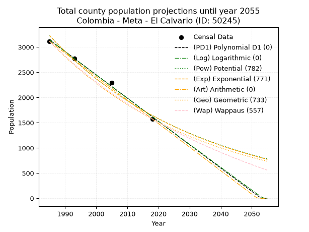
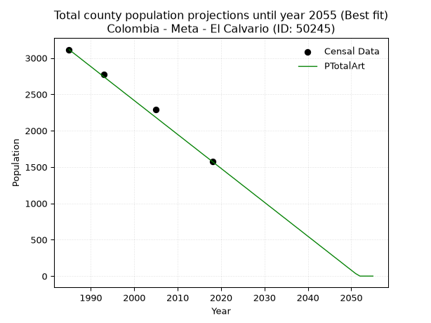
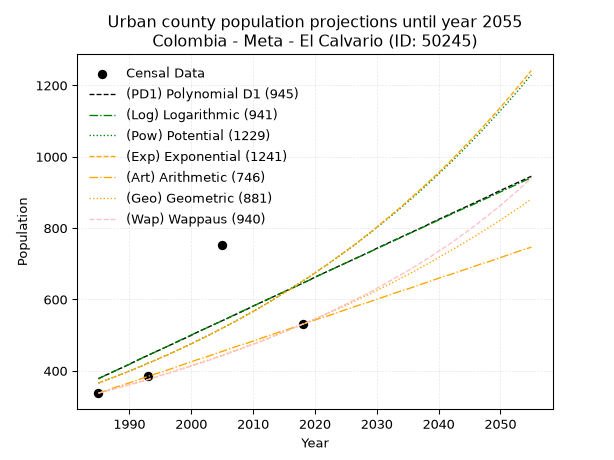
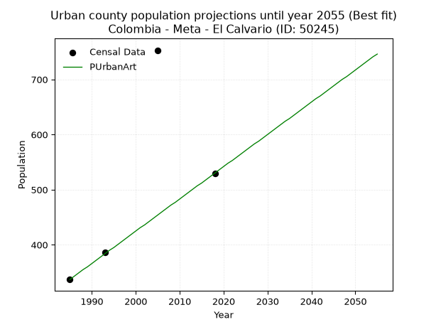
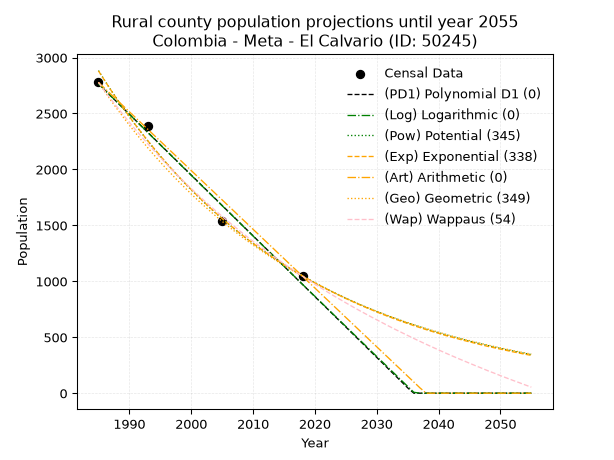
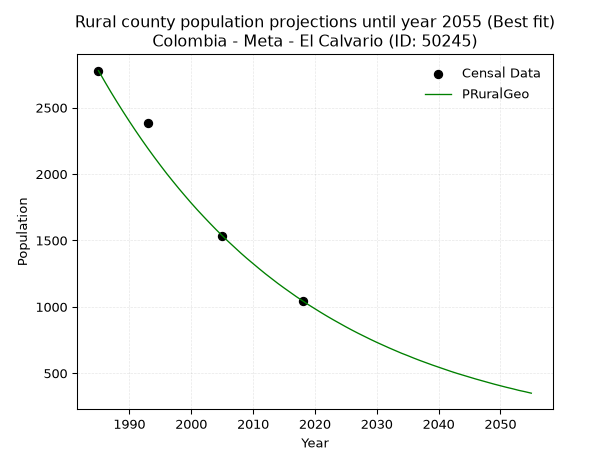

<div align="center">


</div>

# 📜 _“Population and Public Services Demand Projections (PPSD) until Year 2050 for Colombia - Meta - El Calvario (ID: 50245)”_
Keywords: `population` `public-service` `projection` `lineal` `polynomial` `logarithmic` `potential` `exponential` `arithmetic` `geometric` `wappaus` `dane` `colombia` `south-america`

PPSD are analytical estimates used by governments and planners to anticipate future changes in population size, age distribution, and the resulting community needs for utilities, healthcare, education, and infrastructure as sizing future water treatment facilities, electrical grids, and road networks based on spatial growth.

<div align="center">

</img>

</div>


> **General running parameters**: • app_version: _v20260806_. • Python version: _3.14.7_. • Pandas version: _3.0.5_. • NumPy version: _2.5.1_. • Creates, save and include plots into reports (create_plot): _False_. • Projection until year: _2050_. • Process polynomial degree 2 and up: _False_. • Process Wappaus: _True_. • Process Wappaus: _True_. • Set negative values to zero: _True_. • Set infinite values to zero: _True_. • Drop dataset notes: _True_. 
<div align="center">

Maps & GIS Layers: [:earth_americas:Google](http://maps.google.com/maps?q=4.352665338,-73.7133246) [:earth_americas:OSM](https://www.openstreetmap.org/#map=18/4.352665338/-73.7133246&layers=P) [:earth_americas:Bing](https://www.bing.com/maps?cp=4.352665338~-73.7133246&lvl=18) [:earth_americas:Apple](https://maps.apple.com/frame?center=4.352665338%2C-73.7133246&span=0.003%2C0.006) [:earth_americas:GISMobile](https://github.com/rcfdtools/R.GISMobile/blob/main/file/gis/CountyLayer_CO/Readme.md)

</div>


<div align="center">

```geojson
{
  "type": "Feature",
  "geometry": {
    "type": "Point", 
    "coordinates": [-73.7133246, 4.352665338]
  }, 
  "properties": {
    "Name": "Colombia - Meta - El Calvario (ID: 50245)"
  }
}
```

</div>


## 0. Census Data (4 records)

Census data are official statistics collected by a government about the people and housing in a country. They usually include counts of total population, age, sex, race, income, education, and jobs.

📅Global census file: [Population.xlsx](../data/Population.xlsx)

| Source   |   Year |   CountryID | CountryName   |   StateID | StateName   |   CountyID | CountyName   |   PTotal |   PUrban |   PRural |
|:---------|-------:|------------:|:--------------|----------:|:------------|-----------:|:-------------|---------:|---------:|---------:|
| DANE     |   1985 |          57 | Colombia      |        50 | Meta        |      50245 | El Calvario  |     3115 |      337 |     2778 |
| DANE     |   1993 |          57 | Colombia      |        50 | Meta        |      50245 | El Calvario  |     2773 |      386 |     2387 |
| DANE     |   2005 |          57 | Colombia      |        50 | Meta        |      50245 | El Calvario  |     2288 |      753 |     1535 |
| DANE     |   2018 |          57 | Colombia      |        50 | Meta        |      50245 | El Calvario  |     1575 |      530 |     1045 |

> 🔥Some records could had specific notes about the registered values or the corresponding urban or rural distribution.

📅[SUI-RUPS](https://www.datos.gov.co/Hacienda-y-Cr-dito-P-blico/Registro-nico-de-Prestadores-de-Servicios-P-blicos/4qkq-csdn/about_data) - Local public utility companies: [RUPS.csv](../data/RUPS.csv)

 | SERVICIO       | ESTADO    | NOMBRE                                                 | NIT         | DEPARTAMENTO_DOMICILIO   | MUNICIPIO_DOMICILIO   | DIRECCION          |   TELEFONO | EMAIL                | TIPO_PRESTADOR                 | CLASIFICACION                 |
|:---------------|:----------|:-------------------------------------------------------|:------------|:-------------------------|:----------------------|:-------------------|-----------:|:---------------------|:-------------------------------|:------------------------------|
| ACUEDUCTO      | OPERATIVA | JUNTA DE SERVICIOS PUBLICOS DEL MUNICIPIO DEL CALVARIO | 892099001-1 | META                     | EL CALVARIO           | calle 6 No. 5 - 12 |    6630899 | agudelo.cp@gmail.com | MUNICIPIO (PRESTACIÓN DIRECTA) | MENOR O IGUAL A 2500 USUARIOS |
| ALCANTARILLADO | OPERATIVA | JUNTA DE SERVICIOS PUBLICOS DEL MUNICIPIO DEL CALVARIO | 892099001-1 | META                     | EL CALVARIO           | calle 6 No. 5 - 12 |    6630899 | agudelo.cp@gmail.com | MUNICIPIO (PRESTACIÓN DIRECTA) | MENOR O IGUAL A 2500 USUARIOS |

## 1. Total

### 1.1. Coefficients and Parameters

* (PD1) Polynomial Deg 1: -46.220393416298194, 94890.09193095047 (lineal)
* (Log) Logarithmic: -92501.12049751752, 705539.5081590896
* (Pow) Potential: -40.892648069673726, 138.36301858516325
* (Exp) Exponential: -0.020437548691463883, 1.340708442078612e+21
* (Art) Arithmetic: Year diff. 2018 - 1985 = 33, Population diff. 1575 - 3115 = -1540, Annual growth = -46.666666666666664
* (Geo) Geometric: Year diff. 2018 - 1985 = 33, Population diff. 1575 - 3115 = -1540, Annual growth % = -0.02045379937543279
* (Wap) Wappaus: i = -1.9900497512437811, Condition values only valid for < 200)

<sub>
Wappaus condition values: ['-0.00', '-1.99', '-3.98', '-5.97', '-7.96', '-9.95', '-11.94', '-13.93', '-15.92', '-17.91', '-19.90', '-21.89', '-23.88', '-25.87', '-27.86', '-29.85', '-31.84', '-33.83', '-35.82', '-37.81', '-39.80', '-41.79', '-43.78', '-45.77', '-47.76', '-49.75', '-51.74', '-53.73', '-55.72', '-57.71', '-59.70', '-61.69', '-63.68', '-65.67', '-67.66', '-69.65', '-71.64', '-73.63', '-75.62', '-77.61', '-79.60', '-81.59', '-83.58', '-85.57', '-87.56', '-89.55', '-91.54', '-93.53', '-95.52', '-97.51', '-99.50', '-101.49', '-103.48', '-105.47', '-107.46', '-109.45', '-111.44', '-113.43', '-115.42', '-117.41', '-119.40', '-121.39', '-123.38', '-125.37', '-127.36', '-129.35']
</sub>


### 1.2. Projected Dataset

|   Year |   CountyID |   PTotalPD1 |   PTotalLog |   PTotalPow |   PTotalExp |   PTotalArt |   PTotalGeo |   PTotalWap |
|-------:|-----------:|------------:|------------:|------------:|------------:|------------:|------------:|------------:|
|   1985 |      50245 |        3143 |        3144 |        3227 |        3226 |        3115 |        3115 |        3115 |
|   1986 |      50245 |        3096 |        3097 |        3162 |        3161 |        3068 |        3051 |        3054 |
|   1987 |      50245 |        3050 |        3051 |        3097 |        3097 |        3022 |        2989 |        2993 |
|   1988 |      50245 |        3004 |        3004 |        3034 |        3034 |        2975 |        2928 |        2934 |
|   1989 |      50245 |        2958 |        2958 |        2972 |        2973 |        2928 |        2868 |        2877 |
|   1990 |      50245 |        2912 |        2911 |        2912 |        2912 |        2882 |        2809 |        2820 |
|   1991 |      50245 |        2865 |        2865 |        2853 |        2854 |        2835 |        2752 |        2764 |
|   1992 |      50245 |        2819 |        2818 |        2795 |        2796 |        2788 |        2695 |        2709 |
|   1993 |      50245 |        2773 |        2772 |        2738 |        2739 |        2742 |        2640 |        2656 |
|   1994 |      50245 |        2727 |        2725 |        2682 |        2684 |        2695 |        2586 |        2603 |
|   1995 |      50245 |        2680 |        2679 |        2628 |        2630 |        2648 |        2533 |        2551 |
|   1996 |      50245 |        2634 |        2633 |        2575 |        2576 |        2602 |        2482 |        2500 |
|   1997 |      50245 |        2588 |        2586 |        2522 |        2524 |        2555 |        2431 |        2450 |
|   1998 |      50245 |        2542 |        2540 |        2471 |        2473 |        2508 |        2381 |        2401 |
|   1999 |      50245 |        2496 |        2494 |        2421 |        2423 |        2462 |        2332 |        2353 |
|   2000 |      50245 |        2449 |        2448 |        2372 |        2374 |        2415 |        2285 |        2306 |
|   2001 |      50245 |        2403 |        2401 |        2324 |        2326 |        2368 |        2238 |        2259 |
|   2002 |      50245 |        2357 |        2355 |        2277 |        2279 |        2322 |        2192 |        2214 |
|   2003 |      50245 |        2311 |        2309 |        2231 |        2233 |        2275 |        2147 |        2169 |
|   2004 |      50245 |        2264 |        2263 |        2186 |        2188 |        2228 |        2103 |        2124 |
|   2005 |      50245 |        2218 |        2217 |        2142 |        2144 |        2182 |        2060 |        2081 |
|   2006 |      50245 |        2172 |        2170 |        2099 |        2100 |        2135 |        2018 |        2038 |
|   2007 |      50245 |        2126 |        2124 |        2056 |        2058 |        2088 |        1977 |        1996 |
|   2008 |      50245 |        2080 |        2078 |        2015 |        2016 |        2042 |        1937 |        1955 |
|   2009 |      50245 |        2033 |        2032 |        1974 |        1975 |        1995 |        1897 |        1914 |
|   2010 |      50245 |        1987 |        1986 |        1935 |        1935 |        1948 |        1858 |        1874 |
|   2011 |      50245 |        1941 |        1940 |        1896 |        1896 |        1902 |        1820 |        1835 |
|   2012 |      50245 |        1895 |        1894 |        1857 |        1858 |        1855 |        1783 |        1796 |
|   2013 |      50245 |        1848 |        1848 |        1820 |        1820 |        1808 |        1746 |        1757 |
|   2014 |      50245 |        1802 |        1802 |        1784 |        1783 |        1762 |        1711 |        1720 |
|   2015 |      50245 |        1756 |        1756 |        1748 |        1747 |        1715 |        1676 |        1683 |
|   2016 |      50245 |        1710 |        1710 |        1713 |        1712 |        1668 |        1641 |        1646 |
|   2017 |      50245 |        1664 |        1665 |        1678 |        1677 |        1622 |        1608 |        1610 |
|   2018 |      50245 |        1617 |        1619 |        1645 |        1643 |        1575 |        1575 |        1575 |
|   2019 |      50245 |        1571 |        1573 |        1612 |        1610 |        1528 |        1543 |        1540 |
|   2020 |      50245 |        1525 |        1527 |        1579 |        1578 |        1482 |        1511 |        1506 |
|   2021 |      50245 |        1479 |        1481 |        1548 |        1546 |        1435 |        1480 |        1472 |
|   2022 |      50245 |        1432 |        1436 |        1517 |        1514 |        1388 |        1450 |        1439 |
|   2023 |      50245 |        1386 |        1390 |        1486 |        1484 |        1342 |        1420 |        1406 |
|   2024 |      50245 |        1340 |        1344 |        1457 |        1454 |        1295 |        1391 |        1373 |
|   2025 |      50245 |        1294 |        1298 |        1427 |        1424 |        1248 |        1363 |        1341 |
|   2026 |      50245 |        1248 |        1253 |        1399 |        1396 |        1202 |        1335 |        1310 |
|   2027 |      50245 |        1201 |        1207 |        1371 |        1367 |        1155 |        1308 |        1279 |
|   2028 |      50245 |        1155 |        1161 |        1344 |        1340 |        1108 |        1281 |        1248 |
|   2029 |      50245 |        1109 |        1116 |        1317 |        1313 |        1062 |        1255 |        1218 |
|   2030 |      50245 |        1063 |        1070 |        1290 |        1286 |        1015 |        1229 |        1188 |
|   2031 |      50245 |        1016 |        1025 |        1265 |        1260 |         968 |        1204 |        1159 |
|   2032 |      50245 |         970 |         979 |        1240 |        1234 |         922 |        1179 |        1130 |
|   2033 |      50245 |         924 |         934 |        1215 |        1209 |         875 |        1155 |        1101 |
|   2034 |      50245 |         878 |         888 |        1191 |        1185 |         828 |        1132 |        1073 |
|   2035 |      50245 |         832 |         843 |        1167 |        1161 |         782 |        1108 |        1045 |
|   2036 |      50245 |         785 |         797 |        1144 |        1138 |         735 |        1086 |        1018 |
|   2037 |      50245 |         739 |         752 |        1121 |        1115 |         688 |        1064 |         991 |
|   2038 |      50245 |         693 |         706 |        1099 |        1092 |         642 |        1042 |         964 |
|   2039 |      50245 |         647 |         661 |        1077 |        1070 |         595 |        1020 |         938 |
|   2040 |      50245 |         600 |         616 |        1056 |        1048 |         548 |        1000 |         911 |
|   2041 |      50245 |         554 |         570 |        1035 |        1027 |         502 |         979 |         886 |
|   2042 |      50245 |         508 |         525 |        1014 |        1006 |         455 |         959 |         860 |
|   2043 |      50245 |         462 |         480 |         994 |         986 |         408 |         940 |         835 |
|   2044 |      50245 |         416 |         435 |         974 |         966 |         362 |         920 |         810 |
|   2045 |      50245 |         369 |         389 |         955 |         946 |         315 |         901 |         786 |
|   2046 |      50245 |         323 |         344 |         936 |         927 |         268 |         883 |         762 |
|   2047 |      50245 |         277 |         299 |         918 |         909 |         222 |         865 |         738 |
|   2048 |      50245 |         231 |         254 |         899 |         890 |         175 |         847 |         714 |
|   2049 |      50245 |         185 |         209 |         882 |         872 |         128 |         830 |         691 |
|   2050 |      50245 |         138 |         163 |         864 |         854 |          82 |         813 |         668 |
<div align="center">

</img>

</div>


### 1.3. Best fit with absolute and relative error (%)

Relative error puts that difference into context by dividing the absolute error by the true value, creating a unitless ratio or percentage that shows the scale of the mistake.

Absolute and relative error

|   Year | Source   |   CountryID | CountryName   |   StateID | StateName   |   CountyID_x | CountyName   |   PTotal |   PUrban |   PRural |   CountyID_y |   PTotalPD1 |   PTotalLog |   PTotalPow |   PTotalExp |   PTotalArt |   PTotalGeo |   PTotalWap |   PTotalPD1AbsError |   PTotalLogAbsError |   PTotalPowAbsError |   PTotalExpAbsError |   PTotalArtAbsError |   PTotalGeoAbsError |   PTotalWapAbsError |   PTotalPD1RelError |   PTotalLogRelError |   PTotalPowRelError |   PTotalExpRelError |   PTotalArtRelError |   PTotalGeoRelError |   PTotalWapRelError |
|-------:|:---------|------------:|:--------------|----------:|:------------|-------------:|:-------------|---------:|---------:|---------:|-------------:|------------:|------------:|------------:|------------:|------------:|------------:|------------:|--------------------:|--------------------:|--------------------:|--------------------:|--------------------:|--------------------:|--------------------:|--------------------:|--------------------:|--------------------:|--------------------:|--------------------:|--------------------:|--------------------:|
|   1985 | DANE     |          57 | Colombia      |        50 | Meta        |        50245 | El Calvario  |     3115 |      337 |     2778 |        50245 |        3143 |        3144 |        3227 |        3226 |        3115 |        3115 |        3115 |                  28 |                  29 |                 112 |                 111 |                   0 |                   0 |                   0 |            0.898876 |            0.930979 |             3.59551 |             3.5634  |             0       |             0       |             0       |
|   1993 | DANE     |          57 | Colombia      |        50 | Meta        |        50245 | El Calvario  |     2773 |      386 |     2387 |        50245 |        2773 |        2772 |        2738 |        2739 |        2742 |        2640 |        2656 |                   0 |                   1 |                  35 |                  34 |                  31 |                 133 |                 117 |            0        |            0.036062 |             1.26217 |             1.22611 |             1.11792 |             4.79625 |             4.21926 |
|   2005 | DANE     |          57 | Colombia      |        50 | Meta        |        50245 | El Calvario  |     2288 |      753 |     1535 |        50245 |        2218 |        2217 |        2142 |        2144 |        2182 |        2060 |        2081 |                  70 |                  71 |                 146 |                 144 |                 106 |                 228 |                 207 |            3.05944  |            3.10315  |             6.38112 |             6.29371 |             4.63287 |             9.96503 |             9.0472  |
|   2018 | DANE     |          57 | Colombia      |        50 | Meta        |        50245 | El Calvario  |     1575 |      530 |     1045 |        50245 |        1617 |        1619 |        1645 |        1643 |        1575 |        1575 |        1575 |                  42 |                  44 |                  70 |                  68 |                   0 |                   0 |                   0 |            2.66667  |            2.79365  |             4.44444 |             4.31746 |             0       |             0       |             0       |

Relative error mean

| Method    |   RelError | Best   |
|:----------|-----------:|:-------|
| PTotalPD1 |    1.65625 |        |
| PTotalLog |    1.71596 |        |
| PTotalPow |    3.92081 |        |
| PTotalExp |    3.85017 |        |
| PTotalArt |    1.4377  | True   |
| PTotalGeo |    3.69032 |        |
| PTotalWap |    3.31661 |        |

💙Best method: _**PTotalArt**_
<div align="center">

</img>

</div>


### 1.4. Fresh water supply demand in liters per capita per day (lpcd)

The fresh water supply demand typically ranges from 100 to 300 liters per capita per day (lpcd) for standard domestic and municipal planning, though absolute survival minimums set by the World Health Organization are as low as 7.5 to 20 liters per day, and total consumption in high-income nations can exceed 400 liters.

> `CZ`: Level in meters above the sea level (masl)<br> `WS`: Fresh water supply demand in liters per capita per day (lpcd or l/h/d)<br> `WSAll`: Zonal fresh water supply demand in liters per second (l/s)<br> `A`: Zonal area in square meters<br> `DP`: Population density (people/hectare or p/ha)

Reference values (RAS Colombia)

|    CZ |   WS |
|------:|-----:|
|  1000 |  120 |
|  2000 |  130 |
| 99999 |  140 |

County shapefile geometry properties and water supply values

|   CountyID |      ATotal |   CZTotal |   WSTotal |
|-----------:|------------:|----------:|----------:|
|      50245 | 2.69906e+08 |   2258.91 |       140 |

Projected values for best method: PTotalArt

|   CountyID |   Year |   PTotalArt |   DPTotal |   WSTotal |   WSTotalAll |
|-----------:|-------:|------------:|----------:|----------:|-------------:|
|      50245 |   1985 |        3115 |      0.12 |       140 |     5.04745  |
|      50245 |   1986 |        3068 |      0.11 |       140 |     4.9713   |
|      50245 |   1987 |        3022 |      0.11 |       140 |     4.89676  |
|      50245 |   1988 |        2975 |      0.11 |       140 |     4.8206   |
|      50245 |   1989 |        2928 |      0.11 |       140 |     4.74444  |
|      50245 |   1990 |        2882 |      0.11 |       140 |     4.66991  |
|      50245 |   1991 |        2835 |      0.11 |       140 |     4.59375  |
|      50245 |   1992 |        2788 |      0.1  |       140 |     4.51759  |
|      50245 |   1993 |        2742 |      0.1  |       140 |     4.44306  |
|      50245 |   1994 |        2695 |      0.1  |       140 |     4.3669   |
|      50245 |   1995 |        2648 |      0.1  |       140 |     4.29074  |
|      50245 |   1996 |        2602 |      0.1  |       140 |     4.2162   |
|      50245 |   1997 |        2555 |      0.09 |       140 |     4.14005  |
|      50245 |   1998 |        2508 |      0.09 |       140 |     4.06389  |
|      50245 |   1999 |        2462 |      0.09 |       140 |     3.98935  |
|      50245 |   2000 |        2415 |      0.09 |       140 |     3.91319  |
|      50245 |   2001 |        2368 |      0.09 |       140 |     3.83704  |
|      50245 |   2002 |        2322 |      0.09 |       140 |     3.7625   |
|      50245 |   2003 |        2275 |      0.08 |       140 |     3.68634  |
|      50245 |   2004 |        2228 |      0.08 |       140 |     3.61019  |
|      50245 |   2005 |        2182 |      0.08 |       140 |     3.53565  |
|      50245 |   2006 |        2135 |      0.08 |       140 |     3.45949  |
|      50245 |   2007 |        2088 |      0.08 |       140 |     3.38333  |
|      50245 |   2008 |        2042 |      0.08 |       140 |     3.3088   |
|      50245 |   2009 |        1995 |      0.07 |       140 |     3.23264  |
|      50245 |   2010 |        1948 |      0.07 |       140 |     3.15648  |
|      50245 |   2011 |        1902 |      0.07 |       140 |     3.08194  |
|      50245 |   2012 |        1855 |      0.07 |       140 |     3.00579  |
|      50245 |   2013 |        1808 |      0.07 |       140 |     2.92963  |
|      50245 |   2014 |        1762 |      0.07 |       140 |     2.85509  |
|      50245 |   2015 |        1715 |      0.06 |       140 |     2.77894  |
|      50245 |   2016 |        1668 |      0.06 |       140 |     2.70278  |
|      50245 |   2017 |        1622 |      0.06 |       140 |     2.62824  |
|      50245 |   2018 |        1575 |      0.06 |       140 |     2.55208  |
|      50245 |   2019 |        1528 |      0.06 |       140 |     2.47593  |
|      50245 |   2020 |        1482 |      0.05 |       140 |     2.40139  |
|      50245 |   2021 |        1435 |      0.05 |       140 |     2.32523  |
|      50245 |   2022 |        1388 |      0.05 |       140 |     2.24907  |
|      50245 |   2023 |        1342 |      0.05 |       140 |     2.17454  |
|      50245 |   2024 |        1295 |      0.05 |       140 |     2.09838  |
|      50245 |   2025 |        1248 |      0.05 |       140 |     2.02222  |
|      50245 |   2026 |        1202 |      0.04 |       140 |     1.94769  |
|      50245 |   2027 |        1155 |      0.04 |       140 |     1.87153  |
|      50245 |   2028 |        1108 |      0.04 |       140 |     1.79537  |
|      50245 |   2029 |        1062 |      0.04 |       140 |     1.72083  |
|      50245 |   2030 |        1015 |      0.04 |       140 |     1.64468  |
|      50245 |   2031 |         968 |      0.04 |       140 |     1.56852  |
|      50245 |   2032 |         922 |      0.03 |       140 |     1.49398  |
|      50245 |   2033 |         875 |      0.03 |       140 |     1.41782  |
|      50245 |   2034 |         828 |      0.03 |       140 |     1.34167  |
|      50245 |   2035 |         782 |      0.03 |       140 |     1.26713  |
|      50245 |   2036 |         735 |      0.03 |       140 |     1.19097  |
|      50245 |   2037 |         688 |      0.03 |       140 |     1.11481  |
|      50245 |   2038 |         642 |      0.02 |       140 |     1.04028  |
|      50245 |   2039 |         595 |      0.02 |       140 |     0.96412  |
|      50245 |   2040 |         548 |      0.02 |       140 |     0.887963 |
|      50245 |   2041 |         502 |      0.02 |       140 |     0.813426 |
|      50245 |   2042 |         455 |      0.02 |       140 |     0.737269 |
|      50245 |   2043 |         408 |      0.02 |       140 |     0.661111 |
|      50245 |   2044 |         362 |      0.01 |       140 |     0.586574 |
|      50245 |   2045 |         315 |      0.01 |       140 |     0.510417 |
|      50245 |   2046 |         268 |      0.01 |       140 |     0.434259 |
|      50245 |   2047 |         222 |      0.01 |       140 |     0.359722 |
|      50245 |   2048 |         175 |      0.01 |       140 |     0.283565 |
|      50245 |   2049 |         128 |      0    |       140 |     0.207407 |
|      50245 |   2050 |          82 |      0    |       140 |     0.13287  |

## 2. Urban

### 2.1. Coefficients and Parameters

* (PD1) Polynomial Deg 1: 8.103572862304413, -15707.671617824402 (lineal)
* (Log) Logarithmic: 16255.561030187451, -123057.14965434567
* (Pow) Potential: 35.00767239474157, -112.88415944480467
* (Exp) Exponential: 0.01745771349939877, 3.2609886467955593e-13
* (Art) Arithmetic: Year diff. 2018 - 1985 = 33, Population diff. 530 - 337 = 193, Annual growth = 5.848484848484849
* (Geo) Geometric: Year diff. 2018 - 1985 = 33, Population diff. 530 - 337 = 193, Annual growth % = 0.013815597996483575
* (Wap) Wappaus: i = 1.3491314529376812, Condition values only valid for < 200)

<sub>
Wappaus condition values: ['0.00', '1.35', '2.70', '4.05', '5.40', '6.75', '8.09', '9.44', '10.79', '12.14', '13.49', '14.84', '16.19', '17.54', '18.89', '20.24', '21.59', '22.94', '24.28', '25.63', '26.98', '28.33', '29.68', '31.03', '32.38', '33.73', '35.08', '36.43', '37.78', '39.12', '40.47', '41.82', '43.17', '44.52', '45.87', '47.22', '48.57', '49.92', '51.27', '52.62', '53.97', '55.31', '56.66', '58.01', '59.36', '60.71', '62.06', '63.41', '64.76', '66.11', '67.46', '68.81', '70.15', '71.50', '72.85', '74.20', '75.55', '76.90', '78.25', '79.60', '80.95', '82.30', '83.65', '85.00', '86.34', '87.69']
</sub>


### 2.2. Projected Dataset

|   Year |   CountyID |   PUrbanPD1 |   PUrbanLog |   PUrbanPow |   PUrbanExp |   PUrbanArt |   PUrbanGeo |   PUrbanWap |
|-------:|-----------:|------------:|------------:|------------:|------------:|------------:|------------:|------------:|
|   1985 |      50245 |         378 |         377 |         365 |         366 |         337 |         337 |         337 |
|   1986 |      50245 |         386 |         386 |         372 |         372 |         343 |         342 |         342 |
|   1987 |      50245 |         394 |         394 |         379 |         379 |         349 |         346 |         346 |
|   1988 |      50245 |         402 |         402 |         385 |         385 |         355 |         351 |         351 |
|   1989 |      50245 |         410 |         410 |         392 |         392 |         360 |         356 |         356 |
|   1990 |      50245 |         418 |         418 |         399 |         399 |         366 |         361 |         361 |
|   1991 |      50245 |         427 |         426 |         406 |         406 |         372 |         366 |         365 |
|   1992 |      50245 |         435 |         435 |         413 |         413 |         378 |         371 |         370 |
|   1993 |      50245 |         443 |         443 |         421 |         421 |         384 |         376 |         375 |
|   1994 |      50245 |         451 |         451 |         428 |         428 |         390 |         381 |         381 |
|   1995 |      50245 |         459 |         459 |         436 |         436 |         395 |         387 |         386 |
|   1996 |      50245 |         467 |         467 |         443 |         443 |         401 |         392 |         391 |
|   1997 |      50245 |         475 |         475 |         451 |         451 |         407 |         397 |         396 |
|   1998 |      50245 |         483 |         484 |         459 |         459 |         413 |         403 |         402 |
|   1999 |      50245 |         491 |         492 |         467 |         467 |         419 |         408 |         407 |
|   2000 |      50245 |         499 |         500 |         476 |         475 |         425 |         414 |         413 |
|   2001 |      50245 |         508 |         508 |         484 |         484 |         431 |         420 |         419 |
|   2002 |      50245 |         516 |         516 |         493 |         492 |         436 |         426 |         424 |
|   2003 |      50245 |         524 |         524 |         501 |         501 |         442 |         431 |         430 |
|   2004 |      50245 |         532 |         532 |         510 |         510 |         448 |         437 |         436 |
|   2005 |      50245 |         540 |         540 |         519 |         519 |         454 |         443 |         442 |
|   2006 |      50245 |         548 |         548 |         528 |         528 |         460 |         450 |         448 |
|   2007 |      50245 |         556 |         557 |         537 |         537 |         466 |         456 |         454 |
|   2008 |      50245 |         564 |         565 |         547 |         546 |         472 |         462 |         461 |
|   2009 |      50245 |         572 |         573 |         557 |         556 |         477 |         468 |         467 |
|   2010 |      50245 |         581 |         581 |         566 |         566 |         483 |         475 |         474 |
|   2011 |      50245 |         589 |         589 |         576 |         576 |         489 |         481 |         480 |
|   2012 |      50245 |         597 |         597 |         586 |         586 |         495 |         488 |         487 |
|   2013 |      50245 |         605 |         605 |         597 |         596 |         501 |         495 |         494 |
|   2014 |      50245 |         613 |         613 |         607 |         607 |         507 |         502 |         501 |
|   2015 |      50245 |         621 |         621 |         618 |         618 |         512 |         509 |         508 |
|   2016 |      50245 |         629 |         629 |         629 |         628 |         518 |         516 |         515 |
|   2017 |      50245 |         637 |         637 |         640 |         639 |         524 |         523 |         523 |
|   2018 |      50245 |         645 |         645 |         651 |         651 |         530 |         530 |         530 |
|   2019 |      50245 |         653 |         653 |         662 |         662 |         536 |         537 |         538 |
|   2020 |      50245 |         662 |         662 |         674 |         674 |         542 |         545 |         545 |
|   2021 |      50245 |         670 |         670 |         686 |         686 |         548 |         552 |         553 |
|   2022 |      50245 |         678 |         678 |         697 |         698 |         553 |         560 |         561 |
|   2023 |      50245 |         686 |         686 |         710 |         710 |         559 |         568 |         569 |
|   2024 |      50245 |         694 |         694 |         722 |         723 |         565 |         575 |         578 |
|   2025 |      50245 |         702 |         702 |         735 |         735 |         571 |         583 |         586 |
|   2026 |      50245 |         710 |         710 |         747 |         748 |         577 |         591 |         595 |
|   2027 |      50245 |         718 |         718 |         760 |         761 |         583 |         600 |         603 |
|   2028 |      50245 |         726 |         726 |         774 |         775 |         588 |         608 |         612 |
|   2029 |      50245 |         734 |         734 |         787 |         788 |         594 |         616 |         621 |
|   2030 |      50245 |         743 |         742 |         801 |         802 |         600 |         625 |         631 |
|   2031 |      50245 |         751 |         750 |         815 |         817 |         606 |         633 |         640 |
|   2032 |      50245 |         759 |         758 |         829 |         831 |         612 |         642 |         650 |
|   2033 |      50245 |         767 |         766 |         843 |         846 |         618 |         651 |         660 |
|   2034 |      50245 |         775 |         774 |         858 |         860 |         624 |         660 |         670 |
|   2035 |      50245 |         783 |         782 |         873 |         876 |         629 |         669 |         680 |
|   2036 |      50245 |         791 |         790 |         888 |         891 |         635 |         678 |         690 |
|   2037 |      50245 |         799 |         798 |         903 |         907 |         641 |         688 |         701 |
|   2038 |      50245 |         807 |         806 |         919 |         923 |         647 |         697 |         712 |
|   2039 |      50245 |         816 |         814 |         935 |         939 |         653 |         707 |         723 |
|   2040 |      50245 |         824 |         822 |         951 |         955 |         659 |         717 |         735 |
|   2041 |      50245 |         832 |         830 |         968 |         972 |         665 |         727 |         746 |
|   2042 |      50245 |         840 |         838 |         984 |         989 |         670 |         737 |         758 |
|   2043 |      50245 |         848 |         846 |        1001 |        1007 |         676 |         747 |         770 |
|   2044 |      50245 |         856 |         854 |        1019 |        1025 |         682 |         757 |         783 |
|   2045 |      50245 |         864 |         861 |        1036 |        1043 |         688 |         768 |         795 |
|   2046 |      50245 |         872 |         869 |        1054 |        1061 |         694 |         778 |         808 |
|   2047 |      50245 |         880 |         877 |        1072 |        1080 |         700 |         789 |         822 |
|   2048 |      50245 |         888 |         885 |        1091 |        1099 |         705 |         800 |         835 |
|   2049 |      50245 |         897 |         893 |        1110 |        1118 |         711 |         811 |         849 |
|   2050 |      50245 |         905 |         901 |        1129 |        1138 |         717 |         822 |         863 |
<div align="center">

</img>

</div>


### 2.3. Best fit with absolute and relative error (%)

Relative error puts that difference into context by dividing the absolute error by the true value, creating a unitless ratio or percentage that shows the scale of the mistake.

Absolute and relative error

|   Year | Source   |   CountryID | CountryName   |   StateID | StateName   |   CountyID_x | CountyName   |   PTotal |   PUrban |   PRural |   CountyID_y |   PUrbanPD1 |   PUrbanLog |   PUrbanPow |   PUrbanExp |   PUrbanArt |   PUrbanGeo |   PUrbanWap |   PUrbanPD1AbsError |   PUrbanLogAbsError |   PUrbanPowAbsError |   PUrbanExpAbsError |   PUrbanArtAbsError |   PUrbanGeoAbsError |   PUrbanWapAbsError |   PUrbanPD1RelError |   PUrbanLogRelError |   PUrbanPowRelError |   PUrbanExpRelError |   PUrbanArtRelError |   PUrbanGeoRelError |   PUrbanWapRelError |
|-------:|:---------|------------:|:--------------|----------:|:------------|-------------:|:-------------|---------:|---------:|---------:|-------------:|------------:|------------:|------------:|------------:|------------:|------------:|------------:|--------------------:|--------------------:|--------------------:|--------------------:|--------------------:|--------------------:|--------------------:|--------------------:|--------------------:|--------------------:|--------------------:|--------------------:|--------------------:|--------------------:|
|   1985 | DANE     |          57 | Colombia      |        50 | Meta        |        50245 | El Calvario  |     3115 |      337 |     2778 |        50245 |         378 |         377 |         365 |         366 |         337 |         337 |         337 |                  41 |                  40 |                  28 |                  29 |                   0 |                   0 |                   0 |             12.1662 |             11.8694 |             8.30861 |             8.60534 |            0        |             0       |             0       |
|   1993 | DANE     |          57 | Colombia      |        50 | Meta        |        50245 | El Calvario  |     2773 |      386 |     2387 |        50245 |         443 |         443 |         421 |         421 |         384 |         376 |         375 |                  57 |                  57 |                  35 |                  35 |                   2 |                  10 |                  11 |             14.7668 |             14.7668 |             9.06736 |             9.06736 |            0.518135 |             2.59067 |             2.84974 |
|   2005 | DANE     |          57 | Colombia      |        50 | Meta        |        50245 | El Calvario  |     2288 |      753 |     1535 |        50245 |         540 |         540 |         519 |         519 |         454 |         443 |         442 |                 213 |                 213 |                 234 |                 234 |                 299 |                 310 |                 311 |             28.2869 |             28.2869 |            31.0757  |            31.0757  |           39.7078   |            41.1687  |            41.3015  |
|   2018 | DANE     |          57 | Colombia      |        50 | Meta        |        50245 | El Calvario  |     1575 |      530 |     1045 |        50245 |         645 |         645 |         651 |         651 |         530 |         530 |         530 |                 115 |                 115 |                 121 |                 121 |                   0 |                   0 |                   0 |             21.6981 |             21.6981 |            22.8302  |            22.8302  |            0        |             0       |             0       |

Relative error mean

| Method    |   RelError | Best   |
|:----------|-----------:|:-------|
| PUrbanPD1 |    19.2295 |        |
| PUrbanLog |    19.1553 |        |
| PUrbanPow |    17.8205 |        |
| PUrbanExp |    17.8946 |        |
| PUrbanArt |    10.0565 | True   |
| PUrbanGeo |    10.9398 |        |
| PUrbanWap |    11.0378 |        |

💙Best method: _**PUrbanArt**_
<div align="center">

</img>

</div>


### 2.4. Fresh water supply demand in liters per capita per day (lpcd)

The fresh water supply demand typically ranges from 100 to 300 liters per capita per day (lpcd) for standard domestic and municipal planning, though absolute survival minimums set by the World Health Organization are as low as 7.5 to 20 liters per day, and total consumption in high-income nations can exceed 400 liters.

> `CZ`: Level in meters above the sea level (masl)<br> `WS`: Fresh water supply demand in liters per capita per day (lpcd or l/h/d)<br> `WSAll`: Zonal fresh water supply demand in liters per second (l/s)<br> `A`: Zonal area in square meters<br> `DP`: Population density (people/hectare or p/ha)

Reference values (RAS Colombia)

|    CZ |   WS |
|------:|-----:|
|  1000 |  120 |
|  2000 |  130 |
| 99999 |  140 |

County shapefile geometry properties and water supply values

|   CountyID |   AUrban |   CZUrban |   WSUrban |
|-----------:|---------:|----------:|----------:|
|      50245 |   258143 |   1895.32 |       130 |

Projected values for best method: PUrbanArt

|   CountyID |   Year |   PUrbanArt |   DPUrban |   WSUrban |   WSUrbanAll |
|-----------:|-------:|------------:|----------:|----------:|-------------:|
|      50245 |   1985 |         337 |     13.05 |       130 |     0.50706  |
|      50245 |   1986 |         343 |     13.29 |       130 |     0.516088 |
|      50245 |   1987 |         349 |     13.52 |       130 |     0.525116 |
|      50245 |   1988 |         355 |     13.75 |       130 |     0.534144 |
|      50245 |   1989 |         360 |     13.95 |       130 |     0.541667 |
|      50245 |   1990 |         366 |     14.18 |       130 |     0.550694 |
|      50245 |   1991 |         372 |     14.41 |       130 |     0.559722 |
|      50245 |   1992 |         378 |     14.64 |       130 |     0.56875  |
|      50245 |   1993 |         384 |     14.88 |       130 |     0.577778 |
|      50245 |   1994 |         390 |     15.11 |       130 |     0.586806 |
|      50245 |   1995 |         395 |     15.3  |       130 |     0.594329 |
|      50245 |   1996 |         401 |     15.53 |       130 |     0.603356 |
|      50245 |   1997 |         407 |     15.77 |       130 |     0.612384 |
|      50245 |   1998 |         413 |     16    |       130 |     0.621412 |
|      50245 |   1999 |         419 |     16.23 |       130 |     0.63044  |
|      50245 |   2000 |         425 |     16.46 |       130 |     0.639468 |
|      50245 |   2001 |         431 |     16.7  |       130 |     0.648495 |
|      50245 |   2002 |         436 |     16.89 |       130 |     0.656019 |
|      50245 |   2003 |         442 |     17.12 |       130 |     0.665046 |
|      50245 |   2004 |         448 |     17.35 |       130 |     0.674074 |
|      50245 |   2005 |         454 |     17.59 |       130 |     0.683102 |
|      50245 |   2006 |         460 |     17.82 |       130 |     0.69213  |
|      50245 |   2007 |         466 |     18.05 |       130 |     0.701157 |
|      50245 |   2008 |         472 |     18.28 |       130 |     0.710185 |
|      50245 |   2009 |         477 |     18.48 |       130 |     0.717708 |
|      50245 |   2010 |         483 |     18.71 |       130 |     0.726736 |
|      50245 |   2011 |         489 |     18.94 |       130 |     0.735764 |
|      50245 |   2012 |         495 |     19.18 |       130 |     0.744792 |
|      50245 |   2013 |         501 |     19.41 |       130 |     0.753819 |
|      50245 |   2014 |         507 |     19.64 |       130 |     0.762847 |
|      50245 |   2015 |         512 |     19.83 |       130 |     0.77037  |
|      50245 |   2016 |         518 |     20.07 |       130 |     0.779398 |
|      50245 |   2017 |         524 |     20.3  |       130 |     0.788426 |
|      50245 |   2018 |         530 |     20.53 |       130 |     0.797454 |
|      50245 |   2019 |         536 |     20.76 |       130 |     0.806481 |
|      50245 |   2020 |         542 |     21    |       130 |     0.815509 |
|      50245 |   2021 |         548 |     21.23 |       130 |     0.824537 |
|      50245 |   2022 |         553 |     21.42 |       130 |     0.83206  |
|      50245 |   2023 |         559 |     21.65 |       130 |     0.841088 |
|      50245 |   2024 |         565 |     21.89 |       130 |     0.850116 |
|      50245 |   2025 |         571 |     22.12 |       130 |     0.859144 |
|      50245 |   2026 |         577 |     22.35 |       130 |     0.868171 |
|      50245 |   2027 |         583 |     22.58 |       130 |     0.877199 |
|      50245 |   2028 |         588 |     22.78 |       130 |     0.884722 |
|      50245 |   2029 |         594 |     23.01 |       130 |     0.89375  |
|      50245 |   2030 |         600 |     23.24 |       130 |     0.902778 |
|      50245 |   2031 |         606 |     23.48 |       130 |     0.911806 |
|      50245 |   2032 |         612 |     23.71 |       130 |     0.920833 |
|      50245 |   2033 |         618 |     23.94 |       130 |     0.929861 |
|      50245 |   2034 |         624 |     24.17 |       130 |     0.938889 |
|      50245 |   2035 |         629 |     24.37 |       130 |     0.946412 |
|      50245 |   2036 |         635 |     24.6  |       130 |     0.95544  |
|      50245 |   2037 |         641 |     24.83 |       130 |     0.964468 |
|      50245 |   2038 |         647 |     25.06 |       130 |     0.973495 |
|      50245 |   2039 |         653 |     25.3  |       130 |     0.982523 |
|      50245 |   2040 |         659 |     25.53 |       130 |     0.991551 |
|      50245 |   2041 |         665 |     25.76 |       130 |     1.00058  |
|      50245 |   2042 |         670 |     25.95 |       130 |     1.0081   |
|      50245 |   2043 |         676 |     26.19 |       130 |     1.01713  |
|      50245 |   2044 |         682 |     26.42 |       130 |     1.02616  |
|      50245 |   2045 |         688 |     26.65 |       130 |     1.03519  |
|      50245 |   2046 |         694 |     26.88 |       130 |     1.04421  |
|      50245 |   2047 |         700 |     27.12 |       130 |     1.05324  |
|      50245 |   2048 |         705 |     27.31 |       130 |     1.06076  |
|      50245 |   2049 |         711 |     27.54 |       130 |     1.06979  |
|      50245 |   2050 |         717 |     27.78 |       130 |     1.07882  |

## 3. Rural

### 3.1. Coefficients and Parameters

* (PD1) Polynomial Deg 1: -54.32396627860259, 110597.76354877485 (lineal)
* (Log) Logarithmic: -108756.68152770498, 828596.6578134354
* (Pow) Potential: -61.29606946201595, 205.5996761468651
* (Exp) Exponential: -0.030626018817049256, 7.268578083076817e+29
* (Art) Arithmetic: Year diff. 2018 - 1985 = 33, Population diff. 1045 - 2778 = -1733, Annual growth = -52.515151515151516
* (Geo) Geometric: Year diff. 2018 - 1985 = 33, Population diff. 1045 - 2778 = -1733, Annual growth % = -0.02919310993246549
* (Wap) Wappaus: i = -2.7473267860398387, Condition values only valid for < 200)

<sub>
Wappaus condition values: ['-0.00', '-2.75', '-5.49', '-8.24', '-10.99', '-13.74', '-16.48', '-19.23', '-21.98', '-24.73', '-27.47', '-30.22', '-32.97', '-35.72', '-38.46', '-41.21', '-43.96', '-46.70', '-49.45', '-52.20', '-54.95', '-57.69', '-60.44', '-63.19', '-65.94', '-68.68', '-71.43', '-74.18', '-76.93', '-79.67', '-82.42', '-85.17', '-87.91', '-90.66', '-93.41', '-96.16', '-98.90', '-101.65', '-104.40', '-107.15', '-109.89', '-112.64', '-115.39', '-118.14', '-120.88', '-123.63', '-126.38', '-129.12', '-131.87', '-134.62', '-137.37', '-140.11', '-142.86', '-145.61', '-148.36', '-151.10', '-153.85', '-156.60', '-159.34', '-162.09', '-164.84', '-167.59', '-170.33', '-173.08', '-175.83', '-178.58']
</sub>


### 3.2. Projected Dataset

|   Year |   CountyID |   PRuralPD1 |   PRuralLog |   PRuralPow |   PRuralExp |   PRuralArt |   PRuralGeo |   PRuralWap |
|-------:|-----------:|------------:|------------:|------------:|------------:|------------:|------------:|------------:|
|   1985 |      50245 |        2765 |        2766 |        2883 |        2881 |        2778 |        2778 |        2778 |
|   1986 |      50245 |        2710 |        2712 |        2796 |        2794 |        2725 |        2697 |        2703 |
|   1987 |      50245 |        2656 |        2657 |        2711 |        2710 |        2673 |        2618 |        2629 |
|   1988 |      50245 |        2602 |        2602 |        2629 |        2628 |        2620 |        2542 |        2558 |
|   1989 |      50245 |        2547 |        2548 |        2549 |        2549 |        2568 |        2468 |        2489 |
|   1990 |      50245 |        2493 |        2493 |        2471 |        2472 |        2515 |        2396 |        2421 |
|   1991 |      50245 |        2439 |        2438 |        2396 |        2397 |        2463 |        2326 |        2355 |
|   1992 |      50245 |        2384 |        2384 |        2324 |        2325 |        2410 |        2258 |        2291 |
|   1993 |      50245 |        2330 |        2329 |        2253 |        2255 |        2358 |        2192 |        2228 |
|   1994 |      50245 |        2276 |        2274 |        2185 |        2187 |        2305 |        2128 |        2167 |
|   1995 |      50245 |        2221 |        2220 |        2119 |        2121 |        2253 |        2066 |        2107 |
|   1996 |      50245 |        2167 |        2165 |        2055 |        2057 |        2200 |        2005 |        2049 |
|   1997 |      50245 |        2113 |        2111 |        1993 |        1995 |        2148 |        1947 |        1992 |
|   1998 |      50245 |        2058 |        2057 |        1933 |        1935 |        2095 |        1890 |        1936 |
|   1999 |      50245 |        2004 |        2002 |        1874 |        1876 |        2043 |        1835 |        1882 |
|   2000 |      50245 |        1950 |        1948 |        1818 |        1820 |        1990 |        1781 |        1829 |
|   2001 |      50245 |        1896 |        1893 |        1763 |        1765 |        1938 |        1729 |        1777 |
|   2002 |      50245 |        1841 |        1839 |        1710 |        1712 |        1885 |        1679 |        1726 |
|   2003 |      50245 |        1787 |        1785 |        1658 |        1660 |        1833 |        1630 |        1677 |
|   2004 |      50245 |        1733 |        1730 |        1608 |        1610 |        1780 |        1582 |        1628 |
|   2005 |      50245 |        1678 |        1676 |        1560 |        1561 |        1728 |        1536 |        1581 |
|   2006 |      50245 |        1624 |        1622 |        1513 |        1514 |        1675 |        1491 |        1534 |
|   2007 |      50245 |        1570 |        1568 |        1467 |        1469 |        1623 |        1448 |        1489 |
|   2008 |      50245 |        1515 |        1514 |        1423 |        1424 |        1570 |        1405 |        1444 |
|   2009 |      50245 |        1461 |        1459 |        1380 |        1381 |        1518 |        1364 |        1400 |
|   2010 |      50245 |        1407 |        1405 |        1339 |        1340 |        1465 |        1325 |        1358 |
|   2011 |      50245 |        1352 |        1351 |        1299 |        1299 |        1413 |        1286 |        1316 |
|   2012 |      50245 |        1298 |        1297 |        1260 |        1260 |        1360 |        1248 |        1275 |
|   2013 |      50245 |        1244 |        1243 |        1222 |        1222 |        1308 |        1212 |        1235 |
|   2014 |      50245 |        1189 |        1189 |        1185 |        1185 |        1255 |        1176 |        1195 |
|   2015 |      50245 |        1135 |        1135 |        1150 |        1150 |        1203 |        1142 |        1157 |
|   2016 |      50245 |        1081 |        1081 |        1115 |        1115 |        1150 |        1109 |        1119 |
|   2017 |      50245 |        1026 |        1027 |        1082 |        1081 |        1098 |        1076 |        1081 |
|   2018 |      50245 |         972 |         973 |        1050 |        1049 |        1045 |        1045 |        1045 |
|   2019 |      50245 |         918 |         919 |        1018 |        1017 |         992 |        1014 |        1009 |
|   2020 |      50245 |         863 |         866 |         988 |         986 |         940 |         985 |         974 |
|   2021 |      50245 |         809 |         812 |         958 |         957 |         887 |         956 |         940 |
|   2022 |      50245 |         755 |         758 |         930 |         928 |         835 |         928 |         906 |
|   2023 |      50245 |         700 |         704 |         902 |         900 |         782 |         901 |         872 |
|   2024 |      50245 |         646 |         650 |         875 |         873 |         730 |         875 |         840 |
|   2025 |      50245 |         592 |         597 |         849 |         846 |         677 |         849 |         808 |
|   2026 |      50245 |         537 |         543 |         824 |         821 |         625 |         824 |         776 |
|   2027 |      50245 |         483 |         489 |         799 |         796 |         572 |         800 |         745 |
|   2028 |      50245 |         429 |         436 |         775 |         772 |         520 |         777 |         715 |
|   2029 |      50245 |         374 |         382 |         752 |         749 |         467 |         754 |         685 |
|   2030 |      50245 |         320 |         328 |         730 |         726 |         415 |         732 |         656 |
|   2031 |      50245 |         266 |         275 |         708 |         704 |         362 |         711 |         627 |
|   2032 |      50245 |         211 |         221 |         687 |         683 |         310 |         690 |         598 |
|   2033 |      50245 |         157 |         168 |         667 |         662 |         257 |         670 |         570 |
|   2034 |      50245 |         103 |         114 |         647 |         642 |         205 |         650 |         543 |
|   2035 |      50245 |          48 |          61 |         628 |         623 |         152 |         632 |         516 |
|   2036 |      50245 |           0 |           8 |         609 |         604 |         100 |         613 |         489 |
|   2037 |      50245 |           0 |           0 |         591 |         586 |          47 |         595 |         463 |
|   2038 |      50245 |           0 |           0 |         573 |         568 |           0 |         578 |         437 |
|   2039 |      50245 |           0 |           0 |         556 |         551 |           0 |         561 |         412 |
|   2040 |      50245 |           0 |           0 |         540 |         535 |           0 |         545 |         387 |
|   2041 |      50245 |           0 |           0 |         524 |         518 |           0 |         529 |         362 |
|   2042 |      50245 |           0 |           0 |         508 |         503 |           0 |         513 |         338 |
|   2043 |      50245 |           0 |           0 |         493 |         488 |           0 |         498 |         314 |
|   2044 |      50245 |           0 |           0 |         479 |         473 |           0 |         484 |         291 |
|   2045 |      50245 |           0 |           0 |         465 |         459 |           0 |         470 |         268 |
|   2046 |      50245 |           0 |           0 |         451 |         445 |           0 |         456 |         245 |
|   2047 |      50245 |           0 |           0 |         438 |         431 |           0 |         443 |         223 |
|   2048 |      50245 |           0 |           0 |         425 |         418 |           0 |         430 |         200 |
|   2049 |      50245 |           0 |           0 |         412 |         406 |           0 |         417 |         179 |
|   2050 |      50245 |           0 |           0 |         400 |         394 |           0 |         405 |         157 |
<div align="center">

</img>

</div>


### 3.3. Best fit with absolute and relative error (%)

Relative error puts that difference into context by dividing the absolute error by the true value, creating a unitless ratio or percentage that shows the scale of the mistake.

Absolute and relative error

|   Year | Source   |   CountryID | CountryName   |   StateID | StateName   |   CountyID_x | CountyName   |   PTotal |   PUrban |   PRural |   CountyID_y |   PRuralPD1 |   PRuralLog |   PRuralPow |   PRuralExp |   PRuralArt |   PRuralGeo |   PRuralWap |   PRuralPD1AbsError |   PRuralLogAbsError |   PRuralPowAbsError |   PRuralExpAbsError |   PRuralArtAbsError |   PRuralGeoAbsError |   PRuralWapAbsError |   PRuralPD1RelError |   PRuralLogRelError |   PRuralPowRelError |   PRuralExpRelError |   PRuralArtRelError |   PRuralGeoRelError |   PRuralWapRelError |
|-------:|:---------|------------:|:--------------|----------:|:------------|-------------:|:-------------|---------:|---------:|---------:|-------------:|------------:|------------:|------------:|------------:|------------:|------------:|------------:|--------------------:|--------------------:|--------------------:|--------------------:|--------------------:|--------------------:|--------------------:|--------------------:|--------------------:|--------------------:|--------------------:|--------------------:|--------------------:|--------------------:|
|   1985 | DANE     |          57 | Colombia      |        50 | Meta        |        50245 | El Calvario  |     3115 |      337 |     2778 |        50245 |        2765 |        2766 |        2883 |        2881 |        2778 |        2778 |        2778 |                  13 |                  12 |                 105 |                 103 |                   0 |                   0 |                   0 |            0.467963 |            0.431965 |            3.7797   |            3.7077   |             0       |           0         |             0       |
|   1993 | DANE     |          57 | Colombia      |        50 | Meta        |        50245 | El Calvario  |     2773 |      386 |     2387 |        50245 |        2330 |        2329 |        2253 |        2255 |        2358 |        2192 |        2228 |                  57 |                  58 |                 134 |                 132 |                  29 |                 195 |                 159 |            2.38793  |            2.42983  |            5.61374  |            5.52995  |             1.21491 |           8.16925   |             6.66108 |
|   2005 | DANE     |          57 | Colombia      |        50 | Meta        |        50245 | El Calvario  |     2288 |      753 |     1535 |        50245 |        1678 |        1676 |        1560 |        1561 |        1728 |        1536 |        1581 |                 143 |                 141 |                  25 |                  26 |                 193 |                   1 |                  46 |            9.31596  |            9.18567  |            1.62866  |            1.69381  |            12.5733  |           0.0651466 |             2.99674 |
|   2018 | DANE     |          57 | Colombia      |        50 | Meta        |        50245 | El Calvario  |     1575 |      530 |     1045 |        50245 |         972 |         973 |        1050 |        1049 |        1045 |        1045 |        1045 |                  73 |                  72 |                   5 |                   4 |                   0 |                   0 |                   0 |            6.98565  |            6.88995  |            0.478469 |            0.382775 |             0       |           0         |             0       |

Relative error mean

| Method    |   RelError | Best   |
|:----------|-----------:|:-------|
| PRuralPD1 |    4.78938 |        |
| PRuralLog |    4.73435 |        |
| PRuralPow |    2.87514 |        |
| PRuralExp |    2.82856 |        |
| PRuralArt |    3.44705 |        |
| PRuralGeo |    2.0586  | True   |
| PRuralWap |    2.41446 |        |

💙Best method: _**PRuralGeo**_
<div align="center">

</img>

</div>


### 3.4. Fresh water supply demand in liters per capita per day (lpcd)

The fresh water supply demand typically ranges from 100 to 300 liters per capita per day (lpcd) for standard domestic and municipal planning, though absolute survival minimums set by the World Health Organization are as low as 7.5 to 20 liters per day, and total consumption in high-income nations can exceed 400 liters.

> `CZ`: Level in meters above the sea level (masl)<br> `WS`: Fresh water supply demand in liters per capita per day (lpcd or l/h/d)<br> `WSAll`: Zonal fresh water supply demand in liters per second (l/s)<br> `A`: Zonal area in square meters<br> `DP`: Population density (people/hectare or p/ha)

Reference values (RAS Colombia)

|    CZ |   WS |
|------:|-----:|
|  1000 |  120 |
|  2000 |  130 |
| 99999 |  140 |

County shapefile geometry properties and water supply values

|   CountyID |      ARural |   CZRural |   WSRural |
|-----------:|------------:|----------:|----------:|
|      50245 | 2.69648e+08 |   2259.26 |       140 |

Projected values for best method: PRuralGeo

|   CountyID |   Year |   PRuralGeo |   DPRural |   WSRural |   WSRuralAll |
|-----------:|-------:|------------:|----------:|----------:|-------------:|
|      50245 |   1985 |        2778 |      0.1  |       140 |     4.50139  |
|      50245 |   1986 |        2697 |      0.1  |       140 |     4.37014  |
|      50245 |   1987 |        2618 |      0.1  |       140 |     4.24213  |
|      50245 |   1988 |        2542 |      0.09 |       140 |     4.11898  |
|      50245 |   1989 |        2468 |      0.09 |       140 |     3.99907  |
|      50245 |   1990 |        2396 |      0.09 |       140 |     3.88241  |
|      50245 |   1991 |        2326 |      0.09 |       140 |     3.76898  |
|      50245 |   1992 |        2258 |      0.08 |       140 |     3.6588   |
|      50245 |   1993 |        2192 |      0.08 |       140 |     3.55185  |
|      50245 |   1994 |        2128 |      0.08 |       140 |     3.44815  |
|      50245 |   1995 |        2066 |      0.08 |       140 |     3.34769  |
|      50245 |   1996 |        2005 |      0.07 |       140 |     3.24884  |
|      50245 |   1997 |        1947 |      0.07 |       140 |     3.15486  |
|      50245 |   1998 |        1890 |      0.07 |       140 |     3.0625   |
|      50245 |   1999 |        1835 |      0.07 |       140 |     2.97338  |
|      50245 |   2000 |        1781 |      0.07 |       140 |     2.88588  |
|      50245 |   2001 |        1729 |      0.06 |       140 |     2.80162  |
|      50245 |   2002 |        1679 |      0.06 |       140 |     2.7206   |
|      50245 |   2003 |        1630 |      0.06 |       140 |     2.6412   |
|      50245 |   2004 |        1582 |      0.06 |       140 |     2.56343  |
|      50245 |   2005 |        1536 |      0.06 |       140 |     2.48889  |
|      50245 |   2006 |        1491 |      0.06 |       140 |     2.41597  |
|      50245 |   2007 |        1448 |      0.05 |       140 |     2.3463   |
|      50245 |   2008 |        1405 |      0.05 |       140 |     2.27662  |
|      50245 |   2009 |        1364 |      0.05 |       140 |     2.21019  |
|      50245 |   2010 |        1325 |      0.05 |       140 |     2.14699  |
|      50245 |   2011 |        1286 |      0.05 |       140 |     2.0838   |
|      50245 |   2012 |        1248 |      0.05 |       140 |     2.02222  |
|      50245 |   2013 |        1212 |      0.04 |       140 |     1.96389  |
|      50245 |   2014 |        1176 |      0.04 |       140 |     1.90556  |
|      50245 |   2015 |        1142 |      0.04 |       140 |     1.85046  |
|      50245 |   2016 |        1109 |      0.04 |       140 |     1.79699  |
|      50245 |   2017 |        1076 |      0.04 |       140 |     1.74352  |
|      50245 |   2018 |        1045 |      0.04 |       140 |     1.69329  |
|      50245 |   2019 |        1014 |      0.04 |       140 |     1.64306  |
|      50245 |   2020 |         985 |      0.04 |       140 |     1.59606  |
|      50245 |   2021 |         956 |      0.04 |       140 |     1.54907  |
|      50245 |   2022 |         928 |      0.03 |       140 |     1.5037   |
|      50245 |   2023 |         901 |      0.03 |       140 |     1.45995  |
|      50245 |   2024 |         875 |      0.03 |       140 |     1.41782  |
|      50245 |   2025 |         849 |      0.03 |       140 |     1.37569  |
|      50245 |   2026 |         824 |      0.03 |       140 |     1.33519  |
|      50245 |   2027 |         800 |      0.03 |       140 |     1.2963   |
|      50245 |   2028 |         777 |      0.03 |       140 |     1.25903  |
|      50245 |   2029 |         754 |      0.03 |       140 |     1.22176  |
|      50245 |   2030 |         732 |      0.03 |       140 |     1.18611  |
|      50245 |   2031 |         711 |      0.03 |       140 |     1.15208  |
|      50245 |   2032 |         690 |      0.03 |       140 |     1.11806  |
|      50245 |   2033 |         670 |      0.02 |       140 |     1.08565  |
|      50245 |   2034 |         650 |      0.02 |       140 |     1.05324  |
|      50245 |   2035 |         632 |      0.02 |       140 |     1.02407  |
|      50245 |   2036 |         613 |      0.02 |       140 |     0.993287 |
|      50245 |   2037 |         595 |      0.02 |       140 |     0.96412  |
|      50245 |   2038 |         578 |      0.02 |       140 |     0.936574 |
|      50245 |   2039 |         561 |      0.02 |       140 |     0.909028 |
|      50245 |   2040 |         545 |      0.02 |       140 |     0.883102 |
|      50245 |   2041 |         529 |      0.02 |       140 |     0.857176 |
|      50245 |   2042 |         513 |      0.02 |       140 |     0.83125  |
|      50245 |   2043 |         498 |      0.02 |       140 |     0.806944 |
|      50245 |   2044 |         484 |      0.02 |       140 |     0.784259 |
|      50245 |   2045 |         470 |      0.02 |       140 |     0.761574 |
|      50245 |   2046 |         456 |      0.02 |       140 |     0.738889 |
|      50245 |   2047 |         443 |      0.02 |       140 |     0.717824 |
|      50245 |   2048 |         430 |      0.02 |       140 |     0.696759 |
|      50245 |   2049 |         417 |      0.02 |       140 |     0.675694 |
|      50245 |   2050 |         405 |      0.02 |       140 |     0.65625  |

#

<div align="center"><br><sub>Share this research</sub></div><br>

<sub>**APPS & TOOLS & CONTENT DISCLAIMER**: • NO WARRANTY - This content and software is provided by <a href="https://github.com/rcfdtools" target="_blank">github.com/rcfdtools</a> "as is", without any express or implied warranty, including warranties of merchantability, fitness for a particular purpose, or non-infringement. There is no guarantee that the software will be error-free or operate without interruption. • LIMITATION OF LIABILITY - Neither the authors nor copyright holders will be liable for claims or damages arising from the software or its use. You are responsible for determining if the software is appropriate for your use and assume all associated risks, including errors, legal compliance, and data loss. • NO PROFESSIONAL ADVICE - The software provides general information and does not offer professional advice. It should not replace consultation with professional advisors. [Clauses and global license for rcfdtools use.](https://github.com/rcfdtools/rcfdtools/blob/main/LICENSE.md)</sub>

| [:house: Home](Readme.md)  | [:beginner: Help / Collab](https://github.com/rcfdtools/R.HydroTools/discussions/31) |
|----------------------------|-------------------------------------------------------------------------------------------|