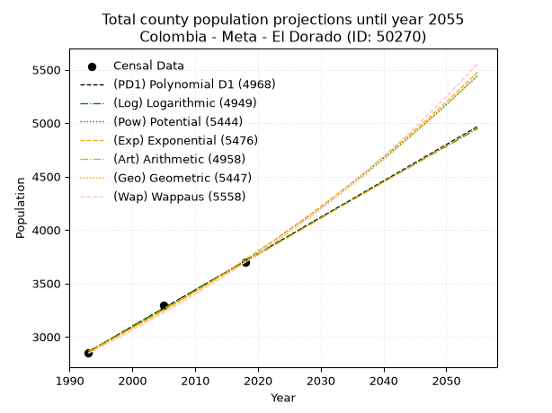
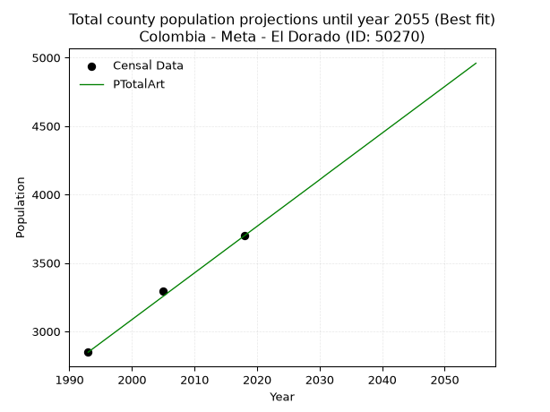
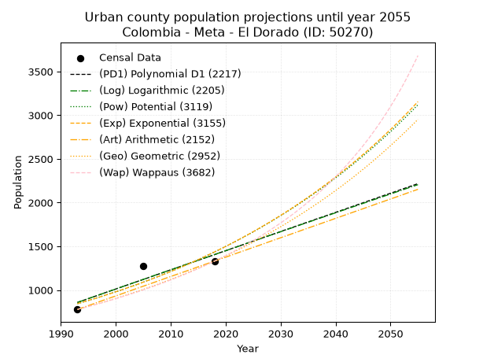
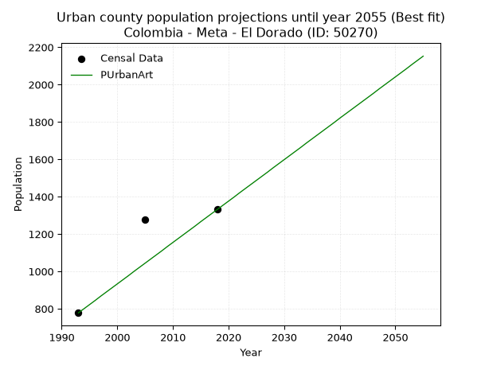
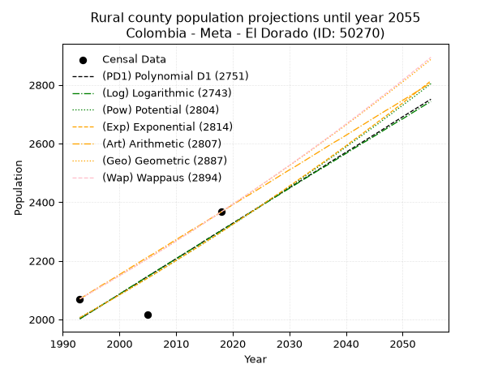
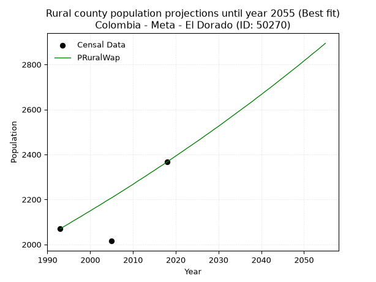

<div align="center">


</div>

# 📜 _“Population and Public Services Demand Projections (PPSD) until Year 2050 for Colombia - Meta - El Dorado (ID: 50270)”_
Keywords: `population` `public-service` `projection` `lineal` `polynomial` `logarithmic` `potential` `exponential` `arithmetic` `geometric` `wappaus` `dane` `colombia` `south-america`

PPSD are analytical estimates used by governments and planners to anticipate future changes in population size, age distribution, and the resulting community needs for utilities, healthcare, education, and infrastructure as sizing future water treatment facilities, electrical grids, and road networks based on spatial growth.

<div align="center">

</img>

</div>


> **General running parameters**: • app_version: _v20260806_. • Python version: _3.14.7_. • Pandas version: _3.0.5_. • NumPy version: _2.5.1_. • Creates, save and include plots into reports (create_plot): _False_. • Projection until year: _2050_. • Process polynomial degree 2 and up: _False_. • Process Wappaus: _True_. • Process Wappaus: _True_. • Set negative values to zero: _True_. • Set infinite values to zero: _True_. • Drop dataset notes: _True_. 
<div align="center">

Dynamic map: [:earth_americas:Google](http://maps.google.com/maps?q=3.739983712,-73.8352637) [:earth_americas:OSM](https://www.openstreetmap.org/#map=18/3.739983712/-73.8352637&layers=P) [:earth_americas:Bing](https://www.bing.com/maps?cp=3.739983712~-73.8352637&lvl=18) [:earth_americas:Apple](https://maps.apple.com/frame?center=3.739983712%2C-73.8352637&span=0.003%2C0.006)

</div>


<div align="center">

```geojson
{
  "type": "Feature",
  "geometry": {
    "type": "Point", 
    "coordinates": [-73.8352637, 3.739983712]
  }, 
  "properties": {
    "Name": "Colombia - Meta - El Dorado (ID: 50270)"
  }
}
```

</div>


## 0. Census Data (3 records)

Census data are official statistics collected by a government about the people and housing in a country. They usually include counts of total population, age, sex, race, income, education, and jobs.

📅Global census file: [Population.xlsx](../data/Population.xlsx)

| Source   |   Year |   CountryID | CountryName   |   StateID | StateName   |   CountyID | CountyName   |   PTotal |   PUrban |   PRural |
|:---------|-------:|------------:|:--------------|----------:|:------------|-----------:|:-------------|---------:|---------:|---------:|
| DANE     |   1993 |          57 | Colombia      |        50 | Meta        |      50270 | El Dorado    |     2848 |      778 |     2070 |
| DANE     |   2005 |          57 | Colombia      |        50 | Meta        |      50270 | El Dorado    |     3291 |     1276 |     2015 |
| DANE     |   2018 |          57 | Colombia      |        50 | Meta        |      50270 | El Dorado    |     3699 |     1332 |     2367 |

> 🔥Some records could had specific notes about the registered values or the corresponding urban or rural distribution.

📅[SUI-RUPS](https://www.datos.gov.co/Hacienda-y-Cr-dito-P-blico/Registro-nico-de-Prestadores-de-Servicios-P-blicos/4qkq-csdn/about_data) - Local public utility companies: [RUPS.csv](../data/RUPS.csv)

 | SERVICIO       | ESTADO    | NOMBRE                                             | NIT         | DEPARTAMENTO_DOMICILIO   | MUNICIPIO_DOMICILIO   | DIRECCION                                       |   TELEFONO | EMAIL                 | TIPO_PRESTADOR                             | CLASIFICACION                 |
|:---------------|:----------|:---------------------------------------------------|:------------|:-------------------------|:----------------------|:------------------------------------------------|-----------:|:----------------------|:-------------------------------------------|:------------------------------|
| ACUEDUCTO      | OPERATIVA | EMPRESA DE SERVICIOS PUBLICOS DEL META S.A. E.S.P. | 822006587-0 | META                     | VILLAVICENCIO         | Diagonal 19 Transversal 23 - 02 Barrio el Nogal |    6726764 | edesa@edesaesp.com.co | SOCIEDADES (EMPRESA DE SERVICIOS PUBLICOS) | MAYOR O IGUAL A 5001 USUARIOS |
| ALCANTARILLADO | OPERATIVA | EMPRESA DE SERVICIOS PUBLICOS DEL META S.A. E.S.P. | 822006587-0 | META                     | VILLAVICENCIO         | Diagonal 19 Transversal 23 - 02 Barrio el Nogal |    6726764 | edesa@edesaesp.com.co | SOCIEDADES (EMPRESA DE SERVICIOS PUBLICOS) | MAYOR O IGUAL A 5001 USUARIOS |

## 1. Total

### 1.1. Coefficients and Parameters

* (PD1) Polynomial Deg 1: 34.003198294243866, -64908.41364605702 (lineal)
* (Log) Logarithmic: 68200.87867842063, -515289.6364479844
* (Pow) Potential: 20.93606596565708, -65.6213607133795
* (Exp) Exponential: 0.010437478952037315, 2.6501026380330896e-06
* (Art) Arithmetic: Year diff. 2018 - 1993 = 25, Population diff. 3699 - 2848 = 851, Annual growth = 34.04
* (Geo) Geometric: Year diff. 2018 - 1993 = 25, Population diff. 3699 - 2848 = 851, Annual growth % = 0.010512694900787212
* (Wap) Wappaus: i = 1.0398655872918894, Condition values only valid for < 200)

<sub>
Wappaus condition values: ['0.00', '1.04', '2.08', '3.12', '4.16', '5.20', '6.24', '7.28', '8.32', '9.36', '10.40', '11.44', '12.48', '13.52', '14.56', '15.60', '16.64', '17.68', '18.72', '19.76', '20.80', '21.84', '22.88', '23.92', '24.96', '26.00', '27.04', '28.08', '29.12', '30.16', '31.20', '32.24', '33.28', '34.32', '35.36', '36.40', '37.44', '38.48', '39.51', '40.55', '41.59', '42.63', '43.67', '44.71', '45.75', '46.79', '47.83', '48.87', '49.91', '50.95', '51.99', '53.03', '54.07', '55.11', '56.15', '57.19', '58.23', '59.27']
</sub>


### 1.2. Projected Dataset

|   Year |   CountyID |   PTotalPD1 |   PTotalLog |   PTotalPow |   PTotalExp |   PTotalArt |   PTotalGeo |   PTotalWap |
|-------:|-----------:|------------:|------------:|------------:|------------:|------------:|------------:|------------:|
|   1993 |      50270 |        2860 |        2859 |        2866 |        2867 |        2848 |        2848 |        2848 |
|   1994 |      50270 |        2894 |        2894 |        2897 |        2897 |        2882 |        2878 |        2878 |
|   1995 |      50270 |        2928 |        2928 |        2927 |        2927 |        2916 |        2908 |        2908 |
|   1996 |      50270 |        2962 |        2962 |        2958 |        2958 |        2950 |        2939 |        2938 |
|   1997 |      50270 |        2996 |        2996 |        2989 |        2989 |        2984 |        2970 |        2969 |
|   1998 |      50270 |        3030 |        3030 |        3021 |        3020 |        3018 |        3001 |        3000 |
|   1999 |      50270 |        3064 |        3064 |        3053 |        3052 |        3052 |        3032 |        3031 |
|   2000 |      50270 |        3098 |        3099 |        3085 |        3084 |        3086 |        3064 |        3063 |
|   2001 |      50270 |        3132 |        3133 |        3117 |        3117 |        3120 |        3097 |        3095 |
|   2002 |      50270 |        3166 |        3167 |        3150 |        3149 |        3154 |        3129 |        3128 |
|   2003 |      50270 |        3200 |        3201 |        3183 |        3182 |        3188 |        3162 |        3160 |
|   2004 |      50270 |        3234 |        3235 |        3217 |        3216 |        3222 |        3195 |        3194 |
|   2005 |      50270 |        3268 |        3269 |        3250 |        3249 |        3256 |        3229 |        3227 |
|   2006 |      50270 |        3302 |        3303 |        3284 |        3284 |        3291 |        3263 |        3261 |
|   2007 |      50270 |        3336 |        3337 |        3319 |        3318 |        3325 |        3297 |        3295 |
|   2008 |      50270 |        3370 |        3371 |        3354 |        3353 |        3359 |        3332 |        3330 |
|   2009 |      50270 |        3404 |        3405 |        3389 |        3388 |        3393 |        3367 |        3365 |
|   2010 |      50270 |        3438 |        3439 |        3424 |        3424 |        3427 |        3402 |        3400 |
|   2011 |      50270 |        3472 |        3473 |        3460 |        3459 |        3461 |        3438 |        3436 |
|   2012 |      50270 |        3506 |        3507 |        3496 |        3496 |        3495 |        3474 |        3472 |
|   2013 |      50270 |        3540 |        3540 |        3533 |        3532 |        3529 |        3511 |        3509 |
|   2014 |      50270 |        3574 |        3574 |        3570 |        3569 |        3563 |        3547 |        3546 |
|   2015 |      50270 |        3608 |        3608 |        3607 |        3607 |        3597 |        3585 |        3584 |
|   2016 |      50270 |        3642 |        3642 |        3645 |        3645 |        3631 |        3622 |        3622 |
|   2017 |      50270 |        3676 |        3676 |        3683 |        3683 |        3665 |        3661 |        3660 |
|   2018 |      50270 |        3710 |        3710 |        3721 |        3722 |        3699 |        3699 |        3699 |
|   2019 |      50270 |        3744 |        3743 |        3760 |        3761 |        3733 |        3738 |        3738 |
|   2020 |      50270 |        3778 |        3777 |        3799 |        3800 |        3767 |        3777 |        3778 |
|   2021 |      50270 |        3812 |        3811 |        3839 |        3840 |        3801 |        3817 |        3819 |
|   2022 |      50270 |        3846 |        3845 |        3879 |        3880 |        3835 |        3857 |        3859 |
|   2023 |      50270 |        3880 |        3878 |        3919 |        3921 |        3869 |        3898 |        3901 |
|   2024 |      50270 |        3914 |        3912 |        3960 |        3962 |        3903 |        3939 |        3942 |
|   2025 |      50270 |        3948 |        3946 |        4001 |        4004 |        3937 |        3980 |        3985 |
|   2026 |      50270 |        3982 |        3979 |        4043 |        4046 |        3971 |        4022 |        4028 |
|   2027 |      50270 |        4016 |        4013 |        4085 |        4088 |        4005 |        4064 |        4071 |
|   2028 |      50270 |        4050 |        4047 |        4127 |        4131 |        4039 |        4107 |        4115 |
|   2029 |      50270 |        4084 |        4080 |        4170 |        4174 |        4073 |        4150 |        4160 |
|   2030 |      50270 |        4118 |        4114 |        4213 |        4218 |        4107 |        4194 |        4205 |
|   2031 |      50270 |        4152 |        4148 |        4257 |        4262 |        4142 |        4238 |        4250 |
|   2032 |      50270 |        4186 |        4181 |        4301 |        4307 |        4176 |        4282 |        4297 |
|   2033 |      50270 |        4220 |        4215 |        4345 |        4352 |        4210 |        4327 |        4344 |
|   2034 |      50270 |        4254 |        4248 |        4390 |        4398 |        4244 |        4373 |        4391 |
|   2035 |      50270 |        4288 |        4282 |        4436 |        4444 |        4278 |        4419 |        4439 |
|   2036 |      50270 |        4322 |        4315 |        4482 |        4491 |        4312 |        4465 |        4488 |
|   2037 |      50270 |        4356 |        4349 |        4528 |        4538 |        4346 |        4512 |        4538 |
|   2038 |      50270 |        4390 |        4382 |        4575 |        4586 |        4380 |        4560 |        4588 |
|   2039 |      50270 |        4424 |        4416 |        4622 |        4634 |        4414 |        4607 |        4639 |
|   2040 |      50270 |        4458 |        4449 |        4670 |        4682 |        4448 |        4656 |        4690 |
|   2041 |      50270 |        4492 |        4483 |        4718 |        4731 |        4482 |        4705 |        4742 |
|   2042 |      50270 |        4526 |        4516 |        4766 |        4781 |        4516 |        4754 |        4795 |
|   2043 |      50270 |        4560 |        4549 |        4815 |        4831 |        4550 |        4804 |        4849 |
|   2044 |      50270 |        4594 |        4583 |        4865 |        4882 |        4584 |        4855 |        4903 |
|   2045 |      50270 |        4628 |        4616 |        4915 |        4933 |        4618 |        4906 |        4959 |
|   2046 |      50270 |        4662 |        4649 |        4966 |        4985 |        4652 |        4957 |        5015 |
|   2047 |      50270 |        4696 |        4683 |        5017 |        5037 |        4686 |        5010 |        5072 |
|   2048 |      50270 |        4730 |        4716 |        5068 |        5090 |        4720 |        5062 |        5129 |
|   2049 |      50270 |        4764 |        4749 |        5120 |        5143 |        4754 |        5115 |        5188 |
|   2050 |      50270 |        4798 |        4783 |        5173 |        5197 |        4788 |        5169 |        5247 |
<div align="center">

</img>

</div>


### 1.3. Best fit with absolute and relative error (%)

Relative error puts that difference into context by dividing the absolute error by the true value, creating a unitless ratio or percentage that shows the scale of the mistake.

Absolute and relative error

|   Year | Source   |   CountryID | CountryName   |   StateID | StateName   |   CountyID_x | CountyName   |   PTotal |   PUrban |   PRural |   CountyID_y |   PTotalPD1 |   PTotalLog |   PTotalPow |   PTotalExp |   PTotalArt |   PTotalGeo |   PTotalWap |   PTotalPD1AbsError |   PTotalLogAbsError |   PTotalPowAbsError |   PTotalExpAbsError |   PTotalArtAbsError |   PTotalGeoAbsError |   PTotalWapAbsError |   PTotalPD1RelError |   PTotalLogRelError |   PTotalPowRelError |   PTotalExpRelError |   PTotalArtRelError |   PTotalGeoRelError |   PTotalWapRelError |
|-------:|:---------|------------:|:--------------|----------:|:------------|-------------:|:-------------|---------:|---------:|---------:|-------------:|------------:|------------:|------------:|------------:|------------:|------------:|------------:|--------------------:|--------------------:|--------------------:|--------------------:|--------------------:|--------------------:|--------------------:|--------------------:|--------------------:|--------------------:|--------------------:|--------------------:|--------------------:|--------------------:|
|   1993 | DANE     |          57 | Colombia      |        50 | Meta        |        50270 | El Dorado    |     2848 |      778 |     2070 |        50270 |        2860 |        2859 |        2866 |        2867 |        2848 |        2848 |        2848 |                  12 |                  11 |                  18 |                  19 |                   0 |                   0 |                   0 |            0.421348 |            0.386236 |            0.632022 |            0.667135 |             0       |             0       |              0      |
|   2005 | DANE     |          57 | Colombia      |        50 | Meta        |        50270 | El Dorado    |     3291 |     1276 |     2015 |        50270 |        3268 |        3269 |        3250 |        3249 |        3256 |        3229 |        3227 |                  23 |                  22 |                  41 |                  42 |                  35 |                  62 |                  64 |            0.698876 |            0.66849  |            1.24582  |            1.27621  |             1.06351 |             1.88393 |              1.9447 |
|   2018 | DANE     |          57 | Colombia      |        50 | Meta        |        50270 | El Dorado    |     3699 |     1332 |     2367 |        50270 |        3710 |        3710 |        3721 |        3722 |        3699 |        3699 |        3699 |                  11 |                  11 |                  22 |                  23 |                   0 |                   0 |                   0 |            0.297378 |            0.297378 |            0.594755 |            0.62179  |             0       |             0       |              0      |

Relative error mean

| Method    |   RelError | Best   |
|:----------|-----------:|:-------|
| PTotalPD1 |   0.472534 |        |
| PTotalLog |   0.450701 |        |
| PTotalPow |   0.8242   |        |
| PTotalExp |   0.855044 |        |
| PTotalArt |   0.354502 | True   |
| PTotalGeo |   0.627975 |        |
| PTotalWap |   0.648233 |        |

💙Best method: _**PTotalArt**_
<div align="center">

</img>

</div>


### 1.4. Fresh water supply demand in liters per capita per day (lpcd)

The fresh water supply demand typically ranges from 100 to 300 liters per capita per day (lpcd) for standard domestic and municipal planning, though absolute survival minimums set by the World Health Organization are as low as 7.5 to 20 liters per day, and total consumption in high-income nations can exceed 400 liters.

> `CZ`: Level in meters above the sea level (masl)<br> `WS`: Fresh water supply demand in liters per capita per day (lpcd or l/h/d)<br> `WSAll`: Zonal fresh water supply demand in liters per second (l/s)<br> `A`: Zonal area in square meters<br> `DP`: Population density (people/hectare or p/ha)

Reference values (RAS Colombia)

|    CZ |   WS |
|------:|-----:|
|  1000 |  120 |
|  2000 |  130 |
| 99999 |  140 |

County shapefile geometry properties and water supply values

|   CountyID |      ATotal |   CZTotal |   WSTotal |
|-----------:|------------:|----------:|----------:|
|      50270 | 1.17176e+08 |   654.292 |       120 |

Projected values for best method: PTotalArt

|   CountyID |   Year |   PTotalArt |   DPTotal |   WSTotal |   WSTotalAll |
|-----------:|-------:|------------:|----------:|----------:|-------------:|
|      50270 |   1993 |        2848 |      0.24 |       120 |      3.95556 |
|      50270 |   1994 |        2882 |      0.25 |       120 |      4.00278 |
|      50270 |   1995 |        2916 |      0.25 |       120 |      4.05    |
|      50270 |   1996 |        2950 |      0.25 |       120 |      4.09722 |
|      50270 |   1997 |        2984 |      0.25 |       120 |      4.14444 |
|      50270 |   1998 |        3018 |      0.26 |       120 |      4.19167 |
|      50270 |   1999 |        3052 |      0.26 |       120 |      4.23889 |
|      50270 |   2000 |        3086 |      0.26 |       120 |      4.28611 |
|      50270 |   2001 |        3120 |      0.27 |       120 |      4.33333 |
|      50270 |   2002 |        3154 |      0.27 |       120 |      4.38056 |
|      50270 |   2003 |        3188 |      0.27 |       120 |      4.42778 |
|      50270 |   2004 |        3222 |      0.27 |       120 |      4.475   |
|      50270 |   2005 |        3256 |      0.28 |       120 |      4.52222 |
|      50270 |   2006 |        3291 |      0.28 |       120 |      4.57083 |
|      50270 |   2007 |        3325 |      0.28 |       120 |      4.61806 |
|      50270 |   2008 |        3359 |      0.29 |       120 |      4.66528 |
|      50270 |   2009 |        3393 |      0.29 |       120 |      4.7125  |
|      50270 |   2010 |        3427 |      0.29 |       120 |      4.75972 |
|      50270 |   2011 |        3461 |      0.3  |       120 |      4.80694 |
|      50270 |   2012 |        3495 |      0.3  |       120 |      4.85417 |
|      50270 |   2013 |        3529 |      0.3  |       120 |      4.90139 |
|      50270 |   2014 |        3563 |      0.3  |       120 |      4.94861 |
|      50270 |   2015 |        3597 |      0.31 |       120 |      4.99583 |
|      50270 |   2016 |        3631 |      0.31 |       120 |      5.04306 |
|      50270 |   2017 |        3665 |      0.31 |       120 |      5.09028 |
|      50270 |   2018 |        3699 |      0.32 |       120 |      5.1375  |
|      50270 |   2019 |        3733 |      0.32 |       120 |      5.18472 |
|      50270 |   2020 |        3767 |      0.32 |       120 |      5.23194 |
|      50270 |   2021 |        3801 |      0.32 |       120 |      5.27917 |
|      50270 |   2022 |        3835 |      0.33 |       120 |      5.32639 |
|      50270 |   2023 |        3869 |      0.33 |       120 |      5.37361 |
|      50270 |   2024 |        3903 |      0.33 |       120 |      5.42083 |
|      50270 |   2025 |        3937 |      0.34 |       120 |      5.46806 |
|      50270 |   2026 |        3971 |      0.34 |       120 |      5.51528 |
|      50270 |   2027 |        4005 |      0.34 |       120 |      5.5625  |
|      50270 |   2028 |        4039 |      0.34 |       120 |      5.60972 |
|      50270 |   2029 |        4073 |      0.35 |       120 |      5.65694 |
|      50270 |   2030 |        4107 |      0.35 |       120 |      5.70417 |
|      50270 |   2031 |        4142 |      0.35 |       120 |      5.75278 |
|      50270 |   2032 |        4176 |      0.36 |       120 |      5.8     |
|      50270 |   2033 |        4210 |      0.36 |       120 |      5.84722 |
|      50270 |   2034 |        4244 |      0.36 |       120 |      5.89444 |
|      50270 |   2035 |        4278 |      0.37 |       120 |      5.94167 |
|      50270 |   2036 |        4312 |      0.37 |       120 |      5.98889 |
|      50270 |   2037 |        4346 |      0.37 |       120 |      6.03611 |
|      50270 |   2038 |        4380 |      0.37 |       120 |      6.08333 |
|      50270 |   2039 |        4414 |      0.38 |       120 |      6.13056 |
|      50270 |   2040 |        4448 |      0.38 |       120 |      6.17778 |
|      50270 |   2041 |        4482 |      0.38 |       120 |      6.225   |
|      50270 |   2042 |        4516 |      0.39 |       120 |      6.27222 |
|      50270 |   2043 |        4550 |      0.39 |       120 |      6.31944 |
|      50270 |   2044 |        4584 |      0.39 |       120 |      6.36667 |
|      50270 |   2045 |        4618 |      0.39 |       120 |      6.41389 |
|      50270 |   2046 |        4652 |      0.4  |       120 |      6.46111 |
|      50270 |   2047 |        4686 |      0.4  |       120 |      6.50833 |
|      50270 |   2048 |        4720 |      0.4  |       120 |      6.55556 |
|      50270 |   2049 |        4754 |      0.41 |       120 |      6.60278 |
|      50270 |   2050 |        4788 |      0.41 |       120 |      6.65    |

## 2. Urban

### 2.1. Coefficients and Parameters

* (PD1) Polynomial Deg 1: 21.912579957356566, -42813.36034115236 (lineal)
* (Log) Logarithmic: 43985.3770093972, -333316.4619475351
* (Pow) Potential: 42.66955927597109, -137.8621607769669
* (Exp) Exponential: 0.021256112455552097, 3.3758717595561397e-16
* (Art) Arithmetic: Year diff. 2018 - 1993 = 25, Population diff. 1332 - 778 = 554, Annual growth = 22.16
* (Geo) Geometric: Year diff. 2018 - 1993 = 25, Population diff. 1332 - 778 = 554, Annual growth % = 0.021741386290054843
* (Wap) Wappaus: i = 2.100473933649289, Condition values only valid for < 200)

<sub>
Wappaus condition values: ['0.00', '2.10', '4.20', '6.30', '8.40', '10.50', '12.60', '14.70', '16.80', '18.90', '21.00', '23.11', '25.21', '27.31', '29.41', '31.51', '33.61', '35.71', '37.81', '39.91', '42.01', '44.11', '46.21', '48.31', '50.41', '52.51', '54.61', '56.71', '58.81', '60.91', '63.01', '65.11', '67.22', '69.32', '71.42', '73.52', '75.62', '77.72', '79.82', '81.92', '84.02', '86.12', '88.22', '90.32', '92.42', '94.52', '96.62', '98.72', '100.82', '102.92', '105.02', '107.12', '109.22', '111.33', '113.43', '115.53', '117.63', '119.73']
</sub>


### 2.2. Projected Dataset

|   Year |   CountyID |   PUrbanPD1 |   PUrbanLog |   PUrbanPow |   PUrbanExp |   PUrbanArt |   PUrbanGeo |   PUrbanWap |
|-------:|-----------:|------------:|------------:|------------:|------------:|------------:|------------:|------------:|
|   1993 |      50270 |         858 |         858 |         844 |         844 |         778 |         778 |         778 |
|   1994 |      50270 |         880 |         880 |         862 |         863 |         800 |         795 |         795 |
|   1995 |      50270 |         902 |         902 |         881 |         881 |         822 |         812 |         811 |
|   1996 |      50270 |         924 |         924 |         900 |         900 |         844 |         830 |         829 |
|   1997 |      50270 |         946 |         946 |         919 |         919 |         867 |         848 |         846 |
|   1998 |      50270 |         968 |         968 |         939 |         939 |         889 |         866 |         864 |
|   1999 |      50270 |         990 |         990 |         960 |         959 |         911 |         885 |         883 |
|   2000 |      50270 |        1012 |        1012 |         980 |         980 |         933 |         904 |         901 |
|   2001 |      50270 |        1034 |        1034 |        1001 |        1001 |         955 |         924 |         921 |
|   2002 |      50270 |        1056 |        1056 |        1023 |        1023 |         977 |         944 |         940 |
|   2003 |      50270 |        1078 |        1078 |        1045 |        1044 |        1000 |         965 |         961 |
|   2004 |      50270 |        1099 |        1100 |        1067 |        1067 |        1022 |         986 |         981 |
|   2005 |      50270 |        1121 |        1122 |        1090 |        1090 |        1044 |        1007 |        1002 |
|   2006 |      50270 |        1143 |        1144 |        1114 |        1113 |        1066 |        1029 |        1024 |
|   2007 |      50270 |        1165 |        1166 |        1138 |        1137 |        1088 |        1051 |        1046 |
|   2008 |      50270 |        1187 |        1188 |        1162 |        1162 |        1110 |        1074 |        1069 |
|   2009 |      50270 |        1209 |        1210 |        1187 |        1187 |        1133 |        1098 |        1092 |
|   2010 |      50270 |        1231 |        1231 |        1213 |        1212 |        1155 |        1121 |        1116 |
|   2011 |      50270 |        1253 |        1253 |        1239 |        1238 |        1177 |        1146 |        1141 |
|   2012 |      50270 |        1275 |        1275 |        1265 |        1265 |        1199 |        1171 |        1166 |
|   2013 |      50270 |        1297 |        1297 |        1292 |        1292 |        1221 |        1196 |        1192 |
|   2014 |      50270 |        1319 |        1319 |        1320 |        1320 |        1243 |        1222 |        1218 |
|   2015 |      50270 |        1340 |        1341 |        1348 |        1348 |        1266 |        1249 |        1246 |
|   2016 |      50270 |        1362 |        1363 |        1377 |        1377 |        1288 |        1276 |        1274 |
|   2017 |      50270 |        1384 |        1384 |        1407 |        1407 |        1310 |        1304 |        1302 |
|   2018 |      50270 |        1406 |        1406 |        1437 |        1437 |        1332 |        1332 |        1332 |
|   2019 |      50270 |        1428 |        1428 |        1467 |        1468 |        1354 |        1361 |        1362 |
|   2020 |      50270 |        1450 |        1450 |        1499 |        1499 |        1376 |        1391 |        1394 |
|   2021 |      50270 |        1472 |        1472 |        1531 |        1531 |        1398 |        1421 |        1426 |
|   2022 |      50270 |        1494 |        1493 |        1563 |        1564 |        1421 |        1452 |        1459 |
|   2023 |      50270 |        1516 |        1515 |        1597 |        1598 |        1443 |        1483 |        1494 |
|   2024 |      50270 |        1538 |        1537 |        1631 |        1632 |        1465 |        1515 |        1529 |
|   2025 |      50270 |        1560 |        1559 |        1665 |        1667 |        1487 |        1548 |        1566 |
|   2026 |      50270 |        1582 |        1580 |        1701 |        1703 |        1509 |        1582 |        1603 |
|   2027 |      50270 |        1603 |        1602 |        1737 |        1740 |        1531 |        1616 |        1642 |
|   2028 |      50270 |        1625 |        1624 |        1774 |        1777 |        1554 |        1652 |        1682 |
|   2029 |      50270 |        1647 |        1645 |        1812 |        1815 |        1576 |        1688 |        1724 |
|   2030 |      50270 |        1669 |        1667 |        1850 |        1854 |        1598 |        1724 |        1767 |
|   2031 |      50270 |        1691 |        1689 |        1890 |        1894 |        1620 |        1762 |        1811 |
|   2032 |      50270 |        1713 |        1710 |        1930 |        1935 |        1642 |        1800 |        1857 |
|   2033 |      50270 |        1735 |        1732 |        1971 |        1976 |        1664 |        1839 |        1905 |
|   2034 |      50270 |        1757 |        1754 |        2012 |        2019 |        1687 |        1879 |        1955 |
|   2035 |      50270 |        1779 |        1775 |        2055 |        2062 |        1709 |        1920 |        2006 |
|   2036 |      50270 |        1801 |        1797 |        2099 |        2106 |        1731 |        1962 |        2059 |
|   2037 |      50270 |        1823 |        1818 |        2143 |        2152 |        1753 |        2004 |        2115 |
|   2038 |      50270 |        1844 |        1840 |        2188 |        2198 |        1775 |        2048 |        2172 |
|   2039 |      50270 |        1866 |        1862 |        2235 |        2245 |        1797 |        2092 |        2232 |
|   2040 |      50270 |        1888 |        1883 |        2282 |        2293 |        1820 |        2138 |        2295 |
|   2041 |      50270 |        1910 |        1905 |        2330 |        2343 |        1842 |        2184 |        2360 |
|   2042 |      50270 |        1932 |        1926 |        2379 |        2393 |        1864 |        2232 |        2428 |
|   2043 |      50270 |        1954 |        1948 |        2430 |        2444 |        1886 |        2280 |        2499 |
|   2044 |      50270 |        1976 |        1969 |        2481 |        2497 |        1908 |        2330 |        2573 |
|   2045 |      50270 |        1998 |        1991 |        2533 |        2550 |        1930 |        2381 |        2650 |
|   2046 |      50270 |        2020 |        2012 |        2587 |        2605 |        1952 |        2432 |        2731 |
|   2047 |      50270 |        2042 |        2034 |        2641 |        2661 |        1975 |        2485 |        2817 |
|   2048 |      50270 |        2064 |        2055 |        2697 |        2718 |        1997 |        2539 |        2906 |
|   2049 |      50270 |        2086 |        2077 |        2753 |        2777 |        2019 |        2595 |        3000 |
|   2050 |      50270 |        2107 |        2098 |        2811 |        2836 |        2041 |        2651 |        3099 |
<div align="center">

</img>

</div>


### 2.3. Best fit with absolute and relative error (%)

Relative error puts that difference into context by dividing the absolute error by the true value, creating a unitless ratio or percentage that shows the scale of the mistake.

Absolute and relative error

|   Year | Source   |   CountryID | CountryName   |   StateID | StateName   |   CountyID_x | CountyName   |   PTotal |   PUrban |   PRural |   CountyID_y |   PUrbanPD1 |   PUrbanLog |   PUrbanPow |   PUrbanExp |   PUrbanArt |   PUrbanGeo |   PUrbanWap |   PUrbanPD1AbsError |   PUrbanLogAbsError |   PUrbanPowAbsError |   PUrbanExpAbsError |   PUrbanArtAbsError |   PUrbanGeoAbsError |   PUrbanWapAbsError |   PUrbanPD1RelError |   PUrbanLogRelError |   PUrbanPowRelError |   PUrbanExpRelError |   PUrbanArtRelError |   PUrbanGeoRelError |   PUrbanWapRelError |
|-------:|:---------|------------:|:--------------|----------:|:------------|-------------:|:-------------|---------:|---------:|---------:|-------------:|------------:|------------:|------------:|------------:|------------:|------------:|------------:|--------------------:|--------------------:|--------------------:|--------------------:|--------------------:|--------------------:|--------------------:|--------------------:|--------------------:|--------------------:|--------------------:|--------------------:|--------------------:|--------------------:|
|   1993 | DANE     |          57 | Colombia      |        50 | Meta        |        50270 | El Dorado    |     2848 |      778 |     2070 |        50270 |         858 |         858 |         844 |         844 |         778 |         778 |         778 |                  80 |                  80 |                  66 |                  66 |                   0 |                   0 |                   0 |            10.2828  |            10.2828  |             8.48329 |             8.48329 |              0      |              0      |              0      |
|   2005 | DANE     |          57 | Colombia      |        50 | Meta        |        50270 | El Dorado    |     3291 |     1276 |     2015 |        50270 |        1121 |        1122 |        1090 |        1090 |        1044 |        1007 |        1002 |                 155 |                 154 |                 186 |                 186 |                 232 |                 269 |                 274 |            12.1473  |            12.069   |            14.5768  |            14.5768  |             18.1818 |             21.0815 |             21.4734 |
|   2018 | DANE     |          57 | Colombia      |        50 | Meta        |        50270 | El Dorado    |     3699 |     1332 |     2367 |        50270 |        1406 |        1406 |        1437 |        1437 |        1332 |        1332 |        1332 |                  74 |                  74 |                 105 |                 105 |                   0 |                   0 |                   0 |             5.55556 |             5.55556 |             7.88288 |             7.88288 |              0      |              0      |              0      |

Relative error mean

| Method    |   RelError | Best   |
|:----------|-----------:|:-------|
| PUrbanPD1 |    9.32856 |        |
| PUrbanLog |    9.30243 |        |
| PUrbanPow |   10.3143  |        |
| PUrbanExp |   10.3143  |        |
| PUrbanArt |    6.06061 | True   |
| PUrbanGeo |    7.02717 |        |
| PUrbanWap |    7.15778 |        |

💙Best method: _**PUrbanArt**_
<div align="center">

</img>

</div>


### 2.4. Fresh water supply demand in liters per capita per day (lpcd)

The fresh water supply demand typically ranges from 100 to 300 liters per capita per day (lpcd) for standard domestic and municipal planning, though absolute survival minimums set by the World Health Organization are as low as 7.5 to 20 liters per day, and total consumption in high-income nations can exceed 400 liters.

> `CZ`: Level in meters above the sea level (masl)<br> `WS`: Fresh water supply demand in liters per capita per day (lpcd or l/h/d)<br> `WSAll`: Zonal fresh water supply demand in liters per second (l/s)<br> `A`: Zonal area in square meters<br> `DP`: Population density (people/hectare or p/ha)

Reference values (RAS Colombia)

|    CZ |   WS |
|------:|-----:|
|  1000 |  120 |
|  2000 |  130 |
| 99999 |  140 |

County shapefile geometry properties and water supply values

|   CountyID |   AUrban |   CZUrban |   WSUrban |
|-----------:|---------:|----------:|----------:|
|      50270 |   283531 |   549.852 |       120 |

Projected values for best method: PUrbanArt

|   CountyID |   Year |   PUrbanArt |   DPUrban |   WSUrban |   WSUrbanAll |
|-----------:|-------:|------------:|----------:|----------:|-------------:|
|      50270 |   1993 |         778 |     27.44 |       120 |      1.08056 |
|      50270 |   1994 |         800 |     28.22 |       120 |      1.11111 |
|      50270 |   1995 |         822 |     28.99 |       120 |      1.14167 |
|      50270 |   1996 |         844 |     29.77 |       120 |      1.17222 |
|      50270 |   1997 |         867 |     30.58 |       120 |      1.20417 |
|      50270 |   1998 |         889 |     31.35 |       120 |      1.23472 |
|      50270 |   1999 |         911 |     32.13 |       120 |      1.26528 |
|      50270 |   2000 |         933 |     32.91 |       120 |      1.29583 |
|      50270 |   2001 |         955 |     33.68 |       120 |      1.32639 |
|      50270 |   2002 |         977 |     34.46 |       120 |      1.35694 |
|      50270 |   2003 |        1000 |     35.27 |       120 |      1.38889 |
|      50270 |   2004 |        1022 |     36.05 |       120 |      1.41944 |
|      50270 |   2005 |        1044 |     36.82 |       120 |      1.45    |
|      50270 |   2006 |        1066 |     37.6  |       120 |      1.48056 |
|      50270 |   2007 |        1088 |     38.37 |       120 |      1.51111 |
|      50270 |   2008 |        1110 |     39.15 |       120 |      1.54167 |
|      50270 |   2009 |        1133 |     39.96 |       120 |      1.57361 |
|      50270 |   2010 |        1155 |     40.74 |       120 |      1.60417 |
|      50270 |   2011 |        1177 |     41.51 |       120 |      1.63472 |
|      50270 |   2012 |        1199 |     42.29 |       120 |      1.66528 |
|      50270 |   2013 |        1221 |     43.06 |       120 |      1.69583 |
|      50270 |   2014 |        1243 |     43.84 |       120 |      1.72639 |
|      50270 |   2015 |        1266 |     44.65 |       120 |      1.75833 |
|      50270 |   2016 |        1288 |     45.43 |       120 |      1.78889 |
|      50270 |   2017 |        1310 |     46.2  |       120 |      1.81944 |
|      50270 |   2018 |        1332 |     46.98 |       120 |      1.85    |
|      50270 |   2019 |        1354 |     47.75 |       120 |      1.88056 |
|      50270 |   2020 |        1376 |     48.53 |       120 |      1.91111 |
|      50270 |   2021 |        1398 |     49.31 |       120 |      1.94167 |
|      50270 |   2022 |        1421 |     50.12 |       120 |      1.97361 |
|      50270 |   2023 |        1443 |     50.89 |       120 |      2.00417 |
|      50270 |   2024 |        1465 |     51.67 |       120 |      2.03472 |
|      50270 |   2025 |        1487 |     52.45 |       120 |      2.06528 |
|      50270 |   2026 |        1509 |     53.22 |       120 |      2.09583 |
|      50270 |   2027 |        1531 |     54    |       120 |      2.12639 |
|      50270 |   2028 |        1554 |     54.81 |       120 |      2.15833 |
|      50270 |   2029 |        1576 |     55.58 |       120 |      2.18889 |
|      50270 |   2030 |        1598 |     56.36 |       120 |      2.21944 |
|      50270 |   2031 |        1620 |     57.14 |       120 |      2.25    |
|      50270 |   2032 |        1642 |     57.91 |       120 |      2.28056 |
|      50270 |   2033 |        1664 |     58.69 |       120 |      2.31111 |
|      50270 |   2034 |        1687 |     59.5  |       120 |      2.34306 |
|      50270 |   2035 |        1709 |     60.28 |       120 |      2.37361 |
|      50270 |   2036 |        1731 |     61.05 |       120 |      2.40417 |
|      50270 |   2037 |        1753 |     61.83 |       120 |      2.43472 |
|      50270 |   2038 |        1775 |     62.6  |       120 |      2.46528 |
|      50270 |   2039 |        1797 |     63.38 |       120 |      2.49583 |
|      50270 |   2040 |        1820 |     64.19 |       120 |      2.52778 |
|      50270 |   2041 |        1842 |     64.97 |       120 |      2.55833 |
|      50270 |   2042 |        1864 |     65.74 |       120 |      2.58889 |
|      50270 |   2043 |        1886 |     66.52 |       120 |      2.61944 |
|      50270 |   2044 |        1908 |     67.29 |       120 |      2.65    |
|      50270 |   2045 |        1930 |     68.07 |       120 |      2.68056 |
|      50270 |   2046 |        1952 |     68.85 |       120 |      2.71111 |
|      50270 |   2047 |        1975 |     69.66 |       120 |      2.74306 |
|      50270 |   2048 |        1997 |     70.43 |       120 |      2.77361 |
|      50270 |   2049 |        2019 |     71.21 |       120 |      2.80417 |
|      50270 |   2050 |        2041 |     71.99 |       120 |      2.83472 |

## 3. Rural

### 3.1. Coefficients and Parameters

* (PD1) Polynomial Deg 1: 12.090618336887307, -22095.053304904675 (lineal)
* (Log) Logarithmic: 24215.501669023426, -181973.17450044918
* (Pow) Potential: 10.935747384408796, -32.78033542349695
* (Exp) Exponential: 0.005460307990993956, 0.03767650325926579
* (Art) Arithmetic: Year diff. 2018 - 1993 = 25, Population diff. 2367 - 2070 = 297, Annual growth = 11.88
* (Geo) Geometric: Year diff. 2018 - 1993 = 25, Population diff. 2367 - 2070 = 297, Annual growth % = 0.00537739549788907
* (Wap) Wappaus: i = 0.5354969574036511, Condition values only valid for < 200)

<sub>
Wappaus condition values: ['0.00', '0.54', '1.07', '1.61', '2.14', '2.68', '3.21', '3.75', '4.28', '4.82', '5.35', '5.89', '6.43', '6.96', '7.50', '8.03', '8.57', '9.10', '9.64', '10.17', '10.71', '11.25', '11.78', '12.32', '12.85', '13.39', '13.92', '14.46', '14.99', '15.53', '16.06', '16.60', '17.14', '17.67', '18.21', '18.74', '19.28', '19.81', '20.35', '20.88', '21.42', '21.96', '22.49', '23.03', '23.56', '24.10', '24.63', '25.17', '25.70', '26.24', '26.77', '27.31', '27.85', '28.38', '28.92', '29.45', '29.99', '30.52']
</sub>


### 3.2. Projected Dataset

|   Year |   CountyID |   PRuralPD1 |   PRuralLog |   PRuralPow |   PRuralExp |   PRuralArt |   PRuralGeo |   PRuralWap |
|-------:|-----------:|------------:|------------:|------------:|------------:|------------:|------------:|------------:|
|   1993 |      50270 |        2002 |        2002 |        2006 |        2006 |        2070 |        2070 |        2070 |
|   1994 |      50270 |        2014 |        2014 |        2017 |        2017 |        2082 |        2081 |        2081 |
|   1995 |      50270 |        2026 |        2026 |        2028 |        2028 |        2094 |        2092 |        2092 |
|   1996 |      50270 |        2038 |        2038 |        2039 |        2039 |        2106 |        2104 |        2104 |
|   1997 |      50270 |        2050 |        2050 |        2050 |        2050 |        2118 |        2115 |        2115 |
|   1998 |      50270 |        2062 |        2062 |        2061 |        2061 |        2129 |        2126 |        2126 |
|   1999 |      50270 |        2074 |        2074 |        2073 |        2072 |        2141 |        2138 |        2138 |
|   2000 |      50270 |        2086 |        2086 |        2084 |        2084 |        2153 |        2149 |        2149 |
|   2001 |      50270 |        2098 |        2099 |        2095 |        2095 |        2165 |        2161 |        2161 |
|   2002 |      50270 |        2110 |        2111 |        2107 |        2107 |        2177 |        2172 |        2172 |
|   2003 |      50270 |        2122 |        2123 |        2118 |        2118 |        2189 |        2184 |        2184 |
|   2004 |      50270 |        2135 |        2135 |        2130 |        2130 |        2201 |        2196 |        2196 |
|   2005 |      50270 |        2147 |        2147 |        2142 |        2141 |        2213 |        2208 |        2207 |
|   2006 |      50270 |        2159 |        2159 |        2153 |        2153 |        2224 |        2219 |        2219 |
|   2007 |      50270 |        2171 |        2171 |        2165 |        2165 |        2236 |        2231 |        2231 |
|   2008 |      50270 |        2183 |        2183 |        2177 |        2177 |        2248 |        2243 |        2243 |
|   2009 |      50270 |        2195 |        2195 |        2189 |        2189 |        2260 |        2255 |        2255 |
|   2010 |      50270 |        2207 |        2207 |        2201 |        2201 |        2272 |        2268 |        2267 |
|   2011 |      50270 |        2219 |        2219 |        2213 |        2213 |        2284 |        2280 |        2280 |
|   2012 |      50270 |        2231 |        2231 |        2225 |        2225 |        2296 |        2292 |        2292 |
|   2013 |      50270 |        2243 |        2243 |        2237 |        2237 |        2308 |        2304 |        2304 |
|   2014 |      50270 |        2255 |        2255 |        2249 |        2249 |        2319 |        2317 |        2317 |
|   2015 |      50270 |        2268 |        2267 |        2261 |        2262 |        2331 |        2329 |        2329 |
|   2016 |      50270 |        2280 |        2279 |        2274 |        2274 |        2343 |        2342 |        2342 |
|   2017 |      50270 |        2292 |        2291 |        2286 |        2286 |        2355 |        2354 |        2354 |
|   2018 |      50270 |        2304 |        2303 |        2299 |        2299 |        2367 |        2367 |        2367 |
|   2019 |      50270 |        2316 |        2315 |        2311 |        2311 |        2379 |        2380 |        2380 |
|   2020 |      50270 |        2328 |        2327 |        2324 |        2324 |        2391 |        2393 |        2393 |
|   2021 |      50270 |        2340 |        2339 |        2336 |        2337 |        2403 |        2405 |        2406 |
|   2022 |      50270 |        2352 |        2351 |        2349 |        2350 |        2415 |        2418 |        2419 |
|   2023 |      50270 |        2364 |        2363 |        2362 |        2363 |        2426 |        2431 |        2432 |
|   2024 |      50270 |        2376 |        2375 |        2374 |        2375 |        2438 |        2444 |        2445 |
|   2025 |      50270 |        2388 |        2387 |        2387 |        2388 |        2450 |        2458 |        2458 |
|   2026 |      50270 |        2401 |        2399 |        2400 |        2402 |        2462 |        2471 |        2471 |
|   2027 |      50270 |        2413 |        2411 |        2413 |        2415 |        2474 |        2484 |        2485 |
|   2028 |      50270 |        2425 |        2423 |        2426 |        2428 |        2486 |        2497 |        2498 |
|   2029 |      50270 |        2437 |        2435 |        2439 |        2441 |        2498 |        2511 |        2512 |
|   2030 |      50270 |        2449 |        2447 |        2452 |        2455 |        2510 |        2524 |        2525 |
|   2031 |      50270 |        2461 |        2459 |        2466 |        2468 |        2521 |        2538 |        2539 |
|   2032 |      50270 |        2473 |        2471 |        2479 |        2482 |        2533 |        2552 |        2553 |
|   2033 |      50270 |        2485 |        2483 |        2492 |        2495 |        2545 |        2565 |        2567 |
|   2034 |      50270 |        2497 |        2495 |        2506 |        2509 |        2557 |        2579 |        2581 |
|   2035 |      50270 |        2509 |        2507 |        2519 |        2523 |        2569 |        2593 |        2595 |
|   2036 |      50270 |        2521 |        2518 |        2533 |        2536 |        2581 |        2607 |        2609 |
|   2037 |      50270 |        2534 |        2530 |        2547 |        2550 |        2593 |        2621 |        2623 |
|   2038 |      50270 |        2546 |        2542 |        2560 |        2564 |        2605 |        2635 |        2637 |
|   2039 |      50270 |        2558 |        2554 |        2574 |        2578 |        2616 |        2649 |        2652 |
|   2040 |      50270 |        2570 |        2566 |        2588 |        2592 |        2628 |        2663 |        2666 |
|   2041 |      50270 |        2582 |        2578 |        2602 |        2607 |        2640 |        2678 |        2681 |
|   2042 |      50270 |        2594 |        2590 |        2616 |        2621 |        2652 |        2692 |        2695 |
|   2043 |      50270 |        2606 |        2602 |        2630 |        2635 |        2664 |        2707 |        2710 |
|   2044 |      50270 |        2618 |        2613 |        2644 |        2650 |        2676 |        2721 |        2725 |
|   2045 |      50270 |        2630 |        2625 |        2658 |        2664 |        2688 |        2736 |        2740 |
|   2046 |      50270 |        2642 |        2637 |        2672 |        2679 |        2700 |        2751 |        2755 |
|   2047 |      50270 |        2654 |        2649 |        2687 |        2693 |        2712 |        2765 |        2770 |
|   2048 |      50270 |        2667 |        2661 |        2701 |        2708 |        2723 |        2780 |        2785 |
|   2049 |      50270 |        2679 |        2673 |        2716 |        2723 |        2735 |        2795 |        2800 |
|   2050 |      50270 |        2691 |        2684 |        2730 |        2738 |        2747 |        2810 |        2816 |
<div align="center">

</img>

</div>


### 3.3. Best fit with absolute and relative error (%)

Relative error puts that difference into context by dividing the absolute error by the true value, creating a unitless ratio or percentage that shows the scale of the mistake.

Absolute and relative error

|   Year | Source   |   CountryID | CountryName   |   StateID | StateName   |   CountyID_x | CountyName   |   PTotal |   PUrban |   PRural |   CountyID_y |   PRuralPD1 |   PRuralLog |   PRuralPow |   PRuralExp |   PRuralArt |   PRuralGeo |   PRuralWap |   PRuralPD1AbsError |   PRuralLogAbsError |   PRuralPowAbsError |   PRuralExpAbsError |   PRuralArtAbsError |   PRuralGeoAbsError |   PRuralWapAbsError |   PRuralPD1RelError |   PRuralLogRelError |   PRuralPowRelError |   PRuralExpRelError |   PRuralArtRelError |   PRuralGeoRelError |   PRuralWapRelError |
|-------:|:---------|------------:|:--------------|----------:|:------------|-------------:|:-------------|---------:|---------:|---------:|-------------:|------------:|------------:|------------:|------------:|------------:|------------:|------------:|--------------------:|--------------------:|--------------------:|--------------------:|--------------------:|--------------------:|--------------------:|--------------------:|--------------------:|--------------------:|--------------------:|--------------------:|--------------------:|--------------------:|
|   1993 | DANE     |          57 | Colombia      |        50 | Meta        |        50270 | El Dorado    |     2848 |      778 |     2070 |        50270 |        2002 |        2002 |        2006 |        2006 |        2070 |        2070 |        2070 |                  68 |                  68 |                  64 |                  64 |                   0 |                   0 |                   0 |             3.28502 |             3.28502 |             3.09179 |             3.09179 |              0      |             0       |             0       |
|   2005 | DANE     |          57 | Colombia      |        50 | Meta        |        50270 | El Dorado    |     3291 |     1276 |     2015 |        50270 |        2147 |        2147 |        2142 |        2141 |        2213 |        2208 |        2207 |                 132 |                 132 |                 127 |                 126 |                 198 |                 193 |                 192 |             6.55087 |             6.55087 |             6.30273 |             6.2531  |              9.8263 |             9.57816 |             9.52854 |
|   2018 | DANE     |          57 | Colombia      |        50 | Meta        |        50270 | El Dorado    |     3699 |     1332 |     2367 |        50270 |        2304 |        2303 |        2299 |        2299 |        2367 |        2367 |        2367 |                  63 |                  64 |                  68 |                  68 |                   0 |                   0 |                   0 |             2.6616  |             2.70384 |             2.87283 |             2.87283 |              0      |             0       |             0       |

Relative error mean

| Method    |   RelError | Best   |
|:----------|-----------:|:-------|
| PRuralPD1 |    4.16583 |        |
| PRuralLog |    4.17991 |        |
| PRuralPow |    4.08912 |        |
| PRuralExp |    4.07257 |        |
| PRuralArt |    3.27543 |        |
| PRuralGeo |    3.19272 |        |
| PRuralWap |    3.17618 | True   |

💙Best method: _**PRuralWap**_
<div align="center">

</img>

</div>


### 3.4. Fresh water supply demand in liters per capita per day (lpcd)

The fresh water supply demand typically ranges from 100 to 300 liters per capita per day (lpcd) for standard domestic and municipal planning, though absolute survival minimums set by the World Health Organization are as low as 7.5 to 20 liters per day, and total consumption in high-income nations can exceed 400 liters.

> `CZ`: Level in meters above the sea level (masl)<br> `WS`: Fresh water supply demand in liters per capita per day (lpcd or l/h/d)<br> `WSAll`: Zonal fresh water supply demand in liters per second (l/s)<br> `A`: Zonal area in square meters<br> `DP`: Population density (people/hectare or p/ha)

Reference values (RAS Colombia)

|    CZ |   WS |
|------:|-----:|
|  1000 |  120 |
|  2000 |  130 |
| 99999 |  140 |

County shapefile geometry properties and water supply values

|   CountyID |      ARural |   CZRural |   WSRural |
|-----------:|------------:|----------:|----------:|
|      50270 | 1.16892e+08 |   654.543 |       120 |

Projected values for best method: PRuralWap

|   CountyID |   Year |   PRuralWap |   DPRural |   WSRural |   WSRuralAll |
|-----------:|-------:|------------:|----------:|----------:|-------------:|
|      50270 |   1993 |        2070 |      0.18 |       120 |      2.875   |
|      50270 |   1994 |        2081 |      0.18 |       120 |      2.89028 |
|      50270 |   1995 |        2092 |      0.18 |       120 |      2.90556 |
|      50270 |   1996 |        2104 |      0.18 |       120 |      2.92222 |
|      50270 |   1997 |        2115 |      0.18 |       120 |      2.9375  |
|      50270 |   1998 |        2126 |      0.18 |       120 |      2.95278 |
|      50270 |   1999 |        2138 |      0.18 |       120 |      2.96944 |
|      50270 |   2000 |        2149 |      0.18 |       120 |      2.98472 |
|      50270 |   2001 |        2161 |      0.18 |       120 |      3.00139 |
|      50270 |   2002 |        2172 |      0.19 |       120 |      3.01667 |
|      50270 |   2003 |        2184 |      0.19 |       120 |      3.03333 |
|      50270 |   2004 |        2196 |      0.19 |       120 |      3.05    |
|      50270 |   2005 |        2207 |      0.19 |       120 |      3.06528 |
|      50270 |   2006 |        2219 |      0.19 |       120 |      3.08194 |
|      50270 |   2007 |        2231 |      0.19 |       120 |      3.09861 |
|      50270 |   2008 |        2243 |      0.19 |       120 |      3.11528 |
|      50270 |   2009 |        2255 |      0.19 |       120 |      3.13194 |
|      50270 |   2010 |        2267 |      0.19 |       120 |      3.14861 |
|      50270 |   2011 |        2280 |      0.2  |       120 |      3.16667 |
|      50270 |   2012 |        2292 |      0.2  |       120 |      3.18333 |
|      50270 |   2013 |        2304 |      0.2  |       120 |      3.2     |
|      50270 |   2014 |        2317 |      0.2  |       120 |      3.21806 |
|      50270 |   2015 |        2329 |      0.2  |       120 |      3.23472 |
|      50270 |   2016 |        2342 |      0.2  |       120 |      3.25278 |
|      50270 |   2017 |        2354 |      0.2  |       120 |      3.26944 |
|      50270 |   2018 |        2367 |      0.2  |       120 |      3.2875  |
|      50270 |   2019 |        2380 |      0.2  |       120 |      3.30556 |
|      50270 |   2020 |        2393 |      0.2  |       120 |      3.32361 |
|      50270 |   2021 |        2406 |      0.21 |       120 |      3.34167 |
|      50270 |   2022 |        2419 |      0.21 |       120 |      3.35972 |
|      50270 |   2023 |        2432 |      0.21 |       120 |      3.37778 |
|      50270 |   2024 |        2445 |      0.21 |       120 |      3.39583 |
|      50270 |   2025 |        2458 |      0.21 |       120 |      3.41389 |
|      50270 |   2026 |        2471 |      0.21 |       120 |      3.43194 |
|      50270 |   2027 |        2485 |      0.21 |       120 |      3.45139 |
|      50270 |   2028 |        2498 |      0.21 |       120 |      3.46944 |
|      50270 |   2029 |        2512 |      0.21 |       120 |      3.48889 |
|      50270 |   2030 |        2525 |      0.22 |       120 |      3.50694 |
|      50270 |   2031 |        2539 |      0.22 |       120 |      3.52639 |
|      50270 |   2032 |        2553 |      0.22 |       120 |      3.54583 |
|      50270 |   2033 |        2567 |      0.22 |       120 |      3.56528 |
|      50270 |   2034 |        2581 |      0.22 |       120 |      3.58472 |
|      50270 |   2035 |        2595 |      0.22 |       120 |      3.60417 |
|      50270 |   2036 |        2609 |      0.22 |       120 |      3.62361 |
|      50270 |   2037 |        2623 |      0.22 |       120 |      3.64306 |
|      50270 |   2038 |        2637 |      0.23 |       120 |      3.6625  |
|      50270 |   2039 |        2652 |      0.23 |       120 |      3.68333 |
|      50270 |   2040 |        2666 |      0.23 |       120 |      3.70278 |
|      50270 |   2041 |        2681 |      0.23 |       120 |      3.72361 |
|      50270 |   2042 |        2695 |      0.23 |       120 |      3.74306 |
|      50270 |   2043 |        2710 |      0.23 |       120 |      3.76389 |
|      50270 |   2044 |        2725 |      0.23 |       120 |      3.78472 |
|      50270 |   2045 |        2740 |      0.23 |       120 |      3.80556 |
|      50270 |   2046 |        2755 |      0.24 |       120 |      3.82639 |
|      50270 |   2047 |        2770 |      0.24 |       120 |      3.84722 |
|      50270 |   2048 |        2785 |      0.24 |       120 |      3.86806 |
|      50270 |   2049 |        2800 |      0.24 |       120 |      3.88889 |
|      50270 |   2050 |        2816 |      0.24 |       120 |      3.91111 |

#

<div align="center"><br><sub>Share this research</sub></div><br>

<sub>**APPS & TOOLS & CONTENT DISCLAIMER**: • NO WARRANTY - This content and software is provided by <a href="https://github.com/rcfdtools" target="_blank">github.com/rcfdtools</a> "as is", without any express or implied warranty, including warranties of merchantability, fitness for a particular purpose, or non-infringement. There is no guarantee that the software will be error-free or operate without interruption. • LIMITATION OF LIABILITY - Neither the authors nor copyright holders will be liable for claims or damages arising from the software or its use. You are responsible for determining if the software is appropriate for your use and assume all associated risks, including errors, legal compliance, and data loss. • NO PROFESSIONAL ADVICE - The software provides general information and does not offer professional advice. It should not replace consultation with professional advisors. [Clauses and global license for rcfdtools use.](https://github.com/rcfdtools/rcfdtools/blob/main/LICENSE.md)</sub>

| [:house: Home](Readme.md)  | [:beginner: Help / Collab](https://github.com/rcfdtools/R.HydroTools/discussions/31) |
|----------------------------|-------------------------------------------------------------------------------------------|