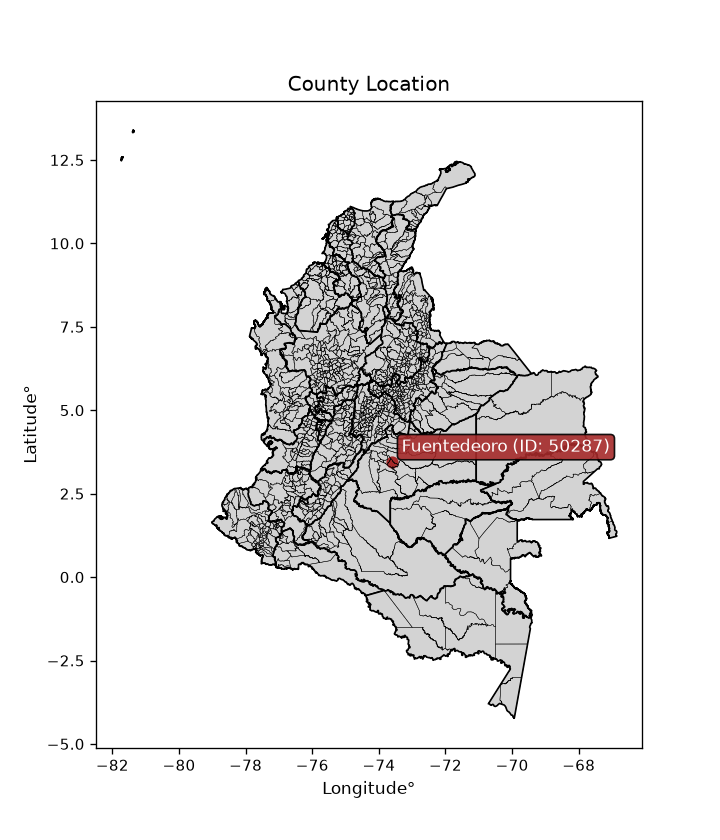
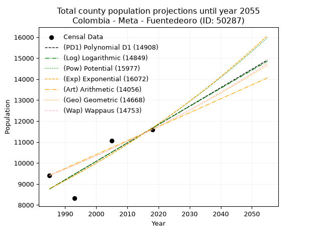
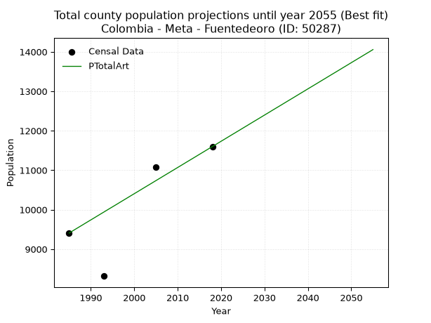
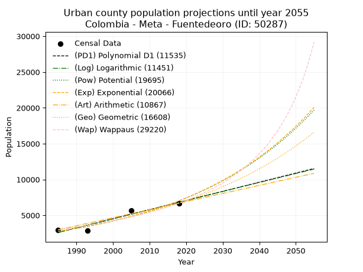
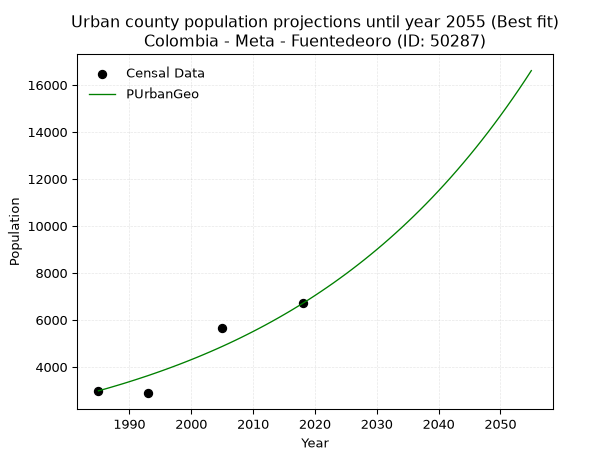
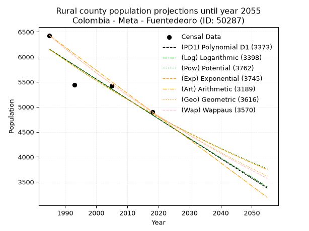
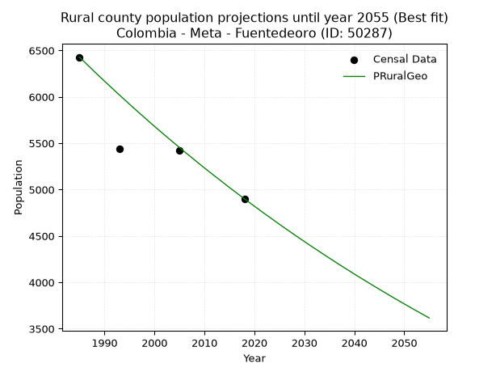

<div align="center">


</div>

# _“Population and Public Services Demand Projections (PPSD) until Year 2050 for Colombia - Meta - Fuentedeoro (ID: 50287)”_
Keywords: `population` `public-service` `projection` `lineal` `polynomial` `logarithmic` `potential` `exponential` `arithmetic` `geometric` `wappaus` `dane` `colombia` `south-america`

PPSD are analytical estimates used by governments and planners to anticipate future changes in population size, age distribution, and the resulting community needs for utilities, healthcare, education, and infrastructure as sizing future water treatment facilities, electrical grids, and road networks based on spatial growth.

<div align="center">

</img>

</div>


> **General running parameters**: • app_version: _v20260806_. • Python version: _3.14.7_. • Pandas version: _3.0.5_. • NumPy version: _2.5.1_. • Creates, save and include plots into reports (create_plot): _False_. • Projection until year: _2050_. • Process polynomial degree 2 and up: _False_. • Process Wappaus: _True_. • Process Wappaus: _True_. • Set negative values to zero: _True_. • Set infinite values to zero: _True_. • Drop dataset notes: _True_. 
<div align="center">

Dynamic map: [:earth_americas:Google](http://maps.google.com/maps?q=3.46287493,-73.618121) [:earth_americas:OSM](https://www.openstreetmap.org/#map=18/3.46287493/-73.618121&layers=P) [:earth_americas:Bing](https://www.bing.com/maps?cp=3.46287493~-73.618121&lvl=18) [:earth_americas:Apple](https://maps.apple.com/frame?center=3.46287493%2C-73.618121&span=0.003%2C0.006)

</div>


<div align="center">

```geojson
{
  "type": "Feature",
  "geometry": {
    "type": "Point", 
    "coordinates": [-73.618121, 3.46287493]
  }, 
  "properties": {
    "Name": "Colombia - Meta - Fuentedeoro (ID: 50287)"
  }
}
```

</div>


## 0. Census Data (4 records)

Census data are official statistics collected by a government about the people and housing in a country. They usually include counts of total population, age, sex, race, income, education, and jobs.

📅Global census file: [Population.xlsx](../data/Population.xlsx)

| Source   |   Year |   CountryID | CountryName   |   StateID | StateName   |   CountyID | CountyName   |   PTotal |   PUrban |   PRural |
|:---------|-------:|------------:|:--------------|----------:|:------------|-----------:|:-------------|---------:|---------:|---------:|
| DANE     |   1985 |          57 | Colombia      |        50 | Meta        |      50287 | Fuentedeoro  |     9408 |     2980 |     6428 |
| DANE     |   1993 |          57 | Colombia      |        50 | Meta        |      50287 | Fuentedeoro  |     8317 |     2880 |     5437 |
| DANE     |   2005 |          57 | Colombia      |        50 | Meta        |      50287 | Fuentedeoro  |    11072 |     5654 |     5418 |
| DANE     |   2018 |          57 | Colombia      |        50 | Meta        |      50287 | Fuentedeoro  |    11599 |     6698 |     4901 |

> 🔥Some records could had specific notes about the registered values or the corresponding urban or rural distribution.

## 1. Total

### 1.1. Coefficients and Parameters

* (PD1) Polynomial Deg 1: 87.84263348052953, -165608.22761942918 (lineal)
* (Log) Logarithmic: 175759.10204410096, -1325847.3430822624
* (Pow) Potential: 17.295511905392935, -53.09326878333757
* (Exp) Exponential: 0.008644431536278445, 0.00030983556743074416
* (Art) Arithmetic: Year diff. 2018 - 1985 = 33, Population diff. 11599 - 9408 = 2191, Annual growth = 66.39393939393939
* (Geo) Geometric: Year diff. 2018 - 1985 = 33, Population diff. 11599 - 9408 = 2191, Annual growth % = 0.006364363901123715
* (Wap) Wappaus: i = 0.6321125281471832, Condition values only valid for < 200)

<sub>
Wappaus condition values: ['0.00', '0.63', '1.26', '1.90', '2.53', '3.16', '3.79', '4.42', '5.06', '5.69', '6.32', '6.95', '7.59', '8.22', '8.85', '9.48', '10.11', '10.75', '11.38', '12.01', '12.64', '13.27', '13.91', '14.54', '15.17', '15.80', '16.43', '17.07', '17.70', '18.33', '18.96', '19.60', '20.23', '20.86', '21.49', '22.12', '22.76', '23.39', '24.02', '24.65', '25.28', '25.92', '26.55', '27.18', '27.81', '28.45', '29.08', '29.71', '30.34', '30.97', '31.61', '32.24', '32.87', '33.50', '34.13', '34.77', '35.40', '36.03', '36.66', '37.29', '37.93', '38.56', '39.19', '39.82', '40.46', '41.09']
</sub>


### 1.2. Projected Dataset

|   Year |   CountyID |   PTotalPD1 |   PTotalLog |   PTotalPow |   PTotalExp |   PTotalArt |   PTotalGeo |   PTotalWap |
|-------:|-----------:|------------:|------------:|------------:|------------:|------------:|------------:|------------:|
|   1985 |      50287 |        8759 |        8757 |        8774 |        8776 |        9408 |        9408 |        9408 |
|   1986 |      50287 |        8847 |        8846 |        8851 |        8852 |        9474 |        9468 |        9468 |
|   1987 |      50287 |        8935 |        8934 |        8928 |        8929 |        9541 |        9528 |        9528 |
|   1988 |      50287 |        9023 |        9023 |        9006 |        9006 |        9607 |        9589 |        9588 |
|   1989 |      50287 |        9111 |        9111 |        9085 |        9084 |        9674 |        9650 |        9649 |
|   1990 |      50287 |        9199 |        9199 |        9164 |        9163 |        9740 |        9711 |        9710 |
|   1991 |      50287 |        9286 |        9288 |        9244 |        9243 |        9806 |        9773 |        9772 |
|   1992 |      50287 |        9374 |        9376 |        9325 |        9323 |        9873 |        9835 |        9834 |
|   1993 |      50287 |        9462 |        9464 |        9406 |        9404 |        9939 |        9898 |        9896 |
|   1994 |      50287 |        9550 |        9552 |        9488 |        9486 |       10006 |        9961 |        9959 |
|   1995 |      50287 |        9638 |        9641 |        9570 |        9568 |       10072 |       10024 |       10022 |
|   1996 |      50287 |        9726 |        9729 |        9654 |        9651 |       10138 |       10088 |       10086 |
|   1997 |      50287 |        9814 |        9817 |        9738 |        9735 |       10205 |       10152 |       10150 |
|   1998 |      50287 |        9901 |        9905 |        9822 |        9819 |       10271 |       10217 |       10214 |
|   1999 |      50287 |        9989 |        9993 |        9908 |        9905 |       10338 |       10282 |       10279 |
|   2000 |      50287 |       10077 |       10080 |        9994 |        9991 |       10404 |       10347 |       10344 |
|   2001 |      50287 |       10165 |       10168 |       10081 |       10077 |       10470 |       10413 |       10410 |
|   2002 |      50287 |       10253 |       10256 |       10168 |       10165 |       10537 |       10479 |       10476 |
|   2003 |      50287 |       10341 |       10344 |       10256 |       10253 |       10603 |       10546 |       10543 |
|   2004 |      50287 |       10428 |       10432 |       10345 |       10342 |       10669 |       10613 |       10610 |
|   2005 |      50287 |       10516 |       10519 |       10435 |       10432 |       10736 |       10681 |       10678 |
|   2006 |      50287 |       10604 |       10607 |       10525 |       10522 |       10802 |       10749 |       10746 |
|   2007 |      50287 |       10692 |       10695 |       10616 |       10614 |       10869 |       10817 |       10814 |
|   2008 |      50287 |       10780 |       10782 |       10708 |       10706 |       10935 |       10886 |       10883 |
|   2009 |      50287 |       10868 |       10870 |       10801 |       10799 |       11001 |       10955 |       10952 |
|   2010 |      50287 |       10955 |       10957 |       10894 |       10893 |       11068 |       11025 |       11022 |
|   2011 |      50287 |       11043 |       11044 |       10988 |       10987 |       11134 |       11095 |       11093 |
|   2012 |      50287 |       11131 |       11132 |       11083 |       11083 |       11201 |       11166 |       11163 |
|   2013 |      50287 |       11219 |       11219 |       11179 |       11179 |       11267 |       11237 |       11235 |
|   2014 |      50287 |       11307 |       11306 |       11275 |       11276 |       11333 |       11308 |       11307 |
|   2015 |      50287 |       11395 |       11394 |       11373 |       11374 |       11400 |       11380 |       11379 |
|   2016 |      50287 |       11483 |       11481 |       11471 |       11472 |       11466 |       11453 |       11452 |
|   2017 |      50287 |       11570 |       11568 |       11569 |       11572 |       11533 |       11526 |       11525 |
|   2018 |      50287 |       11658 |       11655 |       11669 |       11673 |       11599 |       11599 |       11599 |
|   2019 |      50287 |       11746 |       11742 |       11769 |       11774 |       11665 |       11673 |       11673 |
|   2020 |      50287 |       11834 |       11829 |       11871 |       11876 |       11732 |       11747 |       11748 |
|   2021 |      50287 |       11922 |       11916 |       11973 |       11979 |       11798 |       11822 |       11824 |
|   2022 |      50287 |       12010 |       12003 |       12076 |       12083 |       11865 |       11897 |       11900 |
|   2023 |      50287 |       12097 |       12090 |       12179 |       12188 |       11931 |       11973 |       11976 |
|   2024 |      50287 |       12185 |       12177 |       12284 |       12294 |       11997 |       12049 |       12053 |
|   2025 |      50287 |       12273 |       12264 |       12389 |       12401 |       12064 |       12126 |       12131 |
|   2026 |      50287 |       12361 |       12351 |       12495 |       12508 |       12130 |       12203 |       12209 |
|   2027 |      50287 |       12449 |       12437 |       12603 |       12617 |       12197 |       12281 |       12288 |
|   2028 |      50287 |       12537 |       12524 |       12711 |       12726 |       12263 |       12359 |       12367 |
|   2029 |      50287 |       12624 |       12611 |       12819 |       12837 |       12329 |       12437 |       12447 |
|   2030 |      50287 |       12712 |       12697 |       12929 |       12948 |       12396 |       12517 |       12528 |
|   2031 |      50287 |       12800 |       12784 |       13040 |       13061 |       12462 |       12596 |       12609 |
|   2032 |      50287 |       12888 |       12870 |       13151 |       13174 |       12529 |       12676 |       12691 |
|   2033 |      50287 |       12976 |       12957 |       13264 |       13289 |       12595 |       12757 |       12773 |
|   2034 |      50287 |       13064 |       13043 |       13377 |       13404 |       12661 |       12838 |       12856 |
|   2035 |      50287 |       13152 |       13130 |       13491 |       13520 |       12728 |       12920 |       12940 |
|   2036 |      50287 |       13239 |       13216 |       13606 |       13638 |       12794 |       13002 |       13024 |
|   2037 |      50287 |       13327 |       13302 |       13722 |       13756 |       12860 |       13085 |       13109 |
|   2038 |      50287 |       13415 |       13389 |       13839 |       13876 |       12927 |       13168 |       13194 |
|   2039 |      50287 |       13503 |       13475 |       13957 |       13996 |       12993 |       13252 |       13280 |
|   2040 |      50287 |       13591 |       13561 |       14076 |       14118 |       13060 |       13336 |       13367 |
|   2041 |      50287 |       13679 |       13647 |       14196 |       14240 |       13126 |       13421 |       13454 |
|   2042 |      50287 |       13766 |       13733 |       14317 |       14364 |       13192 |       13507 |       13543 |
|   2043 |      50287 |       13854 |       13819 |       14438 |       14488 |       13259 |       13593 |       13631 |
|   2044 |      50287 |       13942 |       13905 |       14561 |       14614 |       13325 |       13679 |       13721 |
|   2045 |      50287 |       14030 |       13991 |       14685 |       14741 |       13392 |       13766 |       13811 |
|   2046 |      50287 |       14118 |       14077 |       14809 |       14869 |       13458 |       13854 |       13902 |
|   2047 |      50287 |       14206 |       14163 |       14935 |       14998 |       13524 |       13942 |       13994 |
|   2048 |      50287 |       14293 |       14249 |       15062 |       15128 |       13591 |       14031 |       14086 |
|   2049 |      50287 |       14381 |       14335 |       15190 |       15260 |       13657 |       14120 |       14179 |
|   2050 |      50287 |       14469 |       14420 |       15318 |       15392 |       13724 |       14210 |       14273 |
<div align="center">

</img>

</div>


### 1.3. Best fit with absolute and relative error (%)

Relative error puts that difference into context by dividing the absolute error by the true value, creating a unitless ratio or percentage that shows the scale of the mistake.

Absolute and relative error

|   Year | Source   |   CountryID | CountryName   |   StateID | StateName   |   CountyID_x | CountyName   |   PTotal |   PUrban |   PRural |   CountyID_y |   PTotalPD1 |   PTotalLog |   PTotalPow |   PTotalExp |   PTotalArt |   PTotalGeo |   PTotalWap |   PTotalPD1AbsError |   PTotalLogAbsError |   PTotalPowAbsError |   PTotalExpAbsError |   PTotalArtAbsError |   PTotalGeoAbsError |   PTotalWapAbsError |   PTotalPD1RelError |   PTotalLogRelError |   PTotalPowRelError |   PTotalExpRelError |   PTotalArtRelError |   PTotalGeoRelError |   PTotalWapRelError |
|-------:|:---------|------------:|:--------------|----------:|:------------|-------------:|:-------------|---------:|---------:|---------:|-------------:|------------:|------------:|------------:|------------:|------------:|------------:|------------:|--------------------:|--------------------:|--------------------:|--------------------:|--------------------:|--------------------:|--------------------:|--------------------:|--------------------:|--------------------:|--------------------:|--------------------:|--------------------:|--------------------:|
|   1985 | DANE     |          57 | Colombia      |        50 | Meta        |        50287 | Fuentedeoro  |     9408 |     2980 |     6428 |        50287 |        8759 |        8757 |        8774 |        8776 |        9408 |        9408 |        9408 |                 649 |                 651 |                 634 |                 632 |                   0 |                   0 |                   0 |            6.89838  |             6.91964 |             6.73895 |            6.71769  |             0       |             0       |             0       |
|   1993 | DANE     |          57 | Colombia      |        50 | Meta        |        50287 | Fuentedeoro  |     8317 |     2880 |     5437 |        50287 |        9462 |        9464 |        9406 |        9404 |        9939 |        9898 |        9896 |                1145 |                1147 |                1089 |                1087 |                1622 |                1581 |                1579 |           13.767    |            13.791   |            13.0937  |           13.0696   |            19.5022  |            19.0093  |            18.9852  |
|   2005 | DANE     |          57 | Colombia      |        50 | Meta        |        50287 | Fuentedeoro  |    11072 |     5654 |     5418 |        50287 |       10516 |       10519 |       10435 |       10432 |       10736 |       10681 |       10678 |                 556 |                 553 |                 637 |                 640 |                 336 |                 391 |                 394 |            5.02168  |             4.99458 |             5.75325 |            5.78035  |             3.03468 |             3.53143 |             3.55853 |
|   2018 | DANE     |          57 | Colombia      |        50 | Meta        |        50287 | Fuentedeoro  |    11599 |     6698 |     4901 |        50287 |       11658 |       11655 |       11669 |       11673 |       11599 |       11599 |       11599 |                  59 |                  56 |                  70 |                  74 |                   0 |                   0 |                   0 |            0.508665 |             0.4828  |             0.6035  |            0.637986 |             0       |             0       |             0       |

Relative error mean

| Method    |   RelError | Best   |
|:----------|-----------:|:-------|
| PTotalPD1 |    6.54893 |        |
| PTotalLog |    6.54701 |        |
| PTotalPow |    6.54734 |        |
| PTotalExp |    6.55141 |        |
| PTotalArt |    5.63423 | True   |
| PTotalGeo |    5.63517 |        |
| PTotalWap |    5.63593 |        |

💙Best method: _**PTotalArt**_
<div align="center">

</img>

</div>


### 1.4. Fresh water supply demand in liters per capita per day (lpcd)

The fresh water supply demand typically ranges from 100 to 300 liters per capita per day (lpcd) for standard domestic and municipal planning, though absolute survival minimums set by the World Health Organization are as low as 7.5 to 20 liters per day, and total consumption in high-income nations can exceed 400 liters.

> `CZ`: Level in meters above the sea level (masl)<br> `WS`: Fresh water supply demand in liters per capita per day (lpcd or l/h/d)<br> `WSAll`: Zonal fresh water supply demand in liters per second (l/s)<br> `A`: Zonal area in square meters<br> `DP`: Population density (people/hectare or p/ha)

Reference values (RAS Colombia)

|    CZ |   WS |
|------:|-----:|
|  1000 |  120 |
|  2000 |  130 |
| 99999 |  140 |

County shapefile geometry properties and water supply values

|   CountyID |      ATotal |   CZTotal |   WSTotal |
|-----------:|------------:|----------:|----------:|
|      50287 | 5.70084e+08 |   271.099 |       120 |

Projected values for best method: PTotalArt

|   CountyID |   Year |   PTotalArt |   DPTotal |   WSTotal |   WSTotalAll |
|-----------:|-------:|------------:|----------:|----------:|-------------:|
|      50287 |   1985 |        9408 |      0.17 |       120 |      13.0667 |
|      50287 |   1986 |        9474 |      0.17 |       120 |      13.1583 |
|      50287 |   1987 |        9541 |      0.17 |       120 |      13.2514 |
|      50287 |   1988 |        9607 |      0.17 |       120 |      13.3431 |
|      50287 |   1989 |        9674 |      0.17 |       120 |      13.4361 |
|      50287 |   1990 |        9740 |      0.17 |       120 |      13.5278 |
|      50287 |   1991 |        9806 |      0.17 |       120 |      13.6194 |
|      50287 |   1992 |        9873 |      0.17 |       120 |      13.7125 |
|      50287 |   1993 |        9939 |      0.17 |       120 |      13.8042 |
|      50287 |   1994 |       10006 |      0.18 |       120 |      13.8972 |
|      50287 |   1995 |       10072 |      0.18 |       120 |      13.9889 |
|      50287 |   1996 |       10138 |      0.18 |       120 |      14.0806 |
|      50287 |   1997 |       10205 |      0.18 |       120 |      14.1736 |
|      50287 |   1998 |       10271 |      0.18 |       120 |      14.2653 |
|      50287 |   1999 |       10338 |      0.18 |       120 |      14.3583 |
|      50287 |   2000 |       10404 |      0.18 |       120 |      14.45   |
|      50287 |   2001 |       10470 |      0.18 |       120 |      14.5417 |
|      50287 |   2002 |       10537 |      0.18 |       120 |      14.6347 |
|      50287 |   2003 |       10603 |      0.19 |       120 |      14.7264 |
|      50287 |   2004 |       10669 |      0.19 |       120 |      14.8181 |
|      50287 |   2005 |       10736 |      0.19 |       120 |      14.9111 |
|      50287 |   2006 |       10802 |      0.19 |       120 |      15.0028 |
|      50287 |   2007 |       10869 |      0.19 |       120 |      15.0958 |
|      50287 |   2008 |       10935 |      0.19 |       120 |      15.1875 |
|      50287 |   2009 |       11001 |      0.19 |       120 |      15.2792 |
|      50287 |   2010 |       11068 |      0.19 |       120 |      15.3722 |
|      50287 |   2011 |       11134 |      0.2  |       120 |      15.4639 |
|      50287 |   2012 |       11201 |      0.2  |       120 |      15.5569 |
|      50287 |   2013 |       11267 |      0.2  |       120 |      15.6486 |
|      50287 |   2014 |       11333 |      0.2  |       120 |      15.7403 |
|      50287 |   2015 |       11400 |      0.2  |       120 |      15.8333 |
|      50287 |   2016 |       11466 |      0.2  |       120 |      15.925  |
|      50287 |   2017 |       11533 |      0.2  |       120 |      16.0181 |
|      50287 |   2018 |       11599 |      0.2  |       120 |      16.1097 |
|      50287 |   2019 |       11665 |      0.2  |       120 |      16.2014 |
|      50287 |   2020 |       11732 |      0.21 |       120 |      16.2944 |
|      50287 |   2021 |       11798 |      0.21 |       120 |      16.3861 |
|      50287 |   2022 |       11865 |      0.21 |       120 |      16.4792 |
|      50287 |   2023 |       11931 |      0.21 |       120 |      16.5708 |
|      50287 |   2024 |       11997 |      0.21 |       120 |      16.6625 |
|      50287 |   2025 |       12064 |      0.21 |       120 |      16.7556 |
|      50287 |   2026 |       12130 |      0.21 |       120 |      16.8472 |
|      50287 |   2027 |       12197 |      0.21 |       120 |      16.9403 |
|      50287 |   2028 |       12263 |      0.22 |       120 |      17.0319 |
|      50287 |   2029 |       12329 |      0.22 |       120 |      17.1236 |
|      50287 |   2030 |       12396 |      0.22 |       120 |      17.2167 |
|      50287 |   2031 |       12462 |      0.22 |       120 |      17.3083 |
|      50287 |   2032 |       12529 |      0.22 |       120 |      17.4014 |
|      50287 |   2033 |       12595 |      0.22 |       120 |      17.4931 |
|      50287 |   2034 |       12661 |      0.22 |       120 |      17.5847 |
|      50287 |   2035 |       12728 |      0.22 |       120 |      17.6778 |
|      50287 |   2036 |       12794 |      0.22 |       120 |      17.7694 |
|      50287 |   2037 |       12860 |      0.23 |       120 |      17.8611 |
|      50287 |   2038 |       12927 |      0.23 |       120 |      17.9542 |
|      50287 |   2039 |       12993 |      0.23 |       120 |      18.0458 |
|      50287 |   2040 |       13060 |      0.23 |       120 |      18.1389 |
|      50287 |   2041 |       13126 |      0.23 |       120 |      18.2306 |
|      50287 |   2042 |       13192 |      0.23 |       120 |      18.3222 |
|      50287 |   2043 |       13259 |      0.23 |       120 |      18.4153 |
|      50287 |   2044 |       13325 |      0.23 |       120 |      18.5069 |
|      50287 |   2045 |       13392 |      0.23 |       120 |      18.6    |
|      50287 |   2046 |       13458 |      0.24 |       120 |      18.6917 |
|      50287 |   2047 |       13524 |      0.24 |       120 |      18.7833 |
|      50287 |   2048 |       13591 |      0.24 |       120 |      18.8764 |
|      50287 |   2049 |       13657 |      0.24 |       120 |      18.9681 |
|      50287 |   2050 |       13724 |      0.24 |       120 |      19.0611 |

## 2. Urban

### 2.1. Coefficients and Parameters

* (PD1) Polynomial Deg 1: 127.53271778402166, -250544.3187474893 (lineal)
* (Log) Logarithmic: 255254.87854294915, -1935641.3772891804
* (Pow) Potential: 56.78051962353173, -183.8088239260689
* (Exp) Exponential: 0.02836615786620846, 9.690940791004516e-22
* (Art) Arithmetic: Year diff. 2018 - 1985 = 33, Population diff. 6698 - 2980 = 3718, Annual growth = 112.66666666666667
* (Geo) Geometric: Year diff. 2018 - 1985 = 33, Population diff. 6698 - 2980 = 3718, Annual growth % = 0.02484562359116871
* (Wap) Wappaus: i = 2.3283047461596746, Condition values only valid for < 200)

<sub>
Wappaus condition values: ['0.00', '2.33', '4.66', '6.98', '9.31', '11.64', '13.97', '16.30', '18.63', '20.95', '23.28', '25.61', '27.94', '30.27', '32.60', '34.92', '37.25', '39.58', '41.91', '44.24', '46.57', '48.89', '51.22', '53.55', '55.88', '58.21', '60.54', '62.86', '65.19', '67.52', '69.85', '72.18', '74.51', '76.83', '79.16', '81.49', '83.82', '86.15', '88.48', '90.80', '93.13', '95.46', '97.79', '100.12', '102.45', '104.77', '107.10', '109.43', '111.76', '114.09', '116.42', '118.74', '121.07', '123.40', '125.73', '128.06', '130.39', '132.71', '135.04', '137.37', '139.70', '142.03', '144.35', '146.68', '149.01', '151.34']
</sub>


### 2.2. Projected Dataset

|   Year |   CountyID |   PUrbanPD1 |   PUrbanLog |   PUrbanPow |   PUrbanExp |   PUrbanArt |   PUrbanGeo |   PUrbanWap |
|-------:|-----------:|------------:|------------:|------------:|------------:|------------:|------------:|------------:|
|   1985 |      50287 |        2608 |        2604 |        2753 |        2755 |        2980 |        2980 |        2980 |
|   1986 |      50287 |        2736 |        2733 |        2832 |        2834 |        3093 |        3054 |        3050 |
|   1987 |      50287 |        2863 |        2861 |        2915 |        2916 |        3205 |        3130 |        3122 |
|   1988 |      50287 |        2991 |        2990 |        2999 |        3000 |        3318 |        3208 |        3196 |
|   1989 |      50287 |        3118 |        3118 |        3086 |        3086 |        3431 |        3287 |        3271 |
|   1990 |      50287 |        3246 |        3247 |        3175 |        3175 |        3543 |        3369 |        3348 |
|   1991 |      50287 |        3373 |        3375 |        3267 |        3266 |        3656 |        3453 |        3428 |
|   1992 |      50287 |        3501 |        3503 |        3362 |        3360 |        3769 |        3539 |        3509 |
|   1993 |      50287 |        3628 |        3631 |        3459 |        3457 |        3881 |        3626 |        3592 |
|   1994 |      50287 |        3756 |        3759 |        3559 |        3556 |        3994 |        3717 |        3678 |
|   1995 |      50287 |        3883 |        3887 |        3661 |        3658 |        4107 |        3809 |        3765 |
|   1996 |      50287 |        4011 |        4015 |        3767 |        3764 |        4219 |        3904 |        3855 |
|   1997 |      50287 |        4139 |        4143 |        3876 |        3872 |        4332 |        4001 |        3948 |
|   1998 |      50287 |        4266 |        4271 |        3988 |        3983 |        4445 |        4100 |        4043 |
|   1999 |      50287 |        4394 |        4398 |        4102 |        4098 |        4557 |        4202 |        4141 |
|   2000 |      50287 |        4521 |        4526 |        4221 |        4216 |        4670 |        4306 |        4241 |
|   2001 |      50287 |        4649 |        4654 |        4342 |        4337 |        4783 |        4413 |        4344 |
|   2002 |      50287 |        4776 |        4781 |        4467 |        4462 |        4895 |        4523 |        4451 |
|   2003 |      50287 |        4904 |        4909 |        4596 |        4590 |        5008 |        4635 |        4560 |
|   2004 |      50287 |        5031 |        5036 |        4728 |        4723 |        5121 |        4750 |        4673 |
|   2005 |      50287 |        5159 |        5163 |        4863 |        4858 |        5233 |        4868 |        4789 |
|   2006 |      50287 |        5286 |        5291 |        5003 |        4998 |        5346 |        4989 |        4909 |
|   2007 |      50287 |        5414 |        5418 |        5147 |        5142 |        5459 |        5113 |        5032 |
|   2008 |      50287 |        5541 |        5545 |        5294 |        5290 |        5571 |        5240 |        5159 |
|   2009 |      50287 |        5669 |        5672 |        5446 |        5442 |        5684 |        5371 |        5291 |
|   2010 |      50287 |        5796 |        5799 |        5602 |        5599 |        5797 |        5504 |        5427 |
|   2011 |      50287 |        5924 |        5926 |        5763 |        5760 |        5909 |        5641 |        5567 |
|   2012 |      50287 |        6052 |        6053 |        5928 |        5926 |        6022 |        5781 |        5712 |
|   2013 |      50287 |        6179 |        6180 |        6097 |        6096 |        6135 |        5925 |        5862 |
|   2014 |      50287 |        6307 |        6307 |        6272 |        6271 |        6247 |        6072 |        6018 |
|   2015 |      50287 |        6434 |        6433 |        6451 |        6452 |        6360 |        6223 |        6179 |
|   2016 |      50287 |        6562 |        6560 |        6635 |        6638 |        6473 |        6377 |        6345 |
|   2017 |      50287 |        6689 |        6687 |        6825 |        6828 |        6585 |        6536 |        6518 |
|   2018 |      50287 |        6817 |        6813 |        7020 |        7025 |        6698 |        6698 |        6698 |
|   2019 |      50287 |        6944 |        6940 |        7220 |        7227 |        6811 |        6864 |        6884 |
|   2020 |      50287 |        7072 |        7066 |        7426 |        7435 |        6923 |        7035 |        7078 |
|   2021 |      50287 |        7199 |        7192 |        7637 |        7649 |        7036 |        7210 |        7280 |
|   2022 |      50287 |        7327 |        7319 |        7855 |        7869 |        7149 |        7389 |        7490 |
|   2023 |      50287 |        7454 |        7445 |        8079 |        8095 |        7261 |        7572 |        7708 |
|   2024 |      50287 |        7582 |        7571 |        8309 |        8328 |        7374 |        7761 |        7936 |
|   2025 |      50287 |        7709 |        7697 |        8545 |        8568 |        7487 |        7953 |        8174 |
|   2026 |      50287 |        7837 |        7823 |        8788 |        8815 |        7599 |        8151 |        8422 |
|   2027 |      50287 |        7965 |        7949 |        9038 |        9068 |        7712 |        8354 |        8682 |
|   2028 |      50287 |        8092 |        8075 |        9294 |        9329 |        7825 |        8561 |        8954 |
|   2029 |      50287 |        8220 |        8201 |        9558 |        9597 |        7937 |        8774 |        9239 |
|   2030 |      50287 |        8347 |        8326 |        9829 |        9874 |        8050 |        8992 |        9538 |
|   2031 |      50287 |        8475 |        8452 |       10108 |       10158 |        8163 |        9215 |        9851 |
|   2032 |      50287 |        8602 |        8578 |       10394 |       10450 |        8275 |        9444 |       10181 |
|   2033 |      50287 |        8730 |        8703 |       10689 |       10751 |        8388 |        9679 |       10528 |
|   2034 |      50287 |        8857 |        8829 |       10992 |       11060 |        8501 |        9919 |       10894 |
|   2035 |      50287 |        8985 |        8954 |       11303 |       11378 |        8613 |       10166 |       11281 |
|   2036 |      50287 |        9112 |        9080 |       11622 |       11706 |        8726 |       10418 |       11690 |
|   2037 |      50287 |        9240 |        9205 |       11951 |       12042 |        8839 |       10677 |       12122 |
|   2038 |      50287 |        9367 |        9330 |       12289 |       12389 |        8951 |       10942 |       12581 |
|   2039 |      50287 |        9495 |        9456 |       12636 |       12745 |        9064 |       11214 |       13069 |
|   2040 |      50287 |        9622 |        9581 |       12993 |       13112 |        9177 |       11493 |       13589 |
|   2041 |      50287 |        9750 |        9706 |       13359 |       13489 |        9289 |       11778 |       14143 |
|   2042 |      50287 |        9877 |        9831 |       13736 |       13877 |        9402 |       12071 |       14735 |
|   2043 |      50287 |       10005 |        9956 |       14123 |       14277 |        9515 |       12371 |       15370 |
|   2044 |      50287 |       10133 |       10081 |       14521 |       14687 |        9627 |       12678 |       16052 |
|   2045 |      50287 |       10260 |       10206 |       14930 |       15110 |        9740 |       12993 |       16787 |
|   2046 |      50287 |       10388 |       10330 |       15350 |       15545 |        9853 |       13316 |       17581 |
|   2047 |      50287 |       10515 |       10455 |       15782 |       15992 |        9965 |       13647 |       18441 |
|   2048 |      50287 |       10643 |       10580 |       16226 |       16452 |       10078 |       13986 |       19377 |
|   2049 |      50287 |       10770 |       10704 |       16682 |       16926 |       10191 |       14334 |       20398 |
|   2050 |      50287 |       10898 |       10829 |       17151 |       17412 |       10303 |       14690 |       21516 |
<div align="center">

</img>

</div>


### 2.3. Best fit with absolute and relative error (%)

Relative error puts that difference into context by dividing the absolute error by the true value, creating a unitless ratio or percentage that shows the scale of the mistake.

Absolute and relative error

|   Year | Source   |   CountryID | CountryName   |   StateID | StateName   |   CountyID_x | CountyName   |   PTotal |   PUrban |   PRural |   CountyID_y |   PUrbanPD1 |   PUrbanLog |   PUrbanPow |   PUrbanExp |   PUrbanArt |   PUrbanGeo |   PUrbanWap |   PUrbanPD1AbsError |   PUrbanLogAbsError |   PUrbanPowAbsError |   PUrbanExpAbsError |   PUrbanArtAbsError |   PUrbanGeoAbsError |   PUrbanWapAbsError |   PUrbanPD1RelError |   PUrbanLogRelError |   PUrbanPowRelError |   PUrbanExpRelError |   PUrbanArtRelError |   PUrbanGeoRelError |   PUrbanWapRelError |
|-------:|:---------|------------:|:--------------|----------:|:------------|-------------:|:-------------|---------:|---------:|---------:|-------------:|------------:|------------:|------------:|------------:|------------:|------------:|------------:|--------------------:|--------------------:|--------------------:|--------------------:|--------------------:|--------------------:|--------------------:|--------------------:|--------------------:|--------------------:|--------------------:|--------------------:|--------------------:|--------------------:|
|   1985 | DANE     |          57 | Colombia      |        50 | Meta        |        50287 | Fuentedeoro  |     9408 |     2980 |     6428 |        50287 |        2608 |        2604 |        2753 |        2755 |        2980 |        2980 |        2980 |                 372 |                 376 |                 227 |                 225 |                   0 |                   0 |                   0 |            12.4832  |            12.6174  |             7.61745 |             7.55034 |             0       |              0      |              0      |
|   1993 | DANE     |          57 | Colombia      |        50 | Meta        |        50287 | Fuentedeoro  |     8317 |     2880 |     5437 |        50287 |        3628 |        3631 |        3459 |        3457 |        3881 |        3626 |        3592 |                 748 |                 751 |                 579 |                 577 |                1001 |                 746 |                 712 |            25.9722  |            26.0764  |            20.1042  |            20.0347  |            34.7569  |             25.9028 |             24.7222 |
|   2005 | DANE     |          57 | Colombia      |        50 | Meta        |        50287 | Fuentedeoro  |    11072 |     5654 |     5418 |        50287 |        5159 |        5163 |        4863 |        4858 |        5233 |        4868 |        4789 |                 495 |                 491 |                 791 |                 796 |                 421 |                 786 |                 865 |             8.75486 |             8.68412 |            13.9901  |            14.0785  |             7.44606 |             13.9017 |             15.2989 |
|   2018 | DANE     |          57 | Colombia      |        50 | Meta        |        50287 | Fuentedeoro  |    11599 |     6698 |     4901 |        50287 |        6817 |        6813 |        7020 |        7025 |        6698 |        6698 |        6698 |                 119 |                 115 |                 322 |                 327 |                   0 |                   0 |                   0 |             1.77665 |             1.71693 |             4.80741 |             4.88205 |             0       |              0      |              0      |

Relative error mean

| Method    |   RelError | Best   |
|:----------|-----------:|:-------|
| PUrbanPD1 |   12.2467  |        |
| PUrbanLog |   12.2737  |        |
| PUrbanPow |   11.6298  |        |
| PUrbanExp |   11.6364  |        |
| PUrbanArt |   10.5508  |        |
| PUrbanGeo |    9.95111 | True   |
| PUrbanWap |   10.0053  |        |

💙Best method: _**PUrbanGeo**_
<div align="center">

</img>

</div>


### 2.4. Fresh water supply demand in liters per capita per day (lpcd)

The fresh water supply demand typically ranges from 100 to 300 liters per capita per day (lpcd) for standard domestic and municipal planning, though absolute survival minimums set by the World Health Organization are as low as 7.5 to 20 liters per day, and total consumption in high-income nations can exceed 400 liters.

> `CZ`: Level in meters above the sea level (masl)<br> `WS`: Fresh water supply demand in liters per capita per day (lpcd or l/h/d)<br> `WSAll`: Zonal fresh water supply demand in liters per second (l/s)<br> `A`: Zonal area in square meters<br> `DP`: Population density (people/hectare or p/ha)

Reference values (RAS Colombia)

|    CZ |   WS |
|------:|-----:|
|  1000 |  120 |
|  2000 |  130 |
| 99999 |  140 |

County shapefile geometry properties and water supply values

|   CountyID |     AUrban |   CZUrban |   WSUrban |
|-----------:|-----------:|----------:|----------:|
|      50287 | 1.5705e+06 |   296.185 |       120 |

Projected values for best method: PUrbanGeo

|   CountyID |   Year |   PUrbanGeo |   DPUrban |   WSUrban |   WSUrbanAll |
|-----------:|-------:|------------:|----------:|----------:|-------------:|
|      50287 |   1985 |        2980 |     18.97 |       120 |      4.13889 |
|      50287 |   1986 |        3054 |     19.45 |       120 |      4.24167 |
|      50287 |   1987 |        3130 |     19.93 |       120 |      4.34722 |
|      50287 |   1988 |        3208 |     20.43 |       120 |      4.45556 |
|      50287 |   1989 |        3287 |     20.93 |       120 |      4.56528 |
|      50287 |   1990 |        3369 |     21.45 |       120 |      4.67917 |
|      50287 |   1991 |        3453 |     21.99 |       120 |      4.79583 |
|      50287 |   1992 |        3539 |     22.53 |       120 |      4.91528 |
|      50287 |   1993 |        3626 |     23.09 |       120 |      5.03611 |
|      50287 |   1994 |        3717 |     23.67 |       120 |      5.1625  |
|      50287 |   1995 |        3809 |     24.25 |       120 |      5.29028 |
|      50287 |   1996 |        3904 |     24.86 |       120 |      5.42222 |
|      50287 |   1997 |        4001 |     25.48 |       120 |      5.55694 |
|      50287 |   1998 |        4100 |     26.11 |       120 |      5.69444 |
|      50287 |   1999 |        4202 |     26.76 |       120 |      5.83611 |
|      50287 |   2000 |        4306 |     27.42 |       120 |      5.98056 |
|      50287 |   2001 |        4413 |     28.1  |       120 |      6.12917 |
|      50287 |   2002 |        4523 |     28.8  |       120 |      6.28194 |
|      50287 |   2003 |        4635 |     29.51 |       120 |      6.4375  |
|      50287 |   2004 |        4750 |     30.25 |       120 |      6.59722 |
|      50287 |   2005 |        4868 |     31    |       120 |      6.76111 |
|      50287 |   2006 |        4989 |     31.77 |       120 |      6.92917 |
|      50287 |   2007 |        5113 |     32.56 |       120 |      7.10139 |
|      50287 |   2008 |        5240 |     33.37 |       120 |      7.27778 |
|      50287 |   2009 |        5371 |     34.2  |       120 |      7.45972 |
|      50287 |   2010 |        5504 |     35.05 |       120 |      7.64444 |
|      50287 |   2011 |        5641 |     35.92 |       120 |      7.83472 |
|      50287 |   2012 |        5781 |     36.81 |       120 |      8.02917 |
|      50287 |   2013 |        5925 |     37.73 |       120 |      8.22917 |
|      50287 |   2014 |        6072 |     38.66 |       120 |      8.43333 |
|      50287 |   2015 |        6223 |     39.62 |       120 |      8.64306 |
|      50287 |   2016 |        6377 |     40.6  |       120 |      8.85694 |
|      50287 |   2017 |        6536 |     41.62 |       120 |      9.07778 |
|      50287 |   2018 |        6698 |     42.65 |       120 |      9.30278 |
|      50287 |   2019 |        6864 |     43.71 |       120 |      9.53333 |
|      50287 |   2020 |        7035 |     44.79 |       120 |      9.77083 |
|      50287 |   2021 |        7210 |     45.91 |       120 |     10.0139  |
|      50287 |   2022 |        7389 |     47.05 |       120 |     10.2625  |
|      50287 |   2023 |        7572 |     48.21 |       120 |     10.5167  |
|      50287 |   2024 |        7761 |     49.42 |       120 |     10.7792  |
|      50287 |   2025 |        7953 |     50.64 |       120 |     11.0458  |
|      50287 |   2026 |        8151 |     51.9  |       120 |     11.3208  |
|      50287 |   2027 |        8354 |     53.19 |       120 |     11.6028  |
|      50287 |   2028 |        8561 |     54.51 |       120 |     11.8903  |
|      50287 |   2029 |        8774 |     55.87 |       120 |     12.1861  |
|      50287 |   2030 |        8992 |     57.26 |       120 |     12.4889  |
|      50287 |   2031 |        9215 |     58.68 |       120 |     12.7986  |
|      50287 |   2032 |        9444 |     60.13 |       120 |     13.1167  |
|      50287 |   2033 |        9679 |     61.63 |       120 |     13.4431  |
|      50287 |   2034 |        9919 |     63.16 |       120 |     13.7764  |
|      50287 |   2035 |       10166 |     64.73 |       120 |     14.1194  |
|      50287 |   2036 |       10418 |     66.34 |       120 |     14.4694  |
|      50287 |   2037 |       10677 |     67.98 |       120 |     14.8292  |
|      50287 |   2038 |       10942 |     69.67 |       120 |     15.1972  |
|      50287 |   2039 |       11214 |     71.4  |       120 |     15.575   |
|      50287 |   2040 |       11493 |     73.18 |       120 |     15.9625  |
|      50287 |   2041 |       11778 |     75    |       120 |     16.3583  |
|      50287 |   2042 |       12071 |     76.86 |       120 |     16.7653  |
|      50287 |   2043 |       12371 |     78.77 |       120 |     17.1819  |
|      50287 |   2044 |       12678 |     80.73 |       120 |     17.6083  |
|      50287 |   2045 |       12993 |     82.73 |       120 |     18.0458  |
|      50287 |   2046 |       13316 |     84.79 |       120 |     18.4944  |
|      50287 |   2047 |       13647 |     86.9  |       120 |     18.9542  |
|      50287 |   2048 |       13986 |     89.05 |       120 |     19.425   |
|      50287 |   2049 |       14334 |     91.27 |       120 |     19.9083  |
|      50287 |   2050 |       14690 |     93.54 |       120 |     20.4028  |

## 3. Rural

### 3.1. Coefficients and Parameters

* (PD1) Polynomial Deg 1: -39.69008430349221, 84936.09112806032 (lineal)
* (Log) Logarithmic: -79495.77649884837, 609794.0342069191
* (Pow) Potential: -14.189295044633589, 50.58182874430905
* (Exp) Exponential: -0.007085134490846848, 7883673151.658903
* (Art) Arithmetic: Year diff. 2018 - 1985 = 33, Population diff. 4901 - 6428 = -1527, Annual growth = -46.27272727272727
* (Geo) Geometric: Year diff. 2018 - 1985 = 33, Population diff. 4901 - 6428 = -1527, Annual growth % = -0.008185231668070059
* (Wap) Wappaus: i = -0.8168898803553231, Condition values only valid for < 200)

<sub>
Wappaus condition values: ['-0.00', '-0.82', '-1.63', '-2.45', '-3.27', '-4.08', '-4.90', '-5.72', '-6.54', '-7.35', '-8.17', '-8.99', '-9.80', '-10.62', '-11.44', '-12.25', '-13.07', '-13.89', '-14.70', '-15.52', '-16.34', '-17.15', '-17.97', '-18.79', '-19.61', '-20.42', '-21.24', '-22.06', '-22.87', '-23.69', '-24.51', '-25.32', '-26.14', '-26.96', '-27.77', '-28.59', '-29.41', '-30.22', '-31.04', '-31.86', '-32.68', '-33.49', '-34.31', '-35.13', '-35.94', '-36.76', '-37.58', '-38.39', '-39.21', '-40.03', '-40.84', '-41.66', '-42.48', '-43.30', '-44.11', '-44.93', '-45.75', '-46.56', '-47.38', '-48.20', '-49.01', '-49.83', '-50.65', '-51.46', '-52.28', '-53.10']
</sub>


### 3.2. Projected Dataset

|   Year |   CountyID |   PRuralPD1 |   PRuralLog |   PRuralPow |   PRuralExp |   PRuralArt |   PRuralGeo |   PRuralWap |
|-------:|-----------:|------------:|------------:|------------:|------------:|------------:|------------:|------------:|
|   1985 |      50287 |        6151 |        6153 |        6151 |        6149 |        6428 |        6428 |        6428 |
|   1986 |      50287 |        6112 |        6113 |        6107 |        6106 |        6382 |        6375 |        6376 |
|   1987 |      50287 |        6072 |        6073 |        6064 |        6063 |        6335 |        6323 |        6324 |
|   1988 |      50287 |        6032 |        6033 |        6020 |        6020 |        6289 |        6271 |        6272 |
|   1989 |      50287 |        5993 |        5993 |        5978 |        5977 |        6243 |        6220 |        6221 |
|   1990 |      50287 |        5953 |        5953 |        5935 |        5935 |        6197 |        6169 |        6171 |
|   1991 |      50287 |        5913 |        5913 |        5893 |        5893 |        6150 |        6119 |        6120 |
|   1992 |      50287 |        5873 |        5873 |        5851 |        5852 |        6104 |        6069 |        6071 |
|   1993 |      50287 |        5834 |        5833 |        5810 |        5810 |        6058 |        6019 |        6021 |
|   1994 |      50287 |        5794 |        5793 |        5768 |        5769 |        6012 |        5970 |        5972 |
|   1995 |      50287 |        5754 |        5753 |        5728 |        5729 |        5965 |        5921 |        5924 |
|   1996 |      50287 |        5715 |        5714 |        5687 |        5688 |        5919 |        5872 |        5875 |
|   1997 |      50287 |        5675 |        5674 |        5647 |        5648 |        5873 |        5824 |        5827 |
|   1998 |      50287 |        5635 |        5634 |        5607 |        5608 |        5826 |        5777 |        5780 |
|   1999 |      50287 |        5596 |        5594 |        5567 |        5568 |        5780 |        5729 |        5733 |
|   2000 |      50287 |        5556 |        5554 |        5528 |        5529 |        5734 |        5682 |        5686 |
|   2001 |      50287 |        5516 |        5515 |        5489 |        5490 |        5688 |        5636 |        5639 |
|   2002 |      50287 |        5477 |        5475 |        5450 |        5451 |        5641 |        5590 |        5593 |
|   2003 |      50287 |        5437 |        5435 |        5411 |        5413 |        5595 |        5544 |        5548 |
|   2004 |      50287 |        5397 |        5396 |        5373 |        5375 |        5549 |        5499 |        5502 |
|   2005 |      50287 |        5357 |        5356 |        5335 |        5337 |        5503 |        5454 |        5457 |
|   2006 |      50287 |        5318 |        5316 |        5298 |        5299 |        5456 |        5409 |        5412 |
|   2007 |      50287 |        5278 |        5277 |        5260 |        5262 |        5410 |        5365 |        5368 |
|   2008 |      50287 |        5238 |        5237 |        5223 |        5224 |        5364 |        5321 |        5324 |
|   2009 |      50287 |        5199 |        5197 |        5186 |        5188 |        5317 |        5277 |        5280 |
|   2010 |      50287 |        5159 |        5158 |        5150 |        5151 |        5271 |        5234 |        5237 |
|   2011 |      50287 |        5119 |        5118 |        5114 |        5115 |        5225 |        5191 |        5194 |
|   2012 |      50287 |        5080 |        5079 |        5078 |        5078 |        5179 |        5149 |        5151 |
|   2013 |      50287 |        5040 |        5039 |        5042 |        5043 |        5132 |        5107 |        5109 |
|   2014 |      50287 |        5000 |        5000 |        5007 |        5007 |        5086 |        5065 |        5066 |
|   2015 |      50287 |        4961 |        4960 |        4972 |        4972 |        5040 |        5023 |        5025 |
|   2016 |      50287 |        4921 |        4921 |        4937 |        4937 |        4994 |        4982 |        4983 |
|   2017 |      50287 |        4881 |        4882 |        4902 |        4902 |        4947 |        4941 |        4942 |
|   2018 |      50287 |        4842 |        4842 |        4868 |        4867 |        4901 |        4901 |        4901 |
|   2019 |      50287 |        4802 |        4803 |        4834 |        4833 |        4855 |        4861 |        4860 |
|   2020 |      50287 |        4762 |        4763 |        4800 |        4799 |        4808 |        4821 |        4820 |
|   2021 |      50287 |        4722 |        4724 |        4766 |        4765 |        4762 |        4782 |        4780 |
|   2022 |      50287 |        4683 |        4685 |        4733 |        4731 |        4716 |        4742 |        4740 |
|   2023 |      50287 |        4643 |        4645 |        4700 |        4698 |        4670 |        4704 |        4701 |
|   2024 |      50287 |        4603 |        4606 |        4667 |        4665 |        4623 |        4665 |        4662 |
|   2025 |      50287 |        4564 |        4567 |        4634 |        4632 |        4577 |        4627 |        4623 |
|   2026 |      50287 |        4524 |        4528 |        4602 |        4599 |        4531 |        4589 |        4584 |
|   2027 |      50287 |        4484 |        4488 |        4570 |        4566 |        4485 |        4552 |        4546 |
|   2028 |      50287 |        4445 |        4449 |        4538 |        4534 |        4438 |        4514 |        4507 |
|   2029 |      50287 |        4405 |        4410 |        4506 |        4502 |        4392 |        4477 |        4470 |
|   2030 |      50287 |        4365 |        4371 |        4475 |        4470 |        4346 |        4441 |        4432 |
|   2031 |      50287 |        4326 |        4332 |        4444 |        4439 |        4299 |        4404 |        4395 |
|   2032 |      50287 |        4286 |        4293 |        4413 |        4408 |        4253 |        4368 |        4358 |
|   2033 |      50287 |        4246 |        4253 |        4382 |        4376 |        4207 |        4333 |        4321 |
|   2034 |      50287 |        4206 |        4214 |        4352 |        4346 |        4161 |        4297 |        4284 |
|   2035 |      50287 |        4167 |        4175 |        4321 |        4315 |        4114 |        4262 |        4248 |
|   2036 |      50287 |        4127 |        4136 |        4291 |        4284 |        4068 |        4227 |        4212 |
|   2037 |      50287 |        4087 |        4097 |        4262 |        4254 |        4022 |        4192 |        4176 |
|   2038 |      50287 |        4048 |        4058 |        4232 |        4224 |        3976 |        4158 |        4140 |
|   2039 |      50287 |        4008 |        4019 |        4203 |        4194 |        3929 |        4124 |        4105 |
|   2040 |      50287 |        3968 |        3980 |        4174 |        4165 |        3883 |        4090 |        4070 |
|   2041 |      50287 |        3929 |        3941 |        4145 |        4135 |        3837 |        4057 |        4035 |
|   2042 |      50287 |        3889 |        3902 |        4116 |        4106 |        3790 |        4024 |        4000 |
|   2043 |      50287 |        3849 |        3863 |        4087 |        4077 |        3744 |        3991 |        3966 |
|   2044 |      50287 |        3810 |        3824 |        4059 |        4048 |        3698 |        3958 |        3932 |
|   2045 |      50287 |        3770 |        3786 |        4031 |        4020 |        3652 |        3926 |        3898 |
|   2046 |      50287 |        3730 |        3747 |        4003 |        3991 |        3605 |        3894 |        3864 |
|   2047 |      50287 |        3690 |        3708 |        3976 |        3963 |        3559 |        3862 |        3830 |
|   2048 |      50287 |        3651 |        3669 |        3948 |        3935 |        3513 |        3830 |        3797 |
|   2049 |      50287 |        3611 |        3630 |        3921 |        3907 |        3467 |        3799 |        3764 |
|   2050 |      50287 |        3571 |        3591 |        3894 |        3880 |        3420 |        3768 |        3731 |
<div align="center">

</img>

</div>


### 3.3. Best fit with absolute and relative error (%)

Relative error puts that difference into context by dividing the absolute error by the true value, creating a unitless ratio or percentage that shows the scale of the mistake.

Absolute and relative error

|   Year | Source   |   CountryID | CountryName   |   StateID | StateName   |   CountyID_x | CountyName   |   PTotal |   PUrban |   PRural |   CountyID_y |   PRuralPD1 |   PRuralLog |   PRuralPow |   PRuralExp |   PRuralArt |   PRuralGeo |   PRuralWap |   PRuralPD1AbsError |   PRuralLogAbsError |   PRuralPowAbsError |   PRuralExpAbsError |   PRuralArtAbsError |   PRuralGeoAbsError |   PRuralWapAbsError |   PRuralPD1RelError |   PRuralLogRelError |   PRuralPowRelError |   PRuralExpRelError |   PRuralArtRelError |   PRuralGeoRelError |   PRuralWapRelError |
|-------:|:---------|------------:|:--------------|----------:|:------------|-------------:|:-------------|---------:|---------:|---------:|-------------:|------------:|------------:|------------:|------------:|------------:|------------:|------------:|--------------------:|--------------------:|--------------------:|--------------------:|--------------------:|--------------------:|--------------------:|--------------------:|--------------------:|--------------------:|--------------------:|--------------------:|--------------------:|--------------------:|
|   1985 | DANE     |          57 | Colombia      |        50 | Meta        |        50287 | Fuentedeoro  |     9408 |     2980 |     6428 |        50287 |        6151 |        6153 |        6151 |        6149 |        6428 |        6428 |        6428 |                 277 |                 275 |                 277 |                 279 |                   0 |                   0 |                   0 |             4.30927 |             4.27816 |            4.30927  |            4.34039  |             0       |            0        |            0        |
|   1993 | DANE     |          57 | Colombia      |        50 | Meta        |        50287 | Fuentedeoro  |     8317 |     2880 |     5437 |        50287 |        5834 |        5833 |        5810 |        5810 |        6058 |        6019 |        6021 |                 397 |                 396 |                 373 |                 373 |                 621 |                 582 |                 584 |             7.30182 |             7.28343 |            6.8604   |            6.8604   |            11.4217  |           10.7044   |           10.7412   |
|   2005 | DANE     |          57 | Colombia      |        50 | Meta        |        50287 | Fuentedeoro  |    11072 |     5654 |     5418 |        50287 |        5357 |        5356 |        5335 |        5337 |        5503 |        5454 |        5457 |                  61 |                  62 |                  83 |                  81 |                  85 |                  36 |                  39 |             1.12588 |             1.14433 |            1.53193  |            1.49502  |             1.56884 |            0.664452 |            0.719823 |
|   2018 | DANE     |          57 | Colombia      |        50 | Meta        |        50287 | Fuentedeoro  |    11599 |     6698 |     4901 |        50287 |        4842 |        4842 |        4868 |        4867 |        4901 |        4901 |        4901 |                  59 |                  59 |                  33 |                  34 |                   0 |                   0 |                   0 |             1.20384 |             1.20384 |            0.673332 |            0.693736 |             0       |            0        |            0        |

Relative error mean

| Method    |   RelError | Best   |
|:----------|-----------:|:-------|
| PRuralPD1 |    3.4852  |        |
| PRuralLog |    3.47744 |        |
| PRuralPow |    3.34373 |        |
| PRuralExp |    3.34738 |        |
| PRuralArt |    3.24765 |        |
| PRuralGeo |    2.84222 | True   |
| PRuralWap |    2.86526 |        |

💙Best method: _**PRuralGeo**_
<div align="center">

</img>

</div>


### 3.4. Fresh water supply demand in liters per capita per day (lpcd)

The fresh water supply demand typically ranges from 100 to 300 liters per capita per day (lpcd) for standard domestic and municipal planning, though absolute survival minimums set by the World Health Organization are as low as 7.5 to 20 liters per day, and total consumption in high-income nations can exceed 400 liters.

> `CZ`: Level in meters above the sea level (masl)<br> `WS`: Fresh water supply demand in liters per capita per day (lpcd or l/h/d)<br> `WSAll`: Zonal fresh water supply demand in liters per second (l/s)<br> `A`: Zonal area in square meters<br> `DP`: Population density (people/hectare or p/ha)

Reference values (RAS Colombia)

|    CZ |   WS |
|------:|-----:|
|  1000 |  120 |
|  2000 |  130 |
| 99999 |  140 |

County shapefile geometry properties and water supply values

|   CountyID |      ARural |   CZRural |   WSRural |
|-----------:|------------:|----------:|----------:|
|      50287 | 5.68514e+08 |   271.029 |       120 |

Projected values for best method: PRuralGeo

|   CountyID |   Year |   PRuralGeo |   DPRural |   WSRural |   WSRuralAll |
|-----------:|-------:|------------:|----------:|----------:|-------------:|
|      50287 |   1985 |        6428 |      0.11 |       120 |      8.92778 |
|      50287 |   1986 |        6375 |      0.11 |       120 |      8.85417 |
|      50287 |   1987 |        6323 |      0.11 |       120 |      8.78194 |
|      50287 |   1988 |        6271 |      0.11 |       120 |      8.70972 |
|      50287 |   1989 |        6220 |      0.11 |       120 |      8.63889 |
|      50287 |   1990 |        6169 |      0.11 |       120 |      8.56806 |
|      50287 |   1991 |        6119 |      0.11 |       120 |      8.49861 |
|      50287 |   1992 |        6069 |      0.11 |       120 |      8.42917 |
|      50287 |   1993 |        6019 |      0.11 |       120 |      8.35972 |
|      50287 |   1994 |        5970 |      0.11 |       120 |      8.29167 |
|      50287 |   1995 |        5921 |      0.1  |       120 |      8.22361 |
|      50287 |   1996 |        5872 |      0.1  |       120 |      8.15556 |
|      50287 |   1997 |        5824 |      0.1  |       120 |      8.08889 |
|      50287 |   1998 |        5777 |      0.1  |       120 |      8.02361 |
|      50287 |   1999 |        5729 |      0.1  |       120 |      7.95694 |
|      50287 |   2000 |        5682 |      0.1  |       120 |      7.89167 |
|      50287 |   2001 |        5636 |      0.1  |       120 |      7.82778 |
|      50287 |   2002 |        5590 |      0.1  |       120 |      7.76389 |
|      50287 |   2003 |        5544 |      0.1  |       120 |      7.7     |
|      50287 |   2004 |        5499 |      0.1  |       120 |      7.6375  |
|      50287 |   2005 |        5454 |      0.1  |       120 |      7.575   |
|      50287 |   2006 |        5409 |      0.1  |       120 |      7.5125  |
|      50287 |   2007 |        5365 |      0.09 |       120 |      7.45139 |
|      50287 |   2008 |        5321 |      0.09 |       120 |      7.39028 |
|      50287 |   2009 |        5277 |      0.09 |       120 |      7.32917 |
|      50287 |   2010 |        5234 |      0.09 |       120 |      7.26944 |
|      50287 |   2011 |        5191 |      0.09 |       120 |      7.20972 |
|      50287 |   2012 |        5149 |      0.09 |       120 |      7.15139 |
|      50287 |   2013 |        5107 |      0.09 |       120 |      7.09306 |
|      50287 |   2014 |        5065 |      0.09 |       120 |      7.03472 |
|      50287 |   2015 |        5023 |      0.09 |       120 |      6.97639 |
|      50287 |   2016 |        4982 |      0.09 |       120 |      6.91944 |
|      50287 |   2017 |        4941 |      0.09 |       120 |      6.8625  |
|      50287 |   2018 |        4901 |      0.09 |       120 |      6.80694 |
|      50287 |   2019 |        4861 |      0.09 |       120 |      6.75139 |
|      50287 |   2020 |        4821 |      0.08 |       120 |      6.69583 |
|      50287 |   2021 |        4782 |      0.08 |       120 |      6.64167 |
|      50287 |   2022 |        4742 |      0.08 |       120 |      6.58611 |
|      50287 |   2023 |        4704 |      0.08 |       120 |      6.53333 |
|      50287 |   2024 |        4665 |      0.08 |       120 |      6.47917 |
|      50287 |   2025 |        4627 |      0.08 |       120 |      6.42639 |
|      50287 |   2026 |        4589 |      0.08 |       120 |      6.37361 |
|      50287 |   2027 |        4552 |      0.08 |       120 |      6.32222 |
|      50287 |   2028 |        4514 |      0.08 |       120 |      6.26944 |
|      50287 |   2029 |        4477 |      0.08 |       120 |      6.21806 |
|      50287 |   2030 |        4441 |      0.08 |       120 |      6.16806 |
|      50287 |   2031 |        4404 |      0.08 |       120 |      6.11667 |
|      50287 |   2032 |        4368 |      0.08 |       120 |      6.06667 |
|      50287 |   2033 |        4333 |      0.08 |       120 |      6.01806 |
|      50287 |   2034 |        4297 |      0.08 |       120 |      5.96806 |
|      50287 |   2035 |        4262 |      0.07 |       120 |      5.91944 |
|      50287 |   2036 |        4227 |      0.07 |       120 |      5.87083 |
|      50287 |   2037 |        4192 |      0.07 |       120 |      5.82222 |
|      50287 |   2038 |        4158 |      0.07 |       120 |      5.775   |
|      50287 |   2039 |        4124 |      0.07 |       120 |      5.72778 |
|      50287 |   2040 |        4090 |      0.07 |       120 |      5.68056 |
|      50287 |   2041 |        4057 |      0.07 |       120 |      5.63472 |
|      50287 |   2042 |        4024 |      0.07 |       120 |      5.58889 |
|      50287 |   2043 |        3991 |      0.07 |       120 |      5.54306 |
|      50287 |   2044 |        3958 |      0.07 |       120 |      5.49722 |
|      50287 |   2045 |        3926 |      0.07 |       120 |      5.45278 |
|      50287 |   2046 |        3894 |      0.07 |       120 |      5.40833 |
|      50287 |   2047 |        3862 |      0.07 |       120 |      5.36389 |
|      50287 |   2048 |        3830 |      0.07 |       120 |      5.31944 |
|      50287 |   2049 |        3799 |      0.07 |       120 |      5.27639 |
|      50287 |   2050 |        3768 |      0.07 |       120 |      5.23333 |

<div align="center"><br><sub>Share this research</sub></div><br>

<sub>**APPS & TOOLS & CONTENT DISCLAIMER**: • NO WARRANTY - This content and software is provided by <a href="https://github.com/rcfdtools" target="_blank">github.com/rcfdtools</a> "as is", without any express or implied warranty, including warranties of merchantability, fitness for a particular purpose, or non-infringement. There is no guarantee that the software will be error-free or operate without interruption. • LIMITATION OF LIABILITY - Neither the authors nor copyright holders will be liable for claims or damages arising from the software or its use. You are responsible for determining if the software is appropriate for your use and assume all associated risks, including errors, legal compliance, and data loss. • NO PROFESSIONAL ADVICE - The software provides general information and does not offer professional advice. It should not replace consultation with professional advisors. [Clauses and global license for rcfdtools use.](https://github.com/rcfdtools/rcfdtools/blob/main/LICENSE.md)</sub>

| [:house: Home](Readme.md)  | [:beginner: Help / Collab](https://github.com/rcfdtools/R.HydroTools/discussions/31) |
|----------------------------|-------------------------------------------------------------------------------------------|