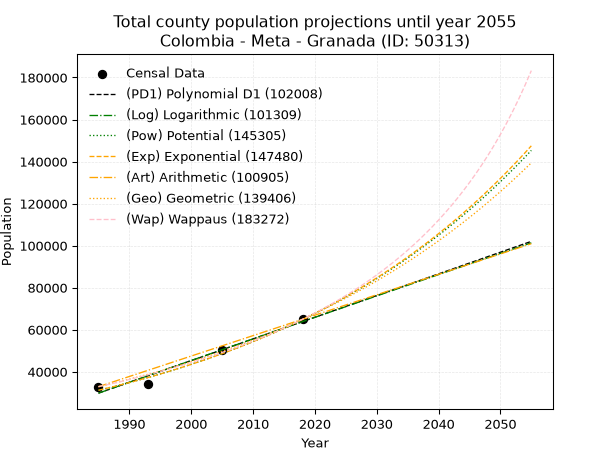
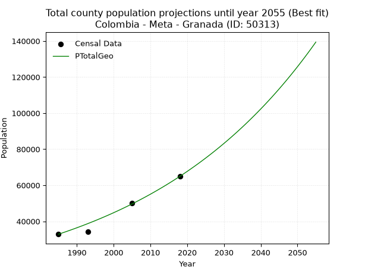
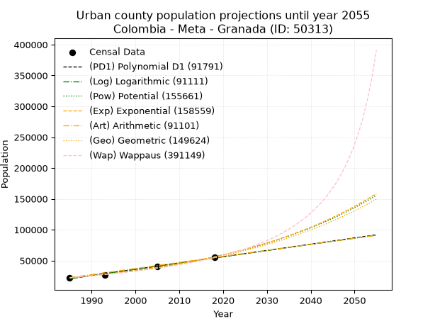
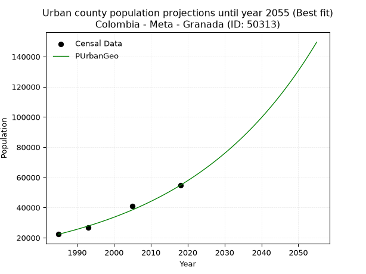
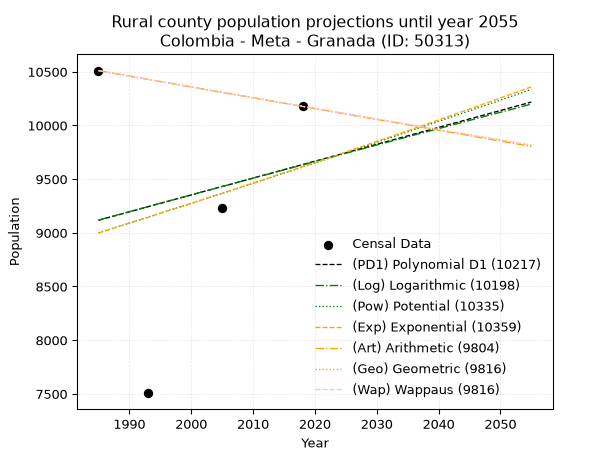
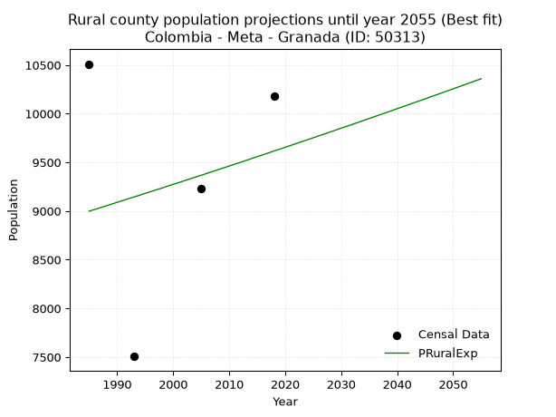

<div align="center">


</div>

# 📜 _“Population and Public Services Demand Projections (PPSD) until Year 2050 for Colombia - Meta - Granada (ID: 50313)”_
Keywords: `population` `public-service` `projection` `lineal` `polynomial` `logarithmic` `potential` `exponential` `arithmetic` `geometric` `wappaus` `dane` `colombia` `south-america`

PPSD are analytical estimates used by governments and planners to anticipate future changes in population size, age distribution, and the resulting community needs for utilities, healthcare, education, and infrastructure as sizing future water treatment facilities, electrical grids, and road networks based on spatial growth.

<div align="center">

</img>

</div>


> **General running parameters**: • app_version: _v20260806_. • Python version: _3.14.7_. • Pandas version: _3.0.5_. • NumPy version: _2.5.1_. • Creates, save and include plots into reports (create_plot): _False_. • Projection until year: _2050_. • Process polynomial degree 2 and up: _False_. • Process Wappaus: _True_. • Process Wappaus: _True_. • Set negative values to zero: _True_. • Set infinite values to zero: _True_. • Drop dataset notes: _True_. 
<div align="center">

Dynamic map: [:earth_americas:Google](http://maps.google.com/maps?q=3.547147315,-73.7058147) [:earth_americas:OSM](https://www.openstreetmap.org/#map=18/3.547147315/-73.7058147&layers=P) [:earth_americas:Bing](https://www.bing.com/maps?cp=3.547147315~-73.7058147&lvl=18) [:earth_americas:Apple](https://maps.apple.com/frame?center=3.547147315%2C-73.7058147&span=0.003%2C0.006)

</div>


<div align="center">

```geojson
{
  "type": "Feature",
  "geometry": {
    "type": "Point", 
    "coordinates": [-73.7058147, 3.547147315]
  }, 
  "properties": {
    "Name": "Colombia - Meta - Granada (ID: 50313)"
  }
}
```

</div>


## 0. Census Data (4 records)

Census data are official statistics collected by a government about the people and housing in a country. They usually include counts of total population, age, sex, race, income, education, and jobs.

📅Global census file: [Population.xlsx](../data/Population.xlsx)

| Source   |   Year |   CountryID | CountryName   |   StateID | StateName   |   CountyID | CountyName   |   PTotal |   PUrban |   PRural |
|:---------|-------:|------------:|:--------------|----------:|:------------|-----------:|:-------------|---------:|---------:|---------:|
| DANE     |   1985 |          57 | Colombia      |        50 | Meta        |      50313 | Granada      |    32848 |    22338 |    10510 |
| DANE     |   1993 |          57 | Colombia      |        50 | Meta        |      50313 | Granada      |    34123 |    26617 |     7506 |
| DANE     |   2005 |          57 | Colombia      |        50 | Meta        |      50313 | Granada      |    50172 |    40941 |     9231 |
| DANE     |   2018 |          57 | Colombia      |        50 | Meta        |      50313 | Granada      |    64932 |    54755 |    10177 |

> 🔥Some records could had specific notes about the registered values or the corresponding urban or rural distribution.

📅[SUI-RUPS](https://www.datos.gov.co/Hacienda-y-Cr-dito-P-blico/Registro-nico-de-Prestadores-de-Servicios-P-blicos/4qkq-csdn/about_data) - Local public utility companies: [RUPS.csv](../data/RUPS.xlsx)

 | SERVICIO       | ESTADO    | NOMBRE                                                            | NIT         | DEPARTAMENTO_DOMICILIO   | MUNICIPIO_DOMICILIO   | DIRECCION                           |   TELEFONO | EMAIL                          | TIPO_PRESTADOR                            | CLASIFICACION                 |
|:---------------|:----------|:------------------------------------------------------------------|:------------|:-------------------------|:----------------------|:------------------------------------|-----------:|:-------------------------------|:------------------------------------------|:------------------------------|
| ACUEDUCTO      | OPERATIVA | EMPRESA DE SERVICIOS PÚBLICOS DE GRANADA ESP -  META              | 800071835-9 | META                     | GRANADA               | CARRERA 14 N° 22-30 BARRIO DELICIAS |    6500765 | gerencia@espgranadameta.gov.co | EMPRESA INDUSTRIAL Y COMERCIAL DEL ESTADO | MAYOR O IGUAL A 5001 USUARIOS |
| ALCANTARILLADO | OPERATIVA | EMPRESA DE SERVICIOS PÚBLICOS DE GRANADA ESP -  META              | 800071835-9 | META                     | GRANADA               | CARRERA 14 N° 22-30 BARRIO DELICIAS |    6500765 | gerencia@espgranadameta.gov.co | EMPRESA INDUSTRIAL Y COMERCIAL DEL ESTADO | MAYOR O IGUAL A 5001 USUARIOS |
| ACUEDUCTO      | OPERATIVA | ASOCIACION ACUEDUCTO COMUNAL Y COMUNITARIO BUENOS AIRES LA CABAÑA | 900213089-4 | META                     | GRANADA               | CENTRO POBLADO AGUAS CLARAS         |    3222908 | acuebuenosaires@gmail.com      | ORGANIZACION AUTORIZADA                   | MENOR O IGUAL A 2500 USUARIOS |

## 1. Total

### 1.1. Coefficients and Parameters

* (PD1) Polynomial Deg 1: 1031.7723805700418, -2018283.9542352264 (lineal)
* (Log) Logarithmic: 2064534.7881527995, -15647026.718892926
* (Pow) Potential: 44.449765977677664, -142.09142935357633
* (Exp) Exponential: 0.022210495847420283, 2.220322373754211e-15
* (Art) Arithmetic: Year diff. 2018 - 1985 = 33, Population diff. 64932 - 32848 = 32084, Annual growth = 972.2424242424242
* (Geo) Geometric: Year diff. 2018 - 1985 = 33, Population diff. 64932 - 32848 = 32084, Annual growth % = 0.020864677434225154
* (Wap) Wappaus: i = 1.988632489757464, Condition values only valid for < 200)

<sub>
Wappaus condition values: ['0.00', '1.99', '3.98', '5.97', '7.95', '9.94', '11.93', '13.92', '15.91', '17.90', '19.89', '21.87', '23.86', '25.85', '27.84', '29.83', '31.82', '33.81', '35.80', '37.78', '39.77', '41.76', '43.75', '45.74', '47.73', '49.72', '51.70', '53.69', '55.68', '57.67', '59.66', '61.65', '63.64', '65.62', '67.61', '69.60', '71.59', '73.58', '75.57', '77.56', '79.55', '81.53', '83.52', '85.51', '87.50', '89.49', '91.48', '93.47', '95.45', '97.44', '99.43', '101.42', '103.41', '105.40', '107.39', '109.37', '111.36', '113.35', '115.34', '117.33', '119.32', '121.31', '123.30', '125.28', '127.27', '129.26']
</sub>


### 1.2. Projected Dataset

|   Year |   CountyID |   PTotalPD1 |   PTotalLog |   PTotalPow |   PTotalExp |   PTotalArt |   PTotalGeo |   PTotalWap |
|-------:|-----------:|------------:|------------:|------------:|------------:|------------:|------------:|------------:|
|   1985 |      50313 |       29784 |       29758 |       31135 |       31154 |       32848 |       32848 |       32848 |
|   1986 |      50313 |       30816 |       30798 |       31840 |       31854 |       33820 |       33533 |       33508 |
|   1987 |      50313 |       31848 |       31838 |       32561 |       32569 |       34792 |       34233 |       34181 |
|   1988 |      50313 |       32880 |       32876 |       33297 |       33301 |       35765 |       34947 |       34868 |
|   1989 |      50313 |       33911 |       33915 |       34050 |       34049 |       36737 |       35676 |       35569 |
|   1990 |      50313 |       34943 |       34952 |       34819 |       34814 |       37709 |       36421 |       36285 |
|   1991 |      50313 |       35975 |       35989 |       35605 |       35595 |       38681 |       37181 |       37016 |
|   1992 |      50313 |       37007 |       37026 |       36409 |       36395 |       39654 |       37957 |       37763 |
|   1993 |      50313 |       38038 |       38062 |       37230 |       37212 |       40626 |       38748 |       38525 |
|   1994 |      50313 |       39070 |       39098 |       38070 |       38048 |       41598 |       39557 |       39305 |
|   1995 |      50313 |       40102 |       40133 |       38928 |       38903 |       42570 |       40382 |       40101 |
|   1996 |      50313 |       41134 |       41168 |       39805 |       39776 |       43543 |       41225 |       40916 |
|   1997 |      50313 |       42165 |       42202 |       40701 |       40670 |       44515 |       42085 |       41749 |
|   1998 |      50313 |       43197 |       43235 |       41617 |       41583 |       45487 |       42963 |       42601 |
|   1999 |      50313 |       44229 |       44268 |       42553 |       42517 |       46459 |       43859 |       43472 |
|   2000 |      50313 |       45261 |       45301 |       43509 |       43472 |       47432 |       44775 |       44364 |
|   2001 |      50313 |       46293 |       46333 |       44487 |       44448 |       48404 |       45709 |       45277 |
|   2002 |      50313 |       47324 |       47364 |       45486 |       45446 |       49376 |       46662 |       46212 |
|   2003 |      50313 |       48356 |       48395 |       46507 |       46467 |       50348 |       47636 |       47169 |
|   2004 |      50313 |       49388 |       49426 |       47550 |       47511 |       51321 |       48630 |       48150 |
|   2005 |      50313 |       50420 |       50456 |       48616 |       48578 |       52293 |       49645 |       49155 |
|   2006 |      50313 |       51451 |       51485 |       49706 |       49669 |       53265 |       50680 |       50186 |
|   2007 |      50313 |       52483 |       52514 |       50819 |       50784 |       54237 |       51738 |       51243 |
|   2008 |      50313 |       53515 |       53542 |       51957 |       51925 |       55210 |       52817 |       52327 |
|   2009 |      50313 |       54547 |       54570 |       53120 |       53091 |       56182 |       53919 |       53439 |
|   2010 |      50313 |       55579 |       55598 |       54308 |       54283 |       57154 |       55044 |       54581 |
|   2011 |      50313 |       56610 |       56625 |       55522 |       55502 |       58126 |       56193 |       55753 |
|   2012 |      50313 |       57642 |       57651 |       56762 |       56749 |       59099 |       57365 |       56958 |
|   2013 |      50313 |       58674 |       58677 |       58030 |       58024 |       60071 |       58562 |       58195 |
|   2014 |      50313 |       59706 |       59702 |       59325 |       59327 |       61043 |       59784 |       59467 |
|   2015 |      50313 |       60737 |       60727 |       60649 |       60659 |       62015 |       61032 |       60775 |
|   2016 |      50313 |       61769 |       61751 |       62001 |       62021 |       62988 |       62305 |       62121 |
|   2017 |      50313 |       62801 |       62775 |       63383 |       63414 |       63960 |       63605 |       63506 |
|   2018 |      50313 |       63833 |       63799 |       64795 |       64839 |       64932 |       64932 |       64932 |
|   2019 |      50313 |       64864 |       64821 |       66238 |       66295 |       65904 |       66287 |       66401 |
|   2020 |      50313 |       65896 |       65844 |       67712 |       67784 |       66876 |       67670 |       67914 |
|   2021 |      50313 |       66928 |       66865 |       69218 |       69306 |       67849 |       69082 |       69475 |
|   2022 |      50313 |       67960 |       67887 |       70757 |       70863 |       68821 |       70523 |       71084 |
|   2023 |      50313 |       68992 |       68908 |       72329 |       72454 |       69793 |       71995 |       72745 |
|   2024 |      50313 |       70023 |       69928 |       73936 |       74081 |       70765 |       73497 |       74460 |
|   2025 |      50313 |       71055 |       70948 |       75577 |       75745 |       71738 |       75030 |       76232 |
|   2026 |      50313 |       72087 |       71967 |       77254 |       77446 |       72710 |       76596 |       78063 |
|   2027 |      50313 |       73119 |       72986 |       78967 |       79186 |       73682 |       78194 |       79957 |
|   2028 |      50313 |       74150 |       74004 |       80717 |       80964 |       74654 |       79825 |       81916 |
|   2029 |      50313 |       75182 |       75022 |       82506 |       82783 |       75627 |       81491 |       83945 |
|   2030 |      50313 |       76214 |       76039 |       84333 |       84642 |       76599 |       83191 |       86046 |
|   2031 |      50313 |       77246 |       77056 |       86199 |       86543 |       77571 |       84927 |       88225 |
|   2032 |      50313 |       78278 |       78072 |       88106 |       88486 |       78543 |       86699 |       90485 |
|   2033 |      50313 |       79309 |       79088 |       90054 |       90474 |       79516 |       88508 |       92831 |
|   2034 |      50313 |       80341 |       80103 |       92044 |       92506 |       80488 |       90354 |       95268 |
|   2035 |      50313 |       81373 |       81118 |       94077 |       94583 |       81460 |       92240 |       97801 |
|   2036 |      50313 |       82405 |       82132 |       96154 |       96707 |       82432 |       94164 |      100437 |
|   2037 |      50313 |       83436 |       83146 |       98276 |       98879 |       83405 |       96129 |      103181 |
|   2038 |      50313 |       84468 |       84159 |      100444 |      101100 |       84377 |       98135 |      106041 |
|   2039 |      50313 |       85500 |       85172 |      102658 |      103371 |       85349 |      100182 |      109023 |
|   2040 |      50313 |       86532 |       86184 |      104920 |      105692 |       86321 |      102272 |      112136 |
|   2041 |      50313 |       87563 |       87196 |      107230 |      108066 |       87294 |      104406 |      115389 |
|   2042 |      50313 |       88595 |       88207 |      109591 |      110493 |       88266 |      106585 |      118791 |
|   2043 |      50313 |       89627 |       89218 |      112002 |      112975 |       89238 |      108809 |      122353 |
|   2044 |      50313 |       90659 |       90228 |      114465 |      115512 |       90210 |      111079 |      126086 |
|   2045 |      50313 |       91691 |       91238 |      116981 |      118106 |       91183 |      113396 |      130004 |
|   2046 |      50313 |       92722 |       92247 |      119550 |      120759 |       92155 |      115762 |      134119 |
|   2047 |      50313 |       93754 |       93256 |      122175 |      123471 |       93127 |      118178 |      138448 |
|   2048 |      50313 |       94786 |       94264 |      124857 |      126244 |       94099 |      120644 |      143007 |
|   2049 |      50313 |       95818 |       95272 |      127596 |      129079 |       95072 |      123161 |      147815 |
|   2050 |      50313 |       96849 |       96280 |      130393 |      131978 |       96044 |      125730 |      152894 |
<div align="center">

</img>

</div>


### 1.3. Best fit with absolute and relative error (%)

Relative error puts that difference into context by dividing the absolute error by the true value, creating a unitless ratio or percentage that shows the scale of the mistake.

Absolute and relative error

|   Year | Source   |   CountryID | CountryName   |   StateID | StateName   |   CountyID_x | CountyName   |   PTotal |   PUrban |   PRural |   CountyID_y |   PTotalPD1 |   PTotalLog |   PTotalPow |   PTotalExp |   PTotalArt |   PTotalGeo |   PTotalWap |   PTotalPD1AbsError |   PTotalLogAbsError |   PTotalPowAbsError |   PTotalExpAbsError |   PTotalArtAbsError |   PTotalGeoAbsError |   PTotalWapAbsError |   PTotalPD1RelError |   PTotalLogRelError |   PTotalPowRelError |   PTotalExpRelError |   PTotalArtRelError |   PTotalGeoRelError |   PTotalWapRelError |
|-------:|:---------|------------:|:--------------|----------:|:------------|-------------:|:-------------|---------:|---------:|---------:|-------------:|------------:|------------:|------------:|------------:|------------:|------------:|------------:|--------------------:|--------------------:|--------------------:|--------------------:|--------------------:|--------------------:|--------------------:|--------------------:|--------------------:|--------------------:|--------------------:|--------------------:|--------------------:|--------------------:|
|   1985 | DANE     |          57 | Colombia      |        50 | Meta        |        50313 | Granada      |    32848 |    22338 |    10510 |        50313 |       29784 |       29758 |       31135 |       31154 |       32848 |       32848 |       32848 |                3064 |                3090 |                1713 |                1694 |                   0 |                   0 |                   0 |             9.32781 |            9.40697  |             5.21493 |            5.15709  |             0       |             0       |             0       |
|   1993 | DANE     |          57 | Colombia      |        50 | Meta        |        50313 | Granada      |    34123 |    26617 |     7506 |        50313 |       38038 |       38062 |       37230 |       37212 |       40626 |       38748 |       38525 |                3915 |                3939 |                3107 |                3089 |                6503 |                4625 |                4402 |            11.4732  |           11.5435   |             9.1053  |            9.05255  |            19.0575  |            13.5539  |            12.9004  |
|   2005 | DANE     |          57 | Colombia      |        50 | Meta        |        50313 | Granada      |    50172 |    40941 |     9231 |        50313 |       50420 |       50456 |       48616 |       48578 |       52293 |       49645 |       49155 |                 248 |                 284 |                1556 |                1594 |                2121 |                 527 |                1017 |             0.4943  |            0.566053 |             3.10133 |            3.17707  |             4.22746 |             1.05039 |             2.02703 |
|   2018 | DANE     |          57 | Colombia      |        50 | Meta        |        50313 | Granada      |    64932 |    54755 |    10177 |        50313 |       63833 |       63799 |       64795 |       64839 |       64932 |       64932 |       64932 |                1099 |                1133 |                 137 |                  93 |                   0 |                   0 |                   0 |             1.69254 |            1.7449   |             0.21099 |            0.143227 |             0       |             0       |             0       |

Relative error mean

| Method    |   RelError | Best   |
|:----------|-----------:|:-------|
| PTotalPD1 |    5.74696 |        |
| PTotalLog |    5.81536 |        |
| PTotalPow |    4.40814 |        |
| PTotalExp |    4.38248 |        |
| PTotalArt |    5.82125 |        |
| PTotalGeo |    3.65107 | True   |
| PTotalWap |    3.73185 |        |

💙Best method: _**PTotalGeo**_
<div align="center">

</img>

</div>


### 1.4. Fresh water supply demand in liters per capita per day (lpcd)

The fresh water supply demand typically ranges from 100 to 300 liters per capita per day (lpcd) for standard domestic and municipal planning, though absolute survival minimums set by the World Health Organization are as low as 7.5 to 20 liters per day, and total consumption in high-income nations can exceed 400 liters.

> `CZ`: Level in meters above the sea level (masl)<br> `WS`: Fresh water supply demand in liters per capita per day (lpcd or l/h/d)<br> `WSAll`: Zonal fresh water supply demand in liters per second (l/s)<br> `A`: Zonal area in square meters<br> `DP`: Population density (people/hectare or p/ha)

Reference values (RAS Colombia)

|    CZ |   WS |
|------:|-----:|
|  1000 |  120 |
|  2000 |  130 |
| 99999 |  140 |

County shapefile geometry properties and water supply values

|   CountyID |     ATotal |   CZTotal |   WSTotal |
|-----------:|-----------:|----------:|----------:|
|      50313 | 3.4782e+08 |    344.18 |       120 |

Projected values for best method: PTotalGeo

|   CountyID |   Year |   PTotalGeo |   DPTotal |   WSTotal |   WSTotalAll |
|-----------:|-------:|------------:|----------:|----------:|-------------:|
|      50313 |   1985 |       32848 |      0.94 |       120 |      45.6222 |
|      50313 |   1986 |       33533 |      0.96 |       120 |      46.5736 |
|      50313 |   1987 |       34233 |      0.98 |       120 |      47.5458 |
|      50313 |   1988 |       34947 |      1    |       120 |      48.5375 |
|      50313 |   1989 |       35676 |      1.03 |       120 |      49.55   |
|      50313 |   1990 |       36421 |      1.05 |       120 |      50.5847 |
|      50313 |   1991 |       37181 |      1.07 |       120 |      51.6403 |
|      50313 |   1992 |       37957 |      1.09 |       120 |      52.7181 |
|      50313 |   1993 |       38748 |      1.11 |       120 |      53.8167 |
|      50313 |   1994 |       39557 |      1.14 |       120 |      54.9403 |
|      50313 |   1995 |       40382 |      1.16 |       120 |      56.0861 |
|      50313 |   1996 |       41225 |      1.19 |       120 |      57.2569 |
|      50313 |   1997 |       42085 |      1.21 |       120 |      58.4514 |
|      50313 |   1998 |       42963 |      1.24 |       120 |      59.6708 |
|      50313 |   1999 |       43859 |      1.26 |       120 |      60.9153 |
|      50313 |   2000 |       44775 |      1.29 |       120 |      62.1875 |
|      50313 |   2001 |       45709 |      1.31 |       120 |      63.4847 |
|      50313 |   2002 |       46662 |      1.34 |       120 |      64.8083 |
|      50313 |   2003 |       47636 |      1.37 |       120 |      66.1611 |
|      50313 |   2004 |       48630 |      1.4  |       120 |      67.5417 |
|      50313 |   2005 |       49645 |      1.43 |       120 |      68.9514 |
|      50313 |   2006 |       50680 |      1.46 |       120 |      70.3889 |
|      50313 |   2007 |       51738 |      1.49 |       120 |      71.8583 |
|      50313 |   2008 |       52817 |      1.52 |       120 |      73.3569 |
|      50313 |   2009 |       53919 |      1.55 |       120 |      74.8875 |
|      50313 |   2010 |       55044 |      1.58 |       120 |      76.45   |
|      50313 |   2011 |       56193 |      1.62 |       120 |      78.0458 |
|      50313 |   2012 |       57365 |      1.65 |       120 |      79.6736 |
|      50313 |   2013 |       58562 |      1.68 |       120 |      81.3361 |
|      50313 |   2014 |       59784 |      1.72 |       120 |      83.0333 |
|      50313 |   2015 |       61032 |      1.75 |       120 |      84.7667 |
|      50313 |   2016 |       62305 |      1.79 |       120 |      86.5347 |
|      50313 |   2017 |       63605 |      1.83 |       120 |      88.3403 |
|      50313 |   2018 |       64932 |      1.87 |       120 |      90.1833 |
|      50313 |   2019 |       66287 |      1.91 |       120 |      92.0653 |
|      50313 |   2020 |       67670 |      1.95 |       120 |      93.9861 |
|      50313 |   2021 |       69082 |      1.99 |       120 |      95.9472 |
|      50313 |   2022 |       70523 |      2.03 |       120 |      97.9486 |
|      50313 |   2023 |       71995 |      2.07 |       120 |      99.9931 |
|      50313 |   2024 |       73497 |      2.11 |       120 |     102.079  |
|      50313 |   2025 |       75030 |      2.16 |       120 |     104.208  |
|      50313 |   2026 |       76596 |      2.2  |       120 |     106.383  |
|      50313 |   2027 |       78194 |      2.25 |       120 |     108.603  |
|      50313 |   2028 |       79825 |      2.3  |       120 |     110.868  |
|      50313 |   2029 |       81491 |      2.34 |       120 |     113.182  |
|      50313 |   2030 |       83191 |      2.39 |       120 |     115.543  |
|      50313 |   2031 |       84927 |      2.44 |       120 |     117.954  |
|      50313 |   2032 |       86699 |      2.49 |       120 |     120.415  |
|      50313 |   2033 |       88508 |      2.54 |       120 |     122.928  |
|      50313 |   2034 |       90354 |      2.6  |       120 |     125.492  |
|      50313 |   2035 |       92240 |      2.65 |       120 |     128.111  |
|      50313 |   2036 |       94164 |      2.71 |       120 |     130.783  |
|      50313 |   2037 |       96129 |      2.76 |       120 |     133.512  |
|      50313 |   2038 |       98135 |      2.82 |       120 |     136.299  |
|      50313 |   2039 |      100182 |      2.88 |       120 |     139.142  |
|      50313 |   2040 |      102272 |      2.94 |       120 |     142.044  |
|      50313 |   2041 |      104406 |      3    |       120 |     145.008  |
|      50313 |   2042 |      106585 |      3.06 |       120 |     148.035  |
|      50313 |   2043 |      108809 |      3.13 |       120 |     151.124  |
|      50313 |   2044 |      111079 |      3.19 |       120 |     154.276  |
|      50313 |   2045 |      113396 |      3.26 |       120 |     157.494  |
|      50313 |   2046 |      115762 |      3.33 |       120 |     160.781  |
|      50313 |   2047 |      118178 |      3.4  |       120 |     164.136  |
|      50313 |   2048 |      120644 |      3.47 |       120 |     167.561  |
|      50313 |   2049 |      123161 |      3.54 |       120 |     171.057  |
|      50313 |   2050 |      125730 |      3.61 |       120 |     174.625  |

## 2. Urban

### 2.1. Coefficients and Parameters

* (PD1) Polynomial Deg 1: 1016.04696908871, -1996185.1999196922 (lineal)
* (Log) Logarithmic: 2033379.7210539528, -15419572.804213552
* (Pow) Potential: 56.321182543113174, -181.38929840839165
* (Exp) Exponential: 0.028135522572663194, 1.2300909748416947e-20
* (Art) Arithmetic: Year diff. 2018 - 1985 = 33, Population diff. 54755 - 22338 = 32417, Annual growth = 982.3333333333334
* (Geo) Geometric: Year diff. 2018 - 1985 = 33, Population diff. 54755 - 22338 = 32417, Annual growth % = 0.02754151809086669
* (Wap) Wappaus: i = 2.548437168960433, Condition values only valid for < 200)

<sub>
Wappaus condition values: ['0.00', '2.55', '5.10', '7.65', '10.19', '12.74', '15.29', '17.84', '20.39', '22.94', '25.48', '28.03', '30.58', '33.13', '35.68', '38.23', '40.77', '43.32', '45.87', '48.42', '50.97', '53.52', '56.07', '58.61', '61.16', '63.71', '66.26', '68.81', '71.36', '73.90', '76.45', '79.00', '81.55', '84.10', '86.65', '89.20', '91.74', '94.29', '96.84', '99.39', '101.94', '104.49', '107.03', '109.58', '112.13', '114.68', '117.23', '119.78', '122.32', '124.87', '127.42', '129.97', '132.52', '135.07', '137.62', '140.16', '142.71', '145.26', '147.81', '150.36', '152.91', '155.45', '158.00', '160.55', '163.10', '165.65']
</sub>


### 2.2. Projected Dataset

|   Year |   CountyID |   PUrbanPD1 |   PUrbanLog |   PUrbanPow |   PUrbanExp |   PUrbanArt |   PUrbanGeo |   PUrbanWap |
|-------:|-----------:|------------:|------------:|------------:|------------:|------------:|------------:|------------:|
|   1985 |      50313 |       20668 |       20640 |       22104 |       22124 |       22338 |       22338 |       22338 |
|   1986 |      50313 |       21684 |       21664 |       22740 |       22755 |       23320 |       22953 |       22915 |
|   1987 |      50313 |       22700 |       22688 |       23394 |       23404 |       24303 |       23585 |       23506 |
|   1988 |      50313 |       23716 |       23711 |       24066 |       24072 |       25285 |       24235 |       24114 |
|   1989 |      50313 |       24732 |       24734 |       24758 |       24759 |       26267 |       24902 |       24737 |
|   1990 |      50313 |       25748 |       25756 |       25469 |       25465 |       27250 |       25588 |       25378 |
|   1991 |      50313 |       26764 |       26777 |       26200 |       26192 |       28232 |       26293 |       26036 |
|   1992 |      50313 |       27780 |       27798 |       26951 |       26939 |       29214 |       27017 |       26713 |
|   1993 |      50313 |       28796 |       28819 |       27724 |       27708 |       30197 |       27761 |       27409 |
|   1994 |      50313 |       29812 |       29839 |       28518 |       28499 |       31179 |       28526 |       28125 |
|   1995 |      50313 |       30829 |       30858 |       29335 |       29312 |       32161 |       29312 |       28862 |
|   1996 |      50313 |       31845 |       31877 |       30175 |       30148 |       33144 |       30119 |       29621 |
|   1997 |      50313 |       32861 |       32896 |       31038 |       31009 |       34126 |       30948 |       30402 |
|   1998 |      50313 |       33877 |       33914 |       31926 |       31894 |       35108 |       31801 |       31208 |
|   1999 |      50313 |       34893 |       34931 |       32838 |       32804 |       36091 |       32677 |       32038 |
|   2000 |      50313 |       35909 |       35948 |       33776 |       33740 |       37073 |       33576 |       32895 |
|   2001 |      50313 |       36925 |       36965 |       34741 |       34702 |       38055 |       34501 |       33779 |
|   2002 |      50313 |       37941 |       37980 |       35732 |       35693 |       39038 |       35451 |       34692 |
|   2003 |      50313 |       38957 |       38996 |       36752 |       36711 |       40020 |       36428 |       35635 |
|   2004 |      50313 |       39973 |       40011 |       37799 |       37759 |       41002 |       37431 |       36609 |
|   2005 |      50313 |       40989 |       41025 |       38877 |       38836 |       41985 |       38462 |       37617 |
|   2006 |      50313 |       42005 |       42039 |       39984 |       39944 |       42967 |       39521 |       38660 |
|   2007 |      50313 |       43021 |       43053 |       41122 |       41084 |       43949 |       40610 |       39740 |
|   2008 |      50313 |       44037 |       44065 |       42292 |       42257 |       44932 |       41728 |       40859 |
|   2009 |      50313 |       45053 |       45078 |       43495 |       43462 |       45914 |       42877 |       42019 |
|   2010 |      50313 |       46069 |       46090 |       44731 |       44703 |       46896 |       44058 |       43223 |
|   2011 |      50313 |       47085 |       47101 |       46002 |       45978 |       47879 |       45272 |       44472 |
|   2012 |      50313 |       48101 |       48112 |       47308 |       47290 |       48861 |       46519 |       45770 |
|   2013 |      50313 |       49117 |       49122 |       48651 |       48640 |       49843 |       47800 |       47119 |
|   2014 |      50313 |       50133 |       50132 |       50031 |       50028 |       50826 |       49116 |       48523 |
|   2015 |      50313 |       51149 |       51142 |       51449 |       51455 |       51808 |       50469 |       49984 |
|   2016 |      50313 |       52165 |       52150 |       52907 |       52923 |       52790 |       51859 |       51508 |
|   2017 |      50313 |       53182 |       53159 |       54406 |       54434 |       53773 |       53287 |       53096 |
|   2018 |      50313 |       54198 |       54167 |       55946 |       55987 |       54755 |       54755 |       54755 |
|   2019 |      50313 |       55214 |       55174 |       57529 |       57584 |       55737 |       56263 |       56488 |
|   2020 |      50313 |       56230 |       56181 |       59156 |       59228 |       56720 |       57813 |       58301 |
|   2021 |      50313 |       57246 |       57187 |       60828 |       60918 |       57702 |       59405 |       60199 |
|   2022 |      50313 |       58262 |       58193 |       62547 |       62656 |       58684 |       61041 |       62189 |
|   2023 |      50313 |       59278 |       59199 |       64313 |       64444 |       59667 |       62722 |       64277 |
|   2024 |      50313 |       60294 |       60203 |       66128 |       66283 |       60649 |       64450 |       66471 |
|   2025 |      50313 |       61310 |       61208 |       67994 |       68174 |       61631 |       66225 |       68779 |
|   2026 |      50313 |       62326 |       62212 |       69911 |       70119 |       62614 |       68049 |       71211 |
|   2027 |      50313 |       63342 |       63215 |       71881 |       72120 |       63596 |       69923 |       73775 |
|   2028 |      50313 |       64358 |       64218 |       73906 |       74178 |       64578 |       71848 |       76484 |
|   2029 |      50313 |       65374 |       65220 |       75987 |       76295 |       65561 |       73827 |       79350 |
|   2030 |      50313 |       66390 |       66222 |       78125 |       78472 |       66543 |       75861 |       82387 |
|   2031 |      50313 |       67406 |       67224 |       80322 |       80711 |       67525 |       77950 |       85612 |
|   2032 |      50313 |       68422 |       68225 |       82580 |       83014 |       68508 |       80097 |       89041 |
|   2033 |      50313 |       69438 |       69225 |       84901 |       85383 |       69490 |       82303 |       92695 |
|   2034 |      50313 |       70454 |       70225 |       87285 |       87820 |       70472 |       84570 |       96597 |
|   2035 |      50313 |       71470 |       71224 |       89735 |       90325 |       71455 |       86899 |      100773 |
|   2036 |      50313 |       72486 |       72223 |       92253 |       92903 |       72437 |       89292 |      105254 |
|   2037 |      50313 |       73502 |       73222 |       94840 |       95554 |       73419 |       91751 |      110072 |
|   2038 |      50313 |       74519 |       74220 |       97498 |       98281 |       74402 |       94278 |      115269 |
|   2039 |      50313 |       75535 |       75217 |      100229 |      101085 |       75384 |       96875 |      120890 |
|   2040 |      50313 |       76551 |       76214 |      103035 |      103969 |       76366 |       99543 |      126990 |
|   2041 |      50313 |       77567 |       77211 |      105919 |      106936 |       77349 |      102284 |      133633 |
|   2042 |      50313 |       78583 |       78207 |      108882 |      109988 |       78331 |      105101 |      140895 |
|   2043 |      50313 |       79599 |       79202 |      111926 |      113126 |       79313 |      107996 |      148865 |
|   2044 |      50313 |       80615 |       80197 |      115054 |      116354 |       80296 |      110971 |      157654 |
|   2045 |      50313 |       81631 |       81192 |      118267 |      119674 |       81278 |      114027 |      167394 |
|   2046 |      50313 |       82647 |       82186 |      121569 |      123089 |       82260 |      117167 |      178249 |
|   2047 |      50313 |       83663 |       83180 |      124961 |      126602 |       83243 |      120394 |      190421 |
|   2048 |      50313 |       84679 |       84173 |      128446 |      130214 |       84225 |      123710 |      204165 |
|   2049 |      50313 |       85695 |       85165 |      132026 |      133930 |       85207 |      127117 |      219808 |
|   2050 |      50313 |       86711 |       86158 |      135705 |      137752 |       86190 |      130618 |      237772 |
<div align="center">

</img>

</div>


### 2.3. Best fit with absolute and relative error (%)

Relative error puts that difference into context by dividing the absolute error by the true value, creating a unitless ratio or percentage that shows the scale of the mistake.

Absolute and relative error

|   Year | Source   |   CountryID | CountryName   |   StateID | StateName   |   CountyID_x | CountyName   |   PTotal |   PUrban |   PRural |   CountyID_y |   PUrbanPD1 |   PUrbanLog |   PUrbanPow |   PUrbanExp |   PUrbanArt |   PUrbanGeo |   PUrbanWap |   PUrbanPD1AbsError |   PUrbanLogAbsError |   PUrbanPowAbsError |   PUrbanExpAbsError |   PUrbanArtAbsError |   PUrbanGeoAbsError |   PUrbanWapAbsError |   PUrbanPD1RelError |   PUrbanLogRelError |   PUrbanPowRelError |   PUrbanExpRelError |   PUrbanArtRelError |   PUrbanGeoRelError |   PUrbanWapRelError |
|-------:|:---------|------------:|:--------------|----------:|:------------|-------------:|:-------------|---------:|---------:|---------:|-------------:|------------:|------------:|------------:|------------:|------------:|------------:|------------:|--------------------:|--------------------:|--------------------:|--------------------:|--------------------:|--------------------:|--------------------:|--------------------:|--------------------:|--------------------:|--------------------:|--------------------:|--------------------:|--------------------:|
|   1985 | DANE     |          57 | Colombia      |        50 | Meta        |        50313 | Granada      |    32848 |    22338 |    10510 |        50313 |       20668 |       20640 |       22104 |       22124 |       22338 |       22338 |       22338 |                1670 |                1698 |                 234 |                 214 |                   0 |                   0 |                   0 |            7.47605  |            7.6014   |             1.04754 |            0.958009 |             0       |             0       |             0       |
|   1993 | DANE     |          57 | Colombia      |        50 | Meta        |        50313 | Granada      |    34123 |    26617 |     7506 |        50313 |       28796 |       28819 |       27724 |       27708 |       30197 |       27761 |       27409 |                2179 |                2202 |                1107 |                1091 |                3580 |                1144 |                 792 |            8.1865   |            8.27291  |             4.159   |            4.09888  |            13.4501  |             4.29801 |             2.97554 |
|   2005 | DANE     |          57 | Colombia      |        50 | Meta        |        50313 | Granada      |    50172 |    40941 |     9231 |        50313 |       40989 |       41025 |       38877 |       38836 |       41985 |       38462 |       37617 |                  48 |                  84 |                2064 |                2105 |                1044 |                2479 |                3324 |            0.117242 |            0.205173 |             5.0414  |            5.14155  |             2.55001 |             6.05505 |             8.119   |
|   2018 | DANE     |          57 | Colombia      |        50 | Meta        |        50313 | Granada      |    64932 |    54755 |    10177 |        50313 |       54198 |       54167 |       55946 |       55987 |       54755 |       54755 |       54755 |                 557 |                 588 |                1191 |                1232 |                   0 |                   0 |                   0 |            1.01726  |            1.07387  |             2.17514 |            2.25002  |             0       |             0       |             0       |

Relative error mean

| Method    |   RelError | Best   |
|:----------|-----------:|:-------|
| PUrbanPD1 |    4.19926 |        |
| PUrbanLog |    4.28834 |        |
| PUrbanPow |    3.10577 |        |
| PUrbanExp |    3.11212 |        |
| PUrbanArt |    4.00002 |        |
| PUrbanGeo |    2.58826 | True   |
| PUrbanWap |    2.77364 |        |

💙Best method: _**PUrbanGeo**_
<div align="center">

</img>

</div>


### 2.4. Fresh water supply demand in liters per capita per day (lpcd)

The fresh water supply demand typically ranges from 100 to 300 liters per capita per day (lpcd) for standard domestic and municipal planning, though absolute survival minimums set by the World Health Organization are as low as 7.5 to 20 liters per day, and total consumption in high-income nations can exceed 400 liters.

> `CZ`: Level in meters above the sea level (masl)<br> `WS`: Fresh water supply demand in liters per capita per day (lpcd or l/h/d)<br> `WSAll`: Zonal fresh water supply demand in liters per second (l/s)<br> `A`: Zonal area in square meters<br> `DP`: Population density (people/hectare or p/ha)

Reference values (RAS Colombia)

|    CZ |   WS |
|------:|-----:|
|  1000 |  120 |
|  2000 |  130 |
| 99999 |  140 |

County shapefile geometry properties and water supply values

|   CountyID |      AUrban |   CZUrban |   WSUrban |
|-----------:|------------:|----------:|----------:|
|      50313 | 1.19242e+07 |    334.61 |       120 |

Projected values for best method: PUrbanGeo

|   CountyID |   Year |   PUrbanGeo |   DPUrban |   WSUrban |   WSUrbanAll |
|-----------:|-------:|------------:|----------:|----------:|-------------:|
|      50313 |   1985 |       22338 |     18.73 |       120 |      31.025  |
|      50313 |   1986 |       22953 |     19.25 |       120 |      31.8792 |
|      50313 |   1987 |       23585 |     19.78 |       120 |      32.7569 |
|      50313 |   1988 |       24235 |     20.32 |       120 |      33.6597 |
|      50313 |   1989 |       24902 |     20.88 |       120 |      34.5861 |
|      50313 |   1990 |       25588 |     21.46 |       120 |      35.5389 |
|      50313 |   1991 |       26293 |     22.05 |       120 |      36.5181 |
|      50313 |   1992 |       27017 |     22.66 |       120 |      37.5236 |
|      50313 |   1993 |       27761 |     23.28 |       120 |      38.5569 |
|      50313 |   1994 |       28526 |     23.92 |       120 |      39.6194 |
|      50313 |   1995 |       29312 |     24.58 |       120 |      40.7111 |
|      50313 |   1996 |       30119 |     25.26 |       120 |      41.8319 |
|      50313 |   1997 |       30948 |     25.95 |       120 |      42.9833 |
|      50313 |   1998 |       31801 |     26.67 |       120 |      44.1681 |
|      50313 |   1999 |       32677 |     27.4  |       120 |      45.3847 |
|      50313 |   2000 |       33576 |     28.16 |       120 |      46.6333 |
|      50313 |   2001 |       34501 |     28.93 |       120 |      47.9181 |
|      50313 |   2002 |       35451 |     29.73 |       120 |      49.2375 |
|      50313 |   2003 |       36428 |     30.55 |       120 |      50.5944 |
|      50313 |   2004 |       37431 |     31.39 |       120 |      51.9875 |
|      50313 |   2005 |       38462 |     32.26 |       120 |      53.4194 |
|      50313 |   2006 |       39521 |     33.14 |       120 |      54.8903 |
|      50313 |   2007 |       40610 |     34.06 |       120 |      56.4028 |
|      50313 |   2008 |       41728 |     34.99 |       120 |      57.9556 |
|      50313 |   2009 |       42877 |     35.96 |       120 |      59.5514 |
|      50313 |   2010 |       44058 |     36.95 |       120 |      61.1917 |
|      50313 |   2011 |       45272 |     37.97 |       120 |      62.8778 |
|      50313 |   2012 |       46519 |     39.01 |       120 |      64.6097 |
|      50313 |   2013 |       47800 |     40.09 |       120 |      66.3889 |
|      50313 |   2014 |       49116 |     41.19 |       120 |      68.2167 |
|      50313 |   2015 |       50469 |     42.32 |       120 |      70.0958 |
|      50313 |   2016 |       51859 |     43.49 |       120 |      72.0264 |
|      50313 |   2017 |       53287 |     44.69 |       120 |      74.0097 |
|      50313 |   2018 |       54755 |     45.92 |       120 |      76.0486 |
|      50313 |   2019 |       56263 |     47.18 |       120 |      78.1431 |
|      50313 |   2020 |       57813 |     48.48 |       120 |      80.2958 |
|      50313 |   2021 |       59405 |     49.82 |       120 |      82.5069 |
|      50313 |   2022 |       61041 |     51.19 |       120 |      84.7792 |
|      50313 |   2023 |       62722 |     52.6  |       120 |      87.1139 |
|      50313 |   2024 |       64450 |     54.05 |       120 |      89.5139 |
|      50313 |   2025 |       66225 |     55.54 |       120 |      91.9792 |
|      50313 |   2026 |       68049 |     57.07 |       120 |      94.5125 |
|      50313 |   2027 |       69923 |     58.64 |       120 |      97.1153 |
|      50313 |   2028 |       71848 |     60.25 |       120 |      99.7889 |
|      50313 |   2029 |       73827 |     61.91 |       120 |     102.537  |
|      50313 |   2030 |       75861 |     63.62 |       120 |     105.362  |
|      50313 |   2031 |       77950 |     65.37 |       120 |     108.264  |
|      50313 |   2032 |       80097 |     67.17 |       120 |     111.246  |
|      50313 |   2033 |       82303 |     69.02 |       120 |     114.31   |
|      50313 |   2034 |       84570 |     70.92 |       120 |     117.458  |
|      50313 |   2035 |       86899 |     72.88 |       120 |     120.693  |
|      50313 |   2036 |       89292 |     74.88 |       120 |     124.017  |
|      50313 |   2037 |       91751 |     76.94 |       120 |     127.432  |
|      50313 |   2038 |       94278 |     79.06 |       120 |     130.942  |
|      50313 |   2039 |       96875 |     81.24 |       120 |     134.549  |
|      50313 |   2040 |       99543 |     83.48 |       120 |     138.254  |
|      50313 |   2041 |      102284 |     85.78 |       120 |     142.061  |
|      50313 |   2042 |      105101 |     88.14 |       120 |     145.974  |
|      50313 |   2043 |      107996 |     90.57 |       120 |     149.994  |
|      50313 |   2044 |      110971 |     93.06 |       120 |     154.126  |
|      50313 |   2045 |      114027 |     95.63 |       120 |     158.371  |
|      50313 |   2046 |      117167 |     98.26 |       120 |     162.732  |
|      50313 |   2047 |      120394 |    100.97 |       120 |     167.214  |
|      50313 |   2048 |      123710 |    103.75 |       120 |     171.819  |
|      50313 |   2049 |      127117 |    106.6  |       120 |     176.551  |
|      50313 |   2050 |      130618 |    109.54 |       120 |     181.414  |

## 3. Rural

### 3.1. Coefficients and Parameters

* (PD1) Polynomial Deg 1: 15.725411481332138, -22098.754315534607 (lineal)
* (Log) Logarithmic: 31155.06709884704, -227453.9146793756
* (Pow) Potential: 3.991445941834233, -9.208595803538548
* (Exp) Exponential: 0.0020115186845262997, 165.98491586809428
* (Art) Arithmetic: Year diff. 2018 - 1985 = 33, Population diff. 10177 - 10510 = -333, Annual growth = -10.090909090909092
* (Geo) Geometric: Year diff. 2018 - 1985 = 33, Population diff. 10177 - 10510 = -333, Annual growth % = -0.0009751882151918245
* (Wap) Wappaus: i = -0.09755797448551352, Condition values only valid for < 200)

<sub>
Wappaus condition values: ['-0.00', '-0.10', '-0.20', '-0.29', '-0.39', '-0.49', '-0.59', '-0.68', '-0.78', '-0.88', '-0.98', '-1.07', '-1.17', '-1.27', '-1.37', '-1.46', '-1.56', '-1.66', '-1.76', '-1.85', '-1.95', '-2.05', '-2.15', '-2.24', '-2.34', '-2.44', '-2.54', '-2.63', '-2.73', '-2.83', '-2.93', '-3.02', '-3.12', '-3.22', '-3.32', '-3.41', '-3.51', '-3.61', '-3.71', '-3.80', '-3.90', '-4.00', '-4.10', '-4.19', '-4.29', '-4.39', '-4.49', '-4.59', '-4.68', '-4.78', '-4.88', '-4.98', '-5.07', '-5.17', '-5.27', '-5.37', '-5.46', '-5.56', '-5.66', '-5.76', '-5.85', '-5.95', '-6.05', '-6.15', '-6.24', '-6.34']
</sub>


### 3.2. Projected Dataset

|   Year |   CountyID |   PRuralPD1 |   PRuralLog |   PRuralPow |   PRuralExp |   PRuralArt |   PRuralGeo |   PRuralWap |
|-------:|-----------:|------------:|------------:|------------:|------------:|------------:|------------:|------------:|
|   1985 |      50313 |        9116 |        9118 |        9000 |        8998 |       10510 |       10510 |       10510 |
|   1986 |      50313 |        9132 |        9134 |        9018 |        9016 |       10500 |       10500 |       10500 |
|   1987 |      50313 |        9148 |        9150 |        9036 |        9034 |       10490 |       10490 |       10490 |
|   1988 |      50313 |        9163 |        9165 |        9054 |        9052 |       10480 |       10479 |       10479 |
|   1989 |      50313 |        9179 |        9181 |        9072 |        9071 |       10470 |       10469 |       10469 |
|   1990 |      50313 |        9195 |        9197 |        9091 |        9089 |       10460 |       10459 |       10459 |
|   1991 |      50313 |        9211 |        9212 |        9109 |        9107 |       10449 |       10449 |       10449 |
|   1992 |      50313 |        9226 |        9228 |        9127 |        9126 |       10439 |       10438 |       10438 |
|   1993 |      50313 |        9242 |        9243 |        9146 |        9144 |       10429 |       10428 |       10428 |
|   1994 |      50313 |        9258 |        9259 |        9164 |        9162 |       10419 |       10418 |       10418 |
|   1995 |      50313 |        9273 |        9275 |        9182 |        9181 |       10409 |       10408 |       10408 |
|   1996 |      50313 |        9289 |        9290 |        9201 |        9199 |       10399 |       10398 |       10398 |
|   1997 |      50313 |        9305 |        9306 |        9219 |        9218 |       10389 |       10388 |       10388 |
|   1998 |      50313 |        9321 |        9322 |        9237 |        9236 |       10379 |       10378 |       10378 |
|   1999 |      50313 |        9336 |        9337 |        9256 |        9255 |       10369 |       10367 |       10367 |
|   2000 |      50313 |        9352 |        9353 |        9274 |        9274 |       10359 |       10357 |       10357 |
|   2001 |      50313 |        9368 |        9368 |        9293 |        9292 |       10349 |       10347 |       10347 |
|   2002 |      50313 |        9384 |        9384 |        9311 |        9311 |       10338 |       10337 |       10337 |
|   2003 |      50313 |        9399 |        9399 |        9330 |        9330 |       10328 |       10327 |       10327 |
|   2004 |      50313 |        9415 |        9415 |        9349 |        9349 |       10318 |       10317 |       10317 |
|   2005 |      50313 |        9431 |        9431 |        9367 |        9367 |       10308 |       10307 |       10307 |
|   2006 |      50313 |        9446 |        9446 |        9386 |        9386 |       10298 |       10297 |       10297 |
|   2007 |      50313 |        9462 |        9462 |        9405 |        9405 |       10288 |       10287 |       10287 |
|   2008 |      50313 |        9478 |        9477 |        9423 |        9424 |       10278 |       10277 |       10277 |
|   2009 |      50313 |        9494 |        9493 |        9442 |        9443 |       10268 |       10267 |       10267 |
|   2010 |      50313 |        9509 |        9508 |        9461 |        9462 |       10258 |       10257 |       10257 |
|   2011 |      50313 |        9525 |        9524 |        9480 |        9481 |       10248 |       10247 |       10247 |
|   2012 |      50313 |        9541 |        9539 |        9499 |        9500 |       10238 |       10237 |       10237 |
|   2013 |      50313 |        9556 |        9555 |        9517 |        9519 |       10227 |       10227 |       10227 |
|   2014 |      50313 |        9572 |        9570 |        9536 |        9539 |       10217 |       10217 |       10217 |
|   2015 |      50313 |        9588 |        9586 |        9555 |        9558 |       10207 |       10207 |       10207 |
|   2016 |      50313 |        9604 |        9601 |        9574 |        9577 |       10197 |       10197 |       10197 |
|   2017 |      50313 |        9619 |        9616 |        9593 |        9596 |       10187 |       10187 |       10187 |
|   2018 |      50313 |        9635 |        9632 |        9612 |        9616 |       10177 |       10177 |       10177 |
|   2019 |      50313 |        9651 |        9647 |        9631 |        9635 |       10167 |       10167 |       10167 |
|   2020 |      50313 |        9667 |        9663 |        9650 |        9654 |       10157 |       10157 |       10157 |
|   2021 |      50313 |        9682 |        9678 |        9669 |        9674 |       10147 |       10147 |       10147 |
|   2022 |      50313 |        9698 |        9694 |        9688 |        9693 |       10137 |       10137 |       10137 |
|   2023 |      50313 |        9714 |        9709 |        9708 |        9713 |       10127 |       10127 |       10127 |
|   2024 |      50313 |        9729 |        9724 |        9727 |        9732 |       10116 |       10118 |       10118 |
|   2025 |      50313 |        9745 |        9740 |        9746 |        9752 |       10106 |       10108 |       10108 |
|   2026 |      50313 |        9761 |        9755 |        9765 |        9772 |       10096 |       10098 |       10098 |
|   2027 |      50313 |        9777 |        9770 |        9784 |        9791 |       10086 |       10088 |       10088 |
|   2028 |      50313 |        9792 |        9786 |        9804 |        9811 |       10076 |       10078 |       10078 |
|   2029 |      50313 |        9808 |        9801 |        9823 |        9831 |       10066 |       10068 |       10068 |
|   2030 |      50313 |        9824 |        9817 |        9842 |        9851 |       10056 |       10059 |       10059 |
|   2031 |      50313 |        9840 |        9832 |        9862 |        9870 |       10046 |       10049 |       10049 |
|   2032 |      50313 |        9855 |        9847 |        9881 |        9890 |       10036 |       10039 |       10039 |
|   2033 |      50313 |        9871 |        9863 |        9900 |        9910 |       10026 |       10029 |       10029 |
|   2034 |      50313 |        9887 |        9878 |        9920 |        9930 |       10016 |       10019 |       10019 |
|   2035 |      50313 |        9902 |        9893 |        9939 |        9950 |       10005 |       10010 |       10010 |
|   2036 |      50313 |        9918 |        9909 |        9959 |        9970 |        9995 |       10000 |       10000 |
|   2037 |      50313 |        9934 |        9924 |        9978 |        9990 |        9985 |        9990 |        9990 |
|   2038 |      50313 |        9950 |        9939 |        9998 |       10010 |        9975 |        9980 |        9980 |
|   2039 |      50313 |        9965 |        9954 |       10018 |       10030 |        9965 |        9971 |        9971 |
|   2040 |      50313 |        9981 |        9970 |       10037 |       10051 |        9955 |        9961 |        9961 |
|   2041 |      50313 |        9997 |        9985 |       10057 |       10071 |        9945 |        9951 |        9951 |
|   2042 |      50313 |       10013 |       10000 |       10077 |       10091 |        9935 |        9941 |        9941 |
|   2043 |      50313 |       10028 |       10015 |       10096 |       10112 |        9925 |        9932 |        9932 |
|   2044 |      50313 |       10044 |       10031 |       10116 |       10132 |        9915 |        9922 |        9922 |
|   2045 |      50313 |       10060 |       10046 |       10136 |       10152 |        9905 |        9912 |        9912 |
|   2046 |      50313 |       10075 |       10061 |       10156 |       10173 |        9894 |        9903 |        9903 |
|   2047 |      50313 |       10091 |       10076 |       10175 |       10193 |        9884 |        9893 |        9893 |
|   2048 |      50313 |       10107 |       10092 |       10195 |       10214 |        9874 |        9883 |        9883 |
|   2049 |      50313 |       10123 |       10107 |       10215 |       10234 |        9864 |        9874 |        9874 |
|   2050 |      50313 |       10138 |       10122 |       10235 |       10255 |        9854 |        9864 |        9864 |
<div align="center">

</img>

</div>


### 3.3. Best fit with absolute and relative error (%)

Relative error puts that difference into context by dividing the absolute error by the true value, creating a unitless ratio or percentage that shows the scale of the mistake.

Absolute and relative error

|   Year | Source   |   CountryID | CountryName   |   StateID | StateName   |   CountyID_x | CountyName   |   PTotal |   PUrban |   PRural |   CountyID_y |   PRuralPD1 |   PRuralLog |   PRuralPow |   PRuralExp |   PRuralArt |   PRuralGeo |   PRuralWap |   PRuralPD1AbsError |   PRuralLogAbsError |   PRuralPowAbsError |   PRuralExpAbsError |   PRuralArtAbsError |   PRuralGeoAbsError |   PRuralWapAbsError |   PRuralPD1RelError |   PRuralLogRelError |   PRuralPowRelError |   PRuralExpRelError |   PRuralArtRelError |   PRuralGeoRelError |   PRuralWapRelError |
|-------:|:---------|------------:|:--------------|----------:|:------------|-------------:|:-------------|---------:|---------:|---------:|-------------:|------------:|------------:|------------:|------------:|------------:|------------:|------------:|--------------------:|--------------------:|--------------------:|--------------------:|--------------------:|--------------------:|--------------------:|--------------------:|--------------------:|--------------------:|--------------------:|--------------------:|--------------------:|--------------------:|
|   1985 | DANE     |          57 | Colombia      |        50 | Meta        |        50313 | Granada      |    32848 |    22338 |    10510 |        50313 |        9116 |        9118 |        9000 |        8998 |       10510 |       10510 |       10510 |                1394 |                1392 |                1510 |                1512 |                   0 |                   0 |                   0 |            13.2636  |            13.2445  |            14.3673  |            14.3863  |              0      |              0      |              0      |
|   1993 | DANE     |          57 | Colombia      |        50 | Meta        |        50313 | Granada      |    34123 |    26617 |     7506 |        50313 |        9242 |        9243 |        9146 |        9144 |       10429 |       10428 |       10428 |                1736 |                1737 |                1640 |                1638 |                2923 |                2922 |                2922 |            23.1282  |            23.1415  |            21.8492  |            21.8225  |             38.9422 |             38.9289 |             38.9289 |
|   2005 | DANE     |          57 | Colombia      |        50 | Meta        |        50313 | Granada      |    50172 |    40941 |     9231 |        50313 |        9431 |        9431 |        9367 |        9367 |       10308 |       10307 |       10307 |                 200 |                 200 |                 136 |                 136 |                1077 |                1076 |                1076 |             2.16661 |             2.16661 |             1.4733  |             1.4733  |             11.6672 |             11.6564 |             11.6564 |
|   2018 | DANE     |          57 | Colombia      |        50 | Meta        |        50313 | Granada      |    64932 |    54755 |    10177 |        50313 |        9635 |        9632 |        9612 |        9616 |       10177 |       10177 |       10177 |                 542 |                 545 |                 565 |                 561 |                   0 |                   0 |                   0 |             5.32573 |             5.35521 |             5.55173 |             5.51243 |              0      |              0      |              0      |

Relative error mean

| Method    |   RelError | Best   |
|:----------|-----------:|:-------|
| PRuralPD1 |    10.971  |        |
| PRuralLog |    10.977  |        |
| PRuralPow |    10.8104 |        |
| PRuralExp |    10.7986 | True   |
| PRuralArt |    12.6523 |        |
| PRuralGeo |    12.6463 |        |
| PRuralWap |    12.6463 |        |

💙Best method: _**PRuralExp**_
<div align="center">

</img>

</div>


### 3.4. Fresh water supply demand in liters per capita per day (lpcd)

The fresh water supply demand typically ranges from 100 to 300 liters per capita per day (lpcd) for standard domestic and municipal planning, though absolute survival minimums set by the World Health Organization are as low as 7.5 to 20 liters per day, and total consumption in high-income nations can exceed 400 liters.

> `CZ`: Level in meters above the sea level (masl)<br> `WS`: Fresh water supply demand in liters per capita per day (lpcd or l/h/d)<br> `WSAll`: Zonal fresh water supply demand in liters per second (l/s)<br> `A`: Zonal area in square meters<br> `DP`: Population density (people/hectare or p/ha)

Reference values (RAS Colombia)

|    CZ |   WS |
|------:|-----:|
|  1000 |  120 |
|  2000 |  130 |
| 99999 |  140 |

County shapefile geometry properties and water supply values

|   CountyID |      ARural |   CZRural |   WSRural |
|-----------:|------------:|----------:|----------:|
|      50313 | 3.35896e+08 |   344.519 |       120 |

Projected values for best method: PRuralExp

|   CountyID |   Year |   PRuralExp |   DPRural |   WSRural |   WSRuralAll |
|-----------:|-------:|------------:|----------:|----------:|-------------:|
|      50313 |   1985 |        8998 |      0.27 |       120 |      12.4972 |
|      50313 |   1986 |        9016 |      0.27 |       120 |      12.5222 |
|      50313 |   1987 |        9034 |      0.27 |       120 |      12.5472 |
|      50313 |   1988 |        9052 |      0.27 |       120 |      12.5722 |
|      50313 |   1989 |        9071 |      0.27 |       120 |      12.5986 |
|      50313 |   1990 |        9089 |      0.27 |       120 |      12.6236 |
|      50313 |   1991 |        9107 |      0.27 |       120 |      12.6486 |
|      50313 |   1992 |        9126 |      0.27 |       120 |      12.675  |
|      50313 |   1993 |        9144 |      0.27 |       120 |      12.7    |
|      50313 |   1994 |        9162 |      0.27 |       120 |      12.725  |
|      50313 |   1995 |        9181 |      0.27 |       120 |      12.7514 |
|      50313 |   1996 |        9199 |      0.27 |       120 |      12.7764 |
|      50313 |   1997 |        9218 |      0.27 |       120 |      12.8028 |
|      50313 |   1998 |        9236 |      0.27 |       120 |      12.8278 |
|      50313 |   1999 |        9255 |      0.28 |       120 |      12.8542 |
|      50313 |   2000 |        9274 |      0.28 |       120 |      12.8806 |
|      50313 |   2001 |        9292 |      0.28 |       120 |      12.9056 |
|      50313 |   2002 |        9311 |      0.28 |       120 |      12.9319 |
|      50313 |   2003 |        9330 |      0.28 |       120 |      12.9583 |
|      50313 |   2004 |        9349 |      0.28 |       120 |      12.9847 |
|      50313 |   2005 |        9367 |      0.28 |       120 |      13.0097 |
|      50313 |   2006 |        9386 |      0.28 |       120 |      13.0361 |
|      50313 |   2007 |        9405 |      0.28 |       120 |      13.0625 |
|      50313 |   2008 |        9424 |      0.28 |       120 |      13.0889 |
|      50313 |   2009 |        9443 |      0.28 |       120 |      13.1153 |
|      50313 |   2010 |        9462 |      0.28 |       120 |      13.1417 |
|      50313 |   2011 |        9481 |      0.28 |       120 |      13.1681 |
|      50313 |   2012 |        9500 |      0.28 |       120 |      13.1944 |
|      50313 |   2013 |        9519 |      0.28 |       120 |      13.2208 |
|      50313 |   2014 |        9539 |      0.28 |       120 |      13.2486 |
|      50313 |   2015 |        9558 |      0.28 |       120 |      13.275  |
|      50313 |   2016 |        9577 |      0.29 |       120 |      13.3014 |
|      50313 |   2017 |        9596 |      0.29 |       120 |      13.3278 |
|      50313 |   2018 |        9616 |      0.29 |       120 |      13.3556 |
|      50313 |   2019 |        9635 |      0.29 |       120 |      13.3819 |
|      50313 |   2020 |        9654 |      0.29 |       120 |      13.4083 |
|      50313 |   2021 |        9674 |      0.29 |       120 |      13.4361 |
|      50313 |   2022 |        9693 |      0.29 |       120 |      13.4625 |
|      50313 |   2023 |        9713 |      0.29 |       120 |      13.4903 |
|      50313 |   2024 |        9732 |      0.29 |       120 |      13.5167 |
|      50313 |   2025 |        9752 |      0.29 |       120 |      13.5444 |
|      50313 |   2026 |        9772 |      0.29 |       120 |      13.5722 |
|      50313 |   2027 |        9791 |      0.29 |       120 |      13.5986 |
|      50313 |   2028 |        9811 |      0.29 |       120 |      13.6264 |
|      50313 |   2029 |        9831 |      0.29 |       120 |      13.6542 |
|      50313 |   2030 |        9851 |      0.29 |       120 |      13.6819 |
|      50313 |   2031 |        9870 |      0.29 |       120 |      13.7083 |
|      50313 |   2032 |        9890 |      0.29 |       120 |      13.7361 |
|      50313 |   2033 |        9910 |      0.3  |       120 |      13.7639 |
|      50313 |   2034 |        9930 |      0.3  |       120 |      13.7917 |
|      50313 |   2035 |        9950 |      0.3  |       120 |      13.8194 |
|      50313 |   2036 |        9970 |      0.3  |       120 |      13.8472 |
|      50313 |   2037 |        9990 |      0.3  |       120 |      13.875  |
|      50313 |   2038 |       10010 |      0.3  |       120 |      13.9028 |
|      50313 |   2039 |       10030 |      0.3  |       120 |      13.9306 |
|      50313 |   2040 |       10051 |      0.3  |       120 |      13.9597 |
|      50313 |   2041 |       10071 |      0.3  |       120 |      13.9875 |
|      50313 |   2042 |       10091 |      0.3  |       120 |      14.0153 |
|      50313 |   2043 |       10112 |      0.3  |       120 |      14.0444 |
|      50313 |   2044 |       10132 |      0.3  |       120 |      14.0722 |
|      50313 |   2045 |       10152 |      0.3  |       120 |      14.1    |
|      50313 |   2046 |       10173 |      0.3  |       120 |      14.1292 |
|      50313 |   2047 |       10193 |      0.3  |       120 |      14.1569 |
|      50313 |   2048 |       10214 |      0.3  |       120 |      14.1861 |
|      50313 |   2049 |       10234 |      0.3  |       120 |      14.2139 |
|      50313 |   2050 |       10255 |      0.31 |       120 |      14.2431 |

#

<div align="center"><br><sub>Share this research</sub></div><br>

<sub>**APPS & TOOLS & CONTENT DISCLAIMER**: • NO WARRANTY - This content and software is provided by <a href="https://github.com/rcfdtools" target="_blank">github.com/rcfdtools</a> "as is", without any express or implied warranty, including warranties of merchantability, fitness for a particular purpose, or non-infringement. There is no guarantee that the software will be error-free or operate without interruption. • LIMITATION OF LIABILITY - Neither the authors nor copyright holders will be liable for claims or damages arising from the software or its use. You are responsible for determining if the software is appropriate for your use and assume all associated risks, including errors, legal compliance, and data loss. • NO PROFESSIONAL ADVICE - The software provides general information and does not offer professional advice. It should not replace consultation with professional advisors. [Clauses and global license for rcfdtools use.](https://github.com/rcfdtools/rcfdtools/blob/main/LICENSE.md)</sub>

| [:house: Home](Readme.md)  | [:beginner: Help / Collab](https://github.com/rcfdtools/R.HydroTools/discussions/31) |
|----------------------------|-------------------------------------------------------------------------------------------|