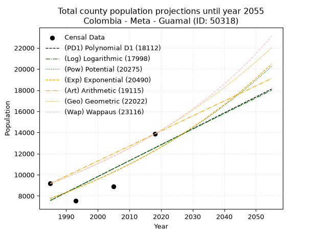
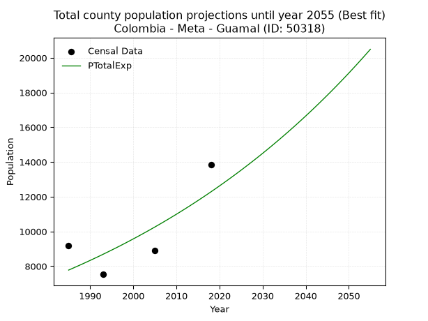
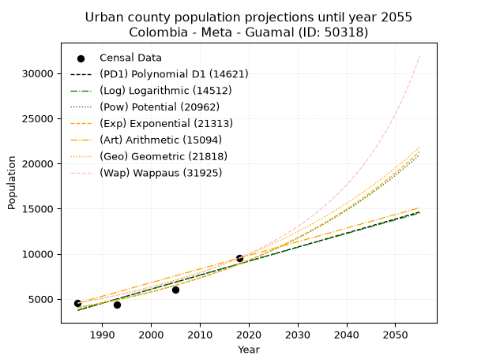
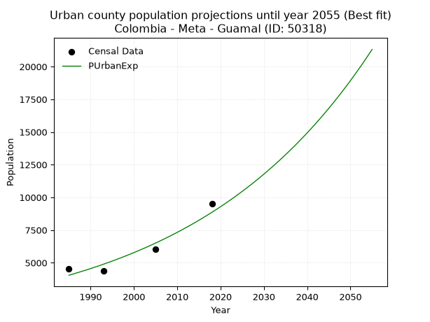
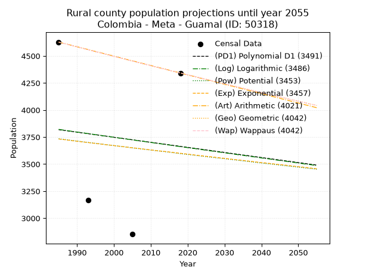
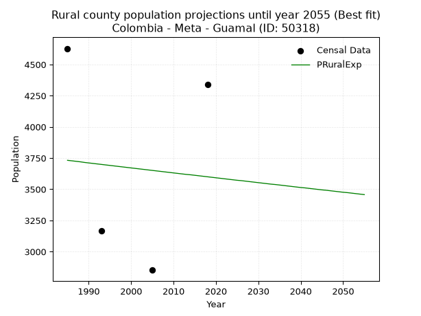

<div align="center">


</div>

# _“Population and Public Services Demand Projections (PPSD) until Year 2050 for Colombia - Meta - Guamal (ID: 50318)”_
Keywords: `population` `public-service` `projection` `lineal` `polynomial` `logarithmic` `potential` `exponential` `arithmetic` `geometric` `wappaus` `dane` `colombia` `south-america`

PPSD are analytical estimates used by governments and planners to anticipate future changes in population size, age distribution, and the resulting community needs for utilities, healthcare, education, and infrastructure as sizing future water treatment facilities, electrical grids, and road networks based on spatial growth.

> **General running parameters**: • app_version: _v20260806_. • Python version: _3.14.7_. • Pandas version: _3.0.5_. • NumPy version: _2.5.1_. • Creates, save and include plots into reports (create_plot): _False_. • Projection until year: _2050_. • Process polynomial degree 2 and up: _False_. • Process Wappaus: _True_. • Process Wappaus: _True_. • Set negative values to zero: _True_. • Set infinite values to zero: _True_. • Drop dataset notes: _True_. 
<div align="center">

Dynamic map: [:earth_americas:Google](http://maps.google.com/maps?q=3.879656812,-73.7688151) [:earth_americas:OSM](https://www.openstreetmap.org/#map=18/3.879656812/-73.7688151&layers=P) [:earth_americas:Bing](https://www.bing.com/maps?cp=3.879656812~-73.7688151&lvl=18) [:earth_americas:Apple](https://maps.apple.com/frame?center=3.879656812%2C-73.7688151&span=0.003%2C0.006)

</div>


<div align="center">

```geojson
{
  "type": "Feature",
  "geometry": {
    "type": "Point", 
    "coordinates": [-73.7688151, 3.879656812]
  }, 
  "properties": {
    "Name": "Colombia - Meta - Guamal (ID: 50318)"
  }
}
```

</div>


## 0. Census Data (4 records)

Census data are official statistics collected by a government about the people and housing in a country. They usually include counts of total population, age, sex, race, income, education, and jobs.

📅Global census file: [Population.xlsx](../data/Population.xlsx)

| Source   |   Year |   CountryID | CountryName   |   StateID | StateName   |   CountyID | CountyName   |   PTotal |   PUrban |   PRural |
|:---------|-------:|------------:|:--------------|----------:|:------------|-----------:|:-------------|---------:|---------:|---------:|
| DANE     |   1985 |          57 | Colombia      |        50 | Meta        |      50318 | Guamal       |     9167 |     4539 |     4628 |
| DANE     |   1993 |          57 | Colombia      |        50 | Meta        |      50318 | Guamal       |     7530 |     4364 |     3166 |
| DANE     |   2005 |          57 | Colombia      |        50 | Meta        |      50318 | Guamal       |     8897 |     6045 |     2852 |
| DANE     |   2018 |          57 | Colombia      |        50 | Meta        |      50318 | Guamal       |    13857 |     9515 |     4342 |

> 🔥Some records could had specific notes about the registered values or the corresponding urban or rural distribution.

📅   [RUPS](https://www.datos.gov.co/Hacienda-y-Cr-dito-P-blico/Registro-nico-de-Prestadores-de-Servicios-P-blicos/4qkq-csdn/about_data) - Local public utility companies: [RUPS.csv](../data/RUPS.xlsx)

 | SERVICIO       | ESTADO    | NOMBRE                                                                                   | NIT         | DEPARTAMENTO_DOMICILIO   | MUNICIPIO_DOMICILIO   | DIRECCION                                       |   TELEFONO | EMAIL                                   | TIPO_PRESTADOR                             | CLASIFICACION                  |
|:---------------|:----------|:-----------------------------------------------------------------------------------------|:------------|:-------------------------|:----------------------|:------------------------------------------------|-----------:|:----------------------------------------|:-------------------------------------------|:-------------------------------|
| ACUEDUCTO      | OPERATIVA | EMPRESA DE SERVICIOS PUBLICOS DEL META S.A. E.S.P.                                       | 822006587-0 | META                     | VILLAVICENCIO         | Diagonal 19 Transversal 23 - 02 Barrio el Nogal |    6726764 | edesa@edesaesp.com.co                   | SOCIEDADES (EMPRESA DE SERVICIOS PUBLICOS) | MAYOR O IGUAL A 5001 USUARIOS  |
| ALCANTARILLADO | OPERATIVA | EMPRESA DE SERVICIOS PUBLICOS DEL META S.A. E.S.P.                                       | 822006587-0 | META                     | VILLAVICENCIO         | Diagonal 19 Transversal 23 - 02 Barrio el Nogal |    6726764 | edesa@edesaesp.com.co                   | SOCIEDADES (EMPRESA DE SERVICIOS PUBLICOS) | MAYOR O IGUAL A 5001 USUARIOS  |
| ACUEDUCTO      | OPERATIVA | ASOCIACION DE USUARIOS DEL ACUEDUCTO VEREDAL OROTOY, PIO XII, SANTA BARBARA Y EL ENCANTO | 822006585-6 | META                     | GUAMAL                | CALLE 21 N. 3A-37 BARRIO NARCISO MATUS          |    6755105 | agudelo.cp@gmail.com                    | ORGANIZACION AUTORIZADA                    | MENOR O IGUAL A 2500 USUARIOS  |
| ACUEDUCTO      | OPERATIVA | ASOCIACIÓN ACUEDUCTO REGIONAL                                                            | 822000724-6 | META                     | GUAMAL                | Cra 8 No.10-35 Brr Fundadores                   |    6712222 | agudelo.cp@gmail.com                    | ORGANIZACION AUTORIZADA                    | MENOR O IGUAL A 2500 USUARIOS  |
| ACUEDUCTO      | OPERATIVA | AGUAS DE CASTILLA S.A. E.S.P                                                             | 900258798-1 | META                     | CASTILLA LA NUEVA     | CALLE 5 N. 7-13                                 |    6750075 | factura.aguasdecastillasa.esp@gmail.com | SOCIEDADES (EMPRESA DE SERVICIOS PUBLICOS) | DESDE 2501 HASTA 5000 USUARIOS |

## 1. Total

### 1.1. Coefficients and Parameters

* (PD1) Polynomial Deg 1: 150.67563227619115, -291526.1834604513 (lineal)
* (Log) Logarithmic: 301045.05309299903, -2278383.11098354
* (Pow) Potential: 27.647383564890998, -87.28362609310038
* (Exp) Exponential: 0.013838829619416307, 9.135378428901671e-09
* (Art) Arithmetic: Year diff. 2018 - 1985 = 33, Population diff. 13857 - 9167 = 4690, Annual growth = 142.12121212121212
* (Geo) Geometric: Year diff. 2018 - 1985 = 33, Population diff. 13857 - 9167 = 4690, Annual growth % = 0.012599330544763143
* (Wap) Wappaus: i = 1.2345484027207447, Condition values only valid for < 200)

<sub>
Wappaus condition values: ['0.00', '1.23', '2.47', '3.70', '4.94', '6.17', '7.41', '8.64', '9.88', '11.11', '12.35', '13.58', '14.81', '16.05', '17.28', '18.52', '19.75', '20.99', '22.22', '23.46', '24.69', '25.93', '27.16', '28.39', '29.63', '30.86', '32.10', '33.33', '34.57', '35.80', '37.04', '38.27', '39.51', '40.74', '41.97', '43.21', '44.44', '45.68', '46.91', '48.15', '49.38', '50.62', '51.85', '53.09', '54.32', '55.55', '56.79', '58.02', '59.26', '60.49', '61.73', '62.96', '64.20', '65.43', '66.67', '67.90', '69.13', '70.37', '71.60', '72.84', '74.07', '75.31', '76.54', '77.78', '79.01', '80.25']
</sub>


### 1.2. Projected Dataset

|   Year |   CountyID |   PTotalPD1 |   PTotalLog |   PTotalPow |   PTotalExp |   PTotalArt |   PTotalGeo |   PTotalWap |
|-------:|-----------:|------------:|------------:|------------:|------------:|------------:|------------:|------------:|
|   1985 |      50318 |        7565 |        7565 |        7777 |        7777 |        9167 |        9167 |        9167 |
|   1986 |      50318 |        7716 |        7716 |        7886 |        7886 |        9309 |        9282 |        9281 |
|   1987 |      50318 |        7866 |        7868 |        7997 |        7996 |        9451 |        9399 |        9396 |
|   1988 |      50318 |        8017 |        8019 |        8109 |        8107 |        9593 |        9518 |        9513 |
|   1989 |      50318 |        8168 |        8171 |        8222 |        8220 |        9735 |        9638 |        9631 |
|   1990 |      50318 |        8318 |        8322 |        8337 |        8335 |        9878 |        9759 |        9751 |
|   1991 |      50318 |        8469 |        8473 |        8454 |        8451 |       10020 |        9882 |        9872 |
|   1992 |      50318 |        8620 |        8624 |        8572 |        8568 |       10162 |       10007 |        9995 |
|   1993 |      50318 |        8770 |        8775 |        8692 |        8688 |       10304 |       10133 |       10119 |
|   1994 |      50318 |        8921 |        8926 |        8813 |        8809 |       10446 |       10260 |       10245 |
|   1995 |      50318 |        9072 |        9077 |        8936 |        8932 |       10588 |       10390 |       10373 |
|   1996 |      50318 |        9222 |        9228 |        9061 |        9056 |       10730 |       10521 |       10503 |
|   1997 |      50318 |        9373 |        9379 |        9187 |        9182 |       10872 |       10653 |       10634 |
|   1998 |      50318 |        9524 |        9530 |        9315 |        9310 |       11015 |       10787 |       10767 |
|   1999 |      50318 |        9674 |        9680 |        9445 |        9440 |       11157 |       10923 |       10901 |
|   2000 |      50318 |        9825 |        9831 |        9577 |        9572 |       11299 |       11061 |       11038 |
|   2001 |      50318 |        9976 |        9981 |        9710 |        9705 |       11441 |       11200 |       11176 |
|   2002 |      50318 |       10126 |       10132 |        9845 |        9840 |       11583 |       11341 |       11316 |
|   2003 |      50318 |       10277 |       10282 |        9982 |        9977 |       11725 |       11484 |       11459 |
|   2004 |      50318 |       10428 |       10432 |       10121 |       10116 |       11867 |       11629 |       11603 |
|   2005 |      50318 |       10578 |       10583 |       10261 |       10257 |       12009 |       11776 |       11749 |
|   2006 |      50318 |       10729 |       10733 |       10404 |       10400 |       12152 |       11924 |       11898 |
|   2007 |      50318 |       10880 |       10883 |       10548 |       10545 |       12294 |       12074 |       12048 |
|   2008 |      50318 |       11030 |       11033 |       10694 |       10692 |       12436 |       12226 |       12201 |
|   2009 |      50318 |       11181 |       11183 |       10842 |       10841 |       12578 |       12380 |       12355 |
|   2010 |      50318 |       11332 |       11332 |       10993 |       10992 |       12720 |       12536 |       12513 |
|   2011 |      50318 |       11483 |       11482 |       11145 |       11145 |       12862 |       12694 |       12672 |
|   2012 |      50318 |       11633 |       11632 |       11299 |       11301 |       13004 |       12854 |       12834 |
|   2013 |      50318 |       11784 |       11781 |       11455 |       11458 |       13146 |       13016 |       12998 |
|   2014 |      50318 |       11935 |       11931 |       11614 |       11618 |       13289 |       13180 |       13165 |
|   2015 |      50318 |       12085 |       12080 |       11774 |       11780 |       13431 |       13346 |       13334 |
|   2016 |      50318 |       12236 |       12230 |       11937 |       11944 |       13573 |       13514 |       13505 |
|   2017 |      50318 |       12387 |       12379 |       12102 |       12110 |       13715 |       13685 |       13680 |
|   2018 |      50318 |       12537 |       12528 |       12269 |       12279 |       13857 |       13857 |       13857 |
|   2019 |      50318 |       12688 |       12677 |       12438 |       12450 |       13999 |       14032 |       14037 |
|   2020 |      50318 |       12839 |       12826 |       12609 |       12624 |       14141 |       14208 |       14220 |
|   2021 |      50318 |       12989 |       12975 |       12783 |       12800 |       14283 |       14387 |       14405 |
|   2022 |      50318 |       13140 |       13124 |       12959 |       12978 |       14425 |       14569 |       14594 |
|   2023 |      50318 |       13291 |       13273 |       13137 |       13159 |       14568 |       14752 |       14785 |
|   2024 |      50318 |       13441 |       13422 |       13318 |       13342 |       14710 |       14938 |       14980 |
|   2025 |      50318 |       13592 |       13571 |       13501 |       13528 |       14852 |       15126 |       15178 |
|   2026 |      50318 |       13743 |       13719 |       13687 |       13717 |       14994 |       15317 |       15379 |
|   2027 |      50318 |       13893 |       13868 |       13875 |       13908 |       15136 |       15510 |       15584 |
|   2028 |      50318 |       14044 |       14016 |       14065 |       14101 |       15278 |       15705 |       15792 |
|   2029 |      50318 |       14195 |       14165 |       14258 |       14298 |       15420 |       15903 |       16003 |
|   2030 |      50318 |       14345 |       14313 |       14454 |       14497 |       15562 |       16104 |       16218 |
|   2031 |      50318 |       14496 |       14461 |       14652 |       14699 |       15705 |       16306 |       16437 |
|   2032 |      50318 |       14647 |       14610 |       14853 |       14904 |       15847 |       16512 |       16660 |
|   2033 |      50318 |       14797 |       14758 |       15056 |       15112 |       15989 |       16720 |       16886 |
|   2034 |      50318 |       14948 |       14906 |       15262 |       15322 |       16131 |       16931 |       17117 |
|   2035 |      50318 |       15099 |       15054 |       15471 |       15536 |       16273 |       17144 |       17352 |
|   2036 |      50318 |       15249 |       15202 |       15683 |       15752 |       16415 |       17360 |       17591 |
|   2037 |      50318 |       15400 |       15349 |       15897 |       15972 |       16557 |       17579 |       17834 |
|   2038 |      50318 |       15551 |       15497 |       16114 |       16194 |       16699 |       17800 |       18081 |
|   2039 |      50318 |       15701 |       15645 |       16334 |       16420 |       16842 |       18024 |       18334 |
|   2040 |      50318 |       15852 |       15792 |       16557 |       16649 |       16984 |       18251 |       18591 |
|   2041 |      50318 |       16003 |       15940 |       16783 |       16881 |       17126 |       18481 |       18853 |
|   2042 |      50318 |       16153 |       16087 |       17012 |       17116 |       17268 |       18714 |       19120 |
|   2043 |      50318 |       16304 |       16235 |       17244 |       17355 |       17410 |       18950 |       19391 |
|   2044 |      50318 |       16455 |       16382 |       17479 |       17597 |       17552 |       19189 |       19669 |
|   2045 |      50318 |       16605 |       16529 |       17717 |       17842 |       17694 |       19431 |       19951 |
|   2046 |      50318 |       16756 |       16677 |       17958 |       18090 |       17836 |       19675 |       20240 |
|   2047 |      50318 |       16907 |       16824 |       18202 |       18342 |       17979 |       19923 |       20534 |
|   2048 |      50318 |       17058 |       16971 |       18449 |       18598 |       18121 |       20174 |       20834 |
|   2049 |      50318 |       17208 |       17118 |       18700 |       18857 |       18263 |       20428 |       21140 |
|   2050 |      50318 |       17359 |       17265 |       18954 |       19120 |       18405 |       20686 |       21452 |
<div align="center">

</img>

</div>


### 1.3. Best fit with absolute and relative error (%)

Relative error puts that difference into context by dividing the absolute error by the true value, creating a unitless ratio or percentage that shows the scale of the mistake.

Absolute and relative error

|   Year | Source   |   CountryID | CountryName   |   StateID | StateName   |   CountyID_x | CountyName   |   PTotal |   PUrban |   PRural |   CountyID_y |   PTotalPD1 |   PTotalLog |   PTotalPow |   PTotalExp |   PTotalArt |   PTotalGeo |   PTotalWap |   PTotalPD1AbsError |   PTotalLogAbsError |   PTotalPowAbsError |   PTotalExpAbsError |   PTotalArtAbsError |   PTotalGeoAbsError |   PTotalWapAbsError |   PTotalPD1RelError |   PTotalLogRelError |   PTotalPowRelError |   PTotalExpRelError |   PTotalArtRelError |   PTotalGeoRelError |   PTotalWapRelError |
|-------:|:---------|------------:|:--------------|----------:|:------------|-------------:|:-------------|---------:|---------:|---------:|-------------:|------------:|------------:|------------:|------------:|------------:|------------:|------------:|--------------------:|--------------------:|--------------------:|--------------------:|--------------------:|--------------------:|--------------------:|--------------------:|--------------------:|--------------------:|--------------------:|--------------------:|--------------------:|--------------------:|
|   1985 | DANE     |          57 | Colombia      |        50 | Meta        |        50318 | Guamal       |     9167 |     4539 |     4628 |        50318 |        7565 |        7565 |        7777 |        7777 |        9167 |        9167 |        9167 |                1602 |                1602 |                1390 |                1390 |                   0 |                   0 |                   0 |            17.4757  |            17.4757  |             15.1631 |             15.1631 |              0      |              0      |              0      |
|   1993 | DANE     |          57 | Colombia      |        50 | Meta        |        50318 | Guamal       |     7530 |     4364 |     3166 |        50318 |        8770 |        8775 |        8692 |        8688 |       10304 |       10133 |       10119 |                1240 |                1245 |                1162 |                1158 |                2774 |                2603 |                2589 |            16.4675  |            16.5339  |             15.4316 |             15.3785 |             36.8393 |             34.5684 |             34.3825 |
|   2005 | DANE     |          57 | Colombia      |        50 | Meta        |        50318 | Guamal       |     8897 |     6045 |     2852 |        50318 |       10578 |       10583 |       10261 |       10257 |       12009 |       11776 |       11749 |                1681 |                1686 |                1364 |                1360 |                3112 |                2879 |                2852 |            18.894   |            18.9502  |             15.331  |             15.2861 |             34.9781 |             32.3592 |             32.0557 |
|   2018 | DANE     |          57 | Colombia      |        50 | Meta        |        50318 | Guamal       |    13857 |     9515 |     4342 |        50318 |       12537 |       12528 |       12269 |       12279 |       13857 |       13857 |       13857 |                1320 |                1329 |                1588 |                1578 |                   0 |                   0 |                   0 |             9.52587 |             9.59082 |             11.4599 |             11.3877 |              0      |              0      |              0      |

Relative error mean

| Method    |   RelError | Best   |
|:----------|-----------:|:-------|
| PTotalPD1 |    15.5908 |        |
| PTotalLog |    15.6377 |        |
| PTotalPow |    14.3464 |        |
| PTotalExp |    14.3038 | True   |
| PTotalArt |    17.9543 |        |
| PTotalGeo |    16.7319 |        |
| PTotalWap |    16.6096 |        |

💙Best method: _**PTotalExp**_
<div align="center">

</img>

</div>


### 1.4. Fresh water supply demand in liters per capita per day (lpcd)

The fresh water supply demand typically ranges from 100 to 300 liters per capita per day (lpcd) for standard domestic and municipal planning, though absolute survival minimums set by the World Health Organization are as low as 7.5 to 20 liters per day, and total consumption in high-income nations can exceed 400 liters.

> `CZ`: Level in meters above the sea level (masl)<br> `WS`: Fresh water supply demand in liters per capita per day (lpcd or l/h/d)<br> `WSAll`: Zonal fresh water supply demand in liters per second (l/s)<br> `A`: Zonal area in square meters<br> `DP`: Population density (people/hectare or p/ha)

Reference values (RAS Colombia)

|    CZ |   WS |
|------:|-----:|
|  1000 |  120 |
|  2000 |  130 |
| 99999 |  140 |

County shapefile geometry properties and water supply values

|   CountyID |     ATotal |   CZTotal |   WSTotal |
|-----------:|-----------:|----------:|----------:|
|      50318 | 5.9492e+08 |   2220.31 |       140 |

Projected values for best method: PTotalExp

|   CountyID |   Year |   PTotalExp |   DPTotal |   WSTotal |   WSTotalAll |
|-----------:|-------:|------------:|----------:|----------:|-------------:|
|      50318 |   1985 |        7777 |      0.13 |       140 |      12.6016 |
|      50318 |   1986 |        7886 |      0.13 |       140 |      12.7782 |
|      50318 |   1987 |        7996 |      0.13 |       140 |      12.9565 |
|      50318 |   1988 |        8107 |      0.14 |       140 |      13.1363 |
|      50318 |   1989 |        8220 |      0.14 |       140 |      13.3194 |
|      50318 |   1990 |        8335 |      0.14 |       140 |      13.5058 |
|      50318 |   1991 |        8451 |      0.14 |       140 |      13.6937 |
|      50318 |   1992 |        8568 |      0.14 |       140 |      13.8833 |
|      50318 |   1993 |        8688 |      0.15 |       140 |      14.0778 |
|      50318 |   1994 |        8809 |      0.15 |       140 |      14.2738 |
|      50318 |   1995 |        8932 |      0.15 |       140 |      14.4731 |
|      50318 |   1996 |        9056 |      0.15 |       140 |      14.6741 |
|      50318 |   1997 |        9182 |      0.15 |       140 |      14.8782 |
|      50318 |   1998 |        9310 |      0.16 |       140 |      15.0856 |
|      50318 |   1999 |        9440 |      0.16 |       140 |      15.2963 |
|      50318 |   2000 |        9572 |      0.16 |       140 |      15.5102 |
|      50318 |   2001 |        9705 |      0.16 |       140 |      15.7257 |
|      50318 |   2002 |        9840 |      0.17 |       140 |      15.9444 |
|      50318 |   2003 |        9977 |      0.17 |       140 |      16.1664 |
|      50318 |   2004 |       10116 |      0.17 |       140 |      16.3917 |
|      50318 |   2005 |       10257 |      0.17 |       140 |      16.6201 |
|      50318 |   2006 |       10400 |      0.17 |       140 |      16.8519 |
|      50318 |   2007 |       10545 |      0.18 |       140 |      17.0868 |
|      50318 |   2008 |       10692 |      0.18 |       140 |      17.325  |
|      50318 |   2009 |       10841 |      0.18 |       140 |      17.5664 |
|      50318 |   2010 |       10992 |      0.18 |       140 |      17.8111 |
|      50318 |   2011 |       11145 |      0.19 |       140 |      18.059  |
|      50318 |   2012 |       11301 |      0.19 |       140 |      18.3118 |
|      50318 |   2013 |       11458 |      0.19 |       140 |      18.5662 |
|      50318 |   2014 |       11618 |      0.2  |       140 |      18.8255 |
|      50318 |   2015 |       11780 |      0.2  |       140 |      19.088  |
|      50318 |   2016 |       11944 |      0.2  |       140 |      19.3537 |
|      50318 |   2017 |       12110 |      0.2  |       140 |      19.6227 |
|      50318 |   2018 |       12279 |      0.21 |       140 |      19.8965 |
|      50318 |   2019 |       12450 |      0.21 |       140 |      20.1736 |
|      50318 |   2020 |       12624 |      0.21 |       140 |      20.4556 |
|      50318 |   2021 |       12800 |      0.22 |       140 |      20.7407 |
|      50318 |   2022 |       12978 |      0.22 |       140 |      21.0292 |
|      50318 |   2023 |       13159 |      0.22 |       140 |      21.3225 |
|      50318 |   2024 |       13342 |      0.22 |       140 |      21.619  |
|      50318 |   2025 |       13528 |      0.23 |       140 |      21.9204 |
|      50318 |   2026 |       13717 |      0.23 |       140 |      22.2266 |
|      50318 |   2027 |       13908 |      0.23 |       140 |      22.5361 |
|      50318 |   2028 |       14101 |      0.24 |       140 |      22.8488 |
|      50318 |   2029 |       14298 |      0.24 |       140 |      23.1681 |
|      50318 |   2030 |       14497 |      0.24 |       140 |      23.4905 |
|      50318 |   2031 |       14699 |      0.25 |       140 |      23.8178 |
|      50318 |   2032 |       14904 |      0.25 |       140 |      24.15   |
|      50318 |   2033 |       15112 |      0.25 |       140 |      24.487  |
|      50318 |   2034 |       15322 |      0.26 |       140 |      24.8273 |
|      50318 |   2035 |       15536 |      0.26 |       140 |      25.1741 |
|      50318 |   2036 |       15752 |      0.26 |       140 |      25.5241 |
|      50318 |   2037 |       15972 |      0.27 |       140 |      25.8806 |
|      50318 |   2038 |       16194 |      0.27 |       140 |      26.2403 |
|      50318 |   2039 |       16420 |      0.28 |       140 |      26.6065 |
|      50318 |   2040 |       16649 |      0.28 |       140 |      26.9775 |
|      50318 |   2041 |       16881 |      0.28 |       140 |      27.3535 |
|      50318 |   2042 |       17116 |      0.29 |       140 |      27.7343 |
|      50318 |   2043 |       17355 |      0.29 |       140 |      28.1215 |
|      50318 |   2044 |       17597 |      0.3  |       140 |      28.5137 |
|      50318 |   2045 |       17842 |      0.3  |       140 |      28.9106 |
|      50318 |   2046 |       18090 |      0.3  |       140 |      29.3125 |
|      50318 |   2047 |       18342 |      0.31 |       140 |      29.7208 |
|      50318 |   2048 |       18598 |      0.31 |       140 |      30.1356 |
|      50318 |   2049 |       18857 |      0.32 |       140 |      30.5553 |
|      50318 |   2050 |       19120 |      0.32 |       140 |      30.9815 |

## 2. Urban

### 2.1. Coefficients and Parameters

* (PD1) Polynomial Deg 1: 155.3532717784, -304629.6318747446 (lineal)
* (Log) Logarithmic: 310688.96284861804, -2355433.546317443
* (Pow) Potential: 47.48438629232959, -152.98539772655937
* (Exp) Exponential: 0.023739758991286906, 1.3851357255491053e-17
* (Art) Arithmetic: Year diff. 2018 - 1985 = 33, Population diff. 9515 - 4539 = 4976, Annual growth = 150.78787878787878
* (Geo) Geometric: Year diff. 2018 - 1985 = 33, Population diff. 9515 - 4539 = 4976, Annual growth % = 0.022682600174718015
* (Wap) Wappaus: i = 2.145835759041964, Condition values only valid for < 200)

<sub>
Wappaus condition values: ['0.00', '2.15', '4.29', '6.44', '8.58', '10.73', '12.88', '15.02', '17.17', '19.31', '21.46', '23.60', '25.75', '27.90', '30.04', '32.19', '34.33', '36.48', '38.63', '40.77', '42.92', '45.06', '47.21', '49.35', '51.50', '53.65', '55.79', '57.94', '60.08', '62.23', '64.38', '66.52', '68.67', '70.81', '72.96', '75.10', '77.25', '79.40', '81.54', '83.69', '85.83', '87.98', '90.13', '92.27', '94.42', '96.56', '98.71', '100.85', '103.00', '105.15', '107.29', '109.44', '111.58', '113.73', '115.88', '118.02', '120.17', '122.31', '124.46', '126.60', '128.75', '130.90', '133.04', '135.19', '137.33', '139.48']
</sub>


### 2.2. Projected Dataset

|   Year |   CountyID |   PUrbanPD1 |   PUrbanLog |   PUrbanPow |   PUrbanExp |   PUrbanArt |   PUrbanGeo |   PUrbanWap |
|-------:|-----------:|------------:|------------:|------------:|------------:|------------:|------------:|------------:|
|   1985 |      50318 |        3747 |        3744 |        4043 |        4045 |        4539 |        4539 |        4539 |
|   1986 |      50318 |        3902 |        3900 |        4141 |        4142 |        4690 |        4642 |        4637 |
|   1987 |      50318 |        4057 |        4057 |        4241 |        4242 |        4841 |        4747 |        4738 |
|   1988 |      50318 |        4213 |        4213 |        4344 |        4344 |        4991 |        4855 |        4841 |
|   1989 |      50318 |        4368 |        4369 |        4449 |        4448 |        5142 |        4965 |        4946 |
|   1990 |      50318 |        4523 |        4526 |        4556 |        4555 |        5293 |        5078 |        5054 |
|   1991 |      50318 |        4679 |        4682 |        4666 |        4664 |        5444 |        5193 |        5164 |
|   1992 |      50318 |        4834 |        4838 |        4779 |        4776 |        5595 |        5311 |        5276 |
|   1993 |      50318 |        4989 |        4994 |        4894 |        4891 |        5745 |        5431 |        5391 |
|   1994 |      50318 |        5145 |        5149 |        5012 |        5009 |        5896 |        5554 |        5509 |
|   1995 |      50318 |        5300 |        5305 |        5133 |        5129 |        6047 |        5680 |        5630 |
|   1996 |      50318 |        5455 |        5461 |        5257 |        5252 |        6198 |        5809 |        5754 |
|   1997 |      50318 |        5611 |        5617 |        5383 |        5378 |        6348 |        5941 |        5881 |
|   1998 |      50318 |        5766 |        5772 |        5513 |        5508 |        6499 |        6076 |        6010 |
|   1999 |      50318 |        5922 |        5928 |        5645 |        5640 |        6650 |        6213 |        6144 |
|   2000 |      50318 |        6077 |        6083 |        5781 |        5775 |        6801 |        6354 |        6280 |
|   2001 |      50318 |        6232 |        6238 |        5920 |        5914 |        6952 |        6499 |        6420 |
|   2002 |      50318 |        6388 |        6393 |        6062 |        6056 |        7102 |        6646 |        6564 |
|   2003 |      50318 |        6543 |        6549 |        6207 |        6202 |        7253 |        6797 |        6712 |
|   2004 |      50318 |        6698 |        6704 |        6356 |        6351 |        7404 |        6951 |        6863 |
|   2005 |      50318 |        6854 |        6859 |        6508 |        6503 |        7555 |        7108 |        7019 |
|   2006 |      50318 |        7009 |        7014 |        6664 |        6660 |        7706 |        7270 |        7179 |
|   2007 |      50318 |        7164 |        7168 |        6824 |        6820 |        7856 |        7435 |        7344 |
|   2008 |      50318 |        7320 |        7323 |        6987 |        6983 |        8007 |        7603 |        7513 |
|   2009 |      50318 |        7475 |        7478 |        7154 |        7151 |        8158 |        7776 |        7687 |
|   2010 |      50318 |        7630 |        7633 |        7326 |        7323 |        8309 |        7952 |        7867 |
|   2011 |      50318 |        7786 |        7787 |        7501 |        7499 |        8459 |        8132 |        8051 |
|   2012 |      50318 |        7941 |        7942 |        7680 |        7679 |        8610 |        8317 |        8241 |
|   2013 |      50318 |        8097 |        8096 |        7863 |        7863 |        8761 |        8506 |        8437 |
|   2014 |      50318 |        8252 |        8250 |        8051 |        8052 |        8912 |        8699 |        8639 |
|   2015 |      50318 |        8407 |        8404 |        8243 |        8246 |        9063 |        8896 |        8848 |
|   2016 |      50318 |        8563 |        8559 |        8439 |        8444 |        9213 |        9098 |        9063 |
|   2017 |      50318 |        8718 |        8713 |        8640 |        8647 |        9364 |        9304 |        9285 |
|   2018 |      50318 |        8873 |        8867 |        8846 |        8855 |        9515 |        9515 |        9515 |
|   2019 |      50318 |        9029 |        9021 |        9057 |        9067 |        9666 |        9731 |        9752 |
|   2020 |      50318 |        9184 |        9174 |        9272 |        9285 |        9817 |        9952 |        9998 |
|   2021 |      50318 |        9339 |        9328 |        9493 |        9508 |        9967 |       10177 |       10252 |
|   2022 |      50318 |        9495 |        9482 |        9718 |        9737 |       10118 |       10408 |       10515 |
|   2023 |      50318 |        9650 |        9635 |        9949 |        9970 |       10269 |       10644 |       10788 |
|   2024 |      50318 |        9805 |        9789 |       10185 |       10210 |       10420 |       10886 |       11071 |
|   2025 |      50318 |        9961 |        9942 |       10427 |       10455 |       10571 |       11133 |       11364 |
|   2026 |      50318 |       10116 |       10096 |       10674 |       10706 |       10721 |       11385 |       11669 |
|   2027 |      50318 |       10271 |       10249 |       10928 |       10964 |       10872 |       11643 |       11985 |
|   2028 |      50318 |       10427 |       10402 |       11187 |       11227 |       11023 |       11907 |       12314 |
|   2029 |      50318 |       10582 |       10556 |       11451 |       11497 |       11174 |       12178 |       12657 |
|   2030 |      50318 |       10738 |       10709 |       11723 |       11773 |       11324 |       12454 |       13014 |
|   2031 |      50318 |       10893 |       10862 |       12000 |       12056 |       11475 |       12736 |       13385 |
|   2032 |      50318 |       11048 |       11015 |       12284 |       12345 |       11626 |       13025 |       13773 |
|   2033 |      50318 |       11204 |       11167 |       12574 |       12642 |       11777 |       13321 |       14179 |
|   2034 |      50318 |       11359 |       11320 |       12871 |       12946 |       11928 |       13623 |       14602 |
|   2035 |      50318 |       11514 |       11473 |       13175 |       13257 |       12078 |       13932 |       15045 |
|   2036 |      50318 |       11670 |       11626 |       13486 |       13575 |       12229 |       14248 |       15509 |
|   2037 |      50318 |       11825 |       11778 |       13804 |       13901 |       12380 |       14571 |       15996 |
|   2038 |      50318 |       11980 |       11931 |       14130 |       14235 |       12531 |       14901 |       16506 |
|   2039 |      50318 |       12136 |       12083 |       14463 |       14577 |       12682 |       15239 |       17043 |
|   2040 |      50318 |       12291 |       12235 |       14803 |       14927 |       12832 |       15585 |       17608 |
|   2041 |      50318 |       12446 |       12388 |       15152 |       15286 |       12983 |       15939 |       18203 |
|   2042 |      50318 |       12602 |       12540 |       15508 |       15653 |       13134 |       16300 |       18832 |
|   2043 |      50318 |       12757 |       12692 |       15873 |       16029 |       13285 |       16670 |       19495 |
|   2044 |      50318 |       12912 |       12844 |       16246 |       16414 |       13435 |       17048 |       20198 |
|   2045 |      50318 |       13068 |       12996 |       16628 |       16809 |       13586 |       17435 |       20943 |
|   2046 |      50318 |       13223 |       13148 |       17019 |       17213 |       13737 |       17830 |       21734 |
|   2047 |      50318 |       13379 |       13300 |       17418 |       17626 |       13888 |       18235 |       22576 |
|   2048 |      50318 |       13534 |       13451 |       17827 |       18050 |       14039 |       18648 |       23474 |
|   2049 |      50318 |       13689 |       13603 |       18245 |       18483 |       14189 |       19071 |       24433 |
|   2050 |      50318 |       13845 |       13755 |       18672 |       18927 |       14340 |       19504 |       25461 |
<div align="center">

</img>

</div>


### 2.3. Best fit with absolute and relative error (%)

Relative error puts that difference into context by dividing the absolute error by the true value, creating a unitless ratio or percentage that shows the scale of the mistake.

Absolute and relative error

|   Year | Source   |   CountryID | CountryName   |   StateID | StateName   |   CountyID_x | CountyName   |   PTotal |   PUrban |   PRural |   CountyID_y |   PUrbanPD1 |   PUrbanLog |   PUrbanPow |   PUrbanExp |   PUrbanArt |   PUrbanGeo |   PUrbanWap |   PUrbanPD1AbsError |   PUrbanLogAbsError |   PUrbanPowAbsError |   PUrbanExpAbsError |   PUrbanArtAbsError |   PUrbanGeoAbsError |   PUrbanWapAbsError |   PUrbanPD1RelError |   PUrbanLogRelError |   PUrbanPowRelError |   PUrbanExpRelError |   PUrbanArtRelError |   PUrbanGeoRelError |   PUrbanWapRelError |
|-------:|:---------|------------:|:--------------|----------:|:------------|-------------:|:-------------|---------:|---------:|---------:|-------------:|------------:|------------:|------------:|------------:|------------:|------------:|------------:|--------------------:|--------------------:|--------------------:|--------------------:|--------------------:|--------------------:|--------------------:|--------------------:|--------------------:|--------------------:|--------------------:|--------------------:|--------------------:|--------------------:|
|   1985 | DANE     |          57 | Colombia      |        50 | Meta        |        50318 | Guamal       |     9167 |     4539 |     4628 |        50318 |        3747 |        3744 |        4043 |        4045 |        4539 |        4539 |        4539 |                 792 |                 795 |                 496 |                 494 |                   0 |                   0 |                   0 |            17.4488  |             17.5149 |            10.9275  |            10.8835  |              0      |              0      |              0      |
|   1993 | DANE     |          57 | Colombia      |        50 | Meta        |        50318 | Guamal       |     7530 |     4364 |     3166 |        50318 |        4989 |        4994 |        4894 |        4891 |        5745 |        5431 |        5391 |                 625 |                 630 |                 530 |                 527 |                1381 |                1067 |                1027 |            14.3217  |             14.4363 |            12.1448  |            12.0761  |             31.6453 |             24.45   |             23.5335 |
|   2005 | DANE     |          57 | Colombia      |        50 | Meta        |        50318 | Guamal       |     8897 |     6045 |     2852 |        50318 |        6854 |        6859 |        6508 |        6503 |        7555 |        7108 |        7019 |                 809 |                 814 |                 463 |                 458 |                1510 |                1063 |                 974 |            13.383   |             13.4657 |             7.65922 |             7.57651 |             24.9793 |             17.5848 |             16.1125 |
|   2018 | DANE     |          57 | Colombia      |        50 | Meta        |        50318 | Guamal       |    13857 |     9515 |     4342 |        50318 |        8873 |        8867 |        8846 |        8855 |        9515 |        9515 |        9515 |                 642 |                 648 |                 669 |                 660 |                   0 |                   0 |                   0 |             6.74724 |              6.8103 |             7.031   |             6.93642 |              0      |              0      |              0      |

Relative error mean

| Method    |   RelError | Best   |
|:----------|-----------:|:-------|
| PUrbanPD1 |   12.9752  |        |
| PUrbanLog |   13.0568  |        |
| PUrbanPow |    9.44064 |        |
| PUrbanExp |    9.36811 | True   |
| PUrbanArt |   14.1562  |        |
| PUrbanGeo |   10.5087  |        |
| PUrbanWap |    9.91149 |        |

💙Best method: _**PUrbanExp**_
<div align="center">

</img>

</div>


### 2.4. Fresh water supply demand in liters per capita per day (lpcd)

The fresh water supply demand typically ranges from 100 to 300 liters per capita per day (lpcd) for standard domestic and municipal planning, though absolute survival minimums set by the World Health Organization are as low as 7.5 to 20 liters per day, and total consumption in high-income nations can exceed 400 liters.

> `CZ`: Level in meters above the sea level (masl)<br> `WS`: Fresh water supply demand in liters per capita per day (lpcd or l/h/d)<br> `WSAll`: Zonal fresh water supply demand in liters per second (l/s)<br> `A`: Zonal area in square meters<br> `DP`: Population density (people/hectare or p/ha)

Reference values (RAS Colombia)

|    CZ |   WS |
|------:|-----:|
|  1000 |  120 |
|  2000 |  130 |
| 99999 |  140 |

County shapefile geometry properties and water supply values

|   CountyID |      AUrban |   CZUrban |   WSUrban |
|-----------:|------------:|----------:|----------:|
|      50318 | 3.00901e+06 |   520.304 |       120 |

Projected values for best method: PUrbanExp

|   CountyID |   Year |   PUrbanExp |   DPUrban |   WSUrban |   WSUrbanAll |
|-----------:|-------:|------------:|----------:|----------:|-------------:|
|      50318 |   1985 |        4045 |     13.44 |       120 |      5.61806 |
|      50318 |   1986 |        4142 |     13.77 |       120 |      5.75278 |
|      50318 |   1987 |        4242 |     14.1  |       120 |      5.89167 |
|      50318 |   1988 |        4344 |     14.44 |       120 |      6.03333 |
|      50318 |   1989 |        4448 |     14.78 |       120 |      6.17778 |
|      50318 |   1990 |        4555 |     15.14 |       120 |      6.32639 |
|      50318 |   1991 |        4664 |     15.5  |       120 |      6.47778 |
|      50318 |   1992 |        4776 |     15.87 |       120 |      6.63333 |
|      50318 |   1993 |        4891 |     16.25 |       120 |      6.79306 |
|      50318 |   1994 |        5009 |     16.65 |       120 |      6.95694 |
|      50318 |   1995 |        5129 |     17.05 |       120 |      7.12361 |
|      50318 |   1996 |        5252 |     17.45 |       120 |      7.29444 |
|      50318 |   1997 |        5378 |     17.87 |       120 |      7.46944 |
|      50318 |   1998 |        5508 |     18.31 |       120 |      7.65    |
|      50318 |   1999 |        5640 |     18.74 |       120 |      7.83333 |
|      50318 |   2000 |        5775 |     19.19 |       120 |      8.02083 |
|      50318 |   2001 |        5914 |     19.65 |       120 |      8.21389 |
|      50318 |   2002 |        6056 |     20.13 |       120 |      8.41111 |
|      50318 |   2003 |        6202 |     20.61 |       120 |      8.61389 |
|      50318 |   2004 |        6351 |     21.11 |       120 |      8.82083 |
|      50318 |   2005 |        6503 |     21.61 |       120 |      9.03194 |
|      50318 |   2006 |        6660 |     22.13 |       120 |      9.25    |
|      50318 |   2007 |        6820 |     22.67 |       120 |      9.47222 |
|      50318 |   2008 |        6983 |     23.21 |       120 |      9.69861 |
|      50318 |   2009 |        7151 |     23.77 |       120 |      9.93194 |
|      50318 |   2010 |        7323 |     24.34 |       120 |     10.1708  |
|      50318 |   2011 |        7499 |     24.92 |       120 |     10.4153  |
|      50318 |   2012 |        7679 |     25.52 |       120 |     10.6653  |
|      50318 |   2013 |        7863 |     26.13 |       120 |     10.9208  |
|      50318 |   2014 |        8052 |     26.76 |       120 |     11.1833  |
|      50318 |   2015 |        8246 |     27.4  |       120 |     11.4528  |
|      50318 |   2016 |        8444 |     28.06 |       120 |     11.7278  |
|      50318 |   2017 |        8647 |     28.74 |       120 |     12.0097  |
|      50318 |   2018 |        8855 |     29.43 |       120 |     12.2986  |
|      50318 |   2019 |        9067 |     30.13 |       120 |     12.5931  |
|      50318 |   2020 |        9285 |     30.86 |       120 |     12.8958  |
|      50318 |   2021 |        9508 |     31.6  |       120 |     13.2056  |
|      50318 |   2022 |        9737 |     32.36 |       120 |     13.5236  |
|      50318 |   2023 |        9970 |     33.13 |       120 |     13.8472  |
|      50318 |   2024 |       10210 |     33.93 |       120 |     14.1806  |
|      50318 |   2025 |       10455 |     34.75 |       120 |     14.5208  |
|      50318 |   2026 |       10706 |     35.58 |       120 |     14.8694  |
|      50318 |   2027 |       10964 |     36.44 |       120 |     15.2278  |
|      50318 |   2028 |       11227 |     37.31 |       120 |     15.5931  |
|      50318 |   2029 |       11497 |     38.21 |       120 |     15.9681  |
|      50318 |   2030 |       11773 |     39.13 |       120 |     16.3514  |
|      50318 |   2031 |       12056 |     40.07 |       120 |     16.7444  |
|      50318 |   2032 |       12345 |     41.03 |       120 |     17.1458  |
|      50318 |   2033 |       12642 |     42.01 |       120 |     17.5583  |
|      50318 |   2034 |       12946 |     43.02 |       120 |     17.9806  |
|      50318 |   2035 |       13257 |     44.06 |       120 |     18.4125  |
|      50318 |   2036 |       13575 |     45.11 |       120 |     18.8542  |
|      50318 |   2037 |       13901 |     46.2  |       120 |     19.3069  |
|      50318 |   2038 |       14235 |     47.31 |       120 |     19.7708  |
|      50318 |   2039 |       14577 |     48.44 |       120 |     20.2458  |
|      50318 |   2040 |       14927 |     49.61 |       120 |     20.7319  |
|      50318 |   2041 |       15286 |     50.8  |       120 |     21.2306  |
|      50318 |   2042 |       15653 |     52.02 |       120 |     21.7403  |
|      50318 |   2043 |       16029 |     53.27 |       120 |     22.2625  |
|      50318 |   2044 |       16414 |     54.55 |       120 |     22.7972  |
|      50318 |   2045 |       16809 |     55.86 |       120 |     23.3458  |
|      50318 |   2046 |       17213 |     57.2  |       120 |     23.9069  |
|      50318 |   2047 |       17626 |     58.58 |       120 |     24.4806  |
|      50318 |   2048 |       18050 |     59.99 |       120 |     25.0694  |
|      50318 |   2049 |       18483 |     61.43 |       120 |     25.6708  |
|      50318 |   2050 |       18927 |     62.9  |       120 |     26.2875  |

## 3. Rural

### 3.1. Coefficients and Parameters

* (PD1) Polynomial Deg 1: -4.677639502208866, 13103.448414293285 (lineal)
* (Log) Logarithmic: -9643.909755618837, 77050.43533390143
* (Pow) Potential: -2.2598386153397962, 11.024584549264825
* (Exp) Exponential: -0.0010907401162791371, 32524.389491586746
* (Art) Arithmetic: Year diff. 2018 - 1985 = 33, Population diff. 4342 - 4628 = -286, Annual growth = -8.666666666666666
* (Geo) Geometric: Year diff. 2018 - 1985 = 33, Population diff. 4342 - 4628 = -286, Annual growth % = -0.0019311552753691341
* (Wap) Wappaus: i = -0.1932367149758454, Condition values only valid for < 200)

<sub>
Wappaus condition values: ['-0.00', '-0.19', '-0.39', '-0.58', '-0.77', '-0.97', '-1.16', '-1.35', '-1.55', '-1.74', '-1.93', '-2.13', '-2.32', '-2.51', '-2.71', '-2.90', '-3.09', '-3.29', '-3.48', '-3.67', '-3.86', '-4.06', '-4.25', '-4.44', '-4.64', '-4.83', '-5.02', '-5.22', '-5.41', '-5.60', '-5.80', '-5.99', '-6.18', '-6.38', '-6.57', '-6.76', '-6.96', '-7.15', '-7.34', '-7.54', '-7.73', '-7.92', '-8.12', '-8.31', '-8.50', '-8.70', '-8.89', '-9.08', '-9.28', '-9.47', '-9.66', '-9.86', '-10.05', '-10.24', '-10.43', '-10.63', '-10.82', '-11.01', '-11.21', '-11.40', '-11.59', '-11.79', '-11.98', '-12.17', '-12.37', '-12.56']
</sub>


### 3.2. Projected Dataset

|   Year |   CountyID |   PRuralPD1 |   PRuralLog |   PRuralPow |   PRuralExp |   PRuralArt |   PRuralGeo |   PRuralWap |
|-------:|-----------:|------------:|------------:|------------:|------------:|------------:|------------:|------------:|
|   1985 |      50318 |        3818 |        3821 |        3734 |        3732 |        4628 |        4628 |        4628 |
|   1986 |      50318 |        3814 |        3816 |        3730 |        3728 |        4619 |        4619 |        4619 |
|   1987 |      50318 |        3809 |        3811 |        3726 |        3724 |        4611 |        4610 |        4610 |
|   1988 |      50318 |        3804 |        3806 |        3721 |        3720 |        4602 |        4601 |        4601 |
|   1989 |      50318 |        3800 |        3801 |        3717 |        3715 |        4593 |        4592 |        4592 |
|   1990 |      50318 |        3795 |        3796 |        3713 |        3711 |        4585 |        4583 |        4584 |
|   1991 |      50318 |        3790 |        3792 |        3709 |        3707 |        4576 |        4575 |        4575 |
|   1992 |      50318 |        3786 |        3787 |        3704 |        3703 |        4567 |        4566 |        4566 |
|   1993 |      50318 |        3781 |        3782 |        3700 |        3699 |        4559 |        4557 |        4557 |
|   1994 |      50318 |        3776 |        3777 |        3696 |        3695 |        4550 |        4548 |        4548 |
|   1995 |      50318 |        3772 |        3772 |        3692 |        3691 |        4541 |        4539 |        4539 |
|   1996 |      50318 |        3767 |        3767 |        3688 |        3687 |        4533 |        4531 |        4531 |
|   1997 |      50318 |        3762 |        3762 |        3684 |        3683 |        4524 |        4522 |        4522 |
|   1998 |      50318 |        3758 |        3758 |        3679 |        3679 |        4515 |        4513 |        4513 |
|   1999 |      50318 |        3753 |        3753 |        3675 |        3675 |        4507 |        4504 |        4504 |
|   2000 |      50318 |        3748 |        3748 |        3671 |        3671 |        4498 |        4496 |        4496 |
|   2001 |      50318 |        3743 |        3743 |        3667 |        3667 |        4489 |        4487 |        4487 |
|   2002 |      50318 |        3739 |        3738 |        3663 |        3663 |        4481 |        4478 |        4478 |
|   2003 |      50318 |        3734 |        3734 |        3659 |        3659 |        4472 |        4470 |        4470 |
|   2004 |      50318 |        3729 |        3729 |        3655 |        3655 |        4463 |        4461 |        4461 |
|   2005 |      50318 |        3725 |        3724 |        3650 |        3651 |        4455 |        4452 |        4453 |
|   2006 |      50318 |        3720 |        3719 |        3646 |        3647 |        4446 |        4444 |        4444 |
|   2007 |      50318 |        3715 |        3714 |        3642 |        3643 |        4437 |        4435 |        4435 |
|   2008 |      50318 |        3711 |        3710 |        3638 |        3639 |        4429 |        4427 |        4427 |
|   2009 |      50318 |        3706 |        3705 |        3634 |        3635 |        4420 |        4418 |        4418 |
|   2010 |      50318 |        3701 |        3700 |        3630 |        3631 |        4411 |        4410 |        4410 |
|   2011 |      50318 |        3697 |        3695 |        3626 |        3627 |        4403 |        4401 |        4401 |
|   2012 |      50318 |        3692 |        3690 |        3622 |        3623 |        4394 |        4393 |        4393 |
|   2013 |      50318 |        3687 |        3686 |        3618 |        3619 |        4385 |        4384 |        4384 |
|   2014 |      50318 |        3683 |        3681 |        3614 |        3616 |        4377 |        4376 |        4376 |
|   2015 |      50318 |        3678 |        3676 |        3610 |        3612 |        4368 |        4367 |        4367 |
|   2016 |      50318 |        3673 |        3671 |        3606 |        3608 |        4359 |        4359 |        4359 |
|   2017 |      50318 |        3669 |        3666 |        3601 |        3604 |        4351 |        4350 |        4350 |
|   2018 |      50318 |        3664 |        3662 |        3597 |        3600 |        4342 |        4342 |        4342 |
|   2019 |      50318 |        3659 |        3657 |        3593 |        3596 |        4333 |        4334 |        4334 |
|   2020 |      50318 |        3655 |        3652 |        3589 |        3592 |        4325 |        4325 |        4325 |
|   2021 |      50318 |        3650 |        3647 |        3585 |        3588 |        4316 |        4317 |        4317 |
|   2022 |      50318 |        3645 |        3643 |        3581 |        3584 |        4307 |        4309 |        4309 |
|   2023 |      50318 |        3641 |        3638 |        3577 |        3580 |        4299 |        4300 |        4300 |
|   2024 |      50318 |        3636 |        3633 |        3573 |        3576 |        4290 |        4292 |        4292 |
|   2025 |      50318 |        3631 |        3628 |        3569 |        3572 |        4281 |        4284 |        4284 |
|   2026 |      50318 |        3627 |        3623 |        3565 |        3569 |        4273 |        4275 |        4275 |
|   2027 |      50318 |        3622 |        3619 |        3561 |        3565 |        4264 |        4267 |        4267 |
|   2028 |      50318 |        3617 |        3614 |        3557 |        3561 |        4255 |        4259 |        4259 |
|   2029 |      50318 |        3613 |        3609 |        3554 |        3557 |        4247 |        4251 |        4251 |
|   2030 |      50318 |        3608 |        3604 |        3550 |        3553 |        4238 |        4242 |        4242 |
|   2031 |      50318 |        3603 |        3600 |        3546 |        3549 |        4229 |        4234 |        4234 |
|   2032 |      50318 |        3598 |        3595 |        3542 |        3545 |        4221 |        4226 |        4226 |
|   2033 |      50318 |        3594 |        3590 |        3538 |        3541 |        4212 |        4218 |        4218 |
|   2034 |      50318 |        3589 |        3585 |        3534 |        3538 |        4203 |        4210 |        4210 |
|   2035 |      50318 |        3584 |        3581 |        3530 |        3534 |        4195 |        4202 |        4201 |
|   2036 |      50318 |        3580 |        3576 |        3526 |        3530 |        4186 |        4194 |        4193 |
|   2037 |      50318 |        3575 |        3571 |        3522 |        3526 |        4177 |        4185 |        4185 |
|   2038 |      50318 |        3570 |        3567 |        3518 |        3522 |        4169 |        4177 |        4177 |
|   2039 |      50318 |        3566 |        3562 |        3514 |        3518 |        4160 |        4169 |        4169 |
|   2040 |      50318 |        3561 |        3557 |        3510 |        3514 |        4151 |        4161 |        4161 |
|   2041 |      50318 |        3556 |        3552 |        3506 |        3511 |        4143 |        4153 |        4153 |
|   2042 |      50318 |        3552 |        3548 |        3503 |        3507 |        4134 |        4145 |        4145 |
|   2043 |      50318 |        3547 |        3543 |        3499 |        3503 |        4125 |        4137 |        4137 |
|   2044 |      50318 |        3542 |        3538 |        3495 |        3499 |        4117 |        4129 |        4129 |
|   2045 |      50318 |        3538 |        3533 |        3491 |        3495 |        4108 |        4121 |        4121 |
|   2046 |      50318 |        3533 |        3529 |        3487 |        3492 |        4099 |        4113 |        4113 |
|   2047 |      50318 |        3528 |        3524 |        3483 |        3488 |        4091 |        4105 |        4105 |
|   2048 |      50318 |        3524 |        3519 |        3479 |        3484 |        4082 |        4097 |        4097 |
|   2049 |      50318 |        3519 |        3515 |        3476 |        3480 |        4073 |        4089 |        4089 |
|   2050 |      50318 |        3514 |        3510 |        3472 |        3476 |        4065 |        4082 |        4081 |
<div align="center">

</img>

</div>


### 3.3. Best fit with absolute and relative error (%)

Relative error puts that difference into context by dividing the absolute error by the true value, creating a unitless ratio or percentage that shows the scale of the mistake.

Absolute and relative error

|   Year | Source   |   CountryID | CountryName   |   StateID | StateName   |   CountyID_x | CountyName   |   PTotal |   PUrban |   PRural |   CountyID_y |   PRuralPD1 |   PRuralLog |   PRuralPow |   PRuralExp |   PRuralArt |   PRuralGeo |   PRuralWap |   PRuralPD1AbsError |   PRuralLogAbsError |   PRuralPowAbsError |   PRuralExpAbsError |   PRuralArtAbsError |   PRuralGeoAbsError |   PRuralWapAbsError |   PRuralPD1RelError |   PRuralLogRelError |   PRuralPowRelError |   PRuralExpRelError |   PRuralArtRelError |   PRuralGeoRelError |   PRuralWapRelError |
|-------:|:---------|------------:|:--------------|----------:|:------------|-------------:|:-------------|---------:|---------:|---------:|-------------:|------------:|------------:|------------:|------------:|------------:|------------:|------------:|--------------------:|--------------------:|--------------------:|--------------------:|--------------------:|--------------------:|--------------------:|--------------------:|--------------------:|--------------------:|--------------------:|--------------------:|--------------------:|--------------------:|
|   1985 | DANE     |          57 | Colombia      |        50 | Meta        |        50318 | Guamal       |     9167 |     4539 |     4628 |        50318 |        3818 |        3821 |        3734 |        3732 |        4628 |        4628 |        4628 |                 810 |                 807 |                 894 |                 896 |                   0 |                   0 |                   0 |             17.5022 |             17.4373 |             19.3172 |             19.3604 |              0      |              0      |              0      |
|   1993 | DANE     |          57 | Colombia      |        50 | Meta        |        50318 | Guamal       |     7530 |     4364 |     3166 |        50318 |        3781 |        3782 |        3700 |        3699 |        4559 |        4557 |        4557 |                 615 |                 616 |                 534 |                 533 |                1393 |                1391 |                1391 |             19.4251 |             19.4567 |             16.8667 |             16.8351 |             43.9987 |             43.9356 |             43.9356 |
|   2005 | DANE     |          57 | Colombia      |        50 | Meta        |        50318 | Guamal       |     8897 |     6045 |     2852 |        50318 |        3725 |        3724 |        3650 |        3651 |        4455 |        4452 |        4453 |                 873 |                 872 |                 798 |                 799 |                1603 |                1600 |                1601 |             30.6101 |             30.575  |             27.9804 |             28.0154 |             56.2062 |             56.101  |             56.136  |
|   2018 | DANE     |          57 | Colombia      |        50 | Meta        |        50318 | Guamal       |    13857 |     9515 |     4342 |        50318 |        3664 |        3662 |        3597 |        3600 |        4342 |        4342 |        4342 |                 678 |                 680 |                 745 |                 742 |                   0 |                   0 |                   0 |             15.6149 |             15.661  |             17.158  |             17.0889 |              0      |              0      |              0      |

Relative error mean

| Method    |   RelError | Best   |
|:----------|-----------:|:-------|
| PRuralPD1 |    20.7881 |        |
| PRuralLog |    20.7825 |        |
| PRuralPow |    20.3306 |        |
| PRuralExp |    20.325  | True   |
| PRuralArt |    25.0512 |        |
| PRuralGeo |    25.0091 |        |
| PRuralWap |    25.0179 |        |

💙Best method: _**PRuralExp**_
<div align="center">

</img>

</div>


### 3.4. Fresh water supply demand in liters per capita per day (lpcd)

The fresh water supply demand typically ranges from 100 to 300 liters per capita per day (lpcd) for standard domestic and municipal planning, though absolute survival minimums set by the World Health Organization are as low as 7.5 to 20 liters per day, and total consumption in high-income nations can exceed 400 liters.

> `CZ`: Level in meters above the sea level (masl)<br> `WS`: Fresh water supply demand in liters per capita per day (lpcd or l/h/d)<br> `WSAll`: Zonal fresh water supply demand in liters per second (l/s)<br> `A`: Zonal area in square meters<br> `DP`: Population density (people/hectare or p/ha)

Reference values (RAS Colombia)

|    CZ |   WS |
|------:|-----:|
|  1000 |  120 |
|  2000 |  130 |
| 99999 |  140 |

County shapefile geometry properties and water supply values

|   CountyID |      ARural |   CZRural |   WSRural |
|-----------:|------------:|----------:|----------:|
|      50318 | 5.91911e+08 |   2229.05 |       140 |

Projected values for best method: PRuralExp

|   CountyID |   Year |   PRuralExp |   DPRural |   WSRural |   WSRuralAll |
|-----------:|-------:|------------:|----------:|----------:|-------------:|
|      50318 |   1985 |        3732 |      0.06 |       140 |      6.04722 |
|      50318 |   1986 |        3728 |      0.06 |       140 |      6.04074 |
|      50318 |   1987 |        3724 |      0.06 |       140 |      6.03426 |
|      50318 |   1988 |        3720 |      0.06 |       140 |      6.02778 |
|      50318 |   1989 |        3715 |      0.06 |       140 |      6.01968 |
|      50318 |   1990 |        3711 |      0.06 |       140 |      6.01319 |
|      50318 |   1991 |        3707 |      0.06 |       140 |      6.00671 |
|      50318 |   1992 |        3703 |      0.06 |       140 |      6.00023 |
|      50318 |   1993 |        3699 |      0.06 |       140 |      5.99375 |
|      50318 |   1994 |        3695 |      0.06 |       140 |      5.98727 |
|      50318 |   1995 |        3691 |      0.06 |       140 |      5.98079 |
|      50318 |   1996 |        3687 |      0.06 |       140 |      5.97431 |
|      50318 |   1997 |        3683 |      0.06 |       140 |      5.96782 |
|      50318 |   1998 |        3679 |      0.06 |       140 |      5.96134 |
|      50318 |   1999 |        3675 |      0.06 |       140 |      5.95486 |
|      50318 |   2000 |        3671 |      0.06 |       140 |      5.94838 |
|      50318 |   2001 |        3667 |      0.06 |       140 |      5.9419  |
|      50318 |   2002 |        3663 |      0.06 |       140 |      5.93542 |
|      50318 |   2003 |        3659 |      0.06 |       140 |      5.92894 |
|      50318 |   2004 |        3655 |      0.06 |       140 |      5.92245 |
|      50318 |   2005 |        3651 |      0.06 |       140 |      5.91597 |
|      50318 |   2006 |        3647 |      0.06 |       140 |      5.90949 |
|      50318 |   2007 |        3643 |      0.06 |       140 |      5.90301 |
|      50318 |   2008 |        3639 |      0.06 |       140 |      5.89653 |
|      50318 |   2009 |        3635 |      0.06 |       140 |      5.89005 |
|      50318 |   2010 |        3631 |      0.06 |       140 |      5.88356 |
|      50318 |   2011 |        3627 |      0.06 |       140 |      5.87708 |
|      50318 |   2012 |        3623 |      0.06 |       140 |      5.8706  |
|      50318 |   2013 |        3619 |      0.06 |       140 |      5.86412 |
|      50318 |   2014 |        3616 |      0.06 |       140 |      5.85926 |
|      50318 |   2015 |        3612 |      0.06 |       140 |      5.85278 |
|      50318 |   2016 |        3608 |      0.06 |       140 |      5.8463  |
|      50318 |   2017 |        3604 |      0.06 |       140 |      5.83981 |
|      50318 |   2018 |        3600 |      0.06 |       140 |      5.83333 |
|      50318 |   2019 |        3596 |      0.06 |       140 |      5.82685 |
|      50318 |   2020 |        3592 |      0.06 |       140 |      5.82037 |
|      50318 |   2021 |        3588 |      0.06 |       140 |      5.81389 |
|      50318 |   2022 |        3584 |      0.06 |       140 |      5.80741 |
|      50318 |   2023 |        3580 |      0.06 |       140 |      5.80093 |
|      50318 |   2024 |        3576 |      0.06 |       140 |      5.79444 |
|      50318 |   2025 |        3572 |      0.06 |       140 |      5.78796 |
|      50318 |   2026 |        3569 |      0.06 |       140 |      5.7831  |
|      50318 |   2027 |        3565 |      0.06 |       140 |      5.77662 |
|      50318 |   2028 |        3561 |      0.06 |       140 |      5.77014 |
|      50318 |   2029 |        3557 |      0.06 |       140 |      5.76366 |
|      50318 |   2030 |        3553 |      0.06 |       140 |      5.75718 |
|      50318 |   2031 |        3549 |      0.06 |       140 |      5.75069 |
|      50318 |   2032 |        3545 |      0.06 |       140 |      5.74421 |
|      50318 |   2033 |        3541 |      0.06 |       140 |      5.73773 |
|      50318 |   2034 |        3538 |      0.06 |       140 |      5.73287 |
|      50318 |   2035 |        3534 |      0.06 |       140 |      5.72639 |
|      50318 |   2036 |        3530 |      0.06 |       140 |      5.71991 |
|      50318 |   2037 |        3526 |      0.06 |       140 |      5.71343 |
|      50318 |   2038 |        3522 |      0.06 |       140 |      5.70694 |
|      50318 |   2039 |        3518 |      0.06 |       140 |      5.70046 |
|      50318 |   2040 |        3514 |      0.06 |       140 |      5.69398 |
|      50318 |   2041 |        3511 |      0.06 |       140 |      5.68912 |
|      50318 |   2042 |        3507 |      0.06 |       140 |      5.68264 |
|      50318 |   2043 |        3503 |      0.06 |       140 |      5.67616 |
|      50318 |   2044 |        3499 |      0.06 |       140 |      5.66968 |
|      50318 |   2045 |        3495 |      0.06 |       140 |      5.66319 |
|      50318 |   2046 |        3492 |      0.06 |       140 |      5.65833 |
|      50318 |   2047 |        3488 |      0.06 |       140 |      5.65185 |
|      50318 |   2048 |        3484 |      0.06 |       140 |      5.64537 |
|      50318 |   2049 |        3480 |      0.06 |       140 |      5.63889 |
|      50318 |   2050 |        3476 |      0.06 |       140 |      5.63241 |

<div align="center"><br><sub>Share this research</sub></div><br>

<sub>**APPS & TOOLS & CONTENT DISCLAIMER**: • NO WARRANTY - This content and software is provided by <a href="https://github.com/rcfdtools" target="_blank">github.com/rcfdtools</a> "as is", without any express or implied warranty, including warranties of merchantability, fitness for a particular purpose, or non-infringement. There is no guarantee that the software will be error-free or operate without interruption. • LIMITATION OF LIABILITY - Neither the authors nor copyright holders will be liable for claims or damages arising from the software or its use. You are responsible for determining if the software is appropriate for your use and assume all associated risks, including errors, legal compliance, and data loss. • NO PROFESSIONAL ADVICE - The software provides general information and does not offer professional advice. It should not replace consultation with professional advisors. [Clauses and global license for rcfdtools use.](https://github.com/rcfdtools/rcfdtools/blob/main/LICENSE.md)</sub>

| [:house: Home](Readme.md)  | [:beginner: Help / Collab](https://github.com/rcfdtools/R.HydroTools/discussions/31) |
|----------------------------|-------------------------------------------------------------------------------------------|