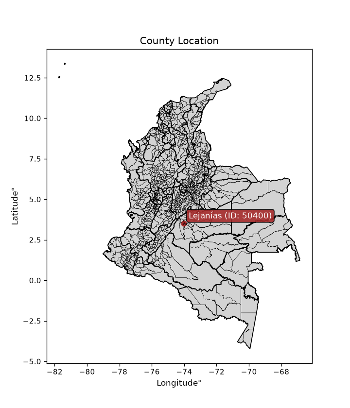
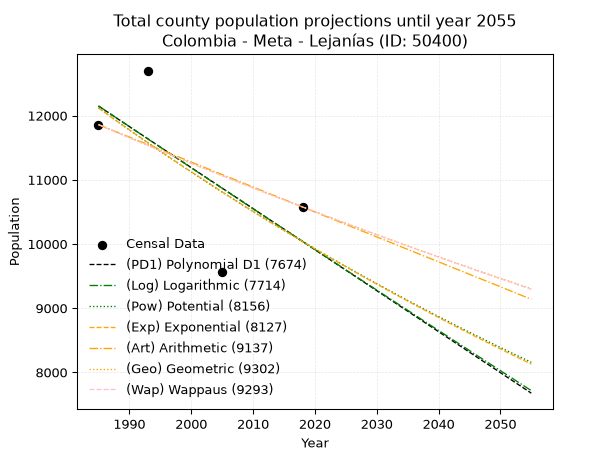
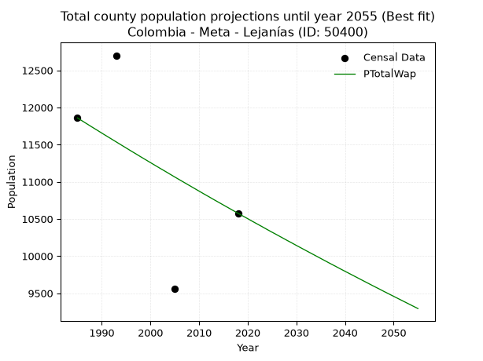
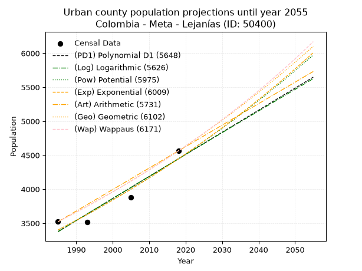
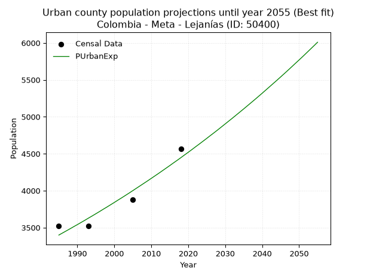
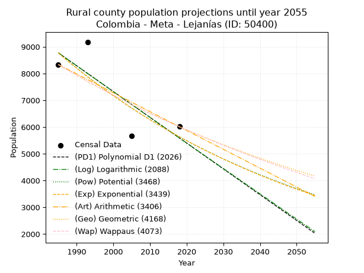
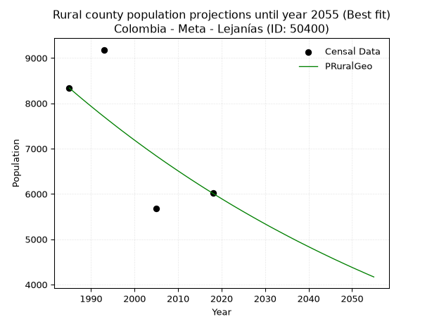

<div align="center">


</div>

# _“Population and Public Services Demand Projections (PPSD) until Year 2050 for Colombia - Meta - Lejanías (ID: 50400)”_
Keywords: `population` `public-service` `projection` `lineal` `polynomial` `logarithmic` `potential` `exponential` `arithmetic` `geometric` `wappaus` `dane` `colombia` `south-america`

PPSD are analytical estimates used by governments and planners to anticipate future changes in population size, age distribution, and the resulting community needs for utilities, healthcare, education, and infrastructure as sizing future water treatment facilities, electrical grids, and road networks based on spatial growth.

<div align="center">

</img>

</div>


> **General running parameters**: • app_version: _v20260806_. • Python version: _3.14.7_. • Pandas version: _3.0.5_. • NumPy version: _2.5.1_. • Creates, save and include plots into reports (create_plot): _False_. • Projection until year: _2050_. • Process polynomial degree 2 and up: _False_. • Process Wappaus: _True_. • Process Wappaus: _True_. • Set negative values to zero: _True_. • Set infinite values to zero: _True_. • Drop dataset notes: _True_. 
<div align="center">

Dynamic map: [:earth_americas:Google](http://maps.google.com/maps?q=3.525115248,-74.0235144) [:earth_americas:OSM](https://www.openstreetmap.org/#map=18/3.525115248/-74.0235144&layers=P) [:earth_americas:Bing](https://www.bing.com/maps?cp=3.525115248~-74.0235144&lvl=18) [:earth_americas:Apple](https://maps.apple.com/frame?center=3.525115248%2C-74.0235144&span=0.003%2C0.006)

</div>


<div align="center">

```geojson
{
  "type": "Feature",
  "geometry": {
    "type": "Point", 
    "coordinates": [-74.0235144, 3.525115248]
  }, 
  "properties": {
    "Name": "Colombia - Meta - Lejanías (ID: 50400)"
  }
}
```

</div>


## 0. Census Data (4 records)

Census data are official statistics collected by a government about the people and housing in a country. They usually include counts of total population, age, sex, race, income, education, and jobs.

📅Global census file: [Population.xlsx](../data/Population.xlsx)

| Source   |   Year |   CountryID | CountryName   |   StateID | StateName   |   CountyID | CountyName   |   PTotal |   PUrban |   PRural |
|:---------|-------:|------------:|:--------------|----------:|:------------|-----------:|:-------------|---------:|---------:|---------:|
| DANE     |   1985 |          57 | Colombia      |        50 | Meta        |      50400 | Lejanías     |    11859 |     3521 |     8338 |
| DANE     |   1993 |          57 | Colombia      |        50 | Meta        |      50400 | Lejanías     |    12700 |     3518 |     9182 |
| DANE     |   2005 |          57 | Colombia      |        50 | Meta        |      50400 | Lejanías     |     9558 |     3880 |     5678 |
| DANE     |   2018 |          57 | Colombia      |        50 | Meta        |      50400 | Lejanías     |    10576 |     4563 |     6013 |

> 🔥Some records could had specific notes about the registered values or the corresponding urban or rural distribution.

📅[SUI-RUPS](https://www.datos.gov.co/Hacienda-y-Cr-dito-P-blico/Registro-nico-de-Prestadores-de-Servicios-P-blicos/4qkq-csdn/about_data) - Local public utility companies: [RUPS.csv](../data/RUPS.xlsx)

 | SERVICIO       | ESTADO    | NOMBRE                                                                                    | NIT         | DEPARTAMENTO_DOMICILIO   | MUNICIPIO_DOMICILIO   | DIRECCION                   |      TELEFONO | EMAIL                          | TIPO_PRESTADOR                            | CLASIFICACION                 |
|:---------------|:----------|:------------------------------------------------------------------------------------------|:------------|:-------------------------|:----------------------|:----------------------------|--------------:|:-------------------------------|:------------------------------------------|:------------------------------|
| ACUEDUCTO      | INACTIVA  | ALCALDIA MUNICIPAL LEJANIAS META                                                          | 892099242-8 | META                     | LEJANIAS              | CARRERA 12 NUMERO 6 - 39    |   6.59101e+06 | josenelsoncalvo@yahoo.es       | MUNICIPIO (PRESTACIÓN DIRECTA)            | HASTA 2500 SUSCRIPTORES       |
| ALCANTARILLADO | INACTIVA  | ALCALDIA MUNICIPAL LEJANIAS META                                                          | 892099242-8 | META                     | LEJANIAS              | CARRERA 12 NUMERO 6 - 39    |   6.59101e+06 | josenelsoncalvo@yahoo.es       | MUNICIPIO (PRESTACIÓN DIRECTA)            | HASTA 2500 SUSCRIPTORES       |
| ACUEDUCTO      | OPERATIVA | ASOCIACION ACUEDUCTO COMUNAL Y COMUNITARIO BUENOS AIRES LA CABAÑA                         | 900213089-4 | META                     | GRANADA               | CENTRO POBLADO AGUAS CLARAS |   3.22291e+06 | acuebuenosaires@gmail.com      | ORGANIZACION AUTORIZADA                   | MENOR O IGUAL A 2500 USUARIOS |
| ACUEDUCTO      | OPERATIVA | EMPRESA DE SERVICIOS PUBLICOS DE LEJANIAS META E.S.P.L.                                   | 900284830-1 | META                     | LEJANIAS              | Carrera 12 No. 6-54         |   6.59101e+06 | alejandrialejanias@hotmail.com | EMPRESA INDUSTRIAL Y COMERCIAL DEL ESTADO | MENOR O IGUAL A 2500 USUARIOS |
| ALCANTARILLADO | OPERATIVA | EMPRESA DE SERVICIOS PUBLICOS DE LEJANIAS META E.S.P.L.                                   | 900284830-1 | META                     | LEJANIAS              | Carrera 12 No. 6-54         |   6.59101e+06 | alejandrialejanias@hotmail.com | EMPRESA INDUSTRIAL Y COMERCIAL DEL ESTADO | MENOR O IGUAL A 2500 USUARIOS |
| ACUEDUCTO      | OPERATIVA | JUNTA ADMINISTRADORA DEL ACUEDUCTO VEREDAL CAÑO ROJO LUSITANIA AGUALINDA ALBANIA Y YUCAPE | 901071994-8 | nan                      | nan                   | nan                         | nan           | nan                            | ORGANIZACION AUTORIZADA                   | MENOR O IGUAL A 2500 USUARIOS |

## 1. Total

### 1.1. Coefficients and Parameters

* (PD1) Polynomial Deg 1: -63.91047771979171, 139010.18305901336 (lineal)
* (Log) Logarithmic: -128026.80934508138, 984306.0537744263
* (Pow) Potential: -11.433019695515563, 41.786900127274805
* (Exp) Exponential: -0.005706495647807307, 1006592710.8636432
* (Art) Arithmetic: Year diff. 2018 - 1985 = 33, Population diff. 10576 - 11859 = -1283, Annual growth = -38.878787878787875
* (Geo) Geometric: Year diff. 2018 - 1985 = 33, Population diff. 10576 - 11859 = -1283, Annual growth % = -0.003463678181541141
* (Wap) Wappaus: i = -0.34659048699610323, Condition values only valid for < 200)

<sub>
Wappaus condition values: ['-0.00', '-0.35', '-0.69', '-1.04', '-1.39', '-1.73', '-2.08', '-2.43', '-2.77', '-3.12', '-3.47', '-3.81', '-4.16', '-4.51', '-4.85', '-5.20', '-5.55', '-5.89', '-6.24', '-6.59', '-6.93', '-7.28', '-7.62', '-7.97', '-8.32', '-8.66', '-9.01', '-9.36', '-9.70', '-10.05', '-10.40', '-10.74', '-11.09', '-11.44', '-11.78', '-12.13', '-12.48', '-12.82', '-13.17', '-13.52', '-13.86', '-14.21', '-14.56', '-14.90', '-15.25', '-15.60', '-15.94', '-16.29', '-16.64', '-16.98', '-17.33', '-17.68', '-18.02', '-18.37', '-18.72', '-19.06', '-19.41', '-19.76', '-20.10', '-20.45', '-20.80', '-21.14', '-21.49', '-21.84', '-22.18', '-22.53']
</sub>


### 1.2. Projected Dataset

|   Year |   CountyID |   PTotalPD1 |   PTotalLog |   PTotalPow |   PTotalExp |   PTotalArt |   PTotalGeo |   PTotalWap |
|-------:|-----------:|------------:|------------:|------------:|------------:|------------:|------------:|------------:|
|   1985 |      50400 |       12148 |       12151 |       12121 |       12118 |       11859 |       11859 |       11859 |
|   1986 |      50400 |       12084 |       12086 |       12051 |       12049 |       11820 |       11818 |       11818 |
|   1987 |      50400 |       12020 |       12022 |       11982 |       11980 |       11781 |       11777 |       11777 |
|   1988 |      50400 |       11956 |       11957 |       11914 |       11912 |       11742 |       11736 |       11736 |
|   1989 |      50400 |       11892 |       11893 |       11845 |       11844 |       11703 |       11696 |       11696 |
|   1990 |      50400 |       11828 |       11829 |       11777 |       11777 |       11665 |       11655 |       11655 |
|   1991 |      50400 |       11764 |       11764 |       11710 |       11710 |       11626 |       11615 |       11615 |
|   1992 |      50400 |       11701 |       11700 |       11643 |       11643 |       11587 |       11574 |       11575 |
|   1993 |      50400 |       11637 |       11636 |       11576 |       11577 |       11548 |       11534 |       11535 |
|   1994 |      50400 |       11573 |       11571 |       11510 |       11511 |       11509 |       11494 |       11495 |
|   1995 |      50400 |       11509 |       11507 |       11444 |       11446 |       11470 |       11455 |       11455 |
|   1996 |      50400 |       11445 |       11443 |       11379 |       11381 |       11431 |       11415 |       11415 |
|   1997 |      50400 |       11381 |       11379 |       11314 |       11316 |       11392 |       11375 |       11376 |
|   1998 |      50400 |       11317 |       11315 |       11249 |       11252 |       11354 |       11336 |       11336 |
|   1999 |      50400 |       11253 |       11251 |       11185 |       11187 |       11315 |       11297 |       11297 |
|   2000 |      50400 |       11189 |       11187 |       11121 |       11124 |       11276 |       11258 |       11258 |
|   2001 |      50400 |       11125 |       11123 |       11058 |       11061 |       11237 |       11219 |       11219 |
|   2002 |      50400 |       11061 |       11059 |       10995 |       10998 |       11198 |       11180 |       11180 |
|   2003 |      50400 |       10997 |       10995 |       10932 |       10935 |       11159 |       11141 |       11142 |
|   2004 |      50400 |       10934 |       10931 |       10870 |       10873 |       11120 |       11102 |       11103 |
|   2005 |      50400 |       10870 |       10867 |       10808 |       10811 |       11081 |       11064 |       11064 |
|   2006 |      50400 |       10806 |       10803 |       10747 |       10749 |       11043 |       11026 |       11026 |
|   2007 |      50400 |       10742 |       10739 |       10686 |       10688 |       11004 |       10987 |       10988 |
|   2008 |      50400 |       10678 |       10676 |       10625 |       10627 |       10965 |       10949 |       10950 |
|   2009 |      50400 |       10614 |       10612 |       10565 |       10567 |       10926 |       10911 |       10912 |
|   2010 |      50400 |       10550 |       10548 |       10505 |       10507 |       10887 |       10874 |       10874 |
|   2011 |      50400 |       10486 |       10485 |       10445 |       10447 |       10848 |       10836 |       10836 |
|   2012 |      50400 |       10422 |       10421 |       10386 |       10388 |       10809 |       10798 |       10799 |
|   2013 |      50400 |       10358 |       10357 |       10327 |       10328 |       10770 |       10761 |       10761 |
|   2014 |      50400 |       10294 |       10294 |       10269 |       10270 |       10732 |       10724 |       10724 |
|   2015 |      50400 |       10231 |       10230 |       10211 |       10211 |       10693 |       10687 |       10687 |
|   2016 |      50400 |       10167 |       10167 |       10153 |       10153 |       10654 |       10650 |       10650 |
|   2017 |      50400 |       10103 |       10103 |       10096 |       10095 |       10615 |       10613 |       10613 |
|   2018 |      50400 |       10039 |       10040 |       10039 |       10038 |       10576 |       10576 |       10576 |
|   2019 |      50400 |        9975 |        9976 |        9982 |        9981 |       10537 |       10539 |       10539 |
|   2020 |      50400 |        9911 |        9913 |        9926 |        9924 |       10498 |       10503 |       10503 |
|   2021 |      50400 |        9847 |        9849 |        9870 |        9868 |       10459 |       10466 |       10466 |
|   2022 |      50400 |        9783 |        9786 |        9814 |        9811 |       10420 |       10430 |       10430 |
|   2023 |      50400 |        9719 |        9723 |        9759 |        9756 |       10382 |       10394 |       10394 |
|   2024 |      50400 |        9655 |        9660 |        9704 |        9700 |       10343 |       10358 |       10357 |
|   2025 |      50400 |        9591 |        9596 |        9649 |        9645 |       10304 |       10322 |       10321 |
|   2026 |      50400 |        9528 |        9533 |        9595 |        9590 |       10265 |       10286 |       10286 |
|   2027 |      50400 |        9464 |        9470 |        9541 |        9535 |       10226 |       10251 |       10250 |
|   2028 |      50400 |        9400 |        9407 |        9487 |        9481 |       10187 |       10215 |       10214 |
|   2029 |      50400 |        9336 |        9344 |        9434 |        9427 |       10148 |       10180 |       10179 |
|   2030 |      50400 |        9272 |        9281 |        9381 |        9374 |       10109 |       10145 |       10143 |
|   2031 |      50400 |        9208 |        9218 |        9328 |        9320 |       10071 |       10110 |       10108 |
|   2032 |      50400 |        9144 |        9155 |        9276 |        9267 |       10032 |       10075 |       10073 |
|   2033 |      50400 |        9080 |        9092 |        9224 |        9214 |        9993 |       10040 |       10038 |
|   2034 |      50400 |        9016 |        9029 |        9172 |        9162 |        9954 |       10005 |       10003 |
|   2035 |      50400 |        8952 |        8966 |        9120 |        9110 |        9915 |        9970 |        9968 |
|   2036 |      50400 |        8888 |        8903 |        9069 |        9058 |        9876 |        9936 |        9933 |
|   2037 |      50400 |        8825 |        8840 |        9019 |        9007 |        9837 |        9901 |        9898 |
|   2038 |      50400 |        8761 |        8777 |        8968 |        8955 |        9798 |        9867 |        9864 |
|   2039 |      50400 |        8697 |        8714 |        8918 |        8904 |        9760 |        9833 |        9829 |
|   2040 |      50400 |        8633 |        8651 |        8868 |        8854 |        9721 |        9799 |        9795 |
|   2041 |      50400 |        8569 |        8589 |        8819 |        8803 |        9682 |        9765 |        9761 |
|   2042 |      50400 |        8505 |        8526 |        8769 |        8753 |        9643 |        9731 |        9727 |
|   2043 |      50400 |        8441 |        8463 |        8720 |        8703 |        9604 |        9697 |        9693 |
|   2044 |      50400 |        8377 |        8401 |        8672 |        8654 |        9565 |        9664 |        9659 |
|   2045 |      50400 |        8313 |        8338 |        8623 |        8605 |        9526 |        9630 |        9625 |
|   2046 |      50400 |        8249 |        8275 |        8575 |        8556 |        9487 |        9597 |        9591 |
|   2047 |      50400 |        8185 |        8213 |        8528 |        8507 |        9449 |        9564 |        9558 |
|   2048 |      50400 |        8122 |        8150 |        8480 |        8459 |        9410 |        9530 |        9524 |
|   2049 |      50400 |        8058 |        8088 |        8433 |        8410 |        9371 |        9497 |        9491 |
|   2050 |      50400 |        7994 |        8025 |        8386 |        8363 |        9332 |        9465 |        9458 |
<div align="center">

</img>

</div>


### 1.3. Best fit with absolute and relative error (%)

Relative error puts that difference into context by dividing the absolute error by the true value, creating a unitless ratio or percentage that shows the scale of the mistake.

Absolute and relative error

|   Year | Source   |   CountryID | CountryName   |   StateID | StateName   |   CountyID_x | CountyName   |   PTotal |   PUrban |   PRural |   CountyID_y |   PTotalPD1 |   PTotalLog |   PTotalPow |   PTotalExp |   PTotalArt |   PTotalGeo |   PTotalWap |   PTotalPD1AbsError |   PTotalLogAbsError |   PTotalPowAbsError |   PTotalExpAbsError |   PTotalArtAbsError |   PTotalGeoAbsError |   PTotalWapAbsError |   PTotalPD1RelError |   PTotalLogRelError |   PTotalPowRelError |   PTotalExpRelError |   PTotalArtRelError |   PTotalGeoRelError |   PTotalWapRelError |
|-------:|:---------|------------:|:--------------|----------:|:------------|-------------:|:-------------|---------:|---------:|---------:|-------------:|------------:|------------:|------------:|------------:|------------:|------------:|------------:|--------------------:|--------------------:|--------------------:|--------------------:|--------------------:|--------------------:|--------------------:|--------------------:|--------------------:|--------------------:|--------------------:|--------------------:|--------------------:|--------------------:|
|   1985 | DANE     |          57 | Colombia      |        50 | Meta        |        50400 | Lejanías     |    11859 |     3521 |     8338 |        50400 |       12148 |       12151 |       12121 |       12118 |       11859 |       11859 |       11859 |                 289 |                 292 |                 262 |                 259 |                   0 |                   0 |                   0 |             2.43697 |             2.46226 |             2.20929 |             2.184   |             0       |              0      |             0       |
|   1993 | DANE     |          57 | Colombia      |        50 | Meta        |        50400 | Lejanías     |    12700 |     3518 |     9182 |        50400 |       11637 |       11636 |       11576 |       11577 |       11548 |       11534 |       11535 |                1063 |                1064 |                1124 |                1123 |                1152 |                1166 |                1165 |             8.37008 |             8.37795 |             8.85039 |             8.84252 |             9.07087 |              9.1811 |             9.17323 |
|   2005 | DANE     |          57 | Colombia      |        50 | Meta        |        50400 | Lejanías     |     9558 |     3880 |     5678 |        50400 |       10870 |       10867 |       10808 |       10811 |       11081 |       11064 |       11064 |                1312 |                1309 |                1250 |                1253 |                1523 |                1506 |                1506 |            13.7267  |            13.6953  |            13.078   |            13.1094  |            15.9343  |             15.7564 |            15.7564  |
|   2018 | DANE     |          57 | Colombia      |        50 | Meta        |        50400 | Lejanías     |    10576 |     4563 |     6013 |        50400 |       10039 |       10040 |       10039 |       10038 |       10576 |       10576 |       10576 |                 537 |                 536 |                 537 |                 538 |                   0 |                   0 |                   0 |             5.07753 |             5.06808 |             5.07753 |             5.08699 |             0       |              0      |             0       |

Relative error mean

| Method    |   RelError | Best   |
|:----------|-----------:|:-------|
| PTotalPD1 |    7.40283 |        |
| PTotalLog |    7.40091 |        |
| PTotalPow |    7.30382 |        |
| PTotalExp |    7.30574 |        |
| PTotalArt |    6.25129 |        |
| PTotalGeo |    6.23438 |        |
| PTotalWap |    6.23242 | True   |

💙Best method: _**PTotalWap**_
<div align="center">

</img>

</div>


### 1.4. Fresh water supply demand in liters per capita per day (lpcd)

The fresh water supply demand typically ranges from 100 to 300 liters per capita per day (lpcd) for standard domestic and municipal planning, though absolute survival minimums set by the World Health Organization are as low as 7.5 to 20 liters per day, and total consumption in high-income nations can exceed 400 liters.

> `CZ`: Level in meters above the sea level (masl)<br> `WS`: Fresh water supply demand in liters per capita per day (lpcd or l/h/d)<br> `WSAll`: Zonal fresh water supply demand in liters per second (l/s)<br> `A`: Zonal area in square meters<br> `DP`: Population density (people/hectare or p/ha)

Reference values (RAS Colombia)

|    CZ |   WS |
|------:|-----:|
|  1000 |  120 |
|  2000 |  130 |
| 99999 |  140 |

County shapefile geometry properties and water supply values

|   CountyID |      ATotal |   CZTotal |   WSTotal |
|-----------:|------------:|----------:|----------:|
|      50400 | 8.14421e+08 |   1920.96 |       130 |

Projected values for best method: PTotalWap

|   CountyID |   Year |   PTotalWap |   DPTotal |   WSTotal |   WSTotalAll |
|-----------:|-------:|------------:|----------:|----------:|-------------:|
|      50400 |   1985 |       11859 |      0.15 |       130 |      17.8434 |
|      50400 |   1986 |       11818 |      0.15 |       130 |      17.7817 |
|      50400 |   1987 |       11777 |      0.14 |       130 |      17.72   |
|      50400 |   1988 |       11736 |      0.14 |       130 |      17.6583 |
|      50400 |   1989 |       11696 |      0.14 |       130 |      17.5981 |
|      50400 |   1990 |       11655 |      0.14 |       130 |      17.5365 |
|      50400 |   1991 |       11615 |      0.14 |       130 |      17.4763 |
|      50400 |   1992 |       11575 |      0.14 |       130 |      17.4161 |
|      50400 |   1993 |       11535 |      0.14 |       130 |      17.3559 |
|      50400 |   1994 |       11495 |      0.14 |       130 |      17.2957 |
|      50400 |   1995 |       11455 |      0.14 |       130 |      17.2355 |
|      50400 |   1996 |       11415 |      0.14 |       130 |      17.1753 |
|      50400 |   1997 |       11376 |      0.14 |       130 |      17.1167 |
|      50400 |   1998 |       11336 |      0.14 |       130 |      17.0565 |
|      50400 |   1999 |       11297 |      0.14 |       130 |      16.9978 |
|      50400 |   2000 |       11258 |      0.14 |       130 |      16.9391 |
|      50400 |   2001 |       11219 |      0.14 |       130 |      16.8804 |
|      50400 |   2002 |       11180 |      0.14 |       130 |      16.8218 |
|      50400 |   2003 |       11142 |      0.14 |       130 |      16.7646 |
|      50400 |   2004 |       11103 |      0.14 |       130 |      16.7059 |
|      50400 |   2005 |       11064 |      0.14 |       130 |      16.6472 |
|      50400 |   2006 |       11026 |      0.14 |       130 |      16.59   |
|      50400 |   2007 |       10988 |      0.13 |       130 |      16.5329 |
|      50400 |   2008 |       10950 |      0.13 |       130 |      16.4757 |
|      50400 |   2009 |       10912 |      0.13 |       130 |      16.4185 |
|      50400 |   2010 |       10874 |      0.13 |       130 |      16.3613 |
|      50400 |   2011 |       10836 |      0.13 |       130 |      16.3042 |
|      50400 |   2012 |       10799 |      0.13 |       130 |      16.2485 |
|      50400 |   2013 |       10761 |      0.13 |       130 |      16.1913 |
|      50400 |   2014 |       10724 |      0.13 |       130 |      16.1356 |
|      50400 |   2015 |       10687 |      0.13 |       130 |      16.08   |
|      50400 |   2016 |       10650 |      0.13 |       130 |      16.0243 |
|      50400 |   2017 |       10613 |      0.13 |       130 |      15.9686 |
|      50400 |   2018 |       10576 |      0.13 |       130 |      15.913  |
|      50400 |   2019 |       10539 |      0.13 |       130 |      15.8573 |
|      50400 |   2020 |       10503 |      0.13 |       130 |      15.8031 |
|      50400 |   2021 |       10466 |      0.13 |       130 |      15.7475 |
|      50400 |   2022 |       10430 |      0.13 |       130 |      15.6933 |
|      50400 |   2023 |       10394 |      0.13 |       130 |      15.6391 |
|      50400 |   2024 |       10357 |      0.13 |       130 |      15.5834 |
|      50400 |   2025 |       10321 |      0.13 |       130 |      15.5293 |
|      50400 |   2026 |       10286 |      0.13 |       130 |      15.4766 |
|      50400 |   2027 |       10250 |      0.13 |       130 |      15.4225 |
|      50400 |   2028 |       10214 |      0.13 |       130 |      15.3683 |
|      50400 |   2029 |       10179 |      0.12 |       130 |      15.3156 |
|      50400 |   2030 |       10143 |      0.12 |       130 |      15.2615 |
|      50400 |   2031 |       10108 |      0.12 |       130 |      15.2088 |
|      50400 |   2032 |       10073 |      0.12 |       130 |      15.1561 |
|      50400 |   2033 |       10038 |      0.12 |       130 |      15.1035 |
|      50400 |   2034 |       10003 |      0.12 |       130 |      15.0508 |
|      50400 |   2035 |        9968 |      0.12 |       130 |      14.9981 |
|      50400 |   2036 |        9933 |      0.12 |       130 |      14.9455 |
|      50400 |   2037 |        9898 |      0.12 |       130 |      14.8928 |
|      50400 |   2038 |        9864 |      0.12 |       130 |      14.8417 |
|      50400 |   2039 |        9829 |      0.12 |       130 |      14.789  |
|      50400 |   2040 |        9795 |      0.12 |       130 |      14.7378 |
|      50400 |   2041 |        9761 |      0.12 |       130 |      14.6867 |
|      50400 |   2042 |        9727 |      0.12 |       130 |      14.6355 |
|      50400 |   2043 |        9693 |      0.12 |       130 |      14.5844 |
|      50400 |   2044 |        9659 |      0.12 |       130 |      14.5332 |
|      50400 |   2045 |        9625 |      0.12 |       130 |      14.4821 |
|      50400 |   2046 |        9591 |      0.12 |       130 |      14.4309 |
|      50400 |   2047 |        9558 |      0.12 |       130 |      14.3812 |
|      50400 |   2048 |        9524 |      0.12 |       130 |      14.3301 |
|      50400 |   2049 |        9491 |      0.12 |       130 |      14.2804 |
|      50400 |   2050 |        9458 |      0.12 |       130 |      14.2308 |

## 2. Urban

### 2.1. Coefficients and Parameters

* (PD1) Polynomial Deg 1: 32.47290244881527, -61083.42312324275 (lineal)
* (Log) Logarithmic: 64949.39560079175, -489810.37643341004
* (Pow) Potential: 16.28060948107954, -50.158265558658094
* (Exp) Exponential: 0.008139355746081293, 0.0003270564517650097
* (Art) Arithmetic: Year diff. 2018 - 1985 = 33, Population diff. 4563 - 3521 = 1042, Annual growth = 31.575757575757574
* (Geo) Geometric: Year diff. 2018 - 1985 = 33, Population diff. 4563 - 3521 = 1042, Annual growth % = 0.007886550283499494
* (Wap) Wappaus: i = 0.7811914293853928, Condition values only valid for < 200)

<sub>
Wappaus condition values: ['0.00', '0.78', '1.56', '2.34', '3.12', '3.91', '4.69', '5.47', '6.25', '7.03', '7.81', '8.59', '9.37', '10.16', '10.94', '11.72', '12.50', '13.28', '14.06', '14.84', '15.62', '16.41', '17.19', '17.97', '18.75', '19.53', '20.31', '21.09', '21.87', '22.65', '23.44', '24.22', '25.00', '25.78', '26.56', '27.34', '28.12', '28.90', '29.69', '30.47', '31.25', '32.03', '32.81', '33.59', '34.37', '35.15', '35.93', '36.72', '37.50', '38.28', '39.06', '39.84', '40.62', '41.40', '42.18', '42.97', '43.75', '44.53', '45.31', '46.09', '46.87', '47.65', '48.43', '49.22', '50.00', '50.78']
</sub>


### 2.2. Projected Dataset

|   Year |   CountyID |   PUrbanPD1 |   PUrbanLog |   PUrbanPow |   PUrbanExp |   PUrbanArt |   PUrbanGeo |   PUrbanWap |
|-------:|-----------:|------------:|------------:|------------:|------------:|------------:|------------:|------------:|
|   1985 |      50400 |        3375 |        3375 |        3398 |        3399 |        3521 |        3521 |        3521 |
|   1986 |      50400 |        3408 |        3407 |        3426 |        3427 |        3553 |        3549 |        3549 |
|   1987 |      50400 |        3440 |        3440 |        3455 |        3455 |        3584 |        3577 |        3576 |
|   1988 |      50400 |        3473 |        3473 |        3483 |        3483 |        3616 |        3605 |        3604 |
|   1989 |      50400 |        3505 |        3505 |        3512 |        3512 |        3647 |        3633 |        3633 |
|   1990 |      50400 |        3538 |        3538 |        3541 |        3540 |        3679 |        3662 |        3661 |
|   1991 |      50400 |        3570 |        3571 |        3570 |        3569 |        3710 |        3691 |        3690 |
|   1992 |      50400 |        3603 |        3603 |        3599 |        3598 |        3742 |        3720 |        3719 |
|   1993 |      50400 |        3635 |        3636 |        3628 |        3628 |        3774 |        3749 |        3748 |
|   1994 |      50400 |        3668 |        3669 |        3658 |        3657 |        3805 |        3779 |        3778 |
|   1995 |      50400 |        3700 |        3701 |        3688 |        3687 |        3837 |        3809 |        3807 |
|   1996 |      50400 |        3732 |        3734 |        3718 |        3717 |        3868 |        3839 |        3837 |
|   1997 |      50400 |        3765 |        3766 |        3749 |        3748 |        3900 |        3869 |        3867 |
|   1998 |      50400 |        3797 |        3799 |        3780 |        3778 |        3931 |        3900 |        3898 |
|   1999 |      50400 |        3830 |        3831 |        3810 |        3809 |        3963 |        3930 |        3928 |
|   2000 |      50400 |        3862 |        3864 |        3842 |        3840 |        3995 |        3961 |        3959 |
|   2001 |      50400 |        3895 |        3896 |        3873 |        3872 |        4026 |        3993 |        3990 |
|   2002 |      50400 |        3927 |        3929 |        3905 |        3903 |        4058 |        4024 |        4022 |
|   2003 |      50400 |        3960 |        3961 |        3937 |        3935 |        4089 |        4056 |        4054 |
|   2004 |      50400 |        3992 |        3993 |        3969 |        3967 |        4121 |        4088 |        4086 |
|   2005 |      50400 |        4025 |        4026 |        4001 |        4000 |        4153 |        4120 |        4118 |
|   2006 |      50400 |        4057 |        4058 |        4034 |        4033 |        4184 |        4153 |        4150 |
|   2007 |      50400 |        4090 |        4091 |        4066 |        4066 |        4216 |        4185 |        4183 |
|   2008 |      50400 |        4122 |        4123 |        4100 |        4099 |        4247 |        4218 |        4216 |
|   2009 |      50400 |        4155 |        4155 |        4133 |        4132 |        4279 |        4252 |        4249 |
|   2010 |      50400 |        4187 |        4188 |        4167 |        4166 |        4310 |        4285 |        4283 |
|   2011 |      50400 |        4220 |        4220 |        4200 |        4200 |        4342 |        4319 |        4317 |
|   2012 |      50400 |        4252 |        4252 |        4235 |        4234 |        4374 |        4353 |        4351 |
|   2013 |      50400 |        4285 |        4284 |        4269 |        4269 |        4405 |        4387 |        4386 |
|   2014 |      50400 |        4317 |        4317 |        4304 |        4304 |        4437 |        4422 |        4421 |
|   2015 |      50400 |        4349 |        4349 |        4339 |        4339 |        4468 |        4457 |        4456 |
|   2016 |      50400 |        4382 |        4381 |        4374 |        4375 |        4500 |        4492 |        4491 |
|   2017 |      50400 |        4414 |        4413 |        4409 |        4410 |        4531 |        4527 |        4527 |
|   2018 |      50400 |        4447 |        4446 |        4445 |        4446 |        4563 |        4563 |        4563 |
|   2019 |      50400 |        4479 |        4478 |        4481 |        4483 |        4595 |        4599 |        4599 |
|   2020 |      50400 |        4512 |        4510 |        4517 |        4519 |        4626 |        4635 |        4636 |
|   2021 |      50400 |        4544 |        4542 |        4554 |        4556 |        4658 |        4672 |        4673 |
|   2022 |      50400 |        4577 |        4574 |        4591 |        4594 |        4689 |        4709 |        4711 |
|   2023 |      50400 |        4609 |        4606 |        4628 |        4631 |        4721 |        4746 |        4748 |
|   2024 |      50400 |        4642 |        4638 |        4665 |        4669 |        4752 |        4783 |        4787 |
|   2025 |      50400 |        4674 |        4670 |        4703 |        4707 |        4784 |        4821 |        4825 |
|   2026 |      50400 |        4707 |        4703 |        4741 |        4746 |        4816 |        4859 |        4864 |
|   2027 |      50400 |        4739 |        4735 |        4779 |        4784 |        4847 |        4897 |        4903 |
|   2028 |      50400 |        4772 |        4767 |        4817 |        4823 |        4879 |        4936 |        4942 |
|   2029 |      50400 |        4804 |        4799 |        4856 |        4863 |        4910 |        4975 |        4982 |
|   2030 |      50400 |        4837 |        4831 |        4895 |        4903 |        4942 |        5014 |        5023 |
|   2031 |      50400 |        4869 |        4863 |        4935 |        4943 |        4973 |        5054 |        5063 |
|   2032 |      50400 |        4902 |        4895 |        4974 |        4983 |        5005 |        5093 |        5104 |
|   2033 |      50400 |        4934 |        4927 |        5014 |        5024 |        5037 |        5134 |        5146 |
|   2034 |      50400 |        4966 |        4959 |        5055 |        5065 |        5068 |        5174 |        5188 |
|   2035 |      50400 |        4999 |        4990 |        5095 |        5106 |        5100 |        5215 |        5230 |
|   2036 |      50400 |        5031 |        5022 |        5136 |        5148 |        5131 |        5256 |        5273 |
|   2037 |      50400 |        5064 |        5054 |        5178 |        5190 |        5163 |        5298 |        5316 |
|   2038 |      50400 |        5096 |        5086 |        5219 |        5232 |        5195 |        5339 |        5359 |
|   2039 |      50400 |        5129 |        5118 |        5261 |        5275 |        5226 |        5381 |        5403 |
|   2040 |      50400 |        5161 |        5150 |        5303 |        5318 |        5258 |        5424 |        5448 |
|   2041 |      50400 |        5194 |        5182 |        5346 |        5362 |        5289 |        5467 |        5493 |
|   2042 |      50400 |        5226 |        5213 |        5388 |        5406 |        5321 |        5510 |        5538 |
|   2043 |      50400 |        5259 |        5245 |        5432 |        5450 |        5352 |        5553 |        5584 |
|   2044 |      50400 |        5291 |        5277 |        5475 |        5494 |        5384 |        5597 |        5630 |
|   2045 |      50400 |        5324 |        5309 |        5519 |        5539 |        5416 |        5641 |        5677 |
|   2046 |      50400 |        5356 |        5341 |        5563 |        5584 |        5447 |        5686 |        5724 |
|   2047 |      50400 |        5389 |        5372 |        5607 |        5630 |        5479 |        5730 |        5771 |
|   2048 |      50400 |        5421 |        5404 |        5652 |        5676 |        5510 |        5776 |        5819 |
|   2049 |      50400 |        5454 |        5436 |        5697 |        5723 |        5542 |        5821 |        5868 |
|   2050 |      50400 |        5486 |        5467 |        5743 |        5769 |        5573 |        5867 |        5917 |
<div align="center">

</img>

</div>


### 2.3. Best fit with absolute and relative error (%)

Relative error puts that difference into context by dividing the absolute error by the true value, creating a unitless ratio or percentage that shows the scale of the mistake.

Absolute and relative error

|   Year | Source   |   CountryID | CountryName   |   StateID | StateName   |   CountyID_x | CountyName   |   PTotal |   PUrban |   PRural |   CountyID_y |   PUrbanPD1 |   PUrbanLog |   PUrbanPow |   PUrbanExp |   PUrbanArt |   PUrbanGeo |   PUrbanWap |   PUrbanPD1AbsError |   PUrbanLogAbsError |   PUrbanPowAbsError |   PUrbanExpAbsError |   PUrbanArtAbsError |   PUrbanGeoAbsError |   PUrbanWapAbsError |   PUrbanPD1RelError |   PUrbanLogRelError |   PUrbanPowRelError |   PUrbanExpRelError |   PUrbanArtRelError |   PUrbanGeoRelError |   PUrbanWapRelError |
|-------:|:---------|------------:|:--------------|----------:|:------------|-------------:|:-------------|---------:|---------:|---------:|-------------:|------------:|------------:|------------:|------------:|------------:|------------:|------------:|--------------------:|--------------------:|--------------------:|--------------------:|--------------------:|--------------------:|--------------------:|--------------------:|--------------------:|--------------------:|--------------------:|--------------------:|--------------------:|--------------------:|
|   1985 | DANE     |          57 | Colombia      |        50 | Meta        |        50400 | Lejanías     |    11859 |     3521 |     8338 |        50400 |        3375 |        3375 |        3398 |        3399 |        3521 |        3521 |        3521 |                 146 |                 146 |                 123 |                 122 |                   0 |                   0 |                   0 |             4.14655 |             4.14655 |             3.49333 |             3.46492 |             0       |             0       |             0       |
|   1993 | DANE     |          57 | Colombia      |        50 | Meta        |        50400 | Lejanías     |    12700 |     3518 |     9182 |        50400 |        3635 |        3636 |        3628 |        3628 |        3774 |        3749 |        3748 |                 117 |                 118 |                 110 |                 110 |                 256 |                 231 |                 230 |             3.32575 |             3.35418 |             3.12678 |             3.12678 |             7.27686 |             6.56623 |             6.53781 |
|   2005 | DANE     |          57 | Colombia      |        50 | Meta        |        50400 | Lejanías     |     9558 |     3880 |     5678 |        50400 |        4025 |        4026 |        4001 |        4000 |        4153 |        4120 |        4118 |                 145 |                 146 |                 121 |                 120 |                 273 |                 240 |                 238 |             3.73711 |             3.76289 |             3.11856 |             3.09278 |             7.03608 |             6.18557 |             6.13402 |
|   2018 | DANE     |          57 | Colombia      |        50 | Meta        |        50400 | Lejanías     |    10576 |     4563 |     6013 |        50400 |        4447 |        4446 |        4445 |        4446 |        4563 |        4563 |        4563 |                 116 |                 117 |                 118 |                 117 |                   0 |                   0 |                   0 |             2.54219 |             2.5641  |             2.58602 |             2.5641  |             0       |             0       |             0       |

Relative error mean

| Method    |   RelError | Best   |
|:----------|-----------:|:-------|
| PUrbanPD1 |    3.4379  |        |
| PUrbanLog |    3.45693 |        |
| PUrbanPow |    3.08117 |        |
| PUrbanExp |    3.06215 | True   |
| PUrbanArt |    3.57824 |        |
| PUrbanGeo |    3.18795 |        |
| PUrbanWap |    3.16796 |        |

💙Best method: _**PUrbanExp**_
<div align="center">

</img>

</div>


### 2.4. Fresh water supply demand in liters per capita per day (lpcd)

The fresh water supply demand typically ranges from 100 to 300 liters per capita per day (lpcd) for standard domestic and municipal planning, though absolute survival minimums set by the World Health Organization are as low as 7.5 to 20 liters per day, and total consumption in high-income nations can exceed 400 liters.

> `CZ`: Level in meters above the sea level (masl)<br> `WS`: Fresh water supply demand in liters per capita per day (lpcd or l/h/d)<br> `WSAll`: Zonal fresh water supply demand in liters per second (l/s)<br> `A`: Zonal area in square meters<br> `DP`: Population density (people/hectare or p/ha)

Reference values (RAS Colombia)

|    CZ |   WS |
|------:|-----:|
|  1000 |  120 |
|  2000 |  130 |
| 99999 |  140 |

County shapefile geometry properties and water supply values

|   CountyID |      AUrban |   CZUrban |   WSUrban |
|-----------:|------------:|----------:|----------:|
|      50400 | 2.43585e+06 |   681.329 |       120 |

Projected values for best method: PUrbanExp

|   CountyID |   Year |   PUrbanExp |   DPUrban |   WSUrban |   WSUrbanAll |
|-----------:|-------:|------------:|----------:|----------:|-------------:|
|      50400 |   1985 |        3399 |     13.95 |       120 |      4.72083 |
|      50400 |   1986 |        3427 |     14.07 |       120 |      4.75972 |
|      50400 |   1987 |        3455 |     14.18 |       120 |      4.79861 |
|      50400 |   1988 |        3483 |     14.3  |       120 |      4.8375  |
|      50400 |   1989 |        3512 |     14.42 |       120 |      4.87778 |
|      50400 |   1990 |        3540 |     14.53 |       120 |      4.91667 |
|      50400 |   1991 |        3569 |     14.65 |       120 |      4.95694 |
|      50400 |   1992 |        3598 |     14.77 |       120 |      4.99722 |
|      50400 |   1993 |        3628 |     14.89 |       120 |      5.03889 |
|      50400 |   1994 |        3657 |     15.01 |       120 |      5.07917 |
|      50400 |   1995 |        3687 |     15.14 |       120 |      5.12083 |
|      50400 |   1996 |        3717 |     15.26 |       120 |      5.1625  |
|      50400 |   1997 |        3748 |     15.39 |       120 |      5.20556 |
|      50400 |   1998 |        3778 |     15.51 |       120 |      5.24722 |
|      50400 |   1999 |        3809 |     15.64 |       120 |      5.29028 |
|      50400 |   2000 |        3840 |     15.76 |       120 |      5.33333 |
|      50400 |   2001 |        3872 |     15.9  |       120 |      5.37778 |
|      50400 |   2002 |        3903 |     16.02 |       120 |      5.42083 |
|      50400 |   2003 |        3935 |     16.15 |       120 |      5.46528 |
|      50400 |   2004 |        3967 |     16.29 |       120 |      5.50972 |
|      50400 |   2005 |        4000 |     16.42 |       120 |      5.55556 |
|      50400 |   2006 |        4033 |     16.56 |       120 |      5.60139 |
|      50400 |   2007 |        4066 |     16.69 |       120 |      5.64722 |
|      50400 |   2008 |        4099 |     16.83 |       120 |      5.69306 |
|      50400 |   2009 |        4132 |     16.96 |       120 |      5.73889 |
|      50400 |   2010 |        4166 |     17.1  |       120 |      5.78611 |
|      50400 |   2011 |        4200 |     17.24 |       120 |      5.83333 |
|      50400 |   2012 |        4234 |     17.38 |       120 |      5.88056 |
|      50400 |   2013 |        4269 |     17.53 |       120 |      5.92917 |
|      50400 |   2014 |        4304 |     17.67 |       120 |      5.97778 |
|      50400 |   2015 |        4339 |     17.81 |       120 |      6.02639 |
|      50400 |   2016 |        4375 |     17.96 |       120 |      6.07639 |
|      50400 |   2017 |        4410 |     18.1  |       120 |      6.125   |
|      50400 |   2018 |        4446 |     18.25 |       120 |      6.175   |
|      50400 |   2019 |        4483 |     18.4  |       120 |      6.22639 |
|      50400 |   2020 |        4519 |     18.55 |       120 |      6.27639 |
|      50400 |   2021 |        4556 |     18.7  |       120 |      6.32778 |
|      50400 |   2022 |        4594 |     18.86 |       120 |      6.38056 |
|      50400 |   2023 |        4631 |     19.01 |       120 |      6.43194 |
|      50400 |   2024 |        4669 |     19.17 |       120 |      6.48472 |
|      50400 |   2025 |        4707 |     19.32 |       120 |      6.5375  |
|      50400 |   2026 |        4746 |     19.48 |       120 |      6.59167 |
|      50400 |   2027 |        4784 |     19.64 |       120 |      6.64444 |
|      50400 |   2028 |        4823 |     19.8  |       120 |      6.69861 |
|      50400 |   2029 |        4863 |     19.96 |       120 |      6.75417 |
|      50400 |   2030 |        4903 |     20.13 |       120 |      6.80972 |
|      50400 |   2031 |        4943 |     20.29 |       120 |      6.86528 |
|      50400 |   2032 |        4983 |     20.46 |       120 |      6.92083 |
|      50400 |   2033 |        5024 |     20.63 |       120 |      6.97778 |
|      50400 |   2034 |        5065 |     20.79 |       120 |      7.03472 |
|      50400 |   2035 |        5106 |     20.96 |       120 |      7.09167 |
|      50400 |   2036 |        5148 |     21.13 |       120 |      7.15    |
|      50400 |   2037 |        5190 |     21.31 |       120 |      7.20833 |
|      50400 |   2038 |        5232 |     21.48 |       120 |      7.26667 |
|      50400 |   2039 |        5275 |     21.66 |       120 |      7.32639 |
|      50400 |   2040 |        5318 |     21.83 |       120 |      7.38611 |
|      50400 |   2041 |        5362 |     22.01 |       120 |      7.44722 |
|      50400 |   2042 |        5406 |     22.19 |       120 |      7.50833 |
|      50400 |   2043 |        5450 |     22.37 |       120 |      7.56944 |
|      50400 |   2044 |        5494 |     22.55 |       120 |      7.63056 |
|      50400 |   2045 |        5539 |     22.74 |       120 |      7.69306 |
|      50400 |   2046 |        5584 |     22.92 |       120 |      7.75556 |
|      50400 |   2047 |        5630 |     23.11 |       120 |      7.81944 |
|      50400 |   2048 |        5676 |     23.3  |       120 |      7.88333 |
|      50400 |   2049 |        5723 |     23.49 |       120 |      7.94861 |
|      50400 |   2050 |        5769 |     23.68 |       120 |      8.0125  |

## 3. Rural

### 3.1. Coefficients and Parameters

* (PD1) Polynomial Deg 1: -96.38338016860695, 200093.60618225607 (lineal)
* (Log) Logarithmic: -192976.20494587318, 1474116.430207837
* (Pow) Potential: -26.773195424726023, 92.23466994305153
* (Exp) Exponential: -0.013370678898802144, 2947116310051043.0
* (Art) Arithmetic: Year diff. 2018 - 1985 = 33, Population diff. 6013 - 8338 = -2325, Annual growth = -70.45454545454545
* (Geo) Geometric: Year diff. 2018 - 1985 = 33, Population diff. 6013 - 8338 = -2325, Annual growth % = -0.009857144821190378
* (Wap) Wappaus: i = -0.9818764609371535, Condition values only valid for < 200)

<sub>
Wappaus condition values: ['-0.00', '-0.98', '-1.96', '-2.95', '-3.93', '-4.91', '-5.89', '-6.87', '-7.86', '-8.84', '-9.82', '-10.80', '-11.78', '-12.76', '-13.75', '-14.73', '-15.71', '-16.69', '-17.67', '-18.66', '-19.64', '-20.62', '-21.60', '-22.58', '-23.57', '-24.55', '-25.53', '-26.51', '-27.49', '-28.47', '-29.46', '-30.44', '-31.42', '-32.40', '-33.38', '-34.37', '-35.35', '-36.33', '-37.31', '-38.29', '-39.28', '-40.26', '-41.24', '-42.22', '-43.20', '-44.18', '-45.17', '-46.15', '-47.13', '-48.11', '-49.09', '-50.08', '-51.06', '-52.04', '-53.02', '-54.00', '-54.99', '-55.97', '-56.95', '-57.93', '-58.91', '-59.89', '-60.88', '-61.86', '-62.84', '-63.82']
</sub>


### 3.2. Projected Dataset

|   Year |   CountyID |   PRuralPD1 |   PRuralLog |   PRuralPow |   PRuralExp |   PRuralArt |   PRuralGeo |   PRuralWap |
|-------:|-----------:|------------:|------------:|------------:|------------:|------------:|------------:|------------:|
|   1985 |      50400 |        8773 |        8776 |        8772 |        8767 |        8338 |        8338 |        8338 |
|   1986 |      50400 |        8676 |        8679 |        8654 |        8651 |        8268 |        8256 |        8257 |
|   1987 |      50400 |        8580 |        8582 |        8538 |        8536 |        8197 |        8174 |        8176 |
|   1988 |      50400 |        8483 |        8484 |        8424 |        8423 |        8127 |        8094 |        8096 |
|   1989 |      50400 |        8387 |        8387 |        8311 |        8311 |        8056 |        8014 |        8017 |
|   1990 |      50400 |        8291 |        8290 |        8200 |        8201 |        7986 |        7935 |        7938 |
|   1991 |      50400 |        8194 |        8193 |        8091 |        8092 |        7915 |        7857 |        7861 |
|   1992 |      50400 |        8098 |        8097 |        7983 |        7984 |        7845 |        7779 |        7784 |
|   1993 |      50400 |        8002 |        8000 |        7876 |        7878 |        7774 |        7703 |        7708 |
|   1994 |      50400 |        7905 |        7903 |        7771 |        7773 |        7704 |        7627 |        7632 |
|   1995 |      50400 |        7809 |        7806 |        7668 |        7670 |        7633 |        7552 |        7558 |
|   1996 |      50400 |        7712 |        7709 |        7565 |        7568 |        7563 |        7477 |        7484 |
|   1997 |      50400 |        7616 |        7613 |        7465 |        7468 |        7493 |        7403 |        7410 |
|   1998 |      50400 |        7520 |        7516 |        7365 |        7369 |        7422 |        7331 |        7338 |
|   1999 |      50400 |        7423 |        7420 |        7267 |        7271 |        7352 |        7258 |        7266 |
|   2000 |      50400 |        7327 |        7323 |        7170 |        7174 |        7281 |        7187 |        7194 |
|   2001 |      50400 |        7230 |        7227 |        7075 |        7079 |        7211 |        7116 |        7123 |
|   2002 |      50400 |        7134 |        7130 |        6981 |        6985 |        7140 |        7046 |        7053 |
|   2003 |      50400 |        7038 |        7034 |        6888 |        6892 |        7070 |        6976 |        6984 |
|   2004 |      50400 |        6941 |        6938 |        6797 |        6801 |        6999 |        6908 |        6915 |
|   2005 |      50400 |        6845 |        6841 |        6707 |        6710 |        6929 |        6839 |        6847 |
|   2006 |      50400 |        6749 |        6745 |        6618 |        6621 |        6858 |        6772 |        6779 |
|   2007 |      50400 |        6652 |        6649 |        6530 |        6533 |        6788 |        6705 |        6712 |
|   2008 |      50400 |        6556 |        6553 |        6444 |        6446 |        6718 |        6639 |        6646 |
|   2009 |      50400 |        6459 |        6457 |        6358 |        6361 |        6647 |        6574 |        6580 |
|   2010 |      50400 |        6363 |        6361 |        6274 |        6276 |        6577 |        6509 |        6515 |
|   2011 |      50400 |        6267 |        6265 |        6191 |        6193 |        6506 |        6445 |        6450 |
|   2012 |      50400 |        6170 |        6169 |        6109 |        6111 |        6436 |        6381 |        6386 |
|   2013 |      50400 |        6074 |        6073 |        6029 |        6030 |        6365 |        6318 |        6323 |
|   2014 |      50400 |        5977 |        5977 |        5949 |        5949 |        6295 |        6256 |        6260 |
|   2015 |      50400 |        5881 |        5881 |        5870 |        5870 |        6224 |        6194 |        6197 |
|   2016 |      50400 |        5785 |        5785 |        5793 |        5792 |        6154 |        6133 |        6135 |
|   2017 |      50400 |        5688 |        5690 |        5717 |        5716 |        6083 |        6073 |        6074 |
|   2018 |      50400 |        5592 |        5594 |        5641 |        5640 |        6013 |        6013 |        6013 |
|   2019 |      50400 |        5496 |        5498 |        5567 |        5565 |        5943 |        5954 |        5953 |
|   2020 |      50400 |        5399 |        5403 |        5494 |        5491 |        5872 |        5895 |        5893 |
|   2021 |      50400 |        5303 |        5307 |        5421 |        5418 |        5802 |        5837 |        5833 |
|   2022 |      50400 |        5206 |        5212 |        5350 |        5346 |        5731 |        5779 |        5775 |
|   2023 |      50400 |        5110 |        5117 |        5280 |        5275 |        5661 |        5722 |        5716 |
|   2024 |      50400 |        5014 |        5021 |        5210 |        5205 |        5590 |        5666 |        5658 |
|   2025 |      50400 |        4917 |        4926 |        5142 |        5136 |        5520 |        5610 |        5601 |
|   2026 |      50400 |        4821 |        4831 |        5074 |        5068 |        5449 |        5555 |        5544 |
|   2027 |      50400 |        4724 |        4735 |        5008 |        5000 |        5379 |        5500 |        5487 |
|   2028 |      50400 |        4628 |        4640 |        4942 |        4934 |        5308 |        5446 |        5431 |
|   2029 |      50400 |        4532 |        4545 |        4877 |        4868 |        5238 |        5392 |        5376 |
|   2030 |      50400 |        4435 |        4450 |        4813 |        4804 |        5168 |        5339 |        5321 |
|   2031 |      50400 |        4339 |        4355 |        4750 |        4740 |        5097 |        5286 |        5266 |
|   2032 |      50400 |        4243 |        4260 |        4688 |        4677 |        5027 |        5234 |        5212 |
|   2033 |      50400 |        4146 |        4165 |        4627 |        4615 |        4956 |        5183 |        5158 |
|   2034 |      50400 |        4050 |        4070 |        4566 |        4553 |        4886 |        5132 |        5104 |
|   2035 |      50400 |        3953 |        3975 |        4506 |        4493 |        4815 |        5081 |        5051 |
|   2036 |      50400 |        3857 |        3880 |        4448 |        4433 |        4745 |        5031 |        4999 |
|   2037 |      50400 |        3761 |        3786 |        4389 |        4374 |        4674 |        4981 |        4947 |
|   2038 |      50400 |        3664 |        3691 |        4332 |        4316 |        4604 |        4932 |        4895 |
|   2039 |      50400 |        3568 |        3596 |        4276 |        4259 |        4533 |        4884 |        4843 |
|   2040 |      50400 |        3472 |        3502 |        4220 |        4202 |        4463 |        4836 |        4793 |
|   2041 |      50400 |        3375 |        3407 |        4165 |        4147 |        4393 |        4788 |        4742 |
|   2042 |      50400 |        3279 |        3313 |        4111 |        4092 |        4322 |        4741 |        4692 |
|   2043 |      50400 |        3182 |        3218 |        4057 |        4037 |        4252 |        4694 |        4642 |
|   2044 |      50400 |        3086 |        3124 |        4004 |        3984 |        4181 |        4648 |        4593 |
|   2045 |      50400 |        2990 |        3029 |        3952 |        3931 |        4111 |        4602 |        4544 |
|   2046 |      50400 |        2893 |        2935 |        3901 |        3878 |        4040 |        4556 |        4495 |
|   2047 |      50400 |        2797 |        2841 |        3850 |        3827 |        3970 |        4512 |        4447 |
|   2048 |      50400 |        2700 |        2746 |        3800 |        3776 |        3899 |        4467 |        4399 |
|   2049 |      50400 |        2604 |        2652 |        3751 |        3726 |        3829 |        4423 |        4351 |
|   2050 |      50400 |        2508 |        2558 |        3702 |        3676 |        3758 |        4379 |        4304 |
<div align="center">

</img>

</div>


### 3.3. Best fit with absolute and relative error (%)

Relative error puts that difference into context by dividing the absolute error by the true value, creating a unitless ratio or percentage that shows the scale of the mistake.

Absolute and relative error

|   Year | Source   |   CountryID | CountryName   |   StateID | StateName   |   CountyID_x | CountyName   |   PTotal |   PUrban |   PRural |   CountyID_y |   PRuralPD1 |   PRuralLog |   PRuralPow |   PRuralExp |   PRuralArt |   PRuralGeo |   PRuralWap |   PRuralPD1AbsError |   PRuralLogAbsError |   PRuralPowAbsError |   PRuralExpAbsError |   PRuralArtAbsError |   PRuralGeoAbsError |   PRuralWapAbsError |   PRuralPD1RelError |   PRuralLogRelError |   PRuralPowRelError |   PRuralExpRelError |   PRuralArtRelError |   PRuralGeoRelError |   PRuralWapRelError |
|-------:|:---------|------------:|:--------------|----------:|:------------|-------------:|:-------------|---------:|---------:|---------:|-------------:|------------:|------------:|------------:|------------:|------------:|------------:|------------:|--------------------:|--------------------:|--------------------:|--------------------:|--------------------:|--------------------:|--------------------:|--------------------:|--------------------:|--------------------:|--------------------:|--------------------:|--------------------:|--------------------:|
|   1985 | DANE     |          57 | Colombia      |        50 | Meta        |        50400 | Lejanías     |    11859 |     3521 |     8338 |        50400 |        8773 |        8776 |        8772 |        8767 |        8338 |        8338 |        8338 |                 435 |                 438 |                 434 |                 429 |                   0 |                   0 |                   0 |             5.21708 |             5.25306 |             5.20509 |             5.14512 |              0      |              0      |              0      |
|   1993 | DANE     |          57 | Colombia      |        50 | Meta        |        50400 | Lejanías     |    12700 |     3518 |     9182 |        50400 |        8002 |        8000 |        7876 |        7878 |        7774 |        7703 |        7708 |                1180 |                1182 |                1306 |                1304 |                1408 |                1479 |                1474 |            12.8512  |            12.873   |            14.2235  |            14.2017  |             15.3343 |             16.1076 |             16.0531 |
|   2005 | DANE     |          57 | Colombia      |        50 | Meta        |        50400 | Lejanías     |     9558 |     3880 |     5678 |        50400 |        6845 |        6841 |        6707 |        6710 |        6929 |        6839 |        6847 |                1167 |                1163 |                1029 |                1032 |                1251 |                1161 |                1169 |            20.553   |            20.4826  |            18.1226  |            18.1754  |             22.0324 |             20.4473 |             20.5882 |
|   2018 | DANE     |          57 | Colombia      |        50 | Meta        |        50400 | Lejanías     |    10576 |     4563 |     6013 |        50400 |        5592 |        5594 |        5641 |        5640 |        6013 |        6013 |        6013 |                 421 |                 419 |                 372 |                 373 |                   0 |                   0 |                   0 |             7.0015  |             6.96824 |             6.1866  |             6.20323 |              0      |              0      |              0      |

Relative error mean

| Method    |   RelError | Best   |
|:----------|-----------:|:-------|
| PRuralPD1 |   11.4057  |        |
| PRuralLog |   11.3942  |        |
| PRuralPow |   10.9344  |        |
| PRuralExp |   10.9314  |        |
| PRuralArt |    9.34169 |        |
| PRuralGeo |    9.13874 | True   |
| PRuralWap |    9.16035 |        |

💙Best method: _**PRuralGeo**_
<div align="center">

</img>

</div>


### 3.4. Fresh water supply demand in liters per capita per day (lpcd)

The fresh water supply demand typically ranges from 100 to 300 liters per capita per day (lpcd) for standard domestic and municipal planning, though absolute survival minimums set by the World Health Organization are as low as 7.5 to 20 liters per day, and total consumption in high-income nations can exceed 400 liters.

> `CZ`: Level in meters above the sea level (masl)<br> `WS`: Fresh water supply demand in liters per capita per day (lpcd or l/h/d)<br> `WSAll`: Zonal fresh water supply demand in liters per second (l/s)<br> `A`: Zonal area in square meters<br> `DP`: Population density (people/hectare or p/ha)

Reference values (RAS Colombia)

|    CZ |   WS |
|------:|-----:|
|  1000 |  120 |
|  2000 |  130 |
| 99999 |  140 |

County shapefile geometry properties and water supply values

|   CountyID |      ARural |   CZRural |   WSRural |
|-----------:|------------:|----------:|----------:|
|      50400 | 8.11985e+08 |    1924.7 |       130 |

Projected values for best method: PRuralGeo

|   CountyID |   Year |   PRuralGeo |   DPRural |   WSRural |   WSRuralAll |
|-----------:|-------:|------------:|----------:|----------:|-------------:|
|      50400 |   1985 |        8338 |      0.1  |       130 |     12.5456  |
|      50400 |   1986 |        8256 |      0.1  |       130 |     12.4222  |
|      50400 |   1987 |        8174 |      0.1  |       130 |     12.2988  |
|      50400 |   1988 |        8094 |      0.1  |       130 |     12.1785  |
|      50400 |   1989 |        8014 |      0.1  |       130 |     12.0581  |
|      50400 |   1990 |        7935 |      0.1  |       130 |     11.9392  |
|      50400 |   1991 |        7857 |      0.1  |       130 |     11.8219  |
|      50400 |   1992 |        7779 |      0.1  |       130 |     11.7045  |
|      50400 |   1993 |        7703 |      0.09 |       130 |     11.5902  |
|      50400 |   1994 |        7627 |      0.09 |       130 |     11.4758  |
|      50400 |   1995 |        7552 |      0.09 |       130 |     11.363   |
|      50400 |   1996 |        7477 |      0.09 |       130 |     11.2501  |
|      50400 |   1997 |        7403 |      0.09 |       130 |     11.1388  |
|      50400 |   1998 |        7331 |      0.09 |       130 |     11.0304  |
|      50400 |   1999 |        7258 |      0.09 |       130 |     10.9206  |
|      50400 |   2000 |        7187 |      0.09 |       130 |     10.8138  |
|      50400 |   2001 |        7116 |      0.09 |       130 |     10.7069  |
|      50400 |   2002 |        7046 |      0.09 |       130 |     10.6016  |
|      50400 |   2003 |        6976 |      0.09 |       130 |     10.4963  |
|      50400 |   2004 |        6908 |      0.09 |       130 |     10.394   |
|      50400 |   2005 |        6839 |      0.08 |       130 |     10.2902  |
|      50400 |   2006 |        6772 |      0.08 |       130 |     10.1894  |
|      50400 |   2007 |        6705 |      0.08 |       130 |     10.0885  |
|      50400 |   2008 |        6639 |      0.08 |       130 |      9.98924 |
|      50400 |   2009 |        6574 |      0.08 |       130 |      9.89144 |
|      50400 |   2010 |        6509 |      0.08 |       130 |      9.79363 |
|      50400 |   2011 |        6445 |      0.08 |       130 |      9.69734 |
|      50400 |   2012 |        6381 |      0.08 |       130 |      9.60104 |
|      50400 |   2013 |        6318 |      0.08 |       130 |      9.50625 |
|      50400 |   2014 |        6256 |      0.08 |       130 |      9.41296 |
|      50400 |   2015 |        6194 |      0.08 |       130 |      9.31968 |
|      50400 |   2016 |        6133 |      0.08 |       130 |      9.22789 |
|      50400 |   2017 |        6073 |      0.07 |       130 |      9.13762 |
|      50400 |   2018 |        6013 |      0.07 |       130 |      9.04734 |
|      50400 |   2019 |        5954 |      0.07 |       130 |      8.95856 |
|      50400 |   2020 |        5895 |      0.07 |       130 |      8.86979 |
|      50400 |   2021 |        5837 |      0.07 |       130 |      8.78252 |
|      50400 |   2022 |        5779 |      0.07 |       130 |      8.69525 |
|      50400 |   2023 |        5722 |      0.07 |       130 |      8.60949 |
|      50400 |   2024 |        5666 |      0.07 |       130 |      8.52523 |
|      50400 |   2025 |        5610 |      0.07 |       130 |      8.44097 |
|      50400 |   2026 |        5555 |      0.07 |       130 |      8.35822 |
|      50400 |   2027 |        5500 |      0.07 |       130 |      8.27546 |
|      50400 |   2028 |        5446 |      0.07 |       130 |      8.19421 |
|      50400 |   2029 |        5392 |      0.07 |       130 |      8.11296 |
|      50400 |   2030 |        5339 |      0.07 |       130 |      8.03322 |
|      50400 |   2031 |        5286 |      0.07 |       130 |      7.95347 |
|      50400 |   2032 |        5234 |      0.06 |       130 |      7.87523 |
|      50400 |   2033 |        5183 |      0.06 |       130 |      7.7985  |
|      50400 |   2034 |        5132 |      0.06 |       130 |      7.72176 |
|      50400 |   2035 |        5081 |      0.06 |       130 |      7.64502 |
|      50400 |   2036 |        5031 |      0.06 |       130 |      7.56979 |
|      50400 |   2037 |        4981 |      0.06 |       130 |      7.49456 |
|      50400 |   2038 |        4932 |      0.06 |       130 |      7.42083 |
|      50400 |   2039 |        4884 |      0.06 |       130 |      7.34861 |
|      50400 |   2040 |        4836 |      0.06 |       130 |      7.27639 |
|      50400 |   2041 |        4788 |      0.06 |       130 |      7.20417 |
|      50400 |   2042 |        4741 |      0.06 |       130 |      7.13345 |
|      50400 |   2043 |        4694 |      0.06 |       130 |      7.06273 |
|      50400 |   2044 |        4648 |      0.06 |       130 |      6.99352 |
|      50400 |   2045 |        4602 |      0.06 |       130 |      6.92431 |
|      50400 |   2046 |        4556 |      0.06 |       130 |      6.85509 |
|      50400 |   2047 |        4512 |      0.06 |       130 |      6.78889 |
|      50400 |   2048 |        4467 |      0.06 |       130 |      6.72118 |
|      50400 |   2049 |        4423 |      0.05 |       130 |      6.65498 |
|      50400 |   2050 |        4379 |      0.05 |       130 |      6.58877 |

<div align="center"><br><sub>Share this research</sub></div><br>

<sub>**APPS & TOOLS & CONTENT DISCLAIMER**: • NO WARRANTY - This content and software is provided by <a href="https://github.com/rcfdtools" target="_blank">github.com/rcfdtools</a> "as is", without any express or implied warranty, including warranties of merchantability, fitness for a particular purpose, or non-infringement. There is no guarantee that the software will be error-free or operate without interruption. • LIMITATION OF LIABILITY - Neither the authors nor copyright holders will be liable for claims or damages arising from the software or its use. You are responsible for determining if the software is appropriate for your use and assume all associated risks, including errors, legal compliance, and data loss. • NO PROFESSIONAL ADVICE - The software provides general information and does not offer professional advice. It should not replace consultation with professional advisors. [Clauses and global license for rcfdtools use.](https://github.com/rcfdtools/rcfdtools/blob/main/LICENSE.md)</sub>

| [:house: Home](Readme.md)  | [:beginner: Help / Collab](https://github.com/rcfdtools/R.HydroTools/discussions/31) |
|----------------------------|-------------------------------------------------------------------------------------------|