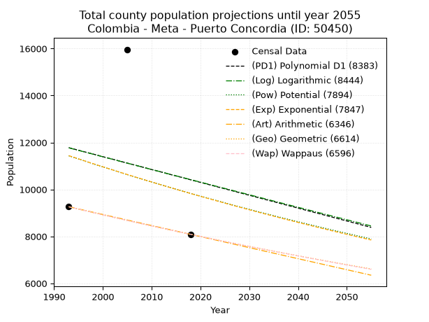
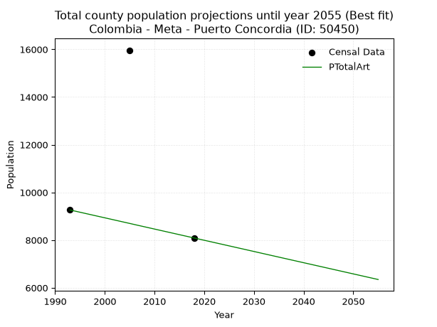
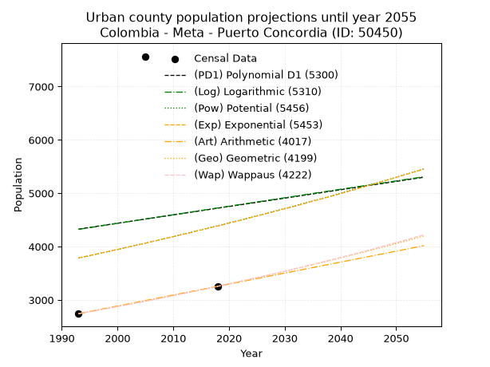
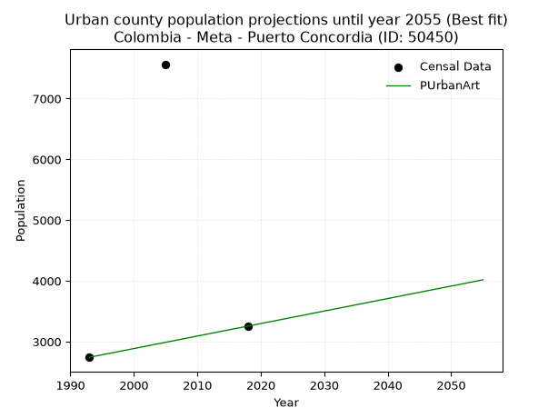
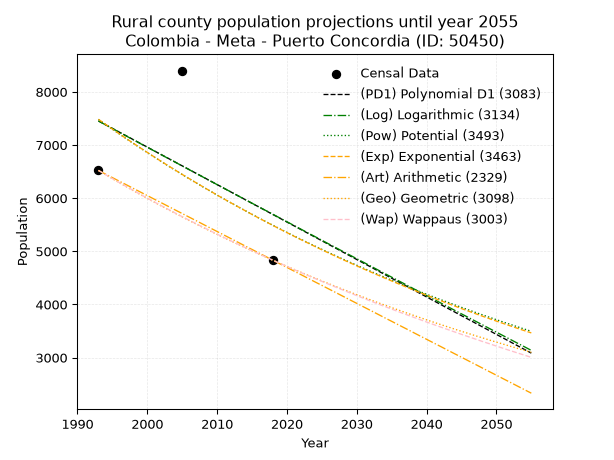
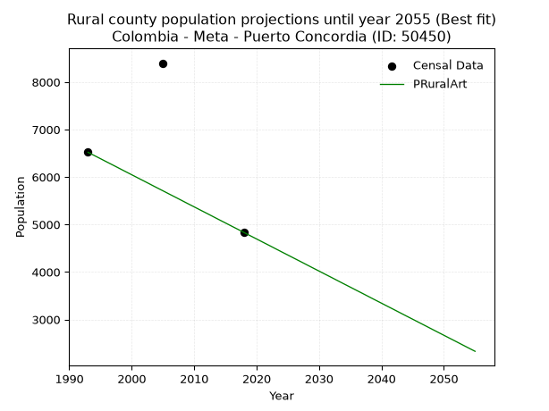

<div align="center">


</div>

# _“Population and Public Services Demand Projections (PPSD) until Year 2050 for Colombia - Meta - Puerto Concordia (ID: 50450)”_
Keywords: `population` `public-service` `projection` `lineal` `polynomial` `logarithmic` `potential` `exponential` `arithmetic` `geometric` `wappaus` `dane` `colombia` `south-america`

PPSD are analytical estimates used by governments and planners to anticipate future changes in population size, age distribution, and the resulting community needs for utilities, healthcare, education, and infrastructure as sizing future water treatment facilities, electrical grids, and road networks based on spatial growth.

> **General running parameters**: • app_version: _v20260806_. • Python version: _3.14.7_. • Pandas version: _3.0.5_. • NumPy version: _2.5.1_. • Creates, save and include plots into reports (create_plot): _False_. • Projection until year: _2050_. • Process polynomial degree 2 and up: _False_. • Process Wappaus: _True_. • Process Wappaus: _True_. • Set negative values to zero: _True_. • Set infinite values to zero: _True_. • Drop dataset notes: _True_. 
<div align="center">

Dynamic map: [:earth_americas:Google](http://maps.google.com/maps?q=2.624006221,-72.7602085) [:earth_americas:OSM](https://www.openstreetmap.org/#map=18/2.624006221/-72.7602085&layers=P) [:earth_americas:Bing](https://www.bing.com/maps?cp=2.624006221~-72.7602085&lvl=18) [:earth_americas:Apple](https://maps.apple.com/frame?center=2.624006221%2C-72.7602085&span=0.003%2C0.006)

</div>


<div align="center">

```geojson
{
  "type": "Feature",
  "geometry": {
    "type": "Point", 
    "coordinates": [-72.7602085, 2.624006221]
  }, 
  "properties": {
    "Name": "Colombia - Meta - Puerto Concordia (ID: 50450)"
  }
}
```

</div>


## 0. Census Data (3 records)

Census data are official statistics collected by a government about the people and housing in a country. They usually include counts of total population, age, sex, race, income, education, and jobs.

📅Global census file: [Population.xlsx](../data/Population.xlsx)

| Source   |   Year |   CountryID | CountryName   |   StateID | StateName   |   CountyID | CountyName       |   PTotal |   PUrban |   PRural |
|:---------|-------:|------------:|:--------------|----------:|:------------|-----------:|:-----------------|---------:|---------:|---------:|
| DANE     |   1993 |          57 | Colombia      |        50 | Meta        |      50450 | Puerto Concordia |     9262 |     2742 |     6520 |
| DANE     |   2005 |          57 | Colombia      |        50 | Meta        |      50450 | Puerto Concordia |    15964 |     7566 |     8398 |
| DANE     |   2018 |          57 | Colombia      |        50 | Meta        |      50450 | Puerto Concordia |     8086 |     3256 |     4830 |

> 🔥Some records could had specific notes about the registered values or the corresponding urban or rural distribution.

## 1. Total

### 1.1. Coefficients and Parameters

* (PD1) Polynomial Deg 1: -54.78678038379781, 120969.7569296425 (lineal)
* (Log) Logarithmic: -108669.5247814475, 837378.449897536
* (Pow) Potential: -12.095042908552413, 43.965880309479665
* (Exp) Exponential: -0.006081319807086793, 2099486695.2157452
* (Art) Arithmetic: Year diff. 2018 - 1993 = 25, Population diff. 8086 - 9262 = -1176, Annual growth = -47.04
* (Geo) Geometric: Year diff. 2018 - 1993 = 25, Population diff. 8086 - 9262 = -1176, Annual growth % = -0.005416709907560935
* (Wap) Wappaus: i = -0.5423103527784182, Condition values only valid for < 200)

<sub>
Wappaus condition values: ['-0.00', '-0.54', '-1.08', '-1.63', '-2.17', '-2.71', '-3.25', '-3.80', '-4.34', '-4.88', '-5.42', '-5.97', '-6.51', '-7.05', '-7.59', '-8.13', '-8.68', '-9.22', '-9.76', '-10.30', '-10.85', '-11.39', '-11.93', '-12.47', '-13.02', '-13.56', '-14.10', '-14.64', '-15.18', '-15.73', '-16.27', '-16.81', '-17.35', '-17.90', '-18.44', '-18.98', '-19.52', '-20.07', '-20.61', '-21.15', '-21.69', '-22.23', '-22.78', '-23.32', '-23.86', '-24.40', '-24.95', '-25.49', '-26.03', '-26.57', '-27.12', '-27.66', '-28.20', '-28.74', '-29.28', '-29.83', '-30.37', '-30.91']
</sub>


### 1.2. Projected Dataset

|   Year |   CountyID |   PTotalPD1 |   PTotalLog |   PTotalPow |   PTotalExp |   PTotalArt |   PTotalGeo |   PTotalWap |
|-------:|-----------:|------------:|------------:|------------:|------------:|------------:|------------:|------------:|
|   1993 |      50450 |       11780 |       11773 |       11434 |       11440 |        9262 |        9262 |        9262 |
|   1994 |      50450 |       11725 |       11718 |       11365 |       11371 |        9215 |        9212 |        9212 |
|   1995 |      50450 |       11670 |       11664 |       11296 |       11302 |        9168 |        9162 |        9162 |
|   1996 |      50450 |       11615 |       11610 |       11228 |       11233 |        9121 |        9112 |        9113 |
|   1997 |      50450 |       11561 |       11555 |       11160 |       11165 |        9074 |        9063 |        9063 |
|   1998 |      50450 |       11506 |       11501 |       11093 |       11098 |        9027 |        9014 |        9014 |
|   1999 |      50450 |       11451 |       11446 |       11026 |       11030 |        8980 |        8965 |        8965 |
|   2000 |      50450 |       11396 |       11392 |       10959 |       10963 |        8933 |        8916 |        8917 |
|   2001 |      50450 |       11341 |       11338 |       10893 |       10897 |        8886 |        8868 |        8869 |
|   2002 |      50450 |       11287 |       11283 |       10828 |       10831 |        8839 |        8820 |        8821 |
|   2003 |      50450 |       11232 |       11229 |       10762 |       10765 |        8792 |        8772 |        8773 |
|   2004 |      50450 |       11177 |       11175 |       10698 |       10700 |        8745 |        8725 |        8725 |
|   2005 |      50450 |       11122 |       11121 |       10633 |       10635 |        8698 |        8678 |        8678 |
|   2006 |      50450 |       11067 |       11066 |       10569 |       10571 |        8650 |        8631 |        8631 |
|   2007 |      50450 |       11013 |       11012 |       10506 |       10507 |        8603 |        8584 |        8585 |
|   2008 |      50450 |       10958 |       10958 |       10443 |       10443 |        8556 |        8537 |        8538 |
|   2009 |      50450 |       10903 |       10904 |       10380 |       10379 |        8509 |        8491 |        8492 |
|   2010 |      50450 |       10848 |       10850 |       10318 |       10317 |        8462 |        8445 |        8446 |
|   2011 |      50450 |       10794 |       10796 |       10256 |       10254 |        8415 |        8399 |        8400 |
|   2012 |      50450 |       10739 |       10742 |       10194 |       10192 |        8368 |        8354 |        8354 |
|   2013 |      50450 |       10684 |       10688 |       10133 |       10130 |        8321 |        8309 |        8309 |
|   2014 |      50450 |       10629 |       10634 |       10073 |       10069 |        8274 |        8264 |        8264 |
|   2015 |      50450 |       10574 |       10580 |       10012 |       10008 |        8227 |        8219 |        8219 |
|   2016 |      50450 |       10520 |       10526 |        9952 |        9947 |        8180 |        8174 |        8175 |
|   2017 |      50450 |       10465 |       10472 |        9893 |        9887 |        8133 |        8130 |        8130 |
|   2018 |      50450 |       10410 |       10418 |        9834 |        9827 |        8086 |        8086 |        8086 |
|   2019 |      50450 |       10355 |       10365 |        9775 |        9767 |        8039 |        8042 |        8042 |
|   2020 |      50450 |       10300 |       10311 |        9717 |        9708 |        7992 |        7999 |        7998 |
|   2021 |      50450 |       10246 |       10257 |        9659 |        9649 |        7945 |        7955 |        7955 |
|   2022 |      50450 |       10191 |       10203 |        9601 |        9591 |        7898 |        7912 |        7912 |
|   2023 |      50450 |       10136 |       10149 |        9544 |        9532 |        7851 |        7869 |        7868 |
|   2024 |      50450 |       10081 |       10096 |        9487 |        9475 |        7804 |        7827 |        7826 |
|   2025 |      50450 |       10027 |       10042 |        9430 |        9417 |        7757 |        7784 |        7783 |
|   2026 |      50450 |        9972 |        9988 |        9374 |        9360 |        7710 |        7742 |        7741 |
|   2027 |      50450 |        9917 |        9935 |        9318 |        9303 |        7663 |        7700 |        7698 |
|   2028 |      50450 |        9862 |        9881 |        9263 |        9247 |        7616 |        7659 |        7656 |
|   2029 |      50450 |        9807 |        9828 |        9208 |        9191 |        7569 |        7617 |        7615 |
|   2030 |      50450 |        9753 |        9774 |        9153 |        9135 |        7522 |        7576 |        7573 |
|   2031 |      50450 |        9698 |        9721 |        9099 |        9080 |        7474 |        7535 |        7532 |
|   2032 |      50450 |        9643 |        9667 |        9045 |        9025 |        7427 |        7494 |        7490 |
|   2033 |      50450 |        9588 |        9614 |        8991 |        8970 |        7380 |        7453 |        7449 |
|   2034 |      50450 |        9533 |        9560 |        8938 |        8916 |        7333 |        7413 |        7409 |
|   2035 |      50450 |        9479 |        9507 |        8885 |        8862 |        7286 |        7373 |        7368 |
|   2036 |      50450 |        9424 |        9453 |        8832 |        8808 |        7239 |        7333 |        7328 |
|   2037 |      50450 |        9369 |        9400 |        8780 |        8754 |        7192 |        7293 |        7288 |
|   2038 |      50450 |        9314 |        9347 |        8728 |        8701 |        7145 |        7254 |        7248 |
|   2039 |      50450 |        9260 |        9293 |        8676 |        8649 |        7098 |        7214 |        7208 |
|   2040 |      50450 |        9205 |        9240 |        8625 |        8596 |        7051 |        7175 |        7168 |
|   2041 |      50450 |        9150 |        9187 |        8574 |        8544 |        7004 |        7136 |        7129 |
|   2042 |      50450 |        9095 |        9134 |        8523 |        8492 |        6957 |        7098 |        7089 |
|   2043 |      50450 |        9040 |        9080 |        8473 |        8441 |        6910 |        7059 |        7050 |
|   2044 |      50450 |        8986 |        9027 |        8423 |        8390 |        6863 |        7021 |        7012 |
|   2045 |      50450 |        8931 |        8974 |        8373 |        8339 |        6816 |        6983 |        6973 |
|   2046 |      50450 |        8876 |        8921 |        8324 |        8288 |        6769 |        6945 |        6934 |
|   2047 |      50450 |        8821 |        8868 |        8275 |        8238 |        6722 |        6908 |        6896 |
|   2048 |      50450 |        8766 |        8815 |        8226 |        8188 |        6675 |        6870 |        6858 |
|   2049 |      50450 |        8712 |        8762 |        8178 |        8138 |        6628 |        6833 |        6820 |
|   2050 |      50450 |        8657 |        8709 |        8130 |        8089 |        6581 |        6796 |        6782 |
<div align="center">

</img>

</div>


### 1.3. Best fit with absolute and relative error (%)

Relative error puts that difference into context by dividing the absolute error by the true value, creating a unitless ratio or percentage that shows the scale of the mistake.

Absolute and relative error

|   Year | Source   |   CountryID | CountryName   |   StateID | StateName   |   CountyID_x | CountyName       |   PTotal |   PUrban |   PRural |   CountyID_y |   PTotalPD1 |   PTotalLog |   PTotalPow |   PTotalExp |   PTotalArt |   PTotalGeo |   PTotalWap |   PTotalPD1AbsError |   PTotalLogAbsError |   PTotalPowAbsError |   PTotalExpAbsError |   PTotalArtAbsError |   PTotalGeoAbsError |   PTotalWapAbsError |   PTotalPD1RelError |   PTotalLogRelError |   PTotalPowRelError |   PTotalExpRelError |   PTotalArtRelError |   PTotalGeoRelError |   PTotalWapRelError |
|-------:|:---------|------------:|:--------------|----------:|:------------|-------------:|:-----------------|---------:|---------:|---------:|-------------:|------------:|------------:|------------:|------------:|------------:|------------:|------------:|--------------------:|--------------------:|--------------------:|--------------------:|--------------------:|--------------------:|--------------------:|--------------------:|--------------------:|--------------------:|--------------------:|--------------------:|--------------------:|--------------------:|
|   1993 | DANE     |          57 | Colombia      |        50 | Meta        |        50450 | Puerto Concordia |     9262 |     2742 |     6520 |        50450 |       11780 |       11773 |       11434 |       11440 |        9262 |        9262 |        9262 |                2518 |                2511 |                2172 |                2178 |                   0 |                   0 |                   0 |             27.1864 |             27.1108 |             23.4507 |             23.5154 |              0      |              0      |              0      |
|   2005 | DANE     |          57 | Colombia      |        50 | Meta        |        50450 | Puerto Concordia |    15964 |     7566 |     8398 |        50450 |       11122 |       11121 |       10633 |       10635 |        8698 |        8678 |        8678 |                4842 |                4843 |                5331 |                5329 |                7266 |                7286 |                7286 |             30.3307 |             30.337  |             33.3939 |             33.3814 |             45.5149 |             45.6402 |             45.6402 |
|   2018 | DANE     |          57 | Colombia      |        50 | Meta        |        50450 | Puerto Concordia |     8086 |     3256 |     4830 |        50450 |       10410 |       10418 |        9834 |        9827 |        8086 |        8086 |        8086 |                2324 |                2332 |                1748 |                1741 |                   0 |                   0 |                   0 |             28.741  |             28.84   |             21.6176 |             21.531  |              0      |              0      |              0      |

Relative error mean

| Method    |   RelError | Best   |
|:----------|-----------:|:-------|
| PTotalPD1 |    28.7527 |        |
| PTotalLog |    28.7626 |        |
| PTotalPow |    26.1541 |        |
| PTotalExp |    26.1426 |        |
| PTotalArt |    15.1716 | True   |
| PTotalGeo |    15.2134 |        |
| PTotalWap |    15.2134 |        |

💙Best method: _**PTotalArt**_
<div align="center">

</img>

</div>


### 1.4. Fresh water supply demand in liters per capita per day (lpcd)

The fresh water supply demand typically ranges from 100 to 300 liters per capita per day (lpcd) for standard domestic and municipal planning, though absolute survival minimums set by the World Health Organization are as low as 7.5 to 20 liters per day, and total consumption in high-income nations can exceed 400 liters.

> `CZ`: Level in meters above the sea level (masl)<br> `WS`: Fresh water supply demand in liters per capita per day (lpcd or l/h/d)<br> `WSAll`: Zonal fresh water supply demand in liters per second (l/s)<br> `A`: Zonal area in square meters<br> `DP`: Population density (people/hectare)

Reference values (RAS Colombia)

|    CZ |   WS |
|------:|-----:|
|  1000 |  120 |
|  2000 |  130 |
| 99999 |  140 |

County shapefile geometry properties and water supply values

|   CountyID |     ATotal |   CZTotal |   WSTotal |
|-----------:|-----------:|----------:|----------:|
|      50450 | 1.2563e+09 |   209.614 |       120 |

Projected values for best method: PTotalArt

|   CountyID |   Year |   PTotalArt |   DPTotal |   WSTotal |   WSTotalAll |
|-----------:|-------:|------------:|----------:|----------:|-------------:|
|      50450 |   1993 |        9262 |      0.07 |       120 |     12.8639  |
|      50450 |   1994 |        9215 |      0.07 |       120 |     12.7986  |
|      50450 |   1995 |        9168 |      0.07 |       120 |     12.7333  |
|      50450 |   1996 |        9121 |      0.07 |       120 |     12.6681  |
|      50450 |   1997 |        9074 |      0.07 |       120 |     12.6028  |
|      50450 |   1998 |        9027 |      0.07 |       120 |     12.5375  |
|      50450 |   1999 |        8980 |      0.07 |       120 |     12.4722  |
|      50450 |   2000 |        8933 |      0.07 |       120 |     12.4069  |
|      50450 |   2001 |        8886 |      0.07 |       120 |     12.3417  |
|      50450 |   2002 |        8839 |      0.07 |       120 |     12.2764  |
|      50450 |   2003 |        8792 |      0.07 |       120 |     12.2111  |
|      50450 |   2004 |        8745 |      0.07 |       120 |     12.1458  |
|      50450 |   2005 |        8698 |      0.07 |       120 |     12.0806  |
|      50450 |   2006 |        8650 |      0.07 |       120 |     12.0139  |
|      50450 |   2007 |        8603 |      0.07 |       120 |     11.9486  |
|      50450 |   2008 |        8556 |      0.07 |       120 |     11.8833  |
|      50450 |   2009 |        8509 |      0.07 |       120 |     11.8181  |
|      50450 |   2010 |        8462 |      0.07 |       120 |     11.7528  |
|      50450 |   2011 |        8415 |      0.07 |       120 |     11.6875  |
|      50450 |   2012 |        8368 |      0.07 |       120 |     11.6222  |
|      50450 |   2013 |        8321 |      0.07 |       120 |     11.5569  |
|      50450 |   2014 |        8274 |      0.07 |       120 |     11.4917  |
|      50450 |   2015 |        8227 |      0.07 |       120 |     11.4264  |
|      50450 |   2016 |        8180 |      0.07 |       120 |     11.3611  |
|      50450 |   2017 |        8133 |      0.06 |       120 |     11.2958  |
|      50450 |   2018 |        8086 |      0.06 |       120 |     11.2306  |
|      50450 |   2019 |        8039 |      0.06 |       120 |     11.1653  |
|      50450 |   2020 |        7992 |      0.06 |       120 |     11.1     |
|      50450 |   2021 |        7945 |      0.06 |       120 |     11.0347  |
|      50450 |   2022 |        7898 |      0.06 |       120 |     10.9694  |
|      50450 |   2023 |        7851 |      0.06 |       120 |     10.9042  |
|      50450 |   2024 |        7804 |      0.06 |       120 |     10.8389  |
|      50450 |   2025 |        7757 |      0.06 |       120 |     10.7736  |
|      50450 |   2026 |        7710 |      0.06 |       120 |     10.7083  |
|      50450 |   2027 |        7663 |      0.06 |       120 |     10.6431  |
|      50450 |   2028 |        7616 |      0.06 |       120 |     10.5778  |
|      50450 |   2029 |        7569 |      0.06 |       120 |     10.5125  |
|      50450 |   2030 |        7522 |      0.06 |       120 |     10.4472  |
|      50450 |   2031 |        7474 |      0.06 |       120 |     10.3806  |
|      50450 |   2032 |        7427 |      0.06 |       120 |     10.3153  |
|      50450 |   2033 |        7380 |      0.06 |       120 |     10.25    |
|      50450 |   2034 |        7333 |      0.06 |       120 |     10.1847  |
|      50450 |   2035 |        7286 |      0.06 |       120 |     10.1194  |
|      50450 |   2036 |        7239 |      0.06 |       120 |     10.0542  |
|      50450 |   2037 |        7192 |      0.06 |       120 |      9.98889 |
|      50450 |   2038 |        7145 |      0.06 |       120 |      9.92361 |
|      50450 |   2039 |        7098 |      0.06 |       120 |      9.85833 |
|      50450 |   2040 |        7051 |      0.06 |       120 |      9.79306 |
|      50450 |   2041 |        7004 |      0.06 |       120 |      9.72778 |
|      50450 |   2042 |        6957 |      0.06 |       120 |      9.6625  |
|      50450 |   2043 |        6910 |      0.06 |       120 |      9.59722 |
|      50450 |   2044 |        6863 |      0.05 |       120 |      9.53194 |
|      50450 |   2045 |        6816 |      0.05 |       120 |      9.46667 |
|      50450 |   2046 |        6769 |      0.05 |       120 |      9.40139 |
|      50450 |   2047 |        6722 |      0.05 |       120 |      9.33611 |
|      50450 |   2048 |        6675 |      0.05 |       120 |      9.27083 |
|      50450 |   2049 |        6628 |      0.05 |       120 |      9.20556 |
|      50450 |   2050 |        6581 |      0.05 |       120 |      9.14028 |

## 2. Urban

### 2.1. Coefficients and Parameters

* (PD1) Polynomial Deg 1: 15.680170575692731, -26922.635394455814 (lineal)
* (Log) Logarithmic: 32208.40743564189, -240376.98741927746
* (Pow) Potential: 11.944330980032198, -35.832469445342554
* (Exp) Exponential: 0.005878330491402588, 0.030931724220443862
* (Art) Arithmetic: Year diff. 2018 - 1993 = 25, Population diff. 3256 - 2742 = 514, Annual growth = 20.56
* (Geo) Geometric: Year diff. 2018 - 1993 = 25, Population diff. 3256 - 2742 = 514, Annual growth % = 0.006896144326066889
* (Wap) Wappaus: i = 0.6855618539513171, Condition values only valid for < 200)

<sub>
Wappaus condition values: ['0.00', '0.69', '1.37', '2.06', '2.74', '3.43', '4.11', '4.80', '5.48', '6.17', '6.86', '7.54', '8.23', '8.91', '9.60', '10.28', '10.97', '11.65', '12.34', '13.03', '13.71', '14.40', '15.08', '15.77', '16.45', '17.14', '17.82', '18.51', '19.20', '19.88', '20.57', '21.25', '21.94', '22.62', '23.31', '23.99', '24.68', '25.37', '26.05', '26.74', '27.42', '28.11', '28.79', '29.48', '30.16', '30.85', '31.54', '32.22', '32.91', '33.59', '34.28', '34.96', '35.65', '36.33', '37.02', '37.71', '38.39', '39.08']
</sub>


### 2.2. Projected Dataset

|   Year |   CountyID |   PUrbanPD1 |   PUrbanLog |   PUrbanPow |   PUrbanExp |   PUrbanArt |   PUrbanGeo |   PUrbanWap |
|-------:|-----------:|------------:|------------:|------------:|------------:|------------:|------------:|------------:|
|   1993 |      50450 |        4328 |        4323 |        3784 |        3788 |        2742 |        2742 |        2742 |
|   1994 |      50450 |        4344 |        4339 |        3807 |        3810 |        2763 |        2761 |        2761 |
|   1995 |      50450 |        4359 |        4355 |        3829 |        3833 |        2783 |        2780 |        2780 |
|   1996 |      50450 |        4375 |        4371 |        3852 |        3855 |        2804 |        2799 |        2799 |
|   1997 |      50450 |        4391 |        4388 |        3876 |        3878 |        2824 |        2818 |        2818 |
|   1998 |      50450 |        4406 |        4404 |        3899 |        3901 |        2845 |        2838 |        2838 |
|   1999 |      50450 |        4422 |        4420 |        3922 |        3924 |        2865 |        2857 |        2857 |
|   2000 |      50450 |        4438 |        4436 |        3946 |        3947 |        2886 |        2877 |        2877 |
|   2001 |      50450 |        4453 |        4452 |        3969 |        3970 |        2906 |        2897 |        2897 |
|   2002 |      50450 |        4469 |        4468 |        3993 |        3994 |        2927 |        2917 |        2917 |
|   2003 |      50450 |        4485 |        4484 |        4017 |        4017 |        2948 |        2937 |        2937 |
|   2004 |      50450 |        4500 |        4500 |        4041 |        4041 |        2968 |        2957 |        2957 |
|   2005 |      50450 |        4516 |        4516 |        4065 |        4065 |        2989 |        2978 |        2977 |
|   2006 |      50450 |        4532 |        4532 |        4089 |        4089 |        3009 |        2998 |        2998 |
|   2007 |      50450 |        4547 |        4549 |        4114 |        4113 |        3030 |        3019 |        3018 |
|   2008 |      50450 |        4563 |        4565 |        4138 |        4137 |        3050 |        3040 |        3039 |
|   2009 |      50450 |        4579 |        4581 |        4163 |        4161 |        3071 |        3061 |        3060 |
|   2010 |      50450 |        4595 |        4597 |        4188 |        4186 |        3092 |        3082 |        3081 |
|   2011 |      50450 |        4610 |        4613 |        4213 |        4211 |        3112 |        3103 |        3103 |
|   2012 |      50450 |        4626 |        4629 |        4238 |        4235 |        3133 |        3124 |        3124 |
|   2013 |      50450 |        4642 |        4645 |        4263 |        4260 |        3153 |        3146 |        3146 |
|   2014 |      50450 |        4657 |        4661 |        4289 |        4285 |        3174 |        3168 |        3167 |
|   2015 |      50450 |        4673 |        4677 |        4314 |        4311 |        3194 |        3190 |        3189 |
|   2016 |      50450 |        4689 |        4693 |        4340 |        4336 |        3215 |        3212 |        3211 |
|   2017 |      50450 |        4704 |        4709 |        4365 |        4362 |        3235 |        3234 |        3234 |
|   2018 |      50450 |        4720 |        4725 |        4391 |        4387 |        3256 |        3256 |        3256 |
|   2019 |      50450 |        4736 |        4741 |        4417 |        4413 |        3277 |        3278 |        3279 |
|   2020 |      50450 |        4751 |        4756 |        4444 |        4439 |        3297 |        3301 |        3301 |
|   2021 |      50450 |        4767 |        4772 |        4470 |        4465 |        3318 |        3324 |        3324 |
|   2022 |      50450 |        4783 |        4788 |        4497 |        4492 |        3338 |        3347 |        3347 |
|   2023 |      50450 |        4798 |        4804 |        4523 |        4518 |        3359 |        3370 |        3371 |
|   2024 |      50450 |        4814 |        4820 |        4550 |        4545 |        3379 |        3393 |        3394 |
|   2025 |      50450 |        4830 |        4836 |        4577 |        4572 |        3400 |        3416 |        3418 |
|   2026 |      50450 |        4845 |        4852 |        4604 |        4599 |        3420 |        3440 |        3441 |
|   2027 |      50450 |        4861 |        4868 |        4631 |        4626 |        3441 |        3464 |        3465 |
|   2028 |      50450 |        4877 |        4884 |        4658 |        4653 |        3462 |        3488 |        3490 |
|   2029 |      50450 |        4892 |        4900 |        4686 |        4680 |        3482 |        3512 |        3514 |
|   2030 |      50450 |        4908 |        4916 |        4714 |        4708 |        3503 |        3536 |        3539 |
|   2031 |      50450 |        4924 |        4931 |        4741 |        4736 |        3523 |        3560 |        3563 |
|   2032 |      50450 |        4939 |        4947 |        4769 |        4764 |        3544 |        3585 |        3588 |
|   2033 |      50450 |        4955 |        4963 |        4798 |        4792 |        3564 |        3610 |        3613 |
|   2034 |      50450 |        4971 |        4979 |        4826 |        4820 |        3585 |        3634 |        3639 |
|   2035 |      50450 |        4987 |        4995 |        4854 |        4849 |        3606 |        3660 |        3664 |
|   2036 |      50450 |        5002 |        5011 |        4883 |        4877 |        3626 |        3685 |        3690 |
|   2037 |      50450 |        5018 |        5026 |        4912 |        4906 |        3647 |        3710 |        3716 |
|   2038 |      50450 |        5034 |        5042 |        4940 |        4935 |        3667 |        3736 |        3742 |
|   2039 |      50450 |        5049 |        5058 |        4969 |        4964 |        3688 |        3762 |        3769 |
|   2040 |      50450 |        5065 |        5074 |        4999 |        4993 |        3708 |        3787 |        3795 |
|   2041 |      50450 |        5081 |        5090 |        5028 |        5023 |        3729 |        3814 |        3822 |
|   2042 |      50450 |        5096 |        5105 |        5057 |        5052 |        3749 |        3840 |        3849 |
|   2043 |      50450 |        5112 |        5121 |        5087 |        5082 |        3770 |        3866 |        3876 |
|   2044 |      50450 |        5128 |        5137 |        5117 |        5112 |        3791 |        3893 |        3904 |
|   2045 |      50450 |        5143 |        5153 |        5147 |        5142 |        3811 |        3920 |        3932 |
|   2046 |      50450 |        5159 |        5168 |        5177 |        5172 |        3832 |        3947 |        3959 |
|   2047 |      50450 |        5175 |        5184 |        5207 |        5203 |        3852 |        3974 |        3988 |
|   2048 |      50450 |        5190 |        5200 |        5238 |        5234 |        3873 |        4002 |        4016 |
|   2049 |      50450 |        5206 |        5216 |        5268 |        5264 |        3893 |        4029 |        4045 |
|   2050 |      50450 |        5222 |        5231 |        5299 |        5295 |        3914 |        4057 |        4074 |
<div align="center">

</img>

</div>


### 2.3. Best fit with absolute and relative error (%)

Relative error puts that difference into context by dividing the absolute error by the true value, creating a unitless ratio or percentage that shows the scale of the mistake.

Absolute and relative error

|   Year | Source   |   CountryID | CountryName   |   StateID | StateName   |   CountyID_x | CountyName       |   PTotal |   PUrban |   PRural |   CountyID_y |   PUrbanPD1 |   PUrbanLog |   PUrbanPow |   PUrbanExp |   PUrbanArt |   PUrbanGeo |   PUrbanWap |   PUrbanPD1AbsError |   PUrbanLogAbsError |   PUrbanPowAbsError |   PUrbanExpAbsError |   PUrbanArtAbsError |   PUrbanGeoAbsError |   PUrbanWapAbsError |   PUrbanPD1RelError |   PUrbanLogRelError |   PUrbanPowRelError |   PUrbanExpRelError |   PUrbanArtRelError |   PUrbanGeoRelError |   PUrbanWapRelError |
|-------:|:---------|------------:|:--------------|----------:|:------------|-------------:|:-----------------|---------:|---------:|---------:|-------------:|------------:|------------:|------------:|------------:|------------:|------------:|------------:|--------------------:|--------------------:|--------------------:|--------------------:|--------------------:|--------------------:|--------------------:|--------------------:|--------------------:|--------------------:|--------------------:|--------------------:|--------------------:|--------------------:|
|   1993 | DANE     |          57 | Colombia      |        50 | Meta        |        50450 | Puerto Concordia |     9262 |     2742 |     6520 |        50450 |        4328 |        4323 |        3784 |        3788 |        2742 |        2742 |        2742 |                1586 |                1581 |                1042 |                1046 |                   0 |                   0 |                   0 |             57.841  |             57.6586 |             38.0015 |             38.1473 |              0      |              0      |              0      |
|   2005 | DANE     |          57 | Colombia      |        50 | Meta        |        50450 | Puerto Concordia |    15964 |     7566 |     8398 |        50450 |        4516 |        4516 |        4065 |        4065 |        2989 |        2978 |        2977 |                3050 |                3050 |                3501 |                3501 |                4577 |                4588 |                4589 |             40.3119 |             40.3119 |             46.2728 |             46.2728 |             60.4943 |             60.6397 |             60.6529 |
|   2018 | DANE     |          57 | Colombia      |        50 | Meta        |        50450 | Puerto Concordia |     8086 |     3256 |     4830 |        50450 |        4720 |        4725 |        4391 |        4387 |        3256 |        3256 |        3256 |                1464 |                1469 |                1135 |                1131 |                   0 |                   0 |                   0 |             44.9631 |             45.1167 |             34.8587 |             34.7359 |              0      |              0      |              0      |

Relative error mean

| Method    |   RelError | Best   |
|:----------|-----------:|:-------|
| PUrbanPD1 |    47.7054 |        |
| PUrbanLog |    47.6958 |        |
| PUrbanPow |    39.711  |        |
| PUrbanExp |    39.7187 |        |
| PUrbanArt |    20.1648 | True   |
| PUrbanGeo |    20.2132 |        |
| PUrbanWap |    20.2176 |        |

💙Best method: _**PUrbanArt**_
<div align="center">

</img>

</div>


### 2.4. Fresh water supply demand in liters per capita per day (lpcd)

The fresh water supply demand typically ranges from 100 to 300 liters per capita per day (lpcd) for standard domestic and municipal planning, though absolute survival minimums set by the World Health Organization are as low as 7.5 to 20 liters per day, and total consumption in high-income nations can exceed 400 liters.

> `CZ`: Level in meters above the sea level (masl)<br> `WS`: Fresh water supply demand in liters per capita per day (lpcd or l/h/d)<br> `WSAll`: Zonal fresh water supply demand in liters per second (l/s)<br> `A`: Zonal area in square meters<br> `DP`: Population density (people/hectare)

Reference values (RAS Colombia)

|    CZ |   WS |
|------:|-----:|
|  1000 |  120 |
|  2000 |  130 |
| 99999 |  140 |

County shapefile geometry properties and water supply values

|   CountyID |   AUrban |   CZUrban |   WSUrban |
|-----------:|---------:|----------:|----------:|
|      50450 |   871574 |   190.217 |       120 |

Projected values for best method: PUrbanArt

|   CountyID |   Year |   PUrbanArt |   DPUrban |   WSUrban |   WSUrbanAll |
|-----------:|-------:|------------:|----------:|----------:|-------------:|
|      50450 |   1993 |        2742 |     31.46 |       120 |      3.80833 |
|      50450 |   1994 |        2763 |     31.7  |       120 |      3.8375  |
|      50450 |   1995 |        2783 |     31.93 |       120 |      3.86528 |
|      50450 |   1996 |        2804 |     32.17 |       120 |      3.89444 |
|      50450 |   1997 |        2824 |     32.4  |       120 |      3.92222 |
|      50450 |   1998 |        2845 |     32.64 |       120 |      3.95139 |
|      50450 |   1999 |        2865 |     32.87 |       120 |      3.97917 |
|      50450 |   2000 |        2886 |     33.11 |       120 |      4.00833 |
|      50450 |   2001 |        2906 |     33.34 |       120 |      4.03611 |
|      50450 |   2002 |        2927 |     33.58 |       120 |      4.06528 |
|      50450 |   2003 |        2948 |     33.82 |       120 |      4.09444 |
|      50450 |   2004 |        2968 |     34.05 |       120 |      4.12222 |
|      50450 |   2005 |        2989 |     34.29 |       120 |      4.15139 |
|      50450 |   2006 |        3009 |     34.52 |       120 |      4.17917 |
|      50450 |   2007 |        3030 |     34.76 |       120 |      4.20833 |
|      50450 |   2008 |        3050 |     34.99 |       120 |      4.23611 |
|      50450 |   2009 |        3071 |     35.24 |       120 |      4.26528 |
|      50450 |   2010 |        3092 |     35.48 |       120 |      4.29444 |
|      50450 |   2011 |        3112 |     35.71 |       120 |      4.32222 |
|      50450 |   2012 |        3133 |     35.95 |       120 |      4.35139 |
|      50450 |   2013 |        3153 |     36.18 |       120 |      4.37917 |
|      50450 |   2014 |        3174 |     36.42 |       120 |      4.40833 |
|      50450 |   2015 |        3194 |     36.65 |       120 |      4.43611 |
|      50450 |   2016 |        3215 |     36.89 |       120 |      4.46528 |
|      50450 |   2017 |        3235 |     37.12 |       120 |      4.49306 |
|      50450 |   2018 |        3256 |     37.36 |       120 |      4.52222 |
|      50450 |   2019 |        3277 |     37.6  |       120 |      4.55139 |
|      50450 |   2020 |        3297 |     37.83 |       120 |      4.57917 |
|      50450 |   2021 |        3318 |     38.07 |       120 |      4.60833 |
|      50450 |   2022 |        3338 |     38.3  |       120 |      4.63611 |
|      50450 |   2023 |        3359 |     38.54 |       120 |      4.66528 |
|      50450 |   2024 |        3379 |     38.77 |       120 |      4.69306 |
|      50450 |   2025 |        3400 |     39.01 |       120 |      4.72222 |
|      50450 |   2026 |        3420 |     39.24 |       120 |      4.75    |
|      50450 |   2027 |        3441 |     39.48 |       120 |      4.77917 |
|      50450 |   2028 |        3462 |     39.72 |       120 |      4.80833 |
|      50450 |   2029 |        3482 |     39.95 |       120 |      4.83611 |
|      50450 |   2030 |        3503 |     40.19 |       120 |      4.86528 |
|      50450 |   2031 |        3523 |     40.42 |       120 |      4.89306 |
|      50450 |   2032 |        3544 |     40.66 |       120 |      4.92222 |
|      50450 |   2033 |        3564 |     40.89 |       120 |      4.95    |
|      50450 |   2034 |        3585 |     41.13 |       120 |      4.97917 |
|      50450 |   2035 |        3606 |     41.37 |       120 |      5.00833 |
|      50450 |   2036 |        3626 |     41.6  |       120 |      5.03611 |
|      50450 |   2037 |        3647 |     41.84 |       120 |      5.06528 |
|      50450 |   2038 |        3667 |     42.07 |       120 |      5.09306 |
|      50450 |   2039 |        3688 |     42.31 |       120 |      5.12222 |
|      50450 |   2040 |        3708 |     42.54 |       120 |      5.15    |
|      50450 |   2041 |        3729 |     42.78 |       120 |      5.17917 |
|      50450 |   2042 |        3749 |     43.01 |       120 |      5.20694 |
|      50450 |   2043 |        3770 |     43.26 |       120 |      5.23611 |
|      50450 |   2044 |        3791 |     43.5  |       120 |      5.26528 |
|      50450 |   2045 |        3811 |     43.73 |       120 |      5.29306 |
|      50450 |   2046 |        3832 |     43.97 |       120 |      5.32222 |
|      50450 |   2047 |        3852 |     44.2  |       120 |      5.35    |
|      50450 |   2048 |        3873 |     44.44 |       120 |      5.37917 |
|      50450 |   2049 |        3893 |     44.67 |       120 |      5.40694 |
|      50450 |   2050 |        3914 |     44.91 |       120 |      5.43611 |

## 3. Rural

### 3.1. Coefficients and Parameters

* (PD1) Polynomial Deg 1: -70.46695095949038, 147892.392324098 (lineal)
* (Log) Logarithmic: -140877.93221708952, 1077755.4373168142
* (Pow) Potential: -24.851934116774782, 85.87304017359114
* (Exp) Exponential: -0.012424498636182226, 424636526015476.2
* (Art) Arithmetic: Year diff. 2018 - 1993 = 25, Population diff. 4830 - 6520 = -1690, Annual growth = -67.6
* (Geo) Geometric: Year diff. 2018 - 1993 = 25, Population diff. 4830 - 6520 = -1690, Annual growth % = -0.011929390152500718
* (Wap) Wappaus: i = -1.1911894273127754, Condition values only valid for < 200)

<sub>
Wappaus condition values: ['-0.00', '-1.19', '-2.38', '-3.57', '-4.76', '-5.96', '-7.15', '-8.34', '-9.53', '-10.72', '-11.91', '-13.10', '-14.29', '-15.49', '-16.68', '-17.87', '-19.06', '-20.25', '-21.44', '-22.63', '-23.82', '-25.01', '-26.21', '-27.40', '-28.59', '-29.78', '-30.97', '-32.16', '-33.35', '-34.54', '-35.74', '-36.93', '-38.12', '-39.31', '-40.50', '-41.69', '-42.88', '-44.07', '-45.27', '-46.46', '-47.65', '-48.84', '-50.03', '-51.22', '-52.41', '-53.60', '-54.79', '-55.99', '-57.18', '-58.37', '-59.56', '-60.75', '-61.94', '-63.13', '-64.32', '-65.52', '-66.71', '-67.90']
</sub>


### 3.2. Projected Dataset

|   Year |   CountyID |   PRuralPD1 |   PRuralLog |   PRuralPow |   PRuralExp |   PRuralArt |   PRuralGeo |   PRuralWap |
|-------:|-----------:|------------:|------------:|------------:|------------:|------------:|------------:|------------:|
|   1993 |      50450 |        7452 |        7450 |        7480 |        7482 |        6520 |        6520 |        6520 |
|   1994 |      50450 |        7381 |        7379 |        7387 |        7389 |        6452 |        6442 |        6443 |
|   1995 |      50450 |        7311 |        7309 |        7296 |        7298 |        6385 |        6365 |        6366 |
|   1996 |      50450 |        7240 |        7238 |        7206 |        7208 |        6317 |        6289 |        6291 |
|   1997 |      50450 |        7170 |        7167 |        7116 |        7119 |        6250 |        6214 |        6217 |
|   1998 |      50450 |        7099 |        7097 |        7028 |        7031 |        6182 |        6140 |        6143 |
|   1999 |      50450 |        7029 |        7026 |        6942 |        6944 |        6114 |        6067 |        6070 |
|   2000 |      50450 |        6958 |        6956 |        6856 |        6859 |        6047 |        5995 |        5998 |
|   2001 |      50450 |        6888 |        6886 |        6771 |        6774 |        5979 |        5923 |        5927 |
|   2002 |      50450 |        6818 |        6815 |        6688 |        6690 |        5912 |        5852 |        5857 |
|   2003 |      50450 |        6747 |        6745 |        6605 |        6608 |        5844 |        5783 |        5787 |
|   2004 |      50450 |        6677 |        6675 |        6524 |        6526 |        5776 |        5714 |        5718 |
|   2005 |      50450 |        6606 |        6604 |        6443 |        6445 |        5709 |        5646 |        5650 |
|   2006 |      50450 |        6536 |        6534 |        6364 |        6366 |        5641 |        5578 |        5583 |
|   2007 |      50450 |        6465 |        6464 |        6286 |        6287 |        5574 |        5512 |        5516 |
|   2008 |      50450 |        6395 |        6394 |        6208 |        6210 |        5506 |        5446 |        5451 |
|   2009 |      50450 |        6324 |        6323 |        6132 |        6133 |        5438 |        5381 |        5385 |
|   2010 |      50450 |        6254 |        6253 |        6057 |        6057 |        5371 |        5317 |        5321 |
|   2011 |      50450 |        6183 |        6183 |        5982 |        5982 |        5303 |        5253 |        5257 |
|   2012 |      50450 |        6113 |        6113 |        5909 |        5909 |        5236 |        5191 |        5194 |
|   2013 |      50450 |        6042 |        6043 |        5836 |        5836 |        5168 |        5129 |        5132 |
|   2014 |      50450 |        5972 |        5973 |        5765 |        5764 |        5100 |        5068 |        5070 |
|   2015 |      50450 |        5901 |        5903 |        5694 |        5692 |        5033 |        5007 |        5009 |
|   2016 |      50450 |        5831 |        5833 |        5624 |        5622 |        4965 |        4947 |        4949 |
|   2017 |      50450 |        5761 |        5764 |        5555 |        5553 |        4898 |        4888 |        4889 |
|   2018 |      50450 |        5690 |        5694 |        5487 |        5484 |        4830 |        4830 |        4830 |
|   2019 |      50450 |        5620 |        5624 |        5420 |        5416 |        4762 |        4772 |        4771 |
|   2020 |      50450 |        5549 |        5554 |        5354 |        5350 |        4695 |        4715 |        4714 |
|   2021 |      50450 |        5479 |        5485 |        5288 |        5283 |        4627 |        4659 |        4656 |
|   2022 |      50450 |        5408 |        5415 |        5224 |        5218 |        4560 |        4604 |        4599 |
|   2023 |      50450 |        5338 |        5345 |        5160 |        5154 |        4492 |        4549 |        4543 |
|   2024 |      50450 |        5267 |        5276 |        5097 |        5090 |        4424 |        4494 |        4488 |
|   2025 |      50450 |        5197 |        5206 |        5035 |        5027 |        4357 |        4441 |        4433 |
|   2026 |      50450 |        5126 |        5136 |        4973 |        4965 |        4289 |        4388 |        4378 |
|   2027 |      50450 |        5056 |        5067 |        4913 |        4904 |        4222 |        4335 |        4324 |
|   2028 |      50450 |        4985 |        4997 |        4853 |        4843 |        4154 |        4284 |        4271 |
|   2029 |      50450 |        4915 |        4928 |        4794 |        4784 |        4086 |        4233 |        4218 |
|   2030 |      50450 |        4844 |        4859 |        4736 |        4725 |        4019 |        4182 |        4165 |
|   2031 |      50450 |        4774 |        4789 |        4678 |        4666 |        3951 |        4132 |        4113 |
|   2032 |      50450 |        4704 |        4720 |        4621 |        4609 |        3884 |        4083 |        4062 |
|   2033 |      50450 |        4633 |        4650 |        4565 |        4552 |        3816 |        4034 |        4011 |
|   2034 |      50450 |        4563 |        4581 |        4509 |        4495 |        3748 |        3986 |        3961 |
|   2035 |      50450 |        4492 |        4512 |        4455 |        4440 |        3681 |        3939 |        3911 |
|   2036 |      50450 |        4422 |        4443 |        4401 |        4385 |        3613 |        3892 |        3861 |
|   2037 |      50450 |        4351 |        4374 |        4347 |        4331 |        3546 |        3845 |        3812 |
|   2038 |      50450 |        4281 |        4304 |        4295 |        4278 |        3478 |        3799 |        3764 |
|   2039 |      50450 |        4210 |        4235 |        4242 |        4225 |        3410 |        3754 |        3716 |
|   2040 |      50450 |        4140 |        4166 |        4191 |        4173 |        3343 |        3709 |        3668 |
|   2041 |      50450 |        4069 |        4097 |        4140 |        4121 |        3275 |        3665 |        3621 |
|   2042 |      50450 |        3999 |        4028 |        4090 |        4070 |        3208 |        3621 |        3574 |
|   2043 |      50450 |        3928 |        3959 |        4041 |        4020 |        3140 |        3578 |        3528 |
|   2044 |      50450 |        3858 |        3890 |        3992 |        3970 |        3072 |        3535 |        3482 |
|   2045 |      50450 |        3787 |        3821 |        3944 |        3921 |        3005 |        3493 |        3436 |
|   2046 |      50450 |        3717 |        3753 |        3896 |        3873 |        2937 |        3452 |        3391 |
|   2047 |      50450 |        3647 |        3684 |        3849 |        3825 |        2870 |        3410 |        3347 |
|   2048 |      50450 |        3576 |        3615 |        3803 |        3778 |        2802 |        3370 |        3302 |
|   2049 |      50450 |        3506 |        3546 |        3757 |        3731 |        2734 |        3329 |        3259 |
|   2050 |      50450 |        3435 |        3477 |        3712 |        3685 |        2667 |        3290 |        3215 |
<div align="center">

</img>

</div>


### 3.3. Best fit with absolute and relative error (%)

Relative error puts that difference into context by dividing the absolute error by the true value, creating a unitless ratio or percentage that shows the scale of the mistake.

Absolute and relative error

|   Year | Source   |   CountryID | CountryName   |   StateID | StateName   |   CountyID_x | CountyName       |   PTotal |   PUrban |   PRural |   CountyID_y |   PRuralPD1 |   PRuralLog |   PRuralPow |   PRuralExp |   PRuralArt |   PRuralGeo |   PRuralWap |   PRuralPD1AbsError |   PRuralLogAbsError |   PRuralPowAbsError |   PRuralExpAbsError |   PRuralArtAbsError |   PRuralGeoAbsError |   PRuralWapAbsError |   PRuralPD1RelError |   PRuralLogRelError |   PRuralPowRelError |   PRuralExpRelError |   PRuralArtRelError |   PRuralGeoRelError |   PRuralWapRelError |
|-------:|:---------|------------:|:--------------|----------:|:------------|-------------:|:-----------------|---------:|---------:|---------:|-------------:|------------:|------------:|------------:|------------:|------------:|------------:|------------:|--------------------:|--------------------:|--------------------:|--------------------:|--------------------:|--------------------:|--------------------:|--------------------:|--------------------:|--------------------:|--------------------:|--------------------:|--------------------:|--------------------:|
|   1993 | DANE     |          57 | Colombia      |        50 | Meta        |        50450 | Puerto Concordia |     9262 |     2742 |     6520 |        50450 |        7452 |        7450 |        7480 |        7482 |        6520 |        6520 |        6520 |                 932 |                 930 |                 960 |                 962 |                   0 |                   0 |                   0 |             14.2945 |             14.2638 |             14.7239 |             14.7546 |              0      |              0      |              0      |
|   2005 | DANE     |          57 | Colombia      |        50 | Meta        |        50450 | Puerto Concordia |    15964 |     7566 |     8398 |        50450 |        6606 |        6604 |        6443 |        6445 |        5709 |        5646 |        5650 |                1792 |                1794 |                1955 |                1953 |                2689 |                2752 |                2748 |             21.3384 |             21.3622 |             23.2794 |             23.2555 |             32.0195 |             32.7697 |             32.7221 |
|   2018 | DANE     |          57 | Colombia      |        50 | Meta        |        50450 | Puerto Concordia |     8086 |     3256 |     4830 |        50450 |        5690 |        5694 |        5487 |        5484 |        4830 |        4830 |        4830 |                 860 |                 864 |                 657 |                 654 |                   0 |                   0 |                   0 |             17.8054 |             17.8882 |             13.6025 |             13.5404 |              0      |              0      |              0      |

Relative error mean

| Method    |   RelError | Best   |
|:----------|-----------:|:-------|
| PRuralPD1 |    17.8128 |        |
| PRuralLog |    17.8381 |        |
| PRuralPow |    17.2019 |        |
| PRuralExp |    17.1835 |        |
| PRuralArt |    10.6732 | True   |
| PRuralGeo |    10.9232 |        |
| PRuralWap |    10.9074 |        |

💙Best method: _**PRuralArt**_
<div align="center">

</img>

</div>


### 3.4. Fresh water supply demand in liters per capita per day (lpcd)

The fresh water supply demand typically ranges from 100 to 300 liters per capita per day (lpcd) for standard domestic and municipal planning, though absolute survival minimums set by the World Health Organization are as low as 7.5 to 20 liters per day, and total consumption in high-income nations can exceed 400 liters.

> `CZ`: Level in meters above the sea level (masl)<br> `WS`: Fresh water supply demand in liters per capita per day (lpcd or l/h/d)<br> `WSAll`: Zonal fresh water supply demand in liters per second (l/s)<br> `A`: Zonal area in square meters<br> `DP`: Population density (people/hectare)

Reference values (RAS Colombia)

|    CZ |   WS |
|------:|-----:|
|  1000 |  120 |
|  2000 |  130 |
| 99999 |  140 |

County shapefile geometry properties and water supply values

|   CountyID |      ARural |   CZRural |   WSRural |
|-----------:|------------:|----------:|----------:|
|      50450 | 1.25542e+09 |   209.628 |       120 |

Projected values for best method: PRuralArt

|   CountyID |   Year |   PRuralArt |   DPRural |   WSRural |   WSRuralAll |
|-----------:|-------:|------------:|----------:|----------:|-------------:|
|      50450 |   1993 |        6520 |      0.05 |       120 |      9.05556 |
|      50450 |   1994 |        6452 |      0.05 |       120 |      8.96111 |
|      50450 |   1995 |        6385 |      0.05 |       120 |      8.86806 |
|      50450 |   1996 |        6317 |      0.05 |       120 |      8.77361 |
|      50450 |   1997 |        6250 |      0.05 |       120 |      8.68056 |
|      50450 |   1998 |        6182 |      0.05 |       120 |      8.58611 |
|      50450 |   1999 |        6114 |      0.05 |       120 |      8.49167 |
|      50450 |   2000 |        6047 |      0.05 |       120 |      8.39861 |
|      50450 |   2001 |        5979 |      0.05 |       120 |      8.30417 |
|      50450 |   2002 |        5912 |      0.05 |       120 |      8.21111 |
|      50450 |   2003 |        5844 |      0.05 |       120 |      8.11667 |
|      50450 |   2004 |        5776 |      0.05 |       120 |      8.02222 |
|      50450 |   2005 |        5709 |      0.05 |       120 |      7.92917 |
|      50450 |   2006 |        5641 |      0.04 |       120 |      7.83472 |
|      50450 |   2007 |        5574 |      0.04 |       120 |      7.74167 |
|      50450 |   2008 |        5506 |      0.04 |       120 |      7.64722 |
|      50450 |   2009 |        5438 |      0.04 |       120 |      7.55278 |
|      50450 |   2010 |        5371 |      0.04 |       120 |      7.45972 |
|      50450 |   2011 |        5303 |      0.04 |       120 |      7.36528 |
|      50450 |   2012 |        5236 |      0.04 |       120 |      7.27222 |
|      50450 |   2013 |        5168 |      0.04 |       120 |      7.17778 |
|      50450 |   2014 |        5100 |      0.04 |       120 |      7.08333 |
|      50450 |   2015 |        5033 |      0.04 |       120 |      6.99028 |
|      50450 |   2016 |        4965 |      0.04 |       120 |      6.89583 |
|      50450 |   2017 |        4898 |      0.04 |       120 |      6.80278 |
|      50450 |   2018 |        4830 |      0.04 |       120 |      6.70833 |
|      50450 |   2019 |        4762 |      0.04 |       120 |      6.61389 |
|      50450 |   2020 |        4695 |      0.04 |       120 |      6.52083 |
|      50450 |   2021 |        4627 |      0.04 |       120 |      6.42639 |
|      50450 |   2022 |        4560 |      0.04 |       120 |      6.33333 |
|      50450 |   2023 |        4492 |      0.04 |       120 |      6.23889 |
|      50450 |   2024 |        4424 |      0.04 |       120 |      6.14444 |
|      50450 |   2025 |        4357 |      0.03 |       120 |      6.05139 |
|      50450 |   2026 |        4289 |      0.03 |       120 |      5.95694 |
|      50450 |   2027 |        4222 |      0.03 |       120 |      5.86389 |
|      50450 |   2028 |        4154 |      0.03 |       120 |      5.76944 |
|      50450 |   2029 |        4086 |      0.03 |       120 |      5.675   |
|      50450 |   2030 |        4019 |      0.03 |       120 |      5.58194 |
|      50450 |   2031 |        3951 |      0.03 |       120 |      5.4875  |
|      50450 |   2032 |        3884 |      0.03 |       120 |      5.39444 |
|      50450 |   2033 |        3816 |      0.03 |       120 |      5.3     |
|      50450 |   2034 |        3748 |      0.03 |       120 |      5.20556 |
|      50450 |   2035 |        3681 |      0.03 |       120 |      5.1125  |
|      50450 |   2036 |        3613 |      0.03 |       120 |      5.01806 |
|      50450 |   2037 |        3546 |      0.03 |       120 |      4.925   |
|      50450 |   2038 |        3478 |      0.03 |       120 |      4.83056 |
|      50450 |   2039 |        3410 |      0.03 |       120 |      4.73611 |
|      50450 |   2040 |        3343 |      0.03 |       120 |      4.64306 |
|      50450 |   2041 |        3275 |      0.03 |       120 |      4.54861 |
|      50450 |   2042 |        3208 |      0.03 |       120 |      4.45556 |
|      50450 |   2043 |        3140 |      0.03 |       120 |      4.36111 |
|      50450 |   2044 |        3072 |      0.02 |       120 |      4.26667 |
|      50450 |   2045 |        3005 |      0.02 |       120 |      4.17361 |
|      50450 |   2046 |        2937 |      0.02 |       120 |      4.07917 |
|      50450 |   2047 |        2870 |      0.02 |       120 |      3.98611 |
|      50450 |   2048 |        2802 |      0.02 |       120 |      3.89167 |
|      50450 |   2049 |        2734 |      0.02 |       120 |      3.79722 |
|      50450 |   2050 |        2667 |      0.02 |       120 |      3.70417 |

<div align="center"><br><sub>Share this research</sub></div><br>

<sub>**APPS & TOOLS & CONTENT DISCLAIMER**: • NO WARRANTY - This content and software is provided by <a href="https://github.com/rcfdtools" target="_blank">github.com/rcfdtools</a> "as is", without any express or implied warranty, including warranties of merchantability, fitness for a particular purpose, or non-infringement. There is no guarantee that the software will be error-free or operate without interruption. • LIMITATION OF LIABILITY - Neither the authors nor copyright holders will be liable for claims or damages arising from the software or its use. You are responsible for determining if the software is appropriate for your use and assume all associated risks, including errors, legal compliance, and data loss. • NO PROFESSIONAL ADVICE - The software provides general information and does not offer professional advice. It should not replace consultation with professional advisors. [Clauses and global license for rcfdtools use.](https://github.com/rcfdtools/rcfdtools/blob/main/LICENSE.md)</sub>

| [:house: Home](Readme.md)  | [:beginner: Help / Collaborate](https://github.com/rcfdtools/R.HydroTools/discussions/31) |
|----------------------------|-------------------------------------------------------------------------------------------|