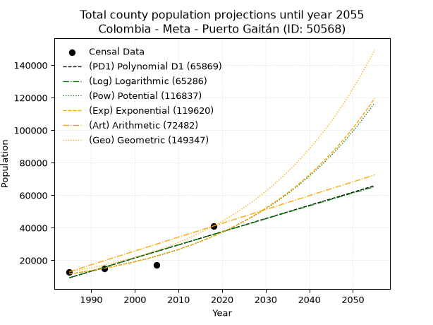
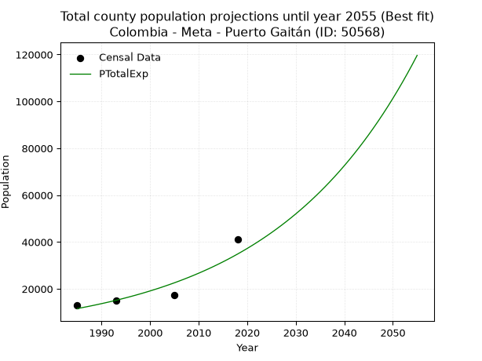
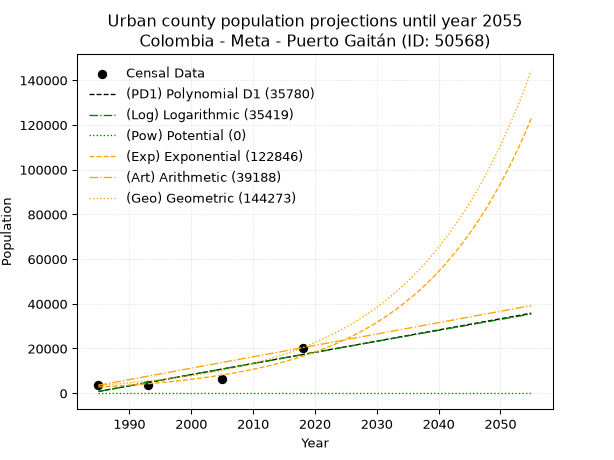
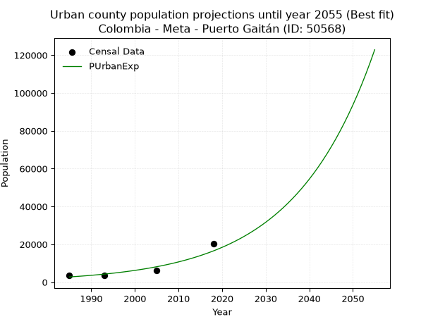
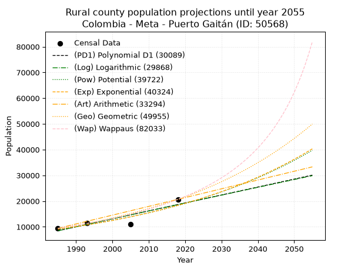
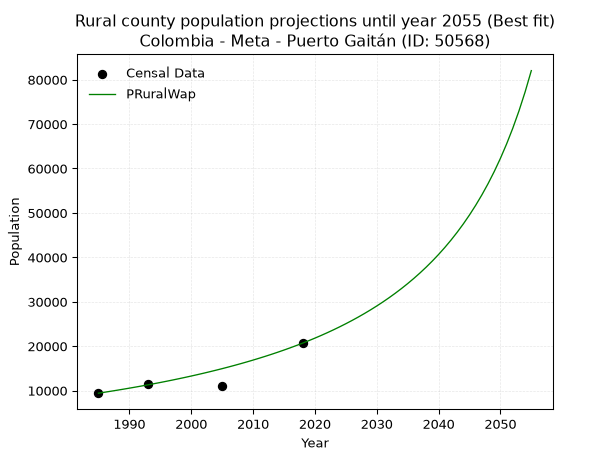

<div align="center">


</div>

# _“Population and Public Services Demand Projections (PPSD) until Year 2050 for Colombia - Meta - Puerto Gaitán (ID: 50568)”_
Keywords: `population` `public-service` `projection` `lineal` `polynomial` `logarithmic` `potential` `exponential` `arithmetic` `geometric` `wappaus` `dane` `colombia` `south-america`

PPSD are analytical estimates used by governments and planners to anticipate future changes in population size, age distribution, and the resulting community needs for utilities, healthcare, education, and infrastructure as sizing future water treatment facilities, electrical grids, and road networks based on spatial growth.

> **General running parameters**: • app_version: _v20260806_. • Python version: _3.14.7_. • Pandas version: _3.0.5_. • NumPy version: _2.5.1_. • Creates, save and include plots into reports (create_plot): _False_. • Projection until year: _2050_. • Process polynomial degree 2 and up: _False_. • Process Wappaus: _True_. • Process Wappaus: _True_. • Set negative values to zero: _True_. • Set infinite values to zero: _True_. • Drop dataset notes: _True_. 
<div align="center">

Dynamic map: [:earth_americas:Google](http://maps.google.com/maps?q=4.314905367,-72.0876489) [:earth_americas:OSM](https://www.openstreetmap.org/#map=18/4.314905367/-72.0876489&layers=P) [:earth_americas:Bing](https://www.bing.com/maps?cp=4.314905367~-72.0876489&lvl=18) [:earth_americas:Apple](https://maps.apple.com/frame?center=4.314905367%2C-72.0876489&span=0.003%2C0.006)

</div>


<div align="center">

```geojson
{
  "type": "Feature",
  "geometry": {
    "type": "Point", 
    "coordinates": [-72.0876489, 4.314905367]
  }, 
  "properties": {
    "Name": "Colombia - Meta - Puerto Gaitán (ID: 50568)"
  }
}
```

</div>


## 0. Census Data (4 records)

Census data are official statistics collected by a government about the people and housing in a country. They usually include counts of total population, age, sex, race, income, education, and jobs.

📅Global census file: [Population.xlsx](../data/Population.xlsx)

| Source   |   Year |   CountryID | CountryName   |   StateID | StateName   |   CountyID | CountyName    |   PTotal |   PUrban |   PRural |
|:---------|-------:|------------:|:--------------|----------:|:------------|-----------:|:--------------|---------:|---------:|---------:|
| DANE     |   1985 |          57 | Colombia      |        50 | Meta        |      50568 | Puerto Gaitán |    12954 |     3547 |     9407 |
| DANE     |   1993 |          57 | Colombia      |        50 | Meta        |      50568 | Puerto Gaitán |    15016 |     3495 |    11521 |
| DANE     |   2005 |          57 | Colombia      |        50 | Meta        |      50568 | Puerto Gaitán |    17306 |     6232 |    11074 |
| DANE     |   2018 |          57 | Colombia      |        50 | Meta        |      50568 | Puerto Gaitán |    41017 |    20349 |    20668 |

> 🔥Some records could had specific notes about the registered values or the corresponding urban or rural distribution.

## 1. Total

### 1.1. Coefficients and Parameters

* (PD1) Polynomial Deg 1: 809.0578081091782, -1596744.6306703836 (lineal)
* (Log) Logarithmic: 1617624.2145731992, -12274001.36779781
* (Pow) Potential: 66.67968981542381, -215.82968319319048
* (Exp) Exponential: 0.03334123127046524, 2.0969312246679646e-25
* (Art) Arithmetic: Year diff. 2018 - 1985 = 33, Population diff. 41017 - 12954 = 28063, Annual growth = 850.3939393939394
* (Geo) Geometric: Year diff. 2018 - 1985 = 33, Population diff. 41017 - 12954 = 28063, Annual growth % = 0.0355438287156582
* (Wap) Wappaus: i = 3.1512995475123287, Condition values only valid for < 200)

<sub>
Wappaus condition values: ['0.00', '3.15', '6.30', '9.45', '12.61', '15.76', '18.91', '22.06', '25.21', '28.36', '31.51', '34.66', '37.82', '40.97', '44.12', '47.27', '50.42', '53.57', '56.72', '59.87', '63.03', '66.18', '69.33', '72.48', '75.63', '78.78', '81.93', '85.09', '88.24', '91.39', '94.54', '97.69', '100.84', '103.99', '107.14', '110.30', '113.45', '116.60', '119.75', '122.90', '126.05', '129.20', '132.35', '135.51', '138.66', '141.81', '144.96', '148.11', '151.26', '154.41', '157.56', '160.72', '163.87', '167.02', '170.17', '173.32', '176.47', '179.62', '182.78', '185.93', '189.08', '192.23', '195.38', '198.53', '201.68', '204.83']
</sub>


### 1.2. Projected Dataset

|   Year |   CountyID |   PTotalPD1 |   PTotalLog |   PTotalPow |   PTotalExp |   PTotalArt |   PTotalGeo |
|-------:|-----------:|------------:|------------:|------------:|------------:|------------:|------------:|
|   1985 |      50568 |        9235 |        9225 |       11587 |       11593 |       12954 |       12954 |
|   1986 |      50568 |       10044 |       10039 |       11983 |       11986 |       13804 |       13414 |
|   1987 |      50568 |       10853 |       10854 |       12392 |       12393 |       14655 |       13891 |
|   1988 |      50568 |       11662 |       11668 |       12814 |       12813 |       15505 |       14385 |
|   1989 |      50568 |       12471 |       12481 |       13251 |       13247 |       16356 |       14896 |
|   1990 |      50568 |       13280 |       13294 |       13703 |       13697 |       17206 |       15426 |
|   1991 |      50568 |       14089 |       14107 |       14170 |       14161 |       18056 |       15974 |
|   1992 |      50568 |       14899 |       14919 |       14652 |       14641 |       18907 |       16542 |
|   1993 |      50568 |       15708 |       15731 |       15151 |       15137 |       19757 |       17130 |
|   1994 |      50568 |       16517 |       16542 |       15666 |       15651 |       20608 |       17739 |
|   1995 |      50568 |       17326 |       17353 |       16199 |       16181 |       21458 |       18369 |
|   1996 |      50568 |       18135 |       18164 |       16749 |       16730 |       22308 |       19022 |
|   1997 |      50568 |       18944 |       18974 |       17318 |       17297 |       23159 |       19698 |
|   1998 |      50568 |       19753 |       19784 |       17906 |       17883 |       24009 |       20398 |
|   1999 |      50568 |       20562 |       20593 |       18514 |       18490 |       24860 |       21123 |
|   2000 |      50568 |       21371 |       21403 |       19141 |       19117 |       25710 |       21874 |
|   2001 |      50568 |       22180 |       22211 |       19790 |       19765 |       26560 |       22652 |
|   2002 |      50568 |       22989 |       23019 |       20461 |       20435 |       27411 |       23457 |
|   2003 |      50568 |       23798 |       23827 |       21153 |       21128 |       28261 |       24291 |
|   2004 |      50568 |       24607 |       24635 |       21869 |       21844 |       29111 |       25154 |
|   2005 |      50568 |       25416 |       25442 |       22609 |       22584 |       29962 |       26048 |
|   2006 |      50568 |       26225 |       26248 |       23373 |       23350 |       30812 |       26974 |
|   2007 |      50568 |       27034 |       27054 |       24163 |       24142 |       31663 |       27933 |
|   2008 |      50568 |       27843 |       27860 |       24979 |       24960 |       32513 |       28925 |
|   2009 |      50568 |       28653 |       28665 |       25822 |       25806 |       33363 |       29953 |
|   2010 |      50568 |       29462 |       29470 |       26693 |       26681 |       34214 |       31018 |
|   2011 |      50568 |       30271 |       30275 |       27594 |       27586 |       35064 |       32121 |
|   2012 |      50568 |       31080 |       31079 |       28524 |       28521 |       35915 |       33262 |
|   2013 |      50568 |       31889 |       31883 |       29485 |       29488 |       36765 |       34445 |
|   2014 |      50568 |       32698 |       32686 |       30477 |       30488 |       37615 |       35669 |
|   2015 |      50568 |       33507 |       33489 |       31503 |       31522 |       38466 |       36937 |
|   2016 |      50568 |       34316 |       34292 |       32563 |       32590 |       39316 |       38250 |
|   2017 |      50568 |       35125 |       35094 |       33657 |       33695 |       40167 |       39609 |
|   2018 |      50568 |       35934 |       35896 |       34788 |       34838 |       41017 |       41017 |
|   2019 |      50568 |       36743 |       36697 |       35957 |       36019 |       41867 |       42475 |
|   2020 |      50568 |       37552 |       37498 |       37164 |       37240 |       42718 |       43985 |
|   2021 |      50568 |       38361 |       38299 |       38411 |       38502 |       43568 |       45548 |
|   2022 |      50568 |       39170 |       39099 |       39699 |       39808 |       44419 |       47167 |
|   2023 |      50568 |       39979 |       39899 |       41030 |       41157 |       45269 |       48843 |
|   2024 |      50568 |       40788 |       40698 |       42404 |       42553 |       46119 |       50580 |
|   2025 |      50568 |       41597 |       41497 |       43824 |       43995 |       46970 |       52377 |
|   2026 |      50568 |       42406 |       42296 |       45291 |       45487 |       47820 |       54239 |
|   2027 |      50568 |       43216 |       43094 |       46806 |       47029 |       48671 |       56167 |
|   2028 |      50568 |       44025 |       43892 |       48371 |       48624 |       49521 |       58163 |
|   2029 |      50568 |       44834 |       44690 |       49987 |       50272 |       50371 |       60231 |
|   2030 |      50568 |       45643 |       45487 |       51657 |       51977 |       51222 |       62371 |
|   2031 |      50568 |       46452 |       46283 |       53381 |       53739 |       52072 |       64588 |
|   2032 |      50568 |       47261 |       47080 |       55162 |       55561 |       52923 |       66884 |
|   2033 |      50568 |       48070 |       47875 |       57002 |       57444 |       53773 |       69261 |
|   2034 |      50568 |       48879 |       48671 |       58902 |       59392 |       54623 |       71723 |
|   2035 |      50568 |       49688 |       49466 |       60865 |       61405 |       55474 |       74273 |
|   2036 |      50568 |       50497 |       50261 |       62892 |       63487 |       56324 |       76912 |
|   2037 |      50568 |       51306 |       51055 |       64985 |       65640 |       57174 |       79646 |
|   2038 |      50568 |       52115 |       51849 |       67147 |       67865 |       58025 |       82477 |
|   2039 |      50568 |       52924 |       52643 |       69379 |       70166 |       58875 |       85409 |
|   2040 |      50568 |       53733 |       53436 |       71685 |       72545 |       59726 |       88444 |
|   2041 |      50568 |       54542 |       54228 |       74066 |       75004 |       60576 |       91588 |
|   2042 |      50568 |       55351 |       55021 |       76526 |       77547 |       61426 |       94843 |
|   2043 |      50568 |       56160 |       55813 |       79065 |       80176 |       62277 |       98215 |
|   2044 |      50568 |       56970 |       56604 |       81688 |       82895 |       63127 |      101706 |
|   2045 |      50568 |       57779 |       57396 |       84396 |       85705 |       63978 |      105321 |
|   2046 |      50568 |       58588 |       58186 |       87192 |       88611 |       64828 |      109064 |
|   2047 |      50568 |       59397 |       58977 |       90080 |       91615 |       65678 |      112941 |
|   2048 |      50568 |       60206 |       59767 |       93062 |       94721 |       66529 |      116955 |
|   2049 |      50568 |       61015 |       60557 |       96141 |       97932 |       67379 |      121112 |
|   2050 |      50568 |       61824 |       61346 |       99320 |      101252 |       68230 |      125417 |
<div align="center">

</img>

</div>


### 1.3. Best fit with absolute and relative error (%)

Relative error puts that difference into context by dividing the absolute error by the true value, creating a unitless ratio or percentage that shows the scale of the mistake.

Absolute and relative error

|   Year | Source   |   CountryID | CountryName   |   StateID | StateName   |   CountyID_x | CountyName    |   PTotal |   PUrban |   PRural |   CountyID_y |   PTotalPD1 |   PTotalLog |   PTotalPow |   PTotalExp |   PTotalArt |   PTotalGeo |   PTotalPD1AbsError |   PTotalLogAbsError |   PTotalPowAbsError |   PTotalExpAbsError |   PTotalArtAbsError |   PTotalGeoAbsError |   PTotalPD1RelError |   PTotalLogRelError |   PTotalPowRelError |   PTotalExpRelError |   PTotalArtRelError |   PTotalGeoRelError |
|-------:|:---------|------------:|:--------------|----------:|:------------|-------------:|:--------------|---------:|---------:|---------:|-------------:|------------:|------------:|------------:|------------:|------------:|------------:|--------------------:|--------------------:|--------------------:|--------------------:|--------------------:|--------------------:|--------------------:|--------------------:|--------------------:|--------------------:|--------------------:|--------------------:|
|   1985 | DANE     |          57 | Colombia      |        50 | Meta        |        50568 | Puerto Gaitán |    12954 |     3547 |     9407 |        50568 |        9235 |        9225 |       11587 |       11593 |       12954 |       12954 |                3719 |                3729 |                1367 |                1361 |                   0 |                   0 |            28.7093  |            28.7865  |           10.5527   |           10.5064   |              0      |              0      |
|   1993 | DANE     |          57 | Colombia      |        50 | Meta        |        50568 | Puerto Gaitán |    15016 |     3495 |    11521 |        50568 |       15708 |       15731 |       15151 |       15137 |       19757 |       17130 |                 692 |                 715 |                 135 |                 121 |                4741 |                2114 |             4.60842 |             4.76159 |            0.899041 |            0.805807 |             31.573  |             14.0783 |
|   2005 | DANE     |          57 | Colombia      |        50 | Meta        |        50568 | Puerto Gaitán |    17306 |     6232 |    11074 |        50568 |       25416 |       25442 |       22609 |       22584 |       29962 |       26048 |                8110 |                8136 |                5303 |                5278 |               12656 |                8742 |            46.8624  |            47.0126  |           30.6426   |           30.4981   |             73.1307 |             50.5143 |
|   2018 | DANE     |          57 | Colombia      |        50 | Meta        |        50568 | Puerto Gaitán |    41017 |    20349 |    20668 |        50568 |       35934 |       35896 |       34788 |       34838 |       41017 |       41017 |                5083 |                5121 |                6229 |                6179 |                   0 |                   0 |            12.3924  |            12.4851  |           15.1864   |           15.0645   |              0      |              0      |

Relative error mean

| Method    |   RelError | Best   |
|:----------|-----------:|:-------|
| PTotalPD1 |    23.1431 |        |
| PTotalLog |    23.2614 |        |
| PTotalPow |    14.3202 |        |
| PTotalExp |    14.2187 | True   |
| PTotalArt |    26.1759 |        |
| PTotalGeo |    16.1481 |        |

💙Best method: _**PTotalExp**_
<div align="center">

</img>

</div>


### 1.4. Fresh water supply demand in liters per capita per day (lpcd)

The fresh water supply demand typically ranges from 100 to 300 liters per capita per day (lpcd) for standard domestic and municipal planning, though absolute survival minimums set by the World Health Organization are as low as 7.5 to 20 liters per day, and total consumption in high-income nations can exceed 400 liters.

> `CZ`: Level in meters above the sea level (masl)<br> `WS`: Fresh water supply demand in liters per capita per day (lpcd or l/h/d)<br> `WSAll`: Zonal fresh water supply demand in liters per second (l/s)<br> `A`: Zonal area in square meters<br> `DP`: Population density (people/hectare)

Reference values (RAS Colombia)

|    CZ |   WS |
|------:|-----:|
|  1000 |  120 |
|  2000 |  130 |
| 99999 |  140 |

County shapefile geometry properties and water supply values

|   CountyID |      ATotal |   CZTotal |   WSTotal |
|-----------:|------------:|----------:|----------:|
|      50568 | 1.71993e+10 |   183.273 |       120 |

Projected values for best method: PTotalExp

|   CountyID |   Year |   PTotalExp |   DPTotal |   WSTotal |   WSTotalAll |
|-----------:|-------:|------------:|----------:|----------:|-------------:|
|      50568 |   1985 |       11593 |      0.01 |       120 |      16.1014 |
|      50568 |   1986 |       11986 |      0.01 |       120 |      16.6472 |
|      50568 |   1987 |       12393 |      0.01 |       120 |      17.2125 |
|      50568 |   1988 |       12813 |      0.01 |       120 |      17.7958 |
|      50568 |   1989 |       13247 |      0.01 |       120 |      18.3986 |
|      50568 |   1990 |       13697 |      0.01 |       120 |      19.0236 |
|      50568 |   1991 |       14161 |      0.01 |       120 |      19.6681 |
|      50568 |   1992 |       14641 |      0.01 |       120 |      20.3347 |
|      50568 |   1993 |       15137 |      0.01 |       120 |      21.0236 |
|      50568 |   1994 |       15651 |      0.01 |       120 |      21.7375 |
|      50568 |   1995 |       16181 |      0.01 |       120 |      22.4736 |
|      50568 |   1996 |       16730 |      0.01 |       120 |      23.2361 |
|      50568 |   1997 |       17297 |      0.01 |       120 |      24.0236 |
|      50568 |   1998 |       17883 |      0.01 |       120 |      24.8375 |
|      50568 |   1999 |       18490 |      0.01 |       120 |      25.6806 |
|      50568 |   2000 |       19117 |      0.01 |       120 |      26.5514 |
|      50568 |   2001 |       19765 |      0.01 |       120 |      27.4514 |
|      50568 |   2002 |       20435 |      0.01 |       120 |      28.3819 |
|      50568 |   2003 |       21128 |      0.01 |       120 |      29.3444 |
|      50568 |   2004 |       21844 |      0.01 |       120 |      30.3389 |
|      50568 |   2005 |       22584 |      0.01 |       120 |      31.3667 |
|      50568 |   2006 |       23350 |      0.01 |       120 |      32.4306 |
|      50568 |   2007 |       24142 |      0.01 |       120 |      33.5306 |
|      50568 |   2008 |       24960 |      0.01 |       120 |      34.6667 |
|      50568 |   2009 |       25806 |      0.02 |       120 |      35.8417 |
|      50568 |   2010 |       26681 |      0.02 |       120 |      37.0569 |
|      50568 |   2011 |       27586 |      0.02 |       120 |      38.3139 |
|      50568 |   2012 |       28521 |      0.02 |       120 |      39.6125 |
|      50568 |   2013 |       29488 |      0.02 |       120 |      40.9556 |
|      50568 |   2014 |       30488 |      0.02 |       120 |      42.3444 |
|      50568 |   2015 |       31522 |      0.02 |       120 |      43.7806 |
|      50568 |   2016 |       32590 |      0.02 |       120 |      45.2639 |
|      50568 |   2017 |       33695 |      0.02 |       120 |      46.7986 |
|      50568 |   2018 |       34838 |      0.02 |       120 |      48.3861 |
|      50568 |   2019 |       36019 |      0.02 |       120 |      50.0264 |
|      50568 |   2020 |       37240 |      0.02 |       120 |      51.7222 |
|      50568 |   2021 |       38502 |      0.02 |       120 |      53.475  |
|      50568 |   2022 |       39808 |      0.02 |       120 |      55.2889 |
|      50568 |   2023 |       41157 |      0.02 |       120 |      57.1625 |
|      50568 |   2024 |       42553 |      0.02 |       120 |      59.1014 |
|      50568 |   2025 |       43995 |      0.03 |       120 |      61.1042 |
|      50568 |   2026 |       45487 |      0.03 |       120 |      63.1764 |
|      50568 |   2027 |       47029 |      0.03 |       120 |      65.3181 |
|      50568 |   2028 |       48624 |      0.03 |       120 |      67.5333 |
|      50568 |   2029 |       50272 |      0.03 |       120 |      69.8222 |
|      50568 |   2030 |       51977 |      0.03 |       120 |      72.1903 |
|      50568 |   2031 |       53739 |      0.03 |       120 |      74.6375 |
|      50568 |   2032 |       55561 |      0.03 |       120 |      77.1681 |
|      50568 |   2033 |       57444 |      0.03 |       120 |      79.7833 |
|      50568 |   2034 |       59392 |      0.03 |       120 |      82.4889 |
|      50568 |   2035 |       61405 |      0.04 |       120 |      85.2847 |
|      50568 |   2036 |       63487 |      0.04 |       120 |      88.1764 |
|      50568 |   2037 |       65640 |      0.04 |       120 |      91.1667 |
|      50568 |   2038 |       67865 |      0.04 |       120 |      94.2569 |
|      50568 |   2039 |       70166 |      0.04 |       120 |      97.4528 |
|      50568 |   2040 |       72545 |      0.04 |       120 |     100.757  |
|      50568 |   2041 |       75004 |      0.04 |       120 |     104.172  |
|      50568 |   2042 |       77547 |      0.05 |       120 |     107.704  |
|      50568 |   2043 |       80176 |      0.05 |       120 |     111.356  |
|      50568 |   2044 |       82895 |      0.05 |       120 |     115.132  |
|      50568 |   2045 |       85705 |      0.05 |       120 |     119.035  |
|      50568 |   2046 |       88611 |      0.05 |       120 |     123.071  |
|      50568 |   2047 |       91615 |      0.05 |       120 |     127.243  |
|      50568 |   2048 |       94721 |      0.06 |       120 |     131.557  |
|      50568 |   2049 |       97932 |      0.06 |       120 |     136.017  |
|      50568 |   2050 |      101252 |      0.06 |       120 |     140.628  |

## 2. Urban

### 2.1. Coefficients and Parameters

* (PD1) Polynomial Deg 1: 499.9859494178955, -991691.1453231454 (lineal)
* (Log) Logarithmic: 999626.5829762763, -7589763.917707381
* (Pow) Potential: 108.52616019450296, -354.45396539703194
* (Exp) Exponential: 0.05426278761923174, 4.583209848890493e-44
* (Art) Arithmetic: Year diff. 2018 - 1985 = 33, Population diff. 20349 - 3547 = 16802, Annual growth = 509.1515151515151
* (Geo) Geometric: Year diff. 2018 - 1985 = 33, Population diff. 20349 - 3547 = 16802, Annual growth % = 0.0543634927528196
* (Wap) Wappaus: i = 4.261395339400027, Condition values only valid for < 200)

<sub>
Wappaus condition values: ['0.00', '4.26', '8.52', '12.78', '17.05', '21.31', '25.57', '29.83', '34.09', '38.35', '42.61', '46.88', '51.14', '55.40', '59.66', '63.92', '68.18', '72.44', '76.71', '80.97', '85.23', '89.49', '93.75', '98.01', '102.27', '106.53', '110.80', '115.06', '119.32', '123.58', '127.84', '132.10', '136.36', '140.63', '144.89', '149.15', '153.41', '157.67', '161.93', '166.19', '170.46', '174.72', '178.98', '183.24', '187.50', '191.76', '196.02', '200.29', '204.55', '208.81', '213.07', '217.33', '221.59', '225.85', '230.12', '234.38', '238.64', '242.90', '247.16', '251.42', '255.68', '259.95', '264.21', '268.47', '272.73', '276.99']
</sub>


### 2.2. Projected Dataset

|   Year |   CountyID |   PUrbanPD1 |   PUrbanLog |   PUrbanPow |   PUrbanExp |   PUrbanArt |   PUrbanGeo |
|-------:|-----------:|------------:|------------:|------------:|------------:|------------:|------------:|
|   1985 |      50568 |         781 |         775 |           0 |        2753 |        3547 |        3547 |
|   1986 |      50568 |        1281 |        1278 |           0 |        2906 |        4056 |        3740 |
|   1987 |      50568 |        1781 |        1781 |           0 |        3068 |        4565 |        3943 |
|   1988 |      50568 |        2281 |        2284 |           0 |        3239 |        5074 |        4158 |
|   1989 |      50568 |        2781 |        2787 |           0 |        3420 |        5584 |        4384 |
|   1990 |      50568 |        3281 |        3290 |           0 |        3611 |        6093 |        4622 |
|   1991 |      50568 |        3781 |        3792 |           0 |        3812 |        6602 |        4873 |
|   1992 |      50568 |        4281 |        4294 |           0 |        4024 |        7111 |        5138 |
|   1993 |      50568 |        4781 |        4795 |           0 |        4249 |        7620 |        5417 |
|   1994 |      50568 |        5281 |        5297 |           0 |        4486 |        8129 |        5712 |
|   1995 |      50568 |        5781 |        5798 |           0 |        4736 |        8639 |        6022 |
|   1996 |      50568 |        6281 |        6299 |           0 |        5000 |        9148 |        6350 |
|   1997 |      50568 |        6781 |        6800 |           0 |        5279 |        9657 |        6695 |
|   1998 |      50568 |        7281 |        7300 |           0 |        5573 |       10166 |        7059 |
|   1999 |      50568 |        7781 |        7800 |           0 |        5884 |       10675 |        7443 |
|   2000 |      50568 |        8281 |        8300 |           0 |        6212 |       11184 |        7847 |
|   2001 |      50568 |        8781 |        8800 |           0 |        6558 |       11693 |        8274 |
|   2002 |      50568 |        9281 |        9299 |           0 |        6924 |       12203 |        8724 |
|   2003 |      50568 |        9781 |        9799 |           0 |        7310 |       12712 |        9198 |
|   2004 |      50568 |       10281 |       10297 |           0 |        7718 |       13221 |        9698 |
|   2005 |      50568 |       10781 |       10796 |           0 |        8148 |       13730 |       10225 |
|   2006 |      50568 |       11281 |       11295 |           0 |        8602 |       14239 |       10781 |
|   2007 |      50568 |       11781 |       11793 |           0 |        9082 |       14748 |       11367 |
|   2008 |      50568 |       12281 |       12291 |           0 |        9589 |       15257 |       11985 |
|   2009 |      50568 |       12781 |       12788 |           0 |       10123 |       15767 |       12637 |
|   2010 |      50568 |       13281 |       13286 |           0 |       10688 |       16276 |       13324 |
|   2011 |      50568 |       13781 |       13783 |           0 |       11284 |       16785 |       14048 |
|   2012 |      50568 |       14281 |       14280 |           0 |       11913 |       17294 |       14812 |
|   2013 |      50568 |       14781 |       14777 |           0 |       12577 |       17803 |       15617 |
|   2014 |      50568 |       15281 |       15273 |           0 |       13279 |       18312 |       16466 |
|   2015 |      50568 |       15781 |       15769 |           0 |       14019 |       18822 |       17361 |
|   2016 |      50568 |       16281 |       16265 |           0 |       14801 |       19331 |       18305 |
|   2017 |      50568 |       16781 |       16761 |           0 |       15626 |       19840 |       19300 |
|   2018 |      50568 |       17281 |       17257 |           0 |       16497 |       20349 |       20349 |
|   2019 |      50568 |       17780 |       17752 |           0 |       17417 |       20858 |       21455 |
|   2020 |      50568 |       18280 |       18247 |           0 |       18389 |       21367 |       22622 |
|   2021 |      50568 |       18780 |       18742 |           0 |       19414 |       21876 |       23851 |
|   2022 |      50568 |       19280 |       19236 |           0 |       20497 |       22386 |       25148 |
|   2023 |      50568 |       19780 |       19730 |           0 |       21639 |       22895 |       26515 |
|   2024 |      50568 |       20280 |       20224 |           0 |       22846 |       23404 |       27957 |
|   2025 |      50568 |       20780 |       20718 |           0 |       24120 |       23913 |       29476 |
|   2026 |      50568 |       21280 |       21212 |           0 |       25465 |       24422 |       31079 |
|   2027 |      50568 |       21780 |       21705 |           0 |       26885 |       24931 |       32768 |
|   2028 |      50568 |       22280 |       22198 |           0 |       28384 |       25441 |       34550 |
|   2029 |      50568 |       22780 |       22691 |           0 |       29967 |       25950 |       36428 |
|   2030 |      50568 |       23280 |       23183 |           0 |       31638 |       26459 |       38409 |
|   2031 |      50568 |       23780 |       23676 |           0 |       33402 |       26968 |       40497 |
|   2032 |      50568 |       24280 |       24168 |           0 |       35265 |       27477 |       42698 |
|   2033 |      50568 |       24780 |       24659 |           0 |       37231 |       27986 |       45019 |
|   2034 |      50568 |       25280 |       25151 |           0 |       39307 |       28495 |       47467 |
|   2035 |      50568 |       25780 |       25642 |           0 |       41499 |       29005 |       50047 |
|   2036 |      50568 |       26280 |       26133 |           0 |       43813 |       29514 |       52768 |
|   2037 |      50568 |       26780 |       26624 |           0 |       46256 |       30023 |       55637 |
|   2038 |      50568 |       27280 |       27115 |           0 |       48836 |       30532 |       58661 |
|   2039 |      50568 |       27780 |       27605 |           0 |       51559 |       31041 |       61850 |
|   2040 |      50568 |       28280 |       28095 |           0 |       54434 |       31550 |       65213 |
|   2041 |      50568 |       28780 |       28585 |           0 |       57469 |       32059 |       68758 |
|   2042 |      50568 |       29280 |       29075 |           0 |       60674 |       32569 |       72496 |
|   2043 |      50568 |       29780 |       29564 |           0 |       64057 |       33078 |       76437 |
|   2044 |      50568 |       30280 |       30054 |           0 |       67629 |       33587 |       80592 |
|   2045 |      50568 |       30780 |       30543 |           0 |       71400 |       34096 |       84973 |
|   2046 |      50568 |       31280 |       31031 |           0 |       75382 |       34605 |       89593 |
|   2047 |      50568 |       31780 |       31520 |           0 |       79585 |       35114 |       94463 |
|   2048 |      50568 |       32280 |       32008 |           0 |       84023 |       35624 |       99599 |
|   2049 |      50568 |       32780 |       32496 |           0 |       88708 |       36133 |      105013 |
|   2050 |      50568 |       33280 |       32984 |           0 |       93655 |       36642 |      110722 |
<div align="center">

</img>

</div>


### 2.3. Best fit with absolute and relative error (%)

Relative error puts that difference into context by dividing the absolute error by the true value, creating a unitless ratio or percentage that shows the scale of the mistake.

Absolute and relative error

|   Year | Source   |   CountryID | CountryName   |   StateID | StateName   |   CountyID_x | CountyName    |   PTotal |   PUrban |   PRural |   CountyID_y |   PUrbanPD1 |   PUrbanLog |   PUrbanPow |   PUrbanExp |   PUrbanArt |   PUrbanGeo |   PUrbanPD1AbsError |   PUrbanLogAbsError |   PUrbanPowAbsError |   PUrbanExpAbsError |   PUrbanArtAbsError |   PUrbanGeoAbsError |   PUrbanPD1RelError |   PUrbanLogRelError |   PUrbanPowRelError |   PUrbanExpRelError |   PUrbanArtRelError |   PUrbanGeoRelError |
|-------:|:---------|------------:|:--------------|----------:|:------------|-------------:|:--------------|---------:|---------:|---------:|-------------:|------------:|------------:|------------:|------------:|------------:|------------:|--------------------:|--------------------:|--------------------:|--------------------:|--------------------:|--------------------:|--------------------:|--------------------:|--------------------:|--------------------:|--------------------:|--------------------:|
|   1985 | DANE     |          57 | Colombia      |        50 | Meta        |        50568 | Puerto Gaitán |    12954 |     3547 |     9407 |        50568 |         781 |         775 |           0 |        2753 |        3547 |        3547 |                2766 |                2772 |                3547 |                 794 |                   0 |                   0 |             77.9814 |             78.1505 |                 100 |             22.3851 |               0     |              0      |
|   1993 | DANE     |          57 | Colombia      |        50 | Meta        |        50568 | Puerto Gaitán |    15016 |     3495 |    11521 |        50568 |        4781 |        4795 |           0 |        4249 |        7620 |        5417 |                1286 |                1300 |                3495 |                 754 |                4125 |                1922 |             36.7954 |             37.196  |                 100 |             21.5737 |             118.026 |             54.9928 |
|   2005 | DANE     |          57 | Colombia      |        50 | Meta        |        50568 | Puerto Gaitán |    17306 |     6232 |    11074 |        50568 |       10781 |       10796 |           0 |        8148 |       13730 |       10225 |                4549 |                4564 |                6232 |                1916 |                7498 |                3993 |             72.9942 |             73.2349 |                 100 |             30.7445 |             120.315 |             64.0725 |
|   2018 | DANE     |          57 | Colombia      |        50 | Meta        |        50568 | Puerto Gaitán |    41017 |    20349 |    20668 |        50568 |       17281 |       17257 |           0 |       16497 |       20349 |       20349 |                3068 |                3092 |               20349 |                3852 |                   0 |                   0 |             15.0769 |             15.1948 |                 100 |             18.9297 |               0     |              0      |

Relative error mean

| Method    |   RelError | Best   |
|:----------|-----------:|:-------|
| PUrbanPD1 |    50.712  |        |
| PUrbanLog |    50.9441 |        |
| PUrbanPow |   100      |        |
| PUrbanExp |    23.4083 | True   |
| PUrbanArt |    59.5851 |        |
| PUrbanGeo |    29.7663 |        |

💙Best method: _**PUrbanExp**_
<div align="center">

</img>

</div>


### 2.4. Fresh water supply demand in liters per capita per day (lpcd)

The fresh water supply demand typically ranges from 100 to 300 liters per capita per day (lpcd) for standard domestic and municipal planning, though absolute survival minimums set by the World Health Organization are as low as 7.5 to 20 liters per day, and total consumption in high-income nations can exceed 400 liters.

> `CZ`: Level in meters above the sea level (masl)<br> `WS`: Fresh water supply demand in liters per capita per day (lpcd or l/h/d)<br> `WSAll`: Zonal fresh water supply demand in liters per second (l/s)<br> `A`: Zonal area in square meters<br> `DP`: Population density (people/hectare)

Reference values (RAS Colombia)

|    CZ |   WS |
|------:|-----:|
|  1000 |  120 |
|  2000 |  130 |
| 99999 |  140 |

County shapefile geometry properties and water supply values

|   CountyID |      AUrban |   CZUrban |   WSUrban |
|-----------:|------------:|----------:|----------:|
|      50568 | 4.48736e+06 |   157.225 |       120 |

Projected values for best method: PUrbanExp

|   CountyID |   Year |   PUrbanExp |   DPUrban |   WSUrban |   WSUrbanAll |
|-----------:|-------:|------------:|----------:|----------:|-------------:|
|      50568 |   1985 |        2753 |      6.14 |       120 |      3.82361 |
|      50568 |   1986 |        2906 |      6.48 |       120 |      4.03611 |
|      50568 |   1987 |        3068 |      6.84 |       120 |      4.26111 |
|      50568 |   1988 |        3239 |      7.22 |       120 |      4.49861 |
|      50568 |   1989 |        3420 |      7.62 |       120 |      4.75    |
|      50568 |   1990 |        3611 |      8.05 |       120 |      5.01528 |
|      50568 |   1991 |        3812 |      8.49 |       120 |      5.29444 |
|      50568 |   1992 |        4024 |      8.97 |       120 |      5.58889 |
|      50568 |   1993 |        4249 |      9.47 |       120 |      5.90139 |
|      50568 |   1994 |        4486 |     10    |       120 |      6.23056 |
|      50568 |   1995 |        4736 |     10.55 |       120 |      6.57778 |
|      50568 |   1996 |        5000 |     11.14 |       120 |      6.94444 |
|      50568 |   1997 |        5279 |     11.76 |       120 |      7.33194 |
|      50568 |   1998 |        5573 |     12.42 |       120 |      7.74028 |
|      50568 |   1999 |        5884 |     13.11 |       120 |      8.17222 |
|      50568 |   2000 |        6212 |     13.84 |       120 |      8.62778 |
|      50568 |   2001 |        6558 |     14.61 |       120 |      9.10833 |
|      50568 |   2002 |        6924 |     15.43 |       120 |      9.61667 |
|      50568 |   2003 |        7310 |     16.29 |       120 |     10.1528  |
|      50568 |   2004 |        7718 |     17.2  |       120 |     10.7194  |
|      50568 |   2005 |        8148 |     18.16 |       120 |     11.3167  |
|      50568 |   2006 |        8602 |     19.17 |       120 |     11.9472  |
|      50568 |   2007 |        9082 |     20.24 |       120 |     12.6139  |
|      50568 |   2008 |        9589 |     21.37 |       120 |     13.3181  |
|      50568 |   2009 |       10123 |     22.56 |       120 |     14.0597  |
|      50568 |   2010 |       10688 |     23.82 |       120 |     14.8444  |
|      50568 |   2011 |       11284 |     25.15 |       120 |     15.6722  |
|      50568 |   2012 |       11913 |     26.55 |       120 |     16.5458  |
|      50568 |   2013 |       12577 |     28.03 |       120 |     17.4681  |
|      50568 |   2014 |       13279 |     29.59 |       120 |     18.4431  |
|      50568 |   2015 |       14019 |     31.24 |       120 |     19.4708  |
|      50568 |   2016 |       14801 |     32.98 |       120 |     20.5569  |
|      50568 |   2017 |       15626 |     34.82 |       120 |     21.7028  |
|      50568 |   2018 |       16497 |     36.76 |       120 |     22.9125  |
|      50568 |   2019 |       17417 |     38.81 |       120 |     24.1903  |
|      50568 |   2020 |       18389 |     40.98 |       120 |     25.5403  |
|      50568 |   2021 |       19414 |     43.26 |       120 |     26.9639  |
|      50568 |   2022 |       20497 |     45.68 |       120 |     28.4681  |
|      50568 |   2023 |       21639 |     48.22 |       120 |     30.0542  |
|      50568 |   2024 |       22846 |     50.91 |       120 |     31.7306  |
|      50568 |   2025 |       24120 |     53.75 |       120 |     33.5     |
|      50568 |   2026 |       25465 |     56.75 |       120 |     35.3681  |
|      50568 |   2027 |       26885 |     59.91 |       120 |     37.3403  |
|      50568 |   2028 |       28384 |     63.25 |       120 |     39.4222  |
|      50568 |   2029 |       29967 |     66.78 |       120 |     41.6208  |
|      50568 |   2030 |       31638 |     70.5  |       120 |     43.9417  |
|      50568 |   2031 |       33402 |     74.44 |       120 |     46.3917  |
|      50568 |   2032 |       35265 |     78.59 |       120 |     48.9792  |
|      50568 |   2033 |       37231 |     82.97 |       120 |     51.7097  |
|      50568 |   2034 |       39307 |     87.59 |       120 |     54.5931  |
|      50568 |   2035 |       41499 |     92.48 |       120 |     57.6375  |
|      50568 |   2036 |       43813 |     97.64 |       120 |     60.8514  |
|      50568 |   2037 |       46256 |    103.08 |       120 |     64.2444  |
|      50568 |   2038 |       48836 |    108.83 |       120 |     67.8278  |
|      50568 |   2039 |       51559 |    114.9  |       120 |     71.6097  |
|      50568 |   2040 |       54434 |    121.31 |       120 |     75.6028  |
|      50568 |   2041 |       57469 |    128.07 |       120 |     79.8181  |
|      50568 |   2042 |       60674 |    135.21 |       120 |     84.2694  |
|      50568 |   2043 |       64057 |    142.75 |       120 |     88.9681  |
|      50568 |   2044 |       67629 |    150.71 |       120 |     93.9292  |
|      50568 |   2045 |       71400 |    159.11 |       120 |     99.1667  |
|      50568 |   2046 |       75382 |    167.99 |       120 |    104.697   |
|      50568 |   2047 |       79585 |    177.35 |       120 |    110.535   |
|      50568 |   2048 |       84023 |    187.24 |       120 |    116.699   |
|      50568 |   2049 |       88708 |    197.68 |       120 |    123.206   |
|      50568 |   2050 |       93655 |    208.71 |       120 |    130.076   |

## 3. Rural

### 3.1. Coefficients and Parameters

* (PD1) Polynomial Deg 1: 309.0718586912827, -605053.4853472383 (lineal)
* (Log) Logarithmic: 617997.6315969223, -4684237.450090422
* (Pow) Potential: 42.63786993060454, -136.6522061028929
* (Exp) Exponential: 0.021319702032430384, 3.7867219660998525e-15
* (Art) Arithmetic: Year diff. 2018 - 1985 = 33, Population diff. 20668 - 9407 = 11261, Annual growth = 341.24242424242425
* (Geo) Geometric: Year diff. 2018 - 1985 = 33, Population diff. 20668 - 9407 = 11261, Annual growth % = 0.024139246751633703
* (Wap) Wappaus: i = 2.2692763041890225, Condition values only valid for < 200)

<sub>
Wappaus condition values: ['0.00', '2.27', '4.54', '6.81', '9.08', '11.35', '13.62', '15.88', '18.15', '20.42', '22.69', '24.96', '27.23', '29.50', '31.77', '34.04', '36.31', '38.58', '40.85', '43.12', '45.39', '47.65', '49.92', '52.19', '54.46', '56.73', '59.00', '61.27', '63.54', '65.81', '68.08', '70.35', '72.62', '74.89', '77.16', '79.42', '81.69', '83.96', '86.23', '88.50', '90.77', '93.04', '95.31', '97.58', '99.85', '102.12', '104.39', '106.66', '108.93', '111.19', '113.46', '115.73', '118.00', '120.27', '122.54', '124.81', '127.08', '129.35', '131.62', '133.89', '136.16', '138.43', '140.70', '142.96', '145.23', '147.50']
</sub>


### 3.2. Projected Dataset

|   Year |   CountyID |   PRuralPD1 |   PRuralLog |   PRuralPow |   PRuralExp |   PRuralArt |   PRuralGeo |   PRuralWap |
|-------:|-----------:|------------:|------------:|------------:|------------:|------------:|------------:|------------:|
|   1985 |      50568 |        8454 |        8450 |        9063 |        9066 |        9407 |        9407 |        9407 |
|   1986 |      50568 |        8763 |        8761 |        9260 |        9262 |        9748 |        9634 |        9623 |
|   1987 |      50568 |        9072 |        9072 |        9461 |        9461 |       10089 |        9867 |        9844 |
|   1988 |      50568 |        9381 |        9383 |        9666 |        9665 |       10431 |       10105 |       10070 |
|   1989 |      50568 |        9690 |        9694 |        9875 |        9874 |       10772 |       10349 |       10301 |
|   1990 |      50568 |       10000 |       10005 |       10089 |       10086 |       11113 |       10599 |       10539 |
|   1991 |      50568 |       10309 |       10315 |       10308 |       10304 |       11454 |       10854 |       10781 |
|   1992 |      50568 |       10618 |       10625 |       10531 |       10526 |       11796 |       11116 |       11030 |
|   1993 |      50568 |       10927 |       10935 |       10759 |       10752 |       12137 |       11385 |       11285 |
|   1994 |      50568 |       11236 |       11245 |       10991 |       10984 |       12478 |       11660 |       11547 |
|   1995 |      50568 |       11545 |       11555 |       11229 |       11221 |       12819 |       11941 |       11815 |
|   1996 |      50568 |       11854 |       11865 |       11471 |       11463 |       13161 |       12229 |       12090 |
|   1997 |      50568 |       12163 |       12175 |       11719 |       11710 |       13502 |       12524 |       12372 |
|   1998 |      50568 |       12472 |       12484 |       11972 |       11962 |       13843 |       12827 |       12662 |
|   1999 |      50568 |       12781 |       12793 |       12230 |       12220 |       14184 |       13136 |       12960 |
|   2000 |      50568 |       13090 |       13102 |       12493 |       12483 |       14526 |       13454 |       13266 |
|   2001 |      50568 |       13399 |       13411 |       12763 |       12752 |       14867 |       13778 |       13580 |
|   2002 |      50568 |       13708 |       13720 |       13037 |       13027 |       15208 |       14111 |       13903 |
|   2003 |      50568 |       14017 |       14029 |       13318 |       13308 |       15549 |       14452 |       14236 |
|   2004 |      50568 |       14327 |       14337 |       13604 |       13594 |       15891 |       14800 |       14578 |
|   2005 |      50568 |       14636 |       14645 |       13897 |       13887 |       16232 |       15158 |       14930 |
|   2006 |      50568 |       14945 |       14953 |       14195 |       14187 |       16573 |       15524 |       15292 |
|   2007 |      50568 |       15254 |       15261 |       14500 |       14492 |       16914 |       15898 |       15666 |
|   2008 |      50568 |       15563 |       15569 |       14812 |       14804 |       17256 |       16282 |       16051 |
|   2009 |      50568 |       15872 |       15877 |       15129 |       15124 |       17597 |       16675 |       16448 |
|   2010 |      50568 |       16181 |       16185 |       15454 |       15449 |       17938 |       17078 |       16857 |
|   2011 |      50568 |       16490 |       16492 |       15785 |       15782 |       18279 |       17490 |       17280 |
|   2012 |      50568 |       16799 |       16799 |       16123 |       16122 |       18621 |       17912 |       17716 |
|   2013 |      50568 |       17108 |       17106 |       16469 |       16470 |       18962 |       18344 |       18167 |
|   2014 |      50568 |       17417 |       17413 |       16821 |       16825 |       19303 |       18787 |       18634 |
|   2015 |      50568 |       17726 |       17720 |       17181 |       17187 |       19644 |       19241 |       19116 |
|   2016 |      50568 |       18035 |       18027 |       17548 |       17558 |       19986 |       19705 |       19615 |
|   2017 |      50568 |       18344 |       18333 |       17923 |       17936 |       20327 |       20181 |       20132 |
|   2018 |      50568 |       18654 |       18639 |       18306 |       18322 |       20668 |       20668 |       20668 |
|   2019 |      50568 |       18963 |       18946 |       18697 |       18717 |       21009 |       21167 |       21224 |
|   2020 |      50568 |       19272 |       19252 |       19096 |       19121 |       21350 |       21678 |       21800 |
|   2021 |      50568 |       19581 |       19557 |       19503 |       19533 |       21692 |       22201 |       22399 |
|   2022 |      50568 |       19890 |       19863 |       19919 |       19954 |       22033 |       22737 |       23021 |
|   2023 |      50568 |       20199 |       20169 |       20343 |       20384 |       22374 |       23286 |       23667 |
|   2024 |      50568 |       20508 |       20474 |       20776 |       20823 |       22715 |       23848 |       24341 |
|   2025 |      50568 |       20817 |       20779 |       21218 |       21271 |       23057 |       24424 |       25042 |
|   2026 |      50568 |       21126 |       21084 |       21670 |       21730 |       23398 |       25013 |       25773 |
|   2027 |      50568 |       21435 |       21389 |       22131 |       22198 |       23739 |       25617 |       26535 |
|   2028 |      50568 |       21744 |       21694 |       22601 |       22676 |       24080 |       26235 |       27332 |
|   2029 |      50568 |       22053 |       21999 |       23081 |       23165 |       24422 |       26869 |       28164 |
|   2030 |      50568 |       22362 |       22303 |       23571 |       23664 |       24763 |       27517 |       29035 |
|   2031 |      50568 |       22671 |       22608 |       24071 |       24174 |       25104 |       28182 |       29947 |
|   2032 |      50568 |       22981 |       22912 |       24582 |       24695 |       25445 |       28862 |       30904 |
|   2033 |      50568 |       23290 |       23216 |       25103 |       25227 |       25787 |       29559 |       31909 |
|   2034 |      50568 |       23599 |       23520 |       25635 |       25771 |       26128 |       30272 |       32964 |
|   2035 |      50568 |       23908 |       23824 |       26178 |       26326 |       26469 |       31003 |       34075 |
|   2036 |      50568 |       24217 |       24127 |       26732 |       26893 |       26810 |       31751 |       35246 |
|   2037 |      50568 |       24526 |       24431 |       27298 |       27473 |       27152 |       32518 |       36482 |
|   2038 |      50568 |       24835 |       24734 |       27875 |       28065 |       27493 |       33303 |       37788 |
|   2039 |      50568 |       25144 |       25037 |       28464 |       28670 |       27834 |       34107 |       39171 |
|   2040 |      50568 |       25453 |       25340 |       29065 |       29288 |       28175 |       34930 |       40637 |
|   2041 |      50568 |       25762 |       25643 |       29679 |       29919 |       28517 |       35773 |       42194 |
|   2042 |      50568 |       26071 |       25946 |       30305 |       30563 |       28858 |       36637 |       43852 |
|   2043 |      50568 |       26380 |       26248 |       30945 |       31222 |       29199 |       37521 |       45619 |
|   2044 |      50568 |       26689 |       26551 |       31597 |       31895 |       29540 |       38427 |       47508 |
|   2045 |      50568 |       26998 |       26853 |       32263 |       32582 |       29882 |       39354 |       49531 |
|   2046 |      50568 |       27308 |       27155 |       32943 |       33284 |       30223 |       40304 |       51703 |
|   2047 |      50568 |       27617 |       27457 |       33636 |       34001 |       30564 |       41277 |       54041 |
|   2048 |      50568 |       27926 |       27759 |       34344 |       34734 |       30905 |       42274 |       56566 |
|   2049 |      50568 |       28235 |       28061 |       35066 |       35482 |       31247 |       43294 |       59299 |
|   2050 |      50568 |       28544 |       28362 |       35803 |       36247 |       31588 |       44339 |       62269 |
<div align="center">

</img>

</div>


### 3.3. Best fit with absolute and relative error (%)

Relative error puts that difference into context by dividing the absolute error by the true value, creating a unitless ratio or percentage that shows the scale of the mistake.

Absolute and relative error

|   Year | Source   |   CountryID | CountryName   |   StateID | StateName   |   CountyID_x | CountyName    |   PTotal |   PUrban |   PRural |   CountyID_y |   PRuralPD1 |   PRuralLog |   PRuralPow |   PRuralExp |   PRuralArt |   PRuralGeo |   PRuralWap |   PRuralPD1AbsError |   PRuralLogAbsError |   PRuralPowAbsError |   PRuralExpAbsError |   PRuralArtAbsError |   PRuralGeoAbsError |   PRuralWapAbsError |   PRuralPD1RelError |   PRuralLogRelError |   PRuralPowRelError |   PRuralExpRelError |   PRuralArtRelError |   PRuralGeoRelError |   PRuralWapRelError |
|-------:|:---------|------------:|:--------------|----------:|:------------|-------------:|:--------------|---------:|---------:|---------:|-------------:|------------:|------------:|------------:|------------:|------------:|------------:|------------:|--------------------:|--------------------:|--------------------:|--------------------:|--------------------:|--------------------:|--------------------:|--------------------:|--------------------:|--------------------:|--------------------:|--------------------:|--------------------:|--------------------:|
|   1985 | DANE     |          57 | Colombia      |        50 | Meta        |        50568 | Puerto Gaitán |    12954 |     3547 |     9407 |        50568 |        8454 |        8450 |        9063 |        9066 |        9407 |        9407 |        9407 |                 953 |                 957 |                 344 |                 341 |                   0 |                   0 |                   0 |            10.1308  |            10.1733  |             3.65685 |             3.62496 |             0       |             0       |             0       |
|   1993 | DANE     |          57 | Colombia      |        50 | Meta        |        50568 | Puerto Gaitán |    15016 |     3495 |    11521 |        50568 |       10927 |       10935 |       10759 |       10752 |       12137 |       11385 |       11285 |                 594 |                 586 |                 762 |                 769 |                 616 |                 136 |                 236 |             5.1558  |             5.08636 |             6.61401 |             6.67477 |             5.34676 |             1.18045 |             2.04843 |
|   2005 | DANE     |          57 | Colombia      |        50 | Meta        |        50568 | Puerto Gaitán |    17306 |     6232 |    11074 |        50568 |       14636 |       14645 |       13897 |       13887 |       16232 |       15158 |       14930 |                3562 |                3571 |                2823 |                2813 |                5158 |                4084 |                3856 |            32.1654  |            32.2467  |            25.4921  |            25.4018  |            46.5776  |            36.8792  |            34.8203  |
|   2018 | DANE     |          57 | Colombia      |        50 | Meta        |        50568 | Puerto Gaitán |    41017 |    20349 |    20668 |        50568 |       18654 |       18639 |       18306 |       18322 |       20668 |       20668 |       20668 |                2014 |                2029 |                2362 |                2346 |                   0 |                   0 |                   0 |             9.74453 |             9.81711 |            11.4283  |            11.3509  |             0       |             0       |             0       |

Relative error mean

| Method    |   RelError | Best   |
|:----------|-----------:|:-------|
| PRuralPD1 |   14.2991  |        |
| PRuralLog |   14.3309  |        |
| PRuralPow |   11.7978  |        |
| PRuralExp |   11.7631  |        |
| PRuralArt |   12.9811  |        |
| PRuralGeo |    9.51491 |        |
| PRuralWap |    9.21718 | True   |

💙Best method: _**PRuralWap**_
<div align="center">

</img>

</div>


### 3.4. Fresh water supply demand in liters per capita per day (lpcd)

The fresh water supply demand typically ranges from 100 to 300 liters per capita per day (lpcd) for standard domestic and municipal planning, though absolute survival minimums set by the World Health Organization are as low as 7.5 to 20 liters per day, and total consumption in high-income nations can exceed 400 liters.

> `CZ`: Level in meters above the sea level (masl)<br> `WS`: Fresh water supply demand in liters per capita per day (lpcd or l/h/d)<br> `WSAll`: Zonal fresh water supply demand in liters per second (l/s)<br> `A`: Zonal area in square meters<br> `DP`: Population density (people/hectare)

Reference values (RAS Colombia)

|    CZ |   WS |
|------:|-----:|
|  1000 |  120 |
|  2000 |  130 |
| 99999 |  140 |

County shapefile geometry properties and water supply values

|   CountyID |      ARural |   CZRural |   WSRural |
|-----------:|------------:|----------:|----------:|
|      50568 | 1.71948e+10 |    183.28 |       120 |

Projected values for best method: PRuralWap

|   CountyID |   Year |   PRuralWap |   DPRural |   WSRural |   WSRuralAll |
|-----------:|-------:|------------:|----------:|----------:|-------------:|
|      50568 |   1985 |        9407 |      0.01 |       120 |      13.0653 |
|      50568 |   1986 |        9623 |      0.01 |       120 |      13.3653 |
|      50568 |   1987 |        9844 |      0.01 |       120 |      13.6722 |
|      50568 |   1988 |       10070 |      0.01 |       120 |      13.9861 |
|      50568 |   1989 |       10301 |      0.01 |       120 |      14.3069 |
|      50568 |   1990 |       10539 |      0.01 |       120 |      14.6375 |
|      50568 |   1991 |       10781 |      0.01 |       120 |      14.9736 |
|      50568 |   1992 |       11030 |      0.01 |       120 |      15.3194 |
|      50568 |   1993 |       11285 |      0.01 |       120 |      15.6736 |
|      50568 |   1994 |       11547 |      0.01 |       120 |      16.0375 |
|      50568 |   1995 |       11815 |      0.01 |       120 |      16.4097 |
|      50568 |   1996 |       12090 |      0.01 |       120 |      16.7917 |
|      50568 |   1997 |       12372 |      0.01 |       120 |      17.1833 |
|      50568 |   1998 |       12662 |      0.01 |       120 |      17.5861 |
|      50568 |   1999 |       12960 |      0.01 |       120 |      18      |
|      50568 |   2000 |       13266 |      0.01 |       120 |      18.425  |
|      50568 |   2001 |       13580 |      0.01 |       120 |      18.8611 |
|      50568 |   2002 |       13903 |      0.01 |       120 |      19.3097 |
|      50568 |   2003 |       14236 |      0.01 |       120 |      19.7722 |
|      50568 |   2004 |       14578 |      0.01 |       120 |      20.2472 |
|      50568 |   2005 |       14930 |      0.01 |       120 |      20.7361 |
|      50568 |   2006 |       15292 |      0.01 |       120 |      21.2389 |
|      50568 |   2007 |       15666 |      0.01 |       120 |      21.7583 |
|      50568 |   2008 |       16051 |      0.01 |       120 |      22.2931 |
|      50568 |   2009 |       16448 |      0.01 |       120 |      22.8444 |
|      50568 |   2010 |       16857 |      0.01 |       120 |      23.4125 |
|      50568 |   2011 |       17280 |      0.01 |       120 |      24      |
|      50568 |   2012 |       17716 |      0.01 |       120 |      24.6056 |
|      50568 |   2013 |       18167 |      0.01 |       120 |      25.2319 |
|      50568 |   2014 |       18634 |      0.01 |       120 |      25.8806 |
|      50568 |   2015 |       19116 |      0.01 |       120 |      26.55   |
|      50568 |   2016 |       19615 |      0.01 |       120 |      27.2431 |
|      50568 |   2017 |       20132 |      0.01 |       120 |      27.9611 |
|      50568 |   2018 |       20668 |      0.01 |       120 |      28.7056 |
|      50568 |   2019 |       21224 |      0.01 |       120 |      29.4778 |
|      50568 |   2020 |       21800 |      0.01 |       120 |      30.2778 |
|      50568 |   2021 |       22399 |      0.01 |       120 |      31.1097 |
|      50568 |   2022 |       23021 |      0.01 |       120 |      31.9736 |
|      50568 |   2023 |       23667 |      0.01 |       120 |      32.8708 |
|      50568 |   2024 |       24341 |      0.01 |       120 |      33.8069 |
|      50568 |   2025 |       25042 |      0.01 |       120 |      34.7806 |
|      50568 |   2026 |       25773 |      0.01 |       120 |      35.7958 |
|      50568 |   2027 |       26535 |      0.02 |       120 |      36.8542 |
|      50568 |   2028 |       27332 |      0.02 |       120 |      37.9611 |
|      50568 |   2029 |       28164 |      0.02 |       120 |      39.1167 |
|      50568 |   2030 |       29035 |      0.02 |       120 |      40.3264 |
|      50568 |   2031 |       29947 |      0.02 |       120 |      41.5931 |
|      50568 |   2032 |       30904 |      0.02 |       120 |      42.9222 |
|      50568 |   2033 |       31909 |      0.02 |       120 |      44.3181 |
|      50568 |   2034 |       32964 |      0.02 |       120 |      45.7833 |
|      50568 |   2035 |       34075 |      0.02 |       120 |      47.3264 |
|      50568 |   2036 |       35246 |      0.02 |       120 |      48.9528 |
|      50568 |   2037 |       36482 |      0.02 |       120 |      50.6694 |
|      50568 |   2038 |       37788 |      0.02 |       120 |      52.4833 |
|      50568 |   2039 |       39171 |      0.02 |       120 |      54.4042 |
|      50568 |   2040 |       40637 |      0.02 |       120 |      56.4403 |
|      50568 |   2041 |       42194 |      0.02 |       120 |      58.6028 |
|      50568 |   2042 |       43852 |      0.03 |       120 |      60.9056 |
|      50568 |   2043 |       45619 |      0.03 |       120 |      63.3597 |
|      50568 |   2044 |       47508 |      0.03 |       120 |      65.9833 |
|      50568 |   2045 |       49531 |      0.03 |       120 |      68.7931 |
|      50568 |   2046 |       51703 |      0.03 |       120 |      71.8097 |
|      50568 |   2047 |       54041 |      0.03 |       120 |      75.0569 |
|      50568 |   2048 |       56566 |      0.03 |       120 |      78.5639 |
|      50568 |   2049 |       59299 |      0.03 |       120 |      82.3597 |
|      50568 |   2050 |       62269 |      0.04 |       120 |      86.4847 |

<div align="center"><br><sub>Share this research</sub></div><br>

<sub>**APPS & TOOLS & CONTENT DISCLAIMER**: • NO WARRANTY - This content and software is provided by <a href="https://github.com/rcfdtools" target="_blank">github.com/rcfdtools</a> "as is", without any express or implied warranty, including warranties of merchantability, fitness for a particular purpose, or non-infringement. There is no guarantee that the software will be error-free or operate without interruption. • LIMITATION OF LIABILITY - Neither the authors nor copyright holders will be liable for claims or damages arising from the software or its use. You are responsible for determining if the software is appropriate for your use and assume all associated risks, including errors, legal compliance, and data loss. • NO PROFESSIONAL ADVICE - The software provides general information and does not offer professional advice. It should not replace consultation with professional advisors. [Clauses and global license for rcfdtools use.](https://github.com/rcfdtools/rcfdtools/blob/main/LICENSE.md)</sub>

| [:house: Home](Readme.md)  | [:beginner: Help / Collaborate](https://github.com/rcfdtools/R.HydroTools/discussions/31) |
|----------------------------|-------------------------------------------------------------------------------------------|