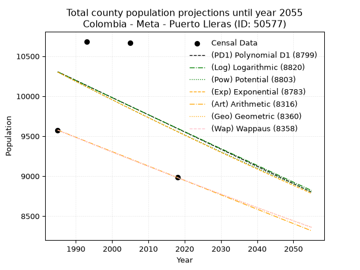
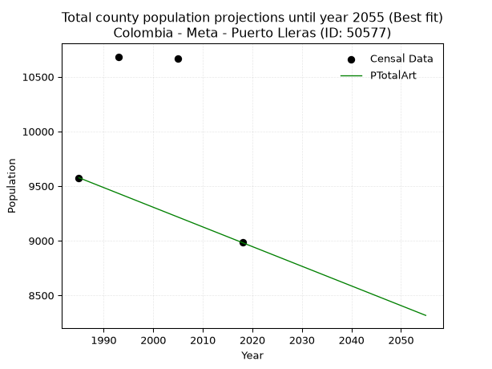
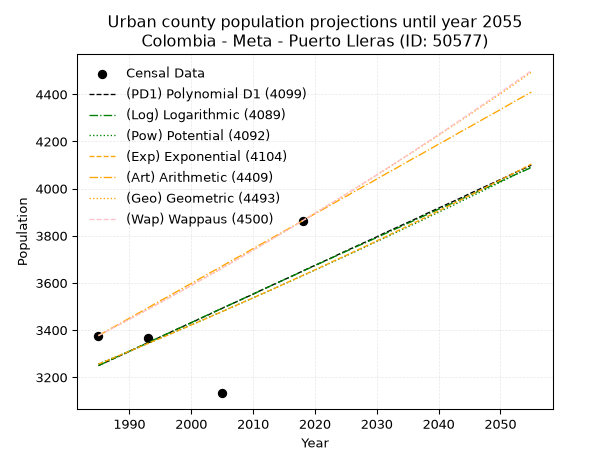
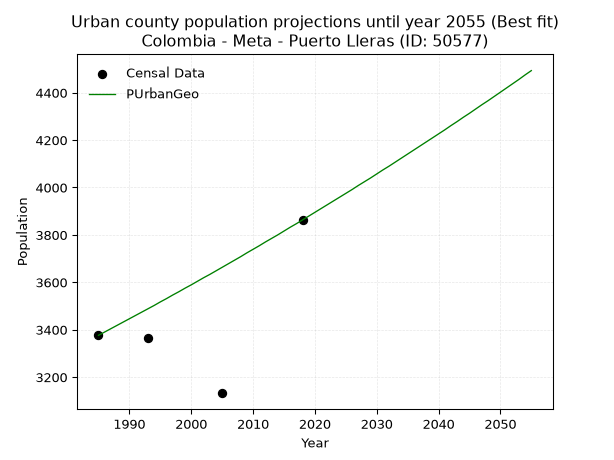
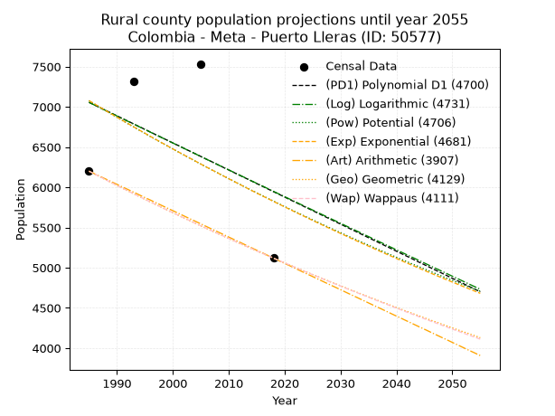
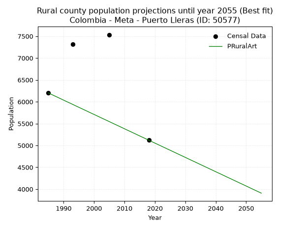

<div align="center">


</div>

# _“Population and Public Services Demand Projections (PPSD) until Year 2050 for Colombia - Meta - Puerto Lleras (ID: 50577)”_
Keywords: `population` `public-service` `projection` `lineal` `polynomial` `logarithmic` `potential` `exponential` `arithmetic` `geometric` `wappaus` `dane` `colombia` `south-america`

PPSD are analytical estimates used by governments and planners to anticipate future changes in population size, age distribution, and the resulting community needs for utilities, healthcare, education, and infrastructure as sizing future water treatment facilities, electrical grids, and road networks based on spatial growth.

> **General running parameters**: • app_version: _v20260806_. • Python version: _3.14.7_. • Pandas version: _3.0.5_. • NumPy version: _2.5.1_. • Creates, save and include plots into reports (create_plot): _False_. • Projection until year: _2050_. • Process polynomial degree 2 and up: _False_. • Process Wappaus: _True_. • Process Wappaus: _True_. • Set negative values to zero: _True_. • Set infinite values to zero: _True_. • Drop dataset notes: _True_. 
<div align="center">

Dynamic map: [:earth_americas:Google](http://maps.google.com/maps?q=3.272117046,-73.3738498) [:earth_americas:OSM](https://www.openstreetmap.org/#map=18/3.272117046/-73.3738498&layers=P) [:earth_americas:Bing](https://www.bing.com/maps?cp=3.272117046~-73.3738498&lvl=18) [:earth_americas:Apple](https://maps.apple.com/frame?center=3.272117046%2C-73.3738498&span=0.003%2C0.006)

</div>


<div align="center">

```geojson
{
  "type": "Feature",
  "geometry": {
    "type": "Point", 
    "coordinates": [-73.3738498, 3.272117046]
  }, 
  "properties": {
    "Name": "Colombia - Meta - Puerto Lleras (ID: 50577)"
  }
}
```

</div>


## 0. Census Data (4 records)

Census data are official statistics collected by a government about the people and housing in a country. They usually include counts of total population, age, sex, race, income, education, and jobs.

📅Global census file: [Population.xlsx](../data/Population.xlsx)

| Source   |   Year |   CountryID | CountryName   |   StateID | StateName   |   CountyID | CountyName    |   PTotal |   PUrban |   PRural |
|:---------|-------:|------------:|:--------------|----------:|:------------|-----------:|:--------------|---------:|---------:|---------:|
| DANE     |   1985 |          57 | Colombia      |        50 | Meta        |      50577 | Puerto Lleras |     9576 |     3376 |     6200 |
| DANE     |   1993 |          57 | Colombia      |        50 | Meta        |      50577 | Puerto Lleras |    10684 |     3365 |     7319 |
| DANE     |   2005 |          57 | Colombia      |        50 | Meta        |      50577 | Puerto Lleras |    10666 |     3132 |     7534 |
| DANE     |   2018 |          57 | Colombia      |        50 | Meta        |      50577 | Puerto Lleras |     8982 |     3863 |     5119 |

> 🔥Some records could had specific notes about the registered values or the corresponding urban or rural distribution.

## 1. Total

### 1.1. Coefficients and Parameters

* (PD1) Polynomial Deg 1: -21.515857085506852, 53014.09313528508 (lineal)
* (Log) Logarithmic: -42812.842904348836, 335397.76199654705
* (Pow) Potential: -4.533391808102964, 18.96289331983203
* (Exp) Exponential: -0.002277625729881931, 947089.5057649987
* (Art) Arithmetic: Year diff. 2018 - 1985 = 33, Population diff. 8982 - 9576 = -594, Annual growth = -18.0
* (Geo) Geometric: Year diff. 2018 - 1985 = 33, Population diff. 8982 - 9576 = -594, Annual growth % = -0.001938645473116285
* (Wap) Wappaus: i = -0.19398642095053345, Condition values only valid for < 200)

<sub>
Wappaus condition values: ['-0.00', '-0.19', '-0.39', '-0.58', '-0.78', '-0.97', '-1.16', '-1.36', '-1.55', '-1.75', '-1.94', '-2.13', '-2.33', '-2.52', '-2.72', '-2.91', '-3.10', '-3.30', '-3.49', '-3.69', '-3.88', '-4.07', '-4.27', '-4.46', '-4.66', '-4.85', '-5.04', '-5.24', '-5.43', '-5.63', '-5.82', '-6.01', '-6.21', '-6.40', '-6.60', '-6.79', '-6.98', '-7.18', '-7.37', '-7.57', '-7.76', '-7.95', '-8.15', '-8.34', '-8.54', '-8.73', '-8.92', '-9.12', '-9.31', '-9.51', '-9.70', '-9.89', '-10.09', '-10.28', '-10.48', '-10.67', '-10.86', '-11.06', '-11.25', '-11.45', '-11.64', '-11.83', '-12.03', '-12.22', '-12.42', '-12.61']
</sub>


### 1.2. Projected Dataset

|   Year |   CountyID |   PTotalPD1 |   PTotalLog |   PTotalPow |   PTotalExp |   PTotalArt |   PTotalGeo |   PTotalWap |
|-------:|-----------:|------------:|------------:|------------:|------------:|------------:|------------:|------------:|
|   1985 |      50577 |       10305 |       10304 |       10300 |       10302 |        9576 |        9576 |        9576 |
|   1986 |      50577 |       10284 |       10282 |       10277 |       10278 |        9558 |        9557 |        9557 |
|   1987 |      50577 |       10262 |       10261 |       10253 |       10255 |        9540 |        9539 |        9539 |
|   1988 |      50577 |       10241 |       10239 |       10230 |       10232 |        9522 |        9520 |        9520 |
|   1989 |      50577 |       10219 |       10218 |       10207 |       10208 |        9504 |        9502 |        9502 |
|   1990 |      50577 |       10198 |       10196 |       10184 |       10185 |        9486 |        9484 |        9484 |
|   1991 |      50577 |       10176 |       10175 |       10160 |       10162 |        9468 |        9465 |        9465 |
|   1992 |      50577 |       10155 |       10153 |       10137 |       10139 |        9450 |        9447 |        9447 |
|   1993 |      50577 |       10133 |       10132 |       10114 |       10116 |        9432 |        9428 |        9429 |
|   1994 |      50577 |       10111 |       10110 |       10091 |       10093 |        9414 |        9410 |        9410 |
|   1995 |      50577 |       10090 |       10089 |       10068 |       10070 |        9396 |        9392 |        9392 |
|   1996 |      50577 |       10068 |       10067 |       10046 |       10047 |        9378 |        9374 |        9374 |
|   1997 |      50577 |       10047 |       10046 |       10023 |       10024 |        9360 |        9356 |        9356 |
|   1998 |      50577 |       10025 |       10024 |       10000 |       10001 |        9342 |        9337 |        9338 |
|   1999 |      50577 |       10004 |       10003 |        9977 |        9978 |        9324 |        9319 |        9319 |
|   2000 |      50577 |        9982 |        9982 |        9955 |        9956 |        9306 |        9301 |        9301 |
|   2001 |      50577 |        9961 |        9960 |        9932 |        9933 |        9288 |        9283 |        9283 |
|   2002 |      50577 |        9939 |        9939 |        9910 |        9910 |        9270 |        9265 |        9265 |
|   2003 |      50577 |        9918 |        9917 |        9887 |        9888 |        9252 |        9247 |        9247 |
|   2004 |      50577 |        9896 |        9896 |        9865 |        9865 |        9234 |        9229 |        9229 |
|   2005 |      50577 |        9875 |        9875 |        9843 |        9843 |        9216 |        9211 |        9212 |
|   2006 |      50577 |        9853 |        9853 |        9820 |        9821 |        9198 |        9194 |        9194 |
|   2007 |      50577 |        9832 |        9832 |        9798 |        9798 |        9180 |        9176 |        9176 |
|   2008 |      50577 |        9810 |        9811 |        9776 |        9776 |        9162 |        9158 |        9158 |
|   2009 |      50577 |        9789 |        9789 |        9754 |        9754 |        9144 |        9140 |        9140 |
|   2010 |      50577 |        9767 |        9768 |        9732 |        9731 |        9126 |        9123 |        9123 |
|   2011 |      50577 |        9746 |        9747 |        9710 |        9709 |        9108 |        9105 |        9105 |
|   2012 |      50577 |        9724 |        9725 |        9688 |        9687 |        9090 |        9087 |        9087 |
|   2013 |      50577 |        9703 |        9704 |        9667 |        9665 |        9072 |        9070 |        9070 |
|   2014 |      50577 |        9681 |        9683 |        9645 |        9643 |        9054 |        9052 |        9052 |
|   2015 |      50577 |        9660 |        9662 |        9623 |        9621 |        9036 |        9034 |        9034 |
|   2016 |      50577 |        9638 |        9640 |        9602 |        9599 |        9018 |        9017 |        9017 |
|   2017 |      50577 |        9617 |        9619 |        9580 |        9578 |        9000 |        8999 |        8999 |
|   2018 |      50577 |        9595 |        9598 |        9559 |        9556 |        8982 |        8982 |        8982 |
|   2019 |      50577 |        9574 |        9577 |        9537 |        9534 |        8964 |        8965 |        8965 |
|   2020 |      50577 |        9552 |        9556 |        9516 |        9512 |        8946 |        8947 |        8947 |
|   2021 |      50577 |        9531 |        9534 |        9494 |        9491 |        8928 |        8930 |        8930 |
|   2022 |      50577 |        9509 |        9513 |        9473 |        9469 |        8910 |        8913 |        8912 |
|   2023 |      50577 |        9488 |        9492 |        9452 |        9448 |        8892 |        8895 |        8895 |
|   2024 |      50577 |        9466 |        9471 |        9431 |        9426 |        8874 |        8878 |        8878 |
|   2025 |      50577 |        9444 |        9450 |        9410 |        9405 |        8856 |        8861 |        8861 |
|   2026 |      50577 |        9423 |        9429 |        9389 |        9383 |        8838 |        8844 |        8844 |
|   2027 |      50577 |        9401 |        9407 |        9368 |        9362 |        8820 |        8826 |        8826 |
|   2028 |      50577 |        9380 |        9386 |        9347 |        9341 |        8802 |        8809 |        8809 |
|   2029 |      50577 |        9358 |        9365 |        9326 |        9319 |        8784 |        8792 |        8792 |
|   2030 |      50577 |        9337 |        9344 |        9305 |        9298 |        8766 |        8775 |        8775 |
|   2031 |      50577 |        9315 |        9323 |        9284 |        9277 |        8748 |        8758 |        8758 |
|   2032 |      50577 |        9294 |        9302 |        9264 |        9256 |        8730 |        8741 |        8741 |
|   2033 |      50577 |        9272 |        9281 |        9243 |        9235 |        8712 |        8724 |        8724 |
|   2034 |      50577 |        9251 |        9260 |        9222 |        9214 |        8694 |        8707 |        8707 |
|   2035 |      50577 |        9229 |        9239 |        9202 |        9193 |        8676 |        8691 |        8690 |
|   2036 |      50577 |        9208 |        9218 |        9181 |        9172 |        8658 |        8674 |        8673 |
|   2037 |      50577 |        9186 |        9197 |        9161 |        9151 |        8640 |        8657 |        8656 |
|   2038 |      50577 |        9165 |        9176 |        9141 |        9130 |        8622 |        8640 |        8640 |
|   2039 |      50577 |        9143 |        9155 |        9120 |        9109 |        8604 |        8623 |        8623 |
|   2040 |      50577 |        9122 |        9134 |        9100 |        9089 |        8586 |        8607 |        8606 |
|   2041 |      50577 |        9100 |        9113 |        9080 |        9068 |        8568 |        8590 |        8589 |
|   2042 |      50577 |        9079 |        9092 |        9060 |        9047 |        8550 |        8573 |        8573 |
|   2043 |      50577 |        9057 |        9071 |        9040 |        9027 |        8532 |        8557 |        8556 |
|   2044 |      50577 |        9036 |        9050 |        9020 |        9006 |        8514 |        8540 |        8539 |
|   2045 |      50577 |        9014 |        9029 |        9000 |        8986 |        8496 |        8524 |        8523 |
|   2046 |      50577 |        8993 |        9008 |        8980 |        8965 |        8478 |        8507 |        8506 |
|   2047 |      50577 |        8971 |        8987 |        8960 |        8945 |        8460 |        8490 |        8490 |
|   2048 |      50577 |        8950 |        8966 |        8940 |        8925 |        8442 |        8474 |        8473 |
|   2049 |      50577 |        8928 |        8945 |        8920 |        8904 |        8424 |        8458 |        8457 |
|   2050 |      50577 |        8907 |        8924 |        8901 |        8884 |        8406 |        8441 |        8440 |
<div align="center">

</img>

</div>


### 1.3. Best fit with absolute and relative error (%)

Relative error puts that difference into context by dividing the absolute error by the true value, creating a unitless ratio or percentage that shows the scale of the mistake.

Absolute and relative error

|   Year | Source   |   CountryID | CountryName   |   StateID | StateName   |   CountyID_x | CountyName    |   PTotal |   PUrban |   PRural |   CountyID_y |   PTotalPD1 |   PTotalLog |   PTotalPow |   PTotalExp |   PTotalArt |   PTotalGeo |   PTotalWap |   PTotalPD1AbsError |   PTotalLogAbsError |   PTotalPowAbsError |   PTotalExpAbsError |   PTotalArtAbsError |   PTotalGeoAbsError |   PTotalWapAbsError |   PTotalPD1RelError |   PTotalLogRelError |   PTotalPowRelError |   PTotalExpRelError |   PTotalArtRelError |   PTotalGeoRelError |   PTotalWapRelError |
|-------:|:---------|------------:|:--------------|----------:|:------------|-------------:|:--------------|---------:|---------:|---------:|-------------:|------------:|------------:|------------:|------------:|------------:|------------:|------------:|--------------------:|--------------------:|--------------------:|--------------------:|--------------------:|--------------------:|--------------------:|--------------------:|--------------------:|--------------------:|--------------------:|--------------------:|--------------------:|--------------------:|
|   1985 | DANE     |          57 | Colombia      |        50 | Meta        |        50577 | Puerto Lleras |     9576 |     3376 |     6200 |        50577 |       10305 |       10304 |       10300 |       10302 |        9576 |        9576 |        9576 |                 729 |                 728 |                 724 |                 726 |                   0 |                   0 |                   0 |             7.61278 |             7.60234 |             7.56057 |             7.58145 |              0      |              0      |              0      |
|   1993 | DANE     |          57 | Colombia      |        50 | Meta        |        50577 | Puerto Lleras |    10684 |     3365 |     7319 |        50577 |       10133 |       10132 |       10114 |       10116 |        9432 |        9428 |        9429 |                 551 |                 552 |                 570 |                 568 |                1252 |                1256 |                1255 |             5.15724 |             5.1666  |             5.33508 |             5.31636 |             11.7185 |             11.7559 |             11.7465 |
|   2005 | DANE     |          57 | Colombia      |        50 | Meta        |        50577 | Puerto Lleras |    10666 |     3132 |     7534 |        50577 |        9875 |        9875 |        9843 |        9843 |        9216 |        9211 |        9212 |                 791 |                 791 |                 823 |                 823 |                1450 |                1455 |                1454 |             7.41609 |             7.41609 |             7.71611 |             7.71611 |             13.5946 |             13.6415 |             13.6321 |
|   2018 | DANE     |          57 | Colombia      |        50 | Meta        |        50577 | Puerto Lleras |     8982 |     3863 |     5119 |        50577 |        9595 |        9598 |        9559 |        9556 |        8982 |        8982 |        8982 |                 613 |                 616 |                 577 |                 574 |                   0 |                   0 |                   0 |             6.82476 |             6.85816 |             6.42396 |             6.39056 |              0      |              0      |              0      |

Relative error mean

| Method    |   RelError | Best   |
|:----------|-----------:|:-------|
| PTotalPD1 |    6.75272 |        |
| PTotalLog |    6.7608  |        |
| PTotalPow |    6.75893 |        |
| PTotalExp |    6.75112 |        |
| PTotalArt |    6.32826 | True   |
| PTotalGeo |    6.34934 |        |
| PTotalWap |    6.34466 |        |

💙Best method: _**PTotalArt**_
<div align="center">

</img>

</div>


### 1.4. Fresh water supply demand in liters per capita per day (lpcd)

The fresh water supply demand typically ranges from 100 to 300 liters per capita per day (lpcd) for standard domestic and municipal planning, though absolute survival minimums set by the World Health Organization are as low as 7.5 to 20 liters per day, and total consumption in high-income nations can exceed 400 liters.

> `CZ`: Level in meters above the sea level (masl)<br> `WS`: Fresh water supply demand in liters per capita per day (lpcd or l/h/d)<br> `WSAll`: Zonal fresh water supply demand in liters per second (l/s)<br> `A`: Zonal area in square meters<br> `DP`: Population density (people/hectare)

Reference values (RAS Colombia)

|    CZ |   WS |
|------:|-----:|
|  1000 |  120 |
|  2000 |  130 |
| 99999 |  140 |

County shapefile geometry properties and water supply values

|   CountyID |      ATotal |   CZTotal |   WSTotal |
|-----------:|------------:|----------:|----------:|
|      50577 | 2.53123e+09 |   239.484 |       120 |

Projected values for best method: PTotalArt

|   CountyID |   Year |   PTotalArt |   DPTotal |   WSTotal |   WSTotalAll |
|-----------:|-------:|------------:|----------:|----------:|-------------:|
|      50577 |   1985 |        9576 |      0.04 |       120 |       13.3   |
|      50577 |   1986 |        9558 |      0.04 |       120 |       13.275 |
|      50577 |   1987 |        9540 |      0.04 |       120 |       13.25  |
|      50577 |   1988 |        9522 |      0.04 |       120 |       13.225 |
|      50577 |   1989 |        9504 |      0.04 |       120 |       13.2   |
|      50577 |   1990 |        9486 |      0.04 |       120 |       13.175 |
|      50577 |   1991 |        9468 |      0.04 |       120 |       13.15  |
|      50577 |   1992 |        9450 |      0.04 |       120 |       13.125 |
|      50577 |   1993 |        9432 |      0.04 |       120 |       13.1   |
|      50577 |   1994 |        9414 |      0.04 |       120 |       13.075 |
|      50577 |   1995 |        9396 |      0.04 |       120 |       13.05  |
|      50577 |   1996 |        9378 |      0.04 |       120 |       13.025 |
|      50577 |   1997 |        9360 |      0.04 |       120 |       13     |
|      50577 |   1998 |        9342 |      0.04 |       120 |       12.975 |
|      50577 |   1999 |        9324 |      0.04 |       120 |       12.95  |
|      50577 |   2000 |        9306 |      0.04 |       120 |       12.925 |
|      50577 |   2001 |        9288 |      0.04 |       120 |       12.9   |
|      50577 |   2002 |        9270 |      0.04 |       120 |       12.875 |
|      50577 |   2003 |        9252 |      0.04 |       120 |       12.85  |
|      50577 |   2004 |        9234 |      0.04 |       120 |       12.825 |
|      50577 |   2005 |        9216 |      0.04 |       120 |       12.8   |
|      50577 |   2006 |        9198 |      0.04 |       120 |       12.775 |
|      50577 |   2007 |        9180 |      0.04 |       120 |       12.75  |
|      50577 |   2008 |        9162 |      0.04 |       120 |       12.725 |
|      50577 |   2009 |        9144 |      0.04 |       120 |       12.7   |
|      50577 |   2010 |        9126 |      0.04 |       120 |       12.675 |
|      50577 |   2011 |        9108 |      0.04 |       120 |       12.65  |
|      50577 |   2012 |        9090 |      0.04 |       120 |       12.625 |
|      50577 |   2013 |        9072 |      0.04 |       120 |       12.6   |
|      50577 |   2014 |        9054 |      0.04 |       120 |       12.575 |
|      50577 |   2015 |        9036 |      0.04 |       120 |       12.55  |
|      50577 |   2016 |        9018 |      0.04 |       120 |       12.525 |
|      50577 |   2017 |        9000 |      0.04 |       120 |       12.5   |
|      50577 |   2018 |        8982 |      0.04 |       120 |       12.475 |
|      50577 |   2019 |        8964 |      0.04 |       120 |       12.45  |
|      50577 |   2020 |        8946 |      0.04 |       120 |       12.425 |
|      50577 |   2021 |        8928 |      0.04 |       120 |       12.4   |
|      50577 |   2022 |        8910 |      0.04 |       120 |       12.375 |
|      50577 |   2023 |        8892 |      0.04 |       120 |       12.35  |
|      50577 |   2024 |        8874 |      0.04 |       120 |       12.325 |
|      50577 |   2025 |        8856 |      0.03 |       120 |       12.3   |
|      50577 |   2026 |        8838 |      0.03 |       120 |       12.275 |
|      50577 |   2027 |        8820 |      0.03 |       120 |       12.25  |
|      50577 |   2028 |        8802 |      0.03 |       120 |       12.225 |
|      50577 |   2029 |        8784 |      0.03 |       120 |       12.2   |
|      50577 |   2030 |        8766 |      0.03 |       120 |       12.175 |
|      50577 |   2031 |        8748 |      0.03 |       120 |       12.15  |
|      50577 |   2032 |        8730 |      0.03 |       120 |       12.125 |
|      50577 |   2033 |        8712 |      0.03 |       120 |       12.1   |
|      50577 |   2034 |        8694 |      0.03 |       120 |       12.075 |
|      50577 |   2035 |        8676 |      0.03 |       120 |       12.05  |
|      50577 |   2036 |        8658 |      0.03 |       120 |       12.025 |
|      50577 |   2037 |        8640 |      0.03 |       120 |       12     |
|      50577 |   2038 |        8622 |      0.03 |       120 |       11.975 |
|      50577 |   2039 |        8604 |      0.03 |       120 |       11.95  |
|      50577 |   2040 |        8586 |      0.03 |       120 |       11.925 |
|      50577 |   2041 |        8568 |      0.03 |       120 |       11.9   |
|      50577 |   2042 |        8550 |      0.03 |       120 |       11.875 |
|      50577 |   2043 |        8532 |      0.03 |       120 |       11.85  |
|      50577 |   2044 |        8514 |      0.03 |       120 |       11.825 |
|      50577 |   2045 |        8496 |      0.03 |       120 |       11.8   |
|      50577 |   2046 |        8478 |      0.03 |       120 |       11.775 |
|      50577 |   2047 |        8460 |      0.03 |       120 |       11.75  |
|      50577 |   2048 |        8442 |      0.03 |       120 |       11.725 |
|      50577 |   2049 |        8424 |      0.03 |       120 |       11.7   |
|      50577 |   2050 |        8406 |      0.03 |       120 |       11.675 |

## 2. Urban

### 2.1. Coefficients and Parameters

* (PD1) Polynomial Deg 1: 12.147731834604148, -20864.500602166943 (lineal)
* (Log) Logarithmic: 24243.21135772824, -180838.84380299578
* (Pow) Potential: 6.59772143021627, -18.24504530161613
* (Exp) Exponential: 0.003306582342615832, 4.593180936678128
* (Art) Arithmetic: Year diff. 2018 - 1985 = 33, Population diff. 3863 - 3376 = 487, Annual growth = 14.757575757575758
* (Geo) Geometric: Year diff. 2018 - 1985 = 33, Population diff. 3863 - 3376 = 487, Annual growth % = 0.004091757776836236
* (Wap) Wappaus: i = 0.40772415409796264, Condition values only valid for < 200)

<sub>
Wappaus condition values: ['0.00', '0.41', '0.82', '1.22', '1.63', '2.04', '2.45', '2.85', '3.26', '3.67', '4.08', '4.48', '4.89', '5.30', '5.71', '6.12', '6.52', '6.93', '7.34', '7.75', '8.15', '8.56', '8.97', '9.38', '9.79', '10.19', '10.60', '11.01', '11.42', '11.82', '12.23', '12.64', '13.05', '13.45', '13.86', '14.27', '14.68', '15.09', '15.49', '15.90', '16.31', '16.72', '17.12', '17.53', '17.94', '18.35', '18.76', '19.16', '19.57', '19.98', '20.39', '20.79', '21.20', '21.61', '22.02', '22.42', '22.83', '23.24', '23.65', '24.06', '24.46', '24.87', '25.28', '25.69', '26.09', '26.50']
</sub>


### 2.2. Projected Dataset

|   Year |   CountyID |   PUrbanPD1 |   PUrbanLog |   PUrbanPow |   PUrbanExp |   PUrbanArt |   PUrbanGeo |   PUrbanWap |
|-------:|-----------:|------------:|------------:|------------:|------------:|------------:|------------:|------------:|
|   1985 |      50577 |        3249 |        3249 |        3256 |        3256 |        3376 |        3376 |        3376 |
|   1986 |      50577 |        3261 |        3261 |        3267 |        3266 |        3391 |        3390 |        3390 |
|   1987 |      50577 |        3273 |        3273 |        3278 |        3277 |        3406 |        3404 |        3404 |
|   1988 |      50577 |        3285 |        3286 |        3288 |        3288 |        3420 |        3418 |        3418 |
|   1989 |      50577 |        3297 |        3298 |        3299 |        3299 |        3435 |        3432 |        3432 |
|   1990 |      50577 |        3309 |        3310 |        3310 |        3310 |        3450 |        3446 |        3446 |
|   1991 |      50577 |        3322 |        3322 |        3321 |        3321 |        3465 |        3460 |        3460 |
|   1992 |      50577 |        3334 |        3334 |        3332 |        3332 |        3479 |        3474 |        3474 |
|   1993 |      50577 |        3346 |        3346 |        3343 |        3343 |        3494 |        3488 |        3488 |
|   1994 |      50577 |        3358 |        3359 |        3354 |        3354 |        3509 |        3502 |        3502 |
|   1995 |      50577 |        3370 |        3371 |        3366 |        3365 |        3524 |        3517 |        3517 |
|   1996 |      50577 |        3382 |        3383 |        3377 |        3376 |        3538 |        3531 |        3531 |
|   1997 |      50577 |        3395 |        3395 |        3388 |        3387 |        3553 |        3546 |        3545 |
|   1998 |      50577 |        3407 |        3407 |        3399 |        3399 |        3568 |        3560 |        3560 |
|   1999 |      50577 |        3419 |        3419 |        3410 |        3410 |        3583 |        3575 |        3574 |
|   2000 |      50577 |        3431 |        3431 |        3422 |        3421 |        3597 |        3589 |        3589 |
|   2001 |      50577 |        3443 |        3444 |        3433 |        3432 |        3612 |        3604 |        3604 |
|   2002 |      50577 |        3455 |        3456 |        3444 |        3444 |        3627 |        3619 |        3618 |
|   2003 |      50577 |        3467 |        3468 |        3456 |        3455 |        3642 |        3633 |        3633 |
|   2004 |      50577 |        3480 |        3480 |        3467 |        3467 |        3656 |        3648 |        3648 |
|   2005 |      50577 |        3492 |        3492 |        3478 |        3478 |        3671 |        3663 |        3663 |
|   2006 |      50577 |        3504 |        3504 |        3490 |        3490 |        3686 |        3678 |        3678 |
|   2007 |      50577 |        3516 |        3516 |        3501 |        3501 |        3701 |        3693 |        3693 |
|   2008 |      50577 |        3528 |        3528 |        3513 |        3513 |        3715 |        3708 |        3708 |
|   2009 |      50577 |        3540 |        3540 |        3524 |        3525 |        3730 |        3724 |        3723 |
|   2010 |      50577 |        3552 |        3552 |        3536 |        3536 |        3745 |        3739 |        3739 |
|   2011 |      50577 |        3565 |        3564 |        3548 |        3548 |        3760 |        3754 |        3754 |
|   2012 |      50577 |        3577 |        3576 |        3559 |        3560 |        3774 |        3770 |        3769 |
|   2013 |      50577 |        3589 |        3589 |        3571 |        3571 |        3789 |        3785 |        3785 |
|   2014 |      50577 |        3601 |        3601 |        3583 |        3583 |        3804 |        3800 |        3800 |
|   2015 |      50577 |        3613 |        3613 |        3595 |        3595 |        3819 |        3816 |        3816 |
|   2016 |      50577 |        3625 |        3625 |        3606 |        3607 |        3833 |        3832 |        3831 |
|   2017 |      50577 |        3637 |        3637 |        3618 |        3619 |        3848 |        3847 |        3847 |
|   2018 |      50577 |        3650 |        3649 |        3630 |        3631 |        3863 |        3863 |        3863 |
|   2019 |      50577 |        3662 |        3661 |        3642 |        3643 |        3878 |        3879 |        3879 |
|   2020 |      50577 |        3674 |        3673 |        3654 |        3655 |        3893 |        3895 |        3895 |
|   2021 |      50577 |        3686 |        3685 |        3666 |        3667 |        3907 |        3911 |        3911 |
|   2022 |      50577 |        3698 |        3697 |        3678 |        3679 |        3922 |        3927 |        3927 |
|   2023 |      50577 |        3710 |        3709 |        3690 |        3692 |        3937 |        3943 |        3943 |
|   2024 |      50577 |        3723 |        3721 |        3702 |        3704 |        3952 |        3959 |        3959 |
|   2025 |      50577 |        3735 |        3733 |        3714 |        3716 |        3966 |        3975 |        3975 |
|   2026 |      50577 |        3747 |        3745 |        3726 |        3728 |        3981 |        3991 |        3992 |
|   2027 |      50577 |        3759 |        3757 |        3738 |        3741 |        3996 |        4008 |        4008 |
|   2028 |      50577 |        3771 |        3768 |        3750 |        3753 |        4011 |        4024 |        4025 |
|   2029 |      50577 |        3783 |        3780 |        3763 |        3765 |        4025 |        4040 |        4041 |
|   2030 |      50577 |        3795 |        3792 |        3775 |        3778 |        4040 |        4057 |        4058 |
|   2031 |      50577 |        3808 |        3804 |        3787 |        3790 |        4055 |        4074 |        4075 |
|   2032 |      50577 |        3820 |        3816 |        3799 |        3803 |        4070 |        4090 |        4091 |
|   2033 |      50577 |        3832 |        3828 |        3812 |        3816 |        4084 |        4107 |        4108 |
|   2034 |      50577 |        3844 |        3840 |        3824 |        3828 |        4099 |        4124 |        4125 |
|   2035 |      50577 |        3856 |        3852 |        3837 |        3841 |        4114 |        4141 |        4142 |
|   2036 |      50577 |        3868 |        3864 |        3849 |        3854 |        4129 |        4158 |        4159 |
|   2037 |      50577 |        3880 |        3876 |        3861 |        3866 |        4143 |        4175 |        4177 |
|   2038 |      50577 |        3893 |        3888 |        3874 |        3879 |        4158 |        4192 |        4194 |
|   2039 |      50577 |        3905 |        3900 |        3887 |        3892 |        4173 |        4209 |        4211 |
|   2040 |      50577 |        3917 |        3912 |        3899 |        3905 |        4188 |        4226 |        4229 |
|   2041 |      50577 |        3929 |        3923 |        3912 |        3918 |        4202 |        4243 |        4246 |
|   2042 |      50577 |        3941 |        3935 |        3924 |        3931 |        4217 |        4261 |        4264 |
|   2043 |      50577 |        3953 |        3947 |        3937 |        3944 |        4232 |        4278 |        4281 |
|   2044 |      50577 |        3965 |        3959 |        3950 |        3957 |        4247 |        4296 |        4299 |
|   2045 |      50577 |        3978 |        3971 |        3963 |        3970 |        4261 |        4313 |        4317 |
|   2046 |      50577 |        3990 |        3983 |        3975 |        3983 |        4276 |        4331 |        4335 |
|   2047 |      50577 |        4002 |        3995 |        3988 |        3996 |        4291 |        4349 |        4353 |
|   2048 |      50577 |        4014 |        4006 |        4001 |        4010 |        4306 |        4366 |        4371 |
|   2049 |      50577 |        4026 |        4018 |        4014 |        4023 |        4320 |        4384 |        4389 |
|   2050 |      50577 |        4038 |        4030 |        4027 |        4036 |        4335 |        4402 |        4407 |
<div align="center">

</img>

</div>


### 2.3. Best fit with absolute and relative error (%)

Relative error puts that difference into context by dividing the absolute error by the true value, creating a unitless ratio or percentage that shows the scale of the mistake.

Absolute and relative error

|   Year | Source   |   CountryID | CountryName   |   StateID | StateName   |   CountyID_x | CountyName    |   PTotal |   PUrban |   PRural |   CountyID_y |   PUrbanPD1 |   PUrbanLog |   PUrbanPow |   PUrbanExp |   PUrbanArt |   PUrbanGeo |   PUrbanWap |   PUrbanPD1AbsError |   PUrbanLogAbsError |   PUrbanPowAbsError |   PUrbanExpAbsError |   PUrbanArtAbsError |   PUrbanGeoAbsError |   PUrbanWapAbsError |   PUrbanPD1RelError |   PUrbanLogRelError |   PUrbanPowRelError |   PUrbanExpRelError |   PUrbanArtRelError |   PUrbanGeoRelError |   PUrbanWapRelError |
|-------:|:---------|------------:|:--------------|----------:|:------------|-------------:|:--------------|---------:|---------:|---------:|-------------:|------------:|------------:|------------:|------------:|------------:|------------:|------------:|--------------------:|--------------------:|--------------------:|--------------------:|--------------------:|--------------------:|--------------------:|--------------------:|--------------------:|--------------------:|--------------------:|--------------------:|--------------------:|--------------------:|
|   1985 | DANE     |          57 | Colombia      |        50 | Meta        |        50577 | Puerto Lleras |     9576 |     3376 |     6200 |        50577 |        3249 |        3249 |        3256 |        3256 |        3376 |        3376 |        3376 |                 127 |                 127 |                 120 |                 120 |                   0 |                   0 |                   0 |            3.76185  |            3.76185  |            3.5545   |            3.5545   |             0       |             0       |             0       |
|   1993 | DANE     |          57 | Colombia      |        50 | Meta        |        50577 | Puerto Lleras |    10684 |     3365 |     7319 |        50577 |        3346 |        3346 |        3343 |        3343 |        3494 |        3488 |        3488 |                  19 |                  19 |                  22 |                  22 |                 129 |                 123 |                 123 |            0.564636 |            0.564636 |            0.653789 |            0.653789 |             3.83358 |             3.65527 |             3.65527 |
|   2005 | DANE     |          57 | Colombia      |        50 | Meta        |        50577 | Puerto Lleras |    10666 |     3132 |     7534 |        50577 |        3492 |        3492 |        3478 |        3478 |        3671 |        3663 |        3663 |                 360 |                 360 |                 346 |                 346 |                 539 |                 531 |                 531 |           11.4943   |           11.4943   |           11.0473   |           11.0473   |            17.2095  |            16.954   |            16.954   |
|   2018 | DANE     |          57 | Colombia      |        50 | Meta        |        50577 | Puerto Lleras |     8982 |     3863 |     5119 |        50577 |        3650 |        3649 |        3630 |        3631 |        3863 |        3863 |        3863 |                 213 |                 214 |                 233 |                 232 |                   0 |                   0 |                   0 |            5.51385  |            5.53974  |            6.03158  |            6.0057   |             0       |             0       |             0       |

Relative error mean

| Method    |   RelError | Best   |
|:----------|-----------:|:-------|
| PUrbanPD1 |    5.33365 |        |
| PUrbanLog |    5.34012 |        |
| PUrbanPow |    5.32178 |        |
| PUrbanExp |    5.31531 |        |
| PUrbanArt |    5.26076 |        |
| PUrbanGeo |    5.15232 | True   |
| PUrbanWap |    5.15232 | True   |

💙Best method: _**PUrbanGeo**_
<div align="center">

</img>

</div>


### 2.4. Fresh water supply demand in liters per capita per day (lpcd)

The fresh water supply demand typically ranges from 100 to 300 liters per capita per day (lpcd) for standard domestic and municipal planning, though absolute survival minimums set by the World Health Organization are as low as 7.5 to 20 liters per day, and total consumption in high-income nations can exceed 400 liters.

> `CZ`: Level in meters above the sea level (masl)<br> `WS`: Fresh water supply demand in liters per capita per day (lpcd or l/h/d)<br> `WSAll`: Zonal fresh water supply demand in liters per second (l/s)<br> `A`: Zonal area in square meters<br> `DP`: Population density (people/hectare)

Reference values (RAS Colombia)

|    CZ |   WS |
|------:|-----:|
|  1000 |  120 |
|  2000 |  130 |
| 99999 |  140 |

County shapefile geometry properties and water supply values

|   CountyID |      AUrban |   CZUrban |   WSUrban |
|-----------:|------------:|----------:|----------:|
|      50577 | 1.00571e+06 |   236.059 |       120 |

Projected values for best method: PUrbanGeo

|   CountyID |   Year |   PUrbanGeo |   DPUrban |   WSUrban |   WSUrbanAll |
|-----------:|-------:|------------:|----------:|----------:|-------------:|
|      50577 |   1985 |        3376 |     33.57 |       120 |      4.68889 |
|      50577 |   1986 |        3390 |     33.71 |       120 |      4.70833 |
|      50577 |   1987 |        3404 |     33.85 |       120 |      4.72778 |
|      50577 |   1988 |        3418 |     33.99 |       120 |      4.74722 |
|      50577 |   1989 |        3432 |     34.13 |       120 |      4.76667 |
|      50577 |   1990 |        3446 |     34.26 |       120 |      4.78611 |
|      50577 |   1991 |        3460 |     34.4  |       120 |      4.80556 |
|      50577 |   1992 |        3474 |     34.54 |       120 |      4.825   |
|      50577 |   1993 |        3488 |     34.68 |       120 |      4.84444 |
|      50577 |   1994 |        3502 |     34.82 |       120 |      4.86389 |
|      50577 |   1995 |        3517 |     34.97 |       120 |      4.88472 |
|      50577 |   1996 |        3531 |     35.11 |       120 |      4.90417 |
|      50577 |   1997 |        3546 |     35.26 |       120 |      4.925   |
|      50577 |   1998 |        3560 |     35.4  |       120 |      4.94444 |
|      50577 |   1999 |        3575 |     35.55 |       120 |      4.96528 |
|      50577 |   2000 |        3589 |     35.69 |       120 |      4.98472 |
|      50577 |   2001 |        3604 |     35.84 |       120 |      5.00556 |
|      50577 |   2002 |        3619 |     35.98 |       120 |      5.02639 |
|      50577 |   2003 |        3633 |     36.12 |       120 |      5.04583 |
|      50577 |   2004 |        3648 |     36.27 |       120 |      5.06667 |
|      50577 |   2005 |        3663 |     36.42 |       120 |      5.0875  |
|      50577 |   2006 |        3678 |     36.57 |       120 |      5.10833 |
|      50577 |   2007 |        3693 |     36.72 |       120 |      5.12917 |
|      50577 |   2008 |        3708 |     36.87 |       120 |      5.15    |
|      50577 |   2009 |        3724 |     37.03 |       120 |      5.17222 |
|      50577 |   2010 |        3739 |     37.18 |       120 |      5.19306 |
|      50577 |   2011 |        3754 |     37.33 |       120 |      5.21389 |
|      50577 |   2012 |        3770 |     37.49 |       120 |      5.23611 |
|      50577 |   2013 |        3785 |     37.64 |       120 |      5.25694 |
|      50577 |   2014 |        3800 |     37.78 |       120 |      5.27778 |
|      50577 |   2015 |        3816 |     37.94 |       120 |      5.3     |
|      50577 |   2016 |        3832 |     38.1  |       120 |      5.32222 |
|      50577 |   2017 |        3847 |     38.25 |       120 |      5.34306 |
|      50577 |   2018 |        3863 |     38.41 |       120 |      5.36528 |
|      50577 |   2019 |        3879 |     38.57 |       120 |      5.3875  |
|      50577 |   2020 |        3895 |     38.73 |       120 |      5.40972 |
|      50577 |   2021 |        3911 |     38.89 |       120 |      5.43194 |
|      50577 |   2022 |        3927 |     39.05 |       120 |      5.45417 |
|      50577 |   2023 |        3943 |     39.21 |       120 |      5.47639 |
|      50577 |   2024 |        3959 |     39.37 |       120 |      5.49861 |
|      50577 |   2025 |        3975 |     39.52 |       120 |      5.52083 |
|      50577 |   2026 |        3991 |     39.68 |       120 |      5.54306 |
|      50577 |   2027 |        4008 |     39.85 |       120 |      5.56667 |
|      50577 |   2028 |        4024 |     40.01 |       120 |      5.58889 |
|      50577 |   2029 |        4040 |     40.17 |       120 |      5.61111 |
|      50577 |   2030 |        4057 |     40.34 |       120 |      5.63472 |
|      50577 |   2031 |        4074 |     40.51 |       120 |      5.65833 |
|      50577 |   2032 |        4090 |     40.67 |       120 |      5.68056 |
|      50577 |   2033 |        4107 |     40.84 |       120 |      5.70417 |
|      50577 |   2034 |        4124 |     41.01 |       120 |      5.72778 |
|      50577 |   2035 |        4141 |     41.17 |       120 |      5.75139 |
|      50577 |   2036 |        4158 |     41.34 |       120 |      5.775   |
|      50577 |   2037 |        4175 |     41.51 |       120 |      5.79861 |
|      50577 |   2038 |        4192 |     41.68 |       120 |      5.82222 |
|      50577 |   2039 |        4209 |     41.85 |       120 |      5.84583 |
|      50577 |   2040 |        4226 |     42.02 |       120 |      5.86944 |
|      50577 |   2041 |        4243 |     42.19 |       120 |      5.89306 |
|      50577 |   2042 |        4261 |     42.37 |       120 |      5.91806 |
|      50577 |   2043 |        4278 |     42.54 |       120 |      5.94167 |
|      50577 |   2044 |        4296 |     42.72 |       120 |      5.96667 |
|      50577 |   2045 |        4313 |     42.89 |       120 |      5.99028 |
|      50577 |   2046 |        4331 |     43.06 |       120 |      6.01528 |
|      50577 |   2047 |        4349 |     43.24 |       120 |      6.04028 |
|      50577 |   2048 |        4366 |     43.41 |       120 |      6.06389 |
|      50577 |   2049 |        4384 |     43.59 |       120 |      6.08889 |
|      50577 |   2050 |        4402 |     43.77 |       120 |      6.11389 |

## 3. Rural

### 3.1. Coefficients and Parameters

* (PD1) Polynomial Deg 1: -33.66358892011092, 73878.59373745185 (lineal)
* (Log) Logarithmic: -67056.05426207709, 516236.605799543
* (Pow) Potential: -11.77105507381393, 42.667909027614456
* (Exp) Exponential: -0.005906082537207066, 873701138.096433
* (Art) Arithmetic: Year diff. 2018 - 1985 = 33, Population diff. 5119 - 6200 = -1081, Annual growth = -32.75757575757576
* (Geo) Geometric: Year diff. 2018 - 1985 = 33, Population diff. 5119 - 6200 = -1081, Annual growth % = -0.005788942294385202
* (Wap) Wappaus: i = -0.5788068867846233, Condition values only valid for < 200)

<sub>
Wappaus condition values: ['-0.00', '-0.58', '-1.16', '-1.74', '-2.32', '-2.89', '-3.47', '-4.05', '-4.63', '-5.21', '-5.79', '-6.37', '-6.95', '-7.52', '-8.10', '-8.68', '-9.26', '-9.84', '-10.42', '-11.00', '-11.58', '-12.15', '-12.73', '-13.31', '-13.89', '-14.47', '-15.05', '-15.63', '-16.21', '-16.79', '-17.36', '-17.94', '-18.52', '-19.10', '-19.68', '-20.26', '-20.84', '-21.42', '-21.99', '-22.57', '-23.15', '-23.73', '-24.31', '-24.89', '-25.47', '-26.05', '-26.63', '-27.20', '-27.78', '-28.36', '-28.94', '-29.52', '-30.10', '-30.68', '-31.26', '-31.83', '-32.41', '-32.99', '-33.57', '-34.15', '-34.73', '-35.31', '-35.89', '-36.46', '-37.04', '-37.62']
</sub>


### 3.2. Projected Dataset

|   Year |   CountyID |   PRuralPD1 |   PRuralLog |   PRuralPow |   PRuralExp |   PRuralArt |   PRuralGeo |   PRuralWap |
|-------:|-----------:|------------:|------------:|------------:|------------:|------------:|------------:|------------:|
|   1985 |      50577 |        7056 |        7055 |        7076 |        7077 |        6200 |        6200 |        6200 |
|   1986 |      50577 |        7023 |        7021 |        7034 |        7036 |        6167 |        6164 |        6164 |
|   1987 |      50577 |        6989 |        6987 |        6993 |        6994 |        6134 |        6128 |        6129 |
|   1988 |      50577 |        6955 |        6954 |        6951 |        6953 |        6102 |        6093 |        6093 |
|   1989 |      50577 |        6922 |        6920 |        6910 |        6912 |        6069 |        6058 |        6058 |
|   1990 |      50577 |        6888 |        6886 |        6870 |        6872 |        6036 |        6023 |        6023 |
|   1991 |      50577 |        6854 |        6853 |        6829 |        6831 |        6003 |        5988 |        5988 |
|   1992 |      50577 |        6821 |        6819 |        6789 |        6791 |        5971 |        5953 |        5954 |
|   1993 |      50577 |        6787 |        6785 |        6749 |        6751 |        5938 |        5919 |        5919 |
|   1994 |      50577 |        6753 |        6752 |        6709 |        6711 |        5905 |        5884 |        5885 |
|   1995 |      50577 |        6720 |        6718 |        6670 |        6672 |        5872 |        5850 |        5851 |
|   1996 |      50577 |        6686 |        6684 |        6630 |        6632 |        5840 |        5816 |        5817 |
|   1997 |      50577 |        6652 |        6651 |        6591 |        6593 |        5807 |        5783 |        5784 |
|   1998 |      50577 |        6619 |        6617 |        6553 |        6554 |        5774 |        5749 |        5750 |
|   1999 |      50577 |        6585 |        6584 |        6514 |        6516 |        5741 |        5716 |        5717 |
|   2000 |      50577 |        6551 |        6550 |        6476 |        6477 |        5709 |        5683 |        5684 |
|   2001 |      50577 |        6518 |        6517 |        6438 |        6439 |        5676 |        5650 |        5651 |
|   2002 |      50577 |        6484 |        6483 |        6400 |        6401 |        5643 |        5617 |        5619 |
|   2003 |      50577 |        6450 |        6450 |        6363 |        6364 |        5610 |        5585 |        5586 |
|   2004 |      50577 |        6417 |        6416 |        6325 |        6326 |        5578 |        5552 |        5554 |
|   2005 |      50577 |        6383 |        6383 |        6288 |        6289 |        5545 |        5520 |        5522 |
|   2006 |      50577 |        6349 |        6349 |        6252 |        6252 |        5512 |        5488 |        5490 |
|   2007 |      50577 |        6316 |        6316 |        6215 |        6215 |        5479 |        5457 |        5458 |
|   2008 |      50577 |        6282 |        6282 |        6179 |        6179 |        5447 |        5425 |        5426 |
|   2009 |      50577 |        6248 |        6249 |        6143 |        6142 |        5414 |        5394 |        5395 |
|   2010 |      50577 |        6215 |        6216 |        6107 |        6106 |        5381 |        5362 |        5363 |
|   2011 |      50577 |        6181 |        6182 |        6071 |        6070 |        5348 |        5331 |        5332 |
|   2012 |      50577 |        6147 |        6149 |        6036 |        6034 |        5316 |        5300 |        5301 |
|   2013 |      50577 |        6114 |        6116 |        6000 |        5999 |        5283 |        5270 |        5271 |
|   2014 |      50577 |        6080 |        6082 |        5965 |        5963 |        5250 |        5239 |        5240 |
|   2015 |      50577 |        6046 |        6049 |        5931 |        5928 |        5217 |        5209 |        5209 |
|   2016 |      50577 |        6013 |        6016 |        5896 |        5893 |        5185 |        5179 |        5179 |
|   2017 |      50577 |        5979 |        5983 |        5862 |        5859 |        5152 |        5149 |        5149 |
|   2018 |      50577 |        5945 |        5949 |        5828 |        5824 |        5119 |        5119 |        5119 |
|   2019 |      50577 |        5912 |        5916 |        5794 |        5790 |        5086 |        5089 |        5089 |
|   2020 |      50577 |        5878 |        5883 |        5760 |        5756 |        5053 |        5060 |        5060 |
|   2021 |      50577 |        5844 |        5850 |        5727 |        5722 |        5021 |        5031 |        5030 |
|   2022 |      50577 |        5811 |        5816 |        5693 |        5688 |        4988 |        5001 |        5001 |
|   2023 |      50577 |        5777 |        5783 |        5660 |        5655 |        4955 |        4973 |        4971 |
|   2024 |      50577 |        5743 |        5750 |        5628 |        5621 |        4922 |        4944 |        4942 |
|   2025 |      50577 |        5710 |        5717 |        5595 |        5588 |        4890 |        4915 |        4913 |
|   2026 |      50577 |        5676 |        5684 |        5563 |        5555 |        4857 |        4887 |        4885 |
|   2027 |      50577 |        5642 |        5651 |        5530 |        5523 |        4824 |        4858 |        4856 |
|   2028 |      50577 |        5609 |        5618 |        5498 |        5490 |        4791 |        4830 |        4828 |
|   2029 |      50577 |        5575 |        5585 |        5467 |        5458 |        4759 |        4802 |        4799 |
|   2030 |      50577 |        5542 |        5552 |        5435 |        5426 |        4726 |        4775 |        4771 |
|   2031 |      50577 |        5508 |        5519 |        5403 |        5394 |        4693 |        4747 |        4743 |
|   2032 |      50577 |        5474 |        5486 |        5372 |        5362 |        4660 |        4719 |        4715 |
|   2033 |      50577 |        5441 |        5453 |        5341 |        5330 |        4628 |        4692 |        4688 |
|   2034 |      50577 |        5407 |        5420 |        5310 |        5299 |        4595 |        4665 |        4660 |
|   2035 |      50577 |        5373 |        5387 |        5280 |        5268 |        4562 |        4638 |        4633 |
|   2036 |      50577 |        5340 |        5354 |        5249 |        5237 |        4529 |        4611 |        4605 |
|   2037 |      50577 |        5306 |        5321 |        5219 |        5206 |        4497 |        4584 |        4578 |
|   2038 |      50577 |        5272 |        5288 |        5189 |        5175 |        4464 |        4558 |        4551 |
|   2039 |      50577 |        5239 |        5255 |        5159 |        5145 |        4431 |        4531 |        4524 |
|   2040 |      50577 |        5205 |        5222 |        5129 |        5115 |        4398 |        4505 |        4497 |
|   2041 |      50577 |        5171 |        5189 |        5100 |        5084 |        4366 |        4479 |        4471 |
|   2042 |      50577 |        5138 |        5156 |        5071 |        5054 |        4333 |        4453 |        4444 |
|   2043 |      50577 |        5104 |        5124 |        5041 |        5025 |        4300 |        4427 |        4418 |
|   2044 |      50577 |        5070 |        5091 |        5013 |        4995 |        4267 |        4402 |        4392 |
|   2045 |      50577 |        5037 |        5058 |        4984 |        4966 |        4235 |        4376 |        4365 |
|   2046 |      50577 |        5003 |        5025 |        4955 |        4936 |        4202 |        4351 |        4339 |
|   2047 |      50577 |        4969 |        4992 |        4927 |        4907 |        4169 |        4326 |        4314 |
|   2048 |      50577 |        4936 |        4960 |        4898 |        4878 |        4136 |        4301 |        4288 |
|   2049 |      50577 |        4902 |        4927 |        4870 |        4850 |        4104 |        4276 |        4262 |
|   2050 |      50577 |        4868 |        4894 |        4843 |        4821 |        4071 |        4251 |        4237 |
<div align="center">

</img>

</div>


### 3.3. Best fit with absolute and relative error (%)

Relative error puts that difference into context by dividing the absolute error by the true value, creating a unitless ratio or percentage that shows the scale of the mistake.

Absolute and relative error

|   Year | Source   |   CountryID | CountryName   |   StateID | StateName   |   CountyID_x | CountyName    |   PTotal |   PUrban |   PRural |   CountyID_y |   PRuralPD1 |   PRuralLog |   PRuralPow |   PRuralExp |   PRuralArt |   PRuralGeo |   PRuralWap |   PRuralPD1AbsError |   PRuralLogAbsError |   PRuralPowAbsError |   PRuralExpAbsError |   PRuralArtAbsError |   PRuralGeoAbsError |   PRuralWapAbsError |   PRuralPD1RelError |   PRuralLogRelError |   PRuralPowRelError |   PRuralExpRelError |   PRuralArtRelError |   PRuralGeoRelError |   PRuralWapRelError |
|-------:|:---------|------------:|:--------------|----------:|:------------|-------------:|:--------------|---------:|---------:|---------:|-------------:|------------:|------------:|------------:|------------:|------------:|------------:|------------:|--------------------:|--------------------:|--------------------:|--------------------:|--------------------:|--------------------:|--------------------:|--------------------:|--------------------:|--------------------:|--------------------:|--------------------:|--------------------:|--------------------:|
|   1985 | DANE     |          57 | Colombia      |        50 | Meta        |        50577 | Puerto Lleras |     9576 |     3376 |     6200 |        50577 |        7056 |        7055 |        7076 |        7077 |        6200 |        6200 |        6200 |                 856 |                 855 |                 876 |                 877 |                   0 |                   0 |                   0 |            13.8065  |            13.7903  |            14.129   |            14.1452  |              0      |              0      |              0      |
|   1993 | DANE     |          57 | Colombia      |        50 | Meta        |        50577 | Puerto Lleras |    10684 |     3365 |     7319 |        50577 |        6787 |        6785 |        6749 |        6751 |        5938 |        5919 |        5919 |                 532 |                 534 |                 570 |                 568 |                1381 |                1400 |                1400 |             7.26875 |             7.29608 |             7.78795 |             7.76062 |             18.8687 |             19.1283 |             19.1283 |
|   2005 | DANE     |          57 | Colombia      |        50 | Meta        |        50577 | Puerto Lleras |    10666 |     3132 |     7534 |        50577 |        6383 |        6383 |        6288 |        6289 |        5545 |        5520 |        5522 |                1151 |                1151 |                1246 |                1245 |                1989 |                2014 |                2012 |            15.2774  |            15.2774  |            16.5384  |            16.5251  |             26.4003 |             26.7321 |             26.7056 |
|   2018 | DANE     |          57 | Colombia      |        50 | Meta        |        50577 | Puerto Lleras |     8982 |     3863 |     5119 |        50577 |        5945 |        5949 |        5828 |        5824 |        5119 |        5119 |        5119 |                 826 |                 830 |                 709 |                 705 |                   0 |                   0 |                   0 |            16.136   |            16.2141  |            13.8504  |            13.7722  |              0      |              0      |              0      |

Relative error mean

| Method    |   RelError | Best   |
|:----------|-----------:|:-------|
| PRuralPD1 |    13.1221 |        |
| PRuralLog |    13.1445 |        |
| PRuralPow |    13.0764 |        |
| PRuralExp |    13.0508 |        |
| PRuralArt |    11.3173 | True   |
| PRuralGeo |    11.4651 |        |
| PRuralWap |    11.4585 |        |

💙Best method: _**PRuralArt**_
<div align="center">

</img>

</div>


### 3.4. Fresh water supply demand in liters per capita per day (lpcd)

The fresh water supply demand typically ranges from 100 to 300 liters per capita per day (lpcd) for standard domestic and municipal planning, though absolute survival minimums set by the World Health Organization are as low as 7.5 to 20 liters per day, and total consumption in high-income nations can exceed 400 liters.

> `CZ`: Level in meters above the sea level (masl)<br> `WS`: Fresh water supply demand in liters per capita per day (lpcd or l/h/d)<br> `WSAll`: Zonal fresh water supply demand in liters per second (l/s)<br> `A`: Zonal area in square meters<br> `DP`: Population density (people/hectare)

Reference values (RAS Colombia)

|    CZ |   WS |
|------:|-----:|
|  1000 |  120 |
|  2000 |  130 |
| 99999 |  140 |

County shapefile geometry properties and water supply values

|   CountyID |      ARural |   CZRural |   WSRural |
|-----------:|------------:|----------:|----------:|
|      50577 | 2.53022e+09 |   239.485 |       120 |

Projected values for best method: PRuralArt

|   CountyID |   Year |   PRuralArt |   DPRural |   WSRural |   WSRuralAll |
|-----------:|-------:|------------:|----------:|----------:|-------------:|
|      50577 |   1985 |        6200 |      0.02 |       120 |      8.61111 |
|      50577 |   1986 |        6167 |      0.02 |       120 |      8.56528 |
|      50577 |   1987 |        6134 |      0.02 |       120 |      8.51944 |
|      50577 |   1988 |        6102 |      0.02 |       120 |      8.475   |
|      50577 |   1989 |        6069 |      0.02 |       120 |      8.42917 |
|      50577 |   1990 |        6036 |      0.02 |       120 |      8.38333 |
|      50577 |   1991 |        6003 |      0.02 |       120 |      8.3375  |
|      50577 |   1992 |        5971 |      0.02 |       120 |      8.29306 |
|      50577 |   1993 |        5938 |      0.02 |       120 |      8.24722 |
|      50577 |   1994 |        5905 |      0.02 |       120 |      8.20139 |
|      50577 |   1995 |        5872 |      0.02 |       120 |      8.15556 |
|      50577 |   1996 |        5840 |      0.02 |       120 |      8.11111 |
|      50577 |   1997 |        5807 |      0.02 |       120 |      8.06528 |
|      50577 |   1998 |        5774 |      0.02 |       120 |      8.01944 |
|      50577 |   1999 |        5741 |      0.02 |       120 |      7.97361 |
|      50577 |   2000 |        5709 |      0.02 |       120 |      7.92917 |
|      50577 |   2001 |        5676 |      0.02 |       120 |      7.88333 |
|      50577 |   2002 |        5643 |      0.02 |       120 |      7.8375  |
|      50577 |   2003 |        5610 |      0.02 |       120 |      7.79167 |
|      50577 |   2004 |        5578 |      0.02 |       120 |      7.74722 |
|      50577 |   2005 |        5545 |      0.02 |       120 |      7.70139 |
|      50577 |   2006 |        5512 |      0.02 |       120 |      7.65556 |
|      50577 |   2007 |        5479 |      0.02 |       120 |      7.60972 |
|      50577 |   2008 |        5447 |      0.02 |       120 |      7.56528 |
|      50577 |   2009 |        5414 |      0.02 |       120 |      7.51944 |
|      50577 |   2010 |        5381 |      0.02 |       120 |      7.47361 |
|      50577 |   2011 |        5348 |      0.02 |       120 |      7.42778 |
|      50577 |   2012 |        5316 |      0.02 |       120 |      7.38333 |
|      50577 |   2013 |        5283 |      0.02 |       120 |      7.3375  |
|      50577 |   2014 |        5250 |      0.02 |       120 |      7.29167 |
|      50577 |   2015 |        5217 |      0.02 |       120 |      7.24583 |
|      50577 |   2016 |        5185 |      0.02 |       120 |      7.20139 |
|      50577 |   2017 |        5152 |      0.02 |       120 |      7.15556 |
|      50577 |   2018 |        5119 |      0.02 |       120 |      7.10972 |
|      50577 |   2019 |        5086 |      0.02 |       120 |      7.06389 |
|      50577 |   2020 |        5053 |      0.02 |       120 |      7.01806 |
|      50577 |   2021 |        5021 |      0.02 |       120 |      6.97361 |
|      50577 |   2022 |        4988 |      0.02 |       120 |      6.92778 |
|      50577 |   2023 |        4955 |      0.02 |       120 |      6.88194 |
|      50577 |   2024 |        4922 |      0.02 |       120 |      6.83611 |
|      50577 |   2025 |        4890 |      0.02 |       120 |      6.79167 |
|      50577 |   2026 |        4857 |      0.02 |       120 |      6.74583 |
|      50577 |   2027 |        4824 |      0.02 |       120 |      6.7     |
|      50577 |   2028 |        4791 |      0.02 |       120 |      6.65417 |
|      50577 |   2029 |        4759 |      0.02 |       120 |      6.60972 |
|      50577 |   2030 |        4726 |      0.02 |       120 |      6.56389 |
|      50577 |   2031 |        4693 |      0.02 |       120 |      6.51806 |
|      50577 |   2032 |        4660 |      0.02 |       120 |      6.47222 |
|      50577 |   2033 |        4628 |      0.02 |       120 |      6.42778 |
|      50577 |   2034 |        4595 |      0.02 |       120 |      6.38194 |
|      50577 |   2035 |        4562 |      0.02 |       120 |      6.33611 |
|      50577 |   2036 |        4529 |      0.02 |       120 |      6.29028 |
|      50577 |   2037 |        4497 |      0.02 |       120 |      6.24583 |
|      50577 |   2038 |        4464 |      0.02 |       120 |      6.2     |
|      50577 |   2039 |        4431 |      0.02 |       120 |      6.15417 |
|      50577 |   2040 |        4398 |      0.02 |       120 |      6.10833 |
|      50577 |   2041 |        4366 |      0.02 |       120 |      6.06389 |
|      50577 |   2042 |        4333 |      0.02 |       120 |      6.01806 |
|      50577 |   2043 |        4300 |      0.02 |       120 |      5.97222 |
|      50577 |   2044 |        4267 |      0.02 |       120 |      5.92639 |
|      50577 |   2045 |        4235 |      0.02 |       120 |      5.88194 |
|      50577 |   2046 |        4202 |      0.02 |       120 |      5.83611 |
|      50577 |   2047 |        4169 |      0.02 |       120 |      5.79028 |
|      50577 |   2048 |        4136 |      0.02 |       120 |      5.74444 |
|      50577 |   2049 |        4104 |      0.02 |       120 |      5.7     |
|      50577 |   2050 |        4071 |      0.02 |       120 |      5.65417 |

<div align="center"><br><sub>Share this research</sub></div><br>

<sub>**APPS & TOOLS & CONTENT DISCLAIMER**: • NO WARRANTY - This content and software is provided by <a href="https://github.com/rcfdtools" target="_blank">github.com/rcfdtools</a> "as is", without any express or implied warranty, including warranties of merchantability, fitness for a particular purpose, or non-infringement. There is no guarantee that the software will be error-free or operate without interruption. • LIMITATION OF LIABILITY - Neither the authors nor copyright holders will be liable for claims or damages arising from the software or its use. You are responsible for determining if the software is appropriate for your use and assume all associated risks, including errors, legal compliance, and data loss. • NO PROFESSIONAL ADVICE - The software provides general information and does not offer professional advice. It should not replace consultation with professional advisors. [Clauses and global license for rcfdtools use.](https://github.com/rcfdtools/rcfdtools/blob/main/LICENSE.md)</sub>

| [:house: Home](Readme.md)  | [:beginner: Help / Collaborate](https://github.com/rcfdtools/R.HydroTools/discussions/31) |
|----------------------------|-------------------------------------------------------------------------------------------|