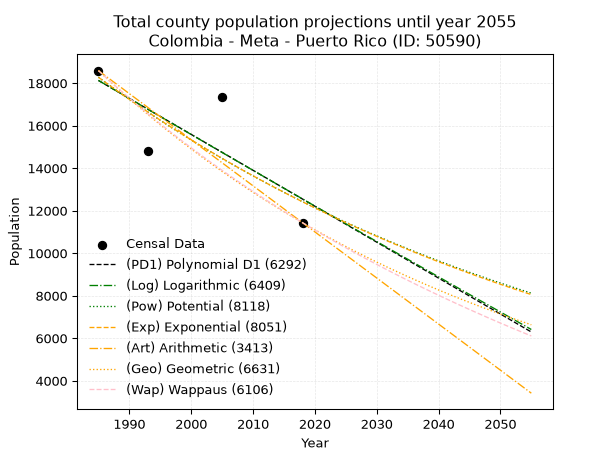
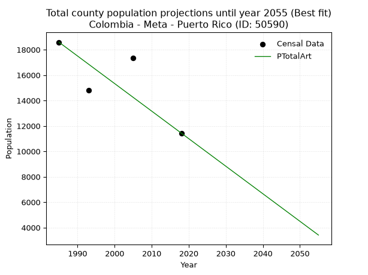
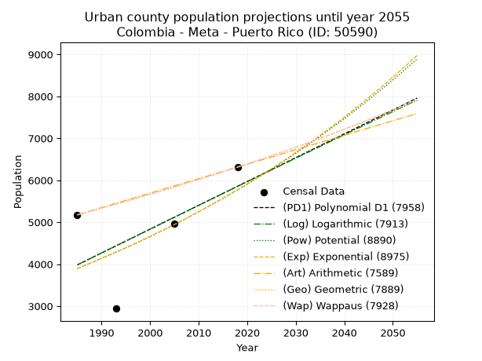
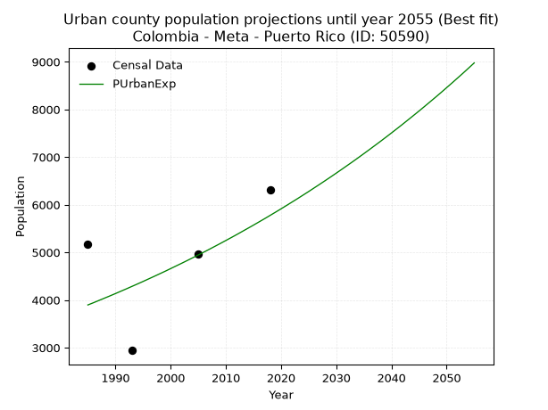
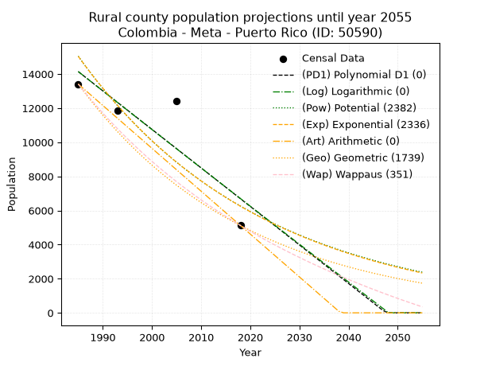
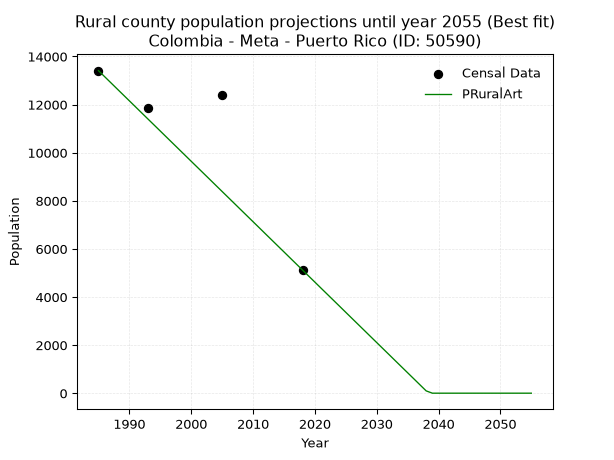

<div align="center">


</div>

# _“Population and Public Services Demand Projections (PPSD) until Year 2050 for Colombia - Meta - Puerto Rico (ID: 50590)”_
Keywords: `population` `public-service` `projection` `lineal` `polynomial` `logarithmic` `potential` `exponential` `arithmetic` `geometric` `wappaus` `dane` `colombia` `south-america`

PPSD are analytical estimates used by governments and planners to anticipate future changes in population size, age distribution, and the resulting community needs for utilities, healthcare, education, and infrastructure as sizing future water treatment facilities, electrical grids, and road networks based on spatial growth.

> **General running parameters**: • app_version: _v20260806_. • Python version: _3.14.7_. • Pandas version: _3.0.5_. • NumPy version: _2.5.1_. • Creates, save and include plots into reports (create_plot): _False_. • Projection until year: _2050_. • Process polynomial degree 2 and up: _False_. • Process Wappaus: _True_. • Process Wappaus: _True_. • Set negative values to zero: _True_. • Set infinite values to zero: _True_. • Drop dataset notes: _True_. 
<div align="center">

Dynamic map: [:earth_americas:Google](http://maps.google.com/maps?q=2.939621375,-73.2063139) [:earth_americas:OSM](https://www.openstreetmap.org/#map=18/2.939621375/-73.2063139&layers=P) [:earth_americas:Bing](https://www.bing.com/maps?cp=2.939621375~-73.2063139&lvl=18) [:earth_americas:Apple](https://maps.apple.com/frame?center=2.939621375%2C-73.2063139&span=0.003%2C0.006)

</div>


<div align="center">

```geojson
{
  "type": "Feature",
  "geometry": {
    "type": "Point", 
    "coordinates": [-73.2063139, 2.939621375]
  }, 
  "properties": {
    "Name": "Colombia - Meta - Puerto Rico (ID: 50590)"
  }
}
```

</div>


## 0. Census Data (4 records)

Census data are official statistics collected by a government about the people and housing in a country. They usually include counts of total population, age, sex, race, income, education, and jobs.

📅Global census file: [Population.xlsx](../data/Population.xlsx)

| Source   |   Year |   CountryID | CountryName   |   StateID | StateName   |   CountyID | CountyName   |   PTotal |   PUrban |   PRural |
|:---------|-------:|------------:|:--------------|----------:|:------------|-----------:|:-------------|---------:|---------:|---------:|
| DANE     |   1985 |          57 | Colombia      |        50 | Meta        |      50590 | Puerto Rico  |    18586 |     5175 |    13411 |
| DANE     |   1993 |          57 | Colombia      |        50 | Meta        |      50590 | Puerto Rico  |    14793 |     2941 |    11852 |
| DANE     |   2005 |          57 | Colombia      |        50 | Meta        |      50590 | Puerto Rico  |    17368 |     4961 |    12407 |
| DANE     |   2018 |          57 | Colombia      |        50 | Meta        |      50590 | Puerto Rico  |    11433 |     6313 |     5120 |

> 🔥Some records could had specific notes about the registered values or the corresponding urban or rural distribution.

## 1. Total

### 1.1. Coefficients and Parameters

* (PD1) Polynomial Deg 1: -169.01164191087557, 353610.5367322289 (lineal)
* (Log) Logarithmic: -338068.09596876765, 2585203.3065663027
* (Pow) Potential: -23.418130064080245, 81.48931135710406
* (Exp) Exponential: -0.01170921600559788, 227015316845647.7
* (Art) Arithmetic: Year diff. 2018 - 1985 = 33, Population diff. 11433 - 18586 = -7153, Annual growth = -216.75757575757575
* (Geo) Geometric: Year diff. 2018 - 1985 = 33, Population diff. 11433 - 18586 = -7153, Annual growth % = -0.014616511158085599
* (Wap) Wappaus: i = -1.444135885656256, Condition values only valid for < 200)

<sub>
Wappaus condition values: ['-0.00', '-1.44', '-2.89', '-4.33', '-5.78', '-7.22', '-8.66', '-10.11', '-11.55', '-13.00', '-14.44', '-15.89', '-17.33', '-18.77', '-20.22', '-21.66', '-23.11', '-24.55', '-25.99', '-27.44', '-28.88', '-30.33', '-31.77', '-33.22', '-34.66', '-36.10', '-37.55', '-38.99', '-40.44', '-41.88', '-43.32', '-44.77', '-46.21', '-47.66', '-49.10', '-50.54', '-51.99', '-53.43', '-54.88', '-56.32', '-57.77', '-59.21', '-60.65', '-62.10', '-63.54', '-64.99', '-66.43', '-67.87', '-69.32', '-70.76', '-72.21', '-73.65', '-75.10', '-76.54', '-77.98', '-79.43', '-80.87', '-82.32', '-83.76', '-85.20', '-86.65', '-88.09', '-89.54', '-90.98', '-92.42', '-93.87']
</sub>


### 1.2. Projected Dataset

|   Year |   CountyID |   PTotalPD1 |   PTotalLog |   PTotalPow |   PTotalExp |   PTotalArt |   PTotalGeo |   PTotalWap |
|-------:|-----------:|------------:|------------:|------------:|------------:|------------:|------------:|------------:|
|   1985 |      50590 |       18122 |       18126 |       18278 |       18274 |       18586 |       18586 |       18586 |
|   1986 |      50590 |       17953 |       17955 |       18064 |       18061 |       18369 |       18314 |       18320 |
|   1987 |      50590 |       17784 |       17785 |       17852 |       17851 |       18152 |       18047 |       18057 |
|   1988 |      50590 |       17615 |       17615 |       17643 |       17643 |       17936 |       17783 |       17798 |
|   1989 |      50590 |       17446 |       17445 |       17436 |       17438 |       17719 |       17523 |       17543 |
|   1990 |      50590 |       17277 |       17275 |       17232 |       17235 |       17502 |       17267 |       17291 |
|   1991 |      50590 |       17108 |       17105 |       17031 |       17034 |       17285 |       17014 |       17042 |
|   1992 |      50590 |       16939 |       16936 |       16832 |       16836 |       17069 |       16766 |       16798 |
|   1993 |      50590 |       16770 |       16766 |       16635 |       16640 |       16852 |       16521 |       16556 |
|   1994 |      50590 |       16601 |       16596 |       16441 |       16446 |       16635 |       16279 |       16318 |
|   1995 |      50590 |       16432 |       16427 |       16249 |       16255 |       16418 |       16041 |       16083 |
|   1996 |      50590 |       16263 |       16257 |       16059 |       16066 |       16202 |       15807 |       15851 |
|   1997 |      50590 |       16094 |       16088 |       15872 |       15879 |       15985 |       15576 |       15622 |
|   1998 |      50590 |       15925 |       15919 |       15687 |       15694 |       15768 |       15348 |       15396 |
|   1999 |      50590 |       15756 |       15750 |       15504 |       15511 |       15551 |       15124 |       15173 |
|   2000 |      50590 |       15587 |       15581 |       15324 |       15331 |       15335 |       14903 |       14953 |
|   2001 |      50590 |       15418 |       15412 |       15145 |       15152 |       15118 |       14685 |       14736 |
|   2002 |      50590 |       15249 |       15243 |       14969 |       14976 |       14901 |       14470 |       14522 |
|   2003 |      50590 |       15080 |       15074 |       14795 |       14801 |       14684 |       14259 |       14310 |
|   2004 |      50590 |       14911 |       14905 |       14623 |       14629 |       14468 |       14050 |       14102 |
|   2005 |      50590 |       14742 |       14737 |       14453 |       14459 |       14251 |       13845 |       13895 |
|   2006 |      50590 |       14573 |       14568 |       14286 |       14291 |       14034 |       13643 |       13692 |
|   2007 |      50590 |       14404 |       14400 |       14120 |       14124 |       13817 |       13443 |       13490 |
|   2008 |      50590 |       14235 |       14231 |       13956 |       13960 |       13601 |       13247 |       13292 |
|   2009 |      50590 |       14066 |       14063 |       13794 |       13797 |       13384 |       13053 |       13096 |
|   2010 |      50590 |       13897 |       13895 |       13634 |       13637 |       13167 |       12862 |       12902 |
|   2011 |      50590 |       13728 |       13726 |       13477 |       13478 |       12950 |       12674 |       12710 |
|   2012 |      50590 |       13559 |       13558 |       13321 |       13321 |       12734 |       12489 |       12521 |
|   2013 |      50590 |       13390 |       13390 |       13166 |       13166 |       12517 |       12306 |       12335 |
|   2014 |      50590 |       13221 |       13222 |       13014 |       13013 |       12300 |       12127 |       12150 |
|   2015 |      50590 |       13052 |       13055 |       12864 |       12861 |       12083 |       11949 |       11967 |
|   2016 |      50590 |       12883 |       12887 |       12715 |       12711 |       11867 |       11775 |       11787 |
|   2017 |      50590 |       12714 |       12719 |       12568 |       12563 |       11650 |       11603 |       11609 |
|   2018 |      50590 |       12545 |       12552 |       12423 |       12417 |       11433 |       11433 |       11433 |
|   2019 |      50590 |       12376 |       12384 |       12280 |       12273 |       11216 |       11266 |       11259 |
|   2020 |      50590 |       12207 |       12217 |       12138 |       12130 |       10999 |       11101 |       11087 |
|   2021 |      50590 |       12038 |       12049 |       11999 |       11989 |       10783 |       10939 |       10917 |
|   2022 |      50590 |       11869 |       11882 |       11860 |       11849 |       10566 |       10779 |       10749 |
|   2023 |      50590 |       11700 |       11715 |       11724 |       11711 |       10349 |       10622 |       10583 |
|   2024 |      50590 |       11531 |       11548 |       11589 |       11575 |       10132 |       10466 |       10418 |
|   2025 |      50590 |       11362 |       11381 |       11456 |       11440 |        9916 |       10313 |       10256 |
|   2026 |      50590 |       11193 |       11214 |       11324 |       11307 |        9699 |       10163 |       10095 |
|   2027 |      50590 |       11024 |       11047 |       11194 |       11175 |        9482 |       10014 |        9936 |
|   2028 |      50590 |       10855 |       10881 |       11065 |       11045 |        9265 |        9868 |        9779 |
|   2029 |      50590 |       10686 |       10714 |       10938 |       10917 |        9049 |        9723 |        9624 |
|   2030 |      50590 |       10517 |       10547 |       10813 |       10790 |        8832 |        9581 |        9470 |
|   2031 |      50590 |       10348 |       10381 |       10689 |       10664 |        8615 |        9441 |        9318 |
|   2032 |      50590 |       10179 |       10214 |       10566 |       10540 |        8398 |        9303 |        9167 |
|   2033 |      50590 |       10010 |       10048 |       10445 |       10417 |        8182 |        9167 |        9018 |
|   2034 |      50590 |        9841 |        9882 |       10326 |       10296 |        7965 |        9033 |        8871 |
|   2035 |      50590 |        9672 |        9716 |       10208 |       10176 |        7748 |        8901 |        8726 |
|   2036 |      50590 |        9503 |        9550 |       10091 |       10058 |        7531 |        8771 |        8581 |
|   2037 |      50590 |        9334 |        9384 |        9975 |        9940 |        7315 |        8643 |        8439 |
|   2038 |      50590 |        9165 |        9218 |        9861 |        9825 |        7098 |        8517 |        8298 |
|   2039 |      50590 |        8996 |        9052 |        9749 |        9710 |        6881 |        8392 |        8158 |
|   2040 |      50590 |        8827 |        8886 |        9637 |        9597 |        6664 |        8269 |        8020 |
|   2041 |      50590 |        8658 |        8720 |        9527 |        9486 |        6448 |        8149 |        7883 |
|   2042 |      50590 |        8489 |        8555 |        9419 |        9375 |        6231 |        8029 |        7748 |
|   2043 |      50590 |        8320 |        8389 |        9311 |        9266 |        6014 |        7912 |        7614 |
|   2044 |      50590 |        8151 |        8224 |        9205 |        9158 |        5797 |        7796 |        7481 |
|   2045 |      50590 |        7982 |        8058 |        9100 |        9052 |        5581 |        7683 |        7350 |
|   2046 |      50590 |        7813 |        7893 |        8997 |        8946 |        5364 |        7570 |        7220 |
|   2047 |      50590 |        7644 |        7728 |        8895 |        8842 |        5147 |        7460 |        7091 |
|   2048 |      50590 |        7475 |        7563 |        8793 |        8739 |        4930 |        7351 |        6963 |
|   2049 |      50590 |        7306 |        7398 |        8693 |        8637 |        4714 |        7243 |        6837 |
|   2050 |      50590 |        7137 |        7233 |        8595 |        8537 |        4497 |        7137 |        6712 |
<div align="center">

</img>

</div>


### 1.3. Best fit with absolute and relative error (%)

Relative error puts that difference into context by dividing the absolute error by the true value, creating a unitless ratio or percentage that shows the scale of the mistake.

Absolute and relative error

|   Year | Source   |   CountryID | CountryName   |   StateID | StateName   |   CountyID_x | CountyName   |   PTotal |   PUrban |   PRural |   CountyID_y |   PTotalPD1 |   PTotalLog |   PTotalPow |   PTotalExp |   PTotalArt |   PTotalGeo |   PTotalWap |   PTotalPD1AbsError |   PTotalLogAbsError |   PTotalPowAbsError |   PTotalExpAbsError |   PTotalArtAbsError |   PTotalGeoAbsError |   PTotalWapAbsError |   PTotalPD1RelError |   PTotalLogRelError |   PTotalPowRelError |   PTotalExpRelError |   PTotalArtRelError |   PTotalGeoRelError |   PTotalWapRelError |
|-------:|:---------|------------:|:--------------|----------:|:------------|-------------:|:-------------|---------:|---------:|---------:|-------------:|------------:|------------:|------------:|------------:|------------:|------------:|------------:|--------------------:|--------------------:|--------------------:|--------------------:|--------------------:|--------------------:|--------------------:|--------------------:|--------------------:|--------------------:|--------------------:|--------------------:|--------------------:|--------------------:|
|   1985 | DANE     |          57 | Colombia      |        50 | Meta        |        50590 | Puerto Rico  |    18586 |     5175 |    13411 |        50590 |       18122 |       18126 |       18278 |       18274 |       18586 |       18586 |       18586 |                 464 |                 460 |                 308 |                 312 |                   0 |                   0 |                   0 |             2.4965  |             2.47498 |             1.65716 |             1.67868 |              0      |              0      |              0      |
|   1993 | DANE     |          57 | Colombia      |        50 | Meta        |        50590 | Puerto Rico  |    14793 |     2941 |    11852 |        50590 |       16770 |       16766 |       16635 |       16640 |       16852 |       16521 |       16556 |                1977 |                1973 |                1842 |                1847 |                2059 |                1728 |                1763 |            13.3644  |            13.3374  |            12.4518  |            12.4856  |             13.9187 |             11.6812 |             11.9178 |
|   2005 | DANE     |          57 | Colombia      |        50 | Meta        |        50590 | Puerto Rico  |    17368 |     4961 |    12407 |        50590 |       14742 |       14737 |       14453 |       14459 |       14251 |       13845 |       13895 |                2626 |                2631 |                2915 |                2909 |                3117 |                3523 |                3473 |            15.1198  |            15.1485  |            16.7837  |            16.7492  |             17.9468 |             20.2844 |             19.9965 |
|   2018 | DANE     |          57 | Colombia      |        50 | Meta        |        50590 | Puerto Rico  |    11433 |     6313 |     5120 |        50590 |       12545 |       12552 |       12423 |       12417 |       11433 |       11433 |       11433 |                1112 |                1119 |                 990 |                 984 |                   0 |                   0 |                   0 |             9.72623 |             9.78746 |             8.65914 |             8.60666 |              0      |              0      |              0      |

Relative error mean

| Method    |   RelError | Best   |
|:----------|-----------:|:-------|
| PTotalPD1 |   10.1767  |        |
| PTotalLog |   10.1871  |        |
| PTotalPow |    9.88797 |        |
| PTotalExp |    9.88004 |        |
| PTotalArt |    7.96639 | True   |
| PTotalGeo |    7.99141 |        |
| PTotalWap |    7.97859 |        |

💙Best method: _**PTotalArt**_
<div align="center">

</img>

</div>


### 1.4. Fresh water supply demand in liters per capita per day (lpcd)

The fresh water supply demand typically ranges from 100 to 300 liters per capita per day (lpcd) for standard domestic and municipal planning, though absolute survival minimums set by the World Health Organization are as low as 7.5 to 20 liters per day, and total consumption in high-income nations can exceed 400 liters.

> `CZ`: Level in meters above the sea level (masl).<br> `WS`: Fresh water supply demand in liters per capita per day (lpcd or l/h/d).<br> `WSAll`: Zonal fresh water supply demand in liters per second (l/s).<br> `A`: Zonal area in square meters.

Reference values (RAS Colombia)

|    CZ |   WS |
|------:|-----:|
|  1000 |  120 |
|  2000 |  130 |
| 99999 |  140 |

County shapefile geometry properties and water supply values

|   CountyID |      ATotal |   CZTotal |   WSTotal |
|-----------:|------------:|----------:|----------:|
|      50590 | 3.40572e+09 |   231.548 |       120 |

Projected values for best method: PTotalArt

|   CountyID |   Year |   PTotalArt |   WSTotal |   WSTotalAll |
|-----------:|-------:|------------:|----------:|-------------:|
|      50590 |   1985 |       18586 |       120 |     25.8139  |
|      50590 |   1986 |       18369 |       120 |     25.5125  |
|      50590 |   1987 |       18152 |       120 |     25.2111  |
|      50590 |   1988 |       17936 |       120 |     24.9111  |
|      50590 |   1989 |       17719 |       120 |     24.6097  |
|      50590 |   1990 |       17502 |       120 |     24.3083  |
|      50590 |   1991 |       17285 |       120 |     24.0069  |
|      50590 |   1992 |       17069 |       120 |     23.7069  |
|      50590 |   1993 |       16852 |       120 |     23.4056  |
|      50590 |   1994 |       16635 |       120 |     23.1042  |
|      50590 |   1995 |       16418 |       120 |     22.8028  |
|      50590 |   1996 |       16202 |       120 |     22.5028  |
|      50590 |   1997 |       15985 |       120 |     22.2014  |
|      50590 |   1998 |       15768 |       120 |     21.9     |
|      50590 |   1999 |       15551 |       120 |     21.5986  |
|      50590 |   2000 |       15335 |       120 |     21.2986  |
|      50590 |   2001 |       15118 |       120 |     20.9972  |
|      50590 |   2002 |       14901 |       120 |     20.6958  |
|      50590 |   2003 |       14684 |       120 |     20.3944  |
|      50590 |   2004 |       14468 |       120 |     20.0944  |
|      50590 |   2005 |       14251 |       120 |     19.7931  |
|      50590 |   2006 |       14034 |       120 |     19.4917  |
|      50590 |   2007 |       13817 |       120 |     19.1903  |
|      50590 |   2008 |       13601 |       120 |     18.8903  |
|      50590 |   2009 |       13384 |       120 |     18.5889  |
|      50590 |   2010 |       13167 |       120 |     18.2875  |
|      50590 |   2011 |       12950 |       120 |     17.9861  |
|      50590 |   2012 |       12734 |       120 |     17.6861  |
|      50590 |   2013 |       12517 |       120 |     17.3847  |
|      50590 |   2014 |       12300 |       120 |     17.0833  |
|      50590 |   2015 |       12083 |       120 |     16.7819  |
|      50590 |   2016 |       11867 |       120 |     16.4819  |
|      50590 |   2017 |       11650 |       120 |     16.1806  |
|      50590 |   2018 |       11433 |       120 |     15.8792  |
|      50590 |   2019 |       11216 |       120 |     15.5778  |
|      50590 |   2020 |       10999 |       120 |     15.2764  |
|      50590 |   2021 |       10783 |       120 |     14.9764  |
|      50590 |   2022 |       10566 |       120 |     14.675   |
|      50590 |   2023 |       10349 |       120 |     14.3736  |
|      50590 |   2024 |       10132 |       120 |     14.0722  |
|      50590 |   2025 |        9916 |       120 |     13.7722  |
|      50590 |   2026 |        9699 |       120 |     13.4708  |
|      50590 |   2027 |        9482 |       120 |     13.1694  |
|      50590 |   2028 |        9265 |       120 |     12.8681  |
|      50590 |   2029 |        9049 |       120 |     12.5681  |
|      50590 |   2030 |        8832 |       120 |     12.2667  |
|      50590 |   2031 |        8615 |       120 |     11.9653  |
|      50590 |   2032 |        8398 |       120 |     11.6639  |
|      50590 |   2033 |        8182 |       120 |     11.3639  |
|      50590 |   2034 |        7965 |       120 |     11.0625  |
|      50590 |   2035 |        7748 |       120 |     10.7611  |
|      50590 |   2036 |        7531 |       120 |     10.4597  |
|      50590 |   2037 |        7315 |       120 |     10.1597  |
|      50590 |   2038 |        7098 |       120 |      9.85833 |
|      50590 |   2039 |        6881 |       120 |      9.55694 |
|      50590 |   2040 |        6664 |       120 |      9.25556 |
|      50590 |   2041 |        6448 |       120 |      8.95556 |
|      50590 |   2042 |        6231 |       120 |      8.65417 |
|      50590 |   2043 |        6014 |       120 |      8.35278 |
|      50590 |   2044 |        5797 |       120 |      8.05139 |
|      50590 |   2045 |        5581 |       120 |      7.75139 |
|      50590 |   2046 |        5364 |       120 |      7.45    |
|      50590 |   2047 |        5147 |       120 |      7.14861 |
|      50590 |   2048 |        4930 |       120 |      6.84722 |
|      50590 |   2049 |        4714 |       120 |      6.54722 |
|      50590 |   2050 |        4497 |       120 |      6.24583 |

## 2. Urban

### 2.1. Coefficients and Parameters

* (PD1) Polynomial Deg 1: 56.81172219991875, -108790.14733038748 (lineal)
* (Log) Logarithmic: 113442.19516217016, -857427.534496355
* (Pow) Potential: 23.803588153157232, -74.90789709144495
* (Exp) Exponential: 0.01192211179189373, 2.055149615844933e-07
* (Art) Arithmetic: Year diff. 2018 - 1985 = 33, Population diff. 6313 - 5175 = 1138, Annual growth = 34.484848484848484
* (Geo) Geometric: Year diff. 2018 - 1985 = 33, Population diff. 6313 - 5175 = 1138, Annual growth % = 0.006041560696175452
* (Wap) Wappaus: i = 0.6003629610871951, Condition values only valid for < 200)

<sub>
Wappaus condition values: ['0.00', '0.60', '1.20', '1.80', '2.40', '3.00', '3.60', '4.20', '4.80', '5.40', '6.00', '6.60', '7.20', '7.80', '8.41', '9.01', '9.61', '10.21', '10.81', '11.41', '12.01', '12.61', '13.21', '13.81', '14.41', '15.01', '15.61', '16.21', '16.81', '17.41', '18.01', '18.61', '19.21', '19.81', '20.41', '21.01', '21.61', '22.21', '22.81', '23.41', '24.01', '24.61', '25.22', '25.82', '26.42', '27.02', '27.62', '28.22', '28.82', '29.42', '30.02', '30.62', '31.22', '31.82', '32.42', '33.02', '33.62', '34.22', '34.82', '35.42', '36.02', '36.62', '37.22', '37.82', '38.42', '39.02']
</sub>


### 2.2. Projected Dataset

|   Year |   CountyID |   PUrbanPD1 |   PUrbanLog |   PUrbanPow |   PUrbanExp |   PUrbanArt |   PUrbanGeo |   PUrbanWap |
|-------:|-----------:|------------:|------------:|------------:|------------:|------------:|------------:|------------:|
|   1985 |      50590 |        3981 |        3982 |        3896 |        3896 |        5175 |        5175 |        5175 |
|   1986 |      50590 |        4038 |        4039 |        3943 |        3942 |        5209 |        5206 |        5206 |
|   1987 |      50590 |        4095 |        4096 |        3991 |        3990 |        5244 |        5238 |        5238 |
|   1988 |      50590 |        4152 |        4153 |        4039 |        4038 |        5278 |        5269 |        5269 |
|   1989 |      50590 |        4208 |        4210 |        4087 |        4086 |        5313 |        5301 |        5301 |
|   1990 |      50590 |        4265 |        4267 |        4137 |        4135 |        5347 |        5333 |        5333 |
|   1991 |      50590 |        4322 |        4324 |        4186 |        4185 |        5382 |        5365 |        5365 |
|   1992 |      50590 |        4379 |        4381 |        4237 |        4235 |        5416 |        5398 |        5397 |
|   1993 |      50590 |        4436 |        4438 |        4288 |        4286 |        5451 |        5430 |        5430 |
|   1994 |      50590 |        4492 |        4495 |        4339 |        4337 |        5485 |        5463 |        5462 |
|   1995 |      50590 |        4549 |        4552 |        4391 |        4389 |        5520 |        5496 |        5495 |
|   1996 |      50590 |        4606 |        4608 |        4444 |        4442 |        5554 |        5529 |        5528 |
|   1997 |      50590 |        4663 |        4665 |        4497 |        4495 |        5589 |        5563 |        5562 |
|   1998 |      50590 |        4720 |        4722 |        4551 |        4549 |        5623 |        5597 |        5595 |
|   1999 |      50590 |        4776 |        4779 |        4606 |        4603 |        5658 |        5630 |        5629 |
|   2000 |      50590 |        4833 |        4836 |        4661 |        4659 |        5692 |        5664 |        5663 |
|   2001 |      50590 |        4890 |        4892 |        4717 |        4715 |        5727 |        5699 |        5697 |
|   2002 |      50590 |        4947 |        4949 |        4773 |        4771 |        5761 |        5733 |        5732 |
|   2003 |      50590 |        5004 |        5006 |        4830 |        4828 |        5796 |        5768 |        5766 |
|   2004 |      50590 |        5061 |        5062 |        4888 |        4886 |        5830 |        5802 |        5801 |
|   2005 |      50590 |        5117 |        5119 |        4946 |        4945 |        5865 |        5838 |        5836 |
|   2006 |      50590 |        5174 |        5175 |        5005 |        5004 |        5899 |        5873 |        5871 |
|   2007 |      50590 |        5231 |        5232 |        5065 |        5064 |        5934 |        5908 |        5907 |
|   2008 |      50590 |        5288 |        5288 |        5125 |        5125 |        5968 |        5944 |        5943 |
|   2009 |      50590 |        5345 |        5345 |        5187 |        5186 |        6003 |        5980 |        5979 |
|   2010 |      50590 |        5401 |        5401 |        5248 |        5249 |        6037 |        6016 |        6015 |
|   2011 |      50590 |        5458 |        5458 |        5311 |        5311 |        6072 |        6052 |        6051 |
|   2012 |      50590 |        5515 |        5514 |        5374 |        5375 |        6106 |        6089 |        6088 |
|   2013 |      50590 |        5572 |        5571 |        5438 |        5440 |        6141 |        6126 |        6125 |
|   2014 |      50590 |        5629 |        5627 |        5503 |        5505 |        6175 |        6163 |        6162 |
|   2015 |      50590 |        5685 |        5683 |        5568 |        5571 |        6210 |        6200 |        6199 |
|   2016 |      50590 |        5742 |        5739 |        5634 |        5638 |        6244 |        6237 |        6237 |
|   2017 |      50590 |        5799 |        5796 |        5701 |        5705 |        6279 |        6275 |        6275 |
|   2018 |      50590 |        5856 |        5852 |        5769 |        5774 |        6313 |        6313 |        6313 |
|   2019 |      50590 |        5913 |        5908 |        5837 |        5843 |        6347 |        6351 |        6351 |
|   2020 |      50590 |        5970 |        5964 |        5906 |        5913 |        6382 |        6390 |        6390 |
|   2021 |      50590 |        6026 |        6020 |        5976 |        5984 |        6416 |        6428 |        6429 |
|   2022 |      50590 |        6083 |        6077 |        6047 |        6056 |        6451 |        6467 |        6468 |
|   2023 |      50590 |        6140 |        6133 |        6119 |        6128 |        6485 |        6506 |        6508 |
|   2024 |      50590 |        6197 |        6189 |        6191 |        6202 |        6520 |        6545 |        6547 |
|   2025 |      50590 |        6254 |        6245 |        6264 |        6276 |        6554 |        6585 |        6587 |
|   2026 |      50590 |        6310 |        6301 |        6338 |        6352 |        6589 |        6625 |        6628 |
|   2027 |      50590 |        6367 |        6357 |        6413 |        6428 |        6623 |        6665 |        6668 |
|   2028 |      50590 |        6424 |        6413 |        6489 |        6505 |        6658 |        6705 |        6709 |
|   2029 |      50590 |        6481 |        6469 |        6566 |        6583 |        6692 |        6745 |        6750 |
|   2030 |      50590 |        6538 |        6525 |        6643 |        6662 |        6727 |        6786 |        6791 |
|   2031 |      50590 |        6594 |        6580 |        6722 |        6742 |        6761 |        6827 |        6833 |
|   2032 |      50590 |        6651 |        6636 |        6801 |        6823 |        6796 |        6868 |        6875 |
|   2033 |      50590 |        6708 |        6692 |        6881 |        6904 |        6830 |        6910 |        6917 |
|   2034 |      50590 |        6765 |        6748 |        6962 |        6987 |        6865 |        6952 |        6960 |
|   2035 |      50590 |        6822 |        6804 |        7044 |        7071 |        6899 |        6994 |        7003 |
|   2036 |      50590 |        6879 |        6859 |        7127 |        7156 |        6934 |        7036 |        7046 |
|   2037 |      50590 |        6935 |        6915 |        7210 |        7242 |        6968 |        7078 |        7089 |
|   2038 |      50590 |        6992 |        6971 |        7295 |        7328 |        7003 |        7121 |        7133 |
|   2039 |      50590 |        7049 |        7026 |        7381 |        7416 |        7037 |        7164 |        7177 |
|   2040 |      50590 |        7106 |        7082 |        7468 |        7505 |        7072 |        7208 |        7222 |
|   2041 |      50590 |        7163 |        7138 |        7555 |        7595 |        7106 |        7251 |        7266 |
|   2042 |      50590 |        7219 |        7193 |        7644 |        7686 |        7141 |        7295 |        7311 |
|   2043 |      50590 |        7276 |        7249 |        7733 |        7779 |        7175 |        7339 |        7357 |
|   2044 |      50590 |        7333 |        7304 |        7824 |        7872 |        7210 |        7383 |        7403 |
|   2045 |      50590 |        7390 |        7360 |        7916 |        7966 |        7244 |        7428 |        7449 |
|   2046 |      50590 |        7447 |        7415 |        8008 |        8062 |        7279 |        7473 |        7495 |
|   2047 |      50590 |        7503 |        7471 |        8102 |        8159 |        7313 |        7518 |        7542 |
|   2048 |      50590 |        7560 |        7526 |        8197 |        8256 |        7348 |        7563 |        7589 |
|   2049 |      50590 |        7617 |        7581 |        8292 |        8355 |        7382 |        7609 |        7636 |
|   2050 |      50590 |        7674 |        7637 |        8389 |        8456 |        7417 |        7655 |        7684 |
<div align="center">

</img>

</div>


### 2.3. Best fit with absolute and relative error (%)

Relative error puts that difference into context by dividing the absolute error by the true value, creating a unitless ratio or percentage that shows the scale of the mistake.

Absolute and relative error

|   Year | Source   |   CountryID | CountryName   |   StateID | StateName   |   CountyID_x | CountyName   |   PTotal |   PUrban |   PRural |   CountyID_y |   PUrbanPD1 |   PUrbanLog |   PUrbanPow |   PUrbanExp |   PUrbanArt |   PUrbanGeo |   PUrbanWap |   PUrbanPD1AbsError |   PUrbanLogAbsError |   PUrbanPowAbsError |   PUrbanExpAbsError |   PUrbanArtAbsError |   PUrbanGeoAbsError |   PUrbanWapAbsError |   PUrbanPD1RelError |   PUrbanLogRelError |   PUrbanPowRelError |   PUrbanExpRelError |   PUrbanArtRelError |   PUrbanGeoRelError |   PUrbanWapRelError |
|-------:|:---------|------------:|:--------------|----------:|:------------|-------------:|:-------------|---------:|---------:|---------:|-------------:|------------:|------------:|------------:|------------:|------------:|------------:|------------:|--------------------:|--------------------:|--------------------:|--------------------:|--------------------:|--------------------:|--------------------:|--------------------:|--------------------:|--------------------:|--------------------:|--------------------:|--------------------:|--------------------:|
|   1985 | DANE     |          57 | Colombia      |        50 | Meta        |        50590 | Puerto Rico  |    18586 |     5175 |    13411 |        50590 |        3981 |        3982 |        3896 |        3896 |        5175 |        5175 |        5175 |                1194 |                1193 |                1279 |                1279 |                   0 |                   0 |                   0 |            23.0725  |            23.0531  |           24.715    |           24.715    |              0      |              0      |              0      |
|   1993 | DANE     |          57 | Colombia      |        50 | Meta        |        50590 | Puerto Rico  |    14793 |     2941 |    11852 |        50590 |        4436 |        4438 |        4288 |        4286 |        5451 |        5430 |        5430 |                1495 |                1497 |                1347 |                1345 |                2510 |                2489 |                2489 |            50.833   |            50.9011  |           45.8007   |           45.7327   |             85.3451 |             84.6311 |             84.6311 |
|   2005 | DANE     |          57 | Colombia      |        50 | Meta        |        50590 | Puerto Rico  |    17368 |     4961 |    12407 |        50590 |        5117 |        5119 |        4946 |        4945 |        5865 |        5838 |        5836 |                 156 |                 158 |                  15 |                  16 |                 904 |                 877 |                 875 |             3.14453 |             3.18484 |            0.302358 |            0.322516 |             18.2221 |             17.6779 |             17.6376 |
|   2018 | DANE     |          57 | Colombia      |        50 | Meta        |        50590 | Puerto Rico  |    11433 |     6313 |     5120 |        50590 |        5856 |        5852 |        5769 |        5774 |        6313 |        6313 |        6313 |                 457 |                 461 |                 544 |                 539 |                   0 |                   0 |                   0 |             7.23903 |             7.30239 |            8.61714  |            8.53794  |              0      |              0      |              0      |

Relative error mean

| Method    |   RelError | Best   |
|:----------|-----------:|:-------|
| PUrbanPD1 |    21.0723 |        |
| PUrbanLog |    21.1104 |        |
| PUrbanPow |    19.8588 |        |
| PUrbanExp |    19.827  | True   |
| PUrbanArt |    25.8918 |        |
| PUrbanGeo |    25.5772 |        |
| PUrbanWap |    25.5672 |        |

💙Best method: _**PUrbanExp**_
<div align="center">

</img>

</div>


### 2.4. Fresh water supply demand in liters per capita per day (lpcd)

The fresh water supply demand typically ranges from 100 to 300 liters per capita per day (lpcd) for standard domestic and municipal planning, though absolute survival minimums set by the World Health Organization are as low as 7.5 to 20 liters per day, and total consumption in high-income nations can exceed 400 liters.

> `CZ`: Level in meters above the sea level (masl).<br> `WS`: Fresh water supply demand in liters per capita per day (lpcd or l/h/d).<br> `WSAll`: Zonal fresh water supply demand in liters per second (l/s).<br> `A`: Zonal area in square meters.

Reference values (RAS Colombia)

|    CZ |   WS |
|------:|-----:|
|  1000 |  120 |
|  2000 |  130 |
| 99999 |  140 |

County shapefile geometry properties and water supply values

|   CountyID |      AUrban |   CZUrban |   WSUrban |
|-----------:|------------:|----------:|----------:|
|      50590 | 1.23502e+06 |   217.209 |       120 |

Projected values for best method: PUrbanExp

|   CountyID |   Year |   PUrbanExp |   WSUrban |   WSUrbanAll |
|-----------:|-------:|------------:|----------:|-------------:|
|      50590 |   1985 |        3896 |       120 |      5.41111 |
|      50590 |   1986 |        3942 |       120 |      5.475   |
|      50590 |   1987 |        3990 |       120 |      5.54167 |
|      50590 |   1988 |        4038 |       120 |      5.60833 |
|      50590 |   1989 |        4086 |       120 |      5.675   |
|      50590 |   1990 |        4135 |       120 |      5.74306 |
|      50590 |   1991 |        4185 |       120 |      5.8125  |
|      50590 |   1992 |        4235 |       120 |      5.88194 |
|      50590 |   1993 |        4286 |       120 |      5.95278 |
|      50590 |   1994 |        4337 |       120 |      6.02361 |
|      50590 |   1995 |        4389 |       120 |      6.09583 |
|      50590 |   1996 |        4442 |       120 |      6.16944 |
|      50590 |   1997 |        4495 |       120 |      6.24306 |
|      50590 |   1998 |        4549 |       120 |      6.31806 |
|      50590 |   1999 |        4603 |       120 |      6.39306 |
|      50590 |   2000 |        4659 |       120 |      6.47083 |
|      50590 |   2001 |        4715 |       120 |      6.54861 |
|      50590 |   2002 |        4771 |       120 |      6.62639 |
|      50590 |   2003 |        4828 |       120 |      6.70556 |
|      50590 |   2004 |        4886 |       120 |      6.78611 |
|      50590 |   2005 |        4945 |       120 |      6.86806 |
|      50590 |   2006 |        5004 |       120 |      6.95    |
|      50590 |   2007 |        5064 |       120 |      7.03333 |
|      50590 |   2008 |        5125 |       120 |      7.11806 |
|      50590 |   2009 |        5186 |       120 |      7.20278 |
|      50590 |   2010 |        5249 |       120 |      7.29028 |
|      50590 |   2011 |        5311 |       120 |      7.37639 |
|      50590 |   2012 |        5375 |       120 |      7.46528 |
|      50590 |   2013 |        5440 |       120 |      7.55556 |
|      50590 |   2014 |        5505 |       120 |      7.64583 |
|      50590 |   2015 |        5571 |       120 |      7.7375  |
|      50590 |   2016 |        5638 |       120 |      7.83056 |
|      50590 |   2017 |        5705 |       120 |      7.92361 |
|      50590 |   2018 |        5774 |       120 |      8.01944 |
|      50590 |   2019 |        5843 |       120 |      8.11528 |
|      50590 |   2020 |        5913 |       120 |      8.2125  |
|      50590 |   2021 |        5984 |       120 |      8.31111 |
|      50590 |   2022 |        6056 |       120 |      8.41111 |
|      50590 |   2023 |        6128 |       120 |      8.51111 |
|      50590 |   2024 |        6202 |       120 |      8.61389 |
|      50590 |   2025 |        6276 |       120 |      8.71667 |
|      50590 |   2026 |        6352 |       120 |      8.82222 |
|      50590 |   2027 |        6428 |       120 |      8.92778 |
|      50590 |   2028 |        6505 |       120 |      9.03472 |
|      50590 |   2029 |        6583 |       120 |      9.14306 |
|      50590 |   2030 |        6662 |       120 |      9.25278 |
|      50590 |   2031 |        6742 |       120 |      9.36389 |
|      50590 |   2032 |        6823 |       120 |      9.47639 |
|      50590 |   2033 |        6904 |       120 |      9.58889 |
|      50590 |   2034 |        6987 |       120 |      9.70417 |
|      50590 |   2035 |        7071 |       120 |      9.82083 |
|      50590 |   2036 |        7156 |       120 |      9.93889 |
|      50590 |   2037 |        7242 |       120 |     10.0583  |
|      50590 |   2038 |        7328 |       120 |     10.1778  |
|      50590 |   2039 |        7416 |       120 |     10.3     |
|      50590 |   2040 |        7505 |       120 |     10.4236  |
|      50590 |   2041 |        7595 |       120 |     10.5486  |
|      50590 |   2042 |        7686 |       120 |     10.675   |
|      50590 |   2043 |        7779 |       120 |     10.8042  |
|      50590 |   2044 |        7872 |       120 |     10.9333  |
|      50590 |   2045 |        7966 |       120 |     11.0639  |
|      50590 |   2046 |        8062 |       120 |     11.1972  |
|      50590 |   2047 |        8159 |       120 |     11.3319  |
|      50590 |   2048 |        8256 |       120 |     11.4667  |
|      50590 |   2049 |        8355 |       120 |     11.6042  |
|      50590 |   2050 |        8456 |       120 |     11.7444  |

## 3. Rural

### 3.1. Coefficients and Parameters

* (PD1) Polynomial Deg 1: -225.8233641107943, 462400.6840626163 (lineal)
* (Log) Logarithmic: -451510.2911309377, 3442630.8410626566
* (Pow) Potential: -53.17755562493955, 179.54419134007284
* (Exp) Exponential: -0.026600591143588644, 1.2850363348485525e+27
* (Art) Arithmetic: Year diff. 2018 - 1985 = 33, Population diff. 5120 - 13411 = -8291, Annual growth = -251.24242424242425
* (Geo) Geometric: Year diff. 2018 - 1985 = 33, Population diff. 5120 - 13411 = -8291, Annual growth % = -0.028757810459953403
* (Wap) Wappaus: i = -2.7115905697741542, Condition values only valid for < 200)

<sub>
Wappaus condition values: ['-0.00', '-2.71', '-5.42', '-8.13', '-10.85', '-13.56', '-16.27', '-18.98', '-21.69', '-24.40', '-27.12', '-29.83', '-32.54', '-35.25', '-37.96', '-40.67', '-43.39', '-46.10', '-48.81', '-51.52', '-54.23', '-56.94', '-59.65', '-62.37', '-65.08', '-67.79', '-70.50', '-73.21', '-75.92', '-78.64', '-81.35', '-84.06', '-86.77', '-89.48', '-92.19', '-94.91', '-97.62', '-100.33', '-103.04', '-105.75', '-108.46', '-111.18', '-113.89', '-116.60', '-119.31', '-122.02', '-124.73', '-127.44', '-130.16', '-132.87', '-135.58', '-138.29', '-141.00', '-143.71', '-146.43', '-149.14', '-151.85', '-154.56', '-157.27', '-159.98', '-162.70', '-165.41', '-168.12', '-170.83', '-173.54', '-176.25']
</sub>


### 3.2. Projected Dataset

|   Year |   CountyID |   PRuralPD1 |   PRuralLog |   PRuralPow |   PRuralExp |   PRuralArt |   PRuralGeo |   PRuralWap |
|-------:|-----------:|------------:|------------:|------------:|------------:|------------:|------------:|------------:|
|   1985 |      50590 |       14141 |       14144 |       15043 |       15039 |       13411 |       13411 |       13411 |
|   1986 |      50590 |       13915 |       13917 |       14646 |       14644 |       13160 |       13025 |       13052 |
|   1987 |      50590 |       13690 |       13690 |       14259 |       14260 |       12909 |       12651 |       12703 |
|   1988 |      50590 |       13464 |       13462 |       13883 |       13886 |       12657 |       12287 |       12363 |
|   1989 |      50590 |       13238 |       13235 |       13516 |       13521 |       12406 |       11934 |       12031 |
|   1990 |      50590 |       13012 |       13008 |       13160 |       13166 |       12155 |       11590 |       11708 |
|   1991 |      50590 |       12786 |       12782 |       12813 |       12821 |       11904 |       11257 |       11393 |
|   1992 |      50590 |       12561 |       12555 |       12475 |       12484 |       11652 |       10933 |       11086 |
|   1993 |      50590 |       12335 |       12328 |       12147 |       12156 |       11401 |       10619 |       10786 |
|   1994 |      50590 |       12109 |       12102 |       11827 |       11837 |       11150 |       10314 |       10494 |
|   1995 |      50590 |       11883 |       11875 |       11516 |       11527 |       10899 |       10017 |       10209 |
|   1996 |      50590 |       11657 |       11649 |       11213 |       11224 |       10647 |        9729 |        9930 |
|   1997 |      50590 |       11431 |       11423 |       10918 |       10929 |       10396 |        9449 |        9658 |
|   1998 |      50590 |       11206 |       11197 |       10631 |       10642 |       10145 |        9177 |        9392 |
|   1999 |      50590 |       10980 |       10971 |       10352 |       10363 |        9894 |        8913 |        9132 |
|   2000 |      50590 |       10754 |       10745 |       10081 |       10091 |        9642 |        8657 |        8878 |
|   2001 |      50590 |       10528 |       10519 |        9816 |        9826 |        9391 |        8408 |        8630 |
|   2002 |      50590 |       10302 |       10294 |        9559 |        9568 |        9140 |        8166 |        8387 |
|   2003 |      50590 |       10076 |       10068 |        9308 |        9317 |        8889 |        7932 |        8149 |
|   2004 |      50590 |        9851 |        9843 |        9064 |        9072 |        8637 |        7703 |        7917 |
|   2005 |      50590 |        9625 |        9618 |        8827 |        8834 |        8386 |        7482 |        7689 |
|   2006 |      50590 |        9399 |        9393 |        8596 |        8602 |        8135 |        7267 |        7467 |
|   2007 |      50590 |        9173 |        9168 |        8371 |        8377 |        7884 |        7058 |        7249 |
|   2008 |      50590 |        8947 |        8943 |        8152 |        8157 |        7632 |        6855 |        7035 |
|   2009 |      50590 |        8722 |        8718 |        7939 |        7943 |        7381 |        6658 |        6826 |
|   2010 |      50590 |        8496 |        8493 |        7732 |        7734 |        7130 |        6466 |        6621 |
|   2011 |      50590 |        8270 |        8269 |        7530 |        7531 |        6879 |        6280 |        6420 |
|   2012 |      50590 |        8044 |        8044 |        7334 |        7333 |        6627 |        6100 |        6224 |
|   2013 |      50590 |        7818 |        7820 |        7143 |        7141 |        6376 |        5924 |        6031 |
|   2014 |      50590 |        7592 |        7596 |        6956 |        6953 |        6125 |        5754 |        5841 |
|   2015 |      50590 |        7367 |        7371 |        6775 |        6771 |        5874 |        5588 |        5656 |
|   2016 |      50590 |        7141 |        7147 |        6599 |        6593 |        5622 |        5428 |        5474 |
|   2017 |      50590 |        6915 |        6924 |        6427 |        6420 |        5371 |        5272 |        5295 |
|   2018 |      50590 |        6689 |        6700 |        6260 |        6252 |        5120 |        5120 |        5120 |
|   2019 |      50590 |        6463 |        6476 |        6097 |        6087 |        4869 |        4973 |        4948 |
|   2020 |      50590 |        6237 |        6252 |        5939 |        5928 |        4618 |        4830 |        4779 |
|   2021 |      50590 |        6012 |        6029 |        5784 |        5772 |        4366 |        4691 |        4613 |
|   2022 |      50590 |        5786 |        5806 |        5634 |        5621 |        4115 |        4556 |        4451 |
|   2023 |      50590 |        5560 |        5582 |        5488 |        5473 |        3864 |        4425 |        4291 |
|   2024 |      50590 |        5334 |        5359 |        5346 |        5329 |        3613 |        4298 |        4134 |
|   2025 |      50590 |        5108 |        5136 |        5207 |        5189 |        3361 |        4174 |        3980 |
|   2026 |      50590 |        4883 |        4913 |        5072 |        5053 |        3110 |        4054 |        3828 |
|   2027 |      50590 |        4657 |        4691 |        4941 |        4921 |        2859 |        3937 |        3679 |
|   2028 |      50590 |        4431 |        4468 |        4813 |        4791 |        2608 |        3824 |        3533 |
|   2029 |      50590 |        4205 |        4245 |        4688 |        4666 |        2356 |        3714 |        3389 |
|   2030 |      50590 |        3979 |        4023 |        4567 |        4543 |        2105 |        3607 |        3248 |
|   2031 |      50590 |        3753 |        3800 |        4449 |        4424 |        1854 |        3504 |        3108 |
|   2032 |      50590 |        3528 |        3578 |        4334 |        4308 |        1603 |        3403 |        2972 |
|   2033 |      50590 |        3302 |        3356 |        4222 |        4195 |        1351 |        3305 |        2837 |
|   2034 |      50590 |        3076 |        3134 |        4113 |        4085 |        1100 |        3210 |        2705 |
|   2035 |      50590 |        2850 |        2912 |        4007 |        3977 |         849 |        3118 |        2574 |
|   2036 |      50590 |        2624 |        2690 |        3904 |        3873 |         598 |        3028 |        2446 |
|   2037 |      50590 |        2398 |        2469 |        3803 |        3771 |         346 |        2941 |        2320 |
|   2038 |      50590 |        2173 |        2247 |        3705 |        3672 |          95 |        2856 |        2196 |
|   2039 |      50590 |        1947 |        2025 |        3610 |        3576 |           0 |        2774 |        2074 |
|   2040 |      50590 |        1721 |        1804 |        3517 |        3482 |           0 |        2694 |        1954 |
|   2041 |      50590 |        1495 |        1583 |        3426 |        3391 |           0 |        2617 |        1835 |
|   2042 |      50590 |        1269 |        1362 |        3338 |        3302 |           0 |        2542 |        1719 |
|   2043 |      50590 |        1044 |        1141 |        3252 |        3215 |           0 |        2469 |        1604 |
|   2044 |      50590 |         818 |         920 |        3169 |        3131 |           0 |        2398 |        1491 |
|   2045 |      50590 |         592 |         699 |        3088 |        3048 |           0 |        2329 |        1379 |
|   2046 |      50590 |         366 |         478 |        3008 |        2968 |           0 |        2262 |        1270 |
|   2047 |      50590 |         140 |         257 |        2931 |        2890 |           0 |        2197 |        1161 |
|   2048 |      50590 |           0 |          37 |        2856 |        2815 |           0 |        2134 |        1055 |
|   2049 |      50590 |           0 |           0 |        2783 |        2741 |           0 |        2072 |         950 |
|   2050 |      50590 |           0 |           0 |        2712 |        2669 |           0 |        2013 |         846 |
<div align="center">

</img>

</div>


### 3.3. Best fit with absolute and relative error (%)

Relative error puts that difference into context by dividing the absolute error by the true value, creating a unitless ratio or percentage that shows the scale of the mistake.

Absolute and relative error

|   Year | Source   |   CountryID | CountryName   |   StateID | StateName   |   CountyID_x | CountyName   |   PTotal |   PUrban |   PRural |   CountyID_y |   PRuralPD1 |   PRuralLog |   PRuralPow |   PRuralExp |   PRuralArt |   PRuralGeo |   PRuralWap |   PRuralPD1AbsError |   PRuralLogAbsError |   PRuralPowAbsError |   PRuralExpAbsError |   PRuralArtAbsError |   PRuralGeoAbsError |   PRuralWapAbsError |   PRuralPD1RelError |   PRuralLogRelError |   PRuralPowRelError |   PRuralExpRelError |   PRuralArtRelError |   PRuralGeoRelError |   PRuralWapRelError |
|-------:|:---------|------------:|:--------------|----------:|:------------|-------------:|:-------------|---------:|---------:|---------:|-------------:|------------:|------------:|------------:|------------:|------------:|------------:|------------:|--------------------:|--------------------:|--------------------:|--------------------:|--------------------:|--------------------:|--------------------:|--------------------:|--------------------:|--------------------:|--------------------:|--------------------:|--------------------:|--------------------:|
|   1985 | DANE     |          57 | Colombia      |        50 | Meta        |        50590 | Puerto Rico  |    18586 |     5175 |    13411 |        50590 |       14141 |       14144 |       15043 |       15039 |       13411 |       13411 |       13411 |                 730 |                 733 |                1632 |                1628 |                   0 |                   0 |                   0 |             5.44329 |             5.46566 |            12.1691  |            12.1393  |             0       |              0      |             0       |
|   1993 | DANE     |          57 | Colombia      |        50 | Meta        |        50590 | Puerto Rico  |    14793 |     2941 |    11852 |        50590 |       12335 |       12328 |       12147 |       12156 |       11401 |       10619 |       10786 |                 483 |                 476 |                 295 |                 304 |                 451 |                1233 |                1066 |             4.07526 |             4.0162  |             2.48903 |             2.56497 |             3.80526 |             10.4033 |             8.99426 |
|   2005 | DANE     |          57 | Colombia      |        50 | Meta        |        50590 | Puerto Rico  |    17368 |     4961 |    12407 |        50590 |        9625 |        9618 |        8827 |        8834 |        8386 |        7482 |        7689 |                2782 |                2789 |                3580 |                3573 |                4021 |                4925 |                4718 |            22.4228  |            22.4792  |            28.8547  |            28.7983  |            32.4091  |             39.6953 |            38.0269  |
|   2018 | DANE     |          57 | Colombia      |        50 | Meta        |        50590 | Puerto Rico  |    11433 |     6313 |     5120 |        50590 |        6689 |        6700 |        6260 |        6252 |        5120 |        5120 |        5120 |                1569 |                1580 |                1140 |                1132 |                   0 |                   0 |                   0 |            30.6445  |            30.8594  |            22.2656  |            22.1094  |             0       |              0      |             0       |

Relative error mean

| Method    |   RelError | Best   |
|:----------|-----------:|:-------|
| PRuralPD1 |    15.6465 |        |
| PRuralLog |    15.7051 |        |
| PRuralPow |    16.4446 |        |
| PRuralExp |    16.403  |        |
| PRuralArt |     9.0536 | True   |
| PRuralGeo |    12.5247 |        |
| PRuralWap |    11.7553 |        |

💙Best method: _**PRuralArt**_
<div align="center">

</img>

</div>


### 3.4. Fresh water supply demand in liters per capita per day (lpcd)

The fresh water supply demand typically ranges from 100 to 300 liters per capita per day (lpcd) for standard domestic and municipal planning, though absolute survival minimums set by the World Health Organization are as low as 7.5 to 20 liters per day, and total consumption in high-income nations can exceed 400 liters.

> `CZ`: Level in meters above the sea level (masl).<br> `WS`: Fresh water supply demand in liters per capita per day (lpcd or l/h/d).<br> `WSAll`: Zonal fresh water supply demand in liters per second (l/s).<br> `A`: Zonal area in square meters.

Reference values (RAS Colombia)

|    CZ |   WS |
|------:|-----:|
|  1000 |  120 |
|  2000 |  130 |
| 99999 |  140 |

County shapefile geometry properties and water supply values

|   CountyID |      ARural |   CZRural |   WSRural |
|-----------:|------------:|----------:|----------:|
|      50590 | 3.40449e+09 |   231.553 |       120 |

Projected values for best method: PRuralArt

|   CountyID |   Year |   PRuralArt |   WSRural |   WSRuralAll |
|-----------:|-------:|------------:|----------:|-------------:|
|      50590 |   1985 |       13411 |       120 |    18.6264   |
|      50590 |   1986 |       13160 |       120 |    18.2778   |
|      50590 |   1987 |       12909 |       120 |    17.9292   |
|      50590 |   1988 |       12657 |       120 |    17.5792   |
|      50590 |   1989 |       12406 |       120 |    17.2306   |
|      50590 |   1990 |       12155 |       120 |    16.8819   |
|      50590 |   1991 |       11904 |       120 |    16.5333   |
|      50590 |   1992 |       11652 |       120 |    16.1833   |
|      50590 |   1993 |       11401 |       120 |    15.8347   |
|      50590 |   1994 |       11150 |       120 |    15.4861   |
|      50590 |   1995 |       10899 |       120 |    15.1375   |
|      50590 |   1996 |       10647 |       120 |    14.7875   |
|      50590 |   1997 |       10396 |       120 |    14.4389   |
|      50590 |   1998 |       10145 |       120 |    14.0903   |
|      50590 |   1999 |        9894 |       120 |    13.7417   |
|      50590 |   2000 |        9642 |       120 |    13.3917   |
|      50590 |   2001 |        9391 |       120 |    13.0431   |
|      50590 |   2002 |        9140 |       120 |    12.6944   |
|      50590 |   2003 |        8889 |       120 |    12.3458   |
|      50590 |   2004 |        8637 |       120 |    11.9958   |
|      50590 |   2005 |        8386 |       120 |    11.6472   |
|      50590 |   2006 |        8135 |       120 |    11.2986   |
|      50590 |   2007 |        7884 |       120 |    10.95     |
|      50590 |   2008 |        7632 |       120 |    10.6      |
|      50590 |   2009 |        7381 |       120 |    10.2514   |
|      50590 |   2010 |        7130 |       120 |     9.90278  |
|      50590 |   2011 |        6879 |       120 |     9.55417  |
|      50590 |   2012 |        6627 |       120 |     9.20417  |
|      50590 |   2013 |        6376 |       120 |     8.85556  |
|      50590 |   2014 |        6125 |       120 |     8.50694  |
|      50590 |   2015 |        5874 |       120 |     8.15833  |
|      50590 |   2016 |        5622 |       120 |     7.80833  |
|      50590 |   2017 |        5371 |       120 |     7.45972  |
|      50590 |   2018 |        5120 |       120 |     7.11111  |
|      50590 |   2019 |        4869 |       120 |     6.7625   |
|      50590 |   2020 |        4618 |       120 |     6.41389  |
|      50590 |   2021 |        4366 |       120 |     6.06389  |
|      50590 |   2022 |        4115 |       120 |     5.71528  |
|      50590 |   2023 |        3864 |       120 |     5.36667  |
|      50590 |   2024 |        3613 |       120 |     5.01806  |
|      50590 |   2025 |        3361 |       120 |     4.66806  |
|      50590 |   2026 |        3110 |       120 |     4.31944  |
|      50590 |   2027 |        2859 |       120 |     3.97083  |
|      50590 |   2028 |        2608 |       120 |     3.62222  |
|      50590 |   2029 |        2356 |       120 |     3.27222  |
|      50590 |   2030 |        2105 |       120 |     2.92361  |
|      50590 |   2031 |        1854 |       120 |     2.575    |
|      50590 |   2032 |        1603 |       120 |     2.22639  |
|      50590 |   2033 |        1351 |       120 |     1.87639  |
|      50590 |   2034 |        1100 |       120 |     1.52778  |
|      50590 |   2035 |         849 |       120 |     1.17917  |
|      50590 |   2036 |         598 |       120 |     0.830556 |
|      50590 |   2037 |         346 |       120 |     0.480556 |
|      50590 |   2038 |          95 |       120 |     0.131944 |
|      50590 |   2039 |           0 |       120 |     0        |
|      50590 |   2040 |           0 |       120 |     0        |
|      50590 |   2041 |           0 |       120 |     0        |
|      50590 |   2042 |           0 |       120 |     0        |
|      50590 |   2043 |           0 |       120 |     0        |
|      50590 |   2044 |           0 |       120 |     0        |
|      50590 |   2045 |           0 |       120 |     0        |
|      50590 |   2046 |           0 |       120 |     0        |
|      50590 |   2047 |           0 |       120 |     0        |
|      50590 |   2048 |           0 |       120 |     0        |
|      50590 |   2049 |           0 |       120 |     0        |
|      50590 |   2050 |           0 |       120 |     0        |

<div align="center"><br><sub>Share this research</sub></div><br>

<sub>**APPS & TOOLS & CONTENT DISCLAIMER**: • NO WARRANTY - This content and software is provided by <a href="https://github.com/rcfdtools" target="_blank">github.com/rcfdtools</a> "as is", without any express or implied warranty, including warranties of merchantability, fitness for a particular purpose, or non-infringement. There is no guarantee that the software will be error-free or operate without interruption. • LIMITATION OF LIABILITY - Neither the authors nor copyright holders will be liable for claims or damages arising from the software or its use. You are responsible for determining if the software is appropriate for your use and assume all associated risks, including errors, legal compliance, and data loss. • NO PROFESSIONAL ADVICE - The software provides general information and does not offer professional advice. It should not replace consultation with professional advisors. [Clauses and global license for rcfdtools use.](https://github.com/rcfdtools/rcfdtools/blob/main/LICENSE.md)</sub>