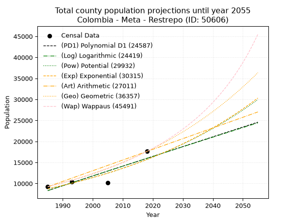
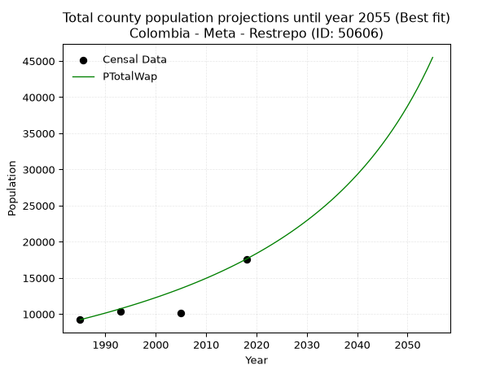
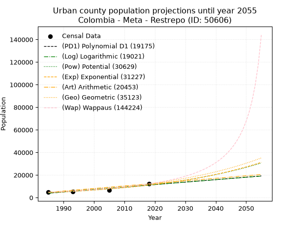
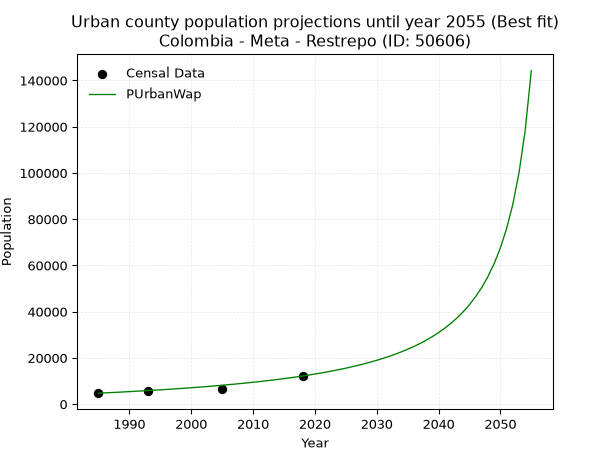
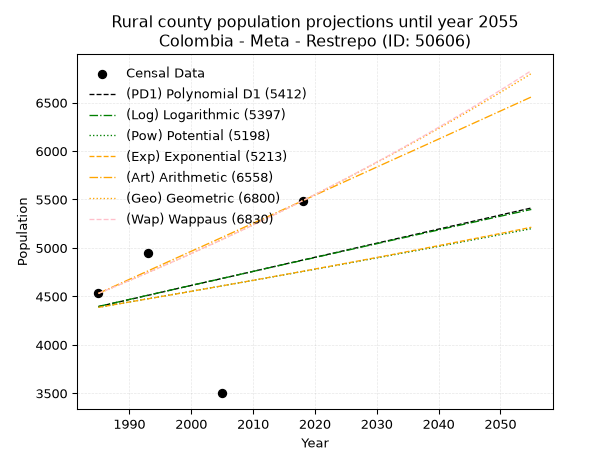
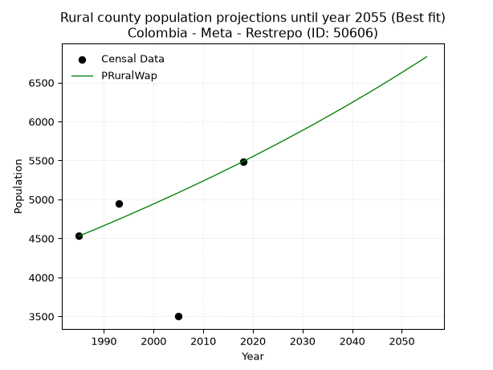

<div align="center">


</div>

# _“Population and Public Services Demand Projections (PPSD) until Year 2050 for Colombia - Meta - Restrepo (ID: 50606)”_
Keywords: `population` `public-service` `projection` `lineal` `polynomial` `logarithmic` `potential` `exponential` `arithmetic` `geometric` `wappaus` `dane` `colombia` `south-america`

PPSD are analytical estimates used by governments and planners to anticipate future changes in population size, age distribution, and the resulting community needs for utilities, healthcare, education, and infrastructure as sizing future water treatment facilities, electrical grids, and road networks based on spatial growth.

> **General running parameters**: • app_version: _v20260806_. • Python version: _3.14.7_. • Pandas version: _3.0.5_. • NumPy version: _2.5.1_. • Creates, save and include plots into reports (create_plot): _False_. • Projection until year: _2050_. • Process polynomial degree 2 and up: _False_. • Process Wappaus: _True_. • Process Wappaus: _True_. • Set negative values to zero: _True_. • Set infinite values to zero: _True_. • Drop dataset notes: _True_. 
<div align="center">

Dynamic map: [:earth_americas:Google](http://maps.google.com/maps?q=4.259555697,-73.5654083) [:earth_americas:OSM](https://www.openstreetmap.org/#map=18/4.259555697/-73.5654083&layers=P) [:earth_americas:Bing](https://www.bing.com/maps?cp=4.259555697~-73.5654083&lvl=18) [:earth_americas:Apple](https://maps.apple.com/frame?center=4.259555697%2C-73.5654083&span=0.003%2C0.006)

</div>


<div align="center">

```geojson
{
  "type": "Feature",
  "geometry": {
    "type": "Point", 
    "coordinates": [-73.5654083, 4.259555697]
  }, 
  "properties": {
    "Name": "Colombia - Meta - Restrepo (ID: 50606)"
  }
}
```

</div>


## 0. Census Data (4 records)

Census data are official statistics collected by a government about the people and housing in a country. They usually include counts of total population, age, sex, race, income, education, and jobs.

📅Global census file: [Population.xlsx](../data/Population.xlsx)

| Source   |   Year |   CountryID | CountryName   |   StateID | StateName   |   CountyID | CountyName   |   PTotal |   PUrban |   PRural |
|:---------|-------:|------------:|:--------------|----------:|:------------|-----------:|:-------------|---------:|---------:|---------:|
| DANE     |   1985 |          57 | Colombia      |        50 | Meta        |      50606 | Restrepo     |     9225 |     4695 |     4530 |
| DANE     |   1993 |          57 | Colombia      |        50 | Meta        |      50606 | Restrepo     |    10401 |     5454 |     4947 |
| DANE     |   2005 |          57 | Colombia      |        50 | Meta        |      50606 | Restrepo     |    10178 |     6678 |     3500 |
| DANE     |   2018 |          57 | Colombia      |        50 | Meta        |      50606 | Restrepo     |    17610 |    12124 |     5486 |

> 🔥Some records could had specific notes about the registered values or the corresponding urban or rural distribution.

📅   [RUPS](https://www.datos.gov.co/Hacienda-y-Cr-dito-P-blico/Registro-nico-de-Prestadores-de-Servicios-P-blicos/4qkq-csdn/about_data) - Local public utility companies: [RUPS.csv](../data/RUPS.xlsx)

 | SERVICIO       | ESTADO    | NOMBRE                                                           | NIT         | DEPARTAMENTO_DOMICILIO   | MUNICIPIO_DOMICILIO   | DIRECCION                  |   TELEFONO | EMAIL                | TIPO_INSCRIPCION    | REPRESENTANTE_LEGAL          | TIPO_PRESTADOR                             | CLASIFICACION                 |
|:---------------|:----------|:-----------------------------------------------------------------|:------------|:-------------------------|:----------------------|:---------------------------|-----------:|:---------------------|:--------------------|:-----------------------------|:-------------------------------------------|:------------------------------|
| ACUEDUCTO      | OPERATIVA | EMPRESA DE SERVICIOS PUBLICOS DE RESTREPO AGUA VIVA S.A.  E.S.P. | 900010387-2 | META                     | RESTREPO              | CR. 5 # 9-66 BARRIO GAITAN |    6551314 | agudelo.cp@gmail.com | Registro por la ESP | HEIDY JINETH GUEVARA ALVAREZ | SOCIEDADES (EMPRESA DE SERVICIOS PUBLICOS) | MAYOR O IGUAL A 5001 USUARIOS |
| ALCANTARILLADO | OPERATIVA | EMPRESA DE SERVICIOS PUBLICOS DE RESTREPO AGUA VIVA S.A.  E.S.P. | 900010387-2 | META                     | RESTREPO              | CR. 5 # 9-66 BARRIO GAITAN |    6551314 | agudelo.cp@gmail.com | Registro por la ESP | HEIDY JINETH GUEVARA ALVAREZ | SOCIEDADES (EMPRESA DE SERVICIOS PUBLICOS) | MAYOR O IGUAL A 5001 USUARIOS |

## 1. Total

### 1.1. Coefficients and Parameters

* (PD1) Polynomial Deg 1: 232.57246085908807, -453349.56483339093 (lineal)
* (Log) Logarithmic: 464979.71341689705, -3522461.02779541
* (Pow) Potential: 35.55462027665974, -113.30963207640112
* (Exp) Exponential: 0.01778136822238483, 4.0948220342396556e-12
* (Art) Arithmetic: Year diff. 2018 - 1985 = 33, Population diff. 17610 - 9225 = 8385, Annual growth = 254.0909090909091
* (Geo) Geometric: Year diff. 2018 - 1985 = 33, Population diff. 17610 - 9225 = 8385, Annual growth % = 0.019785607154181095
* (Wap) Wappaus: i = 1.8937276623134645, Condition values only valid for < 200)

<sub>
Wappaus condition values: ['0.00', '1.89', '3.79', '5.68', '7.57', '9.47', '11.36', '13.26', '15.15', '17.04', '18.94', '20.83', '22.72', '24.62', '26.51', '28.41', '30.30', '32.19', '34.09', '35.98', '37.87', '39.77', '41.66', '43.56', '45.45', '47.34', '49.24', '51.13', '53.02', '54.92', '56.81', '58.71', '60.60', '62.49', '64.39', '66.28', '68.17', '70.07', '71.96', '73.86', '75.75', '77.64', '79.54', '81.43', '83.32', '85.22', '87.11', '89.01', '90.90', '92.79', '94.69', '96.58', '98.47', '100.37', '102.26', '104.16', '106.05', '107.94', '109.84', '111.73', '113.62', '115.52', '117.41', '119.30', '121.20', '123.09']
</sub>


### 1.2. Projected Dataset

|   Year |   CountyID |   PTotalPD1 |   PTotalLog |   PTotalPow |   PTotalExp |   PTotalArt |   PTotalGeo |   PTotalWap |
|-------:|-----------:|------------:|------------:|------------:|------------:|------------:|------------:|------------:|
|   1985 |      50606 |        8307 |        8304 |        8730 |        8732 |        9225 |        9225 |        9225 |
|   1986 |      50606 |        8539 |        8538 |        8887 |        8888 |        9479 |        9408 |        9401 |
|   1987 |      50606 |        8772 |        8772 |        9048 |        9048 |        9733 |        9594 |        9581 |
|   1988 |      50606 |        9004 |        9006 |        9211 |        9210 |        9987 |        9783 |        9764 |
|   1989 |      50606 |        9237 |        9240 |        9377 |        9375 |       10241 |        9977 |        9951 |
|   1990 |      50606 |        9470 |        9474 |        9546 |        9544 |       10495 |       10174 |       10142 |
|   1991 |      50606 |        9702 |        9707 |        9718 |        9715 |       10750 |       10376 |       10336 |
|   1992 |      50606 |        9935 |        9941 |        9893 |        9889 |       11004 |       10581 |       10535 |
|   1993 |      50606 |       10167 |       10174 |       10072 |       10067 |       11258 |       10790 |       10737 |
|   1994 |      50606 |       10400 |       10407 |       10253 |       10247 |       11512 |       11004 |       10944 |
|   1995 |      50606 |       10632 |       10641 |       10437 |       10431 |       11766 |       11222 |       11155 |
|   1996 |      50606 |       10865 |       10874 |       10625 |       10618 |       12020 |       11444 |       11370 |
|   1997 |      50606 |       11098 |       11106 |       10816 |       10809 |       12274 |       11670 |       11590 |
|   1998 |      50606 |       11330 |       11339 |       11010 |       11002 |       12528 |       11901 |       11815 |
|   1999 |      50606 |       11563 |       11572 |       11208 |       11200 |       12782 |       12136 |       12045 |
|   2000 |      50606 |       11795 |       11804 |       11409 |       11401 |       13036 |       12377 |       12279 |
|   2001 |      50606 |       12028 |       12037 |       11613 |       11605 |       13290 |       12621 |       12519 |
|   2002 |      50606 |       12261 |       12269 |       11821 |       11814 |       13545 |       12871 |       12765 |
|   2003 |      50606 |       12493 |       12501 |       12033 |       12025 |       13799 |       13126 |       13016 |
|   2004 |      50606 |       12726 |       12733 |       12249 |       12241 |       14053 |       13386 |       13272 |
|   2005 |      50606 |       12958 |       12965 |       12468 |       12461 |       14307 |       13650 |       13535 |
|   2006 |      50606 |       13191 |       13197 |       12691 |       12684 |       14561 |       13920 |       13804 |
|   2007 |      50606 |       13423 |       13429 |       12918 |       12912 |       14815 |       14196 |       14080 |
|   2008 |      50606 |       13656 |       13661 |       13149 |       13144 |       15069 |       14477 |       14362 |
|   2009 |      50606 |       13889 |       13892 |       13383 |       13379 |       15323 |       14763 |       14651 |
|   2010 |      50606 |       14121 |       14124 |       13622 |       13619 |       15577 |       15055 |       14947 |
|   2011 |      50606 |       14354 |       14355 |       13865 |       13864 |       15831 |       15353 |       15250 |
|   2012 |      50606 |       14586 |       14586 |       14113 |       14112 |       16085 |       15657 |       15562 |
|   2013 |      50606 |       14819 |       14817 |       14364 |       14366 |       16340 |       15967 |       15881 |
|   2014 |      50606 |       15051 |       15048 |       14620 |       14623 |       16594 |       16283 |       16209 |
|   2015 |      50606 |       15284 |       15279 |       14880 |       14886 |       16848 |       16605 |       16545 |
|   2016 |      50606 |       15517 |       15509 |       15145 |       15153 |       17102 |       16933 |       16891 |
|   2017 |      50606 |       15749 |       15740 |       15415 |       15425 |       17356 |       17268 |       17245 |
|   2018 |      50606 |       15982 |       15971 |       15689 |       15701 |       17610 |       17610 |       17610 |
|   2019 |      50606 |       16214 |       16201 |       15967 |       15983 |       17864 |       17958 |       17985 |
|   2020 |      50606 |       16447 |       16431 |       16251 |       16270 |       18118 |       18314 |       18370 |
|   2021 |      50606 |       16679 |       16661 |       16540 |       16562 |       18372 |       18676 |       18766 |
|   2022 |      50606 |       16912 |       16891 |       16833 |       16859 |       18626 |       19046 |       19174 |
|   2023 |      50606 |       17145 |       17121 |       17132 |       17161 |       18880 |       19422 |       19594 |
|   2024 |      50606 |       17377 |       17351 |       17435 |       17469 |       19135 |       19807 |       20027 |
|   2025 |      50606 |       17610 |       17581 |       17744 |       17783 |       19389 |       20199 |       20473 |
|   2026 |      50606 |       17842 |       17810 |       18058 |       18102 |       19643 |       20598 |       20933 |
|   2027 |      50606 |       18075 |       18040 |       18378 |       18426 |       19897 |       21006 |       21407 |
|   2028 |      50606 |       18307 |       18269 |       18703 |       18757 |       20151 |       21421 |       21896 |
|   2029 |      50606 |       18540 |       18498 |       19034 |       19093 |       20405 |       21845 |       22401 |
|   2030 |      50606 |       18773 |       18727 |       19370 |       19436 |       20659 |       22277 |       22923 |
|   2031 |      50606 |       19005 |       18956 |       19712 |       19785 |       20913 |       22718 |       23462 |
|   2032 |      50606 |       19238 |       19185 |       20060 |       20140 |       21167 |       23168 |       24020 |
|   2033 |      50606 |       19470 |       19414 |       20414 |       20501 |       21421 |       23626 |       24597 |
|   2034 |      50606 |       19703 |       19643 |       20774 |       20869 |       21675 |       24094 |       25194 |
|   2035 |      50606 |       19935 |       19871 |       21141 |       21243 |       21930 |       24570 |       25813 |
|   2036 |      50606 |       20168 |       20100 |       21513 |       21624 |       22184 |       25056 |       26455 |
|   2037 |      50606 |       20401 |       20328 |       21892 |       22012 |       22438 |       25552 |       27120 |
|   2038 |      50606 |       20633 |       20556 |       22277 |       22407 |       22692 |       26058 |       27811 |
|   2039 |      50606 |       20866 |       20784 |       22669 |       22809 |       22946 |       26573 |       28529 |
|   2040 |      50606 |       21098 |       21012 |       23068 |       23218 |       23200 |       27099 |       29275 |
|   2041 |      50606 |       21331 |       21240 |       23474 |       23635 |       23454 |       27635 |       30051 |
|   2042 |      50606 |       21563 |       21468 |       23886 |       24059 |       23708 |       28182 |       30859 |
|   2043 |      50606 |       21796 |       21696 |       24305 |       24490 |       23962 |       28740 |       31701 |
|   2044 |      50606 |       22029 |       21923 |       24732 |       24930 |       24216 |       29308 |       32579 |
|   2045 |      50606 |       22261 |       22151 |       25166 |       25377 |       24470 |       29888 |       33495 |
|   2046 |      50606 |       22494 |       22378 |       25607 |       25832 |       24725 |       30480 |       34453 |
|   2047 |      50606 |       22726 |       22605 |       26056 |       26296 |       24979 |       31083 |       35454 |
|   2048 |      50606 |       22959 |       22832 |       26512 |       26768 |       25233 |       31698 |       36503 |
|   2049 |      50606 |       23191 |       23059 |       26976 |       27248 |       25487 |       32325 |       37602 |
|   2050 |      50606 |       23424 |       23286 |       27449 |       27737 |       25741 |       32964 |       38755 |
<div align="center">

</img>

</div>


### 1.3. Best fit with absolute and relative error (%)

Relative error puts that difference into context by dividing the absolute error by the true value, creating a unitless ratio or percentage that shows the scale of the mistake.

Absolute and relative error

|   Year | Source   |   CountryID | CountryName   |   StateID | StateName   |   CountyID_x | CountyName   |   PTotal |   PUrban |   PRural |   CountyID_y |   PTotalPD1 |   PTotalLog |   PTotalPow |   PTotalExp |   PTotalArt |   PTotalGeo |   PTotalWap |   PTotalPD1AbsError |   PTotalLogAbsError |   PTotalPowAbsError |   PTotalExpAbsError |   PTotalArtAbsError |   PTotalGeoAbsError |   PTotalWapAbsError |   PTotalPD1RelError |   PTotalLogRelError |   PTotalPowRelError |   PTotalExpRelError |   PTotalArtRelError |   PTotalGeoRelError |   PTotalWapRelError |
|-------:|:---------|------------:|:--------------|----------:|:------------|-------------:|:-------------|---------:|---------:|---------:|-------------:|------------:|------------:|------------:|------------:|------------:|------------:|------------:|--------------------:|--------------------:|--------------------:|--------------------:|--------------------:|--------------------:|--------------------:|--------------------:|--------------------:|--------------------:|--------------------:|--------------------:|--------------------:|--------------------:|
|   1985 | DANE     |          57 | Colombia      |        50 | Meta        |        50606 | Restrepo     |     9225 |     4695 |     4530 |        50606 |        8307 |        8304 |        8730 |        8732 |        9225 |        9225 |        9225 |                 918 |                 921 |                 495 |                 493 |                   0 |                   0 |                   0 |             9.95122 |             9.98374 |             5.36585 |             5.34417 |             0       |             0       |             0       |
|   1993 | DANE     |          57 | Colombia      |        50 | Meta        |        50606 | Restrepo     |    10401 |     5454 |     4947 |        50606 |       10167 |       10174 |       10072 |       10067 |       11258 |       10790 |       10737 |                 234 |                 227 |                 329 |                 334 |                 857 |                 389 |                 336 |             2.24978 |             2.18248 |             3.16316 |             3.21123 |             8.23959 |             3.74002 |             3.23046 |
|   2005 | DANE     |          57 | Colombia      |        50 | Meta        |        50606 | Restrepo     |    10178 |     6678 |     3500 |        50606 |       12958 |       12965 |       12468 |       12461 |       14307 |       13650 |       13535 |                2780 |                2787 |                2290 |                2283 |                4129 |                3472 |                3357 |            27.3138  |            27.3826  |            22.4995  |            22.4307  |            40.5679  |            34.1128  |            32.9829  |
|   2018 | DANE     |          57 | Colombia      |        50 | Meta        |        50606 | Restrepo     |    17610 |    12124 |     5486 |        50606 |       15982 |       15971 |       15689 |       15701 |       17610 |       17610 |       17610 |                1628 |                1639 |                1921 |                1909 |                   0 |                   0 |                   0 |             9.24475 |             9.30721 |            10.9086  |            10.8404  |             0       |             0       |             0       |

Relative error mean

| Method    |   RelError | Best   |
|:----------|-----------:|:-------|
| PTotalPD1 |   12.1899  |        |
| PTotalLog |   12.214   |        |
| PTotalPow |   10.4843  |        |
| PTotalExp |   10.4566  |        |
| PTotalArt |   12.2019  |        |
| PTotalGeo |    9.4632  |        |
| PTotalWap |    9.05334 | True   |

💙Best method: _**PTotalWap**_
<div align="center">

</img>

</div>


### 1.4. Fresh water supply demand in liters per capita per day (lpcd)

The fresh water supply demand typically ranges from 100 to 300 liters per capita per day (lpcd) for standard domestic and municipal planning, though absolute survival minimums set by the World Health Organization are as low as 7.5 to 20 liters per day, and total consumption in high-income nations can exceed 400 liters.

> `CZ`: Level in meters above the sea level (masl)<br> `WS`: Fresh water supply demand in liters per capita per day (lpcd or l/h/d)<br> `WSAll`: Zonal fresh water supply demand in liters per second (l/s)<br> `A`: Zonal area in square meters<br> `DP`: Population density (people/hectare or p/ha)

Reference values (RAS Colombia)

|    CZ |   WS |
|------:|-----:|
|  1000 |  120 |
|  2000 |  130 |
| 99999 |  140 |

County shapefile geometry properties and water supply values

|   CountyID |      ATotal |   CZTotal |   WSTotal |
|-----------:|------------:|----------:|----------:|
|      50606 | 3.64492e+08 |   763.372 |       120 |

Projected values for best method: PTotalWap

|   CountyID |   Year |   PTotalWap |   DPTotal |   WSTotal |   WSTotalAll |
|-----------:|-------:|------------:|----------:|----------:|-------------:|
|      50606 |   1985 |        9225 |      0.25 |       120 |      12.8125 |
|      50606 |   1986 |        9401 |      0.26 |       120 |      13.0569 |
|      50606 |   1987 |        9581 |      0.26 |       120 |      13.3069 |
|      50606 |   1988 |        9764 |      0.27 |       120 |      13.5611 |
|      50606 |   1989 |        9951 |      0.27 |       120 |      13.8208 |
|      50606 |   1990 |       10142 |      0.28 |       120 |      14.0861 |
|      50606 |   1991 |       10336 |      0.28 |       120 |      14.3556 |
|      50606 |   1992 |       10535 |      0.29 |       120 |      14.6319 |
|      50606 |   1993 |       10737 |      0.29 |       120 |      14.9125 |
|      50606 |   1994 |       10944 |      0.3  |       120 |      15.2    |
|      50606 |   1995 |       11155 |      0.31 |       120 |      15.4931 |
|      50606 |   1996 |       11370 |      0.31 |       120 |      15.7917 |
|      50606 |   1997 |       11590 |      0.32 |       120 |      16.0972 |
|      50606 |   1998 |       11815 |      0.32 |       120 |      16.4097 |
|      50606 |   1999 |       12045 |      0.33 |       120 |      16.7292 |
|      50606 |   2000 |       12279 |      0.34 |       120 |      17.0542 |
|      50606 |   2001 |       12519 |      0.34 |       120 |      17.3875 |
|      50606 |   2002 |       12765 |      0.35 |       120 |      17.7292 |
|      50606 |   2003 |       13016 |      0.36 |       120 |      18.0778 |
|      50606 |   2004 |       13272 |      0.36 |       120 |      18.4333 |
|      50606 |   2005 |       13535 |      0.37 |       120 |      18.7986 |
|      50606 |   2006 |       13804 |      0.38 |       120 |      19.1722 |
|      50606 |   2007 |       14080 |      0.39 |       120 |      19.5556 |
|      50606 |   2008 |       14362 |      0.39 |       120 |      19.9472 |
|      50606 |   2009 |       14651 |      0.4  |       120 |      20.3486 |
|      50606 |   2010 |       14947 |      0.41 |       120 |      20.7597 |
|      50606 |   2011 |       15250 |      0.42 |       120 |      21.1806 |
|      50606 |   2012 |       15562 |      0.43 |       120 |      21.6139 |
|      50606 |   2013 |       15881 |      0.44 |       120 |      22.0569 |
|      50606 |   2014 |       16209 |      0.44 |       120 |      22.5125 |
|      50606 |   2015 |       16545 |      0.45 |       120 |      22.9792 |
|      50606 |   2016 |       16891 |      0.46 |       120 |      23.4597 |
|      50606 |   2017 |       17245 |      0.47 |       120 |      23.9514 |
|      50606 |   2018 |       17610 |      0.48 |       120 |      24.4583 |
|      50606 |   2019 |       17985 |      0.49 |       120 |      24.9792 |
|      50606 |   2020 |       18370 |      0.5  |       120 |      25.5139 |
|      50606 |   2021 |       18766 |      0.51 |       120 |      26.0639 |
|      50606 |   2022 |       19174 |      0.53 |       120 |      26.6306 |
|      50606 |   2023 |       19594 |      0.54 |       120 |      27.2139 |
|      50606 |   2024 |       20027 |      0.55 |       120 |      27.8153 |
|      50606 |   2025 |       20473 |      0.56 |       120 |      28.4347 |
|      50606 |   2026 |       20933 |      0.57 |       120 |      29.0736 |
|      50606 |   2027 |       21407 |      0.59 |       120 |      29.7319 |
|      50606 |   2028 |       21896 |      0.6  |       120 |      30.4111 |
|      50606 |   2029 |       22401 |      0.61 |       120 |      31.1125 |
|      50606 |   2030 |       22923 |      0.63 |       120 |      31.8375 |
|      50606 |   2031 |       23462 |      0.64 |       120 |      32.5861 |
|      50606 |   2032 |       24020 |      0.66 |       120 |      33.3611 |
|      50606 |   2033 |       24597 |      0.67 |       120 |      34.1625 |
|      50606 |   2034 |       25194 |      0.69 |       120 |      34.9917 |
|      50606 |   2035 |       25813 |      0.71 |       120 |      35.8514 |
|      50606 |   2036 |       26455 |      0.73 |       120 |      36.7431 |
|      50606 |   2037 |       27120 |      0.74 |       120 |      37.6667 |
|      50606 |   2038 |       27811 |      0.76 |       120 |      38.6264 |
|      50606 |   2039 |       28529 |      0.78 |       120 |      39.6236 |
|      50606 |   2040 |       29275 |      0.8  |       120 |      40.6597 |
|      50606 |   2041 |       30051 |      0.82 |       120 |      41.7375 |
|      50606 |   2042 |       30859 |      0.85 |       120 |      42.8597 |
|      50606 |   2043 |       31701 |      0.87 |       120 |      44.0292 |
|      50606 |   2044 |       32579 |      0.89 |       120 |      45.2486 |
|      50606 |   2045 |       33495 |      0.92 |       120 |      46.5208 |
|      50606 |   2046 |       34453 |      0.95 |       120 |      47.8514 |
|      50606 |   2047 |       35454 |      0.97 |       120 |      49.2417 |
|      50606 |   2048 |       36503 |      1    |       120 |      50.6986 |
|      50606 |   2049 |       37602 |      1.03 |       120 |      52.225  |
|      50606 |   2050 |       38755 |      1.06 |       120 |      53.8264 |

## 2. Urban

### 2.1. Coefficients and Parameters

* (PD1) Polynomial Deg 1: 218.03492573263404, -428886.61019670125 (lineal)
* (Log) Logarithmic: 436057.8355244641, -3307241.352169643
* (Pow) Potential: 55.97958537573557, -180.96369589015447
* (Exp) Exponential: 0.02798286321607345, 3.3152509043365453e-21
* (Art) Arithmetic: Year diff. 2018 - 1985 = 33, Population diff. 12124 - 4695 = 7429, Annual growth = 225.12121212121212
* (Geo) Geometric: Year diff. 2018 - 1985 = 33, Population diff. 12124 - 4695 = 7429, Annual growth % = 0.029165363308925718
* (Wap) Wappaus: i = 2.676986885322696, Condition values only valid for < 200)

<sub>
Wappaus condition values: ['0.00', '2.68', '5.35', '8.03', '10.71', '13.38', '16.06', '18.74', '21.42', '24.09', '26.77', '29.45', '32.12', '34.80', '37.48', '40.15', '42.83', '45.51', '48.19', '50.86', '53.54', '56.22', '58.89', '61.57', '64.25', '66.92', '69.60', '72.28', '74.96', '77.63', '80.31', '82.99', '85.66', '88.34', '91.02', '93.69', '96.37', '99.05', '101.73', '104.40', '107.08', '109.76', '112.43', '115.11', '117.79', '120.46', '123.14', '125.82', '128.50', '131.17', '133.85', '136.53', '139.20', '141.88', '144.56', '147.23', '149.91', '152.59', '155.27', '157.94', '160.62', '163.30', '165.97', '168.65', '171.33', '174.00']
</sub>


### 2.2. Projected Dataset

|   Year |   CountyID |   PUrbanPD1 |   PUrbanLog |   PUrbanPow |   PUrbanExp |   PUrbanArt |   PUrbanGeo |   PUrbanWap |
|-------:|-----------:|------------:|------------:|------------:|------------:|------------:|------------:|------------:|
|   1985 |      50606 |        3913 |        3909 |        4401 |        4404 |        4695 |        4695 |        4695 |
|   1986 |      50606 |        4131 |        4129 |        4527 |        4529 |        4920 |        4832 |        4822 |
|   1987 |      50606 |        4349 |        4348 |        4656 |        4657 |        5145 |        4973 |        4953 |
|   1988 |      50606 |        4567 |        4567 |        4789 |        4789 |        5370 |        5118 |        5088 |
|   1989 |      50606 |        4785 |        4787 |        4926 |        4925 |        5595 |        5267 |        5226 |
|   1990 |      50606 |        5003 |        5006 |        5067 |        5065 |        5821 |        5421 |        5368 |
|   1991 |      50606 |        5221 |        5225 |        5211 |        5209 |        6046 |        5579 |        5515 |
|   1992 |      50606 |        5439 |        5444 |        5360 |        5357 |        6271 |        5742 |        5666 |
|   1993 |      50606 |        5657 |        5663 |        5513 |        5509 |        6496 |        5909 |        5821 |
|   1994 |      50606 |        5875 |        5882 |        5670 |        5665 |        6721 |        6081 |        5981 |
|   1995 |      50606 |        6093 |        6100 |        5831 |        5826 |        6946 |        6259 |        6146 |
|   1996 |      50606 |        6311 |        6319 |        5997 |        5991 |        7171 |        6441 |        6316 |
|   1997 |      50606 |        6529 |        6537 |        6167 |        6161 |        7396 |        6629 |        6492 |
|   1998 |      50606 |        6747 |        6755 |        6343 |        6336 |        7622 |        6822 |        6673 |
|   1999 |      50606 |        6965 |        6974 |        6523 |        6516 |        7847 |        7021 |        6860 |
|   2000 |      50606 |        7183 |        7192 |        6708 |        6701 |        8072 |        7226 |        7054 |
|   2001 |      50606 |        7401 |        7410 |        6898 |        6891 |        8297 |        7437 |        7254 |
|   2002 |      50606 |        7619 |        7628 |        7094 |        7086 |        8522 |        7654 |        7461 |
|   2003 |      50606 |        7837 |        7845 |        7295 |        7288 |        8747 |        7877 |        7675 |
|   2004 |      50606 |        8055 |        8063 |        7502 |        7494 |        8972 |        8107 |        7897 |
|   2005 |      50606 |        8273 |        8281 |        7714 |        7707 |        9197 |        8343 |        8128 |
|   2006 |      50606 |        8491 |        8498 |        7933 |        7926 |        9423 |        8587 |        8366 |
|   2007 |      50606 |        8709 |        8715 |        8157 |        8151 |        9648 |        8837 |        8614 |
|   2008 |      50606 |        8928 |        8932 |        8388 |        8382 |        9873 |        9095 |        8871 |
|   2009 |      50606 |        9146 |        9150 |        8625 |        8620 |       10098 |        9360 |        9139 |
|   2010 |      50606 |        9364 |        9367 |        8868 |        8864 |       10323 |        9633 |        9417 |
|   2011 |      50606 |        9582 |        9583 |        9119 |        9116 |       10548 |        9914 |        9707 |
|   2012 |      50606 |        9800 |        9800 |        9376 |        9375 |       10773 |       10203 |       10009 |
|   2013 |      50606 |       10018 |       10017 |        9641 |        9641 |       10998 |       10501 |       10324 |
|   2014 |      50606 |       10236 |       10233 |        9912 |        9914 |       11224 |       10807 |       10652 |
|   2015 |      50606 |       10454 |       10450 |       10192 |       10196 |       11449 |       11122 |       10995 |
|   2016 |      50606 |       10672 |       10666 |       10479 |       10485 |       11674 |       11447 |       11354 |
|   2017 |      50606 |       10890 |       10883 |       10774 |       10783 |       11899 |       11780 |       11730 |
|   2018 |      50606 |       11108 |       11099 |       11077 |       11089 |       12124 |       12124 |       12124 |
|   2019 |      50606 |       11326 |       11315 |       11388 |       11403 |       12349 |       12478 |       12537 |
|   2020 |      50606 |       11544 |       11531 |       11709 |       11727 |       12574 |       12842 |       12971 |
|   2021 |      50606 |       11762 |       11746 |       12037 |       12060 |       12799 |       13216 |       13427 |
|   2022 |      50606 |       11980 |       11962 |       12375 |       12402 |       13024 |       13601 |       13908 |
|   2023 |      50606 |       12198 |       12178 |       12723 |       12754 |       13250 |       13998 |       14415 |
|   2024 |      50606 |       12416 |       12393 |       13080 |       13116 |       13475 |       14406 |       14950 |
|   2025 |      50606 |       12634 |       12609 |       13446 |       13488 |       13700 |       14827 |       15516 |
|   2026 |      50606 |       12852 |       12824 |       13823 |       13871 |       13925 |       15259 |       16115 |
|   2027 |      50606 |       13070 |       13039 |       14210 |       14264 |       14150 |       15704 |       16752 |
|   2028 |      50606 |       13288 |       13254 |       14608 |       14669 |       14375 |       16162 |       17428 |
|   2029 |      50606 |       13506 |       13469 |       15017 |       15085 |       14600 |       16633 |       18148 |
|   2030 |      50606 |       13724 |       13684 |       15437 |       15513 |       14825 |       17119 |       18917 |
|   2031 |      50606 |       13942 |       13899 |       15868 |       15954 |       15051 |       17618 |       19739 |
|   2032 |      50606 |       14160 |       14113 |       16312 |       16406 |       15276 |       18132 |       20621 |
|   2033 |      50606 |       14378 |       14328 |       16767 |       16872 |       15501 |       18661 |       21569 |
|   2034 |      50606 |       14596 |       14542 |       17235 |       17351 |       15726 |       19205 |       22591 |
|   2035 |      50606 |       14814 |       14757 |       17716 |       17843 |       15951 |       19765 |       23695 |
|   2036 |      50606 |       15032 |       14971 |       18210 |       18349 |       16176 |       20341 |       24892 |
|   2037 |      50606 |       15251 |       15185 |       18718 |       18870 |       16401 |       20935 |       26195 |
|   2038 |      50606 |       15469 |       15399 |       19239 |       19406 |       16626 |       21545 |       27618 |
|   2039 |      50606 |       15687 |       15613 |       19775 |       19956 |       16852 |       22174 |       29178 |
|   2040 |      50606 |       15905 |       15827 |       20325 |       20523 |       17077 |       22820 |       30896 |
|   2041 |      50606 |       16123 |       16041 |       20890 |       21105 |       17302 |       23486 |       32798 |
|   2042 |      50606 |       16341 |       16254 |       21471 |       21704 |       17527 |       24171 |       34915 |
|   2043 |      50606 |       16559 |       16468 |       22068 |       22320 |       17752 |       24876 |       37286 |
|   2044 |      50606 |       16777 |       16681 |       22680 |       22953 |       17977 |       25601 |       39958 |
|   2045 |      50606 |       16995 |       16894 |       23310 |       23605 |       18202 |       26348 |       42993 |
|   2046 |      50606 |       17213 |       17107 |       23957 |       24275 |       18427 |       27116 |       46471 |
|   2047 |      50606 |       17431 |       17321 |       24621 |       24963 |       18653 |       27907 |       50497 |
|   2048 |      50606 |       17649 |       17533 |       25304 |       25672 |       18878 |       28721 |       55210 |
|   2049 |      50606 |       17867 |       17746 |       26005 |       26400 |       19103 |       29559 |       60803 |
|   2050 |      50606 |       18085 |       17959 |       26725 |       27150 |       19328 |       30421 |       67547 |
<div align="center">

</img>

</div>


### 2.3. Best fit with absolute and relative error (%)

Relative error puts that difference into context by dividing the absolute error by the true value, creating a unitless ratio or percentage that shows the scale of the mistake.

Absolute and relative error

|   Year | Source   |   CountryID | CountryName   |   StateID | StateName   |   CountyID_x | CountyName   |   PTotal |   PUrban |   PRural |   CountyID_y |   PUrbanPD1 |   PUrbanLog |   PUrbanPow |   PUrbanExp |   PUrbanArt |   PUrbanGeo |   PUrbanWap |   PUrbanPD1AbsError |   PUrbanLogAbsError |   PUrbanPowAbsError |   PUrbanExpAbsError |   PUrbanArtAbsError |   PUrbanGeoAbsError |   PUrbanWapAbsError |   PUrbanPD1RelError |   PUrbanLogRelError |   PUrbanPowRelError |   PUrbanExpRelError |   PUrbanArtRelError |   PUrbanGeoRelError |   PUrbanWapRelError |
|-------:|:---------|------------:|:--------------|----------:|:------------|-------------:|:-------------|---------:|---------:|---------:|-------------:|------------:|------------:|------------:|------------:|------------:|------------:|------------:|--------------------:|--------------------:|--------------------:|--------------------:|--------------------:|--------------------:|--------------------:|--------------------:|--------------------:|--------------------:|--------------------:|--------------------:|--------------------:|--------------------:|
|   1985 | DANE     |          57 | Colombia      |        50 | Meta        |        50606 | Restrepo     |     9225 |     4695 |     4530 |        50606 |        3913 |        3909 |        4401 |        4404 |        4695 |        4695 |        4695 |                 782 |                 786 |                 294 |                 291 |                   0 |                   0 |                   0 |            16.656   |            16.7412  |             6.26198 |             6.19808 |              0      |              0      |             0       |
|   1993 | DANE     |          57 | Colombia      |        50 | Meta        |        50606 | Restrepo     |    10401 |     5454 |     4947 |        50606 |        5657 |        5663 |        5513 |        5509 |        6496 |        5909 |        5821 |                 203 |                 209 |                  59 |                  55 |                1042 |                 455 |                 367 |             3.72204 |             3.83205 |             1.08177 |             1.00843 |             19.1052 |              8.3425 |             6.72901 |
|   2005 | DANE     |          57 | Colombia      |        50 | Meta        |        50606 | Restrepo     |    10178 |     6678 |     3500 |        50606 |        8273 |        8281 |        7714 |        7707 |        9197 |        8343 |        8128 |                1595 |                1603 |                1036 |                1029 |                2519 |                1665 |                1450 |            23.8844  |            24.0042  |            15.5136  |            15.4088  |             37.7209 |             24.9326 |            21.7131  |
|   2018 | DANE     |          57 | Colombia      |        50 | Meta        |        50606 | Restrepo     |    17610 |    12124 |     5486 |        50606 |       11108 |       11099 |       11077 |       11089 |       12124 |       12124 |       12124 |                1016 |                1025 |                1047 |                1035 |                   0 |                   0 |                   0 |             8.38007 |             8.45431 |             8.63576 |             8.53679 |              0      |              0      |             0       |

Relative error mean

| Method    |   RelError | Best   |
|:----------|-----------:|:-------|
| PUrbanPD1 |   13.1606  |        |
| PUrbanLog |   13.2579  |        |
| PUrbanPow |    7.87329 |        |
| PUrbanExp |    7.78803 |        |
| PUrbanArt |   14.2065  |        |
| PUrbanGeo |    8.31878 |        |
| PUrbanWap |    7.11052 | True   |

💙Best method: _**PUrbanWap**_
<div align="center">

</img>

</div>


### 2.4. Fresh water supply demand in liters per capita per day (lpcd)

The fresh water supply demand typically ranges from 100 to 300 liters per capita per day (lpcd) for standard domestic and municipal planning, though absolute survival minimums set by the World Health Organization are as low as 7.5 to 20 liters per day, and total consumption in high-income nations can exceed 400 liters.

> `CZ`: Level in meters above the sea level (masl)<br> `WS`: Fresh water supply demand in liters per capita per day (lpcd or l/h/d)<br> `WSAll`: Zonal fresh water supply demand in liters per second (l/s)<br> `A`: Zonal area in square meters<br> `DP`: Population density (people/hectare or p/ha)

Reference values (RAS Colombia)

|    CZ |   WS |
|------:|-----:|
|  1000 |  120 |
|  2000 |  130 |
| 99999 |  140 |

County shapefile geometry properties and water supply values

|   CountyID |      AUrban |   CZUrban |   WSUrban |
|-----------:|------------:|----------:|----------:|
|      50606 | 2.77077e+06 |   485.267 |       120 |

Projected values for best method: PUrbanWap

|   CountyID |   Year |   PUrbanWap |   DPUrban |   WSUrban |   WSUrbanAll |
|-----------:|-------:|------------:|----------:|----------:|-------------:|
|      50606 |   1985 |        4695 |     16.94 |       120 |      6.52083 |
|      50606 |   1986 |        4822 |     17.4  |       120 |      6.69722 |
|      50606 |   1987 |        4953 |     17.88 |       120 |      6.87917 |
|      50606 |   1988 |        5088 |     18.36 |       120 |      7.06667 |
|      50606 |   1989 |        5226 |     18.86 |       120 |      7.25833 |
|      50606 |   1990 |        5368 |     19.37 |       120 |      7.45556 |
|      50606 |   1991 |        5515 |     19.9  |       120 |      7.65972 |
|      50606 |   1992 |        5666 |     20.45 |       120 |      7.86944 |
|      50606 |   1993 |        5821 |     21.01 |       120 |      8.08472 |
|      50606 |   1994 |        5981 |     21.59 |       120 |      8.30694 |
|      50606 |   1995 |        6146 |     22.18 |       120 |      8.53611 |
|      50606 |   1996 |        6316 |     22.8  |       120 |      8.77222 |
|      50606 |   1997 |        6492 |     23.43 |       120 |      9.01667 |
|      50606 |   1998 |        6673 |     24.08 |       120 |      9.26806 |
|      50606 |   1999 |        6860 |     24.76 |       120 |      9.52778 |
|      50606 |   2000 |        7054 |     25.46 |       120 |      9.79722 |
|      50606 |   2001 |        7254 |     26.18 |       120 |     10.075   |
|      50606 |   2002 |        7461 |     26.93 |       120 |     10.3625  |
|      50606 |   2003 |        7675 |     27.7  |       120 |     10.6597  |
|      50606 |   2004 |        7897 |     28.5  |       120 |     10.9681  |
|      50606 |   2005 |        8128 |     29.33 |       120 |     11.2889  |
|      50606 |   2006 |        8366 |     30.19 |       120 |     11.6194  |
|      50606 |   2007 |        8614 |     31.09 |       120 |     11.9639  |
|      50606 |   2008 |        8871 |     32.02 |       120 |     12.3208  |
|      50606 |   2009 |        9139 |     32.98 |       120 |     12.6931  |
|      50606 |   2010 |        9417 |     33.99 |       120 |     13.0792  |
|      50606 |   2011 |        9707 |     35.03 |       120 |     13.4819  |
|      50606 |   2012 |       10009 |     36.12 |       120 |     13.9014  |
|      50606 |   2013 |       10324 |     37.26 |       120 |     14.3389  |
|      50606 |   2014 |       10652 |     38.44 |       120 |     14.7944  |
|      50606 |   2015 |       10995 |     39.68 |       120 |     15.2708  |
|      50606 |   2016 |       11354 |     40.98 |       120 |     15.7694  |
|      50606 |   2017 |       11730 |     42.33 |       120 |     16.2917  |
|      50606 |   2018 |       12124 |     43.76 |       120 |     16.8389  |
|      50606 |   2019 |       12537 |     45.25 |       120 |     17.4125  |
|      50606 |   2020 |       12971 |     46.81 |       120 |     18.0153  |
|      50606 |   2021 |       13427 |     48.46 |       120 |     18.6486  |
|      50606 |   2022 |       13908 |     50.2  |       120 |     19.3167  |
|      50606 |   2023 |       14415 |     52.03 |       120 |     20.0208  |
|      50606 |   2024 |       14950 |     53.96 |       120 |     20.7639  |
|      50606 |   2025 |       15516 |     56    |       120 |     21.55    |
|      50606 |   2026 |       16115 |     58.16 |       120 |     22.3819  |
|      50606 |   2027 |       16752 |     60.46 |       120 |     23.2667  |
|      50606 |   2028 |       17428 |     62.9  |       120 |     24.2056  |
|      50606 |   2029 |       18148 |     65.5  |       120 |     25.2056  |
|      50606 |   2030 |       18917 |     68.27 |       120 |     26.2736  |
|      50606 |   2031 |       19739 |     71.24 |       120 |     27.4153  |
|      50606 |   2032 |       20621 |     74.42 |       120 |     28.6403  |
|      50606 |   2033 |       21569 |     77.84 |       120 |     29.9569  |
|      50606 |   2034 |       22591 |     81.53 |       120 |     31.3764  |
|      50606 |   2035 |       23695 |     85.52 |       120 |     32.9097  |
|      50606 |   2036 |       24892 |     89.84 |       120 |     34.5722  |
|      50606 |   2037 |       26195 |     94.54 |       120 |     36.3819  |
|      50606 |   2038 |       27618 |     99.68 |       120 |     38.3583  |
|      50606 |   2039 |       29178 |    105.31 |       120 |     40.525   |
|      50606 |   2040 |       30896 |    111.51 |       120 |     42.9111  |
|      50606 |   2041 |       32798 |    118.37 |       120 |     45.5528  |
|      50606 |   2042 |       34915 |    126.01 |       120 |     48.4931  |
|      50606 |   2043 |       37286 |    134.57 |       120 |     51.7861  |
|      50606 |   2044 |       39958 |    144.21 |       120 |     55.4972  |
|      50606 |   2045 |       42993 |    155.17 |       120 |     59.7125  |
|      50606 |   2046 |       46471 |    167.72 |       120 |     64.5431  |
|      50606 |   2047 |       50497 |    182.25 |       120 |     70.1347  |
|      50606 |   2048 |       55210 |    199.26 |       120 |     76.6806  |
|      50606 |   2049 |       60803 |    219.44 |       120 |     84.4486  |
|      50606 |   2050 |       67547 |    243.78 |       120 |     93.8153  |

## 3. Rural

### 3.1. Coefficients and Parameters

* (PD1) Polynomial Deg 1: 14.537535126454118, -24462.954636689847 (lineal)
* (Log) Logarithmic: 28921.877892433087, -215219.67562576797
* (Pow) Potential: 4.8925373942935, -12.492195984725512
* (Exp) Exponential: 0.00246485601191995, 32.9023291246245
* (Art) Arithmetic: Year diff. 2018 - 1985 = 33, Population diff. 5486 - 4530 = 956, Annual growth = 28.96969696969697
* (Geo) Geometric: Year diff. 2018 - 1985 = 33, Population diff. 5486 - 4530 = 956, Annual growth % = 0.005819213282379332
* (Wap) Wappaus: i = 0.5784683899699874, Condition values only valid for < 200)

<sub>
Wappaus condition values: ['0.00', '0.58', '1.16', '1.74', '2.31', '2.89', '3.47', '4.05', '4.63', '5.21', '5.78', '6.36', '6.94', '7.52', '8.10', '8.68', '9.26', '9.83', '10.41', '10.99', '11.57', '12.15', '12.73', '13.30', '13.88', '14.46', '15.04', '15.62', '16.20', '16.78', '17.35', '17.93', '18.51', '19.09', '19.67', '20.25', '20.82', '21.40', '21.98', '22.56', '23.14', '23.72', '24.30', '24.87', '25.45', '26.03', '26.61', '27.19', '27.77', '28.34', '28.92', '29.50', '30.08', '30.66', '31.24', '31.82', '32.39', '32.97', '33.55', '34.13', '34.71', '35.29', '35.87', '36.44', '37.02', '37.60']
</sub>


### 3.2. Projected Dataset

|   Year |   CountyID |   PRuralPD1 |   PRuralLog |   PRuralPow |   PRuralExp |   PRuralArt |   PRuralGeo |   PRuralWap |
|-------:|-----------:|------------:|------------:|------------:|------------:|------------:|------------:|------------:|
|   1985 |      50606 |        4394 |        4395 |        4388 |        4386 |        4530 |        4530 |        4530 |
|   1986 |      50606 |        4409 |        4410 |        4398 |        4397 |        4559 |        4556 |        4556 |
|   1987 |      50606 |        4423 |        4424 |        4409 |        4408 |        4588 |        4583 |        4583 |
|   1988 |      50606 |        4438 |        4439 |        4420 |        4419 |        4617 |        4610 |        4609 |
|   1989 |      50606 |        4452 |        4453 |        4431 |        4430 |        4646 |        4636 |        4636 |
|   1990 |      50606 |        4467 |        4468 |        4442 |        4441 |        4675 |        4663 |        4663 |
|   1991 |      50606 |        4481 |        4482 |        4453 |        4452 |        4704 |        4690 |        4690 |
|   1992 |      50606 |        4496 |        4497 |        4464 |        4463 |        4733 |        4718 |        4717 |
|   1993 |      50606 |        4510 |        4511 |        4475 |        4474 |        4762 |        4745 |        4745 |
|   1994 |      50606 |        4525 |        4526 |        4486 |        4485 |        4791 |        4773 |        4772 |
|   1995 |      50606 |        4539 |        4540 |        4497 |        4496 |        4820 |        4801 |        4800 |
|   1996 |      50606 |        4554 |        4555 |        4508 |        4507 |        4849 |        4829 |        4828 |
|   1997 |      50606 |        4569 |        4569 |        4519 |        4518 |        4878 |        4857 |        4856 |
|   1998 |      50606 |        4583 |        4584 |        4530 |        4529 |        4907 |        4885 |        4884 |
|   1999 |      50606 |        4598 |        4598 |        4541 |        4540 |        4936 |        4913 |        4912 |
|   2000 |      50606 |        4612 |        4613 |        4552 |        4552 |        4965 |        4942 |        4941 |
|   2001 |      50606 |        4627 |        4627 |        4563 |        4563 |        4994 |        4971 |        4970 |
|   2002 |      50606 |        4641 |        4642 |        4574 |        4574 |        5022 |        5000 |        4999 |
|   2003 |      50606 |        4656 |        4656 |        4586 |        4585 |        5051 |        5029 |        5028 |
|   2004 |      50606 |        4670 |        4670 |        4597 |        4597 |        5080 |        5058 |        5057 |
|   2005 |      50606 |        4685 |        4685 |        4608 |        4608 |        5109 |        5087 |        5086 |
|   2006 |      50606 |        4699 |        4699 |        4619 |        4620 |        5138 |        5117 |        5116 |
|   2007 |      50606 |        4714 |        4714 |        4631 |        4631 |        5167 |        5147 |        5146 |
|   2008 |      50606 |        4728 |        4728 |        4642 |        4642 |        5196 |        5177 |        5176 |
|   2009 |      50606 |        4743 |        4743 |        4653 |        4654 |        5225 |        5207 |        5206 |
|   2010 |      50606 |        4757 |        4757 |        4665 |        4665 |        5254 |        5237 |        5236 |
|   2011 |      50606 |        4772 |        4771 |        4676 |        4677 |        5283 |        5268 |        5267 |
|   2012 |      50606 |        4787 |        4786 |        4687 |        4688 |        5312 |        5298 |        5297 |
|   2013 |      50606 |        4801 |        4800 |        4699 |        4700 |        5341 |        5329 |        5328 |
|   2014 |      50606 |        4816 |        4814 |        4710 |        4712 |        5370 |        5360 |        5360 |
|   2015 |      50606 |        4830 |        4829 |        4722 |        4723 |        5399 |        5391 |        5391 |
|   2016 |      50606 |        4845 |        4843 |        4733 |        4735 |        5428 |        5423 |        5422 |
|   2017 |      50606 |        4859 |        4857 |        4745 |        4746 |        5457 |        5454 |        5454 |
|   2018 |      50606 |        4874 |        4872 |        4756 |        4758 |        5486 |        5486 |        5486 |
|   2019 |      50606 |        4888 |        4886 |        4768 |        4770 |        5515 |        5518 |        5518 |
|   2020 |      50606 |        4903 |        4900 |        4779 |        4782 |        5544 |        5550 |        5550 |
|   2021 |      50606 |        4917 |        4915 |        4791 |        4794 |        5573 |        5582 |        5583 |
|   2022 |      50606 |        4932 |        4929 |        4802 |        4805 |        5602 |        5615 |        5616 |
|   2023 |      50606 |        4946 |        4943 |        4814 |        4817 |        5631 |        5647 |        5649 |
|   2024 |      50606 |        4961 |        4958 |        4826 |        4829 |        5660 |        5680 |        5682 |
|   2025 |      50606 |        4976 |        4972 |        4837 |        4841 |        5689 |        5713 |        5715 |
|   2026 |      50606 |        4990 |        4986 |        4849 |        4853 |        5718 |        5747 |        5749 |
|   2027 |      50606 |        5005 |        5001 |        4861 |        4865 |        5747 |        5780 |        5783 |
|   2028 |      50606 |        5019 |        5015 |        4873 |        4877 |        5776 |        5814 |        5817 |
|   2029 |      50606 |        5034 |        5029 |        4884 |        4889 |        5805 |        5848 |        5851 |
|   2030 |      50606 |        5048 |        5043 |        4896 |        4901 |        5834 |        5882 |        5886 |
|   2031 |      50606 |        5063 |        5058 |        4908 |        4913 |        5863 |        5916 |        5920 |
|   2032 |      50606 |        5077 |        5072 |        4920 |        4925 |        5892 |        5950 |        5955 |
|   2033 |      50606 |        5092 |        5086 |        4932 |        4937 |        5921 |        5985 |        5991 |
|   2034 |      50606 |        5106 |        5100 |        4944 |        4950 |        5950 |        6020 |        6026 |
|   2035 |      50606 |        5121 |        5114 |        4955 |        4962 |        5978 |        6055 |        6062 |
|   2036 |      50606 |        5135 |        5129 |        4967 |        4974 |        6007 |        6090 |        6098 |
|   2037 |      50606 |        5150 |        5143 |        4979 |        4986 |        6036 |        6125 |        6134 |
|   2038 |      50606 |        5165 |        5157 |        4991 |        4999 |        6065 |        6161 |        6170 |
|   2039 |      50606 |        5179 |        5171 |        5003 |        5011 |        6094 |        6197 |        6207 |
|   2040 |      50606 |        5194 |        5185 |        5015 |        5023 |        6123 |        6233 |        6244 |
|   2041 |      50606 |        5208 |        5200 |        5027 |        5036 |        6152 |        6269 |        6281 |
|   2042 |      50606 |        5223 |        5214 |        5039 |        5048 |        6181 |        6306 |        6319 |
|   2043 |      50606 |        5237 |        5228 |        5051 |        5061 |        6210 |        6342 |        6356 |
|   2044 |      50606 |        5252 |        5242 |        5064 |        5073 |        6239 |        6379 |        6394 |
|   2045 |      50606 |        5266 |        5256 |        5076 |        5086 |        6268 |        6416 |        6432 |
|   2046 |      50606 |        5281 |        5270 |        5088 |        5098 |        6297 |        6454 |        6471 |
|   2047 |      50606 |        5295 |        5284 |        5100 |        5111 |        6326 |        6491 |        6510 |
|   2048 |      50606 |        5310 |        5299 |        5112 |        5123 |        6355 |        6529 |        6549 |
|   2049 |      50606 |        5324 |        5313 |        5124 |        5136 |        6384 |        6567 |        6588 |
|   2050 |      50606 |        5339 |        5327 |        5137 |        5149 |        6413 |        6605 |        6628 |
<div align="center">

</img>

</div>


### 3.3. Best fit with absolute and relative error (%)

Relative error puts that difference into context by dividing the absolute error by the true value, creating a unitless ratio or percentage that shows the scale of the mistake.

Absolute and relative error

|   Year | Source   |   CountryID | CountryName   |   StateID | StateName   |   CountyID_x | CountyName   |   PTotal |   PUrban |   PRural |   CountyID_y |   PRuralPD1 |   PRuralLog |   PRuralPow |   PRuralExp |   PRuralArt |   PRuralGeo |   PRuralWap |   PRuralPD1AbsError |   PRuralLogAbsError |   PRuralPowAbsError |   PRuralExpAbsError |   PRuralArtAbsError |   PRuralGeoAbsError |   PRuralWapAbsError |   PRuralPD1RelError |   PRuralLogRelError |   PRuralPowRelError |   PRuralExpRelError |   PRuralArtRelError |   PRuralGeoRelError |   PRuralWapRelError |
|-------:|:---------|------------:|:--------------|----------:|:------------|-------------:|:-------------|---------:|---------:|---------:|-------------:|------------:|------------:|------------:|------------:|------------:|------------:|------------:|--------------------:|--------------------:|--------------------:|--------------------:|--------------------:|--------------------:|--------------------:|--------------------:|--------------------:|--------------------:|--------------------:|--------------------:|--------------------:|--------------------:|
|   1985 | DANE     |          57 | Colombia      |        50 | Meta        |        50606 | Restrepo     |     9225 |     4695 |     4530 |        50606 |        4394 |        4395 |        4388 |        4386 |        4530 |        4530 |        4530 |                 136 |                 135 |                 142 |                 144 |                   0 |                   0 |                   0 |             3.00221 |             2.98013 |             3.13466 |             3.17881 |             0       |             0       |             0       |
|   1993 | DANE     |          57 | Colombia      |        50 | Meta        |        50606 | Restrepo     |    10401 |     5454 |     4947 |        50606 |        4510 |        4511 |        4475 |        4474 |        4762 |        4745 |        4745 |                 437 |                 436 |                 472 |                 473 |                 185 |                 202 |                 202 |             8.83364 |             8.81342 |             9.54114 |             9.56135 |             3.73964 |             4.08328 |             4.08328 |
|   2005 | DANE     |          57 | Colombia      |        50 | Meta        |        50606 | Restrepo     |    10178 |     6678 |     3500 |        50606 |        4685 |        4685 |        4608 |        4608 |        5109 |        5087 |        5086 |                1185 |                1185 |                1108 |                1108 |                1609 |                1587 |                1586 |            33.8571  |            33.8571  |            31.6571  |            31.6571  |            45.9714  |            45.3429  |            45.3143  |
|   2018 | DANE     |          57 | Colombia      |        50 | Meta        |        50606 | Restrepo     |    17610 |    12124 |     5486 |        50606 |        4874 |        4872 |        4756 |        4758 |        5486 |        5486 |        5486 |                 612 |                 614 |                 730 |                 728 |                   0 |                   0 |                   0 |            11.1557  |            11.1921  |            13.3066  |            13.2701  |             0       |             0       |             0       |

Relative error mean

| Method    |   RelError | Best   |
|:----------|-----------:|:-------|
| PRuralPD1 |    14.2122 |        |
| PRuralLog |    14.2107 |        |
| PRuralPow |    14.4099 |        |
| PRuralExp |    14.4169 |        |
| PRuralArt |    12.4278 |        |
| PRuralGeo |    12.3565 |        |
| PRuralWap |    12.3494 | True   |

💙Best method: _**PRuralWap**_
<div align="center">

</img>

</div>


### 3.4. Fresh water supply demand in liters per capita per day (lpcd)

The fresh water supply demand typically ranges from 100 to 300 liters per capita per day (lpcd) for standard domestic and municipal planning, though absolute survival minimums set by the World Health Organization are as low as 7.5 to 20 liters per day, and total consumption in high-income nations can exceed 400 liters.

> `CZ`: Level in meters above the sea level (masl)<br> `WS`: Fresh water supply demand in liters per capita per day (lpcd or l/h/d)<br> `WSAll`: Zonal fresh water supply demand in liters per second (l/s)<br> `A`: Zonal area in square meters<br> `DP`: Population density (people/hectare or p/ha)

Reference values (RAS Colombia)

|    CZ |   WS |
|------:|-----:|
|  1000 |  120 |
|  2000 |  130 |
| 99999 |  140 |

County shapefile geometry properties and water supply values

|   CountyID |      ARural |   CZRural |   WSRural |
|-----------:|------------:|----------:|----------:|
|      50606 | 3.61722e+08 |   765.472 |       120 |

Projected values for best method: PRuralWap

|   CountyID |   Year |   PRuralWap |   DPRural |   WSRural |   WSRuralAll |
|-----------:|-------:|------------:|----------:|----------:|-------------:|
|      50606 |   1985 |        4530 |      0.13 |       120 |      6.29167 |
|      50606 |   1986 |        4556 |      0.13 |       120 |      6.32778 |
|      50606 |   1987 |        4583 |      0.13 |       120 |      6.36528 |
|      50606 |   1988 |        4609 |      0.13 |       120 |      6.40139 |
|      50606 |   1989 |        4636 |      0.13 |       120 |      6.43889 |
|      50606 |   1990 |        4663 |      0.13 |       120 |      6.47639 |
|      50606 |   1991 |        4690 |      0.13 |       120 |      6.51389 |
|      50606 |   1992 |        4717 |      0.13 |       120 |      6.55139 |
|      50606 |   1993 |        4745 |      0.13 |       120 |      6.59028 |
|      50606 |   1994 |        4772 |      0.13 |       120 |      6.62778 |
|      50606 |   1995 |        4800 |      0.13 |       120 |      6.66667 |
|      50606 |   1996 |        4828 |      0.13 |       120 |      6.70556 |
|      50606 |   1997 |        4856 |      0.13 |       120 |      6.74444 |
|      50606 |   1998 |        4884 |      0.14 |       120 |      6.78333 |
|      50606 |   1999 |        4912 |      0.14 |       120 |      6.82222 |
|      50606 |   2000 |        4941 |      0.14 |       120 |      6.8625  |
|      50606 |   2001 |        4970 |      0.14 |       120 |      6.90278 |
|      50606 |   2002 |        4999 |      0.14 |       120 |      6.94306 |
|      50606 |   2003 |        5028 |      0.14 |       120 |      6.98333 |
|      50606 |   2004 |        5057 |      0.14 |       120 |      7.02361 |
|      50606 |   2005 |        5086 |      0.14 |       120 |      7.06389 |
|      50606 |   2006 |        5116 |      0.14 |       120 |      7.10556 |
|      50606 |   2007 |        5146 |      0.14 |       120 |      7.14722 |
|      50606 |   2008 |        5176 |      0.14 |       120 |      7.18889 |
|      50606 |   2009 |        5206 |      0.14 |       120 |      7.23056 |
|      50606 |   2010 |        5236 |      0.14 |       120 |      7.27222 |
|      50606 |   2011 |        5267 |      0.15 |       120 |      7.31528 |
|      50606 |   2012 |        5297 |      0.15 |       120 |      7.35694 |
|      50606 |   2013 |        5328 |      0.15 |       120 |      7.4     |
|      50606 |   2014 |        5360 |      0.15 |       120 |      7.44444 |
|      50606 |   2015 |        5391 |      0.15 |       120 |      7.4875  |
|      50606 |   2016 |        5422 |      0.15 |       120 |      7.53056 |
|      50606 |   2017 |        5454 |      0.15 |       120 |      7.575   |
|      50606 |   2018 |        5486 |      0.15 |       120 |      7.61944 |
|      50606 |   2019 |        5518 |      0.15 |       120 |      7.66389 |
|      50606 |   2020 |        5550 |      0.15 |       120 |      7.70833 |
|      50606 |   2021 |        5583 |      0.15 |       120 |      7.75417 |
|      50606 |   2022 |        5616 |      0.16 |       120 |      7.8     |
|      50606 |   2023 |        5649 |      0.16 |       120 |      7.84583 |
|      50606 |   2024 |        5682 |      0.16 |       120 |      7.89167 |
|      50606 |   2025 |        5715 |      0.16 |       120 |      7.9375  |
|      50606 |   2026 |        5749 |      0.16 |       120 |      7.98472 |
|      50606 |   2027 |        5783 |      0.16 |       120 |      8.03194 |
|      50606 |   2028 |        5817 |      0.16 |       120 |      8.07917 |
|      50606 |   2029 |        5851 |      0.16 |       120 |      8.12639 |
|      50606 |   2030 |        5886 |      0.16 |       120 |      8.175   |
|      50606 |   2031 |        5920 |      0.16 |       120 |      8.22222 |
|      50606 |   2032 |        5955 |      0.16 |       120 |      8.27083 |
|      50606 |   2033 |        5991 |      0.17 |       120 |      8.32083 |
|      50606 |   2034 |        6026 |      0.17 |       120 |      8.36944 |
|      50606 |   2035 |        6062 |      0.17 |       120 |      8.41944 |
|      50606 |   2036 |        6098 |      0.17 |       120 |      8.46944 |
|      50606 |   2037 |        6134 |      0.17 |       120 |      8.51944 |
|      50606 |   2038 |        6170 |      0.17 |       120 |      8.56944 |
|      50606 |   2039 |        6207 |      0.17 |       120 |      8.62083 |
|      50606 |   2040 |        6244 |      0.17 |       120 |      8.67222 |
|      50606 |   2041 |        6281 |      0.17 |       120 |      8.72361 |
|      50606 |   2042 |        6319 |      0.17 |       120 |      8.77639 |
|      50606 |   2043 |        6356 |      0.18 |       120 |      8.82778 |
|      50606 |   2044 |        6394 |      0.18 |       120 |      8.88056 |
|      50606 |   2045 |        6432 |      0.18 |       120 |      8.93333 |
|      50606 |   2046 |        6471 |      0.18 |       120 |      8.9875  |
|      50606 |   2047 |        6510 |      0.18 |       120 |      9.04167 |
|      50606 |   2048 |        6549 |      0.18 |       120 |      9.09583 |
|      50606 |   2049 |        6588 |      0.18 |       120 |      9.15    |
|      50606 |   2050 |        6628 |      0.18 |       120 |      9.20556 |

<div align="center"><br><sub>Share this research</sub></div><br>

<sub>**APPS & TOOLS & CONTENT DISCLAIMER**: • NO WARRANTY - This content and software is provided by <a href="https://github.com/rcfdtools" target="_blank">github.com/rcfdtools</a> "as is", without any express or implied warranty, including warranties of merchantability, fitness for a particular purpose, or non-infringement. There is no guarantee that the software will be error-free or operate without interruption. • LIMITATION OF LIABILITY - Neither the authors nor copyright holders will be liable for claims or damages arising from the software or its use. You are responsible for determining if the software is appropriate for your use and assume all associated risks, including errors, legal compliance, and data loss. • NO PROFESSIONAL ADVICE - The software provides general information and does not offer professional advice. It should not replace consultation with professional advisors. [Clauses and global license for rcfdtools use.](https://github.com/rcfdtools/rcfdtools/blob/main/LICENSE.md)</sub>

| [:house: Home](Readme.md)  | [:beginner: Help / Collaborate](https://github.com/rcfdtools/R.HydroTools/discussions/31) |
|----------------------------|-------------------------------------------------------------------------------------------|