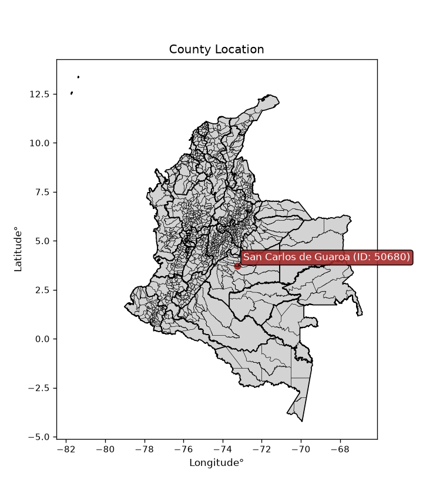
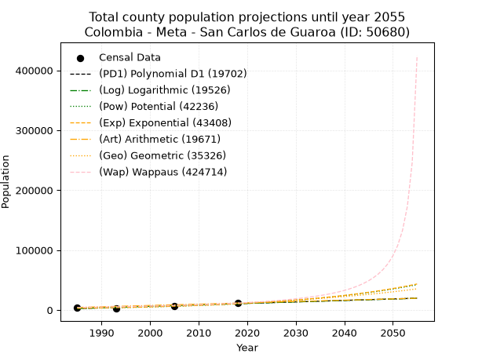
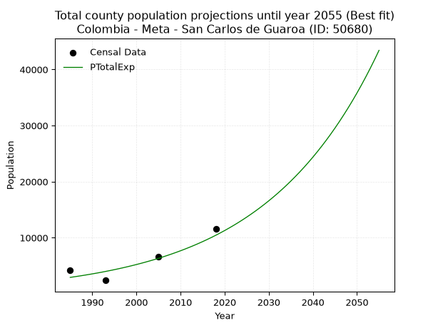
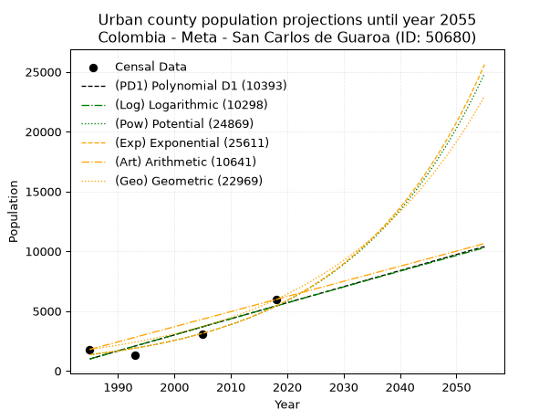
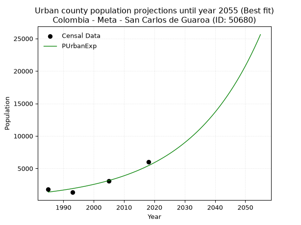
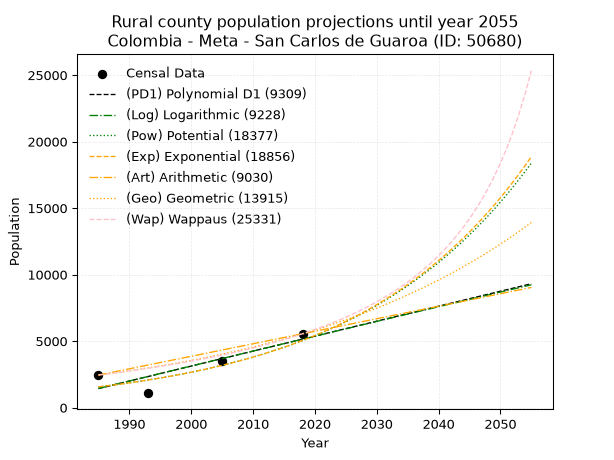
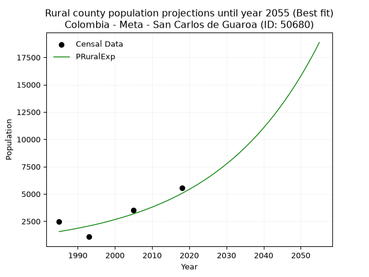

<div align="center">


</div>

# _“Population and Public Services Demand Projections (PPSD) until Year 2050 for Colombia - Meta - San Carlos de Guaroa (ID: 50680)”_
Keywords: `population` `public-service` `projection` `lineal` `polynomial` `logarithmic` `potential` `exponential` `arithmetic` `geometric` `wappaus` `dane` `colombia` `south-america`

PPSD are analytical estimates used by governments and planners to anticipate future changes in population size, age distribution, and the resulting community needs for utilities, healthcare, education, and infrastructure as sizing future water treatment facilities, electrical grids, and road networks based on spatial growth.

<div align="center">

</img>

</div>


> **General running parameters**: • app_version: _v20260806_. • Python version: _3.14.7_. • Pandas version: _3.0.5_. • NumPy version: _2.5.1_. • Creates, save and include plots into reports (create_plot): _False_. • Projection until year: _2050_. • Process polynomial degree 2 and up: _False_. • Process Wappaus: _True_. • Process Wappaus: _True_. • Set negative values to zero: _True_. • Set infinite values to zero: _True_. • Drop dataset notes: _True_. 
<div align="center">

Dynamic map: [:earth_americas:Google](http://maps.google.com/maps?q=3.710650094,-73.2422527) [:earth_americas:OSM](https://www.openstreetmap.org/#map=18/3.710650094/-73.2422527&layers=P) [:earth_americas:Bing](https://www.bing.com/maps?cp=3.710650094~-73.2422527&lvl=18) [:earth_americas:Apple](https://maps.apple.com/frame?center=3.710650094%2C-73.2422527&span=0.003%2C0.006)

</div>


<div align="center">

```geojson
{
  "type": "Feature",
  "geometry": {
    "type": "Point", 
    "coordinates": [-73.2422527, 3.710650094]
  }, 
  "properties": {
    "Name": "Colombia - Meta - San Carlos de Guaroa (ID: 50680)"
  }
}
```

</div>


## 0. Census Data (4 records)

Census data are official statistics collected by a government about the people and housing in a country. They usually include counts of total population, age, sex, race, income, education, and jobs.

📅Global census file: [Population.xlsx](../data/Population.xlsx)

| Source   |   Year |   CountryID | CountryName   |   StateID | StateName   |   CountyID | CountyName           |   PTotal |   PUrban |   PRural |
|:---------|-------:|------------:|:--------------|----------:|:------------|-----------:|:---------------------|---------:|---------:|---------:|
| DANE     |   1985 |          57 | Colombia      |        50 | Meta        |      50680 | San Carlos de Guaroa |     4235 |     1791 |     2444 |
| DANE     |   1993 |          57 | Colombia      |        50 | Meta        |      50680 | San Carlos de Guaroa |     2398 |     1317 |     1081 |
| DANE     |   2005 |          57 | Colombia      |        50 | Meta        |      50680 | San Carlos de Guaroa |     6602 |     3087 |     3515 |
| DANE     |   2018 |          57 | Colombia      |        50 | Meta        |      50680 | San Carlos de Guaroa |    11512 |     5963 |     5549 |

> 🔥Some records could had specific notes about the registered values or the corresponding urban or rural distribution.

📅   [RUPS](https://www.datos.gov.co/Hacienda-y-Cr-dito-P-blico/Registro-nico-de-Prestadores-de-Servicios-P-blicos/4qkq-csdn/about_data) - Local public utility companies: [RUPS.csv](../data/RUPS.xlsx)

 | SERVICIO       | ESTADO    | NOMBRE                                             | NIT         | DEPARTAMENTO_DOMICILIO   | MUNICIPIO_DOMICILIO   | DIRECCION                                       |   TELEFONO | EMAIL                 | TIPO_PRESTADOR                             | CLASIFICACION                 |
|:---------------|:----------|:---------------------------------------------------|:------------|:-------------------------|:----------------------|:------------------------------------------------|-----------:|:----------------------|:-------------------------------------------|:------------------------------|
| ACUEDUCTO      | OPERATIVA | EMPRESA DE SERVICIOS PUBLICOS DEL META S.A. E.S.P. | 822006587-0 | META                     | VILLAVICENCIO         | Diagonal 19 Transversal 23 - 02 Barrio el Nogal |    6726764 | edesa@edesaesp.com.co | SOCIEDADES (EMPRESA DE SERVICIOS PUBLICOS) | MAYOR O IGUAL A 5001 USUARIOS |
| ALCANTARILLADO | OPERATIVA | EMPRESA DE SERVICIOS PUBLICOS DEL META S.A. E.S.P. | 822006587-0 | META                     | VILLAVICENCIO         | Diagonal 19 Transversal 23 - 02 Barrio el Nogal |    6726764 | edesa@edesaesp.com.co | SOCIEDADES (EMPRESA DE SERVICIOS PUBLICOS) | MAYOR O IGUAL A 5001 USUARIOS |

## 1. Total

### 1.1. Coefficients and Parameters

* (PD1) Polynomial Deg 1: 246.85387394620304, -487582.7113608927 (lineal)
* (Log) Logarithmic: 493627.9487723622, -3745883.2443048507
* (Pow) Potential: 77.0106040210597, -250.49596191575063
* (Exp) Exponential: 0.038510625539874846, 1.8526639561209755e-30
* (Art) Arithmetic: Year diff. 2018 - 1985 = 33, Population diff. 11512 - 4235 = 7277, Annual growth = 220.5151515151515
* (Geo) Geometric: Year diff. 2018 - 1985 = 33, Population diff. 11512 - 4235 = 7277, Annual growth % = 0.03076704766900562
* (Wap) Wappaus: i = 2.8007258717870265, Condition values only valid for < 200)

<sub>
Wappaus condition values: ['0.00', '2.80', '5.60', '8.40', '11.20', '14.00', '16.80', '19.61', '22.41', '25.21', '28.01', '30.81', '33.61', '36.41', '39.21', '42.01', '44.81', '47.61', '50.41', '53.21', '56.01', '58.82', '61.62', '64.42', '67.22', '70.02', '72.82', '75.62', '78.42', '81.22', '84.02', '86.82', '89.62', '92.42', '95.22', '98.03', '100.83', '103.63', '106.43', '109.23', '112.03', '114.83', '117.63', '120.43', '123.23', '126.03', '128.83', '131.63', '134.43', '137.24', '140.04', '142.84', '145.64', '148.44', '151.24', '154.04', '156.84', '159.64', '162.44', '165.24', '168.04', '170.84', '173.65', '176.45', '179.25', '182.05']
</sub>


### 1.2. Projected Dataset

|   Year |   CountyID |   PTotalPD1 |   PTotalLog |   PTotalPow |   PTotalExp |   PTotalArt |   PTotalGeo |   PTotalWap |
|-------:|-----------:|------------:|------------:|------------:|------------:|------------:|------------:|------------:|
|   1985 |      50680 |        2422 |        2418 |        2928 |        2930 |        4235 |        4235 |        4235 |
|   1986 |      50680 |        2669 |        2667 |        3044 |        3045 |        4456 |        4365 |        4355 |
|   1987 |      50680 |        2916 |        2916 |        3164 |        3164 |        4676 |        4500 |        4479 |
|   1988 |      50680 |        3163 |        3164 |        3289 |        3289 |        4897 |        4638 |        4606 |
|   1989 |      50680 |        3410 |        3412 |        3419 |        3418 |        5117 |        4781 |        4738 |
|   1990 |      50680 |        3656 |        3660 |        3554 |        3552 |        5338 |        4928 |        4873 |
|   1991 |      50680 |        3903 |        3908 |        3694 |        3691 |        5558 |        5079 |        5012 |
|   1992 |      50680 |        4150 |        4156 |        3840 |        3836 |        5779 |        5236 |        5156 |
|   1993 |      50680 |        4397 |        4404 |        3991 |        3987 |        5999 |        5397 |        5304 |
|   1994 |      50680 |        4644 |        4652 |        4148 |        4143 |        6220 |        5563 |        5456 |
|   1995 |      50680 |        4891 |        4899 |        4312 |        4306 |        6440 |        5734 |        5614 |
|   1996 |      50680 |        5138 |        5146 |        4481 |        4475 |        6661 |        5910 |        5777 |
|   1997 |      50680 |        5384 |        5394 |        4657 |        4651 |        6881 |        6092 |        5946 |
|   1998 |      50680 |        5631 |        5641 |        4840 |        4833 |        7102 |        6280 |        6120 |
|   1999 |      50680 |        5878 |        5888 |        5031 |        5023 |        7322 |        6473 |        6300 |
|   2000 |      50680 |        6125 |        6135 |        5228 |        5220 |        7543 |        6672 |        6487 |
|   2001 |      50680 |        6372 |        6381 |        5433 |        5425 |        7763 |        6877 |        6681 |
|   2002 |      50680 |        6619 |        6628 |        5647 |        5638 |        7984 |        7089 |        6881 |
|   2003 |      50680 |        6866 |        6875 |        5868 |        5860 |        8204 |        7307 |        7090 |
|   2004 |      50680 |        7112 |        7121 |        6098 |        6090 |        8425 |        7532 |        7306 |
|   2005 |      50680 |        7359 |        7367 |        6337 |        6329 |        8645 |        7764 |        7530 |
|   2006 |      50680 |        7606 |        7613 |        6585 |        6577 |        8866 |        8002 |        7763 |
|   2007 |      50680 |        7853 |        7859 |        6842 |        6836 |        9086 |        8249 |        8006 |
|   2008 |      50680 |        8100 |        8105 |        7110 |        7104 |        9307 |        8502 |        8259 |
|   2009 |      50680 |        8347 |        8351 |        7388 |        7383 |        9527 |        8764 |        8523 |
|   2010 |      50680 |        8594 |        8597 |        7676 |        7673 |        9748 |        9034 |        8798 |
|   2011 |      50680 |        8840 |        8842 |        7976 |        7974 |        9968 |        9312 |        9085 |
|   2012 |      50680 |        9087 |        9088 |        8288 |        8287 |       10189 |        9598 |        9385 |
|   2013 |      50680 |        9334 |        9333 |        8611 |        8612 |       10409 |        9893 |        9698 |
|   2014 |      50680 |        9581 |        9578 |        8947 |        8951 |       10630 |       10198 |       10027 |
|   2015 |      50680 |        9828 |        9823 |        9295 |        9302 |       10850 |       10512 |       10371 |
|   2016 |      50680 |       10075 |       10068 |        9657 |        9667 |       11071 |       10835 |       10733 |
|   2017 |      50680 |       10322 |       10313 |       10033 |       10047 |       11291 |       11168 |       11112 |
|   2018 |      50680 |       10568 |       10557 |       10423 |       10441 |       11512 |       11512 |       11512 |
|   2019 |      50680 |       10815 |       10802 |       10829 |       10851 |       11733 |       11866 |       11933 |
|   2020 |      50680 |       11062 |       11046 |       11250 |       11277 |       11953 |       12231 |       12377 |
|   2021 |      50680 |       11309 |       11291 |       11687 |       11720 |       12174 |       12608 |       12846 |
|   2022 |      50680 |       11556 |       11535 |       12141 |       12180 |       12394 |       12995 |       13343 |
|   2023 |      50680 |       11803 |       11779 |       12612 |       12658 |       12615 |       13395 |       13869 |
|   2024 |      50680 |       12050 |       12023 |       13101 |       13155 |       12835 |       13807 |       14427 |
|   2025 |      50680 |       12296 |       12267 |       13609 |       13672 |       13056 |       14232 |       15021 |
|   2026 |      50680 |       12543 |       12510 |       14136 |       14209 |       13276 |       14670 |       15655 |
|   2027 |      50680 |       12790 |       12754 |       14684 |       14766 |       13497 |       15122 |       16331 |
|   2028 |      50680 |       13037 |       12998 |       15252 |       15346 |       13717 |       15587 |       17055 |
|   2029 |      50680 |       13284 |       13241 |       15843 |       15949 |       13938 |       16066 |       17831 |
|   2030 |      50680 |       13531 |       13484 |       16455 |       16575 |       14158 |       16561 |       18667 |
|   2031 |      50680 |       13778 |       13727 |       17091 |       17226 |       14379 |       17070 |       19568 |
|   2032 |      50680 |       14024 |       13970 |       17752 |       17902 |       14599 |       17595 |       20543 |
|   2033 |      50680 |       14271 |       14213 |       18437 |       18605 |       14820 |       18137 |       21602 |
|   2034 |      50680 |       14518 |       14456 |       19149 |       19335 |       15040 |       18695 |       22755 |
|   2035 |      50680 |       14765 |       14698 |       19888 |       20094 |       15261 |       19270 |       24015 |
|   2036 |      50680 |       15012 |       14941 |       20654 |       20883 |       15481 |       19863 |       25400 |
|   2037 |      50680 |       15259 |       15183 |       21450 |       21703 |       15702 |       20474 |       26926 |
|   2038 |      50680 |       15505 |       15426 |       22277 |       22555 |       15922 |       21104 |       28619 |
|   2039 |      50680 |       15752 |       15668 |       23134 |       23441 |       16143 |       21753 |       30506 |
|   2040 |      50680 |       15999 |       15910 |       24025 |       24361 |       16363 |       22422 |       32623 |
|   2041 |      50680 |       16246 |       16152 |       24949 |       25318 |       16584 |       23112 |       35015 |
|   2042 |      50680 |       16493 |       16393 |       25908 |       26312 |       16804 |       23823 |       37739 |
|   2043 |      50680 |       16740 |       16635 |       26903 |       27345 |       17025 |       24556 |       40869 |
|   2044 |      50680 |       16987 |       16877 |       27936 |       28418 |       17245 |       25312 |       44503 |
|   2045 |      50680 |       17233 |       17118 |       29009 |       29534 |       17466 |       26091 |       48775 |
|   2046 |      50680 |       17480 |       17359 |       30122 |       30694 |       17686 |       26893 |       53867 |
|   2047 |      50680 |       17727 |       17601 |       31277 |       31899 |       17907 |       27721 |       60041 |
|   2048 |      50680 |       17974 |       17842 |       32476 |       33151 |       18127 |       28574 |       67684 |
|   2049 |      50680 |       18221 |       18083 |       33720 |       34453 |       18348 |       29453 |       77390 |
|   2050 |      50680 |       18468 |       18324 |       35011 |       35805 |       18568 |       30359 |       90123 |
<div align="center">

</img>

</div>


### 1.3. Best fit with absolute and relative error (%)

Relative error puts that difference into context by dividing the absolute error by the true value, creating a unitless ratio or percentage that shows the scale of the mistake.

Absolute and relative error

|   Year | Source   |   CountryID | CountryName   |   StateID | StateName   |   CountyID_x | CountyName           |   PTotal |   PUrban |   PRural |   CountyID_y |   PTotalPD1 |   PTotalLog |   PTotalPow |   PTotalExp |   PTotalArt |   PTotalGeo |   PTotalWap |   PTotalPD1AbsError |   PTotalLogAbsError |   PTotalPowAbsError |   PTotalExpAbsError |   PTotalArtAbsError |   PTotalGeoAbsError |   PTotalWapAbsError |   PTotalPD1RelError |   PTotalLogRelError |   PTotalPowRelError |   PTotalExpRelError |   PTotalArtRelError |   PTotalGeoRelError |   PTotalWapRelError |
|-------:|:---------|------------:|:--------------|----------:|:------------|-------------:|:---------------------|---------:|---------:|---------:|-------------:|------------:|------------:|------------:|------------:|------------:|------------:|------------:|--------------------:|--------------------:|--------------------:|--------------------:|--------------------:|--------------------:|--------------------:|--------------------:|--------------------:|--------------------:|--------------------:|--------------------:|--------------------:|--------------------:|
|   1985 | DANE     |          57 | Colombia      |        50 | Meta        |        50680 | San Carlos de Guaroa |     4235 |     1791 |     2444 |        50680 |        2422 |        2418 |        2928 |        2930 |        4235 |        4235 |        4235 |                1813 |                1817 |                1307 |                1305 |                   0 |                   0 |                   0 |            42.8099  |            42.9044  |            30.8619  |            30.8146  |              0      |              0      |              0      |
|   1993 | DANE     |          57 | Colombia      |        50 | Meta        |        50680 | San Carlos de Guaroa |     2398 |     1317 |     1081 |        50680 |        4397 |        4404 |        3991 |        3987 |        5999 |        5397 |        5304 |                1999 |                2006 |                1593 |                1589 |                3601 |                2999 |                2906 |            83.3611  |            83.653   |            66.4304  |            66.2636  |            150.167  |            125.063  |            121.184  |
|   2005 | DANE     |          57 | Colombia      |        50 | Meta        |        50680 | San Carlos de Guaroa |     6602 |     3087 |     3515 |        50680 |        7359 |        7367 |        6337 |        6329 |        8645 |        7764 |        7530 |                 757 |                 765 |                 265 |                 273 |                2043 |                1162 |                 928 |            11.4662  |            11.5874  |             4.01394 |             4.13511 |             30.9452 |             17.6007 |             14.0563 |
|   2018 | DANE     |          57 | Colombia      |        50 | Meta        |        50680 | San Carlos de Guaroa |    11512 |     5963 |     5549 |        50680 |       10568 |       10557 |       10423 |       10441 |       11512 |       11512 |       11512 |                 944 |                 955 |                1089 |                1071 |                   0 |                   0 |                   0 |             8.20014 |             8.29569 |             9.45969 |             9.30334 |              0      |              0      |              0      |

Relative error mean

| Method    |   RelError | Best   |
|:----------|-----------:|:-------|
| PTotalPD1 |    36.4594 |        |
| PTotalLog |    36.6101 |        |
| PTotalPow |    27.6915 |        |
| PTotalExp |    27.6292 | True   |
| PTotalArt |    45.278  |        |
| PTotalGeo |    35.6658 |        |
| PTotalWap |    33.8102 |        |

💙Best method: _**PTotalExp**_
<div align="center">

</img>

</div>


### 1.4. Fresh water supply demand in liters per capita per day (lpcd)

The fresh water supply demand typically ranges from 100 to 300 liters per capita per day (lpcd) for standard domestic and municipal planning, though absolute survival minimums set by the World Health Organization are as low as 7.5 to 20 liters per day, and total consumption in high-income nations can exceed 400 liters.

> `CZ`: Level in meters above the sea level (masl)<br> `WS`: Fresh water supply demand in liters per capita per day (lpcd or l/h/d)<br> `WSAll`: Zonal fresh water supply demand in liters per second (l/s)<br> `A`: Zonal area in square meters<br> `DP`: Population density (people/hectare or p/ha)

Reference values (RAS Colombia)

|    CZ |   WS |
|------:|-----:|
|  1000 |  120 |
|  2000 |  130 |
| 99999 |  140 |

County shapefile geometry properties and water supply values

|   CountyID |      ATotal |   CZTotal |   WSTotal |
|-----------:|------------:|----------:|----------:|
|      50680 | 8.06566e+08 |   235.316 |       120 |

Projected values for best method: PTotalExp

|   CountyID |   Year |   PTotalExp |   DPTotal |   WSTotal |   WSTotalAll |
|-----------:|-------:|------------:|----------:|----------:|-------------:|
|      50680 |   1985 |        2930 |      0.04 |       120 |      4.06944 |
|      50680 |   1986 |        3045 |      0.04 |       120 |      4.22917 |
|      50680 |   1987 |        3164 |      0.04 |       120 |      4.39444 |
|      50680 |   1988 |        3289 |      0.04 |       120 |      4.56806 |
|      50680 |   1989 |        3418 |      0.04 |       120 |      4.74722 |
|      50680 |   1990 |        3552 |      0.04 |       120 |      4.93333 |
|      50680 |   1991 |        3691 |      0.05 |       120 |      5.12639 |
|      50680 |   1992 |        3836 |      0.05 |       120 |      5.32778 |
|      50680 |   1993 |        3987 |      0.05 |       120 |      5.5375  |
|      50680 |   1994 |        4143 |      0.05 |       120 |      5.75417 |
|      50680 |   1995 |        4306 |      0.05 |       120 |      5.98056 |
|      50680 |   1996 |        4475 |      0.06 |       120 |      6.21528 |
|      50680 |   1997 |        4651 |      0.06 |       120 |      6.45972 |
|      50680 |   1998 |        4833 |      0.06 |       120 |      6.7125  |
|      50680 |   1999 |        5023 |      0.06 |       120 |      6.97639 |
|      50680 |   2000 |        5220 |      0.06 |       120 |      7.25    |
|      50680 |   2001 |        5425 |      0.07 |       120 |      7.53472 |
|      50680 |   2002 |        5638 |      0.07 |       120 |      7.83056 |
|      50680 |   2003 |        5860 |      0.07 |       120 |      8.13889 |
|      50680 |   2004 |        6090 |      0.08 |       120 |      8.45833 |
|      50680 |   2005 |        6329 |      0.08 |       120 |      8.79028 |
|      50680 |   2006 |        6577 |      0.08 |       120 |      9.13472 |
|      50680 |   2007 |        6836 |      0.08 |       120 |      9.49444 |
|      50680 |   2008 |        7104 |      0.09 |       120 |      9.86667 |
|      50680 |   2009 |        7383 |      0.09 |       120 |     10.2542  |
|      50680 |   2010 |        7673 |      0.1  |       120 |     10.6569  |
|      50680 |   2011 |        7974 |      0.1  |       120 |     11.075   |
|      50680 |   2012 |        8287 |      0.1  |       120 |     11.5097  |
|      50680 |   2013 |        8612 |      0.11 |       120 |     11.9611  |
|      50680 |   2014 |        8951 |      0.11 |       120 |     12.4319  |
|      50680 |   2015 |        9302 |      0.12 |       120 |     12.9194  |
|      50680 |   2016 |        9667 |      0.12 |       120 |     13.4264  |
|      50680 |   2017 |       10047 |      0.12 |       120 |     13.9542  |
|      50680 |   2018 |       10441 |      0.13 |       120 |     14.5014  |
|      50680 |   2019 |       10851 |      0.13 |       120 |     15.0708  |
|      50680 |   2020 |       11277 |      0.14 |       120 |     15.6625  |
|      50680 |   2021 |       11720 |      0.15 |       120 |     16.2778  |
|      50680 |   2022 |       12180 |      0.15 |       120 |     16.9167  |
|      50680 |   2023 |       12658 |      0.16 |       120 |     17.5806  |
|      50680 |   2024 |       13155 |      0.16 |       120 |     18.2708  |
|      50680 |   2025 |       13672 |      0.17 |       120 |     18.9889  |
|      50680 |   2026 |       14209 |      0.18 |       120 |     19.7347  |
|      50680 |   2027 |       14766 |      0.18 |       120 |     20.5083  |
|      50680 |   2028 |       15346 |      0.19 |       120 |     21.3139  |
|      50680 |   2029 |       15949 |      0.2  |       120 |     22.1514  |
|      50680 |   2030 |       16575 |      0.21 |       120 |     23.0208  |
|      50680 |   2031 |       17226 |      0.21 |       120 |     23.925   |
|      50680 |   2032 |       17902 |      0.22 |       120 |     24.8639  |
|      50680 |   2033 |       18605 |      0.23 |       120 |     25.8403  |
|      50680 |   2034 |       19335 |      0.24 |       120 |     26.8542  |
|      50680 |   2035 |       20094 |      0.25 |       120 |     27.9083  |
|      50680 |   2036 |       20883 |      0.26 |       120 |     29.0042  |
|      50680 |   2037 |       21703 |      0.27 |       120 |     30.1431  |
|      50680 |   2038 |       22555 |      0.28 |       120 |     31.3264  |
|      50680 |   2039 |       23441 |      0.29 |       120 |     32.5569  |
|      50680 |   2040 |       24361 |      0.3  |       120 |     33.8347  |
|      50680 |   2041 |       25318 |      0.31 |       120 |     35.1639  |
|      50680 |   2042 |       26312 |      0.33 |       120 |     36.5444  |
|      50680 |   2043 |       27345 |      0.34 |       120 |     37.9792  |
|      50680 |   2044 |       28418 |      0.35 |       120 |     39.4694  |
|      50680 |   2045 |       29534 |      0.37 |       120 |     41.0194  |
|      50680 |   2046 |       30694 |      0.38 |       120 |     42.6306  |
|      50680 |   2047 |       31899 |      0.4  |       120 |     44.3042  |
|      50680 |   2048 |       33151 |      0.41 |       120 |     46.0431  |
|      50680 |   2049 |       34453 |      0.43 |       120 |     47.8514  |
|      50680 |   2050 |       35805 |      0.44 |       120 |     49.7292  |

## 2. Urban

### 2.1. Coefficients and Parameters

* (PD1) Polynomial Deg 1: 134.31633881974923, -265626.75672420335 (lineal)
* (Log) Logarithmic: 268606.64560436795, -2038641.7657173714
* (Pow) Potential: 84.03540257332803, -273.99781620126794
* (Exp) Exponential: 0.042014440311931696, 8.15792793514153e-34
* (Art) Arithmetic: Year diff. 2018 - 1985 = 33, Population diff. 5963 - 1791 = 4172, Annual growth = 126.42424242424242
* (Geo) Geometric: Year diff. 2018 - 1985 = 33, Population diff. 5963 - 1791 = 4172, Annual growth % = 0.037120862224775175
* (Wap) Wappaus: i = 3.2608780609812333, Condition values only valid for < 200)

<sub>
Wappaus condition values: ['0.00', '3.26', '6.52', '9.78', '13.04', '16.30', '19.57', '22.83', '26.09', '29.35', '32.61', '35.87', '39.13', '42.39', '45.65', '48.91', '52.17', '55.43', '58.70', '61.96', '65.22', '68.48', '71.74', '75.00', '78.26', '81.52', '84.78', '88.04', '91.30', '94.57', '97.83', '101.09', '104.35', '107.61', '110.87', '114.13', '117.39', '120.65', '123.91', '127.17', '130.44', '133.70', '136.96', '140.22', '143.48', '146.74', '150.00', '153.26', '156.52', '159.78', '163.04', '166.30', '169.57', '172.83', '176.09', '179.35', '182.61', '185.87', '189.13', '192.39', '195.65', '198.91', '202.17', '205.44', '208.70', '211.96']
</sub>


### 2.2. Projected Dataset

|   Year |   CountyID |   PUrbanPD1 |   PUrbanLog |   PUrbanPow |   PUrbanExp |   PUrbanArt |   PUrbanGeo |
|-------:|-----------:|------------:|------------:|------------:|------------:|------------:|------------:|
|   1985 |      50680 |         991 |         989 |        1351 |        1353 |        1791 |        1791 |
|   1986 |      50680 |        1125 |        1124 |        1410 |        1411 |        1917 |        1857 |
|   1987 |      50680 |        1260 |        1260 |        1471 |        1471 |        2044 |        1926 |
|   1988 |      50680 |        1394 |        1395 |        1534 |        1534 |        2170 |        1998 |
|   1989 |      50680 |        1528 |        1530 |        1601 |        1600 |        2297 |        2072 |
|   1990 |      50680 |        1663 |        1665 |        1670 |        1669 |        2423 |        2149 |
|   1991 |      50680 |        1797 |        1800 |        1742 |        1740 |        2550 |        2229 |
|   1992 |      50680 |        1931 |        1935 |        1817 |        1815 |        2676 |        2312 |
|   1993 |      50680 |        2066 |        2069 |        1895 |        1893 |        2802 |        2397 |
|   1994 |      50680 |        2200 |        2204 |        1977 |        1974 |        2929 |        2486 |
|   1995 |      50680 |        2334 |        2339 |        2062 |        2059 |        3055 |        2579 |
|   1996 |      50680 |        2469 |        2473 |        2150 |        2147 |        3182 |        2674 |
|   1997 |      50680 |        2603 |        2608 |        2243 |        2239 |        3308 |        2774 |
|   1998 |      50680 |        2737 |        2742 |        2339 |        2335 |        3435 |        2877 |
|   1999 |      50680 |        2872 |        2877 |        2440 |        2436 |        3561 |        2983 |
|   2000 |      50680 |        3006 |        3011 |        2544 |        2540 |        3687 |        3094 |
|   2001 |      50680 |        3140 |        3145 |        2653 |        2649 |        3814 |        3209 |
|   2002 |      50680 |        3275 |        3280 |        2767 |        2763 |        3940 |        3328 |
|   2003 |      50680 |        3409 |        3414 |        2886 |        2881 |        4067 |        3452 |
|   2004 |      50680 |        3543 |        3548 |        3009 |        3005 |        4193 |        3580 |
|   2005 |      50680 |        3678 |        3682 |        3138 |        3134 |        4319 |        3713 |
|   2006 |      50680 |        3812 |        3816 |        3273 |        3268 |        4446 |        3850 |
|   2007 |      50680 |        3946 |        3950 |        3413 |        3409 |        4572 |        3993 |
|   2008 |      50680 |        4080 |        4083 |        3558 |        3555 |        4699 |        4142 |
|   2009 |      50680 |        4215 |        4217 |        3711 |        3707 |        4825 |        4295 |
|   2010 |      50680 |        4349 |        4351 |        3869 |        3867 |        4952 |        4455 |
|   2011 |      50680 |        4483 |        4484 |        4034 |        4032 |        5078 |        4620 |
|   2012 |      50680 |        4618 |        4618 |        4206 |        4206 |        5204 |        4792 |
|   2013 |      50680 |        4752 |        4751 |        4386 |        4386 |        5331 |        4970 |
|   2014 |      50680 |        4886 |        4885 |        4572 |        4574 |        5457 |        5154 |
|   2015 |      50680 |        5021 |        5018 |        4767 |        4770 |        5584 |        5345 |
|   2016 |      50680 |        5155 |        5151 |        4970 |        4975 |        5710 |        5544 |
|   2017 |      50680 |        5289 |        5285 |        5182 |        5189 |        5837 |        5750 |
|   2018 |      50680 |        5424 |        5418 |        5402 |        5411 |        5963 |        5963 |
|   2019 |      50680 |        5558 |        5551 |        5632 |        5643 |        6089 |        6184 |
|   2020 |      50680 |        5692 |        5684 |        5871 |        5886 |        6216 |        6414 |
|   2021 |      50680 |        5827 |        5817 |        6120 |        6138 |        6342 |        6652 |
|   2022 |      50680 |        5961 |        5950 |        6380 |        6402 |        6469 |        6899 |
|   2023 |      50680 |        6095 |        6082 |        6651 |        6676 |        6595 |        7155 |
|   2024 |      50680 |        6230 |        6215 |        6933 |        6963 |        6722 |        7421 |
|   2025 |      50680 |        6364 |        6348 |        7227 |        7261 |        6848 |        7696 |
|   2026 |      50680 |        6498 |        6481 |        7533 |        7573 |        6974 |        7982 |
|   2027 |      50680 |        6632 |        6613 |        7852 |        7898 |        7101 |        8278 |
|   2028 |      50680 |        6767 |        6746 |        8184 |        8237 |        7227 |        8585 |
|   2029 |      50680 |        6901 |        6878 |        8530 |        8590 |        7354 |        8904 |
|   2030 |      50680 |        7035 |        7010 |        8891 |        8959 |        7480 |        9235 |
|   2031 |      50680 |        7170 |        7143 |        9267 |        9343 |        7607 |        9577 |
|   2032 |      50680 |        7304 |        7275 |        9658 |        9744 |        7733 |        9933 |
|   2033 |      50680 |        7438 |        7407 |       10066 |       10162 |        7859 |       10302 |
|   2034 |      50680 |        7573 |        7539 |       10490 |       10599 |        7986 |       10684 |
|   2035 |      50680 |        7707 |        7671 |       10933 |       11053 |        8112 |       11081 |
|   2036 |      50680 |        7841 |        7803 |       11393 |       11528 |        8239 |       11492 |
|   2037 |      50680 |        7976 |        7935 |       11873 |       12022 |        8365 |       11919 |
|   2038 |      50680 |        8110 |        8067 |       12373 |       12538 |        8491 |       12361 |
|   2039 |      50680 |        8244 |        8199 |       12894 |       13076 |        8618 |       12820 |
|   2040 |      50680 |        8379 |        8330 |       13437 |       13637 |        8744 |       13296 |
|   2041 |      50680 |        8513 |        8462 |       14001 |       14222 |        8871 |       13789 |
|   2042 |      50680 |        8647 |        8593 |       14590 |       14833 |        8997 |       14301 |
|   2043 |      50680 |        8782 |        8725 |       15203 |       15469 |        9124 |       14832 |
|   2044 |      50680 |        8916 |        8856 |       15841 |       16133 |        9250 |       15383 |
|   2045 |      50680 |        9050 |        8988 |       16506 |       16825 |        9376 |       15954 |
|   2046 |      50680 |        9184 |        9119 |       17198 |       17547 |        9503 |       16546 |
|   2047 |      50680 |        9319 |        9250 |       17919 |       18300 |        9629 |       17160 |
|   2048 |      50680 |        9453 |        9382 |       18669 |       19085 |        9756 |       17797 |
|   2049 |      50680 |        9587 |        9513 |       19451 |       19904 |        9882 |       18458 |
|   2050 |      50680 |        9722 |        9644 |       20265 |       20758 |       10009 |       19143 |
<div align="center">

</img>

</div>


### 2.3. Best fit with absolute and relative error (%)

Relative error puts that difference into context by dividing the absolute error by the true value, creating a unitless ratio or percentage that shows the scale of the mistake.

Absolute and relative error

|   Year | Source   |   CountryID | CountryName   |   StateID | StateName   |   CountyID_x | CountyName           |   PTotal |   PUrban |   PRural |   CountyID_y |   PUrbanPD1 |   PUrbanLog |   PUrbanPow |   PUrbanExp |   PUrbanArt |   PUrbanGeo |   PUrbanPD1AbsError |   PUrbanLogAbsError |   PUrbanPowAbsError |   PUrbanExpAbsError |   PUrbanArtAbsError |   PUrbanGeoAbsError |   PUrbanPD1RelError |   PUrbanLogRelError |   PUrbanPowRelError |   PUrbanExpRelError |   PUrbanArtRelError |   PUrbanGeoRelError |
|-------:|:---------|------------:|:--------------|----------:|:------------|-------------:|:---------------------|---------:|---------:|---------:|-------------:|------------:|------------:|------------:|------------:|------------:|------------:|--------------------:|--------------------:|--------------------:|--------------------:|--------------------:|--------------------:|--------------------:|--------------------:|--------------------:|--------------------:|--------------------:|--------------------:|
|   1985 | DANE     |          57 | Colombia      |        50 | Meta        |        50680 | San Carlos de Guaroa |     4235 |     1791 |     2444 |        50680 |         991 |         989 |        1351 |        1353 |        1791 |        1791 |                 800 |                 802 |                 440 |                 438 |                   0 |                   0 |            44.6678  |            44.7795  |            24.5673  |            24.4556  |              0      |              0      |
|   1993 | DANE     |          57 | Colombia      |        50 | Meta        |        50680 | San Carlos de Guaroa |     2398 |     1317 |     1081 |        50680 |        2066 |        2069 |        1895 |        1893 |        2802 |        2397 |                 749 |                 752 |                 578 |                 576 |                1485 |                1080 |            56.8717  |            57.0995  |            43.8876  |            43.7358  |            112.756  |             82.0046 |
|   2005 | DANE     |          57 | Colombia      |        50 | Meta        |        50680 | San Carlos de Guaroa |     6602 |     3087 |     3515 |        50680 |        3678 |        3682 |        3138 |        3134 |        4319 |        3713 |                 591 |                 595 |                  51 |                  47 |                1232 |                 626 |            19.1448  |            19.2744  |             1.65209 |             1.52251 |             39.9093 |             20.2786 |
|   2018 | DANE     |          57 | Colombia      |        50 | Meta        |        50680 | San Carlos de Guaroa |    11512 |     5963 |     5549 |        50680 |        5424 |        5418 |        5402 |        5411 |        5963 |        5963 |                 539 |                 545 |                 561 |                 552 |                   0 |                   0 |             9.03907 |             9.13969 |             9.40802 |             9.25709 |              0      |              0      |

Relative error mean

| Method    |   RelError | Best   |
|:----------|-----------:|:-------|
| PUrbanPD1 |    32.4308 |        |
| PUrbanLog |    32.5732 |        |
| PUrbanPow |    19.8788 |        |
| PUrbanExp |    19.7427 | True   |
| PUrbanArt |    38.1664 |        |
| PUrbanGeo |    25.5708 |        |

💙Best method: _**PUrbanExp**_
<div align="center">

</img>

</div>


### 2.4. Fresh water supply demand in liters per capita per day (lpcd)

The fresh water supply demand typically ranges from 100 to 300 liters per capita per day (lpcd) for standard domestic and municipal planning, though absolute survival minimums set by the World Health Organization are as low as 7.5 to 20 liters per day, and total consumption in high-income nations can exceed 400 liters.

> `CZ`: Level in meters above the sea level (masl)<br> `WS`: Fresh water supply demand in liters per capita per day (lpcd or l/h/d)<br> `WSAll`: Zonal fresh water supply demand in liters per second (l/s)<br> `A`: Zonal area in square meters<br> `DP`: Population density (people/hectare or p/ha)

Reference values (RAS Colombia)

|    CZ |   WS |
|------:|-----:|
|  1000 |  120 |
|  2000 |  130 |
| 99999 |  140 |

County shapefile geometry properties and water supply values

|   CountyID |    AUrban |   CZUrban |   WSUrban |
|-----------:|----------:|----------:|----------:|
|      50680 | 1.218e+06 |   221.706 |       120 |

Projected values for best method: PUrbanExp

|   CountyID |   Year |   PUrbanExp |   DPUrban |   WSUrban |   WSUrbanAll |
|-----------:|-------:|------------:|----------:|----------:|-------------:|
|      50680 |   1985 |        1353 |     11.11 |       120 |      1.87917 |
|      50680 |   1986 |        1411 |     11.58 |       120 |      1.95972 |
|      50680 |   1987 |        1471 |     12.08 |       120 |      2.04306 |
|      50680 |   1988 |        1534 |     12.59 |       120 |      2.13056 |
|      50680 |   1989 |        1600 |     13.14 |       120 |      2.22222 |
|      50680 |   1990 |        1669 |     13.7  |       120 |      2.31806 |
|      50680 |   1991 |        1740 |     14.29 |       120 |      2.41667 |
|      50680 |   1992 |        1815 |     14.9  |       120 |      2.52083 |
|      50680 |   1993 |        1893 |     15.54 |       120 |      2.62917 |
|      50680 |   1994 |        1974 |     16.21 |       120 |      2.74167 |
|      50680 |   1995 |        2059 |     16.9  |       120 |      2.85972 |
|      50680 |   1996 |        2147 |     17.63 |       120 |      2.98194 |
|      50680 |   1997 |        2239 |     18.38 |       120 |      3.10972 |
|      50680 |   1998 |        2335 |     19.17 |       120 |      3.24306 |
|      50680 |   1999 |        2436 |     20    |       120 |      3.38333 |
|      50680 |   2000 |        2540 |     20.85 |       120 |      3.52778 |
|      50680 |   2001 |        2649 |     21.75 |       120 |      3.67917 |
|      50680 |   2002 |        2763 |     22.68 |       120 |      3.8375  |
|      50680 |   2003 |        2881 |     23.65 |       120 |      4.00139 |
|      50680 |   2004 |        3005 |     24.67 |       120 |      4.17361 |
|      50680 |   2005 |        3134 |     25.73 |       120 |      4.35278 |
|      50680 |   2006 |        3268 |     26.83 |       120 |      4.53889 |
|      50680 |   2007 |        3409 |     27.99 |       120 |      4.73472 |
|      50680 |   2008 |        3555 |     29.19 |       120 |      4.9375  |
|      50680 |   2009 |        3707 |     30.44 |       120 |      5.14861 |
|      50680 |   2010 |        3867 |     31.75 |       120 |      5.37083 |
|      50680 |   2011 |        4032 |     33.1  |       120 |      5.6     |
|      50680 |   2012 |        4206 |     34.53 |       120 |      5.84167 |
|      50680 |   2013 |        4386 |     36.01 |       120 |      6.09167 |
|      50680 |   2014 |        4574 |     37.55 |       120 |      6.35278 |
|      50680 |   2015 |        4770 |     39.16 |       120 |      6.625   |
|      50680 |   2016 |        4975 |     40.85 |       120 |      6.90972 |
|      50680 |   2017 |        5189 |     42.6  |       120 |      7.20694 |
|      50680 |   2018 |        5411 |     44.43 |       120 |      7.51528 |
|      50680 |   2019 |        5643 |     46.33 |       120 |      7.8375  |
|      50680 |   2020 |        5886 |     48.33 |       120 |      8.175   |
|      50680 |   2021 |        6138 |     50.39 |       120 |      8.525   |
|      50680 |   2022 |        6402 |     52.56 |       120 |      8.89167 |
|      50680 |   2023 |        6676 |     54.81 |       120 |      9.27222 |
|      50680 |   2024 |        6963 |     57.17 |       120 |      9.67083 |
|      50680 |   2025 |        7261 |     59.61 |       120 |     10.0847  |
|      50680 |   2026 |        7573 |     62.18 |       120 |     10.5181  |
|      50680 |   2027 |        7898 |     64.84 |       120 |     10.9694  |
|      50680 |   2028 |        8237 |     67.63 |       120 |     11.4403  |
|      50680 |   2029 |        8590 |     70.53 |       120 |     11.9306  |
|      50680 |   2030 |        8959 |     73.56 |       120 |     12.4431  |
|      50680 |   2031 |        9343 |     76.71 |       120 |     12.9764  |
|      50680 |   2032 |        9744 |     80    |       120 |     13.5333  |
|      50680 |   2033 |       10162 |     83.43 |       120 |     14.1139  |
|      50680 |   2034 |       10599 |     87.02 |       120 |     14.7208  |
|      50680 |   2035 |       11053 |     90.75 |       120 |     15.3514  |
|      50680 |   2036 |       11528 |     94.65 |       120 |     16.0111  |
|      50680 |   2037 |       12022 |     98.7  |       120 |     16.6972  |
|      50680 |   2038 |       12538 |    102.94 |       120 |     17.4139  |
|      50680 |   2039 |       13076 |    107.36 |       120 |     18.1611  |
|      50680 |   2040 |       13637 |    111.96 |       120 |     18.9403  |
|      50680 |   2041 |       14222 |    116.77 |       120 |     19.7528  |
|      50680 |   2042 |       14833 |    121.78 |       120 |     20.6014  |
|      50680 |   2043 |       15469 |    127    |       120 |     21.4847  |
|      50680 |   2044 |       16133 |    132.45 |       120 |     22.4069  |
|      50680 |   2045 |       16825 |    138.14 |       120 |     23.3681  |
|      50680 |   2046 |       17547 |    144.06 |       120 |     24.3708  |
|      50680 |   2047 |       18300 |    150.25 |       120 |     25.4167  |
|      50680 |   2048 |       19085 |    156.69 |       120 |     26.5069  |
|      50680 |   2049 |       19904 |    163.42 |       120 |     27.6444  |
|      50680 |   2050 |       20758 |    170.43 |       120 |     28.8306  |

## 3. Rural

### 3.1. Coefficients and Parameters

* (PD1) Polynomial Deg 1: 112.53753512645385, -221955.95463668933 (lineal)
* (Log) Logarithmic: 225021.3031679939, -1707241.4785874777
* (Pow) Potential: 71.25520040844322, -231.79080360317954
* (Exp) Exponential: 0.03564034595121281, 2.9331615043717656e-28
* (Art) Arithmetic: Year diff. 2018 - 1985 = 33, Population diff. 5549 - 2444 = 3105, Annual growth = 94.0909090909091
* (Geo) Geometric: Year diff. 2018 - 1985 = 33, Population diff. 5549 - 2444 = 3105, Annual growth % = 0.02515921270987098
* (Wap) Wappaus: i = 2.3543327684451167, Condition values only valid for < 200)

<sub>
Wappaus condition values: ['0.00', '2.35', '4.71', '7.06', '9.42', '11.77', '14.13', '16.48', '18.83', '21.19', '23.54', '25.90', '28.25', '30.61', '32.96', '35.31', '37.67', '40.02', '42.38', '44.73', '47.09', '49.44', '51.80', '54.15', '56.50', '58.86', '61.21', '63.57', '65.92', '68.28', '70.63', '72.98', '75.34', '77.69', '80.05', '82.40', '84.76', '87.11', '89.46', '91.82', '94.17', '96.53', '98.88', '101.24', '103.59', '105.94', '108.30', '110.65', '113.01', '115.36', '117.72', '120.07', '122.43', '124.78', '127.13', '129.49', '131.84', '134.20', '136.55', '138.91', '141.26', '143.61', '145.97', '148.32', '150.68', '153.03']
</sub>


### 3.2. Projected Dataset

|   Year |   CountyID |   PRuralPD1 |   PRuralLog |   PRuralPow |   PRuralExp |   PRuralArt |   PRuralGeo |   PRuralWap |
|-------:|-----------:|------------:|------------:|------------:|------------:|------------:|------------:|------------:|
|   1985 |      50680 |        1431 |        1429 |        1555 |        1556 |        2444 |        2444 |        2444 |
|   1986 |      50680 |        1544 |        1543 |        1612 |        1612 |        2538 |        2505 |        2502 |
|   1987 |      50680 |        1656 |        1656 |        1671 |        1671 |        2632 |        2569 |        2562 |
|   1988 |      50680 |        1769 |        1769 |        1732 |        1731 |        2726 |        2633 |        2623 |
|   1989 |      50680 |        1881 |        1882 |        1795 |        1794 |        2820 |        2699 |        2686 |
|   1990 |      50680 |        1994 |        1996 |        1861 |        1859 |        2914 |        2767 |        2750 |
|   1991 |      50680 |        2106 |        2109 |        1928 |        1927 |        3009 |        2837 |        2815 |
|   1992 |      50680 |        2219 |        2222 |        1999 |        1997 |        3103 |        2908 |        2883 |
|   1993 |      50680 |        2331 |        2335 |        2071 |        2069 |        3197 |        2981 |        2952 |
|   1994 |      50680 |        2444 |        2447 |        2147 |        2144 |        3291 |        3056 |        3023 |
|   1995 |      50680 |        2556 |        2560 |        2225 |        2222 |        3385 |        3133 |        3096 |
|   1996 |      50680 |        2669 |        2673 |        2306 |        2303 |        3479 |        3212 |        3171 |
|   1997 |      50680 |        2782 |        2786 |        2389 |        2386 |        3573 |        3293 |        3248 |
|   1998 |      50680 |        2894 |        2898 |        2476 |        2473 |        3667 |        3376 |        3327 |
|   1999 |      50680 |        3007 |        3011 |        2566 |        2563 |        3761 |        3461 |        3409 |
|   2000 |      50680 |        3119 |        3123 |        2659 |        2656 |        3855 |        3548 |        3492 |
|   2001 |      50680 |        3232 |        3236 |        2756 |        2752 |        3949 |        3637 |        3578 |
|   2002 |      50680 |        3344 |        3348 |        2855 |        2852 |        4044 |        3729 |        3667 |
|   2003 |      50680 |        3457 |        3461 |        2959 |        2955 |        4138 |        3822 |        3758 |
|   2004 |      50680 |        3569 |        3573 |        3066 |        3062 |        4232 |        3919 |        3852 |
|   2005 |      50680 |        3682 |        3685 |        3177 |        3174 |        4326 |        4017 |        3949 |
|   2006 |      50680 |        3794 |        3798 |        3292 |        3289 |        4420 |        4118 |        4049 |
|   2007 |      50680 |        3907 |        3910 |        3411 |        3408 |        4514 |        4222 |        4152 |
|   2008 |      50680 |        4019 |        4022 |        3534 |        3532 |        4608 |        4328 |        4259 |
|   2009 |      50680 |        4132 |        4134 |        3662 |        3660 |        4702 |        4437 |        4369 |
|   2010 |      50680 |        4244 |        4246 |        3794 |        3793 |        4796 |        4549 |        4482 |
|   2011 |      50680 |        4357 |        4358 |        3931 |        3930 |        4890 |        4663 |        4600 |
|   2012 |      50680 |        4470 |        4470 |        4073 |        4073 |        4984 |        4780 |        4721 |
|   2013 |      50680 |        4582 |        4581 |        4219 |        4221 |        5079 |        4901 |        4847 |
|   2014 |      50680 |        4695 |        4693 |        4371 |        4374 |        5173 |        5024 |        4978 |
|   2015 |      50680 |        4807 |        4805 |        4529 |        4532 |        5267 |        5150 |        5113 |
|   2016 |      50680 |        4920 |        4917 |        4692 |        4697 |        5361 |        5280 |        5253 |
|   2017 |      50680 |        5032 |        5028 |        4860 |        4867 |        5455 |        5413 |        5398 |
|   2018 |      50680 |        5145 |        5140 |        5035 |        5044 |        5549 |        5549 |        5549 |
|   2019 |      50680 |        5257 |        5251 |        5216 |        5227 |        5643 |        5689 |        5706 |
|   2020 |      50680 |        5370 |        5363 |        5403 |        5416 |        5737 |        5832 |        5869 |
|   2021 |      50680 |        5482 |        5474 |        5597 |        5613 |        5831 |        5978 |        6039 |
|   2022 |      50680 |        5595 |        5585 |        5798 |        5817 |        5925 |        6129 |        6216 |
|   2023 |      50680 |        5707 |        5696 |        6006 |        6028 |        6019 |        6283 |        6400 |
|   2024 |      50680 |        5820 |        5808 |        6221 |        6246 |        6114 |        6441 |        6593 |
|   2025 |      50680 |        5933 |        5919 |        6444 |        6473 |        6208 |        6603 |        6794 |
|   2026 |      50680 |        6045 |        6030 |        6675 |        6708 |        6302 |        6769 |        7004 |
|   2027 |      50680 |        6158 |        6141 |        6914 |        6951 |        6396 |        6940 |        7224 |
|   2028 |      50680 |        6270 |        6252 |        7161 |        7203 |        6490 |        7114 |        7454 |
|   2029 |      50680 |        6383 |        6363 |        7417 |        7465 |        6584 |        7293 |        7696 |
|   2030 |      50680 |        6495 |        6474 |        7682 |        7736 |        6678 |        7477 |        7950 |
|   2031 |      50680 |        6608 |        6585 |        7957 |        8016 |        6772 |        7665 |        8217 |
|   2032 |      50680 |        6720 |        6695 |        8241 |        8307 |        6866 |        7858 |        8498 |
|   2033 |      50680 |        6833 |        6806 |        8535 |        8609 |        6960 |        8055 |        8794 |
|   2034 |      50680 |        6945 |        6917 |        8839 |        8921 |        7054 |        8258 |        9106 |
|   2035 |      50680 |        7058 |        7027 |        9154 |        9245 |        7149 |        8466 |        9437 |
|   2036 |      50680 |        7170 |        7138 |        9480 |        9580 |        7243 |        8679 |        9787 |
|   2037 |      50680 |        7283 |        7248 |        9818 |        9928 |        7337 |        8897 |       10158 |
|   2038 |      50680 |        7396 |        7359 |       10167 |       10288 |        7431 |        9121 |       10552 |
|   2039 |      50680 |        7508 |        7469 |       10529 |       10661 |        7525 |        9350 |       10972 |
|   2040 |      50680 |        7621 |        7580 |       10903 |       11048 |        7619 |        9586 |       11420 |
|   2041 |      50680 |        7733 |        7690 |       11291 |       11449 |        7713 |        9827 |       11899 |
|   2042 |      50680 |        7846 |        7800 |       11692 |       11864 |        7807 |       10074 |       12412 |
|   2043 |      50680 |        7958 |        7910 |       12107 |       12295 |        7901 |       10328 |       12964 |
|   2044 |      50680 |        8071 |        8020 |       12536 |       12741 |        7995 |       10587 |       13557 |
|   2045 |      50680 |        8183 |        8130 |       12981 |       13203 |        8089 |       10854 |       14199 |
|   2046 |      50680 |        8296 |        8240 |       13441 |       13682 |        8184 |       11127 |       14894 |
|   2047 |      50680 |        8408 |        8350 |       13918 |       14179 |        8278 |       11407 |       15649 |
|   2048 |      50680 |        8521 |        8460 |       14410 |       14693 |        8372 |       11694 |       16473 |
|   2049 |      50680 |        8633 |        8570 |       14920 |       15226 |        8466 |       11988 |       17376 |
|   2050 |      50680 |        8746 |        8680 |       15448 |       15779 |        8560 |       12290 |       18370 |
<div align="center">

</img>

</div>


### 3.3. Best fit with absolute and relative error (%)

Relative error puts that difference into context by dividing the absolute error by the true value, creating a unitless ratio or percentage that shows the scale of the mistake.

Absolute and relative error

|   Year | Source   |   CountryID | CountryName   |   StateID | StateName   |   CountyID_x | CountyName           |   PTotal |   PUrban |   PRural |   CountyID_y |   PRuralPD1 |   PRuralLog |   PRuralPow |   PRuralExp |   PRuralArt |   PRuralGeo |   PRuralWap |   PRuralPD1AbsError |   PRuralLogAbsError |   PRuralPowAbsError |   PRuralExpAbsError |   PRuralArtAbsError |   PRuralGeoAbsError |   PRuralWapAbsError |   PRuralPD1RelError |   PRuralLogRelError |   PRuralPowRelError |   PRuralExpRelError |   PRuralArtRelError |   PRuralGeoRelError |   PRuralWapRelError |
|-------:|:---------|------------:|:--------------|----------:|:------------|-------------:|:---------------------|---------:|---------:|---------:|-------------:|------------:|------------:|------------:|------------:|------------:|------------:|------------:|--------------------:|--------------------:|--------------------:|--------------------:|--------------------:|--------------------:|--------------------:|--------------------:|--------------------:|--------------------:|--------------------:|--------------------:|--------------------:|--------------------:|
|   1985 | DANE     |          57 | Colombia      |        50 | Meta        |        50680 | San Carlos de Guaroa |     4235 |     1791 |     2444 |        50680 |        1431 |        1429 |        1555 |        1556 |        2444 |        2444 |        2444 |                1013 |                1015 |                 889 |                 888 |                   0 |                   0 |                   0 |            41.4484  |            41.5303  |            36.3748  |            36.3339  |              0      |              0      |              0      |
|   1993 | DANE     |          57 | Colombia      |        50 | Meta        |        50680 | San Carlos de Guaroa |     2398 |     1317 |     1081 |        50680 |        2331 |        2335 |        2071 |        2069 |        3197 |        2981 |        2952 |                1250 |                1254 |                 990 |                 988 |                2116 |                1900 |                1871 |           115.634   |           116.004   |            91.5819  |            91.3969  |            195.745  |            175.763  |            173.08   |
|   2005 | DANE     |          57 | Colombia      |        50 | Meta        |        50680 | San Carlos de Guaroa |     6602 |     3087 |     3515 |        50680 |        3682 |        3685 |        3177 |        3174 |        4326 |        4017 |        3949 |                 167 |                 170 |                 338 |                 341 |                 811 |                 502 |                 434 |             4.75107 |             4.83642 |             9.61593 |             9.70128 |             23.0725 |             14.2817 |             12.3471 |
|   2018 | DANE     |          57 | Colombia      |        50 | Meta        |        50680 | San Carlos de Guaroa |    11512 |     5963 |     5549 |        50680 |        5145 |        5140 |        5035 |        5044 |        5549 |        5549 |        5549 |                 404 |                 409 |                 514 |                 505 |                   0 |                   0 |                   0 |             7.28059 |             7.3707  |             9.26293 |             9.10074 |              0      |              0      |              0      |

Relative error mean

| Method    |   RelError | Best   |
|:----------|-----------:|:-------|
| PRuralPD1 |    42.2784 |        |
| PRuralLog |    42.4353 |        |
| PRuralPow |    36.7089 |        |
| PRuralExp |    36.6332 | True   |
| PRuralArt |    54.7043 |        |
| PRuralGeo |    47.5112 |        |
| PRuralWap |    46.3569 |        |

💙Best method: _**PRuralExp**_
<div align="center">

</img>

</div>


### 3.4. Fresh water supply demand in liters per capita per day (lpcd)

The fresh water supply demand typically ranges from 100 to 300 liters per capita per day (lpcd) for standard domestic and municipal planning, though absolute survival minimums set by the World Health Organization are as low as 7.5 to 20 liters per day, and total consumption in high-income nations can exceed 400 liters.

> `CZ`: Level in meters above the sea level (masl)<br> `WS`: Fresh water supply demand in liters per capita per day (lpcd or l/h/d)<br> `WSAll`: Zonal fresh water supply demand in liters per second (l/s)<br> `A`: Zonal area in square meters<br> `DP`: Population density (people/hectare or p/ha)

Reference values (RAS Colombia)

|    CZ |   WS |
|------:|-----:|
|  1000 |  120 |
|  2000 |  130 |
| 99999 |  140 |

County shapefile geometry properties and water supply values

|   CountyID |      ARural |   CZRural |   WSRural |
|-----------:|------------:|----------:|----------:|
|      50680 | 8.05348e+08 |   235.336 |       120 |

Projected values for best method: PRuralExp

|   CountyID |   Year |   PRuralExp |   DPRural |   WSRural |   WSRuralAll |
|-----------:|-------:|------------:|----------:|----------:|-------------:|
|      50680 |   1985 |        1556 |      0.02 |       120 |      2.16111 |
|      50680 |   1986 |        1612 |      0.02 |       120 |      2.23889 |
|      50680 |   1987 |        1671 |      0.02 |       120 |      2.32083 |
|      50680 |   1988 |        1731 |      0.02 |       120 |      2.40417 |
|      50680 |   1989 |        1794 |      0.02 |       120 |      2.49167 |
|      50680 |   1990 |        1859 |      0.02 |       120 |      2.58194 |
|      50680 |   1991 |        1927 |      0.02 |       120 |      2.67639 |
|      50680 |   1992 |        1997 |      0.02 |       120 |      2.77361 |
|      50680 |   1993 |        2069 |      0.03 |       120 |      2.87361 |
|      50680 |   1994 |        2144 |      0.03 |       120 |      2.97778 |
|      50680 |   1995 |        2222 |      0.03 |       120 |      3.08611 |
|      50680 |   1996 |        2303 |      0.03 |       120 |      3.19861 |
|      50680 |   1997 |        2386 |      0.03 |       120 |      3.31389 |
|      50680 |   1998 |        2473 |      0.03 |       120 |      3.43472 |
|      50680 |   1999 |        2563 |      0.03 |       120 |      3.55972 |
|      50680 |   2000 |        2656 |      0.03 |       120 |      3.68889 |
|      50680 |   2001 |        2752 |      0.03 |       120 |      3.82222 |
|      50680 |   2002 |        2852 |      0.04 |       120 |      3.96111 |
|      50680 |   2003 |        2955 |      0.04 |       120 |      4.10417 |
|      50680 |   2004 |        3062 |      0.04 |       120 |      4.25278 |
|      50680 |   2005 |        3174 |      0.04 |       120 |      4.40833 |
|      50680 |   2006 |        3289 |      0.04 |       120 |      4.56806 |
|      50680 |   2007 |        3408 |      0.04 |       120 |      4.73333 |
|      50680 |   2008 |        3532 |      0.04 |       120 |      4.90556 |
|      50680 |   2009 |        3660 |      0.05 |       120 |      5.08333 |
|      50680 |   2010 |        3793 |      0.05 |       120 |      5.26806 |
|      50680 |   2011 |        3930 |      0.05 |       120 |      5.45833 |
|      50680 |   2012 |        4073 |      0.05 |       120 |      5.65694 |
|      50680 |   2013 |        4221 |      0.05 |       120 |      5.8625  |
|      50680 |   2014 |        4374 |      0.05 |       120 |      6.075   |
|      50680 |   2015 |        4532 |      0.06 |       120 |      6.29444 |
|      50680 |   2016 |        4697 |      0.06 |       120 |      6.52361 |
|      50680 |   2017 |        4867 |      0.06 |       120 |      6.75972 |
|      50680 |   2018 |        5044 |      0.06 |       120 |      7.00556 |
|      50680 |   2019 |        5227 |      0.06 |       120 |      7.25972 |
|      50680 |   2020 |        5416 |      0.07 |       120 |      7.52222 |
|      50680 |   2021 |        5613 |      0.07 |       120 |      7.79583 |
|      50680 |   2022 |        5817 |      0.07 |       120 |      8.07917 |
|      50680 |   2023 |        6028 |      0.07 |       120 |      8.37222 |
|      50680 |   2024 |        6246 |      0.08 |       120 |      8.675   |
|      50680 |   2025 |        6473 |      0.08 |       120 |      8.99028 |
|      50680 |   2026 |        6708 |      0.08 |       120 |      9.31667 |
|      50680 |   2027 |        6951 |      0.09 |       120 |      9.65417 |
|      50680 |   2028 |        7203 |      0.09 |       120 |     10.0042  |
|      50680 |   2029 |        7465 |      0.09 |       120 |     10.3681  |
|      50680 |   2030 |        7736 |      0.1  |       120 |     10.7444  |
|      50680 |   2031 |        8016 |      0.1  |       120 |     11.1333  |
|      50680 |   2032 |        8307 |      0.1  |       120 |     11.5375  |
|      50680 |   2033 |        8609 |      0.11 |       120 |     11.9569  |
|      50680 |   2034 |        8921 |      0.11 |       120 |     12.3903  |
|      50680 |   2035 |        9245 |      0.11 |       120 |     12.8403  |
|      50680 |   2036 |        9580 |      0.12 |       120 |     13.3056  |
|      50680 |   2037 |        9928 |      0.12 |       120 |     13.7889  |
|      50680 |   2038 |       10288 |      0.13 |       120 |     14.2889  |
|      50680 |   2039 |       10661 |      0.13 |       120 |     14.8069  |
|      50680 |   2040 |       11048 |      0.14 |       120 |     15.3444  |
|      50680 |   2041 |       11449 |      0.14 |       120 |     15.9014  |
|      50680 |   2042 |       11864 |      0.15 |       120 |     16.4778  |
|      50680 |   2043 |       12295 |      0.15 |       120 |     17.0764  |
|      50680 |   2044 |       12741 |      0.16 |       120 |     17.6958  |
|      50680 |   2045 |       13203 |      0.16 |       120 |     18.3375  |
|      50680 |   2046 |       13682 |      0.17 |       120 |     19.0028  |
|      50680 |   2047 |       14179 |      0.18 |       120 |     19.6931  |
|      50680 |   2048 |       14693 |      0.18 |       120 |     20.4069  |
|      50680 |   2049 |       15226 |      0.19 |       120 |     21.1472  |
|      50680 |   2050 |       15779 |      0.2  |       120 |     21.9153  |

<div align="center"><br><sub>Share this research</sub></div><br>

<sub>**APPS & TOOLS & CONTENT DISCLAIMER**: • NO WARRANTY - This content and software is provided by <a href="https://github.com/rcfdtools" target="_blank">github.com/rcfdtools</a> "as is", without any express or implied warranty, including warranties of merchantability, fitness for a particular purpose, or non-infringement. There is no guarantee that the software will be error-free or operate without interruption. • LIMITATION OF LIABILITY - Neither the authors nor copyright holders will be liable for claims or damages arising from the software or its use. You are responsible for determining if the software is appropriate for your use and assume all associated risks, including errors, legal compliance, and data loss. • NO PROFESSIONAL ADVICE - The software provides general information and does not offer professional advice. It should not replace consultation with professional advisors. [Clauses and global license for rcfdtools use.](https://github.com/rcfdtools/rcfdtools/blob/main/LICENSE.md)</sub>

| [:house: Home](Readme.md)  | [:beginner: Help / Collab](https://github.com/rcfdtools/R.HydroTools/discussions/31) |
|----------------------------|-------------------------------------------------------------------------------------------|