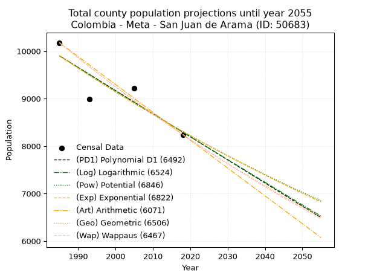
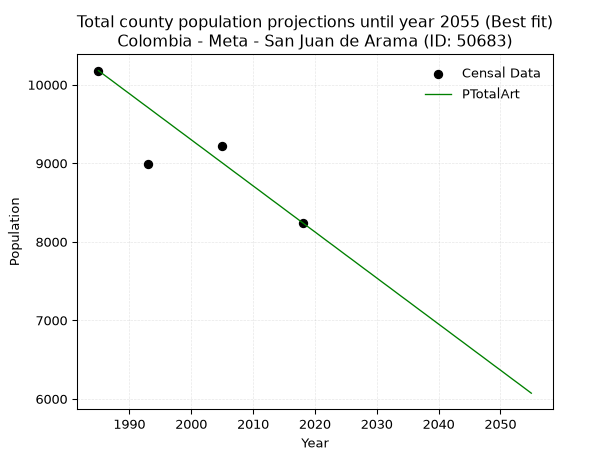
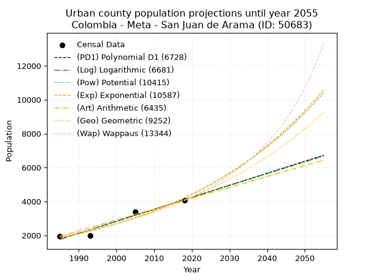
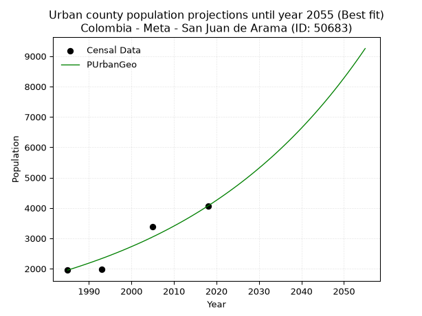
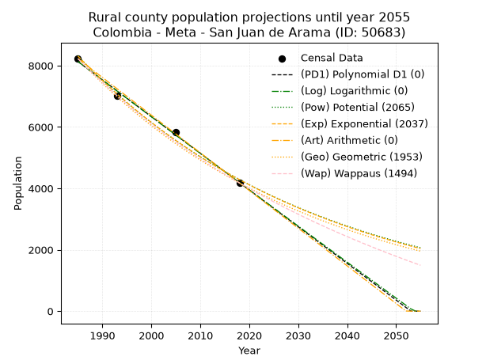
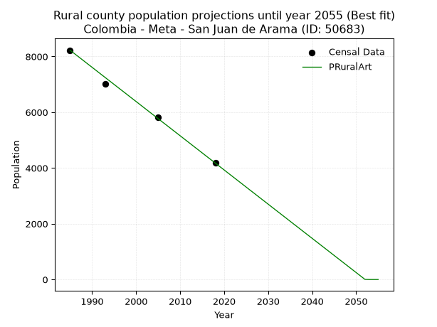

<div align="center">


</div>

# 📜 _“Population and Public Services Demand Projections (PPSD) until Year 2050 for Colombia - Meta - San Juan de Arama (ID: 50683)”_
Keywords: `population` `public-service` `projection` `lineal` `polynomial` `logarithmic` `potential` `exponential` `arithmetic` `geometric` `wappaus` `dane` `colombia` `south-america`

PPSD are analytical estimates used by governments and planners to anticipate future changes in population size, age distribution, and the resulting community needs for utilities, healthcare, education, and infrastructure as sizing future water treatment facilities, electrical grids, and road networks based on spatial growth.

<div align="center">

</img>

</div>


> **General running parameters**: • app_version: _v20260806_. • Python version: _3.14.7_. • Pandas version: _3.0.5_. • NumPy version: _2.5.1_. • Creates, save and include plots into reports (create_plot): _False_. • Projection until year: _2050_. • Process polynomial degree 2 and up: _False_. • Process Wappaus: _True_. • Process Wappaus: _True_. • Set negative values to zero: _True_. • Set infinite values to zero: _True_. • Drop dataset notes: _True_. 
<div align="center">

Maps & GIS Layers: [:earth_americas:Google](http://maps.google.com/maps?q=3.373727874,-73.8758315) [:earth_americas:OSM](https://www.openstreetmap.org/#map=18/3.373727874/-73.8758315&layers=P) [:earth_americas:Bing](https://www.bing.com/maps?cp=3.373727874~-73.8758315&lvl=18) [:earth_americas:Apple](https://maps.apple.com/frame?center=3.373727874%2C-73.8758315&span=0.003%2C0.006) [:earth_americas:GISMobile](https://github.com/rcfdtools/R.GISMobile/blob/main/file/gis/CountyLayer_CO/Readme.md)

</div>


<div align="center">

```geojson
{
  "type": "Feature",
  "geometry": {
    "type": "Point", 
    "coordinates": [-73.8758315, 3.373727874]
  }, 
  "properties": {
    "Name": "Colombia - Meta - San Juan de Arama (ID: 50683)"
  }
}
```

</div>


## 0. Census Data (4 records)

Census data are official statistics collected by a government about the people and housing in a country. They usually include counts of total population, age, sex, race, income, education, and jobs.

📅Global census file: [Population.xlsx](../data/Population.xlsx)

| Source   |   Year |   CountryID | CountryName   |   StateID | StateName   |   CountyID | CountyName        |   PTotal |   PUrban |   PRural |
|:---------|-------:|------------:|:--------------|----------:|:------------|-----------:|:------------------|---------:|---------:|---------:|
| DANE     |   1985 |          57 | Colombia      |        50 | Meta        |      50683 | San Juan de Arama |    10178 |     1953 |     8225 |
| DANE     |   1993 |          57 | Colombia      |        50 | Meta        |      50683 | San Juan de Arama |     8990 |     1985 |     7005 |
| DANE     |   2005 |          57 | Colombia      |        50 | Meta        |      50683 | San Juan de Arama |     9218 |     3394 |     5824 |
| DANE     |   2018 |          57 | Colombia      |        50 | Meta        |      50683 | San Juan de Arama |     8242 |     4066 |     4176 |

> 🔥Some records could had specific notes about the registered values or the corresponding urban or rural distribution.

📅[SUI-RUPS](https://www.datos.gov.co/Hacienda-y-Cr-dito-P-blico/Registro-nico-de-Prestadores-de-Servicios-P-blicos/4qkq-csdn/about_data) - Local public utility companies: [RUPS.csv](../data/RUPS.csv)

 | SERVICIO       | ESTADO    | NOMBRE                                             | NIT         | DEPARTAMENTO_DOMICILIO   | MUNICIPIO_DOMICILIO   | DIRECCION                                       |   TELEFONO | EMAIL                 | TIPO_PRESTADOR                             | CLASIFICACION                 |
|:---------------|:----------|:---------------------------------------------------|:------------|:-------------------------|:----------------------|:------------------------------------------------|-----------:|:----------------------|:-------------------------------------------|:------------------------------|
| ACUEDUCTO      | OPERATIVA | EMPRESA DE SERVICIOS PUBLICOS DEL META S.A. E.S.P. | 822006587-0 | META                     | VILLAVICENCIO         | Diagonal 19 Transversal 23 - 02 Barrio el Nogal |    6726764 | edesa@edesaesp.com.co | SOCIEDADES (EMPRESA DE SERVICIOS PUBLICOS) | MAYOR O IGUAL A 5001 USUARIOS |
| ALCANTARILLADO | OPERATIVA | EMPRESA DE SERVICIOS PUBLICOS DEL META S.A. E.S.P. | 822006587-0 | META                     | VILLAVICENCIO         | Diagonal 19 Transversal 23 - 02 Barrio el Nogal |    6726764 | edesa@edesaesp.com.co | SOCIEDADES (EMPRESA DE SERVICIOS PUBLICOS) | MAYOR O IGUAL A 5001 USUARIOS |

## 1. Total

### 1.1. Coefficients and Parameters

* (PD1) Polynomial Deg 1: -48.67282215977457, 106514.81252508907 (lineal)
* (Log) Logarithmic: -97447.329386584, 749854.9315613145
* (Pow) Potential: -10.658803688468074, 39.14604217214027
* (Exp) Exponential: -0.005324349135061823, 385275901.30187434
* (Art) Arithmetic: Year diff. 2018 - 1985 = 33, Population diff. 8242 - 10178 = -1936, Annual growth = -58.666666666666664
* (Geo) Geometric: Year diff. 2018 - 1985 = 33, Population diff. 8242 - 10178 = -1936, Annual growth % = -0.0063731049240026705
* (Wap) Wappaus: i = -0.6369887803112558, Condition values only valid for < 200)

<sub>
Wappaus condition values: ['-0.00', '-0.64', '-1.27', '-1.91', '-2.55', '-3.18', '-3.82', '-4.46', '-5.10', '-5.73', '-6.37', '-7.01', '-7.64', '-8.28', '-8.92', '-9.55', '-10.19', '-10.83', '-11.47', '-12.10', '-12.74', '-13.38', '-14.01', '-14.65', '-15.29', '-15.92', '-16.56', '-17.20', '-17.84', '-18.47', '-19.11', '-19.75', '-20.38', '-21.02', '-21.66', '-22.29', '-22.93', '-23.57', '-24.21', '-24.84', '-25.48', '-26.12', '-26.75', '-27.39', '-28.03', '-28.66', '-29.30', '-29.94', '-30.58', '-31.21', '-31.85', '-32.49', '-33.12', '-33.76', '-34.40', '-35.03', '-35.67', '-36.31', '-36.95', '-37.58', '-38.22', '-38.86', '-39.49', '-40.13', '-40.77', '-41.40']
</sub>


### 1.2. Projected Dataset

|   Year |   CountyID |   PTotalPD1 |   PTotalLog |   PTotalPow |   PTotalExp |   PTotalArt |   PTotalGeo |   PTotalWap |
|-------:|-----------:|------------:|------------:|------------:|------------:|------------:|------------:|------------:|
|   1985 |      50683 |        9899 |        9901 |        9905 |        9903 |       10178 |       10178 |       10178 |
|   1986 |      50683 |        9851 |        9852 |        9852 |        9851 |       10119 |       10113 |       10113 |
|   1987 |      50683 |        9802 |        9803 |        9799 |        9799 |       10061 |       10049 |       10049 |
|   1988 |      50683 |        9753 |        9754 |        9747 |        9747 |       10002 |        9985 |        9985 |
|   1989 |      50683 |        9705 |        9705 |        9695 |        9695 |        9943 |        9921 |        9922 |
|   1990 |      50683 |        9656 |        9656 |        9643 |        9643 |        9885 |        9858 |        9859 |
|   1991 |      50683 |        9607 |        9607 |        9592 |        9592 |        9826 |        9795 |        9796 |
|   1992 |      50683 |        9559 |        9558 |        9540 |        9541 |        9767 |        9733 |        9734 |
|   1993 |      50683 |        9510 |        9509 |        9489 |        9490 |        9709 |        9671 |        9672 |
|   1994 |      50683 |        9461 |        9460 |        9439 |        9440 |        9650 |        9609 |        9611 |
|   1995 |      50683 |        9413 |        9411 |        9389 |        9390 |        9591 |        9548 |        9550 |
|   1996 |      50683 |        9364 |        9362 |        9339 |        9340 |        9533 |        9487 |        9489 |
|   1997 |      50683 |        9315 |        9314 |        9289 |        9290 |        9474 |        9426 |        9429 |
|   1998 |      50683 |        9267 |        9265 |        9239 |        9241 |        9415 |        9366 |        9369 |
|   1999 |      50683 |        9218 |        9216 |        9190 |        9192 |        9357 |        9307 |        9309 |
|   2000 |      50683 |        9169 |        9167 |        9141 |        9143 |        9298 |        9247 |        9250 |
|   2001 |      50683 |        9120 |        9119 |        9093 |        9095 |        9239 |        9188 |        9191 |
|   2002 |      50683 |        9072 |        9070 |        9045 |        9046 |        9181 |        9130 |        9132 |
|   2003 |      50683 |        9023 |        9021 |        8996 |        8998 |        9122 |        9072 |        9074 |
|   2004 |      50683 |        8974 |        8973 |        8949 |        8951 |        9063 |        9014 |        9016 |
|   2005 |      50683 |        8926 |        8924 |        8901 |        8903 |        9005 |        8956 |        8959 |
|   2006 |      50683 |        8877 |        8875 |        8854 |        8856 |        8946 |        8899 |        8902 |
|   2007 |      50683 |        8828 |        8827 |        8807 |        8809 |        8887 |        8843 |        8845 |
|   2008 |      50683 |        8780 |        8778 |        8761 |        8762 |        8829 |        8786 |        8789 |
|   2009 |      50683 |        8731 |        8730 |        8714 |        8715 |        8770 |        8730 |        8733 |
|   2010 |      50683 |        8682 |        8681 |        8668 |        8669 |        8711 |        8675 |        8677 |
|   2011 |      50683 |        8634 |        8633 |        8622 |        8623 |        8653 |        8619 |        8621 |
|   2012 |      50683 |        8585 |        8584 |        8577 |        8577 |        8594 |        8564 |        8566 |
|   2013 |      50683 |        8536 |        8536 |        8531 |        8532 |        8535 |        8510 |        8511 |
|   2014 |      50683 |        8488 |        8488 |        8486 |        8486 |        8477 |        8455 |        8457 |
|   2015 |      50683 |        8439 |        8439 |        8442 |        8441 |        8418 |        8402 |        8403 |
|   2016 |      50683 |        8390 |        8391 |        8397 |        8397 |        8359 |        8348 |        8349 |
|   2017 |      50683 |        8342 |        8342 |        8353 |        8352 |        8301 |        8295 |        8295 |
|   2018 |      50683 |        8293 |        8294 |        8309 |        8308 |        8242 |        8242 |        8242 |
|   2019 |      50683 |        8244 |        8246 |        8265 |        8264 |        8183 |        8189 |        8189 |
|   2020 |      50683 |        8196 |        8198 |        8221 |        8220 |        8125 |        8137 |        8136 |
|   2021 |      50683 |        8147 |        8149 |        8178 |        8176 |        8066 |        8085 |        8084 |
|   2022 |      50683 |        8098 |        8101 |        8135 |        8133 |        8007 |        8034 |        8032 |
|   2023 |      50683 |        8050 |        8053 |        8092 |        8089 |        7949 |        7983 |        7980 |
|   2024 |      50683 |        8001 |        8005 |        8050 |        8046 |        7890 |        7932 |        7929 |
|   2025 |      50683 |        7952 |        7957 |        8008 |        8004 |        7831 |        7881 |        7878 |
|   2026 |      50683 |        7904 |        7909 |        7966 |        7961 |        7773 |        7831 |        7827 |
|   2027 |      50683 |        7855 |        7861 |        7924 |        7919 |        7714 |        7781 |        7776 |
|   2028 |      50683 |        7806 |        7812 |        7882 |        7877 |        7655 |        7732 |        7726 |
|   2029 |      50683 |        7758 |        7764 |        7841 |        7835 |        7597 |        7682 |        7676 |
|   2030 |      50683 |        7709 |        7716 |        7800 |        7793 |        7538 |        7633 |        7626 |
|   2031 |      50683 |        7660 |        7668 |        7759 |        7752 |        7479 |        7585 |        7577 |
|   2032 |      50683 |        7612 |        7620 |        7718 |        7711 |        7421 |        7536 |        7528 |
|   2033 |      50683 |        7563 |        7573 |        7678 |        7670 |        7362 |        7488 |        7479 |
|   2034 |      50683 |        7514 |        7525 |        7638 |        7629 |        7303 |        7441 |        7430 |
|   2035 |      50683 |        7466 |        7477 |        7598 |        7589 |        7245 |        7393 |        7382 |
|   2036 |      50683 |        7417 |        7429 |        7558 |        7548 |        7186 |        7346 |        7334 |
|   2037 |      50683 |        7368 |        7381 |        7519 |        7508 |        7127 |        7299 |        7286 |
|   2038 |      50683 |        7320 |        7333 |        7480 |        7468 |        7069 |        7253 |        7238 |
|   2039 |      50683 |        7271 |        7285 |        7441 |        7429 |        7010 |        7206 |        7191 |
|   2040 |      50683 |        7222 |        7238 |        7402 |        7389 |        6951 |        7161 |        7144 |
|   2041 |      50683 |        7174 |        7190 |        7363 |        7350 |        6893 |        7115 |        7097 |
|   2042 |      50683 |        7125 |        7142 |        7325 |        7311 |        6834 |        7070 |        7050 |
|   2043 |      50683 |        7076 |        7094 |        7287 |        7272 |        6775 |        7025 |        7004 |
|   2044 |      50683 |        7028 |        7047 |        7249 |        7234 |        6717 |        6980 |        6958 |
|   2045 |      50683 |        6979 |        6999 |        7211 |        7195 |        6658 |        6935 |        6912 |
|   2046 |      50683 |        6930 |        6951 |        7174 |        7157 |        6599 |        6891 |        6867 |
|   2047 |      50683 |        6882 |        6904 |        7137 |        7119 |        6541 |        6847 |        6821 |
|   2048 |      50683 |        6833 |        6856 |        7099 |        7081 |        6482 |        6804 |        6776 |
|   2049 |      50683 |        6784 |        6809 |        7063 |        7044 |        6423 |        6760 |        6731 |
|   2050 |      50683 |        6736 |        6761 |        7026 |        7006 |        6365 |        6717 |        6687 |
<div align="center">

</img>

</div>


### 1.3. Best fit with absolute and relative error (%)

Relative error puts that difference into context by dividing the absolute error by the true value, creating a unitless ratio or percentage that shows the scale of the mistake.

Absolute and relative error

|   Year | Source   |   CountryID | CountryName   |   StateID | StateName   |   CountyID_x | CountyName        |   PTotal |   PUrban |   PRural |   CountyID_y |   PTotalPD1 |   PTotalLog |   PTotalPow |   PTotalExp |   PTotalArt |   PTotalGeo |   PTotalWap |   PTotalPD1AbsError |   PTotalLogAbsError |   PTotalPowAbsError |   PTotalExpAbsError |   PTotalArtAbsError |   PTotalGeoAbsError |   PTotalWapAbsError |   PTotalPD1RelError |   PTotalLogRelError |   PTotalPowRelError |   PTotalExpRelError |   PTotalArtRelError |   PTotalGeoRelError |   PTotalWapRelError |
|-------:|:---------|------------:|:--------------|----------:|:------------|-------------:|:------------------|---------:|---------:|---------:|-------------:|------------:|------------:|------------:|------------:|------------:|------------:|------------:|--------------------:|--------------------:|--------------------:|--------------------:|--------------------:|--------------------:|--------------------:|--------------------:|--------------------:|--------------------:|--------------------:|--------------------:|--------------------:|--------------------:|
|   1985 | DANE     |          57 | Colombia      |        50 | Meta        |        50683 | San Juan de Arama |    10178 |     1953 |     8225 |        50683 |        9899 |        9901 |        9905 |        9903 |       10178 |       10178 |       10178 |                 279 |                 277 |                 273 |                 275 |                   0 |                   0 |                   0 |            2.74121  |            2.72156  |            2.68226  |            2.70191  |             0       |             0       |             0       |
|   1993 | DANE     |          57 | Colombia      |        50 | Meta        |        50683 | San Juan de Arama |     8990 |     1985 |     7005 |        50683 |        9510 |        9509 |        9489 |        9490 |        9709 |        9671 |        9672 |                 520 |                 519 |                 499 |                 500 |                 719 |                 681 |                 682 |            5.7842   |            5.77308  |            5.55061  |            5.56174  |             7.99778 |             7.57508 |             7.58621 |
|   2005 | DANE     |          57 | Colombia      |        50 | Meta        |        50683 | San Juan de Arama |     9218 |     3394 |     5824 |        50683 |        8926 |        8924 |        8901 |        8903 |        9005 |        8956 |        8959 |                 292 |                 294 |                 317 |                 315 |                 213 |                 262 |                 259 |            3.16772  |            3.18941  |            3.43892  |            3.41723  |             2.3107  |             2.84227 |             2.80972 |
|   2018 | DANE     |          57 | Colombia      |        50 | Meta        |        50683 | San Juan de Arama |     8242 |     4066 |     4176 |        50683 |        8293 |        8294 |        8309 |        8308 |        8242 |        8242 |        8242 |                  51 |                  52 |                  67 |                  66 |                   0 |                   0 |                   0 |            0.618782 |            0.630915 |            0.812909 |            0.800777 |             0       |             0       |             0       |

Relative error mean

| Method    |   RelError | Best   |
|:----------|-----------:|:-------|
| PTotalPD1 |    3.07798 |        |
| PTotalLog |    3.07874 |        |
| PTotalPow |    3.12118 |        |
| PTotalExp |    3.12041 |        |
| PTotalArt |    2.57712 | True   |
| PTotalGeo |    2.60434 |        |
| PTotalWap |    2.59898 |        |

💙Best method: _**PTotalArt**_
<div align="center">

</img>

</div>


### 1.4. Fresh water supply demand in liters per capita per day (lpcd)

The fresh water supply demand typically ranges from 100 to 300 liters per capita per day (lpcd) for standard domestic and municipal planning, though absolute survival minimums set by the World Health Organization are as low as 7.5 to 20 liters per day, and total consumption in high-income nations can exceed 400 liters.

> `CZ`: Level in meters above the sea level (masl)<br> `WS`: Fresh water supply demand in liters per capita per day (lpcd or l/h/d)<br> `WSAll`: Zonal fresh water supply demand in liters per second (l/s)<br> `A`: Zonal area in square meters<br> `DP`: Population density (people/hectare or p/ha)

Reference values (RAS Colombia)

|    CZ |   WS |
|------:|-----:|
|  1000 |  120 |
|  2000 |  130 |
| 99999 |  140 |

County shapefile geometry properties and water supply values

|   CountyID |      ATotal |   CZTotal |   WSTotal |
|-----------:|------------:|----------:|----------:|
|      50683 | 1.16536e+09 |    446.65 |       120 |

Projected values for best method: PTotalArt

|   CountyID |   Year |   PTotalArt |   DPTotal |   WSTotal |   WSTotalAll |
|-----------:|-------:|------------:|----------:|----------:|-------------:|
|      50683 |   1985 |       10178 |      0.09 |       120 |     14.1361  |
|      50683 |   1986 |       10119 |      0.09 |       120 |     14.0542  |
|      50683 |   1987 |       10061 |      0.09 |       120 |     13.9736  |
|      50683 |   1988 |       10002 |      0.09 |       120 |     13.8917  |
|      50683 |   1989 |        9943 |      0.09 |       120 |     13.8097  |
|      50683 |   1990 |        9885 |      0.08 |       120 |     13.7292  |
|      50683 |   1991 |        9826 |      0.08 |       120 |     13.6472  |
|      50683 |   1992 |        9767 |      0.08 |       120 |     13.5653  |
|      50683 |   1993 |        9709 |      0.08 |       120 |     13.4847  |
|      50683 |   1994 |        9650 |      0.08 |       120 |     13.4028  |
|      50683 |   1995 |        9591 |      0.08 |       120 |     13.3208  |
|      50683 |   1996 |        9533 |      0.08 |       120 |     13.2403  |
|      50683 |   1997 |        9474 |      0.08 |       120 |     13.1583  |
|      50683 |   1998 |        9415 |      0.08 |       120 |     13.0764  |
|      50683 |   1999 |        9357 |      0.08 |       120 |     12.9958  |
|      50683 |   2000 |        9298 |      0.08 |       120 |     12.9139  |
|      50683 |   2001 |        9239 |      0.08 |       120 |     12.8319  |
|      50683 |   2002 |        9181 |      0.08 |       120 |     12.7514  |
|      50683 |   2003 |        9122 |      0.08 |       120 |     12.6694  |
|      50683 |   2004 |        9063 |      0.08 |       120 |     12.5875  |
|      50683 |   2005 |        9005 |      0.08 |       120 |     12.5069  |
|      50683 |   2006 |        8946 |      0.08 |       120 |     12.425   |
|      50683 |   2007 |        8887 |      0.08 |       120 |     12.3431  |
|      50683 |   2008 |        8829 |      0.08 |       120 |     12.2625  |
|      50683 |   2009 |        8770 |      0.08 |       120 |     12.1806  |
|      50683 |   2010 |        8711 |      0.07 |       120 |     12.0986  |
|      50683 |   2011 |        8653 |      0.07 |       120 |     12.0181  |
|      50683 |   2012 |        8594 |      0.07 |       120 |     11.9361  |
|      50683 |   2013 |        8535 |      0.07 |       120 |     11.8542  |
|      50683 |   2014 |        8477 |      0.07 |       120 |     11.7736  |
|      50683 |   2015 |        8418 |      0.07 |       120 |     11.6917  |
|      50683 |   2016 |        8359 |      0.07 |       120 |     11.6097  |
|      50683 |   2017 |        8301 |      0.07 |       120 |     11.5292  |
|      50683 |   2018 |        8242 |      0.07 |       120 |     11.4472  |
|      50683 |   2019 |        8183 |      0.07 |       120 |     11.3653  |
|      50683 |   2020 |        8125 |      0.07 |       120 |     11.2847  |
|      50683 |   2021 |        8066 |      0.07 |       120 |     11.2028  |
|      50683 |   2022 |        8007 |      0.07 |       120 |     11.1208  |
|      50683 |   2023 |        7949 |      0.07 |       120 |     11.0403  |
|      50683 |   2024 |        7890 |      0.07 |       120 |     10.9583  |
|      50683 |   2025 |        7831 |      0.07 |       120 |     10.8764  |
|      50683 |   2026 |        7773 |      0.07 |       120 |     10.7958  |
|      50683 |   2027 |        7714 |      0.07 |       120 |     10.7139  |
|      50683 |   2028 |        7655 |      0.07 |       120 |     10.6319  |
|      50683 |   2029 |        7597 |      0.07 |       120 |     10.5514  |
|      50683 |   2030 |        7538 |      0.06 |       120 |     10.4694  |
|      50683 |   2031 |        7479 |      0.06 |       120 |     10.3875  |
|      50683 |   2032 |        7421 |      0.06 |       120 |     10.3069  |
|      50683 |   2033 |        7362 |      0.06 |       120 |     10.225   |
|      50683 |   2034 |        7303 |      0.06 |       120 |     10.1431  |
|      50683 |   2035 |        7245 |      0.06 |       120 |     10.0625  |
|      50683 |   2036 |        7186 |      0.06 |       120 |      9.98056 |
|      50683 |   2037 |        7127 |      0.06 |       120 |      9.89861 |
|      50683 |   2038 |        7069 |      0.06 |       120 |      9.81806 |
|      50683 |   2039 |        7010 |      0.06 |       120 |      9.73611 |
|      50683 |   2040 |        6951 |      0.06 |       120 |      9.65417 |
|      50683 |   2041 |        6893 |      0.06 |       120 |      9.57361 |
|      50683 |   2042 |        6834 |      0.06 |       120 |      9.49167 |
|      50683 |   2043 |        6775 |      0.06 |       120 |      9.40972 |
|      50683 |   2044 |        6717 |      0.06 |       120 |      9.32917 |
|      50683 |   2045 |        6658 |      0.06 |       120 |      9.24722 |
|      50683 |   2046 |        6599 |      0.06 |       120 |      9.16528 |
|      50683 |   2047 |        6541 |      0.06 |       120 |      9.08472 |
|      50683 |   2048 |        6482 |      0.06 |       120 |      9.00278 |
|      50683 |   2049 |        6423 |      0.06 |       120 |      8.92083 |
|      50683 |   2050 |        6365 |      0.05 |       120 |      8.84028 |

## 2. Urban

### 2.1. Coefficients and Parameters

* (PD1) Polynomial Deg 1: 70.84464070654305, -138857.49257326272 (lineal)
* (Log) Logarithmic: 141790.9680482906, -1074904.7843765654
* (Pow) Potential: 49.89599280035608, -161.27837071290563
* (Exp) Exponential: 0.02492681640845553, 6.000970084257961e-19
* (Art) Arithmetic: Year diff. 2018 - 1985 = 33, Population diff. 4066 - 1953 = 2113, Annual growth = 64.03030303030303
* (Geo) Geometric: Year diff. 2018 - 1985 = 33, Population diff. 4066 - 1953 = 2113, Annual growth % = 0.022469727273992213
* (Wap) Wappaus: i = 2.127606015295, Condition values only valid for < 200)

<sub>
Wappaus condition values: ['0.00', '2.13', '4.26', '6.38', '8.51', '10.64', '12.77', '14.89', '17.02', '19.15', '21.28', '23.40', '25.53', '27.66', '29.79', '31.91', '34.04', '36.17', '38.30', '40.42', '42.55', '44.68', '46.81', '48.93', '51.06', '53.19', '55.32', '57.45', '59.57', '61.70', '63.83', '65.96', '68.08', '70.21', '72.34', '74.47', '76.59', '78.72', '80.85', '82.98', '85.10', '87.23', '89.36', '91.49', '93.61', '95.74', '97.87', '100.00', '102.13', '104.25', '106.38', '108.51', '110.64', '112.76', '114.89', '117.02', '119.15', '121.27', '123.40', '125.53', '127.66', '129.78', '131.91', '134.04', '136.17', '138.29']
</sub>


### 2.2. Projected Dataset

|   Year |   CountyID |   PUrbanPD1 |   PUrbanLog |   PUrbanPow |   PUrbanExp |   PUrbanArt |   PUrbanGeo |   PUrbanWap |
|-------:|-----------:|------------:|------------:|------------:|------------:|------------:|------------:|------------:|
|   1985 |      50683 |        1769 |        1767 |        1848 |        1849 |        1953 |        1953 |        1953 |
|   1986 |      50683 |        1840 |        1839 |        1895 |        1896 |        2017 |        1997 |        1995 |
|   1987 |      50683 |        1911 |        1910 |        1943 |        1944 |        2081 |        2042 |        2038 |
|   1988 |      50683 |        1982 |        1981 |        1992 |        1993 |        2145 |        2088 |        2082 |
|   1989 |      50683 |        2052 |        2053 |        2043 |        2043 |        2209 |        2135 |        2127 |
|   1990 |      50683 |        2123 |        2124 |        2095 |        2095 |        2273 |        2183 |        2172 |
|   1991 |      50683 |        2194 |        2195 |        2148 |        2148 |        2337 |        2232 |        2219 |
|   1992 |      50683 |        2265 |        2266 |        2203 |        2202 |        2401 |        2282 |        2267 |
|   1993 |      50683 |        2336 |        2337 |        2259 |        2257 |        2465 |        2333 |        2316 |
|   1994 |      50683 |        2407 |        2409 |        2316 |        2314 |        2529 |        2385 |        2367 |
|   1995 |      50683 |        2478 |        2480 |        2374 |        2373 |        2593 |        2439 |        2418 |
|   1996 |      50683 |        2548 |        2551 |        2435 |        2433 |        2657 |        2494 |        2471 |
|   1997 |      50683 |        2619 |        2622 |        2496 |        2494 |        2721 |        2550 |        2525 |
|   1998 |      50683 |        2690 |        2693 |        2559 |        2557 |        2785 |        2607 |        2580 |
|   1999 |      50683 |        2761 |        2764 |        2624 |        2622 |        2849 |        2666 |        2637 |
|   2000 |      50683 |        2832 |        2835 |        2690 |        2688 |        2913 |        2726 |        2695 |
|   2001 |      50683 |        2903 |        2905 |        2758 |        2756 |        2977 |        2787 |        2754 |
|   2002 |      50683 |        2973 |        2976 |        2828 |        2825 |        3042 |        2849 |        2815 |
|   2003 |      50683 |        3044 |        3047 |        2899 |        2896 |        3106 |        2913 |        2878 |
|   2004 |      50683 |        3115 |        3118 |        2972 |        2969 |        3170 |        2979 |        2942 |
|   2005 |      50683 |        3186 |        3189 |        3047 |        3044 |        3234 |        3046 |        3009 |
|   2006 |      50683 |        3257 |        3259 |        3124 |        3121 |        3298 |        3114 |        3077 |
|   2007 |      50683 |        3328 |        3330 |        3203 |        3200 |        3362 |        3184 |        3146 |
|   2008 |      50683 |        3399 |        3401 |        3283 |        3281 |        3426 |        3256 |        3218 |
|   2009 |      50683 |        3469 |        3471 |        3366 |        3364 |        3490 |        3329 |        3292 |
|   2010 |      50683 |        3540 |        3542 |        3450 |        3449 |        3554 |        3404 |        3368 |
|   2011 |      50683 |        3611 |        3612 |        3537 |        3536 |        3618 |        3480 |        3446 |
|   2012 |      50683 |        3682 |        3683 |        3626 |        3625 |        3682 |        3558 |        3527 |
|   2013 |      50683 |        3753 |        3753 |        3717 |        3716 |        3746 |        3638 |        3610 |
|   2014 |      50683 |        3824 |        3824 |        3810 |        3810 |        3810 |        3720 |        3696 |
|   2015 |      50683 |        3894 |        3894 |        3906 |        3906 |        3874 |        3804 |        3784 |
|   2016 |      50683 |        3965 |        3964 |        4004 |        4005 |        3938 |        3889 |        3875 |
|   2017 |      50683 |        4036 |        4035 |        4104 |        4106 |        4002 |        3977 |        3969 |
|   2018 |      50683 |        4107 |        4105 |        4207 |        4210 |        4066 |        4066 |        4066 |
|   2019 |      50683 |        4178 |        4175 |        4312 |        4316 |        4130 |        4157 |        4166 |
|   2020 |      50683 |        4249 |        4245 |        4420 |        4425 |        4194 |        4251 |        4270 |
|   2021 |      50683 |        4320 |        4316 |        4530 |        4536 |        4258 |        4346 |        4377 |
|   2022 |      50683 |        4390 |        4386 |        4644 |        4651 |        4322 |        4444 |        4488 |
|   2023 |      50683 |        4461 |        4456 |        4760 |        4768 |        4386 |        4544 |        4603 |
|   2024 |      50683 |        4532 |        4526 |        4878 |        4889 |        4450 |        4646 |        4723 |
|   2025 |      50683 |        4603 |        4596 |        5000 |        5012 |        4514 |        4750 |        4846 |
|   2026 |      50683 |        4674 |        4666 |        5125 |        5139 |        4578 |        4857 |        4974 |
|   2027 |      50683 |        4745 |        4736 |        5253 |        5268 |        4642 |        4966 |        5108 |
|   2028 |      50683 |        4815 |        4806 |        5384 |        5401 |        4706 |        5078 |        5246 |
|   2029 |      50683 |        4886 |        4876 |        5518 |        5538 |        4770 |        5192 |        5390 |
|   2030 |      50683 |        4957 |        4946 |        5655 |        5677 |        4834 |        5309 |        5540 |
|   2031 |      50683 |        5028 |        5015 |        5796 |        5821 |        4898 |        5428 |        5696 |
|   2032 |      50683 |        5099 |        5085 |        5940 |        5968 |        4962 |        5550 |        5859 |
|   2033 |      50683 |        5170 |        5155 |        6087 |        6118 |        5026 |        5674 |        6029 |
|   2034 |      50683 |        5241 |        5225 |        6239 |        6273 |        5090 |        5802 |        6206 |
|   2035 |      50683 |        5311 |        5294 |        6393 |        6431 |        5155 |        5932 |        6391 |
|   2036 |      50683 |        5382 |        5364 |        6552 |        6593 |        5219 |        6066 |        6585 |
|   2037 |      50683 |        5453 |        5434 |        6715 |        6760 |        5283 |        6202 |        6789 |
|   2038 |      50683 |        5524 |        5503 |        6881 |        6930 |        5347 |        6341 |        7002 |
|   2039 |      50683 |        5595 |        5573 |        7052 |        7105 |        5411 |        6484 |        7226 |
|   2040 |      50683 |        5666 |        5642 |        7226 |        7285 |        5475 |        6629 |        7461 |
|   2041 |      50683 |        5736 |        5712 |        7405 |        7468 |        5539 |        6778 |        7709 |
|   2042 |      50683 |        5807 |        5781 |        7588 |        7657 |        5603 |        6931 |        7970 |
|   2043 |      50683 |        5878 |        5851 |        7776 |        7850 |        5667 |        7086 |        8246 |
|   2044 |      50683 |        5949 |        5920 |        7968 |        8048 |        5731 |        7246 |        8537 |
|   2045 |      50683 |        6020 |        5989 |        8165 |        8251 |        5795 |        7408 |        8845 |
|   2046 |      50683 |        6091 |        6059 |        8367 |        8460 |        5859 |        7575 |        9173 |
|   2047 |      50683 |        6161 |        6128 |        8573 |        8673 |        5923 |        7745 |        9520 |
|   2048 |      50683 |        6232 |        6197 |        8785 |        8892 |        5987 |        7919 |        9890 |
|   2049 |      50683 |        6303 |        6267 |        9001 |        9117 |        6051 |        8097 |       10285 |
|   2050 |      50683 |        6374 |        6336 |        9223 |        9347 |        6115 |        8279 |       10707 |
<div align="center">

</img>

</div>


### 2.3. Best fit with absolute and relative error (%)

Relative error puts that difference into context by dividing the absolute error by the true value, creating a unitless ratio or percentage that shows the scale of the mistake.

Absolute and relative error

|   Year | Source   |   CountryID | CountryName   |   StateID | StateName   |   CountyID_x | CountyName        |   PTotal |   PUrban |   PRural |   CountyID_y |   PUrbanPD1 |   PUrbanLog |   PUrbanPow |   PUrbanExp |   PUrbanArt |   PUrbanGeo |   PUrbanWap |   PUrbanPD1AbsError |   PUrbanLogAbsError |   PUrbanPowAbsError |   PUrbanExpAbsError |   PUrbanArtAbsError |   PUrbanGeoAbsError |   PUrbanWapAbsError |   PUrbanPD1RelError |   PUrbanLogRelError |   PUrbanPowRelError |   PUrbanExpRelError |   PUrbanArtRelError |   PUrbanGeoRelError |   PUrbanWapRelError |
|-------:|:---------|------------:|:--------------|----------:|:------------|-------------:|:------------------|---------:|---------:|---------:|-------------:|------------:|------------:|------------:|------------:|------------:|------------:|------------:|--------------------:|--------------------:|--------------------:|--------------------:|--------------------:|--------------------:|--------------------:|--------------------:|--------------------:|--------------------:|--------------------:|--------------------:|--------------------:|--------------------:|
|   1985 | DANE     |          57 | Colombia      |        50 | Meta        |        50683 | San Juan de Arama |    10178 |     1953 |     8225 |        50683 |        1769 |        1767 |        1848 |        1849 |        1953 |        1953 |        1953 |                 184 |                 186 |                 105 |                 104 |                   0 |                   0 |                   0 |             9.4214  |            9.52381  |             5.37634 |             5.32514 |              0      |              0      |              0      |
|   1993 | DANE     |          57 | Colombia      |        50 | Meta        |        50683 | San Juan de Arama |     8990 |     1985 |     7005 |        50683 |        2336 |        2337 |        2259 |        2257 |        2465 |        2333 |        2316 |                 351 |                 352 |                 274 |                 272 |                 480 |                 348 |                 331 |            17.6826  |           17.733    |            13.8035  |            13.7028  |             24.1814 |             17.5315 |             16.6751 |
|   2005 | DANE     |          57 | Colombia      |        50 | Meta        |        50683 | San Juan de Arama |     9218 |     3394 |     5824 |        50683 |        3186 |        3189 |        3047 |        3044 |        3234 |        3046 |        3009 |                 208 |                 205 |                 347 |                 350 |                 160 |                 348 |                 385 |             6.12846 |            6.04007  |            10.2239  |            10.3123  |              4.7142 |             10.2534 |             11.3435 |
|   2018 | DANE     |          57 | Colombia      |        50 | Meta        |        50683 | San Juan de Arama |     8242 |     4066 |     4176 |        50683 |        4107 |        4105 |        4207 |        4210 |        4066 |        4066 |        4066 |                  41 |                  39 |                 141 |                 144 |                   0 |                   0 |                   0 |             1.00836 |            0.959174 |             3.46778 |             3.54156 |              0      |              0      |              0      |

Relative error mean

| Method    |   RelError | Best   |
|:----------|-----------:|:-------|
| PUrbanPD1 |    8.56021 |        |
| PUrbanLog |    8.56401 |        |
| PUrbanPow |    8.21789 |        |
| PUrbanExp |    8.22045 |        |
| PUrbanArt |    7.22389 |        |
| PUrbanGeo |    6.94622 | True   |
| PUrbanWap |    7.00465 |        |

💙Best method: _**PUrbanGeo**_
<div align="center">

</img>

</div>


### 2.4. Fresh water supply demand in liters per capita per day (lpcd)

The fresh water supply demand typically ranges from 100 to 300 liters per capita per day (lpcd) for standard domestic and municipal planning, though absolute survival minimums set by the World Health Organization are as low as 7.5 to 20 liters per day, and total consumption in high-income nations can exceed 400 liters.

> `CZ`: Level in meters above the sea level (masl)<br> `WS`: Fresh water supply demand in liters per capita per day (lpcd or l/h/d)<br> `WSAll`: Zonal fresh water supply demand in liters per second (l/s)<br> `A`: Zonal area in square meters<br> `DP`: Population density (people/hectare or p/ha)

Reference values (RAS Colombia)

|    CZ |   WS |
|------:|-----:|
|  1000 |  120 |
|  2000 |  130 |
| 99999 |  140 |

County shapefile geometry properties and water supply values

|   CountyID |      AUrban |   CZUrban |   WSUrban |
|-----------:|------------:|----------:|----------:|
|      50683 | 1.48184e+06 |   443.746 |       120 |

Projected values for best method: PUrbanGeo

|   CountyID |   Year |   PUrbanGeo |   DPUrban |   WSUrban |   WSUrbanAll |
|-----------:|-------:|------------:|----------:|----------:|-------------:|
|      50683 |   1985 |        1953 |     13.18 |       120 |      2.7125  |
|      50683 |   1986 |        1997 |     13.48 |       120 |      2.77361 |
|      50683 |   1987 |        2042 |     13.78 |       120 |      2.83611 |
|      50683 |   1988 |        2088 |     14.09 |       120 |      2.9     |
|      50683 |   1989 |        2135 |     14.41 |       120 |      2.96528 |
|      50683 |   1990 |        2183 |     14.73 |       120 |      3.03194 |
|      50683 |   1991 |        2232 |     15.06 |       120 |      3.1     |
|      50683 |   1992 |        2282 |     15.4  |       120 |      3.16944 |
|      50683 |   1993 |        2333 |     15.74 |       120 |      3.24028 |
|      50683 |   1994 |        2385 |     16.09 |       120 |      3.3125  |
|      50683 |   1995 |        2439 |     16.46 |       120 |      3.3875  |
|      50683 |   1996 |        2494 |     16.83 |       120 |      3.46389 |
|      50683 |   1997 |        2550 |     17.21 |       120 |      3.54167 |
|      50683 |   1998 |        2607 |     17.59 |       120 |      3.62083 |
|      50683 |   1999 |        2666 |     17.99 |       120 |      3.70278 |
|      50683 |   2000 |        2726 |     18.4  |       120 |      3.78611 |
|      50683 |   2001 |        2787 |     18.81 |       120 |      3.87083 |
|      50683 |   2002 |        2849 |     19.23 |       120 |      3.95694 |
|      50683 |   2003 |        2913 |     19.66 |       120 |      4.04583 |
|      50683 |   2004 |        2979 |     20.1  |       120 |      4.1375  |
|      50683 |   2005 |        3046 |     20.56 |       120 |      4.23056 |
|      50683 |   2006 |        3114 |     21.01 |       120 |      4.325   |
|      50683 |   2007 |        3184 |     21.49 |       120 |      4.42222 |
|      50683 |   2008 |        3256 |     21.97 |       120 |      4.52222 |
|      50683 |   2009 |        3329 |     22.47 |       120 |      4.62361 |
|      50683 |   2010 |        3404 |     22.97 |       120 |      4.72778 |
|      50683 |   2011 |        3480 |     23.48 |       120 |      4.83333 |
|      50683 |   2012 |        3558 |     24.01 |       120 |      4.94167 |
|      50683 |   2013 |        3638 |     24.55 |       120 |      5.05278 |
|      50683 |   2014 |        3720 |     25.1  |       120 |      5.16667 |
|      50683 |   2015 |        3804 |     25.67 |       120 |      5.28333 |
|      50683 |   2016 |        3889 |     26.24 |       120 |      5.40139 |
|      50683 |   2017 |        3977 |     26.84 |       120 |      5.52361 |
|      50683 |   2018 |        4066 |     27.44 |       120 |      5.64722 |
|      50683 |   2019 |        4157 |     28.05 |       120 |      5.77361 |
|      50683 |   2020 |        4251 |     28.69 |       120 |      5.90417 |
|      50683 |   2021 |        4346 |     29.33 |       120 |      6.03611 |
|      50683 |   2022 |        4444 |     29.99 |       120 |      6.17222 |
|      50683 |   2023 |        4544 |     30.66 |       120 |      6.31111 |
|      50683 |   2024 |        4646 |     31.35 |       120 |      6.45278 |
|      50683 |   2025 |        4750 |     32.05 |       120 |      6.59722 |
|      50683 |   2026 |        4857 |     32.78 |       120 |      6.74583 |
|      50683 |   2027 |        4966 |     33.51 |       120 |      6.89722 |
|      50683 |   2028 |        5078 |     34.27 |       120 |      7.05278 |
|      50683 |   2029 |        5192 |     35.04 |       120 |      7.21111 |
|      50683 |   2030 |        5309 |     35.83 |       120 |      7.37361 |
|      50683 |   2031 |        5428 |     36.63 |       120 |      7.53889 |
|      50683 |   2032 |        5550 |     37.45 |       120 |      7.70833 |
|      50683 |   2033 |        5674 |     38.29 |       120 |      7.88056 |
|      50683 |   2034 |        5802 |     39.15 |       120 |      8.05833 |
|      50683 |   2035 |        5932 |     40.03 |       120 |      8.23889 |
|      50683 |   2036 |        6066 |     40.94 |       120 |      8.425   |
|      50683 |   2037 |        6202 |     41.85 |       120 |      8.61389 |
|      50683 |   2038 |        6341 |     42.79 |       120 |      8.80694 |
|      50683 |   2039 |        6484 |     43.76 |       120 |      9.00556 |
|      50683 |   2040 |        6629 |     44.73 |       120 |      9.20694 |
|      50683 |   2041 |        6778 |     45.74 |       120 |      9.41389 |
|      50683 |   2042 |        6931 |     46.77 |       120 |      9.62639 |
|      50683 |   2043 |        7086 |     47.82 |       120 |      9.84167 |
|      50683 |   2044 |        7246 |     48.9  |       120 |     10.0639  |
|      50683 |   2045 |        7408 |     49.99 |       120 |     10.2889  |
|      50683 |   2046 |        7575 |     51.12 |       120 |     10.5208  |
|      50683 |   2047 |        7745 |     52.27 |       120 |     10.7569  |
|      50683 |   2048 |        7919 |     53.44 |       120 |     10.9986  |
|      50683 |   2049 |        8097 |     54.64 |       120 |     11.2458  |
|      50683 |   2050 |        8279 |     55.87 |       120 |     11.4986  |

## 3. Rural

### 3.1. Coefficients and Parameters

* (PD1) Polynomial Deg 1: -119.51746286631759, 245372.30509835176 (lineal)
* (Log) Logarithmic: -239238.29743487458, 1824759.7159378794
* (Pow) Potential: -40.191669026388105, 136.46237895394546
* (Exp) Exponential: -0.020083538744046437, 1.7106144070765154e+21
* (Art) Arithmetic: Year diff. 2018 - 1985 = 33, Population diff. 4176 - 8225 = -4049, Annual growth = -122.6969696969697
* (Geo) Geometric: Year diff. 2018 - 1985 = 33, Population diff. 4176 - 8225 = -4049, Annual growth % = -0.020330623079887533
* (Wap) Wappaus: i = -1.9788237996447011, Condition values only valid for < 200)

<sub>
Wappaus condition values: ['-0.00', '-1.98', '-3.96', '-5.94', '-7.92', '-9.89', '-11.87', '-13.85', '-15.83', '-17.81', '-19.79', '-21.77', '-23.75', '-25.72', '-27.70', '-29.68', '-31.66', '-33.64', '-35.62', '-37.60', '-39.58', '-41.56', '-43.53', '-45.51', '-47.49', '-49.47', '-51.45', '-53.43', '-55.41', '-57.39', '-59.36', '-61.34', '-63.32', '-65.30', '-67.28', '-69.26', '-71.24', '-73.22', '-75.20', '-77.17', '-79.15', '-81.13', '-83.11', '-85.09', '-87.07', '-89.05', '-91.03', '-93.00', '-94.98', '-96.96', '-98.94', '-100.92', '-102.90', '-104.88', '-106.86', '-108.84', '-110.81', '-112.79', '-114.77', '-116.75', '-118.73', '-120.71', '-122.69', '-124.67', '-126.64', '-128.62']
</sub>


### 3.2. Projected Dataset

|   Year |   CountyID |   PRuralPD1 |   PRuralLog |   PRuralPow |   PRuralExp |   PRuralArt |   PRuralGeo |   PRuralWap |
|-------:|-----------:|------------:|------------:|------------:|------------:|------------:|------------:|------------:|
|   1985 |      50683 |        8130 |        8134 |        8315 |        8311 |        8225 |        8225 |        8225 |
|   1986 |      50683 |        8011 |        8013 |        8149 |        8146 |        8102 |        8058 |        8064 |
|   1987 |      50683 |        7891 |        7893 |        7985 |        7984 |        7980 |        7894 |        7906 |
|   1988 |      50683 |        7772 |        7773 |        7826 |        7825 |        7857 |        7733 |        7751 |
|   1989 |      50683 |        7652 |        7652 |        7669 |        7669 |        7734 |        7576 |        7599 |
|   1990 |      50683 |        7533 |        7532 |        7516 |        7517 |        7612 |        7422 |        7450 |
|   1991 |      50683 |        7413 |        7412 |        7365 |        7367 |        7489 |        7271 |        7303 |
|   1992 |      50683 |        7294 |        7292 |        7218 |        7221 |        7366 |        7123 |        7159 |
|   1993 |      50683 |        7174 |        7172 |        7074 |        7077 |        7243 |        6979 |        7018 |
|   1994 |      50683 |        7054 |        7052 |        6933 |        6937 |        7121 |        6837 |        6880 |
|   1995 |      50683 |        6935 |        6932 |        6795 |        6799 |        6998 |        6698 |        6744 |
|   1996 |      50683 |        6815 |        6812 |        6659 |        6663 |        6875 |        6562 |        6610 |
|   1997 |      50683 |        6696 |        6692 |        6526 |        6531 |        6753 |        6428 |        6479 |
|   1998 |      50683 |        6576 |        6572 |        6396 |        6401 |        6630 |        6298 |        6350 |
|   1999 |      50683 |        6457 |        6452 |        6269 |        6274 |        6507 |        6169 |        6224 |
|   2000 |      50683 |        6337 |        6333 |        6144 |        6149 |        6385 |        6044 |        6099 |
|   2001 |      50683 |        6218 |        6213 |        6022 |        6027 |        6262 |        5921 |        5977 |
|   2002 |      50683 |        6098 |        6094 |        5902 |        5907 |        6139 |        5801 |        5856 |
|   2003 |      50683 |        5979 |        5974 |        5785 |        5790 |        6016 |        5683 |        5738 |
|   2004 |      50683 |        5859 |        5855 |        5670 |        5674 |        5894 |        5567 |        5622 |
|   2005 |      50683 |        5740 |        5735 |        5558 |        5562 |        5771 |        5454 |        5508 |
|   2006 |      50683 |        5620 |        5616 |        5447 |        5451 |        5648 |        5343 |        5395 |
|   2007 |      50683 |        5501 |        5497 |        5339 |        5343 |        5526 |        5235 |        5284 |
|   2008 |      50683 |        5381 |        5378 |        5234 |        5236 |        5403 |        5128 |        5176 |
|   2009 |      50683 |        5262 |        5259 |        5130 |        5132 |        5280 |        5024 |        5068 |
|   2010 |      50683 |        5142 |        5140 |        5028 |        5030 |        5158 |        4922 |        4963 |
|   2011 |      50683 |        5023 |        5021 |        4929 |        4930 |        5035 |        4822 |        4859 |
|   2012 |      50683 |        4903 |        4902 |        4831 |        4832 |        4912 |        4724 |        4757 |
|   2013 |      50683 |        4784 |        4783 |        4736 |        4736 |        4789 |        4628 |        4656 |
|   2014 |      50683 |        4664 |        4664 |        4642 |        4642 |        4667 |        4534 |        4557 |
|   2015 |      50683 |        4545 |        4545 |        4550 |        4550 |        4544 |        4441 |        4460 |
|   2016 |      50683 |        4425 |        4426 |        4461 |        4459 |        4421 |        4351 |        4364 |
|   2017 |      50683 |        4306 |        4308 |        4373 |        4371 |        4299 |        4263 |        4269 |
|   2018 |      50683 |        4186 |        4189 |        4286 |        4284 |        4176 |        4176 |        4176 |
|   2019 |      50683 |        4067 |        4071 |        4202 |        4198 |        4053 |        4091 |        4084 |
|   2020 |      50683 |        3947 |        3952 |        4119 |        4115 |        3931 |        4008 |        3994 |
|   2021 |      50683 |        3828 |        3834 |        4038 |        4033 |        3808 |        3926 |        3905 |
|   2022 |      50683 |        3708 |        3715 |        3958 |        3953 |        3685 |        3847 |        3817 |
|   2023 |      50683 |        3588 |        3597 |        3880 |        3874 |        3563 |        3768 |        3730 |
|   2024 |      50683 |        3469 |        3479 |        3804 |        3797 |        3440 |        3692 |        3645 |
|   2025 |      50683 |        3349 |        3361 |        3729 |        3722 |        3317 |        3617 |        3561 |
|   2026 |      50683 |        3230 |        3243 |        3656 |        3648 |        3194 |        3543 |        3478 |
|   2027 |      50683 |        3110 |        3125 |        3584 |        3575 |        3072 |        3471 |        3396 |
|   2028 |      50683 |        2991 |        3007 |        3514 |        3504 |        2949 |        3401 |        3315 |
|   2029 |      50683 |        2871 |        2889 |        3445 |        3435 |        2826 |        3331 |        3236 |
|   2030 |      50683 |        2752 |        2771 |        3377 |        3366 |        2704 |        3264 |        3157 |
|   2031 |      50683 |        2632 |        2653 |        3311 |        3299 |        2581 |        3197 |        3080 |
|   2032 |      50683 |        2513 |        2535 |        3246 |        3234 |        2458 |        3132 |        3003 |
|   2033 |      50683 |        2393 |        2418 |        3183 |        3169 |        2336 |        3069 |        2928 |
|   2034 |      50683 |        2274 |        2300 |        3121 |        3106 |        2213 |        3006 |        2854 |
|   2035 |      50683 |        2154 |        2182 |        3060 |        3045 |        2090 |        2945 |        2781 |
|   2036 |      50683 |        2035 |        2065 |        3000 |        2984 |        1967 |        2885 |        2708 |
|   2037 |      50683 |        1915 |        1947 |        2941 |        2925 |        1845 |        2827 |        2637 |
|   2038 |      50683 |        1796 |        1830 |        2884 |        2867 |        1722 |        2769 |        2566 |
|   2039 |      50683 |        1676 |        1713 |        2827 |        2810 |        1599 |        2713 |        2497 |
|   2040 |      50683 |        1557 |        1595 |        2772 |        2754 |        1477 |        2658 |        2428 |
|   2041 |      50683 |        1437 |        1478 |        2718 |        2699 |        1354 |        2604 |        2360 |
|   2042 |      50683 |        1318 |        1361 |        2665 |        2645 |        1231 |        2551 |        2293 |
|   2043 |      50683 |        1198 |        1244 |        2613 |        2593 |        1109 |        2499 |        2227 |
|   2044 |      50683 |        1079 |        1127 |        2562 |        2541 |         986 |        2448 |        2162 |
|   2045 |      50683 |         959 |        1010 |        2512 |        2491 |         863 |        2398 |        2097 |
|   2046 |      50683 |         840 |         893 |        2464 |        2441 |         740 |        2350 |        2034 |
|   2047 |      50683 |         720 |         776 |        2416 |        2393 |         618 |        2302 |        1971 |
|   2048 |      50683 |         601 |         659 |        2369 |        2345 |         495 |        2255 |        1908 |
|   2049 |      50683 |         481 |         542 |        2323 |        2298 |         372 |        2209 |        1847 |
|   2050 |      50683 |         362 |         425 |        2278 |        2253 |         250 |        2164 |        1786 |
<div align="center">

</img>

</div>


### 3.3. Best fit with absolute and relative error (%)

Relative error puts that difference into context by dividing the absolute error by the true value, creating a unitless ratio or percentage that shows the scale of the mistake.

Absolute and relative error

|   Year | Source   |   CountryID | CountryName   |   StateID | StateName   |   CountyID_x | CountyName        |   PTotal |   PUrban |   PRural |   CountyID_y |   PRuralPD1 |   PRuralLog |   PRuralPow |   PRuralExp |   PRuralArt |   PRuralGeo |   PRuralWap |   PRuralPD1AbsError |   PRuralLogAbsError |   PRuralPowAbsError |   PRuralExpAbsError |   PRuralArtAbsError |   PRuralGeoAbsError |   PRuralWapAbsError |   PRuralPD1RelError |   PRuralLogRelError |   PRuralPowRelError |   PRuralExpRelError |   PRuralArtRelError |   PRuralGeoRelError |   PRuralWapRelError |
|-------:|:---------|------------:|:--------------|----------:|:------------|-------------:|:------------------|---------:|---------:|---------:|-------------:|------------:|------------:|------------:|------------:|------------:|------------:|------------:|--------------------:|--------------------:|--------------------:|--------------------:|--------------------:|--------------------:|--------------------:|--------------------:|--------------------:|--------------------:|--------------------:|--------------------:|--------------------:|--------------------:|
|   1985 | DANE     |          57 | Colombia      |        50 | Meta        |        50683 | San Juan de Arama |    10178 |     1953 |     8225 |        50683 |        8130 |        8134 |        8315 |        8311 |        8225 |        8225 |        8225 |                  95 |                  91 |                  90 |                  86 |                   0 |                   0 |                   0 |            1.15502  |            1.10638  |            1.09422  |             1.04559 |            0        |            0        |            0        |
|   1993 | DANE     |          57 | Colombia      |        50 | Meta        |        50683 | San Juan de Arama |     8990 |     1985 |     7005 |        50683 |        7174 |        7172 |        7074 |        7077 |        7243 |        6979 |        7018 |                 169 |                 167 |                  69 |                  72 |                 238 |                  26 |                  13 |            2.41256  |            2.38401  |            0.985011 |             1.02784 |            3.39757  |            0.371163 |            0.185582 |
|   2005 | DANE     |          57 | Colombia      |        50 | Meta        |        50683 | San Juan de Arama |     9218 |     3394 |     5824 |        50683 |        5740 |        5735 |        5558 |        5562 |        5771 |        5454 |        5508 |                  84 |                  89 |                 266 |                 262 |                  53 |                 370 |                 316 |            1.44231  |            1.52816  |            4.56731  |             4.49863 |            0.910027 |            6.35302  |            5.42582  |
|   2018 | DANE     |          57 | Colombia      |        50 | Meta        |        50683 | San Juan de Arama |     8242 |     4066 |     4176 |        50683 |        4186 |        4189 |        4286 |        4284 |        4176 |        4176 |        4176 |                  10 |                  13 |                 110 |                 108 |                   0 |                   0 |                   0 |            0.239464 |            0.311303 |            2.6341   |             2.58621 |            0        |            0        |            0        |

Relative error mean

| Method    |   RelError | Best   |
|:----------|-----------:|:-------|
| PRuralPD1 |    1.31234 |        |
| PRuralLog |    1.33246 |        |
| PRuralPow |    2.32016 |        |
| PRuralExp |    2.28957 |        |
| PRuralArt |    1.0769  | True   |
| PRuralGeo |    1.68105 |        |
| PRuralWap |    1.40285 |        |

💙Best method: _**PRuralArt**_
<div align="center">

</img>

</div>


### 3.4. Fresh water supply demand in liters per capita per day (lpcd)

The fresh water supply demand typically ranges from 100 to 300 liters per capita per day (lpcd) for standard domestic and municipal planning, though absolute survival minimums set by the World Health Organization are as low as 7.5 to 20 liters per day, and total consumption in high-income nations can exceed 400 liters.

> `CZ`: Level in meters above the sea level (masl)<br> `WS`: Fresh water supply demand in liters per capita per day (lpcd or l/h/d)<br> `WSAll`: Zonal fresh water supply demand in liters per second (l/s)<br> `A`: Zonal area in square meters<br> `DP`: Population density (people/hectare or p/ha)

Reference values (RAS Colombia)

|    CZ |   WS |
|------:|-----:|
|  1000 |  120 |
|  2000 |  130 |
| 99999 |  140 |

County shapefile geometry properties and water supply values

|   CountyID |      ARural |   CZRural |   WSRural |
|-----------:|------------:|----------:|----------:|
|      50683 | 1.16388e+09 |   446.653 |       120 |

Projected values for best method: PRuralArt

|   CountyID |   Year |   PRuralArt |   DPRural |   WSRural |   WSRuralAll |
|-----------:|-------:|------------:|----------:|----------:|-------------:|
|      50683 |   1985 |        8225 |      0.07 |       120 |    11.4236   |
|      50683 |   1986 |        8102 |      0.07 |       120 |    11.2528   |
|      50683 |   1987 |        7980 |      0.07 |       120 |    11.0833   |
|      50683 |   1988 |        7857 |      0.07 |       120 |    10.9125   |
|      50683 |   1989 |        7734 |      0.07 |       120 |    10.7417   |
|      50683 |   1990 |        7612 |      0.07 |       120 |    10.5722   |
|      50683 |   1991 |        7489 |      0.06 |       120 |    10.4014   |
|      50683 |   1992 |        7366 |      0.06 |       120 |    10.2306   |
|      50683 |   1993 |        7243 |      0.06 |       120 |    10.0597   |
|      50683 |   1994 |        7121 |      0.06 |       120 |     9.89028  |
|      50683 |   1995 |        6998 |      0.06 |       120 |     9.71944  |
|      50683 |   1996 |        6875 |      0.06 |       120 |     9.54861  |
|      50683 |   1997 |        6753 |      0.06 |       120 |     9.37917  |
|      50683 |   1998 |        6630 |      0.06 |       120 |     9.20833  |
|      50683 |   1999 |        6507 |      0.06 |       120 |     9.0375   |
|      50683 |   2000 |        6385 |      0.05 |       120 |     8.86806  |
|      50683 |   2001 |        6262 |      0.05 |       120 |     8.69722  |
|      50683 |   2002 |        6139 |      0.05 |       120 |     8.52639  |
|      50683 |   2003 |        6016 |      0.05 |       120 |     8.35556  |
|      50683 |   2004 |        5894 |      0.05 |       120 |     8.18611  |
|      50683 |   2005 |        5771 |      0.05 |       120 |     8.01528  |
|      50683 |   2006 |        5648 |      0.05 |       120 |     7.84444  |
|      50683 |   2007 |        5526 |      0.05 |       120 |     7.675    |
|      50683 |   2008 |        5403 |      0.05 |       120 |     7.50417  |
|      50683 |   2009 |        5280 |      0.05 |       120 |     7.33333  |
|      50683 |   2010 |        5158 |      0.04 |       120 |     7.16389  |
|      50683 |   2011 |        5035 |      0.04 |       120 |     6.99306  |
|      50683 |   2012 |        4912 |      0.04 |       120 |     6.82222  |
|      50683 |   2013 |        4789 |      0.04 |       120 |     6.65139  |
|      50683 |   2014 |        4667 |      0.04 |       120 |     6.48194  |
|      50683 |   2015 |        4544 |      0.04 |       120 |     6.31111  |
|      50683 |   2016 |        4421 |      0.04 |       120 |     6.14028  |
|      50683 |   2017 |        4299 |      0.04 |       120 |     5.97083  |
|      50683 |   2018 |        4176 |      0.04 |       120 |     5.8      |
|      50683 |   2019 |        4053 |      0.03 |       120 |     5.62917  |
|      50683 |   2020 |        3931 |      0.03 |       120 |     5.45972  |
|      50683 |   2021 |        3808 |      0.03 |       120 |     5.28889  |
|      50683 |   2022 |        3685 |      0.03 |       120 |     5.11806  |
|      50683 |   2023 |        3563 |      0.03 |       120 |     4.94861  |
|      50683 |   2024 |        3440 |      0.03 |       120 |     4.77778  |
|      50683 |   2025 |        3317 |      0.03 |       120 |     4.60694  |
|      50683 |   2026 |        3194 |      0.03 |       120 |     4.43611  |
|      50683 |   2027 |        3072 |      0.03 |       120 |     4.26667  |
|      50683 |   2028 |        2949 |      0.03 |       120 |     4.09583  |
|      50683 |   2029 |        2826 |      0.02 |       120 |     3.925    |
|      50683 |   2030 |        2704 |      0.02 |       120 |     3.75556  |
|      50683 |   2031 |        2581 |      0.02 |       120 |     3.58472  |
|      50683 |   2032 |        2458 |      0.02 |       120 |     3.41389  |
|      50683 |   2033 |        2336 |      0.02 |       120 |     3.24444  |
|      50683 |   2034 |        2213 |      0.02 |       120 |     3.07361  |
|      50683 |   2035 |        2090 |      0.02 |       120 |     2.90278  |
|      50683 |   2036 |        1967 |      0.02 |       120 |     2.73194  |
|      50683 |   2037 |        1845 |      0.02 |       120 |     2.5625   |
|      50683 |   2038 |        1722 |      0.01 |       120 |     2.39167  |
|      50683 |   2039 |        1599 |      0.01 |       120 |     2.22083  |
|      50683 |   2040 |        1477 |      0.01 |       120 |     2.05139  |
|      50683 |   2041 |        1354 |      0.01 |       120 |     1.88056  |
|      50683 |   2042 |        1231 |      0.01 |       120 |     1.70972  |
|      50683 |   2043 |        1109 |      0.01 |       120 |     1.54028  |
|      50683 |   2044 |         986 |      0.01 |       120 |     1.36944  |
|      50683 |   2045 |         863 |      0.01 |       120 |     1.19861  |
|      50683 |   2046 |         740 |      0.01 |       120 |     1.02778  |
|      50683 |   2047 |         618 |      0.01 |       120 |     0.858333 |
|      50683 |   2048 |         495 |      0    |       120 |     0.6875   |
|      50683 |   2049 |         372 |      0    |       120 |     0.516667 |
|      50683 |   2050 |         250 |      0    |       120 |     0.347222 |

#

<div align="center"><br><sub>Share this research</sub></div><br>

<sub>**APPS & TOOLS & CONTENT DISCLAIMER**: • NO WARRANTY - This content and software is provided by <a href="https://github.com/rcfdtools" target="_blank">github.com/rcfdtools</a> "as is", without any express or implied warranty, including warranties of merchantability, fitness for a particular purpose, or non-infringement. There is no guarantee that the software will be error-free or operate without interruption. • LIMITATION OF LIABILITY - Neither the authors nor copyright holders will be liable for claims or damages arising from the software or its use. You are responsible for determining if the software is appropriate for your use and assume all associated risks, including errors, legal compliance, and data loss. • NO PROFESSIONAL ADVICE - The software provides general information and does not offer professional advice. It should not replace consultation with professional advisors. [Clauses and global license for rcfdtools use.](https://github.com/rcfdtools/rcfdtools/blob/main/LICENSE.md)</sub>

| [:house: Home](Readme.md)  | [:beginner: Help / Collab](https://github.com/rcfdtools/R.HydroTools/discussions/31) |
|----------------------------|-------------------------------------------------------------------------------------------|