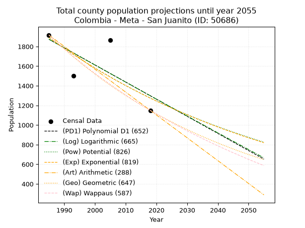
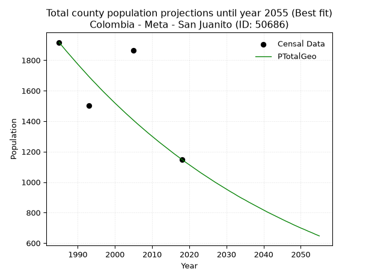
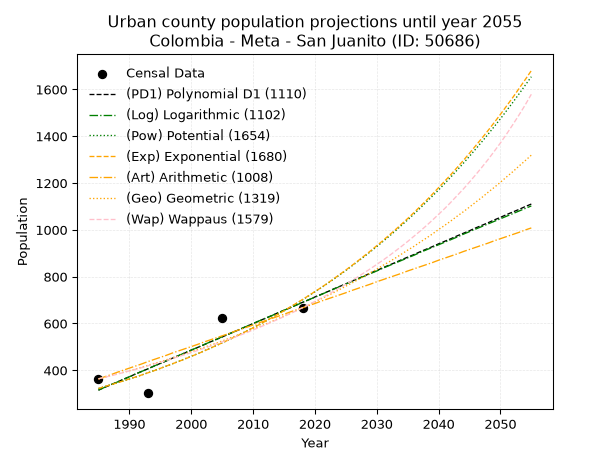
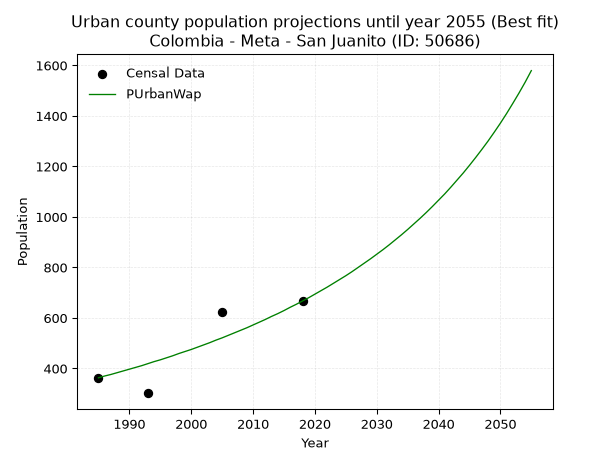
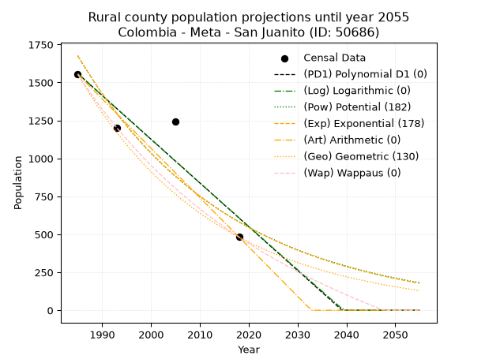
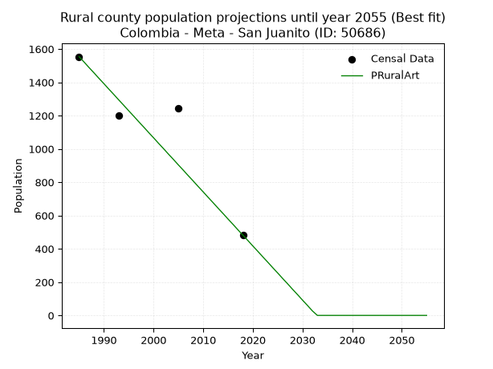

<div align="center">


</div>

# 📜 _“Population and Public Services Demand Projections (PPSD) until Year 2050 for Colombia - Meta - San Juanito (ID: 50686)”_
Keywords: `population` `public-service` `projection` `lineal` `polynomial` `logarithmic` `potential` `exponential` `arithmetic` `geometric` `wappaus` `dane` `colombia` `south-america`

PPSD are analytical estimates used by governments and planners to anticipate future changes in population size, age distribution, and the resulting community needs for utilities, healthcare, education, and infrastructure as sizing future water treatment facilities, electrical grids, and road networks based on spatial growth.

<div align="center">

</img>

</div>


> **General running parameters**: • app_version: _v20260806_. • Python version: _3.14.7_. • Pandas version: _3.0.5_. • NumPy version: _2.5.1_. • Creates, save and include plots into reports (create_plot): _False_. • Projection until year: _2050_. • Process polynomial degree 2 and up: _False_. • Process Wappaus: _True_. • Process Wappaus: _True_. • Set negative values to zero: _True_. • Set infinite values to zero: _True_. • Drop dataset notes: _True_. 
<div align="center">

Dynamic map: [:earth_americas:Google](http://maps.google.com/maps?q=4.458180668,-73.6766988) [:earth_americas:OSM](https://www.openstreetmap.org/#map=18/4.458180668/-73.6766988&layers=P) [:earth_americas:Bing](https://www.bing.com/maps?cp=4.458180668~-73.6766988&lvl=18) [:earth_americas:Apple](https://maps.apple.com/frame?center=4.458180668%2C-73.6766988&span=0.003%2C0.006)

</div>


<div align="center">

```geojson
{
  "type": "Feature",
  "geometry": {
    "type": "Point", 
    "coordinates": [-73.6766988, 4.458180668]
  }, 
  "properties": {
    "Name": "Colombia - Meta - San Juanito (ID: 50686)"
  }
}
```

</div>


## 0. Census Data (4 records)

Census data are official statistics collected by a government about the people and housing in a country. They usually include counts of total population, age, sex, race, income, education, and jobs.

📅Global census file: [Population.xlsx](../data/Population.xlsx)

| Source   |   Year |   CountryID | CountryName   |   StateID | StateName   |   CountyID | CountyName   |   PTotal |   PUrban |   PRural |
|:---------|-------:|------------:|:--------------|----------:|:------------|-----------:|:-------------|---------:|---------:|---------:|
| DANE     |   1985 |          57 | Colombia      |        50 | Meta        |      50686 | San Juanito  |     1917 |      363 |     1554 |
| DANE     |   1993 |          57 | Colombia      |        50 | Meta        |      50686 | San Juanito  |     1501 |      302 |     1199 |
| DANE     |   2005 |          57 | Colombia      |        50 | Meta        |      50686 | San Juanito  |     1864 |      622 |     1242 |
| DANE     |   2018 |          57 | Colombia      |        50 | Meta        |      50686 | San Juanito  |     1149 |      667 |      482 |

> 🔥Some records could had specific notes about the registered values or the corresponding urban or rural distribution.

📅[SUI-RUPS](https://www.datos.gov.co/Hacienda-y-Cr-dito-P-blico/Registro-nico-de-Prestadores-de-Servicios-P-blicos/4qkq-csdn/about_data) - Local public utility companies: [RUPS.csv](../data/RUPS.csv)

 | SERVICIO       | ESTADO    | NOMBRE                     | NIT         | DEPARTAMENTO_DOMICILIO   | MUNICIPIO_DOMICILIO   | DIRECCION                       |   TELEFONO | EMAIL                      | TIPO_PRESTADOR                 | CLASIFICACION                 |
|:---------------|:----------|:---------------------------|:------------|:-------------------------|:----------------------|:--------------------------------|-----------:|:---------------------------|:-------------------------------|:------------------------------|
| ACUEDUCTO      | OPERATIVA | MUNICIPIO SAN JUANITO META | 892099246-7 | META                     | SAN JUANITO           | CARRERA 3 No. 6 - 54 BRR CENTRO |    3103329 | germancastro9112@gmail.com | MUNICIPIO (PRESTACIÓN DIRECTA) | MENOR O IGUAL A 2500 USUARIOS |
| ALCANTARILLADO | OPERATIVA | MUNICIPIO SAN JUANITO META | 892099246-7 | META                     | SAN JUANITO           | CARRERA 3 No. 6 - 54 BRR CENTRO |    3103329 | germancastro9112@gmail.com | MUNICIPIO (PRESTACIÓN DIRECTA) | MENOR O IGUAL A 2500 USUARIOS |

## 1. Total

### 1.1. Coefficients and Parameters

* (PD1) Polynomial Deg 1: -17.451224407867894, 36514.561621837755 (lineal)
* (Log) Logarithmic: -34897.578757737305, 266864.52578920673
* (Pow) Potential: -23.905260166567896, 82.11051890243749
* (Exp) Exponential: -0.011955504940275846, 38296570641893.67
* (Art) Arithmetic: Year diff. 2018 - 1985 = 33, Population diff. 1149 - 1917 = -768, Annual growth = -23.272727272727273
* (Geo) Geometric: Year diff. 2018 - 1985 = 33, Population diff. 1149 - 1917 = -768, Annual growth % = -0.01539151690291829
* (Wap) Wappaus: i = -1.5181165866097373, Condition values only valid for < 200)

<sub>
Wappaus condition values: ['-0.00', '-1.52', '-3.04', '-4.55', '-6.07', '-7.59', '-9.11', '-10.63', '-12.14', '-13.66', '-15.18', '-16.70', '-18.22', '-19.74', '-21.25', '-22.77', '-24.29', '-25.81', '-27.33', '-28.84', '-30.36', '-31.88', '-33.40', '-34.92', '-36.43', '-37.95', '-39.47', '-40.99', '-42.51', '-44.03', '-45.54', '-47.06', '-48.58', '-50.10', '-51.62', '-53.13', '-54.65', '-56.17', '-57.69', '-59.21', '-60.72', '-62.24', '-63.76', '-65.28', '-66.80', '-68.32', '-69.83', '-71.35', '-72.87', '-74.39', '-75.91', '-77.42', '-78.94', '-80.46', '-81.98', '-83.50', '-85.01', '-86.53', '-88.05', '-89.57', '-91.09', '-92.61', '-94.12', '-95.64', '-97.16', '-98.68']
</sub>


### 1.2. Projected Dataset

|   Year |   CountyID |   PTotalPD1 |   PTotalLog |   PTotalPow |   PTotalExp |   PTotalArt |   PTotalGeo |   PTotalWap |
|-------:|-----------:|------------:|------------:|------------:|------------:|------------:|------------:|------------:|
|   1985 |      50686 |        1874 |        1874 |        1891 |        1891 |        1917 |        1917 |        1917 |
|   1986 |      50686 |        1856 |        1857 |        1868 |        1868 |        1894 |        1887 |        1888 |
|   1987 |      50686 |        1839 |        1839 |        1846 |        1846 |        1870 |        1858 |        1860 |
|   1988 |      50686 |        1822 |        1821 |        1824 |        1824 |        1847 |        1830 |        1832 |
|   1989 |      50686 |        1804 |        1804 |        1802 |        1802 |        1824 |        1802 |        1804 |
|   1990 |      50686 |        1787 |        1786 |        1781 |        1781 |        1801 |        1774 |        1777 |
|   1991 |      50686 |        1769 |        1769 |        1759 |        1760 |        1777 |        1747 |        1750 |
|   1992 |      50686 |        1752 |        1751 |        1738 |        1739 |        1754 |        1720 |        1724 |
|   1993 |      50686 |        1734 |        1734 |        1718 |        1718 |        1731 |        1693 |        1698 |
|   1994 |      50686 |        1717 |        1716 |        1697 |        1698 |        1708 |        1667 |        1672 |
|   1995 |      50686 |        1699 |        1699 |        1677 |        1678 |        1684 |        1642 |        1647 |
|   1996 |      50686 |        1682 |        1681 |        1657 |        1658 |        1661 |        1616 |        1622 |
|   1997 |      50686 |        1664 |        1664 |        1637 |        1638 |        1638 |        1591 |        1597 |
|   1998 |      50686 |        1647 |        1646 |        1618 |        1619 |        1614 |        1567 |        1573 |
|   1999 |      50686 |        1630 |        1629 |        1599 |        1599 |        1591 |        1543 |        1549 |
|   2000 |      50686 |        1612 |        1611 |        1580 |        1580 |        1568 |        1519 |        1525 |
|   2001 |      50686 |        1595 |        1594 |        1561 |        1562 |        1545 |        1496 |        1502 |
|   2002 |      50686 |        1577 |        1577 |        1542 |        1543 |        1521 |        1473 |        1479 |
|   2003 |      50686 |        1560 |        1559 |        1524 |        1525 |        1498 |        1450 |        1456 |
|   2004 |      50686 |        1542 |        1542 |        1506 |        1507 |        1475 |        1428 |        1434 |
|   2005 |      50686 |        1525 |        1524 |        1488 |        1489 |        1452 |        1406 |        1412 |
|   2006 |      50686 |        1507 |        1507 |        1470 |        1471 |        1428 |        1384 |        1390 |
|   2007 |      50686 |        1490 |        1490 |        1453 |        1453 |        1405 |        1363 |        1368 |
|   2008 |      50686 |        1473 |        1472 |        1436 |        1436 |        1382 |        1342 |        1347 |
|   2009 |      50686 |        1455 |        1455 |        1419 |        1419 |        1358 |        1321 |        1326 |
|   2010 |      50686 |        1438 |        1437 |        1402 |        1402 |        1335 |        1301 |        1305 |
|   2011 |      50686 |        1420 |        1420 |        1385 |        1386 |        1312 |        1281 |        1285 |
|   2012 |      50686 |        1403 |        1403 |        1369 |        1369 |        1289 |        1261 |        1265 |
|   2013 |      50686 |        1385 |        1385 |        1353 |        1353 |        1265 |        1242 |        1245 |
|   2014 |      50686 |        1368 |        1368 |        1337 |        1337 |        1242 |        1223 |        1225 |
|   2015 |      50686 |        1350 |        1351 |        1321 |        1321 |        1219 |        1204 |        1206 |
|   2016 |      50686 |        1333 |        1333 |        1306 |        1305 |        1196 |        1185 |        1187 |
|   2017 |      50686 |        1315 |        1316 |        1290 |        1290 |        1172 |        1167 |        1168 |
|   2018 |      50686 |        1298 |        1299 |        1275 |        1274 |        1149 |        1149 |        1149 |
|   2019 |      50686 |        1281 |        1281 |        1260 |        1259 |        1126 |        1131 |        1131 |
|   2020 |      50686 |        1263 |        1264 |        1245 |        1244 |        1102 |        1114 |        1112 |
|   2021 |      50686 |        1246 |        1247 |        1231 |        1229 |        1079 |        1097 |        1094 |
|   2022 |      50686 |        1228 |        1230 |        1216 |        1215 |        1056 |        1080 |        1076 |
|   2023 |      50686 |        1211 |        1212 |        1202 |        1200 |        1033 |        1063 |        1059 |
|   2024 |      50686 |        1193 |        1195 |        1188 |        1186 |        1009 |        1047 |        1041 |
|   2025 |      50686 |        1176 |        1178 |        1174 |        1172 |         986 |        1031 |        1024 |
|   2026 |      50686 |        1158 |        1161 |        1160 |        1158 |         963 |        1015 |        1007 |
|   2027 |      50686 |        1141 |        1143 |        1146 |        1144 |         940 |         999 |         990 |
|   2028 |      50686 |        1123 |        1126 |        1133 |        1131 |         916 |         984 |         974 |
|   2029 |      50686 |        1106 |        1109 |        1120 |        1117 |         893 |         969 |         957 |
|   2030 |      50686 |        1089 |        1092 |        1107 |        1104 |         870 |         954 |         941 |
|   2031 |      50686 |        1071 |        1075 |        1094 |        1091 |         846 |         939 |         925 |
|   2032 |      50686 |        1054 |        1057 |        1081 |        1078 |         823 |         925 |         909 |
|   2033 |      50686 |        1036 |        1040 |        1068 |        1065 |         800 |         910 |         893 |
|   2034 |      50686 |        1019 |        1023 |        1056 |        1052 |         777 |         896 |         878 |
|   2035 |      50686 |        1001 |        1006 |        1043 |        1040 |         753 |         883 |         862 |
|   2036 |      50686 |         984 |         989 |        1031 |        1028 |         730 |         869 |         847 |
|   2037 |      50686 |         966 |         972 |        1019 |        1015 |         707 |         856 |         832 |
|   2038 |      50686 |         949 |         955 |        1007 |        1003 |         684 |         843 |         817 |
|   2039 |      50686 |         932 |         937 |         995 |         991 |         660 |         830 |         802 |
|   2040 |      50686 |         914 |         920 |         984 |         980 |         637 |         817 |         788 |
|   2041 |      50686 |         897 |         903 |         972 |         968 |         614 |         804 |         773 |
|   2042 |      50686 |         879 |         886 |         961 |         956 |         590 |         792 |         759 |
|   2043 |      50686 |         862 |         869 |         950 |         945 |         567 |         780 |         745 |
|   2044 |      50686 |         844 |         852 |         939 |         934 |         544 |         768 |         731 |
|   2045 |      50686 |         827 |         835 |         928 |         923 |         521 |         756 |         717 |
|   2046 |      50686 |         809 |         818 |         917 |         912 |         497 |         744 |         704 |
|   2047 |      50686 |         792 |         801 |         907 |         901 |         474 |         733 |         690 |
|   2048 |      50686 |         774 |         784 |         896 |         890 |         451 |         721 |         677 |
|   2049 |      50686 |         757 |         767 |         886 |         880 |         428 |         710 |         663 |
|   2050 |      50686 |         740 |         750 |         875 |         869 |         404 |         699 |         650 |
<div align="center">

</img>

</div>


### 1.3. Best fit with absolute and relative error (%)

Relative error puts that difference into context by dividing the absolute error by the true value, creating a unitless ratio or percentage that shows the scale of the mistake.

Absolute and relative error

|   Year | Source   |   CountryID | CountryName   |   StateID | StateName   |   CountyID_x | CountyName   |   PTotal |   PUrban |   PRural |   CountyID_y |   PTotalPD1 |   PTotalLog |   PTotalPow |   PTotalExp |   PTotalArt |   PTotalGeo |   PTotalWap |   PTotalPD1AbsError |   PTotalLogAbsError |   PTotalPowAbsError |   PTotalExpAbsError |   PTotalArtAbsError |   PTotalGeoAbsError |   PTotalWapAbsError |   PTotalPD1RelError |   PTotalLogRelError |   PTotalPowRelError |   PTotalExpRelError |   PTotalArtRelError |   PTotalGeoRelError |   PTotalWapRelError |
|-------:|:---------|------------:|:--------------|----------:|:------------|-------------:|:-------------|---------:|---------:|---------:|-------------:|------------:|------------:|------------:|------------:|------------:|------------:|------------:|--------------------:|--------------------:|--------------------:|--------------------:|--------------------:|--------------------:|--------------------:|--------------------:|--------------------:|--------------------:|--------------------:|--------------------:|--------------------:|--------------------:|
|   1985 | DANE     |          57 | Colombia      |        50 | Meta        |        50686 | San Juanito  |     1917 |      363 |     1554 |        50686 |        1874 |        1874 |        1891 |        1891 |        1917 |        1917 |        1917 |                  43 |                  43 |                  26 |                  26 |                   0 |                   0 |                   0 |             2.24309 |             2.24309 |             1.35629 |             1.35629 |              0      |              0      |              0      |
|   1993 | DANE     |          57 | Colombia      |        50 | Meta        |        50686 | San Juanito  |     1501 |      302 |     1199 |        50686 |        1734 |        1734 |        1718 |        1718 |        1731 |        1693 |        1698 |                 233 |                 233 |                 217 |                 217 |                 230 |                 192 |                 197 |            15.523   |            15.523   |            14.457   |            14.457   |             15.3231 |             12.7915 |             13.1246 |
|   2005 | DANE     |          57 | Colombia      |        50 | Meta        |        50686 | San Juanito  |     1864 |      622 |     1242 |        50686 |        1525 |        1524 |        1488 |        1489 |        1452 |        1406 |        1412 |                 339 |                 340 |                 376 |                 375 |                 412 |                 458 |                 452 |            18.1867  |            18.2403  |            20.1717  |            20.118   |             22.103  |             24.5708 |             24.2489 |
|   2018 | DANE     |          57 | Colombia      |        50 | Meta        |        50686 | San Juanito  |     1149 |      667 |      482 |        50686 |        1298 |        1299 |        1275 |        1274 |        1149 |        1149 |        1149 |                 149 |                 150 |                 126 |                 125 |                   0 |                   0 |                   0 |            12.9678  |            13.0548  |            10.9661  |            10.879   |              0      |              0      |              0      |

Relative error mean

| Method    |   RelError | Best   |
|:----------|-----------:|:-------|
| PTotalPD1 |   12.2301  |        |
| PTotalLog |   12.2653  |        |
| PTotalPow |   11.7378  |        |
| PTotalExp |   11.7026  |        |
| PTotalArt |    9.35653 |        |
| PTotalGeo |    9.34057 | True   |
| PTotalWap |    9.34338 |        |

💙Best method: _**PTotalGeo**_
<div align="center">

</img>

</div>


### 1.4. Fresh water supply demand in liters per capita per day (lpcd)

The fresh water supply demand typically ranges from 100 to 300 liters per capita per day (lpcd) for standard domestic and municipal planning, though absolute survival minimums set by the World Health Organization are as low as 7.5 to 20 liters per day, and total consumption in high-income nations can exceed 400 liters.

> `CZ`: Level in meters above the sea level (masl)<br> `WS`: Fresh water supply demand in liters per capita per day (lpcd or l/h/d)<br> `WSAll`: Zonal fresh water supply demand in liters per second (l/s)<br> `A`: Zonal area in square meters<br> `DP`: Population density (people/hectare or p/ha)

Reference values (RAS Colombia)

|    CZ |   WS |
|------:|-----:|
|  1000 |  120 |
|  2000 |  130 |
| 99999 |  140 |

County shapefile geometry properties and water supply values

|   CountyID |      ATotal |   CZTotal |   WSTotal |
|-----------:|------------:|----------:|----------:|
|      50686 | 2.44524e+08 |   2610.49 |       140 |

Projected values for best method: PTotalGeo

|   CountyID |   Year |   PTotalGeo |   DPTotal |   WSTotal |   WSTotalAll |
|-----------:|-------:|------------:|----------:|----------:|-------------:|
|      50686 |   1985 |        1917 |      0.08 |       140 |      3.10625 |
|      50686 |   1986 |        1887 |      0.08 |       140 |      3.05764 |
|      50686 |   1987 |        1858 |      0.08 |       140 |      3.01065 |
|      50686 |   1988 |        1830 |      0.07 |       140 |      2.96528 |
|      50686 |   1989 |        1802 |      0.07 |       140 |      2.91991 |
|      50686 |   1990 |        1774 |      0.07 |       140 |      2.87454 |
|      50686 |   1991 |        1747 |      0.07 |       140 |      2.83079 |
|      50686 |   1992 |        1720 |      0.07 |       140 |      2.78704 |
|      50686 |   1993 |        1693 |      0.07 |       140 |      2.74329 |
|      50686 |   1994 |        1667 |      0.07 |       140 |      2.70116 |
|      50686 |   1995 |        1642 |      0.07 |       140 |      2.66065 |
|      50686 |   1996 |        1616 |      0.07 |       140 |      2.61852 |
|      50686 |   1997 |        1591 |      0.07 |       140 |      2.57801 |
|      50686 |   1998 |        1567 |      0.06 |       140 |      2.53912 |
|      50686 |   1999 |        1543 |      0.06 |       140 |      2.50023 |
|      50686 |   2000 |        1519 |      0.06 |       140 |      2.46134 |
|      50686 |   2001 |        1496 |      0.06 |       140 |      2.42407 |
|      50686 |   2002 |        1473 |      0.06 |       140 |      2.38681 |
|      50686 |   2003 |        1450 |      0.06 |       140 |      2.34954 |
|      50686 |   2004 |        1428 |      0.06 |       140 |      2.31389 |
|      50686 |   2005 |        1406 |      0.06 |       140 |      2.27824 |
|      50686 |   2006 |        1384 |      0.06 |       140 |      2.24259 |
|      50686 |   2007 |        1363 |      0.06 |       140 |      2.20856 |
|      50686 |   2008 |        1342 |      0.05 |       140 |      2.17454 |
|      50686 |   2009 |        1321 |      0.05 |       140 |      2.14051 |
|      50686 |   2010 |        1301 |      0.05 |       140 |      2.1081  |
|      50686 |   2011 |        1281 |      0.05 |       140 |      2.07569 |
|      50686 |   2012 |        1261 |      0.05 |       140 |      2.04329 |
|      50686 |   2013 |        1242 |      0.05 |       140 |      2.0125  |
|      50686 |   2014 |        1223 |      0.05 |       140 |      1.98171 |
|      50686 |   2015 |        1204 |      0.05 |       140 |      1.95093 |
|      50686 |   2016 |        1185 |      0.05 |       140 |      1.92014 |
|      50686 |   2017 |        1167 |      0.05 |       140 |      1.89097 |
|      50686 |   2018 |        1149 |      0.05 |       140 |      1.86181 |
|      50686 |   2019 |        1131 |      0.05 |       140 |      1.83264 |
|      50686 |   2020 |        1114 |      0.05 |       140 |      1.80509 |
|      50686 |   2021 |        1097 |      0.04 |       140 |      1.77755 |
|      50686 |   2022 |        1080 |      0.04 |       140 |      1.75    |
|      50686 |   2023 |        1063 |      0.04 |       140 |      1.72245 |
|      50686 |   2024 |        1047 |      0.04 |       140 |      1.69653 |
|      50686 |   2025 |        1031 |      0.04 |       140 |      1.6706  |
|      50686 |   2026 |        1015 |      0.04 |       140 |      1.64468 |
|      50686 |   2027 |         999 |      0.04 |       140 |      1.61875 |
|      50686 |   2028 |         984 |      0.04 |       140 |      1.59444 |
|      50686 |   2029 |         969 |      0.04 |       140 |      1.57014 |
|      50686 |   2030 |         954 |      0.04 |       140 |      1.54583 |
|      50686 |   2031 |         939 |      0.04 |       140 |      1.52153 |
|      50686 |   2032 |         925 |      0.04 |       140 |      1.49884 |
|      50686 |   2033 |         910 |      0.04 |       140 |      1.47454 |
|      50686 |   2034 |         896 |      0.04 |       140 |      1.45185 |
|      50686 |   2035 |         883 |      0.04 |       140 |      1.43079 |
|      50686 |   2036 |         869 |      0.04 |       140 |      1.4081  |
|      50686 |   2037 |         856 |      0.04 |       140 |      1.38704 |
|      50686 |   2038 |         843 |      0.03 |       140 |      1.36597 |
|      50686 |   2039 |         830 |      0.03 |       140 |      1.34491 |
|      50686 |   2040 |         817 |      0.03 |       140 |      1.32384 |
|      50686 |   2041 |         804 |      0.03 |       140 |      1.30278 |
|      50686 |   2042 |         792 |      0.03 |       140 |      1.28333 |
|      50686 |   2043 |         780 |      0.03 |       140 |      1.26389 |
|      50686 |   2044 |         768 |      0.03 |       140 |      1.24444 |
|      50686 |   2045 |         756 |      0.03 |       140 |      1.225   |
|      50686 |   2046 |         744 |      0.03 |       140 |      1.20556 |
|      50686 |   2047 |         733 |      0.03 |       140 |      1.18773 |
|      50686 |   2048 |         721 |      0.03 |       140 |      1.16829 |
|      50686 |   2049 |         710 |      0.03 |       140 |      1.15046 |
|      50686 |   2050 |         699 |      0.03 |       140 |      1.13264 |

## 2. Urban

### 2.1. Coefficients and Parameters

* (PD1) Polynomial Deg 1: 11.350461661983092, -22215.26093938168 (lineal)
* (Log) Logarithmic: 22719.133030477475, -172199.8122243655
* (Pow) Potential: 47.216360124146675, -153.2003280780127
* (Exp) Exponential: 0.023590123897240654, 1.4851656962714094e-18
* (Art) Arithmetic: Year diff. 2018 - 1985 = 33, Population diff. 667 - 363 = 304, Annual growth = 9.212121212121213
* (Geo) Geometric: Year diff. 2018 - 1985 = 33, Population diff. 667 - 363 = 304, Annual growth % = 0.01860696790204086
* (Wap) Wappaus: i = 1.788761400411886, Condition values only valid for < 200)

<sub>
Wappaus condition values: ['0.00', '1.79', '3.58', '5.37', '7.16', '8.94', '10.73', '12.52', '14.31', '16.10', '17.89', '19.68', '21.47', '23.25', '25.04', '26.83', '28.62', '30.41', '32.20', '33.99', '35.78', '37.56', '39.35', '41.14', '42.93', '44.72', '46.51', '48.30', '50.09', '51.87', '53.66', '55.45', '57.24', '59.03', '60.82', '62.61', '64.40', '66.18', '67.97', '69.76', '71.55', '73.34', '75.13', '76.92', '78.71', '80.49', '82.28', '84.07', '85.86', '87.65', '89.44', '91.23', '93.02', '94.80', '96.59', '98.38', '100.17', '101.96', '103.75', '105.54', '107.33', '109.11', '110.90', '112.69', '114.48', '116.27']
</sub>


### 2.2. Projected Dataset

|   Year |   CountyID |   PUrbanPD1 |   PUrbanLog |   PUrbanPow |   PUrbanExp |   PUrbanArt |   PUrbanGeo |   PUrbanWap |
|-------:|-----------:|------------:|------------:|------------:|------------:|------------:|------------:|------------:|
|   1985 |      50686 |         315 |         315 |         322 |         322 |         363 |         363 |         363 |
|   1986 |      50686 |         327 |         327 |         330 |         330 |         372 |         370 |         370 |
|   1987 |      50686 |         338 |         338 |         338 |         338 |         381 |         377 |         376 |
|   1988 |      50686 |         349 |         349 |         346 |         346 |         391 |         384 |         383 |
|   1989 |      50686 |         361 |         361 |         354 |         354 |         400 |         391 |         390 |
|   1990 |      50686 |         372 |         372 |         363 |         363 |         409 |         398 |         397 |
|   1991 |      50686 |         384 |         384 |         371 |         371 |         418 |         405 |         404 |
|   1992 |      50686 |         395 |         395 |         380 |         380 |         427 |         413 |         411 |
|   1993 |      50686 |         406 |         406 |         389 |         389 |         437 |         421 |         419 |
|   1994 |      50686 |         418 |         418 |         399 |         398 |         446 |         429 |         427 |
|   1995 |      50686 |         429 |         429 |         408 |         408 |         455 |         436 |         434 |
|   1996 |      50686 |         440 |         441 |         418 |         418 |         464 |         445 |         442 |
|   1997 |      50686 |         452 |         452 |         428 |         428 |         474 |         453 |         450 |
|   1998 |      50686 |         463 |         463 |         438 |         438 |         483 |         461 |         459 |
|   1999 |      50686 |         474 |         475 |         449 |         448 |         492 |         470 |         467 |
|   2000 |      50686 |         486 |         486 |         460 |         459 |         501 |         479 |         475 |
|   2001 |      50686 |         497 |         497 |         470 |         470 |         510 |         488 |         484 |
|   2002 |      50686 |         508 |         509 |         482 |         481 |         520 |         497 |         493 |
|   2003 |      50686 |         520 |         520 |         493 |         493 |         529 |         506 |         502 |
|   2004 |      50686 |         531 |         531 |         505 |         505 |         538 |         515 |         512 |
|   2005 |      50686 |         542 |         543 |         517 |         517 |         547 |         525 |         521 |
|   2006 |      50686 |         554 |         554 |         529 |         529 |         556 |         535 |         531 |
|   2007 |      50686 |         565 |         565 |         542 |         542 |         566 |         545 |         541 |
|   2008 |      50686 |         576 |         577 |         555 |         554 |         575 |         555 |         551 |
|   2009 |      50686 |         588 |         588 |         568 |         568 |         584 |         565 |         561 |
|   2010 |      50686 |         599 |         599 |         582 |         581 |         593 |         576 |         572 |
|   2011 |      50686 |         611 |         611 |         595 |         595 |         603 |         586 |         583 |
|   2012 |      50686 |         622 |         622 |         609 |         609 |         612 |         597 |         594 |
|   2013 |      50686 |         633 |         633 |         624 |         624 |         621 |         608 |         606 |
|   2014 |      50686 |         645 |         645 |         639 |         639 |         630 |         620 |         617 |
|   2015 |      50686 |         656 |         656 |         654 |         654 |         639 |         631 |         629 |
|   2016 |      50686 |         667 |         667 |         669 |         670 |         649 |         643 |         642 |
|   2017 |      50686 |         679 |         678 |         685 |         686 |         658 |         655 |         654 |
|   2018 |      50686 |         690 |         690 |         701 |         702 |         667 |         667 |         667 |
|   2019 |      50686 |         701 |         701 |         718 |         719 |         676 |         679 |         680 |
|   2020 |      50686 |         713 |         712 |         735 |         736 |         685 |         692 |         694 |
|   2021 |      50686 |         724 |         723 |         752 |         753 |         695 |         705 |         708 |
|   2022 |      50686 |         735 |         735 |         770 |         771 |         704 |         718 |         722 |
|   2023 |      50686 |         747 |         746 |         788 |         790 |         713 |         731 |         737 |
|   2024 |      50686 |         758 |         757 |         807 |         809 |         722 |         745 |         752 |
|   2025 |      50686 |         769 |         768 |         826 |         828 |         731 |         759 |         767 |
|   2026 |      50686 |         781 |         780 |         846 |         848 |         741 |         773 |         783 |
|   2027 |      50686 |         792 |         791 |         866 |         868 |         750 |         787 |         800 |
|   2028 |      50686 |         803 |         802 |         886 |         889 |         759 |         802 |         817 |
|   2029 |      50686 |         815 |         813 |         907 |         910 |         768 |         817 |         834 |
|   2030 |      50686 |         826 |         824 |         928 |         932 |         778 |         832 |         852 |
|   2031 |      50686 |         838 |         836 |         950 |         954 |         787 |         848 |         870 |
|   2032 |      50686 |         849 |         847 |         972 |         977 |         796 |         863 |         889 |
|   2033 |      50686 |         860 |         858 |         995 |        1000 |         805 |         879 |         909 |
|   2034 |      50686 |         872 |         869 |        1019 |        1024 |         814 |         896 |         929 |
|   2035 |      50686 |         883 |         880 |        1042 |        1048 |         824 |         913 |         950 |
|   2036 |      50686 |         894 |         891 |        1067 |        1073 |         833 |         929 |         972 |
|   2037 |      50686 |         906 |         903 |        1092 |        1099 |         842 |         947 |         994 |
|   2038 |      50686 |         917 |         914 |        1118 |        1125 |         851 |         964 |        1017 |
|   2039 |      50686 |         928 |         925 |        1144 |        1152 |         860 |         982 |        1041 |
|   2040 |      50686 |         940 |         936 |        1170 |        1180 |         870 |        1001 |        1066 |
|   2041 |      50686 |         951 |         947 |        1198 |        1208 |         879 |        1019 |        1091 |
|   2042 |      50686 |         962 |         958 |        1226 |        1236 |         888 |        1038 |        1118 |
|   2043 |      50686 |         974 |         969 |        1255 |        1266 |         897 |        1058 |        1146 |
|   2044 |      50686 |         985 |         981 |        1284 |        1296 |         907 |        1077 |        1174 |
|   2045 |      50686 |         996 |         992 |        1314 |        1327 |         916 |        1097 |        1204 |
|   2046 |      50686 |        1008 |        1003 |        1345 |        1359 |         925 |        1118 |        1235 |
|   2047 |      50686 |        1019 |        1014 |        1376 |        1391 |         934 |        1138 |        1267 |
|   2048 |      50686 |        1030 |        1025 |        1408 |        1424 |         943 |        1160 |        1300 |
|   2049 |      50686 |        1042 |        1036 |        1441 |        1458 |         953 |        1181 |        1335 |
|   2050 |      50686 |        1053 |        1047 |        1474 |        1493 |         962 |        1203 |        1371 |
<div align="center">

</img>

</div>


### 2.3. Best fit with absolute and relative error (%)

Relative error puts that difference into context by dividing the absolute error by the true value, creating a unitless ratio or percentage that shows the scale of the mistake.

Absolute and relative error

|   Year | Source   |   CountryID | CountryName   |   StateID | StateName   |   CountyID_x | CountyName   |   PTotal |   PUrban |   PRural |   CountyID_y |   PUrbanPD1 |   PUrbanLog |   PUrbanPow |   PUrbanExp |   PUrbanArt |   PUrbanGeo |   PUrbanWap |   PUrbanPD1AbsError |   PUrbanLogAbsError |   PUrbanPowAbsError |   PUrbanExpAbsError |   PUrbanArtAbsError |   PUrbanGeoAbsError |   PUrbanWapAbsError |   PUrbanPD1RelError |   PUrbanLogRelError |   PUrbanPowRelError |   PUrbanExpRelError |   PUrbanArtRelError |   PUrbanGeoRelError |   PUrbanWapRelError |
|-------:|:---------|------------:|:--------------|----------:|:------------|-------------:|:-------------|---------:|---------:|---------:|-------------:|------------:|------------:|------------:|------------:|------------:|------------:|------------:|--------------------:|--------------------:|--------------------:|--------------------:|--------------------:|--------------------:|--------------------:|--------------------:|--------------------:|--------------------:|--------------------:|--------------------:|--------------------:|--------------------:|
|   1985 | DANE     |          57 | Colombia      |        50 | Meta        |        50686 | San Juanito  |     1917 |      363 |     1554 |        50686 |         315 |         315 |         322 |         322 |         363 |         363 |         363 |                  48 |                  48 |                  41 |                  41 |                   0 |                   0 |                   0 |            13.2231  |            13.2231  |            11.2948  |            11.2948  |              0      |              0      |              0      |
|   1993 | DANE     |          57 | Colombia      |        50 | Meta        |        50686 | San Juanito  |     1501 |      302 |     1199 |        50686 |         406 |         406 |         389 |         389 |         437 |         421 |         419 |                 104 |                 104 |                  87 |                  87 |                 135 |                 119 |                 117 |            34.4371  |            34.4371  |            28.8079  |            28.8079  |             44.702  |             39.404  |             38.7417 |
|   2005 | DANE     |          57 | Colombia      |        50 | Meta        |        50686 | San Juanito  |     1864 |      622 |     1242 |        50686 |         542 |         543 |         517 |         517 |         547 |         525 |         521 |                  80 |                  79 |                 105 |                 105 |                  75 |                  97 |                 101 |            12.8617  |            12.701   |            16.881   |            16.881   |             12.0579 |             15.5949 |             16.2379 |
|   2018 | DANE     |          57 | Colombia      |        50 | Meta        |        50686 | San Juanito  |     1149 |      667 |      482 |        50686 |         690 |         690 |         701 |         702 |         667 |         667 |         667 |                  23 |                  23 |                  34 |                  35 |                   0 |                   0 |                   0 |             3.44828 |             3.44828 |             5.09745 |             5.24738 |              0      |              0      |              0      |

Relative error mean

| Method    |   RelError | Best   |
|:----------|-----------:|:-------|
| PUrbanPD1 |    15.9926 |        |
| PUrbanLog |    15.9524 |        |
| PUrbanPow |    15.5203 |        |
| PUrbanExp |    15.5578 |        |
| PUrbanArt |    14.19   |        |
| PUrbanGeo |    13.7497 |        |
| PUrbanWap |    13.7449 | True   |

💙Best method: _**PUrbanWap**_
<div align="center">

</img>

</div>


### 2.4. Fresh water supply demand in liters per capita per day (lpcd)

The fresh water supply demand typically ranges from 100 to 300 liters per capita per day (lpcd) for standard domestic and municipal planning, though absolute survival minimums set by the World Health Organization are as low as 7.5 to 20 liters per day, and total consumption in high-income nations can exceed 400 liters.

> `CZ`: Level in meters above the sea level (masl)<br> `WS`: Fresh water supply demand in liters per capita per day (lpcd or l/h/d)<br> `WSAll`: Zonal fresh water supply demand in liters per second (l/s)<br> `A`: Zonal area in square meters<br> `DP`: Population density (people/hectare or p/ha)

Reference values (RAS Colombia)

|    CZ |   WS |
|------:|-----:|
|  1000 |  120 |
|  2000 |  130 |
| 99999 |  140 |

County shapefile geometry properties and water supply values

|   CountyID |   AUrban |   CZUrban |   WSUrban |
|-----------:|---------:|----------:|----------:|
|      50686 |   232916 |   1956.12 |       130 |

Projected values for best method: PUrbanWap

|   CountyID |   Year |   PUrbanWap |   DPUrban |   WSUrban |   WSUrbanAll |
|-----------:|-------:|------------:|----------:|----------:|-------------:|
|      50686 |   1985 |         363 |     15.59 |       130 |     0.546181 |
|      50686 |   1986 |         370 |     15.89 |       130 |     0.556713 |
|      50686 |   1987 |         376 |     16.14 |       130 |     0.565741 |
|      50686 |   1988 |         383 |     16.44 |       130 |     0.576273 |
|      50686 |   1989 |         390 |     16.74 |       130 |     0.586806 |
|      50686 |   1990 |         397 |     17.04 |       130 |     0.597338 |
|      50686 |   1991 |         404 |     17.35 |       130 |     0.60787  |
|      50686 |   1992 |         411 |     17.65 |       130 |     0.618403 |
|      50686 |   1993 |         419 |     17.99 |       130 |     0.63044  |
|      50686 |   1994 |         427 |     18.33 |       130 |     0.642477 |
|      50686 |   1995 |         434 |     18.63 |       130 |     0.653009 |
|      50686 |   1996 |         442 |     18.98 |       130 |     0.665046 |
|      50686 |   1997 |         450 |     19.32 |       130 |     0.677083 |
|      50686 |   1998 |         459 |     19.71 |       130 |     0.690625 |
|      50686 |   1999 |         467 |     20.05 |       130 |     0.702662 |
|      50686 |   2000 |         475 |     20.39 |       130 |     0.714699 |
|      50686 |   2001 |         484 |     20.78 |       130 |     0.728241 |
|      50686 |   2002 |         493 |     21.17 |       130 |     0.741782 |
|      50686 |   2003 |         502 |     21.55 |       130 |     0.755324 |
|      50686 |   2004 |         512 |     21.98 |       130 |     0.77037  |
|      50686 |   2005 |         521 |     22.37 |       130 |     0.783912 |
|      50686 |   2006 |         531 |     22.8  |       130 |     0.798958 |
|      50686 |   2007 |         541 |     23.23 |       130 |     0.814005 |
|      50686 |   2008 |         551 |     23.66 |       130 |     0.829051 |
|      50686 |   2009 |         561 |     24.09 |       130 |     0.844097 |
|      50686 |   2010 |         572 |     24.56 |       130 |     0.860648 |
|      50686 |   2011 |         583 |     25.03 |       130 |     0.877199 |
|      50686 |   2012 |         594 |     25.5  |       130 |     0.89375  |
|      50686 |   2013 |         606 |     26.02 |       130 |     0.911806 |
|      50686 |   2014 |         617 |     26.49 |       130 |     0.928356 |
|      50686 |   2015 |         629 |     27.01 |       130 |     0.946412 |
|      50686 |   2016 |         642 |     27.56 |       130 |     0.965972 |
|      50686 |   2017 |         654 |     28.08 |       130 |     0.984028 |
|      50686 |   2018 |         667 |     28.64 |       130 |     1.00359  |
|      50686 |   2019 |         680 |     29.2  |       130 |     1.02315  |
|      50686 |   2020 |         694 |     29.8  |       130 |     1.04421  |
|      50686 |   2021 |         708 |     30.4  |       130 |     1.06528  |
|      50686 |   2022 |         722 |     31    |       130 |     1.08634  |
|      50686 |   2023 |         737 |     31.64 |       130 |     1.10891  |
|      50686 |   2024 |         752 |     32.29 |       130 |     1.13148  |
|      50686 |   2025 |         767 |     32.93 |       130 |     1.15405  |
|      50686 |   2026 |         783 |     33.62 |       130 |     1.17813  |
|      50686 |   2027 |         800 |     34.35 |       130 |     1.2037   |
|      50686 |   2028 |         817 |     35.08 |       130 |     1.22928  |
|      50686 |   2029 |         834 |     35.81 |       130 |     1.25486  |
|      50686 |   2030 |         852 |     36.58 |       130 |     1.28194  |
|      50686 |   2031 |         870 |     37.35 |       130 |     1.30903  |
|      50686 |   2032 |         889 |     38.17 |       130 |     1.33762  |
|      50686 |   2033 |         909 |     39.03 |       130 |     1.36771  |
|      50686 |   2034 |         929 |     39.89 |       130 |     1.3978   |
|      50686 |   2035 |         950 |     40.79 |       130 |     1.4294   |
|      50686 |   2036 |         972 |     41.73 |       130 |     1.4625   |
|      50686 |   2037 |         994 |     42.68 |       130 |     1.4956   |
|      50686 |   2038 |        1017 |     43.66 |       130 |     1.53021  |
|      50686 |   2039 |        1041 |     44.69 |       130 |     1.56632  |
|      50686 |   2040 |        1066 |     45.77 |       130 |     1.60394  |
|      50686 |   2041 |        1091 |     46.84 |       130 |     1.64155  |
|      50686 |   2042 |        1118 |     48    |       130 |     1.68218  |
|      50686 |   2043 |        1146 |     49.2  |       130 |     1.72431  |
|      50686 |   2044 |        1174 |     50.4  |       130 |     1.76644  |
|      50686 |   2045 |        1204 |     51.69 |       130 |     1.81157  |
|      50686 |   2046 |        1235 |     53.02 |       130 |     1.85822  |
|      50686 |   2047 |        1267 |     54.4  |       130 |     1.90637  |
|      50686 |   2048 |        1300 |     55.81 |       130 |     1.95602  |
|      50686 |   2049 |        1335 |     57.32 |       130 |     2.00868  |
|      50686 |   2050 |        1371 |     58.86 |       130 |     2.06285  |

## 3. Rural

### 3.1. Coefficients and Parameters

* (PD1) Polynomial Deg 1: -28.801686069850987, 58729.82256121943 (lineal)
* (Log) Logarithmic: -57616.711788214794, 439064.33801357227
* (Pow) Potential: -64.1063257245373, 214.63170256655727
* (Exp) Exponential: -0.032056512162750725, 7.232240874852318e+30
* (Art) Arithmetic: Year diff. 2018 - 1985 = 33, Population diff. 482 - 1554 = -1072, Annual growth = -32.484848484848484
* (Geo) Geometric: Year diff. 2018 - 1985 = 33, Population diff. 482 - 1554 = -1072, Annual growth % = -0.034852213691959566
* (Wap) Wappaus: i = -3.191046020122641, Condition values only valid for < 200)

<sub>
Wappaus condition values: ['-0.00', '-3.19', '-6.38', '-9.57', '-12.76', '-15.96', '-19.15', '-22.34', '-25.53', '-28.72', '-31.91', '-35.10', '-38.29', '-41.48', '-44.67', '-47.87', '-51.06', '-54.25', '-57.44', '-60.63', '-63.82', '-67.01', '-70.20', '-73.39', '-76.59', '-79.78', '-82.97', '-86.16', '-89.35', '-92.54', '-95.73', '-98.92', '-102.11', '-105.30', '-108.50', '-111.69', '-114.88', '-118.07', '-121.26', '-124.45', '-127.64', '-130.83', '-134.02', '-137.21', '-140.41', '-143.60', '-146.79', '-149.98', '-153.17', '-156.36', '-159.55', '-162.74', '-165.93', '-169.13', '-172.32', '-175.51', '-178.70', '-181.89', '-185.08', '-188.27', '-191.46', '-194.65', '-197.84', '-201.04', '-204.23', '-207.42']
</sub>


### 3.2. Projected Dataset

|   Year |   CountyID |   PRuralPD1 |   PRuralLog |   PRuralPow |   PRuralExp |   PRuralArt |   PRuralGeo |   PRuralWap |
|-------:|-----------:|------------:|------------:|------------:|------------:|------------:|------------:|------------:|
|   1985 |      50686 |        1558 |        1559 |        1676 |        1676 |        1554 |        1554 |        1554 |
|   1986 |      50686 |        1530 |        1530 |        1623 |        1623 |        1522 |        1500 |        1505 |
|   1987 |      50686 |        1501 |        1501 |        1572 |        1572 |        1489 |        1448 |        1458 |
|   1988 |      50686 |        1472 |        1472 |        1522 |        1522 |        1457 |        1397 |        1412 |
|   1989 |      50686 |        1443 |        1443 |        1473 |        1474 |        1424 |        1348 |        1368 |
|   1990 |      50686 |        1414 |        1414 |        1427 |        1427 |        1392 |        1301 |        1324 |
|   1991 |      50686 |        1386 |        1385 |        1382 |        1382 |        1359 |        1256 |        1282 |
|   1992 |      50686 |        1357 |        1356 |        1338 |        1339 |        1327 |        1212 |        1242 |
|   1993 |      50686 |        1328 |        1327 |        1295 |        1297 |        1294 |        1170 |        1202 |
|   1994 |      50686 |        1299 |        1298 |        1254 |        1256 |        1262 |        1129 |        1164 |
|   1995 |      50686 |        1270 |        1270 |        1215 |        1216 |        1229 |        1090 |        1126 |
|   1996 |      50686 |        1242 |        1241 |        1176 |        1178 |        1197 |        1052 |        1090 |
|   1997 |      50686 |        1213 |        1212 |        1139 |        1141 |        1164 |        1015 |        1055 |
|   1998 |      50686 |        1184 |        1183 |        1103 |        1105 |        1132 |         980 |        1020 |
|   1999 |      50686 |        1155 |        1154 |        1068 |        1070 |        1099 |         946 |         987 |
|   2000 |      50686 |        1126 |        1125 |        1035 |        1036 |        1067 |         913 |         954 |
|   2001 |      50686 |        1098 |        1097 |        1002 |        1003 |        1034 |         881 |         922 |
|   2002 |      50686 |        1069 |        1068 |         970 |         972 |        1002 |         850 |         891 |
|   2003 |      50686 |        1040 |        1039 |         940 |         941 |         969 |         821 |         861 |
|   2004 |      50686 |        1011 |        1010 |         910 |         911 |         937 |         792 |         831 |
|   2005 |      50686 |         982 |         981 |         882 |         883 |         904 |         764 |         802 |
|   2006 |      50686 |         954 |         953 |         854 |         855 |         872 |         738 |         774 |
|   2007 |      50686 |         925 |         924 |         827 |         828 |         839 |         712 |         746 |
|   2008 |      50686 |         896 |         895 |         801 |         802 |         807 |         687 |         720 |
|   2009 |      50686 |         867 |         867 |         776 |         776 |         774 |         663 |         693 |
|   2010 |      50686 |         838 |         838 |         752 |         752 |         742 |         640 |         668 |
|   2011 |      50686 |         810 |         809 |         728 |         728 |         709 |         618 |         643 |
|   2012 |      50686 |         781 |         781 |         705 |         705 |         677 |         596 |         618 |
|   2013 |      50686 |         752 |         752 |         683 |         683 |         644 |         576 |         594 |
|   2014 |      50686 |         723 |         723 |         662 |         661 |         612 |         555 |         571 |
|   2015 |      50686 |         694 |         695 |         641 |         640 |         579 |         536 |         548 |
|   2016 |      50686 |         666 |         666 |         621 |         620 |         547 |         517 |         525 |
|   2017 |      50686 |         637 |         638 |         601 |         601 |         514 |         499 |         504 |
|   2018 |      50686 |         608 |         609 |         583 |         582 |         482 |         482 |         482 |
|   2019 |      50686 |         579 |         581 |         564 |         563 |         450 |         465 |         461 |
|   2020 |      50686 |         550 |         552 |         547 |         546 |         417 |         449 |         440 |
|   2021 |      50686 |         522 |         524 |         530 |         528 |         385 |         433 |         420 |
|   2022 |      50686 |         493 |         495 |         513 |         512 |         352 |         418 |         400 |
|   2023 |      50686 |         464 |         467 |         497 |         496 |         320 |         404 |         381 |
|   2024 |      50686 |         435 |         438 |         482 |         480 |         287 |         390 |         362 |
|   2025 |      50686 |         406 |         410 |         467 |         465 |         255 |         376 |         343 |
|   2026 |      50686 |         378 |         381 |         452 |         450 |         222 |         363 |         325 |
|   2027 |      50686 |         349 |         353 |         438 |         436 |         190 |         350 |         307 |
|   2028 |      50686 |         320 |         324 |         424 |         422 |         157 |         338 |         289 |
|   2029 |      50686 |         291 |         296 |         411 |         409 |         125 |         326 |         272 |
|   2030 |      50686 |         262 |         267 |         398 |         396 |          92 |         315 |         255 |
|   2031 |      50686 |         234 |         239 |         386 |         383 |          60 |         304 |         238 |
|   2032 |      50686 |         205 |         211 |         374 |         371 |          27 |         293 |         222 |
|   2033 |      50686 |         176 |         182 |         362 |         360 |           0 |         283 |         206 |
|   2034 |      50686 |         147 |         154 |         351 |         348 |           0 |         273 |         190 |
|   2035 |      50686 |         118 |         126 |         340 |         337 |           0 |         264 |         175 |
|   2036 |      50686 |          90 |          97 |         330 |         327 |           0 |         255 |         160 |
|   2037 |      50686 |          61 |          69 |         319 |         316 |           0 |         246 |         145 |
|   2038 |      50686 |          32 |          41 |         310 |         306 |           0 |         237 |         130 |
|   2039 |      50686 |           3 |          13 |         300 |         297 |           0 |         229 |         116 |
|   2040 |      50686 |           0 |           0 |         291 |         287 |           0 |         221 |         101 |
|   2041 |      50686 |           0 |           0 |         282 |         278 |           0 |         213 |          87 |
|   2042 |      50686 |           0 |           0 |         273 |         270 |           0 |         206 |          74 |
|   2043 |      50686 |           0 |           0 |         265 |         261 |           0 |         199 |          60 |
|   2044 |      50686 |           0 |           0 |         256 |         253 |           0 |         192 |          47 |
|   2045 |      50686 |           0 |           0 |         248 |         245 |           0 |         185 |          34 |
|   2046 |      50686 |           0 |           0 |         241 |         237 |           0 |         179 |          21 |
|   2047 |      50686 |           0 |           0 |         233 |         230 |           0 |         172 |           8 |
|   2048 |      50686 |           0 |           0 |         226 |         222 |           0 |         166 |           0 |
|   2049 |      50686 |           0 |           0 |         219 |         215 |           0 |         160 |           0 |
|   2050 |      50686 |           0 |           0 |         212 |         209 |           0 |         155 |           0 |
<div align="center">

</img>

</div>


### 3.3. Best fit with absolute and relative error (%)

Relative error puts that difference into context by dividing the absolute error by the true value, creating a unitless ratio or percentage that shows the scale of the mistake.

Absolute and relative error

|   Year | Source   |   CountryID | CountryName   |   StateID | StateName   |   CountyID_x | CountyName   |   PTotal |   PUrban |   PRural |   CountyID_y |   PRuralPD1 |   PRuralLog |   PRuralPow |   PRuralExp |   PRuralArt |   PRuralGeo |   PRuralWap |   PRuralPD1AbsError |   PRuralLogAbsError |   PRuralPowAbsError |   PRuralExpAbsError |   PRuralArtAbsError |   PRuralGeoAbsError |   PRuralWapAbsError |   PRuralPD1RelError |   PRuralLogRelError |   PRuralPowRelError |   PRuralExpRelError |   PRuralArtRelError |   PRuralGeoRelError |   PRuralWapRelError |
|-------:|:---------|------------:|:--------------|----------:|:------------|-------------:|:-------------|---------:|---------:|---------:|-------------:|------------:|------------:|------------:|------------:|------------:|------------:|------------:|--------------------:|--------------------:|--------------------:|--------------------:|--------------------:|--------------------:|--------------------:|--------------------:|--------------------:|--------------------:|--------------------:|--------------------:|--------------------:|--------------------:|
|   1985 | DANE     |          57 | Colombia      |        50 | Meta        |        50686 | San Juanito  |     1917 |      363 |     1554 |        50686 |        1558 |        1559 |        1676 |        1676 |        1554 |        1554 |        1554 |                   4 |                   5 |                 122 |                 122 |                   0 |                   0 |                   0 |              0.2574 |             0.32175 |             7.85071 |             7.85071 |             0       |             0       |            0        |
|   1993 | DANE     |          57 | Colombia      |        50 | Meta        |        50686 | San Juanito  |     1501 |      302 |     1199 |        50686 |        1328 |        1327 |        1295 |        1297 |        1294 |        1170 |        1202 |                 129 |                 128 |                  96 |                  98 |                  95 |                  29 |                   3 |             10.759  |            10.6756  |             8.00667 |             8.17348 |             7.92327 |             2.41868 |            0.250209 |
|   2005 | DANE     |          57 | Colombia      |        50 | Meta        |        50686 | San Juanito  |     1864 |      622 |     1242 |        50686 |         982 |         981 |         882 |         883 |         904 |         764 |         802 |                 260 |                 261 |                 360 |                 359 |                 338 |                 478 |                 440 |             20.934  |            21.0145  |            28.9855  |            28.905   |            27.2142  |            38.4863  |           35.4267   |
|   2018 | DANE     |          57 | Colombia      |        50 | Meta        |        50686 | San Juanito  |     1149 |      667 |      482 |        50686 |         608 |         609 |         583 |         582 |         482 |         482 |         482 |                 126 |                 127 |                 101 |                 100 |                   0 |                   0 |                   0 |             26.1411 |            26.3485  |            20.9544  |            20.7469  |             0       |             0       |            0        |

Relative error mean

| Method    |   RelError | Best   |
|:----------|-----------:|:-------|
| PRuralPD1 |   14.5229  |        |
| PRuralLog |   14.5901  |        |
| PRuralPow |   16.4493  |        |
| PRuralExp |   16.419   |        |
| PRuralArt |    8.78436 | True   |
| PRuralGeo |   10.2262  |        |
| PRuralWap |    8.91923 |        |

💙Best method: _**PRuralArt**_
<div align="center">

</img>

</div>


### 3.4. Fresh water supply demand in liters per capita per day (lpcd)

The fresh water supply demand typically ranges from 100 to 300 liters per capita per day (lpcd) for standard domestic and municipal planning, though absolute survival minimums set by the World Health Organization are as low as 7.5 to 20 liters per day, and total consumption in high-income nations can exceed 400 liters.

> `CZ`: Level in meters above the sea level (masl)<br> `WS`: Fresh water supply demand in liters per capita per day (lpcd or l/h/d)<br> `WSAll`: Zonal fresh water supply demand in liters per second (l/s)<br> `A`: Zonal area in square meters<br> `DP`: Population density (people/hectare or p/ha)

Reference values (RAS Colombia)

|    CZ |   WS |
|------:|-----:|
|  1000 |  120 |
|  2000 |  130 |
| 99999 |  140 |

County shapefile geometry properties and water supply values

|   CountyID |      ARural |   CZRural |   WSRural |
|-----------:|------------:|----------:|----------:|
|      50686 | 2.44291e+08 |   2611.15 |       140 |

Projected values for best method: PRuralArt

|   CountyID |   Year |   PRuralArt |   DPRural |   WSRural |   WSRuralAll |
|-----------:|-------:|------------:|----------:|----------:|-------------:|
|      50686 |   1985 |        1554 |      0.06 |       140 |    2.51806   |
|      50686 |   1986 |        1522 |      0.06 |       140 |    2.4662    |
|      50686 |   1987 |        1489 |      0.06 |       140 |    2.41273   |
|      50686 |   1988 |        1457 |      0.06 |       140 |    2.36088   |
|      50686 |   1989 |        1424 |      0.06 |       140 |    2.30741   |
|      50686 |   1990 |        1392 |      0.06 |       140 |    2.25556   |
|      50686 |   1991 |        1359 |      0.06 |       140 |    2.20208   |
|      50686 |   1992 |        1327 |      0.05 |       140 |    2.15023   |
|      50686 |   1993 |        1294 |      0.05 |       140 |    2.09676   |
|      50686 |   1994 |        1262 |      0.05 |       140 |    2.04491   |
|      50686 |   1995 |        1229 |      0.05 |       140 |    1.99144   |
|      50686 |   1996 |        1197 |      0.05 |       140 |    1.93958   |
|      50686 |   1997 |        1164 |      0.05 |       140 |    1.88611   |
|      50686 |   1998 |        1132 |      0.05 |       140 |    1.83426   |
|      50686 |   1999 |        1099 |      0.04 |       140 |    1.78079   |
|      50686 |   2000 |        1067 |      0.04 |       140 |    1.72894   |
|      50686 |   2001 |        1034 |      0.04 |       140 |    1.67546   |
|      50686 |   2002 |        1002 |      0.04 |       140 |    1.62361   |
|      50686 |   2003 |         969 |      0.04 |       140 |    1.57014   |
|      50686 |   2004 |         937 |      0.04 |       140 |    1.51829   |
|      50686 |   2005 |         904 |      0.04 |       140 |    1.46481   |
|      50686 |   2006 |         872 |      0.04 |       140 |    1.41296   |
|      50686 |   2007 |         839 |      0.03 |       140 |    1.35949   |
|      50686 |   2008 |         807 |      0.03 |       140 |    1.30764   |
|      50686 |   2009 |         774 |      0.03 |       140 |    1.25417   |
|      50686 |   2010 |         742 |      0.03 |       140 |    1.20231   |
|      50686 |   2011 |         709 |      0.03 |       140 |    1.14884   |
|      50686 |   2012 |         677 |      0.03 |       140 |    1.09699   |
|      50686 |   2013 |         644 |      0.03 |       140 |    1.04352   |
|      50686 |   2014 |         612 |      0.03 |       140 |    0.991667  |
|      50686 |   2015 |         579 |      0.02 |       140 |    0.938194  |
|      50686 |   2016 |         547 |      0.02 |       140 |    0.886343  |
|      50686 |   2017 |         514 |      0.02 |       140 |    0.83287   |
|      50686 |   2018 |         482 |      0.02 |       140 |    0.781019  |
|      50686 |   2019 |         450 |      0.02 |       140 |    0.729167  |
|      50686 |   2020 |         417 |      0.02 |       140 |    0.675694  |
|      50686 |   2021 |         385 |      0.02 |       140 |    0.623843  |
|      50686 |   2022 |         352 |      0.01 |       140 |    0.57037   |
|      50686 |   2023 |         320 |      0.01 |       140 |    0.518519  |
|      50686 |   2024 |         287 |      0.01 |       140 |    0.465046  |
|      50686 |   2025 |         255 |      0.01 |       140 |    0.413194  |
|      50686 |   2026 |         222 |      0.01 |       140 |    0.359722  |
|      50686 |   2027 |         190 |      0.01 |       140 |    0.30787   |
|      50686 |   2028 |         157 |      0.01 |       140 |    0.254398  |
|      50686 |   2029 |         125 |      0.01 |       140 |    0.202546  |
|      50686 |   2030 |          92 |      0    |       140 |    0.149074  |
|      50686 |   2031 |          60 |      0    |       140 |    0.0972222 |
|      50686 |   2032 |          27 |      0    |       140 |    0.04375   |
|      50686 |   2033 |           0 |      0    |       140 |    0         |
|      50686 |   2034 |           0 |      0    |       140 |    0         |
|      50686 |   2035 |           0 |      0    |       140 |    0         |
|      50686 |   2036 |           0 |      0    |       140 |    0         |
|      50686 |   2037 |           0 |      0    |       140 |    0         |
|      50686 |   2038 |           0 |      0    |       140 |    0         |
|      50686 |   2039 |           0 |      0    |       140 |    0         |
|      50686 |   2040 |           0 |      0    |       140 |    0         |
|      50686 |   2041 |           0 |      0    |       140 |    0         |
|      50686 |   2042 |           0 |      0    |       140 |    0         |
|      50686 |   2043 |           0 |      0    |       140 |    0         |
|      50686 |   2044 |           0 |      0    |       140 |    0         |
|      50686 |   2045 |           0 |      0    |       140 |    0         |
|      50686 |   2046 |           0 |      0    |       140 |    0         |
|      50686 |   2047 |           0 |      0    |       140 |    0         |
|      50686 |   2048 |           0 |      0    |       140 |    0         |
|      50686 |   2049 |           0 |      0    |       140 |    0         |
|      50686 |   2050 |           0 |      0    |       140 |    0         |

#

<div align="center"><br><sub>Share this research</sub></div><br>

<sub>**APPS & TOOLS & CONTENT DISCLAIMER**: • NO WARRANTY - This content and software is provided by <a href="https://github.com/rcfdtools" target="_blank">github.com/rcfdtools</a> "as is", without any express or implied warranty, including warranties of merchantability, fitness for a particular purpose, or non-infringement. There is no guarantee that the software will be error-free or operate without interruption. • LIMITATION OF LIABILITY - Neither the authors nor copyright holders will be liable for claims or damages arising from the software or its use. You are responsible for determining if the software is appropriate for your use and assume all associated risks, including errors, legal compliance, and data loss. • NO PROFESSIONAL ADVICE - The software provides general information and does not offer professional advice. It should not replace consultation with professional advisors. [Clauses and global license for rcfdtools use.](https://github.com/rcfdtools/rcfdtools/blob/main/LICENSE.md)</sub>

| [:house: Home](Readme.md)  | [:beginner: Help / Collab](https://github.com/rcfdtools/R.HydroTools/discussions/31) |
|----------------------------|-------------------------------------------------------------------------------------------|