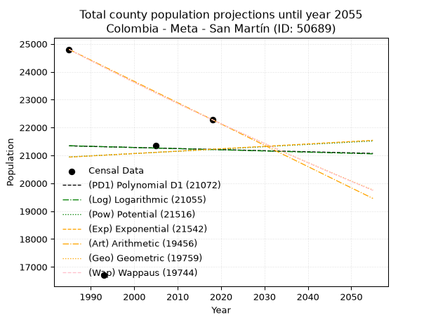
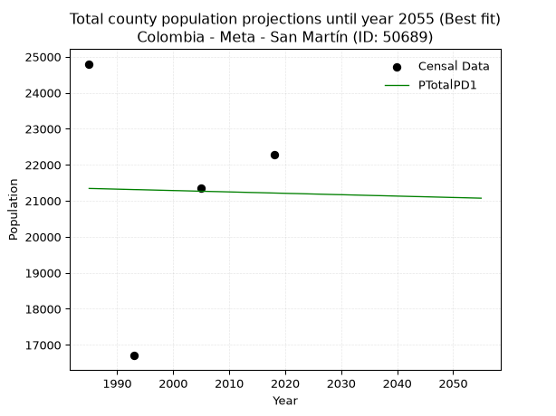
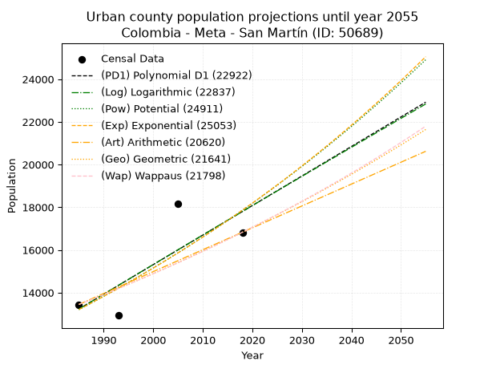
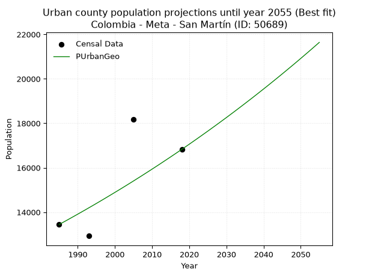
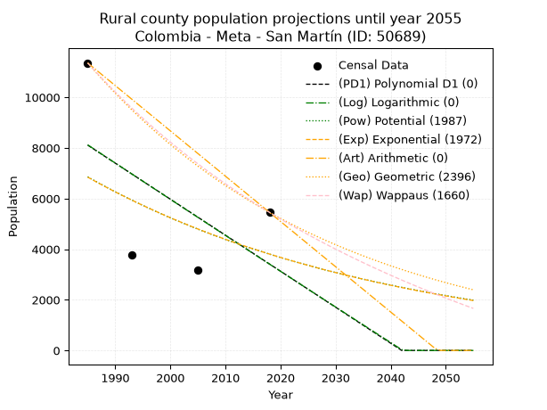
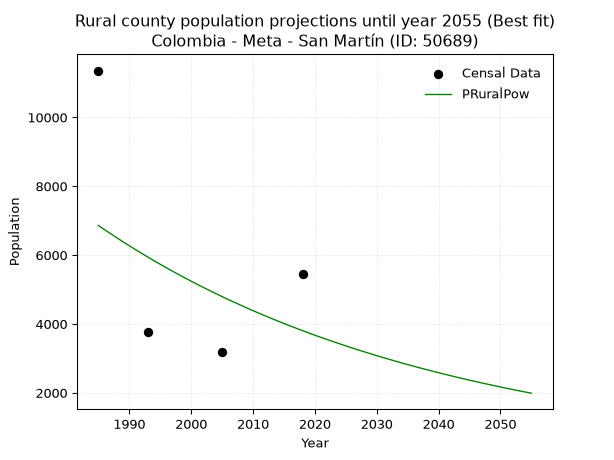

<div align="center">


</div>

# _“Population and Public Services Demand Projections (PPSD) until Year 2050 for Colombia - Meta - San Martín (ID: 50689)”_
Keywords: `population` `public-service` `projection` `lineal` `polynomial` `logarithmic` `potential` `exponential` `arithmetic` `geometric` `wappaus` `dane` `colombia` `south-america`

PPSD are analytical estimates used by governments and planners to anticipate future changes in population size, age distribution, and the resulting community needs for utilities, healthcare, education, and infrastructure as sizing future water treatment facilities, electrical grids, and road networks based on spatial growth.

> **General running parameters**: • app_version: _v20260806_. • Python version: _3.14.7_. • Pandas version: _3.0.5_. • NumPy version: _2.5.1_. • Creates, save and include plots into reports (create_plot): _False_. • Projection until year: _2050_. • Process polynomial degree 2 and up: _False_. • Process Wappaus: _True_. • Process Wappaus: _True_. • Set negative values to zero: _True_. • Set infinite values to zero: _True_. • Drop dataset notes: _True_. 
<div align="center">

Dynamic map: [:earth_americas:Google](http://maps.google.com/maps?q=3.701899418,-73.6958116) [:earth_americas:OSM](https://www.openstreetmap.org/#map=18/3.701899418/-73.6958116&layers=P) [:earth_americas:Bing](https://www.bing.com/maps?cp=3.701899418~-73.6958116&lvl=18) [:earth_americas:Apple](https://maps.apple.com/frame?center=3.701899418%2C-73.6958116&span=0.003%2C0.006)

</div>


<div align="center">

```geojson
{
  "type": "Feature",
  "geometry": {
    "type": "Point", 
    "coordinates": [-73.6958116, 3.701899418]
  }, 
  "properties": {
    "Name": "Colombia - Meta - San Martín (ID: 50689)"
  }
}
```

</div>


## 0. Census Data (4 records)

Census data are official statistics collected by a government about the people and housing in a country. They usually include counts of total population, age, sex, race, income, education, and jobs.

📅Global census file: [Population.xlsx](../data/Population.xlsx)

| Source   |   Year |   CountryID | CountryName   |   StateID | StateName   |   CountyID | CountyName   |   PTotal |   PUrban |   PRural |
|:---------|-------:|------------:|:--------------|----------:|:------------|-----------:|:-------------|---------:|---------:|---------:|
| DANE     |   1985 |          57 | Colombia      |        50 | Meta        |      50689 | San Martín   |    24801 |    13446 |    11355 |
| DANE     |   1993 |          57 | Colombia      |        50 | Meta        |      50689 | San Martín   |    16702 |    12932 |     3770 |
| DANE     |   2005 |          57 | Colombia      |        50 | Meta        |      50689 | San Martín   |    21350 |    18170 |     3180 |
| DANE     |   2018 |          57 | Colombia      |        50 | Meta        |      50689 | San Martín   |    22281 |    16828 |     5453 |

> 🔥Some records could had specific notes about the registered values or the corresponding urban or rural distribution.

📅   [RUPS](https://www.datos.gov.co/Hacienda-y-Cr-dito-P-blico/Registro-nico-de-Prestadores-de-Servicios-P-blicos/4qkq-csdn/about_data) - Local public utility companies: [RUPS.csv](../data/RUPS.xlsx)

 | SERVICIO       | ESTADO    | NOMBRE                                                                                     | NIT         | DEPARTAMENTO_DOMICILIO   | MUNICIPIO_DOMICILIO   | DIRECCION        |   TELEFONO | EMAIL                              | TIPO_INSCRIPCION    | REPRESENTANTE_LEGAL   | TIPO_PRESTADOR                             | CLASIFICACION                 |
|:---------------|:----------|:-------------------------------------------------------------------------------------------|:------------|:-------------------------|:----------------------|:-----------------|-----------:|:-----------------------------------|:--------------------|:----------------------|:-------------------------------------------|:------------------------------|
| ACUEDUCTO      | OPERATIVA | CAFUCHES EMPRESA DE SERVICIOS PÚBLICOS DOMICILIARIOS DE SAN MARTÍN DE LOS LLANOS S.A E.S.P | 900636529-9 | META                     | SAN MARTIN            | CALLE 6 No. 2-60 |    6488255 | gerencia@cafuches-sanmartin.gov.co | Registro por la ESP | GERMAN ENCISO LOPEZ   | SOCIEDADES (EMPRESA DE SERVICIOS PUBLICOS) | MAYOR O IGUAL A 5001 USUARIOS |
| ALCANTARILLADO | OPERATIVA | CAFUCHES EMPRESA DE SERVICIOS PÚBLICOS DOMICILIARIOS DE SAN MARTÍN DE LOS LLANOS S.A E.S.P | 900636529-9 | META                     | SAN MARTIN            | CALLE 6 No. 2-60 |    6488255 | gerencia@cafuches-sanmartin.gov.co | Registro por la ESP | GERMAN ENCISO LOPEZ   | SOCIEDADES (EMPRESA DE SERVICIOS PUBLICOS) | MAYOR O IGUAL A 5001 USUARIOS |

## 1. Total

### 1.1. Coefficients and Parameters

* (PD1) Polynomial Deg 1: -3.861099959856261, 29006.665194702487 (lineal)
* (Log) Logarithmic: -8453.1699845171, 85536.11279176747
* (Pow) Potential: 0.7777014579160846, 1.7563910661689361
* (Exp) Exponential: 0.0004058089062963781, 9356.584839698577
* (Art) Arithmetic: Year diff. 2018 - 1985 = 33, Population diff. 22281 - 24801 = -2520, Annual growth = -76.36363636363636
* (Geo) Geometric: Year diff. 2018 - 1985 = 33, Population diff. 22281 - 24801 = -2520, Annual growth % = -0.0032416942530716364
* (Wap) Wappaus: i = -0.3243856945908685, Condition values only valid for < 200)

<sub>
Wappaus condition values: ['-0.00', '-0.32', '-0.65', '-0.97', '-1.30', '-1.62', '-1.95', '-2.27', '-2.60', '-2.92', '-3.24', '-3.57', '-3.89', '-4.22', '-4.54', '-4.87', '-5.19', '-5.51', '-5.84', '-6.16', '-6.49', '-6.81', '-7.14', '-7.46', '-7.79', '-8.11', '-8.43', '-8.76', '-9.08', '-9.41', '-9.73', '-10.06', '-10.38', '-10.70', '-11.03', '-11.35', '-11.68', '-12.00', '-12.33', '-12.65', '-12.98', '-13.30', '-13.62', '-13.95', '-14.27', '-14.60', '-14.92', '-15.25', '-15.57', '-15.89', '-16.22', '-16.54', '-16.87', '-17.19', '-17.52', '-17.84', '-18.17', '-18.49', '-18.81', '-19.14', '-19.46', '-19.79', '-20.11', '-20.44', '-20.76', '-21.09']
</sub>


### 1.2. Projected Dataset

|   Year |   CountyID |   PTotalPD1 |   PTotalLog |   PTotalPow |   PTotalExp |   PTotalArt |   PTotalGeo |   PTotalWap |
|-------:|-----------:|------------:|------------:|------------:|------------:|------------:|------------:|------------:|
|   1985 |      50689 |       21342 |       21348 |       20944 |       20939 |       24801 |       24801 |       24801 |
|   1986 |      50689 |       21339 |       21344 |       20952 |       20947 |       24725 |       24721 |       24721 |
|   1987 |      50689 |       21335 |       21340 |       20961 |       20956 |       24648 |       24640 |       24641 |
|   1988 |      50689 |       21331 |       21335 |       20969 |       20964 |       24572 |       24561 |       24561 |
|   1989 |      50689 |       21327 |       21331 |       20977 |       20973 |       24496 |       24481 |       24481 |
|   1990 |      50689 |       21323 |       21327 |       20985 |       20981 |       24419 |       24402 |       24402 |
|   1991 |      50689 |       21319 |       21323 |       20993 |       20990 |       24343 |       24323 |       24323 |
|   1992 |      50689 |       21315 |       21318 |       21002 |       20999 |       24266 |       24244 |       24244 |
|   1993 |      50689 |       21311 |       21314 |       21010 |       21007 |       24190 |       24165 |       24166 |
|   1994 |      50689 |       21308 |       21310 |       21018 |       21016 |       24114 |       24087 |       24087 |
|   1995 |      50689 |       21304 |       21306 |       21026 |       21024 |       24037 |       24009 |       24009 |
|   1996 |      50689 |       21300 |       21301 |       21034 |       21033 |       23961 |       23931 |       23932 |
|   1997 |      50689 |       21296 |       21297 |       21043 |       21041 |       23885 |       23853 |       23854 |
|   1998 |      50689 |       21292 |       21293 |       21051 |       21050 |       23808 |       23776 |       23777 |
|   1999 |      50689 |       21288 |       21289 |       21059 |       21058 |       23732 |       23699 |       23700 |
|   2000 |      50689 |       21284 |       21284 |       21067 |       21067 |       23656 |       23622 |       23623 |
|   2001 |      50689 |       21281 |       21280 |       21075 |       21075 |       23579 |       23545 |       23546 |
|   2002 |      50689 |       21277 |       21276 |       21084 |       21084 |       23503 |       23469 |       23470 |
|   2003 |      50689 |       21273 |       21272 |       21092 |       21092 |       23426 |       23393 |       23394 |
|   2004 |      50689 |       21269 |       21268 |       21100 |       21101 |       23350 |       23317 |       23318 |
|   2005 |      50689 |       21265 |       21263 |       21108 |       21110 |       23274 |       23242 |       23243 |
|   2006 |      50689 |       21261 |       21259 |       21116 |       21118 |       23197 |       23166 |       23167 |
|   2007 |      50689 |       21257 |       21255 |       21125 |       21127 |       23121 |       23091 |       23092 |
|   2008 |      50689 |       21254 |       21251 |       21133 |       21135 |       23045 |       23016 |       23017 |
|   2009 |      50689 |       21250 |       21246 |       21141 |       21144 |       22968 |       22942 |       22943 |
|   2010 |      50689 |       21246 |       21242 |       21149 |       21152 |       22892 |       22867 |       22868 |
|   2011 |      50689 |       21242 |       21238 |       21157 |       21161 |       22816 |       22793 |       22794 |
|   2012 |      50689 |       21238 |       21234 |       21165 |       21170 |       22739 |       22719 |       22720 |
|   2013 |      50689 |       21234 |       21230 |       21174 |       21178 |       22663 |       22646 |       22646 |
|   2014 |      50689 |       21230 |       21225 |       21182 |       21187 |       22586 |       22572 |       22573 |
|   2015 |      50689 |       21227 |       21221 |       21190 |       21195 |       22510 |       22499 |       22499 |
|   2016 |      50689 |       21223 |       21217 |       21198 |       21204 |       22434 |       22426 |       22426 |
|   2017 |      50689 |       21219 |       21213 |       21206 |       21213 |       22357 |       22353 |       22354 |
|   2018 |      50689 |       21215 |       21209 |       21215 |       21221 |       22281 |       22281 |       22281 |
|   2019 |      50689 |       21211 |       21204 |       21223 |       21230 |       22205 |       22209 |       22209 |
|   2020 |      50689 |       21207 |       21200 |       21231 |       21238 |       22128 |       22137 |       22136 |
|   2021 |      50689 |       21203 |       21196 |       21239 |       21247 |       22052 |       22065 |       22065 |
|   2022 |      50689 |       21200 |       21192 |       21247 |       21256 |       21976 |       21993 |       21993 |
|   2023 |      50689 |       21196 |       21188 |       21255 |       21264 |       21899 |       21922 |       21921 |
|   2024 |      50689 |       21192 |       21184 |       21264 |       21273 |       21823 |       21851 |       21850 |
|   2025 |      50689 |       21188 |       21179 |       21272 |       21282 |       21746 |       21780 |       21779 |
|   2026 |      50689 |       21184 |       21175 |       21280 |       21290 |       21670 |       21710 |       21708 |
|   2027 |      50689 |       21180 |       21171 |       21288 |       21299 |       21594 |       21639 |       21638 |
|   2028 |      50689 |       21176 |       21167 |       21296 |       21308 |       21517 |       21569 |       21567 |
|   2029 |      50689 |       21172 |       21163 |       21304 |       21316 |       21441 |       21499 |       21497 |
|   2030 |      50689 |       21169 |       21159 |       21313 |       21325 |       21365 |       21430 |       21427 |
|   2031 |      50689 |       21165 |       21154 |       21321 |       21333 |       21288 |       21360 |       21357 |
|   2032 |      50689 |       21161 |       21150 |       21329 |       21342 |       21212 |       21291 |       21288 |
|   2033 |      50689 |       21157 |       21146 |       21337 |       21351 |       21136 |       21222 |       21218 |
|   2034 |      50689 |       21153 |       21142 |       21345 |       21359 |       21059 |       21153 |       21149 |
|   2035 |      50689 |       21149 |       21138 |       21353 |       21368 |       20983 |       21084 |       21080 |
|   2036 |      50689 |       21145 |       21134 |       21362 |       21377 |       20906 |       21016 |       21011 |
|   2037 |      50689 |       21142 |       21129 |       21370 |       21385 |       20830 |       20948 |       20943 |
|   2038 |      50689 |       21138 |       21125 |       21378 |       21394 |       20754 |       20880 |       20875 |
|   2039 |      50689 |       21134 |       21121 |       21386 |       21403 |       20677 |       20812 |       20807 |
|   2040 |      50689 |       21130 |       21117 |       21394 |       21412 |       20601 |       20745 |       20739 |
|   2041 |      50689 |       21126 |       21113 |       21402 |       21420 |       20525 |       20678 |       20671 |
|   2042 |      50689 |       21122 |       21109 |       21410 |       21429 |       20448 |       20611 |       20603 |
|   2043 |      50689 |       21118 |       21105 |       21419 |       21438 |       20372 |       20544 |       20536 |
|   2044 |      50689 |       21115 |       21100 |       21427 |       21446 |       20296 |       20477 |       20469 |
|   2045 |      50689 |       21111 |       21096 |       21435 |       21455 |       20219 |       20411 |       20402 |
|   2046 |      50689 |       21107 |       21092 |       21443 |       21464 |       20143 |       20345 |       20335 |
|   2047 |      50689 |       21103 |       21088 |       21451 |       21472 |       20066 |       20279 |       20269 |
|   2048 |      50689 |       21099 |       21084 |       21459 |       21481 |       19990 |       20213 |       20202 |
|   2049 |      50689 |       21095 |       21080 |       21468 |       21490 |       19914 |       20147 |       20136 |
|   2050 |      50689 |       21091 |       21076 |       21476 |       21499 |       19837 |       20082 |       20070 |
<div align="center">

</img>

</div>


### 1.3. Best fit with absolute and relative error (%)

Relative error puts that difference into context by dividing the absolute error by the true value, creating a unitless ratio or percentage that shows the scale of the mistake.

Absolute and relative error

|   Year | Source   |   CountryID | CountryName   |   StateID | StateName   |   CountyID_x | CountyName   |   PTotal |   PUrban |   PRural |   CountyID_y |   PTotalPD1 |   PTotalLog |   PTotalPow |   PTotalExp |   PTotalArt |   PTotalGeo |   PTotalWap |   PTotalPD1AbsError |   PTotalLogAbsError |   PTotalPowAbsError |   PTotalExpAbsError |   PTotalArtAbsError |   PTotalGeoAbsError |   PTotalWapAbsError |   PTotalPD1RelError |   PTotalLogRelError |   PTotalPowRelError |   PTotalExpRelError |   PTotalArtRelError |   PTotalGeoRelError |   PTotalWapRelError |
|-------:|:---------|------------:|:--------------|----------:|:------------|-------------:|:-------------|---------:|---------:|---------:|-------------:|------------:|------------:|------------:|------------:|------------:|------------:|------------:|--------------------:|--------------------:|--------------------:|--------------------:|--------------------:|--------------------:|--------------------:|--------------------:|--------------------:|--------------------:|--------------------:|--------------------:|--------------------:|--------------------:|
|   1985 | DANE     |          57 | Colombia      |        50 | Meta        |        50689 | San Martín   |    24801 |    13446 |    11355 |        50689 |       21342 |       21348 |       20944 |       20939 |       24801 |       24801 |       24801 |                3459 |                3453 |                3857 |                3862 |                   0 |                   0 |                   0 |           13.947    |           13.9228   |            15.5518  |            15.572   |             0       |             0       |             0       |
|   1993 | DANE     |          57 | Colombia      |        50 | Meta        |        50689 | San Martín   |    16702 |    12932 |     3770 |        50689 |       21311 |       21314 |       21010 |       21007 |       24190 |       24165 |       24166 |                4609 |                4612 |                4308 |                4305 |                7488 |                7463 |                7464 |           27.5955   |           27.6135   |            25.7933  |            25.7754  |            44.833   |            44.6833  |            44.6893  |
|   2005 | DANE     |          57 | Colombia      |        50 | Meta        |        50689 | San Martín   |    21350 |    18170 |     3180 |        50689 |       21265 |       21263 |       21108 |       21110 |       23274 |       23242 |       23243 |                  85 |                  87 |                 242 |                 240 |                1924 |                1892 |                1893 |            0.398126 |            0.407494 |             1.13349 |             1.12412 |             9.01171 |             8.86183 |             8.86651 |
|   2018 | DANE     |          57 | Colombia      |        50 | Meta        |        50689 | San Martín   |    22281 |    16828 |     5453 |        50689 |       21215 |       21209 |       21215 |       21221 |       22281 |       22281 |       22281 |                1066 |                1072 |                1066 |                1060 |                   0 |                   0 |                   0 |            4.78435  |            4.81127  |             4.78435 |             4.75742 |             0       |             0       |             0       |

Relative error mean

| Method    |   RelError | Best   |
|:----------|-----------:|:-------|
| PTotalPD1 |    11.6812 | True   |
| PTotalLog |    11.6888 |        |
| PTotalPow |    11.8157 |        |
| PTotalExp |    11.8072 |        |
| PTotalArt |    13.4612 |        |
| PTotalGeo |    13.3863 |        |
| PTotalWap |    13.3889 |        |

💙Best method: _**PTotalPD1**_
<div align="center">

</img>

</div>


### 1.4. Fresh water supply demand in liters per capita per day (lpcd)

The fresh water supply demand typically ranges from 100 to 300 liters per capita per day (lpcd) for standard domestic and municipal planning, though absolute survival minimums set by the World Health Organization are as low as 7.5 to 20 liters per day, and total consumption in high-income nations can exceed 400 liters.

> `CZ`: Level in meters above the sea level (masl)<br> `WS`: Fresh water supply demand in liters per capita per day (lpcd or l/h/d)<br> `WSAll`: Zonal fresh water supply demand in liters per second (l/s)<br> `A`: Zonal area in square meters<br> `DP`: Population density (people/hectare or p/ha)

Reference values (RAS Colombia)

|    CZ |   WS |
|------:|-----:|
|  1000 |  120 |
|  2000 |  130 |
| 99999 |  140 |

County shapefile geometry properties and water supply values

|   CountyID |      ATotal |   CZTotal |   WSTotal |
|-----------:|------------:|----------:|----------:|
|      50689 | 5.92204e+09 |   236.653 |       120 |

Projected values for best method: PTotalPD1

|   CountyID |   Year |   PTotalPD1 |   DPTotal |   WSTotal |   WSTotalAll |
|-----------:|-------:|------------:|----------:|----------:|-------------:|
|      50689 |   1985 |       21342 |      0.04 |       120 |      29.6417 |
|      50689 |   1986 |       21339 |      0.04 |       120 |      29.6375 |
|      50689 |   1987 |       21335 |      0.04 |       120 |      29.6319 |
|      50689 |   1988 |       21331 |      0.04 |       120 |      29.6264 |
|      50689 |   1989 |       21327 |      0.04 |       120 |      29.6208 |
|      50689 |   1990 |       21323 |      0.04 |       120 |      29.6153 |
|      50689 |   1991 |       21319 |      0.04 |       120 |      29.6097 |
|      50689 |   1992 |       21315 |      0.04 |       120 |      29.6042 |
|      50689 |   1993 |       21311 |      0.04 |       120 |      29.5986 |
|      50689 |   1994 |       21308 |      0.04 |       120 |      29.5944 |
|      50689 |   1995 |       21304 |      0.04 |       120 |      29.5889 |
|      50689 |   1996 |       21300 |      0.04 |       120 |      29.5833 |
|      50689 |   1997 |       21296 |      0.04 |       120 |      29.5778 |
|      50689 |   1998 |       21292 |      0.04 |       120 |      29.5722 |
|      50689 |   1999 |       21288 |      0.04 |       120 |      29.5667 |
|      50689 |   2000 |       21284 |      0.04 |       120 |      29.5611 |
|      50689 |   2001 |       21281 |      0.04 |       120 |      29.5569 |
|      50689 |   2002 |       21277 |      0.04 |       120 |      29.5514 |
|      50689 |   2003 |       21273 |      0.04 |       120 |      29.5458 |
|      50689 |   2004 |       21269 |      0.04 |       120 |      29.5403 |
|      50689 |   2005 |       21265 |      0.04 |       120 |      29.5347 |
|      50689 |   2006 |       21261 |      0.04 |       120 |      29.5292 |
|      50689 |   2007 |       21257 |      0.04 |       120 |      29.5236 |
|      50689 |   2008 |       21254 |      0.04 |       120 |      29.5194 |
|      50689 |   2009 |       21250 |      0.04 |       120 |      29.5139 |
|      50689 |   2010 |       21246 |      0.04 |       120 |      29.5083 |
|      50689 |   2011 |       21242 |      0.04 |       120 |      29.5028 |
|      50689 |   2012 |       21238 |      0.04 |       120 |      29.4972 |
|      50689 |   2013 |       21234 |      0.04 |       120 |      29.4917 |
|      50689 |   2014 |       21230 |      0.04 |       120 |      29.4861 |
|      50689 |   2015 |       21227 |      0.04 |       120 |      29.4819 |
|      50689 |   2016 |       21223 |      0.04 |       120 |      29.4764 |
|      50689 |   2017 |       21219 |      0.04 |       120 |      29.4708 |
|      50689 |   2018 |       21215 |      0.04 |       120 |      29.4653 |
|      50689 |   2019 |       21211 |      0.04 |       120 |      29.4597 |
|      50689 |   2020 |       21207 |      0.04 |       120 |      29.4542 |
|      50689 |   2021 |       21203 |      0.04 |       120 |      29.4486 |
|      50689 |   2022 |       21200 |      0.04 |       120 |      29.4444 |
|      50689 |   2023 |       21196 |      0.04 |       120 |      29.4389 |
|      50689 |   2024 |       21192 |      0.04 |       120 |      29.4333 |
|      50689 |   2025 |       21188 |      0.04 |       120 |      29.4278 |
|      50689 |   2026 |       21184 |      0.04 |       120 |      29.4222 |
|      50689 |   2027 |       21180 |      0.04 |       120 |      29.4167 |
|      50689 |   2028 |       21176 |      0.04 |       120 |      29.4111 |
|      50689 |   2029 |       21172 |      0.04 |       120 |      29.4056 |
|      50689 |   2030 |       21169 |      0.04 |       120 |      29.4014 |
|      50689 |   2031 |       21165 |      0.04 |       120 |      29.3958 |
|      50689 |   2032 |       21161 |      0.04 |       120 |      29.3903 |
|      50689 |   2033 |       21157 |      0.04 |       120 |      29.3847 |
|      50689 |   2034 |       21153 |      0.04 |       120 |      29.3792 |
|      50689 |   2035 |       21149 |      0.04 |       120 |      29.3736 |
|      50689 |   2036 |       21145 |      0.04 |       120 |      29.3681 |
|      50689 |   2037 |       21142 |      0.04 |       120 |      29.3639 |
|      50689 |   2038 |       21138 |      0.04 |       120 |      29.3583 |
|      50689 |   2039 |       21134 |      0.04 |       120 |      29.3528 |
|      50689 |   2040 |       21130 |      0.04 |       120 |      29.3472 |
|      50689 |   2041 |       21126 |      0.04 |       120 |      29.3417 |
|      50689 |   2042 |       21122 |      0.04 |       120 |      29.3361 |
|      50689 |   2043 |       21118 |      0.04 |       120 |      29.3306 |
|      50689 |   2044 |       21115 |      0.04 |       120 |      29.3264 |
|      50689 |   2045 |       21111 |      0.04 |       120 |      29.3208 |
|      50689 |   2046 |       21107 |      0.04 |       120 |      29.3153 |
|      50689 |   2047 |       21103 |      0.04 |       120 |      29.3097 |
|      50689 |   2048 |       21099 |      0.04 |       120 |      29.3042 |
|      50689 |   2049 |       21095 |      0.04 |       120 |      29.2986 |
|      50689 |   2050 |       21091 |      0.04 |       120 |      29.2931 |

## 2. Urban

### 2.1. Coefficients and Parameters

* (PD1) Polynomial Deg 1: 138.4118827780013, -261514.36852669713 (lineal)
* (Log) Logarithmic: 277273.47963029175, -2092213.9406000671
* (Pow) Potential: 18.31847293742387, -56.28925682909804
* (Exp) Exponential: 0.009145234479956242, 0.000172571425462742
* (Art) Arithmetic: Year diff. 2018 - 1985 = 33, Population diff. 16828 - 13446 = 3382, Annual growth = 102.48484848484848
* (Geo) Geometric: Year diff. 2018 - 1985 = 33, Population diff. 16828 - 13446 = 3382, Annual growth % = 0.006822028429252391
* (Wap) Wappaus: i = 0.6770486125708429, Condition values only valid for < 200)

<sub>
Wappaus condition values: ['0.00', '0.68', '1.35', '2.03', '2.71', '3.39', '4.06', '4.74', '5.42', '6.09', '6.77', '7.45', '8.12', '8.80', '9.48', '10.16', '10.83', '11.51', '12.19', '12.86', '13.54', '14.22', '14.90', '15.57', '16.25', '16.93', '17.60', '18.28', '18.96', '19.63', '20.31', '20.99', '21.67', '22.34', '23.02', '23.70', '24.37', '25.05', '25.73', '26.40', '27.08', '27.76', '28.44', '29.11', '29.79', '30.47', '31.14', '31.82', '32.50', '33.18', '33.85', '34.53', '35.21', '35.88', '36.56', '37.24', '37.91', '38.59', '39.27', '39.95', '40.62', '41.30', '41.98', '42.65', '43.33', '44.01']
</sub>


### 2.2. Projected Dataset

|   Year |   CountyID |   PUrbanPD1 |   PUrbanLog |   PUrbanPow |   PUrbanExp |   PUrbanArt |   PUrbanGeo |   PUrbanWap |
|-------:|-----------:|------------:|------------:|------------:|------------:|------------:|------------:|------------:|
|   1985 |      50689 |       13233 |       13227 |       13203 |       13208 |       13446 |       13446 |       13446 |
|   1986 |      50689 |       13372 |       13367 |       13326 |       13330 |       13548 |       13538 |       13537 |
|   1987 |      50689 |       13510 |       13507 |       13449 |       13452 |       13651 |       13630 |       13629 |
|   1988 |      50689 |       13648 |       13646 |       13574 |       13576 |       13753 |       13723 |       13722 |
|   1989 |      50689 |       13787 |       13786 |       13699 |       13700 |       13856 |       13817 |       13815 |
|   1990 |      50689 |       13925 |       13925 |       13826 |       13826 |       13958 |       13911 |       13909 |
|   1991 |      50689 |       14064 |       14064 |       13954 |       13953 |       14061 |       14006 |       14004 |
|   1992 |      50689 |       14202 |       14203 |       14083 |       14081 |       14163 |       14101 |       14099 |
|   1993 |      50689 |       14341 |       14343 |       14213 |       14211 |       14266 |       14198 |       14195 |
|   1994 |      50689 |       14479 |       14482 |       14344 |       14341 |       14368 |       14294 |       14291 |
|   1995 |      50689 |       14617 |       14621 |       14476 |       14473 |       14471 |       14392 |       14388 |
|   1996 |      50689 |       14756 |       14760 |       14610 |       14606 |       14573 |       14490 |       14486 |
|   1997 |      50689 |       14894 |       14899 |       14744 |       14740 |       14676 |       14589 |       14585 |
|   1998 |      50689 |       15033 |       15037 |       14880 |       14876 |       14778 |       14689 |       14684 |
|   1999 |      50689 |       15171 |       15176 |       15017 |       15012 |       14881 |       14789 |       14784 |
|   2000 |      50689 |       15309 |       15315 |       15156 |       15150 |       14983 |       14890 |       14885 |
|   2001 |      50689 |       15448 |       15453 |       15295 |       15289 |       15086 |       14991 |       14986 |
|   2002 |      50689 |       15586 |       15592 |       15436 |       15430 |       15188 |       15093 |       15088 |
|   2003 |      50689 |       15725 |       15730 |       15577 |       15572 |       15291 |       15196 |       15191 |
|   2004 |      50689 |       15863 |       15869 |       15721 |       15715 |       15393 |       15300 |       15295 |
|   2005 |      50689 |       16001 |       16007 |       15865 |       15859 |       15496 |       15404 |       15399 |
|   2006 |      50689 |       16140 |       16145 |       16010 |       16005 |       15598 |       15510 |       15504 |
|   2007 |      50689 |       16278 |       16283 |       16157 |       16152 |       15701 |       15615 |       15610 |
|   2008 |      50689 |       16417 |       16422 |       16305 |       16300 |       15803 |       15722 |       15717 |
|   2009 |      50689 |       16555 |       16560 |       16455 |       16450 |       15906 |       15829 |       15824 |
|   2010 |      50689 |       16694 |       16698 |       16605 |       16601 |       16008 |       15937 |       15932 |
|   2011 |      50689 |       16832 |       16836 |       16757 |       16754 |       16111 |       16046 |       16041 |
|   2012 |      50689 |       16970 |       16973 |       16911 |       16907 |       16213 |       16155 |       16151 |
|   2013 |      50689 |       17109 |       17111 |       17065 |       17063 |       16316 |       16266 |       16262 |
|   2014 |      50689 |       17247 |       17249 |       17221 |       17220 |       16418 |       16377 |       16373 |
|   2015 |      50689 |       17386 |       17387 |       17379 |       17378 |       16521 |       16488 |       16486 |
|   2016 |      50689 |       17524 |       17524 |       17537 |       17537 |       16623 |       16601 |       16599 |
|   2017 |      50689 |       17662 |       17662 |       17697 |       17699 |       16726 |       16714 |       16713 |
|   2018 |      50689 |       17801 |       17799 |       17859 |       17861 |       16828 |       16828 |       16828 |
|   2019 |      50689 |       17939 |       17936 |       18022 |       18025 |       16930 |       16943 |       16944 |
|   2020 |      50689 |       18078 |       18074 |       18186 |       18191 |       17033 |       17058 |       17061 |
|   2021 |      50689 |       18216 |       18211 |       18351 |       18358 |       17135 |       17175 |       17178 |
|   2022 |      50689 |       18354 |       18348 |       18518 |       18527 |       17238 |       17292 |       17297 |
|   2023 |      50689 |       18493 |       18485 |       18687 |       18697 |       17340 |       17410 |       17416 |
|   2024 |      50689 |       18631 |       18622 |       18857 |       18869 |       17443 |       17529 |       17536 |
|   2025 |      50689 |       18770 |       18759 |       19028 |       19042 |       17545 |       17648 |       17658 |
|   2026 |      50689 |       18908 |       18896 |       19201 |       19217 |       17648 |       17769 |       17780 |
|   2027 |      50689 |       19047 |       19033 |       19376 |       19393 |       17750 |       17890 |       17903 |
|   2028 |      50689 |       19185 |       19170 |       19551 |       19572 |       17853 |       18012 |       18027 |
|   2029 |      50689 |       19323 |       19306 |       19729 |       19751 |       17955 |       18135 |       18153 |
|   2030 |      50689 |       19462 |       19443 |       19908 |       19933 |       18058 |       18258 |       18279 |
|   2031 |      50689 |       19600 |       19580 |       20088 |       20116 |       18160 |       18383 |       18406 |
|   2032 |      50689 |       19739 |       19716 |       20270 |       20301 |       18263 |       18508 |       18534 |
|   2033 |      50689 |       19877 |       19852 |       20454 |       20487 |       18365 |       18635 |       18664 |
|   2034 |      50689 |       20015 |       19989 |       20639 |       20676 |       18468 |       18762 |       18794 |
|   2035 |      50689 |       20154 |       20125 |       20825 |       20866 |       18570 |       18890 |       18925 |
|   2036 |      50689 |       20292 |       20261 |       21014 |       21057 |       18673 |       19019 |       19058 |
|   2037 |      50689 |       20431 |       20397 |       21203 |       21251 |       18775 |       19148 |       19191 |
|   2038 |      50689 |       20569 |       20534 |       21395 |       21446 |       18878 |       19279 |       19326 |
|   2039 |      50689 |       20707 |       20670 |       21588 |       21643 |       18980 |       19411 |       19462 |
|   2040 |      50689 |       20846 |       20805 |       21783 |       21842 |       19083 |       19543 |       19599 |
|   2041 |      50689 |       20984 |       20941 |       21979 |       22042 |       19185 |       19676 |       19737 |
|   2042 |      50689 |       21123 |       21077 |       22177 |       22245 |       19288 |       19811 |       19876 |
|   2043 |      50689 |       21261 |       21213 |       22377 |       22449 |       19390 |       19946 |       20016 |
|   2044 |      50689 |       21400 |       21349 |       22579 |       22656 |       19493 |       20082 |       20158 |
|   2045 |      50689 |       21538 |       21484 |       22782 |       22864 |       19595 |       20219 |       20300 |
|   2046 |      50689 |       21676 |       21620 |       22987 |       23074 |       19698 |       20357 |       20444 |
|   2047 |      50689 |       21815 |       21755 |       23193 |       23286 |       19800 |       20496 |       20590 |
|   2048 |      50689 |       21953 |       21891 |       23402 |       23500 |       19903 |       20635 |       20736 |
|   2049 |      50689 |       22092 |       22026 |       23612 |       23716 |       20005 |       20776 |       20884 |
|   2050 |      50689 |       22230 |       22161 |       23824 |       23933 |       20108 |       20918 |       21033 |
<div align="center">

</img>

</div>


### 2.3. Best fit with absolute and relative error (%)

Relative error puts that difference into context by dividing the absolute error by the true value, creating a unitless ratio or percentage that shows the scale of the mistake.

Absolute and relative error

|   Year | Source   |   CountryID | CountryName   |   StateID | StateName   |   CountyID_x | CountyName   |   PTotal |   PUrban |   PRural |   CountyID_y |   PUrbanPD1 |   PUrbanLog |   PUrbanPow |   PUrbanExp |   PUrbanArt |   PUrbanGeo |   PUrbanWap |   PUrbanPD1AbsError |   PUrbanLogAbsError |   PUrbanPowAbsError |   PUrbanExpAbsError |   PUrbanArtAbsError |   PUrbanGeoAbsError |   PUrbanWapAbsError |   PUrbanPD1RelError |   PUrbanLogRelError |   PUrbanPowRelError |   PUrbanExpRelError |   PUrbanArtRelError |   PUrbanGeoRelError |   PUrbanWapRelError |
|-------:|:---------|------------:|:--------------|----------:|:------------|-------------:|:-------------|---------:|---------:|---------:|-------------:|------------:|------------:|------------:|------------:|------------:|------------:|------------:|--------------------:|--------------------:|--------------------:|--------------------:|--------------------:|--------------------:|--------------------:|--------------------:|--------------------:|--------------------:|--------------------:|--------------------:|--------------------:|--------------------:|
|   1985 | DANE     |          57 | Colombia      |        50 | Meta        |        50689 | San Martín   |    24801 |    13446 |    11355 |        50689 |       13233 |       13227 |       13203 |       13208 |       13446 |       13446 |       13446 |                 213 |                 219 |                 243 |                 238 |                   0 |                   0 |                   0 |             1.58411 |             1.62874 |             1.80723 |             1.77004 |              0      |             0       |             0       |
|   1993 | DANE     |          57 | Colombia      |        50 | Meta        |        50689 | San Martín   |    16702 |    12932 |     3770 |        50689 |       14341 |       14343 |       14213 |       14211 |       14266 |       14198 |       14195 |                1409 |                1411 |                1281 |                1279 |                1334 |                1266 |                1263 |            10.8955  |            10.9109  |             9.90566 |             9.89019 |             10.3155 |             9.78967 |             9.76647 |
|   2005 | DANE     |          57 | Colombia      |        50 | Meta        |        50689 | San Martín   |    21350 |    18170 |     3180 |        50689 |       16001 |       16007 |       15865 |       15859 |       15496 |       15404 |       15399 |                2169 |                2163 |                2305 |                2311 |                2674 |                2766 |                2771 |            11.9373  |            11.9042  |            12.6857  |            12.7188  |             14.7166 |            15.2229  |            15.2504  |
|   2018 | DANE     |          57 | Colombia      |        50 | Meta        |        50689 | San Martín   |    22281 |    16828 |     5453 |        50689 |       17801 |       17799 |       17859 |       17861 |       16828 |       16828 |       16828 |                 973 |                 971 |                1031 |                1033 |                   0 |                   0 |                   0 |             5.78203 |             5.77014 |             6.12669 |             6.13858 |              0      |             0       |             0       |

Relative error mean

| Method    |   RelError | Best   |
|:----------|-----------:|:-------|
| PUrbanPD1 |    7.54971 |        |
| PUrbanLog |    7.55351 |        |
| PUrbanPow |    7.63133 |        |
| PUrbanExp |    7.6294  |        |
| PUrbanArt |    6.25802 |        |
| PUrbanGeo |    6.25314 | True   |
| PUrbanWap |    6.25422 |        |

💙Best method: _**PUrbanGeo**_
<div align="center">

</img>

</div>


### 2.4. Fresh water supply demand in liters per capita per day (lpcd)

The fresh water supply demand typically ranges from 100 to 300 liters per capita per day (lpcd) for standard domestic and municipal planning, though absolute survival minimums set by the World Health Organization are as low as 7.5 to 20 liters per day, and total consumption in high-income nations can exceed 400 liters.

> `CZ`: Level in meters above the sea level (masl)<br> `WS`: Fresh water supply demand in liters per capita per day (lpcd or l/h/d)<br> `WSAll`: Zonal fresh water supply demand in liters per second (l/s)<br> `A`: Zonal area in square meters<br> `DP`: Population density (people/hectare or p/ha)

Reference values (RAS Colombia)

|    CZ |   WS |
|------:|-----:|
|  1000 |  120 |
|  2000 |  130 |
| 99999 |  140 |

County shapefile geometry properties and water supply values

|   CountyID |      AUrban |   CZUrban |   WSUrban |
|-----------:|------------:|----------:|----------:|
|      50689 | 6.42415e+06 |   424.184 |       120 |

Projected values for best method: PUrbanGeo

|   CountyID |   Year |   PUrbanGeo |   DPUrban |   WSUrban |   WSUrbanAll |
|-----------:|-------:|------------:|----------:|----------:|-------------:|
|      50689 |   1985 |       13446 |     20.93 |       120 |      18.675  |
|      50689 |   1986 |       13538 |     21.07 |       120 |      18.8028 |
|      50689 |   1987 |       13630 |     21.22 |       120 |      18.9306 |
|      50689 |   1988 |       13723 |     21.36 |       120 |      19.0597 |
|      50689 |   1989 |       13817 |     21.51 |       120 |      19.1903 |
|      50689 |   1990 |       13911 |     21.65 |       120 |      19.3208 |
|      50689 |   1991 |       14006 |     21.8  |       120 |      19.4528 |
|      50689 |   1992 |       14101 |     21.95 |       120 |      19.5847 |
|      50689 |   1993 |       14198 |     22.1  |       120 |      19.7194 |
|      50689 |   1994 |       14294 |     22.25 |       120 |      19.8528 |
|      50689 |   1995 |       14392 |     22.4  |       120 |      19.9889 |
|      50689 |   1996 |       14490 |     22.56 |       120 |      20.125  |
|      50689 |   1997 |       14589 |     22.71 |       120 |      20.2625 |
|      50689 |   1998 |       14689 |     22.87 |       120 |      20.4014 |
|      50689 |   1999 |       14789 |     23.02 |       120 |      20.5403 |
|      50689 |   2000 |       14890 |     23.18 |       120 |      20.6806 |
|      50689 |   2001 |       14991 |     23.34 |       120 |      20.8208 |
|      50689 |   2002 |       15093 |     23.49 |       120 |      20.9625 |
|      50689 |   2003 |       15196 |     23.65 |       120 |      21.1056 |
|      50689 |   2004 |       15300 |     23.82 |       120 |      21.25   |
|      50689 |   2005 |       15404 |     23.98 |       120 |      21.3944 |
|      50689 |   2006 |       15510 |     24.14 |       120 |      21.5417 |
|      50689 |   2007 |       15615 |     24.31 |       120 |      21.6875 |
|      50689 |   2008 |       15722 |     24.47 |       120 |      21.8361 |
|      50689 |   2009 |       15829 |     24.64 |       120 |      21.9847 |
|      50689 |   2010 |       15937 |     24.81 |       120 |      22.1347 |
|      50689 |   2011 |       16046 |     24.98 |       120 |      22.2861 |
|      50689 |   2012 |       16155 |     25.15 |       120 |      22.4375 |
|      50689 |   2013 |       16266 |     25.32 |       120 |      22.5917 |
|      50689 |   2014 |       16377 |     25.49 |       120 |      22.7458 |
|      50689 |   2015 |       16488 |     25.67 |       120 |      22.9    |
|      50689 |   2016 |       16601 |     25.84 |       120 |      23.0569 |
|      50689 |   2017 |       16714 |     26.02 |       120 |      23.2139 |
|      50689 |   2018 |       16828 |     26.19 |       120 |      23.3722 |
|      50689 |   2019 |       16943 |     26.37 |       120 |      23.5319 |
|      50689 |   2020 |       17058 |     26.55 |       120 |      23.6917 |
|      50689 |   2021 |       17175 |     26.74 |       120 |      23.8542 |
|      50689 |   2022 |       17292 |     26.92 |       120 |      24.0167 |
|      50689 |   2023 |       17410 |     27.1  |       120 |      24.1806 |
|      50689 |   2024 |       17529 |     27.29 |       120 |      24.3458 |
|      50689 |   2025 |       17648 |     27.47 |       120 |      24.5111 |
|      50689 |   2026 |       17769 |     27.66 |       120 |      24.6792 |
|      50689 |   2027 |       17890 |     27.85 |       120 |      24.8472 |
|      50689 |   2028 |       18012 |     28.04 |       120 |      25.0167 |
|      50689 |   2029 |       18135 |     28.23 |       120 |      25.1875 |
|      50689 |   2030 |       18258 |     28.42 |       120 |      25.3583 |
|      50689 |   2031 |       18383 |     28.62 |       120 |      25.5319 |
|      50689 |   2032 |       18508 |     28.81 |       120 |      25.7056 |
|      50689 |   2033 |       18635 |     29.01 |       120 |      25.8819 |
|      50689 |   2034 |       18762 |     29.21 |       120 |      26.0583 |
|      50689 |   2035 |       18890 |     29.4  |       120 |      26.2361 |
|      50689 |   2036 |       19019 |     29.61 |       120 |      26.4153 |
|      50689 |   2037 |       19148 |     29.81 |       120 |      26.5944 |
|      50689 |   2038 |       19279 |     30.01 |       120 |      26.7764 |
|      50689 |   2039 |       19411 |     30.22 |       120 |      26.9597 |
|      50689 |   2040 |       19543 |     30.42 |       120 |      27.1431 |
|      50689 |   2041 |       19676 |     30.63 |       120 |      27.3278 |
|      50689 |   2042 |       19811 |     30.84 |       120 |      27.5153 |
|      50689 |   2043 |       19946 |     31.05 |       120 |      27.7028 |
|      50689 |   2044 |       20082 |     31.26 |       120 |      27.8917 |
|      50689 |   2045 |       20219 |     31.47 |       120 |      28.0819 |
|      50689 |   2046 |       20357 |     31.69 |       120 |      28.2736 |
|      50689 |   2047 |       20496 |     31.9  |       120 |      28.4667 |
|      50689 |   2048 |       20635 |     32.12 |       120 |      28.6597 |
|      50689 |   2049 |       20776 |     32.34 |       120 |      28.8556 |
|      50689 |   2050 |       20918 |     32.56 |       120 |      29.0528 |

## 3. Rural

### 3.1. Coefficients and Parameters

* (PD1) Polynomial Deg 1: -142.2729827378576, 290521.03372139967 (lineal)
* (Log) Logarithmic: -285726.64961480873, 2177750.053391834
* (Pow) Potential: -35.744358340840805, 121.71248541049565
* (Exp) Exponential: -0.01777832235258091, 1.4508837743047322e+19
* (Art) Arithmetic: Year diff. 2018 - 1985 = 33, Population diff. 5453 - 11355 = -5902, Annual growth = -178.84848484848484
* (Geo) Geometric: Year diff. 2018 - 1985 = 33, Population diff. 5453 - 11355 = -5902, Annual growth % = -0.021981837611243615
* (Wap) Wappaus: i = -2.1281352314193818, Condition values only valid for < 200)

<sub>
Wappaus condition values: ['-0.00', '-2.13', '-4.26', '-6.38', '-8.51', '-10.64', '-12.77', '-14.90', '-17.03', '-19.15', '-21.28', '-23.41', '-25.54', '-27.67', '-29.79', '-31.92', '-34.05', '-36.18', '-38.31', '-40.43', '-42.56', '-44.69', '-46.82', '-48.95', '-51.08', '-53.20', '-55.33', '-57.46', '-59.59', '-61.72', '-63.84', '-65.97', '-68.10', '-70.23', '-72.36', '-74.48', '-76.61', '-78.74', '-80.87', '-83.00', '-85.13', '-87.25', '-89.38', '-91.51', '-93.64', '-95.77', '-97.89', '-100.02', '-102.15', '-104.28', '-106.41', '-108.53', '-110.66', '-112.79', '-114.92', '-117.05', '-119.18', '-121.30', '-123.43', '-125.56', '-127.69', '-129.82', '-131.94', '-134.07', '-136.20', '-138.33']
</sub>


### 3.2. Projected Dataset

|   Year |   CountyID |   PRuralPD1 |   PRuralLog |   PRuralPow |   PRuralExp |   PRuralArt |   PRuralGeo |   PRuralWap |
|-------:|-----------:|------------:|------------:|------------:|------------:|------------:|------------:|------------:|
|   1985 |      50689 |        8109 |        8121 |        6857 |        6845 |       11355 |       11355 |       11355 |
|   1986 |      50689 |        7967 |        7977 |        6735 |        6725 |       11176 |       11105 |       11116 |
|   1987 |      50689 |        7825 |        7833 |        6615 |        6606 |       10997 |       10861 |       10882 |
|   1988 |      50689 |        7682 |        7689 |        6497 |        6490 |       10818 |       10623 |       10652 |
|   1989 |      50689 |        7540 |        7545 |        6381 |        6375 |       10640 |       10389 |       10428 |
|   1990 |      50689 |        7398 |        7402 |        6268 |        6263 |       10461 |       10161 |       10208 |
|   1991 |      50689 |        7256 |        7258 |        6156 |        6153 |       10282 |        9937 |        9992 |
|   1992 |      50689 |        7113 |        7115 |        6047 |        6044 |       10103 |        9719 |        9781 |
|   1993 |      50689 |        6971 |        6971 |        5939 |        5938 |        9924 |        9505 |        9573 |
|   1994 |      50689 |        6829 |        6828 |        5833 |        5833 |        9745 |        9296 |        9370 |
|   1995 |      50689 |        6686 |        6685 |        5730 |        5730 |        9567 |        9092 |        9171 |
|   1996 |      50689 |        6544 |        6542 |        5628 |        5629 |        9388 |        8892 |        8975 |
|   1997 |      50689 |        6402 |        6399 |        5528 |        5530 |        9209 |        8697 |        8784 |
|   1998 |      50689 |        6260 |        6256 |        5430 |        5433 |        9030 |        8505 |        8595 |
|   1999 |      50689 |        6117 |        6113 |        5334 |        5337 |        8851 |        8318 |        8411 |
|   2000 |      50689 |        5975 |        5970 |        5239 |        5243 |        8672 |        8136 |        8229 |
|   2001 |      50689 |        5833 |        5827 |        5147 |        5151 |        8493 |        7957 |        8051 |
|   2002 |      50689 |        5691 |        5684 |        5056 |        5060 |        8315 |        7782 |        7876 |
|   2003 |      50689 |        5548 |        5541 |        4966 |        4971 |        8136 |        7611 |        7704 |
|   2004 |      50689 |        5406 |        5399 |        4878 |        4883 |        7957 |        7444 |        7536 |
|   2005 |      50689 |        5264 |        5256 |        4792 |        4797 |        7778 |        7280 |        7370 |
|   2006 |      50689 |        5121 |        5114 |        4707 |        4713 |        7599 |        7120 |        7207 |
|   2007 |      50689 |        4979 |        4971 |        4624 |        4629 |        7420 |        6963 |        7047 |
|   2008 |      50689 |        4837 |        4829 |        4543 |        4548 |        7241 |        6810 |        6890 |
|   2009 |      50689 |        4695 |        4687 |        4463 |        4468 |        7063 |        6661 |        6735 |
|   2010 |      50689 |        4552 |        4545 |        4384 |        4389 |        6884 |        6514 |        6583 |
|   2011 |      50689 |        4410 |        4402 |        4307 |        4312 |        6705 |        6371 |        6434 |
|   2012 |      50689 |        4268 |        4260 |        4231 |        4236 |        6526 |        6231 |        6287 |
|   2013 |      50689 |        4126 |        4118 |        4156 |        4161 |        6347 |        6094 |        6142 |
|   2014 |      50689 |        3983 |        3977 |        4083 |        4088 |        6168 |        5960 |        6000 |
|   2015 |      50689 |        3841 |        3835 |        4011 |        4016 |        5990 |        5829 |        5860 |
|   2016 |      50689 |        3699 |        3693 |        3941 |        3945 |        5811 |        5701 |        5722 |
|   2017 |      50689 |        3556 |        3551 |        3872 |        3875 |        5632 |        5576 |        5586 |
|   2018 |      50689 |        3414 |        3410 |        3804 |        3807 |        5453 |        5453 |        5453 |
|   2019 |      50689 |        3272 |        3268 |        3737 |        3740 |        5274 |        5333 |        5322 |
|   2020 |      50689 |        3130 |        3127 |        3671 |        3674 |        5095 |        5216 |        5192 |
|   2021 |      50689 |        2987 |        2985 |        3607 |        3609 |        4916 |        5101 |        5065 |
|   2022 |      50689 |        2845 |        2844 |        3544 |        3546 |        4738 |        4989 |        4940 |
|   2023 |      50689 |        2703 |        2703 |        3482 |        3483 |        4559 |        4879 |        4816 |
|   2024 |      50689 |        2561 |        2561 |        3421 |        3422 |        4380 |        4772 |        4695 |
|   2025 |      50689 |        2418 |        2420 |        3361 |        3362 |        4201 |        4667 |        4575 |
|   2026 |      50689 |        2276 |        2279 |        3302 |        3302 |        4022 |        4565 |        4457 |
|   2027 |      50689 |        2134 |        2138 |        3244 |        3244 |        3843 |        4464 |        4341 |
|   2028 |      50689 |        1991 |        1997 |        3188 |        3187 |        3665 |        4366 |        4226 |
|   2029 |      50689 |        1849 |        1856 |        3132 |        3131 |        3486 |        4270 |        4113 |
|   2030 |      50689 |        1707 |        1716 |        3077 |        3076 |        3307 |        4176 |        4002 |
|   2031 |      50689 |        1565 |        1575 |        3024 |        3022 |        3128 |        4085 |        3892 |
|   2032 |      50689 |        1422 |        1434 |        2971 |        2968 |        2949 |        3995 |        3784 |
|   2033 |      50689 |        1280 |        1294 |        2919 |        2916 |        2770 |        3907 |        3677 |
|   2034 |      50689 |        1138 |        1153 |        2868 |        2865 |        2591 |        3821 |        3572 |
|   2035 |      50689 |         996 |        1013 |        2818 |        2814 |        2413 |        3737 |        3468 |
|   2036 |      50689 |         853 |         872 |        2769 |        2765 |        2234 |        3655 |        3366 |
|   2037 |      50689 |         711 |         732 |        2721 |        2716 |        2055 |        3575 |        3265 |
|   2038 |      50689 |         569 |         592 |        2674 |        2668 |        1876 |        3496 |        3166 |
|   2039 |      50689 |         426 |         452 |        2627 |        2621 |        1697 |        3419 |        3068 |
|   2040 |      50689 |         284 |         312 |        2582 |        2575 |        1518 |        3344 |        2971 |
|   2041 |      50689 |         142 |         171 |        2537 |        2529 |        1339 |        3271 |        2875 |
|   2042 |      50689 |          -0 |          32 |        2493 |        2485 |        1161 |        3199 |        2781 |
|   2043 |      50689 |           0 |           0 |        2449 |        2441 |         982 |        3128 |        2688 |
|   2044 |      50689 |           0 |           0 |        2407 |        2398 |         803 |        3060 |        2596 |
|   2045 |      50689 |           0 |           0 |        2365 |        2356 |         624 |        2992 |        2506 |
|   2046 |      50689 |           0 |           0 |        2324 |        2314 |         445 |        2927 |        2416 |
|   2047 |      50689 |           0 |           0 |        2284 |        2273 |         266 |        2862 |        2328 |
|   2048 |      50689 |           0 |           0 |        2245 |        2233 |          88 |        2799 |        2241 |
|   2049 |      50689 |           0 |           0 |        2206 |        2194 |           0 |        2738 |        2155 |
|   2050 |      50689 |           0 |           0 |        2168 |        2155 |           0 |        2678 |        2070 |
<div align="center">

</img>

</div>


### 3.3. Best fit with absolute and relative error (%)

Relative error puts that difference into context by dividing the absolute error by the true value, creating a unitless ratio or percentage that shows the scale of the mistake.

Absolute and relative error

|   Year | Source   |   CountryID | CountryName   |   StateID | StateName   |   CountyID_x | CountyName   |   PTotal |   PUrban |   PRural |   CountyID_y |   PRuralPD1 |   PRuralLog |   PRuralPow |   PRuralExp |   PRuralArt |   PRuralGeo |   PRuralWap |   PRuralPD1AbsError |   PRuralLogAbsError |   PRuralPowAbsError |   PRuralExpAbsError |   PRuralArtAbsError |   PRuralGeoAbsError |   PRuralWapAbsError |   PRuralPD1RelError |   PRuralLogRelError |   PRuralPowRelError |   PRuralExpRelError |   PRuralArtRelError |   PRuralGeoRelError |   PRuralWapRelError |
|-------:|:---------|------------:|:--------------|----------:|:------------|-------------:|:-------------|---------:|---------:|---------:|-------------:|------------:|------------:|------------:|------------:|------------:|------------:|------------:|--------------------:|--------------------:|--------------------:|--------------------:|--------------------:|--------------------:|--------------------:|--------------------:|--------------------:|--------------------:|--------------------:|--------------------:|--------------------:|--------------------:|
|   1985 | DANE     |          57 | Colombia      |        50 | Meta        |        50689 | San Martín   |    24801 |    13446 |    11355 |        50689 |        8109 |        8121 |        6857 |        6845 |       11355 |       11355 |       11355 |                3246 |                3234 |                4498 |                4510 |                   0 |                   0 |                   0 |             28.5865 |             28.4808 |             39.6125 |             39.7182 |               0     |               0     |               0     |
|   1993 | DANE     |          57 | Colombia      |        50 | Meta        |        50689 | San Martín   |    16702 |    12932 |     3770 |        50689 |        6971 |        6971 |        5939 |        5938 |        9924 |        9505 |        9573 |                3201 |                3201 |                2169 |                2168 |                6154 |                5735 |                5803 |             84.9072 |             84.9072 |             57.5332 |             57.5066 |             163.236 |             152.122 |             153.926 |
|   2005 | DANE     |          57 | Colombia      |        50 | Meta        |        50689 | San Martín   |    21350 |    18170 |     3180 |        50689 |        5264 |        5256 |        4792 |        4797 |        7778 |        7280 |        7370 |                2084 |                2076 |                1612 |                1617 |                4598 |                4100 |                4190 |             65.5346 |             65.283  |             50.6918 |             50.8491 |             144.591 |             128.931 |             131.761 |
|   2018 | DANE     |          57 | Colombia      |        50 | Meta        |        50689 | San Martín   |    22281 |    16828 |     5453 |        50689 |        3414 |        3410 |        3804 |        3807 |        5453 |        5453 |        5453 |                2039 |                2043 |                1649 |                1646 |                   0 |                   0 |                   0 |             37.3923 |             37.4656 |             30.2402 |             30.1852 |               0     |               0     |               0     |

Relative error mean

| Method    |   RelError | Best   |
|:----------|-----------:|:-------|
| PRuralPD1 |    54.1051 |        |
| PRuralLog |    54.0342 |        |
| PRuralPow |    44.5194 | True   |
| PRuralExp |    44.5648 |        |
| PRuralArt |    76.9568 |        |
| PRuralGeo |    70.2632 |        |
| PRuralWap |    71.4217 |        |

💙Best method: _**PRuralPow**_
<div align="center">

</img>

</div>


### 3.4. Fresh water supply demand in liters per capita per day (lpcd)

The fresh water supply demand typically ranges from 100 to 300 liters per capita per day (lpcd) for standard domestic and municipal planning, though absolute survival minimums set by the World Health Organization are as low as 7.5 to 20 liters per day, and total consumption in high-income nations can exceed 400 liters.

> `CZ`: Level in meters above the sea level (masl)<br> `WS`: Fresh water supply demand in liters per capita per day (lpcd or l/h/d)<br> `WSAll`: Zonal fresh water supply demand in liters per second (l/s)<br> `A`: Zonal area in square meters<br> `DP`: Population density (people/hectare or p/ha)

Reference values (RAS Colombia)

|    CZ |   WS |
|------:|-----:|
|  1000 |  120 |
|  2000 |  130 |
| 99999 |  140 |

County shapefile geometry properties and water supply values

|   CountyID |      ARural |   CZRural |   WSRural |
|-----------:|------------:|----------:|----------:|
|      50689 | 5.91561e+09 |   236.451 |       120 |

Projected values for best method: PRuralPow

|   CountyID |   Year |   PRuralPow |   DPRural |   WSRural |   WSRuralAll |
|-----------:|-------:|------------:|----------:|----------:|-------------:|
|      50689 |   1985 |        6857 |      0.01 |       120 |      9.52361 |
|      50689 |   1986 |        6735 |      0.01 |       120 |      9.35417 |
|      50689 |   1987 |        6615 |      0.01 |       120 |      9.1875  |
|      50689 |   1988 |        6497 |      0.01 |       120 |      9.02361 |
|      50689 |   1989 |        6381 |      0.01 |       120 |      8.8625  |
|      50689 |   1990 |        6268 |      0.01 |       120 |      8.70556 |
|      50689 |   1991 |        6156 |      0.01 |       120 |      8.55    |
|      50689 |   1992 |        6047 |      0.01 |       120 |      8.39861 |
|      50689 |   1993 |        5939 |      0.01 |       120 |      8.24861 |
|      50689 |   1994 |        5833 |      0.01 |       120 |      8.10139 |
|      50689 |   1995 |        5730 |      0.01 |       120 |      7.95833 |
|      50689 |   1996 |        5628 |      0.01 |       120 |      7.81667 |
|      50689 |   1997 |        5528 |      0.01 |       120 |      7.67778 |
|      50689 |   1998 |        5430 |      0.01 |       120 |      7.54167 |
|      50689 |   1999 |        5334 |      0.01 |       120 |      7.40833 |
|      50689 |   2000 |        5239 |      0.01 |       120 |      7.27639 |
|      50689 |   2001 |        5147 |      0.01 |       120 |      7.14861 |
|      50689 |   2002 |        5056 |      0.01 |       120 |      7.02222 |
|      50689 |   2003 |        4966 |      0.01 |       120 |      6.89722 |
|      50689 |   2004 |        4878 |      0.01 |       120 |      6.775   |
|      50689 |   2005 |        4792 |      0.01 |       120 |      6.65556 |
|      50689 |   2006 |        4707 |      0.01 |       120 |      6.5375  |
|      50689 |   2007 |        4624 |      0.01 |       120 |      6.42222 |
|      50689 |   2008 |        4543 |      0.01 |       120 |      6.30972 |
|      50689 |   2009 |        4463 |      0.01 |       120 |      6.19861 |
|      50689 |   2010 |        4384 |      0.01 |       120 |      6.08889 |
|      50689 |   2011 |        4307 |      0.01 |       120 |      5.98194 |
|      50689 |   2012 |        4231 |      0.01 |       120 |      5.87639 |
|      50689 |   2013 |        4156 |      0.01 |       120 |      5.77222 |
|      50689 |   2014 |        4083 |      0.01 |       120 |      5.67083 |
|      50689 |   2015 |        4011 |      0.01 |       120 |      5.57083 |
|      50689 |   2016 |        3941 |      0.01 |       120 |      5.47361 |
|      50689 |   2017 |        3872 |      0.01 |       120 |      5.37778 |
|      50689 |   2018 |        3804 |      0.01 |       120 |      5.28333 |
|      50689 |   2019 |        3737 |      0.01 |       120 |      5.19028 |
|      50689 |   2020 |        3671 |      0.01 |       120 |      5.09861 |
|      50689 |   2021 |        3607 |      0.01 |       120 |      5.00972 |
|      50689 |   2022 |        3544 |      0.01 |       120 |      4.92222 |
|      50689 |   2023 |        3482 |      0.01 |       120 |      4.83611 |
|      50689 |   2024 |        3421 |      0.01 |       120 |      4.75139 |
|      50689 |   2025 |        3361 |      0.01 |       120 |      4.66806 |
|      50689 |   2026 |        3302 |      0.01 |       120 |      4.58611 |
|      50689 |   2027 |        3244 |      0.01 |       120 |      4.50556 |
|      50689 |   2028 |        3188 |      0.01 |       120 |      4.42778 |
|      50689 |   2029 |        3132 |      0.01 |       120 |      4.35    |
|      50689 |   2030 |        3077 |      0.01 |       120 |      4.27361 |
|      50689 |   2031 |        3024 |      0.01 |       120 |      4.2     |
|      50689 |   2032 |        2971 |      0.01 |       120 |      4.12639 |
|      50689 |   2033 |        2919 |      0    |       120 |      4.05417 |
|      50689 |   2034 |        2868 |      0    |       120 |      3.98333 |
|      50689 |   2035 |        2818 |      0    |       120 |      3.91389 |
|      50689 |   2036 |        2769 |      0    |       120 |      3.84583 |
|      50689 |   2037 |        2721 |      0    |       120 |      3.77917 |
|      50689 |   2038 |        2674 |      0    |       120 |      3.71389 |
|      50689 |   2039 |        2627 |      0    |       120 |      3.64861 |
|      50689 |   2040 |        2582 |      0    |       120 |      3.58611 |
|      50689 |   2041 |        2537 |      0    |       120 |      3.52361 |
|      50689 |   2042 |        2493 |      0    |       120 |      3.4625  |
|      50689 |   2043 |        2449 |      0    |       120 |      3.40139 |
|      50689 |   2044 |        2407 |      0    |       120 |      3.34306 |
|      50689 |   2045 |        2365 |      0    |       120 |      3.28472 |
|      50689 |   2046 |        2324 |      0    |       120 |      3.22778 |
|      50689 |   2047 |        2284 |      0    |       120 |      3.17222 |
|      50689 |   2048 |        2245 |      0    |       120 |      3.11806 |
|      50689 |   2049 |        2206 |      0    |       120 |      3.06389 |
|      50689 |   2050 |        2168 |      0    |       120 |      3.01111 |

<div align="center"><br><sub>Share this research</sub></div><br>

<sub>**APPS & TOOLS & CONTENT DISCLAIMER**: • NO WARRANTY - This content and software is provided by <a href="https://github.com/rcfdtools" target="_blank">github.com/rcfdtools</a> "as is", without any express or implied warranty, including warranties of merchantability, fitness for a particular purpose, or non-infringement. There is no guarantee that the software will be error-free or operate without interruption. • LIMITATION OF LIABILITY - Neither the authors nor copyright holders will be liable for claims or damages arising from the software or its use. You are responsible for determining if the software is appropriate for your use and assume all associated risks, including errors, legal compliance, and data loss. • NO PROFESSIONAL ADVICE - The software provides general information and does not offer professional advice. It should not replace consultation with professional advisors. [Clauses and global license for rcfdtools use.](https://github.com/rcfdtools/rcfdtools/blob/main/LICENSE.md)</sub>

| [:house: Home](Readme.md)  | [:beginner: Help / Collaborate](https://github.com/rcfdtools/R.HydroTools/discussions/31) |
|----------------------------|-------------------------------------------------------------------------------------------|