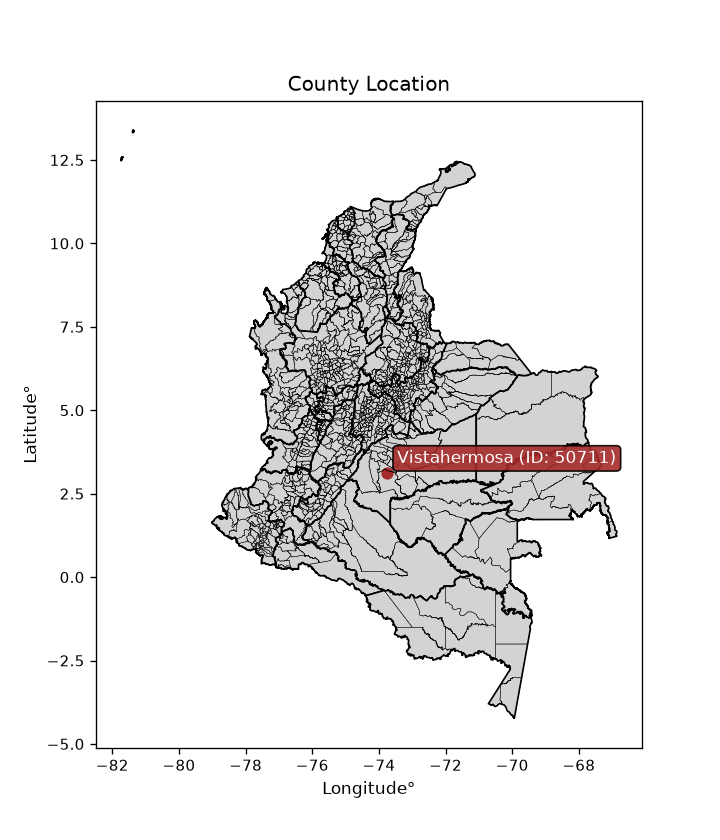
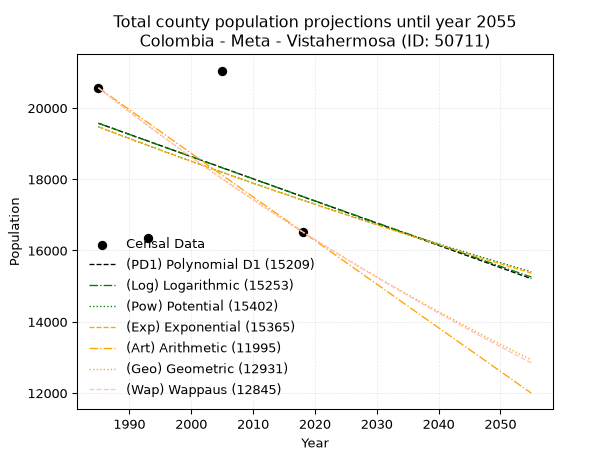
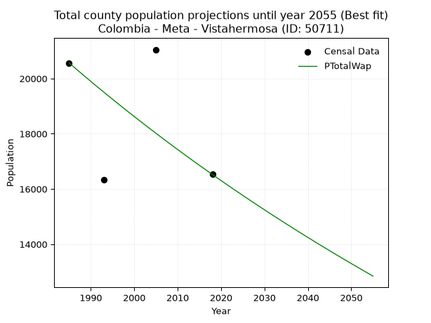
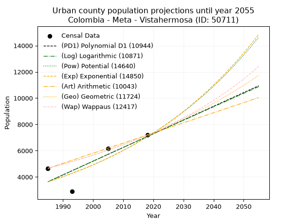
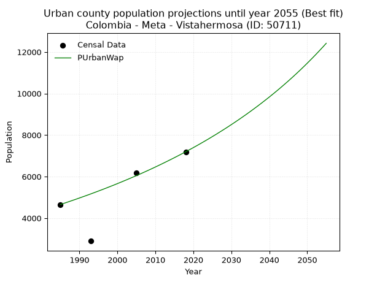
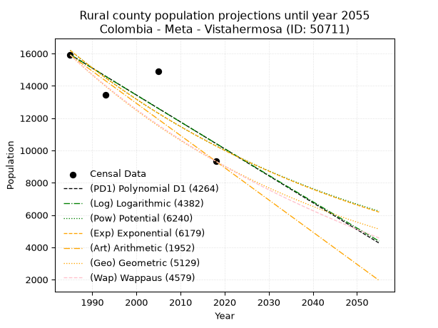
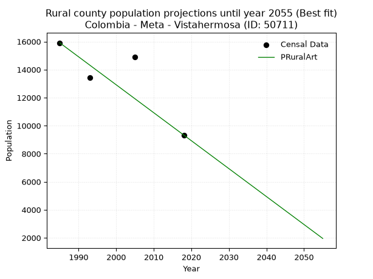

<div align="center">


</div>

# _“Population and Public Services Demand Projections (PPSD) until Year 2050 for Colombia - Meta - Vistahermosa (ID: 50711)”_
Keywords: `population` `public-service` `projection` `lineal` `polynomial` `logarithmic` `potential` `exponential` `arithmetic` `geometric` `wappaus` `dane` `colombia` `south-america`

PPSD are analytical estimates used by governments and planners to anticipate future changes in population size, age distribution, and the resulting community needs for utilities, healthcare, education, and infrastructure as sizing future water treatment facilities, electrical grids, and road networks based on spatial growth.

<div align="center">

</img>

</div>


> **General running parameters**: • app_version: _v20260806_. • Python version: _3.14.7_. • Pandas version: _3.0.5_. • NumPy version: _2.5.1_. • Creates, save and include plots into reports (create_plot): _False_. • Projection until year: _2050_. • Process polynomial degree 2 and up: _False_. • Process Wappaus: _True_. • Process Wappaus: _True_. • Set negative values to zero: _True_. • Set infinite values to zero: _True_. • Drop dataset notes: _True_. 
<div align="center">

Dynamic map: [:earth_americas:Google](http://maps.google.com/maps?q=3.125579258,-73.7509659) [:earth_americas:OSM](https://www.openstreetmap.org/#map=18/3.125579258/-73.7509659&layers=P) [:earth_americas:Bing](https://www.bing.com/maps?cp=3.125579258~-73.7509659&lvl=18) [:earth_americas:Apple](https://maps.apple.com/frame?center=3.125579258%2C-73.7509659&span=0.003%2C0.006)

</div>


<div align="center">

```geojson
{
  "type": "Feature",
  "geometry": {
    "type": "Point", 
    "coordinates": [-73.7509659, 3.125579258]
  }, 
  "properties": {
    "Name": "Colombia - Meta - Vistahermosa (ID: 50711)"
  }
}
```

</div>


## 0. Census Data (4 records)

Census data are official statistics collected by a government about the people and housing in a country. They usually include counts of total population, age, sex, race, income, education, and jobs.

📅Global census file: [Population.xlsx](../data/Population.xlsx)

| Source   |   Year |   CountryID | CountryName   |   StateID | StateName   |   CountyID | CountyName   |   PTotal |   PUrban |   PRural |
|:---------|-------:|------------:|:--------------|----------:|:------------|-----------:|:-------------|---------:|---------:|---------:|
| DANE     |   1985 |          57 | Colombia      |        50 | Meta        |      50711 | Vistahermosa |    20565 |     4655 |    15910 |
| DANE     |   1993 |          57 | Colombia      |        50 | Meta        |      50711 | Vistahermosa |    16343 |     2895 |    13448 |
| DANE     |   2005 |          57 | Colombia      |        50 | Meta        |      50711 | Vistahermosa |    21048 |     6166 |    14882 |
| DANE     |   2018 |          57 | Colombia      |        50 | Meta        |      50711 | Vistahermosa |    16525 |     7195 |     9330 |

> 🔥Some records could had specific notes about the registered values or the corresponding urban or rural distribution.

📅[SUI-RUPS](https://www.datos.gov.co/Hacienda-y-Cr-dito-P-blico/Registro-nico-de-Prestadores-de-Servicios-P-blicos/4qkq-csdn/about_data) - Local public utility companies: [RUPS.csv](../data/RUPS.xlsx)

 | SERVICIO       | ESTADO    | NOMBRE                                                                                                  | NIT         | DEPARTAMENTO_DOMICILIO   | MUNICIPIO_DOMICILIO   | DIRECCION                  |   TELEFONO | EMAIL                                     | TIPO_PRESTADOR                 | CLASIFICACION                 |
|:---------------|:----------|:--------------------------------------------------------------------------------------------------------|:------------|:-------------------------|:----------------------|:---------------------------|-----------:|:------------------------------------------|:-------------------------------|:------------------------------|
| ACUEDUCTO      | OPERATIVA | DIVISION DE SERVICIOS PUBLICOS ALCALDIA DE VISTAHERMOSA, META                                           | 892099173-8 | META                     | VISTAHERMOSA          | CARRERA 13 CALLE 9 ESQUINA |    6518127 | SERVICIOSPUBICOS@VISTAHERMOSA-META.GOV.CO | MUNICIPIO (PRESTACIÓN DIRECTA) | MENOR O IGUAL A 2500 USUARIOS |
| ALCANTARILLADO | OPERATIVA | DIVISION DE SERVICIOS PUBLICOS ALCALDIA DE VISTAHERMOSA, META                                           | 892099173-8 | META                     | VISTAHERMOSA          | CARRERA 13 CALLE 9 ESQUINA |    6518127 | SERVICIOSPUBICOS@VISTAHERMOSA-META.GOV.CO | MUNICIPIO (PRESTACIÓN DIRECTA) | MENOR O IGUAL A 2500 USUARIOS |
| ACUEDUCTO      | OPERATIVA | ASOCIACIÓN DE USUARIOS DE ACUEDUCTO Y ALCANTARILLADO DEL CENTRO POBLADO MARACAIBO Y VEREDA GUAPAYA BAJO | 901354919-0 | META                     | VISTAHERMOSA          | Oficina ASUMAGUA           |    0000000 | asumagua@yahoo.com                        | ORGANIZACION AUTORIZADA        | MENOR O IGUAL A 2500 USUARIOS |

## 1. Total

### 1.1. Coefficients and Parameters

* (PD1) Polynomial Deg 1: -62.314331593734906, 143264.49177036824 (lineal)
* (Log) Logarithmic: -124601.18472949682, 965714.8536201352
* (Pow) Potential: -6.762364267075663, 26.5900304835927
* (Exp) Exponential: -0.003381706321332845, 16018917.071642669
* (Art) Arithmetic: Year diff. 2018 - 1985 = 33, Population diff. 16525 - 20565 = -4040, Annual growth = -122.42424242424242
* (Geo) Geometric: Year diff. 2018 - 1985 = 33, Population diff. 16525 - 20565 = -4040, Annual growth % = -0.0066058489338785
* (Wap) Wappaus: i = -0.6601468990253029, Condition values only valid for < 200)

<sub>
Wappaus condition values: ['-0.00', '-0.66', '-1.32', '-1.98', '-2.64', '-3.30', '-3.96', '-4.62', '-5.28', '-5.94', '-6.60', '-7.26', '-7.92', '-8.58', '-9.24', '-9.90', '-10.56', '-11.22', '-11.88', '-12.54', '-13.20', '-13.86', '-14.52', '-15.18', '-15.84', '-16.50', '-17.16', '-17.82', '-18.48', '-19.14', '-19.80', '-20.46', '-21.12', '-21.78', '-22.44', '-23.11', '-23.77', '-24.43', '-25.09', '-25.75', '-26.41', '-27.07', '-27.73', '-28.39', '-29.05', '-29.71', '-30.37', '-31.03', '-31.69', '-32.35', '-33.01', '-33.67', '-34.33', '-34.99', '-35.65', '-36.31', '-36.97', '-37.63', '-38.29', '-38.95', '-39.61', '-40.27', '-40.93', '-41.59', '-42.25', '-42.91']
</sub>


### 1.2. Projected Dataset

|   Year |   CountyID |   PTotalPD1 |   PTotalLog |   PTotalPow |   PTotalExp |   PTotalArt |   PTotalGeo |   PTotalWap |
|-------:|-----------:|------------:|------------:|------------:|------------:|------------:|------------:|------------:|
|   1985 |      50711 |       19571 |       19571 |       19470 |       19469 |       20565 |       20565 |       20565 |
|   1986 |      50711 |       19508 |       19509 |       19404 |       19404 |       20443 |       20429 |       20430 |
|   1987 |      50711 |       19446 |       19446 |       19338 |       19338 |       20320 |       20294 |       20295 |
|   1988 |      50711 |       19384 |       19383 |       19272 |       19273 |       20198 |       20160 |       20162 |
|   1989 |      50711 |       19321 |       19321 |       19207 |       19208 |       20075 |       20027 |       20029 |
|   1990 |      50711 |       19259 |       19258 |       19142 |       19143 |       19953 |       19895 |       19897 |
|   1991 |      50711 |       19197 |       19195 |       19077 |       19078 |       19830 |       19763 |       19766 |
|   1992 |      50711 |       19134 |       19133 |       19012 |       19014 |       19708 |       19633 |       19636 |
|   1993 |      50711 |       19072 |       19070 |       18948 |       18950 |       19586 |       19503 |       19507 |
|   1994 |      50711 |       19010 |       19008 |       18884 |       18886 |       19463 |       19374 |       19378 |
|   1995 |      50711 |       18947 |       18945 |       18820 |       18822 |       19341 |       19246 |       19251 |
|   1996 |      50711 |       18885 |       18883 |       18756 |       18758 |       19218 |       19119 |       19124 |
|   1997 |      50711 |       18823 |       18820 |       18693 |       18695 |       19096 |       18993 |       18998 |
|   1998 |      50711 |       18760 |       18758 |       18630 |       18632 |       18973 |       18867 |       18873 |
|   1999 |      50711 |       18698 |       18696 |       18567 |       18569 |       18851 |       18743 |       18748 |
|   2000 |      50711 |       18636 |       18633 |       18504 |       18506 |       18729 |       18619 |       18625 |
|   2001 |      50711 |       18574 |       18571 |       18441 |       18444 |       18606 |       18496 |       18502 |
|   2002 |      50711 |       18511 |       18509 |       18379 |       18382 |       18484 |       18374 |       18380 |
|   2003 |      50711 |       18449 |       18447 |       18317 |       18320 |       18361 |       18252 |       18258 |
|   2004 |      50711 |       18387 |       18384 |       18256 |       18258 |       18239 |       18132 |       18138 |
|   2005 |      50711 |       18324 |       18322 |       18194 |       18196 |       18117 |       18012 |       18018 |
|   2006 |      50711 |       18262 |       18260 |       18133 |       18135 |       17994 |       17893 |       17899 |
|   2007 |      50711 |       18200 |       18198 |       18072 |       18073 |       17872 |       17775 |       17780 |
|   2008 |      50711 |       18137 |       18136 |       18011 |       18012 |       17749 |       17657 |       17663 |
|   2009 |      50711 |       18075 |       18074 |       17951 |       17952 |       17627 |       17541 |       17546 |
|   2010 |      50711 |       18013 |       18012 |       17890 |       17891 |       17504 |       17425 |       17430 |
|   2011 |      50711 |       17950 |       17950 |       17830 |       17831 |       17382 |       17310 |       17314 |
|   2012 |      50711 |       17888 |       17888 |       17770 |       17770 |       17260 |       17195 |       17199 |
|   2013 |      50711 |       17826 |       17826 |       17711 |       17710 |       17137 |       17082 |       17085 |
|   2014 |      50711 |       17763 |       17764 |       17651 |       17651 |       17015 |       16969 |       16972 |
|   2015 |      50711 |       17701 |       17702 |       17592 |       17591 |       16892 |       16857 |       16859 |
|   2016 |      50711 |       17639 |       17641 |       17533 |       17532 |       16770 |       16746 |       16747 |
|   2017 |      50711 |       17576 |       17579 |       17475 |       17472 |       16647 |       16635 |       16636 |
|   2018 |      50711 |       17514 |       17517 |       17416 |       17413 |       16525 |       16525 |       16525 |
|   2019 |      50711 |       17452 |       17455 |       17358 |       17355 |       16403 |       16416 |       16415 |
|   2020 |      50711 |       17390 |       17394 |       17300 |       17296 |       16280 |       16307 |       16306 |
|   2021 |      50711 |       17327 |       17332 |       17242 |       17238 |       16158 |       16200 |       16197 |
|   2022 |      50711 |       17265 |       17270 |       17184 |       17179 |       16035 |       16093 |       16089 |
|   2023 |      50711 |       17203 |       17209 |       17127 |       17121 |       15913 |       15986 |       15981 |
|   2024 |      50711 |       17140 |       17147 |       17070 |       17064 |       15790 |       15881 |       15874 |
|   2025 |      50711 |       17078 |       17086 |       17013 |       17006 |       15668 |       15776 |       15768 |
|   2026 |      50711 |       17016 |       17024 |       16956 |       16949 |       15546 |       15672 |       15662 |
|   2027 |      50711 |       16953 |       16963 |       16900 |       16891 |       15423 |       15568 |       15557 |
|   2028 |      50711 |       16891 |       16901 |       16844 |       16834 |       15301 |       15465 |       15453 |
|   2029 |      50711 |       16829 |       16840 |       16787 |       16778 |       15178 |       15363 |       15349 |
|   2030 |      50711 |       16766 |       16778 |       16732 |       16721 |       15056 |       15262 |       15246 |
|   2031 |      50711 |       16704 |       16717 |       16676 |       16664 |       14933 |       15161 |       15143 |
|   2032 |      50711 |       16642 |       16656 |       16621 |       16608 |       14811 |       15061 |       15041 |
|   2033 |      50711 |       16579 |       16594 |       16565 |       16552 |       14689 |       14961 |       14940 |
|   2034 |      50711 |       16517 |       16533 |       16510 |       16496 |       14566 |       14862 |       14839 |
|   2035 |      50711 |       16455 |       16472 |       16456 |       16441 |       14444 |       14764 |       14739 |
|   2036 |      50711 |       16393 |       16411 |       16401 |       16385 |       14321 |       14667 |       14639 |
|   2037 |      50711 |       16330 |       16349 |       16347 |       16330 |       14199 |       14570 |       14540 |
|   2038 |      50711 |       16268 |       16288 |       16292 |       16275 |       14077 |       14473 |       14441 |
|   2039 |      50711 |       16206 |       16227 |       16238 |       16220 |       13954 |       14378 |       14343 |
|   2040 |      50711 |       16143 |       16166 |       16185 |       16165 |       13832 |       14283 |       14245 |
|   2041 |      50711 |       16081 |       16105 |       16131 |       16110 |       13709 |       14189 |       14149 |
|   2042 |      50711 |       16019 |       16044 |       16078 |       16056 |       13587 |       14095 |       14052 |
|   2043 |      50711 |       15956 |       15983 |       16025 |       16002 |       13464 |       14002 |       13956 |
|   2044 |      50711 |       15894 |       15922 |       15972 |       15948 |       13342 |       13909 |       13861 |
|   2045 |      50711 |       15832 |       15861 |       15919 |       15894 |       13220 |       13817 |       13766 |
|   2046 |      50711 |       15769 |       15800 |       15866 |       15840 |       13097 |       13726 |       13672 |
|   2047 |      50711 |       15707 |       15739 |       15814 |       15787 |       12975 |       13635 |       13578 |
|   2048 |      50711 |       15645 |       15678 |       15762 |       15733 |       12852 |       13545 |       13485 |
|   2049 |      50711 |       15582 |       15617 |       15710 |       15680 |       12730 |       13456 |       13392 |
|   2050 |      50711 |       15520 |       15557 |       15658 |       15627 |       12607 |       13367 |       13299 |
<div align="center">

</img>

</div>


### 1.3. Best fit with absolute and relative error (%)

Relative error puts that difference into context by dividing the absolute error by the true value, creating a unitless ratio or percentage that shows the scale of the mistake.

Absolute and relative error

|   Year | Source   |   CountryID | CountryName   |   StateID | StateName   |   CountyID_x | CountyName   |   PTotal |   PUrban |   PRural |   CountyID_y |   PTotalPD1 |   PTotalLog |   PTotalPow |   PTotalExp |   PTotalArt |   PTotalGeo |   PTotalWap |   PTotalPD1AbsError |   PTotalLogAbsError |   PTotalPowAbsError |   PTotalExpAbsError |   PTotalArtAbsError |   PTotalGeoAbsError |   PTotalWapAbsError |   PTotalPD1RelError |   PTotalLogRelError |   PTotalPowRelError |   PTotalExpRelError |   PTotalArtRelError |   PTotalGeoRelError |   PTotalWapRelError |
|-------:|:---------|------------:|:--------------|----------:|:------------|-------------:|:-------------|---------:|---------:|---------:|-------------:|------------:|------------:|------------:|------------:|------------:|------------:|------------:|--------------------:|--------------------:|--------------------:|--------------------:|--------------------:|--------------------:|--------------------:|--------------------:|--------------------:|--------------------:|--------------------:|--------------------:|--------------------:|--------------------:|
|   1985 | DANE     |          57 | Colombia      |        50 | Meta        |        50711 | Vistahermosa |    20565 |     4655 |    15910 |        50711 |       19571 |       19571 |       19470 |       19469 |       20565 |       20565 |       20565 |                 994 |                 994 |                1095 |                1096 |                   0 |                   0 |                   0 |             4.83345 |             4.83345 |             5.32458 |             5.32944 |              0      |              0      |              0      |
|   1993 | DANE     |          57 | Colombia      |        50 | Meta        |        50711 | Vistahermosa |    16343 |     2895 |    13448 |        50711 |       19072 |       19070 |       18948 |       18950 |       19586 |       19503 |       19507 |                2729 |                2727 |                2605 |                2607 |                3243 |                3160 |                3164 |            16.6983  |            16.686   |            15.9395  |            15.9518  |             19.8434 |             19.3355 |             19.36   |
|   2005 | DANE     |          57 | Colombia      |        50 | Meta        |        50711 | Vistahermosa |    21048 |     6166 |    14882 |        50711 |       18324 |       18322 |       18194 |       18196 |       18117 |       18012 |       18018 |                2724 |                2726 |                2854 |                2852 |                2931 |                3036 |                3030 |            12.9418  |            12.9513  |            13.5595  |            13.55    |             13.9253 |             14.4242 |             14.3957 |
|   2018 | DANE     |          57 | Colombia      |        50 | Meta        |        50711 | Vistahermosa |    16525 |     7195 |     9330 |        50711 |       17514 |       17517 |       17416 |       17413 |       16525 |       16525 |       16525 |                 989 |                 992 |                 891 |                 888 |                   0 |                   0 |                   0 |             5.98487 |             6.00303 |             5.39183 |             5.37368 |              0      |              0      |              0      |

Relative error mean

| Method    |   RelError | Best   |
|:----------|-----------:|:-------|
| PTotalPD1 |   10.1146  |        |
| PTotalLog |   10.1185  |        |
| PTotalPow |   10.0539  |        |
| PTotalExp |   10.0512  |        |
| PTotalArt |    8.44217 |        |
| PTotalGeo |    8.43992 |        |
| PTotalWap |    8.43891 | True   |

💙Best method: _**PTotalWap**_
<div align="center">

</img>

</div>


### 1.4. Fresh water supply demand in liters per capita per day (lpcd)

The fresh water supply demand typically ranges from 100 to 300 liters per capita per day (lpcd) for standard domestic and municipal planning, though absolute survival minimums set by the World Health Organization are as low as 7.5 to 20 liters per day, and total consumption in high-income nations can exceed 400 liters.

> `CZ`: Level in meters above the sea level (masl)<br> `WS`: Fresh water supply demand in liters per capita per day (lpcd or l/h/d)<br> `WSAll`: Zonal fresh water supply demand in liters per second (l/s)<br> `A`: Zonal area in square meters<br> `DP`: Population density (people/hectare or p/ha)

Reference values (RAS Colombia)

|    CZ |   WS |
|------:|-----:|
|  1000 |  120 |
|  2000 |  130 |
| 99999 |  140 |

County shapefile geometry properties and water supply values

|   CountyID |      ATotal |   CZTotal |   WSTotal |
|-----------:|------------:|----------:|----------:|
|      50711 | 4.81399e+09 |   377.062 |       120 |

Projected values for best method: PTotalWap

|   CountyID |   Year |   PTotalWap |   DPTotal |   WSTotal |   WSTotalAll |
|-----------:|-------:|------------:|----------:|----------:|-------------:|
|      50711 |   1985 |       20565 |      0.04 |       120 |      28.5625 |
|      50711 |   1986 |       20430 |      0.04 |       120 |      28.375  |
|      50711 |   1987 |       20295 |      0.04 |       120 |      28.1875 |
|      50711 |   1988 |       20162 |      0.04 |       120 |      28.0028 |
|      50711 |   1989 |       20029 |      0.04 |       120 |      27.8181 |
|      50711 |   1990 |       19897 |      0.04 |       120 |      27.6347 |
|      50711 |   1991 |       19766 |      0.04 |       120 |      27.4528 |
|      50711 |   1992 |       19636 |      0.04 |       120 |      27.2722 |
|      50711 |   1993 |       19507 |      0.04 |       120 |      27.0931 |
|      50711 |   1994 |       19378 |      0.04 |       120 |      26.9139 |
|      50711 |   1995 |       19251 |      0.04 |       120 |      26.7375 |
|      50711 |   1996 |       19124 |      0.04 |       120 |      26.5611 |
|      50711 |   1997 |       18998 |      0.04 |       120 |      26.3861 |
|      50711 |   1998 |       18873 |      0.04 |       120 |      26.2125 |
|      50711 |   1999 |       18748 |      0.04 |       120 |      26.0389 |
|      50711 |   2000 |       18625 |      0.04 |       120 |      25.8681 |
|      50711 |   2001 |       18502 |      0.04 |       120 |      25.6972 |
|      50711 |   2002 |       18380 |      0.04 |       120 |      25.5278 |
|      50711 |   2003 |       18258 |      0.04 |       120 |      25.3583 |
|      50711 |   2004 |       18138 |      0.04 |       120 |      25.1917 |
|      50711 |   2005 |       18018 |      0.04 |       120 |      25.025  |
|      50711 |   2006 |       17899 |      0.04 |       120 |      24.8597 |
|      50711 |   2007 |       17780 |      0.04 |       120 |      24.6944 |
|      50711 |   2008 |       17663 |      0.04 |       120 |      24.5319 |
|      50711 |   2009 |       17546 |      0.04 |       120 |      24.3694 |
|      50711 |   2010 |       17430 |      0.04 |       120 |      24.2083 |
|      50711 |   2011 |       17314 |      0.04 |       120 |      24.0472 |
|      50711 |   2012 |       17199 |      0.04 |       120 |      23.8875 |
|      50711 |   2013 |       17085 |      0.04 |       120 |      23.7292 |
|      50711 |   2014 |       16972 |      0.04 |       120 |      23.5722 |
|      50711 |   2015 |       16859 |      0.04 |       120 |      23.4153 |
|      50711 |   2016 |       16747 |      0.03 |       120 |      23.2597 |
|      50711 |   2017 |       16636 |      0.03 |       120 |      23.1056 |
|      50711 |   2018 |       16525 |      0.03 |       120 |      22.9514 |
|      50711 |   2019 |       16415 |      0.03 |       120 |      22.7986 |
|      50711 |   2020 |       16306 |      0.03 |       120 |      22.6472 |
|      50711 |   2021 |       16197 |      0.03 |       120 |      22.4958 |
|      50711 |   2022 |       16089 |      0.03 |       120 |      22.3458 |
|      50711 |   2023 |       15981 |      0.03 |       120 |      22.1958 |
|      50711 |   2024 |       15874 |      0.03 |       120 |      22.0472 |
|      50711 |   2025 |       15768 |      0.03 |       120 |      21.9    |
|      50711 |   2026 |       15662 |      0.03 |       120 |      21.7528 |
|      50711 |   2027 |       15557 |      0.03 |       120 |      21.6069 |
|      50711 |   2028 |       15453 |      0.03 |       120 |      21.4625 |
|      50711 |   2029 |       15349 |      0.03 |       120 |      21.3181 |
|      50711 |   2030 |       15246 |      0.03 |       120 |      21.175  |
|      50711 |   2031 |       15143 |      0.03 |       120 |      21.0319 |
|      50711 |   2032 |       15041 |      0.03 |       120 |      20.8903 |
|      50711 |   2033 |       14940 |      0.03 |       120 |      20.75   |
|      50711 |   2034 |       14839 |      0.03 |       120 |      20.6097 |
|      50711 |   2035 |       14739 |      0.03 |       120 |      20.4708 |
|      50711 |   2036 |       14639 |      0.03 |       120 |      20.3319 |
|      50711 |   2037 |       14540 |      0.03 |       120 |      20.1944 |
|      50711 |   2038 |       14441 |      0.03 |       120 |      20.0569 |
|      50711 |   2039 |       14343 |      0.03 |       120 |      19.9208 |
|      50711 |   2040 |       14245 |      0.03 |       120 |      19.7847 |
|      50711 |   2041 |       14149 |      0.03 |       120 |      19.6514 |
|      50711 |   2042 |       14052 |      0.03 |       120 |      19.5167 |
|      50711 |   2043 |       13956 |      0.03 |       120 |      19.3833 |
|      50711 |   2044 |       13861 |      0.03 |       120 |      19.2514 |
|      50711 |   2045 |       13766 |      0.03 |       120 |      19.1194 |
|      50711 |   2046 |       13672 |      0.03 |       120 |      18.9889 |
|      50711 |   2047 |       13578 |      0.03 |       120 |      18.8583 |
|      50711 |   2048 |       13485 |      0.03 |       120 |      18.7292 |
|      50711 |   2049 |       13392 |      0.03 |       120 |      18.6    |
|      50711 |   2050 |       13299 |      0.03 |       120 |      18.4708 |

## 2. Urban

### 2.1. Coefficients and Parameters

* (PD1) Polynomial Deg 1: 104.4114813327972, -203621.31553592763 (lineal)
* (Log) Logarithmic: 208830.63635925073, -1582095.5904303594
* (Pow) Potential: 40.165613655764204, -128.8955860809038
* (Exp) Exponential: 0.02008485012031831, 1.7639684123997364e-14
* (Art) Arithmetic: Year diff. 2018 - 1985 = 33, Population diff. 7195 - 4655 = 2540, Annual growth = 76.96969696969697
* (Geo) Geometric: Year diff. 2018 - 1985 = 33, Population diff. 7195 - 4655 = 2540, Annual growth % = 0.01328272771268102
* (Wap) Wappaus: i = 1.2990666155223116, Condition values only valid for < 200)

<sub>
Wappaus condition values: ['0.00', '1.30', '2.60', '3.90', '5.20', '6.50', '7.79', '9.09', '10.39', '11.69', '12.99', '14.29', '15.59', '16.89', '18.19', '19.49', '20.79', '22.08', '23.38', '24.68', '25.98', '27.28', '28.58', '29.88', '31.18', '32.48', '33.78', '35.07', '36.37', '37.67', '38.97', '40.27', '41.57', '42.87', '44.17', '45.47', '46.77', '48.07', '49.36', '50.66', '51.96', '53.26', '54.56', '55.86', '57.16', '58.46', '59.76', '61.06', '62.36', '63.65', '64.95', '66.25', '67.55', '68.85', '70.15', '71.45', '72.75', '74.05', '75.35', '76.64', '77.94', '79.24', '80.54', '81.84', '83.14', '84.44']
</sub>


### 2.2. Projected Dataset

|   Year |   CountyID |   PUrbanPD1 |   PUrbanLog |   PUrbanPow |   PUrbanExp |   PUrbanArt |   PUrbanGeo |   PUrbanWap |
|-------:|-----------:|------------:|------------:|------------:|------------:|------------:|------------:|------------:|
|   1985 |      50711 |        3635 |        3634 |        3639 |        3640 |        4655 |        4655 |        4655 |
|   1986 |      50711 |        3740 |        3739 |        3713 |        3714 |        4732 |        4717 |        4716 |
|   1987 |      50711 |        3844 |        3844 |        3789 |        3789 |        4809 |        4779 |        4778 |
|   1988 |      50711 |        3949 |        3949 |        3867 |        3866 |        4886 |        4843 |        4840 |
|   1989 |      50711 |        4053 |        4054 |        3946 |        3945 |        4963 |        4907 |        4903 |
|   1990 |      50711 |        4158 |        4159 |        4026 |        4025 |        5040 |        4972 |        4968 |
|   1991 |      50711 |        4262 |        4264 |        4108 |        4106 |        5117 |        5039 |        5033 |
|   1992 |      50711 |        4366 |        4369 |        4192 |        4190 |        5194 |        5105 |        5098 |
|   1993 |      50711 |        4471 |        4474 |        4277 |        4275 |        5271 |        5173 |        5165 |
|   1994 |      50711 |        4575 |        4578 |        4364 |        4361 |        5348 |        5242 |        5233 |
|   1995 |      50711 |        4680 |        4683 |        4453 |        4450 |        5425 |        5312 |        5302 |
|   1996 |      50711 |        4784 |        4788 |        4543 |        4540 |        5502 |        5382 |        5371 |
|   1997 |      50711 |        4888 |        4892 |        4636 |        4632 |        5579 |        5454 |        5442 |
|   1998 |      50711 |        4993 |        4997 |        4730 |        4726 |        5656 |        5526 |        5514 |
|   1999 |      50711 |        5097 |        5101 |        4826 |        4822 |        5733 |        5599 |        5586 |
|   2000 |      50711 |        5202 |        5206 |        4924 |        4920 |        5810 |        5674 |        5660 |
|   2001 |      50711 |        5306 |        5310 |        5024 |        5020 |        5887 |        5749 |        5735 |
|   2002 |      50711 |        5410 |        5414 |        5126 |        5122 |        5963 |        5826 |        5811 |
|   2003 |      50711 |        5515 |        5519 |        5229 |        5226 |        6040 |        5903 |        5888 |
|   2004 |      50711 |        5619 |        5623 |        5335 |        5332 |        6117 |        5981 |        5966 |
|   2005 |      50711 |        5724 |        5727 |        5443 |        5440 |        6194 |        6061 |        6045 |
|   2006 |      50711 |        5828 |        5831 |        5553 |        5550 |        6271 |        6141 |        6125 |
|   2007 |      50711 |        5933 |        5935 |        5666 |        5663 |        6348 |        6223 |        6207 |
|   2008 |      50711 |        6037 |        6039 |        5780 |        5778 |        6425 |        6306 |        6290 |
|   2009 |      50711 |        6141 |        6143 |        5897 |        5895 |        6502 |        6389 |        6374 |
|   2010 |      50711 |        6246 |        6247 |        6016 |        6014 |        6579 |        6474 |        6460 |
|   2011 |      50711 |        6350 |        6351 |        6137 |        6136 |        6656 |        6560 |        6547 |
|   2012 |      50711 |        6455 |        6455 |        6261 |        6261 |        6733 |        6647 |        6635 |
|   2013 |      50711 |        6559 |        6559 |        6387 |        6388 |        6810 |        6736 |        6725 |
|   2014 |      50711 |        6663 |        6662 |        6516 |        6518 |        6887 |        6825 |        6816 |
|   2015 |      50711 |        6768 |        6766 |        6647 |        6650 |        6964 |        6916 |        6908 |
|   2016 |      50711 |        6872 |        6870 |        6781 |        6785 |        7041 |        7008 |        7002 |
|   2017 |      50711 |        6977 |        6973 |        6918 |        6922 |        7118 |        7101 |        7098 |
|   2018 |      50711 |        7081 |        7077 |        7057 |        7063 |        7195 |        7195 |        7195 |
|   2019 |      50711 |        7185 |        7180 |        7199 |        7206 |        7272 |        7291 |        7294 |
|   2020 |      50711 |        7290 |        7284 |        7343 |        7352 |        7349 |        7387 |        7394 |
|   2021 |      50711 |        7394 |        7387 |        7491 |        7501 |        7426 |        7486 |        7496 |
|   2022 |      50711 |        7499 |        7490 |        7641 |        7654 |        7503 |        7585 |        7600 |
|   2023 |      50711 |        7603 |        7594 |        7794 |        7809 |        7580 |        7686 |        7706 |
|   2024 |      50711 |        7708 |        7697 |        7950 |        7967 |        7657 |        7788 |        7813 |
|   2025 |      50711 |        7812 |        7800 |        8110 |        8129 |        7734 |        7891 |        7923 |
|   2026 |      50711 |        7916 |        7903 |        8272 |        8294 |        7811 |        7996 |        8034 |
|   2027 |      50711 |        8021 |        8006 |        8438 |        8462 |        7888 |        8102 |        8148 |
|   2028 |      50711 |        8125 |        8109 |        8607 |        8634 |        7965 |        8210 |        8263 |
|   2029 |      50711 |        8230 |        8212 |        8779 |        8809 |        8042 |        8319 |        8380 |
|   2030 |      50711 |        8334 |        8315 |        8954 |        8988 |        8119 |        8429 |        8500 |
|   2031 |      50711 |        8438 |        8418 |        9133 |        9170 |        8196 |        8541 |        8622 |
|   2032 |      50711 |        8543 |        8521 |        9315 |        9356 |        8273 |        8655 |        8746 |
|   2033 |      50711 |        8647 |        8623 |        9501 |        9546 |        8350 |        8770 |        8873 |
|   2034 |      50711 |        8752 |        8726 |        9691 |        9740 |        8427 |        8886 |        9001 |
|   2035 |      50711 |        8856 |        8829 |        9884 |        9937 |        8503 |        9004 |        9133 |
|   2036 |      50711 |        8960 |        8931 |       10081 |       10139 |        8580 |        9124 |        9267 |
|   2037 |      50711 |        9065 |        9034 |       10282 |       10345 |        8657 |        9245 |        9403 |
|   2038 |      50711 |        9169 |        9136 |       10486 |       10554 |        8734 |        9368 |        9543 |
|   2039 |      50711 |        9274 |        9239 |       10695 |       10769 |        8811 |        9492 |        9685 |
|   2040 |      50711 |        9378 |        9341 |       10908 |       10987 |        8888 |        9618 |        9829 |
|   2041 |      50711 |        9483 |        9443 |       11125 |       11210 |        8965 |        9746 |        9977 |
|   2042 |      50711 |        9587 |        9546 |       11346 |       11437 |        9042 |        9876 |       10128 |
|   2043 |      50711 |        9691 |        9648 |       11571 |       11669 |        9119 |       10007 |       10282 |
|   2044 |      50711 |        9796 |        9750 |       11801 |       11906 |        9196 |       10140 |       10440 |
|   2045 |      50711 |        9900 |        9852 |       12035 |       12148 |        9273 |       10274 |       10600 |
|   2046 |      50711 |       10005 |        9954 |       12274 |       12394 |        9350 |       10411 |       10764 |
|   2047 |      50711 |       10109 |       10056 |       12517 |       12646 |        9427 |       10549 |       10932 |
|   2048 |      50711 |       10213 |       10158 |       12765 |       12902 |        9504 |       10689 |       11103 |
|   2049 |      50711 |       10318 |       10260 |       13018 |       13164 |        9581 |       10831 |       11279 |
|   2050 |      50711 |       10422 |       10362 |       13275 |       13431 |        9658 |       10975 |       11458 |
<div align="center">

</img>

</div>


### 2.3. Best fit with absolute and relative error (%)

Relative error puts that difference into context by dividing the absolute error by the true value, creating a unitless ratio or percentage that shows the scale of the mistake.

Absolute and relative error

|   Year | Source   |   CountryID | CountryName   |   StateID | StateName   |   CountyID_x | CountyName   |   PTotal |   PUrban |   PRural |   CountyID_y |   PUrbanPD1 |   PUrbanLog |   PUrbanPow |   PUrbanExp |   PUrbanArt |   PUrbanGeo |   PUrbanWap |   PUrbanPD1AbsError |   PUrbanLogAbsError |   PUrbanPowAbsError |   PUrbanExpAbsError |   PUrbanArtAbsError |   PUrbanGeoAbsError |   PUrbanWapAbsError |   PUrbanPD1RelError |   PUrbanLogRelError |   PUrbanPowRelError |   PUrbanExpRelError |   PUrbanArtRelError |   PUrbanGeoRelError |   PUrbanWapRelError |
|-------:|:---------|------------:|:--------------|----------:|:------------|-------------:|:-------------|---------:|---------:|---------:|-------------:|------------:|------------:|------------:|------------:|------------:|------------:|------------:|--------------------:|--------------------:|--------------------:|--------------------:|--------------------:|--------------------:|--------------------:|--------------------:|--------------------:|--------------------:|--------------------:|--------------------:|--------------------:|--------------------:|
|   1985 | DANE     |          57 | Colombia      |        50 | Meta        |        50711 | Vistahermosa |    20565 |     4655 |    15910 |        50711 |        3635 |        3634 |        3639 |        3640 |        4655 |        4655 |        4655 |                1020 |                1021 |                1016 |                1015 |                   0 |                   0 |                   0 |            21.9119  |            21.9334  |             21.826  |            21.8045  |            0        |             0       |             0       |
|   1993 | DANE     |          57 | Colombia      |        50 | Meta        |        50711 | Vistahermosa |    16343 |     2895 |    13448 |        50711 |        4471 |        4474 |        4277 |        4275 |        5271 |        5173 |        5165 |                1576 |                1579 |                1382 |                1380 |                2376 |                2278 |                2270 |            54.4387  |            54.5423  |             47.7375 |            47.6684  |           82.0725   |            78.6874  |            78.4111  |
|   2005 | DANE     |          57 | Colombia      |        50 | Meta        |        50711 | Vistahermosa |    21048 |     6166 |    14882 |        50711 |        5724 |        5727 |        5443 |        5440 |        6194 |        6061 |        6045 |                 442 |                 439 |                 723 |                 726 |                  28 |                 105 |                 121 |             7.16834 |             7.11969 |             11.7256 |            11.7742  |            0.454103 |             1.70289 |             1.96237 |
|   2018 | DANE     |          57 | Colombia      |        50 | Meta        |        50711 | Vistahermosa |    16525 |     7195 |     9330 |        50711 |        7081 |        7077 |        7057 |        7063 |        7195 |        7195 |        7195 |                 114 |                 118 |                 138 |                 132 |                   0 |                   0 |                   0 |             1.58443 |             1.64003 |              1.918  |             1.83461 |            0        |             0       |             0       |

Relative error mean

| Method    |   RelError | Best   |
|:----------|-----------:|:-------|
| PUrbanPD1 |    21.2758 |        |
| PUrbanLog |    21.3089 |        |
| PUrbanPow |    20.8018 |        |
| PUrbanExp |    20.7704 |        |
| PUrbanArt |    20.6317 |        |
| PUrbanGeo |    20.0976 |        |
| PUrbanWap |    20.0934 | True   |

💙Best method: _**PUrbanWap**_
<div align="center">

</img>

</div>


### 2.4. Fresh water supply demand in liters per capita per day (lpcd)

The fresh water supply demand typically ranges from 100 to 300 liters per capita per day (lpcd) for standard domestic and municipal planning, though absolute survival minimums set by the World Health Organization are as low as 7.5 to 20 liters per day, and total consumption in high-income nations can exceed 400 liters.

> `CZ`: Level in meters above the sea level (masl)<br> `WS`: Fresh water supply demand in liters per capita per day (lpcd or l/h/d)<br> `WSAll`: Zonal fresh water supply demand in liters per second (l/s)<br> `A`: Zonal area in square meters<br> `DP`: Population density (people/hectare or p/ha)

Reference values (RAS Colombia)

|    CZ |   WS |
|------:|-----:|
|  1000 |  120 |
|  2000 |  130 |
| 99999 |  140 |

County shapefile geometry properties and water supply values

|   CountyID |      AUrban |   CZUrban |   WSUrban |
|-----------:|------------:|----------:|----------:|
|      50711 | 1.72207e+06 |   294.277 |       120 |

Projected values for best method: PUrbanWap

|   CountyID |   Year |   PUrbanWap |   DPUrban |   WSUrban |   WSUrbanAll |
|-----------:|-------:|------------:|----------:|----------:|-------------:|
|      50711 |   1985 |        4655 |     27.03 |       120 |      6.46528 |
|      50711 |   1986 |        4716 |     27.39 |       120 |      6.55    |
|      50711 |   1987 |        4778 |     27.75 |       120 |      6.63611 |
|      50711 |   1988 |        4840 |     28.11 |       120 |      6.72222 |
|      50711 |   1989 |        4903 |     28.47 |       120 |      6.80972 |
|      50711 |   1990 |        4968 |     28.85 |       120 |      6.9     |
|      50711 |   1991 |        5033 |     29.23 |       120 |      6.99028 |
|      50711 |   1992 |        5098 |     29.6  |       120 |      7.08056 |
|      50711 |   1993 |        5165 |     29.99 |       120 |      7.17361 |
|      50711 |   1994 |        5233 |     30.39 |       120 |      7.26806 |
|      50711 |   1995 |        5302 |     30.79 |       120 |      7.36389 |
|      50711 |   1996 |        5371 |     31.19 |       120 |      7.45972 |
|      50711 |   1997 |        5442 |     31.6  |       120 |      7.55833 |
|      50711 |   1998 |        5514 |     32.02 |       120 |      7.65833 |
|      50711 |   1999 |        5586 |     32.44 |       120 |      7.75833 |
|      50711 |   2000 |        5660 |     32.87 |       120 |      7.86111 |
|      50711 |   2001 |        5735 |     33.3  |       120 |      7.96528 |
|      50711 |   2002 |        5811 |     33.74 |       120 |      8.07083 |
|      50711 |   2003 |        5888 |     34.19 |       120 |      8.17778 |
|      50711 |   2004 |        5966 |     34.64 |       120 |      8.28611 |
|      50711 |   2005 |        6045 |     35.1  |       120 |      8.39583 |
|      50711 |   2006 |        6125 |     35.57 |       120 |      8.50694 |
|      50711 |   2007 |        6207 |     36.04 |       120 |      8.62083 |
|      50711 |   2008 |        6290 |     36.53 |       120 |      8.73611 |
|      50711 |   2009 |        6374 |     37.01 |       120 |      8.85278 |
|      50711 |   2010 |        6460 |     37.51 |       120 |      8.97222 |
|      50711 |   2011 |        6547 |     38.02 |       120 |      9.09306 |
|      50711 |   2012 |        6635 |     38.53 |       120 |      9.21528 |
|      50711 |   2013 |        6725 |     39.05 |       120 |      9.34028 |
|      50711 |   2014 |        6816 |     39.58 |       120 |      9.46667 |
|      50711 |   2015 |        6908 |     40.11 |       120 |      9.59444 |
|      50711 |   2016 |        7002 |     40.66 |       120 |      9.725   |
|      50711 |   2017 |        7098 |     41.22 |       120 |      9.85833 |
|      50711 |   2018 |        7195 |     41.78 |       120 |      9.99306 |
|      50711 |   2019 |        7294 |     42.36 |       120 |     10.1306  |
|      50711 |   2020 |        7394 |     42.94 |       120 |     10.2694  |
|      50711 |   2021 |        7496 |     43.53 |       120 |     10.4111  |
|      50711 |   2022 |        7600 |     44.13 |       120 |     10.5556  |
|      50711 |   2023 |        7706 |     44.75 |       120 |     10.7028  |
|      50711 |   2024 |        7813 |     45.37 |       120 |     10.8514  |
|      50711 |   2025 |        7923 |     46.01 |       120 |     11.0042  |
|      50711 |   2026 |        8034 |     46.65 |       120 |     11.1583  |
|      50711 |   2027 |        8148 |     47.32 |       120 |     11.3167  |
|      50711 |   2028 |        8263 |     47.98 |       120 |     11.4764  |
|      50711 |   2029 |        8380 |     48.66 |       120 |     11.6389  |
|      50711 |   2030 |        8500 |     49.36 |       120 |     11.8056  |
|      50711 |   2031 |        8622 |     50.07 |       120 |     11.975   |
|      50711 |   2032 |        8746 |     50.79 |       120 |     12.1472  |
|      50711 |   2033 |        8873 |     51.53 |       120 |     12.3236  |
|      50711 |   2034 |        9001 |     52.27 |       120 |     12.5014  |
|      50711 |   2035 |        9133 |     53.03 |       120 |     12.6847  |
|      50711 |   2036 |        9267 |     53.81 |       120 |     12.8708  |
|      50711 |   2037 |        9403 |     54.6  |       120 |     13.0597  |
|      50711 |   2038 |        9543 |     55.42 |       120 |     13.2542  |
|      50711 |   2039 |        9685 |     56.24 |       120 |     13.4514  |
|      50711 |   2040 |        9829 |     57.08 |       120 |     13.6514  |
|      50711 |   2041 |        9977 |     57.94 |       120 |     13.8569  |
|      50711 |   2042 |       10128 |     58.81 |       120 |     14.0667  |
|      50711 |   2043 |       10282 |     59.71 |       120 |     14.2806  |
|      50711 |   2044 |       10440 |     60.62 |       120 |     14.5     |
|      50711 |   2045 |       10600 |     61.55 |       120 |     14.7222  |
|      50711 |   2046 |       10764 |     62.51 |       120 |     14.95    |
|      50711 |   2047 |       10932 |     63.48 |       120 |     15.1833  |
|      50711 |   2048 |       11103 |     64.47 |       120 |     15.4208  |
|      50711 |   2049 |       11279 |     65.5  |       120 |     15.6653  |
|      50711 |   2050 |       11458 |     66.54 |       120 |     15.9139  |

## 3. Rural

### 3.1. Coefficients and Parameters

* (PD1) Polynomial Deg 1: -166.72581292653206, 346885.8073062958 (lineal)
* (Log) Logarithmic: -333431.8210887475, 2547810.4440504946
* (Pow) Potential: -27.523690873012292, 94.97600859648362
* (Exp) Exponential: -0.013764479191040044, 1.1895614544487456e+16
* (Art) Arithmetic: Year diff. 2018 - 1985 = 33, Population diff. 9330 - 15910 = -6580, Annual growth = -199.3939393939394
* (Geo) Geometric: Year diff. 2018 - 1985 = 33, Population diff. 9330 - 15910 = -6580, Annual growth % = -0.016043033368781767
* (Wap) Wappaus: i = -1.579983671901263, Condition values only valid for < 200)

<sub>
Wappaus condition values: ['-0.00', '-1.58', '-3.16', '-4.74', '-6.32', '-7.90', '-9.48', '-11.06', '-12.64', '-14.22', '-15.80', '-17.38', '-18.96', '-20.54', '-22.12', '-23.70', '-25.28', '-26.86', '-28.44', '-30.02', '-31.60', '-33.18', '-34.76', '-36.34', '-37.92', '-39.50', '-41.08', '-42.66', '-44.24', '-45.82', '-47.40', '-48.98', '-50.56', '-52.14', '-53.72', '-55.30', '-56.88', '-58.46', '-60.04', '-61.62', '-63.20', '-64.78', '-66.36', '-67.94', '-69.52', '-71.10', '-72.68', '-74.26', '-75.84', '-77.42', '-79.00', '-80.58', '-82.16', '-83.74', '-85.32', '-86.90', '-88.48', '-90.06', '-91.64', '-93.22', '-94.80', '-96.38', '-97.96', '-99.54', '-101.12', '-102.70']
</sub>


### 3.2. Projected Dataset

|   Year |   CountyID |   PRuralPD1 |   PRuralLog |   PRuralPow |   PRuralExp |   PRuralArt |   PRuralGeo |   PRuralWap |
|-------:|-----------:|------------:|------------:|------------:|------------:|------------:|------------:|------------:|
|   1985 |      50711 |       15935 |       15938 |       16198 |       16195 |       15910 |       15910 |       15910 |
|   1986 |      50711 |       15768 |       15770 |       15975 |       15974 |       15711 |       15655 |       15661 |
|   1987 |      50711 |       15602 |       15602 |       15755 |       15755 |       15511 |       15404 |       15415 |
|   1988 |      50711 |       15435 |       15434 |       15539 |       15540 |       15312 |       15156 |       15173 |
|   1989 |      50711 |       15268 |       15267 |       15325 |       15327 |       15112 |       14913 |       14935 |
|   1990 |      50711 |       15101 |       15099 |       15115 |       15118 |       14913 |       14674 |       14701 |
|   1991 |      50711 |       14935 |       14932 |       14907 |       14911 |       14714 |       14439 |       14470 |
|   1992 |      50711 |       14768 |       14764 |       14702 |       14707 |       14514 |       14207 |       14243 |
|   1993 |      50711 |       14601 |       14597 |       14501 |       14506 |       14315 |       13979 |       14019 |
|   1994 |      50711 |       14435 |       14429 |       14302 |       14308 |       14115 |       13755 |       13798 |
|   1995 |      50711 |       14268 |       14262 |       14106 |       14112 |       13916 |       13534 |       13580 |
|   1996 |      50711 |       14101 |       14095 |       13913 |       13919 |       13717 |       13317 |       13366 |
|   1997 |      50711 |       13934 |       13928 |       13722 |       13729 |       13517 |       13103 |       13155 |
|   1998 |      50711 |       13768 |       13761 |       13534 |       13542 |       13318 |       12893 |       12946 |
|   1999 |      50711 |       13601 |       13594 |       13349 |       13356 |       13118 |       12686 |       12741 |
|   2000 |      50711 |       13434 |       13428 |       13167 |       13174 |       12919 |       12483 |       12539 |
|   2001 |      50711 |       13267 |       13261 |       12987 |       12994 |       12720 |       12283 |       12339 |
|   2002 |      50711 |       13101 |       13094 |       12809 |       12816 |       12520 |       12085 |       12143 |
|   2003 |      50711 |       12934 |       12928 |       12635 |       12641 |       12321 |       11892 |       11949 |
|   2004 |      50711 |       12767 |       12761 |       12462 |       12468 |       12122 |       11701 |       11757 |
|   2005 |      50711 |       12601 |       12595 |       12292 |       12298 |       11922 |       11513 |       11568 |
|   2006 |      50711 |       12434 |       12429 |       12125 |       12130 |       11723 |       11328 |       11382 |
|   2007 |      50711 |       12267 |       12263 |       11960 |       11964 |       11523 |       11147 |       11199 |
|   2008 |      50711 |       12100 |       12097 |       11797 |       11800 |       11324 |       10968 |       11017 |
|   2009 |      50711 |       11934 |       11931 |       11636 |       11639 |       11125 |       10792 |       10839 |
|   2010 |      50711 |       11767 |       11765 |       11478 |       11480 |       10925 |       10619 |       10662 |
|   2011 |      50711 |       11600 |       11599 |       11322 |       11323 |       10726 |       10448 |       10488 |
|   2012 |      50711 |       11433 |       11433 |       11168 |       11168 |       10526 |       10281 |       10316 |
|   2013 |      50711 |       11267 |       11267 |       11016 |       11015 |       10327 |       10116 |       10146 |
|   2014 |      50711 |       11100 |       11102 |       10867 |       10865 |       10128 |        9954 |        9979 |
|   2015 |      50711 |       10933 |       10936 |       10719 |       10716 |        9928 |        9794 |        9814 |
|   2016 |      50711 |       10767 |       10771 |       10574 |       10570 |        9729 |        9637 |        9650 |
|   2017 |      50711 |       10600 |       10606 |       10430 |       10425 |        9529 |        9482 |        9489 |
|   2018 |      50711 |       10433 |       10440 |       10289 |       10283 |        9330 |        9330 |        9330 |
|   2019 |      50711 |       10266 |       10275 |       10150 |       10142 |        9131 |        9180 |        9173 |
|   2020 |      50711 |       10100 |       10110 |       10012 |       10004 |        8931 |        9033 |        9018 |
|   2021 |      50711 |        9933 |        9945 |        9877 |        9867 |        8732 |        8888 |        8864 |
|   2022 |      50711 |        9766 |        9780 |        9743 |        9732 |        8532 |        8746 |        8713 |
|   2023 |      50711 |        9599 |        9615 |        9612 |        9599 |        8333 |        8605 |        8563 |
|   2024 |      50711 |        9433 |        9450 |        9482 |        9468 |        8134 |        8467 |        8415 |
|   2025 |      50711 |        9266 |        9286 |        9354 |        9338 |        7934 |        8331 |        8269 |
|   2026 |      50711 |        9099 |        9121 |        9228 |        9211 |        7735 |        8198 |        8125 |
|   2027 |      50711 |        8933 |        8956 |        9103 |        9085 |        7535 |        8066 |        7983 |
|   2028 |      50711 |        8766 |        8792 |        8980 |        8961 |        7336 |        7937 |        7842 |
|   2029 |      50711 |        8599 |        8628 |        8859 |        8838 |        7137 |        7809 |        7702 |
|   2030 |      50711 |        8432 |        8463 |        8740 |        8717 |        6937 |        7684 |        7565 |
|   2031 |      50711 |        8266 |        8299 |        8622 |        8598 |        6738 |        7561 |        7429 |
|   2032 |      50711 |        8099 |        8135 |        8506 |        8480 |        6538 |        7440 |        7294 |
|   2033 |      50711 |        7932 |        7971 |        8392 |        8365 |        6339 |        7320 |        7161 |
|   2034 |      50711 |        7766 |        7807 |        8279 |        8250 |        6140 |        7203 |        7030 |
|   2035 |      50711 |        7599 |        7643 |        8168 |        8137 |        5940 |        7087 |        6900 |
|   2036 |      50711 |        7432 |        7479 |        8058 |        8026 |        5741 |        6974 |        6772 |
|   2037 |      50711 |        7265 |        7316 |        7950 |        7916 |        5542 |        6862 |        6645 |
|   2038 |      50711 |        7099 |        7152 |        7843 |        7808 |        5342 |        6752 |        6519 |
|   2039 |      50711 |        6932 |        6988 |        7738 |        7702 |        5143 |        6643 |        6395 |
|   2040 |      50711 |        6765 |        6825 |        7634 |        7596 |        4943 |        6537 |        6272 |
|   2041 |      50711 |        6598 |        6661 |        7532 |        7492 |        4744 |        6432 |        6151 |
|   2042 |      50711 |        6432 |        6498 |        7431 |        7390 |        4545 |        6329 |        6030 |
|   2043 |      50711 |        6265 |        6335 |        7332 |        7289 |        4345 |        6227 |        5911 |
|   2044 |      50711 |        6098 |        6172 |        7234 |        7189 |        4146 |        6127 |        5794 |
|   2045 |      50711 |        5932 |        6009 |        7137 |        7091 |        3946 |        6029 |        5678 |
|   2046 |      50711 |        5765 |        5846 |        7042 |        6994 |        3747 |        5932 |        5563 |
|   2047 |      50711 |        5598 |        5683 |        6947 |        6898 |        3548 |        5837 |        5449 |
|   2048 |      50711 |        5431 |        5520 |        6855 |        6804 |        3348 |        5743 |        5336 |
|   2049 |      50711 |        5265 |        5357 |        6763 |        6711 |        3149 |        5651 |        5225 |
|   2050 |      50711 |        5098 |        5194 |        6673 |        6619 |        2949 |        5561 |        5114 |
<div align="center">

</img>

</div>


### 3.3. Best fit with absolute and relative error (%)

Relative error puts that difference into context by dividing the absolute error by the true value, creating a unitless ratio or percentage that shows the scale of the mistake.

Absolute and relative error

|   Year | Source   |   CountryID | CountryName   |   StateID | StateName   |   CountyID_x | CountyName   |   PTotal |   PUrban |   PRural |   CountyID_y |   PRuralPD1 |   PRuralLog |   PRuralPow |   PRuralExp |   PRuralArt |   PRuralGeo |   PRuralWap |   PRuralPD1AbsError |   PRuralLogAbsError |   PRuralPowAbsError |   PRuralExpAbsError |   PRuralArtAbsError |   PRuralGeoAbsError |   PRuralWapAbsError |   PRuralPD1RelError |   PRuralLogRelError |   PRuralPowRelError |   PRuralExpRelError |   PRuralArtRelError |   PRuralGeoRelError |   PRuralWapRelError |
|-------:|:---------|------------:|:--------------|----------:|:------------|-------------:|:-------------|---------:|---------:|---------:|-------------:|------------:|------------:|------------:|------------:|------------:|------------:|------------:|--------------------:|--------------------:|--------------------:|--------------------:|--------------------:|--------------------:|--------------------:|--------------------:|--------------------:|--------------------:|--------------------:|--------------------:|--------------------:|--------------------:|
|   1985 | DANE     |          57 | Colombia      |        50 | Meta        |        50711 | Vistahermosa |    20565 |     4655 |    15910 |        50711 |       15935 |       15938 |       16198 |       16195 |       15910 |       15910 |       15910 |                  25 |                  28 |                 288 |                 285 |                   0 |                   0 |                   0 |            0.157134 |             0.17599 |             1.81018 |             1.79133 |             0       |             0       |             0       |
|   1993 | DANE     |          57 | Colombia      |        50 | Meta        |        50711 | Vistahermosa |    16343 |     2895 |    13448 |        50711 |       14601 |       14597 |       14501 |       14506 |       14315 |       13979 |       14019 |                1153 |                1149 |                1053 |                1058 |                 867 |                 531 |                 571 |            8.57377  |             8.54402 |             7.83016 |             7.86734 |             6.44706 |             3.94854 |             4.24598 |
|   2005 | DANE     |          57 | Colombia      |        50 | Meta        |        50711 | Vistahermosa |    21048 |     6166 |    14882 |        50711 |       12601 |       12595 |       12292 |       12298 |       11922 |       11513 |       11568 |                2281 |                2287 |                2590 |                2584 |                2960 |                3369 |                3314 |           15.3272   |            15.3676  |            17.4036  |            17.3633  |            19.8898  |            22.6381  |            22.2685  |
|   2018 | DANE     |          57 | Colombia      |        50 | Meta        |        50711 | Vistahermosa |    16525 |     7195 |     9330 |        50711 |       10433 |       10440 |       10289 |       10283 |        9330 |        9330 |        9330 |                1103 |                1110 |                 959 |                 953 |                   0 |                   0 |                   0 |           11.8221   |            11.8971  |            10.2787  |            10.2144  |             0       |             0       |             0       |

Relative error mean

| Method    |   RelError | Best   |
|:----------|-----------:|:-------|
| PRuralPD1 |    8.97005 |        |
| PRuralLog |    8.99617 |        |
| PRuralPow |    9.33065 |        |
| PRuralExp |    9.30907 |        |
| PRuralArt |    6.58421 | True   |
| PRuralGeo |    6.64666 |        |
| PRuralWap |    6.62862 |        |

💙Best method: _**PRuralArt**_
<div align="center">

</img>

</div>


### 3.4. Fresh water supply demand in liters per capita per day (lpcd)

The fresh water supply demand typically ranges from 100 to 300 liters per capita per day (lpcd) for standard domestic and municipal planning, though absolute survival minimums set by the World Health Organization are as low as 7.5 to 20 liters per day, and total consumption in high-income nations can exceed 400 liters.

> `CZ`: Level in meters above the sea level (masl)<br> `WS`: Fresh water supply demand in liters per capita per day (lpcd or l/h/d)<br> `WSAll`: Zonal fresh water supply demand in liters per second (l/s)<br> `A`: Zonal area in square meters<br> `DP`: Population density (people/hectare or p/ha)

Reference values (RAS Colombia)

|    CZ |   WS |
|------:|-----:|
|  1000 |  120 |
|  2000 |  130 |
| 99999 |  140 |

County shapefile geometry properties and water supply values

|   CountyID |      ARural |   CZRural |   WSRural |
|-----------:|------------:|----------:|----------:|
|      50711 | 4.81227e+09 |   377.092 |       120 |

Projected values for best method: PRuralArt

|   CountyID |   Year |   PRuralArt |   DPRural |   WSRural |   WSRuralAll |
|-----------:|-------:|------------:|----------:|----------:|-------------:|
|      50711 |   1985 |       15910 |      0.03 |       120 |     22.0972  |
|      50711 |   1986 |       15711 |      0.03 |       120 |     21.8208  |
|      50711 |   1987 |       15511 |      0.03 |       120 |     21.5431  |
|      50711 |   1988 |       15312 |      0.03 |       120 |     21.2667  |
|      50711 |   1989 |       15112 |      0.03 |       120 |     20.9889  |
|      50711 |   1990 |       14913 |      0.03 |       120 |     20.7125  |
|      50711 |   1991 |       14714 |      0.03 |       120 |     20.4361  |
|      50711 |   1992 |       14514 |      0.03 |       120 |     20.1583  |
|      50711 |   1993 |       14315 |      0.03 |       120 |     19.8819  |
|      50711 |   1994 |       14115 |      0.03 |       120 |     19.6042  |
|      50711 |   1995 |       13916 |      0.03 |       120 |     19.3278  |
|      50711 |   1996 |       13717 |      0.03 |       120 |     19.0514  |
|      50711 |   1997 |       13517 |      0.03 |       120 |     18.7736  |
|      50711 |   1998 |       13318 |      0.03 |       120 |     18.4972  |
|      50711 |   1999 |       13118 |      0.03 |       120 |     18.2194  |
|      50711 |   2000 |       12919 |      0.03 |       120 |     17.9431  |
|      50711 |   2001 |       12720 |      0.03 |       120 |     17.6667  |
|      50711 |   2002 |       12520 |      0.03 |       120 |     17.3889  |
|      50711 |   2003 |       12321 |      0.03 |       120 |     17.1125  |
|      50711 |   2004 |       12122 |      0.03 |       120 |     16.8361  |
|      50711 |   2005 |       11922 |      0.02 |       120 |     16.5583  |
|      50711 |   2006 |       11723 |      0.02 |       120 |     16.2819  |
|      50711 |   2007 |       11523 |      0.02 |       120 |     16.0042  |
|      50711 |   2008 |       11324 |      0.02 |       120 |     15.7278  |
|      50711 |   2009 |       11125 |      0.02 |       120 |     15.4514  |
|      50711 |   2010 |       10925 |      0.02 |       120 |     15.1736  |
|      50711 |   2011 |       10726 |      0.02 |       120 |     14.8972  |
|      50711 |   2012 |       10526 |      0.02 |       120 |     14.6194  |
|      50711 |   2013 |       10327 |      0.02 |       120 |     14.3431  |
|      50711 |   2014 |       10128 |      0.02 |       120 |     14.0667  |
|      50711 |   2015 |        9928 |      0.02 |       120 |     13.7889  |
|      50711 |   2016 |        9729 |      0.02 |       120 |     13.5125  |
|      50711 |   2017 |        9529 |      0.02 |       120 |     13.2347  |
|      50711 |   2018 |        9330 |      0.02 |       120 |     12.9583  |
|      50711 |   2019 |        9131 |      0.02 |       120 |     12.6819  |
|      50711 |   2020 |        8931 |      0.02 |       120 |     12.4042  |
|      50711 |   2021 |        8732 |      0.02 |       120 |     12.1278  |
|      50711 |   2022 |        8532 |      0.02 |       120 |     11.85    |
|      50711 |   2023 |        8333 |      0.02 |       120 |     11.5736  |
|      50711 |   2024 |        8134 |      0.02 |       120 |     11.2972  |
|      50711 |   2025 |        7934 |      0.02 |       120 |     11.0194  |
|      50711 |   2026 |        7735 |      0.02 |       120 |     10.7431  |
|      50711 |   2027 |        7535 |      0.02 |       120 |     10.4653  |
|      50711 |   2028 |        7336 |      0.02 |       120 |     10.1889  |
|      50711 |   2029 |        7137 |      0.01 |       120 |      9.9125  |
|      50711 |   2030 |        6937 |      0.01 |       120 |      9.63472 |
|      50711 |   2031 |        6738 |      0.01 |       120 |      9.35833 |
|      50711 |   2032 |        6538 |      0.01 |       120 |      9.08056 |
|      50711 |   2033 |        6339 |      0.01 |       120 |      8.80417 |
|      50711 |   2034 |        6140 |      0.01 |       120 |      8.52778 |
|      50711 |   2035 |        5940 |      0.01 |       120 |      8.25    |
|      50711 |   2036 |        5741 |      0.01 |       120 |      7.97361 |
|      50711 |   2037 |        5542 |      0.01 |       120 |      7.69722 |
|      50711 |   2038 |        5342 |      0.01 |       120 |      7.41944 |
|      50711 |   2039 |        5143 |      0.01 |       120 |      7.14306 |
|      50711 |   2040 |        4943 |      0.01 |       120 |      6.86528 |
|      50711 |   2041 |        4744 |      0.01 |       120 |      6.58889 |
|      50711 |   2042 |        4545 |      0.01 |       120 |      6.3125  |
|      50711 |   2043 |        4345 |      0.01 |       120 |      6.03472 |
|      50711 |   2044 |        4146 |      0.01 |       120 |      5.75833 |
|      50711 |   2045 |        3946 |      0.01 |       120 |      5.48056 |
|      50711 |   2046 |        3747 |      0.01 |       120 |      5.20417 |
|      50711 |   2047 |        3548 |      0.01 |       120 |      4.92778 |
|      50711 |   2048 |        3348 |      0.01 |       120 |      4.65    |
|      50711 |   2049 |        3149 |      0.01 |       120 |      4.37361 |
|      50711 |   2050 |        2949 |      0.01 |       120 |      4.09583 |

<div align="center"><br><sub>Share this research</sub></div><br>

<sub>**APPS & TOOLS & CONTENT DISCLAIMER**: • NO WARRANTY - This content and software is provided by <a href="https://github.com/rcfdtools" target="_blank">github.com/rcfdtools</a> "as is", without any express or implied warranty, including warranties of merchantability, fitness for a particular purpose, or non-infringement. There is no guarantee that the software will be error-free or operate without interruption. • LIMITATION OF LIABILITY - Neither the authors nor copyright holders will be liable for claims or damages arising from the software or its use. You are responsible for determining if the software is appropriate for your use and assume all associated risks, including errors, legal compliance, and data loss. • NO PROFESSIONAL ADVICE - The software provides general information and does not offer professional advice. It should not replace consultation with professional advisors. [Clauses and global license for rcfdtools use.](https://github.com/rcfdtools/rcfdtools/blob/main/LICENSE.md)</sub>

| [:house: Home](Readme.md)  | [:beginner: Help / Collab](https://github.com/rcfdtools/R.HydroTools/discussions/31) |
|----------------------------|-------------------------------------------------------------------------------------------|