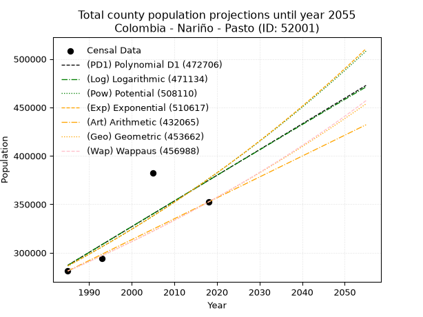
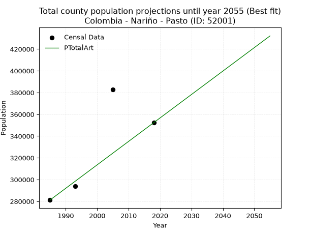
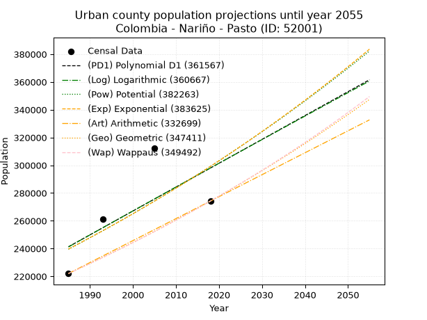
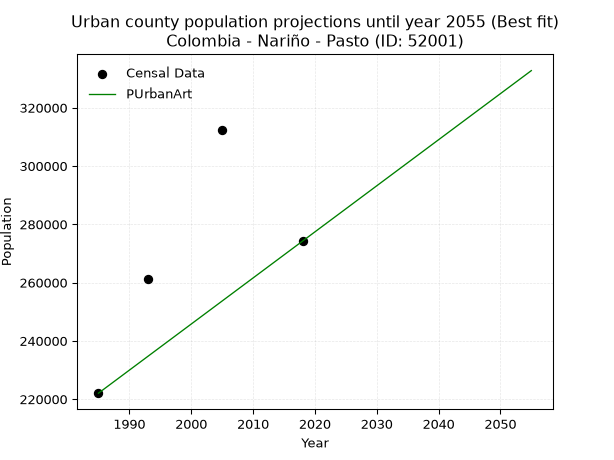
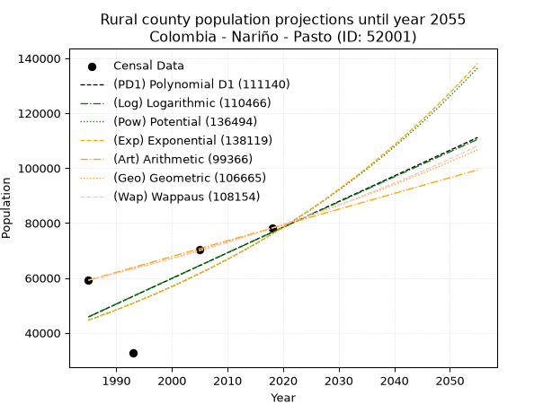
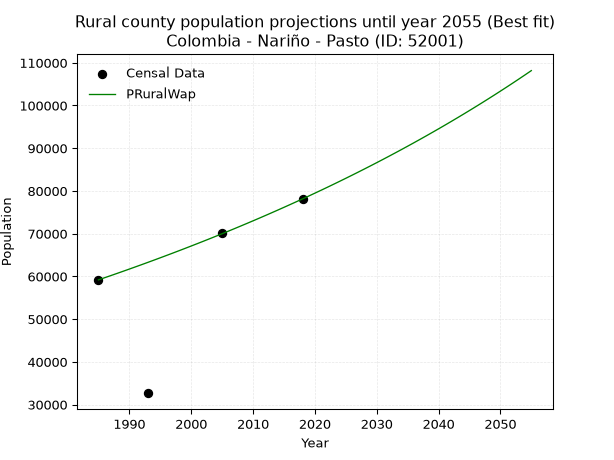

<div align="center">


</div>

# 📜 _“Population and Public Services Demand Projections (PPSD) until Year 2050 for Colombia - Nariño - Pasto (ID: 52001)”_
Keywords: `population` `public-service` `projection` `lineal` `polynomial` `logarithmic` `potential` `exponential` `arithmetic` `geometric` `wappaus` `dane` `colombia` `south-america`

PPSD are analytical estimates used by governments and planners to anticipate future changes in population size, age distribution, and the resulting community needs for utilities, healthcare, education, and infrastructure as sizing future water treatment facilities, electrical grids, and road networks based on spatial growth.

<div align="center">

</img>

</div>


> **General running parameters**: • app_version: _v20260806_. • Python version: _3.14.7_. • Pandas version: _3.0.5_. • NumPy version: _2.5.1_. • Creates, save and include plots into reports (create_plot): _False_. • Projection until year: _2050_. • Process polynomial degree 2 and up: _False_. • Process Wappaus: _True_. • Process Wappaus: _True_. • Set negative values to zero: _True_. • Set infinite values to zero: _True_. • Drop dataset notes: _True_. 
<div align="center">

Maps & GIS Layers: [:earth_americas:Google](http://maps.google.com/maps?q=1.212352307,-77.2787952) [:earth_americas:OSM](https://www.openstreetmap.org/#map=18/1.212352307/-77.2787952&layers=P) [:earth_americas:Bing](https://www.bing.com/maps?cp=1.212352307~-77.2787952&lvl=18) [:earth_americas:Apple](https://maps.apple.com/frame?center=1.212352307%2C-77.2787952&span=0.003%2C0.006) [:earth_americas:GISMobile](https://github.com/rcfdtools/R.GISMobile/blob/main/file/gis/CountyLayer_CO/Readme.md)

</div>


<div align="center">

```geojson
{
  "type": "Feature",
  "geometry": {
    "type": "Point", 
    "coordinates": [-77.2787952, 1.212352307]
  }, 
  "properties": {
    "Name": "Colombia - Nariño - Pasto (ID: 52001)"
  }
}
```

</div>


## 0. Census Data (4 records)

Census data are official statistics collected by a government about the people and housing in a country. They usually include counts of total population, age, sex, race, income, education, and jobs.

📅Global census file: [Population.xlsx](../data/Population.xlsx)

| Source   |   Year |   CountryID | CountryName   |   StateID | StateName   |   CountyID | CountyName   |   PTotal |   PUrban |   PRural |
|:---------|-------:|------------:|:--------------|----------:|:------------|-----------:|:-------------|---------:|---------:|---------:|
| DANE     |   1985 |          57 | Colombia      |        52 | Nariño      |      52001 | Pasto        |   281207 |   222025 |    59182 |
| DANE     |   1993 |          57 | Colombia      |        52 | Nariño      |      52001 | Pasto        |   294024 |   261368 |    32656 |
| DANE     |   2005 |          57 | Colombia      |        52 | Nariño      |      52001 | Pasto        |   382618 |   312377 |    70241 |
| DANE     |   2018 |          57 | Colombia      |        52 | Nariño      |      52001 | Pasto        |   352326 |   274200 |    78126 |

> 🔥Some records could had specific notes about the registered values or the corresponding urban or rural distribution.

📅[SUI-RUPS](https://www.datos.gov.co/Hacienda-y-Cr-dito-P-blico/Registro-nico-de-Prestadores-de-Servicios-P-blicos/4qkq-csdn/about_data) - Local public utility companies: [RUPS.csv](../data/RUPS.csv)

 | SERVICIO       | ESTADO    | NOMBRE                                                                                                                | NIT         | DEPARTAMENTO_DOMICILIO   | MUNICIPIO_DOMICILIO   | DIRECCION                                      |   TELEFONO | EMAIL                                | TIPO_PRESTADOR                             | CLASIFICACION                 |
|:---------------|:----------|:----------------------------------------------------------------------------------------------------------------------|:------------|:-------------------------|:----------------------|:-----------------------------------------------|-----------:|:-------------------------------------|:-------------------------------------------|:------------------------------|
| ACUEDUCTO      | OPERATIVA | EMPRESA DE OBRAS SANITARIAS DE PASTO EMPOPASTO S.A. E.S.P.                                                            | 891200686-3 | NARINO                   | PASTO                 | Carrera 24 No. 21-40                           |    7330030 | jhonny.estrella@empopasto.com.co     | SOCIEDADES (EMPRESA DE SERVICIOS PUBLICOS) | MAYOR O IGUAL A 5001 USUARIOS |
| ALCANTARILLADO | OPERATIVA | EMPRESA DE OBRAS SANITARIAS DE PASTO EMPOPASTO S.A. E.S.P.                                                            | 891200686-3 | NARINO                   | PASTO                 | Carrera 24 No. 21-40                           |    7330030 | jhonny.estrella@empopasto.com.co     | SOCIEDADES (EMPRESA DE SERVICIOS PUBLICOS) | MAYOR O IGUAL A 5001 USUARIOS |
| ACUEDUCTO      | OPERATIVA | JUNTA ADMINISTRADORA DEL ACUEDUCTO RURAL DE BOTANILLA                                                                 | 900068805-1 | NARINO                   | PASTO                 | CASA 55A BOTANILLA                             |    7333173 | acueductobotanilla@hotmail.com       | ORGANIZACION AUTORIZADA                    | HASTA 2500 SUSCRIPTORES       |
| ACUEDUCTO      | OPERATIVA | JUNTA ADMINISTRADORA DEL ACUEDUCTO EL ROSARIO                                                                         | 800161176-1 | NARINO                   | PASTO                 | DIAGONAL 14 No 14 EA 43 VEREDA EL ROSARIO      |    7320554 | juntadeacueducto2017@hotmail.com     | ORGANIZACION AUTORIZADA                    | MENOR O IGUAL A 2500 USUARIOS |
| ALCANTARILLADO | OPERATIVA | JUNTA ADMINISTRADORA DEL ACUEDUCTO EL ROSARIO                                                                         | 800161176-1 | NARINO                   | PASTO                 | DIAGONAL 14 No 14 EA 43 VEREDA EL ROSARIO      |    7320554 | juntadeacueducto2017@hotmail.com     | ORGANIZACION AUTORIZADA                    | MENOR O IGUAL A 2500 USUARIOS |
| ACUEDUCTO      | OPERATIVA | JUNTA ADMINISTRADORA DEL ACUEDUCTO DE CUBIJAN BAJO                                                                    | 814004221-2 | NARINO                   | PASTO                 | KILOMETRO 12SUR VIA PASTO-IPIALES              |    0000000 | alvaropupiales2008@gmail.com         | ORGANIZACION AUTORIZADA                    | HASTA 2500 SUSCRIPTORES       |
| ACUEDUCTO      | OPERATIVA | JUNTA ADMINISTRADORA DEL ACUEDUCTO BARRIO LAS BRISAS                                                                  | 900058328-5 | NARINO                   | PASTO                 | MZ 9 CASA 4 LAS BRISAS                         |    7305544 | tiopapo71@hotmail.com                | ORGANIZACION AUTORIZADA                    | HASTA 2500 SUSCRIPTORES       |
| ACUEDUCTO      | OPERATIVA | JUNTA ADMINISTRADORA DE ACUEDUCTO Y ALCANTARILLADO DE ANGANOY                                                         | 900100180-1 | NARINO                   | PASTO                 | KRA 36 CALLE 6 JUNTO AL CAI VDA ANGANOY        |    7225276 | barrerabotina@gmail.com              | ORGANIZACION AUTORIZADA                    | MENOR O IGUAL A 2500 USUARIOS |
| ACUEDUCTO      | OPERATIVA | JUNTA ADMINISTRADORA DE AGUA POTABLE DE LA VEREDA SAN ANTONIO DE CASANARE CORREGIMIENTO DE CATAMBUCO                  | 830503696-6 | NARINO                   | PASTO                 | SAN ANTONIO CASANARE                           |    3136009 | contacto@pasto-narino.gov.co         | ORGANIZACION AUTORIZADA                    | HASTA 2500 SUSCRIPTORES       |
| ACUEDUCTO      | OPERATIVA | JUNTA ADMINISTRADORA DEL ACUEDUCTO DE CATAMBUCO                                                                       | 814006694-1 | NARINO                   | PASTO                 | CATAMBUCO KRA 3 No 2-56                        |    3122484 | acueductocatambucocentro@hotmail.com | ORGANIZACION AUTORIZADA                    | HASTA 2500 SUSCRIPTORES       |
| ALCANTARILLADO | OPERATIVA | JUNTA ADMINISTRADORA DEL ACUEDUCTO DE CATAMBUCO                                                                       | 814006694-1 | NARINO                   | PASTO                 | CATAMBUCO KRA 3 No 2-56                        |    3122484 | acueductocatambucocentro@hotmail.com | ORGANIZACION AUTORIZADA                    | HASTA 2500 SUSCRIPTORES       |
| ACUEDUCTO      | OPERATIVA | ASOCIACION JUNTA ADMINISTRADORA DE ACUEDUCTO DE SAN JOSE Y ALTO CASANARE                                              | 900401147-1 | NARINO                   | PASTO                 | VEREDA ALTO CASANARE                           |    3113814 | acueductocasanarepasto@gmail.com     | ORGANIZACION AUTORIZADA                    | HASTA 2500 SUSCRIPTORES       |
| ACUEDUCTO      | OPERATIVA | JUNTA ADMINISTRADORA DE ACUEDUCTO ARANDA                                                                              | 814005102-9 | NARINO                   | PASTO                 | ARANDA PUEBLO CASA 55 B                        |    3155823 | luisjairo789@hotmail.com             | ORGANIZACION AUTORIZADA                    | HASTA 2500 SUSCRIPTORES       |
| ACUEDUCTO      | OPERATIVA | ASOCIACION JUNTA ADMINISTRADORA DE ACUEDUCTO AGUAS BAJO CASANARE                                                      | 900417579-8 | NARINO                   | PASTO                 | VEREDA CASANERE BAJO                           |    3116448 | aguascasanare@hotmail.com            | ORGANIZACION AUTORIZADA                    | HASTA 2500 SUSCRIPTORES       |
| ACUEDUCTO      | OPERATIVA | ASOCIACION DE USUARIOS DE ACUEDUCTO Y ALCANTARILLADO DE JONGOVITO                                                     | 814005715-3 | NARINO                   | PASTO                 | casa 81 A Jongovito Vereda San Pedro           |    7208491 | asociacionjongovito@gmail.com        | ORGANIZACION AUTORIZADA                    | HASTA 2500 SUSCRIPTORES       |
| ACUEDUCTO      | OPERATIVA | JUNTA ADMINISTRADORA DEL ACUDUCTO DE BUESAQUILLO                                                                      | 814002550-1 | NARINO                   | PASTO                 | oficina del corregidor de buesaquillo centro   |    7324257 | acueductobuesaquillo@hotmail.com     | ORGANIZACION AUTORIZADA                    | HASTA 2500 SUSCRIPTORES       |
| ACUEDUCTO      | OPERATIVA | JUNTA ADMINISTRADORA DEL ACUEDUCTO DE LA VEREDA EL CARMEN CORREGIMIENTO SANTA BARBARA                                 | 900154023-5 | NARINO                   | PASTO                 | VEREDA EL CARMEN CORREGIMIENTO DEL SOCORRO     |    3137310 | contactenos@pasto-narino.gov.co      | ORGANIZACION AUTORIZADA                    | HASTA 2500 SUSCRIPTORES       |
| ACUEDUCTO      | OPERATIVA | JUNTA ADMINISTRADORA DEL ACUEDUCTO Y ALCANTARILLDO BARRIO LA ESTRELLA                                                 | 814001944-5 | NARINO                   | PASTO                 | CALLE 22 No 11 ESTE  - 200 ESTRELLA DE ORIENTE |    7325651 | contactenos@pasto.gov.co             | ORGANIZACION AUTORIZADA                    | HASTA 2500 SUSCRIPTORES       |
| ACUEDUCTO      | OPERATIVA | ASOCIACION ADMINISTRADORA DE ACUEDUCTO LOS ROBLES Y LA GEMELA                                                         | 900347596-2 | NARINO                   | PASTO                 | VEREDA PRADERA BAJO CORREG CALDERA             |    7302377 | aaroblesygemela@hotmail.com          | ORGANIZACION AUTORIZADA                    | HASTA 2500 SUSCRIPTORES       |
| ACUEDUCTO      | OPERATIVA | EMPRESA DE SERVICIOS PÚBLICOS VITALES DE ACUEDUCTO ALCANTARILLADO ASEO ELECTRICIDAD GAS Y COMUNICACIONES S.A., E.S.P. | 900637558-7 | NARINO                   | PASTO                 | CARRERA 24 No 20-58                            |    7364494 | gerenciaacuagen@gmail.com            | SOCIEDADES (EMPRESA DE SERVICIOS PUBLICOS) | MENOR O IGUAL A 2500 USUARIOS |
| ALCANTARILLADO | OPERATIVA | EMPRESA DE SERVICIOS PÚBLICOS VITALES DE ACUEDUCTO ALCANTARILLADO ASEO ELECTRICIDAD GAS Y COMUNICACIONES S.A., E.S.P. | 900637558-7 | NARINO                   | PASTO                 | CARRERA 24 No 20-58                            |    7364494 | gerenciaacuagen@gmail.com            | SOCIEDADES (EMPRESA DE SERVICIOS PUBLICOS) | MENOR O IGUAL A 2500 USUARIOS |
| ACUEDUCTO      | OPERATIVA | ASOCIACION COMUNITARIA DE SERVICIO DE AGUA Y SANEAMIENTO BASICO DEL CORREGIMIENTO DE EL ENCANO                        | 900100734-1 | NARINO                   | PASTO                 | calle 3 No 2 - 14                              |    7232340 | acsaben374@gmail.com                 | ORGANIZACION AUTORIZADA                    | MENOR O IGUAL A 2500 USUARIOS |
| ACUEDUCTO      | OPERATIVA | JUNTA ADMINISTRADORA DE ACUEDUCTO Y ALCANTARILLADO ALTO CANCHALA                                                      | 901114426-2 | NARINO                   | PASTO                 | CARRERA 12ESTE No. 20A - 11 ALTO CANCHALA      |    7301259 | pattykadjg@hotmail.com               | ORGANIZACION AUTORIZADA                    | MENOR O IGUAL A 2500 USUARIOS |
| ACUEDUCTO      | OPERATIVA | ASOCIACION JUNTA ADMINISTRADORA DE ACUEDUCTO                                                                          | 900036490-6 | NARINO                   | PASTO                 | calle 19 B 8este 02 barrio puerres             |    7294421 | poncho841133@gmail.com               | ORGANIZACION AUTORIZADA                    | MENOR O IGUAL A 2500 USUARIOS |
| ACUEDUCTO      | OPERATIVA | ASOCIACION ADMINISTRADORA DE AGUAS DEL SOCORRO                                                                        | 900760426-9 | NARINO                   | PASTO                 | vereda cirmarrones                             |    7308619 | elsocorro@gobiernopasto.gov.co       | ORGANIZACION AUTORIZADA                    | MENOR O IGUAL A 2500 USUARIOS |

## 1. Total

### 1.1. Coefficients and Parameters

* (PD1) Polynomial Deg 1: 2651.3709353673366, -4975860.963468515 (lineal)
* (Log) Logarithmic: 5313595.380455472, -40061137.317323096
* (Pow) Potential: 16.545489104305098, -49.106134546453134
* (Exp) Exponential: 0.008256326347734084, 0.021853921732382094
* (Art) Arithmetic: Year diff. 2018 - 1985 = 33, Population diff. 352326 - 281207 = 71119, Annual growth = 2155.121212121212
* (Geo) Geometric: Year diff. 2018 - 1985 = 33, Population diff. 352326 - 281207 = 71119, Annual growth % = 0.006855691285316157
* (Wap) Wappaus: i = 0.6803501039791809, Condition values only valid for < 200)

<sub>
Wappaus condition values: ['0.00', '0.68', '1.36', '2.04', '2.72', '3.40', '4.08', '4.76', '5.44', '6.12', '6.80', '7.48', '8.16', '8.84', '9.52', '10.21', '10.89', '11.57', '12.25', '12.93', '13.61', '14.29', '14.97', '15.65', '16.33', '17.01', '17.69', '18.37', '19.05', '19.73', '20.41', '21.09', '21.77', '22.45', '23.13', '23.81', '24.49', '25.17', '25.85', '26.53', '27.21', '27.89', '28.57', '29.26', '29.94', '30.62', '31.30', '31.98', '32.66', '33.34', '34.02', '34.70', '35.38', '36.06', '36.74', '37.42', '38.10', '38.78', '39.46', '40.14', '40.82', '41.50', '42.18', '42.86', '43.54', '44.22']
</sub>


### 1.2. Projected Dataset

|   Year |   CountyID |   PTotalPD1 |   PTotalLog |   PTotalPow |   PTotalExp |   PTotalArt |   PTotalGeo |   PTotalWap |
|-------:|-----------:|------------:|------------:|------------:|------------:|------------:|------------:|------------:|
|   1985 |      52001 |      287110 |      286981 |      286369 |      286483 |      281207 |      281207 |      281207 |
|   1986 |      52001 |      289762 |      289657 |      288765 |      288858 |      283362 |      283135 |      283127 |
|   1987 |      52001 |      292413 |      292332 |      291181 |      291252 |      285517 |      285076 |      285060 |
|   1988 |      52001 |      295064 |      295005 |      293615 |      293667 |      287672 |      287030 |      287006 |
|   1989 |      52001 |      297716 |      297677 |      296068 |      296102 |      289827 |      288998 |      288965 |
|   1990 |      52001 |      300367 |      300348 |      298540 |      298557 |      291983 |      290979 |      290938 |
|   1991 |      52001 |      303019 |      303018 |      301032 |      301032 |      294138 |      292974 |      292925 |
|   1992 |      52001 |      305670 |      305686 |      303544 |      303527 |      296293 |      294983 |      294926 |
|   1993 |      52001 |      308321 |      308353 |      306075 |      306044 |      298448 |      297005 |      296941 |
|   1994 |      52001 |      310973 |      311018 |      308626 |      308581 |      300603 |      299041 |      298970 |
|   1995 |      52001 |      313624 |      313682 |      311197 |      311139 |      302758 |      301091 |      301013 |
|   1996 |      52001 |      316275 |      316345 |      313788 |      313719 |      304913 |      303156 |      303070 |
|   1997 |      52001 |      318927 |      319007 |      316399 |      316320 |      307068 |      305234 |      305142 |
|   1998 |      52001 |      321578 |      321667 |      319030 |      318942 |      309224 |      307327 |      307229 |
|   1999 |      52001 |      324230 |      324325 |      321683 |      321586 |      311379 |      309434 |      309331 |
|   2000 |      52001 |      326881 |      326983 |      324356 |      324252 |      313534 |      311555 |      311448 |
|   2001 |      52001 |      329532 |      329639 |      327049 |      326941 |      315689 |      313691 |      313580 |
|   2002 |      52001 |      332184 |      332294 |      329764 |      329651 |      317844 |      315841 |      315728 |
|   2003 |      52001 |      334835 |      334947 |      332500 |      332384 |      319999 |      318007 |      317891 |
|   2004 |      52001 |      337486 |      337599 |      335257 |      335140 |      322154 |      320187 |      320069 |
|   2005 |      52001 |      340138 |      340250 |      338036 |      337918 |      324309 |      322382 |      322264 |
|   2006 |      52001 |      342789 |      342900 |      340836 |      340720 |      326465 |      324592 |      324475 |
|   2007 |      52001 |      345441 |      345548 |      343658 |      343545 |      328620 |      326817 |      326702 |
|   2008 |      52001 |      348092 |      348195 |      346503 |      346393 |      330775 |      329058 |      328945 |
|   2009 |      52001 |      350743 |      350840 |      349369 |      349264 |      332930 |      331314 |      331206 |
|   2010 |      52001 |      353395 |      353485 |      352257 |      352160 |      335085 |      333585 |      333483 |
|   2011 |      52001 |      356046 |      356128 |      355168 |      355080 |      337240 |      335872 |      335776 |
|   2012 |      52001 |      358697 |      358769 |      358102 |      358023 |      339395 |      338175 |      338088 |
|   2013 |      52001 |      361349 |      361409 |      361058 |      360992 |      341550 |      340493 |      340416 |
|   2014 |      52001 |      364000 |      364048 |      364037 |      363984 |      343706 |      342828 |      342762 |
|   2015 |      52001 |      366651 |      366686 |      367039 |      367002 |      345861 |      345178 |      345126 |
|   2016 |      52001 |      369303 |      369323 |      370065 |      370045 |      348016 |      347544 |      347508 |
|   2017 |      52001 |      371954 |      371958 |      373113 |      373113 |      350171 |      349927 |      349908 |
|   2018 |      52001 |      374606 |      374591 |      376186 |      376206 |      352326 |      352326 |      352326 |
|   2019 |      52001 |      377257 |      377224 |      379282 |      379325 |      354481 |      354741 |      354763 |
|   2020 |      52001 |      379908 |      379855 |      382402 |      382470 |      356636 |      357173 |      357219 |
|   2021 |      52001 |      382560 |      382485 |      385547 |      385640 |      358791 |      359622 |      359694 |
|   2022 |      52001 |      385211 |      385113 |      388715 |      388838 |      360946 |      362088 |      362188 |
|   2023 |      52001 |      387862 |      387741 |      391908 |      392061 |      363102 |      364570 |      364701 |
|   2024 |      52001 |      390514 |      390366 |      395126 |      395312 |      365257 |      367069 |      367235 |
|   2025 |      52001 |      393165 |      392991 |      398368 |      398589 |      367412 |      369586 |      369788 |
|   2026 |      52001 |      395817 |      395614 |      401636 |      401893 |      369567 |      372120 |      372361 |
|   2027 |      52001 |      398468 |      398237 |      404928 |      405225 |      371722 |      374671 |      374955 |
|   2028 |      52001 |      401119 |      400857 |      408246 |      408585 |      373877 |      377239 |      377570 |
|   2029 |      52001 |      403771 |      403477 |      411590 |      411972 |      376032 |      379826 |      380205 |
|   2030 |      52001 |      406422 |      406095 |      414959 |      415388 |      378187 |      382430 |      382862 |
|   2031 |      52001 |      409073 |      408712 |      418354 |      418831 |      380343 |      385051 |      385540 |
|   2032 |      52001 |      411725 |      411327 |      421775 |      422304 |      382498 |      387691 |      388240 |
|   2033 |      52001 |      414376 |      413942 |      425223 |      425805 |      384653 |      390349 |      390961 |
|   2034 |      52001 |      417028 |      416555 |      428697 |      429335 |      386808 |      393025 |      393705 |
|   2035 |      52001 |      419679 |      419167 |      432197 |      432894 |      388963 |      395720 |      396472 |
|   2036 |      52001 |      422330 |      421777 |      435725 |      436483 |      391118 |      398433 |      399261 |
|   2037 |      52001 |      424982 |      424386 |      439279 |      440102 |      393273 |      401164 |      402073 |
|   2038 |      52001 |      427633 |      426994 |      442861 |      443751 |      395428 |      403914 |      404909 |
|   2039 |      52001 |      430284 |      429601 |      446470 |      447430 |      397584 |      406683 |      407768 |
|   2040 |      52001 |      432936 |      432206 |      450107 |      451139 |      399739 |      409472 |      410651 |
|   2041 |      52001 |      435587 |      434810 |      453771 |      454879 |      401894 |      412279 |      413558 |
|   2042 |      52001 |      438238 |      437413 |      457464 |      458650 |      404049 |      415105 |      416490 |
|   2043 |      52001 |      440890 |      440014 |      461184 |      462453 |      406204 |      417951 |      419447 |
|   2044 |      52001 |      443541 |      442615 |      464934 |      466287 |      408359 |      420816 |      422429 |
|   2045 |      52001 |      446193 |      445214 |      468711 |      470153 |      410514 |      423701 |      425436 |
|   2046 |      52001 |      448844 |      447811 |      472518 |      474050 |      412669 |      426606 |      428470 |
|   2047 |      52001 |      451495 |      450408 |      476354 |      477980 |      414825 |      429531 |      431529 |
|   2048 |      52001 |      454147 |      453003 |      480219 |      481943 |      416980 |      432476 |      434615 |
|   2049 |      52001 |      456798 |      455597 |      484113 |      485939 |      419135 |      435440 |      437728 |
|   2050 |      52001 |      459449 |      458189 |      488037 |      489967 |      421290 |      438426 |      440868 |
<div align="center">

</img>

</div>


### 1.3. Best fit with absolute and relative error (%)

Relative error puts that difference into context by dividing the absolute error by the true value, creating a unitless ratio or percentage that shows the scale of the mistake.

Absolute and relative error

|   Year | Source   |   CountryID | CountryName   |   StateID | StateName   |   CountyID_x | CountyName   |   PTotal |   PUrban |   PRural |   CountyID_y |   PTotalPD1 |   PTotalLog |   PTotalPow |   PTotalExp |   PTotalArt |   PTotalGeo |   PTotalWap |   PTotalPD1AbsError |   PTotalLogAbsError |   PTotalPowAbsError |   PTotalExpAbsError |   PTotalArtAbsError |   PTotalGeoAbsError |   PTotalWapAbsError |   PTotalPD1RelError |   PTotalLogRelError |   PTotalPowRelError |   PTotalExpRelError |   PTotalArtRelError |   PTotalGeoRelError |   PTotalWapRelError |
|-------:|:---------|------------:|:--------------|----------:|:------------|-------------:|:-------------|---------:|---------:|---------:|-------------:|------------:|------------:|------------:|------------:|------------:|------------:|------------:|--------------------:|--------------------:|--------------------:|--------------------:|--------------------:|--------------------:|--------------------:|--------------------:|--------------------:|--------------------:|--------------------:|--------------------:|--------------------:|--------------------:|
|   1985 | DANE     |          57 | Colombia      |        52 | Nariño      |        52001 | Pasto        |   281207 |   222025 |    59182 |        52001 |      287110 |      286981 |      286369 |      286483 |      281207 |      281207 |      281207 |                5903 |                5774 |                5162 |                5276 |                   0 |                   0 |                   0 |             2.09917 |             2.05329 |             1.83566 |             1.8762  |             0       |             0       |            0        |
|   1993 | DANE     |          57 | Colombia      |        52 | Nariño      |        52001 | Pasto        |   294024 |   261368 |    32656 |        52001 |      308321 |      308353 |      306075 |      306044 |      298448 |      297005 |      296941 |               14297 |               14329 |               12051 |               12020 |                4424 |                2981 |                2917 |             4.86253 |             4.87341 |             4.09865 |             4.0881  |             1.50464 |             1.01386 |            0.992096 |
|   2005 | DANE     |          57 | Colombia      |        52 | Nariño      |        52001 | Pasto        |   382618 |   312377 |    70241 |        52001 |      340138 |      340250 |      338036 |      337918 |      324309 |      322382 |      322264 |               42480 |               42368 |               44582 |               44700 |               58309 |               60236 |               60354 |            11.1025  |            11.0732  |            11.6518  |            11.6827  |            15.2395  |            15.7431  |           15.774    |
|   2018 | DANE     |          57 | Colombia      |        52 | Nariño      |        52001 | Pasto        |   352326 |   274200 |    78126 |        52001 |      374606 |      374591 |      376186 |      376206 |      352326 |      352326 |      352326 |               22280 |               22265 |               23860 |               23880 |                   0 |                   0 |                   0 |             6.32369 |             6.31943 |             6.77214 |             6.77781 |             0       |             0       |            0        |

Relative error mean

| Method    |   RelError | Best   |
|:----------|-----------:|:-------|
| PTotalPD1 |    6.09696 |        |
| PTotalLog |    6.07983 |        |
| PTotalPow |    6.08957 |        |
| PTotalExp |    6.1062  |        |
| PTotalArt |    4.18603 | True   |
| PTotalGeo |    4.18924 |        |
| PTotalWap |    4.19151 |        |

💙Best method: _**PTotalArt**_
<div align="center">

</img>

</div>


### 1.4. Fresh water supply demand in liters per capita per day (lpcd)

The fresh water supply demand typically ranges from 100 to 300 liters per capita per day (lpcd) for standard domestic and municipal planning, though absolute survival minimums set by the World Health Organization are as low as 7.5 to 20 liters per day, and total consumption in high-income nations can exceed 400 liters.

> `CZ`: Level in meters above the sea level (masl)<br> `WS`: Fresh water supply demand in liters per capita per day (lpcd or l/h/d)<br> `WSAll`: Zonal fresh water supply demand in liters per second (l/s)<br> `A`: Zonal area in square meters<br> `DP`: Population density (people/hectare or p/ha)

Reference values (RAS Colombia)

|    CZ |   WS |
|------:|-----:|
|  1000 |  120 |
|  2000 |  130 |
| 99999 |  140 |

County shapefile geometry properties and water supply values

|   CountyID |      ATotal |   CZTotal |   WSTotal |
|-----------:|------------:|----------:|----------:|
|      52001 | 1.10029e+09 |   2980.36 |       140 |

Projected values for best method: PTotalArt

|   CountyID |   Year |   PTotalArt |   DPTotal |   WSTotal |   WSTotalAll |
|-----------:|-------:|------------:|----------:|----------:|-------------:|
|      52001 |   1985 |      281207 |      2.56 |       140 |      455.659 |
|      52001 |   1986 |      283362 |      2.58 |       140 |      459.151 |
|      52001 |   1987 |      285517 |      2.59 |       140 |      462.643 |
|      52001 |   1988 |      287672 |      2.61 |       140 |      466.135 |
|      52001 |   1989 |      289827 |      2.63 |       140 |      469.627 |
|      52001 |   1990 |      291983 |      2.65 |       140 |      473.121 |
|      52001 |   1991 |      294138 |      2.67 |       140 |      476.613 |
|      52001 |   1992 |      296293 |      2.69 |       140 |      480.104 |
|      52001 |   1993 |      298448 |      2.71 |       140 |      483.596 |
|      52001 |   1994 |      300603 |      2.73 |       140 |      487.088 |
|      52001 |   1995 |      302758 |      2.75 |       140 |      490.58  |
|      52001 |   1996 |      304913 |      2.77 |       140 |      494.072 |
|      52001 |   1997 |      307068 |      2.79 |       140 |      497.564 |
|      52001 |   1998 |      309224 |      2.81 |       140 |      501.057 |
|      52001 |   1999 |      311379 |      2.83 |       140 |      504.549 |
|      52001 |   2000 |      313534 |      2.85 |       140 |      508.041 |
|      52001 |   2001 |      315689 |      2.87 |       140 |      511.533 |
|      52001 |   2002 |      317844 |      2.89 |       140 |      515.025 |
|      52001 |   2003 |      319999 |      2.91 |       140 |      518.517 |
|      52001 |   2004 |      322154 |      2.93 |       140 |      522.009 |
|      52001 |   2005 |      324309 |      2.95 |       140 |      525.501 |
|      52001 |   2006 |      326465 |      2.97 |       140 |      528.994 |
|      52001 |   2007 |      328620 |      2.99 |       140 |      532.486 |
|      52001 |   2008 |      330775 |      3.01 |       140 |      535.978 |
|      52001 |   2009 |      332930 |      3.03 |       140 |      539.47  |
|      52001 |   2010 |      335085 |      3.05 |       140 |      542.962 |
|      52001 |   2011 |      337240 |      3.07 |       140 |      546.454 |
|      52001 |   2012 |      339395 |      3.08 |       140 |      549.946 |
|      52001 |   2013 |      341550 |      3.1  |       140 |      553.438 |
|      52001 |   2014 |      343706 |      3.12 |       140 |      556.931 |
|      52001 |   2015 |      345861 |      3.14 |       140 |      560.423 |
|      52001 |   2016 |      348016 |      3.16 |       140 |      563.915 |
|      52001 |   2017 |      350171 |      3.18 |       140 |      567.407 |
|      52001 |   2018 |      352326 |      3.2  |       140 |      570.899 |
|      52001 |   2019 |      354481 |      3.22 |       140 |      574.391 |
|      52001 |   2020 |      356636 |      3.24 |       140 |      577.882 |
|      52001 |   2021 |      358791 |      3.26 |       140 |      581.374 |
|      52001 |   2022 |      360946 |      3.28 |       140 |      584.866 |
|      52001 |   2023 |      363102 |      3.3  |       140 |      588.36  |
|      52001 |   2024 |      365257 |      3.32 |       140 |      591.852 |
|      52001 |   2025 |      367412 |      3.34 |       140 |      595.344 |
|      52001 |   2026 |      369567 |      3.36 |       140 |      598.835 |
|      52001 |   2027 |      371722 |      3.38 |       140 |      602.327 |
|      52001 |   2028 |      373877 |      3.4  |       140 |      605.819 |
|      52001 |   2029 |      376032 |      3.42 |       140 |      609.311 |
|      52001 |   2030 |      378187 |      3.44 |       140 |      612.803 |
|      52001 |   2031 |      380343 |      3.46 |       140 |      616.297 |
|      52001 |   2032 |      382498 |      3.48 |       140 |      619.788 |
|      52001 |   2033 |      384653 |      3.5  |       140 |      623.28  |
|      52001 |   2034 |      386808 |      3.52 |       140 |      626.772 |
|      52001 |   2035 |      388963 |      3.54 |       140 |      630.264 |
|      52001 |   2036 |      391118 |      3.55 |       140 |      633.756 |
|      52001 |   2037 |      393273 |      3.57 |       140 |      637.248 |
|      52001 |   2038 |      395428 |      3.59 |       140 |      640.74  |
|      52001 |   2039 |      397584 |      3.61 |       140 |      644.233 |
|      52001 |   2040 |      399739 |      3.63 |       140 |      647.725 |
|      52001 |   2041 |      401894 |      3.65 |       140 |      651.217 |
|      52001 |   2042 |      404049 |      3.67 |       140 |      654.709 |
|      52001 |   2043 |      406204 |      3.69 |       140 |      658.201 |
|      52001 |   2044 |      408359 |      3.71 |       140 |      661.693 |
|      52001 |   2045 |      410514 |      3.73 |       140 |      665.185 |
|      52001 |   2046 |      412669 |      3.75 |       140 |      668.677 |
|      52001 |   2047 |      414825 |      3.77 |       140 |      672.17  |
|      52001 |   2048 |      416980 |      3.79 |       140 |      675.662 |
|      52001 |   2049 |      419135 |      3.81 |       140 |      679.154 |
|      52001 |   2050 |      421290 |      3.83 |       140 |      682.646 |

## 2. Urban

### 2.1. Coefficients and Parameters

* (PD1) Polynomial Deg 1: 1718.252107587335, -3169441.278201567 (lineal)
* (Log) Logarithmic: 3447967.354426848, -25940534.991274796
* (Pow) Potential: 13.485237697245665, -39.09169212240672
* (Exp) Exponential: 0.006720901376584246, 0.38518531655457044
* (Art) Arithmetic: Year diff. 2018 - 1985 = 33, Population diff. 274200 - 222025 = 52175, Annual growth = 1581.060606060606
* (Geo) Geometric: Year diff. 2018 - 1985 = 33, Population diff. 274200 - 222025 = 52175, Annual growth % = 0.006416491346178166
* (Wap) Wappaus: i = 0.6372353694636933, Condition values only valid for < 200)

<sub>
Wappaus condition values: ['0.00', '0.64', '1.27', '1.91', '2.55', '3.19', '3.82', '4.46', '5.10', '5.74', '6.37', '7.01', '7.65', '8.28', '8.92', '9.56', '10.20', '10.83', '11.47', '12.11', '12.74', '13.38', '14.02', '14.66', '15.29', '15.93', '16.57', '17.21', '17.84', '18.48', '19.12', '19.75', '20.39', '21.03', '21.67', '22.30', '22.94', '23.58', '24.21', '24.85', '25.49', '26.13', '26.76', '27.40', '28.04', '28.68', '29.31', '29.95', '30.59', '31.22', '31.86', '32.50', '33.14', '33.77', '34.41', '35.05', '35.69', '36.32', '36.96', '37.60', '38.23', '38.87', '39.51', '40.15', '40.78', '41.42']
</sub>


### 2.2. Projected Dataset

|   Year |   CountyID |   PUrbanPD1 |   PUrbanLog |   PUrbanPow |   PUrbanExp |   PUrbanArt |   PUrbanGeo |   PUrbanWap |
|-------:|-----------:|------------:|------------:|------------:|------------:|------------:|------------:|------------:|
|   1985 |      52001 |      241289 |      241171 |      239548 |      239656 |      222025 |      222025 |      222025 |
|   1986 |      52001 |      243007 |      242908 |      241180 |      241272 |      223606 |      223450 |      223444 |
|   1987 |      52001 |      244726 |      244644 |      242823 |      242899 |      225187 |      224883 |      224873 |
|   1988 |      52001 |      246444 |      246378 |      244476 |      244537 |      226768 |      226326 |      226310 |
|   1989 |      52001 |      248162 |      248112 |      246140 |      246186 |      228349 |      227779 |      227757 |
|   1990 |      52001 |      249880 |      249845 |      247814 |      247846 |      229930 |      229240 |      229214 |
|   1991 |      52001 |      251599 |      251578 |      249499 |      249517 |      231511 |      230711 |      230679 |
|   1992 |      52001 |      253317 |      253309 |      251194 |      251200 |      233092 |      232191 |      232155 |
|   1993 |      52001 |      255035 |      255039 |      252900 |      252894 |      234673 |      233681 |      233640 |
|   1994 |      52001 |      256753 |      256769 |      254616 |      254599 |      236255 |      235181 |      235134 |
|   1995 |      52001 |      258472 |      258498 |      256343 |      256316 |      237836 |      236690 |      236639 |
|   1996 |      52001 |      260190 |      260226 |      258082 |      258045 |      239417 |      238208 |      238153 |
|   1997 |      52001 |      261908 |      261953 |      259831 |      259785 |      240998 |      239737 |      239678 |
|   1998 |      52001 |      263626 |      263679 |      261591 |      261537 |      242579 |      241275 |      241212 |
|   1999 |      52001 |      265345 |      265404 |      263362 |      263300 |      244160 |      242823 |      242757 |
|   2000 |      52001 |      267063 |      267129 |      265144 |      265076 |      245741 |      244381 |      244313 |
|   2001 |      52001 |      268781 |      268852 |      266937 |      266864 |      247322 |      245949 |      245878 |
|   2002 |      52001 |      270499 |      270575 |      268742 |      268663 |      248903 |      247528 |      247454 |
|   2003 |      52001 |      272218 |      272297 |      270558 |      270475 |      250484 |      249116 |      249041 |
|   2004 |      52001 |      273936 |      274018 |      272385 |      272299 |      252065 |      250714 |      250639 |
|   2005 |      52001 |      275654 |      275738 |      274224 |      274135 |      253646 |      252323 |      252247 |
|   2006 |      52001 |      277372 |      277457 |      276074 |      275984 |      255227 |      253942 |      253867 |
|   2007 |      52001 |      279091 |      279175 |      277936 |      277845 |      256808 |      255571 |      255497 |
|   2008 |      52001 |      280809 |      280893 |      279809 |      279719 |      258389 |      257211 |      257139 |
|   2009 |      52001 |      282527 |      282610 |      281694 |      281605 |      259970 |      258862 |      258792 |
|   2010 |      52001 |      284245 |      284325 |      283591 |      283504 |      261552 |      260523 |      260457 |
|   2011 |      52001 |      285964 |      286040 |      285499 |      285416 |      263133 |      262194 |      262133 |
|   2012 |      52001 |      287682 |      287755 |      287420 |      287340 |      264714 |      263877 |      263821 |
|   2013 |      52001 |      289400 |      289468 |      289352 |      289278 |      266295 |      265570 |      265520 |
|   2014 |      52001 |      291118 |      291180 |      291296 |      291229 |      267876 |      267274 |      267232 |
|   2015 |      52001 |      292837 |      292892 |      293253 |      293193 |      269457 |      268989 |      268956 |
|   2016 |      52001 |      294555 |      294603 |      295222 |      295170 |      271038 |      270715 |      270691 |
|   2017 |      52001 |      296273 |      296312 |      297202 |      297160 |      272619 |      272452 |      272439 |
|   2018 |      52001 |      297991 |      298021 |      299196 |      299164 |      274200 |      274200 |      274200 |
|   2019 |      52001 |      299710 |      299730 |      301201 |      301182 |      275781 |      275959 |      275973 |
|   2020 |      52001 |      301428 |      301437 |      303219 |      303213 |      277362 |      277730 |      277759 |
|   2021 |      52001 |      303146 |      303143 |      305250 |      305258 |      278943 |      279512 |      279558 |
|   2022 |      52001 |      304864 |      304849 |      307293 |      307316 |      280524 |      281306 |      281369 |
|   2023 |      52001 |      306583 |      306554 |      309349 |      309388 |      282105 |      283111 |      283194 |
|   2024 |      52001 |      308301 |      308258 |      311417 |      311475 |      283686 |      284927 |      285032 |
|   2025 |      52001 |      310019 |      309961 |      313498 |      313575 |      285267 |      286755 |      286884 |
|   2026 |      52001 |      311737 |      311663 |      315593 |      315690 |      286848 |      288595 |      288749 |
|   2027 |      52001 |      313456 |      313365 |      317700 |      317819 |      288430 |      290447 |      290628 |
|   2028 |      52001 |      315174 |      315065 |      319820 |      319962 |      290011 |      292311 |      292521 |
|   2029 |      52001 |      316892 |      316765 |      321953 |      322120 |      291592 |      294186 |      294427 |
|   2030 |      52001 |      318611 |      318464 |      324099 |      324292 |      293173 |      296074 |      296348 |
|   2031 |      52001 |      320329 |      320162 |      326259 |      326479 |      294754 |      297974 |      298284 |
|   2032 |      52001 |      322047 |      321859 |      328432 |      328680 |      296335 |      299886 |      300233 |
|   2033 |      52001 |      323765 |      323556 |      330618 |      330897 |      297916 |      301810 |      302198 |
|   2034 |      52001 |      325484 |      325251 |      332818 |      333128 |      299497 |      303747 |      304177 |
|   2035 |      52001 |      327202 |      326946 |      335031 |      335375 |      301078 |      305696 |      306171 |
|   2036 |      52001 |      328920 |      328640 |      337258 |      337636 |      302659 |      307657 |      308181 |
|   2037 |      52001 |      330638 |      330333 |      339499 |      339913 |      304240 |      309631 |      310206 |
|   2038 |      52001 |      332357 |      332025 |      341753 |      342205 |      305821 |      311618 |      312246 |
|   2039 |      52001 |      334075 |      333717 |      344022 |      344513 |      307402 |      313617 |      314302 |
|   2040 |      52001 |      335793 |      335407 |      346304 |      346836 |      308983 |      315630 |      316374 |
|   2041 |      52001 |      337511 |      337097 |      348600 |      349175 |      310564 |      317655 |      318462 |
|   2042 |      52001 |      339230 |      338786 |      350910 |      351530 |      312145 |      319693 |      320566 |
|   2043 |      52001 |      340948 |      340474 |      353235 |      353900 |      313727 |      321744 |      322687 |
|   2044 |      52001 |      342666 |      342161 |      355574 |      356287 |      315308 |      323809 |      324824 |
|   2045 |      52001 |      344384 |      343848 |      357927 |      358690 |      316889 |      325887 |      326978 |
|   2046 |      52001 |      346103 |      345534 |      360294 |      361108 |      318470 |      327978 |      329150 |
|   2047 |      52001 |      347821 |      347218 |      362676 |      363544 |      320051 |      330082 |      331338 |
|   2048 |      52001 |      349539 |      348902 |      365073 |      365995 |      321632 |      332200 |      333544 |
|   2049 |      52001 |      351257 |      350586 |      367484 |      368463 |      323213 |      334332 |      335767 |
|   2050 |      52001 |      352976 |      352268 |      369910 |      370948 |      324794 |      336477 |      338009 |
<div align="center">

</img>

</div>


### 2.3. Best fit with absolute and relative error (%)

Relative error puts that difference into context by dividing the absolute error by the true value, creating a unitless ratio or percentage that shows the scale of the mistake.

Absolute and relative error

|   Year | Source   |   CountryID | CountryName   |   StateID | StateName   |   CountyID_x | CountyName   |   PTotal |   PUrban |   PRural |   CountyID_y |   PUrbanPD1 |   PUrbanLog |   PUrbanPow |   PUrbanExp |   PUrbanArt |   PUrbanGeo |   PUrbanWap |   PUrbanPD1AbsError |   PUrbanLogAbsError |   PUrbanPowAbsError |   PUrbanExpAbsError |   PUrbanArtAbsError |   PUrbanGeoAbsError |   PUrbanWapAbsError |   PUrbanPD1RelError |   PUrbanLogRelError |   PUrbanPowRelError |   PUrbanExpRelError |   PUrbanArtRelError |   PUrbanGeoRelError |   PUrbanWapRelError |
|-------:|:---------|------------:|:--------------|----------:|:------------|-------------:|:-------------|---------:|---------:|---------:|-------------:|------------:|------------:|------------:|------------:|------------:|------------:|------------:|--------------------:|--------------------:|--------------------:|--------------------:|--------------------:|--------------------:|--------------------:|--------------------:|--------------------:|--------------------:|--------------------:|--------------------:|--------------------:|--------------------:|
|   1985 | DANE     |          57 | Colombia      |        52 | Nariño      |        52001 | Pasto        |   281207 |   222025 |    59182 |        52001 |      241289 |      241171 |      239548 |      239656 |      222025 |      222025 |      222025 |               19264 |               19146 |               17523 |               17631 |                   0 |                   0 |                   0 |             8.6765  |             8.62335 |             7.89235 |             7.941   |              0      |              0      |              0      |
|   1993 | DANE     |          57 | Colombia      |        52 | Nariño      |        52001 | Pasto        |   294024 |   261368 |    32656 |        52001 |      255035 |      255039 |      252900 |      252894 |      234673 |      233681 |      233640 |                6333 |                6329 |                8468 |                8474 |               26695 |               27687 |               27728 |             2.42302 |             2.42149 |             3.23988 |             3.24217 |             10.2136 |             10.5931 |             10.6088 |
|   2005 | DANE     |          57 | Colombia      |        52 | Nariño      |        52001 | Pasto        |   382618 |   312377 |    70241 |        52001 |      275654 |      275738 |      274224 |      274135 |      253646 |      252323 |      252247 |               36723 |               36639 |               38153 |               38242 |               58731 |               60054 |               60130 |            11.756   |            11.7291  |            12.2138  |            12.2423  |             18.8013 |             19.2248 |             19.2492 |
|   2018 | DANE     |          57 | Colombia      |        52 | Nariño      |        52001 | Pasto        |   352326 |   274200 |    78126 |        52001 |      297991 |      298021 |      299196 |      299164 |      274200 |      274200 |      274200 |               23791 |               23821 |               24996 |               24964 |                   0 |                   0 |                   0 |             8.67651 |             8.68745 |             9.11597 |             9.1043  |              0      |              0      |              0      |

Relative error mean

| Method    |   RelError | Best   |
|:----------|-----------:|:-------|
| PUrbanPD1 |    7.88301 |        |
| PUrbanLog |    7.86535 |        |
| PUrbanPow |    8.11549 |        |
| PUrbanExp |    8.13243 |        |
| PUrbanArt |    7.25372 | True   |
| PUrbanGeo |    7.45449 |        |
| PUrbanWap |    7.46449 |        |

💙Best method: _**PUrbanArt**_
<div align="center">

</img>

</div>


### 2.4. Fresh water supply demand in liters per capita per day (lpcd)

The fresh water supply demand typically ranges from 100 to 300 liters per capita per day (lpcd) for standard domestic and municipal planning, though absolute survival minimums set by the World Health Organization are as low as 7.5 to 20 liters per day, and total consumption in high-income nations can exceed 400 liters.

> `CZ`: Level in meters above the sea level (masl)<br> `WS`: Fresh water supply demand in liters per capita per day (lpcd or l/h/d)<br> `WSAll`: Zonal fresh water supply demand in liters per second (l/s)<br> `A`: Zonal area in square meters<br> `DP`: Population density (people/hectare or p/ha)

Reference values (RAS Colombia)

|    CZ |   WS |
|------:|-----:|
|  1000 |  120 |
|  2000 |  130 |
| 99999 |  140 |

County shapefile geometry properties and water supply values

|   CountyID |      AUrban |   CZUrban |   WSUrban |
|-----------:|------------:|----------:|----------:|
|      52001 | 2.53263e+07 |   2580.24 |       140 |

Projected values for best method: PUrbanArt

|   CountyID |   Year |   PUrbanArt |   DPUrban |   WSUrban |   WSUrbanAll |
|-----------:|-------:|------------:|----------:|----------:|-------------:|
|      52001 |   1985 |      222025 |     87.67 |       140 |      359.763 |
|      52001 |   1986 |      223606 |     88.29 |       140 |      362.325 |
|      52001 |   1987 |      225187 |     88.91 |       140 |      364.886 |
|      52001 |   1988 |      226768 |     89.54 |       140 |      367.448 |
|      52001 |   1989 |      228349 |     90.16 |       140 |      370.01  |
|      52001 |   1990 |      229930 |     90.79 |       140 |      372.572 |
|      52001 |   1991 |      231511 |     91.41 |       140 |      375.134 |
|      52001 |   1992 |      233092 |     92.04 |       140 |      377.695 |
|      52001 |   1993 |      234673 |     92.66 |       140 |      380.257 |
|      52001 |   1994 |      236255 |     93.28 |       140 |      382.821 |
|      52001 |   1995 |      237836 |     93.91 |       140 |      385.382 |
|      52001 |   1996 |      239417 |     94.53 |       140 |      387.944 |
|      52001 |   1997 |      240998 |     95.16 |       140 |      390.506 |
|      52001 |   1998 |      242579 |     95.78 |       140 |      393.068 |
|      52001 |   1999 |      244160 |     96.41 |       140 |      395.63  |
|      52001 |   2000 |      245741 |     97.03 |       140 |      398.191 |
|      52001 |   2001 |      247322 |     97.65 |       140 |      400.753 |
|      52001 |   2002 |      248903 |     98.28 |       140 |      403.315 |
|      52001 |   2003 |      250484 |     98.9  |       140 |      405.877 |
|      52001 |   2004 |      252065 |     99.53 |       140 |      408.439 |
|      52001 |   2005 |      253646 |    100.15 |       140 |      411     |
|      52001 |   2006 |      255227 |    100.78 |       140 |      413.562 |
|      52001 |   2007 |      256808 |    101.4  |       140 |      416.124 |
|      52001 |   2008 |      258389 |    102.02 |       140 |      418.686 |
|      52001 |   2009 |      259970 |    102.65 |       140 |      421.248 |
|      52001 |   2010 |      261552 |    103.27 |       140 |      423.811 |
|      52001 |   2011 |      263133 |    103.9  |       140 |      426.373 |
|      52001 |   2012 |      264714 |    104.52 |       140 |      428.935 |
|      52001 |   2013 |      266295 |    105.15 |       140 |      431.497 |
|      52001 |   2014 |      267876 |    105.77 |       140 |      434.058 |
|      52001 |   2015 |      269457 |    106.39 |       140 |      436.62  |
|      52001 |   2016 |      271038 |    107.02 |       140 |      439.182 |
|      52001 |   2017 |      272619 |    107.64 |       140 |      441.744 |
|      52001 |   2018 |      274200 |    108.27 |       140 |      444.306 |
|      52001 |   2019 |      275781 |    108.89 |       140 |      446.867 |
|      52001 |   2020 |      277362 |    109.52 |       140 |      449.429 |
|      52001 |   2021 |      278943 |    110.14 |       140 |      451.991 |
|      52001 |   2022 |      280524 |    110.76 |       140 |      454.553 |
|      52001 |   2023 |      282105 |    111.39 |       140 |      457.115 |
|      52001 |   2024 |      283686 |    112.01 |       140 |      459.676 |
|      52001 |   2025 |      285267 |    112.64 |       140 |      462.238 |
|      52001 |   2026 |      286848 |    113.26 |       140 |      464.8   |
|      52001 |   2027 |      288430 |    113.89 |       140 |      467.363 |
|      52001 |   2028 |      290011 |    114.51 |       140 |      469.925 |
|      52001 |   2029 |      291592 |    115.13 |       140 |      472.487 |
|      52001 |   2030 |      293173 |    115.76 |       140 |      475.049 |
|      52001 |   2031 |      294754 |    116.38 |       140 |      477.611 |
|      52001 |   2032 |      296335 |    117.01 |       140 |      480.172 |
|      52001 |   2033 |      297916 |    117.63 |       140 |      482.734 |
|      52001 |   2034 |      299497 |    118.26 |       140 |      485.296 |
|      52001 |   2035 |      301078 |    118.88 |       140 |      487.858 |
|      52001 |   2036 |      302659 |    119.5  |       140 |      490.42  |
|      52001 |   2037 |      304240 |    120.13 |       140 |      492.981 |
|      52001 |   2038 |      305821 |    120.75 |       140 |      495.543 |
|      52001 |   2039 |      307402 |    121.38 |       140 |      498.105 |
|      52001 |   2040 |      308983 |    122    |       140 |      500.667 |
|      52001 |   2041 |      310564 |    122.62 |       140 |      503.229 |
|      52001 |   2042 |      312145 |    123.25 |       140 |      505.791 |
|      52001 |   2043 |      313727 |    123.87 |       140 |      508.354 |
|      52001 |   2044 |      315308 |    124.5  |       140 |      510.916 |
|      52001 |   2045 |      316889 |    125.12 |       140 |      513.478 |
|      52001 |   2046 |      318470 |    125.75 |       140 |      516.039 |
|      52001 |   2047 |      320051 |    126.37 |       140 |      518.601 |
|      52001 |   2048 |      321632 |    127    |       140 |      521.163 |
|      52001 |   2049 |      323213 |    127.62 |       140 |      523.725 |
|      52001 |   2050 |      324794 |    128.24 |       140 |      526.287 |

## 3. Rural

### 3.1. Coefficients and Parameters

* (PD1) Polynomial Deg 1: 933.1188277800007, -1806419.6852669464 (lineal)
* (Log) Logarithmic: 1865628.0260286273, -14120602.326048335
* (Pow) Potential: 32.27079180757445, -101.77194635709826
* (Exp) Exponential: 0.016144176832171026, 5.39483376699444e-10
* (Art) Arithmetic: Year diff. 2018 - 1985 = 33, Population diff. 78126 - 59182 = 18944, Annual growth = 574.060606060606
* (Geo) Geometric: Year diff. 2018 - 1985 = 33, Population diff. 78126 - 59182 = 18944, Annual growth % = 0.008450825478971025
* (Wap) Wappaus: i = 0.8361648353491509, Condition values only valid for < 200)

<sub>
Wappaus condition values: ['0.00', '0.84', '1.67', '2.51', '3.34', '4.18', '5.02', '5.85', '6.69', '7.53', '8.36', '9.20', '10.03', '10.87', '11.71', '12.54', '13.38', '14.21', '15.05', '15.89', '16.72', '17.56', '18.40', '19.23', '20.07', '20.90', '21.74', '22.58', '23.41', '24.25', '25.08', '25.92', '26.76', '27.59', '28.43', '29.27', '30.10', '30.94', '31.77', '32.61', '33.45', '34.28', '35.12', '35.96', '36.79', '37.63', '38.46', '39.30', '40.14', '40.97', '41.81', '42.64', '43.48', '44.32', '45.15', '45.99', '46.83', '47.66', '48.50', '49.33', '50.17', '51.01', '51.84', '52.68', '53.51', '54.35']
</sub>


### 3.2. Projected Dataset

|   Year |   CountyID |   PRuralPD1 |   PRuralLog |   PRuralPow |   PRuralExp |   PRuralArt |   PRuralGeo |   PRuralWap |
|-------:|-----------:|------------:|------------:|------------:|------------:|------------:|------------:|------------:|
|   1985 |      52001 |       45821 |       45809 |       44606 |       44613 |       59182 |       59182 |       59182 |
|   1986 |      52001 |       46754 |       46749 |       45337 |       45339 |       59756 |       59682 |       59679 |
|   1987 |      52001 |       47687 |       47688 |       46080 |       46077 |       60330 |       60187 |       60180 |
|   1988 |      52001 |       48621 |       48627 |       46834 |       46827 |       60904 |       60695 |       60685 |
|   1989 |      52001 |       49554 |       49565 |       47600 |       47589 |       61478 |       61208 |       61195 |
|   1990 |      52001 |       50487 |       50503 |       48379 |       48364 |       62052 |       61725 |       61709 |
|   1991 |      52001 |       51420 |       51440 |       49169 |       49151 |       62626 |       62247 |       62228 |
|   1992 |      52001 |       52353 |       52377 |       49973 |       49951 |       63200 |       62773 |       62750 |
|   1993 |      52001 |       53286 |       53313 |       50789 |       50764 |       63774 |       63303 |       63278 |
|   1994 |      52001 |       54219 |       54249 |       51618 |       51590 |       64349 |       63838 |       63810 |
|   1995 |      52001 |       55152 |       55184 |       52459 |       52429 |       64923 |       64378 |       64347 |
|   1996 |      52001 |       56085 |       56119 |       53315 |       53283 |       65497 |       64922 |       64888 |
|   1997 |      52001 |       57019 |       57054 |       54184 |       54150 |       66071 |       65471 |       65434 |
|   1998 |      52001 |       57952 |       57988 |       55066 |       55031 |       66645 |       66024 |       65985 |
|   1999 |      52001 |       58885 |       58921 |       55962 |       55927 |       67219 |       66582 |       66541 |
|   2000 |      52001 |       59818 |       59854 |       56873 |       56837 |       67793 |       67145 |       67102 |
|   2001 |      52001 |       60751 |       60787 |       57798 |       57762 |       68367 |       67712 |       67667 |
|   2002 |      52001 |       61684 |       61719 |       58737 |       58702 |       68941 |       68284 |       68238 |
|   2003 |      52001 |       62617 |       62651 |       59691 |       59658 |       69515 |       68861 |       68814 |
|   2004 |      52001 |       63550 |       63582 |       60661 |       60629 |       70089 |       69443 |       69396 |
|   2005 |      52001 |       64484 |       64513 |       61645 |       61615 |       70663 |       70030 |       69982 |
|   2006 |      52001 |       65417 |       65443 |       62645 |       62618 |       71237 |       70622 |       70574 |
|   2007 |      52001 |       66350 |       66373 |       63661 |       63637 |       71811 |       71219 |       71172 |
|   2008 |      52001 |       67283 |       67302 |       64692 |       64673 |       72385 |       71820 |       71775 |
|   2009 |      52001 |       68216 |       68231 |       65740 |       65725 |       72959 |       72427 |       72383 |
|   2010 |      52001 |       69149 |       69159 |       66805 |       66795 |       73534 |       73039 |       72997 |
|   2011 |      52001 |       70082 |       70087 |       67885 |       67882 |       74108 |       73657 |       73617 |
|   2012 |      52001 |       71015 |       71015 |       68983 |       68987 |       74682 |       74279 |       74243 |
|   2013 |      52001 |       71949 |       71942 |       70098 |       70110 |       75256 |       74907 |       74875 |
|   2014 |      52001 |       72882 |       72868 |       71231 |       71251 |       75830 |       75540 |       75513 |
|   2015 |      52001 |       73815 |       73794 |       72381 |       72411 |       76404 |       76178 |       76157 |
|   2016 |      52001 |       74748 |       74720 |       73549 |       73589 |       76978 |       76822 |       76807 |
|   2017 |      52001 |       75681 |       75645 |       74736 |       74787 |       77552 |       77471 |       77463 |
|   2018 |      52001 |       76614 |       76570 |       75941 |       76004 |       78126 |       78126 |       78126 |
|   2019 |      52001 |       77547 |       77494 |       77165 |       77241 |       78700 |       78786 |       78795 |
|   2020 |      52001 |       78480 |       78418 |       78408 |       78498 |       79274 |       79452 |       79471 |
|   2021 |      52001 |       79413 |       79341 |       79670 |       79776 |       79848 |       80123 |       80153 |
|   2022 |      52001 |       80347 |       80264 |       80952 |       81074 |       80422 |       80801 |       80842 |
|   2023 |      52001 |       81280 |       81187 |       82254 |       82393 |       80996 |       81483 |       81538 |
|   2024 |      52001 |       82213 |       82109 |       83577 |       83734 |       81570 |       82172 |       82241 |
|   2025 |      52001 |       83146 |       83030 |       84919 |       85097 |       82144 |       82866 |       82951 |
|   2026 |      52001 |       84079 |       83951 |       86283 |       86482 |       82718 |       83567 |       83669 |
|   2027 |      52001 |       85012 |       84872 |       87668 |       87890 |       83293 |       84273 |       84393 |
|   2028 |      52001 |       85945 |       85792 |       89075 |       89320 |       83867 |       84985 |       85125 |
|   2029 |      52001 |       86878 |       86712 |       90503 |       90774 |       84441 |       85703 |       85864 |
|   2030 |      52001 |       87812 |       87631 |       91954 |       92251 |       85015 |       86428 |       86611 |
|   2031 |      52001 |       88745 |       88550 |       93427 |       93753 |       85589 |       87158 |       87366 |
|   2032 |      52001 |       89678 |       89468 |       94923 |       95278 |       86163 |       87895 |       88128 |
|   2033 |      52001 |       90611 |       90386 |       96442 |       96829 |       86737 |       88637 |       88899 |
|   2034 |      52001 |       91544 |       91303 |       97985 |       98405 |       87311 |       89386 |       89677 |
|   2035 |      52001 |       92477 |       92220 |       99551 |      100007 |       87885 |       90142 |       90464 |
|   2036 |      52001 |       93410 |       93137 |      101142 |      101634 |       88459 |       90904 |       91259 |
|   2037 |      52001 |       94343 |       94053 |      102758 |      103288 |       89033 |       91672 |       92063 |
|   2038 |      52001 |       95276 |       94969 |      104398 |      104969 |       89607 |       92446 |       92875 |
|   2039 |      52001 |       96210 |       95884 |      106064 |      106678 |       90181 |       93228 |       93697 |
|   2040 |      52001 |       97143 |       96799 |      107756 |      108414 |       90755 |       94016 |       94527 |
|   2041 |      52001 |       98076 |       97713 |      109473 |      110178 |       91329 |       94810 |       95366 |
|   2042 |      52001 |       99009 |       98627 |      111218 |      111972 |       91903 |       95611 |       96214 |
|   2043 |      52001 |       99942 |       99540 |      112989 |      113794 |       92478 |       96419 |       97072 |
|   2044 |      52001 |      100875 |      100453 |      114787 |      115646 |       93052 |       97234 |       97939 |
|   2045 |      52001 |      101808 |      101366 |      116613 |      117528 |       93626 |       98056 |       98816 |
|   2046 |      52001 |      102741 |      102278 |      118468 |      119441 |       94200 |       98884 |       99702 |
|   2047 |      52001 |      103675 |      103189 |      120351 |      121385 |       94774 |       99720 |      100599 |
|   2048 |      52001 |      104608 |      104101 |      122262 |      123360 |       95348 |      100563 |      101506 |
|   2049 |      52001 |      105541 |      105011 |      124204 |      125368 |       95922 |      101413 |      102423 |
|   2050 |      52001 |      106474 |      105922 |      126175 |      127408 |       96496 |      102270 |      103351 |
<div align="center">

</img>

</div>


### 3.3. Best fit with absolute and relative error (%)

Relative error puts that difference into context by dividing the absolute error by the true value, creating a unitless ratio or percentage that shows the scale of the mistake.

Absolute and relative error

|   Year | Source   |   CountryID | CountryName   |   StateID | StateName   |   CountyID_x | CountyName   |   PTotal |   PUrban |   PRural |   CountyID_y |   PRuralPD1 |   PRuralLog |   PRuralPow |   PRuralExp |   PRuralArt |   PRuralGeo |   PRuralWap |   PRuralPD1AbsError |   PRuralLogAbsError |   PRuralPowAbsError |   PRuralExpAbsError |   PRuralArtAbsError |   PRuralGeoAbsError |   PRuralWapAbsError |   PRuralPD1RelError |   PRuralLogRelError |   PRuralPowRelError |   PRuralExpRelError |   PRuralArtRelError |   PRuralGeoRelError |   PRuralWapRelError |
|-------:|:---------|------------:|:--------------|----------:|:------------|-------------:|:-------------|---------:|---------:|---------:|-------------:|------------:|------------:|------------:|------------:|------------:|------------:|------------:|--------------------:|--------------------:|--------------------:|--------------------:|--------------------:|--------------------:|--------------------:|--------------------:|--------------------:|--------------------:|--------------------:|--------------------:|--------------------:|--------------------:|
|   1985 | DANE     |          57 | Colombia      |        52 | Nariño      |        52001 | Pasto        |   281207 |   222025 |    59182 |        52001 |       45821 |       45809 |       44606 |       44613 |       59182 |       59182 |       59182 |               13361 |               13373 |               14576 |               14569 |                   0 |                   0 |                   0 |            22.5761  |            22.5964  |            24.6291  |            24.6173  |            0        |            0        |            0        |
|   1993 | DANE     |          57 | Colombia      |        52 | Nariño      |        52001 | Pasto        |   294024 |   261368 |    32656 |        52001 |       53286 |       53313 |       50789 |       50764 |       63774 |       63303 |       63278 |               20630 |               20657 |               18133 |               18108 |               31118 |               30647 |               30622 |            63.1737  |            63.2564  |            55.5273  |            55.4508  |           95.2903   |           93.848    |           93.7714   |
|   2005 | DANE     |          57 | Colombia      |        52 | Nariño      |        52001 | Pasto        |   382618 |   312377 |    70241 |        52001 |       64484 |       64513 |       61645 |       61615 |       70663 |       70030 |       69982 |                5757 |                5728 |                8596 |                8626 |                 422 |                 211 |                 259 |             8.19607 |             8.15478 |            12.2379  |            12.2806  |            0.600789 |            0.300394 |            0.368731 |
|   2018 | DANE     |          57 | Colombia      |        52 | Nariño      |        52001 | Pasto        |   352326 |   274200 |    78126 |        52001 |       76614 |       76570 |       75941 |       76004 |       78126 |       78126 |       78126 |                1512 |                1556 |                2185 |                2122 |                   0 |                   0 |                   0 |             1.93534 |             1.99165 |             2.79676 |             2.71613 |            0        |            0        |            0        |

Relative error mean

| Method    |   RelError | Best   |
|:----------|-----------:|:-------|
| PRuralPD1 |    23.9703 |        |
| PRuralLog |    23.9998 |        |
| PRuralPow |    23.7978 |        |
| PRuralExp |    23.7662 |        |
| PRuralArt |    23.9728 |        |
| PRuralGeo |    23.5371 |        |
| PRuralWap |    23.535  | True   |

💙Best method: _**PRuralWap**_
<div align="center">

</img>

</div>


### 3.4. Fresh water supply demand in liters per capita per day (lpcd)

The fresh water supply demand typically ranges from 100 to 300 liters per capita per day (lpcd) for standard domestic and municipal planning, though absolute survival minimums set by the World Health Organization are as low as 7.5 to 20 liters per day, and total consumption in high-income nations can exceed 400 liters.

> `CZ`: Level in meters above the sea level (masl)<br> `WS`: Fresh water supply demand in liters per capita per day (lpcd or l/h/d)<br> `WSAll`: Zonal fresh water supply demand in liters per second (l/s)<br> `A`: Zonal area in square meters<br> `DP`: Population density (people/hectare or p/ha)

Reference values (RAS Colombia)

|    CZ |   WS |
|------:|-----:|
|  1000 |  120 |
|  2000 |  130 |
| 99999 |  140 |

County shapefile geometry properties and water supply values

|   CountyID |      ARural |   CZRural |   WSRural |
|-----------:|------------:|----------:|----------:|
|      52001 | 1.07497e+09 |   2989.82 |       140 |

Projected values for best method: PRuralWap

|   CountyID |   Year |   PRuralWap |   DPRural |   WSRural |   WSRuralAll |
|-----------:|-------:|------------:|----------:|----------:|-------------:|
|      52001 |   1985 |       59182 |      0.55 |       140 |      95.8968 |
|      52001 |   1986 |       59679 |      0.56 |       140 |      96.7021 |
|      52001 |   1987 |       60180 |      0.56 |       140 |      97.5139 |
|      52001 |   1988 |       60685 |      0.56 |       140 |      98.3322 |
|      52001 |   1989 |       61195 |      0.57 |       140 |      99.1586 |
|      52001 |   1990 |       61709 |      0.57 |       140 |      99.9914 |
|      52001 |   1991 |       62228 |      0.58 |       140 |     100.832  |
|      52001 |   1992 |       62750 |      0.58 |       140 |     101.678  |
|      52001 |   1993 |       63278 |      0.59 |       140 |     102.534  |
|      52001 |   1994 |       63810 |      0.59 |       140 |     103.396  |
|      52001 |   1995 |       64347 |      0.6  |       140 |     104.266  |
|      52001 |   1996 |       64888 |      0.6  |       140 |     105.143  |
|      52001 |   1997 |       65434 |      0.61 |       140 |     106.027  |
|      52001 |   1998 |       65985 |      0.61 |       140 |     106.92   |
|      52001 |   1999 |       66541 |      0.62 |       140 |     107.821  |
|      52001 |   2000 |       67102 |      0.62 |       140 |     108.73   |
|      52001 |   2001 |       67667 |      0.63 |       140 |     109.646  |
|      52001 |   2002 |       68238 |      0.63 |       140 |     110.571  |
|      52001 |   2003 |       68814 |      0.64 |       140 |     111.504  |
|      52001 |   2004 |       69396 |      0.65 |       140 |     112.447  |
|      52001 |   2005 |       69982 |      0.65 |       140 |     113.397  |
|      52001 |   2006 |       70574 |      0.66 |       140 |     114.356  |
|      52001 |   2007 |       71172 |      0.66 |       140 |     115.325  |
|      52001 |   2008 |       71775 |      0.67 |       140 |     116.302  |
|      52001 |   2009 |       72383 |      0.67 |       140 |     117.287  |
|      52001 |   2010 |       72997 |      0.68 |       140 |     118.282  |
|      52001 |   2011 |       73617 |      0.68 |       140 |     119.287  |
|      52001 |   2012 |       74243 |      0.69 |       140 |     120.301  |
|      52001 |   2013 |       74875 |      0.7  |       140 |     121.325  |
|      52001 |   2014 |       75513 |      0.7  |       140 |     122.359  |
|      52001 |   2015 |       76157 |      0.71 |       140 |     123.403  |
|      52001 |   2016 |       76807 |      0.71 |       140 |     124.456  |
|      52001 |   2017 |       77463 |      0.72 |       140 |     125.519  |
|      52001 |   2018 |       78126 |      0.73 |       140 |     126.593  |
|      52001 |   2019 |       78795 |      0.73 |       140 |     127.677  |
|      52001 |   2020 |       79471 |      0.74 |       140 |     128.772  |
|      52001 |   2021 |       80153 |      0.75 |       140 |     129.878  |
|      52001 |   2022 |       80842 |      0.75 |       140 |     130.994  |
|      52001 |   2023 |       81538 |      0.76 |       140 |     132.122  |
|      52001 |   2024 |       82241 |      0.77 |       140 |     133.261  |
|      52001 |   2025 |       82951 |      0.77 |       140 |     134.411  |
|      52001 |   2026 |       83669 |      0.78 |       140 |     135.575  |
|      52001 |   2027 |       84393 |      0.79 |       140 |     136.748  |
|      52001 |   2028 |       85125 |      0.79 |       140 |     137.934  |
|      52001 |   2029 |       85864 |      0.8  |       140 |     139.131  |
|      52001 |   2030 |       86611 |      0.81 |       140 |     140.342  |
|      52001 |   2031 |       87366 |      0.81 |       140 |     141.565  |
|      52001 |   2032 |       88128 |      0.82 |       140 |     142.8    |
|      52001 |   2033 |       88899 |      0.83 |       140 |     144.049  |
|      52001 |   2034 |       89677 |      0.83 |       140 |     145.31   |
|      52001 |   2035 |       90464 |      0.84 |       140 |     146.585  |
|      52001 |   2036 |       91259 |      0.85 |       140 |     147.873  |
|      52001 |   2037 |       92063 |      0.86 |       140 |     149.176  |
|      52001 |   2038 |       92875 |      0.86 |       140 |     150.492  |
|      52001 |   2039 |       93697 |      0.87 |       140 |     151.824  |
|      52001 |   2040 |       94527 |      0.88 |       140 |     153.169  |
|      52001 |   2041 |       95366 |      0.89 |       140 |     154.528  |
|      52001 |   2042 |       96214 |      0.9  |       140 |     155.902  |
|      52001 |   2043 |       97072 |      0.9  |       140 |     157.293  |
|      52001 |   2044 |       97939 |      0.91 |       140 |     158.697  |
|      52001 |   2045 |       98816 |      0.92 |       140 |     160.119  |
|      52001 |   2046 |       99702 |      0.93 |       140 |     161.554  |
|      52001 |   2047 |      100599 |      0.94 |       140 |     163.008  |
|      52001 |   2048 |      101506 |      0.94 |       140 |     164.477  |
|      52001 |   2049 |      102423 |      0.95 |       140 |     165.963  |
|      52001 |   2050 |      103351 |      0.96 |       140 |     167.467  |

#

<div align="center"><br><sub>Share this research</sub></div><br>

<sub>**APPS & TOOLS & CONTENT DISCLAIMER**: • NO WARRANTY - This content and software is provided by <a href="https://github.com/rcfdtools" target="_blank">github.com/rcfdtools</a> "as is", without any express or implied warranty, including warranties of merchantability, fitness for a particular purpose, or non-infringement. There is no guarantee that the software will be error-free or operate without interruption. • LIMITATION OF LIABILITY - Neither the authors nor copyright holders will be liable for claims or damages arising from the software or its use. You are responsible for determining if the software is appropriate for your use and assume all associated risks, including errors, legal compliance, and data loss. • NO PROFESSIONAL ADVICE - The software provides general information and does not offer professional advice. It should not replace consultation with professional advisors. [Clauses and global license for rcfdtools use.](https://github.com/rcfdtools/rcfdtools/blob/main/LICENSE.md)</sub>

| [:house: Home](Readme.md)  | [:beginner: Help / Collab](https://github.com/rcfdtools/R.HydroTools/discussions/31) |
|----------------------------|-------------------------------------------------------------------------------------------|