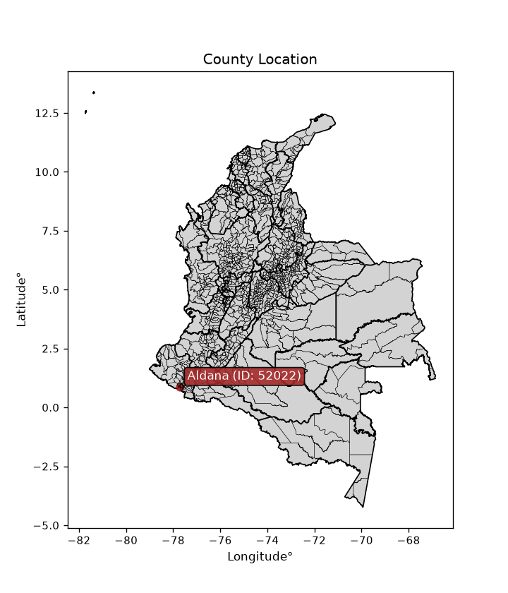
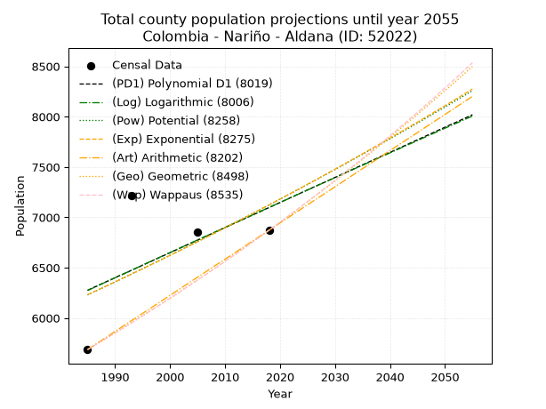
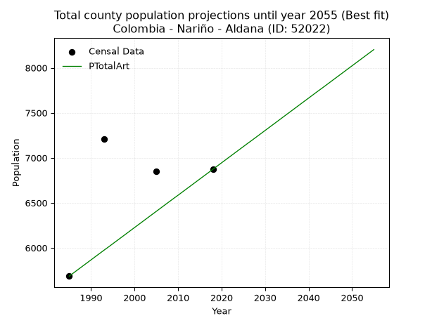
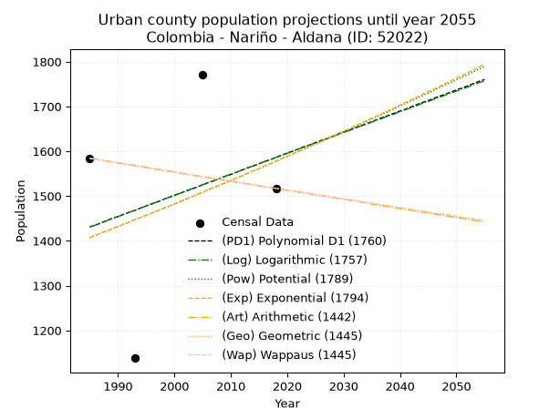
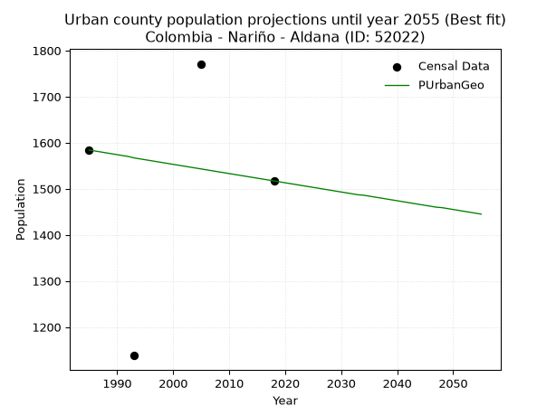
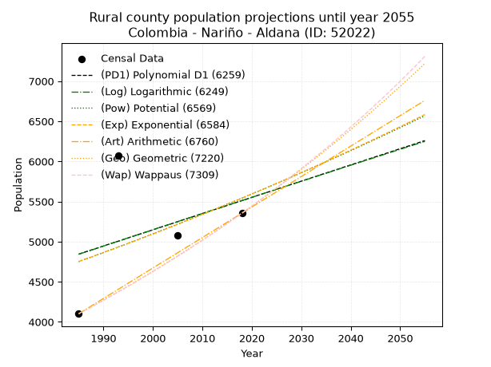
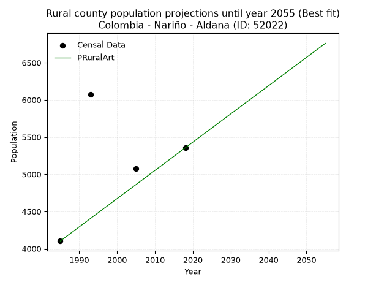

<div align="center">


</div>

# _“Population and Public Services Demand Projections (PPSD) until Year 2050 for Colombia - Nariño - Aldana (ID: 52022)”_
Keywords: `population` `public-service` `projection` `lineal` `polynomial` `logarithmic` `potential` `exponential` `arithmetic` `geometric` `wappaus` `dane` `colombia` `south-america`

PPSD are analytical estimates used by governments and planners to anticipate future changes in population size, age distribution, and the resulting community needs for utilities, healthcare, education, and infrastructure as sizing future water treatment facilities, electrical grids, and road networks based on spatial growth.

> **General running parameters**: • app_version: _v20260806_. • Python version: _3.14.7_. • Pandas version: _3.0.5_. • NumPy version: _2.5.1_. • Creates, save and include plots into reports (create_plot): _False_. • Projection until year: _2050_. • Process polynomial degree 2 and up: _False_. • Process Wappaus: _True_. • Process Wappaus: _True_. • Set negative values to zero: _True_. • Set infinite values to zero: _True_. • Drop dataset notes: _True_. 
<div align="center">

Dynamic map: [:earth_americas:Google](http://maps.google.com/maps?q=0.882381069,-77.7005641) [:earth_americas:OSM](https://www.openstreetmap.org/#map=18/0.882381069/-77.7005641&layers=P) [:earth_americas:Bing](https://www.bing.com/maps?cp=0.882381069~-77.7005641&lvl=18) [:earth_americas:Apple](https://maps.apple.com/frame?center=0.882381069%2C-77.7005641&span=0.003%2C0.006)

</div>


<div align="center">

```geojson
{
  "type": "Feature",
  "geometry": {
    "type": "Point", 
    "coordinates": [-77.7005641, 0.882381069]
  }, 
  "properties": {
    "Name": "Colombia - Nariño - Aldana (ID: 52022)"
  }
}
```

</div>


<div align="center">

</img>

</div>


## 0. Census Data (4 records)

Census data are official statistics collected by a government about the people and housing in a country. They usually include counts of total population, age, sex, race, income, education, and jobs.

📅Global census file: [Population.xlsx](../data/Population.xlsx)

| Source   |   Year |   CountryID | CountryName   |   StateID | StateName   |   CountyID | CountyName   |   PTotal |   PUrban |   PRural |
|:---------|-------:|------------:|:--------------|----------:|:------------|-----------:|:-------------|---------:|---------:|---------:|
| DANE     |   1985 |          57 | Colombia      |        52 | Nariño      |      52022 | Aldana       |     5686 |     1584 |     4102 |
| DANE     |   1993 |          57 | Colombia      |        52 | Nariño      |      52022 | Aldana       |     7212 |     1138 |     6074 |
| DANE     |   2005 |          57 | Colombia      |        52 | Nariño      |      52022 | Aldana       |     6850 |     1771 |     5079 |
| DANE     |   2018 |          57 | Colombia      |        52 | Nariño      |      52022 | Aldana       |     6872 |     1517 |     5355 |

> 🔥Some records could had specific notes about the registered values or the corresponding urban or rural distribution.

📅   [RUPS](https://www.datos.gov.co/Hacienda-y-Cr-dito-P-blico/Registro-nico-de-Prestadores-de-Servicios-P-blicos/4qkq-csdn/about_data) - Local public utility companies: [RUPS.csv](../data/RUPS.xlsx)

 | SERVICIO       | ESTADO    | NOMBRE                                                                                            | NIT         | DEPARTAMENTO_DOMICILIO   | MUNICIPIO_DOMICILIO   | DIRECCION                                   |   TELEFONO | EMAIL                   | TIPO_PRESTADOR          | CLASIFICACION                 |
|:---------------|:----------|:--------------------------------------------------------------------------------------------------|:------------|:-------------------------|:----------------------|:--------------------------------------------|-----------:|:------------------------|:------------------------|:------------------------------|
| ACUEDUCTO      | OPERATIVA | JUNTA ADMINISTRADORA DE ACUEDUCTO Y ALCANTARILLADO DE LA SECCION SAN LUIS DEL MUNICIPIO DE ALDANA | 814007328-5 | NARINO                   | ALDANA                | Cra. 1.  No. 5-35  VIA  AEROPUERTO SAN LUIS |    7739717 | acuasanluis@gmail.com   | ORGANIZACION AUTORIZADA | MENOR O IGUAL A 2500 USUARIOS |
| ALCANTARILLADO | OPERATIVA | JUNTA ADMINISTRADORA DE ACUEDUCTO Y ALCANTARILLADO DE LA SECCION SAN LUIS DEL MUNICIPIO DE ALDANA | 814007328-5 | NARINO                   | ALDANA                | Cra. 1.  No. 5-35  VIA  AEROPUERTO SAN LUIS |    7739717 | acuasanluis@gmail.com   | ORGANIZACION AUTORIZADA | MENOR O IGUAL A 2500 USUARIOS |
| ACUEDUCTO      | OPERATIVA | ADMINISTRACION PUBLICA COOPERATIVA DE SERVICIOS PUBLICOS DOMICILIARIOS DE ALDANA                  | 900311607-1 | NARINO                   | ALDANA                | carrera 5 No. 5A - 32 parque principal      |    7777214 | coopserpal@gmail.com    | ORGANIZACION AUTORIZADA | MENOR O IGUAL A 2500 USUARIOS |
| ALCANTARILLADO | OPERATIVA | ADMINISTRACION PUBLICA COOPERATIVA DE SERVICIOS PUBLICOS DOMICILIARIOS DE ALDANA                  | 900311607-1 | NARINO                   | ALDANA                | carrera 5 No. 5A - 32 parque principal      |    7777214 | coopserpal@gmail.com    | ORGANIZACION AUTORIZADA | MENOR O IGUAL A 2500 USUARIOS |
| ACUEDUCTO      | OPERATIVA | ASOCIACION DE USUARIOS DEL SERVICIO DE AGUAPOTABLE ACUEDUCTO INTERVEREDAL LA LAGUNA CHAPUESMAL    | 814006780-7 | NARINO                   | ALDANA                | La Laguna Chapuesmal                        |    7753719 | alch_aldana@hotmail.com | ORGANIZACION AUTORIZADA | HASTA 2500 SUSCRIPTORES       |

## 1. Total

### 1.1. Coefficients and Parameters

* (PD1) Polynomial Deg 1: 24.916900843034906, -43185.03091128057 (lineal)
* (Log) Logarithmic: 50008.97596520477, -373463.6270583043
* (Pow) Potential: 8.132890517229436, -23.025879298797673
* (Exp) Exponential: 0.004052578018377731, 1.9996064508125764
* (Art) Arithmetic: Year diff. 2018 - 1985 = 33, Population diff. 6872 - 5686 = 1186, Annual growth = 35.93939393939394
* (Geo) Geometric: Year diff. 2018 - 1985 = 33, Population diff. 6872 - 5686 = 1186, Annual growth % = 0.005757363960134265
* (Wap) Wappaus: i = 0.5723744854179637, Condition values only valid for < 200)

<sub>
Wappaus condition values: ['0.00', '0.57', '1.14', '1.72', '2.29', '2.86', '3.43', '4.01', '4.58', '5.15', '5.72', '6.30', '6.87', '7.44', '8.01', '8.59', '9.16', '9.73', '10.30', '10.88', '11.45', '12.02', '12.59', '13.16', '13.74', '14.31', '14.88', '15.45', '16.03', '16.60', '17.17', '17.74', '18.32', '18.89', '19.46', '20.03', '20.61', '21.18', '21.75', '22.32', '22.89', '23.47', '24.04', '24.61', '25.18', '25.76', '26.33', '26.90', '27.47', '28.05', '28.62', '29.19', '29.76', '30.34', '30.91', '31.48', '32.05', '32.63', '33.20', '33.77', '34.34', '34.91', '35.49', '36.06', '36.63', '37.20']
</sub>


### 1.2. Projected Dataset

|   Year |   CountyID |   PTotalPD1 |   PTotalLog |   PTotalPow |   PTotalExp |   PTotalArt |   PTotalGeo |   PTotalWap |
|-------:|-----------:|------------:|------------:|------------:|------------:|------------:|------------:|------------:|
|   1985 |      52022 |        6275 |        6273 |        6229 |        6231 |        5686 |        5686 |        5686 |
|   1986 |      52022 |        6300 |        6298 |        6255 |        6256 |        5722 |        5719 |        5719 |
|   1987 |      52022 |        6325 |        6324 |        6281 |        6282 |        5758 |        5752 |        5751 |
|   1988 |      52022 |        6350 |        6349 |        6306 |        6307 |        5794 |        5785 |        5784 |
|   1989 |      52022 |        6375 |        6374 |        6332 |        6333 |        5830 |        5818 |        5818 |
|   1990 |      52022 |        6400 |        6399 |        6358 |        6359 |        5866 |        5852 |        5851 |
|   1991 |      52022 |        6425 |        6424 |        6384 |        6385 |        5902 |        5885 |        5885 |
|   1992 |      52022 |        6449 |        6449 |        6410 |        6410 |        5938 |        5919 |        5918 |
|   1993 |      52022 |        6474 |        6474 |        6437 |        6436 |        5974 |        5953 |        5952 |
|   1994 |      52022 |        6499 |        6499 |        6463 |        6463 |        6009 |        5988 |        5987 |
|   1995 |      52022 |        6524 |        6525 |        6489 |        6489 |        6045 |        6022 |        6021 |
|   1996 |      52022 |        6549 |        6550 |        6516 |        6515 |        6081 |        6057 |        6056 |
|   1997 |      52022 |        6574 |        6575 |        6542 |        6542 |        6117 |        6092 |        6090 |
|   1998 |      52022 |        6599 |        6600 |        6569 |        6568 |        6153 |        6127 |        6125 |
|   1999 |      52022 |        6624 |        6625 |        6596 |        6595 |        6189 |        6162 |        6161 |
|   2000 |      52022 |        6649 |        6650 |        6623 |        6622 |        6225 |        6197 |        6196 |
|   2001 |      52022 |        6674 |        6675 |        6650 |        6649 |        6261 |        6233 |        6232 |
|   2002 |      52022 |        6699 |        6700 |        6677 |        6676 |        6297 |        6269 |        6268 |
|   2003 |      52022 |        6724 |        6725 |        6704 |        6703 |        6333 |        6305 |        6304 |
|   2004 |      52022 |        6748 |        6750 |        6731 |        6730 |        6369 |        6341 |        6340 |
|   2005 |      52022 |        6773 |        6775 |        6759 |        6757 |        6405 |        6378 |        6376 |
|   2006 |      52022 |        6798 |        6800 |        6786 |        6785 |        6441 |        6415 |        6413 |
|   2007 |      52022 |        6823 |        6824 |        6814 |        6812 |        6477 |        6451 |        6450 |
|   2008 |      52022 |        6848 |        6849 |        6841 |        6840 |        6513 |        6489 |        6487 |
|   2009 |      52022 |        6873 |        6874 |        6869 |        6868 |        6549 |        6526 |        6525 |
|   2010 |      52022 |        6898 |        6899 |        6897 |        6896 |        6584 |        6564 |        6562 |
|   2011 |      52022 |        6923 |        6924 |        6925 |        6924 |        6620 |        6601 |        6600 |
|   2012 |      52022 |        6948 |        6949 |        6953 |        6952 |        6656 |        6639 |        6638 |
|   2013 |      52022 |        6973 |        6974 |        6981 |        6980 |        6692 |        6678 |        6677 |
|   2014 |      52022 |        6998 |        6999 |        7009 |        7008 |        6728 |        6716 |        6715 |
|   2015 |      52022 |        7023 |        7023 |        7038 |        7037 |        6764 |        6755 |        6754 |
|   2016 |      52022 |        7047 |        7048 |        7066 |        7065 |        6800 |        6794 |        6793 |
|   2017 |      52022 |        7072 |        7073 |        7095 |        7094 |        6836 |        6833 |        6832 |
|   2018 |      52022 |        7097 |        7098 |        7123 |        7123 |        6872 |        6872 |        6872 |
|   2019 |      52022 |        7122 |        7123 |        7152 |        7152 |        6908 |        6912 |        6912 |
|   2020 |      52022 |        7147 |        7147 |        7181 |        7181 |        6944 |        6951 |        6952 |
|   2021 |      52022 |        7172 |        7172 |        7210 |        7210 |        6980 |        6991 |        6992 |
|   2022 |      52022 |        7197 |        7197 |        7239 |        7239 |        7016 |        7032 |        7033 |
|   2023 |      52022 |        7222 |        7222 |        7268 |        7269 |        7052 |        7072 |        7074 |
|   2024 |      52022 |        7247 |        7246 |        7297 |        7298 |        7088 |        7113 |        7115 |
|   2025 |      52022 |        7272 |        7271 |        7327 |        7328 |        7124 |        7154 |        7156 |
|   2026 |      52022 |        7297 |        7296 |        7356 |        7357 |        7160 |        7195 |        7198 |
|   2027 |      52022 |        7322 |        7320 |        7386 |        7387 |        7195 |        7236 |        7240 |
|   2028 |      52022 |        7346 |        7345 |        7416 |        7417 |        7231 |        7278 |        7282 |
|   2029 |      52022 |        7371 |        7370 |        7445 |        7447 |        7267 |        7320 |        7324 |
|   2030 |      52022 |        7396 |        7394 |        7475 |        7478 |        7303 |        7362 |        7367 |
|   2031 |      52022 |        7421 |        7419 |        7505 |        7508 |        7339 |        7404 |        7410 |
|   2032 |      52022 |        7446 |        7444 |        7535 |        7539 |        7375 |        7447 |        7453 |
|   2033 |      52022 |        7471 |        7468 |        7566 |        7569 |        7411 |        7490 |        7497 |
|   2034 |      52022 |        7496 |        7493 |        7596 |        7600 |        7447 |        7533 |        7541 |
|   2035 |      52022 |        7521 |        7517 |        7626 |        7631 |        7483 |        7576 |        7585 |
|   2036 |      52022 |        7546 |        7542 |        7657 |        7662 |        7519 |        7620 |        7629 |
|   2037 |      52022 |        7571 |        7566 |        7687 |        7693 |        7555 |        7664 |        7674 |
|   2038 |      52022 |        7596 |        7591 |        7718 |        7724 |        7591 |        7708 |        7719 |
|   2039 |      52022 |        7621 |        7616 |        7749 |        7755 |        7627 |        7752 |        7765 |
|   2040 |      52022 |        7645 |        7640 |        7780 |        7787 |        7663 |        7797 |        7810 |
|   2041 |      52022 |        7670 |        7665 |        7811 |        7819 |        7699 |        7842 |        7856 |
|   2042 |      52022 |        7695 |        7689 |        7842 |        7850 |        7735 |        7887 |        7903 |
|   2043 |      52022 |        7720 |        7714 |        7874 |        7882 |        7770 |        7933 |        7949 |
|   2044 |      52022 |        7745 |        7738 |        7905 |        7914 |        7806 |        7978 |        7996 |
|   2045 |      52022 |        7770 |        7762 |        7936 |        7946 |        7842 |        8024 |        8044 |
|   2046 |      52022 |        7795 |        7787 |        7968 |        7979 |        7878 |        8070 |        8091 |
|   2047 |      52022 |        7820 |        7811 |        8000 |        8011 |        7914 |        8117 |        8139 |
|   2048 |      52022 |        7845 |        7836 |        8032 |        8044 |        7950 |        8164 |        8187 |
|   2049 |      52022 |        7870 |        7860 |        8064 |        8076 |        7986 |        8211 |        8236 |
|   2050 |      52022 |        7895 |        7885 |        8096 |        8109 |        8022 |        8258 |        8285 |
<div align="center">

</img>

</div>


### 1.3. Best fit with absolute and relative error (%)

Relative error puts that difference into context by dividing the absolute error by the true value, creating a unitless ratio or percentage that shows the scale of the mistake.

Absolute and relative error

|   Year | Source   |   CountryID | CountryName   |   StateID | StateName   |   CountyID_x | CountyName   |   PTotal |   PUrban |   PRural |   CountyID_y |   PTotalPD1 |   PTotalLog |   PTotalPow |   PTotalExp |   PTotalArt |   PTotalGeo |   PTotalWap |   PTotalPD1AbsError |   PTotalLogAbsError |   PTotalPowAbsError |   PTotalExpAbsError |   PTotalArtAbsError |   PTotalGeoAbsError |   PTotalWapAbsError |   PTotalPD1RelError |   PTotalLogRelError |   PTotalPowRelError |   PTotalExpRelError |   PTotalArtRelError |   PTotalGeoRelError |   PTotalWapRelError |
|-------:|:---------|------------:|:--------------|----------:|:------------|-------------:|:-------------|---------:|---------:|---------:|-------------:|------------:|------------:|------------:|------------:|------------:|------------:|------------:|--------------------:|--------------------:|--------------------:|--------------------:|--------------------:|--------------------:|--------------------:|--------------------:|--------------------:|--------------------:|--------------------:|--------------------:|--------------------:|--------------------:|
|   1985 | DANE     |          57 | Colombia      |        52 | Nariño      |        52022 | Aldana       |     5686 |     1584 |     4102 |        52022 |        6275 |        6273 |        6229 |        6231 |        5686 |        5686 |        5686 |                 589 |                 587 |                 543 |                 545 |                   0 |                   0 |                   0 |            10.3588  |            10.3236  |             9.54977 |             9.58495 |             0       |             0       |             0       |
|   1993 | DANE     |          57 | Colombia      |        52 | Nariño      |        52022 | Aldana       |     7212 |     1138 |     6074 |        52022 |        6474 |        6474 |        6437 |        6436 |        5974 |        5953 |        5952 |                 738 |                 738 |                 775 |                 776 |                1238 |                1259 |                1260 |            10.2329  |            10.2329  |            10.746   |            10.7598  |            17.1658  |            17.457   |            17.4709  |
|   2005 | DANE     |          57 | Colombia      |        52 | Nariño      |        52022 | Aldana       |     6850 |     1771 |     5079 |        52022 |        6773 |        6775 |        6759 |        6757 |        6405 |        6378 |        6376 |                  77 |                  75 |                  91 |                  93 |                 445 |                 472 |                 474 |             1.12409 |             1.09489 |             1.32847 |             1.35766 |             6.49635 |             6.89051 |             6.91971 |
|   2018 | DANE     |          57 | Colombia      |        52 | Nariño      |        52022 | Aldana       |     6872 |     1517 |     5355 |        52022 |        7097 |        7098 |        7123 |        7123 |        6872 |        6872 |        6872 |                 225 |                 226 |                 251 |                 251 |                   0 |                   0 |                   0 |             3.27416 |             3.28871 |             3.6525  |             3.6525  |             0       |             0       |             0       |

Relative error mean

| Method    |   RelError | Best   |
|:----------|-----------:|:-------|
| PTotalPD1 |    6.24749 |        |
| PTotalLog |    6.23504 |        |
| PTotalPow |    6.31918 |        |
| PTotalExp |    6.33874 |        |
| PTotalArt |    5.91555 | True   |
| PTotalGeo |    6.08688 |        |
| PTotalWap |    6.09765 |        |

💙Best method: _**PTotalArt**_
<div align="center">

</img>

</div>


### 1.4. Fresh water supply demand in liters per capita per day (lpcd)

The fresh water supply demand typically ranges from 100 to 300 liters per capita per day (lpcd) for standard domestic and municipal planning, though absolute survival minimums set by the World Health Organization are as low as 7.5 to 20 liters per day, and total consumption in high-income nations can exceed 400 liters.

> `CZ`: Level in meters above the sea level (masl)<br> `WS`: Fresh water supply demand in liters per capita per day (lpcd or l/h/d)<br> `WSAll`: Zonal fresh water supply demand in liters per second (l/s)<br> `A`: Zonal area in square meters<br> `DP`: Population density (people/hectare or p/ha)

Reference values (RAS Colombia)

|    CZ |   WS |
|------:|-----:|
|  1000 |  120 |
|  2000 |  130 |
| 99999 |  140 |

County shapefile geometry properties and water supply values

|   CountyID |      ATotal |   CZTotal |   WSTotal |
|-----------:|------------:|----------:|----------:|
|      52022 | 4.76915e+07 |   3124.51 |       140 |

Projected values for best method: PTotalArt

|   CountyID |   Year |   PTotalArt |   DPTotal |   WSTotal |   WSTotalAll |
|-----------:|-------:|------------:|----------:|----------:|-------------:|
|      52022 |   1985 |        5686 |      1.19 |       140 |      9.21343 |
|      52022 |   1986 |        5722 |      1.2  |       140 |      9.27176 |
|      52022 |   1987 |        5758 |      1.21 |       140 |      9.33009 |
|      52022 |   1988 |        5794 |      1.21 |       140 |      9.38843 |
|      52022 |   1989 |        5830 |      1.22 |       140 |      9.44676 |
|      52022 |   1990 |        5866 |      1.23 |       140 |      9.50509 |
|      52022 |   1991 |        5902 |      1.24 |       140 |      9.56343 |
|      52022 |   1992 |        5938 |      1.25 |       140 |      9.62176 |
|      52022 |   1993 |        5974 |      1.25 |       140 |      9.68009 |
|      52022 |   1994 |        6009 |      1.26 |       140 |      9.73681 |
|      52022 |   1995 |        6045 |      1.27 |       140 |      9.79514 |
|      52022 |   1996 |        6081 |      1.28 |       140 |      9.85347 |
|      52022 |   1997 |        6117 |      1.28 |       140 |      9.91181 |
|      52022 |   1998 |        6153 |      1.29 |       140 |      9.97014 |
|      52022 |   1999 |        6189 |      1.3  |       140 |     10.0285  |
|      52022 |   2000 |        6225 |      1.31 |       140 |     10.0868  |
|      52022 |   2001 |        6261 |      1.31 |       140 |     10.1451  |
|      52022 |   2002 |        6297 |      1.32 |       140 |     10.2035  |
|      52022 |   2003 |        6333 |      1.33 |       140 |     10.2618  |
|      52022 |   2004 |        6369 |      1.34 |       140 |     10.3201  |
|      52022 |   2005 |        6405 |      1.34 |       140 |     10.3785  |
|      52022 |   2006 |        6441 |      1.35 |       140 |     10.4368  |
|      52022 |   2007 |        6477 |      1.36 |       140 |     10.4951  |
|      52022 |   2008 |        6513 |      1.37 |       140 |     10.5535  |
|      52022 |   2009 |        6549 |      1.37 |       140 |     10.6118  |
|      52022 |   2010 |        6584 |      1.38 |       140 |     10.6685  |
|      52022 |   2011 |        6620 |      1.39 |       140 |     10.7269  |
|      52022 |   2012 |        6656 |      1.4  |       140 |     10.7852  |
|      52022 |   2013 |        6692 |      1.4  |       140 |     10.8435  |
|      52022 |   2014 |        6728 |      1.41 |       140 |     10.9019  |
|      52022 |   2015 |        6764 |      1.42 |       140 |     10.9602  |
|      52022 |   2016 |        6800 |      1.43 |       140 |     11.0185  |
|      52022 |   2017 |        6836 |      1.43 |       140 |     11.0769  |
|      52022 |   2018 |        6872 |      1.44 |       140 |     11.1352  |
|      52022 |   2019 |        6908 |      1.45 |       140 |     11.1935  |
|      52022 |   2020 |        6944 |      1.46 |       140 |     11.2519  |
|      52022 |   2021 |        6980 |      1.46 |       140 |     11.3102  |
|      52022 |   2022 |        7016 |      1.47 |       140 |     11.3685  |
|      52022 |   2023 |        7052 |      1.48 |       140 |     11.4269  |
|      52022 |   2024 |        7088 |      1.49 |       140 |     11.4852  |
|      52022 |   2025 |        7124 |      1.49 |       140 |     11.5435  |
|      52022 |   2026 |        7160 |      1.5  |       140 |     11.6019  |
|      52022 |   2027 |        7195 |      1.51 |       140 |     11.6586  |
|      52022 |   2028 |        7231 |      1.52 |       140 |     11.7169  |
|      52022 |   2029 |        7267 |      1.52 |       140 |     11.7752  |
|      52022 |   2030 |        7303 |      1.53 |       140 |     11.8336  |
|      52022 |   2031 |        7339 |      1.54 |       140 |     11.8919  |
|      52022 |   2032 |        7375 |      1.55 |       140 |     11.9502  |
|      52022 |   2033 |        7411 |      1.55 |       140 |     12.0086  |
|      52022 |   2034 |        7447 |      1.56 |       140 |     12.0669  |
|      52022 |   2035 |        7483 |      1.57 |       140 |     12.1252  |
|      52022 |   2036 |        7519 |      1.58 |       140 |     12.1836  |
|      52022 |   2037 |        7555 |      1.58 |       140 |     12.2419  |
|      52022 |   2038 |        7591 |      1.59 |       140 |     12.3002  |
|      52022 |   2039 |        7627 |      1.6  |       140 |     12.3586  |
|      52022 |   2040 |        7663 |      1.61 |       140 |     12.4169  |
|      52022 |   2041 |        7699 |      1.61 |       140 |     12.4752  |
|      52022 |   2042 |        7735 |      1.62 |       140 |     12.5336  |
|      52022 |   2043 |        7770 |      1.63 |       140 |     12.5903  |
|      52022 |   2044 |        7806 |      1.64 |       140 |     12.6486  |
|      52022 |   2045 |        7842 |      1.64 |       140 |     12.7069  |
|      52022 |   2046 |        7878 |      1.65 |       140 |     12.7653  |
|      52022 |   2047 |        7914 |      1.66 |       140 |     12.8236  |
|      52022 |   2048 |        7950 |      1.67 |       140 |     12.8819  |
|      52022 |   2049 |        7986 |      1.67 |       140 |     12.9403  |
|      52022 |   2050 |        8022 |      1.68 |       140 |     12.9986  |

## 2. Urban

### 2.1. Coefficients and Parameters

* (PD1) Polynomial Deg 1: 4.708952228020999, -7916.581694099004 (lineal)
* (Log) Logarithmic: 9423.657837936515, -70126.79874261002
* (Pow) Potential: 6.938630076728159, -19.733668693985628
* (Exp) Exponential: 0.0034690718229149534, 1.4378091583762551
* (Art) Arithmetic: Year diff. 2018 - 1985 = 33, Population diff. 1517 - 1584 = -67, Annual growth = -2.0303030303030303
* (Geo) Geometric: Year diff. 2018 - 1985 = 33, Population diff. 1517 - 1584 = -67, Annual growth % = -0.0013087971111416241
* (Wap) Wappaus: i = -0.13094505193827993, Condition values only valid for < 200)

<sub>
Wappaus condition values: ['-0.00', '-0.13', '-0.26', '-0.39', '-0.52', '-0.65', '-0.79', '-0.92', '-1.05', '-1.18', '-1.31', '-1.44', '-1.57', '-1.70', '-1.83', '-1.96', '-2.10', '-2.23', '-2.36', '-2.49', '-2.62', '-2.75', '-2.88', '-3.01', '-3.14', '-3.27', '-3.40', '-3.54', '-3.67', '-3.80', '-3.93', '-4.06', '-4.19', '-4.32', '-4.45', '-4.58', '-4.71', '-4.84', '-4.98', '-5.11', '-5.24', '-5.37', '-5.50', '-5.63', '-5.76', '-5.89', '-6.02', '-6.15', '-6.29', '-6.42', '-6.55', '-6.68', '-6.81', '-6.94', '-7.07', '-7.20', '-7.33', '-7.46', '-7.59', '-7.73', '-7.86', '-7.99', '-8.12', '-8.25', '-8.38', '-8.51']
</sub>


### 2.2. Projected Dataset

|   Year |   CountyID |   PUrbanPD1 |   PUrbanLog |   PUrbanPow |   PUrbanExp |   PUrbanArt |   PUrbanGeo |   PUrbanWap |
|-------:|-----------:|------------:|------------:|------------:|------------:|------------:|------------:|------------:|
|   1985 |      52022 |        1431 |        1431 |        1407 |        1407 |        1584 |        1584 |        1584 |
|   1986 |      52022 |        1435 |        1435 |        1412 |        1412 |        1582 |        1582 |        1582 |
|   1987 |      52022 |        1440 |        1440 |        1417 |        1417 |        1580 |        1580 |        1580 |
|   1988 |      52022 |        1445 |        1445 |        1422 |        1422 |        1578 |        1578 |        1578 |
|   1989 |      52022 |        1450 |        1450 |        1427 |        1427 |        1576 |        1576 |        1576 |
|   1990 |      52022 |        1454 |        1454 |        1432 |        1432 |        1574 |        1574 |        1574 |
|   1991 |      52022 |        1459 |        1459 |        1437 |        1437 |        1572 |        1572 |        1572 |
|   1992 |      52022 |        1464 |        1464 |        1442 |        1442 |        1570 |        1570 |        1570 |
|   1993 |      52022 |        1468 |        1468 |        1447 |        1447 |        1568 |        1567 |        1567 |
|   1994 |      52022 |        1473 |        1473 |        1452 |        1452 |        1566 |        1565 |        1565 |
|   1995 |      52022 |        1478 |        1478 |        1457 |        1457 |        1564 |        1563 |        1563 |
|   1996 |      52022 |        1482 |        1483 |        1462 |        1462 |        1562 |        1561 |        1561 |
|   1997 |      52022 |        1487 |        1487 |        1467 |        1467 |        1560 |        1559 |        1559 |
|   1998 |      52022 |        1492 |        1492 |        1472 |        1472 |        1558 |        1557 |        1557 |
|   1999 |      52022 |        1497 |        1497 |        1477 |        1477 |        1556 |        1555 |        1555 |
|   2000 |      52022 |        1501 |        1502 |        1482 |        1482 |        1554 |        1553 |        1553 |
|   2001 |      52022 |        1506 |        1506 |        1488 |        1487 |        1552 |        1551 |        1551 |
|   2002 |      52022 |        1511 |        1511 |        1493 |        1492 |        1549 |        1549 |        1549 |
|   2003 |      52022 |        1515 |        1516 |        1498 |        1498 |        1547 |        1547 |        1547 |
|   2004 |      52022 |        1520 |        1520 |        1503 |        1503 |        1545 |        1545 |        1545 |
|   2005 |      52022 |        1525 |        1525 |        1508 |        1508 |        1543 |        1543 |        1543 |
|   2006 |      52022 |        1530 |        1530 |        1514 |        1513 |        1541 |        1541 |        1541 |
|   2007 |      52022 |        1534 |        1534 |        1519 |        1519 |        1539 |        1539 |        1539 |
|   2008 |      52022 |        1539 |        1539 |        1524 |        1524 |        1537 |        1537 |        1537 |
|   2009 |      52022 |        1544 |        1544 |        1529 |        1529 |        1535 |        1535 |        1535 |
|   2010 |      52022 |        1548 |        1549 |        1535 |        1534 |        1533 |        1533 |        1533 |
|   2011 |      52022 |        1553 |        1553 |        1540 |        1540 |        1531 |        1531 |        1531 |
|   2012 |      52022 |        1558 |        1558 |        1545 |        1545 |        1529 |        1529 |        1529 |
|   2013 |      52022 |        1563 |        1563 |        1551 |        1551 |        1527 |        1527 |        1527 |
|   2014 |      52022 |        1567 |        1567 |        1556 |        1556 |        1525 |        1525 |        1525 |
|   2015 |      52022 |        1572 |        1572 |        1561 |        1561 |        1523 |        1523 |        1523 |
|   2016 |      52022 |        1577 |        1577 |        1567 |        1567 |        1521 |        1521 |        1521 |
|   2017 |      52022 |        1581 |        1581 |        1572 |        1572 |        1519 |        1519 |        1519 |
|   2018 |      52022 |        1586 |        1586 |        1577 |        1578 |        1517 |        1517 |        1517 |
|   2019 |      52022 |        1591 |        1591 |        1583 |        1583 |        1515 |        1515 |        1515 |
|   2020 |      52022 |        1596 |        1595 |        1588 |        1589 |        1513 |        1513 |        1513 |
|   2021 |      52022 |        1600 |        1600 |        1594 |        1594 |        1511 |        1511 |        1511 |
|   2022 |      52022 |        1605 |        1605 |        1599 |        1600 |        1509 |        1509 |        1509 |
|   2023 |      52022 |        1610 |        1609 |        1605 |        1605 |        1507 |        1507 |        1507 |
|   2024 |      52022 |        1614 |        1614 |        1610 |        1611 |        1505 |        1505 |        1505 |
|   2025 |      52022 |        1619 |        1619 |        1616 |        1616 |        1503 |        1503 |        1503 |
|   2026 |      52022 |        1624 |        1623 |        1621 |        1622 |        1501 |        1501 |        1501 |
|   2027 |      52022 |        1628 |        1628 |        1627 |        1628 |        1499 |        1499 |        1499 |
|   2028 |      52022 |        1633 |        1633 |        1632 |        1633 |        1497 |        1497 |        1497 |
|   2029 |      52022 |        1638 |        1637 |        1638 |        1639 |        1495 |        1495 |        1495 |
|   2030 |      52022 |        1643 |        1642 |        1644 |        1645 |        1493 |        1493 |        1493 |
|   2031 |      52022 |        1647 |        1646 |        1649 |        1650 |        1491 |        1491 |        1491 |
|   2032 |      52022 |        1652 |        1651 |        1655 |        1656 |        1489 |        1489 |        1489 |
|   2033 |      52022 |        1657 |        1656 |        1661 |        1662 |        1487 |        1487 |        1487 |
|   2034 |      52022 |        1661 |        1660 |        1666 |        1668 |        1485 |        1486 |        1486 |
|   2035 |      52022 |        1666 |        1665 |        1672 |        1674 |        1482 |        1484 |        1484 |
|   2036 |      52022 |        1671 |        1670 |        1678 |        1679 |        1480 |        1482 |        1482 |
|   2037 |      52022 |        1676 |        1674 |        1683 |        1685 |        1478 |        1480 |        1480 |
|   2038 |      52022 |        1680 |        1679 |        1689 |        1691 |        1476 |        1478 |        1478 |
|   2039 |      52022 |        1685 |        1683 |        1695 |        1697 |        1474 |        1476 |        1476 |
|   2040 |      52022 |        1690 |        1688 |        1701 |        1703 |        1472 |        1474 |        1474 |
|   2041 |      52022 |        1694 |        1693 |        1707 |        1709 |        1470 |        1472 |        1472 |
|   2042 |      52022 |        1699 |        1697 |        1712 |        1715 |        1468 |        1470 |        1470 |
|   2043 |      52022 |        1704 |        1702 |        1718 |        1721 |        1466 |        1468 |        1468 |
|   2044 |      52022 |        1709 |        1707 |        1724 |        1727 |        1464 |        1466 |        1466 |
|   2045 |      52022 |        1713 |        1711 |        1730 |        1733 |        1462 |        1464 |        1464 |
|   2046 |      52022 |        1718 |        1716 |        1736 |        1739 |        1460 |        1462 |        1462 |
|   2047 |      52022 |        1723 |        1720 |        1742 |        1745 |        1458 |        1460 |        1460 |
|   2048 |      52022 |        1727 |        1725 |        1748 |        1751 |        1456 |        1459 |        1459 |
|   2049 |      52022 |        1732 |        1730 |        1753 |        1757 |        1454 |        1457 |        1457 |
|   2050 |      52022 |        1737 |        1734 |        1759 |        1763 |        1452 |        1455 |        1455 |
<div align="center">

</img>

</div>


### 2.3. Best fit with absolute and relative error (%)

Relative error puts that difference into context by dividing the absolute error by the true value, creating a unitless ratio or percentage that shows the scale of the mistake.

Absolute and relative error

|   Year | Source   |   CountryID | CountryName   |   StateID | StateName   |   CountyID_x | CountyName   |   PTotal |   PUrban |   PRural |   CountyID_y |   PUrbanPD1 |   PUrbanLog |   PUrbanPow |   PUrbanExp |   PUrbanArt |   PUrbanGeo |   PUrbanWap |   PUrbanPD1AbsError |   PUrbanLogAbsError |   PUrbanPowAbsError |   PUrbanExpAbsError |   PUrbanArtAbsError |   PUrbanGeoAbsError |   PUrbanWapAbsError |   PUrbanPD1RelError |   PUrbanLogRelError |   PUrbanPowRelError |   PUrbanExpRelError |   PUrbanArtRelError |   PUrbanGeoRelError |   PUrbanWapRelError |
|-------:|:---------|------------:|:--------------|----------:|:------------|-------------:|:-------------|---------:|---------:|---------:|-------------:|------------:|------------:|------------:|------------:|------------:|------------:|------------:|--------------------:|--------------------:|--------------------:|--------------------:|--------------------:|--------------------:|--------------------:|--------------------:|--------------------:|--------------------:|--------------------:|--------------------:|--------------------:|--------------------:|
|   1985 | DANE     |          57 | Colombia      |        52 | Nariño      |        52022 | Aldana       |     5686 |     1584 |     4102 |        52022 |        1431 |        1431 |        1407 |        1407 |        1584 |        1584 |        1584 |                 153 |                 153 |                 177 |                 177 |                   0 |                   0 |                   0 |             9.65909 |             9.65909 |            11.1742  |            11.1742  |              0      |              0      |              0      |
|   1993 | DANE     |          57 | Colombia      |        52 | Nariño      |        52022 | Aldana       |     7212 |     1138 |     6074 |        52022 |        1468 |        1468 |        1447 |        1447 |        1568 |        1567 |        1567 |                 330 |                 330 |                 309 |                 309 |                 430 |                 429 |                 429 |            28.9982  |            28.9982  |            27.1529  |            27.1529  |             37.7856 |             37.6977 |             37.6977 |
|   2005 | DANE     |          57 | Colombia      |        52 | Nariño      |        52022 | Aldana       |     6850 |     1771 |     5079 |        52022 |        1525 |        1525 |        1508 |        1508 |        1543 |        1543 |        1543 |                 246 |                 246 |                 263 |                 263 |                 228 |                 228 |                 228 |            13.8905  |            13.8905  |            14.8504  |            14.8504  |             12.8741 |             12.8741 |             12.8741 |
|   2018 | DANE     |          57 | Colombia      |        52 | Nariño      |        52022 | Aldana       |     6872 |     1517 |     5355 |        52022 |        1586 |        1586 |        1577 |        1578 |        1517 |        1517 |        1517 |                  69 |                  69 |                  60 |                  61 |                   0 |                   0 |                   0 |             4.54845 |             4.54845 |             3.95517 |             4.02109 |              0      |              0      |              0      |

Relative error mean

| Method    |   RelError | Best   |
|:----------|-----------:|:-------|
| PUrbanPD1 |    14.2741 |        |
| PUrbanLog |    14.2741 |        |
| PUrbanPow |    14.2832 |        |
| PUrbanExp |    14.2997 |        |
| PUrbanArt |    12.6649 |        |
| PUrbanGeo |    12.6429 | True   |
| PUrbanWap |    12.6429 | True   |

💙Best method: _**PUrbanGeo**_
<div align="center">

</img>

</div>


### 2.4. Fresh water supply demand in liters per capita per day (lpcd)

The fresh water supply demand typically ranges from 100 to 300 liters per capita per day (lpcd) for standard domestic and municipal planning, though absolute survival minimums set by the World Health Organization are as low as 7.5 to 20 liters per day, and total consumption in high-income nations can exceed 400 liters.

> `CZ`: Level in meters above the sea level (masl)<br> `WS`: Fresh water supply demand in liters per capita per day (lpcd or l/h/d)<br> `WSAll`: Zonal fresh water supply demand in liters per second (l/s)<br> `A`: Zonal area in square meters<br> `DP`: Population density (people/hectare or p/ha)

Reference values (RAS Colombia)

|    CZ |   WS |
|------:|-----:|
|  1000 |  120 |
|  2000 |  130 |
| 99999 |  140 |

County shapefile geometry properties and water supply values

|   CountyID |   AUrban |   CZUrban |   WSUrban |
|-----------:|---------:|----------:|----------:|
|      52022 |   351103 |   3010.44 |       140 |

Projected values for best method: PUrbanGeo

|   CountyID |   Year |   PUrbanGeo |   DPUrban |   WSUrban |   WSUrbanAll |
|-----------:|-------:|------------:|----------:|----------:|-------------:|
|      52022 |   1985 |        1584 |     45.11 |       140 |      2.56667 |
|      52022 |   1986 |        1582 |     45.06 |       140 |      2.56343 |
|      52022 |   1987 |        1580 |     45    |       140 |      2.56019 |
|      52022 |   1988 |        1578 |     44.94 |       140 |      2.55694 |
|      52022 |   1989 |        1576 |     44.89 |       140 |      2.5537  |
|      52022 |   1990 |        1574 |     44.83 |       140 |      2.55046 |
|      52022 |   1991 |        1572 |     44.77 |       140 |      2.54722 |
|      52022 |   1992 |        1570 |     44.72 |       140 |      2.54398 |
|      52022 |   1993 |        1567 |     44.63 |       140 |      2.53912 |
|      52022 |   1994 |        1565 |     44.57 |       140 |      2.53588 |
|      52022 |   1995 |        1563 |     44.52 |       140 |      2.53264 |
|      52022 |   1996 |        1561 |     44.46 |       140 |      2.5294  |
|      52022 |   1997 |        1559 |     44.4  |       140 |      2.52616 |
|      52022 |   1998 |        1557 |     44.35 |       140 |      2.52292 |
|      52022 |   1999 |        1555 |     44.29 |       140 |      2.51968 |
|      52022 |   2000 |        1553 |     44.23 |       140 |      2.51644 |
|      52022 |   2001 |        1551 |     44.18 |       140 |      2.51319 |
|      52022 |   2002 |        1549 |     44.12 |       140 |      2.50995 |
|      52022 |   2003 |        1547 |     44.06 |       140 |      2.50671 |
|      52022 |   2004 |        1545 |     44    |       140 |      2.50347 |
|      52022 |   2005 |        1543 |     43.95 |       140 |      2.50023 |
|      52022 |   2006 |        1541 |     43.89 |       140 |      2.49699 |
|      52022 |   2007 |        1539 |     43.83 |       140 |      2.49375 |
|      52022 |   2008 |        1537 |     43.78 |       140 |      2.49051 |
|      52022 |   2009 |        1535 |     43.72 |       140 |      2.48727 |
|      52022 |   2010 |        1533 |     43.66 |       140 |      2.48403 |
|      52022 |   2011 |        1531 |     43.61 |       140 |      2.48079 |
|      52022 |   2012 |        1529 |     43.55 |       140 |      2.47755 |
|      52022 |   2013 |        1527 |     43.49 |       140 |      2.47431 |
|      52022 |   2014 |        1525 |     43.43 |       140 |      2.47106 |
|      52022 |   2015 |        1523 |     43.38 |       140 |      2.46782 |
|      52022 |   2016 |        1521 |     43.32 |       140 |      2.46458 |
|      52022 |   2017 |        1519 |     43.26 |       140 |      2.46134 |
|      52022 |   2018 |        1517 |     43.21 |       140 |      2.4581  |
|      52022 |   2019 |        1515 |     43.15 |       140 |      2.45486 |
|      52022 |   2020 |        1513 |     43.09 |       140 |      2.45162 |
|      52022 |   2021 |        1511 |     43.04 |       140 |      2.44838 |
|      52022 |   2022 |        1509 |     42.98 |       140 |      2.44514 |
|      52022 |   2023 |        1507 |     42.92 |       140 |      2.4419  |
|      52022 |   2024 |        1505 |     42.86 |       140 |      2.43866 |
|      52022 |   2025 |        1503 |     42.81 |       140 |      2.43542 |
|      52022 |   2026 |        1501 |     42.75 |       140 |      2.43218 |
|      52022 |   2027 |        1499 |     42.69 |       140 |      2.42894 |
|      52022 |   2028 |        1497 |     42.64 |       140 |      2.42569 |
|      52022 |   2029 |        1495 |     42.58 |       140 |      2.42245 |
|      52022 |   2030 |        1493 |     42.52 |       140 |      2.41921 |
|      52022 |   2031 |        1491 |     42.47 |       140 |      2.41597 |
|      52022 |   2032 |        1489 |     42.41 |       140 |      2.41273 |
|      52022 |   2033 |        1487 |     42.35 |       140 |      2.40949 |
|      52022 |   2034 |        1486 |     42.32 |       140 |      2.40787 |
|      52022 |   2035 |        1484 |     42.27 |       140 |      2.40463 |
|      52022 |   2036 |        1482 |     42.21 |       140 |      2.40139 |
|      52022 |   2037 |        1480 |     42.15 |       140 |      2.39815 |
|      52022 |   2038 |        1478 |     42.1  |       140 |      2.39491 |
|      52022 |   2039 |        1476 |     42.04 |       140 |      2.39167 |
|      52022 |   2040 |        1474 |     41.98 |       140 |      2.38843 |
|      52022 |   2041 |        1472 |     41.92 |       140 |      2.38519 |
|      52022 |   2042 |        1470 |     41.87 |       140 |      2.38194 |
|      52022 |   2043 |        1468 |     41.81 |       140 |      2.3787  |
|      52022 |   2044 |        1466 |     41.75 |       140 |      2.37546 |
|      52022 |   2045 |        1464 |     41.7  |       140 |      2.37222 |
|      52022 |   2046 |        1462 |     41.64 |       140 |      2.36898 |
|      52022 |   2047 |        1460 |     41.58 |       140 |      2.36574 |
|      52022 |   2048 |        1459 |     41.55 |       140 |      2.36412 |
|      52022 |   2049 |        1457 |     41.5  |       140 |      2.36088 |
|      52022 |   2050 |        1455 |     41.44 |       140 |      2.35764 |

## 3. Rural

### 3.1. Coefficients and Parameters

* (PD1) Polynomial Deg 1: 20.207948615013922, -35268.4492171816 (lineal)
* (Log) Logarithmic: 40585.318127268234, -303336.82831569423
* (Pow) Potential: 9.349755105249342, -27.156498628438253
* (Exp) Exponential: 0.0046571238661974, 0.4593249102457302
* (Art) Arithmetic: Year diff. 2018 - 1985 = 33, Population diff. 5355 - 4102 = 1253, Annual growth = 37.96969696969697
* (Geo) Geometric: Year diff. 2018 - 1985 = 33, Population diff. 5355 - 4102 = 1253, Annual growth % = 0.008110166546803743
* (Wap) Wappaus: i = 0.8029966579189377, Condition values only valid for < 200)

<sub>
Wappaus condition values: ['0.00', '0.80', '1.61', '2.41', '3.21', '4.01', '4.82', '5.62', '6.42', '7.23', '8.03', '8.83', '9.64', '10.44', '11.24', '12.04', '12.85', '13.65', '14.45', '15.26', '16.06', '16.86', '17.67', '18.47', '19.27', '20.07', '20.88', '21.68', '22.48', '23.29', '24.09', '24.89', '25.70', '26.50', '27.30', '28.10', '28.91', '29.71', '30.51', '31.32', '32.12', '32.92', '33.73', '34.53', '35.33', '36.13', '36.94', '37.74', '38.54', '39.35', '40.15', '40.95', '41.76', '42.56', '43.36', '44.16', '44.97', '45.77', '46.57', '47.38', '48.18', '48.98', '49.79', '50.59', '51.39', '52.19']
</sub>


### 3.2. Projected Dataset

|   Year |   CountyID |   PRuralPD1 |   PRuralLog |   PRuralPow |   PRuralExp |   PRuralArt |   PRuralGeo |   PRuralWap |
|-------:|-----------:|------------:|------------:|------------:|------------:|------------:|------------:|------------:|
|   1985 |      52022 |        4844 |        4843 |        4751 |        4752 |        4102 |        4102 |        4102 |
|   1986 |      52022 |        4865 |        4863 |        4773 |        4775 |        4140 |        4135 |        4135 |
|   1987 |      52022 |        4885 |        4884 |        4796 |        4797 |        4178 |        4169 |        4168 |
|   1988 |      52022 |        4905 |        4904 |        4818 |        4819 |        4216 |        4203 |        4202 |
|   1989 |      52022 |        4925 |        4924 |        4841 |        4842 |        4254 |        4237 |        4236 |
|   1990 |      52022 |        4945 |        4945 |        4864 |        4864 |        4292 |        4271 |        4270 |
|   1991 |      52022 |        4966 |        4965 |        4887 |        4887 |        4330 |        4306 |        4305 |
|   1992 |      52022 |        4986 |        4986 |        4910 |        4910 |        4368 |        4341 |        4339 |
|   1993 |      52022 |        5006 |        5006 |        4933 |        4933 |        4406 |        4376 |        4374 |
|   1994 |      52022 |        5026 |        5026 |        4956 |        4956 |        4444 |        4411 |        4410 |
|   1995 |      52022 |        5046 |        5047 |        4979 |        4979 |        4482 |        4447 |        4445 |
|   1996 |      52022 |        5067 |        5067 |        5003 |        5002 |        4520 |        4483 |        4481 |
|   1997 |      52022 |        5087 |        5087 |        5026 |        5025 |        4558 |        4520 |        4517 |
|   1998 |      52022 |        5107 |        5108 |        5050 |        5049 |        4596 |        4556 |        4554 |
|   1999 |      52022 |        5127 |        5128 |        5073 |        5073 |        4634 |        4593 |        4591 |
|   2000 |      52022 |        5147 |        5148 |        5097 |        5096 |        4672 |        4630 |        4628 |
|   2001 |      52022 |        5168 |        5169 |        5121 |        5120 |        4710 |        4668 |        4665 |
|   2002 |      52022 |        5188 |        5189 |        5145 |        5144 |        4747 |        4706 |        4703 |
|   2003 |      52022 |        5208 |        5209 |        5169 |        5168 |        4785 |        4744 |        4741 |
|   2004 |      52022 |        5228 |        5229 |        5193 |        5192 |        4823 |        4782 |        4780 |
|   2005 |      52022 |        5248 |        5250 |        5217 |        5216 |        4861 |        4821 |        4818 |
|   2006 |      52022 |        5269 |        5270 |        5242 |        5241 |        4899 |        4860 |        4857 |
|   2007 |      52022 |        5289 |        5290 |        5266 |        5265 |        4937 |        4900 |        4897 |
|   2008 |      52022 |        5309 |        5310 |        5291 |        5290 |        4975 |        4939 |        4937 |
|   2009 |      52022 |        5329 |        5330 |        5316 |        5314 |        5013 |        4980 |        4977 |
|   2010 |      52022 |        5350 |        5351 |        5340 |        5339 |        5051 |        5020 |        5017 |
|   2011 |      52022 |        5370 |        5371 |        5365 |        5364 |        5089 |        5061 |        5058 |
|   2012 |      52022 |        5390 |        5391 |        5390 |        5389 |        5127 |        5102 |        5099 |
|   2013 |      52022 |        5410 |        5411 |        5415 |        5414 |        5165 |        5143 |        5141 |
|   2014 |      52022 |        5430 |        5431 |        5441 |        5440 |        5203 |        5185 |        5183 |
|   2015 |      52022 |        5451 |        5451 |        5466 |        5465 |        5241 |        5227 |        5225 |
|   2016 |      52022 |        5471 |        5472 |        5491 |        5490 |        5279 |        5269 |        5268 |
|   2017 |      52022 |        5491 |        5492 |        5517 |        5516 |        5317 |        5312 |        5311 |
|   2018 |      52022 |        5511 |        5512 |        5542 |        5542 |        5355 |        5355 |        5355 |
|   2019 |      52022 |        5531 |        5532 |        5568 |        5568 |        5393 |        5398 |        5399 |
|   2020 |      52022 |        5552 |        5552 |        5594 |        5594 |        5431 |        5442 |        5443 |
|   2021 |      52022 |        5572 |        5572 |        5620 |        5620 |        5469 |        5486 |        5488 |
|   2022 |      52022 |        5592 |        5592 |        5646 |        5646 |        5507 |        5531 |        5533 |
|   2023 |      52022 |        5612 |        5612 |        5672 |        5672 |        5545 |        5576 |        5579 |
|   2024 |      52022 |        5632 |        5632 |        5698 |        5699 |        5583 |        5621 |        5625 |
|   2025 |      52022 |        5653 |        5652 |        5725 |        5725 |        5621 |        5667 |        5672 |
|   2026 |      52022 |        5673 |        5672 |        5751 |        5752 |        5659 |        5712 |        5719 |
|   2027 |      52022 |        5693 |        5692 |        5778 |        5779 |        5697 |        5759 |        5766 |
|   2028 |      52022 |        5713 |        5712 |        5805 |        5806 |        5735 |        5805 |        5814 |
|   2029 |      52022 |        5733 |        5732 |        5831 |        5833 |        5773 |        5853 |        5862 |
|   2030 |      52022 |        5754 |        5752 |        5858 |        5860 |        5811 |        5900 |        5911 |
|   2031 |      52022 |        5774 |        5772 |        5885 |        5888 |        5849 |        5948 |        5960 |
|   2032 |      52022 |        5794 |        5792 |        5913 |        5915 |        5887 |        5996 |        6010 |
|   2033 |      52022 |        5814 |        5812 |        5940 |        5943 |        5925 |        6045 |        6061 |
|   2034 |      52022 |        5835 |        5832 |        5967 |        5971 |        5963 |        6094 |        6111 |
|   2035 |      52022 |        5855 |        5852 |        5995 |        5998 |        6000 |        6143 |        6163 |
|   2036 |      52022 |        5875 |        5872 |        6022 |        6026 |        6038 |        6193 |        6214 |
|   2037 |      52022 |        5895 |        5892 |        6050 |        6055 |        6076 |        6243 |        6267 |
|   2038 |      52022 |        5915 |        5912 |        6078 |        6083 |        6114 |        6294 |        6320 |
|   2039 |      52022 |        5936 |        5932 |        6106 |        6111 |        6152 |        6345 |        6373 |
|   2040 |      52022 |        5956 |        5952 |        6134 |        6140 |        6190 |        6396 |        6427 |
|   2041 |      52022 |        5976 |        5972 |        6162 |        6168 |        6228 |        6448 |        6482 |
|   2042 |      52022 |        5996 |        5992 |        6190 |        6197 |        6266 |        6501 |        6537 |
|   2043 |      52022 |        6016 |        6012 |        6219 |        6226 |        6304 |        6553 |        6592 |
|   2044 |      52022 |        6037 |        6031 |        6247 |        6255 |        6342 |        6606 |        6649 |
|   2045 |      52022 |        6057 |        6051 |        6276 |        6284 |        6380 |        6660 |        6706 |
|   2046 |      52022 |        6077 |        6071 |        6305 |        6314 |        6418 |        6714 |        6763 |
|   2047 |      52022 |        6097 |        6091 |        6333 |        6343 |        6456 |        6768 |        6821 |
|   2048 |      52022 |        6117 |        6111 |        6362 |        6373 |        6494 |        6823 |        6880 |
|   2049 |      52022 |        6138 |        6131 |        6392 |        6403 |        6532 |        6879 |        6939 |
|   2050 |      52022 |        6158 |        6150 |        6421 |        6432 |        6570 |        6935 |        6999 |
<div align="center">

</img>

</div>


### 3.3. Best fit with absolute and relative error (%)

Relative error puts that difference into context by dividing the absolute error by the true value, creating a unitless ratio or percentage that shows the scale of the mistake.

Absolute and relative error

|   Year | Source   |   CountryID | CountryName   |   StateID | StateName   |   CountyID_x | CountyName   |   PTotal |   PUrban |   PRural |   CountyID_y |   PRuralPD1 |   PRuralLog |   PRuralPow |   PRuralExp |   PRuralArt |   PRuralGeo |   PRuralWap |   PRuralPD1AbsError |   PRuralLogAbsError |   PRuralPowAbsError |   PRuralExpAbsError |   PRuralArtAbsError |   PRuralGeoAbsError |   PRuralWapAbsError |   PRuralPD1RelError |   PRuralLogRelError |   PRuralPowRelError |   PRuralExpRelError |   PRuralArtRelError |   PRuralGeoRelError |   PRuralWapRelError |
|-------:|:---------|------------:|:--------------|----------:|:------------|-------------:|:-------------|---------:|---------:|---------:|-------------:|------------:|------------:|------------:|------------:|------------:|------------:|------------:|--------------------:|--------------------:|--------------------:|--------------------:|--------------------:|--------------------:|--------------------:|--------------------:|--------------------:|--------------------:|--------------------:|--------------------:|--------------------:|--------------------:|
|   1985 | DANE     |          57 | Colombia      |        52 | Nariño      |        52022 | Aldana       |     5686 |     1584 |     4102 |        52022 |        4844 |        4843 |        4751 |        4752 |        4102 |        4102 |        4102 |                 742 |                 741 |                 649 |                 650 |                   0 |                   0 |                   0 |            18.0887  |            18.0644  |            15.8216  |            15.8459  |             0       |             0       |             0       |
|   1993 | DANE     |          57 | Colombia      |        52 | Nariño      |        52022 | Aldana       |     7212 |     1138 |     6074 |        52022 |        5006 |        5006 |        4933 |        4933 |        4406 |        4376 |        4374 |                1068 |                1068 |                1141 |                1141 |                1668 |                1698 |                1700 |            17.5831  |            17.5831  |            18.785   |            18.785   |            27.4613  |            27.9552  |            27.9881  |
|   2005 | DANE     |          57 | Colombia      |        52 | Nariño      |        52022 | Aldana       |     6850 |     1771 |     5079 |        52022 |        5248 |        5250 |        5217 |        5216 |        4861 |        4821 |        4818 |                 169 |                 171 |                 138 |                 137 |                 218 |                 258 |                 261 |             3.32743 |             3.3668  |             2.71707 |             2.69738 |             4.29218 |             5.07974 |             5.13881 |
|   2018 | DANE     |          57 | Colombia      |        52 | Nariño      |        52022 | Aldana       |     6872 |     1517 |     5355 |        52022 |        5511 |        5512 |        5542 |        5542 |        5355 |        5355 |        5355 |                 156 |                 157 |                 187 |                 187 |                   0 |                   0 |                   0 |             2.91317 |             2.93184 |             3.49206 |             3.49206 |             0       |             0       |             0       |

Relative error mean

| Method    |   RelError | Best   |
|:----------|-----------:|:-------|
| PRuralPD1 |   10.4781  |        |
| PRuralLog |   10.4865  |        |
| PRuralPow |   10.2039  |        |
| PRuralExp |   10.2051  |        |
| PRuralArt |    7.93837 | True   |
| PRuralGeo |    8.25874 |        |
| PRuralWap |    8.28174 |        |

💙Best method: _**PRuralArt**_
<div align="center">

</img>

</div>


### 3.4. Fresh water supply demand in liters per capita per day (lpcd)

The fresh water supply demand typically ranges from 100 to 300 liters per capita per day (lpcd) for standard domestic and municipal planning, though absolute survival minimums set by the World Health Organization are as low as 7.5 to 20 liters per day, and total consumption in high-income nations can exceed 400 liters.

> `CZ`: Level in meters above the sea level (masl)<br> `WS`: Fresh water supply demand in liters per capita per day (lpcd or l/h/d)<br> `WSAll`: Zonal fresh water supply demand in liters per second (l/s)<br> `A`: Zonal area in square meters<br> `DP`: Population density (people/hectare or p/ha)

Reference values (RAS Colombia)

|    CZ |   WS |
|------:|-----:|
|  1000 |  120 |
|  2000 |  130 |
| 99999 |  140 |

County shapefile geometry properties and water supply values

|   CountyID |      ARural |   CZRural |   WSRural |
|-----------:|------------:|----------:|----------:|
|      52022 | 4.73404e+07 |   3125.35 |       140 |

Projected values for best method: PRuralArt

|   CountyID |   Year |   PRuralArt |   DPRural |   WSRural |   WSRuralAll |
|-----------:|-------:|------------:|----------:|----------:|-------------:|
|      52022 |   1985 |        4102 |      0.87 |       140 |      6.64676 |
|      52022 |   1986 |        4140 |      0.87 |       140 |      6.70833 |
|      52022 |   1987 |        4178 |      0.88 |       140 |      6.76991 |
|      52022 |   1988 |        4216 |      0.89 |       140 |      6.83148 |
|      52022 |   1989 |        4254 |      0.9  |       140 |      6.89306 |
|      52022 |   1990 |        4292 |      0.91 |       140 |      6.95463 |
|      52022 |   1991 |        4330 |      0.91 |       140 |      7.0162  |
|      52022 |   1992 |        4368 |      0.92 |       140 |      7.07778 |
|      52022 |   1993 |        4406 |      0.93 |       140 |      7.13935 |
|      52022 |   1994 |        4444 |      0.94 |       140 |      7.20093 |
|      52022 |   1995 |        4482 |      0.95 |       140 |      7.2625  |
|      52022 |   1996 |        4520 |      0.95 |       140 |      7.32407 |
|      52022 |   1997 |        4558 |      0.96 |       140 |      7.38565 |
|      52022 |   1998 |        4596 |      0.97 |       140 |      7.44722 |
|      52022 |   1999 |        4634 |      0.98 |       140 |      7.5088  |
|      52022 |   2000 |        4672 |      0.99 |       140 |      7.57037 |
|      52022 |   2001 |        4710 |      0.99 |       140 |      7.63194 |
|      52022 |   2002 |        4747 |      1    |       140 |      7.6919  |
|      52022 |   2003 |        4785 |      1.01 |       140 |      7.75347 |
|      52022 |   2004 |        4823 |      1.02 |       140 |      7.81505 |
|      52022 |   2005 |        4861 |      1.03 |       140 |      7.87662 |
|      52022 |   2006 |        4899 |      1.03 |       140 |      7.93819 |
|      52022 |   2007 |        4937 |      1.04 |       140 |      7.99977 |
|      52022 |   2008 |        4975 |      1.05 |       140 |      8.06134 |
|      52022 |   2009 |        5013 |      1.06 |       140 |      8.12292 |
|      52022 |   2010 |        5051 |      1.07 |       140 |      8.18449 |
|      52022 |   2011 |        5089 |      1.07 |       140 |      8.24606 |
|      52022 |   2012 |        5127 |      1.08 |       140 |      8.30764 |
|      52022 |   2013 |        5165 |      1.09 |       140 |      8.36921 |
|      52022 |   2014 |        5203 |      1.1  |       140 |      8.43079 |
|      52022 |   2015 |        5241 |      1.11 |       140 |      8.49236 |
|      52022 |   2016 |        5279 |      1.12 |       140 |      8.55394 |
|      52022 |   2017 |        5317 |      1.12 |       140 |      8.61551 |
|      52022 |   2018 |        5355 |      1.13 |       140 |      8.67708 |
|      52022 |   2019 |        5393 |      1.14 |       140 |      8.73866 |
|      52022 |   2020 |        5431 |      1.15 |       140 |      8.80023 |
|      52022 |   2021 |        5469 |      1.16 |       140 |      8.86181 |
|      52022 |   2022 |        5507 |      1.16 |       140 |      8.92338 |
|      52022 |   2023 |        5545 |      1.17 |       140 |      8.98495 |
|      52022 |   2024 |        5583 |      1.18 |       140 |      9.04653 |
|      52022 |   2025 |        5621 |      1.19 |       140 |      9.1081  |
|      52022 |   2026 |        5659 |      1.2  |       140 |      9.16968 |
|      52022 |   2027 |        5697 |      1.2  |       140 |      9.23125 |
|      52022 |   2028 |        5735 |      1.21 |       140 |      9.29282 |
|      52022 |   2029 |        5773 |      1.22 |       140 |      9.3544  |
|      52022 |   2030 |        5811 |      1.23 |       140 |      9.41597 |
|      52022 |   2031 |        5849 |      1.24 |       140 |      9.47755 |
|      52022 |   2032 |        5887 |      1.24 |       140 |      9.53912 |
|      52022 |   2033 |        5925 |      1.25 |       140 |      9.60069 |
|      52022 |   2034 |        5963 |      1.26 |       140 |      9.66227 |
|      52022 |   2035 |        6000 |      1.27 |       140 |      9.72222 |
|      52022 |   2036 |        6038 |      1.28 |       140 |      9.7838  |
|      52022 |   2037 |        6076 |      1.28 |       140 |      9.84537 |
|      52022 |   2038 |        6114 |      1.29 |       140 |      9.90694 |
|      52022 |   2039 |        6152 |      1.3  |       140 |      9.96852 |
|      52022 |   2040 |        6190 |      1.31 |       140 |     10.0301  |
|      52022 |   2041 |        6228 |      1.32 |       140 |     10.0917  |
|      52022 |   2042 |        6266 |      1.32 |       140 |     10.1532  |
|      52022 |   2043 |        6304 |      1.33 |       140 |     10.2148  |
|      52022 |   2044 |        6342 |      1.34 |       140 |     10.2764  |
|      52022 |   2045 |        6380 |      1.35 |       140 |     10.338   |
|      52022 |   2046 |        6418 |      1.36 |       140 |     10.3995  |
|      52022 |   2047 |        6456 |      1.36 |       140 |     10.4611  |
|      52022 |   2048 |        6494 |      1.37 |       140 |     10.5227  |
|      52022 |   2049 |        6532 |      1.38 |       140 |     10.5843  |
|      52022 |   2050 |        6570 |      1.39 |       140 |     10.6458  |

<div align="center"><br><sub>Share this research</sub></div><br>

<sub>**APPS & TOOLS & CONTENT DISCLAIMER**: • NO WARRANTY - This content and software is provided by <a href="https://github.com/rcfdtools" target="_blank">github.com/rcfdtools</a> "as is", without any express or implied warranty, including warranties of merchantability, fitness for a particular purpose, or non-infringement. There is no guarantee that the software will be error-free or operate without interruption. • LIMITATION OF LIABILITY - Neither the authors nor copyright holders will be liable for claims or damages arising from the software or its use. You are responsible for determining if the software is appropriate for your use and assume all associated risks, including errors, legal compliance, and data loss. • NO PROFESSIONAL ADVICE - The software provides general information and does not offer professional advice. It should not replace consultation with professional advisors. [Clauses and global license for rcfdtools use.](https://github.com/rcfdtools/rcfdtools/blob/main/LICENSE.md)</sub>

| [:house: Home](Readme.md)  | [:beginner: Help / Collab](https://github.com/rcfdtools/R.HydroTools/discussions/31) |
|----------------------------|-------------------------------------------------------------------------------------------|