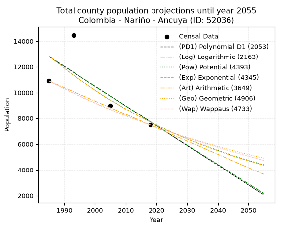
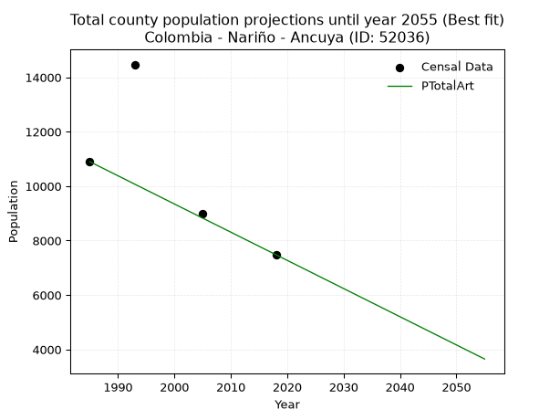
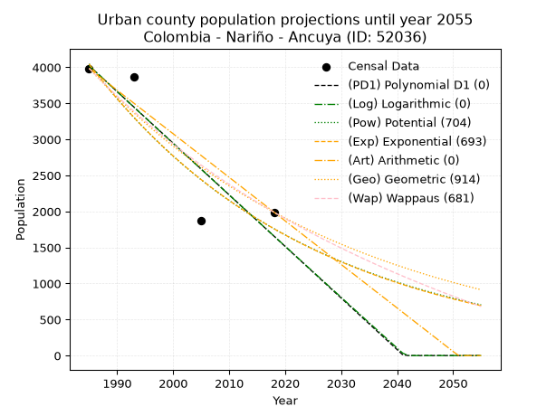
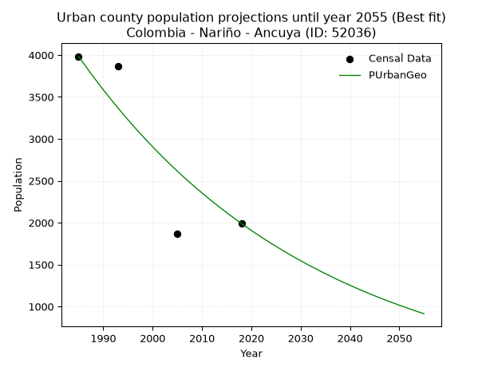
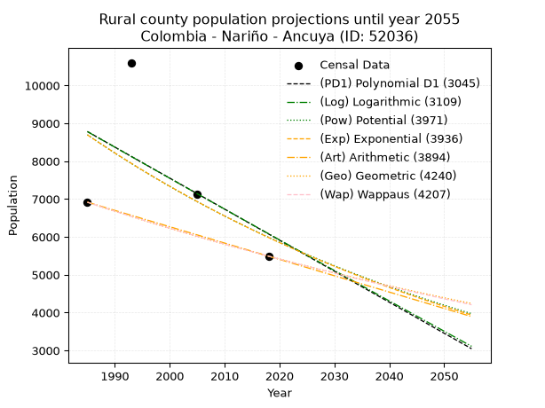
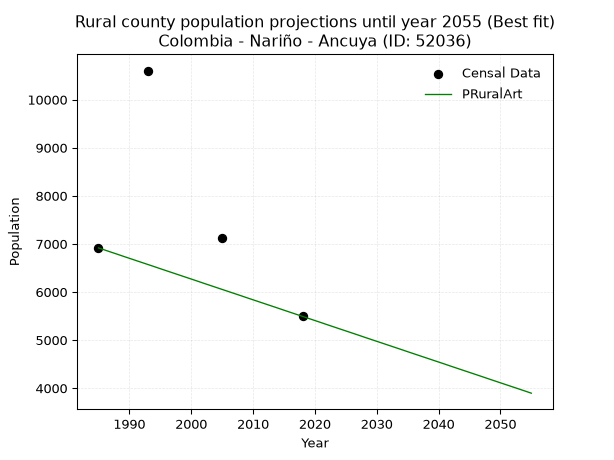

<div align="center">


</div>

# _“Population and Public Services Demand Projections (PPSD) until Year 2050 for Colombia - Nariño - Ancuya (ID: 52036)”_
Keywords: `population` `public-service` `projection` `lineal` `polynomial` `logarithmic` `potential` `exponential` `arithmetic` `geometric` `wappaus` `dane` `colombia` `south-america`

PPSD are analytical estimates used by governments and planners to anticipate future changes in population size, age distribution, and the resulting community needs for utilities, healthcare, education, and infrastructure as sizing future water treatment facilities, electrical grids, and road networks based on spatial growth.

> **General running parameters**: • app_version: _v20260806_. • Python version: _3.14.7_. • Pandas version: _3.0.5_. • NumPy version: _2.5.1_. • Creates, save and include plots into reports (create_plot): _False_. • Projection until year: _2050_. • Process polynomial degree 2 and up: _False_. • Process Wappaus: _True_. • Process Wappaus: _True_. • Set negative values to zero: _True_. • Set infinite values to zero: _True_. • Drop dataset notes: _True_. 
<div align="center">

Dynamic map: [:earth_americas:Google](http://maps.google.com/maps?q=1.263276375,-77.514512) [:earth_americas:OSM](https://www.openstreetmap.org/#map=18/1.263276375/-77.514512&layers=P) [:earth_americas:Bing](https://www.bing.com/maps?cp=1.263276375~-77.514512&lvl=18) [:earth_americas:Apple](https://maps.apple.com/frame?center=1.263276375%2C-77.514512&span=0.003%2C0.006)

</div>


<div align="center">

```geojson
{
  "type": "Feature",
  "geometry": {
    "type": "Point", 
    "coordinates": [-77.514512, 1.263276375]
  }, 
  "properties": {
    "Name": "Colombia - Nariño - Ancuya (ID: 52036)"
  }
}
```

</div>


## 0. Census Data (4 records)

Census data are official statistics collected by a government about the people and housing in a country. They usually include counts of total population, age, sex, race, income, education, and jobs.

📅Global census file: [Population.xlsx](../data/Population.xlsx)

| Source   |   Year |   CountryID | CountryName   |   StateID | StateName   |   CountyID | CountyName   |   PTotal |   PUrban |   PRural |
|:---------|-------:|------------:|:--------------|----------:|:------------|-----------:|:-------------|---------:|---------:|---------:|
| DANE     |   1985 |          57 | Colombia      |        52 | Nariño      |      52036 | Ancuya       |    10899 |     3984 |     6915 |
| DANE     |   1993 |          57 | Colombia      |        52 | Nariño      |      52036 | Ancuya       |    14470 |     3868 |    10602 |
| DANE     |   2005 |          57 | Colombia      |        52 | Nariño      |      52036 | Ancuya       |     8991 |     1872 |     7119 |
| DANE     |   2018 |          57 | Colombia      |        52 | Nariño      |      52036 | Ancuya       |     7481 |     1990 |     5491 |

> 🔥Some records could had specific notes about the registered values or the corresponding urban or rural distribution.

📅   [RUPS](https://www.datos.gov.co/Hacienda-y-Cr-dito-P-blico/Registro-nico-de-Prestadores-de-Servicios-P-blicos/4qkq-csdn/about_data) - Local public utility companies: [RUPS.csv](../data/RUPS.xlsx)

 | SERVICIO       | ESTADO    | NOMBRE                                                                                                                | NIT         | DEPARTAMENTO_DOMICILIO   | MUNICIPIO_DOMICILIO   | DIRECCION                         |   TELEFONO | EMAIL                         | TIPO_INSCRIPCION    | REPRESENTANTE_LEGAL                  | TIPO_PRESTADOR                             | CLASIFICACION                 |
|:---------------|:----------|:----------------------------------------------------------------------------------------------------------------------|:------------|:-------------------------|:----------------------|:----------------------------------|-----------:|:------------------------------|:--------------------|:-------------------------------------|:-------------------------------------------|:------------------------------|
| ACUEDUCTO      | OPERATIVA | UNIDAD ESPECIAL DE SERVICIOS PUBLICOS "UESPAAA"                                                                       | 800099055-2 | NARINO                   | ANCUYA                | CALLE 2# 3-59                     |    3168953 | municipioancuya@hotmail.com   | Registro por la ESP | HECTOR LEONEL DIAZ DELGADO           | MUNICIPIO (PRESTACIÓN DIRECTA)             | HASTA 2500 SUSCRIPTORES       |
| ALCANTARILLADO | OPERATIVA | UNIDAD ESPECIAL DE SERVICIOS PUBLICOS "UESPAAA"                                                                       | 800099055-2 | NARINO                   | ANCUYA                | CALLE 2# 3-59                     |    3168953 | municipioancuya@hotmail.com   | Registro por la ESP | HECTOR LEONEL DIAZ DELGADO           | MUNICIPIO (PRESTACIÓN DIRECTA)             | HASTA 2500 SUSCRIPTORES       |
| ACUEDUCTO      | OPERATIVA | EMPRESA DE SERVICIOS PUBLICOS DOMICILIARIOS DE ACUEDUCTO ALCANTARILLADO Y ASEO DEL MUNICIPIO DE ANCUYA NARINO SAS ESP | 900638104-1 | NARINO                   | ANCUYA                | CALLE 2 No 3 - 59 BARRIO LIBERTAD |    7287372 | rekineke@gmail.com            | Registro por la ESP | CLAUDIA YANETH MESSA MONTENEGRO      | SOCIEDADES (EMPRESA DE SERVICIOS PUBLICOS) | MENOR O IGUAL A 2500 USUARIOS |
| ALCANTARILLADO | OPERATIVA | EMPRESA DE SERVICIOS PUBLICOS DOMICILIARIOS DE ACUEDUCTO ALCANTARILLADO Y ASEO DEL MUNICIPIO DE ANCUYA NARINO SAS ESP | 900638104-1 | NARINO                   | ANCUYA                | CALLE 2 No 3 - 59 BARRIO LIBERTAD |    7287372 | rekineke@gmail.com            | Registro por la ESP | CLAUDIA YANETH MESSA MONTENEGRO      | SOCIEDADES (EMPRESA DE SERVICIOS PUBLICOS) | MENOR O IGUAL A 2500 USUARIOS |
| ACUEDUCTO      | OPERATIVA | ASOCIACIÓN INTEGRAL ACUEDUCTO LA LOMA                                                                                 | 900401148-7 | NARINO                   | ANCUYA                | vereda la loma                    |    3145603 | acueductolaloma2020@gmail.com | Registro por la ESP | CRISTIAN ALEXANDER CORDOBA RODRIGUEZ | ORGANIZACION AUTORIZADA                    | MENOR O IGUAL A 2500 USUARIOS |

## 1. Total

### 1.1. Coefficients and Parameters

* (PD1) Polynomial Deg 1: -153.5483741469277, 317595.3853873922 (lineal)
* (Log) Logarithmic: -307033.403622948, 2344223.6113493107
* (Pow) Potential: -30.981849925790897, 106.27984188970264
* (Exp) Exponential: -0.015492936650636972, 2.9179753912390125e+17
* (Art) Arithmetic: Year diff. 2018 - 1985 = 33, Population diff. 7481 - 10899 = -3418, Annual growth = -103.57575757575758
* (Geo) Geometric: Year diff. 2018 - 1985 = 33, Population diff. 7481 - 10899 = -3418, Annual growth % = -0.011338399056275983
* (Wap) Wappaus: i = -1.1270485046328353, Condition values only valid for < 200)

<sub>
Wappaus condition values: ['-0.00', '-1.13', '-2.25', '-3.38', '-4.51', '-5.64', '-6.76', '-7.89', '-9.02', '-10.14', '-11.27', '-12.40', '-13.52', '-14.65', '-15.78', '-16.91', '-18.03', '-19.16', '-20.29', '-21.41', '-22.54', '-23.67', '-24.80', '-25.92', '-27.05', '-28.18', '-29.30', '-30.43', '-31.56', '-32.68', '-33.81', '-34.94', '-36.07', '-37.19', '-38.32', '-39.45', '-40.57', '-41.70', '-42.83', '-43.95', '-45.08', '-46.21', '-47.34', '-48.46', '-49.59', '-50.72', '-51.84', '-52.97', '-54.10', '-55.23', '-56.35', '-57.48', '-58.61', '-59.73', '-60.86', '-61.99', '-63.11', '-64.24', '-65.37', '-66.50', '-67.62', '-68.75', '-69.88', '-71.00', '-72.13', '-73.26']
</sub>


### 1.2. Projected Dataset

|   Year |   CountyID |   PTotalPD1 |   PTotalLog |   PTotalPow |   PTotalExp |   PTotalArt |   PTotalGeo |   PTotalWap |
|-------:|-----------:|------------:|------------:|------------:|------------:|------------:|------------:|------------:|
|   1985 |      52036 |       12802 |       12804 |       12856 |       12853 |       10899 |       10899 |       10899 |
|   1986 |      52036 |       12648 |       12649 |       12657 |       12656 |       10795 |       10775 |       10777 |
|   1987 |      52036 |       12495 |       12495 |       12462 |       12461 |       10692 |       10653 |       10656 |
|   1988 |      52036 |       12341 |       12340 |       12269 |       12270 |       10588 |       10532 |       10537 |
|   1989 |      52036 |       12188 |       12186 |       12079 |       12081 |       10485 |       10413 |       10418 |
|   1990 |      52036 |       12034 |       12032 |       11892 |       11895 |       10381 |       10295 |       10302 |
|   1991 |      52036 |       11881 |       11877 |       11709 |       11712 |       10278 |       10178 |       10186 |
|   1992 |      52036 |       11727 |       11723 |       11528 |       11532 |       10174 |       10063 |       10072 |
|   1993 |      52036 |       11573 |       11569 |       11350 |       11355 |       10070 |        9949 |        9959 |
|   1994 |      52036 |       11420 |       11415 |       11175 |       11180 |        9967 |        9836 |        9847 |
|   1995 |      52036 |       11266 |       11261 |       11003 |       11009 |        9863 |        9724 |        9736 |
|   1996 |      52036 |       11113 |       11107 |       10833 |       10839 |        9760 |        9614 |        9627 |
|   1997 |      52036 |       10959 |       10954 |       10667 |       10673 |        9656 |        9505 |        9518 |
|   1998 |      52036 |       10806 |       10800 |       10502 |       10509 |        9553 |        9397 |        9411 |
|   1999 |      52036 |       10652 |       10646 |       10341 |       10347 |        9449 |        9291 |        9305 |
|   2000 |      52036 |       10499 |       10493 |       10182 |       10188 |        9345 |        9185 |        9200 |
|   2001 |      52036 |       10345 |       10339 |       10025 |       10031 |        9242 |        9081 |        9096 |
|   2002 |      52036 |       10192 |       10186 |        9871 |        9877 |        9138 |        8978 |        8993 |
|   2003 |      52036 |       10038 |       10032 |        9720 |        9725 |        9035 |        8877 |        8892 |
|   2004 |      52036 |        9884 |        9879 |        9571 |        9576 |        8931 |        8776 |        8791 |
|   2005 |      52036 |        9731 |        9726 |        9424 |        9429 |        8827 |        8676 |        8691 |
|   2006 |      52036 |        9577 |        9573 |        9279 |        9284 |        8724 |        8578 |        8592 |
|   2007 |      52036 |        9424 |        9420 |        9137 |        9141 |        8620 |        8481 |        8495 |
|   2008 |      52036 |        9270 |        9267 |        8997 |        9000 |        8517 |        8385 |        8398 |
|   2009 |      52036 |        9117 |        9114 |        8860 |        8862 |        8413 |        8290 |        8302 |
|   2010 |      52036 |        8963 |        8961 |        8724 |        8726 |        8310 |        8196 |        8207 |
|   2011 |      52036 |        8810 |        8809 |        8591 |        8592 |        8206 |        8103 |        8113 |
|   2012 |      52036 |        8656 |        8656 |        8459 |        8460 |        8102 |        8011 |        8020 |
|   2013 |      52036 |        8503 |        8503 |        8330 |        8329 |        7999 |        7920 |        7928 |
|   2014 |      52036 |        8349 |        8351 |        8203 |        8201 |        7895 |        7830 |        7837 |
|   2015 |      52036 |        8195 |        8199 |        8078 |        8075 |        7792 |        7741 |        7747 |
|   2016 |      52036 |        8042 |        8046 |        7954 |        7951 |        7688 |        7654 |        7657 |
|   2017 |      52036 |        7888 |        7894 |        7833 |        7829 |        7585 |        7567 |        7569 |
|   2018 |      52036 |        7735 |        7742 |        7714 |        7709 |        7481 |        7481 |        7481 |
|   2019 |      52036 |        7581 |        7590 |        7596 |        7590 |        7377 |        7396 |        7394 |
|   2020 |      52036 |        7428 |        7438 |        7481 |        7473 |        7274 |        7312 |        7308 |
|   2021 |      52036 |        7274 |        7286 |        7367 |        7359 |        7170 |        7229 |        7223 |
|   2022 |      52036 |        7121 |        7134 |        7255 |        7245 |        7067 |        7147 |        7138 |
|   2023 |      52036 |        6967 |        6982 |        7145 |        7134 |        6963 |        7066 |        7054 |
|   2024 |      52036 |        6813 |        6830 |        7036 |        7024 |        6860 |        6986 |        6972 |
|   2025 |      52036 |        6660 |        6679 |        6929 |        6916 |        6756 |        6907 |        6889 |
|   2026 |      52036 |        6506 |        6527 |        6824 |        6810 |        6652 |        6829 |        6808 |
|   2027 |      52036 |        6353 |        6375 |        6720 |        6705 |        6549 |        6751 |        6727 |
|   2028 |      52036 |        6199 |        6224 |        6618 |        6602 |        6445 |        6675 |        6647 |
|   2029 |      52036 |        6046 |        6073 |        6518 |        6501 |        6342 |        6599 |        6568 |
|   2030 |      52036 |        5892 |        5921 |        6419 |        6401 |        6238 |        6524 |        6490 |
|   2031 |      52036 |        5739 |        5770 |        6322 |        6302 |        6135 |        6450 |        6412 |
|   2032 |      52036 |        5585 |        5619 |        6227 |        6205 |        6031 |        6377 |        6335 |
|   2033 |      52036 |        5432 |        5468 |        6132 |        6110 |        5927 |        6305 |        6258 |
|   2034 |      52036 |        5278 |        5317 |        6040 |        6016 |        5824 |        6233 |        6182 |
|   2035 |      52036 |        5124 |        5166 |        5948 |        5924 |        5720 |        6163 |        6107 |
|   2036 |      52036 |        4971 |        5015 |        5858 |        5833 |        5617 |        6093 |        6033 |
|   2037 |      52036 |        4817 |        4864 |        5770 |        5743 |        5513 |        6024 |        5959 |
|   2038 |      52036 |        4664 |        4714 |        5683 |        5655 |        5409 |        5955 |        5886 |
|   2039 |      52036 |        4510 |        4563 |        5597 |        5568 |        5306 |        5888 |        5813 |
|   2040 |      52036 |        4357 |        4413 |        5513 |        5482 |        5202 |        5821 |        5741 |
|   2041 |      52036 |        4203 |        4262 |        5430 |        5398 |        5099 |        5755 |        5670 |
|   2042 |      52036 |        4050 |        4112 |        5348 |        5315 |        4995 |        5690 |        5600 |
|   2043 |      52036 |        3896 |        3961 |        5267 |        5233 |        4892 |        5625 |        5529 |
|   2044 |      52036 |        3743 |        3811 |        5188 |        5153 |        4788 |        5562 |        5460 |
|   2045 |      52036 |        3589 |        3661 |        5110 |        5073 |        4684 |        5499 |        5391 |
|   2046 |      52036 |        3435 |        3511 |        5033 |        4995 |        4581 |        5436 |        5323 |
|   2047 |      52036 |        3282 |        3361 |        4958 |        4919 |        4477 |        5375 |        5255 |
|   2048 |      52036 |        3128 |        3211 |        4883 |        4843 |        4374 |        5314 |        5188 |
|   2049 |      52036 |        2975 |        3061 |        4810 |        4769 |        4270 |        5253 |        5121 |
|   2050 |      52036 |        2821 |        2911 |        4738 |        4695 |        4167 |        5194 |        5055 |
<div align="center">

</img>

</div>


### 1.3. Best fit with absolute and relative error (%)

Relative error puts that difference into context by dividing the absolute error by the true value, creating a unitless ratio or percentage that shows the scale of the mistake.

Absolute and relative error

|   Year | Source   |   CountryID | CountryName   |   StateID | StateName   |   CountyID_x | CountyName   |   PTotal |   PUrban |   PRural |   CountyID_y |   PTotalPD1 |   PTotalLog |   PTotalPow |   PTotalExp |   PTotalArt |   PTotalGeo |   PTotalWap |   PTotalPD1AbsError |   PTotalLogAbsError |   PTotalPowAbsError |   PTotalExpAbsError |   PTotalArtAbsError |   PTotalGeoAbsError |   PTotalWapAbsError |   PTotalPD1RelError |   PTotalLogRelError |   PTotalPowRelError |   PTotalExpRelError |   PTotalArtRelError |   PTotalGeoRelError |   PTotalWapRelError |
|-------:|:---------|------------:|:--------------|----------:|:------------|-------------:|:-------------|---------:|---------:|---------:|-------------:|------------:|------------:|------------:|------------:|------------:|------------:|------------:|--------------------:|--------------------:|--------------------:|--------------------:|--------------------:|--------------------:|--------------------:|--------------------:|--------------------:|--------------------:|--------------------:|--------------------:|--------------------:|--------------------:|
|   1985 | DANE     |          57 | Colombia      |        52 | Nariño      |        52036 | Ancuya       |    10899 |     3984 |     6915 |        52036 |       12802 |       12804 |       12856 |       12853 |       10899 |       10899 |       10899 |                1903 |                1905 |                1957 |                1954 |                   0 |                   0 |                   0 |            17.4603  |            17.4787  |            17.9558  |            17.9283  |             0       |              0      |             0       |
|   1993 | DANE     |          57 | Colombia      |        52 | Nariño      |        52036 | Ancuya       |    14470 |     3868 |    10602 |        52036 |       11573 |       11569 |       11350 |       11355 |       10070 |        9949 |        9959 |                2897 |                2901 |                3120 |                3115 |                4400 |                4521 |                4511 |            20.0207  |            20.0484  |            21.5619  |            21.5273  |            30.4077  |             31.244  |            31.1748  |
|   2005 | DANE     |          57 | Colombia      |        52 | Nariño      |        52036 | Ancuya       |     8991 |     1872 |     7119 |        52036 |        9731 |        9726 |        9424 |        9429 |        8827 |        8676 |        8691 |                 740 |                 735 |                 433 |                 438 |                 164 |                 315 |                 300 |             8.23045 |             8.17484 |             4.81593 |             4.87154 |             1.82405 |              3.5035 |             3.33667 |
|   2018 | DANE     |          57 | Colombia      |        52 | Nariño      |        52036 | Ancuya       |     7481 |     1990 |     5491 |        52036 |        7735 |        7742 |        7714 |        7709 |        7481 |        7481 |        7481 |                 254 |                 261 |                 233 |                 228 |                   0 |                   0 |                   0 |             3.39527 |             3.48884 |             3.11456 |             3.04772 |             0       |              0      |             0       |

Relative error mean

| Method    |   RelError | Best   |
|:----------|-----------:|:-------|
| PTotalPD1 |   12.2767  |        |
| PTotalLog |   12.2977  |        |
| PTotalPow |   11.862   |        |
| PTotalExp |   11.8437  |        |
| PTotalArt |    8.05795 | True   |
| PTotalGeo |    8.68686 |        |
| PTotalWap |    8.62788 |        |

💙Best method: _**PTotalArt**_
<div align="center">

</img>

</div>


### 1.4. Fresh water supply demand in liters per capita per day (lpcd)

The fresh water supply demand typically ranges from 100 to 300 liters per capita per day (lpcd) for standard domestic and municipal planning, though absolute survival minimums set by the World Health Organization are as low as 7.5 to 20 liters per day, and total consumption in high-income nations can exceed 400 liters.

> `CZ`: Level in meters above the sea level (masl)<br> `WS`: Fresh water supply demand in liters per capita per day (lpcd or l/h/d)<br> `WSAll`: Zonal fresh water supply demand in liters per second (l/s)<br> `A`: Zonal area in square meters<br> `DP`: Population density (people/hectare or p/ha)

Reference values (RAS Colombia)

|    CZ |   WS |
|------:|-----:|
|  1000 |  120 |
|  2000 |  130 |
| 99999 |  140 |

County shapefile geometry properties and water supply values

|   CountyID |      ATotal |   CZTotal |   WSTotal |
|-----------:|------------:|----------:|----------:|
|      52036 | 6.89781e+07 |   1906.33 |       130 |

Projected values for best method: PTotalArt

|   CountyID |   Year |   PTotalArt |   DPTotal |   WSTotal |   WSTotalAll |
|-----------:|-------:|------------:|----------:|----------:|-------------:|
|      52036 |   1985 |       10899 |      1.58 |       130 |     16.399   |
|      52036 |   1986 |       10795 |      1.56 |       130 |     16.2425  |
|      52036 |   1987 |       10692 |      1.55 |       130 |     16.0875  |
|      52036 |   1988 |       10588 |      1.53 |       130 |     15.931   |
|      52036 |   1989 |       10485 |      1.52 |       130 |     15.776   |
|      52036 |   1990 |       10381 |      1.5  |       130 |     15.6196  |
|      52036 |   1991 |       10278 |      1.49 |       130 |     15.4646  |
|      52036 |   1992 |       10174 |      1.47 |       130 |     15.3081  |
|      52036 |   1993 |       10070 |      1.46 |       130 |     15.1516  |
|      52036 |   1994 |        9967 |      1.44 |       130 |     14.9966  |
|      52036 |   1995 |        9863 |      1.43 |       130 |     14.8402  |
|      52036 |   1996 |        9760 |      1.41 |       130 |     14.6852  |
|      52036 |   1997 |        9656 |      1.4  |       130 |     14.5287  |
|      52036 |   1998 |        9553 |      1.38 |       130 |     14.3737  |
|      52036 |   1999 |        9449 |      1.37 |       130 |     14.2172  |
|      52036 |   2000 |        9345 |      1.35 |       130 |     14.0608  |
|      52036 |   2001 |        9242 |      1.34 |       130 |     13.9058  |
|      52036 |   2002 |        9138 |      1.32 |       130 |     13.7493  |
|      52036 |   2003 |        9035 |      1.31 |       130 |     13.5943  |
|      52036 |   2004 |        8931 |      1.29 |       130 |     13.4378  |
|      52036 |   2005 |        8827 |      1.28 |       130 |     13.2814  |
|      52036 |   2006 |        8724 |      1.26 |       130 |     13.1264  |
|      52036 |   2007 |        8620 |      1.25 |       130 |     12.9699  |
|      52036 |   2008 |        8517 |      1.23 |       130 |     12.8149  |
|      52036 |   2009 |        8413 |      1.22 |       130 |     12.6584  |
|      52036 |   2010 |        8310 |      1.2  |       130 |     12.5035  |
|      52036 |   2011 |        8206 |      1.19 |       130 |     12.347   |
|      52036 |   2012 |        8102 |      1.17 |       130 |     12.1905  |
|      52036 |   2013 |        7999 |      1.16 |       130 |     12.0355  |
|      52036 |   2014 |        7895 |      1.14 |       130 |     11.8791  |
|      52036 |   2015 |        7792 |      1.13 |       130 |     11.7241  |
|      52036 |   2016 |        7688 |      1.11 |       130 |     11.5676  |
|      52036 |   2017 |        7585 |      1.1  |       130 |     11.4126  |
|      52036 |   2018 |        7481 |      1.08 |       130 |     11.2561  |
|      52036 |   2019 |        7377 |      1.07 |       130 |     11.0997  |
|      52036 |   2020 |        7274 |      1.05 |       130 |     10.9447  |
|      52036 |   2021 |        7170 |      1.04 |       130 |     10.7882  |
|      52036 |   2022 |        7067 |      1.02 |       130 |     10.6332  |
|      52036 |   2023 |        6963 |      1.01 |       130 |     10.4767  |
|      52036 |   2024 |        6860 |      0.99 |       130 |     10.3218  |
|      52036 |   2025 |        6756 |      0.98 |       130 |     10.1653  |
|      52036 |   2026 |        6652 |      0.96 |       130 |     10.0088  |
|      52036 |   2027 |        6549 |      0.95 |       130 |      9.85382 |
|      52036 |   2028 |        6445 |      0.93 |       130 |      9.69734 |
|      52036 |   2029 |        6342 |      0.92 |       130 |      9.54236 |
|      52036 |   2030 |        6238 |      0.9  |       130 |      9.38588 |
|      52036 |   2031 |        6135 |      0.89 |       130 |      9.2309  |
|      52036 |   2032 |        6031 |      0.87 |       130 |      9.07442 |
|      52036 |   2033 |        5927 |      0.86 |       130 |      8.91794 |
|      52036 |   2034 |        5824 |      0.84 |       130 |      8.76296 |
|      52036 |   2035 |        5720 |      0.83 |       130 |      8.60648 |
|      52036 |   2036 |        5617 |      0.81 |       130 |      8.4515  |
|      52036 |   2037 |        5513 |      0.8  |       130 |      8.29502 |
|      52036 |   2038 |        5409 |      0.78 |       130 |      8.13854 |
|      52036 |   2039 |        5306 |      0.77 |       130 |      7.98356 |
|      52036 |   2040 |        5202 |      0.75 |       130 |      7.82708 |
|      52036 |   2041 |        5099 |      0.74 |       130 |      7.67211 |
|      52036 |   2042 |        4995 |      0.72 |       130 |      7.51562 |
|      52036 |   2043 |        4892 |      0.71 |       130 |      7.36065 |
|      52036 |   2044 |        4788 |      0.69 |       130 |      7.20417 |
|      52036 |   2045 |        4684 |      0.68 |       130 |      7.04769 |
|      52036 |   2046 |        4581 |      0.66 |       130 |      6.89271 |
|      52036 |   2047 |        4477 |      0.65 |       130 |      6.73623 |
|      52036 |   2048 |        4374 |      0.63 |       130 |      6.58125 |
|      52036 |   2049 |        4270 |      0.62 |       130 |      6.42477 |
|      52036 |   2050 |        4167 |      0.6  |       130 |      6.26979 |

## 2. Urban

### 2.1. Coefficients and Parameters

* (PD1) Polynomial Deg 1: -71.5929345644319, 146132.2673625049 (lineal)
* (Log) Logarithmic: -143383.59505972295, 1092788.3550529745
* (Pow) Potential: -50.4748986908988, 170.06120963082944
* (Exp) Exponential: -0.025201989939729767, 2.1510364905536166e+25
* (Art) Arithmetic: Year diff. 2018 - 1985 = 33, Population diff. 1990 - 3984 = -1994, Annual growth = -60.42424242424242
* (Geo) Geometric: Year diff. 2018 - 1985 = 33, Population diff. 1990 - 3984 = -1994, Annual growth % = -0.02081520960531702
* (Wap) Wappaus: i = -2.022907345973968, Condition values only valid for < 200)

<sub>
Wappaus condition values: ['-0.00', '-2.02', '-4.05', '-6.07', '-8.09', '-10.11', '-12.14', '-14.16', '-16.18', '-18.21', '-20.23', '-22.25', '-24.27', '-26.30', '-28.32', '-30.34', '-32.37', '-34.39', '-36.41', '-38.44', '-40.46', '-42.48', '-44.50', '-46.53', '-48.55', '-50.57', '-52.60', '-54.62', '-56.64', '-58.66', '-60.69', '-62.71', '-64.73', '-66.76', '-68.78', '-70.80', '-72.82', '-74.85', '-76.87', '-78.89', '-80.92', '-82.94', '-84.96', '-86.99', '-89.01', '-91.03', '-93.05', '-95.08', '-97.10', '-99.12', '-101.15', '-103.17', '-105.19', '-107.21', '-109.24', '-111.26', '-113.28', '-115.31', '-117.33', '-119.35', '-121.37', '-123.40', '-125.42', '-127.44', '-129.47', '-131.49']
</sub>


### 2.2. Projected Dataset

|   Year |   CountyID |   PUrbanPD1 |   PUrbanLog |   PUrbanPow |   PUrbanExp |   PUrbanArt |   PUrbanGeo |   PUrbanWap |
|-------:|-----------:|------------:|------------:|------------:|------------:|------------:|------------:|------------:|
|   1985 |      52036 |        4020 |        4023 |        4047 |        4043 |        3984 |        3984 |        3984 |
|   1986 |      52036 |        3949 |        3951 |        3945 |        3942 |        3924 |        3901 |        3904 |
|   1987 |      52036 |        3877 |        3879 |        3846 |        3844 |        3863 |        3820 |        3826 |
|   1988 |      52036 |        3806 |        3807 |        3750 |        3748 |        3803 |        3740 |        3749 |
|   1989 |      52036 |        3734 |        3734 |        3656 |        3655 |        3742 |        3663 |        3674 |
|   1990 |      52036 |        3662 |        3662 |        3564 |        3564 |        3682 |        3586 |        3600 |
|   1991 |      52036 |        3591 |        3590 |        3475 |        3475 |        3621 |        3512 |        3528 |
|   1992 |      52036 |        3519 |        3518 |        3388 |        3389 |        3561 |        3439 |        3457 |
|   1993 |      52036 |        3448 |        3446 |        3303 |        3304 |        3501 |        3367 |        3388 |
|   1994 |      52036 |        3376 |        3374 |        3220 |        3222 |        3440 |        3297 |        3319 |
|   1995 |      52036 |        3304 |        3303 |        3140 |        3142 |        3380 |        3228 |        3252 |
|   1996 |      52036 |        3233 |        3231 |        3062 |        3064 |        3319 |        3161 |        3186 |
|   1997 |      52036 |        3161 |        3159 |        2985 |        2988 |        3259 |        3095 |        3122 |
|   1998 |      52036 |        3090 |        3087 |        2911 |        2913 |        3198 |        3031 |        3058 |
|   1999 |      52036 |        3018 |        3015 |        2838 |        2841 |        3138 |        2968 |        2996 |
|   2000 |      52036 |        2946 |        2944 |        2767 |        2770 |        3078 |        2906 |        2934 |
|   2001 |      52036 |        2875 |        2872 |        2698 |        2701 |        3017 |        2845 |        2874 |
|   2002 |      52036 |        2803 |        2800 |        2631 |        2634 |        2957 |        2786 |        2815 |
|   2003 |      52036 |        2732 |        2729 |        2566 |        2568 |        2896 |        2728 |        2757 |
|   2004 |      52036 |        2660 |        2657 |        2502 |        2504 |        2836 |        2671 |        2700 |
|   2005 |      52036 |        2588 |        2586 |        2440 |        2442 |        2776 |        2616 |        2643 |
|   2006 |      52036 |        2517 |        2514 |        2379 |        2381 |        2715 |        2561 |        2588 |
|   2007 |      52036 |        2445 |        2443 |        2320 |        2322 |        2655 |        2508 |        2534 |
|   2008 |      52036 |        2374 |        2371 |        2262 |        2264 |        2594 |        2456 |        2480 |
|   2009 |      52036 |        2302 |        2300 |        2206 |        2208 |        2534 |        2405 |        2428 |
|   2010 |      52036 |        2230 |        2229 |        2151 |        2153 |        2473 |        2355 |        2376 |
|   2011 |      52036 |        2159 |        2157 |        2098 |        2099 |        2413 |        2306 |        2325 |
|   2012 |      52036 |        2087 |        2086 |        2046 |        2047 |        2353 |        2258 |        2275 |
|   2013 |      52036 |        2016 |        2015 |        1995 |        1996 |        2292 |        2211 |        2225 |
|   2014 |      52036 |        1944 |        1943 |        1946 |        1946 |        2232 |        2165 |        2177 |
|   2015 |      52036 |        1873 |        1872 |        1898 |        1898 |        2171 |        2120 |        2129 |
|   2016 |      52036 |        1801 |        1801 |        1851 |        1851 |        2111 |        2076 |        2082 |
|   2017 |      52036 |        1729 |        1730 |        1805 |        1805 |        2050 |        2032 |        2036 |
|   2018 |      52036 |        1658 |        1659 |        1761 |        1760 |        1990 |        1990 |        1990 |
|   2019 |      52036 |        1586 |        1588 |        1717 |        1716 |        1930 |        1949 |        1945 |
|   2020 |      52036 |        1515 |        1517 |        1675 |        1673 |        1869 |        1908 |        1901 |
|   2021 |      52036 |        1443 |        1446 |        1633 |        1632 |        1809 |        1868 |        1857 |
|   2022 |      52036 |        1371 |        1375 |        1593 |        1591 |        1748 |        1829 |        1814 |
|   2023 |      52036 |        1300 |        1304 |        1554 |        1551 |        1688 |        1791 |        1772 |
|   2024 |      52036 |        1228 |        1233 |        1516 |        1513 |        1627 |        1754 |        1730 |
|   2025 |      52036 |        1157 |        1162 |        1478 |        1475 |        1567 |        1718 |        1689 |
|   2026 |      52036 |        1085 |        1092 |        1442 |        1438 |        1507 |        1682 |        1648 |
|   2027 |      52036 |        1013 |        1021 |        1406 |        1403 |        1446 |        1647 |        1608 |
|   2028 |      52036 |         942 |         950 |        1372 |        1368 |        1386 |        1612 |        1569 |
|   2029 |      52036 |         870 |         880 |        1338 |        1334 |        1325 |        1579 |        1530 |
|   2030 |      52036 |         799 |         809 |        1305 |        1301 |        1265 |        1546 |        1492 |
|   2031 |      52036 |         727 |         738 |        1273 |        1268 |        1204 |        1514 |        1454 |
|   2032 |      52036 |         655 |         668 |        1242 |        1237 |        1144 |        1482 |        1417 |
|   2033 |      52036 |         584 |         597 |        1211 |        1206 |        1084 |        1452 |        1380 |
|   2034 |      52036 |         512 |         527 |        1182 |        1176 |        1023 |        1421 |        1344 |
|   2035 |      52036 |         441 |         456 |        1153 |        1147 |         963 |        1392 |        1308 |
|   2036 |      52036 |         369 |         386 |        1125 |        1118 |         902 |        1363 |        1272 |
|   2037 |      52036 |         297 |         315 |        1097 |        1090 |         842 |        1334 |        1238 |
|   2038 |      52036 |         226 |         245 |        1070 |        1063 |         782 |        1307 |        1203 |
|   2039 |      52036 |         154 |         175 |        1044 |        1037 |         721 |        1279 |        1169 |
|   2040 |      52036 |          83 |         104 |        1019 |        1011 |         661 |        1253 |        1136 |
|   2041 |      52036 |          11 |          34 |         994 |         986 |         600 |        1227 |        1103 |
|   2042 |      52036 |           0 |           0 |         969 |         961 |         540 |        1201 |        1070 |
|   2043 |      52036 |           0 |           0 |         946 |         937 |         479 |        1176 |        1038 |
|   2044 |      52036 |           0 |           0 |         923 |         914 |         419 |        1152 |        1006 |
|   2045 |      52036 |           0 |           0 |         900 |         891 |         359 |        1128 |         975 |
|   2046 |      52036 |           0 |           0 |         878 |         869 |         298 |        1104 |         944 |
|   2047 |      52036 |           0 |           0 |         857 |         847 |         238 |        1081 |         913 |
|   2048 |      52036 |           0 |           0 |         836 |         826 |         177 |        1059 |         883 |
|   2049 |      52036 |           0 |           0 |         816 |         806 |         117 |        1037 |         853 |
|   2050 |      52036 |           0 |           0 |         796 |         786 |          56 |        1015 |         823 |
<div align="center">

</img>

</div>


### 2.3. Best fit with absolute and relative error (%)

Relative error puts that difference into context by dividing the absolute error by the true value, creating a unitless ratio or percentage that shows the scale of the mistake.

Absolute and relative error

|   Year | Source   |   CountryID | CountryName   |   StateID | StateName   |   CountyID_x | CountyName   |   PTotal |   PUrban |   PRural |   CountyID_y |   PUrbanPD1 |   PUrbanLog |   PUrbanPow |   PUrbanExp |   PUrbanArt |   PUrbanGeo |   PUrbanWap |   PUrbanPD1AbsError |   PUrbanLogAbsError |   PUrbanPowAbsError |   PUrbanExpAbsError |   PUrbanArtAbsError |   PUrbanGeoAbsError |   PUrbanWapAbsError |   PUrbanPD1RelError |   PUrbanLogRelError |   PUrbanPowRelError |   PUrbanExpRelError |   PUrbanArtRelError |   PUrbanGeoRelError |   PUrbanWapRelError |
|-------:|:---------|------------:|:--------------|----------:|:------------|-------------:|:-------------|---------:|---------:|---------:|-------------:|------------:|------------:|------------:|------------:|------------:|------------:|------------:|--------------------:|--------------------:|--------------------:|--------------------:|--------------------:|--------------------:|--------------------:|--------------------:|--------------------:|--------------------:|--------------------:|--------------------:|--------------------:|--------------------:|
|   1985 | DANE     |          57 | Colombia      |        52 | Nariño      |        52036 | Ancuya       |    10899 |     3984 |     6915 |        52036 |        4020 |        4023 |        4047 |        4043 |        3984 |        3984 |        3984 |                  36 |                  39 |                  63 |                  59 |                   0 |                   0 |                   0 |            0.903614 |            0.978916 |             1.58133 |             1.48092 |             0       |              0      |              0      |
|   1993 | DANE     |          57 | Colombia      |        52 | Nariño      |        52036 | Ancuya       |    14470 |     3868 |    10602 |        52036 |        3448 |        3446 |        3303 |        3304 |        3501 |        3367 |        3388 |                 420 |                 422 |                 565 |                 564 |                 367 |                 501 |                 480 |           10.8583   |           10.91     |            14.607   |            14.5812  |             9.48811 |             12.9524 |             12.4095 |
|   2005 | DANE     |          57 | Colombia      |        52 | Nariño      |        52036 | Ancuya       |     8991 |     1872 |     7119 |        52036 |        2588 |        2586 |        2440 |        2442 |        2776 |        2616 |        2643 |                 716 |                 714 |                 568 |                 570 |                 904 |                 744 |                 771 |           38.2479   |           38.141    |            30.3419  |            30.4487  |            48.2906  |             39.7436 |             41.1859 |
|   2018 | DANE     |          57 | Colombia      |        52 | Nariño      |        52036 | Ancuya       |     7481 |     1990 |     5491 |        52036 |        1658 |        1659 |        1761 |        1760 |        1990 |        1990 |        1990 |                 332 |                 331 |                 229 |                 230 |                   0 |                   0 |                   0 |           16.6834   |           16.6332   |            11.5075  |            11.5578  |             0       |              0      |              0      |

Relative error mean

| Method    |   RelError | Best   |
|:----------|-----------:|:-------|
| PUrbanPD1 |    16.6733 |        |
| PUrbanLog |    16.6658 |        |
| PUrbanPow |    14.5094 |        |
| PUrbanExp |    14.5172 |        |
| PUrbanArt |    14.4447 |        |
| PUrbanGeo |    13.174  | True   |
| PUrbanWap |    13.3989 |        |

💙Best method: _**PUrbanGeo**_
<div align="center">

</img>

</div>


### 2.4. Fresh water supply demand in liters per capita per day (lpcd)

The fresh water supply demand typically ranges from 100 to 300 liters per capita per day (lpcd) for standard domestic and municipal planning, though absolute survival minimums set by the World Health Organization are as low as 7.5 to 20 liters per day, and total consumption in high-income nations can exceed 400 liters.

> `CZ`: Level in meters above the sea level (masl)<br> `WS`: Fresh water supply demand in liters per capita per day (lpcd or l/h/d)<br> `WSAll`: Zonal fresh water supply demand in liters per second (l/s)<br> `A`: Zonal area in square meters<br> `DP`: Population density (people/hectare or p/ha)

Reference values (RAS Colombia)

|    CZ |   WS |
|------:|-----:|
|  1000 |  120 |
|  2000 |  130 |
| 99999 |  140 |

County shapefile geometry properties and water supply values

|   CountyID |   AUrban |   CZUrban |   WSUrban |
|-----------:|---------:|----------:|----------:|
|      52036 |   363788 |   1366.15 |       130 |

Projected values for best method: PUrbanGeo

|   CountyID |   Year |   PUrbanGeo |   DPUrban |   WSUrban |   WSUrbanAll |
|-----------:|-------:|------------:|----------:|----------:|-------------:|
|      52036 |   1985 |        3984 |    109.51 |       130 |      5.99444 |
|      52036 |   1986 |        3901 |    107.23 |       130 |      5.86956 |
|      52036 |   1987 |        3820 |    105.01 |       130 |      5.74769 |
|      52036 |   1988 |        3740 |    102.81 |       130 |      5.62731 |
|      52036 |   1989 |        3663 |    100.69 |       130 |      5.51146 |
|      52036 |   1990 |        3586 |     98.57 |       130 |      5.3956  |
|      52036 |   1991 |        3512 |     96.54 |       130 |      5.28426 |
|      52036 |   1992 |        3439 |     94.53 |       130 |      5.17442 |
|      52036 |   1993 |        3367 |     92.55 |       130 |      5.06609 |
|      52036 |   1994 |        3297 |     90.63 |       130 |      4.96076 |
|      52036 |   1995 |        3228 |     88.73 |       130 |      4.85694 |
|      52036 |   1996 |        3161 |     86.89 |       130 |      4.75613 |
|      52036 |   1997 |        3095 |     85.08 |       130 |      4.65683 |
|      52036 |   1998 |        3031 |     83.32 |       130 |      4.56053 |
|      52036 |   1999 |        2968 |     81.59 |       130 |      4.46574 |
|      52036 |   2000 |        2906 |     79.88 |       130 |      4.37245 |
|      52036 |   2001 |        2845 |     78.2  |       130 |      4.28067 |
|      52036 |   2002 |        2786 |     76.58 |       130 |      4.1919  |
|      52036 |   2003 |        2728 |     74.99 |       130 |      4.10463 |
|      52036 |   2004 |        2671 |     73.42 |       130 |      4.01887 |
|      52036 |   2005 |        2616 |     71.91 |       130 |      3.93611 |
|      52036 |   2006 |        2561 |     70.4  |       130 |      3.85336 |
|      52036 |   2007 |        2508 |     68.94 |       130 |      3.77361 |
|      52036 |   2008 |        2456 |     67.51 |       130 |      3.69537 |
|      52036 |   2009 |        2405 |     66.11 |       130 |      3.61863 |
|      52036 |   2010 |        2355 |     64.74 |       130 |      3.5434  |
|      52036 |   2011 |        2306 |     63.39 |       130 |      3.46968 |
|      52036 |   2012 |        2258 |     62.07 |       130 |      3.39745 |
|      52036 |   2013 |        2211 |     60.78 |       130 |      3.32674 |
|      52036 |   2014 |        2165 |     59.51 |       130 |      3.25752 |
|      52036 |   2015 |        2120 |     58.28 |       130 |      3.18981 |
|      52036 |   2016 |        2076 |     57.07 |       130 |      3.12361 |
|      52036 |   2017 |        2032 |     55.86 |       130 |      3.05741 |
|      52036 |   2018 |        1990 |     54.7  |       130 |      2.99421 |
|      52036 |   2019 |        1949 |     53.58 |       130 |      2.93252 |
|      52036 |   2020 |        1908 |     52.45 |       130 |      2.87083 |
|      52036 |   2021 |        1868 |     51.35 |       130 |      2.81065 |
|      52036 |   2022 |        1829 |     50.28 |       130 |      2.75197 |
|      52036 |   2023 |        1791 |     49.23 |       130 |      2.69479 |
|      52036 |   2024 |        1754 |     48.21 |       130 |      2.63912 |
|      52036 |   2025 |        1718 |     47.23 |       130 |      2.58495 |
|      52036 |   2026 |        1682 |     46.24 |       130 |      2.53079 |
|      52036 |   2027 |        1647 |     45.27 |       130 |      2.47812 |
|      52036 |   2028 |        1612 |     44.31 |       130 |      2.42546 |
|      52036 |   2029 |        1579 |     43.4  |       130 |      2.37581 |
|      52036 |   2030 |        1546 |     42.5  |       130 |      2.32616 |
|      52036 |   2031 |        1514 |     41.62 |       130 |      2.27801 |
|      52036 |   2032 |        1482 |     40.74 |       130 |      2.22986 |
|      52036 |   2033 |        1452 |     39.91 |       130 |      2.18472 |
|      52036 |   2034 |        1421 |     39.06 |       130 |      2.13808 |
|      52036 |   2035 |        1392 |     38.26 |       130 |      2.09444 |
|      52036 |   2036 |        1363 |     37.47 |       130 |      2.05081 |
|      52036 |   2037 |        1334 |     36.67 |       130 |      2.00718 |
|      52036 |   2038 |        1307 |     35.93 |       130 |      1.96655 |
|      52036 |   2039 |        1279 |     35.16 |       130 |      1.92442 |
|      52036 |   2040 |        1253 |     34.44 |       130 |      1.8853  |
|      52036 |   2041 |        1227 |     33.73 |       130 |      1.84618 |
|      52036 |   2042 |        1201 |     33.01 |       130 |      1.80706 |
|      52036 |   2043 |        1176 |     32.33 |       130 |      1.76944 |
|      52036 |   2044 |        1152 |     31.67 |       130 |      1.73333 |
|      52036 |   2045 |        1128 |     31.01 |       130 |      1.69722 |
|      52036 |   2046 |        1104 |     30.35 |       130 |      1.66111 |
|      52036 |   2047 |        1081 |     29.72 |       130 |      1.6265  |
|      52036 |   2048 |        1059 |     29.11 |       130 |      1.5934  |
|      52036 |   2049 |        1037 |     28.51 |       130 |      1.5603  |
|      52036 |   2050 |        1015 |     27.9  |       130 |      1.5272  |

## 3. Rural

### 3.1. Coefficients and Parameters

* (PD1) Polynomial Deg 1: -81.95543958249574, 171463.11802488714 (lineal)
* (Log) Logarithmic: -163649.8085632249, 1251435.256296336
* (Pow) Potential: -22.617556439593955, 78.52658166368622
* (Exp) Exponential: -0.011325609177495423, 50447704277783.24
* (Art) Arithmetic: Year diff. 2018 - 1985 = 33, Population diff. 5491 - 6915 = -1424, Annual growth = -43.15151515151515
* (Geo) Geometric: Year diff. 2018 - 1985 = 33, Population diff. 5491 - 6915 = -1424, Annual growth % = -0.006962996035176139
* (Wap) Wappaus: i = -0.6956555723281501, Condition values only valid for < 200)

<sub>
Wappaus condition values: ['-0.00', '-0.70', '-1.39', '-2.09', '-2.78', '-3.48', '-4.17', '-4.87', '-5.57', '-6.26', '-6.96', '-7.65', '-8.35', '-9.04', '-9.74', '-10.43', '-11.13', '-11.83', '-12.52', '-13.22', '-13.91', '-14.61', '-15.30', '-16.00', '-16.70', '-17.39', '-18.09', '-18.78', '-19.48', '-20.17', '-20.87', '-21.57', '-22.26', '-22.96', '-23.65', '-24.35', '-25.04', '-25.74', '-26.43', '-27.13', '-27.83', '-28.52', '-29.22', '-29.91', '-30.61', '-31.30', '-32.00', '-32.70', '-33.39', '-34.09', '-34.78', '-35.48', '-36.17', '-36.87', '-37.57', '-38.26', '-38.96', '-39.65', '-40.35', '-41.04', '-41.74', '-42.43', '-43.13', '-43.83', '-44.52', '-45.22']
</sub>


### 3.2. Projected Dataset

|   Year |   CountyID |   PRuralPD1 |   PRuralLog |   PRuralPow |   PRuralExp |   PRuralArt |   PRuralGeo |   PRuralWap |
|-------:|-----------:|------------:|------------:|------------:|------------:|------------:|------------:|------------:|
|   1985 |      52036 |        8782 |        8781 |        8696 |        8696 |        6915 |        6915 |        6915 |
|   1986 |      52036 |        8700 |        8699 |        8597 |        8598 |        6872 |        6867 |        6867 |
|   1987 |      52036 |        8618 |        8616 |        8500 |        8501 |        6829 |        6819 |        6819 |
|   1988 |      52036 |        8536 |        8534 |        8404 |        8406 |        6786 |        6772 |        6772 |
|   1989 |      52036 |        8454 |        8452 |        8309 |        8311 |        6742 |        6724 |        6725 |
|   1990 |      52036 |        8372 |        8369 |        8215 |        8217 |        6699 |        6678 |        6679 |
|   1991 |      52036 |        8290 |        8287 |        8122 |        8125 |        6656 |        6631 |        6632 |
|   1992 |      52036 |        8208 |        8205 |        8030 |        8033 |        6613 |        6585 |        6586 |
|   1993 |      52036 |        8126 |        8123 |        7939 |        7943 |        6570 |        6539 |        6541 |
|   1994 |      52036 |        8044 |        8041 |        7850 |        7853 |        6527 |        6494 |        6495 |
|   1995 |      52036 |        7962 |        7959 |        7761 |        7765 |        6483 |        6448 |        6450 |
|   1996 |      52036 |        7880 |        7877 |        7674 |        7677 |        6440 |        6403 |        6405 |
|   1997 |      52036 |        7798 |        7795 |        7587 |        7591 |        6397 |        6359 |        6361 |
|   1998 |      52036 |        7716 |        7713 |        7502 |        7505 |        6354 |        6315 |        6317 |
|   1999 |      52036 |        7634 |        7631 |        7418 |        7421 |        6311 |        6271 |        6273 |
|   2000 |      52036 |        7552 |        7549 |        7334 |        7337 |        6268 |        6227 |        6229 |
|   2001 |      52036 |        7470 |        7467 |        7252 |        7255 |        6225 |        6184 |        6186 |
|   2002 |      52036 |        7388 |        7385 |        7170 |        7173 |        6181 |        6141 |        6143 |
|   2003 |      52036 |        7306 |        7304 |        7090 |        7092 |        6138 |        6098 |        6100 |
|   2004 |      52036 |        7224 |        7222 |        7010 |        7012 |        6095 |        6055 |        6058 |
|   2005 |      52036 |        7142 |        7140 |        6931 |        6933 |        6052 |        6013 |        6015 |
|   2006 |      52036 |        7061 |        7059 |        6854 |        6855 |        6009 |        5971 |        5974 |
|   2007 |      52036 |        6979 |        6977 |        6777 |        6778 |        5966 |        5930 |        5932 |
|   2008 |      52036 |        6897 |        6896 |        6701 |        6702 |        5923 |        5888 |        5891 |
|   2009 |      52036 |        6815 |        6814 |        6626 |        6626 |        5879 |        5847 |        5849 |
|   2010 |      52036 |        6733 |        6733 |        6552 |        6552 |        5836 |        5807 |        5809 |
|   2011 |      52036 |        6651 |        6651 |        6478 |        6478 |        5793 |        5766 |        5768 |
|   2012 |      52036 |        6569 |        6570 |        6406 |        6405 |        5750 |        5726 |        5728 |
|   2013 |      52036 |        6487 |        6489 |        6334 |        6333 |        5707 |        5686 |        5688 |
|   2014 |      52036 |        6405 |        6407 |        6264 |        6262 |        5664 |        5647 |        5648 |
|   2015 |      52036 |        6323 |        6326 |        6194 |        6191 |        5620 |        5607 |        5608 |
|   2016 |      52036 |        6241 |        6245 |        6125 |        6121 |        5577 |        5568 |        5569 |
|   2017 |      52036 |        6159 |        6164 |        6056 |        6052 |        5534 |        5530 |        5530 |
|   2018 |      52036 |        6077 |        6083 |        5989 |        5984 |        5491 |        5491 |        5491 |
|   2019 |      52036 |        5995 |        6002 |        5922 |        5917 |        5448 |        5453 |        5452 |
|   2020 |      52036 |        5913 |        5921 |        5856 |        5850 |        5405 |        5415 |        5414 |
|   2021 |      52036 |        5831 |        5840 |        5791 |        5784 |        5362 |        5377 |        5376 |
|   2022 |      52036 |        5749 |        5759 |        5727 |        5719 |        5318 |        5340 |        5338 |
|   2023 |      52036 |        5667 |        5678 |        5663 |        5655 |        5275 |        5302 |        5300 |
|   2024 |      52036 |        5585 |        5597 |        5600 |        5591 |        5232 |        5266 |        5263 |
|   2025 |      52036 |        5503 |        5516 |        5538 |        5528 |        5189 |        5229 |        5226 |
|   2026 |      52036 |        5421 |        5435 |        5476 |        5466 |        5146 |        5192 |        5189 |
|   2027 |      52036 |        5339 |        5355 |        5415 |        5404 |        5103 |        5156 |        5152 |
|   2028 |      52036 |        5257 |        5274 |        5355 |        5343 |        5059 |        5120 |        5116 |
|   2029 |      52036 |        5176 |        5193 |        5296 |        5283 |        5016 |        5085 |        5079 |
|   2030 |      52036 |        5094 |        5113 |        5237 |        5224 |        4973 |        5049 |        5043 |
|   2031 |      52036 |        5012 |        5032 |        5179 |        5165 |        4930 |        5014 |        5007 |
|   2032 |      52036 |        4930 |        4951 |        5122 |        5107 |        4887 |        4979 |        4972 |
|   2033 |      52036 |        4848 |        4871 |        5065 |        5049 |        4844 |        4945 |        4936 |
|   2034 |      52036 |        4766 |        4790 |        5009 |        4992 |        4801 |        4910 |        4901 |
|   2035 |      52036 |        4684 |        4710 |        4954 |        4936 |        4757 |        4876 |        4866 |
|   2036 |      52036 |        4602 |        4630 |        4899 |        4881 |        4714 |        4842 |        4831 |
|   2037 |      52036 |        4520 |        4549 |        4845 |        4826 |        4671 |        4808 |        4797 |
|   2038 |      52036 |        4438 |        4469 |        4791 |        4771 |        4628 |        4775 |        4762 |
|   2039 |      52036 |        4356 |        4389 |        4739 |        4718 |        4585 |        4742 |        4728 |
|   2040 |      52036 |        4274 |        4308 |        4686 |        4664 |        4542 |        4709 |        4694 |
|   2041 |      52036 |        4192 |        4228 |        4635 |        4612 |        4499 |        4676 |        4660 |
|   2042 |      52036 |        4110 |        4148 |        4584 |        4560 |        4455 |        4643 |        4627 |
|   2043 |      52036 |        4028 |        4068 |        4533 |        4509 |        4412 |        4611 |        4593 |
|   2044 |      52036 |        3946 |        3988 |        4483 |        4458 |        4369 |        4579 |        4560 |
|   2045 |      52036 |        3864 |        3908 |        4434 |        4408 |        4326 |        4547 |        4527 |
|   2046 |      52036 |        3782 |        3828 |        4385 |        4358 |        4283 |        4515 |        4494 |
|   2047 |      52036 |        3700 |        3748 |        4337 |        4309 |        4240 |        4484 |        4462 |
|   2048 |      52036 |        3618 |        3668 |        4289 |        4260 |        4196 |        4453 |        4429 |
|   2049 |      52036 |        3536 |        3588 |        4242 |        4212 |        4153 |        4422 |        4397 |
|   2050 |      52036 |        3454 |        3508 |        4196 |        4165 |        4110 |        4391 |        4365 |
<div align="center">

</img>

</div>


### 3.3. Best fit with absolute and relative error (%)

Relative error puts that difference into context by dividing the absolute error by the true value, creating a unitless ratio or percentage that shows the scale of the mistake.

Absolute and relative error

|   Year | Source   |   CountryID | CountryName   |   StateID | StateName   |   CountyID_x | CountyName   |   PTotal |   PUrban |   PRural |   CountyID_y |   PRuralPD1 |   PRuralLog |   PRuralPow |   PRuralExp |   PRuralArt |   PRuralGeo |   PRuralWap |   PRuralPD1AbsError |   PRuralLogAbsError |   PRuralPowAbsError |   PRuralExpAbsError |   PRuralArtAbsError |   PRuralGeoAbsError |   PRuralWapAbsError |   PRuralPD1RelError |   PRuralLogRelError |   PRuralPowRelError |   PRuralExpRelError |   PRuralArtRelError |   PRuralGeoRelError |   PRuralWapRelError |
|-------:|:---------|------------:|:--------------|----------:|:------------|-------------:|:-------------|---------:|---------:|---------:|-------------:|------------:|------------:|------------:|------------:|------------:|------------:|------------:|--------------------:|--------------------:|--------------------:|--------------------:|--------------------:|--------------------:|--------------------:|--------------------:|--------------------:|--------------------:|--------------------:|--------------------:|--------------------:|--------------------:|
|   1985 | DANE     |          57 | Colombia      |        52 | Nariño      |        52036 | Ancuya       |    10899 |     3984 |     6915 |        52036 |        8782 |        8781 |        8696 |        8696 |        6915 |        6915 |        6915 |                1867 |                1866 |                1781 |                1781 |                   0 |                   0 |                   0 |           26.9993   |           26.9848   |            25.7556  |            25.7556  |              0      |              0      |              0      |
|   1993 | DANE     |          57 | Colombia      |        52 | Nariño      |        52036 | Ancuya       |    14470 |     3868 |    10602 |        52036 |        8126 |        8123 |        7939 |        7943 |        6570 |        6539 |        6541 |                2476 |                2479 |                2663 |                2659 |                4032 |                4063 |                4061 |           23.3541   |           23.3824   |            25.1179  |            25.0802  |             38.0306 |             38.323  |             38.3041 |
|   2005 | DANE     |          57 | Colombia      |        52 | Nariño      |        52036 | Ancuya       |     8991 |     1872 |     7119 |        52036 |        7142 |        7140 |        6931 |        6933 |        6052 |        6013 |        6015 |                  23 |                  21 |                 188 |                 186 |                1067 |                1106 |                1104 |            0.323079 |            0.294985 |             2.64082 |             2.61273 |             14.9881 |             15.5359 |             15.5078 |
|   2018 | DANE     |          57 | Colombia      |        52 | Nariño      |        52036 | Ancuya       |     7481 |     1990 |     5491 |        52036 |        6077 |        6083 |        5989 |        5984 |        5491 |        5491 |        5491 |                 586 |                 592 |                 498 |                 493 |                   0 |                   0 |                   0 |           10.672    |           10.7813   |             9.06939 |             8.97833 |              0      |              0      |              0      |

Relative error mean

| Method    |   RelError | Best   |
|:----------|-----------:|:-------|
| PRuralPD1 |    15.3371 |        |
| PRuralLog |    15.3609 |        |
| PRuralPow |    15.6459 |        |
| PRuralExp |    15.6067 |        |
| PRuralArt |    13.2547 | True   |
| PRuralGeo |    13.4647 |        |
| PRuralWap |    13.453  |        |

💙Best method: _**PRuralArt**_
<div align="center">

</img>

</div>


### 3.4. Fresh water supply demand in liters per capita per day (lpcd)

The fresh water supply demand typically ranges from 100 to 300 liters per capita per day (lpcd) for standard domestic and municipal planning, though absolute survival minimums set by the World Health Organization are as low as 7.5 to 20 liters per day, and total consumption in high-income nations can exceed 400 liters.

> `CZ`: Level in meters above the sea level (masl)<br> `WS`: Fresh water supply demand in liters per capita per day (lpcd or l/h/d)<br> `WSAll`: Zonal fresh water supply demand in liters per second (l/s)<br> `A`: Zonal area in square meters<br> `DP`: Population density (people/hectare or p/ha)

Reference values (RAS Colombia)

|    CZ |   WS |
|------:|-----:|
|  1000 |  120 |
|  2000 |  130 |
| 99999 |  140 |

County shapefile geometry properties and water supply values

|   CountyID |      ARural |   CZRural |   WSRural |
|-----------:|------------:|----------:|----------:|
|      52036 | 6.86143e+07 |   1909.11 |       130 |

Projected values for best method: PRuralArt

|   CountyID |   Year |   PRuralArt |   DPRural |   WSRural |   WSRuralAll |
|-----------:|-------:|------------:|----------:|----------:|-------------:|
|      52036 |   1985 |        6915 |      1.01 |       130 |     10.4045  |
|      52036 |   1986 |        6872 |      1    |       130 |     10.3398  |
|      52036 |   1987 |        6829 |      1    |       130 |     10.2751  |
|      52036 |   1988 |        6786 |      0.99 |       130 |     10.2104  |
|      52036 |   1989 |        6742 |      0.98 |       130 |     10.1442  |
|      52036 |   1990 |        6699 |      0.98 |       130 |     10.0795  |
|      52036 |   1991 |        6656 |      0.97 |       130 |     10.0148  |
|      52036 |   1992 |        6613 |      0.96 |       130 |      9.95012 |
|      52036 |   1993 |        6570 |      0.96 |       130 |      9.88542 |
|      52036 |   1994 |        6527 |      0.95 |       130 |      9.82072 |
|      52036 |   1995 |        6483 |      0.94 |       130 |      9.75451 |
|      52036 |   1996 |        6440 |      0.94 |       130 |      9.68981 |
|      52036 |   1997 |        6397 |      0.93 |       130 |      9.62512 |
|      52036 |   1998 |        6354 |      0.93 |       130 |      9.56042 |
|      52036 |   1999 |        6311 |      0.92 |       130 |      9.49572 |
|      52036 |   2000 |        6268 |      0.91 |       130 |      9.43102 |
|      52036 |   2001 |        6225 |      0.91 |       130 |      9.36632 |
|      52036 |   2002 |        6181 |      0.9  |       130 |      9.30012 |
|      52036 |   2003 |        6138 |      0.89 |       130 |      9.23542 |
|      52036 |   2004 |        6095 |      0.89 |       130 |      9.17072 |
|      52036 |   2005 |        6052 |      0.88 |       130 |      9.10602 |
|      52036 |   2006 |        6009 |      0.88 |       130 |      9.04132 |
|      52036 |   2007 |        5966 |      0.87 |       130 |      8.97662 |
|      52036 |   2008 |        5923 |      0.86 |       130 |      8.91192 |
|      52036 |   2009 |        5879 |      0.86 |       130 |      8.84572 |
|      52036 |   2010 |        5836 |      0.85 |       130 |      8.78102 |
|      52036 |   2011 |        5793 |      0.84 |       130 |      8.71632 |
|      52036 |   2012 |        5750 |      0.84 |       130 |      8.65162 |
|      52036 |   2013 |        5707 |      0.83 |       130 |      8.58692 |
|      52036 |   2014 |        5664 |      0.83 |       130 |      8.52222 |
|      52036 |   2015 |        5620 |      0.82 |       130 |      8.45602 |
|      52036 |   2016 |        5577 |      0.81 |       130 |      8.39132 |
|      52036 |   2017 |        5534 |      0.81 |       130 |      8.32662 |
|      52036 |   2018 |        5491 |      0.8  |       130 |      8.26192 |
|      52036 |   2019 |        5448 |      0.79 |       130 |      8.19722 |
|      52036 |   2020 |        5405 |      0.79 |       130 |      8.13252 |
|      52036 |   2021 |        5362 |      0.78 |       130 |      8.06782 |
|      52036 |   2022 |        5318 |      0.78 |       130 |      8.00162 |
|      52036 |   2023 |        5275 |      0.77 |       130 |      7.93692 |
|      52036 |   2024 |        5232 |      0.76 |       130 |      7.87222 |
|      52036 |   2025 |        5189 |      0.76 |       130 |      7.80752 |
|      52036 |   2026 |        5146 |      0.75 |       130 |      7.74282 |
|      52036 |   2027 |        5103 |      0.74 |       130 |      7.67812 |
|      52036 |   2028 |        5059 |      0.74 |       130 |      7.61192 |
|      52036 |   2029 |        5016 |      0.73 |       130 |      7.54722 |
|      52036 |   2030 |        4973 |      0.72 |       130 |      7.48252 |
|      52036 |   2031 |        4930 |      0.72 |       130 |      7.41782 |
|      52036 |   2032 |        4887 |      0.71 |       130 |      7.35313 |
|      52036 |   2033 |        4844 |      0.71 |       130 |      7.28843 |
|      52036 |   2034 |        4801 |      0.7  |       130 |      7.22373 |
|      52036 |   2035 |        4757 |      0.69 |       130 |      7.15752 |
|      52036 |   2036 |        4714 |      0.69 |       130 |      7.09282 |
|      52036 |   2037 |        4671 |      0.68 |       130 |      7.02813 |
|      52036 |   2038 |        4628 |      0.67 |       130 |      6.96343 |
|      52036 |   2039 |        4585 |      0.67 |       130 |      6.89873 |
|      52036 |   2040 |        4542 |      0.66 |       130 |      6.83403 |
|      52036 |   2041 |        4499 |      0.66 |       130 |      6.76933 |
|      52036 |   2042 |        4455 |      0.65 |       130 |      6.70312 |
|      52036 |   2043 |        4412 |      0.64 |       130 |      6.63843 |
|      52036 |   2044 |        4369 |      0.64 |       130 |      6.57373 |
|      52036 |   2045 |        4326 |      0.63 |       130 |      6.50903 |
|      52036 |   2046 |        4283 |      0.62 |       130 |      6.44433 |
|      52036 |   2047 |        4240 |      0.62 |       130 |      6.37963 |
|      52036 |   2048 |        4196 |      0.61 |       130 |      6.31343 |
|      52036 |   2049 |        4153 |      0.61 |       130 |      6.24873 |
|      52036 |   2050 |        4110 |      0.6  |       130 |      6.18403 |

<div align="center"><br><sub>Share this research</sub></div><br>

<sub>**APPS & TOOLS & CONTENT DISCLAIMER**: • NO WARRANTY - This content and software is provided by <a href="https://github.com/rcfdtools" target="_blank">github.com/rcfdtools</a> "as is", without any express or implied warranty, including warranties of merchantability, fitness for a particular purpose, or non-infringement. There is no guarantee that the software will be error-free or operate without interruption. • LIMITATION OF LIABILITY - Neither the authors nor copyright holders will be liable for claims or damages arising from the software or its use. You are responsible for determining if the software is appropriate for your use and assume all associated risks, including errors, legal compliance, and data loss. • NO PROFESSIONAL ADVICE - The software provides general information and does not offer professional advice. It should not replace consultation with professional advisors. [Clauses and global license for rcfdtools use.](https://github.com/rcfdtools/rcfdtools/blob/main/LICENSE.md)</sub>

| [:house: Home](Readme.md)  | [:beginner: Help / Collaborate](https://github.com/rcfdtools/R.HydroTools/discussions/31) |
|----------------------------|-------------------------------------------------------------------------------------------|