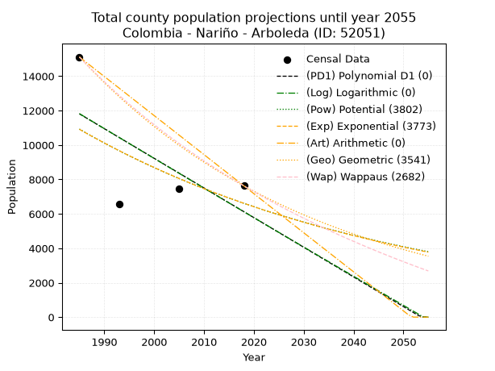
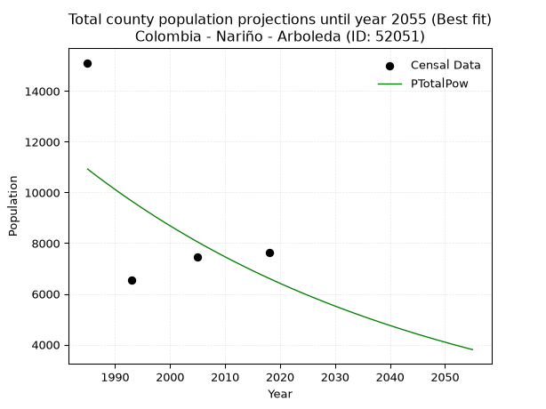
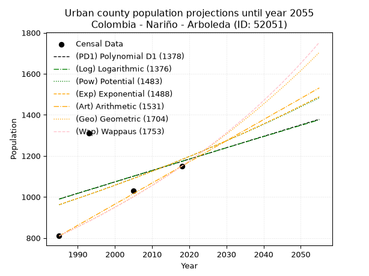
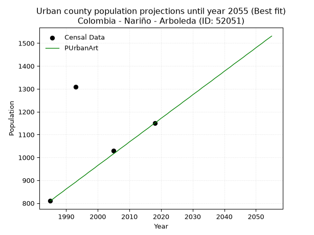
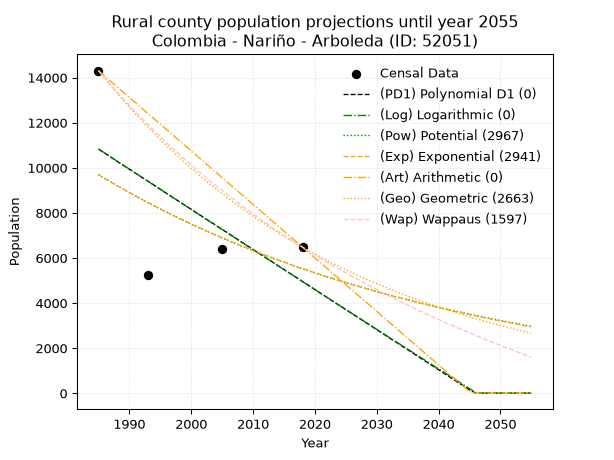
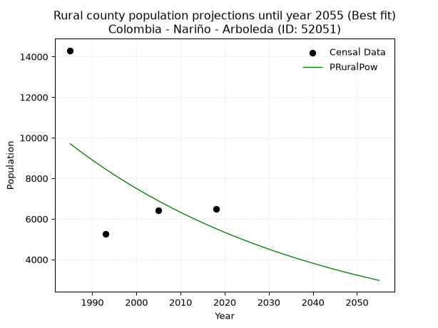

<div align="center">


</div>

# _“Population and Public Services Demand Projections (PPSD) until Year 2050 for Colombia - Nariño - Arboleda (ID: 52051)”_
Keywords: `population` `public-service` `projection` `lineal` `polynomial` `logarithmic` `potential` `exponential` `arithmetic` `geometric` `wappaus` `dane` `colombia` `south-america`

PPSD are analytical estimates used by governments and planners to anticipate future changes in population size, age distribution, and the resulting community needs for utilities, healthcare, education, and infrastructure as sizing future water treatment facilities, electrical grids, and road networks based on spatial growth.

> **General running parameters**: • app_version: _v20260806_. • Python version: _3.14.7_. • Pandas version: _3.0.5_. • NumPy version: _2.5.1_. • Creates, save and include plots into reports (create_plot): _False_. • Projection until year: _2050_. • Process polynomial degree 2 and up: _False_. • Process Wappaus: _True_. • Process Wappaus: _True_. • Set negative values to zero: _True_. • Set infinite values to zero: _True_. • Drop dataset notes: _True_. 
<div align="center">

Dynamic map: [:earth_americas:Google](http://maps.google.com/maps?q=1.50341791,-77.1354674) [:earth_americas:OSM](https://www.openstreetmap.org/#map=18/1.50341791/-77.1354674&layers=P) [:earth_americas:Bing](https://www.bing.com/maps?cp=1.50341791~-77.1354674&lvl=18) [:earth_americas:Apple](https://maps.apple.com/frame?center=1.50341791%2C-77.1354674&span=0.003%2C0.006)

</div>


<div align="center">

```geojson
{
  "type": "Feature",
  "geometry": {
    "type": "Point", 
    "coordinates": [-77.1354674, 1.50341791]
  }, 
  "properties": {
    "Name": "Colombia - Nariño - Arboleda (ID: 52051)"
  }
}
```

</div>


## 0. Census Data (4 records)

Census data are official statistics collected by a government about the people and housing in a country. They usually include counts of total population, age, sex, race, income, education, and jobs.

📅Global census file: [Population.xlsx](../data/Population.xlsx)

| Source   |   Year |   CountryID | CountryName   |   StateID | StateName   |   CountyID | CountyName   |   PTotal |   PUrban |   PRural |
|:---------|-------:|------------:|:--------------|----------:|:------------|-----------:|:-------------|---------:|---------:|---------:|
| DANE     |   1985 |          57 | Colombia      |        52 | Nariño      |      52051 | Arboleda     |    15116 |      810 |    14306 |
| DANE     |   1993 |          57 | Colombia      |        52 | Nariño      |      52051 | Arboleda     |     6554 |     1309 |     5245 |
| DANE     |   2005 |          57 | Colombia      |        52 | Nariño      |      52051 | Arboleda     |     7443 |     1029 |     6414 |
| DANE     |   2018 |          57 | Colombia      |        52 | Nariño      |      52051 | Arboleda     |     7626 |     1150 |     6476 |

> 🔥Some records could had specific notes about the registered values or the corresponding urban or rural distribution.

**Local public utility companies (RUPS)**

 | SERVICIO       | ESTADO    | NOMBRE                                                                       | NIT         | DEPARTAMENTO_DOMICILIO   | MUNICIPIO_DOMICILIO   | DIRECCION                |   TELEFONO | EMAIL                                | TIPO_INSCRIPCION    | REPRESENTANTE_LEGAL          | TIPO_PRESTADOR                             | CLASIFICACION                 |
|:---------------|:----------|:-----------------------------------------------------------------------------|:------------|:-------------------------|:----------------------|:-------------------------|-----------:|:-------------------------------------|:--------------------|:-----------------------------|:-------------------------------------------|:------------------------------|
| ASEO           | OPERATIVA | EMPRESA METROPOLITANA DE ASEO DE PASTO S.A.  E.S.P.                          | 814000704-1 | NARINO                   | PASTO                 | CARRERA 24 #23-51        |    7362874 | sonia-elizabeth.criollo@veolia.com   | Registro por la ESP | ANGELA MARCELA PAZ ROMERO    | SOCIEDADES (EMPRESA DE SERVICIOS PUBLICOS) | MAYOR O IGUAL A 5001 USUARIOS |
| ACUEDUCTO      | OPERATIVA | ASOCIACION DE USUARIOS MICRO CUENCA PECHIBLANCA CHINCHANO ARBOLEDA BERRUECOS | 814006259-0 | NARINO                   | ARBOLEDA              | BARRIO PIEDRA DE BOLIVAR |    8180316 | jecnv@hotmail.com                    | Registro por la ESP | EVERALDO RIVERA BOLAÑOS      | ORGANIZACION AUTORIZADA                    | HASTA 2500 SUSCRIPTORES       |
| ACUEDUCTO      | OPERATIVA | AGUAS DEL ROBLE SAS E.S.P.                                                   | 900398542-3 | NARINO                   | ARBOLEDA              | BARRIO FATIMA            |    0000000 | maricita.t@hotmail.com               | Registro por la ESP | MARY ELIZABETH EMBUS CORDOBA | SOCIEDADES (EMPRESA DE SERVICIOS PUBLICOS) | HASTA 2500 SUSCRIPTORES       |
| ALCANTARILLADO | OPERATIVA | AGUAS DEL ROBLE SAS E.S.P.                                                   | 900398542-3 | NARINO                   | ARBOLEDA              | BARRIO FATIMA            |    0000000 | maricita.t@hotmail.com               | Registro por la ESP | MARY ELIZABETH EMBUS CORDOBA | SOCIEDADES (EMPRESA DE SERVICIOS PUBLICOS) | HASTA 2500 SUSCRIPTORES       |
| ASEO           | OPERATIVA | AGUAS DEL ROBLE SAS E.S.P.                                                   | 900398542-3 | NARINO                   | ARBOLEDA              | BARRIO FATIMA            |    0000000 | maricita.t@hotmail.com               | Registro por la ESP | MARY ELIZABETH EMBUS CORDOBA | SOCIEDADES (EMPRESA DE SERVICIOS PUBLICOS) | HASTA 2500 SUSCRIPTORES       |
| ACUEDUCTO      | OPERATIVA | GRUPO ASOCIATIVO LOMA LARGA TAUSO ARBOLEDA                                   | 814001949-1 | NARINO                   | ARBOLEDA              | VEREDA EL TAUSO          |    0000000 | grupoasociativolomalarga@hotmail.com | Registro por la ESP | JORGE HERNAN ERAZO MOLINA    | ORGANIZACION AUTORIZADA                    | HASTA 2500 SUSCRIPTORES       |

> [📅RUPS Database: Registro Único de Prestadores de Servicios Públicos de Colombia Suramérica - RUPS](https://www.datos.gov.co/Hacienda-y-Cr-dito-P-blico/Registro-nico-de-Prestadores-de-Servicios-P-blicos/4qkq-csdn/about_data)

## 1. Total

### 1.1. Coefficients and Parameters

* (PD1) Polynomial Deg 1: -172.33199518265766, 353891.823364111 (lineal)
* (Log) Logarithmic: -345760.76318150456, 2637315.0816954817
* (Pow) Potential: -30.456163955447227, 104.47560396109265
* (Exp) Exponential: -0.01517621848119417, 1.3214193350282611e+17
* (Art) Arithmetic: Year diff. 2018 - 1985 = 33, Population diff. 7626 - 15116 = -7490, Annual growth = -226.96969696969697
* (Geo) Geometric: Year diff. 2018 - 1985 = 33, Population diff. 7626 - 15116 = -7490, Annual growth % = -0.0205195883596051
* (Wap) Wappaus: i = -1.9960398994784714, Condition values only valid for < 200)

<sub>
Wappaus condition values: ['-0.00', '-2.00', '-3.99', '-5.99', '-7.98', '-9.98', '-11.98', '-13.97', '-15.97', '-17.96', '-19.96', '-21.96', '-23.95', '-25.95', '-27.94', '-29.94', '-31.94', '-33.93', '-35.93', '-37.92', '-39.92', '-41.92', '-43.91', '-45.91', '-47.90', '-49.90', '-51.90', '-53.89', '-55.89', '-57.89', '-59.88', '-61.88', '-63.87', '-65.87', '-67.87', '-69.86', '-71.86', '-73.85', '-75.85', '-77.85', '-79.84', '-81.84', '-83.83', '-85.83', '-87.83', '-89.82', '-91.82', '-93.81', '-95.81', '-97.81', '-99.80', '-101.80', '-103.79', '-105.79', '-107.79', '-109.78', '-111.78', '-113.77', '-115.77', '-117.77', '-119.76', '-121.76', '-123.75', '-125.75', '-127.75', '-129.74']
</sub>


### 1.2. Projected Dataset

|   Year |   CountyID |   PTotalPD1 |   PTotalLog |   PTotalPow |   PTotalExp |   PTotalArt |   PTotalGeo |   PTotalWap |
|-------:|-----------:|------------:|------------:|------------:|------------:|------------:|------------:|------------:|
|   1985 |      52051 |       11813 |       11824 |       10926 |       10915 |       15116 |       15116 |       15116 |
|   1986 |      52051 |       11640 |       11650 |       10760 |       10750 |       14889 |       14806 |       14817 |
|   1987 |      52051 |       11468 |       11476 |       10596 |       10588 |       14662 |       14502 |       14524 |
|   1988 |      52051 |       11296 |       11302 |       10435 |       10429 |       14435 |       14204 |       14237 |
|   1989 |      52051 |       11123 |       11128 |       10276 |       10272 |       14208 |       13913 |       13955 |
|   1990 |      52051 |       10951 |       10954 |       10120 |       10117 |       13981 |       13627 |       13679 |
|   1991 |      52051 |       10779 |       10781 |        9967 |        9965 |       13754 |       13348 |       13408 |
|   1992 |      52051 |       10606 |       10607 |        9815 |        9815 |       13527 |       13074 |       13142 |
|   1993 |      52051 |       10434 |       10434 |        9666 |        9667 |       13300 |       12806 |       12881 |
|   1994 |      52051 |       10262 |       10260 |        9520 |        9521 |       13073 |       12543 |       12624 |
|   1995 |      52051 |       10089 |       10087 |        9376 |        9378 |       12846 |       12286 |       12373 |
|   1996 |      52051 |        9917 |        9913 |        9234 |        9237 |       12619 |       12033 |       12125 |
|   1997 |      52051 |        9745 |        9740 |        9094 |        9097 |       12392 |       11787 |       11883 |
|   1998 |      52051 |        9572 |        9567 |        8956 |        8960 |       12165 |       11545 |       11644 |
|   1999 |      52051 |        9400 |        9394 |        8821 |        8825 |       11938 |       11308 |       11410 |
|   2000 |      52051 |        9228 |        9221 |        8687 |        8693 |       11711 |       11076 |       11179 |
|   2001 |      52051 |        9056 |        9048 |        8556 |        8562 |       11484 |       10848 |       10953 |
|   2002 |      52051 |        8883 |        8876 |        8427 |        8433 |       11258 |       10626 |       10731 |
|   2003 |      52051 |        8711 |        8703 |        8300 |        8306 |       11031 |       10408 |       10512 |
|   2004 |      52051 |        8539 |        8530 |        8175 |        8181 |       10804 |       10194 |       10297 |
|   2005 |      52051 |        8366 |        8358 |        8051 |        8057 |       10577 |        9985 |       10086 |
|   2006 |      52051 |        8194 |        8186 |        7930 |        7936 |       10350 |        9780 |        9878 |
|   2007 |      52051 |        8022 |        8013 |        7811 |        7816 |       10123 |        9580 |        9673 |
|   2008 |      52051 |        7849 |        7841 |        7693 |        7699 |        9896 |        9383 |        9472 |
|   2009 |      52051 |        7677 |        7669 |        7577 |        7583 |        9669 |        9190 |        9274 |
|   2010 |      52051 |        7505 |        7497 |        7463 |        7469 |        9442 |        9002 |        9079 |
|   2011 |      52051 |        7332 |        7325 |        7351 |        7356 |        9215 |        8817 |        8887 |
|   2012 |      52051 |        7160 |        7153 |        7241 |        7245 |        8988 |        8636 |        8699 |
|   2013 |      52051 |        6988 |        6981 |        7132 |        7136 |        8761 |        8459 |        8513 |
|   2014 |      52051 |        6815 |        6809 |        7025 |        7029 |        8534 |        8285 |        8330 |
|   2015 |      52051 |        6643 |        6638 |        6919 |        6923 |        8307 |        8115 |        8150 |
|   2016 |      52051 |        6471 |        6466 |        6816 |        6819 |        8080 |        7949 |        7973 |
|   2017 |      52051 |        6298 |        6295 |        6713 |        6716 |        7853 |        7786 |        7798 |
|   2018 |      52051 |        6126 |        6123 |        6613 |        6615 |        7626 |        7626 |        7626 |
|   2019 |      52051 |        5954 |        5952 |        6514 |        6515 |        7399 |        7470 |        7457 |
|   2020 |      52051 |        5781 |        5781 |        6416 |        6417 |        7172 |        7316 |        7290 |
|   2021 |      52051 |        5609 |        5610 |        6320 |        6320 |        6945 |        7166 |        7125 |
|   2022 |      52051 |        5437 |        5439 |        6226 |        6225 |        6718 |        7019 |        6963 |
|   2023 |      52051 |        5264 |        5268 |        6133 |        6131 |        6491 |        6875 |        6803 |
|   2024 |      52051 |        5092 |        5097 |        6041 |        6039 |        6264 |        6734 |        6646 |
|   2025 |      52051 |        4920 |        4926 |        5951 |        5948 |        6037 |        6596 |        6491 |
|   2026 |      52051 |        4747 |        4755 |        5862 |        5858 |        5810 |        6460 |        6337 |
|   2027 |      52051 |        4575 |        4585 |        5775 |        5770 |        5583 |        6328 |        6187 |
|   2028 |      52051 |        4403 |        4414 |        5689 |        5683 |        5356 |        6198 |        6038 |
|   2029 |      52051 |        4230 |        4244 |        5604 |        5598 |        5129 |        6071 |        5891 |
|   2030 |      52051 |        4058 |        4073 |        5520 |        5513 |        4902 |        5946 |        5746 |
|   2031 |      52051 |        3886 |        3903 |        5438 |        5430 |        4675 |        5824 |        5604 |
|   2032 |      52051 |        3713 |        3733 |        5357 |        5349 |        4448 |        5705 |        5463 |
|   2033 |      52051 |        3541 |        3563 |        5278 |        5268 |        4221 |        5588 |        5324 |
|   2034 |      52051 |        3369 |        3393 |        5199 |        5189 |        3994 |        5473 |        5187 |
|   2035 |      52051 |        3196 |        3223 |        5122 |        5110 |        3768 |        5361 |        5052 |
|   2036 |      52051 |        3024 |        3053 |        5046 |        5034 |        3541 |        5251 |        4919 |
|   2037 |      52051 |        2852 |        2883 |        4971 |        4958 |        3314 |        5143 |        4787 |
|   2038 |      52051 |        2679 |        2713 |        4897 |        4883 |        3087 |        5037 |        4657 |
|   2039 |      52051 |        2507 |        2544 |        4824 |        4809 |        2860 |        4934 |        4529 |
|   2040 |      52051 |        2335 |        2374 |        4753 |        4737 |        2633 |        4833 |        4402 |
|   2041 |      52051 |        2162 |        2205 |        4683 |        4666 |        2406 |        4734 |        4277 |
|   2042 |      52051 |        1990 |        2035 |        4613 |        4595 |        2179 |        4637 |        4154 |
|   2043 |      52051 |        1818 |        1866 |        4545 |        4526 |        1952 |        4541 |        4032 |
|   2044 |      52051 |        1645 |        1697 |        4478 |        4458 |        1725 |        4448 |        3912 |
|   2045 |      52051 |        1473 |        1528 |        4411 |        4391 |        1498 |        4357 |        3793 |
|   2046 |      52051 |        1301 |        1359 |        4346 |        4325 |        1271 |        4268 |        3676 |
|   2047 |      52051 |        1128 |        1190 |        4282 |        4260 |        1044 |        4180 |        3560 |
|   2048 |      52051 |         956 |        1021 |        4219 |        4195 |         817 |        4094 |        3445 |
|   2049 |      52051 |         784 |         852 |        4157 |        4132 |         590 |        4010 |        3332 |
|   2050 |      52051 |         611 |         684 |        4095 |        4070 |         363 |        3928 |        3221 |
<div align="center">

</img>

</div>


### 1.3. Best fit with absolute and relative error (%)

Relative error puts that difference into context by dividing the absolute error by the true value, creating a unitless ratio or percentage that shows the scale of the mistake.

Absolute and relative error

|   Year | Source   |   CountryID | CountryName   |   StateID | StateName   |   CountyID_x | CountyName   |   PTotal |   PUrban |   PRural |   CountyID_y |   PTotalPD1 |   PTotalLog |   PTotalPow |   PTotalExp |   PTotalArt |   PTotalGeo |   PTotalWap |   PTotalPD1AbsError |   PTotalLogAbsError |   PTotalPowAbsError |   PTotalExpAbsError |   PTotalArtAbsError |   PTotalGeoAbsError |   PTotalWapAbsError |   PTotalPD1RelError |   PTotalLogRelError |   PTotalPowRelError |   PTotalExpRelError |   PTotalArtRelError |   PTotalGeoRelError |   PTotalWapRelError |
|-------:|:---------|------------:|:--------------|----------:|:------------|-------------:|:-------------|---------:|---------:|---------:|-------------:|------------:|------------:|------------:|------------:|------------:|------------:|------------:|--------------------:|--------------------:|--------------------:|--------------------:|--------------------:|--------------------:|--------------------:|--------------------:|--------------------:|--------------------:|--------------------:|--------------------:|--------------------:|--------------------:|
|   1985 | DANE     |          57 | Colombia      |        52 | Nariño      |        52051 | Arboleda     |    15116 |      810 |    14306 |        52051 |       11813 |       11824 |       10926 |       10915 |       15116 |       15116 |       15116 |                3303 |                3292 |                4190 |                4201 |                   0 |                   0 |                   0 |             21.851  |             21.7782 |            27.719   |            27.7917  |              0      |              0      |              0      |
|   1993 | DANE     |          57 | Colombia      |        52 | Nariño      |        52051 | Arboleda     |     6554 |     1309 |     5245 |        52051 |       10434 |       10434 |        9666 |        9667 |       13300 |       12806 |       12881 |                3880 |                3880 |                3112 |                3113 |                6746 |                6252 |                6327 |             59.2005 |             59.2005 |            47.4825  |            47.4977  |            102.93   |             95.3921 |             96.5365 |
|   2005 | DANE     |          57 | Colombia      |        52 | Nariño      |        52051 | Arboleda     |     7443 |     1029 |     6414 |        52051 |        8366 |        8358 |        8051 |        8057 |       10577 |        9985 |       10086 |                 923 |                 915 |                 608 |                 614 |                3134 |                2542 |                2643 |             12.4009 |             12.2934 |             8.16875 |             8.24936 |             42.1067 |             34.1529 |             35.5099 |
|   2018 | DANE     |          57 | Colombia      |        52 | Nariño      |        52051 | Arboleda     |     7626 |     1150 |     6476 |        52051 |        6126 |        6123 |        6613 |        6615 |        7626 |        7626 |        7626 |                1500 |                1503 |                1013 |                1011 |                   0 |                   0 |                   0 |             19.6696 |             19.7089 |            13.2835  |            13.2573  |              0      |              0      |              0      |

Relative error mean

| Method    |   RelError | Best   |
|:----------|-----------:|:-------|
| PTotalPD1 |    28.2805 |        |
| PTotalLog |    28.2453 |        |
| PTotalPow |    24.1634 | True   |
| PTotalExp |    24.199  |        |
| PTotalArt |    36.259  |        |
| PTotalGeo |    32.3863 |        |
| PTotalWap |    33.0116 |        |

💙Best method: _**PTotalPow**_
<div align="center">

</img>

</div>


### 1.4. Fresh water supply demand in liters per capita per day (lpcd)

The fresh water supply demand typically ranges from 100 to 300 liters per capita per day (lpcd) for standard domestic and municipal planning, though absolute survival minimums set by the World Health Organization are as low as 7.5 to 20 liters per day, and total consumption in high-income nations can exceed 400 liters.

> `CZ`: Level in meters above the sea level (masl)<br> `WS`: Fresh water supply demand in liters per capita per day (lpcd or l/h/d)<br> `WSAll`: Zonal fresh water supply demand in liters per second (l/s)<br> `A`: Zonal area in square meters<br> `DP`: Population density (people/hectare or p/ha)

Reference values (RAS Colombia)

|    CZ |   WS |
|------:|-----:|
|  1000 |  120 |
|  2000 |  130 |
| 99999 |  140 |

County shapefile geometry properties and water supply values

|   CountyID |      ATotal |   CZTotal |   WSTotal |
|-----------:|------------:|----------:|----------:|
|      52051 | 6.02324e+07 |   1896.92 |       130 |

Projected values for best method: PTotalPow

|   CountyID |   Year |   PTotalPow |   DPTotal |   WSTotal |   WSTotalAll |
|-----------:|-------:|------------:|----------:|----------:|-------------:|
|      52051 |   1985 |       10926 |      1.81 |       130 |     16.4396  |
|      52051 |   1986 |       10760 |      1.79 |       130 |     16.1898  |
|      52051 |   1987 |       10596 |      1.76 |       130 |     15.9431  |
|      52051 |   1988 |       10435 |      1.73 |       130 |     15.7008  |
|      52051 |   1989 |       10276 |      1.71 |       130 |     15.4616  |
|      52051 |   1990 |       10120 |      1.68 |       130 |     15.2269  |
|      52051 |   1991 |        9967 |      1.65 |       130 |     14.9966  |
|      52051 |   1992 |        9815 |      1.63 |       130 |     14.7679  |
|      52051 |   1993 |        9666 |      1.6  |       130 |     14.5437  |
|      52051 |   1994 |        9520 |      1.58 |       130 |     14.3241  |
|      52051 |   1995 |        9376 |      1.56 |       130 |     14.1074  |
|      52051 |   1996 |        9234 |      1.53 |       130 |     13.8938  |
|      52051 |   1997 |        9094 |      1.51 |       130 |     13.6831  |
|      52051 |   1998 |        8956 |      1.49 |       130 |     13.4755  |
|      52051 |   1999 |        8821 |      1.46 |       130 |     13.2723  |
|      52051 |   2000 |        8687 |      1.44 |       130 |     13.0707  |
|      52051 |   2001 |        8556 |      1.42 |       130 |     12.8736  |
|      52051 |   2002 |        8427 |      1.4  |       130 |     12.6795  |
|      52051 |   2003 |        8300 |      1.38 |       130 |     12.4884  |
|      52051 |   2004 |        8175 |      1.36 |       130 |     12.3003  |
|      52051 |   2005 |        8051 |      1.34 |       130 |     12.1138  |
|      52051 |   2006 |        7930 |      1.32 |       130 |     11.9317  |
|      52051 |   2007 |        7811 |      1.3  |       130 |     11.7527  |
|      52051 |   2008 |        7693 |      1.28 |       130 |     11.5751  |
|      52051 |   2009 |        7577 |      1.26 |       130 |     11.4006  |
|      52051 |   2010 |        7463 |      1.24 |       130 |     11.2291  |
|      52051 |   2011 |        7351 |      1.22 |       130 |     11.0605  |
|      52051 |   2012 |        7241 |      1.2  |       130 |     10.895   |
|      52051 |   2013 |        7132 |      1.18 |       130 |     10.731   |
|      52051 |   2014 |        7025 |      1.17 |       130 |     10.57    |
|      52051 |   2015 |        6919 |      1.15 |       130 |     10.4105  |
|      52051 |   2016 |        6816 |      1.13 |       130 |     10.2556  |
|      52051 |   2017 |        6713 |      1.11 |       130 |     10.1006  |
|      52051 |   2018 |        6613 |      1.1  |       130 |      9.95012 |
|      52051 |   2019 |        6514 |      1.08 |       130 |      9.80116 |
|      52051 |   2020 |        6416 |      1.07 |       130 |      9.6537  |
|      52051 |   2021 |        6320 |      1.05 |       130 |      9.50926 |
|      52051 |   2022 |        6226 |      1.03 |       130 |      9.36782 |
|      52051 |   2023 |        6133 |      1.02 |       130 |      9.22789 |
|      52051 |   2024 |        6041 |      1    |       130 |      9.08947 |
|      52051 |   2025 |        5951 |      0.99 |       130 |      8.95405 |
|      52051 |   2026 |        5862 |      0.97 |       130 |      8.82014 |
|      52051 |   2027 |        5775 |      0.96 |       130 |      8.68924 |
|      52051 |   2028 |        5689 |      0.94 |       130 |      8.55984 |
|      52051 |   2029 |        5604 |      0.93 |       130 |      8.43194 |
|      52051 |   2030 |        5520 |      0.92 |       130 |      8.30556 |
|      52051 |   2031 |        5438 |      0.9  |       130 |      8.18218 |
|      52051 |   2032 |        5357 |      0.89 |       130 |      8.0603  |
|      52051 |   2033 |        5278 |      0.88 |       130 |      7.94144 |
|      52051 |   2034 |        5199 |      0.86 |       130 |      7.82257 |
|      52051 |   2035 |        5122 |      0.85 |       130 |      7.70671 |
|      52051 |   2036 |        5046 |      0.84 |       130 |      7.59236 |
|      52051 |   2037 |        4971 |      0.83 |       130 |      7.47951 |
|      52051 |   2038 |        4897 |      0.81 |       130 |      7.36817 |
|      52051 |   2039 |        4824 |      0.8  |       130 |      7.25833 |
|      52051 |   2040 |        4753 |      0.79 |       130 |      7.1515  |
|      52051 |   2041 |        4683 |      0.78 |       130 |      7.04618 |
|      52051 |   2042 |        4613 |      0.77 |       130 |      6.94086 |
|      52051 |   2043 |        4545 |      0.75 |       130 |      6.83854 |
|      52051 |   2044 |        4478 |      0.74 |       130 |      6.73773 |
|      52051 |   2045 |        4411 |      0.73 |       130 |      6.63692 |
|      52051 |   2046 |        4346 |      0.72 |       130 |      6.53912 |
|      52051 |   2047 |        4282 |      0.71 |       130 |      6.44282 |
|      52051 |   2048 |        4219 |      0.7  |       130 |      6.34803 |
|      52051 |   2049 |        4157 |      0.69 |       130 |      6.25475 |
|      52051 |   2050 |        4095 |      0.68 |       130 |      6.16146 |

## 2. Urban

### 2.1. Coefficients and Parameters

* (PD1) Polynomial Deg 1: 5.551987153753455, -10030.862304295348 (lineal)
* (Log) Logarithmic: 11142.236158712543, -83617.72633065097
* (Pow) Potential: 12.493675915399558, -38.21793721154916
* (Exp) Exponential: 0.006227057959924631, 0.0041229166486668216
* (Art) Arithmetic: Year diff. 2018 - 1985 = 33, Population diff. 1150 - 810 = 340, Annual growth = 10.303030303030303
* (Geo) Geometric: Year diff. 2018 - 1985 = 33, Population diff. 1150 - 810 = 340, Annual growth % = 0.010677295964972355
* (Wap) Wappaus: i = 1.051329622758194, Condition values only valid for < 200)

<sub>
Wappaus condition values: ['0.00', '1.05', '2.10', '3.15', '4.21', '5.26', '6.31', '7.36', '8.41', '9.46', '10.51', '11.56', '12.62', '13.67', '14.72', '15.77', '16.82', '17.87', '18.92', '19.98', '21.03', '22.08', '23.13', '24.18', '25.23', '26.28', '27.33', '28.39', '29.44', '30.49', '31.54', '32.59', '33.64', '34.69', '35.75', '36.80', '37.85', '38.90', '39.95', '41.00', '42.05', '43.10', '44.16', '45.21', '46.26', '47.31', '48.36', '49.41', '50.46', '51.52', '52.57', '53.62', '54.67', '55.72', '56.77', '57.82', '58.87', '59.93', '60.98', '62.03', '63.08', '64.13', '65.18', '66.23', '67.29', '68.34']
</sub>


### 2.2. Projected Dataset

|   Year |   CountyID |   PUrbanPD1 |   PUrbanLog |   PUrbanPow |   PUrbanExp |   PUrbanArt |   PUrbanGeo |   PUrbanWap |
|-------:|-----------:|------------:|------------:|------------:|------------:|------------:|------------:|------------:|
|   1985 |      52051 |         990 |         989 |         962 |         962 |         810 |         810 |         810 |
|   1986 |      52051 |         995 |         995 |         968 |         968 |         820 |         819 |         819 |
|   1987 |      52051 |        1001 |        1001 |         974 |         975 |         831 |         827 |         827 |
|   1988 |      52051 |        1006 |        1006 |         980 |         981 |         841 |         836 |         836 |
|   1989 |      52051 |        1012 |        1012 |         987 |         987 |         851 |         845 |         845 |
|   1990 |      52051 |        1018 |        1017 |         993 |         993 |         862 |         854 |         854 |
|   1991 |      52051 |        1023 |        1023 |         999 |         999 |         872 |         863 |         863 |
|   1992 |      52051 |        1029 |        1029 |        1005 |        1005 |         882 |         873 |         872 |
|   1993 |      52051 |        1034 |        1034 |        1012 |        1012 |         892 |         882 |         881 |
|   1994 |      52051 |        1040 |        1040 |        1018 |        1018 |         903 |         891 |         890 |
|   1995 |      52051 |        1045 |        1045 |        1024 |        1024 |         913 |         901 |         900 |
|   1996 |      52051 |        1051 |        1051 |        1031 |        1031 |         923 |         910 |         909 |
|   1997 |      52051 |        1056 |        1057 |        1037 |        1037 |         934 |         920 |         919 |
|   1998 |      52051 |        1062 |        1062 |        1044 |        1044 |         944 |         930 |         929 |
|   1999 |      52051 |        1068 |        1068 |        1050 |        1050 |         954 |         940 |         939 |
|   2000 |      52051 |        1073 |        1073 |        1057 |        1057 |         965 |         950 |         949 |
|   2001 |      52051 |        1079 |        1079 |        1064 |        1063 |         975 |         960 |         959 |
|   2002 |      52051 |        1084 |        1084 |        1070 |        1070 |         985 |         970 |         969 |
|   2003 |      52051 |        1090 |        1090 |        1077 |        1077 |         995 |         981 |         979 |
|   2004 |      52051 |        1095 |        1096 |        1084 |        1083 |        1006 |         991 |         990 |
|   2005 |      52051 |        1101 |        1101 |        1090 |        1090 |        1016 |        1002 |        1000 |
|   2006 |      52051 |        1106 |        1107 |        1097 |        1097 |        1026 |        1012 |        1011 |
|   2007 |      52051 |        1112 |        1112 |        1104 |        1104 |        1037 |        1023 |        1022 |
|   2008 |      52051 |        1118 |        1118 |        1111 |        1111 |        1047 |        1034 |        1033 |
|   2009 |      52051 |        1123 |        1123 |        1118 |        1118 |        1057 |        1045 |        1044 |
|   2010 |      52051 |        1129 |        1129 |        1125 |        1125 |        1068 |        1056 |        1055 |
|   2011 |      52051 |        1134 |        1134 |        1132 |        1132 |        1078 |        1068 |        1066 |
|   2012 |      52051 |        1140 |        1140 |        1139 |        1139 |        1088 |        1079 |        1078 |
|   2013 |      52051 |        1145 |        1146 |        1146 |        1146 |        1098 |        1091 |        1090 |
|   2014 |      52051 |        1151 |        1151 |        1153 |        1153 |        1109 |        1102 |        1101 |
|   2015 |      52051 |        1156 |        1157 |        1160 |        1160 |        1119 |        1114 |        1113 |
|   2016 |      52051 |        1162 |        1162 |        1168 |        1167 |        1129 |        1126 |        1125 |
|   2017 |      52051 |        1167 |        1168 |        1175 |        1175 |        1140 |        1138 |        1138 |
|   2018 |      52051 |        1173 |        1173 |        1182 |        1182 |        1150 |        1150 |        1150 |
|   2019 |      52051 |        1179 |        1179 |        1190 |        1189 |        1160 |        1162 |        1163 |
|   2020 |      52051 |        1184 |        1184 |        1197 |        1197 |        1171 |        1175 |        1175 |
|   2021 |      52051 |        1190 |        1190 |        1204 |        1204 |        1181 |        1187 |        1188 |
|   2022 |      52051 |        1195 |        1195 |        1212 |        1212 |        1191 |        1200 |        1201 |
|   2023 |      52051 |        1201 |        1201 |        1219 |        1219 |        1202 |        1213 |        1214 |
|   2024 |      52051 |        1206 |        1206 |        1227 |        1227 |        1212 |        1226 |        1228 |
|   2025 |      52051 |        1212 |        1212 |        1234 |        1235 |        1222 |        1239 |        1241 |
|   2026 |      52051 |        1217 |        1217 |        1242 |        1242 |        1232 |        1252 |        1255 |
|   2027 |      52051 |        1223 |        1223 |        1250 |        1250 |        1243 |        1265 |        1269 |
|   2028 |      52051 |        1229 |        1228 |        1257 |        1258 |        1253 |        1279 |        1283 |
|   2029 |      52051 |        1234 |        1234 |        1265 |        1266 |        1263 |        1293 |        1297 |
|   2030 |      52051 |        1240 |        1239 |        1273 |        1274 |        1274 |        1306 |        1312 |
|   2031 |      52051 |        1245 |        1245 |        1281 |        1282 |        1284 |        1320 |        1327 |
|   2032 |      52051 |        1251 |        1250 |        1289 |        1290 |        1294 |        1334 |        1342 |
|   2033 |      52051 |        1256 |        1256 |        1297 |        1298 |        1305 |        1349 |        1357 |
|   2034 |      52051 |        1262 |        1261 |        1305 |        1306 |        1315 |        1363 |        1372 |
|   2035 |      52051 |        1267 |        1267 |        1313 |        1314 |        1325 |        1378 |        1388 |
|   2036 |      52051 |        1273 |        1272 |        1321 |        1322 |        1335 |        1392 |        1403 |
|   2037 |      52051 |        1279 |        1278 |        1329 |        1331 |        1346 |        1407 |        1419 |
|   2038 |      52051 |        1284 |        1283 |        1337 |        1339 |        1356 |        1422 |        1436 |
|   2039 |      52051 |        1290 |        1289 |        1345 |        1347 |        1366 |        1437 |        1452 |
|   2040 |      52051 |        1295 |        1294 |        1354 |        1356 |        1377 |        1453 |        1469 |
|   2041 |      52051 |        1301 |        1299 |        1362 |        1364 |        1387 |        1468 |        1486 |
|   2042 |      52051 |        1306 |        1305 |        1370 |        1373 |        1397 |        1484 |        1503 |
|   2043 |      52051 |        1312 |        1310 |        1379 |        1381 |        1408 |        1500 |        1521 |
|   2044 |      52051 |        1317 |        1316 |        1387 |        1390 |        1418 |        1516 |        1538 |
|   2045 |      52051 |        1323 |        1321 |        1396 |        1398 |        1428 |        1532 |        1556 |
|   2046 |      52051 |        1329 |        1327 |        1404 |        1407 |        1438 |        1548 |        1575 |
|   2047 |      52051 |        1334 |        1332 |        1413 |        1416 |        1449 |        1565 |        1593 |
|   2048 |      52051 |        1340 |        1338 |        1421 |        1425 |        1459 |        1582 |        1612 |
|   2049 |      52051 |        1345 |        1343 |        1430 |        1434 |        1469 |        1598 |        1631 |
|   2050 |      52051 |        1351 |        1348 |        1439 |        1443 |        1480 |        1615 |        1651 |
<div align="center">

</img>

</div>


### 2.3. Best fit with absolute and relative error (%)

Relative error puts that difference into context by dividing the absolute error by the true value, creating a unitless ratio or percentage that shows the scale of the mistake.

Absolute and relative error

|   Year | Source   |   CountryID | CountryName   |   StateID | StateName   |   CountyID_x | CountyName   |   PTotal |   PUrban |   PRural |   CountyID_y |   PUrbanPD1 |   PUrbanLog |   PUrbanPow |   PUrbanExp |   PUrbanArt |   PUrbanGeo |   PUrbanWap |   PUrbanPD1AbsError |   PUrbanLogAbsError |   PUrbanPowAbsError |   PUrbanExpAbsError |   PUrbanArtAbsError |   PUrbanGeoAbsError |   PUrbanWapAbsError |   PUrbanPD1RelError |   PUrbanLogRelError |   PUrbanPowRelError |   PUrbanExpRelError |   PUrbanArtRelError |   PUrbanGeoRelError |   PUrbanWapRelError |
|-------:|:---------|------------:|:--------------|----------:|:------------|-------------:|:-------------|---------:|---------:|---------:|-------------:|------------:|------------:|------------:|------------:|------------:|------------:|------------:|--------------------:|--------------------:|--------------------:|--------------------:|--------------------:|--------------------:|--------------------:|--------------------:|--------------------:|--------------------:|--------------------:|--------------------:|--------------------:|--------------------:|
|   1985 | DANE     |          57 | Colombia      |        52 | Nariño      |        52051 | Arboleda     |    15116 |      810 |    14306 |        52051 |         990 |         989 |         962 |         962 |         810 |         810 |         810 |                 180 |                 179 |                 152 |                 152 |                   0 |                   0 |                   0 |            22.2222  |            22.0988  |            18.7654  |            18.7654  |             0       |             0       |             0       |
|   1993 | DANE     |          57 | Colombia      |        52 | Nariño      |        52051 | Arboleda     |     6554 |     1309 |     5245 |        52051 |        1034 |        1034 |        1012 |        1012 |         892 |         882 |         881 |                 275 |                 275 |                 297 |                 297 |                 417 |                 427 |                 428 |            21.0084  |            21.0084  |            22.6891  |            22.6891  |            31.8564  |            32.6203  |            32.6967  |
|   2005 | DANE     |          57 | Colombia      |        52 | Nariño      |        52051 | Arboleda     |     7443 |     1029 |     6414 |        52051 |        1101 |        1101 |        1090 |        1090 |        1016 |        1002 |        1000 |                  72 |                  72 |                  61 |                  61 |                  13 |                  27 |                  29 |             6.99708 |             6.99708 |             5.92809 |             5.92809 |             1.26336 |             2.62391 |             2.81827 |
|   2018 | DANE     |          57 | Colombia      |        52 | Nariño      |        52051 | Arboleda     |     7626 |     1150 |     6476 |        52051 |        1173 |        1173 |        1182 |        1182 |        1150 |        1150 |        1150 |                  23 |                  23 |                  32 |                  32 |                   0 |                   0 |                   0 |             2       |             2       |             2.78261 |             2.78261 |             0       |             0       |             0       |

Relative error mean

| Method    |   RelError | Best   |
|:----------|-----------:|:-------|
| PUrbanPD1 |   13.0569  |        |
| PUrbanLog |   13.0261  |        |
| PUrbanPow |   12.5413  |        |
| PUrbanExp |   12.5413  |        |
| PUrbanArt |    8.27994 | True   |
| PUrbanGeo |    8.81106 |        |
| PUrbanWap |    8.87875 |        |

💙Best method: _**PUrbanArt**_
<div align="center">

</img>

</div>


### 2.4. Fresh water supply demand in liters per capita per day (lpcd)

The fresh water supply demand typically ranges from 100 to 300 liters per capita per day (lpcd) for standard domestic and municipal planning, though absolute survival minimums set by the World Health Organization are as low as 7.5 to 20 liters per day, and total consumption in high-income nations can exceed 400 liters.

> `CZ`: Level in meters above the sea level (masl)<br> `WS`: Fresh water supply demand in liters per capita per day (lpcd or l/h/d)<br> `WSAll`: Zonal fresh water supply demand in liters per second (l/s)<br> `A`: Zonal area in square meters<br> `DP`: Population density (people/hectare or p/ha)

Reference values (RAS Colombia)

|    CZ |   WS |
|------:|-----:|
|  1000 |  120 |
|  2000 |  130 |
| 99999 |  140 |

County shapefile geometry properties and water supply values

|   CountyID |   AUrban |   CZUrban |   WSUrban |
|-----------:|---------:|----------:|----------:|
|      52051 |   263640 |   2183.86 |       140 |

Projected values for best method: PUrbanArt

|   CountyID |   Year |   PUrbanArt |   DPUrban |   WSUrban |   WSUrbanAll |
|-----------:|-------:|------------:|----------:|----------:|-------------:|
|      52051 |   1985 |         810 |     30.72 |       140 |      1.3125  |
|      52051 |   1986 |         820 |     31.1  |       140 |      1.3287  |
|      52051 |   1987 |         831 |     31.52 |       140 |      1.34653 |
|      52051 |   1988 |         841 |     31.9  |       140 |      1.36273 |
|      52051 |   1989 |         851 |     32.28 |       140 |      1.37894 |
|      52051 |   1990 |         862 |     32.7  |       140 |      1.39676 |
|      52051 |   1991 |         872 |     33.08 |       140 |      1.41296 |
|      52051 |   1992 |         882 |     33.45 |       140 |      1.42917 |
|      52051 |   1993 |         892 |     33.83 |       140 |      1.44537 |
|      52051 |   1994 |         903 |     34.25 |       140 |      1.46319 |
|      52051 |   1995 |         913 |     34.63 |       140 |      1.4794  |
|      52051 |   1996 |         923 |     35.01 |       140 |      1.4956  |
|      52051 |   1997 |         934 |     35.43 |       140 |      1.51343 |
|      52051 |   1998 |         944 |     35.81 |       140 |      1.52963 |
|      52051 |   1999 |         954 |     36.19 |       140 |      1.54583 |
|      52051 |   2000 |         965 |     36.6  |       140 |      1.56366 |
|      52051 |   2001 |         975 |     36.98 |       140 |      1.57986 |
|      52051 |   2002 |         985 |     37.36 |       140 |      1.59606 |
|      52051 |   2003 |         995 |     37.74 |       140 |      1.61227 |
|      52051 |   2004 |        1006 |     38.16 |       140 |      1.63009 |
|      52051 |   2005 |        1016 |     38.54 |       140 |      1.6463  |
|      52051 |   2006 |        1026 |     38.92 |       140 |      1.6625  |
|      52051 |   2007 |        1037 |     39.33 |       140 |      1.68032 |
|      52051 |   2008 |        1047 |     39.71 |       140 |      1.69653 |
|      52051 |   2009 |        1057 |     40.09 |       140 |      1.71273 |
|      52051 |   2010 |        1068 |     40.51 |       140 |      1.73056 |
|      52051 |   2011 |        1078 |     40.89 |       140 |      1.74676 |
|      52051 |   2012 |        1088 |     41.27 |       140 |      1.76296 |
|      52051 |   2013 |        1098 |     41.65 |       140 |      1.77917 |
|      52051 |   2014 |        1109 |     42.06 |       140 |      1.79699 |
|      52051 |   2015 |        1119 |     42.44 |       140 |      1.81319 |
|      52051 |   2016 |        1129 |     42.82 |       140 |      1.8294  |
|      52051 |   2017 |        1140 |     43.24 |       140 |      1.84722 |
|      52051 |   2018 |        1150 |     43.62 |       140 |      1.86343 |
|      52051 |   2019 |        1160 |     44    |       140 |      1.87963 |
|      52051 |   2020 |        1171 |     44.42 |       140 |      1.89745 |
|      52051 |   2021 |        1181 |     44.8  |       140 |      1.91366 |
|      52051 |   2022 |        1191 |     45.18 |       140 |      1.92986 |
|      52051 |   2023 |        1202 |     45.59 |       140 |      1.94769 |
|      52051 |   2024 |        1212 |     45.97 |       140 |      1.96389 |
|      52051 |   2025 |        1222 |     46.35 |       140 |      1.98009 |
|      52051 |   2026 |        1232 |     46.73 |       140 |      1.9963  |
|      52051 |   2027 |        1243 |     47.15 |       140 |      2.01412 |
|      52051 |   2028 |        1253 |     47.53 |       140 |      2.03032 |
|      52051 |   2029 |        1263 |     47.91 |       140 |      2.04653 |
|      52051 |   2030 |        1274 |     48.32 |       140 |      2.06435 |
|      52051 |   2031 |        1284 |     48.7  |       140 |      2.08056 |
|      52051 |   2032 |        1294 |     49.08 |       140 |      2.09676 |
|      52051 |   2033 |        1305 |     49.5  |       140 |      2.11458 |
|      52051 |   2034 |        1315 |     49.88 |       140 |      2.13079 |
|      52051 |   2035 |        1325 |     50.26 |       140 |      2.14699 |
|      52051 |   2036 |        1335 |     50.64 |       140 |      2.16319 |
|      52051 |   2037 |        1346 |     51.05 |       140 |      2.18102 |
|      52051 |   2038 |        1356 |     51.43 |       140 |      2.19722 |
|      52051 |   2039 |        1366 |     51.81 |       140 |      2.21343 |
|      52051 |   2040 |        1377 |     52.23 |       140 |      2.23125 |
|      52051 |   2041 |        1387 |     52.61 |       140 |      2.24745 |
|      52051 |   2042 |        1397 |     52.99 |       140 |      2.26366 |
|      52051 |   2043 |        1408 |     53.41 |       140 |      2.28148 |
|      52051 |   2044 |        1418 |     53.79 |       140 |      2.29769 |
|      52051 |   2045 |        1428 |     54.16 |       140 |      2.31389 |
|      52051 |   2046 |        1438 |     54.54 |       140 |      2.33009 |
|      52051 |   2047 |        1449 |     54.96 |       140 |      2.34792 |
|      52051 |   2048 |        1459 |     55.34 |       140 |      2.36412 |
|      52051 |   2049 |        1469 |     55.72 |       140 |      2.38032 |
|      52051 |   2050 |        1480 |     56.14 |       140 |      2.39815 |

## 3. Rural

### 3.1. Coefficients and Parameters

* (PD1) Polynomial Deg 1: -177.88398233641107, 363922.6856684063 (lineal)
* (Log) Logarithmic: -356902.9993402171, 2720932.8080261326
* (Pow) Potential: -34.17476696515896, 116.68692234663078
* (Exp) Exponential: -0.017027662929512816, 4.627151638888108e+18
* (Art) Arithmetic: Year diff. 2018 - 1985 = 33, Population diff. 6476 - 14306 = -7830, Annual growth = -237.27272727272728
* (Geo) Geometric: Year diff. 2018 - 1985 = 33, Population diff. 6476 - 14306 = -7830, Annual growth % = -0.023731330535345485
* (Wap) Wappaus: i = -2.2834445892861828, Condition values only valid for < 200)

<sub>
Wappaus condition values: ['-0.00', '-2.28', '-4.57', '-6.85', '-9.13', '-11.42', '-13.70', '-15.98', '-18.27', '-20.55', '-22.83', '-25.12', '-27.40', '-29.68', '-31.97', '-34.25', '-36.54', '-38.82', '-41.10', '-43.39', '-45.67', '-47.95', '-50.24', '-52.52', '-54.80', '-57.09', '-59.37', '-61.65', '-63.94', '-66.22', '-68.50', '-70.79', '-73.07', '-75.35', '-77.64', '-79.92', '-82.20', '-84.49', '-86.77', '-89.05', '-91.34', '-93.62', '-95.90', '-98.19', '-100.47', '-102.76', '-105.04', '-107.32', '-109.61', '-111.89', '-114.17', '-116.46', '-118.74', '-121.02', '-123.31', '-125.59', '-127.87', '-130.16', '-132.44', '-134.72', '-137.01', '-139.29', '-141.57', '-143.86', '-146.14', '-148.42']
</sub>


### 3.2. Projected Dataset

|   Year |   CountyID |   PRuralPD1 |   PRuralLog |   PRuralPow |   PRuralExp |   PRuralArt |   PRuralGeo |   PRuralWap |
|-------:|-----------:|------------:|------------:|------------:|------------:|------------:|------------:|------------:|
|   1985 |      52051 |       10823 |       10835 |        9699 |        9687 |       14306 |       14306 |       14306 |
|   1986 |      52051 |       10645 |       10655 |        9533 |        9524 |       14069 |       13966 |       13983 |
|   1987 |      52051 |       10467 |       10475 |        9371 |        9363 |       13831 |       13635 |       13667 |
|   1988 |      52051 |       10289 |       10296 |        9211 |        9205 |       13594 |       13311 |       13358 |
|   1989 |      52051 |       10111 |       10116 |        9054 |        9049 |       13357 |       12996 |       13056 |
|   1990 |      52051 |        9934 |        9937 |        8900 |        8897 |       13120 |       12687 |       12761 |
|   1991 |      52051 |        9756 |        9758 |        8748 |        8746 |       12882 |       12386 |       12472 |
|   1992 |      52051 |        9578 |        9578 |        8600 |        8599 |       12645 |       12092 |       12189 |
|   1993 |      52051 |        9400 |        9399 |        8453 |        8454 |       12408 |       11805 |       11911 |
|   1994 |      52051 |        9222 |        9220 |        8310 |        8311 |       12171 |       11525 |       11640 |
|   1995 |      52051 |        9044 |        9041 |        8169 |        8171 |       11933 |       11252 |       11374 |
|   1996 |      52051 |        8866 |        8862 |        8030 |        8033 |       11696 |       10985 |       11114 |
|   1997 |      52051 |        8688 |        8684 |        7894 |        7897 |       11459 |       10724 |       10858 |
|   1998 |      52051 |        8510 |        8505 |        7760 |        7764 |       11221 |       10469 |       10608 |
|   1999 |      52051 |        8333 |        8326 |        7628 |        7633 |       10984 |       10221 |       10363 |
|   2000 |      52051 |        8155 |        8148 |        7499 |        7504 |       10747 |        9978 |       10122 |
|   2001 |      52051 |        7977 |        7970 |        7372 |        7377 |       10510 |        9742 |        9887 |
|   2002 |      52051 |        7799 |        7791 |        7247 |        7252 |       10272 |        9510 |        9655 |
|   2003 |      52051 |        7621 |        7613 |        7124 |        7130 |       10035 |        9285 |        9428 |
|   2004 |      52051 |        7443 |        7435 |        7004 |        7010 |        9798 |        9064 |        9206 |
|   2005 |      52051 |        7265 |        7257 |        6885 |        6891 |        9561 |        8849 |        8987 |
|   2006 |      52051 |        7087 |        7079 |        6769 |        6775 |        9323 |        8639 |        8773 |
|   2007 |      52051 |        6910 |        6901 |        6655 |        6661 |        9086 |        8434 |        8562 |
|   2008 |      52051 |        6732 |        6723 |        6542 |        6548 |        8849 |        8234 |        8355 |
|   2009 |      52051 |        6554 |        6545 |        6432 |        6438 |        8611 |        8039 |        8152 |
|   2010 |      52051 |        6376 |        6368 |        6324 |        6329 |        8374 |        7848 |        7953 |
|   2011 |      52051 |        6198 |        6190 |        6217 |        6222 |        8137 |        7662 |        7757 |
|   2012 |      52051 |        6020 |        6013 |        6112 |        6117 |        7900 |        7480 |        7564 |
|   2013 |      52051 |        5842 |        5836 |        6009 |        6014 |        7662 |        7302 |        7375 |
|   2014 |      52051 |        5664 |        5658 |        5908 |        5912 |        7425 |        7129 |        7189 |
|   2015 |      52051 |        5486 |        5481 |        5809 |        5812 |        7188 |        6960 |        7006 |
|   2016 |      52051 |        5309 |        5304 |        5711 |        5714 |        6951 |        6795 |        6826 |
|   2017 |      52051 |        5131 |        5127 |        5615 |        5618 |        6713 |        6633 |        6650 |
|   2018 |      52051 |        4953 |        4950 |        5521 |        5523 |        6476 |        6476 |        6476 |
|   2019 |      52051 |        4775 |        4773 |        5428 |        5430 |        6239 |        6322 |        6305 |
|   2020 |      52051 |        4597 |        4597 |        5337 |        5338 |        6001 |        6172 |        6137 |
|   2021 |      52051 |        4419 |        4420 |        5248 |        5248 |        5764 |        6026 |        5972 |
|   2022 |      52051 |        4241 |        4243 |        5160 |        5159 |        5527 |        5883 |        5809 |
|   2023 |      52051 |        4063 |        4067 |        5073 |        5072 |        5290 |        5743 |        5649 |
|   2024 |      52051 |        3886 |        3891 |        4988 |        4986 |        5052 |        5607 |        5491 |
|   2025 |      52051 |        3708 |        3714 |        4905 |        4902 |        4815 |        5474 |        5336 |
|   2026 |      52051 |        3530 |        3538 |        4823 |        4820 |        4578 |        5344 |        5183 |
|   2027 |      52051 |        3352 |        3362 |        4742 |        4738 |        4341 |        5217 |        5033 |
|   2028 |      52051 |        3174 |        3186 |        4663 |        4658 |        4103 |        5093 |        4885 |
|   2029 |      52051 |        2996 |        3010 |        4585 |        4579 |        3866 |        4972 |        4739 |
|   2030 |      52051 |        2818 |        2834 |        4508 |        4502 |        3629 |        4854 |        4595 |
|   2031 |      52051 |        2640 |        2658 |        4433 |        4426 |        3391 |        4739 |        4454 |
|   2032 |      52051 |        2462 |        2483 |        4359 |        4351 |        3154 |        4627 |        4314 |
|   2033 |      52051 |        2285 |        2307 |        4286 |        4278 |        2917 |        4517 |        4177 |
|   2034 |      52051 |        2107 |        2132 |        4215 |        4206 |        2680 |        4410 |        4042 |
|   2035 |      52051 |        1929 |        1956 |        4145 |        4135 |        2442 |        4305 |        3908 |
|   2036 |      52051 |        1751 |        1781 |        4076 |        4065 |        2205 |        4203 |        3777 |
|   2037 |      52051 |        1573 |        1606 |        4008 |        3996 |        1968 |        4103 |        3647 |
|   2038 |      52051 |        1395 |        1430 |        3941 |        3929 |        1731 |        4006 |        3520 |
|   2039 |      52051 |        1217 |        1255 |        3876 |        3862 |        1493 |        3911 |        3394 |
|   2040 |      52051 |        1039 |        1080 |        3811 |        3797 |        1256 |        3818 |        3270 |
|   2041 |      52051 |         861 |         905 |        3748 |        3733 |        1019 |        3727 |        3147 |
|   2042 |      52051 |         684 |         731 |        3686 |        3670 |         781 |        3639 |        3026 |
|   2043 |      52051 |         506 |         556 |        3625 |        3608 |         544 |        3553 |        2907 |
|   2044 |      52051 |         328 |         381 |        3565 |        3547 |         307 |        3468 |        2790 |
|   2045 |      52051 |         150 |         207 |        3505 |        3487 |          70 |        3386 |        2674 |
|   2046 |      52051 |           0 |          32 |        3447 |        3428 |           0 |        3306 |        2560 |
|   2047 |      52051 |           0 |           0 |        3390 |        3371 |           0 |        3227 |        2447 |
|   2048 |      52051 |           0 |           0 |        3334 |        3314 |           0 |        3151 |        2336 |
|   2049 |      52051 |           0 |           0 |        3279 |        3258 |           0 |        3076 |        2226 |
|   2050 |      52051 |           0 |           0 |        3225 |        3203 |           0 |        3003 |        2118 |
<div align="center">

</img>

</div>


### 3.3. Best fit with absolute and relative error (%)

Relative error puts that difference into context by dividing the absolute error by the true value, creating a unitless ratio or percentage that shows the scale of the mistake.

Absolute and relative error

|   Year | Source   |   CountryID | CountryName   |   StateID | StateName   |   CountyID_x | CountyName   |   PTotal |   PUrban |   PRural |   CountyID_y |   PRuralPD1 |   PRuralLog |   PRuralPow |   PRuralExp |   PRuralArt |   PRuralGeo |   PRuralWap |   PRuralPD1AbsError |   PRuralLogAbsError |   PRuralPowAbsError |   PRuralExpAbsError |   PRuralArtAbsError |   PRuralGeoAbsError |   PRuralWapAbsError |   PRuralPD1RelError |   PRuralLogRelError |   PRuralPowRelError |   PRuralExpRelError |   PRuralArtRelError |   PRuralGeoRelError |   PRuralWapRelError |
|-------:|:---------|------------:|:--------------|----------:|:------------|-------------:|:-------------|---------:|---------:|---------:|-------------:|------------:|------------:|------------:|------------:|------------:|------------:|------------:|--------------------:|--------------------:|--------------------:|--------------------:|--------------------:|--------------------:|--------------------:|--------------------:|--------------------:|--------------------:|--------------------:|--------------------:|--------------------:|--------------------:|
|   1985 | DANE     |          57 | Colombia      |        52 | Nariño      |        52051 | Arboleda     |    15116 |      810 |    14306 |        52051 |       10823 |       10835 |        9699 |        9687 |       14306 |       14306 |       14306 |                3483 |                3471 |                4607 |                4619 |                   0 |                   0 |                   0 |             24.3464 |             24.2625 |            32.2033  |            32.2872  |              0      |              0      |              0      |
|   1993 | DANE     |          57 | Colombia      |        52 | Nariño      |        52051 | Arboleda     |     6554 |     1309 |     5245 |        52051 |        9400 |        9399 |        8453 |        8454 |       12408 |       11805 |       11911 |                4155 |                4154 |                3208 |                3209 |                7163 |                6560 |                6666 |             79.2183 |             79.1992 |            61.163   |            61.1821  |            136.568  |            125.071  |            127.092  |
|   2005 | DANE     |          57 | Colombia      |        52 | Nariño      |        52051 | Arboleda     |     7443 |     1029 |     6414 |        52051 |        7265 |        7257 |        6885 |        6891 |        9561 |        8849 |        8987 |                 851 |                 843 |                 471 |                 477 |                3147 |                2435 |                2573 |             13.2679 |             13.1431 |             7.34331 |             7.43686 |             49.0645 |             37.9638 |             40.1154 |
|   2018 | DANE     |          57 | Colombia      |        52 | Nariño      |        52051 | Arboleda     |     7626 |     1150 |     6476 |        52051 |        4953 |        4950 |        5521 |        5523 |        6476 |        6476 |        6476 |                1523 |                1526 |                 955 |                 953 |                   0 |                   0 |                   0 |             23.5176 |             23.5639 |            14.7468  |            14.7159  |              0      |              0      |              0      |

Relative error mean

| Method    |   RelError | Best   |
|:----------|-----------:|:-------|
| PRuralPD1 |    35.0875 |        |
| PRuralLog |    35.0422 |        |
| PRuralPow |    28.8641 | True   |
| PRuralExp |    28.9055 |        |
| PRuralArt |    46.4082 |        |
| PRuralGeo |    40.7588 |        |
| PRuralWap |    41.802  |        |

💙Best method: _**PRuralPow**_
<div align="center">

</img>

</div>


### 3.4. Fresh water supply demand in liters per capita per day (lpcd)

The fresh water supply demand typically ranges from 100 to 300 liters per capita per day (lpcd) for standard domestic and municipal planning, though absolute survival minimums set by the World Health Organization are as low as 7.5 to 20 liters per day, and total consumption in high-income nations can exceed 400 liters.

> `CZ`: Level in meters above the sea level (masl)<br> `WS`: Fresh water supply demand in liters per capita per day (lpcd or l/h/d)<br> `WSAll`: Zonal fresh water supply demand in liters per second (l/s)<br> `A`: Zonal area in square meters<br> `DP`: Population density (people/hectare or p/ha)

Reference values (RAS Colombia)

|    CZ |   WS |
|------:|-----:|
|  1000 |  120 |
|  2000 |  130 |
| 99999 |  140 |

County shapefile geometry properties and water supply values

|   CountyID |      ARural |   CZRural |   WSRural |
|-----------:|------------:|----------:|----------:|
|      52051 | 5.99687e+07 |   1895.61 |       130 |

Projected values for best method: PRuralPow

|   CountyID |   Year |   PRuralPow |   DPRural |   WSRural |   WSRuralAll |
|-----------:|-------:|------------:|----------:|----------:|-------------:|
|      52051 |   1985 |        9699 |      1.62 |       130 |     14.5934  |
|      52051 |   1986 |        9533 |      1.59 |       130 |     14.3436  |
|      52051 |   1987 |        9371 |      1.56 |       130 |     14.0999  |
|      52051 |   1988 |        9211 |      1.54 |       130 |     13.8591  |
|      52051 |   1989 |        9054 |      1.51 |       130 |     13.6229  |
|      52051 |   1990 |        8900 |      1.48 |       130 |     13.3912  |
|      52051 |   1991 |        8748 |      1.46 |       130 |     13.1625  |
|      52051 |   1992 |        8600 |      1.43 |       130 |     12.9398  |
|      52051 |   1993 |        8453 |      1.41 |       130 |     12.7186  |
|      52051 |   1994 |        8310 |      1.39 |       130 |     12.5035  |
|      52051 |   1995 |        8169 |      1.36 |       130 |     12.2913  |
|      52051 |   1996 |        8030 |      1.34 |       130 |     12.0822  |
|      52051 |   1997 |        7894 |      1.32 |       130 |     11.8775  |
|      52051 |   1998 |        7760 |      1.29 |       130 |     11.6759  |
|      52051 |   1999 |        7628 |      1.27 |       130 |     11.4773  |
|      52051 |   2000 |        7499 |      1.25 |       130 |     11.2832  |
|      52051 |   2001 |        7372 |      1.23 |       130 |     11.0921  |
|      52051 |   2002 |        7247 |      1.21 |       130 |     10.9041  |
|      52051 |   2003 |        7124 |      1.19 |       130 |     10.719   |
|      52051 |   2004 |        7004 |      1.17 |       130 |     10.5384  |
|      52051 |   2005 |        6885 |      1.15 |       130 |     10.3594  |
|      52051 |   2006 |        6769 |      1.13 |       130 |     10.1848  |
|      52051 |   2007 |        6655 |      1.11 |       130 |     10.0133  |
|      52051 |   2008 |        6542 |      1.09 |       130 |      9.84329 |
|      52051 |   2009 |        6432 |      1.07 |       130 |      9.67778 |
|      52051 |   2010 |        6324 |      1.05 |       130 |      9.51528 |
|      52051 |   2011 |        6217 |      1.04 |       130 |      9.35428 |
|      52051 |   2012 |        6112 |      1.02 |       130 |      9.1963  |
|      52051 |   2013 |        6009 |      1    |       130 |      9.04132 |
|      52051 |   2014 |        5908 |      0.99 |       130 |      8.88935 |
|      52051 |   2015 |        5809 |      0.97 |       130 |      8.74039 |
|      52051 |   2016 |        5711 |      0.95 |       130 |      8.59294 |
|      52051 |   2017 |        5615 |      0.94 |       130 |      8.4485  |
|      52051 |   2018 |        5521 |      0.92 |       130 |      8.30706 |
|      52051 |   2019 |        5428 |      0.91 |       130 |      8.16713 |
|      52051 |   2020 |        5337 |      0.89 |       130 |      8.03021 |
|      52051 |   2021 |        5248 |      0.88 |       130 |      7.8963  |
|      52051 |   2022 |        5160 |      0.86 |       130 |      7.76389 |
|      52051 |   2023 |        5073 |      0.85 |       130 |      7.63299 |
|      52051 |   2024 |        4988 |      0.83 |       130 |      7.50509 |
|      52051 |   2025 |        4905 |      0.82 |       130 |      7.38021 |
|      52051 |   2026 |        4823 |      0.8  |       130 |      7.25683 |
|      52051 |   2027 |        4742 |      0.79 |       130 |      7.13495 |
|      52051 |   2028 |        4663 |      0.78 |       130 |      7.01609 |
|      52051 |   2029 |        4585 |      0.76 |       130 |      6.89873 |
|      52051 |   2030 |        4508 |      0.75 |       130 |      6.78287 |
|      52051 |   2031 |        4433 |      0.74 |       130 |      6.67002 |
|      52051 |   2032 |        4359 |      0.73 |       130 |      6.55868 |
|      52051 |   2033 |        4286 |      0.71 |       130 |      6.44884 |
|      52051 |   2034 |        4215 |      0.7  |       130 |      6.34201 |
|      52051 |   2035 |        4145 |      0.69 |       130 |      6.23669 |
|      52051 |   2036 |        4076 |      0.68 |       130 |      6.13287 |
|      52051 |   2037 |        4008 |      0.67 |       130 |      6.03056 |
|      52051 |   2038 |        3941 |      0.66 |       130 |      5.92975 |
|      52051 |   2039 |        3876 |      0.65 |       130 |      5.83194 |
|      52051 |   2040 |        3811 |      0.64 |       130 |      5.73414 |
|      52051 |   2041 |        3748 |      0.62 |       130 |      5.63935 |
|      52051 |   2042 |        3686 |      0.61 |       130 |      5.54606 |
|      52051 |   2043 |        3625 |      0.6  |       130 |      5.45428 |
|      52051 |   2044 |        3565 |      0.59 |       130 |      5.364   |
|      52051 |   2045 |        3505 |      0.58 |       130 |      5.27373 |
|      52051 |   2046 |        3447 |      0.57 |       130 |      5.18646 |
|      52051 |   2047 |        3390 |      0.57 |       130 |      5.10069 |
|      52051 |   2048 |        3334 |      0.56 |       130 |      5.01644 |
|      52051 |   2049 |        3279 |      0.55 |       130 |      4.93368 |
|      52051 |   2050 |        3225 |      0.54 |       130 |      4.85243 |

<div align="center"><br><sub>Share this research</sub></div><br>

<sub>**APPS & TOOLS & CONTENT DISCLAIMER**: • NO WARRANTY - This content and software is provided by <a href="https://github.com/rcfdtools" target="_blank">github.com/rcfdtools</a> "as is", without any express or implied warranty, including warranties of merchantability, fitness for a particular purpose, or non-infringement. There is no guarantee that the software will be error-free or operate without interruption. • LIMITATION OF LIABILITY - Neither the authors nor copyright holders will be liable for claims or damages arising from the software or its use. You are responsible for determining if the software is appropriate for your use and assume all associated risks, including errors, legal compliance, and data loss. • NO PROFESSIONAL ADVICE - The software provides general information and does not offer professional advice. It should not replace consultation with professional advisors. [Clauses and global license for rcfdtools use.](https://github.com/rcfdtools/rcfdtools/blob/main/LICENSE.md)</sub>

| [:house: Home](Readme.md)  | [:beginner: Help / Collaborate](https://github.com/rcfdtools/R.HydroTools/discussions/31) |
|----------------------------|-------------------------------------------------------------------------------------------|