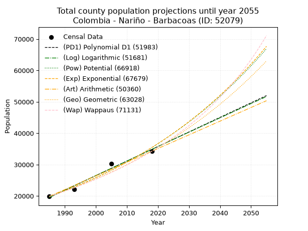
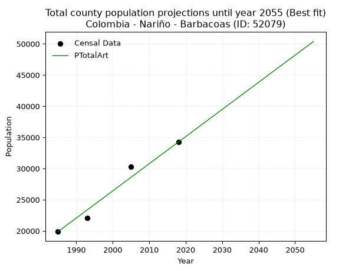
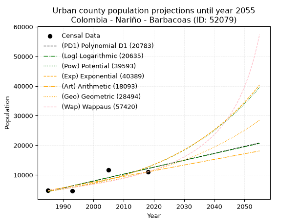
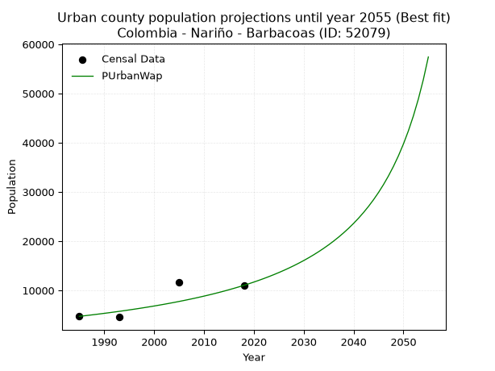
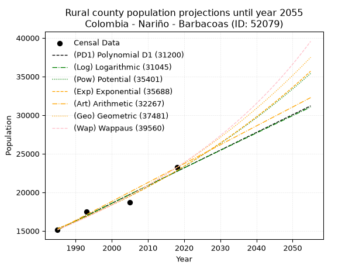
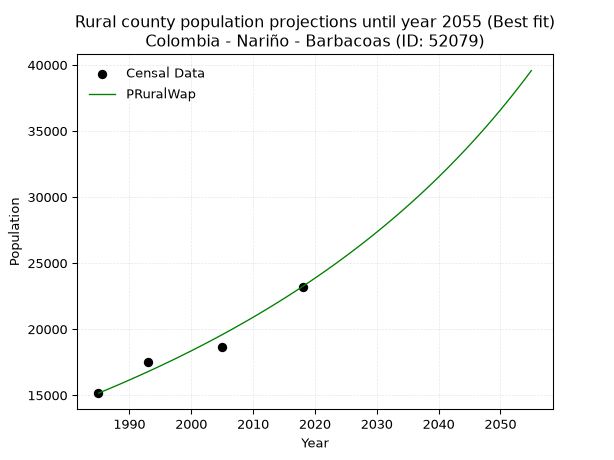

<div align="center">


</div>

# 📜 _“Population and Public Services Demand Projections (PPSD) until Year 2050 for Colombia - Nariño - Barbacoas (ID: 52079)”_
Keywords: `population` `public-service` `projection` `lineal` `polynomial` `logarithmic` `potential` `exponential` `arithmetic` `geometric` `wappaus` `dane` `colombia` `south-america`

PPSD are analytical estimates used by governments and planners to anticipate future changes in population size, age distribution, and the resulting community needs for utilities, healthcare, education, and infrastructure as sizing future water treatment facilities, electrical grids, and road networks based on spatial growth.

<div align="center">

</img>

</div>


> **General running parameters**: • app_version: _v20260806_. • Python version: _3.14.7_. • Pandas version: _3.0.5_. • NumPy version: _2.5.1_. • Creates, save and include plots into reports (create_plot): _False_. • Projection until year: _2050_. • Process polynomial degree 2 and up: _False_. • Process Wappaus: _True_. • Process Wappaus: _True_. • Set negative values to zero: _True_. • Set infinite values to zero: _True_. • Drop dataset notes: _True_. 
<div align="center">

Maps & GIS Layers: [:earth_americas:Google](http://maps.google.com/maps?q=1.671732683,-78.1376501) [:earth_americas:OSM](https://www.openstreetmap.org/#map=18/1.671732683/-78.1376501&layers=P) [:earth_americas:Bing](https://www.bing.com/maps?cp=1.671732683~-78.1376501&lvl=18) [:earth_americas:Apple](https://maps.apple.com/frame?center=1.671732683%2C-78.1376501&span=0.003%2C0.006) [:earth_americas:GISMobile](https://github.com/rcfdtools/R.GISMobile/blob/main/file/gis/CountyLayer_CO/Readme.md)

</div>


<div align="center">

```geojson
{
  "type": "Feature",
  "geometry": {
    "type": "Point", 
    "coordinates": [-78.1376501, 1.671732683]
  }, 
  "properties": {
    "Name": "Colombia - Nariño - Barbacoas (ID: 52079)"
  }
}
```

</div>


## 0. Census Data (4 records)

Census data are official statistics collected by a government about the people and housing in a country. They usually include counts of total population, age, sex, race, income, education, and jobs.

📅Global census file: [Population.xlsx](../data/Population.xlsx)

| Source   |   Year |   CountryID | CountryName   |   StateID | StateName   |   CountyID | CountyName   |   PTotal |   PUrban |   PRural |
|:---------|-------:|------------:|:--------------|----------:|:------------|-----------:|:-------------|---------:|---------:|---------:|
| DANE     |   1985 |          57 | Colombia      |        52 | Nariño      |      52079 | Barbacoas    |    19878 |     4731 |    15147 |
| DANE     |   1993 |          57 | Colombia      |        52 | Nariño      |      52079 | Barbacoas    |    22071 |     4575 |    17496 |
| DANE     |   2005 |          57 | Colombia      |        52 | Nariño      |      52079 | Barbacoas    |    30270 |    11602 |    18668 |
| DANE     |   2018 |          57 | Colombia      |        52 | Nariño      |      52079 | Barbacoas    |    34248 |    11030 |    23218 |

> 🔥Some records could had specific notes about the registered values or the corresponding urban or rural distribution.

📅[SUI-RUPS](https://www.datos.gov.co/Hacienda-y-Cr-dito-P-blico/Registro-nico-de-Prestadores-de-Servicios-P-blicos/4qkq-csdn/about_data) - Local public utility companies: [RUPS.csv](../data/RUPS.csv)

 | SERVICIO       | ESTADO    | NOMBRE                                                 | NIT         | DEPARTAMENTO_DOMICILIO   | MUNICIPIO_DOMICILIO   | DIRECCION                         |   TELEFONO | EMAIL                          | TIPO_PRESTADOR                             | CLASIFICACION                 |
|:---------------|:----------|:-------------------------------------------------------|:------------|:-------------------------|:----------------------|:----------------------------------|-----------:|:-------------------------------|:-------------------------------------------|:------------------------------|
| ACUEDUCTO      | OPERATIVA | MUNICIPIO DE BARBACOAS - NARIÑO                        | 800099061-7 | NARINO                   | BARBACOAS             | CALLE NUEVA - PALACIO MUNICIPAL   |    7468273 | carlosarturo_ramos@hotmail.com | MUNICIPIO (PRESTACIÓN DIRECTA)             | HASTA 2500 SUSCRIPTORES       |
| ALCANTARILLADO | OPERATIVA | MUNICIPIO DE BARBACOAS - NARIÑO                        | 800099061-7 | NARINO                   | BARBACOAS             | CALLE NUEVA - PALACIO MUNICIPAL   |    7468273 | carlosarturo_ramos@hotmail.com | MUNICIPIO (PRESTACIÓN DIRECTA)             | HASTA 2500 SUSCRIPTORES       |
| ACUEDUCTO      | OPERATIVA | EMPRESA DE SERVICIOS PUBLICOS DE BARBACOAS S.A.S E.S.P | 900829226-1 | NARINO                   | BARBACOAS             | CALLE POLO - DIAGONAL COLEGIO LIS |    7228328 | educateycambia@gmail.com       | SOCIEDADES (EMPRESA DE SERVICIOS PUBLICOS) | MENOR O IGUAL A 2500 USUARIOS |
| ALCANTARILLADO | OPERATIVA | EMPRESA DE SERVICIOS PUBLICOS DE BARBACOAS S.A.S E.S.P | 900829226-1 | NARINO                   | BARBACOAS             | CALLE POLO - DIAGONAL COLEGIO LIS |    7228328 | educateycambia@gmail.com       | SOCIEDADES (EMPRESA DE SERVICIOS PUBLICOS) | MENOR O IGUAL A 2500 USUARIOS |

## 1. Total

### 1.1. Coefficients and Parameters

* (PD1) Polynomial Deg 1: 463.31633881974824, -900131.7567242015 (lineal)
* (Log) Logarithmic: 927495.3936000445, -7023283.169235566
* (Pow) Potential: 35.027568395854004, -111.21419908296663
* (Exp) Exponential: 0.017495176564128058, 1.6460528881048066e-11
* (Art) Arithmetic: Year diff. 2018 - 1985 = 33, Population diff. 34248 - 19878 = 14370, Annual growth = 435.45454545454544
* (Geo) Geometric: Year diff. 2018 - 1985 = 33, Population diff. 34248 - 19878 = 14370, Annual growth % = 0.016621922361574226
* (Wap) Wappaus: i = 1.6090401856946586, Condition values only valid for < 200)

<sub>
Wappaus condition values: ['0.00', '1.61', '3.22', '4.83', '6.44', '8.05', '9.65', '11.26', '12.87', '14.48', '16.09', '17.70', '19.31', '20.92', '22.53', '24.14', '25.74', '27.35', '28.96', '30.57', '32.18', '33.79', '35.40', '37.01', '38.62', '40.23', '41.84', '43.44', '45.05', '46.66', '48.27', '49.88', '51.49', '53.10', '54.71', '56.32', '57.93', '59.53', '61.14', '62.75', '64.36', '65.97', '67.58', '69.19', '70.80', '72.41', '74.02', '75.62', '77.23', '78.84', '80.45', '82.06', '83.67', '85.28', '86.89', '88.50', '90.11', '91.72', '93.32', '94.93', '96.54', '98.15', '99.76', '101.37', '102.98', '104.59']
</sub>


### 1.2. Projected Dataset

|   Year |   CountyID |   PTotalPD1 |   PTotalLog |   PTotalPow |   PTotalExp |   PTotalArt |   PTotalGeo |   PTotalWap |
|-------:|-----------:|------------:|------------:|------------:|------------:|------------:|------------:|------------:|
|   1985 |      52079 |       19551 |       19536 |       19876 |       19888 |       19878 |       19878 |       19878 |
|   1986 |      52079 |       20014 |       20004 |       20230 |       20239 |       20313 |       20208 |       20200 |
|   1987 |      52079 |       20478 |       20470 |       20590 |       20596 |       20749 |       20544 |       20528 |
|   1988 |      52079 |       20941 |       20937 |       20956 |       20960 |       21184 |       20886 |       20861 |
|   1989 |      52079 |       21404 |       21404 |       21328 |       21330 |       21620 |       21233 |       21200 |
|   1990 |      52079 |       21868 |       21870 |       21707 |       21706 |       22055 |       21586 |       21544 |
|   1991 |      52079 |       22331 |       22336 |       22093 |       22089 |       22491 |       21945 |       21894 |
|   1992 |      52079 |       22794 |       22801 |       22485 |       22479 |       22926 |       22309 |       22251 |
|   1993 |      52079 |       23258 |       23267 |       22883 |       22876 |       23362 |       22680 |       22613 |
|   1994 |      52079 |       23721 |       23732 |       23289 |       23279 |       23797 |       23057 |       22981 |
|   1995 |      52079 |       24184 |       24197 |       23702 |       23690 |       24233 |       23441 |       23356 |
|   1996 |      52079 |       24648 |       24662 |       24121 |       24108 |       24668 |       23830 |       23738 |
|   1997 |      52079 |       25111 |       25127 |       24548 |       24534 |       25103 |       24226 |       24126 |
|   1998 |      52079 |       25574 |       25591 |       24982 |       24967 |       25539 |       24629 |       24522 |
|   1999 |      52079 |       26038 |       26055 |       25424 |       25408 |       25974 |       25038 |       24924 |
|   2000 |      52079 |       26501 |       26519 |       25873 |       25856 |       26410 |       25455 |       25334 |
|   2001 |      52079 |       26964 |       26982 |       26330 |       26312 |       26845 |       25878 |       25752 |
|   2002 |      52079 |       27428 |       27446 |       26795 |       26777 |       27281 |       26308 |       26177 |
|   2003 |      52079 |       27891 |       27909 |       27268 |       27249 |       27716 |       26745 |       26610 |
|   2004 |      52079 |       28354 |       28372 |       27749 |       27730 |       28152 |       27190 |       27052 |
|   2005 |      52079 |       28818 |       28835 |       28238 |       28220 |       28587 |       27642 |       27502 |
|   2006 |      52079 |       29281 |       29297 |       28736 |       28718 |       29023 |       28101 |       27960 |
|   2007 |      52079 |       29744 |       29759 |       29242 |       29225 |       29458 |       28568 |       28428 |
|   2008 |      52079 |       30207 |       30221 |       29757 |       29740 |       29893 |       29043 |       28905 |
|   2009 |      52079 |       30671 |       30683 |       30280 |       30265 |       30329 |       29526 |       29391 |
|   2010 |      52079 |       31134 |       31145 |       30812 |       30799 |       30764 |       30016 |       29887 |
|   2011 |      52079 |       31597 |       31606 |       31354 |       31343 |       31200 |       30515 |       30394 |
|   2012 |      52079 |       32061 |       32067 |       31905 |       31896 |       31635 |       31023 |       30910 |
|   2013 |      52079 |       32524 |       32528 |       32465 |       32459 |       32071 |       31538 |       31438 |
|   2014 |      52079 |       32987 |       32989 |       33035 |       33032 |       32506 |       32062 |       31976 |
|   2015 |      52079 |       33451 |       33449 |       33614 |       33615 |       32942 |       32595 |       32526 |
|   2016 |      52079 |       33914 |       33909 |       34203 |       34208 |       33377 |       33137 |       33088 |
|   2017 |      52079 |       34377 |       34369 |       34803 |       34812 |       33813 |       33688 |       33662 |
|   2018 |      52079 |       34841 |       34829 |       35412 |       35426 |       34248 |       34248 |       34248 |
|   2019 |      52079 |       35304 |       35288 |       36032 |       36052 |       34683 |       34817 |       34847 |
|   2020 |      52079 |       35767 |       35748 |       36663 |       36688 |       35119 |       35396 |       35460 |
|   2021 |      52079 |       36231 |       36207 |       37304 |       37335 |       35554 |       35984 |       36087 |
|   2022 |      52079 |       36694 |       36666 |       37956 |       37994 |       35990 |       36582 |       36728 |
|   2023 |      52079 |       37157 |       37124 |       38619 |       38665 |       36425 |       37191 |       37384 |
|   2024 |      52079 |       37621 |       37583 |       39293 |       39347 |       36861 |       37809 |       38055 |
|   2025 |      52079 |       38084 |       38041 |       39979 |       40042 |       37296 |       38437 |       38743 |
|   2026 |      52079 |       38547 |       38499 |       40676 |       40748 |       37732 |       39076 |       39446 |
|   2027 |      52079 |       39010 |       38956 |       41385 |       41468 |       38167 |       39726 |       40167 |
|   2028 |      52079 |       39474 |       39414 |       42107 |       42199 |       38603 |       40386 |       40906 |
|   2029 |      52079 |       39937 |       39871 |       42840 |       42944 |       39038 |       41057 |       41663 |
|   2030 |      52079 |       40400 |       40328 |       43586 |       43702 |       39473 |       41740 |       42439 |
|   2031 |      52079 |       40864 |       40785 |       44344 |       44473 |       39909 |       42433 |       43235 |
|   2032 |      52079 |       41327 |       41241 |       45115 |       45258 |       40344 |       43139 |       44051 |
|   2033 |      52079 |       41790 |       41698 |       45900 |       46057 |       40780 |       43856 |       44889 |
|   2034 |      52079 |       42254 |       42154 |       46697 |       46870 |       41215 |       44585 |       45749 |
|   2035 |      52079 |       42717 |       42610 |       47508 |       47697 |       41651 |       45326 |       46633 |
|   2036 |      52079 |       43180 |       43065 |       48333 |       48539 |       42086 |       46079 |       47540 |
|   2037 |      52079 |       43644 |       43521 |       49171 |       49396 |       42522 |       46845 |       48472 |
|   2038 |      52079 |       44107 |       43976 |       50024 |       50268 |       42957 |       47624 |       49431 |
|   2039 |      52079 |       44570 |       44431 |       50891 |       51155 |       43393 |       48415 |       50417 |
|   2040 |      52079 |       45034 |       44886 |       51772 |       52058 |       43828 |       49220 |       51431 |
|   2041 |      52079 |       45497 |       45340 |       52669 |       52976 |       44263 |       50038 |       52476 |
|   2042 |      52079 |       45960 |       45795 |       53580 |       53911 |       44699 |       50870 |       53551 |
|   2043 |      52079 |       46424 |       46249 |       54507 |       54863 |       45134 |       51716 |       54658 |
|   2044 |      52079 |       46887 |       46703 |       55449 |       55831 |       45570 |       52575 |       55800 |
|   2045 |      52079 |       47350 |       47156 |       56408 |       56816 |       46005 |       53449 |       56977 |
|   2046 |      52079 |       47813 |       47610 |       57382 |       57819 |       46441 |       54338 |       58191 |
|   2047 |      52079 |       48277 |       48063 |       58372 |       58840 |       46876 |       55241 |       59444 |
|   2048 |      52079 |       48740 |       48516 |       59380 |       59878 |       47312 |       56159 |       60738 |
|   2049 |      52079 |       49203 |       48969 |       60404 |       60935 |       47747 |       57092 |       62075 |
|   2050 |      52079 |       49667 |       49421 |       61445 |       62010 |       48183 |       58041 |       63457 |
<div align="center">

</img>

</div>


### 1.3. Best fit with absolute and relative error (%)

Relative error puts that difference into context by dividing the absolute error by the true value, creating a unitless ratio or percentage that shows the scale of the mistake.

Absolute and relative error

|   Year | Source   |   CountryID | CountryName   |   StateID | StateName   |   CountyID_x | CountyName   |   PTotal |   PUrban |   PRural |   CountyID_y |   PTotalPD1 |   PTotalLog |   PTotalPow |   PTotalExp |   PTotalArt |   PTotalGeo |   PTotalWap |   PTotalPD1AbsError |   PTotalLogAbsError |   PTotalPowAbsError |   PTotalExpAbsError |   PTotalArtAbsError |   PTotalGeoAbsError |   PTotalWapAbsError |   PTotalPD1RelError |   PTotalLogRelError |   PTotalPowRelError |   PTotalExpRelError |   PTotalArtRelError |   PTotalGeoRelError |   PTotalWapRelError |
|-------:|:---------|------------:|:--------------|----------:|:------------|-------------:|:-------------|---------:|---------:|---------:|-------------:|------------:|------------:|------------:|------------:|------------:|------------:|------------:|--------------------:|--------------------:|--------------------:|--------------------:|--------------------:|--------------------:|--------------------:|--------------------:|--------------------:|--------------------:|--------------------:|--------------------:|--------------------:|--------------------:|
|   1985 | DANE     |          57 | Colombia      |        52 | Nariño      |        52079 | Barbacoas    |    19878 |     4731 |    15147 |        52079 |       19551 |       19536 |       19876 |       19888 |       19878 |       19878 |       19878 |                 327 |                 342 |                   2 |                  10 |                   0 |                   0 |                   0 |             1.64503 |             1.7205  |           0.0100614 |           0.0503069 |             0       |             0       |             0       |
|   1993 | DANE     |          57 | Colombia      |        52 | Nariño      |        52079 | Barbacoas    |    22071 |     4575 |    17496 |        52079 |       23258 |       23267 |       22883 |       22876 |       23362 |       22680 |       22613 |                1187 |                1196 |                 812 |                 805 |                1291 |                 609 |                 542 |             5.3781  |             5.41888 |           3.67904   |           3.64732   |             5.8493  |             2.75928 |             2.45571 |
|   2005 | DANE     |          57 | Colombia      |        52 | Nariño      |        52079 | Barbacoas    |    30270 |    11602 |    18668 |        52079 |       28818 |       28835 |       28238 |       28220 |       28587 |       27642 |       27502 |                1452 |                1435 |                2032 |                2050 |                1683 |                2628 |                2768 |             4.79683 |             4.74067 |           6.71292   |           6.77238   |             5.55996 |             8.68186 |             9.14437 |
|   2018 | DANE     |          57 | Colombia      |        52 | Nariño      |        52079 | Barbacoas    |    34248 |    11030 |    23218 |        52079 |       34841 |       34829 |       35412 |       35426 |       34248 |       34248 |       34248 |                 593 |                 581 |                1164 |                1178 |                   0 |                   0 |                   0 |             1.73149 |             1.69645 |           3.39874   |           3.43962   |             0       |             0       |             0       |

Relative error mean

| Method    |   RelError | Best   |
|:----------|-----------:|:-------|
| PTotalPD1 |    3.38786 |        |
| PTotalLog |    3.39412 |        |
| PTotalPow |    3.45019 |        |
| PTotalExp |    3.47741 |        |
| PTotalArt |    2.85232 | True   |
| PTotalGeo |    2.86029 |        |
| PTotalWap |    2.90002 |        |

💙Best method: _**PTotalArt**_
<div align="center">

</img>

</div>


### 1.4. Fresh water supply demand in liters per capita per day (lpcd)

The fresh water supply demand typically ranges from 100 to 300 liters per capita per day (lpcd) for standard domestic and municipal planning, though absolute survival minimums set by the World Health Organization are as low as 7.5 to 20 liters per day, and total consumption in high-income nations can exceed 400 liters.

> `CZ`: Level in meters above the sea level (masl)<br> `WS`: Fresh water supply demand in liters per capita per day (lpcd or l/h/d)<br> `WSAll`: Zonal fresh water supply demand in liters per second (l/s)<br> `A`: Zonal area in square meters<br> `DP`: Population density (people/hectare or p/ha)

Reference values (RAS Colombia)

|    CZ |   WS |
|------:|-----:|
|  1000 |  120 |
|  2000 |  130 |
| 99999 |  140 |

County shapefile geometry properties and water supply values

|   CountyID |     ATotal |   CZTotal |   WSTotal |
|-----------:|-----------:|----------:|----------:|
|      52079 | 2.7359e+09 |   467.278 |       120 |

Projected values for best method: PTotalArt

|   CountyID |   Year |   PTotalArt |   DPTotal |   WSTotal |   WSTotalAll |
|-----------:|-------:|------------:|----------:|----------:|-------------:|
|      52079 |   1985 |       19878 |      0.07 |       120 |      27.6083 |
|      52079 |   1986 |       20313 |      0.07 |       120 |      28.2125 |
|      52079 |   1987 |       20749 |      0.08 |       120 |      28.8181 |
|      52079 |   1988 |       21184 |      0.08 |       120 |      29.4222 |
|      52079 |   1989 |       21620 |      0.08 |       120 |      30.0278 |
|      52079 |   1990 |       22055 |      0.08 |       120 |      30.6319 |
|      52079 |   1991 |       22491 |      0.08 |       120 |      31.2375 |
|      52079 |   1992 |       22926 |      0.08 |       120 |      31.8417 |
|      52079 |   1993 |       23362 |      0.09 |       120 |      32.4472 |
|      52079 |   1994 |       23797 |      0.09 |       120 |      33.0514 |
|      52079 |   1995 |       24233 |      0.09 |       120 |      33.6569 |
|      52079 |   1996 |       24668 |      0.09 |       120 |      34.2611 |
|      52079 |   1997 |       25103 |      0.09 |       120 |      34.8653 |
|      52079 |   1998 |       25539 |      0.09 |       120 |      35.4708 |
|      52079 |   1999 |       25974 |      0.09 |       120 |      36.075  |
|      52079 |   2000 |       26410 |      0.1  |       120 |      36.6806 |
|      52079 |   2001 |       26845 |      0.1  |       120 |      37.2847 |
|      52079 |   2002 |       27281 |      0.1  |       120 |      37.8903 |
|      52079 |   2003 |       27716 |      0.1  |       120 |      38.4944 |
|      52079 |   2004 |       28152 |      0.1  |       120 |      39.1    |
|      52079 |   2005 |       28587 |      0.1  |       120 |      39.7042 |
|      52079 |   2006 |       29023 |      0.11 |       120 |      40.3097 |
|      52079 |   2007 |       29458 |      0.11 |       120 |      40.9139 |
|      52079 |   2008 |       29893 |      0.11 |       120 |      41.5181 |
|      52079 |   2009 |       30329 |      0.11 |       120 |      42.1236 |
|      52079 |   2010 |       30764 |      0.11 |       120 |      42.7278 |
|      52079 |   2011 |       31200 |      0.11 |       120 |      43.3333 |
|      52079 |   2012 |       31635 |      0.12 |       120 |      43.9375 |
|      52079 |   2013 |       32071 |      0.12 |       120 |      44.5431 |
|      52079 |   2014 |       32506 |      0.12 |       120 |      45.1472 |
|      52079 |   2015 |       32942 |      0.12 |       120 |      45.7528 |
|      52079 |   2016 |       33377 |      0.12 |       120 |      46.3569 |
|      52079 |   2017 |       33813 |      0.12 |       120 |      46.9625 |
|      52079 |   2018 |       34248 |      0.13 |       120 |      47.5667 |
|      52079 |   2019 |       34683 |      0.13 |       120 |      48.1708 |
|      52079 |   2020 |       35119 |      0.13 |       120 |      48.7764 |
|      52079 |   2021 |       35554 |      0.13 |       120 |      49.3806 |
|      52079 |   2022 |       35990 |      0.13 |       120 |      49.9861 |
|      52079 |   2023 |       36425 |      0.13 |       120 |      50.5903 |
|      52079 |   2024 |       36861 |      0.13 |       120 |      51.1958 |
|      52079 |   2025 |       37296 |      0.14 |       120 |      51.8    |
|      52079 |   2026 |       37732 |      0.14 |       120 |      52.4056 |
|      52079 |   2027 |       38167 |      0.14 |       120 |      53.0097 |
|      52079 |   2028 |       38603 |      0.14 |       120 |      53.6153 |
|      52079 |   2029 |       39038 |      0.14 |       120 |      54.2194 |
|      52079 |   2030 |       39473 |      0.14 |       120 |      54.8236 |
|      52079 |   2031 |       39909 |      0.15 |       120 |      55.4292 |
|      52079 |   2032 |       40344 |      0.15 |       120 |      56.0333 |
|      52079 |   2033 |       40780 |      0.15 |       120 |      56.6389 |
|      52079 |   2034 |       41215 |      0.15 |       120 |      57.2431 |
|      52079 |   2035 |       41651 |      0.15 |       120 |      57.8486 |
|      52079 |   2036 |       42086 |      0.15 |       120 |      58.4528 |
|      52079 |   2037 |       42522 |      0.16 |       120 |      59.0583 |
|      52079 |   2038 |       42957 |      0.16 |       120 |      59.6625 |
|      52079 |   2039 |       43393 |      0.16 |       120 |      60.2681 |
|      52079 |   2040 |       43828 |      0.16 |       120 |      60.8722 |
|      52079 |   2041 |       44263 |      0.16 |       120 |      61.4764 |
|      52079 |   2042 |       44699 |      0.16 |       120 |      62.0819 |
|      52079 |   2043 |       45134 |      0.16 |       120 |      62.6861 |
|      52079 |   2044 |       45570 |      0.17 |       120 |      63.2917 |
|      52079 |   2045 |       46005 |      0.17 |       120 |      63.8958 |
|      52079 |   2046 |       46441 |      0.17 |       120 |      64.5014 |
|      52079 |   2047 |       46876 |      0.17 |       120 |      65.1056 |
|      52079 |   2048 |       47312 |      0.17 |       120 |      65.7111 |
|      52079 |   2049 |       47747 |      0.17 |       120 |      66.3153 |
|      52079 |   2050 |       48183 |      0.18 |       120 |      66.9208 |

## 2. Urban

### 2.1. Coefficients and Parameters

* (PD1) Polynomial Deg 1: 233.76234443998382, -459598.62946607766 (lineal)
* (Log) Logarithmic: 468150.23759012314, -3550429.207443088
* (Pow) Potential: 62.79894178174218, -203.44345621018337
* (Exp) Exponential: 0.03135944718867564, 4.156603099616803e-24
* (Art) Arithmetic: Year diff. 2018 - 1985 = 33, Population diff. 11030 - 4731 = 6299, Annual growth = 190.87878787878788
* (Geo) Geometric: Year diff. 2018 - 1985 = 33, Population diff. 11030 - 4731 = 6299, Annual growth % = 0.025982794245938745
* (Wap) Wappaus: i = 2.4221659523988057, Condition values only valid for < 200)

<sub>
Wappaus condition values: ['0.00', '2.42', '4.84', '7.27', '9.69', '12.11', '14.53', '16.96', '19.38', '21.80', '24.22', '26.64', '29.07', '31.49', '33.91', '36.33', '38.75', '41.18', '43.60', '46.02', '48.44', '50.87', '53.29', '55.71', '58.13', '60.55', '62.98', '65.40', '67.82', '70.24', '72.66', '75.09', '77.51', '79.93', '82.35', '84.78', '87.20', '89.62', '92.04', '94.46', '96.89', '99.31', '101.73', '104.15', '106.58', '109.00', '111.42', '113.84', '116.26', '118.69', '121.11', '123.53', '125.95', '128.37', '130.80', '133.22', '135.64', '138.06', '140.49', '142.91', '145.33', '147.75', '150.17', '152.60', '155.02', '157.44']
</sub>


### 2.2. Projected Dataset

|   Year |   CountyID |   PUrbanPD1 |   PUrbanLog |   PUrbanPow |   PUrbanExp |   PUrbanArt |   PUrbanGeo |   PUrbanWap |
|-------:|-----------:|------------:|------------:|------------:|------------:|------------:|------------:|------------:|
|   1985 |      52079 |        4420 |        4411 |        4492 |        4497 |        4731 |        4731 |        4731 |
|   1986 |      52079 |        4653 |        4647 |        4636 |        4640 |        4922 |        4854 |        4847 |
|   1987 |      52079 |        4887 |        4882 |        4785 |        4788 |        5113 |        4980 |        4966 |
|   1988 |      52079 |        5121 |        5118 |        4939 |        4941 |        5304 |        5109 |        5088 |
|   1989 |      52079 |        5355 |        5353 |        5097 |        5098 |        5495 |        5242 |        5213 |
|   1990 |      52079 |        5588 |        5588 |        5260 |        5260 |        5685 |        5378 |        5341 |
|   1991 |      52079 |        5822 |        5824 |        5429 |        5428 |        5876 |        5518 |        5472 |
|   1992 |      52079 |        6056 |        6059 |        5603 |        5601 |        6067 |        5662 |        5607 |
|   1993 |      52079 |        6290 |        6294 |        5782 |        5779 |        6258 |        5809 |        5746 |
|   1994 |      52079 |        6523 |        6529 |        5967 |        5963 |        6449 |        5960 |        5888 |
|   1995 |      52079 |        6757 |        6763 |        6158 |        6153 |        6640 |        6114 |        6035 |
|   1996 |      52079 |        6991 |        6998 |        6355 |        6349 |        6831 |        6273 |        6185 |
|   1997 |      52079 |        7225 |        7232 |        6558 |        6552 |        7022 |        6436 |        6340 |
|   1998 |      52079 |        7459 |        7467 |        6768 |        6760 |        7212 |        6603 |        6499 |
|   1999 |      52079 |        7692 |        7701 |        6984 |        6976 |        7403 |        6775 |        6663 |
|   2000 |      52079 |        7926 |        7935 |        7207 |        7198 |        7594 |        6951 |        6831 |
|   2001 |      52079 |        8160 |        8169 |        7436 |        7427 |        7785 |        7132 |        7005 |
|   2002 |      52079 |        8394 |        8403 |        7674 |        7664 |        7976 |        7317 |        7184 |
|   2003 |      52079 |        8627 |        8637 |        7918 |        7908 |        8167 |        7507 |        7369 |
|   2004 |      52079 |        8861 |        8870 |        8170 |        8160 |        8358 |        7702 |        7559 |
|   2005 |      52079 |        9095 |        9104 |        8430 |        8420 |        8549 |        7902 |        7755 |
|   2006 |      52079 |        9329 |        9337 |        8698 |        8688 |        8739 |        8108 |        7958 |
|   2007 |      52079 |        9562 |        9571 |        8975 |        8965 |        8930 |        8318 |        8168 |
|   2008 |      52079 |        9796 |        9804 |        9260 |        9250 |        9121 |        8534 |        8384 |
|   2009 |      52079 |       10030 |       10037 |        9554 |        9545 |        9312 |        8756 |        8608 |
|   2010 |      52079 |       10264 |       10270 |        9857 |        9849 |        9503 |        8984 |        8840 |
|   2011 |      52079 |       10497 |       10503 |       10170 |       10163 |        9694 |        9217 |        9080 |
|   2012 |      52079 |       10731 |       10736 |       10493 |       10487 |        9885 |        9457 |        9328 |
|   2013 |      52079 |       10965 |       10968 |       10825 |       10821 |       10076 |        9702 |        9586 |
|   2014 |      52079 |       11199 |       11201 |       11168 |       11165 |       10266 |        9954 |        9853 |
|   2015 |      52079 |       11432 |       11433 |       11522 |       11521 |       10457 |       10213 |       10131 |
|   2016 |      52079 |       11666 |       11665 |       11886 |       11888 |       10648 |       10478 |       10419 |
|   2017 |      52079 |       11900 |       11898 |       12262 |       12267 |       10839 |       10751 |       10718 |
|   2018 |      52079 |       12134 |       12130 |       12650 |       12658 |       11030 |       11030 |       11030 |
|   2019 |      52079 |       12368 |       12362 |       13050 |       13061 |       11221 |       11317 |       11354 |
|   2020 |      52079 |       12601 |       12593 |       13462 |       13477 |       11412 |       11611 |       11693 |
|   2021 |      52079 |       12835 |       12825 |       13887 |       13906 |       11603 |       11912 |       12045 |
|   2022 |      52079 |       13069 |       13057 |       14325 |       14349 |       11794 |       12222 |       12413 |
|   2023 |      52079 |       13303 |       13288 |       14777 |       14806 |       11984 |       12539 |       12798 |
|   2024 |      52079 |       13536 |       13519 |       15243 |       15278 |       12175 |       12865 |       13200 |
|   2025 |      52079 |       13770 |       13751 |       15723 |       15765 |       12366 |       13199 |       13622 |
|   2026 |      52079 |       14004 |       13982 |       16218 |       16267 |       12557 |       13542 |       14063 |
|   2027 |      52079 |       14238 |       14213 |       16729 |       16785 |       12748 |       13894 |       14526 |
|   2028 |      52079 |       14471 |       14444 |       17255 |       17320 |       12939 |       14255 |       15013 |
|   2029 |      52079 |       14705 |       14675 |       17797 |       17872 |       13130 |       14626 |       15525 |
|   2030 |      52079 |       14939 |       14905 |       18357 |       18441 |       13321 |       15006 |       16064 |
|   2031 |      52079 |       15173 |       15136 |       18933 |       19029 |       13511 |       15396 |       16633 |
|   2032 |      52079 |       15406 |       15366 |       19528 |       19635 |       13702 |       15796 |       17233 |
|   2033 |      52079 |       15640 |       15597 |       20141 |       20260 |       13893 |       16206 |       17869 |
|   2034 |      52079 |       15874 |       15827 |       20772 |       20906 |       14084 |       16627 |       18542 |
|   2035 |      52079 |       16108 |       16057 |       21423 |       21572 |       14275 |       17059 |       19256 |
|   2036 |      52079 |       16342 |       16287 |       22095 |       22259 |       14466 |       17502 |       20016 |
|   2037 |      52079 |       16575 |       16517 |       22787 |       22968 |       14657 |       17957 |       20826 |
|   2038 |      52079 |       16809 |       16746 |       23500 |       23700 |       14848 |       18424 |       21690 |
|   2039 |      52079 |       17043 |       16976 |       24235 |       24454 |       15038 |       18902 |       22615 |
|   2040 |      52079 |       17277 |       17206 |       24993 |       25234 |       15229 |       19394 |       23606 |
|   2041 |      52079 |       17510 |       17435 |       25774 |       26037 |       15420 |       19897 |       24673 |
|   2042 |      52079 |       17744 |       17664 |       26579 |       26867 |       15611 |       20414 |       25823 |
|   2043 |      52079 |       17978 |       17894 |       27409 |       27723 |       15802 |       20945 |       27066 |
|   2044 |      52079 |       18212 |       18123 |       28264 |       28606 |       15993 |       21489 |       28415 |
|   2045 |      52079 |       18445 |       18352 |       29146 |       29517 |       16184 |       22047 |       29884 |
|   2046 |      52079 |       18679 |       18581 |       30055 |       30457 |       16375 |       22620 |       31489 |
|   2047 |      52079 |       18913 |       18809 |       30991 |       31428 |       16565 |       23208 |       33249 |
|   2048 |      52079 |       19147 |       19038 |       31957 |       32429 |       16756 |       23811 |       35190 |
|   2049 |      52079 |       19380 |       19267 |       32951 |       33462 |       16947 |       24430 |       37340 |
|   2050 |      52079 |       19614 |       19495 |       33977 |       34528 |       17138 |       25064 |       39734 |
<div align="center">

</img>

</div>


### 2.3. Best fit with absolute and relative error (%)

Relative error puts that difference into context by dividing the absolute error by the true value, creating a unitless ratio or percentage that shows the scale of the mistake.

Absolute and relative error

|   Year | Source   |   CountryID | CountryName   |   StateID | StateName   |   CountyID_x | CountyName   |   PTotal |   PUrban |   PRural |   CountyID_y |   PUrbanPD1 |   PUrbanLog |   PUrbanPow |   PUrbanExp |   PUrbanArt |   PUrbanGeo |   PUrbanWap |   PUrbanPD1AbsError |   PUrbanLogAbsError |   PUrbanPowAbsError |   PUrbanExpAbsError |   PUrbanArtAbsError |   PUrbanGeoAbsError |   PUrbanWapAbsError |   PUrbanPD1RelError |   PUrbanLogRelError |   PUrbanPowRelError |   PUrbanExpRelError |   PUrbanArtRelError |   PUrbanGeoRelError |   PUrbanWapRelError |
|-------:|:---------|------------:|:--------------|----------:|:------------|-------------:|:-------------|---------:|---------:|---------:|-------------:|------------:|------------:|------------:|------------:|------------:|------------:|------------:|--------------------:|--------------------:|--------------------:|--------------------:|--------------------:|--------------------:|--------------------:|--------------------:|--------------------:|--------------------:|--------------------:|--------------------:|--------------------:|--------------------:|
|   1985 | DANE     |          57 | Colombia      |        52 | Nariño      |        52079 | Barbacoas    |    19878 |     4731 |    15147 |        52079 |        4420 |        4411 |        4492 |        4497 |        4731 |        4731 |        4731 |                 311 |                 320 |                 239 |                 234 |                   0 |                   0 |                   0 |             6.57366 |              6.7639 |             5.05179 |              4.9461 |              0      |              0      |              0      |
|   1993 | DANE     |          57 | Colombia      |        52 | Nariño      |        52079 | Barbacoas    |    22071 |     4575 |    17496 |        52079 |        6290 |        6294 |        5782 |        5779 |        6258 |        5809 |        5746 |                1715 |                1719 |                1207 |                1204 |                1683 |                1234 |                1171 |            37.4863  |             37.5738 |            26.3825  |             26.3169 |             36.7869 |             26.9727 |             25.5956 |
|   2005 | DANE     |          57 | Colombia      |        52 | Nariño      |        52079 | Barbacoas    |    30270 |    11602 |    18668 |        52079 |        9095 |        9104 |        8430 |        8420 |        8549 |        7902 |        7755 |                2507 |                2498 |                3172 |                3182 |                3053 |                3700 |                3847 |            21.6083  |             21.5308 |            27.3401  |             27.4263 |             26.3144 |             31.8911 |             33.1581 |
|   2018 | DANE     |          57 | Colombia      |        52 | Nariño      |        52079 | Barbacoas    |    34248 |    11030 |    23218 |        52079 |       12134 |       12130 |       12650 |       12658 |       11030 |       11030 |       11030 |                1104 |                1100 |                1620 |                1628 |                   0 |                   0 |                   0 |            10.0091  |              9.9728 |            14.6872  |             14.7597 |              0      |              0      |              0      |

Relative error mean

| Method    |   RelError | Best   |
|:----------|-----------:|:-------|
| PUrbanPD1 |    18.9194 |        |
| PUrbanLog |    18.9603 |        |
| PUrbanPow |    18.3654 |        |
| PUrbanExp |    18.3623 |        |
| PUrbanArt |    15.7753 |        |
| PUrbanGeo |    14.7159 |        |
| PUrbanWap |    14.6884 | True   |

💙Best method: _**PUrbanWap**_
<div align="center">

</img>

</div>


### 2.4. Fresh water supply demand in liters per capita per day (lpcd)

The fresh water supply demand typically ranges from 100 to 300 liters per capita per day (lpcd) for standard domestic and municipal planning, though absolute survival minimums set by the World Health Organization are as low as 7.5 to 20 liters per day, and total consumption in high-income nations can exceed 400 liters.

> `CZ`: Level in meters above the sea level (masl)<br> `WS`: Fresh water supply demand in liters per capita per day (lpcd or l/h/d)<br> `WSAll`: Zonal fresh water supply demand in liters per second (l/s)<br> `A`: Zonal area in square meters<br> `DP`: Population density (people/hectare or p/ha)

Reference values (RAS Colombia)

|    CZ |   WS |
|------:|-----:|
|  1000 |  120 |
|  2000 |  130 |
| 99999 |  140 |

County shapefile geometry properties and water supply values

|   CountyID |   AUrban |   CZUrban |   WSUrban |
|-----------:|---------:|----------:|----------:|
|      52079 |   791398 |   50.8315 |       120 |

Projected values for best method: PUrbanWap

|   CountyID |   Year |   PUrbanWap |   DPUrban |   WSUrban |   WSUrbanAll |
|-----------:|-------:|------------:|----------:|----------:|-------------:|
|      52079 |   1985 |        4731 |     59.78 |       120 |      6.57083 |
|      52079 |   1986 |        4847 |     61.25 |       120 |      6.73194 |
|      52079 |   1987 |        4966 |     62.75 |       120 |      6.89722 |
|      52079 |   1988 |        5088 |     64.29 |       120 |      7.06667 |
|      52079 |   1989 |        5213 |     65.87 |       120 |      7.24028 |
|      52079 |   1990 |        5341 |     67.49 |       120 |      7.41806 |
|      52079 |   1991 |        5472 |     69.14 |       120 |      7.6     |
|      52079 |   1992 |        5607 |     70.85 |       120 |      7.7875  |
|      52079 |   1993 |        5746 |     72.61 |       120 |      7.98056 |
|      52079 |   1994 |        5888 |     74.4  |       120 |      8.17778 |
|      52079 |   1995 |        6035 |     76.26 |       120 |      8.38194 |
|      52079 |   1996 |        6185 |     78.15 |       120 |      8.59028 |
|      52079 |   1997 |        6340 |     80.11 |       120 |      8.80556 |
|      52079 |   1998 |        6499 |     82.12 |       120 |      9.02639 |
|      52079 |   1999 |        6663 |     84.19 |       120 |      9.25417 |
|      52079 |   2000 |        6831 |     86.32 |       120 |      9.4875  |
|      52079 |   2001 |        7005 |     88.51 |       120 |      9.72917 |
|      52079 |   2002 |        7184 |     90.78 |       120 |      9.97778 |
|      52079 |   2003 |        7369 |     93.11 |       120 |     10.2347  |
|      52079 |   2004 |        7559 |     95.51 |       120 |     10.4986  |
|      52079 |   2005 |        7755 |     97.99 |       120 |     10.7708  |
|      52079 |   2006 |        7958 |    100.56 |       120 |     11.0528  |
|      52079 |   2007 |        8168 |    103.21 |       120 |     11.3444  |
|      52079 |   2008 |        8384 |    105.94 |       120 |     11.6444  |
|      52079 |   2009 |        8608 |    108.77 |       120 |     11.9556  |
|      52079 |   2010 |        8840 |    111.7  |       120 |     12.2778  |
|      52079 |   2011 |        9080 |    114.73 |       120 |     12.6111  |
|      52079 |   2012 |        9328 |    117.87 |       120 |     12.9556  |
|      52079 |   2013 |        9586 |    121.13 |       120 |     13.3139  |
|      52079 |   2014 |        9853 |    124.5  |       120 |     13.6847  |
|      52079 |   2015 |       10131 |    128.01 |       120 |     14.0708  |
|      52079 |   2016 |       10419 |    131.65 |       120 |     14.4708  |
|      52079 |   2017 |       10718 |    135.43 |       120 |     14.8861  |
|      52079 |   2018 |       11030 |    139.37 |       120 |     15.3194  |
|      52079 |   2019 |       11354 |    143.47 |       120 |     15.7694  |
|      52079 |   2020 |       11693 |    147.75 |       120 |     16.2403  |
|      52079 |   2021 |       12045 |    152.2  |       120 |     16.7292  |
|      52079 |   2022 |       12413 |    156.85 |       120 |     17.2403  |
|      52079 |   2023 |       12798 |    161.71 |       120 |     17.775   |
|      52079 |   2024 |       13200 |    166.79 |       120 |     18.3333  |
|      52079 |   2025 |       13622 |    172.13 |       120 |     18.9194  |
|      52079 |   2026 |       14063 |    177.7  |       120 |     19.5319  |
|      52079 |   2027 |       14526 |    183.55 |       120 |     20.175   |
|      52079 |   2028 |       15013 |    189.7  |       120 |     20.8514  |
|      52079 |   2029 |       15525 |    196.17 |       120 |     21.5625  |
|      52079 |   2030 |       16064 |    202.98 |       120 |     22.3111  |
|      52079 |   2031 |       16633 |    210.17 |       120 |     23.1014  |
|      52079 |   2032 |       17233 |    217.75 |       120 |     23.9347  |
|      52079 |   2033 |       17869 |    225.79 |       120 |     24.8181  |
|      52079 |   2034 |       18542 |    234.29 |       120 |     25.7528  |
|      52079 |   2035 |       19256 |    243.32 |       120 |     26.7444  |
|      52079 |   2036 |       20016 |    252.92 |       120 |     27.8     |
|      52079 |   2037 |       20826 |    263.15 |       120 |     28.925   |
|      52079 |   2038 |       21690 |    274.07 |       120 |     30.125   |
|      52079 |   2039 |       22615 |    285.76 |       120 |     31.4097  |
|      52079 |   2040 |       23606 |    298.28 |       120 |     32.7861  |
|      52079 |   2041 |       24673 |    311.76 |       120 |     34.2681  |
|      52079 |   2042 |       25823 |    326.3  |       120 |     35.8653  |
|      52079 |   2043 |       27066 |    342    |       120 |     37.5917  |
|      52079 |   2044 |       28415 |    359.05 |       120 |     39.4653  |
|      52079 |   2045 |       29884 |    377.61 |       120 |     41.5056  |
|      52079 |   2046 |       31489 |    397.89 |       120 |     43.7347  |
|      52079 |   2047 |       33249 |    420.13 |       120 |     46.1792  |
|      52079 |   2048 |       35190 |    444.66 |       120 |     48.875   |
|      52079 |   2049 |       37340 |    471.82 |       120 |     51.8611  |
|      52079 |   2050 |       39734 |    502.07 |       120 |     55.1861  |

## 3. Rural

### 3.1. Coefficients and Parameters

* (PD1) Polynomial Deg 1: 229.55399437976428, -440533.12725812354 (lineal)
* (Log) Logarithmic: 459345.1560099212, -3472853.961792478
* (Pow) Potential: 24.19639832414791, -75.60909885561519
* (Exp) Exponential: 0.01208997756105606, 5.787796645951846e-07
* (Art) Arithmetic: Year diff. 2018 - 1985 = 33, Population diff. 23218 - 15147 = 8071, Annual growth = 244.57575757575756
* (Geo) Geometric: Year diff. 2018 - 1985 = 33, Population diff. 23218 - 15147 = 8071, Annual growth % = 0.013027318018384415
* (Wap) Wappaus: i = 1.2749941747726186, Condition values only valid for < 200)

<sub>
Wappaus condition values: ['0.00', '1.27', '2.55', '3.82', '5.10', '6.37', '7.65', '8.92', '10.20', '11.47', '12.75', '14.02', '15.30', '16.57', '17.85', '19.12', '20.40', '21.67', '22.95', '24.22', '25.50', '26.77', '28.05', '29.32', '30.60', '31.87', '33.15', '34.42', '35.70', '36.97', '38.25', '39.52', '40.80', '42.07', '43.35', '44.62', '45.90', '47.17', '48.45', '49.72', '51.00', '52.27', '53.55', '54.82', '56.10', '57.37', '58.65', '59.92', '61.20', '62.47', '63.75', '65.02', '66.30', '67.57', '68.85', '70.12', '71.40', '72.67', '73.95', '75.22', '76.50', '77.77', '79.05', '80.32', '81.60', '82.87']
</sub>


### 3.2. Projected Dataset

|   Year |   CountyID |   PRuralPD1 |   PRuralLog |   PRuralPow |   PRuralExp |   PRuralArt |   PRuralGeo |   PRuralWap |
|-------:|-----------:|------------:|------------:|------------:|------------:|------------:|------------:|------------:|
|   1985 |      52079 |       15132 |       15126 |       15305 |       15310 |       15147 |       15147 |       15147 |
|   1986 |      52079 |       15361 |       15357 |       15492 |       15496 |       15392 |       15344 |       15341 |
|   1987 |      52079 |       15591 |       15588 |       15682 |       15685 |       15636 |       15544 |       15538 |
|   1988 |      52079 |       15820 |       15819 |       15874 |       15875 |       15881 |       15747 |       15738 |
|   1989 |      52079 |       16050 |       16050 |       16069 |       16069 |       16125 |       15952 |       15940 |
|   1990 |      52079 |       16279 |       16281 |       16265 |       16264 |       16370 |       16160 |       16144 |
|   1991 |      52079 |       16509 |       16512 |       16464 |       16462 |       16614 |       16370 |       16352 |
|   1992 |      52079 |       16738 |       16743 |       16666 |       16662 |       16859 |       16583 |       16562 |
|   1993 |      52079 |       16968 |       16973 |       16869 |       16865 |       17104 |       16799 |       16775 |
|   1994 |      52079 |       17198 |       17204 |       17075 |       17070 |       17348 |       17018 |       16991 |
|   1995 |      52079 |       17427 |       17434 |       17284 |       17278 |       17593 |       17240 |       17210 |
|   1996 |      52079 |       17657 |       17664 |       17494 |       17488 |       17837 |       17465 |       17432 |
|   1997 |      52079 |       17886 |       17894 |       17708 |       17700 |       18082 |       17692 |       17656 |
|   1998 |      52079 |       18116 |       18124 |       17924 |       17916 |       18326 |       17923 |       17884 |
|   1999 |      52079 |       18345 |       18354 |       18142 |       18134 |       18571 |       18156 |       18116 |
|   2000 |      52079 |       18575 |       18584 |       18363 |       18354 |       18816 |       18393 |       18350 |
|   2001 |      52079 |       18804 |       18813 |       18586 |       18577 |       19060 |       18632 |       18588 |
|   2002 |      52079 |       19034 |       19043 |       18812 |       18803 |       19305 |       18875 |       18829 |
|   2003 |      52079 |       19264 |       19272 |       19041 |       19032 |       19549 |       19121 |       19074 |
|   2004 |      52079 |       19493 |       19502 |       19272 |       19264 |       19794 |       19370 |       19322 |
|   2005 |      52079 |       19723 |       19731 |       19506 |       19498 |       20039 |       19622 |       19574 |
|   2006 |      52079 |       19952 |       19960 |       19743 |       19735 |       20283 |       19878 |       19829 |
|   2007 |      52079 |       20182 |       20189 |       19983 |       19975 |       20528 |       20137 |       20089 |
|   2008 |      52079 |       20411 |       20417 |       20225 |       20218 |       20772 |       20399 |       20352 |
|   2009 |      52079 |       20641 |       20646 |       20470 |       20464 |       21017 |       20665 |       20619 |
|   2010 |      52079 |       20870 |       20875 |       20718 |       20713 |       21261 |       20934 |       20890 |
|   2011 |      52079 |       21100 |       21103 |       20969 |       20965 |       21506 |       21207 |       21166 |
|   2012 |      52079 |       21330 |       21332 |       21223 |       21220 |       21751 |       21483 |       21445 |
|   2013 |      52079 |       21559 |       21560 |       21479 |       21478 |       21995 |       21763 |       21729 |
|   2014 |      52079 |       21789 |       21788 |       21739 |       21739 |       22240 |       22047 |       22018 |
|   2015 |      52079 |       22018 |       22016 |       22002 |       22004 |       22484 |       22334 |       22311 |
|   2016 |      52079 |       22248 |       22244 |       22267 |       22271 |       22729 |       22625 |       22608 |
|   2017 |      52079 |       22477 |       22472 |       22536 |       22542 |       22973 |       22919 |       22911 |
|   2018 |      52079 |       22707 |       22699 |       22808 |       22816 |       23218 |       23218 |       23218 |
|   2019 |      52079 |       22936 |       22927 |       23083 |       23094 |       23463 |       23520 |       23530 |
|   2020 |      52079 |       23166 |       23154 |       23361 |       23375 |       23707 |       23827 |       23848 |
|   2021 |      52079 |       23395 |       23382 |       23643 |       23659 |       23952 |       24137 |       24170 |
|   2022 |      52079 |       23625 |       23609 |       23928 |       23947 |       24196 |       24452 |       24498 |
|   2023 |      52079 |       23855 |       23836 |       24216 |       24238 |       24441 |       24770 |       24832 |
|   2024 |      52079 |       24084 |       24063 |       24507 |       24533 |       24685 |       25093 |       25171 |
|   2025 |      52079 |       24314 |       24290 |       24802 |       24831 |       24930 |       25420 |       25516 |
|   2026 |      52079 |       24543 |       24517 |       25100 |       25133 |       25175 |       25751 |       25867 |
|   2027 |      52079 |       24773 |       24743 |       25401 |       25439 |       25419 |       26086 |       26224 |
|   2028 |      52079 |       25002 |       24970 |       25706 |       25748 |       25664 |       26426 |       26587 |
|   2029 |      52079 |       25232 |       25196 |       26014 |       26062 |       25908 |       26771 |       26957 |
|   2030 |      52079 |       25461 |       25423 |       26326 |       26379 |       26153 |       27119 |       27334 |
|   2031 |      52079 |       25691 |       25649 |       26642 |       26700 |       26397 |       27473 |       27717 |
|   2032 |      52079 |       25921 |       25875 |       26961 |       27024 |       26642 |       27830 |       28107 |
|   2033 |      52079 |       26150 |       26101 |       27284 |       27353 |       26887 |       28193 |       28504 |
|   2034 |      52079 |       26380 |       26327 |       27611 |       27686 |       27131 |       28560 |       28909 |
|   2035 |      52079 |       26609 |       26553 |       27941 |       28022 |       27376 |       28932 |       29321 |
|   2036 |      52079 |       26839 |       26778 |       28275 |       28363 |       27620 |       29309 |       29741 |
|   2037 |      52079 |       27068 |       27004 |       28613 |       28708 |       27865 |       29691 |       30169 |
|   2038 |      52079 |       27298 |       27229 |       28955 |       29057 |       28110 |       30078 |       30606 |
|   2039 |      52079 |       27527 |       27455 |       29301 |       29411 |       28354 |       30470 |       31050 |
|   2040 |      52079 |       27757 |       27680 |       29650 |       29769 |       28599 |       30867 |       31504 |
|   2041 |      52079 |       27987 |       27905 |       30004 |       30131 |       28843 |       31269 |       31966 |
|   2042 |      52079 |       28216 |       28130 |       30362 |       30497 |       29088 |       31676 |       32438 |
|   2043 |      52079 |       28446 |       28355 |       30724 |       30868 |       29332 |       32089 |       32920 |
|   2044 |      52079 |       28675 |       28580 |       31090 |       31244 |       29577 |       32507 |       33411 |
|   2045 |      52079 |       28905 |       28804 |       31460 |       31624 |       29822 |       32930 |       33912 |
|   2046 |      52079 |       29134 |       29029 |       31834 |       32008 |       30066 |       33359 |       34424 |
|   2047 |      52079 |       29364 |       29253 |       32213 |       32398 |       30311 |       33794 |       34946 |
|   2048 |      52079 |       29593 |       29478 |       32596 |       32792 |       30555 |       34234 |       35480 |
|   2049 |      52079 |       29823 |       29702 |       32983 |       33191 |       30800 |       34680 |       36025 |
|   2050 |      52079 |       30053 |       29926 |       33375 |       33594 |       31044 |       35132 |       36582 |
<div align="center">

</img>

</div>


### 3.3. Best fit with absolute and relative error (%)

Relative error puts that difference into context by dividing the absolute error by the true value, creating a unitless ratio or percentage that shows the scale of the mistake.

Absolute and relative error

|   Year | Source   |   CountryID | CountryName   |   StateID | StateName   |   CountyID_x | CountyName   |   PTotal |   PUrban |   PRural |   CountyID_y |   PRuralPD1 |   PRuralLog |   PRuralPow |   PRuralExp |   PRuralArt |   PRuralGeo |   PRuralWap |   PRuralPD1AbsError |   PRuralLogAbsError |   PRuralPowAbsError |   PRuralExpAbsError |   PRuralArtAbsError |   PRuralGeoAbsError |   PRuralWapAbsError |   PRuralPD1RelError |   PRuralLogRelError |   PRuralPowRelError |   PRuralExpRelError |   PRuralArtRelError |   PRuralGeoRelError |   PRuralWapRelError |
|-------:|:---------|------------:|:--------------|----------:|:------------|-------------:|:-------------|---------:|---------:|---------:|-------------:|------------:|------------:|------------:|------------:|------------:|------------:|------------:|--------------------:|--------------------:|--------------------:|--------------------:|--------------------:|--------------------:|--------------------:|--------------------:|--------------------:|--------------------:|--------------------:|--------------------:|--------------------:|--------------------:|
|   1985 | DANE     |          57 | Colombia      |        52 | Nariño      |        52079 | Barbacoas    |    19878 |     4731 |    15147 |        52079 |       15132 |       15126 |       15305 |       15310 |       15147 |       15147 |       15147 |                  15 |                  21 |                 158 |                 163 |                   0 |                   0 |                   0 |           0.0990295 |            0.138641 |             1.04311 |             1.07612 |             0       |             0       |             0       |
|   1993 | DANE     |          57 | Colombia      |        52 | Nariño      |        52079 | Barbacoas    |    22071 |     4575 |    17496 |        52079 |       16968 |       16973 |       16869 |       16865 |       17104 |       16799 |       16775 |                 528 |                 523 |                 627 |                 631 |                 392 |                 697 |                 721 |           3.01783   |            2.98925  |             3.58368 |             3.60654 |             2.24051 |             3.98377 |             4.12094 |
|   2005 | DANE     |          57 | Colombia      |        52 | Nariño      |        52079 | Barbacoas    |    30270 |    11602 |    18668 |        52079 |       19723 |       19731 |       19506 |       19498 |       20039 |       19622 |       19574 |                1055 |                1063 |                 838 |                 830 |                1371 |                 954 |                 906 |           5.65138   |            5.69424  |             4.48897 |             4.44611 |             7.34412 |             5.11035 |             4.85322 |
|   2018 | DANE     |          57 | Colombia      |        52 | Nariño      |        52079 | Barbacoas    |    34248 |    11030 |    23218 |        52079 |       22707 |       22699 |       22808 |       22816 |       23218 |       23218 |       23218 |                 511 |                 519 |                 410 |                 402 |                   0 |                   0 |                   0 |           2.20088   |            2.23533  |             1.76587 |             1.73142 |             0       |             0       |             0       |

Relative error mean

| Method    |   RelError | Best   |
|:----------|-----------:|:-------|
| PRuralPD1 |    2.74228 |        |
| PRuralLog |    2.76437 |        |
| PRuralPow |    2.72041 |        |
| PRuralExp |    2.71505 |        |
| PRuralArt |    2.39616 |        |
| PRuralGeo |    2.27353 |        |
| PRuralWap |    2.24354 | True   |

💙Best method: _**PRuralWap**_
<div align="center">

</img>

</div>


### 3.4. Fresh water supply demand in liters per capita per day (lpcd)

The fresh water supply demand typically ranges from 100 to 300 liters per capita per day (lpcd) for standard domestic and municipal planning, though absolute survival minimums set by the World Health Organization are as low as 7.5 to 20 liters per day, and total consumption in high-income nations can exceed 400 liters.

> `CZ`: Level in meters above the sea level (masl)<br> `WS`: Fresh water supply demand in liters per capita per day (lpcd or l/h/d)<br> `WSAll`: Zonal fresh water supply demand in liters per second (l/s)<br> `A`: Zonal area in square meters<br> `DP`: Population density (people/hectare or p/ha)

Reference values (RAS Colombia)

|    CZ |   WS |
|------:|-----:|
|  1000 |  120 |
|  2000 |  130 |
| 99999 |  140 |

County shapefile geometry properties and water supply values

|   CountyID |      ARural |   CZRural |   WSRural |
|-----------:|------------:|----------:|----------:|
|      52079 | 2.73511e+09 |     467.4 |       120 |

Projected values for best method: PRuralWap

|   CountyID |   Year |   PRuralWap |   DPRural |   WSRural |   WSRuralAll |
|-----------:|-------:|------------:|----------:|----------:|-------------:|
|      52079 |   1985 |       15147 |      0.06 |       120 |      21.0375 |
|      52079 |   1986 |       15341 |      0.06 |       120 |      21.3069 |
|      52079 |   1987 |       15538 |      0.06 |       120 |      21.5806 |
|      52079 |   1988 |       15738 |      0.06 |       120 |      21.8583 |
|      52079 |   1989 |       15940 |      0.06 |       120 |      22.1389 |
|      52079 |   1990 |       16144 |      0.06 |       120 |      22.4222 |
|      52079 |   1991 |       16352 |      0.06 |       120 |      22.7111 |
|      52079 |   1992 |       16562 |      0.06 |       120 |      23.0028 |
|      52079 |   1993 |       16775 |      0.06 |       120 |      23.2986 |
|      52079 |   1994 |       16991 |      0.06 |       120 |      23.5986 |
|      52079 |   1995 |       17210 |      0.06 |       120 |      23.9028 |
|      52079 |   1996 |       17432 |      0.06 |       120 |      24.2111 |
|      52079 |   1997 |       17656 |      0.06 |       120 |      24.5222 |
|      52079 |   1998 |       17884 |      0.07 |       120 |      24.8389 |
|      52079 |   1999 |       18116 |      0.07 |       120 |      25.1611 |
|      52079 |   2000 |       18350 |      0.07 |       120 |      25.4861 |
|      52079 |   2001 |       18588 |      0.07 |       120 |      25.8167 |
|      52079 |   2002 |       18829 |      0.07 |       120 |      26.1514 |
|      52079 |   2003 |       19074 |      0.07 |       120 |      26.4917 |
|      52079 |   2004 |       19322 |      0.07 |       120 |      26.8361 |
|      52079 |   2005 |       19574 |      0.07 |       120 |      27.1861 |
|      52079 |   2006 |       19829 |      0.07 |       120 |      27.5403 |
|      52079 |   2007 |       20089 |      0.07 |       120 |      27.9014 |
|      52079 |   2008 |       20352 |      0.07 |       120 |      28.2667 |
|      52079 |   2009 |       20619 |      0.08 |       120 |      28.6375 |
|      52079 |   2010 |       20890 |      0.08 |       120 |      29.0139 |
|      52079 |   2011 |       21166 |      0.08 |       120 |      29.3972 |
|      52079 |   2012 |       21445 |      0.08 |       120 |      29.7847 |
|      52079 |   2013 |       21729 |      0.08 |       120 |      30.1792 |
|      52079 |   2014 |       22018 |      0.08 |       120 |      30.5806 |
|      52079 |   2015 |       22311 |      0.08 |       120 |      30.9875 |
|      52079 |   2016 |       22608 |      0.08 |       120 |      31.4    |
|      52079 |   2017 |       22911 |      0.08 |       120 |      31.8208 |
|      52079 |   2018 |       23218 |      0.08 |       120 |      32.2472 |
|      52079 |   2019 |       23530 |      0.09 |       120 |      32.6806 |
|      52079 |   2020 |       23848 |      0.09 |       120 |      33.1222 |
|      52079 |   2021 |       24170 |      0.09 |       120 |      33.5694 |
|      52079 |   2022 |       24498 |      0.09 |       120 |      34.025  |
|      52079 |   2023 |       24832 |      0.09 |       120 |      34.4889 |
|      52079 |   2024 |       25171 |      0.09 |       120 |      34.9597 |
|      52079 |   2025 |       25516 |      0.09 |       120 |      35.4389 |
|      52079 |   2026 |       25867 |      0.09 |       120 |      35.9264 |
|      52079 |   2027 |       26224 |      0.1  |       120 |      36.4222 |
|      52079 |   2028 |       26587 |      0.1  |       120 |      36.9264 |
|      52079 |   2029 |       26957 |      0.1  |       120 |      37.4403 |
|      52079 |   2030 |       27334 |      0.1  |       120 |      37.9639 |
|      52079 |   2031 |       27717 |      0.1  |       120 |      38.4958 |
|      52079 |   2032 |       28107 |      0.1  |       120 |      39.0375 |
|      52079 |   2033 |       28504 |      0.1  |       120 |      39.5889 |
|      52079 |   2034 |       28909 |      0.11 |       120 |      40.1514 |
|      52079 |   2035 |       29321 |      0.11 |       120 |      40.7236 |
|      52079 |   2036 |       29741 |      0.11 |       120 |      41.3069 |
|      52079 |   2037 |       30169 |      0.11 |       120 |      41.9014 |
|      52079 |   2038 |       30606 |      0.11 |       120 |      42.5083 |
|      52079 |   2039 |       31050 |      0.11 |       120 |      43.125  |
|      52079 |   2040 |       31504 |      0.12 |       120 |      43.7556 |
|      52079 |   2041 |       31966 |      0.12 |       120 |      44.3972 |
|      52079 |   2042 |       32438 |      0.12 |       120 |      45.0528 |
|      52079 |   2043 |       32920 |      0.12 |       120 |      45.7222 |
|      52079 |   2044 |       33411 |      0.12 |       120 |      46.4042 |
|      52079 |   2045 |       33912 |      0.12 |       120 |      47.1    |
|      52079 |   2046 |       34424 |      0.13 |       120 |      47.8111 |
|      52079 |   2047 |       34946 |      0.13 |       120 |      48.5361 |
|      52079 |   2048 |       35480 |      0.13 |       120 |      49.2778 |
|      52079 |   2049 |       36025 |      0.13 |       120 |      50.0347 |
|      52079 |   2050 |       36582 |      0.13 |       120 |      50.8083 |

#

<div align="center"><br><sub>Share this research</sub></div><br>

<sub>**APPS & TOOLS & CONTENT DISCLAIMER**: • NO WARRANTY - This content and software is provided by <a href="https://github.com/rcfdtools" target="_blank">github.com/rcfdtools</a> "as is", without any express or implied warranty, including warranties of merchantability, fitness for a particular purpose, or non-infringement. There is no guarantee that the software will be error-free or operate without interruption. • LIMITATION OF LIABILITY - Neither the authors nor copyright holders will be liable for claims or damages arising from the software or its use. You are responsible for determining if the software is appropriate for your use and assume all associated risks, including errors, legal compliance, and data loss. • NO PROFESSIONAL ADVICE - The software provides general information and does not offer professional advice. It should not replace consultation with professional advisors. [Clauses and global license for rcfdtools use.](https://github.com/rcfdtools/rcfdtools/blob/main/LICENSE.md)</sub>

| [:house: Home](Readme.md)  | [:beginner: Help / Collab](https://github.com/rcfdtools/R.HydroTools/discussions/31) |
|----------------------------|-------------------------------------------------------------------------------------------|