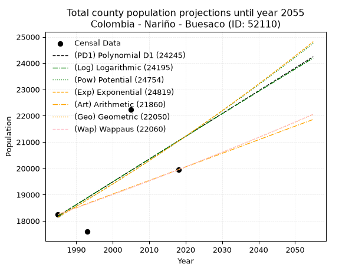
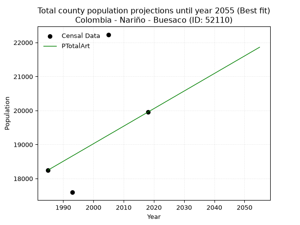
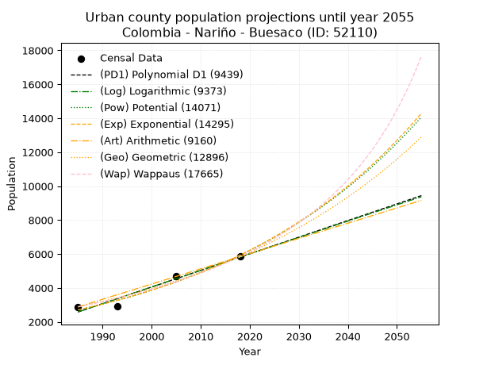
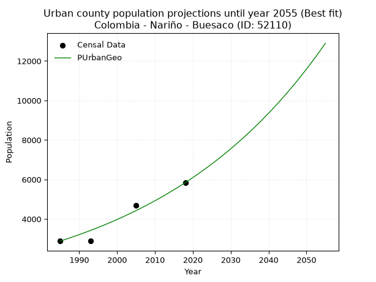
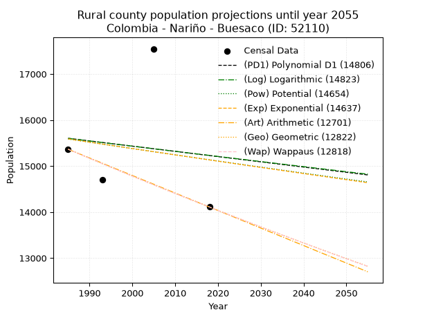
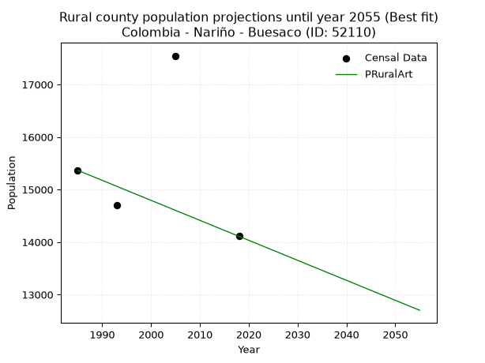

<div align="center">


</div>

# _“Population and Public Services Demand Projections (PPSD) until Year 2050 for Colombia - Nariño - Buesaco (ID: 52110)”_
Keywords: `population` `public-service` `projection` `lineal` `polynomial` `logarithmic` `potential` `exponential` `arithmetic` `geometric` `wappaus` `dane` `colombia` `south-america`

PPSD are analytical estimates used by governments and planners to anticipate future changes in population size, age distribution, and the resulting community needs for utilities, healthcare, education, and infrastructure as sizing future water treatment facilities, electrical grids, and road networks based on spatial growth.

> **General running parameters**: • app_version: _v20260806_. • Python version: _3.14.7_. • Pandas version: _3.0.5_. • NumPy version: _2.5.1_. • Creates, save and include plots into reports (create_plot): _False_. • Projection until year: _2050_. • Process polynomial degree 2 and up: _False_. • Process Wappaus: _True_. • Process Wappaus: _True_. • Set negative values to zero: _True_. • Set infinite values to zero: _True_. • Drop dataset notes: _True_. 
<div align="center">

Dynamic map: [:earth_americas:Google](http://maps.google.com/maps?q=1.381452517,-77.1564634) [:earth_americas:OSM](https://www.openstreetmap.org/#map=18/1.381452517/-77.1564634&layers=P) [:earth_americas:Bing](https://www.bing.com/maps?cp=1.381452517~-77.1564634&lvl=18) [:earth_americas:Apple](https://maps.apple.com/frame?center=1.381452517%2C-77.1564634&span=0.003%2C0.006)

</div>


<div align="center">

```geojson
{
  "type": "Feature",
  "geometry": {
    "type": "Point", 
    "coordinates": [-77.1564634, 1.381452517]
  }, 
  "properties": {
    "Name": "Colombia - Nariño - Buesaco (ID: 52110)"
  }
}
```

</div>


## 0. Census Data (4 records)

Census data are official statistics collected by a government about the people and housing in a country. They usually include counts of total population, age, sex, race, income, education, and jobs.

📅Global census file: [Population.xlsx](../data/Population.xlsx)

| Source   |   Year |   CountryID | CountryName   |   StateID | StateName   |   CountyID | CountyName   |   PTotal |   PUrban |   PRural |
|:---------|-------:|------------:|:--------------|----------:|:------------|-----------:|:-------------|---------:|---------:|---------:|
| DANE     |   1985 |          57 | Colombia      |        52 | Nariño      |      52110 | Buesaco      |    18248 |     2883 |    15365 |
| DANE     |   1993 |          57 | Colombia      |        52 | Nariño      |      52110 | Buesaco      |    17594 |     2897 |    14697 |
| DANE     |   2005 |          57 | Colombia      |        52 | Nariño      |      52110 | Buesaco      |    22233 |     4686 |    17547 |
| DANE     |   2018 |          57 | Colombia      |        52 | Nariño      |      52110 | Buesaco      |    19951 |     5842 |    14109 |

> 🔥Some records has specific notes about the registered values or the corresponding urban or rural distribution.

## 1. Total

### 1.1. Coefficients and Parameters

* (PD1) Polynomial Deg 1: 86.54917703733551, -153613.49136893035 (lineal)
* (Log) Logarithmic: 173514.5234697256, -1299378.7833515112
* (Pow) Potential: 8.969443586986023, -25.32042784867828
* (Exp) Exponential: 0.004474604195911554, 2.5194631064310293
* (Art) Arithmetic: Year diff. 2018 - 1985 = 33, Population diff. 19951 - 18248 = 1703, Annual growth = 51.60606060606061
* (Geo) Geometric: Year diff. 2018 - 1985 = 33, Population diff. 19951 - 18248 = 1703, Annual growth % = 0.0027074094132524262
* (Wap) Wappaus: i = 0.2701958721749816, Condition values only valid for < 200)

<sub>
Wappaus condition values: ['0.00', '0.27', '0.54', '0.81', '1.08', '1.35', '1.62', '1.89', '2.16', '2.43', '2.70', '2.97', '3.24', '3.51', '3.78', '4.05', '4.32', '4.59', '4.86', '5.13', '5.40', '5.67', '5.94', '6.21', '6.48', '6.75', '7.03', '7.30', '7.57', '7.84', '8.11', '8.38', '8.65', '8.92', '9.19', '9.46', '9.73', '10.00', '10.27', '10.54', '10.81', '11.08', '11.35', '11.62', '11.89', '12.16', '12.43', '12.70', '12.97', '13.24', '13.51', '13.78', '14.05', '14.32', '14.59', '14.86', '15.13', '15.40', '15.67', '15.94', '16.21', '16.48', '16.75', '17.02', '17.29', '17.56']
</sub>


### 1.2. Projected Dataset

|   Year |   CountyID |   PTotalPD1 |   PTotalLog |   PTotalPow |   PTotalExp |   PTotalArt |   PTotalGeo |   PTotalWap |
|-------:|-----------:|------------:|------------:|------------:|------------:|------------:|------------:|------------:|
|   1985 |      52110 |       18187 |       18182 |       18140 |       18145 |       18248 |       18248 |       18248 |
|   1986 |      52110 |       18273 |       18269 |       18223 |       18226 |       18300 |       18297 |       18297 |
|   1987 |      52110 |       18360 |       18357 |       18305 |       18308 |       18351 |       18347 |       18347 |
|   1988 |      52110 |       18446 |       18444 |       18388 |       18390 |       18403 |       18397 |       18397 |
|   1989 |      52110 |       18533 |       18531 |       18471 |       18472 |       18454 |       18446 |       18446 |
|   1990 |      52110 |       18619 |       18618 |       18554 |       18555 |       18506 |       18496 |       18496 |
|   1991 |      52110 |       18706 |       18706 |       18638 |       18638 |       18558 |       18546 |       18546 |
|   1992 |      52110 |       18792 |       18793 |       18722 |       18722 |       18609 |       18597 |       18596 |
|   1993 |      52110 |       18879 |       18880 |       18807 |       18806 |       18661 |       18647 |       18647 |
|   1994 |      52110 |       18966 |       18967 |       18892 |       18890 |       18712 |       18697 |       18697 |
|   1995 |      52110 |       19052 |       19054 |       18977 |       18975 |       18764 |       18748 |       18748 |
|   1996 |      52110 |       19139 |       19141 |       19062 |       19060 |       18816 |       18799 |       18799 |
|   1997 |      52110 |       19225 |       19228 |       19148 |       19146 |       18867 |       18850 |       18849 |
|   1998 |      52110 |       19312 |       19315 |       19234 |       19232 |       18919 |       18901 |       18900 |
|   1999 |      52110 |       19398 |       19401 |       19321 |       19318 |       18970 |       18952 |       18952 |
|   2000 |      52110 |       19485 |       19488 |       19408 |       19404 |       19022 |       19003 |       19003 |
|   2001 |      52110 |       19571 |       19575 |       19495 |       19491 |       19074 |       19055 |       19054 |
|   2002 |      52110 |       19658 |       19662 |       19582 |       19579 |       19125 |       19106 |       19106 |
|   2003 |      52110 |       19745 |       19748 |       19670 |       19667 |       19177 |       19158 |       19158 |
|   2004 |      52110 |       19831 |       19835 |       19759 |       19755 |       19229 |       19210 |       19209 |
|   2005 |      52110 |       19918 |       19921 |       19847 |       19843 |       19280 |       19262 |       19261 |
|   2006 |      52110 |       20004 |       20008 |       19936 |       19932 |       19332 |       19314 |       19314 |
|   2007 |      52110 |       20091 |       20094 |       20026 |       20022 |       19383 |       19366 |       19366 |
|   2008 |      52110 |       20177 |       20181 |       20115 |       20112 |       19435 |       19419 |       19418 |
|   2009 |      52110 |       20264 |       20267 |       20205 |       20202 |       19487 |       19471 |       19471 |
|   2010 |      52110 |       20350 |       20354 |       20296 |       20292 |       19538 |       19524 |       19524 |
|   2011 |      52110 |       20437 |       20440 |       20386 |       20383 |       19590 |       19577 |       19577 |
|   2012 |      52110 |       20523 |       20526 |       20477 |       20475 |       19641 |       19630 |       19630 |
|   2013 |      52110 |       20610 |       20612 |       20569 |       20567 |       19693 |       19683 |       19683 |
|   2014 |      52110 |       20697 |       20699 |       20661 |       20659 |       19745 |       19736 |       19736 |
|   2015 |      52110 |       20783 |       20785 |       20753 |       20751 |       19796 |       19790 |       19790 |
|   2016 |      52110 |       20870 |       20871 |       20846 |       20845 |       19848 |       19843 |       19843 |
|   2017 |      52110 |       20956 |       20957 |       20938 |       20938 |       19899 |       19897 |       19897 |
|   2018 |      52110 |       21043 |       21043 |       21032 |       21032 |       19951 |       19951 |       19951 |
|   2019 |      52110 |       21129 |       21129 |       21125 |       21126 |       20003 |       20005 |       20005 |
|   2020 |      52110 |       21216 |       21215 |       21219 |       21221 |       20054 |       20059 |       20059 |
|   2021 |      52110 |       21302 |       21301 |       21314 |       21316 |       20106 |       20113 |       20114 |
|   2022 |      52110 |       21389 |       21386 |       21409 |       21412 |       20157 |       20168 |       20168 |
|   2023 |      52110 |       21475 |       21472 |       21504 |       21508 |       20209 |       20223 |       20223 |
|   2024 |      52110 |       21562 |       21558 |       21599 |       21604 |       20261 |       20277 |       20278 |
|   2025 |      52110 |       21649 |       21644 |       21695 |       21701 |       20312 |       20332 |       20333 |
|   2026 |      52110 |       21735 |       21729 |       21792 |       21798 |       20364 |       20387 |       20388 |
|   2027 |      52110 |       21822 |       21815 |       21888 |       21896 |       20415 |       20442 |       20443 |
|   2028 |      52110 |       21908 |       21901 |       21985 |       21994 |       20467 |       20498 |       20499 |
|   2029 |      52110 |       21995 |       21986 |       22083 |       22093 |       20519 |       20553 |       20555 |
|   2030 |      52110 |       22081 |       22072 |       22180 |       22192 |       20570 |       20609 |       20610 |
|   2031 |      52110 |       22168 |       22157 |       22279 |       22292 |       20622 |       20665 |       20666 |
|   2032 |      52110 |       22254 |       22242 |       22377 |       22392 |       20673 |       20721 |       20722 |
|   2033 |      52110 |       22341 |       22328 |       22476 |       22492 |       20725 |       20777 |       20779 |
|   2034 |      52110 |       22428 |       22413 |       22576 |       22593 |       20777 |       20833 |       20835 |
|   2035 |      52110 |       22514 |       22498 |       22675 |       22694 |       20828 |       20889 |       20892 |
|   2036 |      52110 |       22601 |       22584 |       22775 |       22796 |       20880 |       20946 |       20949 |
|   2037 |      52110 |       22687 |       22669 |       22876 |       22898 |       20932 |       21003 |       21006 |
|   2038 |      52110 |       22774 |       22754 |       22977 |       23001 |       20983 |       21060 |       21063 |
|   2039 |      52110 |       22860 |       22839 |       23078 |       23104 |       21035 |       21117 |       21120 |
|   2040 |      52110 |       22947 |       22924 |       23180 |       23208 |       21086 |       21174 |       21177 |
|   2041 |      52110 |       23033 |       23009 |       23282 |       23312 |       21138 |       21231 |       21235 |
|   2042 |      52110 |       23120 |       23094 |       23385 |       23416 |       21190 |       21289 |       21293 |
|   2043 |      52110 |       23206 |       23179 |       23488 |       23521 |       21241 |       21346 |       21351 |
|   2044 |      52110 |       23293 |       23264 |       23591 |       23627 |       21293 |       21404 |       21409 |
|   2045 |      52110 |       23380 |       23349 |       23695 |       23733 |       21344 |       21462 |       21467 |
|   2046 |      52110 |       23466 |       23434 |       23799 |       23839 |       21396 |       21520 |       21526 |
|   2047 |      52110 |       23553 |       23519 |       23903 |       23946 |       21448 |       21578 |       21584 |
|   2048 |      52110 |       23639 |       23603 |       24008 |       24053 |       21499 |       21637 |       21643 |
|   2049 |      52110 |       23726 |       23688 |       24114 |       24161 |       21551 |       21695 |       21702 |
|   2050 |      52110 |       23812 |       23773 |       24219 |       24270 |       21602 |       21754 |       21761 |
<div align="center">

</img>

</div>


### 1.3. Best fit with absolute error and relative error (%)

Relative error puts that difference into context by dividing the absolute error by the true value, creating a unitless ratio or percentage that shows the scale of the mistake.

Absolute and relative error

|   Year | Source   |   CountryID | CountryName   |   StateID | StateName   |   CountyID_x | CountyName   |   PTotal |   PUrban |   PRural |   CountyID_y |   PTotalPD1 |   PTotalLog |   PTotalPow |   PTotalExp |   PTotalArt |   PTotalGeo |   PTotalWap |   PTotalPD1AbsError |   PTotalLogAbsError |   PTotalPowAbsError |   PTotalExpAbsError |   PTotalArtAbsError |   PTotalGeoAbsError |   PTotalWapAbsError |   PTotalPD1RelError |   PTotalLogRelError |   PTotalPowRelError |   PTotalExpRelError |   PTotalArtRelError |   PTotalGeoRelError |   PTotalWapRelError |
|-------:|:---------|------------:|:--------------|----------:|:------------|-------------:|:-------------|---------:|---------:|---------:|-------------:|------------:|------------:|------------:|------------:|------------:|------------:|------------:|--------------------:|--------------------:|--------------------:|--------------------:|--------------------:|--------------------:|--------------------:|--------------------:|--------------------:|--------------------:|--------------------:|--------------------:|--------------------:|--------------------:|
|   1985 | DANE     |          57 | Colombia      |        52 | Nariño      |        52110 | Buesaco      |    18248 |     2883 |    15365 |        52110 |       18187 |       18182 |       18140 |       18145 |       18248 |       18248 |       18248 |                  61 |                  66 |                 108 |                 103 |                   0 |                   0 |                   0 |            0.334283 |            0.361683 |            0.591846 |            0.564445 |             0       |             0       |             0       |
|   1993 | DANE     |          57 | Colombia      |        52 | Nariño      |        52110 | Buesaco      |    17594 |     2897 |    14697 |        52110 |       18879 |       18880 |       18807 |       18806 |       18661 |       18647 |       18647 |                1285 |                1286 |                1213 |                1212 |                1067 |                1053 |                1053 |            7.30363  |            7.30931  |            6.8944   |            6.88871  |             6.06457 |             5.98499 |             5.98499 |
|   2005 | DANE     |          57 | Colombia      |        52 | Nariño      |        52110 | Buesaco      |    22233 |     4686 |    17547 |        52110 |       19918 |       19921 |       19847 |       19843 |       19280 |       19262 |       19261 |                2315 |                2312 |                2386 |                2390 |                2953 |                2971 |                2972 |           10.4124   |           10.399    |           10.7318   |           10.7498   |            13.2821  |            13.363   |            13.3675  |
|   2018 | DANE     |          57 | Colombia      |        52 | Nariño      |        52110 | Buesaco      |    19951 |     5842 |    14109 |        52110 |       21043 |       21043 |       21032 |       21032 |       19951 |       19951 |       19951 |                1092 |                1092 |                1081 |                1081 |                   0 |                   0 |                   0 |            5.47341  |            5.47341  |            5.41827  |            5.41827  |             0       |             0       |             0       |

Relative error mean

| Method    |   RelError | Best   |
|:----------|-----------:|:-------|
| PTotalPD1 |    5.88094 |        |
| PTotalLog |    5.88584 |        |
| PTotalPow |    5.90908 |        |
| PTotalExp |    5.9053  |        |
| PTotalArt |    4.83666 | True   |
| PTotalGeo |    4.837   |        |
| PTotalWap |    4.83813 |        |

💙Best method: _**PTotalArt**_
<div align="center">

</img>

</div>


### 1.4. Fresh water supply demand in liters per capita per day (lpcd)

The fresh water supply demand typically ranges from 100 to 300 liters per capita per day (lpcd) for standard domestic and municipal planning, though absolute survival minimums set by the World Health Organization are as low as 7.5 to 20 liters per day, and total consumption in high-income nations can exceed 400 liters.

> `CZ`: Level in meters above the sea level (masl).<br> `WS`: Fresh water supply demand in liters per capita per day (lpcd or l/h/d).<br> `WSAll`: Zonal fresh water supply demand in liters per second (l/s).<br> `A`: Zonal area in square meters.

Reference values (RAS Colombia)

|    CZ |   WS |
|------:|-----:|
|  1000 |  120 |
|  2000 |  130 |
| 99999 |  140 |

County shapefile geometry properties and water supply values

|   CountyID |      ATotal |   CZTotal |   WSTotal |
|-----------:|------------:|----------:|----------:|
|      52110 | 6.36448e+08 |    2566.7 |       140 |

Projected values for best method: PTotalArt

|   CountyID |   Year |   PTotalArt |   WSTotal |   WSTotalAll |
|-----------:|-------:|------------:|----------:|-------------:|
|      52110 |   1985 |       18248 |       140 |      29.5685 |
|      52110 |   1986 |       18300 |       140 |      29.6528 |
|      52110 |   1987 |       18351 |       140 |      29.7354 |
|      52110 |   1988 |       18403 |       140 |      29.8197 |
|      52110 |   1989 |       18454 |       140 |      29.9023 |
|      52110 |   1990 |       18506 |       140 |      29.9866 |
|      52110 |   1991 |       18558 |       140 |      30.0708 |
|      52110 |   1992 |       18609 |       140 |      30.1535 |
|      52110 |   1993 |       18661 |       140 |      30.2377 |
|      52110 |   1994 |       18712 |       140 |      30.3204 |
|      52110 |   1995 |       18764 |       140 |      30.4046 |
|      52110 |   1996 |       18816 |       140 |      30.4889 |
|      52110 |   1997 |       18867 |       140 |      30.5715 |
|      52110 |   1998 |       18919 |       140 |      30.6558 |
|      52110 |   1999 |       18970 |       140 |      30.7384 |
|      52110 |   2000 |       19022 |       140 |      30.8227 |
|      52110 |   2001 |       19074 |       140 |      30.9069 |
|      52110 |   2002 |       19125 |       140 |      30.9896 |
|      52110 |   2003 |       19177 |       140 |      31.0738 |
|      52110 |   2004 |       19229 |       140 |      31.1581 |
|      52110 |   2005 |       19280 |       140 |      31.2407 |
|      52110 |   2006 |       19332 |       140 |      31.325  |
|      52110 |   2007 |       19383 |       140 |      31.4076 |
|      52110 |   2008 |       19435 |       140 |      31.4919 |
|      52110 |   2009 |       19487 |       140 |      31.5762 |
|      52110 |   2010 |       19538 |       140 |      31.6588 |
|      52110 |   2011 |       19590 |       140 |      31.7431 |
|      52110 |   2012 |       19641 |       140 |      31.8257 |
|      52110 |   2013 |       19693 |       140 |      31.91   |
|      52110 |   2014 |       19745 |       140 |      31.9942 |
|      52110 |   2015 |       19796 |       140 |      32.0769 |
|      52110 |   2016 |       19848 |       140 |      32.1611 |
|      52110 |   2017 |       19899 |       140 |      32.2437 |
|      52110 |   2018 |       19951 |       140 |      32.328  |
|      52110 |   2019 |       20003 |       140 |      32.4123 |
|      52110 |   2020 |       20054 |       140 |      32.4949 |
|      52110 |   2021 |       20106 |       140 |      32.5792 |
|      52110 |   2022 |       20157 |       140 |      32.6618 |
|      52110 |   2023 |       20209 |       140 |      32.7461 |
|      52110 |   2024 |       20261 |       140 |      32.8303 |
|      52110 |   2025 |       20312 |       140 |      32.913  |
|      52110 |   2026 |       20364 |       140 |      32.9972 |
|      52110 |   2027 |       20415 |       140 |      33.0799 |
|      52110 |   2028 |       20467 |       140 |      33.1641 |
|      52110 |   2029 |       20519 |       140 |      33.2484 |
|      52110 |   2030 |       20570 |       140 |      33.331  |
|      52110 |   2031 |       20622 |       140 |      33.4153 |
|      52110 |   2032 |       20673 |       140 |      33.4979 |
|      52110 |   2033 |       20725 |       140 |      33.5822 |
|      52110 |   2034 |       20777 |       140 |      33.6664 |
|      52110 |   2035 |       20828 |       140 |      33.7491 |
|      52110 |   2036 |       20880 |       140 |      33.8333 |
|      52110 |   2037 |       20932 |       140 |      33.9176 |
|      52110 |   2038 |       20983 |       140 |      34.0002 |
|      52110 |   2039 |       21035 |       140 |      34.0845 |
|      52110 |   2040 |       21086 |       140 |      34.1671 |
|      52110 |   2041 |       21138 |       140 |      34.2514 |
|      52110 |   2042 |       21190 |       140 |      34.3356 |
|      52110 |   2043 |       21241 |       140 |      34.4183 |
|      52110 |   2044 |       21293 |       140 |      34.5025 |
|      52110 |   2045 |       21344 |       140 |      34.5852 |
|      52110 |   2046 |       21396 |       140 |      34.6694 |
|      52110 |   2047 |       21448 |       140 |      34.7537 |
|      52110 |   2048 |       21499 |       140 |      34.8363 |
|      52110 |   2049 |       21551 |       140 |      34.9206 |
|      52110 |   2050 |       21602 |       140 |      35.0032 |

## 2. Urban

### 2.1. Coefficients and Parameters

* (PD1) Polynomial Deg 1: 97.92854275391328, -191804.56764351504 (lineal)
* (Log) Logarithmic: 195970.10295652438, -1485493.3229783894
* (Pow) Potential: 47.59096045367375, -153.5115803774358
* (Exp) Exponential: 0.02377835911694855, 8.581974794728257e-18
* (Art) Arithmetic: Year diff. 2018 - 1985 = 33, Population diff. 5842 - 2883 = 2959, Annual growth = 89.66666666666667
* (Geo) Geometric: Year diff. 2018 - 1985 = 33, Population diff. 5842 - 2883 = 2959, Annual growth % = 0.021631915778313138
* (Wap) Wappaus: i = 2.055396370582617, Condition values only valid for < 200)

<sub>
Wappaus condition values: ['0.00', '2.06', '4.11', '6.17', '8.22', '10.28', '12.33', '14.39', '16.44', '18.50', '20.55', '22.61', '24.66', '26.72', '28.78', '30.83', '32.89', '34.94', '37.00', '39.05', '41.11', '43.16', '45.22', '47.27', '49.33', '51.38', '53.44', '55.50', '57.55', '59.61', '61.66', '63.72', '65.77', '67.83', '69.88', '71.94', '73.99', '76.05', '78.11', '80.16', '82.22', '84.27', '86.33', '88.38', '90.44', '92.49', '94.55', '96.60', '98.66', '100.71', '102.77', '104.83', '106.88', '108.94', '110.99', '113.05', '115.10', '117.16', '119.21', '121.27', '123.32', '125.38', '127.43', '129.49', '131.55', '133.60']
</sub>


### 2.2. Projected Dataset

|   Year |   CountyID |   PUrbanPD1 |   PUrbanLog |   PUrbanPow |   PUrbanExp |   PUrbanArt |   PUrbanGeo |   PUrbanWap |
|-------:|-----------:|------------:|------------:|------------:|------------:|------------:|------------:|------------:|
|   1985 |      52110 |        2584 |        2581 |        2704 |        2706 |        2883 |        2883 |        2883 |
|   1986 |      52110 |        2682 |        2680 |        2770 |        2771 |        2973 |        2945 |        2943 |
|   1987 |      52110 |        2779 |        2778 |        2837 |        2838 |        3062 |        3009 |        3004 |
|   1988 |      52110 |        2877 |        2877 |        2906 |        2906 |        3152 |        3074 |        3066 |
|   1989 |      52110 |        2975 |        2976 |        2976 |        2976 |        3242 |        3141 |        3130 |
|   1990 |      52110 |        3073 |        3074 |        3048 |        3047 |        3331 |        3209 |        3195 |
|   1991 |      52110 |        3171 |        3172 |        3122 |        3121 |        3421 |        3278 |        3262 |
|   1992 |      52110 |        3269 |        3271 |        3197 |        3196 |        3511 |        3349 |        3330 |
|   1993 |      52110 |        3367 |        3369 |        3274 |        3273 |        3600 |        3421 |        3400 |
|   1994 |      52110 |        3465 |        3468 |        3354 |        3352 |        3690 |        3495 |        3471 |
|   1995 |      52110 |        3563 |        3566 |        3435 |        3432 |        3780 |        3571 |        3543 |
|   1996 |      52110 |        3661 |        3664 |        3517 |        3515 |        3869 |        3648 |        3618 |
|   1997 |      52110 |        3759 |        3762 |        3602 |        3599 |        3959 |        3727 |        3694 |
|   1998 |      52110 |        3857 |        3860 |        3689 |        3686 |        4049 |        3808 |        3772 |
|   1999 |      52110 |        3955 |        3958 |        3778 |        3775 |        4138 |        3890 |        3852 |
|   2000 |      52110 |        4053 |        4056 |        3869 |        3866 |        4228 |        3974 |        3934 |
|   2001 |      52110 |        4150 |        4154 |        3962 |        3959 |        4318 |        4060 |        4018 |
|   2002 |      52110 |        4248 |        4252 |        4058 |        4054 |        4407 |        4148 |        4104 |
|   2003 |      52110 |        4346 |        4350 |        4155 |        4151 |        4497 |        4238 |        4192 |
|   2004 |      52110 |        4444 |        4448 |        4255 |        4251 |        4587 |        4330 |        4282 |
|   2005 |      52110 |        4542 |        4546 |        4357 |        4354 |        4676 |        4423 |        4375 |
|   2006 |      52110 |        4640 |        4643 |        4462 |        4458 |        4766 |        4519 |        4470 |
|   2007 |      52110 |        4738 |        4741 |        4569 |        4566 |        4856 |        4617 |        4568 |
|   2008 |      52110 |        4836 |        4839 |        4679 |        4675 |        4945 |        4716 |        4668 |
|   2009 |      52110 |        4934 |        4936 |        4791 |        4788 |        5035 |        4818 |        4771 |
|   2010 |      52110 |        5032 |        5034 |        4906 |        4903 |        5125 |        4923 |        4877 |
|   2011 |      52110 |        5130 |        5131 |        5023 |        5021 |        5214 |        5029 |        4985 |
|   2012 |      52110 |        5228 |        5229 |        5143 |        5142 |        5304 |        5138 |        5097 |
|   2013 |      52110 |        5326 |        5326 |        5266 |        5266 |        5394 |        5249 |        5213 |
|   2014 |      52110 |        5424 |        5423 |        5392 |        5392 |        5483 |        5363 |        5331 |
|   2015 |      52110 |        5521 |        5521 |        5521 |        5522 |        5573 |        5479 |        5453 |
|   2016 |      52110 |        5619 |        5618 |        5653 |        5655 |        5663 |        5597 |        5579 |
|   2017 |      52110 |        5717 |        5715 |        5788 |        5791 |        5752 |        5718 |        5708 |
|   2018 |      52110 |        5815 |        5812 |        5926 |        5930 |        5842 |        5842 |        5842 |
|   2019 |      52110 |        5913 |        5909 |        6068 |        6073 |        5932 |        5968 |        5980 |
|   2020 |      52110 |        6011 |        6006 |        6212 |        6219 |        6021 |        6097 |        6122 |
|   2021 |      52110 |        6109 |        6103 |        6361 |        6369 |        6111 |        6229 |        6269 |
|   2022 |      52110 |        6207 |        6200 |        6512 |        6522 |        6201 |        6364 |        6421 |
|   2023 |      52110 |        6305 |        6297 |        6667 |        6679 |        6290 |        6502 |        6578 |
|   2024 |      52110 |        6403 |        6394 |        6826 |        6840 |        6380 |        6642 |        6740 |
|   2025 |      52110 |        6501 |        6491 |        6988 |        7005 |        6470 |        6786 |        6908 |
|   2026 |      52110 |        6599 |        6588 |        7154 |        7173 |        6559 |        6933 |        7082 |
|   2027 |      52110 |        6697 |        6684 |        7324 |        7346 |        6649 |        7083 |        7262 |
|   2028 |      52110 |        6795 |        6781 |        7498 |        7522 |        6739 |        7236 |        7449 |
|   2029 |      52110 |        6892 |        6877 |        7676 |        7703 |        6828 |        7393 |        7642 |
|   2030 |      52110 |        6990 |        6974 |        7858 |        7889 |        6918 |        7553 |        7844 |
|   2031 |      52110 |        7088 |        7071 |        8045 |        8079 |        7008 |        7716 |        8053 |
|   2032 |      52110 |        7186 |        7167 |        8235 |        8273 |        7097 |        7883 |        8270 |
|   2033 |      52110 |        7284 |        7263 |        8431 |        8472 |        7187 |        8053 |        8496 |
|   2034 |      52110 |        7382 |        7360 |        8630 |        8676 |        7277 |        8228 |        8732 |
|   2035 |      52110 |        7480 |        7456 |        8834 |        8885 |        7366 |        8406 |        8978 |
|   2036 |      52110 |        7578 |        7552 |        9043 |        9099 |        7456 |        8587 |        9234 |
|   2037 |      52110 |        7676 |        7649 |        9257 |        9318 |        7546 |        8773 |        9501 |
|   2038 |      52110 |        7774 |        7745 |        9476 |        9542 |        7635 |        8963 |        9781 |
|   2039 |      52110 |        7872 |        7841 |        9700 |        9771 |        7725 |        9157 |       10073 |
|   2040 |      52110 |        7970 |        7937 |        9929 |       10006 |        7815 |        9355 |       10379 |
|   2041 |      52110 |        8068 |        8033 |       10163 |       10247 |        7904 |        9557 |       10700 |
|   2042 |      52110 |        8166 |        8129 |       10403 |       10494 |        7994 |        9764 |       11037 |
|   2043 |      52110 |        8263 |        8225 |       10648 |       10746 |        8084 |        9975 |       11392 |
|   2044 |      52110 |        8361 |        8321 |       10899 |       11005 |        8173 |       10191 |       11764 |
|   2045 |      52110 |        8459 |        8417 |       11156 |       11270 |        8263 |       10411 |       12157 |
|   2046 |      52110 |        8557 |        8513 |       11418 |       11541 |        8353 |       10637 |       12571 |
|   2047 |      52110 |        8655 |        8608 |       11687 |       11819 |        8442 |       10867 |       13009 |
|   2048 |      52110 |        8753 |        8704 |       11962 |       12103 |        8532 |       11102 |       13472 |
|   2049 |      52110 |        8851 |        8800 |       12243 |       12394 |        8622 |       11342 |       13963 |
|   2050 |      52110 |        8949 |        8895 |       12530 |       12693 |        8711 |       11587 |       14485 |
<div align="center">

</img>

</div>


### 2.3. Best fit with absolute error and relative error (%)

Relative error puts that difference into context by dividing the absolute error by the true value, creating a unitless ratio or percentage that shows the scale of the mistake.

Absolute and relative error

|   Year | Source   |   CountryID | CountryName   |   StateID | StateName   |   CountyID_x | CountyName   |   PTotal |   PUrban |   PRural |   CountyID_y |   PUrbanPD1 |   PUrbanLog |   PUrbanPow |   PUrbanExp |   PUrbanArt |   PUrbanGeo |   PUrbanWap |   PUrbanPD1AbsError |   PUrbanLogAbsError |   PUrbanPowAbsError |   PUrbanExpAbsError |   PUrbanArtAbsError |   PUrbanGeoAbsError |   PUrbanWapAbsError |   PUrbanPD1RelError |   PUrbanLogRelError |   PUrbanPowRelError |   PUrbanExpRelError |   PUrbanArtRelError |   PUrbanGeoRelError |   PUrbanWapRelError |
|-------:|:---------|------------:|:--------------|----------:|:------------|-------------:|:-------------|---------:|---------:|---------:|-------------:|------------:|------------:|------------:|------------:|------------:|------------:|------------:|--------------------:|--------------------:|--------------------:|--------------------:|--------------------:|--------------------:|--------------------:|--------------------:|--------------------:|--------------------:|--------------------:|--------------------:|--------------------:|--------------------:|
|   1985 | DANE     |          57 | Colombia      |        52 | Nariño      |        52110 | Buesaco      |    18248 |     2883 |    15365 |        52110 |        2584 |        2581 |        2704 |        2706 |        2883 |        2883 |        2883 |                 299 |                 302 |                 179 |                 177 |                   0 |                   0 |                   0 |            10.3711  |           10.4752   |             6.20881 |             6.13944 |            0        |             0       |             0       |
|   1993 | DANE     |          57 | Colombia      |        52 | Nariño      |        52110 | Buesaco      |    17594 |     2897 |    14697 |        52110 |        3367 |        3369 |        3274 |        3273 |        3600 |        3421 |        3400 |                 470 |                 472 |                 377 |                 376 |                 703 |                 524 |                 503 |            16.2237  |           16.2927   |            13.0135  |            12.9789  |           24.2665   |            18.0877  |            17.3628  |
|   2005 | DANE     |          57 | Colombia      |        52 | Nariño      |        52110 | Buesaco      |    22233 |     4686 |    17547 |        52110 |        4542 |        4546 |        4357 |        4354 |        4676 |        4423 |        4375 |                 144 |                 140 |                 329 |                 332 |                  10 |                 263 |                 311 |             3.07298 |            2.98762  |             7.02091 |             7.08493 |            0.213402 |             5.61246 |             6.63679 |
|   2018 | DANE     |          57 | Colombia      |        52 | Nariño      |        52110 | Buesaco      |    19951 |     5842 |    14109 |        52110 |        5815 |        5812 |        5926 |        5930 |        5842 |        5842 |        5842 |                  27 |                  30 |                  84 |                  88 |                   0 |                   0 |                   0 |             0.46217 |            0.513523 |             1.43786 |             1.50633 |            0        |             0       |             0       |

Relative error mean

| Method    |   RelError | Best   |
|:----------|-----------:|:-------|
| PUrbanPD1 |    7.53249 |        |
| PUrbanLog |    7.56727 |        |
| PUrbanPow |    6.92026 |        |
| PUrbanExp |    6.92741 |        |
| PUrbanArt |    6.11997 |        |
| PUrbanGeo |    5.92503 | True   |
| PUrbanWap |    5.99989 |        |

💙Best method: _**PUrbanGeo**_
<div align="center">

</img>

</div>


### 2.4. Fresh water supply demand in liters per capita per day (lpcd)

The fresh water supply demand typically ranges from 100 to 300 liters per capita per day (lpcd) for standard domestic and municipal planning, though absolute survival minimums set by the World Health Organization are as low as 7.5 to 20 liters per day, and total consumption in high-income nations can exceed 400 liters.

> `CZ`: Level in meters above the sea level (masl).<br> `WS`: Fresh water supply demand in liters per capita per day (lpcd or l/h/d).<br> `WSAll`: Zonal fresh water supply demand in liters per second (l/s).<br> `A`: Zonal area in square meters.

Reference values (RAS Colombia)

|    CZ |   WS |
|------:|-----:|
|  1000 |  120 |
|  2000 |  130 |
| 99999 |  140 |

County shapefile geometry properties and water supply values

|   CountyID |      AUrban |   CZUrban |   WSUrban |
|-----------:|------------:|----------:|----------:|
|      52110 | 1.07993e+06 |   1956.43 |       130 |

Projected values for best method: PUrbanGeo

|   CountyID |   Year |   PUrbanGeo |   WSUrban |   WSUrbanAll |
|-----------:|-------:|------------:|----------:|-------------:|
|      52110 |   1985 |        2883 |       130 |      4.33785 |
|      52110 |   1986 |        2945 |       130 |      4.43113 |
|      52110 |   1987 |        3009 |       130 |      4.52743 |
|      52110 |   1988 |        3074 |       130 |      4.62523 |
|      52110 |   1989 |        3141 |       130 |      4.72604 |
|      52110 |   1990 |        3209 |       130 |      4.82836 |
|      52110 |   1991 |        3278 |       130 |      4.93218 |
|      52110 |   1992 |        3349 |       130 |      5.039   |
|      52110 |   1993 |        3421 |       130 |      5.14734 |
|      52110 |   1994 |        3495 |       130 |      5.25868 |
|      52110 |   1995 |        3571 |       130 |      5.37303 |
|      52110 |   1996 |        3648 |       130 |      5.48889 |
|      52110 |   1997 |        3727 |       130 |      5.60775 |
|      52110 |   1998 |        3808 |       130 |      5.72963 |
|      52110 |   1999 |        3890 |       130 |      5.85301 |
|      52110 |   2000 |        3974 |       130 |      5.9794  |
|      52110 |   2001 |        4060 |       130 |      6.1088  |
|      52110 |   2002 |        4148 |       130 |      6.2412  |
|      52110 |   2003 |        4238 |       130 |      6.37662 |
|      52110 |   2004 |        4330 |       130 |      6.51505 |
|      52110 |   2005 |        4423 |       130 |      6.65498 |
|      52110 |   2006 |        4519 |       130 |      6.79942 |
|      52110 |   2007 |        4617 |       130 |      6.94688 |
|      52110 |   2008 |        4716 |       130 |      7.09583 |
|      52110 |   2009 |        4818 |       130 |      7.24931 |
|      52110 |   2010 |        4923 |       130 |      7.40729 |
|      52110 |   2011 |        5029 |       130 |      7.56678 |
|      52110 |   2012 |        5138 |       130 |      7.73079 |
|      52110 |   2013 |        5249 |       130 |      7.8978  |
|      52110 |   2014 |        5363 |       130 |      8.06933 |
|      52110 |   2015 |        5479 |       130 |      8.24387 |
|      52110 |   2016 |        5597 |       130 |      8.42141 |
|      52110 |   2017 |        5718 |       130 |      8.60347 |
|      52110 |   2018 |        5842 |       130 |      8.79005 |
|      52110 |   2019 |        5968 |       130 |      8.97963 |
|      52110 |   2020 |        6097 |       130 |      9.17373 |
|      52110 |   2021 |        6229 |       130 |      9.37234 |
|      52110 |   2022 |        6364 |       130 |      9.57546 |
|      52110 |   2023 |        6502 |       130 |      9.7831  |
|      52110 |   2024 |        6642 |       130 |      9.99375 |
|      52110 |   2025 |        6786 |       130 |     10.2104  |
|      52110 |   2026 |        6933 |       130 |     10.4316  |
|      52110 |   2027 |        7083 |       130 |     10.6573  |
|      52110 |   2028 |        7236 |       130 |     10.8875  |
|      52110 |   2029 |        7393 |       130 |     11.1237  |
|      52110 |   2030 |        7553 |       130 |     11.3645  |
|      52110 |   2031 |        7716 |       130 |     11.6097  |
|      52110 |   2032 |        7883 |       130 |     11.861   |
|      52110 |   2033 |        8053 |       130 |     12.1168  |
|      52110 |   2034 |        8228 |       130 |     12.3801  |
|      52110 |   2035 |        8406 |       130 |     12.6479  |
|      52110 |   2036 |        8587 |       130 |     12.9203  |
|      52110 |   2037 |        8773 |       130 |     13.2001  |
|      52110 |   2038 |        8963 |       130 |     13.486   |
|      52110 |   2039 |        9157 |       130 |     13.7779  |
|      52110 |   2040 |        9355 |       130 |     14.0758  |
|      52110 |   2041 |        9557 |       130 |     14.3797  |
|      52110 |   2042 |        9764 |       130 |     14.6912  |
|      52110 |   2043 |        9975 |       130 |     15.0087  |
|      52110 |   2044 |       10191 |       130 |     15.3337  |
|      52110 |   2045 |       10411 |       130 |     15.6647  |
|      52110 |   2046 |       10637 |       130 |     16.0047  |
|      52110 |   2047 |       10867 |       130 |     16.3508  |
|      52110 |   2048 |       11102 |       130 |     16.7044  |
|      52110 |   2049 |       11342 |       130 |     17.0655  |
|      52110 |   2050 |       11587 |       130 |     17.4341  |

## 3. Rural

### 3.1. Coefficients and Parameters

* (PD1) Polynomial Deg 1: -11.37936571657764, 38191.076274584426 (lineal)
* (Log) Logarithmic: -22455.579486798488, 186114.53962687592
* (Pow) Potential: -1.7820828586664812, 10.069655756647665
* (Exp) Exponential: -0.0009003573126003292, 93111.4891243392
* (Art) Arithmetic: Year diff. 2018 - 1985 = 33, Population diff. 14109 - 15365 = -1256, Annual growth = -38.06060606060606
* (Geo) Geometric: Year diff. 2018 - 1985 = 33, Population diff. 14109 - 15365 = -1256, Annual growth % = -0.0025808851063825466
* (Wap) Wappaus: i = -0.2582656311366361, Condition values only valid for < 200)

<sub>
Wappaus condition values: ['-0.00', '-0.26', '-0.52', '-0.77', '-1.03', '-1.29', '-1.55', '-1.81', '-2.07', '-2.32', '-2.58', '-2.84', '-3.10', '-3.36', '-3.62', '-3.87', '-4.13', '-4.39', '-4.65', '-4.91', '-5.17', '-5.42', '-5.68', '-5.94', '-6.20', '-6.46', '-6.71', '-6.97', '-7.23', '-7.49', '-7.75', '-8.01', '-8.26', '-8.52', '-8.78', '-9.04', '-9.30', '-9.56', '-9.81', '-10.07', '-10.33', '-10.59', '-10.85', '-11.11', '-11.36', '-11.62', '-11.88', '-12.14', '-12.40', '-12.66', '-12.91', '-13.17', '-13.43', '-13.69', '-13.95', '-14.20', '-14.46', '-14.72', '-14.98', '-15.24', '-15.50', '-15.75', '-16.01', '-16.27', '-16.53', '-16.79']
</sub>


### 3.2. Projected Dataset

|   Year |   CountyID |   PRuralPD1 |   PRuralLog |   PRuralPow |   PRuralExp |   PRuralArt |   PRuralGeo |   PRuralWap |
|-------:|-----------:|------------:|------------:|------------:|------------:|------------:|------------:|------------:|
|   1985 |      52110 |       15603 |       15601 |       15587 |       15589 |       15365 |       15365 |       15365 |
|   1986 |      52110 |       15592 |       15590 |       15573 |       15575 |       15327 |       15325 |       15325 |
|   1987 |      52110 |       15580 |       15578 |       15559 |       15561 |       15289 |       15286 |       15286 |
|   1988 |      52110 |       15569 |       15567 |       15545 |       15547 |       15251 |       15246 |       15246 |
|   1989 |      52110 |       15558 |       15556 |       15532 |       15533 |       15213 |       15207 |       15207 |
|   1990 |      52110 |       15546 |       15544 |       15518 |       15519 |       15175 |       15168 |       15168 |
|   1991 |      52110 |       15535 |       15533 |       15504 |       15505 |       15137 |       15129 |       15129 |
|   1992 |      52110 |       15523 |       15522 |       15490 |       15491 |       15099 |       15090 |       15090 |
|   1993 |      52110 |       15512 |       15511 |       15476 |       15477 |       15061 |       15051 |       15051 |
|   1994 |      52110 |       15501 |       15499 |       15462 |       15464 |       15022 |       15012 |       15012 |
|   1995 |      52110 |       15489 |       15488 |       15448 |       15450 |       14984 |       14973 |       14973 |
|   1996 |      52110 |       15478 |       15477 |       15435 |       15436 |       14946 |       14934 |       14935 |
|   1997 |      52110 |       15466 |       15466 |       15421 |       15422 |       14908 |       14896 |       14896 |
|   1998 |      52110 |       15455 |       15454 |       15407 |       15408 |       14870 |       14857 |       14858 |
|   1999 |      52110 |       15444 |       15443 |       15393 |       15394 |       14832 |       14819 |       14819 |
|   2000 |      52110 |       15432 |       15432 |       15380 |       15380 |       14794 |       14781 |       14781 |
|   2001 |      52110 |       15421 |       15421 |       15366 |       15366 |       14756 |       14743 |       14743 |
|   2002 |      52110 |       15410 |       15409 |       15352 |       15353 |       14718 |       14705 |       14705 |
|   2003 |      52110 |       15398 |       15398 |       15339 |       15339 |       14680 |       14667 |       14667 |
|   2004 |      52110 |       15387 |       15387 |       15325 |       15325 |       14642 |       14629 |       14629 |
|   2005 |      52110 |       15375 |       15376 |       15311 |       15311 |       14604 |       14591 |       14591 |
|   2006 |      52110 |       15364 |       15365 |       15298 |       15297 |       14566 |       14553 |       14554 |
|   2007 |      52110 |       15353 |       15353 |       15284 |       15284 |       14528 |       14516 |       14516 |
|   2008 |      52110 |       15341 |       15342 |       15271 |       15270 |       14490 |       14478 |       14479 |
|   2009 |      52110 |       15330 |       15331 |       15257 |       15256 |       14452 |       14441 |       14441 |
|   2010 |      52110 |       15319 |       15320 |       15244 |       15242 |       14413 |       14404 |       14404 |
|   2011 |      52110 |       15307 |       15309 |       15230 |       15229 |       14375 |       14367 |       14367 |
|   2012 |      52110 |       15296 |       15298 |       15217 |       15215 |       14337 |       14329 |       14330 |
|   2013 |      52110 |       15284 |       15286 |       15203 |       15201 |       14299 |       14292 |       14293 |
|   2014 |      52110 |       15273 |       15275 |       15190 |       15188 |       14261 |       14256 |       14256 |
|   2015 |      52110 |       15262 |       15264 |       15176 |       15174 |       14223 |       14219 |       14219 |
|   2016 |      52110 |       15250 |       15253 |       15163 |       15160 |       14185 |       14182 |       14182 |
|   2017 |      52110 |       15239 |       15242 |       15149 |       15147 |       14147 |       14146 |       14146 |
|   2018 |      52110 |       15228 |       15231 |       15136 |       15133 |       14109 |       14109 |       14109 |
|   2019 |      52110 |       15216 |       15220 |       15123 |       15119 |       14071 |       14073 |       14073 |
|   2020 |      52110 |       15205 |       15208 |       15109 |       15106 |       14033 |       14036 |       14036 |
|   2021 |      52110 |       15193 |       15197 |       15096 |       15092 |       13995 |       14000 |       14000 |
|   2022 |      52110 |       15182 |       15186 |       15083 |       15079 |       13957 |       13964 |       13964 |
|   2023 |      52110 |       15171 |       15175 |       15069 |       15065 |       13919 |       13928 |       13928 |
|   2024 |      52110 |       15159 |       15164 |       15056 |       15051 |       13881 |       13892 |       13892 |
|   2025 |      52110 |       15148 |       15153 |       15043 |       15038 |       13843 |       13856 |       13856 |
|   2026 |      52110 |       15136 |       15142 |       15030 |       15024 |       13805 |       13820 |       13820 |
|   2027 |      52110 |       15125 |       15131 |       15016 |       15011 |       13766 |       13785 |       13784 |
|   2028 |      52110 |       15114 |       15120 |       15003 |       14997 |       13728 |       13749 |       13748 |
|   2029 |      52110 |       15102 |       15109 |       14990 |       14984 |       13690 |       13714 |       13713 |
|   2030 |      52110 |       15091 |       15098 |       14977 |       14970 |       13652 |       13678 |       13677 |
|   2031 |      52110 |       15080 |       15086 |       14964 |       14957 |       13614 |       13643 |       13642 |
|   2032 |      52110 |       15068 |       15075 |       14951 |       14943 |       13576 |       13608 |       13607 |
|   2033 |      52110 |       15057 |       15064 |       14938 |       14930 |       13538 |       13573 |       13571 |
|   2034 |      52110 |       15045 |       15053 |       14925 |       14917 |       13500 |       13538 |       13536 |
|   2035 |      52110 |       15034 |       15042 |       14911 |       14903 |       13462 |       13503 |       13501 |
|   2036 |      52110 |       15023 |       15031 |       14898 |       14890 |       13424 |       13468 |       13466 |
|   2037 |      52110 |       15011 |       15020 |       14885 |       14876 |       13386 |       13433 |       13431 |
|   2038 |      52110 |       15000 |       15009 |       14872 |       14863 |       13348 |       13398 |       13397 |
|   2039 |      52110 |       14989 |       14998 |       14859 |       14850 |       13310 |       13364 |       13362 |
|   2040 |      52110 |       14977 |       14987 |       14846 |       14836 |       13272 |       13329 |       13327 |
|   2041 |      52110 |       14966 |       14976 |       14833 |       14823 |       13234 |       13295 |       13293 |
|   2042 |      52110 |       14954 |       14965 |       14820 |       14809 |       13196 |       13261 |       13258 |
|   2043 |      52110 |       14943 |       14954 |       14808 |       14796 |       13157 |       13226 |       13224 |
|   2044 |      52110 |       14932 |       14943 |       14795 |       14783 |       13119 |       13192 |       13189 |
|   2045 |      52110 |       14920 |       14932 |       14782 |       14770 |       13081 |       13158 |       13155 |
|   2046 |      52110 |       14909 |       14921 |       14769 |       14756 |       13043 |       13124 |       13121 |
|   2047 |      52110 |       14898 |       14910 |       14756 |       14743 |       13005 |       13090 |       13087 |
|   2048 |      52110 |       14886 |       14899 |       14743 |       14730 |       12967 |       13057 |       13053 |
|   2049 |      52110 |       14875 |       14888 |       14730 |       14716 |       12929 |       13023 |       13019 |
|   2050 |      52110 |       14863 |       14877 |       14718 |       14703 |       12891 |       12989 |       12985 |
<div align="center">

</img>

</div>


### 3.3. Best fit with absolute error and relative error (%)

Relative error puts that difference into context by dividing the absolute error by the true value, creating a unitless ratio or percentage that shows the scale of the mistake.

Absolute and relative error

|   Year | Source   |   CountryID | CountryName   |   StateID | StateName   |   CountyID_x | CountyName   |   PTotal |   PUrban |   PRural |   CountyID_y |   PRuralPD1 |   PRuralLog |   PRuralPow |   PRuralExp |   PRuralArt |   PRuralGeo |   PRuralWap |   PRuralPD1AbsError |   PRuralLogAbsError |   PRuralPowAbsError |   PRuralExpAbsError |   PRuralArtAbsError |   PRuralGeoAbsError |   PRuralWapAbsError |   PRuralPD1RelError |   PRuralLogRelError |   PRuralPowRelError |   PRuralExpRelError |   PRuralArtRelError |   PRuralGeoRelError |   PRuralWapRelError |
|-------:|:---------|------------:|:--------------|----------:|:------------|-------------:|:-------------|---------:|---------:|---------:|-------------:|------------:|------------:|------------:|------------:|------------:|------------:|------------:|--------------------:|--------------------:|--------------------:|--------------------:|--------------------:|--------------------:|--------------------:|--------------------:|--------------------:|--------------------:|--------------------:|--------------------:|--------------------:|--------------------:|
|   1985 | DANE     |          57 | Colombia      |        52 | Nariño      |        52110 | Buesaco      |    18248 |     2883 |    15365 |        52110 |       15603 |       15601 |       15587 |       15589 |       15365 |       15365 |       15365 |                 238 |                 236 |                 222 |                 224 |                   0 |                   0 |                   0 |             1.54897 |             1.53596 |             1.44484 |             1.45786 |              0      |             0       |             0       |
|   1993 | DANE     |          57 | Colombia      |        52 | Nariño      |        52110 | Buesaco      |    17594 |     2897 |    14697 |        52110 |       15512 |       15511 |       15476 |       15477 |       15061 |       15051 |       15051 |                 815 |                 814 |                 779 |                 780 |                 364 |                 354 |                 354 |             5.54535 |             5.53855 |             5.3004  |             5.30721 |              2.4767 |             2.40865 |             2.40865 |
|   2005 | DANE     |          57 | Colombia      |        52 | Nariño      |        52110 | Buesaco      |    22233 |     4686 |    17547 |        52110 |       15375 |       15376 |       15311 |       15311 |       14604 |       14591 |       14591 |                2172 |                2171 |                2236 |                2236 |                2943 |                2956 |                2956 |            12.3782  |            12.3725  |            12.7429  |            12.7429  |             16.7721 |            16.8462  |            16.8462  |
|   2018 | DANE     |          57 | Colombia      |        52 | Nariño      |        52110 | Buesaco      |    19951 |     5842 |    14109 |        52110 |       15228 |       15231 |       15136 |       15133 |       14109 |       14109 |       14109 |                1119 |                1122 |                1027 |                1024 |                   0 |                   0 |                   0 |             7.93111 |             7.95237 |             7.27904 |             7.25778 |              0      |             0       |             0       |

Relative error mean

| Method    |   RelError | Best   |
|:----------|-----------:|:-------|
| PRuralPD1 |    6.8509  |        |
| PRuralLog |    6.84984 |        |
| PRuralPow |    6.6918  |        |
| PRuralExp |    6.69144 |        |
| PRuralArt |    4.8122  | True   |
| PRuralGeo |    4.81371 |        |
| PRuralWap |    4.81371 |        |

💙Best method: _**PRuralArt**_
<div align="center">

</img>

</div>


### 3.4. Fresh water supply demand in liters per capita per day (lpcd)

The fresh water supply demand typically ranges from 100 to 300 liters per capita per day (lpcd) for standard domestic and municipal planning, though absolute survival minimums set by the World Health Organization are as low as 7.5 to 20 liters per day, and total consumption in high-income nations can exceed 400 liters.

> `CZ`: Level in meters above the sea level (masl).<br> `WS`: Fresh water supply demand in liters per capita per day (lpcd or l/h/d).<br> `WSAll`: Zonal fresh water supply demand in liters per second (l/s).<br> `A`: Zonal area in square meters.

Reference values (RAS Colombia)

|    CZ |   WS |
|------:|-----:|
|  1000 |  120 |
|  2000 |  130 |
| 99999 |  140 |

County shapefile geometry properties and water supply values

|   CountyID |      ARural |   CZRural |   WSRural |
|-----------:|------------:|----------:|----------:|
|      52110 | 6.35368e+08 |   2567.72 |       140 |

Projected values for best method: PRuralArt

|   CountyID |   Year |   PRuralArt |   WSRural |   WSRuralAll |
|-----------:|-------:|------------:|----------:|-------------:|
|      52110 |   1985 |       15365 |       140 |      24.897  |
|      52110 |   1986 |       15327 |       140 |      24.8354 |
|      52110 |   1987 |       15289 |       140 |      24.7738 |
|      52110 |   1988 |       15251 |       140 |      24.7123 |
|      52110 |   1989 |       15213 |       140 |      24.6507 |
|      52110 |   1990 |       15175 |       140 |      24.5891 |
|      52110 |   1991 |       15137 |       140 |      24.5275 |
|      52110 |   1992 |       15099 |       140 |      24.466  |
|      52110 |   1993 |       15061 |       140 |      24.4044 |
|      52110 |   1994 |       15022 |       140 |      24.3412 |
|      52110 |   1995 |       14984 |       140 |      24.2796 |
|      52110 |   1996 |       14946 |       140 |      24.2181 |
|      52110 |   1997 |       14908 |       140 |      24.1565 |
|      52110 |   1998 |       14870 |       140 |      24.0949 |
|      52110 |   1999 |       14832 |       140 |      24.0333 |
|      52110 |   2000 |       14794 |       140 |      23.9718 |
|      52110 |   2001 |       14756 |       140 |      23.9102 |
|      52110 |   2002 |       14718 |       140 |      23.8486 |
|      52110 |   2003 |       14680 |       140 |      23.787  |
|      52110 |   2004 |       14642 |       140 |      23.7255 |
|      52110 |   2005 |       14604 |       140 |      23.6639 |
|      52110 |   2006 |       14566 |       140 |      23.6023 |
|      52110 |   2007 |       14528 |       140 |      23.5407 |
|      52110 |   2008 |       14490 |       140 |      23.4792 |
|      52110 |   2009 |       14452 |       140 |      23.4176 |
|      52110 |   2010 |       14413 |       140 |      23.3544 |
|      52110 |   2011 |       14375 |       140 |      23.2928 |
|      52110 |   2012 |       14337 |       140 |      23.2312 |
|      52110 |   2013 |       14299 |       140 |      23.1697 |
|      52110 |   2014 |       14261 |       140 |      23.1081 |
|      52110 |   2015 |       14223 |       140 |      23.0465 |
|      52110 |   2016 |       14185 |       140 |      22.985  |
|      52110 |   2017 |       14147 |       140 |      22.9234 |
|      52110 |   2018 |       14109 |       140 |      22.8618 |
|      52110 |   2019 |       14071 |       140 |      22.8002 |
|      52110 |   2020 |       14033 |       140 |      22.7387 |
|      52110 |   2021 |       13995 |       140 |      22.6771 |
|      52110 |   2022 |       13957 |       140 |      22.6155 |
|      52110 |   2023 |       13919 |       140 |      22.5539 |
|      52110 |   2024 |       13881 |       140 |      22.4924 |
|      52110 |   2025 |       13843 |       140 |      22.4308 |
|      52110 |   2026 |       13805 |       140 |      22.3692 |
|      52110 |   2027 |       13766 |       140 |      22.306  |
|      52110 |   2028 |       13728 |       140 |      22.2444 |
|      52110 |   2029 |       13690 |       140 |      22.1829 |
|      52110 |   2030 |       13652 |       140 |      22.1213 |
|      52110 |   2031 |       13614 |       140 |      22.0597 |
|      52110 |   2032 |       13576 |       140 |      21.9981 |
|      52110 |   2033 |       13538 |       140 |      21.9366 |
|      52110 |   2034 |       13500 |       140 |      21.875  |
|      52110 |   2035 |       13462 |       140 |      21.8134 |
|      52110 |   2036 |       13424 |       140 |      21.7519 |
|      52110 |   2037 |       13386 |       140 |      21.6903 |
|      52110 |   2038 |       13348 |       140 |      21.6287 |
|      52110 |   2039 |       13310 |       140 |      21.5671 |
|      52110 |   2040 |       13272 |       140 |      21.5056 |
|      52110 |   2041 |       13234 |       140 |      21.444  |
|      52110 |   2042 |       13196 |       140 |      21.3824 |
|      52110 |   2043 |       13157 |       140 |      21.3192 |
|      52110 |   2044 |       13119 |       140 |      21.2576 |
|      52110 |   2045 |       13081 |       140 |      21.1961 |
|      52110 |   2046 |       13043 |       140 |      21.1345 |
|      52110 |   2047 |       13005 |       140 |      21.0729 |
|      52110 |   2048 |       12967 |       140 |      21.0113 |
|      52110 |   2049 |       12929 |       140 |      20.9498 |
|      52110 |   2050 |       12891 |       140 |      20.8882 |

<div align="center"><br><sub>Share this research</sub></div><br>

<sub>**APPS & TOOLS & CONTENT DISCLAIMER**: • NO WARRANTY - This content and software is provided by <a href="https://github.com/rcfdtools" target="_blank">github.com/rcfdtools</a> "as is", without any express or implied warranty, including warranties of merchantability, fitness for a particular purpose, or non-infringement. There is no guarantee that the software will be error-free or operate without interruption. • LIMITATION OF LIABILITY - Neither the authors nor copyright holders will be liable for claims or damages arising from the software or its use. You are responsible for determining if the software is appropriate for your use and assume all associated risks, including errors, legal compliance, and data loss. • NO PROFESSIONAL ADVICE - The software provides general information and does not offer professional advice. It should not replace consultation with professional advisors. [Clauses and global license for rcfdtools use.](https://github.com/rcfdtools/rcfdtools/blob/main/LICENSE.md)</sub>