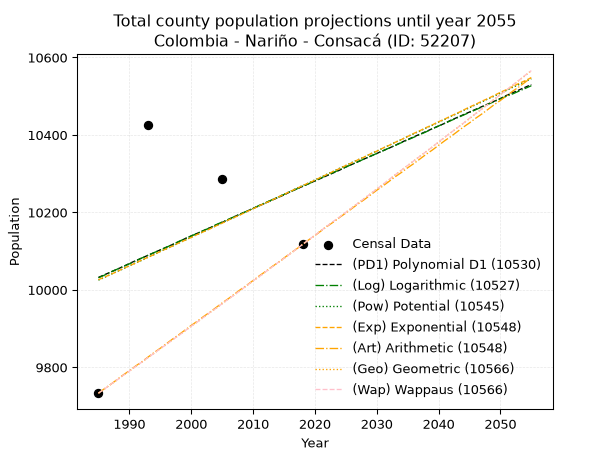
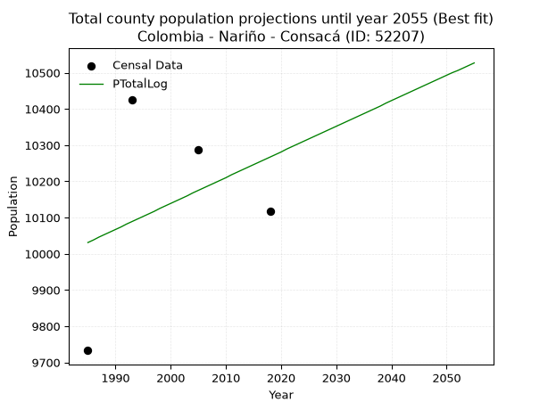
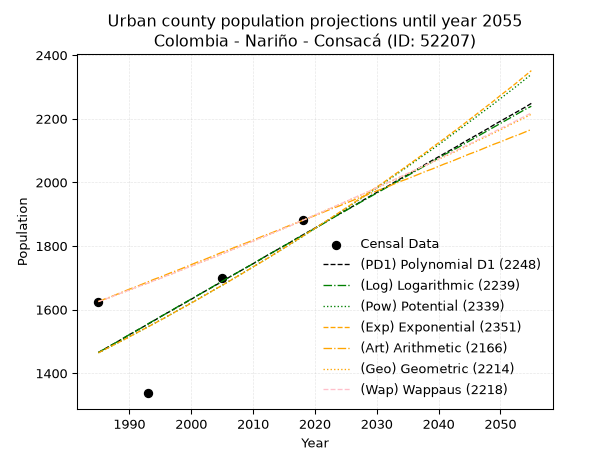
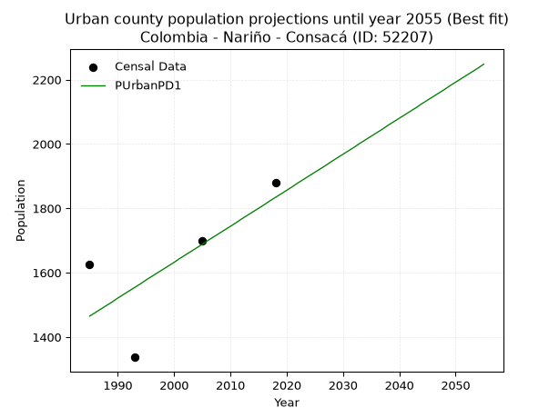
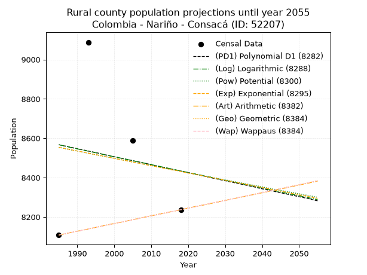
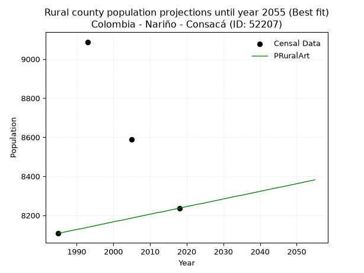

<div align="center">


</div>

# _“Population and Public Services Demand Projections (PPSD) until Year 2050 for Colombia - Nariño - Consaca (ID: 52207)”_
Keywords: `population` `public-service` `projection` `lineal` `polynomial` `logarithmic` `potential` `exponential` `arithmetic` `geometric` `wappaus` `dane` `colombia` `south-america`

PPSD are analytical estimates used by governments and planners to anticipate future changes in population size, age distribution, and the resulting community needs for utilities, healthcare, education, and infrastructure as sizing future water treatment facilities, electrical grids, and road networks based on spatial growth.

> **General running parameters**: • app_version: _v20260806_. • Python version: _3.14.7_. • Pandas version: _3.0.5_. • NumPy version: _2.5.1_. • Creates, save and include plots into reports (create_plot): _False_. • Projection until year: _2050_. • Process polynomial degree 2 and up: _False_. • Process Wappaus: _True_. • Process Wappaus: _True_. • Set negative values to zero: _True_. • Set infinite values to zero: _True_. • Drop dataset notes: _True_. 
<div align="center">

Dynamic map: [:earth_americas:Google](http://maps.google.com/maps?q=1.207853955,-77.4661357) [:earth_americas:OSM](https://www.openstreetmap.org/#map=18/1.207853955/-77.4661357&layers=P) [:earth_americas:Bing](https://www.bing.com/maps?cp=1.207853955~-77.4661357&lvl=18) [:earth_americas:Apple](https://maps.apple.com/frame?center=1.207853955%2C-77.4661357&span=0.003%2C0.006)

</div>


<div align="center">

```geojson
{
  "type": "Feature",
  "geometry": {
    "type": "Point", 
    "coordinates": [-77.4661357, 1.207853955]
  }, 
  "properties": {
    "Name": "Colombia - Nariño - Consaca (ID: 52207)"
  }
}
```

</div>


## 0. Census Data (4 records)

Census data are official statistics collected by a government about the people and housing in a country. They usually include counts of total population, age, sex, race, income, education, and jobs.

📅Global census file: [Population.xlsx](../data/Population.xlsx)

| Source   |   Year |   CountryID | CountryName   |   StateID | StateName   |   CountyID | CountyName   |   PTotal |   PUrban |   PRural |
|:---------|-------:|------------:|:--------------|----------:|:------------|-----------:|:-------------|---------:|---------:|---------:|
| DANE     |   1985 |          57 | Colombia      |        52 | Nariño      |      52207 | Consaca      |     9733 |     1625 |     8108 |
| DANE     |   1993 |          57 | Colombia      |        52 | Nariño      |      52207 | Consacá      |    10425 |     1337 |     9088 |
| DANE     |   2005 |          57 | Colombia      |        52 | Nariño      |      52207 | Consaca      |    10287 |     1699 |     8588 |
| DANE     |   2018 |          57 | Colombia      |        52 | Nariño      |      52207 | Consacá      |    10117 |     1880 |     8237 |

> 🔥Some records has specific notes about the registered values or the corresponding urban or rural distribution.

## 1. Total

### 1.1. Coefficients and Parameters

* (PD1) Polynomial Deg 1: 7.114411882778191, -4090.1023685270784 (lineal)
* (Log) Logarithmic: 14317.987742694117, -98690.63956937093
* (Pow) Potential: 1.4599453781457856, -0.8134745921641298
* (Exp) Exponential: 0.0007255355362298892, 2374.8975834089965
* (Art) Arithmetic: Year diff. 2018 - 1985 = 33, Population diff. 10117 - 9733 = 384, Annual growth = 11.636363636363637
* (Geo) Geometric: Year diff. 2018 - 1985 = 33, Population diff. 10117 - 9733 = 384, Annual growth % = 0.001173263607971986
* (Wap) Wappaus: i = 0.11724295855278223, Condition values only valid for < 200)

<sub>
Wappaus condition values: ['0.00', '0.12', '0.23', '0.35', '0.47', '0.59', '0.70', '0.82', '0.94', '1.06', '1.17', '1.29', '1.41', '1.52', '1.64', '1.76', '1.88', '1.99', '2.11', '2.23', '2.34', '2.46', '2.58', '2.70', '2.81', '2.93', '3.05', '3.17', '3.28', '3.40', '3.52', '3.63', '3.75', '3.87', '3.99', '4.10', '4.22', '4.34', '4.46', '4.57', '4.69', '4.81', '4.92', '5.04', '5.16', '5.28', '5.39', '5.51', '5.63', '5.74', '5.86', '5.98', '6.10', '6.21', '6.33', '6.45', '6.57', '6.68', '6.80', '6.92', '7.03', '7.15', '7.27', '7.39', '7.50', '7.62']
</sub>


### 1.2. Projected Dataset

|   Year |   CountyID |   PTotalPD1 |   PTotalLog |   PTotalPow |   PTotalExp |   PTotalArt |   PTotalGeo |   PTotalWap |
|-------:|-----------:|------------:|------------:|------------:|------------:|------------:|------------:|------------:|
|   1985 |      52207 |       10032 |       10031 |       10025 |       10026 |        9733 |        9733 |        9733 |
|   1986 |      52207 |       10039 |       10038 |       10032 |       10033 |        9745 |        9744 |        9744 |
|   1987 |      52207 |       10046 |       10046 |       10040 |       10040 |        9756 |        9756 |        9756 |
|   1988 |      52207 |       10053 |       10053 |       10047 |       10047 |        9768 |        9767 |        9767 |
|   1989 |      52207 |       10060 |       10060 |       10054 |       10055 |        9780 |        9779 |        9779 |
|   1990 |      52207 |       10068 |       10067 |       10062 |       10062 |        9791 |        9790 |        9790 |
|   1991 |      52207 |       10075 |       10074 |       10069 |       10069 |        9803 |        9802 |        9802 |
|   1992 |      52207 |       10082 |       10082 |       10076 |       10077 |        9814 |        9813 |        9813 |
|   1993 |      52207 |       10089 |       10089 |       10084 |       10084 |        9826 |        9825 |        9825 |
|   1994 |      52207 |       10096 |       10096 |       10091 |       10091 |        9838 |        9836 |        9836 |
|   1995 |      52207 |       10103 |       10103 |       10099 |       10099 |        9849 |        9848 |        9848 |
|   1996 |      52207 |       10110 |       10110 |       10106 |       10106 |        9861 |        9859 |        9859 |
|   1997 |      52207 |       10117 |       10117 |       10113 |       10113 |        9873 |        9871 |        9871 |
|   1998 |      52207 |       10124 |       10125 |       10121 |       10121 |        9884 |        9883 |        9882 |
|   1999 |      52207 |       10132 |       10132 |       10128 |       10128 |        9896 |        9894 |        9894 |
|   2000 |      52207 |       10139 |       10139 |       10136 |       10135 |        9908 |        9906 |        9906 |
|   2001 |      52207 |       10146 |       10146 |       10143 |       10143 |        9919 |        9917 |        9917 |
|   2002 |      52207 |       10153 |       10153 |       10150 |       10150 |        9931 |        9929 |        9929 |
|   2003 |      52207 |       10160 |       10160 |       10158 |       10157 |        9942 |        9941 |        9941 |
|   2004 |      52207 |       10167 |       10168 |       10165 |       10165 |        9954 |        9952 |        9952 |
|   2005 |      52207 |       10174 |       10175 |       10173 |       10172 |        9966 |        9964 |        9964 |
|   2006 |      52207 |       10181 |       10182 |       10180 |       10180 |        9977 |        9976 |        9976 |
|   2007 |      52207 |       10189 |       10189 |       10187 |       10187 |        9989 |        9987 |        9987 |
|   2008 |      52207 |       10196 |       10196 |       10195 |       10194 |       10001 |        9999 |        9999 |
|   2009 |      52207 |       10203 |       10203 |       10202 |       10202 |       10012 |       10011 |       10011 |
|   2010 |      52207 |       10210 |       10210 |       10210 |       10209 |       10024 |       10023 |       10023 |
|   2011 |      52207 |       10217 |       10218 |       10217 |       10217 |       10036 |       10034 |       10034 |
|   2012 |      52207 |       10224 |       10225 |       10224 |       10224 |       10047 |       10046 |       10046 |
|   2013 |      52207 |       10231 |       10232 |       10232 |       10231 |       10059 |       10058 |       10058 |
|   2014 |      52207 |       10238 |       10239 |       10239 |       10239 |       10070 |       10070 |       10070 |
|   2015 |      52207 |       10245 |       10246 |       10247 |       10246 |       10082 |       10081 |       10081 |
|   2016 |      52207 |       10253 |       10253 |       10254 |       10254 |       10094 |       10093 |       10093 |
|   2017 |      52207 |       10260 |       10260 |       10262 |       10261 |       10105 |       10105 |       10105 |
|   2018 |      52207 |       10267 |       10267 |       10269 |       10269 |       10117 |       10117 |       10117 |
|   2019 |      52207 |       10274 |       10274 |       10276 |       10276 |       10129 |       10129 |       10129 |
|   2020 |      52207 |       10281 |       10281 |       10284 |       10283 |       10140 |       10141 |       10141 |
|   2021 |      52207 |       10288 |       10289 |       10291 |       10291 |       10152 |       10153 |       10153 |
|   2022 |      52207 |       10295 |       10296 |       10299 |       10298 |       10164 |       10165 |       10165 |
|   2023 |      52207 |       10302 |       10303 |       10306 |       10306 |       10175 |       10176 |       10177 |
|   2024 |      52207 |       10309 |       10310 |       10314 |       10313 |       10187 |       10188 |       10188 |
|   2025 |      52207 |       10317 |       10317 |       10321 |       10321 |       10198 |       10200 |       10200 |
|   2026 |      52207 |       10324 |       10324 |       10329 |       10328 |       10210 |       10212 |       10212 |
|   2027 |      52207 |       10331 |       10331 |       10336 |       10336 |       10222 |       10224 |       10224 |
|   2028 |      52207 |       10338 |       10338 |       10343 |       10343 |       10233 |       10236 |       10236 |
|   2029 |      52207 |       10345 |       10345 |       10351 |       10351 |       10245 |       10248 |       10248 |
|   2030 |      52207 |       10352 |       10352 |       10358 |       10358 |       10257 |       10260 |       10260 |
|   2031 |      52207 |       10359 |       10359 |       10366 |       10366 |       10268 |       10272 |       10272 |
|   2032 |      52207 |       10366 |       10366 |       10373 |       10373 |       10280 |       10284 |       10285 |
|   2033 |      52207 |       10373 |       10373 |       10381 |       10381 |       10292 |       10297 |       10297 |
|   2034 |      52207 |       10381 |       10380 |       10388 |       10388 |       10303 |       10309 |       10309 |
|   2035 |      52207 |       10388 |       10387 |       10396 |       10396 |       10315 |       10321 |       10321 |
|   2036 |      52207 |       10395 |       10394 |       10403 |       10404 |       10326 |       10333 |       10333 |
|   2037 |      52207 |       10402 |       10401 |       10410 |       10411 |       10338 |       10345 |       10345 |
|   2038 |      52207 |       10409 |       10408 |       10418 |       10419 |       10350 |       10357 |       10357 |
|   2039 |      52207 |       10416 |       10416 |       10425 |       10426 |       10361 |       10369 |       10369 |
|   2040 |      52207 |       10423 |       10423 |       10433 |       10434 |       10373 |       10381 |       10382 |
|   2041 |      52207 |       10430 |       10430 |       10440 |       10441 |       10385 |       10394 |       10394 |
|   2042 |      52207 |       10438 |       10437 |       10448 |       10449 |       10396 |       10406 |       10406 |
|   2043 |      52207 |       10445 |       10444 |       10455 |       10456 |       10408 |       10418 |       10418 |
|   2044 |      52207 |       10452 |       10451 |       10463 |       10464 |       10420 |       10430 |       10430 |
|   2045 |      52207 |       10459 |       10458 |       10470 |       10472 |       10431 |       10442 |       10443 |
|   2046 |      52207 |       10466 |       10465 |       10478 |       10479 |       10443 |       10455 |       10455 |
|   2047 |      52207 |       10473 |       10472 |       10485 |       10487 |       10454 |       10467 |       10467 |
|   2048 |      52207 |       10480 |       10479 |       10493 |       10494 |       10466 |       10479 |       10479 |
|   2049 |      52207 |       10487 |       10486 |       10500 |       10502 |       10478 |       10492 |       10492 |
|   2050 |      52207 |       10494 |       10493 |       10508 |       10510 |       10489 |       10504 |       10504 |
<div align="center">

</img>

</div>


### 1.3. Best fit with absolute error and relative error (%)

Relative error puts that difference into context by dividing the absolute error by the true value, creating a unitless ratio or percentage that shows the scale of the mistake.

Absolute and relative error

|   Year | Source   |   CountryID | CountryName   |   StateID | StateName   |   CountyID_x | CountyName   |   PTotal |   PUrban |   PRural |   CountyID_y |   PTotalPD1 |   PTotalLog |   PTotalPow |   PTotalExp |   PTotalArt |   PTotalGeo |   PTotalWap |   PTotalPD1AbsError |   PTotalLogAbsError |   PTotalPowAbsError |   PTotalExpAbsError |   PTotalArtAbsError |   PTotalGeoAbsError |   PTotalWapAbsError |   PTotalPD1RelError |   PTotalLogRelError |   PTotalPowRelError |   PTotalExpRelError |   PTotalArtRelError |   PTotalGeoRelError |   PTotalWapRelError |
|-------:|:---------|------------:|:--------------|----------:|:------------|-------------:|:-------------|---------:|---------:|---------:|-------------:|------------:|------------:|------------:|------------:|------------:|------------:|------------:|--------------------:|--------------------:|--------------------:|--------------------:|--------------------:|--------------------:|--------------------:|--------------------:|--------------------:|--------------------:|--------------------:|--------------------:|--------------------:|--------------------:|
|   1985 | DANE     |          57 | Colombia      |        52 | Nariño      |        52207 | Consaca      |     9733 |     1625 |     8108 |        52207 |       10032 |       10031 |       10025 |       10026 |        9733 |        9733 |        9733 |                 299 |                 298 |                 292 |                 293 |                   0 |                   0 |                   0 |             3.07202 |             3.06175 |             3.0001  |             3.01038 |             0       |             0       |             0       |
|   1993 | DANE     |          57 | Colombia      |        52 | Nariño      |        52207 | Consacá      |    10425 |     1337 |     9088 |        52207 |       10089 |       10089 |       10084 |       10084 |        9826 |        9825 |        9825 |                 336 |                 336 |                 341 |                 341 |                 599 |                 600 |                 600 |             3.22302 |             3.22302 |             3.27098 |             3.27098 |             5.7458  |             5.7554  |             5.7554  |
|   2005 | DANE     |          57 | Colombia      |        52 | Nariño      |        52207 | Consaca      |    10287 |     1699 |     8588 |        52207 |       10174 |       10175 |       10173 |       10172 |        9966 |        9964 |        9964 |                 113 |                 112 |                 114 |                 115 |                 321 |                 323 |                 323 |             1.09847 |             1.08875 |             1.10819 |             1.11792 |             3.12044 |             3.13989 |             3.13989 |
|   2018 | DANE     |          57 | Colombia      |        52 | Nariño      |        52207 | Consacá      |    10117 |     1880 |     8237 |        52207 |       10267 |       10267 |       10269 |       10269 |       10117 |       10117 |       10117 |                 150 |                 150 |                 152 |                 152 |                   0 |                   0 |                   0 |             1.48265 |             1.48265 |             1.50242 |             1.50242 |             0       |             0       |             0       |

Relative error mean

| Method    |   RelError | Best   |
|:----------|-----------:|:-------|
| PTotalPD1 |    2.21904 |        |
| PTotalLog |    2.21404 | True   |
| PTotalPow |    2.22043 |        |
| PTotalExp |    2.22542 |        |
| PTotalArt |    2.21656 |        |
| PTotalGeo |    2.22382 |        |
| PTotalWap |    2.22382 |        |

💙Best method: _**PTotalLog**_
<div align="center">

</img>

</div>


### 1.4. Fresh water supply demand in liters per capita per day (lpcd)

The fresh water supply demand typically ranges from 100 to 300 liters per capita per day (lpcd) for standard domestic and municipal planning, though absolute survival minimums set by the World Health Organization are as low as 7.5 to 20 liters per day, and total consumption in high-income nations can exceed 400 liters.

> `CZ`: Level in meters above the sea level (masl).<br> `WS`: Fresh water supply demand in liters per capita per day (lpcd or l/h/d).<br> `WSAll`: Zonal fresh water supply demand in liters per second (l/s).<br> `A`: Zonal area in square meters.

Reference values (RAS Colombia)

|    CZ |   WS |
|------:|-----:|
|  1000 |  120 |
|  2000 |  130 |
| 99999 |  140 |

County shapefile geometry properties and water supply values

|   CountyID |      ATotal |   CZTotal |   WSTotal |
|-----------:|------------:|----------:|----------:|
|      52207 | 1.19471e+08 |   2290.24 |       140 |

Projected values for best method: PTotalLog

|   CountyID |   Year |   PTotalLog |   WSTotal |   WSTotalAll |
|-----------:|-------:|------------:|----------:|-------------:|
|      52207 |   1985 |       10031 |       140 |      16.2539 |
|      52207 |   1986 |       10038 |       140 |      16.2653 |
|      52207 |   1987 |       10046 |       140 |      16.2782 |
|      52207 |   1988 |       10053 |       140 |      16.2896 |
|      52207 |   1989 |       10060 |       140 |      16.3009 |
|      52207 |   1990 |       10067 |       140 |      16.3123 |
|      52207 |   1991 |       10074 |       140 |      16.3236 |
|      52207 |   1992 |       10082 |       140 |      16.3366 |
|      52207 |   1993 |       10089 |       140 |      16.3479 |
|      52207 |   1994 |       10096 |       140 |      16.3593 |
|      52207 |   1995 |       10103 |       140 |      16.3706 |
|      52207 |   1996 |       10110 |       140 |      16.3819 |
|      52207 |   1997 |       10117 |       140 |      16.3933 |
|      52207 |   1998 |       10125 |       140 |      16.4062 |
|      52207 |   1999 |       10132 |       140 |      16.4176 |
|      52207 |   2000 |       10139 |       140 |      16.4289 |
|      52207 |   2001 |       10146 |       140 |      16.4403 |
|      52207 |   2002 |       10153 |       140 |      16.4516 |
|      52207 |   2003 |       10160 |       140 |      16.463  |
|      52207 |   2004 |       10168 |       140 |      16.4759 |
|      52207 |   2005 |       10175 |       140 |      16.4873 |
|      52207 |   2006 |       10182 |       140 |      16.4986 |
|      52207 |   2007 |       10189 |       140 |      16.51   |
|      52207 |   2008 |       10196 |       140 |      16.5213 |
|      52207 |   2009 |       10203 |       140 |      16.5326 |
|      52207 |   2010 |       10210 |       140 |      16.544  |
|      52207 |   2011 |       10218 |       140 |      16.5569 |
|      52207 |   2012 |       10225 |       140 |      16.5683 |
|      52207 |   2013 |       10232 |       140 |      16.5796 |
|      52207 |   2014 |       10239 |       140 |      16.591  |
|      52207 |   2015 |       10246 |       140 |      16.6023 |
|      52207 |   2016 |       10253 |       140 |      16.6137 |
|      52207 |   2017 |       10260 |       140 |      16.625  |
|      52207 |   2018 |       10267 |       140 |      16.6363 |
|      52207 |   2019 |       10274 |       140 |      16.6477 |
|      52207 |   2020 |       10281 |       140 |      16.659  |
|      52207 |   2021 |       10289 |       140 |      16.672  |
|      52207 |   2022 |       10296 |       140 |      16.6833 |
|      52207 |   2023 |       10303 |       140 |      16.6947 |
|      52207 |   2024 |       10310 |       140 |      16.706  |
|      52207 |   2025 |       10317 |       140 |      16.7174 |
|      52207 |   2026 |       10324 |       140 |      16.7287 |
|      52207 |   2027 |       10331 |       140 |      16.74   |
|      52207 |   2028 |       10338 |       140 |      16.7514 |
|      52207 |   2029 |       10345 |       140 |      16.7627 |
|      52207 |   2030 |       10352 |       140 |      16.7741 |
|      52207 |   2031 |       10359 |       140 |      16.7854 |
|      52207 |   2032 |       10366 |       140 |      16.7968 |
|      52207 |   2033 |       10373 |       140 |      16.8081 |
|      52207 |   2034 |       10380 |       140 |      16.8194 |
|      52207 |   2035 |       10387 |       140 |      16.8308 |
|      52207 |   2036 |       10394 |       140 |      16.8421 |
|      52207 |   2037 |       10401 |       140 |      16.8535 |
|      52207 |   2038 |       10408 |       140 |      16.8648 |
|      52207 |   2039 |       10416 |       140 |      16.8778 |
|      52207 |   2040 |       10423 |       140 |      16.8891 |
|      52207 |   2041 |       10430 |       140 |      16.9005 |
|      52207 |   2042 |       10437 |       140 |      16.9118 |
|      52207 |   2043 |       10444 |       140 |      16.9231 |
|      52207 |   2044 |       10451 |       140 |      16.9345 |
|      52207 |   2045 |       10458 |       140 |      16.9458 |
|      52207 |   2046 |       10465 |       140 |      16.9572 |
|      52207 |   2047 |       10472 |       140 |      16.9685 |
|      52207 |   2048 |       10479 |       140 |      16.9799 |
|      52207 |   2049 |       10486 |       140 |      16.9912 |
|      52207 |   2050 |       10493 |       140 |      17.0025 |

## 2. Urban

### 2.1. Coefficients and Parameters

* (PD1) Polynomial Deg 1: 11.18546768366105, -20738.481734243014 (lineal)
* (Log) Logarithmic: 22356.304185175224, -168295.1972636952
* (Pow) Potential: 13.521308485845497, -41.42453072929013
* (Exp) Exponential: 0.006765417807595238, 0.0021539331041444663
* (Art) Arithmetic: Year diff. 2018 - 1985 = 33, Population diff. 1880 - 1625 = 255, Annual growth = 7.7272727272727275
* (Geo) Geometric: Year diff. 2018 - 1985 = 33, Population diff. 1880 - 1625 = 255, Annual growth % = 0.004426859449213616
* (Wap) Wappaus: i = 0.44092854363895734, Condition values only valid for < 200)

<sub>
Wappaus condition values: ['0.00', '0.44', '0.88', '1.32', '1.76', '2.20', '2.65', '3.09', '3.53', '3.97', '4.41', '4.85', '5.29', '5.73', '6.17', '6.61', '7.05', '7.50', '7.94', '8.38', '8.82', '9.26', '9.70', '10.14', '10.58', '11.02', '11.46', '11.91', '12.35', '12.79', '13.23', '13.67', '14.11', '14.55', '14.99', '15.43', '15.87', '16.31', '16.76', '17.20', '17.64', '18.08', '18.52', '18.96', '19.40', '19.84', '20.28', '20.72', '21.16', '21.61', '22.05', '22.49', '22.93', '23.37', '23.81', '24.25', '24.69', '25.13', '25.57', '26.01', '26.46', '26.90', '27.34', '27.78', '28.22', '28.66']
</sub>


### 2.2. Projected Dataset

|   Year |   CountyID |   PUrbanPD1 |   PUrbanLog |   PUrbanPow |   PUrbanExp |   PUrbanArt |   PUrbanGeo |   PUrbanWap |
|-------:|-----------:|------------:|------------:|------------:|------------:|------------:|------------:|------------:|
|   1985 |      52207 |        1465 |        1465 |        1464 |        1464 |        1625 |        1625 |        1625 |
|   1986 |      52207 |        1476 |        1476 |        1474 |        1474 |        1633 |        1632 |        1632 |
|   1987 |      52207 |        1487 |        1487 |        1484 |        1484 |        1640 |        1639 |        1639 |
|   1988 |      52207 |        1498 |        1498 |        1494 |        1494 |        1648 |        1647 |        1647 |
|   1989 |      52207 |        1509 |        1510 |        1504 |        1504 |        1656 |        1654 |        1654 |
|   1990 |      52207 |        1521 |        1521 |        1515 |        1514 |        1664 |        1661 |        1661 |
|   1991 |      52207 |        1532 |        1532 |        1525 |        1525 |        1671 |        1669 |        1669 |
|   1992 |      52207 |        1543 |        1543 |        1535 |        1535 |        1679 |        1676 |        1676 |
|   1993 |      52207 |        1554 |        1555 |        1546 |        1545 |        1687 |        1683 |        1683 |
|   1994 |      52207 |        1565 |        1566 |        1556 |        1556 |        1695 |        1691 |        1691 |
|   1995 |      52207 |        1577 |        1577 |        1567 |        1566 |        1702 |        1698 |        1698 |
|   1996 |      52207 |        1588 |        1588 |        1577 |        1577 |        1710 |        1706 |        1706 |
|   1997 |      52207 |        1599 |        1599 |        1588 |        1588 |        1718 |        1713 |        1713 |
|   1998 |      52207 |        1610 |        1611 |        1599 |        1599 |        1725 |        1721 |        1721 |
|   1999 |      52207 |        1621 |        1622 |        1610 |        1609 |        1733 |        1729 |        1729 |
|   2000 |      52207 |        1632 |        1633 |        1621 |        1620 |        1741 |        1736 |        1736 |
|   2001 |      52207 |        1644 |        1644 |        1632 |        1631 |        1749 |        1744 |        1744 |
|   2002 |      52207 |        1655 |        1655 |        1643 |        1642 |        1756 |        1752 |        1752 |
|   2003 |      52207 |        1666 |        1666 |        1654 |        1654 |        1764 |        1759 |        1759 |
|   2004 |      52207 |        1677 |        1678 |        1665 |        1665 |        1772 |        1767 |        1767 |
|   2005 |      52207 |        1688 |        1689 |        1676 |        1676 |        1780 |        1775 |        1775 |
|   2006 |      52207 |        1700 |        1700 |        1688 |        1687 |        1787 |        1783 |        1783 |
|   2007 |      52207 |        1711 |        1711 |        1699 |        1699 |        1795 |        1791 |        1791 |
|   2008 |      52207 |        1722 |        1722 |        1711 |        1710 |        1803 |        1799 |        1799 |
|   2009 |      52207 |        1733 |        1733 |        1722 |        1722 |        1810 |        1807 |        1807 |
|   2010 |      52207 |        1744 |        1744 |        1734 |        1734 |        1818 |        1815 |        1815 |
|   2011 |      52207 |        1755 |        1756 |        1746 |        1745 |        1826 |        1823 |        1823 |
|   2012 |      52207 |        1767 |        1767 |        1757 |        1757 |        1834 |        1831 |        1831 |
|   2013 |      52207 |        1778 |        1778 |        1769 |        1769 |        1841 |        1839 |        1839 |
|   2014 |      52207 |        1789 |        1789 |        1781 |        1781 |        1849 |        1847 |        1847 |
|   2015 |      52207 |        1800 |        1800 |        1793 |        1793 |        1857 |        1855 |        1855 |
|   2016 |      52207 |        1811 |        1811 |        1805 |        1806 |        1865 |        1863 |        1863 |
|   2017 |      52207 |        1823 |        1822 |        1817 |        1818 |        1872 |        1872 |        1872 |
|   2018 |      52207 |        1834 |        1833 |        1829 |        1830 |        1880 |        1880 |        1880 |
|   2019 |      52207 |        1845 |        1844 |        1842 |        1843 |        1888 |        1888 |        1888 |
|   2020 |      52207 |        1856 |        1855 |        1854 |        1855 |        1895 |        1897 |        1897 |
|   2021 |      52207 |        1867 |        1866 |        1867 |        1868 |        1903 |        1905 |        1905 |
|   2022 |      52207 |        1879 |        1877 |        1879 |        1880 |        1911 |        1914 |        1914 |
|   2023 |      52207 |        1890 |        1889 |        1892 |        1893 |        1919 |        1922 |        1922 |
|   2024 |      52207 |        1901 |        1900 |        1904 |        1906 |        1926 |        1930 |        1931 |
|   2025 |      52207 |        1912 |        1911 |        1917 |        1919 |        1934 |        1939 |        1939 |
|   2026 |      52207 |        1923 |        1922 |        1930 |        1932 |        1942 |        1948 |        1948 |
|   2027 |      52207 |        1934 |        1933 |        1943 |        1945 |        1950 |        1956 |        1957 |
|   2028 |      52207 |        1946 |        1944 |        1956 |        1958 |        1957 |        1965 |        1965 |
|   2029 |      52207 |        1957 |        1955 |        1969 |        1972 |        1965 |        1974 |        1974 |
|   2030 |      52207 |        1968 |        1966 |        1982 |        1985 |        1973 |        1982 |        1983 |
|   2031 |      52207 |        1979 |        1977 |        1995 |        1998 |        1980 |        1991 |        1992 |
|   2032 |      52207 |        1990 |        1988 |        2009 |        2012 |        1988 |        2000 |        2001 |
|   2033 |      52207 |        2002 |        1999 |        2022 |        2026 |        1996 |        2009 |        2010 |
|   2034 |      52207 |        2013 |        2010 |        2036 |        2039 |        2004 |        2018 |        2019 |
|   2035 |      52207 |        2024 |        2021 |        2049 |        2053 |        2011 |        2027 |        2028 |
|   2036 |      52207 |        2035 |        2032 |        2063 |        2067 |        2019 |        2036 |        2037 |
|   2037 |      52207 |        2046 |        2043 |        2077 |        2081 |        2027 |        2045 |        2046 |
|   2038 |      52207 |        2058 |        2054 |        2090 |        2095 |        2035 |        2054 |        2055 |
|   2039 |      52207 |        2069 |        2065 |        2104 |        2110 |        2042 |        2063 |        2064 |
|   2040 |      52207 |        2080 |        2076 |        2118 |        2124 |        2050 |        2072 |        2073 |
|   2041 |      52207 |        2091 |        2087 |        2132 |        2138 |        2058 |        2081 |        2083 |
|   2042 |      52207 |        2102 |        2098 |        2147 |        2153 |        2065 |        2090 |        2092 |
|   2043 |      52207 |        2113 |        2108 |        2161 |        2167 |        2073 |        2099 |        2102 |
|   2044 |      52207 |        2125 |        2119 |        2175 |        2182 |        2081 |        2109 |        2111 |
|   2045 |      52207 |        2136 |        2130 |        2190 |        2197 |        2089 |        2118 |        2120 |
|   2046 |      52207 |        2147 |        2141 |        2204 |        2212 |        2096 |        2128 |        2130 |
|   2047 |      52207 |        2158 |        2152 |        2219 |        2227 |        2104 |        2137 |        2140 |
|   2048 |      52207 |        2169 |        2163 |        2233 |        2242 |        2112 |        2146 |        2149 |
|   2049 |      52207 |        2181 |        2174 |        2248 |        2257 |        2120 |        2156 |        2159 |
|   2050 |      52207 |        2192 |        2185 |        2263 |        2273 |        2127 |        2165 |        2169 |
<div align="center">

</img>

</div>


### 2.3. Best fit with absolute error and relative error (%)

Relative error puts that difference into context by dividing the absolute error by the true value, creating a unitless ratio or percentage that shows the scale of the mistake.

Absolute and relative error

|   Year | Source   |   CountryID | CountryName   |   StateID | StateName   |   CountyID_x | CountyName   |   PTotal |   PUrban |   PRural |   CountyID_y |   PUrbanPD1 |   PUrbanLog |   PUrbanPow |   PUrbanExp |   PUrbanArt |   PUrbanGeo |   PUrbanWap |   PUrbanPD1AbsError |   PUrbanLogAbsError |   PUrbanPowAbsError |   PUrbanExpAbsError |   PUrbanArtAbsError |   PUrbanGeoAbsError |   PUrbanWapAbsError |   PUrbanPD1RelError |   PUrbanLogRelError |   PUrbanPowRelError |   PUrbanExpRelError |   PUrbanArtRelError |   PUrbanGeoRelError |   PUrbanWapRelError |
|-------:|:---------|------------:|:--------------|----------:|:------------|-------------:|:-------------|---------:|---------:|---------:|-------------:|------------:|------------:|------------:|------------:|------------:|------------:|------------:|--------------------:|--------------------:|--------------------:|--------------------:|--------------------:|--------------------:|--------------------:|--------------------:|--------------------:|--------------------:|--------------------:|--------------------:|--------------------:|--------------------:|
|   1985 | DANE     |          57 | Colombia      |        52 | Nariño      |        52207 | Consaca      |     9733 |     1625 |     8108 |        52207 |        1465 |        1465 |        1464 |        1464 |        1625 |        1625 |        1625 |                 160 |                 160 |                 161 |                 161 |                   0 |                   0 |                   0 |             9.84615 |            9.84615  |             9.90769 |             9.90769 |             0       |             0       |             0       |
|   1993 | DANE     |          57 | Colombia      |        52 | Nariño      |        52207 | Consacá      |    10425 |     1337 |     9088 |        52207 |        1554 |        1555 |        1546 |        1545 |        1687 |        1683 |        1683 |                 217 |                 218 |                 209 |                 208 |                 350 |                 346 |                 346 |            16.2304  |           16.3052   |            15.632   |            15.5572  |            26.178   |            25.8788  |            25.8788  |
|   2005 | DANE     |          57 | Colombia      |        52 | Nariño      |        52207 | Consaca      |    10287 |     1699 |     8588 |        52207 |        1688 |        1689 |        1676 |        1676 |        1780 |        1775 |        1775 |                  11 |                  10 |                  23 |                  23 |                  81 |                  76 |                  76 |             0.64744 |            0.588582 |             1.35374 |             1.35374 |             4.76751 |             4.47322 |             4.47322 |
|   2018 | DANE     |          57 | Colombia      |        52 | Nariño      |        52207 | Consacá      |    10117 |     1880 |     8237 |        52207 |        1834 |        1833 |        1829 |        1830 |        1880 |        1880 |        1880 |                  46 |                  47 |                  51 |                  50 |                   0 |                   0 |                   0 |             2.44681 |            2.5      |             2.71277 |             2.65957 |             0       |             0       |             0       |

Relative error mean

| Method    |   RelError | Best   |
|:----------|-----------:|:-------|
| PUrbanPD1 |    7.29269 | True   |
| PUrbanLog |    7.30997 |        |
| PUrbanPow |    7.40155 |        |
| PUrbanExp |    7.36956 |        |
| PUrbanArt |    7.73638 |        |
| PUrbanGeo |    7.58801 |        |
| PUrbanWap |    7.58801 |        |

💙Best method: _**PUrbanPD1**_
<div align="center">

</img>

</div>


### 2.4. Fresh water supply demand in liters per capita per day (lpcd)

The fresh water supply demand typically ranges from 100 to 300 liters per capita per day (lpcd) for standard domestic and municipal planning, though absolute survival minimums set by the World Health Organization are as low as 7.5 to 20 liters per day, and total consumption in high-income nations can exceed 400 liters.

> `CZ`: Level in meters above the sea level (masl).<br> `WS`: Fresh water supply demand in liters per capita per day (lpcd or l/h/d).<br> `WSAll`: Zonal fresh water supply demand in liters per second (l/s).<br> `A`: Zonal area in square meters.

Reference values (RAS Colombia)

|    CZ |   WS |
|------:|-----:|
|  1000 |  120 |
|  2000 |  130 |
| 99999 |  140 |

County shapefile geometry properties and water supply values

|   CountyID |   AUrban |   CZUrban |   WSUrban |
|-----------:|---------:|----------:|----------:|
|      52207 |   561015 |    1659.3 |       130 |

Projected values for best method: PUrbanPD1

|   CountyID |   Year |   PUrbanPD1 |   WSUrban |   WSUrbanAll |
|-----------:|-------:|------------:|----------:|-------------:|
|      52207 |   1985 |        1465 |       130 |      2.20428 |
|      52207 |   1986 |        1476 |       130 |      2.22083 |
|      52207 |   1987 |        1487 |       130 |      2.23738 |
|      52207 |   1988 |        1498 |       130 |      2.25394 |
|      52207 |   1989 |        1509 |       130 |      2.27049 |
|      52207 |   1990 |        1521 |       130 |      2.28854 |
|      52207 |   1991 |        1532 |       130 |      2.30509 |
|      52207 |   1992 |        1543 |       130 |      2.32164 |
|      52207 |   1993 |        1554 |       130 |      2.33819 |
|      52207 |   1994 |        1565 |       130 |      2.35475 |
|      52207 |   1995 |        1577 |       130 |      2.3728  |
|      52207 |   1996 |        1588 |       130 |      2.38935 |
|      52207 |   1997 |        1599 |       130 |      2.4059  |
|      52207 |   1998 |        1610 |       130 |      2.42245 |
|      52207 |   1999 |        1621 |       130 |      2.439   |
|      52207 |   2000 |        1632 |       130 |      2.45556 |
|      52207 |   2001 |        1644 |       130 |      2.47361 |
|      52207 |   2002 |        1655 |       130 |      2.49016 |
|      52207 |   2003 |        1666 |       130 |      2.50671 |
|      52207 |   2004 |        1677 |       130 |      2.52326 |
|      52207 |   2005 |        1688 |       130 |      2.53981 |
|      52207 |   2006 |        1700 |       130 |      2.55787 |
|      52207 |   2007 |        1711 |       130 |      2.57442 |
|      52207 |   2008 |        1722 |       130 |      2.59097 |
|      52207 |   2009 |        1733 |       130 |      2.60752 |
|      52207 |   2010 |        1744 |       130 |      2.62407 |
|      52207 |   2011 |        1755 |       130 |      2.64062 |
|      52207 |   2012 |        1767 |       130 |      2.65868 |
|      52207 |   2013 |        1778 |       130 |      2.67523 |
|      52207 |   2014 |        1789 |       130 |      2.69178 |
|      52207 |   2015 |        1800 |       130 |      2.70833 |
|      52207 |   2016 |        1811 |       130 |      2.72488 |
|      52207 |   2017 |        1823 |       130 |      2.74294 |
|      52207 |   2018 |        1834 |       130 |      2.75949 |
|      52207 |   2019 |        1845 |       130 |      2.77604 |
|      52207 |   2020 |        1856 |       130 |      2.79259 |
|      52207 |   2021 |        1867 |       130 |      2.80914 |
|      52207 |   2022 |        1879 |       130 |      2.8272  |
|      52207 |   2023 |        1890 |       130 |      2.84375 |
|      52207 |   2024 |        1901 |       130 |      2.8603  |
|      52207 |   2025 |        1912 |       130 |      2.87685 |
|      52207 |   2026 |        1923 |       130 |      2.8934  |
|      52207 |   2027 |        1934 |       130 |      2.90995 |
|      52207 |   2028 |        1946 |       130 |      2.92801 |
|      52207 |   2029 |        1957 |       130 |      2.94456 |
|      52207 |   2030 |        1968 |       130 |      2.96111 |
|      52207 |   2031 |        1979 |       130 |      2.97766 |
|      52207 |   2032 |        1990 |       130 |      2.99421 |
|      52207 |   2033 |        2002 |       130 |      3.01227 |
|      52207 |   2034 |        2013 |       130 |      3.02882 |
|      52207 |   2035 |        2024 |       130 |      3.04537 |
|      52207 |   2036 |        2035 |       130 |      3.06192 |
|      52207 |   2037 |        2046 |       130 |      3.07847 |
|      52207 |   2038 |        2058 |       130 |      3.09653 |
|      52207 |   2039 |        2069 |       130 |      3.11308 |
|      52207 |   2040 |        2080 |       130 |      3.12963 |
|      52207 |   2041 |        2091 |       130 |      3.14618 |
|      52207 |   2042 |        2102 |       130 |      3.16273 |
|      52207 |   2043 |        2113 |       130 |      3.17928 |
|      52207 |   2044 |        2125 |       130 |      3.19734 |
|      52207 |   2045 |        2136 |       130 |      3.21389 |
|      52207 |   2046 |        2147 |       130 |      3.23044 |
|      52207 |   2047 |        2158 |       130 |      3.24699 |
|      52207 |   2048 |        2169 |       130 |      3.26354 |
|      52207 |   2049 |        2181 |       130 |      3.2816  |
|      52207 |   2050 |        2192 |       130 |      3.29815 |

## 3. Rural

### 3.1. Coefficients and Parameters

* (PD1) Polynomial Deg 1: -4.071055800882905, 16648.37936571603 (lineal)
* (Log) Logarithmic: -8038.316442481087, 69604.55769432407
* (Pow) Potential: -0.8672967323010258, 6.7922730766843165
* (Exp) Exponential: -0.00043978082053350477, 20478.460550393294
* (Art) Arithmetic: Year diff. 2018 - 1985 = 33, Population diff. 8237 - 8108 = 129, Annual growth = 3.909090909090909
* (Geo) Geometric: Year diff. 2018 - 1985 = 33, Population diff. 8237 - 8108 = 129, Annual growth % = 0.00047844688495479737
* (Wap) Wappaus: i = 0.04783225339970522, Condition values only valid for < 200)

<sub>
Wappaus condition values: ['0.00', '0.05', '0.10', '0.14', '0.19', '0.24', '0.29', '0.33', '0.38', '0.43', '0.48', '0.53', '0.57', '0.62', '0.67', '0.72', '0.77', '0.81', '0.86', '0.91', '0.96', '1.00', '1.05', '1.10', '1.15', '1.20', '1.24', '1.29', '1.34', '1.39', '1.43', '1.48', '1.53', '1.58', '1.63', '1.67', '1.72', '1.77', '1.82', '1.87', '1.91', '1.96', '2.01', '2.06', '2.10', '2.15', '2.20', '2.25', '2.30', '2.34', '2.39', '2.44', '2.49', '2.54', '2.58', '2.63', '2.68', '2.73', '2.77', '2.82', '2.87', '2.92', '2.97', '3.01', '3.06', '3.11']
</sub>


### 3.2. Projected Dataset

|   Year |   CountyID |   PRuralPD1 |   PRuralLog |   PRuralPow |   PRuralExp |   PRuralArt |   PRuralGeo |   PRuralWap |
|-------:|-----------:|------------:|------------:|------------:|------------:|------------:|------------:|------------:|
|   1985 |      52207 |        8567 |        8567 |        8553 |        8554 |        8108 |        8108 |        8108 |
|   1986 |      52207 |        8563 |        8563 |        8550 |        8550 |        8112 |        8112 |        8112 |
|   1987 |      52207 |        8559 |        8559 |        8546 |        8547 |        8116 |        8116 |        8116 |
|   1988 |      52207 |        8555 |        8554 |        8542 |        8543 |        8120 |        8120 |        8120 |
|   1989 |      52207 |        8551 |        8550 |        8538 |        8539 |        8124 |        8124 |        8124 |
|   1990 |      52207 |        8547 |        8546 |        8535 |        8535 |        8128 |        8127 |        8127 |
|   1991 |      52207 |        8543 |        8542 |        8531 |        8532 |        8131 |        8131 |        8131 |
|   1992 |      52207 |        8539 |        8538 |        8527 |        8528 |        8135 |        8135 |        8135 |
|   1993 |      52207 |        8535 |        8534 |        8524 |        8524 |        8139 |        8139 |        8139 |
|   1994 |      52207 |        8531 |        8530 |        8520 |        8520 |        8143 |        8143 |        8143 |
|   1995 |      52207 |        8527 |        8526 |        8516 |        8517 |        8147 |        8147 |        8147 |
|   1996 |      52207 |        8523 |        8522 |        8512 |        8513 |        8151 |        8151 |        8151 |
|   1997 |      52207 |        8518 |        8518 |        8509 |        8509 |        8155 |        8155 |        8155 |
|   1998 |      52207 |        8514 |        8514 |        8505 |        8505 |        8159 |        8159 |        8159 |
|   1999 |      52207 |        8510 |        8510 |        8501 |        8502 |        8163 |        8162 |        8162 |
|   2000 |      52207 |        8506 |        8506 |        8498 |        8498 |        8167 |        8166 |        8166 |
|   2001 |      52207 |        8502 |        8502 |        8494 |        8494 |        8171 |        8170 |        8170 |
|   2002 |      52207 |        8498 |        8498 |        8490 |        8490 |        8174 |        8174 |        8174 |
|   2003 |      52207 |        8494 |        8494 |        8487 |        8487 |        8178 |        8178 |        8178 |
|   2004 |      52207 |        8490 |        8490 |        8483 |        8483 |        8182 |        8182 |        8182 |
|   2005 |      52207 |        8486 |        8486 |        8479 |        8479 |        8186 |        8186 |        8186 |
|   2006 |      52207 |        8482 |        8482 |        8476 |        8475 |        8190 |        8190 |        8190 |
|   2007 |      52207 |        8478 |        8478 |        8472 |        8472 |        8194 |        8194 |        8194 |
|   2008 |      52207 |        8474 |        8474 |        8468 |        8468 |        8198 |        8198 |        8198 |
|   2009 |      52207 |        8470 |        8470 |        8465 |        8464 |        8202 |        8202 |        8202 |
|   2010 |      52207 |        8466 |        8466 |        8461 |        8461 |        8206 |        8206 |        8206 |
|   2011 |      52207 |        8461 |        8462 |        8457 |        8457 |        8210 |        8209 |        8209 |
|   2012 |      52207 |        8457 |        8458 |        8454 |        8453 |        8214 |        8213 |        8213 |
|   2013 |      52207 |        8453 |        8454 |        8450 |        8449 |        8217 |        8217 |        8217 |
|   2014 |      52207 |        8449 |        8450 |        8446 |        8446 |        8221 |        8221 |        8221 |
|   2015 |      52207 |        8445 |        8446 |        8443 |        8442 |        8225 |        8225 |        8225 |
|   2016 |      52207 |        8441 |        8442 |        8439 |        8438 |        8229 |        8229 |        8229 |
|   2017 |      52207 |        8437 |        8438 |        8436 |        8435 |        8233 |        8233 |        8233 |
|   2018 |      52207 |        8433 |        8434 |        8432 |        8431 |        8237 |        8237 |        8237 |
|   2019 |      52207 |        8429 |        8430 |        8428 |        8427 |        8241 |        8241 |        8241 |
|   2020 |      52207 |        8425 |        8426 |        8425 |        8423 |        8245 |        8245 |        8245 |
|   2021 |      52207 |        8421 |        8422 |        8421 |        8420 |        8249 |        8249 |        8249 |
|   2022 |      52207 |        8417 |        8418 |        8417 |        8416 |        8253 |        8253 |        8253 |
|   2023 |      52207 |        8413 |        8414 |        8414 |        8412 |        8257 |        8257 |        8257 |
|   2024 |      52207 |        8409 |        8410 |        8410 |        8409 |        8260 |        8261 |        8261 |
|   2025 |      52207 |        8404 |        8406 |        8407 |        8405 |        8264 |        8265 |        8265 |
|   2026 |      52207 |        8400 |        8402 |        8403 |        8401 |        8268 |        8269 |        8269 |
|   2027 |      52207 |        8396 |        8398 |        8399 |        8398 |        8272 |        8273 |        8273 |
|   2028 |      52207 |        8392 |        8394 |        8396 |        8394 |        8276 |        8276 |        8276 |
|   2029 |      52207 |        8388 |        8390 |        8392 |        8390 |        8280 |        8280 |        8280 |
|   2030 |      52207 |        8384 |        8386 |        8389 |        8386 |        8284 |        8284 |        8284 |
|   2031 |      52207 |        8380 |        8382 |        8385 |        8383 |        8288 |        8288 |        8288 |
|   2032 |      52207 |        8376 |        8379 |        8381 |        8379 |        8292 |        8292 |        8292 |
|   2033 |      52207 |        8372 |        8375 |        8378 |        8375 |        8296 |        8296 |        8296 |
|   2034 |      52207 |        8368 |        8371 |        8374 |        8372 |        8300 |        8300 |        8300 |
|   2035 |      52207 |        8364 |        8367 |        8371 |        8368 |        8303 |        8304 |        8304 |
|   2036 |      52207 |        8360 |        8363 |        8367 |        8364 |        8307 |        8308 |        8308 |
|   2037 |      52207 |        8356 |        8359 |        8364 |        8361 |        8311 |        8312 |        8312 |
|   2038 |      52207 |        8352 |        8355 |        8360 |        8357 |        8315 |        8316 |        8316 |
|   2039 |      52207 |        8347 |        8351 |        8357 |        8353 |        8319 |        8320 |        8320 |
|   2040 |      52207 |        8343 |        8347 |        8353 |        8350 |        8323 |        8324 |        8324 |
|   2041 |      52207 |        8339 |        8343 |        8349 |        8346 |        8327 |        8328 |        8328 |
|   2042 |      52207 |        8335 |        8339 |        8346 |        8342 |        8331 |        8332 |        8332 |
|   2043 |      52207 |        8331 |        8335 |        8342 |        8339 |        8335 |        8336 |        8336 |
|   2044 |      52207 |        8327 |        8331 |        8339 |        8335 |        8339 |        8340 |        8340 |
|   2045 |      52207 |        8323 |        8327 |        8335 |        8331 |        8343 |        8344 |        8344 |
|   2046 |      52207 |        8319 |        8323 |        8332 |        8328 |        8346 |        8348 |        8348 |
|   2047 |      52207 |        8315 |        8319 |        8328 |        8324 |        8350 |        8352 |        8352 |
|   2048 |      52207 |        8311 |        8315 |        8325 |        8320 |        8354 |        8356 |        8356 |
|   2049 |      52207 |        8307 |        8312 |        8321 |        8317 |        8358 |        8360 |        8360 |
|   2050 |      52207 |        8303 |        8308 |        8318 |        8313 |        8362 |        8364 |        8364 |
<div align="center">

</img>

</div>


### 3.3. Best fit with absolute error and relative error (%)

Relative error puts that difference into context by dividing the absolute error by the true value, creating a unitless ratio or percentage that shows the scale of the mistake.

Absolute and relative error

|   Year | Source   |   CountryID | CountryName   |   StateID | StateName   |   CountyID_x | CountyName   |   PTotal |   PUrban |   PRural |   CountyID_y |   PRuralPD1 |   PRuralLog |   PRuralPow |   PRuralExp |   PRuralArt |   PRuralGeo |   PRuralWap |   PRuralPD1AbsError |   PRuralLogAbsError |   PRuralPowAbsError |   PRuralExpAbsError |   PRuralArtAbsError |   PRuralGeoAbsError |   PRuralWapAbsError |   PRuralPD1RelError |   PRuralLogRelError |   PRuralPowRelError |   PRuralExpRelError |   PRuralArtRelError |   PRuralGeoRelError |   PRuralWapRelError |
|-------:|:---------|------------:|:--------------|----------:|:------------|-------------:|:-------------|---------:|---------:|---------:|-------------:|------------:|------------:|------------:|------------:|------------:|------------:|------------:|--------------------:|--------------------:|--------------------:|--------------------:|--------------------:|--------------------:|--------------------:|--------------------:|--------------------:|--------------------:|--------------------:|--------------------:|--------------------:|--------------------:|
|   1985 | DANE     |          57 | Colombia      |        52 | Nariño      |        52207 | Consaca      |     9733 |     1625 |     8108 |        52207 |        8567 |        8567 |        8553 |        8554 |        8108 |        8108 |        8108 |                 459 |                 459 |                 445 |                 446 |                   0 |                   0 |                   0 |             5.66108 |             5.66108 |             5.48841 |             5.50074 |             0       |             0       |             0       |
|   1993 | DANE     |          57 | Colombia      |        52 | Nariño      |        52207 | Consacá      |    10425 |     1337 |     9088 |        52207 |        8535 |        8534 |        8524 |        8524 |        8139 |        8139 |        8139 |                 553 |                 554 |                 564 |                 564 |                 949 |                 949 |                 949 |             6.08495 |             6.09595 |             6.20599 |             6.20599 |            10.4423  |            10.4423  |            10.4423  |
|   2005 | DANE     |          57 | Colombia      |        52 | Nariño      |        52207 | Consaca      |    10287 |     1699 |     8588 |        52207 |        8486 |        8486 |        8479 |        8479 |        8186 |        8186 |        8186 |                 102 |                 102 |                 109 |                 109 |                 402 |                 402 |                 402 |             1.1877  |             1.1877  |             1.26921 |             1.26921 |             4.68095 |             4.68095 |             4.68095 |
|   2018 | DANE     |          57 | Colombia      |        52 | Nariño      |        52207 | Consacá      |    10117 |     1880 |     8237 |        52207 |        8433 |        8434 |        8432 |        8431 |        8237 |        8237 |        8237 |                 196 |                 197 |                 195 |                 194 |                   0 |                   0 |                   0 |             2.37951 |             2.39165 |             2.36737 |             2.35523 |             0       |             0       |             0       |

Relative error mean

| Method    |   RelError | Best   |
|:----------|-----------:|:-------|
| PRuralPD1 |    3.82831 |        |
| PRuralLog |    3.83409 |        |
| PRuralPow |    3.83274 |        |
| PRuralExp |    3.83279 |        |
| PRuralArt |    3.78082 | True   |
| PRuralGeo |    3.78082 | True   |
| PRuralWap |    3.78082 | True   |

💙Best method: _**PRuralArt**_
<div align="center">

</img>

</div>


### 3.4. Fresh water supply demand in liters per capita per day (lpcd)

The fresh water supply demand typically ranges from 100 to 300 liters per capita per day (lpcd) for standard domestic and municipal planning, though absolute survival minimums set by the World Health Organization are as low as 7.5 to 20 liters per day, and total consumption in high-income nations can exceed 400 liters.

> `CZ`: Level in meters above the sea level (masl).<br> `WS`: Fresh water supply demand in liters per capita per day (lpcd or l/h/d).<br> `WSAll`: Zonal fresh water supply demand in liters per second (l/s).<br> `A`: Zonal area in square meters.

Reference values (RAS Colombia)

|    CZ |   WS |
|------:|-----:|
|  1000 |  120 |
|  2000 |  130 |
| 99999 |  140 |

County shapefile geometry properties and water supply values

|   CountyID |     ARural |   CZRural |   WSRural |
|-----------:|-----------:|----------:|----------:|
|      52207 | 1.1891e+08 |   2293.24 |       140 |

Projected values for best method: PRuralArt

|   CountyID |   Year |   PRuralArt |   WSRural |   WSRuralAll |
|-----------:|-------:|------------:|----------:|-------------:|
|      52207 |   1985 |        8108 |       140 |      13.138  |
|      52207 |   1986 |        8112 |       140 |      13.1444 |
|      52207 |   1987 |        8116 |       140 |      13.1509 |
|      52207 |   1988 |        8120 |       140 |      13.1574 |
|      52207 |   1989 |        8124 |       140 |      13.1639 |
|      52207 |   1990 |        8128 |       140 |      13.1704 |
|      52207 |   1991 |        8131 |       140 |      13.1752 |
|      52207 |   1992 |        8135 |       140 |      13.1817 |
|      52207 |   1993 |        8139 |       140 |      13.1882 |
|      52207 |   1994 |        8143 |       140 |      13.1947 |
|      52207 |   1995 |        8147 |       140 |      13.2012 |
|      52207 |   1996 |        8151 |       140 |      13.2076 |
|      52207 |   1997 |        8155 |       140 |      13.2141 |
|      52207 |   1998 |        8159 |       140 |      13.2206 |
|      52207 |   1999 |        8163 |       140 |      13.2271 |
|      52207 |   2000 |        8167 |       140 |      13.2336 |
|      52207 |   2001 |        8171 |       140 |      13.24   |
|      52207 |   2002 |        8174 |       140 |      13.2449 |
|      52207 |   2003 |        8178 |       140 |      13.2514 |
|      52207 |   2004 |        8182 |       140 |      13.2579 |
|      52207 |   2005 |        8186 |       140 |      13.2644 |
|      52207 |   2006 |        8190 |       140 |      13.2708 |
|      52207 |   2007 |        8194 |       140 |      13.2773 |
|      52207 |   2008 |        8198 |       140 |      13.2838 |
|      52207 |   2009 |        8202 |       140 |      13.2903 |
|      52207 |   2010 |        8206 |       140 |      13.2968 |
|      52207 |   2011 |        8210 |       140 |      13.3032 |
|      52207 |   2012 |        8214 |       140 |      13.3097 |
|      52207 |   2013 |        8217 |       140 |      13.3146 |
|      52207 |   2014 |        8221 |       140 |      13.3211 |
|      52207 |   2015 |        8225 |       140 |      13.3275 |
|      52207 |   2016 |        8229 |       140 |      13.334  |
|      52207 |   2017 |        8233 |       140 |      13.3405 |
|      52207 |   2018 |        8237 |       140 |      13.347  |
|      52207 |   2019 |        8241 |       140 |      13.3535 |
|      52207 |   2020 |        8245 |       140 |      13.36   |
|      52207 |   2021 |        8249 |       140 |      13.3664 |
|      52207 |   2022 |        8253 |       140 |      13.3729 |
|      52207 |   2023 |        8257 |       140 |      13.3794 |
|      52207 |   2024 |        8260 |       140 |      13.3843 |
|      52207 |   2025 |        8264 |       140 |      13.3907 |
|      52207 |   2026 |        8268 |       140 |      13.3972 |
|      52207 |   2027 |        8272 |       140 |      13.4037 |
|      52207 |   2028 |        8276 |       140 |      13.4102 |
|      52207 |   2029 |        8280 |       140 |      13.4167 |
|      52207 |   2030 |        8284 |       140 |      13.4231 |
|      52207 |   2031 |        8288 |       140 |      13.4296 |
|      52207 |   2032 |        8292 |       140 |      13.4361 |
|      52207 |   2033 |        8296 |       140 |      13.4426 |
|      52207 |   2034 |        8300 |       140 |      13.4491 |
|      52207 |   2035 |        8303 |       140 |      13.4539 |
|      52207 |   2036 |        8307 |       140 |      13.4604 |
|      52207 |   2037 |        8311 |       140 |      13.4669 |
|      52207 |   2038 |        8315 |       140 |      13.4734 |
|      52207 |   2039 |        8319 |       140 |      13.4799 |
|      52207 |   2040 |        8323 |       140 |      13.4863 |
|      52207 |   2041 |        8327 |       140 |      13.4928 |
|      52207 |   2042 |        8331 |       140 |      13.4993 |
|      52207 |   2043 |        8335 |       140 |      13.5058 |
|      52207 |   2044 |        8339 |       140 |      13.5123 |
|      52207 |   2045 |        8343 |       140 |      13.5188 |
|      52207 |   2046 |        8346 |       140 |      13.5236 |
|      52207 |   2047 |        8350 |       140 |      13.5301 |
|      52207 |   2048 |        8354 |       140 |      13.5366 |
|      52207 |   2049 |        8358 |       140 |      13.5431 |
|      52207 |   2050 |        8362 |       140 |      13.5495 |

<div align="center"><br><sub>Share this research</sub></div><br>

<sub>**APPS & TOOLS & CONTENT DISCLAIMER**: • NO WARRANTY - This content and software is provided by <a href="https://github.com/rcfdtools" target="_blank">github.com/rcfdtools</a> "as is", without any express or implied warranty, including warranties of merchantability, fitness for a particular purpose, or non-infringement. There is no guarantee that the software will be error-free or operate without interruption. • LIMITATION OF LIABILITY - Neither the authors nor copyright holders will be liable for claims or damages arising from the software or its use. You are responsible for determining if the software is appropriate for your use and assume all associated risks, including errors, legal compliance, and data loss. • NO PROFESSIONAL ADVICE - The software provides general information and does not offer professional advice. It should not replace consultation with professional advisors. [Clauses and global license for rcfdtools use.](https://github.com/rcfdtools/rcfdtools/blob/main/LICENSE.md)</sub>