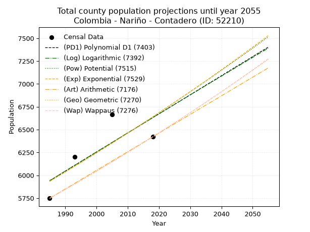
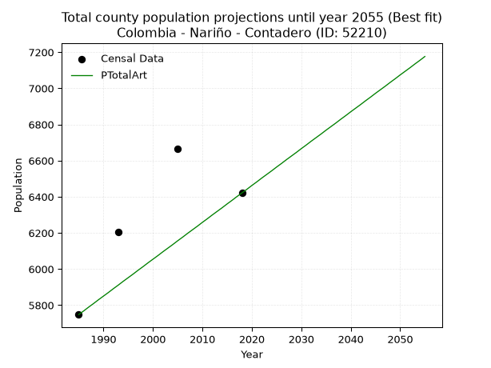
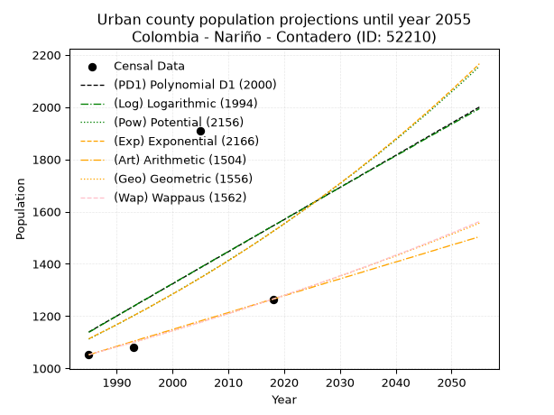
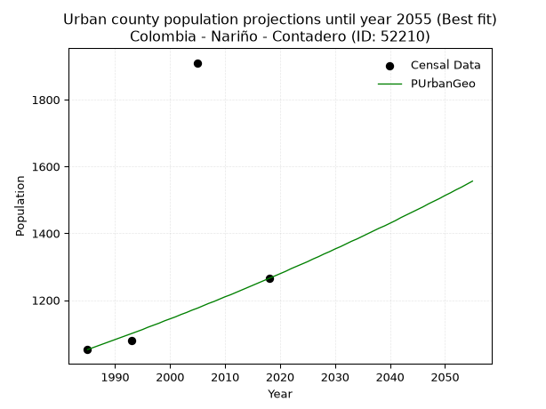
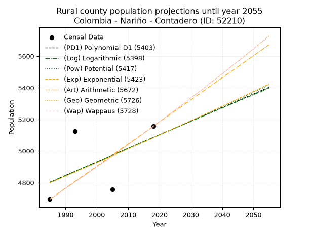
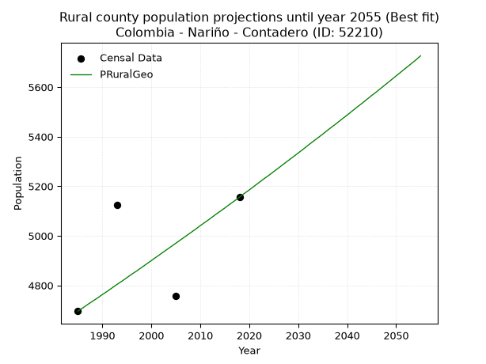

<div align="center">


</div>

# 📜 _“Population and Public Services Demand Projections (PPSD) until Year 2050 for Colombia - Nariño - Contadero (ID: 52210)”_
Keywords: `population` `public-service` `projection` `lineal` `polynomial` `logarithmic` `potential` `exponential` `arithmetic` `geometric` `wappaus` `dane` `colombia` `south-america`

PPSD are analytical estimates used by governments and planners to anticipate future changes in population size, age distribution, and the resulting community needs for utilities, healthcare, education, and infrastructure as sizing future water treatment facilities, electrical grids, and road networks based on spatial growth.

<div align="center">

</img>

</div>


> **General running parameters**: • app_version: _v20260806_. • Python version: _3.14.7_. • Pandas version: _3.0.5_. • NumPy version: _2.5.1_. • Creates, save and include plots into reports (create_plot): _False_. • Projection until year: _2050_. • Process polynomial degree 2 and up: _False_. • Process Wappaus: _True_. • Process Wappaus: _True_. • Set negative values to zero: _True_. • Set infinite values to zero: _True_. • Drop dataset notes: _True_. 
<div align="center">

Maps & GIS Layers: [:earth_americas:Google](http://maps.google.com/maps?q=0.910457862,-77.549409) [:earth_americas:OSM](https://www.openstreetmap.org/#map=18/0.910457862/-77.549409&layers=P) [:earth_americas:Bing](https://www.bing.com/maps?cp=0.910457862~-77.549409&lvl=18) [:earth_americas:Apple](https://maps.apple.com/frame?center=0.910457862%2C-77.549409&span=0.003%2C0.006) [:earth_americas:GISMobile](https://github.com/rcfdtools/R.GISMobile/blob/main/file/gis/CountyLayer_CO/Readme.md)

</div>


<div align="center">

```geojson
{
  "type": "Feature",
  "geometry": {
    "type": "Point", 
    "coordinates": [-77.549409, 0.910457862]
  }, 
  "properties": {
    "Name": "Colombia - Nariño - Contadero (ID: 52210)"
  }
}
```

</div>


## 0. Census Data (4 records)

Census data are official statistics collected by a government about the people and housing in a country. They usually include counts of total population, age, sex, race, income, education, and jobs.

📅Global census file: [Population.xlsx](../data/Population.xlsx)

| Source   |   Year |   CountryID | CountryName   |   StateID | StateName   |   CountyID | CountyName   |   PTotal |   PUrban |   PRural |
|:---------|-------:|------------:|:--------------|----------:|:------------|-----------:|:-------------|---------:|---------:|---------:|
| DANE     |   1985 |          57 | Colombia      |        52 | Nariño      |      52210 | Contadero    |     5748 |     1052 |     4696 |
| DANE     |   1993 |          57 | Colombia      |        52 | Nariño      |      52210 | Contadero    |     6204 |     1079 |     5125 |
| DANE     |   2005 |          57 | Colombia      |        52 | Nariño      |      52210 | Contadero    |     6667 |     1910 |     4757 |
| DANE     |   2018 |          57 | Colombia      |        52 | Nariño      |      52210 | Contadero    |     6421 |     1265 |     5156 |

> 🔥Some records could had specific notes about the registered values or the corresponding urban or rural distribution.

📅[SUI-RUPS](https://www.datos.gov.co/Hacienda-y-Cr-dito-P-blico/Registro-nico-de-Prestadores-de-Servicios-P-blicos/4qkq-csdn/about_data) - Local public utility companies: [RUPS.csv](../data/RUPS.csv)

 | SERVICIO       | ESTADO    | NOMBRE                                                                               | NIT         | DEPARTAMENTO_DOMICILIO   | MUNICIPIO_DOMICILIO   | DIRECCION                         |   TELEFONO | EMAIL                               | TIPO_PRESTADOR          | CLASIFICACION                 |
|:---------------|:----------|:-------------------------------------------------------------------------------------|:------------|:-------------------------|:----------------------|:----------------------------------|-----------:|:------------------------------------|:------------------------|:------------------------------|
| ACUEDUCTO      | OPERATIVA | ADMINISTRACION PUBLICA COOPERATIVA DE SERVICIOS PUBLICOS DOMICILIARIOS DEL CONTADERO | 900027859-1 | NARINO                   | CONTADERO             | CALLE 4 No  3-27 BARRIO EL CENTRO |    7752820 | coopsercontesp@hotmail.com          | ORGANIZACION AUTORIZADA | MENOR O IGUAL A 2500 USUARIOS |
| ALCANTARILLADO | OPERATIVA | ADMINISTRACION PUBLICA COOPERATIVA DE SERVICIOS PUBLICOS DOMICILIARIOS DEL CONTADERO | 900027859-1 | NARINO                   | CONTADERO             | CALLE 4 No  3-27 BARRIO EL CENTRO |    7752820 | coopsercontesp@hotmail.com          | ORGANIZACION AUTORIZADA | MENOR O IGUAL A 2500 USUARIOS |
| ACUEDUCTO      | OPERATIVA | ASOCIACIÓN DE USUARIOS DEL ACUEDUCTO DE ALDEA DE MARIA                               | 900102906-0 | NARINO                   | CONTADERO             | PALACIO MUNICIPAL                 |    3137897 | contactenos@contadero-narino.gov.co | ORGANIZACION AUTORIZADA | HASTA 2500 SUSCRIPTORES       |
| ACUEDUCTO      | OPERATIVA | ASOCIACIÓN DE JUNTA ADMINISTRADORA DEL ACUEDUCTO  DE LA VEREDA SIMON BOLIVAR         | 900404147-3 | NARINO                   | CONTADERO             | VEREDA SIMON BOLIVAR              |    7752820 | contactenos@contadero-narino.gov.co | ORGANIZACION AUTORIZADA | HASTA 2500 SUSCRIPTORES       |

## 1. Total

### 1.1. Coefficients and Parameters

* (PD1) Polynomial Deg 1: 20.883179446005713, -35511.57968687292 (lineal)
* (Log) Logarithmic: 41879.76204190068, -312068.4068838379
* (Pow) Potential: 6.815112015136588, -18.701271182323215
* (Exp) Exponential: 0.0033983826573225754, 6.97852715479774
* (Art) Arithmetic: Year diff. 2018 - 1985 = 33, Population diff. 6421 - 5748 = 673, Annual growth = 20.393939393939394
* (Geo) Geometric: Year diff. 2018 - 1985 = 33, Population diff. 6421 - 5748 = 673, Annual growth % = 0.0033608441234806996
* (Wap) Wappaus: i = 0.33517855853298373, Condition values only valid for < 200)

<sub>
Wappaus condition values: ['0.00', '0.34', '0.67', '1.01', '1.34', '1.68', '2.01', '2.35', '2.68', '3.02', '3.35', '3.69', '4.02', '4.36', '4.69', '5.03', '5.36', '5.70', '6.03', '6.37', '6.70', '7.04', '7.37', '7.71', '8.04', '8.38', '8.71', '9.05', '9.38', '9.72', '10.06', '10.39', '10.73', '11.06', '11.40', '11.73', '12.07', '12.40', '12.74', '13.07', '13.41', '13.74', '14.08', '14.41', '14.75', '15.08', '15.42', '15.75', '16.09', '16.42', '16.76', '17.09', '17.43', '17.76', '18.10', '18.43', '18.77', '19.11', '19.44', '19.78', '20.11', '20.45', '20.78', '21.12', '21.45', '21.79']
</sub>


### 1.2. Projected Dataset

|   Year |   CountyID |   PTotalPD1 |   PTotalLog |   PTotalPow |   PTotalExp |   PTotalArt |   PTotalGeo |   PTotalWap |
|-------:|-----------:|------------:|------------:|------------:|------------:|------------:|------------:|------------:|
|   1985 |      52210 |        5942 |        5940 |        5934 |        5935 |        5748 |        5748 |        5748 |
|   1986 |      52210 |        5962 |        5961 |        5954 |        5955 |        5768 |        5767 |        5767 |
|   1987 |      52210 |        5983 |        5982 |        5975 |        5976 |        5789 |        5787 |        5787 |
|   1988 |      52210 |        6004 |        6004 |        5995 |        5996 |        5809 |        5806 |        5806 |
|   1989 |      52210 |        6025 |        6025 |        6016 |        6016 |        5830 |        5826 |        5826 |
|   1990 |      52210 |        6046 |        6046 |        6036 |        6037 |        5850 |        5845 |        5845 |
|   1991 |      52210 |        6067 |        6067 |        6057 |        6057 |        5870 |        5865 |        5865 |
|   1992 |      52210 |        6088 |        6088 |        6078 |        6078 |        5891 |        5885 |        5884 |
|   1993 |      52210 |        6109 |        6109 |        6099 |        6099 |        5911 |        5904 |        5904 |
|   1994 |      52210 |        6129 |        6130 |        6120 |        6119 |        5932 |        5924 |        5924 |
|   1995 |      52210 |        6150 |        6151 |        6141 |        6140 |        5952 |        5944 |        5944 |
|   1996 |      52210 |        6171 |        6172 |        6162 |        6161 |        5972 |        5964 |        5964 |
|   1997 |      52210 |        6192 |        6193 |        6183 |        6182 |        5993 |        5984 |        5984 |
|   1998 |      52210 |        6213 |        6214 |        6204 |        6203 |        6013 |        6004 |        6004 |
|   1999 |      52210 |        6234 |        6235 |        6225 |        6224 |        6034 |        6024 |        6024 |
|   2000 |      52210 |        6255 |        6256 |        6246 |        6245 |        6054 |        6045 |        6044 |
|   2001 |      52210 |        6276 |        6277 |        6268 |        6267 |        6074 |        6065 |        6065 |
|   2002 |      52210 |        6297 |        6297 |        6289 |        6288 |        6095 |        6085 |        6085 |
|   2003 |      52210 |        6317 |        6318 |        6310 |        6309 |        6115 |        6106 |        6106 |
|   2004 |      52210 |        6338 |        6339 |        6332 |        6331 |        6135 |        6126 |        6126 |
|   2005 |      52210 |        6359 |        6360 |        6353 |        6352 |        6156 |        6147 |        6147 |
|   2006 |      52210 |        6380 |        6381 |        6375 |        6374 |        6176 |        6168 |        6167 |
|   2007 |      52210 |        6401 |        6402 |        6397 |        6396 |        6197 |        6188 |        6188 |
|   2008 |      52210 |        6422 |        6423 |        6418 |        6418 |        6217 |        6209 |        6209 |
|   2009 |      52210 |        6443 |        6444 |        6440 |        6439 |        6237 |        6230 |        6230 |
|   2010 |      52210 |        6464 |        6464 |        6462 |        6461 |        6258 |        6251 |        6251 |
|   2011 |      52210 |        6484 |        6485 |        6484 |        6483 |        6278 |        6272 |        6272 |
|   2012 |      52210 |        6505 |        6506 |        6506 |        6505 |        6299 |        6293 |        6293 |
|   2013 |      52210 |        6526 |        6527 |        6528 |        6528 |        6319 |        6314 |        6314 |
|   2014 |      52210 |        6547 |        6548 |        6550 |        6550 |        6339 |        6335 |        6335 |
|   2015 |      52210 |        6568 |        6569 |        6573 |        6572 |        6360 |        6357 |        6357 |
|   2016 |      52210 |        6589 |        6589 |        6595 |        6594 |        6380 |        6378 |        6378 |
|   2017 |      52210 |        6610 |        6610 |        6617 |        6617 |        6401 |        6399 |        6399 |
|   2018 |      52210 |        6631 |        6631 |        6640 |        6639 |        6421 |        6421 |        6421 |
|   2019 |      52210 |        6652 |        6652 |        6662 |        6662 |        6441 |        6443 |        6443 |
|   2020 |      52210 |        6672 |        6672 |        6684 |        6685 |        6462 |        6464 |        6464 |
|   2021 |      52210 |        6693 |        6693 |        6707 |        6707 |        6482 |        6486 |        6486 |
|   2022 |      52210 |        6714 |        6714 |        6730 |        6730 |        6503 |        6508 |        6508 |
|   2023 |      52210 |        6735 |        6734 |        6752 |        6753 |        6523 |        6530 |        6530 |
|   2024 |      52210 |        6756 |        6755 |        6775 |        6776 |        6543 |        6552 |        6552 |
|   2025 |      52210 |        6777 |        6776 |        6798 |        6799 |        6564 |        6574 |        6574 |
|   2026 |      52210 |        6798 |        6797 |        6821 |        6822 |        6584 |        6596 |        6596 |
|   2027 |      52210 |        6819 |        6817 |        6844 |        6846 |        6605 |        6618 |        6618 |
|   2028 |      52210 |        6840 |        6838 |        6867 |        6869 |        6625 |        6640 |        6641 |
|   2029 |      52210 |        6860 |        6858 |        6890 |        6892 |        6645 |        6662 |        6663 |
|   2030 |      52210 |        6881 |        6879 |        6913 |        6916 |        6666 |        6685 |        6686 |
|   2031 |      52210 |        6902 |        6900 |        6937 |        6939 |        6686 |        6707 |        6708 |
|   2032 |      52210 |        6923 |        6920 |        6960 |        6963 |        6707 |        6730 |        6731 |
|   2033 |      52210 |        6944 |        6941 |        6983 |        6987 |        6727 |        6752 |        6754 |
|   2034 |      52210 |        6965 |        6962 |        7007 |        7010 |        6747 |        6775 |        6776 |
|   2035 |      52210 |        6986 |        6982 |        7030 |        7034 |        6768 |        6798 |        6799 |
|   2036 |      52210 |        7007 |        7003 |        7054 |        7058 |        6788 |        6821 |        6822 |
|   2037 |      52210 |        7027 |        7023 |        7077 |        7082 |        6808 |        6844 |        6845 |
|   2038 |      52210 |        7048 |        7044 |        7101 |        7106 |        6829 |        6867 |        6869 |
|   2039 |      52210 |        7069 |        7064 |        7125 |        7131 |        6849 |        6890 |        6892 |
|   2040 |      52210 |        7090 |        7085 |        7149 |        7155 |        6870 |        6913 |        6915 |
|   2041 |      52210 |        7111 |        7105 |        7173 |        7179 |        6890 |        6936 |        6939 |
|   2042 |      52210 |        7132 |        7126 |        7197 |        7204 |        6910 |        6959 |        6962 |
|   2043 |      52210 |        7153 |        7146 |        7221 |        7228 |        6931 |        6983 |        6986 |
|   2044 |      52210 |        7174 |        7167 |        7245 |        7253 |        6951 |        7006 |        7009 |
|   2045 |      52210 |        7195 |        7187 |        7269 |        7277 |        6972 |        7030 |        7033 |
|   2046 |      52210 |        7215 |        7208 |        7293 |        7302 |        6992 |        7053 |        7057 |
|   2047 |      52210 |        7236 |        7228 |        7318 |        7327 |        7012 |        7077 |        7081 |
|   2048 |      52210 |        7257 |        7249 |        7342 |        7352 |        7033 |        7101 |        7105 |
|   2049 |      52210 |        7278 |        7269 |        7366 |        7377 |        7053 |        7125 |        7129 |
|   2050 |      52210 |        7299 |        7290 |        7391 |        7402 |        7074 |        7149 |        7153 |
<div align="center">

</img>

</div>


### 1.3. Best fit with absolute and relative error (%)

Relative error puts that difference into context by dividing the absolute error by the true value, creating a unitless ratio or percentage that shows the scale of the mistake.

Absolute and relative error

|   Year | Source   |   CountryID | CountryName   |   StateID | StateName   |   CountyID_x | CountyName   |   PTotal |   PUrban |   PRural |   CountyID_y |   PTotalPD1 |   PTotalLog |   PTotalPow |   PTotalExp |   PTotalArt |   PTotalGeo |   PTotalWap |   PTotalPD1AbsError |   PTotalLogAbsError |   PTotalPowAbsError |   PTotalExpAbsError |   PTotalArtAbsError |   PTotalGeoAbsError |   PTotalWapAbsError |   PTotalPD1RelError |   PTotalLogRelError |   PTotalPowRelError |   PTotalExpRelError |   PTotalArtRelError |   PTotalGeoRelError |   PTotalWapRelError |
|-------:|:---------|------------:|:--------------|----------:|:------------|-------------:|:-------------|---------:|---------:|---------:|-------------:|------------:|------------:|------------:|------------:|------------:|------------:|------------:|--------------------:|--------------------:|--------------------:|--------------------:|--------------------:|--------------------:|--------------------:|--------------------:|--------------------:|--------------------:|--------------------:|--------------------:|--------------------:|--------------------:|
|   1985 | DANE     |          57 | Colombia      |        52 | Nariño      |        52210 | Contadero    |     5748 |     1052 |     4696 |        52210 |        5942 |        5940 |        5934 |        5935 |        5748 |        5748 |        5748 |                 194 |                 192 |                 186 |                 187 |                   0 |                   0 |                   0 |             3.37509 |             3.34029 |             3.23591 |             3.25331 |             0       |             0       |             0       |
|   1993 | DANE     |          57 | Colombia      |        52 | Nariño      |        52210 | Contadero    |     6204 |     1079 |     5125 |        52210 |        6109 |        6109 |        6099 |        6099 |        5911 |        5904 |        5904 |                  95 |                  95 |                 105 |                 105 |                 293 |                 300 |                 300 |             1.53127 |             1.53127 |             1.69246 |             1.69246 |             4.72276 |             4.83559 |             4.83559 |
|   2005 | DANE     |          57 | Colombia      |        52 | Nariño      |        52210 | Contadero    |     6667 |     1910 |     4757 |        52210 |        6359 |        6360 |        6353 |        6352 |        6156 |        6147 |        6147 |                 308 |                 307 |                 314 |                 315 |                 511 |                 520 |                 520 |             4.61977 |             4.60477 |             4.70976 |             4.72476 |             7.66462 |             7.79961 |             7.79961 |
|   2018 | DANE     |          57 | Colombia      |        52 | Nariño      |        52210 | Contadero    |     6421 |     1265 |     5156 |        52210 |        6631 |        6631 |        6640 |        6639 |        6421 |        6421 |        6421 |                 210 |                 210 |                 219 |                 218 |                   0 |                   0 |                   0 |             3.27052 |             3.27052 |             3.41068 |             3.39511 |             0       |             0       |             0       |

Relative error mean

| Method    |   RelError | Best   |
|:----------|-----------:|:-------|
| PTotalPD1 |    3.19916 |        |
| PTotalLog |    3.18671 |        |
| PTotalPow |    3.2622  |        |
| PTotalExp |    3.26641 |        |
| PTotalArt |    3.09684 | True   |
| PTotalGeo |    3.1588  |        |
| PTotalWap |    3.1588  |        |

💙Best method: _**PTotalArt**_
<div align="center">

</img>

</div>


### 1.4. Fresh water supply demand in liters per capita per day (lpcd)

The fresh water supply demand typically ranges from 100 to 300 liters per capita per day (lpcd) for standard domestic and municipal planning, though absolute survival minimums set by the World Health Organization are as low as 7.5 to 20 liters per day, and total consumption in high-income nations can exceed 400 liters.

> `CZ`: Level in meters above the sea level (masl)<br> `WS`: Fresh water supply demand in liters per capita per day (lpcd or l/h/d)<br> `WSAll`: Zonal fresh water supply demand in liters per second (l/s)<br> `A`: Zonal area in square meters<br> `DP`: Population density (people/hectare or p/ha)

Reference values (RAS Colombia)

|    CZ |   WS |
|------:|-----:|
|  1000 |  120 |
|  2000 |  130 |
| 99999 |  140 |

County shapefile geometry properties and water supply values

|   CountyID |     ATotal |   CZTotal |   WSTotal |
|-----------:|-----------:|----------:|----------:|
|      52210 | 4.3254e+07 |   2837.37 |       140 |

Projected values for best method: PTotalArt

|   CountyID |   Year |   PTotalArt |   DPTotal |   WSTotal |   WSTotalAll |
|-----------:|-------:|------------:|----------:|----------:|-------------:|
|      52210 |   1985 |        5748 |      1.33 |       140 |      9.31389 |
|      52210 |   1986 |        5768 |      1.33 |       140 |      9.3463  |
|      52210 |   1987 |        5789 |      1.34 |       140 |      9.38032 |
|      52210 |   1988 |        5809 |      1.34 |       140 |      9.41273 |
|      52210 |   1989 |        5830 |      1.35 |       140 |      9.44676 |
|      52210 |   1990 |        5850 |      1.35 |       140 |      9.47917 |
|      52210 |   1991 |        5870 |      1.36 |       140 |      9.51157 |
|      52210 |   1992 |        5891 |      1.36 |       140 |      9.5456  |
|      52210 |   1993 |        5911 |      1.37 |       140 |      9.57801 |
|      52210 |   1994 |        5932 |      1.37 |       140 |      9.61204 |
|      52210 |   1995 |        5952 |      1.38 |       140 |      9.64444 |
|      52210 |   1996 |        5972 |      1.38 |       140 |      9.67685 |
|      52210 |   1997 |        5993 |      1.39 |       140 |      9.71088 |
|      52210 |   1998 |        6013 |      1.39 |       140 |      9.74329 |
|      52210 |   1999 |        6034 |      1.4  |       140 |      9.77731 |
|      52210 |   2000 |        6054 |      1.4  |       140 |      9.80972 |
|      52210 |   2001 |        6074 |      1.4  |       140 |      9.84213 |
|      52210 |   2002 |        6095 |      1.41 |       140 |      9.87616 |
|      52210 |   2003 |        6115 |      1.41 |       140 |      9.90856 |
|      52210 |   2004 |        6135 |      1.42 |       140 |      9.94097 |
|      52210 |   2005 |        6156 |      1.42 |       140 |      9.975   |
|      52210 |   2006 |        6176 |      1.43 |       140 |     10.0074  |
|      52210 |   2007 |        6197 |      1.43 |       140 |     10.0414  |
|      52210 |   2008 |        6217 |      1.44 |       140 |     10.0738  |
|      52210 |   2009 |        6237 |      1.44 |       140 |     10.1062  |
|      52210 |   2010 |        6258 |      1.45 |       140 |     10.1403  |
|      52210 |   2011 |        6278 |      1.45 |       140 |     10.1727  |
|      52210 |   2012 |        6299 |      1.46 |       140 |     10.2067  |
|      52210 |   2013 |        6319 |      1.46 |       140 |     10.2391  |
|      52210 |   2014 |        6339 |      1.47 |       140 |     10.2715  |
|      52210 |   2015 |        6360 |      1.47 |       140 |     10.3056  |
|      52210 |   2016 |        6380 |      1.48 |       140 |     10.338   |
|      52210 |   2017 |        6401 |      1.48 |       140 |     10.372   |
|      52210 |   2018 |        6421 |      1.48 |       140 |     10.4044  |
|      52210 |   2019 |        6441 |      1.49 |       140 |     10.4368  |
|      52210 |   2020 |        6462 |      1.49 |       140 |     10.4708  |
|      52210 |   2021 |        6482 |      1.5  |       140 |     10.5032  |
|      52210 |   2022 |        6503 |      1.5  |       140 |     10.5373  |
|      52210 |   2023 |        6523 |      1.51 |       140 |     10.5697  |
|      52210 |   2024 |        6543 |      1.51 |       140 |     10.6021  |
|      52210 |   2025 |        6564 |      1.52 |       140 |     10.6361  |
|      52210 |   2026 |        6584 |      1.52 |       140 |     10.6685  |
|      52210 |   2027 |        6605 |      1.53 |       140 |     10.7025  |
|      52210 |   2028 |        6625 |      1.53 |       140 |     10.735   |
|      52210 |   2029 |        6645 |      1.54 |       140 |     10.7674  |
|      52210 |   2030 |        6666 |      1.54 |       140 |     10.8014  |
|      52210 |   2031 |        6686 |      1.55 |       140 |     10.8338  |
|      52210 |   2032 |        6707 |      1.55 |       140 |     10.8678  |
|      52210 |   2033 |        6727 |      1.56 |       140 |     10.9002  |
|      52210 |   2034 |        6747 |      1.56 |       140 |     10.9326  |
|      52210 |   2035 |        6768 |      1.56 |       140 |     10.9667  |
|      52210 |   2036 |        6788 |      1.57 |       140 |     10.9991  |
|      52210 |   2037 |        6808 |      1.57 |       140 |     11.0315  |
|      52210 |   2038 |        6829 |      1.58 |       140 |     11.0655  |
|      52210 |   2039 |        6849 |      1.58 |       140 |     11.0979  |
|      52210 |   2040 |        6870 |      1.59 |       140 |     11.1319  |
|      52210 |   2041 |        6890 |      1.59 |       140 |     11.1644  |
|      52210 |   2042 |        6910 |      1.6  |       140 |     11.1968  |
|      52210 |   2043 |        6931 |      1.6  |       140 |     11.2308  |
|      52210 |   2044 |        6951 |      1.61 |       140 |     11.2632  |
|      52210 |   2045 |        6972 |      1.61 |       140 |     11.2972  |
|      52210 |   2046 |        6992 |      1.62 |       140 |     11.3296  |
|      52210 |   2047 |        7012 |      1.62 |       140 |     11.362   |
|      52210 |   2048 |        7033 |      1.63 |       140 |     11.3961  |
|      52210 |   2049 |        7053 |      1.63 |       140 |     11.4285  |
|      52210 |   2050 |        7074 |      1.64 |       140 |     11.4625  |

## 2. Urban

### 2.1. Coefficients and Parameters

* (PD1) Polynomial Deg 1: 12.301083902047713, -23278.743075070943 (lineal)
* (Log) Logarithmic: 24706.10581768569, -186464.80830253576
* (Pow) Potential: 19.089772511251958, -59.90724650453973
* (Exp) Exponential: 0.009509352227461127, 7.0597513770846845e-06
* (Art) Arithmetic: Year diff. 2018 - 1985 = 33, Population diff. 1265 - 1052 = 213, Annual growth = 6.454545454545454
* (Geo) Geometric: Year diff. 2018 - 1985 = 33, Population diff. 1265 - 1052 = 213, Annual growth % = 0.005602880413233535
* (Wap) Wappaus: i = 0.5571467807117354, Condition values only valid for < 200)

<sub>
Wappaus condition values: ['0.00', '0.56', '1.11', '1.67', '2.23', '2.79', '3.34', '3.90', '4.46', '5.01', '5.57', '6.13', '6.69', '7.24', '7.80', '8.36', '8.91', '9.47', '10.03', '10.59', '11.14', '11.70', '12.26', '12.81', '13.37', '13.93', '14.49', '15.04', '15.60', '16.16', '16.71', '17.27', '17.83', '18.39', '18.94', '19.50', '20.06', '20.61', '21.17', '21.73', '22.29', '22.84', '23.40', '23.96', '24.51', '25.07', '25.63', '26.19', '26.74', '27.30', '27.86', '28.41', '28.97', '29.53', '30.09', '30.64', '31.20', '31.76', '32.31', '32.87', '33.43', '33.99', '34.54', '35.10', '35.66', '36.21']
</sub>


### 2.2. Projected Dataset

|   Year |   CountyID |   PUrbanPD1 |   PUrbanLog |   PUrbanPow |   PUrbanExp |   PUrbanArt |   PUrbanGeo |   PUrbanWap |
|-------:|-----------:|------------:|------------:|------------:|------------:|------------:|------------:|------------:|
|   1985 |      52210 |        1139 |        1138 |        1112 |        1113 |        1052 |        1052 |        1052 |
|   1986 |      52210 |        1151 |        1150 |        1123 |        1124 |        1058 |        1058 |        1058 |
|   1987 |      52210 |        1164 |        1163 |        1134 |        1135 |        1065 |        1064 |        1064 |
|   1988 |      52210 |        1176 |        1175 |        1145 |        1145 |        1071 |        1070 |        1070 |
|   1989 |      52210 |        1188 |        1188 |        1156 |        1156 |        1078 |        1076 |        1076 |
|   1990 |      52210 |        1200 |        1200 |        1167 |        1167 |        1084 |        1082 |        1082 |
|   1991 |      52210 |        1213 |        1212 |        1178 |        1179 |        1091 |        1088 |        1088 |
|   1992 |      52210 |        1225 |        1225 |        1190 |        1190 |        1097 |        1094 |        1094 |
|   1993 |      52210 |        1237 |        1237 |        1201 |        1201 |        1104 |        1100 |        1100 |
|   1994 |      52210 |        1250 |        1250 |        1213 |        1213 |        1110 |        1106 |        1106 |
|   1995 |      52210 |        1262 |        1262 |        1224 |        1224 |        1117 |        1112 |        1112 |
|   1996 |      52210 |        1274 |        1274 |        1236 |        1236 |        1123 |        1119 |        1119 |
|   1997 |      52210 |        1287 |        1287 |        1248 |        1248 |        1129 |        1125 |        1125 |
|   1998 |      52210 |        1299 |        1299 |        1260 |        1260 |        1136 |        1131 |        1131 |
|   1999 |      52210 |        1311 |        1312 |        1272 |        1272 |        1142 |        1138 |        1137 |
|   2000 |      52210 |        1323 |        1324 |        1284 |        1284 |        1149 |        1144 |        1144 |
|   2001 |      52210 |        1336 |        1336 |        1297 |        1296 |        1155 |        1150 |        1150 |
|   2002 |      52210 |        1348 |        1349 |        1309 |        1308 |        1162 |        1157 |        1157 |
|   2003 |      52210 |        1360 |        1361 |        1322 |        1321 |        1168 |        1163 |        1163 |
|   2004 |      52210 |        1373 |        1373 |        1334 |        1334 |        1175 |        1170 |        1170 |
|   2005 |      52210 |        1385 |        1386 |        1347 |        1346 |        1181 |        1176 |        1176 |
|   2006 |      52210 |        1397 |        1398 |        1360 |        1359 |        1188 |        1183 |        1183 |
|   2007 |      52210 |        1410 |        1410 |        1373 |        1372 |        1194 |        1190 |        1189 |
|   2008 |      52210 |        1422 |        1423 |        1386 |        1385 |        1200 |        1196 |        1196 |
|   2009 |      52210 |        1434 |        1435 |        1399 |        1399 |        1207 |        1203 |        1203 |
|   2010 |      52210 |        1446 |        1447 |        1413 |        1412 |        1213 |        1210 |        1209 |
|   2011 |      52210 |        1459 |        1459 |        1426 |        1425 |        1220 |        1216 |        1216 |
|   2012 |      52210 |        1471 |        1472 |        1440 |        1439 |        1226 |        1223 |        1223 |
|   2013 |      52210 |        1483 |        1484 |        1453 |        1453 |        1233 |        1230 |        1230 |
|   2014 |      52210 |        1496 |        1496 |        1467 |        1467 |        1239 |        1237 |        1237 |
|   2015 |      52210 |        1508 |        1508 |        1481 |        1481 |        1246 |        1244 |        1244 |
|   2016 |      52210 |        1520 |        1521 |        1495 |        1495 |        1252 |        1251 |        1251 |
|   2017 |      52210 |        1533 |        1533 |        1510 |        1509 |        1259 |        1258 |        1258 |
|   2018 |      52210 |        1545 |        1545 |        1524 |        1524 |        1265 |        1265 |        1265 |
|   2019 |      52210 |        1557 |        1557 |        1538 |        1538 |        1271 |        1272 |        1272 |
|   2020 |      52210 |        1569 |        1570 |        1553 |        1553 |        1278 |        1279 |        1279 |
|   2021 |      52210 |        1582 |        1582 |        1568 |        1568 |        1284 |        1286 |        1287 |
|   2022 |      52210 |        1594 |        1594 |        1583 |        1583 |        1291 |        1294 |        1294 |
|   2023 |      52210 |        1606 |        1606 |        1598 |        1598 |        1297 |        1301 |        1301 |
|   2024 |      52210 |        1619 |        1619 |        1613 |        1613 |        1304 |        1308 |        1308 |
|   2025 |      52210 |        1631 |        1631 |        1628 |        1628 |        1310 |        1315 |        1316 |
|   2026 |      52210 |        1643 |        1643 |        1643 |        1644 |        1317 |        1323 |        1323 |
|   2027 |      52210 |        1656 |        1655 |        1659 |        1660 |        1323 |        1330 |        1331 |
|   2028 |      52210 |        1668 |        1667 |        1675 |        1675 |        1330 |        1338 |        1338 |
|   2029 |      52210 |        1680 |        1680 |        1691 |        1692 |        1336 |        1345 |        1346 |
|   2030 |      52210 |        1692 |        1692 |        1706 |        1708 |        1342 |        1353 |        1354 |
|   2031 |      52210 |        1705 |        1704 |        1723 |        1724 |        1349 |        1360 |        1361 |
|   2032 |      52210 |        1717 |        1716 |        1739 |        1740 |        1355 |        1368 |        1369 |
|   2033 |      52210 |        1729 |        1728 |        1755 |        1757 |        1362 |        1376 |        1377 |
|   2034 |      52210 |        1742 |        1740 |        1772 |        1774 |        1368 |        1383 |        1385 |
|   2035 |      52210 |        1754 |        1753 |        1789 |        1791 |        1375 |        1391 |        1392 |
|   2036 |      52210 |        1766 |        1765 |        1805 |        1808 |        1381 |        1399 |        1400 |
|   2037 |      52210 |        1779 |        1777 |        1822 |        1825 |        1388 |        1407 |        1408 |
|   2038 |      52210 |        1791 |        1789 |        1840 |        1843 |        1394 |        1415 |        1416 |
|   2039 |      52210 |        1803 |        1801 |        1857 |        1860 |        1401 |        1422 |        1425 |
|   2040 |      52210 |        1815 |        1813 |        1874 |        1878 |        1407 |        1430 |        1433 |
|   2041 |      52210 |        1828 |        1825 |        1892 |        1896 |        1413 |        1438 |        1441 |
|   2042 |      52210 |        1840 |        1837 |        1910 |        1914 |        1420 |        1447 |        1449 |
|   2043 |      52210 |        1852 |        1849 |        1928 |        1932 |        1426 |        1455 |        1457 |
|   2044 |      52210 |        1865 |        1862 |        1946 |        1951 |        1433 |        1463 |        1466 |
|   2045 |      52210 |        1877 |        1874 |        1964 |        1969 |        1439 |        1471 |        1474 |
|   2046 |      52210 |        1889 |        1886 |        1982 |        1988 |        1446 |        1479 |        1483 |
|   2047 |      52210 |        1902 |        1898 |        2001 |        2007 |        1452 |        1488 |        1491 |
|   2048 |      52210 |        1914 |        1910 |        2020 |        2026 |        1459 |        1496 |        1500 |
|   2049 |      52210 |        1926 |        1922 |        2039 |        2046 |        1465 |        1504 |        1509 |
|   2050 |      52210 |        1938 |        1934 |        2058 |        2065 |        1472 |        1513 |        1517 |
<div align="center">

</img>

</div>


### 2.3. Best fit with absolute and relative error (%)

Relative error puts that difference into context by dividing the absolute error by the true value, creating a unitless ratio or percentage that shows the scale of the mistake.

Absolute and relative error

|   Year | Source   |   CountryID | CountryName   |   StateID | StateName   |   CountyID_x | CountyName   |   PTotal |   PUrban |   PRural |   CountyID_y |   PUrbanPD1 |   PUrbanLog |   PUrbanPow |   PUrbanExp |   PUrbanArt |   PUrbanGeo |   PUrbanWap |   PUrbanPD1AbsError |   PUrbanLogAbsError |   PUrbanPowAbsError |   PUrbanExpAbsError |   PUrbanArtAbsError |   PUrbanGeoAbsError |   PUrbanWapAbsError |   PUrbanPD1RelError |   PUrbanLogRelError |   PUrbanPowRelError |   PUrbanExpRelError |   PUrbanArtRelError |   PUrbanGeoRelError |   PUrbanWapRelError |
|-------:|:---------|------------:|:--------------|----------:|:------------|-------------:|:-------------|---------:|---------:|---------:|-------------:|------------:|------------:|------------:|------------:|------------:|------------:|------------:|--------------------:|--------------------:|--------------------:|--------------------:|--------------------:|--------------------:|--------------------:|--------------------:|--------------------:|--------------------:|--------------------:|--------------------:|--------------------:|--------------------:|
|   1985 | DANE     |          57 | Colombia      |        52 | Nariño      |        52210 | Contadero    |     5748 |     1052 |     4696 |        52210 |        1139 |        1138 |        1112 |        1113 |        1052 |        1052 |        1052 |                  87 |                  86 |                  60 |                  61 |                   0 |                   0 |                   0 |             8.26996 |              8.1749 |             5.70342 |             5.79848 |             0       |             0       |             0       |
|   1993 | DANE     |          57 | Colombia      |        52 | Nariño      |        52210 | Contadero    |     6204 |     1079 |     5125 |        52210 |        1237 |        1237 |        1201 |        1201 |        1104 |        1100 |        1100 |                 158 |                 158 |                 122 |                 122 |                  25 |                  21 |                  21 |            14.6432  |             14.6432 |            11.3068  |            11.3068  |             2.31696 |             1.94625 |             1.94625 |
|   2005 | DANE     |          57 | Colombia      |        52 | Nariño      |        52210 | Contadero    |     6667 |     1910 |     4757 |        52210 |        1385 |        1386 |        1347 |        1346 |        1181 |        1176 |        1176 |                 525 |                 524 |                 563 |                 564 |                 729 |                 734 |                 734 |            27.4869  |             27.4346 |            29.4764  |            29.5288  |            38.1675  |            38.4293  |            38.4293  |
|   2018 | DANE     |          57 | Colombia      |        52 | Nariño      |        52210 | Contadero    |     6421 |     1265 |     5156 |        52210 |        1545 |        1545 |        1524 |        1524 |        1265 |        1265 |        1265 |                 280 |                 280 |                 259 |                 259 |                   0 |                   0 |                   0 |            22.1344  |             22.1344 |            20.4743  |            20.4743  |             0       |             0       |             0       |

Relative error mean

| Method    |   RelError | Best   |
|:----------|-----------:|:-------|
| PUrbanPD1 |    18.1336 |        |
| PUrbanLog |    18.0968 |        |
| PUrbanPow |    16.7402 |        |
| PUrbanExp |    16.7771 |        |
| PUrbanArt |    10.1211 |        |
| PUrbanGeo |    10.0939 | True   |
| PUrbanWap |    10.0939 | True   |

💙Best method: _**PUrbanGeo**_
<div align="center">

</img>

</div>


### 2.4. Fresh water supply demand in liters per capita per day (lpcd)

The fresh water supply demand typically ranges from 100 to 300 liters per capita per day (lpcd) for standard domestic and municipal planning, though absolute survival minimums set by the World Health Organization are as low as 7.5 to 20 liters per day, and total consumption in high-income nations can exceed 400 liters.

> `CZ`: Level in meters above the sea level (masl)<br> `WS`: Fresh water supply demand in liters per capita per day (lpcd or l/h/d)<br> `WSAll`: Zonal fresh water supply demand in liters per second (l/s)<br> `A`: Zonal area in square meters<br> `DP`: Population density (people/hectare or p/ha)

Reference values (RAS Colombia)

|    CZ |   WS |
|------:|-----:|
|  1000 |  120 |
|  2000 |  130 |
| 99999 |  140 |

County shapefile geometry properties and water supply values

|   CountyID |   AUrban |   CZUrban |   WSUrban |
|-----------:|---------:|----------:|----------:|
|      52210 |   493916 |    2608.4 |       140 |

Projected values for best method: PUrbanGeo

|   CountyID |   Year |   PUrbanGeo |   DPUrban |   WSUrban |   WSUrbanAll |
|-----------:|-------:|------------:|----------:|----------:|-------------:|
|      52210 |   1985 |        1052 |     21.3  |       140 |      1.70463 |
|      52210 |   1986 |        1058 |     21.42 |       140 |      1.71435 |
|      52210 |   1987 |        1064 |     21.54 |       140 |      1.72407 |
|      52210 |   1988 |        1070 |     21.66 |       140 |      1.7338  |
|      52210 |   1989 |        1076 |     21.79 |       140 |      1.74352 |
|      52210 |   1990 |        1082 |     21.91 |       140 |      1.75324 |
|      52210 |   1991 |        1088 |     22.03 |       140 |      1.76296 |
|      52210 |   1992 |        1094 |     22.15 |       140 |      1.77269 |
|      52210 |   1993 |        1100 |     22.27 |       140 |      1.78241 |
|      52210 |   1994 |        1106 |     22.39 |       140 |      1.79213 |
|      52210 |   1995 |        1112 |     22.51 |       140 |      1.80185 |
|      52210 |   1996 |        1119 |     22.66 |       140 |      1.81319 |
|      52210 |   1997 |        1125 |     22.78 |       140 |      1.82292 |
|      52210 |   1998 |        1131 |     22.9  |       140 |      1.83264 |
|      52210 |   1999 |        1138 |     23.04 |       140 |      1.84398 |
|      52210 |   2000 |        1144 |     23.16 |       140 |      1.8537  |
|      52210 |   2001 |        1150 |     23.28 |       140 |      1.86343 |
|      52210 |   2002 |        1157 |     23.43 |       140 |      1.87477 |
|      52210 |   2003 |        1163 |     23.55 |       140 |      1.88449 |
|      52210 |   2004 |        1170 |     23.69 |       140 |      1.89583 |
|      52210 |   2005 |        1176 |     23.81 |       140 |      1.90556 |
|      52210 |   2006 |        1183 |     23.95 |       140 |      1.9169  |
|      52210 |   2007 |        1190 |     24.09 |       140 |      1.92824 |
|      52210 |   2008 |        1196 |     24.21 |       140 |      1.93796 |
|      52210 |   2009 |        1203 |     24.36 |       140 |      1.94931 |
|      52210 |   2010 |        1210 |     24.5  |       140 |      1.96065 |
|      52210 |   2011 |        1216 |     24.62 |       140 |      1.97037 |
|      52210 |   2012 |        1223 |     24.76 |       140 |      1.98171 |
|      52210 |   2013 |        1230 |     24.9  |       140 |      1.99306 |
|      52210 |   2014 |        1237 |     25.04 |       140 |      2.0044  |
|      52210 |   2015 |        1244 |     25.19 |       140 |      2.01574 |
|      52210 |   2016 |        1251 |     25.33 |       140 |      2.02708 |
|      52210 |   2017 |        1258 |     25.47 |       140 |      2.03843 |
|      52210 |   2018 |        1265 |     25.61 |       140 |      2.04977 |
|      52210 |   2019 |        1272 |     25.75 |       140 |      2.06111 |
|      52210 |   2020 |        1279 |     25.9  |       140 |      2.07245 |
|      52210 |   2021 |        1286 |     26.04 |       140 |      2.0838  |
|      52210 |   2022 |        1294 |     26.2  |       140 |      2.09676 |
|      52210 |   2023 |        1301 |     26.34 |       140 |      2.1081  |
|      52210 |   2024 |        1308 |     26.48 |       140 |      2.11944 |
|      52210 |   2025 |        1315 |     26.62 |       140 |      2.13079 |
|      52210 |   2026 |        1323 |     26.79 |       140 |      2.14375 |
|      52210 |   2027 |        1330 |     26.93 |       140 |      2.15509 |
|      52210 |   2028 |        1338 |     27.09 |       140 |      2.16806 |
|      52210 |   2029 |        1345 |     27.23 |       140 |      2.1794  |
|      52210 |   2030 |        1353 |     27.39 |       140 |      2.19236 |
|      52210 |   2031 |        1360 |     27.54 |       140 |      2.2037  |
|      52210 |   2032 |        1368 |     27.7  |       140 |      2.21667 |
|      52210 |   2033 |        1376 |     27.86 |       140 |      2.22963 |
|      52210 |   2034 |        1383 |     28    |       140 |      2.24097 |
|      52210 |   2035 |        1391 |     28.16 |       140 |      2.25394 |
|      52210 |   2036 |        1399 |     28.32 |       140 |      2.2669  |
|      52210 |   2037 |        1407 |     28.49 |       140 |      2.27986 |
|      52210 |   2038 |        1415 |     28.65 |       140 |      2.29282 |
|      52210 |   2039 |        1422 |     28.79 |       140 |      2.30417 |
|      52210 |   2040 |        1430 |     28.95 |       140 |      2.31713 |
|      52210 |   2041 |        1438 |     29.11 |       140 |      2.33009 |
|      52210 |   2042 |        1447 |     29.3  |       140 |      2.34468 |
|      52210 |   2043 |        1455 |     29.46 |       140 |      2.35764 |
|      52210 |   2044 |        1463 |     29.62 |       140 |      2.3706  |
|      52210 |   2045 |        1471 |     29.78 |       140 |      2.38356 |
|      52210 |   2046 |        1479 |     29.94 |       140 |      2.39653 |
|      52210 |   2047 |        1488 |     30.13 |       140 |      2.41111 |
|      52210 |   2048 |        1496 |     30.29 |       140 |      2.42407 |
|      52210 |   2049 |        1504 |     30.45 |       140 |      2.43704 |
|      52210 |   2050 |        1513 |     30.63 |       140 |      2.45162 |

## 3. Rural

### 3.1. Coefficients and Parameters

* (PD1) Polynomial Deg 1: 8.58209554395807, -12232.836611802131 (lineal)
* (Log) Logarithmic: 17173.656224214967, -125603.59858130198
* (Pow) Potential: 3.490563490180212, -7.829847791004206
* (Exp) Exponential: 0.001744280574962777, 150.4924680010908
* (Art) Arithmetic: Year diff. 2018 - 1985 = 33, Population diff. 5156 - 4696 = 460, Annual growth = 13.93939393939394
* (Geo) Geometric: Year diff. 2018 - 1985 = 33, Population diff. 5156 - 4696 = 460, Annual growth % = 0.0028358316439498488
* (Wap) Wappaus: i = 0.28297592243999065, Condition values only valid for < 200)

<sub>
Wappaus condition values: ['0.00', '0.28', '0.57', '0.85', '1.13', '1.41', '1.70', '1.98', '2.26', '2.55', '2.83', '3.11', '3.40', '3.68', '3.96', '4.24', '4.53', '4.81', '5.09', '5.38', '5.66', '5.94', '6.23', '6.51', '6.79', '7.07', '7.36', '7.64', '7.92', '8.21', '8.49', '8.77', '9.06', '9.34', '9.62', '9.90', '10.19', '10.47', '10.75', '11.04', '11.32', '11.60', '11.88', '12.17', '12.45', '12.73', '13.02', '13.30', '13.58', '13.87', '14.15', '14.43', '14.71', '15.00', '15.28', '15.56', '15.85', '16.13', '16.41', '16.70', '16.98', '17.26', '17.54', '17.83', '18.11', '18.39']
</sub>


### 3.2. Projected Dataset

|   Year |   CountyID |   PRuralPD1 |   PRuralLog |   PRuralPow |   PRuralExp |   PRuralArt |   PRuralGeo |   PRuralWap |
|-------:|-----------:|------------:|------------:|------------:|------------:|------------:|------------:|------------:|
|   1985 |      52210 |        4803 |        4802 |        4799 |        4800 |        4696 |        4696 |        4696 |
|   1986 |      52210 |        4811 |        4811 |        4808 |        4808 |        4710 |        4709 |        4709 |
|   1987 |      52210 |        4820 |        4820 |        4816 |        4816 |        4724 |        4723 |        4723 |
|   1988 |      52210 |        4828 |        4828 |        4825 |        4825 |        4738 |        4736 |        4736 |
|   1989 |      52210 |        4837 |        4837 |        4833 |        4833 |        4752 |        4749 |        4749 |
|   1990 |      52210 |        4846 |        4846 |        4842 |        4842 |        4766 |        4763 |        4763 |
|   1991 |      52210 |        4854 |        4854 |        4850 |        4850 |        4780 |        4776 |        4776 |
|   1992 |      52210 |        4863 |        4863 |        4859 |        4859 |        4794 |        4790 |        4790 |
|   1993 |      52210 |        4871 |        4871 |        4867 |        4867 |        4808 |        4804 |        4804 |
|   1994 |      52210 |        4880 |        4880 |        4876 |        4876 |        4821 |        4817 |        4817 |
|   1995 |      52210 |        4888 |        4889 |        4884 |        4884 |        4835 |        4831 |        4831 |
|   1996 |      52210 |        4897 |        4897 |        4893 |        4893 |        4849 |        4845 |        4844 |
|   1997 |      52210 |        4906 |        4906 |        4902 |        4901 |        4863 |        4858 |        4858 |
|   1998 |      52210 |        4914 |        4915 |        4910 |        4910 |        4877 |        4872 |        4872 |
|   1999 |      52210 |        4923 |        4923 |        4919 |        4918 |        4891 |        4886 |        4886 |
|   2000 |      52210 |        4931 |        4932 |        4927 |        4927 |        4905 |        4900 |        4900 |
|   2001 |      52210 |        4940 |        4940 |        4936 |        4936 |        4919 |        4914 |        4914 |
|   2002 |      52210 |        4949 |        4949 |        4944 |        4944 |        4933 |        4928 |        4927 |
|   2003 |      52210 |        4957 |        4957 |        4953 |        4953 |        4947 |        4942 |        4941 |
|   2004 |      52210 |        4966 |        4966 |        4962 |        4961 |        4961 |        4956 |        4955 |
|   2005 |      52210 |        4974 |        4975 |        4970 |        4970 |        4975 |        4970 |        4970 |
|   2006 |      52210 |        4983 |        4983 |        4979 |        4979 |        4989 |        4984 |        4984 |
|   2007 |      52210 |        4991 |        4992 |        4988 |        4987 |        5003 |        4998 |        4998 |
|   2008 |      52210 |        5000 |        5000 |        4996 |        4996 |        5017 |        5012 |        5012 |
|   2009 |      52210 |        5009 |        5009 |        5005 |        5005 |        5031 |        5026 |        5026 |
|   2010 |      52210 |        5017 |        5017 |        5014 |        5014 |        5044 |        5041 |        5040 |
|   2011 |      52210 |        5026 |        5026 |        5023 |        5022 |        5058 |        5055 |        5055 |
|   2012 |      52210 |        5034 |        5034 |        5031 |        5031 |        5072 |        5069 |        5069 |
|   2013 |      52210 |        5043 |        5043 |        5040 |        5040 |        5086 |        5084 |        5083 |
|   2014 |      52210 |        5052 |        5051 |        5049 |        5049 |        5100 |        5098 |        5098 |
|   2015 |      52210 |        5060 |        5060 |        5057 |        5058 |        5114 |        5112 |        5112 |
|   2016 |      52210 |        5069 |        5069 |        5066 |        5066 |        5128 |        5127 |        5127 |
|   2017 |      52210 |        5077 |        5077 |        5075 |        5075 |        5142 |        5141 |        5141 |
|   2018 |      52210 |        5086 |        5086 |        5084 |        5084 |        5156 |        5156 |        5156 |
|   2019 |      52210 |        5094 |        5094 |        5093 |        5093 |        5170 |        5171 |        5171 |
|   2020 |      52210 |        5103 |        5103 |        5101 |        5102 |        5184 |        5185 |        5185 |
|   2021 |      52210 |        5112 |        5111 |        5110 |        5111 |        5198 |        5200 |        5200 |
|   2022 |      52210 |        5120 |        5120 |        5119 |        5120 |        5212 |        5215 |        5215 |
|   2023 |      52210 |        5129 |        5128 |        5128 |        5129 |        5226 |        5230 |        5230 |
|   2024 |      52210 |        5137 |        5137 |        5137 |        5138 |        5240 |        5244 |        5245 |
|   2025 |      52210 |        5146 |        5145 |        5146 |        5147 |        5254 |        5259 |        5259 |
|   2026 |      52210 |        5154 |        5154 |        5155 |        5156 |        5268 |        5274 |        5274 |
|   2027 |      52210 |        5163 |        5162 |        5163 |        5165 |        5281 |        5289 |        5289 |
|   2028 |      52210 |        5172 |        5170 |        5172 |        5174 |        5295 |        5304 |        5304 |
|   2029 |      52210 |        5180 |        5179 |        5181 |        5183 |        5309 |        5319 |        5320 |
|   2030 |      52210 |        5189 |        5187 |        5190 |        5192 |        5323 |        5334 |        5335 |
|   2031 |      52210 |        5197 |        5196 |        5199 |        5201 |        5337 |        5349 |        5350 |
|   2032 |      52210 |        5206 |        5204 |        5208 |        5210 |        5351 |        5365 |        5365 |
|   2033 |      52210 |        5215 |        5213 |        5217 |        5219 |        5365 |        5380 |        5380 |
|   2034 |      52210 |        5223 |        5221 |        5226 |        5228 |        5379 |        5395 |        5396 |
|   2035 |      52210 |        5232 |        5230 |        5235 |        5237 |        5393 |        5410 |        5411 |
|   2036 |      52210 |        5240 |        5238 |        5244 |        5246 |        5407 |        5426 |        5426 |
|   2037 |      52210 |        5249 |        5246 |        5253 |        5255 |        5421 |        5441 |        5442 |
|   2038 |      52210 |        5257 |        5255 |        5262 |        5265 |        5435 |        5456 |        5457 |
|   2039 |      52210 |        5266 |        5263 |        5271 |        5274 |        5449 |        5472 |        5473 |
|   2040 |      52210 |        5275 |        5272 |        5280 |        5283 |        5463 |        5487 |        5489 |
|   2041 |      52210 |        5283 |        5280 |        5289 |        5292 |        5477 |        5503 |        5504 |
|   2042 |      52210 |        5292 |        5289 |        5298 |        5301 |        5491 |        5519 |        5520 |
|   2043 |      52210 |        5300 |        5297 |        5307 |        5311 |        5504 |        5534 |        5536 |
|   2044 |      52210 |        5309 |        5305 |        5316 |        5320 |        5518 |        5550 |        5551 |
|   2045 |      52210 |        5318 |        5314 |        5325 |        5329 |        5532 |        5566 |        5567 |
|   2046 |      52210 |        5326 |        5322 |        5334 |        5339 |        5546 |        5581 |        5583 |
|   2047 |      52210 |        5335 |        5331 |        5343 |        5348 |        5560 |        5597 |        5599 |
|   2048 |      52210 |        5343 |        5339 |        5353 |        5357 |        5574 |        5613 |        5615 |
|   2049 |      52210 |        5352 |        5347 |        5362 |        5367 |        5588 |        5629 |        5631 |
|   2050 |      52210 |        5360 |        5356 |        5371 |        5376 |        5602 |        5645 |        5647 |
<div align="center">

</img>

</div>


### 3.3. Best fit with absolute and relative error (%)

Relative error puts that difference into context by dividing the absolute error by the true value, creating a unitless ratio or percentage that shows the scale of the mistake.

Absolute and relative error

|   Year | Source   |   CountryID | CountryName   |   StateID | StateName   |   CountyID_x | CountyName   |   PTotal |   PUrban |   PRural |   CountyID_y |   PRuralPD1 |   PRuralLog |   PRuralPow |   PRuralExp |   PRuralArt |   PRuralGeo |   PRuralWap |   PRuralPD1AbsError |   PRuralLogAbsError |   PRuralPowAbsError |   PRuralExpAbsError |   PRuralArtAbsError |   PRuralGeoAbsError |   PRuralWapAbsError |   PRuralPD1RelError |   PRuralLogRelError |   PRuralPowRelError |   PRuralExpRelError |   PRuralArtRelError |   PRuralGeoRelError |   PRuralWapRelError |
|-------:|:---------|------------:|:--------------|----------:|:------------|-------------:|:-------------|---------:|---------:|---------:|-------------:|------------:|------------:|------------:|------------:|------------:|------------:|------------:|--------------------:|--------------------:|--------------------:|--------------------:|--------------------:|--------------------:|--------------------:|--------------------:|--------------------:|--------------------:|--------------------:|--------------------:|--------------------:|--------------------:|
|   1985 | DANE     |          57 | Colombia      |        52 | Nariño      |        52210 | Contadero    |     5748 |     1052 |     4696 |        52210 |        4803 |        4802 |        4799 |        4800 |        4696 |        4696 |        4696 |                 107 |                 106 |                 103 |                 104 |                   0 |                   0 |                   0 |             2.27853 |             2.25724 |             2.19336 |             2.21465 |             0       |             0       |             0       |
|   1993 | DANE     |          57 | Colombia      |        52 | Nariño      |        52210 | Contadero    |     6204 |     1079 |     5125 |        52210 |        4871 |        4871 |        4867 |        4867 |        4808 |        4804 |        4804 |                 254 |                 254 |                 258 |                 258 |                 317 |                 321 |                 321 |             4.9561  |             4.9561  |             5.03415 |             5.03415 |             6.18537 |             6.26341 |             6.26341 |
|   2005 | DANE     |          57 | Colombia      |        52 | Nariño      |        52210 | Contadero    |     6667 |     1910 |     4757 |        52210 |        4974 |        4975 |        4970 |        4970 |        4975 |        4970 |        4970 |                 217 |                 218 |                 213 |                 213 |                 218 |                 213 |                 213 |             4.5617  |             4.58272 |             4.47761 |             4.47761 |             4.58272 |             4.47761 |             4.47761 |
|   2018 | DANE     |          57 | Colombia      |        52 | Nariño      |        52210 | Contadero    |     6421 |     1265 |     5156 |        52210 |        5086 |        5086 |        5084 |        5084 |        5156 |        5156 |        5156 |                  70 |                  70 |                  72 |                  72 |                   0 |                   0 |                   0 |             1.35764 |             1.35764 |             1.39643 |             1.39643 |             0       |             0       |             0       |

Relative error mean

| Method    |   RelError | Best   |
|:----------|-----------:|:-------|
| PRuralPD1 |    3.28849 |        |
| PRuralLog |    3.28842 |        |
| PRuralPow |    3.27539 |        |
| PRuralExp |    3.28071 |        |
| PRuralArt |    2.69202 |        |
| PRuralGeo |    2.68526 | True   |
| PRuralWap |    2.68526 | True   |

💙Best method: _**PRuralGeo**_
<div align="center">

</img>

</div>


### 3.4. Fresh water supply demand in liters per capita per day (lpcd)

The fresh water supply demand typically ranges from 100 to 300 liters per capita per day (lpcd) for standard domestic and municipal planning, though absolute survival minimums set by the World Health Organization are as low as 7.5 to 20 liters per day, and total consumption in high-income nations can exceed 400 liters.

> `CZ`: Level in meters above the sea level (masl)<br> `WS`: Fresh water supply demand in liters per capita per day (lpcd or l/h/d)<br> `WSAll`: Zonal fresh water supply demand in liters per second (l/s)<br> `A`: Zonal area in square meters<br> `DP`: Population density (people/hectare or p/ha)

Reference values (RAS Colombia)

|    CZ |   WS |
|------:|-----:|
|  1000 |  120 |
|  2000 |  130 |
| 99999 |  140 |

County shapefile geometry properties and water supply values

|   CountyID |      ARural |   CZRural |   WSRural |
|-----------:|------------:|----------:|----------:|
|      52210 | 4.27601e+07 |   2839.94 |       140 |

Projected values for best method: PRuralGeo

|   CountyID |   Year |   PRuralGeo |   DPRural |   WSRural |   WSRuralAll |
|-----------:|-------:|------------:|----------:|----------:|-------------:|
|      52210 |   1985 |        4696 |      1.1  |       140 |      7.60926 |
|      52210 |   1986 |        4709 |      1.1  |       140 |      7.63032 |
|      52210 |   1987 |        4723 |      1.1  |       140 |      7.65301 |
|      52210 |   1988 |        4736 |      1.11 |       140 |      7.67407 |
|      52210 |   1989 |        4749 |      1.11 |       140 |      7.69514 |
|      52210 |   1990 |        4763 |      1.11 |       140 |      7.71782 |
|      52210 |   1991 |        4776 |      1.12 |       140 |      7.73889 |
|      52210 |   1992 |        4790 |      1.12 |       140 |      7.76157 |
|      52210 |   1993 |        4804 |      1.12 |       140 |      7.78426 |
|      52210 |   1994 |        4817 |      1.13 |       140 |      7.80532 |
|      52210 |   1995 |        4831 |      1.13 |       140 |      7.82801 |
|      52210 |   1996 |        4845 |      1.13 |       140 |      7.85069 |
|      52210 |   1997 |        4858 |      1.14 |       140 |      7.87176 |
|      52210 |   1998 |        4872 |      1.14 |       140 |      7.89444 |
|      52210 |   1999 |        4886 |      1.14 |       140 |      7.91713 |
|      52210 |   2000 |        4900 |      1.15 |       140 |      7.93981 |
|      52210 |   2001 |        4914 |      1.15 |       140 |      7.9625  |
|      52210 |   2002 |        4928 |      1.15 |       140 |      7.98519 |
|      52210 |   2003 |        4942 |      1.16 |       140 |      8.00787 |
|      52210 |   2004 |        4956 |      1.16 |       140 |      8.03056 |
|      52210 |   2005 |        4970 |      1.16 |       140 |      8.05324 |
|      52210 |   2006 |        4984 |      1.17 |       140 |      8.07593 |
|      52210 |   2007 |        4998 |      1.17 |       140 |      8.09861 |
|      52210 |   2008 |        5012 |      1.17 |       140 |      8.1213  |
|      52210 |   2009 |        5026 |      1.18 |       140 |      8.14398 |
|      52210 |   2010 |        5041 |      1.18 |       140 |      8.16829 |
|      52210 |   2011 |        5055 |      1.18 |       140 |      8.19097 |
|      52210 |   2012 |        5069 |      1.19 |       140 |      8.21366 |
|      52210 |   2013 |        5084 |      1.19 |       140 |      8.23796 |
|      52210 |   2014 |        5098 |      1.19 |       140 |      8.26065 |
|      52210 |   2015 |        5112 |      1.2  |       140 |      8.28333 |
|      52210 |   2016 |        5127 |      1.2  |       140 |      8.30764 |
|      52210 |   2017 |        5141 |      1.2  |       140 |      8.33032 |
|      52210 |   2018 |        5156 |      1.21 |       140 |      8.35463 |
|      52210 |   2019 |        5171 |      1.21 |       140 |      8.37894 |
|      52210 |   2020 |        5185 |      1.21 |       140 |      8.40162 |
|      52210 |   2021 |        5200 |      1.22 |       140 |      8.42593 |
|      52210 |   2022 |        5215 |      1.22 |       140 |      8.45023 |
|      52210 |   2023 |        5230 |      1.22 |       140 |      8.47454 |
|      52210 |   2024 |        5244 |      1.23 |       140 |      8.49722 |
|      52210 |   2025 |        5259 |      1.23 |       140 |      8.52153 |
|      52210 |   2026 |        5274 |      1.23 |       140 |      8.54583 |
|      52210 |   2027 |        5289 |      1.24 |       140 |      8.57014 |
|      52210 |   2028 |        5304 |      1.24 |       140 |      8.59444 |
|      52210 |   2029 |        5319 |      1.24 |       140 |      8.61875 |
|      52210 |   2030 |        5334 |      1.25 |       140 |      8.64306 |
|      52210 |   2031 |        5349 |      1.25 |       140 |      8.66736 |
|      52210 |   2032 |        5365 |      1.25 |       140 |      8.69329 |
|      52210 |   2033 |        5380 |      1.26 |       140 |      8.71759 |
|      52210 |   2034 |        5395 |      1.26 |       140 |      8.7419  |
|      52210 |   2035 |        5410 |      1.27 |       140 |      8.7662  |
|      52210 |   2036 |        5426 |      1.27 |       140 |      8.79213 |
|      52210 |   2037 |        5441 |      1.27 |       140 |      8.81644 |
|      52210 |   2038 |        5456 |      1.28 |       140 |      8.84074 |
|      52210 |   2039 |        5472 |      1.28 |       140 |      8.86667 |
|      52210 |   2040 |        5487 |      1.28 |       140 |      8.89097 |
|      52210 |   2041 |        5503 |      1.29 |       140 |      8.9169  |
|      52210 |   2042 |        5519 |      1.29 |       140 |      8.94282 |
|      52210 |   2043 |        5534 |      1.29 |       140 |      8.96713 |
|      52210 |   2044 |        5550 |      1.3  |       140 |      8.99306 |
|      52210 |   2045 |        5566 |      1.3  |       140 |      9.01898 |
|      52210 |   2046 |        5581 |      1.31 |       140 |      9.04329 |
|      52210 |   2047 |        5597 |      1.31 |       140 |      9.06921 |
|      52210 |   2048 |        5613 |      1.31 |       140 |      9.09514 |
|      52210 |   2049 |        5629 |      1.32 |       140 |      9.12106 |
|      52210 |   2050 |        5645 |      1.32 |       140 |      9.14699 |

#

<div align="center"><br><sub>Share this research</sub></div><br>

<sub>**APPS & TOOLS & CONTENT DISCLAIMER**: • NO WARRANTY - This content and software is provided by <a href="https://github.com/rcfdtools" target="_blank">github.com/rcfdtools</a> "as is", without any express or implied warranty, including warranties of merchantability, fitness for a particular purpose, or non-infringement. There is no guarantee that the software will be error-free or operate without interruption. • LIMITATION OF LIABILITY - Neither the authors nor copyright holders will be liable for claims or damages arising from the software or its use. You are responsible for determining if the software is appropriate for your use and assume all associated risks, including errors, legal compliance, and data loss. • NO PROFESSIONAL ADVICE - The software provides general information and does not offer professional advice. It should not replace consultation with professional advisors. [Clauses and global license for rcfdtools use.](https://github.com/rcfdtools/rcfdtools/blob/main/LICENSE.md)</sub>

| [:house: Home](Readme.md)  | [:beginner: Help / Collab](https://github.com/rcfdtools/R.HydroTools/discussions/31) |
|----------------------------|-------------------------------------------------------------------------------------------|