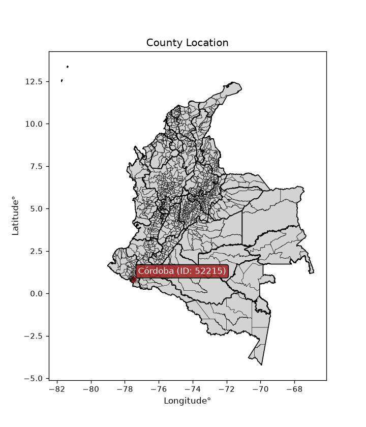
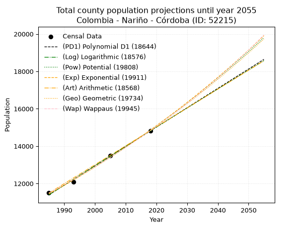
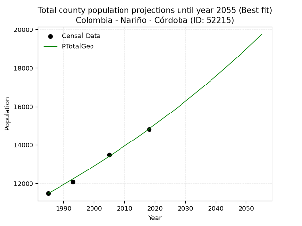
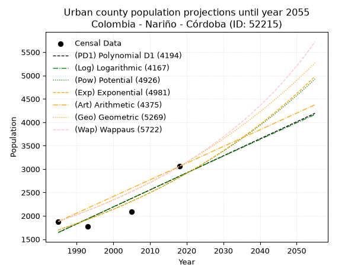
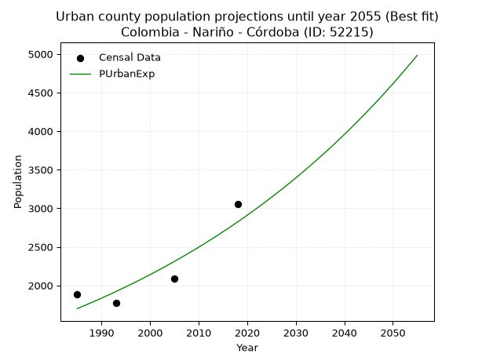
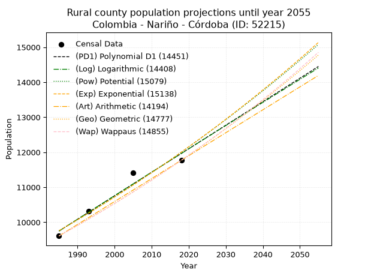
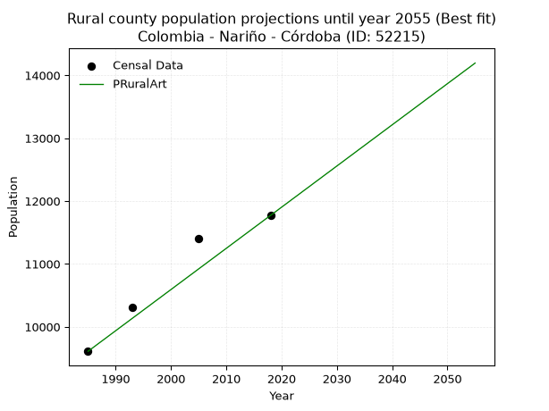

<div align="center">


</div>

# _“Population and Public Services Demand Projections (PPSD) until Year 2050 for Colombia - Nariño - Córdoba (ID: 52215)”_
Keywords: `population` `public-service` `projection` `lineal` `polynomial` `logarithmic` `potential` `exponential` `arithmetic` `geometric` `wappaus` `dane` `colombia` `south-america`

PPSD are analytical estimates used by governments and planners to anticipate future changes in population size, age distribution, and the resulting community needs for utilities, healthcare, education, and infrastructure as sizing future water treatment facilities, electrical grids, and road networks based on spatial growth.

<div align="center">

</img>

</div>


> **General running parameters**: • app_version: _v20260806_. • Python version: _3.14.7_. • Pandas version: _3.0.5_. • NumPy version: _2.5.1_. • Creates, save and include plots into reports (create_plot): _False_. • Projection until year: _2050_. • Process polynomial degree 2 and up: _False_. • Process Wappaus: _True_. • Process Wappaus: _True_. • Set negative values to zero: _True_. • Set infinite values to zero: _True_. • Drop dataset notes: _True_. 
<div align="center">

Dynamic map: [:earth_americas:Google](http://maps.google.com/maps?q=0.854564417,-77.5178965) [:earth_americas:OSM](https://www.openstreetmap.org/#map=18/0.854564417/-77.5178965&layers=P) [:earth_americas:Bing](https://www.bing.com/maps?cp=0.854564417~-77.5178965&lvl=18) [:earth_americas:Apple](https://maps.apple.com/frame?center=0.854564417%2C-77.5178965&span=0.003%2C0.006)

</div>


<div align="center">

```geojson
{
  "type": "Feature",
  "geometry": {
    "type": "Point", 
    "coordinates": [-77.5178965, 0.854564417]
  }, 
  "properties": {
    "Name": "Colombia - Nariño - Córdoba (ID: 52215)"
  }
}
```

</div>


## 0. Census Data (4 records)

Census data are official statistics collected by a government about the people and housing in a country. They usually include counts of total population, age, sex, race, income, education, and jobs.

📅Global census file: [Population.xlsx](../data/Population.xlsx)

| Source   |   Year |   CountryID | CountryName   |   StateID | StateName   |   CountyID | CountyName   |   PTotal |   PUrban |   PRural |
|:---------|-------:|------------:|:--------------|----------:|:------------|-----------:|:-------------|---------:|---------:|---------:|
| DANE     |   1985 |          57 | Colombia      |        52 | Nariño      |      52215 | Córdoba      |    11490 |     1880 |     9610 |
| DANE     |   1993 |          57 | Colombia      |        52 | Nariño      |      52215 | Córdoba      |    12080 |     1771 |    10309 |
| DANE     |   2005 |          57 | Colombia      |        52 | Nariño      |      52215 | Córdoba      |    13499 |     2093 |    11406 |
| DANE     |   2018 |          57 | Colombia      |        52 | Nariño      |      52215 | Córdoba      |    14827 |     3056 |    11771 |

> 🔥Some records could had specific notes about the registered values or the corresponding urban or rural distribution.

📅[SUI-RUPS](https://www.datos.gov.co/Hacienda-y-Cr-dito-P-blico/Registro-nico-de-Prestadores-de-Servicios-P-blicos/4qkq-csdn/about_data) - Local public utility companies: [RUPS.csv](../data/RUPS.xlsx)

 | SERVICIO       | ESTADO                    | NOMBRE                                                                                     | NIT         | DEPARTAMENTO_DOMICILIO   | MUNICIPIO_DOMICILIO   | DIRECCION                         |   TELEFONO | EMAIL                             | TIPO_PRESTADOR                            | CLASIFICACION                 |
|:---------------|:--------------------------|:-------------------------------------------------------------------------------------------|:------------|:-------------------------|:----------------------|:----------------------------------|-----------:|:----------------------------------|:------------------------------------------|:------------------------------|
| ACUEDUCTO      | OPERATIVA                 | ASOCIACION DEL ACUDUCTO TERCERA ETAPA DEL RESGUARDO INDIGENA DE MALES                      | 900321046-0 | NARINO                   | CORDOBA               | VEREDA MUESMUERAN ALTO            |    7780116 | contactenos@cordoba-narino.gov.co | ORGANIZACION AUTORIZADA                   | HASTA 2500 SUSCRIPTORES       |
| ACUEDUCTO      | EN PROCESO DE LIQUIDACION | EMPRESA DE SERVICIOS PUBLICOS DE CORDOBA -NARIÑO-                                          | 814004580-1 | NARINO                   | CORDOBA               | Cordoba                           |    7780078 | Empocordobaesp@latimail.com       | EMPRESA INDUSTRIAL Y COMERCIAL DEL ESTADO | HASTA 2500 SUSCRIPTORES       |
| ALCANTARILLADO | EN PROCESO DE LIQUIDACION | EMPRESA DE SERVICIOS PUBLICOS DE CORDOBA -NARIÑO-                                          | 814004580-1 | NARINO                   | CORDOBA               | Cordoba                           |    7780078 | Empocordobaesp@latimail.com       | EMPRESA INDUSTRIAL Y COMERCIAL DEL ESTADO | HASTA 2500 SUSCRIPTORES       |
| ACUEDUCTO      | OPERATIVA                 | ADMINISTRACION PUBLICA COOPERATIVA DE SERVICIOS PUBLICOS DE CORDOBA AGUAS DE SAN FRANCISCO | 900296259-5 | NARINO                   | CORDOBA               | Calle 4 No. 4-14 Barrio el Centro |    7780078 | FREDJOJOA@HOTMAIL.COM             | ORGANIZACION AUTORIZADA                   | MENOR O IGUAL A 2500 USUARIOS |
| ALCANTARILLADO | OPERATIVA                 | ADMINISTRACION PUBLICA COOPERATIVA DE SERVICIOS PUBLICOS DE CORDOBA AGUAS DE SAN FRANCISCO | 900296259-5 | NARINO                   | CORDOBA               | Calle 4 No. 4-14 Barrio el Centro |    7780078 | FREDJOJOA@HOTMAIL.COM             | ORGANIZACION AUTORIZADA                   | MENOR O IGUAL A 2500 USUARIOS |
| ACUEDUCTO      | OPERATIVA                 | JUNTA ADMINISTRADORA DE ACUEDUCTO SAN FRANCISCO YUNGACHALA                                 | 900267175-1 | NARINO                   | CORDOBA               | YUNGACHALA                        |    3136137 | fredjojoa@hotmail.com             | ORGANIZACION AUTORIZADA                   | MENOR O IGUAL A 2500 USUARIOS |
| ACUEDUCTO      | OPERATIVA                 | JUNTA CENTRAL INDIGENA LA PIEDRA BLANCA                                                    | 900745627-1 | NARINO                   | CORDOBA               | CORDOBA BARRIO CENTRO             |    3136137 | FREDJOJOA@HOTMAIL.COM             | ORGANIZACION AUTORIZADA                   | MENOR O IGUAL A 2500 USUARIOS |

## 1. Total

### 1.1. Coefficients and Parameters

* (PD1) Polynomial Deg 1: 103.56804496186182, -194187.9819349641 (lineal)
* (Log) Logarithmic: 207287.79229378092, -1562622.170325147
* (Pow) Potential: 15.839836896960081, -48.17756738320789
* (Exp) Exponential: 0.007913507921823023, 0.001723814850797635
* (Art) Arithmetic: Year diff. 2018 - 1985 = 33, Population diff. 14827 - 11490 = 3337, Annual growth = 101.12121212121212
* (Geo) Geometric: Year diff. 2018 - 1985 = 33, Population diff. 14827 - 11490 = 3337, Annual growth % = 0.007756373021247098
* (Wap) Wappaus: i = 0.7684858617715706, Condition values only valid for < 200)

<sub>
Wappaus condition values: ['0.00', '0.77', '1.54', '2.31', '3.07', '3.84', '4.61', '5.38', '6.15', '6.92', '7.68', '8.45', '9.22', '9.99', '10.76', '11.53', '12.30', '13.06', '13.83', '14.60', '15.37', '16.14', '16.91', '17.68', '18.44', '19.21', '19.98', '20.75', '21.52', '22.29', '23.05', '23.82', '24.59', '25.36', '26.13', '26.90', '27.67', '28.43', '29.20', '29.97', '30.74', '31.51', '32.28', '33.04', '33.81', '34.58', '35.35', '36.12', '36.89', '37.66', '38.42', '39.19', '39.96', '40.73', '41.50', '42.27', '43.04', '43.80', '44.57', '45.34', '46.11', '46.88', '47.65', '48.41', '49.18', '49.95']
</sub>


### 1.2. Projected Dataset

|   Year |   CountyID |   PTotalPD1 |   PTotalLog |   PTotalPow |   PTotalExp |   PTotalArt |   PTotalGeo |   PTotalWap |
|-------:|-----------:|------------:|------------:|------------:|------------:|------------:|------------:|------------:|
|   1985 |      52215 |       11395 |       11392 |       11440 |       11443 |       11490 |       11490 |       11490 |
|   1986 |      52215 |       11498 |       11496 |       11532 |       11534 |       11591 |       11579 |       11579 |
|   1987 |      52215 |       11602 |       11600 |       11624 |       11625 |       11692 |       11669 |       11668 |
|   1988 |      52215 |       11705 |       11705 |       11717 |       11717 |       11793 |       11759 |       11758 |
|   1989 |      52215 |       11809 |       11809 |       11811 |       11811 |       11894 |       11851 |       11849 |
|   1990 |      52215 |       11912 |       11913 |       11905 |       11904 |       11996 |       11943 |       11940 |
|   1991 |      52215 |       12016 |       12017 |       12000 |       11999 |       12097 |       12035 |       12032 |
|   1992 |      52215 |       12120 |       12121 |       12096 |       12094 |       12198 |       12129 |       12125 |
|   1993 |      52215 |       12223 |       12225 |       12192 |       12190 |       12299 |       12223 |       12219 |
|   1994 |      52215 |       12327 |       12329 |       12290 |       12287 |       12400 |       12317 |       12313 |
|   1995 |      52215 |       12430 |       12433 |       12388 |       12385 |       12501 |       12413 |       12408 |
|   1996 |      52215 |       12534 |       12537 |       12486 |       12483 |       12602 |       12509 |       12504 |
|   1997 |      52215 |       12637 |       12641 |       12586 |       12582 |       12703 |       12606 |       12601 |
|   1998 |      52215 |       12741 |       12745 |       12686 |       12682 |       12805 |       12704 |       12698 |
|   1999 |      52215 |       12845 |       12848 |       12787 |       12783 |       12906 |       12803 |       12796 |
|   2000 |      52215 |       12948 |       12952 |       12889 |       12885 |       13007 |       12902 |       12895 |
|   2001 |      52215 |       13052 |       13056 |       12991 |       12987 |       13108 |       13002 |       12995 |
|   2002 |      52215 |       13155 |       13159 |       13094 |       13090 |       13209 |       13103 |       13096 |
|   2003 |      52215 |       13259 |       13263 |       13198 |       13194 |       13310 |       13204 |       13197 |
|   2004 |      52215 |       13362 |       13366 |       13303 |       13299 |       13411 |       13307 |       13300 |
|   2005 |      52215 |       13466 |       13470 |       13409 |       13405 |       13512 |       13410 |       13403 |
|   2006 |      52215 |       13570 |       13573 |       13515 |       13511 |       13614 |       13514 |       13507 |
|   2007 |      52215 |       13673 |       13676 |       13622 |       13619 |       13715 |       13619 |       13612 |
|   2008 |      52215 |       13777 |       13780 |       13730 |       13727 |       13816 |       13725 |       13718 |
|   2009 |      52215 |       13880 |       13883 |       13839 |       13836 |       13917 |       13831 |       13824 |
|   2010 |      52215 |       13984 |       13986 |       13948 |       13946 |       14018 |       13938 |       13932 |
|   2011 |      52215 |       14087 |       14089 |       14059 |       14057 |       14119 |       14046 |       14041 |
|   2012 |      52215 |       14191 |       14192 |       14170 |       14168 |       14220 |       14155 |       14150 |
|   2013 |      52215 |       14294 |       14295 |       14282 |       14281 |       14321 |       14265 |       14260 |
|   2014 |      52215 |       14398 |       14398 |       14394 |       14394 |       14423 |       14376 |       14372 |
|   2015 |      52215 |       14502 |       14501 |       14508 |       14509 |       14524 |       14487 |       14484 |
|   2016 |      52215 |       14605 |       14604 |       14623 |       14624 |       14625 |       14600 |       14597 |
|   2017 |      52215 |       14709 |       14707 |       14738 |       14740 |       14726 |       14713 |       14712 |
|   2018 |      52215 |       14812 |       14809 |       14854 |       14857 |       14827 |       14827 |       14827 |
|   2019 |      52215 |       14916 |       14912 |       14971 |       14975 |       14928 |       14942 |       14943 |
|   2020 |      52215 |       15019 |       15015 |       15089 |       15094 |       15029 |       15058 |       15061 |
|   2021 |      52215 |       15123 |       15117 |       15208 |       15214 |       15130 |       15175 |       15179 |
|   2022 |      52215 |       15227 |       15220 |       15327 |       15335 |       15231 |       15292 |       15299 |
|   2023 |      52215 |       15330 |       15322 |       15448 |       15457 |       15333 |       15411 |       15419 |
|   2024 |      52215 |       15434 |       15425 |       15569 |       15580 |       15434 |       15531 |       15541 |
|   2025 |      52215 |       15537 |       15527 |       15692 |       15703 |       15535 |       15651 |       15663 |
|   2026 |      52215 |       15641 |       15629 |       15815 |       15828 |       15636 |       15772 |       15787 |
|   2027 |      52215 |       15744 |       15732 |       15939 |       15954 |       15737 |       15895 |       15912 |
|   2028 |      52215 |       15848 |       15834 |       16064 |       16081 |       15838 |       16018 |       16038 |
|   2029 |      52215 |       15952 |       15936 |       16190 |       16209 |       15939 |       16142 |       16166 |
|   2030 |      52215 |       16055 |       16038 |       16317 |       16337 |       16040 |       16267 |       16294 |
|   2031 |      52215 |       16159 |       16140 |       16444 |       16467 |       16142 |       16394 |       16424 |
|   2032 |      52215 |       16262 |       16242 |       16573 |       16598 |       16243 |       16521 |       16555 |
|   2033 |      52215 |       16366 |       16344 |       16703 |       16730 |       16344 |       16649 |       16687 |
|   2034 |      52215 |       16469 |       16446 |       16833 |       16863 |       16445 |       16778 |       16820 |
|   2035 |      52215 |       16573 |       16548 |       16965 |       16997 |       16546 |       16908 |       16955 |
|   2036 |      52215 |       16677 |       16650 |       17098 |       17132 |       16647 |       17039 |       17091 |
|   2037 |      52215 |       16780 |       16752 |       17231 |       17268 |       16748 |       17172 |       17228 |
|   2038 |      52215 |       16884 |       16854 |       17365 |       17405 |       16849 |       17305 |       17367 |
|   2039 |      52215 |       16987 |       16955 |       17501 |       17543 |       16951 |       17439 |       17507 |
|   2040 |      52215 |       17091 |       17057 |       17637 |       17683 |       17052 |       17574 |       17648 |
|   2041 |      52215 |       17194 |       17159 |       17775 |       17823 |       17153 |       17711 |       17790 |
|   2042 |      52215 |       17298 |       17260 |       17913 |       17965 |       17254 |       17848 |       17935 |
|   2043 |      52215 |       17402 |       17362 |       18053 |       18107 |       17355 |       17986 |       18080 |
|   2044 |      52215 |       17505 |       17463 |       18193 |       18251 |       17456 |       18126 |       18227 |
|   2045 |      52215 |       17609 |       17564 |       18335 |       18396 |       17557 |       18266 |       18375 |
|   2046 |      52215 |       17712 |       17666 |       18477 |       18543 |       17658 |       18408 |       18525 |
|   2047 |      52215 |       17816 |       17767 |       18621 |       18690 |       17760 |       18551 |       18677 |
|   2048 |      52215 |       17919 |       17868 |       18765 |       18838 |       17861 |       18695 |       18830 |
|   2049 |      52215 |       18023 |       17969 |       18911 |       18988 |       17962 |       18840 |       18984 |
|   2050 |      52215 |       18127 |       18071 |       19058 |       19139 |       18063 |       18986 |       19140 |
<div align="center">

</img>

</div>


### 1.3. Best fit with absolute and relative error (%)

Relative error puts that difference into context by dividing the absolute error by the true value, creating a unitless ratio or percentage that shows the scale of the mistake.

Absolute and relative error

|   Year | Source   |   CountryID | CountryName   |   StateID | StateName   |   CountyID_x | CountyName   |   PTotal |   PUrban |   PRural |   CountyID_y |   PTotalPD1 |   PTotalLog |   PTotalPow |   PTotalExp |   PTotalArt |   PTotalGeo |   PTotalWap |   PTotalPD1AbsError |   PTotalLogAbsError |   PTotalPowAbsError |   PTotalExpAbsError |   PTotalArtAbsError |   PTotalGeoAbsError |   PTotalWapAbsError |   PTotalPD1RelError |   PTotalLogRelError |   PTotalPowRelError |   PTotalExpRelError |   PTotalArtRelError |   PTotalGeoRelError |   PTotalWapRelError |
|-------:|:---------|------------:|:--------------|----------:|:------------|-------------:|:-------------|---------:|---------:|---------:|-------------:|------------:|------------:|------------:|------------:|------------:|------------:|------------:|--------------------:|--------------------:|--------------------:|--------------------:|--------------------:|--------------------:|--------------------:|--------------------:|--------------------:|--------------------:|--------------------:|--------------------:|--------------------:|--------------------:|
|   1985 | DANE     |          57 | Colombia      |        52 | Nariño      |        52215 | Córdoba      |    11490 |     1880 |     9610 |        52215 |       11395 |       11392 |       11440 |       11443 |       11490 |       11490 |       11490 |                  95 |                  98 |                  50 |                  47 |                   0 |                   0 |                   0 |            0.826806 |            0.852916 |            0.435161 |            0.409051 |           0         |            0        |            0        |
|   1993 | DANE     |          57 | Colombia      |        52 | Nariño      |        52215 | Córdoba      |    12080 |     1771 |    10309 |        52215 |       12223 |       12225 |       12192 |       12190 |       12299 |       12223 |       12219 |                 143 |                 145 |                 112 |                 110 |                 219 |                 143 |                 139 |            1.18377  |            1.20033  |            0.927152 |            0.910596 |           1.81291   |            1.18377  |            1.15066  |
|   2005 | DANE     |          57 | Colombia      |        52 | Nariño      |        52215 | Córdoba      |    13499 |     2093 |    11406 |        52215 |       13466 |       13470 |       13409 |       13405 |       13512 |       13410 |       13403 |                  33 |                  29 |                  90 |                  94 |                  13 |                  89 |                  96 |            0.244463 |            0.214831 |            0.666716 |            0.696348 |           0.0963034 |            0.659308 |            0.711164 |
|   2018 | DANE     |          57 | Colombia      |        52 | Nariño      |        52215 | Córdoba      |    14827 |     3056 |    11771 |        52215 |       14812 |       14809 |       14854 |       14857 |       14827 |       14827 |       14827 |                  15 |                  18 |                  27 |                  30 |                   0 |                   0 |                   0 |            0.101167 |            0.1214   |            0.1821   |            0.202334 |           0         |            0        |            0        |

Relative error mean

| Method    |   RelError | Best   |
|:----------|-----------:|:-------|
| PTotalPD1 |   0.589053 |        |
| PTotalLog |   0.597369 |        |
| PTotalPow |   0.552782 |        |
| PTotalExp |   0.554582 |        |
| PTotalArt |   0.477304 |        |
| PTotalGeo |   0.460771 | True   |
| PTotalWap |   0.465457 |        |

💙Best method: _**PTotalGeo**_
<div align="center">

</img>

</div>


### 1.4. Fresh water supply demand in liters per capita per day (lpcd)

The fresh water supply demand typically ranges from 100 to 300 liters per capita per day (lpcd) for standard domestic and municipal planning, though absolute survival minimums set by the World Health Organization are as low as 7.5 to 20 liters per day, and total consumption in high-income nations can exceed 400 liters.

> `CZ`: Level in meters above the sea level (masl)<br> `WS`: Fresh water supply demand in liters per capita per day (lpcd or l/h/d)<br> `WSAll`: Zonal fresh water supply demand in liters per second (l/s)<br> `A`: Zonal area in square meters<br> `DP`: Population density (people/hectare or p/ha)

Reference values (RAS Colombia)

|    CZ |   WS |
|------:|-----:|
|  1000 |  120 |
|  2000 |  130 |
| 99999 |  140 |

County shapefile geometry properties and water supply values

|   CountyID |      ATotal |   CZTotal |   WSTotal |
|-----------:|------------:|----------:|----------:|
|      52215 | 3.04917e+08 |   2550.99 |       140 |

Projected values for best method: PTotalGeo

|   CountyID |   Year |   PTotalGeo |   DPTotal |   WSTotal |   WSTotalAll |
|-----------:|-------:|------------:|----------:|----------:|-------------:|
|      52215 |   1985 |       11490 |      0.38 |       140 |      18.6181 |
|      52215 |   1986 |       11579 |      0.38 |       140 |      18.7623 |
|      52215 |   1987 |       11669 |      0.38 |       140 |      18.9081 |
|      52215 |   1988 |       11759 |      0.39 |       140 |      19.0539 |
|      52215 |   1989 |       11851 |      0.39 |       140 |      19.203  |
|      52215 |   1990 |       11943 |      0.39 |       140 |      19.3521 |
|      52215 |   1991 |       12035 |      0.39 |       140 |      19.5012 |
|      52215 |   1992 |       12129 |      0.4  |       140 |      19.6535 |
|      52215 |   1993 |       12223 |      0.4  |       140 |      19.8058 |
|      52215 |   1994 |       12317 |      0.4  |       140 |      19.9581 |
|      52215 |   1995 |       12413 |      0.41 |       140 |      20.1137 |
|      52215 |   1996 |       12509 |      0.41 |       140 |      20.2692 |
|      52215 |   1997 |       12606 |      0.41 |       140 |      20.4264 |
|      52215 |   1998 |       12704 |      0.42 |       140 |      20.5852 |
|      52215 |   1999 |       12803 |      0.42 |       140 |      20.7456 |
|      52215 |   2000 |       12902 |      0.42 |       140 |      20.906  |
|      52215 |   2001 |       13002 |      0.43 |       140 |      21.0681 |
|      52215 |   2002 |       13103 |      0.43 |       140 |      21.2317 |
|      52215 |   2003 |       13204 |      0.43 |       140 |      21.3954 |
|      52215 |   2004 |       13307 |      0.44 |       140 |      21.5623 |
|      52215 |   2005 |       13410 |      0.44 |       140 |      21.7292 |
|      52215 |   2006 |       13514 |      0.44 |       140 |      21.8977 |
|      52215 |   2007 |       13619 |      0.45 |       140 |      22.0678 |
|      52215 |   2008 |       13725 |      0.45 |       140 |      22.2396 |
|      52215 |   2009 |       13831 |      0.45 |       140 |      22.4113 |
|      52215 |   2010 |       13938 |      0.46 |       140 |      22.5847 |
|      52215 |   2011 |       14046 |      0.46 |       140 |      22.7597 |
|      52215 |   2012 |       14155 |      0.46 |       140 |      22.9363 |
|      52215 |   2013 |       14265 |      0.47 |       140 |      23.1146 |
|      52215 |   2014 |       14376 |      0.47 |       140 |      23.2944 |
|      52215 |   2015 |       14487 |      0.48 |       140 |      23.4743 |
|      52215 |   2016 |       14600 |      0.48 |       140 |      23.6574 |
|      52215 |   2017 |       14713 |      0.48 |       140 |      23.8405 |
|      52215 |   2018 |       14827 |      0.49 |       140 |      24.0252 |
|      52215 |   2019 |       14942 |      0.49 |       140 |      24.2116 |
|      52215 |   2020 |       15058 |      0.49 |       140 |      24.3995 |
|      52215 |   2021 |       15175 |      0.5  |       140 |      24.5891 |
|      52215 |   2022 |       15292 |      0.5  |       140 |      24.7787 |
|      52215 |   2023 |       15411 |      0.51 |       140 |      24.9715 |
|      52215 |   2024 |       15531 |      0.51 |       140 |      25.166  |
|      52215 |   2025 |       15651 |      0.51 |       140 |      25.3604 |
|      52215 |   2026 |       15772 |      0.52 |       140 |      25.5565 |
|      52215 |   2027 |       15895 |      0.52 |       140 |      25.7558 |
|      52215 |   2028 |       16018 |      0.53 |       140 |      25.9551 |
|      52215 |   2029 |       16142 |      0.53 |       140 |      26.156  |
|      52215 |   2030 |       16267 |      0.53 |       140 |      26.3586 |
|      52215 |   2031 |       16394 |      0.54 |       140 |      26.5644 |
|      52215 |   2032 |       16521 |      0.54 |       140 |      26.7701 |
|      52215 |   2033 |       16649 |      0.55 |       140 |      26.9775 |
|      52215 |   2034 |       16778 |      0.55 |       140 |      27.1866 |
|      52215 |   2035 |       16908 |      0.55 |       140 |      27.3972 |
|      52215 |   2036 |       17039 |      0.56 |       140 |      27.6095 |
|      52215 |   2037 |       17172 |      0.56 |       140 |      27.825  |
|      52215 |   2038 |       17305 |      0.57 |       140 |      28.0405 |
|      52215 |   2039 |       17439 |      0.57 |       140 |      28.2576 |
|      52215 |   2040 |       17574 |      0.58 |       140 |      28.4764 |
|      52215 |   2041 |       17711 |      0.58 |       140 |      28.6984 |
|      52215 |   2042 |       17848 |      0.59 |       140 |      28.9204 |
|      52215 |   2043 |       17986 |      0.59 |       140 |      29.144  |
|      52215 |   2044 |       18126 |      0.59 |       140 |      29.3708 |
|      52215 |   2045 |       18266 |      0.6  |       140 |      29.5977 |
|      52215 |   2046 |       18408 |      0.6  |       140 |      29.8278 |
|      52215 |   2047 |       18551 |      0.61 |       140 |      30.0595 |
|      52215 |   2048 |       18695 |      0.61 |       140 |      30.2928 |
|      52215 |   2049 |       18840 |      0.62 |       140 |      30.5278 |
|      52215 |   2050 |       18986 |      0.62 |       140 |      30.7644 |

## 2. Urban

### 2.1. Coefficients and Parameters

* (PD1) Polynomial Deg 1: 36.41268566840565, -70634.4745082284 (lineal)
* (Log) Logarithmic: 72799.42918220662, -551149.0445919656
* (Pow) Potential: 30.714169294772354, -98.05772737036892
* (Exp) Exponential: 0.015361538938515737, 9.717257250251744e-11
* (Art) Arithmetic: Year diff. 2018 - 1985 = 33, Population diff. 3056 - 1880 = 1176, Annual growth = 35.63636363636363
* (Geo) Geometric: Year diff. 2018 - 1985 = 33, Population diff. 3056 - 1880 = 1176, Annual growth % = 0.01483118208317391
* (Wap) Wappaus: i = 1.4439369382643288, Condition values only valid for < 200)

<sub>
Wappaus condition values: ['0.00', '1.44', '2.89', '4.33', '5.78', '7.22', '8.66', '10.11', '11.55', '13.00', '14.44', '15.88', '17.33', '18.77', '20.22', '21.66', '23.10', '24.55', '25.99', '27.43', '28.88', '30.32', '31.77', '33.21', '34.65', '36.10', '37.54', '38.99', '40.43', '41.87', '43.32', '44.76', '46.21', '47.65', '49.09', '50.54', '51.98', '53.43', '54.87', '56.31', '57.76', '59.20', '60.65', '62.09', '63.53', '64.98', '66.42', '67.87', '69.31', '70.75', '72.20', '73.64', '75.08', '76.53', '77.97', '79.42', '80.86', '82.30', '83.75', '85.19', '86.64', '88.08', '89.52', '90.97', '92.41', '93.86']
</sub>


### 2.2. Projected Dataset

|   Year |   CountyID |   PUrbanPD1 |   PUrbanLog |   PUrbanPow |   PUrbanExp |   PUrbanArt |   PUrbanGeo |   PUrbanWap |
|-------:|-----------:|------------:|------------:|------------:|------------:|------------:|------------:|------------:|
|   1985 |      52215 |        1645 |        1644 |        1699 |        1700 |        1880 |        1880 |        1880 |
|   1986 |      52215 |        1681 |        1681 |        1726 |        1726 |        1916 |        1908 |        1907 |
|   1987 |      52215 |        1718 |        1718 |        1753 |        1753 |        1951 |        1936 |        1935 |
|   1988 |      52215 |        1754 |        1754 |        1780 |        1780 |        1987 |        1965 |        1963 |
|   1989 |      52215 |        1790 |        1791 |        1808 |        1807 |        2023 |        1994 |        1992 |
|   1990 |      52215 |        1827 |        1827 |        1836 |        1835 |        2058 |        2024 |        2021 |
|   1991 |      52215 |        1863 |        1864 |        1864 |        1864 |        2094 |        2054 |        2050 |
|   1992 |      52215 |        1900 |        1901 |        1893 |        1892 |        2129 |        2084 |        2080 |
|   1993 |      52215 |        1936 |        1937 |        1923 |        1922 |        2165 |        2115 |        2110 |
|   1994 |      52215 |        1972 |        1974 |        1952 |        1952 |        2201 |        2146 |        2141 |
|   1995 |      52215 |        2009 |        2010 |        1983 |        1982 |        2236 |        2178 |        2173 |
|   1996 |      52215 |        2045 |        2047 |        2014 |        2012 |        2272 |        2210 |        2204 |
|   1997 |      52215 |        2082 |        2083 |        2045 |        2044 |        2308 |        2243 |        2237 |
|   1998 |      52215 |        2118 |        2119 |        2076 |        2075 |        2343 |        2277 |        2269 |
|   1999 |      52215 |        2154 |        2156 |        2109 |        2107 |        2379 |        2310 |        2303 |
|   2000 |      52215 |        2191 |        2192 |        2141 |        2140 |        2415 |        2345 |        2337 |
|   2001 |      52215 |        2227 |        2229 |        2174 |        2173 |        2450 |        2379 |        2371 |
|   2002 |      52215 |        2264 |        2265 |        2208 |        2207 |        2486 |        2415 |        2406 |
|   2003 |      52215 |        2300 |        2301 |        2242 |        2241 |        2521 |        2450 |        2442 |
|   2004 |      52215 |        2337 |        2338 |        2277 |        2276 |        2557 |        2487 |        2478 |
|   2005 |      52215 |        2373 |        2374 |        2312 |        2311 |        2593 |        2524 |        2515 |
|   2006 |      52215 |        2409 |        2410 |        2348 |        2347 |        2628 |        2561 |        2552 |
|   2007 |      52215 |        2446 |        2447 |        2384 |        2383 |        2664 |        2599 |        2590 |
|   2008 |      52215 |        2482 |        2483 |        2421 |        2420 |        2700 |        2638 |        2629 |
|   2009 |      52215 |        2519 |        2519 |        2458 |        2457 |        2735 |        2677 |        2668 |
|   2010 |      52215 |        2555 |        2555 |        2496 |        2495 |        2771 |        2716 |        2708 |
|   2011 |      52215 |        2591 |        2592 |        2534 |        2534 |        2807 |        2757 |        2749 |
|   2012 |      52215 |        2628 |        2628 |        2573 |        2573 |        2842 |        2798 |        2790 |
|   2013 |      52215 |        2664 |        2664 |        2613 |        2613 |        2878 |        2839 |        2833 |
|   2014 |      52215 |        2701 |        2700 |        2653 |        2653 |        2913 |        2881 |        2876 |
|   2015 |      52215 |        2737 |        2736 |        2694 |        2695 |        2949 |        2924 |        2920 |
|   2016 |      52215 |        2773 |        2772 |        2735 |        2736 |        2985 |        2967 |        2964 |
|   2017 |      52215 |        2810 |        2808 |        2777 |        2779 |        3020 |        3011 |        3010 |
|   2018 |      52215 |        2846 |        2845 |        2820 |        2822 |        3056 |        3056 |        3056 |
|   2019 |      52215 |        2883 |        2881 |        2863 |        2865 |        3092 |        3101 |        3103 |
|   2020 |      52215 |        2919 |        2917 |        2907 |        2910 |        3127 |        3147 |        3151 |
|   2021 |      52215 |        2956 |        2953 |        2951 |        2955 |        3163 |        3194 |        3200 |
|   2022 |      52215 |        2992 |        2989 |        2996 |        3000 |        3199 |        3241 |        3251 |
|   2023 |      52215 |        3028 |        3025 |        3042 |        3047 |        3234 |        3289 |        3302 |
|   2024 |      52215 |        3065 |        3061 |        3089 |        3094 |        3270 |        3338 |        3354 |
|   2025 |      52215 |        3101 |        3097 |        3136 |        3142 |        3305 |        3388 |        3407 |
|   2026 |      52215 |        3138 |        3133 |        3184 |        3191 |        3341 |        3438 |        3461 |
|   2027 |      52215 |        3174 |        3169 |        3232 |        3240 |        3377 |        3489 |        3516 |
|   2028 |      52215 |        3210 |        3204 |        3282 |        3290 |        3412 |        3541 |        3573 |
|   2029 |      52215 |        3247 |        3240 |        3332 |        3341 |        3448 |        3593 |        3630 |
|   2030 |      52215 |        3283 |        3276 |        3383 |        3393 |        3484 |        3647 |        3689 |
|   2031 |      52215 |        3320 |        3312 |        3434 |        3445 |        3519 |        3701 |        3750 |
|   2032 |      52215 |        3356 |        3348 |        3487 |        3499 |        3555 |        3755 |        3811 |
|   2033 |      52215 |        3393 |        3384 |        3540 |        3553 |        3591 |        3811 |        3874 |
|   2034 |      52215 |        3429 |        3420 |        3594 |        3608 |        3626 |        3868 |        3938 |
|   2035 |      52215 |        3465 |        3455 |        3648 |        3664 |        3662 |        3925 |        4004 |
|   2036 |      52215 |        3502 |        3491 |        3704 |        3720 |        3697 |        3983 |        4071 |
|   2037 |      52215 |        3538 |        3527 |        3760 |        3778 |        3733 |        4042 |        4140 |
|   2038 |      52215 |        3575 |        3563 |        3817 |        3836 |        3769 |        4102 |        4210 |
|   2039 |      52215 |        3611 |        3598 |        3875 |        3896 |        3804 |        4163 |        4283 |
|   2040 |      52215 |        3647 |        3634 |        3934 |        3956 |        3840 |        4225 |        4356 |
|   2041 |      52215 |        3684 |        3670 |        3993 |        4017 |        3876 |        4288 |        4432 |
|   2042 |      52215 |        3720 |        3705 |        4054 |        4080 |        3911 |        4351 |        4509 |
|   2043 |      52215 |        3757 |        3741 |        4115 |        4143 |        3947 |        4416 |        4589 |
|   2044 |      52215 |        3793 |        3777 |        4178 |        4207 |        3983 |        4481 |        4670 |
|   2045 |      52215 |        3829 |        3812 |        4241 |        4272 |        4018 |        4548 |        4754 |
|   2046 |      52215 |        3866 |        3848 |        4305 |        4338 |        4054 |        4615 |        4839 |
|   2047 |      52215 |        3902 |        3883 |        4370 |        4405 |        4089 |        4684 |        4927 |
|   2048 |      52215 |        3939 |        3919 |        4436 |        4473 |        4125 |        4753 |        5017 |
|   2049 |      52215 |        3975 |        3954 |        4503 |        4543 |        4161 |        4823 |        5110 |
|   2050 |      52215 |        4012 |        3990 |        4571 |        4613 |        4196 |        4895 |        5205 |
<div align="center">

</img>

</div>


### 2.3. Best fit with absolute and relative error (%)

Relative error puts that difference into context by dividing the absolute error by the true value, creating a unitless ratio or percentage that shows the scale of the mistake.

Absolute and relative error

|   Year | Source   |   CountryID | CountryName   |   StateID | StateName   |   CountyID_x | CountyName   |   PTotal |   PUrban |   PRural |   CountyID_y |   PUrbanPD1 |   PUrbanLog |   PUrbanPow |   PUrbanExp |   PUrbanArt |   PUrbanGeo |   PUrbanWap |   PUrbanPD1AbsError |   PUrbanLogAbsError |   PUrbanPowAbsError |   PUrbanExpAbsError |   PUrbanArtAbsError |   PUrbanGeoAbsError |   PUrbanWapAbsError |   PUrbanPD1RelError |   PUrbanLogRelError |   PUrbanPowRelError |   PUrbanExpRelError |   PUrbanArtRelError |   PUrbanGeoRelError |   PUrbanWapRelError |
|-------:|:---------|------------:|:--------------|----------:|:------------|-------------:|:-------------|---------:|---------:|---------:|-------------:|------------:|------------:|------------:|------------:|------------:|------------:|------------:|--------------------:|--------------------:|--------------------:|--------------------:|--------------------:|--------------------:|--------------------:|--------------------:|--------------------:|--------------------:|--------------------:|--------------------:|--------------------:|--------------------:|
|   1985 | DANE     |          57 | Colombia      |        52 | Nariño      |        52215 | Córdoba      |    11490 |     1880 |     9610 |        52215 |        1645 |        1644 |        1699 |        1700 |        1880 |        1880 |        1880 |                 235 |                 236 |                 181 |                 180 |                   0 |                   0 |                   0 |            12.5     |            12.5532  |             9.62766 |             9.57447 |              0      |              0      |              0      |
|   1993 | DANE     |          57 | Colombia      |        52 | Nariño      |        52215 | Córdoba      |    12080 |     1771 |    10309 |        52215 |        1936 |        1937 |        1923 |        1922 |        2165 |        2115 |        2110 |                 165 |                 166 |                 152 |                 151 |                 394 |                 344 |                 339 |             9.31677 |             9.37324 |             8.58272 |             8.52626 |             22.2473 |             19.4241 |             19.1417 |
|   2005 | DANE     |          57 | Colombia      |        52 | Nariño      |        52215 | Córdoba      |    13499 |     2093 |    11406 |        52215 |        2373 |        2374 |        2312 |        2311 |        2593 |        2524 |        2515 |                 280 |                 281 |                 219 |                 218 |                 500 |                 431 |                 422 |            13.3779  |            13.4257  |            10.4634  |            10.4157  |             23.8892 |             20.5925 |             20.1624 |
|   2018 | DANE     |          57 | Colombia      |        52 | Nariño      |        52215 | Córdoba      |    14827 |     3056 |    11771 |        52215 |        2846 |        2845 |        2820 |        2822 |        3056 |        3056 |        3056 |                 210 |                 211 |                 236 |                 234 |                   0 |                   0 |                   0 |             6.87173 |             6.90445 |             7.72251 |             7.65707 |              0      |              0      |              0      |

Relative error mean

| Method    |   RelError | Best   |
|:----------|-----------:|:-------|
| PUrbanPD1 |   10.5166  |        |
| PUrbanLog |   10.5641  |        |
| PUrbanPow |    9.09909 |        |
| PUrbanExp |    9.04337 | True   |
| PUrbanArt |   11.5341  |        |
| PUrbanGeo |   10.0041  |        |
| PUrbanWap |    9.82604 |        |

💙Best method: _**PUrbanExp**_
<div align="center">

</img>

</div>


### 2.4. Fresh water supply demand in liters per capita per day (lpcd)

The fresh water supply demand typically ranges from 100 to 300 liters per capita per day (lpcd) for standard domestic and municipal planning, though absolute survival minimums set by the World Health Organization are as low as 7.5 to 20 liters per day, and total consumption in high-income nations can exceed 400 liters.

> `CZ`: Level in meters above the sea level (masl)<br> `WS`: Fresh water supply demand in liters per capita per day (lpcd or l/h/d)<br> `WSAll`: Zonal fresh water supply demand in liters per second (l/s)<br> `A`: Zonal area in square meters<br> `DP`: Population density (people/hectare or p/ha)

Reference values (RAS Colombia)

|    CZ |   WS |
|------:|-----:|
|  1000 |  120 |
|  2000 |  130 |
| 99999 |  140 |

County shapefile geometry properties and water supply values

|   CountyID |   AUrban |   CZUrban |   WSUrban |
|-----------:|---------:|----------:|----------:|
|      52215 |   679234 |   2861.62 |       140 |

Projected values for best method: PUrbanExp

|   CountyID |   Year |   PUrbanExp |   DPUrban |   WSUrban |   WSUrbanAll |
|-----------:|-------:|------------:|----------:|----------:|-------------:|
|      52215 |   1985 |        1700 |     25.03 |       140 |      2.75463 |
|      52215 |   1986 |        1726 |     25.41 |       140 |      2.79676 |
|      52215 |   1987 |        1753 |     25.81 |       140 |      2.84051 |
|      52215 |   1988 |        1780 |     26.21 |       140 |      2.88426 |
|      52215 |   1989 |        1807 |     26.6  |       140 |      2.92801 |
|      52215 |   1990 |        1835 |     27.02 |       140 |      2.97338 |
|      52215 |   1991 |        1864 |     27.44 |       140 |      3.02037 |
|      52215 |   1992 |        1892 |     27.85 |       140 |      3.06574 |
|      52215 |   1993 |        1922 |     28.3  |       140 |      3.11435 |
|      52215 |   1994 |        1952 |     28.74 |       140 |      3.16296 |
|      52215 |   1995 |        1982 |     29.18 |       140 |      3.21157 |
|      52215 |   1996 |        2012 |     29.62 |       140 |      3.26019 |
|      52215 |   1997 |        2044 |     30.09 |       140 |      3.31204 |
|      52215 |   1998 |        2075 |     30.55 |       140 |      3.36227 |
|      52215 |   1999 |        2107 |     31.02 |       140 |      3.41412 |
|      52215 |   2000 |        2140 |     31.51 |       140 |      3.46759 |
|      52215 |   2001 |        2173 |     31.99 |       140 |      3.52106 |
|      52215 |   2002 |        2207 |     32.49 |       140 |      3.57616 |
|      52215 |   2003 |        2241 |     32.99 |       140 |      3.63125 |
|      52215 |   2004 |        2276 |     33.51 |       140 |      3.68796 |
|      52215 |   2005 |        2311 |     34.02 |       140 |      3.74468 |
|      52215 |   2006 |        2347 |     34.55 |       140 |      3.80301 |
|      52215 |   2007 |        2383 |     35.08 |       140 |      3.86134 |
|      52215 |   2008 |        2420 |     35.63 |       140 |      3.9213  |
|      52215 |   2009 |        2457 |     36.17 |       140 |      3.98125 |
|      52215 |   2010 |        2495 |     36.73 |       140 |      4.04282 |
|      52215 |   2011 |        2534 |     37.31 |       140 |      4.10602 |
|      52215 |   2012 |        2573 |     37.88 |       140 |      4.16921 |
|      52215 |   2013 |        2613 |     38.47 |       140 |      4.23403 |
|      52215 |   2014 |        2653 |     39.06 |       140 |      4.29884 |
|      52215 |   2015 |        2695 |     39.68 |       140 |      4.3669  |
|      52215 |   2016 |        2736 |     40.28 |       140 |      4.43333 |
|      52215 |   2017 |        2779 |     40.91 |       140 |      4.50301 |
|      52215 |   2018 |        2822 |     41.55 |       140 |      4.57269 |
|      52215 |   2019 |        2865 |     42.18 |       140 |      4.64236 |
|      52215 |   2020 |        2910 |     42.84 |       140 |      4.71528 |
|      52215 |   2021 |        2955 |     43.5  |       140 |      4.78819 |
|      52215 |   2022 |        3000 |     44.17 |       140 |      4.86111 |
|      52215 |   2023 |        3047 |     44.86 |       140 |      4.93727 |
|      52215 |   2024 |        3094 |     45.55 |       140 |      5.01343 |
|      52215 |   2025 |        3142 |     46.26 |       140 |      5.0912  |
|      52215 |   2026 |        3191 |     46.98 |       140 |      5.1706  |
|      52215 |   2027 |        3240 |     47.7  |       140 |      5.25    |
|      52215 |   2028 |        3290 |     48.44 |       140 |      5.33102 |
|      52215 |   2029 |        3341 |     49.19 |       140 |      5.41366 |
|      52215 |   2030 |        3393 |     49.95 |       140 |      5.49792 |
|      52215 |   2031 |        3445 |     50.72 |       140 |      5.58218 |
|      52215 |   2032 |        3499 |     51.51 |       140 |      5.66968 |
|      52215 |   2033 |        3553 |     52.31 |       140 |      5.75718 |
|      52215 |   2034 |        3608 |     53.12 |       140 |      5.8463  |
|      52215 |   2035 |        3664 |     53.94 |       140 |      5.93704 |
|      52215 |   2036 |        3720 |     54.77 |       140 |      6.02778 |
|      52215 |   2037 |        3778 |     55.62 |       140 |      6.12176 |
|      52215 |   2038 |        3836 |     56.48 |       140 |      6.21574 |
|      52215 |   2039 |        3896 |     57.36 |       140 |      6.31296 |
|      52215 |   2040 |        3956 |     58.24 |       140 |      6.41019 |
|      52215 |   2041 |        4017 |     59.14 |       140 |      6.50903 |
|      52215 |   2042 |        4080 |     60.07 |       140 |      6.61111 |
|      52215 |   2043 |        4143 |     61    |       140 |      6.71319 |
|      52215 |   2044 |        4207 |     61.94 |       140 |      6.8169  |
|      52215 |   2045 |        4272 |     62.89 |       140 |      6.92222 |
|      52215 |   2046 |        4338 |     63.87 |       140 |      7.02917 |
|      52215 |   2047 |        4405 |     64.85 |       140 |      7.13773 |
|      52215 |   2048 |        4473 |     65.85 |       140 |      7.24792 |
|      52215 |   2049 |        4543 |     66.88 |       140 |      7.36134 |
|      52215 |   2050 |        4613 |     67.91 |       140 |      7.47477 |

## 3. Rural

### 3.1. Coefficients and Parameters

* (PD1) Polynomial Deg 1: 67.1553592934562, -123553.50742673577 (lineal)
* (Log) Logarithmic: 134488.3631115742, -1011473.1257331806
* (Pow) Potential: 12.558763372036184, -37.42645864852997
* (Exp) Exponential: 0.006270755622753709, 0.03833378443005457
* (Art) Arithmetic: Year diff. 2018 - 1985 = 33, Population diff. 11771 - 9610 = 2161, Annual growth = 65.48484848484848
* (Geo) Geometric: Year diff. 2018 - 1985 = 33, Population diff. 11771 - 9610 = 2161, Annual growth % = 0.006165433262661502
* (Wap) Wappaus: i = 0.6125517841527383, Condition values only valid for < 200)

<sub>
Wappaus condition values: ['0.00', '0.61', '1.23', '1.84', '2.45', '3.06', '3.68', '4.29', '4.90', '5.51', '6.13', '6.74', '7.35', '7.96', '8.58', '9.19', '9.80', '10.41', '11.03', '11.64', '12.25', '12.86', '13.48', '14.09', '14.70', '15.31', '15.93', '16.54', '17.15', '17.76', '18.38', '18.99', '19.60', '20.21', '20.83', '21.44', '22.05', '22.66', '23.28', '23.89', '24.50', '25.11', '25.73', '26.34', '26.95', '27.56', '28.18', '28.79', '29.40', '30.02', '30.63', '31.24', '31.85', '32.47', '33.08', '33.69', '34.30', '34.92', '35.53', '36.14', '36.75', '37.37', '37.98', '38.59', '39.20', '39.82']
</sub>


### 3.2. Projected Dataset

|   Year |   CountyID |   PRuralPD1 |   PRuralLog |   PRuralPow |   PRuralExp |   PRuralArt |   PRuralGeo |   PRuralWap |
|-------:|-----------:|------------:|------------:|------------:|------------:|------------:|------------:|------------:|
|   1985 |      52215 |        9750 |        9747 |        9757 |        9760 |        9610 |        9610 |        9610 |
|   1986 |      52215 |        9817 |        9815 |        9819 |        9821 |        9675 |        9669 |        9669 |
|   1987 |      52215 |        9884 |        9883 |        9882 |        9883 |        9741 |        9729 |        9728 |
|   1988 |      52215 |        9951 |        9950 |        9944 |        9945 |        9806 |        9789 |        9788 |
|   1989 |      52215 |       10019 |       10018 |       10007 |       10008 |        9872 |        9849 |        9848 |
|   1990 |      52215 |       10086 |       10086 |       10071 |       10071 |        9937 |        9910 |        9909 |
|   1991 |      52215 |       10153 |       10153 |       10134 |       10134 |       10003 |        9971 |        9970 |
|   1992 |      52215 |       10220 |       10221 |       10198 |       10198 |       10068 |       10032 |       10031 |
|   1993 |      52215 |       10287 |       10288 |       10263 |       10262 |       10134 |       10094 |       10093 |
|   1994 |      52215 |       10354 |       10356 |       10328 |       10326 |       10199 |       10157 |       10155 |
|   1995 |      52215 |       10421 |       10423 |       10393 |       10391 |       10265 |       10219 |       10217 |
|   1996 |      52215 |       10489 |       10491 |       10459 |       10457 |       10330 |       10282 |       10280 |
|   1997 |      52215 |       10556 |       10558 |       10525 |       10523 |       10396 |       10346 |       10343 |
|   1998 |      52215 |       10623 |       10625 |       10591 |       10589 |       10461 |       10409 |       10407 |
|   1999 |      52215 |       10690 |       10693 |       10658 |       10655 |       10527 |       10474 |       10471 |
|   2000 |      52215 |       10757 |       10760 |       10725 |       10722 |       10592 |       10538 |       10536 |
|   2001 |      52215 |       10824 |       10827 |       10793 |       10790 |       10658 |       10603 |       10600 |
|   2002 |      52215 |       10892 |       10894 |       10860 |       10858 |       10723 |       10668 |       10666 |
|   2003 |      52215 |       10959 |       10961 |       10929 |       10926 |       10789 |       10734 |       10731 |
|   2004 |      52215 |       11026 |       11029 |       10997 |       10995 |       10854 |       10800 |       10798 |
|   2005 |      52215 |       11093 |       11096 |       11067 |       11064 |       10920 |       10867 |       10864 |
|   2006 |      52215 |       11160 |       11163 |       11136 |       11133 |       10985 |       10934 |       10931 |
|   2007 |      52215 |       11227 |       11230 |       11206 |       11204 |       11051 |       11001 |       10999 |
|   2008 |      52215 |       11294 |       11297 |       11276 |       11274 |       11116 |       11069 |       11067 |
|   2009 |      52215 |       11362 |       11364 |       11347 |       11345 |       11182 |       11138 |       11135 |
|   2010 |      52215 |       11429 |       11431 |       11418 |       11416 |       11247 |       11206 |       11204 |
|   2011 |      52215 |       11496 |       11497 |       11490 |       11488 |       11313 |       11275 |       11273 |
|   2012 |      52215 |       11563 |       11564 |       11562 |       11560 |       11378 |       11345 |       11343 |
|   2013 |      52215 |       11630 |       11631 |       11634 |       11633 |       11444 |       11415 |       11413 |
|   2014 |      52215 |       11697 |       11698 |       11707 |       11706 |       11509 |       11485 |       11484 |
|   2015 |      52215 |       11765 |       11765 |       11780 |       11780 |       11575 |       11556 |       11555 |
|   2016 |      52215 |       11832 |       11831 |       11854 |       11854 |       11640 |       11627 |       11626 |
|   2017 |      52215 |       11899 |       11898 |       11928 |       11929 |       11706 |       11699 |       11698 |
|   2018 |      52215 |       11966 |       11965 |       12002 |       12004 |       11771 |       11771 |       11771 |
|   2019 |      52215 |       12033 |       12031 |       12077 |       12079 |       11836 |       11844 |       11844 |
|   2020 |      52215 |       12100 |       12098 |       12153 |       12155 |       11902 |       11917 |       11918 |
|   2021 |      52215 |       12167 |       12165 |       12228 |       12232 |       11967 |       11990 |       11992 |
|   2022 |      52215 |       12235 |       12231 |       12305 |       12308 |       12033 |       12064 |       12066 |
|   2023 |      52215 |       12302 |       12298 |       12381 |       12386 |       12098 |       12138 |       12142 |
|   2024 |      52215 |       12369 |       12364 |       12458 |       12464 |       12164 |       12213 |       12217 |
|   2025 |      52215 |       12436 |       12430 |       12536 |       12542 |       12229 |       12289 |       12293 |
|   2026 |      52215 |       12503 |       12497 |       12614 |       12621 |       12295 |       12364 |       12370 |
|   2027 |      52215 |       12570 |       12563 |       12692 |       12701 |       12360 |       12441 |       12447 |
|   2028 |      52215 |       12638 |       12630 |       12771 |       12780 |       12426 |       12517 |       12525 |
|   2029 |      52215 |       12705 |       12696 |       12850 |       12861 |       12491 |       12594 |       12604 |
|   2030 |      52215 |       12772 |       12762 |       12930 |       12942 |       12557 |       12672 |       12682 |
|   2031 |      52215 |       12839 |       12828 |       13010 |       13023 |       12622 |       12750 |       12762 |
|   2032 |      52215 |       12906 |       12895 |       13091 |       13105 |       12688 |       12829 |       12842 |
|   2033 |      52215 |       12973 |       12961 |       13172 |       13187 |       12753 |       12908 |       12923 |
|   2034 |      52215 |       13040 |       13027 |       13254 |       13270 |       12819 |       12987 |       13004 |
|   2035 |      52215 |       13108 |       13093 |       13336 |       13354 |       12884 |       13068 |       13086 |
|   2036 |      52215 |       13175 |       13159 |       13418 |       13438 |       12950 |       13148 |       13168 |
|   2037 |      52215 |       13242 |       13225 |       13501 |       13522 |       13015 |       13229 |       13251 |
|   2038 |      52215 |       13309 |       13291 |       13585 |       13607 |       13081 |       13311 |       13334 |
|   2039 |      52215 |       13376 |       13357 |       13669 |       13693 |       13146 |       13393 |       13419 |
|   2040 |      52215 |       13443 |       13423 |       13753 |       13779 |       13212 |       13475 |       13504 |
|   2041 |      52215 |       13511 |       13489 |       13838 |       13866 |       13277 |       13558 |       13589 |
|   2042 |      52215 |       13578 |       13555 |       13923 |       13953 |       13343 |       13642 |       13675 |
|   2043 |      52215 |       13645 |       13621 |       14009 |       14041 |       13408 |       13726 |       13762 |
|   2044 |      52215 |       13712 |       13686 |       14096 |       14129 |       13474 |       13811 |       13849 |
|   2045 |      52215 |       13779 |       13752 |       14183 |       14218 |       13539 |       13896 |       13937 |
|   2046 |      52215 |       13846 |       13818 |       14270 |       14308 |       13605 |       13982 |       14026 |
|   2047 |      52215 |       13914 |       13884 |       14358 |       14398 |       13670 |       14068 |       14115 |
|   2048 |      52215 |       13981 |       13949 |       14446 |       14488 |       13736 |       14155 |       14205 |
|   2049 |      52215 |       14048 |       14015 |       14535 |       14579 |       13801 |       14242 |       14296 |
|   2050 |      52215 |       14115 |       14081 |       14624 |       14671 |       13867 |       14330 |       14387 |
<div align="center">

</img>

</div>


### 3.3. Best fit with absolute and relative error (%)

Relative error puts that difference into context by dividing the absolute error by the true value, creating a unitless ratio or percentage that shows the scale of the mistake.

Absolute and relative error

|   Year | Source   |   CountryID | CountryName   |   StateID | StateName   |   CountyID_x | CountyName   |   PTotal |   PUrban |   PRural |   CountyID_y |   PRuralPD1 |   PRuralLog |   PRuralPow |   PRuralExp |   PRuralArt |   PRuralGeo |   PRuralWap |   PRuralPD1AbsError |   PRuralLogAbsError |   PRuralPowAbsError |   PRuralExpAbsError |   PRuralArtAbsError |   PRuralGeoAbsError |   PRuralWapAbsError |   PRuralPD1RelError |   PRuralLogRelError |   PRuralPowRelError |   PRuralExpRelError |   PRuralArtRelError |   PRuralGeoRelError |   PRuralWapRelError |
|-------:|:---------|------------:|:--------------|----------:|:------------|-------------:|:-------------|---------:|---------:|---------:|-------------:|------------:|------------:|------------:|------------:|------------:|------------:|------------:|--------------------:|--------------------:|--------------------:|--------------------:|--------------------:|--------------------:|--------------------:|--------------------:|--------------------:|--------------------:|--------------------:|--------------------:|--------------------:|--------------------:|
|   1985 | DANE     |          57 | Colombia      |        52 | Nariño      |        52215 | Córdoba      |    11490 |     1880 |     9610 |        52215 |        9750 |        9747 |        9757 |        9760 |        9610 |        9610 |        9610 |                 140 |                 137 |                 147 |                 150 |                   0 |                   0 |                   0 |            1.45682  |            1.4256   |            1.52966  |            1.56087  |             0       |             0       |             0       |
|   1993 | DANE     |          57 | Colombia      |        52 | Nariño      |        52215 | Córdoba      |    12080 |     1771 |    10309 |        52215 |       10287 |       10288 |       10263 |       10262 |       10134 |       10094 |       10093 |                  22 |                  21 |                  46 |                  47 |                 175 |                 215 |                 216 |            0.213406 |            0.203706 |            0.446212 |            0.455912 |             1.69755 |             2.08556 |             2.09526 |
|   2005 | DANE     |          57 | Colombia      |        52 | Nariño      |        52215 | Córdoba      |    13499 |     2093 |    11406 |        52215 |       11093 |       11096 |       11067 |       11064 |       10920 |       10867 |       10864 |                 313 |                 310 |                 339 |                 342 |                 486 |                 539 |                 542 |            2.74417  |            2.71787  |            2.97212  |            2.99842  |             4.26092 |             4.72558 |             4.75188 |
|   2018 | DANE     |          57 | Colombia      |        52 | Nariño      |        52215 | Córdoba      |    14827 |     3056 |    11771 |        52215 |       11966 |       11965 |       12002 |       12004 |       11771 |       11771 |       11771 |                 195 |                 194 |                 231 |                 233 |                   0 |                   0 |                   0 |            1.65661  |            1.64812  |            1.96245  |            1.97944  |             0       |             0       |             0       |

Relative error mean

| Method    |   RelError | Best   |
|:----------|-----------:|:-------|
| PRuralPD1 |    1.51775 |        |
| PRuralLog |    1.49882 |        |
| PRuralPow |    1.72761 |        |
| PRuralExp |    1.74866 |        |
| PRuralArt |    1.48962 | True   |
| PRuralGeo |    1.70278 |        |
| PRuralWap |    1.71179 |        |

💙Best method: _**PRuralArt**_
<div align="center">

</img>

</div>


### 3.4. Fresh water supply demand in liters per capita per day (lpcd)

The fresh water supply demand typically ranges from 100 to 300 liters per capita per day (lpcd) for standard domestic and municipal planning, though absolute survival minimums set by the World Health Organization are as low as 7.5 to 20 liters per day, and total consumption in high-income nations can exceed 400 liters.

> `CZ`: Level in meters above the sea level (masl)<br> `WS`: Fresh water supply demand in liters per capita per day (lpcd or l/h/d)<br> `WSAll`: Zonal fresh water supply demand in liters per second (l/s)<br> `A`: Zonal area in square meters<br> `DP`: Population density (people/hectare or p/ha)

Reference values (RAS Colombia)

|    CZ |   WS |
|------:|-----:|
|  1000 |  120 |
|  2000 |  130 |
| 99999 |  140 |

County shapefile geometry properties and water supply values

|   CountyID |      ARural |   CZRural |   WSRural |
|-----------:|------------:|----------:|----------:|
|      52215 | 3.04238e+08 |   2550.29 |       140 |

Projected values for best method: PRuralArt

|   CountyID |   Year |   PRuralArt |   DPRural |   WSRural |   WSRuralAll |
|-----------:|-------:|------------:|----------:|----------:|-------------:|
|      52215 |   1985 |        9610 |      0.32 |       140 |      15.5718 |
|      52215 |   1986 |        9675 |      0.32 |       140 |      15.6771 |
|      52215 |   1987 |        9741 |      0.32 |       140 |      15.784  |
|      52215 |   1988 |        9806 |      0.32 |       140 |      15.8894 |
|      52215 |   1989 |        9872 |      0.32 |       140 |      15.9963 |
|      52215 |   1990 |        9937 |      0.33 |       140 |      16.1016 |
|      52215 |   1991 |       10003 |      0.33 |       140 |      16.2086 |
|      52215 |   1992 |       10068 |      0.33 |       140 |      16.3139 |
|      52215 |   1993 |       10134 |      0.33 |       140 |      16.4208 |
|      52215 |   1994 |       10199 |      0.34 |       140 |      16.5262 |
|      52215 |   1995 |       10265 |      0.34 |       140 |      16.6331 |
|      52215 |   1996 |       10330 |      0.34 |       140 |      16.7384 |
|      52215 |   1997 |       10396 |      0.34 |       140 |      16.8454 |
|      52215 |   1998 |       10461 |      0.34 |       140 |      16.9507 |
|      52215 |   1999 |       10527 |      0.35 |       140 |      17.0576 |
|      52215 |   2000 |       10592 |      0.35 |       140 |      17.163  |
|      52215 |   2001 |       10658 |      0.35 |       140 |      17.2699 |
|      52215 |   2002 |       10723 |      0.35 |       140 |      17.3752 |
|      52215 |   2003 |       10789 |      0.35 |       140 |      17.4822 |
|      52215 |   2004 |       10854 |      0.36 |       140 |      17.5875 |
|      52215 |   2005 |       10920 |      0.36 |       140 |      17.6944 |
|      52215 |   2006 |       10985 |      0.36 |       140 |      17.7998 |
|      52215 |   2007 |       11051 |      0.36 |       140 |      17.9067 |
|      52215 |   2008 |       11116 |      0.37 |       140 |      18.012  |
|      52215 |   2009 |       11182 |      0.37 |       140 |      18.119  |
|      52215 |   2010 |       11247 |      0.37 |       140 |      18.2243 |
|      52215 |   2011 |       11313 |      0.37 |       140 |      18.3313 |
|      52215 |   2012 |       11378 |      0.37 |       140 |      18.4366 |
|      52215 |   2013 |       11444 |      0.38 |       140 |      18.5435 |
|      52215 |   2014 |       11509 |      0.38 |       140 |      18.6488 |
|      52215 |   2015 |       11575 |      0.38 |       140 |      18.7558 |
|      52215 |   2016 |       11640 |      0.38 |       140 |      18.8611 |
|      52215 |   2017 |       11706 |      0.38 |       140 |      18.9681 |
|      52215 |   2018 |       11771 |      0.39 |       140 |      19.0734 |
|      52215 |   2019 |       11836 |      0.39 |       140 |      19.1787 |
|      52215 |   2020 |       11902 |      0.39 |       140 |      19.2856 |
|      52215 |   2021 |       11967 |      0.39 |       140 |      19.391  |
|      52215 |   2022 |       12033 |      0.4  |       140 |      19.4979 |
|      52215 |   2023 |       12098 |      0.4  |       140 |      19.6032 |
|      52215 |   2024 |       12164 |      0.4  |       140 |      19.7102 |
|      52215 |   2025 |       12229 |      0.4  |       140 |      19.8155 |
|      52215 |   2026 |       12295 |      0.4  |       140 |      19.9225 |
|      52215 |   2027 |       12360 |      0.41 |       140 |      20.0278 |
|      52215 |   2028 |       12426 |      0.41 |       140 |      20.1347 |
|      52215 |   2029 |       12491 |      0.41 |       140 |      20.24   |
|      52215 |   2030 |       12557 |      0.41 |       140 |      20.347  |
|      52215 |   2031 |       12622 |      0.41 |       140 |      20.4523 |
|      52215 |   2032 |       12688 |      0.42 |       140 |      20.5593 |
|      52215 |   2033 |       12753 |      0.42 |       140 |      20.6646 |
|      52215 |   2034 |       12819 |      0.42 |       140 |      20.7715 |
|      52215 |   2035 |       12884 |      0.42 |       140 |      20.8769 |
|      52215 |   2036 |       12950 |      0.43 |       140 |      20.9838 |
|      52215 |   2037 |       13015 |      0.43 |       140 |      21.0891 |
|      52215 |   2038 |       13081 |      0.43 |       140 |      21.1961 |
|      52215 |   2039 |       13146 |      0.43 |       140 |      21.3014 |
|      52215 |   2040 |       13212 |      0.43 |       140 |      21.4083 |
|      52215 |   2041 |       13277 |      0.44 |       140 |      21.5137 |
|      52215 |   2042 |       13343 |      0.44 |       140 |      21.6206 |
|      52215 |   2043 |       13408 |      0.44 |       140 |      21.7259 |
|      52215 |   2044 |       13474 |      0.44 |       140 |      21.8329 |
|      52215 |   2045 |       13539 |      0.45 |       140 |      21.9382 |
|      52215 |   2046 |       13605 |      0.45 |       140 |      22.0451 |
|      52215 |   2047 |       13670 |      0.45 |       140 |      22.1505 |
|      52215 |   2048 |       13736 |      0.45 |       140 |      22.2574 |
|      52215 |   2049 |       13801 |      0.45 |       140 |      22.3627 |
|      52215 |   2050 |       13867 |      0.46 |       140 |      22.4697 |

#

<div align="center"><br><sub>Share this research</sub></div><br>

<sub>**APPS & TOOLS & CONTENT DISCLAIMER**: • NO WARRANTY - This content and software is provided by <a href="https://github.com/rcfdtools" target="_blank">github.com/rcfdtools</a> "as is", without any express or implied warranty, including warranties of merchantability, fitness for a particular purpose, or non-infringement. There is no guarantee that the software will be error-free or operate without interruption. • LIMITATION OF LIABILITY - Neither the authors nor copyright holders will be liable for claims or damages arising from the software or its use. You are responsible for determining if the software is appropriate for your use and assume all associated risks, including errors, legal compliance, and data loss. • NO PROFESSIONAL ADVICE - The software provides general information and does not offer professional advice. It should not replace consultation with professional advisors. [Clauses and global license for rcfdtools use.](https://github.com/rcfdtools/rcfdtools/blob/main/LICENSE.md)</sub>

| [:house: Home](Readme.md)  | [:beginner: Help / Collab](https://github.com/rcfdtools/R.HydroTools/discussions/31) |
|----------------------------|-------------------------------------------------------------------------------------------|