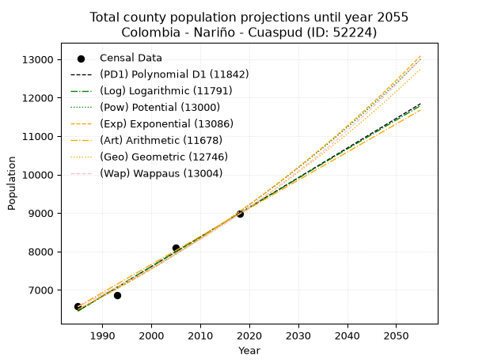
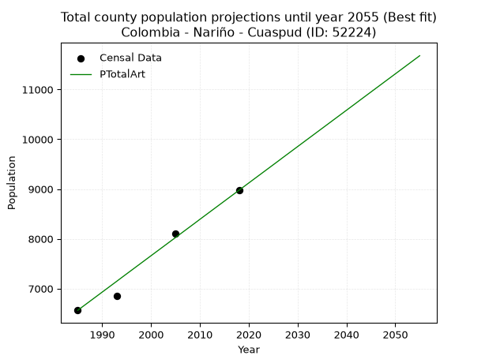
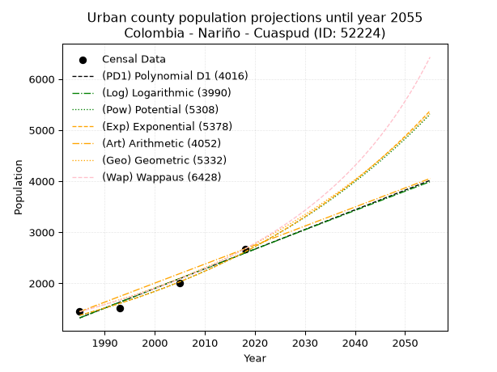
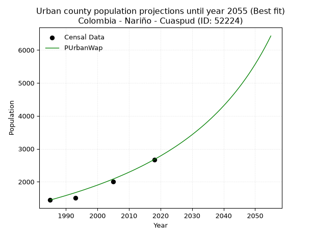
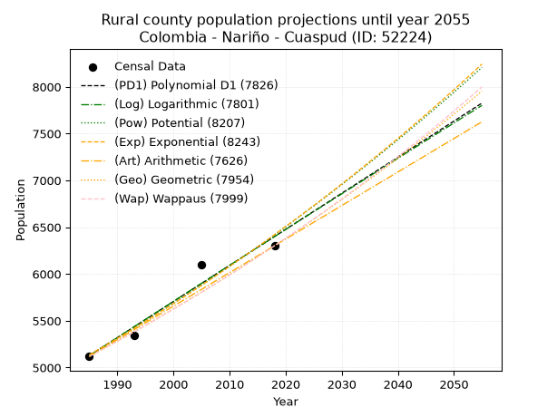
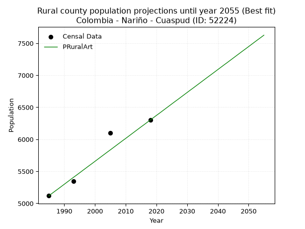

<div align="center">


</div>

# _“Population and Public Services Demand Projections (PPSD) until Year 2050 for Colombia - Nariño - Cuaspud (ID: 52224)”_
Keywords: `population` `public-service` `projection` `lineal` `polynomial` `logarithmic` `potential` `exponential` `arithmetic` `geometric` `wappaus` `dane` `colombia` `south-america`

PPSD are analytical estimates used by governments and planners to anticipate future changes in population size, age distribution, and the resulting community needs for utilities, healthcare, education, and infrastructure as sizing future water treatment facilities, electrical grids, and road networks based on spatial growth.

> **General running parameters**: • app_version: _v20260806_. • Python version: _3.14.7_. • Pandas version: _3.0.5_. • NumPy version: _2.5.1_. • Creates, save and include plots into reports (create_plot): _False_. • Projection until year: _2050_. • Process polynomial degree 2 and up: _False_. • Process Wappaus: _True_. • Process Wappaus: _True_. • Set negative values to zero: _True_. • Set infinite values to zero: _True_. • Drop dataset notes: _True_. 
<div align="center">

Dynamic map: [:earth_americas:Google](http://maps.google.com/maps?q=0.862978103,-77.7289468) [:earth_americas:OSM](https://www.openstreetmap.org/#map=18/0.862978103/-77.7289468&layers=P) [:earth_americas:Bing](https://www.bing.com/maps?cp=0.862978103~-77.7289468&lvl=18) [:earth_americas:Apple](https://maps.apple.com/frame?center=0.862978103%2C-77.7289468&span=0.003%2C0.006)

</div>


<div align="center">

```geojson
{
  "type": "Feature",
  "geometry": {
    "type": "Point", 
    "coordinates": [-77.7289468, 0.862978103]
  }, 
  "properties": {
    "Name": "Colombia - Nariño - Cuaspud (ID: 52224)"
  }
}
```

</div>


## 0. Census Data (4 records)

Census data are official statistics collected by a government about the people and housing in a country. They usually include counts of total population, age, sex, race, income, education, and jobs.

📅Global census file: [Population.xlsx](../data/Population.xlsx)

| Source   |   Year |   CountryID | CountryName   |   StateID | StateName   |   CountyID | CountyName   |   PTotal |   PUrban |   PRural |
|:---------|-------:|------------:|:--------------|----------:|:------------|-----------:|:-------------|---------:|---------:|---------:|
| DANE     |   1985 |          57 | Colombia      |        52 | Nariño      |      52224 | Cuaspud      |     6564 |     1445 |     5119 |
| DANE     |   1993 |          57 | Colombia      |        52 | Nariño      |      52224 | Cuaspud      |     6857 |     1514 |     5343 |
| DANE     |   2005 |          57 | Colombia      |        52 | Nariño      |      52224 | Cuaspud      |     8101 |     2003 |     6098 |
| DANE     |   2018 |          57 | Colombia      |        52 | Nariño      |      52224 | Cuaspud      |     8975 |     2674 |     6301 |

> 🔥Some records could had specific notes about the registered values or the corresponding urban or rural distribution.

## 1. Total

### 1.1. Coefficients and Parameters

* (PD1) Polynomial Deg 1: 77.03211561621778, -146459.23926133962 (lineal)
* (Log) Logarithmic: 154178.57672953, -1164288.3472307317
* (Pow) Potential: 20.04283936399839, -62.284213779840954
* (Exp) Exponential: 0.010013155222414206, 1.5146617883206424e-05
* (Art) Arithmetic: Year diff. 2018 - 1985 = 33, Population diff. 8975 - 6564 = 2411, Annual growth = 73.06060606060606
* (Geo) Geometric: Year diff. 2018 - 1985 = 33, Population diff. 8975 - 6564 = 2411, Annual growth % = 0.009525162000483034
* (Wap) Wappaus: i = 0.9403514519673861, Condition values only valid for < 200)

<sub>
Wappaus condition values: ['0.00', '0.94', '1.88', '2.82', '3.76', '4.70', '5.64', '6.58', '7.52', '8.46', '9.40', '10.34', '11.28', '12.22', '13.16', '14.11', '15.05', '15.99', '16.93', '17.87', '18.81', '19.75', '20.69', '21.63', '22.57', '23.51', '24.45', '25.39', '26.33', '27.27', '28.21', '29.15', '30.09', '31.03', '31.97', '32.91', '33.85', '34.79', '35.73', '36.67', '37.61', '38.55', '39.49', '40.44', '41.38', '42.32', '43.26', '44.20', '45.14', '46.08', '47.02', '47.96', '48.90', '49.84', '50.78', '51.72', '52.66', '53.60', '54.54', '55.48', '56.42', '57.36', '58.30', '59.24', '60.18', '61.12']
</sub>


### 1.2. Projected Dataset

|   Year |   CountyID |   PTotalPD1 |   PTotalLog |   PTotalPow |   PTotalExp |   PTotalArt |   PTotalGeo |   PTotalWap |
|-------:|-----------:|------------:|------------:|------------:|------------:|------------:|------------:|------------:|
|   1985 |      52224 |        6450 |        6447 |        6490 |        6492 |        6564 |        6564 |        6564 |
|   1986 |      52224 |        6527 |        6525 |        6556 |        6558 |        6637 |        6627 |        6626 |
|   1987 |      52224 |        6604 |        6603 |        6623 |        6624 |        6710 |        6690 |        6689 |
|   1988 |      52224 |        6681 |        6680 |        6690 |        6690 |        6783 |        6753 |        6752 |
|   1989 |      52224 |        6758 |        6758 |        6758 |        6758 |        6856 |        6818 |        6816 |
|   1990 |      52224 |        6835 |        6835 |        6826 |        6826 |        6929 |        6883 |        6880 |
|   1991 |      52224 |        6912 |        6913 |        6895 |        6894 |        7002 |        6948 |        6945 |
|   1992 |      52224 |        6989 |        6990 |        6965 |        6964 |        7075 |        7014 |        7011 |
|   1993 |      52224 |        7066 |        7067 |        7035 |        7034 |        7148 |        7081 |        7077 |
|   1994 |      52224 |        7143 |        7145 |        7106 |        7105 |        7222 |        7149 |        7144 |
|   1995 |      52224 |        7220 |        7222 |        7178 |        7176 |        7295 |        7217 |        7212 |
|   1996 |      52224 |        7297 |        7299 |        7251 |        7248 |        7368 |        7285 |        7280 |
|   1997 |      52224 |        7374 |        7377 |        7324 |        7321 |        7441 |        7355 |        7349 |
|   1998 |      52224 |        7451 |        7454 |        7398 |        7395 |        7514 |        7425 |        7419 |
|   1999 |      52224 |        7528 |        7531 |        7472 |        7469 |        7587 |        7496 |        7489 |
|   2000 |      52224 |        7605 |        7608 |        7547 |        7545 |        7660 |        7567 |        7560 |
|   2001 |      52224 |        7682 |        7685 |        7623 |        7620 |        7733 |        7639 |        7632 |
|   2002 |      52224 |        7759 |        7762 |        7700 |        7697 |        7806 |        7712 |        7704 |
|   2003 |      52224 |        7836 |        7839 |        7778 |        7775 |        7879 |        7785 |        7778 |
|   2004 |      52224 |        7913 |        7916 |        7856 |        7853 |        7952 |        7859 |        7852 |
|   2005 |      52224 |        7990 |        7993 |        7935 |        7932 |        8025 |        7934 |        7927 |
|   2006 |      52224 |        8067 |        8070 |        8014 |        8012 |        8098 |        8010 |        8002 |
|   2007 |      52224 |        8144 |        8147 |        8095 |        8092 |        8171 |        8086 |        8079 |
|   2008 |      52224 |        8221 |        8223 |        8176 |        8174 |        8244 |        8163 |        8156 |
|   2009 |      52224 |        8298 |        8300 |        8258 |        8256 |        8317 |        8241 |        8234 |
|   2010 |      52224 |        8375 |        8377 |        8341 |        8339 |        8391 |        8320 |        8313 |
|   2011 |      52224 |        8452 |        8454 |        8424 |        8423 |        8464 |        8399 |        8392 |
|   2012 |      52224 |        8529 |        8530 |        8509 |        8508 |        8537 |        8479 |        8473 |
|   2013 |      52224 |        8606 |        8607 |        8594 |        8593 |        8610 |        8560 |        8554 |
|   2014 |      52224 |        8683 |        8683 |        8680 |        8680 |        8683 |        8641 |        8637 |
|   2015 |      52224 |        8760 |        8760 |        8767 |        8767 |        8756 |        8723 |        8720 |
|   2016 |      52224 |        8838 |        8836 |        8854 |        8855 |        8829 |        8806 |        8804 |
|   2017 |      52224 |        8915 |        8913 |        8943 |        8945 |        8902 |        8890 |        8889 |
|   2018 |      52224 |        8992 |        8989 |        9032 |        9035 |        8975 |        8975 |        8975 |
|   2019 |      52224 |        9069 |        9066 |        9122 |        9125 |        9048 |        9060 |        9062 |
|   2020 |      52224 |        9146 |        9142 |        9213 |        9217 |        9121 |        9147 |        9150 |
|   2021 |      52224 |        9223 |        9218 |        9305 |        9310 |        9194 |        9234 |        9239 |
|   2022 |      52224 |        9300 |        9295 |        9398 |        9404 |        9267 |        9322 |        9329 |
|   2023 |      52224 |        9377 |        9371 |        9491 |        9498 |        9340 |        9411 |        9420 |
|   2024 |      52224 |        9454 |        9447 |        9586 |        9594 |        9413 |        9500 |        9512 |
|   2025 |      52224 |        9531 |        9523 |        9681 |        9691 |        9486 |        9591 |        9605 |
|   2026 |      52224 |        9608 |        9599 |        9778 |        9788 |        9559 |        9682 |        9699 |
|   2027 |      52224 |        9685 |        9675 |        9875 |        9887 |        9633 |        9774 |        9794 |
|   2028 |      52224 |        9762 |        9752 |        9973 |        9986 |        9706 |        9867 |        9891 |
|   2029 |      52224 |        9839 |        9828 |       10072 |       10087 |        9779 |        9961 |        9988 |
|   2030 |      52224 |        9916 |        9903 |       10172 |       10188 |        9852 |       10056 |       10087 |
|   2031 |      52224 |        9993 |        9979 |       10273 |       10291 |        9925 |       10152 |       10187 |
|   2032 |      52224 |       10070 |       10055 |       10375 |       10394 |        9998 |       10249 |       10288 |
|   2033 |      52224 |       10147 |       10131 |       10477 |       10499 |       10071 |       10346 |       10390 |
|   2034 |      52224 |       10224 |       10207 |       10581 |       10604 |       10144 |       10445 |       10494 |
|   2035 |      52224 |       10301 |       10283 |       10686 |       10711 |       10217 |       10544 |       10599 |
|   2036 |      52224 |       10378 |       10359 |       10792 |       10819 |       10290 |       10645 |       10705 |
|   2037 |      52224 |       10455 |       10434 |       10898 |       10928 |       10363 |       10746 |       10812 |
|   2038 |      52224 |       10532 |       10510 |       11006 |       11038 |       10436 |       10849 |       10921 |
|   2039 |      52224 |       10609 |       10586 |       11115 |       11149 |       10509 |       10952 |       11031 |
|   2040 |      52224 |       10686 |       10661 |       11225 |       11261 |       10582 |       11056 |       11143 |
|   2041 |      52224 |       10763 |       10737 |       11335 |       11374 |       10655 |       11162 |       11256 |
|   2042 |      52224 |       10840 |       10812 |       11447 |       11489 |       10728 |       11268 |       11370 |
|   2043 |      52224 |       10917 |       10888 |       11560 |       11604 |       10802 |       11375 |       11486 |
|   2044 |      52224 |       10994 |       10963 |       11674 |       11721 |       10875 |       11484 |       11604 |
|   2045 |      52224 |       11071 |       11039 |       11789 |       11839 |       10948 |       11593 |       11723 |
|   2046 |      52224 |       11148 |       11114 |       11905 |       11958 |       11021 |       11703 |       11843 |
|   2047 |      52224 |       11226 |       11189 |       12022 |       12079 |       11094 |       11815 |       11966 |
|   2048 |      52224 |       11303 |       11265 |       12141 |       12200 |       11167 |       11927 |       12089 |
|   2049 |      52224 |       11380 |       11340 |       12260 |       12323 |       11240 |       12041 |       12215 |
|   2050 |      52224 |       11457 |       11415 |       12380 |       12447 |       11313 |       12156 |       12342 |
<div align="center">

</img>

</div>


### 1.3. Best fit with absolute and relative error (%)

Relative error puts that difference into context by dividing the absolute error by the true value, creating a unitless ratio or percentage that shows the scale of the mistake.

Absolute and relative error

|   Year | Source   |   CountryID | CountryName   |   StateID | StateName   |   CountyID_x | CountyName   |   PTotal |   PUrban |   PRural |   CountyID_y |   PTotalPD1 |   PTotalLog |   PTotalPow |   PTotalExp |   PTotalArt |   PTotalGeo |   PTotalWap |   PTotalPD1AbsError |   PTotalLogAbsError |   PTotalPowAbsError |   PTotalExpAbsError |   PTotalArtAbsError |   PTotalGeoAbsError |   PTotalWapAbsError |   PTotalPD1RelError |   PTotalLogRelError |   PTotalPowRelError |   PTotalExpRelError |   PTotalArtRelError |   PTotalGeoRelError |   PTotalWapRelError |
|-------:|:---------|------------:|:--------------|----------:|:------------|-------------:|:-------------|---------:|---------:|---------:|-------------:|------------:|------------:|------------:|------------:|------------:|------------:|------------:|--------------------:|--------------------:|--------------------:|--------------------:|--------------------:|--------------------:|--------------------:|--------------------:|--------------------:|--------------------:|--------------------:|--------------------:|--------------------:|--------------------:|
|   1985 | DANE     |          57 | Colombia      |        52 | Nariño      |        52224 | Cuaspud      |     6564 |     1445 |     5119 |        52224 |        6450 |        6447 |        6490 |        6492 |        6564 |        6564 |        6564 |                 114 |                 117 |                  74 |                  72 |                   0 |                   0 |                   0 |            1.73675  |            1.78245  |            1.12736  |            1.09689  |            0        |             0       |             0       |
|   1993 | DANE     |          57 | Colombia      |        52 | Nariño      |        52224 | Cuaspud      |     6857 |     1514 |     5343 |        52224 |        7066 |        7067 |        7035 |        7034 |        7148 |        7081 |        7077 |                 209 |                 210 |                 178 |                 177 |                 291 |                 224 |                 220 |            3.04798  |            3.06256  |            2.59589  |            2.5813   |            4.24384  |             3.26673 |             3.2084  |
|   2005 | DANE     |          57 | Colombia      |        52 | Nariño      |        52224 | Cuaspud      |     8101 |     2003 |     6098 |        52224 |        7990 |        7993 |        7935 |        7932 |        8025 |        7934 |        7927 |                 111 |                 108 |                 166 |                 169 |                  76 |                 167 |                 174 |            1.3702   |            1.33317  |            2.04913  |            2.08616  |            0.938156 |             2.06147 |             2.14788 |
|   2018 | DANE     |          57 | Colombia      |        52 | Nariño      |        52224 | Cuaspud      |     8975 |     2674 |     6301 |        52224 |        8992 |        8989 |        9032 |        9035 |        8975 |        8975 |        8975 |                  17 |                  14 |                  57 |                  60 |                   0 |                   0 |                   0 |            0.189415 |            0.155989 |            0.635097 |            0.668524 |            0        |             0       |             0       |

Relative error mean

| Method    |   RelError | Best   |
|:----------|-----------:|:-------|
| PTotalPD1 |    1.58609 |        |
| PTotalLog |    1.58354 |        |
| PTotalPow |    1.60187 |        |
| PTotalExp |    1.60822 |        |
| PTotalArt |    1.2955  | True   |
| PTotalGeo |    1.33205 |        |
| PTotalWap |    1.33907 |        |

💙Best method: _**PTotalArt**_
<div align="center">

</img>

</div>


### 1.4. Fresh water supply demand in liters per capita per day (lpcd)

The fresh water supply demand typically ranges from 100 to 300 liters per capita per day (lpcd) for standard domestic and municipal planning, though absolute survival minimums set by the World Health Organization are as low as 7.5 to 20 liters per day, and total consumption in high-income nations can exceed 400 liters.

> `CZ`: Level in meters above the sea level (masl)<br> `WS`: Fresh water supply demand in liters per capita per day (lpcd or l/h/d)<br> `WSAll`: Zonal fresh water supply demand in liters per second (l/s)<br> `A`: Zonal area in square meters<br> `DP`: Population density (people/hectare)

Reference values (RAS Colombia)

|    CZ |   WS |
|------:|-----:|
|  1000 |  120 |
|  2000 |  130 |
| 99999 |  140 |

County shapefile geometry properties and water supply values

|   CountyID |      ATotal |   CZTotal |   WSTotal |
|-----------:|------------:|----------:|----------:|
|      52224 | 5.73948e+07 |   3065.23 |       140 |

Projected values for best method: PTotalArt

|   CountyID |   Year |   PTotalArt |   DPTotal |   WSTotal |   WSTotalAll |
|-----------:|-------:|------------:|----------:|----------:|-------------:|
|      52224 |   1985 |        6564 |      1.14 |       140 |      10.6361 |
|      52224 |   1986 |        6637 |      1.16 |       140 |      10.7544 |
|      52224 |   1987 |        6710 |      1.17 |       140 |      10.8727 |
|      52224 |   1988 |        6783 |      1.18 |       140 |      10.991  |
|      52224 |   1989 |        6856 |      1.19 |       140 |      11.1093 |
|      52224 |   1990 |        6929 |      1.21 |       140 |      11.2275 |
|      52224 |   1991 |        7002 |      1.22 |       140 |      11.3458 |
|      52224 |   1992 |        7075 |      1.23 |       140 |      11.4641 |
|      52224 |   1993 |        7148 |      1.25 |       140 |      11.5824 |
|      52224 |   1994 |        7222 |      1.26 |       140 |      11.7023 |
|      52224 |   1995 |        7295 |      1.27 |       140 |      11.8206 |
|      52224 |   1996 |        7368 |      1.28 |       140 |      11.9389 |
|      52224 |   1997 |        7441 |      1.3  |       140 |      12.0572 |
|      52224 |   1998 |        7514 |      1.31 |       140 |      12.1755 |
|      52224 |   1999 |        7587 |      1.32 |       140 |      12.2937 |
|      52224 |   2000 |        7660 |      1.33 |       140 |      12.412  |
|      52224 |   2001 |        7733 |      1.35 |       140 |      12.5303 |
|      52224 |   2002 |        7806 |      1.36 |       140 |      12.6486 |
|      52224 |   2003 |        7879 |      1.37 |       140 |      12.7669 |
|      52224 |   2004 |        7952 |      1.39 |       140 |      12.8852 |
|      52224 |   2005 |        8025 |      1.4  |       140 |      13.0035 |
|      52224 |   2006 |        8098 |      1.41 |       140 |      13.1218 |
|      52224 |   2007 |        8171 |      1.42 |       140 |      13.24   |
|      52224 |   2008 |        8244 |      1.44 |       140 |      13.3583 |
|      52224 |   2009 |        8317 |      1.45 |       140 |      13.4766 |
|      52224 |   2010 |        8391 |      1.46 |       140 |      13.5965 |
|      52224 |   2011 |        8464 |      1.47 |       140 |      13.7148 |
|      52224 |   2012 |        8537 |      1.49 |       140 |      13.8331 |
|      52224 |   2013 |        8610 |      1.5  |       140 |      13.9514 |
|      52224 |   2014 |        8683 |      1.51 |       140 |      14.0697 |
|      52224 |   2015 |        8756 |      1.53 |       140 |      14.188  |
|      52224 |   2016 |        8829 |      1.54 |       140 |      14.3063 |
|      52224 |   2017 |        8902 |      1.55 |       140 |      14.4245 |
|      52224 |   2018 |        8975 |      1.56 |       140 |      14.5428 |
|      52224 |   2019 |        9048 |      1.58 |       140 |      14.6611 |
|      52224 |   2020 |        9121 |      1.59 |       140 |      14.7794 |
|      52224 |   2021 |        9194 |      1.6  |       140 |      14.8977 |
|      52224 |   2022 |        9267 |      1.61 |       140 |      15.016  |
|      52224 |   2023 |        9340 |      1.63 |       140 |      15.1343 |
|      52224 |   2024 |        9413 |      1.64 |       140 |      15.2525 |
|      52224 |   2025 |        9486 |      1.65 |       140 |      15.3708 |
|      52224 |   2026 |        9559 |      1.67 |       140 |      15.4891 |
|      52224 |   2027 |        9633 |      1.68 |       140 |      15.609  |
|      52224 |   2028 |        9706 |      1.69 |       140 |      15.7273 |
|      52224 |   2029 |        9779 |      1.7  |       140 |      15.8456 |
|      52224 |   2030 |        9852 |      1.72 |       140 |      15.9639 |
|      52224 |   2031 |        9925 |      1.73 |       140 |      16.0822 |
|      52224 |   2032 |        9998 |      1.74 |       140 |      16.2005 |
|      52224 |   2033 |       10071 |      1.75 |       140 |      16.3188 |
|      52224 |   2034 |       10144 |      1.77 |       140 |      16.437  |
|      52224 |   2035 |       10217 |      1.78 |       140 |      16.5553 |
|      52224 |   2036 |       10290 |      1.79 |       140 |      16.6736 |
|      52224 |   2037 |       10363 |      1.81 |       140 |      16.7919 |
|      52224 |   2038 |       10436 |      1.82 |       140 |      16.9102 |
|      52224 |   2039 |       10509 |      1.83 |       140 |      17.0285 |
|      52224 |   2040 |       10582 |      1.84 |       140 |      17.1468 |
|      52224 |   2041 |       10655 |      1.86 |       140 |      17.265  |
|      52224 |   2042 |       10728 |      1.87 |       140 |      17.3833 |
|      52224 |   2043 |       10802 |      1.88 |       140 |      17.5032 |
|      52224 |   2044 |       10875 |      1.89 |       140 |      17.6215 |
|      52224 |   2045 |       10948 |      1.91 |       140 |      17.7398 |
|      52224 |   2046 |       11021 |      1.92 |       140 |      17.8581 |
|      52224 |   2047 |       11094 |      1.93 |       140 |      17.9764 |
|      52224 |   2048 |       11167 |      1.95 |       140 |      18.0947 |
|      52224 |   2049 |       11240 |      1.96 |       140 |      18.213  |
|      52224 |   2050 |       11313 |      1.97 |       140 |      18.3313 |

## 2. Urban

### 2.1. Coefficients and Parameters

* (PD1) Polynomial Deg 1: 38.48253713368079, -75065.69490164501 (lineal)
* (Log) Logarithmic: 76990.24646108254, -583294.4803118035
* (Pow) Potential: 38.999279604075134, -125.47237054920318
* (Exp) Exponential: 0.019489990346198777, 2.1692140085559128e-14
* (Art) Arithmetic: Year diff. 2018 - 1985 = 33, Population diff. 2674 - 1445 = 1229, Annual growth = 37.24242424242424
* (Geo) Geometric: Year diff. 2018 - 1985 = 33, Population diff. 2674 - 1445 = 1229, Annual growth % = 0.01882549628456265
* (Wap) Wappaus: i = 1.808323585453957, Condition values only valid for < 200)

<sub>
Wappaus condition values: ['0.00', '1.81', '3.62', '5.42', '7.23', '9.04', '10.85', '12.66', '14.47', '16.27', '18.08', '19.89', '21.70', '23.51', '25.32', '27.12', '28.93', '30.74', '32.55', '34.36', '36.17', '37.97', '39.78', '41.59', '43.40', '45.21', '47.02', '48.82', '50.63', '52.44', '54.25', '56.06', '57.87', '59.67', '61.48', '63.29', '65.10', '66.91', '68.72', '70.52', '72.33', '74.14', '75.95', '77.76', '79.57', '81.37', '83.18', '84.99', '86.80', '88.61', '90.42', '92.22', '94.03', '95.84', '97.65', '99.46', '101.27', '103.07', '104.88', '106.69', '108.50', '110.31', '112.12', '113.92', '115.73', '117.54']
</sub>


### 2.2. Projected Dataset

|   Year |   CountyID |   PUrbanPD1 |   PUrbanLog |   PUrbanPow |   PUrbanExp |   PUrbanArt |   PUrbanGeo |   PUrbanWap |
|-------:|-----------:|------------:|------------:|------------:|------------:|------------:|------------:|------------:|
|   1985 |      52224 |        1322 |        1321 |        1374 |        1374 |        1445 |        1445 |        1445 |
|   1986 |      52224 |        1361 |        1360 |        1401 |        1401 |        1482 |        1472 |        1471 |
|   1987 |      52224 |        1399 |        1399 |        1429 |        1429 |        1519 |        1500 |        1498 |
|   1988 |      52224 |        1438 |        1438 |        1457 |        1457 |        1557 |        1528 |        1526 |
|   1989 |      52224 |        1476 |        1476 |        1486 |        1486 |        1594 |        1557 |        1553 |
|   1990 |      52224 |        1515 |        1515 |        1515 |        1515 |        1631 |        1586 |        1582 |
|   1991 |      52224 |        1553 |        1554 |        1545 |        1545 |        1668 |        1616 |        1611 |
|   1992 |      52224 |        1592 |        1592 |        1576 |        1575 |        1706 |        1647 |        1640 |
|   1993 |      52224 |        1630 |        1631 |        1607 |        1606 |        1743 |        1678 |        1670 |
|   1994 |      52224 |        1668 |        1670 |        1639 |        1638 |        1780 |        1709 |        1701 |
|   1995 |      52224 |        1707 |        1708 |        1671 |        1670 |        1817 |        1741 |        1732 |
|   1996 |      52224 |        1745 |        1747 |        1704 |        1703 |        1855 |        1774 |        1764 |
|   1997 |      52224 |        1784 |        1785 |        1738 |        1737 |        1892 |        1807 |        1797 |
|   1998 |      52224 |        1822 |        1824 |        1772 |        1771 |        1929 |        1841 |        1830 |
|   1999 |      52224 |        1861 |        1862 |        1807 |        1806 |        1966 |        1876 |        1864 |
|   2000 |      52224 |        1899 |        1901 |        1843 |        1841 |        2004 |        1911 |        1898 |
|   2001 |      52224 |        1938 |        1939 |        1879 |        1877 |        2041 |        1947 |        1934 |
|   2002 |      52224 |        1976 |        1978 |        1916 |        1914 |        2078 |        1984 |        1970 |
|   2003 |      52224 |        2015 |        2016 |        1953 |        1952 |        2115 |        2021 |        2007 |
|   2004 |      52224 |        2053 |        2055 |        1992 |        1990 |        2153 |        2060 |        2044 |
|   2005 |      52224 |        2092 |        2093 |        2031 |        2030 |        2190 |        2098 |        2083 |
|   2006 |      52224 |        2130 |        2131 |        2071 |        2070 |        2227 |        2138 |        2122 |
|   2007 |      52224 |        2169 |        2170 |        2112 |        2110 |        2264 |        2178 |        2163 |
|   2008 |      52224 |        2207 |        2208 |        2153 |        2152 |        2302 |        2219 |        2204 |
|   2009 |      52224 |        2246 |        2247 |        2195 |        2194 |        2339 |        2261 |        2246 |
|   2010 |      52224 |        2284 |        2285 |        2238 |        2237 |        2376 |        2303 |        2289 |
|   2011 |      52224 |        2323 |        2323 |        2282 |        2281 |        2413 |        2347 |        2333 |
|   2012 |      52224 |        2361 |        2361 |        2327 |        2326 |        2451 |        2391 |        2378 |
|   2013 |      52224 |        2400 |        2400 |        2372 |        2372 |        2488 |        2436 |        2425 |
|   2014 |      52224 |        2438 |        2438 |        2419 |        2419 |        2525 |        2482 |        2472 |
|   2015 |      52224 |        2477 |        2476 |        2466 |        2466 |        2562 |        2528 |        2521 |
|   2016 |      52224 |        2515 |        2514 |        2514 |        2515 |        2600 |        2576 |        2571 |
|   2017 |      52224 |        2554 |        2553 |        2563 |        2564 |        2637 |        2625 |        2622 |
|   2018 |      52224 |        2592 |        2591 |        2613 |        2615 |        2674 |        2674 |        2674 |
|   2019 |      52224 |        2631 |        2629 |        2664 |        2666 |        2711 |        2724 |        2728 |
|   2020 |      52224 |        2669 |        2667 |        2716 |        2719 |        2748 |        2776 |        2783 |
|   2021 |      52224 |        2708 |        2705 |        2769 |        2772 |        2786 |        2828 |        2840 |
|   2022 |      52224 |        2746 |        2743 |        2823 |        2827 |        2823 |        2881 |        2898 |
|   2023 |      52224 |        2784 |        2781 |        2878 |        2883 |        2860 |        2935 |        2958 |
|   2024 |      52224 |        2823 |        2819 |        2934 |        2939 |        2897 |        2991 |        3019 |
|   2025 |      52224 |        2861 |        2857 |        2991 |        2997 |        2935 |        3047 |        3082 |
|   2026 |      52224 |        2900 |        2895 |        3049 |        3056 |        2972 |        3104 |        3147 |
|   2027 |      52224 |        2938 |        2933 |        3108 |        3116 |        3009 |        3163 |        3214 |
|   2028 |      52224 |        2977 |        2971 |        3169 |        3178 |        3046 |        3222 |        3283 |
|   2029 |      52224 |        3015 |        3009 |        3230 |        3240 |        3084 |        3283 |        3354 |
|   2030 |      52224 |        3054 |        3047 |        3293 |        3304 |        3121 |        3345 |        3427 |
|   2031 |      52224 |        3092 |        3085 |        3357 |        3369 |        3158 |        3408 |        3503 |
|   2032 |      52224 |        3131 |        3123 |        3422 |        3435 |        3195 |        3472 |        3581 |
|   2033 |      52224 |        3169 |        3161 |        3488 |        3503 |        3233 |        3537 |        3661 |
|   2034 |      52224 |        3208 |        3199 |        3556 |        3572 |        3270 |        3604 |        3744 |
|   2035 |      52224 |        3246 |        3237 |        3625 |        3642 |        3307 |        3672 |        3830 |
|   2036 |      52224 |        3285 |        3274 |        3695 |        3714 |        3344 |        3741 |        3918 |
|   2037 |      52224 |        3323 |        3312 |        3766 |        3787 |        3382 |        3811 |        4010 |
|   2038 |      52224 |        3362 |        3350 |        3839 |        3861 |        3419 |        3883 |        4104 |
|   2039 |      52224 |        3400 |        3388 |        3913 |        3937 |        3456 |        3956 |        4202 |
|   2040 |      52224 |        3439 |        3425 |        3989 |        4015 |        3493 |        4030 |        4304 |
|   2041 |      52224 |        3477 |        3463 |        4066 |        4094 |        3531 |        4106 |        4409 |
|   2042 |      52224 |        3516 |        3501 |        4144 |        4174 |        3568 |        4184 |        4518 |
|   2043 |      52224 |        3554 |        3539 |        4224 |        4257 |        3605 |        4262 |        4632 |
|   2044 |      52224 |        3593 |        3576 |        4305 |        4340 |        3642 |        4343 |        4749 |
|   2045 |      52224 |        3631 |        3614 |        4388 |        4426 |        3680 |        4424 |        4872 |
|   2046 |      52224 |        3670 |        3652 |        4473 |        4513 |        3717 |        4508 |        4999 |
|   2047 |      52224 |        3708 |        3689 |        4559 |        4602 |        3754 |        4593 |        5132 |
|   2048 |      52224 |        3747 |        3727 |        4646 |        4692 |        3791 |        4679 |        5270 |
|   2049 |      52224 |        3785 |        3764 |        4736 |        4785 |        3829 |        4767 |        5414 |
|   2050 |      52224 |        3824 |        3802 |        4827 |        4879 |        3866 |        4857 |        5565 |
<div align="center">

</img>

</div>


### 2.3. Best fit with absolute and relative error (%)

Relative error puts that difference into context by dividing the absolute error by the true value, creating a unitless ratio or percentage that shows the scale of the mistake.

Absolute and relative error

|   Year | Source   |   CountryID | CountryName   |   StateID | StateName   |   CountyID_x | CountyName   |   PTotal |   PUrban |   PRural |   CountyID_y |   PUrbanPD1 |   PUrbanLog |   PUrbanPow |   PUrbanExp |   PUrbanArt |   PUrbanGeo |   PUrbanWap |   PUrbanPD1AbsError |   PUrbanLogAbsError |   PUrbanPowAbsError |   PUrbanExpAbsError |   PUrbanArtAbsError |   PUrbanGeoAbsError |   PUrbanWapAbsError |   PUrbanPD1RelError |   PUrbanLogRelError |   PUrbanPowRelError |   PUrbanExpRelError |   PUrbanArtRelError |   PUrbanGeoRelError |   PUrbanWapRelError |
|-------:|:---------|------------:|:--------------|----------:|:------------|-------------:|:-------------|---------:|---------:|---------:|-------------:|------------:|------------:|------------:|------------:|------------:|------------:|------------:|--------------------:|--------------------:|--------------------:|--------------------:|--------------------:|--------------------:|--------------------:|--------------------:|--------------------:|--------------------:|--------------------:|--------------------:|--------------------:|--------------------:|
|   1985 | DANE     |          57 | Colombia      |        52 | Nariño      |        52224 | Cuaspud      |     6564 |     1445 |     5119 |        52224 |        1322 |        1321 |        1374 |        1374 |        1445 |        1445 |        1445 |                 123 |                 124 |                  71 |                  71 |                   0 |                   0 |                   0 |             8.51211 |             8.58131 |             4.91349 |             4.91349 |              0      |             0       |             0       |
|   1993 | DANE     |          57 | Colombia      |        52 | Nariño      |        52224 | Cuaspud      |     6857 |     1514 |     5343 |        52224 |        1630 |        1631 |        1607 |        1606 |        1743 |        1678 |        1670 |                 116 |                 117 |                  93 |                  92 |                 229 |                 164 |                 156 |             7.66182 |             7.72787 |             6.14267 |             6.07662 |             15.1255 |            10.8322  |            10.3038  |
|   2005 | DANE     |          57 | Colombia      |        52 | Nariño      |        52224 | Cuaspud      |     8101 |     2003 |     6098 |        52224 |        2092 |        2093 |        2031 |        2030 |        2190 |        2098 |        2083 |                  89 |                  90 |                  28 |                  27 |                 187 |                  95 |                  80 |             4.44333 |             4.49326 |             1.3979  |             1.34798 |              9.336  |             4.74289 |             3.99401 |
|   2018 | DANE     |          57 | Colombia      |        52 | Nariño      |        52224 | Cuaspud      |     8975 |     2674 |     6301 |        52224 |        2592 |        2591 |        2613 |        2615 |        2674 |        2674 |        2674 |                  82 |                  83 |                  61 |                  59 |                   0 |                   0 |                   0 |             3.06657 |             3.10396 |             2.28123 |             2.20643 |              0      |             0       |             0       |

Relative error mean

| Method    |   RelError | Best   |
|:----------|-----------:|:-------|
| PUrbanPD1 |    5.92096 |        |
| PUrbanLog |    5.9766  |        |
| PUrbanPow |    3.68382 |        |
| PUrbanExp |    3.63613 |        |
| PUrbanArt |    6.11537 |        |
| PUrbanGeo |    3.89378 |        |
| PUrbanWap |    3.57446 | True   |

💙Best method: _**PUrbanWap**_
<div align="center">

</img>

</div>


### 2.4. Fresh water supply demand in liters per capita per day (lpcd)

The fresh water supply demand typically ranges from 100 to 300 liters per capita per day (lpcd) for standard domestic and municipal planning, though absolute survival minimums set by the World Health Organization are as low as 7.5 to 20 liters per day, and total consumption in high-income nations can exceed 400 liters.

> `CZ`: Level in meters above the sea level (masl)<br> `WS`: Fresh water supply demand in liters per capita per day (lpcd or l/h/d)<br> `WSAll`: Zonal fresh water supply demand in liters per second (l/s)<br> `A`: Zonal area in square meters<br> `DP`: Population density (people/hectare)

Reference values (RAS Colombia)

|    CZ |   WS |
|------:|-----:|
|  1000 |  120 |
|  2000 |  130 |
| 99999 |  140 |

County shapefile geometry properties and water supply values

|   CountyID |      AUrban |   CZUrban |   WSUrban |
|-----------:|------------:|----------:|----------:|
|      52224 | 1.05896e+06 |   3022.66 |       140 |

Projected values for best method: PUrbanWap

|   CountyID |   Year |   PUrbanWap |   DPUrban |   WSUrban |   WSUrbanAll |
|-----------:|-------:|------------:|----------:|----------:|-------------:|
|      52224 |   1985 |        1445 |     13.65 |       140 |      2.34144 |
|      52224 |   1986 |        1471 |     13.89 |       140 |      2.38356 |
|      52224 |   1987 |        1498 |     14.15 |       140 |      2.42731 |
|      52224 |   1988 |        1526 |     14.41 |       140 |      2.47269 |
|      52224 |   1989 |        1553 |     14.67 |       140 |      2.51644 |
|      52224 |   1990 |        1582 |     14.94 |       140 |      2.56343 |
|      52224 |   1991 |        1611 |     15.21 |       140 |      2.61042 |
|      52224 |   1992 |        1640 |     15.49 |       140 |      2.65741 |
|      52224 |   1993 |        1670 |     15.77 |       140 |      2.70602 |
|      52224 |   1994 |        1701 |     16.06 |       140 |      2.75625 |
|      52224 |   1995 |        1732 |     16.36 |       140 |      2.80648 |
|      52224 |   1996 |        1764 |     16.66 |       140 |      2.85833 |
|      52224 |   1997 |        1797 |     16.97 |       140 |      2.91181 |
|      52224 |   1998 |        1830 |     17.28 |       140 |      2.96528 |
|      52224 |   1999 |        1864 |     17.6  |       140 |      3.02037 |
|      52224 |   2000 |        1898 |     17.92 |       140 |      3.07546 |
|      52224 |   2001 |        1934 |     18.26 |       140 |      3.1338  |
|      52224 |   2002 |        1970 |     18.6  |       140 |      3.19213 |
|      52224 |   2003 |        2007 |     18.95 |       140 |      3.25208 |
|      52224 |   2004 |        2044 |     19.3  |       140 |      3.31204 |
|      52224 |   2005 |        2083 |     19.67 |       140 |      3.37523 |
|      52224 |   2006 |        2122 |     20.04 |       140 |      3.43843 |
|      52224 |   2007 |        2163 |     20.43 |       140 |      3.50486 |
|      52224 |   2008 |        2204 |     20.81 |       140 |      3.5713  |
|      52224 |   2009 |        2246 |     21.21 |       140 |      3.63935 |
|      52224 |   2010 |        2289 |     21.62 |       140 |      3.70903 |
|      52224 |   2011 |        2333 |     22.03 |       140 |      3.78032 |
|      52224 |   2012 |        2378 |     22.46 |       140 |      3.85324 |
|      52224 |   2013 |        2425 |     22.9  |       140 |      3.9294  |
|      52224 |   2014 |        2472 |     23.34 |       140 |      4.00556 |
|      52224 |   2015 |        2521 |     23.81 |       140 |      4.08495 |
|      52224 |   2016 |        2571 |     24.28 |       140 |      4.16597 |
|      52224 |   2017 |        2622 |     24.76 |       140 |      4.24861 |
|      52224 |   2018 |        2674 |     25.25 |       140 |      4.33287 |
|      52224 |   2019 |        2728 |     25.76 |       140 |      4.42037 |
|      52224 |   2020 |        2783 |     26.28 |       140 |      4.50949 |
|      52224 |   2021 |        2840 |     26.82 |       140 |      4.60185 |
|      52224 |   2022 |        2898 |     27.37 |       140 |      4.69583 |
|      52224 |   2023 |        2958 |     27.93 |       140 |      4.79306 |
|      52224 |   2024 |        3019 |     28.51 |       140 |      4.8919  |
|      52224 |   2025 |        3082 |     29.1  |       140 |      4.99398 |
|      52224 |   2026 |        3147 |     29.72 |       140 |      5.09931 |
|      52224 |   2027 |        3214 |     30.35 |       140 |      5.20787 |
|      52224 |   2028 |        3283 |     31    |       140 |      5.31968 |
|      52224 |   2029 |        3354 |     31.67 |       140 |      5.43472 |
|      52224 |   2030 |        3427 |     32.36 |       140 |      5.55301 |
|      52224 |   2031 |        3503 |     33.08 |       140 |      5.67616 |
|      52224 |   2032 |        3581 |     33.82 |       140 |      5.80255 |
|      52224 |   2033 |        3661 |     34.57 |       140 |      5.93218 |
|      52224 |   2034 |        3744 |     35.36 |       140 |      6.06667 |
|      52224 |   2035 |        3830 |     36.17 |       140 |      6.20602 |
|      52224 |   2036 |        3918 |     37    |       140 |      6.34861 |
|      52224 |   2037 |        4010 |     37.87 |       140 |      6.49769 |
|      52224 |   2038 |        4104 |     38.76 |       140 |      6.65    |
|      52224 |   2039 |        4202 |     39.68 |       140 |      6.8088  |
|      52224 |   2040 |        4304 |     40.64 |       140 |      6.97407 |
|      52224 |   2041 |        4409 |     41.64 |       140 |      7.14421 |
|      52224 |   2042 |        4518 |     42.66 |       140 |      7.32083 |
|      52224 |   2043 |        4632 |     43.74 |       140 |      7.50556 |
|      52224 |   2044 |        4749 |     44.85 |       140 |      7.69514 |
|      52224 |   2045 |        4872 |     46.01 |       140 |      7.89444 |
|      52224 |   2046 |        4999 |     47.21 |       140 |      8.10023 |
|      52224 |   2047 |        5132 |     48.46 |       140 |      8.31574 |
|      52224 |   2048 |        5270 |     49.77 |       140 |      8.53935 |
|      52224 |   2049 |        5414 |     51.13 |       140 |      8.77269 |
|      52224 |   2050 |        5565 |     52.55 |       140 |      9.01736 |

## 3. Rural

### 3.1. Coefficients and Parameters

* (PD1) Polynomial Deg 1: 38.54957848253699, -71393.54435969463 (lineal)
* (Log) Logarithmic: 77188.33026844736, -580993.8669189278
* (Pow) Potential: 13.531443328381046, -40.9129288124307
* (Exp) Exponential: 0.006757612199363168, 0.007674864634986121
* (Art) Arithmetic: Year diff. 2018 - 1985 = 33, Population diff. 6301 - 5119 = 1182, Annual growth = 35.81818181818182
* (Geo) Geometric: Year diff. 2018 - 1985 = 33, Population diff. 6301 - 5119 = 1182, Annual growth % = 0.006315289499823296
* (Wap) Wappaus: i = 0.6272886483044101, Condition values only valid for < 200)

<sub>
Wappaus condition values: ['0.00', '0.63', '1.25', '1.88', '2.51', '3.14', '3.76', '4.39', '5.02', '5.65', '6.27', '6.90', '7.53', '8.15', '8.78', '9.41', '10.04', '10.66', '11.29', '11.92', '12.55', '13.17', '13.80', '14.43', '15.05', '15.68', '16.31', '16.94', '17.56', '18.19', '18.82', '19.45', '20.07', '20.70', '21.33', '21.96', '22.58', '23.21', '23.84', '24.46', '25.09', '25.72', '26.35', '26.97', '27.60', '28.23', '28.86', '29.48', '30.11', '30.74', '31.36', '31.99', '32.62', '33.25', '33.87', '34.50', '35.13', '35.76', '36.38', '37.01', '37.64', '38.26', '38.89', '39.52', '40.15', '40.77']
</sub>


### 3.2. Projected Dataset

|   Year |   CountyID |   PRuralPD1 |   PRuralLog |   PRuralPow |   PRuralExp |   PRuralArt |   PRuralGeo |   PRuralWap |
|-------:|-----------:|------------:|------------:|------------:|------------:|------------:|------------:|------------:|
|   1985 |      52224 |        5127 |        5126 |        5135 |        5136 |        5119 |        5119 |        5119 |
|   1986 |      52224 |        5166 |        5165 |        5170 |        5171 |        5155 |        5151 |        5151 |
|   1987 |      52224 |        5204 |        5204 |        5205 |        5206 |        5191 |        5184 |        5184 |
|   1988 |      52224 |        5243 |        5243 |        5241 |        5241 |        5226 |        5217 |        5216 |
|   1989 |      52224 |        5282 |        5281 |        5277 |        5277 |        5262 |        5250 |        5249 |
|   1990 |      52224 |        5320 |        5320 |        5313 |        5313 |        5298 |        5283 |        5282 |
|   1991 |      52224 |        5359 |        5359 |        5349 |        5349 |        5334 |        5316 |        5315 |
|   1992 |      52224 |        5397 |        5398 |        5385 |        5385 |        5370 |        5350 |        5349 |
|   1993 |      52224 |        5436 |        5436 |        5422 |        5421 |        5406 |        5383 |        5382 |
|   1994 |      52224 |        5474 |        5475 |        5459 |        5458 |        5441 |        5417 |        5416 |
|   1995 |      52224 |        5513 |        5514 |        5496 |        5495 |        5477 |        5452 |        5451 |
|   1996 |      52224 |        5551 |        5553 |        5534 |        5532 |        5513 |        5486 |        5485 |
|   1997 |      52224 |        5590 |        5591 |        5571 |        5570 |        5549 |        5521 |        5519 |
|   1998 |      52224 |        5629 |        5630 |        5609 |        5608 |        5585 |        5556 |        5554 |
|   1999 |      52224 |        5667 |        5668 |        5647 |        5646 |        5620 |        5591 |        5589 |
|   2000 |      52224 |        5706 |        5707 |        5686 |        5684 |        5656 |        5626 |        5624 |
|   2001 |      52224 |        5744 |        5746 |        5724 |        5723 |        5692 |        5661 |        5660 |
|   2002 |      52224 |        5783 |        5784 |        5763 |        5761 |        5728 |        5697 |        5696 |
|   2003 |      52224 |        5821 |        5823 |        5802 |        5800 |        5764 |        5733 |        5732 |
|   2004 |      52224 |        5860 |        5861 |        5841 |        5840 |        5800 |        5769 |        5768 |
|   2005 |      52224 |        5898 |        5900 |        5881 |        5879 |        5835 |        5806 |        5804 |
|   2006 |      52224 |        5937 |        5938 |        5921 |        5919 |        5871 |        5843 |        5841 |
|   2007 |      52224 |        5975 |        5977 |        5961 |        5959 |        5907 |        5879 |        5878 |
|   2008 |      52224 |        6014 |        6015 |        6001 |        6000 |        5943 |        5917 |        5915 |
|   2009 |      52224 |        6053 |        6054 |        6042 |        6040 |        5979 |        5954 |        5952 |
|   2010 |      52224 |        6091 |        6092 |        6082 |        6081 |        6014 |        5992 |        5990 |
|   2011 |      52224 |        6130 |        6130 |        6124 |        6123 |        6050 |        6029 |        6028 |
|   2012 |      52224 |        6168 |        6169 |        6165 |        6164 |        6086 |        6067 |        6066 |
|   2013 |      52224 |        6207 |        6207 |        6206 |        6206 |        6122 |        6106 |        6105 |
|   2014 |      52224 |        6245 |        6246 |        6248 |        6248 |        6158 |        6144 |        6143 |
|   2015 |      52224 |        6284 |        6284 |        6290 |        6290 |        6194 |        6183 |        6182 |
|   2016 |      52224 |        6322 |        6322 |        6333 |        6333 |        6229 |        6222 |        6222 |
|   2017 |      52224 |        6361 |        6360 |        6375 |        6376 |        6265 |        6261 |        6261 |
|   2018 |      52224 |        6400 |        6399 |        6418 |        6419 |        6301 |        6301 |        6301 |
|   2019 |      52224 |        6438 |        6437 |        6462 |        6463 |        6337 |        6341 |        6341 |
|   2020 |      52224 |        6477 |        6475 |        6505 |        6507 |        6373 |        6381 |        6381 |
|   2021 |      52224 |        6515 |        6513 |        6549 |        6551 |        6408 |        6421 |        6422 |
|   2022 |      52224 |        6554 |        6552 |        6593 |        6595 |        6444 |        6462 |        6463 |
|   2023 |      52224 |        6592 |        6590 |        6637 |        6640 |        6480 |        6502 |        6504 |
|   2024 |      52224 |        6631 |        6628 |        6681 |        6685 |        6516 |        6544 |        6546 |
|   2025 |      52224 |        6669 |        6666 |        6726 |        6730 |        6552 |        6585 |        6588 |
|   2026 |      52224 |        6708 |        6704 |        6771 |        6776 |        6588 |        6626 |        6630 |
|   2027 |      52224 |        6746 |        6742 |        6817 |        6822 |        6623 |        6668 |        6672 |
|   2028 |      52224 |        6785 |        6780 |        6862 |        6868 |        6659 |        6710 |        6715 |
|   2029 |      52224 |        6824 |        6818 |        6908 |        6915 |        6695 |        6753 |        6758 |
|   2030 |      52224 |        6862 |        6856 |        6955 |        6961 |        6731 |        6795 |        6801 |
|   2031 |      52224 |        6901 |        6894 |        7001 |        7009 |        6767 |        6838 |        6845 |
|   2032 |      52224 |        6939 |        6932 |        7048 |        7056 |        6802 |        6882 |        6889 |
|   2033 |      52224 |        6978 |        6970 |        7095 |        7104 |        6838 |        6925 |        6933 |
|   2034 |      52224 |        7016 |        7008 |        7142 |        7152 |        6874 |        6969 |        6978 |
|   2035 |      52224 |        7055 |        7046 |        7190 |        7201 |        6910 |        7013 |        7023 |
|   2036 |      52224 |        7093 |        7084 |        7238 |        7250 |        6946 |        7057 |        7068 |
|   2037 |      52224 |        7132 |        7122 |        7286 |        7299 |        6982 |        7102 |        7114 |
|   2038 |      52224 |        7170 |        7160 |        7335 |        7348 |        7017 |        7146 |        7160 |
|   2039 |      52224 |        7209 |        7198 |        7384 |        7398 |        7053 |        7192 |        7207 |
|   2040 |      52224 |        7248 |        7236 |        7433 |        7448 |        7089 |        7237 |        7253 |
|   2041 |      52224 |        7286 |        7273 |        7482 |        7499 |        7125 |        7283 |        7300 |
|   2042 |      52224 |        7325 |        7311 |        7532 |        7550 |        7161 |        7329 |        7348 |
|   2043 |      52224 |        7363 |        7349 |        7582 |        7601 |        7196 |        7375 |        7396 |
|   2044 |      52224 |        7402 |        7387 |        7632 |        7652 |        7232 |        7422 |        7444 |
|   2045 |      52224 |        7440 |        7425 |        7683 |        7704 |        7268 |        7468 |        7492 |
|   2046 |      52224 |        7479 |        7462 |        7734 |        7756 |        7304 |        7516 |        7541 |
|   2047 |      52224 |        7517 |        7500 |        7785 |        7809 |        7340 |        7563 |        7590 |
|   2048 |      52224 |        7556 |        7538 |        7837 |        7862 |        7376 |        7611 |        7640 |
|   2049 |      52224 |        7595 |        7575 |        7889 |        7915 |        7411 |        7659 |        7690 |
|   2050 |      52224 |        7633 |        7613 |        7941 |        7969 |        7447 |        7707 |        7741 |
<div align="center">

</img>

</div>


### 3.3. Best fit with absolute and relative error (%)

Relative error puts that difference into context by dividing the absolute error by the true value, creating a unitless ratio or percentage that shows the scale of the mistake.

Absolute and relative error

|   Year | Source   |   CountryID | CountryName   |   StateID | StateName   |   CountyID_x | CountyName   |   PTotal |   PUrban |   PRural |   CountyID_y |   PRuralPD1 |   PRuralLog |   PRuralPow |   PRuralExp |   PRuralArt |   PRuralGeo |   PRuralWap |   PRuralPD1AbsError |   PRuralLogAbsError |   PRuralPowAbsError |   PRuralExpAbsError |   PRuralArtAbsError |   PRuralGeoAbsError |   PRuralWapAbsError |   PRuralPD1RelError |   PRuralLogRelError |   PRuralPowRelError |   PRuralExpRelError |   PRuralArtRelError |   PRuralGeoRelError |   PRuralWapRelError |
|-------:|:---------|------------:|:--------------|----------:|:------------|-------------:|:-------------|---------:|---------:|---------:|-------------:|------------:|------------:|------------:|------------:|------------:|------------:|------------:|--------------------:|--------------------:|--------------------:|--------------------:|--------------------:|--------------------:|--------------------:|--------------------:|--------------------:|--------------------:|--------------------:|--------------------:|--------------------:|--------------------:|
|   1985 | DANE     |          57 | Colombia      |        52 | Nariño      |        52224 | Cuaspud      |     6564 |     1445 |     5119 |        52224 |        5127 |        5126 |        5135 |        5136 |        5119 |        5119 |        5119 |                   8 |                   7 |                  16 |                  17 |                   0 |                   0 |                   0 |            0.156281 |            0.136745 |            0.312561 |            0.332096 |             0       |            0        |            0        |
|   1993 | DANE     |          57 | Colombia      |        52 | Nariño      |        52224 | Cuaspud      |     6857 |     1514 |     5343 |        52224 |        5436 |        5436 |        5422 |        5421 |        5406 |        5383 |        5382 |                  93 |                  93 |                  79 |                  78 |                  63 |                  40 |                  39 |            1.7406   |            1.7406   |            1.47857  |            1.45985  |             1.17911 |            0.748643 |            0.729927 |
|   2005 | DANE     |          57 | Colombia      |        52 | Nariño      |        52224 | Cuaspud      |     8101 |     2003 |     6098 |        52224 |        5898 |        5900 |        5881 |        5879 |        5835 |        5806 |        5804 |                 200 |                 198 |                 217 |                 219 |                 263 |                 292 |                 294 |            3.27976  |            3.24697  |            3.55854  |            3.59134  |             4.31289 |            4.78846  |            4.82125  |
|   2018 | DANE     |          57 | Colombia      |        52 | Nariño      |        52224 | Cuaspud      |     8975 |     2674 |     6301 |        52224 |        6400 |        6399 |        6418 |        6419 |        6301 |        6301 |        6301 |                  99 |                  98 |                 117 |                 118 |                   0 |                   0 |                   0 |            1.57118  |            1.55531  |            1.85685  |            1.87272  |             0       |            0        |            0        |

Relative error mean

| Method    |   RelError | Best   |
|:----------|-----------:|:-------|
| PRuralPD1 |    1.68695 |        |
| PRuralLog |    1.6699  |        |
| PRuralPow |    1.80163 |        |
| PRuralExp |    1.814   |        |
| PRuralArt |    1.373   | True   |
| PRuralGeo |    1.38427 |        |
| PRuralWap |    1.38779 |        |

💙Best method: _**PRuralArt**_
<div align="center">

</img>

</div>


### 3.4. Fresh water supply demand in liters per capita per day (lpcd)

The fresh water supply demand typically ranges from 100 to 300 liters per capita per day (lpcd) for standard domestic and municipal planning, though absolute survival minimums set by the World Health Organization are as low as 7.5 to 20 liters per day, and total consumption in high-income nations can exceed 400 liters.

> `CZ`: Level in meters above the sea level (masl)<br> `WS`: Fresh water supply demand in liters per capita per day (lpcd or l/h/d)<br> `WSAll`: Zonal fresh water supply demand in liters per second (l/s)<br> `A`: Zonal area in square meters<br> `DP`: Population density (people/hectare)

Reference values (RAS Colombia)

|    CZ |   WS |
|------:|-----:|
|  1000 |  120 |
|  2000 |  130 |
| 99999 |  140 |

County shapefile geometry properties and water supply values

|   CountyID |      ARural |   CZRural |   WSRural |
|-----------:|------------:|----------:|----------:|
|      52224 | 5.63359e+07 |   3066.01 |       140 |

Projected values for best method: PRuralArt

|   CountyID |   Year |   PRuralArt |   DPRural |   WSRural |   WSRuralAll |
|-----------:|-------:|------------:|----------:|----------:|-------------:|
|      52224 |   1985 |        5119 |      0.91 |       140 |      8.29468 |
|      52224 |   1986 |        5155 |      0.92 |       140 |      8.35301 |
|      52224 |   1987 |        5191 |      0.92 |       140 |      8.41134 |
|      52224 |   1988 |        5226 |      0.93 |       140 |      8.46806 |
|      52224 |   1989 |        5262 |      0.93 |       140 |      8.52639 |
|      52224 |   1990 |        5298 |      0.94 |       140 |      8.58472 |
|      52224 |   1991 |        5334 |      0.95 |       140 |      8.64306 |
|      52224 |   1992 |        5370 |      0.95 |       140 |      8.70139 |
|      52224 |   1993 |        5406 |      0.96 |       140 |      8.75972 |
|      52224 |   1994 |        5441 |      0.97 |       140 |      8.81644 |
|      52224 |   1995 |        5477 |      0.97 |       140 |      8.87477 |
|      52224 |   1996 |        5513 |      0.98 |       140 |      8.9331  |
|      52224 |   1997 |        5549 |      0.98 |       140 |      8.99144 |
|      52224 |   1998 |        5585 |      0.99 |       140 |      9.04977 |
|      52224 |   1999 |        5620 |      1    |       140 |      9.10648 |
|      52224 |   2000 |        5656 |      1    |       140 |      9.16481 |
|      52224 |   2001 |        5692 |      1.01 |       140 |      9.22315 |
|      52224 |   2002 |        5728 |      1.02 |       140 |      9.28148 |
|      52224 |   2003 |        5764 |      1.02 |       140 |      9.33981 |
|      52224 |   2004 |        5800 |      1.03 |       140 |      9.39815 |
|      52224 |   2005 |        5835 |      1.04 |       140 |      9.45486 |
|      52224 |   2006 |        5871 |      1.04 |       140 |      9.51319 |
|      52224 |   2007 |        5907 |      1.05 |       140 |      9.57153 |
|      52224 |   2008 |        5943 |      1.05 |       140 |      9.62986 |
|      52224 |   2009 |        5979 |      1.06 |       140 |      9.68819 |
|      52224 |   2010 |        6014 |      1.07 |       140 |      9.74491 |
|      52224 |   2011 |        6050 |      1.07 |       140 |      9.80324 |
|      52224 |   2012 |        6086 |      1.08 |       140 |      9.86157 |
|      52224 |   2013 |        6122 |      1.09 |       140 |      9.91991 |
|      52224 |   2014 |        6158 |      1.09 |       140 |      9.97824 |
|      52224 |   2015 |        6194 |      1.1  |       140 |     10.0366  |
|      52224 |   2016 |        6229 |      1.11 |       140 |     10.0933  |
|      52224 |   2017 |        6265 |      1.11 |       140 |     10.1516  |
|      52224 |   2018 |        6301 |      1.12 |       140 |     10.21    |
|      52224 |   2019 |        6337 |      1.12 |       140 |     10.2683  |
|      52224 |   2020 |        6373 |      1.13 |       140 |     10.3266  |
|      52224 |   2021 |        6408 |      1.14 |       140 |     10.3833  |
|      52224 |   2022 |        6444 |      1.14 |       140 |     10.4417  |
|      52224 |   2023 |        6480 |      1.15 |       140 |     10.5     |
|      52224 |   2024 |        6516 |      1.16 |       140 |     10.5583  |
|      52224 |   2025 |        6552 |      1.16 |       140 |     10.6167  |
|      52224 |   2026 |        6588 |      1.17 |       140 |     10.675   |
|      52224 |   2027 |        6623 |      1.18 |       140 |     10.7317  |
|      52224 |   2028 |        6659 |      1.18 |       140 |     10.79    |
|      52224 |   2029 |        6695 |      1.19 |       140 |     10.8484  |
|      52224 |   2030 |        6731 |      1.19 |       140 |     10.9067  |
|      52224 |   2031 |        6767 |      1.2  |       140 |     10.965   |
|      52224 |   2032 |        6802 |      1.21 |       140 |     11.0218  |
|      52224 |   2033 |        6838 |      1.21 |       140 |     11.0801  |
|      52224 |   2034 |        6874 |      1.22 |       140 |     11.1384  |
|      52224 |   2035 |        6910 |      1.23 |       140 |     11.1968  |
|      52224 |   2036 |        6946 |      1.23 |       140 |     11.2551  |
|      52224 |   2037 |        6982 |      1.24 |       140 |     11.3134  |
|      52224 |   2038 |        7017 |      1.25 |       140 |     11.3701  |
|      52224 |   2039 |        7053 |      1.25 |       140 |     11.4285  |
|      52224 |   2040 |        7089 |      1.26 |       140 |     11.4868  |
|      52224 |   2041 |        7125 |      1.26 |       140 |     11.5451  |
|      52224 |   2042 |        7161 |      1.27 |       140 |     11.6035  |
|      52224 |   2043 |        7196 |      1.28 |       140 |     11.6602  |
|      52224 |   2044 |        7232 |      1.28 |       140 |     11.7185  |
|      52224 |   2045 |        7268 |      1.29 |       140 |     11.7769  |
|      52224 |   2046 |        7304 |      1.3  |       140 |     11.8352  |
|      52224 |   2047 |        7340 |      1.3  |       140 |     11.8935  |
|      52224 |   2048 |        7376 |      1.31 |       140 |     11.9519  |
|      52224 |   2049 |        7411 |      1.32 |       140 |     12.0086  |
|      52224 |   2050 |        7447 |      1.32 |       140 |     12.0669  |

<div align="center"><br><sub>Share this research</sub></div><br>

<sub>**APPS & TOOLS & CONTENT DISCLAIMER**: • NO WARRANTY - This content and software is provided by <a href="https://github.com/rcfdtools" target="_blank">github.com/rcfdtools</a> "as is", without any express or implied warranty, including warranties of merchantability, fitness for a particular purpose, or non-infringement. There is no guarantee that the software will be error-free or operate without interruption. • LIMITATION OF LIABILITY - Neither the authors nor copyright holders will be liable for claims or damages arising from the software or its use. You are responsible for determining if the software is appropriate for your use and assume all associated risks, including errors, legal compliance, and data loss. • NO PROFESSIONAL ADVICE - The software provides general information and does not offer professional advice. It should not replace consultation with professional advisors. [Clauses and global license for rcfdtools use.](https://github.com/rcfdtools/rcfdtools/blob/main/LICENSE.md)</sub>

| [:house: Home](Readme.md)  | [:beginner: Help / Collaborate](https://github.com/rcfdtools/R.HydroTools/discussions/31) |
|----------------------------|-------------------------------------------------------------------------------------------|