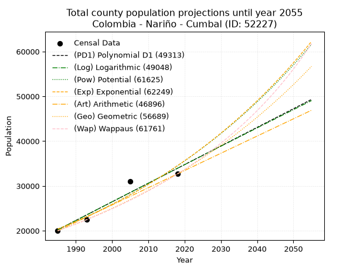
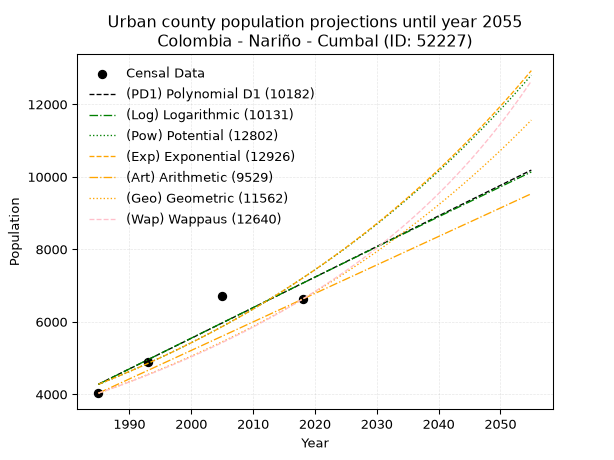
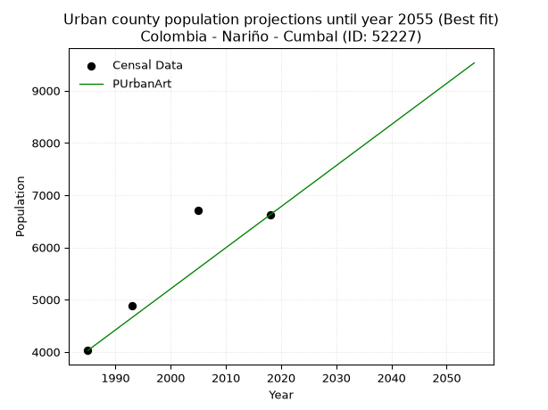
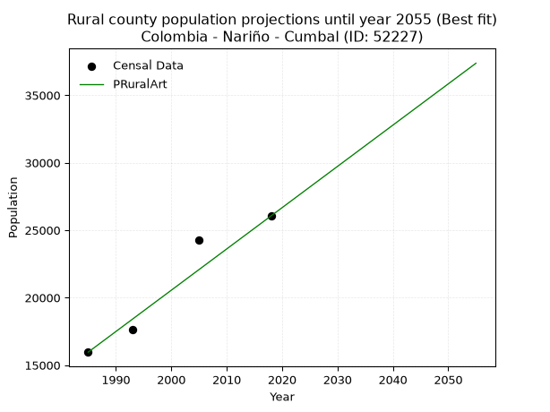

<div align="center">


</div>

# _“Population and Public Services Demand Projections (PPSD) until Year 2050 for Colombia - Nariño - Cumbal (ID: 52227)”_
Keywords: `population` `public-service` `projection` `lineal` `polynomial` `logarithmic` `potential` `exponential` `arithmetic` `geometric` `wappaus` `dane` `colombia` `south-america`

PPSD are analytical estimates used by governments and planners to anticipate future changes in population size, age distribution, and the resulting community needs for utilities, healthcare, education, and infrastructure as sizing future water treatment facilities, electrical grids, and road networks based on spatial growth.

> **General running parameters**: • app_version: _v20260806_. • Python version: _3.14.7_. • Pandas version: _3.0.5_. • NumPy version: _2.5.1_. • Creates, save and include plots into reports (create_plot): _False_. • Projection until year: _2050_. • Process polynomial degree 2 and up: _False_. • Process Wappaus: _True_. • Process Wappaus: _True_. • Set negative values to zero: _True_. • Set infinite values to zero: _True_. • Drop dataset notes: _True_. 
<div align="center">

Dynamic map: [:earth_americas:Google](http://maps.google.com/maps?q=0.906366925,-77.7925053) [:earth_americas:OSM](https://www.openstreetmap.org/#map=18/0.906366925/-77.7925053&layers=P) [:earth_americas:Bing](https://www.bing.com/maps?cp=0.906366925~-77.7925053&lvl=18) [:earth_americas:Apple](https://maps.apple.com/frame?center=0.906366925%2C-77.7925053&span=0.003%2C0.006)

</div>


<div align="center">

```geojson
{
  "type": "Feature",
  "geometry": {
    "type": "Point", 
    "coordinates": [-77.7925053, 0.906366925]
  }, 
  "properties": {
    "Name": "Colombia - Nariño - Cumbal (ID: 52227)"
  }
}
```

</div>


## 0. Census Data (4 records)

Census data are official statistics collected by a government about the people and housing in a country. They usually include counts of total population, age, sex, race, income, education, and jobs.

📅Global census file: [Population.xlsx](../data/Population.xlsx)

| Source   |   Year |   CountryID | CountryName   |   StateID | StateName   |   CountyID | CountyName   |   PTotal |   PUrban |   PRural |
|:---------|-------:|------------:|:--------------|----------:|:------------|-----------:|:-------------|---------:|---------:|---------:|
| DANE     |   1985 |          57 | Colombia      |        52 | Nariño      |      52227 | Cumbal       |    19986 |     4027 |    15959 |
| DANE     |   1993 |          57 | Colombia      |        52 | Nariño      |      52227 | Cumbal       |    22546 |     4888 |    17658 |
| DANE     |   2005 |          57 | Colombia      |        52 | Nariño      |      52227 | Cumbal       |    30996 |     6712 |    24284 |
| DANE     |   2018 |          57 | Colombia      |        52 | Nariño      |      52227 | Cumbal       |    32672 |     6621 |    26051 |

> 🔥Some records could had specific notes about the registered values or the corresponding urban or rural distribution.

📅   [RUPS](https://www.datos.gov.co/Hacienda-y-Cr-dito-P-blico/Registro-nico-de-Prestadores-de-Servicios-P-blicos/4qkq-csdn/about_data) - Local public utility companies: [RUPS.csv](../data/RUPS.xlsx)

 | SERVICIO       | ESTADO    | NOMBRE                                                                                                               | NIT         | DEPARTAMENTO_DOMICILIO   | MUNICIPIO_DOMICILIO   | DIRECCION                             |   TELEFONO | EMAIL                      | TIPO_PRESTADOR          | CLASIFICACION                 |
|:---------------|:----------|:---------------------------------------------------------------------------------------------------------------------|:------------|:-------------------------|:----------------------|:--------------------------------------|-----------:|:---------------------------|:------------------------|:------------------------------|
| ACUEDUCTO      | OPERATIVA | ADMINISTRACIÓN PÚBLICA COOPERATIVA DE AGUA POTABLE Y SANEAMIENTO BASICO PARA EL CASCO URBANO DEL MUNICIPIO DE CUMBAL | 900029224-4 | NARINO                   | CUMBAL                | Calle 21 con Carrera 9 Barrio Bolivar |    7798676 | coopsercum@gmail.com       | ORGANIZACION AUTORIZADA | MENOR O IGUAL A 2500 USUARIOS |
| ALCANTARILLADO | OPERATIVA | ADMINISTRACIÓN PÚBLICA COOPERATIVA DE AGUA POTABLE Y SANEAMIENTO BASICO PARA EL CASCO URBANO DEL MUNICIPIO DE CUMBAL | 900029224-4 | NARINO                   | CUMBAL                | Calle 21 con Carrera 9 Barrio Bolivar |    7798676 | coopsercum@gmail.com       | ORGANIZACION AUTORIZADA | MENOR O IGUAL A 2500 USUARIOS |
| ACUEDUCTO      | OPERATIVA | ASOCIACION DE USUARIOS DE  ACUEDUCTO Y ALCANTARILLADO AGUA BLANCA DE PANAN                                           | 901209073-5 | NARINO                   | CUMBAL                | Casa del Cabildo Panan                |    7731987 | amilcartupue1976@gmail.com | ORGANIZACION AUTORIZADA | MENOR O IGUAL A 2500 USUARIOS |
| ALCANTARILLADO | OPERATIVA | ASOCIACION DE USUARIOS DE  ACUEDUCTO Y ALCANTARILLADO AGUA BLANCA DE PANAN                                           | 901209073-5 | NARINO                   | CUMBAL                | Casa del Cabildo Panan                |    7731987 | amilcartupue1976@gmail.com | ORGANIZACION AUTORIZADA | MENOR O IGUAL A 2500 USUARIOS |

## 1. Total

### 1.1. Coefficients and Parameters

* (PD1) Polynomial Deg 1: 415.7591328783605, -805072.2055399406 (lineal)
* (Log) Logarithmic: 832548.0541737536, -6301654.431396102
* (Pow) Potential: 31.94775848997896, -101.0471544132343
* (Exp) Exponential: 0.01595262482055761, 3.6042365998877537e-10
* (Art) Arithmetic: Year diff. 2018 - 1985 = 33, Population diff. 32672 - 19986 = 12686, Annual growth = 384.42424242424244
* (Geo) Geometric: Year diff. 2018 - 1985 = 33, Population diff. 32672 - 19986 = 12686, Annual growth % = 0.015004988929461227
* (Wap) Wappaus: i = 1.4600791614730617, Condition values only valid for < 200)

<sub>
Wappaus condition values: ['0.00', '1.46', '2.92', '4.38', '5.84', '7.30', '8.76', '10.22', '11.68', '13.14', '14.60', '16.06', '17.52', '18.98', '20.44', '21.90', '23.36', '24.82', '26.28', '27.74', '29.20', '30.66', '32.12', '33.58', '35.04', '36.50', '37.96', '39.42', '40.88', '42.34', '43.80', '45.26', '46.72', '48.18', '49.64', '51.10', '52.56', '54.02', '55.48', '56.94', '58.40', '59.86', '61.32', '62.78', '64.24', '65.70', '67.16', '68.62', '70.08', '71.54', '73.00', '74.46', '75.92', '77.38', '78.84', '80.30', '81.76', '83.22', '84.68', '86.14', '87.60', '89.06', '90.52', '91.98', '93.45', '94.91']
</sub>


### 1.2. Projected Dataset

|   Year |   CountyID |   PTotalPD1 |   PTotalLog |   PTotalPow |   PTotalExp |   PTotalArt |   PTotalGeo |   PTotalWap |
|-------:|-----------:|------------:|------------:|------------:|------------:|------------:|------------:|------------:|
|   1985 |      52227 |       20210 |       20194 |       20366 |       20378 |       19986 |       19986 |       19986 |
|   1986 |      52227 |       20625 |       20614 |       20696 |       20706 |       20370 |       20286 |       20280 |
|   1987 |      52227 |       21041 |       21033 |       21032 |       21039 |       20755 |       20590 |       20578 |
|   1988 |      52227 |       21457 |       21452 |       21373 |       21377 |       21139 |       20899 |       20881 |
|   1989 |      52227 |       21873 |       21870 |       21719 |       21721 |       21524 |       21213 |       21188 |
|   1990 |      52227 |       22288 |       22289 |       22070 |       22070 |       21908 |       21531 |       21500 |
|   1991 |      52227 |       22704 |       22707 |       22427 |       22425 |       22293 |       21854 |       21817 |
|   1992 |      52227 |       23120 |       23125 |       22790 |       22786 |       22677 |       22182 |       22139 |
|   1993 |      52227 |       23536 |       23543 |       23158 |       23152 |       23061 |       22515 |       22465 |
|   1994 |      52227 |       23952 |       23961 |       23532 |       23524 |       23446 |       22853 |       22797 |
|   1995 |      52227 |       24367 |       24378 |       23912 |       23903 |       23830 |       23196 |       23134 |
|   1996 |      52227 |       24783 |       24795 |       24298 |       24287 |       24215 |       23544 |       23476 |
|   1997 |      52227 |       25199 |       25212 |       24690 |       24678 |       24599 |       23897 |       23824 |
|   1998 |      52227 |       25615 |       25629 |       25088 |       25074 |       24984 |       24256 |       24177 |
|   1999 |      52227 |       26030 |       26046 |       25493 |       25478 |       25368 |       24620 |       24536 |
|   2000 |      52227 |       26446 |       26462 |       25903 |       25887 |       25752 |       24989 |       24901 |
|   2001 |      52227 |       26862 |       26878 |       26320 |       26304 |       26137 |       25364 |       25272 |
|   2002 |      52227 |       27278 |       27294 |       26744 |       26727 |       26521 |       25745 |       25650 |
|   2003 |      52227 |       27693 |       27710 |       27174 |       27156 |       26906 |       26131 |       26033 |
|   2004 |      52227 |       28109 |       28126 |       27611 |       27593 |       27290 |       26523 |       26423 |
|   2005 |      52227 |       28525 |       28541 |       28054 |       28037 |       27674 |       26921 |       26820 |
|   2006 |      52227 |       28941 |       28956 |       28505 |       28488 |       28059 |       27325 |       27224 |
|   2007 |      52227 |       29356 |       29371 |       28962 |       28946 |       28443 |       27735 |       27634 |
|   2008 |      52227 |       29772 |       29786 |       29427 |       29411 |       28828 |       28151 |       28052 |
|   2009 |      52227 |       30188 |       30200 |       29899 |       29884 |       29212 |       28573 |       28477 |
|   2010 |      52227 |       30604 |       30614 |       30378 |       30365 |       29597 |       29002 |       28910 |
|   2011 |      52227 |       31019 |       31029 |       30864 |       30853 |       29981 |       29437 |       29351 |
|   2012 |      52227 |       31435 |       31442 |       31358 |       31349 |       30365 |       29879 |       29799 |
|   2013 |      52227 |       31851 |       31856 |       31860 |       31853 |       30750 |       30327 |       30256 |
|   2014 |      52227 |       32267 |       32270 |       32370 |       32365 |       31134 |       30782 |       30721 |
|   2015 |      52227 |       32682 |       32683 |       32887 |       32886 |       31519 |       31244 |       31195 |
|   2016 |      52227 |       33098 |       33096 |       33413 |       33415 |       31903 |       31713 |       31678 |
|   2017 |      52227 |       33514 |       33509 |       33946 |       33952 |       32288 |       32189 |       32170 |
|   2018 |      52227 |       33930 |       33922 |       34488 |       34498 |       32672 |       32672 |       32672 |
|   2019 |      52227 |       34345 |       34334 |       35038 |       35053 |       33056 |       33162 |       33183 |
|   2020 |      52227 |       34761 |       34746 |       35597 |       35616 |       33441 |       33660 |       33705 |
|   2021 |      52227 |       35177 |       35158 |       36164 |       36189 |       33825 |       34165 |       34236 |
|   2022 |      52227 |       35593 |       35570 |       36740 |       36771 |       34210 |       34678 |       34779 |
|   2023 |      52227 |       36009 |       35982 |       37325 |       37362 |       34594 |       35198 |       35332 |
|   2024 |      52227 |       36424 |       36393 |       37919 |       37963 |       34979 |       35726 |       35897 |
|   2025 |      52227 |       36840 |       36804 |       38522 |       38574 |       35363 |       36262 |       36473 |
|   2026 |      52227 |       37256 |       37215 |       39135 |       39194 |       35747 |       36806 |       37061 |
|   2027 |      52227 |       37672 |       37626 |       39757 |       39824 |       36132 |       37358 |       37662 |
|   2028 |      52227 |       38087 |       38037 |       40388 |       40465 |       36516 |       37919 |       38275 |
|   2029 |      52227 |       38503 |       38447 |       41029 |       41115 |       36901 |       38488 |       38902 |
|   2030 |      52227 |       38919 |       38858 |       41680 |       41776 |       37285 |       39066 |       39542 |
|   2031 |      52227 |       39335 |       39268 |       42341 |       42448 |       37670 |       39652 |       40196 |
|   2032 |      52227 |       39750 |       39677 |       43012 |       43131 |       38054 |       40247 |       40865 |
|   2033 |      52227 |       40166 |       40087 |       43694 |       43824 |       38438 |       40851 |       41549 |
|   2034 |      52227 |       40582 |       40496 |       44386 |       44529 |       38823 |       41464 |       42248 |
|   2035 |      52227 |       40998 |       40906 |       45088 |       45245 |       39207 |       42086 |       42964 |
|   2036 |      52227 |       41413 |       41315 |       45801 |       45973 |       39592 |       42717 |       43696 |
|   2037 |      52227 |       41829 |       41724 |       46526 |       46712 |       39976 |       43358 |       44446 |
|   2038 |      52227 |       42245 |       42132 |       47261 |       47463 |       40360 |       44009 |       45213 |
|   2039 |      52227 |       42661 |       42541 |       48007 |       48226 |       40745 |       44669 |       45999 |
|   2040 |      52227 |       43076 |       42949 |       48765 |       49002 |       41129 |       45339 |       46803 |
|   2041 |      52227 |       43492 |       43357 |       49535 |       49790 |       41514 |       46020 |       47628 |
|   2042 |      52227 |       43908 |       43765 |       50316 |       50590 |       41898 |       46710 |       48474 |
|   2043 |      52227 |       44324 |       44172 |       51109 |       51404 |       42283 |       47411 |       49340 |
|   2044 |      52227 |       44739 |       44580 |       51915 |       52231 |       42667 |       48123 |       50229 |
|   2045 |      52227 |       45155 |       44987 |       52732 |       53071 |       43051 |       48845 |       51142 |
|   2046 |      52227 |       45571 |       45394 |       53562 |       53924 |       43436 |       49578 |       52078 |
|   2047 |      52227 |       45987 |       45801 |       54405 |       54791 |       43820 |       50321 |       53039 |
|   2048 |      52227 |       46402 |       46207 |       55261 |       55672 |       44205 |       51076 |       54026 |
|   2049 |      52227 |       46818 |       46614 |       56129 |       56567 |       44589 |       51843 |       55040 |
|   2050 |      52227 |       47234 |       47020 |       57011 |       57477 |       44974 |       52621 |       56082 |
<div align="center">

</img>

</div>


### 1.3. Best fit with absolute and relative error (%)

Relative error puts that difference into context by dividing the absolute error by the true value, creating a unitless ratio or percentage that shows the scale of the mistake.

Absolute and relative error

|   Year | Source   |   CountryID | CountryName   |   StateID | StateName   |   CountyID_x | CountyName   |   PTotal |   PUrban |   PRural |   CountyID_y |   PTotalPD1 |   PTotalLog |   PTotalPow |   PTotalExp |   PTotalArt |   PTotalGeo |   PTotalWap |   PTotalPD1AbsError |   PTotalLogAbsError |   PTotalPowAbsError |   PTotalExpAbsError |   PTotalArtAbsError |   PTotalGeoAbsError |   PTotalWapAbsError |   PTotalPD1RelError |   PTotalLogRelError |   PTotalPowRelError |   PTotalExpRelError |   PTotalArtRelError |   PTotalGeoRelError |   PTotalWapRelError |
|-------:|:---------|------------:|:--------------|----------:|:------------|-------------:|:-------------|---------:|---------:|---------:|-------------:|------------:|------------:|------------:|------------:|------------:|------------:|------------:|--------------------:|--------------------:|--------------------:|--------------------:|--------------------:|--------------------:|--------------------:|--------------------:|--------------------:|--------------------:|--------------------:|--------------------:|--------------------:|--------------------:|
|   1985 | DANE     |          57 | Colombia      |        52 | Nariño      |        52227 | Cumbal       |    19986 |     4027 |    15959 |        52227 |       20210 |       20194 |       20366 |       20378 |       19986 |       19986 |       19986 |                 224 |                 208 |                 380 |                 392 |                   0 |                   0 |                   0 |             1.12078 |             1.04073 |             1.90133 |             1.96137 |             0       |            0        |            0        |
|   1993 | DANE     |          57 | Colombia      |        52 | Nariño      |        52227 | Cumbal       |    22546 |     4888 |    17658 |        52227 |       23536 |       23543 |       23158 |       23152 |       23061 |       22515 |       22465 |                 990 |                 997 |                 612 |                 606 |                 515 |                  31 |                  81 |             4.39102 |             4.42207 |             2.71445 |             2.68784 |             2.28422 |            0.137497 |            0.359266 |
|   2005 | DANE     |          57 | Colombia      |        52 | Nariño      |        52227 | Cumbal       |    30996 |     6712 |    24284 |        52227 |       28525 |       28541 |       28054 |       28037 |       27674 |       26921 |       26820 |                2471 |                2455 |                2942 |                2959 |                3322 |                4075 |                4176 |             7.972   |             7.92038 |             9.49155 |             9.54639 |            10.7175  |           13.1469   |           13.4727   |
|   2018 | DANE     |          57 | Colombia      |        52 | Nariño      |        52227 | Cumbal       |    32672 |     6621 |    26051 |        52227 |       33930 |       33922 |       34488 |       34498 |       32672 |       32672 |       32672 |                1258 |                1250 |                1816 |                1826 |                   0 |                   0 |                   0 |             3.85039 |             3.82591 |             5.55828 |             5.58888 |             0       |            0        |            0        |

Relative error mean

| Method    |   RelError | Best   |
|:----------|-----------:|:-------|
| PTotalPD1 |    4.33355 |        |
| PTotalLog |    4.30227 |        |
| PTotalPow |    4.9164  |        |
| PTotalExp |    4.94612 |        |
| PTotalArt |    3.25043 | True   |
| PTotalGeo |    3.32109 |        |
| PTotalWap |    3.45799 |        |

💙Best method: _**PTotalArt**_
<div align="center">

</img>

</div>


### 1.4. Fresh water supply demand in liters per capita per day (lpcd)

The fresh water supply demand typically ranges from 100 to 300 liters per capita per day (lpcd) for standard domestic and municipal planning, though absolute survival minimums set by the World Health Organization are as low as 7.5 to 20 liters per day, and total consumption in high-income nations can exceed 400 liters.

> `CZ`: Level in meters above the sea level (masl)<br> `WS`: Fresh water supply demand in liters per capita per day (lpcd or l/h/d)<br> `WSAll`: Zonal fresh water supply demand in liters per second (l/s)<br> `A`: Zonal area in square meters<br> `DP`: Population density (people/hectare or p/ha)

Reference values (RAS Colombia)

|    CZ |   WS |
|------:|-----:|
|  1000 |  120 |
|  2000 |  130 |
| 99999 |  140 |

County shapefile geometry properties and water supply values

|   CountyID |      ATotal |   CZTotal |   WSTotal |
|-----------:|------------:|----------:|----------:|
|      52227 | 9.17617e+08 |    2784.1 |       140 |

Projected values for best method: PTotalArt

|   CountyID |   Year |   PTotalArt |   DPTotal |   WSTotal |   WSTotalAll |
|-----------:|-------:|------------:|----------:|----------:|-------------:|
|      52227 |   1985 |       19986 |      0.22 |       140 |      32.3847 |
|      52227 |   1986 |       20370 |      0.22 |       140 |      33.0069 |
|      52227 |   1987 |       20755 |      0.23 |       140 |      33.6308 |
|      52227 |   1988 |       21139 |      0.23 |       140 |      34.253  |
|      52227 |   1989 |       21524 |      0.23 |       140 |      34.8769 |
|      52227 |   1990 |       21908 |      0.24 |       140 |      35.4991 |
|      52227 |   1991 |       22293 |      0.24 |       140 |      36.1229 |
|      52227 |   1992 |       22677 |      0.25 |       140 |      36.7451 |
|      52227 |   1993 |       23061 |      0.25 |       140 |      37.3674 |
|      52227 |   1994 |       23446 |      0.26 |       140 |      37.9912 |
|      52227 |   1995 |       23830 |      0.26 |       140 |      38.6134 |
|      52227 |   1996 |       24215 |      0.26 |       140 |      39.2373 |
|      52227 |   1997 |       24599 |      0.27 |       140 |      39.8595 |
|      52227 |   1998 |       24984 |      0.27 |       140 |      40.4833 |
|      52227 |   1999 |       25368 |      0.28 |       140 |      41.1056 |
|      52227 |   2000 |       25752 |      0.28 |       140 |      41.7278 |
|      52227 |   2001 |       26137 |      0.28 |       140 |      42.3516 |
|      52227 |   2002 |       26521 |      0.29 |       140 |      42.9738 |
|      52227 |   2003 |       26906 |      0.29 |       140 |      43.5977 |
|      52227 |   2004 |       27290 |      0.3  |       140 |      44.2199 |
|      52227 |   2005 |       27674 |      0.3  |       140 |      44.8421 |
|      52227 |   2006 |       28059 |      0.31 |       140 |      45.466  |
|      52227 |   2007 |       28443 |      0.31 |       140 |      46.0882 |
|      52227 |   2008 |       28828 |      0.31 |       140 |      46.712  |
|      52227 |   2009 |       29212 |      0.32 |       140 |      47.3343 |
|      52227 |   2010 |       29597 |      0.32 |       140 |      47.9581 |
|      52227 |   2011 |       29981 |      0.33 |       140 |      48.5803 |
|      52227 |   2012 |       30365 |      0.33 |       140 |      49.2025 |
|      52227 |   2013 |       30750 |      0.34 |       140 |      49.8264 |
|      52227 |   2014 |       31134 |      0.34 |       140 |      50.4486 |
|      52227 |   2015 |       31519 |      0.34 |       140 |      51.0725 |
|      52227 |   2016 |       31903 |      0.35 |       140 |      51.6947 |
|      52227 |   2017 |       32288 |      0.35 |       140 |      52.3185 |
|      52227 |   2018 |       32672 |      0.36 |       140 |      52.9407 |
|      52227 |   2019 |       33056 |      0.36 |       140 |      53.563  |
|      52227 |   2020 |       33441 |      0.36 |       140 |      54.1868 |
|      52227 |   2021 |       33825 |      0.37 |       140 |      54.809  |
|      52227 |   2022 |       34210 |      0.37 |       140 |      55.4329 |
|      52227 |   2023 |       34594 |      0.38 |       140 |      56.0551 |
|      52227 |   2024 |       34979 |      0.38 |       140 |      56.6789 |
|      52227 |   2025 |       35363 |      0.39 |       140 |      57.3012 |
|      52227 |   2026 |       35747 |      0.39 |       140 |      57.9234 |
|      52227 |   2027 |       36132 |      0.39 |       140 |      58.5472 |
|      52227 |   2028 |       36516 |      0.4  |       140 |      59.1694 |
|      52227 |   2029 |       36901 |      0.4  |       140 |      59.7933 |
|      52227 |   2030 |       37285 |      0.41 |       140 |      60.4155 |
|      52227 |   2031 |       37670 |      0.41 |       140 |      61.0394 |
|      52227 |   2032 |       38054 |      0.41 |       140 |      61.6616 |
|      52227 |   2033 |       38438 |      0.42 |       140 |      62.2838 |
|      52227 |   2034 |       38823 |      0.42 |       140 |      62.9076 |
|      52227 |   2035 |       39207 |      0.43 |       140 |      63.5299 |
|      52227 |   2036 |       39592 |      0.43 |       140 |      64.1537 |
|      52227 |   2037 |       39976 |      0.44 |       140 |      64.7759 |
|      52227 |   2038 |       40360 |      0.44 |       140 |      65.3981 |
|      52227 |   2039 |       40745 |      0.44 |       140 |      66.022  |
|      52227 |   2040 |       41129 |      0.45 |       140 |      66.6442 |
|      52227 |   2041 |       41514 |      0.45 |       140 |      67.2681 |
|      52227 |   2042 |       41898 |      0.46 |       140 |      67.8903 |
|      52227 |   2043 |       42283 |      0.46 |       140 |      68.5141 |
|      52227 |   2044 |       42667 |      0.46 |       140 |      69.1363 |
|      52227 |   2045 |       43051 |      0.47 |       140 |      69.7586 |
|      52227 |   2046 |       43436 |      0.47 |       140 |      70.3824 |
|      52227 |   2047 |       43820 |      0.48 |       140 |      71.0046 |
|      52227 |   2048 |       44205 |      0.48 |       140 |      71.6285 |
|      52227 |   2049 |       44589 |      0.49 |       140 |      72.2507 |
|      52227 |   2050 |       44974 |      0.49 |       140 |      72.8745 |

## 2. Urban

### 2.1. Coefficients and Parameters

* (PD1) Polynomial Deg 1: 84.39181051786426, -163242.71898835796 (lineal)
* (Log) Logarithmic: 169066.61821198213, -1279514.7198441275
* (Pow) Potential: 31.681380109968597, -100.84716627839516
* (Exp) Exponential: 0.015813128028031927, 9.968887929299062e-11
* (Art) Arithmetic: Year diff. 2018 - 1985 = 33, Population diff. 6621 - 4027 = 2594, Annual growth = 78.60606060606061
* (Geo) Geometric: Year diff. 2018 - 1985 = 33, Population diff. 6621 - 4027 = 2594, Annual growth % = 0.015181501971773592
* (Wap) Wappaus: i = 1.4764474193474946, Condition values only valid for < 200)

<sub>
Wappaus condition values: ['0.00', '1.48', '2.95', '4.43', '5.91', '7.38', '8.86', '10.34', '11.81', '13.29', '14.76', '16.24', '17.72', '19.19', '20.67', '22.15', '23.62', '25.10', '26.58', '28.05', '29.53', '31.01', '32.48', '33.96', '35.43', '36.91', '38.39', '39.86', '41.34', '42.82', '44.29', '45.77', '47.25', '48.72', '50.20', '51.68', '53.15', '54.63', '56.11', '57.58', '59.06', '60.53', '62.01', '63.49', '64.96', '66.44', '67.92', '69.39', '70.87', '72.35', '73.82', '75.30', '76.78', '78.25', '79.73', '81.20', '82.68', '84.16', '85.63', '87.11', '88.59', '90.06', '91.54', '93.02', '94.49', '95.97']
</sub>


### 2.2. Projected Dataset

|   Year |   CountyID |   PUrbanPD1 |   PUrbanLog |   PUrbanPow |   PUrbanExp |   PUrbanArt |   PUrbanGeo |   PUrbanWap |
|-------:|-----------:|------------:|------------:|------------:|------------:|------------:|------------:|------------:|
|   1985 |      52227 |        4275 |        4271 |        4270 |        4273 |        4027 |        4027 |        4027 |
|   1986 |      52227 |        4359 |        4357 |        4339 |        4341 |        4106 |        4088 |        4087 |
|   1987 |      52227 |        4444 |        4442 |        4409 |        4410 |        4184 |        4150 |        4148 |
|   1988 |      52227 |        4528 |        4527 |        4479 |        4481 |        4263 |        4213 |        4209 |
|   1989 |      52227 |        4613 |        4612 |        4551 |        4552 |        4341 |        4277 |        4272 |
|   1990 |      52227 |        4697 |        4697 |        4624 |        4625 |        4420 |        4342 |        4336 |
|   1991 |      52227 |        4781 |        4782 |        4699 |        4698 |        4499 |        4408 |        4400 |
|   1992 |      52227 |        4866 |        4867 |        4774 |        4773 |        4577 |        4475 |        4466 |
|   1993 |      52227 |        4950 |        4951 |        4850 |        4849 |        4656 |        4543 |        4533 |
|   1994 |      52227 |        5035 |        5036 |        4928 |        4927 |        4734 |        4612 |        4600 |
|   1995 |      52227 |        5119 |        5121 |        5007 |        5005 |        4813 |        4682 |        4669 |
|   1996 |      52227 |        5203 |        5206 |        5087 |        5085 |        4892 |        4753 |        4739 |
|   1997 |      52227 |        5288 |        5290 |        5169 |        5166 |        4970 |        4825 |        4810 |
|   1998 |      52227 |        5372 |        5375 |        5251 |        5248 |        5049 |        4898 |        4882 |
|   1999 |      52227 |        5457 |        5460 |        5335 |        5332 |        5127 |        4973 |        4955 |
|   2000 |      52227 |        5541 |        5544 |        5420 |        5417 |        5206 |        5048 |        5030 |
|   2001 |      52227 |        5625 |        5629 |        5507 |        5503 |        5285 |        5125 |        5106 |
|   2002 |      52227 |        5710 |        5713 |        5595 |        5591 |        5363 |        5203 |        5183 |
|   2003 |      52227 |        5794 |        5798 |        5684 |        5680 |        5442 |        5282 |        5261 |
|   2004 |      52227 |        5878 |        5882 |        5774 |        5771 |        5521 |        5362 |        5341 |
|   2005 |      52227 |        5963 |        5966 |        5866 |        5863 |        5599 |        5443 |        5422 |
|   2006 |      52227 |        6047 |        6051 |        5960 |        5956 |        5678 |        5526 |        5505 |
|   2007 |      52227 |        6132 |        6135 |        6055 |        6051 |        5756 |        5610 |        5589 |
|   2008 |      52227 |        6216 |        6219 |        6151 |        6147 |        5835 |        5695 |        5674 |
|   2009 |      52227 |        6300 |        6303 |        6249 |        6245 |        5914 |        5781 |        5761 |
|   2010 |      52227 |        6385 |        6387 |        6348 |        6345 |        5992 |        5869 |        5850 |
|   2011 |      52227 |        6469 |        6471 |        6449 |        6446 |        6071 |        5958 |        5940 |
|   2012 |      52227 |        6554 |        6556 |        6551 |        6549 |        6149 |        6049 |        6032 |
|   2013 |      52227 |        6638 |        6640 |        6655 |        6653 |        6228 |        6141 |        6126 |
|   2014 |      52227 |        6722 |        6723 |        6761 |        6759 |        6307 |        6234 |        6221 |
|   2015 |      52227 |        6807 |        6807 |        6868 |        6867 |        6385 |        6328 |        6318 |
|   2016 |      52227 |        6891 |        6891 |        6977 |        6976 |        6464 |        6424 |        6417 |
|   2017 |      52227 |        6976 |        6975 |        7087 |        7088 |        6542 |        6522 |        6518 |
|   2018 |      52227 |        7060 |        7059 |        7199 |        7201 |        6621 |        6621 |        6621 |
|   2019 |      52227 |        7144 |        7143 |        7313 |        7315 |        6700 |        6722 |        6726 |
|   2020 |      52227 |        7229 |        7226 |        7429 |        7432 |        6778 |        6824 |        6833 |
|   2021 |      52227 |        7313 |        7310 |        7546 |        7550 |        6857 |        6927 |        6942 |
|   2022 |      52227 |        7398 |        7394 |        7666 |        7671 |        6935 |        7032 |        7054 |
|   2023 |      52227 |        7482 |        7477 |        7787 |        7793 |        7014 |        7139 |        7167 |
|   2024 |      52227 |        7566 |        7561 |        7909 |        7917 |        7093 |        7247 |        7283 |
|   2025 |      52227 |        7651 |        7644 |        8034 |        8043 |        7171 |        7357 |        7402 |
|   2026 |      52227 |        7735 |        7728 |        8161 |        8172 |        7250 |        7469 |        7523 |
|   2027 |      52227 |        7819 |        7811 |        8289 |        8302 |        7328 |        7583 |        7646 |
|   2028 |      52227 |        7904 |        7895 |        8420 |        8434 |        7407 |        7698 |        7773 |
|   2029 |      52227 |        7988 |        7978 |        8553 |        8569 |        7486 |        7815 |        7902 |
|   2030 |      52227 |        8073 |        8061 |        8687 |        8705 |        7564 |        7933 |        8034 |
|   2031 |      52227 |        8157 |        8145 |        8824 |        8844 |        7643 |        8054 |        8168 |
|   2032 |      52227 |        8241 |        8228 |        8962 |        8985 |        7721 |        8176 |        8306 |
|   2033 |      52227 |        8326 |        8311 |        9103 |        9128 |        7800 |        8300 |        8447 |
|   2034 |      52227 |        8410 |        8394 |        9246 |        9274 |        7879 |        8426 |        8591 |
|   2035 |      52227 |        8495 |        8477 |        9391 |        9421 |        7957 |        8554 |        8739 |
|   2036 |      52227 |        8579 |        8560 |        9538 |        9572 |        8036 |        8684 |        8890 |
|   2037 |      52227 |        8663 |        8643 |        9688 |        9724 |        8115 |        8816 |        9045 |
|   2038 |      52227 |        8748 |        8726 |        9840 |        9879 |        8193 |        8949 |        9204 |
|   2039 |      52227 |        8832 |        8809 |        9994 |       10037 |        8272 |        9085 |        9366 |
|   2040 |      52227 |        8917 |        8892 |       10150 |       10197 |        8350 |        9223 |        9532 |
|   2041 |      52227 |        9001 |        8975 |       10309 |       10359 |        8429 |        9363 |        9703 |
|   2042 |      52227 |        9085 |        9058 |       10471 |       10524 |        8508 |        9505 |        9878 |
|   2043 |      52227 |        9170 |        9141 |       10634 |       10692 |        8586 |        9650 |       10058 |
|   2044 |      52227 |        9254 |        9223 |       10800 |       10862 |        8665 |        9796 |       10242 |
|   2045 |      52227 |        9339 |        9306 |       10969 |       11036 |        8743 |        9945 |       10431 |
|   2046 |      52227 |        9423 |        9389 |       11140 |       11211 |        8822 |       10096 |       10625 |
|   2047 |      52227 |        9507 |        9471 |       11314 |       11390 |        8901 |       10249 |       10825 |
|   2048 |      52227 |        9592 |        9554 |       11490 |       11572 |        8979 |       10405 |       11029 |
|   2049 |      52227 |        9676 |        9636 |       11670 |       11756 |        9058 |       10563 |       11240 |
|   2050 |      52227 |        9760 |        9719 |       11851 |       11944 |        9136 |       10723 |       11457 |
<div align="center">

</img>

</div>


### 2.3. Best fit with absolute and relative error (%)

Relative error puts that difference into context by dividing the absolute error by the true value, creating a unitless ratio or percentage that shows the scale of the mistake.

Absolute and relative error

|   Year | Source   |   CountryID | CountryName   |   StateID | StateName   |   CountyID_x | CountyName   |   PTotal |   PUrban |   PRural |   CountyID_y |   PUrbanPD1 |   PUrbanLog |   PUrbanPow |   PUrbanExp |   PUrbanArt |   PUrbanGeo |   PUrbanWap |   PUrbanPD1AbsError |   PUrbanLogAbsError |   PUrbanPowAbsError |   PUrbanExpAbsError |   PUrbanArtAbsError |   PUrbanGeoAbsError |   PUrbanWapAbsError |   PUrbanPD1RelError |   PUrbanLogRelError |   PUrbanPowRelError |   PUrbanExpRelError |   PUrbanArtRelError |   PUrbanGeoRelError |   PUrbanWapRelError |
|-------:|:---------|------------:|:--------------|----------:|:------------|-------------:|:-------------|---------:|---------:|---------:|-------------:|------------:|------------:|------------:|------------:|------------:|------------:|------------:|--------------------:|--------------------:|--------------------:|--------------------:|--------------------:|--------------------:|--------------------:|--------------------:|--------------------:|--------------------:|--------------------:|--------------------:|--------------------:|--------------------:|
|   1985 | DANE     |          57 | Colombia      |        52 | Nariño      |        52227 | Cumbal       |    19986 |     4027 |    15959 |        52227 |        4275 |        4271 |        4270 |        4273 |        4027 |        4027 |        4027 |                 248 |                 244 |                 243 |                 246 |                   0 |                   0 |                   0 |             6.15843 |             6.0591  |            6.03427  |            6.10877  |             0       |              0      |             0       |
|   1993 | DANE     |          57 | Colombia      |        52 | Nariño      |        52227 | Cumbal       |    22546 |     4888 |    17658 |        52227 |        4950 |        4951 |        4850 |        4849 |        4656 |        4543 |        4533 |                  62 |                  63 |                  38 |                  39 |                 232 |                 345 |                 355 |             1.26841 |             1.28887 |            0.777414 |            0.797872 |             4.74632 |              7.0581 |             7.26268 |
|   2005 | DANE     |          57 | Colombia      |        52 | Nariño      |        52227 | Cumbal       |    30996 |     6712 |    24284 |        52227 |        5963 |        5966 |        5866 |        5863 |        5599 |        5443 |        5422 |                 749 |                 746 |                 846 |                 849 |                1113 |                1269 |                1290 |            11.1591  |            11.1144  |           12.6043   |           12.649    |            16.5822  |             18.9064 |            19.2193  |
|   2018 | DANE     |          57 | Colombia      |        52 | Nariño      |        52227 | Cumbal       |    32672 |     6621 |    26051 |        52227 |        7060 |        7059 |        7199 |        7201 |        6621 |        6621 |        6621 |                 439 |                 438 |                 578 |                 580 |                   0 |                   0 |                   0 |             6.63042 |             6.61531 |            8.7298   |            8.76001  |             0       |              0      |             0       |

Relative error mean

| Method    |   RelError | Best   |
|:----------|-----------:|:-------|
| PUrbanPD1 |    6.30409 |        |
| PUrbanLog |    6.26943 |        |
| PUrbanPow |    7.03644 |        |
| PUrbanExp |    7.07891 |        |
| PUrbanArt |    5.33214 | True   |
| PUrbanGeo |    6.49113 |        |
| PUrbanWap |    6.6205  |        |

💙Best method: _**PUrbanArt**_
<div align="center">

</img>

</div>


### 2.4. Fresh water supply demand in liters per capita per day (lpcd)

The fresh water supply demand typically ranges from 100 to 300 liters per capita per day (lpcd) for standard domestic and municipal planning, though absolute survival minimums set by the World Health Organization are as low as 7.5 to 20 liters per day, and total consumption in high-income nations can exceed 400 liters.

> `CZ`: Level in meters above the sea level (masl)<br> `WS`: Fresh water supply demand in liters per capita per day (lpcd or l/h/d)<br> `WSAll`: Zonal fresh water supply demand in liters per second (l/s)<br> `A`: Zonal area in square meters<br> `DP`: Population density (people/hectare or p/ha)

Reference values (RAS Colombia)

|    CZ |   WS |
|------:|-----:|
|  1000 |  120 |
|  2000 |  130 |
| 99999 |  140 |

County shapefile geometry properties and water supply values

|   CountyID |      AUrban |   CZUrban |   WSUrban |
|-----------:|------------:|----------:|----------:|
|      52227 | 2.03758e+06 |   3125.68 |       140 |

Projected values for best method: PUrbanArt

|   CountyID |   Year |   PUrbanArt |   DPUrban |   WSUrban |   WSUrbanAll |
|-----------:|-------:|------------:|----------:|----------:|-------------:|
|      52227 |   1985 |        4027 |     19.76 |       140 |      6.52523 |
|      52227 |   1986 |        4106 |     20.15 |       140 |      6.65324 |
|      52227 |   1987 |        4184 |     20.53 |       140 |      6.77963 |
|      52227 |   1988 |        4263 |     20.92 |       140 |      6.90764 |
|      52227 |   1989 |        4341 |     21.3  |       140 |      7.03403 |
|      52227 |   1990 |        4420 |     21.69 |       140 |      7.16204 |
|      52227 |   1991 |        4499 |     22.08 |       140 |      7.29005 |
|      52227 |   1992 |        4577 |     22.46 |       140 |      7.41644 |
|      52227 |   1993 |        4656 |     22.85 |       140 |      7.54444 |
|      52227 |   1994 |        4734 |     23.23 |       140 |      7.67083 |
|      52227 |   1995 |        4813 |     23.62 |       140 |      7.79884 |
|      52227 |   1996 |        4892 |     24.01 |       140 |      7.92685 |
|      52227 |   1997 |        4970 |     24.39 |       140 |      8.05324 |
|      52227 |   1998 |        5049 |     24.78 |       140 |      8.18125 |
|      52227 |   1999 |        5127 |     25.16 |       140 |      8.30764 |
|      52227 |   2000 |        5206 |     25.55 |       140 |      8.43565 |
|      52227 |   2001 |        5285 |     25.94 |       140 |      8.56366 |
|      52227 |   2002 |        5363 |     26.32 |       140 |      8.69005 |
|      52227 |   2003 |        5442 |     26.71 |       140 |      8.81806 |
|      52227 |   2004 |        5521 |     27.1  |       140 |      8.94606 |
|      52227 |   2005 |        5599 |     27.48 |       140 |      9.07245 |
|      52227 |   2006 |        5678 |     27.87 |       140 |      9.20046 |
|      52227 |   2007 |        5756 |     28.25 |       140 |      9.32685 |
|      52227 |   2008 |        5835 |     28.64 |       140 |      9.45486 |
|      52227 |   2009 |        5914 |     29.02 |       140 |      9.58287 |
|      52227 |   2010 |        5992 |     29.41 |       140 |      9.70926 |
|      52227 |   2011 |        6071 |     29.8  |       140 |      9.83727 |
|      52227 |   2012 |        6149 |     30.18 |       140 |      9.96366 |
|      52227 |   2013 |        6228 |     30.57 |       140 |     10.0917  |
|      52227 |   2014 |        6307 |     30.95 |       140 |     10.2197  |
|      52227 |   2015 |        6385 |     31.34 |       140 |     10.3461  |
|      52227 |   2016 |        6464 |     31.72 |       140 |     10.4741  |
|      52227 |   2017 |        6542 |     32.11 |       140 |     10.6005  |
|      52227 |   2018 |        6621 |     32.49 |       140 |     10.7285  |
|      52227 |   2019 |        6700 |     32.88 |       140 |     10.8565  |
|      52227 |   2020 |        6778 |     33.26 |       140 |     10.9829  |
|      52227 |   2021 |        6857 |     33.65 |       140 |     11.1109  |
|      52227 |   2022 |        6935 |     34.04 |       140 |     11.2373  |
|      52227 |   2023 |        7014 |     34.42 |       140 |     11.3653  |
|      52227 |   2024 |        7093 |     34.81 |       140 |     11.4933  |
|      52227 |   2025 |        7171 |     35.19 |       140 |     11.6197  |
|      52227 |   2026 |        7250 |     35.58 |       140 |     11.7477  |
|      52227 |   2027 |        7328 |     35.96 |       140 |     11.8741  |
|      52227 |   2028 |        7407 |     36.35 |       140 |     12.0021  |
|      52227 |   2029 |        7486 |     36.74 |       140 |     12.1301  |
|      52227 |   2030 |        7564 |     37.12 |       140 |     12.2565  |
|      52227 |   2031 |        7643 |     37.51 |       140 |     12.3845  |
|      52227 |   2032 |        7721 |     37.89 |       140 |     12.5109  |
|      52227 |   2033 |        7800 |     38.28 |       140 |     12.6389  |
|      52227 |   2034 |        7879 |     38.67 |       140 |     12.7669  |
|      52227 |   2035 |        7957 |     39.05 |       140 |     12.8933  |
|      52227 |   2036 |        8036 |     39.44 |       140 |     13.0213  |
|      52227 |   2037 |        8115 |     39.83 |       140 |     13.1493  |
|      52227 |   2038 |        8193 |     40.21 |       140 |     13.2757  |
|      52227 |   2039 |        8272 |     40.6  |       140 |     13.4037  |
|      52227 |   2040 |        8350 |     40.98 |       140 |     13.5301  |
|      52227 |   2041 |        8429 |     41.37 |       140 |     13.6581  |
|      52227 |   2042 |        8508 |     41.76 |       140 |     13.7861  |
|      52227 |   2043 |        8586 |     42.14 |       140 |     13.9125  |
|      52227 |   2044 |        8665 |     42.53 |       140 |     14.0405  |
|      52227 |   2045 |        8743 |     42.91 |       140 |     14.1669  |
|      52227 |   2046 |        8822 |     43.3  |       140 |     14.2949  |
|      52227 |   2047 |        8901 |     43.68 |       140 |     14.4229  |
|      52227 |   2048 |        8979 |     44.07 |       140 |     14.5493  |
|      52227 |   2049 |        9058 |     44.45 |       140 |     14.6773  |
|      52227 |   2050 |        9136 |     44.84 |       140 |     14.8037  |

## 3. Rural

### 3.1. Coefficients and Parameters

* (PD1) Polynomial Deg 1: 331.3673223604962, -641829.4865515826 (lineal)
* (Log) Logarithmic: 663481.4359617714, -5022139.7115519745
* (Pow) Potential: 32.02202769920709, -101.3943689422792
* (Exp) Exponential: 0.01599142718242789, 2.6366928363605853e-10
* (Art) Arithmetic: Year diff. 2018 - 1985 = 33, Population diff. 26051 - 15959 = 10092, Annual growth = 305.8181818181818
* (Geo) Geometric: Year diff. 2018 - 1985 = 33, Population diff. 26051 - 15959 = 10092, Annual growth % = 0.014960293037592054
* (Wap) Wappaus: i = 1.4559304061803466, Condition values only valid for < 200)

<sub>
Wappaus condition values: ['0.00', '1.46', '2.91', '4.37', '5.82', '7.28', '8.74', '10.19', '11.65', '13.10', '14.56', '16.02', '17.47', '18.93', '20.38', '21.84', '23.29', '24.75', '26.21', '27.66', '29.12', '30.57', '32.03', '33.49', '34.94', '36.40', '37.85', '39.31', '40.77', '42.22', '43.68', '45.13', '46.59', '48.05', '49.50', '50.96', '52.41', '53.87', '55.33', '56.78', '58.24', '59.69', '61.15', '62.61', '64.06', '65.52', '66.97', '68.43', '69.88', '71.34', '72.80', '74.25', '75.71', '77.16', '78.62', '80.08', '81.53', '82.99', '84.44', '85.90', '87.36', '88.81', '90.27', '91.72', '93.18', '94.64']
</sub>


### 3.2. Projected Dataset

|   Year |   CountyID |   PRuralPD1 |   PRuralLog |   PRuralPow |   PRuralExp |   PRuralArt |   PRuralGeo |   PRuralWap |
|-------:|-----------:|------------:|------------:|------------:|------------:|------------:|------------:|------------:|
|   1985 |      52227 |       15935 |       15923 |       16092 |       16101 |       15959 |       15959 |       15959 |
|   1986 |      52227 |       16266 |       16257 |       16354 |       16361 |       16265 |       16198 |       16193 |
|   1987 |      52227 |       16597 |       16591 |       16619 |       16625 |       16571 |       16440 |       16431 |
|   1988 |      52227 |       16929 |       16925 |       16889 |       16893 |       16876 |       16686 |       16672 |
|   1989 |      52227 |       17260 |       17259 |       17163 |       17165 |       17182 |       16936 |       16916 |
|   1990 |      52227 |       17591 |       17592 |       17442 |       17442 |       17488 |       17189 |       17165 |
|   1991 |      52227 |       17923 |       17926 |       17725 |       17723 |       17794 |       17446 |       17417 |
|   1992 |      52227 |       18254 |       18259 |       18012 |       18008 |       18100 |       17707 |       17673 |
|   1993 |      52227 |       18586 |       18592 |       18304 |       18299 |       18406 |       17972 |       17933 |
|   1994 |      52227 |       18917 |       18925 |       18600 |       18594 |       18711 |       18241 |       18197 |
|   1995 |      52227 |       19248 |       19257 |       18901 |       18893 |       19017 |       18514 |       18465 |
|   1996 |      52227 |       19580 |       19590 |       19207 |       19198 |       19323 |       18791 |       18737 |
|   1997 |      52227 |       19911 |       19922 |       19518 |       19508 |       19629 |       19072 |       19014 |
|   1998 |      52227 |       20242 |       20254 |       19833 |       19822 |       19935 |       19357 |       19295 |
|   1999 |      52227 |       20574 |       20586 |       20153 |       20141 |       20240 |       19647 |       19581 |
|   2000 |      52227 |       20905 |       20918 |       20479 |       20466 |       20546 |       19941 |       19872 |
|   2001 |      52227 |       21237 |       21250 |       20809 |       20796 |       20852 |       20239 |       20167 |
|   2002 |      52227 |       21568 |       21581 |       21145 |       21131 |       21158 |       20542 |       20467 |
|   2003 |      52227 |       21899 |       21912 |       21486 |       21472 |       21464 |       20849 |       20772 |
|   2004 |      52227 |       22231 |       22244 |       21832 |       21818 |       21770 |       21161 |       21082 |
|   2005 |      52227 |       22562 |       22575 |       22183 |       22170 |       22075 |       21478 |       21398 |
|   2006 |      52227 |       22893 |       22905 |       22540 |       22527 |       22381 |       21799 |       21719 |
|   2007 |      52227 |       23225 |       23236 |       22903 |       22890 |       22687 |       22125 |       22046 |
|   2008 |      52227 |       23556 |       23567 |       23271 |       23259 |       22993 |       22456 |       22378 |
|   2009 |      52227 |       23887 |       23897 |       23645 |       23634 |       23299 |       22792 |       22716 |
|   2010 |      52227 |       24219 |       24227 |       24025 |       24015 |       23604 |       23133 |       23060 |
|   2011 |      52227 |       24550 |       24557 |       24411 |       24402 |       23910 |       23479 |       23411 |
|   2012 |      52227 |       24882 |       24887 |       24803 |       24796 |       24216 |       23830 |       23767 |
|   2013 |      52227 |       25213 |       25217 |       25200 |       25195 |       24522 |       24187 |       24130 |
|   2014 |      52227 |       25544 |       25546 |       25604 |       25602 |       24828 |       24549 |       24500 |
|   2015 |      52227 |       25876 |       25876 |       26015 |       26014 |       25134 |       24916 |       24877 |
|   2016 |      52227 |       26207 |       26205 |       26431 |       26434 |       25439 |       25289 |       25261 |
|   2017 |      52227 |       26538 |       26534 |       26854 |       26860 |       25745 |       25667 |       25652 |
|   2018 |      52227 |       26870 |       26863 |       27284 |       27293 |       26051 |       26051 |       26051 |
|   2019 |      52227 |       27201 |       27191 |       27720 |       27733 |       26357 |       26441 |       26457 |
|   2020 |      52227 |       27533 |       27520 |       28163 |       28180 |       26663 |       26836 |       26872 |
|   2021 |      52227 |       27864 |       27848 |       28613 |       28634 |       26968 |       27238 |       27294 |
|   2022 |      52227 |       28195 |       28176 |       29070 |       29096 |       27274 |       27645 |       27725 |
|   2023 |      52227 |       28527 |       28504 |       29534 |       29565 |       27580 |       28059 |       28165 |
|   2024 |      52227 |       28858 |       28832 |       30005 |       30041 |       27886 |       28479 |       28613 |
|   2025 |      52227 |       29189 |       29160 |       30484 |       30525 |       28192 |       28905 |       29071 |
|   2026 |      52227 |       29521 |       29488 |       30969 |       31017 |       28498 |       29337 |       29538 |
|   2027 |      52227 |       29852 |       29815 |       31463 |       31517 |       28803 |       29776 |       30015 |
|   2028 |      52227 |       30183 |       30142 |       31963 |       32026 |       29109 |       30221 |       30503 |
|   2029 |      52227 |       30515 |       30469 |       32472 |       32542 |       29415 |       30674 |       31000 |
|   2030 |      52227 |       30846 |       30796 |       32988 |       33066 |       29721 |       31132 |       31509 |
|   2031 |      52227 |       31178 |       31123 |       33513 |       33599 |       30027 |       31598 |       32028 |
|   2032 |      52227 |       31509 |       31450 |       34045 |       34141 |       30332 |       32071 |       32559 |
|   2033 |      52227 |       31840 |       31776 |       34586 |       34691 |       30638 |       32551 |       33102 |
|   2034 |      52227 |       32172 |       32102 |       35135 |       35251 |       30944 |       33038 |       33657 |
|   2035 |      52227 |       32503 |       32428 |       35692 |       35819 |       31250 |       33532 |       34225 |
|   2036 |      52227 |       32834 |       32754 |       36258 |       36396 |       31556 |       34034 |       34806 |
|   2037 |      52227 |       33166 |       33080 |       36833 |       36983 |       31862 |       34543 |       35401 |
|   2038 |      52227 |       33497 |       33406 |       37416 |       37579 |       32167 |       35059 |       36010 |
|   2039 |      52227 |       33828 |       33731 |       38009 |       38185 |       32473 |       35584 |       36633 |
|   2040 |      52227 |       34160 |       34057 |       38610 |       38800 |       32779 |       36116 |       37271 |
|   2041 |      52227 |       34491 |       34382 |       39221 |       39426 |       33085 |       36657 |       37926 |
|   2042 |      52227 |       34823 |       34707 |       39841 |       40061 |       33391 |       37205 |       38596 |
|   2043 |      52227 |       35154 |       35032 |       40470 |       40707 |       33696 |       37762 |       39283 |
|   2044 |      52227 |       35485 |       35356 |       41109 |       41363 |       34002 |       38327 |       39988 |
|   2045 |      52227 |       35817 |       35681 |       41758 |       42030 |       34308 |       38900 |       40711 |
|   2046 |      52227 |       36148 |       36005 |       42417 |       42708 |       34614 |       39482 |       41454 |
|   2047 |      52227 |       36479 |       36329 |       43086 |       43396 |       34920 |       40073 |       42215 |
|   2048 |      52227 |       36811 |       36653 |       43765 |       44096 |       35226 |       40672 |       42998 |
|   2049 |      52227 |       37142 |       36977 |       44455 |       44807 |       35531 |       41281 |       43801 |
|   2050 |      52227 |       37474 |       37301 |       45155 |       45529 |       35837 |       41898 |       44627 |
<div align="center">

</img>

</div>


### 3.3. Best fit with absolute and relative error (%)

Relative error puts that difference into context by dividing the absolute error by the true value, creating a unitless ratio or percentage that shows the scale of the mistake.

Absolute and relative error

|   Year | Source   |   CountryID | CountryName   |   StateID | StateName   |   CountyID_x | CountyName   |   PTotal |   PUrban |   PRural |   CountyID_y |   PRuralPD1 |   PRuralLog |   PRuralPow |   PRuralExp |   PRuralArt |   PRuralGeo |   PRuralWap |   PRuralPD1AbsError |   PRuralLogAbsError |   PRuralPowAbsError |   PRuralExpAbsError |   PRuralArtAbsError |   PRuralGeoAbsError |   PRuralWapAbsError |   PRuralPD1RelError |   PRuralLogRelError |   PRuralPowRelError |   PRuralExpRelError |   PRuralArtRelError |   PRuralGeoRelError |   PRuralWapRelError |
|-------:|:---------|------------:|:--------------|----------:|:------------|-------------:|:-------------|---------:|---------:|---------:|-------------:|------------:|------------:|------------:|------------:|------------:|------------:|------------:|--------------------:|--------------------:|--------------------:|--------------------:|--------------------:|--------------------:|--------------------:|--------------------:|--------------------:|--------------------:|--------------------:|--------------------:|--------------------:|--------------------:|
|   1985 | DANE     |          57 | Colombia      |        52 | Nariño      |        52227 | Cumbal       |    19986 |     4027 |    15959 |        52227 |       15935 |       15923 |       16092 |       16101 |       15959 |       15959 |       15959 |                  24 |                  36 |                 133 |                 142 |                   0 |                   0 |                   0 |            0.150385 |            0.225578 |            0.833386 |             0.88978 |             0       |             0       |             0       |
|   1993 | DANE     |          57 | Colombia      |        52 | Nariño      |        52227 | Cumbal       |    22546 |     4888 |    17658 |        52227 |       18586 |       18592 |       18304 |       18299 |       18406 |       17972 |       17933 |                 928 |                 934 |                 646 |                 641 |                 748 |                 314 |                 275 |            5.25541  |            5.28939  |            3.6584   |             3.63008 |             4.23604 |             1.77823 |             1.55737 |
|   2005 | DANE     |          57 | Colombia      |        52 | Nariño      |        52227 | Cumbal       |    30996 |     6712 |    24284 |        52227 |       22562 |       22575 |       22183 |       22170 |       22075 |       21478 |       21398 |                1722 |                1709 |                2101 |                2114 |                2209 |                2806 |                2886 |            7.09109  |            7.03756  |            8.65179  |             8.70532 |             9.09652 |            11.5549  |            11.8844  |
|   2018 | DANE     |          57 | Colombia      |        52 | Nariño      |        52227 | Cumbal       |    32672 |     6621 |    26051 |        52227 |       26870 |       26863 |       27284 |       27293 |       26051 |       26051 |       26051 |                 819 |                 812 |                1233 |                1242 |                   0 |                   0 |                   0 |            3.14383  |            3.11696  |            4.73302  |             4.76757 |             0       |             0       |             0       |

Relative error mean

| Method    |   RelError | Best   |
|:----------|-----------:|:-------|
| PRuralPD1 |    3.91018 |        |
| PRuralLog |    3.91737 |        |
| PRuralPow |    4.46915 |        |
| PRuralExp |    4.49819 |        |
| PRuralArt |    3.33314 | True   |
| PRuralGeo |    3.33329 |        |
| PRuralWap |    3.36043 |        |

💙Best method: _**PRuralArt**_
<div align="center">

</img>

</div>


### 3.4. Fresh water supply demand in liters per capita per day (lpcd)

The fresh water supply demand typically ranges from 100 to 300 liters per capita per day (lpcd) for standard domestic and municipal planning, though absolute survival minimums set by the World Health Organization are as low as 7.5 to 20 liters per day, and total consumption in high-income nations can exceed 400 liters.

> `CZ`: Level in meters above the sea level (masl)<br> `WS`: Fresh water supply demand in liters per capita per day (lpcd or l/h/d)<br> `WSAll`: Zonal fresh water supply demand in liters per second (l/s)<br> `A`: Zonal area in square meters<br> `DP`: Population density (people/hectare or p/ha)

Reference values (RAS Colombia)

|    CZ |   WS |
|------:|-----:|
|  1000 |  120 |
|  2000 |  130 |
| 99999 |  140 |

County shapefile geometry properties and water supply values

|   CountyID |     ARural |   CZRural |   WSRural |
|-----------:|-----------:|----------:|----------:|
|      52227 | 9.1558e+08 |   2783.35 |       140 |

Projected values for best method: PRuralArt

|   CountyID |   Year |   PRuralArt |   DPRural |   WSRural |   WSRuralAll |
|-----------:|-------:|------------:|----------:|----------:|-------------:|
|      52227 |   1985 |       15959 |      0.17 |       140 |      25.8595 |
|      52227 |   1986 |       16265 |      0.18 |       140 |      26.3553 |
|      52227 |   1987 |       16571 |      0.18 |       140 |      26.8512 |
|      52227 |   1988 |       16876 |      0.18 |       140 |      27.3454 |
|      52227 |   1989 |       17182 |      0.19 |       140 |      27.8412 |
|      52227 |   1990 |       17488 |      0.19 |       140 |      28.337  |
|      52227 |   1991 |       17794 |      0.19 |       140 |      28.8329 |
|      52227 |   1992 |       18100 |      0.2  |       140 |      29.3287 |
|      52227 |   1993 |       18406 |      0.2  |       140 |      29.8245 |
|      52227 |   1994 |       18711 |      0.2  |       140 |      30.3188 |
|      52227 |   1995 |       19017 |      0.21 |       140 |      30.8146 |
|      52227 |   1996 |       19323 |      0.21 |       140 |      31.3104 |
|      52227 |   1997 |       19629 |      0.21 |       140 |      31.8062 |
|      52227 |   1998 |       19935 |      0.22 |       140 |      32.3021 |
|      52227 |   1999 |       20240 |      0.22 |       140 |      32.7963 |
|      52227 |   2000 |       20546 |      0.22 |       140 |      33.2921 |
|      52227 |   2001 |       20852 |      0.23 |       140 |      33.788  |
|      52227 |   2002 |       21158 |      0.23 |       140 |      34.2838 |
|      52227 |   2003 |       21464 |      0.23 |       140 |      34.7796 |
|      52227 |   2004 |       21770 |      0.24 |       140 |      35.2755 |
|      52227 |   2005 |       22075 |      0.24 |       140 |      35.7697 |
|      52227 |   2006 |       22381 |      0.24 |       140 |      36.2655 |
|      52227 |   2007 |       22687 |      0.25 |       140 |      36.7613 |
|      52227 |   2008 |       22993 |      0.25 |       140 |      37.2572 |
|      52227 |   2009 |       23299 |      0.25 |       140 |      37.753  |
|      52227 |   2010 |       23604 |      0.26 |       140 |      38.2472 |
|      52227 |   2011 |       23910 |      0.26 |       140 |      38.7431 |
|      52227 |   2012 |       24216 |      0.26 |       140 |      39.2389 |
|      52227 |   2013 |       24522 |      0.27 |       140 |      39.7347 |
|      52227 |   2014 |       24828 |      0.27 |       140 |      40.2306 |
|      52227 |   2015 |       25134 |      0.27 |       140 |      40.7264 |
|      52227 |   2016 |       25439 |      0.28 |       140 |      41.2206 |
|      52227 |   2017 |       25745 |      0.28 |       140 |      41.7164 |
|      52227 |   2018 |       26051 |      0.28 |       140 |      42.2123 |
|      52227 |   2019 |       26357 |      0.29 |       140 |      42.7081 |
|      52227 |   2020 |       26663 |      0.29 |       140 |      43.2039 |
|      52227 |   2021 |       26968 |      0.29 |       140 |      43.6981 |
|      52227 |   2022 |       27274 |      0.3  |       140 |      44.194  |
|      52227 |   2023 |       27580 |      0.3  |       140 |      44.6898 |
|      52227 |   2024 |       27886 |      0.3  |       140 |      45.1856 |
|      52227 |   2025 |       28192 |      0.31 |       140 |      45.6815 |
|      52227 |   2026 |       28498 |      0.31 |       140 |      46.1773 |
|      52227 |   2027 |       28803 |      0.31 |       140 |      46.6715 |
|      52227 |   2028 |       29109 |      0.32 |       140 |      47.1674 |
|      52227 |   2029 |       29415 |      0.32 |       140 |      47.6632 |
|      52227 |   2030 |       29721 |      0.32 |       140 |      48.159  |
|      52227 |   2031 |       30027 |      0.33 |       140 |      48.6549 |
|      52227 |   2032 |       30332 |      0.33 |       140 |      49.1491 |
|      52227 |   2033 |       30638 |      0.33 |       140 |      49.6449 |
|      52227 |   2034 |       30944 |      0.34 |       140 |      50.1407 |
|      52227 |   2035 |       31250 |      0.34 |       140 |      50.6366 |
|      52227 |   2036 |       31556 |      0.34 |       140 |      51.1324 |
|      52227 |   2037 |       31862 |      0.35 |       140 |      51.6282 |
|      52227 |   2038 |       32167 |      0.35 |       140 |      52.1225 |
|      52227 |   2039 |       32473 |      0.35 |       140 |      52.6183 |
|      52227 |   2040 |       32779 |      0.36 |       140 |      53.1141 |
|      52227 |   2041 |       33085 |      0.36 |       140 |      53.61   |
|      52227 |   2042 |       33391 |      0.36 |       140 |      54.1058 |
|      52227 |   2043 |       33696 |      0.37 |       140 |      54.6    |
|      52227 |   2044 |       34002 |      0.37 |       140 |      55.0958 |
|      52227 |   2045 |       34308 |      0.37 |       140 |      55.5917 |
|      52227 |   2046 |       34614 |      0.38 |       140 |      56.0875 |
|      52227 |   2047 |       34920 |      0.38 |       140 |      56.5833 |
|      52227 |   2048 |       35226 |      0.38 |       140 |      57.0792 |
|      52227 |   2049 |       35531 |      0.39 |       140 |      57.5734 |
|      52227 |   2050 |       35837 |      0.39 |       140 |      58.0692 |

<div align="center"><br><sub>Share this research</sub></div><br>

<sub>**APPS & TOOLS & CONTENT DISCLAIMER**: • NO WARRANTY - This content and software is provided by <a href="https://github.com/rcfdtools" target="_blank">github.com/rcfdtools</a> "as is", without any express or implied warranty, including warranties of merchantability, fitness for a particular purpose, or non-infringement. There is no guarantee that the software will be error-free or operate without interruption. • LIMITATION OF LIABILITY - Neither the authors nor copyright holders will be liable for claims or damages arising from the software or its use. You are responsible for determining if the software is appropriate for your use and assume all associated risks, including errors, legal compliance, and data loss. • NO PROFESSIONAL ADVICE - The software provides general information and does not offer professional advice. It should not replace consultation with professional advisors. [Clauses and global license for rcfdtools use.](https://github.com/rcfdtools/rcfdtools/blob/main/LICENSE.md)</sub>

| [:house: Home](Readme.md)  | [:beginner: Help / Collab](https://github.com/rcfdtools/R.HydroTools/discussions/31) |
|----------------------------|-------------------------------------------------------------------------------------------|