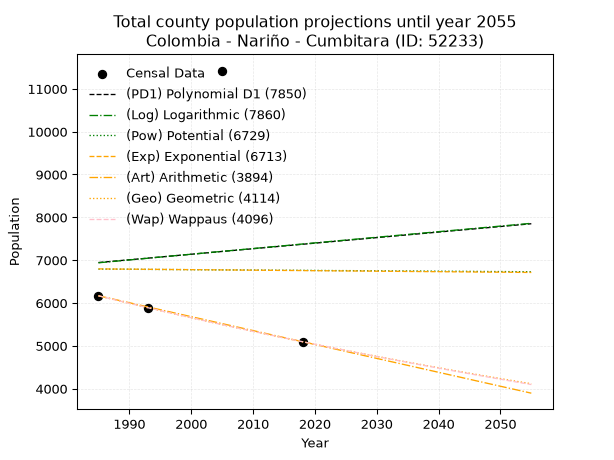
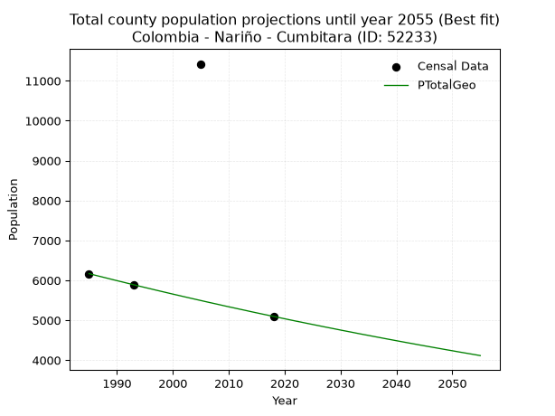
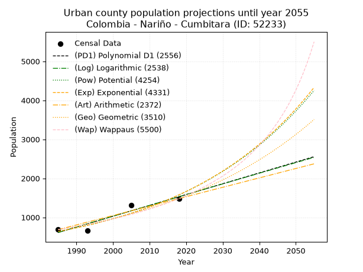
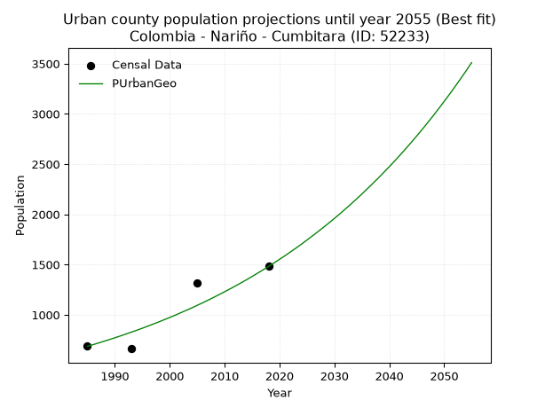
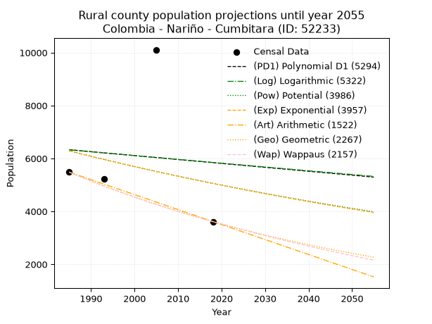
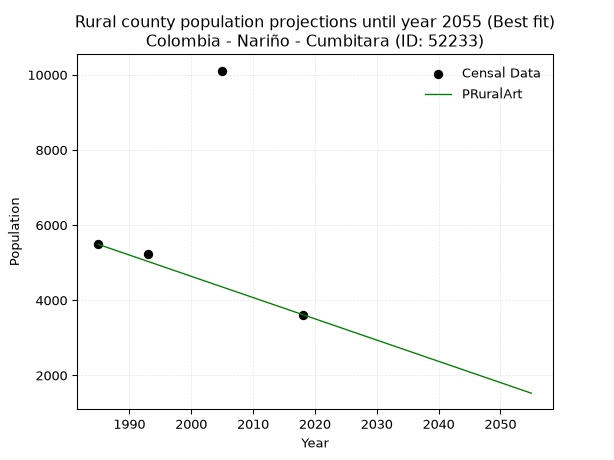

<div align="center">


</div>

# _“Population and Public Services Demand Projections (PPSD) until Year 2050 for Colombia - Nariño - Cumbitara (ID: 52233)”_
Keywords: `population` `public-service` `projection` `lineal` `polynomial` `logarithmic` `potential` `exponential` `arithmetic` `geometric` `wappaus` `dane` `colombia` `south-america`

PPSD are analytical estimates used by governments and planners to anticipate future changes in population size, age distribution, and the resulting community needs for utilities, healthcare, education, and infrastructure as sizing future water treatment facilities, electrical grids, and road networks based on spatial growth.

> **General running parameters**: • app_version: _v20260806_. • Python version: _3.14.7_. • Pandas version: _3.0.5_. • NumPy version: _2.5.1_. • Creates, save and include plots into reports (create_plot): _False_. • Projection until year: _2050_. • Process polynomial degree 2 and up: _False_. • Process Wappaus: _True_. • Process Wappaus: _True_. • Set negative values to zero: _True_. • Set infinite values to zero: _True_. • Drop dataset notes: _True_. 
<div align="center">

Dynamic map: [:earth_americas:Google](http://maps.google.com/maps?q=1.647162908,-77.5786157) [:earth_americas:OSM](https://www.openstreetmap.org/#map=18/1.647162908/-77.5786157&layers=P) [:earth_americas:Bing](https://www.bing.com/maps?cp=1.647162908~-77.5786157&lvl=18) [:earth_americas:Apple](https://maps.apple.com/frame?center=1.647162908%2C-77.5786157&span=0.003%2C0.006)

</div>


<div align="center">

```geojson
{
  "type": "Feature",
  "geometry": {
    "type": "Point", 
    "coordinates": [-77.5786157, 1.647162908]
  }, 
  "properties": {
    "Name": "Colombia - Nariño - Cumbitara (ID: 52233)"
  }
}
```

</div>


## 0. Census Data (4 records)

Census data are official statistics collected by a government about the people and housing in a country. They usually include counts of total population, age, sex, race, income, education, and jobs.

📅Global census file: [Population.xlsx](../data/Population.xlsx)

| Source   |   Year |   CountryID | CountryName   |   StateID | StateName   |   CountyID | CountyName   |   PTotal |   PUrban |   PRural |
|:---------|-------:|------------:|:--------------|----------:|:------------|-----------:|:-------------|---------:|---------:|---------:|
| DANE     |   1985 |          57 | Colombia      |        52 | Nariño      |      52233 | Cumbitara    |     6168 |      686 |     5482 |
| DANE     |   1993 |          57 | Colombia      |        52 | Nariño      |      52233 | Cumbitara    |     5876 |      662 |     5214 |
| DANE     |   2005 |          57 | Colombia      |        52 | Nariño      |      52233 | Cumbitara    |    11425 |     1317 |    10108 |
| DANE     |   2018 |          57 | Colombia      |        52 | Nariño      |      52233 | Cumbitara    |     5096 |     1481 |     3615 |

> 🔥Some records could had specific notes about the registered values or the corresponding urban or rural distribution.

## 1. Total

### 1.1. Coefficients and Parameters

* (PD1) Polynomial Deg 1: 12.94219189081047, -18746.36932959364 (lineal)
* (Log) Logarithmic: 26597.21268311579, -195024.3767410493
* (Pow) Potential: -0.2649685209711024, 4.705759127244411
* (Exp) Exponential: -0.00017527872620367796, 9623.701476063092
* (Art) Arithmetic: Year diff. 2018 - 1985 = 33, Population diff. 5096 - 6168 = -1072, Annual growth = -32.484848484848484
* (Geo) Geometric: Year diff. 2018 - 1985 = 33, Population diff. 5096 - 6168 = -1072, Annual growth % = -0.0057687124066595485
* (Wap) Wappaus: i = -0.5767906336088154, Condition values only valid for < 200)

<sub>
Wappaus condition values: ['-0.00', '-0.58', '-1.15', '-1.73', '-2.31', '-2.88', '-3.46', '-4.04', '-4.61', '-5.19', '-5.77', '-6.34', '-6.92', '-7.50', '-8.08', '-8.65', '-9.23', '-9.81', '-10.38', '-10.96', '-11.54', '-12.11', '-12.69', '-13.27', '-13.84', '-14.42', '-15.00', '-15.57', '-16.15', '-16.73', '-17.30', '-17.88', '-18.46', '-19.03', '-19.61', '-20.19', '-20.76', '-21.34', '-21.92', '-22.49', '-23.07', '-23.65', '-24.23', '-24.80', '-25.38', '-25.96', '-26.53', '-27.11', '-27.69', '-28.26', '-28.84', '-29.42', '-29.99', '-30.57', '-31.15', '-31.72', '-32.30', '-32.88', '-33.45', '-34.03', '-34.61', '-35.18', '-35.76', '-36.34', '-36.91', '-37.49']
</sub>


### 1.2. Projected Dataset

|   Year |   CountyID |   PTotalPD1 |   PTotalLog |   PTotalPow |   PTotalExp |   PTotalArt |   PTotalGeo |   PTotalWap |
|-------:|-----------:|------------:|------------:|------------:|------------:|------------:|------------:|------------:|
|   1985 |      52233 |        6944 |        6938 |        6791 |        6796 |        6168 |        6168 |        6168 |
|   1986 |      52233 |        6957 |        6952 |        6790 |        6795 |        6136 |        6132 |        6133 |
|   1987 |      52233 |        6970 |        6965 |        6790 |        6793 |        6103 |        6097 |        6097 |
|   1988 |      52233 |        6983 |        6978 |        6789 |        6792 |        6071 |        6062 |        6062 |
|   1989 |      52233 |        6996 |        6992 |        6788 |        6791 |        6038 |        6027 |        6027 |
|   1990 |      52233 |        7009 |        7005 |        6787 |        6790 |        6006 |        5992 |        5993 |
|   1991 |      52233 |        7022 |        7018 |        6786 |        6789 |        5973 |        5958 |        5958 |
|   1992 |      52233 |        7034 |        7032 |        6785 |        6787 |        5941 |        5923 |        5924 |
|   1993 |      52233 |        7047 |        7045 |        6784 |        6786 |        5908 |        5889 |        5890 |
|   1994 |      52233 |        7060 |        7059 |        6783 |        6785 |        5876 |        5855 |        5856 |
|   1995 |      52233 |        7073 |        7072 |        6782 |        6784 |        5843 |        5821 |        5822 |
|   1996 |      52233 |        7086 |        7085 |        6781 |        6783 |        5811 |        5788 |        5789 |
|   1997 |      52233 |        7099 |        7099 |        6781 |        6781 |        5778 |        5754 |        5755 |
|   1998 |      52233 |        7112 |        7112 |        6780 |        6780 |        5746 |        5721 |        5722 |
|   1999 |      52233 |        7125 |        7125 |        6779 |        6779 |        5713 |        5688 |        5689 |
|   2000 |      52233 |        7138 |        7138 |        6778 |        6778 |        5681 |        5655 |        5656 |
|   2001 |      52233 |        7151 |        7152 |        6777 |        6777 |        5648 |        5623 |        5624 |
|   2002 |      52233 |        7164 |        7165 |        6776 |        6776 |        5616 |        5590 |        5591 |
|   2003 |      52233 |        7177 |        7178 |        6775 |        6774 |        5583 |        5558 |        5559 |
|   2004 |      52233 |        7190 |        7192 |        6774 |        6773 |        5551 |        5526 |        5527 |
|   2005 |      52233 |        7203 |        7205 |        6773 |        6772 |        5518 |        5494 |        5495 |
|   2006 |      52233 |        7216 |        7218 |        6772 |        6771 |        5486 |        5462 |        5464 |
|   2007 |      52233 |        7229 |        7231 |        6772 |        6770 |        5453 |        5431 |        5432 |
|   2008 |      52233 |        7242 |        7245 |        6771 |        6768 |        5421 |        5400 |        5401 |
|   2009 |      52233 |        7254 |        7258 |        6770 |        6767 |        5388 |        5368 |        5369 |
|   2010 |      52233 |        7267 |        7271 |        6769 |        6766 |        5356 |        5337 |        5338 |
|   2011 |      52233 |        7280 |        7284 |        6768 |        6765 |        5323 |        5307 |        5308 |
|   2012 |      52233 |        7293 |        7298 |        6767 |        6764 |        5291 |        5276 |        5277 |
|   2013 |      52233 |        7306 |        7311 |        6766 |        6763 |        5258 |        5246 |        5246 |
|   2014 |      52233 |        7319 |        7324 |        6765 |        6761 |        5226 |        5215 |        5216 |
|   2015 |      52233 |        7332 |        7337 |        6764 |        6760 |        5193 |        5185 |        5186 |
|   2016 |      52233 |        7345 |        7350 |        6764 |        6759 |        5161 |        5155 |        5156 |
|   2017 |      52233 |        7358 |        7364 |        6763 |        6758 |        5128 |        5126 |        5126 |
|   2018 |      52233 |        7371 |        7377 |        6762 |        6757 |        5096 |        5096 |        5096 |
|   2019 |      52233 |        7384 |        7390 |        6761 |        6755 |        5064 |        5067 |        5066 |
|   2020 |      52233 |        7397 |        7403 |        6760 |        6754 |        5031 |        5037 |        5037 |
|   2021 |      52233 |        7410 |        7416 |        6759 |        6753 |        4999 |        5008 |        5008 |
|   2022 |      52233 |        7423 |        7429 |        6758 |        6752 |        4966 |        4979 |        4979 |
|   2023 |      52233 |        7436 |        7443 |        6757 |        6751 |        4934 |        4951 |        4950 |
|   2024 |      52233 |        7449 |        7456 |        6756 |        6749 |        4901 |        4922 |        4921 |
|   2025 |      52233 |        7462 |        7469 |        6756 |        6748 |        4869 |        4894 |        4892 |
|   2026 |      52233 |        7475 |        7482 |        6755 |        6747 |        4836 |        4866 |        4864 |
|   2027 |      52233 |        7487 |        7495 |        6754 |        6746 |        4804 |        4837 |        4835 |
|   2028 |      52233 |        7500 |        7508 |        6753 |        6745 |        4771 |        4810 |        4807 |
|   2029 |      52233 |        7513 |        7521 |        6752 |        6744 |        4739 |        4782 |        4779 |
|   2030 |      52233 |        7526 |        7534 |        6751 |        6742 |        4706 |        4754 |        4751 |
|   2031 |      52233 |        7539 |        7548 |        6750 |        6741 |        4674 |        4727 |        4723 |
|   2032 |      52233 |        7552 |        7561 |        6749 |        6740 |        4641 |        4700 |        4695 |
|   2033 |      52233 |        7565 |        7574 |        6748 |        6739 |        4609 |        4672 |        4668 |
|   2034 |      52233 |        7578 |        7587 |        6748 |        6738 |        4576 |        4645 |        4641 |
|   2035 |      52233 |        7591 |        7600 |        6747 |        6736 |        4544 |        4619 |        4613 |
|   2036 |      52233 |        7604 |        7613 |        6746 |        6735 |        4511 |        4592 |        4586 |
|   2037 |      52233 |        7617 |        7626 |        6745 |        6734 |        4479 |        4566 |        4559 |
|   2038 |      52233 |        7630 |        7639 |        6744 |        6733 |        4446 |        4539 |        4532 |
|   2039 |      52233 |        7643 |        7652 |        6743 |        6732 |        4414 |        4513 |        4506 |
|   2040 |      52233 |        7656 |        7665 |        6742 |        6731 |        4381 |        4487 |        4479 |
|   2041 |      52233 |        7669 |        7678 |        6741 |        6729 |        4349 |        4461 |        4453 |
|   2042 |      52233 |        7682 |        7691 |        6741 |        6728 |        4316 |        4435 |        4426 |
|   2043 |      52233 |        7695 |        7704 |        6740 |        6727 |        4284 |        4410 |        4400 |
|   2044 |      52233 |        7707 |        7717 |        6739 |        6726 |        4251 |        4384 |        4374 |
|   2045 |      52233 |        7720 |        7730 |        6738 |        6725 |        4219 |        4359 |        4348 |
|   2046 |      52233 |        7733 |        7743 |        6737 |        6723 |        4186 |        4334 |        4322 |
|   2047 |      52233 |        7746 |        7756 |        6736 |        6722 |        4154 |        4309 |        4297 |
|   2048 |      52233 |        7759 |        7769 |        6735 |        6721 |        4121 |        4284 |        4271 |
|   2049 |      52233 |        7772 |        7782 |        6734 |        6720 |        4089 |        4259 |        4246 |
|   2050 |      52233 |        7785 |        7795 |        6734 |        6719 |        4056 |        4235 |        4221 |
<div align="center">

</img>

</div>


### 1.3. Best fit with absolute and relative error (%)

Relative error puts that difference into context by dividing the absolute error by the true value, creating a unitless ratio or percentage that shows the scale of the mistake.

Absolute and relative error

|   Year | Source   |   CountryID | CountryName   |   StateID | StateName   |   CountyID_x | CountyName   |   PTotal |   PUrban |   PRural |   CountyID_y |   PTotalPD1 |   PTotalLog |   PTotalPow |   PTotalExp |   PTotalArt |   PTotalGeo |   PTotalWap |   PTotalPD1AbsError |   PTotalLogAbsError |   PTotalPowAbsError |   PTotalExpAbsError |   PTotalArtAbsError |   PTotalGeoAbsError |   PTotalWapAbsError |   PTotalPD1RelError |   PTotalLogRelError |   PTotalPowRelError |   PTotalExpRelError |   PTotalArtRelError |   PTotalGeoRelError |   PTotalWapRelError |
|-------:|:---------|------------:|:--------------|----------:|:------------|-------------:|:-------------|---------:|---------:|---------:|-------------:|------------:|------------:|------------:|------------:|------------:|------------:|------------:|--------------------:|--------------------:|--------------------:|--------------------:|--------------------:|--------------------:|--------------------:|--------------------:|--------------------:|--------------------:|--------------------:|--------------------:|--------------------:|--------------------:|
|   1985 | DANE     |          57 | Colombia      |        52 | Nariño      |        52233 | Cumbitara    |     6168 |      686 |     5482 |        52233 |        6944 |        6938 |        6791 |        6796 |        6168 |        6168 |        6168 |                 776 |                 770 |                 623 |                 628 |                   0 |                   0 |                   0 |             12.5811 |             12.4838 |             10.1005 |             10.1816 |            0        |            0        |            0        |
|   1993 | DANE     |          57 | Colombia      |        52 | Nariño      |        52233 | Cumbitara    |     5876 |      662 |     5214 |        52233 |        7047 |        7045 |        6784 |        6786 |        5908 |        5889 |        5890 |                1171 |                1169 |                 908 |                 910 |                  32 |                  13 |                  14 |             19.9285 |             19.8945 |             15.4527 |             15.4867 |            0.544588 |            0.221239 |            0.238257 |
|   2005 | DANE     |          57 | Colombia      |        52 | Nariño      |        52233 | Cumbitara    |    11425 |     1317 |    10108 |        52233 |        7203 |        7205 |        6773 |        6772 |        5518 |        5494 |        5495 |                4222 |                4220 |                4652 |                4653 |                5907 |                5931 |                5930 |             36.954  |             36.9365 |             40.7177 |             40.7265 |           51.7024   |           51.9125   |           51.9037   |
|   2018 | DANE     |          57 | Colombia      |        52 | Nariño      |        52233 | Cumbitara    |     5096 |     1481 |     3615 |        52233 |        7371 |        7377 |        6762 |        6757 |        5096 |        5096 |        5096 |                2275 |                2281 |                1666 |                1661 |                   0 |                   0 |                   0 |             44.6429 |             44.7606 |             32.6923 |             32.5942 |            0        |            0        |            0        |

Relative error mean

| Method    |   RelError | Best   |
|:----------|-----------:|:-------|
| PTotalPD1 |    28.5266 |        |
| PTotalLog |    28.5189 |        |
| PTotalPow |    24.7408 |        |
| PTotalExp |    24.7472 |        |
| PTotalArt |    13.0617 |        |
| PTotalGeo |    13.0334 | True   |
| PTotalWap |    13.0355 |        |

💙Best method: _**PTotalGeo**_
<div align="center">

</img>

</div>


### 1.4. Fresh water supply demand in liters per capita per day (lpcd)

The fresh water supply demand typically ranges from 100 to 300 liters per capita per day (lpcd) for standard domestic and municipal planning, though absolute survival minimums set by the World Health Organization are as low as 7.5 to 20 liters per day, and total consumption in high-income nations can exceed 400 liters.

> `CZ`: Level in meters above the sea level (masl)<br> `WS`: Fresh water supply demand in liters per capita per day (lpcd or l/h/d)<br> `WSAll`: Zonal fresh water supply demand in liters per second (l/s)<br> `A`: Zonal area in square meters<br> `DP`: Population density (people/hectare)

Reference values (RAS Colombia)

|    CZ |   WS |
|------:|-----:|
|  1000 |  120 |
|  2000 |  130 |
| 99999 |  140 |

County shapefile geometry properties and water supply values

|   CountyID |      ATotal |   CZTotal |   WSTotal |
|-----------:|------------:|----------:|----------:|
|      52233 | 3.55551e+08 |   1101.85 |       130 |

Projected values for best method: PTotalGeo

|   CountyID |   Year |   PTotalGeo |   DPTotal |   WSTotal |   WSTotalAll |
|-----------:|-------:|------------:|----------:|----------:|-------------:|
|      52233 |   1985 |        6168 |      0.17 |       130 |      9.28056 |
|      52233 |   1986 |        6132 |      0.17 |       130 |      9.22639 |
|      52233 |   1987 |        6097 |      0.17 |       130 |      9.17373 |
|      52233 |   1988 |        6062 |      0.17 |       130 |      9.12106 |
|      52233 |   1989 |        6027 |      0.17 |       130 |      9.0684  |
|      52233 |   1990 |        5992 |      0.17 |       130 |      9.01574 |
|      52233 |   1991 |        5958 |      0.17 |       130 |      8.96458 |
|      52233 |   1992 |        5923 |      0.17 |       130 |      8.91192 |
|      52233 |   1993 |        5889 |      0.17 |       130 |      8.86076 |
|      52233 |   1994 |        5855 |      0.16 |       130 |      8.80961 |
|      52233 |   1995 |        5821 |      0.16 |       130 |      8.75845 |
|      52233 |   1996 |        5788 |      0.16 |       130 |      8.7088  |
|      52233 |   1997 |        5754 |      0.16 |       130 |      8.65764 |
|      52233 |   1998 |        5721 |      0.16 |       130 |      8.60799 |
|      52233 |   1999 |        5688 |      0.16 |       130 |      8.55833 |
|      52233 |   2000 |        5655 |      0.16 |       130 |      8.50868 |
|      52233 |   2001 |        5623 |      0.16 |       130 |      8.46053 |
|      52233 |   2002 |        5590 |      0.16 |       130 |      8.41088 |
|      52233 |   2003 |        5558 |      0.16 |       130 |      8.36273 |
|      52233 |   2004 |        5526 |      0.16 |       130 |      8.31458 |
|      52233 |   2005 |        5494 |      0.15 |       130 |      8.26644 |
|      52233 |   2006 |        5462 |      0.15 |       130 |      8.21829 |
|      52233 |   2007 |        5431 |      0.15 |       130 |      8.17164 |
|      52233 |   2008 |        5400 |      0.15 |       130 |      8.125   |
|      52233 |   2009 |        5368 |      0.15 |       130 |      8.07685 |
|      52233 |   2010 |        5337 |      0.15 |       130 |      8.03021 |
|      52233 |   2011 |        5307 |      0.15 |       130 |      7.98507 |
|      52233 |   2012 |        5276 |      0.15 |       130 |      7.93843 |
|      52233 |   2013 |        5246 |      0.15 |       130 |      7.89329 |
|      52233 |   2014 |        5215 |      0.15 |       130 |      7.84664 |
|      52233 |   2015 |        5185 |      0.15 |       130 |      7.8015  |
|      52233 |   2016 |        5155 |      0.14 |       130 |      7.75637 |
|      52233 |   2017 |        5126 |      0.14 |       130 |      7.71273 |
|      52233 |   2018 |        5096 |      0.14 |       130 |      7.66759 |
|      52233 |   2019 |        5067 |      0.14 |       130 |      7.62396 |
|      52233 |   2020 |        5037 |      0.14 |       130 |      7.57882 |
|      52233 |   2021 |        5008 |      0.14 |       130 |      7.53519 |
|      52233 |   2022 |        4979 |      0.14 |       130 |      7.49155 |
|      52233 |   2023 |        4951 |      0.14 |       130 |      7.44942 |
|      52233 |   2024 |        4922 |      0.14 |       130 |      7.40579 |
|      52233 |   2025 |        4894 |      0.14 |       130 |      7.36366 |
|      52233 |   2026 |        4866 |      0.14 |       130 |      7.32153 |
|      52233 |   2027 |        4837 |      0.14 |       130 |      7.27789 |
|      52233 |   2028 |        4810 |      0.14 |       130 |      7.23727 |
|      52233 |   2029 |        4782 |      0.13 |       130 |      7.19514 |
|      52233 |   2030 |        4754 |      0.13 |       130 |      7.15301 |
|      52233 |   2031 |        4727 |      0.13 |       130 |      7.11238 |
|      52233 |   2032 |        4700 |      0.13 |       130 |      7.07176 |
|      52233 |   2033 |        4672 |      0.13 |       130 |      7.02963 |
|      52233 |   2034 |        4645 |      0.13 |       130 |      6.989   |
|      52233 |   2035 |        4619 |      0.13 |       130 |      6.94988 |
|      52233 |   2036 |        4592 |      0.13 |       130 |      6.90926 |
|      52233 |   2037 |        4566 |      0.13 |       130 |      6.87014 |
|      52233 |   2038 |        4539 |      0.13 |       130 |      6.82951 |
|      52233 |   2039 |        4513 |      0.13 |       130 |      6.79039 |
|      52233 |   2040 |        4487 |      0.13 |       130 |      6.75127 |
|      52233 |   2041 |        4461 |      0.13 |       130 |      6.71215 |
|      52233 |   2042 |        4435 |      0.12 |       130 |      6.67303 |
|      52233 |   2043 |        4410 |      0.12 |       130 |      6.63542 |
|      52233 |   2044 |        4384 |      0.12 |       130 |      6.5963  |
|      52233 |   2045 |        4359 |      0.12 |       130 |      6.55868 |
|      52233 |   2046 |        4334 |      0.12 |       130 |      6.52106 |
|      52233 |   2047 |        4309 |      0.12 |       130 |      6.48345 |
|      52233 |   2048 |        4284 |      0.12 |       130 |      6.44583 |
|      52233 |   2049 |        4259 |      0.12 |       130 |      6.40822 |
|      52233 |   2050 |        4235 |      0.12 |       130 |      6.37211 |

## 2. Urban

### 2.1. Coefficients and Parameters

* (PD1) Polynomial Deg 1: 27.75190686471282, -54474.25170614182 (lineal)
* (Log) Logarithmic: 55551.888055816504, -421213.846277154
* (Pow) Potential: 54.70122723613212, -177.58606875776542
* (Exp) Exponential: 0.027324952120707978, 1.777101023855156e-21
* (Art) Arithmetic: Year diff. 2018 - 1985 = 33, Population diff. 1481 - 686 = 795, Annual growth = 24.09090909090909
* (Geo) Geometric: Year diff. 2018 - 1985 = 33, Population diff. 1481 - 686 = 795, Annual growth % = 0.023595128653487007
* (Wap) Wappaus: i = 2.223434156982842, Condition values only valid for < 200)

<sub>
Wappaus condition values: ['0.00', '2.22', '4.45', '6.67', '8.89', '11.12', '13.34', '15.56', '17.79', '20.01', '22.23', '24.46', '26.68', '28.90', '31.13', '33.35', '35.57', '37.80', '40.02', '42.25', '44.47', '46.69', '48.92', '51.14', '53.36', '55.59', '57.81', '60.03', '62.26', '64.48', '66.70', '68.93', '71.15', '73.37', '75.60', '77.82', '80.04', '82.27', '84.49', '86.71', '88.94', '91.16', '93.38', '95.61', '97.83', '100.05', '102.28', '104.50', '106.72', '108.95', '111.17', '113.40', '115.62', '117.84', '120.07', '122.29', '124.51', '126.74', '128.96', '131.18', '133.41', '135.63', '137.85', '140.08', '142.30', '144.52']
</sub>


### 2.2. Projected Dataset

|   Year |   CountyID |   PUrbanPD1 |   PUrbanLog |   PUrbanPow |   PUrbanExp |   PUrbanArt |   PUrbanGeo |   PUrbanWap |
|-------:|-----------:|------------:|------------:|------------:|------------:|------------:|------------:|------------:|
|   1985 |      52233 |         613 |         612 |         639 |         640 |         686 |         686 |         686 |
|   1986 |      52233 |         641 |         640 |         657 |         657 |         710 |         702 |         701 |
|   1987 |      52233 |         669 |         668 |         675 |         675 |         734 |         719 |         717 |
|   1988 |      52233 |         697 |         696 |         694 |         694 |         758 |         736 |         733 |
|   1989 |      52233 |         724 |         724 |         713 |         713 |         782 |         753 |         750 |
|   1990 |      52233 |         752 |         752 |         733 |         733 |         806 |         771 |         767 |
|   1991 |      52233 |         780 |         780 |         754 |         753 |         831 |         789 |         784 |
|   1992 |      52233 |         808 |         808 |         775 |         774 |         855 |         808 |         802 |
|   1993 |      52233 |         835 |         836 |         796 |         796 |         879 |         827 |         820 |
|   1994 |      52233 |         863 |         864 |         818 |         818 |         903 |         846 |         839 |
|   1995 |      52233 |         891 |         892 |         841 |         840 |         927 |         866 |         858 |
|   1996 |      52233 |         919 |         919 |         864 |         864 |         951 |         887 |         877 |
|   1997 |      52233 |         946 |         947 |         889 |         888 |         975 |         908 |         897 |
|   1998 |      52233 |         974 |         975 |         913 |         912 |         999 |         929 |         918 |
|   1999 |      52233 |        1002 |        1003 |         939 |         938 |        1023 |         951 |         939 |
|   2000 |      52233 |        1030 |        1031 |         965 |         964 |        1047 |         973 |         961 |
|   2001 |      52233 |        1057 |        1058 |         991 |         990 |        1071 |         996 |         983 |
|   2002 |      52233 |        1085 |        1086 |        1019 |        1018 |        1096 |        1020 |        1006 |
|   2003 |      52233 |        1113 |        1114 |        1047 |        1046 |        1120 |        1044 |        1029 |
|   2004 |      52233 |        1141 |        1142 |        1076 |        1075 |        1144 |        1068 |        1053 |
|   2005 |      52233 |        1168 |        1169 |        1106 |        1105 |        1168 |        1094 |        1078 |
|   2006 |      52233 |        1196 |        1197 |        1136 |        1135 |        1192 |        1119 |        1104 |
|   2007 |      52233 |        1224 |        1225 |        1168 |        1167 |        1216 |        1146 |        1130 |
|   2008 |      52233 |        1252 |        1252 |        1200 |        1199 |        1240 |        1173 |        1157 |
|   2009 |      52233 |        1279 |        1280 |        1233 |        1232 |        1264 |        1201 |        1185 |
|   2010 |      52233 |        1307 |        1308 |        1267 |        1266 |        1288 |        1229 |        1214 |
|   2011 |      52233 |        1335 |        1335 |        1302 |        1301 |        1312 |        1258 |        1244 |
|   2012 |      52233 |        1363 |        1363 |        1338 |        1337 |        1336 |        1288 |        1274 |
|   2013 |      52233 |        1390 |        1391 |        1375 |        1374 |        1361 |        1318 |        1306 |
|   2014 |      52233 |        1418 |        1418 |        1413 |        1413 |        1385 |        1349 |        1339 |
|   2015 |      52233 |        1446 |        1446 |        1452 |        1452 |        1409 |        1381 |        1373 |
|   2016 |      52233 |        1474 |        1473 |        1491 |        1492 |        1433 |        1414 |        1407 |
|   2017 |      52233 |        1501 |        1501 |        1532 |        1533 |        1457 |        1447 |        1444 |
|   2018 |      52233 |        1529 |        1528 |        1575 |        1576 |        1481 |        1481 |        1481 |
|   2019 |      52233 |        1557 |        1556 |        1618 |        1619 |        1505 |        1516 |        1520 |
|   2020 |      52233 |        1585 |        1583 |        1662 |        1664 |        1529 |        1552 |        1560 |
|   2021 |      52233 |        1612 |        1611 |        1708 |        1710 |        1553 |        1588 |        1601 |
|   2022 |      52233 |        1640 |        1638 |        1755 |        1758 |        1577 |        1626 |        1645 |
|   2023 |      52233 |        1668 |        1666 |        1803 |        1806 |        1601 |        1664 |        1690 |
|   2024 |      52233 |        1696 |        1693 |        1852 |        1856 |        1626 |        1703 |        1736 |
|   2025 |      52233 |        1723 |        1721 |        1903 |        1908 |        1650 |        1744 |        1785 |
|   2026 |      52233 |        1751 |        1748 |        1955 |        1961 |        1674 |        1785 |        1835 |
|   2027 |      52233 |        1779 |        1776 |        2009 |        2015 |        1698 |        1827 |        1888 |
|   2028 |      52233 |        1807 |        1803 |        2064 |        2071 |        1722 |        1870 |        1943 |
|   2029 |      52233 |        1834 |        1830 |        2120 |        2128 |        1746 |        1914 |        2000 |
|   2030 |      52233 |        1862 |        1858 |        2178 |        2187 |        1770 |        1959 |        2059 |
|   2031 |      52233 |        1890 |        1885 |        2237 |        2248 |        1794 |        2005 |        2122 |
|   2032 |      52233 |        1918 |        1912 |        2298 |        2310 |        1818 |        2053 |        2187 |
|   2033 |      52233 |        1945 |        1940 |        2361 |        2374 |        1842 |        2101 |        2256 |
|   2034 |      52233 |        1973 |        1967 |        2425 |        2440 |        1866 |        2151 |        2328 |
|   2035 |      52233 |        2001 |        1994 |        2492 |        2507 |        1891 |        2202 |        2403 |
|   2036 |      52233 |        2029 |        2022 |        2559 |        2577 |        1915 |        2254 |        2482 |
|   2037 |      52233 |        2056 |        2049 |        2629 |        2648 |        1939 |        2307 |        2566 |
|   2038 |      52233 |        2084 |        2076 |        2701 |        2722 |        1963 |        2361 |        2654 |
|   2039 |      52233 |        2112 |        2103 |        2774 |        2797 |        1987 |        2417 |        2747 |
|   2040 |      52233 |        2140 |        2131 |        2849 |        2874 |        2011 |        2474 |        2845 |
|   2041 |      52233 |        2167 |        2158 |        2927 |        2954 |        2035 |        2532 |        2949 |
|   2042 |      52233 |        2195 |        2185 |        3006 |        3036 |        2059 |        2592 |        3059 |
|   2043 |      52233 |        2223 |        2212 |        3088 |        3120 |        2083 |        2653 |        3177 |
|   2044 |      52233 |        2251 |        2240 |        3172 |        3206 |        2107 |        2716 |        3301 |
|   2045 |      52233 |        2278 |        2267 |        3258 |        3295 |        2131 |        2780 |        3434 |
|   2046 |      52233 |        2306 |        2294 |        3346 |        3386 |        2156 |        2845 |        3577 |
|   2047 |      52233 |        2334 |        2321 |        3437 |        3480 |        2180 |        2913 |        3729 |
|   2048 |      52233 |        2362 |        2348 |        3530 |        3577 |        2204 |        2981 |        3893 |
|   2049 |      52233 |        2389 |        2375 |        3625 |        3676 |        2228 |        3052 |        4070 |
|   2050 |      52233 |        2417 |        2402 |        3723 |        3778 |        2252 |        3124 |        4260 |
<div align="center">

</img>

</div>


### 2.3. Best fit with absolute and relative error (%)

Relative error puts that difference into context by dividing the absolute error by the true value, creating a unitless ratio or percentage that shows the scale of the mistake.

Absolute and relative error

|   Year | Source   |   CountryID | CountryName   |   StateID | StateName   |   CountyID_x | CountyName   |   PTotal |   PUrban |   PRural |   CountyID_y |   PUrbanPD1 |   PUrbanLog |   PUrbanPow |   PUrbanExp |   PUrbanArt |   PUrbanGeo |   PUrbanWap |   PUrbanPD1AbsError |   PUrbanLogAbsError |   PUrbanPowAbsError |   PUrbanExpAbsError |   PUrbanArtAbsError |   PUrbanGeoAbsError |   PUrbanWapAbsError |   PUrbanPD1RelError |   PUrbanLogRelError |   PUrbanPowRelError |   PUrbanExpRelError |   PUrbanArtRelError |   PUrbanGeoRelError |   PUrbanWapRelError |
|-------:|:---------|------------:|:--------------|----------:|:------------|-------------:|:-------------|---------:|---------:|---------:|-------------:|------------:|------------:|------------:|------------:|------------:|------------:|------------:|--------------------:|--------------------:|--------------------:|--------------------:|--------------------:|--------------------:|--------------------:|--------------------:|--------------------:|--------------------:|--------------------:|--------------------:|--------------------:|--------------------:|
|   1985 | DANE     |          57 | Colombia      |        52 | Nariño      |        52233 | Cumbitara    |     6168 |      686 |     5482 |        52233 |         613 |         612 |         639 |         640 |         686 |         686 |         686 |                  73 |                  74 |                  47 |                  46 |                   0 |                   0 |                   0 |            10.6414  |            10.7872  |             6.85131 |             6.70554 |              0      |              0      |              0      |
|   1993 | DANE     |          57 | Colombia      |        52 | Nariño      |        52233 | Cumbitara    |     5876 |      662 |     5214 |        52233 |         835 |         836 |         796 |         796 |         879 |         827 |         820 |                 173 |                 174 |                 134 |                 134 |                 217 |                 165 |                 158 |            26.1329  |            26.284   |            20.2417  |            20.2417  |             32.7795 |             24.9245 |             23.8671 |
|   2005 | DANE     |          57 | Colombia      |        52 | Nariño      |        52233 | Cumbitara    |    11425 |     1317 |    10108 |        52233 |        1168 |        1169 |        1106 |        1105 |        1168 |        1094 |        1078 |                 149 |                 148 |                 211 |                 212 |                 149 |                 223 |                 239 |            11.3136  |            11.2377  |            16.0213  |            16.0972  |             11.3136 |             16.9324 |             18.1473 |
|   2018 | DANE     |          57 | Colombia      |        52 | Nariño      |        52233 | Cumbitara    |     5096 |     1481 |     3615 |        52233 |        1529 |        1528 |        1575 |        1576 |        1481 |        1481 |        1481 |                  48 |                  47 |                  94 |                  95 |                   0 |                   0 |                   0 |             3.24105 |             3.17353 |             6.34706 |             6.41458 |              0      |              0      |              0      |

Relative error mean

| Method    |   RelError | Best   |
|:----------|-----------:|:-------|
| PUrbanPD1 |    12.8322 |        |
| PUrbanLog |    12.8706 |        |
| PUrbanPow |    12.3653 |        |
| PUrbanExp |    12.3648 |        |
| PUrbanArt |    11.0233 |        |
| PUrbanGeo |    10.4642 | True   |
| PUrbanWap |    10.5036 |        |

💙Best method: _**PUrbanGeo**_
<div align="center">

</img>

</div>


### 2.4. Fresh water supply demand in liters per capita per day (lpcd)

The fresh water supply demand typically ranges from 100 to 300 liters per capita per day (lpcd) for standard domestic and municipal planning, though absolute survival minimums set by the World Health Organization are as low as 7.5 to 20 liters per day, and total consumption in high-income nations can exceed 400 liters.

> `CZ`: Level in meters above the sea level (masl)<br> `WS`: Fresh water supply demand in liters per capita per day (lpcd or l/h/d)<br> `WSAll`: Zonal fresh water supply demand in liters per second (l/s)<br> `A`: Zonal area in square meters<br> `DP`: Population density (people/hectare)

Reference values (RAS Colombia)

|    CZ |   WS |
|------:|-----:|
|  1000 |  120 |
|  2000 |  130 |
| 99999 |  140 |

County shapefile geometry properties and water supply values

|   CountyID |   AUrban |   CZUrban |   WSUrban |
|-----------:|---------:|----------:|----------:|
|      52233 |   276591 |   1699.13 |       130 |

Projected values for best method: PUrbanGeo

|   CountyID |   Year |   PUrbanGeo |   DPUrban |   WSUrban |   WSUrbanAll |
|-----------:|-------:|------------:|----------:|----------:|-------------:|
|      52233 |   1985 |         686 |     24.8  |       130 |      1.03218 |
|      52233 |   1986 |         702 |     25.38 |       130 |      1.05625 |
|      52233 |   1987 |         719 |     26    |       130 |      1.08183 |
|      52233 |   1988 |         736 |     26.61 |       130 |      1.10741 |
|      52233 |   1989 |         753 |     27.22 |       130 |      1.13299 |
|      52233 |   1990 |         771 |     27.88 |       130 |      1.16007 |
|      52233 |   1991 |         789 |     28.53 |       130 |      1.18715 |
|      52233 |   1992 |         808 |     29.21 |       130 |      1.21574 |
|      52233 |   1993 |         827 |     29.9  |       130 |      1.24433 |
|      52233 |   1994 |         846 |     30.59 |       130 |      1.27292 |
|      52233 |   1995 |         866 |     31.31 |       130 |      1.30301 |
|      52233 |   1996 |         887 |     32.07 |       130 |      1.33461 |
|      52233 |   1997 |         908 |     32.83 |       130 |      1.3662  |
|      52233 |   1998 |         929 |     33.59 |       130 |      1.3978  |
|      52233 |   1999 |         951 |     34.38 |       130 |      1.4309  |
|      52233 |   2000 |         973 |     35.18 |       130 |      1.464   |
|      52233 |   2001 |         996 |     36.01 |       130 |      1.49861 |
|      52233 |   2002 |        1020 |     36.88 |       130 |      1.53472 |
|      52233 |   2003 |        1044 |     37.75 |       130 |      1.57083 |
|      52233 |   2004 |        1068 |     38.61 |       130 |      1.60694 |
|      52233 |   2005 |        1094 |     39.55 |       130 |      1.64606 |
|      52233 |   2006 |        1119 |     40.46 |       130 |      1.68368 |
|      52233 |   2007 |        1146 |     41.43 |       130 |      1.72431 |
|      52233 |   2008 |        1173 |     42.41 |       130 |      1.76493 |
|      52233 |   2009 |        1201 |     43.42 |       130 |      1.80706 |
|      52233 |   2010 |        1229 |     44.43 |       130 |      1.84919 |
|      52233 |   2011 |        1258 |     45.48 |       130 |      1.89282 |
|      52233 |   2012 |        1288 |     46.57 |       130 |      1.93796 |
|      52233 |   2013 |        1318 |     47.65 |       130 |      1.9831  |
|      52233 |   2014 |        1349 |     48.77 |       130 |      2.02975 |
|      52233 |   2015 |        1381 |     49.93 |       130 |      2.07789 |
|      52233 |   2016 |        1414 |     51.12 |       130 |      2.12755 |
|      52233 |   2017 |        1447 |     52.32 |       130 |      2.1772  |
|      52233 |   2018 |        1481 |     53.54 |       130 |      2.22836 |
|      52233 |   2019 |        1516 |     54.81 |       130 |      2.28102 |
|      52233 |   2020 |        1552 |     56.11 |       130 |      2.33519 |
|      52233 |   2021 |        1588 |     57.41 |       130 |      2.38935 |
|      52233 |   2022 |        1626 |     58.79 |       130 |      2.44653 |
|      52233 |   2023 |        1664 |     60.16 |       130 |      2.5037  |
|      52233 |   2024 |        1703 |     61.57 |       130 |      2.56238 |
|      52233 |   2025 |        1744 |     63.05 |       130 |      2.62407 |
|      52233 |   2026 |        1785 |     64.54 |       130 |      2.68576 |
|      52233 |   2027 |        1827 |     66.05 |       130 |      2.74896 |
|      52233 |   2028 |        1870 |     67.61 |       130 |      2.81366 |
|      52233 |   2029 |        1914 |     69.2  |       130 |      2.87986 |
|      52233 |   2030 |        1959 |     70.83 |       130 |      2.94757 |
|      52233 |   2031 |        2005 |     72.49 |       130 |      3.01678 |
|      52233 |   2032 |        2053 |     74.23 |       130 |      3.089   |
|      52233 |   2033 |        2101 |     75.96 |       130 |      3.16123 |
|      52233 |   2034 |        2151 |     77.77 |       130 |      3.23646 |
|      52233 |   2035 |        2202 |     79.61 |       130 |      3.31319 |
|      52233 |   2036 |        2254 |     81.49 |       130 |      3.39144 |
|      52233 |   2037 |        2307 |     83.41 |       130 |      3.47118 |
|      52233 |   2038 |        2361 |     85.36 |       130 |      3.55243 |
|      52233 |   2039 |        2417 |     87.39 |       130 |      3.63669 |
|      52233 |   2040 |        2474 |     89.45 |       130 |      3.72245 |
|      52233 |   2041 |        2532 |     91.54 |       130 |      3.80972 |
|      52233 |   2042 |        2592 |     93.71 |       130 |      3.9     |
|      52233 |   2043 |        2653 |     95.92 |       130 |      3.99178 |
|      52233 |   2044 |        2716 |     98.2  |       130 |      4.08657 |
|      52233 |   2045 |        2780 |    100.51 |       130 |      4.18287 |
|      52233 |   2046 |        2845 |    102.86 |       130 |      4.28067 |
|      52233 |   2047 |        2913 |    105.32 |       130 |      4.38299 |
|      52233 |   2048 |        2981 |    107.78 |       130 |      4.4853  |
|      52233 |   2049 |        3052 |    110.34 |       130 |      4.59213 |
|      52233 |   2050 |        3124 |    112.95 |       130 |      4.70046 |

## 3. Rural

### 3.1. Coefficients and Parameters

* (PD1) Polynomial Deg 1: -14.809714973902366, 35727.88237654821 (lineal)
* (Log) Logarithmic: -28954.67537270066, 226189.46953610427
* (Pow) Potential: -13.140651806611968, 47.13300906162313
* (Exp) Exponential: -0.006617424195579235, 3186111726.6551523
* (Art) Arithmetic: Year diff. 2018 - 1985 = 33, Population diff. 3615 - 5482 = -1867, Annual growth = -56.57575757575758
* (Geo) Geometric: Year diff. 2018 - 1985 = 33, Population diff. 3615 - 5482 = -1867, Annual growth % = -0.012538252299265418
* (Wap) Wappaus: i = -1.2438332983567677, Condition values only valid for < 200)

<sub>
Wappaus condition values: ['-0.00', '-1.24', '-2.49', '-3.73', '-4.98', '-6.22', '-7.46', '-8.71', '-9.95', '-11.19', '-12.44', '-13.68', '-14.93', '-16.17', '-17.41', '-18.66', '-19.90', '-21.15', '-22.39', '-23.63', '-24.88', '-26.12', '-27.36', '-28.61', '-29.85', '-31.10', '-32.34', '-33.58', '-34.83', '-36.07', '-37.31', '-38.56', '-39.80', '-41.05', '-42.29', '-43.53', '-44.78', '-46.02', '-47.27', '-48.51', '-49.75', '-51.00', '-52.24', '-53.48', '-54.73', '-55.97', '-57.22', '-58.46', '-59.70', '-60.95', '-62.19', '-63.44', '-64.68', '-65.92', '-67.17', '-68.41', '-69.65', '-70.90', '-72.14', '-73.39', '-74.63', '-75.87', '-77.12', '-78.36', '-79.61', '-80.85']
</sub>


### 3.2. Projected Dataset

|   Year |   CountyID |   PRuralPD1 |   PRuralLog |   PRuralPow |   PRuralExp |   PRuralArt |   PRuralGeo |   PRuralWap |
|-------:|-----------:|------------:|------------:|------------:|------------:|------------:|------------:|------------:|
|   1985 |      52233 |        6331 |        6326 |        6285 |        6289 |        5482 |        5482 |        5482 |
|   1986 |      52233 |        6316 |        6311 |        6243 |        6247 |        5425 |        5413 |        5414 |
|   1987 |      52233 |        6301 |        6297 |        6202 |        6206 |        5369 |        5345 |        5347 |
|   1988 |      52233 |        6286 |        6282 |        6161 |        6165 |        5312 |        5278 |        5281 |
|   1989 |      52233 |        6271 |        6267 |        6121 |        6124 |        5256 |        5212 |        5216 |
|   1990 |      52233 |        6257 |        6253 |        6080 |        6084 |        5199 |        5147 |        5151 |
|   1991 |      52233 |        6242 |        6238 |        6040 |        6044 |        5143 |        5082 |        5088 |
|   1992 |      52233 |        6227 |        6224 |        6001 |        6004 |        5086 |        5019 |        5025 |
|   1993 |      52233 |        6212 |        6209 |        5961 |        5964 |        5029 |        4956 |        4962 |
|   1994 |      52233 |        6197 |        6195 |        5922 |        5925 |        4973 |        4894 |        4901 |
|   1995 |      52233 |        6183 |        6180 |        5883 |        5886 |        4916 |        4832 |        4840 |
|   1996 |      52233 |        6168 |        6166 |        5845 |        5847 |        4860 |        4772 |        4780 |
|   1997 |      52233 |        6153 |        6151 |        5806 |        5808 |        4803 |        4712 |        4721 |
|   1998 |      52233 |        6138 |        6137 |        5768 |        5770 |        4747 |        4653 |        4662 |
|   1999 |      52233 |        6123 |        6122 |        5730 |        5732 |        4690 |        4594 |        4604 |
|   2000 |      52233 |        6108 |        6108 |        5693 |        5694 |        4633 |        4537 |        4546 |
|   2001 |      52233 |        6094 |        6093 |        5655 |        5657 |        4577 |        4480 |        4490 |
|   2002 |      52233 |        6079 |        6079 |        5618 |        5619 |        4520 |        4424 |        4434 |
|   2003 |      52233 |        6064 |        6064 |        5582 |        5582 |        4464 |        4368 |        4378 |
|   2004 |      52233 |        6049 |        6050 |        5545 |        5546 |        4407 |        4313 |        4323 |
|   2005 |      52233 |        6034 |        6036 |        5509 |        5509 |        4350 |        4259 |        4269 |
|   2006 |      52233 |        6020 |        6021 |        5473 |        5473 |        4294 |        4206 |        4215 |
|   2007 |      52233 |        6005 |        6007 |        5437 |        5437 |        4237 |        4153 |        4162 |
|   2008 |      52233 |        5990 |        5992 |        5402 |        5401 |        4181 |        4101 |        4110 |
|   2009 |      52233 |        5975 |        5978 |        5367 |        5365 |        4124 |        4050 |        4058 |
|   2010 |      52233 |        5960 |        5963 |        5332 |        5330 |        4068 |        3999 |        4007 |
|   2011 |      52233 |        5946 |        5949 |        5297 |        5295 |        4011 |        3949 |        3956 |
|   2012 |      52233 |        5931 |        5935 |        5262 |        5260 |        3954 |        3899 |        3906 |
|   2013 |      52233 |        5916 |        5920 |        5228 |        5225 |        3898 |        3850 |        3856 |
|   2014 |      52233 |        5901 |        5906 |        5194 |        5190 |        3841 |        3802 |        3807 |
|   2015 |      52233 |        5886 |        5891 |        5160 |        5156 |        3785 |        3754 |        3758 |
|   2016 |      52233 |        5871 |        5877 |        5127 |        5122 |        3728 |        3707 |        3710 |
|   2017 |      52233 |        5857 |        5863 |        5094 |        5088 |        3672 |        3661 |        3662 |
|   2018 |      52233 |        5842 |        5848 |        5060 |        5055 |        3615 |        3615 |        3615 |
|   2019 |      52233 |        5827 |        5834 |        5028 |        5022 |        3558 |        3570 |        3568 |
|   2020 |      52233 |        5812 |        5820 |        4995 |        4988 |        3502 |        3525 |        3522 |
|   2021 |      52233 |        5797 |        5805 |        4963 |        4955 |        3445 |        3481 |        3476 |
|   2022 |      52233 |        5783 |        5791 |        4930 |        4923 |        3389 |        3437 |        3431 |
|   2023 |      52233 |        5768 |        5777 |        4899 |        4890 |        3332 |        3394 |        3386 |
|   2024 |      52233 |        5753 |        5762 |        4867 |        4858 |        3276 |        3351 |        3342 |
|   2025 |      52233 |        5738 |        5748 |        4835 |        4826 |        3219 |        3309 |        3298 |
|   2026 |      52233 |        5723 |        5734 |        4804 |        4794 |        3162 |        3268 |        3254 |
|   2027 |      52233 |        5709 |        5720 |        4773 |        4763 |        3106 |        3227 |        3211 |
|   2028 |      52233 |        5694 |        5705 |        4742 |        4731 |        3049 |        3186 |        3169 |
|   2029 |      52233 |        5679 |        5691 |        4712 |        4700 |        2993 |        3147 |        3126 |
|   2030 |      52233 |        5664 |        5677 |        4681 |        4669 |        2936 |        3107 |        3085 |
|   2031 |      52233 |        5649 |        5662 |        4651 |        4638 |        2880 |        3068 |        3043 |
|   2032 |      52233 |        5635 |        5648 |        4621 |        4608 |        2823 |        3030 |        3002 |
|   2033 |      52233 |        5620 |        5634 |        4591 |        4577 |        2766 |        2992 |        2961 |
|   2034 |      52233 |        5605 |        5620 |        4562 |        4547 |        2710 |        2954 |        2921 |
|   2035 |      52233 |        5590 |        5605 |        4532 |        4517 |        2653 |        2917 |        2881 |
|   2036 |      52233 |        5575 |        5591 |        4503 |        4487 |        2597 |        2881 |        2842 |
|   2037 |      52233 |        5560 |        5577 |        4474 |        4458 |        2540 |        2844 |        2803 |
|   2038 |      52233 |        5546 |        5563 |        4445 |        4428 |        2483 |        2809 |        2764 |
|   2039 |      52233 |        5531 |        5549 |        4417 |        4399 |        2427 |        2774 |        2726 |
|   2040 |      52233 |        5516 |        5534 |        4388 |        4370 |        2370 |        2739 |        2688 |
|   2041 |      52233 |        5501 |        5520 |        4360 |        4341 |        2314 |        2704 |        2650 |
|   2042 |      52233 |        5486 |        5506 |        4332 |        4313 |        2257 |        2671 |        2613 |
|   2043 |      52233 |        5472 |        5492 |        4305 |        4284 |        2201 |        2637 |        2576 |
|   2044 |      52233 |        5457 |        5478 |        4277 |        4256 |        2144 |        2604 |        2539 |
|   2045 |      52233 |        5442 |        5464 |        4250 |        4228 |        2087 |        2571 |        2503 |
|   2046 |      52233 |        5427 |        5449 |        4222 |        4200 |        2031 |        2539 |        2467 |
|   2047 |      52233 |        5412 |        5435 |        4195 |        4172 |        1974 |        2507 |        2431 |
|   2048 |      52233 |        5398 |        5421 |        4168 |        4145 |        1918 |        2476 |        2396 |
|   2049 |      52233 |        5383 |        5407 |        4142 |        4117 |        1861 |        2445 |        2360 |
|   2050 |      52233 |        5368 |        5393 |        4115 |        4090 |        1805 |        2414 |        2326 |
<div align="center">

</img>

</div>


### 3.3. Best fit with absolute and relative error (%)

Relative error puts that difference into context by dividing the absolute error by the true value, creating a unitless ratio or percentage that shows the scale of the mistake.

Absolute and relative error

|   Year | Source   |   CountryID | CountryName   |   StateID | StateName   |   CountyID_x | CountyName   |   PTotal |   PUrban |   PRural |   CountyID_y |   PRuralPD1 |   PRuralLog |   PRuralPow |   PRuralExp |   PRuralArt |   PRuralGeo |   PRuralWap |   PRuralPD1AbsError |   PRuralLogAbsError |   PRuralPowAbsError |   PRuralExpAbsError |   PRuralArtAbsError |   PRuralGeoAbsError |   PRuralWapAbsError |   PRuralPD1RelError |   PRuralLogRelError |   PRuralPowRelError |   PRuralExpRelError |   PRuralArtRelError |   PRuralGeoRelError |   PRuralWapRelError |
|-------:|:---------|------------:|:--------------|----------:|:------------|-------------:|:-------------|---------:|---------:|---------:|-------------:|------------:|------------:|------------:|------------:|------------:|------------:|------------:|--------------------:|--------------------:|--------------------:|--------------------:|--------------------:|--------------------:|--------------------:|--------------------:|--------------------:|--------------------:|--------------------:|--------------------:|--------------------:|--------------------:|
|   1985 | DANE     |          57 | Colombia      |        52 | Nariño      |        52233 | Cumbitara    |     6168 |      686 |     5482 |        52233 |        6331 |        6326 |        6285 |        6289 |        5482 |        5482 |        5482 |                 849 |                 844 |                 803 |                 807 |                   0 |                   0 |                   0 |             15.487  |             15.3958 |             14.6479 |             14.7209 |             0       |             0       |             0       |
|   1993 | DANE     |          57 | Colombia      |        52 | Nariño      |        52233 | Cumbitara    |     5876 |      662 |     5214 |        52233 |        6212 |        6209 |        5961 |        5964 |        5029 |        4956 |        4962 |                 998 |                 995 |                 747 |                 750 |                 185 |                 258 |                 252 |             19.1408 |             19.0832 |             14.3268 |             14.3843 |             3.54814 |             4.94822 |             4.83314 |
|   2005 | DANE     |          57 | Colombia      |        52 | Nariño      |        52233 | Cumbitara    |    11425 |     1317 |    10108 |        52233 |        6034 |        6036 |        5509 |        5509 |        4350 |        4259 |        4269 |                4074 |                4072 |                4599 |                4599 |                5758 |                5849 |                5839 |             40.3047 |             40.2849 |             45.4986 |             45.4986 |            56.9648  |            57.8651  |            57.7661  |
|   2018 | DANE     |          57 | Colombia      |        52 | Nariño      |        52233 | Cumbitara    |     5096 |     1481 |     3615 |        52233 |        5842 |        5848 |        5060 |        5055 |        3615 |        3615 |        3615 |                2227 |                2233 |                1445 |                1440 |                   0 |                   0 |                   0 |             61.6044 |             61.7704 |             39.9723 |             39.834  |             0       |             0       |             0       |

Relative error mean

| Method    |   RelError | Best   |
|:----------|-----------:|:-------|
| PRuralPD1 |    34.1342 |        |
| PRuralLog |    34.1336 |        |
| PRuralPow |    28.6114 |        |
| PRuralExp |    28.6095 |        |
| PRuralArt |    15.1282 | True   |
| PRuralGeo |    15.7033 |        |
| PRuralWap |    15.6498 |        |

💙Best method: _**PRuralArt**_
<div align="center">

</img>

</div>


### 3.4. Fresh water supply demand in liters per capita per day (lpcd)

The fresh water supply demand typically ranges from 100 to 300 liters per capita per day (lpcd) for standard domestic and municipal planning, though absolute survival minimums set by the World Health Organization are as low as 7.5 to 20 liters per day, and total consumption in high-income nations can exceed 400 liters.

> `CZ`: Level in meters above the sea level (masl)<br> `WS`: Fresh water supply demand in liters per capita per day (lpcd or l/h/d)<br> `WSAll`: Zonal fresh water supply demand in liters per second (l/s)<br> `A`: Zonal area in square meters<br> `DP`: Population density (people/hectare)

Reference values (RAS Colombia)

|    CZ |   WS |
|------:|-----:|
|  1000 |  120 |
|  2000 |  130 |
| 99999 |  140 |

County shapefile geometry properties and water supply values

|   CountyID |      ARural |   CZRural |   WSRural |
|-----------:|------------:|----------:|----------:|
|      52233 | 3.55274e+08 |   1101.43 |       130 |

Projected values for best method: PRuralArt

|   CountyID |   Year |   PRuralArt |   DPRural |   WSRural |   WSRuralAll |
|-----------:|-------:|------------:|----------:|----------:|-------------:|
|      52233 |   1985 |        5482 |      0.15 |       130 |      8.24838 |
|      52233 |   1986 |        5425 |      0.15 |       130 |      8.16262 |
|      52233 |   1987 |        5369 |      0.15 |       130 |      8.07836 |
|      52233 |   1988 |        5312 |      0.15 |       130 |      7.99259 |
|      52233 |   1989 |        5256 |      0.15 |       130 |      7.90833 |
|      52233 |   1990 |        5199 |      0.15 |       130 |      7.82257 |
|      52233 |   1991 |        5143 |      0.14 |       130 |      7.73831 |
|      52233 |   1992 |        5086 |      0.14 |       130 |      7.65255 |
|      52233 |   1993 |        5029 |      0.14 |       130 |      7.56678 |
|      52233 |   1994 |        4973 |      0.14 |       130 |      7.48252 |
|      52233 |   1995 |        4916 |      0.14 |       130 |      7.39676 |
|      52233 |   1996 |        4860 |      0.14 |       130 |      7.3125  |
|      52233 |   1997 |        4803 |      0.14 |       130 |      7.22674 |
|      52233 |   1998 |        4747 |      0.13 |       130 |      7.14248 |
|      52233 |   1999 |        4690 |      0.13 |       130 |      7.05671 |
|      52233 |   2000 |        4633 |      0.13 |       130 |      6.97095 |
|      52233 |   2001 |        4577 |      0.13 |       130 |      6.88669 |
|      52233 |   2002 |        4520 |      0.13 |       130 |      6.80093 |
|      52233 |   2003 |        4464 |      0.13 |       130 |      6.71667 |
|      52233 |   2004 |        4407 |      0.12 |       130 |      6.6309  |
|      52233 |   2005 |        4350 |      0.12 |       130 |      6.54514 |
|      52233 |   2006 |        4294 |      0.12 |       130 |      6.46088 |
|      52233 |   2007 |        4237 |      0.12 |       130 |      6.37512 |
|      52233 |   2008 |        4181 |      0.12 |       130 |      6.29086 |
|      52233 |   2009 |        4124 |      0.12 |       130 |      6.20509 |
|      52233 |   2010 |        4068 |      0.11 |       130 |      6.12083 |
|      52233 |   2011 |        4011 |      0.11 |       130 |      6.03507 |
|      52233 |   2012 |        3954 |      0.11 |       130 |      5.94931 |
|      52233 |   2013 |        3898 |      0.11 |       130 |      5.86505 |
|      52233 |   2014 |        3841 |      0.11 |       130 |      5.77928 |
|      52233 |   2015 |        3785 |      0.11 |       130 |      5.69502 |
|      52233 |   2016 |        3728 |      0.1  |       130 |      5.60926 |
|      52233 |   2017 |        3672 |      0.1  |       130 |      5.525   |
|      52233 |   2018 |        3615 |      0.1  |       130 |      5.43924 |
|      52233 |   2019 |        3558 |      0.1  |       130 |      5.35347 |
|      52233 |   2020 |        3502 |      0.1  |       130 |      5.26921 |
|      52233 |   2021 |        3445 |      0.1  |       130 |      5.18345 |
|      52233 |   2022 |        3389 |      0.1  |       130 |      5.09919 |
|      52233 |   2023 |        3332 |      0.09 |       130 |      5.01343 |
|      52233 |   2024 |        3276 |      0.09 |       130 |      4.92917 |
|      52233 |   2025 |        3219 |      0.09 |       130 |      4.8434  |
|      52233 |   2026 |        3162 |      0.09 |       130 |      4.75764 |
|      52233 |   2027 |        3106 |      0.09 |       130 |      4.67338 |
|      52233 |   2028 |        3049 |      0.09 |       130 |      4.58762 |
|      52233 |   2029 |        2993 |      0.08 |       130 |      4.50336 |
|      52233 |   2030 |        2936 |      0.08 |       130 |      4.41759 |
|      52233 |   2031 |        2880 |      0.08 |       130 |      4.33333 |
|      52233 |   2032 |        2823 |      0.08 |       130 |      4.24757 |
|      52233 |   2033 |        2766 |      0.08 |       130 |      4.16181 |
|      52233 |   2034 |        2710 |      0.08 |       130 |      4.07755 |
|      52233 |   2035 |        2653 |      0.07 |       130 |      3.99178 |
|      52233 |   2036 |        2597 |      0.07 |       130 |      3.90752 |
|      52233 |   2037 |        2540 |      0.07 |       130 |      3.82176 |
|      52233 |   2038 |        2483 |      0.07 |       130 |      3.736   |
|      52233 |   2039 |        2427 |      0.07 |       130 |      3.65174 |
|      52233 |   2040 |        2370 |      0.07 |       130 |      3.56597 |
|      52233 |   2041 |        2314 |      0.07 |       130 |      3.48171 |
|      52233 |   2042 |        2257 |      0.06 |       130 |      3.39595 |
|      52233 |   2043 |        2201 |      0.06 |       130 |      3.31169 |
|      52233 |   2044 |        2144 |      0.06 |       130 |      3.22593 |
|      52233 |   2045 |        2087 |      0.06 |       130 |      3.14016 |
|      52233 |   2046 |        2031 |      0.06 |       130 |      3.0559  |
|      52233 |   2047 |        1974 |      0.06 |       130 |      2.97014 |
|      52233 |   2048 |        1918 |      0.05 |       130 |      2.88588 |
|      52233 |   2049 |        1861 |      0.05 |       130 |      2.80012 |
|      52233 |   2050 |        1805 |      0.05 |       130 |      2.71586 |

<div align="center"><br><sub>Share this research</sub></div><br>

<sub>**APPS & TOOLS & CONTENT DISCLAIMER**: • NO WARRANTY - This content and software is provided by <a href="https://github.com/rcfdtools" target="_blank">github.com/rcfdtools</a> "as is", without any express or implied warranty, including warranties of merchantability, fitness for a particular purpose, or non-infringement. There is no guarantee that the software will be error-free or operate without interruption. • LIMITATION OF LIABILITY - Neither the authors nor copyright holders will be liable for claims or damages arising from the software or its use. You are responsible for determining if the software is appropriate for your use and assume all associated risks, including errors, legal compliance, and data loss. • NO PROFESSIONAL ADVICE - The software provides general information and does not offer professional advice. It should not replace consultation with professional advisors. [Clauses and global license for rcfdtools use.](https://github.com/rcfdtools/rcfdtools/blob/main/LICENSE.md)</sub>

| [:house: Home](Readme.md)  | [:beginner: Help / Collaborate](https://github.com/rcfdtools/R.HydroTools/discussions/31) |
|----------------------------|-------------------------------------------------------------------------------------------|