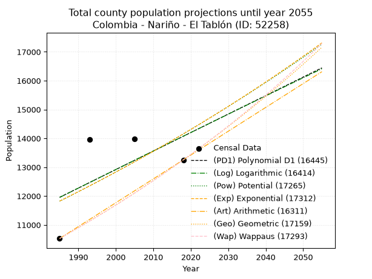
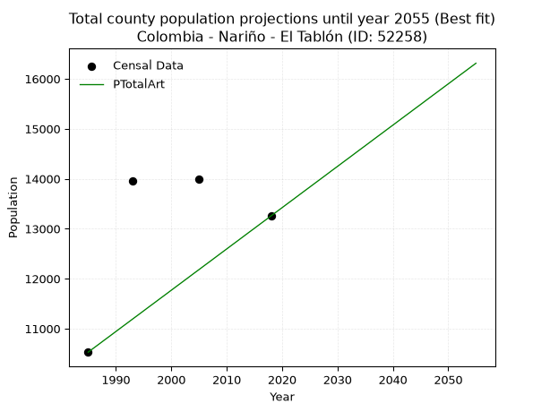
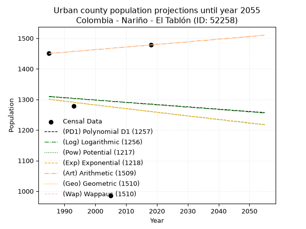
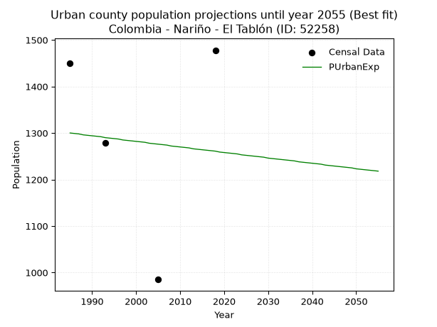
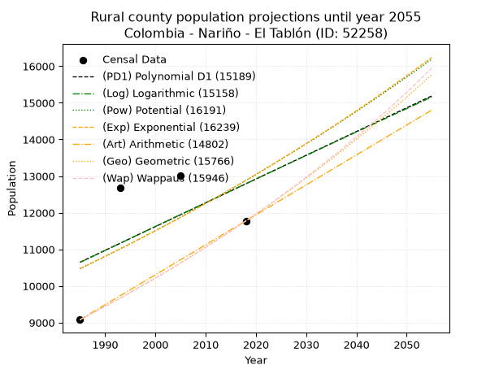
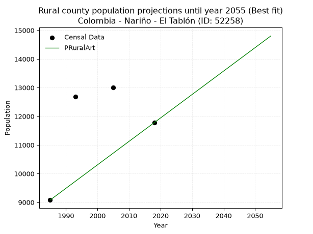

<div align="center">


</div>

# _“Population and Public Services Demand Projections (PPSD) until Year 2050 for Colombia - Nariño - El Tablón de Gómez (ID: 52258)”_
Keywords: `population` `public-service` `projection` `lineal` `polynomial` `logarithmic` `potential` `exponential` `arithmetic` `geometric` `wappaus` `dane` `colombia` `south-america`

PPSD are analytical estimates used by governments and planners to anticipate future changes in population size, age distribution, and the resulting community needs for utilities, healthcare, education, and infrastructure as sizing future water treatment facilities, electrical grids, and road networks based on spatial growth.

> **General running parameters**: • app_version: _v20260806_. • Python version: _3.14.7_. • Pandas version: _3.0.5_. • NumPy version: _2.5.1_. • Creates, save and include plots into reports (create_plot): _False_. • Projection until year: _2050_. • Process polynomial degree 2 and up: _False_. • Process Wappaus: _True_. • Process Wappaus: _True_. • Set negative values to zero: _True_. • Set infinite values to zero: _True_. • Drop dataset notes: _True_. 
<div align="center">

Dynamic map: [:earth_americas:Google](http://maps.google.com/maps?q=1.427277496,-77.097101) [:earth_americas:OSM](https://www.openstreetmap.org/#map=18/1.427277496/-77.097101&layers=P) [:earth_americas:Bing](https://www.bing.com/maps?cp=1.427277496~-77.097101&lvl=18) [:earth_americas:Apple](https://maps.apple.com/frame?center=1.427277496%2C-77.097101&span=0.003%2C0.006)

</div>


<div align="center">

```geojson
{
  "type": "Feature",
  "geometry": {
    "type": "Point", 
    "coordinates": [-77.097101, 1.427277496]
  }, 
  "properties": {
    "Name": "Colombia - Nariño - El Tablón de Gómez (ID: 52258)"
  }
}
```

</div>


## 0. Census Data (4 records)

Census data are official statistics collected by a government about the people and housing in a country. They usually include counts of total population, age, sex, race, income, education, and jobs.

📅Global census file: [Population.xlsx](../data/Population.xlsx)

| Source   |   Year |   CountryID | CountryName   |   StateID | StateName   |   CountyID | CountyName         |   PTotal |   PUrban |   PRural |
|:---------|-------:|------------:|:--------------|----------:|:------------|-----------:|:-------------------|---------:|---------:|---------:|
| DANE     |   1985 |          57 | Colombia      |        52 | Nariño      |      52258 | El Tablón de Gómez |    10529 |     1450 |     9079 |
| DANE     |   1993 |          57 | Colombia      |        52 | Nariño      |      52258 | El Tablón          |    13963 |     1278 |    12685 |
| DANE     |   2005 |          57 | Colombia      |        52 | Nariño      |      52258 | El Tablón de Gómez |    13991 |      985 |    13006 |
| DANE     |   2018 |          57 | Colombia      |        52 | Nariño      |      52258 | El Tablón          |    13255 |     1478 |    11777 |

> 🔥Some records could had specific notes about the registered values or the corresponding urban or rural distribution.

## 1. Total

### 1.1. Coefficients and Parameters

* (PD1) Polynomial Deg 1: 64.12605379365759, -115333.63910076361 (lineal)
* (Log) Logarithmic: 128753.37477810743, -965720.9334531875
* (Pow) Potential: 10.930058582692558, -31.972053698023824
* (Exp) Exponential: 0.005444573174905027, 0.23944803571675594
* (Art) Arithmetic: Year diff. 2018 - 1985 = 33, Population diff. 13255 - 10529 = 2726, Annual growth = 82.60606060606061
* (Geo) Geometric: Year diff. 2018 - 1985 = 33, Population diff. 13255 - 10529 = 2726, Annual growth % = 0.007001410764178706
* (Wap) Wappaus: i = 0.6946355584095241, Condition values only valid for < 200)

<sub>
Wappaus condition values: ['0.00', '0.69', '1.39', '2.08', '2.78', '3.47', '4.17', '4.86', '5.56', '6.25', '6.95', '7.64', '8.34', '9.03', '9.72', '10.42', '11.11', '11.81', '12.50', '13.20', '13.89', '14.59', '15.28', '15.98', '16.67', '17.37', '18.06', '18.76', '19.45', '20.14', '20.84', '21.53', '22.23', '22.92', '23.62', '24.31', '25.01', '25.70', '26.40', '27.09', '27.79', '28.48', '29.17', '29.87', '30.56', '31.26', '31.95', '32.65', '33.34', '34.04', '34.73', '35.43', '36.12', '36.82', '37.51', '38.20', '38.90', '39.59', '40.29', '40.98', '41.68', '42.37', '43.07', '43.76', '44.46', '45.15']
</sub>


### 1.2. Projected Dataset

|   Year |   CountyID |   PTotalPD1 |   PTotalLog |   PTotalPow |   PTotalExp |   PTotalArt |   PTotalGeo |   PTotalWap |
|-------:|-----------:|------------:|------------:|------------:|------------:|------------:|------------:|------------:|
|   1985 |      52258 |       11957 |       11952 |       11821 |       11826 |       10529 |       10529 |       10529 |
|   1986 |      52258 |       12021 |       12016 |       11886 |       11891 |       10612 |       10603 |       10602 |
|   1987 |      52258 |       12085 |       12081 |       11952 |       11956 |       10694 |       10677 |       10676 |
|   1988 |      52258 |       12149 |       12146 |       12018 |       12021 |       10777 |       10752 |       10751 |
|   1989 |      52258 |       12213 |       12211 |       12084 |       12086 |       10859 |       10827 |       10826 |
|   1990 |      52258 |       12277 |       12276 |       12151 |       12152 |       10942 |       10903 |       10901 |
|   1991 |      52258 |       12341 |       12340 |       12218 |       12219 |       11025 |       10979 |       10977 |
|   1992 |      52258 |       12405 |       12405 |       12285 |       12285 |       11107 |       11056 |       11054 |
|   1993 |      52258 |       12470 |       12469 |       12352 |       12353 |       11190 |       11133 |       11131 |
|   1994 |      52258 |       12534 |       12534 |       12420 |       12420 |       11272 |       11211 |       11208 |
|   1995 |      52258 |       12598 |       12599 |       12489 |       12488 |       11355 |       11290 |       11287 |
|   1996 |      52258 |       12662 |       12663 |       12557 |       12556 |       11438 |       11369 |       11365 |
|   1997 |      52258 |       12726 |       12728 |       12626 |       12624 |       11520 |       11448 |       11445 |
|   1998 |      52258 |       12790 |       12792 |       12695 |       12693 |       11603 |       11529 |       11525 |
|   1999 |      52258 |       12854 |       12857 |       12765 |       12763 |       11685 |       11609 |       11605 |
|   2000 |      52258 |       12918 |       12921 |       12835 |       12832 |       11768 |       11691 |       11686 |
|   2001 |      52258 |       12983 |       12985 |       12905 |       12902 |       11851 |       11772 |       11768 |
|   2002 |      52258 |       13047 |       13050 |       12976 |       12973 |       11933 |       11855 |       11850 |
|   2003 |      52258 |       13111 |       13114 |       13047 |       13044 |       12016 |       11938 |       11933 |
|   2004 |      52258 |       13175 |       13178 |       13118 |       13115 |       12099 |       12021 |       12017 |
|   2005 |      52258 |       13239 |       13242 |       13190 |       13187 |       12181 |       12106 |       12101 |
|   2006 |      52258 |       13303 |       13307 |       13262 |       13259 |       12264 |       12190 |       12186 |
|   2007 |      52258 |       13367 |       13371 |       13335 |       13331 |       12346 |       12276 |       12271 |
|   2008 |      52258 |       13431 |       13435 |       13407 |       13404 |       12429 |       12362 |       12357 |
|   2009 |      52258 |       13496 |       13499 |       13481 |       13477 |       12512 |       12448 |       12444 |
|   2010 |      52258 |       13560 |       13563 |       13554 |       13550 |       12594 |       12535 |       12531 |
|   2011 |      52258 |       13624 |       13627 |       13628 |       13624 |       12677 |       12623 |       12619 |
|   2012 |      52258 |       13688 |       13691 |       13702 |       13699 |       12759 |       12712 |       12708 |
|   2013 |      52258 |       13752 |       13755 |       13777 |       13774 |       12842 |       12801 |       12797 |
|   2014 |      52258 |       13816 |       13819 |       13852 |       13849 |       12925 |       12890 |       12888 |
|   2015 |      52258 |       13880 |       13883 |       13927 |       13924 |       13007 |       12980 |       12978 |
|   2016 |      52258 |       13944 |       13947 |       14003 |       14000 |       13090 |       13071 |       13070 |
|   2017 |      52258 |       14009 |       14011 |       14079 |       14077 |       13172 |       13163 |       13162 |
|   2018 |      52258 |       14073 |       14075 |       14156 |       14154 |       13255 |       13255 |       13255 |
|   2019 |      52258 |       14137 |       14138 |       14232 |       14231 |       13338 |       13348 |       13349 |
|   2020 |      52258 |       14201 |       14202 |       14310 |       14309 |       13420 |       13441 |       13443 |
|   2021 |      52258 |       14265 |       14266 |       14387 |       14387 |       13503 |       13535 |       13538 |
|   2022 |      52258 |       14329 |       14329 |       14465 |       14465 |       13585 |       13630 |       13634 |
|   2023 |      52258 |       14393 |       14393 |       14544 |       14544 |       13668 |       13726 |       13731 |
|   2024 |      52258 |       14457 |       14457 |       14622 |       14624 |       13751 |       13822 |       13828 |
|   2025 |      52258 |       14522 |       14520 |       14702 |       14704 |       13833 |       13918 |       13927 |
|   2026 |      52258 |       14586 |       14584 |       14781 |       14784 |       13916 |       14016 |       14026 |
|   2027 |      52258 |       14650 |       14647 |       14861 |       14864 |       13998 |       14114 |       14125 |
|   2028 |      52258 |       14714 |       14711 |       14941 |       14946 |       14081 |       14213 |       14226 |
|   2029 |      52258 |       14778 |       14774 |       15022 |       15027 |       14164 |       14312 |       14328 |
|   2030 |      52258 |       14842 |       14838 |       15103 |       15109 |       14246 |       14413 |       14430 |
|   2031 |      52258 |       14906 |       14901 |       15185 |       15192 |       14329 |       14513 |       14533 |
|   2032 |      52258 |       14971 |       14965 |       15267 |       15275 |       14411 |       14615 |       14637 |
|   2033 |      52258 |       15035 |       15028 |       15349 |       15358 |       14494 |       14717 |       14742 |
|   2034 |      52258 |       15099 |       15091 |       15432 |       15442 |       14577 |       14820 |       14848 |
|   2035 |      52258 |       15163 |       15155 |       15515 |       15526 |       14659 |       14924 |       14954 |
|   2036 |      52258 |       15227 |       15218 |       15598 |       15611 |       14742 |       15029 |       15062 |
|   2037 |      52258 |       15291 |       15281 |       15682 |       15696 |       14825 |       15134 |       15170 |
|   2038 |      52258 |       15355 |       15344 |       15767 |       15782 |       14907 |       15240 |       15280 |
|   2039 |      52258 |       15419 |       15407 |       15852 |       15868 |       14990 |       15347 |       15390 |
|   2040 |      52258 |       15484 |       15471 |       15937 |       15955 |       15072 |       15454 |       15501 |
|   2041 |      52258 |       15548 |       15534 |       16022 |       16042 |       15155 |       15562 |       15614 |
|   2042 |      52258 |       15612 |       15597 |       16108 |       16129 |       15238 |       15671 |       15727 |
|   2043 |      52258 |       15676 |       15660 |       16195 |       16217 |       15320 |       15781 |       15841 |
|   2044 |      52258 |       15740 |       15723 |       16282 |       16306 |       15403 |       15891 |       15956 |
|   2045 |      52258 |       15804 |       15786 |       16369 |       16395 |       15485 |       16003 |       16073 |
|   2046 |      52258 |       15868 |       15849 |       16457 |       16485 |       15568 |       16115 |       16190 |
|   2047 |      52258 |       15932 |       15912 |       16545 |       16575 |       15651 |       16228 |       16308 |
|   2048 |      52258 |       15997 |       15974 |       16633 |       16665 |       15733 |       16341 |       16427 |
|   2049 |      52258 |       16061 |       16037 |       16722 |       16756 |       15816 |       16456 |       16548 |
|   2050 |      52258 |       16125 |       16100 |       16812 |       16847 |       15898 |       16571 |       16669 |
<div align="center">

</img>

</div>


### 1.3. Best fit with absolute and relative error (%)

Relative error puts that difference into context by dividing the absolute error by the true value, creating a unitless ratio or percentage that shows the scale of the mistake.

Absolute and relative error

|   Year | Source   |   CountryID | CountryName   |   StateID | StateName   |   CountyID_x | CountyName         |   PTotal |   PUrban |   PRural |   CountyID_y |   PTotalPD1 |   PTotalLog |   PTotalPow |   PTotalExp |   PTotalArt |   PTotalGeo |   PTotalWap |   PTotalPD1AbsError |   PTotalLogAbsError |   PTotalPowAbsError |   PTotalExpAbsError |   PTotalArtAbsError |   PTotalGeoAbsError |   PTotalWapAbsError |   PTotalPD1RelError |   PTotalLogRelError |   PTotalPowRelError |   PTotalExpRelError |   PTotalArtRelError |   PTotalGeoRelError |   PTotalWapRelError |
|-------:|:---------|------------:|:--------------|----------:|:------------|-------------:|:-------------------|---------:|---------:|---------:|-------------:|------------:|------------:|------------:|------------:|------------:|------------:|------------:|--------------------:|--------------------:|--------------------:|--------------------:|--------------------:|--------------------:|--------------------:|--------------------:|--------------------:|--------------------:|--------------------:|--------------------:|--------------------:|--------------------:|
|   1985 | DANE     |          57 | Colombia      |        52 | Nariño      |        52258 | El Tablón de Gómez |    10529 |     1450 |     9079 |        52258 |       11957 |       11952 |       11821 |       11826 |       10529 |       10529 |       10529 |                1428 |                1423 |                1292 |                1297 |                   0 |                   0 |                   0 |            13.5625  |            13.5151  |            12.2709  |            12.3184  |              0      |              0      |              0      |
|   1993 | DANE     |          57 | Colombia      |        52 | Nariño      |        52258 | El Tablón          |    13963 |     1278 |    12685 |        52258 |       12470 |       12469 |       12352 |       12353 |       11190 |       11133 |       11131 |                1493 |                1494 |                1611 |                1610 |                2773 |                2830 |                2832 |            10.6925  |            10.6997  |            11.5376  |            11.5305  |             19.8596 |             20.2679 |             20.2822 |
|   2005 | DANE     |          57 | Colombia      |        52 | Nariño      |        52258 | El Tablón de Gómez |    13991 |      985 |    13006 |        52258 |       13239 |       13242 |       13190 |       13187 |       12181 |       12106 |       12101 |                 752 |                 749 |                 801 |                 804 |                1810 |                1885 |                1890 |             5.37488 |             5.35344 |             5.72511 |             5.74655 |             12.9369 |             13.4729 |             13.5087 |
|   2018 | DANE     |          57 | Colombia      |        52 | Nariño      |        52258 | El Tablón          |    13255 |     1478 |    11777 |        52258 |       14073 |       14075 |       14156 |       14154 |       13255 |       13255 |       13255 |                 818 |                 820 |                 901 |                 899 |                   0 |                   0 |                   0 |             6.17126 |             6.18634 |             6.79743 |             6.78235 |              0      |              0      |              0      |

Relative error mean

| Method    |   RelError | Best   |
|:----------|-----------:|:-------|
| PTotalPD1 |    8.95031 |        |
| PTotalLog |    8.93864 |        |
| PTotalPow |    9.08276 |        |
| PTotalExp |    9.09443 |        |
| PTotalArt |    8.19913 | True   |
| PTotalGeo |    8.4352  |        |
| PTotalWap |    8.44771 |        |

💙Best method: _**PTotalArt**_
<div align="center">

</img>

</div>


### 1.4. Fresh water supply demand in liters per capita per day (lpcd)

The fresh water supply demand typically ranges from 100 to 300 liters per capita per day (lpcd) for standard domestic and municipal planning, though absolute survival minimums set by the World Health Organization are as low as 7.5 to 20 liters per day, and total consumption in high-income nations can exceed 400 liters.

> `CZ`: Level in meters above the sea level (masl).<br> `WS`: Fresh water supply demand in liters per capita per day (lpcd or l/h/d).<br> `WSAll`: Zonal fresh water supply demand in liters per second (l/s).<br> `A`: Zonal area in square meters.

Reference values (RAS Colombia)

|    CZ |   WS |
|------:|-----:|
|  1000 |  120 |
|  2000 |  130 |
| 99999 |  140 |

County shapefile geometry properties and water supply values

|   CountyID |      ATotal |   CZTotal |   WSTotal |
|-----------:|------------:|----------:|----------:|
|      52258 | 3.07111e+08 |   2770.05 |       140 |

Projected values for best method: PTotalArt

|   CountyID |   Year |   PTotalArt |   WSTotal |   WSTotalAll |
|-----------:|-------:|------------:|----------:|-------------:|
|      52258 |   1985 |       10529 |       140 |      17.0609 |
|      52258 |   1986 |       10612 |       140 |      17.1954 |
|      52258 |   1987 |       10694 |       140 |      17.3282 |
|      52258 |   1988 |       10777 |       140 |      17.4627 |
|      52258 |   1989 |       10859 |       140 |      17.5956 |
|      52258 |   1990 |       10942 |       140 |      17.7301 |
|      52258 |   1991 |       11025 |       140 |      17.8646 |
|      52258 |   1992 |       11107 |       140 |      17.9975 |
|      52258 |   1993 |       11190 |       140 |      18.1319 |
|      52258 |   1994 |       11272 |       140 |      18.2648 |
|      52258 |   1995 |       11355 |       140 |      18.3993 |
|      52258 |   1996 |       11438 |       140 |      18.5338 |
|      52258 |   1997 |       11520 |       140 |      18.6667 |
|      52258 |   1998 |       11603 |       140 |      18.8012 |
|      52258 |   1999 |       11685 |       140 |      18.934  |
|      52258 |   2000 |       11768 |       140 |      19.0685 |
|      52258 |   2001 |       11851 |       140 |      19.203  |
|      52258 |   2002 |       11933 |       140 |      19.3359 |
|      52258 |   2003 |       12016 |       140 |      19.4704 |
|      52258 |   2004 |       12099 |       140 |      19.6049 |
|      52258 |   2005 |       12181 |       140 |      19.7377 |
|      52258 |   2006 |       12264 |       140 |      19.8722 |
|      52258 |   2007 |       12346 |       140 |      20.0051 |
|      52258 |   2008 |       12429 |       140 |      20.1396 |
|      52258 |   2009 |       12512 |       140 |      20.2741 |
|      52258 |   2010 |       12594 |       140 |      20.4069 |
|      52258 |   2011 |       12677 |       140 |      20.5414 |
|      52258 |   2012 |       12759 |       140 |      20.6743 |
|      52258 |   2013 |       12842 |       140 |      20.8088 |
|      52258 |   2014 |       12925 |       140 |      20.9433 |
|      52258 |   2015 |       13007 |       140 |      21.0762 |
|      52258 |   2016 |       13090 |       140 |      21.2106 |
|      52258 |   2017 |       13172 |       140 |      21.3435 |
|      52258 |   2018 |       13255 |       140 |      21.478  |
|      52258 |   2019 |       13338 |       140 |      21.6125 |
|      52258 |   2020 |       13420 |       140 |      21.7454 |
|      52258 |   2021 |       13503 |       140 |      21.8799 |
|      52258 |   2022 |       13585 |       140 |      22.0127 |
|      52258 |   2023 |       13668 |       140 |      22.1472 |
|      52258 |   2024 |       13751 |       140 |      22.2817 |
|      52258 |   2025 |       13833 |       140 |      22.4146 |
|      52258 |   2026 |       13916 |       140 |      22.5491 |
|      52258 |   2027 |       13998 |       140 |      22.6819 |
|      52258 |   2028 |       14081 |       140 |      22.8164 |
|      52258 |   2029 |       14164 |       140 |      22.9509 |
|      52258 |   2030 |       14246 |       140 |      23.0838 |
|      52258 |   2031 |       14329 |       140 |      23.2183 |
|      52258 |   2032 |       14411 |       140 |      23.3512 |
|      52258 |   2033 |       14494 |       140 |      23.4856 |
|      52258 |   2034 |       14577 |       140 |      23.6201 |
|      52258 |   2035 |       14659 |       140 |      23.753  |
|      52258 |   2036 |       14742 |       140 |      23.8875 |
|      52258 |   2037 |       14825 |       140 |      24.022  |
|      52258 |   2038 |       14907 |       140 |      24.1549 |
|      52258 |   2039 |       14990 |       140 |      24.2894 |
|      52258 |   2040 |       15072 |       140 |      24.4222 |
|      52258 |   2041 |       15155 |       140 |      24.5567 |
|      52258 |   2042 |       15238 |       140 |      24.6912 |
|      52258 |   2043 |       15320 |       140 |      24.8241 |
|      52258 |   2044 |       15403 |       140 |      24.9586 |
|      52258 |   2045 |       15485 |       140 |      25.0914 |
|      52258 |   2046 |       15568 |       140 |      25.2259 |
|      52258 |   2047 |       15651 |       140 |      25.3604 |
|      52258 |   2048 |       15733 |       140 |      25.4933 |
|      52258 |   2049 |       15816 |       140 |      25.6278 |
|      52258 |   2050 |       15898 |       140 |      25.7606 |

## 2. Urban

### 2.1. Coefficients and Parameters

* (PD1) Polynomial Deg 1: -0.7462866318750356, 2790.50983540804 (lineal)
* (Log) Logarithmic: -1562.3174165659484, 13172.937202943827
* (Pow) Potential: -1.9254744010061022, 9.463889400392857
* (Exp) Exponential: -0.0009342244014979303, 8304.44890103459
* (Art) Arithmetic: Year diff. 2018 - 1985 = 33, Population diff. 1478 - 1450 = 28, Annual growth = 0.8484848484848485
* (Geo) Geometric: Year diff. 2018 - 1985 = 33, Population diff. 1478 - 1450 = 28, Annual growth % = 0.0005797518121721801
* (Wap) Wappaus: i = 0.057956615333664516, Condition values only valid for < 200)

<sub>
Wappaus condition values: ['0.00', '0.06', '0.12', '0.17', '0.23', '0.29', '0.35', '0.41', '0.46', '0.52', '0.58', '0.64', '0.70', '0.75', '0.81', '0.87', '0.93', '0.99', '1.04', '1.10', '1.16', '1.22', '1.28', '1.33', '1.39', '1.45', '1.51', '1.56', '1.62', '1.68', '1.74', '1.80', '1.85', '1.91', '1.97', '2.03', '2.09', '2.14', '2.20', '2.26', '2.32', '2.38', '2.43', '2.49', '2.55', '2.61', '2.67', '2.72', '2.78', '2.84', '2.90', '2.96', '3.01', '3.07', '3.13', '3.19', '3.25', '3.30', '3.36', '3.42', '3.48', '3.54', '3.59', '3.65', '3.71', '3.77']
</sub>


### 2.2. Projected Dataset

|   Year |   CountyID |   PUrbanPD1 |   PUrbanLog |   PUrbanPow |   PUrbanExp |   PUrbanArt |   PUrbanGeo |   PUrbanWap |
|-------:|-----------:|------------:|------------:|------------:|------------:|------------:|------------:|------------:|
|   1985 |      52258 |        1309 |        1310 |        1301 |        1300 |        1450 |        1450 |        1450 |
|   1986 |      52258 |        1308 |        1309 |        1299 |        1299 |        1451 |        1451 |        1451 |
|   1987 |      52258 |        1308 |        1308 |        1298 |        1298 |        1452 |        1452 |        1452 |
|   1988 |      52258 |        1307 |        1307 |        1297 |        1296 |        1453 |        1453 |        1453 |
|   1989 |      52258 |        1306 |        1307 |        1296 |        1295 |        1453 |        1453 |        1453 |
|   1990 |      52258 |        1305 |        1306 |        1294 |        1294 |        1454 |        1454 |        1454 |
|   1991 |      52258 |        1305 |        1305 |        1293 |        1293 |        1455 |        1455 |        1455 |
|   1992 |      52258 |        1304 |        1304 |        1292 |        1292 |        1456 |        1456 |        1456 |
|   1993 |      52258 |        1303 |        1303 |        1291 |        1290 |        1457 |        1457 |        1457 |
|   1994 |      52258 |        1302 |        1303 |        1289 |        1289 |        1458 |        1458 |        1458 |
|   1995 |      52258 |        1302 |        1302 |        1288 |        1288 |        1458 |        1458 |        1458 |
|   1996 |      52258 |        1301 |        1301 |        1287 |        1287 |        1459 |        1459 |        1459 |
|   1997 |      52258 |        1300 |        1300 |        1286 |        1285 |        1460 |        1460 |        1460 |
|   1998 |      52258 |        1299 |        1299 |        1284 |        1284 |        1461 |        1461 |        1461 |
|   1999 |      52258 |        1299 |        1299 |        1283 |        1283 |        1462 |        1462 |        1462 |
|   2000 |      52258 |        1298 |        1298 |        1282 |        1282 |        1463 |        1463 |        1463 |
|   2001 |      52258 |        1297 |        1297 |        1281 |        1281 |        1464 |        1464 |        1464 |
|   2002 |      52258 |        1296 |        1296 |        1279 |        1280 |        1464 |        1464 |        1464 |
|   2003 |      52258 |        1296 |        1296 |        1278 |        1278 |        1465 |        1465 |        1465 |
|   2004 |      52258 |        1295 |        1295 |        1277 |        1277 |        1466 |        1466 |        1466 |
|   2005 |      52258 |        1294 |        1294 |        1276 |        1276 |        1467 |        1467 |        1467 |
|   2006 |      52258 |        1293 |        1293 |        1274 |        1275 |        1468 |        1468 |        1468 |
|   2007 |      52258 |        1293 |        1292 |        1273 |        1274 |        1469 |        1469 |        1469 |
|   2008 |      52258 |        1292 |        1292 |        1272 |        1272 |        1470 |        1469 |        1469 |
|   2009 |      52258 |        1291 |        1291 |        1271 |        1271 |        1470 |        1470 |        1470 |
|   2010 |      52258 |        1290 |        1290 |        1270 |        1270 |        1471 |        1471 |        1471 |
|   2011 |      52258 |        1290 |        1289 |        1268 |        1269 |        1472 |        1472 |        1472 |
|   2012 |      52258 |        1289 |        1289 |        1267 |        1268 |        1473 |        1473 |        1473 |
|   2013 |      52258 |        1288 |        1288 |        1266 |        1266 |        1474 |        1474 |        1474 |
|   2014 |      52258 |        1287 |        1287 |        1265 |        1265 |        1475 |        1475 |        1475 |
|   2015 |      52258 |        1287 |        1286 |        1264 |        1264 |        1475 |        1475 |        1475 |
|   2016 |      52258 |        1286 |        1285 |        1262 |        1263 |        1476 |        1476 |        1476 |
|   2017 |      52258 |        1285 |        1285 |        1261 |        1262 |        1477 |        1477 |        1477 |
|   2018 |      52258 |        1285 |        1284 |        1260 |        1261 |        1478 |        1478 |        1478 |
|   2019 |      52258 |        1284 |        1283 |        1259 |        1259 |        1479 |        1479 |        1479 |
|   2020 |      52258 |        1283 |        1282 |        1258 |        1258 |        1480 |        1480 |        1480 |
|   2021 |      52258 |        1282 |        1282 |        1256 |        1257 |        1481 |        1481 |        1481 |
|   2022 |      52258 |        1282 |        1281 |        1255 |        1256 |        1481 |        1481 |        1481 |
|   2023 |      52258 |        1281 |        1280 |        1254 |        1255 |        1482 |        1482 |        1482 |
|   2024 |      52258 |        1280 |        1279 |        1253 |        1253 |        1483 |        1483 |        1483 |
|   2025 |      52258 |        1279 |        1279 |        1252 |        1252 |        1484 |        1484 |        1484 |
|   2026 |      52258 |        1279 |        1278 |        1250 |        1251 |        1485 |        1485 |        1485 |
|   2027 |      52258 |        1278 |        1277 |        1249 |        1250 |        1486 |        1486 |        1486 |
|   2028 |      52258 |        1277 |        1276 |        1248 |        1249 |        1486 |        1487 |        1487 |
|   2029 |      52258 |        1276 |        1275 |        1247 |        1248 |        1487 |        1487 |        1487 |
|   2030 |      52258 |        1276 |        1275 |        1246 |        1246 |        1488 |        1488 |        1488 |
|   2031 |      52258 |        1275 |        1274 |        1244 |        1245 |        1489 |        1489 |        1489 |
|   2032 |      52258 |        1274 |        1273 |        1243 |        1244 |        1490 |        1490 |        1490 |
|   2033 |      52258 |        1273 |        1272 |        1242 |        1243 |        1491 |        1491 |        1491 |
|   2034 |      52258 |        1273 |        1272 |        1241 |        1242 |        1492 |        1492 |        1492 |
|   2035 |      52258 |        1272 |        1271 |        1240 |        1241 |        1492 |        1493 |        1493 |
|   2036 |      52258 |        1271 |        1270 |        1239 |        1240 |        1493 |        1493 |        1494 |
|   2037 |      52258 |        1270 |        1269 |        1237 |        1238 |        1494 |        1494 |        1494 |
|   2038 |      52258 |        1270 |        1269 |        1236 |        1237 |        1495 |        1495 |        1495 |
|   2039 |      52258 |        1269 |        1268 |        1235 |        1236 |        1496 |        1496 |        1496 |
|   2040 |      52258 |        1268 |        1267 |        1234 |        1235 |        1497 |        1497 |        1497 |
|   2041 |      52258 |        1267 |        1266 |        1233 |        1234 |        1498 |        1498 |        1498 |
|   2042 |      52258 |        1267 |        1265 |        1232 |        1233 |        1498 |        1499 |        1499 |
|   2043 |      52258 |        1266 |        1265 |        1230 |        1231 |        1499 |        1500 |        1500 |
|   2044 |      52258 |        1265 |        1264 |        1229 |        1230 |        1500 |        1500 |        1500 |
|   2045 |      52258 |        1264 |        1263 |        1228 |        1229 |        1501 |        1501 |        1501 |
|   2046 |      52258 |        1264 |        1262 |        1227 |        1228 |        1502 |        1502 |        1502 |
|   2047 |      52258 |        1263 |        1262 |        1226 |        1227 |        1503 |        1503 |        1503 |
|   2048 |      52258 |        1262 |        1261 |        1225 |        1226 |        1503 |        1504 |        1504 |
|   2049 |      52258 |        1261 |        1260 |        1223 |        1225 |        1504 |        1505 |        1505 |
|   2050 |      52258 |        1261 |        1259 |        1222 |        1223 |        1505 |        1506 |        1506 |
<div align="center">

</img>

</div>


### 2.3. Best fit with absolute and relative error (%)

Relative error puts that difference into context by dividing the absolute error by the true value, creating a unitless ratio or percentage that shows the scale of the mistake.

Absolute and relative error

|   Year | Source   |   CountryID | CountryName   |   StateID | StateName   |   CountyID_x | CountyName         |   PTotal |   PUrban |   PRural |   CountyID_y |   PUrbanPD1 |   PUrbanLog |   PUrbanPow |   PUrbanExp |   PUrbanArt |   PUrbanGeo |   PUrbanWap |   PUrbanPD1AbsError |   PUrbanLogAbsError |   PUrbanPowAbsError |   PUrbanExpAbsError |   PUrbanArtAbsError |   PUrbanGeoAbsError |   PUrbanWapAbsError |   PUrbanPD1RelError |   PUrbanLogRelError |   PUrbanPowRelError |   PUrbanExpRelError |   PUrbanArtRelError |   PUrbanGeoRelError |   PUrbanWapRelError |
|-------:|:---------|------------:|:--------------|----------:|:------------|-------------:|:-------------------|---------:|---------:|---------:|-------------:|------------:|------------:|------------:|------------:|------------:|------------:|------------:|--------------------:|--------------------:|--------------------:|--------------------:|--------------------:|--------------------:|--------------------:|--------------------:|--------------------:|--------------------:|--------------------:|--------------------:|--------------------:|--------------------:|
|   1985 | DANE     |          57 | Colombia      |        52 | Nariño      |        52258 | El Tablón de Gómez |    10529 |     1450 |     9079 |        52258 |        1309 |        1310 |        1301 |        1300 |        1450 |        1450 |        1450 |                 141 |                 140 |                 149 |                 150 |                   0 |                   0 |                   0 |             9.72414 |             9.65517 |            10.2759  |           10.3448   |              0      |              0      |              0      |
|   1993 | DANE     |          57 | Colombia      |        52 | Nariño      |        52258 | El Tablón          |    13963 |     1278 |    12685 |        52258 |        1303 |        1303 |        1291 |        1290 |        1457 |        1457 |        1457 |                  25 |                  25 |                  13 |                  12 |                 179 |                 179 |                 179 |             1.95618 |             1.95618 |             1.01721 |            0.938967 |             14.0063 |             14.0063 |             14.0063 |
|   2005 | DANE     |          57 | Colombia      |        52 | Nariño      |        52258 | El Tablón de Gómez |    13991 |      985 |    13006 |        52258 |        1294 |        1294 |        1276 |        1276 |        1467 |        1467 |        1467 |                 309 |                 309 |                 291 |                 291 |                 482 |                 482 |                 482 |            31.3706  |            31.3706  |            29.5431  |           29.5431   |             48.934  |             48.934  |             48.934  |
|   2018 | DANE     |          57 | Colombia      |        52 | Nariño      |        52258 | El Tablón          |    13255 |     1478 |    11777 |        52258 |        1285 |        1284 |        1260 |        1261 |        1478 |        1478 |        1478 |                 193 |                 194 |                 218 |                 217 |                   0 |                   0 |                   0 |            13.0582  |            13.1258  |            14.7497  |           14.682    |              0      |              0      |              0      |

Relative error mean

| Method    |   RelError | Best   |
|:----------|-----------:|:-------|
| PUrbanPD1 |    14.0273 |        |
| PUrbanLog |    14.0269 |        |
| PUrbanPow |    13.8965 |        |
| PUrbanExp |    13.8772 | True   |
| PUrbanArt |    15.7351 |        |
| PUrbanGeo |    15.7351 |        |
| PUrbanWap |    15.7351 |        |

💙Best method: _**PUrbanExp**_
<div align="center">

</img>

</div>


### 2.4. Fresh water supply demand in liters per capita per day (lpcd)

The fresh water supply demand typically ranges from 100 to 300 liters per capita per day (lpcd) for standard domestic and municipal planning, though absolute survival minimums set by the World Health Organization are as low as 7.5 to 20 liters per day, and total consumption in high-income nations can exceed 400 liters.

> `CZ`: Level in meters above the sea level (masl).<br> `WS`: Fresh water supply demand in liters per capita per day (lpcd or l/h/d).<br> `WSAll`: Zonal fresh water supply demand in liters per second (l/s).<br> `A`: Zonal area in square meters.

Reference values (RAS Colombia)

|    CZ |   WS |
|------:|-----:|
|  1000 |  120 |
|  2000 |  130 |
| 99999 |  140 |

County shapefile geometry properties and water supply values

|   CountyID |   AUrban |   CZUrban |   WSUrban |
|-----------:|---------:|----------:|----------:|
|      52258 |   220022 |   1591.18 |       130 |

Projected values for best method: PUrbanExp

|   CountyID |   Year |   PUrbanExp |   WSUrban |   WSUrbanAll |
|-----------:|-------:|------------:|----------:|-------------:|
|      52258 |   1985 |        1300 |       130 |      1.95602 |
|      52258 |   1986 |        1299 |       130 |      1.95451 |
|      52258 |   1987 |        1298 |       130 |      1.95301 |
|      52258 |   1988 |        1296 |       130 |      1.95    |
|      52258 |   1989 |        1295 |       130 |      1.9485  |
|      52258 |   1990 |        1294 |       130 |      1.94699 |
|      52258 |   1991 |        1293 |       130 |      1.94549 |
|      52258 |   1992 |        1292 |       130 |      1.94398 |
|      52258 |   1993 |        1290 |       130 |      1.94097 |
|      52258 |   1994 |        1289 |       130 |      1.93947 |
|      52258 |   1995 |        1288 |       130 |      1.93796 |
|      52258 |   1996 |        1287 |       130 |      1.93646 |
|      52258 |   1997 |        1285 |       130 |      1.93345 |
|      52258 |   1998 |        1284 |       130 |      1.93194 |
|      52258 |   1999 |        1283 |       130 |      1.93044 |
|      52258 |   2000 |        1282 |       130 |      1.92894 |
|      52258 |   2001 |        1281 |       130 |      1.92743 |
|      52258 |   2002 |        1280 |       130 |      1.92593 |
|      52258 |   2003 |        1278 |       130 |      1.92292 |
|      52258 |   2004 |        1277 |       130 |      1.92141 |
|      52258 |   2005 |        1276 |       130 |      1.91991 |
|      52258 |   2006 |        1275 |       130 |      1.9184  |
|      52258 |   2007 |        1274 |       130 |      1.9169  |
|      52258 |   2008 |        1272 |       130 |      1.91389 |
|      52258 |   2009 |        1271 |       130 |      1.91238 |
|      52258 |   2010 |        1270 |       130 |      1.91088 |
|      52258 |   2011 |        1269 |       130 |      1.90938 |
|      52258 |   2012 |        1268 |       130 |      1.90787 |
|      52258 |   2013 |        1266 |       130 |      1.90486 |
|      52258 |   2014 |        1265 |       130 |      1.90336 |
|      52258 |   2015 |        1264 |       130 |      1.90185 |
|      52258 |   2016 |        1263 |       130 |      1.90035 |
|      52258 |   2017 |        1262 |       130 |      1.89884 |
|      52258 |   2018 |        1261 |       130 |      1.89734 |
|      52258 |   2019 |        1259 |       130 |      1.89433 |
|      52258 |   2020 |        1258 |       130 |      1.89282 |
|      52258 |   2021 |        1257 |       130 |      1.89132 |
|      52258 |   2022 |        1256 |       130 |      1.88981 |
|      52258 |   2023 |        1255 |       130 |      1.88831 |
|      52258 |   2024 |        1253 |       130 |      1.8853  |
|      52258 |   2025 |        1252 |       130 |      1.8838  |
|      52258 |   2026 |        1251 |       130 |      1.88229 |
|      52258 |   2027 |        1250 |       130 |      1.88079 |
|      52258 |   2028 |        1249 |       130 |      1.87928 |
|      52258 |   2029 |        1248 |       130 |      1.87778 |
|      52258 |   2030 |        1246 |       130 |      1.87477 |
|      52258 |   2031 |        1245 |       130 |      1.87326 |
|      52258 |   2032 |        1244 |       130 |      1.87176 |
|      52258 |   2033 |        1243 |       130 |      1.87025 |
|      52258 |   2034 |        1242 |       130 |      1.86875 |
|      52258 |   2035 |        1241 |       130 |      1.86725 |
|      52258 |   2036 |        1240 |       130 |      1.86574 |
|      52258 |   2037 |        1238 |       130 |      1.86273 |
|      52258 |   2038 |        1237 |       130 |      1.86123 |
|      52258 |   2039 |        1236 |       130 |      1.85972 |
|      52258 |   2040 |        1235 |       130 |      1.85822 |
|      52258 |   2041 |        1234 |       130 |      1.85671 |
|      52258 |   2042 |        1233 |       130 |      1.85521 |
|      52258 |   2043 |        1231 |       130 |      1.8522  |
|      52258 |   2044 |        1230 |       130 |      1.85069 |
|      52258 |   2045 |        1229 |       130 |      1.84919 |
|      52258 |   2046 |        1228 |       130 |      1.84769 |
|      52258 |   2047 |        1227 |       130 |      1.84618 |
|      52258 |   2048 |        1226 |       130 |      1.84468 |
|      52258 |   2049 |        1225 |       130 |      1.84317 |
|      52258 |   2050 |        1223 |       130 |      1.84016 |

## 3. Rural

### 3.1. Coefficients and Parameters

* (PD1) Polynomial Deg 1: 64.87234042553263, -118124.14893617165 (lineal)
* (Log) Logarithmic: 130315.69219467342, -978893.8706561314
* (Pow) Potential: 12.579714135756534, -37.464963643883024
* (Exp) Exponential: 0.006263891585811939, 0.04170609544572289
* (Art) Arithmetic: Year diff. 2018 - 1985 = 33, Population diff. 11777 - 9079 = 2698, Annual growth = 81.75757575757575
* (Geo) Geometric: Year diff. 2018 - 1985 = 33, Population diff. 11777 - 9079 = 2698, Annual growth % = 0.007915539982253472
* (Wap) Wappaus: i = 0.7840197138240866, Condition values only valid for < 200)

<sub>
Wappaus condition values: ['0.00', '0.78', '1.57', '2.35', '3.14', '3.92', '4.70', '5.49', '6.27', '7.06', '7.84', '8.62', '9.41', '10.19', '10.98', '11.76', '12.54', '13.33', '14.11', '14.90', '15.68', '16.46', '17.25', '18.03', '18.82', '19.60', '20.38', '21.17', '21.95', '22.74', '23.52', '24.30', '25.09', '25.87', '26.66', '27.44', '28.22', '29.01', '29.79', '30.58', '31.36', '32.14', '32.93', '33.71', '34.50', '35.28', '36.06', '36.85', '37.63', '38.42', '39.20', '39.99', '40.77', '41.55', '42.34', '43.12', '43.91', '44.69', '45.47', '46.26', '47.04', '47.83', '48.61', '49.39', '50.18', '50.96']
</sub>


### 3.2. Projected Dataset

|   Year |   CountyID |   PRuralPD1 |   PRuralLog |   PRuralPow |   PRuralExp |   PRuralArt |   PRuralGeo |   PRuralWap |
|-------:|-----------:|------------:|------------:|------------:|------------:|------------:|------------:|------------:|
|   1985 |      52258 |       10647 |       10642 |       10469 |       10475 |        9079 |        9079 |        9079 |
|   1986 |      52258 |       10712 |       10708 |       10536 |       10541 |        9161 |        9151 |        9150 |
|   1987 |      52258 |       10777 |       10773 |       10603 |       10607 |        9243 |        9223 |        9222 |
|   1988 |      52258 |       10842 |       10839 |       10670 |       10673 |        9324 |        9296 |        9295 |
|   1989 |      52258 |       10907 |       10904 |       10738 |       10740 |        9406 |        9370 |        9368 |
|   1990 |      52258 |       10972 |       10970 |       10806 |       10808 |        9488 |        9444 |        9442 |
|   1991 |      52258 |       11037 |       11035 |       10875 |       10876 |        9570 |        9519 |        9516 |
|   1992 |      52258 |       11102 |       11101 |       10943 |       10944 |        9651 |        9594 |        9591 |
|   1993 |      52258 |       11166 |       11166 |       11013 |       11013 |        9733 |        9670 |        9667 |
|   1994 |      52258 |       11231 |       11231 |       11082 |       11082 |        9815 |        9747 |        9743 |
|   1995 |      52258 |       11296 |       11297 |       11153 |       11152 |        9897 |        9824 |        9820 |
|   1996 |      52258 |       11361 |       11362 |       11223 |       11222 |        9978 |        9902 |        9897 |
|   1997 |      52258 |       11426 |       11427 |       11294 |       11292 |       10060 |        9980 |        9975 |
|   1998 |      52258 |       11491 |       11493 |       11365 |       11363 |       10142 |       10059 |       10054 |
|   1999 |      52258 |       11556 |       11558 |       11437 |       11435 |       10224 |       10139 |       10133 |
|   2000 |      52258 |       11621 |       11623 |       11509 |       11507 |       10305 |       10219 |       10213 |
|   2001 |      52258 |       11685 |       11688 |       11582 |       11579 |       10387 |       10300 |       10294 |
|   2002 |      52258 |       11750 |       11753 |       11655 |       11652 |       10469 |       10381 |       10375 |
|   2003 |      52258 |       11815 |       11818 |       11728 |       11725 |       10551 |       10463 |       10458 |
|   2004 |      52258 |       11880 |       11883 |       11802 |       11799 |       10632 |       10546 |       10540 |
|   2005 |      52258 |       11945 |       11948 |       11877 |       11873 |       10714 |       10630 |       10624 |
|   2006 |      52258 |       12010 |       12013 |       11951 |       11947 |       10796 |       10714 |       10708 |
|   2007 |      52258 |       12075 |       12078 |       12026 |       12022 |       10878 |       10799 |       10793 |
|   2008 |      52258 |       12140 |       12143 |       12102 |       12098 |       10959 |       10884 |       10878 |
|   2009 |      52258 |       12204 |       12208 |       12178 |       12174 |       11041 |       10970 |       10965 |
|   2010 |      52258 |       12269 |       12273 |       12255 |       12250 |       11123 |       11057 |       11052 |
|   2011 |      52258 |       12334 |       12338 |       12331 |       12327 |       11205 |       11145 |       11140 |
|   2012 |      52258 |       12399 |       12403 |       12409 |       12405 |       11286 |       11233 |       11228 |
|   2013 |      52258 |       12464 |       12467 |       12487 |       12483 |       11368 |       11322 |       11318 |
|   2014 |      52258 |       12529 |       12532 |       12565 |       12561 |       11450 |       11411 |       11408 |
|   2015 |      52258 |       12594 |       12597 |       12644 |       12640 |       11532 |       11502 |       11499 |
|   2016 |      52258 |       12658 |       12661 |       12723 |       12720 |       11613 |       11593 |       11591 |
|   2017 |      52258 |       12723 |       12726 |       12802 |       12799 |       11695 |       11685 |       11684 |
|   2018 |      52258 |       12788 |       12791 |       12882 |       12880 |       11777 |       11777 |       11777 |
|   2019 |      52258 |       12853 |       12855 |       12963 |       12961 |       11859 |       11870 |       11871 |
|   2020 |      52258 |       12918 |       12920 |       13044 |       13042 |       11941 |       11964 |       11967 |
|   2021 |      52258 |       12983 |       12984 |       13125 |       13124 |       12022 |       12059 |       12063 |
|   2022 |      52258 |       13048 |       13049 |       13207 |       13207 |       12104 |       12154 |       12160 |
|   2023 |      52258 |       13113 |       13113 |       13290 |       13290 |       12186 |       12251 |       12257 |
|   2024 |      52258 |       13177 |       13177 |       13373 |       13373 |       12268 |       12348 |       12356 |
|   2025 |      52258 |       13242 |       13242 |       13456 |       13457 |       12349 |       12445 |       12456 |
|   2026 |      52258 |       13307 |       13306 |       13540 |       13542 |       12431 |       12544 |       12556 |
|   2027 |      52258 |       13372 |       13370 |       13624 |       13627 |       12513 |       12643 |       12658 |
|   2028 |      52258 |       13437 |       13435 |       13709 |       13713 |       12595 |       12743 |       12760 |
|   2029 |      52258 |       13502 |       13499 |       13794 |       13799 |       12676 |       12844 |       12864 |
|   2030 |      52258 |       13567 |       13563 |       13880 |       13885 |       12758 |       12946 |       12968 |
|   2031 |      52258 |       13632 |       13627 |       13966 |       13973 |       12840 |       13048 |       13074 |
|   2032 |      52258 |       13696 |       13692 |       14053 |       14060 |       12922 |       13151 |       13180 |
|   2033 |      52258 |       13761 |       13756 |       14140 |       14149 |       13003 |       13256 |       13288 |
|   2034 |      52258 |       13826 |       13820 |       14228 |       14238 |       13085 |       13360 |       13396 |
|   2035 |      52258 |       13891 |       13884 |       14316 |       14327 |       13167 |       13466 |       13506 |
|   2036 |      52258 |       13956 |       13948 |       14405 |       14417 |       13249 |       13573 |       13616 |
|   2037 |      52258 |       14021 |       14012 |       14494 |       14508 |       13330 |       13680 |       13728 |
|   2038 |      52258 |       14086 |       14076 |       14584 |       14599 |       13412 |       13789 |       13841 |
|   2039 |      52258 |       14151 |       14140 |       14674 |       14691 |       13494 |       13898 |       13955 |
|   2040 |      52258 |       14215 |       14204 |       14765 |       14783 |       13576 |       14008 |       14070 |
|   2041 |      52258 |       14280 |       14267 |       14856 |       14876 |       13657 |       14119 |       14186 |
|   2042 |      52258 |       14345 |       14331 |       14948 |       14969 |       13739 |       14230 |       14304 |
|   2043 |      52258 |       14410 |       14395 |       15041 |       15063 |       13821 |       14343 |       14422 |
|   2044 |      52258 |       14475 |       14459 |       15134 |       15158 |       13903 |       14456 |       14542 |
|   2045 |      52258 |       14540 |       14523 |       15227 |       15253 |       13984 |       14571 |       14663 |
|   2046 |      52258 |       14605 |       14586 |       15321 |       15349 |       14066 |       14686 |       14786 |
|   2047 |      52258 |       14670 |       14650 |       15415 |       15446 |       14148 |       14802 |       14909 |
|   2048 |      52258 |       14734 |       14714 |       15510 |       15543 |       14230 |       14920 |       15034 |
|   2049 |      52258 |       14799 |       14777 |       15606 |       15640 |       14311 |       15038 |       15160 |
|   2050 |      52258 |       14864 |       14841 |       15702 |       15739 |       14393 |       15157 |       15288 |
<div align="center">

</img>

</div>


### 3.3. Best fit with absolute and relative error (%)

Relative error puts that difference into context by dividing the absolute error by the true value, creating a unitless ratio or percentage that shows the scale of the mistake.

Absolute and relative error

|   Year | Source   |   CountryID | CountryName   |   StateID | StateName   |   CountyID_x | CountyName         |   PTotal |   PUrban |   PRural |   CountyID_y |   PRuralPD1 |   PRuralLog |   PRuralPow |   PRuralExp |   PRuralArt |   PRuralGeo |   PRuralWap |   PRuralPD1AbsError |   PRuralLogAbsError |   PRuralPowAbsError |   PRuralExpAbsError |   PRuralArtAbsError |   PRuralGeoAbsError |   PRuralWapAbsError |   PRuralPD1RelError |   PRuralLogRelError |   PRuralPowRelError |   PRuralExpRelError |   PRuralArtRelError |   PRuralGeoRelError |   PRuralWapRelError |
|-------:|:---------|------------:|:--------------|----------:|:------------|-------------:|:-------------------|---------:|---------:|---------:|-------------:|------------:|------------:|------------:|------------:|------------:|------------:|------------:|--------------------:|--------------------:|--------------------:|--------------------:|--------------------:|--------------------:|--------------------:|--------------------:|--------------------:|--------------------:|--------------------:|--------------------:|--------------------:|--------------------:|
|   1985 | DANE     |          57 | Colombia      |        52 | Nariño      |        52258 | El Tablón de Gómez |    10529 |     1450 |     9079 |        52258 |       10647 |       10642 |       10469 |       10475 |        9079 |        9079 |        9079 |                1568 |                1563 |                1390 |                1396 |                   0 |                   0 |                   0 |            17.2706  |            17.2156  |            15.3101  |            15.3761  |              0      |              0      |              0      |
|   1993 | DANE     |          57 | Colombia      |        52 | Nariño      |        52258 | El Tablón          |    13963 |     1278 |    12685 |        52258 |       11166 |       11166 |       11013 |       11013 |        9733 |        9670 |        9667 |                1519 |                1519 |                1672 |                1672 |                2952 |                3015 |                3018 |            11.9748  |            11.9748  |            13.1809  |            13.1809  |             23.2716 |             23.7682 |             23.7919 |
|   2005 | DANE     |          57 | Colombia      |        52 | Nariño      |        52258 | El Tablón de Gómez |    13991 |      985 |    13006 |        52258 |       11945 |       11948 |       11877 |       11873 |       10714 |       10630 |       10624 |                1061 |                1058 |                1129 |                1133 |                2292 |                2376 |                2382 |             8.15777 |             8.13471 |             8.68061 |             8.71136 |             17.6226 |             18.2685 |             18.3146 |
|   2018 | DANE     |          57 | Colombia      |        52 | Nariño      |        52258 | El Tablón          |    13255 |     1478 |    11777 |        52258 |       12788 |       12791 |       12882 |       12880 |       11777 |       11777 |       11777 |                1011 |                1014 |                1105 |                1103 |                   0 |                   0 |                   0 |             8.58453 |             8.61    |             9.3827  |             9.36571 |              0      |              0      |              0      |

Relative error mean

| Method    |   RelError | Best   |
|:----------|-----------:|:-------|
| PRuralPD1 |    11.4969 |        |
| PRuralLog |    11.4838 |        |
| PRuralPow |    11.6386 |        |
| PRuralExp |    11.6585 |        |
| PRuralArt |    10.2236 | True   |
| PRuralGeo |    10.5092 |        |
| PRuralWap |    10.5266 |        |

💙Best method: _**PRuralArt**_
<div align="center">

</img>

</div>


### 3.4. Fresh water supply demand in liters per capita per day (lpcd)

The fresh water supply demand typically ranges from 100 to 300 liters per capita per day (lpcd) for standard domestic and municipal planning, though absolute survival minimums set by the World Health Organization are as low as 7.5 to 20 liters per day, and total consumption in high-income nations can exceed 400 liters.

> `CZ`: Level in meters above the sea level (masl).<br> `WS`: Fresh water supply demand in liters per capita per day (lpcd or l/h/d).<br> `WSAll`: Zonal fresh water supply demand in liters per second (l/s).<br> `A`: Zonal area in square meters.

Reference values (RAS Colombia)

|    CZ |   WS |
|------:|-----:|
|  1000 |  120 |
|  2000 |  130 |
| 99999 |  140 |

County shapefile geometry properties and water supply values

|   CountyID |      ARural |   CZRural |   WSRural |
|-----------:|------------:|----------:|----------:|
|      52258 | 3.06891e+08 |   2770.91 |       140 |

Projected values for best method: PRuralArt

|   CountyID |   Year |   PRuralArt |   WSRural |   WSRuralAll |
|-----------:|-------:|------------:|----------:|-------------:|
|      52258 |   1985 |        9079 |       140 |      14.7113 |
|      52258 |   1986 |        9161 |       140 |      14.8442 |
|      52258 |   1987 |        9243 |       140 |      14.9771 |
|      52258 |   1988 |        9324 |       140 |      15.1083 |
|      52258 |   1989 |        9406 |       140 |      15.2412 |
|      52258 |   1990 |        9488 |       140 |      15.3741 |
|      52258 |   1991 |        9570 |       140 |      15.5069 |
|      52258 |   1992 |        9651 |       140 |      15.6382 |
|      52258 |   1993 |        9733 |       140 |      15.7711 |
|      52258 |   1994 |        9815 |       140 |      15.9039 |
|      52258 |   1995 |        9897 |       140 |      16.0368 |
|      52258 |   1996 |        9978 |       140 |      16.1681 |
|      52258 |   1997 |       10060 |       140 |      16.3009 |
|      52258 |   1998 |       10142 |       140 |      16.4338 |
|      52258 |   1999 |       10224 |       140 |      16.5667 |
|      52258 |   2000 |       10305 |       140 |      16.6979 |
|      52258 |   2001 |       10387 |       140 |      16.8308 |
|      52258 |   2002 |       10469 |       140 |      16.9637 |
|      52258 |   2003 |       10551 |       140 |      17.0965 |
|      52258 |   2004 |       10632 |       140 |      17.2278 |
|      52258 |   2005 |       10714 |       140 |      17.3606 |
|      52258 |   2006 |       10796 |       140 |      17.4935 |
|      52258 |   2007 |       10878 |       140 |      17.6264 |
|      52258 |   2008 |       10959 |       140 |      17.7576 |
|      52258 |   2009 |       11041 |       140 |      17.8905 |
|      52258 |   2010 |       11123 |       140 |      18.0234 |
|      52258 |   2011 |       11205 |       140 |      18.1562 |
|      52258 |   2012 |       11286 |       140 |      18.2875 |
|      52258 |   2013 |       11368 |       140 |      18.4204 |
|      52258 |   2014 |       11450 |       140 |      18.5532 |
|      52258 |   2015 |       11532 |       140 |      18.6861 |
|      52258 |   2016 |       11613 |       140 |      18.8174 |
|      52258 |   2017 |       11695 |       140 |      18.9502 |
|      52258 |   2018 |       11777 |       140 |      19.0831 |
|      52258 |   2019 |       11859 |       140 |      19.216  |
|      52258 |   2020 |       11941 |       140 |      19.3488 |
|      52258 |   2021 |       12022 |       140 |      19.4801 |
|      52258 |   2022 |       12104 |       140 |      19.613  |
|      52258 |   2023 |       12186 |       140 |      19.7458 |
|      52258 |   2024 |       12268 |       140 |      19.8787 |
|      52258 |   2025 |       12349 |       140 |      20.01   |
|      52258 |   2026 |       12431 |       140 |      20.1428 |
|      52258 |   2027 |       12513 |       140 |      20.2757 |
|      52258 |   2028 |       12595 |       140 |      20.4086 |
|      52258 |   2029 |       12676 |       140 |      20.5398 |
|      52258 |   2030 |       12758 |       140 |      20.6727 |
|      52258 |   2031 |       12840 |       140 |      20.8056 |
|      52258 |   2032 |       12922 |       140 |      20.9384 |
|      52258 |   2033 |       13003 |       140 |      21.0697 |
|      52258 |   2034 |       13085 |       140 |      21.2025 |
|      52258 |   2035 |       13167 |       140 |      21.3354 |
|      52258 |   2036 |       13249 |       140 |      21.4683 |
|      52258 |   2037 |       13330 |       140 |      21.5995 |
|      52258 |   2038 |       13412 |       140 |      21.7324 |
|      52258 |   2039 |       13494 |       140 |      21.8653 |
|      52258 |   2040 |       13576 |       140 |      21.9981 |
|      52258 |   2041 |       13657 |       140 |      22.1294 |
|      52258 |   2042 |       13739 |       140 |      22.2623 |
|      52258 |   2043 |       13821 |       140 |      22.3951 |
|      52258 |   2044 |       13903 |       140 |      22.528  |
|      52258 |   2045 |       13984 |       140 |      22.6593 |
|      52258 |   2046 |       14066 |       140 |      22.7921 |
|      52258 |   2047 |       14148 |       140 |      22.925  |
|      52258 |   2048 |       14230 |       140 |      23.0579 |
|      52258 |   2049 |       14311 |       140 |      23.1891 |
|      52258 |   2050 |       14393 |       140 |      23.322  |

<div align="center"><br><sub>Share this research</sub></div><br>

<sub>**APPS & TOOLS & CONTENT DISCLAIMER**: • NO WARRANTY - This content and software is provided by <a href="https://github.com/rcfdtools" target="_blank">github.com/rcfdtools</a> "as is", without any express or implied warranty, including warranties of merchantability, fitness for a particular purpose, or non-infringement. There is no guarantee that the software will be error-free or operate without interruption. • LIMITATION OF LIABILITY - Neither the authors nor copyright holders will be liable for claims or damages arising from the software or its use. You are responsible for determining if the software is appropriate for your use and assume all associated risks, including errors, legal compliance, and data loss. • NO PROFESSIONAL ADVICE - The software provides general information and does not offer professional advice. It should not replace consultation with professional advisors. [Clauses and global license for rcfdtools use.](https://github.com/rcfdtools/rcfdtools/blob/main/LICENSE.md)</sub>